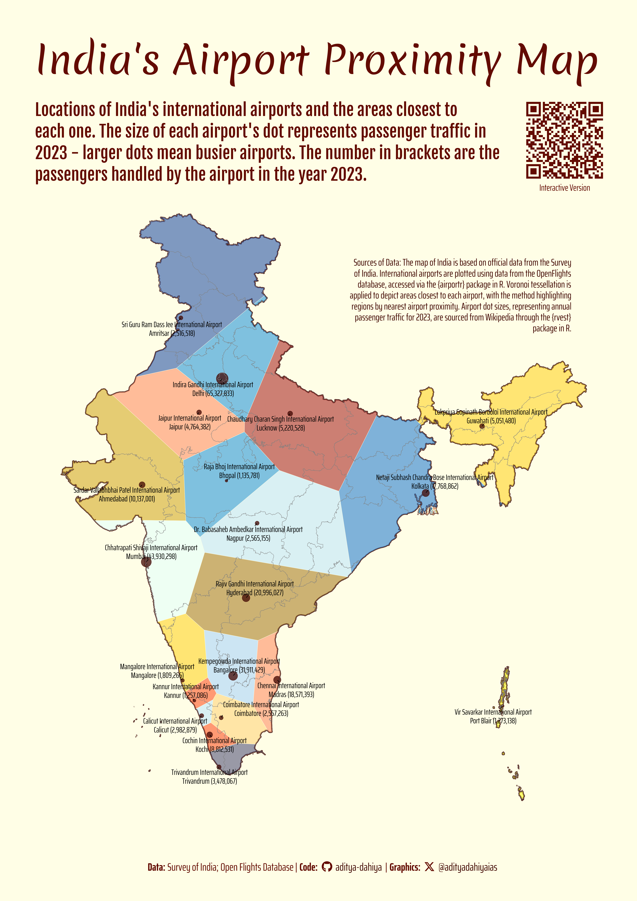

# Navigating India: Closest International Airports

The map of India illustrates the locations of international airports and the regions nearest to each, highlighted with distinct colors using Voronoi tessellation. The size of the dots represents the annual passenger traffic for each airport in 2023, with larger dots indicating busier airports. The geographical boundaries of India are sourced from the Survey of India. Airport locations are obtained from the OpenFlights database, accessed through the {airportr} package in R. Passenger traffic data is retrieved from Wikipedia using the {rvest} package in R. For more details, refer to [Survey of India](https://surveyofindia.gov.in), [OpenFlights](https://openflights.org/data.html), and [Wikipedia](https://en.wikipedia.org).



### An interactive version


::: {.cell}
::: {#fig-interact-airports .cell-output-display}

```{=html}
<div class="girafe html-widget html-fill-item" id="htmlwidget-1db363d34ad0c8903d0c" style="width:100%;height:975px;"></div>
<script type="application/json" data-for="htmlwidget-1db363d34ad0c8903d0c">{"x":{"html":"<?xml version=\"1.0\" encoding=\"UTF-8\"?>\n<svg xmlns='http://www.w3.org/2000/svg' xmlns:xlink='http://www.w3.org/1999/xlink' class='ggiraph-svg' role='graphics-document' id='svg_cf143e9e_18c5_4e97_b04e_c80416363550' viewBox='0 0 432 648'>\n <defs id='svg_cf143e9e_18c5_4e97_b04e_c80416363550_defs'>\n  <clipPath id='svg_cf143e9e_18c5_4e97_b04e_c80416363550_c1'>\n   <rect x='0' y='0' width='432' height='648'/>\n  <\/clipPath>\n  <clipPath id='svg_cf143e9e_18c5_4e97_b04e_c80416363550_c2'>\n   <rect x='0' y='47.86' width='432' height='552.29'/>\n  <\/clipPath>\n <\/defs>\n <g id='svg_cf143e9e_18c5_4e97_b04e_c80416363550_rootg' class='ggiraph-svg-rootg'>\n  <g clip-path='url(#svg_cf143e9e_18c5_4e97_b04e_c80416363550_c1)'>\n   <rect x='0' y='0' width='432' height='648' fill='#FFFFFF' fill-opacity='1' stroke='#FFFFFF' stroke-opacity='1' stroke-width='0.75' stroke-linejoin='round' stroke-linecap='round' class='ggiraph-svg-bg'/>\n   <path d='M 98.158790 503.026649 L 98.314713 503.125196 L 98.706626 502.979829 L 98.266776 502.934114 L 98.158790 503.026649 Z ' fill='#3E9ADE' fill-opacity='0.4' fill-rule='evenodd' stroke='#FFFEE6' stroke-opacity='1' stroke-width='0.43' stroke-linejoin='round' stroke-linecap='butt'/>\n   <path d='M 84.539858 506.811737 L 84.964239 506.510799 L 84.891802 506.302595 L 84.539858 506.811737 Z ' fill='#3E9ADE' fill-opacity='0.4' fill-rule='evenodd' stroke='#FFFEE6' stroke-opacity='1' stroke-width='0.43' stroke-linejoin='round' stroke-linecap='butt'/>\n   <path d='M 98.046535 513.010626 L 97.835002 513.442818 L 97.915731 513.640522 L 98.001412 513.426463 L 98.046535 513.010626 Z ' fill='#FFFF99' fill-opacity='0.4' fill-rule='evenodd' stroke='#FFFEE6' stroke-opacity='1' stroke-width='0.43' stroke-linejoin='round' stroke-linecap='butt'/>\n   <path d='M 90.269153 538.636839 L 89.776950 538.721063 L 89.813570 538.850881 L 90.178997 538.908591 L 90.417556 538.659942 L 90.598699 538.027417 L 90.269153 538.636839 Z ' fill='#996600' fill-opacity='0.4' fill-rule='evenodd' stroke='#FFFEE6' stroke-opacity='1' stroke-width='0.43' stroke-linejoin='round' stroke-linecap='butt'/>\n   <path d='M 360.977292 553.951673 L 360.605317 553.674834 L 360.254250 554.045347 L 359.630963 554.019052 L 359.469091 554.211050 L 359.512631 554.709951 L 359.243998 554.921048 L 359.279999 555.104610 L 359.499652 555.093745 L 359.270414 555.288550 L 359.535337 556.383748 L 359.388077 556.615238 L 359.870679 556.512402 L 359.921174 556.808110 L 360.184338 556.819230 L 360.326188 557.264675 L 360.457816 557.224263 L 360.412532 557.779007 L 360.537731 558.012052 L 360.712483 557.888198 L 360.747309 558.163490 L 360.969522 558.186091 L 360.870124 558.338732 L 361.089816 558.411783 L 360.800513 558.449526 L 360.814268 558.609560 L 361.220275 558.806619 L 362.410019 558.836349 L 362.414914 558.074267 L 362.684035 557.940111 L 362.758547 557.428853 L 363.101246 557.353513 L 362.692330 556.702391 L 362.870893 556.552638 L 363.133416 556.726210 L 362.896325 556.335024 L 362.719033 556.352641 L 362.541811 555.575619 L 362.316312 555.441073 L 362.174888 553.827805 L 361.731873 553.629143 L 361.752977 553.327757 L 361.212711 553.395064 L 361.168648 553.852375 L 361.005485 553.784279 L 360.977292 553.951673 Z ' fill='#FF3300' fill-opacity='0.4' fill-rule='evenodd' stroke='#FFFEE6' stroke-opacity='1' stroke-width='0.43' stroke-linejoin='round' stroke-linecap='butt'/>\n   <path d='M 359.841819 551.011922 L 360.009031 551.032472 L 360.051637 551.295096 L 359.776741 551.127610 L 359.386754 551.548567 L 359.345035 551.306774 L 358.924007 551.454484 L 359.061705 552.000221 L 358.768657 552.323776 L 359.125068 553.268458 L 359.625508 552.582100 L 360.131210 552.314205 L 360.523676 551.607887 L 360.523486 551.397496 L 360.074868 551.011576 L 359.960382 550.434171 L 359.841819 551.011922 Z ' fill='#FF3300' fill-opacity='0.4' fill-rule='evenodd' stroke='#FFFEE6' stroke-opacity='1' stroke-width='0.43' stroke-linejoin='round' stroke-linecap='butt'/>\n   <path d='M 359.937320 553.443007 L 360.055841 553.777634 L 360.024766 553.593515 L 359.937320 553.443007 Z ' fill='#FF3300' fill-opacity='0.4' fill-rule='evenodd' stroke='#FFFEE6' stroke-opacity='1' stroke-width='0.43' stroke-linejoin='round' stroke-linecap='butt'/>\n   <path d='M 358.668038 534.945699 L 358.914613 535.743184 L 358.778406 535.862174 L 358.814354 536.656978 L 358.871420 536.029679 L 359.070143 536.033122 L 358.754416 534.580025 L 358.668038 534.945699 Z ' fill='#FF3300' fill-opacity='0.4' fill-rule='evenodd' stroke='#FFFEE6' stroke-opacity='1' stroke-width='0.43' stroke-linejoin='round' stroke-linecap='butt'/>\n   <path d='M 358.041603 540.937752 L 358.138404 541.088676 L 358.152778 540.893800 L 358.278868 540.941148 L 358.263656 540.834508 L 358.041603 540.937752 Z ' fill='#FF3300' fill-opacity='0.4' fill-rule='evenodd' stroke='#FFFEE6' stroke-opacity='1' stroke-width='0.43' stroke-linejoin='round' stroke-linecap='butt'/>\n   <path d='M 358.135407 541.262668 L 358.384538 541.720184 L 358.215276 541.574536 L 358.183124 541.737208 L 358.439039 542.064111 L 358.288489 541.008594 L 358.135407 541.262668 Z ' fill='#FF3300' fill-opacity='0.4' fill-rule='evenodd' stroke='#FFFEE6' stroke-opacity='1' stroke-width='0.43' stroke-linejoin='round' stroke-linecap='butt'/>\n   <path d='M 357.917443 542.765850 L 357.632699 542.253034 L 357.630996 542.523054 L 357.509902 542.724979 L 357.306347 542.645797 L 357.327024 542.820474 L 358.228835 543.593728 L 358.294864 542.711588 L 358.048119 542.263065 L 357.827989 542.230447 L 357.917443 542.765850 Z ' fill='#FF3300' fill-opacity='0.4' fill-rule='evenodd' stroke='#FFFEE6' stroke-opacity='1' stroke-width='0.43' stroke-linejoin='round' stroke-linecap='butt'/>\n   <path d='M 357.122735 539.501257 L 357.085125 539.849879 L 356.628604 540.267477 L 356.654569 540.586640 L 356.874827 540.646787 L 356.788723 540.823313 L 356.677425 540.718687 L 356.781730 541.114137 L 357.086983 541.324114 L 357.027409 541.876909 L 357.379922 541.399898 L 357.676062 541.477911 L 357.569853 541.874764 L 357.365620 541.942642 L 357.368497 541.649339 L 357.262998 541.811777 L 357.358254 542.078059 L 357.035092 541.972218 L 357.229427 542.634318 L 357.315307 542.115256 L 357.533011 542.150188 L 357.614002 541.891174 L 357.865584 542.098645 L 357.859406 541.454809 L 357.190784 540.586770 L 357.393023 540.103757 L 357.595350 539.953445 L 357.431079 540.113676 L 357.668942 540.105706 L 357.815760 539.765640 L 357.790741 539.410214 L 357.503742 539.318874 L 357.122735 539.501257 Z ' fill='#FF3300' fill-opacity='0.4' fill-rule='evenodd' stroke='#FFFEE6' stroke-opacity='1' stroke-width='0.43' stroke-linejoin='round' stroke-linecap='butt'/>\n   <path d='M 357.616683 549.285517 L 357.731430 549.462876 L 357.746340 549.296161 L 357.616683 549.285517 Z ' fill='#FF3300' fill-opacity='0.4' fill-rule='evenodd' stroke='#FFFEE6' stroke-opacity='1' stroke-width='0.43' stroke-linejoin='round' stroke-linecap='butt'/>\n   <path d='M 354.974884 542.567782 L 354.749177 543.163248 L 354.867588 543.576020 L 355.169403 543.560550 L 355.071583 543.320999 L 355.385731 543.171973 L 355.432715 543.557899 L 355.154844 543.765679 L 355.279434 544.132364 L 355.622683 544.266967 L 356.244707 543.925092 L 356.707727 544.405521 L 356.879375 544.117266 L 356.724409 543.523112 L 356.305593 543.068548 L 356.061800 543.148757 L 355.930080 542.723295 L 356.043326 542.495301 L 355.667432 542.319878 L 354.974884 542.567782 Z ' fill='#FF3300' fill-opacity='0.4' fill-rule='evenodd' stroke='#FFFEE6' stroke-opacity='1' stroke-width='0.43' stroke-linejoin='round' stroke-linecap='butt'/>\n   <path d='M 353.566488 539.115586 L 353.804192 539.464129 L 353.959886 539.380973 L 353.810427 538.944289 L 353.566488 539.115586 Z ' fill='#FF3300' fill-opacity='0.4' fill-rule='evenodd' stroke='#FFFEE6' stroke-opacity='1' stroke-width='0.43' stroke-linejoin='round' stroke-linecap='butt'/>\n   <path d='M 351.930511 537.841094 L 351.818608 538.769154 L 352.278592 539.454587 L 353.304395 539.850436 L 353.337518 539.556836 L 352.337797 538.740556 L 352.551123 537.758451 L 352.341664 537.606574 L 351.930511 537.841094 Z ' fill='#FF3300' fill-opacity='0.4' fill-rule='evenodd' stroke='#FFFEE6' stroke-opacity='1' stroke-width='0.43' stroke-linejoin='round' stroke-linecap='butt'/>\n   <path d='M 352.135908 482.622646 L 351.886164 482.946078 L 351.802640 482.600210 L 351.624872 483.010826 L 351.863210 483.122356 L 352.151963 482.839780 L 351.982651 483.050267 L 352.103782 483.418706 L 352.174406 482.773508 L 352.135908 482.622646 Z ' fill='#FF3300' fill-opacity='0.4' fill-rule='evenodd' stroke='#FFFEE6' stroke-opacity='1' stroke-width='0.43' stroke-linejoin='round' stroke-linecap='butt'/>\n   <path d='M 351.281885 484.436035 L 351.447983 484.619564 L 351.686039 484.445106 L 351.741110 484.636373 L 351.553692 484.764859 L 351.783700 485.121589 L 351.991433 484.902918 L 351.871850 484.587151 L 352.044621 484.285806 L 351.829888 484.202378 L 351.968974 483.757210 L 351.671315 483.861354 L 351.931453 483.703298 L 351.690855 483.523458 L 351.754072 483.337808 L 351.281885 484.436035 Z ' fill='#FF3300' fill-opacity='0.4' fill-rule='evenodd' stroke='#FFFEE6' stroke-opacity='1' stroke-width='0.43' stroke-linejoin='round' stroke-linecap='butt'/>\n   <path d='M 347.155134 475.170583 L 347.281713 475.818720 L 347.493032 476.120726 L 347.478347 476.453773 L 347.255895 476.506293 L 347.313068 476.796238 L 347.788775 476.822724 L 347.978721 476.546138 L 347.957089 475.947355 L 348.161983 476.791442 L 348.031622 476.908365 L 348.189500 476.986694 L 347.943042 477.086168 L 347.925487 478.131021 L 347.918674 477.313991 L 347.703098 477.501631 L 347.918362 477.270419 L 347.851418 476.857461 L 347.323100 477.046046 L 347.189277 477.633348 L 347.127938 477.235229 L 346.928182 477.782820 L 346.685198 477.722858 L 346.990692 477.934620 L 347.060850 478.633261 L 346.805482 479.034339 L 347.001510 479.364654 L 346.885646 481.681514 L 347.148065 482.072846 L 347.603151 482.124590 L 347.743061 481.762311 L 347.728186 482.049679 L 347.814349 481.598948 L 347.921911 481.890207 L 348.237338 481.957164 L 348.135308 482.023741 L 347.818805 481.891053 L 347.768818 482.113795 L 348.039631 482.352511 L 347.720315 482.602578 L 347.539420 482.439149 L 347.431707 482.843474 L 347.564199 483.020896 L 347.786351 482.762088 L 347.874034 482.881635 L 347.762619 484.164739 L 347.645757 484.126599 L 347.388537 484.910939 L 347.492666 485.250432 L 347.685587 484.978184 L 347.575242 485.251471 L 347.722831 485.401489 L 348.227217 484.993848 L 347.991054 484.802084 L 348.395478 484.805030 L 348.235731 484.498414 L 348.428244 484.527266 L 348.499607 483.953026 L 348.777156 484.223425 L 348.922135 484.064741 L 348.946115 483.665863 L 348.726979 483.689875 L 348.779593 483.469332 L 348.543691 483.437730 L 348.631063 483.271980 L 348.560738 483.439764 L 349.300426 483.509356 L 349.227392 483.371145 L 349.377278 483.086300 L 349.697466 483.202752 L 349.505722 482.695607 L 349.290297 482.944807 L 349.111936 482.841184 L 349.224653 483.365962 L 348.953985 482.853789 L 349.101867 482.754355 L 349.009740 482.587217 L 349.177614 482.770919 L 349.392529 482.546742 L 349.272288 482.601829 L 349.118655 482.148506 L 349.029165 482.260316 L 349.143933 482.050182 L 348.840580 482.045346 L 348.902617 482.338585 L 348.814408 482.022719 L 348.620086 482.186661 L 348.441512 482.000506 L 348.611347 482.036559 L 348.960287 481.820325 L 348.961068 481.876032 L 349.507807 481.743411 L 349.160997 481.642967 L 349.332733 481.584477 L 349.157423 481.578996 L 349.239376 481.442678 L 349.493302 481.599200 L 349.289054 481.271272 L 348.783295 481.184847 L 348.975899 481.085201 L 348.753460 480.781730 L 348.502003 481.029344 L 348.743338 480.787394 L 348.637920 480.672619 L 348.689556 480.685524 L 348.702185 480.544645 L 348.405822 480.435546 L 348.189505 480.655485 L 348.406363 480.426922 L 348.643947 480.518577 L 348.396121 480.315669 L 348.587677 480.268223 L 348.033912 480.144009 L 348.110765 479.940055 L 348.146768 480.132604 L 348.456022 480.173673 L 348.407005 479.897577 L 348.481374 480.186403 L 348.664397 480.233857 L 348.670842 480.052213 L 348.797064 480.335672 L 348.975610 480.325862 L 348.978464 480.147653 L 349.168118 480.475008 L 349.305705 480.230474 L 348.903247 479.801784 L 348.913598 479.657825 L 349.188775 480.009401 L 349.247376 479.661212 L 349.208036 480.034536 L 349.426529 479.979017 L 349.303752 480.078173 L 349.646355 480.581446 L 349.800762 480.171207 L 349.624972 480.131288 L 349.669025 479.953329 L 350.002506 479.989264 L 350.258028 479.639153 L 349.788547 479.753247 L 349.593704 479.576207 L 349.734882 479.589628 L 349.781817 479.736254 L 349.932960 479.715717 L 349.861840 479.393452 L 349.981930 479.519559 L 350.106504 479.262909 L 350.286105 479.445928 L 350.403838 479.308814 L 350.153945 479.177561 L 350.473233 478.657481 L 350.216489 478.244075 L 350.250034 477.568609 L 350.202115 477.849839 L 350.046565 477.479278 L 350.243510 477.501402 L 350.246245 476.483529 L 350.359871 476.274897 L 350.544684 476.307651 L 350.135533 475.454857 L 349.850618 475.392184 L 350.190350 474.921231 L 350.114328 474.513184 L 349.929301 474.560652 L 349.984685 474.749844 L 349.782184 474.607178 L 350.027789 474.257531 L 349.847456 474.213594 L 349.826137 473.854255 L 349.585118 473.814723 L 349.798323 473.409553 L 349.524648 473.474485 L 349.465730 473.248319 L 349.453686 473.655718 L 349.156439 473.801738 L 349.185381 473.544670 L 348.820884 473.451939 L 348.968754 473.378506 L 348.757936 472.829976 L 348.829831 472.950074 L 348.875973 472.762787 L 348.904249 473.063616 L 349.118242 473.136329 L 349.305238 472.323864 L 349.320172 472.471352 L 349.450877 472.277890 L 349.636208 472.961606 L 349.990522 472.573830 L 349.432465 472.061454 L 349.589202 472.156962 L 349.446454 471.963239 L 349.671095 471.447196 L 349.367201 471.539016 L 349.666031 471.277062 L 349.485265 470.901526 L 349.318726 470.917728 L 349.329746 470.866016 L 349.339927 470.904899 L 349.490232 470.869828 L 349.794672 471.416917 L 349.882725 471.196143 L 349.955622 471.343265 L 350.093526 470.495364 L 349.995166 471.235443 L 350.120515 471.264052 L 350.140765 471.492426 L 349.940856 471.564002 L 350.284863 471.997520 L 350.484585 472.014024 L 350.345609 471.676319 L 350.844836 471.811835 L 351.191090 471.274550 L 351.043637 471.194227 L 351.251418 471.066547 L 351.219253 469.709720 L 351.657865 468.383015 L 351.381828 468.636849 L 351.405630 468.248420 L 351.284266 468.513670 L 351.186405 468.258241 L 350.957861 468.319955 L 351.078111 468.026629 L 350.910927 468.107157 L 350.846045 467.938601 L 350.823556 467.945636 L 350.878279 467.901989 L 350.915200 467.699457 L 350.783825 467.958064 L 350.636103 468.004271 L 350.688799 468.130668 L 350.471720 468.247673 L 350.774473 467.782923 L 350.348904 467.592472 L 350.291845 467.633804 L 350.098982 467.273509 L 350.224781 467.369409 L 350.313818 467.216908 L 350.157867 467.124564 L 350.458083 467.154670 L 350.614236 467.598751 L 350.850650 467.229043 L 351.228146 467.358058 L 351.315948 467.209422 L 351.320923 467.672162 L 351.588092 467.571451 L 351.650942 467.935090 L 351.973087 467.486081 L 351.534788 466.883683 L 351.287585 466.978979 L 351.462240 467.071643 L 351.315009 467.122101 L 351.315687 467.185158 L 351.131367 467.182637 L 351.334815 467.026248 L 350.997550 466.997499 L 350.800621 466.643939 L 351.139060 466.962494 L 351.696881 466.626014 L 351.709154 466.488926 L 351.567346 466.634132 L 351.604590 466.290645 L 351.396530 466.540188 L 351.313554 466.196614 L 350.917197 466.117936 L 350.914336 466.328212 L 350.805052 466.077773 L 350.668495 466.198910 L 350.704716 466.046564 L 351.252900 466.085264 L 351.222875 465.780175 L 350.879669 465.694415 L 351.226215 465.673510 L 351.332080 465.290727 L 351.208671 464.224137 L 351.164196 464.068620 L 351.016686 464.179742 L 350.984531 464.625306 L 350.652214 464.140831 L 350.612406 464.792266 L 350.373390 464.558637 L 349.704478 464.707792 L 349.861660 465.349903 L 349.739740 465.163647 L 349.431263 465.553264 L 349.126107 465.566873 L 349.151201 465.923691 L 349.337281 466.206682 L 349.113316 466.244661 L 349.269932 466.552918 L 349.401071 466.558821 L 349.371673 466.625313 L 349.326683 466.607575 L 349.248826 466.740851 L 349.181498 466.552869 L 349.170383 466.548437 L 349.180067 466.548873 L 349.130136 466.409472 L 349.080256 466.573174 L 348.836726 466.422771 L 348.750619 466.543005 L 348.743906 466.704102 L 349.109534 466.713995 L 348.882329 467.162513 L 348.702573 466.946616 L 348.497006 467.837185 L 348.746543 467.976156 L 348.483401 468.281398 L 348.876344 468.542502 L 348.859188 468.891954 L 348.608441 468.797783 L 348.436523 469.621434 L 348.844377 469.948061 L 348.562939 469.768600 L 348.517124 469.837890 L 348.391328 469.764837 L 348.315501 470.058075 L 348.766365 470.216743 L 348.706813 470.318518 L 348.818002 470.552938 L 348.500285 470.327573 L 348.326294 470.429920 L 348.584342 470.684542 L 348.469699 470.933124 L 348.290129 470.816770 L 348.386936 471.198546 L 348.106652 470.941377 L 348.190744 471.606744 L 348.043427 471.942609 L 348.387569 472.113071 L 348.367652 471.910219 L 348.468349 472.046810 L 348.686009 471.893041 L 348.587679 472.197805 L 348.291700 472.232359 L 348.401963 472.402698 L 348.350215 472.614839 L 348.191669 472.332917 L 348.067865 472.756414 L 348.213532 472.893139 L 348.213177 473.626128 L 348.325419 473.500175 L 348.258670 473.623831 L 348.573287 473.642768 L 348.575280 473.756609 L 348.490016 473.684136 L 348.071286 473.775445 L 348.095337 474.126081 L 348.260824 474.176838 L 348.104188 474.140271 L 348.118386 474.171077 L 348.060599 474.339973 L 347.959808 474.192101 L 347.960021 474.424294 L 347.938512 474.201079 L 347.797928 474.144033 L 347.775935 474.304977 L 347.960223 474.642893 L 347.960459 474.898986 L 348.054478 474.630734 L 348.035979 474.820758 L 348.203894 474.857321 L 348.097298 475.126016 L 348.061008 474.827881 L 347.952169 474.925078 L 348.107524 475.392720 L 347.978944 475.551203 L 347.844353 474.435351 L 347.706300 474.477073 L 347.716729 474.538826 L 347.625376 474.369871 L 347.449997 474.743015 L 347.404829 474.512687 L 347.386712 474.972178 L 347.292638 474.523518 L 347.184749 474.669022 L 347.158224 475.069646 L 347.250500 475.104250 L 347.155134 475.170583 Z M 347.403711 475.161706 L 347.386644 475.327428 L 347.321865 475.131013 L 347.403711 475.161706 Z M 348.956974 481.583879 L 348.959838 481.788253 L 348.616805 481.573810 L 348.908637 481.696300 L 348.959320 481.544388 L 349.081484 481.619939 L 348.956974 481.583879 Z M 348.705212 479.590860 L 348.653820 479.446909 L 348.665491 479.447004 L 348.646047 479.425135 L 348.644401 479.420526 L 348.642154 479.420757 L 348.494244 479.254404 L 348.666825 479.240903 L 348.860905 479.756686 L 348.705212 479.590860 Z M 348.534963 479.652510 L 348.637092 479.518412 L 348.651725 479.540754 L 348.534963 479.652510 Z M 348.821783 473.966142 L 348.790658 473.939684 L 348.953698 473.901336 L 348.821783 473.966142 Z M 348.619538 473.794229 L 348.733686 473.731668 L 348.740067 473.896680 L 348.619538 473.794229 Z M 347.755131 474.766226 L 347.588611 474.765262 L 347.723652 474.579824 L 347.755131 474.766226 Z M 348.840077 469.281270 L 348.830756 469.279544 L 348.844100 469.199305 L 348.840077 469.281270 Z M 349.012511 469.307710 L 349.025591 469.614442 L 349.001602 469.311178 L 348.862675 469.285454 L 349.012511 469.307710 Z M 349.849272 466.653968 L 349.819730 466.801966 L 349.753414 466.775819 L 349.849272 466.653968 Z M 349.917848 465.579468 L 349.781332 465.577960 L 349.891809 465.473083 L 349.917848 465.579468 Z M 349.149145 471.604902 L 349.114224 471.462501 L 349.130133 471.435783 L 348.985783 471.293848 L 348.771735 471.504815 L 348.958548 471.092614 L 349.305659 471.557611 L 349.149145 471.604902 Z M 349.157279 470.760524 L 349.291274 470.719093 L 349.293253 470.726649 L 349.157279 470.760524 Z M 349.352003 479.763974 L 349.487936 479.929426 L 349.449024 479.960851 L 349.352003 479.763974 Z M 347.917893 479.819272 L 347.832853 479.665486 L 348.064261 479.691362 L 348.081663 479.784423 L 347.917893 479.819272 Z M 348.457443 480.819969 L 348.483369 480.633994 L 348.614270 480.666709 L 348.457443 480.819969 Z ' fill='#FF3300' fill-opacity='0.4' fill-rule='evenodd' stroke='#FFFEE6' stroke-opacity='1' stroke-width='0.43' stroke-linejoin='round' stroke-linecap='butt'/>\n   <path d='M 351.005504 488.689773 L 351.437411 488.931669 L 351.734733 488.612668 L 351.040015 488.491022 L 351.005504 488.689773 Z ' fill='#FF3300' fill-opacity='0.4' fill-rule='evenodd' stroke='#FFFEE6' stroke-opacity='1' stroke-width='0.43' stroke-linejoin='round' stroke-linecap='butt'/>\n   <path d='M 351.369552 463.235931 L 351.412662 463.469029 L 351.677253 463.036768 L 351.369552 463.235931 Z ' fill='#FF3300' fill-opacity='0.4' fill-rule='evenodd' stroke='#FFFEE6' stroke-opacity='1' stroke-width='0.43' stroke-linejoin='round' stroke-linecap='butt'/>\n   <path d='M 350.340497 485.583642 L 350.146880 486.106187 L 349.838300 486.363052 L 350.287781 486.568711 L 350.459810 487.020698 L 350.741493 486.976959 L 351.126458 487.850172 L 351.385658 487.926007 L 351.502838 487.659512 L 350.915955 486.021761 L 350.735859 485.755719 L 350.377400 485.720370 L 350.340497 485.583642 Z ' fill='#FF3300' fill-opacity='0.4' fill-rule='evenodd' stroke='#FFFEE6' stroke-opacity='1' stroke-width='0.43' stroke-linejoin='round' stroke-linecap='butt'/>\n   <path d='M 351.155985 483.953587 L 350.863763 484.331283 L 350.893374 485.180211 L 351.389636 485.654001 L 351.469214 485.178748 L 351.110632 484.911448 L 351.244000 484.877987 L 351.163605 484.266055 L 351.155985 483.953587 Z ' fill='#FF3300' fill-opacity='0.4' fill-rule='evenodd' stroke='#FFFEE6' stroke-opacity='1' stroke-width='0.43' stroke-linejoin='round' stroke-linecap='butt'/>\n   <path d='M 351.246545 535.980521 L 351.160988 536.278709 L 351.442748 536.410272 L 351.246545 535.980521 Z ' fill='#FF3300' fill-opacity='0.4' fill-rule='evenodd' stroke='#FFFEE6' stroke-opacity='1' stroke-width='0.43' stroke-linejoin='round' stroke-linecap='butt'/>\n   <path d='M 350.911493 462.814775 L 351.053786 462.797713 L 350.966860 462.966846 L 350.749541 462.856827 L 350.502930 463.012424 L 350.628273 463.171378 L 350.973971 463.079040 L 351.178242 463.367998 L 351.081306 462.771544 L 350.911493 462.814775 Z ' fill='#FF3300' fill-opacity='0.4' fill-rule='evenodd' stroke='#FFFEE6' stroke-opacity='1' stroke-width='0.43' stroke-linejoin='round' stroke-linecap='butt'/>\n   <path d='M 350.613162 472.301951 L 350.445673 472.691160 L 350.290196 472.375332 L 350.175480 472.491483 L 350.530404 473.161405 L 350.637481 472.830617 L 350.416339 472.749398 L 350.883747 472.262067 L 350.613162 472.301951 Z ' fill='#FF3300' fill-opacity='0.4' fill-rule='evenodd' stroke='#FFFEE6' stroke-opacity='1' stroke-width='0.43' stroke-linejoin='round' stroke-linecap='butt'/>\n   <path d='M 350.266392 484.741691 L 350.216393 485.172375 L 350.754115 485.710792 L 350.876938 485.618936 L 350.805134 484.803889 L 350.537631 484.773006 L 350.851442 484.720788 L 350.648482 484.046246 L 350.189211 484.227526 L 350.253590 484.625022 L 350.508148 484.769602 L 350.266392 484.741691 Z ' fill='#FF3300' fill-opacity='0.4' fill-rule='evenodd' stroke='#FFFEE6' stroke-opacity='1' stroke-width='0.43' stroke-linejoin='round' stroke-linecap='butt'/>\n   <path d='M 349.831410 480.608686 L 349.739193 481.030407 L 349.900186 481.250747 L 350.220008 480.182984 L 349.831410 480.608686 Z ' fill='#FF3300' fill-opacity='0.4' fill-rule='evenodd' stroke='#FFFEE6' stroke-opacity='1' stroke-width='0.43' stroke-linejoin='round' stroke-linecap='butt'/>\n   <path d='M 349.725155 472.111085 L 350.059512 472.258679 L 350.017074 471.865824 L 349.881710 471.882537 L 349.725155 472.111085 Z ' fill='#FF3300' fill-opacity='0.4' fill-rule='evenodd' stroke='#FFFEE6' stroke-opacity='1' stroke-width='0.43' stroke-linejoin='round' stroke-linecap='butt'/>\n   <path d='M 349.866346 482.382670 L 349.518592 482.239760 L 349.513252 482.472790 L 349.766112 482.508698 L 349.793534 483.071594 L 350.046839 482.406327 L 349.958086 482.037619 L 349.866346 482.382670 Z ' fill='#FF3300' fill-opacity='0.4' fill-rule='evenodd' stroke='#FFFEE6' stroke-opacity='1' stroke-width='0.43' stroke-linejoin='round' stroke-linecap='butt'/>\n   <path d='M 349.823516 483.269797 L 349.928933 483.537712 L 349.966408 483.144574 L 349.823516 483.269797 Z ' fill='#FF3300' fill-opacity='0.4' fill-rule='evenodd' stroke='#FFFEE6' stroke-opacity='1' stroke-width='0.43' stroke-linejoin='round' stroke-linecap='butt'/>\n   <path d='M 349.258239 480.688962 L 348.866872 480.545871 L 348.774098 480.732375 L 349.296992 480.998582 L 349.344055 480.553185 L 349.258239 480.688962 Z ' fill='#FF3300' fill-opacity='0.4' fill-rule='evenodd' stroke='#FFFEE6' stroke-opacity='1' stroke-width='0.43' stroke-linejoin='round' stroke-linecap='butt'/>\n   <path d='M 349.038753 473.375754 L 349.137602 473.223781 L 349.046679 473.189431 L 349.038753 473.375754 Z ' fill='#FF3300' fill-opacity='0.4' fill-rule='evenodd' stroke='#FFFEE6' stroke-opacity='1' stroke-width='0.43' stroke-linejoin='round' stroke-linecap='butt'/>\n   <path d='M 348.525213 466.035652 L 348.487324 466.286025 L 348.760895 466.080510 L 348.525213 466.035652 Z ' fill='#FF3300' fill-opacity='0.4' fill-rule='evenodd' stroke='#FFFEE6' stroke-opacity='1' stroke-width='0.43' stroke-linejoin='round' stroke-linecap='butt'/>\n   <path d='M 347.848632 524.903308 L 347.726495 525.500981 L 347.162323 525.469139 L 347.105496 526.355840 L 347.263918 526.762750 L 348.117451 526.829631 L 348.547678 526.573809 L 348.443580 525.623134 L 348.104677 525.185238 L 347.848632 524.903308 Z ' fill='#FF3300' fill-opacity='0.4' fill-rule='evenodd' stroke='#FFFEE6' stroke-opacity='1' stroke-width='0.43' stroke-linejoin='round' stroke-linecap='butt'/>\n   <path d='M 347.855455 473.466472 L 348.091548 473.737195 L 348.085861 473.410038 L 347.855455 473.466472 Z ' fill='#FF3300' fill-opacity='0.4' fill-rule='evenodd' stroke='#FFFEE6' stroke-opacity='1' stroke-width='0.43' stroke-linejoin='round' stroke-linecap='butt'/>\n   <path d='M 346.648408 483.598115 L 346.554123 483.231939 L 346.310527 483.762456 L 346.376977 483.272007 L 345.876054 484.870900 L 345.955917 485.692963 L 345.682270 487.366270 L 345.818546 487.051423 L 345.771895 488.680247 L 345.600326 488.429008 L 345.583855 487.754513 L 345.379647 488.271169 L 345.346491 487.773068 L 345.202909 487.839742 L 345.327988 487.501071 L 345.156198 487.473096 L 345.302238 487.325004 L 345.088475 487.048275 L 344.471974 488.435598 L 344.590464 488.738807 L 344.694881 488.538061 L 344.844281 488.612616 L 344.757206 488.266229 L 344.965981 488.420849 L 345.074141 490.599727 L 345.255725 490.046378 L 345.490480 490.026238 L 345.468092 490.958429 L 345.687008 491.450884 L 345.990841 491.518353 L 346.005591 491.067554 L 346.046654 491.369287 L 346.210697 491.291418 L 346.096662 491.759886 L 345.695673 491.639301 L 345.805966 492.460073 L 346.021853 492.073552 L 346.292224 492.631622 L 346.192701 493.034648 L 346.447871 493.275093 L 346.888893 493.202213 L 347.029608 493.648799 L 347.620689 491.023364 L 347.135437 490.778502 L 347.098445 491.016804 L 347.276482 491.131548 L 346.972246 491.340930 L 346.816360 491.188783 L 346.922709 491.697690 L 346.543983 491.838454 L 346.736973 491.637321 L 346.548540 491.590647 L 346.389928 491.176469 L 346.637591 491.061904 L 346.667083 491.219652 L 346.976276 490.951621 L 346.972939 490.511844 L 347.462602 490.654829 L 347.478899 490.326384 L 347.604540 490.505709 L 348.087183 487.906794 L 347.892873 487.740565 L 348.031658 487.685916 L 347.982279 487.200033 L 347.654264 487.194200 L 347.745008 487.395329 L 347.489420 487.254272 L 347.321351 487.654148 L 347.449133 487.765791 L 347.284685 487.751908 L 347.289646 487.972413 L 347.442402 487.967640 L 347.044569 488.826304 L 347.198964 488.279962 L 347.116458 488.148101 L 346.926180 488.408010 L 346.869643 488.190736 L 347.154263 488.022076 L 346.797033 487.693439 L 346.937922 487.473930 L 347.065278 487.667547 L 346.868417 487.270721 L 347.092839 487.108980 L 346.992697 486.664760 L 347.301224 486.730500 L 347.070139 486.385594 L 347.174696 486.218094 L 347.397448 486.336771 L 347.347278 486.623259 L 347.596548 486.544792 L 347.445271 486.365459 L 347.790143 486.337131 L 347.766416 486.138321 L 347.568413 486.264237 L 347.537663 486.029263 L 347.289990 486.091452 L 347.247495 485.670008 L 347.685822 486.023916 L 347.909715 485.957826 L 347.971576 485.619772 L 347.511225 485.521303 L 347.634092 485.382559 L 347.341052 485.125026 L 347.632181 483.806715 L 347.147308 483.768006 L 346.943012 484.359403 L 347.045663 483.872287 L 346.897831 484.123070 L 346.907802 483.666156 L 347.049222 483.627441 L 346.845575 482.934208 L 346.648408 483.598115 Z ' fill='#FF3300' fill-opacity='0.4' fill-rule='evenodd' stroke='#FFFEE6' stroke-opacity='1' stroke-width='0.43' stroke-linejoin='round' stroke-linecap='butt'/>\n   <path d='M 347.694398 482.160146 L 347.576275 482.385963 L 347.761937 482.463471 L 347.694398 482.160146 Z ' fill='#FF3300' fill-opacity='0.4' fill-rule='evenodd' stroke='#FFFEE6' stroke-opacity='1' stroke-width='0.43' stroke-linejoin='round' stroke-linecap='butt'/>\n   <path d='M 347.166899 483.014444 L 347.187864 483.646776 L 347.266721 483.515059 L 347.320489 483.700292 L 347.672846 483.587051 L 347.718336 483.723173 L 347.691730 483.079967 L 347.580979 483.234423 L 347.402657 482.972853 L 347.447732 483.415404 L 347.406362 483.158319 L 347.280196 483.279319 L 347.349368 482.924904 L 347.166899 483.014444 Z ' fill='#FF3300' fill-opacity='0.4' fill-rule='evenodd' stroke='#FFFEE6' stroke-opacity='1' stroke-width='0.43' stroke-linejoin='round' stroke-linecap='butt'/>\n   <path d='M 347.357388 486.974069 L 347.671523 487.013218 L 347.700877 486.778634 L 347.357388 486.974069 Z ' fill='#FF3300' fill-opacity='0.4' fill-rule='evenodd' stroke='#FFFEE6' stroke-opacity='1' stroke-width='0.43' stroke-linejoin='round' stroke-linecap='butt'/>\n   <path d='M 347.601947 473.421430 L 347.576220 473.771315 L 347.630757 473.597886 L 347.601947 473.421430 Z ' fill='#FF3300' fill-opacity='0.4' fill-rule='evenodd' stroke='#FFFEE6' stroke-opacity='1' stroke-width='0.43' stroke-linejoin='round' stroke-linecap='butt'/>\n   <path d='M 346.811666 475.067180 L 347.110643 476.172103 L 347.119854 475.648659 L 347.218268 475.761272 L 346.992000 474.610806 L 346.811666 475.067180 Z ' fill='#FF3300' fill-opacity='0.4' fill-rule='evenodd' stroke='#FFFEE6' stroke-opacity='1' stroke-width='0.43' stroke-linejoin='round' stroke-linecap='butt'/>\n   <path d='M 347.110230 475.200203 L 347.207338 475.567970 L 347.166225 475.332234 L 347.110230 475.200203 Z ' fill='#FF3300' fill-opacity='0.4' fill-rule='evenodd' stroke='#FFFEE6' stroke-opacity='1' stroke-width='0.43' stroke-linejoin='round' stroke-linecap='butt'/>\n   <path d='M 346.880226 482.435042 L 347.024009 483.064800 L 347.196838 482.200351 L 347.023037 482.111563 L 346.880226 482.435042 Z ' fill='#FF3300' fill-opacity='0.4' fill-rule='evenodd' stroke='#FFFEE6' stroke-opacity='1' stroke-width='0.43' stroke-linejoin='round' stroke-linecap='butt'/>\n   <path d='M 347.172766 495.684120 L 346.836419 496.018447 L 346.996066 496.163555 L 347.196035 495.894753 L 347.172766 495.684120 Z ' fill='#FF3300' fill-opacity='0.4' fill-rule='evenodd' stroke='#FFFEE6' stroke-opacity='1' stroke-width='0.43' stroke-linejoin='round' stroke-linecap='butt'/>\n   <path d='M 346.507852 472.698056 L 346.619754 473.031745 L 346.203161 474.164377 L 346.467778 475.273117 L 346.737925 474.794920 L 346.516344 474.504151 L 346.894485 474.461783 L 347.139245 473.971757 L 346.916523 473.940609 L 347.163778 473.772327 L 347.174279 472.998318 L 347.021816 472.977684 L 347.145555 472.485878 L 346.826345 472.339553 L 346.507852 472.698056 Z ' fill='#FF3300' fill-opacity='0.4' fill-rule='evenodd' stroke='#FFFEE6' stroke-opacity='1' stroke-width='0.43' stroke-linejoin='round' stroke-linecap='butt'/>\n   <path d='M 346.834381 470.864087 L 346.894972 471.217419 L 347.140831 470.831705 L 346.834381 470.864087 Z ' fill='#FF3300' fill-opacity='0.4' fill-rule='evenodd' stroke='#FFFEE6' stroke-opacity='1' stroke-width='0.43' stroke-linejoin='round' stroke-linecap='butt'/>\n   <path d='M 346.955312 496.301147 L 346.793768 496.427490 L 346.784317 496.953955 L 346.955312 496.301147 Z ' fill='#FF3300' fill-opacity='0.4' fill-rule='evenodd' stroke='#FFFEE6' stroke-opacity='1' stroke-width='0.43' stroke-linejoin='round' stroke-linecap='butt'/>\n   <path d='M 345.721872 493.925768 L 345.952632 494.259808 L 345.881347 494.674819 L 345.412193 494.737806 L 345.480214 495.044091 L 345.333437 495.188093 L 345.568643 495.499068 L 346.423612 495.399026 L 346.770861 495.099673 L 346.730691 494.878536 L 346.188083 494.656407 L 346.694069 494.239270 L 346.476418 493.492657 L 346.054727 493.168078 L 345.721872 493.925768 Z ' fill='#FF3300' fill-opacity='0.4' fill-rule='evenodd' stroke='#FFFEE6' stroke-opacity='1' stroke-width='0.43' stroke-linejoin='round' stroke-linecap='butt'/>\n   <path d='M 345.601150 492.132030 L 345.585492 492.389699 L 345.769430 492.453573 L 345.764497 492.168021 L 345.601150 492.132030 Z ' fill='#FF3300' fill-opacity='0.4' fill-rule='evenodd' stroke='#FFFEE6' stroke-opacity='1' stroke-width='0.43' stroke-linejoin='round' stroke-linecap='butt'/>\n   <path d='M 345.638177 492.634965 L 345.710617 492.897995 L 345.734927 492.766399 L 345.638177 492.634965 Z ' fill='#FF3300' fill-opacity='0.4' fill-rule='evenodd' stroke='#FFFEE6' stroke-opacity='1' stroke-width='0.43' stroke-linejoin='round' stroke-linecap='butt'/>\n   <path d='M 345.560751 487.311255 L 345.693776 487.097138 L 345.530902 486.633632 L 345.560751 487.311255 Z ' fill='#FF3300' fill-opacity='0.4' fill-rule='evenodd' stroke='#FFFEE6' stroke-opacity='1' stroke-width='0.43' stroke-linejoin='round' stroke-linecap='butt'/>\n   <path d='M 343.735545 502.319910 L 343.810482 502.658079 L 343.336098 502.862283 L 343.095818 503.402345 L 342.694541 503.444718 L 342.760145 505.013772 L 342.939004 505.058961 L 343.246660 505.795380 L 342.828296 506.958552 L 343.412795 506.708260 L 344.455367 507.226899 L 344.690321 507.136491 L 345.179604 506.319616 L 344.826885 506.089780 L 344.797998 505.861843 L 344.966229 505.446517 L 345.357551 505.194497 L 345.313628 504.869105 L 345.551660 504.871620 L 345.414534 503.371560 L 345.058851 502.981480 L 345.054051 502.312526 L 344.554162 501.821796 L 343.735545 502.319910 Z ' fill='#FF3300' fill-opacity='0.4' fill-rule='evenodd' stroke='#FFFEE6' stroke-opacity='1' stroke-width='0.43' stroke-linejoin='round' stroke-linecap='butt'/>\n   <path d='M 345.370508 492.654159 L 345.517412 492.873779 L 345.496609 492.633480 L 345.370508 492.654159 Z ' fill='#FF3300' fill-opacity='0.4' fill-rule='evenodd' stroke='#FFFEE6' stroke-opacity='1' stroke-width='0.43' stroke-linejoin='round' stroke-linecap='butt'/>\n   <path d='M 344.661650 492.565445 L 345.124994 492.303989 L 345.173569 492.077573 L 344.926352 492.103867 L 344.828032 491.896617 L 344.661650 492.565445 Z ' fill='#FF3300' fill-opacity='0.4' fill-rule='evenodd' stroke='#FFFEE6' stroke-opacity='1' stroke-width='0.43' stroke-linejoin='round' stroke-linecap='butt'/>\n   <path d='M 340.416096 492.114281 L 340.515722 492.917397 L 341.253348 493.015494 L 341.254412 492.134112 L 340.593538 492.015855 L 340.416096 492.114281 Z ' fill='#FF3300' fill-opacity='0.4' fill-rule='evenodd' stroke='#FFFEE6' stroke-opacity='1' stroke-width='0.43' stroke-linejoin='round' stroke-linecap='butt'/>\n   <path d='M 168.803452 525.579280 L 168.644991 525.755572 L 169.092510 525.784962 L 168.910560 525.696491 L 168.803452 525.579280 Z ' fill='#FFFF00' fill-opacity='0.4' fill-rule='evenodd' stroke='#FFFEE6' stroke-opacity='1' stroke-width='0.43' stroke-linejoin='round' stroke-linecap='butt'/>\n   <path d='M 269.826964 367.409010 L 269.663216 368.249126 L 269.934023 367.268204 L 269.744005 366.703750 L 269.826964 367.409010 Z ' fill='#99CCFF' fill-opacity='0.4' fill-rule='evenodd' stroke='#FFFEE6' stroke-opacity='1' stroke-width='0.43' stroke-linejoin='round' stroke-linecap='butt'/>\n   <path d='M 61.994035 363.394755 L 61.796263 363.620038 L 62.275691 363.804028 L 62.525015 363.607682 L 63.158588 363.720255 L 63.423915 363.565108 L 62.721371 363.513553 L 62.508332 363.312979 L 61.994035 363.394755 Z ' fill='#3E9ADE' fill-opacity='0.4' fill-rule='evenodd' stroke='#FFFEE6' stroke-opacity='1' stroke-width='0.43' stroke-linejoin='round' stroke-linecap='butt'/>\n   <path d='M 63.226752 363.393178 L 63.604440 363.286466 L 63.491882 363.239588 L 63.226752 363.393178 Z ' fill='#0083D7' fill-opacity='0.4' fill-rule='evenodd' stroke='#FFFEE6' stroke-opacity='1' stroke-width='0.43' stroke-linejoin='round' stroke-linecap='butt'/>\n   <path d='M 287.750366 351.834701 L 288.064546 351.954760 L 287.620019 351.163465 L 287.750366 351.834701 Z ' fill='#FFCC66' fill-opacity='0.4' fill-rule='evenodd' stroke='#FFFEE6' stroke-opacity='1' stroke-width='0.43' stroke-linejoin='round' stroke-linecap='butt'/>\n   <path d='M 288.875462 351.902926 L 289.352107 351.876419 L 289.775111 351.550207 L 289.300482 351.211173 L 288.875462 351.902926 Z ' fill='#FFFF00' fill-opacity='0.4' fill-rule='evenodd' stroke='#FFFEE6' stroke-opacity='1' stroke-width='0.43' stroke-linejoin='round' stroke-linecap='butt'/>\n   <path d='M 291.787828 351.853307 L 292.418141 352.158444 L 292.575475 352.024035 L 292.430512 351.404552 L 291.965304 351.155094 L 291.787828 351.853307 Z ' fill='#FFFF99' fill-opacity='0.4' fill-rule='evenodd' stroke='#FFFEE6' stroke-opacity='1' stroke-width='0.43' stroke-linejoin='round' stroke-linecap='butt'/>\n   <path d='M 296.321635 351.854008 L 296.870870 352.072755 L 297.281303 351.847048 L 297.089921 351.398587 L 296.380509 351.051417 L 296.321635 351.854008 Z ' fill='#0066CC' fill-opacity='0.4' fill-rule='evenodd' stroke='#FFFEE6' stroke-opacity='1' stroke-width='0.43' stroke-linejoin='round' stroke-linecap='butt'/>\n   <path d='M 292.128300 351.136183 L 292.513528 351.304895 L 292.752753 351.694816 L 293.097580 351.087755 L 292.308312 350.411851 L 292.128300 351.136183 Z ' fill='#DEFFFF' fill-opacity='0.4' fill-rule='evenodd' stroke='#FFFEE6' stroke-opacity='1' stroke-width='0.43' stroke-linejoin='round' stroke-linecap='butt'/>\n   <path d='M 294.820189 350.636918 L 294.688946 351.386040 L 294.933613 351.650240 L 295.205882 351.617023 L 295.222430 351.386410 L 295.353102 351.706642 L 295.882347 351.288498 L 295.494357 350.383327 L 294.820189 350.636918 Z ' fill='#99CCFF' fill-opacity='0.4' fill-rule='evenodd' stroke='#FFFEE6' stroke-opacity='1' stroke-width='0.43' stroke-linejoin='round' stroke-linecap='butt'/>\n   <path d='M 289.476273 350.877479 L 289.720357 351.139318 L 290.045422 350.766610 L 290.115228 350.347890 L 289.720208 349.931394 L 289.476273 350.877479 Z ' fill='#0083D7' fill-opacity='0.4' fill-rule='evenodd' stroke='#FFFEE6' stroke-opacity='1' stroke-width='0.43' stroke-linejoin='round' stroke-linecap='butt'/>\n   <path d='M 291.229242 350.815388 L 290.967901 351.088856 L 291.260232 351.207968 L 291.544250 350.416736 L 291.138846 350.325349 L 290.971283 349.916537 L 291.229242 350.815388 Z ' fill='#FFCC00' fill-opacity='0.4' fill-rule='evenodd' stroke='#FFFEE6' stroke-opacity='1' stroke-width='0.43' stroke-linejoin='round' stroke-linecap='butt'/>\n   <path d='M 292.708846 350.579316 L 293.339169 350.966984 L 292.955952 349.907733 L 292.708846 350.579316 Z ' fill='#FF794B' fill-opacity='0.4' fill-rule='evenodd' stroke='#FFFEE6' stroke-opacity='1' stroke-width='0.43' stroke-linejoin='round' stroke-linecap='butt'/>\n   <path d='M 297.745181 350.598614 L 298.383423 350.892930 L 298.395024 350.576613 L 298.078415 350.441349 L 297.910050 350.064541 L 297.745181 350.598614 Z ' fill='#FFFF00' fill-opacity='0.4' fill-rule='evenodd' stroke='#FFFEE6' stroke-opacity='1' stroke-width='0.43' stroke-linejoin='round' stroke-linecap='butt'/>\n   <path d='M 291.280430 349.576734 L 290.953361 349.840740 L 291.350868 350.462280 L 291.548851 350.397930 L 291.585113 349.968572 L 291.209773 349.788309 L 291.601662 349.949321 L 291.615392 350.175735 L 291.720532 350.002233 L 291.533702 349.699690 L 291.280430 349.576734 Z ' fill='#FFFF99' fill-opacity='0.4' fill-rule='evenodd' stroke='#FFFEE6' stroke-opacity='1' stroke-width='0.43' stroke-linejoin='round' stroke-linecap='butt'/>\n   <path d='M 294.378881 350.015592 L 294.836629 350.359512 L 294.851184 350.592418 L 295.180716 350.475072 L 294.666542 350.006832 L 294.520379 349.514207 L 294.378881 350.015592 Z ' fill='#003399' fill-opacity='0.4' fill-rule='evenodd' stroke='#FFFEE6' stroke-opacity='1' stroke-width='0.43' stroke-linejoin='round' stroke-linecap='butt'/>\n   <path d='M 298.230954 349.380943 L 298.452994 349.701701 L 298.447758 350.292234 L 298.649454 350.281858 L 298.765414 349.795865 L 298.392310 349.418588 L 298.230954 349.380943 Z ' fill='#FFFF99' fill-opacity='0.4' fill-rule='evenodd' stroke='#FFFEE6' stroke-opacity='1' stroke-width='0.43' stroke-linejoin='round' stroke-linecap='butt'/>\n   <path d='M 296.797598 349.790666 L 297.034698 350.385589 L 297.488566 350.698455 L 297.699582 349.800271 L 296.971846 349.112435 L 296.797598 349.790666 Z ' fill='#DEFFFF' fill-opacity='0.4' fill-rule='evenodd' stroke='#FFFEE6' stroke-opacity='1' stroke-width='0.43' stroke-linejoin='round' stroke-linecap='butt'/>\n   <path d='M 292.893408 348.791543 L 293.025041 349.351941 L 293.205493 349.435637 L 293.526737 349.225840 L 293.102058 348.980838 L 293.065640 348.693749 L 292.893408 348.791543 Z ' fill='#CC9900' fill-opacity='0.4' fill-rule='evenodd' stroke='#FFFEE6' stroke-opacity='1' stroke-width='0.43' stroke-linejoin='round' stroke-linecap='butt'/>\n   <path d='M 295.765658 349.071426 L 295.684613 349.491649 L 295.422781 349.716839 L 295.996604 349.514308 L 296.167214 350.186432 L 295.964484 350.674190 L 296.457189 350.881677 L 296.673249 350.503750 L 296.402115 349.539826 L 296.733363 348.908134 L 296.442392 348.834309 L 295.765658 349.071426 Z ' fill='#FF9933' fill-opacity='0.4' fill-rule='evenodd' stroke='#FFFEE6' stroke-opacity='1' stroke-width='0.43' stroke-linejoin='round' stroke-linecap='butt'/>\n   <path d='M 297.491629 348.867955 L 297.482673 349.467087 L 297.867854 349.694230 L 298.088275 350.419512 L 298.434386 350.564076 L 298.520616 351.065102 L 298.859242 351.048570 L 298.984667 350.737319 L 298.706406 350.338776 L 298.352265 350.253621 L 298.399119 349.839783 L 298.117217 349.385326 L 298.270701 349.119872 L 297.664718 348.862979 L 297.491629 348.867955 Z ' fill='#FFCC00' fill-opacity='0.4' fill-rule='evenodd' stroke='#FFFEE6' stroke-opacity='1' stroke-width='0.43' stroke-linejoin='round' stroke-linecap='butt'/>\n   <path d='M 293.181230 348.578518 L 293.117745 348.829734 L 293.579385 349.174006 L 293.254800 349.487411 L 293.414633 349.657875 L 293.650696 349.213502 L 293.433620 348.550849 L 293.181230 348.578518 Z ' fill='#996600' fill-opacity='0.4' fill-rule='evenodd' stroke='#FFFEE6' stroke-opacity='1' stroke-width='0.43' stroke-linejoin='round' stroke-linecap='butt'/>\n   <path d='M 292.176954 348.555282 L 292.068904 348.941445 L 292.344025 350.344377 L 292.599978 350.590440 L 292.862967 349.779135 L 293.066491 349.860123 L 293.129655 350.327792 L 293.395202 350.029672 L 292.751203 349.264484 L 292.912990 349.200855 L 292.721084 348.863643 L 292.917128 348.472928 L 292.617634 348.207758 L 292.176954 348.555282 Z ' fill='#FF3300' fill-opacity='0.4' fill-rule='evenodd' stroke='#FFFEE6' stroke-opacity='1' stroke-width='0.43' stroke-linejoin='round' stroke-linecap='butt'/>\n   <path d='M 295.730236 348.778141 L 295.802194 349.005501 L 296.276936 348.801239 L 296.180748 348.042044 L 295.730236 348.778141 Z ' fill='#990000' fill-opacity='0.4' fill-rule='evenodd' stroke='#FFFEE6' stroke-opacity='1' stroke-width='0.43' stroke-linejoin='round' stroke-linecap='butt'/>\n   <path d='M 298.481342 348.320447 L 298.574267 348.644610 L 298.355259 348.559088 L 297.988666 348.869312 L 298.312536 349.049837 L 298.261798 349.301110 L 298.724288 349.510105 L 298.782340 350.259269 L 298.984218 350.286603 L 298.909497 350.564969 L 299.338954 350.901102 L 299.745420 350.571163 L 299.775768 350.252806 L 299.434332 349.844196 L 299.329729 349.354375 L 298.844348 348.853076 L 298.687162 348.130102 L 298.481342 348.320447 Z ' fill='#0083D7' fill-opacity='0.4' fill-rule='evenodd' stroke='#FFFEE6' stroke-opacity='1' stroke-width='0.43' stroke-linejoin='round' stroke-linecap='butt'/>\n   <path d='M 292.979631 348.131007 L 293.151295 348.349575 L 293.445870 348.352366 L 293.359738 348.105086 L 293.514794 347.970102 L 293.186147 347.631259 L 292.979631 348.131007 Z ' fill='#FF9933' fill-opacity='0.4' fill-rule='evenodd' stroke='#FFFEE6' stroke-opacity='1' stroke-width='0.43' stroke-linejoin='round' stroke-linecap='butt'/>\n   <path d='M 286.754228 347.922559 L 285.909035 350.190974 L 286.184364 350.595339 L 287.202099 350.959821 L 287.411220 350.944297 L 287.352779 349.955556 L 287.790343 349.171182 L 287.739190 348.455519 L 287.818795 348.630623 L 287.892234 348.482839 L 287.315758 347.192044 L 286.754228 347.922559 Z ' fill='#FFFF00' fill-opacity='0.4' fill-rule='evenodd' stroke='#FFFEE6' stroke-opacity='1' stroke-width='0.43' stroke-linejoin='round' stroke-linecap='butt'/>\n   <path d='M 296.404060 347.661331 L 296.358296 348.570711 L 296.718960 348.625234 L 296.941690 349.067939 L 297.344591 349.319579 L 297.459508 349.102288 L 297.095156 348.999147 L 296.887801 347.612035 L 296.627423 347.439806 L 296.404060 347.661331 Z ' fill='#FFFF00' fill-opacity='0.4' fill-rule='evenodd' stroke='#FFFEE6' stroke-opacity='1' stroke-width='0.43' stroke-linejoin='round' stroke-linecap='butt'/>\n   <path d='M 292.722258 347.229286 L 292.787201 347.896007 L 292.991324 347.195509 L 292.722258 347.229286 Z ' fill='#99CCFF' fill-opacity='0.4' fill-rule='evenodd' stroke='#FFFEE6' stroke-opacity='1' stroke-width='0.43' stroke-linejoin='round' stroke-linecap='butt'/>\n   <path d='M 286.579386 346.773239 L 286.743827 347.069793 L 286.896602 346.931417 L 286.745442 347.093450 L 286.878841 347.367837 L 287.231477 347.059846 L 286.746544 346.638600 L 286.579386 346.773239 Z ' fill='#003399' fill-opacity='0.4' fill-rule='evenodd' stroke='#FFFEE6' stroke-opacity='1' stroke-width='0.43' stroke-linejoin='round' stroke-linecap='butt'/>\n   <path d='M 293.239741 347.574097 L 293.561909 347.933697 L 293.442307 348.122246 L 293.558252 348.380202 L 293.851683 348.486338 L 293.983659 347.400832 L 293.727161 347.349184 L 293.593491 346.980798 L 293.239741 347.574097 Z ' fill='#FFFF99' fill-opacity='0.4' fill-rule='evenodd' stroke='#FFFEE6' stroke-opacity='1' stroke-width='0.43' stroke-linejoin='round' stroke-linecap='butt'/>\n   <path d='M 294.545224 347.746370 L 294.861712 348.273074 L 294.737019 348.252082 L 294.494430 349.037939 L 294.705939 349.896389 L 295.184111 350.330633 L 295.871438 350.363202 L 296.007797 349.722846 L 295.367731 349.817992 L 295.359854 349.585892 L 295.579249 349.432942 L 295.243436 349.276501 L 295.344309 348.902394 L 295.192479 348.751906 L 295.519101 348.287908 L 295.260697 348.759411 L 295.443667 348.854947 L 295.306462 349.225896 L 295.715153 349.222157 L 295.767413 348.392887 L 296.051527 348.194318 L 296.277822 347.425401 L 295.962733 347.202168 L 295.745371 347.415638 L 295.772112 347.214268 L 295.586280 347.352301 L 294.892071 346.900457 L 294.545224 347.746370 Z ' fill='#FFFF00' fill-opacity='0.4' fill-rule='evenodd' stroke='#FFFEE6' stroke-opacity='1' stroke-width='0.43' stroke-linejoin='round' stroke-linecap='butt'/>\n   <path d='M 295.983053 347.197555 L 296.295100 347.426339 L 296.408383 347.159551 L 296.169941 346.933294 L 295.983053 347.197555 Z ' fill='#CC9900' fill-opacity='0.4' fill-rule='evenodd' stroke='#FFFEE6' stroke-opacity='1' stroke-width='0.43' stroke-linejoin='round' stroke-linecap='butt'/>\n   <path d='M 298.112673 347.055763 L 298.218645 347.384944 L 297.868283 347.737585 L 298.184809 347.961991 L 298.193743 348.230182 L 297.762409 348.461704 L 298.092839 348.634228 L 298.495665 348.074614 L 298.774574 348.106822 L 298.948584 347.834595 L 298.936822 347.346846 L 298.304860 347.024050 L 298.112673 347.055763 Z ' fill='#99CCFF' fill-opacity='0.4' fill-rule='evenodd' stroke='#FFFEE6' stroke-opacity='1' stroke-width='0.43' stroke-linejoin='round' stroke-linecap='butt'/>\n   <path d='M 293.605889 346.919819 L 293.754629 347.315178 L 293.939891 347.321642 L 294.210512 346.782945 L 293.830258 346.643602 L 293.605889 346.919819 Z ' fill='#FFCC00' fill-opacity='0.4' fill-rule='evenodd' stroke='#FFFEE6' stroke-opacity='1' stroke-width='0.43' stroke-linejoin='round' stroke-linecap='butt'/>\n   <path d='M 286.663218 346.520182 L 287.222320 346.968759 L 287.441112 346.580056 L 287.158203 346.272586 L 286.663218 346.520182 Z ' fill='#3E9ADE' fill-opacity='0.4' fill-rule='evenodd' stroke='#FFFEE6' stroke-opacity='1' stroke-width='0.43' stroke-linejoin='round' stroke-linecap='butt'/>\n   <path d='M 294.876734 346.882212 L 295.216850 346.953834 L 295.583304 347.329526 L 296.018437 347.093639 L 295.888928 346.659212 L 295.069973 346.661940 L 294.927801 346.522586 L 294.876734 346.882212 Z ' fill='#99CCFF' fill-opacity='0.4' fill-rule='evenodd' stroke='#FFFEE6' stroke-opacity='1' stroke-width='0.43' stroke-linejoin='round' stroke-linecap='butt'/>\n   <path d='M 297.032328 346.756419 L 296.168920 346.574138 L 296.667481 347.504798 L 296.913034 347.593103 L 297.257208 348.991346 L 297.936035 348.728644 L 297.674568 348.432759 L 298.154042 348.076453 L 297.803695 347.802786 L 298.165110 347.378076 L 298.138930 346.917499 L 297.390192 346.536958 L 297.032328 346.756419 Z ' fill='#FFDB9D' fill-opacity='0.4' fill-rule='evenodd' stroke='#FFFEE6' stroke-opacity='1' stroke-width='0.43' stroke-linejoin='round' stroke-linecap='butt'/>\n   <path d='M 294.967889 345.870513 L 295.017799 346.549474 L 295.752484 346.645747 L 295.983369 346.486920 L 295.732960 346.218446 L 295.586919 346.345575 L 295.293300 346.149218 L 295.307356 345.861751 L 295.111050 345.813911 L 294.967889 345.870513 Z ' fill='#FFDB9D' fill-opacity='0.4' fill-rule='evenodd' stroke='#FFFEE6' stroke-opacity='1' stroke-width='0.43' stroke-linejoin='round' stroke-linecap='butt'/>\n   <path d='M 286.792968 345.503632 L 286.727577 345.879510 L 287.097658 345.802024 L 287.226999 345.217305 L 286.792968 345.503632 Z ' fill='#CC9900' fill-opacity='0.4' fill-rule='evenodd' stroke='#FFFEE6' stroke-opacity='1' stroke-width='0.43' stroke-linejoin='round' stroke-linecap='butt'/>\n   <path d='M 295.303423 345.794205 L 295.546368 346.292612 L 295.757485 346.158092 L 295.813844 346.338949 L 296.778574 346.606693 L 296.422877 346.327074 L 296.440402 345.858274 L 295.750153 345.944847 L 295.591651 345.704388 L 295.303423 345.794205 Z ' fill='#DEFFFF' fill-opacity='0.4' fill-rule='evenodd' stroke='#FFFEE6' stroke-opacity='1' stroke-width='0.43' stroke-linejoin='round' stroke-linecap='butt'/>\n   <path d='M 168.803452 525.579280 L 168.644991 525.755572 L 169.092510 525.784962 L 168.910560 525.696491 L 168.803452 525.579280 Z ' fill='#FFCC00' fill-opacity='0.4' fill-rule='evenodd' stroke='#FFFEE6' stroke-opacity='1' stroke-width='0.43' stroke-linejoin='round' stroke-linecap='butt'/>\n   <path d='M 269.780350 368.014884 L 269.812062 368.515910 L 269.898680 368.075827 L 269.780350 368.014884 Z ' fill='#CC9900' fill-opacity='0.4' fill-rule='evenodd' stroke='#FFFEE6' stroke-opacity='1' stroke-width='0.43' stroke-linejoin='round' stroke-linecap='butt'/>\n   <path d='M 269.934023 367.268204 L 269.737823 366.703176 L 269.826964 367.409010 L 269.667800 368.248972 L 269.934023 367.268204 Z ' fill='#FFDB9D' fill-opacity='0.4' fill-rule='evenodd' stroke='#FFFEE6' stroke-opacity='1' stroke-width='0.43' stroke-linejoin='round' stroke-linecap='butt'/>\n   <path d='M 62.146768 363.340058 L 61.796263 363.620038 L 62.275691 363.804028 L 62.525015 363.607682 L 63.158588 363.720255 L 63.423915 363.565108 L 62.516788 363.375044 L 62.146768 363.340058 Z ' fill='#FF3300' fill-opacity='0.4' fill-rule='evenodd' stroke='#FFFEE6' stroke-opacity='1' stroke-width='0.43' stroke-linejoin='round' stroke-linecap='butt'/>\n   <path d='M 287.599276 351.163249 L 287.750366 351.834701 L 288.064546 351.954760 L 287.729083 351.414965 L 287.599276 351.163249 Z ' fill='#FF9933' fill-opacity='0.4' fill-rule='evenodd' stroke='#FFFEE6' stroke-opacity='1' stroke-width='0.43' stroke-linejoin='round' stroke-linecap='butt'/>\n   <path d='M 288.875462 351.902926 L 289.352107 351.876419 L 289.775111 351.550207 L 289.331282 351.219558 L 288.875462 351.902926 Z ' fill='#FFFF99' fill-opacity='0.4' fill-rule='evenodd' stroke='#FFFEE6' stroke-opacity='1' stroke-width='0.43' stroke-linejoin='round' stroke-linecap='butt'/>\n   <path d='M 292.430512 351.404552 L 291.927569 351.166922 L 291.803645 351.878053 L 292.299299 352.170675 L 292.560625 352.056698 L 292.430512 351.404552 Z ' fill='#996600' fill-opacity='0.4' fill-rule='evenodd' stroke='#FFFEE6' stroke-opacity='1' stroke-width='0.43' stroke-linejoin='round' stroke-linecap='butt'/>\n   <path d='M 297.089921 351.398587 L 296.301877 351.051218 L 296.321635 351.854008 L 296.870870 352.072755 L 297.224209 351.898795 L 297.089921 351.398587 Z ' fill='#3E9ADE' fill-opacity='0.4' fill-rule='evenodd' stroke='#FFFEE6' stroke-opacity='1' stroke-width='0.43' stroke-linejoin='round' stroke-linecap='butt'/>\n   <path d='M 292.270408 350.414180 L 292.128300 351.136183 L 292.513528 351.304895 L 292.620145 351.669643 L 292.951296 351.524013 L 293.098870 351.194949 L 292.270408 350.414180 Z ' fill='#FFCC66' fill-opacity='0.4' fill-rule='evenodd' stroke='#FFFEE6' stroke-opacity='1' stroke-width='0.43' stroke-linejoin='round' stroke-linecap='butt'/>\n   <path d='M 295.472629 350.376758 L 294.832921 350.614788 L 294.688946 351.386040 L 294.843111 351.589618 L 295.175780 351.637910 L 295.222430 351.386410 L 295.353102 351.706642 L 295.834313 351.392256 L 295.892373 351.221056 L 295.530098 350.664375 L 295.472629 350.376758 Z ' fill='#FFFF00' fill-opacity='0.4' fill-rule='evenodd' stroke='#FFFEE6' stroke-opacity='1' stroke-width='0.43' stroke-linejoin='round' stroke-linecap='butt'/>\n   <path d='M 289.641375 350.000113 L 289.477098 350.847995 L 289.720357 351.139318 L 290.045422 350.766610 L 290.115228 350.347890 L 289.820626 350.027219 L 289.641375 350.000113 Z ' fill='#003399' fill-opacity='0.4' fill-rule='evenodd' stroke='#FFFEE6' stroke-opacity='1' stroke-width='0.43' stroke-linejoin='round' stroke-linecap='butt'/>\n   <path d='M 290.955063 349.910820 L 291.229125 350.778380 L 290.967901 351.088856 L 291.260232 351.207968 L 291.544250 350.416736 L 291.138846 350.325349 L 290.955063 349.910820 Z ' fill='#FF3300' fill-opacity='0.4' fill-rule='evenodd' stroke='#FFFEE6' stroke-opacity='1' stroke-width='0.43' stroke-linejoin='round' stroke-linecap='butt'/>\n   <path d='M 292.923135 349.907223 L 292.708846 350.579316 L 293.339169 350.966984 L 292.923135 349.907223 Z ' fill='#FF794B' fill-opacity='0.4' fill-rule='evenodd' stroke='#FFFEE6' stroke-opacity='1' stroke-width='0.43' stroke-linejoin='round' stroke-linecap='butt'/>\n   <path d='M 297.861536 350.063559 L 297.745181 350.598614 L 298.383423 350.892930 L 298.395024 350.576613 L 298.147640 350.481969 L 297.861536 350.063559 Z ' fill='#333366' fill-opacity='0.4' fill-rule='evenodd' stroke='#FFFEE6' stroke-opacity='1' stroke-width='0.43' stroke-linejoin='round' stroke-linecap='butt'/>\n   <path d='M 291.280430 349.576734 L 290.953361 349.840740 L 291.350868 350.462280 L 291.548851 350.397930 L 291.585113 349.968572 L 291.209773 349.788309 L 291.601662 349.949321 L 291.615392 350.175735 L 291.720532 350.002233 L 291.533702 349.699690 L 291.280430 349.576734 Z ' fill='#DEFFFF' fill-opacity='0.4' fill-rule='evenodd' stroke='#FFFEE6' stroke-opacity='1' stroke-width='0.43' stroke-linejoin='round' stroke-linecap='butt'/>\n   <path d='M 294.666542 350.006832 L 294.484301 349.497428 L 294.378881 350.015592 L 294.836629 350.359512 L 294.851184 350.592418 L 295.180716 350.475072 L 295.017516 350.314202 L 294.666542 350.006832 Z ' fill='#FF794B' fill-opacity='0.4' fill-rule='evenodd' stroke='#FFFEE6' stroke-opacity='1' stroke-width='0.43' stroke-linejoin='round' stroke-linecap='butt'/>\n   <path d='M 298.743193 349.739887 L 298.627824 349.506481 L 298.241882 349.371256 L 298.452994 349.701701 L 298.447758 350.292234 L 298.649454 350.281858 L 298.743193 349.739887 Z ' fill='#990000' fill-opacity='0.4' fill-rule='evenodd' stroke='#FFFEE6' stroke-opacity='1' stroke-width='0.43' stroke-linejoin='round' stroke-linecap='butt'/>\n   <path d='M 297.699582 349.800271 L 296.939490 349.113800 L 296.797598 349.790666 L 297.034698 350.385589 L 297.466273 350.702161 L 297.699582 349.800271 Z ' fill='#FFCC00' fill-opacity='0.4' fill-rule='evenodd' stroke='#FFFEE6' stroke-opacity='1' stroke-width='0.43' stroke-linejoin='round' stroke-linecap='butt'/>\n   <path d='M 293.526737 349.225840 L 293.102058 348.980838 L 293.034159 348.688533 L 292.893408 348.791543 L 293.025041 349.351941 L 293.205493 349.435637 L 293.526737 349.225840 Z ' fill='#0099FF' fill-opacity='0.4' fill-rule='evenodd' stroke='#FFFEE6' stroke-opacity='1' stroke-width='0.43' stroke-linejoin='round' stroke-linecap='butt'/>\n   <path d='M 296.712542 348.868317 L 295.778195 349.064703 L 295.684613 349.491649 L 295.422781 349.716839 L 295.996604 349.514308 L 296.167214 350.186432 L 295.964484 350.674190 L 296.457189 350.881677 L 296.671216 350.552488 L 296.391927 349.628449 L 296.580558 349.102875 L 296.712542 348.868317 Z ' fill='#FFFF99' fill-opacity='0.4' fill-rule='evenodd' stroke='#FFFEE6' stroke-opacity='1' stroke-width='0.43' stroke-linejoin='round' stroke-linecap='butt'/>\n   <path d='M 297.491629 348.867955 L 297.482673 349.467087 L 297.867854 349.694230 L 298.088275 350.419512 L 298.434386 350.564076 L 298.520616 351.065102 L 298.859242 351.048570 L 298.984667 350.737319 L 298.706406 350.338776 L 298.352265 350.253621 L 298.399119 349.839783 L 298.117217 349.385326 L 298.270701 349.119872 L 297.832103 348.915269 L 297.491629 348.867955 Z ' fill='#0066CC' fill-opacity='0.4' fill-rule='evenodd' stroke='#FFFEE6' stroke-opacity='1' stroke-width='0.43' stroke-linejoin='round' stroke-linecap='butt'/>\n   <path d='M 293.120369 348.742157 L 293.156583 348.963051 L 293.579385 349.174006 L 293.254800 349.487411 L 293.414633 349.657875 L 293.650696 349.213502 L 293.458997 348.552412 L 293.120369 348.742157 Z ' fill='#FFFF99' fill-opacity='0.4' fill-rule='evenodd' stroke='#FFFEE6' stroke-opacity='1' stroke-width='0.43' stroke-linejoin='round' stroke-linecap='butt'/>\n   <path d='M 292.912438 348.447581 L 292.581125 348.204274 L 292.154886 348.586161 L 292.219550 348.833670 L 292.068904 348.941445 L 292.344025 350.344377 L 292.587132 350.589654 L 292.862967 349.779135 L 293.066491 349.860123 L 293.129655 350.327792 L 293.394507 350.052436 L 292.751203 349.264484 L 292.920503 349.139212 L 292.774208 348.804657 L 292.912438 348.447581 Z ' fill='#CC9900' fill-opacity='0.4' fill-rule='evenodd' stroke='#FFFEE6' stroke-opacity='1' stroke-width='0.43' stroke-linejoin='round' stroke-linecap='butt'/>\n   <path d='M 296.276936 348.801239 L 296.170861 348.036262 L 295.716716 348.814431 L 295.925029 349.023548 L 296.276936 348.801239 Z ' fill='#99CCFF' fill-opacity='0.4' fill-rule='evenodd' stroke='#FFFEE6' stroke-opacity='1' stroke-width='0.43' stroke-linejoin='round' stroke-linecap='butt'/>\n   <path d='M 298.742166 348.164016 L 298.578059 348.138360 L 298.470724 348.447036 L 298.599280 348.616352 L 298.291710 348.584874 L 297.988666 348.869312 L 298.312536 349.049837 L 298.261798 349.301110 L 298.724288 349.510105 L 298.782340 350.259269 L 298.984218 350.286603 L 298.909497 350.564969 L 299.338954 350.901102 L 299.745420 350.571163 L 299.775768 350.252806 L 298.773108 348.600746 L 298.742166 348.164016 Z ' fill='#3E9ADE' fill-opacity='0.4' fill-rule='evenodd' stroke='#FFFEE6' stroke-opacity='1' stroke-width='0.43' stroke-linejoin='round' stroke-linecap='butt'/>\n   <path d='M 293.514794 347.970102 L 293.163383 347.629861 L 292.979631 348.131007 L 293.394965 348.366750 L 293.514794 347.970102 Z ' fill='#99CCFF' fill-opacity='0.4' fill-rule='evenodd' stroke='#FFFEE6' stroke-opacity='1' stroke-width='0.43' stroke-linejoin='round' stroke-linecap='butt'/>\n   <path d='M 287.244699 347.207060 L 286.754228 347.922559 L 285.909035 350.190974 L 286.145913 350.570471 L 287.071865 350.949320 L 287.411220 350.944297 L 287.352779 349.955556 L 287.790343 349.171182 L 287.727412 348.519946 L 287.828340 348.628805 L 287.888677 348.442233 L 287.665061 347.824151 L 287.244699 347.207060 Z ' fill='#FFFF99' fill-opacity='0.4' fill-rule='evenodd' stroke='#FFFEE6' stroke-opacity='1' stroke-width='0.43' stroke-linejoin='round' stroke-linecap='butt'/>\n   <path d='M 296.603211 347.432760 L 296.404060 347.661331 L 296.358296 348.570711 L 296.718960 348.625234 L 296.941690 349.067939 L 297.344591 349.319579 L 297.459508 349.102288 L 297.095156 348.999147 L 296.887801 347.612035 L 296.725751 347.575575 L 296.603211 347.432760 Z ' fill='#0066CC' fill-opacity='0.4' fill-rule='evenodd' stroke='#FFFEE6' stroke-opacity='1' stroke-width='0.43' stroke-linejoin='round' stroke-linecap='butt'/>\n   <path d='M 292.722258 347.229286 L 292.795326 347.898193 L 292.986536 347.160545 L 292.722258 347.229286 Z ' fill='#FF9933' fill-opacity='0.4' fill-rule='evenodd' stroke='#FFFEE6' stroke-opacity='1' stroke-width='0.43' stroke-linejoin='round' stroke-linecap='butt'/>\n   <path d='M 286.706296 346.600959 L 286.594054 346.696060 L 286.743827 347.069793 L 286.896602 346.931417 L 286.745442 347.093450 L 286.878841 347.367837 L 287.226900 347.088986 L 287.004960 346.928872 L 286.706296 346.600959 Z ' fill='#FF9933' fill-opacity='0.4' fill-rule='evenodd' stroke='#FFFEE6' stroke-opacity='1' stroke-width='0.43' stroke-linejoin='round' stroke-linecap='butt'/>\n   <path d='M 293.538693 346.974248 L 293.239741 347.574097 L 293.561909 347.933697 L 293.442307 348.122246 L 293.558252 348.380202 L 293.851683 348.486338 L 293.983659 347.400832 L 293.756621 347.367439 L 293.538693 346.974248 Z ' fill='#FFFF00' fill-opacity='0.4' fill-rule='evenodd' stroke='#FFFEE6' stroke-opacity='1' stroke-width='0.43' stroke-linejoin='round' stroke-linecap='butt'/>\n   <path d='M 294.822637 346.900250 L 294.565940 347.572514 L 294.587824 347.979175 L 294.861630 348.286242 L 294.737019 348.252082 L 294.500958 349.142702 L 294.739180 349.945421 L 295.184111 350.330633 L 295.871438 350.363202 L 296.007797 349.722846 L 295.367731 349.817992 L 295.359854 349.585892 L 295.579249 349.432942 L 295.243436 349.276501 L 295.344309 348.902394 L 295.192479 348.751906 L 295.519101 348.287908 L 295.260697 348.759411 L 295.443667 348.854947 L 295.306462 349.225896 L 295.715153 349.222157 L 295.767413 348.392887 L 296.051527 348.194318 L 296.284778 347.451802 L 295.962733 347.202168 L 295.745371 347.415638 L 295.772112 347.214268 L 295.586280 347.352301 L 294.985843 346.949296 L 294.822637 346.900250 Z ' fill='#FFFF00' fill-opacity='0.4' fill-rule='evenodd' stroke='#FFFEE6' stroke-opacity='1' stroke-width='0.43' stroke-linejoin='round' stroke-linecap='butt'/>\n   <path d='M 296.385368 347.095361 L 296.108665 346.932570 L 295.983053 347.197555 L 296.310695 347.409548 L 296.385368 347.095361 Z ' fill='#FFCC66' fill-opacity='0.4' fill-rule='evenodd' stroke='#FFFEE6' stroke-opacity='1' stroke-width='0.43' stroke-linejoin='round' stroke-linecap='butt'/>\n   <path d='M 298.936822 347.346846 L 298.153949 347.015426 L 298.218645 347.384944 L 297.864925 347.790728 L 298.184809 347.961991 L 298.193743 348.230182 L 297.863767 348.280499 L 297.771516 348.519611 L 298.132605 348.625620 L 298.495665 348.074614 L 298.902138 347.978019 L 298.936822 347.346846 Z ' fill='#FF3300' fill-opacity='0.4' fill-rule='evenodd' stroke='#FFFEE6' stroke-opacity='1' stroke-width='0.43' stroke-linejoin='round' stroke-linecap='butt'/>\n   <path d='M 293.786782 346.645900 L 293.627816 346.853048 L 293.754629 347.315178 L 293.981775 347.284380 L 294.135312 346.737189 L 293.786782 346.645900 Z ' fill='#99CCFF' fill-opacity='0.4' fill-rule='evenodd' stroke='#FFFEE6' stroke-opacity='1' stroke-width='0.43' stroke-linejoin='round' stroke-linecap='butt'/>\n   <path d='M 287.441112 346.580056 L 287.107017 346.216318 L 286.663218 346.520182 L 287.222320 346.968759 L 287.441112 346.580056 Z ' fill='#003399' fill-opacity='0.4' fill-rule='evenodd' stroke='#FFFEE6' stroke-opacity='1' stroke-width='0.43' stroke-linejoin='round' stroke-linecap='butt'/>\n   <path d='M 294.868289 346.540037 L 294.876734 346.882212 L 295.216850 346.953834 L 295.583304 347.329526 L 296.018437 347.093639 L 295.888928 346.659212 L 295.069973 346.661940 L 294.868289 346.540037 Z ' fill='#B4E2FF' fill-opacity='0.4' fill-rule='evenodd' stroke='#FFFEE6' stroke-opacity='1' stroke-width='0.43' stroke-linejoin='round' stroke-linecap='butt'/>\n   <path d='M 297.390192 346.536958 L 296.605806 346.767994 L 296.173237 346.540707 L 296.667481 347.504798 L 296.913034 347.593103 L 297.220163 348.988987 L 297.936035 348.728644 L 297.674568 348.432759 L 298.147398 348.101488 L 297.803695 347.802786 L 298.167319 347.358593 L 298.138930 346.917499 L 297.856888 346.804326 L 297.390192 346.536958 Z ' fill='#0099FF' fill-opacity='0.4' fill-rule='evenodd' stroke='#FFFEE6' stroke-opacity='1' stroke-width='0.43' stroke-linejoin='round' stroke-linecap='butt'/>\n   <path d='M 294.967889 345.870513 L 294.995346 346.529550 L 295.922347 346.558505 L 295.966829 346.393254 L 295.732960 346.218446 L 295.535392 346.327789 L 295.177143 345.829272 L 294.967889 345.870513 Z ' fill='#3E9ADE' fill-opacity='0.4' fill-rule='evenodd' stroke='#FFFEE6' stroke-opacity='1' stroke-width='0.43' stroke-linejoin='round' stroke-linecap='butt'/>\n   <path d='M 287.097658 345.802024 L 287.288156 345.240911 L 286.792968 345.503632 L 286.677358 345.804419 L 286.818557 345.892795 L 287.097658 345.802024 Z ' fill='#333366' fill-opacity='0.4' fill-rule='evenodd' stroke='#FFFEE6' stroke-opacity='1' stroke-width='0.43' stroke-linejoin='round' stroke-linecap='butt'/>\n   <path d='M 295.308736 345.763514 L 295.546368 346.292612 L 295.757485 346.158092 L 295.813844 346.338949 L 296.778574 346.606693 L 296.422877 346.327074 L 296.440402 345.858274 L 295.898737 345.966002 L 295.682064 345.763254 L 295.308736 345.763514 Z ' fill='#FF794B' fill-opacity='0.4' fill-rule='evenodd' stroke='#FFFEE6' stroke-opacity='1' stroke-width='0.43' stroke-linejoin='round' stroke-linecap='butt'/>\n   <path d='M 168.803452 525.579280 L 168.644991 525.755572 L 169.092510 525.784962 L 168.910560 525.696491 L 168.803452 525.579280 Z ' fill='#990000' fill-opacity='0.4' fill-rule='evenodd' stroke='#FFFEE6' stroke-opacity='1' stroke-width='0.43' stroke-linejoin='round' stroke-linecap='butt'/>\n   <path d='M 269.780350 368.014884 L 269.812062 368.515910 L 269.898680 368.075827 L 269.780350 368.014884 Z ' fill='#0099FF' fill-opacity='0.4' fill-rule='evenodd' stroke='#FFFEE6' stroke-opacity='1' stroke-width='0.43' stroke-linejoin='round' stroke-linecap='butt'/>\n   <path d='M 269.934023 367.268204 L 269.737823 366.703176 L 269.826964 367.409010 L 269.667800 368.248972 L 269.934023 367.268204 Z ' fill='#FF9933' fill-opacity='0.4' fill-rule='evenodd' stroke='#FFFEE6' stroke-opacity='1' stroke-width='0.43' stroke-linejoin='round' stroke-linecap='butt'/>\n   <path d='M 62.146768 363.340058 L 61.796263 363.620038 L 62.275691 363.804028 L 62.525015 363.607682 L 63.158588 363.720255 L 63.423915 363.565108 L 62.516788 363.375044 L 62.146768 363.340058 Z ' fill='#FFDB9D' fill-opacity='0.4' fill-rule='evenodd' stroke='#FFFEE6' stroke-opacity='1' stroke-width='0.43' stroke-linejoin='round' stroke-linecap='butt'/>\n   <path d='M 287.599276 351.163249 L 287.750366 351.834701 L 288.064546 351.954760 L 287.729083 351.414965 L 287.599276 351.163249 Z ' fill='#996600' fill-opacity='0.4' fill-rule='evenodd' stroke='#FFFEE6' stroke-opacity='1' stroke-width='0.43' stroke-linejoin='round' stroke-linecap='butt'/>\n   <path d='M 288.875462 351.902926 L 289.352107 351.876419 L 289.775111 351.550207 L 289.331282 351.219558 L 288.875462 351.902926 Z ' fill='#003399' fill-opacity='0.4' fill-rule='evenodd' stroke='#FFFEE6' stroke-opacity='1' stroke-width='0.43' stroke-linejoin='round' stroke-linecap='butt'/>\n   <path d='M 292.430512 351.404552 L 291.927569 351.166922 L 291.803645 351.878053 L 292.299299 352.170675 L 292.560625 352.056698 L 292.430512 351.404552 Z ' fill='#0066CC' fill-opacity='0.4' fill-rule='evenodd' stroke='#FFFEE6' stroke-opacity='1' stroke-width='0.43' stroke-linejoin='round' stroke-linecap='butt'/>\n   <path d='M 297.089921 351.398587 L 296.301877 351.051218 L 296.321635 351.854008 L 296.870870 352.072755 L 297.224209 351.898795 L 297.089921 351.398587 Z ' fill='#FFFF99' fill-opacity='0.4' fill-rule='evenodd' stroke='#FFFEE6' stroke-opacity='1' stroke-width='0.43' stroke-linejoin='round' stroke-linecap='butt'/>\n   <path d='M 292.270408 350.414180 L 292.128300 351.136183 L 292.513528 351.304895 L 292.620145 351.669643 L 292.951296 351.524013 L 293.098870 351.194949 L 292.270408 350.414180 Z ' fill='#FF794B' fill-opacity='0.4' fill-rule='evenodd' stroke='#FFFEE6' stroke-opacity='1' stroke-width='0.43' stroke-linejoin='round' stroke-linecap='butt'/>\n   <path d='M 295.472629 350.376758 L 294.832921 350.614788 L 294.688946 351.386040 L 294.843111 351.589618 L 295.175780 351.637910 L 295.222430 351.386410 L 295.353102 351.706642 L 295.834313 351.392256 L 295.892373 351.221056 L 295.530098 350.664375 L 295.472629 350.376758 Z ' fill='#0099FF' fill-opacity='0.4' fill-rule='evenodd' stroke='#FFFEE6' stroke-opacity='1' stroke-width='0.43' stroke-linejoin='round' stroke-linecap='butt'/>\n   <path d='M 289.641375 350.000113 L 289.477098 350.847995 L 289.720357 351.139318 L 290.045422 350.766610 L 290.115228 350.347890 L 289.820626 350.027219 L 289.641375 350.000113 Z ' fill='#990000' fill-opacity='0.4' fill-rule='evenodd' stroke='#FFFEE6' stroke-opacity='1' stroke-width='0.43' stroke-linejoin='round' stroke-linecap='butt'/>\n   <path d='M 290.955063 349.910820 L 291.229125 350.778380 L 290.967901 351.088856 L 291.260232 351.207968 L 291.544250 350.416736 L 291.138846 350.325349 L 290.955063 349.910820 Z ' fill='#FF3300' fill-opacity='0.4' fill-rule='evenodd' stroke='#FFFEE6' stroke-opacity='1' stroke-width='0.43' stroke-linejoin='round' stroke-linecap='butt'/>\n   <path d='M 292.923135 349.907223 L 292.708846 350.579316 L 293.339169 350.966984 L 292.923135 349.907223 Z ' fill='#FF3300' fill-opacity='0.4' fill-rule='evenodd' stroke='#FFFEE6' stroke-opacity='1' stroke-width='0.43' stroke-linejoin='round' stroke-linecap='butt'/>\n   <path d='M 297.861536 350.063559 L 297.745181 350.598614 L 298.383423 350.892930 L 298.395024 350.576613 L 298.147640 350.481969 L 297.861536 350.063559 Z ' fill='#996600' fill-opacity='0.4' fill-rule='evenodd' stroke='#FFFEE6' stroke-opacity='1' stroke-width='0.43' stroke-linejoin='round' stroke-linecap='butt'/>\n   <path d='M 291.280430 349.576734 L 290.953361 349.840740 L 291.350868 350.462280 L 291.548851 350.397930 L 291.585113 349.968572 L 291.209773 349.788309 L 291.601662 349.949321 L 291.615392 350.175735 L 291.720532 350.002233 L 291.533702 349.699690 L 291.280430 349.576734 Z ' fill='#B4E2FF' fill-opacity='0.4' fill-rule='evenodd' stroke='#FFFEE6' stroke-opacity='1' stroke-width='0.43' stroke-linejoin='round' stroke-linecap='butt'/>\n   <path d='M 294.666542 350.006832 L 294.484301 349.497428 L 294.378881 350.015592 L 294.836629 350.359512 L 294.851184 350.592418 L 295.180716 350.475072 L 295.017516 350.314202 L 294.666542 350.006832 Z ' fill='#3E9ADE' fill-opacity='0.4' fill-rule='evenodd' stroke='#FFFEE6' stroke-opacity='1' stroke-width='0.43' stroke-linejoin='round' stroke-linecap='butt'/>\n   <path d='M 298.743193 349.739887 L 298.627824 349.506481 L 298.241882 349.371256 L 298.452994 349.701701 L 298.447758 350.292234 L 298.649454 350.281858 L 298.743193 349.739887 Z ' fill='#0066CC' fill-opacity='0.4' fill-rule='evenodd' stroke='#FFFEE6' stroke-opacity='1' stroke-width='0.43' stroke-linejoin='round' stroke-linecap='butt'/>\n   <path d='M 297.699582 349.800271 L 296.939490 349.113800 L 296.797598 349.790666 L 297.034698 350.385589 L 297.466273 350.702161 L 297.699582 349.800271 Z ' fill='#0066CC' fill-opacity='0.4' fill-rule='evenodd' stroke='#FFFEE6' stroke-opacity='1' stroke-width='0.43' stroke-linejoin='round' stroke-linecap='butt'/>\n   <path d='M 293.526737 349.225840 L 293.102058 348.980838 L 293.034159 348.688533 L 292.893408 348.791543 L 293.025041 349.351941 L 293.205493 349.435637 L 293.526737 349.225840 Z ' fill='#0083D7' fill-opacity='0.4' fill-rule='evenodd' stroke='#FFFEE6' stroke-opacity='1' stroke-width='0.43' stroke-linejoin='round' stroke-linecap='butt'/>\n   <path d='M 296.712542 348.868317 L 295.778195 349.064703 L 295.684613 349.491649 L 295.422781 349.716839 L 295.996604 349.514308 L 296.167214 350.186432 L 295.964484 350.674190 L 296.457189 350.881677 L 296.671216 350.552488 L 296.391927 349.628449 L 296.580558 349.102875 L 296.712542 348.868317 Z ' fill='#FFDB9D' fill-opacity='0.4' fill-rule='evenodd' stroke='#FFFEE6' stroke-opacity='1' stroke-width='0.43' stroke-linejoin='round' stroke-linecap='butt'/>\n   <path d='M 297.491629 348.867955 L 297.482673 349.467087 L 297.867854 349.694230 L 298.088275 350.419512 L 298.434386 350.564076 L 298.520616 351.065102 L 298.859242 351.048570 L 298.984667 350.737319 L 298.706406 350.338776 L 298.352265 350.253621 L 298.399119 349.839783 L 298.117217 349.385326 L 298.270701 349.119872 L 297.832103 348.915269 L 297.491629 348.867955 Z ' fill='#0083D7' fill-opacity='0.4' fill-rule='evenodd' stroke='#FFFEE6' stroke-opacity='1' stroke-width='0.43' stroke-linejoin='round' stroke-linecap='butt'/>\n   <path d='M 293.120369 348.742157 L 293.156583 348.963051 L 293.579385 349.174006 L 293.254800 349.487411 L 293.414633 349.657875 L 293.650696 349.213502 L 293.458997 348.552412 L 293.120369 348.742157 Z ' fill='#990000' fill-opacity='0.4' fill-rule='evenodd' stroke='#FFFEE6' stroke-opacity='1' stroke-width='0.43' stroke-linejoin='round' stroke-linecap='butt'/>\n   <path d='M 298.936822 347.346846 L 298.153949 347.015426 L 298.218645 347.384944 L 297.864925 347.790728 L 298.184809 347.961991 L 298.193743 348.230182 L 297.863767 348.280499 L 297.771516 348.519611 L 298.132605 348.625620 L 298.495665 348.074614 L 298.902138 347.978019 L 298.936822 347.346846 Z ' fill='#FFFF99' fill-opacity='0.4' fill-rule='evenodd' stroke='#FFFEE6' stroke-opacity='1' stroke-width='0.43' stroke-linejoin='round' stroke-linecap='butt'/>\n   <path d='M 292.912438 348.447581 L 292.581125 348.204274 L 292.154886 348.586161 L 292.219550 348.833670 L 292.068904 348.941445 L 292.344025 350.344377 L 292.587132 350.589654 L 292.862967 349.779135 L 293.066491 349.860123 L 293.129655 350.327792 L 293.394507 350.052436 L 292.751203 349.264484 L 292.920503 349.139212 L 292.774208 348.804657 L 292.912438 348.447581 Z ' fill='#0099FF' fill-opacity='0.4' fill-rule='evenodd' stroke='#FFFEE6' stroke-opacity='1' stroke-width='0.43' stroke-linejoin='round' stroke-linecap='butt'/>\n   <path d='M 296.276936 348.801239 L 296.170861 348.036262 L 295.716716 348.814431 L 295.925029 349.023548 L 296.276936 348.801239 Z ' fill='#3E9ADE' fill-opacity='0.4' fill-rule='evenodd' stroke='#FFFEE6' stroke-opacity='1' stroke-width='0.43' stroke-linejoin='round' stroke-linecap='butt'/>\n   <path d='M 298.742166 348.164016 L 298.578059 348.138360 L 298.470724 348.447036 L 298.599280 348.616352 L 298.291710 348.584874 L 297.988666 348.869312 L 298.312536 349.049837 L 298.261798 349.301110 L 298.724288 349.510105 L 298.782340 350.259269 L 298.984218 350.286603 L 298.909497 350.564969 L 299.338954 350.901102 L 299.745420 350.571163 L 299.775768 350.252806 L 298.773108 348.600746 L 298.742166 348.164016 Z ' fill='#3E9ADE' fill-opacity='0.4' fill-rule='evenodd' stroke='#FFFEE6' stroke-opacity='1' stroke-width='0.43' stroke-linejoin='round' stroke-linecap='butt'/>\n   <path d='M 293.514794 347.970102 L 293.163383 347.629861 L 292.979631 348.131007 L 293.394965 348.366750 L 293.514794 347.970102 Z ' fill='#99CCFF' fill-opacity='0.4' fill-rule='evenodd' stroke='#FFFEE6' stroke-opacity='1' stroke-width='0.43' stroke-linejoin='round' stroke-linecap='butt'/>\n   <path d='M 287.244699 347.207060 L 286.754228 347.922559 L 285.909035 350.190974 L 286.145913 350.570471 L 287.071865 350.949320 L 287.411220 350.944297 L 287.352779 349.955556 L 287.790343 349.171182 L 287.727412 348.519946 L 287.828340 348.628805 L 287.888677 348.442233 L 287.665061 347.824151 L 287.244699 347.207060 Z ' fill='#CC9900' fill-opacity='0.4' fill-rule='evenodd' stroke='#FFFEE6' stroke-opacity='1' stroke-width='0.43' stroke-linejoin='round' stroke-linecap='butt'/>\n   <path d='M 287.441112 346.580056 L 287.107017 346.216318 L 286.663218 346.520182 L 287.222320 346.968759 L 287.441112 346.580056 Z ' fill='#FFDB9D' fill-opacity='0.4' fill-rule='evenodd' stroke='#FFFEE6' stroke-opacity='1' stroke-width='0.43' stroke-linejoin='round' stroke-linecap='butt'/>\n   <path d='M 296.603211 347.432760 L 296.404060 347.661331 L 296.358296 348.570711 L 296.718960 348.625234 L 296.941690 349.067939 L 297.344591 349.319579 L 297.459508 349.102288 L 297.095156 348.999147 L 296.887801 347.612035 L 296.725751 347.575575 L 296.603211 347.432760 Z ' fill='#FFDB9D' fill-opacity='0.4' fill-rule='evenodd' stroke='#FFFEE6' stroke-opacity='1' stroke-width='0.43' stroke-linejoin='round' stroke-linecap='butt'/>\n   <path d='M 292.722258 347.229286 L 292.795326 347.898193 L 292.986536 347.160545 L 292.722258 347.229286 Z ' fill='#FFDB9D' fill-opacity='0.4' fill-rule='evenodd' stroke='#FFFEE6' stroke-opacity='1' stroke-width='0.43' stroke-linejoin='round' stroke-linecap='butt'/>\n   <path d='M 286.706296 346.600959 L 286.594054 346.696060 L 286.743827 347.069793 L 286.896602 346.931417 L 286.745442 347.093450 L 286.878841 347.367837 L 287.226900 347.088986 L 287.004960 346.928872 L 286.706296 346.600959 Z ' fill='#DEFFFF' fill-opacity='0.4' fill-rule='evenodd' stroke='#FFFEE6' stroke-opacity='1' stroke-width='0.43' stroke-linejoin='round' stroke-linecap='butt'/>\n   <path d='M 293.538693 346.974248 L 293.239741 347.574097 L 293.561909 347.933697 L 293.442307 348.122246 L 293.558252 348.380202 L 293.851683 348.486338 L 293.983659 347.400832 L 293.756621 347.367439 L 293.538693 346.974248 Z ' fill='#0083D7' fill-opacity='0.4' fill-rule='evenodd' stroke='#FFFEE6' stroke-opacity='1' stroke-width='0.43' stroke-linejoin='round' stroke-linecap='butt'/>\n   <path d='M 294.822637 346.900250 L 294.565940 347.572514 L 294.587824 347.979175 L 294.861630 348.286242 L 294.737019 348.252082 L 294.500958 349.142702 L 294.739180 349.945421 L 295.184111 350.330633 L 295.871438 350.363202 L 296.007797 349.722846 L 295.367731 349.817992 L 295.359854 349.585892 L 295.579249 349.432942 L 295.243436 349.276501 L 295.344309 348.902394 L 295.192479 348.751906 L 295.519101 348.287908 L 295.260697 348.759411 L 295.443667 348.854947 L 295.306462 349.225896 L 295.715153 349.222157 L 295.767413 348.392887 L 296.051527 348.194318 L 296.284778 347.451802 L 295.962733 347.202168 L 295.745371 347.415638 L 295.772112 347.214268 L 295.586280 347.352301 L 294.985843 346.949296 L 294.822637 346.900250 Z ' fill='#CC9900' fill-opacity='0.4' fill-rule='evenodd' stroke='#FFFEE6' stroke-opacity='1' stroke-width='0.43' stroke-linejoin='round' stroke-linecap='butt'/>\n   <path d='M 296.385368 347.095361 L 296.108665 346.932570 L 295.983053 347.197555 L 296.310695 347.409548 L 296.385368 347.095361 Z ' fill='#FF3300' fill-opacity='0.4' fill-rule='evenodd' stroke='#FFFEE6' stroke-opacity='1' stroke-width='0.43' stroke-linejoin='round' stroke-linecap='butt'/>\n   <path d='M 293.786782 346.645900 L 293.627816 346.853048 L 293.754629 347.315178 L 293.981775 347.284380 L 294.135312 346.737189 L 293.786782 346.645900 Z ' fill='#333366' fill-opacity='0.4' fill-rule='evenodd' stroke='#FFFEE6' stroke-opacity='1' stroke-width='0.43' stroke-linejoin='round' stroke-linecap='butt'/>\n   <path d='M 294.868289 346.540037 L 294.876734 346.882212 L 295.216850 346.953834 L 295.583304 347.329526 L 296.018437 347.093639 L 295.888928 346.659212 L 295.069973 346.661940 L 294.868289 346.540037 Z ' fill='#FF794B' fill-opacity='0.4' fill-rule='evenodd' stroke='#FFFEE6' stroke-opacity='1' stroke-width='0.43' stroke-linejoin='round' stroke-linecap='butt'/>\n   <path d='M 297.390192 346.536958 L 296.605806 346.767994 L 296.173237 346.540707 L 296.667481 347.504798 L 296.913034 347.593103 L 297.220163 348.988987 L 297.936035 348.728644 L 297.674568 348.432759 L 298.147398 348.101488 L 297.803695 347.802786 L 298.167319 347.358593 L 298.138930 346.917499 L 297.856888 346.804326 L 297.390192 346.536958 Z ' fill='#996600' fill-opacity='0.4' fill-rule='evenodd' stroke='#FFFEE6' stroke-opacity='1' stroke-width='0.43' stroke-linejoin='round' stroke-linecap='butt'/>\n   <path d='M 294.967889 345.870513 L 294.995346 346.529550 L 295.922347 346.558505 L 295.966829 346.393254 L 295.732960 346.218446 L 295.535392 346.327789 L 295.177143 345.829272 L 294.967889 345.870513 Z ' fill='#CC9900' fill-opacity='0.4' fill-rule='evenodd' stroke='#FFFEE6' stroke-opacity='1' stroke-width='0.43' stroke-linejoin='round' stroke-linecap='butt'/>\n   <path d='M 287.097658 345.802024 L 287.288156 345.240911 L 286.792968 345.503632 L 286.677358 345.804419 L 286.818557 345.892795 L 287.097658 345.802024 Z ' fill='#CC9900' fill-opacity='0.4' fill-rule='evenodd' stroke='#FFFEE6' stroke-opacity='1' stroke-width='0.43' stroke-linejoin='round' stroke-linecap='butt'/>\n   <path d='M 295.308736 345.763514 L 295.546368 346.292612 L 295.757485 346.158092 L 295.813844 346.338949 L 296.778574 346.606693 L 296.422877 346.327074 L 296.440402 345.858274 L 295.898737 345.966002 L 295.682064 345.763254 L 295.308736 345.763514 Z ' fill='#990000' fill-opacity='0.4' fill-rule='evenodd' stroke='#FFFEE6' stroke-opacity='1' stroke-width='0.43' stroke-linejoin='round' stroke-linecap='butt'/>\n   <path d='M 80.351876 251.702641 L 109.779882 245.365236 L 162.539733 201.486700 L 162.321349 201.261315 L 160.765419 201.294335 L 161.144555 200.725257 L 161.112746 199.850565 L 161.818550 198.809927 L 161.258320 198.749815 L 161.180924 198.489421 L 160.781618 198.239781 L 160.953767 197.890283 L 160.777135 197.569941 L 160.376896 197.537823 L 160.058480 197.263514 L 160.279610 197.113096 L 160.349388 196.752489 L 160.793764 196.434915 L 161.260358 196.431483 L 161.603843 196.072885 L 162.167972 195.936685 L 162.755110 196.216969 L 163.311208 195.456307 L 164.047640 195.380014 L 164.661522 194.838794 L 164.535098 195.436208 L 165.057806 196.163556 L 164.756127 196.771231 L 165.392090 198.428607 L 165.809686 198.488291 L 166.057177 198.723610 L 174.149458 192.442638 L 173.580502 191.637944 L 173.060839 191.173033 L 172.703500 191.138247 L 172.720099 190.825686 L 172.432595 190.820692 L 172.039669 190.484606 L 172.842241 190.106910 L 172.660532 189.282615 L 173.507548 187.968165 L 173.642775 187.043645 L 172.532042 186.717613 L 171.889028 186.830505 L 170.979569 186.512504 L 169.045517 186.520260 L 168.148713 186.012808 L 167.676331 185.968217 L 167.359702 185.615783 L 166.994750 184.399581 L 167.198814 183.375736 L 166.808867 182.666019 L 166.469499 182.504550 L 166.726412 181.852525 L 168.019633 182.024665 L 168.303058 181.862908 L 169.063180 181.893875 L 169.151285 181.658346 L 168.810911 181.237746 L 168.361274 181.167414 L 168.114166 180.943853 L 168.297836 180.034506 L 168.673946 179.903888 L 167.991742 179.709694 L 167.438381 178.257814 L 166.508345 176.863906 L 166.781433 176.361639 L 168.074997 175.884012 L 168.939119 176.311935 L 169.715881 176.240872 L 169.804966 175.690598 L 170.231898 175.669571 L 170.577002 175.921850 L 171.459798 176.084161 L 172.824471 176.134503 L 173.329306 176.417881 L 173.600309 176.321081 L 173.673897 176.172949 L 173.333620 175.847235 L 173.424448 175.409603 L 173.952846 175.203670 L 174.332016 174.810984 L 174.430372 173.848929 L 174.657430 173.679623 L 175.083066 173.784506 L 175.356623 173.598498 L 175.627525 173.291833 L 175.718882 172.785906 L 175.304726 172.027552 L 175.220315 171.172785 L 175.347528 170.941551 L 174.851161 170.789058 L 174.868234 170.373052 L 174.641016 170.022293 L 175.729836 169.663653 L 176.587743 169.909084 L 178.229849 169.945742 L 178.555604 169.731156 L 178.601651 169.358923 L 177.850604 168.933729 L 177.924526 168.582302 L 178.276266 168.436300 L 178.058512 167.904502 L 178.648058 167.592007 L 179.218840 166.978418 L 180.324880 167.119065 L 181.500720 166.808344 L 181.818924 166.552277 L 181.962322 164.890286 L 182.513570 164.358833 L 183.441271 162.257182 L 183.423326 160.334298 L 183.992500 159.599925 L 184.095572 158.971847 L 184.498922 158.271298 L 184.803674 157.362999 L 184.799180 156.401557 L 185.462475 155.923244 L 185.005315 154.121151 L 184.082065 153.517241 L 182.598599 153.076793 L 181.720156 151.395489 L 181.098676 150.757754 L 180.353462 150.896222 L 179.583718 151.553639 L 177.702147 151.275524 L 177.277831 150.952549 L 175.680718 150.492253 L 174.936284 150.107871 L 173.613920 149.851308 L 173.244260 148.544124 L 171.348810 148.561623 L 170.717882 148.994298 L 170.582720 149.390899 L 170.806271 149.906518 L 169.968981 150.705832 L 168.631542 150.578397 L 167.509688 149.970128 L 167.062224 150.225206 L 165.675279 150.477763 L 165.073786 150.262554 L 163.684512 150.431361 L 163.315970 150.906340 L 162.676953 151.126911 L 162.487925 151.393194 L 161.748892 151.769739 L 160.550737 151.463813 L 160.094236 152.130753 L 158.498067 152.340787 L 158.561074 153.126244 L 158.241277 153.374471 L 157.602812 153.088013 L 157.436223 153.624588 L 157.054146 153.583350 L 157.129045 153.980536 L 156.786132 154.823242 L 155.972515 154.632232 L 155.473275 154.148987 L 154.854137 154.174975 L 154.350539 153.910554 L 154.488500 154.452052 L 154.012372 155.151956 L 154.392339 155.416285 L 154.646480 155.998348 L 153.935861 155.455591 L 153.654169 155.848893 L 153.394583 155.638257 L 153.163909 155.679777 L 152.536842 155.178229 L 151.967200 155.468651 L 151.426412 155.041500 L 151.241970 155.226370 L 151.339268 155.671454 L 151.207891 155.746907 L 150.576010 155.829602 L 150.281193 155.583071 L 149.931696 155.854142 L 149.250171 155.623577 L 148.436175 155.607686 L 147.578026 155.935654 L 146.805549 155.724060 L 145.996955 154.903032 L 146.809977 154.673890 L 147.480323 155.152921 L 148.128602 154.936959 L 147.835551 154.710361 L 147.881498 154.060999 L 147.474552 153.845504 L 147.520463 153.200299 L 147.073120 153.100549 L 147.048642 152.802825 L 146.789533 152.697425 L 146.611417 152.327402 L 146.174047 152.281165 L 145.971289 152.608028 L 145.515784 152.286869 L 145.324735 152.449180 L 144.883279 152.424667 L 144.767986 152.164676 L 144.108951 152.071923 L 144.061155 151.643751 L 143.753174 151.584712 L 143.571855 151.236310 L 143.028840 151.155971 L 141.828112 151.491553 L 140.773095 151.260572 L 139.904157 150.591842 L 139.366328 150.464305 L 139.039386 149.754437 L 138.289115 148.898290 L 138.981476 148.135265 L 139.368173 147.965845 L 139.325887 147.590933 L 138.253691 147.113099 L 138.029137 146.437710 L 137.197565 145.651415 L 136.791145 145.907098 L 136.158180 145.834909 L 135.987248 145.558093 L 134.997823 145.203958 L 134.464958 144.654843 L 134.671647 144.460210 L 134.440464 143.809588 L 134.057232 143.742063 L 133.381004 143.163383 L 132.015943 143.308124 L 131.059738 142.741569 L 129.830678 141.520409 L 127.798642 141.007364 L 125.880654 140.128390 L 125.222072 139.562690 L 123.610060 137.370168 L 121.706222 136.660367 L 121.435177 135.698626 L 120.976648 135.548583 L 120.893961 135.175843 L 121.138907 134.961897 L 121.085556 134.586697 L 120.476323 134.610724 L 120.279261 134.382190 L 120.399770 133.968205 L 120.248138 133.335937 L 118.555380 133.531784 L 117.945915 134.241501 L 117.075183 134.779055 L 116.666598 134.804926 L 115.885185 134.362078 L 114.501876 135.435843 L 113.554945 134.289587 L 113.572318 133.753975 L 112.659891 133.678238 L 112.373570 133.975477 L 111.965658 133.503195 L 111.854357 133.029549 L 111.511839 133.037639 L 110.992119 133.329405 L 110.035058 133.529844 L 110.195691 133.962828 L 109.982538 134.851582 L 109.701018 134.802894 L 109.410492 134.317400 L 108.098408 134.336124 L 105.865918 135.756911 L 104.648158 135.518903 L 104.356963 136.400471 L 104.133000 136.571922 L 103.730682 136.490539 L 103.221277 136.922640 L 102.722985 136.599438 L 102.377849 136.658540 L 102.110613 136.522090 L 101.501907 135.906500 L 101.216059 136.012423 L 100.775054 135.704626 L 100.267961 135.623342 L 100.010317 135.842946 L 99.923868 135.664650 L 99.655799 135.718970 L 99.365028 135.530467 L 99.069833 135.695169 L 98.658523 135.465407 L 98.316976 135.502137 L 98.263602 135.936099 L 98.775416 136.258953 L 98.766564 136.542581 L 99.463178 136.847542 L 99.969212 136.818772 L 100.020678 137.156488 L 100.484081 137.143551 L 100.889067 137.549339 L 101.089833 137.845502 L 101.002975 138.417185 L 99.942797 138.217867 L 99.671510 138.453763 L 98.823311 138.309515 L 98.554413 138.658239 L 97.843064 138.509055 L 97.670192 138.619215 L 97.257565 138.560302 L 97.117882 138.168032 L 96.791735 138.348533 L 96.341876 138.338263 L 96.210466 138.174377 L 96.051024 138.298218 L 95.055728 137.877915 L 94.702742 138.059816 L 94.143048 137.990275 L 94.094138 138.252255 L 93.392488 138.423670 L 92.659569 138.320959 L 92.181218 138.546144 L 91.779854 138.144796 L 91.673688 138.376379 L 91.071427 138.705742 L 90.794225 138.717526 L 90.434005 138.474421 L 90.601000 138.905921 L 90.518394 139.486025 L 90.819647 139.806939 L 90.228909 140.835289 L 89.261810 141.137217 L 89.280697 141.900511 L 88.350471 141.849787 L 87.717166 142.206919 L 87.924543 142.784261 L 87.638745 143.181531 L 87.147772 143.321124 L 86.981418 143.681986 L 86.404419 144.135843 L 86.038114 144.140289 L 85.778132 144.450250 L 85.377426 144.523717 L 85.433251 144.906050 L 84.477659 144.545501 L 84.124623 144.722870 L 83.984699 145.188795 L 83.636802 145.447855 L 83.487972 145.899896 L 83.824789 146.370432 L 83.379466 146.788188 L 83.236625 147.392125 L 83.485604 147.674371 L 83.916942 147.711947 L 84.123808 147.987146 L 83.802044 148.523972 L 83.523914 148.549840 L 83.474452 149.035396 L 83.189556 149.203889 L 83.260049 149.671263 L 83.779466 149.781351 L 84.130416 150.320566 L 84.692641 150.341895 L 85.427370 150.839437 L 85.978578 150.409571 L 86.433954 150.701736 L 86.732450 150.572883 L 87.187952 150.005874 L 87.451298 150.211353 L 88.128101 150.118287 L 88.145353 150.529421 L 88.484928 150.606638 L 89.381529 150.314398 L 89.926874 150.493974 L 90.440599 150.062445 L 90.646115 150.065829 L 91.492367 150.717515 L 91.202839 151.491391 L 91.286636 152.413025 L 93.060135 153.629552 L 94.298583 154.012042 L 94.751112 154.577289 L 95.786206 154.368616 L 96.101610 154.570437 L 96.446727 154.433388 L 96.886605 154.727880 L 97.759113 154.408839 L 98.156888 154.710420 L 98.972262 154.688017 L 99.081447 154.965805 L 99.720118 155.058719 L 99.896911 156.025767 L 99.047600 156.521876 L 98.635009 157.224806 L 98.627218 157.938244 L 99.020845 158.576946 L 98.798889 159.288981 L 99.132538 159.485481 L 99.615658 159.098621 L 100.109702 159.049414 L 100.800241 159.504985 L 101.627925 159.550710 L 102.049811 160.055564 L 102.650501 159.835851 L 102.675764 160.060060 L 103.055277 160.353850 L 103.555857 160.264964 L 103.865198 160.440054 L 104.080193 160.330406 L 103.996443 160.651532 L 104.359743 160.872254 L 103.938566 161.025835 L 103.543227 161.598266 L 103.485364 161.770359 L 104.047207 162.195549 L 103.388531 162.525046 L 103.543273 163.330429 L 103.099512 163.559307 L 103.161783 163.956376 L 103.004353 164.164065 L 102.188162 164.339451 L 102.104060 164.695249 L 101.705248 164.782125 L 101.560318 165.074206 L 100.493558 165.052974 L 100.285378 165.349487 L 99.639151 165.293030 L 99.085732 165.629385 L 98.755051 166.336496 L 98.159701 167.025220 L 98.629279 167.349723 L 98.090485 168.047110 L 98.044874 168.590150 L 97.819475 168.580986 L 97.533922 168.268285 L 96.815205 168.197664 L 96.502281 168.463136 L 95.478932 168.462009 L 95.178062 169.162337 L 95.137966 170.504214 L 94.724637 171.270674 L 94.878310 171.570994 L 95.166777 171.627080 L 95.516430 172.610590 L 95.831603 172.427999 L 95.727067 172.950687 L 96.062860 173.529245 L 95.963508 174.536754 L 96.296433 176.519411 L 96.703884 177.391577 L 97.303955 178.055716 L 96.864728 179.582741 L 97.318329 180.006542 L 97.429235 180.515535 L 96.963175 181.171751 L 97.097524 181.600230 L 96.959208 181.886396 L 97.543764 182.082923 L 97.453370 182.295340 L 97.763267 182.543683 L 97.707201 182.968814 L 97.933955 183.142882 L 97.537805 183.360412 L 97.632333 183.609778 L 97.415281 183.591010 L 97.804883 184.282258 L 97.336857 184.403514 L 97.214634 184.631329 L 97.429551 184.683752 L 96.933075 185.427700 L 97.176234 185.576621 L 97.002746 185.755437 L 97.106363 185.957556 L 97.362509 185.832300 L 97.248439 186.029185 L 97.573399 186.460717 L 97.473368 186.730783 L 97.672863 187.261992 L 97.878968 187.340570 L 97.826538 187.661256 L 98.010362 187.447398 L 98.276718 187.742702 L 98.230612 188.313093 L 98.040019 188.380264 L 98.024287 188.649273 L 97.795857 188.620490 L 97.881256 189.393170 L 98.503713 189.353484 L 99.254101 189.653553 L 99.336083 190.111680 L 99.929209 190.534534 L 99.875910 191.052483 L 100.340171 190.905609 L 100.336154 190.528616 L 102.151704 190.766423 L 102.252630 191.046887 L 102.694345 191.220088 L 102.609391 191.494774 L 103.373353 191.506919 L 103.514299 191.858703 L 104.949311 192.141178 L 105.373353 192.367359 L 105.482778 192.713988 L 106.576911 192.981221 L 106.721677 193.445952 L 107.251631 193.866138 L 107.721321 193.920142 L 108.038207 193.618860 L 108.614919 193.574031 L 108.963274 193.902076 L 109.296949 193.900860 L 109.296586 194.168855 L 109.775112 194.149886 L 109.966727 193.963011 L 110.148978 194.135055 L 110.702263 193.955069 L 110.899016 194.111972 L 110.873347 193.733788 L 111.213828 193.575270 L 110.903824 193.308149 L 110.980836 193.134655 L 111.820174 192.810730 L 111.150345 194.856260 L 111.696008 195.354356 L 111.171272 195.697400 L 111.169250 196.003621 L 110.961554 196.011557 L 110.998081 196.210036 L 111.219227 196.262165 L 111.137832 196.739265 L 111.416018 196.668687 L 111.272939 196.998967 L 111.635140 197.161759 L 111.599974 197.810733 L 111.890837 197.729862 L 111.947186 197.951756 L 112.995857 197.958183 L 113.231588 197.912649 L 113.309116 197.655283 L 113.916990 197.818212 L 114.073679 197.724911 L 114.099418 197.953748 L 114.337227 198.070346 L 114.866013 198.030083 L 115.039456 198.365352 L 115.928922 198.102394 L 116.042848 197.666940 L 116.794190 198.065808 L 117.000781 197.940000 L 117.417153 198.642554 L 117.393560 198.909240 L 118.155732 198.670675 L 118.210456 199.027458 L 119.020233 199.185224 L 119.048782 199.436622 L 119.399223 199.428861 L 119.442939 199.675042 L 119.891895 199.829282 L 120.090210 200.164439 L 119.863498 200.478976 L 120.665039 200.879399 L 120.541973 201.483514 L 119.809734 201.737210 L 119.888627 202.139076 L 119.404432 202.533415 L 119.319923 203.014780 L 118.815609 203.384355 L 118.671351 203.352915 L 118.743059 203.203609 L 118.521069 203.210560 L 118.496173 202.961366 L 118.321531 202.973568 L 118.269796 203.502563 L 117.952962 203.716637 L 117.736513 203.515480 L 117.282320 203.520713 L 117.047051 203.841948 L 116.868233 203.655092 L 116.774502 203.821321 L 116.574242 203.720546 L 115.838302 204.163350 L 114.735679 203.730843 L 114.432748 203.959510 L 114.103314 203.909157 L 113.964465 204.080770 L 114.108907 204.215532 L 113.441310 204.686182 L 113.313645 205.247576 L 112.651642 205.403549 L 112.484043 205.289754 L 112.496829 205.459499 L 112.021235 205.491492 L 112.009137 205.741274 L 111.322878 205.754725 L 110.925805 206.297045 L 110.554197 206.210244 L 110.538155 206.518041 L 110.087386 206.936358 L 110.099757 207.257759 L 109.901606 207.415857 L 109.921215 208.076142 L 109.193554 208.321193 L 108.970077 208.679974 L 109.601870 209.206628 L 109.520026 209.361414 L 109.867783 210.188937 L 110.128856 210.246035 L 110.350640 210.663899 L 110.655283 210.736110 L 110.619986 211.322505 L 110.246816 211.412884 L 110.283361 211.650979 L 110.127693 211.691083 L 110.928025 211.922070 L 110.811337 212.032762 L 111.132581 212.308770 L 110.955669 212.490748 L 111.164878 212.749425 L 111.016103 212.889740 L 110.744529 212.691490 L 110.483628 212.826856 L 110.235715 213.410826 L 109.819926 213.617641 L 109.783466 214.033428 L 109.489184 214.355226 L 109.694173 214.470670 L 109.414309 214.961447 L 109.572739 215.232254 L 109.367341 215.538831 L 109.484335 215.766290 L 109.285703 216.197304 L 109.280549 216.890925 L 109.776843 217.031370 L 109.817881 217.531860 L 110.076169 217.601752 L 110.590842 217.350056 L 110.491342 216.866988 L 110.854848 216.879528 L 110.924796 217.083025 L 111.221810 216.861774 L 111.326133 216.997715 L 111.615469 216.945565 L 111.704654 217.704015 L 111.381089 217.993142 L 110.409687 218.217952 L 110.036523 217.978194 L 109.700067 218.503725 L 109.748163 218.855091 L 109.190503 219.244085 L 108.879805 219.110425 L 108.355419 219.562367 L 108.053148 219.588486 L 108.019974 219.738960 L 108.214374 219.716756 L 107.973862 219.825693 L 108.135618 220.046925 L 107.803453 220.024262 L 107.393463 220.255984 L 107.326324 220.526755 L 107.604873 220.713615 L 107.360164 220.899241 L 107.161380 220.791421 L 106.798822 220.908046 L 106.465584 221.641972 L 106.558224 221.855142 L 106.012266 221.943486 L 106.355653 222.470126 L 105.652820 222.626988 L 105.138962 223.463183 L 104.544566 223.943559 L 104.277315 223.890952 L 104.155877 224.269607 L 103.986680 224.109582 L 103.868111 224.217493 L 103.947685 224.673389 L 103.572665 225.019164 L 103.801632 225.093167 L 103.557767 225.466497 L 103.362166 225.525920 L 103.125904 225.188980 L 103.018651 225.409927 L 102.770668 225.316065 L 102.874680 225.589561 L 102.378306 225.732515 L 102.138815 226.002406 L 102.144977 226.401987 L 101.756606 225.927913 L 101.794470 226.562613 L 101.650260 226.649061 L 102.271146 226.580143 L 101.043046 227.764440 L 101.710461 228.322825 L 102.045751 228.942378 L 102.251417 230.043810 L 100.086615 231.871943 L 97.349105 232.562670 L 94.735459 233.590340 L 93.235436 238.856376 L 90.653245 243.584502 L 89.607261 244.757661 L 88.842475 246.518882 L 86.063570 247.642506 L 81.590950 250.145237 L 80.396122 251.561891 L 80.351876 251.702641 Z ' fill='#0066CC' fill-opacity='0.4' fill-rule='evenodd' stroke='#FFFEE6' stroke-opacity='1' stroke-width='0.43' stroke-linejoin='round' stroke-linecap='butt'/>\n   <path d='M 32.215322 327.320814 L 32.483491 327.187208 L 32.290816 327.371914 L 32.389099 327.810002 L 32.097740 328.080218 L 31.822195 327.976161 L 31.812371 328.185029 L 32.460082 328.831240 L 32.739894 328.750750 L 32.587846 328.880394 L 32.767411 329.159229 L 32.483016 328.979980 L 34.154568 330.277933 L 34.838761 330.573793 L 34.727009 330.488039 L 34.882554 330.316808 L 34.961703 330.595582 L 35.230511 330.576690 L 35.164327 330.748615 L 35.504314 330.954020 L 35.783295 330.851939 L 35.662484 330.637170 L 35.837373 330.347960 L 36.266112 330.166659 L 36.906409 330.725533 L 36.403303 331.570967 L 36.714501 331.771289 L 37.572253 332.105007 L 37.349972 332.077998 L 38.120617 332.552834 L 38.332607 332.510312 L 38.307423 332.661362 L 38.705687 332.942821 L 38.718045 332.804146 L 38.930324 332.900293 L 39.001608 333.171069 L 39.833916 333.487623 L 39.855468 333.682393 L 40.199688 333.708342 L 40.278496 333.530025 L 40.497847 333.651265 L 40.320179 333.724151 L 40.797026 333.863014 L 41.276961 333.686175 L 42.277246 333.953448 L 43.460003 334.587492 L 43.759676 334.501319 L 43.436733 334.549448 L 42.760597 334.039394 L 43.271593 334.016775 L 43.532981 334.280912 L 43.604808 334.137724 L 44.231523 334.219449 L 44.816756 333.968180 L 45.212436 334.176249 L 45.583009 334.052191 L 45.754689 334.271487 L 46.211646 334.218297 L 47.337804 333.845989 L 47.756570 333.498796 L 49.037763 333.214305 L 49.407526 332.865573 L 51.408488 332.528007 L 51.470661 332.347507 L 51.162168 332.349095 L 51.311716 332.199406 L 51.086062 332.274461 L 51.133757 332.118755 L 50.834755 332.071029 L 51.768075 331.711795 L 52.176644 331.029174 L 52.437950 330.909924 L 52.310811 330.880458 L 52.515181 330.452210 L 52.751343 330.462012 L 53.179337 329.579758 L 53.339936 329.600993 L 53.178969 329.402560 L 53.463189 329.457547 L 53.564537 329.097331 L 53.336719 329.145065 L 53.526910 328.949225 L 53.820066 329.122710 L 54.394765 328.845703 L 54.201891 328.476704 L 54.439562 328.366282 L 55.992849 328.365789 L 55.891369 328.488059 L 56.571877 328.632424 L 56.958696 328.918521 L 58.602468 328.809767 L 59.060287 328.186853 L 59.855867 328.499599 L 59.860223 328.290043 L 60.130780 328.329954 L 60.018482 328.773641 L 59.736581 328.769556 L 59.960661 329.225903 L 59.528132 329.423042 L 58.576910 330.514433 L 58.156225 330.535950 L 58.222050 330.911716 L 57.693669 330.985673 L 57.431836 331.963181 L 56.616100 331.747969 L 56.008288 331.857763 L 56.630425 332.279704 L 57.144230 332.315272 L 56.848762 332.327240 L 56.880246 332.488664 L 56.737609 332.324408 L 56.868948 332.608334 L 56.669730 332.309043 L 56.677431 332.610994 L 56.889829 332.755463 L 56.627536 332.698576 L 56.769863 333.085095 L 56.594181 332.723897 L 56.535665 333.042150 L 56.670198 333.106480 L 56.531413 333.055238 L 56.448837 333.583244 L 56.432163 333.360461 L 56.319891 333.710952 L 56.231153 333.603258 L 55.862611 333.952858 L 55.777997 333.827686 L 55.633766 333.986245 L 55.540546 333.908196 L 55.713207 333.796879 L 55.538779 333.744310 L 55.768042 333.737004 L 55.472487 333.659291 L 55.939953 333.623812 L 55.547574 333.572230 L 55.768340 333.566869 L 55.746891 333.200938 L 55.432854 333.516247 L 55.932243 332.745758 L 55.849462 332.550859 L 55.795293 332.707690 L 55.836905 332.546125 L 55.733086 332.428491 L 55.586552 332.961169 L 55.726619 332.433870 L 55.604089 332.672243 L 55.568344 332.752784 L 55.567422 332.743582 L 55.477520 332.918503 L 55.566400 332.733382 L 55.548081 332.550583 L 55.255504 332.707333 L 54.180809 334.694744 L 53.219444 335.370143 L 53.135634 335.934500 L 53.278906 336.174325 L 52.891924 336.424293 L 53.080759 336.481832 L 52.667454 336.969312 L 52.728604 337.112548 L 52.414252 337.112508 L 52.501200 337.265172 L 52.340310 337.449489 L 52.114205 337.395429 L 51.996603 337.696568 L 50.874860 337.505480 L 50.609089 337.787275 L 50.040261 337.839020 L 50.157337 337.859017 L 49.843749 337.948456 L 49.828821 338.118687 L 49.664043 338.044819 L 49.756439 338.310312 L 49.985998 338.144305 L 49.839275 338.305428 L 50.051695 338.392740 L 49.785342 338.346198 L 49.982551 338.441347 L 49.627648 338.442227 L 49.608509 338.268650 L 49.508681 338.428978 L 49.475694 338.234299 L 49.124914 338.467248 L 49.487576 338.625780 L 48.917976 338.508456 L 49.398421 338.942651 L 49.226683 338.943513 L 49.230761 339.122339 L 49.016513 338.734414 L 48.835787 338.772513 L 49.192929 339.105354 L 48.822925 338.774090 L 48.677120 338.847577 L 48.670366 339.457532 L 48.583543 338.956234 L 48.063661 338.820967 L 47.793137 338.960764 L 48.019881 339.393135 L 47.643354 339.414762 L 47.477591 339.619591 L 47.598177 339.363196 L 47.296033 339.191915 L 47.504751 339.217784 L 47.552909 339.023138 L 47.284548 338.787262 L 47.108140 339.009215 L 47.143147 339.616137 L 46.870423 339.247305 L 47.012045 339.020458 L 46.842533 338.659784 L 46.391235 339.110767 L 46.469789 339.868880 L 45.932056 339.902314 L 45.858503 340.419828 L 45.411354 340.247147 L 45.361917 340.619070 L 45.104667 340.608623 L 44.868520 340.310138 L 44.630026 340.472295 L 44.357230 340.171395 L 43.822148 340.324663 L 43.707018 340.737973 L 42.822090 341.030447 L 41.643775 340.866715 L 41.739044 341.080094 L 41.503465 341.371233 L 40.439254 341.844789 L 40.400985 342.347036 L 40.077419 342.521042 L 39.783241 342.052263 L 39.341005 342.733780 L 39.079180 342.729493 L 39.045082 342.347937 L 39.308326 341.980590 L 39.431270 340.574082 L 39.588567 340.584363 L 39.660887 340.263675 L 39.491273 340.223392 L 39.922035 339.831383 L 39.749028 339.814933 L 39.842391 339.542884 L 39.594162 339.527169 L 39.503032 339.745102 L 38.999400 339.919605 L 38.880188 340.193516 L 38.969092 339.919353 L 38.740672 339.710431 L 38.366500 340.016606 L 37.760937 339.987511 L 37.908975 339.523820 L 37.794230 339.247159 L 38.260347 339.093908 L 38.326442 338.728570 L 37.460025 339.225768 L 37.094567 339.661311 L 37.016313 339.797950 L 37.297292 339.840005 L 36.998610 339.800511 L 36.469915 341.200969 L 36.751523 342.130347 L 36.954526 342.152265 L 37.051736 342.493680 L 40.126199 346.081478 L 44.690532 350.381568 L 44.974938 350.591309 L 45.110374 350.423690 L 45.020606 350.562050 L 46.245596 351.771727 L 46.731654 351.961588 L 46.535733 352.041397 L 47.398313 353.064914 L 47.160838 352.740226 L 47.541757 353.122389 L 47.430021 353.087275 L 50.117560 356.342210 L 50.122586 356.342139 L 50.737443 355.694947 L 50.184118 356.341276 L 78.010474 356.139665 L 78.049237 355.543267 L 79.640730 353.256839 L 79.871922 352.523671 L 82.083276 352.523675 L 82.248619 353.230088 L 82.679710 353.785806 L 84.454678 354.006445 L 84.329561 355.482607 L 84.615269 356.147113 L 116.641662 356.484087 L 114.813504 312.416118 L 63.044331 264.756037 L 62.943156 264.803897 L 61.749702 265.138752 L 60.279785 264.918122 L 60.024423 264.627253 L 59.300773 263.412518 L 59.209686 262.093630 L 58.060917 260.846092 L 56.968317 260.471545 L 55.222701 260.826484 L 54.229800 261.894103 L 53.326173 262.381960 L 52.090191 263.725556 L 50.699004 267.147886 L 49.497072 268.064446 L 48.564277 269.416607 L 44.957929 272.502743 L 44.002968 274.934115 L 43.625608 277.822930 L 43.963737 278.686576 L 46.699123 279.937141 L 47.642161 280.731118 L 48.050035 280.861828 L 48.881481 281.004881 L 51.095258 280.699333 L 51.891633 280.892081 L 52.635975 281.391093 L 52.782105 283.885070 L 52.496630 285.003200 L 52.647352 285.614375 L 52.205790 286.960673 L 51.449976 287.983456 L 51.663900 290.025653 L 52.639613 291.573181 L 53.590439 292.513277 L 53.870132 293.189265 L 55.416166 293.749271 L 57.286201 293.613401 L 58.313339 293.170227 L 58.983367 293.350466 L 59.164416 293.720963 L 59.075617 295.755799 L 59.223457 295.842294 L 59.045282 297.649154 L 59.985592 298.554958 L 60.178740 299.325811 L 61.969572 301.151377 L 62.609111 304.103092 L 63.769809 305.929603 L 64.276910 307.216499 L 64.680214 307.621424 L 64.398093 307.997615 L 63.539343 308.372393 L 63.245701 308.933282 L 63.259317 309.665572 L 63.487869 309.952392 L 63.404121 311.061694 L 63.911744 311.235894 L 64.770953 311.183300 L 65.066250 311.403311 L 64.986455 311.652765 L 64.523910 311.764408 L 63.974210 312.378910 L 63.468559 312.378445 L 63.240064 312.176866 L 62.732390 312.411426 L 61.776488 313.165658 L 61.792734 313.366445 L 62.204346 313.668530 L 60.880717 314.210085 L 59.687376 314.282841 L 57.822829 313.776631 L 57.996045 313.230421 L 57.702387 312.334068 L 57.941598 312.205724 L 58.229585 311.571603 L 57.691997 311.394508 L 55.737879 312.032706 L 55.174936 312.378706 L 54.629879 312.361830 L 51.796569 313.165358 L 51.235342 314.511026 L 50.691661 314.910457 L 46.853102 314.910963 L 45.060639 313.202143 L 43.733533 313.549246 L 43.106103 313.370852 L 42.243102 313.527865 L 41.383590 313.355873 L 39.832613 313.990924 L 38.536548 313.455233 L 37.340475 314.178178 L 37.098669 314.113901 L 36.581941 313.059936 L 36.079211 313.379220 L 35.728819 314.271277 L 35.548069 314.331257 L 35.062679 312.888784 L 34.789364 312.905205 L 34.221463 313.153525 L 34.068827 317.717275 L 29.378851 317.795402 L 29.143949 317.450349 L 28.957703 317.468146 L 28.554204 318.341394 L 27.892007 318.294925 L 27.505238 318.787418 L 26.989557 319.043210 L 26.834087 319.466637 L 26.919864 320.361965 L 26.638063 321.085695 L 26.870700 321.682269 L 27.254628 321.972828 L 27.721929 321.652080 L 27.309215 321.107291 L 27.795813 321.690806 L 28.014625 321.338917 L 28.546556 321.136072 L 27.989880 321.461821 L 27.918980 321.740163 L 28.233429 321.836425 L 27.853356 321.781377 L 27.122202 322.158151 L 27.272367 322.300729 L 28.309918 322.211792 L 28.783955 322.451366 L 28.248707 322.247453 L 27.624976 322.300927 L 28.312500 322.653131 L 27.702669 322.460496 L 27.664384 323.023292 L 27.651835 322.460826 L 27.426926 322.322125 L 27.401564 322.508797 L 26.821621 321.896494 L 26.528820 322.297841 L 26.716042 322.383240 L 26.471537 322.337599 L 25.851693 322.771120 L 26.631274 323.027298 L 27.932203 323.116796 L 28.075670 322.994105 L 28.233055 323.250108 L 28.194968 322.976245 L 28.434127 323.241990 L 28.666320 323.043558 L 28.842711 322.378543 L 29.814870 321.196845 L 29.628096 321.045147 L 29.806721 320.669116 L 29.697372 321.068947 L 29.877314 321.145184 L 30.884553 320.960468 L 31.836200 320.539192 L 31.989698 319.729161 L 32.037864 320.012644 L 32.475286 319.618322 L 33.695683 319.453470 L 34.055370 318.970154 L 34.813352 319.004650 L 33.484921 319.887583 L 32.812550 319.955200 L 32.323803 320.837050 L 31.481604 321.268025 L 30.870835 321.935706 L 30.136351 322.124212 L 30.046335 322.362084 L 30.265267 322.541823 L 30.606953 322.324011 L 30.530822 322.703776 L 29.830766 322.396534 L 29.635212 322.468346 L 29.464104 322.768249 L 29.454784 324.569846 L 29.976246 324.203138 L 29.894307 323.839869 L 30.081713 323.836545 L 30.196854 324.224186 L 30.514344 324.141009 L 29.764525 324.651259 L 30.037096 324.795597 L 29.683327 324.883456 L 29.785787 325.154084 L 29.596695 325.257943 L 29.882823 325.417597 L 30.171948 325.100452 L 30.081899 325.672985 L 30.574059 325.814840 L 30.527290 324.725316 L 30.673150 324.698802 L 30.658253 325.581324 L 31.042761 325.361701 L 31.387217 325.759520 L 30.995514 325.658353 L 30.757095 326.222224 L 31.000239 326.064745 L 30.942242 326.268890 L 31.438914 326.410589 L 31.562305 326.152127 L 31.785027 326.130918 L 31.572562 326.255734 L 31.518326 326.662141 L 32.327765 326.753342 L 31.809675 326.802638 L 31.829925 327.050841 L 31.619047 326.932216 L 31.764888 327.155176 L 31.513685 326.966595 L 31.166686 327.352285 L 31.159613 327.609168 L 31.990221 327.849859 L 32.168921 327.687614 L 32.215322 327.320814 Z M 47.814577 353.022072 L 47.796469 353.202437 L 47.549010 353.124668 L 47.814577 353.022072 Z M 50.181713 337.863180 L 50.153899 337.924483 L 50.158570 337.859227 L 50.181713 337.863180 Z M 50.250043 338.103246 L 50.130194 338.255736 L 50.141970 338.091176 L 50.250043 338.103246 Z M 55.676524 333.051599 L 55.362629 333.208553 L 55.717248 332.933670 L 55.676524 333.051599 Z M 55.621896 333.999295 L 55.287796 333.963467 L 55.631063 333.989217 L 55.621896 333.999295 Z ' fill='#CC9900' fill-opacity='0.4' fill-rule='evenodd' stroke='#FFFEE6' stroke-opacity='1' stroke-width='0.43' stroke-linejoin='round' stroke-linecap='butt'/>\n   <path d='M 116.304766 481.089423 L 132.593049 470.552000 L 129.902672 436.032583 L 116.549595 424.100211 L 96.024825 430.116236 L 96.211489 430.863098 L 97.303509 431.176810 L 97.564016 432.022459 L 97.764496 432.119853 L 98.210702 433.308367 L 98.072673 433.581287 L 98.579036 433.898564 L 98.983169 435.213571 L 99.268553 435.510053 L 99.103985 435.492379 L 99.105895 435.750822 L 99.856882 437.507900 L 99.866739 438.493533 L 100.543813 438.992599 L 100.908486 438.838495 L 101.091996 439.071966 L 102.033817 442.131429 L 101.776344 442.178381 L 101.835599 442.397684 L 101.537194 442.543796 L 101.657222 442.697108 L 101.464008 442.862525 L 102.014096 443.026503 L 102.276068 443.350174 L 102.449936 443.262895 L 102.464625 443.772963 L 102.876820 443.797556 L 103.138081 444.103581 L 103.179282 445.213621 L 103.865681 445.486146 L 104.243347 446.312452 L 104.236395 446.798880 L 103.825070 446.812974 L 104.167659 447.231910 L 104.460206 447.162365 L 104.673907 447.433534 L 104.600163 447.614824 L 104.927461 447.565521 L 105.335934 448.029065 L 105.275523 447.765095 L 105.586064 447.741891 L 105.575310 447.601871 L 105.870082 447.697596 L 106.303923 448.607765 L 106.354926 449.203901 L 106.145243 449.302218 L 106.724434 450.449991 L 106.665516 450.793002 L 107.260119 450.800122 L 108.382447 454.972445 L 108.738693 455.477829 L 109.327206 458.319761 L 109.788405 458.850695 L 110.048634 458.884157 L 110.580563 460.027979 L 111.045862 462.613279 L 111.345768 463.201753 L 111.697365 465.806694 L 111.673246 467.376397 L 111.970817 467.814734 L 113.147922 473.210549 L 113.331626 473.208848 L 113.161784 473.283799 L 113.382337 474.341887 L 115.330752 479.241727 L 116.304766 481.089423 Z ' fill='#CC9900' fill-opacity='0.4' fill-rule='evenodd' stroke='#FFFEE6' stroke-opacity='1' stroke-width='0.43' stroke-linejoin='round' stroke-linecap='butt'/>\n   <path d='M 191.552484 433.475545 L 194.137261 432.313794 L 194.118471 432.256346 L 195.990088 430.342696 L 195.957377 429.790082 L 196.555989 428.524448 L 196.848583 427.054404 L 197.272196 426.327124 L 198.044997 425.698128 L 199.200321 425.149800 L 200.421095 424.972471 L 203.078123 425.361043 L 203.471948 425.651289 L 205.527622 424.584309 L 206.567205 424.447110 L 210.188064 422.283655 L 210.906615 422.158522 L 210.789952 422.105745 L 210.993239 421.983945 L 210.907938 422.158291 L 211.216920 422.104485 L 211.027285 421.914363 L 210.994978 421.980391 L 210.556095 422.044157 L 211.022972 421.714415 L 210.832703 421.156906 L 211.136342 420.961171 L 211.196940 421.142146 L 211.205836 420.565693 L 211.371571 421.286158 L 211.272963 421.703911 L 211.159110 421.627204 L 211.284888 421.849733 L 211.417852 421.319577 L 211.264168 420.646600 L 211.891855 420.021551 L 211.645107 419.895044 L 211.743684 420.035946 L 211.400029 420.327590 L 211.625238 420.051137 L 211.473922 419.879658 L 211.834270 417.942022 L 211.224204 418.061029 L 210.513472 417.517885 L 210.362527 417.630339 L 210.273403 417.185762 L 210.749409 416.585054 L 210.580209 416.751066 L 210.884452 415.665610 L 211.290562 415.076165 L 212.907579 413.429185 L 214.460064 412.207443 L 216.607861 410.893452 L 219.853156 409.327227 L 220.607789 408.647257 L 223.010380 407.505219 L 224.034593 406.392439 L 224.061199 406.127713 L 224.700781 405.674424 L 224.814607 405.245312 L 225.549865 404.493713 L 225.500575 404.047681 L 226.313616 403.060024 L 227.260926 402.355868 L 227.620446 401.643017 L 229.260696 400.417978 L 230.701924 399.640059 L 230.567516 399.437850 L 230.762891 399.611987 L 231.422036 399.354977 L 234.750124 397.482321 L 130.347625 379.560715 L 116.549595 424.100211 L 129.902672 436.032583 L 169.251087 443.641592 L 183.662331 437.043197 L 183.530133 436.942555 L 183.929450 436.541752 L 184.063621 435.737510 L 183.897960 435.848938 L 184.059206 435.618356 L 183.875011 435.591990 L 184.091670 435.595576 L 184.169081 435.180991 L 184.763816 434.289919 L 185.507665 433.475795 L 186.591327 432.722754 L 188.000782 432.052176 L 189.883839 431.586126 L 191.102327 431.855544 L 191.535205 432.219149 L 191.647377 432.638083 L 191.475577 432.562022 L 191.455415 432.707138 L 191.177386 432.291666 L 191.438650 433.116239 L 191.292350 433.390976 L 191.392679 433.547484 L 191.397826 433.545167 L 191.328766 433.441599 L 191.438697 433.116387 L 191.552484 433.475545 Z ' fill='#FF3300' fill-opacity='0.4' fill-rule='evenodd' stroke='#FFFEE6' stroke-opacity='1' stroke-width='0.43' stroke-linejoin='round' stroke-linecap='butt'/>\n   <path d='M 211.891015 417.637022 L 211.793948 416.639282 L 211.841295 417.904261 L 211.891015 417.637022 Z ' fill='#FF3300' fill-opacity='0.4' fill-rule='evenodd' stroke='#FFFEE6' stroke-opacity='1' stroke-width='0.43' stroke-linejoin='round' stroke-linecap='butt'/>\n   <path d='M 211.765242 416.344278 L 211.381379 416.055033 L 211.789195 416.590436 L 211.765242 416.344278 Z ' fill='#FF3300' fill-opacity='0.4' fill-rule='evenodd' stroke='#FFFEE6' stroke-opacity='1' stroke-width='0.43' stroke-linejoin='round' stroke-linecap='butt'/>\n   <path d='M 126.971956 368.337640 L 184.760022 319.820941 L 159.288690 291.740991 L 114.813504 312.416118 L 116.641662 356.484087 L 126.971956 368.337640 Z ' fill='#FFFF99' fill-opacity='0.4' fill-rule='evenodd' stroke='#FFFEE6' stroke-opacity='1' stroke-width='0.43' stroke-linejoin='round' stroke-linecap='butt'/>\n   <path d='M 96.024825 430.116236 L 116.549595 424.100211 L 130.347625 379.560715 L 126.971956 368.337640 L 116.641662 356.484087 L 84.615269 356.147113 L 84.615810 356.148371 L 85.074316 356.401001 L 84.822274 356.591713 L 84.602838 358.234747 L 84.910674 358.351676 L 85.237208 357.944565 L 85.432710 358.396088 L 85.663734 358.210392 L 85.773081 358.446458 L 86.172080 358.460235 L 86.270673 358.758629 L 85.973417 358.705072 L 85.920889 359.033144 L 86.345277 360.428237 L 87.203825 360.236161 L 87.198739 360.585314 L 86.678784 360.674761 L 87.450342 362.306882 L 87.201799 362.468137 L 87.629197 362.988739 L 87.604022 363.646711 L 88.218931 365.444958 L 88.060419 366.637967 L 87.697081 367.089150 L 87.512236 366.936252 L 87.234042 367.836862 L 87.299869 368.222691 L 86.991631 368.376362 L 87.241846 368.493651 L 86.787608 368.763097 L 86.603332 369.396419 L 86.370900 369.560101 L 86.185613 370.249620 L 86.250681 371.809156 L 85.974846 371.886207 L 85.823637 372.332180 L 85.970865 372.494205 L 85.804932 372.371188 L 85.629185 372.553416 L 85.881790 373.877116 L 85.481700 374.030491 L 85.416712 374.348859 L 85.118414 374.526321 L 85.338269 375.550426 L 85.240973 375.701884 L 85.087801 375.596554 L 85.148501 375.792687 L 84.972368 375.561942 L 84.959563 375.948746 L 85.080463 376.329603 L 85.208467 376.431400 L 85.261625 376.269276 L 85.436236 376.501226 L 85.383680 377.520383 L 85.733409 377.759940 L 85.677936 378.565255 L 86.001852 379.115463 L 85.753593 379.304678 L 85.794885 380.086769 L 86.018525 380.329748 L 85.912508 380.668388 L 86.252444 380.820381 L 86.158531 381.318729 L 86.385725 382.460680 L 87.032266 383.169292 L 87.506794 382.906102 L 87.838691 382.997290 L 88.364970 383.677305 L 87.651458 383.234146 L 86.734318 383.468760 L 86.620818 384.558880 L 86.882641 385.208316 L 86.697911 385.363489 L 86.755791 385.847386 L 87.027149 385.594904 L 87.312594 386.085377 L 87.371726 386.533015 L 87.159972 387.143551 L 87.352879 386.977779 L 87.444114 387.101772 L 87.363616 387.394106 L 87.165821 387.367593 L 86.843929 388.562988 L 87.054668 388.354810 L 87.232730 388.510721 L 87.275844 388.846530 L 86.995670 389.002820 L 87.058578 389.227045 L 87.504305 388.709135 L 87.647324 387.766953 L 87.959827 387.418672 L 88.005679 387.928722 L 88.362976 388.102833 L 88.432221 388.433384 L 87.775457 389.021345 L 87.496569 389.652868 L 88.872109 390.077333 L 89.486632 390.751190 L 89.365865 391.249393 L 89.207675 391.250610 L 89.450928 390.868064 L 88.775071 390.641510 L 88.849046 390.228462 L 88.444390 390.664159 L 88.009138 390.477844 L 87.771810 390.670871 L 87.660378 391.963419 L 87.788974 392.630972 L 88.028543 392.813799 L 88.661324 394.202859 L 88.316536 394.161018 L 88.461259 394.686972 L 88.173936 395.286809 L 88.322978 396.131013 L 88.629783 396.563999 L 88.399515 396.614728 L 88.426309 396.814197 L 88.932380 397.092593 L 89.450076 397.957071 L 89.538232 397.703723 L 89.994246 398.092061 L 90.165071 397.793911 L 90.359993 398.022785 L 90.116157 398.341461 L 89.548858 398.144972 L 89.526427 398.360444 L 89.274784 398.437980 L 89.108655 397.886760 L 88.782894 397.790998 L 88.657772 398.724542 L 89.601644 399.127530 L 89.266630 399.089473 L 89.474661 399.588653 L 89.171885 399.958062 L 89.565921 400.829061 L 89.428932 401.056529 L 89.656357 401.098861 L 89.759006 401.351641 L 89.879902 401.087085 L 90.474122 400.880141 L 90.672401 401.053762 L 89.588171 401.513783 L 89.988813 402.015851 L 89.929357 402.586965 L 90.489094 403.433469 L 90.699084 404.522011 L 90.970314 404.759870 L 91.264529 405.672284 L 91.052079 406.309973 L 91.324851 407.266461 L 91.696719 407.705696 L 91.337565 408.061003 L 91.962425 408.713327 L 91.989153 409.665561 L 92.310788 409.732525 L 92.105639 409.731756 L 91.733393 410.202783 L 91.869227 410.443948 L 92.256231 410.456380 L 92.355271 411.027117 L 92.559015 411.170518 L 92.401267 411.255878 L 92.713059 411.448547 L 92.603967 411.761013 L 92.803925 411.723975 L 92.713708 411.945181 L 92.501950 411.923245 L 92.430462 411.623616 L 92.020447 411.687413 L 92.702035 412.730083 L 92.741636 413.108744 L 92.564954 413.093417 L 92.851510 413.235716 L 93.028256 414.313624 L 93.191239 414.370414 L 93.308162 414.870082 L 93.192241 415.251081 L 92.899066 415.222618 L 92.875246 415.509191 L 93.154701 415.586935 L 93.409565 416.129279 L 93.177580 417.403423 L 93.512814 417.430810 L 93.285408 417.575562 L 93.471869 417.847997 L 93.308771 418.089647 L 93.412845 418.494317 L 93.692476 418.619589 L 93.541016 419.702987 L 93.837214 420.410760 L 93.765046 421.024382 L 93.973666 421.020358 L 93.882765 421.250097 L 94.194543 421.155212 L 93.998745 421.441364 L 94.146260 421.617777 L 93.875269 421.409194 L 93.691346 421.513398 L 94.197440 422.036526 L 94.068964 422.148714 L 94.188704 422.521422 L 94.598189 422.765164 L 94.166604 422.630080 L 93.891266 422.057964 L 93.621093 422.356446 L 93.679521 422.752947 L 94.199452 423.718585 L 94.326272 424.372187 L 94.869076 424.281772 L 94.440926 424.630351 L 94.400356 424.484295 L 94.363800 424.854035 L 94.604556 424.983871 L 95.286819 427.254435 L 95.635621 428.903325 L 95.521583 429.216710 L 95.869114 429.493537 L 96.024825 430.116236 Z ' fill='#FF3300' fill-opacity='0.4' fill-rule='evenodd' stroke='#FFFEE6' stroke-opacity='1' stroke-width='0.43' stroke-linejoin='round' stroke-linecap='butt'/>\n   <path d='M 78.010474 356.139665 L 50.184118 356.341276 L 50.146889 356.384783 L 51.618055 358.016767 L 54.547097 360.580230 L 54.863471 360.746406 L 54.955639 360.629059 L 55.031031 360.892577 L 57.410674 362.347860 L 61.170295 363.931162 L 61.381481 363.701192 L 61.779285 363.722219 L 61.795042 363.466362 L 62.331768 363.203576 L 62.990111 363.312827 L 63.269675 363.162018 L 64.074976 363.353610 L 64.477146 363.242715 L 64.602459 362.986999 L 65.328758 362.924679 L 65.484051 362.667317 L 66.137442 362.487545 L 66.344461 362.157032 L 66.099436 361.341663 L 65.763912 361.239521 L 65.948525 360.943265 L 65.744015 360.704789 L 66.107532 360.592452 L 66.272461 360.183911 L 66.867574 359.669837 L 67.006378 359.679613 L 67.095794 360.122532 L 67.719583 360.527539 L 67.879329 360.315841 L 67.772930 359.987711 L 68.087278 359.625130 L 68.395436 360.003702 L 69.044135 359.824796 L 69.323466 360.226696 L 69.056986 361.105161 L 69.690728 361.005650 L 70.042679 360.708415 L 70.173111 360.295190 L 70.812253 360.283410 L 71.402020 360.040289 L 71.359727 359.874927 L 71.485904 360.029453 L 71.885143 359.921529 L 71.742225 359.836173 L 71.946032 359.617599 L 72.272563 359.627025 L 72.240197 359.783899 L 72.389795 359.564538 L 73.221351 359.564508 L 73.260723 359.251526 L 73.959082 359.023390 L 73.691619 358.787819 L 73.823649 358.883706 L 75.207824 358.032663 L 76.184474 357.867220 L 76.453020 357.603074 L 76.304866 357.403267 L 76.400548 357.389584 L 76.384800 357.468089 L 76.581305 357.699769 L 76.739066 357.416275 L 77.967850 356.795872 L 78.010474 356.139665 Z ' fill='#FF3300' fill-opacity='0.4' fill-rule='evenodd' stroke='#FFFEE6' stroke-opacity='1' stroke-width='0.43' stroke-linejoin='round' stroke-linecap='butt'/>\n   <path d='M 50.122586 356.342139 L 50.117560 356.342210 L 50.119864 356.345006 L 50.122586 356.342139 Z ' fill='#FF3300' fill-opacity='0.4' fill-rule='evenodd' stroke='#FFFEE6' stroke-opacity='1' stroke-width='0.43' stroke-linejoin='round' stroke-linecap='butt'/>\n   <path d='M 184.705499 224.781471 L 159.367380 284.969707 L 159.288690 291.740991 L 184.760022 319.820941 L 228.046453 334.984630 L 255.776915 279.407208 L 255.757905 279.301755 L 255.903691 277.949221 L 255.729317 277.604431 L 254.701141 277.140985 L 254.459074 276.852118 L 253.959698 277.224212 L 253.827663 277.032226 L 253.702594 277.312314 L 252.810570 277.723513 L 252.783725 277.932877 L 252.568707 277.860866 L 252.212475 278.153336 L 251.635399 278.012963 L 250.678819 278.712509 L 249.065780 278.476501 L 248.617769 277.755599 L 248.806889 277.457162 L 248.802043 276.907859 L 247.685695 276.881504 L 247.438530 276.950362 L 247.404777 277.137275 L 246.622156 277.125380 L 246.712136 276.843936 L 247.108462 276.671840 L 246.373776 276.557044 L 246.215436 276.440655 L 246.309849 276.315688 L 245.891839 276.255597 L 246.028275 275.918464 L 245.820199 275.630629 L 244.892658 275.501802 L 244.424120 275.266469 L 244.415479 274.966526 L 244.028210 274.780287 L 243.612263 275.133384 L 243.349175 274.825026 L 243.131271 275.034703 L 241.650607 274.424991 L 241.686737 274.009547 L 242.056823 273.724273 L 242.217330 272.844721 L 242.071980 272.663481 L 242.274379 272.049742 L 241.369735 270.330304 L 237.065263 269.656017 L 236.567273 268.681033 L 235.975071 268.842261 L 235.929318 268.450414 L 235.193920 268.232413 L 235.151165 267.771250 L 234.522040 267.793286 L 234.484694 268.188608 L 234.156212 268.304380 L 234.044705 268.699851 L 233.597561 268.969832 L 233.202525 268.793677 L 232.554482 268.868307 L 232.363388 268.736034 L 231.656058 268.942937 L 231.246917 268.796410 L 231.058804 269.082339 L 231.720825 269.748021 L 231.466360 270.191472 L 228.206861 268.464357 L 225.253403 268.319059 L 225.430594 268.631897 L 225.197692 268.931307 L 225.529908 269.261810 L 224.875336 270.241107 L 224.331301 270.425547 L 223.741361 270.109211 L 223.737761 269.676617 L 223.041216 269.213733 L 222.637791 268.677290 L 220.634234 268.756042 L 219.582883 268.488357 L 219.258951 268.017511 L 216.727975 268.000859 L 216.912177 267.716190 L 216.756952 267.378400 L 216.992114 266.797627 L 216.722338 266.485949 L 216.741753 266.013935 L 216.413854 265.706431 L 216.363589 264.894960 L 216.014040 265.021841 L 215.797491 264.898871 L 214.190255 265.419035 L 212.980442 265.508937 L 209.840520 263.195841 L 209.131199 262.868736 L 209.058858 262.987575 L 208.705007 262.882279 L 208.033277 262.068369 L 206.705575 261.991273 L 206.150723 262.966979 L 205.616550 263.007545 L 203.180027 261.159468 L 202.207374 260.970156 L 200.303971 259.828446 L 200.378809 259.323582 L 199.933724 259.009778 L 199.891268 258.725822 L 198.935449 258.496503 L 198.903593 258.972589 L 198.210647 259.110869 L 198.341654 258.907954 L 198.001289 258.673058 L 198.253971 258.615000 L 198.248701 258.211299 L 197.095151 256.921512 L 197.119235 256.420341 L 196.807215 255.912067 L 195.097789 255.570924 L 194.522150 255.169349 L 194.498117 255.376053 L 194.285162 255.142662 L 194.502948 254.963733 L 194.220859 254.827978 L 194.275043 254.638311 L 194.041602 254.613378 L 193.779647 254.879627 L 193.594271 254.729154 L 193.797063 254.582650 L 193.425537 254.689691 L 193.168120 254.531266 L 193.305894 254.390463 L 193.148476 254.546979 L 192.934640 254.396969 L 192.951183 254.548917 L 192.698793 253.853536 L 192.247167 253.890512 L 192.305003 254.099056 L 191.301547 253.607752 L 191.307640 253.341411 L 191.047820 253.249047 L 191.033320 253.024302 L 190.327018 252.989131 L 190.012368 252.718890 L 190.082141 252.495276 L 189.842818 252.481614 L 189.714258 251.950127 L 189.500962 252.064518 L 188.982551 251.987699 L 188.911811 251.805906 L 188.693014 251.867780 L 188.797216 251.754959 L 188.572785 251.678776 L 188.707013 251.417176 L 188.421418 251.303173 L 188.040915 251.266225 L 187.568663 251.626904 L 187.924204 252.929763 L 187.754753 253.220697 L 187.282122 252.751005 L 187.115353 252.776141 L 186.882405 252.128255 L 186.490140 251.982482 L 185.708682 252.047665 L 185.247963 251.608110 L 185.135550 251.134047 L 184.343885 250.724196 L 184.462161 250.522023 L 184.344690 250.372109 L 183.814389 250.353571 L 182.535054 249.319819 L 181.970298 249.383087 L 181.756716 248.085619 L 182.306388 247.095996 L 182.533390 247.171422 L 182.761922 246.807432 L 182.619350 246.727541 L 182.859234 245.510137 L 183.385975 244.979801 L 184.037219 245.243087 L 184.546799 244.921904 L 184.372826 244.277967 L 184.135117 244.059452 L 184.243013 243.796330 L 184.728348 244.153754 L 184.877602 244.025889 L 184.788765 243.649333 L 185.132406 242.472370 L 184.651373 242.024935 L 184.586828 241.377380 L 184.156198 241.118748 L 184.157357 240.675181 L 184.594093 240.454928 L 184.935194 240.535769 L 184.741219 240.194986 L 185.560730 239.600295 L 185.668006 239.409364 L 185.466686 239.127646 L 185.937160 239.011053 L 186.321917 238.519344 L 186.482841 237.922827 L 186.011415 237.405228 L 185.772309 236.372697 L 186.183896 236.224940 L 186.308964 235.720360 L 186.675785 235.562185 L 187.444276 235.705375 L 187.611753 235.322139 L 188.218470 234.923411 L 188.492644 233.899652 L 188.854996 233.419622 L 189.804688 233.432467 L 190.384918 232.821834 L 190.719212 232.775727 L 190.934446 232.132703 L 191.516834 231.562788 L 192.412087 231.061573 L 192.328713 230.381673 L 192.785516 229.797076 L 193.007408 229.813764 L 192.988629 230.156809 L 193.534230 230.309482 L 194.632156 229.931531 L 194.394592 229.634146 L 194.489945 229.360423 L 191.725281 228.386426 L 190.816055 227.288817 L 188.804841 226.088187 L 188.572247 226.057695 L 188.035020 226.504571 L 187.747966 226.166910 L 186.841215 225.822272 L 186.421724 225.432431 L 186.029993 225.577256 L 184.705499 224.781471 Z ' fill='#3E9ADE' fill-opacity='0.4' fill-rule='evenodd' stroke='#FFFEE6' stroke-opacity='1' stroke-width='0.43' stroke-linejoin='round' stroke-linecap='butt'/>\n   <path d='M 63.044331 264.756037 L 114.813504 312.416118 L 159.288690 291.740991 L 159.367380 284.969707 L 109.779882 245.365236 L 80.351876 251.702641 L 79.179846 255.441164 L 78.214641 256.584173 L 76.543160 257.914065 L 75.538219 259.278804 L 75.159163 261.539318 L 72.129660 262.714485 L 68.427933 262.786672 L 66.108847 263.310684 L 63.044331 264.756037 Z ' fill='#3E9ADE' fill-opacity='0.4' fill-rule='evenodd' stroke='#FFFEE6' stroke-opacity='1' stroke-width='0.43' stroke-linejoin='round' stroke-linecap='butt'/>\n   <path d='M 123.753328 493.580031 L 136.391335 486.815925 L 138.965066 482.144611 L 132.593049 470.552000 L 116.304766 481.089423 L 116.436493 481.339473 L 118.328428 486.223274 L 118.844588 485.984667 L 119.603477 486.946063 L 119.430705 486.489552 L 119.796737 486.958380 L 119.855134 487.701386 L 120.338571 488.329767 L 120.732907 488.282839 L 121.649575 489.576437 L 121.852200 489.540509 L 122.342798 490.105617 L 122.963574 491.203446 L 123.753328 493.580031 Z ' fill='#FFFF99' fill-opacity='0.4' fill-rule='evenodd' stroke='#FFFEE6' stroke-opacity='1' stroke-width='0.43' stroke-linejoin='round' stroke-linecap='butt'/>\n   <path d='M 176.624360 509.893301 L 176.256483 509.259347 L 176.272753 509.642936 L 176.624360 509.893301 Z ' fill='#FFCC00' fill-opacity='0.4' fill-rule='evenodd' stroke='#FFFEE6' stroke-opacity='1' stroke-width='0.43' stroke-linejoin='round' stroke-linecap='butt'/>\n   <path d='M 176.177256 509.122844 L 165.550039 490.907425 L 138.965066 482.144611 L 136.391335 486.815925 L 134.869264 503.532048 L 153.927036 518.541951 L 167.516189 519.226519 L 167.834236 518.551940 L 168.648739 517.677280 L 169.455328 516.568607 L 169.367135 516.464154 L 169.494748 516.521950 L 169.381288 515.971385 L 169.548102 516.102005 L 169.567278 515.818350 L 169.848275 515.709507 L 169.741909 515.576777 L 171.404122 513.909949 L 171.168411 513.464393 L 170.954414 513.308227 L 170.895148 513.426226 L 170.790056 512.876836 L 170.923948 512.949131 L 170.875891 512.408926 L 171.083139 511.859144 L 171.550991 511.458900 L 171.432407 511.184105 L 171.826784 510.754771 L 172.997333 509.991294 L 174.093443 510.012437 L 174.146423 509.523711 L 174.492648 509.545937 L 174.493387 509.113525 L 174.924341 509.408921 L 175.244838 509.030027 L 176.177256 509.122844 Z ' fill='#FFCC00' fill-opacity='0.4' fill-rule='evenodd' stroke='#FFFEE6' stroke-opacity='1' stroke-width='0.43' stroke-linejoin='round' stroke-linecap='butt'/>\n   <path d='M 128.845111 506.349921 L 134.869264 503.532048 L 136.391335 486.815925 L 123.753328 493.580031 L 123.773275 493.640099 L 124.659246 494.184391 L 125.325586 495.332306 L 125.324399 495.743433 L 126.795673 499.606228 L 127.442672 503.141820 L 128.845111 506.349921 Z ' fill='#0066CC' fill-opacity='0.4' fill-rule='evenodd' stroke='#FFFEE6' stroke-opacity='1' stroke-width='0.43' stroke-linejoin='round' stroke-linecap='butt'/>\n   <path d='M 165.550039 490.907425 L 169.251087 443.641592 L 129.902672 436.032583 L 132.593049 470.552000 L 138.965066 482.144611 L 165.550039 490.907425 Z ' fill='#0066CC' fill-opacity='0.4' fill-rule='evenodd' stroke='#FFFEE6' stroke-opacity='1' stroke-width='0.43' stroke-linejoin='round' stroke-linecap='butt'/>\n   <path d='M 167.516189 519.226519 L 153.927036 518.541951 L 134.076176 524.845730 L 134.796275 526.665101 L 135.032316 526.794463 L 135.904919 529.956670 L 136.606202 530.383500 L 137.501566 531.474119 L 141.873315 537.528895 L 145.924511 540.920735 L 149.002969 541.526162 L 149.172778 541.324765 L 149.100066 540.945219 L 149.339767 540.699762 L 151.529162 540.133823 L 152.007259 539.794120 L 152.289624 539.243184 L 153.284964 538.849831 L 154.496057 537.934022 L 155.744894 537.368966 L 155.607356 537.282473 L 155.698724 536.739292 L 156.570062 535.627943 L 156.640232 532.862975 L 157.032565 532.148854 L 157.820152 532.042346 L 157.445818 531.855428 L 157.443679 531.517453 L 157.209077 531.829004 L 156.956239 531.639093 L 157.044874 530.333585 L 157.302423 529.619603 L 157.673464 529.021891 L 160.203336 526.975751 L 161.817592 526.609960 L 162.422247 526.708380 L 163.453569 526.324045 L 163.262461 526.068757 L 163.541335 525.819872 L 164.226175 525.882454 L 164.435468 525.565494 L 167.466767 524.686233 L 169.087510 524.867299 L 170.634373 524.566160 L 170.556729 524.762295 L 170.757512 524.728523 L 170.737442 524.936344 L 171.838636 525.069182 L 173.616545 526.322082 L 172.160129 524.832435 L 172.042502 524.557512 L 172.305937 524.149927 L 172.081648 523.955737 L 171.725408 524.039716 L 171.401488 524.421700 L 170.332910 524.561576 L 168.808941 524.349065 L 168.097894 523.855206 L 167.061281 522.742830 L 166.628389 521.944687 L 167.002925 520.315606 L 167.516189 519.226519 Z ' fill='#996600' fill-opacity='0.4' fill-rule='evenodd' stroke='#FFFEE6' stroke-opacity='1' stroke-width='0.43' stroke-linejoin='round' stroke-linecap='butt'/>\n   <path d='M 134.076176 524.845730 L 153.927036 518.541951 L 134.869264 503.532048 L 128.845111 506.349921 L 129.966685 508.919344 L 131.426918 513.897944 L 131.784385 514.587764 L 132.357014 517.155914 L 132.971806 522.058312 L 134.076176 524.845730 Z ' fill='#FFFF99' fill-opacity='0.4' fill-rule='evenodd' stroke='#FFFEE6' stroke-opacity='1' stroke-width='0.43' stroke-linejoin='round' stroke-linecap='butt'/>\n   <path d='M 183.662331 437.043197 L 169.251087 443.641592 L 165.550039 490.907425 L 176.177256 509.122844 L 176.251004 509.130195 L 176.256483 509.259347 L 176.624360 509.893301 L 177.345603 510.407058 L 177.226377 510.528794 L 178.335228 510.613308 L 178.582484 510.562772 L 178.552463 510.396638 L 178.592444 510.577156 L 178.990021 510.521147 L 179.429352 510.172172 L 179.142771 507.812045 L 179.016745 503.050090 L 178.828865 503.015547 L 179.068262 502.728137 L 179.122338 498.795483 L 178.885860 495.398094 L 178.696274 495.271860 L 178.476794 494.127526 L 177.954785 493.175741 L 178.039396 493.274635 L 177.817651 492.549546 L 177.864908 491.588842 L 178.443574 488.728359 L 179.410738 485.532197 L 181.439200 482.050323 L 183.044004 479.705834 L 183.959490 476.331723 L 184.465066 475.288655 L 184.339131 474.431973 L 184.478452 472.645760 L 184.746246 471.273120 L 185.051928 470.695019 L 184.845026 470.909621 L 184.890622 470.281962 L 185.502431 468.276692 L 185.251016 465.998433 L 184.065069 463.100019 L 184.267140 461.008128 L 182.740492 456.770944 L 182.692538 454.880453 L 183.194968 453.138700 L 183.546952 449.886188 L 183.229067 449.522420 L 182.848771 448.229064 L 182.269519 447.158287 L 181.606616 442.947179 L 182.155943 441.069613 L 182.099909 440.064153 L 182.584474 438.873719 L 183.670391 437.380826 L 183.742941 437.104571 L 183.662331 437.043197 Z ' fill='#FFCC00' fill-opacity='0.4' fill-rule='evenodd' stroke='#FFFEE6' stroke-opacity='1' stroke-width='0.43' stroke-linejoin='round' stroke-linecap='butt'/>\n   <path d='M 191.734464 434.050143 L 191.397826 433.545167 L 191.392679 433.547484 L 191.724560 434.065349 L 193.167850 433.863366 L 193.236022 433.994017 L 194.166648 433.451532 L 194.035910 433.215483 L 194.244933 433.193286 L 194.204221 432.767227 L 194.324753 432.887152 L 194.137261 432.313794 L 191.552484 433.475545 L 191.734464 434.050143 Z ' fill='#FFCC00' fill-opacity='0.4' fill-rule='evenodd' stroke='#FFFEE6' stroke-opacity='1' stroke-width='0.43' stroke-linejoin='round' stroke-linecap='butt'/>\n   <path d='M 237.252104 394.586582 L 228.046453 334.984630 L 184.760022 319.820941 L 126.971956 368.337640 L 130.347625 379.560715 L 234.750124 397.482321 L 234.902998 397.396484 L 234.903466 396.967170 L 235.171506 396.550779 L 237.252104 394.586582 Z ' fill='#003399' fill-opacity='0.4' fill-rule='evenodd' stroke='#FFFEE6' stroke-opacity='1' stroke-width='0.43' stroke-linejoin='round' stroke-linecap='butt'/>\n   <path d='M 162.539733 201.486700 L 109.779882 245.365236 L 159.367380 284.969707 L 184.705499 224.781471 L 184.690688 224.772584 L 184.360096 224.960678 L 183.956053 224.677511 L 183.981806 224.331813 L 183.758021 224.065313 L 183.882093 223.792191 L 183.568520 223.508271 L 183.601800 223.211586 L 184.081354 223.108274 L 184.265396 222.449915 L 184.123697 222.098974 L 183.800325 222.281997 L 183.315179 221.507607 L 183.058855 221.481838 L 183.048704 221.723424 L 182.441741 221.856260 L 181.724689 220.980228 L 181.542018 221.060353 L 180.498514 220.297076 L 180.066691 220.403909 L 179.822286 219.944363 L 179.559306 219.894109 L 179.220747 219.173957 L 178.490771 219.081694 L 177.822346 218.776933 L 177.116997 219.132641 L 176.692208 219.040470 L 175.749405 219.618766 L 175.199901 219.301258 L 174.709965 218.372319 L 173.478436 218.319006 L 173.475921 217.747540 L 173.255930 217.664219 L 173.139351 217.230576 L 172.077027 216.823136 L 171.752295 215.633276 L 171.219877 215.326308 L 171.226758 215.002617 L 171.481007 214.760674 L 171.054588 214.323849 L 171.149460 214.100899 L 170.532974 213.727870 L 169.594254 212.624876 L 168.736190 212.251872 L 168.602599 212.837044 L 168.239774 213.166916 L 168.071203 213.720083 L 167.137653 214.151131 L 166.988902 215.138800 L 166.538302 215.010978 L 166.259817 214.415640 L 165.878734 214.171856 L 165.948439 213.576602 L 165.193401 213.171446 L 165.403778 212.937325 L 165.443735 212.445149 L 164.836975 211.911928 L 164.343772 211.930331 L 164.284936 211.605734 L 164.427006 211.211410 L 164.974764 211.061079 L 165.919460 210.182829 L 165.357558 209.653853 L 165.278900 209.128165 L 164.672014 209.149696 L 164.327090 208.080640 L 164.072831 207.827327 L 164.067856 207.329001 L 164.573847 206.944446 L 164.529586 206.270262 L 164.899370 205.644139 L 165.034192 204.746227 L 164.606086 204.635979 L 163.682188 203.669000 L 163.425673 203.130886 L 162.901505 203.097893 L 162.580012 202.546448 L 162.829821 201.786257 L 162.539733 201.486700 Z ' fill='#990000' fill-opacity='0.4' fill-rule='evenodd' stroke='#FFFEE6' stroke-opacity='1' stroke-width='0.43' stroke-linejoin='round' stroke-linecap='butt'/>\n   <path d='M 174.149458 192.442638 L 166.057177 198.723610 L 166.535258 199.178538 L 167.112445 199.435208 L 167.443036 199.914781 L 168.085623 199.272564 L 168.759842 199.226486 L 169.200101 199.374553 L 169.294905 198.896097 L 169.610060 198.656989 L 169.430527 198.042138 L 170.342516 197.915406 L 170.939043 197.236453 L 171.356565 197.142171 L 171.902973 196.326055 L 172.748519 196.665479 L 172.839863 197.182446 L 173.466947 197.245943 L 173.751202 196.616858 L 174.174025 196.368750 L 175.826579 194.351065 L 175.538406 193.802037 L 174.999026 193.646538 L 174.149458 192.442638 Z ' fill='#990000' fill-opacity='0.4' fill-rule='evenodd' stroke='#FFFEE6' stroke-opacity='1' stroke-width='0.43' stroke-linejoin='round' stroke-linecap='butt'/>\n   <path d='M 346.850874 343.697976 L 345.462804 342.290476 L 345.527143 343.013001 L 345.710038 343.173130 L 345.664577 343.745213 L 345.308626 343.463369 L 345.101208 343.679996 L 345.624246 344.622381 L 345.493056 344.955585 L 345.756206 345.621972 L 345.631573 345.797849 L 346.043192 345.718920 L 346.271634 345.257174 L 346.635046 345.318951 L 346.657002 344.021196 L 346.770176 344.467285 L 346.850874 343.697976 Z ' fill='#DEFFFF' fill-opacity='0.4' fill-rule='evenodd' stroke='#FFFEE6' stroke-opacity='1' stroke-width='0.43' stroke-linejoin='round' stroke-linecap='butt'/>\n   <path d='M 334.418169 331.197611 L 328.039856 324.878111 L 328.342810 326.098070 L 328.533250 326.125106 L 328.401384 326.175721 L 328.490679 326.463364 L 328.869713 326.330557 L 328.474770 326.915842 L 328.779313 327.087951 L 328.610259 327.282996 L 328.954907 327.848591 L 328.912161 329.176102 L 329.220767 329.960605 L 329.859512 330.612048 L 330.138796 330.492689 L 329.651040 328.802952 L 329.736926 328.196842 L 329.925562 328.174892 L 329.816380 327.938629 L 330.027894 327.914357 L 329.881800 327.667810 L 330.061592 327.801025 L 330.030426 327.385208 L 330.152885 327.804920 L 330.621821 327.734752 L 330.502687 327.922984 L 330.831649 328.195787 L 330.574832 328.311498 L 331.016613 328.455554 L 330.837969 328.635285 L 331.318469 328.814606 L 331.112080 328.900852 L 331.100853 329.181864 L 331.314222 329.229290 L 331.203415 329.394953 L 331.420070 329.359507 L 331.261060 329.563654 L 331.450368 329.635061 L 331.367780 329.934039 L 331.609670 330.110428 L 331.618260 330.861732 L 331.877785 330.860321 L 331.774977 331.408821 L 332.222733 331.890947 L 332.606033 331.796747 L 332.706514 331.987372 L 332.530637 332.045155 L 332.779490 332.269150 L 333.120136 331.612096 L 333.594509 331.721531 L 334.102036 331.578268 L 334.418169 331.197611 Z ' fill='#DEFFFF' fill-opacity='0.4' fill-rule='evenodd' stroke='#FFFEE6' stroke-opacity='1' stroke-width='0.43' stroke-linejoin='round' stroke-linecap='butt'/>\n   <path d='M 255.776915 279.407208 L 228.046453 334.984630 L 237.252104 394.586582 L 237.879704 393.995089 L 238.036003 393.488632 L 238.991682 392.522406 L 239.381117 391.748886 L 240.455745 390.670050 L 240.907809 389.605347 L 242.187282 388.185629 L 243.889030 385.433631 L 245.421376 383.810430 L 247.334697 382.461083 L 248.215618 381.424195 L 250.552102 379.721791 L 254.659236 377.536688 L 257.597908 376.415799 L 261.935829 375.235900 L 264.741627 374.091914 L 264.263545 374.256294 L 264.780742 373.684514 L 265.041232 372.912493 L 266.170869 371.251078 L 267.152332 370.485908 L 268.257707 369.986308 L 268.114861 369.764169 L 268.253153 369.926130 L 269.138513 369.323404 L 269.800434 368.531687 L 269.549261 368.627169 L 269.790612 368.357630 L 269.576941 368.317312 L 269.515377 367.939881 L 269.126734 368.317471 L 269.032610 368.004761 L 268.838453 368.102888 L 268.967614 367.113541 L 269.503014 366.315765 L 273.200039 363.555636 L 272.748359 362.809414 L 271.709677 362.855445 L 272.061564 362.568027 L 272.252022 361.607968 L 270.786554 358.910877 L 270.438316 357.870249 L 270.439534 357.046600 L 270.623894 356.697117 L 270.362342 356.695791 L 270.595176 356.566408 L 271.716345 354.554921 L 273.218592 352.907094 L 273.792888 352.650554 L 273.968770 352.277998 L 275.821307 351.756367 L 277.826918 351.810781 L 278.232996 351.168234 L 278.753179 350.848098 L 278.787879 350.979137 L 279.162394 350.890309 L 280.816585 350.338307 L 281.237687 350.473791 L 282.133917 349.986570 L 282.185597 349.772745 L 282.791294 349.642173 L 283.785197 348.875840 L 284.107756 348.390376 L 284.713416 348.054127 L 285.445323 347.004298 L 286.146240 345.436305 L 285.349821 344.190628 L 285.849136 344.490530 L 285.894785 344.786653 L 286.356843 345.252544 L 287.556193 344.550390 L 287.898914 344.109820 L 287.932127 343.769272 L 287.250145 342.908035 L 286.843677 342.781111 L 286.428460 342.902999 L 285.967566 342.568226 L 285.782328 342.688689 L 285.430124 342.543040 L 285.385301 342.277186 L 285.589515 342.120183 L 285.836612 342.351328 L 286.129414 342.415374 L 286.435500 342.034994 L 286.677326 341.194981 L 286.648358 340.318957 L 287.307949 339.645988 L 286.996092 338.884698 L 287.698716 338.657194 L 288.086025 338.219969 L 288.597016 338.053105 L 288.590369 337.562201 L 289.716288 337.684892 L 288.613406 337.580889 L 288.631453 338.126226 L 287.663303 338.776231 L 287.091691 338.916130 L 287.399211 339.729325 L 286.894940 340.206574 L 286.917869 341.453895 L 286.646488 341.674488 L 286.413580 342.451444 L 288.038155 342.896852 L 288.428141 344.086250 L 288.278533 344.755778 L 287.344736 346.084396 L 287.649450 346.463668 L 287.565797 347.069512 L 288.055281 347.699173 L 288.306976 348.815520 L 288.203062 349.571207 L 287.865442 349.884473 L 288.145272 349.556204 L 288.075373 349.393030 L 287.827861 349.678836 L 287.867181 350.237196 L 288.262813 351.110371 L 288.510415 350.300631 L 288.594412 350.500178 L 288.349813 350.904481 L 288.712681 351.335049 L 288.819150 351.177000 L 288.629460 350.819255 L 288.820236 350.690259 L 288.660551 350.837188 L 288.873656 351.194049 L 288.640024 351.504186 L 288.773784 351.711283 L 289.373812 351.196902 L 289.297943 350.786393 L 289.487974 350.131062 L 289.076389 349.319650 L 289.358527 349.318853 L 289.295100 348.682182 L 289.076092 348.339250 L 289.414268 348.519958 L 289.477632 349.460688 L 289.812690 349.582225 L 289.809817 349.393156 L 290.320050 349.986907 L 290.566370 351.204176 L 290.869243 351.345343 L 290.889721 350.998914 L 291.152869 350.778446 L 290.887595 350.355050 L 290.907954 349.809836 L 291.446135 349.533200 L 291.588298 348.534151 L 292.049257 348.171244 L 291.719328 346.928205 L 292.126780 346.446656 L 291.975238 345.850387 L 292.227078 345.649809 L 292.009977 345.969754 L 292.339492 346.552707 L 292.056189 346.936119 L 292.360540 346.635146 L 291.963414 347.215238 L 292.340779 347.544184 L 292.633288 347.160610 L 292.583868 346.775440 L 292.922040 346.816640 L 292.974631 347.114173 L 293.416581 346.813368 L 293.403524 346.422997 L 293.582791 346.348975 L 293.372280 345.734775 L 293.834572 344.833491 L 293.946823 344.928338 L 293.625914 345.655000 L 293.664128 346.101282 L 294.706662 346.244540 L 294.732268 345.626938 L 295.165629 345.199024 L 295.010350 344.865499 L 295.582959 343.976380 L 295.895348 343.886937 L 296.036599 343.615336 L 296.353803 343.751047 L 296.098016 343.729643 L 295.409605 344.369805 L 295.272501 344.689652 L 295.630040 344.771196 L 295.326709 344.791379 L 295.456901 345.266122 L 295.193347 345.777538 L 295.444230 345.490313 L 295.394847 345.705905 L 295.638846 345.666184 L 295.725219 345.926938 L 296.432528 345.829289 L 296.483247 346.373985 L 296.890263 346.601703 L 297.245206 346.551745 L 297.237810 345.454418 L 297.462658 345.794863 L 297.659533 345.660921 L 297.693672 344.528144 L 298.107373 344.418364 L 298.405314 343.896900 L 298.311046 344.355710 L 297.771900 344.682745 L 297.887383 345.493944 L 297.589161 346.286354 L 298.687228 346.945745 L 298.847971 346.587323 L 298.387098 346.240346 L 298.657016 345.860104 L 298.569876 346.177061 L 298.915925 346.527210 L 299.427228 346.387340 L 299.485348 345.322929 L 299.627275 345.332490 L 299.192451 344.659238 L 299.077090 344.078043 L 299.843492 343.319403 L 299.734869 343.225425 L 299.507273 343.406051 L 299.486177 342.705595 L 299.086096 342.267581 L 298.993577 341.840665 L 298.719425 341.907204 L 298.819896 341.707952 L 298.485752 341.444274 L 298.878199 341.291787 L 298.355233 340.873857 L 298.470198 339.979351 L 298.215421 339.687978 L 298.585422 339.420839 L 298.438620 339.207640 L 298.524562 338.865597 L 298.227738 338.479477 L 298.080185 337.759044 L 297.809797 337.563348 L 297.741605 337.155010 L 298.018666 336.802463 L 297.711770 336.664728 L 297.592608 336.325093 L 298.070299 335.696452 L 297.620112 335.371186 L 297.399352 334.812717 L 297.753130 334.316495 L 298.011777 334.275726 L 298.152310 333.593687 L 297.878206 333.102401 L 297.378775 333.092995 L 297.199145 332.625235 L 297.361874 332.530797 L 297.084342 332.341703 L 297.180667 332.077108 L 296.725812 332.201158 L 296.694513 331.839346 L 296.876334 331.702057 L 296.791980 331.386762 L 296.538243 331.262356 L 296.991123 331.312101 L 296.889824 331.165209 L 297.048113 330.831819 L 296.746220 330.312593 L 296.924317 330.137097 L 296.843400 329.977981 L 297.489385 329.583520 L 297.766287 328.911495 L 298.069530 328.681390 L 298.305676 328.830618 L 298.296339 328.403795 L 298.506066 328.377854 L 298.247497 328.240805 L 298.284079 328.380913 L 298.181543 328.265898 L 297.812474 328.498764 L 297.446145 328.395171 L 297.345089 328.078412 L 297.074970 328.219506 L 296.535767 328.155170 L 296.426260 327.974998 L 296.260457 328.114328 L 296.325477 327.953034 L 296.099006 327.795051 L 296.098701 328.281429 L 295.816039 328.326593 L 295.551334 327.953378 L 294.889768 327.813210 L 294.961820 327.576314 L 294.595415 327.144445 L 294.778089 326.995690 L 294.731646 327.120473 L 294.974870 327.195118 L 295.040292 326.900943 L 295.234693 327.066575 L 295.061390 326.444642 L 295.243240 326.486593 L 295.497734 326.220782 L 295.286463 325.760736 L 295.442812 325.649859 L 295.483102 325.089724 L 295.676522 325.243428 L 295.888086 325.162697 L 295.783528 324.795748 L 295.959551 324.400874 L 295.746777 324.400190 L 295.765752 324.258424 L 295.534478 324.499414 L 295.621220 324.644622 L 295.435610 324.502328 L 295.438573 324.664741 L 295.184047 324.646517 L 294.971290 324.193750 L 294.587473 324.116604 L 294.359954 323.715011 L 294.045348 323.569646 L 293.842999 323.082681 L 293.931416 322.821484 L 293.076328 322.910437 L 293.255176 322.377543 L 292.842448 322.429954 L 292.790689 322.260045 L 292.994639 322.009582 L 292.872964 321.384524 L 293.086007 320.691618 L 293.069781 320.492224 L 292.762306 320.358226 L 293.050892 320.324927 L 293.286973 320.067084 L 293.142736 319.943923 L 293.364439 319.893469 L 293.160528 319.696781 L 293.220269 319.389358 L 293.018414 319.269150 L 293.173199 319.129733 L 293.441763 319.257919 L 293.551373 319.058484 L 293.681648 319.221414 L 294.219516 319.158000 L 294.176367 318.975258 L 294.699625 318.739355 L 294.726515 318.498589 L 295.079306 318.573190 L 295.142182 317.560171 L 295.543599 317.570267 L 295.429288 317.234267 L 295.022376 317.374304 L 295.096020 317.073282 L 295.393962 316.867627 L 294.966320 316.733613 L 295.186788 316.515201 L 294.553991 315.754366 L 295.250267 315.248671 L 295.053239 314.878007 L 295.105897 313.426078 L 294.598371 312.878897 L 293.708776 313.023374 L 293.644440 312.874366 L 293.379967 312.952938 L 292.914530 312.719771 L 292.750543 313.188861 L 292.384568 312.470174 L 292.133549 312.496853 L 291.330539 311.988556 L 289.861603 311.948959 L 289.050886 311.115499 L 288.090455 310.806901 L 287.337412 310.120493 L 286.036582 308.260683 L 285.613080 307.915402 L 286.319659 307.158344 L 286.391002 306.488712 L 286.884675 306.342023 L 287.112589 305.728880 L 287.279002 305.980015 L 287.221894 305.547185 L 287.784929 305.207351 L 287.493189 304.865606 L 287.710811 304.752423 L 287.332441 304.448444 L 287.301997 304.136933 L 288.452454 303.805380 L 288.901907 304.376024 L 288.872483 304.962267 L 289.105237 304.677182 L 289.443881 304.845505 L 289.442709 305.041963 L 289.692757 304.878927 L 289.817643 305.066617 L 290.031731 304.752688 L 289.734827 304.409241 L 289.895646 304.383133 L 289.952003 304.073981 L 290.254232 303.895783 L 290.483809 304.095120 L 290.708803 304.007956 L 290.661899 303.673398 L 290.951642 303.592368 L 290.881955 303.254718 L 291.057998 303.006556 L 291.201306 303.147097 L 291.411870 302.718774 L 291.180745 302.449940 L 291.414631 302.121237 L 291.265055 301.442460 L 291.526110 301.134390 L 291.273233 300.783008 L 291.294685 300.459722 L 291.661561 300.457669 L 291.710042 300.233206 L 292.019136 300.275407 L 292.523802 300.452389 L 292.474159 300.597393 L 292.782934 300.525707 L 292.886980 300.772457 L 293.502817 300.362918 L 294.792934 300.313796 L 295.284303 300.747613 L 295.549551 300.564654 L 296.025826 300.837760 L 296.520955 300.227232 L 296.790284 300.562581 L 296.928406 300.474834 L 296.932467 300.712525 L 297.404828 300.706623 L 297.557035 300.915797 L 297.681282 300.690856 L 297.892958 300.751224 L 297.730769 300.272145 L 298.062524 300.293930 L 297.989226 299.648001 L 298.389758 299.373271 L 298.665170 299.507712 L 298.678145 298.970294 L 297.640454 298.955998 L 297.337822 298.482765 L 297.094286 298.491116 L 297.061245 298.652787 L 296.849588 298.278317 L 296.474215 298.115650 L 296.482981 297.638654 L 296.109883 297.456867 L 296.341184 297.366731 L 296.292029 296.978977 L 296.463063 296.783838 L 296.336686 296.334407 L 296.127765 296.366495 L 296.091567 295.874201 L 295.719936 295.984870 L 295.409630 295.841695 L 295.542296 296.217728 L 295.231198 296.368223 L 295.193560 296.126845 L 294.741139 296.199044 L 294.636356 296.602810 L 293.951273 296.509517 L 293.968416 296.247887 L 293.630243 296.240052 L 293.455330 295.967617 L 293.277930 296.114436 L 292.714245 295.904466 L 292.552217 296.080356 L 292.462596 295.604354 L 292.337185 295.702060 L 291.945461 295.368517 L 292.029199 295.015038 L 291.303360 294.832356 L 291.426984 293.874594 L 290.746001 293.767235 L 290.791694 293.603066 L 290.351572 293.429594 L 290.387629 293.140539 L 289.691334 292.853190 L 289.641944 292.641262 L 288.980128 292.219848 L 289.019933 291.857557 L 288.585097 291.839765 L 288.235559 292.158452 L 287.899358 291.948898 L 287.477698 292.316980 L 287.383175 292.062289 L 286.994125 292.001694 L 287.067760 291.797593 L 286.820244 291.564676 L 286.944522 291.016728 L 286.837153 291.102248 L 286.728884 290.939587 L 286.844420 290.715920 L 286.621607 290.339474 L 287.097294 289.883374 L 287.003291 289.680550 L 287.192889 289.199419 L 287.375858 289.151242 L 287.323786 288.974486 L 287.891971 288.779315 L 287.713385 288.519897 L 287.893772 288.130032 L 287.567638 288.032294 L 287.814487 287.071504 L 288.227505 286.889176 L 283.634529 282.669580 L 283.523905 283.010274 L 282.749076 282.546035 L 282.425699 283.384582 L 282.093332 283.275999 L 282.023092 283.416569 L 281.286561 283.024460 L 281.294006 283.300760 L 280.929212 283.439851 L 280.950964 283.615955 L 280.335742 283.793121 L 280.106768 283.778835 L 279.590253 283.264991 L 278.493823 282.967385 L 277.254401 283.411964 L 277.117402 284.072161 L 276.891239 284.262753 L 276.518169 283.924096 L 275.910488 283.891620 L 275.845650 283.393203 L 275.424656 283.332419 L 275.297960 283.483813 L 274.862545 283.323649 L 274.907054 283.448578 L 274.559049 283.468887 L 273.632728 282.815543 L 273.373705 280.907182 L 273.019058 280.887183 L 272.636119 281.664351 L 271.549251 281.876839 L 271.520975 282.260844 L 271.020415 282.310060 L 271.053777 282.651708 L 270.263964 282.973174 L 269.385163 282.686717 L 268.926664 283.205265 L 268.428006 282.802786 L 267.647145 282.618039 L 267.485674 282.338751 L 266.821561 282.163975 L 266.446630 281.570302 L 265.886016 281.522796 L 264.559703 280.801461 L 263.833301 280.623815 L 263.876925 280.469254 L 263.720869 280.437934 L 262.673164 280.466510 L 262.433805 280.838444 L 262.215811 280.869642 L 261.936557 280.792707 L 261.883530 280.498430 L 261.153160 280.618201 L 261.184956 280.301182 L 259.732538 279.766949 L 258.851316 279.989105 L 258.695306 280.510812 L 258.446113 280.470637 L 257.431307 281.151130 L 257.429292 280.585520 L 256.991339 280.667995 L 256.782703 280.365653 L 255.874534 279.948949 L 255.776915 279.407208 Z M 284.852432 341.503561 L 284.671702 339.546314 L 284.147853 339.459000 L 283.842606 339.178017 L 284.187446 338.856206 L 283.926702 338.548432 L 284.025961 338.093818 L 283.854104 337.959130 L 284.205759 337.918751 L 284.045025 338.506054 L 284.267557 338.840911 L 283.942992 339.163651 L 284.818019 339.617956 L 284.966114 341.537145 L 285.318219 341.866431 L 284.852432 341.503561 Z M 283.443451 337.637330 L 283.596904 337.071515 L 283.477981 337.649515 L 283.513947 337.692569 L 283.443451 337.637330 Z M 288.944190 348.132739 L 289.546674 347.796027 L 289.013152 348.240706 L 288.944190 348.132739 Z ' fill='#DEFFFF' fill-opacity='0.4' fill-rule='evenodd' stroke='#FFFEE6' stroke-opacity='1' stroke-width='0.43' stroke-linejoin='round' stroke-linecap='butt'/>\n   <path d='M 283.634529 282.669580 L 288.227505 286.889176 L 288.463197 286.785191 L 288.657716 286.493782 L 289.017163 286.530389 L 290.077478 286.052474 L 290.197048 285.743571 L 290.066480 285.181849 L 290.523604 284.745195 L 290.919125 284.723169 L 290.780810 284.511777 L 291.188735 284.428246 L 291.478031 283.852404 L 291.489739 284.057321 L 291.799891 284.232003 L 291.878793 284.083116 L 292.131496 284.051446 L 292.104562 284.248136 L 292.335352 284.075401 L 291.837559 282.675228 L 290.982098 282.597929 L 290.789404 282.315414 L 290.574344 282.421143 L 290.348269 282.281665 L 290.133828 282.861599 L 289.833950 282.371775 L 290.410973 280.782114 L 290.706271 280.651750 L 290.551253 280.556183 L 290.702851 280.341300 L 290.933956 280.262190 L 291.000529 281.115546 L 291.209361 281.494972 L 291.834478 281.542664 L 291.896413 281.969708 L 292.309766 281.967620 L 292.376235 282.377794 L 292.771820 282.329630 L 292.826231 282.728655 L 293.244554 282.822276 L 293.268087 282.529054 L 293.635645 282.522839 L 293.647154 283.033872 L 294.469920 283.438845 L 294.281466 283.584262 L 294.672600 283.686471 L 294.394900 283.813709 L 294.679049 284.447569 L 295.077457 284.173861 L 295.234718 284.257961 L 295.085352 284.528386 L 295.279676 284.482309 L 295.250493 284.616675 L 294.888851 284.761220 L 294.554997 284.734966 L 294.583097 284.527112 L 294.318069 284.649252 L 294.422078 284.812867 L 294.225505 284.971708 L 294.201756 285.457750 L 294.423954 285.483577 L 294.639525 285.154871 L 295.865197 284.791505 L 296.198905 285.009429 L 296.118332 285.551626 L 296.494338 285.907476 L 296.966428 285.870043 L 296.751154 285.316843 L 297.232976 285.091811 L 297.598901 285.160329 L 298.004331 285.772619 L 299.224029 285.753512 L 299.232126 285.561387 L 299.380222 285.583151 L 299.338739 285.024348 L 299.161104 284.997363 L 299.151373 285.282018 L 298.824269 285.085469 L 298.843895 284.804896 L 298.802356 285.075346 L 298.651416 284.870080 L 298.506239 285.069366 L 298.335364 284.798164 L 298.574556 284.513006 L 298.373098 284.470532 L 298.394948 284.251463 L 298.057809 284.195492 L 297.940041 284.478026 L 298.018866 284.063331 L 297.498285 284.089014 L 297.483419 283.479225 L 297.318147 283.404623 L 297.602544 283.428149 L 297.597750 283.072416 L 297.840385 283.163367 L 297.858703 282.848688 L 298.109343 282.798676 L 297.985059 282.675912 L 298.343311 282.868814 L 298.484049 283.343232 L 298.480097 283.200007 L 298.639458 283.222237 L 299.031959 283.595615 L 299.703752 283.556868 L 299.624428 283.662214 L 299.819782 283.651294 L 299.603152 284.047259 L 299.846234 284.102074 L 299.885779 284.417443 L 299.654013 284.621777 L 300.342529 284.648761 L 300.157279 285.112901 L 299.929776 284.709412 L 299.869601 285.221027 L 300.403074 285.835363 L 300.513630 286.212618 L 300.320376 286.605202 L 300.616497 286.858313 L 300.591681 287.204516 L 301.559006 287.412276 L 301.848915 287.870019 L 302.047163 287.851897 L 301.885290 288.253455 L 302.233389 288.232408 L 302.164173 288.465251 L 302.486588 288.446212 L 303.204432 289.038851 L 303.693052 289.055123 L 303.667763 288.833610 L 304.098671 288.495668 L 304.189749 288.999848 L 304.836861 289.211751 L 305.627755 289.073276 L 305.620812 289.579084 L 305.847217 289.644231 L 305.955286 289.433191 L 306.110696 289.589012 L 306.121888 288.786571 L 306.567395 288.415068 L 306.470374 288.258627 L 306.667784 288.406148 L 307.054152 288.265905 L 306.791202 287.649035 L 306.512480 287.911662 L 306.319932 287.717783 L 306.372115 287.565418 L 306.611773 287.651637 L 306.796473 287.488863 L 306.730944 287.345532 L 306.455228 287.502435 L 306.284678 286.941454 L 306.530147 286.983082 L 306.658346 286.789928 L 306.514576 286.613293 L 306.713224 286.746799 L 306.824303 286.610775 L 307.044188 286.840936 L 307.124632 286.601878 L 306.763172 286.566644 L 306.794115 286.399734 L 307.052954 286.477978 L 306.849741 285.925917 L 307.339131 286.060585 L 307.433371 285.804417 L 307.568021 286.040422 L 307.432244 286.000837 L 307.440452 286.140955 L 307.595184 286.175710 L 307.359622 286.319948 L 307.733076 286.706509 L 307.462129 286.852823 L 307.724168 287.019427 L 307.898400 286.779816 L 307.973799 286.955477 L 308.328747 286.940342 L 308.575793 287.319050 L 308.439926 287.616376 L 308.792518 287.663955 L 308.768518 287.981376 L 308.945230 287.924061 L 308.996940 288.317405 L 308.668325 288.626388 L 309.036439 288.589548 L 308.890061 288.905418 L 309.125313 288.545867 L 309.277307 289.330409 L 309.481999 289.403873 L 309.480690 288.978996 L 309.940397 289.428124 L 309.516190 289.609085 L 309.656980 289.873000 L 309.412284 289.787605 L 309.344128 289.923762 L 310.149994 289.928028 L 309.437992 290.978459 L 309.473379 291.399092 L 309.228615 291.771301 L 309.539314 292.441204 L 309.377347 292.965076 L 309.672616 293.198394 L 309.622382 293.442589 L 310.090275 294.546755 L 309.875152 295.546741 L 309.682284 295.653235 L 309.922204 296.043597 L 309.656638 296.298604 L 309.695026 296.677621 L 309.268877 297.877728 L 309.553034 298.801789 L 309.425611 299.071900 L 310.013182 299.220098 L 310.410267 298.904572 L 310.892571 298.952165 L 310.962059 299.116096 L 311.189494 298.961456 L 311.373821 299.283129 L 312.337311 299.557558 L 313.168077 300.091350 L 315.939116 300.508739 L 316.464522 300.944926 L 317.387012 301.203067 L 318.269603 300.768704 L 319.997810 300.780324 L 320.085472 300.504850 L 320.206956 300.636306 L 320.291536 300.451910 L 320.325324 300.903193 L 320.451308 300.754224 L 320.744152 301.029515 L 320.899761 300.870567 L 321.204085 301.056583 L 321.216467 300.888528 L 321.558552 300.869420 L 321.819115 300.617187 L 322.152887 300.901244 L 322.885831 301.018346 L 323.747872 300.953710 L 325.598116 300.444054 L 327.975465 300.489698 L 328.189472 300.319656 L 328.505789 300.515734 L 328.431860 300.627956 L 329.895953 300.922148 L 330.105011 300.828197 L 330.443722 301.130910 L 330.810185 301.100481 L 330.841346 301.356866 L 331.967368 301.129179 L 332.226593 300.816474 L 332.653451 300.744859 L 332.553594 301.228242 L 332.807255 301.218590 L 333.021569 301.512361 L 333.725469 301.307132 L 333.882024 300.984690 L 334.454956 301.264428 L 334.416442 300.846237 L 334.564550 300.738535 L 334.807218 300.940859 L 336.657597 300.684310 L 337.381482 300.878176 L 337.800715 300.616500 L 338.716308 300.633617 L 339.487443 300.982856 L 339.526043 301.284331 L 339.916324 301.323631 L 339.836364 301.455207 L 340.154269 301.577467 L 340.224775 301.318839 L 340.617427 301.590361 L 340.369485 301.548438 L 340.314164 301.716729 L 340.724117 301.918463 L 341.809430 302.266064 L 342.126638 302.133348 L 342.304808 302.203107 L 342.212426 302.554599 L 343.307689 302.822687 L 343.238947 303.713058 L 343.858903 303.749188 L 343.626103 304.102666 L 344.119844 303.985029 L 344.241929 304.617691 L 344.125417 305.050149 L 343.562099 305.040713 L 343.465480 305.271263 L 343.060122 305.224326 L 342.978117 305.369225 L 342.297525 304.764117 L 342.182844 304.952313 L 341.663035 304.424768 L 340.793649 304.644087 L 340.992617 304.850413 L 340.820551 305.189869 L 340.905836 305.462556 L 341.318853 305.667866 L 341.319445 306.051591 L 341.525784 306.272772 L 341.398304 306.824608 L 341.618705 306.949102 L 341.075066 307.771837 L 340.675138 310.033025 L 340.527684 310.227039 L 339.965624 309.831656 L 339.775914 309.955336 L 339.901553 311.421116 L 339.538619 311.335469 L 339.343998 311.936991 L 338.932797 312.086581 L 337.847028 311.948477 L 337.707822 311.775549 L 337.557691 312.015638 L 337.365602 311.904913 L 337.698677 312.784541 L 337.186597 312.297235 L 336.706371 312.567593 L 336.978361 313.544368 L 336.473234 315.392133 L 336.242597 315.366031 L 336.105457 314.862766 L 335.732447 314.624820 L 335.859751 314.328845 L 335.722950 314.140373 L 335.352592 314.363319 L 334.420826 313.841783 L 334.610466 315.324054 L 333.679516 315.037161 L 333.377477 314.031117 L 333.150054 314.242909 L 333.311754 314.650625 L 332.976618 315.374825 L 333.021810 315.870270 L 332.454962 315.960234 L 332.344355 316.297245 L 331.811760 316.274739 L 330.869344 315.887183 L 329.581975 315.802004 L 329.869207 316.620852 L 329.565323 317.282333 L 329.646194 317.667030 L 328.654887 317.349081 L 328.604630 317.712183 L 328.446376 317.770102 L 328.407299 317.571646 L 328.140056 318.105063 L 328.296594 318.410555 L 327.732337 318.348136 L 327.904341 318.543547 L 327.672909 318.747008 L 327.687564 318.999249 L 328.007344 319.615106 L 327.652096 320.245000 L 327.549573 321.031114 L 327.256961 320.824583 L 326.740291 320.952371 L 326.703265 321.707502 L 327.412414 321.735549 L 327.293448 322.296311 L 326.730190 321.956402 L 326.774232 322.793215 L 327.228512 323.696040 L 327.470115 323.650465 L 327.310978 324.078413 L 327.609296 324.162903 L 327.535873 324.367350 L 327.945574 324.498785 L 328.039856 324.878111 L 334.418169 331.197611 L 334.727994 330.824749 L 334.885613 330.991507 L 334.806048 330.420871 L 335.217673 330.513635 L 335.606601 330.091791 L 335.314708 330.004271 L 335.270751 329.076685 L 334.839689 327.609957 L 334.634193 327.499800 L 334.647878 327.135352 L 335.467370 326.439619 L 335.726640 325.702558 L 336.441484 325.196819 L 337.001854 325.276010 L 336.924182 324.830668 L 337.364714 324.666188 L 336.889645 321.761544 L 337.201541 321.622822 L 337.075511 321.347299 L 337.190133 321.065408 L 337.467692 321.078187 L 337.864877 322.058019 L 338.578945 322.318327 L 338.785936 322.269928 L 338.836209 321.824937 L 339.053904 321.872036 L 339.330132 321.646473 L 339.694387 321.042264 L 339.982620 320.991686 L 340.073003 321.437593 L 340.402752 321.463757 L 340.577240 322.220865 L 340.796636 322.000970 L 340.899822 321.252375 L 341.397457 321.313103 L 341.559203 321.808324 L 341.317506 322.361637 L 341.391400 322.601303 L 341.615227 322.647661 L 341.504108 323.007996 L 341.777808 323.266163 L 341.752235 323.866960 L 342.012274 324.658869 L 341.894366 324.759527 L 342.085969 324.838238 L 342.113605 325.362509 L 342.277859 325.301219 L 342.420386 325.617887 L 342.407641 326.157935 L 342.703294 326.306062 L 342.511347 326.853969 L 342.789840 327.089342 L 342.730815 327.386471 L 343.031607 328.012336 L 342.281703 328.082517 L 342.511275 329.195783 L 342.414727 329.512123 L 342.561451 329.609090 L 342.428366 329.946966 L 342.877383 330.606259 L 342.608204 332.299988 L 342.945334 332.391129 L 342.991225 332.641022 L 343.241595 332.551007 L 343.417499 333.009420 L 343.620047 332.879617 L 343.941509 334.974965 L 344.356815 335.073354 L 344.501338 335.313482 L 344.797548 337.186623 L 344.566285 337.598708 L 344.953090 338.254741 L 344.963477 339.723773 L 345.343475 340.951825 L 345.462804 342.290476 L 346.850874 343.697976 L 346.892741 343.299081 L 348.337015 344.131448 L 348.736015 344.640865 L 349.032194 344.598418 L 349.035416 345.103362 L 349.388067 345.317104 L 349.590257 346.320648 L 349.971463 345.401914 L 349.857928 345.269894 L 350.186327 345.063302 L 350.565714 345.763299 L 350.913001 345.731299 L 350.717444 344.937618 L 350.968565 344.238458 L 350.871602 344.026108 L 351.592164 344.059167 L 351.299986 343.449179 L 351.455494 343.100244 L 351.313056 342.734423 L 351.640977 342.564359 L 351.971323 342.713203 L 352.265877 342.606573 L 352.430963 343.037131 L 352.786496 343.000829 L 352.923901 342.715592 L 352.671424 342.026309 L 353.125711 342.024353 L 353.452848 341.778018 L 353.237801 339.466408 L 352.958358 339.137504 L 352.626719 339.082444 L 352.495156 338.112468 L 352.207188 338.066701 L 352.280782 337.633033 L 352.653628 337.142198 L 352.060379 336.005056 L 352.003722 335.559594 L 352.214260 334.922633 L 352.046769 334.132133 L 352.258015 333.960685 L 352.525406 332.725884 L 352.962117 332.658613 L 352.614805 332.090771 L 352.648560 331.536915 L 352.384497 331.369658 L 352.470299 330.783393 L 352.593465 330.549244 L 352.845545 330.792913 L 353.224509 330.564990 L 353.552495 330.721377 L 353.809557 331.240277 L 354.648050 331.305482 L 355.410945 330.409306 L 355.242952 330.354048 L 355.458831 329.765403 L 355.852143 329.516544 L 355.866052 329.371342 L 355.625122 329.372020 L 355.719385 328.525394 L 355.891333 328.346605 L 355.551717 327.470470 L 355.685800 326.759868 L 355.463402 326.437502 L 355.878507 326.340289 L 356.061608 325.997380 L 355.883499 325.115463 L 355.971145 324.307423 L 356.282229 323.797000 L 356.168305 323.464089 L 356.413186 323.117222 L 356.255649 322.281516 L 356.524256 321.732150 L 356.138401 321.446259 L 356.186267 321.131192 L 355.932351 320.752392 L 356.084638 320.071039 L 355.845976 319.459724 L 355.952001 318.321050 L 355.396899 318.141215 L 355.396138 317.852125 L 355.104471 317.525716 L 355.242749 317.017137 L 355.072077 316.906470 L 355.228416 316.758723 L 355.072590 316.672294 L 355.237001 316.452822 L 355.106691 316.176817 L 355.436659 316.044720 L 355.368142 315.843897 L 355.492649 316.037621 L 356.134349 316.197241 L 356.535488 317.083743 L 356.848231 317.347269 L 356.869731 317.691289 L 357.412473 318.133300 L 358.001846 317.892213 L 358.129571 317.569898 L 358.543887 317.871567 L 358.956289 317.167211 L 360.272931 317.357821 L 360.669501 317.245736 L 361.363328 318.346964 L 362.037573 318.275153 L 362.489946 317.977361 L 362.974831 318.024073 L 363.369958 318.331700 L 364.083334 318.376910 L 364.543114 318.911869 L 365.157184 318.921484 L 365.439140 319.625418 L 365.912877 319.466043 L 366.101093 318.315884 L 366.393650 318.216482 L 367.011579 316.769563 L 366.849320 316.480261 L 367.036546 316.511769 L 367.222440 316.101901 L 367.298087 315.009760 L 367.492998 314.933671 L 367.648333 314.018673 L 368.092308 313.383798 L 368.026859 312.669531 L 368.442904 312.583110 L 368.839908 312.005693 L 368.559397 311.780624 L 369.063542 311.565799 L 369.051504 310.519694 L 369.411736 310.512071 L 369.803646 309.357815 L 370.496382 308.955470 L 370.920904 308.263600 L 370.934665 307.365414 L 371.264755 307.384592 L 371.425560 307.121316 L 371.523565 307.386402 L 371.787915 307.288895 L 372.104247 306.647446 L 371.957948 306.266491 L 372.141020 305.502211 L 372.859459 304.804713 L 373.199746 304.165193 L 372.981018 303.685514 L 373.598991 302.718785 L 373.505705 301.342383 L 372.238915 300.899314 L 371.987602 300.610807 L 371.794123 300.684466 L 371.395466 300.226264 L 371.521546 299.483214 L 372.167647 298.205882 L 372.171602 297.667956 L 372.628764 297.349339 L 372.805858 296.672724 L 373.262362 296.632754 L 373.696307 296.281534 L 374.118569 296.471951 L 374.409405 296.312200 L 374.928270 295.323845 L 375.616769 295.280608 L 375.395139 294.916278 L 375.831830 294.681629 L 376.106228 293.833133 L 377.581565 292.542860 L 377.593179 291.968017 L 377.059572 291.033019 L 377.194116 290.836863 L 377.092456 290.594413 L 377.349288 290.130671 L 378.109080 289.855827 L 378.586714 289.357971 L 379.364192 288.133187 L 379.095042 287.856187 L 378.910096 287.938940 L 378.480595 287.726255 L 378.536013 286.545359 L 378.803241 286.177484 L 378.439724 285.878358 L 378.604980 285.583818 L 378.525841 284.230862 L 378.667891 283.833686 L 378.243270 283.613961 L 378.297270 283.233733 L 378.042882 282.860109 L 377.748368 282.820073 L 378.436408 281.864351 L 378.347875 281.529517 L 378.762080 281.319173 L 378.959533 280.944283 L 378.893024 280.483617 L 379.306279 280.105148 L 379.676956 280.020977 L 379.997049 279.543089 L 380.298321 279.633511 L 380.331466 279.932133 L 380.911259 279.993593 L 381.324887 279.663957 L 381.652150 279.713665 L 382.564870 279.296644 L 382.937468 278.700724 L 383.246559 278.646161 L 383.798006 277.571039 L 384.036646 277.389987 L 384.402480 277.665462 L 384.887920 277.708156 L 385.197817 276.854758 L 385.658848 276.441773 L 386.385358 276.744092 L 386.671781 276.516161 L 386.802898 275.721923 L 387.418695 274.868522 L 388.307321 274.896784 L 389.301417 274.344556 L 390.306847 272.538790 L 391.191264 271.930752 L 392.429480 271.565258 L 392.986848 271.151028 L 393.548175 271.252613 L 393.590670 271.085469 L 394.021472 270.933162 L 395.055982 271.070743 L 395.761713 270.761365 L 396.645014 270.866849 L 396.850811 271.045447 L 397.203864 270.596419 L 397.793479 270.379972 L 397.915185 269.928244 L 399.116693 270.038100 L 399.206313 269.835137 L 400.412466 270.207405 L 401.084594 270.989192 L 401.070075 271.255848 L 401.565883 271.423367 L 401.570066 271.892423 L 401.168647 272.117603 L 401.426003 272.532462 L 402.869299 272.900161 L 402.970155 273.097283 L 403.444090 273.244841 L 403.877792 273.807743 L 404.312302 273.744747 L 404.365361 273.569422 L 404.854110 273.812927 L 405.187517 273.097078 L 404.229687 272.089643 L 404.196467 271.729901 L 403.440906 270.748004 L 403.047750 270.586231 L 402.574358 269.822987 L 402.551951 269.385043 L 401.800554 268.699502 L 402.152248 267.815916 L 401.869845 267.429650 L 401.890850 266.938246 L 401.646369 266.911717 L 401.627174 266.531937 L 402.208061 265.777635 L 402.865551 265.699113 L 403.485280 264.534293 L 403.698846 264.658345 L 403.917033 264.527176 L 404.234202 264.739840 L 404.588476 264.023771 L 405.279619 263.595185 L 405.293604 263.393851 L 405.485423 263.375721 L 406.314252 262.413536 L 407.011957 262.172714 L 407.274933 262.562756 L 407.793887 262.772933 L 408.060193 262.497980 L 407.925005 262.245793 L 408.005000 261.698023 L 407.823460 261.442116 L 408.389902 260.730224 L 407.969191 260.496205 L 407.957172 260.109359 L 407.290592 260.193458 L 407.077933 259.945925 L 407.548193 259.380274 L 407.327943 258.880694 L 407.744471 258.329857 L 408.232679 258.295635 L 407.968345 257.888575 L 406.855835 257.253122 L 406.305488 257.253586 L 405.900992 256.916726 L 405.324688 256.962358 L 404.866104 256.308982 L 404.549954 256.141844 L 404.100606 256.041682 L 402.937195 256.705907 L 401.997205 256.166378 L 401.602241 255.666917 L 400.937121 255.969978 L 400.062653 255.910290 L 399.660067 255.226554 L 398.501170 254.656478 L 397.448516 254.715800 L 396.540067 255.333807 L 395.970109 255.279554 L 395.523428 255.775430 L 395.435180 256.297977 L 395.118112 256.394753 L 394.730621 255.721558 L 393.943905 255.798904 L 393.785197 255.518994 L 393.295960 255.445748 L 394.666154 254.393173 L 394.643960 254.147548 L 394.165059 253.690463 L 394.457923 253.384065 L 395.151202 253.290683 L 395.210250 252.973709 L 395.510688 252.919094 L 396.298342 252.275678 L 396.104660 251.545740 L 397.663141 251.012020 L 398.020149 250.200328 L 396.970722 248.670102 L 396.780845 247.502656 L 396.385173 247.584798 L 396.184757 247.231466 L 396.825831 245.971338 L 395.781904 246.490274 L 394.521992 246.609855 L 393.696903 247.170105 L 393.087281 247.943551 L 392.179051 248.430880 L 391.876291 247.912286 L 391.984108 247.576979 L 392.324177 247.424968 L 392.320019 247.022604 L 391.594227 245.913882 L 392.419515 245.654562 L 393.195023 244.764873 L 394.595472 244.487304 L 395.169434 243.438499 L 394.876397 242.919613 L 393.939833 243.501595 L 392.972256 243.448839 L 392.431703 242.620960 L 392.384532 241.997043 L 391.960079 241.289950 L 391.119770 240.444219 L 390.631033 240.513554 L 390.159454 241.045050 L 389.752306 241.150693 L 389.411918 241.504532 L 388.343323 241.376259 L 387.948693 241.916968 L 387.719698 241.870414 L 387.371318 242.136518 L 387.120619 241.866225 L 386.479443 242.574850 L 386.054513 242.673861 L 385.193209 243.430244 L 384.681454 243.286432 L 384.577964 243.880556 L 383.910655 243.928260 L 384.017617 245.090010 L 383.398495 244.942136 L 383.314188 245.777949 L 382.784765 246.470429 L 381.683451 246.375283 L 380.847921 246.065904 L 380.367818 246.160384 L 380.170485 245.931013 L 380.186572 245.383055 L 378.567304 245.297481 L 378.177511 244.918644 L 376.811973 244.491137 L 377.253291 245.072781 L 376.476408 244.665034 L 375.881986 244.678975 L 375.742892 244.406669 L 374.393370 244.563066 L 374.314915 243.867080 L 373.681908 243.103100 L 372.869966 242.345735 L 372.159693 242.041449 L 371.031047 243.786001 L 369.540396 243.736430 L 368.827072 244.253711 L 368.658034 244.716886 L 367.750532 244.835813 L 366.727496 245.762991 L 365.851744 247.486251 L 364.246179 248.968294 L 363.828633 249.123388 L 363.695734 249.659186 L 363.827741 250.116831 L 363.482762 250.432893 L 363.395391 250.961231 L 362.964481 251.557051 L 361.836701 251.031248 L 360.966249 251.613406 L 360.409005 251.336403 L 359.198413 251.735391 L 358.334523 251.775971 L 357.740548 251.718092 L 357.279158 251.369576 L 357.028161 251.810369 L 356.710359 251.502172 L 356.297574 251.801399 L 355.242853 252.008786 L 355.138952 252.425861 L 354.769331 252.636219 L 354.837250 252.972351 L 354.468106 253.859794 L 353.227809 254.775901 L 353.805791 255.272851 L 353.708764 256.381404 L 353.108986 256.488480 L 352.530429 256.343700 L 352.054363 256.656804 L 351.190959 256.631007 L 351.204420 257.204364 L 350.809297 257.675598 L 350.340605 257.314310 L 348.639878 258.517801 L 348.381648 258.029768 L 346.729395 259.174753 L 346.412720 260.034512 L 347.007922 260.424502 L 347.395449 261.167538 L 346.482869 262.371663 L 345.804594 262.574977 L 345.010334 263.564146 L 344.281253 263.168238 L 343.708600 263.684082 L 342.827999 263.594073 L 342.747705 263.884967 L 341.805951 264.113589 L 341.376769 263.066604 L 340.962410 262.852363 L 339.728419 263.364838 L 338.394122 264.397562 L 337.617775 264.246093 L 336.755207 264.974685 L 336.483972 264.799200 L 336.102046 264.875801 L 335.446383 263.692757 L 334.273091 263.808043 L 333.816426 263.603194 L 333.414105 263.066738 L 332.622095 263.077313 L 332.218283 262.903129 L 332.132932 263.133384 L 331.955042 263.018028 L 332.090854 263.556922 L 332.717597 263.501817 L 333.115020 264.239707 L 332.899216 265.225729 L 332.174547 265.771192 L 332.032211 266.177273 L 332.322169 266.510033 L 332.082565 266.852566 L 332.293121 267.234640 L 332.462022 267.453617 L 332.686875 267.418719 L 333.211486 268.272786 L 333.768070 267.958958 L 334.009786 268.125785 L 334.023640 268.392506 L 334.655353 268.386306 L 334.707481 268.530279 L 335.468834 268.486664 L 335.773871 268.224697 L 336.074213 268.445136 L 336.747263 268.399471 L 337.142442 268.596789 L 337.964639 268.304739 L 338.041146 268.765934 L 338.515385 269.446259 L 338.381766 269.961294 L 338.595253 270.470387 L 339.355948 271.028346 L 339.318507 271.247449 L 338.715548 271.153316 L 338.244689 271.449558 L 338.699595 271.792274 L 338.514190 272.394918 L 338.100654 272.705142 L 338.150234 273.934770 L 338.327983 274.351515 L 338.819442 274.500031 L 338.775939 274.830303 L 339.104226 275.018773 L 339.332012 275.632971 L 339.092544 276.945261 L 338.492588 277.223842 L 337.536056 277.071668 L 337.283986 276.728993 L 336.337308 276.214506 L 335.911127 276.295107 L 335.454370 276.989265 L 333.699326 277.800252 L 332.859721 277.597275 L 331.156051 278.014934 L 330.013544 277.333432 L 329.600206 277.958301 L 329.093903 278.160608 L 327.782869 277.722083 L 325.962842 277.581404 L 325.394562 278.158854 L 324.582213 278.022871 L 320.995093 278.337930 L 320.455597 278.115071 L 320.071479 278.220884 L 319.913009 277.978260 L 318.765663 277.656784 L 317.078824 276.419156 L 316.291880 276.472958 L 316.168346 276.830828 L 315.548001 277.212079 L 314.566964 277.120039 L 314.076699 277.795177 L 314.166233 278.267481 L 312.272616 278.871623 L 310.298165 278.957429 L 309.834385 278.777298 L 309.836701 279.291228 L 309.173804 279.149578 L 308.638514 279.285117 L 308.395970 278.801995 L 308.020783 278.985403 L 307.337206 278.738676 L 307.155871 279.036596 L 306.710479 279.039469 L 306.627782 278.886571 L 306.968391 278.615721 L 307.051297 278.218657 L 305.954405 277.900204 L 305.879532 277.710007 L 304.695442 277.853178 L 304.302929 277.323115 L 303.653577 277.301727 L 303.512638 277.015530 L 302.831104 277.282358 L 302.722490 277.168431 L 301.989643 277.697084 L 300.864901 277.621569 L 300.318703 277.783531 L 299.877303 277.292262 L 299.812050 276.600194 L 299.200164 276.495408 L 299.226780 276.258057 L 298.843721 275.910017 L 298.305173 276.240933 L 297.829380 276.002090 L 297.941089 275.519660 L 297.538853 275.160293 L 296.956950 275.858208 L 297.009637 274.201768 L 296.864305 273.528448 L 296.504184 273.509572 L 295.975832 273.110464 L 295.244630 273.043368 L 295.486939 272.582090 L 295.791966 272.482150 L 295.989715 271.584849 L 297.298561 271.236331 L 297.507194 270.559953 L 297.022141 270.230401 L 296.738970 269.623291 L 296.440625 269.750073 L 296.022906 269.350720 L 296.066865 269.108969 L 295.645758 268.492302 L 295.876957 267.687078 L 295.673102 267.587357 L 295.506966 267.099253 L 295.858775 266.977049 L 296.085128 266.636194 L 296.128917 266.061165 L 296.627838 265.616143 L 296.453944 265.151700 L 296.840780 264.623090 L 296.651937 264.433735 L 296.685614 263.585275 L 296.995936 263.388390 L 297.086707 263.013898 L 296.824114 262.125028 L 296.423516 261.990838 L 296.437265 260.744374 L 295.389804 259.887886 L 294.253997 259.946562 L 293.753931 259.270060 L 293.451741 259.171085 L 293.576688 259.589599 L 292.699159 259.833281 L 292.655827 260.489042 L 292.314642 260.482001 L 291.960762 260.227235 L 291.614886 260.760467 L 290.912153 260.997481 L 290.683294 261.306561 L 290.036616 261.150395 L 288.765497 261.822559 L 288.597672 261.405517 L 288.239066 261.524561 L 288.201959 261.822465 L 287.405515 261.495135 L 287.069819 262.179318 L 287.240567 262.653763 L 288.066368 263.052684 L 288.141986 263.286365 L 287.766237 263.524547 L 288.075648 263.931295 L 287.831142 264.566725 L 287.541655 264.708048 L 287.388407 265.711275 L 287.071245 265.988643 L 286.987536 266.481175 L 286.567359 266.850711 L 286.266787 267.542449 L 286.308143 267.862755 L 286.076739 268.091064 L 286.480953 268.974399 L 286.111530 269.358456 L 286.043598 269.826154 L 286.374739 270.347102 L 285.918081 271.042501 L 285.661746 272.032106 L 285.752176 272.664313 L 285.328716 273.398586 L 285.774331 273.838623 L 285.709631 274.037563 L 285.993451 274.563337 L 286.514622 274.576239 L 286.703873 275.010492 L 287.257761 275.271563 L 287.070397 275.769271 L 287.390804 276.165797 L 287.281563 276.503362 L 287.772803 276.971579 L 287.690997 277.361294 L 287.944596 278.620060 L 287.594017 280.195425 L 287.356394 280.346248 L 287.203867 281.075457 L 286.970506 281.105350 L 286.956567 281.481163 L 286.779173 281.582753 L 286.844555 281.859079 L 286.678038 282.013695 L 286.897497 282.457831 L 286.702978 282.632892 L 286.747190 282.976675 L 286.431443 283.410133 L 285.951172 283.637292 L 285.899837 284.017923 L 285.586741 284.073472 L 285.402519 283.954801 L 285.393137 283.628465 L 284.544320 283.273069 L 284.401254 283.075480 L 284.520816 282.892339 L 284.175903 282.837830 L 284.320499 282.713157 L 284.039449 282.302022 L 283.649369 282.623890 L 283.634529 282.669580 Z ' fill='#3E9ADE' fill-opacity='0.4' fill-rule='evenodd' stroke='#FFFEE6' stroke-opacity='1' stroke-width='0.43' stroke-linejoin='round' stroke-linecap='butt'/>\n   <path d='M 361.005485 553.784279 L 361.168648 553.852375 L 361.212711 553.395064 L 361.752977 553.327757 L 361.731873 553.629143 L 362.174888 553.827805 L 362.316312 555.441073 L 362.541811 555.575619 L 362.719033 556.352641 L 362.896325 556.335024 L 363.133416 556.726210 L 362.870893 556.552638 L 362.692330 556.702391 L 363.101246 557.353513 L 362.758547 557.428853 L 362.684035 557.940111 L 362.414914 558.074267 L 362.409736 558.880343 L 362.625884 559.031841 L 362.532179 559.323798 L 362.285487 559.619559 L 362.086104 559.308017 L 361.847818 559.296797 L 361.578668 560.169744 L 361.263899 560.000083 L 361.429397 559.278263 L 361.230438 559.376168 L 361.008604 559.111615 L 361.238654 558.815540 L 360.814268 558.609560 L 360.800513 558.449526 L 361.089816 558.411783 L 360.870124 558.338732 L 360.969522 558.186091 L 360.747309 558.163490 L 360.712483 557.888198 L 360.537731 558.012052 L 360.412532 557.779007 L 360.457816 557.224263 L 360.326188 557.264675 L 360.184338 556.819230 L 359.921174 556.808110 L 359.870679 556.512402 L 359.388077 556.615238 L 359.535337 556.383748 L 359.270414 555.288550 L 359.499652 555.093745 L 359.279999 555.104610 L 359.243998 554.921048 L 359.512631 554.709951 L 359.469091 554.211050 L 359.630963 554.019052 L 360.254250 554.045347 L 360.605317 553.674834 L 360.977292 553.951673 L 361.005485 553.784279 Z ' fill='#FFFFFF' fill-opacity='0.3' fill-rule='evenodd' stroke='#A04F4C' stroke-opacity='1' stroke-width='0.32' stroke-linejoin='round' stroke-linecap='butt'/>\n   <path d='M 359.960382 550.434171 L 360.074868 551.011576 L 360.523486 551.397496 L 360.523676 551.607887 L 360.131210 552.314205 L 359.625508 552.582100 L 359.125068 553.268458 L 358.768657 552.323776 L 359.061705 552.000221 L 358.924007 551.454484 L 359.345035 551.306774 L 359.386754 551.548567 L 359.776741 551.127610 L 360.051637 551.295096 L 360.009031 551.032472 L 359.841819 551.011922 L 359.960382 550.434171 Z ' fill='#FFFFFF' fill-opacity='0.3' fill-rule='evenodd' stroke='#A04F4C' stroke-opacity='1' stroke-width='0.32' stroke-linejoin='round' stroke-linecap='butt'/>\n   <path d='M 360.024766 553.593515 L 360.055841 553.777634 L 359.937320 553.443007 L 360.024766 553.593515 Z ' fill='#FFFFFF' fill-opacity='0.3' fill-rule='evenodd' stroke='#A04F4C' stroke-opacity='1' stroke-width='0.32' stroke-linejoin='round' stroke-linecap='butt'/>\n   <path d='M 358.754416 534.580025 L 359.070143 536.033122 L 358.871420 536.029679 L 358.814354 536.656978 L 358.778406 535.862174 L 358.914613 535.743184 L 358.668038 534.945699 L 358.754416 534.580025 Z ' fill='#FFFFFF' fill-opacity='0.3' fill-rule='evenodd' stroke='#A04F4C' stroke-opacity='1' stroke-width='0.32' stroke-linejoin='round' stroke-linecap='butt'/>\n   <path d='M 358.263656 540.834508 L 358.278868 540.941148 L 358.152778 540.893800 L 358.138404 541.088676 L 358.041603 540.937752 L 358.263656 540.834508 Z ' fill='#FFFFFF' fill-opacity='0.3' fill-rule='evenodd' stroke='#A04F4C' stroke-opacity='1' stroke-width='0.32' stroke-linejoin='round' stroke-linecap='butt'/>\n   <path d='M 358.288489 541.008594 L 358.439039 542.064111 L 358.183124 541.737208 L 358.215276 541.574536 L 358.384538 541.720184 L 358.135407 541.262668 L 358.288489 541.008594 Z ' fill='#FFFFFF' fill-opacity='0.3' fill-rule='evenodd' stroke='#A04F4C' stroke-opacity='1' stroke-width='0.32' stroke-linejoin='round' stroke-linecap='butt'/>\n   <path d='M 357.827989 542.230447 L 358.048119 542.263065 L 358.294864 542.711588 L 358.228835 543.593728 L 357.327024 542.820474 L 357.306347 542.645797 L 357.509902 542.724979 L 357.630996 542.523054 L 357.632699 542.253034 L 357.917443 542.765850 L 357.827989 542.230447 Z ' fill='#FFFFFF' fill-opacity='0.3' fill-rule='evenodd' stroke='#A04F4C' stroke-opacity='1' stroke-width='0.32' stroke-linejoin='round' stroke-linecap='butt'/>\n   <path d='M 357.503742 539.318874 L 357.790741 539.410214 L 357.815760 539.765640 L 357.668942 540.105706 L 357.431079 540.113676 L 357.595350 539.953445 L 357.393023 540.103757 L 357.190784 540.586770 L 357.859406 541.454809 L 357.865584 542.098645 L 357.614002 541.891174 L 357.533011 542.150188 L 357.315307 542.115256 L 357.229427 542.634318 L 357.035092 541.972218 L 357.358254 542.078059 L 357.262998 541.811777 L 357.368497 541.649339 L 357.365620 541.942642 L 357.569853 541.874764 L 357.676062 541.477911 L 357.379922 541.399898 L 357.027409 541.876909 L 357.086983 541.324114 L 356.781730 541.114137 L 356.677425 540.718687 L 356.788723 540.823313 L 356.874827 540.646787 L 356.654569 540.586640 L 356.628604 540.267477 L 357.085125 539.849879 L 357.122735 539.501257 L 357.503742 539.318874 Z ' fill='#FFFFFF' fill-opacity='0.3' fill-rule='evenodd' stroke='#A04F4C' stroke-opacity='1' stroke-width='0.32' stroke-linejoin='round' stroke-linecap='butt'/>\n   <path d='M 357.746340 549.296161 L 357.731430 549.462876 L 357.616683 549.285517 L 357.746340 549.296161 Z ' fill='#FFFFFF' fill-opacity='0.3' fill-rule='evenodd' stroke='#A04F4C' stroke-opacity='1' stroke-width='0.32' stroke-linejoin='round' stroke-linecap='butt'/>\n   <path d='M 355.667432 542.319878 L 356.043326 542.495301 L 355.930080 542.723295 L 356.061800 543.148757 L 356.305593 543.068548 L 356.724409 543.523112 L 356.879375 544.117266 L 356.707727 544.405521 L 356.244707 543.925092 L 355.622683 544.266967 L 355.279434 544.132364 L 355.154844 543.765679 L 355.432715 543.557899 L 355.385731 543.171973 L 355.071583 543.320999 L 355.169403 543.560550 L 354.867588 543.576020 L 354.749177 543.163248 L 354.974884 542.567782 L 355.667432 542.319878 Z ' fill='#FFFFFF' fill-opacity='0.3' fill-rule='evenodd' stroke='#A04F4C' stroke-opacity='1' stroke-width='0.32' stroke-linejoin='round' stroke-linecap='butt'/>\n   <path d='M 353.810427 538.944289 L 353.959886 539.380973 L 353.804192 539.464129 L 353.566488 539.115586 L 353.810427 538.944289 Z ' fill='#FFFFFF' fill-opacity='0.3' fill-rule='evenodd' stroke='#A04F4C' stroke-opacity='1' stroke-width='0.32' stroke-linejoin='round' stroke-linecap='butt'/>\n   <path d='M 352.341664 537.606574 L 352.551123 537.758451 L 352.337797 538.740556 L 353.337518 539.556836 L 353.304395 539.850436 L 352.278592 539.454587 L 351.818608 538.769154 L 351.930511 537.841094 L 352.341664 537.606574 Z ' fill='#FFFFFF' fill-opacity='0.3' fill-rule='evenodd' stroke='#A04F4C' stroke-opacity='1' stroke-width='0.32' stroke-linejoin='round' stroke-linecap='butt'/>\n   <path d='M 352.174406 482.773508 L 352.103782 483.418706 L 351.982651 483.050267 L 352.151963 482.839780 L 351.863210 483.122356 L 351.624872 483.010826 L 351.802640 482.600210 L 351.886164 482.946078 L 352.135908 482.622646 L 352.174406 482.773508 Z ' fill='#FFFFFF' fill-opacity='0.3' fill-rule='evenodd' stroke='#A04F4C' stroke-opacity='1' stroke-width='0.32' stroke-linejoin='round' stroke-linecap='butt'/>\n   <path d='M 351.754072 483.337808 L 351.690855 483.523458 L 351.931453 483.703298 L 351.671315 483.861354 L 351.968974 483.757210 L 351.829888 484.202378 L 352.044621 484.285806 L 351.871850 484.587151 L 351.991433 484.902918 L 351.783700 485.121589 L 351.553692 484.764859 L 351.741110 484.636373 L 351.686039 484.445106 L 351.447983 484.619564 L 351.281885 484.436035 L 351.754072 483.337808 Z ' fill='#FFFFFF' fill-opacity='0.3' fill-rule='evenodd' stroke='#A04F4C' stroke-opacity='1' stroke-width='0.32' stroke-linejoin='round' stroke-linecap='butt'/>\n   <path d='M 347.250500 475.104250 L 347.158224 475.069646 L 347.184749 474.669022 L 347.292638 474.523518 L 347.386712 474.972178 L 347.404829 474.512687 L 347.449997 474.743015 L 347.625376 474.369871 L 347.716729 474.538826 L 347.706300 474.477073 L 347.844353 474.435351 L 347.978944 475.551203 L 348.107524 475.392720 L 347.952169 474.925078 L 348.061008 474.827881 L 348.097298 475.126016 L 348.203894 474.857321 L 348.035979 474.820758 L 348.054478 474.630734 L 347.960459 474.898986 L 347.960223 474.642893 L 347.775935 474.304977 L 347.797928 474.144033 L 347.938512 474.201079 L 347.960021 474.424294 L 347.959808 474.192101 L 348.060599 474.339973 L 348.118386 474.171077 L 348.104188 474.140271 L 348.260824 474.176838 L 348.095337 474.126081 L 348.071286 473.775445 L 348.490016 473.684136 L 348.575280 473.756609 L 348.573287 473.642768 L 348.258670 473.623831 L 348.325419 473.500175 L 348.213177 473.626128 L 348.213532 472.893139 L 348.067865 472.756414 L 348.191669 472.332917 L 348.350215 472.614839 L 348.401963 472.402698 L 348.291700 472.232359 L 348.587679 472.197805 L 348.686009 471.893041 L 348.468349 472.046810 L 348.367652 471.910219 L 348.387569 472.113071 L 348.043427 471.942609 L 348.190744 471.606744 L 348.106652 470.941377 L 348.386936 471.198546 L 348.290129 470.816770 L 348.469699 470.933124 L 348.584342 470.684542 L 348.326294 470.429920 L 348.500285 470.327573 L 348.818002 470.552938 L 348.706813 470.318518 L 348.766365 470.216743 L 348.315501 470.058075 L 348.391328 469.764837 L 348.517124 469.837890 L 348.562939 469.768600 L 348.844377 469.948061 L 348.436523 469.621434 L 348.608441 468.797783 L 348.859188 468.891954 L 348.876344 468.542502 L 348.483401 468.281398 L 348.746543 467.976156 L 348.497006 467.837185 L 348.702573 466.946616 L 348.882329 467.162513 L 349.109534 466.713995 L 348.743906 466.704102 L 348.750619 466.543005 L 348.836726 466.422771 L 349.080256 466.573174 L 349.130136 466.409472 L 349.180067 466.548873 L 349.170383 466.548437 L 349.181498 466.552869 L 349.248826 466.740851 L 349.326683 466.607575 L 349.371673 466.625313 L 349.401071 466.558821 L 349.269932 466.552918 L 349.113316 466.244661 L 349.337281 466.206682 L 349.151201 465.923691 L 349.126107 465.566873 L 349.431263 465.553264 L 349.739740 465.163647 L 349.861660 465.349903 L 349.704478 464.707792 L 350.373390 464.558637 L 350.612406 464.792266 L 350.652214 464.140831 L 350.984531 464.625306 L 351.016686 464.179742 L 351.164196 464.068620 L 351.208671 464.224137 L 351.332080 465.290727 L 351.226215 465.673510 L 350.879669 465.694415 L 351.222875 465.780175 L 351.252900 466.085264 L 350.704716 466.046564 L 350.668495 466.198910 L 350.805052 466.077773 L 350.914336 466.328212 L 350.917197 466.117936 L 351.313554 466.196614 L 351.396530 466.540188 L 351.604590 466.290645 L 351.567346 466.634132 L 351.709154 466.488926 L 351.696881 466.626014 L 351.139060 466.962494 L 350.800621 466.643939 L 350.997550 466.997499 L 351.334815 467.026248 L 351.131367 467.182637 L 351.315687 467.185158 L 351.315009 467.122101 L 351.462240 467.071643 L 351.287585 466.978979 L 351.534788 466.883683 L 351.973087 467.486081 L 351.650942 467.935090 L 351.588092 467.571451 L 351.320923 467.672162 L 351.315948 467.209422 L 351.228146 467.358058 L 350.850650 467.229043 L 350.614236 467.598751 L 350.458083 467.154670 L 350.157867 467.124564 L 350.313818 467.216908 L 350.224781 467.369409 L 350.098982 467.273509 L 350.291845 467.633804 L 350.348904 467.592472 L 350.774473 467.782923 L 350.471720 468.247673 L 350.688799 468.130668 L 350.636103 468.004271 L 350.783825 467.958064 L 350.915200 467.699457 L 350.878279 467.901989 L 350.823556 467.945636 L 350.846045 467.938601 L 350.910927 468.107157 L 351.078111 468.026629 L 350.957861 468.319955 L 351.186405 468.258241 L 351.284266 468.513670 L 351.405630 468.248420 L 351.381828 468.636849 L 351.657865 468.383015 L 351.219253 469.709720 L 351.251418 471.066547 L 351.043637 471.194227 L 351.191090 471.274550 L 350.844836 471.811835 L 350.345609 471.676319 L 350.484585 472.014024 L 350.284863 471.997520 L 349.940856 471.564002 L 350.140765 471.492426 L 350.120515 471.264052 L 349.995166 471.235443 L 350.093526 470.495364 L 349.955622 471.343265 L 349.882725 471.196143 L 349.794672 471.416917 L 349.490232 470.869828 L 349.339927 470.904899 L 349.329746 470.866016 L 349.318726 470.917728 L 349.485265 470.901526 L 349.666031 471.277062 L 349.367201 471.539016 L 349.671095 471.447196 L 349.446454 471.963239 L 349.589202 472.156962 L 349.432465 472.061454 L 349.990522 472.573830 L 349.636208 472.961606 L 349.450877 472.277890 L 349.320172 472.471352 L 349.305238 472.323864 L 349.118242 473.136329 L 348.904249 473.063616 L 348.875973 472.762787 L 348.829831 472.950074 L 348.757936 472.829976 L 348.968754 473.378506 L 348.820884 473.451939 L 349.185381 473.544670 L 349.156439 473.801738 L 349.453686 473.655718 L 349.465730 473.248319 L 349.524648 473.474485 L 349.798323 473.409553 L 349.585118 473.814723 L 349.826137 473.854255 L 349.847456 474.213594 L 350.027789 474.257531 L 349.782184 474.607178 L 349.984685 474.749844 L 349.929301 474.560652 L 350.114328 474.513184 L 350.190350 474.921231 L 349.850618 475.392184 L 350.135533 475.454857 L 350.544684 476.307651 L 350.359871 476.274897 L 350.246245 476.483529 L 350.243510 477.501402 L 350.046565 477.479278 L 350.202115 477.849839 L 350.250034 477.568609 L 350.216489 478.244075 L 350.473233 478.657481 L 350.153945 479.177561 L 350.403838 479.308814 L 350.286105 479.445928 L 350.106504 479.262909 L 349.981930 479.519559 L 349.861840 479.393452 L 349.932960 479.715717 L 349.781817 479.736254 L 349.734882 479.589628 L 349.593704 479.576207 L 349.788547 479.753247 L 350.258028 479.639153 L 350.002506 479.989264 L 349.669025 479.953329 L 349.624972 480.131288 L 349.800762 480.171207 L 349.646355 480.581446 L 349.303752 480.078173 L 349.426529 479.979017 L 349.208036 480.034536 L 349.247376 479.661212 L 349.188775 480.009401 L 348.913598 479.657825 L 348.903247 479.801784 L 349.305705 480.230474 L 349.168118 480.475008 L 348.978464 480.147653 L 348.975610 480.325862 L 348.797064 480.335672 L 348.670842 480.052213 L 348.664397 480.233857 L 348.481374 480.186403 L 348.407005 479.897577 L 348.456022 480.173673 L 348.146768 480.132604 L 348.110765 479.940055 L 348.033912 480.144009 L 348.587677 480.268223 L 348.396121 480.315669 L 348.643947 480.518577 L 348.406363 480.426922 L 348.189505 480.655485 L 348.405822 480.435546 L 348.702185 480.544645 L 348.689556 480.685524 L 348.637920 480.672619 L 348.743338 480.787394 L 348.502003 481.029344 L 348.753460 480.781730 L 348.975899 481.085201 L 348.783295 481.184847 L 349.289054 481.271272 L 349.493302 481.599200 L 349.239376 481.442678 L 349.157423 481.578996 L 349.332733 481.584477 L 349.160997 481.642967 L 349.507807 481.743411 L 348.961068 481.876032 L 348.960287 481.820325 L 348.611347 482.036559 L 348.441512 482.000506 L 348.620086 482.186661 L 348.814408 482.022719 L 348.902617 482.338585 L 348.840580 482.045346 L 349.143933 482.050182 L 349.029165 482.260316 L 349.118655 482.148506 L 349.272288 482.601829 L 349.392529 482.546742 L 349.177614 482.770919 L 349.009740 482.587217 L 349.101867 482.754355 L 348.953985 482.853789 L 349.224653 483.365962 L 349.111936 482.841184 L 349.290297 482.944807 L 349.505722 482.695607 L 349.697466 483.202752 L 349.377278 483.086300 L 349.227392 483.371145 L 349.300426 483.509356 L 348.560738 483.439764 L 348.631063 483.271980 L 348.543691 483.437730 L 348.779593 483.469332 L 348.726979 483.689875 L 348.946115 483.665863 L 348.922135 484.064741 L 348.777156 484.223425 L 348.499607 483.953026 L 348.428244 484.527266 L 348.235731 484.498414 L 348.395478 484.805030 L 347.991054 484.802084 L 348.227217 484.993848 L 347.722831 485.401489 L 347.575242 485.251471 L 347.685587 484.978184 L 347.492666 485.250432 L 347.388537 484.910939 L 347.645757 484.126599 L 347.762619 484.164739 L 347.874034 482.881635 L 347.786351 482.762088 L 347.564199 483.020896 L 347.431707 482.843474 L 347.539420 482.439149 L 347.720315 482.602578 L 348.039631 482.352511 L 347.768818 482.113795 L 347.818805 481.891053 L 348.135308 482.023741 L 348.237338 481.957164 L 347.921911 481.890207 L 347.814349 481.598948 L 347.728186 482.049679 L 347.743061 481.762311 L 347.603151 482.124590 L 347.148065 482.072846 L 346.885646 481.681514 L 347.001510 479.364654 L 346.805482 479.034339 L 347.060850 478.633261 L 346.990692 477.934620 L 346.685198 477.722858 L 346.928182 477.782820 L 347.127938 477.235229 L 347.189277 477.633348 L 347.323100 477.046046 L 347.851418 476.857461 L 347.918362 477.270419 L 347.703098 477.501631 L 347.918674 477.313991 L 347.925487 478.131021 L 347.943042 477.086168 L 348.189500 476.986694 L 348.031622 476.908365 L 348.161983 476.791442 L 347.957089 475.947355 L 347.978721 476.546138 L 347.788775 476.822724 L 347.313068 476.796238 L 347.255895 476.506293 L 347.478347 476.453773 L 347.493032 476.120726 L 347.281713 475.818720 L 347.155134 475.170583 L 347.250500 475.104250 Z M 347.321865 475.131013 L 347.386644 475.327428 L 347.403711 475.161706 L 347.321865 475.131013 Z M 349.081484 481.619939 L 348.959320 481.544388 L 348.908637 481.696300 L 348.616805 481.573810 L 348.959838 481.788253 L 348.956974 481.583879 L 349.081484 481.619939 Z M 348.860905 479.756686 L 348.666825 479.240903 L 348.494244 479.254404 L 348.642154 479.420757 L 348.644401 479.420526 L 348.646047 479.425135 L 348.665491 479.447004 L 348.653820 479.446909 L 348.705212 479.590860 L 348.860905 479.756686 Z M 348.651725 479.540754 L 348.637092 479.518412 L 348.534963 479.652510 L 348.651725 479.540754 Z M 348.953698 473.901336 L 348.790658 473.939684 L 348.821783 473.966142 L 348.953698 473.901336 Z M 348.740067 473.896680 L 348.733686 473.731668 L 348.619538 473.794229 L 348.740067 473.896680 Z M 347.723652 474.579824 L 347.588611 474.765262 L 347.755131 474.766226 L 347.723652 474.579824 Z M 348.844100 469.199305 L 348.830756 469.279544 L 348.840077 469.281270 L 348.844100 469.199305 Z M 348.862675 469.285454 L 349.001602 469.311178 L 349.025591 469.614442 L 349.012511 469.307710 L 348.862675 469.285454 Z M 349.753414 466.775819 L 349.819730 466.801966 L 349.849272 466.653968 L 349.753414 466.775819 Z M 349.891809 465.473083 L 349.781332 465.577960 L 349.917848 465.579468 L 349.891809 465.473083 Z M 349.305659 471.557611 L 348.958548 471.092614 L 348.771735 471.504815 L 348.985783 471.293848 L 349.130133 471.435783 L 349.114224 471.462501 L 349.149145 471.604902 L 349.305659 471.557611 Z M 349.293253 470.726649 L 349.291274 470.719093 L 349.157279 470.760524 L 349.293253 470.726649 Z M 349.449024 479.960851 L 349.487936 479.929426 L 349.352003 479.763974 L 349.449024 479.960851 Z M 348.081663 479.784423 L 348.064261 479.691362 L 347.832853 479.665486 L 347.917893 479.819272 L 348.081663 479.784423 Z M 348.614270 480.666709 L 348.483369 480.633994 L 348.457443 480.819969 L 348.614270 480.666709 Z ' fill='#FFFFFF' fill-opacity='0.3' fill-rule='evenodd' stroke='#A04F4C' stroke-opacity='1' stroke-width='0.32' stroke-linejoin='round' stroke-linecap='butt'/>\n   <path d='M 351.040015 488.491022 L 351.734733 488.612668 L 351.437411 488.931669 L 351.005504 488.689773 L 351.040015 488.491022 Z ' fill='#FFFFFF' fill-opacity='0.3' fill-rule='evenodd' stroke='#A04F4C' stroke-opacity='1' stroke-width='0.32' stroke-linejoin='round' stroke-linecap='butt'/>\n   <path d='M 351.677253 463.036768 L 351.412662 463.469029 L 351.369552 463.235931 L 351.677253 463.036768 Z ' fill='#FFFFFF' fill-opacity='0.3' fill-rule='evenodd' stroke='#A04F4C' stroke-opacity='1' stroke-width='0.32' stroke-linejoin='round' stroke-linecap='butt'/>\n   <path d='M 350.377400 485.720370 L 350.735859 485.755719 L 350.915955 486.021761 L 351.502838 487.659512 L 351.385658 487.926007 L 351.126458 487.850172 L 350.741493 486.976959 L 350.459810 487.020698 L 350.287781 486.568711 L 349.838300 486.363052 L 350.146880 486.106187 L 350.340497 485.583642 L 350.377400 485.720370 Z ' fill='#FFFFFF' fill-opacity='0.3' fill-rule='evenodd' stroke='#A04F4C' stroke-opacity='1' stroke-width='0.32' stroke-linejoin='round' stroke-linecap='butt'/>\n   <path d='M 351.163605 484.266055 L 351.244000 484.877987 L 351.110632 484.911448 L 351.469214 485.178748 L 351.389636 485.654001 L 350.893374 485.180211 L 350.863763 484.331283 L 351.155985 483.953587 L 351.163605 484.266055 Z ' fill='#FFFFFF' fill-opacity='0.3' fill-rule='evenodd' stroke='#A04F4C' stroke-opacity='1' stroke-width='0.32' stroke-linejoin='round' stroke-linecap='butt'/>\n   <path d='M 351.442748 536.410272 L 351.160988 536.278709 L 351.246545 535.980521 L 351.442748 536.410272 Z ' fill='#FFFFFF' fill-opacity='0.3' fill-rule='evenodd' stroke='#A04F4C' stroke-opacity='1' stroke-width='0.32' stroke-linejoin='round' stroke-linecap='butt'/>\n   <path d='M 351.081306 462.771544 L 351.178242 463.367998 L 350.973971 463.079040 L 350.628273 463.171378 L 350.502930 463.012424 L 350.749541 462.856827 L 350.966860 462.966846 L 351.053786 462.797713 L 350.911493 462.814775 L 351.081306 462.771544 Z ' fill='#FFFFFF' fill-opacity='0.3' fill-rule='evenodd' stroke='#A04F4C' stroke-opacity='1' stroke-width='0.32' stroke-linejoin='round' stroke-linecap='butt'/>\n   <path d='M 350.883747 472.262067 L 350.416339 472.749398 L 350.637481 472.830617 L 350.530404 473.161405 L 350.175480 472.491483 L 350.290196 472.375332 L 350.445673 472.691160 L 350.613162 472.301951 L 350.883747 472.262067 Z ' fill='#FFFFFF' fill-opacity='0.3' fill-rule='evenodd' stroke='#A04F4C' stroke-opacity='1' stroke-width='0.32' stroke-linejoin='round' stroke-linecap='butt'/>\n   <path d='M 350.508148 484.769602 L 350.253590 484.625022 L 350.189211 484.227526 L 350.648482 484.046246 L 350.851442 484.720788 L 350.537631 484.773006 L 350.805134 484.803889 L 350.876938 485.618936 L 350.754115 485.710792 L 350.216393 485.172375 L 350.266392 484.741691 L 350.508148 484.769602 Z ' fill='#FFFFFF' fill-opacity='0.3' fill-rule='evenodd' stroke='#A04F4C' stroke-opacity='1' stroke-width='0.32' stroke-linejoin='round' stroke-linecap='butt'/>\n   <path d='M 350.220008 480.182984 L 349.900186 481.250747 L 349.739193 481.030407 L 349.831410 480.608686 L 350.220008 480.182984 Z ' fill='#FFFFFF' fill-opacity='0.3' fill-rule='evenodd' stroke='#A04F4C' stroke-opacity='1' stroke-width='0.32' stroke-linejoin='round' stroke-linecap='butt'/>\n   <path d='M 349.881710 471.882537 L 350.017074 471.865824 L 350.059512 472.258679 L 349.725155 472.111085 L 349.881710 471.882537 Z ' fill='#FFFFFF' fill-opacity='0.3' fill-rule='evenodd' stroke='#A04F4C' stroke-opacity='1' stroke-width='0.32' stroke-linejoin='round' stroke-linecap='butt'/>\n   <path d='M 349.958086 482.037619 L 350.046839 482.406327 L 349.793534 483.071594 L 349.766112 482.508698 L 349.513252 482.472790 L 349.518592 482.239760 L 349.866346 482.382670 L 349.958086 482.037619 Z ' fill='#FFFFFF' fill-opacity='0.3' fill-rule='evenodd' stroke='#A04F4C' stroke-opacity='1' stroke-width='0.32' stroke-linejoin='round' stroke-linecap='butt'/>\n   <path d='M 349.966408 483.144574 L 349.928933 483.537712 L 349.823516 483.269797 L 349.966408 483.144574 Z ' fill='#FFFFFF' fill-opacity='0.3' fill-rule='evenodd' stroke='#A04F4C' stroke-opacity='1' stroke-width='0.32' stroke-linejoin='round' stroke-linecap='butt'/>\n   <path d='M 349.344055 480.553185 L 349.296992 480.998582 L 348.774098 480.732375 L 348.866872 480.545871 L 349.258239 480.688962 L 349.344055 480.553185 Z ' fill='#FFFFFF' fill-opacity='0.3' fill-rule='evenodd' stroke='#A04F4C' stroke-opacity='1' stroke-width='0.32' stroke-linejoin='round' stroke-linecap='butt'/>\n   <path d='M 349.046679 473.189431 L 349.137602 473.223781 L 349.038753 473.375754 L 349.046679 473.189431 Z ' fill='#FFFFFF' fill-opacity='0.3' fill-rule='evenodd' stroke='#A04F4C' stroke-opacity='1' stroke-width='0.32' stroke-linejoin='round' stroke-linecap='butt'/>\n   <path d='M 348.760895 466.080510 L 348.487324 466.286025 L 348.525213 466.035652 L 348.760895 466.080510 Z ' fill='#FFFFFF' fill-opacity='0.3' fill-rule='evenodd' stroke='#A04F4C' stroke-opacity='1' stroke-width='0.32' stroke-linejoin='round' stroke-linecap='butt'/>\n   <path d='M 348.104677 525.185238 L 348.443580 525.623134 L 348.547678 526.573809 L 348.117451 526.829631 L 347.263918 526.762750 L 347.105496 526.355840 L 347.162323 525.469139 L 347.726495 525.500981 L 347.848632 524.903308 L 348.104677 525.185238 Z ' fill='#FFFFFF' fill-opacity='0.3' fill-rule='evenodd' stroke='#A04F4C' stroke-opacity='1' stroke-width='0.32' stroke-linejoin='round' stroke-linecap='butt'/>\n   <path d='M 348.085861 473.410038 L 348.091548 473.737195 L 347.855455 473.466472 L 348.085861 473.410038 Z ' fill='#FFFFFF' fill-opacity='0.3' fill-rule='evenodd' stroke='#A04F4C' stroke-opacity='1' stroke-width='0.32' stroke-linejoin='round' stroke-linecap='butt'/>\n   <path d='M 346.845575 482.934208 L 347.049222 483.627441 L 346.907802 483.666156 L 346.897831 484.123070 L 347.045663 483.872287 L 346.943012 484.359403 L 347.147308 483.768006 L 347.632181 483.806715 L 347.341052 485.125026 L 347.634092 485.382559 L 347.511225 485.521303 L 347.971576 485.619772 L 347.909715 485.957826 L 347.685822 486.023916 L 347.247495 485.670008 L 347.289990 486.091452 L 347.537663 486.029263 L 347.568413 486.264237 L 347.766416 486.138321 L 347.790143 486.337131 L 347.445271 486.365459 L 347.596548 486.544792 L 347.347278 486.623259 L 347.397448 486.336771 L 347.174696 486.218094 L 347.070139 486.385594 L 347.301224 486.730500 L 346.992697 486.664760 L 347.092839 487.108980 L 346.868417 487.270721 L 347.065278 487.667547 L 346.937922 487.473930 L 346.797033 487.693439 L 347.154263 488.022076 L 346.869643 488.190736 L 346.926180 488.408010 L 347.116458 488.148101 L 347.198964 488.279962 L 347.044569 488.826304 L 347.442402 487.967640 L 347.289646 487.972413 L 347.284685 487.751908 L 347.449133 487.765791 L 347.321351 487.654148 L 347.489420 487.254272 L 347.745008 487.395329 L 347.654264 487.194200 L 347.982279 487.200033 L 348.031658 487.685916 L 347.892873 487.740565 L 348.087183 487.906794 L 347.604540 490.505709 L 347.478899 490.326384 L 347.462602 490.654829 L 346.972939 490.511844 L 346.976276 490.951621 L 346.667083 491.219652 L 346.637591 491.061904 L 346.389928 491.176469 L 346.548540 491.590647 L 346.736973 491.637321 L 346.543983 491.838454 L 346.922709 491.697690 L 346.816360 491.188783 L 346.972246 491.340930 L 347.276482 491.131548 L 347.098445 491.016804 L 347.135437 490.778502 L 347.620689 491.023364 L 347.029608 493.648799 L 346.888893 493.202213 L 346.447871 493.275093 L 346.192701 493.034648 L 346.292224 492.631622 L 346.021853 492.073552 L 345.805966 492.460073 L 345.695673 491.639301 L 346.096662 491.759886 L 346.210697 491.291418 L 346.046654 491.369287 L 346.005591 491.067554 L 345.990841 491.518353 L 345.687008 491.450884 L 345.468092 490.958429 L 345.490480 490.026238 L 345.255725 490.046378 L 345.074141 490.599727 L 344.965981 488.420849 L 344.757206 488.266229 L 344.844281 488.612616 L 344.694881 488.538061 L 344.590464 488.738807 L 344.471974 488.435598 L 345.088475 487.048275 L 345.302238 487.325004 L 345.156198 487.473096 L 345.327988 487.501071 L 345.202909 487.839742 L 345.346491 487.773068 L 345.379647 488.271169 L 345.583855 487.754513 L 345.600326 488.429008 L 345.771895 488.680247 L 345.818546 487.051423 L 345.682270 487.366270 L 345.955917 485.692963 L 345.876054 484.870900 L 346.376977 483.272007 L 346.310527 483.762456 L 346.554123 483.231939 L 346.648408 483.598115 L 346.845575 482.934208 Z ' fill='#FFFFFF' fill-opacity='0.3' fill-rule='evenodd' stroke='#A04F4C' stroke-opacity='1' stroke-width='0.32' stroke-linejoin='round' stroke-linecap='butt'/>\n   <path d='M 347.761937 482.463471 L 347.576275 482.385963 L 347.694398 482.160146 L 347.761937 482.463471 Z ' fill='#FFFFFF' fill-opacity='0.3' fill-rule='evenodd' stroke='#A04F4C' stroke-opacity='1' stroke-width='0.32' stroke-linejoin='round' stroke-linecap='butt'/>\n   <path d='M 347.349368 482.924904 L 347.280196 483.279319 L 347.406362 483.158319 L 347.447732 483.415404 L 347.402657 482.972853 L 347.580979 483.234423 L 347.691730 483.079967 L 347.718336 483.723173 L 347.672846 483.587051 L 347.320489 483.700292 L 347.266721 483.515059 L 347.187864 483.646776 L 347.166899 483.014444 L 347.349368 482.924904 Z ' fill='#FFFFFF' fill-opacity='0.3' fill-rule='evenodd' stroke='#A04F4C' stroke-opacity='1' stroke-width='0.32' stroke-linejoin='round' stroke-linecap='butt'/>\n   <path d='M 347.700877 486.778634 L 347.671523 487.013218 L 347.357388 486.974069 L 347.700877 486.778634 Z ' fill='#FFFFFF' fill-opacity='0.3' fill-rule='evenodd' stroke='#A04F4C' stroke-opacity='1' stroke-width='0.32' stroke-linejoin='round' stroke-linecap='butt'/>\n   <path d='M 347.630757 473.597886 L 347.576220 473.771315 L 347.601947 473.421430 L 347.630757 473.597886 Z ' fill='#FFFFFF' fill-opacity='0.3' fill-rule='evenodd' stroke='#A04F4C' stroke-opacity='1' stroke-width='0.32' stroke-linejoin='round' stroke-linecap='butt'/>\n   <path d='M 346.992000 474.610806 L 347.218268 475.761272 L 347.119854 475.648659 L 347.110643 476.172103 L 346.811666 475.067180 L 346.992000 474.610806 Z ' fill='#FFFFFF' fill-opacity='0.3' fill-rule='evenodd' stroke='#A04F4C' stroke-opacity='1' stroke-width='0.32' stroke-linejoin='round' stroke-linecap='butt'/>\n   <path d='M 347.166225 475.332234 L 347.207338 475.567970 L 347.110230 475.200203 L 347.166225 475.332234 Z ' fill='#FFFFFF' fill-opacity='0.3' fill-rule='evenodd' stroke='#A04F4C' stroke-opacity='1' stroke-width='0.32' stroke-linejoin='round' stroke-linecap='butt'/>\n   <path d='M 347.023037 482.111563 L 347.196838 482.200351 L 347.024009 483.064800 L 346.880226 482.435042 L 347.023037 482.111563 Z ' fill='#FFFFFF' fill-opacity='0.3' fill-rule='evenodd' stroke='#A04F4C' stroke-opacity='1' stroke-width='0.32' stroke-linejoin='round' stroke-linecap='butt'/>\n   <path d='M 347.196035 495.894753 L 346.996066 496.163555 L 346.836419 496.018447 L 347.172766 495.684120 L 347.196035 495.894753 Z ' fill='#FFFFFF' fill-opacity='0.3' fill-rule='evenodd' stroke='#A04F4C' stroke-opacity='1' stroke-width='0.32' stroke-linejoin='round' stroke-linecap='butt'/>\n   <path d='M 346.826345 472.339553 L 347.145555 472.485878 L 347.021816 472.977684 L 347.174279 472.998318 L 347.163778 473.772327 L 346.916523 473.940609 L 347.139245 473.971757 L 346.894485 474.461783 L 346.516344 474.504151 L 346.737925 474.794920 L 346.467778 475.273117 L 346.203161 474.164377 L 346.619754 473.031745 L 346.507852 472.698056 L 346.826345 472.339553 Z ' fill='#FFFFFF' fill-opacity='0.3' fill-rule='evenodd' stroke='#A04F4C' stroke-opacity='1' stroke-width='0.32' stroke-linejoin='round' stroke-linecap='butt'/>\n   <path d='M 347.140831 470.831705 L 346.894972 471.217419 L 346.834381 470.864087 L 347.140831 470.831705 Z ' fill='#FFFFFF' fill-opacity='0.3' fill-rule='evenodd' stroke='#A04F4C' stroke-opacity='1' stroke-width='0.32' stroke-linejoin='round' stroke-linecap='butt'/>\n   <path d='M 346.784317 496.953955 L 346.793768 496.427490 L 346.955312 496.301147 L 346.784317 496.953955 Z ' fill='#FFFFFF' fill-opacity='0.3' fill-rule='evenodd' stroke='#A04F4C' stroke-opacity='1' stroke-width='0.32' stroke-linejoin='round' stroke-linecap='butt'/>\n   <path d='M 346.054727 493.168078 L 346.476418 493.492657 L 346.694069 494.239270 L 346.188083 494.656407 L 346.730691 494.878536 L 346.770861 495.099673 L 346.423612 495.399026 L 345.568643 495.499068 L 345.333437 495.188093 L 345.480214 495.044091 L 345.412193 494.737806 L 345.881347 494.674819 L 345.952632 494.259808 L 345.721872 493.925768 L 346.054727 493.168078 Z ' fill='#FFFFFF' fill-opacity='0.3' fill-rule='evenodd' stroke='#A04F4C' stroke-opacity='1' stroke-width='0.32' stroke-linejoin='round' stroke-linecap='butt'/>\n   <path d='M 345.764497 492.168021 L 345.769430 492.453573 L 345.585492 492.389699 L 345.601150 492.132030 L 345.764497 492.168021 Z ' fill='#FFFFFF' fill-opacity='0.3' fill-rule='evenodd' stroke='#A04F4C' stroke-opacity='1' stroke-width='0.32' stroke-linejoin='round' stroke-linecap='butt'/>\n   <path d='M 345.734927 492.766399 L 345.710617 492.897995 L 345.638177 492.634965 L 345.734927 492.766399 Z ' fill='#FFFFFF' fill-opacity='0.3' fill-rule='evenodd' stroke='#A04F4C' stroke-opacity='1' stroke-width='0.32' stroke-linejoin='round' stroke-linecap='butt'/>\n   <path d='M 345.530902 486.633632 L 345.693776 487.097138 L 345.560751 487.311255 L 345.530902 486.633632 Z ' fill='#FFFFFF' fill-opacity='0.3' fill-rule='evenodd' stroke='#A04F4C' stroke-opacity='1' stroke-width='0.32' stroke-linejoin='round' stroke-linecap='butt'/>\n   <path d='M 344.554162 501.821796 L 345.054051 502.312526 L 345.058851 502.981480 L 345.414534 503.371560 L 345.551660 504.871620 L 345.313628 504.869105 L 345.357551 505.194497 L 344.966229 505.446517 L 344.797998 505.861843 L 344.826885 506.089780 L 345.179604 506.319616 L 344.690321 507.136491 L 344.455367 507.226899 L 343.412795 506.708260 L 342.828296 506.958552 L 343.246660 505.795380 L 342.939004 505.058961 L 342.760145 505.013772 L 342.694541 503.444718 L 343.095818 503.402345 L 343.336098 502.862283 L 343.810482 502.658079 L 343.735545 502.319910 L 344.554162 501.821796 Z ' fill='#FFFFFF' fill-opacity='0.3' fill-rule='evenodd' stroke='#A04F4C' stroke-opacity='1' stroke-width='0.32' stroke-linejoin='round' stroke-linecap='butt'/>\n   <path d='M 345.496609 492.633480 L 345.517412 492.873779 L 345.370508 492.654159 L 345.496609 492.633480 Z ' fill='#FFFFFF' fill-opacity='0.3' fill-rule='evenodd' stroke='#A04F4C' stroke-opacity='1' stroke-width='0.32' stroke-linejoin='round' stroke-linecap='butt'/>\n   <path d='M 344.828032 491.896617 L 344.926352 492.103867 L 345.173569 492.077573 L 345.124994 492.303989 L 344.661650 492.565445 L 344.828032 491.896617 Z ' fill='#FFFFFF' fill-opacity='0.3' fill-rule='evenodd' stroke='#A04F4C' stroke-opacity='1' stroke-width='0.32' stroke-linejoin='round' stroke-linecap='butt'/>\n   <path d='M 340.593538 492.015855 L 341.254412 492.134112 L 341.253348 493.015494 L 340.515722 492.917397 L 340.416096 492.114281 L 340.593538 492.015855 Z ' fill='#FFFFFF' fill-opacity='0.3' fill-rule='evenodd' stroke='#A04F4C' stroke-opacity='1' stroke-width='0.32' stroke-linejoin='round' stroke-linecap='butt'/>\n   <path d='M 138.829025 221.646378 L 139.075456 222.022197 L 139.429699 221.872306 L 139.256351 222.053676 L 139.386941 222.226867 L 139.536734 222.078398 L 139.687978 222.200255 L 139.601962 222.415722 L 139.821142 222.545026 L 139.606990 223.208245 L 139.285624 223.436851 L 138.397692 223.072731 L 138.290298 222.640403 L 137.951737 222.367713 L 138.017635 222.117793 L 138.458455 221.991366 L 138.829025 221.646378 Z ' fill='#FFFFFF' fill-opacity='0.3' fill-rule='evenodd' stroke='#A04F4C' stroke-opacity='1' stroke-width='0.32' stroke-linejoin='round' stroke-linecap='butt'/>\n   <path d='M 89.072169 368.967114 L 89.326194 369.096170 L 89.177787 369.461057 L 88.931109 369.216209 L 89.072169 368.967114 Z ' fill='#FFFFFF' fill-opacity='0.3' fill-rule='evenodd' stroke='#A04F4C' stroke-opacity='1' stroke-width='0.32' stroke-linejoin='round' stroke-linecap='butt'/>\n   <path d='M 90.826027 368.583953 L 91.006597 368.901285 L 90.885003 369.394886 L 91.504271 369.174650 L 91.708133 369.289103 L 91.711118 369.614920 L 91.436238 369.591654 L 90.829821 370.417055 L 90.381510 370.440390 L 90.190481 370.817458 L 90.339799 371.366136 L 90.514104 371.454472 L 90.588590 371.206389 L 91.063765 371.503029 L 91.109735 371.277193 L 91.406161 371.148318 L 91.349523 370.722755 L 91.606154 370.852831 L 91.751279 370.713664 L 91.877417 370.933183 L 92.396972 371.027735 L 91.974535 371.451448 L 91.995544 371.823016 L 92.359376 371.966927 L 92.301524 372.436462 L 92.022334 372.555652 L 92.065117 372.945638 L 91.723358 372.872172 L 91.341182 372.434196 L 91.016486 372.597793 L 90.907862 372.381761 L 90.389438 372.257539 L 90.237937 372.737060 L 90.070585 372.697737 L 89.570161 372.069923 L 89.714274 371.820449 L 89.525950 371.634064 L 89.440769 372.000498 L 89.186206 372.027779 L 89.036388 371.755175 L 89.260087 371.116375 L 89.050575 371.040731 L 89.108233 370.479281 L 88.399873 369.850645 L 88.667804 369.486404 L 89.200485 369.838872 L 89.305050 369.564293 L 89.681721 369.545549 L 89.650745 369.245322 L 89.752356 369.506578 L 90.002696 369.541912 L 90.105767 369.067923 L 90.563358 369.097123 L 90.826027 368.583953 Z M 89.318535 370.633335 L 89.567716 370.626234 L 89.661606 370.421762 L 89.281598 370.350300 L 89.318535 370.633335 Z ' fill='#FFFFFF' fill-opacity='0.3' fill-rule='evenodd' stroke='#A04F4C' stroke-opacity='1' stroke-width='0.32' stroke-linejoin='round' stroke-linecap='butt'/>\n   <path d='M 87.807834 367.120783 L 88.068392 367.135651 L 88.183028 367.389506 L 87.915468 367.371677 L 87.685715 367.746951 L 88.296979 367.802525 L 88.018894 368.043717 L 88.193884 368.308194 L 86.997974 368.403894 L 87.299869 368.222691 L 87.234042 367.836862 L 87.512236 366.936252 L 87.807834 367.120783 Z ' fill='#FFFFFF' fill-opacity='0.3' fill-rule='evenodd' stroke='#A04F4C' stroke-opacity='1' stroke-width='0.32' stroke-linejoin='round' stroke-linecap='butt'/>\n   <path d='M 62.516788 363.375044 L 63.423915 363.565108 L 63.158588 363.720255 L 62.525015 363.607682 L 62.275691 363.804028 L 61.796263 363.620038 L 62.146768 363.340058 L 62.516788 363.375044 Z ' fill='#FFFFFF' fill-opacity='0.3' fill-rule='evenodd' stroke='#A04F4C' stroke-opacity='1' stroke-width='0.32' stroke-linejoin='round' stroke-linecap='butt'/>\n   <path d='M 63.491882 363.239588 L 63.604440 363.286466 L 63.226752 363.393178 L 63.491882 363.239588 Z ' fill='#FFFFFF' fill-opacity='0.3' fill-rule='evenodd' stroke='#A04F4C' stroke-opacity='1' stroke-width='0.32' stroke-linejoin='round' stroke-linecap='butt'/>\n   <path d='M 143.186772 248.741539 L 143.420526 248.916490 L 143.636081 248.853442 L 143.707152 249.193052 L 144.094351 248.906072 L 144.592837 248.938827 L 144.734442 249.370771 L 144.663508 249.611332 L 144.432789 249.545107 L 144.450080 249.833492 L 144.861865 249.956617 L 144.701453 250.045720 L 145.152136 250.344111 L 145.210320 250.654420 L 145.601506 250.820304 L 145.611294 251.048867 L 146.128096 250.951020 L 145.934593 251.963307 L 146.276212 252.418570 L 145.897137 252.591730 L 145.684160 253.022891 L 146.341423 253.692953 L 145.906406 254.182855 L 145.595045 254.000733 L 144.981550 254.250258 L 144.845923 254.544612 L 145.019435 254.607488 L 145.071241 254.992793 L 144.632871 255.223191 L 144.081488 255.294289 L 143.922928 254.952626 L 143.481884 254.783723 L 143.251917 254.355719 L 143.379893 254.004532 L 143.040142 253.757675 L 142.586391 253.778839 L 141.889976 253.369968 L 141.937334 253.745547 L 141.517125 253.651913 L 141.134155 253.895284 L 140.601230 253.758726 L 140.286962 253.941608 L 140.328607 253.662464 L 139.745760 253.162388 L 139.707432 252.790800 L 140.030296 252.744525 L 140.337311 252.098692 L 140.760207 252.100899 L 140.948023 252.286195 L 141.068215 252.146369 L 140.823895 251.840997 L 140.954356 251.593258 L 141.194775 251.596267 L 141.382538 251.141397 L 141.127083 250.955653 L 141.280887 250.674738 L 141.079491 250.374638 L 141.226857 250.187013 L 141.128266 249.510776 L 141.373776 249.332562 L 141.544468 249.425564 L 141.735288 249.170822 L 142.325824 249.279552 L 142.558327 248.773259 L 142.777706 248.776608 L 142.879672 248.547603 L 143.186772 248.741539 Z ' fill='#FFFFFF' fill-opacity='0.3' fill-rule='evenodd' stroke='#A04F4C' stroke-opacity='1' stroke-width='0.32' stroke-linejoin='round' stroke-linecap='butt'/>\n   <path d='M 136.254733 231.413015 L 137.129756 230.722170 L 136.621905 230.110716 L 136.763052 229.950452 L 137.111254 230.107277 L 136.953429 230.302976 L 137.047123 230.455310 L 137.309731 230.208140 L 137.274443 229.998185 L 136.784028 229.886069 L 136.935620 229.674378 L 136.528721 229.486754 L 136.527076 229.229127 L 135.899328 229.696859 L 136.081241 229.428735 L 136.011849 229.133700 L 136.766091 228.991931 L 136.883867 229.103964 L 137.040482 228.751338 L 137.647752 228.446354 L 137.735102 228.220728 L 138.028089 228.241535 L 138.486232 227.907230 L 138.477423 227.649616 L 138.144207 227.713001 L 138.292231 227.482978 L 138.051920 227.334539 L 138.074231 227.162255 L 138.380394 227.079059 L 138.420370 226.827401 L 138.893264 226.616144 L 139.054867 226.985839 L 139.495945 227.033990 L 139.801665 226.660365 L 139.923650 226.948091 L 140.279460 227.074838 L 140.464494 227.769744 L 141.008591 227.310774 L 140.643107 227.198603 L 140.689259 226.844002 L 140.479042 226.834005 L 140.582353 226.692940 L 140.319531 226.779455 L 140.657167 226.270772 L 140.483162 225.946221 L 140.903640 225.776217 L 140.915031 225.476007 L 140.320414 225.086770 L 140.561299 225.183603 L 140.707913 225.032746 L 140.622930 224.494661 L 140.836559 224.238541 L 140.302377 223.742647 L 140.120783 223.787098 L 140.189068 223.246634 L 139.883073 223.574874 L 139.788644 223.413771 L 139.602462 223.468507 L 139.519089 223.137594 L 139.836391 222.714782 L 139.601962 222.415722 L 139.934885 221.637901 L 139.800498 221.086489 L 139.373306 220.958615 L 138.895215 220.203664 L 138.878051 220.071685 L 139.483111 219.753836 L 139.726570 220.273235 L 140.099374 220.534252 L 140.717181 220.144987 L 140.724253 220.388667 L 141.166277 220.852490 L 141.053777 221.318503 L 141.389795 221.206386 L 141.963221 221.425322 L 142.045961 221.845234 L 141.817745 221.986565 L 142.046308 222.053158 L 142.171486 222.486841 L 142.428182 222.437415 L 142.448034 222.278339 L 143.054856 222.426907 L 143.987241 223.198785 L 144.054239 224.362582 L 143.407539 224.897235 L 143.693719 225.238900 L 144.359444 225.470678 L 144.556124 226.285189 L 144.761813 226.064434 L 145.316160 226.052077 L 145.419853 226.292876 L 145.664177 226.259854 L 145.994644 226.551957 L 146.429897 226.377177 L 146.561673 226.737554 L 146.860545 226.633412 L 147.123656 226.814843 L 147.090238 227.075611 L 147.766349 226.413525 L 147.798591 226.734450 L 147.320149 227.060372 L 147.593397 227.262168 L 148.196192 227.047826 L 148.367325 227.131603 L 148.637964 226.584355 L 149.050704 227.325187 L 149.697970 227.640310 L 149.357444 228.184895 L 149.426281 228.501063 L 148.834560 228.907216 L 148.037621 230.261026 L 147.757536 230.537033 L 147.343129 230.617159 L 147.335530 230.986298 L 147.061171 231.266593 L 147.300001 231.399082 L 147.094932 231.575063 L 146.751449 231.542499 L 146.170222 232.072527 L 145.761038 232.050484 L 145.431893 232.240494 L 145.408814 232.885015 L 145.028961 233.157592 L 144.644299 233.907887 L 144.229923 234.131646 L 144.442507 234.675534 L 144.131827 235.000891 L 144.144231 235.467431 L 143.718632 236.042450 L 143.368369 236.208016 L 143.848386 237.158421 L 143.521358 237.873019 L 143.190719 238.006932 L 143.234021 238.498248 L 142.899983 238.641814 L 143.460153 239.033137 L 143.062166 239.595775 L 143.544624 240.108613 L 143.412713 240.498507 L 143.742058 240.798321 L 143.543931 241.266359 L 143.859410 241.456901 L 143.413743 241.695904 L 143.495242 242.086819 L 143.908440 242.230702 L 143.618295 243.139284 L 143.762590 243.633352 L 143.519817 243.848375 L 143.725453 244.369099 L 143.579120 244.911866 L 143.750620 245.254300 L 143.553277 245.559040 L 143.942449 245.792447 L 143.984297 246.434800 L 144.273786 246.521340 L 144.446390 247.091066 L 144.356725 247.749463 L 144.838511 248.041298 L 144.782810 248.583965 L 144.356495 248.513396 L 144.276243 248.769752 L 144.545276 248.914591 L 144.094351 248.906072 L 143.855277 249.210549 L 143.663475 249.180139 L 143.636081 248.853442 L 143.382815 248.906180 L 142.879672 248.547603 L 142.777706 248.776608 L 142.558327 248.773259 L 142.325824 249.279552 L 141.735288 249.170822 L 141.544468 249.425564 L 141.373776 249.332562 L 141.303519 249.517656 L 141.160666 249.470075 L 141.047422 249.749407 L 141.226857 250.187013 L 141.079491 250.374638 L 141.280887 250.674738 L 141.127083 250.955653 L 141.382538 251.141397 L 141.194775 251.596267 L 140.954356 251.593258 L 140.823895 251.840997 L 141.068215 252.146369 L 140.948023 252.286195 L 140.760207 252.100899 L 140.343667 252.094553 L 140.053209 252.716909 L 139.699410 252.923778 L 139.784294 253.245225 L 140.328607 253.662464 L 140.286962 253.941608 L 140.601230 253.758726 L 141.134155 253.895284 L 141.517125 253.651913 L 141.937334 253.745547 L 141.889976 253.369968 L 142.586391 253.778839 L 143.040142 253.757675 L 143.379893 254.004532 L 143.251917 254.355719 L 143.420603 254.721339 L 143.922928 254.952626 L 144.081488 255.294289 L 145.059993 255.019621 L 145.024234 254.617964 L 144.845923 254.544612 L 144.981550 254.250258 L 145.595045 254.000733 L 145.906406 254.182855 L 146.315774 253.765442 L 146.407646 253.957726 L 146.659331 253.974025 L 146.773424 254.370615 L 147.134334 254.414295 L 147.029311 254.576646 L 147.465408 254.586894 L 147.492620 254.924342 L 148.042660 255.091885 L 147.988029 255.402704 L 148.397961 255.782750 L 147.958957 256.277935 L 148.427337 256.688297 L 148.239384 257.444458 L 148.993627 257.579908 L 148.612987 257.832069 L 148.731638 258.194477 L 148.299520 258.091622 L 148.350526 258.434241 L 148.563237 258.272842 L 148.924781 258.304632 L 148.983337 258.461323 L 148.817654 258.660133 L 148.362296 258.722779 L 148.221902 259.069986 L 148.496256 259.234480 L 148.326717 259.660438 L 148.101039 259.485515 L 147.999759 259.771525 L 148.351021 260.168606 L 148.121097 260.423036 L 148.501265 260.543533 L 148.444177 260.671868 L 148.888853 261.144287 L 148.581175 261.522735 L 148.910427 261.522368 L 148.922791 261.646572 L 148.718740 262.041962 L 148.358346 262.043285 L 148.233436 261.859024 L 148.011931 261.988922 L 148.044475 262.524882 L 147.781508 262.760076 L 147.273676 262.549392 L 147.150245 262.764541 L 147.313981 263.043271 L 146.353529 263.026798 L 146.183228 263.333394 L 145.676125 263.453908 L 145.509517 263.794253 L 145.314006 263.598649 L 144.961038 264.029021 L 144.554966 263.781796 L 144.442891 263.462710 L 144.397123 263.813848 L 144.115671 264.001903 L 144.012114 263.925430 L 144.280081 263.670700 L 143.886890 263.567236 L 143.874374 263.975453 L 143.569558 264.148093 L 143.407994 263.901121 L 143.220240 264.001775 L 142.388358 263.501800 L 142.150326 264.101346 L 142.581090 264.359412 L 142.798812 264.282472 L 142.922162 264.680809 L 142.582150 264.844237 L 142.279608 264.532640 L 141.954034 264.769535 L 141.804426 264.696578 L 141.530069 265.870599 L 141.059599 265.585892 L 140.925162 265.833473 L 140.635019 265.855764 L 140.574548 265.410206 L 140.353943 265.257295 L 140.816177 265.218273 L 140.421310 264.964697 L 140.395804 264.761964 L 140.744869 263.746787 L 140.682432 263.338928 L 140.962995 263.399398 L 141.049431 263.204957 L 140.988567 262.450123 L 141.157334 262.458283 L 141.171009 262.143092 L 140.908606 262.082214 L 140.899067 261.083695 L 141.418409 259.043361 L 140.582232 258.572222 L 140.387396 258.313034 L 140.585203 258.171965 L 140.117910 258.083539 L 140.080642 257.898470 L 139.300223 258.023279 L 139.350512 258.304324 L 139.092285 258.398946 L 139.122721 258.903024 L 138.699919 258.984129 L 138.453188 259.288408 L 138.089945 259.193929 L 137.718961 259.758326 L 137.325840 259.735203 L 137.288311 260.504243 L 137.468188 260.797915 L 136.431200 261.021498 L 136.307211 261.288359 L 135.900316 261.501861 L 135.741095 261.281081 L 135.843915 260.510964 L 134.679317 260.396834 L 134.768787 260.166762 L 135.291551 260.147049 L 134.590103 259.740124 L 134.797138 259.458467 L 135.263149 259.589427 L 135.295295 259.319117 L 134.906451 259.090734 L 134.954517 258.900508 L 133.961842 258.949490 L 133.713539 259.114253 L 133.397841 258.968663 L 133.249983 258.607360 L 132.557942 258.469152 L 132.406995 258.661871 L 132.718570 258.749270 L 132.627455 258.893089 L 133.440968 259.233815 L 133.137004 259.548072 L 132.780098 259.469390 L 132.677837 259.614734 L 133.385385 259.996920 L 133.211734 260.562420 L 132.906552 260.774216 L 132.645633 260.673101 L 132.574838 260.299970 L 132.149030 260.041877 L 131.913528 260.086534 L 131.849098 260.292858 L 131.096709 260.225098 L 131.215724 260.507666 L 131.569942 260.493290 L 131.545233 260.618508 L 131.311290 260.774909 L 131.050794 260.689408 L 130.801163 261.148038 L 130.875313 261.367106 L 131.178142 261.478976 L 130.936740 262.353421 L 131.371873 262.506036 L 131.271769 262.971209 L 131.684250 263.337398 L 131.579036 263.572466 L 131.347416 263.505607 L 131.025640 263.836357 L 130.467852 263.464490 L 130.351132 263.090633 L 129.901180 262.956445 L 129.858974 263.179670 L 129.532311 263.129272 L 129.368112 263.316540 L 128.800694 263.324178 L 128.366066 263.077395 L 128.576536 262.342393 L 127.934220 262.202695 L 127.856920 261.976586 L 128.108851 261.729000 L 128.383531 261.941010 L 128.504668 261.480987 L 128.739452 261.308578 L 128.293506 261.223635 L 128.305570 260.992389 L 128.608502 261.067558 L 128.681721 260.895829 L 128.383810 260.660051 L 128.669761 260.450506 L 128.954493 260.563380 L 128.848476 260.170577 L 129.071246 260.229095 L 129.272950 259.950100 L 129.043277 259.781880 L 128.536555 260.329798 L 128.411649 260.274836 L 128.523631 259.847320 L 127.938214 259.754519 L 128.029521 259.483803 L 128.435341 259.236184 L 128.726897 259.264006 L 128.837845 258.836321 L 129.155411 258.629132 L 129.662750 258.667404 L 129.715792 259.061795 L 129.986885 258.868444 L 129.679723 258.256339 L 129.358707 258.202690 L 129.471141 257.890964 L 128.950854 257.656100 L 129.083900 257.119934 L 128.559951 256.865233 L 128.380715 256.506771 L 128.189350 256.573691 L 128.152455 256.292846 L 127.864446 256.252865 L 127.671908 255.754348 L 127.441769 255.757433 L 127.385987 255.499772 L 126.963536 255.568177 L 126.376145 255.221489 L 125.823869 255.354212 L 125.692383 255.159664 L 125.977222 254.887408 L 125.974265 254.605851 L 125.286781 254.390582 L 125.336468 254.166359 L 124.846667 254.067681 L 124.374050 253.444981 L 123.951773 253.325980 L 123.798039 252.514535 L 123.011781 252.357544 L 122.605976 250.596806 L 122.770014 250.425835 L 122.604786 250.467513 L 122.253452 249.975114 L 122.472598 249.248573 L 122.188118 249.037910 L 122.162962 248.371022 L 121.860578 247.989889 L 121.910538 247.830519 L 122.359169 247.726845 L 122.566374 247.319276 L 122.493257 246.856541 L 121.499194 246.794194 L 121.448301 246.101043 L 120.787693 246.027960 L 120.930183 245.110123 L 120.529548 244.966448 L 120.657550 244.532771 L 120.990358 244.520802 L 121.089756 244.315650 L 120.860393 243.847759 L 121.039335 243.310591 L 120.627188 243.294007 L 120.246644 243.759922 L 119.962881 243.597383 L 120.138108 242.950779 L 119.895460 242.834774 L 119.443383 243.061759 L 119.387941 243.406695 L 118.875299 243.388744 L 118.790745 243.668855 L 118.421689 243.606751 L 118.132659 243.133413 L 117.803626 243.474822 L 117.301384 243.533213 L 117.238951 243.772721 L 116.663333 243.676555 L 116.329996 242.881575 L 115.936338 242.879750 L 115.659156 243.099260 L 115.169240 242.959935 L 115.002551 242.665726 L 115.165644 242.401254 L 114.891265 242.122927 L 114.870322 241.812926 L 113.724214 241.227558 L 113.330017 241.317674 L 112.901222 241.821493 L 112.570091 241.920791 L 112.269814 241.924119 L 112.011717 241.701086 L 111.211821 241.673101 L 111.163241 242.222767 L 110.441828 242.299836 L 110.489134 241.772477 L 110.012386 240.989890 L 109.623222 240.932654 L 109.597551 240.606482 L 109.711055 240.322198 L 110.250627 240.454553 L 110.737168 239.556922 L 110.124188 238.964425 L 110.261461 237.694937 L 110.661875 236.319418 L 110.285336 236.111720 L 110.136668 236.373594 L 108.848124 236.415760 L 108.942157 235.444728 L 109.656347 235.074094 L 109.942678 234.664999 L 109.715182 234.217276 L 109.276239 234.122161 L 109.560021 233.544755 L 110.408405 234.064784 L 111.063571 234.176368 L 111.125756 233.864667 L 111.844765 233.154724 L 112.168100 233.371947 L 113.273382 232.942841 L 113.338787 233.238732 L 113.787644 233.443882 L 114.213484 233.292261 L 114.412927 233.502723 L 114.335077 233.682585 L 114.719901 233.529884 L 115.000278 234.141753 L 115.399542 234.319891 L 115.558258 234.692623 L 115.970841 234.712657 L 116.290182 234.447602 L 116.590720 234.560657 L 116.812052 234.021028 L 116.966944 234.057479 L 117.175353 234.538071 L 116.853475 234.885151 L 117.229681 235.200821 L 116.990428 235.545905 L 117.441484 235.542977 L 117.648919 235.990281 L 117.855557 235.861226 L 117.840321 235.278882 L 118.172190 235.063135 L 118.423804 235.182695 L 118.401043 235.742080 L 118.632834 235.798586 L 118.829358 236.342886 L 118.633416 236.647243 L 118.424227 236.507410 L 118.297565 236.680991 L 118.378029 237.229719 L 117.865846 237.482870 L 118.127479 237.732639 L 118.068057 238.062134 L 118.751402 238.418834 L 118.572992 238.739680 L 118.751250 239.277744 L 119.719229 239.013497 L 119.855978 238.639226 L 119.460828 238.351980 L 119.539810 238.109458 L 119.812218 238.030839 L 120.036574 237.427346 L 120.381500 237.580508 L 120.192871 237.110122 L 120.800790 236.866772 L 120.984289 236.191300 L 121.606969 235.899083 L 121.652157 235.548259 L 122.451238 235.986266 L 122.509137 236.231455 L 122.704043 236.021197 L 123.019644 236.064964 L 123.254160 236.498611 L 123.903808 236.350982 L 124.069174 235.996545 L 124.522630 235.975606 L 124.904979 236.304909 L 125.090864 235.455052 L 125.554650 235.575226 L 125.858368 235.331748 L 126.333783 235.587012 L 126.582098 235.441987 L 127.044858 236.359553 L 127.516173 236.293210 L 127.938930 236.621971 L 128.536225 236.672082 L 129.080772 236.263046 L 129.307630 236.452517 L 130.021069 235.496225 L 130.359006 235.773590 L 130.640305 235.376932 L 131.009429 235.393402 L 131.323990 235.015281 L 131.620948 235.112654 L 131.642923 234.959395 L 131.924878 234.907605 L 131.963267 234.576040 L 131.494038 234.359838 L 131.266987 234.439896 L 131.193180 233.946926 L 130.986350 233.867462 L 131.427713 233.191180 L 131.482828 232.757196 L 131.782154 232.604883 L 131.531483 232.383579 L 132.051133 231.577113 L 131.571235 231.279710 L 131.674787 231.040247 L 131.452499 230.624782 L 132.053763 231.117304 L 132.467252 231.334142 L 132.614362 231.218236 L 132.943078 231.490661 L 133.445598 231.137070 L 133.096479 230.883647 L 133.318382 230.761592 L 133.471348 231.137762 L 133.965930 231.186368 L 133.849882 230.927981 L 134.096955 230.786910 L 133.797643 230.427010 L 134.250580 230.119880 L 134.495263 230.493919 L 134.341101 230.715336 L 134.494521 230.978558 L 134.748676 231.006453 L 134.788336 231.412278 L 135.330404 231.508057 L 135.426584 231.815689 L 135.875603 231.761410 L 136.254733 231.413015 Z ' fill='#FFFFFF' fill-opacity='0.3' fill-rule='evenodd' stroke='#A04F4C' stroke-opacity='1' stroke-width='0.32' stroke-linejoin='round' stroke-linecap='butt'/>\n   <path d='M 251.498365 309.660458 L 251.985338 309.884920 L 252.811994 309.623446 L 253.152327 309.984475 L 253.385945 309.830938 L 253.375368 309.401752 L 253.634687 309.537201 L 253.778021 309.411410 L 253.705140 309.054585 L 253.894415 308.860897 L 254.346288 309.142467 L 255.035739 309.167525 L 255.142159 308.639600 L 254.787694 307.680445 L 255.210527 307.581855 L 255.547395 307.117912 L 255.551215 306.342328 L 255.933039 305.762607 L 256.474229 306.104015 L 257.638657 305.989329 L 257.931270 306.158265 L 258.322071 306.832196 L 258.658845 306.999299 L 258.983609 306.998156 L 259.116517 306.777470 L 260.095084 306.340598 L 260.112936 306.609819 L 259.854884 306.890760 L 260.240187 306.733163 L 260.603413 306.830958 L 261.051943 307.481085 L 260.880364 308.255769 L 261.000534 308.712733 L 261.552693 309.100431 L 262.163487 308.951239 L 262.180921 308.676468 L 262.758876 309.178598 L 263.589709 309.056024 L 263.300218 309.422013 L 263.411480 310.122253 L 262.979997 310.759800 L 263.515904 311.102321 L 263.933399 311.032290 L 264.053425 311.277858 L 264.302613 311.254876 L 264.768241 311.965578 L 265.189627 312.140689 L 265.539097 311.778882 L 265.484033 311.332818 L 265.790053 311.293279 L 265.844265 310.897558 L 265.689374 310.734895 L 265.900677 310.140614 L 266.266148 309.656828 L 266.589303 309.771162 L 266.675291 309.366802 L 266.955550 309.340552 L 267.255376 308.756751 L 268.117132 309.347828 L 268.974247 309.159489 L 269.214511 308.617672 L 269.653809 308.639993 L 269.966198 308.882469 L 269.850791 309.290123 L 270.392380 309.225106 L 270.357049 309.395015 L 270.565282 309.510105 L 270.885318 309.235433 L 271.344540 309.644059 L 271.243884 308.932911 L 271.723723 308.367710 L 271.649702 308.131627 L 271.890199 308.182217 L 271.821833 308.430275 L 272.153418 308.306768 L 272.386397 308.590805 L 272.697296 308.452968 L 272.736754 308.650146 L 273.103265 308.751180 L 273.142064 307.894851 L 273.495966 307.052527 L 273.348051 306.830013 L 273.686394 306.016633 L 273.408959 305.805521 L 274.483289 304.914588 L 274.329754 304.376271 L 274.399895 302.871677 L 275.213987 301.955330 L 275.533524 301.982851 L 275.588311 301.592571 L 276.296328 301.991975 L 276.714557 300.089839 L 277.294067 300.334412 L 277.678653 300.039745 L 278.681695 300.501533 L 278.618388 299.883688 L 278.975117 299.579615 L 278.803089 299.052304 L 279.529071 299.281322 L 279.645133 298.554753 L 280.065340 298.318260 L 280.064249 298.565289 L 280.410436 298.827741 L 281.475816 298.851076 L 281.724584 299.611312 L 282.608028 299.711066 L 282.615246 301.216630 L 282.896036 301.580855 L 282.830899 302.009523 L 284.266776 303.188425 L 284.713964 303.360672 L 285.006732 304.114471 L 284.877989 304.532959 L 284.072229 305.278362 L 284.196411 305.730984 L 283.801550 305.686622 L 283.952986 306.069459 L 283.783507 306.416824 L 283.596319 306.593949 L 283.364382 306.536074 L 283.358603 306.198283 L 283.117959 306.605437 L 283.444387 306.896498 L 283.860954 307.005077 L 283.967165 306.881379 L 284.294917 307.163514 L 284.043909 307.756388 L 284.415908 307.945750 L 284.379221 308.349775 L 284.267155 308.663529 L 283.868827 308.678152 L 284.342735 308.726971 L 284.308288 309.072136 L 284.095671 309.133934 L 284.087096 309.355694 L 283.565953 309.520431 L 283.239806 309.459716 L 283.047604 309.169653 L 282.516863 309.100638 L 282.502668 309.282542 L 282.774709 309.264735 L 283.001880 309.611309 L 282.811064 310.261082 L 282.900668 310.370962 L 283.015366 310.080110 L 283.036699 310.389677 L 283.256025 310.299781 L 283.026278 310.602631 L 283.198065 310.865484 L 282.931443 310.923578 L 282.749794 311.400337 L 283.047295 311.488642 L 282.810842 311.692802 L 282.904295 311.925299 L 282.423642 312.535477 L 282.383401 312.980054 L 281.973874 313.257865 L 281.752234 313.181566 L 281.658417 313.653306 L 281.035841 313.998125 L 280.781158 313.733181 L 280.769199 314.286615 L 281.246051 314.398081 L 281.578543 314.835292 L 281.529143 315.062741 L 281.306209 315.243738 L 280.608637 314.998236 L 279.958400 315.054021 L 280.407809 315.455975 L 280.080640 315.572362 L 279.939927 315.745262 L 280.024558 316.087613 L 279.736387 316.173818 L 279.384762 315.810369 L 278.935673 315.660820 L 278.831975 316.049005 L 279.112157 316.153859 L 278.872563 316.236743 L 278.880028 316.558293 L 279.123983 316.812385 L 278.658797 317.151111 L 278.157008 317.138301 L 278.445369 317.543231 L 277.146780 317.139777 L 277.026172 317.341448 L 276.736180 317.338461 L 276.604064 317.209572 L 276.838078 316.841652 L 276.201105 316.918973 L 275.641680 316.686053 L 275.488911 316.976292 L 275.671731 317.338454 L 275.869135 317.269747 L 275.864313 317.781799 L 276.263013 317.897050 L 276.153578 318.420720 L 276.294141 318.699108 L 275.956403 319.088704 L 275.803841 318.609819 L 275.652275 318.605605 L 275.584346 319.145158 L 275.777531 319.519436 L 275.580068 319.773259 L 275.276164 319.716256 L 275.491253 319.341385 L 275.124978 319.341199 L 274.909727 319.540344 L 275.005951 319.321187 L 274.126769 319.166273 L 274.133752 319.382886 L 274.621156 319.783289 L 274.389895 320.182928 L 274.268012 320.066823 L 274.036611 320.190546 L 272.094546 319.166279 L 271.742076 319.488514 L 271.334476 318.965094 L 270.885158 319.247878 L 270.996840 319.860164 L 270.798802 319.466615 L 270.172196 319.937109 L 269.894467 319.608419 L 269.876569 320.116066 L 270.192727 320.794743 L 269.976236 320.909741 L 269.814301 321.700338 L 269.143412 321.841498 L 269.034372 321.622721 L 268.686375 321.564745 L 267.188159 321.912250 L 266.877196 322.282576 L 266.280623 322.532514 L 265.406054 322.533790 L 265.204378 322.706133 L 265.214664 322.981209 L 264.438680 323.318470 L 264.142719 323.923651 L 264.276156 324.232803 L 264.097612 324.567978 L 264.317635 324.567757 L 264.327680 324.730774 L 264.123030 324.762696 L 263.930174 325.200618 L 263.733608 325.103324 L 263.365715 325.275193 L 263.522407 325.391975 L 263.424320 325.602815 L 262.823190 325.335228 L 262.605688 325.605227 L 262.382530 325.332426 L 262.586541 324.929305 L 262.414971 324.892852 L 262.362174 325.159056 L 261.686341 324.786152 L 261.312331 324.849109 L 261.444973 323.523545 L 260.430586 323.436752 L 260.387495 323.245740 L 260.049909 323.146179 L 259.592010 323.691973 L 260.079960 324.545309 L 258.723325 324.771085 L 258.184977 324.582990 L 257.685511 324.705805 L 257.591178 325.323962 L 257.864228 325.347720 L 257.884977 325.699033 L 258.100975 325.790331 L 257.671354 325.925670 L 257.851656 326.468431 L 257.017049 327.621449 L 257.256571 327.923671 L 257.240581 328.301406 L 257.600513 328.276697 L 257.838491 328.608520 L 257.990268 329.215774 L 258.351923 329.358578 L 258.825215 329.135891 L 259.943524 329.361259 L 260.015215 329.908583 L 261.106271 330.218141 L 261.429994 330.972718 L 261.559586 330.934065 L 261.796715 331.328327 L 262.119686 331.291278 L 262.286241 331.474800 L 263.351587 331.165762 L 263.632519 331.473722 L 264.294925 331.423419 L 264.518953 331.669266 L 264.848036 331.394006 L 265.208913 331.569173 L 265.922215 331.476697 L 266.151228 331.816457 L 266.518475 331.551298 L 266.237123 332.144295 L 265.942440 332.085318 L 265.761220 332.280023 L 265.598447 332.079995 L 265.065831 332.445628 L 265.477319 332.797851 L 265.263568 333.340265 L 265.052919 333.364464 L 265.103641 333.778192 L 264.851378 334.345349 L 266.042679 335.559055 L 266.087401 335.366162 L 266.531850 335.332723 L 267.668648 336.111058 L 267.643703 336.879465 L 267.975567 337.377088 L 269.376942 337.377071 L 269.388807 337.653356 L 269.683234 337.770719 L 269.835272 338.607062 L 269.731472 338.760494 L 269.178971 338.689711 L 269.184696 339.065402 L 269.363058 339.476102 L 270.418429 339.853077 L 270.256633 340.914733 L 270.974736 341.296997 L 271.001365 341.469992 L 270.956634 341.859435 L 270.137191 341.726508 L 270.043076 341.910702 L 269.998846 341.716623 L 269.862834 342.042469 L 269.721823 341.733775 L 269.749643 342.056232 L 269.986368 342.087729 L 269.852666 342.415102 L 269.538449 342.412736 L 269.759824 342.274267 L 269.531984 342.149915 L 269.510564 342.412905 L 269.184596 342.511623 L 268.328277 342.354510 L 268.133964 342.073582 L 267.943068 342.163582 L 267.820035 341.714526 L 267.153979 341.574321 L 266.978561 341.236177 L 266.353403 341.243371 L 266.285508 340.939648 L 265.863688 340.594608 L 265.431684 340.905773 L 265.204250 340.873890 L 265.117141 341.213891 L 264.069473 340.572664 L 263.074732 339.177734 L 262.890717 339.255870 L 262.323235 339.104489 L 262.088607 338.816465 L 260.920291 338.630503 L 260.275270 337.655616 L 259.966238 337.492334 L 259.686403 337.814558 L 259.745251 338.104391 L 259.170160 338.230122 L 258.812223 338.938536 L 259.195692 339.356879 L 259.608901 339.488838 L 259.726003 339.920079 L 259.685835 340.354193 L 259.346694 340.673476 L 259.752009 340.776194 L 259.578392 341.085040 L 260.009639 341.146924 L 259.596131 341.297893 L 259.031096 342.004737 L 259.781195 342.808424 L 259.329976 343.618860 L 259.493159 343.853022 L 258.672314 345.175476 L 258.316112 345.369365 L 258.185747 345.915908 L 258.023396 345.711379 L 257.096117 345.835056 L 256.316046 345.555535 L 256.256747 345.332313 L 256.542188 345.040255 L 256.462956 344.700548 L 256.702752 344.346958 L 257.260674 344.364178 L 256.856632 343.848937 L 256.098526 344.448039 L 255.261004 344.716117 L 254.821354 344.139960 L 254.139198 344.380668 L 253.658988 344.141870 L 253.430860 344.220771 L 251.838708 343.258427 L 251.156540 343.216955 L 251.097218 343.752445 L 250.831523 343.649587 L 250.366408 343.810767 L 249.903073 344.325206 L 249.419931 345.352306 L 249.204923 345.229473 L 249.108461 344.788180 L 248.674179 344.458389 L 248.499032 344.510023 L 248.583198 344.757482 L 248.331439 344.378576 L 247.901631 344.486503 L 247.596085 343.992489 L 246.822276 343.857252 L 246.138061 344.319997 L 246.108942 344.138478 L 246.680671 343.762977 L 246.699031 343.197061 L 247.018503 342.897077 L 247.330879 341.860321 L 247.226330 341.633968 L 247.837370 341.337406 L 247.850996 341.012040 L 247.511024 341.033268 L 247.558753 340.630023 L 247.309414 340.468772 L 247.456447 340.026288 L 247.089074 339.166098 L 247.314190 338.954191 L 247.186821 338.664553 L 246.809533 338.668484 L 245.773311 339.216979 L 245.712811 339.024036 L 245.284487 339.231080 L 245.199578 339.490903 L 244.822563 339.567377 L 244.742890 339.162387 L 244.178361 339.408076 L 243.830228 339.100384 L 243.161789 339.194097 L 243.042570 339.584277 L 241.953734 339.575980 L 241.460622 339.365089 L 240.238414 339.470253 L 239.519064 339.663585 L 239.585179 340.001565 L 238.875993 340.231391 L 238.855703 340.520022 L 237.053683 340.655678 L 236.517418 340.147228 L 235.817602 340.159562 L 235.287805 339.742693 L 235.089140 339.490848 L 235.086000 338.810736 L 234.705666 338.765887 L 234.028242 338.211999 L 233.362460 338.087967 L 233.369978 337.413335 L 233.564983 337.149239 L 233.935245 337.092763 L 234.343328 336.497075 L 235.237524 336.515604 L 236.295590 335.896642 L 236.274685 335.036586 L 236.640523 334.673250 L 237.025864 334.693067 L 237.603916 333.364595 L 238.111888 333.298484 L 238.146968 332.745916 L 238.417093 332.257937 L 238.133314 331.695817 L 237.531939 331.656042 L 236.957828 331.916695 L 236.869851 331.500899 L 236.557978 331.792076 L 236.414643 331.636075 L 236.109467 331.700259 L 235.880298 331.104527 L 235.672976 331.019681 L 235.575161 331.685684 L 235.198658 331.888715 L 234.883773 330.881282 L 234.989230 330.231140 L 234.467308 329.818093 L 234.115748 329.846061 L 233.735272 329.431461 L 233.668980 329.141292 L 234.073430 328.500113 L 233.947748 327.918812 L 234.222361 326.708185 L 233.911904 326.127519 L 233.548020 326.079014 L 233.320412 326.418110 L 232.913953 326.291137 L 232.753909 325.974883 L 233.006718 325.454897 L 232.867052 324.826160 L 233.437108 324.311074 L 233.612308 323.718228 L 233.638480 322.952347 L 233.346486 322.638320 L 233.462537 322.468168 L 232.356280 322.664762 L 232.431885 323.388857 L 230.833990 323.005705 L 230.727523 323.128643 L 230.310762 322.826127 L 230.005072 322.407743 L 230.125312 322.227534 L 229.625459 321.743104 L 229.928635 321.269537 L 229.396688 319.843600 L 228.862974 319.746463 L 228.797701 319.442188 L 227.644166 319.260930 L 227.834469 318.919208 L 227.412347 318.754940 L 227.333263 318.199045 L 226.914103 317.591500 L 226.919546 316.937032 L 226.080527 316.717857 L 225.821500 316.109435 L 225.494667 316.186793 L 225.248912 315.911769 L 224.489134 315.886893 L 224.808271 315.561115 L 225.186195 314.532997 L 225.130549 314.076150 L 225.527282 313.569671 L 225.502005 313.253482 L 225.147550 312.910598 L 226.156474 312.186556 L 225.858013 311.676756 L 225.474628 311.619977 L 225.472331 311.180431 L 225.232935 311.009149 L 225.428063 310.230840 L 226.789883 309.918030 L 229.570595 310.232306 L 230.652679 309.857763 L 231.583066 309.826069 L 232.420406 309.580063 L 233.355293 308.268667 L 233.926837 308.724957 L 233.907448 309.056311 L 234.055207 309.057655 L 234.012177 309.261846 L 234.462745 309.795434 L 234.363252 310.191964 L 234.661461 310.596448 L 235.084382 310.272361 L 235.004062 309.938444 L 235.148710 309.751008 L 235.377577 309.808031 L 235.289120 310.126123 L 235.574381 310.206892 L 235.670403 309.968902 L 235.503278 309.644445 L 235.706161 309.528873 L 236.052206 309.820400 L 236.323816 309.573167 L 236.601783 309.900407 L 236.899423 309.614499 L 236.779712 309.432823 L 237.128876 309.427934 L 237.524776 310.274919 L 237.522525 310.458526 L 237.051822 310.755076 L 237.131338 310.997080 L 237.629998 311.246228 L 237.432891 311.390439 L 237.613569 311.399515 L 237.713424 311.782650 L 238.314017 311.847326 L 238.391621 312.063281 L 238.557759 312.042498 L 238.478919 312.186854 L 238.873569 312.298812 L 238.790188 312.675921 L 239.255669 312.569716 L 239.345331 312.853279 L 239.564659 312.913795 L 239.843495 312.654232 L 239.586064 313.002603 L 239.728421 313.288445 L 240.191743 312.551291 L 240.140711 312.018957 L 240.722938 311.929648 L 240.660231 311.558072 L 241.692013 311.644567 L 241.937104 311.814764 L 242.213013 310.888853 L 242.760253 310.706045 L 243.111112 310.281608 L 243.515127 310.229631 L 243.725387 309.848261 L 244.203535 310.100607 L 244.217342 310.950483 L 244.396971 310.750954 L 244.533478 310.883233 L 244.838291 310.798006 L 244.768468 311.340743 L 245.059617 311.752519 L 245.054249 312.078999 L 245.978438 312.044356 L 246.677556 311.470966 L 247.117310 311.583411 L 247.348360 311.216340 L 247.258886 311.957632 L 247.468979 312.078360 L 247.918492 311.659934 L 248.581762 311.397935 L 248.303535 310.910887 L 249.263322 310.797076 L 249.570491 310.408679 L 250.001528 310.397411 L 250.074397 309.954829 L 251.426492 309.858132 L 251.498365 309.660458 Z M 264.366226 333.850259 L 264.260976 334.059845 L 264.528505 333.622007 L 264.366226 333.850259 Z M 264.089922 333.857059 L 264.307699 333.479498 L 264.204284 333.276930 L 263.885743 333.791924 L 264.089922 333.857059 Z ' fill='#FFFFFF' fill-opacity='0.3' fill-rule='evenodd' stroke='#A04F4C' stroke-opacity='1' stroke-width='0.32' stroke-linejoin='round' stroke-linecap='butt'/>\n   <path d='M 146.144422 395.460322 L 146.313185 395.703232 L 146.579907 395.450430 L 146.673911 396.161004 L 147.212914 396.273597 L 146.961777 396.620743 L 147.030730 396.916572 L 146.463467 397.300206 L 146.581887 397.484356 L 147.520802 397.439463 L 147.650293 398.007212 L 147.878367 398.112253 L 148.486069 397.837484 L 148.500103 397.449550 L 149.136398 397.796660 L 149.282918 397.679037 L 149.712173 397.847364 L 149.272753 398.373262 L 149.449558 398.713778 L 149.164069 399.047384 L 149.600140 399.613206 L 149.625742 400.494939 L 148.957319 401.018765 L 149.037662 401.304765 L 149.387862 401.364455 L 149.492306 401.638005 L 149.718870 401.524276 L 150.004342 401.854433 L 150.280213 401.825001 L 150.370990 402.247988 L 150.287771 402.513058 L 150.072597 402.268503 L 149.961973 402.378045 L 150.066049 402.560113 L 149.885398 402.661259 L 149.890037 403.160191 L 149.459274 403.106998 L 149.629263 403.596311 L 149.333021 403.563467 L 149.040752 404.342896 L 148.703663 404.232634 L 148.420654 404.823281 L 149.238301 405.097330 L 149.230260 405.344962 L 148.935416 405.655675 L 147.713564 406.108200 L 147.591909 407.667589 L 148.257431 407.887346 L 148.425066 408.254579 L 148.705730 407.788674 L 148.995412 408.121449 L 149.560273 407.941505 L 149.600755 408.366908 L 150.451299 408.528582 L 150.848909 408.886154 L 150.796059 409.199244 L 150.390616 409.118658 L 150.384448 408.758978 L 150.226285 409.165860 L 149.840214 409.231693 L 149.827672 409.611109 L 149.330160 409.467172 L 149.325919 409.825592 L 148.822196 409.642068 L 148.504725 409.823384 L 148.520075 410.058392 L 148.829284 410.172295 L 148.652161 410.427119 L 148.724220 410.670518 L 148.123529 410.891785 L 148.061840 410.670369 L 147.728865 410.624335 L 147.760271 411.226372 L 147.524014 411.780018 L 147.793234 411.961978 L 147.295303 412.544557 L 146.769757 412.757101 L 147.077525 412.935073 L 146.948795 413.153272 L 146.666344 413.136845 L 146.554681 413.654778 L 147.115529 414.137367 L 147.859661 414.341764 L 148.367914 415.692080 L 148.067257 415.946768 L 148.091094 416.307077 L 147.880607 416.501637 L 147.935554 417.028511 L 147.734127 417.103136 L 147.774176 418.282012 L 148.027833 418.870789 L 147.544464 418.860030 L 147.369001 419.793039 L 147.530905 419.950678 L 147.995792 419.881972 L 147.940295 420.297782 L 147.274838 420.557685 L 147.477091 420.940568 L 148.022703 420.817714 L 147.729261 421.287469 L 147.908860 421.539675 L 147.338792 421.961492 L 146.935361 421.946089 L 147.276862 422.242510 L 147.278159 422.616319 L 146.738283 422.738447 L 146.623636 423.090955 L 145.705299 422.985468 L 145.643686 423.259933 L 144.882944 423.315212 L 145.564796 424.217870 L 146.363453 424.567060 L 147.302055 424.815119 L 147.563785 424.610450 L 148.200053 424.550621 L 149.284671 425.171360 L 149.561640 425.129690 L 149.612407 425.844766 L 149.160374 425.724743 L 148.816703 426.215218 L 148.397598 426.088522 L 148.204928 426.378886 L 148.234668 426.743361 L 148.539227 426.764598 L 148.349702 426.850094 L 148.153781 427.677149 L 148.201336 428.287794 L 148.508090 428.451082 L 148.251818 428.756368 L 148.424477 428.850830 L 148.256295 429.451372 L 148.518214 429.858495 L 148.510232 431.003183 L 147.414997 430.689550 L 146.768423 430.820461 L 145.054085 430.471353 L 144.223547 430.581355 L 142.907882 431.117856 L 142.229140 431.987042 L 142.132061 432.260306 L 142.658315 432.403389 L 142.444408 433.770578 L 142.844020 433.809273 L 142.831016 434.265048 L 143.486648 434.677361 L 143.389181 435.167114 L 142.889733 434.771968 L 142.200550 435.119103 L 142.195389 436.975687 L 141.470265 436.865011 L 141.463559 437.037825 L 142.221094 437.920443 L 142.184767 438.359733 L 142.420160 438.561644 L 142.349356 438.957330 L 142.650688 439.216018 L 142.635671 439.434899 L 143.280391 439.355070 L 143.349280 439.901826 L 143.783009 439.935850 L 143.724976 440.210630 L 143.983568 440.271711 L 143.437376 440.858126 L 143.731770 440.900797 L 144.012316 441.640942 L 143.571709 441.945108 L 143.857448 442.075774 L 143.845017 442.322728 L 143.502653 442.634812 L 143.278071 443.574220 L 142.909928 443.621354 L 142.879925 443.968157 L 142.379163 443.915170 L 142.450298 443.588008 L 141.856127 443.577339 L 141.609803 443.839874 L 140.736450 443.553517 L 140.198203 443.628357 L 140.050888 443.213271 L 139.660705 442.937970 L 139.193297 442.704240 L 138.885768 442.949696 L 139.061277 443.762009 L 138.675105 444.196519 L 138.753085 444.397053 L 139.428980 444.484073 L 139.562539 444.666865 L 140.071423 444.478675 L 140.099667 444.930867 L 140.024180 445.524097 L 139.784282 445.612635 L 139.937299 445.896905 L 139.736059 446.355320 L 139.895271 446.737049 L 139.678302 446.721276 L 139.670201 446.999941 L 138.963983 447.068036 L 139.228591 447.688389 L 138.867080 448.546291 L 138.732824 449.656429 L 138.952907 449.735680 L 139.272150 450.657060 L 139.595156 450.666967 L 139.916426 450.959453 L 140.077866 451.460100 L 140.505383 451.246494 L 141.473709 451.301118 L 141.279045 451.790267 L 141.081497 451.785997 L 141.055850 452.506665 L 140.703166 452.211306 L 140.298044 452.563110 L 140.297235 453.241464 L 140.540611 453.591422 L 141.092682 453.725247 L 141.237349 453.990470 L 140.821581 454.280019 L 141.019591 454.690871 L 141.614500 454.652481 L 141.876642 454.815117 L 142.487992 454.678289 L 142.863020 455.119766 L 143.210315 455.038709 L 143.313338 454.016798 L 143.575370 453.391697 L 143.858082 453.318098 L 144.914339 453.666475 L 145.546160 453.346287 L 145.506567 454.154041 L 146.555328 454.251355 L 146.498693 454.840256 L 146.755845 454.946206 L 146.923272 455.334593 L 147.281233 455.155441 L 147.143311 454.476342 L 146.862891 454.321230 L 146.728452 453.843440 L 146.933953 453.406395 L 147.398945 453.507653 L 147.439824 453.729945 L 147.631762 453.665029 L 147.684764 454.182666 L 148.096702 454.029155 L 148.384724 454.421485 L 148.240050 454.882537 L 148.557259 455.538803 L 148.380037 455.923008 L 147.903158 455.718468 L 146.945874 455.681800 L 146.752848 456.222581 L 146.392635 456.305120 L 146.341648 456.676083 L 146.905287 456.352154 L 147.039931 456.463789 L 146.512484 457.254498 L 146.250696 457.287847 L 146.143541 457.703294 L 146.899311 457.900338 L 146.788073 458.470112 L 147.366060 458.331010 L 147.522724 458.480154 L 147.489830 458.874534 L 147.185744 458.902072 L 147.235283 459.202882 L 147.485610 459.332301 L 147.028104 459.708525 L 147.001372 459.450894 L 146.474404 459.496081 L 146.346464 459.318801 L 146.652776 458.800778 L 146.368017 458.724890 L 146.519600 458.264821 L 146.194710 458.200664 L 146.011966 457.713059 L 145.394947 457.976525 L 145.334343 457.649846 L 145.007709 457.967214 L 144.075620 457.952544 L 144.060341 458.120133 L 143.751921 458.119009 L 143.466883 457.473343 L 142.833573 457.534942 L 142.797019 457.385210 L 142.164246 457.265866 L 142.191914 456.893739 L 141.994304 456.727162 L 142.107392 455.647310 L 141.288009 455.575709 L 141.117689 455.344709 L 141.049819 455.694564 L 140.424915 455.772270 L 140.312299 456.188704 L 140.822640 456.204621 L 141.093160 456.470699 L 141.128558 456.839108 L 141.509605 457.131482 L 141.433435 457.318382 L 140.919334 457.375983 L 140.902998 457.710053 L 141.795963 458.271391 L 141.721146 458.662502 L 142.346752 459.072724 L 142.420366 459.450584 L 142.103406 459.506966 L 141.988360 460.102423 L 141.515437 460.573335 L 141.782978 461.718075 L 142.018097 461.817556 L 142.122227 461.244236 L 142.369098 461.264375 L 142.647725 461.742612 L 142.921189 461.762281 L 142.984011 461.414408 L 144.063151 461.486672 L 144.134420 461.195537 L 143.860233 460.866789 L 144.006118 460.534618 L 143.475856 460.162348 L 144.004754 460.043578 L 143.917950 459.450259 L 144.215476 459.188896 L 144.172085 459.968204 L 144.420829 460.064053 L 144.586687 459.738028 L 144.674514 459.998155 L 144.880548 459.485320 L 145.045756 459.526517 L 145.155810 460.296622 L 145.568472 460.283199 L 145.871685 460.014153 L 146.053078 460.483708 L 146.537062 460.187888 L 146.791368 460.397472 L 147.452654 460.343219 L 147.322635 460.964561 L 147.871593 460.866213 L 147.765732 461.110638 L 147.949446 461.542920 L 147.877909 462.206791 L 147.681936 462.206449 L 147.750639 462.609726 L 148.231117 462.503451 L 148.138701 462.151787 L 148.519214 462.173926 L 148.663790 462.486651 L 148.812729 461.929046 L 148.690310 461.602223 L 148.953880 461.615038 L 149.125336 462.044448 L 149.640096 461.645203 L 150.002524 461.872759 L 150.192168 461.700943 L 149.886621 461.586029 L 149.915734 461.396260 L 150.686546 461.138031 L 150.577330 461.508331 L 150.989821 461.377270 L 151.173590 461.781617 L 151.199025 460.947979 L 152.011900 460.694268 L 152.021496 460.331142 L 152.737415 459.969816 L 152.429396 459.337797 L 152.600477 458.913925 L 153.503226 458.965799 L 153.504831 459.257008 L 153.909123 459.468734 L 154.440338 458.696654 L 154.638779 458.731425 L 154.664446 459.580352 L 154.200581 459.734570 L 154.251561 460.566726 L 154.553588 460.536616 L 154.872092 459.924975 L 155.469196 460.077000 L 155.504116 459.598802 L 155.897751 459.809150 L 155.935725 460.089573 L 156.365116 460.066384 L 156.480829 460.313300 L 156.351736 460.846790 L 156.516954 461.143791 L 156.061329 461.764778 L 156.443767 462.140185 L 156.344746 462.462408 L 155.768085 462.390958 L 155.724193 462.696076 L 156.038051 462.936053 L 156.003635 463.161820 L 156.358745 462.960519 L 157.054828 462.982177 L 157.063256 463.305678 L 157.533176 463.368071 L 157.386530 464.263305 L 157.949226 463.778572 L 158.255453 464.014804 L 159.126544 463.841018 L 160.120464 463.947757 L 159.756957 465.049186 L 159.851561 466.627136 L 159.644314 467.166875 L 160.200644 467.349490 L 159.806811 467.469168 L 160.105343 467.774983 L 160.456006 467.552171 L 160.668384 467.878613 L 161.180412 467.694717 L 161.126957 467.974669 L 161.580088 468.125420 L 161.817584 468.458419 L 162.305614 467.862961 L 162.538487 468.265450 L 162.264632 469.107349 L 162.435272 469.180959 L 162.047216 469.546140 L 162.276309 469.495862 L 162.439192 469.860623 L 162.051845 469.905292 L 161.980408 470.217698 L 161.619856 470.364323 L 161.900199 470.728481 L 161.520898 470.928926 L 161.583348 471.346301 L 160.903328 471.608787 L 160.972094 472.569034 L 160.552360 472.484293 L 160.586876 472.724446 L 160.236652 472.988010 L 160.336638 473.319538 L 160.587435 473.216900 L 160.962090 473.549293 L 160.936926 474.093490 L 160.686236 473.459357 L 160.250332 473.579923 L 160.073406 473.381715 L 159.943147 473.528876 L 159.514411 473.051747 L 159.303512 473.580593 L 159.091909 473.600321 L 159.050066 473.804840 L 159.268873 473.873771 L 158.962499 473.957006 L 158.947074 474.209560 L 158.160037 474.180919 L 157.882482 475.587558 L 156.619075 475.287495 L 155.562226 474.275178 L 155.177283 474.237892 L 155.244192 474.397230 L 154.916682 474.673081 L 154.992910 474.952695 L 154.715557 474.918141 L 154.609396 474.539857 L 154.399397 474.571023 L 154.242876 474.229201 L 154.081656 474.285161 L 154.090581 474.704768 L 153.827726 474.636990 L 153.857216 474.251059 L 154.104947 474.024736 L 153.921354 473.978549 L 153.942281 473.753255 L 153.433063 474.052626 L 152.723333 474.043113 L 152.154414 474.432119 L 152.381957 474.589442 L 152.249389 474.960016 L 152.364387 475.079570 L 151.976498 475.483967 L 152.158064 475.767620 L 151.761880 475.944326 L 151.919097 476.100633 L 151.781570 476.446727 L 151.406106 476.525783 L 151.468103 476.821950 L 151.097923 476.679043 L 151.001743 476.985079 L 150.667670 476.999372 L 150.638017 476.730658 L 150.422812 476.669139 L 149.625469 476.904037 L 149.721591 477.442592 L 149.522857 477.635076 L 149.383469 478.531413 L 149.472971 479.050109 L 149.853427 479.128613 L 149.426953 479.556472 L 149.737118 479.608180 L 149.980943 479.309865 L 150.092464 479.432513 L 149.859674 481.113847 L 149.004398 482.198011 L 148.060220 482.478684 L 147.966874 483.363788 L 148.577821 483.560079 L 149.780567 483.395842 L 151.381961 483.791066 L 151.944299 484.717628 L 151.062690 485.791513 L 150.628612 486.974401 L 148.829690 487.250250 L 148.265575 487.088830 L 148.153200 487.883557 L 147.832206 487.706492 L 147.897326 488.451457 L 147.383515 489.665736 L 146.954655 489.288557 L 146.567860 489.249534 L 146.179900 489.519505 L 145.640470 488.987652 L 145.563668 489.108227 L 145.065964 488.931102 L 144.918675 489.189637 L 143.248440 489.487836 L 143.339337 490.225731 L 142.849616 490.015755 L 142.538836 489.539867 L 142.675921 489.283523 L 142.408757 489.288631 L 142.260257 489.539812 L 142.192059 489.048411 L 141.579528 488.947367 L 141.408801 489.440072 L 141.199905 489.226075 L 140.599934 489.181140 L 140.500299 489.340656 L 140.343156 490.048602 L 139.646262 491.150153 L 139.948263 491.732960 L 139.888926 491.973178 L 138.626149 491.670853 L 136.758961 491.824051 L 136.053147 491.613979 L 135.930422 490.885606 L 135.422491 490.452079 L 134.724056 491.024469 L 134.182536 490.920658 L 134.009041 490.363767 L 134.322551 490.152244 L 134.100942 489.930136 L 134.147354 489.676445 L 133.176845 489.973481 L 132.399199 488.940606 L 131.661292 488.998990 L 131.449090 488.247990 L 131.225878 488.111719 L 130.306504 488.406051 L 130.208359 486.597804 L 128.780627 487.264249 L 126.890741 486.877527 L 126.140370 485.777664 L 126.161889 485.179622 L 125.519645 485.096384 L 125.012264 485.306106 L 124.862499 484.774765 L 124.318902 484.912087 L 123.983001 484.208641 L 123.415200 484.228929 L 122.633286 483.475775 L 122.726961 483.262129 L 122.010598 482.215566 L 121.084934 482.220501 L 121.321026 481.946702 L 121.036984 481.408826 L 121.187520 481.050171 L 120.541510 480.662816 L 120.452116 479.866225 L 121.075013 479.840608 L 121.227025 479.686498 L 121.127898 479.279122 L 120.665021 479.229049 L 120.379810 479.750488 L 120.069273 479.762789 L 120.014916 479.263624 L 119.649653 479.211061 L 119.634450 478.939036 L 119.243760 478.738884 L 119.229765 478.269003 L 119.460308 478.076939 L 119.784975 478.218757 L 119.936753 477.939161 L 119.742701 477.976828 L 119.274995 477.571466 L 118.778465 478.294925 L 118.553967 478.297775 L 118.292661 478.004792 L 118.311035 477.441780 L 117.780208 477.554396 L 117.474534 477.220455 L 117.771830 476.841468 L 117.667388 476.691602 L 117.135166 476.711566 L 116.788822 476.367195 L 116.789423 476.809527 L 116.284713 476.909983 L 116.332691 476.167846 L 115.689279 476.223869 L 115.822463 476.047913 L 115.446835 475.900260 L 115.799398 475.490055 L 115.717260 475.149912 L 115.532633 475.096417 L 115.262606 475.365390 L 114.799728 475.306498 L 114.138544 475.679557 L 113.904553 475.442675 L 113.901731 475.576583 L 113.382337 474.341887 L 113.161784 473.283799 L 113.331626 473.208848 L 113.147922 473.210549 L 111.970817 467.814734 L 111.673246 467.376397 L 111.697365 465.806694 L 111.345768 463.201753 L 111.045862 462.613279 L 110.580563 460.027979 L 110.048634 458.884157 L 109.788405 458.850695 L 109.327206 458.319761 L 108.738693 455.477829 L 108.382447 454.972445 L 107.807894 452.386868 L 107.591607 452.158609 L 107.247023 450.781664 L 106.665516 450.793002 L 106.724434 450.449991 L 106.145853 449.305732 L 106.354926 449.203901 L 106.326928 448.790598 L 106.170765 448.276316 L 105.967174 448.171026 L 106.046120 447.998597 L 105.673056 447.595601 L 105.275523 447.765095 L 105.278454 448.006066 L 104.927461 447.565521 L 104.600163 447.614824 L 104.673907 447.433534 L 104.473127 447.171529 L 104.173362 447.235600 L 103.825070 446.812974 L 104.236395 446.798880 L 104.247434 446.335825 L 103.733768 445.448432 L 104.235967 445.104576 L 104.730969 445.290236 L 104.750443 444.637683 L 104.957492 444.657836 L 105.246006 445.098967 L 105.705255 444.519921 L 105.912906 444.629075 L 106.066072 444.355461 L 105.926101 444.079166 L 106.486390 443.472792 L 106.174849 442.680136 L 106.338043 441.954443 L 106.753812 441.430165 L 106.553320 440.893937 L 106.003816 440.658997 L 105.893658 440.407978 L 106.222990 440.060472 L 106.876669 440.057596 L 107.008263 439.899760 L 106.754659 439.418527 L 106.835354 438.875556 L 106.217104 438.538840 L 106.211594 437.727777 L 105.891019 437.130639 L 106.305688 436.569854 L 106.050974 436.111929 L 105.816386 436.074333 L 106.065972 435.385657 L 105.802871 435.236449 L 105.884953 434.797815 L 105.536649 434.632705 L 105.293024 434.885420 L 104.977430 434.447291 L 104.761201 434.850679 L 104.384039 434.922866 L 103.763752 434.586582 L 104.256347 434.463919 L 104.209261 433.903978 L 104.723842 433.473608 L 105.244762 433.370453 L 105.500758 432.984948 L 105.663680 432.970913 L 105.572243 433.314024 L 105.751896 433.585911 L 106.118500 433.425163 L 106.366260 433.604840 L 106.833728 433.172556 L 107.129147 433.286925 L 107.295632 433.142188 L 107.472580 432.812566 L 107.324331 432.537445 L 107.617745 432.096339 L 107.031517 432.014459 L 107.428725 431.459077 L 107.683780 432.023853 L 107.919315 432.008031 L 107.667137 431.309512 L 108.241476 430.582897 L 108.664763 429.419752 L 108.226778 429.138682 L 107.491406 429.458434 L 107.542801 429.195434 L 107.333699 429.213520 L 107.475965 428.870293 L 108.199681 428.394986 L 108.904252 428.719935 L 109.030651 428.502862 L 108.881756 427.899889 L 109.249662 427.123534 L 108.890229 426.449484 L 108.735311 426.589455 L 108.068965 426.338580 L 107.976270 425.985186 L 107.611722 426.065992 L 107.486324 426.287384 L 107.248182 425.850780 L 107.094507 425.878671 L 107.191772 426.094026 L 106.858314 426.144862 L 106.804653 425.965755 L 107.088419 425.774928 L 106.749546 425.373118 L 106.885772 425.148549 L 106.757212 424.606489 L 107.001191 424.427124 L 107.230321 424.811875 L 107.364675 424.267308 L 106.990546 424.319178 L 106.958385 423.567909 L 106.392537 423.452266 L 106.413706 422.861806 L 106.020175 423.211099 L 105.845166 422.974293 L 106.245412 422.868095 L 106.147867 422.255426 L 106.312383 422.584579 L 106.554222 422.522189 L 106.612888 422.878836 L 106.737922 422.164035 L 107.051137 422.258347 L 107.267414 422.089514 L 107.289342 422.390934 L 107.575515 422.528229 L 107.794900 421.758322 L 108.710443 421.426647 L 108.554620 420.856721 L 108.736987 420.624273 L 109.002048 421.098235 L 109.726469 421.023278 L 109.713447 421.588653 L 110.019143 421.728487 L 109.861752 422.022460 L 110.040593 422.172335 L 110.697176 421.747036 L 110.825648 421.836316 L 110.974318 421.375544 L 111.587870 421.427173 L 111.150212 420.975974 L 111.302871 420.597999 L 111.621436 420.438120 L 111.507458 420.313271 L 111.640636 419.895758 L 112.177169 419.856585 L 112.698106 419.400939 L 113.008744 419.442277 L 113.715088 419.090128 L 113.922288 419.222431 L 113.970323 419.071681 L 114.624596 419.093862 L 114.390409 417.825693 L 115.159115 417.566646 L 115.201155 417.161604 L 114.655081 416.877849 L 114.784821 416.668127 L 115.213775 416.921303 L 115.211306 416.627606 L 115.584311 416.565129 L 116.024234 416.676860 L 116.006584 416.904051 L 116.843923 416.572023 L 116.935029 417.104854 L 117.211626 417.109063 L 117.459829 417.657637 L 118.145700 417.646490 L 118.052424 418.095378 L 118.475079 418.119367 L 118.650615 418.098581 L 118.781528 417.749849 L 119.135000 417.822248 L 119.361130 417.575956 L 119.329437 416.502016 L 120.249713 416.484285 L 120.799470 416.170639 L 121.266382 416.362100 L 121.758531 416.054137 L 121.989541 416.228335 L 122.065839 416.672916 L 122.591460 416.321208 L 123.092273 416.372669 L 123.163412 415.755046 L 123.604820 415.826033 L 123.617556 416.298732 L 123.958099 416.309128 L 124.099506 416.536974 L 124.433452 416.424705 L 124.425277 415.352984 L 124.050422 415.361129 L 124.172028 415.084097 L 124.517003 414.969185 L 124.459186 414.256941 L 124.172558 414.261210 L 123.846378 413.440140 L 124.323649 412.868757 L 124.268851 412.183970 L 124.222512 412.034600 L 123.878694 412.027210 L 123.563687 411.588372 L 123.645873 411.031633 L 123.264694 410.944565 L 123.177141 410.492883 L 123.691488 410.371564 L 123.601158 409.970842 L 123.945758 409.170424 L 124.506113 409.469964 L 124.700138 410.124330 L 125.260097 409.974800 L 125.681679 410.183056 L 126.035330 410.684459 L 126.305994 410.641337 L 126.407642 409.958910 L 126.794876 410.109551 L 126.922813 410.460610 L 127.227325 410.004871 L 127.310831 410.870003 L 127.836454 411.348072 L 128.717605 411.131294 L 128.927403 410.912117 L 129.530958 410.887139 L 129.773861 411.220950 L 130.043095 410.755584 L 130.294087 410.673160 L 130.864478 411.029208 L 130.896625 411.619015 L 131.043397 411.654890 L 131.133970 411.392310 L 130.965025 410.924948 L 131.902604 410.555845 L 132.015471 410.815008 L 132.293476 410.812771 L 132.350313 411.179141 L 132.889860 411.210108 L 132.846502 410.984603 L 133.250875 410.899299 L 133.364679 411.464416 L 133.745447 411.461475 L 133.921125 411.002726 L 134.124661 410.946913 L 134.084586 410.660775 L 133.487679 410.572330 L 133.593292 409.744964 L 133.093652 409.780479 L 133.060020 409.269423 L 133.645629 408.987431 L 133.256981 408.954898 L 133.267530 408.672569 L 133.537250 408.575784 L 133.478747 408.323447 L 133.190733 408.251599 L 133.067872 407.477902 L 134.222636 407.389325 L 134.346827 406.808558 L 135.137901 406.589661 L 135.104978 405.825534 L 135.584063 405.820072 L 135.575889 405.191398 L 136.221959 405.181136 L 136.190104 405.957325 L 136.343302 405.953436 L 136.778425 405.042164 L 137.416644 406.208634 L 137.764790 406.300950 L 137.879834 405.649761 L 138.253767 405.504563 L 138.068547 404.893714 L 138.694889 404.808149 L 139.065305 404.254510 L 138.766240 403.891298 L 138.387182 403.827161 L 138.406652 403.221381 L 138.774889 403.200954 L 138.864873 403.531015 L 139.277926 403.631531 L 139.324255 403.399664 L 139.598397 403.419743 L 139.709741 403.226004 L 140.291613 403.297565 L 140.513648 402.974406 L 140.745081 402.992554 L 140.570872 401.672326 L 140.684153 401.311115 L 141.180422 401.242712 L 141.087795 400.637466 L 141.363900 400.426241 L 140.764956 400.144860 L 141.175608 399.160335 L 141.680822 399.133750 L 141.818044 399.543361 L 142.107913 399.577019 L 142.236901 399.246341 L 142.638982 399.687671 L 143.260594 399.614719 L 143.323234 399.400919 L 143.078445 399.038921 L 143.782856 398.752776 L 143.745116 398.442972 L 144.087110 397.797815 L 144.586140 397.861774 L 144.399333 397.367061 L 144.665232 397.222330 L 144.753595 396.666260 L 145.022176 396.588172 L 144.856201 396.342659 L 144.961792 395.998979 L 145.942628 395.581534 L 145.982258 395.359410 L 146.144422 395.460322 Z ' fill='#FFFFFF' fill-opacity='0.3' fill-rule='evenodd' stroke='#A04F4C' stroke-opacity='1' stroke-width='0.32' stroke-linejoin='round' stroke-linecap='butt'/>\n   <path d='M 106.437457 432.351553 L 106.715450 432.799504 L 106.565447 432.960965 L 106.108775 432.832825 L 106.058095 432.382457 L 106.437457 432.351553 Z ' fill='#FFFFFF' fill-opacity='0.3' fill-rule='evenodd' stroke='#A04F4C' stroke-opacity='1' stroke-width='0.32' stroke-linejoin='round' stroke-linecap='butt'/>\n   <path d='M 115.532633 475.096417 L 115.742475 475.168993 L 115.799398 475.490055 L 115.446835 475.900260 L 115.822463 476.047913 L 115.689279 476.223869 L 116.332691 476.167846 L 116.284713 476.909983 L 116.789423 476.809527 L 116.788822 476.367195 L 117.135166 476.711566 L 117.667388 476.691602 L 117.771830 476.841468 L 117.474534 477.220455 L 117.780208 477.554396 L 118.311035 477.441780 L 118.292661 478.004792 L 118.553967 478.297775 L 118.778465 478.294925 L 119.274995 477.571466 L 119.742701 477.976828 L 119.936753 477.939161 L 119.784975 478.218757 L 119.460308 478.076939 L 119.229765 478.269003 L 119.199325 478.559514 L 119.334747 478.917577 L 119.634450 478.939036 L 119.649653 479.211061 L 120.014916 479.263624 L 120.069273 479.762789 L 120.379810 479.750488 L 120.665021 479.229049 L 121.107365 479.251464 L 121.204911 479.725123 L 120.814891 479.941896 L 120.452116 479.866225 L 120.541510 480.662816 L 121.187520 481.050171 L 121.036984 481.408826 L 121.321026 481.946702 L 121.084934 482.220501 L 122.010598 482.215566 L 122.726961 483.262129 L 122.633286 483.475775 L 123.213499 484.089552 L 123.983001 484.208641 L 124.318902 484.912087 L 124.862499 484.774765 L 125.012264 485.306106 L 125.519645 485.096384 L 126.161889 485.179622 L 126.140370 485.777664 L 126.511193 486.516215 L 126.739005 486.551441 L 127.041896 486.975305 L 128.780627 487.264249 L 130.208359 486.597804 L 130.306504 488.406051 L 131.225878 488.111719 L 131.449090 488.247990 L 131.661292 488.998990 L 132.399199 488.940606 L 133.176845 489.973481 L 134.147354 489.676445 L 134.100942 489.930136 L 134.322550 490.156955 L 134.009276 490.413477 L 134.531338 491.316630 L 134.380955 491.495577 L 133.808518 491.513133 L 133.676381 491.904003 L 133.196558 492.110509 L 133.126354 491.990921 L 132.688824 492.336057 L 132.383443 491.919453 L 131.800136 492.335245 L 132.024095 492.820197 L 131.870817 492.963746 L 131.968515 493.790966 L 132.454328 493.579523 L 132.997731 493.987066 L 133.209258 493.795379 L 133.936874 494.236371 L 134.208310 494.158843 L 134.168042 494.420918 L 134.752709 494.904857 L 135.502155 495.147684 L 135.377179 495.393234 L 135.895423 495.326219 L 135.867928 496.151015 L 135.553586 496.569690 L 134.657417 497.009167 L 134.468407 497.578162 L 134.727327 497.737040 L 134.909223 497.440357 L 135.215844 497.403479 L 135.712671 497.766423 L 136.954700 497.645746 L 137.959086 496.995287 L 138.334499 497.310304 L 138.257157 497.685412 L 137.856801 497.928055 L 137.885742 498.217765 L 138.292998 498.526455 L 138.511130 498.473381 L 138.490536 499.582017 L 138.903782 499.787236 L 139.199688 499.621077 L 138.752794 499.970290 L 138.120381 499.803814 L 137.879407 500.005775 L 137.348397 501.358605 L 138.415549 501.915211 L 139.560394 502.174680 L 139.893120 502.638735 L 139.819790 502.922569 L 140.505836 503.084566 L 140.591093 503.431229 L 140.393736 504.345600 L 140.071352 504.686279 L 140.262340 505.465223 L 139.376006 505.520373 L 139.321788 505.678192 L 139.417855 505.975374 L 139.693830 506.065630 L 139.752437 506.905588 L 139.399055 508.506348 L 139.824672 509.289127 L 139.580520 510.194054 L 139.824011 510.456426 L 140.145137 510.273020 L 140.146613 510.581001 L 140.651010 511.164214 L 141.013519 511.109376 L 141.587887 511.369833 L 142.434897 510.809847 L 142.372034 510.462917 L 142.996584 510.026440 L 143.371848 509.984557 L 144.101308 509.413692 L 144.875421 509.494042 L 144.772090 510.005155 L 145.245151 510.746959 L 145.187177 511.217806 L 145.472241 511.129353 L 145.659560 511.385576 L 145.389345 511.858871 L 145.299490 512.742189 L 144.918294 512.620564 L 144.430347 512.953461 L 144.467772 513.216942 L 145.249592 514.050396 L 145.129813 514.287820 L 145.365755 514.965907 L 145.024153 515.138773 L 144.654552 515.802138 L 144.578701 516.188130 L 144.901897 516.547322 L 144.715725 516.638861 L 144.700575 516.954723 L 145.026184 517.301158 L 144.712560 517.443258 L 144.839767 517.713969 L 144.726744 518.258891 L 144.460876 518.375246 L 144.502159 518.761849 L 143.968437 519.913567 L 144.530912 519.904992 L 144.862257 520.354239 L 145.324595 520.477793 L 145.953011 520.059084 L 146.236200 520.470059 L 146.518770 520.062523 L 146.376828 520.557916 L 146.576691 521.008414 L 146.832917 521.231727 L 147.033164 521.117217 L 147.188468 521.376130 L 146.930021 522.074958 L 146.582368 522.064641 L 146.364970 522.332024 L 146.050500 523.796204 L 145.720906 523.802093 L 145.714102 524.165171 L 145.498657 524.300372 L 145.488858 525.490661 L 145.100306 525.875752 L 145.254568 525.923398 L 145.300508 526.384457 L 144.572436 527.138279 L 144.377904 527.889375 L 143.983881 527.912746 L 143.722574 528.244006 L 144.365227 529.182818 L 144.319603 529.582532 L 144.693112 529.565560 L 144.691070 529.895828 L 145.176896 530.305528 L 145.250733 530.768864 L 144.832218 531.260525 L 144.802989 531.577229 L 144.585159 531.662263 L 144.643828 531.816250 L 144.373783 531.807472 L 144.297854 532.183040 L 144.022771 532.180107 L 144.502869 532.987221 L 144.425945 533.206440 L 145.086793 533.891240 L 145.020290 534.127083 L 145.508909 534.926070 L 145.219654 535.497451 L 144.920658 535.641720 L 144.591380 535.416425 L 144.431428 535.572149 L 144.767413 536.335934 L 144.492821 536.374419 L 143.992392 537.223191 L 143.770398 537.212835 L 143.902687 537.365110 L 143.792739 537.626608 L 144.073539 537.578049 L 144.095545 538.120486 L 143.738385 537.955602 L 143.356898 538.108283 L 143.400701 538.276370 L 143.078790 538.492494 L 141.563840 537.247722 L 141.410115 536.790077 L 137.501566 531.474119 L 136.606202 530.383500 L 135.904919 529.956670 L 135.032316 526.794463 L 134.796275 526.665101 L 132.971806 522.058312 L 132.357014 517.155914 L 131.784385 514.587764 L 131.426918 513.897944 L 129.966685 508.919344 L 127.442672 503.141820 L 126.795673 499.606228 L 125.324399 495.743433 L 125.325586 495.332306 L 124.659246 494.184391 L 123.773275 493.640099 L 122.963574 491.203446 L 122.342798 490.105617 L 121.852200 489.540509 L 121.649575 489.576437 L 120.732907 488.282839 L 120.338571 488.329767 L 119.855134 487.701386 L 119.796737 486.958380 L 119.430705 486.489552 L 119.603477 486.946063 L 118.844588 485.984667 L 118.328428 486.223274 L 116.436493 481.339473 L 115.330752 479.241727 L 113.935832 475.736384 L 114.799728 475.306498 L 115.439901 475.319384 L 115.532633 475.096417 Z ' fill='#FFFFFF' fill-opacity='0.3' fill-rule='evenodd' stroke='#A04F4C' stroke-opacity='1' stroke-width='0.32' stroke-linejoin='round' stroke-linecap='butt'/>\n   <path d='M 90.598699 538.027417 L 90.417556 538.659942 L 90.178997 538.908591 L 89.813570 538.850881 L 89.776950 538.721063 L 90.269153 538.636839 L 90.598699 538.027417 Z ' fill='#FFFFFF' fill-opacity='0.3' fill-rule='evenodd' stroke='#A04F4C' stroke-opacity='1' stroke-width='0.32' stroke-linejoin='round' stroke-linecap='butt'/>\n   <path d='M 98.266776 502.934114 L 98.706626 502.979829 L 98.314713 503.125196 L 98.158790 503.026649 L 98.266776 502.934114 Z ' fill='#FFFFFF' fill-opacity='0.3' fill-rule='evenodd' stroke='#A04F4C' stroke-opacity='1' stroke-width='0.32' stroke-linejoin='round' stroke-linecap='butt'/>\n   <path d='M 84.891802 506.302595 L 84.964239 506.510799 L 84.539858 506.811737 L 84.891802 506.302595 Z ' fill='#FFFFFF' fill-opacity='0.3' fill-rule='evenodd' stroke='#A04F4C' stroke-opacity='1' stroke-width='0.32' stroke-linejoin='round' stroke-linecap='butt'/>\n   <path d='M 98.001412 513.426463 L 97.915731 513.640522 L 97.835002 513.442818 L 98.046535 513.010626 L 98.001412 513.426463 Z ' fill='#FFFFFF' fill-opacity='0.3' fill-rule='evenodd' stroke='#A04F4C' stroke-opacity='1' stroke-width='0.32' stroke-linejoin='round' stroke-linecap='butt'/>\n   <path d='M 159.727419 276.989020 L 160.029501 277.650198 L 160.529948 277.528543 L 160.884293 278.065115 L 161.672658 278.164506 L 162.394094 278.612094 L 162.812591 278.599299 L 163.096014 278.268037 L 163.656471 278.391042 L 163.795350 278.055983 L 164.344821 277.948391 L 164.402212 278.241934 L 164.685476 278.075553 L 164.949992 278.312120 L 165.524320 278.421173 L 166.254272 279.325809 L 166.749716 279.200490 L 167.349280 279.415023 L 167.217678 279.935339 L 167.666683 279.639508 L 167.992279 279.674536 L 167.846497 280.129606 L 168.145800 280.698145 L 167.787667 280.769112 L 167.800425 281.016736 L 168.024294 281.193727 L 168.030874 281.497733 L 168.299904 281.458053 L 168.447817 281.902660 L 168.819677 282.163123 L 168.866300 282.413103 L 168.617050 282.766995 L 168.843077 282.934083 L 169.232366 282.783167 L 169.695582 282.958600 L 169.575476 283.365244 L 169.173424 283.345776 L 169.188740 283.913012 L 169.029302 284.096838 L 169.743352 284.403203 L 169.438932 284.643098 L 169.463612 284.946865 L 169.261290 284.835484 L 169.113928 285.353512 L 168.935749 285.204350 L 168.526026 285.490393 L 168.840158 285.696514 L 168.758506 285.975218 L 168.386191 285.983435 L 168.183689 285.669580 L 167.821663 285.791307 L 168.267022 286.056984 L 168.276423 286.462239 L 167.847448 286.383748 L 167.708082 286.560919 L 167.988084 286.773493 L 167.993658 287.071542 L 167.498523 287.042051 L 167.262268 287.344280 L 168.085274 287.992261 L 167.254321 288.765550 L 167.205083 289.067906 L 167.365622 289.205016 L 167.056870 289.447307 L 167.132339 289.963327 L 166.972408 289.905298 L 166.422710 290.368282 L 166.493962 290.924000 L 166.160421 290.964350 L 166.001120 291.176575 L 165.977716 291.814725 L 165.554457 291.562243 L 165.389477 291.781703 L 165.682968 291.770084 L 165.692432 292.034887 L 165.425630 291.959432 L 165.094294 292.561826 L 164.702075 292.663526 L 164.838031 293.100185 L 165.315886 293.309461 L 165.535251 293.714264 L 165.470697 294.496345 L 164.561383 294.831339 L 164.237149 294.713953 L 163.465728 295.354325 L 163.020482 295.248363 L 163.106750 295.085661 L 162.941361 295.019054 L 162.544308 295.400138 L 161.311092 295.088900 L 160.936896 295.556260 L 160.661333 295.307084 L 160.344628 295.734623 L 160.500683 296.568435 L 160.307071 296.528323 L 159.799890 297.086909 L 159.497917 296.873310 L 159.293562 297.168449 L 159.314845 297.612012 L 158.854777 297.932646 L 158.795850 298.169494 L 159.145852 298.272686 L 159.357467 298.612725 L 158.938670 298.966953 L 159.498454 299.122503 L 159.439992 299.332701 L 159.732656 299.578011 L 159.566567 299.827513 L 160.234780 300.243307 L 159.978614 300.404953 L 160.030043 300.591888 L 160.852798 300.932501 L 160.448335 301.069590 L 160.703333 301.523207 L 160.180825 301.422392 L 159.875539 301.805615 L 159.290079 302.018789 L 159.404221 302.934802 L 159.229221 303.309569 L 157.617401 304.719278 L 157.132551 304.941433 L 157.073698 305.172539 L 157.696922 305.933310 L 157.945987 306.452165 L 157.820560 306.801900 L 158.480952 307.983623 L 158.297764 308.222888 L 158.497763 308.662859 L 158.321224 309.543742 L 157.863665 309.750296 L 157.816361 309.995622 L 158.080166 310.144512 L 158.078519 310.474023 L 158.458512 310.646041 L 158.389413 311.026025 L 159.644755 311.884487 L 159.695496 312.039969 L 159.165290 312.713171 L 159.955224 313.620890 L 160.497787 313.320037 L 160.665050 312.822762 L 161.110833 312.546012 L 161.063447 312.302581 L 161.314670 311.949155 L 161.641288 311.858478 L 161.788410 312.136223 L 162.522812 312.338717 L 162.751986 312.890938 L 163.076818 313.041002 L 163.040138 313.367672 L 163.207667 313.303034 L 163.490810 313.553486 L 163.600935 313.939491 L 164.050628 314.124160 L 164.458547 313.764510 L 164.646180 314.037897 L 164.819705 313.665925 L 165.127403 314.736062 L 165.400194 314.807806 L 165.514892 314.404670 L 165.663085 314.567983 L 165.932021 314.307982 L 166.392597 314.257478 L 166.421889 313.792608 L 166.842089 313.531294 L 166.749242 313.123422 L 167.556767 312.424817 L 167.846691 311.366661 L 167.743668 311.100043 L 167.243005 311.171734 L 167.144892 310.934332 L 166.808966 310.847501 L 166.892134 310.282809 L 167.116447 310.577023 L 167.557652 310.359937 L 167.240600 310.244892 L 167.318361 309.618372 L 166.886496 309.225285 L 166.404168 308.289138 L 166.205395 308.307506 L 166.097624 308.622222 L 165.882550 308.542674 L 165.769031 308.806496 L 165.359031 308.820898 L 165.105120 309.031762 L 164.690373 308.868145 L 164.584533 308.109426 L 165.068638 307.376956 L 164.930317 306.217680 L 165.184286 305.899756 L 164.925604 305.223244 L 163.704488 304.665437 L 163.532490 304.104827 L 163.118877 303.833731 L 163.391714 302.525581 L 163.072035 302.024177 L 162.732673 301.901146 L 162.745182 301.169884 L 162.315121 300.085420 L 162.126386 300.291914 L 162.417067 299.671208 L 161.850262 299.462255 L 161.812690 299.238934 L 161.561216 299.342087 L 161.443026 299.160092 L 160.751296 299.547015 L 160.549331 299.236430 L 160.794423 298.995603 L 161.044620 299.217586 L 161.375697 298.730805 L 161.533687 299.078913 L 161.829060 299.000132 L 162.091491 298.736327 L 161.785051 298.261750 L 162.082370 298.224442 L 162.210760 298.437299 L 162.508219 298.354117 L 162.537833 297.990620 L 162.206614 297.910022 L 162.266766 297.735465 L 162.591717 297.804254 L 162.842729 297.379708 L 163.163983 297.595791 L 163.241404 297.135967 L 163.464451 297.027645 L 163.776875 297.133572 L 163.868579 296.962009 L 164.160765 297.209854 L 163.677672 297.608055 L 163.562480 297.389064 L 163.489817 297.831274 L 164.202952 297.985668 L 164.134481 298.290894 L 164.360008 298.402084 L 164.985650 298.266472 L 164.973655 297.941571 L 164.754302 297.810309 L 164.898810 297.604899 L 164.642634 297.723392 L 164.641189 297.467508 L 165.596828 297.288100 L 165.355776 297.082283 L 164.825328 297.226535 L 164.430498 296.794318 L 164.472012 296.318245 L 164.597624 296.205284 L 164.897558 296.628529 L 165.274551 296.439892 L 165.561152 296.605825 L 165.436829 296.852547 L 165.586242 296.650750 L 165.851261 296.738692 L 165.776602 296.833857 L 166.034050 296.934350 L 165.587775 297.060504 L 165.925270 297.201374 L 166.181447 296.680614 L 165.753530 296.160017 L 166.419343 295.977787 L 166.287573 295.620531 L 166.537096 295.418248 L 166.844715 295.457912 L 166.913655 295.689473 L 167.100112 295.396870 L 167.299913 295.510166 L 167.235418 295.782343 L 166.883791 295.974514 L 167.174062 296.303491 L 166.971365 296.331939 L 167.196923 296.437609 L 167.117747 296.688557 L 166.739271 297.007988 L 167.123232 297.292037 L 167.288100 297.033444 L 167.501636 297.121508 L 167.536867 297.744555 L 167.790331 297.970890 L 167.396690 298.006258 L 167.129074 298.351995 L 166.576574 297.969901 L 167.123620 297.959840 L 167.317006 297.604069 L 166.365268 297.803992 L 165.914587 298.231204 L 165.919996 298.633591 L 165.873708 298.498794 L 165.569142 298.915770 L 165.216725 298.899613 L 165.286481 299.165947 L 165.690198 298.974963 L 165.440574 299.428442 L 165.965669 300.016328 L 166.187123 299.289672 L 166.360608 299.214082 L 166.136186 298.809861 L 166.378464 298.662537 L 166.388274 298.399025 L 166.778051 298.554997 L 166.917851 298.409429 L 166.988271 298.673732 L 167.415201 298.378657 L 167.373553 298.981992 L 167.667438 299.308568 L 167.348542 299.256296 L 167.213086 299.584948 L 166.845773 299.385476 L 166.620155 299.814337 L 166.359564 299.680440 L 166.225412 299.989542 L 166.500365 300.218557 L 166.239755 300.604352 L 166.387023 301.028678 L 167.326794 300.154713 L 168.006414 300.491418 L 167.945184 299.947151 L 167.601072 299.851461 L 167.856204 299.391413 L 168.102407 299.378928 L 168.220155 299.839891 L 168.451450 299.816979 L 168.366933 299.941926 L 168.761020 300.111540 L 168.708539 300.552984 L 168.563811 300.510092 L 168.612694 300.313094 L 168.333974 300.633921 L 168.452163 300.827637 L 168.334697 301.289222 L 168.593374 301.347477 L 169.113034 300.547372 L 169.181190 300.774138 L 169.574979 300.966724 L 169.444480 301.267773 L 169.655185 301.444342 L 169.549224 301.674299 L 170.205881 301.709375 L 170.376316 301.458382 L 170.210843 301.432636 L 170.236617 301.247698 L 170.441091 301.178606 L 170.738162 301.669731 L 170.899659 301.522767 L 171.129086 301.637234 L 171.332189 301.081314 L 171.326681 301.474759 L 171.626286 301.586382 L 171.670076 301.390994 L 171.939951 301.417673 L 172.151698 301.129111 L 171.906422 300.729623 L 171.959339 300.446836 L 171.746956 300.644814 L 171.648432 300.547465 L 171.579130 299.792110 L 172.223522 300.121190 L 172.351098 300.450147 L 172.529222 300.249989 L 172.279408 300.028072 L 172.421769 300.037630 L 172.467384 299.482500 L 172.064454 299.633705 L 171.767586 299.244684 L 171.621104 299.547761 L 171.365901 299.405197 L 171.463595 298.876694 L 171.846468 298.483271 L 172.530390 298.593366 L 172.320882 299.181139 L 172.610397 299.235488 L 172.670348 299.552894 L 172.744960 299.119991 L 173.254471 299.380823 L 173.269190 299.631885 L 173.634732 299.651908 L 174.033046 299.248725 L 174.389648 299.480165 L 173.971196 299.511246 L 173.584072 300.132026 L 173.794501 300.211323 L 173.683055 300.437701 L 173.314552 300.418131 L 173.309272 300.666145 L 173.028000 300.842469 L 172.945727 301.227264 L 173.224764 301.742143 L 173.498006 301.561593 L 173.679847 301.809646 L 174.164025 301.442823 L 174.005679 301.998436 L 174.350407 302.116923 L 174.787684 301.866679 L 174.696762 301.452270 L 175.365234 300.818503 L 175.714746 301.220221 L 175.852380 301.091934 L 175.763304 301.436571 L 176.063895 301.259209 L 176.722756 301.541782 L 176.855553 301.334882 L 177.298343 301.424811 L 177.707572 301.271253 L 179.049644 301.911531 L 179.186202 301.875792 L 179.054611 301.427836 L 179.445376 301.237769 L 179.248448 301.128319 L 179.111868 300.506337 L 179.276197 300.189541 L 179.051368 299.920264 L 179.397741 299.703185 L 179.713778 299.847309 L 179.784477 299.705079 L 179.915721 300.044585 L 180.318009 299.454970 L 181.055902 299.475053 L 180.976466 299.216871 L 181.284513 299.047358 L 181.235211 298.712570 L 181.430338 298.421396 L 181.942162 298.494856 L 182.155252 298.227811 L 182.705928 298.531553 L 183.200572 297.931275 L 183.538911 297.914702 L 183.637021 297.407754 L 183.878024 297.651271 L 184.078931 297.494246 L 184.305096 297.593600 L 184.440035 297.266736 L 185.113678 297.762131 L 185.037133 298.248067 L 185.208499 298.561718 L 185.053430 299.204996 L 185.584146 299.335251 L 186.004128 299.896671 L 186.262356 299.801686 L 186.632327 300.736953 L 185.625035 301.289787 L 185.906218 301.599561 L 185.544987 302.017884 L 185.636343 302.454149 L 185.061218 302.615193 L 184.726996 302.449102 L 184.567754 302.872336 L 185.311361 303.346151 L 185.734709 302.905612 L 185.924256 302.962875 L 185.937709 303.176822 L 186.161664 303.094340 L 185.873518 302.450827 L 186.061944 302.521134 L 186.226795 302.258398 L 186.332396 302.460163 L 186.428018 302.207662 L 186.650161 302.312110 L 186.851528 302.130678 L 187.194264 302.693885 L 186.858090 302.667070 L 186.650935 302.905451 L 186.934995 303.178335 L 186.705163 303.317962 L 187.033910 303.203032 L 186.952074 303.496699 L 187.245370 303.605205 L 187.515859 303.150588 L 188.168768 303.208463 L 188.126783 302.781610 L 187.532413 302.652826 L 187.612724 302.055222 L 187.258573 301.881213 L 187.710406 301.875393 L 187.812232 302.171824 L 188.207255 302.353484 L 188.417954 302.014353 L 189.003492 302.313327 L 188.918389 302.016825 L 188.806137 302.121273 L 188.731192 301.968108 L 188.925195 301.577812 L 188.765976 301.446969 L 188.855172 301.119490 L 188.978962 301.436768 L 189.208100 301.358348 L 189.330697 301.594304 L 188.929228 301.855801 L 189.186881 302.065257 L 189.359155 301.935479 L 189.602931 302.062381 L 189.637468 302.286176 L 189.784259 302.074940 L 189.936480 302.153170 L 189.870617 302.554562 L 190.361138 302.265074 L 190.619741 302.492406 L 191.132968 302.466081 L 191.227088 302.169545 L 190.470110 301.950627 L 190.495217 301.569037 L 190.237306 301.581376 L 190.194977 301.430395 L 190.534643 301.173642 L 190.686362 301.499084 L 191.158445 301.234987 L 191.265916 301.415370 L 191.552275 301.310082 L 191.834282 301.829446 L 192.085426 300.948439 L 191.942305 300.695693 L 192.349817 300.781311 L 192.549850 300.591652 L 192.918968 300.997991 L 192.337997 301.609180 L 192.463424 302.316227 L 191.859127 302.775222 L 192.164079 303.182009 L 192.125959 303.396830 L 191.756595 303.691942 L 191.342833 303.732247 L 191.707691 304.181926 L 191.602532 304.329235 L 191.911585 304.371079 L 192.653734 304.008511 L 192.839092 304.151095 L 192.738930 303.962044 L 193.359413 303.712845 L 193.497650 304.394946 L 193.717444 304.165242 L 193.882152 304.318325 L 194.115055 304.123034 L 194.357957 304.257371 L 194.263967 303.924081 L 194.390742 304.082298 L 194.493965 303.905781 L 195.163642 303.946866 L 195.314619 304.348071 L 195.880347 304.822091 L 195.956870 304.501366 L 196.149361 304.455641 L 196.251452 303.868805 L 196.763295 304.217992 L 196.576698 304.289524 L 196.925847 304.243521 L 196.762558 303.738482 L 196.941994 303.553698 L 196.785900 303.342318 L 197.504790 302.490718 L 197.544315 302.048079 L 197.349190 301.800455 L 197.736195 301.096923 L 197.682023 300.900687 L 198.151048 300.932514 L 198.254479 301.649875 L 198.382827 301.623007 L 198.231167 301.030427 L 198.426900 300.855025 L 198.766634 300.977906 L 198.902517 301.339309 L 199.275640 301.557109 L 199.467608 301.534061 L 199.361038 301.388711 L 199.781730 301.399708 L 199.903791 301.730001 L 199.376843 301.757871 L 200.472891 302.220589 L 200.592068 301.880406 L 200.825384 301.815506 L 200.461300 301.693833 L 200.326732 301.376706 L 200.543744 301.417947 L 200.582050 301.144579 L 200.944151 301.293653 L 201.065393 300.977488 L 200.777730 300.651824 L 201.546041 300.533111 L 201.834943 300.675603 L 201.743882 300.903897 L 202.236927 300.974769 L 202.199223 301.252144 L 201.864294 301.390105 L 202.002059 301.886944 L 202.212503 301.548970 L 202.427940 301.844857 L 201.896159 302.193149 L 202.046532 302.445119 L 202.433109 302.438896 L 202.763841 302.180528 L 203.067033 302.689768 L 203.612496 302.553262 L 204.411660 303.175679 L 204.966639 302.994986 L 205.700073 303.394984 L 205.757300 303.100051 L 205.905680 303.150955 L 206.070169 304.250354 L 205.850589 304.763623 L 206.666120 305.673806 L 206.748040 305.506311 L 207.340827 305.406653 L 208.395538 305.827181 L 208.630087 306.273745 L 208.931227 306.062150 L 209.301696 306.259589 L 209.456897 306.124063 L 209.296856 306.042265 L 209.779427 305.784156 L 209.526858 306.116083 L 209.943485 306.137095 L 209.965527 306.382764 L 209.686816 306.363098 L 209.773475 306.644616 L 209.437881 307.007564 L 209.912572 306.980467 L 210.009144 307.153443 L 209.823503 306.796230 L 210.114045 306.828065 L 210.178328 306.609616 L 210.327373 306.841953 L 210.396182 306.479362 L 210.386954 307.503273 L 210.120855 307.721164 L 210.241448 308.011028 L 210.374856 307.866145 L 210.528285 308.005129 L 210.629338 307.696725 L 211.077699 307.928463 L 210.995017 308.788866 L 211.545368 308.584964 L 211.871687 308.905014 L 212.555322 308.995732 L 212.427838 307.726555 L 212.730443 307.425493 L 213.040576 307.624109 L 212.995717 307.819632 L 213.958438 307.797363 L 214.162112 308.198491 L 215.885537 307.505514 L 216.284718 307.813856 L 216.349380 308.360922 L 217.227979 308.282834 L 217.302144 308.673255 L 217.118711 308.930824 L 217.614105 308.913619 L 217.534622 309.201008 L 216.893159 309.415992 L 216.825646 309.617576 L 216.515354 309.540407 L 216.669346 309.788940 L 216.534008 310.084856 L 216.834464 310.331197 L 216.655187 310.666964 L 216.783613 311.262923 L 216.439547 311.964265 L 216.595743 312.135767 L 217.171905 312.099320 L 217.214693 312.988040 L 217.032431 313.986313 L 216.716619 314.260004 L 216.843142 314.988039 L 216.631157 315.410749 L 216.042153 315.141910 L 215.799771 315.513046 L 216.356831 315.955191 L 216.445316 316.269894 L 217.231759 316.250802 L 216.925084 317.141242 L 217.620383 317.269895 L 217.705119 317.849158 L 216.975053 318.246314 L 216.947919 318.449065 L 216.249650 318.376741 L 215.761862 318.620127 L 215.626585 318.914237 L 215.847271 319.137617 L 215.418922 319.604909 L 214.808633 319.834009 L 214.083031 319.824032 L 214.323397 320.267686 L 213.956621 320.365745 L 213.617056 320.348516 L 213.204302 319.966601 L 212.259482 320.137294 L 212.004407 319.967030 L 211.491054 320.100034 L 210.523778 319.836796 L 210.147590 320.061064 L 209.814467 319.749903 L 209.856663 319.393237 L 209.359214 319.879047 L 207.808143 319.862378 L 207.621198 319.757938 L 207.696502 319.549413 L 207.217755 319.266288 L 206.568086 319.399653 L 206.093563 319.137335 L 205.800357 319.560516 L 204.710244 320.046267 L 203.533166 319.575111 L 203.618129 319.337782 L 203.298248 319.275054 L 203.295890 318.976146 L 203.075473 318.942296 L 202.789979 318.376227 L 202.011874 318.682608 L 201.949397 318.984701 L 202.184170 319.146825 L 201.935639 319.379573 L 202.066897 319.650397 L 202.362207 319.649898 L 202.566134 320.149199 L 202.477500 320.556568 L 202.963289 320.793465 L 203.146959 321.243835 L 202.992405 321.671923 L 202.619727 321.797297 L 202.614803 322.063156 L 202.084342 322.066232 L 202.050428 323.019062 L 201.589499 323.158589 L 201.685339 323.605941 L 202.028841 323.584718 L 202.247473 324.613467 L 202.471027 324.616048 L 202.663646 323.952049 L 203.195755 324.050345 L 203.809627 323.377522 L 203.961484 323.658107 L 204.625194 323.665572 L 204.776988 324.145744 L 204.982548 324.206778 L 206.117233 323.900479 L 206.566679 324.355226 L 206.531421 324.822670 L 206.863383 325.106131 L 206.927782 325.564423 L 207.115270 325.464971 L 207.244174 325.599654 L 207.452153 325.418170 L 207.405422 325.947062 L 207.850954 326.095450 L 207.956224 325.867977 L 208.470264 325.793380 L 208.649555 326.395723 L 209.023305 326.315184 L 209.258189 326.688453 L 209.653130 326.840940 L 209.645540 327.486983 L 209.011391 328.199441 L 209.127144 328.455409 L 209.003462 329.072304 L 209.213006 329.127039 L 209.227242 329.385890 L 208.762924 329.937472 L 208.035809 329.736891 L 207.574731 330.268877 L 206.364977 330.289222 L 206.093923 330.826449 L 206.472490 331.641592 L 206.417967 332.009802 L 205.528788 332.671215 L 205.370381 332.586698 L 205.311761 332.960557 L 204.189061 333.169307 L 204.001762 333.791003 L 204.268680 334.063367 L 204.433456 334.689793 L 203.883156 335.249928 L 204.095685 336.129385 L 203.809219 336.354051 L 203.761989 336.012369 L 203.574693 335.957483 L 203.372050 336.356639 L 202.982441 336.373295 L 202.511370 336.847034 L 202.488251 337.252869 L 202.649584 337.252898 L 202.676973 337.463931 L 202.273237 337.549775 L 202.180714 337.906657 L 201.496291 337.727616 L 201.502609 337.987535 L 200.878154 337.892617 L 200.826089 338.163130 L 200.543982 338.167126 L 200.388017 338.613347 L 199.838004 338.521523 L 199.882063 338.812684 L 199.645091 338.726243 L 199.656337 339.049054 L 199.369011 339.273480 L 199.151579 339.114172 L 199.047014 338.303717 L 198.321632 338.073824 L 198.154439 338.682472 L 197.730424 338.400376 L 197.089303 339.115710 L 196.670876 338.966115 L 196.611731 338.574130 L 196.312059 338.612243 L 196.082446 339.076849 L 195.508303 339.321026 L 195.410314 340.084347 L 195.639546 340.658482 L 195.606982 341.381362 L 195.095307 342.111953 L 194.710104 342.039112 L 194.310386 342.368143 L 194.469459 342.671334 L 194.273745 342.870228 L 194.342395 343.613738 L 193.985802 343.574592 L 193.768365 343.756019 L 194.204192 344.137011 L 194.137196 344.592714 L 193.982868 344.789371 L 193.656444 344.666166 L 193.684801 344.275887 L 193.371334 343.817402 L 192.853464 343.939812 L 192.184787 345.977908 L 191.777564 346.069434 L 192.041865 346.293889 L 191.857753 347.017711 L 192.132795 347.265152 L 191.995048 347.386125 L 192.129196 347.535732 L 191.955183 347.621399 L 192.027927 347.887840 L 191.701353 349.031011 L 191.253200 349.139654 L 190.870104 348.831986 L 190.478681 349.514819 L 190.583108 349.784607 L 190.325120 350.248693 L 190.541429 350.871132 L 190.337770 351.325935 L 190.514891 351.501603 L 190.398360 351.749150 L 190.669913 351.971211 L 190.497717 352.577121 L 190.630358 352.902029 L 190.226212 353.466008 L 189.762786 354.798607 L 189.110032 355.054771 L 188.829475 354.962733 L 188.693730 354.725980 L 188.396249 354.698723 L 188.441553 354.530158 L 187.885760 354.005621 L 186.970211 353.894107 L 186.853598 354.325447 L 186.378958 354.261049 L 186.167472 353.819013 L 186.508608 353.362143 L 186.010016 352.664342 L 185.911214 352.196064 L 185.318428 351.854348 L 185.425628 351.751732 L 185.276413 351.520282 L 184.890838 351.461347 L 184.839842 351.216701 L 184.301628 350.766782 L 183.887221 350.821310 L 183.511316 350.616315 L 183.012864 351.024458 L 182.556788 350.976411 L 182.509767 351.211717 L 181.864518 351.761743 L 181.422579 351.733348 L 180.973271 352.052932 L 180.620508 351.710964 L 180.155462 351.733405 L 179.927578 352.180110 L 179.571862 352.269895 L 178.787969 351.865492 L 178.276808 351.304392 L 177.565616 351.061248 L 176.563760 351.440899 L 176.446481 351.738731 L 174.991922 351.922700 L 175.016703 351.562963 L 174.618547 351.341224 L 174.509226 350.907505 L 174.683668 350.759026 L 174.411328 350.073500 L 173.445095 349.822503 L 173.056304 350.074869 L 172.532242 350.019317 L 170.949826 349.393563 L 170.854550 350.430751 L 169.954608 350.270245 L 170.128864 350.592128 L 169.393124 350.779882 L 169.152828 351.143633 L 168.089920 351.123832 L 167.908931 350.847615 L 166.807912 351.270839 L 166.802864 351.524685 L 167.036710 351.654298 L 166.709209 351.774030 L 167.200478 352.301018 L 167.102817 352.724740 L 166.613786 352.517178 L 166.503995 352.732220 L 165.320503 352.662306 L 165.005934 353.024268 L 164.884406 352.678078 L 164.675039 352.622466 L 164.607819 352.942857 L 164.378549 353.056063 L 163.858852 352.778124 L 163.074712 352.868579 L 162.513932 352.710532 L 162.314408 352.322835 L 161.552614 352.121983 L 161.228428 352.446440 L 160.762807 352.572395 L 160.562069 352.514543 L 160.411569 351.900244 L 160.450241 351.130165 L 159.927588 350.906542 L 159.734425 350.926184 L 159.854512 351.232378 L 159.612077 351.469277 L 159.346461 351.275608 L 158.869690 351.546780 L 158.824379 351.344434 L 158.347611 351.231904 L 158.266397 351.409967 L 158.445874 351.555833 L 157.784747 351.783417 L 157.243515 351.725977 L 157.169820 352.535621 L 155.255536 353.629894 L 154.115132 353.980179 L 154.096777 354.132877 L 153.339746 354.270306 L 152.269029 353.797513 L 152.209696 354.087096 L 151.601252 354.173629 L 151.431316 354.464095 L 151.076457 354.532405 L 150.840538 353.966282 L 150.549601 354.370627 L 150.341817 354.055510 L 149.714306 354.061154 L 149.741756 354.429376 L 149.475800 354.457176 L 149.163810 354.367094 L 149.142914 353.988493 L 148.753382 353.662978 L 148.523031 354.270415 L 148.186206 354.295250 L 147.987509 353.163290 L 147.573398 352.925778 L 147.362890 351.991235 L 147.741705 351.766554 L 148.373375 351.786899 L 149.315879 352.151416 L 149.794763 351.980609 L 149.580270 351.686920 L 149.340161 351.750176 L 149.321739 350.822743 L 148.906873 349.652961 L 148.066749 348.944818 L 148.061848 348.721751 L 147.083134 348.969123 L 145.588646 348.858708 L 145.456010 348.945053 L 145.550858 349.399375 L 144.767527 349.470853 L 144.777058 349.715212 L 144.551422 349.852798 L 144.102887 349.344617 L 143.960341 349.556068 L 142.759832 349.433321 L 140.521847 351.159269 L 139.901609 350.927269 L 139.619446 351.270392 L 139.127398 351.200820 L 138.946384 351.611896 L 139.049872 352.010885 L 138.711434 352.230789 L 139.132156 352.672279 L 139.004740 353.015693 L 138.462409 353.370994 L 138.409194 353.772760 L 136.858428 354.885621 L 137.396467 355.678907 L 137.379868 356.175614 L 137.120653 356.226046 L 136.880480 356.960007 L 136.144856 356.758009 L 135.660561 357.004123 L 135.171838 356.838472 L 134.826779 357.557553 L 134.929307 357.637570 L 134.634180 357.869846 L 134.691892 358.048388 L 134.099203 358.125455 L 134.127399 358.320085 L 133.654036 358.535408 L 132.384410 358.579465 L 132.122923 358.290094 L 130.916224 358.452161 L 130.958311 358.104915 L 130.508588 357.864355 L 130.178872 357.294182 L 130.421247 357.090101 L 130.982643 357.219537 L 131.043539 356.973519 L 130.807312 356.560424 L 130.898500 356.449415 L 130.580137 356.359212 L 130.819015 355.968389 L 130.604749 355.541365 L 130.417224 355.528138 L 129.988746 354.337874 L 129.363965 354.649868 L 129.122501 354.426081 L 128.564064 354.371380 L 128.255586 354.077522 L 127.571000 354.178542 L 127.244087 354.007756 L 126.560565 354.260278 L 125.193032 354.091075 L 124.430392 354.289683 L 123.815573 354.283427 L 123.605442 354.046565 L 122.779644 354.374890 L 122.470437 354.114544 L 121.239568 354.061820 L 120.672056 354.222774 L 120.342536 353.919521 L 119.590573 354.148364 L 119.534762 353.740576 L 119.005895 353.905104 L 118.724570 353.722441 L 118.512151 353.810440 L 117.083207 353.054514 L 116.850599 352.306703 L 116.351167 351.586411 L 115.938095 351.556793 L 115.406037 351.182392 L 114.506195 350.910077 L 114.393185 350.703581 L 113.884795 350.630111 L 113.441731 350.977387 L 112.841054 350.964810 L 111.593460 350.670341 L 111.289356 350.378100 L 110.217303 350.201222 L 110.197730 349.943123 L 109.852571 349.969651 L 109.761991 349.431856 L 109.215422 349.338094 L 109.329595 348.782336 L 109.121871 348.438597 L 109.460469 346.732465 L 109.255883 346.363873 L 108.944964 346.244792 L 108.997995 346.098963 L 108.353448 345.809523 L 108.261233 345.490159 L 108.520544 345.416237 L 108.252780 345.056211 L 107.861968 345.154902 L 107.663946 345.005722 L 107.813299 345.160379 L 107.519902 345.475583 L 107.112978 345.832193 L 106.541363 345.946783 L 106.283756 346.425811 L 105.132901 346.526373 L 104.496901 346.142740 L 104.580891 345.671518 L 103.893869 345.506513 L 103.816388 345.270796 L 104.443926 344.910649 L 104.329743 344.805679 L 104.703595 344.652265 L 104.762429 344.314378 L 104.946589 344.277853 L 104.606452 343.989988 L 104.239689 344.104818 L 104.363877 343.221553 L 104.198939 343.122732 L 104.213182 342.491240 L 103.556344 342.396671 L 103.518859 342.206099 L 103.752387 342.062909 L 103.297804 341.341468 L 103.553671 340.738978 L 103.461182 340.490345 L 103.990214 340.247751 L 104.252897 340.466048 L 104.285970 340.792754 L 105.097532 340.973061 L 105.274532 340.321217 L 105.541661 340.462467 L 105.535847 340.132459 L 105.791887 340.187941 L 105.966476 339.856306 L 106.415253 339.935350 L 105.954092 339.441876 L 105.848076 339.641590 L 105.800714 339.372601 L 105.247384 339.364090 L 105.264254 338.895234 L 105.103428 338.780846 L 105.017699 339.264724 L 104.709508 339.410561 L 104.564966 339.065752 L 104.173440 339.584340 L 103.901226 339.256244 L 103.976733 338.939181 L 103.601465 338.946235 L 103.695865 338.348474 L 103.327079 338.311455 L 103.050396 338.580150 L 103.150935 337.853408 L 103.588510 337.718070 L 104.581800 338.142491 L 105.087364 337.686741 L 105.008658 337.501686 L 105.358399 337.532422 L 105.635210 336.867157 L 105.922705 336.730925 L 106.057435 336.412921 L 107.564956 336.545976 L 107.861754 335.180838 L 108.298345 334.466187 L 108.279490 334.104150 L 108.684460 333.986050 L 108.838682 333.435621 L 108.451592 332.508983 L 107.750114 332.853717 L 107.048372 332.064470 L 107.381389 331.699473 L 106.778919 330.572833 L 107.657462 329.830555 L 108.259697 329.922059 L 108.676284 330.249119 L 109.220107 330.201570 L 109.730192 329.864986 L 109.659653 329.579363 L 110.537719 329.391529 L 111.384049 328.583053 L 111.953004 328.714749 L 112.300075 328.466241 L 112.377529 328.210148 L 112.102742 328.372731 L 111.650863 328.313835 L 111.954783 328.066734 L 111.766519 327.658441 L 111.498832 327.585948 L 110.958889 327.803516 L 110.661483 327.464415 L 110.256992 327.500895 L 110.116661 327.244124 L 109.754528 327.499084 L 109.535346 326.884487 L 109.340424 326.953993 L 109.329724 326.778031 L 109.663567 326.686334 L 109.664974 326.304206 L 110.044366 326.102026 L 110.090461 325.477361 L 110.440655 325.361463 L 110.504191 324.958515 L 110.883633 324.784820 L 111.129514 324.888422 L 111.769273 324.299940 L 112.113254 324.424491 L 112.193715 324.054293 L 112.564052 324.060497 L 112.709520 323.739793 L 112.986756 323.642646 L 113.102298 323.902203 L 113.682031 323.626239 L 114.405730 322.604154 L 114.847182 322.549317 L 114.654987 322.015996 L 114.365922 321.793227 L 114.651813 321.616344 L 114.634001 321.270626 L 114.844071 321.126551 L 114.687344 320.750390 L 114.898015 320.632536 L 114.687739 320.183546 L 114.418585 320.216147 L 114.550243 319.537277 L 114.402806 319.104879 L 114.580120 318.291431 L 114.776548 317.917194 L 115.139703 317.713549 L 115.447218 316.956872 L 114.883675 316.560867 L 114.898201 316.335693 L 114.640796 316.225599 L 114.413927 315.781107 L 114.317587 315.098087 L 114.102926 314.873417 L 114.503040 314.360183 L 114.328987 314.120569 L 113.949520 313.896201 L 112.734967 313.958207 L 112.372881 313.750372 L 112.819750 313.247736 L 112.814490 312.552122 L 113.784580 311.344392 L 113.772245 311.059462 L 113.243488 311.169603 L 113.261257 310.719539 L 112.892702 310.670016 L 112.759538 310.836968 L 112.338067 310.721113 L 112.116228 310.436119 L 111.871504 310.469263 L 112.486143 309.791007 L 112.325928 309.272520 L 112.887741 309.069495 L 112.796971 308.653879 L 113.242090 308.172151 L 113.250011 307.941556 L 112.695032 308.004485 L 112.897137 307.409074 L 112.795047 307.019666 L 113.117407 306.965917 L 113.062578 306.347154 L 114.224402 308.396244 L 114.297052 308.246476 L 114.392248 308.407340 L 114.935403 308.337807 L 115.171957 308.075040 L 115.154956 307.761550 L 115.697812 307.654400 L 115.576668 307.015580 L 115.889361 307.012072 L 115.689151 306.410627 L 115.435216 306.565984 L 114.829416 306.358425 L 114.560328 306.489954 L 113.859497 306.073933 L 113.860557 306.349332 L 113.708205 306.392478 L 113.560888 306.091479 L 113.861214 305.989619 L 113.836532 305.512730 L 113.402348 304.654711 L 113.503385 303.805883 L 113.836886 303.762700 L 113.975748 304.295195 L 114.124277 304.120829 L 114.406998 304.224276 L 114.587049 304.842804 L 114.787917 304.992649 L 115.064761 304.919707 L 115.134890 305.235615 L 116.121230 305.425520 L 116.676268 304.918148 L 116.818827 305.056192 L 117.202610 304.957140 L 117.159934 303.705348 L 117.851630 303.197099 L 117.665760 302.945995 L 117.842647 302.567425 L 118.266186 302.772025 L 120.044091 302.659101 L 120.266665 302.962113 L 119.750759 303.298174 L 120.079719 303.866424 L 119.836466 304.728417 L 119.761861 304.855420 L 119.402200 303.720512 L 119.086795 303.752577 L 119.520874 304.519936 L 119.164212 304.659345 L 119.117815 305.000202 L 119.716358 305.265645 L 119.943481 304.999927 L 120.557356 305.100357 L 121.167703 304.839240 L 121.237106 305.085219 L 120.966014 305.410829 L 119.970155 305.786464 L 119.739950 306.040387 L 119.313347 305.489987 L 118.605697 305.434305 L 118.930541 305.630909 L 118.973170 305.869841 L 118.493362 306.018750 L 118.085842 306.779434 L 118.543144 307.426481 L 118.659927 307.214346 L 119.134955 307.214975 L 121.626050 307.734206 L 122.650884 307.288931 L 122.856423 307.419862 L 123.293713 307.275149 L 123.656077 307.729576 L 124.115895 307.671188 L 124.602032 307.121733 L 125.563230 306.595690 L 126.155442 306.667366 L 126.601062 307.070501 L 126.456063 307.918835 L 126.757405 307.980312 L 126.768357 308.202114 L 126.455891 308.687012 L 126.590384 308.941751 L 126.770360 308.717490 L 127.061666 308.778663 L 127.153910 309.104122 L 127.626134 309.260055 L 127.484005 309.596272 L 127.738339 309.783465 L 127.702979 309.976347 L 127.312119 310.016596 L 127.277590 310.169814 L 127.585259 310.393141 L 127.553559 310.911414 L 126.633854 311.487301 L 126.254900 311.208397 L 126.307418 310.815983 L 125.988514 310.678678 L 125.945070 310.936973 L 125.442210 311.345169 L 125.543290 311.595047 L 125.183583 311.820492 L 125.344143 312.011379 L 125.341480 312.642403 L 125.688742 313.121486 L 126.268438 313.152996 L 126.315596 313.878621 L 126.522445 314.032012 L 125.819603 314.385167 L 125.487255 315.299122 L 126.034948 316.025603 L 126.583766 316.027310 L 126.608017 316.516564 L 125.903990 316.708579 L 125.676155 317.421171 L 125.373389 317.422179 L 125.360070 317.643377 L 125.049763 317.785560 L 124.843964 317.790265 L 124.440068 317.064732 L 123.458520 317.459421 L 122.483745 316.972549 L 121.867224 317.572857 L 121.714958 318.523000 L 123.048585 319.340549 L 123.246651 319.644387 L 123.012844 319.681684 L 122.981437 319.873946 L 123.372564 320.000063 L 123.299468 320.209425 L 124.225498 320.158942 L 124.649998 320.764156 L 124.844731 320.326582 L 124.692202 319.946550 L 125.103471 319.968246 L 125.072242 319.554492 L 125.298562 319.339753 L 124.843054 319.109793 L 124.899544 318.737347 L 125.510144 318.906628 L 125.677845 319.422508 L 125.893191 319.448077 L 126.046406 319.191277 L 126.822150 318.902462 L 127.253173 319.022886 L 127.923517 318.774430 L 128.156045 318.434306 L 128.496318 318.319866 L 128.542573 317.689490 L 128.262384 317.056219 L 128.862371 316.975877 L 129.289795 316.390668 L 130.399884 316.079472 L 130.273982 314.585176 L 130.676810 314.058044 L 130.525096 313.504596 L 130.862687 313.309893 L 131.162056 312.681758 L 131.414197 313.082405 L 131.281768 313.472632 L 131.515243 314.364621 L 131.874258 314.237372 L 132.413324 314.407133 L 132.493397 314.081411 L 132.942957 313.863192 L 133.410892 313.943420 L 134.129451 314.499191 L 134.178955 314.211518 L 134.646018 314.374625 L 134.886726 314.137335 L 135.017739 314.391168 L 135.334614 314.459049 L 135.447725 314.988154 L 135.632554 315.108107 L 136.274637 314.815458 L 136.109197 314.627107 L 136.512226 314.181437 L 136.378796 313.886776 L 136.724055 313.963147 L 136.792585 313.688601 L 137.145147 313.526292 L 137.446793 313.624455 L 137.824537 313.316000 L 137.912986 313.919848 L 137.570336 314.631035 L 137.869150 314.948099 L 138.135972 315.081720 L 138.620256 314.938206 L 139.216278 315.678005 L 139.904195 315.408290 L 140.506638 315.527866 L 140.707282 314.675981 L 140.960459 314.730111 L 141.112631 314.488576 L 140.014102 313.473272 L 139.732551 312.777681 L 139.613853 312.276787 L 139.867045 312.099072 L 139.680523 311.566485 L 139.886115 310.743891 L 139.404757 309.805041 L 140.012741 309.580148 L 140.289542 309.975395 L 140.519134 309.632809 L 140.726801 309.667530 L 140.737750 310.550296 L 141.513438 310.824332 L 142.181732 310.333982 L 142.285169 309.883253 L 142.518313 309.906177 L 142.734893 309.258511 L 142.653688 308.253217 L 142.203730 307.290315 L 141.788165 307.211034 L 141.756359 307.009577 L 141.465241 306.954005 L 141.207300 306.624435 L 140.586933 307.019057 L 140.373709 306.802089 L 139.923727 306.864183 L 139.796254 306.476681 L 139.224665 305.923253 L 139.190047 305.706522 L 139.508903 305.544230 L 140.467330 305.510557 L 141.145081 305.077235 L 140.659485 304.811652 L 140.759730 304.412544 L 140.368807 304.372948 L 139.999527 303.781789 L 139.933340 303.203010 L 140.174648 303.134731 L 140.185412 302.652910 L 141.383726 302.522624 L 141.806583 302.183658 L 142.917555 302.461893 L 143.406814 302.295788 L 143.736285 301.895768 L 143.983607 302.042471 L 144.083774 301.664570 L 145.323869 301.603996 L 145.868453 302.115031 L 146.938083 301.556423 L 147.114456 301.664878 L 146.906451 301.504376 L 146.940279 300.990952 L 147.031994 300.648347 L 147.375156 300.590891 L 147.178752 300.084449 L 146.443332 299.526949 L 146.780464 299.119504 L 146.719333 298.757640 L 146.603014 298.610766 L 146.272837 298.707102 L 146.593297 298.159842 L 146.387477 297.812573 L 146.648622 297.487203 L 145.906979 297.162937 L 145.607708 297.285061 L 144.862937 297.902157 L 144.733539 298.515242 L 144.865329 298.539306 L 144.718982 298.748945 L 144.488747 298.639828 L 144.535682 298.926407 L 143.956416 298.896567 L 142.894236 298.496157 L 142.717886 298.749135 L 142.399730 298.740432 L 142.213895 299.090059 L 141.458718 299.008472 L 141.059300 299.264517 L 140.801016 299.218660 L 140.881843 298.971908 L 140.484996 298.672484 L 139.937929 298.552445 L 138.899201 298.795286 L 138.267205 298.611158 L 137.890186 298.287555 L 137.485619 298.321984 L 137.103040 297.837080 L 136.883787 297.932421 L 136.558315 297.713089 L 136.416271 297.157102 L 136.000821 296.864748 L 135.995356 296.435969 L 135.485306 295.808418 L 135.413643 294.389663 L 135.231063 294.187964 L 135.325279 293.790809 L 134.999353 293.599382 L 134.933561 293.223172 L 135.561336 292.981315 L 135.542107 292.077845 L 136.346063 290.983554 L 136.858110 290.997109 L 137.125142 290.452275 L 138.089622 290.554347 L 138.643332 290.246742 L 138.520632 289.987849 L 139.072568 289.956828 L 139.283585 289.297487 L 139.712492 288.788698 L 140.305368 288.480701 L 140.505195 287.849413 L 141.789956 287.324518 L 142.195479 286.737905 L 143.073822 286.570220 L 143.583560 285.863829 L 144.581667 285.864005 L 145.348637 285.383320 L 145.936192 284.773327 L 146.106441 284.326922 L 146.602155 284.032887 L 147.607854 284.064540 L 147.519786 283.475479 L 148.835934 283.363866 L 149.101904 283.026981 L 149.817227 282.781190 L 150.627931 282.072911 L 151.290523 282.085884 L 151.532064 281.576991 L 152.562615 281.405018 L 152.721126 281.029095 L 152.610726 280.763095 L 152.870431 280.540167 L 153.489255 280.493449 L 153.607188 279.876930 L 154.259962 279.873375 L 154.874432 279.370498 L 156.038609 279.658681 L 156.119586 278.907644 L 156.480242 278.637427 L 156.196494 278.356381 L 156.330213 277.962435 L 157.265445 278.118876 L 157.140475 277.536710 L 157.808912 277.459410 L 158.369369 277.710288 L 158.570036 277.124208 L 159.727419 276.989020 Z M 173.138763 302.763242 L 173.442945 302.652577 L 173.493492 302.412989 L 172.987671 302.031266 L 172.905434 301.513955 L 172.682331 301.468715 L 172.817925 301.229919 L 172.636459 301.206576 L 172.509473 301.590676 L 172.889705 301.812638 L 172.891205 302.325634 L 172.516643 302.268031 L 172.581618 302.668140 L 172.750549 302.473159 L 173.138763 302.763242 Z M 172.714259 300.821835 L 172.796496 300.703091 L 172.626213 300.582875 L 172.560180 300.761165 L 172.714259 300.821835 Z ' fill='#FFFFFF' fill-opacity='0.3' fill-rule='evenodd' stroke='#A04F4C' stroke-opacity='1' stroke-width='0.32' stroke-linejoin='round' stroke-linecap='butt'/>\n   <path d='M 107.698616 345.026454 L 108.407118 345.154780 L 108.520667 345.422213 L 108.261233 345.490159 L 108.353448 345.809523 L 108.997995 346.098963 L 108.944964 346.244792 L 109.255883 346.363873 L 109.458568 346.727062 L 109.121871 348.438597 L 109.329595 348.782336 L 109.215422 349.338094 L 109.761991 349.431856 L 109.852571 349.969651 L 110.197730 349.943123 L 110.217303 350.201222 L 111.289356 350.378100 L 111.593460 350.670341 L 112.841054 350.964810 L 113.441731 350.977387 L 113.884795 350.630111 L 114.393185 350.703581 L 114.506195 350.910077 L 115.406037 351.182392 L 115.938095 351.556793 L 116.351167 351.586411 L 117.320596 353.238024 L 118.512151 353.810440 L 118.724570 353.722441 L 119.005895 353.905104 L 119.534762 353.740576 L 119.590573 354.148364 L 120.342536 353.919521 L 120.672056 354.222774 L 121.239568 354.061820 L 122.470437 354.114544 L 122.779644 354.374890 L 123.605442 354.046565 L 123.815573 354.283427 L 124.430392 354.289683 L 125.193032 354.091075 L 126.560565 354.260278 L 127.301775 354.007725 L 127.571000 354.178542 L 128.255586 354.077522 L 128.564064 354.371380 L 129.122501 354.426081 L 129.363965 354.649868 L 129.988746 354.337874 L 130.417224 355.528138 L 130.604749 355.541365 L 130.819015 355.968389 L 130.580137 356.359212 L 130.898500 356.449415 L 130.807312 356.560424 L 131.043539 356.973519 L 130.982643 357.219537 L 130.414316 357.090990 L 130.206184 357.376912 L 130.508588 357.864355 L 130.958311 358.104915 L 130.914020 358.451333 L 132.137154 358.290661 L 132.384410 358.579465 L 133.633127 358.540307 L 134.127399 358.320085 L 134.099203 358.125455 L 134.691892 358.048388 L 134.634180 357.869846 L 134.929307 357.637570 L 134.826779 357.557553 L 135.180790 356.834659 L 135.660561 357.004123 L 136.144856 356.758009 L 136.880480 356.960007 L 137.120653 356.226046 L 137.379868 356.175614 L 137.396467 355.678907 L 136.858428 354.885621 L 138.409194 353.772760 L 138.462409 353.370994 L 139.004740 353.015693 L 139.132156 352.672279 L 138.711434 352.230789 L 139.049872 352.010885 L 138.946384 351.611896 L 139.127398 351.200820 L 139.619446 351.270392 L 139.901609 350.927269 L 140.521847 351.159269 L 142.759832 349.433321 L 143.960341 349.556068 L 144.102887 349.344617 L 144.551422 349.852798 L 144.777058 349.715212 L 144.767527 349.470853 L 145.550858 349.399375 L 145.456010 348.945053 L 145.588646 348.858708 L 147.083134 348.969123 L 148.061848 348.721751 L 148.066749 348.944818 L 148.884951 349.620861 L 149.321739 350.822743 L 149.340161 351.750176 L 149.580270 351.686920 L 149.794763 351.980609 L 149.315879 352.151416 L 148.373375 351.786899 L 147.741705 351.766554 L 147.362890 351.991235 L 147.318882 352.274294 L 147.573398 352.925778 L 147.987509 353.163290 L 148.174430 354.293269 L 148.523031 354.270415 L 148.753382 353.662978 L 149.142914 353.988493 L 149.163810 354.367094 L 149.475800 354.457176 L 149.741756 354.429376 L 149.714306 354.061154 L 150.341817 354.055510 L 150.549601 354.370627 L 150.840538 353.966282 L 151.076457 354.532405 L 151.431316 354.464095 L 151.601252 354.173629 L 152.209696 354.087096 L 152.269029 353.797513 L 153.339746 354.270306 L 154.096777 354.132877 L 154.115132 353.980179 L 155.255536 353.629894 L 157.169820 352.535621 L 157.243515 351.725977 L 157.784747 351.783417 L 158.445874 351.555833 L 158.266397 351.409967 L 158.347611 351.231904 L 158.824379 351.344434 L 158.869690 351.546780 L 159.346461 351.275608 L 159.612077 351.469277 L 159.854512 351.232378 L 159.734425 350.926184 L 159.920713 350.907177 L 160.450241 351.130165 L 160.411569 351.900244 L 160.562069 352.514543 L 160.762807 352.572395 L 161.228428 352.446440 L 161.552614 352.121983 L 162.314408 352.322835 L 162.513932 352.710532 L 163.074712 352.868579 L 163.858852 352.778124 L 164.378549 353.056063 L 164.607819 352.942857 L 164.675039 352.622466 L 164.884406 352.678078 L 165.005934 353.024268 L 165.320503 352.662306 L 166.503995 352.732220 L 166.613786 352.517178 L 167.102817 352.724740 L 167.200478 352.301018 L 166.709209 351.774030 L 167.036710 351.654298 L 166.802864 351.524685 L 166.807912 351.270839 L 167.908931 350.847615 L 168.089920 351.123832 L 169.152828 351.143633 L 169.393124 350.779882 L 170.128864 350.592128 L 169.954608 350.270245 L 170.854550 350.430751 L 170.949826 349.393563 L 172.532242 350.019317 L 173.056304 350.074869 L 173.445095 349.822503 L 174.411328 350.073500 L 174.683668 350.759026 L 174.509226 350.907505 L 174.618547 351.341224 L 175.016703 351.562963 L 174.991922 351.922700 L 176.446481 351.738731 L 176.563760 351.440899 L 177.565616 351.061248 L 178.276808 351.304392 L 178.787969 351.865492 L 179.571862 352.269895 L 179.927578 352.180110 L 180.155462 351.733405 L 180.620508 351.710964 L 180.973271 352.052932 L 181.422579 351.733348 L 181.864518 351.761743 L 182.509767 351.211717 L 182.556788 350.976411 L 183.012864 351.024458 L 183.511316 350.616315 L 183.887221 350.821310 L 184.310908 350.770083 L 184.839842 351.216701 L 184.890838 351.461347 L 185.276413 351.520282 L 185.425628 351.751732 L 185.318428 351.854348 L 185.911214 352.196064 L 186.010016 352.664342 L 186.508608 353.362143 L 186.167472 353.819013 L 186.378958 354.261049 L 186.853598 354.325447 L 186.970211 353.894107 L 187.885760 354.005621 L 188.441553 354.530158 L 188.396249 354.698723 L 188.693730 354.725980 L 188.820470 354.958155 L 189.110032 355.054771 L 189.646351 354.852310 L 189.896686 355.150361 L 189.011210 356.375521 L 188.301671 356.719992 L 187.911855 356.674531 L 187.720567 356.988620 L 187.057905 357.101296 L 186.802607 357.848284 L 186.978645 357.962516 L 186.729822 358.206285 L 186.906143 359.019242 L 186.534371 359.441239 L 186.790245 359.649983 L 187.049702 360.562400 L 188.127417 360.483572 L 188.332297 362.039377 L 188.199714 362.888339 L 188.375769 363.638914 L 188.669618 364.006262 L 187.785719 364.402154 L 187.276653 364.938442 L 187.582189 365.431425 L 187.797919 365.471913 L 188.579613 365.079229 L 189.247067 365.219510 L 189.057578 365.399563 L 189.178288 365.708552 L 188.859404 367.311845 L 189.009186 367.522773 L 188.719597 368.112911 L 189.175195 368.964128 L 188.968478 369.164429 L 188.172369 369.297406 L 187.770598 369.900025 L 187.273677 369.774515 L 186.156470 370.198104 L 186.508157 370.748226 L 186.068481 371.321861 L 186.241952 371.572538 L 186.657099 371.741695 L 186.942330 371.703763 L 187.003918 371.520522 L 187.597612 371.612038 L 188.204764 371.984886 L 188.099536 372.301370 L 188.266869 372.636013 L 188.080832 373.496612 L 188.172771 373.845841 L 187.915375 374.500600 L 187.377788 374.625275 L 186.899735 374.245205 L 186.365332 374.514330 L 186.399651 374.951450 L 186.869392 375.106347 L 187.114655 374.947614 L 187.412534 375.025782 L 187.600933 375.469611 L 186.750217 376.319103 L 186.245607 376.228157 L 186.240807 376.516946 L 187.057629 376.521786 L 187.381488 376.881315 L 187.328416 376.429682 L 187.118154 376.317471 L 187.270859 376.074968 L 187.788490 376.015652 L 188.128099 376.204296 L 188.212148 376.949710 L 189.829012 377.879158 L 189.684814 379.113709 L 190.389558 379.062658 L 191.034611 379.450041 L 191.123403 379.808117 L 191.902917 379.747172 L 192.183785 380.362745 L 192.690167 380.409409 L 192.724360 380.966049 L 192.518705 381.360828 L 191.841445 381.484648 L 191.568802 381.810289 L 191.809621 382.375756 L 192.135719 382.604341 L 190.886208 383.648131 L 190.278570 383.762651 L 190.003658 383.689182 L 190.051507 383.297978 L 189.876137 383.078570 L 188.996584 383.371733 L 188.518137 382.064291 L 188.103136 382.324491 L 187.791654 382.832915 L 187.317922 382.946775 L 186.851864 383.975695 L 186.078247 384.379400 L 186.139515 385.085804 L 185.346264 385.681052 L 185.299792 386.743109 L 184.877405 387.040242 L 184.952903 387.418306 L 184.562992 387.827208 L 184.531159 388.594870 L 185.558500 389.867892 L 185.585078 390.313054 L 184.911057 390.622085 L 184.582006 391.030813 L 184.196560 391.030189 L 184.557700 391.628723 L 184.238836 391.862828 L 183.772403 391.871537 L 183.560744 392.222483 L 183.053094 391.938255 L 182.535971 392.226407 L 181.682617 391.599184 L 181.235167 390.960947 L 180.524656 390.912478 L 179.869881 390.208656 L 180.491357 389.605683 L 180.214073 387.276777 L 180.064347 387.034838 L 179.309106 387.149988 L 179.143553 386.285388 L 180.283175 385.348675 L 180.009812 384.526835 L 180.547103 383.460302 L 180.458379 382.996997 L 180.726625 382.231165 L 180.272084 381.111834 L 179.876058 380.742560 L 179.223949 380.538724 L 178.569219 379.620817 L 177.636716 379.157141 L 177.191518 379.497183 L 176.132349 379.656411 L 175.717389 380.584296 L 175.152776 380.346440 L 174.982886 379.917055 L 174.704425 380.079726 L 174.704135 380.402566 L 174.088025 380.684073 L 173.590437 380.162140 L 173.224465 380.184518 L 172.707310 379.611905 L 172.089603 379.606385 L 172.030642 379.751462 L 171.938023 379.327110 L 171.111337 379.043606 L 171.236316 379.373140 L 171.065172 380.190534 L 170.592650 380.770087 L 170.850494 381.122248 L 170.415784 381.264333 L 169.210344 380.235785 L 168.530755 380.006269 L 167.903981 380.122321 L 167.684787 379.830057 L 167.592968 379.991378 L 167.151699 379.956384 L 167.115502 379.815492 L 167.574834 379.526623 L 167.349954 379.276202 L 167.349147 378.492986 L 166.669563 378.292773 L 166.449985 378.503120 L 165.995299 378.456799 L 166.099842 378.018432 L 165.852168 376.998942 L 165.345282 377.074367 L 165.086696 376.766319 L 164.747118 376.849461 L 164.534005 376.699805 L 164.261031 376.931939 L 163.913574 376.588652 L 162.077459 376.123143 L 161.594274 376.195681 L 161.492441 376.496816 L 161.270565 376.565308 L 161.038313 376.218142 L 160.391591 376.214081 L 159.914866 375.823561 L 159.839269 375.329623 L 159.204617 375.266760 L 159.200577 374.865808 L 158.877249 374.852801 L 158.603538 375.787261 L 159.261132 375.928273 L 159.229912 376.256818 L 159.535816 376.385772 L 159.630301 376.726583 L 159.348913 377.683871 L 158.939866 377.996477 L 158.474353 377.977257 L 158.297518 378.362404 L 158.660852 378.630845 L 158.858164 379.179105 L 158.833631 379.710628 L 158.449858 379.926724 L 158.697000 380.092056 L 158.842149 381.304433 L 158.399286 381.304178 L 158.060549 381.689347 L 157.630482 381.693910 L 157.414656 381.999830 L 157.168085 381.922258 L 157.318089 382.171073 L 157.115286 382.808886 L 157.397329 383.293472 L 157.156733 384.382086 L 156.754724 384.497243 L 156.395370 384.226362 L 156.031057 384.356885 L 155.899736 384.139097 L 155.593774 384.388519 L 155.410083 384.299715 L 155.421744 383.917039 L 155.060069 383.798280 L 155.042789 383.577476 L 154.149591 382.905287 L 153.710980 383.274168 L 153.082807 383.444001 L 153.110459 383.730911 L 153.658958 383.950488 L 153.597345 384.116166 L 153.186611 384.136478 L 152.877222 385.057772 L 153.044081 385.187896 L 152.698803 385.836297 L 152.912153 386.480550 L 152.662318 386.515420 L 152.383605 386.252750 L 152.258396 387.007699 L 151.794162 386.845286 L 151.754688 387.262855 L 151.881492 388.021046 L 152.538058 388.030217 L 152.505289 388.489951 L 153.019227 388.444171 L 152.818871 389.013316 L 153.369227 389.076587 L 153.602374 389.605698 L 153.952844 389.716931 L 154.194191 390.123747 L 152.775770 390.475998 L 152.087775 392.196509 L 151.837794 391.869543 L 151.646441 391.938083 L 151.339069 392.417633 L 151.605147 393.512075 L 151.450438 393.968696 L 150.967906 393.991474 L 150.370904 394.333265 L 150.267087 393.994851 L 150.085338 394.149940 L 150.023316 394.012537 L 149.593760 394.079199 L 149.644864 394.454401 L 149.457086 394.712100 L 149.702674 394.819533 L 149.682023 395.094396 L 149.332494 394.954465 L 149.286664 395.193426 L 148.969259 395.210797 L 149.449123 395.517621 L 148.694313 395.583538 L 148.702812 395.769390 L 149.076282 395.935126 L 148.626713 396.930361 L 149.092840 397.142298 L 149.267528 397.460363 L 149.004740 397.701692 L 148.498863 397.450117 L 148.486069 397.837484 L 147.878367 398.112253 L 147.650293 398.007212 L 147.520802 397.439463 L 146.581887 397.484356 L 146.463467 397.300206 L 147.030730 396.916572 L 146.961777 396.620743 L 147.212914 396.273597 L 146.673911 396.161004 L 146.579907 395.450430 L 146.313185 395.703232 L 145.982258 395.359410 L 145.942628 395.581534 L 144.961792 395.998979 L 144.856201 396.342659 L 145.022176 396.588172 L 144.753595 396.666260 L 144.665232 397.222330 L 144.399333 397.367061 L 144.586140 397.861774 L 144.087110 397.797815 L 143.745116 398.442972 L 143.782856 398.752776 L 143.078445 399.038921 L 143.323234 399.400919 L 143.260594 399.614719 L 142.638982 399.687671 L 142.236901 399.246341 L 142.107913 399.577019 L 141.818044 399.543361 L 141.680822 399.133750 L 141.175608 399.160335 L 140.764956 400.144860 L 141.363900 400.426241 L 141.087795 400.637466 L 141.180422 401.242712 L 140.684153 401.311115 L 140.570872 401.672326 L 140.745081 402.992554 L 140.513648 402.974406 L 140.291613 403.297565 L 139.709741 403.226004 L 139.598397 403.419743 L 139.324255 403.399664 L 139.277926 403.631531 L 138.864873 403.531015 L 138.774889 403.200954 L 138.406652 403.221381 L 138.387182 403.827161 L 138.766240 403.891298 L 139.065305 404.254510 L 138.694889 404.808149 L 138.068547 404.893714 L 138.253767 405.504563 L 137.879834 405.649761 L 137.764790 406.300950 L 137.416644 406.208634 L 136.778425 405.042164 L 136.343302 405.953436 L 136.190104 405.957325 L 136.221959 405.181136 L 135.575889 405.191398 L 135.584063 405.820072 L 135.104978 405.825534 L 135.137901 406.589661 L 134.346827 406.808558 L 134.222636 407.389325 L 133.067872 407.477902 L 133.190733 408.251599 L 133.478747 408.323447 L 133.537250 408.575784 L 133.267530 408.672569 L 133.256981 408.954898 L 133.645629 408.987431 L 133.060020 409.269423 L 133.093652 409.780479 L 133.593292 409.744964 L 133.487679 410.572330 L 134.084586 410.660775 L 134.124661 410.946913 L 133.921125 411.002726 L 133.745447 411.461475 L 133.364679 411.464416 L 133.250875 410.899299 L 132.846502 410.984603 L 132.889860 411.210108 L 132.350313 411.179141 L 132.293476 410.812771 L 132.015471 410.815008 L 131.902604 410.555845 L 130.965025 410.924948 L 131.133970 411.392310 L 131.043397 411.654890 L 130.896625 411.619015 L 130.864478 411.029208 L 130.294087 410.673160 L 130.043095 410.755584 L 129.773861 411.220950 L 129.530958 410.887139 L 128.927403 410.912117 L 128.717605 411.131294 L 127.836454 411.348072 L 127.310831 410.870003 L 127.227325 410.004871 L 126.922813 410.460610 L 126.794876 410.109551 L 126.407642 409.958910 L 126.305994 410.641337 L 126.035330 410.684459 L 125.681679 410.183056 L 125.260097 409.974800 L 124.700138 410.124330 L 124.506113 409.469964 L 123.945758 409.170424 L 123.601158 409.970842 L 123.691488 410.371564 L 123.177141 410.492883 L 123.264694 410.944565 L 123.645873 411.031633 L 123.563687 411.588372 L 123.878694 412.027210 L 124.222512 412.034600 L 124.268851 412.183970 L 124.323649 412.868757 L 123.846378 413.440140 L 124.172558 414.261210 L 124.459186 414.256941 L 124.517003 414.969185 L 124.172028 415.084097 L 124.050422 415.361129 L 124.425277 415.352984 L 124.433452 416.424705 L 124.099506 416.536974 L 123.958099 416.309128 L 123.617556 416.298732 L 123.604820 415.826033 L 123.163412 415.755046 L 123.092273 416.372669 L 122.591460 416.321208 L 122.065839 416.672916 L 121.989541 416.228335 L 121.758531 416.054137 L 121.266382 416.362100 L 120.799470 416.170639 L 120.249713 416.484285 L 119.329437 416.502016 L 119.361130 417.575956 L 119.135000 417.822248 L 118.781528 417.749849 L 118.650615 418.098581 L 118.475079 418.119367 L 118.052424 418.095378 L 118.145700 417.646490 L 117.459829 417.657637 L 117.211626 417.109063 L 116.935029 417.104854 L 116.843923 416.572023 L 116.006584 416.904051 L 116.024234 416.676860 L 115.584311 416.565129 L 115.211306 416.627606 L 115.213775 416.921303 L 114.784821 416.668127 L 114.655081 416.877849 L 115.201155 417.161604 L 115.159115 417.566646 L 114.390409 417.825693 L 114.624596 419.093862 L 113.970323 419.071681 L 113.922288 419.222431 L 113.715088 419.090128 L 113.008744 419.442277 L 112.698106 419.400939 L 112.177169 419.856585 L 111.640636 419.895758 L 111.507458 420.313271 L 111.621436 420.438120 L 111.302871 420.597999 L 111.150212 420.975974 L 111.587870 421.427173 L 110.974318 421.375544 L 110.825648 421.836316 L 110.697176 421.747036 L 110.040593 422.172335 L 109.861752 422.022460 L 110.019143 421.728487 L 109.713447 421.588653 L 109.726469 421.023278 L 109.002048 421.098235 L 108.736987 420.624273 L 108.554620 420.856721 L 108.710443 421.426647 L 107.794900 421.758322 L 107.575515 422.528229 L 107.289342 422.390934 L 107.267414 422.089514 L 107.051137 422.258347 L 106.737922 422.164035 L 106.612888 422.878836 L 106.550564 422.518677 L 106.312383 422.584579 L 106.233843 422.293658 L 106.068160 422.361315 L 106.248081 422.861629 L 105.845166 422.974293 L 106.020175 423.211099 L 106.413706 422.861806 L 106.392537 423.452266 L 106.958385 423.567909 L 106.990546 424.319178 L 107.364675 424.267308 L 107.230321 424.811875 L 107.001191 424.427124 L 106.757212 424.606489 L 106.885772 425.148549 L 106.749546 425.373118 L 107.088419 425.774928 L 106.804653 425.965755 L 106.858314 426.144862 L 107.191772 426.094026 L 107.128245 425.834984 L 107.486324 426.287384 L 107.611722 426.065992 L 108.026961 425.991463 L 108.068965 426.338580 L 108.735311 426.589455 L 108.890229 426.449484 L 109.249662 427.123534 L 108.881756 427.899889 L 108.940170 428.683623 L 108.199681 428.394986 L 107.475965 428.870293 L 107.333699 429.213520 L 107.542801 429.195434 L 107.491406 429.458434 L 108.226778 429.138682 L 108.664763 429.419752 L 108.241476 430.582897 L 107.667137 431.309512 L 107.919315 432.008031 L 107.683780 432.023853 L 107.428725 431.459077 L 107.031517 432.014459 L 107.617745 432.096339 L 107.324331 432.537445 L 107.472580 432.812566 L 107.295632 433.142188 L 107.129147 433.286925 L 106.833728 433.172556 L 106.366260 433.604840 L 106.118500 433.425163 L 105.778732 433.587618 L 105.586981 433.399186 L 105.663680 432.970913 L 105.343184 433.051530 L 105.244762 433.370453 L 104.723842 433.473608 L 104.209261 433.903978 L 104.256347 434.463919 L 103.763752 434.586582 L 104.089747 434.956085 L 103.016889 435.284906 L 102.888714 435.518213 L 102.189642 435.179022 L 102.140802 434.323312 L 101.876766 434.218055 L 101.982370 433.966491 L 101.811671 433.595304 L 100.982711 433.482413 L 101.039708 433.153348 L 100.753713 432.782305 L 100.301962 433.634961 L 99.802789 433.838846 L 99.248816 433.694825 L 99.063139 433.918095 L 98.367164 433.819487 L 98.072673 433.581287 L 98.171866 433.159992 L 97.306497 431.180119 L 96.203398 430.847578 L 95.869114 429.493537 L 95.521583 429.216710 L 95.513355 428.181345 L 94.638939 425.080523 L 94.363800 424.854035 L 94.400356 424.484295 L 94.440926 424.630351 L 94.869076 424.281772 L 94.326272 424.372187 L 94.199452 423.718585 L 93.679521 422.752947 L 93.621093 422.356446 L 93.891266 422.057964 L 94.166604 422.630080 L 94.598189 422.765164 L 94.188704 422.521422 L 94.068964 422.148714 L 94.197440 422.036526 L 93.691346 421.513398 L 93.875269 421.409194 L 94.146260 421.617777 L 93.998745 421.441364 L 94.194543 421.155212 L 93.882765 421.250097 L 93.973666 421.020358 L 93.765046 421.024382 L 93.837214 420.410760 L 93.541016 419.702987 L 93.692476 418.619589 L 93.412845 418.494317 L 93.308771 418.089647 L 93.471869 417.847997 L 93.285408 417.575562 L 93.512814 417.430810 L 93.177580 417.403423 L 93.409565 416.129279 L 93.154701 415.586935 L 92.875246 415.509191 L 92.899066 415.222618 L 93.192241 415.251081 L 93.308162 414.870082 L 93.191239 414.370414 L 93.028256 414.313624 L 92.851510 413.235716 L 92.564954 413.093417 L 92.741636 413.108744 L 92.702035 412.730083 L 92.020447 411.687413 L 92.430462 411.623616 L 92.501950 411.923245 L 92.713708 411.945181 L 92.803925 411.723975 L 92.603967 411.761013 L 92.713059 411.448547 L 92.401267 411.255878 L 92.559015 411.170518 L 92.355271 411.027117 L 92.256231 410.456380 L 91.869227 410.443948 L 91.733393 410.202783 L 92.105639 409.731756 L 92.310788 409.732525 L 91.989153 409.665561 L 91.962425 408.713327 L 91.337565 408.061003 L 91.696719 407.705696 L 91.324851 407.266461 L 91.052079 406.309973 L 91.264529 405.672284 L 90.970314 404.759870 L 90.699084 404.522011 L 90.489094 403.433469 L 89.929357 402.586965 L 89.988813 402.015851 L 89.588171 401.513783 L 90.672401 401.053762 L 90.474122 400.880141 L 89.879902 401.087085 L 89.759006 401.351641 L 89.656357 401.098861 L 89.428932 401.056529 L 89.565921 400.829061 L 89.171885 399.958062 L 89.474661 399.588653 L 89.266630 399.089473 L 89.601644 399.127530 L 88.656696 398.717369 L 88.782894 397.790998 L 89.108655 397.886760 L 89.274784 398.437980 L 89.526427 398.360444 L 89.548858 398.144972 L 90.116157 398.341461 L 90.359993 398.022785 L 90.165071 397.793911 L 89.994246 398.092061 L 89.538232 397.703723 L 89.450076 397.957071 L 88.932380 397.092593 L 88.426309 396.814197 L 88.399515 396.614728 L 88.629783 396.563999 L 88.322978 396.131013 L 88.173936 395.286809 L 88.461259 394.686972 L 88.316536 394.161018 L 88.661324 394.202859 L 88.028543 392.813799 L 87.807486 392.682852 L 87.661639 391.973263 L 87.849474 390.482277 L 88.245076 390.489509 L 88.396500 390.679095 L 88.849046 390.228462 L 88.775071 390.641510 L 89.450928 390.868064 L 89.207675 391.250610 L 89.365865 391.249393 L 89.491022 390.771795 L 88.872109 390.077333 L 87.496569 389.652868 L 87.775457 389.021345 L 88.432221 388.433384 L 88.362976 388.102833 L 88.005679 387.928722 L 87.959827 387.418672 L 87.647324 387.766953 L 87.504305 388.709135 L 87.058578 389.227045 L 86.995670 389.002820 L 87.275844 388.846530 L 87.232730 388.510721 L 87.054668 388.354810 L 86.843929 388.562988 L 87.165821 387.367593 L 87.363616 387.394106 L 87.444114 387.101772 L 87.352879 386.977779 L 87.159972 387.143551 L 87.371726 386.533015 L 87.312594 386.085377 L 87.027149 385.594904 L 86.755791 385.847386 L 86.697911 385.363489 L 86.882641 385.208316 L 86.620818 384.558880 L 86.734318 383.468760 L 87.651458 383.234146 L 88.364970 383.677305 L 87.838691 382.997290 L 87.506794 382.906102 L 87.032266 383.169292 L 86.385725 382.460680 L 86.158531 381.318729 L 86.252444 380.820381 L 85.912508 380.668388 L 86.018525 380.329748 L 85.794885 380.086769 L 85.753593 379.304678 L 86.001852 379.115463 L 85.677936 378.565255 L 85.740436 377.792160 L 85.383680 377.520383 L 85.461131 376.599132 L 85.282258 376.280601 L 85.208467 376.431400 L 85.080463 376.329603 L 84.924088 375.637979 L 85.148501 375.792687 L 85.087801 375.596554 L 85.240973 375.701884 L 85.338269 375.550426 L 85.118414 374.526321 L 85.416712 374.348859 L 85.481700 374.030491 L 85.881790 373.877116 L 85.629185 372.553416 L 85.804932 372.371188 L 85.975431 372.488691 L 85.823637 372.332180 L 85.986629 371.861939 L 86.859829 371.911214 L 86.744380 371.604553 L 87.013167 371.472920 L 87.256439 371.648212 L 87.146272 371.050820 L 87.419505 370.994320 L 87.446666 370.703251 L 87.736056 370.724600 L 87.704076 370.483350 L 88.235469 370.439724 L 89.061739 370.692099 L 89.049593 371.050168 L 89.256525 371.118615 L 89.046396 371.797000 L 89.250487 372.057948 L 89.451510 371.987793 L 89.524364 371.636963 L 89.695707 371.751545 L 89.566613 372.072200 L 90.067058 372.700039 L 90.237937 372.737060 L 90.385921 372.259822 L 90.904366 372.384047 L 91.012995 372.600088 L 91.337703 372.436484 L 91.886272 372.980907 L 92.071222 372.930309 L 92.022570 372.557252 L 92.334039 372.362923 L 92.396205 371.723947 L 92.515279 371.916604 L 92.858122 371.875454 L 93.196507 371.532348 L 93.249615 370.855189 L 93.438094 370.709333 L 94.036087 370.835960 L 94.211891 370.646829 L 94.323512 370.892337 L 94.555022 370.664912 L 94.628516 370.930246 L 94.994276 370.852268 L 94.943532 369.830722 L 95.137529 369.701520 L 95.016994 368.991900 L 94.855647 368.232307 L 94.576350 368.417908 L 94.511557 368.105068 L 95.031493 367.829635 L 95.685430 366.324815 L 96.000930 366.066441 L 95.759029 365.991359 L 95.732128 365.412297 L 95.179940 365.278423 L 95.039063 364.812335 L 94.869873 364.859499 L 94.670915 364.548467 L 95.215117 364.237995 L 95.422733 363.540565 L 95.750868 363.501802 L 95.941388 364.412183 L 96.351093 364.087245 L 96.746665 364.513607 L 97.382019 364.677384 L 98.071964 365.696084 L 98.634189 365.499115 L 99.277224 365.692025 L 99.692171 365.184470 L 99.980126 365.215623 L 100.501322 364.906623 L 100.510848 364.368236 L 100.157812 363.897685 L 100.463598 363.758283 L 100.721550 363.897522 L 100.970681 363.371423 L 101.531202 363.437280 L 101.849803 363.205790 L 101.723545 362.935199 L 101.846168 361.813933 L 101.614499 361.658406 L 101.533680 360.864111 L 101.150415 360.500646 L 101.204061 360.189193 L 101.408740 360.132461 L 101.321451 359.814699 L 100.899790 359.773041 L 99.999623 359.020305 L 100.099367 358.371594 L 99.740934 358.657458 L 99.082408 358.405236 L 99.263078 357.944114 L 99.079076 358.159694 L 98.731942 357.898752 L 98.546881 358.146623 L 98.062753 358.050778 L 97.990667 357.858475 L 97.625894 357.897775 L 97.615093 357.556389 L 97.368898 357.360132 L 97.104081 357.446715 L 97.089651 357.161187 L 97.472592 357.047229 L 97.486519 357.327069 L 97.767111 357.384258 L 97.837311 357.581987 L 98.270025 357.386946 L 98.714752 357.400905 L 98.939275 357.597937 L 99.125279 357.561370 L 99.063951 357.285600 L 99.218317 357.154800 L 99.636485 357.245997 L 99.801097 356.973536 L 100.205226 357.114736 L 100.336309 356.930602 L 100.138178 356.642445 L 100.152232 356.309954 L 100.369806 356.186663 L 100.296662 355.751833 L 101.037876 355.820813 L 101.855123 355.351723 L 101.812797 353.862510 L 102.081280 353.996350 L 102.647819 353.630188 L 103.196563 353.661412 L 103.437204 352.880624 L 103.558075 353.128674 L 103.928569 353.259900 L 104.248807 352.993118 L 104.388098 353.141232 L 104.715989 352.962238 L 105.345071 353.056815 L 105.411158 352.781476 L 105.923518 352.979148 L 106.801626 352.544660 L 106.946214 351.903745 L 106.572108 351.789466 L 106.465582 351.550735 L 106.053547 351.961707 L 105.695544 351.968676 L 105.604294 351.760805 L 105.164771 352.072789 L 104.909747 351.555272 L 104.673345 351.555214 L 104.398154 351.869978 L 103.325200 351.697580 L 103.176853 351.927245 L 102.681214 351.770769 L 102.589177 351.977763 L 102.273445 351.922185 L 102.382137 352.215215 L 102.170929 352.219276 L 102.051155 351.947926 L 101.983364 352.344824 L 101.375068 352.176711 L 100.679420 352.553120 L 100.182575 351.104380 L 99.741534 350.717840 L 100.187283 350.493387 L 100.505043 350.649602 L 101.149412 350.365872 L 101.198002 349.822942 L 100.314885 348.847514 L 100.493063 348.448564 L 100.352625 348.155136 L 99.943546 347.952135 L 100.218035 347.723535 L 100.951303 347.710165 L 103.256820 346.525716 L 104.288539 346.189921 L 104.667210 346.176416 L 105.132901 346.526373 L 106.283756 346.425811 L 106.629430 345.881628 L 107.231616 345.761080 L 107.813299 345.160379 L 107.698616 345.026454 Z M 106.212027 432.367765 L 106.055246 432.387143 L 106.113673 432.843633 L 106.681588 432.883029 L 106.431022 432.335166 L 106.212027 432.367765 Z ' fill='#FFFFFF' fill-opacity='0.3' fill-rule='evenodd' stroke='#A04F4C' stroke-opacity='1' stroke-width='0.32' stroke-linejoin='round' stroke-linecap='butt'/>\n   <path d='M 259.966238 337.492334 L 260.275270 337.655616 L 260.920291 338.630503 L 262.088607 338.816465 L 262.323235 339.104489 L 262.890717 339.255870 L 263.074732 339.177734 L 264.069473 340.572664 L 265.025848 341.167963 L 265.180029 341.178250 L 265.209931 340.869915 L 265.431684 340.905773 L 265.863688 340.594608 L 266.285508 340.939648 L 266.353403 341.243371 L 267.012856 341.250943 L 267.153979 341.574321 L 267.820035 341.714526 L 267.943068 342.163582 L 268.133964 342.073582 L 268.294433 342.340118 L 268.847571 342.403293 L 268.802016 343.417416 L 269.755607 343.270453 L 269.939284 343.805880 L 270.193527 343.825810 L 270.317508 344.108174 L 271.978758 344.274695 L 272.802858 344.967050 L 272.839625 345.687465 L 272.458222 346.696177 L 272.929091 347.340830 L 273.724324 347.373483 L 273.695025 346.695470 L 274.545902 346.391068 L 274.668056 345.773713 L 274.998707 346.054279 L 275.517337 346.088599 L 275.768997 346.515906 L 275.557531 346.893855 L 276.048673 348.227389 L 276.314347 348.138089 L 276.851977 348.513723 L 277.070016 348.405409 L 277.260158 348.789482 L 277.468928 348.629924 L 277.627776 348.769926 L 278.240340 348.733474 L 278.372685 349.164037 L 278.249115 349.230079 L 278.569201 349.250136 L 278.468510 350.394642 L 278.782475 350.669690 L 278.759160 350.966616 L 278.232996 351.168234 L 277.774900 351.826037 L 277.374394 351.692672 L 275.821307 351.756367 L 273.964684 352.280361 L 273.792888 352.650554 L 273.218592 352.907094 L 271.716345 354.554921 L 270.595176 356.566408 L 270.362342 356.695791 L 270.623894 356.697117 L 270.431057 357.127127 L 270.551567 358.362631 L 272.252022 361.607968 L 272.061564 362.568027 L 271.709677 362.855445 L 272.748359 362.809414 L 273.200039 363.555636 L 269.687425 366.130169 L 269.296085 366.602634 L 268.955724 367.148906 L 268.838453 368.102888 L 269.032610 368.004761 L 269.126734 368.317471 L 269.520272 367.945056 L 269.576941 368.317312 L 269.790612 368.357630 L 269.549261 368.627169 L 269.800915 368.523562 L 269.497166 368.982053 L 268.253153 369.926130 L 268.114861 369.764169 L 268.257707 369.986308 L 267.152332 370.485908 L 266.170869 371.251078 L 265.041232 372.912493 L 264.780742 373.684514 L 264.272761 374.170128 L 264.781633 374.011574 L 264.491939 374.299994 L 263.448854 374.497258 L 261.281033 375.451819 L 256.541060 376.755751 L 251.313373 379.256655 L 248.563603 381.149395 L 247.648798 381.934853 L 247.363696 382.437261 L 245.421376 383.810430 L 243.889030 385.433631 L 243.241498 386.634716 L 242.441978 386.076080 L 242.493471 385.467653 L 241.982912 385.377811 L 241.936087 385.887541 L 240.998041 385.850940 L 241.389756 386.520370 L 241.827082 386.386588 L 241.982370 386.641469 L 241.855419 386.828526 L 241.295973 386.788397 L 241.012670 387.416774 L 240.817433 387.292016 L 240.837283 386.704357 L 240.702199 386.677713 L 240.489832 386.918949 L 239.964358 387.033626 L 239.524319 387.482217 L 239.437712 387.865262 L 238.720449 387.406069 L 239.124678 388.030139 L 238.847395 388.151170 L 238.761614 388.454936 L 238.942447 388.829642 L 238.814777 388.992595 L 238.692686 388.869085 L 238.681096 389.158313 L 238.195509 389.082479 L 238.414496 389.259403 L 238.342476 389.453209 L 237.924532 389.199457 L 238.238969 389.482816 L 238.109953 389.661699 L 237.565736 389.375546 L 237.598746 389.695230 L 237.987035 389.982052 L 237.542039 390.278484 L 237.719884 390.502116 L 237.413209 390.714514 L 236.994757 390.475427 L 236.622378 390.769220 L 236.176206 390.548970 L 235.771759 390.648872 L 235.701205 390.845618 L 235.300506 390.702813 L 235.017337 391.073681 L 234.412040 391.129578 L 233.722831 390.300760 L 232.569447 390.458658 L 232.120588 390.137901 L 231.847669 390.323357 L 231.235997 389.574303 L 231.233162 388.947853 L 230.982203 388.909816 L 230.565621 387.477754 L 229.914594 387.900187 L 230.099726 388.413198 L 230.238489 388.368038 L 230.431944 388.666029 L 230.350783 388.979101 L 230.032230 388.785220 L 229.759909 387.903946 L 229.454514 387.700545 L 229.720776 387.421722 L 229.330459 387.372491 L 228.819399 386.588302 L 228.637798 386.060021 L 228.740304 385.905554 L 228.499741 385.859454 L 228.362390 385.440197 L 228.294060 385.735752 L 228.010872 385.897934 L 228.160941 386.378111 L 227.834014 386.512000 L 227.819203 386.920235 L 227.544395 386.916226 L 227.502001 386.504772 L 227.356624 386.597020 L 227.467950 386.939434 L 227.195407 387.597171 L 226.728126 387.439919 L 226.669741 387.231392 L 226.909521 387.330154 L 226.968054 387.180761 L 226.868944 386.740687 L 226.723796 386.877050 L 226.498997 386.431715 L 226.297566 386.419574 L 226.433366 386.614529 L 226.275276 386.605691 L 226.224819 386.828270 L 226.498359 387.258467 L 226.450448 387.611638 L 226.061947 387.594858 L 226.131601 387.853899 L 226.295710 387.856445 L 226.217239 388.367650 L 225.391221 387.583670 L 225.011661 387.678227 L 224.984673 387.498763 L 224.736214 387.454567 L 224.608150 387.770204 L 224.240569 387.746716 L 224.611180 388.392989 L 224.447638 388.685832 L 224.734241 388.766035 L 224.806619 388.189061 L 225.242924 388.671805 L 225.023808 388.769562 L 225.017835 388.548760 L 224.787100 388.524161 L 224.856913 388.916249 L 225.270956 388.993606 L 225.099809 389.166075 L 225.575727 389.495909 L 225.459618 389.935474 L 225.114242 390.097226 L 224.936273 389.924067 L 224.446295 390.279190 L 224.478043 390.444137 L 223.875387 390.562190 L 223.702859 391.032770 L 223.092406 390.882416 L 222.933495 391.509069 L 222.856384 391.215382 L 221.974565 390.737656 L 221.662555 390.980819 L 221.762454 391.116910 L 220.916403 392.427716 L 220.330102 392.699251 L 220.415038 392.853156 L 220.170035 393.239773 L 220.493271 393.506425 L 220.848955 393.358094 L 220.547881 393.719666 L 220.746402 394.129543 L 221.399807 394.098769 L 220.432201 395.372025 L 220.714061 395.822865 L 221.037700 395.740241 L 220.908712 395.891205 L 221.166403 396.119921 L 220.871717 396.449015 L 220.446412 396.284034 L 219.774350 396.730181 L 219.372676 396.718698 L 218.800305 396.436497 L 218.810838 395.837544 L 218.237685 395.881486 L 217.863580 395.504591 L 217.588661 395.473559 L 217.314658 395.733569 L 217.541563 396.072024 L 217.211496 397.005916 L 215.807253 397.602948 L 215.492209 397.546574 L 215.621050 398.279090 L 215.427440 398.466343 L 214.775578 397.912209 L 214.917486 397.516280 L 214.690821 397.361682 L 215.073994 397.203092 L 214.983900 396.848946 L 215.234490 396.744294 L 214.889206 396.328593 L 214.114990 396.090023 L 214.452904 395.494099 L 214.182441 395.355668 L 214.154343 395.551173 L 213.904566 395.253208 L 214.097512 395.082290 L 214.071010 394.614024 L 213.702056 394.568624 L 213.403720 394.073003 L 211.855066 395.863737 L 212.133746 396.624618 L 211.515528 397.199091 L 211.746159 397.350962 L 212.178419 397.173752 L 212.222571 397.604017 L 212.015688 397.847189 L 211.599887 397.849043 L 211.335524 398.543761 L 211.500687 398.641002 L 211.158415 398.925631 L 211.218716 399.208186 L 211.713948 399.381874 L 211.961513 399.713202 L 211.843109 399.901246 L 211.536234 399.689688 L 211.484309 400.308947 L 211.693158 400.721105 L 211.548819 401.027944 L 211.307385 400.956007 L 211.282576 401.166143 L 211.123506 401.167226 L 211.074197 400.840454 L 210.904138 400.829327 L 210.515168 401.210309 L 210.671108 401.499042 L 210.575334 401.871637 L 209.548053 401.586723 L 209.303170 401.068045 L 208.889618 401.180908 L 208.841428 400.956293 L 208.098642 400.740562 L 207.901829 401.018888 L 207.519939 400.823661 L 207.194418 401.006676 L 207.219955 401.376264 L 206.625773 401.796185 L 204.613563 402.423284 L 203.538420 403.512723 L 203.336649 403.585481 L 203.212148 403.178079 L 202.828997 403.386141 L 202.119135 404.300386 L 201.559805 404.080431 L 200.487873 404.447025 L 200.277124 404.084548 L 199.174334 404.408632 L 199.283865 403.308173 L 199.864330 403.418228 L 199.922887 402.767927 L 200.364893 402.135941 L 200.337065 401.086678 L 200.761298 400.401139 L 200.924871 399.649323 L 200.679108 399.187503 L 200.985369 398.425914 L 200.920420 398.175032 L 201.862577 397.459549 L 202.706883 397.286102 L 202.542743 397.065320 L 202.666541 396.929348 L 203.857342 396.830260 L 204.108759 395.910502 L 205.221818 394.905791 L 205.398169 394.417771 L 205.932956 394.234815 L 205.952614 393.774052 L 206.473598 393.782679 L 206.644318 393.495124 L 205.744473 392.950445 L 205.731576 392.551425 L 206.452324 392.745042 L 206.740258 391.971584 L 207.523250 391.617432 L 208.229335 391.690578 L 208.315621 391.026807 L 208.862161 391.031971 L 208.863169 390.819600 L 209.280420 390.563613 L 209.214811 389.433033 L 209.427050 389.317851 L 209.420349 389.098499 L 209.971029 388.819020 L 210.333567 388.866980 L 210.159929 387.475354 L 209.761413 386.789549 L 209.972531 386.358234 L 209.796140 386.360036 L 209.807949 385.979985 L 209.503742 385.878755 L 209.391942 386.063180 L 209.289072 385.859313 L 209.482886 385.604192 L 209.335603 385.460808 L 209.550913 385.385492 L 209.477961 385.038185 L 209.231732 384.879985 L 209.188890 383.993950 L 209.486722 383.174121 L 209.655206 383.138242 L 209.041084 382.583474 L 209.455510 382.390290 L 209.594093 381.707636 L 209.359591 381.571629 L 208.767172 381.685714 L 208.462533 381.164402 L 208.429017 380.453524 L 208.112526 380.354434 L 207.973898 380.537859 L 207.498949 380.579205 L 207.781805 379.999676 L 207.640372 379.312249 L 207.890338 378.882210 L 207.703968 377.745800 L 207.975651 376.594197 L 206.935817 376.446954 L 206.667062 375.942966 L 206.703090 375.619222 L 205.201141 374.794269 L 205.248884 374.385118 L 205.095211 374.240223 L 205.413725 373.065261 L 205.499260 372.913191 L 205.751435 372.967046 L 206.418989 372.165874 L 207.058603 372.892022 L 207.350324 372.956298 L 207.544719 373.424598 L 208.039919 372.844055 L 208.775596 373.437617 L 209.356242 373.568371 L 209.526353 373.868971 L 210.221624 373.597348 L 210.635625 373.994706 L 211.079117 375.203975 L 211.616313 375.969571 L 212.277677 375.223281 L 212.945476 374.911004 L 213.616241 374.996362 L 214.061436 375.360958 L 214.107061 375.239126 L 214.919796 375.439060 L 214.990755 375.574912 L 214.641035 375.992442 L 214.719165 376.699173 L 214.888561 376.824580 L 215.311691 376.552001 L 215.638688 376.009751 L 216.412538 375.899504 L 216.584798 375.399012 L 216.360424 375.025803 L 216.531340 374.374494 L 216.466749 373.721523 L 215.512949 373.574445 L 214.914758 373.787755 L 214.318537 373.418636 L 213.782787 373.413130 L 212.334559 372.849395 L 212.171298 371.606090 L 212.628837 370.769541 L 212.493040 369.924404 L 212.839874 369.514706 L 212.348582 368.847373 L 212.561250 367.906379 L 212.841438 367.532233 L 212.587400 366.882573 L 212.305449 367.194900 L 212.208498 366.367144 L 211.800776 366.209927 L 211.458209 365.732038 L 211.700681 365.459673 L 211.651871 365.162839 L 212.038427 364.741094 L 211.634801 363.344452 L 211.554948 361.721380 L 211.702440 361.120745 L 211.883375 361.152638 L 211.894521 361.403630 L 212.428231 361.410459 L 212.617798 361.954594 L 213.199192 361.990293 L 213.489809 361.530796 L 213.495521 360.851096 L 214.436841 360.315208 L 215.340872 359.023443 L 215.111818 358.527390 L 215.358017 358.471450 L 215.610723 358.067191 L 215.486254 357.385844 L 216.994088 357.214725 L 217.489162 357.555710 L 217.575639 357.370442 L 218.236235 357.191798 L 218.263182 357.320326 L 218.569121 357.263419 L 218.645050 357.476288 L 218.905419 357.214880 L 219.500816 357.288326 L 219.450672 357.061951 L 219.726183 356.844789 L 219.734341 357.097477 L 220.028615 356.992130 L 219.930343 357.172183 L 220.233443 357.215780 L 219.998289 357.439554 L 220.058772 357.597707 L 220.393246 357.506209 L 221.200791 357.990035 L 221.902034 358.076434 L 222.364792 357.612100 L 222.772239 357.518383 L 223.096890 355.823940 L 223.457929 355.589978 L 223.728529 355.722969 L 223.832580 355.412936 L 223.546156 355.053222 L 223.694883 354.235185 L 225.133895 354.714509 L 225.497916 354.617745 L 225.395767 353.858462 L 225.065138 353.336755 L 224.813709 353.256757 L 224.598309 352.495901 L 225.059197 351.706428 L 224.952223 351.454168 L 225.183605 350.833793 L 225.966967 350.337024 L 226.142781 350.976506 L 226.370726 350.659681 L 226.580474 350.674185 L 225.645278 349.991568 L 225.839104 349.722248 L 226.202803 349.741332 L 226.592747 349.081465 L 226.419459 348.983076 L 226.332424 348.487415 L 226.639692 348.053472 L 227.268779 348.321883 L 227.148904 347.876086 L 227.408956 347.738666 L 227.737528 347.871299 L 227.903532 347.581239 L 227.708346 347.131510 L 228.095908 346.693318 L 227.457197 346.394902 L 227.520434 346.215082 L 227.225841 345.963379 L 227.440441 345.385278 L 227.195932 344.872061 L 227.340784 344.651426 L 227.848965 344.798183 L 228.106523 344.546728 L 227.523755 344.091449 L 228.128723 343.310601 L 228.419367 342.563566 L 229.217598 342.046642 L 230.083433 342.099943 L 230.568027 341.457678 L 230.979723 341.360885 L 230.916302 341.078824 L 231.472455 340.649393 L 231.815485 340.745173 L 232.245924 340.437269 L 233.382580 340.251758 L 233.422995 339.887931 L 233.865350 339.313204 L 233.865360 338.876829 L 232.986059 338.409725 L 232.990429 338.145392 L 233.283229 337.989661 L 235.086000 338.810736 L 235.089140 339.490848 L 235.287805 339.742693 L 235.817602 340.159562 L 236.517418 340.147228 L 237.053683 340.655678 L 238.855703 340.520022 L 238.875993 340.231391 L 239.585179 340.001565 L 239.519064 339.663585 L 240.238414 339.470253 L 241.460622 339.365089 L 241.953734 339.575980 L 243.042570 339.584277 L 243.161789 339.194097 L 243.830228 339.100384 L 244.178361 339.408076 L 244.742890 339.162387 L 244.817180 339.563780 L 245.126362 339.531593 L 245.284487 339.231080 L 245.712811 339.024036 L 245.773311 339.216979 L 247.075073 338.637111 L 247.325159 338.759871 L 247.089074 339.166098 L 247.437198 339.851590 L 247.309414 340.468772 L 247.558753 340.630023 L 247.511024 341.033268 L 247.850996 341.012040 L 247.837370 341.337406 L 247.226330 341.633968 L 247.330879 341.860321 L 247.018503 342.897077 L 246.699031 343.197061 L 246.680671 343.762977 L 246.108942 344.138478 L 246.138061 344.319997 L 246.822276 343.857252 L 247.596085 343.992489 L 247.901631 344.486503 L 248.331439 344.378576 L 248.583198 344.757482 L 248.499032 344.510023 L 248.674179 344.458389 L 249.108461 344.788180 L 249.204923 345.229473 L 249.419931 345.352306 L 249.903073 344.325206 L 250.366408 343.810767 L 250.831523 343.649587 L 251.097218 343.752445 L 251.156540 343.216955 L 251.838708 343.258427 L 253.430860 344.220771 L 253.658988 344.141870 L 254.139198 344.380668 L 254.821354 344.139960 L 255.261004 344.716117 L 256.098526 344.448039 L 256.856632 343.848937 L 257.260674 344.364178 L 256.702752 344.346958 L 256.462956 344.700548 L 256.542188 345.040255 L 256.256747 345.332313 L 256.316046 345.555535 L 257.096117 345.835056 L 258.023396 345.711379 L 258.185747 345.915908 L 258.316112 345.369365 L 258.672314 345.175476 L 259.493159 343.853022 L 259.329976 343.618860 L 259.781195 342.808424 L 259.031096 342.004737 L 259.596131 341.297893 L 260.009639 341.146924 L 259.578392 341.085040 L 259.752009 340.776194 L 259.346694 340.673476 L 259.685835 340.354193 L 259.726003 339.920079 L 259.608901 339.488838 L 259.195692 339.356879 L 258.812223 338.938536 L 259.170160 338.230122 L 259.745251 338.104391 L 259.686403 337.814558 L 259.966238 337.492334 Z ' fill='#FFFFFF' fill-opacity='0.3' fill-rule='evenodd' stroke='#A04F4C' stroke-opacity='1' stroke-width='0.32' stroke-linejoin='round' stroke-linecap='butt'/>\n   <path d='M 269.667800 368.248972 L 269.826964 367.409010 L 269.737823 366.703176 L 269.934023 367.268204 L 269.667800 368.248972 Z ' fill='#FFFFFF' fill-opacity='0.3' fill-rule='evenodd' stroke='#A04F4C' stroke-opacity='1' stroke-width='0.32' stroke-linejoin='round' stroke-linecap='butt'/>\n   <path d='M 269.898680 368.075827 L 269.812062 368.515910 L 269.780350 368.014884 L 269.898680 368.075827 Z ' fill='#FFFFFF' fill-opacity='0.3' fill-rule='evenodd' stroke='#A04F4C' stroke-opacity='1' stroke-width='0.32' stroke-linejoin='round' stroke-linecap='butt'/>\n   <path d='M 177.814512 500.344038 L 178.349811 500.627508 L 178.581156 500.326553 L 179.051913 500.466499 L 179.042760 502.805189 L 178.784542 502.811746 L 178.745616 502.497884 L 178.482371 502.414164 L 178.704050 502.284451 L 178.526323 502.066049 L 178.752078 502.017557 L 178.165218 501.951447 L 178.239276 501.670304 L 177.807704 501.905240 L 177.887869 501.586634 L 177.395023 501.370629 L 177.563025 501.048801 L 177.333332 501.048491 L 177.329629 500.824448 L 177.907943 500.947611 L 177.691144 500.545763 L 177.814512 500.344038 Z ' fill='#FFFFFF' fill-opacity='0.3' fill-rule='evenodd' stroke='#A04F4C' stroke-opacity='1' stroke-width='0.32' stroke-linejoin='round' stroke-linecap='butt'/>\n   <path d='M 177.684702 486.193083 L 177.887529 486.261539 L 177.862056 486.451481 L 177.379771 486.622582 L 177.654434 486.792892 L 177.729446 487.427267 L 178.179450 486.864622 L 178.445313 486.957658 L 178.543705 486.610751 L 178.909863 486.922046 L 178.481280 488.600678 L 178.387792 488.337444 L 177.936898 488.544777 L 177.967889 488.046587 L 177.822869 488.044612 L 177.731012 488.440867 L 177.591335 488.205469 L 177.304560 488.353338 L 177.200997 487.858372 L 176.733104 487.979380 L 176.731030 487.825668 L 177.012462 487.780924 L 177.023098 487.437671 L 177.316479 487.439483 L 177.158944 487.515744 L 177.218928 487.838397 L 177.604330 487.630988 L 177.301713 487.299388 L 177.345618 487.075298 L 177.199144 487.004088 L 177.219222 487.241885 L 176.963780 486.984926 L 177.269021 486.755121 L 177.235037 486.488742 L 177.684702 486.193083 Z M 178.057496 487.637356 L 178.024245 488.056494 L 178.184724 488.229814 L 178.333315 487.709185 L 178.057496 487.637356 Z ' fill='#FFFFFF' fill-opacity='0.3' fill-rule='evenodd' stroke='#A04F4C' stroke-opacity='1' stroke-width='0.32' stroke-linejoin='round' stroke-linecap='butt'/>\n   <path d='M 177.565382 488.510721 L 177.958568 488.796053 L 178.471256 488.643509 L 178.324522 489.320582 L 177.880876 489.244376 L 177.792448 489.464501 L 177.241472 489.244786 L 177.539310 488.984447 L 177.565382 488.510721 Z ' fill='#FFFFFF' fill-opacity='0.3' fill-rule='evenodd' stroke='#A04F4C' stroke-opacity='1' stroke-width='0.32' stroke-linejoin='round' stroke-linecap='butt'/>\n   <path d='M 176.417988 488.123373 L 176.594880 488.253238 L 176.291517 488.383266 L 176.417988 488.123373 Z ' fill='#FFFFFF' fill-opacity='0.3' fill-rule='evenodd' stroke='#A04F4C' stroke-opacity='1' stroke-width='0.32' stroke-linejoin='round' stroke-linecap='butt'/>\n   <path d='M 184.958660 465.555630 L 185.251016 465.998433 L 185.502431 468.276692 L 184.890622 470.281962 L 184.845026 470.909621 L 185.051928 470.695019 L 184.746246 471.273120 L 184.478452 472.645760 L 184.339131 474.431973 L 184.465066 475.288655 L 183.959490 476.331723 L 183.027117 479.752515 L 181.439200 482.050323 L 179.485490 485.391856 L 178.909863 486.922046 L 178.543705 486.610751 L 178.445313 486.957658 L 178.179450 486.864622 L 177.729446 487.427267 L 177.654434 486.792892 L 177.379771 486.622582 L 177.862056 486.451481 L 177.887529 486.261539 L 177.680120 486.191289 L 177.235037 486.488742 L 177.269021 486.755121 L 176.963780 486.984926 L 177.219222 487.241885 L 177.199144 487.004088 L 177.345618 487.075298 L 177.301713 487.299388 L 177.604330 487.630988 L 177.218928 487.838397 L 177.158944 487.515744 L 177.316479 487.439483 L 177.023098 487.437671 L 177.012462 487.780924 L 176.731030 487.825668 L 176.733104 487.979380 L 177.203335 487.859518 L 177.319602 488.365373 L 177.586960 488.204703 L 177.750491 488.434938 L 177.908593 488.031909 L 177.963461 488.569398 L 178.147588 488.328928 L 178.486195 488.478463 L 178.346842 488.769948 L 177.988777 488.797569 L 177.552501 488.493212 L 177.539310 488.984447 L 177.234104 489.235300 L 177.792448 489.464501 L 177.880876 489.244376 L 178.324512 489.320581 L 177.817651 492.549546 L 178.476794 494.127526 L 178.696274 495.271860 L 178.885860 495.398094 L 179.103706 500.182124 L 179.047477 500.461282 L 178.581156 500.326553 L 178.349811 500.627508 L 178.202997 500.419888 L 177.694986 500.336356 L 177.907943 500.947611 L 177.674664 500.996515 L 177.479927 500.796159 L 177.323012 500.983949 L 177.551874 500.980504 L 177.400039 501.378523 L 177.895620 501.597550 L 177.807704 501.905240 L 178.239276 501.670304 L 178.165218 501.951447 L 178.752078 502.017557 L 178.526323 502.066049 L 178.704050 502.284451 L 178.482371 502.414164 L 178.745616 502.497884 L 178.784542 502.811746 L 179.041448 502.805477 L 178.828865 503.015547 L 179.016745 503.050090 L 179.142771 507.812045 L 179.429352 510.172172 L 178.990021 510.521147 L 178.592444 510.577156 L 178.552463 510.396638 L 178.582484 510.562772 L 178.335228 510.613308 L 177.226377 510.528794 L 177.345603 510.407058 L 176.272753 509.642936 L 176.251004 509.130195 L 175.244838 509.030027 L 174.924341 509.408921 L 174.493387 509.113525 L 174.492648 509.545937 L 174.146423 509.523711 L 174.093443 510.012437 L 172.997333 509.991294 L 171.826784 510.754771 L 171.432407 511.184105 L 171.550991 511.458900 L 171.083139 511.859144 L 170.875891 512.408926 L 170.923948 512.949131 L 170.790056 512.876836 L 170.895148 513.426226 L 170.954414 513.308227 L 171.168411 513.464393 L 171.404122 513.909949 L 169.741909 515.576777 L 169.848275 515.709507 L 169.567278 515.818350 L 169.548102 516.102005 L 169.381288 515.971385 L 169.506241 516.499861 L 169.367135 516.464154 L 169.455328 516.568607 L 168.648739 517.677280 L 167.834236 518.551940 L 167.002925 520.315606 L 166.810910 521.602797 L 166.601761 521.651030 L 167.093804 522.783386 L 168.773653 524.336689 L 170.662376 524.552352 L 171.401488 524.421700 L 171.976110 523.930230 L 172.229882 524.036561 L 172.304395 524.188186 L 172.038822 524.584441 L 172.160129 524.832435 L 173.623262 526.312407 L 171.838636 525.069182 L 170.737442 524.936344 L 170.757512 524.728523 L 170.556729 524.762295 L 170.634373 524.566160 L 169.087510 524.867299 L 167.466767 524.686233 L 164.435468 525.565494 L 164.226175 525.882454 L 163.541335 525.819872 L 163.262461 526.068757 L 163.453569 526.324045 L 162.422247 526.708380 L 161.817592 526.609960 L 160.270306 526.939154 L 157.673464 529.021891 L 157.302423 529.619603 L 157.044874 530.333585 L 156.956239 531.639093 L 157.209077 531.829004 L 157.443679 531.517453 L 157.445818 531.855428 L 157.820152 532.042346 L 157.032565 532.148854 L 156.640232 532.862975 L 156.570062 535.627943 L 155.698724 536.739292 L 155.607356 537.282473 L 155.739736 537.374823 L 154.496057 537.934022 L 153.284964 538.849831 L 152.289624 539.243184 L 152.007259 539.794120 L 151.529162 540.133823 L 149.339767 540.699762 L 149.100066 540.945219 L 149.172778 541.324765 L 149.002969 541.526162 L 145.924511 540.920735 L 143.053471 538.503311 L 143.738385 537.955602 L 144.157298 538.072173 L 143.977697 537.803118 L 144.073539 537.578049 L 143.792739 537.626608 L 143.902687 537.365110 L 143.770398 537.212835 L 143.992392 537.223191 L 144.492821 536.374419 L 144.767413 536.335934 L 144.431428 535.572149 L 144.591380 535.416425 L 144.920658 535.641720 L 145.219654 535.497451 L 145.508909 534.926070 L 145.020290 534.127083 L 145.086793 533.891240 L 144.425945 533.206440 L 144.502869 532.987221 L 144.022771 532.180107 L 144.297854 532.183040 L 144.373783 531.807472 L 144.643828 531.816250 L 144.585159 531.662263 L 144.802989 531.577229 L 144.832218 531.260525 L 145.250733 530.768864 L 145.176896 530.305528 L 144.691070 529.895828 L 144.693112 529.565560 L 144.319603 529.582532 L 144.365227 529.182818 L 143.722574 528.244006 L 143.983881 527.912746 L 144.377904 527.889375 L 144.572436 527.138279 L 145.300508 526.384457 L 145.254568 525.923398 L 145.100306 525.875752 L 145.488858 525.490661 L 145.498657 524.300372 L 145.714102 524.165171 L 145.720906 523.802093 L 146.050500 523.796204 L 146.364970 522.332024 L 146.582368 522.064641 L 146.930021 522.074958 L 147.188468 521.376130 L 147.033164 521.117217 L 146.832917 521.231727 L 146.576691 521.008414 L 146.376828 520.557916 L 146.518770 520.062523 L 146.236200 520.470059 L 145.953011 520.059084 L 145.324595 520.477793 L 144.862257 520.354239 L 144.530912 519.904992 L 143.968437 519.913567 L 144.502159 518.761849 L 144.460876 518.375246 L 144.726744 518.258891 L 144.839767 517.713969 L 144.712560 517.443258 L 145.026184 517.301158 L 144.700575 516.954723 L 144.715725 516.638861 L 144.901897 516.547322 L 144.578701 516.188130 L 144.654552 515.802138 L 145.024153 515.138773 L 145.365755 514.965907 L 145.129813 514.287820 L 145.249592 514.050396 L 144.467772 513.216942 L 144.430347 512.953461 L 144.918294 512.620564 L 145.299490 512.742189 L 145.389345 511.858871 L 145.659560 511.385576 L 145.472241 511.129353 L 145.187177 511.217806 L 145.245151 510.746959 L 144.772090 510.005155 L 144.875421 509.494042 L 144.101308 509.413692 L 143.371848 509.984557 L 142.996584 510.026440 L 142.372034 510.462917 L 142.434897 510.809847 L 141.587887 511.369833 L 141.013519 511.109376 L 140.651010 511.164214 L 140.146613 510.581001 L 140.145137 510.273020 L 139.824011 510.456426 L 139.580520 510.194054 L 139.824672 509.289127 L 139.399055 508.506348 L 139.752437 506.905588 L 139.693830 506.065630 L 139.417855 505.975374 L 139.321788 505.678192 L 139.376006 505.520373 L 140.262340 505.465223 L 140.071352 504.686279 L 140.393736 504.345600 L 140.591093 503.431229 L 140.505836 503.084566 L 139.819790 502.922569 L 139.893120 502.638735 L 139.560394 502.174680 L 138.415549 501.915211 L 137.348397 501.358605 L 137.879407 500.005775 L 138.120381 499.803814 L 138.752794 499.970290 L 139.199688 499.621077 L 138.903782 499.787236 L 138.490536 499.582017 L 138.511130 498.473381 L 138.292998 498.526455 L 137.885742 498.217765 L 137.856801 497.928055 L 138.257157 497.685412 L 138.334499 497.310304 L 137.959086 496.995287 L 136.954700 497.645746 L 135.712671 497.766423 L 135.258041 497.404088 L 134.909223 497.440357 L 134.727327 497.737040 L 134.468407 497.578162 L 134.657417 497.009167 L 135.553586 496.569690 L 135.867928 496.151015 L 135.895423 495.326219 L 135.377179 495.393234 L 135.502155 495.147684 L 134.752709 494.904857 L 134.168042 494.420918 L 134.208310 494.158843 L 133.936874 494.236371 L 133.209258 493.795379 L 132.997731 493.987066 L 132.454328 493.579523 L 131.968515 493.790966 L 131.870817 492.963746 L 132.024095 492.820197 L 131.793327 492.345209 L 132.383443 491.919453 L 132.688824 492.336057 L 133.126354 491.990921 L 133.370650 492.081404 L 133.676381 491.904003 L 133.808518 491.513133 L 134.388324 491.490296 L 134.539555 491.266349 L 134.373621 490.995863 L 134.724056 491.024469 L 135.415123 490.452081 L 135.930422 490.885606 L 136.053147 491.613979 L 136.272502 491.726274 L 138.626170 491.670854 L 139.802088 492.008384 L 139.948263 491.732960 L 139.646262 491.150153 L 140.343156 490.048602 L 140.599934 489.181140 L 141.199905 489.226075 L 141.408801 489.440072 L 141.568528 488.952229 L 141.970773 488.908429 L 142.307918 489.200897 L 142.178785 489.470868 L 142.623964 489.249490 L 142.712975 489.366658 L 142.538836 489.539867 L 142.849616 490.015755 L 143.339337 490.225731 L 143.248440 489.487836 L 144.918675 489.189637 L 145.065964 488.931102 L 145.563668 489.108227 L 145.640470 488.987652 L 146.179900 489.519505 L 146.567860 489.249534 L 146.954655 489.288557 L 147.383515 489.665736 L 147.897326 488.451457 L 147.832206 487.706492 L 148.153200 487.883557 L 148.265575 487.088830 L 148.829690 487.250250 L 150.628612 486.974401 L 150.898920 486.076670 L 151.933469 484.630880 L 151.308217 483.742474 L 149.780567 483.395842 L 148.238538 483.519900 L 147.968492 483.371171 L 148.106904 483.057002 L 147.968212 482.780083 L 148.171762 482.348829 L 148.519101 482.420823 L 149.004398 482.198011 L 149.859674 481.113847 L 150.092464 479.432513 L 149.980943 479.309865 L 149.737118 479.608180 L 149.426953 479.556472 L 149.853427 479.128613 L 149.472971 479.050109 L 149.383469 478.531413 L 149.522857 477.635076 L 149.721591 477.442592 L 149.625469 476.904037 L 150.422812 476.669139 L 150.638017 476.730658 L 150.667670 476.999372 L 151.001743 476.985079 L 151.097923 476.679043 L 151.468103 476.821950 L 151.406106 476.525783 L 151.781570 476.446727 L 151.919097 476.100633 L 151.761880 475.944326 L 152.158064 475.767620 L 151.976498 475.483967 L 152.364387 475.079570 L 152.249389 474.960016 L 152.381957 474.589442 L 152.154414 474.432119 L 152.723333 474.043113 L 153.433063 474.052626 L 153.942281 473.753255 L 153.921354 473.978549 L 154.099039 474.065530 L 153.857216 474.251059 L 153.801740 474.602936 L 154.090581 474.704768 L 154.081656 474.285161 L 154.242876 474.229201 L 154.802838 474.951023 L 155.062896 474.845296 L 154.913979 474.684538 L 155.244192 474.397230 L 155.177283 474.237892 L 155.565174 474.276069 L 156.619075 475.287495 L 157.882482 475.587558 L 158.013849 476.020136 L 157.885348 476.264982 L 157.553229 476.351603 L 157.473375 476.539392 L 157.616467 476.637834 L 157.970712 476.642304 L 158.060257 476.352699 L 158.406759 476.370568 L 158.797445 476.922418 L 159.717484 477.468284 L 160.444355 477.353731 L 160.938805 477.511903 L 160.977767 476.781338 L 161.394287 476.777853 L 161.437208 476.205731 L 161.658553 476.272710 L 161.254576 475.850717 L 161.465976 475.836896 L 161.615183 476.098661 L 161.670453 475.933097 L 161.724629 476.224758 L 161.975554 476.287865 L 161.783892 476.297990 L 161.853081 476.566862 L 162.127023 476.439675 L 162.123809 475.656348 L 162.605757 475.277698 L 162.804810 474.725325 L 162.723863 474.318261 L 163.140282 473.178564 L 163.448290 473.173498 L 163.200683 472.713686 L 163.319700 472.692880 L 162.976505 472.340785 L 163.428808 472.002731 L 163.437883 471.778533 L 164.078716 472.002881 L 164.199502 471.250368 L 164.686229 471.443813 L 165.241784 471.279888 L 165.487849 470.962236 L 165.865327 471.110514 L 166.512547 470.850385 L 166.513334 471.752014 L 167.107239 471.789088 L 167.003471 471.573185 L 166.670520 471.545762 L 166.935272 471.079619 L 167.540593 471.165465 L 167.863541 470.997976 L 168.757007 471.469751 L 168.985730 471.855314 L 169.424326 471.664591 L 170.059705 471.932182 L 170.449982 471.560085 L 170.285951 471.529748 L 170.438273 471.427003 L 170.257977 471.384190 L 170.438553 471.268087 L 170.288824 471.031361 L 170.519188 471.072218 L 170.991212 470.735856 L 170.970927 470.255091 L 170.672528 470.127112 L 170.997798 469.811898 L 171.132912 470.270506 L 171.292070 469.954232 L 171.352567 470.118909 L 171.590996 470.065027 L 171.639035 470.488868 L 172.010634 470.441398 L 171.773423 470.674338 L 171.941733 470.731755 L 172.385601 470.290808 L 172.438879 470.508141 L 172.638204 470.478084 L 172.580877 469.900150 L 172.893385 469.923434 L 172.756016 469.782784 L 172.993827 469.717808 L 172.814941 469.552652 L 173.656148 469.567911 L 173.642453 469.126039 L 173.856975 469.162824 L 173.848507 468.861349 L 173.559202 468.982950 L 173.646389 468.797455 L 173.395797 468.796444 L 173.264152 468.482288 L 173.594840 468.345460 L 173.747557 467.975615 L 173.415918 468.140430 L 172.917598 467.887779 L 173.180630 467.748870 L 173.224244 467.499844 L 173.567905 467.476234 L 173.617030 467.265083 L 173.889081 467.450108 L 174.947854 467.449061 L 174.912528 468.339723 L 175.495977 468.587627 L 175.715322 468.206575 L 176.180119 468.420005 L 176.321782 468.132038 L 176.601236 468.137417 L 176.620983 468.293022 L 176.845927 468.052125 L 177.017618 468.454127 L 176.789588 468.533299 L 176.867706 468.775854 L 177.192339 468.682717 L 177.102427 469.061419 L 177.287456 469.170250 L 177.560619 468.887033 L 177.791487 469.310283 L 178.307517 469.030868 L 178.311368 468.811556 L 177.530835 468.332197 L 177.513548 468.150813 L 177.814451 468.059695 L 177.867788 467.733117 L 178.271482 468.084550 L 178.495776 467.750408 L 179.199758 467.755098 L 179.894472 467.150349 L 180.182314 467.211560 L 180.274295 466.841869 L 180.505608 466.706957 L 180.137447 466.353563 L 180.643883 466.167428 L 180.631899 465.612343 L 181.094618 465.482535 L 181.199952 465.205965 L 181.601170 465.266072 L 181.619867 465.000677 L 180.998977 464.815563 L 181.047819 464.545380 L 181.735949 464.661233 L 182.053713 464.476565 L 182.013597 465.334693 L 182.810755 465.116979 L 182.889061 465.298107 L 183.795530 465.314175 L 184.151045 465.590534 L 184.502934 464.267143 L 184.958660 465.555630 Z M 176.401023 488.122544 L 176.291517 488.383266 L 176.446018 488.406867 L 176.593869 488.194107 L 176.401023 488.122544 Z ' fill='#FFFFFF' fill-opacity='0.3' fill-rule='evenodd' stroke='#A04F4C' stroke-opacity='1' stroke-width='0.32' stroke-linejoin='round' stroke-linecap='butt'/>\n   <path d='M 178.142766 487.675323 L 178.336573 487.787981 L 178.126576 488.232126 L 177.976637 487.698236 L 178.142766 487.675323 Z ' fill='#FFFFFF' fill-opacity='0.3' fill-rule='evenodd' stroke='#A04F4C' stroke-opacity='1' stroke-width='0.32' stroke-linejoin='round' stroke-linecap='butt'/>\n   <path d='M 168.910560 525.696491 L 169.092510 525.784962 L 168.644991 525.755572 L 168.803452 525.579280 L 168.910560 525.696491 Z ' fill='#FFFFFF' fill-opacity='0.3' fill-rule='evenodd' stroke='#A04F4C' stroke-opacity='1' stroke-width='0.32' stroke-linejoin='round' stroke-linecap='butt'/>\n   <path d='M 199.882063 338.812684 L 199.838004 338.521523 L 200.388017 338.613347 L 200.543982 338.167126 L 200.826089 338.163130 L 200.878154 337.892617 L 201.502609 337.987535 L 201.496291 337.727616 L 202.180714 337.906657 L 202.273237 337.549775 L 202.676973 337.463931 L 202.649584 337.252898 L 202.488251 337.252869 L 202.511370 336.847034 L 202.982441 336.373295 L 203.372050 336.356639 L 203.574693 335.957483 L 203.761989 336.012369 L 203.809219 336.354051 L 204.095685 336.129385 L 203.883156 335.249928 L 204.433456 334.689793 L 204.268680 334.063367 L 204.001762 333.791003 L 204.189061 333.169307 L 205.311761 332.960557 L 205.370381 332.586698 L 205.528788 332.671215 L 206.417967 332.009802 L 206.472490 331.641592 L 206.093923 330.826449 L 206.364977 330.289222 L 207.574731 330.268877 L 208.035809 329.736891 L 208.762924 329.937472 L 209.227242 329.385890 L 209.213006 329.127039 L 209.003462 329.072304 L 209.127144 328.455409 L 209.011391 328.199441 L 209.645540 327.486983 L 209.653130 326.840940 L 209.258189 326.688453 L 209.023305 326.315184 L 208.649555 326.395723 L 208.470264 325.793380 L 207.956224 325.867977 L 207.850954 326.095450 L 207.405422 325.947062 L 207.452153 325.418170 L 207.244174 325.599654 L 207.115270 325.464971 L 206.927782 325.564423 L 206.863383 325.106131 L 206.531421 324.822670 L 206.566679 324.355226 L 206.117233 323.900479 L 204.982548 324.206778 L 204.776988 324.145744 L 204.625194 323.665572 L 203.961484 323.658107 L 203.809627 323.377522 L 203.195755 324.050345 L 202.663646 323.952049 L 202.471027 324.616048 L 202.247473 324.613467 L 202.028841 323.584718 L 201.685339 323.605941 L 201.589499 323.158589 L 202.050428 323.019062 L 202.084342 322.066232 L 202.614803 322.063156 L 202.619727 321.797297 L 202.992405 321.671923 L 203.146959 321.243835 L 202.963289 320.793465 L 202.477500 320.556568 L 202.566134 320.149199 L 202.362207 319.649898 L 202.066897 319.650397 L 201.935639 319.379573 L 202.184170 319.146825 L 201.949397 318.984701 L 202.011874 318.682608 L 202.789979 318.376227 L 203.075473 318.942296 L 203.295890 318.976146 L 203.298248 319.275054 L 203.618129 319.337782 L 203.533166 319.575111 L 204.390697 320.004279 L 204.804769 320.027161 L 205.658339 319.635321 L 206.190973 319.140039 L 206.568086 319.399653 L 207.217755 319.266288 L 207.696502 319.549413 L 207.621198 319.757938 L 207.808143 319.862378 L 209.359214 319.879047 L 209.856663 319.393237 L 209.814467 319.749903 L 210.147590 320.061064 L 210.523778 319.836796 L 211.491054 320.100034 L 212.004407 319.967030 L 212.259482 320.137294 L 213.204302 319.966601 L 213.617056 320.348516 L 213.970528 320.364844 L 214.323397 320.267686 L 214.083031 319.824032 L 214.808633 319.834009 L 215.418922 319.604909 L 215.568992 319.303090 L 215.747175 319.359387 L 215.851444 319.124968 L 215.624282 318.875904 L 215.761862 318.620127 L 216.249650 318.376741 L 216.947919 318.449065 L 216.975053 318.246314 L 217.385573 318.151966 L 217.592267 317.859598 L 218.053551 317.928212 L 218.676987 318.603635 L 219.502155 319.130545 L 220.868550 319.016384 L 221.252755 319.144119 L 222.031248 318.940507 L 222.266301 318.624162 L 222.899118 318.426887 L 223.104115 317.508020 L 223.352015 317.156853 L 223.829139 317.062664 L 223.868368 316.619662 L 224.455150 315.878735 L 225.248912 315.911769 L 225.494667 316.186793 L 225.821500 316.109435 L 226.080527 316.717857 L 226.919546 316.937032 L 226.914103 317.591500 L 227.333263 318.199045 L 227.412347 318.754940 L 227.834469 318.919208 L 227.644166 319.260930 L 228.797701 319.442188 L 228.862974 319.746463 L 229.396688 319.843600 L 229.928635 321.269537 L 229.625459 321.743104 L 230.125312 322.227534 L 230.005072 322.407743 L 230.310762 322.826127 L 230.727523 323.128643 L 230.833990 323.005705 L 232.431885 323.388857 L 232.356280 322.664762 L 233.462537 322.468168 L 233.346486 322.638320 L 233.638480 322.952347 L 233.612308 323.718228 L 233.437108 324.311074 L 232.867052 324.826160 L 233.006718 325.454897 L 232.753909 325.974883 L 232.913953 326.291137 L 233.320412 326.418110 L 233.548020 326.079014 L 233.911904 326.127519 L 234.222361 326.708185 L 233.947748 327.918812 L 234.073430 328.500113 L 233.668980 329.141292 L 233.735272 329.431461 L 234.115748 329.846061 L 234.467308 329.818093 L 234.989230 330.231140 L 234.883773 330.881282 L 235.198658 331.888715 L 235.575161 331.685684 L 235.672976 331.019681 L 235.880298 331.104527 L 236.109467 331.700259 L 236.414643 331.636075 L 236.557978 331.792076 L 236.869851 331.500899 L 236.957828 331.916695 L 237.531939 331.656042 L 238.147483 331.705273 L 238.419558 332.269857 L 238.146968 332.745916 L 238.217711 333.130622 L 237.481154 333.500146 L 237.362002 334.208302 L 237.137859 334.298132 L 237.025864 334.693067 L 236.640523 334.673250 L 236.274685 335.036586 L 236.356314 335.740522 L 236.123709 336.087463 L 235.237524 336.515604 L 234.343328 336.497075 L 233.935245 337.092763 L 233.564983 337.149239 L 233.397117 337.372659 L 233.282983 337.795575 L 233.403302 338.057244 L 233.209600 338.005165 L 232.914793 338.274601 L 233.865360 338.876829 L 233.865350 339.313204 L 233.422995 339.887931 L 233.382580 340.251758 L 232.245924 340.437269 L 231.815485 340.745173 L 231.472455 340.649393 L 230.916302 341.078824 L 230.979723 341.360885 L 230.568027 341.457678 L 230.083433 342.099943 L 229.217598 342.046642 L 228.378664 342.614730 L 228.128723 343.310601 L 227.523755 344.091449 L 228.106523 344.546728 L 227.848965 344.798183 L 227.340784 344.651426 L 227.195932 344.872061 L 227.440441 345.385278 L 227.225841 345.963379 L 227.520434 346.215082 L 227.457197 346.394902 L 228.095908 346.693318 L 227.708346 347.131510 L 227.903532 347.581239 L 227.737528 347.871299 L 227.408956 347.738666 L 227.148904 347.876086 L 227.268779 348.321883 L 226.639692 348.053472 L 226.332424 348.487415 L 226.419459 348.983076 L 226.592747 349.081465 L 226.202803 349.741332 L 225.839104 349.722248 L 225.645278 349.991568 L 226.580474 350.674185 L 226.370726 350.659681 L 226.142781 350.976506 L 225.966967 350.337024 L 225.183605 350.833793 L 224.952223 351.454168 L 225.059197 351.706428 L 224.598309 352.495901 L 224.813709 353.256757 L 225.065138 353.336755 L 225.395767 353.858462 L 225.499659 354.614911 L 225.133895 354.714509 L 223.694883 354.235185 L 223.546156 355.053222 L 223.823764 355.492348 L 223.723861 355.728179 L 223.457929 355.589978 L 223.096890 355.823940 L 222.699671 357.601872 L 222.364792 357.612100 L 221.902034 358.076434 L 221.200791 357.990035 L 220.393246 357.506209 L 220.057838 357.596996 L 219.998289 357.439554 L 220.233443 357.215780 L 219.930343 357.172183 L 220.028615 356.992130 L 219.734341 357.097477 L 219.726183 356.844789 L 219.450672 357.061951 L 219.500816 357.288326 L 218.905419 357.214880 L 218.645050 357.476288 L 218.569121 357.263419 L 218.263182 357.320326 L 218.236235 357.191798 L 217.575639 357.370442 L 217.489162 357.555710 L 216.994088 357.214725 L 215.486254 357.385844 L 215.610723 358.067191 L 215.358017 358.471450 L 215.111818 358.527390 L 215.340872 359.023443 L 214.436841 360.315208 L 213.495521 360.851096 L 213.489809 361.530796 L 213.199192 361.990293 L 212.617798 361.954594 L 212.428231 361.410459 L 211.894521 361.403630 L 211.883375 361.152638 L 211.702440 361.120745 L 211.554948 361.721380 L 211.634801 363.344452 L 212.038427 364.741094 L 211.651871 365.162839 L 211.700681 365.459673 L 211.458209 365.732038 L 211.800776 366.209927 L 212.208498 366.367144 L 212.305449 367.194900 L 212.587400 366.882573 L 212.841438 367.532233 L 212.561250 367.906379 L 212.348582 368.847373 L 212.839874 369.514706 L 212.493040 369.924404 L 212.628837 370.769541 L 212.171298 371.606090 L 212.334559 372.849395 L 213.782787 373.413130 L 214.318537 373.418636 L 214.914758 373.787755 L 215.512949 373.574445 L 216.466749 373.721523 L 216.531340 374.374494 L 216.360424 375.025803 L 216.584798 375.399012 L 216.522164 375.662190 L 216.314896 376.011904 L 215.638688 376.009751 L 215.311691 376.552001 L 214.888561 376.824580 L 214.719165 376.699173 L 214.641035 375.992442 L 214.990755 375.574912 L 214.919796 375.439060 L 214.107061 375.239126 L 214.061436 375.360958 L 213.616241 374.996362 L 212.945476 374.911004 L 212.277677 375.223281 L 211.612522 375.968560 L 211.079117 375.203975 L 210.635625 373.994706 L 210.221624 373.597348 L 209.526353 373.868971 L 209.356242 373.568371 L 208.775596 373.437617 L 208.039919 372.844055 L 207.544719 373.424598 L 207.350324 372.956298 L 207.058603 372.892022 L 206.418989 372.165874 L 205.751435 372.967046 L 205.499260 372.913191 L 205.098202 374.216150 L 205.248884 374.385118 L 205.201141 374.794269 L 206.703090 375.619222 L 206.667062 375.942966 L 206.935817 376.446954 L 207.975651 376.594197 L 207.703968 377.745800 L 207.890338 378.882210 L 207.640372 379.312249 L 207.781805 379.999676 L 207.498949 380.579205 L 207.973898 380.537859 L 208.112526 380.354434 L 208.429017 380.453524 L 208.462533 381.164402 L 208.767172 381.685714 L 209.359591 381.571629 L 209.594093 381.707636 L 209.455510 382.390290 L 209.041084 382.583474 L 209.655206 383.138242 L 209.486722 383.174121 L 209.188890 383.993950 L 209.231732 384.879985 L 209.477961 385.038185 L 209.550913 385.385492 L 209.335603 385.460808 L 209.482886 385.604192 L 209.289072 385.859313 L 209.391942 386.063180 L 209.503742 385.878755 L 209.807949 385.979985 L 209.796140 386.360036 L 209.972531 386.358234 L 209.761413 386.789549 L 210.159929 387.475354 L 210.333567 388.866980 L 209.971029 388.819020 L 209.420349 389.098499 L 209.427050 389.317851 L 209.214811 389.433033 L 209.280420 390.563613 L 208.863169 390.819600 L 208.862161 391.031971 L 208.315621 391.026807 L 208.229335 391.690578 L 207.523250 391.617432 L 206.740258 391.971584 L 206.452324 392.745042 L 205.731576 392.551425 L 205.744473 392.950445 L 206.644318 393.495124 L 206.473598 393.782679 L 205.952614 393.774052 L 205.932956 394.234815 L 205.398169 394.417771 L 205.221818 394.905791 L 204.108759 395.910502 L 203.857342 396.830260 L 202.666541 396.929348 L 202.542743 397.065320 L 202.706883 397.286102 L 201.862577 397.459549 L 200.920420 398.175032 L 200.985369 398.425914 L 200.679108 399.187503 L 200.924871 399.649323 L 200.761298 400.401139 L 200.337065 401.086678 L 200.364893 402.135941 L 199.922887 402.767927 L 199.864330 403.418228 L 199.271732 403.331437 L 199.194623 404.701195 L 198.686998 404.438745 L 197.522567 404.469428 L 196.226385 403.814347 L 195.017247 404.813843 L 194.565355 404.848620 L 194.163849 404.650426 L 194.035222 402.981767 L 193.393291 400.595375 L 193.782193 399.292128 L 192.934932 399.774294 L 192.314409 399.834100 L 192.134687 398.917701 L 192.391985 398.796946 L 192.304844 398.521631 L 191.923224 398.397827 L 191.751667 398.437882 L 191.757888 399.072103 L 191.431891 399.394101 L 190.724197 399.411150 L 190.622931 398.682002 L 191.366913 398.157870 L 190.777021 397.468461 L 190.393079 396.302033 L 190.592235 395.995987 L 190.123499 395.875260 L 190.207814 395.618243 L 189.552996 395.108254 L 189.322553 394.451281 L 187.975232 393.524449 L 187.716918 393.087849 L 186.931377 392.934474 L 186.061576 393.420833 L 185.880781 393.197576 L 185.497036 393.414240 L 184.901588 392.050411 L 184.184353 391.160293 L 185.602459 390.273458 L 185.374477 389.577395 L 184.531159 388.594870 L 184.559136 387.850355 L 184.952903 387.418306 L 184.877405 387.040242 L 185.299792 386.743109 L 185.346264 385.681052 L 186.139515 385.085804 L 186.010824 384.689944 L 186.137899 384.280257 L 186.820888 384.010358 L 187.296083 382.968888 L 187.791654 382.832915 L 188.480855 382.062837 L 188.996584 383.371733 L 189.876137 383.078570 L 190.051507 383.297978 L 190.003658 383.689182 L 190.882392 383.650189 L 192.135719 382.604341 L 191.597756 381.994623 L 191.618953 381.622202 L 192.418553 381.458820 L 192.728401 380.943357 L 192.690167 380.409409 L 192.183785 380.362745 L 191.913582 379.752600 L 191.123403 379.808117 L 191.048575 379.468028 L 190.671144 379.193138 L 190.328958 379.045687 L 189.684814 379.113709 L 189.829012 377.879158 L 188.212148 376.949710 L 188.129386 376.205083 L 187.788490 376.015652 L 187.270859 376.074968 L 187.118154 376.317471 L 187.328416 376.429682 L 187.381488 376.881315 L 187.057629 376.521786 L 186.240807 376.516946 L 186.245607 376.228157 L 186.750217 376.319103 L 187.600933 375.469611 L 187.412534 375.025782 L 187.114655 374.947614 L 186.869392 375.106347 L 186.399651 374.951450 L 186.365332 374.514330 L 186.899735 374.245205 L 187.377788 374.625275 L 187.915375 374.500600 L 188.172771 373.845841 L 188.080832 373.496612 L 188.266869 372.636013 L 188.099536 372.301370 L 188.204764 371.984886 L 187.597612 371.612038 L 187.003918 371.520522 L 186.942330 371.703763 L 186.657099 371.741695 L 186.241952 371.572538 L 186.068481 371.321861 L 186.508157 370.748226 L 186.156470 370.198104 L 187.273677 369.774515 L 187.770598 369.900025 L 188.172369 369.297406 L 188.968478 369.164429 L 189.175195 368.964128 L 188.719597 368.112911 L 189.009186 367.522773 L 188.859404 367.311845 L 189.178288 365.708552 L 189.057578 365.399563 L 189.247067 365.219510 L 188.579613 365.079229 L 187.797919 365.471913 L 187.582189 365.431425 L 187.276653 364.938442 L 187.785719 364.402154 L 188.669618 364.006262 L 188.375769 363.638914 L 188.199714 362.888339 L 188.332297 362.039377 L 188.126473 360.481220 L 187.050519 360.563101 L 186.790245 359.649983 L 186.535374 359.446327 L 186.906143 359.019242 L 186.729822 358.206285 L 186.977646 357.948460 L 186.802777 357.847641 L 187.057905 357.101296 L 187.720567 356.988620 L 187.911855 356.674531 L 188.301671 356.719992 L 189.011210 356.375521 L 189.870614 355.357793 L 189.896686 355.150361 L 189.615235 354.859935 L 190.630358 352.902029 L 190.497717 352.577121 L 190.669913 351.971211 L 190.398360 351.749150 L 190.514891 351.501603 L 190.337770 351.325935 L 190.541429 350.871132 L 190.325120 350.248693 L 190.583108 349.784607 L 190.478681 349.514819 L 190.870104 348.831986 L 191.253200 349.139654 L 191.701353 349.031011 L 192.027927 347.887840 L 191.955183 347.621399 L 192.129196 347.535732 L 191.995048 347.386125 L 192.132795 347.265152 L 191.857753 347.017711 L 192.041865 346.293889 L 191.777564 346.069434 L 192.184787 345.977908 L 192.853464 343.939812 L 193.371334 343.817402 L 193.684801 344.275887 L 193.656444 344.666166 L 193.982868 344.789371 L 194.137196 344.592714 L 194.204192 344.137011 L 193.768365 343.756019 L 193.985802 343.574592 L 194.342395 343.613738 L 194.273745 342.870228 L 194.469459 342.671334 L 194.310386 342.368143 L 194.710104 342.039112 L 195.095307 342.111953 L 195.606982 341.381362 L 195.639546 340.658482 L 195.410314 340.084347 L 195.508303 339.321026 L 196.082446 339.076849 L 196.312059 338.612243 L 196.611731 338.574130 L 196.670876 338.966115 L 197.089303 339.115710 L 197.730424 338.400376 L 198.154439 338.682472 L 198.321632 338.073824 L 199.047014 338.303717 L 199.151579 339.114172 L 199.369011 339.273480 L 199.656337 339.049054 L 199.645091 338.726243 L 199.882063 338.812684 Z ' fill='#FFFFFF' fill-opacity='0.3' fill-rule='evenodd' stroke='#A04F4C' stroke-opacity='1' stroke-width='0.32' stroke-linejoin='round' stroke-linecap='butt'/>\n   <path d='M 159.251170 375.285383 L 159.839269 375.329623 L 160.095451 375.983129 L 160.505589 376.252810 L 161.038313 376.218142 L 161.270565 376.565308 L 161.492441 376.496816 L 161.594274 376.195681 L 162.077459 376.123143 L 163.913574 376.588652 L 164.261031 376.931939 L 164.534005 376.699805 L 164.747118 376.849461 L 165.086696 376.766319 L 165.345282 377.074367 L 165.852168 376.998942 L 166.099842 378.018432 L 165.995299 378.456799 L 166.449985 378.503120 L 166.669563 378.292773 L 167.349147 378.492986 L 167.349954 379.276202 L 167.574834 379.526623 L 167.115502 379.815492 L 167.151699 379.956384 L 167.592968 379.991378 L 167.684787 379.830057 L 167.903981 380.122321 L 168.530755 380.006269 L 169.210344 380.235785 L 170.415784 381.264333 L 170.850494 381.122248 L 170.592650 380.770087 L 171.065172 380.190534 L 171.236316 379.373140 L 171.111337 379.043606 L 171.938023 379.327110 L 172.030642 379.751462 L 172.089603 379.606385 L 172.707310 379.611905 L 173.224465 380.184518 L 173.590437 380.162140 L 174.088025 380.684073 L 174.704135 380.402566 L 174.704425 380.079726 L 174.982886 379.917055 L 175.152776 380.346440 L 175.717389 380.584296 L 176.132349 379.656411 L 177.191518 379.497183 L 177.772159 379.172523 L 178.573959 379.624742 L 179.223949 380.538724 L 179.880791 380.745343 L 180.293298 381.139872 L 180.727962 382.244130 L 180.458379 382.996997 L 180.547103 383.460302 L 180.009812 384.526835 L 180.283175 385.348675 L 179.143553 386.285388 L 179.309106 387.149988 L 180.051314 387.033095 L 180.212563 387.269021 L 180.491357 389.605683 L 179.892765 390.122676 L 179.961550 390.399827 L 180.524656 390.912478 L 181.235167 390.960947 L 181.682617 391.599184 L 182.535971 392.226407 L 183.053094 391.938255 L 183.560744 392.222483 L 183.772403 391.871537 L 184.630253 391.647711 L 185.520801 393.430328 L 185.880781 393.197576 L 186.061576 393.420833 L 186.931377 392.934474 L 187.716918 393.087849 L 187.975232 393.524449 L 189.322553 394.451281 L 189.552996 395.108254 L 190.207814 395.618243 L 190.123499 395.875260 L 190.592235 395.995987 L 190.393079 396.302033 L 190.777021 397.468461 L 191.367422 398.191775 L 190.622931 398.682002 L 190.618268 399.314164 L 191.431891 399.394101 L 191.757888 399.072103 L 191.751667 398.437882 L 191.923224 398.397827 L 192.304844 398.521631 L 192.391985 398.796946 L 192.134687 398.917701 L 192.314409 399.834100 L 192.934932 399.774294 L 193.782193 399.292128 L 193.393291 400.595375 L 194.035222 402.981767 L 194.163849 404.650426 L 194.665097 404.874594 L 195.174174 404.653303 L 195.418142 405.019686 L 194.815963 405.567751 L 194.586043 405.363249 L 193.942726 405.330738 L 193.708944 404.905403 L 193.113636 405.163758 L 192.561007 405.531249 L 192.681231 405.992674 L 192.464151 406.728321 L 193.247483 406.983043 L 193.795654 406.700970 L 194.124876 406.755199 L 194.148170 407.136034 L 193.848515 407.072738 L 193.655184 407.464671 L 194.249821 408.538399 L 195.330630 408.790041 L 195.718823 408.477894 L 195.913017 409.010677 L 196.142086 409.070065 L 195.992812 409.361791 L 196.349354 409.362029 L 196.307288 409.567523 L 196.581224 409.756472 L 196.737545 409.559854 L 198.136860 410.135286 L 198.270876 410.616540 L 197.635840 411.424190 L 196.543515 411.316869 L 196.363876 411.839944 L 196.506732 412.304863 L 196.328844 412.647258 L 195.096055 412.859325 L 194.769515 412.724182 L 194.464642 413.210621 L 192.996417 412.796518 L 193.063265 413.668043 L 192.481213 413.626026 L 192.328407 414.156895 L 192.451467 414.898942 L 192.035384 415.327969 L 190.645090 414.770031 L 190.129985 414.710814 L 189.533794 414.924611 L 189.752525 414.465888 L 188.569839 413.735272 L 188.349916 414.016447 L 187.708459 414.172070 L 187.595034 414.926692 L 187.150607 415.181489 L 187.065479 415.467988 L 186.722820 415.361538 L 186.465950 414.591021 L 186.336174 414.602347 L 186.031838 414.934251 L 186.310106 415.668337 L 185.740154 416.227806 L 186.867028 416.527767 L 187.438915 416.912692 L 187.514459 416.505649 L 187.865526 416.624684 L 187.977774 416.434117 L 188.856216 417.037158 L 188.662598 417.240100 L 188.777455 417.515477 L 188.416828 417.729995 L 188.345523 418.244640 L 189.000237 418.798044 L 188.442101 419.157575 L 187.060197 418.771181 L 187.057392 418.425772 L 185.998148 417.787354 L 185.938317 417.977025 L 186.320047 418.027952 L 185.962578 418.461368 L 185.879421 417.969293 L 185.446106 417.866410 L 185.486767 417.659841 L 185.195343 417.585775 L 185.127095 416.616882 L 184.784845 416.157250 L 184.828161 415.942417 L 184.685382 415.782737 L 184.453097 415.929654 L 183.754871 415.746104 L 183.559225 415.270706 L 183.439492 415.609772 L 182.824864 416.023246 L 182.236023 416.022412 L 182.188937 416.336938 L 181.717207 416.293200 L 181.520735 417.044295 L 181.220006 417.088062 L 180.976740 417.788772 L 181.604850 417.955945 L 181.915208 418.683261 L 181.710812 419.486559 L 181.385315 419.912401 L 180.959101 420.085781 L 180.491409 420.923826 L 179.818616 421.045797 L 179.393049 420.153296 L 179.047319 420.033029 L 178.605775 420.229776 L 178.040511 419.681886 L 177.656741 419.846549 L 177.373024 420.252172 L 176.832828 420.194496 L 176.199900 420.672543 L 175.753567 420.492279 L 175.011152 421.069328 L 174.511537 421.017609 L 173.771223 421.245823 L 173.398485 421.801590 L 172.372676 421.767878 L 171.731385 422.064500 L 171.313959 421.989208 L 170.736070 423.101834 L 170.978091 423.506083 L 170.693412 423.672437 L 170.675607 424.927914 L 170.990357 425.271382 L 170.716823 426.808069 L 169.979935 427.025276 L 169.493688 426.706310 L 169.256629 426.834664 L 168.053912 426.589760 L 167.743114 427.005166 L 166.687225 427.397188 L 166.940545 428.060393 L 166.890336 428.536056 L 166.482560 428.778399 L 166.269111 427.955107 L 165.769959 427.928271 L 165.801156 428.981392 L 165.195726 429.640444 L 164.545103 429.850384 L 163.765041 429.482476 L 163.360462 428.862649 L 162.978413 428.732523 L 162.074251 429.369652 L 160.223179 428.915323 L 159.132359 429.455046 L 158.945619 429.810296 L 158.294773 429.596234 L 158.153406 430.884509 L 157.243792 431.276996 L 157.347631 431.489398 L 157.157031 431.970897 L 156.637014 432.018364 L 156.616938 432.278092 L 156.159432 432.281706 L 155.478078 431.733959 L 155.453564 431.322206 L 155.283056 431.277085 L 154.982256 431.919098 L 154.544261 431.615144 L 154.042933 431.612917 L 153.403118 431.294857 L 153.018188 431.609947 L 152.299769 431.744752 L 151.262279 431.439472 L 150.414537 431.584729 L 149.790000 431.127979 L 148.510232 431.003183 L 148.518214 429.858495 L 148.256295 429.451372 L 148.424477 428.850830 L 148.251818 428.756368 L 148.508090 428.451082 L 148.201336 428.287794 L 148.153781 427.677149 L 148.349702 426.850094 L 148.539227 426.764598 L 148.234668 426.743361 L 148.204928 426.378886 L 148.397598 426.088522 L 148.816703 426.215218 L 149.160374 425.724743 L 149.611223 425.849094 L 149.580716 425.153547 L 149.284671 425.171360 L 148.200053 424.550621 L 147.563785 424.610450 L 147.302055 424.815119 L 146.363453 424.567060 L 145.564796 424.217870 L 144.882944 423.315212 L 145.643686 423.259933 L 145.705299 422.985468 L 146.623636 423.090955 L 146.738283 422.738447 L 147.278159 422.616319 L 147.276862 422.242510 L 146.935361 421.946089 L 147.338792 421.961492 L 147.908860 421.539675 L 147.729261 421.287469 L 148.022703 420.817714 L 147.477091 420.940568 L 147.274838 420.557685 L 147.940295 420.297782 L 147.995792 419.881972 L 147.530905 419.950678 L 147.369001 419.793039 L 147.544464 418.860030 L 148.027833 418.870789 L 147.774176 418.282012 L 147.734127 417.103136 L 147.935554 417.028511 L 147.880607 416.501637 L 148.091094 416.307077 L 148.067257 415.946768 L 148.367914 415.692080 L 147.859661 414.341764 L 147.115529 414.137367 L 146.554681 413.654778 L 146.666344 413.136845 L 146.948795 413.153272 L 147.077525 412.935073 L 146.769757 412.757101 L 147.295303 412.544557 L 147.793234 411.961978 L 147.524014 411.780018 L 147.760271 411.226372 L 147.728865 410.624335 L 148.061840 410.670369 L 148.123529 410.891785 L 148.724220 410.670518 L 148.652161 410.427119 L 148.829284 410.172295 L 148.520075 410.058392 L 148.504725 409.823384 L 148.822196 409.642068 L 149.325919 409.825592 L 149.330160 409.467172 L 149.827672 409.611109 L 149.840214 409.231693 L 150.226285 409.165860 L 150.384448 408.758978 L 150.390616 409.118658 L 150.796059 409.199244 L 150.848230 408.893915 L 150.451299 408.528582 L 149.600755 408.366908 L 149.560273 407.941505 L 148.995412 408.121449 L 148.705730 407.788674 L 148.425066 408.254579 L 148.257431 407.887346 L 147.591909 407.667589 L 147.713564 406.108200 L 148.935416 405.655675 L 149.230260 405.344962 L 149.238301 405.097330 L 148.420654 404.823281 L 148.703663 404.232634 L 149.040752 404.342896 L 149.333021 403.563467 L 149.629263 403.596311 L 149.459274 403.106998 L 149.890037 403.160191 L 149.885398 402.661259 L 150.066049 402.560113 L 149.961973 402.378045 L 150.072597 402.268503 L 150.287771 402.513058 L 150.370990 402.247988 L 150.280213 401.825001 L 150.004342 401.854433 L 149.718870 401.524276 L 149.492306 401.638005 L 149.387862 401.364455 L 149.037662 401.304765 L 148.957319 401.018765 L 149.625742 400.494939 L 149.600140 399.613206 L 149.164069 399.047384 L 149.449558 398.713778 L 149.272753 398.373262 L 149.712230 397.848320 L 149.006347 397.698541 L 149.255554 397.329638 L 148.631845 396.945413 L 148.667610 396.560887 L 149.008953 396.332870 L 149.076282 395.935126 L 148.702812 395.769390 L 148.694313 395.583538 L 149.449123 395.517621 L 148.969259 395.210797 L 149.286664 395.193426 L 149.332494 394.954465 L 149.682023 395.094396 L 149.702674 394.819533 L 149.457086 394.712100 L 149.644864 394.454401 L 149.593760 394.079199 L 150.023316 394.012537 L 150.085338 394.149940 L 150.267087 393.994851 L 150.370904 394.333265 L 150.967906 393.991474 L 151.450438 393.968696 L 151.605147 393.512075 L 151.339069 392.417633 L 151.646441 391.938083 L 151.837794 391.869543 L 152.087775 392.196509 L 152.775770 390.475998 L 154.190785 390.134158 L 154.198957 389.934311 L 153.602374 389.605698 L 153.369227 389.076587 L 152.818871 389.013316 L 153.019227 388.444171 L 152.505289 388.489951 L 152.538058 388.030217 L 151.881492 388.021046 L 151.754688 387.262855 L 151.794162 386.845286 L 152.258396 387.007699 L 152.383605 386.252750 L 152.662318 386.515420 L 152.912153 386.480550 L 152.698803 385.836297 L 153.044081 385.187896 L 152.877222 385.057772 L 153.186611 384.136478 L 153.597345 384.116166 L 153.658958 383.950488 L 153.110459 383.730911 L 153.082807 383.444001 L 153.710980 383.274168 L 154.149591 382.905287 L 155.042789 383.577476 L 155.060069 383.798280 L 155.421744 383.917039 L 155.410083 384.299715 L 155.593774 384.388519 L 155.899736 384.139097 L 156.031057 384.356885 L 156.395370 384.226362 L 156.754724 384.497243 L 157.156733 384.382086 L 157.397329 383.293472 L 157.115286 382.808886 L 157.318089 382.171073 L 157.168085 381.922258 L 157.414656 381.999830 L 157.630482 381.693910 L 158.060549 381.689347 L 158.399286 381.304178 L 158.842149 381.304433 L 158.697000 380.092056 L 158.449858 379.926724 L 158.833631 379.710628 L 158.858164 379.179105 L 158.660852 378.630845 L 158.297518 378.362404 L 158.474353 377.977257 L 158.939866 377.996477 L 159.348913 377.683871 L 159.629179 376.734725 L 159.554746 376.421664 L 159.229912 376.256818 L 159.261132 375.928273 L 158.782182 375.884995 L 158.593586 375.665035 L 158.877249 374.852801 L 159.185241 374.847230 L 159.103712 375.126921 L 159.251170 375.285383 Z ' fill='#FFFFFF' fill-opacity='0.3' fill-rule='evenodd' stroke='#A04F4C' stroke-opacity='1' stroke-width='0.32' stroke-linejoin='round' stroke-linecap='butt'/>\n   <path d='M 191.438650 433.116239 L 191.177386 432.291666 L 191.455415 432.707138 L 191.475577 432.562022 L 191.647377 432.638083 L 191.535205 432.219149 L 191.102327 431.855544 L 189.883839 431.586126 L 188.000782 432.052176 L 186.591327 432.722754 L 185.507665 433.475795 L 184.704981 434.369083 L 184.091670 435.595576 L 183.875011 435.591990 L 184.059206 435.618356 L 183.897960 435.848938 L 184.063621 435.737510 L 183.929450 436.541752 L 183.530133 436.942555 L 183.742941 437.104571 L 183.670391 437.380826 L 182.584474 438.873719 L 182.099909 440.064153 L 182.155943 441.069613 L 181.606691 442.924891 L 182.269519 447.158287 L 182.848771 448.229064 L 183.229067 449.522420 L 183.546952 449.886188 L 183.235218 452.877226 L 182.692538 454.880453 L 182.644282 455.821620 L 182.949505 457.688204 L 184.299077 461.150204 L 184.045136 462.945171 L 184.501079 464.268006 L 184.151045 465.590534 L 183.795530 465.314175 L 182.889061 465.298107 L 182.810755 465.116979 L 182.013597 465.334693 L 182.053713 464.476565 L 181.735949 464.661233 L 181.037202 464.551304 L 180.998977 464.815563 L 181.619867 465.000677 L 181.601170 465.266072 L 181.199952 465.205965 L 181.094618 465.482535 L 180.631899 465.612343 L 180.643883 466.167428 L 180.137447 466.353563 L 180.505608 466.706957 L 180.274295 466.841869 L 180.182314 467.211560 L 179.894472 467.150349 L 179.199758 467.755098 L 178.495776 467.750408 L 178.271482 468.084550 L 177.867788 467.733117 L 177.814451 468.059695 L 177.513548 468.150813 L 177.530835 468.332197 L 178.311368 468.811556 L 178.307517 469.030868 L 177.791487 469.310283 L 177.560619 468.887033 L 177.287456 469.170250 L 177.102427 469.061419 L 177.192339 468.682717 L 176.867706 468.775854 L 176.789588 468.533299 L 177.017618 468.454127 L 176.845927 468.052125 L 176.620983 468.293022 L 176.601236 468.137417 L 176.321782 468.132038 L 176.180119 468.420005 L 175.715322 468.206575 L 175.495977 468.587627 L 174.912528 468.339723 L 174.947854 467.449061 L 173.889081 467.450108 L 173.617030 467.265083 L 173.567905 467.476234 L 173.224244 467.499844 L 173.180630 467.748870 L 172.917598 467.887779 L 173.415918 468.140430 L 173.747557 467.975615 L 173.594840 468.345460 L 173.264152 468.482288 L 173.395797 468.796444 L 173.646389 468.797455 L 173.559202 468.982950 L 173.848507 468.861349 L 173.856975 469.162824 L 173.642453 469.126039 L 173.656148 469.567911 L 172.814941 469.552652 L 172.993827 469.717808 L 172.756016 469.782784 L 172.893385 469.923434 L 172.580877 469.900150 L 172.638204 470.478084 L 172.438879 470.508141 L 172.385601 470.290808 L 171.941733 470.731755 L 171.773423 470.674338 L 172.010634 470.441398 L 171.639035 470.488868 L 171.590996 470.065027 L 171.352567 470.118909 L 171.292070 469.954232 L 171.132912 470.270506 L 170.997798 469.811898 L 170.672528 470.127112 L 170.970927 470.255091 L 170.991212 470.735856 L 170.519188 471.072218 L 170.288824 471.031361 L 170.438553 471.268087 L 170.257977 471.384190 L 170.438273 471.427003 L 170.285951 471.529748 L 170.449982 471.560085 L 170.059705 471.932182 L 169.424326 471.664591 L 168.985730 471.855314 L 168.757007 471.469751 L 167.863541 470.997976 L 167.540593 471.165465 L 166.935272 471.079619 L 166.670520 471.545762 L 167.003471 471.573185 L 167.107239 471.789088 L 166.513334 471.752014 L 166.512547 470.850385 L 165.865327 471.110514 L 165.487849 470.962236 L 165.241784 471.279888 L 164.686229 471.443813 L 164.199502 471.250368 L 164.078716 472.002881 L 163.437883 471.778533 L 163.428808 472.002731 L 162.976505 472.340785 L 163.319700 472.692880 L 163.200683 472.713686 L 163.448290 473.173498 L 163.140282 473.178564 L 162.723863 474.318261 L 162.804810 474.725325 L 162.605757 475.277698 L 162.123809 475.656348 L 162.127023 476.439675 L 161.853081 476.566862 L 161.783892 476.297990 L 161.975554 476.287865 L 161.307838 475.777932 L 161.658553 476.272710 L 161.437208 476.205731 L 161.394287 476.777853 L 160.977767 476.781338 L 160.939467 477.511648 L 160.444355 477.353731 L 159.821912 477.497752 L 158.797445 476.922418 L 158.420713 476.375972 L 158.060257 476.352699 L 157.970712 476.642304 L 157.469295 476.506805 L 158.013849 476.020136 L 157.882482 475.587558 L 158.160037 474.180919 L 158.947074 474.209560 L 158.962499 473.957006 L 159.268873 473.873771 L 159.050066 473.804840 L 159.091909 473.600321 L 159.360189 473.505761 L 159.491169 473.066582 L 159.943147 473.528876 L 160.073406 473.381715 L 160.250332 473.579923 L 160.686236 473.459357 L 160.936926 474.093490 L 160.962090 473.549293 L 160.587435 473.216900 L 160.336638 473.319538 L 160.236652 472.988010 L 160.586876 472.724446 L 160.552360 472.484293 L 160.972094 472.569034 L 160.903328 471.608787 L 161.583348 471.346301 L 161.520898 470.928926 L 161.900199 470.728481 L 161.619856 470.364323 L 161.980408 470.217698 L 162.051845 469.905292 L 162.439192 469.860623 L 162.390790 469.588422 L 162.047216 469.546140 L 162.051159 469.398461 L 162.425317 469.218072 L 162.264632 469.107349 L 162.538487 468.265450 L 162.253520 467.823834 L 162.202418 468.154594 L 161.910913 468.163659 L 161.817584 468.458419 L 161.580088 468.125420 L 161.126957 467.974669 L 161.180412 467.694717 L 160.668384 467.878613 L 160.618476 467.592496 L 160.105343 467.774983 L 159.792401 467.542610 L 159.869214 467.379054 L 159.999678 467.517353 L 160.204358 467.388959 L 159.634725 467.122581 L 159.851561 466.627136 L 159.756957 465.049186 L 160.110265 463.938783 L 159.126544 463.841018 L 158.255453 464.014804 L 157.949226 463.778572 L 157.386530 464.263305 L 157.533176 463.368071 L 157.063256 463.305678 L 157.054828 462.982177 L 156.358745 462.960519 L 156.003635 463.161820 L 156.038051 462.936053 L 155.724193 462.696076 L 155.768085 462.390958 L 156.344746 462.462408 L 156.443767 462.140185 L 156.061329 461.764778 L 156.519854 461.133418 L 156.351736 460.846790 L 156.504815 460.501163 L 156.365116 460.066384 L 155.935725 460.089573 L 155.897751 459.809150 L 155.504116 459.598802 L 155.469196 460.077000 L 154.872092 459.924975 L 154.553588 460.536616 L 154.251561 460.566726 L 154.200581 459.734570 L 154.664446 459.580352 L 154.702840 458.762257 L 154.440338 458.696654 L 153.909123 459.468734 L 153.504831 459.257008 L 153.503226 458.965799 L 152.600477 458.913925 L 152.429396 459.337797 L 152.737415 459.969816 L 152.021496 460.331142 L 152.011900 460.694268 L 151.199025 460.947979 L 151.173590 461.781617 L 150.989821 461.377270 L 150.577330 461.508331 L 150.686546 461.138031 L 150.313064 461.175323 L 149.871584 461.477401 L 150.187519 461.686433 L 150.039966 461.854241 L 149.640096 461.645203 L 149.130046 462.045401 L 148.953880 461.615038 L 148.668087 461.609360 L 148.812729 461.929046 L 148.704293 462.458378 L 148.495714 462.398715 L 148.519214 462.173926 L 148.138701 462.151787 L 148.231117 462.503451 L 147.750639 462.609726 L 147.681936 462.206449 L 147.877909 462.206791 L 147.949446 461.542920 L 147.765732 461.110638 L 147.871593 460.866213 L 147.322635 460.964561 L 147.452654 460.343219 L 146.791368 460.397472 L 146.537062 460.187888 L 146.053078 460.483708 L 145.871685 460.014153 L 145.568472 460.283199 L 145.155810 460.296622 L 145.045756 459.526517 L 144.880548 459.485320 L 144.674514 459.998155 L 144.586687 459.738028 L 144.420829 460.064053 L 144.172085 459.968204 L 144.215476 459.188896 L 143.917950 459.450259 L 144.004754 460.043578 L 143.475856 460.162348 L 144.006118 460.534618 L 143.860233 460.866789 L 144.134420 461.195537 L 144.063151 461.486672 L 142.984011 461.414408 L 142.921189 461.762281 L 142.647725 461.742612 L 142.369098 461.264375 L 142.122227 461.244236 L 142.018097 461.817556 L 141.782978 461.718075 L 141.515437 460.573335 L 141.988360 460.102423 L 142.103406 459.506966 L 142.420366 459.450584 L 142.346752 459.072724 L 141.721146 458.662502 L 141.795963 458.271391 L 140.902998 457.710053 L 140.919334 457.375983 L 141.433435 457.318382 L 141.509605 457.131482 L 141.128558 456.839108 L 141.093160 456.470699 L 140.822640 456.204621 L 140.312299 456.188704 L 140.424915 455.772270 L 141.049819 455.694564 L 141.117689 455.344709 L 141.288009 455.575709 L 142.107392 455.647310 L 141.994304 456.727162 L 142.191914 456.893739 L 142.164246 457.265866 L 142.797019 457.385210 L 142.833573 457.534942 L 143.466883 457.473343 L 143.751921 458.119009 L 144.060341 458.120133 L 144.075620 457.952544 L 145.007709 457.967214 L 145.334343 457.649846 L 145.394947 457.976525 L 146.011966 457.713059 L 146.194710 458.200664 L 146.519600 458.264821 L 146.368017 458.724890 L 146.652776 458.800778 L 146.346464 459.318801 L 146.474404 459.496081 L 147.001372 459.450894 L 147.011425 459.710814 L 147.485610 459.332301 L 147.235283 459.202882 L 147.185744 458.902072 L 147.489830 458.874534 L 147.522724 458.480154 L 147.366060 458.331010 L 146.788073 458.470112 L 146.899311 457.900338 L 146.143541 457.703294 L 146.250696 457.287847 L 146.512484 457.254498 L 147.039931 456.463789 L 146.905287 456.352154 L 146.341648 456.676083 L 146.397151 456.289280 L 146.752848 456.222581 L 146.945874 455.681800 L 147.903158 455.718468 L 148.380037 455.923008 L 148.556724 455.561203 L 148.240050 454.882537 L 148.311820 454.208849 L 148.058990 454.021372 L 147.684764 454.182666 L 147.631762 453.665029 L 147.436314 453.728480 L 147.398945 453.507653 L 147.112151 453.379433 L 146.885392 453.444509 L 146.727907 453.803923 L 147.259061 454.955234 L 147.266703 455.191457 L 146.931198 455.335421 L 146.755845 454.946206 L 146.498693 454.840256 L 146.555328 454.251355 L 145.506567 454.154041 L 145.546160 453.346287 L 144.914339 453.666475 L 143.617211 453.348045 L 143.242106 454.357639 L 143.376546 454.432916 L 143.326687 454.947575 L 143.119481 455.077728 L 142.863020 455.119766 L 142.487992 454.678289 L 141.876642 454.815117 L 141.614500 454.652481 L 141.019591 454.690871 L 140.821581 454.280019 L 141.237349 453.990470 L 141.092682 453.725247 L 140.540611 453.591422 L 140.297235 453.241464 L 140.298044 452.563110 L 140.703166 452.211306 L 141.055850 452.506665 L 141.081497 451.785997 L 141.279045 451.790267 L 141.473709 451.301118 L 140.505383 451.246494 L 140.077866 451.460100 L 139.916426 450.959453 L 139.595156 450.666967 L 139.272150 450.657060 L 138.952907 449.735680 L 138.732824 449.656429 L 138.867080 448.546291 L 139.228591 447.688389 L 138.963983 447.068036 L 139.670201 446.999941 L 139.678302 446.721276 L 139.895271 446.737049 L 139.736059 446.355320 L 139.937299 445.896905 L 139.784282 445.612635 L 140.024180 445.524097 L 140.099667 444.930867 L 140.071423 444.478675 L 139.562539 444.666865 L 139.428980 444.484073 L 138.753085 444.397053 L 138.675105 444.196519 L 139.061277 443.762009 L 138.885768 442.949696 L 139.193297 442.704240 L 139.660705 442.937970 L 140.050888 443.213271 L 140.198203 443.628357 L 140.736450 443.553517 L 141.609803 443.839874 L 141.856127 443.577339 L 142.450298 443.588008 L 142.379163 443.915170 L 142.879925 443.968157 L 142.909928 443.621354 L 143.278071 443.574220 L 143.502653 442.634812 L 143.845017 442.322728 L 143.857448 442.075774 L 143.571709 441.945108 L 144.012316 441.640942 L 143.731770 440.900797 L 143.437376 440.858126 L 143.983568 440.271711 L 143.724976 440.210630 L 143.783009 439.935850 L 143.349280 439.901826 L 143.280391 439.355070 L 142.635671 439.434899 L 142.650688 439.216018 L 142.349356 438.957330 L 142.420160 438.561644 L 142.184767 438.359733 L 142.221094 437.920443 L 141.461193 437.019626 L 141.470265 436.865011 L 142.195389 436.975687 L 142.200550 435.119103 L 142.889733 434.771968 L 143.389181 435.167114 L 143.486648 434.677361 L 142.831016 434.265048 L 142.844020 433.809273 L 142.403219 433.628384 L 142.680532 432.961209 L 142.654836 432.391491 L 142.132061 432.260306 L 142.779621 431.211100 L 143.828793 430.675815 L 145.054085 430.471353 L 146.760248 430.819953 L 147.414997 430.689550 L 148.974678 431.111256 L 149.790000 431.127979 L 150.414537 431.584729 L 151.262279 431.439472 L 152.299769 431.744752 L 153.018188 431.609947 L 153.403118 431.294857 L 154.042933 431.612917 L 154.544261 431.615144 L 154.982256 431.919098 L 155.283056 431.277085 L 155.957967 432.212431 L 156.616938 432.278092 L 156.637014 432.018364 L 157.157031 431.970897 L 157.275716 431.242288 L 158.153406 430.884509 L 158.274193 429.608825 L 158.945619 429.810296 L 159.132359 429.455046 L 160.194859 428.918936 L 162.074251 429.369652 L 162.725737 428.790556 L 163.060234 428.738303 L 163.360462 428.862649 L 163.765041 429.482476 L 164.474422 429.857579 L 165.096883 429.686654 L 165.810281 428.960489 L 165.759214 427.937916 L 166.259560 427.945060 L 166.565893 428.767272 L 166.911120 428.503471 L 166.693937 427.387135 L 167.743114 427.005166 L 168.053912 426.589760 L 169.256629 426.834664 L 169.493688 426.706310 L 169.979935 427.025276 L 170.758486 426.770156 L 170.990357 425.271382 L 170.675607 424.927914 L 170.693412 423.672437 L 170.978091 423.506083 L 170.736070 423.101834 L 171.284829 422.004740 L 171.731385 422.064500 L 172.372676 421.767878 L 173.398485 421.801590 L 173.771223 421.245823 L 174.511537 421.017609 L 175.011152 421.069328 L 175.753567 420.492279 L 176.199900 420.672543 L 176.832828 420.194496 L 177.373024 420.252172 L 177.656741 419.846549 L 178.040511 419.681886 L 178.605775 420.229776 L 179.047319 420.033029 L 179.393049 420.153296 L 179.818616 421.045797 L 180.510495 420.910400 L 180.959101 420.085781 L 181.385315 419.912401 L 181.710812 419.486559 L 181.915208 418.683261 L 181.604850 417.955945 L 180.976740 417.788772 L 181.220006 417.088062 L 181.520735 417.044295 L 181.717207 416.293200 L 182.188937 416.336938 L 182.236023 416.022412 L 182.824864 416.023246 L 183.439492 415.609772 L 183.559225 415.270706 L 183.754871 415.746104 L 184.453097 415.929654 L 184.685382 415.782737 L 184.828161 415.942417 L 184.784845 416.157250 L 185.127095 416.616882 L 185.195343 417.585775 L 185.486767 417.659841 L 185.446106 417.866410 L 185.879421 417.969293 L 185.962578 418.461368 L 186.320047 418.027952 L 185.938317 417.977025 L 185.998148 417.787354 L 187.057392 418.425772 L 187.060197 418.771181 L 188.442101 419.157575 L 189.000237 418.798044 L 188.345523 418.244640 L 188.416828 417.729995 L 188.777455 417.515477 L 188.662598 417.240100 L 188.856216 417.037158 L 187.977774 416.434117 L 187.865526 416.624684 L 187.514459 416.505649 L 187.438915 416.912692 L 186.867028 416.527767 L 185.740154 416.227806 L 186.310106 415.668337 L 186.031838 414.934251 L 186.336174 414.602347 L 186.465950 414.591021 L 186.722820 415.361538 L 187.065479 415.467988 L 187.150607 415.181489 L 187.595034 414.926692 L 187.708459 414.172070 L 188.349916 414.016447 L 188.569839 413.735272 L 189.752525 414.465888 L 189.533794 414.924611 L 190.129985 414.710814 L 190.645090 414.770031 L 192.035384 415.327969 L 192.451467 414.898942 L 192.328407 414.156895 L 192.481213 413.626026 L 193.063265 413.668043 L 192.996417 412.796518 L 194.464642 413.210621 L 194.769515 412.724182 L 195.096055 412.859325 L 196.328844 412.647258 L 196.506732 412.304863 L 196.363876 411.839944 L 196.543515 411.316869 L 197.635840 411.424190 L 198.270876 410.616540 L 198.136860 410.135286 L 196.737545 409.559854 L 196.581224 409.756472 L 196.307288 409.567523 L 196.349354 409.362029 L 195.992812 409.361791 L 196.142086 409.070065 L 195.913017 409.010677 L 195.718823 408.477894 L 195.330630 408.790041 L 194.249821 408.538399 L 193.655184 407.464671 L 193.848515 407.072738 L 194.148170 407.136034 L 194.124876 406.755199 L 193.795654 406.700970 L 193.247483 406.983043 L 192.489584 406.766500 L 192.681231 405.992674 L 192.561007 405.531249 L 193.113636 405.163758 L 193.708944 404.905403 L 193.942726 405.330738 L 194.586043 405.363249 L 194.815963 405.567751 L 195.418142 405.019686 L 195.174174 404.653303 L 195.283621 404.494878 L 196.226385 403.814347 L 197.522567 404.469428 L 198.686998 404.438745 L 199.191623 404.701358 L 199.250672 404.329341 L 199.502134 404.428576 L 199.749455 404.166398 L 200.277124 404.084548 L 200.487873 404.447025 L 201.559805 404.080431 L 202.119135 404.300386 L 202.828997 403.386141 L 203.212148 403.178079 L 203.336649 403.585481 L 203.538420 403.512723 L 204.613563 402.423284 L 206.625773 401.796185 L 207.219955 401.376264 L 207.194418 401.006676 L 207.519939 400.823661 L 207.901829 401.018888 L 208.098642 400.740562 L 208.841428 400.956293 L 208.889618 401.180908 L 209.303170 401.068045 L 209.548053 401.586723 L 210.575334 401.871637 L 210.671108 401.499042 L 210.515168 401.210309 L 210.904138 400.829327 L 211.074197 400.840454 L 211.123506 401.167226 L 211.282576 401.166143 L 211.307385 400.956007 L 211.548819 401.027944 L 211.693158 400.721105 L 211.484309 400.308947 L 211.536234 399.689688 L 211.843109 399.901246 L 211.961513 399.713202 L 211.713948 399.381874 L 211.218716 399.208186 L 211.158415 398.925631 L 211.500687 398.641002 L 211.335524 398.543761 L 211.599887 397.849043 L 212.015688 397.847189 L 212.222571 397.604017 L 212.178419 397.173752 L 211.746159 397.350962 L 211.515528 397.199091 L 212.133746 396.624618 L 211.855066 395.863737 L 213.403720 394.073003 L 213.702056 394.568624 L 214.071010 394.614024 L 214.097512 395.082290 L 213.904566 395.253208 L 214.154343 395.551173 L 214.182441 395.355668 L 214.452904 395.494099 L 214.114990 396.090023 L 214.889206 396.328593 L 215.234490 396.744294 L 214.983900 396.848946 L 215.073994 397.203092 L 214.690821 397.361682 L 214.917486 397.516280 L 214.775578 397.912209 L 215.427440 398.466343 L 215.621050 398.279090 L 215.492209 397.546574 L 215.807253 397.602948 L 217.211496 397.005916 L 217.541563 396.072024 L 217.314658 395.733569 L 217.588661 395.473559 L 217.863580 395.504591 L 218.237685 395.881486 L 218.810838 395.837544 L 218.800305 396.436497 L 219.372676 396.718698 L 219.774350 396.730181 L 220.446412 396.284034 L 220.871717 396.449015 L 221.166403 396.119921 L 220.908712 395.891205 L 221.037700 395.740241 L 220.714061 395.822865 L 220.432201 395.372025 L 221.399807 394.098769 L 220.746402 394.129543 L 220.547881 393.719666 L 220.848955 393.358094 L 220.493271 393.506425 L 220.170035 393.239773 L 220.415038 392.853156 L 220.330102 392.699251 L 220.916403 392.427716 L 221.762454 391.116910 L 221.662555 390.980819 L 221.974565 390.737656 L 222.856384 391.215382 L 222.933495 391.509069 L 223.092406 390.882416 L 223.702859 391.032770 L 223.875387 390.562190 L 224.478043 390.444137 L 224.446295 390.279190 L 224.936273 389.924067 L 225.114242 390.097226 L 225.459618 389.935474 L 225.575727 389.495909 L 225.099809 389.166075 L 225.270956 388.993606 L 224.856913 388.916249 L 224.787100 388.524161 L 225.017835 388.548760 L 225.023808 388.769562 L 225.242924 388.671805 L 224.806619 388.189061 L 224.734241 388.766035 L 224.447638 388.685832 L 224.611180 388.392989 L 224.240569 387.746716 L 224.608150 387.770204 L 224.736214 387.454567 L 224.984673 387.498763 L 225.011661 387.678227 L 225.391221 387.583670 L 226.217239 388.367650 L 226.295710 387.856445 L 226.131601 387.853899 L 226.061947 387.594858 L 226.450448 387.611638 L 226.498359 387.258467 L 226.224819 386.828270 L 226.275276 386.605691 L 226.433366 386.614529 L 226.297566 386.419574 L 226.498997 386.431715 L 226.723796 386.877050 L 226.868944 386.740687 L 226.968054 387.180761 L 226.909521 387.330154 L 226.669741 387.231392 L 226.728126 387.439919 L 227.195407 387.597171 L 227.467950 386.939434 L 227.356624 386.597020 L 227.502001 386.504772 L 227.544395 386.916226 L 227.819203 386.920235 L 227.834014 386.512000 L 228.160941 386.378111 L 228.010872 385.897934 L 228.294060 385.735752 L 228.362390 385.440197 L 228.499741 385.859454 L 228.740304 385.905554 L 228.637798 386.060021 L 228.819399 386.588302 L 229.330459 387.372491 L 229.720776 387.421722 L 229.452446 387.693772 L 229.759909 387.903946 L 230.032230 388.785220 L 230.476814 388.915655 L 229.914594 387.900187 L 230.565621 387.477754 L 230.982203 388.909816 L 231.233162 388.947853 L 231.235997 389.574303 L 231.847669 390.323357 L 232.120588 390.137901 L 232.569447 390.458658 L 233.722831 390.300760 L 234.412040 391.129578 L 235.017337 391.073681 L 235.355782 390.682378 L 235.701205 390.845618 L 235.771759 390.648872 L 236.176206 390.548970 L 236.612605 390.769947 L 236.994757 390.475427 L 237.413209 390.714514 L 237.719884 390.502116 L 237.542039 390.278484 L 237.987035 389.982052 L 237.598746 389.695230 L 237.565736 389.375546 L 238.109953 389.661699 L 238.238969 389.482816 L 237.924532 389.199457 L 238.342476 389.453209 L 238.414496 389.259403 L 238.195509 389.082479 L 238.681096 389.158313 L 238.692686 388.869085 L 238.814777 388.992595 L 238.942447 388.829642 L 238.761614 388.454936 L 238.847395 388.151170 L 239.124678 388.030139 L 238.720449 387.406069 L 239.437712 387.865262 L 239.524319 387.482217 L 239.964358 387.033626 L 240.489832 386.918949 L 240.702199 386.677713 L 240.837283 386.704357 L 240.817433 387.292016 L 241.097773 387.382934 L 241.295973 386.788397 L 241.855419 386.828526 L 241.982370 386.641469 L 241.827082 386.386588 L 241.389756 386.520370 L 240.998041 385.850940 L 241.936087 385.887541 L 242.072706 385.372959 L 242.590256 385.532743 L 242.380755 385.707070 L 242.441978 386.076080 L 243.192976 386.613394 L 242.187282 388.185629 L 240.915278 389.594240 L 240.450142 390.677826 L 239.381117 391.748886 L 238.991682 392.522406 L 238.036003 393.488632 L 237.879704 393.995089 L 235.213812 396.496636 L 234.903466 396.967170 L 234.902998 397.396484 L 231.422036 399.354977 L 230.762891 399.611987 L 230.567516 399.437850 L 230.701924 399.640059 L 229.260696 400.417978 L 227.620446 401.643017 L 227.260926 402.355868 L 226.313616 403.060024 L 225.500575 404.047681 L 225.549865 404.493713 L 224.814607 405.245312 L 224.700781 405.674424 L 224.061199 406.127713 L 224.034593 406.392439 L 223.010380 407.505219 L 220.607789 408.647257 L 219.853156 409.327227 L 216.607861 410.893452 L 214.460064 412.207443 L 212.907579 413.429185 L 211.290562 415.076165 L 210.884452 415.665610 L 210.580209 416.751066 L 210.749409 416.585054 L 210.273403 417.185762 L 210.362527 417.630339 L 210.513472 417.517885 L 211.224204 418.061029 L 211.834270 417.942022 L 211.473922 419.879658 L 211.625238 420.051137 L 211.400029 420.327590 L 211.743684 420.035946 L 211.645107 419.895044 L 211.891855 420.021551 L 211.264168 420.646600 L 211.417852 421.319577 L 211.284888 421.849733 L 211.159110 421.627204 L 211.272963 421.703911 L 211.371571 421.286158 L 211.205836 420.565693 L 211.196940 421.142146 L 211.136342 420.961171 L 210.832703 421.156906 L 211.022972 421.714415 L 210.556095 422.044157 L 210.994978 421.980391 L 211.027285 421.914363 L 211.216920 422.104485 L 210.907938 422.158291 L 210.993239 421.983945 L 210.789952 422.105745 L 210.906615 422.158522 L 210.188064 422.283655 L 206.567205 424.447110 L 205.527622 424.584309 L 203.471948 425.651289 L 203.078123 425.361043 L 200.421095 424.972471 L 199.200321 425.149800 L 198.044997 425.698128 L 197.272196 426.327124 L 196.848583 427.054404 L 196.555989 428.524448 L 195.957377 429.790082 L 195.990088 430.342696 L 194.118471 432.256346 L 194.324753 432.887152 L 194.204221 432.767227 L 194.244933 433.193286 L 194.035910 433.215483 L 194.166648 433.451532 L 193.236022 433.994017 L 193.167850 433.863366 L 191.724560 434.065349 L 191.292350 433.390976 L 191.438650 433.116239 Z M 191.438697 433.116387 L 191.328766 433.441599 L 191.734464 434.050143 L 191.438697 433.116387 Z M 237.674723 390.689046 L 237.549260 390.727662 L 237.681054 390.847458 L 237.674723 390.689046 Z ' fill='#FFFFFF' fill-opacity='0.3' fill-rule='evenodd' stroke='#A04F4C' stroke-opacity='1' stroke-width='0.32' stroke-linejoin='round' stroke-linecap='butt'/>\n   <path d='M 211.841295 417.904261 L 211.793948 416.639282 L 211.891015 417.637022 L 211.841295 417.904261 Z ' fill='#FFFFFF' fill-opacity='0.3' fill-rule='evenodd' stroke='#A04F4C' stroke-opacity='1' stroke-width='0.32' stroke-linejoin='round' stroke-linecap='butt'/>\n   <path d='M 211.789195 416.590436 L 211.381379 416.055033 L 211.765242 416.344278 L 211.789195 416.590436 Z ' fill='#FFFFFF' fill-opacity='0.3' fill-rule='evenodd' stroke='#A04F4C' stroke-opacity='1' stroke-width='0.32' stroke-linejoin='round' stroke-linecap='butt'/>\n   <path d='M 209.750436 419.826345 L 209.502712 419.592680 L 210.064695 419.218321 L 209.964859 419.505435 L 210.100889 419.687205 L 210.888176 419.623699 L 211.057929 419.338212 L 211.153984 419.474417 L 211.072868 419.858163 L 210.831586 420.040213 L 209.750436 419.826345 Z ' fill='#FFFFFF' fill-opacity='0.3' fill-rule='evenodd' stroke='#A04F4C' stroke-opacity='1' stroke-width='0.32' stroke-linejoin='round' stroke-linecap='butt'/>\n   <path d='M 100.920843 433.053854 L 100.997423 433.491900 L 101.811671 433.595304 L 101.982370 433.966491 L 101.876766 434.218055 L 102.140802 434.323312 L 102.108356 435.020660 L 102.491979 435.442712 L 102.888723 435.518085 L 103.016889 435.284906 L 104.168919 434.866355 L 104.761201 434.850679 L 104.977430 434.447291 L 105.293024 434.885420 L 105.536649 434.632705 L 105.904992 434.839307 L 105.802871 435.236449 L 106.065972 435.385657 L 105.816386 436.074333 L 106.050974 436.111929 L 106.305688 436.569854 L 105.891019 437.130639 L 106.211594 437.727777 L 106.217104 438.538840 L 106.835354 438.875556 L 106.754659 439.418527 L 107.008263 439.899760 L 106.876669 440.057596 L 106.222990 440.060472 L 105.893658 440.407978 L 106.003816 440.658997 L 106.553320 440.893937 L 106.753812 441.430165 L 106.338043 441.954443 L 106.174849 442.680136 L 106.486390 443.472792 L 105.926101 444.079166 L 106.066072 444.355461 L 105.912906 444.629075 L 105.705255 444.519921 L 105.246006 445.098967 L 104.957492 444.657836 L 104.692208 444.674707 L 104.730969 445.290236 L 104.235967 445.104576 L 103.719440 445.469319 L 103.183838 445.221128 L 103.138081 444.103581 L 102.876820 443.797556 L 102.464625 443.772963 L 102.449936 443.262895 L 102.276068 443.350174 L 102.014096 443.026503 L 101.464008 442.862525 L 101.657222 442.697108 L 101.537194 442.543796 L 101.835599 442.397684 L 101.776344 442.178381 L 102.033817 442.131429 L 101.223847 439.380927 L 100.938267 438.849251 L 100.543813 438.992599 L 99.866739 438.493533 L 99.856882 437.507900 L 99.105895 435.750822 L 99.103985 435.492379 L 99.268553 435.510053 L 98.983169 435.213571 L 98.579036 433.898564 L 98.367164 433.819487 L 99.063139 433.918095 L 99.248816 433.694825 L 99.810025 433.837831 L 100.323579 433.619149 L 100.726913 432.779893 L 100.920843 433.053854 Z ' fill='#FFFFFF' fill-opacity='0.3' fill-rule='evenodd' stroke='#A04F4C' stroke-opacity='1' stroke-width='0.32' stroke-linejoin='round' stroke-linecap='butt'/>\n   <path d='M 139.113840 186.984664 L 139.471746 187.277849 L 139.772850 187.125487 L 139.542982 187.561385 L 139.658351 187.713784 L 139.435668 187.864150 L 139.442306 188.384719 L 139.924868 188.985674 L 140.366277 188.946459 L 140.938910 190.199593 L 141.935923 190.755946 L 142.430510 190.616843 L 142.940815 190.985800 L 143.325483 190.813405 L 143.775848 190.905421 L 143.958255 191.491942 L 143.842680 191.841885 L 144.263673 191.600855 L 144.462534 191.916069 L 144.981174 192.115939 L 144.910555 192.284532 L 145.127012 192.513105 L 145.385452 192.373177 L 145.736721 192.711076 L 146.013071 192.688891 L 146.230141 193.176616 L 146.679532 193.082668 L 146.704844 192.626910 L 147.124647 192.230311 L 147.615404 192.289925 L 147.923367 192.589782 L 148.348547 192.220512 L 148.498315 192.324667 L 148.835670 192.202536 L 149.666967 191.446311 L 150.555834 191.196002 L 150.712258 190.820655 L 151.214633 191.101989 L 151.329821 191.022028 L 152.343114 191.959122 L 151.966435 192.531073 L 152.577096 192.937757 L 153.091755 193.045679 L 153.525463 193.793404 L 153.985535 193.955235 L 153.799871 194.951266 L 154.459700 195.697708 L 154.849224 196.457640 L 155.545033 196.381715 L 155.521355 195.766216 L 155.931839 195.926348 L 156.299456 195.392930 L 156.666487 195.672462 L 157.072959 195.155774 L 157.483212 195.369838 L 158.073347 195.212609 L 158.171801 194.936151 L 158.945253 194.681118 L 158.902894 194.299815 L 159.523120 194.000387 L 159.921713 194.008220 L 159.825582 195.459475 L 160.137639 195.933266 L 159.334548 196.513508 L 158.953382 196.588504 L 158.598532 198.145757 L 159.153169 198.420032 L 159.134723 198.117214 L 159.402594 198.126829 L 159.612749 197.632252 L 160.064918 197.276207 L 160.376896 197.537823 L 160.777135 197.569941 L 160.953767 197.890283 L 160.813264 198.291793 L 161.180924 198.489421 L 161.258320 198.749815 L 161.818550 198.809927 L 161.112746 199.850565 L 161.144555 200.725257 L 160.765419 201.294335 L 162.321349 201.261315 L 162.829821 201.786257 L 162.580012 202.546448 L 162.901505 203.097893 L 163.425673 203.130886 L 163.682188 203.669000 L 164.606086 204.635979 L 165.034192 204.746227 L 164.899370 205.644139 L 164.529586 206.270262 L 164.573847 206.944446 L 164.067856 207.329001 L 164.072831 207.827327 L 164.327090 208.080640 L 164.672014 209.149696 L 165.278900 209.128165 L 165.357558 209.653853 L 165.919460 210.182829 L 164.974764 211.061079 L 164.427006 211.211410 L 164.343772 211.930331 L 164.836975 211.911928 L 165.443735 212.445149 L 165.403778 212.937325 L 165.193401 213.171446 L 165.948439 213.576602 L 165.878734 214.171856 L 166.259817 214.415640 L 166.433325 214.954788 L 166.833750 215.246974 L 167.002799 215.692250 L 167.246875 215.695034 L 167.374980 216.120027 L 167.745680 216.299741 L 168.046245 217.199674 L 167.286139 217.367843 L 166.892126 217.188426 L 166.433156 217.357411 L 165.724747 216.767764 L 165.446600 215.955407 L 164.862187 216.131832 L 163.643709 215.975183 L 163.462184 216.141922 L 163.318925 215.724003 L 162.826477 215.519220 L 162.420187 215.575561 L 162.072466 215.932526 L 161.185848 215.946219 L 160.819539 215.353628 L 160.539200 215.162643 L 160.182575 215.337176 L 160.041758 214.870767 L 159.703988 214.715518 L 158.931192 214.760442 L 158.868087 215.087856 L 158.561614 214.998892 L 158.092457 215.503069 L 157.744597 215.453288 L 157.641641 215.655686 L 156.959521 215.572488 L 156.220073 216.137126 L 155.423459 216.233955 L 155.262799 216.621713 L 154.666824 216.537422 L 154.439567 216.306299 L 153.883982 216.629244 L 153.577230 216.609647 L 152.923075 217.714471 L 152.402131 217.915360 L 152.643350 218.342616 L 152.403385 218.302155 L 152.351884 218.519287 L 152.669415 218.832179 L 152.441558 219.285744 L 152.744864 219.407023 L 151.893016 219.108818 L 151.587626 219.402677 L 151.767771 219.899749 L 152.427499 219.847823 L 152.328004 220.814598 L 151.708041 220.482494 L 151.522492 220.907818 L 151.747939 221.196888 L 150.996792 222.054533 L 151.013411 222.370150 L 151.381013 222.474528 L 151.676637 222.874595 L 151.566734 223.255845 L 152.156160 223.553869 L 152.008629 223.723100 L 152.204884 224.188105 L 151.876379 224.149675 L 151.883731 224.423903 L 151.549643 224.325447 L 151.511181 224.477342 L 151.914497 224.973938 L 152.487000 224.929123 L 152.604095 225.397651 L 152.480902 225.699366 L 151.221496 226.168587 L 150.820020 226.520407 L 150.325276 226.519984 L 150.229884 226.738255 L 149.460690 226.892683 L 149.279456 227.049456 L 149.393426 227.511437 L 148.995263 227.267131 L 148.637964 226.584355 L 148.367325 227.131603 L 148.196192 227.047826 L 147.593397 227.262168 L 147.320149 227.060372 L 147.798591 226.734450 L 147.766349 226.413525 L 147.090238 227.075611 L 147.123656 226.814843 L 146.860545 226.633412 L 146.561673 226.737554 L 146.429897 226.377177 L 145.994644 226.551957 L 145.664177 226.259854 L 145.419853 226.292876 L 145.316160 226.052077 L 144.761813 226.064434 L 144.556124 226.285189 L 144.359444 225.470678 L 143.693719 225.238900 L 143.407539 224.897235 L 144.054239 224.362582 L 143.909136 223.099859 L 143.054856 222.426907 L 142.448034 222.278339 L 142.428182 222.437415 L 142.071463 222.408848 L 142.046308 222.053158 L 141.817745 221.986565 L 142.045961 221.845234 L 141.963221 221.425322 L 141.389795 221.206386 L 141.053777 221.318503 L 141.166277 220.852490 L 140.724253 220.388667 L 140.717181 220.144987 L 140.099374 220.534252 L 139.726570 220.273235 L 139.483111 219.753836 L 138.886831 220.096179 L 138.009778 219.174024 L 137.534567 219.187269 L 136.900974 218.764886 L 136.957855 218.416997 L 136.721325 218.102238 L 137.082255 217.226104 L 136.604429 217.005156 L 136.739987 216.661104 L 136.577905 216.234611 L 137.171122 215.803637 L 137.123839 215.611928 L 136.489212 215.767393 L 136.429191 215.610321 L 136.736791 215.257697 L 136.417696 214.886402 L 135.914288 215.188331 L 135.832148 214.770426 L 135.785386 215.071570 L 135.582316 215.112547 L 135.629794 214.844547 L 135.236863 214.938679 L 135.004425 214.407670 L 134.483765 214.819020 L 134.798920 214.503346 L 134.380029 214.145561 L 133.640923 212.594646 L 133.544702 213.060122 L 133.065211 213.098183 L 133.045917 213.417258 L 133.204004 213.423386 L 133.370302 213.890782 L 132.758012 213.923251 L 132.954429 214.218810 L 132.342182 214.514781 L 132.253451 214.339025 L 131.534928 214.531524 L 131.088851 214.431001 L 131.075788 213.953082 L 130.658623 213.692464 L 130.942774 212.978932 L 130.478923 212.384137 L 130.318505 211.741369 L 129.471277 210.503440 L 129.460678 210.219736 L 128.971533 209.846174 L 127.912723 207.265466 L 128.563412 207.229889 L 127.569382 205.368343 L 126.793900 204.917287 L 126.122601 204.753827 L 125.484637 204.135168 L 125.127242 204.201583 L 124.274885 203.572465 L 123.446083 203.678677 L 123.526017 203.355938 L 123.780811 203.288478 L 123.847926 203.001775 L 124.315352 202.739327 L 124.469397 202.431049 L 124.242966 201.890979 L 123.831324 201.986669 L 124.021521 201.542052 L 123.748348 201.333517 L 124.017807 201.117878 L 125.742962 200.601584 L 126.326390 200.014542 L 126.274064 199.758605 L 126.704394 199.655944 L 127.087503 199.096953 L 127.910442 199.070503 L 127.456849 198.291310 L 126.562667 197.438211 L 127.122151 196.915420 L 127.185021 196.408512 L 127.460038 196.319278 L 127.913810 195.543543 L 127.673462 195.589320 L 127.552199 195.382364 L 127.294560 195.468277 L 127.755406 194.129377 L 127.312751 193.643978 L 127.222377 193.229524 L 126.434324 192.642177 L 126.145064 192.195200 L 126.612401 191.649590 L 127.550038 191.797674 L 128.138599 192.368051 L 129.891230 191.201714 L 130.207400 190.496270 L 131.972615 190.281587 L 132.377314 190.052900 L 132.607352 189.732008 L 132.552216 189.132340 L 134.097433 187.959374 L 135.098974 188.058457 L 136.152645 187.624341 L 136.612210 187.680846 L 136.819469 188.130035 L 137.183124 188.299871 L 138.515264 188.059510 L 138.894842 187.493274 L 138.834487 187.071867 L 139.113840 186.984664 Z ' fill='#FFFFFF' fill-opacity='0.3' fill-rule='evenodd' stroke='#A04F4C' stroke-opacity='1' stroke-width='0.32' stroke-linejoin='round' stroke-linecap='butt'/>\n   <path d='M 126.633663 197.447222 L 127.456849 198.291310 L 127.887768 199.127326 L 127.087503 199.096953 L 126.704394 199.655944 L 126.274064 199.758605 L 126.326390 200.014542 L 125.742962 200.601584 L 124.017807 201.117878 L 123.748348 201.333517 L 124.021521 201.542052 L 123.831324 201.986669 L 124.242966 201.890979 L 124.469397 202.431049 L 124.315352 202.739327 L 123.847926 203.001775 L 123.780811 203.288478 L 123.526017 203.355938 L 123.447389 203.682869 L 124.274885 203.572465 L 125.127242 204.201583 L 125.484637 204.135168 L 126.122601 204.753827 L 126.793900 204.917287 L 127.569382 205.368343 L 128.563412 207.229889 L 127.912723 207.265466 L 128.971533 209.846174 L 129.460678 210.219736 L 129.471277 210.503440 L 130.318505 211.741369 L 130.478923 212.384137 L 130.942774 212.978932 L 130.658623 213.692464 L 131.075788 213.953082 L 131.088851 214.431001 L 131.534928 214.531524 L 132.253451 214.339025 L 132.342182 214.514781 L 132.954429 214.218810 L 132.758012 213.923251 L 133.370302 213.890782 L 133.204004 213.423386 L 133.045917 213.417258 L 133.065211 213.098183 L 133.544702 213.060122 L 133.625290 212.591527 L 134.380029 214.145561 L 134.798920 214.503346 L 134.483765 214.819020 L 135.004425 214.407670 L 135.236863 214.938679 L 135.629794 214.844547 L 135.582316 215.112547 L 135.785386 215.071570 L 135.832148 214.770426 L 135.914288 215.188331 L 136.417696 214.886402 L 136.736791 215.257697 L 136.429191 215.610321 L 136.489212 215.767393 L 137.123839 215.611928 L 137.171122 215.803637 L 136.577905 216.234611 L 136.739987 216.661104 L 136.604429 217.005156 L 137.082255 217.226104 L 136.721325 218.102238 L 136.957855 218.416997 L 136.900974 218.764886 L 137.534567 219.187269 L 137.997838 219.166030 L 138.369925 219.457987 L 139.373306 220.958615 L 139.800498 221.086489 L 139.934885 221.637901 L 139.683839 222.205566 L 139.536734 222.078398 L 139.386941 222.226867 L 139.256351 222.053676 L 139.362777 221.843634 L 138.963989 221.976046 L 138.818220 221.631341 L 138.458455 221.991366 L 138.017635 222.117793 L 137.951737 222.367713 L 138.290298 222.640403 L 138.397692 223.072731 L 138.885009 223.389629 L 139.285624 223.436851 L 139.547340 223.223681 L 139.615896 223.491493 L 139.788644 223.413771 L 139.841776 223.579898 L 140.189068 223.246634 L 140.120783 223.787098 L 140.302377 223.742647 L 140.836559 224.238541 L 140.622930 224.494661 L 140.707913 225.032746 L 140.561299 225.183603 L 140.320414 225.086770 L 140.915031 225.476007 L 140.903640 225.776217 L 140.483162 225.946221 L 140.657167 226.270772 L 140.319531 226.779455 L 140.582353 226.692940 L 140.479042 226.834005 L 140.689259 226.844002 L 140.643107 227.198603 L 140.913672 227.190248 L 140.976740 227.397257 L 140.464494 227.769744 L 140.279460 227.074838 L 139.923650 226.948091 L 139.801665 226.660365 L 139.495945 227.033990 L 139.054867 226.985839 L 138.893264 226.616144 L 138.420370 226.827401 L 138.380394 227.079059 L 138.074231 227.162255 L 138.051920 227.334539 L 138.292231 227.482978 L 138.144207 227.713001 L 138.477423 227.649616 L 138.486232 227.907230 L 138.028089 228.241535 L 137.735102 228.220728 L 137.647752 228.446354 L 137.040482 228.751338 L 136.883867 229.103964 L 136.766091 228.991931 L 136.011849 229.133700 L 136.081241 229.428735 L 135.899328 229.696859 L 136.527076 229.229127 L 136.528721 229.486754 L 136.935620 229.674378 L 136.784028 229.886069 L 137.274443 229.998185 L 137.310711 230.221315 L 137.047123 230.455310 L 136.953429 230.302976 L 137.166224 230.170640 L 136.763052 229.950452 L 136.576515 230.228483 L 137.129756 230.722170 L 135.875603 231.761410 L 135.426584 231.815689 L 135.330404 231.508057 L 134.782220 231.406768 L 134.748676 231.006453 L 134.494521 230.978558 L 134.338579 230.709219 L 134.495263 230.493919 L 134.262158 230.122190 L 133.797643 230.427010 L 134.096955 230.786910 L 133.849882 230.927981 L 133.965930 231.186368 L 133.471348 231.137762 L 133.318382 230.761592 L 133.096479 230.883647 L 133.445598 231.137070 L 132.943078 231.490661 L 132.614362 231.218236 L 132.467252 231.334142 L 132.053763 231.117304 L 131.452499 230.624782 L 131.674787 231.040247 L 131.571235 231.279710 L 132.051133 231.577113 L 131.531483 232.383579 L 131.782154 232.604883 L 131.482828 232.757196 L 131.427713 233.191180 L 130.986350 233.867462 L 131.193180 233.946926 L 131.266987 234.439896 L 131.494038 234.359838 L 131.963267 234.576040 L 131.924878 234.907605 L 131.642923 234.959395 L 131.620948 235.112654 L 131.323990 235.015281 L 131.009429 235.393402 L 130.640305 235.376932 L 130.359006 235.773590 L 130.021069 235.496225 L 129.307630 236.452517 L 129.080772 236.263046 L 128.536225 236.672082 L 127.938930 236.621971 L 127.516173 236.293210 L 127.044858 236.359553 L 126.610574 235.726592 L 126.620414 235.462355 L 126.200816 235.579076 L 125.850522 235.330936 L 125.554650 235.575226 L 125.090864 235.455052 L 124.904979 236.304909 L 124.522630 235.975606 L 124.069174 235.996545 L 123.903808 236.350982 L 123.254160 236.498611 L 123.019644 236.064964 L 122.704043 236.021197 L 122.509137 236.231455 L 122.451238 235.986266 L 121.679652 235.539866 L 121.606969 235.899083 L 120.984289 236.191300 L 120.800790 236.866772 L 120.192871 237.110122 L 120.381500 237.580508 L 120.036574 237.427346 L 119.812218 238.030839 L 119.539810 238.109458 L 119.460828 238.351980 L 119.855978 238.639226 L 119.719229 239.013497 L 118.751250 239.277744 L 118.572992 238.739680 L 118.751402 238.418834 L 118.068057 238.062134 L 118.127479 237.732639 L 117.865481 237.473790 L 118.378029 237.229719 L 118.297565 236.680991 L 118.424227 236.507410 L 118.633416 236.647243 L 118.832731 236.284443 L 118.632834 235.798586 L 118.401043 235.742080 L 118.428687 235.189353 L 118.178008 235.064962 L 117.819795 235.306377 L 117.856955 235.854428 L 117.707700 235.971138 L 117.441484 235.542977 L 116.992673 235.550153 L 117.229595 235.195739 L 116.849030 234.820174 L 117.175353 234.538071 L 117.104282 234.179811 L 116.836506 233.995413 L 116.590720 234.560657 L 116.290182 234.447602 L 115.970841 234.712657 L 115.558258 234.692623 L 115.399542 234.319891 L 115.000278 234.141753 L 114.719901 233.529884 L 114.335077 233.682585 L 114.412927 233.502723 L 114.213484 233.292261 L 113.787644 233.443882 L 113.338787 233.238732 L 113.226741 232.937338 L 112.168100 233.371947 L 111.844765 233.154724 L 111.125756 233.864667 L 111.063571 234.176368 L 110.408405 234.064784 L 109.560021 233.544755 L 101.237989 233.197723 L 101.127936 232.659290 L 101.359899 232.124722 L 102.288787 231.139150 L 102.088082 229.025367 L 101.710461 228.322825 L 101.043046 227.764440 L 102.271146 226.580143 L 101.650260 226.649061 L 101.794470 226.562613 L 101.756606 225.927913 L 102.144977 226.401987 L 102.138815 226.002406 L 102.378306 225.732515 L 102.874680 225.589561 L 102.770668 225.316065 L 103.018651 225.409927 L 103.125904 225.188980 L 103.362166 225.525920 L 103.557767 225.466497 L 103.801632 225.093167 L 103.572665 225.019164 L 103.947685 224.673389 L 103.868111 224.217493 L 103.986680 224.109582 L 104.155877 224.269607 L 104.277315 223.890952 L 104.544566 223.943559 L 105.138962 223.463183 L 105.652820 222.626988 L 106.355653 222.470126 L 106.012266 221.943486 L 106.558224 221.855142 L 106.465584 221.641972 L 106.798822 220.908046 L 107.161380 220.791421 L 107.360164 220.899241 L 107.604873 220.713615 L 107.326324 220.526755 L 107.393463 220.255984 L 107.803453 220.024262 L 108.135618 220.046925 L 107.973862 219.825693 L 108.214374 219.716756 L 108.019974 219.738960 L 108.053148 219.588486 L 108.355419 219.562367 L 108.879805 219.110425 L 109.190503 219.244085 L 109.748163 218.855091 L 109.700067 218.503725 L 110.036523 217.978194 L 110.409687 218.217952 L 111.381089 217.993142 L 111.704654 217.704015 L 111.615469 216.945565 L 111.326133 216.997715 L 111.221810 216.861774 L 110.924796 217.083025 L 110.854848 216.879528 L 110.491342 216.866988 L 110.590842 217.350056 L 110.076169 217.601752 L 109.817881 217.531860 L 109.776843 217.031370 L 109.280549 216.890925 L 109.285703 216.197304 L 109.484335 215.766290 L 109.367341 215.538831 L 109.572739 215.232254 L 109.414309 214.961447 L 109.694173 214.470670 L 109.489184 214.355226 L 109.783466 214.033428 L 109.819926 213.617641 L 110.235715 213.410826 L 110.483628 212.826856 L 110.744529 212.691490 L 111.016103 212.889740 L 111.164878 212.749425 L 110.955669 212.490748 L 111.132581 212.308770 L 110.811337 212.032762 L 110.928025 211.922070 L 110.127693 211.691083 L 110.283361 211.650979 L 110.246816 211.412884 L 110.619986 211.322505 L 110.655283 210.736110 L 110.350640 210.663899 L 110.128856 210.246035 L 109.867783 210.188937 L 109.520026 209.361414 L 109.601870 209.206628 L 108.970077 208.679974 L 109.193554 208.321193 L 109.921215 208.076142 L 109.901606 207.415857 L 110.099757 207.257759 L 110.087386 206.936358 L 110.538155 206.518041 L 110.554197 206.210244 L 110.925805 206.297045 L 111.322878 205.754725 L 112.009137 205.741274 L 112.021235 205.491492 L 112.496829 205.459499 L 112.484043 205.289754 L 112.651642 205.403549 L 113.313645 205.247576 L 113.441310 204.686182 L 114.108907 204.215532 L 113.964465 204.080770 L 114.103314 203.909157 L 114.432748 203.959510 L 114.735679 203.730843 L 115.838302 204.163350 L 116.574242 203.720546 L 116.774502 203.821321 L 116.868233 203.655092 L 117.047051 203.841948 L 117.282320 203.520713 L 117.736513 203.515480 L 117.952962 203.716637 L 118.269796 203.502563 L 118.321531 202.973568 L 118.496173 202.961366 L 118.599073 203.284416 L 118.752397 203.209196 L 118.699835 203.376680 L 119.090326 203.239102 L 119.326103 203.007282 L 119.404432 202.533415 L 119.888627 202.139076 L 119.809734 201.737210 L 120.541973 201.483514 L 120.665039 200.879399 L 119.863498 200.478976 L 120.136992 199.793138 L 121.299215 200.218333 L 121.784568 200.082360 L 121.797983 199.893464 L 122.066901 199.794553 L 121.974865 200.154419 L 122.366740 200.330479 L 122.330277 200.671011 L 122.645357 200.756890 L 122.724442 199.932100 L 122.989654 199.637781 L 123.471489 199.348442 L 124.651379 199.167778 L 124.969956 198.878629 L 125.115176 198.957288 L 125.192725 198.576405 L 125.392769 198.582967 L 125.193969 198.292128 L 125.824482 198.118579 L 126.633663 197.447222 Z ' fill='#FFFFFF' fill-opacity='0.3' fill-rule='evenodd' stroke='#A04F4C' stroke-opacity='1' stroke-width='0.32' stroke-linejoin='round' stroke-linecap='butt'/>\n   <path d='M 102.256497 230.041769 L 102.288787 231.139150 L 101.359899 232.124722 L 101.127936 232.659290 L 101.237989 233.197723 L 109.500139 233.635051 L 109.276239 234.122161 L 109.715182 234.217276 L 109.942678 234.664999 L 109.656347 235.074094 L 108.950477 235.434256 L 108.802843 236.091472 L 108.888912 236.441357 L 109.588925 236.484986 L 109.961377 236.271091 L 110.136668 236.373594 L 110.285336 236.111720 L 110.661875 236.319418 L 110.261461 237.694937 L 110.124188 238.964425 L 110.737168 239.556922 L 110.250627 240.454553 L 109.711055 240.322198 L 109.597551 240.606482 L 109.623222 240.932654 L 110.012386 240.989890 L 110.489134 241.772477 L 110.441828 242.299836 L 111.163241 242.222767 L 111.211821 241.673101 L 112.011717 241.701086 L 112.269814 241.924119 L 112.570091 241.920791 L 112.901222 241.821493 L 113.330017 241.317674 L 113.724214 241.227558 L 114.870322 241.812926 L 114.891265 242.122927 L 115.165644 242.401254 L 115.002551 242.665726 L 115.169240 242.959935 L 115.659156 243.099260 L 115.936338 242.879750 L 116.329996 242.881575 L 116.663333 243.676555 L 117.238951 243.772721 L 117.301384 243.533213 L 117.803626 243.474822 L 118.132659 243.133413 L 118.421689 243.606751 L 118.790745 243.668855 L 118.875299 243.388744 L 119.387941 243.406695 L 119.443383 243.061759 L 119.895460 242.834774 L 120.138108 242.950779 L 119.962881 243.597383 L 120.246644 243.759922 L 120.627188 243.294007 L 121.039335 243.310591 L 120.860393 243.847759 L 121.089756 244.315650 L 120.990358 244.520802 L 120.657550 244.532771 L 120.529548 244.966448 L 120.930183 245.110123 L 120.787693 246.027960 L 121.448301 246.101043 L 121.499194 246.794194 L 122.493257 246.856541 L 122.566374 247.319276 L 122.359169 247.726845 L 121.910538 247.830519 L 121.860578 247.989889 L 122.162962 248.371022 L 122.188118 249.037910 L 122.472598 249.248573 L 122.253452 249.975114 L 122.604786 250.467513 L 122.770014 250.425835 L 122.605976 250.596806 L 123.011781 252.357544 L 123.798039 252.514535 L 123.951773 253.325980 L 124.374050 253.444981 L 124.846667 254.067681 L 125.336468 254.166359 L 125.286781 254.390582 L 125.974265 254.605851 L 125.977222 254.887408 L 125.692383 255.159664 L 125.823869 255.354212 L 126.376145 255.221489 L 126.963536 255.568177 L 127.385987 255.499772 L 127.441769 255.757433 L 127.671908 255.754348 L 127.864446 256.252865 L 128.152455 256.292846 L 128.189350 256.573691 L 128.380715 256.506771 L 128.559951 256.865233 L 129.083900 257.119934 L 128.950854 257.656100 L 129.471141 257.890964 L 129.358707 258.202690 L 129.679723 258.256339 L 129.986885 258.868444 L 129.715792 259.061795 L 129.662750 258.667404 L 129.155411 258.629132 L 128.837845 258.836321 L 128.726897 259.264006 L 128.435341 259.236184 L 128.029521 259.483803 L 127.938214 259.754519 L 128.523631 259.847320 L 128.411649 260.274836 L 128.536555 260.329798 L 129.043277 259.781880 L 129.272950 259.950100 L 129.071246 260.229095 L 128.848476 260.170577 L 128.954493 260.563380 L 128.669761 260.450506 L 128.383810 260.660051 L 128.681721 260.895829 L 128.608502 261.067558 L 128.305570 260.992389 L 128.293506 261.223635 L 128.739452 261.308578 L 128.504668 261.480987 L 128.383531 261.941010 L 128.108851 261.729000 L 127.856920 261.976586 L 127.934220 262.202695 L 128.576536 262.342393 L 128.366066 263.077395 L 128.800694 263.324178 L 129.368112 263.316540 L 129.532311 263.129272 L 129.858974 263.179670 L 129.901180 262.956445 L 130.351132 263.090633 L 130.467852 263.464490 L 131.025640 263.836357 L 131.347416 263.505607 L 131.579036 263.572466 L 131.684250 263.337398 L 131.271769 262.971209 L 131.371873 262.506036 L 130.936740 262.353421 L 131.178142 261.478976 L 130.875313 261.367106 L 130.801163 261.148038 L 131.050794 260.689408 L 131.311290 260.774909 L 131.545233 260.618508 L 131.569942 260.493290 L 131.215724 260.507666 L 131.096709 260.225098 L 131.849098 260.292858 L 131.913528 260.086534 L 132.149030 260.041877 L 132.574838 260.299970 L 132.645633 260.673101 L 132.906552 260.774216 L 133.211734 260.562420 L 133.385385 259.996920 L 132.677837 259.614734 L 132.780098 259.469390 L 133.137004 259.548072 L 133.440968 259.233815 L 132.627455 258.893089 L 132.718570 258.749270 L 132.406995 258.661871 L 132.557942 258.469152 L 133.249983 258.607360 L 133.397841 258.968663 L 133.713539 259.114253 L 133.961842 258.949490 L 134.954517 258.900508 L 134.906451 259.090734 L 135.295295 259.319117 L 135.263149 259.589427 L 134.797138 259.458467 L 134.590103 259.740124 L 135.291551 260.147049 L 134.768787 260.166762 L 134.679317 260.396834 L 135.843915 260.510964 L 135.741095 261.281081 L 135.900316 261.501861 L 136.307211 261.288359 L 136.431200 261.021498 L 137.468188 260.797915 L 137.288311 260.504243 L 137.324452 259.736986 L 137.718961 259.758326 L 138.089945 259.193929 L 138.453188 259.288408 L 138.699919 258.984129 L 139.122721 258.903024 L 139.092285 258.398946 L 139.350512 258.304324 L 139.300223 258.023279 L 140.168940 257.926104 L 140.117910 258.083539 L 140.585203 258.171965 L 140.387396 258.313034 L 140.582232 258.572222 L 141.418409 259.043361 L 140.899067 261.083695 L 140.908606 262.082214 L 141.171009 262.143092 L 141.157334 262.458283 L 140.988567 262.450123 L 141.049431 263.204957 L 140.962995 263.399398 L 140.682432 263.338928 L 140.744869 263.746787 L 140.397595 264.746017 L 140.421310 264.964697 L 140.816177 265.218273 L 140.360903 265.206594 L 140.574548 265.410206 L 140.634666 265.855430 L 140.925162 265.833473 L 141.059599 265.585892 L 141.530069 265.870599 L 141.804426 264.696578 L 141.954034 264.769535 L 142.279608 264.532640 L 142.582150 264.844237 L 142.922162 264.680809 L 142.798812 264.282472 L 142.581090 264.359412 L 142.150326 264.101346 L 142.388358 263.501800 L 143.220240 264.001775 L 143.407994 263.901121 L 143.569558 264.148093 L 143.874374 263.975453 L 143.886890 263.567236 L 144.280081 263.670700 L 144.012114 263.925430 L 144.115671 264.001903 L 144.397123 263.813848 L 144.442891 263.462710 L 144.554966 263.781796 L 144.895242 264.015302 L 145.314006 263.598649 L 145.759530 263.893022 L 145.976232 264.701077 L 145.773501 265.065513 L 146.259694 265.170025 L 146.409037 265.904101 L 145.944980 266.530536 L 146.482648 266.781062 L 146.209034 267.051425 L 146.364368 267.426121 L 146.244567 267.658930 L 146.863741 267.852228 L 147.048687 268.364636 L 147.522431 268.648891 L 147.304117 269.131898 L 147.550682 269.578112 L 148.428688 269.764561 L 149.363954 270.530973 L 149.937775 270.340566 L 149.927178 270.666378 L 149.623704 270.889489 L 149.860952 271.040927 L 149.855735 271.444333 L 150.074509 271.439735 L 150.331130 271.767646 L 150.251354 272.114397 L 150.700942 272.337093 L 150.404040 272.679248 L 150.135828 272.767458 L 149.901812 272.630744 L 149.612958 273.412988 L 148.566536 273.631820 L 148.405884 273.774914 L 148.679113 273.883043 L 148.587499 274.136508 L 149.271284 274.062598 L 149.160480 274.661035 L 149.369281 274.536606 L 150.033373 274.930887 L 150.192573 274.713205 L 150.497844 274.831688 L 150.683121 274.411612 L 151.103425 275.115397 L 151.340108 275.160690 L 151.439750 274.655682 L 151.724940 274.821375 L 151.760530 275.061120 L 151.604449 275.048306 L 151.712667 275.117426 L 151.515354 275.311676 L 150.637142 275.451733 L 150.583849 275.638317 L 150.436439 275.479919 L 149.669037 276.014244 L 149.539766 275.915636 L 149.421600 276.142566 L 148.207491 276.475871 L 147.816359 276.682125 L 147.798711 276.865254 L 147.384860 276.988509 L 147.317385 277.314057 L 147.627517 277.684421 L 147.455425 278.343854 L 147.738795 278.200628 L 147.947702 278.388651 L 147.741221 278.709481 L 148.141775 278.623006 L 148.368250 278.331237 L 148.171038 278.057770 L 148.350088 277.264969 L 148.605352 277.306277 L 148.670320 277.625215 L 149.307731 277.597173 L 149.750450 277.340075 L 149.776162 277.488546 L 149.907573 277.288247 L 150.617509 277.080627 L 150.773056 276.831323 L 151.242795 276.844437 L 151.272949 276.336602 L 151.642085 276.245169 L 151.739059 276.023431 L 152.162177 276.242649 L 152.387157 276.142209 L 152.910097 276.302144 L 153.514231 276.708138 L 153.676382 276.614915 L 153.643179 276.232442 L 154.192427 276.573236 L 154.492024 276.400132 L 154.699362 276.632802 L 155.056971 276.441805 L 155.329860 276.894055 L 155.212263 277.193444 L 155.597628 276.927900 L 155.504000 276.340115 L 156.319031 276.540859 L 156.195745 276.231746 L 156.457758 276.164855 L 156.326570 275.922934 L 156.492942 275.788787 L 157.113203 275.804450 L 157.611495 276.043094 L 157.795257 275.828548 L 157.983595 276.107603 L 158.192538 276.119407 L 158.197030 275.985580 L 158.423004 276.212642 L 157.905531 276.845043 L 157.591706 276.921273 L 157.439636 276.733795 L 157.778985 277.459716 L 157.076851 277.587720 L 157.270908 278.115764 L 156.509593 277.938437 L 156.252532 278.031919 L 156.208481 278.398452 L 156.480242 278.637427 L 156.119586 278.907644 L 156.077045 279.633502 L 155.838027 279.713819 L 154.874432 279.370498 L 154.259962 279.873375 L 153.607188 279.876930 L 153.489255 280.493449 L 152.870431 280.540167 L 152.610726 280.763095 L 152.721126 281.029095 L 152.562615 281.405018 L 151.532064 281.576991 L 151.290523 282.085884 L 150.627931 282.072911 L 149.817227 282.781190 L 149.101904 283.026981 L 148.835934 283.363866 L 147.519786 283.475479 L 147.607854 284.064540 L 146.602155 284.032887 L 146.106441 284.326922 L 145.936192 284.773327 L 145.348637 285.383320 L 144.581667 285.864005 L 143.583560 285.863829 L 143.073822 286.570220 L 142.195479 286.737905 L 141.789956 287.324518 L 140.505195 287.849413 L 140.305368 288.480701 L 139.712492 288.788698 L 139.283585 289.297487 L 139.072568 289.956828 L 138.520632 289.987849 L 138.643332 290.246742 L 138.089622 290.554347 L 137.125142 290.452275 L 136.858110 290.997109 L 136.346063 290.983554 L 135.542107 292.077845 L 135.561336 292.981315 L 134.920291 293.250933 L 134.999353 293.599382 L 135.325279 293.790809 L 135.231063 294.187964 L 135.413643 294.389663 L 135.485306 295.808418 L 135.995356 296.435969 L 136.000821 296.864748 L 136.416271 297.157102 L 136.558315 297.713089 L 136.883787 297.932421 L 137.103040 297.837080 L 137.485619 298.321984 L 137.890186 298.287555 L 138.267205 298.611158 L 138.899201 298.795286 L 139.937929 298.552445 L 140.484996 298.672484 L 140.881843 298.971908 L 140.801016 299.218660 L 141.059300 299.264517 L 141.458718 299.008472 L 142.213895 299.090059 L 142.399730 298.740432 L 142.717886 298.749135 L 142.894236 298.496157 L 143.956416 298.896567 L 144.535682 298.926407 L 144.488747 298.639828 L 144.718982 298.748945 L 144.865329 298.539306 L 144.733539 298.515242 L 144.862937 297.902157 L 145.607708 297.285061 L 145.906979 297.162937 L 146.648622 297.487203 L 146.387477 297.812573 L 146.593297 298.159842 L 146.272837 298.707102 L 146.603014 298.610766 L 146.719333 298.757640 L 146.780464 299.119504 L 146.443332 299.526949 L 147.178752 300.084449 L 147.375156 300.590891 L 147.031994 300.648347 L 146.940279 300.990952 L 146.906451 301.504376 L 147.114456 301.664878 L 146.938083 301.556423 L 145.868453 302.115031 L 145.323869 301.603996 L 144.083774 301.664570 L 143.983607 302.042471 L 143.736285 301.895768 L 143.406814 302.295788 L 142.917555 302.461893 L 141.806583 302.183658 L 141.383726 302.522624 L 140.185412 302.652910 L 140.174648 303.134731 L 139.933340 303.203010 L 139.999527 303.781789 L 140.368807 304.372948 L 140.759730 304.412544 L 140.659485 304.811652 L 141.145081 305.077235 L 140.467330 305.510557 L 139.508903 305.544230 L 139.190047 305.706522 L 139.224665 305.923253 L 139.796254 306.476681 L 139.923727 306.864183 L 140.373709 306.802089 L 140.586933 307.019057 L 141.207300 306.624435 L 141.465241 306.954005 L 141.756359 307.009577 L 141.788165 307.211034 L 142.203730 307.290315 L 142.653688 308.253217 L 142.734893 309.258511 L 142.518313 309.906177 L 142.285169 309.883253 L 142.181732 310.333982 L 141.513438 310.824332 L 140.737750 310.550296 L 140.726801 309.667530 L 140.519134 309.632809 L 140.289542 309.975395 L 140.012741 309.580148 L 139.404757 309.805041 L 139.886115 310.743891 L 139.680523 311.566485 L 139.867045 312.099072 L 139.613853 312.276787 L 139.732551 312.777681 L 140.014102 313.473272 L 141.112631 314.488576 L 140.960459 314.730111 L 140.707282 314.675981 L 140.506638 315.527866 L 139.904195 315.408290 L 139.216278 315.678005 L 138.620256 314.938206 L 138.135972 315.081720 L 137.869150 314.948099 L 137.570336 314.631035 L 137.912986 313.919848 L 137.824537 313.316000 L 137.446793 313.624455 L 137.145147 313.526292 L 136.792585 313.688601 L 136.724055 313.963147 L 136.378796 313.886776 L 136.512226 314.181437 L 136.109197 314.627107 L 136.274637 314.815458 L 135.632554 315.108107 L 135.447725 314.988154 L 135.334614 314.459049 L 135.017739 314.391168 L 134.886726 314.137335 L 134.646018 314.374625 L 134.178955 314.211518 L 134.129451 314.499191 L 133.410892 313.943420 L 132.942957 313.863192 L 132.493397 314.081411 L 132.413324 314.407133 L 131.874258 314.237372 L 131.515243 314.364621 L 131.281768 313.472632 L 131.414197 313.082405 L 131.162056 312.681758 L 130.862687 313.309893 L 130.525096 313.504596 L 130.676810 314.058044 L 130.273982 314.585176 L 130.399884 316.079472 L 129.289795 316.390668 L 128.862371 316.975877 L 128.262384 317.056219 L 128.542573 317.689490 L 128.496318 318.319866 L 128.156045 318.434306 L 127.923517 318.774430 L 127.253173 319.022886 L 126.822150 318.902462 L 126.046406 319.191277 L 125.893191 319.448077 L 125.677845 319.422508 L 125.510144 318.906628 L 124.899544 318.737347 L 124.843054 319.109793 L 125.298562 319.339753 L 125.072242 319.554492 L 125.103471 319.968246 L 124.692202 319.946550 L 124.844731 320.326582 L 124.649998 320.764156 L 124.225498 320.158942 L 123.299468 320.209425 L 123.372564 320.000063 L 122.981437 319.873946 L 123.012844 319.681684 L 123.246651 319.644387 L 123.048585 319.340549 L 121.714958 318.523000 L 121.867224 317.572857 L 122.483745 316.972549 L 123.458520 317.459421 L 124.440068 317.064732 L 124.843964 317.790265 L 125.049763 317.785560 L 125.360070 317.643377 L 125.373389 317.422179 L 125.676155 317.421171 L 125.903990 316.708579 L 126.608017 316.516564 L 126.583766 316.027310 L 126.034948 316.025603 L 125.487255 315.299122 L 125.819603 314.385167 L 126.522445 314.032012 L 126.315596 313.878621 L 126.268438 313.152996 L 125.688742 313.121486 L 125.341480 312.642403 L 125.344143 312.011379 L 125.183583 311.820492 L 125.543290 311.595047 L 125.442210 311.345169 L 125.945070 310.936973 L 125.988514 310.678678 L 126.307418 310.815983 L 126.254900 311.208397 L 126.633854 311.487301 L 127.553559 310.911414 L 127.585259 310.393141 L 127.277590 310.169814 L 127.312119 310.016596 L 127.702979 309.976347 L 127.738339 309.783465 L 127.484005 309.596272 L 127.626134 309.260055 L 127.153910 309.104122 L 127.061666 308.778663 L 126.770360 308.717490 L 126.590384 308.941751 L 126.455891 308.687012 L 126.768357 308.202114 L 126.757405 307.980312 L 126.456063 307.918835 L 126.601062 307.070501 L 126.155442 306.667366 L 125.563230 306.595690 L 124.602032 307.121733 L 124.115895 307.671188 L 123.656077 307.729576 L 123.293713 307.275149 L 122.856423 307.419862 L 122.650884 307.288931 L 121.626050 307.734206 L 119.134955 307.214975 L 118.659927 307.214346 L 118.543144 307.426481 L 118.085842 306.779434 L 118.493362 306.018750 L 118.973170 305.869841 L 118.930541 305.630909 L 118.605697 305.434305 L 119.313347 305.489987 L 119.739950 306.040387 L 119.970155 305.786464 L 120.966014 305.410829 L 121.237106 305.085219 L 121.167703 304.839240 L 120.557356 305.100357 L 119.943481 304.999927 L 119.716358 305.265645 L 119.117815 305.000202 L 119.164212 304.659345 L 119.520874 304.519936 L 119.086795 303.752577 L 119.402200 303.720512 L 119.761861 304.855420 L 119.836466 304.728417 L 120.079719 303.866424 L 119.750759 303.298174 L 120.266665 302.962113 L 120.044091 302.659101 L 118.266186 302.772025 L 117.842647 302.567425 L 117.665760 302.945995 L 117.851630 303.197099 L 117.159934 303.705348 L 117.202610 304.957140 L 116.818827 305.056192 L 116.676268 304.918148 L 116.121230 305.425520 L 115.134890 305.235615 L 115.064761 304.919707 L 114.683745 304.956402 L 114.406998 304.224276 L 114.124277 304.120829 L 113.975748 304.295195 L 113.836886 303.762700 L 113.626924 303.674347 L 113.400704 304.635297 L 113.836532 305.512730 L 113.861214 305.989619 L 113.560888 306.091479 L 113.708205 306.392478 L 113.860557 306.349332 L 113.859497 306.073933 L 114.560328 306.489954 L 114.829416 306.358425 L 115.435216 306.565984 L 115.689151 306.410627 L 115.889361 307.012072 L 115.576668 307.015580 L 115.697812 307.654400 L 115.154956 307.761550 L 115.171957 308.075040 L 114.935403 308.337807 L 114.392248 308.407340 L 114.297052 308.246476 L 114.224402 308.396244 L 113.062578 306.347154 L 113.117407 306.965917 L 112.795047 307.019666 L 112.897137 307.409074 L 112.695032 308.004485 L 113.250011 307.941556 L 113.242090 308.172151 L 112.796971 308.653879 L 112.887741 309.069495 L 112.325928 309.272520 L 112.486143 309.791007 L 111.871504 310.469263 L 112.116228 310.436119 L 112.338067 310.721113 L 112.759538 310.836968 L 112.892702 310.670016 L 113.261257 310.719539 L 113.243488 311.169603 L 113.772245 311.059462 L 113.784580 311.344392 L 112.814490 312.552122 L 112.819750 313.247736 L 112.372881 313.750372 L 112.734967 313.958207 L 113.949520 313.896201 L 114.328987 314.120569 L 114.503040 314.360183 L 114.102926 314.873417 L 114.317587 315.098087 L 114.413927 315.781107 L 114.640796 316.225599 L 114.898201 316.335693 L 114.883675 316.560867 L 115.447218 316.956872 L 115.139703 317.713549 L 114.776548 317.917194 L 114.580120 318.291431 L 114.402806 319.104879 L 114.550243 319.537277 L 114.418585 320.216147 L 114.687739 320.183546 L 114.898015 320.632536 L 114.687344 320.750390 L 114.844071 321.126551 L 114.634001 321.270626 L 114.651813 321.616344 L 114.365922 321.793227 L 114.654987 322.015996 L 114.847182 322.549317 L 114.405730 322.604154 L 113.682031 323.626239 L 113.102298 323.902203 L 112.986756 323.642646 L 112.709520 323.739793 L 112.564052 324.060497 L 112.193715 324.054293 L 112.113254 324.424491 L 111.769273 324.299940 L 111.129514 324.888422 L 110.883633 324.784820 L 110.504191 324.958515 L 110.440655 325.361463 L 110.090461 325.477361 L 110.044366 326.102026 L 109.664974 326.304206 L 109.663567 326.686334 L 109.329724 326.778031 L 109.340424 326.953993 L 109.535346 326.884487 L 109.754528 327.499084 L 110.116661 327.244124 L 110.256992 327.500895 L 110.661483 327.464415 L 110.958889 327.803516 L 111.498832 327.585948 L 111.766519 327.658441 L 111.954783 328.066734 L 111.650863 328.313835 L 112.102742 328.372731 L 112.377529 328.210148 L 112.300075 328.466241 L 111.953004 328.714749 L 111.384049 328.583053 L 110.537719 329.391529 L 109.659653 329.579363 L 109.730192 329.864986 L 109.220107 330.201570 L 108.676284 330.249119 L 108.259697 329.922059 L 107.657462 329.830555 L 106.913052 330.538100 L 106.328889 330.087573 L 106.440575 329.749463 L 105.840658 328.804089 L 105.264261 328.721259 L 104.980142 329.265725 L 104.282748 328.921165 L 104.426544 327.654677 L 103.818137 327.204053 L 103.112001 327.268939 L 103.199395 327.052610 L 103.045374 327.092260 L 102.987739 326.730653 L 102.377418 326.643668 L 102.121596 326.037410 L 101.803355 326.220119 L 101.772646 326.617325 L 101.201658 326.696264 L 100.953918 326.057773 L 100.395749 325.399064 L 100.375780 325.096871 L 99.821486 325.342866 L 99.422466 325.003553 L 98.966230 325.625787 L 98.660478 324.970469 L 98.007924 325.255159 L 97.743559 325.084524 L 97.920026 324.410914 L 98.124416 324.255335 L 97.820107 323.956431 L 98.115157 322.652411 L 97.590309 322.218297 L 97.030883 322.195088 L 96.383337 322.855011 L 96.000327 322.496830 L 96.196410 322.327143 L 96.037411 322.259986 L 96.178384 321.501177 L 95.735846 321.470341 L 95.399131 320.799495 L 95.010822 320.462453 L 94.778699 320.346279 L 94.393658 320.625076 L 94.146384 320.257011 L 94.356272 319.935454 L 94.172470 319.391642 L 94.267587 319.112127 L 94.611643 318.503763 L 95.047499 318.293624 L 94.970820 317.519768 L 94.757244 317.459628 L 94.836773 316.741697 L 94.264259 316.174988 L 94.278940 315.845765 L 93.970077 315.927898 L 93.812975 315.775582 L 93.687323 316.564327 L 93.239576 317.047774 L 92.721743 317.287408 L 92.073186 316.742292 L 92.344774 316.225640 L 91.185873 315.561323 L 90.431116 314.578027 L 90.818805 314.065571 L 90.795736 313.808359 L 91.188837 313.469231 L 91.319334 312.976343 L 91.760681 313.090788 L 91.853767 312.561708 L 92.143982 312.645389 L 92.414386 312.195322 L 92.143472 312.012063 L 91.536110 312.329746 L 90.549465 311.734808 L 90.893391 311.222146 L 90.689613 310.306330 L 90.001890 310.782322 L 89.592190 310.747052 L 89.562932 310.510477 L 89.433907 310.590127 L 89.129205 310.973136 L 89.301679 311.206355 L 88.887588 311.712506 L 89.215228 311.929810 L 89.225028 312.126322 L 88.383937 312.571106 L 87.587473 312.080630 L 86.034249 312.189681 L 85.489311 311.521729 L 85.413756 310.787471 L 84.010505 310.576586 L 83.527248 310.002565 L 83.076211 310.865037 L 82.929317 310.854934 L 83.022950 311.446892 L 82.459914 311.478566 L 82.106883 310.558014 L 82.253432 310.066700 L 81.925452 309.980715 L 81.563292 310.170076 L 81.107691 309.380988 L 80.809947 309.302887 L 80.784509 309.540822 L 80.337999 309.619797 L 80.219081 309.360077 L 79.946295 309.430038 L 79.705584 309.073368 L 80.092855 308.765704 L 80.877127 308.888763 L 81.024671 308.469076 L 80.470786 308.623489 L 80.024705 308.341505 L 79.813699 308.520197 L 79.495955 308.298746 L 79.054657 308.663176 L 78.639780 308.570888 L 78.449714 308.255775 L 78.113938 308.326968 L 77.660127 308.044173 L 77.599826 307.372241 L 77.287757 307.291915 L 76.649903 307.595068 L 76.406277 307.532077 L 76.333107 308.060580 L 75.701369 308.394660 L 75.382253 308.173495 L 75.423677 307.855209 L 74.811509 307.719297 L 74.628690 307.934036 L 74.727932 308.438637 L 74.555645 308.738826 L 73.951246 308.494040 L 74.009832 308.081220 L 73.763516 307.781670 L 71.984832 308.318859 L 71.364238 307.785168 L 71.135422 307.921005 L 70.913944 307.687134 L 69.990358 307.703662 L 69.272325 307.907751 L 68.353280 308.504638 L 68.107646 308.433923 L 67.967101 308.010585 L 67.521438 308.193218 L 67.183255 308.644512 L 64.886698 307.803152 L 64.276910 307.216499 L 63.769809 305.929603 L 62.609111 304.103092 L 61.969572 301.151377 L 60.178740 299.325811 L 59.985592 298.554958 L 59.045282 297.649154 L 59.223457 295.842294 L 59.075617 295.755799 L 59.164416 293.720963 L 58.983367 293.350466 L 58.313339 293.170227 L 57.286201 293.613401 L 55.416166 293.749271 L 53.870132 293.189265 L 53.590439 292.513277 L 52.639613 291.573181 L 51.663900 290.025653 L 51.449976 287.983456 L 52.205790 286.960673 L 52.647352 285.614375 L 52.496630 285.003200 L 52.782105 283.885070 L 52.635975 281.391093 L 51.891633 280.892081 L 51.095258 280.699333 L 48.881481 281.004881 L 47.642161 280.731118 L 46.735531 279.956639 L 43.963737 278.686576 L 43.625608 277.822930 L 44.002968 274.934115 L 44.963483 272.493221 L 48.564277 269.416607 L 49.497072 268.064446 L 50.699004 267.147886 L 52.090191 263.725556 L 53.326173 262.381960 L 54.229800 261.894103 L 55.222701 260.826484 L 56.968317 260.471545 L 58.060917 260.846092 L 59.209686 262.093630 L 59.300773 263.412518 L 60.024423 264.627253 L 60.279785 264.918122 L 61.749702 265.138752 L 62.943156 264.803897 L 66.108847 263.310684 L 68.427933 262.786672 L 72.129660 262.714485 L 75.159163 261.539318 L 75.538219 259.278804 L 76.543160 257.914065 L 78.214641 256.584173 L 79.179846 255.441164 L 80.396122 251.561891 L 81.590950 250.145237 L 86.063570 247.642506 L 88.842475 246.518882 L 89.607261 244.757661 L 90.653245 243.584502 L 93.235436 238.856376 L 94.735459 233.590340 L 97.349105 232.562670 L 100.086615 231.871943 L 102.256497 230.041769 Z ' fill='#FFFFFF' fill-opacity='0.3' fill-rule='evenodd' stroke='#A04F4C' stroke-opacity='1' stroke-width='0.32' stroke-linejoin='round' stroke-linecap='butt'/>\n   <path d='M 32.168921 327.687614 L 31.990221 327.849859 L 31.159613 327.609168 L 31.166686 327.352285 L 31.513685 326.966595 L 31.764888 327.155176 L 31.619047 326.932216 L 31.829925 327.050841 L 31.809675 326.802638 L 32.327765 326.753342 L 31.518326 326.662141 L 31.572562 326.255734 L 31.785027 326.130918 L 31.562305 326.152127 L 31.438914 326.410589 L 30.942242 326.268890 L 31.000239 326.064745 L 30.757095 326.222224 L 30.995514 325.658353 L 31.387217 325.759520 L 31.042761 325.361701 L 30.658253 325.581324 L 30.673150 324.698802 L 30.527290 324.725316 L 30.574059 325.814840 L 30.081899 325.672985 L 30.171948 325.100452 L 29.882823 325.417597 L 29.596695 325.257943 L 29.785787 325.154084 L 29.683327 324.883456 L 30.037096 324.795597 L 29.764525 324.651259 L 30.514344 324.141009 L 30.196854 324.224186 L 30.081713 323.836545 L 29.894307 323.839869 L 29.976246 324.203138 L 29.454784 324.569846 L 29.464104 322.768249 L 29.635212 322.468346 L 29.830766 322.396534 L 30.530822 322.703776 L 30.606953 322.324011 L 30.265267 322.541823 L 30.046335 322.362084 L 30.136351 322.124212 L 30.870835 321.935706 L 31.481604 321.268025 L 32.323803 320.837050 L 32.812550 319.955200 L 33.484921 319.887583 L 34.813352 319.004650 L 34.055370 318.970154 L 33.695683 319.453470 L 32.475286 319.618322 L 32.037864 320.012644 L 31.989698 319.729161 L 31.836200 320.539192 L 30.884553 320.960468 L 29.877314 321.145184 L 29.697372 321.068947 L 29.806721 320.669116 L 29.628096 321.045147 L 29.814870 321.196845 L 28.842711 322.378543 L 28.666320 323.043558 L 28.434127 323.241990 L 28.194968 322.976245 L 28.233055 323.250108 L 28.075670 322.994105 L 27.932203 323.116796 L 26.631274 323.027298 L 25.851693 322.771120 L 26.471537 322.337599 L 26.716042 322.383240 L 26.528820 322.297841 L 26.821621 321.896494 L 27.401564 322.508797 L 27.426926 322.322125 L 27.651835 322.460826 L 27.664384 323.023292 L 27.702669 322.460496 L 28.312500 322.653131 L 27.624976 322.300927 L 28.248707 322.247453 L 28.783955 322.451366 L 28.309918 322.211792 L 27.272367 322.300729 L 27.122202 322.158151 L 27.853356 321.781377 L 28.233429 321.836425 L 27.918980 321.740163 L 27.989880 321.461821 L 28.546556 321.136072 L 28.014625 321.338917 L 27.795813 321.690806 L 27.309215 321.107291 L 27.721929 321.652080 L 27.254628 321.972828 L 26.870700 321.682269 L 26.638063 321.085695 L 26.919864 320.361965 L 26.834087 319.466637 L 26.989557 319.043210 L 27.505238 318.787418 L 27.892007 318.294925 L 28.554204 318.341394 L 28.957703 317.468146 L 29.143949 317.450349 L 29.378851 317.795402 L 34.068827 317.717275 L 34.221463 313.153525 L 34.775433 312.910471 L 35.062679 312.888784 L 35.548069 314.331257 L 35.728819 314.271277 L 36.079211 313.379220 L 36.581941 313.059936 L 37.098669 314.113901 L 37.340475 314.178178 L 38.536548 313.455233 L 39.832613 313.990924 L 41.383590 313.355873 L 42.243102 313.527865 L 43.106103 313.370852 L 43.733533 313.549246 L 45.060639 313.202143 L 46.853102 314.910963 L 50.691661 314.910457 L 51.235342 314.511026 L 51.796569 313.165358 L 54.629879 312.361830 L 55.174936 312.378706 L 55.737879 312.032706 L 57.847535 311.372707 L 58.229585 311.571603 L 57.941598 312.205724 L 57.702387 312.334068 L 57.996045 313.230421 L 57.822829 313.776631 L 59.087142 314.230793 L 60.880717 314.210085 L 62.204346 313.668530 L 61.792734 313.366445 L 61.776488 313.165658 L 62.732390 312.411426 L 63.240064 312.176866 L 63.468559 312.378445 L 63.974210 312.378910 L 64.523910 311.764408 L 65.015777 311.606223 L 65.066250 311.403311 L 64.770953 311.183300 L 63.911744 311.235894 L 63.404121 311.061694 L 63.487869 309.952392 L 63.259317 309.665572 L 63.245701 308.933282 L 63.539343 308.372393 L 64.162031 308.145421 L 64.726143 307.649291 L 67.180226 308.645787 L 67.521438 308.193218 L 67.967101 308.010585 L 68.107646 308.433923 L 68.353280 308.504638 L 69.272325 307.907751 L 69.990358 307.703662 L 70.913944 307.687134 L 71.135422 307.921005 L 71.364238 307.785168 L 71.984832 308.318859 L 73.763516 307.781670 L 74.009832 308.081220 L 73.951246 308.494040 L 74.555645 308.738826 L 74.727932 308.438637 L 74.628690 307.934036 L 74.811509 307.719297 L 75.423677 307.855209 L 75.382253 308.173495 L 75.701369 308.394660 L 76.333107 308.060580 L 76.406277 307.532077 L 76.649903 307.595068 L 77.287757 307.291915 L 77.599826 307.372241 L 77.660127 308.044173 L 78.113938 308.326968 L 78.449714 308.255775 L 78.639780 308.570888 L 79.054657 308.663176 L 79.495955 308.298746 L 79.813699 308.520197 L 80.024705 308.341505 L 80.470786 308.623489 L 81.024671 308.469076 L 80.877127 308.888763 L 80.092855 308.765704 L 79.705584 309.073368 L 79.946295 309.430038 L 80.219081 309.360077 L 80.337999 309.619797 L 80.784509 309.540822 L 80.809947 309.302887 L 81.107691 309.380988 L 81.563292 310.170076 L 81.925452 309.980715 L 82.253432 310.066700 L 82.106883 310.558014 L 82.459914 311.478566 L 83.022950 311.446892 L 82.929317 310.854934 L 83.076211 310.865037 L 83.527248 310.002565 L 84.010505 310.576586 L 85.413756 310.787471 L 85.489311 311.521729 L 86.034249 312.189681 L 87.587473 312.080630 L 88.383937 312.571106 L 89.225028 312.126322 L 89.215228 311.929810 L 88.887588 311.712506 L 89.301679 311.206355 L 89.129205 310.973136 L 89.433907 310.590127 L 89.562932 310.510477 L 89.592190 310.747052 L 90.001890 310.782322 L 90.689613 310.306330 L 90.893391 311.222146 L 90.549465 311.734808 L 91.536110 312.329746 L 92.143472 312.012063 L 92.414386 312.195322 L 92.143982 312.645389 L 91.853767 312.561708 L 91.760681 313.090788 L 91.319334 312.976343 L 91.188837 313.469231 L 90.795736 313.808359 L 90.818805 314.065571 L 90.431116 314.578027 L 91.185873 315.561323 L 92.344774 316.225640 L 92.073186 316.742292 L 92.721743 317.287408 L 93.239576 317.047774 L 93.687323 316.564327 L 93.812975 315.775582 L 93.970077 315.927898 L 94.278940 315.845765 L 94.264259 316.174988 L 94.836773 316.741697 L 94.757244 317.459628 L 94.970820 317.519768 L 95.047499 318.293624 L 94.611643 318.503763 L 94.267587 319.112127 L 94.172470 319.391642 L 94.356272 319.935454 L 94.146384 320.257011 L 94.393658 320.625076 L 94.778699 320.346279 L 95.010822 320.462453 L 95.399131 320.799495 L 95.735846 321.470341 L 96.178384 321.501177 L 96.037411 322.259986 L 96.196410 322.327143 L 96.000327 322.496830 L 96.383337 322.855011 L 97.030883 322.195088 L 97.590309 322.218297 L 98.115157 322.652411 L 97.820107 323.956431 L 98.124416 324.255335 L 97.920026 324.410914 L 97.743559 325.084524 L 98.007924 325.255159 L 98.660478 324.970469 L 98.966230 325.625787 L 99.422466 325.003553 L 99.821486 325.342866 L 100.375780 325.096871 L 100.395749 325.399064 L 100.953918 326.057773 L 101.201658 326.696264 L 101.772646 326.617325 L 101.803355 326.220119 L 102.121596 326.037410 L 102.377418 326.643668 L 102.987739 326.730653 L 103.045374 327.092260 L 103.199395 327.052610 L 103.112001 327.268939 L 104.009059 327.264725 L 104.122740 327.537196 L 104.426544 327.654677 L 104.282748 328.921165 L 104.980142 329.265725 L 105.264261 328.721259 L 105.840658 328.804089 L 106.440575 329.749463 L 106.319315 330.069967 L 106.773244 330.370568 L 106.821402 330.822845 L 107.114094 330.995139 L 107.371554 331.662068 L 107.048372 332.064470 L 107.750114 332.853717 L 108.078330 332.564786 L 108.451592 332.508983 L 108.629784 332.696577 L 108.832944 333.478769 L 108.684460 333.986050 L 108.279490 334.104150 L 108.298345 334.466187 L 107.861754 335.180838 L 107.564956 336.545976 L 106.057435 336.412921 L 105.922705 336.730925 L 105.635210 336.867157 L 105.358399 337.532422 L 105.008658 337.501686 L 105.087364 337.686741 L 104.581800 338.142491 L 103.588510 337.718070 L 103.114707 337.952000 L 103.050396 338.580150 L 103.327079 338.311455 L 103.695865 338.348474 L 103.601465 338.946235 L 103.976733 338.939181 L 103.901226 339.256244 L 104.173440 339.584340 L 104.564966 339.065752 L 104.709508 339.410561 L 105.017699 339.264724 L 105.103428 338.780846 L 105.264254 338.895234 L 105.247384 339.364090 L 105.800714 339.372601 L 105.848076 339.641590 L 105.954092 339.441876 L 106.415253 339.935350 L 105.966476 339.856306 L 105.791887 340.187941 L 105.535847 340.132459 L 105.541661 340.462467 L 105.274532 340.321217 L 105.097532 340.973061 L 104.285970 340.792754 L 104.252897 340.466048 L 103.990214 340.247751 L 103.461182 340.490345 L 103.553671 340.738978 L 103.297804 341.341468 L 103.752387 342.062909 L 103.518859 342.206099 L 103.556344 342.396671 L 104.213182 342.491240 L 104.198939 343.122732 L 104.363877 343.221553 L 104.239689 344.104818 L 104.606452 343.989988 L 104.946589 344.277853 L 104.762429 344.314378 L 104.703595 344.652265 L 104.329743 344.805679 L 104.443926 344.910649 L 103.816388 345.270796 L 103.893869 345.506513 L 104.580891 345.671518 L 104.534035 346.208124 L 103.288804 346.512155 L 101.552906 347.453920 L 100.929756 347.718496 L 100.218035 347.723535 L 99.943546 347.952135 L 100.352625 348.155136 L 100.493063 348.448564 L 100.314885 348.847514 L 101.198002 349.822942 L 101.149412 350.365872 L 100.505043 350.649602 L 100.187283 350.493387 L 99.741534 350.717840 L 100.182575 351.104380 L 100.679420 352.553120 L 101.375068 352.176711 L 101.983364 352.344824 L 102.051155 351.947926 L 102.170929 352.219276 L 102.382137 352.215215 L 102.273445 351.922185 L 102.589177 351.977763 L 102.681214 351.770769 L 103.176853 351.927245 L 103.325200 351.697580 L 104.398154 351.869978 L 104.673345 351.555214 L 104.909747 351.555272 L 105.185697 352.072097 L 105.604294 351.760805 L 105.695544 351.968676 L 106.053547 351.961707 L 106.465582 351.550735 L 106.572108 351.789466 L 106.928549 351.779863 L 106.801626 352.544660 L 105.923518 352.979148 L 105.411158 352.781476 L 105.345071 353.056815 L 104.715989 352.962238 L 104.388098 353.141232 L 104.248807 352.993118 L 103.928569 353.259900 L 103.558075 353.128674 L 103.437204 352.880624 L 103.196563 353.661412 L 102.647819 353.630188 L 102.081280 353.996350 L 101.812797 353.862510 L 101.855123 355.351723 L 101.037876 355.820813 L 100.296662 355.751833 L 100.369806 356.186663 L 100.152232 356.309954 L 100.138178 356.642445 L 100.336309 356.930602 L 100.205226 357.114736 L 99.801097 356.973536 L 99.636485 357.245997 L 99.218317 357.154800 L 99.063951 357.285600 L 99.125279 357.561370 L 98.939275 357.597937 L 98.714752 357.400905 L 98.270025 357.386946 L 97.837311 357.581987 L 97.767111 357.384258 L 97.486519 357.327069 L 97.472592 357.047229 L 97.089651 357.161187 L 97.104081 357.446715 L 97.368898 357.360132 L 97.615093 357.556389 L 97.625894 357.897775 L 97.990667 357.858475 L 98.062753 358.050778 L 98.546881 358.146623 L 98.731942 357.898752 L 99.079076 358.159694 L 99.263078 357.944114 L 99.082408 358.405236 L 99.740934 358.657458 L 100.099367 358.371594 L 99.999623 359.020305 L 100.899790 359.773041 L 101.321451 359.814699 L 101.408740 360.132461 L 101.204061 360.189193 L 101.150415 360.500646 L 101.533680 360.864111 L 101.614499 361.658406 L 101.846168 361.813933 L 101.723545 362.935199 L 101.858494 363.191866 L 101.531202 363.437280 L 100.970681 363.371423 L 100.721550 363.897522 L 100.463598 363.758283 L 100.157812 363.897685 L 100.510848 364.368236 L 100.501322 364.906623 L 99.980126 365.215623 L 99.692171 365.184470 L 99.277224 365.692025 L 98.634189 365.499115 L 98.071964 365.696084 L 97.382019 364.677384 L 96.746665 364.513607 L 96.351093 364.087245 L 95.941388 364.412183 L 95.750868 363.501802 L 95.422733 363.540565 L 95.215117 364.237995 L 94.670915 364.548467 L 94.869873 364.859499 L 95.039063 364.812335 L 95.179940 365.278423 L 95.732128 365.412297 L 95.759029 365.991359 L 96.000930 366.066441 L 95.685430 366.324815 L 95.031493 367.829635 L 94.511557 368.105068 L 94.551519 368.402050 L 94.831099 368.211800 L 94.941235 368.564399 L 95.137529 369.701520 L 94.934369 369.907192 L 95.055511 370.737586 L 94.637173 370.931041 L 94.566054 370.666948 L 94.323512 370.892337 L 94.211891 370.646829 L 94.036087 370.835960 L 93.461869 370.695205 L 93.249615 370.855189 L 93.196507 371.532348 L 92.804227 371.917272 L 92.487980 371.904801 L 92.497541 371.674620 L 92.301432 371.948659 L 92.005593 371.834971 L 92.030562 371.332812 L 92.242738 371.356138 L 92.396972 371.027735 L 91.877417 370.933183 L 91.751279 370.713664 L 91.606154 370.852831 L 91.290171 370.748350 L 91.406161 371.148318 L 91.109735 371.277193 L 91.055965 371.507009 L 90.588590 371.206389 L 90.514104 371.454472 L 90.339799 371.366136 L 90.190481 370.817458 L 90.381510 370.440390 L 90.828646 370.440621 L 91.451858 369.610630 L 91.733034 369.582602 L 91.720363 369.287720 L 91.527451 369.178204 L 90.874498 369.380944 L 91.009789 368.900456 L 90.809446 368.569837 L 90.563358 369.097123 L 90.105767 369.067923 L 90.002696 369.541912 L 89.760573 369.511045 L 89.650745 369.245322 L 89.681721 369.545549 L 89.305050 369.564293 L 89.200485 369.838872 L 88.725840 369.494912 L 88.464926 369.684167 L 88.398218 369.857424 L 88.640775 370.196501 L 89.103289 370.467165 L 89.048566 370.705486 L 88.235469 370.439724 L 87.704076 370.483350 L 87.736056 370.724600 L 87.446666 370.703251 L 87.419505 370.994320 L 87.146272 371.050820 L 87.256439 371.648212 L 87.013167 371.472920 L 86.788181 371.545384 L 86.859829 371.911214 L 86.148561 371.779365 L 86.291001 370.777409 L 86.185613 370.249620 L 86.661001 368.928754 L 87.407369 368.389217 L 88.122239 368.398594 L 88.018894 368.043717 L 88.297905 367.804487 L 87.685715 367.746951 L 87.915468 367.371677 L 88.183028 367.389506 L 88.068392 367.135651 L 87.697081 367.089150 L 88.060419 366.637967 L 88.216833 365.388600 L 87.604022 363.646711 L 87.629197 362.988739 L 87.201799 362.468137 L 87.450342 362.306882 L 86.678784 360.674761 L 87.198739 360.585314 L 87.203825 360.236161 L 86.345277 360.428237 L 85.920889 359.033144 L 85.973417 358.705072 L 86.270673 358.758629 L 86.172080 358.460235 L 85.773081 358.446458 L 85.663734 358.210392 L 85.432710 358.396088 L 85.237208 357.944565 L 84.910674 358.351676 L 84.602838 358.234747 L 84.822274 356.591713 L 85.074316 356.401001 L 84.615810 356.148371 L 84.329561 355.482607 L 84.454678 354.006445 L 82.679710 353.785806 L 82.248619 353.230088 L 82.083276 352.523675 L 79.871922 352.523671 L 79.640730 353.256839 L 78.049237 355.543267 L 77.967850 356.795872 L 76.739066 357.416275 L 76.581305 357.699769 L 76.384800 357.468089 L 76.400548 357.389584 L 76.304866 357.403267 L 76.453020 357.603074 L 76.184474 357.867220 L 75.207824 358.032663 L 73.823649 358.883706 L 73.691619 358.787819 L 73.959082 359.023390 L 73.260723 359.251526 L 73.221351 359.564508 L 72.389795 359.564538 L 72.240197 359.783899 L 72.272563 359.627025 L 71.899147 359.632353 L 71.742225 359.836173 L 71.885143 359.921529 L 71.485904 360.029453 L 71.359727 359.874927 L 71.402020 360.040289 L 70.812253 360.283410 L 70.173111 360.295190 L 70.042679 360.708415 L 69.709810 360.995524 L 69.097521 361.135946 L 69.323466 360.226696 L 69.044135 359.824796 L 68.395436 360.003702 L 68.087278 359.625130 L 67.772930 359.987711 L 67.879329 360.315841 L 67.719583 360.527539 L 67.095794 360.122532 L 67.006378 359.679613 L 66.867574 359.669837 L 66.272461 360.183911 L 66.107532 360.592452 L 65.744015 360.704789 L 65.948525 360.943265 L 65.763912 361.239521 L 66.099436 361.341663 L 66.344461 362.129975 L 66.137442 362.487545 L 65.484051 362.667317 L 65.328088 362.979607 L 64.610416 362.984282 L 64.477146 363.242715 L 64.074976 363.353610 L 63.269675 363.162018 L 62.990111 363.312827 L 62.331768 363.203576 L 61.795042 363.466362 L 61.779285 363.722219 L 61.381481 363.701192 L 61.170295 363.931162 L 56.197632 361.708518 L 52.741666 359.066618 L 50.123613 356.354367 L 50.737443 355.694947 L 50.119864 356.345006 L 47.430021 353.087275 L 47.541757 353.122389 L 47.160838 352.740226 L 47.398313 353.064914 L 46.535733 352.041397 L 46.731654 351.961588 L 46.493143 351.992097 L 45.020606 350.562050 L 45.110374 350.423690 L 44.992540 350.592005 L 44.741842 350.426313 L 43.117217 348.759158 L 40.983183 346.961797 L 38.011747 343.660059 L 37.007037 342.434718 L 36.954526 342.152265 L 36.706077 342.062087 L 36.458138 341.092147 L 36.724355 340.713687 L 36.740571 340.297332 L 37.000997 339.797853 L 37.295238 339.843612 L 37.014934 339.794417 L 37.379744 339.292913 L 38.187107 338.704437 L 38.389688 338.800175 L 37.946686 339.318673 L 37.812893 339.206821 L 37.762967 339.988587 L 38.366500 340.016606 L 38.740672 339.710431 L 38.969092 339.919353 L 38.880188 340.193516 L 39.104217 339.828790 L 39.842391 339.542884 L 39.748735 339.813656 L 39.907366 339.981907 L 39.491273 340.223392 L 39.660887 340.263675 L 39.588567 340.584363 L 39.431270 340.574082 L 39.308326 341.980590 L 39.045082 342.347937 L 39.079180 342.729493 L 39.331928 342.735328 L 39.783241 342.052263 L 40.077419 342.521042 L 40.400985 342.347036 L 40.439254 341.844789 L 41.503465 341.371233 L 41.739044 341.080094 L 41.643775 340.866715 L 42.822090 341.030447 L 43.707018 340.737973 L 43.822148 340.324663 L 44.357230 340.171395 L 44.630026 340.472295 L 44.868520 340.310138 L 45.104667 340.608623 L 45.361917 340.619070 L 45.411354 340.247147 L 45.858503 340.419828 L 45.932056 339.902314 L 46.469789 339.868880 L 46.391235 339.110767 L 46.842533 338.659784 L 47.012045 339.020458 L 46.870423 339.247305 L 47.143147 339.616137 L 47.108140 339.009215 L 47.284548 338.787262 L 47.552909 339.023138 L 47.504751 339.217784 L 47.296033 339.191915 L 47.598177 339.363196 L 47.477591 339.619591 L 47.643354 339.414762 L 48.019881 339.393135 L 47.793137 338.960764 L 48.063661 338.820967 L 48.583543 338.956234 L 48.670366 339.457532 L 48.677120 338.847577 L 48.822925 338.774090 L 49.192929 339.105354 L 48.835787 338.772513 L 49.016513 338.734414 L 49.230761 339.122339 L 49.226683 338.943513 L 49.398421 338.942651 L 48.917976 338.508456 L 49.487576 338.625780 L 49.124914 338.467248 L 49.475694 338.234299 L 49.508681 338.428978 L 49.608509 338.268650 L 49.627648 338.442227 L 49.982551 338.441347 L 49.785342 338.346198 L 50.051695 338.392740 L 49.839275 338.305428 L 49.985998 338.144305 L 49.756439 338.310312 L 49.664043 338.044819 L 49.828821 338.118687 L 49.843749 337.948456 L 50.157337 337.859017 L 50.040261 337.839020 L 50.609089 337.787275 L 50.874860 337.505480 L 52.002525 337.693098 L 52.114205 337.395429 L 52.340310 337.449489 L 52.501200 337.265172 L 52.414252 337.112508 L 52.728604 337.112548 L 52.667454 336.969312 L 53.080759 336.481832 L 52.891924 336.424293 L 53.278906 336.174325 L 53.135634 335.934500 L 53.219444 335.370143 L 54.180809 334.694744 L 55.255504 332.707333 L 55.548081 332.550583 L 55.566400 332.733382 L 55.477520 332.918503 L 55.567422 332.743582 L 55.568344 332.752784 L 55.604089 332.672243 L 55.726619 332.433870 L 55.586552 332.961169 L 55.733086 332.428491 L 55.836905 332.546125 L 55.795293 332.707690 L 55.849462 332.550859 L 55.932243 332.745758 L 55.432854 333.516247 L 55.746891 333.200938 L 55.768340 333.566869 L 55.547574 333.572230 L 55.939953 333.623812 L 55.472487 333.659291 L 55.768042 333.737004 L 55.538779 333.744310 L 55.713207 333.796879 L 55.540546 333.908196 L 55.633766 333.986245 L 55.777997 333.827686 L 55.862611 333.952858 L 56.231153 333.603258 L 56.319891 333.710952 L 56.432163 333.360461 L 56.448837 333.583244 L 56.531413 333.055238 L 56.670198 333.106480 L 56.535665 333.042150 L 56.594181 332.723897 L 56.769863 333.085095 L 56.627536 332.698576 L 56.889829 332.755463 L 56.677431 332.610994 L 56.669730 332.309043 L 56.868948 332.608334 L 56.737609 332.324408 L 56.880246 332.488664 L 56.848762 332.327240 L 57.144230 332.315272 L 56.630425 332.279704 L 56.008288 331.857763 L 56.616100 331.747969 L 57.431836 331.963181 L 57.693669 330.985673 L 58.222050 330.911716 L 58.156225 330.535950 L 58.576910 330.514433 L 59.528132 329.423042 L 59.960661 329.225903 L 59.736581 328.769556 L 60.018482 328.773641 L 60.063569 328.263372 L 59.846844 328.298396 L 59.855867 328.499599 L 59.060287 328.186853 L 58.838597 328.301886 L 58.651681 328.792622 L 57.769907 328.904714 L 56.958696 328.918521 L 56.571877 328.632424 L 55.896438 328.491615 L 55.907196 328.350263 L 54.439562 328.366282 L 54.201891 328.476704 L 54.394765 328.845703 L 53.820066 329.122710 L 53.526910 328.949225 L 53.336719 329.145065 L 53.564537 329.097331 L 53.463189 329.457547 L 53.178969 329.402560 L 53.339936 329.600993 L 53.179337 329.579758 L 52.751343 330.462012 L 52.515181 330.452210 L 52.310811 330.880458 L 52.437950 330.909924 L 52.176644 331.029174 L 51.768075 331.711795 L 50.834755 332.071029 L 51.133757 332.118755 L 51.086062 332.274461 L 51.311716 332.199406 L 51.162168 332.349095 L 51.470661 332.347507 L 51.408488 332.528007 L 49.407526 332.865573 L 49.037763 333.214305 L 47.756570 333.498796 L 47.337804 333.845989 L 46.211646 334.218297 L 45.754689 334.271487 L 45.583009 334.052191 L 45.212436 334.176249 L 44.816756 333.968180 L 44.231523 334.219449 L 43.604808 334.137724 L 43.532981 334.280912 L 43.271593 334.016775 L 42.760597 334.039394 L 43.436733 334.549448 L 43.759676 334.501319 L 43.460003 334.587492 L 42.277246 333.953448 L 41.276961 333.686175 L 40.797026 333.863014 L 40.320179 333.724151 L 40.497847 333.651265 L 40.278496 333.530025 L 40.199688 333.708342 L 39.855468 333.682393 L 39.833916 333.487623 L 39.001608 333.171069 L 38.930324 332.900293 L 38.718045 332.804146 L 38.705687 332.942821 L 38.307423 332.661362 L 38.332607 332.510312 L 38.120617 332.552834 L 37.349972 332.077998 L 37.572253 332.105007 L 36.714501 331.771289 L 36.403303 331.570967 L 36.906409 330.725533 L 36.266112 330.166659 L 35.837373 330.347960 L 35.662484 330.637170 L 35.783295 330.851939 L 35.504314 330.954020 L 35.164327 330.748615 L 35.230511 330.576690 L 34.961703 330.595582 L 34.882554 330.316808 L 34.727009 330.488039 L 34.838761 330.573793 L 34.154568 330.277933 L 32.483016 328.979980 L 32.767411 329.159229 L 32.587846 328.880394 L 32.739894 328.750750 L 32.460082 328.831240 L 31.812371 328.185029 L 31.822195 327.976161 L 32.097740 328.080218 L 32.389099 327.810002 L 32.290816 327.371914 L 32.483491 327.187208 L 32.215322 327.320814 L 32.168921 327.687614 Z M 47.549010 353.124668 L 47.796469 353.202437 L 47.814577 353.022072 L 47.549010 353.124668 Z M 50.158570 337.859227 L 50.153899 337.924483 L 50.181713 337.863180 L 50.158570 337.859227 Z M 50.141970 338.091176 L 50.130194 338.255736 L 50.250043 338.103246 L 50.141970 338.091176 Z M 55.717248 332.933670 L 55.362629 333.208553 L 55.676524 333.051599 L 55.717248 332.933670 Z M 55.631063 333.989217 L 55.287796 333.963467 L 55.621896 333.999295 L 55.631063 333.989217 Z M 89.048653 368.967435 L 88.931109 369.216209 L 89.177787 369.461057 L 89.326194 369.096170 L 89.048653 368.967435 Z ' fill='#FFFFFF' fill-opacity='0.3' fill-rule='evenodd' stroke='#A04F4C' stroke-opacity='1' stroke-width='0.32' stroke-linejoin='round' stroke-linecap='butt'/>\n   <path d='M 168.817133 212.249355 L 169.805140 212.757134 L 170.440604 213.639378 L 171.149460 214.100899 L 171.054588 214.323849 L 171.481007 214.760674 L 171.226758 215.002617 L 171.219877 215.326308 L 171.752295 215.633276 L 172.077027 216.823136 L 173.139351 217.230576 L 173.255930 217.664219 L 173.475921 217.747540 L 173.478436 218.319006 L 174.709965 218.372319 L 175.199901 219.301258 L 175.749405 219.618766 L 176.692208 219.040470 L 177.116997 219.132641 L 177.822346 218.776933 L 178.490771 219.081694 L 179.220747 219.173957 L 179.559306 219.894109 L 179.822286 219.944363 L 180.066691 220.403909 L 180.498514 220.297076 L 181.542018 221.060353 L 181.724689 220.980228 L 182.441741 221.856260 L 183.048704 221.723424 L 183.058855 221.481838 L 183.315179 221.507607 L 183.800325 222.281997 L 184.123697 222.098974 L 184.265396 222.449915 L 184.081354 223.108274 L 183.601800 223.211586 L 183.568520 223.508271 L 183.882093 223.792191 L 183.758021 224.065313 L 183.981806 224.331813 L 183.956053 224.677511 L 184.360096 224.960678 L 184.690688 224.772584 L 186.029993 225.577256 L 186.421724 225.432431 L 186.841215 225.822272 L 187.747966 226.166910 L 188.035020 226.504571 L 188.572247 226.057695 L 188.804841 226.088187 L 190.816055 227.288817 L 191.725281 228.386426 L 194.128580 229.125223 L 194.489945 229.360423 L 194.394592 229.634146 L 194.643767 229.854862 L 194.461835 230.064643 L 193.403076 230.319810 L 192.988629 230.156809 L 193.007408 229.813764 L 192.785516 229.797076 L 192.328713 230.381673 L 192.412087 231.061573 L 191.516834 231.562788 L 190.934446 232.132703 L 190.719212 232.775727 L 190.384918 232.821834 L 189.804688 233.432467 L 188.854996 233.419622 L 188.492644 233.899652 L 188.218470 234.923411 L 187.611753 235.322139 L 187.444276 235.705375 L 186.675785 235.562185 L 186.308964 235.720360 L 186.183896 236.224940 L 185.779492 236.361818 L 186.011415 237.405228 L 186.482841 237.922827 L 186.321917 238.519344 L 185.937160 239.011053 L 185.466686 239.127646 L 185.668006 239.409364 L 185.560730 239.600295 L 184.741219 240.194986 L 184.935194 240.535769 L 184.594093 240.454928 L 184.157357 240.675181 L 184.155011 241.116460 L 184.594612 241.388454 L 184.538923 241.780735 L 185.153689 242.637791 L 184.788765 243.649333 L 184.830015 244.126805 L 184.394458 243.997911 L 184.293054 243.793347 L 184.135784 244.054337 L 184.555291 244.906101 L 184.037219 245.243087 L 183.385975 244.979801 L 182.884345 245.472462 L 182.643701 246.461828 L 182.761922 246.807432 L 182.533390 247.171422 L 182.306388 247.095996 L 181.756716 248.085619 L 181.847408 249.209229 L 181.669621 249.440465 L 181.882688 249.687285 L 181.799564 249.963985 L 181.386709 250.450661 L 180.397356 250.813547 L 180.251148 250.292138 L 180.001300 250.105251 L 180.206932 249.900310 L 179.704515 249.981154 L 179.334799 249.765601 L 179.405750 249.518450 L 179.889522 249.667158 L 179.532892 249.212545 L 179.205883 249.161021 L 178.985306 249.400982 L 179.024980 249.732446 L 178.485358 249.714554 L 178.866018 249.271803 L 178.691552 249.178012 L 178.860888 249.165236 L 178.781978 248.949613 L 178.911213 249.055981 L 179.028372 248.892336 L 178.763112 248.538085 L 177.715118 248.716721 L 177.161213 249.149862 L 176.499945 248.744865 L 175.563468 249.075743 L 175.421446 248.957826 L 175.562266 248.612349 L 175.199228 248.329592 L 174.745958 248.815623 L 173.829656 248.718695 L 173.683608 248.857954 L 173.480415 248.768086 L 173.403407 247.755458 L 173.252771 247.583453 L 172.989532 247.619381 L 172.794011 247.087423 L 172.693979 247.360560 L 172.004243 247.234060 L 171.943678 247.383194 L 170.695703 246.522840 L 170.164322 246.743860 L 170.050595 246.499676 L 170.217250 246.259769 L 169.791327 245.968269 L 169.934993 245.289005 L 169.587063 245.042572 L 169.391539 245.109610 L 168.397948 244.525672 L 168.418341 244.871644 L 168.162565 244.744667 L 168.150803 245.069507 L 168.460555 245.113233 L 168.278538 245.327977 L 168.036490 245.335102 L 167.699109 244.896669 L 167.360793 245.222774 L 166.706179 245.150590 L 166.868553 245.001840 L 166.645298 244.523366 L 166.737736 244.396546 L 166.299671 244.021883 L 166.289864 243.669364 L 166.079197 243.505465 L 165.964344 243.634024 L 165.815560 243.495531 L 165.416742 243.580544 L 164.253586 242.592978 L 164.460842 242.645094 L 164.450593 242.378051 L 164.668088 242.442107 L 164.880149 242.159818 L 165.231500 242.289854 L 165.263678 242.520816 L 165.640191 241.741174 L 165.968541 242.055388 L 165.995456 241.836913 L 166.777470 241.366354 L 167.176431 240.735176 L 166.868021 240.795890 L 165.312825 240.368995 L 164.598757 239.859135 L 164.092501 239.832346 L 162.936075 239.053034 L 161.824931 237.916315 L 161.614199 236.780600 L 161.410697 236.590453 L 159.251254 235.693437 L 158.259658 236.513963 L 157.530334 236.529052 L 157.427246 237.156941 L 157.108395 237.172512 L 156.571698 237.722162 L 155.930614 237.967119 L 155.998875 238.109478 L 155.617210 238.029857 L 155.105284 238.487340 L 155.148596 238.731613 L 154.803277 238.521183 L 154.441842 238.742698 L 153.995145 238.454731 L 154.192644 238.223796 L 154.574992 238.272645 L 154.654643 237.847496 L 154.428171 237.755875 L 154.474003 237.526523 L 154.081261 237.108966 L 154.252702 236.950350 L 153.905546 236.853574 L 153.723832 237.111237 L 153.333413 237.019626 L 153.229735 237.232753 L 152.646310 237.500208 L 152.241410 237.248259 L 152.390722 237.020421 L 151.858360 236.805940 L 152.027490 236.543520 L 151.855724 236.415373 L 151.922930 235.772070 L 151.621238 235.495254 L 151.718064 235.385085 L 151.472846 235.156534 L 151.494654 234.915568 L 151.134218 234.667603 L 151.156659 234.436271 L 151.571557 234.080235 L 151.345501 233.791151 L 151.579240 233.510303 L 151.382414 233.449827 L 151.756827 232.698278 L 152.018429 232.566993 L 151.876747 232.153070 L 152.269382 231.484816 L 152.620247 231.619436 L 153.042999 231.235356 L 153.717109 230.258949 L 153.807460 229.854135 L 154.366075 229.416327 L 152.861551 229.004132 L 151.232855 228.179425 L 150.381110 227.183390 L 149.516025 227.108246 L 149.328064 227.233435 L 149.280078 227.085278 L 149.590509 226.812350 L 150.206304 226.748201 L 150.325276 226.519984 L 150.820020 226.520407 L 151.221496 226.168587 L 152.450359 225.716147 L 152.610916 225.378391 L 152.487000 224.929123 L 151.914497 224.973938 L 151.511181 224.477342 L 151.549643 224.325447 L 151.883731 224.423903 L 151.876379 224.149675 L 152.204884 224.188105 L 152.008629 223.723100 L 152.156160 223.553869 L 151.566734 223.255845 L 151.676637 222.874595 L 151.381013 222.474528 L 150.979269 222.324988 L 150.996792 222.054533 L 151.747939 221.196888 L 151.522492 220.907818 L 151.708041 220.482494 L 152.328004 220.814598 L 152.427499 219.847823 L 151.767771 219.899749 L 151.584786 219.420971 L 151.874660 219.108954 L 152.754380 219.392766 L 152.441558 219.285744 L 152.669415 218.832179 L 152.351884 218.519287 L 152.403385 218.302155 L 152.643350 218.342616 L 152.402131 217.915360 L 152.923075 217.714471 L 153.577230 216.609647 L 153.883982 216.629244 L 154.439567 216.306299 L 154.666824 216.537422 L 155.262799 216.621713 L 155.423459 216.233955 L 156.220073 216.137126 L 156.959521 215.572488 L 157.641641 215.655686 L 157.744597 215.453288 L 158.092457 215.503069 L 158.561614 214.998892 L 158.868087 215.087856 L 158.931192 214.760442 L 159.703988 214.715518 L 160.041758 214.870767 L 160.182575 215.337176 L 160.539200 215.162643 L 160.819539 215.353628 L 161.185848 215.946219 L 162.072466 215.932526 L 162.420187 215.575561 L 162.826477 215.519220 L 163.318925 215.724003 L 163.462184 216.141922 L 163.643709 215.975183 L 164.862187 216.131832 L 165.446600 215.955407 L 165.724747 216.767764 L 166.433156 217.357411 L 166.892126 217.188426 L 167.286139 217.367843 L 168.046245 217.199674 L 167.745680 216.299741 L 167.374980 216.120027 L 167.246875 215.695034 L 167.002799 215.692250 L 166.377443 214.745615 L 166.615117 215.070804 L 166.976521 215.151734 L 167.137653 214.151131 L 168.071203 213.720083 L 168.817133 212.249355 Z ' fill='#FFFFFF' fill-opacity='0.3' fill-rule='evenodd' stroke='#A04F4C' stroke-opacity='1' stroke-width='0.32' stroke-linejoin='round' stroke-linecap='butt'/>\n   <path d='M 149.535281 227.108406 L 150.381110 227.183390 L 151.232855 228.179425 L 152.861551 229.004132 L 154.366075 229.416327 L 153.807460 229.854135 L 153.717109 230.258949 L 153.042999 231.235356 L 152.620247 231.619436 L 152.269382 231.484816 L 151.876747 232.153070 L 152.018429 232.566993 L 151.756827 232.698278 L 151.382414 233.449827 L 151.579240 233.510303 L 151.345501 233.791151 L 151.571557 234.080235 L 151.156659 234.436271 L 151.134218 234.667603 L 151.494654 234.915568 L 151.472846 235.156534 L 151.718064 235.385085 L 151.621238 235.495254 L 151.922930 235.772070 L 151.855724 236.415373 L 152.027490 236.543520 L 151.858360 236.805940 L 152.390722 237.020421 L 152.241410 237.248259 L 152.646310 237.500208 L 153.229735 237.232753 L 153.333413 237.019626 L 153.723832 237.111237 L 153.905546 236.853574 L 154.174374 236.878013 L 154.081261 237.108966 L 154.474003 237.526523 L 154.428171 237.755875 L 154.654643 237.847496 L 154.574992 238.272645 L 154.192644 238.223796 L 153.995145 238.454731 L 154.436703 238.741644 L 154.803277 238.521183 L 155.148596 238.731613 L 155.105284 238.487340 L 155.617210 238.029857 L 155.998875 238.109478 L 155.930614 237.967119 L 156.571698 237.722162 L 157.108395 237.172512 L 157.427246 237.156941 L 157.530334 236.529052 L 158.259658 236.513963 L 159.251254 235.693437 L 161.410697 236.590453 L 161.614199 236.780600 L 161.824931 237.916315 L 162.936075 239.053034 L 164.092501 239.832346 L 164.598757 239.859135 L 165.312825 240.368995 L 166.868021 240.795890 L 167.176431 240.735176 L 166.777470 241.366354 L 165.995456 241.836913 L 165.968541 242.055388 L 165.640191 241.741174 L 165.263678 242.520816 L 165.231500 242.289854 L 164.880149 242.159818 L 164.668088 242.442107 L 164.450593 242.378051 L 164.460842 242.645094 L 164.253586 242.592978 L 165.416742 243.580544 L 165.815560 243.495531 L 165.964344 243.634024 L 166.079197 243.505465 L 166.289864 243.669364 L 166.299671 244.021883 L 166.737736 244.396546 L 166.645298 244.523366 L 166.868553 245.001840 L 166.706179 245.150590 L 167.360793 245.222774 L 167.699109 244.896669 L 168.036490 245.335102 L 168.278538 245.327977 L 168.460555 245.113233 L 168.150803 245.069507 L 168.162565 244.744667 L 168.418341 244.871644 L 168.397948 244.525672 L 169.391539 245.109610 L 169.587063 245.042572 L 169.934993 245.289005 L 169.791327 245.968269 L 170.217250 246.259769 L 170.050595 246.499676 L 170.164322 246.743860 L 170.695703 246.522840 L 171.943678 247.383194 L 172.004243 247.234060 L 172.693979 247.360560 L 172.794011 247.087423 L 172.963041 247.590168 L 173.259995 247.587922 L 173.520150 248.040569 L 173.489122 248.792046 L 174.745958 248.815623 L 175.199228 248.329592 L 175.562266 248.612349 L 175.421446 248.957826 L 175.563468 249.075743 L 176.499945 248.744865 L 177.161213 249.149862 L 177.715118 248.716721 L 178.164094 248.724086 L 178.615879 248.490881 L 179.028372 248.892336 L 178.911213 249.055981 L 178.781978 248.949613 L 178.860888 249.165236 L 178.691552 249.178012 L 178.866018 249.271803 L 178.494826 249.727132 L 179.024980 249.732446 L 178.985306 249.400982 L 179.205883 249.161021 L 179.532892 249.212545 L 179.889522 249.667158 L 179.405750 249.518450 L 179.334799 249.765601 L 179.704515 249.981154 L 180.206932 249.900310 L 180.001300 250.105251 L 180.251148 250.292138 L 180.394328 250.813983 L 181.386709 250.450661 L 181.799564 249.963985 L 181.882688 249.687285 L 181.669621 249.440465 L 181.838569 249.214745 L 181.970298 249.383087 L 182.535054 249.319819 L 183.814389 250.353571 L 184.344690 250.372109 L 184.462161 250.522023 L 184.343885 250.724196 L 185.135550 251.134047 L 185.247963 251.608110 L 185.708682 252.047665 L 186.490140 251.982482 L 186.896709 252.137873 L 187.115353 252.776141 L 187.282122 252.751005 L 187.754753 253.220697 L 187.924204 252.929763 L 187.601948 251.546732 L 188.040915 251.266225 L 188.707013 251.417176 L 188.572785 251.678776 L 188.797216 251.754959 L 188.693014 251.867780 L 188.911811 251.805906 L 188.982551 251.987699 L 189.500962 252.064518 L 189.714258 251.950127 L 189.842818 252.481614 L 190.082141 252.495276 L 190.012368 252.718890 L 190.327018 252.989131 L 191.033320 253.024302 L 191.047820 253.249047 L 191.307640 253.341411 L 191.301547 253.607752 L 192.305003 254.099056 L 192.247167 253.890512 L 192.698793 253.853536 L 192.951183 254.548917 L 192.934640 254.396969 L 193.148476 254.546979 L 193.305894 254.390463 L 193.168120 254.531266 L 193.425537 254.689691 L 193.797063 254.582650 L 193.594271 254.729154 L 193.779647 254.879627 L 194.041602 254.613378 L 194.275043 254.638311 L 194.220859 254.827978 L 194.502948 254.963733 L 194.285162 255.142662 L 194.498117 255.376053 L 194.522150 255.169349 L 195.097789 255.570924 L 196.807215 255.912067 L 197.119235 256.420341 L 197.095151 256.921512 L 198.248701 258.211299 L 198.253971 258.615000 L 198.001289 258.673058 L 198.341654 258.907954 L 198.210647 259.110869 L 198.903593 258.972589 L 198.935449 258.496503 L 199.891268 258.725822 L 199.933724 259.009778 L 200.378809 259.323582 L 200.303971 259.828446 L 202.207374 260.970156 L 203.180027 261.159468 L 205.616550 263.007545 L 206.150723 262.966979 L 206.705575 261.991273 L 208.033277 262.068369 L 208.705007 262.882279 L 209.058858 262.987575 L 209.131199 262.868736 L 209.840520 263.195841 L 212.980442 265.508937 L 214.190255 265.419035 L 215.797491 264.898871 L 216.014040 265.021841 L 216.363589 264.894960 L 216.413854 265.706431 L 216.741753 266.013935 L 216.722338 266.485949 L 216.992114 266.797627 L 216.756952 267.378400 L 216.912177 267.716190 L 216.727975 268.000859 L 219.258951 268.017511 L 219.582883 268.488357 L 220.634234 268.756042 L 222.637791 268.677290 L 223.041216 269.213733 L 223.737761 269.676617 L 223.741361 270.109211 L 224.331301 270.425547 L 224.875336 270.241107 L 225.529908 269.261810 L 225.197692 268.931307 L 225.430594 268.631897 L 225.253403 268.319059 L 228.206861 268.464357 L 231.048354 269.859117 L 231.466360 270.191472 L 231.113573 270.537394 L 231.406741 270.733695 L 231.972038 270.480866 L 232.276266 270.547710 L 232.389458 270.856390 L 232.016462 271.203045 L 232.008386 271.450846 L 232.857118 271.920945 L 232.821619 272.124888 L 233.170632 272.608411 L 232.711854 273.147650 L 232.547343 273.796196 L 232.781603 273.890511 L 233.461420 273.590603 L 233.642906 273.700328 L 233.463421 274.064122 L 233.247417 274.109303 L 233.893267 274.465797 L 233.733968 274.947301 L 233.987103 275.220050 L 233.844183 275.324597 L 233.962731 275.636912 L 233.666179 275.902774 L 234.029863 276.198482 L 234.033716 276.650346 L 234.528463 276.821683 L 234.688886 276.502537 L 235.159149 276.688546 L 235.083355 277.149617 L 235.416342 277.415563 L 235.620767 277.419644 L 235.730297 277.067656 L 236.113881 276.882785 L 236.565409 277.095067 L 236.641546 277.829517 L 236.284900 278.543676 L 236.390486 278.754341 L 236.590699 278.922851 L 236.982651 278.593884 L 237.244978 278.602115 L 237.561274 279.525689 L 238.610097 279.719857 L 238.731722 280.329499 L 238.203896 280.503709 L 237.261099 280.478447 L 236.923180 280.714412 L 235.874744 280.359085 L 235.340441 280.362796 L 235.319563 280.198077 L 234.376517 280.156601 L 234.410320 280.665216 L 233.870403 281.605695 L 233.358528 281.810627 L 232.940764 281.644848 L 232.870223 282.010132 L 232.606360 281.989360 L 232.465155 281.760266 L 232.045843 281.847297 L 232.044979 282.861009 L 233.135321 283.069686 L 233.219166 282.869712 L 233.472597 282.853728 L 233.689539 283.358716 L 234.281535 283.768688 L 235.557545 283.937255 L 235.503284 284.460375 L 235.677959 284.749726 L 235.418352 285.762227 L 235.221202 285.526665 L 234.822821 285.515255 L 234.778865 285.776411 L 234.437051 285.865401 L 234.376222 286.077581 L 233.494716 285.793506 L 233.624545 286.351670 L 233.363722 286.485238 L 233.369557 286.686276 L 233.687054 286.899087 L 233.606370 287.152173 L 233.895895 287.317919 L 233.977051 287.747835 L 234.603380 287.851344 L 235.499891 288.810375 L 235.467632 289.330095 L 235.951643 289.158925 L 237.125204 289.928600 L 237.870325 289.736971 L 238.626860 290.131811 L 238.831818 290.688163 L 240.222180 290.899427 L 240.350261 291.143861 L 240.080938 291.126907 L 240.176490 291.527682 L 240.410544 291.571658 L 240.441164 291.401094 L 241.408557 292.087052 L 241.392162 292.382361 L 241.260467 292.312726 L 241.123264 292.508872 L 241.537260 292.988001 L 240.565728 292.861462 L 240.528252 293.669398 L 240.240839 293.514852 L 240.296941 293.004116 L 240.158372 293.625093 L 239.767560 293.735451 L 239.691330 293.512866 L 239.393867 293.564685 L 239.170053 293.184909 L 238.858858 293.225988 L 238.821977 293.478643 L 238.557984 293.411217 L 238.471505 292.975495 L 238.266637 292.929661 L 238.354354 292.748596 L 238.146393 292.893873 L 237.643746 292.768008 L 237.478148 293.798981 L 236.998048 293.710739 L 237.162621 293.880249 L 236.857527 293.954056 L 235.934791 293.807034 L 235.844585 293.350303 L 235.266377 292.968819 L 235.114621 293.150938 L 234.942330 293.130566 L 235.072786 292.934611 L 234.610697 293.085732 L 234.225737 293.447211 L 234.308272 294.276241 L 233.473242 294.581427 L 232.217018 295.465582 L 231.967417 295.859247 L 231.629388 295.943232 L 231.366784 296.647602 L 230.850074 296.721981 L 230.801135 296.927039 L 231.181425 296.945021 L 231.239323 297.122016 L 230.654191 297.185664 L 230.821830 297.307104 L 230.736151 297.477605 L 230.228485 297.797875 L 230.045762 297.714829 L 230.193136 297.592357 L 229.857760 297.456020 L 229.459705 297.802243 L 229.349450 297.659807 L 229.093069 297.906729 L 229.245262 298.033408 L 228.751973 298.051212 L 228.658639 298.460890 L 227.972554 298.624309 L 227.677879 298.927631 L 227.236134 298.791580 L 227.421455 298.894313 L 227.021237 298.977889 L 227.066676 299.112727 L 226.786128 299.280872 L 226.589092 299.162017 L 226.295771 299.684947 L 226.062824 299.562515 L 225.881746 299.799076 L 225.763872 299.666293 L 225.537957 299.765459 L 225.435153 300.294122 L 224.850045 300.426558 L 224.772381 301.027146 L 224.930591 301.076957 L 224.982308 301.474713 L 224.928956 301.672516 L 224.756558 301.642982 L 224.668623 302.521663 L 224.366209 302.995285 L 224.762392 303.114795 L 224.666663 303.754671 L 224.908017 303.890849 L 224.816579 304.569856 L 225.010451 304.926937 L 224.854446 305.061161 L 225.367487 305.598108 L 225.323950 306.304276 L 225.775157 306.502524 L 226.169353 307.018863 L 226.575664 306.949553 L 226.519216 307.440558 L 226.696824 307.415976 L 226.980791 307.779707 L 226.720992 308.149353 L 227.341070 308.548916 L 227.021906 308.826958 L 227.107714 309.331219 L 227.005596 309.608052 L 226.676987 309.728650 L 226.757549 309.921233 L 225.368465 310.322823 L 225.219140 310.965428 L 225.472331 311.180431 L 225.474628 311.619977 L 225.858013 311.676756 L 226.156474 312.186556 L 225.151937 312.901468 L 225.502005 313.253482 L 225.527282 313.569671 L 225.130549 314.076150 L 225.186195 314.532997 L 224.808271 315.561115 L 224.094923 316.208555 L 223.829139 317.062664 L 223.352015 317.156853 L 223.104115 317.508020 L 222.789006 318.522817 L 221.376696 319.128814 L 219.502155 319.130545 L 218.676987 318.603635 L 218.053551 317.928212 L 217.734689 317.884679 L 217.620383 317.269895 L 216.933454 317.152137 L 217.231759 316.250802 L 216.445316 316.269894 L 216.356831 315.955191 L 215.813725 315.570064 L 215.976651 315.166960 L 216.631157 315.410749 L 216.843142 314.988039 L 216.716619 314.260004 L 217.032431 313.986313 L 217.221572 312.478677 L 217.105124 312.023897 L 216.595743 312.135767 L 216.439547 311.964265 L 216.783613 311.262923 L 216.655187 310.666964 L 216.834464 310.331197 L 216.534008 310.084856 L 216.669346 309.788940 L 216.515354 309.540407 L 216.825646 309.617576 L 216.893159 309.415992 L 217.582369 309.149569 L 217.604478 308.895959 L 217.117571 308.928770 L 217.302144 308.673255 L 217.227979 308.282834 L 216.352412 308.363174 L 216.284718 307.813856 L 215.885537 307.505514 L 214.162112 308.198491 L 213.958438 307.797363 L 212.995717 307.819632 L 213.040576 307.624109 L 212.730443 307.425493 L 212.427838 307.726555 L 212.555322 308.995732 L 211.871687 308.905014 L 211.545368 308.584964 L 211.018579 308.800960 L 211.077699 307.928463 L 210.629338 307.696725 L 210.528285 308.005129 L 210.374856 307.866145 L 210.241448 308.011028 L 210.120855 307.721164 L 210.386954 307.503273 L 210.396182 306.479362 L 210.327373 306.841953 L 210.178328 306.609616 L 210.114045 306.828065 L 209.823503 306.796230 L 210.009144 307.153443 L 209.912572 306.980467 L 209.437881 307.007564 L 209.773475 306.644616 L 209.686816 306.363098 L 209.965527 306.382764 L 209.943485 306.137095 L 209.526858 306.116083 L 209.779427 305.784156 L 209.296856 306.042265 L 209.456897 306.124063 L 209.301696 306.259589 L 208.931227 306.062150 L 208.630087 306.273745 L 208.395538 305.827181 L 207.340827 305.406653 L 206.748040 305.506311 L 206.666120 305.673806 L 205.850589 304.763623 L 206.070169 304.250354 L 205.905680 303.150955 L 205.757300 303.100051 L 205.700073 303.394984 L 204.966639 302.994986 L 204.411660 303.175679 L 203.612496 302.553262 L 203.067033 302.689768 L 202.763841 302.180528 L 202.433109 302.438896 L 202.046532 302.445119 L 201.896159 302.193149 L 202.427940 301.844857 L 202.212503 301.548970 L 202.002059 301.886944 L 201.864294 301.390105 L 202.199223 301.252144 L 202.236927 300.974769 L 201.743882 300.903897 L 201.835934 300.677546 L 201.615347 300.551020 L 200.777730 300.651824 L 201.065393 300.977488 L 200.944151 301.293653 L 200.582050 301.144579 L 200.543744 301.417947 L 200.326732 301.376706 L 200.461300 301.693833 L 200.825384 301.815506 L 200.592068 301.880406 L 200.472891 302.220589 L 199.376843 301.757871 L 199.903791 301.730001 L 199.781730 301.399708 L 199.361038 301.388711 L 199.467608 301.534061 L 199.275640 301.557109 L 198.902517 301.339309 L 198.766634 300.977906 L 198.426900 300.855025 L 198.231167 301.030427 L 198.382827 301.623007 L 198.254479 301.649875 L 198.151048 300.932514 L 197.682023 300.900687 L 197.736195 301.096923 L 197.349190 301.800455 L 197.544315 302.048079 L 197.504790 302.490718 L 196.785900 303.342318 L 196.941994 303.553698 L 196.762558 303.738482 L 196.925847 304.243521 L 196.576698 304.289524 L 196.763295 304.217992 L 196.251452 303.868805 L 196.149361 304.455641 L 195.956870 304.501366 L 195.880347 304.822091 L 195.314619 304.348071 L 195.163642 303.946866 L 194.493965 303.905781 L 194.390742 304.082298 L 194.263967 303.924081 L 194.357957 304.257371 L 194.115055 304.123034 L 193.882152 304.318325 L 193.717444 304.165242 L 193.497650 304.394946 L 193.359413 303.712845 L 192.738930 303.962044 L 192.839092 304.151095 L 192.653734 304.008511 L 191.911585 304.371079 L 191.602532 304.329235 L 191.707691 304.181926 L 191.342833 303.732247 L 191.756595 303.691942 L 192.125959 303.396830 L 192.164079 303.182009 L 191.859127 302.775222 L 192.463424 302.316227 L 192.337997 301.609180 L 192.918968 300.997991 L 192.549850 300.591652 L 192.349817 300.781311 L 191.942305 300.695693 L 192.085426 300.948439 L 191.834282 301.829446 L 191.552275 301.310082 L 191.265916 301.415370 L 191.158445 301.234987 L 190.686362 301.499084 L 190.534643 301.173642 L 190.194977 301.430395 L 190.237306 301.581376 L 190.495217 301.569037 L 190.470110 301.950627 L 191.227088 302.169545 L 191.132968 302.466081 L 190.619741 302.492406 L 190.361138 302.265074 L 189.870617 302.554562 L 189.936480 302.153170 L 189.784259 302.074940 L 189.637468 302.286176 L 189.602931 302.062381 L 189.359155 301.935479 L 189.186881 302.065257 L 188.929228 301.855801 L 189.330697 301.594304 L 189.208100 301.358348 L 188.978962 301.436768 L 188.916779 301.120816 L 188.731192 301.968108 L 188.806137 302.121273 L 188.918389 302.016825 L 189.003492 302.313327 L 188.417954 302.014353 L 188.370179 302.246078 L 188.117327 302.330630 L 187.805558 302.165028 L 187.761843 301.904526 L 187.299281 301.826964 L 187.612724 302.055222 L 187.532413 302.652826 L 188.126783 302.781610 L 188.171289 303.203377 L 187.515859 303.150588 L 187.249380 303.604445 L 186.952074 303.496699 L 187.033910 303.203032 L 186.702318 303.315227 L 186.935461 303.157424 L 186.650935 302.903862 L 186.929947 302.643529 L 187.189949 302.808195 L 187.549492 302.713575 L 187.200318 302.703835 L 186.867195 302.132783 L 186.650161 302.312110 L 186.428018 302.207662 L 186.332396 302.460163 L 186.226795 302.258398 L 186.061944 302.521134 L 185.873518 302.450827 L 185.833131 302.637315 L 186.085868 302.737371 L 185.929241 302.857554 L 186.172151 303.069871 L 186.052947 303.177337 L 185.734709 302.905612 L 185.317185 303.347929 L 184.567754 302.872336 L 184.788718 302.399676 L 185.061218 302.615193 L 185.636343 302.454149 L 185.544987 302.017884 L 185.906218 301.599561 L 185.625035 301.289787 L 186.632327 300.736953 L 186.262356 299.801686 L 186.004128 299.896671 L 185.584146 299.335251 L 185.053430 299.204996 L 185.208499 298.561718 L 185.037133 298.248067 L 185.113678 297.762131 L 184.440035 297.266736 L 184.305096 297.593600 L 184.078931 297.494246 L 183.878024 297.651271 L 183.637021 297.407754 L 183.538911 297.914702 L 183.200572 297.931275 L 182.705928 298.531553 L 182.155252 298.227811 L 181.942162 298.494856 L 181.430338 298.421396 L 181.235211 298.712570 L 181.284513 299.047358 L 180.976466 299.216871 L 181.055902 299.475053 L 180.318009 299.454970 L 179.915721 300.044585 L 179.784477 299.705079 L 179.713778 299.847309 L 179.397741 299.703185 L 179.051368 299.920264 L 179.276197 300.189541 L 179.111868 300.506337 L 179.248448 301.128319 L 179.445376 301.237769 L 179.054611 301.427836 L 179.184130 301.883229 L 178.755259 301.839400 L 177.707572 301.271253 L 177.298343 301.424811 L 176.855553 301.334882 L 176.722756 301.541782 L 176.063895 301.259209 L 175.769393 301.438350 L 175.852380 301.091934 L 175.714746 301.220221 L 175.365234 300.818503 L 174.696762 301.452270 L 174.787684 301.866679 L 174.350407 302.116923 L 174.005679 301.998436 L 174.164025 301.442823 L 173.679847 301.809646 L 173.498006 301.561593 L 173.224764 301.742143 L 172.945727 301.227264 L 173.028000 300.842469 L 173.309272 300.666145 L 173.314552 300.418131 L 173.683055 300.437701 L 173.794501 300.211323 L 173.584072 300.132026 L 173.971196 299.511246 L 174.389648 299.480165 L 174.033046 299.248725 L 173.634732 299.651908 L 173.269190 299.631885 L 173.254471 299.380823 L 172.744960 299.119991 L 172.670348 299.552894 L 172.610397 299.235488 L 172.320882 299.181139 L 172.530390 298.593366 L 171.846468 298.483271 L 171.463595 298.876694 L 171.384550 299.450818 L 171.621104 299.547761 L 171.767586 299.244684 L 172.064454 299.633705 L 172.308225 299.439512 L 172.513105 299.521581 L 172.421769 300.037630 L 172.279408 300.028072 L 172.529222 300.249989 L 172.351098 300.450147 L 172.223522 300.121190 L 171.579130 299.792110 L 171.648432 300.547465 L 171.746956 300.644814 L 171.959339 300.446836 L 171.906422 300.729623 L 172.151698 301.129111 L 172.026932 301.321642 L 171.562553 301.583306 L 171.326681 301.474759 L 171.332189 301.081314 L 171.170953 301.605109 L 170.899659 301.522767 L 170.766326 301.679093 L 170.441091 301.178606 L 170.231180 301.265735 L 170.359401 301.619564 L 169.640340 301.697183 L 169.655185 301.444342 L 169.444480 301.267773 L 169.574979 300.966724 L 169.181190 300.774138 L 169.113034 300.547372 L 168.593374 301.347477 L 168.313493 301.258728 L 168.452163 300.827637 L 168.333974 300.633921 L 168.612694 300.313094 L 168.563811 300.510092 L 168.708539 300.552984 L 168.761020 300.111540 L 168.366933 299.941926 L 168.451450 299.816979 L 168.220155 299.839891 L 168.102407 299.378928 L 167.856204 299.391413 L 167.601072 299.851461 L 167.945184 299.947151 L 168.006414 300.491418 L 167.326794 300.154713 L 166.367264 301.018508 L 166.239755 300.604352 L 166.500365 300.218557 L 166.225346 299.983631 L 166.374132 299.661109 L 166.620155 299.814337 L 166.845773 299.385476 L 167.213086 299.584948 L 167.348542 299.256296 L 167.667438 299.308568 L 167.373553 298.981992 L 167.415201 298.378657 L 166.988271 298.673732 L 166.917851 298.409429 L 166.778051 298.554997 L 166.388274 298.399025 L 166.378464 298.662537 L 166.136186 298.809861 L 166.360608 299.214082 L 166.187123 299.289672 L 165.965669 300.016328 L 165.440574 299.428442 L 165.690198 298.974963 L 165.541122 298.919405 L 165.301527 299.166002 L 165.157422 299.069733 L 165.293996 298.817260 L 165.569142 298.915770 L 165.873708 298.498794 L 165.919996 298.633591 L 165.914587 298.231204 L 166.365268 297.803992 L 167.317006 297.604069 L 167.123620 297.959840 L 166.576574 297.969901 L 167.129074 298.351995 L 167.396690 298.006258 L 167.790331 297.970890 L 167.536867 297.744555 L 167.501636 297.121508 L 167.288100 297.033444 L 167.123232 297.292037 L 166.739271 297.007988 L 167.196923 296.437609 L 166.971753 296.337088 L 167.175164 296.307941 L 166.884049 295.982267 L 167.313727 295.668684 L 167.137618 295.391422 L 166.928601 295.691130 L 166.769721 295.420393 L 166.396701 295.437300 L 166.419343 295.977787 L 165.773721 296.115204 L 166.181447 296.680614 L 165.893783 297.214537 L 165.587775 297.060504 L 166.034050 296.934350 L 165.776602 296.833857 L 165.851261 296.738692 L 165.586242 296.650750 L 165.436829 296.852547 L 165.556147 296.596357 L 165.206794 296.430652 L 164.897558 296.628529 L 164.507784 296.269908 L 164.430498 296.794318 L 164.825328 297.226535 L 165.355776 297.082283 L 165.596828 297.288100 L 164.641189 297.467508 L 164.642634 297.723392 L 164.898810 297.604899 L 164.754302 297.810309 L 164.973655 297.941571 L 164.985650 298.266472 L 164.360008 298.402084 L 164.134481 298.290894 L 164.202952 297.985668 L 163.489817 297.831274 L 163.562480 297.389064 L 163.677672 297.608055 L 164.160765 297.209854 L 163.868579 296.962009 L 163.776875 297.133572 L 163.464451 297.027645 L 163.241404 297.135967 L 163.163983 297.595791 L 162.842729 297.379708 L 162.591717 297.804254 L 162.266766 297.735465 L 162.206614 297.910022 L 162.537833 297.990620 L 162.508219 298.354117 L 162.210760 298.437299 L 162.082370 298.224442 L 161.785051 298.261750 L 162.091491 298.736327 L 161.829060 299.000132 L 161.533687 299.078913 L 161.375697 298.730805 L 161.044620 299.217586 L 160.794423 298.995603 L 160.549331 299.236430 L 160.751296 299.547015 L 161.443026 299.160092 L 161.561216 299.342087 L 161.812690 299.238934 L 161.850262 299.462255 L 162.417067 299.671208 L 162.126386 300.291914 L 162.315121 300.085420 L 162.745182 301.169884 L 162.732673 301.901146 L 163.072035 302.024177 L 163.391714 302.525581 L 163.118877 303.833731 L 163.532490 304.104827 L 163.704488 304.665437 L 164.925604 305.223244 L 165.184286 305.899756 L 164.930317 306.217680 L 165.068638 307.376956 L 164.584533 308.109426 L 164.690373 308.868145 L 165.105120 309.031762 L 165.359031 308.820898 L 165.769031 308.806496 L 165.882550 308.542674 L 166.097624 308.622222 L 166.205395 308.307506 L 166.404168 308.289138 L 166.886496 309.225285 L 167.318361 309.618372 L 167.240600 310.244892 L 167.557652 310.359937 L 167.116447 310.577023 L 166.892134 310.282809 L 166.808966 310.847501 L 167.144892 310.934332 L 167.243005 311.171734 L 167.743668 311.100043 L 167.846691 311.366661 L 167.556767 312.424817 L 166.749242 313.123422 L 166.842089 313.531294 L 166.421889 313.792608 L 166.392597 314.257478 L 165.932021 314.307982 L 165.663085 314.567983 L 165.514892 314.404670 L 165.478151 314.774397 L 165.223048 314.829576 L 164.819705 313.665925 L 164.646180 314.037897 L 164.458547 313.764510 L 164.050628 314.124160 L 163.600935 313.939491 L 163.490810 313.553486 L 163.207667 313.303034 L 163.040138 313.367672 L 163.076818 313.041002 L 162.751986 312.890938 L 162.522812 312.338717 L 161.788410 312.136223 L 161.641288 311.858478 L 161.406903 311.838012 L 161.063447 312.302581 L 161.110833 312.546012 L 160.665050 312.822762 L 160.614055 313.153159 L 160.243685 313.494636 L 159.955224 313.620890 L 159.411144 313.102217 L 159.166824 312.680499 L 159.695496 312.039969 L 159.644755 311.884487 L 158.389413 311.026025 L 158.458512 310.646041 L 158.078519 310.474023 L 158.080166 310.144512 L 157.811088 309.977884 L 157.863665 309.750296 L 158.321224 309.543742 L 158.497763 308.662859 L 158.297764 308.222888 L 158.480952 307.983623 L 157.820560 306.801900 L 157.945987 306.452165 L 157.696922 305.933310 L 157.073698 305.172539 L 157.132551 304.941433 L 157.617401 304.719278 L 159.229221 303.309569 L 159.404221 302.934802 L 159.290079 302.018789 L 159.875539 301.805615 L 160.180825 301.422392 L 160.703333 301.523207 L 160.448335 301.069590 L 160.852798 300.932501 L 160.030043 300.591888 L 159.978614 300.404953 L 160.234780 300.243307 L 159.566567 299.827513 L 159.732656 299.578011 L 159.439992 299.332701 L 159.498454 299.122503 L 158.938670 298.966953 L 159.357467 298.612725 L 159.145852 298.272686 L 158.795850 298.169494 L 158.854777 297.932646 L 159.314845 297.612012 L 159.293562 297.168449 L 159.497917 296.873310 L 159.799890 297.086909 L 160.307071 296.528323 L 160.500683 296.568435 L 160.344628 295.734623 L 160.661333 295.307084 L 160.936896 295.556260 L 161.311092 295.088900 L 162.544308 295.400138 L 162.941361 295.019054 L 163.106750 295.085661 L 163.020482 295.248363 L 163.465728 295.354325 L 164.237149 294.713953 L 164.561383 294.831339 L 165.470697 294.496345 L 165.535251 293.714264 L 165.315886 293.309461 L 164.838031 293.100185 L 164.702075 292.663526 L 165.094294 292.561826 L 165.425630 291.959432 L 165.692432 292.034887 L 165.682968 291.770084 L 165.389477 291.781703 L 165.554457 291.562243 L 165.977716 291.814725 L 166.001120 291.176575 L 166.160421 290.964350 L 166.493962 290.924000 L 166.422710 290.368282 L 166.972408 289.905298 L 167.132339 289.963327 L 167.056870 289.447307 L 167.365622 289.205016 L 167.205083 289.067906 L 167.254321 288.765550 L 168.087292 287.984951 L 167.262268 287.344280 L 167.498523 287.042051 L 167.993658 287.071542 L 167.988084 286.773493 L 167.708082 286.560919 L 167.847448 286.383748 L 168.276423 286.462239 L 168.267022 286.056984 L 167.791149 285.847459 L 168.183689 285.669580 L 168.386191 285.983435 L 168.758506 285.975218 L 168.840158 285.696514 L 168.526026 285.490393 L 168.935749 285.204350 L 169.113928 285.353512 L 169.261290 284.835484 L 169.479047 284.926719 L 169.438932 284.643098 L 169.743352 284.403203 L 169.030271 284.053878 L 169.188740 283.913012 L 169.173424 283.345776 L 169.575476 283.365244 L 169.695582 282.958600 L 169.232366 282.783167 L 168.843077 282.934083 L 168.617050 282.766995 L 168.866300 282.413103 L 168.819677 282.163123 L 168.447817 281.902660 L 168.299904 281.458053 L 168.030874 281.497733 L 168.024294 281.193727 L 167.797201 281.003135 L 167.787667 280.769112 L 168.145800 280.698145 L 167.846497 280.129606 L 167.992279 279.674536 L 167.666683 279.639508 L 167.217678 279.935339 L 167.349280 279.415023 L 166.749716 279.200490 L 166.254272 279.325809 L 165.524320 278.421173 L 164.949992 278.312120 L 164.685476 278.075553 L 164.402212 278.241934 L 164.344821 277.948391 L 163.795350 278.055983 L 163.656471 278.391042 L 163.096014 278.268037 L 162.812591 278.599299 L 162.394094 278.612094 L 161.672658 278.164506 L 160.884293 278.065115 L 160.529948 277.528543 L 160.029501 277.650198 L 159.607400 276.921896 L 158.570036 277.124208 L 158.432668 277.662178 L 158.275635 277.699993 L 157.728551 277.419569 L 157.437589 276.771162 L 157.591706 276.921273 L 157.905531 276.845043 L 158.417000 276.235373 L 158.197030 275.985580 L 158.192538 276.119407 L 157.983595 276.107603 L 157.795257 275.828548 L 157.611495 276.043094 L 157.113203 275.804450 L 156.415167 275.821348 L 156.457758 276.164855 L 156.240241 276.105167 L 156.194154 276.243648 L 156.319031 276.540859 L 155.504000 276.340115 L 155.597628 276.927900 L 155.212263 277.193444 L 155.329860 276.894055 L 155.056971 276.441805 L 154.699362 276.632802 L 154.492024 276.400132 L 154.192427 276.573236 L 153.643179 276.232442 L 153.676382 276.614915 L 153.514231 276.708138 L 152.910097 276.302144 L 151.729308 276.025720 L 151.642085 276.245169 L 151.272949 276.336602 L 151.242795 276.844437 L 150.773056 276.831323 L 150.617509 277.080627 L 149.907573 277.288247 L 149.776162 277.488546 L 149.750450 277.340075 L 149.307731 277.597173 L 148.670320 277.625215 L 148.605352 277.306277 L 148.350088 277.264969 L 148.171038 278.057770 L 148.370952 278.323106 L 148.141775 278.623006 L 147.741221 278.709481 L 147.902484 278.260828 L 147.437881 278.298217 L 147.627517 277.684421 L 147.317385 277.314057 L 147.384860 276.988509 L 147.798711 276.865254 L 147.816359 276.682125 L 148.207491 276.475871 L 149.421600 276.142566 L 149.539766 275.915636 L 149.669037 276.014244 L 150.436439 275.479919 L 150.583849 275.638317 L 150.637142 275.451733 L 151.515354 275.311676 L 151.769867 274.978232 L 151.439750 274.655682 L 151.340108 275.160690 L 151.103425 275.115397 L 150.683121 274.411612 L 150.497844 274.831688 L 150.192573 274.713205 L 150.033373 274.930887 L 149.369281 274.536606 L 149.160480 274.661035 L 149.271284 274.062598 L 148.587499 274.136508 L 148.679113 273.883043 L 148.405884 273.774914 L 148.566536 273.631820 L 149.612958 273.412988 L 149.901812 272.630744 L 150.135828 272.767458 L 150.404040 272.679248 L 150.700942 272.337093 L 150.251354 272.114397 L 150.331130 271.767646 L 150.074509 271.439735 L 149.855735 271.444333 L 149.860952 271.040927 L 149.623704 270.889489 L 149.927178 270.666378 L 149.937775 270.340566 L 149.363954 270.530973 L 148.428688 269.764561 L 147.544839 269.572687 L 147.304117 269.131898 L 147.522431 268.648891 L 147.048687 268.364636 L 146.863741 267.852228 L 146.244567 267.658930 L 146.364368 267.426121 L 146.209034 267.051425 L 146.482648 266.781062 L 145.944980 266.530536 L 146.409037 265.904101 L 146.259694 265.170025 L 145.772248 265.061314 L 145.761209 264.852593 L 145.975247 264.745897 L 145.858465 263.977092 L 145.499256 263.812242 L 145.676125 263.453908 L 146.129441 263.371732 L 146.353529 263.026798 L 147.313981 263.043271 L 147.150245 262.764541 L 147.291499 262.535421 L 147.688617 262.808814 L 147.971312 262.631868 L 148.135439 261.908716 L 148.358346 262.043285 L 148.813343 261.919908 L 148.910427 261.522368 L 148.555792 261.399156 L 148.888853 261.144287 L 148.444177 260.671868 L 148.501265 260.543533 L 148.121097 260.423036 L 148.351021 260.168606 L 147.998571 259.761421 L 148.107755 259.483297 L 148.326717 259.660438 L 148.496256 259.234480 L 148.221902 259.069986 L 148.362296 258.722779 L 148.817654 258.660133 L 148.983337 258.461323 L 148.924781 258.304632 L 148.563237 258.272842 L 148.350526 258.434241 L 148.299520 258.091622 L 148.731638 258.194477 L 148.612987 257.832069 L 148.993627 257.579908 L 148.239384 257.444458 L 148.427337 256.688297 L 147.958957 256.277935 L 148.397961 255.782750 L 147.988029 255.402704 L 148.042660 255.091885 L 147.492620 254.924342 L 147.465408 254.586894 L 147.029311 254.576646 L 147.134334 254.414295 L 146.773424 254.370615 L 146.659331 253.974025 L 146.396792 253.950879 L 146.340958 253.662535 L 145.721760 253.110377 L 145.700910 252.823377 L 146.276212 252.418570 L 145.934593 251.963307 L 146.128096 250.951020 L 145.611294 251.048867 L 145.601506 250.820304 L 145.210320 250.654420 L 145.152136 250.344111 L 144.701453 250.045720 L 144.861865 249.956617 L 144.406403 249.759799 L 144.432789 249.545107 L 144.663508 249.611332 L 144.734442 249.370771 L 144.272636 248.598205 L 144.494015 248.483429 L 144.764146 248.599486 L 144.864629 248.157024 L 144.372233 247.789019 L 144.446390 247.091066 L 144.273786 246.521340 L 143.984297 246.434800 L 143.942449 245.792447 L 143.554698 245.571110 L 143.750620 245.254300 L 143.579120 244.911866 L 143.725453 244.369099 L 143.519817 243.848375 L 143.762590 243.633352 L 143.618295 243.139284 L 143.908440 242.230702 L 143.495242 242.086819 L 143.413743 241.695904 L 143.859410 241.456901 L 143.543931 241.266359 L 143.742058 240.798321 L 143.412713 240.498507 L 143.544624 240.108613 L 143.062166 239.595775 L 143.460153 239.033137 L 142.899974 238.616406 L 143.234021 238.498248 L 143.190719 238.006932 L 143.521358 237.873019 L 143.848386 237.158421 L 143.368369 236.208016 L 143.718632 236.042450 L 144.146868 235.461716 L 144.131827 235.000891 L 144.442507 234.675534 L 144.258833 234.077673 L 144.644299 233.907887 L 145.028961 233.157592 L 145.408814 232.885015 L 145.431893 232.240494 L 145.761038 232.050484 L 146.170222 232.072527 L 146.751449 231.542499 L 147.094932 231.575063 L 147.323459 231.373122 L 147.061765 231.256931 L 147.335530 230.986298 L 147.394640 230.537163 L 147.757536 230.537033 L 148.037621 230.261026 L 148.834560 228.907216 L 149.433116 228.488587 L 149.357444 228.184895 L 149.697440 227.650989 L 149.328064 227.233435 L 149.535281 227.108406 Z ' fill='#FFFFFF' fill-opacity='0.3' fill-rule='evenodd' stroke='#A04F4C' stroke-opacity='1' stroke-width='0.32' stroke-linejoin='round' stroke-linecap='butt'/>\n   <path d='M 293.550214 259.195970 L 294.253997 259.946562 L 295.389804 259.887886 L 296.456342 260.783781 L 296.423516 261.990838 L 296.824114 262.125028 L 297.086707 263.013898 L 296.995936 263.388390 L 296.685614 263.585275 L 296.651937 264.433735 L 296.840780 264.623090 L 296.453944 265.151700 L 296.627838 265.616143 L 296.128917 266.061165 L 296.085128 266.636194 L 295.858775 266.977049 L 295.506966 267.099253 L 295.673102 267.587357 L 295.871777 267.646039 L 295.717571 268.739485 L 296.255601 269.581994 L 296.440625 269.750073 L 296.738970 269.623291 L 297.048271 270.262166 L 297.506546 270.472603 L 297.363637 271.158439 L 296.982687 271.397530 L 296.369056 271.380749 L 295.989715 271.584849 L 295.776318 272.512125 L 295.486939 272.582090 L 295.427759 272.931773 L 295.095109 273.177540 L 294.457886 272.596238 L 294.057676 272.828917 L 293.194049 272.409951 L 292.358191 272.609871 L 292.421556 272.991234 L 291.707043 273.374522 L 291.491191 273.813180 L 291.124867 273.957212 L 290.157704 273.733460 L 289.965242 273.530569 L 289.737052 273.590653 L 289.444335 273.260241 L 288.532515 273.407245 L 288.315240 273.223296 L 287.872693 273.209968 L 287.505876 273.530174 L 286.755274 273.196836 L 286.347802 272.071919 L 285.665931 272.018333 L 285.918081 271.042501 L 286.374739 270.347102 L 286.043598 269.826154 L 286.111530 269.358456 L 286.480953 268.974399 L 286.076739 268.091064 L 286.308143 267.862755 L 286.266787 267.542449 L 286.567359 266.850711 L 286.987536 266.481175 L 287.071245 265.988643 L 287.388407 265.711275 L 287.541655 264.708048 L 287.831142 264.566725 L 288.075648 263.931295 L 287.766237 263.524547 L 288.141986 263.286365 L 288.066368 263.052684 L 287.240567 262.653763 L 287.069819 262.179318 L 287.309737 261.867209 L 287.230830 261.709229 L 287.405515 261.495135 L 288.201959 261.822465 L 288.239066 261.524561 L 288.597672 261.405517 L 288.765497 261.822559 L 290.036616 261.150395 L 290.683294 261.306561 L 290.912153 260.997481 L 291.614886 260.760467 L 291.960762 260.227235 L 292.314642 260.482001 L 292.655827 260.489042 L 292.699159 259.833281 L 293.576688 259.589599 L 293.433671 259.244936 L 293.550214 259.195970 Z ' fill='#FFFFFF' fill-opacity='0.3' fill-rule='evenodd' stroke='#A04F4C' stroke-opacity='1' stroke-width='0.32' stroke-linejoin='round' stroke-linecap='butt'/>\n   <path d='M 308.056657 285.012600 L 308.453486 285.091152 L 308.367147 284.631712 L 308.532486 284.699718 L 308.786030 284.472558 L 308.765079 284.189224 L 309.279788 283.905197 L 309.158626 284.082379 L 309.278786 284.190619 L 309.338306 283.784078 L 309.749431 283.746766 L 309.617339 283.458076 L 309.379226 283.601009 L 309.464393 283.329226 L 309.749039 283.341814 L 309.637756 283.202803 L 309.915021 282.769170 L 309.663478 282.245648 L 309.764996 281.047133 L 309.982453 280.933864 L 309.921471 280.511751 L 309.663509 280.383188 L 309.880862 280.066053 L 309.690250 279.340615 L 309.868387 279.221621 L 309.782541 278.807560 L 311.194889 278.968751 L 313.452417 278.544224 L 314.166233 278.267481 L 314.076699 277.795177 L 314.636210 277.061598 L 315.548001 277.212079 L 316.168346 276.830828 L 316.282994 276.473715 L 317.067897 276.419123 L 318.765663 277.656784 L 319.913009 277.978260 L 320.071479 278.220884 L 320.455597 278.115071 L 320.995093 278.337930 L 324.582213 278.022871 L 325.394562 278.158854 L 325.962842 277.581404 L 327.782869 277.722083 L 329.093903 278.160608 L 329.600206 277.958301 L 330.013544 277.333432 L 331.156051 278.014934 L 332.859721 277.597275 L 333.699326 277.800252 L 335.454370 276.989265 L 335.911127 276.295107 L 336.337308 276.214506 L 337.283986 276.728993 L 337.536056 277.071668 L 338.492588 277.223842 L 339.092544 276.945261 L 339.247023 276.571734 L 340.296309 276.624269 L 341.085123 276.347682 L 341.358207 276.454826 L 341.709278 276.382402 L 341.705320 276.164091 L 342.496004 275.996515 L 342.955049 276.135255 L 343.596957 275.654774 L 345.371911 275.644512 L 346.174734 275.262582 L 346.536303 274.629109 L 347.195231 274.818312 L 348.116923 274.753073 L 349.333549 275.078364 L 349.748981 275.323943 L 349.732454 275.596779 L 351.100314 276.294012 L 351.634067 276.169322 L 351.967316 276.280272 L 355.030507 275.637905 L 356.677192 275.767850 L 356.962978 275.967591 L 358.478595 275.772239 L 359.577210 275.476285 L 360.264478 274.781682 L 360.839839 274.519414 L 360.884860 274.201215 L 360.981664 274.385672 L 361.019605 274.152185 L 361.053663 274.350226 L 361.268304 274.260113 L 361.184155 274.056125 L 361.309254 274.257231 L 361.647173 274.133934 L 361.758835 273.872608 L 361.592828 273.435359 L 361.193193 273.180496 L 361.343694 272.979997 L 363.763782 270.451135 L 364.659390 269.983758 L 365.048455 269.342885 L 365.960619 268.574466 L 365.924588 268.388026 L 367.382299 267.740504 L 367.257476 267.253041 L 366.816618 266.990609 L 366.838691 266.657628 L 366.614864 266.554239 L 366.981381 266.165634 L 367.296745 266.120676 L 367.199453 266.425427 L 367.501752 266.774558 L 367.774261 266.598609 L 368.633192 266.987011 L 369.517183 266.621132 L 369.909729 267.256078 L 370.119689 266.961784 L 370.396036 267.017733 L 371.553313 266.365920 L 372.795992 265.979562 L 372.864349 265.708520 L 373.731704 265.773202 L 374.246662 265.285529 L 374.863807 265.209074 L 375.012405 264.828960 L 380.194465 263.104551 L 380.974654 262.851799 L 381.899746 263.257798 L 383.663517 262.733810 L 384.368887 261.895776 L 384.848133 261.632267 L 387.703788 261.394856 L 389.635359 261.521964 L 389.329113 261.878699 L 389.386492 262.118390 L 389.087840 262.362719 L 389.191239 262.426685 L 388.900681 262.550779 L 389.025878 262.659343 L 388.311565 263.349470 L 387.885077 263.469877 L 387.889182 263.665377 L 387.609294 263.771650 L 387.078336 264.462556 L 387.122451 264.742977 L 386.768220 264.923100 L 386.939310 265.011288 L 386.972048 265.400874 L 387.267234 265.497297 L 387.005583 265.813272 L 387.336760 266.038152 L 387.111311 266.288159 L 387.269597 266.630775 L 387.598215 266.644548 L 387.579112 266.988431 L 388.393105 267.410402 L 388.526418 268.075072 L 388.088337 268.640780 L 387.973223 269.138195 L 388.177490 269.329289 L 388.138234 269.162182 L 388.478893 268.944801 L 388.511678 269.468121 L 388.802337 268.958451 L 389.237783 268.917002 L 389.413349 269.165861 L 389.604141 269.049458 L 390.236391 269.936134 L 389.863451 270.054752 L 389.482471 270.696094 L 388.661744 271.101463 L 388.599276 271.479971 L 388.128969 271.257829 L 388.166542 271.030249 L 387.459197 271.231176 L 387.403424 271.071843 L 386.349462 271.561737 L 385.844272 271.529858 L 384.616843 271.935414 L 384.062291 271.413750 L 383.587948 271.387164 L 382.918695 272.134778 L 383.036550 272.517001 L 382.862453 273.252138 L 382.436236 273.303530 L 381.835665 273.769765 L 381.759717 273.559693 L 381.575618 273.611562 L 380.160496 274.739566 L 379.974910 274.472743 L 379.693543 274.672946 L 379.463228 274.568853 L 378.271246 275.612867 L 377.160238 276.186339 L 376.714184 276.299903 L 376.434893 275.960176 L 376.037936 276.024456 L 375.941795 275.830035 L 375.289889 276.236282 L 374.557128 277.222029 L 374.517495 277.615901 L 374.266557 277.688031 L 374.364097 277.872576 L 373.939543 278.045451 L 373.784240 278.369792 L 373.547220 278.229293 L 372.922283 278.849624 L 371.981163 279.128556 L 371.841832 278.779124 L 371.677701 278.812702 L 371.636000 279.338756 L 371.419721 279.289951 L 371.278261 279.530786 L 371.224165 279.227884 L 370.922552 279.212165 L 370.313939 279.779590 L 369.890815 279.839568 L 369.958887 280.241867 L 369.141480 280.558604 L 369.278139 281.028639 L 369.114756 281.634656 L 368.739810 282.030464 L 368.421305 282.052804 L 368.487351 282.255567 L 368.130401 282.369759 L 368.014131 282.702447 L 367.663061 282.401225 L 367.598234 281.255629 L 367.226608 281.535087 L 366.121421 283.104319 L 366.197807 283.777037 L 365.970165 284.167356 L 366.158286 284.362150 L 365.250370 284.650990 L 364.854188 285.162899 L 364.852846 285.433487 L 364.500970 285.644924 L 364.296477 286.374746 L 363.892113 286.730577 L 363.713268 288.215919 L 363.264062 289.114613 L 363.599717 290.328963 L 362.780659 290.794050 L 362.333974 291.362269 L 361.784022 291.175539 L 361.206259 291.846980 L 360.971924 291.271267 L 361.208868 290.472875 L 360.967399 289.603622 L 360.814042 289.582322 L 360.846809 289.846169 L 360.548433 289.968370 L 360.629374 290.102538 L 359.717770 290.502770 L 360.146147 291.345880 L 359.806179 291.325667 L 359.544855 291.665324 L 359.255423 291.657558 L 358.880308 292.310821 L 358.233867 292.558011 L 358.149956 292.849011 L 357.900958 292.945176 L 357.884196 293.397129 L 357.640243 293.415027 L 357.301379 294.021098 L 356.788772 294.209749 L 356.835586 294.334030 L 356.397743 294.330881 L 355.500790 295.427869 L 355.299085 295.351763 L 355.086734 295.542559 L 355.850852 296.332486 L 355.913944 296.755023 L 356.800281 297.169031 L 357.001708 297.897110 L 356.672796 298.441279 L 356.961091 298.942239 L 355.793439 299.863623 L 355.332979 300.846804 L 355.156634 301.921084 L 354.928700 302.046446 L 354.733210 302.589670 L 354.266170 302.542883 L 354.000697 302.980480 L 354.007298 303.264897 L 354.209536 303.222116 L 354.075530 303.616452 L 354.250502 303.782431 L 353.908364 304.122823 L 354.065412 304.437081 L 353.887239 304.485491 L 353.772902 305.028672 L 353.359866 305.296013 L 353.316865 305.992388 L 352.767265 306.232093 L 352.624939 305.913558 L 352.367560 305.946475 L 352.400309 305.783626 L 352.244293 305.892711 L 352.098272 306.696841 L 352.222501 306.878895 L 351.775561 307.352540 L 352.175393 307.826372 L 351.901490 308.169172 L 351.914868 308.679084 L 351.744267 308.861572 L 352.178101 309.118706 L 351.574829 309.239031 L 351.739796 309.461375 L 351.467888 309.656264 L 351.240078 310.344997 L 351.420496 310.651020 L 351.244894 311.282085 L 351.358772 311.503734 L 351.120944 311.591929 L 350.970914 311.451560 L 350.740196 311.701805 L 350.470680 311.570075 L 350.282883 311.801018 L 350.176923 311.644774 L 349.916066 311.785385 L 349.630551 311.505157 L 349.546098 311.812743 L 348.998248 311.708075 L 348.588764 312.058794 L 348.593342 311.682858 L 348.193894 311.417575 L 347.718782 309.981208 L 346.697744 312.439785 L 346.391174 312.416986 L 346.187345 312.703886 L 345.913091 312.615262 L 345.750233 313.750347 L 344.948058 313.838291 L 344.730114 314.782825 L 344.073157 315.021909 L 343.825711 315.402575 L 343.452657 315.164627 L 343.443567 314.794844 L 343.227251 314.616771 L 343.271211 313.730795 L 340.532380 313.800207 L 341.332078 311.851446 L 341.075934 311.397783 L 341.140116 311.134755 L 340.758524 310.820713 L 340.761857 310.254694 L 340.533278 310.222209 L 340.771019 309.839360 L 341.075066 307.771837 L 341.618705 306.949102 L 341.398304 306.824608 L 341.525784 306.272772 L 341.319445 306.051591 L 341.318853 305.667866 L 340.905836 305.462556 L 340.820551 305.189869 L 340.992617 304.850413 L 340.793649 304.644087 L 341.663035 304.424768 L 342.182844 304.952313 L 342.297525 304.764117 L 342.978117 305.369225 L 343.060122 305.224326 L 343.465480 305.271263 L 343.562099 305.040713 L 344.125417 305.050149 L 344.241929 304.617691 L 344.121430 303.987527 L 343.620434 304.100273 L 343.867445 303.758651 L 343.242485 303.717516 L 343.190407 303.379857 L 343.476901 302.620226 L 343.816645 302.710828 L 343.721183 302.476617 L 344.030149 301.712817 L 344.798186 301.843137 L 344.576460 301.277550 L 345.869494 301.618222 L 346.418705 300.750211 L 346.816154 300.714042 L 347.455918 300.327988 L 347.891436 300.427085 L 348.240233 300.193922 L 347.704292 299.766463 L 347.911440 299.602425 L 347.792220 299.462429 L 348.104121 299.259016 L 348.031449 298.811097 L 347.964382 298.546229 L 347.547717 298.392557 L 347.392495 297.896356 L 347.130220 297.990796 L 346.550043 297.407854 L 346.394785 297.515855 L 346.289965 297.133273 L 346.106311 297.357984 L 345.924528 297.113657 L 345.950561 297.296005 L 345.676136 297.419003 L 345.571396 296.645840 L 345.127931 296.683224 L 345.245351 296.331260 L 346.149134 295.707006 L 346.392398 295.180678 L 346.281750 294.916764 L 345.521832 295.470663 L 345.230164 295.389589 L 345.024215 295.197929 L 344.990792 294.580559 L 344.356733 294.559328 L 343.895651 293.730763 L 343.507867 293.499125 L 343.555453 293.103517 L 343.129048 292.957934 L 343.063357 292.752823 L 342.738831 292.788811 L 342.768111 292.613086 L 342.108300 293.041268 L 341.818694 292.988056 L 341.205112 293.252839 L 340.691254 293.154291 L 339.974884 293.843735 L 339.791373 293.772564 L 339.635909 293.144097 L 339.877085 292.805527 L 339.682524 292.353599 L 339.725433 291.738397 L 340.070353 291.247478 L 340.066958 290.948265 L 340.698145 290.435429 L 340.393944 290.475457 L 340.292735 290.304633 L 339.772972 290.409746 L 339.742892 289.940461 L 340.114514 289.367455 L 341.193288 288.689859 L 341.264075 288.196381 L 340.196491 288.218904 L 339.964486 288.063108 L 339.483971 288.533427 L 339.022470 288.463235 L 338.423382 288.694662 L 337.608619 288.613818 L 336.693256 289.186900 L 336.637187 288.867721 L 336.018065 288.564704 L 336.173160 287.776717 L 335.470734 287.474954 L 335.026098 287.956179 L 334.842138 287.898247 L 334.238373 288.326595 L 334.095289 289.809821 L 333.448564 290.506078 L 332.650027 290.037998 L 332.915773 289.955502 L 333.058160 289.666718 L 332.866762 289.343912 L 332.932498 288.847047 L 332.494080 288.901862 L 332.262954 288.688196 L 331.889415 289.485949 L 331.456093 289.723410 L 331.280989 290.404095 L 331.702717 290.125024 L 330.890892 290.930362 L 331.334280 291.033963 L 330.737694 291.170105 L 330.503435 291.413125 L 330.207135 291.205618 L 329.069174 291.401770 L 328.274712 292.670477 L 327.594325 293.063131 L 327.176639 292.707362 L 327.017036 292.291623 L 327.348596 291.364176 L 327.246526 291.108179 L 327.042717 291.353501 L 326.615837 291.261696 L 325.500034 291.680110 L 325.326946 291.560489 L 325.713869 291.230075 L 325.318262 291.279838 L 324.766929 291.685668 L 325.087419 290.764474 L 324.281504 290.772675 L 324.001684 289.887327 L 323.608506 289.939207 L 323.601974 290.366602 L 323.179891 289.856122 L 322.539039 290.049076 L 322.548444 289.882690 L 322.193990 289.826137 L 321.636487 290.456946 L 321.560037 290.256371 L 321.278551 290.337003 L 321.476788 290.150080 L 321.297107 290.009799 L 321.397668 289.765885 L 321.089115 289.905849 L 320.999142 289.790881 L 319.876433 290.285350 L 319.748713 290.595005 L 319.544926 290.330544 L 319.778209 290.012885 L 319.304631 289.746807 L 319.159107 290.047041 L 318.352435 290.619438 L 318.614018 289.866257 L 317.844986 289.021382 L 317.179458 289.313544 L 316.847118 288.980131 L 316.486965 288.997742 L 316.193527 289.098243 L 315.867761 289.531010 L 314.387918 289.823942 L 314.275276 289.707496 L 314.066446 289.943615 L 313.598905 289.625435 L 313.143979 289.763612 L 312.180131 290.738206 L 311.878140 290.676121 L 311.698619 290.867674 L 311.916857 291.125887 L 311.671978 291.420200 L 311.154495 291.507191 L 311.128791 291.688412 L 310.949235 291.614029 L 311.094135 292.255313 L 310.809698 292.741190 L 310.250093 292.747628 L 310.977887 294.006030 L 311.889671 294.683589 L 311.664319 294.994269 L 311.409652 294.912252 L 311.261421 295.162297 L 310.036155 295.488393 L 309.899944 295.855816 L 310.135090 296.085642 L 309.964409 296.092754 L 309.948990 296.516147 L 309.692747 296.665775 L 309.656638 296.298604 L 309.922204 296.043597 L 309.682284 295.653235 L 309.875152 295.546741 L 310.080943 294.424897 L 309.622382 293.442589 L 309.672616 293.198394 L 309.383044 292.983047 L 309.539314 292.441204 L 309.228615 291.771301 L 309.473379 291.399092 L 309.437992 290.978459 L 310.149994 289.928028 L 309.344128 289.923762 L 309.412284 289.787605 L 309.656980 289.873000 L 309.516190 289.609085 L 309.940397 289.428124 L 309.480690 288.978996 L 309.481999 289.403873 L 309.277307 289.330409 L 309.109378 288.536748 L 308.856231 288.885918 L 309.036439 288.589548 L 308.668325 288.626388 L 308.996940 288.317405 L 308.945230 287.924061 L 308.768518 287.981376 L 308.792518 287.663955 L 308.439926 287.616376 L 308.575793 287.319050 L 308.328747 286.940342 L 307.973799 286.955477 L 308.138795 286.667855 L 307.835156 286.737618 L 307.688637 286.471419 L 307.878884 286.522164 L 307.859797 286.308661 L 308.151304 286.201208 L 307.713315 286.088563 L 308.126296 285.824557 L 307.736580 285.505549 L 307.798996 285.347965 L 307.964352 285.533426 L 308.207786 285.358223 L 308.056657 285.012600 Z M 309.013879 284.220647 L 308.879501 284.344178 L 309.241254 284.638454 L 309.256223 284.386429 L 309.013879 284.220647 Z ' fill='#FFFFFF' fill-opacity='0.3' fill-rule='evenodd' stroke='#A04F4C' stroke-opacity='1' stroke-width='0.32' stroke-linejoin='round' stroke-linecap='butt'/>\n   <path d='M 331.406257 291.017538 L 331.567267 290.690235 L 331.617531 290.969328 L 331.406257 291.017538 Z ' fill='#FFFFFF' fill-opacity='0.3' fill-rule='evenodd' stroke='#A04F4C' stroke-opacity='1' stroke-width='0.32' stroke-linejoin='round' stroke-linecap='butt'/>\n   <path d='M 391.119770 240.444219 L 391.960079 241.289950 L 392.384532 241.997043 L 392.431703 242.620960 L 392.972256 243.448839 L 393.939833 243.501595 L 394.876397 242.919613 L 395.169434 243.438499 L 394.595472 244.487304 L 393.195023 244.764873 L 392.419515 245.654562 L 391.594227 245.913882 L 392.320019 247.022604 L 392.324177 247.424968 L 391.984108 247.576979 L 391.876291 247.912286 L 392.179051 248.430880 L 393.087281 247.943551 L 393.696903 247.170105 L 394.521992 246.609855 L 395.781904 246.490274 L 396.825831 245.971338 L 396.184757 247.231466 L 396.385173 247.584798 L 396.780845 247.502656 L 396.970722 248.670102 L 398.020149 250.200328 L 397.663141 251.012020 L 396.104660 251.545740 L 396.298342 252.275678 L 395.510688 252.919094 L 395.210250 252.973709 L 395.151202 253.290683 L 394.457923 253.384065 L 394.165059 253.690463 L 394.643960 254.147548 L 394.666154 254.393173 L 393.295960 255.445748 L 393.785197 255.518994 L 393.943905 255.798904 L 394.730621 255.721558 L 395.118112 256.394753 L 395.435180 256.297977 L 395.523428 255.775430 L 395.970109 255.279554 L 396.540067 255.333807 L 397.448516 254.715800 L 398.501170 254.656478 L 399.660067 255.226554 L 400.062653 255.910290 L 400.937121 255.969978 L 401.602241 255.666917 L 401.997205 256.166378 L 402.937195 256.705907 L 404.100606 256.041682 L 404.549954 256.141844 L 404.866104 256.308982 L 405.324688 256.962358 L 405.900992 256.916726 L 406.305488 257.253586 L 406.855835 257.253122 L 407.968345 257.888575 L 408.232679 258.295635 L 407.744471 258.329857 L 407.327943 258.880694 L 407.548193 259.380274 L 407.077933 259.945925 L 407.290592 260.193458 L 407.957172 260.109359 L 407.969191 260.496205 L 408.389902 260.730224 L 407.823460 261.442116 L 408.005000 261.698023 L 407.925005 262.245793 L 408.060193 262.497980 L 407.793887 262.772933 L 407.274933 262.562756 L 407.011957 262.172714 L 406.314252 262.413536 L 405.485423 263.375721 L 405.293604 263.393851 L 405.279619 263.595185 L 404.588476 264.023771 L 404.234202 264.739840 L 403.917033 264.527176 L 403.698846 264.658345 L 403.485280 264.534293 L 402.865551 265.699113 L 402.208061 265.777635 L 401.627174 266.531937 L 401.646369 266.911717 L 401.890850 266.938246 L 401.869845 267.429650 L 402.152248 267.815916 L 401.800554 268.699502 L 402.551951 269.385043 L 402.574358 269.822987 L 403.047750 270.586231 L 403.440906 270.748004 L 404.196467 271.729901 L 404.229687 272.089643 L 405.187517 273.097078 L 404.854110 273.812927 L 404.365361 273.569422 L 404.312302 273.744747 L 403.877792 273.807743 L 403.444090 273.244841 L 402.970155 273.097283 L 402.869299 272.900161 L 401.426003 272.532462 L 401.168647 272.117603 L 401.570066 271.892423 L 401.565883 271.423367 L 401.070075 271.255848 L 401.084594 270.989192 L 400.412466 270.207405 L 399.206313 269.835137 L 399.116693 270.038100 L 397.915185 269.928244 L 397.793479 270.379972 L 397.203864 270.596419 L 396.850811 271.045447 L 396.645014 270.866849 L 395.761713 270.761365 L 395.055982 271.070743 L 394.021472 270.933162 L 393.590670 271.085469 L 393.548175 271.252613 L 392.986848 271.151028 L 392.429480 271.565258 L 391.191264 271.930752 L 390.306847 272.538790 L 389.301417 274.344556 L 388.307321 274.896784 L 387.418695 274.868522 L 386.802898 275.721923 L 386.671781 276.516161 L 386.385358 276.744092 L 385.658848 276.441773 L 385.197817 276.854758 L 384.887920 277.708156 L 384.402480 277.665462 L 384.036646 277.389987 L 383.570331 277.765483 L 383.246559 278.646161 L 382.937468 278.700724 L 382.564870 279.296644 L 381.652150 279.713665 L 381.324887 279.663957 L 380.911259 279.993593 L 380.322915 279.925214 L 380.298321 279.633511 L 379.986315 279.567904 L 379.977275 279.211340 L 379.717497 278.884796 L 380.094059 278.152295 L 379.705689 277.995438 L 379.496664 277.408990 L 379.621663 277.257169 L 379.307557 277.057428 L 379.952064 276.691994 L 379.954105 276.272488 L 379.600213 275.679395 L 379.708596 275.569917 L 379.449950 275.292562 L 379.461055 274.570949 L 379.693543 274.672946 L 379.974910 274.472743 L 380.160496 274.739566 L 381.575618 273.611562 L 381.756951 273.566938 L 381.835665 273.769765 L 382.436236 273.303530 L 382.862453 273.252138 L 383.036550 272.517001 L 382.918695 272.134778 L 383.592695 271.384872 L 384.062291 271.413750 L 384.616843 271.935414 L 385.844272 271.529858 L 386.349462 271.561737 L 387.403424 271.071843 L 387.459197 271.231176 L 388.166542 271.030249 L 388.128969 271.257829 L 388.599276 271.479971 L 388.661744 271.101463 L 389.482471 270.696094 L 389.863451 270.054752 L 390.236391 269.936134 L 389.604141 269.049458 L 389.413349 269.165861 L 389.237783 268.917002 L 388.802337 268.958451 L 388.511678 269.468121 L 388.478893 268.944801 L 388.138234 269.162182 L 388.177490 269.329289 L 387.973223 269.138195 L 388.088337 268.640780 L 388.526418 268.075072 L 388.393105 267.410402 L 387.579112 266.988431 L 387.598215 266.644548 L 387.269597 266.630775 L 387.111311 266.288159 L 387.336760 266.038152 L 387.005583 265.813272 L 387.267234 265.497297 L 386.972048 265.400874 L 386.939310 265.011288 L 386.768220 264.923100 L 387.122451 264.742977 L 387.078336 264.462556 L 387.609294 263.771650 L 387.889182 263.665377 L 387.885077 263.469877 L 388.311565 263.349470 L 389.025878 262.659343 L 388.900681 262.550779 L 389.191239 262.426685 L 389.087840 262.362719 L 389.386492 262.118390 L 389.329113 261.878699 L 389.629387 261.518147 L 387.703788 261.394856 L 384.848133 261.632267 L 384.368887 261.895776 L 383.735850 262.665538 L 381.899746 263.257798 L 380.974654 262.851799 L 375.926566 264.514669 L 375.012405 264.828960 L 374.863807 265.209074 L 374.246662 265.285529 L 373.731704 265.773202 L 372.864349 265.708520 L 372.795992 265.979562 L 371.553313 266.365920 L 370.396036 267.017733 L 370.119689 266.961784 L 369.909729 267.256078 L 369.517183 266.621132 L 368.633192 266.987011 L 367.774261 266.598609 L 367.501752 266.774558 L 367.199453 266.425427 L 367.296745 266.120676 L 366.981381 266.165634 L 366.614864 266.554239 L 366.838691 266.657628 L 366.816618 266.990609 L 367.257476 267.253041 L 367.382299 267.740504 L 365.924588 268.388026 L 365.960619 268.574466 L 365.048455 269.342885 L 364.659390 269.983758 L 363.763782 270.451135 L 361.343694 272.979997 L 361.193193 273.180496 L 361.592828 273.435359 L 361.758835 273.872608 L 361.647173 274.133934 L 361.309254 274.257231 L 361.184155 274.056125 L 361.268304 274.260113 L 361.053663 274.350226 L 361.019605 274.152185 L 360.981664 274.385672 L 360.884860 274.201215 L 360.839839 274.519414 L 360.264478 274.781682 L 359.502589 275.518263 L 357.204052 275.973511 L 356.677192 275.767850 L 355.048617 275.636928 L 351.967316 276.280272 L 351.634067 276.169322 L 351.100314 276.294012 L 349.732454 275.596779 L 349.748981 275.323943 L 349.333549 275.078364 L 348.116923 274.753073 L 347.195231 274.818312 L 346.536303 274.629109 L 346.174734 275.262582 L 345.371911 275.644512 L 343.596957 275.654774 L 342.955049 276.135255 L 342.496004 275.996515 L 341.705320 276.164091 L 341.709278 276.382402 L 341.358207 276.454826 L 341.085123 276.347682 L 340.296309 276.624269 L 339.319409 276.638066 L 339.294529 275.435649 L 339.120051 275.357670 L 339.104226 275.018773 L 338.775939 274.830303 L 338.819442 274.500031 L 338.327983 274.351515 L 338.053780 273.532113 L 338.219302 273.175011 L 338.100654 272.705142 L 338.514190 272.394918 L 338.699595 271.792274 L 338.248015 271.435784 L 338.627773 271.171779 L 339.103272 271.291548 L 339.384161 271.103511 L 338.595253 270.470387 L 338.381766 269.961294 L 338.515385 269.446259 L 338.041146 268.765934 L 338.004628 268.343063 L 337.015394 268.600957 L 336.747263 268.399471 L 336.074213 268.445136 L 335.773871 268.224697 L 335.468834 268.486664 L 334.707481 268.530279 L 334.655353 268.386306 L 334.023640 268.392506 L 334.009786 268.125785 L 333.768070 267.958958 L 333.211486 268.272786 L 332.686875 267.418719 L 332.444432 267.441662 L 332.086255 266.864357 L 332.322169 266.510033 L 332.056922 266.042801 L 332.899216 265.225729 L 333.119422 264.325214 L 332.984491 263.768031 L 332.717597 263.501817 L 332.081841 263.547375 L 331.920058 263.086264 L 332.132932 263.133384 L 332.206730 262.904147 L 332.622095 263.077313 L 333.414105 263.066738 L 333.816426 263.603194 L 334.273091 263.808043 L 335.468989 263.702061 L 336.102046 264.875801 L 336.483972 264.799200 L 336.755207 264.974685 L 337.617775 264.246093 L 338.394122 264.397562 L 339.728419 263.364838 L 340.962410 262.852363 L 341.376769 263.066604 L 341.805951 264.113589 L 342.747705 263.884967 L 342.827999 263.594073 L 343.708600 263.684082 L 344.281253 263.168238 L 345.010334 263.564146 L 345.804594 262.574977 L 346.482869 262.371663 L 347.395449 261.167538 L 347.007922 260.424502 L 346.412720 260.034512 L 346.729395 259.174753 L 348.381648 258.029768 L 348.639878 258.517801 L 350.340605 257.314310 L 350.809297 257.675598 L 351.204420 257.204364 L 351.190959 256.631007 L 352.054363 256.656804 L 352.530429 256.343700 L 353.108986 256.488480 L 353.708764 256.381404 L 353.805791 255.272851 L 353.227809 254.775901 L 354.468106 253.859794 L 354.837250 252.972351 L 354.769331 252.636219 L 355.138952 252.425861 L 355.242853 252.008786 L 356.297574 251.801399 L 356.710359 251.502172 L 357.028161 251.810369 L 357.279158 251.369576 L 357.740548 251.718092 L 358.334523 251.775971 L 359.198413 251.735391 L 360.409005 251.336403 L 360.966249 251.613406 L 361.836701 251.031248 L 362.964481 251.557051 L 363.395391 250.961231 L 363.482762 250.432893 L 363.827741 250.116831 L 363.695734 249.659186 L 363.828633 249.123388 L 364.246179 248.968294 L 365.851744 247.486251 L 366.727496 245.762991 L 367.750532 244.835813 L 368.658034 244.716886 L 368.827072 244.253711 L 369.540396 243.736430 L 371.031047 243.786001 L 372.159693 242.041449 L 372.869966 242.345735 L 373.681908 243.103100 L 374.314915 243.867080 L 374.393370 244.563066 L 375.742892 244.406669 L 375.881986 244.678975 L 376.476408 244.665034 L 377.253291 245.072781 L 376.811973 244.491137 L 378.177511 244.918644 L 378.567304 245.297481 L 380.186572 245.383055 L 380.170485 245.931013 L 380.367818 246.160384 L 380.847921 246.065904 L 381.683451 246.375283 L 382.784765 246.470429 L 383.314188 245.777949 L 383.398495 244.942136 L 384.017617 245.090010 L 383.910655 243.928260 L 384.577964 243.880556 L 384.681454 243.286432 L 385.193209 243.430244 L 386.054513 242.673861 L 386.479443 242.574850 L 387.120619 241.866225 L 387.371318 242.136518 L 387.719698 241.870414 L 387.948693 241.916968 L 388.343323 241.376259 L 389.411918 241.504532 L 389.752306 241.150693 L 390.159454 241.045050 L 390.631033 240.513554 L 391.119770 240.444219 Z ' fill='#FFFFFF' fill-opacity='0.3' fill-rule='evenodd' stroke='#A04F4C' stroke-opacity='1' stroke-width='0.32' stroke-linejoin='round' stroke-linecap='butt'/>\n   <path d='M 379.458838 274.693130 L 379.449950 275.292562 L 379.708596 275.569917 L 379.600213 275.679395 L 379.954105 276.272488 L 379.952064 276.691994 L 379.307557 277.057428 L 379.621663 277.257169 L 379.496664 277.408990 L 379.705689 277.995438 L 380.094059 278.152295 L 379.717497 278.884796 L 379.977275 279.211340 L 379.986315 279.567904 L 379.676956 280.020977 L 379.306279 280.105148 L 378.893024 280.483617 L 378.959533 280.944283 L 378.762080 281.319173 L 378.347875 281.529517 L 378.436408 281.864351 L 377.748368 282.820073 L 378.042882 282.860109 L 378.297270 283.233733 L 378.243270 283.613961 L 378.667891 283.833686 L 378.525841 284.230862 L 378.604980 285.583818 L 378.439724 285.878358 L 378.803241 286.177484 L 378.536013 286.545359 L 378.480595 287.726255 L 378.910096 287.938940 L 379.095042 287.856187 L 379.367197 288.123554 L 378.586714 289.357971 L 378.109080 289.855827 L 377.349288 290.130671 L 377.092456 290.594413 L 377.194116 290.836863 L 377.059572 291.033019 L 377.593179 291.968017 L 377.581565 292.542860 L 376.106228 293.833133 L 375.831830 294.681629 L 375.395139 294.916278 L 375.616769 295.280608 L 374.928270 295.323845 L 374.409405 296.312200 L 374.118569 296.471951 L 373.696307 296.281534 L 372.563403 296.910287 L 372.083465 296.763817 L 371.098594 296.097284 L 371.077678 295.067869 L 371.593681 294.251174 L 371.344504 294.238522 L 371.600111 293.582780 L 371.305368 293.492240 L 370.421534 294.626762 L 370.012824 294.560210 L 369.437774 294.966260 L 369.309935 295.671472 L 367.916386 296.347122 L 367.567215 296.103203 L 366.629028 296.262456 L 366.314736 295.831358 L 366.369284 295.526426 L 365.915984 295.485524 L 365.636340 295.929402 L 365.028229 295.800730 L 364.948213 295.420066 L 364.019842 294.904970 L 363.962983 295.254629 L 363.572324 295.254599 L 363.373146 295.460781 L 362.525354 295.287791 L 361.693793 295.365605 L 361.474603 295.628246 L 360.834150 295.684777 L 360.770311 296.253483 L 361.269367 296.266820 L 361.333425 296.738061 L 360.145080 298.200464 L 359.815295 298.199813 L 359.741029 298.627656 L 359.544770 298.662519 L 358.766592 300.386661 L 358.511401 300.418163 L 358.012344 299.760427 L 357.365577 299.849171 L 357.439735 299.405899 L 356.995546 299.356663 L 356.673832 298.446683 L 357.001708 297.897110 L 356.800281 297.169031 L 355.913944 296.755023 L 355.850852 296.332486 L 355.082383 295.550504 L 355.299085 295.351763 L 355.500790 295.427869 L 356.397743 294.330881 L 356.835586 294.334030 L 356.788772 294.209749 L 357.301379 294.021098 L 357.640243 293.415027 L 357.884196 293.397129 L 357.900958 292.945176 L 358.149956 292.849011 L 358.233867 292.558011 L 358.880308 292.310821 L 359.255423 291.657558 L 359.544855 291.665324 L 359.806179 291.325667 L 360.146147 291.345880 L 359.717770 290.502770 L 360.629374 290.102538 L 360.548433 289.968370 L 360.846809 289.846169 L 360.814042 289.582322 L 360.967399 289.603622 L 361.208868 290.472875 L 360.971924 291.271267 L 361.206259 291.846980 L 361.784022 291.175539 L 362.333974 291.362269 L 362.780659 290.794050 L 363.599717 290.328963 L 363.264062 289.114613 L 363.713268 288.215919 L 363.892113 286.730577 L 364.296477 286.374746 L 364.500970 285.644924 L 364.852846 285.433487 L 364.854188 285.162899 L 365.250370 284.650990 L 366.158286 284.362150 L 365.970165 284.167356 L 366.197807 283.777037 L 366.121421 283.104319 L 367.226608 281.535087 L 367.598234 281.255629 L 367.663061 282.401225 L 368.014131 282.702447 L 368.130401 282.369759 L 368.487351 282.255567 L 368.421305 282.052804 L 368.739810 282.030464 L 369.114756 281.634656 L 369.278139 281.028639 L 369.141480 280.558604 L 369.958887 280.241867 L 369.890815 279.839568 L 370.313939 279.779590 L 370.922552 279.212165 L 371.224165 279.227884 L 371.278261 279.530786 L 371.419721 279.289951 L 371.636000 279.338756 L 371.677701 278.812702 L 371.841832 278.779124 L 371.981163 279.128556 L 372.922283 278.849624 L 373.547220 278.229293 L 373.784240 278.369792 L 373.939543 278.045451 L 374.364097 277.872576 L 374.266557 277.688031 L 374.517495 277.615901 L 374.557128 277.222029 L 375.289889 276.236282 L 375.941795 275.830035 L 376.037936 276.024456 L 376.434893 275.960176 L 376.714184 276.299903 L 377.160238 276.186339 L 378.091622 275.734023 L 378.403776 275.347107 L 379.456189 274.579012 L 379.458838 274.693130 Z ' fill='#FFFFFF' fill-opacity='0.3' fill-rule='evenodd' stroke='#A04F4C' stroke-opacity='1' stroke-width='0.32' stroke-linejoin='round' stroke-linecap='butt'/>\n   <path d='M 371.378240 293.515651 L 371.617363 293.644395 L 371.344504 294.238522 L 371.593681 294.251174 L 371.077678 295.067869 L 371.098594 296.097284 L 372.083465 296.763817 L 372.772103 296.834295 L 372.590237 297.403513 L 372.171602 297.667956 L 372.167647 298.205882 L 371.521546 299.483214 L 371.395466 300.226264 L 371.794123 300.684466 L 371.987602 300.610807 L 372.238915 300.899314 L 373.505705 301.342383 L 373.598991 302.718785 L 372.981018 303.685514 L 373.183387 304.205089 L 372.859459 304.804713 L 372.141020 305.502211 L 371.957948 306.266491 L 372.104247 306.647446 L 371.787915 307.288895 L 371.523565 307.386402 L 371.425560 307.121316 L 371.264755 307.384592 L 370.934665 307.365414 L 370.920904 308.263600 L 370.496382 308.955470 L 369.803646 309.357815 L 369.411736 310.512071 L 369.051504 310.519694 L 369.063542 311.565799 L 368.559397 311.780624 L 368.839908 312.005693 L 368.442904 312.583110 L 368.026859 312.669531 L 368.092308 313.383798 L 367.648333 314.018673 L 367.492998 314.933671 L 367.298087 315.009760 L 367.222440 316.101901 L 367.036546 316.511769 L 366.849320 316.480261 L 367.011579 316.769563 L 366.393650 318.216482 L 366.101093 318.315884 L 365.912877 319.466043 L 365.439140 319.625418 L 365.157184 318.921484 L 364.543114 318.911869 L 364.083334 318.376910 L 363.369958 318.331700 L 362.974831 318.024073 L 362.489946 317.977361 L 362.037573 318.275153 L 361.363328 318.346964 L 360.669501 317.245736 L 360.272931 317.357821 L 358.956289 317.167211 L 358.543887 317.871567 L 358.129571 317.569898 L 358.001846 317.892213 L 357.412473 318.133300 L 356.869731 317.691289 L 356.872599 317.400623 L 356.472100 316.981530 L 356.261465 316.314046 L 355.371567 315.844665 L 355.436659 316.044720 L 355.106691 316.176817 L 355.153357 316.571383 L 354.518623 316.638069 L 354.088948 317.027913 L 354.237186 316.514781 L 353.995034 316.161038 L 353.679464 316.179027 L 353.586416 316.656858 L 352.974620 316.586551 L 352.975387 316.303304 L 352.614552 316.137363 L 352.075493 316.723408 L 352.094321 316.316075 L 351.796695 315.907602 L 351.459957 316.079733 L 350.451582 315.737568 L 350.831328 315.093876 L 350.800365 314.574125 L 351.051461 314.398209 L 350.869008 313.406208 L 351.328411 312.521386 L 351.044006 312.472420 L 351.080699 311.858025 L 350.792699 311.690369 L 350.970914 311.451560 L 351.120944 311.591929 L 351.370798 311.476965 L 351.244894 311.282085 L 351.420496 310.651020 L 351.240078 310.344997 L 351.467888 309.656264 L 351.739796 309.461375 L 351.579145 309.230321 L 352.178101 309.118706 L 351.744267 308.861572 L 351.914868 308.679084 L 351.901490 308.169172 L 352.175393 307.826372 L 351.775561 307.352540 L 352.222501 306.878895 L 352.098272 306.696841 L 352.244293 305.892711 L 352.400309 305.783626 L 352.367560 305.946475 L 352.624939 305.913558 L 352.767265 306.232093 L 353.387656 305.894346 L 353.359866 305.296013 L 353.772902 305.028672 L 353.887239 304.485491 L 354.065412 304.437081 L 353.908364 304.122823 L 354.250502 303.782431 L 354.070155 303.554791 L 354.208365 303.215570 L 354.007298 303.264897 L 354.000697 302.980480 L 354.266170 302.542883 L 354.733210 302.589670 L 354.928700 302.046446 L 355.156634 301.921084 L 355.332979 300.846804 L 355.957292 299.650818 L 356.961774 298.942379 L 356.995546 299.356663 L 357.439735 299.405899 L 357.365577 299.849171 L 358.012344 299.760427 L 358.511401 300.418163 L 358.707006 300.444808 L 359.544770 298.662519 L 359.741029 298.627656 L 359.815295 298.199813 L 360.145080 298.200464 L 361.333425 296.738061 L 361.269367 296.266820 L 360.770311 296.253483 L 360.849673 295.677345 L 362.417410 295.291740 L 363.373146 295.460781 L 363.572324 295.254599 L 363.962983 295.254629 L 364.019842 294.904970 L 364.948213 295.420066 L 365.028229 295.800730 L 365.636340 295.929402 L 365.915984 295.485524 L 366.369284 295.526426 L 366.314736 295.831358 L 366.629028 296.262456 L 367.567215 296.103203 L 367.916386 296.347122 L 369.309935 295.671472 L 369.437774 294.966260 L 370.012824 294.560210 L 370.421534 294.626762 L 371.378240 293.515651 Z ' fill='#FFFFFF' fill-opacity='0.3' fill-rule='evenodd' stroke='#A04F4C' stroke-opacity='1' stroke-width='0.32' stroke-linejoin='round' stroke-linecap='butt'/>\n   <path d='M 347.729809 309.983377 L 348.193894 311.417575 L 348.593342 311.682858 L 348.585867 312.057460 L 348.998248 311.708075 L 349.546098 311.812743 L 349.630551 311.505157 L 349.949029 311.795189 L 350.176923 311.644774 L 350.294473 311.800516 L 350.486073 311.567863 L 351.080699 311.858025 L 351.044006 312.472420 L 351.328411 312.521386 L 350.906433 313.299309 L 350.848926 313.779577 L 351.108111 314.080564 L 350.451582 315.737568 L 351.459957 316.079733 L 351.796695 315.907602 L 352.094321 316.316075 L 352.075493 316.723408 L 352.688965 316.119280 L 352.975387 316.303304 L 352.974620 316.586551 L 353.586416 316.656858 L 353.679464 316.179027 L 353.995034 316.161038 L 354.237186 316.514781 L 354.088948 317.027913 L 354.518623 316.638069 L 355.223738 316.739856 L 355.072287 316.898294 L 355.242749 317.017137 L 355.104471 317.525716 L 355.396138 317.852125 L 355.396899 318.141215 L 355.966943 318.388014 L 355.845976 319.459724 L 356.084638 320.071039 L 355.932351 320.752392 L 356.186267 321.131192 L 356.138401 321.446259 L 356.524256 321.732150 L 356.255649 322.281516 L 356.413186 323.117222 L 356.168305 323.464089 L 356.282229 323.797000 L 355.971145 324.307423 L 355.883499 325.115463 L 356.061608 325.997380 L 355.878507 326.340289 L 355.463402 326.437502 L 355.685800 326.759868 L 355.551717 327.470470 L 355.891333 328.346605 L 355.719385 328.525394 L 355.625122 329.372020 L 355.866052 329.371342 L 355.852143 329.516544 L 355.458831 329.765403 L 355.242952 330.354048 L 355.410945 330.409306 L 354.648050 331.305482 L 353.809557 331.240277 L 353.552495 330.721377 L 353.224509 330.564990 L 352.845545 330.792913 L 352.593465 330.549244 L 352.458315 330.827724 L 352.384497 331.369658 L 352.648560 331.536915 L 352.614805 332.090771 L 352.962117 332.658613 L 352.525406 332.725884 L 352.258015 333.960685 L 352.046769 334.132133 L 352.214260 334.922633 L 352.003722 335.559594 L 352.060379 336.005056 L 352.653628 337.142198 L 352.280782 337.633033 L 352.207188 338.066701 L 352.495156 338.112468 L 352.626719 339.082444 L 352.958358 339.137504 L 353.237801 339.466408 L 353.449698 341.789459 L 353.125711 342.024353 L 352.671424 342.026309 L 352.923901 342.715592 L 352.786496 343.000829 L 352.430963 343.037131 L 352.265877 342.606573 L 351.971323 342.713203 L 351.640977 342.564359 L 351.313056 342.734423 L 351.455494 343.100244 L 351.299986 343.449179 L 351.592164 344.059167 L 350.871602 344.026108 L 350.968565 344.238458 L 350.717444 344.937618 L 350.913001 345.731299 L 350.565714 345.763299 L 350.186327 345.063302 L 349.857928 345.269894 L 349.971463 345.401914 L 349.580197 346.322202 L 349.388067 345.317104 L 349.035416 345.103362 L 349.032194 344.598418 L 348.736015 344.640865 L 348.337015 344.131448 L 346.892741 343.299081 L 346.770176 344.467285 L 346.657002 344.021196 L 346.635046 345.318951 L 346.271634 345.257174 L 346.043192 345.718920 L 345.631573 345.797849 L 345.756206 345.621972 L 345.493056 344.955585 L 345.624246 344.622381 L 345.101208 343.679996 L 345.308626 343.463369 L 345.664577 343.745213 L 345.710038 343.173130 L 345.527143 343.013001 L 345.343475 340.951825 L 344.963477 339.723773 L 344.953090 338.254741 L 344.566285 337.598708 L 344.797548 337.186623 L 344.658422 336.116369 L 344.455569 335.163987 L 343.941509 334.974965 L 343.620047 332.879617 L 343.417499 333.009420 L 343.241595 332.551007 L 342.991225 332.641022 L 342.945334 332.391129 L 342.608204 332.299988 L 342.877383 330.606259 L 342.428366 329.946966 L 342.561451 329.609090 L 342.414727 329.512123 L 342.511275 329.195783 L 342.281703 328.082517 L 343.031607 328.012336 L 342.730815 327.386471 L 342.789840 327.089342 L 342.511347 326.853969 L 342.703294 326.306062 L 342.407641 326.157935 L 342.420386 325.617887 L 342.277859 325.301219 L 342.113605 325.362509 L 342.085969 324.838238 L 341.894366 324.759527 L 342.012274 324.658869 L 341.752235 323.866960 L 341.845567 323.566798 L 341.694682 323.058787 L 341.504108 323.007996 L 341.618801 322.655357 L 341.391400 322.601303 L 341.318233 322.365510 L 341.552222 321.673168 L 341.219169 321.195267 L 341.109675 319.960274 L 341.439811 319.929846 L 341.261379 319.542004 L 341.476058 319.190330 L 341.866944 319.283981 L 341.999593 318.529334 L 341.787951 318.288066 L 341.774600 317.874969 L 342.012772 317.350889 L 341.829321 316.585684 L 342.089320 314.791067 L 341.534592 313.766037 L 343.271191 313.730795 L 343.223719 314.606091 L 343.443567 314.794844 L 343.452657 315.164627 L 343.817101 315.401298 L 344.004673 315.319677 L 344.073157 315.021909 L 344.714415 314.834140 L 344.948058 313.838291 L 345.750233 313.750347 L 345.913091 312.615262 L 346.187345 312.703886 L 346.391174 312.416986 L 346.697744 312.439785 L 347.729809 309.983377 Z ' fill='#FFFFFF' fill-opacity='0.3' fill-rule='evenodd' stroke='#A04F4C' stroke-opacity='1' stroke-width='0.32' stroke-linejoin='round' stroke-linecap='butt'/>\n   <path d='M 339.965624 309.831656 L 340.761857 310.254694 L 340.758524 310.820713 L 341.140116 311.134755 L 341.075934 311.397783 L 341.332078 311.851446 L 340.532380 313.800207 L 341.534592 313.766037 L 342.089320 314.791067 L 341.829321 316.585684 L 342.012772 317.350889 L 341.774600 317.874969 L 341.787951 318.288066 L 341.999593 318.529334 L 341.889113 319.229782 L 341.782167 319.336262 L 341.508501 319.171628 L 341.267879 319.475287 L 341.442093 319.919224 L 341.110113 319.956074 L 341.219169 321.195267 L 340.875900 321.284562 L 340.659764 322.208343 L 340.450486 322.093179 L 340.456058 321.535393 L 340.073003 321.437593 L 339.968849 320.985276 L 339.639056 321.073797 L 339.053904 321.872036 L 338.836209 321.824937 L 338.785936 322.269928 L 338.578945 322.318327 L 337.756909 321.956692 L 337.467692 321.078187 L 337.107143 321.174642 L 337.201541 321.622822 L 336.889645 321.761544 L 337.364714 324.666188 L 336.924182 324.830668 L 337.001854 325.276010 L 336.441484 325.196819 L 335.726640 325.702558 L 335.467370 326.439619 L 334.647878 327.135352 L 334.634193 327.499800 L 334.839689 327.609957 L 335.270751 329.076685 L 335.314708 330.004271 L 335.606601 330.091791 L 335.217673 330.513635 L 334.806048 330.420871 L 334.885613 330.991507 L 334.727994 330.824749 L 334.102036 331.578268 L 333.594509 331.721531 L 333.120136 331.612096 L 332.763948 332.267847 L 332.528459 332.039134 L 332.706514 331.987372 L 332.606033 331.796747 L 332.222733 331.890947 L 331.774977 331.408821 L 331.877785 330.860321 L 331.618260 330.861732 L 331.609670 330.110428 L 331.367780 329.934039 L 331.450368 329.635061 L 331.261060 329.563654 L 331.420070 329.359507 L 331.203415 329.394953 L 331.314222 329.229290 L 331.100853 329.181864 L 331.112080 328.900852 L 331.318469 328.814606 L 330.837969 328.635285 L 331.016613 328.455554 L 330.574832 328.311498 L 330.831649 328.195787 L 330.502687 327.922984 L 330.621821 327.734752 L 330.152885 327.804920 L 330.030426 327.385208 L 330.061592 327.801025 L 329.881800 327.667810 L 330.027894 327.914357 L 329.816380 327.938629 L 329.925562 328.174892 L 329.736926 328.196842 L 329.651040 328.802952 L 330.138796 330.492689 L 329.859512 330.612048 L 329.220767 329.960605 L 328.912161 329.176102 L 328.954907 327.848591 L 328.610259 327.282996 L 328.779313 327.087951 L 328.474770 326.915842 L 328.869713 326.330557 L 328.490679 326.463364 L 328.401384 326.175721 L 328.533250 326.125106 L 328.342810 326.098070 L 327.945574 324.498785 L 327.535873 324.367350 L 327.609296 324.162903 L 327.310978 324.078413 L 327.470115 323.650465 L 327.228512 323.696040 L 327.002247 323.047994 L 326.811115 323.022008 L 326.730190 321.956402 L 327.293448 322.296311 L 327.412414 321.735549 L 326.703265 321.707502 L 326.740291 320.952371 L 327.256961 320.824583 L 327.549573 321.031114 L 327.648965 320.254691 L 328.007565 319.612263 L 327.687564 318.999249 L 327.672909 318.747008 L 327.904341 318.543547 L 327.732337 318.348136 L 328.296594 318.410555 L 328.140056 318.105063 L 328.407299 317.571646 L 328.446376 317.770102 L 328.604630 317.712183 L 328.659718 317.347606 L 329.646194 317.667030 L 329.565323 317.282333 L 329.869207 316.620852 L 329.581975 315.802004 L 330.869344 315.887183 L 331.811760 316.274739 L 332.344355 316.297245 L 332.454962 315.960234 L 333.021810 315.870270 L 332.976618 315.374825 L 333.311754 314.650625 L 333.150054 314.242909 L 333.377477 314.031117 L 333.679516 315.037161 L 334.610466 315.324054 L 334.420826 313.841783 L 335.352592 314.363319 L 335.722950 314.140373 L 335.859751 314.328845 L 335.732447 314.624820 L 336.105457 314.862766 L 336.244427 315.367849 L 336.520401 315.367870 L 336.978361 313.544368 L 336.706371 312.567593 L 337.186597 312.297235 L 337.698677 312.784541 L 337.319380 311.971761 L 337.565908 312.012359 L 337.705067 311.776119 L 338.326780 312.040783 L 339.343998 311.936991 L 339.538619 311.335469 L 339.893443 311.428438 L 339.960935 311.295949 L 339.717542 310.346047 L 339.775914 309.955336 L 339.965624 309.831656 Z ' fill='#FFFFFF' fill-opacity='0.3' fill-rule='evenodd' stroke='#A04F4C' stroke-opacity='1' stroke-width='0.32' stroke-linejoin='round' stroke-linecap='butt'/>\n   <path d='M 331.334280 291.033963 L 330.890892 290.930362 L 331.702717 290.125024 L 331.280989 290.404095 L 331.456093 289.723410 L 331.889415 289.485949 L 332.262954 288.688196 L 332.494080 288.901862 L 332.932498 288.847047 L 332.866762 289.343912 L 333.058160 289.666718 L 332.916481 289.954761 L 332.650027 290.037998 L 333.448564 290.506078 L 334.095289 289.809821 L 334.238373 288.326595 L 334.842138 287.898247 L 335.026098 287.956179 L 335.480794 287.477119 L 336.173160 287.776717 L 336.018065 288.564704 L 336.637187 288.867721 L 336.693256 289.186900 L 337.608619 288.613818 L 338.423382 288.694662 L 339.022470 288.463235 L 339.483971 288.533427 L 339.964486 288.063108 L 340.196491 288.218904 L 341.342568 288.231911 L 341.193288 288.689859 L 340.114514 289.367455 L 339.742892 289.940461 L 339.772972 290.409746 L 340.292735 290.304633 L 340.393944 290.475457 L 340.698145 290.435429 L 340.066958 290.948265 L 340.070353 291.247478 L 339.725433 291.738397 L 339.682524 292.353599 L 339.877085 292.805527 L 339.635909 293.144097 L 339.791373 293.772564 L 339.974884 293.843735 L 340.691254 293.154291 L 341.205112 293.252839 L 341.818694 292.988056 L 342.108300 293.041268 L 342.768111 292.613086 L 342.738831 292.788811 L 343.063357 292.752823 L 343.129048 292.957934 L 343.555453 293.103517 L 343.507867 293.499125 L 343.895651 293.730763 L 344.356733 294.559328 L 344.990792 294.580559 L 345.024215 295.197929 L 345.230164 295.389589 L 345.521832 295.470663 L 346.281750 294.916764 L 346.392398 295.180678 L 346.149134 295.707006 L 345.245351 296.331260 L 345.127931 296.683224 L 345.571396 296.645840 L 345.676136 297.419003 L 345.950561 297.296005 L 345.924528 297.113657 L 346.106311 297.357984 L 346.289965 297.133273 L 346.394785 297.515855 L 346.550043 297.407854 L 347.130220 297.990796 L 347.392495 297.896356 L 347.547717 298.392557 L 347.964382 298.546229 L 348.104121 299.259016 L 347.792220 299.462429 L 347.911440 299.602425 L 347.704292 299.766463 L 348.213286 300.225145 L 346.418705 300.750211 L 345.869494 301.618222 L 344.565586 301.280229 L 344.798186 301.843137 L 344.034545 301.709058 L 343.721183 302.476617 L 343.816645 302.710828 L 343.532455 302.600907 L 343.257530 302.846581 L 342.212426 302.554599 L 342.304808 302.203107 L 342.126638 302.133348 L 341.809430 302.266064 L 340.724117 301.918463 L 340.314164 301.716729 L 340.369485 301.548438 L 340.617427 301.590361 L 340.224775 301.318839 L 340.154269 301.577467 L 339.836364 301.455207 L 339.916324 301.323631 L 339.526043 301.284331 L 339.487443 300.982856 L 338.716308 300.633617 L 337.800715 300.616500 L 337.381482 300.878176 L 336.657597 300.684310 L 334.807218 300.940859 L 334.564550 300.738535 L 334.416442 300.846237 L 334.454956 301.264428 L 333.882024 300.984690 L 333.725469 301.307132 L 333.021569 301.512361 L 332.807255 301.218590 L 332.553594 301.228242 L 332.653451 300.744859 L 332.226593 300.816474 L 331.967368 301.129179 L 330.841346 301.356866 L 330.810185 301.100481 L 330.443722 301.130910 L 330.105011 300.828197 L 329.895953 300.922148 L 328.431860 300.627956 L 328.505789 300.515734 L 328.189472 300.319656 L 327.975465 300.489698 L 325.598116 300.444054 L 323.747872 300.953710 L 322.885831 301.018346 L 322.152887 300.901244 L 321.819115 300.617187 L 321.558552 300.869420 L 321.216467 300.888528 L 321.204085 301.056583 L 320.899761 300.870567 L 320.744152 301.029515 L 320.451308 300.754224 L 320.325324 300.903193 L 320.291536 300.451910 L 320.206956 300.636306 L 320.085472 300.504850 L 319.997810 300.780324 L 318.269603 300.768704 L 317.387012 301.203067 L 316.464522 300.944926 L 315.939116 300.508739 L 313.168077 300.091350 L 312.337311 299.557558 L 311.373821 299.283129 L 311.189494 298.961456 L 310.962059 299.116096 L 310.892571 298.952165 L 310.410267 298.904572 L 310.013182 299.220098 L 309.419839 299.069417 L 309.553244 298.805243 L 309.292502 298.231725 L 309.344745 297.417396 L 309.574327 296.810241 L 309.948990 296.516147 L 309.964409 296.092754 L 310.135090 296.085642 L 309.899944 295.855816 L 310.020555 295.507331 L 311.261421 295.162297 L 311.409652 294.912252 L 311.664319 294.994269 L 311.889671 294.683589 L 310.977887 294.006030 L 310.250093 292.747628 L 310.805855 292.745511 L 311.094135 292.255313 L 310.949235 291.614029 L 311.128791 291.688412 L 311.154495 291.507191 L 311.671978 291.420200 L 311.936311 291.026165 L 311.730861 290.823523 L 311.954778 290.625159 L 312.180131 290.738206 L 313.151578 289.758817 L 313.603078 289.625720 L 314.066446 289.943615 L 314.275276 289.707496 L 314.387918 289.823942 L 315.159815 289.715280 L 315.902333 289.517222 L 316.233071 289.077378 L 316.847118 288.980131 L 317.165237 289.312967 L 317.844353 289.021705 L 318.189864 289.276621 L 318.614018 289.866257 L 318.352435 290.619438 L 319.159107 290.047041 L 319.304619 289.746809 L 319.778209 290.012885 L 319.544926 290.330544 L 319.748713 290.595005 L 319.876433 290.285350 L 320.999142 289.790881 L 321.089115 289.905849 L 321.397668 289.765885 L 321.297107 290.009799 L 321.476788 290.150080 L 321.278551 290.337003 L 321.560037 290.256371 L 321.636487 290.456946 L 322.193990 289.826137 L 322.548444 289.882690 L 322.539039 290.049076 L 323.179891 289.856122 L 323.601974 290.366602 L 323.608506 289.939207 L 324.001684 289.887327 L 324.281504 290.772675 L 325.087419 290.764474 L 324.766929 291.685668 L 325.318262 291.279838 L 325.713869 291.230075 L 325.326946 291.560489 L 325.500034 291.680110 L 326.615837 291.261696 L 327.042717 291.353501 L 327.246526 291.108179 L 327.348596 291.364176 L 327.017036 292.291623 L 327.176639 292.707362 L 327.594325 293.063131 L 328.274712 292.670477 L 329.069174 291.401770 L 330.207135 291.205618 L 330.503435 291.413125 L 330.737694 291.170105 L 331.334280 291.033963 Z M 331.406257 291.017538 L 331.617531 290.969328 L 331.567267 290.690235 L 331.406257 291.017538 Z ' fill='#FFFFFF' fill-opacity='0.3' fill-rule='evenodd' stroke='#A04F4C' stroke-opacity='1' stroke-width='0.32' stroke-linejoin='round' stroke-linecap='butt'/>\n   <path d='M 285.589515 342.120183 L 285.385301 342.277186 L 285.430124 342.543040 L 285.782328 342.688689 L 285.967566 342.568226 L 286.428460 342.902999 L 286.843677 342.781111 L 287.250145 342.908035 L 287.968877 343.967315 L 287.556193 344.550390 L 286.356843 345.252544 L 285.894785 344.786653 L 285.849136 344.490530 L 285.349821 344.190628 L 286.146240 345.436305 L 285.445323 347.004298 L 284.783646 347.983863 L 284.107756 348.390376 L 283.785197 348.875840 L 282.791294 349.642173 L 282.185597 349.772745 L 282.133917 349.986570 L 281.237687 350.473791 L 280.816585 350.338307 L 278.787879 350.979137 L 278.665679 350.453603 L 278.468510 350.394642 L 278.569201 349.250136 L 278.249115 349.230079 L 278.372685 349.164037 L 278.253595 348.750367 L 277.468928 348.629924 L 277.260158 348.789482 L 277.070016 348.405409 L 276.851977 348.513723 L 276.314347 348.138089 L 276.048673 348.227389 L 275.683139 347.534253 L 275.552680 346.843637 L 275.768997 346.515906 L 275.517337 346.088599 L 274.998707 346.054279 L 274.658873 345.773837 L 274.545902 346.391068 L 273.695025 346.695470 L 273.724324 347.373483 L 272.929091 347.340830 L 272.458222 346.696177 L 272.854052 345.586766 L 272.663204 344.831652 L 271.914873 344.245510 L 270.317508 344.108174 L 270.193527 343.825810 L 269.939284 343.805880 L 269.767367 343.274187 L 268.802016 343.417416 L 268.869377 342.431114 L 269.510564 342.412905 L 269.583191 342.145643 L 269.759824 342.274267 L 269.538449 342.412736 L 269.852666 342.415102 L 269.986368 342.087729 L 269.749643 342.056232 L 269.721823 341.733775 L 269.862834 342.042469 L 269.998846 341.716623 L 270.043076 341.910702 L 270.137191 341.726508 L 270.956634 341.859435 L 270.974736 341.296997 L 270.256633 340.914733 L 270.418429 339.853077 L 269.363058 339.476102 L 269.184696 339.065402 L 269.178971 338.689711 L 269.731472 338.760494 L 269.835272 338.607062 L 269.683234 337.770719 L 269.388807 337.653356 L 269.376942 337.377071 L 267.975567 337.377088 L 267.643703 336.879465 L 267.668648 336.111058 L 266.531850 335.332723 L 266.087401 335.366162 L 266.042679 335.559055 L 264.851378 334.345349 L 265.103641 333.778192 L 265.052919 333.364464 L 265.263568 333.340265 L 265.477319 332.797851 L 265.065831 332.445628 L 265.598447 332.079995 L 265.761220 332.280023 L 265.942440 332.085318 L 266.237123 332.144295 L 266.518475 331.551298 L 266.151228 331.816457 L 265.922215 331.476697 L 265.208913 331.569173 L 264.848036 331.394006 L 264.518953 331.669266 L 264.294925 331.423419 L 263.632519 331.473722 L 263.351587 331.165762 L 262.470100 331.472268 L 261.796715 331.328327 L 261.222908 330.595638 L 261.281288 330.341911 L 260.015215 329.908583 L 259.943524 329.361259 L 258.825215 329.135891 L 258.351923 329.358578 L 257.990268 329.215774 L 257.838491 328.608520 L 257.600513 328.276697 L 257.240581 328.301406 L 257.256571 327.923671 L 257.017049 327.621449 L 257.851656 326.468431 L 257.671354 325.925670 L 258.100975 325.790331 L 257.884977 325.699033 L 257.864228 325.347720 L 257.591178 325.323962 L 257.685511 324.705805 L 258.184977 324.582990 L 258.723325 324.771085 L 260.079960 324.545309 L 259.592010 323.691973 L 259.921646 323.147663 L 260.387495 323.245740 L 260.322256 323.390767 L 260.576228 323.473987 L 261.020202 323.379077 L 261.088312 323.532651 L 261.444973 323.523545 L 261.312331 324.849109 L 261.686341 324.786152 L 262.362174 325.159056 L 262.414971 324.892852 L 262.586541 324.929305 L 262.382530 325.332426 L 262.605688 325.605227 L 262.823190 325.335228 L 263.424320 325.602815 L 263.522407 325.391975 L 263.365715 325.275193 L 263.733608 325.103324 L 263.930174 325.200618 L 264.123030 324.762696 L 264.327680 324.730774 L 264.317635 324.567757 L 264.097612 324.567978 L 264.276156 324.232803 L 264.142719 323.923651 L 264.438680 323.318470 L 265.214664 322.981209 L 265.204378 322.706133 L 265.406054 322.533790 L 266.280623 322.532514 L 266.877196 322.282576 L 267.188159 321.912250 L 268.686375 321.564745 L 269.034372 321.622721 L 269.143412 321.841498 L 269.814301 321.700338 L 269.976236 320.909741 L 270.192727 320.794743 L 269.876569 320.116066 L 269.894467 319.608419 L 270.172196 319.937109 L 270.798802 319.466615 L 270.996840 319.860164 L 270.885158 319.247878 L 271.334476 318.965094 L 271.742076 319.488514 L 272.094546 319.166279 L 274.036611 320.190546 L 274.268012 320.066823 L 274.389895 320.182928 L 274.621156 319.783289 L 274.133752 319.382886 L 274.126769 319.166273 L 275.005951 319.321187 L 274.909727 319.540344 L 275.124978 319.341199 L 275.491253 319.341385 L 275.276164 319.716256 L 275.580068 319.773259 L 275.777531 319.519436 L 275.584346 319.145158 L 275.652275 318.605605 L 275.803841 318.609819 L 275.956403 319.088704 L 276.294141 318.699108 L 276.153578 318.420720 L 276.263013 317.897050 L 275.864313 317.781799 L 275.869135 317.269747 L 275.671731 317.338454 L 275.488911 316.976292 L 275.641680 316.686053 L 276.201105 316.918973 L 276.838078 316.841652 L 276.604064 317.209572 L 276.736180 317.338461 L 277.026172 317.341448 L 277.146780 317.139777 L 278.445369 317.543231 L 278.157008 317.138301 L 278.658797 317.151111 L 279.123983 316.812385 L 278.880028 316.558293 L 278.872563 316.236743 L 279.112157 316.153859 L 278.831975 316.049005 L 278.935673 315.660820 L 279.384762 315.810369 L 279.736387 316.173818 L 280.024558 316.087613 L 279.939927 315.745262 L 280.080640 315.572362 L 280.407809 315.455975 L 279.958400 315.054021 L 280.470457 314.985037 L 281.502894 315.199418 L 281.509782 314.699252 L 281.246051 314.398081 L 280.769199 314.286615 L 280.781158 313.733181 L 281.035841 313.998125 L 281.658417 313.653306 L 281.752234 313.181566 L 281.973874 313.257865 L 282.383401 312.980054 L 282.423642 312.535477 L 282.904295 311.925299 L 282.810842 311.692802 L 283.047295 311.488642 L 282.749794 311.400337 L 282.931443 310.923578 L 283.198065 310.865484 L 283.026278 310.602631 L 283.256025 310.299781 L 283.036699 310.389677 L 283.015366 310.080110 L 282.900668 310.370962 L 282.811064 310.261082 L 283.001880 309.611309 L 282.774709 309.264735 L 282.502668 309.282542 L 282.516863 309.100638 L 283.047604 309.169653 L 283.239806 309.459716 L 283.565953 309.520431 L 284.087096 309.355694 L 284.095671 309.133934 L 284.308288 309.072136 L 284.342735 308.726971 L 283.868827 308.678152 L 284.267155 308.663529 L 284.379221 308.349775 L 284.415908 307.945750 L 284.043909 307.756388 L 284.294917 307.163514 L 283.967165 306.881379 L 283.860954 307.005077 L 283.444387 306.896498 L 283.117959 306.605437 L 283.358603 306.198283 L 283.364382 306.536074 L 283.596319 306.593949 L 283.783507 306.416824 L 283.952986 306.069459 L 283.801550 305.686622 L 284.196411 305.730984 L 284.072229 305.278362 L 284.877989 304.532959 L 285.006732 304.114471 L 284.713964 303.360672 L 284.266776 303.188425 L 282.830899 302.009523 L 282.896036 301.580855 L 282.615246 301.216630 L 282.608028 299.711066 L 281.728852 299.610516 L 282.400552 299.499062 L 283.128266 299.831946 L 283.495554 299.513730 L 283.502464 298.953050 L 282.680332 298.449503 L 282.749720 297.932178 L 282.427624 297.833198 L 282.450647 297.394111 L 282.607699 297.460046 L 282.539701 297.200345 L 282.717471 296.912488 L 283.165974 297.100676 L 283.398559 296.649284 L 283.726195 296.699651 L 283.750707 296.240599 L 283.983801 295.908655 L 284.228843 296.130844 L 284.398467 295.722385 L 284.965868 295.652929 L 285.555171 296.250576 L 285.524843 295.995891 L 285.675877 295.999851 L 285.898869 296.329930 L 286.455682 296.428116 L 286.505372 296.102359 L 286.181033 295.505578 L 285.910043 295.435845 L 286.024051 295.160373 L 285.771822 295.205290 L 285.959437 295.056640 L 285.781636 294.844362 L 286.070525 294.643445 L 285.949101 294.359332 L 286.220445 294.159787 L 285.969661 294.102405 L 286.161680 294.025372 L 286.148499 293.350341 L 285.774058 293.433071 L 285.780503 293.236984 L 285.507212 293.059515 L 285.079940 293.015104 L 284.741482 292.335354 L 284.250293 292.360709 L 284.327619 291.921636 L 284.194638 291.873760 L 284.423853 291.746048 L 284.051349 291.554488 L 284.398096 291.221919 L 283.273663 290.965789 L 283.027682 290.171919 L 283.404264 290.088024 L 283.610762 288.663124 L 284.013187 288.546929 L 284.108719 288.255762 L 284.541034 287.975428 L 284.830615 288.310799 L 284.893009 288.096835 L 285.268196 288.133409 L 285.031642 287.819427 L 285.352492 287.676102 L 285.093289 287.477576 L 285.263002 287.364123 L 285.174626 287.142491 L 285.635851 287.109853 L 285.619931 286.899354 L 285.953991 286.634687 L 286.456143 286.690858 L 287.020138 286.006132 L 287.353390 285.969442 L 287.406005 285.634134 L 287.806337 285.579959 L 287.925026 285.343508 L 288.473504 285.146149 L 288.807486 284.448502 L 289.133733 284.573135 L 289.229402 284.264907 L 289.424781 284.223032 L 289.200138 283.835150 L 288.612275 283.794332 L 288.599126 283.578744 L 289.070293 283.256829 L 288.310269 282.437539 L 288.472164 282.230073 L 288.090273 282.330967 L 287.884377 282.057169 L 288.574485 281.485881 L 288.540228 281.116382 L 288.318000 281.084903 L 288.351827 281.364513 L 287.971260 281.276888 L 287.837980 281.484729 L 287.701041 281.363673 L 287.674288 281.615303 L 287.405961 281.803649 L 286.876589 281.400904 L 286.980226 281.094500 L 287.203867 281.075457 L 287.356394 280.346248 L 287.594017 280.195425 L 287.953821 278.287579 L 287.690997 277.361294 L 287.772803 276.971579 L 287.281563 276.503362 L 287.390804 276.165797 L 287.070397 275.769271 L 287.257761 275.271563 L 286.703873 275.010492 L 286.514622 274.576239 L 285.993451 274.563337 L 285.709631 274.037563 L 285.774331 273.838623 L 285.381558 273.588005 L 285.386701 273.233583 L 285.752176 272.664313 L 285.665931 272.018333 L 285.990396 271.964962 L 286.529050 272.242014 L 286.755274 273.196836 L 287.505876 273.530174 L 287.872693 273.209968 L 288.315240 273.223296 L 288.532515 273.407245 L 289.444335 273.260241 L 289.737052 273.590653 L 289.965242 273.530569 L 290.157704 273.733460 L 291.124867 273.957212 L 291.491191 273.813180 L 291.707043 273.374522 L 292.421556 272.991234 L 292.365419 272.677837 L 292.749725 272.483945 L 293.281803 272.409995 L 294.057676 272.828917 L 294.457886 272.596238 L 294.990481 273.178022 L 295.248676 273.045595 L 296.002326 273.119762 L 296.504184 273.509572 L 296.875179 273.555701 L 296.956950 275.858208 L 297.538853 275.160293 L 297.941089 275.519660 L 297.829380 276.002090 L 298.305173 276.240933 L 298.843721 275.910017 L 299.226780 276.258057 L 299.200164 276.495408 L 299.812050 276.600194 L 299.877303 277.292262 L 300.318703 277.783531 L 300.864901 277.621569 L 301.989643 277.697084 L 302.722490 277.168431 L 302.831104 277.282358 L 303.512638 277.015530 L 303.653577 277.301727 L 304.302929 277.323115 L 304.695442 277.853178 L 305.879532 277.710007 L 305.954405 277.900204 L 307.060572 278.224887 L 306.968391 278.615721 L 306.627782 278.886571 L 306.710479 279.039469 L 307.155871 279.036596 L 307.337206 278.738676 L 308.020783 278.985403 L 308.395970 278.801995 L 308.638514 279.285117 L 309.173804 279.149578 L 309.827969 279.278610 L 309.690250 279.340615 L 309.880862 280.066053 L 309.663509 280.383188 L 309.921471 280.511751 L 309.982453 280.933864 L 309.764996 281.047133 L 309.675574 281.871441 L 309.911691 282.789325 L 309.637756 283.202803 L 309.749039 283.341814 L 309.464393 283.329226 L 309.380425 283.569478 L 309.509394 283.646713 L 309.617339 283.458076 L 309.749431 283.746766 L 309.338306 283.784078 L 309.278786 284.190619 L 309.158626 284.082379 L 309.279788 283.905197 L 308.765079 284.189224 L 308.786030 284.472558 L 308.532486 284.699718 L 308.367147 284.631712 L 308.453486 285.091152 L 308.056508 285.012570 L 307.966112 284.834153 L 308.207786 285.358223 L 307.964352 285.533426 L 307.798996 285.347965 L 307.736580 285.505549 L 308.126296 285.824557 L 307.713315 286.088563 L 308.151304 286.201208 L 307.859797 286.308661 L 307.878884 286.522164 L 307.688637 286.471419 L 307.835156 286.737618 L 308.186217 286.734929 L 307.873460 286.789644 L 307.724168 287.019427 L 307.462129 286.852823 L 307.733076 286.706509 L 307.359622 286.319948 L 307.595184 286.175710 L 307.437196 286.131791 L 307.523941 285.908323 L 307.428103 285.802042 L 307.209718 286.069408 L 306.849741 285.925917 L 307.052954 286.477978 L 306.794115 286.399734 L 306.763172 286.566644 L 307.166146 286.674821 L 307.002009 286.840852 L 306.824303 286.610775 L 306.713224 286.746799 L 306.497240 286.633782 L 306.657972 286.794067 L 306.517674 286.993109 L 306.287475 286.936933 L 306.355390 287.254906 L 306.455228 287.502435 L 306.730944 287.345532 L 306.796411 287.490913 L 306.611773 287.651637 L 306.372115 287.565418 L 306.319932 287.717783 L 306.512480 287.911662 L 306.791202 287.649035 L 307.051711 288.276501 L 306.667784 288.406148 L 306.470374 288.258627 L 306.567395 288.415068 L 306.121888 288.786571 L 306.206243 289.495766 L 306.091632 289.411312 L 305.993666 289.610419 L 305.955286 289.433191 L 305.825131 289.646186 L 305.593227 289.533972 L 305.627755 289.073276 L 304.836861 289.211751 L 304.162622 288.983664 L 304.098671 288.495668 L 303.667763 288.833610 L 303.693052 289.055123 L 303.121786 289.010623 L 302.486588 288.446212 L 302.164173 288.465251 L 302.233389 288.232408 L 301.885290 288.253455 L 302.047163 287.851897 L 301.848915 287.870019 L 301.559006 287.412276 L 300.591681 287.204516 L 300.616497 286.858313 L 300.320376 286.605202 L 300.513630 286.212618 L 300.403074 285.835363 L 299.869601 285.221027 L 299.929776 284.709412 L 300.157279 285.112901 L 300.342529 284.648761 L 299.652516 284.617032 L 299.885779 284.417443 L 299.846234 284.102074 L 299.603152 284.047259 L 299.819254 283.648292 L 299.000317 283.587917 L 298.633557 283.220037 L 298.484049 283.343232 L 298.343311 282.868814 L 298.106528 282.709707 L 297.858703 282.848688 L 297.840385 283.163367 L 297.597750 283.072416 L 297.602544 283.428149 L 297.318147 283.404623 L 297.493654 283.518424 L 297.374375 283.804922 L 297.535169 283.845145 L 297.387697 283.948980 L 297.513368 284.096660 L 298.018866 284.063331 L 297.860334 284.286587 L 298.026985 284.318866 L 297.987458 284.509622 L 298.057809 284.195492 L 298.394948 284.251463 L 298.373098 284.470532 L 298.574556 284.513006 L 298.335364 284.798164 L 298.506239 285.069366 L 298.651416 284.870080 L 298.802356 285.075346 L 298.843895 284.804896 L 298.824269 285.085469 L 299.151373 285.282018 L 299.161104 284.997363 L 299.338739 285.024348 L 299.380222 285.583151 L 299.232126 285.561387 L 299.224029 285.753512 L 298.004331 285.772619 L 297.598901 285.160329 L 297.232976 285.091811 L 296.751154 285.316843 L 296.966428 285.870043 L 296.494338 285.907476 L 296.118332 285.551626 L 296.198905 285.009429 L 295.865197 284.791505 L 294.639525 285.154871 L 294.423954 285.483577 L 294.201756 285.457750 L 294.225505 284.971708 L 294.422078 284.812867 L 294.318069 284.649252 L 294.583097 284.527112 L 294.554997 284.734966 L 294.888851 284.761220 L 295.250493 284.616675 L 295.279676 284.482309 L 295.085352 284.528386 L 295.242158 284.269126 L 295.077457 284.173861 L 294.679049 284.447569 L 294.394900 283.813709 L 294.672600 283.686471 L 294.281466 283.584262 L 294.469920 283.438845 L 293.647154 283.033872 L 293.635645 282.522839 L 293.268087 282.529054 L 293.244554 282.822276 L 292.826231 282.728655 L 292.771820 282.329630 L 292.376235 282.377794 L 292.309766 281.967620 L 291.896413 281.969708 L 291.834478 281.542664 L 291.493244 281.452084 L 291.354475 281.618679 L 291.193861 281.481530 L 290.844903 280.216704 L 290.553592 280.538659 L 290.703311 280.657964 L 290.410973 280.782114 L 289.833950 282.371775 L 290.133828 282.861599 L 290.348269 282.281665 L 290.574344 282.421143 L 290.789404 282.315414 L 290.982098 282.597929 L 291.837559 282.675228 L 292.333864 284.079360 L 292.095599 284.248235 L 292.131496 284.051446 L 291.878793 284.083116 L 291.799891 284.232003 L 291.489739 284.057321 L 291.478031 283.852404 L 291.188735 284.428246 L 290.780810 284.511777 L 290.919125 284.723169 L 290.523604 284.745195 L 290.066480 285.181849 L 290.197048 285.743571 L 290.077478 286.052474 L 289.017163 286.530389 L 288.657716 286.493782 L 288.463197 286.785191 L 287.814487 287.071504 L 287.567638 288.032294 L 287.893772 288.130032 L 287.713385 288.519897 L 287.891971 288.779315 L 287.323786 288.974486 L 287.375858 289.151242 L 287.192889 289.199419 L 287.003291 289.680550 L 287.097294 289.883374 L 286.625768 290.318492 L 286.844420 290.715920 L 286.728884 290.939587 L 286.986202 291.205215 L 286.820244 291.564676 L 287.067760 291.797593 L 286.994125 292.001694 L 287.383175 292.062289 L 287.477698 292.316980 L 287.899358 291.948898 L 288.235559 292.158452 L 288.585097 291.839765 L 289.019933 291.857557 L 288.980128 292.219848 L 289.641944 292.641262 L 289.691334 292.853190 L 290.387629 293.140539 L 290.351572 293.429594 L 290.791694 293.603066 L 290.746001 293.767235 L 291.426984 293.874594 L 291.303360 294.832356 L 292.029199 295.015038 L 291.945461 295.368517 L 292.337185 295.702060 L 292.462596 295.604354 L 292.552217 296.080356 L 292.714245 295.904466 L 293.277930 296.114436 L 293.455330 295.967617 L 293.630243 296.240052 L 293.968416 296.247887 L 293.951273 296.509517 L 294.636356 296.602810 L 294.741139 296.199044 L 295.193560 296.126845 L 295.231198 296.368223 L 295.542296 296.217728 L 295.409630 295.841695 L 295.719936 295.984870 L 296.086783 295.871307 L 296.127765 296.366495 L 296.336686 296.334407 L 296.463063 296.783838 L 296.292029 296.978977 L 296.341184 297.366731 L 296.109883 297.456867 L 296.482981 297.638654 L 296.474215 298.115650 L 296.849588 298.278317 L 297.061245 298.652787 L 297.094286 298.491116 L 297.337822 298.482765 L 297.640454 298.955998 L 298.685257 299.027096 L 298.661580 299.525835 L 298.389758 299.373271 L 297.973298 299.670635 L 298.062524 300.293930 L 297.730769 300.272145 L 297.892958 300.751224 L 297.681282 300.690856 L 297.557035 300.915797 L 297.404828 300.706623 L 296.932467 300.712525 L 296.928406 300.474834 L 296.790284 300.562581 L 296.520955 300.227232 L 296.025826 300.837760 L 295.549551 300.564654 L 295.284303 300.747613 L 294.792934 300.313796 L 293.502817 300.362918 L 292.886980 300.772457 L 292.782934 300.525707 L 292.474159 300.597393 L 292.523802 300.452389 L 292.019136 300.275407 L 291.710042 300.233206 L 291.661561 300.457669 L 291.294685 300.459722 L 291.273233 300.783008 L 291.526110 301.134390 L 291.265055 301.442460 L 291.414631 302.121237 L 291.180745 302.449940 L 291.411870 302.718774 L 291.201306 303.147097 L 291.057998 303.006556 L 290.881955 303.254718 L 290.951642 303.592368 L 290.661899 303.673398 L 290.708803 304.007956 L 290.483809 304.095120 L 290.254232 303.895783 L 289.952003 304.073981 L 289.895646 304.383133 L 289.734827 304.409241 L 290.031731 304.752688 L 289.817643 305.066617 L 289.692757 304.878927 L 289.442709 305.041963 L 289.443881 304.845505 L 289.105237 304.677182 L 288.872483 304.962267 L 288.901907 304.376024 L 288.452454 303.805380 L 287.301997 304.136933 L 287.332441 304.448444 L 287.710811 304.752423 L 287.493189 304.865606 L 287.784929 305.207351 L 287.221894 305.547185 L 287.279002 305.980015 L 287.112589 305.728880 L 286.884675 306.342023 L 286.391002 306.488712 L 286.319659 307.158344 L 285.613080 307.915402 L 286.036582 308.260683 L 287.337412 310.120493 L 288.090455 310.806901 L 289.050886 311.115499 L 289.861603 311.948959 L 291.330539 311.988556 L 292.133549 312.496853 L 292.384568 312.470174 L 292.750543 313.188861 L 292.914530 312.719771 L 293.379967 312.952938 L 293.644440 312.874366 L 293.708776 313.023374 L 294.598371 312.878897 L 295.105897 313.426078 L 295.053239 314.878007 L 295.250267 315.248671 L 294.553991 315.754366 L 295.186788 316.515201 L 294.966320 316.733613 L 295.393962 316.867627 L 295.096020 317.073282 L 295.022376 317.374304 L 295.429288 317.234267 L 295.543599 317.570267 L 295.142182 317.560171 L 295.079306 318.573190 L 294.726515 318.498589 L 294.699625 318.739355 L 294.176367 318.975258 L 294.219516 319.158000 L 293.681648 319.221414 L 293.551373 319.058484 L 293.441763 319.257919 L 293.173199 319.129733 L 293.018414 319.269150 L 293.220269 319.389358 L 293.160528 319.696781 L 293.364439 319.893469 L 293.142736 319.943923 L 293.286973 320.067084 L 293.050892 320.324927 L 292.762306 320.358226 L 293.069781 320.492224 L 293.086007 320.691618 L 292.872964 321.384524 L 292.994639 322.009582 L 292.790689 322.260045 L 292.842448 322.429954 L 293.255176 322.377543 L 293.076328 322.910437 L 293.931416 322.821484 L 293.842999 323.082681 L 294.045348 323.569646 L 294.359954 323.715011 L 294.587473 324.116604 L 294.971290 324.193750 L 295.184047 324.646517 L 295.438573 324.664741 L 295.435610 324.502328 L 295.621220 324.644622 L 295.534478 324.499414 L 295.765752 324.258424 L 295.746777 324.400190 L 295.959551 324.400874 L 295.783528 324.795748 L 295.888086 325.162697 L 295.676522 325.243428 L 295.483102 325.089724 L 295.442812 325.649859 L 295.286463 325.760736 L 295.497734 326.220782 L 295.243240 326.486593 L 295.061390 326.444642 L 295.234693 327.066575 L 295.040292 326.900943 L 294.974870 327.195118 L 294.731646 327.120473 L 294.778089 326.995690 L 294.595415 327.144445 L 294.961820 327.576314 L 294.889768 327.813210 L 295.551334 327.953378 L 295.816039 328.326593 L 296.098701 328.281429 L 296.099006 327.795051 L 296.325477 327.953034 L 296.260457 328.114328 L 296.426260 327.974998 L 296.535767 328.155170 L 297.074970 328.219506 L 297.345089 328.078412 L 297.446145 328.395171 L 297.812474 328.498764 L 298.181543 328.265898 L 298.284079 328.380913 L 298.247497 328.240805 L 298.506066 328.377854 L 298.296339 328.403795 L 298.305676 328.830618 L 298.069530 328.681390 L 297.766287 328.911495 L 297.489385 329.583520 L 296.843400 329.977981 L 296.924317 330.137097 L 296.746220 330.312593 L 297.048113 330.831819 L 296.889824 331.165209 L 296.991123 331.312101 L 296.538243 331.262356 L 296.791980 331.386762 L 296.876334 331.702057 L 296.694513 331.839346 L 296.725812 332.201158 L 297.180667 332.077108 L 297.084342 332.341703 L 297.361874 332.530797 L 297.199145 332.625235 L 297.378775 333.092995 L 297.878206 333.102401 L 298.149935 333.583215 L 298.011777 334.275726 L 297.753130 334.316495 L 297.399352 334.812717 L 297.620112 335.371186 L 298.070299 335.696452 L 297.592608 336.325093 L 297.711770 336.664728 L 298.018666 336.802463 L 297.741605 337.155010 L 297.809797 337.563348 L 298.080185 337.759044 L 298.227738 338.479477 L 298.524562 338.865597 L 298.438620 339.207640 L 298.585422 339.420839 L 298.215421 339.687978 L 298.470198 339.979351 L 298.355233 340.873857 L 298.876321 341.280633 L 298.485752 341.444274 L 298.819896 341.707952 L 298.719425 341.907204 L 298.993577 341.840665 L 299.086096 342.267581 L 299.486177 342.705595 L 299.482984 343.369844 L 299.752782 343.222058 L 299.845063 343.339203 L 299.077090 344.078043 L 299.192451 344.659238 L 299.627275 345.332490 L 299.485348 345.322929 L 299.459934 346.297903 L 298.915925 346.527210 L 298.569876 346.177061 L 298.622883 345.887231 L 298.387098 346.240346 L 298.847971 346.587323 L 298.687228 346.945745 L 297.777221 346.517876 L 297.575201 346.229605 L 297.887383 345.493944 L 297.771900 344.682745 L 298.311046 344.355710 L 298.405314 343.896900 L 298.107373 344.418364 L 297.693672 344.528144 L 297.659533 345.660921 L 297.462658 345.794863 L 297.237810 345.454418 L 297.187374 345.934736 L 297.323703 346.017968 L 297.145897 346.609582 L 296.483247 346.373985 L 296.432528 345.829289 L 295.725219 345.926938 L 295.638846 345.666184 L 295.394847 345.705905 L 295.456195 345.491062 L 295.176829 345.746888 L 295.456901 345.266122 L 295.326709 344.791379 L 295.630040 344.771196 L 295.272501 344.689652 L 295.409605 344.369805 L 296.098016 343.729643 L 296.353803 343.751047 L 296.042791 343.613518 L 295.895348 343.886937 L 295.582959 343.976380 L 295.010350 344.865499 L 295.165629 345.199024 L 294.732268 345.626938 L 294.706662 346.244540 L 293.664128 346.101282 L 293.625914 345.655000 L 293.946823 344.928338 L 293.834572 344.833491 L 293.372280 345.734775 L 293.582791 346.348975 L 293.403524 346.422997 L 293.416581 346.813368 L 292.974631 347.114173 L 292.922040 346.816640 L 292.583868 346.775440 L 292.633288 347.160610 L 292.340779 347.544184 L 291.963414 347.215238 L 292.360540 346.635146 L 292.056189 346.936119 L 292.348242 346.447086 L 292.017855 345.997696 L 292.244729 345.697761 L 292.099427 345.718077 L 291.935281 345.951260 L 292.101585 346.532903 L 291.719328 346.928205 L 292.049257 348.171244 L 291.588298 348.534151 L 291.446135 349.533200 L 290.907954 349.809836 L 290.887595 350.355050 L 291.152869 350.778446 L 290.889721 350.998914 L 290.886853 351.328489 L 290.566370 351.204176 L 290.320050 349.986907 L 289.809817 349.393156 L 289.827031 349.578342 L 289.490253 349.485066 L 289.414268 348.519958 L 288.971134 348.283168 L 289.295100 348.682182 L 289.358527 349.318853 L 289.076389 349.319650 L 289.487974 350.131062 L 289.297943 350.786393 L 289.373812 351.196902 L 288.823732 351.733384 L 288.635174 351.542259 L 288.869437 351.226707 L 288.660551 350.837188 L 288.820236 350.690259 L 288.629460 350.819255 L 288.819150 351.177000 L 288.712681 351.335049 L 288.349813 350.904481 L 288.594412 350.500178 L 288.510415 350.300631 L 288.262813 351.110371 L 287.867181 350.237196 L 287.827861 349.678836 L 288.075373 349.393030 L 288.145272 349.556204 L 287.865442 349.884473 L 288.203062 349.571207 L 288.306976 348.815520 L 288.055281 347.699173 L 287.565797 347.069512 L 287.649450 346.463668 L 287.344736 346.084396 L 288.278533 344.755778 L 288.428141 344.086250 L 288.038155 342.896852 L 286.413580 342.451444 L 286.646488 341.674488 L 286.917869 341.453895 L 286.894940 340.206574 L 287.399211 339.729325 L 287.091691 338.916130 L 287.663303 338.776231 L 288.631453 338.126226 L 288.613406 337.580889 L 289.699689 337.665013 L 288.590369 337.562201 L 288.597016 338.053105 L 288.086025 338.219969 L 287.698716 338.657194 L 286.996092 338.884698 L 287.307949 339.645988 L 286.648358 340.318957 L 286.677326 341.194981 L 286.435500 342.034994 L 286.129414 342.415374 L 285.836612 342.351328 L 285.589515 342.120183 Z M 283.513947 337.692569 L 283.477981 337.649515 L 283.596904 337.071515 L 283.443451 337.637330 L 283.513947 337.692569 Z M 283.854104 337.959130 L 284.025961 338.093818 L 283.926702 338.548432 L 284.187446 338.856206 L 283.842606 339.178017 L 284.147853 339.459000 L 284.671702 339.546314 L 284.852432 341.503561 L 285.318219 341.866431 L 284.966114 341.537145 L 284.818019 339.617956 L 283.942992 339.163651 L 284.267557 338.840911 L 284.045025 338.506054 L 284.205759 337.918751 L 283.854104 337.959130 Z M 288.967534 348.278733 L 289.546674 347.796027 L 288.914946 348.213971 L 288.967534 348.278733 Z ' fill='#FFFFFF' fill-opacity='0.3' fill-rule='evenodd' stroke='#A04F4C' stroke-opacity='1' stroke-width='0.32' stroke-linejoin='round' stroke-linecap='butt'/>\n   <path d='M 234.667149 267.727986 L 234.868103 267.881301 L 235.223219 267.799198 L 235.193920 268.232413 L 235.929318 268.450414 L 235.975071 268.842261 L 236.567273 268.681033 L 237.065263 269.656017 L 241.369735 270.330304 L 242.274379 272.049742 L 242.071980 272.663481 L 242.217330 272.844721 L 242.056823 273.724273 L 241.686737 274.009547 L 241.650607 274.424991 L 243.131271 275.034703 L 243.349175 274.825026 L 243.612263 275.133384 L 244.028210 274.780287 L 244.415479 274.966526 L 244.424120 275.266469 L 244.892658 275.501802 L 245.820199 275.630629 L 246.028275 275.918464 L 245.891839 276.255597 L 246.309849 276.315688 L 246.215436 276.440655 L 246.373776 276.557044 L 247.108462 276.671840 L 246.712136 276.843936 L 246.622156 277.125380 L 247.404777 277.137275 L 247.438530 276.950362 L 247.685695 276.881504 L 248.802043 276.907859 L 248.806889 277.457162 L 248.617769 277.755599 L 249.065780 278.476501 L 250.678819 278.712509 L 251.635399 278.012963 L 252.247076 278.147607 L 252.568707 277.860866 L 252.783725 277.932877 L 252.810570 277.723513 L 253.098150 277.686161 L 253.406123 277.350619 L 253.702594 277.312314 L 253.827663 277.032226 L 253.959698 277.224212 L 254.598350 276.874243 L 254.701141 277.140985 L 255.729317 277.604431 L 255.903691 277.949221 L 255.757905 279.301755 L 255.899781 279.992630 L 256.782703 280.365653 L 256.991339 280.667995 L 257.429292 280.585520 L 257.402434 281.143971 L 258.446113 280.470637 L 258.695306 280.510812 L 258.851316 279.989105 L 259.732538 279.766949 L 261.184956 280.301182 L 261.153160 280.618201 L 261.883530 280.498430 L 261.936557 280.792707 L 262.215811 280.869642 L 262.433805 280.838444 L 262.673164 280.466510 L 263.720869 280.437934 L 263.876925 280.469254 L 263.833301 280.623815 L 264.559703 280.801461 L 265.886016 281.522796 L 266.446630 281.570302 L 266.821561 282.163975 L 267.485674 282.338751 L 267.647145 282.618039 L 268.428006 282.802786 L 268.926664 283.205265 L 269.385163 282.686717 L 270.263964 282.973174 L 271.053777 282.651708 L 271.020415 282.310060 L 271.520975 282.260844 L 271.549251 281.876839 L 272.636119 281.664351 L 273.019058 280.887183 L 273.373705 280.907182 L 273.632728 282.815543 L 274.559049 283.468887 L 274.907054 283.448578 L 274.862545 283.323649 L 275.297960 283.483813 L 275.424656 283.332419 L 275.845650 283.393203 L 275.910488 283.891620 L 276.518169 283.924096 L 276.891239 284.262753 L 277.117402 284.072161 L 277.254401 283.411964 L 278.493823 282.967385 L 279.590253 283.264991 L 280.106768 283.778835 L 280.335742 283.793121 L 280.950964 283.615955 L 280.929212 283.439851 L 281.294006 283.300760 L 281.286561 283.024460 L 282.023092 283.416569 L 282.093332 283.275999 L 282.425699 283.384582 L 282.749076 282.546035 L 283.523905 283.010274 L 283.649369 282.623890 L 284.039449 282.302022 L 284.320499 282.713157 L 284.175903 282.837830 L 284.520816 282.892339 L 284.401254 283.075480 L 284.544320 283.273069 L 285.393137 283.628465 L 285.437982 284.002404 L 285.899837 284.017923 L 285.951172 283.637292 L 286.431443 283.410133 L 286.754675 282.958311 L 286.702978 282.632892 L 286.897497 282.457831 L 286.678038 282.013695 L 286.844555 281.859079 L 286.779173 281.582753 L 286.939526 281.420584 L 287.405961 281.803649 L 287.674288 281.615303 L 287.701041 281.363673 L 287.837980 281.484729 L 287.971260 281.276888 L 288.351827 281.364513 L 288.318000 281.084903 L 288.516115 281.096124 L 288.574485 281.485881 L 287.884377 282.057169 L 288.090273 282.330967 L 288.472164 282.230073 L 288.310269 282.437539 L 289.070293 283.256829 L 288.599126 283.578744 L 288.612275 283.794332 L 289.200138 283.835150 L 289.414864 284.246160 L 289.229402 284.264907 L 289.133733 284.573135 L 288.807486 284.448502 L 288.473504 285.146149 L 287.925026 285.343508 L 287.806337 285.579959 L 287.406005 285.634134 L 287.353390 285.969442 L 287.020138 286.006132 L 286.456143 286.690858 L 285.953991 286.634687 L 285.619931 286.899354 L 285.635851 287.109853 L 285.174626 287.142491 L 285.263002 287.364123 L 285.093289 287.477576 L 285.352492 287.676102 L 285.031642 287.819427 L 285.268196 288.133409 L 284.893009 288.096835 L 284.830615 288.310799 L 284.541034 287.975428 L 284.108719 288.255762 L 284.013187 288.546929 L 283.610762 288.663124 L 283.404264 290.088024 L 283.027682 290.171919 L 283.273663 290.965789 L 284.398096 291.221919 L 284.051349 291.554488 L 284.423853 291.746048 L 284.194638 291.873760 L 284.327619 291.921636 L 284.250293 292.360709 L 284.741482 292.335354 L 285.079940 293.015104 L 285.507212 293.059515 L 285.780503 293.236984 L 285.774058 293.433071 L 286.148499 293.350341 L 286.161680 294.025372 L 285.969661 294.102405 L 286.220445 294.159787 L 285.949101 294.359332 L 286.070525 294.643445 L 285.781636 294.844362 L 285.959437 295.056640 L 285.771822 295.205290 L 286.024051 295.160373 L 285.910043 295.435845 L 286.405394 295.830398 L 286.455682 296.428116 L 285.898869 296.329930 L 285.675877 295.999851 L 285.524843 295.995891 L 285.555171 296.250576 L 285.057658 295.687083 L 284.546883 295.648582 L 284.228843 296.130844 L 283.983801 295.908655 L 283.736863 296.284928 L 283.780075 296.646915 L 283.286064 296.734558 L 283.200797 297.092252 L 282.717471 296.912488 L 282.427624 297.833198 L 282.749720 297.932178 L 282.792344 298.597721 L 283.489627 298.942784 L 283.584541 299.155025 L 283.495554 299.513730 L 283.128266 299.831946 L 282.400552 299.499062 L 281.724584 299.611312 L 281.475816 298.851076 L 280.410436 298.827741 L 280.064249 298.565289 L 280.065340 298.318260 L 279.645133 298.554753 L 279.529071 299.281322 L 278.803089 299.052304 L 278.975117 299.579615 L 278.618388 299.883688 L 278.681695 300.501533 L 277.678653 300.039745 L 277.294067 300.334412 L 276.714557 300.089839 L 276.296328 301.991975 L 275.588311 301.592571 L 275.533524 301.982851 L 275.213987 301.955330 L 274.340264 302.966813 L 274.483289 304.914588 L 273.408959 305.805521 L 273.686394 306.016633 L 273.348051 306.830013 L 273.495966 307.052527 L 273.142064 307.894851 L 273.103265 308.751180 L 272.736754 308.650146 L 272.697296 308.452968 L 272.386397 308.590805 L 272.153418 308.306768 L 271.821833 308.430275 L 271.890199 308.182217 L 271.649702 308.131627 L 271.723723 308.367710 L 271.243884 308.932911 L 271.344540 309.644059 L 270.885318 309.235433 L 270.565282 309.510105 L 270.357049 309.395015 L 270.392380 309.225106 L 269.850791 309.290123 L 269.966198 308.882469 L 269.653809 308.639993 L 269.214511 308.617672 L 268.974247 309.159489 L 268.117132 309.347828 L 267.255376 308.756751 L 266.955550 309.340552 L 266.675291 309.366802 L 266.589303 309.771162 L 266.266148 309.656828 L 265.900677 310.140614 L 265.689374 310.734895 L 265.844265 310.897558 L 265.790053 311.293279 L 265.484033 311.332818 L 265.539097 311.778882 L 265.189627 312.140689 L 264.768241 311.965578 L 264.302613 311.254876 L 264.053425 311.277858 L 263.933399 311.032290 L 263.515904 311.102321 L 262.979997 310.759800 L 263.411480 310.122253 L 263.300218 309.422013 L 263.589709 309.056024 L 262.758876 309.178598 L 262.180921 308.676468 L 262.163487 308.951239 L 261.552693 309.100431 L 261.000534 308.712733 L 260.880364 308.255769 L 261.051943 307.481085 L 260.603413 306.830958 L 260.240187 306.733163 L 259.854884 306.890760 L 260.112936 306.609819 L 260.095084 306.340598 L 259.116517 306.777470 L 258.983609 306.998156 L 258.658845 306.999299 L 258.322071 306.832196 L 257.931270 306.158265 L 257.638657 305.989329 L 256.474229 306.104015 L 255.933039 305.762607 L 255.551215 306.342328 L 255.547395 307.117912 L 255.210527 307.581855 L 254.787694 307.680445 L 255.142159 308.639600 L 255.035739 309.167525 L 254.346288 309.142467 L 253.894415 308.860897 L 253.705140 309.054585 L 253.778021 309.411410 L 253.634687 309.537201 L 253.375368 309.401752 L 253.385945 309.830938 L 253.152327 309.984475 L 252.811994 309.623446 L 251.985338 309.884920 L 251.498365 309.660458 L 251.426492 309.858132 L 250.074397 309.954829 L 250.001528 310.397411 L 249.570491 310.408679 L 249.263322 310.797076 L 248.303535 310.910887 L 248.581762 311.397935 L 247.918492 311.659934 L 247.468979 312.078360 L 247.258886 311.957632 L 247.348360 311.216340 L 247.117310 311.583411 L 246.677556 311.470966 L 245.978438 312.044356 L 245.054249 312.078999 L 245.059617 311.752519 L 244.768468 311.340743 L 244.838291 310.798006 L 244.533478 310.883233 L 244.396971 310.750954 L 244.217342 310.950483 L 244.203535 310.100607 L 243.725387 309.848261 L 243.515127 310.229631 L 243.111112 310.281608 L 242.760253 310.706045 L 242.213013 310.888853 L 241.937104 311.814764 L 241.692013 311.644567 L 240.660231 311.558072 L 240.722938 311.929648 L 240.140711 312.018957 L 240.191743 312.551291 L 239.728421 313.288445 L 239.586064 313.002603 L 239.843495 312.654232 L 239.564659 312.913795 L 239.345331 312.853279 L 239.255669 312.569716 L 238.790188 312.675921 L 238.873569 312.298812 L 238.478919 312.186854 L 238.557759 312.042498 L 238.391621 312.063281 L 238.314017 311.847326 L 237.713424 311.782650 L 237.613569 311.399515 L 237.432891 311.390439 L 237.629998 311.246228 L 237.131338 310.997080 L 237.051822 310.755076 L 237.522525 310.458526 L 237.524776 310.274919 L 237.128876 309.427934 L 236.779712 309.432823 L 236.899423 309.614499 L 236.601783 309.900407 L 236.323816 309.573167 L 236.052206 309.820400 L 235.706161 309.528873 L 235.503278 309.644445 L 235.670403 309.968902 L 235.574381 310.206892 L 235.289120 310.126123 L 235.377577 309.808031 L 235.148710 309.751008 L 235.004062 309.938444 L 235.084382 310.272361 L 234.661461 310.596448 L 234.363252 310.191964 L 234.462745 309.795434 L 234.012177 309.261846 L 234.055207 309.057655 L 233.907448 309.056311 L 233.926837 308.724957 L 233.355293 308.268667 L 232.420406 309.580063 L 231.583066 309.826069 L 230.652679 309.857763 L 229.570595 310.232306 L 226.757549 309.921233 L 226.676987 309.728650 L 227.005596 309.608052 L 227.107714 309.331219 L 227.021906 308.826958 L 227.341324 308.543259 L 226.720992 308.149353 L 226.980791 307.779707 L 226.696824 307.415976 L 226.519216 307.440558 L 226.575664 306.949553 L 226.169353 307.018863 L 225.775157 306.502524 L 225.318352 306.294806 L 225.367487 305.598108 L 224.854446 305.061161 L 225.010451 304.926937 L 224.816579 304.569856 L 224.908017 303.890849 L 224.666663 303.754671 L 224.762392 303.114795 L 224.366209 302.995285 L 224.668623 302.521663 L 224.756558 301.642982 L 224.928956 301.672516 L 224.982308 301.474713 L 224.930591 301.076957 L 224.772381 301.027146 L 224.850045 300.426558 L 225.435153 300.294122 L 225.537957 299.765459 L 225.763872 299.666293 L 225.881746 299.799076 L 226.062824 299.562515 L 226.295771 299.684947 L 226.589092 299.162017 L 226.786128 299.280872 L 227.066676 299.112727 L 227.021237 298.977889 L 227.421455 298.894313 L 227.236134 298.791580 L 227.677879 298.927631 L 227.972554 298.624309 L 228.658639 298.460890 L 228.751973 298.051212 L 229.245262 298.033408 L 229.093069 297.906729 L 229.349450 297.659807 L 229.459705 297.802243 L 229.857760 297.456020 L 230.193136 297.592357 L 230.045762 297.714829 L 230.228485 297.797875 L 230.736151 297.477605 L 230.821830 297.307104 L 230.654191 297.185664 L 231.239323 297.122016 L 231.181425 296.945021 L 230.801135 296.927039 L 230.850074 296.721981 L 231.366784 296.647602 L 231.629388 295.943232 L 231.967417 295.859247 L 232.217018 295.465582 L 233.473242 294.581427 L 234.308272 294.276241 L 234.225737 293.447211 L 234.610697 293.085732 L 235.072786 292.934611 L 234.942330 293.130566 L 235.114621 293.150938 L 235.266377 292.968819 L 235.844585 293.350303 L 235.934791 293.807034 L 236.857527 293.954056 L 237.162621 293.880249 L 236.998048 293.710739 L 237.478148 293.798981 L 237.643746 292.768008 L 238.146393 292.893873 L 238.354354 292.748596 L 238.266637 292.929661 L 238.471505 292.975495 L 238.557984 293.411217 L 238.821977 293.478643 L 238.858858 293.225988 L 239.170053 293.184909 L 239.393867 293.564685 L 239.691330 293.512866 L 239.767560 293.735451 L 240.158372 293.625093 L 240.296941 293.004116 L 240.240839 293.514852 L 240.528252 293.669398 L 240.565728 292.861462 L 241.537260 292.988001 L 241.123264 292.508872 L 241.260467 292.312726 L 241.392162 292.382361 L 241.408557 292.087052 L 240.441164 291.401094 L 240.410544 291.571658 L 240.176490 291.527682 L 240.080938 291.126907 L 240.350261 291.143861 L 240.222180 290.899427 L 238.831818 290.688163 L 238.626860 290.131811 L 237.870325 289.736971 L 237.125204 289.928600 L 235.951643 289.158925 L 235.467632 289.330095 L 235.499891 288.810375 L 234.784965 288.029397 L 234.405289 287.744491 L 233.977051 287.747835 L 233.895895 287.317919 L 233.606370 287.152173 L 233.687054 286.899087 L 233.369557 286.686276 L 233.653863 286.099226 L 233.406317 285.885600 L 233.597668 285.779861 L 234.376222 286.077581 L 234.437051 285.865401 L 234.778865 285.776411 L 234.838251 285.511378 L 235.221202 285.526665 L 235.418352 285.762227 L 235.677959 284.749726 L 235.503284 284.460375 L 235.557545 283.937255 L 234.281535 283.768688 L 233.689539 283.358716 L 233.472597 282.853728 L 233.219166 282.869712 L 233.135321 283.069686 L 232.044979 282.861009 L 232.045843 281.847297 L 232.465155 281.760266 L 232.606360 281.989360 L 232.870223 282.010132 L 232.940764 281.644848 L 233.358528 281.810627 L 233.870403 281.605695 L 234.410320 280.665216 L 234.376517 280.156601 L 235.319563 280.198077 L 235.340441 280.362796 L 235.874744 280.359085 L 236.923180 280.714412 L 237.261099 280.478447 L 238.203896 280.503709 L 238.731522 280.336046 L 238.610097 279.719857 L 237.561274 279.525689 L 237.244978 278.602115 L 236.982651 278.593884 L 236.590699 278.922851 L 236.390486 278.754341 L 236.284900 278.543676 L 236.641546 277.829517 L 236.565409 277.095067 L 236.113881 276.882785 L 235.730297 277.067656 L 235.620767 277.419644 L 235.416342 277.415563 L 235.083355 277.149617 L 235.159149 276.688546 L 234.688886 276.502537 L 234.528463 276.821683 L 234.033716 276.650346 L 234.029863 276.198482 L 233.666179 275.902774 L 233.962731 275.636912 L 233.844183 275.324597 L 233.987103 275.220050 L 233.733968 274.947301 L 233.893267 274.465797 L 233.247417 274.109303 L 233.463421 274.064122 L 233.642906 273.700328 L 233.461420 273.590603 L 232.781603 273.890511 L 232.547343 273.796196 L 232.711854 273.147650 L 233.170632 272.608411 L 232.821619 272.124888 L 232.857118 271.920945 L 232.008386 271.450846 L 232.371620 270.694807 L 232.160221 270.476638 L 231.567210 270.748636 L 231.113573 270.537394 L 231.446917 270.352600 L 231.716294 269.855944 L 231.058804 269.082339 L 231.246917 268.796410 L 231.656058 268.942937 L 232.363388 268.736034 L 232.554482 268.868307 L 233.202525 268.793677 L 233.597561 268.969832 L 234.044705 268.699851 L 234.153508 268.307405 L 234.484694 268.188608 L 234.667149 267.727986 Z ' fill='#FFFFFF' fill-opacity='0.3' fill-rule='evenodd' stroke='#A04F4C' stroke-opacity='1' stroke-width='0.32' stroke-linejoin='round' stroke-linecap='butt'/>\n   <path d='M 139.312507 187.156417 L 138.840036 186.638540 L 138.783127 186.013166 L 138.059364 185.557645 L 137.957008 184.816350 L 137.014282 184.395746 L 135.699807 183.054646 L 135.130923 183.181472 L 134.230454 182.249159 L 133.954384 182.207743 L 133.523434 182.564747 L 132.951261 182.763715 L 132.732896 182.674115 L 133.080426 181.124056 L 132.988236 180.316742 L 131.707049 178.412044 L 131.300020 178.146896 L 130.443204 177.010244 L 129.986741 176.694656 L 128.712730 177.038983 L 127.917806 176.776038 L 126.566157 175.495209 L 125.713029 174.011705 L 125.307494 173.641917 L 123.944383 173.244250 L 121.899069 171.240443 L 121.964249 170.981205 L 121.425662 169.642308 L 121.737911 168.760435 L 121.358588 168.376466 L 120.834652 168.187811 L 120.284006 167.437922 L 120.159625 166.932767 L 120.351379 165.486758 L 120.197696 165.067818 L 119.396793 164.399632 L 119.037403 163.733756 L 118.866677 163.725430 L 118.387391 164.406562 L 118.143014 164.468497 L 117.991623 164.239072 L 116.516589 165.277745 L 115.804287 164.364179 L 114.408885 163.987461 L 113.602898 163.352150 L 113.176833 163.251216 L 112.936442 163.622024 L 112.969231 162.402809 L 113.246299 161.764221 L 111.821595 161.055209 L 110.940162 160.239785 L 109.584825 160.842275 L 108.985244 161.310419 L 108.623262 161.291940 L 108.098429 160.802578 L 106.443999 160.450463 L 105.254803 160.437625 L 104.105271 160.697898 L 103.726194 160.325423 L 103.027196 160.403729 L 102.544421 159.938217 L 102.049811 160.055564 L 101.505912 159.492594 L 100.650398 159.496234 L 99.965285 159.065119 L 99.615658 159.098621 L 99.078565 159.469016 L 98.798889 159.288981 L 98.938592 159.018022 L 98.614959 157.361060 L 98.817767 156.597770 L 99.489107 156.140208 L 99.803806 155.667230 L 99.722129 155.064470 L 97.180481 154.633142 L 96.823915 154.721525 L 95.805907 154.391611 L 94.751112 154.577289 L 94.300176 154.055342 L 93.222405 153.777518 L 91.223841 152.334001 L 91.008857 151.720048 L 91.172107 150.613154 L 90.617175 150.260985 L 89.241806 150.679656 L 87.082674 150.351015 L 86.478473 150.689877 L 85.329975 150.910317 L 83.998458 150.511414 L 83.660794 150.014639 L 83.185594 149.744765 L 83.189556 149.203889 L 83.474452 149.035396 L 83.523914 148.549840 L 83.774062 148.538223 L 83.893212 148.234671 L 83.794743 147.870900 L 83.236625 147.392125 L 83.591627 146.302577 L 83.486079 145.868701 L 83.708035 145.082556 L 84.477659 144.545501 L 85.300952 144.628950 L 85.750758 144.069989 L 87.546912 143.092769 L 87.717166 142.206919 L 87.920653 141.962885 L 89.023939 141.705258 L 89.261810 141.137217 L 90.014405 140.771119 L 90.504355 139.817104 L 90.170479 138.890485 L 90.434005 138.474421 L 90.932514 138.530796 L 91.779854 138.144796 L 92.786671 138.324200 L 94.194731 137.831830 L 94.869858 137.757593 L 95.860324 138.109654 L 96.905206 138.074416 L 97.206592 138.379421 L 98.175330 138.445816 L 98.708734 138.199362 L 99.173171 138.296912 L 99.579802 138.183462 L 100.563291 138.402412 L 100.824412 137.803790 L 100.527013 137.197432 L 100.084489 137.204148 L 99.843889 136.808327 L 99.463178 136.847542 L 98.811523 136.573709 L 97.935537 135.609771 L 98.564552 135.465920 L 99.132508 135.656612 L 99.365028 135.530467 L 99.686543 135.646728 L 100.524621 135.542356 L 102.975969 136.418964 L 104.176826 136.487668 L 104.599702 135.528282 L 105.909692 135.661339 L 108.107294 134.313471 L 109.371936 134.274150 L 109.672058 134.775273 L 109.908430 134.818089 L 110.182346 133.740814 L 110.035058 133.529844 L 110.658025 133.402302 L 110.611064 133.092214 L 111.026865 132.937671 L 111.854357 133.029549 L 111.965658 133.503195 L 112.339816 133.951071 L 112.617030 133.694879 L 112.933216 133.706375 L 113.478910 133.380299 L 113.734150 134.428211 L 114.663322 135.180303 L 116.006999 134.097959 L 116.543592 134.181757 L 117.595351 133.978707 L 117.945915 134.241501 L 118.555380 133.531784 L 120.154730 133.301881 L 120.382676 133.705470 L 120.279261 134.382190 L 120.476323 134.610724 L 121.085556 134.586697 L 120.976648 135.548583 L 121.435177 135.698626 L 121.728508 136.680117 L 123.738350 137.503913 L 125.209119 137.829037 L 126.811325 138.831074 L 127.680200 139.603042 L 127.862187 140.607497 L 128.420802 141.194611 L 129.830678 141.520409 L 131.059738 142.741569 L 132.015943 143.308124 L 133.381004 143.163383 L 134.057232 143.742063 L 134.440464 143.809588 L 134.671647 144.460210 L 134.464958 144.654843 L 134.997823 145.203958 L 135.987248 145.558093 L 136.158180 145.834909 L 136.791145 145.907098 L 137.197565 145.651415 L 138.029137 146.437710 L 138.253691 147.113099 L 139.325887 147.590933 L 139.368173 147.965845 L 138.981476 148.135265 L 138.289115 148.898290 L 139.039386 149.754437 L 139.366328 150.464305 L 139.904157 150.591842 L 140.773095 151.260572 L 141.828112 151.491553 L 143.028840 151.155971 L 143.571855 151.236310 L 143.753174 151.584712 L 144.061155 151.643751 L 144.108951 152.071923 L 144.767986 152.164676 L 144.883279 152.424667 L 145.324735 152.449180 L 145.515784 152.286869 L 145.971289 152.608028 L 146.174047 152.281165 L 146.611417 152.327402 L 146.789533 152.697425 L 147.048642 152.802825 L 147.073120 153.100549 L 147.520463 153.200299 L 147.474552 153.845504 L 147.881498 154.060999 L 147.835551 154.710361 L 148.127926 154.903529 L 147.480323 155.152921 L 146.876557 154.681159 L 145.996955 154.903032 L 146.905368 155.780960 L 147.384863 155.817154 L 148.806676 155.438234 L 149.713623 155.707732 L 150.891059 155.657345 L 151.300374 155.481528 L 151.241970 155.226370 L 151.426412 155.041500 L 151.675353 155.296621 L 152.596518 155.171529 L 153.163909 155.679777 L 153.394583 155.638257 L 153.654169 155.848893 L 153.878853 155.449641 L 154.251429 155.738240 L 154.406163 155.449550 L 154.014942 155.078355 L 154.488500 154.452052 L 154.350539 153.910554 L 154.854137 154.174975 L 155.473275 154.148987 L 155.972515 154.632232 L 156.786132 154.823242 L 157.129045 153.980536 L 157.054146 153.583350 L 157.436223 153.624588 L 157.602812 153.088013 L 158.241277 153.374471 L 158.561074 153.126244 L 158.498067 152.340787 L 160.094236 152.130753 L 160.550737 151.463813 L 161.748892 151.769739 L 162.487925 151.393194 L 162.676953 151.126911 L 163.315970 150.906340 L 163.684512 150.431361 L 165.073786 150.262554 L 165.675279 150.477763 L 167.062224 150.225206 L 167.509688 149.970128 L 168.631542 150.578397 L 169.968981 150.705832 L 170.806271 149.906518 L 170.582720 149.390899 L 170.717882 148.994298 L 171.348810 148.561623 L 173.244260 148.544124 L 173.613920 149.851308 L 174.936284 150.107871 L 175.680718 150.492253 L 177.277831 150.952549 L 177.702147 151.275524 L 179.583718 151.553639 L 180.353462 150.896222 L 181.098676 150.757754 L 181.720156 151.395489 L 182.598599 153.076793 L 184.082065 153.517241 L 185.005315 154.121151 L 185.462475 155.923244 L 184.799180 156.401557 L 184.803674 157.362999 L 184.498922 158.271298 L 184.095572 158.971847 L 183.992500 159.599925 L 183.423326 160.334298 L 183.441271 162.257182 L 182.513570 164.358833 L 181.962322 164.890286 L 181.818924 166.552277 L 181.500720 166.808344 L 180.324880 167.119065 L 179.218840 166.978418 L 178.648058 167.592007 L 178.058512 167.904502 L 178.276266 168.436300 L 177.924526 168.582302 L 177.850604 168.933729 L 178.601651 169.358923 L 178.555604 169.731156 L 178.229849 169.945742 L 176.587743 169.909084 L 175.729836 169.663653 L 174.641016 170.022293 L 174.868234 170.373052 L 174.851161 170.789058 L 175.347528 170.941551 L 175.220315 171.172785 L 175.304726 172.027552 L 175.718882 172.785906 L 175.627525 173.291833 L 175.356623 173.598498 L 175.083066 173.784506 L 174.657430 173.679623 L 174.430372 173.848929 L 174.332016 174.810984 L 173.952846 175.203670 L 173.424448 175.409603 L 173.333620 175.847235 L 173.673897 176.172949 L 173.600309 176.321081 L 173.329306 176.417881 L 172.824471 176.134503 L 171.459798 176.084161 L 170.577002 175.921850 L 170.231898 175.669571 L 169.804966 175.690598 L 169.715881 176.240872 L 168.939119 176.311935 L 168.074997 175.884012 L 166.781433 176.361639 L 166.508345 176.863906 L 167.438381 178.257814 L 167.991742 179.709694 L 168.673946 179.903888 L 168.297836 180.034506 L 168.114166 180.943853 L 168.361274 181.167414 L 168.810911 181.237746 L 169.151285 181.658346 L 169.063180 181.893875 L 168.303058 181.862908 L 168.019633 182.024665 L 166.726412 181.852525 L 166.469499 182.504550 L 166.808867 182.666019 L 167.198814 183.375736 L 166.993064 184.369231 L 167.166327 185.099791 L 168.363087 186.158901 L 169.045517 186.520260 L 170.979569 186.512504 L 171.889028 186.830505 L 172.532042 186.717613 L 173.642775 187.043645 L 173.357026 188.505905 L 172.736419 189.711445 L 172.862659 190.045014 L 172.523996 190.363498 L 172.527553 190.830941 L 172.737942 190.845781 L 172.703500 191.138247 L 173.060839 191.173033 L 173.580502 191.637944 L 174.999026 193.646538 L 175.538406 193.802037 L 175.836085 194.309156 L 175.255887 195.008485 L 175.053814 196.114171 L 174.203486 196.316725 L 173.751202 196.616858 L 173.393014 197.285613 L 172.661468 197.097086 L 172.008267 197.807762 L 171.305333 197.296752 L 170.878634 197.391757 L 170.342516 197.915406 L 169.765911 197.955755 L 169.582533 198.128560 L 169.610060 198.656989 L 169.294403 199.432488 L 168.572633 199.268328 L 167.848172 199.536860 L 167.443036 199.914781 L 166.032526 198.772042 L 165.420279 198.472845 L 165.071221 197.973801 L 164.744725 196.705863 L 165.053918 196.216256 L 164.535098 195.436208 L 164.693557 194.939022 L 164.563627 194.865692 L 164.146667 195.328585 L 163.415395 195.524573 L 163.039760 196.118522 L 162.673024 196.228410 L 161.985011 196.044500 L 161.210119 196.594939 L 160.780466 196.506467 L 160.333892 196.796079 L 160.156349 197.210809 L 160.307657 197.413372 L 160.058480 197.263514 L 159.612749 197.632252 L 159.402594 198.126829 L 159.134723 198.117214 L 159.190695 198.383831 L 158.998581 198.406679 L 158.598532 198.145757 L 158.666805 197.732864 L 158.504827 197.514306 L 158.774619 197.213813 L 158.741331 196.534507 L 159.200286 196.430887 L 159.945676 195.890708 L 159.711963 195.680460 L 159.610405 195.204097 L 159.802060 194.537737 L 159.727527 194.027625 L 158.902895 194.299812 L 158.945252 194.681117 L 158.171800 194.936149 L 158.073347 195.212609 L 157.483212 195.369836 L 156.967270 195.189795 L 156.666487 195.672461 L 156.212657 195.443963 L 156.154444 195.795879 L 155.931839 195.926346 L 155.504220 195.830686 L 155.545033 196.381713 L 154.638643 196.407520 L 153.602630 194.906827 L 153.801461 194.376103 L 153.757808 193.879435 L 153.310613 193.747775 L 152.875678 193.001430 L 152.361110 192.893996 L 151.749968 192.488594 L 152.125404 191.916883 L 151.110620 190.982260 L 150.703280 190.894403 L 150.555833 191.196000 L 149.666967 191.446310 L 148.835670 192.202536 L 148.313369 192.246281 L 147.923367 192.589782 L 147.075232 192.257482 L 146.697553 192.641039 L 146.679532 193.082668 L 146.230141 193.176616 L 146.004610 193.086196 L 145.834982 192.691950 L 145.296704 192.434678 L 144.923748 192.483920 L 144.785016 192.055742 L 144.136668 191.687478 L 144.026019 191.857835 L 143.842680 191.841885 L 143.939576 191.644691 L 143.712925 191.795912 L 143.583510 190.877860 L 143.321828 190.818695 L 143.042492 190.999836 L 142.330711 190.626412 L 141.783221 190.732046 L 140.725682 190.110916 L 140.199054 188.976520 L 139.771095 189.003808 L 139.235797 188.392831 L 139.166132 188.144819 L 139.467104 187.275894 L 139.312507 187.156417 Z ' fill='#FFFFFF' fill-opacity='0.3' fill-rule='evenodd' stroke='#A04F4C' stroke-opacity='1' stroke-width='0.32' stroke-linejoin='round' stroke-linecap='butt'/>\n   <path d='M 139.312507 187.156417 L 139.226628 187.252633 L 138.845933 187.057616 L 138.894842 187.493274 L 138.515264 188.059510 L 137.225116 188.297840 L 136.572563 188.138373 L 136.343029 187.673101 L 135.482201 187.817917 L 135.089665 188.059691 L 134.097433 187.959374 L 132.552216 189.132340 L 132.607352 189.732008 L 132.377314 190.052900 L 131.972615 190.281587 L 130.207400 190.496270 L 129.891230 191.201714 L 128.138599 192.368051 L 127.476595 191.803731 L 126.680882 191.580664 L 126.145064 192.195200 L 126.434324 192.642177 L 127.222377 193.229524 L 127.774925 194.167349 L 127.441783 195.078005 L 127.742735 195.599679 L 127.913810 195.543543 L 127.831840 195.768886 L 127.676768 195.750670 L 127.444839 196.335532 L 127.187147 196.414841 L 127.122151 196.915420 L 126.396092 197.734381 L 125.276999 198.274150 L 125.207904 198.485626 L 125.392769 198.582967 L 125.192725 198.576405 L 125.115176 198.957288 L 124.969956 198.878629 L 124.651379 199.167778 L 123.471489 199.348442 L 122.873741 199.746804 L 122.645357 200.756890 L 122.313241 200.649461 L 122.139453 200.767463 L 122.080751 200.298514 L 121.787239 200.195001 L 121.860871 199.889099 L 121.784568 200.082360 L 121.307614 200.217695 L 120.099433 199.847887 L 119.958532 200.074458 L 119.912518 199.860229 L 119.623958 199.818620 L 118.893009 199.217964 L 118.210456 199.027458 L 118.139619 198.689420 L 117.393560 198.909240 L 116.892483 198.040867 L 116.122607 197.739350 L 115.913441 197.876118 L 115.928922 198.102394 L 115.407019 198.361477 L 115.005983 198.360884 L 114.809829 198.082632 L 114.366023 198.102937 L 113.798372 197.728659 L 113.306789 197.681473 L 113.231588 197.912649 L 112.995857 197.958183 L 111.599974 197.810733 L 111.511988 197.120306 L 111.135997 196.778812 L 110.961554 196.011557 L 111.447050 195.401078 L 111.106497 194.550415 L 111.718935 192.842267 L 110.980836 193.134655 L 110.967707 193.390484 L 111.213828 193.575270 L 110.873347 193.733788 L 110.899016 194.111972 L 110.702263 193.955069 L 109.557113 194.236116 L 108.489156 193.619045 L 108.038207 193.618860 L 107.721321 193.920142 L 107.251631 193.866138 L 106.208486 193.221939 L 105.958050 192.793476 L 105.010519 192.476400 L 104.624171 192.097324 L 103.514299 191.858703 L 103.388796 191.690455 L 102.609391 191.494774 L 102.674060 191.314623 L 102.140980 191.382613 L 101.864675 190.829341 L 101.458375 190.604050 L 100.336154 190.528616 L 100.340171 190.905609 L 99.914389 191.067156 L 99.831191 190.505111 L 99.505253 190.926663 L 99.266756 190.092706 L 98.629302 189.572242 L 98.428279 189.415281 L 97.477679 189.337230 L 97.269878 189.160608 L 97.179084 188.557849 L 97.464424 187.513751 L 97.184865 186.897993 L 97.116694 186.151863 L 96.593755 185.123612 L 96.665015 184.716329 L 97.166128 184.051688 L 97.249746 183.785144 L 97.065168 183.425831 L 97.343929 182.924060 L 96.561762 181.329416 L 96.916568 180.325713 L 96.858563 179.903229 L 96.398811 179.147269 L 96.617475 177.814495 L 95.972646 176.738436 L 96.230756 175.807289 L 95.797436 173.378059 L 95.390406 172.454233 L 94.902548 171.954504 L 94.724637 171.270674 L 95.405947 168.517934 L 96.422830 168.426261 L 96.815205 168.197664 L 97.533922 168.268285 L 97.925172 168.520159 L 98.360507 167.409290 L 98.157058 167.069537 L 98.219183 166.724828 L 98.741624 166.298529 L 99.115366 165.504377 L 100.443494 164.858913 L 101.408645 164.862888 L 102.435588 164.244927 L 103.288317 163.047897 L 103.342734 162.476884 L 103.727439 162.163929 L 103.400739 161.369884 L 103.948694 160.763633 L 105.254803 160.437625 L 106.443999 160.450463 L 108.098429 160.802578 L 108.446657 161.233496 L 108.985244 161.310419 L 109.584825 160.842275 L 110.940162 160.239785 L 111.821595 161.055209 L 113.246299 161.764221 L 112.969231 162.402809 L 112.936442 163.622024 L 113.176833 163.251216 L 113.602898 163.352150 L 114.408885 163.987461 L 115.804287 164.364179 L 116.516589 165.277745 L 117.991623 164.239072 L 118.143014 164.468497 L 118.387391 164.406562 L 118.866677 163.725430 L 119.037403 163.733756 L 119.396793 164.399632 L 120.197696 165.067818 L 120.351379 165.486758 L 120.159625 166.932767 L 120.284006 167.437922 L 120.834652 168.187811 L 121.358588 168.376466 L 121.737911 168.760435 L 121.425662 169.642308 L 121.964249 170.981205 L 121.899069 171.240443 L 123.944383 173.244250 L 125.307494 173.641917 L 125.713029 174.011705 L 126.566157 175.495209 L 127.917806 176.776038 L 128.712730 177.038983 L 129.986741 176.694656 L 130.443204 177.010244 L 131.300020 178.146896 L 131.707049 178.412044 L 132.988236 180.316742 L 133.080426 181.124056 L 132.732896 182.674115 L 132.951261 182.763715 L 133.523434 182.564747 L 133.954384 182.207743 L 134.230454 182.249159 L 135.130923 183.181472 L 135.699807 183.054646 L 137.014282 184.395746 L 137.957008 184.816350 L 138.059364 185.557645 L 138.783127 186.013166 L 138.840036 186.638540 L 139.312507 187.156417 Z ' fill='#FFFFFF' fill-opacity='0.3' fill-rule='evenodd' stroke='#A04F4C' stroke-opacity='1' stroke-width='0.32' stroke-linejoin='round' stroke-linecap='butt'/>\n   <circle id='svg_cf143e9e_18c5_4e97_b04e_c80416363550_e1' cx='84.78' cy='330.31' r='1.96pt' fill='#400600' fill-opacity='0.75' stroke='#400600' stroke-opacity='0.75' stroke-width='0.71' stroke-linejoin='round' stroke-linecap='butt' data-id='2994' title='Sardar Vallabhbhai Patel International Airport&amp;lt;br/&amp;gt;City: Ahmedabad&amp;lt;br/&amp;gt;Passengers handled (2023): 10,137,001'/>\n   <circle id='svg_cf143e9e_18c5_4e97_b04e_c80416363550_e2' cx='87.82' cy='386.48' r='3.03pt' fill='#400600' fill-opacity='0.75' stroke='#400600' stroke-opacity='0.75' stroke-width='0.71' stroke-linejoin='round' stroke-linecap='butt' data-id='2997' title='Chhatrapati Shivaji International Airport&amp;lt;br/&amp;gt;City: Mumbai&amp;lt;br/&amp;gt;Passengers handled (2023): 43,930,298'/>\n   <circle id='svg_cf143e9e_18c5_4e97_b04e_c80416363550_e3' cx='146.21' cy='327.35' r='1.07pt' fill='#400600' fill-opacity='0.75' stroke='#400600' stroke-opacity='0.75' stroke-width='0.71' stroke-linejoin='round' stroke-linecap='butt' data-id='3002' title='Raja Bhoj International Airport&amp;lt;br/&amp;gt;City: Bhopal&amp;lt;br/&amp;gt;Passengers handled (2023): 1,135,781'/>\n   <circle id='svg_cf143e9e_18c5_4e97_b04e_c80416363550_e4' cx='168.55' cy='358.27' r='1.42pt' fill='#400600' fill-opacity='0.75' stroke='#400600' stroke-opacity='0.75' stroke-width='0.71' stroke-linejoin='round' stroke-linecap='butt' data-id='3015' title='Dr. Babasaheb Ambedkar International Airport&amp;lt;br/&amp;gt;City: Nagpur&amp;lt;br/&amp;gt;Passengers handled (2023): 2,565,155'/>\n   <circle id='svg_cf143e9e_18c5_4e97_b04e_c80416363550_e5' cx='291.33' cy='336.26' r='2.29pt' fill='#400600' fill-opacity='0.75' stroke='#400600' stroke-opacity='0.75' stroke-width='0.71' stroke-linejoin='round' stroke-linecap='butt' data-id='3043' title='Netaji Subhash Chandra Bose International Airport&amp;lt;br/&amp;gt;City: Kolkata&amp;lt;br/&amp;gt;Passengers handled (2023): 17,768,862'/>\n   <circle id='svg_cf143e9e_18c5_4e97_b04e_c80416363550_e6' cx='113.03' cy='208.76' r='1.42pt' fill='#400600' fill-opacity='0.75' stroke='#400600' stroke-opacity='0.75' stroke-width='0.71' stroke-linejoin='round' stroke-linecap='butt' data-id='3081' title='Sri Guru Ram Dass Jee International Airport&amp;lt;br/&amp;gt;City: Amritsar&amp;lt;br/&amp;gt;Passengers handled (2023): 2,516,518'/>\n   <circle id='svg_cf143e9e_18c5_4e97_b04e_c80416363550_e7' cx='143.15' cy='253.02' r='3.47pt' fill='#400600' fill-opacity='0.75' stroke='#400600' stroke-opacity='0.75' stroke-width='0.71' stroke-linejoin='round' stroke-linecap='butt' data-id='3093' title='Indira Gandhi International Airport&amp;lt;br/&amp;gt;City: Delhi&amp;lt;br/&amp;gt;Passengers handled (2023): 65,327,833'/>\n   <circle id='svg_cf143e9e_18c5_4e97_b04e_c80416363550_e8' cx='126.29' cy='277.55' r='1.64pt' fill='#400600' fill-opacity='0.75' stroke='#400600' stroke-opacity='0.75' stroke-width='0.71' stroke-linejoin='round' stroke-linecap='butt' data-id='3098' title='Jaipur International Airport&amp;lt;br/&amp;gt;City: Jaipur&amp;lt;br/&amp;gt;Passengers handled (2023): 4,764,382'/>\n   <circle id='svg_cf143e9e_18c5_4e97_b04e_c80416363550_e9' cx='192.61' cy='278.45' r='1.67pt' fill='#400600' fill-opacity='0.75' stroke='#400600' stroke-opacity='0.75' stroke-width='0.71' stroke-linejoin='round' stroke-linecap='butt' data-id='3105' title='Chaudhary Charan Singh International Airport&amp;lt;br/&amp;gt;City: Lucknow&amp;lt;br/&amp;gt;Passengers handled (2023): 5,220,528'/>\n   <circle id='svg_cf143e9e_18c5_4e97_b04e_c80416363550_e10' cx='151.03' cy='469.43' r='2.73pt' fill='#400600' fill-opacity='0.75' stroke='#400600' stroke-opacity='0.75' stroke-width='0.71' stroke-linejoin='round' stroke-linecap='butt' data-id='3131' title='Kempegowda International Airport&amp;lt;br/&amp;gt;City: Bangalore&amp;lt;br/&amp;gt;Passengers handled (2023): 31,911,429'/>\n   <circle id='svg_cf143e9e_18c5_4e97_b04e_c80416363550_e11' cx='142.37' cy='499.96' r='1.42pt' fill='#400600' fill-opacity='0.75' stroke='#400600' stroke-opacity='0.75' stroke-width='0.71' stroke-linejoin='round' stroke-linecap='butt' data-id='3135' title='Coimbatore International Airport&amp;lt;br/&amp;gt;City: Coimbatore&amp;lt;br/&amp;gt;Passengers handled (2023): 2,557,263'/>\n   <circle id='svg_cf143e9e_18c5_4e97_b04e_c80416363550_e12' cx='133.99' cy='512.32' r='1.9pt' fill='#400600' fill-opacity='0.75' stroke='#400600' stroke-opacity='0.75' stroke-width='0.71' stroke-linejoin='round' stroke-linecap='butt' data-id='3136' title='Cochin International Airport&amp;lt;br/&amp;gt;City: Kochi&amp;lt;br/&amp;gt;Passengers handled (2023): 8,812,531'/>\n   <circle id='svg_cf143e9e_18c5_4e97_b04e_c80416363550_e13' cx='128.16' cy='498.45' r='1.47pt' fill='#400600' fill-opacity='0.75' stroke='#400600' stroke-opacity='0.75' stroke-width='0.71' stroke-linejoin='round' stroke-linecap='butt' data-id='3137' title='Calicut International Airport&amp;lt;br/&amp;gt;City: Calicut&amp;lt;br/&amp;gt;Passengers handled (2023): 2,982,879'/>\n   <circle id='svg_cf143e9e_18c5_4e97_b04e_c80416363550_e14' cx='114.24' cy='472.76' r='1.31pt' fill='#400600' fill-opacity='0.75' stroke='#400600' stroke-opacity='0.75' stroke-width='0.71' stroke-linejoin='round' stroke-linecap='butt' data-id='3143' title='Mangalore International Airport&amp;lt;br/&amp;gt;City: Mangalore&amp;lt;br/&amp;gt;Passengers handled (2023): 1,809,266'/>\n   <circle id='svg_cf143e9e_18c5_4e97_b04e_c80416363550_e15' cx='183.2' cy='472.36' r='2.32pt' fill='#400600' fill-opacity='0.75' stroke='#400600' stroke-opacity='0.75' stroke-width='0.71' stroke-linejoin='round' stroke-linecap='butt' data-id='3144' title='Chennai International Airport&amp;lt;br/&amp;gt;City: Madras&amp;lt;br/&amp;gt;Passengers handled (2023): 18,571,393'/>\n   <circle id='svg_cf143e9e_18c5_4e97_b04e_c80416363550_e16' cx='347.28' cy='491.35' r='1.18pt' fill='#400600' fill-opacity='0.75' stroke='#400600' stroke-opacity='0.75' stroke-width='0.71' stroke-linejoin='round' stroke-linecap='butt' data-id='3146' title='Vir Savarkar International Airport&amp;lt;br/&amp;gt;City: Port Blair&amp;lt;br/&amp;gt;Passengers handled (2023): 1,273,138'/>\n   <circle id='svg_cf143e9e_18c5_4e97_b04e_c80416363550_e17' cx='140.76' cy='535.84' r='1.52pt' fill='#400600' fill-opacity='0.75' stroke='#400600' stroke-opacity='0.75' stroke-width='0.71' stroke-linejoin='round' stroke-linecap='butt' data-id='3153' title='Trivandrum International Airport&amp;lt;br/&amp;gt;City: Trivandrum&amp;lt;br/&amp;gt;Passengers handled (2023): 3,478,067'/>\n   <circle id='svg_cf143e9e_18c5_4e97_b04e_c80416363550_e18' cx='332.34' cy='287.66' r='1.66pt' fill='#400600' fill-opacity='0.75' stroke='#400600' stroke-opacity='0.75' stroke-width='0.71' stroke-linejoin='round' stroke-linecap='butt' data-id='6173' title='Lokpriya Gopinath Bordoloi International Airport&amp;lt;br/&amp;gt;City: Guwahati&amp;lt;br/&amp;gt;Passengers handled (2023): 5,051,480'/>\n   <circle id='svg_cf143e9e_18c5_4e97_b04e_c80416363550_e19' cx='160.48' cy='412.63' r='2.4pt' fill='#400600' fill-opacity='0.75' stroke='#400600' stroke-opacity='0.75' stroke-width='0.71' stroke-linejoin='round' stroke-linecap='butt' data-id='12087' title='Rajiv Gandhi International Airport&amp;lt;br/&amp;gt;City: Hyderabad&amp;lt;br/&amp;gt;Passengers handled (2023): 20,996,027'/>\n   <circle id='svg_cf143e9e_18c5_4e97_b04e_c80416363550_e20' cx='122.83' cy='487.44' r='1.17pt' fill='#400600' fill-opacity='0.75' stroke='#400600' stroke-opacity='0.75' stroke-width='0.71' stroke-linejoin='round' stroke-linecap='butt' data-id='13725' title='Kannur International Airport&amp;lt;br/&amp;gt;City: Kannur&amp;lt;br/&amp;gt;Passengers handled (2023): 1,257,086'/>\n   <path d='M 90.598699 538.027417 L 90.417556 538.659942 L 90.178997 538.908591 L 89.813570 538.850881 L 89.776950 538.721063 L 90.269153 538.636839 L 90.598699 538.027417 Z ' fill='none' fill-rule='evenodd' stroke='#400600' stroke-opacity='1' stroke-width='0.53' stroke-linejoin='round' stroke-linecap='butt'/>\n   <path d='M 98.266776 502.934114 L 98.706626 502.979829 L 98.314713 503.125196 L 98.158790 503.026649 L 98.266776 502.934114 Z ' fill='none' fill-rule='evenodd' stroke='#400600' stroke-opacity='1' stroke-width='0.53' stroke-linejoin='round' stroke-linecap='butt'/>\n   <path d='M 84.891802 506.302595 L 84.964239 506.510799 L 84.539858 506.811737 L 84.891802 506.302595 Z ' fill='none' fill-rule='evenodd' stroke='#400600' stroke-opacity='1' stroke-width='0.53' stroke-linejoin='round' stroke-linecap='butt'/>\n   <path d='M 98.001412 513.426463 L 97.915731 513.640522 L 97.835002 513.442818 L 98.046535 513.010626 L 98.001412 513.426463 Z ' fill='none' fill-rule='evenodd' stroke='#400600' stroke-opacity='1' stroke-width='0.53' stroke-linejoin='round' stroke-linecap='butt'/>\n   <path d='M 361.005485 553.784279 L 361.168648 553.852375 L 361.212711 553.395064 L 361.752977 553.327757 L 361.731873 553.629143 L 362.174888 553.827805 L 362.316312 555.441073 L 362.541811 555.575619 L 362.719033 556.352641 L 362.896325 556.335024 L 363.133416 556.726210 L 362.870893 556.552638 L 362.692330 556.702391 L 363.101246 557.353513 L 362.758547 557.428853 L 362.684035 557.940111 L 362.414914 558.074267 L 362.409736 558.880343 L 362.625884 559.031841 L 362.532179 559.323798 L 362.285487 559.619559 L 362.086104 559.308017 L 361.847818 559.296797 L 361.578668 560.169744 L 361.263899 560.000083 L 361.429397 559.278263 L 361.230438 559.376168 L 361.008604 559.111615 L 361.238654 558.815540 L 360.814268 558.609560 L 360.800513 558.449526 L 361.089816 558.411783 L 360.870124 558.338732 L 360.969522 558.186091 L 360.747309 558.163490 L 360.712483 557.888198 L 360.537731 558.012052 L 360.412532 557.779007 L 360.457816 557.224263 L 360.326188 557.264675 L 360.184338 556.819230 L 359.921174 556.808110 L 359.870679 556.512402 L 359.388077 556.615238 L 359.535337 556.383748 L 359.270414 555.288550 L 359.499652 555.093745 L 359.279999 555.104610 L 359.243998 554.921048 L 359.512631 554.709951 L 359.469091 554.211050 L 359.630963 554.019052 L 360.254250 554.045347 L 360.605317 553.674834 L 360.977292 553.951673 L 361.005485 553.784279 Z ' fill='none' fill-rule='evenodd' stroke='#400600' stroke-opacity='1' stroke-width='0.53' stroke-linejoin='round' stroke-linecap='butt'/>\n   <path d='M 359.960382 550.434171 L 360.074868 551.011576 L 360.523486 551.397496 L 360.523676 551.607887 L 360.131210 552.314205 L 359.625508 552.582100 L 359.125068 553.268458 L 358.768657 552.323776 L 359.061705 552.000221 L 358.924007 551.454484 L 359.345035 551.306774 L 359.386754 551.548567 L 359.776741 551.127610 L 360.051637 551.295096 L 360.009031 551.032472 L 359.841819 551.011922 L 359.960382 550.434171 Z ' fill='none' fill-rule='evenodd' stroke='#400600' stroke-opacity='1' stroke-width='0.53' stroke-linejoin='round' stroke-linecap='butt'/>\n   <path d='M 360.024766 553.593515 L 360.055841 553.777634 L 359.937320 553.443007 L 360.024766 553.593515 Z ' fill='none' fill-rule='evenodd' stroke='#400600' stroke-opacity='1' stroke-width='0.53' stroke-linejoin='round' stroke-linecap='butt'/>\n   <path d='M 358.754416 534.580025 L 359.070143 536.033122 L 358.871420 536.029679 L 358.814354 536.656978 L 358.778406 535.862174 L 358.914613 535.743184 L 358.668038 534.945699 L 358.754416 534.580025 Z ' fill='none' fill-rule='evenodd' stroke='#400600' stroke-opacity='1' stroke-width='0.53' stroke-linejoin='round' stroke-linecap='butt'/>\n   <path d='M 358.263656 540.834508 L 358.278868 540.941148 L 358.152778 540.893800 L 358.138404 541.088676 L 358.041603 540.937752 L 358.263656 540.834508 Z ' fill='none' fill-rule='evenodd' stroke='#400600' stroke-opacity='1' stroke-width='0.53' stroke-linejoin='round' stroke-linecap='butt'/>\n   <path d='M 358.288489 541.008594 L 358.439039 542.064111 L 358.183124 541.737208 L 358.215276 541.574536 L 358.384538 541.720184 L 358.135407 541.262668 L 358.288489 541.008594 Z ' fill='none' fill-rule='evenodd' stroke='#400600' stroke-opacity='1' stroke-width='0.53' stroke-linejoin='round' stroke-linecap='butt'/>\n   <path d='M 357.827989 542.230447 L 358.048119 542.263065 L 358.294864 542.711588 L 358.228835 543.593728 L 357.327024 542.820474 L 357.306347 542.645797 L 357.509902 542.724979 L 357.630996 542.523054 L 357.632699 542.253034 L 357.917443 542.765850 L 357.827989 542.230447 Z ' fill='none' fill-rule='evenodd' stroke='#400600' stroke-opacity='1' stroke-width='0.53' stroke-linejoin='round' stroke-linecap='butt'/>\n   <path d='M 357.503742 539.318874 L 357.790741 539.410214 L 357.815760 539.765640 L 357.668942 540.105706 L 357.431079 540.113676 L 357.595350 539.953445 L 357.393023 540.103757 L 357.190784 540.586770 L 357.859406 541.454809 L 357.865584 542.098645 L 357.614002 541.891174 L 357.533011 542.150188 L 357.315307 542.115256 L 357.229427 542.634318 L 357.035092 541.972218 L 357.358254 542.078059 L 357.262998 541.811777 L 357.368497 541.649339 L 357.365620 541.942642 L 357.569853 541.874764 L 357.676062 541.477911 L 357.379922 541.399898 L 357.027409 541.876909 L 357.086983 541.324114 L 356.781730 541.114137 L 356.677425 540.718687 L 356.788723 540.823313 L 356.874827 540.646787 L 356.654569 540.586640 L 356.628604 540.267477 L 357.085125 539.849879 L 357.122735 539.501257 L 357.503742 539.318874 Z ' fill='none' fill-rule='evenodd' stroke='#400600' stroke-opacity='1' stroke-width='0.53' stroke-linejoin='round' stroke-linecap='butt'/>\n   <path d='M 357.746340 549.296161 L 357.731430 549.462876 L 357.616683 549.285517 L 357.746340 549.296161 Z ' fill='none' fill-rule='evenodd' stroke='#400600' stroke-opacity='1' stroke-width='0.53' stroke-linejoin='round' stroke-linecap='butt'/>\n   <path d='M 355.667432 542.319878 L 356.043326 542.495301 L 355.930080 542.723295 L 356.061800 543.148757 L 356.305593 543.068548 L 356.724409 543.523112 L 356.879375 544.117266 L 356.707727 544.405521 L 356.244707 543.925092 L 355.622683 544.266967 L 355.279434 544.132364 L 355.154844 543.765679 L 355.432715 543.557899 L 355.385731 543.171973 L 355.071583 543.320999 L 355.169403 543.560550 L 354.867588 543.576020 L 354.749177 543.163248 L 354.974884 542.567782 L 355.667432 542.319878 Z ' fill='none' fill-rule='evenodd' stroke='#400600' stroke-opacity='1' stroke-width='0.53' stroke-linejoin='round' stroke-linecap='butt'/>\n   <path d='M 353.810427 538.944289 L 353.959886 539.380973 L 353.804192 539.464129 L 353.566488 539.115586 L 353.810427 538.944289 Z ' fill='none' fill-rule='evenodd' stroke='#400600' stroke-opacity='1' stroke-width='0.53' stroke-linejoin='round' stroke-linecap='butt'/>\n   <path d='M 352.341664 537.606574 L 352.551123 537.758451 L 352.337797 538.740556 L 353.337518 539.556836 L 353.304395 539.850436 L 352.278592 539.454587 L 351.818608 538.769154 L 351.930511 537.841094 L 352.341664 537.606574 Z ' fill='none' fill-rule='evenodd' stroke='#400600' stroke-opacity='1' stroke-width='0.53' stroke-linejoin='round' stroke-linecap='butt'/>\n   <path d='M 352.174406 482.773508 L 352.103782 483.418706 L 351.982651 483.050267 L 352.151963 482.839780 L 351.863210 483.122356 L 351.624872 483.010826 L 351.802640 482.600210 L 351.886164 482.946078 L 352.135908 482.622646 L 352.174406 482.773508 Z ' fill='none' fill-rule='evenodd' stroke='#400600' stroke-opacity='1' stroke-width='0.53' stroke-linejoin='round' stroke-linecap='butt'/>\n   <path d='M 351.754072 483.337808 L 351.690855 483.523458 L 351.931453 483.703298 L 351.671315 483.861354 L 351.968974 483.757210 L 351.829888 484.202378 L 352.044621 484.285806 L 351.871850 484.587151 L 351.991433 484.902918 L 351.783700 485.121589 L 351.553692 484.764859 L 351.741110 484.636373 L 351.686039 484.445106 L 351.447983 484.619564 L 351.281885 484.436035 L 351.754072 483.337808 Z ' fill='none' fill-rule='evenodd' stroke='#400600' stroke-opacity='1' stroke-width='0.53' stroke-linejoin='round' stroke-linecap='butt'/>\n   <path d='M 347.250500 475.104250 L 347.158224 475.069646 L 347.184749 474.669022 L 347.292638 474.523518 L 347.386712 474.972178 L 347.404829 474.512687 L 347.449997 474.743015 L 347.625376 474.369871 L 347.716729 474.538826 L 347.706300 474.477073 L 347.844353 474.435351 L 347.978944 475.551203 L 348.107524 475.392720 L 347.952169 474.925078 L 348.061008 474.827881 L 348.097298 475.126016 L 348.203894 474.857321 L 348.035979 474.820758 L 348.054478 474.630734 L 347.960459 474.898986 L 347.960223 474.642893 L 347.775935 474.304977 L 347.797928 474.144033 L 347.938512 474.201079 L 347.960021 474.424294 L 347.959808 474.192101 L 348.060599 474.339973 L 348.118386 474.171077 L 348.104188 474.140271 L 348.260824 474.176838 L 348.095337 474.126081 L 348.071286 473.775445 L 348.490016 473.684136 L 348.575280 473.756609 L 348.573287 473.642768 L 348.258670 473.623831 L 348.325419 473.500175 L 348.213177 473.626128 L 348.213532 472.893139 L 348.067865 472.756414 L 348.191669 472.332917 L 348.350215 472.614839 L 348.401963 472.402698 L 348.291700 472.232359 L 348.587679 472.197805 L 348.686009 471.893041 L 348.468349 472.046810 L 348.367652 471.910219 L 348.387569 472.113071 L 348.043427 471.942609 L 348.190744 471.606744 L 348.106652 470.941377 L 348.386936 471.198546 L 348.290129 470.816770 L 348.469699 470.933124 L 348.584342 470.684542 L 348.326294 470.429920 L 348.500285 470.327573 L 348.818002 470.552938 L 348.706813 470.318518 L 348.766365 470.216743 L 348.315501 470.058075 L 348.391328 469.764837 L 348.517124 469.837890 L 348.562939 469.768600 L 348.844377 469.948061 L 348.436523 469.621434 L 348.608441 468.797783 L 348.859188 468.891954 L 348.876344 468.542502 L 348.483401 468.281398 L 348.746543 467.976156 L 348.497006 467.837185 L 348.702573 466.946616 L 348.882329 467.162513 L 349.109534 466.713995 L 348.743906 466.704102 L 348.750619 466.543005 L 348.836726 466.422771 L 349.080256 466.573174 L 349.130136 466.409472 L 349.180067 466.548873 L 349.170383 466.548437 L 349.181498 466.552869 L 349.248826 466.740851 L 349.326683 466.607575 L 349.371673 466.625313 L 349.401071 466.558821 L 349.269932 466.552918 L 349.113316 466.244661 L 349.337281 466.206682 L 349.151201 465.923691 L 349.126107 465.566873 L 349.431263 465.553264 L 349.739740 465.163647 L 349.861660 465.349903 L 349.704478 464.707792 L 350.373390 464.558637 L 350.612406 464.792266 L 350.652214 464.140831 L 350.984531 464.625306 L 351.016686 464.179742 L 351.164196 464.068620 L 351.208671 464.224137 L 351.332080 465.290727 L 351.226215 465.673510 L 350.879669 465.694415 L 351.222875 465.780175 L 351.252900 466.085264 L 350.704716 466.046564 L 350.668495 466.198910 L 350.805052 466.077773 L 350.914336 466.328212 L 350.917197 466.117936 L 351.313554 466.196614 L 351.396530 466.540188 L 351.604590 466.290645 L 351.567346 466.634132 L 351.709154 466.488926 L 351.696881 466.626014 L 351.139060 466.962494 L 350.800621 466.643939 L 350.997550 466.997499 L 351.334815 467.026248 L 351.131367 467.182637 L 351.315687 467.185158 L 351.315009 467.122101 L 351.462240 467.071643 L 351.287585 466.978979 L 351.534788 466.883683 L 351.973087 467.486081 L 351.650942 467.935090 L 351.588092 467.571451 L 351.320923 467.672162 L 351.315948 467.209422 L 351.228146 467.358058 L 350.850650 467.229043 L 350.614236 467.598751 L 350.458083 467.154670 L 350.157867 467.124564 L 350.313818 467.216908 L 350.224781 467.369409 L 350.098982 467.273509 L 350.291845 467.633804 L 350.348904 467.592472 L 350.774473 467.782923 L 350.471720 468.247673 L 350.688799 468.130668 L 350.636103 468.004271 L 350.783825 467.958064 L 350.915200 467.699457 L 350.878279 467.901989 L 350.823556 467.945636 L 350.846045 467.938601 L 350.910927 468.107157 L 351.078111 468.026629 L 350.957861 468.319955 L 351.186405 468.258241 L 351.284266 468.513670 L 351.405630 468.248420 L 351.381828 468.636849 L 351.657865 468.383015 L 351.219253 469.709720 L 351.251418 471.066547 L 351.043637 471.194227 L 351.191090 471.274550 L 350.844836 471.811835 L 350.345609 471.676319 L 350.484585 472.014024 L 350.284863 471.997520 L 349.940856 471.564002 L 350.140765 471.492426 L 350.120515 471.264052 L 349.995166 471.235443 L 350.093526 470.495364 L 349.955622 471.343265 L 349.882725 471.196143 L 349.794672 471.416917 L 349.490232 470.869828 L 349.339927 470.904899 L 349.329746 470.866016 L 349.318726 470.917728 L 349.485265 470.901526 L 349.666031 471.277062 L 349.367201 471.539016 L 349.671095 471.447196 L 349.446454 471.963239 L 349.589202 472.156962 L 349.432465 472.061454 L 349.990522 472.573830 L 349.636208 472.961606 L 349.450877 472.277890 L 349.320172 472.471352 L 349.305238 472.323864 L 349.118242 473.136329 L 348.904249 473.063616 L 348.875973 472.762787 L 348.829831 472.950074 L 348.757936 472.829976 L 348.968754 473.378506 L 348.820884 473.451939 L 349.185381 473.544670 L 349.156439 473.801738 L 349.453686 473.655718 L 349.465730 473.248319 L 349.524648 473.474485 L 349.798323 473.409553 L 349.585118 473.814723 L 349.826137 473.854255 L 349.847456 474.213594 L 350.027789 474.257531 L 349.782184 474.607178 L 349.984685 474.749844 L 349.929301 474.560652 L 350.114328 474.513184 L 350.190350 474.921231 L 349.850618 475.392184 L 350.135533 475.454857 L 350.544684 476.307651 L 350.359871 476.274897 L 350.246245 476.483529 L 350.243510 477.501402 L 350.046565 477.479278 L 350.202115 477.849839 L 350.250034 477.568609 L 350.216489 478.244075 L 350.473233 478.657481 L 350.153945 479.177561 L 350.403838 479.308814 L 350.286105 479.445928 L 350.106504 479.262909 L 349.981930 479.519559 L 349.861840 479.393452 L 349.932960 479.715717 L 349.781817 479.736254 L 349.734882 479.589628 L 349.593704 479.576207 L 349.788547 479.753247 L 350.258028 479.639153 L 350.002506 479.989264 L 349.669025 479.953329 L 349.624972 480.131288 L 349.800762 480.171207 L 349.646355 480.581446 L 349.303752 480.078173 L 349.426529 479.979017 L 349.208036 480.034536 L 349.247376 479.661212 L 349.188775 480.009401 L 348.913598 479.657825 L 348.903247 479.801784 L 349.305705 480.230474 L 349.168118 480.475008 L 348.978464 480.147653 L 348.975610 480.325862 L 348.797064 480.335672 L 348.670842 480.052213 L 348.664397 480.233857 L 348.481374 480.186403 L 348.407005 479.897577 L 348.456022 480.173673 L 348.146768 480.132604 L 348.110765 479.940055 L 348.033912 480.144009 L 348.587677 480.268223 L 348.396121 480.315669 L 348.643947 480.518577 L 348.406363 480.426922 L 348.189505 480.655485 L 348.405822 480.435546 L 348.702185 480.544645 L 348.689556 480.685524 L 348.637920 480.672619 L 348.743338 480.787394 L 348.502003 481.029344 L 348.753460 480.781730 L 348.975899 481.085201 L 348.783295 481.184847 L 349.289054 481.271272 L 349.493302 481.599200 L 349.239376 481.442678 L 349.157423 481.578996 L 349.332733 481.584477 L 349.160997 481.642967 L 349.507807 481.743411 L 348.961068 481.876032 L 348.960287 481.820325 L 348.611347 482.036559 L 348.441512 482.000506 L 348.620086 482.186661 L 348.814408 482.022719 L 348.902617 482.338585 L 348.840580 482.045346 L 349.143933 482.050182 L 349.029165 482.260316 L 349.118655 482.148506 L 349.272288 482.601829 L 349.392529 482.546742 L 349.177614 482.770919 L 349.009740 482.587217 L 349.101867 482.754355 L 348.953985 482.853789 L 349.224653 483.365962 L 349.111936 482.841184 L 349.290297 482.944807 L 349.505722 482.695607 L 349.697466 483.202752 L 349.377278 483.086300 L 349.227392 483.371145 L 349.300426 483.509356 L 348.560738 483.439764 L 348.631063 483.271980 L 348.543691 483.437730 L 348.779593 483.469332 L 348.726979 483.689875 L 348.946115 483.665863 L 348.922135 484.064741 L 348.777156 484.223425 L 348.499607 483.953026 L 348.428244 484.527266 L 348.235731 484.498414 L 348.395478 484.805030 L 347.991054 484.802084 L 348.227217 484.993848 L 347.722831 485.401489 L 347.575242 485.251471 L 347.685587 484.978184 L 347.492666 485.250432 L 347.388537 484.910939 L 347.645757 484.126599 L 347.762619 484.164739 L 347.874034 482.881635 L 347.786351 482.762088 L 347.564199 483.020896 L 347.431707 482.843474 L 347.539420 482.439149 L 347.720315 482.602578 L 348.039631 482.352511 L 347.768818 482.113795 L 347.818805 481.891053 L 348.135308 482.023741 L 348.237338 481.957164 L 347.921911 481.890207 L 347.814349 481.598948 L 347.728186 482.049679 L 347.743061 481.762311 L 347.603151 482.124590 L 347.148065 482.072846 L 346.885646 481.681514 L 347.001510 479.364654 L 346.805482 479.034339 L 347.060850 478.633261 L 346.990692 477.934620 L 346.685198 477.722858 L 346.928182 477.782820 L 347.127938 477.235229 L 347.189277 477.633348 L 347.323100 477.046046 L 347.851418 476.857461 L 347.918362 477.270419 L 347.703098 477.501631 L 347.918674 477.313991 L 347.925487 478.131021 L 347.943042 477.086168 L 348.189500 476.986694 L 348.031622 476.908365 L 348.161983 476.791442 L 347.957089 475.947355 L 347.978721 476.546138 L 347.788775 476.822724 L 347.313068 476.796238 L 347.255895 476.506293 L 347.478347 476.453773 L 347.493032 476.120726 L 347.281713 475.818720 L 347.155134 475.170583 L 347.250500 475.104250 Z M 347.321865 475.131013 L 347.386644 475.327428 L 347.403711 475.161706 L 347.321865 475.131013 Z M 349.081484 481.619939 L 348.959320 481.544388 L 348.908637 481.696300 L 348.616805 481.573810 L 348.959838 481.788253 L 348.956974 481.583879 L 349.081484 481.619939 Z M 348.860905 479.756686 L 348.666825 479.240903 L 348.494244 479.254404 L 348.642154 479.420757 L 348.644401 479.420526 L 348.646047 479.425135 L 348.665491 479.447004 L 348.653820 479.446909 L 348.705212 479.590860 L 348.860905 479.756686 Z M 348.651725 479.540754 L 348.637092 479.518412 L 348.534963 479.652510 L 348.651725 479.540754 Z M 348.953698 473.901336 L 348.790658 473.939684 L 348.821783 473.966142 L 348.953698 473.901336 Z M 348.740067 473.896680 L 348.733686 473.731668 L 348.619538 473.794229 L 348.740067 473.896680 Z M 347.723652 474.579824 L 347.588611 474.765262 L 347.755131 474.766226 L 347.723652 474.579824 Z M 348.844100 469.199305 L 348.830756 469.279544 L 348.840077 469.281270 L 348.844100 469.199305 Z M 348.862675 469.285454 L 349.001602 469.311178 L 349.025591 469.614442 L 349.012511 469.307710 L 348.862675 469.285454 Z M 349.753414 466.775819 L 349.819730 466.801966 L 349.849272 466.653968 L 349.753414 466.775819 Z M 349.891809 465.473083 L 349.781332 465.577960 L 349.917848 465.579468 L 349.891809 465.473083 Z M 349.305659 471.557611 L 348.958548 471.092614 L 348.771735 471.504815 L 348.985783 471.293848 L 349.130133 471.435783 L 349.114224 471.462501 L 349.149145 471.604902 L 349.305659 471.557611 Z M 349.293253 470.726649 L 349.291274 470.719093 L 349.157279 470.760524 L 349.293253 470.726649 Z M 349.449024 479.960851 L 349.487936 479.929426 L 349.352003 479.763974 L 349.449024 479.960851 Z M 348.081663 479.784423 L 348.064261 479.691362 L 347.832853 479.665486 L 347.917893 479.819272 L 348.081663 479.784423 Z M 348.614270 480.666709 L 348.483369 480.633994 L 348.457443 480.819969 L 348.614270 480.666709 Z ' fill='none' fill-rule='evenodd' stroke='#400600' stroke-opacity='1' stroke-width='0.53' stroke-linejoin='round' stroke-linecap='butt'/>\n   <path d='M 351.040015 488.491022 L 351.734733 488.612668 L 351.437411 488.931669 L 351.005504 488.689773 L 351.040015 488.491022 Z ' fill='none' fill-rule='evenodd' stroke='#400600' stroke-opacity='1' stroke-width='0.53' stroke-linejoin='round' stroke-linecap='butt'/>\n   <path d='M 351.677253 463.036768 L 351.412662 463.469029 L 351.369552 463.235931 L 351.677253 463.036768 Z ' fill='none' fill-rule='evenodd' stroke='#400600' stroke-opacity='1' stroke-width='0.53' stroke-linejoin='round' stroke-linecap='butt'/>\n   <path d='M 350.377400 485.720370 L 350.735859 485.755719 L 350.915955 486.021761 L 351.502838 487.659512 L 351.385658 487.926007 L 351.126458 487.850172 L 350.741493 486.976959 L 350.459810 487.020698 L 350.287781 486.568711 L 349.838300 486.363052 L 350.146880 486.106187 L 350.340497 485.583642 L 350.377400 485.720370 Z ' fill='none' fill-rule='evenodd' stroke='#400600' stroke-opacity='1' stroke-width='0.53' stroke-linejoin='round' stroke-linecap='butt'/>\n   <path d='M 351.163605 484.266055 L 351.244000 484.877987 L 351.110632 484.911448 L 351.469214 485.178748 L 351.389636 485.654001 L 350.893374 485.180211 L 350.863763 484.331283 L 351.155985 483.953587 L 351.163605 484.266055 Z ' fill='none' fill-rule='evenodd' stroke='#400600' stroke-opacity='1' stroke-width='0.53' stroke-linejoin='round' stroke-linecap='butt'/>\n   <path d='M 351.442748 536.410272 L 351.160988 536.278709 L 351.246545 535.980521 L 351.442748 536.410272 Z ' fill='none' fill-rule='evenodd' stroke='#400600' stroke-opacity='1' stroke-width='0.53' stroke-linejoin='round' stroke-linecap='butt'/>\n   <path d='M 351.081306 462.771544 L 351.178242 463.367998 L 350.973971 463.079040 L 350.628273 463.171378 L 350.502930 463.012424 L 350.749541 462.856827 L 350.966860 462.966846 L 351.053786 462.797713 L 350.911493 462.814775 L 351.081306 462.771544 Z ' fill='none' fill-rule='evenodd' stroke='#400600' stroke-opacity='1' stroke-width='0.53' stroke-linejoin='round' stroke-linecap='butt'/>\n   <path d='M 350.883747 472.262067 L 350.416339 472.749398 L 350.637481 472.830617 L 350.530404 473.161405 L 350.175480 472.491483 L 350.290196 472.375332 L 350.445673 472.691160 L 350.613162 472.301951 L 350.883747 472.262067 Z ' fill='none' fill-rule='evenodd' stroke='#400600' stroke-opacity='1' stroke-width='0.53' stroke-linejoin='round' stroke-linecap='butt'/>\n   <path d='M 350.508148 484.769602 L 350.253590 484.625022 L 350.189211 484.227526 L 350.648482 484.046246 L 350.851442 484.720788 L 350.537631 484.773006 L 350.805134 484.803889 L 350.876938 485.618936 L 350.754115 485.710792 L 350.216393 485.172375 L 350.266392 484.741691 L 350.508148 484.769602 Z ' fill='none' fill-rule='evenodd' stroke='#400600' stroke-opacity='1' stroke-width='0.53' stroke-linejoin='round' stroke-linecap='butt'/>\n   <path d='M 350.220008 480.182984 L 349.900186 481.250747 L 349.739193 481.030407 L 349.831410 480.608686 L 350.220008 480.182984 Z ' fill='none' fill-rule='evenodd' stroke='#400600' stroke-opacity='1' stroke-width='0.53' stroke-linejoin='round' stroke-linecap='butt'/>\n   <path d='M 349.881710 471.882537 L 350.017074 471.865824 L 350.059512 472.258679 L 349.725155 472.111085 L 349.881710 471.882537 Z ' fill='none' fill-rule='evenodd' stroke='#400600' stroke-opacity='1' stroke-width='0.53' stroke-linejoin='round' stroke-linecap='butt'/>\n   <path d='M 349.958086 482.037619 L 350.046839 482.406327 L 349.793534 483.071594 L 349.766112 482.508698 L 349.513252 482.472790 L 349.518592 482.239760 L 349.866346 482.382670 L 349.958086 482.037619 Z ' fill='none' fill-rule='evenodd' stroke='#400600' stroke-opacity='1' stroke-width='0.53' stroke-linejoin='round' stroke-linecap='butt'/>\n   <path d='M 349.966408 483.144574 L 349.928933 483.537712 L 349.823516 483.269797 L 349.966408 483.144574 Z ' fill='none' fill-rule='evenodd' stroke='#400600' stroke-opacity='1' stroke-width='0.53' stroke-linejoin='round' stroke-linecap='butt'/>\n   <path d='M 349.344055 480.553185 L 349.296992 480.998582 L 348.774098 480.732375 L 348.866872 480.545871 L 349.258239 480.688962 L 349.344055 480.553185 Z ' fill='none' fill-rule='evenodd' stroke='#400600' stroke-opacity='1' stroke-width='0.53' stroke-linejoin='round' stroke-linecap='butt'/>\n   <path d='M 349.046679 473.189431 L 349.137602 473.223781 L 349.038753 473.375754 L 349.046679 473.189431 Z ' fill='none' fill-rule='evenodd' stroke='#400600' stroke-opacity='1' stroke-width='0.53' stroke-linejoin='round' stroke-linecap='butt'/>\n   <path d='M 348.760895 466.080510 L 348.487324 466.286025 L 348.525213 466.035652 L 348.760895 466.080510 Z ' fill='none' fill-rule='evenodd' stroke='#400600' stroke-opacity='1' stroke-width='0.53' stroke-linejoin='round' stroke-linecap='butt'/>\n   <path d='M 348.104677 525.185238 L 348.443580 525.623134 L 348.547678 526.573809 L 348.117451 526.829631 L 347.263918 526.762750 L 347.105496 526.355840 L 347.162323 525.469139 L 347.726495 525.500981 L 347.848632 524.903308 L 348.104677 525.185238 Z ' fill='none' fill-rule='evenodd' stroke='#400600' stroke-opacity='1' stroke-width='0.53' stroke-linejoin='round' stroke-linecap='butt'/>\n   <path d='M 348.085861 473.410038 L 348.091548 473.737195 L 347.855455 473.466472 L 348.085861 473.410038 Z ' fill='none' fill-rule='evenodd' stroke='#400600' stroke-opacity='1' stroke-width='0.53' stroke-linejoin='round' stroke-linecap='butt'/>\n   <path d='M 346.845575 482.934208 L 347.049222 483.627441 L 346.907802 483.666156 L 346.897831 484.123070 L 347.045663 483.872287 L 346.943012 484.359403 L 347.147308 483.768006 L 347.632181 483.806715 L 347.341052 485.125026 L 347.634092 485.382559 L 347.511225 485.521303 L 347.971576 485.619772 L 347.909715 485.957826 L 347.685822 486.023916 L 347.247495 485.670008 L 347.289990 486.091452 L 347.537663 486.029263 L 347.568413 486.264237 L 347.766416 486.138321 L 347.790143 486.337131 L 347.445271 486.365459 L 347.596548 486.544792 L 347.347278 486.623259 L 347.397448 486.336771 L 347.174696 486.218094 L 347.070139 486.385594 L 347.301224 486.730500 L 346.992697 486.664760 L 347.092839 487.108980 L 346.868417 487.270721 L 347.065278 487.667547 L 346.937922 487.473930 L 346.797033 487.693439 L 347.154263 488.022076 L 346.869643 488.190736 L 346.926180 488.408010 L 347.116458 488.148101 L 347.198964 488.279962 L 347.044569 488.826304 L 347.442402 487.967640 L 347.289646 487.972413 L 347.284685 487.751908 L 347.449133 487.765791 L 347.321351 487.654148 L 347.489420 487.254272 L 347.745008 487.395329 L 347.654264 487.194200 L 347.982279 487.200033 L 348.031658 487.685916 L 347.892873 487.740565 L 348.087183 487.906794 L 347.604540 490.505709 L 347.478899 490.326384 L 347.462602 490.654829 L 346.972939 490.511844 L 346.976276 490.951621 L 346.667083 491.219652 L 346.637591 491.061904 L 346.389928 491.176469 L 346.548540 491.590647 L 346.736973 491.637321 L 346.543983 491.838454 L 346.922709 491.697690 L 346.816360 491.188783 L 346.972246 491.340930 L 347.276482 491.131548 L 347.098445 491.016804 L 347.135437 490.778502 L 347.620689 491.023364 L 347.029608 493.648799 L 346.888893 493.202213 L 346.447871 493.275093 L 346.192701 493.034648 L 346.292224 492.631622 L 346.021853 492.073552 L 345.805966 492.460073 L 345.695673 491.639301 L 346.096662 491.759886 L 346.210697 491.291418 L 346.046654 491.369287 L 346.005591 491.067554 L 345.990841 491.518353 L 345.687008 491.450884 L 345.468092 490.958429 L 345.490480 490.026238 L 345.255725 490.046378 L 345.074141 490.599727 L 344.965981 488.420849 L 344.757206 488.266229 L 344.844281 488.612616 L 344.694881 488.538061 L 344.590464 488.738807 L 344.471974 488.435598 L 345.088475 487.048275 L 345.302238 487.325004 L 345.156198 487.473096 L 345.327988 487.501071 L 345.202909 487.839742 L 345.346491 487.773068 L 345.379647 488.271169 L 345.583855 487.754513 L 345.600326 488.429008 L 345.771895 488.680247 L 345.818546 487.051423 L 345.682270 487.366270 L 345.955917 485.692963 L 345.876054 484.870900 L 346.376977 483.272007 L 346.310527 483.762456 L 346.554123 483.231939 L 346.648408 483.598115 L 346.845575 482.934208 Z ' fill='none' fill-rule='evenodd' stroke='#400600' stroke-opacity='1' stroke-width='0.53' stroke-linejoin='round' stroke-linecap='butt'/>\n   <path d='M 347.761937 482.463471 L 347.576275 482.385963 L 347.694398 482.160146 L 347.761937 482.463471 Z ' fill='none' fill-rule='evenodd' stroke='#400600' stroke-opacity='1' stroke-width='0.53' stroke-linejoin='round' stroke-linecap='butt'/>\n   <path d='M 347.349368 482.924904 L 347.280196 483.279319 L 347.406362 483.158319 L 347.447732 483.415404 L 347.402657 482.972853 L 347.580979 483.234423 L 347.691730 483.079967 L 347.718336 483.723173 L 347.672846 483.587051 L 347.320489 483.700292 L 347.266721 483.515059 L 347.187864 483.646776 L 347.166899 483.014444 L 347.349368 482.924904 Z ' fill='none' fill-rule='evenodd' stroke='#400600' stroke-opacity='1' stroke-width='0.53' stroke-linejoin='round' stroke-linecap='butt'/>\n   <path d='M 347.700877 486.778634 L 347.671523 487.013218 L 347.357388 486.974069 L 347.700877 486.778634 Z ' fill='none' fill-rule='evenodd' stroke='#400600' stroke-opacity='1' stroke-width='0.53' stroke-linejoin='round' stroke-linecap='butt'/>\n   <path d='M 347.630757 473.597886 L 347.576220 473.771315 L 347.601947 473.421430 L 347.630757 473.597886 Z ' fill='none' fill-rule='evenodd' stroke='#400600' stroke-opacity='1' stroke-width='0.53' stroke-linejoin='round' stroke-linecap='butt'/>\n   <path d='M 346.992000 474.610806 L 347.218268 475.761272 L 347.119854 475.648659 L 347.110643 476.172103 L 346.811666 475.067180 L 346.992000 474.610806 Z ' fill='none' fill-rule='evenodd' stroke='#400600' stroke-opacity='1' stroke-width='0.53' stroke-linejoin='round' stroke-linecap='butt'/>\n   <path d='M 347.166225 475.332234 L 347.207338 475.567970 L 347.110230 475.200203 L 347.166225 475.332234 Z ' fill='none' fill-rule='evenodd' stroke='#400600' stroke-opacity='1' stroke-width='0.53' stroke-linejoin='round' stroke-linecap='butt'/>\n   <path d='M 347.023037 482.111563 L 347.196838 482.200351 L 347.024009 483.064800 L 346.880226 482.435042 L 347.023037 482.111563 Z ' fill='none' fill-rule='evenodd' stroke='#400600' stroke-opacity='1' stroke-width='0.53' stroke-linejoin='round' stroke-linecap='butt'/>\n   <path d='M 347.196035 495.894753 L 346.996066 496.163555 L 346.836419 496.018447 L 347.172766 495.684120 L 347.196035 495.894753 Z ' fill='none' fill-rule='evenodd' stroke='#400600' stroke-opacity='1' stroke-width='0.53' stroke-linejoin='round' stroke-linecap='butt'/>\n   <path d='M 346.826345 472.339553 L 347.145555 472.485878 L 347.021816 472.977684 L 347.174279 472.998318 L 347.163778 473.772327 L 346.916523 473.940609 L 347.139245 473.971757 L 346.894485 474.461783 L 346.516344 474.504151 L 346.737925 474.794920 L 346.467778 475.273117 L 346.203161 474.164377 L 346.619754 473.031745 L 346.507852 472.698056 L 346.826345 472.339553 Z ' fill='none' fill-rule='evenodd' stroke='#400600' stroke-opacity='1' stroke-width='0.53' stroke-linejoin='round' stroke-linecap='butt'/>\n   <path d='M 347.140831 470.831705 L 346.894972 471.217419 L 346.834381 470.864087 L 347.140831 470.831705 Z ' fill='none' fill-rule='evenodd' stroke='#400600' stroke-opacity='1' stroke-width='0.53' stroke-linejoin='round' stroke-linecap='butt'/>\n   <path d='M 346.784317 496.953955 L 346.793768 496.427490 L 346.955312 496.301147 L 346.784317 496.953955 Z ' fill='none' fill-rule='evenodd' stroke='#400600' stroke-opacity='1' stroke-width='0.53' stroke-linejoin='round' stroke-linecap='butt'/>\n   <path d='M 346.054727 493.168078 L 346.476418 493.492657 L 346.694069 494.239270 L 346.188083 494.656407 L 346.730691 494.878536 L 346.770861 495.099673 L 346.423612 495.399026 L 345.568643 495.499068 L 345.333437 495.188093 L 345.480214 495.044091 L 345.412193 494.737806 L 345.881347 494.674819 L 345.952632 494.259808 L 345.721872 493.925768 L 346.054727 493.168078 Z ' fill='none' fill-rule='evenodd' stroke='#400600' stroke-opacity='1' stroke-width='0.53' stroke-linejoin='round' stroke-linecap='butt'/>\n   <path d='M 345.764497 492.168021 L 345.769430 492.453573 L 345.585492 492.389699 L 345.601150 492.132030 L 345.764497 492.168021 Z ' fill='none' fill-rule='evenodd' stroke='#400600' stroke-opacity='1' stroke-width='0.53' stroke-linejoin='round' stroke-linecap='butt'/>\n   <path d='M 345.734927 492.766399 L 345.710617 492.897995 L 345.638177 492.634965 L 345.734927 492.766399 Z ' fill='none' fill-rule='evenodd' stroke='#400600' stroke-opacity='1' stroke-width='0.53' stroke-linejoin='round' stroke-linecap='butt'/>\n   <path d='M 345.530902 486.633632 L 345.693776 487.097138 L 345.560751 487.311255 L 345.530902 486.633632 Z ' fill='none' fill-rule='evenodd' stroke='#400600' stroke-opacity='1' stroke-width='0.53' stroke-linejoin='round' stroke-linecap='butt'/>\n   <path d='M 344.554162 501.821796 L 345.054051 502.312526 L 345.058851 502.981480 L 345.414534 503.371560 L 345.551660 504.871620 L 345.313628 504.869105 L 345.357551 505.194497 L 344.966229 505.446517 L 344.797998 505.861843 L 344.826885 506.089780 L 345.179604 506.319616 L 344.690321 507.136491 L 344.455367 507.226899 L 343.412795 506.708260 L 342.828296 506.958552 L 343.246660 505.795380 L 342.939004 505.058961 L 342.760145 505.013772 L 342.694541 503.444718 L 343.095818 503.402345 L 343.336098 502.862283 L 343.810482 502.658079 L 343.735545 502.319910 L 344.554162 501.821796 Z ' fill='none' fill-rule='evenodd' stroke='#400600' stroke-opacity='1' stroke-width='0.53' stroke-linejoin='round' stroke-linecap='butt'/>\n   <path d='M 345.496609 492.633480 L 345.517412 492.873779 L 345.370508 492.654159 L 345.496609 492.633480 Z ' fill='none' fill-rule='evenodd' stroke='#400600' stroke-opacity='1' stroke-width='0.53' stroke-linejoin='round' stroke-linecap='butt'/>\n   <path d='M 344.828032 491.896617 L 344.926352 492.103867 L 345.173569 492.077573 L 345.124994 492.303989 L 344.661650 492.565445 L 344.828032 491.896617 Z ' fill='none' fill-rule='evenodd' stroke='#400600' stroke-opacity='1' stroke-width='0.53' stroke-linejoin='round' stroke-linecap='butt'/>\n   <path d='M 340.593538 492.015855 L 341.254412 492.134112 L 341.253348 493.015494 L 340.515722 492.917397 L 340.416096 492.114281 L 340.593538 492.015855 Z ' fill='none' fill-rule='evenodd' stroke='#400600' stroke-opacity='1' stroke-width='0.53' stroke-linejoin='round' stroke-linecap='butt'/>\n   <path d='M 168.910560 525.696491 L 169.092510 525.784962 L 168.644991 525.755572 L 168.803452 525.579280 L 168.910560 525.696491 Z ' fill='none' fill-rule='evenodd' stroke='#400600' stroke-opacity='1' stroke-width='0.53' stroke-linejoin='round' stroke-linecap='butt'/>\n   <path d='M 269.744005 366.703750 L 269.934023 367.268204 L 269.663216 368.249126 L 269.826964 367.409010 L 269.744005 366.703750 Z ' fill='none' fill-rule='evenodd' stroke='#400600' stroke-opacity='1' stroke-width='0.53' stroke-linejoin='round' stroke-linecap='butt'/>\n   <path d='M 62.508332 363.312979 L 62.721371 363.513553 L 63.423915 363.565108 L 63.158588 363.720255 L 62.525015 363.607682 L 62.275691 363.804028 L 61.796263 363.620038 L 61.994035 363.394755 L 62.508332 363.312979 Z ' fill='none' fill-rule='evenodd' stroke='#400600' stroke-opacity='1' stroke-width='0.53' stroke-linejoin='round' stroke-linecap='butt'/>\n   <path d='M 63.491882 363.239588 L 63.604440 363.286466 L 63.226752 363.393178 L 63.491882 363.239588 Z ' fill='none' fill-rule='evenodd' stroke='#400600' stroke-opacity='1' stroke-width='0.53' stroke-linejoin='round' stroke-linecap='butt'/>\n   <path d='M 287.620019 351.163465 L 288.064546 351.954760 L 287.750366 351.834701 L 287.620019 351.163465 Z ' fill='none' fill-rule='evenodd' stroke='#400600' stroke-opacity='1' stroke-width='0.53' stroke-linejoin='round' stroke-linecap='butt'/>\n   <path d='M 289.300482 351.211173 L 289.775111 351.550207 L 289.352107 351.876419 L 288.875462 351.902926 L 289.300482 351.211173 Z ' fill='none' fill-rule='evenodd' stroke='#400600' stroke-opacity='1' stroke-width='0.53' stroke-linejoin='round' stroke-linecap='butt'/>\n   <path d='M 291.965304 351.155094 L 292.430512 351.404552 L 292.575475 352.024035 L 292.418141 352.158444 L 291.787828 351.853307 L 291.965304 351.155094 Z ' fill='none' fill-rule='evenodd' stroke='#400600' stroke-opacity='1' stroke-width='0.53' stroke-linejoin='round' stroke-linecap='butt'/>\n   <path d='M 296.380509 351.051417 L 297.089921 351.398587 L 297.281303 351.847048 L 296.870870 352.072755 L 296.321635 351.854008 L 296.380509 351.051417 Z ' fill='none' fill-rule='evenodd' stroke='#400600' stroke-opacity='1' stroke-width='0.53' stroke-linejoin='round' stroke-linecap='butt'/>\n   <path d='M 292.308312 350.411851 L 293.097580 351.087755 L 292.752753 351.694816 L 292.513528 351.304895 L 292.128300 351.136183 L 292.308312 350.411851 Z ' fill='none' fill-rule='evenodd' stroke='#400600' stroke-opacity='1' stroke-width='0.53' stroke-linejoin='round' stroke-linecap='butt'/>\n   <path d='M 295.494357 350.383327 L 295.882347 351.288498 L 295.353102 351.706642 L 295.222430 351.386410 L 295.205882 351.617023 L 294.933613 351.650240 L 294.688946 351.386040 L 294.820189 350.636918 L 295.494357 350.383327 Z ' fill='none' fill-rule='evenodd' stroke='#400600' stroke-opacity='1' stroke-width='0.53' stroke-linejoin='round' stroke-linecap='butt'/>\n   <path d='M 289.720208 349.931394 L 290.115228 350.347890 L 290.045422 350.766610 L 289.720357 351.139318 L 289.476273 350.877479 L 289.720208 349.931394 Z ' fill='none' fill-rule='evenodd' stroke='#400600' stroke-opacity='1' stroke-width='0.53' stroke-linejoin='round' stroke-linecap='butt'/>\n   <path d='M 290.971283 349.916537 L 291.138846 350.325349 L 291.544250 350.416736 L 291.260232 351.207968 L 290.967901 351.088856 L 291.229242 350.815388 L 290.971283 349.916537 Z ' fill='none' fill-rule='evenodd' stroke='#400600' stroke-opacity='1' stroke-width='0.53' stroke-linejoin='round' stroke-linecap='butt'/>\n   <path d='M 292.955952 349.907733 L 293.339169 350.966984 L 292.708846 350.579316 L 292.955952 349.907733 Z ' fill='none' fill-rule='evenodd' stroke='#400600' stroke-opacity='1' stroke-width='0.53' stroke-linejoin='round' stroke-linecap='butt'/>\n   <path d='M 297.910050 350.064541 L 298.078415 350.441349 L 298.395024 350.576613 L 298.383423 350.892930 L 297.745181 350.598614 L 297.910050 350.064541 Z ' fill='none' fill-rule='evenodd' stroke='#400600' stroke-opacity='1' stroke-width='0.53' stroke-linejoin='round' stroke-linecap='butt'/>\n   <path d='M 291.533702 349.699690 L 291.720532 350.002233 L 291.615392 350.175735 L 291.601662 349.949321 L 291.209773 349.788309 L 291.585113 349.968572 L 291.548851 350.397930 L 291.350868 350.462280 L 290.953361 349.840740 L 291.280430 349.576734 L 291.533702 349.699690 Z ' fill='none' fill-rule='evenodd' stroke='#400600' stroke-opacity='1' stroke-width='0.53' stroke-linejoin='round' stroke-linecap='butt'/>\n   <path d='M 294.520379 349.514207 L 294.666542 350.006832 L 295.180716 350.475072 L 294.851184 350.592418 L 294.836629 350.359512 L 294.378881 350.015592 L 294.520379 349.514207 Z ' fill='none' fill-rule='evenodd' stroke='#400600' stroke-opacity='1' stroke-width='0.53' stroke-linejoin='round' stroke-linecap='butt'/>\n   <path d='M 298.392310 349.418588 L 298.765414 349.795865 L 298.649454 350.281858 L 298.447758 350.292234 L 298.452994 349.701701 L 298.230954 349.380943 L 298.392310 349.418588 Z ' fill='none' fill-rule='evenodd' stroke='#400600' stroke-opacity='1' stroke-width='0.53' stroke-linejoin='round' stroke-linecap='butt'/>\n   <path d='M 296.971846 349.112435 L 297.699582 349.800271 L 297.488566 350.698455 L 297.034698 350.385589 L 296.797598 349.790666 L 296.971846 349.112435 Z ' fill='none' fill-rule='evenodd' stroke='#400600' stroke-opacity='1' stroke-width='0.53' stroke-linejoin='round' stroke-linecap='butt'/>\n   <path d='M 293.065640 348.693749 L 293.102058 348.980838 L 293.526737 349.225840 L 293.205493 349.435637 L 293.025041 349.351941 L 292.893408 348.791543 L 293.065640 348.693749 Z ' fill='none' fill-rule='evenodd' stroke='#400600' stroke-opacity='1' stroke-width='0.53' stroke-linejoin='round' stroke-linecap='butt'/>\n   <path d='M 296.442392 348.834309 L 296.733363 348.908134 L 296.402115 349.539826 L 296.673249 350.503750 L 296.457189 350.881677 L 295.964484 350.674190 L 296.167214 350.186432 L 295.996604 349.514308 L 295.422781 349.716839 L 295.684613 349.491649 L 295.765658 349.071426 L 296.442392 348.834309 Z ' fill='none' fill-rule='evenodd' stroke='#400600' stroke-opacity='1' stroke-width='0.53' stroke-linejoin='round' stroke-linecap='butt'/>\n   <path d='M 297.664718 348.862979 L 298.270701 349.119872 L 298.117217 349.385326 L 298.399119 349.839783 L 298.352265 350.253621 L 298.706406 350.338776 L 298.984667 350.737319 L 298.859242 351.048570 L 298.520616 351.065102 L 298.434386 350.564076 L 298.088275 350.419512 L 297.867854 349.694230 L 297.482673 349.467087 L 297.491629 348.867955 L 297.664718 348.862979 Z ' fill='none' fill-rule='evenodd' stroke='#400600' stroke-opacity='1' stroke-width='0.53' stroke-linejoin='round' stroke-linecap='butt'/>\n   <path d='M 293.433620 348.550849 L 293.650696 349.213502 L 293.414633 349.657875 L 293.254800 349.487411 L 293.579385 349.174006 L 293.117745 348.829734 L 293.181230 348.578518 L 293.433620 348.550849 Z ' fill='none' fill-rule='evenodd' stroke='#400600' stroke-opacity='1' stroke-width='0.53' stroke-linejoin='round' stroke-linecap='butt'/>\n   <path d='M 292.617634 348.207758 L 292.917128 348.472928 L 292.721084 348.863643 L 292.912990 349.200855 L 292.751203 349.264484 L 293.395202 350.029672 L 293.129655 350.327792 L 293.066491 349.860123 L 292.862967 349.779135 L 292.599978 350.590440 L 292.344025 350.344377 L 292.068904 348.941445 L 292.176954 348.555282 L 292.617634 348.207758 Z ' fill='none' fill-rule='evenodd' stroke='#400600' stroke-opacity='1' stroke-width='0.53' stroke-linejoin='round' stroke-linecap='butt'/>\n   <path d='M 296.180748 348.042044 L 296.276936 348.801239 L 295.802194 349.005501 L 295.730236 348.778141 L 296.180748 348.042044 Z ' fill='none' fill-rule='evenodd' stroke='#400600' stroke-opacity='1' stroke-width='0.53' stroke-linejoin='round' stroke-linecap='butt'/>\n   <path d='M 298.687162 348.130102 L 298.844348 348.853076 L 299.329729 349.354375 L 299.434332 349.844196 L 299.775768 350.252806 L 299.745420 350.571163 L 299.338954 350.901102 L 298.909497 350.564969 L 298.984218 350.286603 L 298.782340 350.259269 L 298.724288 349.510105 L 298.261798 349.301110 L 298.312536 349.049837 L 297.988666 348.869312 L 298.355259 348.559088 L 298.574267 348.644610 L 298.481342 348.320447 L 298.687162 348.130102 Z ' fill='none' fill-rule='evenodd' stroke='#400600' stroke-opacity='1' stroke-width='0.53' stroke-linejoin='round' stroke-linecap='butt'/>\n   <path d='M 293.186147 347.631259 L 293.514794 347.970102 L 293.359738 348.105086 L 293.445870 348.352366 L 293.151295 348.349575 L 292.979631 348.131007 L 293.186147 347.631259 Z ' fill='none' fill-rule='evenodd' stroke='#400600' stroke-opacity='1' stroke-width='0.53' stroke-linejoin='round' stroke-linecap='butt'/>\n   <path d='M 287.315758 347.192044 L 287.892234 348.482839 L 287.818795 348.630623 L 287.739190 348.455519 L 287.790343 349.171182 L 287.352779 349.955556 L 287.411220 350.944297 L 287.202099 350.959821 L 286.184364 350.595339 L 285.909035 350.190974 L 286.754228 347.922559 L 287.315758 347.192044 Z ' fill='none' fill-rule='evenodd' stroke='#400600' stroke-opacity='1' stroke-width='0.53' stroke-linejoin='round' stroke-linecap='butt'/>\n   <path d='M 296.627423 347.439806 L 296.887801 347.612035 L 297.095156 348.999147 L 297.459508 349.102288 L 297.344591 349.319579 L 296.941690 349.067939 L 296.718960 348.625234 L 296.358296 348.570711 L 296.404060 347.661331 L 296.627423 347.439806 Z ' fill='none' fill-rule='evenodd' stroke='#400600' stroke-opacity='1' stroke-width='0.53' stroke-linejoin='round' stroke-linecap='butt'/>\n   <path d='M 292.991324 347.195509 L 292.787201 347.896007 L 292.722258 347.229286 L 292.991324 347.195509 Z ' fill='none' fill-rule='evenodd' stroke='#400600' stroke-opacity='1' stroke-width='0.53' stroke-linejoin='round' stroke-linecap='butt'/>\n   <path d='M 286.746544 346.638600 L 287.231477 347.059846 L 286.878841 347.367837 L 286.745442 347.093450 L 286.896602 346.931417 L 286.743827 347.069793 L 286.579386 346.773239 L 286.746544 346.638600 Z ' fill='none' fill-rule='evenodd' stroke='#400600' stroke-opacity='1' stroke-width='0.53' stroke-linejoin='round' stroke-linecap='butt'/>\n   <path d='M 293.593491 346.980798 L 293.727161 347.349184 L 293.983659 347.400832 L 293.851683 348.486338 L 293.558252 348.380202 L 293.442307 348.122246 L 293.561909 347.933697 L 293.239741 347.574097 L 293.593491 346.980798 Z ' fill='none' fill-rule='evenodd' stroke='#400600' stroke-opacity='1' stroke-width='0.53' stroke-linejoin='round' stroke-linecap='butt'/>\n   <path d='M 294.892071 346.900457 L 295.586280 347.352301 L 295.772112 347.214268 L 295.745371 347.415638 L 295.962733 347.202168 L 296.277822 347.425401 L 296.051527 348.194318 L 295.767413 348.392887 L 295.715153 349.222157 L 295.306462 349.225896 L 295.443667 348.854947 L 295.260697 348.759411 L 295.519101 348.287908 L 295.192479 348.751906 L 295.344309 348.902394 L 295.243436 349.276501 L 295.579249 349.432942 L 295.359854 349.585892 L 295.367731 349.817992 L 296.007797 349.722846 L 295.871438 350.363202 L 295.184111 350.330633 L 294.705939 349.896389 L 294.494430 349.037939 L 294.737019 348.252082 L 294.861712 348.273074 L 294.545224 347.746370 L 294.892071 346.900457 Z ' fill='none' fill-rule='evenodd' stroke='#400600' stroke-opacity='1' stroke-width='0.53' stroke-linejoin='round' stroke-linecap='butt'/>\n   <path d='M 296.169941 346.933294 L 296.408383 347.159551 L 296.295100 347.426339 L 295.983053 347.197555 L 296.169941 346.933294 Z ' fill='none' fill-rule='evenodd' stroke='#400600' stroke-opacity='1' stroke-width='0.53' stroke-linejoin='round' stroke-linecap='butt'/>\n   <path d='M 298.304860 347.024050 L 298.936822 347.346846 L 298.948584 347.834595 L 298.774574 348.106822 L 298.495665 348.074614 L 298.092839 348.634228 L 297.762409 348.461704 L 298.193743 348.230182 L 298.184809 347.961991 L 297.868283 347.737585 L 298.218645 347.384944 L 298.112673 347.055763 L 298.304860 347.024050 Z ' fill='none' fill-rule='evenodd' stroke='#400600' stroke-opacity='1' stroke-width='0.53' stroke-linejoin='round' stroke-linecap='butt'/>\n   <path d='M 293.830258 346.643602 L 294.210512 346.782945 L 293.939891 347.321642 L 293.754629 347.315178 L 293.605889 346.919819 L 293.830258 346.643602 Z ' fill='none' fill-rule='evenodd' stroke='#400600' stroke-opacity='1' stroke-width='0.53' stroke-linejoin='round' stroke-linecap='butt'/>\n   <path d='M 287.158203 346.272586 L 287.441112 346.580056 L 287.222320 346.968759 L 286.663218 346.520182 L 287.158203 346.272586 Z ' fill='none' fill-rule='evenodd' stroke='#400600' stroke-opacity='1' stroke-width='0.53' stroke-linejoin='round' stroke-linecap='butt'/>\n   <path d='M 294.927801 346.522586 L 295.069973 346.661940 L 295.888928 346.659212 L 296.018437 347.093639 L 295.583304 347.329526 L 295.216850 346.953834 L 294.876734 346.882212 L 294.927801 346.522586 Z ' fill='none' fill-rule='evenodd' stroke='#400600' stroke-opacity='1' stroke-width='0.53' stroke-linejoin='round' stroke-linecap='butt'/>\n   <path d='M 297.390192 346.536958 L 298.138930 346.917499 L 298.165110 347.378076 L 297.803695 347.802786 L 298.154042 348.076453 L 297.674568 348.432759 L 297.936035 348.728644 L 297.257208 348.991346 L 296.913034 347.593103 L 296.667481 347.504798 L 296.168920 346.574138 L 297.032328 346.756419 L 297.390192 346.536958 Z ' fill='none' fill-rule='evenodd' stroke='#400600' stroke-opacity='1' stroke-width='0.53' stroke-linejoin='round' stroke-linecap='butt'/>\n   <path d='M 295.111050 345.813911 L 295.307356 345.861751 L 295.293300 346.149218 L 295.586919 346.345575 L 295.732960 346.218446 L 295.983369 346.486920 L 295.752484 346.645747 L 295.017799 346.549474 L 294.967889 345.870513 L 295.111050 345.813911 Z ' fill='none' fill-rule='evenodd' stroke='#400600' stroke-opacity='1' stroke-width='0.53' stroke-linejoin='round' stroke-linecap='butt'/>\n   <path d='M 287.226999 345.217305 L 287.097658 345.802024 L 286.727577 345.879510 L 286.792968 345.503632 L 287.226999 345.217305 Z ' fill='none' fill-rule='evenodd' stroke='#400600' stroke-opacity='1' stroke-width='0.53' stroke-linejoin='round' stroke-linecap='butt'/>\n   <path d='M 295.591651 345.704388 L 295.750153 345.944847 L 296.440402 345.858274 L 296.422877 346.327074 L 296.778574 346.606693 L 295.813844 346.338949 L 295.757485 346.158092 L 295.546368 346.292612 L 295.303423 345.794205 L 295.591651 345.704388 Z ' fill='none' fill-rule='evenodd' stroke='#400600' stroke-opacity='1' stroke-width='0.53' stroke-linejoin='round' stroke-linecap='butt'/>\n   <path d='M 168.910560 525.696491 L 169.092510 525.784962 L 168.644991 525.755572 L 168.803452 525.579280 L 168.910560 525.696491 Z ' fill='none' fill-rule='evenodd' stroke='#400600' stroke-opacity='1' stroke-width='0.53' stroke-linejoin='round' stroke-linecap='butt'/>\n   <path d='M 269.898680 368.075827 L 269.812062 368.515910 L 269.780350 368.014884 L 269.898680 368.075827 Z ' fill='none' fill-rule='evenodd' stroke='#400600' stroke-opacity='1' stroke-width='0.53' stroke-linejoin='round' stroke-linecap='butt'/>\n   <path d='M 269.667800 368.248972 L 269.826964 367.409010 L 269.737823 366.703176 L 269.934023 367.268204 L 269.667800 368.248972 Z ' fill='none' fill-rule='evenodd' stroke='#400600' stroke-opacity='1' stroke-width='0.53' stroke-linejoin='round' stroke-linecap='butt'/>\n   <path d='M 62.516788 363.375044 L 63.423915 363.565108 L 63.158588 363.720255 L 62.525015 363.607682 L 62.275691 363.804028 L 61.796263 363.620038 L 62.146768 363.340058 L 62.516788 363.375044 Z ' fill='none' fill-rule='evenodd' stroke='#400600' stroke-opacity='1' stroke-width='0.53' stroke-linejoin='round' stroke-linecap='butt'/>\n   <path d='M 287.729083 351.414965 L 288.064546 351.954760 L 287.750366 351.834701 L 287.599276 351.163249 L 287.729083 351.414965 Z ' fill='none' fill-rule='evenodd' stroke='#400600' stroke-opacity='1' stroke-width='0.53' stroke-linejoin='round' stroke-linecap='butt'/>\n   <path d='M 289.331282 351.219558 L 289.775111 351.550207 L 289.352107 351.876419 L 288.875462 351.902926 L 289.331282 351.219558 Z ' fill='none' fill-rule='evenodd' stroke='#400600' stroke-opacity='1' stroke-width='0.53' stroke-linejoin='round' stroke-linecap='butt'/>\n   <path d='M 292.560625 352.056698 L 292.299299 352.170675 L 291.803645 351.878053 L 291.927569 351.166922 L 292.430512 351.404552 L 292.560625 352.056698 Z ' fill='none' fill-rule='evenodd' stroke='#400600' stroke-opacity='1' stroke-width='0.53' stroke-linejoin='round' stroke-linecap='butt'/>\n   <path d='M 297.224209 351.898795 L 296.870870 352.072755 L 296.321635 351.854008 L 296.301877 351.051218 L 297.089921 351.398587 L 297.224209 351.898795 Z ' fill='none' fill-rule='evenodd' stroke='#400600' stroke-opacity='1' stroke-width='0.53' stroke-linejoin='round' stroke-linecap='butt'/>\n   <path d='M 293.098870 351.194949 L 292.951296 351.524013 L 292.620145 351.669643 L 292.513528 351.304895 L 292.128300 351.136183 L 292.270408 350.414180 L 293.098870 351.194949 Z ' fill='none' fill-rule='evenodd' stroke='#400600' stroke-opacity='1' stroke-width='0.53' stroke-linejoin='round' stroke-linecap='butt'/>\n   <path d='M 295.530098 350.664375 L 295.892373 351.221056 L 295.834313 351.392256 L 295.353102 351.706642 L 295.222430 351.386410 L 295.175780 351.637910 L 294.843111 351.589618 L 294.688946 351.386040 L 294.832921 350.614788 L 295.472629 350.376758 L 295.530098 350.664375 Z ' fill='none' fill-rule='evenodd' stroke='#400600' stroke-opacity='1' stroke-width='0.53' stroke-linejoin='round' stroke-linecap='butt'/>\n   <path d='M 289.820626 350.027219 L 290.115228 350.347890 L 290.045422 350.766610 L 289.720357 351.139318 L 289.477098 350.847995 L 289.641375 350.000113 L 289.820626 350.027219 Z ' fill='none' fill-rule='evenodd' stroke='#400600' stroke-opacity='1' stroke-width='0.53' stroke-linejoin='round' stroke-linecap='butt'/>\n   <path d='M 291.138846 350.325349 L 291.544250 350.416736 L 291.260232 351.207968 L 290.967901 351.088856 L 291.229125 350.778380 L 290.955063 349.910820 L 291.138846 350.325349 Z ' fill='none' fill-rule='evenodd' stroke='#400600' stroke-opacity='1' stroke-width='0.53' stroke-linejoin='round' stroke-linecap='butt'/>\n   <path d='M 293.339169 350.966984 L 292.708846 350.579316 L 292.923135 349.907223 L 293.339169 350.966984 Z ' fill='none' fill-rule='evenodd' stroke='#400600' stroke-opacity='1' stroke-width='0.53' stroke-linejoin='round' stroke-linecap='butt'/>\n   <path d='M 298.147640 350.481969 L 298.395024 350.576613 L 298.383423 350.892930 L 297.745181 350.598614 L 297.861536 350.063559 L 298.147640 350.481969 Z ' fill='none' fill-rule='evenodd' stroke='#400600' stroke-opacity='1' stroke-width='0.53' stroke-linejoin='round' stroke-linecap='butt'/>\n   <path d='M 291.533702 349.699690 L 291.720532 350.002233 L 291.615392 350.175735 L 291.601662 349.949321 L 291.209773 349.788309 L 291.585113 349.968572 L 291.548851 350.397930 L 291.350868 350.462280 L 290.953361 349.840740 L 291.280430 349.576734 L 291.533702 349.699690 Z ' fill='none' fill-rule='evenodd' stroke='#400600' stroke-opacity='1' stroke-width='0.53' stroke-linejoin='round' stroke-linecap='butt'/>\n   <path d='M 295.017516 350.314202 L 295.180716 350.475072 L 294.851184 350.592418 L 294.836629 350.359512 L 294.378881 350.015592 L 294.484301 349.497428 L 294.666542 350.006832 L 295.017516 350.314202 Z ' fill='none' fill-rule='evenodd' stroke='#400600' stroke-opacity='1' stroke-width='0.53' stroke-linejoin='round' stroke-linecap='butt'/>\n   <path d='M 298.649454 350.281858 L 298.447758 350.292234 L 298.452994 349.701701 L 298.241882 349.371256 L 298.627824 349.506481 L 298.743193 349.739887 L 298.649454 350.281858 Z ' fill='none' fill-rule='evenodd' stroke='#400600' stroke-opacity='1' stroke-width='0.53' stroke-linejoin='round' stroke-linecap='butt'/>\n   <path d='M 297.466273 350.702161 L 297.034698 350.385589 L 296.797598 349.790666 L 296.939490 349.113800 L 297.699582 349.800271 L 297.466273 350.702161 Z ' fill='none' fill-rule='evenodd' stroke='#400600' stroke-opacity='1' stroke-width='0.53' stroke-linejoin='round' stroke-linecap='butt'/>\n   <path d='M 293.205493 349.435637 L 293.025041 349.351941 L 292.893408 348.791543 L 293.034159 348.688533 L 293.102058 348.980838 L 293.526737 349.225840 L 293.205493 349.435637 Z ' fill='none' fill-rule='evenodd' stroke='#400600' stroke-opacity='1' stroke-width='0.53' stroke-linejoin='round' stroke-linecap='butt'/>\n   <path d='M 296.580558 349.102875 L 296.391927 349.628449 L 296.671216 350.552488 L 296.457189 350.881677 L 295.964484 350.674190 L 296.167214 350.186432 L 295.996604 349.514308 L 295.422781 349.716839 L 295.684613 349.491649 L 295.778195 349.064703 L 296.712542 348.868317 L 296.580558 349.102875 Z ' fill='none' fill-rule='evenodd' stroke='#400600' stroke-opacity='1' stroke-width='0.53' stroke-linejoin='round' stroke-linecap='butt'/>\n   <path d='M 297.832103 348.915269 L 298.270701 349.119872 L 298.117217 349.385326 L 298.399119 349.839783 L 298.352265 350.253621 L 298.706406 350.338776 L 298.984667 350.737319 L 298.859242 351.048570 L 298.520616 351.065102 L 298.434386 350.564076 L 298.088275 350.419512 L 297.867854 349.694230 L 297.482673 349.467087 L 297.491629 348.867955 L 297.832103 348.915269 Z ' fill='none' fill-rule='evenodd' stroke='#400600' stroke-opacity='1' stroke-width='0.53' stroke-linejoin='round' stroke-linecap='butt'/>\n   <path d='M 293.458997 348.552412 L 293.650696 349.213502 L 293.414633 349.657875 L 293.254800 349.487411 L 293.579385 349.174006 L 293.156583 348.963051 L 293.120369 348.742157 L 293.458997 348.552412 Z ' fill='none' fill-rule='evenodd' stroke='#400600' stroke-opacity='1' stroke-width='0.53' stroke-linejoin='round' stroke-linecap='butt'/>\n   <path d='M 292.774208 348.804657 L 292.920503 349.139212 L 292.751203 349.264484 L 293.394507 350.052436 L 293.129655 350.327792 L 293.066491 349.860123 L 292.862967 349.779135 L 292.587132 350.589654 L 292.344025 350.344377 L 292.068904 348.941445 L 292.219550 348.833670 L 292.154886 348.586161 L 292.581125 348.204274 L 292.912438 348.447581 L 292.774208 348.804657 Z ' fill='none' fill-rule='evenodd' stroke='#400600' stroke-opacity='1' stroke-width='0.53' stroke-linejoin='round' stroke-linecap='butt'/>\n   <path d='M 295.925029 349.023548 L 295.716716 348.814431 L 296.170861 348.036262 L 296.276936 348.801239 L 295.925029 349.023548 Z ' fill='none' fill-rule='evenodd' stroke='#400600' stroke-opacity='1' stroke-width='0.53' stroke-linejoin='round' stroke-linecap='butt'/>\n   <path d='M 298.773108 348.600746 L 299.775768 350.252806 L 299.745420 350.571163 L 299.338954 350.901102 L 298.909497 350.564969 L 298.984218 350.286603 L 298.782340 350.259269 L 298.724288 349.510105 L 298.261798 349.301110 L 298.312536 349.049837 L 297.988666 348.869312 L 298.291710 348.584874 L 298.599280 348.616352 L 298.470724 348.447036 L 298.578059 348.138360 L 298.742166 348.164016 L 298.773108 348.600746 Z ' fill='none' fill-rule='evenodd' stroke='#400600' stroke-opacity='1' stroke-width='0.53' stroke-linejoin='round' stroke-linecap='butt'/>\n   <path d='M 293.394965 348.366750 L 292.979631 348.131007 L 293.163383 347.629861 L 293.514794 347.970102 L 293.394965 348.366750 Z ' fill='none' fill-rule='evenodd' stroke='#400600' stroke-opacity='1' stroke-width='0.53' stroke-linejoin='round' stroke-linecap='butt'/>\n   <path d='M 287.665061 347.824151 L 287.888677 348.442233 L 287.828340 348.628805 L 287.727412 348.519946 L 287.790343 349.171182 L 287.352779 349.955556 L 287.411220 350.944297 L 287.071865 350.949320 L 286.145913 350.570471 L 285.909035 350.190974 L 286.754228 347.922559 L 287.244699 347.207060 L 287.665061 347.824151 Z ' fill='none' fill-rule='evenodd' stroke='#400600' stroke-opacity='1' stroke-width='0.53' stroke-linejoin='round' stroke-linecap='butt'/>\n   <path d='M 296.725751 347.575575 L 296.887801 347.612035 L 297.095156 348.999147 L 297.459508 349.102288 L 297.344591 349.319579 L 296.941690 349.067939 L 296.718960 348.625234 L 296.358296 348.570711 L 296.404060 347.661331 L 296.603211 347.432760 L 296.725751 347.575575 Z ' fill='none' fill-rule='evenodd' stroke='#400600' stroke-opacity='1' stroke-width='0.53' stroke-linejoin='round' stroke-linecap='butt'/>\n   <path d='M 292.986536 347.160545 L 292.795326 347.898193 L 292.722258 347.229286 L 292.986536 347.160545 Z ' fill='none' fill-rule='evenodd' stroke='#400600' stroke-opacity='1' stroke-width='0.53' stroke-linejoin='round' stroke-linecap='butt'/>\n   <path d='M 287.004960 346.928872 L 287.226900 347.088986 L 286.878841 347.367837 L 286.745442 347.093450 L 286.896602 346.931417 L 286.743827 347.069793 L 286.594054 346.696060 L 286.706296 346.600959 L 287.004960 346.928872 Z ' fill='none' fill-rule='evenodd' stroke='#400600' stroke-opacity='1' stroke-width='0.53' stroke-linejoin='round' stroke-linecap='butt'/>\n   <path d='M 293.756621 347.367439 L 293.983659 347.400832 L 293.851683 348.486338 L 293.558252 348.380202 L 293.442307 348.122246 L 293.561909 347.933697 L 293.239741 347.574097 L 293.538693 346.974248 L 293.756621 347.367439 Z ' fill='none' fill-rule='evenodd' stroke='#400600' stroke-opacity='1' stroke-width='0.53' stroke-linejoin='round' stroke-linecap='butt'/>\n   <path d='M 294.985843 346.949296 L 295.586280 347.352301 L 295.772112 347.214268 L 295.745371 347.415638 L 295.962733 347.202168 L 296.284778 347.451802 L 296.051527 348.194318 L 295.767413 348.392887 L 295.715153 349.222157 L 295.306462 349.225896 L 295.443667 348.854947 L 295.260697 348.759411 L 295.519101 348.287908 L 295.192479 348.751906 L 295.344309 348.902394 L 295.243436 349.276501 L 295.579249 349.432942 L 295.359854 349.585892 L 295.367731 349.817992 L 296.007797 349.722846 L 295.871438 350.363202 L 295.184111 350.330633 L 294.739180 349.945421 L 294.500958 349.142702 L 294.737019 348.252082 L 294.861630 348.286242 L 294.587824 347.979175 L 294.565940 347.572514 L 294.822637 346.900250 L 294.985843 346.949296 Z ' fill='none' fill-rule='evenodd' stroke='#400600' stroke-opacity='1' stroke-width='0.53' stroke-linejoin='round' stroke-linecap='butt'/>\n   <path d='M 296.310695 347.409548 L 295.983053 347.197555 L 296.108665 346.932570 L 296.385368 347.095361 L 296.310695 347.409548 Z ' fill='none' fill-rule='evenodd' stroke='#400600' stroke-opacity='1' stroke-width='0.53' stroke-linejoin='round' stroke-linecap='butt'/>\n   <path d='M 298.902138 347.978019 L 298.495665 348.074614 L 298.132605 348.625620 L 297.771516 348.519611 L 297.863767 348.280499 L 298.193743 348.230182 L 298.184809 347.961991 L 297.864925 347.790728 L 298.218645 347.384944 L 298.153949 347.015426 L 298.936822 347.346846 L 298.902138 347.978019 Z ' fill='none' fill-rule='evenodd' stroke='#400600' stroke-opacity='1' stroke-width='0.53' stroke-linejoin='round' stroke-linecap='butt'/>\n   <path d='M 294.135312 346.737189 L 293.981775 347.284380 L 293.754629 347.315178 L 293.627816 346.853048 L 293.786782 346.645900 L 294.135312 346.737189 Z ' fill='none' fill-rule='evenodd' stroke='#400600' stroke-opacity='1' stroke-width='0.53' stroke-linejoin='round' stroke-linecap='butt'/>\n   <path d='M 287.222320 346.968759 L 286.663218 346.520182 L 287.107017 346.216318 L 287.441112 346.580056 L 287.222320 346.968759 Z ' fill='none' fill-rule='evenodd' stroke='#400600' stroke-opacity='1' stroke-width='0.53' stroke-linejoin='round' stroke-linecap='butt'/>\n   <path d='M 295.069973 346.661940 L 295.888928 346.659212 L 296.018437 347.093639 L 295.583304 347.329526 L 295.216850 346.953834 L 294.876734 346.882212 L 294.868289 346.540037 L 295.069973 346.661940 Z ' fill='none' fill-rule='evenodd' stroke='#400600' stroke-opacity='1' stroke-width='0.53' stroke-linejoin='round' stroke-linecap='butt'/>\n   <path d='M 297.856888 346.804326 L 298.138930 346.917499 L 298.167319 347.358593 L 297.803695 347.802786 L 298.147398 348.101488 L 297.674568 348.432759 L 297.936035 348.728644 L 297.220163 348.988987 L 296.913034 347.593103 L 296.667481 347.504798 L 296.173237 346.540707 L 296.605806 346.767994 L 297.390192 346.536958 L 297.856888 346.804326 Z ' fill='none' fill-rule='evenodd' stroke='#400600' stroke-opacity='1' stroke-width='0.53' stroke-linejoin='round' stroke-linecap='butt'/>\n   <path d='M 295.177143 345.829272 L 295.535392 346.327789 L 295.732960 346.218446 L 295.966829 346.393254 L 295.922347 346.558505 L 294.995346 346.529550 L 294.967889 345.870513 L 295.177143 345.829272 Z ' fill='none' fill-rule='evenodd' stroke='#400600' stroke-opacity='1' stroke-width='0.53' stroke-linejoin='round' stroke-linecap='butt'/>\n   <path d='M 286.818557 345.892795 L 286.677358 345.804419 L 286.792968 345.503632 L 287.288156 345.240911 L 287.097658 345.802024 L 286.818557 345.892795 Z ' fill='none' fill-rule='evenodd' stroke='#400600' stroke-opacity='1' stroke-width='0.53' stroke-linejoin='round' stroke-linecap='butt'/>\n   <path d='M 295.682064 345.763254 L 295.898737 345.966002 L 296.440402 345.858274 L 296.422877 346.327074 L 296.778574 346.606693 L 295.813844 346.338949 L 295.757485 346.158092 L 295.546368 346.292612 L 295.308736 345.763514 L 295.682064 345.763254 Z ' fill='none' fill-rule='evenodd' stroke='#400600' stroke-opacity='1' stroke-width='0.53' stroke-linejoin='round' stroke-linecap='butt'/>\n   <path d='M 168.910560 525.696491 L 169.092510 525.784962 L 168.644991 525.755572 L 168.803452 525.579280 L 168.910560 525.696491 Z ' fill='none' fill-rule='evenodd' stroke='#400600' stroke-opacity='1' stroke-width='0.53' stroke-linejoin='round' stroke-linecap='butt'/>\n   <path d='M 269.898680 368.075827 L 269.812062 368.515910 L 269.780350 368.014884 L 269.898680 368.075827 Z ' fill='none' fill-rule='evenodd' stroke='#400600' stroke-opacity='1' stroke-width='0.53' stroke-linejoin='round' stroke-linecap='butt'/>\n   <path d='M 269.667800 368.248972 L 269.826964 367.409010 L 269.737823 366.703176 L 269.934023 367.268204 L 269.667800 368.248972 Z ' fill='none' fill-rule='evenodd' stroke='#400600' stroke-opacity='1' stroke-width='0.53' stroke-linejoin='round' stroke-linecap='butt'/>\n   <path d='M 62.516788 363.375044 L 63.423915 363.565108 L 63.158588 363.720255 L 62.525015 363.607682 L 62.275691 363.804028 L 61.796263 363.620038 L 62.146768 363.340058 L 62.516788 363.375044 Z ' fill='none' fill-rule='evenodd' stroke='#400600' stroke-opacity='1' stroke-width='0.53' stroke-linejoin='round' stroke-linecap='butt'/>\n   <path d='M 287.729083 351.414965 L 288.064546 351.954760 L 287.750366 351.834701 L 287.599276 351.163249 L 287.729083 351.414965 Z ' fill='none' fill-rule='evenodd' stroke='#400600' stroke-opacity='1' stroke-width='0.53' stroke-linejoin='round' stroke-linecap='butt'/>\n   <path d='M 289.331282 351.219558 L 289.775111 351.550207 L 289.352107 351.876419 L 288.875462 351.902926 L 289.331282 351.219558 Z ' fill='none' fill-rule='evenodd' stroke='#400600' stroke-opacity='1' stroke-width='0.53' stroke-linejoin='round' stroke-linecap='butt'/>\n   <path d='M 292.560625 352.056698 L 292.299299 352.170675 L 291.803645 351.878053 L 291.927569 351.166922 L 292.430512 351.404552 L 292.560625 352.056698 Z ' fill='none' fill-rule='evenodd' stroke='#400600' stroke-opacity='1' stroke-width='0.53' stroke-linejoin='round' stroke-linecap='butt'/>\n   <path d='M 297.224209 351.898795 L 296.870870 352.072755 L 296.321635 351.854008 L 296.301877 351.051218 L 297.089921 351.398587 L 297.224209 351.898795 Z ' fill='none' fill-rule='evenodd' stroke='#400600' stroke-opacity='1' stroke-width='0.53' stroke-linejoin='round' stroke-linecap='butt'/>\n   <path d='M 293.098870 351.194949 L 292.951296 351.524013 L 292.620145 351.669643 L 292.513528 351.304895 L 292.128300 351.136183 L 292.270408 350.414180 L 293.098870 351.194949 Z ' fill='none' fill-rule='evenodd' stroke='#400600' stroke-opacity='1' stroke-width='0.53' stroke-linejoin='round' stroke-linecap='butt'/>\n   <path d='M 295.530098 350.664375 L 295.892373 351.221056 L 295.834313 351.392256 L 295.353102 351.706642 L 295.222430 351.386410 L 295.175780 351.637910 L 294.843111 351.589618 L 294.688946 351.386040 L 294.832921 350.614788 L 295.472629 350.376758 L 295.530098 350.664375 Z ' fill='none' fill-rule='evenodd' stroke='#400600' stroke-opacity='1' stroke-width='0.53' stroke-linejoin='round' stroke-linecap='butt'/>\n   <path d='M 289.820626 350.027219 L 290.115228 350.347890 L 290.045422 350.766610 L 289.720357 351.139318 L 289.477098 350.847995 L 289.641375 350.000113 L 289.820626 350.027219 Z ' fill='none' fill-rule='evenodd' stroke='#400600' stroke-opacity='1' stroke-width='0.53' stroke-linejoin='round' stroke-linecap='butt'/>\n   <path d='M 291.138846 350.325349 L 291.544250 350.416736 L 291.260232 351.207968 L 290.967901 351.088856 L 291.229125 350.778380 L 290.955063 349.910820 L 291.138846 350.325349 Z ' fill='none' fill-rule='evenodd' stroke='#400600' stroke-opacity='1' stroke-width='0.53' stroke-linejoin='round' stroke-linecap='butt'/>\n   <path d='M 293.339169 350.966984 L 292.708846 350.579316 L 292.923135 349.907223 L 293.339169 350.966984 Z ' fill='none' fill-rule='evenodd' stroke='#400600' stroke-opacity='1' stroke-width='0.53' stroke-linejoin='round' stroke-linecap='butt'/>\n   <path d='M 298.147640 350.481969 L 298.395024 350.576613 L 298.383423 350.892930 L 297.745181 350.598614 L 297.861536 350.063559 L 298.147640 350.481969 Z ' fill='none' fill-rule='evenodd' stroke='#400600' stroke-opacity='1' stroke-width='0.53' stroke-linejoin='round' stroke-linecap='butt'/>\n   <path d='M 291.533702 349.699690 L 291.720532 350.002233 L 291.615392 350.175735 L 291.601662 349.949321 L 291.209773 349.788309 L 291.585113 349.968572 L 291.548851 350.397930 L 291.350868 350.462280 L 290.953361 349.840740 L 291.280430 349.576734 L 291.533702 349.699690 Z ' fill='none' fill-rule='evenodd' stroke='#400600' stroke-opacity='1' stroke-width='0.53' stroke-linejoin='round' stroke-linecap='butt'/>\n   <path d='M 295.017516 350.314202 L 295.180716 350.475072 L 294.851184 350.592418 L 294.836629 350.359512 L 294.378881 350.015592 L 294.484301 349.497428 L 294.666542 350.006832 L 295.017516 350.314202 Z ' fill='none' fill-rule='evenodd' stroke='#400600' stroke-opacity='1' stroke-width='0.53' stroke-linejoin='round' stroke-linecap='butt'/>\n   <path d='M 298.649454 350.281858 L 298.447758 350.292234 L 298.452994 349.701701 L 298.241882 349.371256 L 298.627824 349.506481 L 298.743193 349.739887 L 298.649454 350.281858 Z ' fill='none' fill-rule='evenodd' stroke='#400600' stroke-opacity='1' stroke-width='0.53' stroke-linejoin='round' stroke-linecap='butt'/>\n   <path d='M 297.466273 350.702161 L 297.034698 350.385589 L 296.797598 349.790666 L 296.939490 349.113800 L 297.699582 349.800271 L 297.466273 350.702161 Z ' fill='none' fill-rule='evenodd' stroke='#400600' stroke-opacity='1' stroke-width='0.53' stroke-linejoin='round' stroke-linecap='butt'/>\n   <path d='M 293.205493 349.435637 L 293.025041 349.351941 L 292.893408 348.791543 L 293.034159 348.688533 L 293.102058 348.980838 L 293.526737 349.225840 L 293.205493 349.435637 Z ' fill='none' fill-rule='evenodd' stroke='#400600' stroke-opacity='1' stroke-width='0.53' stroke-linejoin='round' stroke-linecap='butt'/>\n   <path d='M 296.580558 349.102875 L 296.391927 349.628449 L 296.671216 350.552488 L 296.457189 350.881677 L 295.964484 350.674190 L 296.167214 350.186432 L 295.996604 349.514308 L 295.422781 349.716839 L 295.684613 349.491649 L 295.778195 349.064703 L 296.712542 348.868317 L 296.580558 349.102875 Z ' fill='none' fill-rule='evenodd' stroke='#400600' stroke-opacity='1' stroke-width='0.53' stroke-linejoin='round' stroke-linecap='butt'/>\n   <path d='M 297.832103 348.915269 L 298.270701 349.119872 L 298.117217 349.385326 L 298.399119 349.839783 L 298.352265 350.253621 L 298.706406 350.338776 L 298.984667 350.737319 L 298.859242 351.048570 L 298.520616 351.065102 L 298.434386 350.564076 L 298.088275 350.419512 L 297.867854 349.694230 L 297.482673 349.467087 L 297.491629 348.867955 L 297.832103 348.915269 Z ' fill='none' fill-rule='evenodd' stroke='#400600' stroke-opacity='1' stroke-width='0.53' stroke-linejoin='round' stroke-linecap='butt'/>\n   <path d='M 293.458997 348.552412 L 293.650696 349.213502 L 293.414633 349.657875 L 293.254800 349.487411 L 293.579385 349.174006 L 293.156583 348.963051 L 293.120369 348.742157 L 293.458997 348.552412 Z ' fill='none' fill-rule='evenodd' stroke='#400600' stroke-opacity='1' stroke-width='0.53' stroke-linejoin='round' stroke-linecap='butt'/>\n   <path d='M 298.902138 347.978019 L 298.495665 348.074614 L 298.132605 348.625620 L 297.771516 348.519611 L 297.863767 348.280499 L 298.193743 348.230182 L 298.184809 347.961991 L 297.864925 347.790728 L 298.218645 347.384944 L 298.153949 347.015426 L 298.936822 347.346846 L 298.902138 347.978019 Z ' fill='none' fill-rule='evenodd' stroke='#400600' stroke-opacity='1' stroke-width='0.53' stroke-linejoin='round' stroke-linecap='butt'/>\n   <path d='M 292.774208 348.804657 L 292.920503 349.139212 L 292.751203 349.264484 L 293.394507 350.052436 L 293.129655 350.327792 L 293.066491 349.860123 L 292.862967 349.779135 L 292.587132 350.589654 L 292.344025 350.344377 L 292.068904 348.941445 L 292.219550 348.833670 L 292.154886 348.586161 L 292.581125 348.204274 L 292.912438 348.447581 L 292.774208 348.804657 Z ' fill='none' fill-rule='evenodd' stroke='#400600' stroke-opacity='1' stroke-width='0.53' stroke-linejoin='round' stroke-linecap='butt'/>\n   <path d='M 295.925029 349.023548 L 295.716716 348.814431 L 296.170861 348.036262 L 296.276936 348.801239 L 295.925029 349.023548 Z ' fill='none' fill-rule='evenodd' stroke='#400600' stroke-opacity='1' stroke-width='0.53' stroke-linejoin='round' stroke-linecap='butt'/>\n   <path d='M 298.773108 348.600746 L 299.775768 350.252806 L 299.745420 350.571163 L 299.338954 350.901102 L 298.909497 350.564969 L 298.984218 350.286603 L 298.782340 350.259269 L 298.724288 349.510105 L 298.261798 349.301110 L 298.312536 349.049837 L 297.988666 348.869312 L 298.291710 348.584874 L 298.599280 348.616352 L 298.470724 348.447036 L 298.578059 348.138360 L 298.742166 348.164016 L 298.773108 348.600746 Z ' fill='none' fill-rule='evenodd' stroke='#400600' stroke-opacity='1' stroke-width='0.53' stroke-linejoin='round' stroke-linecap='butt'/>\n   <path d='M 293.394965 348.366750 L 292.979631 348.131007 L 293.163383 347.629861 L 293.514794 347.970102 L 293.394965 348.366750 Z ' fill='none' fill-rule='evenodd' stroke='#400600' stroke-opacity='1' stroke-width='0.53' stroke-linejoin='round' stroke-linecap='butt'/>\n   <path d='M 287.665061 347.824151 L 287.888677 348.442233 L 287.828340 348.628805 L 287.727412 348.519946 L 287.790343 349.171182 L 287.352779 349.955556 L 287.411220 350.944297 L 287.071865 350.949320 L 286.145913 350.570471 L 285.909035 350.190974 L 286.754228 347.922559 L 287.244699 347.207060 L 287.665061 347.824151 Z ' fill='none' fill-rule='evenodd' stroke='#400600' stroke-opacity='1' stroke-width='0.53' stroke-linejoin='round' stroke-linecap='butt'/>\n   <path d='M 287.222320 346.968759 L 286.663218 346.520182 L 287.107017 346.216318 L 287.441112 346.580056 L 287.222320 346.968759 Z ' fill='none' fill-rule='evenodd' stroke='#400600' stroke-opacity='1' stroke-width='0.53' stroke-linejoin='round' stroke-linecap='butt'/>\n   <path d='M 296.725751 347.575575 L 296.887801 347.612035 L 297.095156 348.999147 L 297.459508 349.102288 L 297.344591 349.319579 L 296.941690 349.067939 L 296.718960 348.625234 L 296.358296 348.570711 L 296.404060 347.661331 L 296.603211 347.432760 L 296.725751 347.575575 Z ' fill='none' fill-rule='evenodd' stroke='#400600' stroke-opacity='1' stroke-width='0.53' stroke-linejoin='round' stroke-linecap='butt'/>\n   <path d='M 292.986536 347.160545 L 292.795326 347.898193 L 292.722258 347.229286 L 292.986536 347.160545 Z ' fill='none' fill-rule='evenodd' stroke='#400600' stroke-opacity='1' stroke-width='0.53' stroke-linejoin='round' stroke-linecap='butt'/>\n   <path d='M 287.004960 346.928872 L 287.226900 347.088986 L 286.878841 347.367837 L 286.745442 347.093450 L 286.896602 346.931417 L 286.743827 347.069793 L 286.594054 346.696060 L 286.706296 346.600959 L 287.004960 346.928872 Z ' fill='none' fill-rule='evenodd' stroke='#400600' stroke-opacity='1' stroke-width='0.53' stroke-linejoin='round' stroke-linecap='butt'/>\n   <path d='M 293.756621 347.367439 L 293.983659 347.400832 L 293.851683 348.486338 L 293.558252 348.380202 L 293.442307 348.122246 L 293.561909 347.933697 L 293.239741 347.574097 L 293.538693 346.974248 L 293.756621 347.367439 Z ' fill='none' fill-rule='evenodd' stroke='#400600' stroke-opacity='1' stroke-width='0.53' stroke-linejoin='round' stroke-linecap='butt'/>\n   <path d='M 294.985843 346.949296 L 295.586280 347.352301 L 295.772112 347.214268 L 295.745371 347.415638 L 295.962733 347.202168 L 296.284778 347.451802 L 296.051527 348.194318 L 295.767413 348.392887 L 295.715153 349.222157 L 295.306462 349.225896 L 295.443667 348.854947 L 295.260697 348.759411 L 295.519101 348.287908 L 295.192479 348.751906 L 295.344309 348.902394 L 295.243436 349.276501 L 295.579249 349.432942 L 295.359854 349.585892 L 295.367731 349.817992 L 296.007797 349.722846 L 295.871438 350.363202 L 295.184111 350.330633 L 294.739180 349.945421 L 294.500958 349.142702 L 294.737019 348.252082 L 294.861630 348.286242 L 294.587824 347.979175 L 294.565940 347.572514 L 294.822637 346.900250 L 294.985843 346.949296 Z ' fill='none' fill-rule='evenodd' stroke='#400600' stroke-opacity='1' stroke-width='0.53' stroke-linejoin='round' stroke-linecap='butt'/>\n   <path d='M 296.310695 347.409548 L 295.983053 347.197555 L 296.108665 346.932570 L 296.385368 347.095361 L 296.310695 347.409548 Z ' fill='none' fill-rule='evenodd' stroke='#400600' stroke-opacity='1' stroke-width='0.53' stroke-linejoin='round' stroke-linecap='butt'/>\n   <path d='M 294.135312 346.737189 L 293.981775 347.284380 L 293.754629 347.315178 L 293.627816 346.853048 L 293.786782 346.645900 L 294.135312 346.737189 Z ' fill='none' fill-rule='evenodd' stroke='#400600' stroke-opacity='1' stroke-width='0.53' stroke-linejoin='round' stroke-linecap='butt'/>\n   <path d='M 295.069973 346.661940 L 295.888928 346.659212 L 296.018437 347.093639 L 295.583304 347.329526 L 295.216850 346.953834 L 294.876734 346.882212 L 294.868289 346.540037 L 295.069973 346.661940 Z ' fill='none' fill-rule='evenodd' stroke='#400600' stroke-opacity='1' stroke-width='0.53' stroke-linejoin='round' stroke-linecap='butt'/>\n   <path d='M 297.856888 346.804326 L 298.138930 346.917499 L 298.167319 347.358593 L 297.803695 347.802786 L 298.147398 348.101488 L 297.674568 348.432759 L 297.936035 348.728644 L 297.220163 348.988987 L 296.913034 347.593103 L 296.667481 347.504798 L 296.173237 346.540707 L 296.605806 346.767994 L 297.390192 346.536958 L 297.856888 346.804326 Z ' fill='none' fill-rule='evenodd' stroke='#400600' stroke-opacity='1' stroke-width='0.53' stroke-linejoin='round' stroke-linecap='butt'/>\n   <path d='M 295.177143 345.829272 L 295.535392 346.327789 L 295.732960 346.218446 L 295.966829 346.393254 L 295.922347 346.558505 L 294.995346 346.529550 L 294.967889 345.870513 L 295.177143 345.829272 Z ' fill='none' fill-rule='evenodd' stroke='#400600' stroke-opacity='1' stroke-width='0.53' stroke-linejoin='round' stroke-linecap='butt'/>\n   <path d='M 286.818557 345.892795 L 286.677358 345.804419 L 286.792968 345.503632 L 287.288156 345.240911 L 287.097658 345.802024 L 286.818557 345.892795 Z ' fill='none' fill-rule='evenodd' stroke='#400600' stroke-opacity='1' stroke-width='0.53' stroke-linejoin='round' stroke-linecap='butt'/>\n   <path d='M 295.682064 345.763254 L 295.898737 345.966002 L 296.440402 345.858274 L 296.422877 346.327074 L 296.778574 346.606693 L 295.813844 346.338949 L 295.757485 346.158092 L 295.546368 346.292612 L 295.308736 345.763514 L 295.682064 345.763254 Z ' fill='none' fill-rule='evenodd' stroke='#400600' stroke-opacity='1' stroke-width='0.53' stroke-linejoin='round' stroke-linecap='butt'/>\n   <path d='M 32.168921 327.687614 L 31.990221 327.849859 L 31.159613 327.609168 L 31.166686 327.352285 L 31.513685 326.966595 L 31.764888 327.155176 L 31.619047 326.932216 L 31.829925 327.050841 L 31.809675 326.802638 L 32.327765 326.753342 L 31.518326 326.662141 L 31.572562 326.255734 L 31.785027 326.130918 L 31.562305 326.152127 L 31.438914 326.410589 L 30.942242 326.268890 L 31.000239 326.064745 L 30.757095 326.222224 L 30.995514 325.658353 L 31.387217 325.759520 L 31.042761 325.361701 L 30.658253 325.581324 L 30.673150 324.698802 L 30.527290 324.725316 L 30.574059 325.814840 L 30.081899 325.672985 L 30.171948 325.100452 L 29.882823 325.417597 L 29.596695 325.257943 L 29.785787 325.154084 L 29.683327 324.883456 L 30.037096 324.795597 L 29.764525 324.651259 L 30.514344 324.141009 L 30.196854 324.224186 L 30.081713 323.836545 L 29.894307 323.839869 L 29.976246 324.203138 L 29.454784 324.569846 L 29.464104 322.768249 L 29.635212 322.468346 L 29.830766 322.396534 L 30.530822 322.703776 L 30.606953 322.324011 L 30.265267 322.541823 L 30.046335 322.362084 L 30.136351 322.124212 L 30.870835 321.935706 L 31.481604 321.268025 L 32.323803 320.837050 L 32.812550 319.955200 L 33.484921 319.887583 L 34.813352 319.004650 L 34.055370 318.970154 L 33.695683 319.453470 L 32.475286 319.618322 L 32.037864 320.012644 L 31.989698 319.729161 L 31.836200 320.539192 L 30.884553 320.960468 L 29.877314 321.145184 L 29.697372 321.068947 L 29.806721 320.669116 L 29.628096 321.045147 L 29.814870 321.196845 L 28.842711 322.378543 L 28.666320 323.043558 L 28.434127 323.241990 L 28.194968 322.976245 L 28.233055 323.250108 L 28.075670 322.994105 L 27.932203 323.116796 L 26.631274 323.027298 L 25.851693 322.771120 L 26.471537 322.337599 L 26.716042 322.383240 L 26.528820 322.297841 L 26.821621 321.896494 L 27.401564 322.508797 L 27.426926 322.322125 L 27.651835 322.460826 L 27.664384 323.023292 L 27.702669 322.460496 L 28.312500 322.653131 L 27.624976 322.300927 L 28.248707 322.247453 L 28.783955 322.451366 L 28.309918 322.211792 L 27.272367 322.300729 L 27.122202 322.158151 L 27.853356 321.781377 L 28.233429 321.836425 L 27.918980 321.740163 L 27.989880 321.461821 L 28.546556 321.136072 L 28.014625 321.338917 L 27.795813 321.690806 L 27.309215 321.107291 L 27.721929 321.652080 L 27.254628 321.972828 L 26.870700 321.682269 L 26.638063 321.085695 L 26.919864 320.361965 L 26.834087 319.466637 L 26.989557 319.043210 L 27.505238 318.787418 L 27.892007 318.294925 L 28.554204 318.341394 L 28.957703 317.468146 L 29.143949 317.450349 L 29.378851 317.795402 L 34.068827 317.717275 L 34.221463 313.153525 L 34.789364 312.905205 L 35.062679 312.888784 L 35.548069 314.331257 L 35.728819 314.271277 L 36.079211 313.379220 L 36.581941 313.059936 L 37.098669 314.113901 L 37.340475 314.178178 L 38.536548 313.455233 L 39.832613 313.990924 L 41.383590 313.355873 L 42.243102 313.527865 L 43.106103 313.370852 L 43.733533 313.549246 L 45.060639 313.202143 L 46.853102 314.910963 L 50.691661 314.910457 L 51.235342 314.511026 L 51.796569 313.165358 L 54.629879 312.361830 L 55.174936 312.378706 L 55.737879 312.032706 L 57.691997 311.394508 L 58.229585 311.571603 L 57.941598 312.205724 L 57.702387 312.334068 L 57.996045 313.230421 L 57.822829 313.776631 L 59.687376 314.282841 L 60.880717 314.210085 L 62.204346 313.668530 L 61.792734 313.366445 L 61.776488 313.165658 L 62.732390 312.411426 L 63.240064 312.176866 L 63.468559 312.378445 L 63.974210 312.378910 L 64.523910 311.764408 L 64.986455 311.652765 L 65.066250 311.403311 L 64.770953 311.183300 L 63.911744 311.235894 L 63.404121 311.061694 L 63.487869 309.952392 L 63.259317 309.665572 L 63.245701 308.933282 L 63.539343 308.372393 L 64.398093 307.997615 L 64.680214 307.621424 L 64.276910 307.216499 L 63.769809 305.929603 L 62.609111 304.103092 L 61.969572 301.151377 L 60.178740 299.325811 L 59.985592 298.554958 L 59.045282 297.649154 L 59.223457 295.842294 L 59.075617 295.755799 L 59.164416 293.720963 L 58.983367 293.350466 L 58.313339 293.170227 L 57.286201 293.613401 L 55.416166 293.749271 L 53.870132 293.189265 L 53.590439 292.513277 L 52.639613 291.573181 L 51.663900 290.025653 L 51.449976 287.983456 L 52.205790 286.960673 L 52.647352 285.614375 L 52.496630 285.003200 L 52.782105 283.885070 L 52.635975 281.391093 L 51.891633 280.892081 L 51.095258 280.699333 L 48.881481 281.004881 L 48.050035 280.861828 L 47.642161 280.731118 L 46.699123 279.937141 L 43.963737 278.686576 L 43.625608 277.822930 L 44.002968 274.934115 L 44.957929 272.502743 L 48.564277 269.416607 L 49.497072 268.064446 L 50.699004 267.147886 L 52.090191 263.725556 L 53.326173 262.381960 L 54.229800 261.894103 L 55.222701 260.826484 L 56.968317 260.471545 L 58.060917 260.846092 L 59.209686 262.093630 L 59.300773 263.412518 L 60.024423 264.627253 L 60.279785 264.918122 L 61.749702 265.138752 L 62.943156 264.803897 L 66.108847 263.310684 L 68.427933 262.786672 L 72.129660 262.714485 L 75.159163 261.539318 L 75.538219 259.278804 L 76.543160 257.914065 L 78.214641 256.584173 L 79.179846 255.441164 L 80.396122 251.561891 L 81.590950 250.145237 L 86.063570 247.642506 L 88.842475 246.518882 L 89.607261 244.757661 L 90.653245 243.584502 L 93.235436 238.856376 L 94.735459 233.590340 L 97.349105 232.562670 L 100.086615 231.871943 L 102.251417 230.043810 L 102.045751 228.942378 L 101.710461 228.322825 L 101.043046 227.764440 L 102.271146 226.580143 L 101.650260 226.649061 L 101.794470 226.562613 L 101.756606 225.927913 L 102.144977 226.401987 L 102.138815 226.002406 L 102.378306 225.732515 L 102.874680 225.589561 L 102.770668 225.316065 L 103.018651 225.409927 L 103.125904 225.188980 L 103.362166 225.525920 L 103.557767 225.466497 L 103.801632 225.093167 L 103.572665 225.019164 L 103.947685 224.673389 L 103.868111 224.217493 L 103.986680 224.109582 L 104.155877 224.269607 L 104.277315 223.890952 L 104.544566 223.943559 L 105.138962 223.463183 L 105.652820 222.626988 L 106.355653 222.470126 L 106.012266 221.943486 L 106.558224 221.855142 L 106.465584 221.641972 L 106.798822 220.908046 L 107.161380 220.791421 L 107.360164 220.899241 L 107.604873 220.713615 L 107.326324 220.526755 L 107.393463 220.255984 L 107.803453 220.024262 L 108.135618 220.046925 L 107.973862 219.825693 L 108.214374 219.716756 L 108.019974 219.738960 L 108.053148 219.588486 L 108.355419 219.562367 L 108.879805 219.110425 L 109.190503 219.244085 L 109.748163 218.855091 L 109.700067 218.503725 L 110.036523 217.978194 L 110.409687 218.217952 L 111.381089 217.993142 L 111.704654 217.704015 L 111.615469 216.945565 L 111.326133 216.997715 L 111.221810 216.861774 L 110.924796 217.083025 L 110.854848 216.879528 L 110.491342 216.866988 L 110.590842 217.350056 L 110.076169 217.601752 L 109.817881 217.531860 L 109.776843 217.031370 L 109.280549 216.890925 L 109.285703 216.197304 L 109.484335 215.766290 L 109.367341 215.538831 L 109.572739 215.232254 L 109.414309 214.961447 L 109.694173 214.470670 L 109.489184 214.355226 L 109.783466 214.033428 L 109.819926 213.617641 L 110.235715 213.410826 L 110.483628 212.826856 L 110.744529 212.691490 L 111.016103 212.889740 L 111.164878 212.749425 L 110.955669 212.490748 L 111.132581 212.308770 L 110.811337 212.032762 L 110.928025 211.922070 L 110.127693 211.691083 L 110.283361 211.650979 L 110.246816 211.412884 L 110.619986 211.322505 L 110.655283 210.736110 L 110.350640 210.663899 L 110.128856 210.246035 L 109.867783 210.188937 L 109.520026 209.361414 L 109.601870 209.206628 L 108.970077 208.679974 L 109.193554 208.321193 L 109.921215 208.076142 L 109.901606 207.415857 L 110.099757 207.257759 L 110.087386 206.936358 L 110.538155 206.518041 L 110.554197 206.210244 L 110.925805 206.297045 L 111.322878 205.754725 L 112.009137 205.741274 L 112.021235 205.491492 L 112.496829 205.459499 L 112.484043 205.289754 L 112.651642 205.403549 L 113.313645 205.247576 L 113.441310 204.686182 L 114.108907 204.215532 L 113.964465 204.080770 L 114.103314 203.909157 L 114.432748 203.959510 L 114.735679 203.730843 L 115.838302 204.163350 L 116.574242 203.720546 L 116.774502 203.821321 L 116.868233 203.655092 L 117.047051 203.841948 L 117.282320 203.520713 L 117.736513 203.515480 L 117.952962 203.716637 L 118.269796 203.502563 L 118.321531 202.973568 L 118.496173 202.961366 L 118.521069 203.210560 L 118.743059 203.203609 L 118.671351 203.352915 L 118.815609 203.384355 L 119.319923 203.014780 L 119.404432 202.533415 L 119.888627 202.139076 L 119.809734 201.737210 L 120.541973 201.483514 L 120.665039 200.879399 L 119.863498 200.478976 L 120.090210 200.164439 L 119.891895 199.829282 L 119.442939 199.675042 L 119.399223 199.428861 L 119.048782 199.436622 L 119.020233 199.185224 L 118.210456 199.027458 L 118.155732 198.670675 L 117.393560 198.909240 L 117.417153 198.642554 L 117.000781 197.940000 L 116.794190 198.065808 L 116.042848 197.666940 L 115.928922 198.102394 L 115.039456 198.365352 L 114.866013 198.030083 L 114.337227 198.070346 L 114.099418 197.953748 L 114.073679 197.724911 L 113.916990 197.818212 L 113.309116 197.655283 L 113.231588 197.912649 L 112.995857 197.958183 L 111.947186 197.951756 L 111.890837 197.729862 L 111.599974 197.810733 L 111.635140 197.161759 L 111.272939 196.998967 L 111.416018 196.668687 L 111.137832 196.739265 L 111.219227 196.262165 L 110.998081 196.210036 L 110.961554 196.011557 L 111.169250 196.003621 L 111.171272 195.697400 L 111.696008 195.354356 L 111.150345 194.856260 L 111.820174 192.810730 L 110.980836 193.134655 L 110.903824 193.308149 L 111.213828 193.575270 L 110.873347 193.733788 L 110.899016 194.111972 L 110.702263 193.955069 L 110.148978 194.135055 L 109.966727 193.963011 L 109.775112 194.149886 L 109.296586 194.168855 L 109.296949 193.900860 L 108.963274 193.902076 L 108.614919 193.574031 L 108.038207 193.618860 L 107.721321 193.920142 L 107.251631 193.866138 L 106.721677 193.445952 L 106.576911 192.981221 L 105.482778 192.713988 L 105.373353 192.367359 L 104.949311 192.141178 L 103.514299 191.858703 L 103.373353 191.506919 L 102.609391 191.494774 L 102.694345 191.220088 L 102.252630 191.046887 L 102.151704 190.766423 L 100.336154 190.528616 L 100.340171 190.905609 L 99.875910 191.052483 L 99.929209 190.534534 L 99.336083 190.111680 L 99.254101 189.653553 L 98.503713 189.353484 L 97.881256 189.393170 L 97.795857 188.620490 L 98.024287 188.649273 L 98.040019 188.380264 L 98.230612 188.313093 L 98.276718 187.742702 L 98.010362 187.447398 L 97.826538 187.661256 L 97.878968 187.340570 L 97.672863 187.261992 L 97.473368 186.730783 L 97.573399 186.460717 L 97.248439 186.029185 L 97.362509 185.832300 L 97.106363 185.957556 L 97.002746 185.755437 L 97.176234 185.576621 L 96.933075 185.427700 L 97.429551 184.683752 L 97.214634 184.631329 L 97.336857 184.403514 L 97.804883 184.282258 L 97.415281 183.591010 L 97.632333 183.609778 L 97.537805 183.360412 L 97.933955 183.142882 L 97.707201 182.968814 L 97.763267 182.543683 L 97.453370 182.295340 L 97.543764 182.082923 L 96.959208 181.886396 L 97.097524 181.600230 L 96.963175 181.171751 L 97.429235 180.515535 L 97.318329 180.006542 L 96.864728 179.582741 L 97.303955 178.055716 L 96.703884 177.391577 L 96.296433 176.519411 L 95.963508 174.536754 L 96.062860 173.529245 L 95.727067 172.950687 L 95.831603 172.427999 L 95.516430 172.610590 L 95.166777 171.627080 L 94.878310 171.570994 L 94.724637 171.270674 L 95.137966 170.504214 L 95.178062 169.162337 L 95.478932 168.462009 L 96.502281 168.463136 L 96.815205 168.197664 L 97.533922 168.268285 L 97.819475 168.580986 L 98.044874 168.590150 L 98.090485 168.047110 L 98.629279 167.349723 L 98.159701 167.025220 L 98.755051 166.336496 L 99.085732 165.629385 L 99.639151 165.293030 L 100.285378 165.349487 L 100.493558 165.052974 L 101.560318 165.074206 L 101.705248 164.782125 L 102.104060 164.695249 L 102.188162 164.339451 L 103.004353 164.164065 L 103.161783 163.956376 L 103.099512 163.559307 L 103.543273 163.330429 L 103.388531 162.525046 L 104.047207 162.195549 L 103.485364 161.770359 L 103.543227 161.598266 L 103.938566 161.025835 L 104.359743 160.872254 L 103.996443 160.651532 L 104.080193 160.330406 L 103.865198 160.440054 L 103.555857 160.264964 L 103.055277 160.353850 L 102.675764 160.060060 L 102.650501 159.835851 L 102.049811 160.055564 L 101.627925 159.550710 L 100.800241 159.504985 L 100.109702 159.049414 L 99.615658 159.098621 L 99.132538 159.485481 L 98.798889 159.288981 L 99.020845 158.576946 L 98.627218 157.938244 L 98.635009 157.224806 L 99.047600 156.521876 L 99.896911 156.025767 L 99.720118 155.058719 L 99.081447 154.965805 L 98.972262 154.688017 L 98.156888 154.710420 L 97.759113 154.408839 L 96.886605 154.727880 L 96.446727 154.433388 L 96.101610 154.570437 L 95.786206 154.368616 L 94.751112 154.577289 L 94.298583 154.012042 L 93.060135 153.629552 L 91.286636 152.413025 L 91.202839 151.491391 L 91.492367 150.717515 L 90.646115 150.065829 L 90.440599 150.062445 L 89.926874 150.493974 L 89.381529 150.314398 L 88.484928 150.606638 L 88.145353 150.529421 L 88.128101 150.118287 L 87.451298 150.211353 L 87.187952 150.005874 L 86.732450 150.572883 L 86.433954 150.701736 L 85.978578 150.409571 L 85.427370 150.839437 L 84.692641 150.341895 L 84.130416 150.320566 L 83.779466 149.781351 L 83.260049 149.671263 L 83.189556 149.203889 L 83.474452 149.035396 L 83.523914 148.549840 L 83.802044 148.523972 L 84.123808 147.987146 L 83.916942 147.711947 L 83.485604 147.674371 L 83.236625 147.392125 L 83.379466 146.788188 L 83.824789 146.370432 L 83.487972 145.899896 L 83.636802 145.447855 L 83.984699 145.188795 L 84.124623 144.722870 L 84.477659 144.545501 L 85.433251 144.906050 L 85.377426 144.523717 L 85.778132 144.450250 L 86.038114 144.140289 L 86.404419 144.135843 L 86.981418 143.681986 L 87.147772 143.321124 L 87.638745 143.181531 L 87.924543 142.784261 L 87.717166 142.206919 L 88.350471 141.849787 L 89.280697 141.900511 L 89.261810 141.137217 L 90.228909 140.835289 L 90.819647 139.806939 L 90.518394 139.486025 L 90.601000 138.905921 L 90.434005 138.474421 L 90.794225 138.717526 L 91.071427 138.705742 L 91.673688 138.376379 L 91.779854 138.144796 L 92.181218 138.546144 L 92.659569 138.320959 L 93.392488 138.423670 L 94.094138 138.252255 L 94.143048 137.990275 L 94.702742 138.059816 L 95.055728 137.877915 L 96.051024 138.298218 L 96.210466 138.174377 L 96.341876 138.338263 L 96.791735 138.348533 L 97.117882 138.168032 L 97.257565 138.560302 L 97.670192 138.619215 L 97.843064 138.509055 L 98.554413 138.658239 L 98.823311 138.309515 L 99.671510 138.453763 L 99.942797 138.217867 L 101.002975 138.417185 L 101.089833 137.845502 L 100.889067 137.549339 L 100.484081 137.143551 L 100.020678 137.156488 L 99.969212 136.818772 L 99.463178 136.847542 L 98.766564 136.542581 L 98.775416 136.258953 L 98.263602 135.936099 L 98.316976 135.502137 L 98.658523 135.465407 L 99.069833 135.695169 L 99.365028 135.530467 L 99.655799 135.718970 L 99.923868 135.664650 L 100.010317 135.842946 L 100.267961 135.623342 L 100.775054 135.704626 L 101.216059 136.012423 L 101.501907 135.906500 L 102.110613 136.522090 L 102.377849 136.658540 L 102.722985 136.599438 L 103.221277 136.922640 L 103.730682 136.490539 L 104.133000 136.571922 L 104.356963 136.400471 L 104.648158 135.518903 L 105.865918 135.756911 L 108.098408 134.336124 L 109.410492 134.317400 L 109.701018 134.802894 L 109.982538 134.851582 L 110.195691 133.962828 L 110.035058 133.529844 L 110.992119 133.329405 L 111.511839 133.037639 L 111.854357 133.029549 L 111.965658 133.503195 L 112.373570 133.975477 L 112.659891 133.678238 L 113.572318 133.753975 L 113.554945 134.289587 L 114.501876 135.435843 L 115.885185 134.362078 L 116.666598 134.804926 L 117.075183 134.779055 L 117.945915 134.241501 L 118.555380 133.531784 L 120.248138 133.335937 L 120.399770 133.968205 L 120.279261 134.382190 L 120.476323 134.610724 L 121.085556 134.586697 L 121.138907 134.961897 L 120.893961 135.175843 L 120.976648 135.548583 L 121.435177 135.698626 L 121.706222 136.660367 L 123.610060 137.370168 L 125.222072 139.562690 L 125.880654 140.128390 L 127.798642 141.007364 L 129.830678 141.520409 L 131.059738 142.741569 L 132.015943 143.308124 L 133.381004 143.163383 L 134.057232 143.742063 L 134.440464 143.809588 L 134.671647 144.460210 L 134.464958 144.654843 L 134.997823 145.203958 L 135.987248 145.558093 L 136.158180 145.834909 L 136.791145 145.907098 L 137.197565 145.651415 L 138.029137 146.437710 L 138.253691 147.113099 L 139.325887 147.590933 L 139.368173 147.965845 L 138.981476 148.135265 L 138.289115 148.898290 L 139.039386 149.754437 L 139.366328 150.464305 L 139.904157 150.591842 L 140.773095 151.260572 L 141.828112 151.491553 L 143.028840 151.155971 L 143.571855 151.236310 L 143.753174 151.584712 L 144.061155 151.643751 L 144.108951 152.071923 L 144.767986 152.164676 L 144.883279 152.424667 L 145.324735 152.449180 L 145.515784 152.286869 L 145.971289 152.608028 L 146.174047 152.281165 L 146.611417 152.327402 L 146.789533 152.697425 L 147.048642 152.802825 L 147.073120 153.100549 L 147.520463 153.200299 L 147.474552 153.845504 L 147.881498 154.060999 L 147.835551 154.710361 L 148.128602 154.936959 L 147.480323 155.152921 L 146.809977 154.673890 L 145.996955 154.903032 L 146.805549 155.724060 L 147.578026 155.935654 L 148.436175 155.607686 L 149.250171 155.623577 L 149.931696 155.854142 L 150.281193 155.583071 L 150.576010 155.829602 L 151.207891 155.746907 L 151.339268 155.671454 L 151.241970 155.226370 L 151.426412 155.041500 L 151.967200 155.468651 L 152.536842 155.178229 L 153.163909 155.679777 L 153.394583 155.638257 L 153.654169 155.848893 L 153.935861 155.455591 L 154.646480 155.998348 L 154.392339 155.416285 L 154.012372 155.151956 L 154.488500 154.452052 L 154.350539 153.910554 L 154.854137 154.174975 L 155.473275 154.148987 L 155.972515 154.632232 L 156.786132 154.823242 L 157.129045 153.980536 L 157.054146 153.583350 L 157.436223 153.624588 L 157.602812 153.088013 L 158.241277 153.374471 L 158.561074 153.126244 L 158.498067 152.340787 L 160.094236 152.130753 L 160.550737 151.463813 L 161.748892 151.769739 L 162.487925 151.393194 L 162.676953 151.126911 L 163.315970 150.906340 L 163.684512 150.431361 L 165.073786 150.262554 L 165.675279 150.477763 L 167.062224 150.225206 L 167.509688 149.970128 L 168.631542 150.578397 L 169.968981 150.705832 L 170.806271 149.906518 L 170.582720 149.390899 L 170.717882 148.994298 L 171.348810 148.561623 L 173.244260 148.544124 L 173.613920 149.851308 L 174.936284 150.107871 L 175.680718 150.492253 L 177.277831 150.952549 L 177.702147 151.275524 L 179.583718 151.553639 L 180.353462 150.896222 L 181.098676 150.757754 L 181.720156 151.395489 L 182.598599 153.076793 L 184.082065 153.517241 L 185.005315 154.121151 L 185.462475 155.923244 L 184.799180 156.401557 L 184.803674 157.362999 L 184.498922 158.271298 L 184.095572 158.971847 L 183.992500 159.599925 L 183.423326 160.334298 L 183.441271 162.257182 L 182.513570 164.358833 L 181.962322 164.890286 L 181.818924 166.552277 L 181.500720 166.808344 L 180.324880 167.119065 L 179.218840 166.978418 L 178.648058 167.592007 L 178.058512 167.904502 L 178.276266 168.436300 L 177.924526 168.582302 L 177.850604 168.933729 L 178.601651 169.358923 L 178.555604 169.731156 L 178.229849 169.945742 L 176.587743 169.909084 L 175.729836 169.663653 L 174.641016 170.022293 L 174.868234 170.373052 L 174.851161 170.789058 L 175.347528 170.941551 L 175.220315 171.172785 L 175.304726 172.027552 L 175.718882 172.785906 L 175.627525 173.291833 L 175.356623 173.598498 L 175.083066 173.784506 L 174.657430 173.679623 L 174.430372 173.848929 L 174.332016 174.810984 L 173.952846 175.203670 L 173.424448 175.409603 L 173.333620 175.847235 L 173.673897 176.172949 L 173.600309 176.321081 L 173.329306 176.417881 L 172.824471 176.134503 L 171.459798 176.084161 L 170.577002 175.921850 L 170.231898 175.669571 L 169.804966 175.690598 L 169.715881 176.240872 L 168.939119 176.311935 L 168.074997 175.884012 L 166.781433 176.361639 L 166.508345 176.863906 L 167.438381 178.257814 L 167.991742 179.709694 L 168.673946 179.903888 L 168.297836 180.034506 L 168.114166 180.943853 L 168.361274 181.167414 L 168.810911 181.237746 L 169.151285 181.658346 L 169.063180 181.893875 L 168.303058 181.862908 L 168.019633 182.024665 L 166.726412 181.852525 L 166.469499 182.504550 L 166.808867 182.666019 L 167.198814 183.375736 L 166.994750 184.399581 L 167.359702 185.615783 L 167.676331 185.968217 L 168.148713 186.012808 L 169.045517 186.520260 L 170.979569 186.512504 L 171.889028 186.830505 L 172.532042 186.717613 L 173.642775 187.043645 L 173.507548 187.968165 L 172.660532 189.282615 L 172.842241 190.106910 L 172.039669 190.484606 L 172.432595 190.820692 L 172.720099 190.825686 L 172.703500 191.138247 L 173.060839 191.173033 L 173.580502 191.637944 L 174.999026 193.646538 L 175.538406 193.802037 L 175.826579 194.351065 L 174.174025 196.368750 L 173.751202 196.616858 L 173.466947 197.245943 L 172.839863 197.182446 L 172.748519 196.665479 L 171.902973 196.326055 L 171.356565 197.142171 L 170.939043 197.236453 L 170.342516 197.915406 L 169.430527 198.042138 L 169.610060 198.656989 L 169.294905 198.896097 L 169.200101 199.374553 L 168.759842 199.226486 L 168.085623 199.272564 L 167.443036 199.914781 L 167.112445 199.435208 L 166.535258 199.178538 L 165.809686 198.488291 L 165.392090 198.428607 L 164.756127 196.771231 L 165.057806 196.163556 L 164.535098 195.436208 L 164.661522 194.838794 L 164.047640 195.380014 L 163.311208 195.456307 L 162.755110 196.216969 L 162.167972 195.936685 L 161.603843 196.072885 L 161.260358 196.431483 L 160.793764 196.434915 L 160.349388 196.752489 L 160.279610 197.113096 L 160.058480 197.263514 L 160.376896 197.537823 L 160.777135 197.569941 L 160.953767 197.890283 L 160.781618 198.239781 L 161.180924 198.489421 L 161.258320 198.749815 L 161.818550 198.809927 L 161.112746 199.850565 L 161.144555 200.725257 L 160.765419 201.294335 L 162.321349 201.261315 L 162.829821 201.786257 L 162.580012 202.546448 L 162.901505 203.097893 L 163.425673 203.130886 L 163.682188 203.669000 L 164.606086 204.635979 L 165.034192 204.746227 L 164.899370 205.644139 L 164.529586 206.270262 L 164.573847 206.944446 L 164.067856 207.329001 L 164.072831 207.827327 L 164.327090 208.080640 L 164.672014 209.149696 L 165.278900 209.128165 L 165.357558 209.653853 L 165.919460 210.182829 L 164.974764 211.061079 L 164.427006 211.211410 L 164.284936 211.605734 L 164.343772 211.930331 L 164.836975 211.911928 L 165.443735 212.445149 L 165.403778 212.937325 L 165.193401 213.171446 L 165.948439 213.576602 L 165.878734 214.171856 L 166.259817 214.415640 L 166.538302 215.010978 L 166.988902 215.138800 L 167.137653 214.151131 L 168.071203 213.720083 L 168.239774 213.166916 L 168.602599 212.837044 L 168.736190 212.251872 L 169.594254 212.624876 L 170.532974 213.727870 L 171.149460 214.100899 L 171.054588 214.323849 L 171.481007 214.760674 L 171.226758 215.002617 L 171.219877 215.326308 L 171.752295 215.633276 L 172.077027 216.823136 L 173.139351 217.230576 L 173.255930 217.664219 L 173.475921 217.747540 L 173.478436 218.319006 L 174.709965 218.372319 L 175.199901 219.301258 L 175.749405 219.618766 L 176.692208 219.040470 L 177.116997 219.132641 L 177.822346 218.776933 L 178.490771 219.081694 L 179.220747 219.173957 L 179.559306 219.894109 L 179.822286 219.944363 L 180.066691 220.403909 L 180.498514 220.297076 L 181.542018 221.060353 L 181.724689 220.980228 L 182.441741 221.856260 L 183.048704 221.723424 L 183.058855 221.481838 L 183.315179 221.507607 L 183.800325 222.281997 L 184.123697 222.098974 L 184.265396 222.449915 L 184.081354 223.108274 L 183.601800 223.211586 L 183.568520 223.508271 L 183.882093 223.792191 L 183.758021 224.065313 L 183.981806 224.331813 L 183.956053 224.677511 L 184.360096 224.960678 L 184.690688 224.772584 L 186.029993 225.577256 L 186.421724 225.432431 L 186.841215 225.822272 L 187.747966 226.166910 L 188.035020 226.504571 L 188.572247 226.057695 L 188.804841 226.088187 L 190.816055 227.288817 L 191.725281 228.386426 L 194.489945 229.360423 L 194.394592 229.634146 L 194.632156 229.931531 L 193.534230 230.309482 L 192.988629 230.156809 L 193.007408 229.813764 L 192.785516 229.797076 L 192.328713 230.381673 L 192.412087 231.061573 L 191.516834 231.562788 L 190.934446 232.132703 L 190.719212 232.775727 L 190.384918 232.821834 L 189.804688 233.432467 L 188.854996 233.419622 L 188.492644 233.899652 L 188.218470 234.923411 L 187.611753 235.322139 L 187.444276 235.705375 L 186.675785 235.562185 L 186.308964 235.720360 L 186.183896 236.224940 L 185.772309 236.372697 L 186.011415 237.405228 L 186.482841 237.922827 L 186.321917 238.519344 L 185.937160 239.011053 L 185.466686 239.127646 L 185.668006 239.409364 L 185.560730 239.600295 L 184.741219 240.194986 L 184.935194 240.535769 L 184.594093 240.454928 L 184.157357 240.675181 L 184.156198 241.118748 L 184.586828 241.377380 L 184.651373 242.024935 L 185.132406 242.472370 L 184.788765 243.649333 L 184.877602 244.025889 L 184.728348 244.153754 L 184.243013 243.796330 L 184.135117 244.059452 L 184.372826 244.277967 L 184.546799 244.921904 L 184.037219 245.243087 L 183.385975 244.979801 L 182.859234 245.510137 L 182.619350 246.727541 L 182.761922 246.807432 L 182.533390 247.171422 L 182.306388 247.095996 L 181.756716 248.085619 L 181.970298 249.383087 L 182.535054 249.319819 L 183.814389 250.353571 L 184.344690 250.372109 L 184.462161 250.522023 L 184.343885 250.724196 L 185.135550 251.134047 L 185.247963 251.608110 L 185.708682 252.047665 L 186.490140 251.982482 L 186.882405 252.128255 L 187.115353 252.776141 L 187.282122 252.751005 L 187.754753 253.220697 L 187.924204 252.929763 L 187.568663 251.626904 L 188.040915 251.266225 L 188.421418 251.303173 L 188.707013 251.417176 L 188.572785 251.678776 L 188.797216 251.754959 L 188.693014 251.867780 L 188.911811 251.805906 L 188.982551 251.987699 L 189.500962 252.064518 L 189.714258 251.950127 L 189.842818 252.481614 L 190.082141 252.495276 L 190.012368 252.718890 L 190.327018 252.989131 L 191.033320 253.024302 L 191.047820 253.249047 L 191.307640 253.341411 L 191.301547 253.607752 L 192.305003 254.099056 L 192.247167 253.890512 L 192.698793 253.853536 L 192.951183 254.548917 L 192.934640 254.396969 L 193.148476 254.546979 L 193.305894 254.390463 L 193.168120 254.531266 L 193.425537 254.689691 L 193.797063 254.582650 L 193.594271 254.729154 L 193.779647 254.879627 L 194.041602 254.613378 L 194.275043 254.638311 L 194.220859 254.827978 L 194.502948 254.963733 L 194.285162 255.142662 L 194.498117 255.376053 L 194.522150 255.169349 L 195.097789 255.570924 L 196.807215 255.912067 L 197.119235 256.420341 L 197.095151 256.921512 L 198.248701 258.211299 L 198.253971 258.615000 L 198.001289 258.673058 L 198.341654 258.907954 L 198.210647 259.110869 L 198.903593 258.972589 L 198.935449 258.496503 L 199.891268 258.725822 L 199.933724 259.009778 L 200.378809 259.323582 L 200.303971 259.828446 L 202.207374 260.970156 L 203.180027 261.159468 L 205.616550 263.007545 L 206.150723 262.966979 L 206.705575 261.991273 L 208.033277 262.068369 L 208.705007 262.882279 L 209.058858 262.987575 L 209.131199 262.868736 L 209.840520 263.195841 L 212.980442 265.508937 L 214.190255 265.419035 L 215.797491 264.898871 L 216.014040 265.021841 L 216.363589 264.894960 L 216.413854 265.706431 L 216.741753 266.013935 L 216.722338 266.485949 L 216.992114 266.797627 L 216.756952 267.378400 L 216.912177 267.716190 L 216.727975 268.000859 L 219.258951 268.017511 L 219.582883 268.488357 L 220.634234 268.756042 L 222.637791 268.677290 L 223.041216 269.213733 L 223.737761 269.676617 L 223.741361 270.109211 L 224.331301 270.425547 L 224.875336 270.241107 L 225.529908 269.261810 L 225.197692 268.931307 L 225.430594 268.631897 L 225.253403 268.319059 L 228.206861 268.464357 L 231.466360 270.191472 L 231.720825 269.748021 L 231.058804 269.082339 L 231.246917 268.796410 L 231.656058 268.942937 L 232.363388 268.736034 L 232.554482 268.868307 L 233.202525 268.793677 L 233.597561 268.969832 L 234.044705 268.699851 L 234.156212 268.304380 L 234.484694 268.188608 L 234.522040 267.793286 L 235.151165 267.771250 L 235.193920 268.232413 L 235.929318 268.450414 L 235.975071 268.842261 L 236.567273 268.681033 L 237.065263 269.656017 L 241.369735 270.330304 L 242.274379 272.049742 L 242.071980 272.663481 L 242.217330 272.844721 L 242.056823 273.724273 L 241.686737 274.009547 L 241.650607 274.424991 L 243.131271 275.034703 L 243.349175 274.825026 L 243.612263 275.133384 L 244.028210 274.780287 L 244.415479 274.966526 L 244.424120 275.266469 L 244.892658 275.501802 L 245.820199 275.630629 L 246.028275 275.918464 L 245.891839 276.255597 L 246.309849 276.315688 L 246.215436 276.440655 L 246.373776 276.557044 L 247.108462 276.671840 L 246.712136 276.843936 L 246.622156 277.125380 L 247.404777 277.137275 L 247.438530 276.950362 L 247.685695 276.881504 L 248.802043 276.907859 L 248.806889 277.457162 L 248.617769 277.755599 L 249.065780 278.476501 L 250.678819 278.712509 L 251.635399 278.012963 L 252.212475 278.153336 L 252.568707 277.860866 L 252.783725 277.932877 L 252.810570 277.723513 L 253.702594 277.312314 L 253.827663 277.032226 L 253.959698 277.224212 L 254.459074 276.852118 L 254.701141 277.140985 L 255.729317 277.604431 L 255.903691 277.949221 L 255.757905 279.301755 L 255.874534 279.948949 L 256.782703 280.365653 L 256.991339 280.667995 L 257.429292 280.585520 L 257.431307 281.151130 L 258.446113 280.470637 L 258.695306 280.510812 L 258.851316 279.989105 L 259.732538 279.766949 L 261.184956 280.301182 L 261.153160 280.618201 L 261.883530 280.498430 L 261.936557 280.792707 L 262.215811 280.869642 L 262.433805 280.838444 L 262.673164 280.466510 L 263.720869 280.437934 L 263.876925 280.469254 L 263.833301 280.623815 L 264.559703 280.801461 L 265.886016 281.522796 L 266.446630 281.570302 L 266.821561 282.163975 L 267.485674 282.338751 L 267.647145 282.618039 L 268.428006 282.802786 L 268.926664 283.205265 L 269.385163 282.686717 L 270.263964 282.973174 L 271.053777 282.651708 L 271.020415 282.310060 L 271.520975 282.260844 L 271.549251 281.876839 L 272.636119 281.664351 L 273.019058 280.887183 L 273.373705 280.907182 L 273.632728 282.815543 L 274.559049 283.468887 L 274.907054 283.448578 L 274.862545 283.323649 L 275.297960 283.483813 L 275.424656 283.332419 L 275.845650 283.393203 L 275.910488 283.891620 L 276.518169 283.924096 L 276.891239 284.262753 L 277.117402 284.072161 L 277.254401 283.411964 L 278.493823 282.967385 L 279.590253 283.264991 L 280.106768 283.778835 L 280.335742 283.793121 L 280.950964 283.615955 L 280.929212 283.439851 L 281.294006 283.300760 L 281.286561 283.024460 L 282.023092 283.416569 L 282.093332 283.275999 L 282.425699 283.384582 L 282.749076 282.546035 L 283.523905 283.010274 L 283.649369 282.623890 L 284.039449 282.302022 L 284.320499 282.713157 L 284.175903 282.837830 L 284.520816 282.892339 L 284.401254 283.075480 L 284.544320 283.273069 L 285.393137 283.628465 L 285.402519 283.954801 L 285.586741 284.073472 L 285.899837 284.017923 L 285.951172 283.637292 L 286.431443 283.410133 L 286.747190 282.976675 L 286.702978 282.632892 L 286.897497 282.457831 L 286.678038 282.013695 L 286.844555 281.859079 L 286.779173 281.582753 L 286.956567 281.481163 L 286.970506 281.105350 L 287.203867 281.075457 L 287.356394 280.346248 L 287.594017 280.195425 L 287.944596 278.620060 L 287.690997 277.361294 L 287.772803 276.971579 L 287.281563 276.503362 L 287.390804 276.165797 L 287.070397 275.769271 L 287.257761 275.271563 L 286.703873 275.010492 L 286.514622 274.576239 L 285.993451 274.563337 L 285.709631 274.037563 L 285.774331 273.838623 L 285.328716 273.398586 L 285.752176 272.664313 L 285.661746 272.032106 L 285.918081 271.042501 L 286.374739 270.347102 L 286.043598 269.826154 L 286.111530 269.358456 L 286.480953 268.974399 L 286.076739 268.091064 L 286.308143 267.862755 L 286.266787 267.542449 L 286.567359 266.850711 L 286.987536 266.481175 L 287.071245 265.988643 L 287.388407 265.711275 L 287.541655 264.708048 L 287.831142 264.566725 L 288.075648 263.931295 L 287.766237 263.524547 L 288.141986 263.286365 L 288.066368 263.052684 L 287.240567 262.653763 L 287.069819 262.179318 L 287.405515 261.495135 L 288.201959 261.822465 L 288.239066 261.524561 L 288.597672 261.405517 L 288.765497 261.822559 L 290.036616 261.150395 L 290.683294 261.306561 L 290.912153 260.997481 L 291.614886 260.760467 L 291.960762 260.227235 L 292.314642 260.482001 L 292.655827 260.489042 L 292.699159 259.833281 L 293.576688 259.589599 L 293.451741 259.171085 L 293.753931 259.270060 L 294.253997 259.946562 L 295.389804 259.887886 L 296.437265 260.744374 L 296.423516 261.990838 L 296.824114 262.125028 L 297.086707 263.013898 L 296.995936 263.388390 L 296.685614 263.585275 L 296.651937 264.433735 L 296.840780 264.623090 L 296.453944 265.151700 L 296.627838 265.616143 L 296.128917 266.061165 L 296.085128 266.636194 L 295.858775 266.977049 L 295.506966 267.099253 L 295.673102 267.587357 L 295.876957 267.687078 L 295.645758 268.492302 L 296.066865 269.108969 L 296.022906 269.350720 L 296.440625 269.750073 L 296.738970 269.623291 L 297.022141 270.230401 L 297.507194 270.559953 L 297.298561 271.236331 L 295.989715 271.584849 L 295.791966 272.482150 L 295.486939 272.582090 L 295.244630 273.043368 L 295.975832 273.110464 L 296.504184 273.509572 L 296.864305 273.528448 L 297.009637 274.201768 L 296.956950 275.858208 L 297.538853 275.160293 L 297.941089 275.519660 L 297.829380 276.002090 L 298.305173 276.240933 L 298.843721 275.910017 L 299.226780 276.258057 L 299.200164 276.495408 L 299.812050 276.600194 L 299.877303 277.292262 L 300.318703 277.783531 L 300.864901 277.621569 L 301.989643 277.697084 L 302.722490 277.168431 L 302.831104 277.282358 L 303.512638 277.015530 L 303.653577 277.301727 L 304.302929 277.323115 L 304.695442 277.853178 L 305.879532 277.710007 L 305.954405 277.900204 L 307.051297 278.218657 L 306.968391 278.615721 L 306.627782 278.886571 L 306.710479 279.039469 L 307.155871 279.036596 L 307.337206 278.738676 L 308.020783 278.985403 L 308.395970 278.801995 L 308.638514 279.285117 L 309.173804 279.149578 L 309.836701 279.291228 L 309.834385 278.777298 L 310.298165 278.957429 L 312.272616 278.871623 L 314.166233 278.267481 L 314.076699 277.795177 L 314.566964 277.120039 L 315.548001 277.212079 L 316.168346 276.830828 L 316.291880 276.472958 L 317.078824 276.419156 L 318.765663 277.656784 L 319.913009 277.978260 L 320.071479 278.220884 L 320.455597 278.115071 L 320.995093 278.337930 L 324.582213 278.022871 L 325.394562 278.158854 L 325.962842 277.581404 L 327.782869 277.722083 L 329.093903 278.160608 L 329.600206 277.958301 L 330.013544 277.333432 L 331.156051 278.014934 L 332.859721 277.597275 L 333.699326 277.800252 L 335.454370 276.989265 L 335.911127 276.295107 L 336.337308 276.214506 L 337.283986 276.728993 L 337.536056 277.071668 L 338.492588 277.223842 L 339.092544 276.945261 L 339.332012 275.632971 L 339.104226 275.018773 L 338.775939 274.830303 L 338.819442 274.500031 L 338.327983 274.351515 L 338.150234 273.934770 L 338.100654 272.705142 L 338.514190 272.394918 L 338.699595 271.792274 L 338.244689 271.449558 L 338.715548 271.153316 L 339.318507 271.247449 L 339.355948 271.028346 L 338.595253 270.470387 L 338.381766 269.961294 L 338.515385 269.446259 L 338.041146 268.765934 L 337.964639 268.304739 L 337.142442 268.596789 L 336.747263 268.399471 L 336.074213 268.445136 L 335.773871 268.224697 L 335.468834 268.486664 L 334.707481 268.530279 L 334.655353 268.386306 L 334.023640 268.392506 L 334.009786 268.125785 L 333.768070 267.958958 L 333.211486 268.272786 L 332.686875 267.418719 L 332.462022 267.453617 L 332.293121 267.234640 L 332.082565 266.852566 L 332.322169 266.510033 L 332.032211 266.177273 L 332.174547 265.771192 L 332.899216 265.225729 L 333.115020 264.239707 L 332.717597 263.501817 L 332.090854 263.556922 L 331.955042 263.018028 L 332.132932 263.133384 L 332.218283 262.903129 L 332.622095 263.077313 L 333.414105 263.066738 L 333.816426 263.603194 L 334.273091 263.808043 L 335.446383 263.692757 L 336.102046 264.875801 L 336.483972 264.799200 L 336.755207 264.974685 L 337.617775 264.246093 L 338.394122 264.397562 L 339.728419 263.364838 L 340.962410 262.852363 L 341.376769 263.066604 L 341.805951 264.113589 L 342.747705 263.884967 L 342.827999 263.594073 L 343.708600 263.684082 L 344.281253 263.168238 L 345.010334 263.564146 L 345.804594 262.574977 L 346.482869 262.371663 L 347.395449 261.167538 L 347.007922 260.424502 L 346.412720 260.034512 L 346.729395 259.174753 L 348.381648 258.029768 L 348.639878 258.517801 L 350.340605 257.314310 L 350.809297 257.675598 L 351.204420 257.204364 L 351.190959 256.631007 L 352.054363 256.656804 L 352.530429 256.343700 L 353.108986 256.488480 L 353.708764 256.381404 L 353.805791 255.272851 L 353.227809 254.775901 L 354.468106 253.859794 L 354.837250 252.972351 L 354.769331 252.636219 L 355.138952 252.425861 L 355.242853 252.008786 L 356.297574 251.801399 L 356.710359 251.502172 L 357.028161 251.810369 L 357.279158 251.369576 L 357.740548 251.718092 L 358.334523 251.775971 L 359.198413 251.735391 L 360.409005 251.336403 L 360.966249 251.613406 L 361.836701 251.031248 L 362.964481 251.557051 L 363.395391 250.961231 L 363.482762 250.432893 L 363.827741 250.116831 L 363.695734 249.659186 L 363.828633 249.123388 L 364.246179 248.968294 L 365.851744 247.486251 L 366.727496 245.762991 L 367.750532 244.835813 L 368.658034 244.716886 L 368.827072 244.253711 L 369.540396 243.736430 L 371.031047 243.786001 L 372.159693 242.041449 L 372.869966 242.345735 L 373.681908 243.103100 L 374.314915 243.867080 L 374.393370 244.563066 L 375.742892 244.406669 L 375.881986 244.678975 L 376.476408 244.665034 L 377.253291 245.072781 L 376.811973 244.491137 L 378.177511 244.918644 L 378.567304 245.297481 L 380.186572 245.383055 L 380.170485 245.931013 L 380.367818 246.160384 L 380.847921 246.065904 L 381.683451 246.375283 L 382.784765 246.470429 L 383.314188 245.777949 L 383.398495 244.942136 L 384.017617 245.090010 L 383.910655 243.928260 L 384.577964 243.880556 L 384.681454 243.286432 L 385.193209 243.430244 L 386.054513 242.673861 L 386.479443 242.574850 L 387.120619 241.866225 L 387.371318 242.136518 L 387.719698 241.870414 L 387.948693 241.916968 L 388.343323 241.376259 L 389.411918 241.504532 L 389.752306 241.150693 L 390.159454 241.045050 L 390.631033 240.513554 L 391.119770 240.444219 L 391.960079 241.289950 L 392.384532 241.997043 L 392.431703 242.620960 L 392.972256 243.448839 L 393.939833 243.501595 L 394.876397 242.919613 L 395.169434 243.438499 L 394.595472 244.487304 L 393.195023 244.764873 L 392.419515 245.654562 L 391.594227 245.913882 L 392.320019 247.022604 L 392.324177 247.424968 L 391.984108 247.576979 L 391.876291 247.912286 L 392.179051 248.430880 L 393.087281 247.943551 L 393.696903 247.170105 L 394.521992 246.609855 L 395.781904 246.490274 L 396.825831 245.971338 L 396.184757 247.231466 L 396.385173 247.584798 L 396.780845 247.502656 L 396.970722 248.670102 L 398.020149 250.200328 L 397.663141 251.012020 L 396.104660 251.545740 L 396.298342 252.275678 L 395.510688 252.919094 L 395.210250 252.973709 L 395.151202 253.290683 L 394.457923 253.384065 L 394.165059 253.690463 L 394.643960 254.147548 L 394.666154 254.393173 L 393.295960 255.445748 L 393.785197 255.518994 L 393.943905 255.798904 L 394.730621 255.721558 L 395.118112 256.394753 L 395.435180 256.297977 L 395.523428 255.775430 L 395.970109 255.279554 L 396.540067 255.333807 L 397.448516 254.715800 L 398.501170 254.656478 L 399.660067 255.226554 L 400.062653 255.910290 L 400.937121 255.969978 L 401.602241 255.666917 L 401.997205 256.166378 L 402.937195 256.705907 L 404.100606 256.041682 L 404.549954 256.141844 L 404.866104 256.308982 L 405.324688 256.962358 L 405.900992 256.916726 L 406.305488 257.253586 L 406.855835 257.253122 L 407.968345 257.888575 L 408.232679 258.295635 L 407.744471 258.329857 L 407.327943 258.880694 L 407.548193 259.380274 L 407.077933 259.945925 L 407.290592 260.193458 L 407.957172 260.109359 L 407.969191 260.496205 L 408.389902 260.730224 L 407.823460 261.442116 L 408.005000 261.698023 L 407.925005 262.245793 L 408.060193 262.497980 L 407.793887 262.772933 L 407.274933 262.562756 L 407.011957 262.172714 L 406.314252 262.413536 L 405.485423 263.375721 L 405.293604 263.393851 L 405.279619 263.595185 L 404.588476 264.023771 L 404.234202 264.739840 L 403.917033 264.527176 L 403.698846 264.658345 L 403.485280 264.534293 L 402.865551 265.699113 L 402.208061 265.777635 L 401.627174 266.531937 L 401.646369 266.911717 L 401.890850 266.938246 L 401.869845 267.429650 L 402.152248 267.815916 L 401.800554 268.699502 L 402.551951 269.385043 L 402.574358 269.822987 L 403.047750 270.586231 L 403.440906 270.748004 L 404.196467 271.729901 L 404.229687 272.089643 L 405.187517 273.097078 L 404.854110 273.812927 L 404.365361 273.569422 L 404.312302 273.744747 L 403.877792 273.807743 L 403.444090 273.244841 L 402.970155 273.097283 L 402.869299 272.900161 L 401.426003 272.532462 L 401.168647 272.117603 L 401.570066 271.892423 L 401.565883 271.423367 L 401.070075 271.255848 L 401.084594 270.989192 L 400.412466 270.207405 L 399.206313 269.835137 L 399.116693 270.038100 L 397.915185 269.928244 L 397.793479 270.379972 L 397.203864 270.596419 L 396.850811 271.045447 L 396.645014 270.866849 L 395.761713 270.761365 L 395.055982 271.070743 L 394.021472 270.933162 L 393.590670 271.085469 L 393.548175 271.252613 L 392.986848 271.151028 L 392.429480 271.565258 L 391.191264 271.930752 L 390.306847 272.538790 L 389.301417 274.344556 L 388.307321 274.896784 L 387.418695 274.868522 L 386.802898 275.721923 L 386.671781 276.516161 L 386.385358 276.744092 L 385.658848 276.441773 L 385.197817 276.854758 L 384.887920 277.708156 L 384.402480 277.665462 L 384.036646 277.389987 L 383.798006 277.571039 L 383.246559 278.646161 L 382.937468 278.700724 L 382.564870 279.296644 L 381.652150 279.713665 L 381.324887 279.663957 L 380.911259 279.993593 L 380.331466 279.932133 L 380.298321 279.633511 L 379.997049 279.543089 L 379.676956 280.020977 L 379.306279 280.105148 L 378.893024 280.483617 L 378.959533 280.944283 L 378.762080 281.319173 L 378.347875 281.529517 L 378.436408 281.864351 L 377.748368 282.820073 L 378.042882 282.860109 L 378.297270 283.233733 L 378.243270 283.613961 L 378.667891 283.833686 L 378.525841 284.230862 L 378.604980 285.583818 L 378.439724 285.878358 L 378.803241 286.177484 L 378.536013 286.545359 L 378.480595 287.726255 L 378.910096 287.938940 L 379.095042 287.856187 L 379.364192 288.133187 L 378.586714 289.357971 L 378.109080 289.855827 L 377.349288 290.130671 L 377.092456 290.594413 L 377.194116 290.836863 L 377.059572 291.033019 L 377.593179 291.968017 L 377.581565 292.542860 L 376.106228 293.833133 L 375.831830 294.681629 L 375.395139 294.916278 L 375.616769 295.280608 L 374.928270 295.323845 L 374.409405 296.312200 L 374.118569 296.471951 L 373.696307 296.281534 L 373.262362 296.632754 L 372.805858 296.672724 L 372.628764 297.349339 L 372.171602 297.667956 L 372.167647 298.205882 L 371.521546 299.483214 L 371.395466 300.226264 L 371.794123 300.684466 L 371.987602 300.610807 L 372.238915 300.899314 L 373.505705 301.342383 L 373.598991 302.718785 L 372.981018 303.685514 L 373.199746 304.165193 L 372.859459 304.804713 L 372.141020 305.502211 L 371.957948 306.266491 L 372.104247 306.647446 L 371.787915 307.288895 L 371.523565 307.386402 L 371.425560 307.121316 L 371.264755 307.384592 L 370.934665 307.365414 L 370.920904 308.263600 L 370.496382 308.955470 L 369.803646 309.357815 L 369.411736 310.512071 L 369.051504 310.519694 L 369.063542 311.565799 L 368.559397 311.780624 L 368.839908 312.005693 L 368.442904 312.583110 L 368.026859 312.669531 L 368.092308 313.383798 L 367.648333 314.018673 L 367.492998 314.933671 L 367.298087 315.009760 L 367.222440 316.101901 L 367.036546 316.511769 L 366.849320 316.480261 L 367.011579 316.769563 L 366.393650 318.216482 L 366.101093 318.315884 L 365.912877 319.466043 L 365.439140 319.625418 L 365.157184 318.921484 L 364.543114 318.911869 L 364.083334 318.376910 L 363.369958 318.331700 L 362.974831 318.024073 L 362.489946 317.977361 L 362.037573 318.275153 L 361.363328 318.346964 L 360.669501 317.245736 L 360.272931 317.357821 L 358.956289 317.167211 L 358.543887 317.871567 L 358.129571 317.569898 L 358.001846 317.892213 L 357.412473 318.133300 L 356.869731 317.691289 L 356.848231 317.347269 L 356.535488 317.083743 L 356.134349 316.197241 L 355.492649 316.037621 L 355.368142 315.843897 L 355.436659 316.044720 L 355.106691 316.176817 L 355.237001 316.452822 L 355.072590 316.672294 L 355.228416 316.758723 L 355.072077 316.906470 L 355.242749 317.017137 L 355.104471 317.525716 L 355.396138 317.852125 L 355.396899 318.141215 L 355.952001 318.321050 L 355.845976 319.459724 L 356.084638 320.071039 L 355.932351 320.752392 L 356.186267 321.131192 L 356.138401 321.446259 L 356.524256 321.732150 L 356.255649 322.281516 L 356.413186 323.117222 L 356.168305 323.464089 L 356.282229 323.797000 L 355.971145 324.307423 L 355.883499 325.115463 L 356.061608 325.997380 L 355.878507 326.340289 L 355.463402 326.437502 L 355.685800 326.759868 L 355.551717 327.470470 L 355.891333 328.346605 L 355.719385 328.525394 L 355.625122 329.372020 L 355.866052 329.371342 L 355.852143 329.516544 L 355.458831 329.765403 L 355.242952 330.354048 L 355.410945 330.409306 L 354.648050 331.305482 L 353.809557 331.240277 L 353.552495 330.721377 L 353.224509 330.564990 L 352.845545 330.792913 L 352.593465 330.549244 L 352.470299 330.783393 L 352.384497 331.369658 L 352.648560 331.536915 L 352.614805 332.090771 L 352.962117 332.658613 L 352.525406 332.725884 L 352.258015 333.960685 L 352.046769 334.132133 L 352.214260 334.922633 L 352.003722 335.559594 L 352.060379 336.005056 L 352.653628 337.142198 L 352.280782 337.633033 L 352.207188 338.066701 L 352.495156 338.112468 L 352.626719 339.082444 L 352.958358 339.137504 L 353.237801 339.466408 L 353.452848 341.778018 L 353.125711 342.024353 L 352.671424 342.026309 L 352.923901 342.715592 L 352.786496 343.000829 L 352.430963 343.037131 L 352.265877 342.606573 L 351.971323 342.713203 L 351.640977 342.564359 L 351.313056 342.734423 L 351.455494 343.100244 L 351.299986 343.449179 L 351.592164 344.059167 L 350.871602 344.026108 L 350.968565 344.238458 L 350.717444 344.937618 L 350.913001 345.731299 L 350.565714 345.763299 L 350.186327 345.063302 L 349.857928 345.269894 L 349.971463 345.401914 L 349.590257 346.320648 L 349.388067 345.317104 L 349.035416 345.103362 L 349.032194 344.598418 L 348.736015 344.640865 L 348.337015 344.131448 L 346.892741 343.299081 L 346.770176 344.467285 L 346.657002 344.021196 L 346.635046 345.318951 L 346.271634 345.257174 L 346.043192 345.718920 L 345.631573 345.797849 L 345.756206 345.621972 L 345.493056 344.955585 L 345.624246 344.622381 L 345.101208 343.679996 L 345.308626 343.463369 L 345.664577 343.745213 L 345.710038 343.173130 L 345.527143 343.013001 L 345.343475 340.951825 L 344.963477 339.723773 L 344.953090 338.254741 L 344.566285 337.598708 L 344.797548 337.186623 L 344.501338 335.313482 L 344.356815 335.073354 L 343.941509 334.974965 L 343.620047 332.879617 L 343.417499 333.009420 L 343.241595 332.551007 L 342.991225 332.641022 L 342.945334 332.391129 L 342.608204 332.299988 L 342.877383 330.606259 L 342.428366 329.946966 L 342.561451 329.609090 L 342.414727 329.512123 L 342.511275 329.195783 L 342.281703 328.082517 L 343.031607 328.012336 L 342.730815 327.386471 L 342.789840 327.089342 L 342.511347 326.853969 L 342.703294 326.306062 L 342.407641 326.157935 L 342.420386 325.617887 L 342.277859 325.301219 L 342.113605 325.362509 L 342.085969 324.838238 L 341.894366 324.759527 L 342.012274 324.658869 L 341.752235 323.866960 L 341.777808 323.266163 L 341.504108 323.007996 L 341.615227 322.647661 L 341.391400 322.601303 L 341.317506 322.361637 L 341.559203 321.808324 L 341.397457 321.313103 L 340.899822 321.252375 L 340.796636 322.000970 L 340.577240 322.220865 L 340.402752 321.463757 L 340.073003 321.437593 L 339.982620 320.991686 L 339.694387 321.042264 L 339.330132 321.646473 L 339.053904 321.872036 L 338.836209 321.824937 L 338.785936 322.269928 L 338.578945 322.318327 L 337.864877 322.058019 L 337.467692 321.078187 L 337.190133 321.065408 L 337.075511 321.347299 L 337.201541 321.622822 L 336.889645 321.761544 L 337.364714 324.666188 L 336.924182 324.830668 L 337.001854 325.276010 L 336.441484 325.196819 L 335.726640 325.702558 L 335.467370 326.439619 L 334.647878 327.135352 L 334.634193 327.499800 L 334.839689 327.609957 L 335.270751 329.076685 L 335.314708 330.004271 L 335.606601 330.091791 L 335.217673 330.513635 L 334.806048 330.420871 L 334.885613 330.991507 L 334.727994 330.824749 L 334.102036 331.578268 L 333.594509 331.721531 L 333.120136 331.612096 L 332.779490 332.269150 L 332.530637 332.045155 L 332.706514 331.987372 L 332.606033 331.796747 L 332.222733 331.890947 L 331.774977 331.408821 L 331.877785 330.860321 L 331.618260 330.861732 L 331.609670 330.110428 L 331.367780 329.934039 L 331.450368 329.635061 L 331.261060 329.563654 L 331.420070 329.359507 L 331.203415 329.394953 L 331.314222 329.229290 L 331.100853 329.181864 L 331.112080 328.900852 L 331.318469 328.814606 L 330.837969 328.635285 L 331.016613 328.455554 L 330.574832 328.311498 L 330.831649 328.195787 L 330.502687 327.922984 L 330.621821 327.734752 L 330.152885 327.804920 L 330.030426 327.385208 L 330.061592 327.801025 L 329.881800 327.667810 L 330.027894 327.914357 L 329.816380 327.938629 L 329.925562 328.174892 L 329.736926 328.196842 L 329.651040 328.802952 L 330.138796 330.492689 L 329.859512 330.612048 L 329.220767 329.960605 L 328.912161 329.176102 L 328.954907 327.848591 L 328.610259 327.282996 L 328.779313 327.087951 L 328.474770 326.915842 L 328.869713 326.330557 L 328.490679 326.463364 L 328.401384 326.175721 L 328.533250 326.125106 L 328.342810 326.098070 L 327.945574 324.498785 L 327.535873 324.367350 L 327.609296 324.162903 L 327.310978 324.078413 L 327.470115 323.650465 L 327.228512 323.696040 L 326.774232 322.793215 L 326.730190 321.956402 L 327.293448 322.296311 L 327.412414 321.735549 L 326.703265 321.707502 L 326.740291 320.952371 L 327.256961 320.824583 L 327.549573 321.031114 L 327.652096 320.245000 L 328.007344 319.615106 L 327.687564 318.999249 L 327.672909 318.747008 L 327.904341 318.543547 L 327.732337 318.348136 L 328.296594 318.410555 L 328.140056 318.105063 L 328.407299 317.571646 L 328.446376 317.770102 L 328.604630 317.712183 L 328.654887 317.349081 L 329.646194 317.667030 L 329.565323 317.282333 L 329.869207 316.620852 L 329.581975 315.802004 L 330.869344 315.887183 L 331.811760 316.274739 L 332.344355 316.297245 L 332.454962 315.960234 L 333.021810 315.870270 L 332.976618 315.374825 L 333.311754 314.650625 L 333.150054 314.242909 L 333.377477 314.031117 L 333.679516 315.037161 L 334.610466 315.324054 L 334.420826 313.841783 L 335.352592 314.363319 L 335.722950 314.140373 L 335.859751 314.328845 L 335.732447 314.624820 L 336.105457 314.862766 L 336.242597 315.366031 L 336.473234 315.392133 L 336.978361 313.544368 L 336.706371 312.567593 L 337.186597 312.297235 L 337.698677 312.784541 L 337.365602 311.904913 L 337.557691 312.015638 L 337.707822 311.775549 L 337.847028 311.948477 L 338.932797 312.086581 L 339.343998 311.936991 L 339.538619 311.335469 L 339.901553 311.421116 L 339.775914 309.955336 L 339.965624 309.831656 L 340.527684 310.227039 L 340.675138 310.033025 L 341.075066 307.771837 L 341.618705 306.949102 L 341.398304 306.824608 L 341.525784 306.272772 L 341.319445 306.051591 L 341.318853 305.667866 L 340.905836 305.462556 L 340.820551 305.189869 L 340.992617 304.850413 L 340.793649 304.644087 L 341.663035 304.424768 L 342.182844 304.952313 L 342.297525 304.764117 L 342.978117 305.369225 L 343.060122 305.224326 L 343.465480 305.271263 L 343.562099 305.040713 L 344.125417 305.050149 L 344.241929 304.617691 L 344.119844 303.985029 L 343.626103 304.102666 L 343.858903 303.749188 L 343.238947 303.713058 L 343.307689 302.822687 L 342.212426 302.554599 L 342.304808 302.203107 L 342.126638 302.133348 L 341.809430 302.266064 L 340.724117 301.918463 L 340.314164 301.716729 L 340.369485 301.548438 L 340.617427 301.590361 L 340.224775 301.318839 L 340.154269 301.577467 L 339.836364 301.455207 L 339.916324 301.323631 L 339.526043 301.284331 L 339.487443 300.982856 L 338.716308 300.633617 L 337.800715 300.616500 L 337.381482 300.878176 L 336.657597 300.684310 L 334.807218 300.940859 L 334.564550 300.738535 L 334.416442 300.846237 L 334.454956 301.264428 L 333.882024 300.984690 L 333.725469 301.307132 L 333.021569 301.512361 L 332.807255 301.218590 L 332.553594 301.228242 L 332.653451 300.744859 L 332.226593 300.816474 L 331.967368 301.129179 L 330.841346 301.356866 L 330.810185 301.100481 L 330.443722 301.130910 L 330.105011 300.828197 L 329.895953 300.922148 L 328.431860 300.627956 L 328.505789 300.515734 L 328.189472 300.319656 L 327.975465 300.489698 L 325.598116 300.444054 L 323.747872 300.953710 L 322.885831 301.018346 L 322.152887 300.901244 L 321.819115 300.617187 L 321.558552 300.869420 L 321.216467 300.888528 L 321.204085 301.056583 L 320.899761 300.870567 L 320.744152 301.029515 L 320.451308 300.754224 L 320.325324 300.903193 L 320.291536 300.451910 L 320.206956 300.636306 L 320.085472 300.504850 L 319.997810 300.780324 L 318.269603 300.768704 L 317.387012 301.203067 L 316.464522 300.944926 L 315.939116 300.508739 L 313.168077 300.091350 L 312.337311 299.557558 L 311.373821 299.283129 L 311.189494 298.961456 L 310.962059 299.116096 L 310.892571 298.952165 L 310.410267 298.904572 L 310.013182 299.220098 L 309.425611 299.071900 L 309.553034 298.801789 L 309.268877 297.877728 L 309.695026 296.677621 L 309.656638 296.298604 L 309.922204 296.043597 L 309.682284 295.653235 L 309.875152 295.546741 L 310.090275 294.546755 L 309.622382 293.442589 L 309.672616 293.198394 L 309.377347 292.965076 L 309.539314 292.441204 L 309.228615 291.771301 L 309.473379 291.399092 L 309.437992 290.978459 L 310.149994 289.928028 L 309.344128 289.923762 L 309.412284 289.787605 L 309.656980 289.873000 L 309.516190 289.609085 L 309.940397 289.428124 L 309.480690 288.978996 L 309.481999 289.403873 L 309.277307 289.330409 L 309.125313 288.545867 L 308.890061 288.905418 L 309.036439 288.589548 L 308.668325 288.626388 L 308.996940 288.317405 L 308.945230 287.924061 L 308.768518 287.981376 L 308.792518 287.663955 L 308.439926 287.616376 L 308.575793 287.319050 L 308.328747 286.940342 L 307.973799 286.955477 L 307.898400 286.779816 L 307.724168 287.019427 L 307.462129 286.852823 L 307.733076 286.706509 L 307.359622 286.319948 L 307.595184 286.175710 L 307.440452 286.140955 L 307.432244 286.000837 L 307.568021 286.040422 L 307.433371 285.804417 L 307.339131 286.060585 L 306.849741 285.925917 L 307.052954 286.477978 L 306.794115 286.399734 L 306.763172 286.566644 L 307.124632 286.601878 L 307.044188 286.840936 L 306.824303 286.610775 L 306.713224 286.746799 L 306.514576 286.613293 L 306.658346 286.789928 L 306.530147 286.983082 L 306.284678 286.941454 L 306.455228 287.502435 L 306.730944 287.345532 L 306.796473 287.488863 L 306.611773 287.651637 L 306.372115 287.565418 L 306.319932 287.717783 L 306.512480 287.911662 L 306.791202 287.649035 L 307.054152 288.265905 L 306.667784 288.406148 L 306.470374 288.258627 L 306.567395 288.415068 L 306.121888 288.786571 L 306.110696 289.589012 L 305.955286 289.433191 L 305.847217 289.644231 L 305.620812 289.579084 L 305.627755 289.073276 L 304.836861 289.211751 L 304.189749 288.999848 L 304.098671 288.495668 L 303.667763 288.833610 L 303.693052 289.055123 L 303.204432 289.038851 L 302.486588 288.446212 L 302.164173 288.465251 L 302.233389 288.232408 L 301.885290 288.253455 L 302.047163 287.851897 L 301.848915 287.870019 L 301.559006 287.412276 L 300.591681 287.204516 L 300.616497 286.858313 L 300.320376 286.605202 L 300.513630 286.212618 L 300.403074 285.835363 L 299.869601 285.221027 L 299.929776 284.709412 L 300.157279 285.112901 L 300.342529 284.648761 L 299.654013 284.621777 L 299.885779 284.417443 L 299.846234 284.102074 L 299.603152 284.047259 L 299.819782 283.651294 L 299.624428 283.662214 L 299.703752 283.556868 L 299.031959 283.595615 L 298.639458 283.222237 L 298.480097 283.200007 L 298.484049 283.343232 L 298.343311 282.868814 L 297.985059 282.675912 L 298.109343 282.798676 L 297.858703 282.848688 L 297.840385 283.163367 L 297.597750 283.072416 L 297.602544 283.428149 L 297.318147 283.404623 L 297.483419 283.479225 L 297.498285 284.089014 L 298.018866 284.063331 L 297.940041 284.478026 L 298.057809 284.195492 L 298.394948 284.251463 L 298.373098 284.470532 L 298.574556 284.513006 L 298.335364 284.798164 L 298.506239 285.069366 L 298.651416 284.870080 L 298.802356 285.075346 L 298.843895 284.804896 L 298.824269 285.085469 L 299.151373 285.282018 L 299.161104 284.997363 L 299.338739 285.024348 L 299.380222 285.583151 L 299.232126 285.561387 L 299.224029 285.753512 L 298.004331 285.772619 L 297.598901 285.160329 L 297.232976 285.091811 L 296.751154 285.316843 L 296.966428 285.870043 L 296.494338 285.907476 L 296.118332 285.551626 L 296.198905 285.009429 L 295.865197 284.791505 L 294.639525 285.154871 L 294.423954 285.483577 L 294.201756 285.457750 L 294.225505 284.971708 L 294.422078 284.812867 L 294.318069 284.649252 L 294.583097 284.527112 L 294.554997 284.734966 L 294.888851 284.761220 L 295.250493 284.616675 L 295.279676 284.482309 L 295.085352 284.528386 L 295.234718 284.257961 L 295.077457 284.173861 L 294.679049 284.447569 L 294.394900 283.813709 L 294.672600 283.686471 L 294.281466 283.584262 L 294.469920 283.438845 L 293.647154 283.033872 L 293.635645 282.522839 L 293.268087 282.529054 L 293.244554 282.822276 L 292.826231 282.728655 L 292.771820 282.329630 L 292.376235 282.377794 L 292.309766 281.967620 L 291.896413 281.969708 L 291.834478 281.542664 L 291.209361 281.494972 L 291.000529 281.115546 L 290.933956 280.262190 L 290.702851 280.341300 L 290.551253 280.556183 L 290.706271 280.651750 L 290.410973 280.782114 L 289.833950 282.371775 L 290.133828 282.861599 L 290.348269 282.281665 L 290.574344 282.421143 L 290.789404 282.315414 L 290.982098 282.597929 L 291.837559 282.675228 L 292.335352 284.075401 L 292.104562 284.248136 L 292.131496 284.051446 L 291.878793 284.083116 L 291.799891 284.232003 L 291.489739 284.057321 L 291.478031 283.852404 L 291.188735 284.428246 L 290.780810 284.511777 L 290.919125 284.723169 L 290.523604 284.745195 L 290.066480 285.181849 L 290.197048 285.743571 L 290.077478 286.052474 L 289.017163 286.530389 L 288.657716 286.493782 L 288.463197 286.785191 L 287.814487 287.071504 L 287.567638 288.032294 L 287.893772 288.130032 L 287.713385 288.519897 L 287.891971 288.779315 L 287.323786 288.974486 L 287.375858 289.151242 L 287.192889 289.199419 L 287.003291 289.680550 L 287.097294 289.883374 L 286.621607 290.339474 L 286.844420 290.715920 L 286.728884 290.939587 L 286.837153 291.102248 L 286.944522 291.016728 L 286.820244 291.564676 L 287.067760 291.797593 L 286.994125 292.001694 L 287.383175 292.062289 L 287.477698 292.316980 L 287.899358 291.948898 L 288.235559 292.158452 L 288.585097 291.839765 L 289.019933 291.857557 L 288.980128 292.219848 L 289.641944 292.641262 L 289.691334 292.853190 L 290.387629 293.140539 L 290.351572 293.429594 L 290.791694 293.603066 L 290.746001 293.767235 L 291.426984 293.874594 L 291.303360 294.832356 L 292.029199 295.015038 L 291.945461 295.368517 L 292.337185 295.702060 L 292.462596 295.604354 L 292.552217 296.080356 L 292.714245 295.904466 L 293.277930 296.114436 L 293.455330 295.967617 L 293.630243 296.240052 L 293.968416 296.247887 L 293.951273 296.509517 L 294.636356 296.602810 L 294.741139 296.199044 L 295.193560 296.126845 L 295.231198 296.368223 L 295.542296 296.217728 L 295.409630 295.841695 L 295.719936 295.984870 L 296.091567 295.874201 L 296.127765 296.366495 L 296.336686 296.334407 L 296.463063 296.783838 L 296.292029 296.978977 L 296.341184 297.366731 L 296.109883 297.456867 L 296.482981 297.638654 L 296.474215 298.115650 L 296.849588 298.278317 L 297.061245 298.652787 L 297.094286 298.491116 L 297.337822 298.482765 L 297.640454 298.955998 L 298.678145 298.970294 L 298.665170 299.507712 L 298.389758 299.373271 L 297.989226 299.648001 L 298.062524 300.293930 L 297.730769 300.272145 L 297.892958 300.751224 L 297.681282 300.690856 L 297.557035 300.915797 L 297.404828 300.706623 L 296.932467 300.712525 L 296.928406 300.474834 L 296.790284 300.562581 L 296.520955 300.227232 L 296.025826 300.837760 L 295.549551 300.564654 L 295.284303 300.747613 L 294.792934 300.313796 L 293.502817 300.362918 L 292.886980 300.772457 L 292.782934 300.525707 L 292.474159 300.597393 L 292.523802 300.452389 L 292.019136 300.275407 L 291.710042 300.233206 L 291.661561 300.457669 L 291.294685 300.459722 L 291.273233 300.783008 L 291.526110 301.134390 L 291.265055 301.442460 L 291.414631 302.121237 L 291.180745 302.449940 L 291.411870 302.718774 L 291.201306 303.147097 L 291.057998 303.006556 L 290.881955 303.254718 L 290.951642 303.592368 L 290.661899 303.673398 L 290.708803 304.007956 L 290.483809 304.095120 L 290.254232 303.895783 L 289.952003 304.073981 L 289.895646 304.383133 L 289.734827 304.409241 L 290.031731 304.752688 L 289.817643 305.066617 L 289.692757 304.878927 L 289.442709 305.041963 L 289.443881 304.845505 L 289.105237 304.677182 L 288.872483 304.962267 L 288.901907 304.376024 L 288.452454 303.805380 L 287.301997 304.136933 L 287.332441 304.448444 L 287.710811 304.752423 L 287.493189 304.865606 L 287.784929 305.207351 L 287.221894 305.547185 L 287.279002 305.980015 L 287.112589 305.728880 L 286.884675 306.342023 L 286.391002 306.488712 L 286.319659 307.158344 L 285.613080 307.915402 L 286.036582 308.260683 L 287.337412 310.120493 L 288.090455 310.806901 L 289.050886 311.115499 L 289.861603 311.948959 L 291.330539 311.988556 L 292.133549 312.496853 L 292.384568 312.470174 L 292.750543 313.188861 L 292.914530 312.719771 L 293.379967 312.952938 L 293.644440 312.874366 L 293.708776 313.023374 L 294.598371 312.878897 L 295.105897 313.426078 L 295.053239 314.878007 L 295.250267 315.248671 L 294.553991 315.754366 L 295.186788 316.515201 L 294.966320 316.733613 L 295.393962 316.867627 L 295.096020 317.073282 L 295.022376 317.374304 L 295.429288 317.234267 L 295.543599 317.570267 L 295.142182 317.560171 L 295.079306 318.573190 L 294.726515 318.498589 L 294.699625 318.739355 L 294.176367 318.975258 L 294.219516 319.158000 L 293.681648 319.221414 L 293.551373 319.058484 L 293.441763 319.257919 L 293.173199 319.129733 L 293.018414 319.269150 L 293.220269 319.389358 L 293.160528 319.696781 L 293.364439 319.893469 L 293.142736 319.943923 L 293.286973 320.067084 L 293.050892 320.324927 L 292.762306 320.358226 L 293.069781 320.492224 L 293.086007 320.691618 L 292.872964 321.384524 L 292.994639 322.009582 L 292.790689 322.260045 L 292.842448 322.429954 L 293.255176 322.377543 L 293.076328 322.910437 L 293.931416 322.821484 L 293.842999 323.082681 L 294.045348 323.569646 L 294.359954 323.715011 L 294.587473 324.116604 L 294.971290 324.193750 L 295.184047 324.646517 L 295.438573 324.664741 L 295.435610 324.502328 L 295.621220 324.644622 L 295.534478 324.499414 L 295.765752 324.258424 L 295.746777 324.400190 L 295.959551 324.400874 L 295.783528 324.795748 L 295.888086 325.162697 L 295.676522 325.243428 L 295.483102 325.089724 L 295.442812 325.649859 L 295.286463 325.760736 L 295.497734 326.220782 L 295.243240 326.486593 L 295.061390 326.444642 L 295.234693 327.066575 L 295.040292 326.900943 L 294.974870 327.195118 L 294.731646 327.120473 L 294.778089 326.995690 L 294.595415 327.144445 L 294.961820 327.576314 L 294.889768 327.813210 L 295.551334 327.953378 L 295.816039 328.326593 L 296.098701 328.281429 L 296.099006 327.795051 L 296.325477 327.953034 L 296.260457 328.114328 L 296.426260 327.974998 L 296.535767 328.155170 L 297.074970 328.219506 L 297.345089 328.078412 L 297.446145 328.395171 L 297.812474 328.498764 L 298.181543 328.265898 L 298.284079 328.380913 L 298.247497 328.240805 L 298.506066 328.377854 L 298.296339 328.403795 L 298.305676 328.830618 L 298.069530 328.681390 L 297.766287 328.911495 L 297.489385 329.583520 L 296.843400 329.977981 L 296.924317 330.137097 L 296.746220 330.312593 L 297.048113 330.831819 L 296.889824 331.165209 L 296.991123 331.312101 L 296.538243 331.262356 L 296.791980 331.386762 L 296.876334 331.702057 L 296.694513 331.839346 L 296.725812 332.201158 L 297.180667 332.077108 L 297.084342 332.341703 L 297.361874 332.530797 L 297.199145 332.625235 L 297.378775 333.092995 L 297.878206 333.102401 L 298.152310 333.593687 L 298.011777 334.275726 L 297.753130 334.316495 L 297.399352 334.812717 L 297.620112 335.371186 L 298.070299 335.696452 L 297.592608 336.325093 L 297.711770 336.664728 L 298.018666 336.802463 L 297.741605 337.155010 L 297.809797 337.563348 L 298.080185 337.759044 L 298.227738 338.479477 L 298.524562 338.865597 L 298.438620 339.207640 L 298.585422 339.420839 L 298.215421 339.687978 L 298.470198 339.979351 L 298.355233 340.873857 L 298.878199 341.291787 L 298.485752 341.444274 L 298.819896 341.707952 L 298.719425 341.907204 L 298.993577 341.840665 L 299.086096 342.267581 L 299.486177 342.705595 L 299.507273 343.406051 L 299.734869 343.225425 L 299.843492 343.319403 L 299.077090 344.078043 L 299.192451 344.659238 L 299.627275 345.332490 L 299.485348 345.322929 L 299.427228 346.387340 L 298.915925 346.527210 L 298.569876 346.177061 L 298.657016 345.860104 L 298.387098 346.240346 L 298.847971 346.587323 L 298.687228 346.945745 L 297.589161 346.286354 L 297.887383 345.493944 L 297.771900 344.682745 L 298.311046 344.355710 L 298.405314 343.896900 L 298.107373 344.418364 L 297.693672 344.528144 L 297.659533 345.660921 L 297.462658 345.794863 L 297.237810 345.454418 L 297.245206 346.551745 L 296.890263 346.601703 L 296.483247 346.373985 L 296.432528 345.829289 L 295.725219 345.926938 L 295.638846 345.666184 L 295.394847 345.705905 L 295.444230 345.490313 L 295.193347 345.777538 L 295.456901 345.266122 L 295.326709 344.791379 L 295.630040 344.771196 L 295.272501 344.689652 L 295.409605 344.369805 L 296.098016 343.729643 L 296.353803 343.751047 L 296.036599 343.615336 L 295.895348 343.886937 L 295.582959 343.976380 L 295.010350 344.865499 L 295.165629 345.199024 L 294.732268 345.626938 L 294.706662 346.244540 L 293.664128 346.101282 L 293.625914 345.655000 L 293.946823 344.928338 L 293.834572 344.833491 L 293.372280 345.734775 L 293.582791 346.348975 L 293.403524 346.422997 L 293.416581 346.813368 L 292.974631 347.114173 L 292.922040 346.816640 L 292.583868 346.775440 L 292.633288 347.160610 L 292.340779 347.544184 L 291.963414 347.215238 L 292.360540 346.635146 L 292.056189 346.936119 L 292.339492 346.552707 L 292.009977 345.969754 L 292.227078 345.649809 L 291.975238 345.850387 L 292.126780 346.446656 L 291.719328 346.928205 L 292.049257 348.171244 L 291.588298 348.534151 L 291.446135 349.533200 L 290.907954 349.809836 L 290.887595 350.355050 L 291.152869 350.778446 L 290.889721 350.998914 L 290.869243 351.345343 L 290.566370 351.204176 L 290.320050 349.986907 L 289.809817 349.393156 L 289.812690 349.582225 L 289.477632 349.460688 L 289.414268 348.519958 L 289.076092 348.339250 L 289.295100 348.682182 L 289.358527 349.318853 L 289.076389 349.319650 L 289.487974 350.131062 L 289.297943 350.786393 L 289.373812 351.196902 L 288.773784 351.711283 L 288.640024 351.504186 L 288.873656 351.194049 L 288.660551 350.837188 L 288.820236 350.690259 L 288.629460 350.819255 L 288.819150 351.177000 L 288.712681 351.335049 L 288.349813 350.904481 L 288.594412 350.500178 L 288.510415 350.300631 L 288.262813 351.110371 L 287.867181 350.237196 L 287.827861 349.678836 L 288.075373 349.393030 L 288.145272 349.556204 L 287.865442 349.884473 L 288.203062 349.571207 L 288.306976 348.815520 L 288.055281 347.699173 L 287.565797 347.069512 L 287.649450 346.463668 L 287.344736 346.084396 L 288.278533 344.755778 L 288.428141 344.086250 L 288.038155 342.896852 L 286.413580 342.451444 L 286.646488 341.674488 L 286.917869 341.453895 L 286.894940 340.206574 L 287.399211 339.729325 L 287.091691 338.916130 L 287.663303 338.776231 L 288.631453 338.126226 L 288.613406 337.580889 L 289.716288 337.684892 L 288.590369 337.562201 L 288.597016 338.053105 L 288.086025 338.219969 L 287.698716 338.657194 L 286.996092 338.884698 L 287.307949 339.645988 L 286.648358 340.318957 L 286.677326 341.194981 L 286.435500 342.034994 L 286.129414 342.415374 L 285.836612 342.351328 L 285.589515 342.120183 L 285.385301 342.277186 L 285.430124 342.543040 L 285.782328 342.688689 L 285.967566 342.568226 L 286.428460 342.902999 L 286.843677 342.781111 L 287.250145 342.908035 L 287.932127 343.769272 L 287.898914 344.109820 L 287.556193 344.550390 L 286.356843 345.252544 L 285.894785 344.786653 L 285.849136 344.490530 L 285.349821 344.190628 L 286.146240 345.436305 L 285.445323 347.004298 L 284.713416 348.054127 L 284.107756 348.390376 L 283.785197 348.875840 L 282.791294 349.642173 L 282.185597 349.772745 L 282.133917 349.986570 L 281.237687 350.473791 L 280.816585 350.338307 L 279.162394 350.890309 L 278.787879 350.979137 L 278.753179 350.848098 L 278.232996 351.168234 L 277.826918 351.810781 L 275.821307 351.756367 L 273.968770 352.277998 L 273.792888 352.650554 L 273.218592 352.907094 L 271.716345 354.554921 L 270.595176 356.566408 L 270.362342 356.695791 L 270.623894 356.697117 L 270.439534 357.046600 L 270.438316 357.870249 L 270.786554 358.910877 L 272.252022 361.607968 L 272.061564 362.568027 L 271.709677 362.855445 L 272.748359 362.809414 L 273.200039 363.555636 L 269.503014 366.315765 L 268.967614 367.113541 L 268.838453 368.102888 L 269.032610 368.004761 L 269.126734 368.317471 L 269.515377 367.939881 L 269.576941 368.317312 L 269.790612 368.357630 L 269.549261 368.627169 L 269.800434 368.531687 L 269.138513 369.323404 L 268.253153 369.926130 L 268.114861 369.764169 L 268.257707 369.986308 L 267.152332 370.485908 L 266.170869 371.251078 L 265.041232 372.912493 L 264.780742 373.684514 L 264.263545 374.256294 L 264.741627 374.091914 L 261.935829 375.235900 L 257.597908 376.415799 L 254.659236 377.536688 L 250.552102 379.721791 L 248.215618 381.424195 L 247.334697 382.461083 L 245.421376 383.810430 L 243.889030 385.433631 L 242.187282 388.185629 L 240.907809 389.605347 L 240.455745 390.670050 L 239.381117 391.748886 L 238.991682 392.522406 L 238.036003 393.488632 L 237.879704 393.995089 L 235.171506 396.550779 L 234.903466 396.967170 L 234.902998 397.396484 L 231.422036 399.354977 L 230.762891 399.611987 L 230.567516 399.437850 L 230.701924 399.640059 L 229.260696 400.417978 L 227.620446 401.643017 L 227.260926 402.355868 L 226.313616 403.060024 L 225.500575 404.047681 L 225.549865 404.493713 L 224.814607 405.245312 L 224.700781 405.674424 L 224.061199 406.127713 L 224.034593 406.392439 L 223.010380 407.505219 L 220.607789 408.647257 L 219.853156 409.327227 L 216.607861 410.893452 L 214.460064 412.207443 L 212.907579 413.429185 L 211.290562 415.076165 L 210.884452 415.665610 L 210.580209 416.751066 L 210.749409 416.585054 L 210.273403 417.185762 L 210.362527 417.630339 L 210.513472 417.517885 L 211.224204 418.061029 L 211.834270 417.942022 L 211.473922 419.879658 L 211.625238 420.051137 L 211.400029 420.327590 L 211.743684 420.035946 L 211.645107 419.895044 L 211.891855 420.021551 L 211.264168 420.646600 L 211.417852 421.319577 L 211.284888 421.849733 L 211.159110 421.627204 L 211.272963 421.703911 L 211.371571 421.286158 L 211.205836 420.565693 L 211.196940 421.142146 L 211.136342 420.961171 L 210.832703 421.156906 L 211.022972 421.714415 L 210.556095 422.044157 L 210.994978 421.980391 L 211.027285 421.914363 L 211.216920 422.104485 L 210.907938 422.158291 L 210.993239 421.983945 L 210.789952 422.105745 L 210.906615 422.158522 L 210.188064 422.283655 L 206.567205 424.447110 L 205.527622 424.584309 L 203.471948 425.651289 L 203.078123 425.361043 L 200.421095 424.972471 L 199.200321 425.149800 L 198.044997 425.698128 L 197.272196 426.327124 L 196.848583 427.054404 L 196.555989 428.524448 L 195.957377 429.790082 L 195.990088 430.342696 L 194.118471 432.256346 L 194.324753 432.887152 L 194.204221 432.767227 L 194.244933 433.193286 L 194.035910 433.215483 L 194.166648 433.451532 L 193.236022 433.994017 L 193.167850 433.863366 L 191.724560 434.065349 L 191.292350 433.390976 L 191.438650 433.116239 L 191.177386 432.291666 L 191.455415 432.707138 L 191.475577 432.562022 L 191.647377 432.638083 L 191.535205 432.219149 L 191.102327 431.855544 L 189.883839 431.586126 L 188.000782 432.052176 L 186.591327 432.722754 L 185.507665 433.475795 L 184.763816 434.289919 L 184.169081 435.180991 L 184.091670 435.595576 L 183.875011 435.591990 L 184.059206 435.618356 L 183.897960 435.848938 L 184.063621 435.737510 L 183.929450 436.541752 L 183.530133 436.942555 L 183.742941 437.104571 L 183.670391 437.380826 L 182.584474 438.873719 L 182.099909 440.064153 L 182.155943 441.069613 L 181.606616 442.947179 L 182.269519 447.158287 L 182.848771 448.229064 L 183.229067 449.522420 L 183.546952 449.886188 L 183.194968 453.138700 L 182.692538 454.880453 L 182.740492 456.770944 L 184.267140 461.008128 L 184.065069 463.100019 L 185.251016 465.998433 L 185.502431 468.276692 L 184.890622 470.281962 L 184.845026 470.909621 L 185.051928 470.695019 L 184.746246 471.273120 L 184.478452 472.645760 L 184.339131 474.431973 L 184.465066 475.288655 L 183.959490 476.331723 L 183.044004 479.705834 L 181.439200 482.050323 L 179.410738 485.532197 L 178.443574 488.728359 L 177.864908 491.588842 L 177.817651 492.549546 L 178.039396 493.274635 L 177.954785 493.175741 L 178.476794 494.127526 L 178.696274 495.271860 L 178.885860 495.398094 L 179.122338 498.795483 L 179.068262 502.728137 L 178.828865 503.015547 L 179.016745 503.050090 L 179.142771 507.812045 L 179.429352 510.172172 L 178.990021 510.521147 L 178.592444 510.577156 L 178.552463 510.396638 L 178.582484 510.562772 L 178.335228 510.613308 L 177.226377 510.528794 L 177.345603 510.407058 L 176.272753 509.642936 L 176.251004 509.130195 L 175.244838 509.030027 L 174.924341 509.408921 L 174.493387 509.113525 L 174.492648 509.545937 L 174.146423 509.523711 L 174.093443 510.012437 L 172.997333 509.991294 L 171.826784 510.754771 L 171.432407 511.184105 L 171.550991 511.458900 L 171.083139 511.859144 L 170.875891 512.408926 L 170.923948 512.949131 L 170.790056 512.876836 L 170.895148 513.426226 L 170.954414 513.308227 L 171.168411 513.464393 L 171.404122 513.909949 L 169.741909 515.576777 L 169.848275 515.709507 L 169.567278 515.818350 L 169.548102 516.102005 L 169.381288 515.971385 L 169.494748 516.521950 L 169.367135 516.464154 L 169.455328 516.568607 L 168.648739 517.677280 L 167.834236 518.551940 L 167.002925 520.315606 L 166.628389 521.944687 L 167.061281 522.742830 L 168.097894 523.855206 L 168.808941 524.349065 L 170.332910 524.561576 L 171.401488 524.421700 L 171.725408 524.039716 L 172.081648 523.955737 L 172.305937 524.149927 L 172.042502 524.557512 L 172.160129 524.832435 L 173.616545 526.322082 L 171.838636 525.069182 L 170.737442 524.936344 L 170.757512 524.728523 L 170.556729 524.762295 L 170.634373 524.566160 L 169.087510 524.867299 L 167.466767 524.686233 L 164.435468 525.565494 L 164.226175 525.882454 L 163.541335 525.819872 L 163.262461 526.068757 L 163.453569 526.324045 L 162.422247 526.708380 L 161.817592 526.609960 L 160.203336 526.975751 L 157.673464 529.021891 L 157.302423 529.619603 L 157.044874 530.333585 L 156.956239 531.639093 L 157.209077 531.829004 L 157.443679 531.517453 L 157.445818 531.855428 L 157.820152 532.042346 L 157.032565 532.148854 L 156.640232 532.862975 L 156.570062 535.627943 L 155.698724 536.739292 L 155.607356 537.282473 L 155.744894 537.368966 L 154.496057 537.934022 L 153.284964 538.849831 L 152.289624 539.243184 L 152.007259 539.794120 L 151.529162 540.133823 L 149.339767 540.699762 L 149.100066 540.945219 L 149.172778 541.324765 L 149.002969 541.526162 L 145.924511 540.920735 L 141.873315 537.528895 L 137.501566 531.474119 L 136.606202 530.383500 L 135.904919 529.956670 L 135.032316 526.794463 L 134.796275 526.665101 L 132.971806 522.058312 L 132.357014 517.155914 L 131.784385 514.587764 L 131.426918 513.897944 L 129.966685 508.919344 L 127.442672 503.141820 L 126.795673 499.606228 L 125.324399 495.743433 L 125.325586 495.332306 L 124.659246 494.184391 L 123.773275 493.640099 L 122.963574 491.203446 L 122.342798 490.105617 L 121.852200 489.540509 L 121.649575 489.576437 L 120.732907 488.282839 L 120.338571 488.329767 L 119.855134 487.701386 L 119.796737 486.958380 L 119.430705 486.489552 L 119.603477 486.946063 L 118.844588 485.984667 L 118.328428 486.223274 L 116.436493 481.339473 L 115.330752 479.241727 L 113.382337 474.341887 L 113.161784 473.283799 L 113.331626 473.208848 L 113.147922 473.210549 L 111.970817 467.814734 L 111.673246 467.376397 L 111.697365 465.806694 L 111.345768 463.201753 L 111.045862 462.613279 L 110.580563 460.027979 L 110.048634 458.884157 L 109.788405 458.850695 L 109.327206 458.319761 L 108.738693 455.477829 L 108.382447 454.972445 L 107.260119 450.800122 L 106.665516 450.793002 L 106.724434 450.449991 L 106.145243 449.302218 L 106.354926 449.203901 L 106.303923 448.607765 L 105.870082 447.697596 L 105.575310 447.601871 L 105.586064 447.741891 L 105.275523 447.765095 L 105.335934 448.029065 L 104.927461 447.565521 L 104.600163 447.614824 L 104.673907 447.433534 L 104.460206 447.162365 L 104.167659 447.231910 L 103.825070 446.812974 L 104.236395 446.798880 L 104.243347 446.312452 L 103.865681 445.486146 L 103.179282 445.213621 L 103.138081 444.103581 L 102.876820 443.797556 L 102.464625 443.772963 L 102.449936 443.262895 L 102.276068 443.350174 L 102.014096 443.026503 L 101.464008 442.862525 L 101.657222 442.697108 L 101.537194 442.543796 L 101.835599 442.397684 L 101.776344 442.178381 L 102.033817 442.131429 L 101.091996 439.071966 L 100.908486 438.838495 L 100.543813 438.992599 L 99.866739 438.493533 L 99.856882 437.507900 L 99.105895 435.750822 L 99.103985 435.492379 L 99.268553 435.510053 L 98.983169 435.213571 L 98.579036 433.898564 L 98.072673 433.581287 L 98.210702 433.308367 L 97.764496 432.119853 L 97.564016 432.022459 L 97.303509 431.176810 L 96.211489 430.863098 L 95.869114 429.493537 L 95.521583 429.216710 L 95.635621 428.903325 L 95.286819 427.254435 L 94.604556 424.983871 L 94.363800 424.854035 L 94.400356 424.484295 L 94.440926 424.630351 L 94.869076 424.281772 L 94.326272 424.372187 L 94.199452 423.718585 L 93.679521 422.752947 L 93.621093 422.356446 L 93.891266 422.057964 L 94.166604 422.630080 L 94.598189 422.765164 L 94.188704 422.521422 L 94.068964 422.148714 L 94.197440 422.036526 L 93.691346 421.513398 L 93.875269 421.409194 L 94.146260 421.617777 L 93.998745 421.441364 L 94.194543 421.155212 L 93.882765 421.250097 L 93.973666 421.020358 L 93.765046 421.024382 L 93.837214 420.410760 L 93.541016 419.702987 L 93.692476 418.619589 L 93.412845 418.494317 L 93.308771 418.089647 L 93.471869 417.847997 L 93.285408 417.575562 L 93.512814 417.430810 L 93.177580 417.403423 L 93.409565 416.129279 L 93.154701 415.586935 L 92.875246 415.509191 L 92.899066 415.222618 L 93.192241 415.251081 L 93.308162 414.870082 L 93.191239 414.370414 L 93.028256 414.313624 L 92.851510 413.235716 L 92.564954 413.093417 L 92.741636 413.108744 L 92.702035 412.730083 L 92.020447 411.687413 L 92.430462 411.623616 L 92.501950 411.923245 L 92.713708 411.945181 L 92.803925 411.723975 L 92.603967 411.761013 L 92.713059 411.448547 L 92.401267 411.255878 L 92.559015 411.170518 L 92.355271 411.027117 L 92.256231 410.456380 L 91.869227 410.443948 L 91.733393 410.202783 L 92.105639 409.731756 L 92.310788 409.732525 L 91.989153 409.665561 L 91.962425 408.713327 L 91.337565 408.061003 L 91.696719 407.705696 L 91.324851 407.266461 L 91.052079 406.309973 L 91.264529 405.672284 L 90.970314 404.759870 L 90.699084 404.522011 L 90.489094 403.433469 L 89.929357 402.586965 L 89.988813 402.015851 L 89.588171 401.513783 L 90.672401 401.053762 L 90.474122 400.880141 L 89.879902 401.087085 L 89.759006 401.351641 L 89.656357 401.098861 L 89.428932 401.056529 L 89.565921 400.829061 L 89.171885 399.958062 L 89.474661 399.588653 L 89.266630 399.089473 L 89.601644 399.127530 L 88.657772 398.724542 L 88.782894 397.790998 L 89.108655 397.886760 L 89.274784 398.437980 L 89.526427 398.360444 L 89.548858 398.144972 L 90.116157 398.341461 L 90.359993 398.022785 L 90.165071 397.793911 L 89.994246 398.092061 L 89.538232 397.703723 L 89.450076 397.957071 L 88.932380 397.092593 L 88.426309 396.814197 L 88.399515 396.614728 L 88.629783 396.563999 L 88.322978 396.131013 L 88.173936 395.286809 L 88.461259 394.686972 L 88.316536 394.161018 L 88.661324 394.202859 L 88.028543 392.813799 L 87.788974 392.630972 L 87.660378 391.963419 L 87.771810 390.670871 L 88.009138 390.477844 L 88.444390 390.664159 L 88.849046 390.228462 L 88.775071 390.641510 L 89.450928 390.868064 L 89.207675 391.250610 L 89.365865 391.249393 L 89.486632 390.751190 L 88.872109 390.077333 L 87.496569 389.652868 L 87.775457 389.021345 L 88.432221 388.433384 L 88.362976 388.102833 L 88.005679 387.928722 L 87.959827 387.418672 L 87.647324 387.766953 L 87.504305 388.709135 L 87.058578 389.227045 L 86.995670 389.002820 L 87.275844 388.846530 L 87.232730 388.510721 L 87.054668 388.354810 L 86.843929 388.562988 L 87.165821 387.367593 L 87.363616 387.394106 L 87.444114 387.101772 L 87.352879 386.977779 L 87.159972 387.143551 L 87.371726 386.533015 L 87.312594 386.085377 L 87.027149 385.594904 L 86.755791 385.847386 L 86.697911 385.363489 L 86.882641 385.208316 L 86.620818 384.558880 L 86.734318 383.468760 L 87.651458 383.234146 L 88.364970 383.677305 L 87.838691 382.997290 L 87.506794 382.906102 L 87.032266 383.169292 L 86.385725 382.460680 L 86.158531 381.318729 L 86.252444 380.820381 L 85.912508 380.668388 L 86.018525 380.329748 L 85.794885 380.086769 L 85.753593 379.304678 L 86.001852 379.115463 L 85.677936 378.565255 L 85.733409 377.759940 L 85.383680 377.520383 L 85.436236 376.501226 L 85.261625 376.269276 L 85.208467 376.431400 L 85.080463 376.329603 L 84.959563 375.948746 L 84.972368 375.561942 L 85.148501 375.792687 L 85.087801 375.596554 L 85.240973 375.701884 L 85.338269 375.550426 L 85.118414 374.526321 L 85.416712 374.348859 L 85.481700 374.030491 L 85.881790 373.877116 L 85.629185 372.553416 L 85.804932 372.371188 L 85.970865 372.494205 L 85.823637 372.332180 L 85.974846 371.886207 L 86.250681 371.809156 L 86.185613 370.249620 L 86.370900 369.560101 L 86.603332 369.396419 L 86.787608 368.763097 L 87.241846 368.493651 L 86.991631 368.376362 L 87.299869 368.222691 L 87.234042 367.836862 L 87.512236 366.936252 L 87.697081 367.089150 L 88.060419 366.637967 L 88.218931 365.444958 L 87.604022 363.646711 L 87.629197 362.988739 L 87.201799 362.468137 L 87.450342 362.306882 L 86.678784 360.674761 L 87.198739 360.585314 L 87.203825 360.236161 L 86.345277 360.428237 L 85.920889 359.033144 L 85.973417 358.705072 L 86.270673 358.758629 L 86.172080 358.460235 L 85.773081 358.446458 L 85.663734 358.210392 L 85.432710 358.396088 L 85.237208 357.944565 L 84.910674 358.351676 L 84.602838 358.234747 L 84.822274 356.591713 L 85.074316 356.401001 L 84.615810 356.148371 L 84.329561 355.482607 L 84.454678 354.006445 L 82.679710 353.785806 L 82.248619 353.230088 L 82.083276 352.523675 L 79.871922 352.523671 L 79.640730 353.256839 L 78.049237 355.543267 L 77.967850 356.795872 L 76.739066 357.416275 L 76.581305 357.699769 L 76.384800 357.468089 L 76.400548 357.389584 L 76.304866 357.403267 L 76.453020 357.603074 L 76.184474 357.867220 L 75.207824 358.032663 L 73.823649 358.883706 L 73.691619 358.787819 L 73.959082 359.023390 L 73.260723 359.251526 L 73.221351 359.564508 L 72.389795 359.564538 L 72.240197 359.783899 L 72.272563 359.627025 L 71.946032 359.617599 L 71.742225 359.836173 L 71.885143 359.921529 L 71.485904 360.029453 L 71.359727 359.874927 L 71.402020 360.040289 L 70.812253 360.283410 L 70.173111 360.295190 L 70.042679 360.708415 L 69.690728 361.005650 L 69.056986 361.105161 L 69.323466 360.226696 L 69.044135 359.824796 L 68.395436 360.003702 L 68.087278 359.625130 L 67.772930 359.987711 L 67.879329 360.315841 L 67.719583 360.527539 L 67.095794 360.122532 L 67.006378 359.679613 L 66.867574 359.669837 L 66.272461 360.183911 L 66.107532 360.592452 L 65.744015 360.704789 L 65.948525 360.943265 L 65.763912 361.239521 L 66.099436 361.341663 L 66.344461 362.157032 L 66.137442 362.487545 L 65.484051 362.667317 L 65.328758 362.924679 L 64.602459 362.986999 L 64.477146 363.242715 L 64.074976 363.353610 L 63.269675 363.162018 L 62.990111 363.312827 L 62.331768 363.203576 L 61.795042 363.466362 L 61.779285 363.722219 L 61.381481 363.701192 L 61.170295 363.931162 L 57.410674 362.347860 L 55.031031 360.892577 L 54.955639 360.629059 L 54.863471 360.746406 L 54.547097 360.580230 L 51.618055 358.016767 L 50.146889 356.384783 L 50.737443 355.694947 L 50.119864 356.345006 L 47.430021 353.087275 L 47.541757 353.122389 L 47.160838 352.740226 L 47.398313 353.064914 L 46.535733 352.041397 L 46.731654 351.961588 L 46.245596 351.771727 L 45.020606 350.562050 L 45.110374 350.423690 L 44.974938 350.591309 L 44.690532 350.381568 L 40.126199 346.081478 L 37.051736 342.493680 L 36.954526 342.152265 L 36.751523 342.130347 L 36.469915 341.200969 L 36.998610 339.800511 L 37.297292 339.840005 L 37.016313 339.797950 L 37.094567 339.661311 L 37.460025 339.225768 L 38.326442 338.728570 L 38.260347 339.093908 L 37.794230 339.247159 L 37.908975 339.523820 L 37.760937 339.987511 L 38.366500 340.016606 L 38.740672 339.710431 L 38.969092 339.919353 L 38.880188 340.193516 L 38.999400 339.919605 L 39.503032 339.745102 L 39.594162 339.527169 L 39.842391 339.542884 L 39.749028 339.814933 L 39.922035 339.831383 L 39.491273 340.223392 L 39.660887 340.263675 L 39.588567 340.584363 L 39.431270 340.574082 L 39.308326 341.980590 L 39.045082 342.347937 L 39.079180 342.729493 L 39.341005 342.733780 L 39.783241 342.052263 L 40.077419 342.521042 L 40.400985 342.347036 L 40.439254 341.844789 L 41.503465 341.371233 L 41.739044 341.080094 L 41.643775 340.866715 L 42.822090 341.030447 L 43.707018 340.737973 L 43.822148 340.324663 L 44.357230 340.171395 L 44.630026 340.472295 L 44.868520 340.310138 L 45.104667 340.608623 L 45.361917 340.619070 L 45.411354 340.247147 L 45.858503 340.419828 L 45.932056 339.902314 L 46.469789 339.868880 L 46.391235 339.110767 L 46.842533 338.659784 L 47.012045 339.020458 L 46.870423 339.247305 L 47.143147 339.616137 L 47.108140 339.009215 L 47.284548 338.787262 L 47.552909 339.023138 L 47.504751 339.217784 L 47.296033 339.191915 L 47.598177 339.363196 L 47.477591 339.619591 L 47.643354 339.414762 L 48.019881 339.393135 L 47.793137 338.960764 L 48.063661 338.820967 L 48.583543 338.956234 L 48.670366 339.457532 L 48.677120 338.847577 L 48.822925 338.774090 L 49.192929 339.105354 L 48.835787 338.772513 L 49.016513 338.734414 L 49.230761 339.122339 L 49.226683 338.943513 L 49.398421 338.942651 L 48.917976 338.508456 L 49.487576 338.625780 L 49.124914 338.467248 L 49.475694 338.234299 L 49.508681 338.428978 L 49.608509 338.268650 L 49.627648 338.442227 L 49.982551 338.441347 L 49.785342 338.346198 L 50.051695 338.392740 L 49.839275 338.305428 L 49.985998 338.144305 L 49.756439 338.310312 L 49.664043 338.044819 L 49.828821 338.118687 L 49.843749 337.948456 L 50.157337 337.859017 L 50.040261 337.839020 L 50.609089 337.787275 L 50.874860 337.505480 L 51.996603 337.696568 L 52.114205 337.395429 L 52.340310 337.449489 L 52.501200 337.265172 L 52.414252 337.112508 L 52.728604 337.112548 L 52.667454 336.969312 L 53.080759 336.481832 L 52.891924 336.424293 L 53.278906 336.174325 L 53.135634 335.934500 L 53.219444 335.370143 L 54.180809 334.694744 L 55.255504 332.707333 L 55.548081 332.550583 L 55.566400 332.733382 L 55.477520 332.918503 L 55.567422 332.743582 L 55.568344 332.752784 L 55.604089 332.672243 L 55.726619 332.433870 L 55.586552 332.961169 L 55.733086 332.428491 L 55.836905 332.546125 L 55.795293 332.707690 L 55.849462 332.550859 L 55.932243 332.745758 L 55.432854 333.516247 L 55.746891 333.200938 L 55.768340 333.566869 L 55.547574 333.572230 L 55.939953 333.623812 L 55.472487 333.659291 L 55.768042 333.737004 L 55.538779 333.744310 L 55.713207 333.796879 L 55.540546 333.908196 L 55.633766 333.986245 L 55.777997 333.827686 L 55.862611 333.952858 L 56.231153 333.603258 L 56.319891 333.710952 L 56.432163 333.360461 L 56.448837 333.583244 L 56.531413 333.055238 L 56.670198 333.106480 L 56.535665 333.042150 L 56.594181 332.723897 L 56.769863 333.085095 L 56.627536 332.698576 L 56.889829 332.755463 L 56.677431 332.610994 L 56.669730 332.309043 L 56.868948 332.608334 L 56.737609 332.324408 L 56.880246 332.488664 L 56.848762 332.327240 L 57.144230 332.315272 L 56.630425 332.279704 L 56.008288 331.857763 L 56.616100 331.747969 L 57.431836 331.963181 L 57.693669 330.985673 L 58.222050 330.911716 L 58.156225 330.535950 L 58.576910 330.514433 L 59.528132 329.423042 L 59.960661 329.225903 L 59.736581 328.769556 L 60.018482 328.773641 L 60.130780 328.329954 L 59.860223 328.290043 L 59.855867 328.499599 L 59.060287 328.186853 L 58.602468 328.809767 L 56.958696 328.918521 L 56.571877 328.632424 L 55.891369 328.488059 L 55.992849 328.365789 L 54.439562 328.366282 L 54.201891 328.476704 L 54.394765 328.845703 L 53.820066 329.122710 L 53.526910 328.949225 L 53.336719 329.145065 L 53.564537 329.097331 L 53.463189 329.457547 L 53.178969 329.402560 L 53.339936 329.600993 L 53.179337 329.579758 L 52.751343 330.462012 L 52.515181 330.452210 L 52.310811 330.880458 L 52.437950 330.909924 L 52.176644 331.029174 L 51.768075 331.711795 L 50.834755 332.071029 L 51.133757 332.118755 L 51.086062 332.274461 L 51.311716 332.199406 L 51.162168 332.349095 L 51.470661 332.347507 L 51.408488 332.528007 L 49.407526 332.865573 L 49.037763 333.214305 L 47.756570 333.498796 L 47.337804 333.845989 L 46.211646 334.218297 L 45.754689 334.271487 L 45.583009 334.052191 L 45.212436 334.176249 L 44.816756 333.968180 L 44.231523 334.219449 L 43.604808 334.137724 L 43.532981 334.280912 L 43.271593 334.016775 L 42.760597 334.039394 L 43.436733 334.549448 L 43.759676 334.501319 L 43.460003 334.587492 L 42.277246 333.953448 L 41.276961 333.686175 L 40.797026 333.863014 L 40.320179 333.724151 L 40.497847 333.651265 L 40.278496 333.530025 L 40.199688 333.708342 L 39.855468 333.682393 L 39.833916 333.487623 L 39.001608 333.171069 L 38.930324 332.900293 L 38.718045 332.804146 L 38.705687 332.942821 L 38.307423 332.661362 L 38.332607 332.510312 L 38.120617 332.552834 L 37.349972 332.077998 L 37.572253 332.105007 L 36.714501 331.771289 L 36.403303 331.570967 L 36.906409 330.725533 L 36.266112 330.166659 L 35.837373 330.347960 L 35.662484 330.637170 L 35.783295 330.851939 L 35.504314 330.954020 L 35.164327 330.748615 L 35.230511 330.576690 L 34.961703 330.595582 L 34.882554 330.316808 L 34.727009 330.488039 L 34.838761 330.573793 L 34.154568 330.277933 L 32.483016 328.979980 L 32.767411 329.159229 L 32.587846 328.880394 L 32.739894 328.750750 L 32.460082 328.831240 L 31.812371 328.185029 L 31.822195 327.976161 L 32.097740 328.080218 L 32.389099 327.810002 L 32.290816 327.371914 L 32.483491 327.187208 L 32.215322 327.320814 L 32.168921 327.687614 Z M 191.438697 433.116387 L 191.328766 433.441599 L 191.734464 434.050143 L 191.438697 433.116387 Z M 47.549010 353.124668 L 47.796469 353.202437 L 47.814577 353.022072 L 47.549010 353.124668 Z M 50.158570 337.859227 L 50.153899 337.924483 L 50.181713 337.863180 L 50.158570 337.859227 Z M 50.141970 338.091176 L 50.130194 338.255736 L 50.250043 338.103246 L 50.141970 338.091176 Z M 55.717248 332.933670 L 55.362629 333.208553 L 55.676524 333.051599 L 55.717248 332.933670 Z M 55.631063 333.989217 L 55.287796 333.963467 L 55.621896 333.999295 L 55.631063 333.989217 Z M 285.318219 341.866431 L 284.966114 341.537145 L 284.818019 339.617956 L 283.942992 339.163651 L 284.267557 338.840911 L 284.045025 338.506054 L 284.205759 337.918751 L 283.854104 337.959130 L 284.025961 338.093818 L 283.926702 338.548432 L 284.187446 338.856206 L 283.842606 339.178017 L 284.147853 339.459000 L 284.671702 339.546314 L 284.852432 341.503561 L 285.318219 341.866431 Z M 283.513947 337.692569 L 283.477981 337.649515 L 283.596904 337.071515 L 283.443451 337.637330 L 283.513947 337.692569 Z M 289.013152 348.240706 L 289.546674 347.796027 L 288.944190 348.132739 L 289.013152 348.240706 Z ' fill='none' fill-rule='evenodd' stroke='#400600' stroke-opacity='1' stroke-width='0.53' stroke-linejoin='round' stroke-linecap='butt'/>\n   <path d='M 211.841295 417.904261 L 211.793948 416.639282 L 211.891015 417.637022 L 211.841295 417.904261 Z ' fill='none' fill-rule='evenodd' stroke='#400600' stroke-opacity='1' stroke-width='0.53' stroke-linejoin='round' stroke-linecap='butt'/>\n   <path d='M 211.789195 416.590436 L 211.381379 416.055033 L 211.765242 416.344278 L 211.789195 416.590436 Z ' fill='none' fill-rule='evenodd' stroke='#400600' stroke-opacity='1' stroke-width='0.53' stroke-linejoin='round' stroke-linecap='butt'/>\n   <path d='M 7.463063 80.925203 L 7.463063 74.733309 L 8.302419 74.733309 L 8.302419 80.239656 L 11.431325 80.239656 L 11.431325 80.925203 L 7.463063 80.925203 Z ' fill='#630B01' fill-opacity='1' fill-rule='nonzero' stroke='none'/>\n   <path d='M 16.357595 78.543367 L 16.357595 78.543367 L 16.352101 78.786604 L 16.335622 79.017098 L 16.308156 79.234847 L 16.269704 79.439851 L 16.220265 79.632112 L 16.159841 79.811629 L 16.088430 79.978401 L 16.006032 80.132430 L 15.912648 80.273714 L 15.808278 80.402254 L 15.808278 80.402254 L 15.693449 80.518313 L 15.568688 80.622156 L 15.433996 80.713782 L 15.289372 80.793191 L 15.134816 80.860384 L 14.970329 80.915359 L 14.795910 80.958118 L 14.611559 80.988660 L 14.417277 81.006985 L 14.213063 81.013094 L 14.213063 81.013094 L 14.114802 81.011600 L 14.018649 81.007117 L 13.924606 80.999646 L 13.832673 80.989187 L 13.742848 80.975740 L 13.655134 80.959305 L 13.569528 80.939881 L 13.486032 80.917469 L 13.404645 80.892068 L 13.325368 80.863680 L 13.325368 80.863680 L 13.248332 80.832215 L 13.173669 80.797586 L 13.101379 80.759793 L 13.031462 80.718836 L 12.963918 80.674715 L 12.898747 80.627430 L 12.835949 80.576980 L 12.775524 80.523367 L 12.717472 80.466590 L 12.661794 80.406648 L 12.661794 80.406648 L 12.609411 80.343587 L 12.559489 80.277449 L 12.512028 80.208235 L 12.467028 80.135945 L 12.424489 80.060579 L 12.384411 79.982137 L 12.346794 79.900618 L 12.311638 79.816023 L 12.278942 79.728352 L 12.248708 79.637605 L 12.248708 79.637605 L 12.221989 79.542815 L 12.198083 79.444773 L 12.176989 79.343479 L 12.158708 79.238934 L 12.143239 79.131136 L 12.130583 79.020086 L 12.120739 78.905784 L 12.113708 78.788230 L 12.109489 78.667425 L 12.108083 78.543367 L 12.108083 78.543367 L 12.129396 78.075789 L 12.193337 77.657430 L 12.299904 77.288289 L 12.449098 76.968367 L 12.640920 76.697664 L 12.875368 76.476180 L 13.152443 76.303914 L 13.472145 76.180867 L 13.834474 76.107039 L 14.239431 76.082430 L 14.239431 76.082430 L 14.348635 76.083968 L 14.454763 76.088582 L 14.557814 76.096272 L 14.657790 76.107039 L 14.754689 76.120882 L 14.848513 76.137801 L 14.939260 76.157796 L 15.026931 76.180867 L 15.111525 76.207015 L 15.193044 76.236238 L 15.193044 76.236238 L 15.272409 76.268538 L 15.348786 76.303914 L 15.422175 76.342366 L 15.492575 76.383894 L 15.559987 76.428499 L 15.624411 76.476180 L 15.685847 76.526936 L 15.744294 76.580769 L 15.799753 76.637679 L 15.852223 76.697664 L 15.852223 76.697664 L 15.902717 76.760726 L 15.950485 76.826863 L 15.995529 76.896077 L 16.037848 76.968367 L 16.077443 77.043733 L 16.114313 77.122176 L 16.148459 77.203694 L 16.179880 77.288289 L 16.208576 77.375960 L 16.234548 77.466707 L 16.234548 77.466707 L 16.257927 77.560530 L 16.278845 77.657430 L 16.297302 77.757405 L 16.313298 77.860457 L 16.326833 77.966585 L 16.337907 78.075789 L 16.346520 78.188069 L 16.352673 78.303426 L 16.356364 78.421858 L 16.357595 78.543367 Z M 15.527028 78.543367 L 15.527028 78.543367 L 15.526149 78.434559 L 15.523513 78.329617 L 15.519118 78.228543 L 15.512966 78.131336 L 15.505056 78.037996 L 15.495388 77.948523 L 15.483962 77.862918 L 15.470778 77.781180 L 15.455837 77.703309 L 15.439138 77.629305 L 15.439138 77.629305 L 15.421603 77.558684 L 15.402399 77.490965 L 15.381525 77.426145 L 15.358981 77.364226 L 15.334767 77.305208 L 15.308884 77.249090 L 15.281330 77.195872 L 15.252106 77.145555 L 15.221213 77.098138 L 15.188649 77.053621 L 15.188649 77.053621 L 15.155383 77.011873 L 15.120622 76.972762 L 15.084367 76.936287 L 15.046618 76.902449 L 15.007375 76.871248 L 14.966638 76.842684 L 14.924406 76.816756 L 14.880681 76.793465 L 14.835461 76.772810 L 14.788747 76.754793 L 14.788747 76.754793 L 14.740671 76.738094 L 14.691364 76.723152 L 14.640827 76.709969 L 14.589059 76.698543 L 14.536061 76.688875 L 14.481833 76.680965 L 14.426374 76.674812 L 14.369684 76.670418 L 14.311764 76.667781 L 14.252614 76.666902 L 14.252614 76.666902 L 14.192541 76.667825 L 14.133610 76.670594 L 14.075822 76.675208 L 14.019177 76.681668 L 13.963674 76.689974 L 13.909313 76.700125 L 13.856096 76.712122 L 13.804020 76.725965 L 13.753088 76.741653 L 13.703298 76.759187 L 13.703298 76.759187 L 13.655661 76.778084 L 13.609431 76.799617 L 13.564606 76.823787 L 13.521188 76.850594 L 13.479177 76.880037 L 13.438571 76.912117 L 13.399372 76.946834 L 13.361579 76.984187 L 13.325192 77.024178 L 13.290212 77.066805 L 13.290212 77.066805 L 13.256725 77.111321 L 13.224821 77.158738 L 13.194499 77.209056 L 13.165759 77.262273 L 13.138600 77.318392 L 13.113024 77.377410 L 13.089030 77.439329 L 13.066618 77.504148 L 13.045788 77.571868 L 13.026540 77.642488 L 13.026540 77.642488 L 13.009841 77.716360 L 12.994899 77.793836 L 12.981716 77.874915 L 12.970290 77.959598 L 12.960622 78.047884 L 12.952712 78.139773 L 12.946559 78.235267 L 12.942165 78.334363 L 12.939528 78.437063 L 12.938649 78.543367 L 12.938649 78.543367 L 12.939616 78.652220 L 12.942516 78.757293 L 12.947350 78.858587 L 12.954118 78.956101 L 12.962819 79.049837 L 12.973454 79.139793 L 12.986022 79.225970 L 13.000524 79.308367 L 13.016960 79.386985 L 13.035329 79.461824 L 13.035329 79.461824 L 13.055368 79.532444 L 13.076813 79.600164 L 13.099665 79.664983 L 13.123923 79.726902 L 13.149587 79.785921 L 13.176657 79.842039 L 13.205134 79.895257 L 13.235016 79.945574 L 13.266306 79.992991 L 13.299001 80.037508 L 13.299001 80.037508 L 13.333849 80.079300 L 13.369841 80.118543 L 13.406974 80.155237 L 13.445251 80.189383 L 13.484670 80.220979 L 13.525231 80.250027 L 13.566935 80.276526 L 13.609782 80.300476 L 13.653771 80.321878 L 13.698903 80.340730 L 13.698903 80.340730 L 13.745881 80.357430 L 13.793649 80.372371 L 13.842209 80.385555 L 13.891559 80.396980 L 13.941701 80.406648 L 13.992634 80.414559 L 14.044357 80.420711 L 14.096872 80.425105 L 14.150178 80.427742 L 14.204274 80.428621 L 14.204274 80.428621 L 14.264347 80.427786 L 14.323278 80.425281 L 14.381066 80.421106 L 14.437712 80.415262 L 14.493215 80.407747 L 14.547575 80.398562 L 14.600793 80.387708 L 14.652868 80.375184 L 14.703801 80.360989 L 14.753591 80.345125 L 14.753591 80.345125 L 14.802062 80.326272 L 14.849040 80.304871 L 14.894523 80.280921 L 14.938513 80.254422 L 14.981008 80.225374 L 15.022009 80.193777 L 15.061515 80.159632 L 15.099528 80.122937 L 15.136047 80.083694 L 15.171071 80.041902 L 15.171071 80.041902 L 15.204557 79.997342 L 15.236462 79.949793 L 15.266784 79.899256 L 15.295524 79.845730 L 15.322682 79.789217 L 15.348259 79.729715 L 15.372253 79.667225 L 15.394665 79.601746 L 15.415495 79.533279 L 15.434743 79.461824 L 15.434743 79.461824 L 15.452277 79.386985 L 15.467966 79.308367 L 15.481808 79.225970 L 15.493806 79.139793 L 15.503957 79.049837 L 15.512263 78.956101 L 15.518722 78.858587 L 15.523337 78.757293 L 15.526105 78.652220 L 15.527028 78.543367 Z ' fill='#630B01' fill-opacity='1' fill-rule='nonzero' stroke='none'/>\n   <path d='M 17.944020 78.525789 L 17.944020 78.525789 L 17.944592 78.606868 L 17.946306 78.686629 L 17.949162 78.765071 L 17.953161 78.842195 L 17.958303 78.918001 L 17.964587 78.992488 L 17.972014 79.065657 L 17.980583 79.137508 L 17.990295 79.208040 L 18.001149 79.277254 L 18.001149 79.277254 L 18.014245 79.344886 L 18.028923 79.410672 L 18.045182 79.474612 L 18.063024 79.536707 L 18.082448 79.596956 L 18.103454 79.655359 L 18.126042 79.711917 L 18.150212 79.766629 L 18.175964 79.819495 L 18.203298 79.870516 L 18.203298 79.870516 L 18.232302 79.918636 L 18.263063 79.964559 L 18.295583 80.008284 L 18.329860 80.049812 L 18.365895 80.089143 L 18.403688 80.126277 L 18.443239 80.161214 L 18.484548 80.193953 L 18.527614 80.224495 L 18.572438 80.252840 L 18.572438 80.252840 L 18.620075 80.278724 L 18.669821 80.301883 L 18.721677 80.322317 L 18.775641 80.340027 L 18.831716 80.355013 L 18.889899 80.367273 L 18.950192 80.376809 L 19.012595 80.383621 L 19.077106 80.387708 L 19.143727 80.389070 L 19.143727 80.389070 L 19.226696 80.386785 L 19.306852 80.379930 L 19.384196 80.368504 L 19.458727 80.352508 L 19.530446 80.331941 L 19.599352 80.306805 L 19.665446 80.277098 L 19.728727 80.242820 L 19.789196 80.203973 L 19.846852 80.160555 L 19.846852 80.160555 L 19.901784 80.112391 L 19.952321 80.059305 L 19.998464 80.001297 L 20.040212 79.938367 L 20.077565 79.870516 L 20.110524 79.797742 L 20.139089 79.720047 L 20.163259 79.637430 L 20.183034 79.549891 L 20.198415 79.457430 L 20.998220 79.510164 L 20.998220 79.510164 L 20.989387 79.568831 L 20.978708 79.627059 L 20.966183 79.684847 L 20.951813 79.742195 L 20.935597 79.799104 L 20.917536 79.855574 L 20.897629 79.911604 L 20.875876 79.967195 L 20.852277 80.022347 L 20.826833 80.077059 L 20.826833 80.077059 L 20.799499 80.130892 L 20.770231 80.183406 L 20.739030 80.234602 L 20.705895 80.284480 L 20.670827 80.333040 L 20.633825 80.380281 L 20.594889 80.426204 L 20.554020 80.470809 L 20.511218 80.514095 L 20.466481 80.556062 L 20.466481 80.556062 L 20.420646 80.596580 L 20.372790 80.635516 L 20.322912 80.672869 L 20.271013 80.708641 L 20.217092 80.742830 L 20.161149 80.775437 L 20.103185 80.806463 L 20.043200 80.835906 L 19.981193 80.863767 L 19.917165 80.890047 L 19.917165 80.890047 L 19.851115 80.913426 L 19.783044 80.934344 L 19.712951 80.952801 L 19.640837 80.968797 L 19.566701 80.982332 L 19.490544 80.993406 L 19.412365 81.002019 L 19.332165 81.008172 L 19.249943 81.011863 L 19.165700 81.013094 L 19.165700 81.013094 L 19.055749 81.011204 L 18.949138 81.005535 L 18.845866 80.996087 L 18.745934 80.982859 L 18.649343 80.965852 L 18.556091 80.945066 L 18.466179 80.920501 L 18.379606 80.892156 L 18.296374 80.860032 L 18.216481 80.824129 L 18.216481 80.824129 L 18.139709 80.784930 L 18.065837 80.742918 L 17.994865 80.698094 L 17.926794 80.650457 L 17.861623 80.600008 L 17.799352 80.546746 L 17.739982 80.490672 L 17.683513 80.431785 L 17.629943 80.370086 L 17.579274 80.305574 L 17.579274 80.305574 L 17.532253 80.237635 L 17.487868 80.167410 L 17.446120 80.094900 L 17.407009 80.020105 L 17.370534 79.943025 L 17.336696 79.863660 L 17.305495 79.782010 L 17.276931 79.698074 L 17.251003 79.611853 L 17.227712 79.523348 L 17.227712 79.523348 L 17.206838 79.432073 L 17.188161 79.339305 L 17.171681 79.245042 L 17.157399 79.149285 L 17.145314 79.052034 L 17.135427 78.953289 L 17.127736 78.853050 L 17.122243 78.751316 L 17.118947 78.648089 L 17.117848 78.543367 L 17.117848 78.543367 L 17.118639 78.448709 L 17.121013 78.356336 L 17.124968 78.266248 L 17.130505 78.178445 L 17.137624 78.092928 L 17.146325 78.009695 L 17.156608 77.928748 L 17.168473 77.850086 L 17.181921 77.773709 L 17.196950 77.699617 L 17.196950 77.699617 L 17.213386 77.626756 L 17.231052 77.555828 L 17.249948 77.486834 L 17.270075 77.419773 L 17.291432 77.354646 L 17.314020 77.291453 L 17.337839 77.230193 L 17.362888 77.170867 L 17.389167 77.113475 L 17.416677 77.058016 L 17.416677 77.058016 L 17.446164 77.003567 L 17.476618 76.950965 L 17.508039 76.900208 L 17.540427 76.851297 L 17.573781 76.804231 L 17.608102 76.759012 L 17.643390 76.715638 L 17.679645 76.674109 L 17.716867 76.634427 L 17.755056 76.596590 L 17.755056 76.596590 L 17.794035 76.559588 L 17.833630 76.524168 L 17.873840 76.490330 L 17.914665 76.458074 L 17.956105 76.427400 L 17.998161 76.398309 L 18.040832 76.370799 L 18.084118 76.344871 L 18.128019 76.320525 L 18.172536 76.297762 L 18.172536 76.297762 L 18.218459 76.275569 L 18.264821 76.254695 L 18.311623 76.235140 L 18.358864 76.216902 L 18.406545 76.199983 L 18.454665 76.184383 L 18.503224 76.170101 L 18.552223 76.157137 L 18.601662 76.145491 L 18.651540 76.135164 L 18.651540 76.135164 L 18.701681 76.125144 L 18.751911 76.116180 L 18.802228 76.108269 L 18.852634 76.101414 L 18.903127 76.095613 L 18.953708 76.090867 L 19.004377 76.087176 L 19.055134 76.084539 L 19.105978 76.082957 L 19.156911 76.082430 L 19.156911 76.082430 L 19.236013 76.083528 L 19.313356 76.086824 L 19.388942 76.092317 L 19.462770 76.100008 L 19.534841 76.109895 L 19.605153 76.121980 L 19.673708 76.136263 L 19.740505 76.152742 L 19.805544 76.171419 L 19.868825 76.192293 L 19.868825 76.192293 L 19.930348 76.215101 L 19.990114 76.239578 L 20.048122 76.265726 L 20.104372 76.293543 L 20.158864 76.323030 L 20.211598 76.354187 L 20.262575 76.387015 L 20.311794 76.421512 L 20.359255 76.457679 L 20.404958 76.495516 L 20.404958 76.495516 L 20.449782 76.534012 L 20.492848 76.573914 L 20.534157 76.615223 L 20.573708 76.657937 L 20.611501 76.702059 L 20.647536 76.747586 L 20.681813 76.794519 L 20.714333 76.842859 L 20.745095 76.892605 L 20.774098 76.943758 L 20.774098 76.943758 L 20.801389 76.996009 L 20.827009 77.049051 L 20.850959 77.102884 L 20.873239 77.157508 L 20.893849 77.212923 L 20.912790 77.269129 L 20.930060 77.326126 L 20.945661 77.383914 L 20.959592 77.442493 L 20.971852 77.501863 L 20.158864 77.563387 L 20.158864 77.563387 L 20.144670 77.485911 L 20.126696 77.411687 L 20.104943 77.340716 L 20.079411 77.272996 L 20.050099 77.208528 L 20.017009 77.147312 L 19.980139 77.089349 L 19.939489 77.034637 L 19.895060 76.983177 L 19.846852 76.934969 L 19.846852 76.934969 L 19.794645 76.890716 L 19.738220 76.851121 L 19.677575 76.816184 L 19.612712 76.785906 L 19.543630 76.760286 L 19.470329 76.739324 L 19.392809 76.723020 L 19.311071 76.711375 L 19.225114 76.704388 L 19.134938 76.702059 L 19.134938 76.702059 L 19.068361 76.703201 L 19.003981 76.706629 L 18.941799 76.712342 L 18.881813 76.720340 L 18.824025 76.730623 L 18.768434 76.743191 L 18.715041 76.758045 L 18.663845 76.775184 L 18.614846 76.794607 L 18.568044 76.816316 L 18.568044 76.816316 L 18.524055 76.839476 L 18.481735 76.865008 L 18.441086 76.892913 L 18.402106 76.923191 L 18.364797 76.955843 L 18.329157 76.990867 L 18.295187 77.028265 L 18.262888 77.068035 L 18.232258 77.110179 L 18.203298 77.154695 L 18.203298 77.154695 L 18.175964 77.200706 L 18.150212 77.249090 L 18.126042 77.299847 L 18.103454 77.352976 L 18.082448 77.408479 L 18.063024 77.466355 L 18.045182 77.526604 L 18.028923 77.589226 L 18.014245 77.654222 L 18.001149 77.721590 L 18.001149 77.721590 L 17.990295 77.791331 L 17.980583 77.863445 L 17.972014 77.937933 L 17.964587 78.014793 L 17.958303 78.094026 L 17.953161 78.175633 L 17.949162 78.259612 L 17.946306 78.345965 L 17.944592 78.434690 L 17.944020 78.525789 Z ' fill='#630B01' fill-opacity='1' fill-rule='nonzero' stroke='none'/>\n   <path d='M 23.054860 81.013094 L 23.054860 81.013094 L 22.915158 81.009314 L 22.782575 80.997976 L 22.657111 80.979080 L 22.538766 80.952625 L 22.427541 80.918611 L 22.323434 80.877039 L 22.226447 80.827908 L 22.136579 80.771219 L 22.053830 80.706971 L 21.978200 80.635164 L 21.978200 80.635164 L 21.909733 80.556766 L 21.848473 80.472742 L 21.794421 80.383094 L 21.747575 80.287820 L 21.707936 80.186922 L 21.675505 80.080398 L 21.650280 79.968250 L 21.632263 79.850476 L 21.621452 79.727078 L 21.617848 79.598055 L 21.617848 79.598055 L 21.619606 79.505726 L 21.624880 79.416824 L 21.633669 79.331351 L 21.645973 79.249305 L 21.661794 79.170686 L 21.681130 79.095496 L 21.703981 79.023733 L 21.730348 78.955398 L 21.760231 78.890491 L 21.793630 78.829012 L 21.793630 78.829012 L 21.830720 78.769685 L 21.869919 78.712996 L 21.911227 78.658943 L 21.954645 78.607527 L 22.000173 78.558748 L 22.047809 78.512605 L 22.097556 78.469100 L 22.149411 78.428230 L 22.203376 78.389998 L 22.259450 78.354402 L 22.259450 78.354402 L 22.318249 78.321180 L 22.378630 78.290066 L 22.440593 78.261062 L 22.504138 78.234168 L 22.569264 78.209383 L 22.635973 78.186707 L 22.704264 78.166141 L 22.774138 78.147684 L 22.845593 78.131336 L 22.918630 78.117098 L 22.918630 78.117098 L 22.992590 78.104485 L 23.066813 78.093016 L 23.141301 78.082688 L 23.216052 78.073504 L 23.291066 78.065462 L 23.366345 78.058562 L 23.441887 78.052806 L 23.517692 78.048191 L 23.593762 78.044720 L 23.670095 78.042391 L 24.737966 78.024812 L 24.737966 77.765535 L 24.737966 77.765535 L 24.737350 77.707527 L 24.735505 77.651277 L 24.732429 77.596785 L 24.728122 77.544051 L 24.722585 77.493074 L 24.715817 77.443855 L 24.707819 77.396394 L 24.698591 77.350691 L 24.688132 77.306746 L 24.676442 77.264559 L 24.676442 77.264559 L 24.663478 77.224041 L 24.649196 77.185105 L 24.633596 77.147752 L 24.616677 77.111980 L 24.598439 77.077791 L 24.578884 77.045184 L 24.558010 77.014158 L 24.535817 76.984715 L 24.512306 76.956853 L 24.487477 76.930574 L 24.487477 76.930574 L 24.461330 76.905789 L 24.433864 76.882410 L 24.405080 76.860437 L 24.374977 76.839871 L 24.343556 76.820711 L 24.310817 76.802957 L 24.276760 76.786609 L 24.241384 76.771668 L 24.204689 76.758133 L 24.166677 76.746004 L 24.166677 76.746004 L 24.128181 76.734314 L 24.088278 76.723855 L 24.046970 76.714627 L 24.004255 76.706629 L 23.960134 76.699861 L 23.914606 76.694324 L 23.867673 76.690017 L 23.819333 76.686941 L 23.769587 76.685096 L 23.718434 76.684480 L 23.718434 76.684480 L 23.673171 76.684832 L 23.628786 76.685887 L 23.585280 76.687644 L 23.542653 76.690105 L 23.500905 76.693269 L 23.460036 76.697137 L 23.420046 76.701707 L 23.380934 76.706980 L 23.342702 76.712957 L 23.305348 76.719637 L 23.305348 76.719637 L 23.268918 76.726360 L 23.233454 76.734226 L 23.198957 76.743235 L 23.165427 76.753387 L 23.132863 76.764681 L 23.101266 76.777117 L 23.070637 76.790696 L 23.040973 76.805418 L 23.012277 76.821282 L 22.984548 76.838289 L 22.984548 76.838289 L 22.957829 76.855647 L 22.932165 76.874324 L 22.907556 76.894319 L 22.884001 76.915633 L 22.861501 76.938265 L 22.840056 76.962215 L 22.819665 76.987483 L 22.800329 77.014070 L 22.782048 77.041976 L 22.764821 77.071199 L 22.764821 77.071199 L 22.748693 77.100994 L 22.733708 77.132371 L 22.719865 77.165330 L 22.707165 77.199871 L 22.695607 77.235994 L 22.685192 77.273699 L 22.675920 77.312986 L 22.667790 77.353855 L 22.660803 77.396307 L 22.654958 77.440340 L 21.828786 77.365633 L 21.828786 77.365633 L 21.838366 77.309866 L 21.849528 77.255066 L 21.862272 77.201233 L 21.876598 77.148367 L 21.892507 77.096468 L 21.909997 77.045535 L 21.929069 76.995569 L 21.949723 76.946570 L 21.971960 76.898538 L 21.995778 76.851473 L 21.995778 76.851473 L 22.021398 76.804671 L 22.049040 76.759187 L 22.078703 76.715022 L 22.110388 76.672176 L 22.144094 76.630647 L 22.179821 76.590437 L 22.217570 76.551546 L 22.257341 76.513973 L 22.299133 76.477718 L 22.342946 76.442781 L 22.342946 76.442781 L 22.389748 76.409295 L 22.438747 76.377391 L 22.489943 76.347068 L 22.543337 76.318328 L 22.598928 76.291170 L 22.656716 76.265594 L 22.716701 76.241600 L 22.778884 76.219187 L 22.843264 76.198357 L 22.909841 76.179109 L 22.909841 76.179109 L 22.979802 76.160740 L 23.052575 76.144305 L 23.128161 76.129803 L 23.206559 76.117234 L 23.287770 76.106600 L 23.371794 76.097898 L 23.458630 76.091131 L 23.548278 76.086297 L 23.640739 76.083396 L 23.736013 76.082430 L 23.736013 76.082430 L 23.910871 76.086560 L 24.076852 76.098953 L 24.233957 76.119607 L 24.382184 76.148523 L 24.521535 76.185701 L 24.652009 76.231141 L 24.773605 76.284842 L 24.886325 76.346805 L 24.990168 76.417029 L 25.085134 76.495516 L 25.085134 76.495516 L 25.171135 76.580945 L 25.248083 76.673758 L 25.315978 76.773953 L 25.374821 76.881531 L 25.424611 76.996492 L 25.465348 77.118836 L 25.497033 77.248562 L 25.519665 77.385672 L 25.533244 77.530164 L 25.537770 77.682039 L 25.537770 79.729891 L 25.537770 79.729891 L 25.538693 79.798489 L 25.541462 79.863660 L 25.546076 79.925403 L 25.552536 79.983719 L 25.560842 80.038606 L 25.570993 80.090066 L 25.582990 80.138099 L 25.596833 80.182703 L 25.612521 80.223880 L 25.630056 80.261629 L 25.630056 80.261629 L 25.650182 80.295027 L 25.673649 80.324910 L 25.700456 80.351277 L 25.730602 80.374129 L 25.764089 80.393465 L 25.800915 80.409285 L 25.841081 80.421590 L 25.884587 80.430379 L 25.931432 80.435652 L 25.981618 80.437410 L 25.981618 80.437410 L 25.994802 80.437322 L 26.007985 80.437059 L 26.021169 80.436619 L 26.034352 80.436004 L 26.047536 80.435213 L 26.060720 80.434246 L 26.073903 80.433103 L 26.087087 80.431785 L 26.100270 80.430291 L 26.113454 80.428621 L 26.113454 80.428621 L 26.126594 80.426819 L 26.139645 80.424930 L 26.152609 80.422952 L 26.165485 80.420887 L 26.178273 80.418733 L 26.190973 80.416492 L 26.203586 80.414163 L 26.216110 80.411746 L 26.228547 80.409241 L 26.240895 80.406648 L 26.240895 80.898836 L 26.240895 80.898836 L 26.211013 80.905691 L 26.181130 80.912195 L 26.151247 80.918348 L 26.121364 80.924148 L 26.091481 80.929598 L 26.061598 80.934695 L 26.031716 80.939441 L 26.001833 80.943836 L 25.971950 80.947879 L 25.942067 80.951570 L 25.942067 80.951570 L 25.912844 80.954910 L 25.883181 80.957898 L 25.853078 80.960535 L 25.822536 80.962820 L 25.791555 80.964754 L 25.760134 80.966336 L 25.728273 80.967566 L 25.695973 80.968445 L 25.663234 80.968973 L 25.630056 80.969148 L 25.630056 80.969148 L 25.585847 80.968577 L 25.542868 80.966863 L 25.501120 80.964007 L 25.460602 80.960008 L 25.421315 80.954866 L 25.383259 80.948582 L 25.346432 80.941155 L 25.310837 80.932586 L 25.276472 80.922874 L 25.243337 80.912019 L 25.243337 80.912019 L 25.212267 80.899143 L 25.182341 80.885125 L 25.153556 80.869964 L 25.125915 80.853660 L 25.099416 80.836214 L 25.074059 80.817625 L 25.049846 80.797893 L 25.026774 80.777019 L 25.004846 80.755003 L 24.984059 80.731844 L 24.984059 80.731844 L 24.964328 80.706707 L 24.945563 80.680516 L 24.927765 80.653269 L 24.910934 80.624969 L 24.895070 80.595613 L 24.880173 80.565203 L 24.866242 80.533738 L 24.853278 80.501219 L 24.841281 80.467644 L 24.830251 80.433016 L 24.830251 80.433016 L 24.820099 80.396409 L 24.810739 80.358660 L 24.802170 80.319768 L 24.794391 80.279734 L 24.787404 80.238558 L 24.781208 80.196238 L 24.775803 80.152776 L 24.771188 80.108172 L 24.767365 80.062425 L 24.764333 80.015535 L 24.737966 80.015535 L 24.737966 80.015535 L 24.712214 80.060799 L 24.685934 80.105184 L 24.659128 80.148689 L 24.631794 80.191316 L 24.603932 80.233064 L 24.575544 80.273934 L 24.546628 80.313924 L 24.517184 80.353035 L 24.487214 80.391267 L 24.456716 80.428621 L 24.456716 80.428621 L 24.426306 80.465008 L 24.394841 80.500340 L 24.362321 80.534617 L 24.328747 80.567840 L 24.294118 80.600008 L 24.258434 80.631121 L 24.221696 80.661180 L 24.183903 80.690184 L 24.145056 80.718133 L 24.105153 80.745027 L 24.105153 80.745027 L 24.064152 80.769944 L 24.022009 80.793719 L 23.978722 80.816351 L 23.934294 80.837840 L 23.888722 80.858186 L 23.842009 80.877391 L 23.794152 80.895452 L 23.745153 80.912371 L 23.695012 80.928147 L 23.643727 80.942781 L 23.643727 80.942781 L 23.591960 80.956141 L 23.538610 80.968094 L 23.483679 80.978641 L 23.427165 80.987781 L 23.369069 80.995516 L 23.309391 81.001844 L 23.248132 81.006766 L 23.185290 81.010281 L 23.120866 81.012391 L 23.054860 81.013094 Z M 23.235036 80.419832 L 23.235036 80.419832 L 23.309655 80.418470 L 23.382341 80.414383 L 23.453093 80.407571 L 23.521911 80.398035 L 23.588796 80.385774 L 23.653747 80.370789 L 23.716764 80.353079 L 23.777848 80.332644 L 23.836999 80.309485 L 23.894216 80.283601 L 23.894216 80.283601 L 23.950334 80.254729 L 24.004431 80.224363 L 24.056506 80.192503 L 24.106559 80.159148 L 24.154592 80.124300 L 24.200602 80.087957 L 24.244592 80.050120 L 24.286559 80.010789 L 24.326506 79.969964 L 24.364431 79.927644 L 24.364431 79.927644 L 24.401257 79.884183 L 24.436149 79.839930 L 24.469108 79.794886 L 24.500134 79.749051 L 24.529225 79.702425 L 24.556384 79.655008 L 24.581608 79.606800 L 24.604899 79.557801 L 24.626257 79.508011 L 24.645681 79.457430 L 24.645681 79.457430 L 24.663215 79.406673 L 24.678903 79.356355 L 24.692746 79.306477 L 24.704743 79.257039 L 24.714894 79.208040 L 24.723200 79.159480 L 24.729660 79.111360 L 24.734274 79.063680 L 24.737043 79.016438 L 24.737966 78.969637 L 24.737966 78.578523 L 23.872243 78.596101 L 23.872243 78.596101 L 23.814499 78.597332 L 23.757282 78.599266 L 23.700593 78.601902 L 23.644431 78.605242 L 23.588796 78.609285 L 23.533688 78.614031 L 23.479108 78.619480 L 23.425056 78.625633 L 23.371530 78.632488 L 23.318532 78.640047 L 23.318532 78.640047 L 23.267292 78.647825 L 23.217282 78.657098 L 23.168503 78.667864 L 23.120954 78.680125 L 23.074636 78.693880 L 23.029548 78.709129 L 22.985690 78.725872 L 22.943063 78.744109 L 22.901667 78.763841 L 22.861501 78.785066 L 22.861501 78.785066 L 22.822741 78.807918 L 22.785563 78.832527 L 22.749968 78.858894 L 22.715954 78.887019 L 22.683522 78.916902 L 22.652673 78.948543 L 22.623405 78.981941 L 22.595720 79.017098 L 22.569616 79.054012 L 22.545095 79.092684 L 22.545095 79.092684 L 22.523386 79.133465 L 22.503962 79.176707 L 22.486823 79.222410 L 22.471970 79.270574 L 22.459401 79.321199 L 22.449118 79.374285 L 22.441120 79.429832 L 22.435407 79.487840 L 22.431979 79.548309 L 22.430837 79.611238 L 22.430837 79.611238 L 22.432902 79.686824 L 22.439098 79.758894 L 22.449426 79.827449 L 22.463884 79.892488 L 22.482472 79.954012 L 22.505192 80.012019 L 22.532043 80.066512 L 22.563024 80.117488 L 22.598137 80.164949 L 22.637380 80.208894 L 22.637380 80.208894 L 22.681325 80.248973 L 22.728786 80.284832 L 22.779763 80.316473 L 22.834255 80.343894 L 22.892263 80.367098 L 22.953786 80.386082 L 23.018825 80.400848 L 23.087380 80.411394 L 23.159450 80.417723 L 23.235036 80.419832 Z ' fill='#630B01' fill-opacity='1' fill-rule='nonzero' stroke='none'/>\n   <path d='M 28.675466 80.890047 L 28.675466 80.890047 L 28.639343 80.899495 L 28.603044 80.908504 L 28.566569 80.917073 L 28.529919 80.925203 L 28.493093 80.932893 L 28.456091 80.940144 L 28.418913 80.946956 L 28.381559 80.953328 L 28.344030 80.959261 L 28.306325 80.964754 L 28.306325 80.964754 L 28.268796 80.970599 L 28.230036 80.975828 L 28.190046 80.980442 L 28.148825 80.984441 L 28.106374 80.987825 L 28.062692 80.990594 L 28.017780 80.992747 L 27.971638 80.994285 L 27.924264 80.995208 L 27.875661 80.995516 L 27.875661 80.995516 L 27.695309 80.984749 L 27.533942 80.952449 L 27.391559 80.898616 L 27.268161 80.823250 L 27.163747 80.726351 L 27.078317 80.607918 L 27.011872 80.467952 L 26.964411 80.306453 L 26.935934 80.123421 L 26.926442 79.918855 L 26.926442 76.746004 L 26.377126 76.746004 L 26.377126 76.170320 L 26.957204 76.170320 L 27.190114 75.106844 L 27.717458 75.106844 L 27.717458 76.170320 L 28.596364 76.170320 L 28.596364 76.746004 L 27.717458 76.746004 L 27.717458 79.747469 L 27.717458 79.747469 L 27.718556 79.814002 L 27.721852 79.876492 L 27.727346 79.934939 L 27.735036 79.989344 L 27.744924 80.039705 L 27.757009 80.086023 L 27.771291 80.128299 L 27.787770 80.166531 L 27.806447 80.200721 L 27.827321 80.230867 L 27.827321 80.230867 L 27.851799 80.256751 L 27.879528 80.279910 L 27.910510 80.300345 L 27.944743 80.318055 L 27.982228 80.333040 L 28.022966 80.345301 L 28.066955 80.354837 L 28.114196 80.361648 L 28.164689 80.365735 L 28.218434 80.367098 L 28.218434 80.367098 L 28.241198 80.366922 L 28.263786 80.366394 L 28.286198 80.365516 L 28.308434 80.364285 L 28.330495 80.362703 L 28.352380 80.360769 L 28.374089 80.358484 L 28.395622 80.355848 L 28.416979 80.352859 L 28.438161 80.349519 L 28.438161 80.349519 L 28.460309 80.345916 L 28.482809 80.342137 L 28.505661 80.338182 L 28.528864 80.334051 L 28.552419 80.329744 L 28.576325 80.325262 L 28.600583 80.320603 L 28.625192 80.315769 L 28.650153 80.310760 L 28.675466 80.305574 L 28.675466 80.890047 Z ' fill='#630B01' fill-opacity='1' fill-rule='nonzero' stroke='none'/>\n   <path d='M 29.343434 75.159578 L 29.343434 74.403719 L 30.134450 74.403719 L 30.134450 75.159578 L 29.343434 75.159578 Z M 29.343434 80.925203 L 29.343434 76.170320 L 30.134450 76.170320 L 30.134450 80.925203 L 29.343434 80.925203 Z ' fill='#630B01' fill-opacity='1' fill-rule='nonzero' stroke='none'/>\n   <path d='M 35.368337 78.543367 L 35.368337 78.543367 L 35.362844 78.786604 L 35.346364 79.017098 L 35.318898 79.234847 L 35.280446 79.439851 L 35.231008 79.632112 L 35.170583 79.811629 L 35.099172 79.978401 L 35.016774 80.132430 L 34.923390 80.273714 L 34.819020 80.402254 L 34.819020 80.402254 L 34.704191 80.518313 L 34.579431 80.622156 L 34.444738 80.713782 L 34.300114 80.793191 L 34.145558 80.860384 L 33.981071 80.915359 L 33.806652 80.958118 L 33.622302 80.988660 L 33.428019 81.006985 L 33.223806 81.013094 L 33.223806 81.013094 L 33.125544 81.011600 L 33.029391 81.007117 L 32.935348 80.999646 L 32.843415 80.989187 L 32.753591 80.975740 L 32.665876 80.959305 L 32.580270 80.939881 L 32.496774 80.917469 L 32.415388 80.892068 L 32.336110 80.863680 L 32.336110 80.863680 L 32.259074 80.832215 L 32.184411 80.797586 L 32.112121 80.759793 L 32.042204 80.718836 L 31.974660 80.674715 L 31.909489 80.627430 L 31.846691 80.576980 L 31.786266 80.523367 L 31.728215 80.466590 L 31.672536 80.406648 L 31.672536 80.406648 L 31.620153 80.343587 L 31.570231 80.277449 L 31.522770 80.208235 L 31.477770 80.135945 L 31.435231 80.060579 L 31.395153 79.982137 L 31.357536 79.900618 L 31.322380 79.816023 L 31.289684 79.728352 L 31.259450 79.637605 L 31.259450 79.637605 L 31.232731 79.542815 L 31.208825 79.444773 L 31.187731 79.343479 L 31.169450 79.238934 L 31.153981 79.131136 L 31.141325 79.020086 L 31.131481 78.905784 L 31.124450 78.788230 L 31.120231 78.667425 L 31.118825 78.543367 L 31.118825 78.543367 L 31.140139 78.075789 L 31.204079 77.657430 L 31.310646 77.288289 L 31.459841 76.968367 L 31.651662 76.697664 L 31.886110 76.476180 L 32.163185 76.303914 L 32.482888 76.180867 L 32.845217 76.107039 L 33.250173 76.082430 L 33.250173 76.082430 L 33.359377 76.083968 L 33.465505 76.088582 L 33.568556 76.096272 L 33.668532 76.107039 L 33.765431 76.120882 L 33.859255 76.137801 L 33.950002 76.157796 L 34.037673 76.180867 L 34.122267 76.207015 L 34.203786 76.236238 L 34.203786 76.236238 L 34.283151 76.268538 L 34.359528 76.303914 L 34.432917 76.342366 L 34.503317 76.383894 L 34.570729 76.428499 L 34.635153 76.476180 L 34.696589 76.526936 L 34.755036 76.580769 L 34.810495 76.637679 L 34.862966 76.697664 L 34.862966 76.697664 L 34.913459 76.760726 L 34.961227 76.826863 L 35.006271 76.896077 L 35.048591 76.968367 L 35.088185 77.043733 L 35.125056 77.122176 L 35.159201 77.203694 L 35.190622 77.288289 L 35.219318 77.375960 L 35.245290 77.466707 L 35.245290 77.466707 L 35.268669 77.560530 L 35.289587 77.657430 L 35.308044 77.757405 L 35.324040 77.860457 L 35.337575 77.966585 L 35.348649 78.075789 L 35.357263 78.188069 L 35.363415 78.303426 L 35.367106 78.421858 L 35.368337 78.543367 Z M 34.537770 78.543367 L 34.537770 78.543367 L 34.536891 78.434559 L 34.534255 78.329617 L 34.529860 78.228543 L 34.523708 78.131336 L 34.515798 78.037996 L 34.506130 77.948523 L 34.494704 77.862918 L 34.481520 77.781180 L 34.466579 77.703309 L 34.449880 77.629305 L 34.449880 77.629305 L 34.432346 77.558684 L 34.413141 77.490965 L 34.392267 77.426145 L 34.369723 77.364226 L 34.345510 77.305208 L 34.319626 77.249090 L 34.292072 77.195872 L 34.262848 77.145555 L 34.231955 77.098138 L 34.199391 77.053621 L 34.199391 77.053621 L 34.166125 77.011873 L 34.131364 76.972762 L 34.095109 76.936287 L 34.057360 76.902449 L 34.018117 76.871248 L 33.977380 76.842684 L 33.935148 76.816756 L 33.891423 76.793465 L 33.846203 76.772810 L 33.799489 76.754793 L 33.799489 76.754793 L 33.751413 76.738094 L 33.702106 76.723152 L 33.651569 76.709969 L 33.599802 76.698543 L 33.546804 76.688875 L 33.492575 76.680965 L 33.437116 76.674812 L 33.380427 76.670418 L 33.322507 76.667781 L 33.263356 76.666902 L 33.263356 76.666902 L 33.203283 76.667825 L 33.144352 76.670594 L 33.086564 76.675208 L 33.029919 76.681668 L 32.974416 76.689974 L 32.920056 76.700125 L 32.866838 76.712122 L 32.814763 76.725965 L 32.763830 76.741653 L 32.714040 76.759187 L 32.714040 76.759187 L 32.666403 76.778084 L 32.620173 76.799617 L 32.575348 76.823787 L 32.531931 76.850594 L 32.489919 76.880037 L 32.449313 76.912117 L 32.410114 76.946834 L 32.372321 76.984187 L 32.335934 77.024178 L 32.300954 77.066805 L 32.300954 77.066805 L 32.267468 77.111321 L 32.235563 77.158738 L 32.205241 77.209056 L 32.176501 77.262273 L 32.149343 77.318392 L 32.123766 77.377410 L 32.099772 77.439329 L 32.077360 77.504148 L 32.056530 77.571868 L 32.037282 77.642488 L 32.037282 77.642488 L 32.020583 77.716360 L 32.005641 77.793836 L 31.992458 77.874915 L 31.981032 77.959598 L 31.971364 78.047884 L 31.963454 78.139773 L 31.957302 78.235267 L 31.952907 78.334363 L 31.950270 78.437063 L 31.949391 78.543367 L 31.949391 78.543367 L 31.950358 78.652220 L 31.953259 78.757293 L 31.958093 78.858587 L 31.964860 78.956101 L 31.973561 79.049837 L 31.984196 79.139793 L 31.996764 79.225970 L 32.011266 79.308367 L 32.027702 79.386985 L 32.046071 79.461824 L 32.046071 79.461824 L 32.066110 79.532444 L 32.087556 79.600164 L 32.110407 79.664983 L 32.134665 79.726902 L 32.160329 79.785921 L 32.187399 79.842039 L 32.215876 79.895257 L 32.245759 79.945574 L 32.277048 79.992991 L 32.309743 80.037508 L 32.309743 80.037508 L 32.344592 80.079300 L 32.380583 80.118543 L 32.417717 80.155237 L 32.455993 80.189383 L 32.495412 80.220979 L 32.535973 80.250027 L 32.577678 80.276526 L 32.620524 80.300476 L 32.664514 80.321878 L 32.709645 80.340730 L 32.709645 80.340730 L 32.756623 80.357430 L 32.804391 80.372371 L 32.852951 80.385555 L 32.902302 80.396980 L 32.952443 80.406648 L 33.003376 80.414559 L 33.055099 80.420711 L 33.107614 80.425105 L 33.160920 80.427742 L 33.215016 80.428621 L 33.215016 80.428621 L 33.275090 80.427786 L 33.334020 80.425281 L 33.391808 80.421106 L 33.448454 80.415262 L 33.503957 80.407747 L 33.558317 80.398562 L 33.611535 80.387708 L 33.663610 80.375184 L 33.714543 80.360989 L 33.764333 80.345125 L 33.764333 80.345125 L 33.812805 80.326272 L 33.859782 80.304871 L 33.905265 80.280921 L 33.949255 80.254422 L 33.991750 80.225374 L 34.032751 80.193777 L 34.072258 80.159632 L 34.110270 80.122937 L 34.146789 80.083694 L 34.181813 80.041902 L 34.181813 80.041902 L 34.215300 79.997342 L 34.247204 79.949793 L 34.277526 79.899256 L 34.306266 79.845730 L 34.333425 79.789217 L 34.359001 79.729715 L 34.382995 79.667225 L 34.405407 79.601746 L 34.426237 79.533279 L 34.445485 79.461824 L 34.445485 79.461824 L 34.463019 79.386985 L 34.478708 79.308367 L 34.492551 79.225970 L 34.504548 79.139793 L 34.514699 79.049837 L 34.523005 78.956101 L 34.529465 78.858587 L 34.534079 78.757293 L 34.536847 78.652220 L 34.537770 78.543367 Z ' fill='#630B01' fill-opacity='1' fill-rule='nonzero' stroke='none'/>\n   <path d='M 39.371755 80.925203 L 39.371755 77.910555 L 39.371755 77.910555 L 39.371227 77.842264 L 39.369645 77.776258 L 39.367009 77.712537 L 39.363317 77.651101 L 39.358571 77.591951 L 39.352770 77.535086 L 39.345915 77.480506 L 39.338005 77.428211 L 39.329040 77.378201 L 39.319020 77.330476 L 39.319020 77.330476 L 39.308693 77.284817 L 39.297048 77.241004 L 39.284084 77.199036 L 39.269802 77.158914 L 39.254201 77.120638 L 39.237282 77.084207 L 39.219045 77.049622 L 39.199489 77.016883 L 39.178615 76.985989 L 39.156423 76.956941 L 39.156423 76.956941 L 39.132824 76.928816 L 39.107731 76.902449 L 39.081144 76.877840 L 39.053063 76.854988 L 39.023488 76.833894 L 38.992419 76.814559 L 38.959855 76.796980 L 38.925798 76.781160 L 38.890246 76.767098 L 38.853200 76.754793 L 38.853200 76.754793 L 38.815363 76.743103 L 38.775681 76.732644 L 38.734152 76.723416 L 38.690778 76.715418 L 38.645558 76.708650 L 38.598493 76.703113 L 38.549582 76.698807 L 38.498825 76.695730 L 38.446222 76.693885 L 38.391774 76.693269 L 38.391774 76.693269 L 38.336052 76.694280 L 38.281384 76.697312 L 38.227770 76.702366 L 38.175212 76.709441 L 38.123708 76.718538 L 38.073259 76.729656 L 38.023864 76.742796 L 37.975524 76.757957 L 37.928239 76.775140 L 37.882009 76.794344 L 37.882009 76.794344 L 37.837800 76.814602 L 37.794821 76.836707 L 37.753073 76.860657 L 37.712556 76.886453 L 37.673268 76.914095 L 37.635212 76.943582 L 37.598386 76.974915 L 37.562790 77.008094 L 37.528425 77.043118 L 37.495290 77.079988 L 37.495290 77.079988 L 37.464352 77.117825 L 37.434821 77.157508 L 37.406696 77.199036 L 37.379977 77.242410 L 37.354665 77.287630 L 37.330759 77.334695 L 37.308259 77.383606 L 37.287165 77.434363 L 37.267477 77.486966 L 37.249196 77.541414 L 37.249196 77.541414 L 37.232497 77.596741 L 37.217556 77.653738 L 37.204372 77.712405 L 37.192946 77.772742 L 37.183278 77.834749 L 37.175368 77.898426 L 37.169216 77.963772 L 37.164821 78.030789 L 37.162184 78.099476 L 37.161306 78.169832 L 37.161306 80.925203 L 36.370290 80.925203 L 36.370290 77.185457 L 36.370290 77.185457 L 36.370246 77.155442 L 36.370114 77.125164 L 36.369894 77.094622 L 36.369587 77.063816 L 36.369191 77.032747 L 36.368708 77.001414 L 36.368137 76.969817 L 36.367477 76.937957 L 36.366730 76.905833 L 36.365895 76.873445 L 36.365895 76.873445 L 36.365851 76.840267 L 36.365720 76.807527 L 36.365500 76.775227 L 36.365192 76.743367 L 36.364797 76.711946 L 36.364313 76.680965 L 36.363742 76.650423 L 36.363083 76.620320 L 36.362336 76.590657 L 36.361501 76.561434 L 36.361501 76.561434 L 36.360622 76.531990 L 36.359743 76.503426 L 36.358864 76.475740 L 36.357985 76.448934 L 36.357106 76.423006 L 36.356227 76.397957 L 36.355348 76.373787 L 36.354470 76.350496 L 36.353591 76.328084 L 36.352712 76.306551 L 36.352712 76.306551 L 36.351833 76.286204 L 36.350954 76.267351 L 36.350075 76.249993 L 36.349196 76.234129 L 36.348317 76.219759 L 36.347438 76.206883 L 36.346559 76.195501 L 36.345681 76.185613 L 36.344802 76.177220 L 36.343923 76.170320 L 37.090993 76.170320 L 37.090993 76.170320 L 37.091872 76.175462 L 37.092751 76.182098 L 37.093630 76.190227 L 37.094509 76.199851 L 37.095388 76.210970 L 37.096266 76.223582 L 37.097145 76.237688 L 37.098024 76.253289 L 37.098903 76.270384 L 37.099782 76.288973 L 37.099782 76.288973 L 37.100661 76.308616 L 37.101540 76.328875 L 37.102419 76.349749 L 37.103298 76.371238 L 37.104177 76.393343 L 37.105056 76.416062 L 37.105934 76.439397 L 37.106813 76.463348 L 37.107692 76.487913 L 37.108571 76.513094 L 37.108571 76.513094 L 37.110285 76.537791 L 37.111911 76.562664 L 37.113449 76.587713 L 37.114899 76.612937 L 37.116262 76.638338 L 37.117536 76.663914 L 37.118722 76.689666 L 37.119821 76.715594 L 37.120832 76.741697 L 37.121755 76.767976 L 37.121755 76.767976 L 37.122590 76.793069 L 37.123337 76.817371 L 37.123996 76.840882 L 37.124567 76.863601 L 37.125051 76.885530 L 37.125446 76.906668 L 37.125754 76.927015 L 37.125973 76.946570 L 37.126105 76.965335 L 37.126149 76.983309 L 37.139333 76.983309 L 37.139333 76.983309 L 37.162404 76.942395 L 37.185915 76.902273 L 37.209865 76.862942 L 37.234255 76.824402 L 37.259084 76.786653 L 37.284352 76.749695 L 37.310060 76.713528 L 37.336208 76.678152 L 37.362795 76.643567 L 37.389821 76.609773 L 37.389821 76.609773 L 37.417507 76.576902 L 37.446071 76.545086 L 37.475514 76.514324 L 37.505837 76.484617 L 37.537038 76.455965 L 37.569118 76.428367 L 37.602077 76.401824 L 37.635915 76.376336 L 37.670632 76.351902 L 37.706227 76.328523 L 37.706227 76.328523 L 37.742790 76.305364 L 37.780407 76.283348 L 37.819079 76.262474 L 37.858806 76.242742 L 37.899587 76.224153 L 37.941423 76.206707 L 37.984313 76.190403 L 38.028259 76.175242 L 38.073259 76.161224 L 38.119313 76.148348 L 38.119313 76.148348 L 38.166642 76.135823 L 38.215466 76.124617 L 38.265783 76.114729 L 38.317595 76.106160 L 38.370900 76.098909 L 38.425700 76.092976 L 38.481994 76.088362 L 38.539782 76.085066 L 38.599064 76.083089 L 38.659841 76.082430 L 38.659841 76.082430 L 38.737844 76.083396 L 38.813649 76.086297 L 38.887258 76.091131 L 38.958669 76.097898 L 39.027883 76.106600 L 39.094899 76.117234 L 39.159719 76.129803 L 39.222341 76.144305 L 39.282765 76.160740 L 39.340993 76.179109 L 39.340993 76.179109 L 39.397111 76.199500 L 39.451208 76.222000 L 39.503283 76.246609 L 39.553337 76.273328 L 39.601369 76.302156 L 39.647380 76.333094 L 39.691369 76.366141 L 39.733337 76.401297 L 39.773283 76.438562 L 39.811208 76.477937 L 39.811208 76.477937 L 39.847111 76.519554 L 39.880993 76.563543 L 39.912853 76.609905 L 39.942692 76.658641 L 39.970510 76.709749 L 39.996306 76.763230 L 40.020080 76.819085 L 40.041833 76.877312 L 40.061564 76.937913 L 40.079274 77.000887 L 40.079274 77.000887 L 40.095973 77.065398 L 40.110915 77.132371 L 40.124098 77.201805 L 40.135524 77.273699 L 40.145192 77.348055 L 40.153102 77.424871 L 40.159255 77.504148 L 40.163649 77.585887 L 40.166286 77.670086 L 40.167165 77.756746 L 40.167165 80.925203 L 39.371755 80.925203 Z ' fill='#630B01' fill-opacity='1' fill-rule='nonzero' stroke='none'/>\n   <path d='M 44.926442 79.611238 L 44.926442 79.611238 L 44.925124 79.677332 L 44.921169 79.742019 L 44.914577 79.805301 L 44.905348 79.867176 L 44.893483 79.927644 L 44.878981 79.986707 L 44.861843 80.044363 L 44.842067 80.100613 L 44.819655 80.155457 L 44.794606 80.208894 L 44.794606 80.208894 L 44.767931 80.259959 L 44.738884 80.309441 L 44.707463 80.357342 L 44.673669 80.403660 L 44.637502 80.448396 L 44.598962 80.491551 L 44.558049 80.533123 L 44.514763 80.573113 L 44.469103 80.611521 L 44.421071 80.648348 L 44.421071 80.648348 L 44.370710 80.682713 L 44.318063 80.715496 L 44.263132 80.746697 L 44.205915 80.776316 L 44.146413 80.804353 L 44.084626 80.830809 L 44.020554 80.855682 L 43.954196 80.878973 L 43.885554 80.900682 L 43.814626 80.920809 L 43.814626 80.920809 L 43.742380 80.938343 L 43.668024 80.954031 L 43.591559 80.967874 L 43.512985 80.979871 L 43.432302 80.990022 L 43.349509 80.998328 L 43.264606 81.004788 L 43.177595 81.009402 L 43.088473 81.012171 L 42.997243 81.013094 L 42.997243 81.013094 L 42.915417 81.012434 L 42.835173 81.010457 L 42.756511 81.007161 L 42.679431 81.002547 L 42.603932 80.996614 L 42.530016 80.989363 L 42.457682 80.980794 L 42.386931 80.970906 L 42.317761 80.959700 L 42.250173 80.947176 L 42.250173 80.947176 L 42.185046 80.934080 L 42.121501 80.919402 L 42.059538 80.903142 L 41.999157 80.885301 L 41.940358 80.865877 L 41.883141 80.844871 L 41.827507 80.822283 L 41.773454 80.798113 L 41.720983 80.772361 L 41.670095 80.745027 L 41.670095 80.745027 L 41.620788 80.716023 L 41.573063 80.685262 L 41.526921 80.652742 L 41.482360 80.618465 L 41.439382 80.582430 L 41.397985 80.544637 L 41.358171 80.505086 L 41.319938 80.463777 L 41.283288 80.420711 L 41.248220 80.375887 L 41.248220 80.375887 L 41.215700 80.328294 L 41.184938 80.278680 L 41.155934 80.227044 L 41.128688 80.173387 L 41.103200 80.117708 L 41.079470 80.060008 L 41.057497 80.000286 L 41.037282 79.938543 L 41.018825 79.874778 L 41.002126 79.808992 L 41.700856 79.672762 L 41.700856 79.672762 L 41.723224 79.747205 L 41.749899 79.817605 L 41.780881 79.883963 L 41.816169 79.946277 L 41.855764 80.004549 L 41.899665 80.058777 L 41.947873 80.108963 L 42.000388 80.155105 L 42.057209 80.197205 L 42.118337 80.235262 L 42.118337 80.235262 L 42.184079 80.268660 L 42.254743 80.298543 L 42.330329 80.324910 L 42.410837 80.347762 L 42.496266 80.367098 L 42.586618 80.382918 L 42.681891 80.395223 L 42.782087 80.404012 L 42.887204 80.409285 L 42.997243 80.411043 L 42.997243 80.411043 L 43.047780 80.410691 L 43.097438 80.409637 L 43.146218 80.407879 L 43.194118 80.405418 L 43.241139 80.402254 L 43.287282 80.398387 L 43.332546 80.393816 L 43.376931 80.388543 L 43.420436 80.382566 L 43.463063 80.375887 L 43.463063 80.375887 L 43.505514 80.368372 L 43.546735 80.359891 L 43.586725 80.350442 L 43.625485 80.340027 L 43.663014 80.328645 L 43.699313 80.316297 L 43.734382 80.302981 L 43.768220 80.288699 L 43.800827 80.273450 L 43.832204 80.257234 L 43.832204 80.257234 L 43.862263 80.239129 L 43.890915 80.219969 L 43.918161 80.199754 L 43.944001 80.178484 L 43.968434 80.156160 L 43.991462 80.132781 L 44.013083 80.108348 L 44.033298 80.082859 L 44.052106 80.056316 L 44.069509 80.028719 L 44.069509 80.028719 L 44.086208 79.999056 L 44.101149 79.968074 L 44.114333 79.935774 L 44.125759 79.902156 L 44.135427 79.867220 L 44.143337 79.830965 L 44.149489 79.793392 L 44.153884 79.754500 L 44.156520 79.714290 L 44.157399 79.672762 L 44.157399 79.672762 L 44.156389 79.630486 L 44.153356 79.589793 L 44.148303 79.550682 L 44.141227 79.513152 L 44.132131 79.477205 L 44.121013 79.442840 L 44.107873 79.410057 L 44.092712 79.378855 L 44.075529 79.349236 L 44.056325 79.321199 L 44.056325 79.321199 L 44.035319 79.293558 L 44.012731 79.266883 L 43.988561 79.241175 L 43.962809 79.216434 L 43.935475 79.192659 L 43.906559 79.169851 L 43.876061 79.148011 L 43.843981 79.127137 L 43.810319 79.107229 L 43.775075 79.088289 L 43.775075 79.088289 L 43.738249 79.070096 L 43.699841 79.052430 L 43.659850 79.035291 L 43.618278 79.018680 L 43.575124 79.002596 L 43.530388 78.987039 L 43.484069 78.972010 L 43.436169 78.957508 L 43.386686 78.943533 L 43.335622 78.930086 L 43.335622 78.930086 L 43.284118 78.915892 L 43.231559 78.901434 L 43.177946 78.886712 L 43.123278 78.871726 L 43.067556 78.856477 L 43.010778 78.840965 L 42.952946 78.825188 L 42.894059 78.809148 L 42.834118 78.792845 L 42.773122 78.776277 L 42.773122 78.776277 L 42.716037 78.761160 L 42.659040 78.745691 L 42.602131 78.729871 L 42.545309 78.713699 L 42.488576 78.697176 L 42.431931 78.680301 L 42.375373 78.663074 L 42.318903 78.645496 L 42.262521 78.627566 L 42.206227 78.609285 L 42.206227 78.609285 L 42.150505 78.590257 L 42.095837 78.570086 L 42.042223 78.548772 L 41.989665 78.526316 L 41.938161 78.502718 L 41.887712 78.477976 L 41.838317 78.452093 L 41.789977 78.425066 L 41.742692 78.396897 L 41.696462 78.367586 L 41.696462 78.367586 L 41.652472 78.336121 L 41.610153 78.303250 L 41.569504 78.268973 L 41.530524 78.233289 L 41.493215 78.196199 L 41.457575 78.157703 L 41.423605 78.117801 L 41.391306 78.076492 L 41.360676 78.033777 L 41.331716 77.989656 L 41.331716 77.989656 L 41.304997 77.943689 L 41.281091 77.895437 L 41.259997 77.844900 L 41.241716 77.792078 L 41.226247 77.736971 L 41.213591 77.679578 L 41.203747 77.619900 L 41.196716 77.557937 L 41.192497 77.493689 L 41.191091 77.427156 L 41.191091 77.427156 L 41.195705 77.300198 L 41.209548 77.179480 L 41.232619 77.065003 L 41.264919 76.956766 L 41.306447 76.854768 L 41.357204 76.759012 L 41.417189 76.669495 L 41.486403 76.586219 L 41.564846 76.509183 L 41.652516 76.438387 L 41.652516 76.438387 L 41.749899 76.373260 L 41.855720 76.314988 L 41.969977 76.263572 L 42.092673 76.219012 L 42.223806 76.181307 L 42.363376 76.150457 L 42.511384 76.126463 L 42.667829 76.109324 L 42.832712 76.099041 L 43.006032 76.095613 L 43.006032 76.095613 L 43.160104 76.098382 L 43.307673 76.106687 L 43.448737 76.120530 L 43.583298 76.139910 L 43.711354 76.164827 L 43.832907 76.195281 L 43.947956 76.231272 L 44.056501 76.272801 L 44.158542 76.319866 L 44.254079 76.372469 L 44.254079 76.372469 L 44.343815 76.431180 L 44.426696 76.496570 L 44.502722 76.568641 L 44.571891 76.647391 L 44.634206 76.732820 L 44.689665 76.824930 L 44.738268 76.923719 L 44.780016 77.029187 L 44.814909 77.141336 L 44.842946 77.260164 L 44.131032 77.348055 L 44.131032 77.348055 L 44.122463 77.311756 L 44.112575 77.276687 L 44.101369 77.242850 L 44.088845 77.210242 L 44.075002 77.178865 L 44.059841 77.148719 L 44.043361 77.119803 L 44.025563 77.092117 L 44.006447 77.065662 L 43.986013 77.040437 L 43.986013 77.040437 L 43.964479 77.015476 L 43.942067 76.991570 L 43.918776 76.968719 L 43.894606 76.946922 L 43.869557 76.926180 L 43.843630 76.906492 L 43.816823 76.887859 L 43.789138 76.870281 L 43.760573 76.853758 L 43.731130 76.838289 L 43.731130 76.838289 L 43.700851 76.822952 L 43.669782 76.808582 L 43.637922 76.795179 L 43.605270 76.782742 L 43.571828 76.771272 L 43.537595 76.760769 L 43.502570 76.751233 L 43.466755 76.742664 L 43.430148 76.735061 L 43.392751 76.728426 L 43.392751 76.728426 L 43.355661 76.721746 L 43.318220 76.715769 L 43.280427 76.710496 L 43.242282 76.705926 L 43.203786 76.702059 L 43.164938 76.698894 L 43.125739 76.696434 L 43.086188 76.694676 L 43.046286 76.693621 L 43.006032 76.693269 L 43.006032 76.693269 L 42.901618 76.694895 L 42.802829 76.699773 L 42.709665 76.707903 L 42.622126 76.719285 L 42.540212 76.733919 L 42.463923 76.751805 L 42.393259 76.772942 L 42.328220 76.797332 L 42.268806 76.824974 L 42.215016 76.855867 L 42.215016 76.855867 L 42.166589 76.890057 L 42.123259 76.927586 L 42.085026 76.968455 L 42.051891 77.012664 L 42.023854 77.060213 L 42.000915 77.111101 L 41.983073 77.165330 L 41.970329 77.222898 L 41.962682 77.283807 L 41.960134 77.348055 L 41.960134 77.348055 L 41.961056 77.386067 L 41.963825 77.422762 L 41.968439 77.458138 L 41.974899 77.492195 L 41.983205 77.524934 L 41.993356 77.556355 L 42.005353 77.586458 L 42.019196 77.615242 L 42.034885 77.642708 L 42.052419 77.668855 L 42.052419 77.668855 L 42.072458 77.693113 L 42.093903 77.716668 L 42.116755 77.739519 L 42.141013 77.761668 L 42.166677 77.783113 L 42.193747 77.803855 L 42.222223 77.823894 L 42.252106 77.843230 L 42.283395 77.861863 L 42.316091 77.879793 L 42.316091 77.879793 L 42.351027 77.896316 L 42.387282 77.912488 L 42.424855 77.928309 L 42.463747 77.943777 L 42.503957 77.958894 L 42.545485 77.973660 L 42.588332 77.988074 L 42.632497 78.002137 L 42.677980 78.015848 L 42.724782 78.029207 L 42.724782 78.029207 L 42.772726 78.041600 L 42.821638 78.054168 L 42.871515 78.066912 L 42.922360 78.079832 L 42.974172 78.092928 L 43.026950 78.106199 L 43.080695 78.119646 L 43.135407 78.133269 L 43.191086 78.147068 L 43.247731 78.161043 L 43.247731 78.161043 L 43.285612 78.170799 L 43.323669 78.180730 L 43.361901 78.190838 L 43.400309 78.201121 L 43.438893 78.211580 L 43.477653 78.222215 L 43.516589 78.233025 L 43.555700 78.244012 L 43.594987 78.255174 L 43.634450 78.266512 L 43.634450 78.266512 L 43.673869 78.277322 L 43.713024 78.288660 L 43.751916 78.300525 L 43.790544 78.312918 L 43.828908 78.325838 L 43.867009 78.339285 L 43.904846 78.353260 L 43.942419 78.367762 L 43.979728 78.382791 L 44.016774 78.398348 L 44.016774 78.398348 L 44.054304 78.413597 L 44.091306 78.429461 L 44.127780 78.445940 L 44.163727 78.463035 L 44.199147 78.480745 L 44.234040 78.499070 L 44.268405 78.518011 L 44.302243 78.537566 L 44.335554 78.557737 L 44.368337 78.578523 L 44.368337 78.578523 L 44.401296 78.599178 L 44.433376 78.620711 L 44.464577 78.643123 L 44.494899 78.666414 L 44.524343 78.690584 L 44.552907 78.715633 L 44.580593 78.741560 L 44.607399 78.768367 L 44.633327 78.796053 L 44.658376 78.824617 L 44.658376 78.824617 L 44.682458 78.854104 L 44.705485 78.884559 L 44.727458 78.915979 L 44.748376 78.948367 L 44.768239 78.981722 L 44.787048 79.016043 L 44.804802 79.051331 L 44.821501 79.087586 L 44.837145 79.124808 L 44.851735 79.162996 L 44.851735 79.162996 L 44.865930 79.202283 L 44.878630 79.242801 L 44.889836 79.284549 L 44.899548 79.327527 L 44.907765 79.371736 L 44.914489 79.417176 L 44.919719 79.463846 L 44.923454 79.511746 L 44.925695 79.560877 L 44.926442 79.611238 Z ' fill='#630B01' fill-opacity='1' fill-rule='nonzero' stroke='none'/>\n   <path d='M 52.379567 78.543367 L 52.379567 78.543367 L 52.374074 78.786604 L 52.357595 79.017098 L 52.330129 79.234847 L 52.291677 79.439851 L 52.242238 79.632112 L 52.181813 79.811629 L 52.110402 79.978401 L 52.028005 80.132430 L 51.934621 80.273714 L 51.830251 80.402254 L 51.830251 80.402254 L 51.715422 80.518313 L 51.590661 80.622156 L 51.455969 80.713782 L 51.311345 80.793191 L 51.156789 80.860384 L 50.992302 80.915359 L 50.817883 80.958118 L 50.633532 80.988660 L 50.439250 81.006985 L 50.235036 81.013094 L 50.235036 81.013094 L 50.136774 81.011600 L 50.040622 81.007117 L 49.946579 80.999646 L 49.854645 80.989187 L 49.764821 80.975740 L 49.677106 80.959305 L 49.591501 80.939881 L 49.508005 80.917469 L 49.426618 80.892068 L 49.347341 80.863680 L 49.347341 80.863680 L 49.270305 80.832215 L 49.195641 80.797586 L 49.123351 80.759793 L 49.053434 80.718836 L 48.985890 80.674715 L 48.920720 80.627430 L 48.857922 80.576980 L 48.797497 80.523367 L 48.739445 80.466590 L 48.683766 80.406648 L 48.683766 80.406648 L 48.631384 80.343587 L 48.581462 80.277449 L 48.534001 80.208235 L 48.489001 80.135945 L 48.446462 80.060579 L 48.406384 79.982137 L 48.368766 79.900618 L 48.333610 79.816023 L 48.300915 79.728352 L 48.270681 79.637605 L 48.270681 79.637605 L 48.243962 79.542815 L 48.220056 79.444773 L 48.198962 79.343479 L 48.180681 79.238934 L 48.165212 79.131136 L 48.152556 79.020086 L 48.142712 78.905784 L 48.135681 78.788230 L 48.131462 78.667425 L 48.130056 78.543367 L 48.130056 78.543367 L 48.151369 78.075789 L 48.215309 77.657430 L 48.321877 77.288289 L 48.471071 76.968367 L 48.662892 76.697664 L 48.897341 76.476180 L 49.174416 76.303914 L 49.494118 76.180867 L 49.856447 76.107039 L 50.261403 76.082430 L 50.261403 76.082430 L 50.370607 76.083968 L 50.476735 76.088582 L 50.579787 76.096272 L 50.679763 76.107039 L 50.776662 76.120882 L 50.870485 76.137801 L 50.961232 76.157796 L 51.048903 76.180867 L 51.133498 76.207015 L 51.215016 76.236238 L 51.215016 76.236238 L 51.294382 76.268538 L 51.370759 76.303914 L 51.444147 76.342366 L 51.514548 76.383894 L 51.581960 76.428499 L 51.646384 76.476180 L 51.707819 76.526936 L 51.766266 76.580769 L 51.821725 76.637679 L 51.874196 76.697664 L 51.874196 76.697664 L 51.924689 76.760726 L 51.972458 76.826863 L 52.017502 76.896077 L 52.059821 76.968367 L 52.099416 77.043733 L 52.136286 77.122176 L 52.170431 77.203694 L 52.201852 77.288289 L 52.230549 77.375960 L 52.256520 77.466707 L 52.256520 77.466707 L 52.279899 77.560530 L 52.300817 77.657430 L 52.319274 77.757405 L 52.335270 77.860457 L 52.348806 77.966585 L 52.359880 78.075789 L 52.368493 78.188069 L 52.374645 78.303426 L 52.378337 78.421858 L 52.379567 78.543367 Z M 51.549001 78.543367 L 51.549001 78.543367 L 51.548122 78.434559 L 51.545485 78.329617 L 51.541091 78.228543 L 51.534938 78.131336 L 51.527028 78.037996 L 51.517360 77.948523 L 51.505934 77.862918 L 51.492751 77.781180 L 51.477809 77.703309 L 51.461110 77.629305 L 51.461110 77.629305 L 51.443576 77.558684 L 51.424372 77.490965 L 51.403498 77.426145 L 51.380954 77.364226 L 51.356740 77.305208 L 51.330856 77.249090 L 51.303303 77.195872 L 51.274079 77.145555 L 51.243185 77.098138 L 51.210622 77.053621 L 51.210622 77.053621 L 51.177355 77.011873 L 51.142595 76.972762 L 51.106340 76.936287 L 51.068591 76.902449 L 51.029347 76.871248 L 50.988610 76.842684 L 50.946379 76.816756 L 50.902653 76.793465 L 50.857433 76.772810 L 50.810720 76.754793 L 50.810720 76.754793 L 50.762643 76.738094 L 50.713337 76.723152 L 50.662800 76.709969 L 50.611032 76.698543 L 50.558034 76.688875 L 50.503806 76.680965 L 50.448347 76.674812 L 50.391657 76.670418 L 50.333737 76.667781 L 50.274587 76.666902 L 50.274587 76.666902 L 50.214514 76.667825 L 50.155583 76.670594 L 50.097795 76.675208 L 50.041149 76.681668 L 49.985646 76.689974 L 49.931286 76.700125 L 49.878068 76.712122 L 49.825993 76.725965 L 49.775060 76.741653 L 49.725270 76.759187 L 49.725270 76.759187 L 49.677634 76.778084 L 49.631403 76.799617 L 49.586579 76.823787 L 49.543161 76.850594 L 49.501149 76.880037 L 49.460544 76.912117 L 49.421345 76.946834 L 49.383552 76.984187 L 49.347165 77.024178 L 49.312184 77.066805 L 49.312184 77.066805 L 49.278698 77.111321 L 49.246794 77.158738 L 49.216472 77.209056 L 49.187731 77.262273 L 49.160573 77.318392 L 49.134997 77.377410 L 49.111003 77.439329 L 49.088591 77.504148 L 49.067761 77.571868 L 49.048513 77.642488 L 49.048513 77.642488 L 49.031813 77.716360 L 49.016872 77.793836 L 49.003688 77.874915 L 48.992263 77.959598 L 48.982595 78.047884 L 48.974684 78.139773 L 48.968532 78.235267 L 48.964138 78.334363 L 48.961501 78.437063 L 48.960622 78.543367 L 48.960622 78.543367 L 48.961589 78.652220 L 48.964489 78.757293 L 48.969323 78.858587 L 48.976091 78.956101 L 48.984792 79.049837 L 48.995427 79.139793 L 49.007995 79.225970 L 49.022497 79.308367 L 49.038932 79.386985 L 49.057302 79.461824 L 49.057302 79.461824 L 49.077341 79.532444 L 49.098786 79.600164 L 49.121638 79.664983 L 49.145895 79.726902 L 49.171559 79.785921 L 49.198630 79.842039 L 49.227106 79.895257 L 49.256989 79.945574 L 49.288278 79.992991 L 49.320973 80.037508 L 49.320973 80.037508 L 49.355822 80.079300 L 49.391813 80.118543 L 49.428947 80.155237 L 49.467223 80.189383 L 49.506642 80.220979 L 49.547204 80.250027 L 49.588908 80.276526 L 49.631755 80.300476 L 49.675744 80.321878 L 49.720876 80.340730 L 49.720876 80.340730 L 49.767853 80.357430 L 49.815622 80.372371 L 49.864181 80.385555 L 49.913532 80.396980 L 49.963674 80.406648 L 50.014606 80.414559 L 50.066330 80.420711 L 50.118845 80.425105 L 50.172150 80.427742 L 50.226247 80.428621 L 50.226247 80.428621 L 50.286320 80.427786 L 50.345251 80.425281 L 50.403039 80.421106 L 50.459684 80.415262 L 50.515187 80.407747 L 50.569548 80.398562 L 50.622765 80.387708 L 50.674841 80.375184 L 50.725773 80.360989 L 50.775563 80.345125 L 50.775563 80.345125 L 50.824035 80.326272 L 50.871013 80.304871 L 50.916496 80.280921 L 50.960485 80.254422 L 51.002980 80.225374 L 51.043981 80.193777 L 51.083488 80.159632 L 51.121501 80.122937 L 51.158019 80.083694 L 51.193044 80.041902 L 51.193044 80.041902 L 51.226530 79.997342 L 51.258434 79.949793 L 51.288757 79.899256 L 51.317497 79.845730 L 51.344655 79.789217 L 51.370231 79.729715 L 51.394225 79.667225 L 51.416638 79.601746 L 51.437468 79.533279 L 51.456716 79.461824 L 51.456716 79.461824 L 51.474250 79.386985 L 51.489938 79.308367 L 51.503781 79.225970 L 51.515778 79.139793 L 51.525930 79.049837 L 51.534235 78.956101 L 51.540695 78.858587 L 51.545309 78.757293 L 51.548078 78.652220 L 51.549001 78.543367 Z ' fill='#630B01' fill-opacity='1' fill-rule='nonzero' stroke='none'/>\n   <path d='M 54.343923 76.746004 L 54.343923 80.925203 L 53.552907 80.925203 L 53.552907 76.746004 L 52.884938 76.746004 L 52.884938 76.170320 L 53.552907 76.170320 L 53.552907 75.634187 L 53.552907 75.634187 L 53.553390 75.582727 L 53.554841 75.532059 L 53.557258 75.482181 L 53.560641 75.433094 L 53.564992 75.384798 L 53.570309 75.337293 L 53.576594 75.290579 L 53.583845 75.244656 L 53.592062 75.199524 L 53.601247 75.155184 L 53.601247 75.155184 L 53.611706 75.110975 L 53.623747 75.067996 L 53.637370 75.026248 L 53.652575 74.985730 L 53.669362 74.946443 L 53.687731 74.908387 L 53.707682 74.871560 L 53.729216 74.835965 L 53.752331 74.801600 L 53.777028 74.768465 L 53.777028 74.768465 L 53.804318 74.735813 L 53.833454 74.704656 L 53.864435 74.674993 L 53.897263 74.646824 L 53.931935 74.620149 L 53.968454 74.594969 L 54.006818 74.571282 L 54.047028 74.549090 L 54.089084 74.528392 L 54.132985 74.509187 L 54.132985 74.509187 L 54.179128 74.490818 L 54.227907 74.474383 L 54.279323 74.459881 L 54.333376 74.447312 L 54.390065 74.436678 L 54.449391 74.427976 L 54.511354 74.421209 L 54.575954 74.416375 L 54.643190 74.413475 L 54.713063 74.412508 L 54.713063 74.412508 L 54.741276 74.412640 L 54.769665 74.413035 L 54.798229 74.413694 L 54.826970 74.414617 L 54.855886 74.415804 L 54.884977 74.417254 L 54.914245 74.418968 L 54.943688 74.420945 L 54.973307 74.423186 L 55.003102 74.425691 L 55.003102 74.425691 L 55.033469 74.428460 L 55.063044 74.431492 L 55.091828 74.434788 L 55.119821 74.438348 L 55.147023 74.442171 L 55.173434 74.446258 L 55.199055 74.450608 L 55.223884 74.455223 L 55.247922 74.460101 L 55.271169 74.465242 L 55.271169 75.067293 L 55.271169 75.067293 L 55.255964 75.064700 L 55.240231 75.062195 L 55.223972 75.059778 L 55.207184 75.057449 L 55.189870 75.055208 L 55.172028 75.053055 L 55.153659 75.050989 L 55.134763 75.049012 L 55.115339 75.047122 L 55.095388 75.045320 L 55.095388 75.045320 L 55.076227 75.042815 L 55.057419 75.040574 L 55.038962 75.038597 L 55.020856 75.036883 L 55.003102 75.035433 L 54.985700 75.034246 L 54.968649 75.033323 L 54.951950 75.032664 L 54.935602 75.032268 L 54.919606 75.032137 L 54.919606 75.032137 L 54.885065 75.032620 L 54.851755 75.034070 L 54.819675 75.036487 L 54.788825 75.039871 L 54.759206 75.044222 L 54.730817 75.049539 L 54.703659 75.055823 L 54.677731 75.063074 L 54.653034 75.071292 L 54.629567 75.080476 L 54.629567 75.080476 L 54.608034 75.090584 L 54.587380 75.101570 L 54.567604 75.113435 L 54.548708 75.126180 L 54.530690 75.139803 L 54.513552 75.154305 L 54.497292 75.169685 L 54.481911 75.185945 L 54.467409 75.203084 L 54.453786 75.221101 L 54.453786 75.221101 L 54.441833 75.239119 L 54.430583 75.258016 L 54.420036 75.277791 L 54.410192 75.298445 L 54.401052 75.319978 L 54.392614 75.342391 L 54.384880 75.365682 L 54.377848 75.389851 L 54.371520 75.414900 L 54.365895 75.440828 L 54.365895 75.440828 L 54.361721 75.467591 L 54.357985 75.495144 L 54.354689 75.523489 L 54.351833 75.552625 L 54.349416 75.582552 L 54.347438 75.613269 L 54.345900 75.644778 L 54.344802 75.677078 L 54.344142 75.710169 L 54.343923 75.744051 L 54.343923 76.170320 L 55.271169 76.170320 L 55.271169 76.746004 L 54.343923 76.746004 Z ' fill='#630B01' fill-opacity='1' fill-rule='nonzero' stroke='none'/>\n   <path d='M 58.589040 80.925203 L 58.589040 74.733309 L 59.428395 74.733309 L 59.428395 80.925203 L 58.589040 80.925203 Z ' fill='#630B01' fill-opacity='1' fill-rule='nonzero' stroke='none'/>\n   <path d='M 63.884450 80.925203 L 63.884450 77.910555 L 63.884450 77.910555 L 63.883923 77.842264 L 63.882341 77.776258 L 63.879704 77.712537 L 63.876013 77.651101 L 63.871266 77.591951 L 63.865466 77.535086 L 63.858610 77.480506 L 63.850700 77.428211 L 63.841735 77.378201 L 63.831716 77.330476 L 63.831716 77.330476 L 63.821389 77.284817 L 63.809743 77.241004 L 63.796779 77.199036 L 63.782497 77.158914 L 63.766896 77.120638 L 63.749977 77.084207 L 63.731740 77.049622 L 63.712184 77.016883 L 63.691310 76.985989 L 63.669118 76.956941 L 63.669118 76.956941 L 63.645519 76.928816 L 63.620427 76.902449 L 63.593840 76.877840 L 63.565759 76.854988 L 63.536183 76.833894 L 63.505114 76.814559 L 63.472551 76.796980 L 63.438493 76.781160 L 63.402941 76.767098 L 63.365895 76.754793 L 63.365895 76.754793 L 63.328058 76.743103 L 63.288376 76.732644 L 63.246847 76.723416 L 63.203473 76.715418 L 63.158254 76.708650 L 63.111188 76.703113 L 63.062277 76.698807 L 63.011520 76.695730 L 62.958918 76.693885 L 62.904470 76.693269 L 62.904470 76.693269 L 62.848747 76.694280 L 62.794079 76.697312 L 62.740466 76.702366 L 62.687907 76.709441 L 62.636403 76.718538 L 62.585954 76.729656 L 62.536559 76.742796 L 62.488220 76.757957 L 62.440934 76.775140 L 62.394704 76.794344 L 62.394704 76.794344 L 62.350495 76.814602 L 62.307516 76.836707 L 62.265768 76.860657 L 62.225251 76.886453 L 62.185964 76.914095 L 62.147907 76.943582 L 62.111081 76.974915 L 62.075485 77.008094 L 62.041120 77.043118 L 62.007985 77.079988 L 62.007985 77.079988 L 61.977048 77.117825 L 61.947516 77.157508 L 61.919391 77.199036 L 61.892673 77.242410 L 61.867360 77.287630 L 61.843454 77.334695 L 61.820954 77.383606 L 61.799860 77.434363 L 61.780173 77.486966 L 61.761891 77.541414 L 61.761891 77.541414 L 61.745192 77.596741 L 61.730251 77.653738 L 61.717067 77.712405 L 61.705641 77.772742 L 61.695973 77.834749 L 61.688063 77.898426 L 61.681911 77.963772 L 61.677516 78.030789 L 61.674880 78.099476 L 61.674001 78.169832 L 61.674001 80.925203 L 60.882985 80.925203 L 60.882985 77.185457 L 60.882985 77.185457 L 60.882941 77.155442 L 60.882809 77.125164 L 60.882590 77.094622 L 60.882282 77.063816 L 60.881887 77.032747 L 60.881403 77.001414 L 60.880832 76.969817 L 60.880173 76.937957 L 60.879426 76.905833 L 60.878591 76.873445 L 60.878591 76.873445 L 60.878547 76.840267 L 60.878415 76.807527 L 60.878195 76.775227 L 60.877888 76.743367 L 60.877492 76.711946 L 60.877009 76.680965 L 60.876437 76.650423 L 60.875778 76.620320 L 60.875031 76.590657 L 60.874196 76.561434 L 60.874196 76.561434 L 60.873317 76.531990 L 60.872438 76.503426 L 60.871559 76.475740 L 60.870681 76.448934 L 60.869802 76.423006 L 60.868923 76.397957 L 60.868044 76.373787 L 60.867165 76.350496 L 60.866286 76.328084 L 60.865407 76.306551 L 60.865407 76.306551 L 60.864528 76.286204 L 60.863649 76.267351 L 60.862770 76.249993 L 60.861891 76.234129 L 60.861013 76.219759 L 60.860134 76.206883 L 60.859255 76.195501 L 60.858376 76.185613 L 60.857497 76.177220 L 60.856618 76.170320 L 61.603688 76.170320 L 61.603688 76.170320 L 61.604567 76.175462 L 61.605446 76.182098 L 61.606325 76.190227 L 61.607204 76.199851 L 61.608083 76.210970 L 61.608962 76.223582 L 61.609841 76.237688 L 61.610720 76.253289 L 61.611598 76.270384 L 61.612477 76.288973 L 61.612477 76.288973 L 61.613356 76.308616 L 61.614235 76.328875 L 61.615114 76.349749 L 61.615993 76.371238 L 61.616872 76.393343 L 61.617751 76.416062 L 61.618630 76.439397 L 61.619509 76.463348 L 61.620388 76.487913 L 61.621266 76.513094 L 61.621266 76.513094 L 61.622980 76.537791 L 61.624606 76.562664 L 61.626144 76.587713 L 61.627595 76.612937 L 61.628957 76.638338 L 61.630231 76.663914 L 61.631418 76.689666 L 61.632516 76.715594 L 61.633527 76.741697 L 61.634450 76.767976 L 61.634450 76.767976 L 61.635285 76.793069 L 61.636032 76.817371 L 61.636691 76.840882 L 61.637263 76.863601 L 61.637746 76.885530 L 61.638141 76.906668 L 61.638449 76.927015 L 61.638669 76.946570 L 61.638801 76.965335 L 61.638845 76.983309 L 61.652028 76.983309 L 61.652028 76.983309 L 61.675099 76.942395 L 61.698610 76.902273 L 61.722560 76.862942 L 61.746950 76.824402 L 61.771779 76.786653 L 61.797048 76.749695 L 61.822756 76.713528 L 61.848903 76.678152 L 61.875490 76.643567 L 61.902516 76.609773 L 61.902516 76.609773 L 61.930202 76.576902 L 61.958766 76.545086 L 61.988210 76.514324 L 62.018532 76.484617 L 62.049733 76.455965 L 62.081813 76.428367 L 62.114772 76.401824 L 62.148610 76.376336 L 62.183327 76.351902 L 62.218923 76.328523 L 62.218923 76.328523 L 62.255485 76.305364 L 62.293102 76.283348 L 62.331774 76.262474 L 62.371501 76.242742 L 62.412282 76.224153 L 62.454118 76.206707 L 62.497009 76.190403 L 62.540954 76.175242 L 62.585954 76.161224 L 62.632009 76.148348 L 62.632009 76.148348 L 62.679338 76.135823 L 62.728161 76.124617 L 62.778478 76.114729 L 62.830290 76.106160 L 62.883596 76.098909 L 62.938395 76.092976 L 62.994689 76.088362 L 63.052477 76.085066 L 63.111760 76.083089 L 63.172536 76.082430 L 63.172536 76.082430 L 63.250539 76.083396 L 63.326345 76.086297 L 63.399953 76.091131 L 63.471364 76.097898 L 63.540578 76.106600 L 63.607595 76.117234 L 63.672414 76.129803 L 63.735036 76.144305 L 63.795461 76.160740 L 63.853688 76.179109 L 63.853688 76.179109 L 63.909806 76.199500 L 63.963903 76.222000 L 64.015978 76.246609 L 64.066032 76.273328 L 64.114064 76.302156 L 64.160075 76.333094 L 64.204064 76.366141 L 64.246032 76.401297 L 64.285978 76.438562 L 64.323903 76.477937 L 64.323903 76.477937 L 64.359806 76.519554 L 64.393688 76.563543 L 64.425549 76.609905 L 64.455388 76.658641 L 64.483205 76.709749 L 64.509001 76.763230 L 64.532775 76.819085 L 64.554528 76.877312 L 64.574260 76.937913 L 64.591970 77.000887 L 64.591970 77.000887 L 64.608669 77.065398 L 64.623610 77.132371 L 64.636794 77.201805 L 64.648220 77.273699 L 64.657888 77.348055 L 64.665798 77.424871 L 64.671950 77.504148 L 64.676345 77.585887 L 64.678981 77.670086 L 64.679860 77.756746 L 64.679860 80.925203 L 63.884450 80.925203 Z ' fill='#630B01' fill-opacity='1' fill-rule='nonzero' stroke='none'/>\n   <path d='M 68.872243 80.160555 L 68.872243 80.160555 L 68.826847 80.249368 L 68.778552 80.332996 L 68.727355 80.411438 L 68.673259 80.484695 L 68.616262 80.552767 L 68.556364 80.615652 L 68.493566 80.673352 L 68.427868 80.725867 L 68.359269 80.773196 L 68.287770 80.815340 L 68.287770 80.815340 L 68.213942 80.852913 L 68.136598 80.886531 L 68.055739 80.916194 L 67.971364 80.941902 L 67.883473 80.963655 L 67.792067 80.981453 L 67.697145 80.995296 L 67.598708 81.005184 L 67.496755 81.011116 L 67.391286 81.013094 L 67.391286 81.013094 L 67.215856 81.007029 L 67.049919 80.988836 L 66.893473 80.958514 L 66.746520 80.916062 L 66.609059 80.861482 L 66.481091 80.794773 L 66.362614 80.715935 L 66.253630 80.624969 L 66.154138 80.521873 L 66.064138 80.406648 L 66.064138 80.406648 L 65.983981 80.279119 L 65.912263 80.139109 L 65.848981 79.986619 L 65.794138 79.821648 L 65.747731 79.644197 L 65.709763 79.454266 L 65.680231 79.251853 L 65.659138 79.036961 L 65.646481 78.809588 L 65.642263 78.569734 L 65.642263 78.569734 L 65.659753 78.097146 L 65.712223 77.674305 L 65.799675 77.301209 L 65.922106 76.977859 L 66.079518 76.704256 L 66.271911 76.480398 L 66.499284 76.306287 L 66.761638 76.181922 L 67.058972 76.107303 L 67.391286 76.082430 L 67.391286 76.082430 L 67.497590 76.084407 L 67.600290 76.090340 L 67.699387 76.100227 L 67.794880 76.114070 L 67.886769 76.131868 L 67.975056 76.153621 L 68.059738 76.179329 L 68.140817 76.208992 L 68.218293 76.242610 L 68.292165 76.280184 L 68.292165 76.280184 L 68.362829 76.322063 L 68.430681 76.368601 L 68.495720 76.419798 L 68.557946 76.475652 L 68.617360 76.536165 L 68.673962 76.601336 L 68.727751 76.671165 L 68.778727 76.745652 L 68.826891 76.824798 L 68.872243 76.908601 L 68.881032 76.908601 L 68.881032 76.908601 L 68.880988 76.899329 L 68.880856 76.889090 L 68.880637 76.877884 L 68.880329 76.865711 L 68.879933 76.852571 L 68.879450 76.838465 L 68.878879 76.823392 L 68.878220 76.807351 L 68.877472 76.790345 L 68.876638 76.772371 L 68.876638 76.772371 L 68.876594 76.752991 L 68.876462 76.733523 L 68.876242 76.713968 L 68.875934 76.694324 L 68.875539 76.674593 L 68.875056 76.654773 L 68.874484 76.634866 L 68.873825 76.614871 L 68.873078 76.594788 L 68.872243 76.574617 L 68.872243 76.574617 L 68.872243 76.553655 L 68.872243 76.532957 L 68.872243 76.512522 L 68.872243 76.492351 L 68.872243 76.472444 L 68.872243 76.452801 L 68.872243 76.433421 L 68.872243 76.414305 L 68.872243 76.395452 L 68.872243 76.376863 L 68.872243 76.376863 L 68.872243 76.358934 L 68.872243 76.342059 L 68.872243 76.326238 L 68.872243 76.311473 L 68.872243 76.297762 L 68.872243 76.285105 L 68.872243 76.273504 L 68.872243 76.262957 L 68.872243 76.253465 L 68.872243 76.245027 L 68.872243 74.403719 L 69.663259 74.403719 L 69.663259 79.945223 L 69.663259 79.945223 L 69.663259 79.979368 L 69.663259 80.013250 L 69.663259 80.046868 L 69.663259 80.080223 L 69.663259 80.113313 L 69.663259 80.146141 L 69.663259 80.178704 L 69.663259 80.211004 L 69.663259 80.243040 L 69.663259 80.274812 L 69.663259 80.274812 L 69.664138 80.306189 L 69.665016 80.337039 L 69.665895 80.367361 L 69.666774 80.397156 L 69.667653 80.426424 L 69.668532 80.455164 L 69.669411 80.483377 L 69.670290 80.511062 L 69.671169 80.538221 L 69.672048 80.564851 L 69.672048 80.564851 L 69.672927 80.590867 L 69.673806 80.616180 L 69.674684 80.640789 L 69.675563 80.664695 L 69.676442 80.687898 L 69.677321 80.710398 L 69.678200 80.732195 L 69.679079 80.753289 L 69.679958 80.773680 L 69.680837 80.793367 L 69.680837 80.793367 L 69.681716 80.811297 L 69.682595 80.828172 L 69.683473 80.843992 L 69.684352 80.858758 L 69.685231 80.872469 L 69.686110 80.885125 L 69.686989 80.896726 L 69.687868 80.907273 L 69.688747 80.916766 L 69.689626 80.925203 L 68.933766 80.925203 L 68.933766 80.925203 L 68.932009 80.916062 L 68.930251 80.906219 L 68.928493 80.895672 L 68.926735 80.884422 L 68.924977 80.872469 L 68.923220 80.859812 L 68.921462 80.846453 L 68.919704 80.832391 L 68.917946 80.817625 L 68.916188 80.802156 L 68.916188 80.802156 L 68.915265 80.785237 L 68.914255 80.767879 L 68.913156 80.750081 L 68.911970 80.731844 L 68.910695 80.713167 L 68.909333 80.694051 L 68.907883 80.674495 L 68.906345 80.654500 L 68.904719 80.634065 L 68.903005 80.613191 L 68.903005 80.613191 L 68.902126 80.592010 L 68.901247 80.570652 L 68.900368 80.549119 L 68.899489 80.527410 L 68.898610 80.505525 L 68.897731 80.483465 L 68.896852 80.461228 L 68.895973 80.438816 L 68.895095 80.416228 L 68.894216 80.393465 L 68.894216 80.393465 L 68.893381 80.369778 L 68.892634 80.346180 L 68.891974 80.322669 L 68.891403 80.299246 L 68.890920 80.275911 L 68.890524 80.252664 L 68.890217 80.229505 L 68.889997 80.206434 L 68.889865 80.183450 L 68.889821 80.160555 L 68.872243 80.160555 Z M 66.472829 78.543367 L 66.472829 78.543367 L 66.473444 78.640398 L 66.475290 78.734617 L 66.478366 78.826023 L 66.482673 78.914617 L 66.488210 79.000398 L 66.494977 79.083367 L 66.502975 79.163523 L 66.512204 79.240867 L 66.522663 79.315398 L 66.534352 79.387117 L 66.534352 79.387117 L 66.547404 79.456199 L 66.561950 79.522820 L 66.577990 79.586980 L 66.595524 79.648680 L 66.614553 79.707918 L 66.635075 79.764695 L 66.657092 79.819012 L 66.680602 79.870867 L 66.705607 79.920262 L 66.732106 79.967195 L 66.732106 79.967195 L 66.760099 80.010833 L 66.789587 80.052098 L 66.820568 80.090989 L 66.853044 80.127508 L 66.887014 80.161653 L 66.922477 80.193426 L 66.959435 80.222825 L 66.997888 80.249851 L 67.037834 80.274505 L 67.079274 80.296785 L 67.079274 80.296785 L 67.122385 80.316824 L 67.167341 80.334754 L 67.214142 80.350574 L 67.262790 80.364285 L 67.313283 80.375887 L 67.365622 80.385379 L 67.419806 80.392762 L 67.475837 80.398035 L 67.533713 80.401199 L 67.593434 80.402254 L 67.593434 80.402254 L 67.655090 80.401243 L 67.715251 80.398211 L 67.773918 80.393157 L 67.831091 80.386082 L 67.886769 80.376985 L 67.940954 80.365867 L 67.993644 80.352727 L 68.044841 80.337566 L 68.094543 80.320384 L 68.142751 80.301180 L 68.142751 80.301180 L 68.190256 80.279734 L 68.236091 80.255828 L 68.280256 80.229461 L 68.322751 80.200633 L 68.363576 80.169344 L 68.402731 80.135594 L 68.440217 80.099383 L 68.476032 80.060711 L 68.510178 80.019578 L 68.542653 79.975984 L 68.542653 79.975984 L 68.574382 79.928919 L 68.604528 79.879129 L 68.633093 79.826614 L 68.660075 79.771375 L 68.685475 79.713411 L 68.709294 79.652723 L 68.731530 79.589309 L 68.752184 79.523172 L 68.771257 79.454309 L 68.788747 79.382723 L 68.788747 79.382723 L 68.804611 79.308147 L 68.818806 79.230320 L 68.831330 79.149241 L 68.842184 79.064910 L 68.851369 78.977327 L 68.858884 78.886492 L 68.864728 78.792405 L 68.868903 78.695066 L 68.871408 78.594476 L 68.872243 78.490633 L 68.872243 78.490633 L 68.871408 78.391141 L 68.868903 78.294812 L 68.864728 78.201648 L 68.858884 78.111648 L 68.851369 78.024812 L 68.842184 77.941141 L 68.831330 77.860633 L 68.818806 77.783289 L 68.804611 77.709109 L 68.788747 77.638094 L 68.788747 77.638094 L 68.771257 77.569143 L 68.752184 77.502918 L 68.731530 77.439417 L 68.709294 77.378641 L 68.685475 77.320589 L 68.660075 77.265262 L 68.633093 77.212659 L 68.604528 77.162781 L 68.574382 77.115628 L 68.542653 77.071199 L 68.542653 77.071199 L 68.509387 77.029363 L 68.474626 76.989988 L 68.438371 76.953074 L 68.400622 76.918621 L 68.361379 76.886629 L 68.320641 76.857098 L 68.278410 76.830027 L 68.234684 76.805418 L 68.189465 76.783269 L 68.142751 76.763582 L 68.142751 76.763582 L 68.095422 76.745213 L 68.046598 76.728777 L 67.996281 76.714275 L 67.944470 76.701707 L 67.891164 76.691072 L 67.836364 76.682371 L 67.780070 76.675603 L 67.722282 76.670769 L 67.663000 76.667869 L 67.602223 76.666902 L 67.602223 76.666902 L 67.545007 76.667913 L 67.489372 76.670945 L 67.435319 76.675999 L 67.382848 76.683074 L 67.331960 76.692171 L 67.282653 76.703289 L 67.234929 76.716429 L 67.188786 76.731590 L 67.144225 76.748772 L 67.101247 76.767976 L 67.101247 76.767976 L 67.059763 76.789422 L 67.019684 76.813328 L 66.981013 76.839695 L 66.943747 76.868523 L 66.907888 76.899812 L 66.873434 76.933562 L 66.840388 76.969773 L 66.808747 77.008445 L 66.778513 77.049578 L 66.749684 77.093172 L 66.749684 77.093172 L 66.722263 77.139358 L 66.696247 77.188269 L 66.671638 77.239905 L 66.648434 77.294266 L 66.626638 77.351351 L 66.606247 77.411160 L 66.587263 77.473694 L 66.569684 77.538953 L 66.553513 77.606936 L 66.538747 77.677644 L 66.538747 77.677644 L 66.526222 77.750374 L 66.515016 77.826180 L 66.505129 77.905061 L 66.496559 77.987019 L 66.489308 78.072054 L 66.483376 78.160164 L 66.478762 78.251351 L 66.475466 78.345613 L 66.473488 78.442952 L 66.472829 78.543367 Z ' fill='#630B01' fill-opacity='1' fill-rule='nonzero' stroke='none'/>\n   <path d='M 70.871755 75.159578 L 70.871755 74.403719 L 71.662770 74.403719 L 71.662770 75.159578 L 70.871755 75.159578 Z M 70.871755 80.925203 L 70.871755 76.170320 L 71.662770 76.170320 L 71.662770 80.925203 L 70.871755 80.925203 Z ' fill='#630B01' fill-opacity='1' fill-rule='nonzero' stroke='none'/>\n   <path d='M 74.088552 81.013094 L 74.088552 81.013094 L 73.948849 81.009314 L 73.816266 80.997976 L 73.690803 80.979080 L 73.572458 80.952625 L 73.461232 80.918611 L 73.357126 80.877039 L 73.260139 80.827908 L 73.170270 80.771219 L 73.087521 80.706971 L 73.011891 80.635164 L 73.011891 80.635164 L 72.943425 80.556766 L 72.882165 80.472742 L 72.828112 80.383094 L 72.781266 80.287820 L 72.741628 80.186922 L 72.709196 80.080398 L 72.683972 79.968250 L 72.665954 79.850476 L 72.655143 79.727078 L 72.651540 79.598055 L 72.651540 79.598055 L 72.653298 79.505726 L 72.658571 79.416824 L 72.667360 79.331351 L 72.679665 79.249305 L 72.695485 79.170686 L 72.714821 79.095496 L 72.737673 79.023733 L 72.764040 78.955398 L 72.793923 78.890491 L 72.827321 78.829012 L 72.827321 78.829012 L 72.864411 78.769685 L 72.903610 78.712996 L 72.944919 78.658943 L 72.988337 78.607527 L 73.033864 78.558748 L 73.081501 78.512605 L 73.131247 78.469100 L 73.183102 78.428230 L 73.237067 78.389998 L 73.293141 78.354402 L 73.293141 78.354402 L 73.351940 78.321180 L 73.412321 78.290066 L 73.474284 78.261062 L 73.537829 78.234168 L 73.602956 78.209383 L 73.669665 78.186707 L 73.737956 78.166141 L 73.807829 78.147684 L 73.879284 78.131336 L 73.952321 78.117098 L 73.952321 78.117098 L 74.026281 78.104485 L 74.100505 78.093016 L 74.174992 78.082688 L 74.249743 78.073504 L 74.324758 78.065462 L 74.400036 78.058562 L 74.475578 78.052806 L 74.551384 78.048191 L 74.627453 78.044720 L 74.703786 78.042391 L 75.771657 78.024812 L 75.771657 77.765535 L 75.771657 77.765535 L 75.771042 77.707527 L 75.769196 77.651277 L 75.766120 77.596785 L 75.761813 77.544051 L 75.756276 77.493074 L 75.749509 77.443855 L 75.741511 77.396394 L 75.732282 77.350691 L 75.721823 77.306746 L 75.710134 77.264559 L 75.710134 77.264559 L 75.697170 77.224041 L 75.682888 77.185105 L 75.667287 77.147752 L 75.650368 77.111980 L 75.632131 77.077791 L 75.612575 77.045184 L 75.591701 77.014158 L 75.569509 76.984715 L 75.545998 76.956853 L 75.521169 76.930574 L 75.521169 76.930574 L 75.495021 76.905789 L 75.467556 76.882410 L 75.438771 76.860437 L 75.408669 76.839871 L 75.377248 76.820711 L 75.344509 76.802957 L 75.310451 76.786609 L 75.275075 76.771668 L 75.238381 76.758133 L 75.200368 76.746004 L 75.200368 76.746004 L 75.161872 76.734314 L 75.121970 76.723855 L 75.080661 76.714627 L 75.037946 76.706629 L 74.993825 76.699861 L 74.948298 76.694324 L 74.901364 76.690017 L 74.853024 76.686941 L 74.803278 76.685096 L 74.752126 76.684480 L 74.752126 76.684480 L 74.706862 76.684832 L 74.662477 76.685887 L 74.618972 76.687644 L 74.576345 76.690105 L 74.534597 76.693269 L 74.493727 76.697137 L 74.453737 76.701707 L 74.414626 76.706980 L 74.376393 76.712957 L 74.339040 76.719637 L 74.339040 76.719637 L 74.302609 76.726360 L 74.267145 76.734226 L 74.232648 76.743235 L 74.199118 76.753387 L 74.166555 76.764681 L 74.134958 76.777117 L 74.104328 76.790696 L 74.074665 76.805418 L 74.045969 76.821282 L 74.018239 76.838289 L 74.018239 76.838289 L 73.991520 76.855647 L 73.965856 76.874324 L 73.941247 76.894319 L 73.917692 76.915633 L 73.895192 76.938265 L 73.873747 76.962215 L 73.853356 76.987483 L 73.834020 77.014070 L 73.815739 77.041976 L 73.798513 77.071199 L 73.798513 77.071199 L 73.782385 77.100994 L 73.767399 77.132371 L 73.753556 77.165330 L 73.740856 77.199871 L 73.729299 77.235994 L 73.718884 77.273699 L 73.709611 77.312986 L 73.701481 77.353855 L 73.694494 77.396307 L 73.688649 77.440340 L 72.862477 77.365633 L 72.862477 77.365633 L 72.872057 77.309866 L 72.883220 77.255066 L 72.895964 77.201233 L 72.910290 77.148367 L 72.926198 77.096468 L 72.943688 77.045535 L 72.962761 76.995569 L 72.983415 76.946570 L 73.005651 76.898538 L 73.029470 76.851473 L 73.029470 76.851473 L 73.055090 76.804671 L 73.082731 76.759187 L 73.112394 76.715022 L 73.144079 76.672176 L 73.177785 76.630647 L 73.213513 76.590437 L 73.251262 76.551546 L 73.291032 76.513973 L 73.332824 76.477718 L 73.376638 76.442781 L 73.376638 76.442781 L 73.423439 76.409295 L 73.472438 76.377391 L 73.523635 76.347068 L 73.577028 76.318328 L 73.632619 76.291170 L 73.690407 76.265594 L 73.750392 76.241600 L 73.812575 76.219187 L 73.876955 76.198357 L 73.943532 76.179109 L 73.943532 76.179109 L 74.013493 76.160740 L 74.086266 76.144305 L 74.161852 76.129803 L 74.240251 76.117234 L 74.321462 76.106600 L 74.405485 76.097898 L 74.492321 76.091131 L 74.581970 76.086297 L 74.674431 76.083396 L 74.769704 76.082430 L 74.769704 76.082430 L 74.944562 76.086560 L 75.110544 76.098953 L 75.267648 76.119607 L 75.415876 76.148523 L 75.555226 76.185701 L 75.685700 76.231141 L 75.807297 76.284842 L 75.920016 76.346805 L 76.023859 76.417029 L 76.118825 76.495516 L 76.118825 76.495516 L 76.204826 76.580945 L 76.281774 76.673758 L 76.349670 76.773953 L 76.408513 76.881531 L 76.458303 76.996492 L 76.499040 77.118836 L 76.530724 77.248562 L 76.553356 77.385672 L 76.566935 77.530164 L 76.571462 77.682039 L 76.571462 79.729891 L 76.571462 79.729891 L 76.572385 79.798489 L 76.575153 79.863660 L 76.579767 79.925403 L 76.586227 79.983719 L 76.594533 80.038606 L 76.604684 80.090066 L 76.616681 80.138099 L 76.630524 80.182703 L 76.646213 80.223880 L 76.663747 80.261629 L 76.663747 80.261629 L 76.683874 80.295027 L 76.707341 80.324910 L 76.734147 80.351277 L 76.764294 80.374129 L 76.797780 80.393465 L 76.834606 80.409285 L 76.874772 80.421590 L 76.918278 80.430379 L 76.965124 80.435652 L 77.015309 80.437410 L 77.015309 80.437410 L 77.028493 80.437322 L 77.041677 80.437059 L 77.054860 80.436619 L 77.068044 80.436004 L 77.081227 80.435213 L 77.094411 80.434246 L 77.107595 80.433103 L 77.120778 80.431785 L 77.133962 80.430291 L 77.147145 80.428621 L 77.147145 80.428621 L 77.160285 80.426819 L 77.173337 80.424930 L 77.186301 80.422952 L 77.199177 80.420887 L 77.211965 80.418733 L 77.224665 80.416492 L 77.237277 80.414163 L 77.249802 80.411746 L 77.262238 80.409241 L 77.274587 80.406648 L 77.274587 80.898836 L 77.274587 80.898836 L 77.244704 80.905691 L 77.214821 80.912195 L 77.184938 80.918348 L 77.155056 80.924148 L 77.125173 80.929598 L 77.095290 80.934695 L 77.065407 80.939441 L 77.035524 80.943836 L 77.005641 80.947879 L 76.975759 80.951570 L 76.975759 80.951570 L 76.946535 80.954910 L 76.916872 80.957898 L 76.886769 80.960535 L 76.856227 80.962820 L 76.825246 80.964754 L 76.793825 80.966336 L 76.761965 80.967566 L 76.729665 80.968445 L 76.696926 80.968973 L 76.663747 80.969148 L 76.663747 80.969148 L 76.619538 80.968577 L 76.576559 80.966863 L 76.534811 80.964007 L 76.494294 80.960008 L 76.455007 80.954866 L 76.416950 80.948582 L 76.380124 80.941155 L 76.344528 80.932586 L 76.310163 80.922874 L 76.277028 80.912019 L 76.277028 80.912019 L 76.245959 80.899143 L 76.216032 80.885125 L 76.187248 80.869964 L 76.159606 80.853660 L 76.133107 80.836214 L 76.107751 80.817625 L 76.083537 80.797893 L 76.060466 80.777019 L 76.038537 80.755003 L 76.017751 80.731844 L 76.017751 80.731844 L 75.998019 80.706707 L 75.979255 80.680516 L 75.961457 80.653269 L 75.944626 80.624969 L 75.928762 80.595613 L 75.913864 80.565203 L 75.899933 80.533738 L 75.886970 80.501219 L 75.874972 80.467644 L 75.863942 80.433016 L 75.863942 80.433016 L 75.853791 80.396409 L 75.844431 80.358660 L 75.835861 80.319768 L 75.828083 80.279734 L 75.821096 80.238558 L 75.814899 80.196238 L 75.809494 80.152776 L 75.804880 80.108172 L 75.801056 80.062425 L 75.798024 80.015535 L 75.771657 80.015535 L 75.771657 80.015535 L 75.745905 80.060799 L 75.719626 80.105184 L 75.692819 80.148689 L 75.665485 80.191316 L 75.637624 80.233064 L 75.609235 80.273934 L 75.580319 80.313924 L 75.550876 80.353035 L 75.520905 80.391267 L 75.490407 80.428621 L 75.490407 80.428621 L 75.459997 80.465008 L 75.428532 80.500340 L 75.396013 80.534617 L 75.362438 80.567840 L 75.327809 80.600008 L 75.292126 80.631121 L 75.255388 80.661180 L 75.217595 80.690184 L 75.178747 80.718133 L 75.138845 80.745027 L 75.138845 80.745027 L 75.097844 80.769944 L 75.055700 80.793719 L 75.012414 80.816351 L 74.967985 80.837840 L 74.922414 80.858186 L 74.875700 80.877391 L 74.827844 80.895452 L 74.778845 80.912371 L 74.728703 80.928147 L 74.677419 80.942781 L 74.677419 80.942781 L 74.625651 80.956141 L 74.572302 80.968094 L 74.517370 80.978641 L 74.460856 80.987781 L 74.402761 80.995516 L 74.343083 81.001844 L 74.281823 81.006766 L 74.218981 81.010281 L 74.154557 81.012391 L 74.088552 81.013094 Z M 74.268727 80.419832 L 74.268727 80.419832 L 74.343347 80.418470 L 74.416032 80.414383 L 74.486784 80.407571 L 74.555602 80.398035 L 74.622487 80.385774 L 74.687438 80.370789 L 74.750456 80.353079 L 74.811540 80.332644 L 74.870690 80.309485 L 74.927907 80.283601 L 74.927907 80.283601 L 74.984025 80.254729 L 75.038122 80.224363 L 75.090197 80.192503 L 75.140251 80.159148 L 75.188283 80.124300 L 75.234294 80.087957 L 75.278283 80.050120 L 75.320251 80.010789 L 75.360197 79.969964 L 75.398122 79.927644 L 75.398122 79.927644 L 75.434948 79.884183 L 75.469841 79.839930 L 75.502800 79.794886 L 75.533825 79.749051 L 75.562917 79.702425 L 75.590075 79.655008 L 75.615300 79.606800 L 75.638591 79.557801 L 75.659948 79.508011 L 75.679372 79.457430 L 75.679372 79.457430 L 75.696906 79.406673 L 75.712595 79.356355 L 75.726437 79.306477 L 75.738434 79.257039 L 75.748586 79.208040 L 75.756891 79.159480 L 75.763351 79.111360 L 75.767966 79.063680 L 75.770734 79.016438 L 75.771657 78.969637 L 75.771657 78.578523 L 74.905934 78.596101 L 74.905934 78.596101 L 74.848190 78.597332 L 74.790973 78.599266 L 74.734284 78.601902 L 74.678122 78.605242 L 74.622487 78.609285 L 74.567380 78.614031 L 74.512800 78.619480 L 74.458747 78.625633 L 74.405222 78.632488 L 74.352223 78.640047 L 74.352223 78.640047 L 74.300983 78.647825 L 74.250973 78.657098 L 74.202194 78.667864 L 74.154645 78.680125 L 74.108327 78.693880 L 74.063239 78.709129 L 74.019382 78.725872 L 73.976755 78.744109 L 73.935358 78.763841 L 73.895192 78.785066 L 73.895192 78.785066 L 73.856432 78.807918 L 73.819255 78.832527 L 73.783659 78.858894 L 73.749645 78.887019 L 73.717214 78.916902 L 73.686364 78.948543 L 73.657097 78.981941 L 73.629411 79.017098 L 73.603307 79.054012 L 73.578786 79.092684 L 73.578786 79.092684 L 73.557077 79.133465 L 73.537653 79.176707 L 73.520514 79.222410 L 73.505661 79.270574 L 73.493093 79.321199 L 73.482809 79.374285 L 73.474811 79.429832 L 73.469098 79.487840 L 73.465671 79.548309 L 73.464528 79.611238 L 73.464528 79.611238 L 73.466594 79.686824 L 73.472790 79.758894 L 73.483117 79.827449 L 73.497575 79.892488 L 73.516164 79.954012 L 73.538884 80.012019 L 73.565734 80.066512 L 73.596716 80.117488 L 73.631828 80.164949 L 73.671071 80.208894 L 73.671071 80.208894 L 73.715016 80.248973 L 73.762477 80.284832 L 73.813454 80.316473 L 73.867946 80.343894 L 73.925954 80.367098 L 73.987477 80.386082 L 74.052516 80.400848 L 74.121071 80.411394 L 74.193141 80.417723 L 74.268727 80.419832 Z ' fill='#630B01' fill-opacity='1' fill-rule='nonzero' stroke='none'/>\n   <path d='M 78.443532 76.680086 L 77.823903 76.680086 L 77.731618 74.733309 L 78.540212 74.733309 L 78.443532 76.680086 Z ' fill='#630B01' fill-opacity='1' fill-rule='nonzero' stroke='none'/>\n   <path d='M 83.167653 79.611238 L 83.167653 79.611238 L 83.166335 79.677332 L 83.162380 79.742019 L 83.155788 79.805301 L 83.146559 79.867176 L 83.134694 79.927644 L 83.120192 79.986707 L 83.103054 80.044363 L 83.083278 80.100613 L 83.060866 80.155457 L 83.035817 80.208894 L 83.035817 80.208894 L 83.009142 80.259959 L 82.980095 80.309441 L 82.948674 80.357342 L 82.914880 80.403660 L 82.878713 80.448396 L 82.840173 80.491551 L 82.799260 80.533123 L 82.755973 80.573113 L 82.710314 80.611521 L 82.662282 80.648348 L 82.662282 80.648348 L 82.611921 80.682713 L 82.559274 80.715496 L 82.504343 80.746697 L 82.447126 80.776316 L 82.387624 80.804353 L 82.325837 80.830809 L 82.261764 80.855682 L 82.195407 80.878973 L 82.126764 80.900682 L 82.055837 80.920809 L 82.055837 80.920809 L 81.983591 80.938343 L 81.909235 80.954031 L 81.832770 80.967874 L 81.754196 80.979871 L 81.673513 80.990022 L 81.590720 80.998328 L 81.505817 81.004788 L 81.418806 81.009402 L 81.329684 81.012171 L 81.238454 81.013094 L 81.238454 81.013094 L 81.156628 81.012434 L 81.076384 81.010457 L 80.997722 81.007161 L 80.920641 81.002547 L 80.845143 80.996614 L 80.771227 80.989363 L 80.698893 80.980794 L 80.628141 80.970906 L 80.558972 80.959700 L 80.491384 80.947176 L 80.491384 80.947176 L 80.426257 80.934080 L 80.362712 80.919402 L 80.300749 80.903142 L 80.240368 80.885301 L 80.181569 80.865877 L 80.124352 80.844871 L 80.068718 80.822283 L 80.014665 80.798113 L 79.962194 80.772361 L 79.911306 80.745027 L 79.911306 80.745027 L 79.861999 80.716023 L 79.814274 80.685262 L 79.768132 80.652742 L 79.723571 80.618465 L 79.680593 80.582430 L 79.639196 80.544637 L 79.599382 80.505086 L 79.561149 80.463777 L 79.524499 80.420711 L 79.489431 80.375887 L 79.489431 80.375887 L 79.456911 80.328294 L 79.426149 80.278680 L 79.397145 80.227044 L 79.369899 80.173387 L 79.344411 80.117708 L 79.320681 80.060008 L 79.298708 80.000286 L 79.278493 79.938543 L 79.260036 79.874778 L 79.243337 79.808992 L 79.942067 79.672762 L 79.942067 79.672762 L 79.964435 79.747205 L 79.991110 79.817605 L 80.022092 79.883963 L 80.057380 79.946277 L 80.096974 80.004549 L 80.140876 80.058777 L 80.189084 80.108963 L 80.241598 80.155105 L 80.298420 80.197205 L 80.359548 80.235262 L 80.359548 80.235262 L 80.425290 80.268660 L 80.495954 80.298543 L 80.571540 80.324910 L 80.652048 80.347762 L 80.737477 80.367098 L 80.827829 80.382918 L 80.923102 80.395223 L 81.023298 80.404012 L 81.128415 80.409285 L 81.238454 80.411043 L 81.238454 80.411043 L 81.288991 80.410691 L 81.338649 80.409637 L 81.387429 80.407879 L 81.435329 80.405418 L 81.482350 80.402254 L 81.528493 80.398387 L 81.573757 80.393816 L 81.618141 80.388543 L 81.661647 80.382566 L 81.704274 80.375887 L 81.704274 80.375887 L 81.746725 80.368372 L 81.787946 80.359891 L 81.827936 80.350442 L 81.866696 80.340027 L 81.904225 80.328645 L 81.940524 80.316297 L 81.975593 80.302981 L 82.009431 80.288699 L 82.042038 80.273450 L 82.073415 80.257234 L 82.073415 80.257234 L 82.103473 80.239129 L 82.132126 80.219969 L 82.159372 80.199754 L 82.185212 80.178484 L 82.209645 80.156160 L 82.232673 80.132781 L 82.254294 80.108348 L 82.274509 80.082859 L 82.293317 80.056316 L 82.310720 80.028719 L 82.310720 80.028719 L 82.327419 79.999056 L 82.342360 79.968074 L 82.355544 79.935774 L 82.366970 79.902156 L 82.376638 79.867220 L 82.384548 79.830965 L 82.390700 79.793392 L 82.395095 79.754500 L 82.397731 79.714290 L 82.398610 79.672762 L 82.398610 79.672762 L 82.397599 79.630486 L 82.394567 79.589793 L 82.389514 79.550682 L 82.382438 79.513152 L 82.373342 79.477205 L 82.362223 79.442840 L 82.349084 79.410057 L 82.333923 79.378855 L 82.316740 79.349236 L 82.297536 79.321199 L 82.297536 79.321199 L 82.276530 79.293558 L 82.253942 79.266883 L 82.229772 79.241175 L 82.204020 79.216434 L 82.176686 79.192659 L 82.147770 79.169851 L 82.117272 79.148011 L 82.085192 79.127137 L 82.051530 79.107229 L 82.016286 79.088289 L 82.016286 79.088289 L 81.979460 79.070096 L 81.941052 79.052430 L 81.901061 79.035291 L 81.859489 79.018680 L 81.816335 79.002596 L 81.771598 78.987039 L 81.725280 78.972010 L 81.677380 78.957508 L 81.627897 78.943533 L 81.576833 78.930086 L 81.576833 78.930086 L 81.525329 78.915892 L 81.472770 78.901434 L 81.419157 78.886712 L 81.364489 78.871726 L 81.308766 78.856477 L 81.251989 78.840965 L 81.194157 78.825188 L 81.135270 78.809148 L 81.075329 78.792845 L 81.014333 78.776277 L 81.014333 78.776277 L 80.957248 78.761160 L 80.900251 78.745691 L 80.843342 78.729871 L 80.786520 78.713699 L 80.729787 78.697176 L 80.673141 78.680301 L 80.616584 78.663074 L 80.560114 78.645496 L 80.503732 78.627566 L 80.447438 78.609285 L 80.447438 78.609285 L 80.391716 78.590257 L 80.337048 78.570086 L 80.283434 78.548772 L 80.230876 78.526316 L 80.179372 78.502718 L 80.128923 78.477976 L 80.079528 78.452093 L 80.031188 78.425066 L 79.983903 78.396897 L 79.937673 78.367586 L 79.937673 78.367586 L 79.893683 78.336121 L 79.851364 78.303250 L 79.810715 78.268973 L 79.771735 78.233289 L 79.734426 78.196199 L 79.698786 78.157703 L 79.664816 78.117801 L 79.632516 78.076492 L 79.601887 78.033777 L 79.572927 77.989656 L 79.572927 77.989656 L 79.546208 77.943689 L 79.522302 77.895437 L 79.501208 77.844900 L 79.482927 77.792078 L 79.467458 77.736971 L 79.454802 77.679578 L 79.444958 77.619900 L 79.437927 77.557937 L 79.433708 77.493689 L 79.432302 77.427156 L 79.432302 77.427156 L 79.436916 77.300198 L 79.450759 77.179480 L 79.473830 77.065003 L 79.506130 76.956766 L 79.547658 76.854768 L 79.598415 76.759012 L 79.658400 76.669495 L 79.727614 76.586219 L 79.806056 76.509183 L 79.893727 76.438387 L 79.893727 76.438387 L 79.991110 76.373260 L 80.096931 76.314988 L 80.211188 76.263572 L 80.333884 76.219012 L 80.465016 76.181307 L 80.604587 76.150457 L 80.752595 76.126463 L 80.909040 76.109324 L 81.073923 76.099041 L 81.247243 76.095613 L 81.247243 76.095613 L 81.401315 76.098382 L 81.548884 76.106687 L 81.689948 76.120530 L 81.824509 76.139910 L 81.952565 76.164827 L 82.074118 76.195281 L 82.189167 76.231272 L 82.297712 76.272801 L 82.399753 76.319866 L 82.495290 76.372469 L 82.495290 76.372469 L 82.585026 76.431180 L 82.667907 76.496570 L 82.743932 76.568641 L 82.813102 76.647391 L 82.875417 76.732820 L 82.930876 76.824930 L 82.979479 76.923719 L 83.021227 77.029187 L 83.056120 77.141336 L 83.084157 77.260164 L 82.372243 77.348055 L 82.372243 77.348055 L 82.363674 77.311756 L 82.353786 77.276687 L 82.342580 77.242850 L 82.330056 77.210242 L 82.316213 77.178865 L 82.301052 77.148719 L 82.284572 77.119803 L 82.266774 77.092117 L 82.247658 77.065662 L 82.227223 77.040437 L 82.227223 77.040437 L 82.205690 77.015476 L 82.183278 76.991570 L 82.159987 76.968719 L 82.135817 76.946922 L 82.110768 76.926180 L 82.084841 76.906492 L 82.058034 76.887859 L 82.030348 76.870281 L 82.001784 76.853758 L 81.972341 76.838289 L 81.972341 76.838289 L 81.942062 76.822952 L 81.910993 76.808582 L 81.879133 76.795179 L 81.846481 76.782742 L 81.813039 76.771272 L 81.778806 76.760769 L 81.743781 76.751233 L 81.707966 76.742664 L 81.671359 76.735061 L 81.633962 76.728426 L 81.633962 76.728426 L 81.596872 76.721746 L 81.559431 76.715769 L 81.521638 76.710496 L 81.483493 76.705926 L 81.444997 76.702059 L 81.406149 76.698894 L 81.366950 76.696434 L 81.327399 76.694676 L 81.287497 76.693621 L 81.247243 76.693269 L 81.247243 76.693269 L 81.142829 76.694895 L 81.044040 76.699773 L 80.950876 76.707903 L 80.863337 76.719285 L 80.781423 76.733919 L 80.705134 76.751805 L 80.634470 76.772942 L 80.569431 76.797332 L 80.510016 76.824974 L 80.456227 76.855867 L 80.456227 76.855867 L 80.407800 76.890057 L 80.364470 76.927586 L 80.326237 76.968455 L 80.293102 77.012664 L 80.265065 77.060213 L 80.242126 77.111101 L 80.224284 77.165330 L 80.211540 77.222898 L 80.203893 77.283807 L 80.201345 77.348055 L 80.201345 77.348055 L 80.202267 77.386067 L 80.205036 77.422762 L 80.209650 77.458138 L 80.216110 77.492195 L 80.224416 77.524934 L 80.234567 77.556355 L 80.246564 77.586458 L 80.260407 77.615242 L 80.276096 77.642708 L 80.293630 77.668855 L 80.293630 77.668855 L 80.313669 77.693113 L 80.335114 77.716668 L 80.357966 77.739519 L 80.382223 77.761668 L 80.407888 77.783113 L 80.434958 77.803855 L 80.463434 77.823894 L 80.493317 77.843230 L 80.524606 77.861863 L 80.557302 77.879793 L 80.557302 77.879793 L 80.592238 77.896316 L 80.628493 77.912488 L 80.666066 77.928309 L 80.704958 77.943777 L 80.745168 77.958894 L 80.786696 77.973660 L 80.829543 77.988074 L 80.873708 78.002137 L 80.919191 78.015848 L 80.965993 78.029207 L 80.965993 78.029207 L 81.013937 78.041600 L 81.062848 78.054168 L 81.112726 78.066912 L 81.163571 78.079832 L 81.215383 78.092928 L 81.268161 78.106199 L 81.321906 78.119646 L 81.376618 78.133269 L 81.432297 78.147068 L 81.488942 78.161043 L 81.488942 78.161043 L 81.526823 78.170799 L 81.564880 78.180730 L 81.603112 78.190838 L 81.641520 78.201121 L 81.680104 78.211580 L 81.718864 78.222215 L 81.757800 78.233025 L 81.796911 78.244012 L 81.836198 78.255174 L 81.875661 78.266512 L 81.875661 78.266512 L 81.915080 78.277322 L 81.954235 78.288660 L 81.993127 78.300525 L 82.031755 78.312918 L 82.070119 78.325838 L 82.108220 78.339285 L 82.146056 78.353260 L 82.183630 78.367762 L 82.220939 78.382791 L 82.257985 78.398348 L 82.257985 78.398348 L 82.295514 78.413597 L 82.332516 78.429461 L 82.368991 78.445940 L 82.404938 78.463035 L 82.440358 78.480745 L 82.475251 78.499070 L 82.509616 78.518011 L 82.543454 78.537566 L 82.576764 78.557737 L 82.609548 78.578523 L 82.609548 78.578523 L 82.642507 78.599178 L 82.674587 78.620711 L 82.705788 78.643123 L 82.736110 78.666414 L 82.765554 78.690584 L 82.794118 78.715633 L 82.821804 78.741560 L 82.848610 78.768367 L 82.874538 78.796053 L 82.899587 78.824617 L 82.899587 78.824617 L 82.923669 78.854104 L 82.946696 78.884559 L 82.968669 78.915979 L 82.989587 78.948367 L 83.009450 78.981722 L 83.028259 79.016043 L 83.046013 79.051331 L 83.062712 79.087586 L 83.078356 79.124808 L 83.092946 79.162996 L 83.092946 79.162996 L 83.107140 79.202283 L 83.119841 79.242801 L 83.131047 79.284549 L 83.140759 79.327527 L 83.148976 79.371736 L 83.155700 79.417176 L 83.160930 79.463846 L 83.164665 79.511746 L 83.166906 79.560877 L 83.167653 79.611238 Z ' fill='#630B01' fill-opacity='1' fill-rule='nonzero' stroke='none'/>\n   <path d='M 86.595388 75.159578 L 86.595388 74.403719 L 87.386403 74.403719 L 87.386403 75.159578 L 86.595388 75.159578 Z M 86.595388 80.925203 L 86.595388 76.170320 L 87.386403 76.170320 L 87.386403 80.925203 L 86.595388 80.925203 Z ' fill='#630B01' fill-opacity='1' fill-rule='nonzero' stroke='none'/>\n   <path d='M 91.618337 80.925203 L 91.618337 77.910555 L 91.618337 77.910555 L 91.617809 77.842264 L 91.616227 77.776258 L 91.613591 77.712537 L 91.609899 77.651101 L 91.605153 77.591951 L 91.599352 77.535086 L 91.592497 77.480506 L 91.584587 77.428211 L 91.575622 77.378201 L 91.565602 77.330476 L 91.565602 77.330476 L 91.555275 77.284817 L 91.543630 77.241004 L 91.530666 77.199036 L 91.516384 77.158914 L 91.500783 77.120638 L 91.483864 77.084207 L 91.465627 77.049622 L 91.446071 77.016883 L 91.425197 76.985989 L 91.403005 76.956941 L 91.403005 76.956941 L 91.379406 76.928816 L 91.354313 76.902449 L 91.327726 76.877840 L 91.299645 76.854988 L 91.270070 76.833894 L 91.239001 76.814559 L 91.206437 76.796980 L 91.172380 76.781160 L 91.136828 76.767098 L 91.099782 76.754793 L 91.099782 76.754793 L 91.061945 76.743103 L 91.022263 76.732644 L 90.980734 76.723416 L 90.937360 76.715418 L 90.892140 76.708650 L 90.845075 76.703113 L 90.796164 76.698807 L 90.745407 76.695730 L 90.692805 76.693885 L 90.638356 76.693269 L 90.638356 76.693269 L 90.582634 76.694280 L 90.527966 76.697312 L 90.474352 76.702366 L 90.421794 76.709441 L 90.370290 76.718538 L 90.319841 76.729656 L 90.270446 76.742796 L 90.222106 76.757957 L 90.174821 76.775140 L 90.128591 76.794344 L 90.128591 76.794344 L 90.084382 76.814602 L 90.041403 76.836707 L 89.999655 76.860657 L 89.959138 76.886453 L 89.919850 76.914095 L 89.881794 76.943582 L 89.844968 76.974915 L 89.809372 77.008094 L 89.775007 77.043118 L 89.741872 77.079988 L 89.741872 77.079988 L 89.710934 77.117825 L 89.681403 77.157508 L 89.653278 77.199036 L 89.626559 77.242410 L 89.601247 77.287630 L 89.577341 77.334695 L 89.554841 77.383606 L 89.533747 77.434363 L 89.514059 77.486966 L 89.495778 77.541414 L 89.495778 77.541414 L 89.479079 77.596741 L 89.464138 77.653738 L 89.450954 77.712405 L 89.439528 77.772742 L 89.429860 77.834749 L 89.421950 77.898426 L 89.415798 77.963772 L 89.411403 78.030789 L 89.408766 78.099476 L 89.407888 78.169832 L 89.407888 80.925203 L 88.616872 80.925203 L 88.616872 77.185457 L 88.616872 77.185457 L 88.616828 77.155442 L 88.616696 77.125164 L 88.616476 77.094622 L 88.616169 77.063816 L 88.615773 77.032747 L 88.615290 77.001414 L 88.614719 76.969817 L 88.614059 76.937957 L 88.613312 76.905833 L 88.612477 76.873445 L 88.612477 76.873445 L 88.612433 76.840267 L 88.612302 76.807527 L 88.612082 76.775227 L 88.611774 76.743367 L 88.611379 76.711946 L 88.610895 76.680965 L 88.610324 76.650423 L 88.609665 76.620320 L 88.608918 76.590657 L 88.608083 76.561434 L 88.608083 76.561434 L 88.607204 76.531990 L 88.606325 76.503426 L 88.605446 76.475740 L 88.604567 76.448934 L 88.603688 76.423006 L 88.602809 76.397957 L 88.601931 76.373787 L 88.601052 76.350496 L 88.600173 76.328084 L 88.599294 76.306551 L 88.599294 76.306551 L 88.598415 76.286204 L 88.597536 76.267351 L 88.596657 76.249993 L 88.595778 76.234129 L 88.594899 76.219759 L 88.594020 76.206883 L 88.593141 76.195501 L 88.592263 76.185613 L 88.591384 76.177220 L 88.590505 76.170320 L 89.337575 76.170320 L 89.337575 76.170320 L 89.338454 76.175462 L 89.339333 76.182098 L 89.340212 76.190227 L 89.341091 76.199851 L 89.341970 76.210970 L 89.342848 76.223582 L 89.343727 76.237688 L 89.344606 76.253289 L 89.345485 76.270384 L 89.346364 76.288973 L 89.346364 76.288973 L 89.347243 76.308616 L 89.348122 76.328875 L 89.349001 76.349749 L 89.349880 76.371238 L 89.350759 76.393343 L 89.351638 76.416062 L 89.352516 76.439397 L 89.353395 76.463348 L 89.354274 76.487913 L 89.355153 76.513094 L 89.355153 76.513094 L 89.356867 76.537791 L 89.358493 76.562664 L 89.360031 76.587713 L 89.361481 76.612937 L 89.362844 76.638338 L 89.364118 76.663914 L 89.365305 76.689666 L 89.366403 76.715594 L 89.367414 76.741697 L 89.368337 76.767976 L 89.368337 76.767976 L 89.369172 76.793069 L 89.369919 76.817371 L 89.370578 76.840882 L 89.371149 76.863601 L 89.371633 76.885530 L 89.372028 76.906668 L 89.372336 76.927015 L 89.372556 76.946570 L 89.372687 76.965335 L 89.372731 76.983309 L 89.385915 76.983309 L 89.385915 76.983309 L 89.408986 76.942395 L 89.432497 76.902273 L 89.456447 76.862942 L 89.480837 76.824402 L 89.505666 76.786653 L 89.530934 76.749695 L 89.556642 76.713528 L 89.582790 76.678152 L 89.609377 76.643567 L 89.636403 76.609773 L 89.636403 76.609773 L 89.664089 76.576902 L 89.692653 76.545086 L 89.722097 76.514324 L 89.752419 76.484617 L 89.783620 76.455965 L 89.815700 76.428367 L 89.848659 76.401824 L 89.882497 76.376336 L 89.917214 76.351902 L 89.952809 76.328523 L 89.952809 76.328523 L 89.989372 76.305364 L 90.026989 76.283348 L 90.065661 76.262474 L 90.105388 76.242742 L 90.146169 76.224153 L 90.188005 76.206707 L 90.230895 76.190403 L 90.274841 76.175242 L 90.319841 76.161224 L 90.365895 76.148348 L 90.365895 76.148348 L 90.413224 76.135823 L 90.462048 76.124617 L 90.512365 76.114729 L 90.564177 76.106160 L 90.617482 76.098909 L 90.672282 76.092976 L 90.728576 76.088362 L 90.786364 76.085066 L 90.845646 76.083089 L 90.906423 76.082430 L 90.906423 76.082430 L 90.984426 76.083396 L 91.060231 76.086297 L 91.133840 76.091131 L 91.205251 76.097898 L 91.274465 76.106600 L 91.341481 76.117234 L 91.406301 76.129803 L 91.468923 76.144305 L 91.529347 76.160740 L 91.587575 76.179109 L 91.587575 76.179109 L 91.643693 76.199500 L 91.697790 76.222000 L 91.749865 76.246609 L 91.799919 76.273328 L 91.847951 76.302156 L 91.893962 76.333094 L 91.937951 76.366141 L 91.979919 76.401297 L 92.019865 76.438562 L 92.057790 76.477937 L 92.057790 76.477937 L 92.093693 76.519554 L 92.127575 76.563543 L 92.159435 76.609905 L 92.189274 76.658641 L 92.217092 76.709749 L 92.242888 76.763230 L 92.266662 76.819085 L 92.288415 76.877312 L 92.308146 76.937913 L 92.325856 77.000887 L 92.325856 77.000887 L 92.342556 77.065398 L 92.357497 77.132371 L 92.370681 77.201805 L 92.382106 77.273699 L 92.391774 77.348055 L 92.399684 77.424871 L 92.405837 77.504148 L 92.410231 77.585887 L 92.412868 77.670086 L 92.413747 77.756746 L 92.413747 80.925203 L 91.618337 80.925203 Z ' fill='#630B01' fill-opacity='1' fill-rule='nonzero' stroke='none'/>\n   <path d='M 95.432790 80.890047 L 95.432790 80.890047 L 95.396667 80.899495 L 95.360368 80.908504 L 95.323893 80.917073 L 95.287243 80.925203 L 95.250417 80.932893 L 95.213415 80.940144 L 95.176237 80.946956 L 95.138884 80.953328 L 95.101354 80.959261 L 95.063649 80.964754 L 95.063649 80.964754 L 95.026120 80.970599 L 94.987360 80.975828 L 94.947370 80.980442 L 94.906149 80.984441 L 94.863698 80.987825 L 94.820016 80.990594 L 94.775104 80.992747 L 94.728962 80.994285 L 94.681589 80.995208 L 94.632985 80.995516 L 94.632985 80.995516 L 94.452634 80.984749 L 94.291266 80.952449 L 94.148884 80.898616 L 94.025485 80.823250 L 93.921071 80.726351 L 93.835641 80.607918 L 93.769196 80.467952 L 93.721735 80.306453 L 93.693259 80.123421 L 93.683766 79.918855 L 93.683766 76.746004 L 93.134450 76.746004 L 93.134450 76.170320 L 93.714528 76.170320 L 93.947438 75.106844 L 94.474782 75.106844 L 94.474782 76.170320 L 95.353688 76.170320 L 95.353688 76.746004 L 94.474782 76.746004 L 94.474782 79.747469 L 94.474782 79.747469 L 94.475881 79.814002 L 94.479177 79.876492 L 94.484670 79.934939 L 94.492360 79.989344 L 94.502248 80.039705 L 94.514333 80.086023 L 94.528615 80.128299 L 94.545095 80.166531 L 94.563771 80.200721 L 94.584645 80.230867 L 94.584645 80.230867 L 94.609123 80.256751 L 94.636852 80.279910 L 94.667834 80.300345 L 94.702067 80.318055 L 94.739553 80.333040 L 94.780290 80.345301 L 94.824279 80.354837 L 94.871520 80.361648 L 94.922014 80.365735 L 94.975759 80.367098 L 94.975759 80.367098 L 94.998522 80.366922 L 95.021110 80.366394 L 95.043522 80.365516 L 95.065759 80.364285 L 95.087819 80.362703 L 95.109704 80.360769 L 95.131413 80.358484 L 95.152946 80.355848 L 95.174304 80.352859 L 95.195485 80.349519 L 95.195485 80.349519 L 95.217634 80.345916 L 95.240134 80.342137 L 95.262985 80.338182 L 95.286188 80.334051 L 95.309743 80.329744 L 95.333649 80.325262 L 95.357907 80.320603 L 95.382516 80.315769 L 95.407477 80.310760 L 95.432790 80.305574 L 95.432790 80.890047 Z ' fill='#630B01' fill-opacity='1' fill-rule='nonzero' stroke='none'/>\n   <path d='M 96.711598 78.714754 L 96.711598 78.714754 L 96.712346 78.788890 L 96.714587 78.861883 L 96.718322 78.933733 L 96.723552 79.004441 L 96.730275 79.074007 L 96.738493 79.142430 L 96.748205 79.209710 L 96.759411 79.275848 L 96.772111 79.340843 L 96.786306 79.404695 L 96.786306 79.404695 L 96.802917 79.466263 L 96.821110 79.526160 L 96.840886 79.584388 L 96.862243 79.640945 L 96.885182 79.695833 L 96.909704 79.749051 L 96.935807 79.800599 L 96.963493 79.850476 L 96.992761 79.898684 L 97.023610 79.945223 L 97.023610 79.945223 L 97.057009 79.989080 L 97.092165 80.031004 L 97.129079 80.070994 L 97.167751 80.109051 L 97.208181 80.145174 L 97.250368 80.179363 L 97.294313 80.211619 L 97.340016 80.241941 L 97.387477 80.270330 L 97.436696 80.296785 L 97.436696 80.296785 L 97.487805 80.320164 L 97.540934 80.341082 L 97.596086 80.359539 L 97.653259 80.375535 L 97.712453 80.389070 L 97.773669 80.400144 L 97.836906 80.408758 L 97.902165 80.414910 L 97.969445 80.418601 L 98.038747 80.419832 L 98.038747 80.419832 L 98.139514 80.417767 L 98.236149 80.411570 L 98.328654 80.401243 L 98.417028 80.386785 L 98.501271 80.368196 L 98.581384 80.345476 L 98.657365 80.318626 L 98.729216 80.287644 L 98.796935 80.252532 L 98.860524 80.213289 L 98.860524 80.213289 L 98.920905 80.170882 L 98.977243 80.126277 L 99.029538 80.079476 L 99.077790 80.030476 L 99.121999 79.979280 L 99.162165 79.925887 L 99.198288 79.870296 L 99.230368 79.812508 L 99.258405 79.752522 L 99.282399 79.690340 L 99.976735 79.888094 L 99.976735 79.888094 L 99.961179 79.927688 L 99.944391 79.967371 L 99.926374 80.007142 L 99.907126 80.047000 L 99.886647 80.086946 L 99.864938 80.126980 L 99.841999 80.167102 L 99.817829 80.207312 L 99.792429 80.247610 L 99.765798 80.287996 L 99.765798 80.287996 L 99.738508 80.327195 L 99.709372 80.365691 L 99.678390 80.403484 L 99.645563 80.440574 L 99.610890 80.476961 L 99.574372 80.512644 L 99.536008 80.547625 L 99.495798 80.581902 L 99.453742 80.615476 L 99.409841 80.648348 L 99.409841 80.648348 L 99.363874 80.679461 L 99.315622 80.709519 L 99.265085 80.738523 L 99.212263 80.766473 L 99.157155 80.793367 L 99.099763 80.819207 L 99.040085 80.843992 L 98.978122 80.867723 L 98.913874 80.890398 L 98.847341 80.912019 L 98.847341 80.912019 L 98.779138 80.931224 L 98.708122 80.948406 L 98.634294 80.963567 L 98.557653 80.976707 L 98.478200 80.987825 L 98.395934 80.996922 L 98.310856 81.003997 L 98.222966 81.009051 L 98.132263 81.012083 L 98.038747 81.013094 L 98.038747 81.013094 L 97.832819 81.006809 L 97.636911 80.987957 L 97.451022 80.956536 L 97.275153 80.912547 L 97.109304 80.855989 L 96.953473 80.786863 L 96.807663 80.705169 L 96.671872 80.610906 L 96.546100 80.504075 L 96.430348 80.384676 L 96.430348 80.384676 L 96.325978 80.252884 L 96.232595 80.108875 L 96.150197 79.952649 L 96.078786 79.784207 L 96.018361 79.603548 L 95.968923 79.410672 L 95.930471 79.205579 L 95.903005 78.988269 L 95.886525 78.758743 L 95.881032 78.517000 L 95.881032 78.517000 L 95.882702 78.385472 L 95.887712 78.258074 L 95.896061 78.134808 L 95.907751 78.015672 L 95.922780 77.900667 L 95.941149 77.789793 L 95.962858 77.683050 L 95.987907 77.580437 L 96.016296 77.481956 L 96.048024 77.387605 L 96.048024 77.387605 L 96.082653 77.296199 L 96.119743 77.208309 L 96.159294 77.123934 L 96.201306 77.043074 L 96.245778 76.965730 L 96.292712 76.891902 L 96.342106 76.821590 L 96.393962 76.754793 L 96.448278 76.691512 L 96.505056 76.631746 L 96.505056 76.631746 L 96.564030 76.575364 L 96.624938 76.522234 L 96.687780 76.472356 L 96.752556 76.425730 L 96.819264 76.382356 L 96.887907 76.342234 L 96.958483 76.305364 L 97.030993 76.271746 L 97.105436 76.241380 L 97.181813 76.214266 L 97.181813 76.214266 L 97.259684 76.189217 L 97.338610 76.166805 L 97.418591 76.147029 L 97.499626 76.129891 L 97.581716 76.115389 L 97.664860 76.103523 L 97.749059 76.094295 L 97.834313 76.087703 L 97.920622 76.083748 L 98.007985 76.082430 L 98.007985 76.082430 L 98.125539 76.084363 L 98.239138 76.090164 L 98.348781 76.099832 L 98.454470 76.113367 L 98.556203 76.130769 L 98.653981 76.152039 L 98.747805 76.177176 L 98.837673 76.206180 L 98.923586 76.239051 L 99.005544 76.275789 L 99.005544 76.275789 L 99.084777 76.315955 L 99.160759 76.359109 L 99.233488 76.405252 L 99.302966 76.454383 L 99.369191 76.506502 L 99.432165 76.561609 L 99.491887 76.619705 L 99.548356 76.680789 L 99.601574 76.744861 L 99.651540 76.811922 L 99.651540 76.811922 L 99.699308 76.880828 L 99.744177 76.952195 L 99.786144 77.026023 L 99.825212 77.102312 L 99.861379 77.181062 L 99.894645 77.262273 L 99.925012 77.345945 L 99.952477 77.432078 L 99.977043 77.520672 L 99.998708 77.611726 L 99.998708 77.611726 L 100.018747 77.704759 L 100.036677 77.799285 L 100.052497 77.895306 L 100.066208 77.992820 L 100.077809 78.091829 L 100.087302 78.192332 L 100.094684 78.294329 L 100.099958 78.397820 L 100.103122 78.502806 L 100.104177 78.609285 L 100.104177 78.714754 L 96.711598 78.714754 Z M 99.286794 78.108309 L 99.286794 78.108309 L 99.271105 77.962102 L 99.250407 77.824070 L 99.224699 77.694212 L 99.193981 77.572527 L 99.158254 77.459017 L 99.117516 77.353680 L 99.071769 77.256517 L 99.021013 77.167527 L 98.965246 77.086712 L 98.904470 77.014070 L 98.904470 77.014070 L 98.838420 76.948108 L 98.766833 76.889090 L 98.689709 76.837015 L 98.607048 76.791883 L 98.518849 76.753694 L 98.425114 76.722449 L 98.325842 76.698147 L 98.221032 76.680789 L 98.110685 76.670374 L 97.994802 76.666902 L 97.994802 76.666902 L 97.955031 76.667561 L 97.914821 76.669539 L 97.874172 76.672835 L 97.833083 76.677449 L 97.791555 76.683382 L 97.749587 76.690633 L 97.707180 76.699202 L 97.664333 76.709090 L 97.621047 76.720296 L 97.577321 76.732820 L 97.577321 76.732820 L 97.534562 76.746136 L 97.492419 76.761473 L 97.450890 76.778831 L 97.409977 76.798211 L 97.369680 76.819612 L 97.329997 76.843035 L 97.290930 76.868479 L 97.252477 76.895945 L 97.214640 76.925433 L 97.177419 76.956941 L 97.177419 76.956941 L 97.141076 76.990647 L 97.105876 77.026726 L 97.071818 77.065179 L 97.038903 77.106004 L 97.007131 77.149202 L 96.976501 77.194773 L 96.947014 77.242718 L 96.918669 77.293035 L 96.891467 77.345726 L 96.865407 77.400789 L 96.865407 77.400789 L 96.841017 77.457698 L 96.818825 77.517684 L 96.798830 77.580745 L 96.781032 77.646883 L 96.765431 77.716097 L 96.752028 77.788387 L 96.740822 77.863753 L 96.731813 77.942195 L 96.725002 78.023714 L 96.720388 78.108309 L 99.286794 78.108309 Z ' fill='#630B01' fill-opacity='1' fill-rule='nonzero' stroke='none'/>\n   <path d='M 101.128102 80.925203 L 101.128102 77.277742 L 101.128102 77.277742 L 101.128058 77.247815 L 101.127927 77.217801 L 101.127707 77.187698 L 101.127399 77.157508 L 101.127004 77.127229 L 101.126520 77.096863 L 101.125949 77.066409 L 101.125290 77.035867 L 101.124543 77.005237 L 101.123708 76.974519 L 101.123708 76.974519 L 101.123664 76.943011 L 101.123532 76.911766 L 101.123312 76.880784 L 101.123005 76.850066 L 101.122609 76.819612 L 101.122126 76.789422 L 101.121555 76.759495 L 101.120895 76.729832 L 101.120148 76.700433 L 101.119313 76.671297 L 101.119313 76.671297 L 101.118434 76.642469 L 101.117556 76.613992 L 101.116677 76.585867 L 101.115798 76.558094 L 101.114919 76.530672 L 101.114040 76.503601 L 101.113161 76.476883 L 101.112282 76.450516 L 101.111403 76.424500 L 101.110524 76.398836 L 101.110524 76.398836 L 101.109645 76.373611 L 101.108766 76.348914 L 101.107888 76.324744 L 101.107009 76.301101 L 101.106130 76.277986 L 101.105251 76.255398 L 101.104372 76.233338 L 101.103493 76.211805 L 101.102614 76.190799 L 101.101735 76.170320 L 101.848806 76.170320 L 101.848806 76.170320 L 101.849684 76.190843 L 101.850563 76.211980 L 101.851442 76.233733 L 101.852321 76.256101 L 101.853200 76.279085 L 101.854079 76.302684 L 101.854958 76.326897 L 101.855837 76.351726 L 101.856716 76.377171 L 101.857595 76.403230 L 101.857595 76.403230 L 101.859308 76.428807 L 101.860934 76.454559 L 101.862472 76.480486 L 101.863923 76.506590 L 101.865285 76.532869 L 101.866559 76.559324 L 101.867746 76.585955 L 101.868845 76.612762 L 101.869855 76.639744 L 101.870778 76.666902 L 101.870778 76.666902 L 101.872448 76.694060 L 101.873942 76.721043 L 101.875261 76.747850 L 101.876403 76.774480 L 101.877370 76.800935 L 101.878161 76.827215 L 101.878776 76.853318 L 101.879216 76.879246 L 101.879479 76.904998 L 101.879567 76.930574 L 101.879567 76.930574 L 101.880402 76.954832 L 101.881149 76.978387 L 101.881808 77.001238 L 101.882380 77.023387 L 101.882863 77.044832 L 101.883259 77.065574 L 101.883566 77.085613 L 101.883786 77.104949 L 101.883918 77.123582 L 101.883962 77.141512 L 101.901540 77.141512 L 101.901540 77.141512 L 101.918327 77.087767 L 101.935290 77.035516 L 101.952429 76.984759 L 101.969743 76.935496 L 101.987233 76.887727 L 102.004899 76.841453 L 102.022741 76.796673 L 102.040759 76.753387 L 102.058952 76.711595 L 102.077321 76.671297 L 102.077321 76.671297 L 102.096965 76.631614 L 102.117223 76.593426 L 102.138097 76.556731 L 102.159587 76.521531 L 102.181691 76.487825 L 102.204411 76.455613 L 102.227746 76.424895 L 102.251696 76.395672 L 102.276262 76.367942 L 102.301442 76.341707 L 102.301442 76.341707 L 102.327414 76.316043 L 102.354352 76.291785 L 102.382258 76.268934 L 102.411130 76.247488 L 102.440969 76.227449 L 102.471774 76.208816 L 102.503547 76.191590 L 102.536286 76.175769 L 102.569992 76.161355 L 102.604665 76.148348 L 102.604665 76.148348 L 102.640568 76.135823 L 102.677966 76.124617 L 102.716857 76.114729 L 102.757243 76.106160 L 102.799123 76.098909 L 102.842497 76.092976 L 102.887365 76.088362 L 102.933727 76.085066 L 102.981584 76.083089 L 103.030934 76.082430 L 103.030934 76.082430 L 103.050182 76.082605 L 103.069255 76.083133 L 103.088151 76.084012 L 103.106872 76.085242 L 103.125417 76.086824 L 103.143786 76.088758 L 103.161979 76.091043 L 103.179997 76.093680 L 103.197839 76.096668 L 103.215505 76.100008 L 103.215505 76.100008 L 103.232687 76.102644 L 103.249079 76.105281 L 103.264680 76.107918 L 103.279489 76.110555 L 103.293508 76.113191 L 103.306735 76.115828 L 103.319172 76.118465 L 103.330817 76.121101 L 103.341672 76.123738 L 103.351735 76.126375 L 103.351735 76.851473 L 103.351735 76.851473 L 103.335651 76.847210 L 103.319040 76.843211 L 103.301901 76.839476 L 103.284235 76.836004 L 103.266042 76.832796 L 103.247321 76.829851 L 103.228073 76.827171 L 103.208298 76.824754 L 103.187995 76.822601 L 103.167165 76.820711 L 103.167165 76.820711 L 103.145807 76.818206 L 103.123923 76.815965 L 103.101511 76.813987 L 103.078571 76.812273 L 103.055104 76.810823 L 103.031110 76.809637 L 103.006589 76.808714 L 102.981540 76.808055 L 102.955964 76.807659 L 102.929860 76.807527 L 102.929860 76.807527 L 102.876159 76.808758 L 102.824040 76.812449 L 102.773503 76.818601 L 102.724548 76.827215 L 102.677175 76.838289 L 102.631384 76.851824 L 102.587175 76.867820 L 102.544548 76.886277 L 102.503503 76.907195 L 102.464040 76.930574 L 102.464040 76.930574 L 102.426906 76.956150 L 102.391091 76.983660 L 102.356594 77.013103 L 102.323415 77.044480 L 102.291555 77.077791 L 102.261013 77.113035 L 102.231789 77.150213 L 102.203884 77.189324 L 102.177297 77.230369 L 102.152028 77.273348 L 102.152028 77.273348 L 102.128913 77.317293 L 102.107028 77.362996 L 102.086374 77.410457 L 102.066950 77.459676 L 102.048757 77.510652 L 102.031794 77.563387 L 102.016061 77.617879 L 102.001559 77.674129 L 101.988288 77.732137 L 101.976247 77.791902 L 101.976247 77.791902 L 101.965392 77.852239 L 101.955681 77.913719 L 101.947111 77.976341 L 101.939684 78.040105 L 101.933400 78.105013 L 101.928259 78.171062 L 101.924260 78.238255 L 101.921403 78.306590 L 101.919689 78.376067 L 101.919118 78.446687 L 101.919118 80.925203 L 101.128102 80.925203 Z ' fill='#630B01' fill-opacity='1' fill-rule='nonzero' stroke='none'/>\n   <path d='M 107.126638 80.925203 L 107.126638 77.910555 L 107.126638 77.910555 L 107.126110 77.842264 L 107.124528 77.776258 L 107.121891 77.712537 L 107.118200 77.651101 L 107.113454 77.591951 L 107.107653 77.535086 L 107.100798 77.480506 L 107.092888 77.428211 L 107.083923 77.378201 L 107.073903 77.330476 L 107.073903 77.330476 L 107.063576 77.284817 L 107.051931 77.241004 L 107.038967 77.199036 L 107.024684 77.158914 L 107.009084 77.120638 L 106.992165 77.084207 L 106.973928 77.049622 L 106.954372 77.016883 L 106.933498 76.985989 L 106.911306 76.956941 L 106.911306 76.956941 L 106.887707 76.928816 L 106.862614 76.902449 L 106.836027 76.877840 L 106.807946 76.854988 L 106.778371 76.833894 L 106.747302 76.814559 L 106.714738 76.796980 L 106.680681 76.781160 L 106.645129 76.767098 L 106.608083 76.754793 L 106.608083 76.754793 L 106.570246 76.743103 L 106.530563 76.732644 L 106.489035 76.723416 L 106.445661 76.715418 L 106.400441 76.708650 L 106.353376 76.703113 L 106.304465 76.698807 L 106.253708 76.695730 L 106.201105 76.693885 L 106.146657 76.693269 L 106.146657 76.693269 L 106.090934 76.694280 L 106.036266 76.697312 L 105.982653 76.702366 L 105.930095 76.709441 L 105.878591 76.718538 L 105.828141 76.729656 L 105.778747 76.742796 L 105.730407 76.757957 L 105.683122 76.775140 L 105.636891 76.794344 L 105.636891 76.794344 L 105.592682 76.814602 L 105.549704 76.836707 L 105.507956 76.860657 L 105.467438 76.886453 L 105.428151 76.914095 L 105.390095 76.943582 L 105.353268 76.974915 L 105.317673 77.008094 L 105.283307 77.043118 L 105.250173 77.079988 L 105.250173 77.079988 L 105.219235 77.117825 L 105.189704 77.157508 L 105.161579 77.199036 L 105.134860 77.242410 L 105.109548 77.287630 L 105.085641 77.334695 L 105.063141 77.383606 L 105.042048 77.434363 L 105.022360 77.486966 L 105.004079 77.541414 L 105.004079 77.541414 L 104.987380 77.596741 L 104.972438 77.653738 L 104.959255 77.712405 L 104.947829 77.772742 L 104.938161 77.834749 L 104.930251 77.898426 L 104.924098 77.963772 L 104.919704 78.030789 L 104.917067 78.099476 L 104.916188 78.169832 L 104.916188 80.925203 L 104.125173 80.925203 L 104.125173 77.185457 L 104.125173 77.185457 L 104.125129 77.155442 L 104.124997 77.125164 L 104.124777 77.094622 L 104.124470 77.063816 L 104.124074 77.032747 L 104.123591 77.001414 L 104.123019 76.969817 L 104.122360 76.937957 L 104.121613 76.905833 L 104.120778 76.873445 L 104.120778 76.873445 L 104.120734 76.840267 L 104.120602 76.807527 L 104.120383 76.775227 L 104.120075 76.743367 L 104.119680 76.711946 L 104.119196 76.680965 L 104.118625 76.650423 L 104.117966 76.620320 L 104.117219 76.590657 L 104.116384 76.561434 L 104.116384 76.561434 L 104.115505 76.531990 L 104.114626 76.503426 L 104.113747 76.475740 L 104.112868 76.448934 L 104.111989 76.423006 L 104.111110 76.397957 L 104.110231 76.373787 L 104.109352 76.350496 L 104.108473 76.328084 L 104.107595 76.306551 L 104.107595 76.306551 L 104.106716 76.286204 L 104.105837 76.267351 L 104.104958 76.249993 L 104.104079 76.234129 L 104.103200 76.219759 L 104.102321 76.206883 L 104.101442 76.195501 L 104.100563 76.185613 L 104.099684 76.177220 L 104.098806 76.170320 L 104.845876 76.170320 L 104.845876 76.170320 L 104.846755 76.175462 L 104.847634 76.182098 L 104.848513 76.190227 L 104.849391 76.199851 L 104.850270 76.210970 L 104.851149 76.223582 L 104.852028 76.237688 L 104.852907 76.253289 L 104.853786 76.270384 L 104.854665 76.288973 L 104.854665 76.288973 L 104.855544 76.308616 L 104.856423 76.328875 L 104.857302 76.349749 L 104.858181 76.371238 L 104.859059 76.393343 L 104.859938 76.416062 L 104.860817 76.439397 L 104.861696 76.463348 L 104.862575 76.487913 L 104.863454 76.513094 L 104.863454 76.513094 L 104.865168 76.537791 L 104.866794 76.562664 L 104.868332 76.587713 L 104.869782 76.612937 L 104.871144 76.638338 L 104.872419 76.663914 L 104.873605 76.689666 L 104.874704 76.715594 L 104.875715 76.741697 L 104.876638 76.767976 L 104.876638 76.767976 L 104.877472 76.793069 L 104.878220 76.817371 L 104.878879 76.840882 L 104.879450 76.863601 L 104.879933 76.885530 L 104.880329 76.906668 L 104.880637 76.927015 L 104.880856 76.946570 L 104.880988 76.965335 L 104.881032 76.983309 L 104.894216 76.983309 L 104.894216 76.983309 L 104.917287 76.942395 L 104.940798 76.902273 L 104.964748 76.862942 L 104.989138 76.824402 L 105.013967 76.786653 L 105.039235 76.749695 L 105.064943 76.713528 L 105.091091 76.678152 L 105.117678 76.643567 L 105.144704 76.609773 L 105.144704 76.609773 L 105.172389 76.576902 L 105.200954 76.545086 L 105.230397 76.514324 L 105.260720 76.484617 L 105.291921 76.455965 L 105.324001 76.428367 L 105.356960 76.401824 L 105.390798 76.376336 L 105.425514 76.351902 L 105.461110 76.328523 L 105.461110 76.328523 L 105.497673 76.305364 L 105.535290 76.283348 L 105.573962 76.262474 L 105.613688 76.242742 L 105.654470 76.224153 L 105.696306 76.206707 L 105.739196 76.190403 L 105.783141 76.175242 L 105.828141 76.161224 L 105.874196 76.148348 L 105.874196 76.148348 L 105.921525 76.135823 L 105.970348 76.124617 L 106.020666 76.114729 L 106.072477 76.106160 L 106.125783 76.098909 L 106.180583 76.092976 L 106.236877 76.088362 L 106.294665 76.085066 L 106.353947 76.083089 L 106.414723 76.082430 L 106.414723 76.082430 L 106.492726 76.083396 L 106.568532 76.086297 L 106.642140 76.091131 L 106.713552 76.097898 L 106.782765 76.106600 L 106.849782 76.117234 L 106.914601 76.129803 L 106.977223 76.144305 L 107.037648 76.160740 L 107.095876 76.179109 L 107.095876 76.179109 L 107.151994 76.199500 L 107.206091 76.222000 L 107.258166 76.246609 L 107.308220 76.273328 L 107.356252 76.302156 L 107.402263 76.333094 L 107.446252 76.366141 L 107.488220 76.401297 L 107.528166 76.438562 L 107.566091 76.477937 L 107.566091 76.477937 L 107.601994 76.519554 L 107.635876 76.563543 L 107.667736 76.609905 L 107.697575 76.658641 L 107.725392 76.709749 L 107.751188 76.763230 L 107.774963 76.819085 L 107.796716 76.877312 L 107.816447 76.937913 L 107.834157 77.000887 L 107.834157 77.000887 L 107.850856 77.065398 L 107.865798 77.132371 L 107.878981 77.201805 L 107.890407 77.273699 L 107.900075 77.348055 L 107.907985 77.424871 L 107.914138 77.504148 L 107.918532 77.585887 L 107.921169 77.670086 L 107.922048 77.756746 L 107.922048 80.925203 L 107.126638 80.925203 Z ' fill='#630B01' fill-opacity='1' fill-rule='nonzero' stroke='none'/>\n   <path d='M 110.325856 81.013094 L 110.325856 81.013094 L 110.186154 81.009314 L 110.053571 80.997976 L 109.928107 80.979080 L 109.809763 80.952625 L 109.698537 80.918611 L 109.594431 80.877039 L 109.497443 80.827908 L 109.407575 80.771219 L 109.324826 80.706971 L 109.249196 80.635164 L 109.249196 80.635164 L 109.180729 80.556766 L 109.119470 80.472742 L 109.065417 80.383094 L 109.018571 80.287820 L 108.978932 80.186922 L 108.946501 80.080398 L 108.921276 79.968250 L 108.903259 79.850476 L 108.892448 79.727078 L 108.888845 79.598055 L 108.888845 79.598055 L 108.890602 79.505726 L 108.895876 79.416824 L 108.904665 79.331351 L 108.916970 79.249305 L 108.932790 79.170686 L 108.952126 79.095496 L 108.974977 79.023733 L 109.001345 78.955398 L 109.031227 78.890491 L 109.064626 78.829012 L 109.064626 78.829012 L 109.101716 78.769685 L 109.140915 78.712996 L 109.182223 78.658943 L 109.225641 78.607527 L 109.271169 78.558748 L 109.318806 78.512605 L 109.368552 78.469100 L 109.420407 78.428230 L 109.474372 78.389998 L 109.530446 78.354402 L 109.530446 78.354402 L 109.589245 78.321180 L 109.649626 78.290066 L 109.711589 78.261062 L 109.775134 78.234168 L 109.840261 78.209383 L 109.906970 78.186707 L 109.975261 78.166141 L 110.045134 78.147684 L 110.116589 78.131336 L 110.189626 78.117098 L 110.189626 78.117098 L 110.263586 78.104485 L 110.337809 78.093016 L 110.412297 78.082688 L 110.487048 78.073504 L 110.562062 78.065462 L 110.637341 78.058562 L 110.712883 78.052806 L 110.788688 78.048191 L 110.864758 78.044720 L 110.941091 78.042391 L 112.008962 78.024812 L 112.008962 77.765535 L 112.008962 77.765535 L 112.008347 77.707527 L 112.006501 77.651277 L 112.003425 77.596785 L 111.999118 77.544051 L 111.993581 77.493074 L 111.986813 77.443855 L 111.978815 77.396394 L 111.969587 77.350691 L 111.959128 77.306746 L 111.947438 77.264559 L 111.947438 77.264559 L 111.934474 77.224041 L 111.920192 77.185105 L 111.904592 77.147752 L 111.887673 77.111980 L 111.869435 77.077791 L 111.849880 77.045184 L 111.829006 77.014158 L 111.806813 76.984715 L 111.783303 76.956853 L 111.758473 76.930574 L 111.758473 76.930574 L 111.732326 76.905789 L 111.704860 76.882410 L 111.676076 76.860437 L 111.645973 76.839871 L 111.614553 76.820711 L 111.581813 76.802957 L 111.547756 76.786609 L 111.512380 76.771668 L 111.475685 76.758133 L 111.437673 76.746004 L 111.437673 76.746004 L 111.399177 76.734314 L 111.359274 76.723855 L 111.317966 76.714627 L 111.275251 76.706629 L 111.231130 76.699861 L 111.185602 76.694324 L 111.138669 76.690017 L 111.090329 76.686941 L 111.040583 76.685096 L 110.989431 76.684480 L 110.989431 76.684480 L 110.944167 76.684832 L 110.899782 76.685887 L 110.856276 76.687644 L 110.813649 76.690105 L 110.771901 76.693269 L 110.731032 76.697137 L 110.691042 76.701707 L 110.651931 76.706980 L 110.613698 76.712957 L 110.576345 76.719637 L 110.576345 76.719637 L 110.539914 76.726360 L 110.504450 76.734226 L 110.469953 76.743235 L 110.436423 76.753387 L 110.403859 76.764681 L 110.372263 76.777117 L 110.341633 76.790696 L 110.311970 76.805418 L 110.283273 76.821282 L 110.255544 76.838289 L 110.255544 76.838289 L 110.228825 76.855647 L 110.203161 76.874324 L 110.178552 76.894319 L 110.154997 76.915633 L 110.132497 76.938265 L 110.111052 76.962215 L 110.090661 76.987483 L 110.071325 77.014070 L 110.053044 77.041976 L 110.035817 77.071199 L 110.035817 77.071199 L 110.019689 77.100994 L 110.004704 77.132371 L 109.990861 77.165330 L 109.978161 77.199871 L 109.966603 77.235994 L 109.956188 77.273699 L 109.946916 77.312986 L 109.938786 77.353855 L 109.931799 77.396307 L 109.925954 77.440340 L 109.099782 77.365633 L 109.099782 77.365633 L 109.109362 77.309866 L 109.120524 77.255066 L 109.133268 77.201233 L 109.147595 77.148367 L 109.163503 77.096468 L 109.180993 77.045535 L 109.200065 76.995569 L 109.220720 76.946570 L 109.242956 76.898538 L 109.266774 76.851473 L 109.266774 76.851473 L 109.292394 76.804671 L 109.320036 76.759187 L 109.349699 76.715022 L 109.381384 76.672176 L 109.415090 76.630647 L 109.450817 76.590437 L 109.488566 76.551546 L 109.528337 76.513973 L 109.570129 76.477718 L 109.613942 76.442781 L 109.613942 76.442781 L 109.660744 76.409295 L 109.709743 76.377391 L 109.760939 76.347068 L 109.814333 76.318328 L 109.869924 76.291170 L 109.927712 76.265594 L 109.987697 76.241600 L 110.049880 76.219187 L 110.114260 76.198357 L 110.180837 76.179109 L 110.180837 76.179109 L 110.250798 76.160740 L 110.323571 76.144305 L 110.399157 76.129803 L 110.477556 76.117234 L 110.558766 76.106600 L 110.642790 76.097898 L 110.729626 76.091131 L 110.819274 76.086297 L 110.911735 76.083396 L 111.007009 76.082430 L 111.007009 76.082430 L 111.181867 76.086560 L 111.347848 76.098953 L 111.504953 76.119607 L 111.653181 76.148523 L 111.792531 76.185701 L 111.923005 76.231141 L 112.044601 76.284842 L 112.157321 76.346805 L 112.261164 76.417029 L 112.356130 76.495516 L 112.356130 76.495516 L 112.442131 76.580945 L 112.519079 76.673758 L 112.586974 76.773953 L 112.645817 76.881531 L 112.695607 76.996492 L 112.736345 77.118836 L 112.768029 77.248562 L 112.790661 77.385672 L 112.804240 77.530164 L 112.808766 77.682039 L 112.808766 79.729891 L 112.808766 79.729891 L 112.809689 79.798489 L 112.812458 79.863660 L 112.817072 79.925403 L 112.823532 79.983719 L 112.831838 80.038606 L 112.841989 80.090066 L 112.853986 80.138099 L 112.867829 80.182703 L 112.883517 80.223880 L 112.901052 80.261629 L 112.901052 80.261629 L 112.921179 80.295027 L 112.944645 80.324910 L 112.971452 80.351277 L 113.001598 80.374129 L 113.035085 80.393465 L 113.071911 80.409285 L 113.112077 80.421590 L 113.155583 80.430379 L 113.202429 80.435652 L 113.252614 80.437410 L 113.252614 80.437410 L 113.265798 80.437322 L 113.278981 80.437059 L 113.292165 80.436619 L 113.305348 80.436004 L 113.318532 80.435213 L 113.331716 80.434246 L 113.344899 80.433103 L 113.358083 80.431785 L 113.371266 80.430291 L 113.384450 80.428621 L 113.384450 80.428621 L 113.397590 80.426819 L 113.410641 80.424930 L 113.423605 80.422952 L 113.436481 80.420887 L 113.449269 80.418733 L 113.461970 80.416492 L 113.474582 80.414163 L 113.487106 80.411746 L 113.499543 80.409241 L 113.511891 80.406648 L 113.511891 80.898836 L 113.511891 80.898836 L 113.482009 80.905691 L 113.452126 80.912195 L 113.422243 80.918348 L 113.392360 80.924148 L 113.362477 80.929598 L 113.332595 80.934695 L 113.302712 80.939441 L 113.272829 80.943836 L 113.242946 80.947879 L 113.213063 80.951570 L 113.213063 80.951570 L 113.183840 80.954910 L 113.154177 80.957898 L 113.124074 80.960535 L 113.093532 80.962820 L 113.062551 80.964754 L 113.031130 80.966336 L 112.999269 80.967566 L 112.966970 80.968445 L 112.934230 80.968973 L 112.901052 80.969148 L 112.901052 80.969148 L 112.856843 80.968577 L 112.813864 80.966863 L 112.772116 80.964007 L 112.731598 80.960008 L 112.692311 80.954866 L 112.654255 80.948582 L 112.617429 80.941155 L 112.581833 80.932586 L 112.547468 80.922874 L 112.514333 80.912019 L 112.514333 80.912019 L 112.483264 80.899143 L 112.453337 80.885125 L 112.424553 80.869964 L 112.396911 80.853660 L 112.370412 80.836214 L 112.345056 80.817625 L 112.320842 80.797893 L 112.297770 80.777019 L 112.275842 80.755003 L 112.255056 80.731844 L 112.255056 80.731844 L 112.235324 80.706707 L 112.216559 80.680516 L 112.198762 80.653269 L 112.181931 80.624969 L 112.166066 80.595613 L 112.151169 80.565203 L 112.137238 80.533738 L 112.124274 80.501219 L 112.112277 80.467644 L 112.101247 80.433016 L 112.101247 80.433016 L 112.091096 80.396409 L 112.081735 80.358660 L 112.073166 80.319768 L 112.065388 80.279734 L 112.058400 80.238558 L 112.052204 80.196238 L 112.046799 80.152776 L 112.042184 80.108172 L 112.038361 80.062425 L 112.035329 80.015535 L 112.008962 80.015535 L 112.008962 80.015535 L 111.983210 80.060799 L 111.956931 80.105184 L 111.930124 80.148689 L 111.902790 80.191316 L 111.874929 80.233064 L 111.846540 80.273934 L 111.817624 80.313924 L 111.788181 80.353035 L 111.758210 80.391267 L 111.727712 80.428621 L 111.727712 80.428621 L 111.697302 80.465008 L 111.665837 80.500340 L 111.633317 80.534617 L 111.599743 80.567840 L 111.565114 80.600008 L 111.529431 80.631121 L 111.492692 80.661180 L 111.454899 80.690184 L 111.416052 80.718133 L 111.376149 80.745027 L 111.376149 80.745027 L 111.335148 80.769944 L 111.293005 80.793719 L 111.249719 80.816351 L 111.205290 80.837840 L 111.159719 80.858186 L 111.113005 80.877391 L 111.065148 80.895452 L 111.016149 80.912371 L 110.966008 80.928147 L 110.914723 80.942781 L 110.914723 80.942781 L 110.862956 80.956141 L 110.809606 80.968094 L 110.754675 80.978641 L 110.698161 80.987781 L 110.640065 80.995516 L 110.580388 81.001844 L 110.519128 81.006766 L 110.456286 81.010281 L 110.391862 81.012391 L 110.325856 81.013094 Z M 110.506032 80.419832 L 110.506032 80.419832 L 110.580651 80.418470 L 110.653337 80.414383 L 110.724089 80.407571 L 110.792907 80.398035 L 110.859792 80.385774 L 110.924743 80.370789 L 110.987761 80.353079 L 111.048845 80.332644 L 111.107995 80.309485 L 111.165212 80.283601 L 111.165212 80.283601 L 111.221330 80.254729 L 111.275427 80.224363 L 111.327502 80.192503 L 111.377556 80.159148 L 111.425588 80.124300 L 111.471598 80.087957 L 111.515588 80.050120 L 111.557556 80.010789 L 111.597502 79.969964 L 111.635427 79.927644 L 111.635427 79.927644 L 111.672253 79.884183 L 111.707145 79.839930 L 111.740104 79.794886 L 111.771130 79.749051 L 111.800222 79.702425 L 111.827380 79.655008 L 111.852604 79.606800 L 111.875895 79.557801 L 111.897253 79.508011 L 111.916677 79.457430 L 111.916677 79.457430 L 111.934211 79.406673 L 111.949899 79.356355 L 111.963742 79.306477 L 111.975739 79.257039 L 111.985890 79.208040 L 111.994196 79.159480 L 112.000656 79.111360 L 112.005270 79.063680 L 112.008039 79.016438 L 112.008962 78.969637 L 112.008962 78.578523 L 111.143239 78.596101 L 111.143239 78.596101 L 111.085495 78.597332 L 111.028278 78.599266 L 110.971589 78.601902 L 110.915427 78.605242 L 110.859792 78.609285 L 110.804684 78.614031 L 110.750104 78.619480 L 110.696052 78.625633 L 110.642526 78.632488 L 110.589528 78.640047 L 110.589528 78.640047 L 110.538288 78.647825 L 110.488278 78.657098 L 110.439499 78.667864 L 110.391950 78.680125 L 110.345632 78.693880 L 110.300544 78.709129 L 110.256686 78.725872 L 110.214059 78.744109 L 110.172663 78.763841 L 110.132497 78.785066 L 110.132497 78.785066 L 110.093737 78.807918 L 110.056559 78.832527 L 110.020964 78.858894 L 109.986950 78.887019 L 109.954518 78.916902 L 109.923669 78.948543 L 109.894401 78.981941 L 109.866716 79.017098 L 109.840612 79.054012 L 109.816091 79.092684 L 109.816091 79.092684 L 109.794382 79.133465 L 109.774958 79.176707 L 109.757819 79.222410 L 109.742966 79.270574 L 109.730397 79.321199 L 109.720114 79.374285 L 109.712116 79.429832 L 109.706403 79.487840 L 109.702975 79.548309 L 109.701833 79.611238 L 109.701833 79.611238 L 109.703898 79.686824 L 109.710095 79.758894 L 109.720422 79.827449 L 109.734880 79.892488 L 109.753469 79.954012 L 109.776188 80.012019 L 109.803039 80.066512 L 109.834020 80.117488 L 109.869133 80.164949 L 109.908376 80.208894 L 109.908376 80.208894 L 109.952321 80.248973 L 109.999782 80.284832 L 110.050759 80.316473 L 110.105251 80.343894 L 110.163259 80.367098 L 110.224782 80.386082 L 110.289821 80.400848 L 110.358376 80.411394 L 110.430446 80.417723 L 110.506032 80.419832 Z ' fill='#630B01' fill-opacity='1' fill-rule='nonzero' stroke='none'/>\n   <path d='M 115.946462 80.890047 L 115.946462 80.890047 L 115.910339 80.899495 L 115.874040 80.908504 L 115.837565 80.917073 L 115.800915 80.925203 L 115.764089 80.932893 L 115.727087 80.940144 L 115.689909 80.946956 L 115.652556 80.953328 L 115.615026 80.959261 L 115.577321 80.964754 L 115.577321 80.964754 L 115.539792 80.970599 L 115.501032 80.975828 L 115.461042 80.980442 L 115.419821 80.984441 L 115.377370 80.987825 L 115.333688 80.990594 L 115.288776 80.992747 L 115.242634 80.994285 L 115.195261 80.995208 L 115.146657 80.995516 L 115.146657 80.995516 L 114.966306 80.984749 L 114.804938 80.952449 L 114.662556 80.898616 L 114.539157 80.823250 L 114.434743 80.726351 L 114.349313 80.607918 L 114.282868 80.467952 L 114.235407 80.306453 L 114.206931 80.123421 L 114.197438 79.918855 L 114.197438 76.746004 L 113.648122 76.746004 L 113.648122 76.170320 L 114.228200 76.170320 L 114.461110 75.106844 L 114.988454 75.106844 L 114.988454 76.170320 L 115.867360 76.170320 L 115.867360 76.746004 L 114.988454 76.746004 L 114.988454 79.747469 L 114.988454 79.747469 L 114.989553 79.814002 L 114.992848 79.876492 L 114.998342 79.934939 L 115.006032 79.989344 L 115.015920 80.039705 L 115.028005 80.086023 L 115.042287 80.128299 L 115.058766 80.166531 L 115.077443 80.200721 L 115.098317 80.230867 L 115.098317 80.230867 L 115.122795 80.256751 L 115.150524 80.279910 L 115.181506 80.300345 L 115.215739 80.318055 L 115.253224 80.333040 L 115.293962 80.345301 L 115.337951 80.354837 L 115.385192 80.361648 L 115.435685 80.365735 L 115.489431 80.367098 L 115.489431 80.367098 L 115.512194 80.366922 L 115.534782 80.366394 L 115.557194 80.365516 L 115.579431 80.364285 L 115.601491 80.362703 L 115.623376 80.360769 L 115.645085 80.358484 L 115.666618 80.355848 L 115.687975 80.352859 L 115.709157 80.349519 L 115.709157 80.349519 L 115.731306 80.345916 L 115.753806 80.342137 L 115.776657 80.338182 L 115.799860 80.334051 L 115.823415 80.329744 L 115.847321 80.325262 L 115.871579 80.320603 L 115.896188 80.315769 L 115.921149 80.310760 L 115.946462 80.305574 L 115.946462 80.890047 Z ' fill='#630B01' fill-opacity='1' fill-rule='nonzero' stroke='none'/>\n   <path d='M 116.614431 75.159578 L 116.614431 74.403719 L 117.405446 74.403719 L 117.405446 75.159578 L 116.614431 75.159578 Z M 116.614431 80.925203 L 116.614431 76.170320 L 117.405446 76.170320 L 117.405446 80.925203 L 116.614431 80.925203 Z ' fill='#630B01' fill-opacity='1' fill-rule='nonzero' stroke='none'/>\n   <path d='M 122.639333 78.543367 L 122.639333 78.543367 L 122.633840 78.786604 L 122.617360 79.017098 L 122.589894 79.234847 L 122.551442 79.439851 L 122.502004 79.632112 L 122.441579 79.811629 L 122.370168 79.978401 L 122.287770 80.132430 L 122.194387 80.273714 L 122.090016 80.402254 L 122.090016 80.402254 L 121.975187 80.518313 L 121.850427 80.622156 L 121.715734 80.713782 L 121.571110 80.793191 L 121.416555 80.860384 L 121.252067 80.915359 L 121.077648 80.958118 L 120.893298 80.988660 L 120.699015 81.006985 L 120.494802 81.013094 L 120.494802 81.013094 L 120.396540 81.011600 L 120.300388 81.007117 L 120.206345 80.999646 L 120.114411 80.989187 L 120.024587 80.975740 L 119.936872 80.959305 L 119.851266 80.939881 L 119.767770 80.917469 L 119.686384 80.892068 L 119.607106 80.863680 L 119.607106 80.863680 L 119.530070 80.832215 L 119.455407 80.797586 L 119.383117 80.759793 L 119.313200 80.718836 L 119.245656 80.674715 L 119.180485 80.627430 L 119.117687 80.576980 L 119.057263 80.523367 L 118.999211 80.466590 L 118.943532 80.406648 L 118.943532 80.406648 L 118.891149 80.343587 L 118.841227 80.277449 L 118.793766 80.208235 L 118.748766 80.135945 L 118.706227 80.060579 L 118.666149 79.982137 L 118.628532 79.900618 L 118.593376 79.816023 L 118.560681 79.728352 L 118.530446 79.637605 L 118.530446 79.637605 L 118.503727 79.542815 L 118.479821 79.444773 L 118.458727 79.343479 L 118.440446 79.238934 L 118.424977 79.131136 L 118.412321 79.020086 L 118.402477 78.905784 L 118.395446 78.788230 L 118.391227 78.667425 L 118.389821 78.543367 L 118.389821 78.543367 L 118.411135 78.075789 L 118.475075 77.657430 L 118.581642 77.288289 L 118.730837 76.968367 L 118.922658 76.697664 L 119.157106 76.476180 L 119.434181 76.303914 L 119.753884 76.180867 L 120.116213 76.107039 L 120.521169 76.082430 L 120.521169 76.082430 L 120.630373 76.083968 L 120.736501 76.088582 L 120.839553 76.096272 L 120.939528 76.107039 L 121.036428 76.120882 L 121.130251 76.137801 L 121.220998 76.157796 L 121.308669 76.180867 L 121.393264 76.207015 L 121.474782 76.236238 L 121.474782 76.236238 L 121.554147 76.268538 L 121.630524 76.303914 L 121.703913 76.342366 L 121.774313 76.383894 L 121.841725 76.428499 L 121.906149 76.476180 L 121.967585 76.526936 L 122.026032 76.580769 L 122.081491 76.637679 L 122.133962 76.697664 L 122.133962 76.697664 L 122.184455 76.760726 L 122.232223 76.826863 L 122.277267 76.896077 L 122.319587 76.968367 L 122.359181 77.043733 L 122.396052 77.122176 L 122.430197 77.203694 L 122.461618 77.288289 L 122.490314 77.375960 L 122.516286 77.466707 L 122.516286 77.466707 L 122.539665 77.560530 L 122.560583 77.657430 L 122.579040 77.757405 L 122.595036 77.860457 L 122.608571 77.966585 L 122.619645 78.075789 L 122.628259 78.188069 L 122.634411 78.303426 L 122.638102 78.421858 L 122.639333 78.543367 Z M 121.808766 78.543367 L 121.808766 78.543367 L 121.807888 78.434559 L 121.805251 78.329617 L 121.800856 78.228543 L 121.794704 78.131336 L 121.786794 78.037996 L 121.777126 77.948523 L 121.765700 77.862918 L 121.752516 77.781180 L 121.737575 77.703309 L 121.720876 77.629305 L 121.720876 77.629305 L 121.703342 77.558684 L 121.684138 77.490965 L 121.663264 77.426145 L 121.640720 77.364226 L 121.616506 77.305208 L 121.590622 77.249090 L 121.563068 77.195872 L 121.533845 77.145555 L 121.502951 77.098138 L 121.470388 77.053621 L 121.470388 77.053621 L 121.437121 77.011873 L 121.402360 76.972762 L 121.366105 76.936287 L 121.328356 76.902449 L 121.289113 76.871248 L 121.248376 76.842684 L 121.206144 76.816756 L 121.162419 76.793465 L 121.117199 76.772810 L 121.070485 76.754793 L 121.070485 76.754793 L 121.022409 76.738094 L 120.973102 76.723152 L 120.922565 76.709969 L 120.870798 76.698543 L 120.817800 76.688875 L 120.763571 76.680965 L 120.708112 76.674812 L 120.651423 76.670418 L 120.593503 76.667781 L 120.534352 76.666902 L 120.534352 76.666902 L 120.474279 76.667825 L 120.415348 76.670594 L 120.357560 76.675208 L 120.300915 76.681668 L 120.245412 76.689974 L 120.191052 76.700125 L 120.137834 76.712122 L 120.085759 76.725965 L 120.034826 76.741653 L 119.985036 76.759187 L 119.985036 76.759187 L 119.937399 76.778084 L 119.891169 76.799617 L 119.846345 76.823787 L 119.802927 76.850594 L 119.760915 76.880037 L 119.720309 76.912117 L 119.681110 76.946834 L 119.643317 76.984187 L 119.606931 77.024178 L 119.571950 77.066805 L 119.571950 77.066805 L 119.538464 77.111321 L 119.506559 77.158738 L 119.476237 77.209056 L 119.447497 77.262273 L 119.420339 77.318392 L 119.394763 77.377410 L 119.370768 77.439329 L 119.348356 77.504148 L 119.327526 77.571868 L 119.308278 77.642488 L 119.308278 77.642488 L 119.291579 77.716360 L 119.276638 77.793836 L 119.263454 77.874915 L 119.252028 77.959598 L 119.242360 78.047884 L 119.234450 78.139773 L 119.228298 78.235267 L 119.223903 78.334363 L 119.221266 78.437063 L 119.220388 78.543367 L 119.220388 78.543367 L 119.221354 78.652220 L 119.224255 78.757293 L 119.229089 78.858587 L 119.235856 78.956101 L 119.244557 79.049837 L 119.255192 79.139793 L 119.267761 79.225970 L 119.282263 79.308367 L 119.298698 79.386985 L 119.317067 79.461824 L 119.317067 79.461824 L 119.337106 79.532444 L 119.358552 79.600164 L 119.381403 79.664983 L 119.405661 79.726902 L 119.431325 79.785921 L 119.458395 79.842039 L 119.486872 79.895257 L 119.516755 79.945574 L 119.548044 79.992991 L 119.580739 80.037508 L 119.580739 80.037508 L 119.615588 80.079300 L 119.651579 80.118543 L 119.688713 80.155237 L 119.726989 80.189383 L 119.766408 80.220979 L 119.806970 80.250027 L 119.848674 80.276526 L 119.891520 80.300476 L 119.935510 80.321878 L 119.980641 80.340730 L 119.980641 80.340730 L 120.027619 80.357430 L 120.075388 80.372371 L 120.123947 80.385555 L 120.173298 80.396980 L 120.223439 80.406648 L 120.274372 80.414559 L 120.326096 80.420711 L 120.378610 80.425105 L 120.431916 80.427742 L 120.486013 80.428621 L 120.486013 80.428621 L 120.546086 80.427786 L 120.605016 80.425281 L 120.662805 80.421106 L 120.719450 80.415262 L 120.774953 80.407747 L 120.829313 80.398562 L 120.882531 80.387708 L 120.934606 80.375184 L 120.985539 80.360989 L 121.035329 80.345125 L 121.035329 80.345125 L 121.083801 80.326272 L 121.130778 80.304871 L 121.176262 80.280921 L 121.220251 80.254422 L 121.262746 80.225374 L 121.303747 80.193777 L 121.343254 80.159632 L 121.381266 80.122937 L 121.417785 80.083694 L 121.452809 80.041902 L 121.452809 80.041902 L 121.486296 79.997342 L 121.518200 79.949793 L 121.548522 79.899256 L 121.577263 79.845730 L 121.604421 79.789217 L 121.629997 79.729715 L 121.653991 79.667225 L 121.676403 79.601746 L 121.697233 79.533279 L 121.716481 79.461824 L 121.716481 79.461824 L 121.734015 79.386985 L 121.749704 79.308367 L 121.763547 79.225970 L 121.775544 79.139793 L 121.785695 79.049837 L 121.794001 78.956101 L 121.800461 78.858587 L 121.805075 78.757293 L 121.807844 78.652220 L 121.808766 78.543367 Z ' fill='#630B01' fill-opacity='1' fill-rule='nonzero' stroke='none'/>\n   <path d='M 126.642751 80.925203 L 126.642751 77.910555 L 126.642751 77.910555 L 126.642223 77.842264 L 126.640641 77.776258 L 126.638005 77.712537 L 126.634313 77.651101 L 126.629567 77.591951 L 126.623766 77.535086 L 126.616911 77.480506 L 126.609001 77.428211 L 126.600036 77.378201 L 126.590016 77.330476 L 126.590016 77.330476 L 126.579689 77.284817 L 126.568044 77.241004 L 126.555080 77.199036 L 126.540798 77.158914 L 126.525197 77.120638 L 126.508278 77.084207 L 126.490041 77.049622 L 126.470485 77.016883 L 126.449611 76.985989 L 126.427419 76.956941 L 126.427419 76.956941 L 126.403820 76.928816 L 126.378727 76.902449 L 126.352140 76.877840 L 126.324059 76.854988 L 126.294484 76.833894 L 126.263415 76.814559 L 126.230851 76.796980 L 126.196794 76.781160 L 126.161242 76.767098 L 126.124196 76.754793 L 126.124196 76.754793 L 126.086359 76.743103 L 126.046677 76.732644 L 126.005148 76.723416 L 125.961774 76.715418 L 125.916555 76.708650 L 125.869489 76.703113 L 125.820578 76.698807 L 125.769821 76.695730 L 125.717219 76.693885 L 125.662770 76.693269 L 125.662770 76.693269 L 125.607048 76.694280 L 125.552380 76.697312 L 125.498766 76.702366 L 125.446208 76.709441 L 125.394704 76.718538 L 125.344255 76.729656 L 125.294860 76.742796 L 125.246520 76.757957 L 125.199235 76.775140 L 125.153005 76.794344 L 125.153005 76.794344 L 125.108796 76.814602 L 125.065817 76.836707 L 125.024069 76.860657 L 124.983552 76.886453 L 124.944264 76.914095 L 124.906208 76.943582 L 124.869382 76.974915 L 124.833786 77.008094 L 124.799421 77.043118 L 124.766286 77.079988 L 124.766286 77.079988 L 124.735348 77.117825 L 124.705817 77.157508 L 124.677692 77.199036 L 124.650973 77.242410 L 124.625661 77.287630 L 124.601755 77.334695 L 124.579255 77.383606 L 124.558161 77.434363 L 124.538473 77.486966 L 124.520192 77.541414 L 124.520192 77.541414 L 124.503493 77.596741 L 124.488552 77.653738 L 124.475368 77.712405 L 124.463942 77.772742 L 124.454274 77.834749 L 124.446364 77.898426 L 124.440212 77.963772 L 124.435817 78.030789 L 124.433181 78.099476 L 124.432302 78.169832 L 124.432302 80.925203 L 123.641286 80.925203 L 123.641286 77.185457 L 123.641286 77.185457 L 123.641242 77.155442 L 123.641110 77.125164 L 123.640890 77.094622 L 123.640583 77.063816 L 123.640187 77.032747 L 123.639704 77.001414 L 123.639133 76.969817 L 123.638473 76.937957 L 123.637726 76.905833 L 123.636891 76.873445 L 123.636891 76.873445 L 123.636847 76.840267 L 123.636716 76.807527 L 123.636496 76.775227 L 123.636188 76.743367 L 123.635793 76.711946 L 123.635309 76.680965 L 123.634738 76.650423 L 123.634079 76.620320 L 123.633332 76.590657 L 123.632497 76.561434 L 123.632497 76.561434 L 123.631618 76.531990 L 123.630739 76.503426 L 123.629860 76.475740 L 123.628981 76.448934 L 123.628102 76.423006 L 123.627223 76.397957 L 123.626345 76.373787 L 123.625466 76.350496 L 123.624587 76.328084 L 123.623708 76.306551 L 123.623708 76.306551 L 123.622829 76.286204 L 123.621950 76.267351 L 123.621071 76.249993 L 123.620192 76.234129 L 123.619313 76.219759 L 123.618434 76.206883 L 123.617556 76.195501 L 123.616677 76.185613 L 123.615798 76.177220 L 123.614919 76.170320 L 124.361989 76.170320 L 124.361989 76.170320 L 124.362868 76.175462 L 124.363747 76.182098 L 124.364626 76.190227 L 124.365505 76.199851 L 124.366384 76.210970 L 124.367263 76.223582 L 124.368141 76.237688 L 124.369020 76.253289 L 124.369899 76.270384 L 124.370778 76.288973 L 124.370778 76.288973 L 124.371657 76.308616 L 124.372536 76.328875 L 124.373415 76.349749 L 124.374294 76.371238 L 124.375173 76.393343 L 124.376052 76.416062 L 124.376931 76.439397 L 124.377809 76.463348 L 124.378688 76.487913 L 124.379567 76.513094 L 124.379567 76.513094 L 124.381281 76.537791 L 124.382907 76.562664 L 124.384445 76.587713 L 124.385895 76.612937 L 124.387258 76.638338 L 124.388532 76.663914 L 124.389719 76.689666 L 124.390817 76.715594 L 124.391828 76.741697 L 124.392751 76.767976 L 124.392751 76.767976 L 124.393586 76.793069 L 124.394333 76.817371 L 124.394992 76.840882 L 124.395563 76.863601 L 124.396047 76.885530 L 124.396442 76.906668 L 124.396750 76.927015 L 124.396970 76.946570 L 124.397101 76.965335 L 124.397145 76.983309 L 124.410329 76.983309 L 124.410329 76.983309 L 124.433400 76.942395 L 124.456911 76.902273 L 124.480861 76.862942 L 124.505251 76.824402 L 124.530080 76.786653 L 124.555348 76.749695 L 124.581056 76.713528 L 124.607204 76.678152 L 124.633791 76.643567 L 124.660817 76.609773 L 124.660817 76.609773 L 124.688503 76.576902 L 124.717067 76.545086 L 124.746511 76.514324 L 124.776833 76.484617 L 124.808034 76.455965 L 124.840114 76.428367 L 124.873073 76.401824 L 124.906911 76.376336 L 124.941628 76.351902 L 124.977223 76.328523 L 124.977223 76.328523 L 125.013786 76.305364 L 125.051403 76.283348 L 125.090075 76.262474 L 125.129802 76.242742 L 125.170583 76.224153 L 125.212419 76.206707 L 125.255309 76.190403 L 125.299255 76.175242 L 125.344255 76.161224 L 125.390309 76.148348 L 125.390309 76.148348 L 125.437639 76.135823 L 125.486462 76.124617 L 125.536779 76.114729 L 125.588591 76.106160 L 125.641896 76.098909 L 125.696696 76.092976 L 125.752990 76.088362 L 125.810778 76.085066 L 125.870060 76.083089 L 125.930837 76.082430 L 125.930837 76.082430 L 126.008840 76.083396 L 126.084645 76.086297 L 126.158254 76.091131 L 126.229665 76.097898 L 126.298879 76.106600 L 126.365895 76.117234 L 126.430715 76.129803 L 126.493337 76.144305 L 126.553762 76.160740 L 126.611989 76.179109 L 126.611989 76.179109 L 126.668107 76.199500 L 126.722204 76.222000 L 126.774279 76.246609 L 126.824333 76.273328 L 126.872365 76.302156 L 126.918376 76.333094 L 126.962365 76.366141 L 127.004333 76.401297 L 127.044279 76.438562 L 127.082204 76.477937 L 127.082204 76.477937 L 127.118107 76.519554 L 127.151989 76.563543 L 127.183849 76.609905 L 127.213688 76.658641 L 127.241506 76.709749 L 127.267302 76.763230 L 127.291076 76.819085 L 127.312829 76.877312 L 127.332560 76.937913 L 127.350270 77.000887 L 127.350270 77.000887 L 127.366970 77.065398 L 127.381911 77.132371 L 127.395095 77.201805 L 127.406520 77.273699 L 127.416188 77.348055 L 127.424098 77.424871 L 127.430251 77.504148 L 127.434645 77.585887 L 127.437282 77.670086 L 127.438161 77.756746 L 127.438161 80.925203 L 126.642751 80.925203 Z ' fill='#630B01' fill-opacity='1' fill-rule='nonzero' stroke='none'/>\n   <path d='M 129.841970 81.013094 L 129.841970 81.013094 L 129.702267 81.009314 L 129.569684 80.997976 L 129.444221 80.979080 L 129.325876 80.952625 L 129.214650 80.918611 L 129.110544 80.877039 L 129.013556 80.827908 L 128.923688 80.771219 L 128.840939 80.706971 L 128.765309 80.635164 L 128.765309 80.635164 L 128.696843 80.556766 L 128.635583 80.472742 L 128.581530 80.383094 L 128.534684 80.287820 L 128.495046 80.186922 L 128.462614 80.080398 L 128.437389 79.968250 L 128.419372 79.850476 L 128.408561 79.727078 L 128.404958 79.598055 L 128.404958 79.598055 L 128.406716 79.505726 L 128.411989 79.416824 L 128.420778 79.331351 L 128.433083 79.249305 L 128.448903 79.170686 L 128.468239 79.095496 L 128.491091 79.023733 L 128.517458 78.955398 L 128.547341 78.890491 L 128.580739 78.829012 L 128.580739 78.829012 L 128.617829 78.769685 L 128.657028 78.712996 L 128.698337 78.658943 L 128.741755 78.607527 L 128.787282 78.558748 L 128.834919 78.512605 L 128.884665 78.469100 L 128.936520 78.428230 L 128.990485 78.389998 L 129.046559 78.354402 L 129.046559 78.354402 L 129.105358 78.321180 L 129.165739 78.290066 L 129.227702 78.261062 L 129.291247 78.234168 L 129.356374 78.209383 L 129.423083 78.186707 L 129.491374 78.166141 L 129.561247 78.147684 L 129.632702 78.131336 L 129.705739 78.117098 L 129.705739 78.117098 L 129.779699 78.104485 L 129.853923 78.093016 L 129.928410 78.082688 L 130.003161 78.073504 L 130.078176 78.065462 L 130.153454 78.058562 L 130.228996 78.052806 L 130.304802 78.048191 L 130.380871 78.044720 L 130.457204 78.042391 L 131.525075 78.024812 L 131.525075 77.765535 L 131.525075 77.765535 L 131.524460 77.707527 L 131.522614 77.651277 L 131.519538 77.596785 L 131.515231 77.544051 L 131.509694 77.493074 L 131.502927 77.443855 L 131.494929 77.396394 L 131.485700 77.350691 L 131.475241 77.306746 L 131.463552 77.264559 L 131.463552 77.264559 L 131.450588 77.224041 L 131.436306 77.185105 L 131.420705 77.147752 L 131.403786 77.111980 L 131.385549 77.077791 L 131.365993 77.045184 L 131.345119 77.014158 L 131.322927 76.984715 L 131.299416 76.956853 L 131.274587 76.930574 L 131.274587 76.930574 L 131.248439 76.905789 L 131.220973 76.882410 L 131.192189 76.860437 L 131.162087 76.839871 L 131.130666 76.820711 L 131.097927 76.802957 L 131.063869 76.786609 L 131.028493 76.771668 L 130.991799 76.758133 L 130.953786 76.746004 L 130.953786 76.746004 L 130.915290 76.734314 L 130.875388 76.723855 L 130.834079 76.714627 L 130.791364 76.706629 L 130.747243 76.699861 L 130.701716 76.694324 L 130.654782 76.690017 L 130.606442 76.686941 L 130.556696 76.685096 L 130.505544 76.684480 L 130.505544 76.684480 L 130.460280 76.684832 L 130.415895 76.685887 L 130.372389 76.687644 L 130.329763 76.690105 L 130.288014 76.693269 L 130.247145 76.697137 L 130.207155 76.701707 L 130.168044 76.706980 L 130.129811 76.712957 L 130.092458 76.719637 L 130.092458 76.719637 L 130.056027 76.726360 L 130.020563 76.734226 L 129.986066 76.743235 L 129.952536 76.753387 L 129.919972 76.764681 L 129.888376 76.777117 L 129.857746 76.790696 L 129.828083 76.805418 L 129.799387 76.821282 L 129.771657 76.838289 L 129.771657 76.838289 L 129.744938 76.855647 L 129.719274 76.874324 L 129.694665 76.894319 L 129.671110 76.915633 L 129.648610 76.938265 L 129.627165 76.962215 L 129.606774 76.987483 L 129.587438 77.014070 L 129.569157 77.041976 L 129.551931 77.071199 L 129.551931 77.071199 L 129.535803 77.100994 L 129.520817 77.132371 L 129.506974 77.165330 L 129.494274 77.199871 L 129.482717 77.235994 L 129.472302 77.273699 L 129.463029 77.312986 L 129.454899 77.353855 L 129.447912 77.396307 L 129.442067 77.440340 L 128.615895 77.365633 L 128.615895 77.365633 L 128.625475 77.309866 L 128.636638 77.255066 L 128.649382 77.201233 L 128.663708 77.148367 L 128.679616 77.096468 L 128.697106 77.045535 L 128.716179 76.995569 L 128.736833 76.946570 L 128.759069 76.898538 L 128.782888 76.851473 L 128.782888 76.851473 L 128.808508 76.804671 L 128.836149 76.759187 L 128.865812 76.715022 L 128.897497 76.672176 L 128.931203 76.630647 L 128.966931 76.590437 L 129.004680 76.551546 L 129.044450 76.513973 L 129.086242 76.477718 L 129.130056 76.442781 L 129.130056 76.442781 L 129.176857 76.409295 L 129.225856 76.377391 L 129.277053 76.347068 L 129.330446 76.318328 L 129.386037 76.291170 L 129.443825 76.265594 L 129.503810 76.241600 L 129.565993 76.219187 L 129.630373 76.198357 L 129.696950 76.179109 L 129.696950 76.179109 L 129.766911 76.160740 L 129.839684 76.144305 L 129.915270 76.129803 L 129.993669 76.117234 L 130.074880 76.106600 L 130.158903 76.097898 L 130.245739 76.091131 L 130.335388 76.086297 L 130.427848 76.083396 L 130.523122 76.082430 L 130.523122 76.082430 L 130.697980 76.086560 L 130.863962 76.098953 L 131.021066 76.119607 L 131.169294 76.148523 L 131.308644 76.185701 L 131.439118 76.231141 L 131.560715 76.284842 L 131.673434 76.346805 L 131.777277 76.417029 L 131.872243 76.495516 L 131.872243 76.495516 L 131.958244 76.580945 L 132.035192 76.673758 L 132.103088 76.773953 L 132.161931 76.881531 L 132.211721 76.996492 L 132.252458 77.118836 L 132.284142 77.248562 L 132.306774 77.385672 L 132.320353 77.530164 L 132.324880 77.682039 L 132.324880 79.729891 L 132.324880 79.729891 L 132.325803 79.798489 L 132.328571 79.863660 L 132.333185 79.925403 L 132.339645 79.983719 L 132.347951 80.038606 L 132.358102 80.090066 L 132.370099 80.138099 L 132.383942 80.182703 L 132.399631 80.223880 L 132.417165 80.261629 L 132.417165 80.261629 L 132.437292 80.295027 L 132.460759 80.324910 L 132.487565 80.351277 L 132.517712 80.374129 L 132.551198 80.393465 L 132.588024 80.409285 L 132.628190 80.421590 L 132.671696 80.430379 L 132.718542 80.435652 L 132.768727 80.437410 L 132.768727 80.437410 L 132.781911 80.437322 L 132.795095 80.437059 L 132.808278 80.436619 L 132.821462 80.436004 L 132.834645 80.435213 L 132.847829 80.434246 L 132.861013 80.433103 L 132.874196 80.431785 L 132.887380 80.430291 L 132.900563 80.428621 L 132.900563 80.428621 L 132.913703 80.426819 L 132.926755 80.424930 L 132.939719 80.422952 L 132.952595 80.420887 L 132.965383 80.418733 L 132.978083 80.416492 L 132.990695 80.414163 L 133.003220 80.411746 L 133.015656 80.409241 L 133.028005 80.406648 L 133.028005 80.898836 L 133.028005 80.898836 L 132.998122 80.905691 L 132.968239 80.912195 L 132.938356 80.918348 L 132.908473 80.924148 L 132.878591 80.929598 L 132.848708 80.934695 L 132.818825 80.939441 L 132.788942 80.943836 L 132.759059 80.947879 L 132.729177 80.951570 L 132.729177 80.951570 L 132.699953 80.954910 L 132.670290 80.957898 L 132.640187 80.960535 L 132.609645 80.962820 L 132.578664 80.964754 L 132.547243 80.966336 L 132.515383 80.967566 L 132.483083 80.968445 L 132.450344 80.968973 L 132.417165 80.969148 L 132.417165 80.969148 L 132.372956 80.968577 L 132.329977 80.966863 L 132.288229 80.964007 L 132.247712 80.960008 L 132.208425 80.954866 L 132.170368 80.948582 L 132.133542 80.941155 L 132.097946 80.932586 L 132.063581 80.922874 L 132.030446 80.912019 L 132.030446 80.912019 L 131.999377 80.899143 L 131.969450 80.885125 L 131.940666 80.869964 L 131.913024 80.853660 L 131.886525 80.836214 L 131.861169 80.817625 L 131.836955 80.797893 L 131.813884 80.777019 L 131.791955 80.755003 L 131.771169 80.731844 L 131.771169 80.731844 L 131.751437 80.706707 L 131.732673 80.680516 L 131.714875 80.653269 L 131.698044 80.624969 L 131.682180 80.595613 L 131.667282 80.565203 L 131.653351 80.533738 L 131.640388 80.501219 L 131.628390 80.467644 L 131.617360 80.433016 L 131.617360 80.433016 L 131.607209 80.396409 L 131.597848 80.358660 L 131.589279 80.319768 L 131.581501 80.279734 L 131.574514 80.238558 L 131.568317 80.196238 L 131.562912 80.152776 L 131.558298 80.108172 L 131.554474 80.062425 L 131.551442 80.015535 L 131.525075 80.015535 L 131.525075 80.015535 L 131.499323 80.060799 L 131.473044 80.105184 L 131.446237 80.148689 L 131.418903 80.191316 L 131.391042 80.233064 L 131.362653 80.273934 L 131.333737 80.313924 L 131.304294 80.353035 L 131.274323 80.391267 L 131.243825 80.428621 L 131.243825 80.428621 L 131.213415 80.465008 L 131.181950 80.500340 L 131.149431 80.534617 L 131.115856 80.567840 L 131.081227 80.600008 L 131.045544 80.631121 L 131.008806 80.661180 L 130.971013 80.690184 L 130.932165 80.718133 L 130.892263 80.745027 L 130.892263 80.745027 L 130.851262 80.769944 L 130.809118 80.793719 L 130.765832 80.816351 L 130.721403 80.837840 L 130.675832 80.858186 L 130.629118 80.877391 L 130.581262 80.895452 L 130.532263 80.912371 L 130.482121 80.928147 L 130.430837 80.942781 L 130.430837 80.942781 L 130.379069 80.956141 L 130.325720 80.968094 L 130.270788 80.978641 L 130.214274 80.987781 L 130.156179 80.995516 L 130.096501 81.001844 L 130.035241 81.006766 L 129.972399 81.010281 L 129.907975 81.012391 L 129.841970 81.013094 Z M 130.022145 80.419832 L 130.022145 80.419832 L 130.096764 80.418470 L 130.169450 80.414383 L 130.240202 80.407571 L 130.309020 80.398035 L 130.375905 80.385774 L 130.440856 80.370789 L 130.503874 80.353079 L 130.564958 80.332644 L 130.624108 80.309485 L 130.681325 80.283601 L 130.681325 80.283601 L 130.737443 80.254729 L 130.791540 80.224363 L 130.843615 80.192503 L 130.893669 80.159148 L 130.941701 80.124300 L 130.987712 80.087957 L 131.031701 80.050120 L 131.073669 80.010789 L 131.113615 79.969964 L 131.151540 79.927644 L 131.151540 79.927644 L 131.188366 79.884183 L 131.223259 79.839930 L 131.256218 79.794886 L 131.287243 79.749051 L 131.316335 79.702425 L 131.343493 79.655008 L 131.368718 79.606800 L 131.392009 79.557801 L 131.413366 79.508011 L 131.432790 79.457430 L 131.432790 79.457430 L 131.450324 79.406673 L 131.466013 79.356355 L 131.479855 79.306477 L 131.491852 79.257039 L 131.502004 79.208040 L 131.510309 79.159480 L 131.516769 79.111360 L 131.521384 79.063680 L 131.524152 79.016438 L 131.525075 78.969637 L 131.525075 78.578523 L 130.659352 78.596101 L 130.659352 78.596101 L 130.601608 78.597332 L 130.544391 78.599266 L 130.487702 78.601902 L 130.431540 78.605242 L 130.375905 78.609285 L 130.320798 78.614031 L 130.266218 78.619480 L 130.212165 78.625633 L 130.158639 78.632488 L 130.105641 78.640047 L 130.105641 78.640047 L 130.054401 78.647825 L 130.004391 78.657098 L 129.955612 78.667864 L 129.908063 78.680125 L 129.861745 78.693880 L 129.816657 78.709129 L 129.772800 78.725872 L 129.730173 78.744109 L 129.688776 78.763841 L 129.648610 78.785066 L 129.648610 78.785066 L 129.609850 78.807918 L 129.572673 78.832527 L 129.537077 78.858894 L 129.503063 78.887019 L 129.470632 78.916902 L 129.439782 78.948543 L 129.410514 78.981941 L 129.382829 79.017098 L 129.356725 79.054012 L 129.332204 79.092684 L 129.332204 79.092684 L 129.310495 79.133465 L 129.291071 79.176707 L 129.273932 79.222410 L 129.259079 79.270574 L 129.246511 79.321199 L 129.236227 79.374285 L 129.228229 79.429832 L 129.222516 79.487840 L 129.219089 79.548309 L 129.217946 79.611238 L 129.217946 79.611238 L 129.220012 79.686824 L 129.226208 79.758894 L 129.236535 79.827449 L 129.250993 79.892488 L 129.269582 79.954012 L 129.292302 80.012019 L 129.319152 80.066512 L 129.350134 80.117488 L 129.385246 80.164949 L 129.424489 80.208894 L 129.424489 80.208894 L 129.468434 80.248973 L 129.515895 80.284832 L 129.566872 80.316473 L 129.621364 80.343894 L 129.679372 80.367098 L 129.740895 80.386082 L 129.805934 80.400848 L 129.874489 80.411394 L 129.946559 80.417723 L 130.022145 80.419832 Z ' fill='#630B01' fill-opacity='1' fill-rule='nonzero' stroke='none'/>\n   <path d='M 133.634450 80.925203 L 133.634450 74.403719 L 134.425466 74.403719 L 134.425466 80.925203 L 133.634450 80.925203 Z ' fill='#630B01' fill-opacity='1' fill-rule='nonzero' stroke='none'/>\n   <path d='M 139.347341 81.013094 L 139.347341 81.013094 L 139.207639 81.009314 L 139.075056 80.997976 L 138.949592 80.979080 L 138.831247 80.952625 L 138.720021 80.918611 L 138.615915 80.877039 L 138.518928 80.827908 L 138.429059 80.771219 L 138.346310 80.706971 L 138.270681 80.635164 L 138.270681 80.635164 L 138.202214 80.556766 L 138.140954 80.472742 L 138.086901 80.383094 L 138.040056 80.287820 L 138.000417 80.186922 L 137.967985 80.080398 L 137.942761 79.968250 L 137.924743 79.850476 L 137.913932 79.727078 L 137.910329 79.598055 L 137.910329 79.598055 L 137.912087 79.505726 L 137.917360 79.416824 L 137.926149 79.331351 L 137.938454 79.249305 L 137.954274 79.170686 L 137.973610 79.095496 L 137.996462 79.023733 L 138.022829 78.955398 L 138.052712 78.890491 L 138.086110 78.829012 L 138.086110 78.829012 L 138.123200 78.769685 L 138.162399 78.712996 L 138.203708 78.658943 L 138.247126 78.607527 L 138.292653 78.558748 L 138.340290 78.512605 L 138.390036 78.469100 L 138.441891 78.428230 L 138.495856 78.389998 L 138.551931 78.354402 L 138.551931 78.354402 L 138.610729 78.321180 L 138.671110 78.290066 L 138.733073 78.261062 L 138.796618 78.234168 L 138.861745 78.209383 L 138.928454 78.186707 L 138.996745 78.166141 L 139.066618 78.147684 L 139.138073 78.131336 L 139.211110 78.117098 L 139.211110 78.117098 L 139.285070 78.104485 L 139.359294 78.093016 L 139.433781 78.082688 L 139.508532 78.073504 L 139.583547 78.065462 L 139.658825 78.058562 L 139.734367 78.052806 L 139.810173 78.048191 L 139.886242 78.044720 L 139.962575 78.042391 L 141.030446 78.024812 L 141.030446 77.765535 L 141.030446 77.765535 L 141.029831 77.707527 L 141.027985 77.651277 L 141.024909 77.596785 L 141.020602 77.544051 L 141.015065 77.493074 L 141.008298 77.443855 L 141.000300 77.396394 L 140.991071 77.350691 L 140.980612 77.306746 L 140.968923 77.264559 L 140.968923 77.264559 L 140.955959 77.224041 L 140.941677 77.185105 L 140.926076 77.147752 L 140.909157 77.111980 L 140.890920 77.077791 L 140.871364 77.045184 L 140.850490 77.014158 L 140.828298 76.984715 L 140.804787 76.956853 L 140.779958 76.930574 L 140.779958 76.930574 L 140.753810 76.905789 L 140.726345 76.882410 L 140.697560 76.860437 L 140.667458 76.839871 L 140.636037 76.820711 L 140.603298 76.802957 L 140.569240 76.786609 L 140.533864 76.771668 L 140.497170 76.758133 L 140.459157 76.746004 L 140.459157 76.746004 L 140.420661 76.734314 L 140.380759 76.723855 L 140.339450 76.714627 L 140.296735 76.706629 L 140.252614 76.699861 L 140.207087 76.694324 L 140.160153 76.690017 L 140.111813 76.686941 L 140.062067 76.685096 L 140.010915 76.684480 L 140.010915 76.684480 L 139.965651 76.684832 L 139.921266 76.685887 L 139.877761 76.687644 L 139.835134 76.690105 L 139.793386 76.693269 L 139.752516 76.697137 L 139.712526 76.701707 L 139.673415 76.706980 L 139.635182 76.712957 L 139.597829 76.719637 L 139.597829 76.719637 L 139.561398 76.726360 L 139.525934 76.734226 L 139.491437 76.743235 L 139.457907 76.753387 L 139.425344 76.764681 L 139.393747 76.777117 L 139.363117 76.790696 L 139.333454 76.805418 L 139.304758 76.821282 L 139.277028 76.838289 L 139.277028 76.838289 L 139.250309 76.855647 L 139.224645 76.874324 L 139.200036 76.894319 L 139.176481 76.915633 L 139.153981 76.938265 L 139.132536 76.962215 L 139.112145 76.987483 L 139.092809 77.014070 L 139.074528 77.041976 L 139.057302 77.071199 L 139.057302 77.071199 L 139.041174 77.100994 L 139.026188 77.132371 L 139.012346 77.165330 L 138.999645 77.199871 L 138.988088 77.235994 L 138.977673 77.273699 L 138.968400 77.312986 L 138.960270 77.353855 L 138.953283 77.396307 L 138.947438 77.440340 L 138.121266 77.365633 L 138.121266 77.365633 L 138.130847 77.309866 L 138.142009 77.255066 L 138.154753 77.201233 L 138.169079 77.148367 L 138.184987 77.096468 L 138.202477 77.045535 L 138.221550 76.995569 L 138.242204 76.946570 L 138.264440 76.898538 L 138.288259 76.851473 L 138.288259 76.851473 L 138.313879 76.804671 L 138.341520 76.759187 L 138.371183 76.715022 L 138.402868 76.672176 L 138.436574 76.630647 L 138.472302 76.590437 L 138.510051 76.551546 L 138.549821 76.513973 L 138.591613 76.477718 L 138.635427 76.442781 L 138.635427 76.442781 L 138.682228 76.409295 L 138.731227 76.377391 L 138.782424 76.347068 L 138.835817 76.318328 L 138.891408 76.291170 L 138.949196 76.265594 L 139.009181 76.241600 L 139.071364 76.219187 L 139.135744 76.198357 L 139.202321 76.179109 L 139.202321 76.179109 L 139.272282 76.160740 L 139.345056 76.144305 L 139.420641 76.129803 L 139.499040 76.117234 L 139.580251 76.106600 L 139.664274 76.097898 L 139.751110 76.091131 L 139.840759 76.086297 L 139.933220 76.083396 L 140.028493 76.082430 L 140.028493 76.082430 L 140.203351 76.086560 L 140.369333 76.098953 L 140.526437 76.119607 L 140.674665 76.148523 L 140.814015 76.185701 L 140.944489 76.231141 L 141.066086 76.284842 L 141.178806 76.346805 L 141.282648 76.417029 L 141.377614 76.495516 L 141.377614 76.495516 L 141.463615 76.580945 L 141.540563 76.673758 L 141.608459 76.773953 L 141.667302 76.881531 L 141.717092 76.996492 L 141.757829 77.118836 L 141.789514 77.248562 L 141.812145 77.385672 L 141.825724 77.530164 L 141.830251 77.682039 L 141.830251 79.729891 L 141.830251 79.729891 L 141.831174 79.798489 L 141.833942 79.863660 L 141.838556 79.925403 L 141.845016 79.983719 L 141.853322 80.038606 L 141.863473 80.090066 L 141.875471 80.138099 L 141.889313 80.182703 L 141.905002 80.223880 L 141.922536 80.261629 L 141.922536 80.261629 L 141.942663 80.295027 L 141.966130 80.324910 L 141.992936 80.351277 L 142.023083 80.374129 L 142.056569 80.393465 L 142.093395 80.409285 L 142.133561 80.421590 L 142.177067 80.430379 L 142.223913 80.435652 L 142.274098 80.437410 L 142.274098 80.437410 L 142.287282 80.437322 L 142.300466 80.437059 L 142.313649 80.436619 L 142.326833 80.436004 L 142.340016 80.435213 L 142.353200 80.434246 L 142.366384 80.433103 L 142.379567 80.431785 L 142.392751 80.430291 L 142.405934 80.428621 L 142.405934 80.428621 L 142.419074 80.426819 L 142.432126 80.424930 L 142.445090 80.422952 L 142.457966 80.420887 L 142.470754 80.418733 L 142.483454 80.416492 L 142.496066 80.414163 L 142.508591 80.411746 L 142.521027 80.409241 L 142.533376 80.406648 L 142.533376 80.898836 L 142.533376 80.898836 L 142.503493 80.905691 L 142.473610 80.912195 L 142.443727 80.918348 L 142.413845 80.924148 L 142.383962 80.929598 L 142.354079 80.934695 L 142.324196 80.939441 L 142.294313 80.943836 L 142.264431 80.947879 L 142.234548 80.951570 L 142.234548 80.951570 L 142.205324 80.954910 L 142.175661 80.957898 L 142.145558 80.960535 L 142.115016 80.962820 L 142.084035 80.964754 L 142.052614 80.966336 L 142.020754 80.967566 L 141.988454 80.968445 L 141.955715 80.968973 L 141.922536 80.969148 L 141.922536 80.969148 L 141.878327 80.968577 L 141.835348 80.966863 L 141.793600 80.964007 L 141.753083 80.960008 L 141.713796 80.954866 L 141.675739 80.948582 L 141.638913 80.941155 L 141.603317 80.932586 L 141.568952 80.922874 L 141.535817 80.912019 L 141.535817 80.912019 L 141.504748 80.899143 L 141.474821 80.885125 L 141.446037 80.869964 L 141.418395 80.853660 L 141.391896 80.836214 L 141.366540 80.817625 L 141.342326 80.797893 L 141.319255 80.777019 L 141.297326 80.755003 L 141.276540 80.731844 L 141.276540 80.731844 L 141.256808 80.706707 L 141.238044 80.680516 L 141.220246 80.653269 L 141.203415 80.624969 L 141.187551 80.595613 L 141.172653 80.565203 L 141.158722 80.533738 L 141.145759 80.501219 L 141.133762 80.467644 L 141.122731 80.433016 L 141.122731 80.433016 L 141.112580 80.396409 L 141.103220 80.358660 L 141.094650 80.319768 L 141.086872 80.279734 L 141.079885 80.238558 L 141.073688 80.196238 L 141.068283 80.152776 L 141.063669 80.108172 L 141.059846 80.062425 L 141.056813 80.015535 L 141.030446 80.015535 L 141.030446 80.015535 L 141.004694 80.060799 L 140.978415 80.105184 L 140.951608 80.148689 L 140.924274 80.191316 L 140.896413 80.233064 L 140.868024 80.273934 L 140.839108 80.313924 L 140.809665 80.353035 L 140.779694 80.391267 L 140.749196 80.428621 L 140.749196 80.428621 L 140.718786 80.465008 L 140.687321 80.500340 L 140.654802 80.534617 L 140.621227 80.567840 L 140.586598 80.600008 L 140.550915 80.631121 L 140.514177 80.661180 L 140.476384 80.690184 L 140.437536 80.718133 L 140.397634 80.745027 L 140.397634 80.745027 L 140.356633 80.769944 L 140.314489 80.793719 L 140.271203 80.816351 L 140.226774 80.837840 L 140.181203 80.858186 L 140.134489 80.877391 L 140.086633 80.895452 L 140.037634 80.912371 L 139.987492 80.928147 L 139.936208 80.942781 L 139.936208 80.942781 L 139.884440 80.956141 L 139.831091 80.968094 L 139.776159 80.978641 L 139.719645 80.987781 L 139.661550 80.995516 L 139.601872 81.001844 L 139.540612 81.006766 L 139.477770 81.010281 L 139.413347 81.012391 L 139.347341 81.013094 Z M 139.527516 80.419832 L 139.527516 80.419832 L 139.602136 80.418470 L 139.674821 80.414383 L 139.745573 80.407571 L 139.814391 80.398035 L 139.881276 80.385774 L 139.946227 80.370789 L 140.009245 80.353079 L 140.070329 80.332644 L 140.129479 80.309485 L 140.186696 80.283601 L 140.186696 80.283601 L 140.242814 80.254729 L 140.296911 80.224363 L 140.348986 80.192503 L 140.399040 80.159148 L 140.447072 80.124300 L 140.493083 80.087957 L 140.537072 80.050120 L 140.579040 80.010789 L 140.618986 79.969964 L 140.656911 79.927644 L 140.656911 79.927644 L 140.693737 79.884183 L 140.728630 79.839930 L 140.761589 79.794886 L 140.792614 79.749051 L 140.821706 79.702425 L 140.848864 79.655008 L 140.874089 79.606800 L 140.897380 79.557801 L 140.918737 79.508011 L 140.938161 79.457430 L 140.938161 79.457430 L 140.955695 79.406673 L 140.971384 79.356355 L 140.985226 79.306477 L 140.997223 79.257039 L 141.007375 79.208040 L 141.015681 79.159480 L 141.022140 79.111360 L 141.026755 79.063680 L 141.029523 79.016438 L 141.030446 78.969637 L 141.030446 78.578523 L 140.164723 78.596101 L 140.164723 78.596101 L 140.106979 78.597332 L 140.049763 78.599266 L 139.993073 78.601902 L 139.936911 78.605242 L 139.881276 78.609285 L 139.826169 78.614031 L 139.771589 78.619480 L 139.717536 78.625633 L 139.664011 78.632488 L 139.611013 78.640047 L 139.611013 78.640047 L 139.559772 78.647825 L 139.509763 78.657098 L 139.460983 78.667864 L 139.413434 78.680125 L 139.367116 78.693880 L 139.322028 78.709129 L 139.278171 78.725872 L 139.235544 78.744109 L 139.194147 78.763841 L 139.153981 78.785066 L 139.153981 78.785066 L 139.115222 78.807918 L 139.078044 78.832527 L 139.042448 78.858894 L 139.008434 78.887019 L 138.976003 78.916902 L 138.945153 78.948543 L 138.915886 78.981941 L 138.888200 79.017098 L 138.862097 79.054012 L 138.837575 79.092684 L 138.837575 79.092684 L 138.815866 79.133465 L 138.796442 79.176707 L 138.779304 79.222410 L 138.764450 79.270574 L 138.751882 79.321199 L 138.741598 79.374285 L 138.733600 79.429832 L 138.727888 79.487840 L 138.724460 79.548309 L 138.723317 79.611238 L 138.723317 79.611238 L 138.725383 79.686824 L 138.731579 79.758894 L 138.741906 79.827449 L 138.756364 79.892488 L 138.774953 79.954012 L 138.797673 80.012019 L 138.824523 80.066512 L 138.855505 80.117488 L 138.890617 80.164949 L 138.929860 80.208894 L 138.929860 80.208894 L 138.973806 80.248973 L 139.021266 80.284832 L 139.072243 80.316473 L 139.126735 80.343894 L 139.184743 80.367098 L 139.246266 80.386082 L 139.311306 80.400848 L 139.379860 80.411394 L 139.451931 80.417723 L 139.527516 80.419832 Z ' fill='#630B01' fill-opacity='1' fill-rule='nonzero' stroke='none'/>\n   <path d='M 143.135427 75.159578 L 143.135427 74.403719 L 143.926442 74.403719 L 143.926442 75.159578 L 143.135427 75.159578 Z M 143.135427 80.925203 L 143.135427 76.170320 L 143.926442 76.170320 L 143.926442 80.925203 L 143.135427 80.925203 Z ' fill='#630B01' fill-opacity='1' fill-rule='nonzero' stroke='none'/>\n   <path d='M 145.156911 80.925203 L 145.156911 77.277742 L 145.156911 77.277742 L 145.156867 77.247815 L 145.156735 77.217801 L 145.156515 77.187698 L 145.156208 77.157508 L 145.155812 77.127229 L 145.155329 77.096863 L 145.154758 77.066409 L 145.154098 77.035867 L 145.153351 77.005237 L 145.152516 76.974519 L 145.152516 76.974519 L 145.152472 76.943011 L 145.152341 76.911766 L 145.152121 76.880784 L 145.151813 76.850066 L 145.151418 76.819612 L 145.150934 76.789422 L 145.150363 76.759495 L 145.149704 76.729832 L 145.148957 76.700433 L 145.148122 76.671297 L 145.148122 76.671297 L 145.147243 76.642469 L 145.146364 76.613992 L 145.145485 76.585867 L 145.144606 76.558094 L 145.143727 76.530672 L 145.142848 76.503601 L 145.141970 76.476883 L 145.141091 76.450516 L 145.140212 76.424500 L 145.139333 76.398836 L 145.139333 76.398836 L 145.138454 76.373611 L 145.137575 76.348914 L 145.136696 76.324744 L 145.135817 76.301101 L 145.134938 76.277986 L 145.134059 76.255398 L 145.133181 76.233338 L 145.132302 76.211805 L 145.131423 76.190799 L 145.130544 76.170320 L 145.877614 76.170320 L 145.877614 76.170320 L 145.878493 76.190843 L 145.879372 76.211980 L 145.880251 76.233733 L 145.881130 76.256101 L 145.882009 76.279085 L 145.882888 76.302684 L 145.883766 76.326897 L 145.884645 76.351726 L 145.885524 76.377171 L 145.886403 76.403230 L 145.886403 76.403230 L 145.888117 76.428807 L 145.889743 76.454559 L 145.891281 76.480486 L 145.892731 76.506590 L 145.894094 76.532869 L 145.895368 76.559324 L 145.896555 76.585955 L 145.897653 76.612762 L 145.898664 76.639744 L 145.899587 76.666902 L 145.899587 76.666902 L 145.901257 76.694060 L 145.902751 76.721043 L 145.904069 76.747850 L 145.905212 76.774480 L 145.906179 76.800935 L 145.906970 76.827215 L 145.907585 76.853318 L 145.908024 76.879246 L 145.908288 76.904998 L 145.908376 76.930574 L 145.908376 76.930574 L 145.909211 76.954832 L 145.909958 76.978387 L 145.910617 77.001238 L 145.911188 77.023387 L 145.911672 77.044832 L 145.912067 77.065574 L 145.912375 77.085613 L 145.912595 77.104949 L 145.912726 77.123582 L 145.912770 77.141512 L 145.930348 77.141512 L 145.930348 77.141512 L 145.947136 77.087767 L 145.964098 77.035516 L 145.981237 76.984759 L 145.998552 76.935496 L 146.016042 76.887727 L 146.033708 76.841453 L 146.051550 76.796673 L 146.069567 76.753387 L 146.087761 76.711595 L 146.106130 76.671297 L 146.106130 76.671297 L 146.125773 76.631614 L 146.146032 76.593426 L 146.166906 76.556731 L 146.188395 76.521531 L 146.210500 76.487825 L 146.233220 76.455613 L 146.256555 76.424895 L 146.280505 76.395672 L 146.305070 76.367942 L 146.330251 76.341707 L 146.330251 76.341707 L 146.356222 76.316043 L 146.383161 76.291785 L 146.411066 76.268934 L 146.439938 76.247488 L 146.469777 76.227449 L 146.500583 76.208816 L 146.532355 76.191590 L 146.565095 76.175769 L 146.598801 76.161355 L 146.633473 76.148348 L 146.633473 76.148348 L 146.669377 76.135823 L 146.706774 76.124617 L 146.745666 76.114729 L 146.786052 76.106160 L 146.827931 76.098909 L 146.871306 76.092976 L 146.916174 76.088362 L 146.962536 76.085066 L 147.010392 76.083089 L 147.059743 76.082430 L 147.059743 76.082430 L 147.078991 76.082605 L 147.098063 76.083133 L 147.116960 76.084012 L 147.135681 76.085242 L 147.154225 76.086824 L 147.172595 76.088758 L 147.190788 76.091043 L 147.208806 76.093680 L 147.226647 76.096668 L 147.244313 76.100008 L 147.244313 76.100008 L 147.261496 76.102644 L 147.277888 76.105281 L 147.293488 76.107918 L 147.308298 76.110555 L 147.322316 76.113191 L 147.335544 76.115828 L 147.347980 76.118465 L 147.359626 76.121101 L 147.370480 76.123738 L 147.380544 76.126375 L 147.380544 76.851473 L 147.380544 76.851473 L 147.364460 76.847210 L 147.347848 76.843211 L 147.330710 76.839476 L 147.313044 76.836004 L 147.294850 76.832796 L 147.276130 76.829851 L 147.256882 76.827171 L 147.237106 76.824754 L 147.216804 76.822601 L 147.195973 76.820711 L 147.195973 76.820711 L 147.174616 76.818206 L 147.152731 76.815965 L 147.130319 76.813987 L 147.107380 76.812273 L 147.083913 76.810823 L 147.059919 76.809637 L 147.035397 76.808714 L 147.010348 76.808055 L 146.984772 76.807659 L 146.958669 76.807527 L 146.958669 76.807527 L 146.904968 76.808758 L 146.852848 76.812449 L 146.802311 76.818601 L 146.753356 76.827215 L 146.705983 76.838289 L 146.660192 76.851824 L 146.615983 76.867820 L 146.573356 76.886277 L 146.532311 76.907195 L 146.492848 76.930574 L 146.492848 76.930574 L 146.455715 76.956150 L 146.419899 76.983660 L 146.385402 77.013103 L 146.352223 77.044480 L 146.320363 77.077791 L 146.289821 77.113035 L 146.260597 77.150213 L 146.232692 77.189324 L 146.206105 77.230369 L 146.180837 77.273348 L 146.180837 77.273348 L 146.157722 77.317293 L 146.135837 77.362996 L 146.115182 77.410457 L 146.095759 77.459676 L 146.077565 77.510652 L 146.060602 77.563387 L 146.044870 77.617879 L 146.030368 77.674129 L 146.017097 77.732137 L 146.005056 77.791902 L 146.005056 77.791902 L 145.994201 77.852239 L 145.984489 77.913719 L 145.975920 77.976341 L 145.968493 78.040105 L 145.962209 78.105013 L 145.957067 78.171062 L 145.953068 78.238255 L 145.950212 78.306590 L 145.948498 78.376067 L 145.947927 78.446687 L 145.947927 80.925203 L 145.156911 80.925203 Z ' fill='#630B01' fill-opacity='1' fill-rule='nonzero' stroke='none'/>\n   <path d='M 152.157399 78.525789 L 152.157399 78.525789 L 152.156520 78.633059 L 152.153884 78.738660 L 152.149489 78.842591 L 152.143337 78.944851 L 152.135427 79.045442 L 152.125759 79.144363 L 152.114333 79.241614 L 152.101149 79.337195 L 152.086208 79.431106 L 152.069509 79.523348 L 152.069509 79.523348 L 152.050744 79.613479 L 152.029606 79.701062 L 152.006096 79.786097 L 151.980212 79.868582 L 151.951955 79.948518 L 151.921325 80.025906 L 151.888322 80.100745 L 151.852946 80.173035 L 151.815197 80.242776 L 151.775075 80.309969 L 151.775075 80.309969 L 151.733283 80.374480 L 151.688766 80.436180 L 151.641525 80.495066 L 151.591559 80.551141 L 151.538869 80.604402 L 151.483454 80.654851 L 151.425314 80.702488 L 151.364450 80.747312 L 151.300861 80.789324 L 151.234548 80.828523 L 151.234548 80.828523 L 151.166169 80.863592 L 151.094626 80.894969 L 151.019919 80.922654 L 150.942048 80.946648 L 150.861013 80.966951 L 150.776813 80.983562 L 150.689450 80.996482 L 150.598923 81.005711 L 150.505231 81.011248 L 150.408376 81.013094 L 150.408376 81.013094 L 150.307697 81.011160 L 150.209567 81.005359 L 150.113986 80.995691 L 150.020954 80.982156 L 149.930471 80.964754 L 149.842536 80.943484 L 149.757150 80.918348 L 149.674313 80.889344 L 149.594025 80.856473 L 149.516286 80.819734 L 149.516286 80.819734 L 149.441623 80.778601 L 149.370563 80.732547 L 149.303107 80.681570 L 149.239255 80.625672 L 149.179006 80.564851 L 149.122360 80.499109 L 149.069318 80.428445 L 149.019880 80.352859 L 148.974045 80.272351 L 148.931813 80.186922 L 148.909841 80.186922 L 148.909841 80.186922 L 148.910676 80.189295 L 148.911423 80.192898 L 148.912082 80.197732 L 148.912653 80.203797 L 148.913137 80.211092 L 148.913532 80.219617 L 148.913840 80.229373 L 148.914059 80.240359 L 148.914191 80.252576 L 148.914235 80.266023 L 148.914235 80.266023 L 148.915070 80.280437 L 148.915817 80.295555 L 148.916476 80.311375 L 148.917048 80.327898 L 148.917531 80.345125 L 148.917927 80.363055 L 148.918234 80.381687 L 148.918454 80.401023 L 148.918586 80.421062 L 148.918630 80.441805 L 148.918630 80.441805 L 148.919465 80.463162 L 148.920212 80.485047 L 148.920871 80.507459 L 148.921442 80.530398 L 148.921926 80.553865 L 148.922321 80.577859 L 148.922629 80.602381 L 148.922848 80.627430 L 148.922980 80.653006 L 148.923024 80.679109 L 148.923024 80.679109 L 148.923859 80.704598 L 148.924606 80.730086 L 148.925265 80.755574 L 148.925837 80.781062 L 148.926320 80.806551 L 148.926716 80.832039 L 148.927023 80.857527 L 148.927243 80.883016 L 148.927375 80.908504 L 148.927419 80.933992 L 148.927419 82.792879 L 148.136403 82.792879 L 148.136403 77.141512 L 148.136403 77.141512 L 148.136359 77.107366 L 148.136227 77.073484 L 148.136008 77.039866 L 148.135700 77.006512 L 148.135305 76.973421 L 148.134821 76.940594 L 148.134250 76.908030 L 148.133591 76.875730 L 148.132844 76.843694 L 148.132009 76.811922 L 148.132009 76.811922 L 148.131965 76.780589 L 148.131833 76.749871 L 148.131613 76.719768 L 148.131306 76.690281 L 148.130910 76.661409 L 148.130427 76.633152 L 148.129855 76.605511 L 148.129196 76.578484 L 148.128449 76.552073 L 148.127614 76.526277 L 148.127614 76.526277 L 148.126735 76.500306 L 148.125856 76.475125 L 148.124977 76.450735 L 148.124098 76.427137 L 148.123220 76.404329 L 148.122341 76.382312 L 148.121462 76.361087 L 148.120583 76.340652 L 148.119704 76.321009 L 148.118825 76.302156 L 148.118825 76.302156 L 148.117946 76.284226 L 148.117067 76.267351 L 148.116188 76.251531 L 148.115309 76.236766 L 148.114431 76.223055 L 148.113552 76.210398 L 148.112673 76.198797 L 148.111794 76.188250 L 148.110915 76.178758 L 148.110036 76.170320 L 148.874684 76.170320 L 148.874684 76.170320 L 148.875563 76.173616 L 148.876442 76.178230 L 148.877321 76.184163 L 148.878200 76.191414 L 148.879079 76.199983 L 148.879958 76.209871 L 148.880837 76.221077 L 148.881716 76.233601 L 148.882595 76.247444 L 148.883473 76.262605 L 148.883473 76.262605 L 148.885187 76.278777 L 148.886813 76.295652 L 148.888351 76.313230 L 148.889802 76.331512 L 148.891164 76.350496 L 148.892438 76.370184 L 148.893625 76.390574 L 148.894723 76.411668 L 148.895734 76.433465 L 148.896657 76.455965 L 148.896657 76.455965 L 148.898371 76.478113 L 148.899997 76.500613 L 148.901535 76.523465 L 148.902985 76.546668 L 148.904347 76.570223 L 148.905622 76.594129 L 148.906808 76.618387 L 148.907907 76.642996 L 148.908918 76.667957 L 148.909841 76.693269 L 148.909841 76.693269 L 148.911511 76.718626 L 148.913005 76.743719 L 148.914323 76.768548 L 148.915466 76.793113 L 148.916432 76.817415 L 148.917223 76.841453 L 148.917839 76.865227 L 148.918278 76.888738 L 148.918542 76.911985 L 148.918630 76.934969 L 148.936208 76.934969 L 148.936208 76.934969 L 148.958488 76.889969 L 148.981384 76.846375 L 149.004894 76.804187 L 149.029020 76.763406 L 149.053762 76.724031 L 149.079118 76.686062 L 149.105090 76.649500 L 149.131677 76.614344 L 149.158879 76.580594 L 149.186696 76.548250 L 149.186696 76.548250 L 149.215217 76.516346 L 149.244528 76.485672 L 149.274631 76.456228 L 149.305524 76.428016 L 149.337209 76.401033 L 149.369684 76.375281 L 149.402951 76.350760 L 149.437009 76.327469 L 149.471857 76.305408 L 149.507497 76.284578 L 149.507497 76.284578 L 149.543928 76.264100 L 149.581149 76.244851 L 149.619162 76.226834 L 149.657966 76.210047 L 149.697560 76.194490 L 149.737946 76.180164 L 149.779123 76.167068 L 149.821091 76.155203 L 149.863849 76.144568 L 149.907399 76.135164 L 149.907399 76.135164 L 149.952751 76.125979 L 149.999157 76.117762 L 150.046618 76.110511 L 150.095134 76.104226 L 150.144704 76.098909 L 150.195329 76.094559 L 150.247009 76.091175 L 150.299743 76.088758 L 150.353532 76.087308 L 150.408376 76.086824 L 150.408376 76.086824 L 150.505231 76.088582 L 150.598923 76.093855 L 150.689450 76.102644 L 150.776813 76.114949 L 150.861013 76.130769 L 150.942048 76.150105 L 151.019919 76.172957 L 151.094626 76.199324 L 151.166169 76.229207 L 151.234548 76.262605 L 151.234548 76.262605 L 151.300861 76.299212 L 151.364450 76.338719 L 151.425314 76.381126 L 151.483454 76.426434 L 151.538869 76.474642 L 151.591559 76.525750 L 151.641525 76.579759 L 151.688766 76.636668 L 151.733283 76.696477 L 151.775075 76.759187 L 151.775075 76.759187 L 151.815197 76.823831 L 151.852946 76.891199 L 151.888322 76.961292 L 151.921325 77.034109 L 151.951955 77.109651 L 151.980212 77.187918 L 152.006096 77.268909 L 152.029606 77.352625 L 152.050744 77.439065 L 152.069509 77.528230 L 152.069509 77.528230 L 152.086208 77.618890 L 152.101149 77.711570 L 152.114333 77.806272 L 152.125759 77.902996 L 152.135427 78.001741 L 152.143337 78.102508 L 152.149489 78.205296 L 152.153884 78.310105 L 152.156520 78.416936 L 152.157399 78.525789 Z M 151.326833 78.543367 L 151.326833 78.543367 L 151.326306 78.456443 L 151.324723 78.371453 L 151.322087 78.288396 L 151.318395 78.207273 L 151.313649 78.128084 L 151.307848 78.050828 L 151.300993 77.975506 L 151.293083 77.902117 L 151.284118 77.830662 L 151.274098 77.761141 L 151.274098 77.761141 L 151.262761 77.693641 L 151.249841 77.628250 L 151.235339 77.564969 L 151.219255 77.503797 L 151.201589 77.444734 L 151.182341 77.387781 L 151.161511 77.332937 L 151.139098 77.280203 L 151.115104 77.229578 L 151.089528 77.181062 L 151.089528 77.181062 L 151.063161 77.134744 L 151.035036 77.090711 L 151.005153 77.048963 L 150.973513 77.009500 L 150.940114 76.972322 L 150.904958 76.937430 L 150.868044 76.904822 L 150.829372 76.874500 L 150.788942 76.846463 L 150.746755 76.820711 L 150.746755 76.820711 L 150.702590 76.797332 L 150.656227 76.776414 L 150.607668 76.757957 L 150.556911 76.741961 L 150.503957 76.728426 L 150.448806 76.717351 L 150.391457 76.708738 L 150.331911 76.702586 L 150.270168 76.698894 L 150.206227 76.697664 L 150.206227 76.697664 L 150.153801 76.698411 L 150.101989 76.700652 L 150.050793 76.704388 L 150.000212 76.709617 L 149.950246 76.716341 L 149.900895 76.724559 L 149.852160 76.734270 L 149.804040 76.745476 L 149.756535 76.758177 L 149.709645 76.772371 L 149.709645 76.772371 L 149.663635 76.788675 L 149.618766 76.807703 L 149.575041 76.829456 L 149.532458 76.853934 L 149.491017 76.881136 L 149.450720 76.911062 L 149.411564 76.943714 L 149.373552 76.979090 L 149.336681 77.017190 L 149.300954 77.058016 L 149.300954 77.058016 L 149.267380 77.101829 L 149.235212 77.148894 L 149.204450 77.199212 L 149.175095 77.252781 L 149.147145 77.309602 L 149.120602 77.369676 L 149.095466 77.433001 L 149.071735 77.499578 L 149.049411 77.569407 L 149.028493 77.642488 L 149.028493 77.642488 L 149.009289 77.718558 L 148.992106 77.799109 L 148.976945 77.884143 L 148.963806 77.973660 L 148.952687 78.067659 L 148.943591 78.166141 L 148.936515 78.269104 L 148.931462 78.376551 L 148.928430 78.488479 L 148.927419 78.604891 L 148.927419 78.604891 L 148.928254 78.704427 L 148.930759 78.800887 L 148.934933 78.894270 L 148.940778 78.984578 L 148.948293 79.071809 L 148.957477 79.155965 L 148.968332 79.237044 L 148.980856 79.315047 L 148.995051 79.389974 L 149.010915 79.461824 L 149.010915 79.461824 L 149.028361 79.529939 L 149.047302 79.595418 L 149.067736 79.658260 L 149.089665 79.718465 L 149.113088 79.776033 L 149.138005 79.830965 L 149.164416 79.883260 L 149.192321 79.932918 L 149.221721 79.979939 L 149.252614 80.024324 L 149.252614 80.024324 L 149.285881 80.066204 L 149.320641 80.105711 L 149.356896 80.142845 L 149.394645 80.177605 L 149.433889 80.209993 L 149.474626 80.240008 L 149.516857 80.267649 L 149.560583 80.292918 L 149.605803 80.315813 L 149.652516 80.336336 L 149.652516 80.336336 L 149.700681 80.353870 L 149.750251 80.369559 L 149.801227 80.383401 L 149.853610 80.395398 L 149.907399 80.405550 L 149.962595 80.413855 L 150.019196 80.420315 L 150.077204 80.424930 L 150.136618 80.427698 L 150.197438 80.428621 L 150.197438 80.428621 L 150.262214 80.427347 L 150.324704 80.423523 L 150.384909 80.417151 L 150.442829 80.408230 L 150.498464 80.396761 L 150.551813 80.382742 L 150.602878 80.366175 L 150.651657 80.347059 L 150.698151 80.325393 L 150.742360 80.301180 L 150.742360 80.301180 L 150.785383 80.274549 L 150.826559 80.245633 L 150.865890 80.214432 L 150.903376 80.180945 L 150.939015 80.145174 L 150.972809 80.107117 L 151.004758 80.066775 L 151.034860 80.024148 L 151.063117 79.979236 L 151.089528 79.932039 L 151.089528 79.932039 L 151.115104 79.882644 L 151.139098 79.831141 L 151.161511 79.777527 L 151.182341 79.721805 L 151.201589 79.663973 L 151.219255 79.604031 L 151.235339 79.541980 L 151.249841 79.477820 L 151.262761 79.411551 L 151.274098 79.343172 L 151.274098 79.343172 L 151.284118 79.271892 L 151.293083 79.198680 L 151.300993 79.123533 L 151.307848 79.046453 L 151.313649 78.967439 L 151.318395 78.886492 L 151.322087 78.803611 L 151.324723 78.718797 L 151.326306 78.632049 L 151.326833 78.543367 Z ' fill='#630B01' fill-opacity='1' fill-rule='nonzero' stroke='none'/>\n   <path d='M 157.162770 78.543367 L 157.162770 78.543367 L 157.157277 78.786604 L 157.140798 79.017098 L 157.113332 79.234847 L 157.074880 79.439851 L 157.025441 79.632112 L 156.965016 79.811629 L 156.893605 79.978401 L 156.811208 80.132430 L 156.717824 80.273714 L 156.613454 80.402254 L 156.613454 80.402254 L 156.498625 80.518313 L 156.373864 80.622156 L 156.239172 80.713782 L 156.094548 80.793191 L 155.939992 80.860384 L 155.775505 80.915359 L 155.601086 80.958118 L 155.416735 80.988660 L 155.222453 81.006985 L 155.018239 81.013094 L 155.018239 81.013094 L 154.919977 81.011600 L 154.823825 81.007117 L 154.729782 80.999646 L 154.637848 80.989187 L 154.548024 80.975740 L 154.460309 80.959305 L 154.374704 80.939881 L 154.291208 80.917469 L 154.209821 80.892068 L 154.130544 80.863680 L 154.130544 80.863680 L 154.053508 80.832215 L 153.978845 80.797586 L 153.906555 80.759793 L 153.836638 80.718836 L 153.769094 80.674715 L 153.703923 80.627430 L 153.641125 80.576980 L 153.580700 80.523367 L 153.522648 80.466590 L 153.466970 80.406648 L 153.466970 80.406648 L 153.414587 80.343587 L 153.364665 80.277449 L 153.317204 80.208235 L 153.272204 80.135945 L 153.229665 80.060579 L 153.189587 79.982137 L 153.151970 79.900618 L 153.116813 79.816023 L 153.084118 79.728352 L 153.053884 79.637605 L 153.053884 79.637605 L 153.027165 79.542815 L 153.003259 79.444773 L 152.982165 79.343479 L 152.963884 79.238934 L 152.948415 79.131136 L 152.935759 79.020086 L 152.925915 78.905784 L 152.918884 78.788230 L 152.914665 78.667425 L 152.913259 78.543367 L 152.913259 78.543367 L 152.934572 78.075789 L 152.998513 77.657430 L 153.105080 77.288289 L 153.254274 76.968367 L 153.446096 76.697664 L 153.680544 76.476180 L 153.957619 76.303914 L 154.277321 76.180867 L 154.639650 76.107039 L 155.044606 76.082430 L 155.044606 76.082430 L 155.153810 76.083968 L 155.259938 76.088582 L 155.362990 76.096272 L 155.462966 76.107039 L 155.559865 76.120882 L 155.653688 76.137801 L 155.744435 76.157796 L 155.832106 76.180867 L 155.916701 76.207015 L 155.998220 76.236238 L 155.998220 76.236238 L 156.077585 76.268538 L 156.153962 76.303914 L 156.227350 76.342366 L 156.297751 76.383894 L 156.365163 76.428499 L 156.429587 76.476180 L 156.491022 76.526936 L 156.549470 76.580769 L 156.604929 76.637679 L 156.657399 76.697664 L 156.657399 76.697664 L 156.707892 76.760726 L 156.755661 76.826863 L 156.800705 76.896077 L 156.843024 76.968367 L 156.882619 77.043733 L 156.919489 77.122176 L 156.953635 77.203694 L 156.985056 77.288289 L 157.013752 77.375960 L 157.039723 77.466707 L 157.039723 77.466707 L 157.063102 77.560530 L 157.084020 77.657430 L 157.102477 77.757405 L 157.118473 77.860457 L 157.132009 77.966585 L 157.143083 78.075789 L 157.151696 78.188069 L 157.157848 78.303426 L 157.161540 78.421858 L 157.162770 78.543367 Z M 156.332204 78.543367 L 156.332204 78.543367 L 156.331325 78.434559 L 156.328688 78.329617 L 156.324294 78.228543 L 156.318141 78.131336 L 156.310231 78.037996 L 156.300563 77.948523 L 156.289138 77.862918 L 156.275954 77.781180 L 156.261013 77.703309 L 156.244313 77.629305 L 156.244313 77.629305 L 156.226779 77.558684 L 156.207575 77.490965 L 156.186701 77.426145 L 156.164157 77.364226 L 156.139943 77.305208 L 156.114059 77.249090 L 156.086506 77.195872 L 156.057282 77.145555 L 156.026389 77.098138 L 155.993825 77.053621 L 155.993825 77.053621 L 155.960558 77.011873 L 155.925798 76.972762 L 155.889543 76.936287 L 155.851794 76.902449 L 155.812551 76.871248 L 155.771813 76.842684 L 155.729582 76.816756 L 155.685856 76.793465 L 155.640637 76.772810 L 155.593923 76.754793 L 155.593923 76.754793 L 155.545847 76.738094 L 155.496540 76.723152 L 155.446003 76.709969 L 155.394235 76.698543 L 155.341237 76.688875 L 155.287009 76.680965 L 155.231550 76.674812 L 155.174860 76.670418 L 155.116940 76.667781 L 155.057790 76.666902 L 155.057790 76.666902 L 154.997717 76.667825 L 154.938786 76.670594 L 154.880998 76.675208 L 154.824352 76.681668 L 154.768849 76.689974 L 154.714489 76.700125 L 154.661271 76.712122 L 154.609196 76.725965 L 154.558264 76.741653 L 154.508473 76.759187 L 154.508473 76.759187 L 154.460837 76.778084 L 154.414606 76.799617 L 154.369782 76.823787 L 154.326364 76.850594 L 154.284352 76.880037 L 154.243747 76.912117 L 154.204548 76.946834 L 154.166755 76.984187 L 154.130368 77.024178 L 154.095388 77.066805 L 154.095388 77.066805 L 154.061901 77.111321 L 154.029997 77.158738 L 153.999675 77.209056 L 153.970934 77.262273 L 153.943776 77.318392 L 153.918200 77.377410 L 153.894206 77.439329 L 153.871794 77.504148 L 153.850964 77.571868 L 153.831716 77.642488 L 153.831716 77.642488 L 153.815016 77.716360 L 153.800075 77.793836 L 153.786891 77.874915 L 153.775466 77.959598 L 153.765798 78.047884 L 153.757888 78.139773 L 153.751735 78.235267 L 153.747341 78.334363 L 153.744704 78.437063 L 153.743825 78.543367 L 153.743825 78.543367 L 153.744792 78.652220 L 153.747692 78.757293 L 153.752526 78.858587 L 153.759294 78.956101 L 153.767995 79.049837 L 153.778630 79.139793 L 153.791198 79.225970 L 153.805700 79.308367 L 153.822136 79.386985 L 153.840505 79.461824 L 153.840505 79.461824 L 153.860544 79.532444 L 153.881989 79.600164 L 153.904841 79.664983 L 153.929098 79.726902 L 153.954763 79.785921 L 153.981833 79.842039 L 154.010309 79.895257 L 154.040192 79.945574 L 154.071481 79.992991 L 154.104177 80.037508 L 154.104177 80.037508 L 154.139025 80.079300 L 154.175016 80.118543 L 154.212150 80.155237 L 154.250427 80.189383 L 154.289846 80.220979 L 154.330407 80.250027 L 154.372111 80.276526 L 154.414958 80.300476 L 154.458947 80.321878 L 154.504079 80.340730 L 154.504079 80.340730 L 154.551056 80.357430 L 154.598825 80.372371 L 154.647385 80.385555 L 154.696735 80.396980 L 154.746877 80.406648 L 154.797809 80.414559 L 154.849533 80.420711 L 154.902048 80.425105 L 154.955353 80.427742 L 155.009450 80.428621 L 155.009450 80.428621 L 155.069523 80.427786 L 155.128454 80.425281 L 155.186242 80.421106 L 155.242888 80.415262 L 155.298390 80.407747 L 155.352751 80.398562 L 155.405969 80.387708 L 155.458044 80.375184 L 155.508976 80.360989 L 155.558766 80.345125 L 155.558766 80.345125 L 155.607238 80.326272 L 155.654216 80.304871 L 155.699699 80.280921 L 155.743688 80.254422 L 155.786183 80.225374 L 155.827184 80.193777 L 155.866691 80.159632 L 155.904704 80.122937 L 155.941222 80.083694 L 155.976247 80.041902 L 155.976247 80.041902 L 156.009733 79.997342 L 156.041638 79.949793 L 156.071960 79.899256 L 156.100700 79.845730 L 156.127858 79.789217 L 156.153434 79.729715 L 156.177429 79.667225 L 156.199841 79.601746 L 156.220671 79.533279 L 156.239919 79.461824 L 156.239919 79.461824 L 156.257453 79.386985 L 156.273141 79.308367 L 156.286984 79.225970 L 156.298981 79.139793 L 156.309133 79.049837 L 156.317438 78.956101 L 156.323898 78.858587 L 156.328513 78.757293 L 156.331281 78.652220 L 156.332204 78.543367 Z ' fill='#630B01' fill-opacity='1' fill-rule='nonzero' stroke='none'/>\n   <path d='M 158.164723 80.925203 L 158.164723 77.277742 L 158.164723 77.277742 L 158.164680 77.247815 L 158.164548 77.217801 L 158.164328 77.187698 L 158.164020 77.157508 L 158.163625 77.127229 L 158.163141 77.096863 L 158.162570 77.066409 L 158.161911 77.035867 L 158.161164 77.005237 L 158.160329 76.974519 L 158.160329 76.974519 L 158.160285 76.943011 L 158.160153 76.911766 L 158.159933 76.880784 L 158.159626 76.850066 L 158.159230 76.819612 L 158.158747 76.789422 L 158.158176 76.759495 L 158.157516 76.729832 L 158.156769 76.700433 L 158.155934 76.671297 L 158.155934 76.671297 L 158.155056 76.642469 L 158.154177 76.613992 L 158.153298 76.585867 L 158.152419 76.558094 L 158.151540 76.530672 L 158.150661 76.503601 L 158.149782 76.476883 L 158.148903 76.450516 L 158.148024 76.424500 L 158.147145 76.398836 L 158.147145 76.398836 L 158.146266 76.373611 L 158.145388 76.348914 L 158.144509 76.324744 L 158.143630 76.301101 L 158.142751 76.277986 L 158.141872 76.255398 L 158.140993 76.233338 L 158.140114 76.211805 L 158.139235 76.190799 L 158.138356 76.170320 L 158.885427 76.170320 L 158.885427 76.170320 L 158.886306 76.190843 L 158.887184 76.211980 L 158.888063 76.233733 L 158.888942 76.256101 L 158.889821 76.279085 L 158.890700 76.302684 L 158.891579 76.326897 L 158.892458 76.351726 L 158.893337 76.377171 L 158.894216 76.403230 L 158.894216 76.403230 L 158.895930 76.428807 L 158.897556 76.454559 L 158.899094 76.480486 L 158.900544 76.506590 L 158.901906 76.532869 L 158.903181 76.559324 L 158.904367 76.585955 L 158.905466 76.612762 L 158.906476 76.639744 L 158.907399 76.666902 L 158.907399 76.666902 L 158.909069 76.694060 L 158.910563 76.721043 L 158.911882 76.747850 L 158.913024 76.774480 L 158.913991 76.800935 L 158.914782 76.827215 L 158.915397 76.853318 L 158.915837 76.879246 L 158.916100 76.904998 L 158.916188 76.930574 L 158.916188 76.930574 L 158.917023 76.954832 L 158.917770 76.978387 L 158.918430 77.001238 L 158.919001 77.023387 L 158.919484 77.044832 L 158.919880 77.065574 L 158.920187 77.085613 L 158.920407 77.104949 L 158.920539 77.123582 L 158.920583 77.141512 L 158.938161 77.141512 L 158.938161 77.141512 L 158.954948 77.087767 L 158.971911 77.035516 L 158.989050 76.984759 L 159.006364 76.935496 L 159.023854 76.887727 L 159.041520 76.841453 L 159.059362 76.796673 L 159.077380 76.753387 L 159.095573 76.711595 L 159.113942 76.671297 L 159.113942 76.671297 L 159.133586 76.631614 L 159.153845 76.593426 L 159.174719 76.556731 L 159.196208 76.521531 L 159.218312 76.487825 L 159.241032 76.455613 L 159.264367 76.424895 L 159.288317 76.395672 L 159.312883 76.367942 L 159.338063 76.341707 L 159.338063 76.341707 L 159.364035 76.316043 L 159.390973 76.291785 L 159.418879 76.268934 L 159.447751 76.247488 L 159.477590 76.227449 L 159.508395 76.208816 L 159.540168 76.191590 L 159.572907 76.175769 L 159.606613 76.161355 L 159.641286 76.148348 L 159.641286 76.148348 L 159.677189 76.135823 L 159.714587 76.124617 L 159.753478 76.114729 L 159.793864 76.106160 L 159.835744 76.098909 L 159.879118 76.092976 L 159.923986 76.088362 L 159.970348 76.085066 L 160.018205 76.083089 L 160.067556 76.082430 L 160.067556 76.082430 L 160.086804 76.082605 L 160.105876 76.083133 L 160.124772 76.084012 L 160.143493 76.085242 L 160.162038 76.086824 L 160.180407 76.088758 L 160.198600 76.091043 L 160.216618 76.093680 L 160.234460 76.096668 L 160.252126 76.100008 L 160.252126 76.100008 L 160.269308 76.102644 L 160.285700 76.105281 L 160.301301 76.107918 L 160.316110 76.110555 L 160.330129 76.113191 L 160.343356 76.115828 L 160.355793 76.118465 L 160.367438 76.121101 L 160.378293 76.123738 L 160.388356 76.126375 L 160.388356 76.851473 L 160.388356 76.851473 L 160.372272 76.847210 L 160.355661 76.843211 L 160.338522 76.839476 L 160.320856 76.836004 L 160.302663 76.832796 L 160.283942 76.829851 L 160.264694 76.827171 L 160.244919 76.824754 L 160.224616 76.822601 L 160.203786 76.820711 L 160.203786 76.820711 L 160.182429 76.818206 L 160.160544 76.815965 L 160.138132 76.813987 L 160.115192 76.812273 L 160.091725 76.810823 L 160.067731 76.809637 L 160.043210 76.808714 L 160.018161 76.808055 L 159.992585 76.807659 L 159.966481 76.807527 L 159.966481 76.807527 L 159.912780 76.808758 L 159.860661 76.812449 L 159.810124 76.818601 L 159.761169 76.827215 L 159.713796 76.838289 L 159.668005 76.851824 L 159.623796 76.867820 L 159.581169 76.886277 L 159.540124 76.907195 L 159.500661 76.930574 L 159.500661 76.930574 L 159.463527 76.956150 L 159.427712 76.983660 L 159.393215 77.013103 L 159.360036 77.044480 L 159.328176 77.077791 L 159.297634 77.113035 L 159.268410 77.150213 L 159.240505 77.189324 L 159.213918 77.230369 L 159.188649 77.273348 L 159.188649 77.273348 L 159.165534 77.317293 L 159.143649 77.362996 L 159.122995 77.410457 L 159.103571 77.459676 L 159.085378 77.510652 L 159.068415 77.563387 L 159.052682 77.617879 L 159.038181 77.674129 L 159.024909 77.732137 L 159.012868 77.791902 L 159.012868 77.791902 L 159.002014 77.852239 L 158.992302 77.913719 L 158.983732 77.976341 L 158.976306 78.040105 L 158.970021 78.105013 L 158.964880 78.171062 L 158.960881 78.238255 L 158.958024 78.306590 L 158.956310 78.376067 L 158.955739 78.446687 L 158.955739 80.925203 L 158.164723 80.925203 Z ' fill='#630B01' fill-opacity='1' fill-rule='nonzero' stroke='none'/>\n   <path d='M 162.972341 80.890047 L 162.972341 80.890047 L 162.936218 80.899495 L 162.899919 80.908504 L 162.863444 80.917073 L 162.826794 80.925203 L 162.789968 80.932893 L 162.752966 80.940144 L 162.715788 80.946956 L 162.678434 80.953328 L 162.640905 80.959261 L 162.603200 80.964754 L 162.603200 80.964754 L 162.565671 80.970599 L 162.526911 80.975828 L 162.486921 80.980442 L 162.445700 80.984441 L 162.403249 80.987825 L 162.359567 80.990594 L 162.314655 80.992747 L 162.268513 80.994285 L 162.221139 80.995208 L 162.172536 80.995516 L 162.172536 80.995516 L 161.992184 80.984749 L 161.830817 80.952449 L 161.688434 80.898616 L 161.565036 80.823250 L 161.460622 80.726351 L 161.375192 80.607918 L 161.308747 80.467952 L 161.261286 80.306453 L 161.232809 80.123421 L 161.223317 79.918855 L 161.223317 76.746004 L 160.674001 76.746004 L 160.674001 76.170320 L 161.254079 76.170320 L 161.486989 75.106844 L 162.014333 75.106844 L 162.014333 76.170320 L 162.893239 76.170320 L 162.893239 76.746004 L 162.014333 76.746004 L 162.014333 79.747469 L 162.014333 79.747469 L 162.015431 79.814002 L 162.018727 79.876492 L 162.024221 79.934939 L 162.031911 79.989344 L 162.041799 80.039705 L 162.053884 80.086023 L 162.068166 80.128299 L 162.084645 80.166531 L 162.103322 80.200721 L 162.124196 80.230867 L 162.124196 80.230867 L 162.148674 80.256751 L 162.176403 80.279910 L 162.207385 80.300345 L 162.241618 80.318055 L 162.279103 80.333040 L 162.319841 80.345301 L 162.363830 80.354837 L 162.411071 80.361648 L 162.461564 80.365735 L 162.515309 80.367098 L 162.515309 80.367098 L 162.538073 80.366922 L 162.560661 80.366394 L 162.583073 80.365516 L 162.605309 80.364285 L 162.627370 80.362703 L 162.649255 80.360769 L 162.670964 80.358484 L 162.692497 80.355848 L 162.713854 80.352859 L 162.735036 80.349519 L 162.735036 80.349519 L 162.757184 80.345916 L 162.779684 80.342137 L 162.802536 80.338182 L 162.825739 80.334051 L 162.849294 80.329744 L 162.873200 80.325262 L 162.897458 80.320603 L 162.922067 80.315769 L 162.947028 80.310760 L 162.972341 80.305574 L 162.972341 80.890047 Z ' fill='#630B01' fill-opacity='1' fill-rule='nonzero' stroke='none'/>\n   <path d='M 167.213063 79.611238 L 167.213063 79.611238 L 167.211745 79.677332 L 167.207790 79.742019 L 167.201198 79.805301 L 167.191970 79.867176 L 167.180104 79.927644 L 167.165602 79.986707 L 167.148464 80.044363 L 167.128688 80.100613 L 167.106276 80.155457 L 167.081227 80.208894 L 167.081227 80.208894 L 167.054553 80.259959 L 167.025505 80.309441 L 166.994084 80.357342 L 166.960290 80.403660 L 166.924123 80.448396 L 166.885583 80.491551 L 166.844670 80.533123 L 166.801384 80.573113 L 166.755724 80.611521 L 166.707692 80.648348 L 166.707692 80.648348 L 166.657331 80.682713 L 166.604684 80.715496 L 166.549753 80.746697 L 166.492536 80.776316 L 166.433034 80.804353 L 166.371247 80.830809 L 166.307175 80.855682 L 166.240817 80.878973 L 166.172175 80.900682 L 166.101247 80.920809 L 166.101247 80.920809 L 166.029001 80.938343 L 165.954645 80.954031 L 165.878181 80.967874 L 165.799606 80.979871 L 165.718923 80.990022 L 165.636130 80.998328 L 165.551227 81.004788 L 165.464216 81.009402 L 165.375095 81.012171 L 165.283864 81.013094 L 165.283864 81.013094 L 165.202038 81.012434 L 165.121794 81.010457 L 165.043132 81.007161 L 164.966052 81.002547 L 164.890554 80.996614 L 164.816638 80.989363 L 164.744304 80.980794 L 164.673552 80.970906 L 164.604382 80.959700 L 164.536794 80.947176 L 164.536794 80.947176 L 164.471667 80.934080 L 164.408122 80.919402 L 164.346159 80.903142 L 164.285778 80.885301 L 164.226979 80.865877 L 164.169763 80.844871 L 164.114128 80.822283 L 164.060075 80.798113 L 164.007604 80.772361 L 163.956716 80.745027 L 163.956716 80.745027 L 163.907409 80.716023 L 163.859684 80.685262 L 163.813542 80.652742 L 163.768981 80.618465 L 163.726003 80.582430 L 163.684606 80.544637 L 163.644792 80.505086 L 163.606559 80.463777 L 163.569909 80.420711 L 163.534841 80.375887 L 163.534841 80.375887 L 163.502321 80.328294 L 163.471559 80.278680 L 163.442556 80.227044 L 163.415309 80.173387 L 163.389821 80.117708 L 163.366091 80.060008 L 163.344118 80.000286 L 163.323903 79.938543 L 163.305446 79.874778 L 163.288747 79.808992 L 163.987477 79.672762 L 163.987477 79.672762 L 164.009846 79.747205 L 164.036520 79.817605 L 164.067502 79.883963 L 164.102790 79.946277 L 164.142385 80.004549 L 164.186286 80.058777 L 164.234494 80.108963 L 164.287009 80.155105 L 164.343830 80.197205 L 164.404958 80.235262 L 164.404958 80.235262 L 164.470700 80.268660 L 164.541364 80.298543 L 164.616950 80.324910 L 164.697458 80.347762 L 164.782888 80.367098 L 164.873239 80.382918 L 164.968513 80.395223 L 165.068708 80.404012 L 165.173825 80.409285 L 165.283864 80.411043 L 165.283864 80.411043 L 165.334401 80.410691 L 165.384059 80.409637 L 165.432839 80.407879 L 165.480739 80.405418 L 165.527761 80.402254 L 165.573903 80.398387 L 165.619167 80.393816 L 165.663552 80.388543 L 165.707057 80.382566 L 165.749684 80.375887 L 165.749684 80.375887 L 165.792136 80.368372 L 165.833356 80.359891 L 165.873347 80.350442 L 165.912106 80.340027 L 165.949636 80.328645 L 165.985934 80.316297 L 166.021003 80.302981 L 166.054841 80.288699 L 166.087448 80.273450 L 166.118825 80.257234 L 166.118825 80.257234 L 166.148884 80.239129 L 166.177536 80.219969 L 166.204782 80.199754 L 166.230622 80.178484 L 166.255056 80.156160 L 166.278083 80.132781 L 166.299704 80.108348 L 166.319919 80.082859 L 166.338727 80.056316 L 166.356130 80.028719 L 166.356130 80.028719 L 166.372829 79.999056 L 166.387770 79.968074 L 166.400954 79.935774 L 166.412380 79.902156 L 166.422048 79.867220 L 166.429958 79.830965 L 166.436110 79.793392 L 166.440505 79.754500 L 166.443141 79.714290 L 166.444020 79.672762 L 166.444020 79.672762 L 166.443010 79.630486 L 166.439977 79.589793 L 166.434924 79.550682 L 166.427848 79.513152 L 166.418752 79.477205 L 166.407634 79.442840 L 166.394494 79.410057 L 166.379333 79.378855 L 166.362150 79.349236 L 166.342946 79.321199 L 166.342946 79.321199 L 166.321940 79.293558 L 166.299352 79.266883 L 166.275182 79.241175 L 166.249431 79.216434 L 166.222097 79.192659 L 166.193181 79.169851 L 166.162682 79.148011 L 166.130602 79.127137 L 166.096940 79.107229 L 166.061696 79.088289 L 166.061696 79.088289 L 166.024870 79.070096 L 165.986462 79.052430 L 165.946472 79.035291 L 165.904899 79.018680 L 165.861745 79.002596 L 165.817009 78.987039 L 165.770690 78.972010 L 165.722790 78.957508 L 165.673307 78.943533 L 165.622243 78.930086 L 165.622243 78.930086 L 165.570739 78.915892 L 165.518181 78.901434 L 165.464567 78.886712 L 165.409899 78.871726 L 165.354177 78.856477 L 165.297399 78.840965 L 165.239567 78.825188 L 165.180681 78.809148 L 165.120739 78.792845 L 165.059743 78.776277 L 165.059743 78.776277 L 165.002658 78.761160 L 164.945661 78.745691 L 164.888752 78.729871 L 164.831931 78.713699 L 164.775197 78.697176 L 164.718552 78.680301 L 164.661994 78.663074 L 164.605524 78.645496 L 164.549142 78.627566 L 164.492848 78.609285 L 164.492848 78.609285 L 164.437126 78.590257 L 164.382458 78.570086 L 164.328845 78.548772 L 164.276286 78.526316 L 164.224782 78.502718 L 164.174333 78.477976 L 164.124938 78.452093 L 164.076598 78.425066 L 164.029313 78.396897 L 163.983083 78.367586 L 163.983083 78.367586 L 163.939094 78.336121 L 163.896774 78.303250 L 163.856125 78.268973 L 163.817145 78.233289 L 163.779836 78.196199 L 163.744196 78.157703 L 163.710226 78.117801 L 163.677927 78.076492 L 163.647297 78.033777 L 163.618337 77.989656 L 163.618337 77.989656 L 163.591618 77.943689 L 163.567712 77.895437 L 163.546618 77.844900 L 163.528337 77.792078 L 163.512868 77.736971 L 163.500212 77.679578 L 163.490368 77.619900 L 163.483337 77.557937 L 163.479118 77.493689 L 163.477712 77.427156 L 163.477712 77.427156 L 163.482326 77.300198 L 163.496169 77.179480 L 163.519240 77.065003 L 163.551540 76.956766 L 163.593068 76.854768 L 163.643825 76.759012 L 163.703810 76.669495 L 163.773024 76.586219 L 163.851467 76.509183 L 163.939138 76.438387 L 163.939138 76.438387 L 164.036520 76.373260 L 164.142341 76.314988 L 164.256598 76.263572 L 164.379294 76.219012 L 164.510427 76.181307 L 164.649997 76.150457 L 164.798005 76.126463 L 164.954450 76.109324 L 165.119333 76.099041 L 165.292653 76.095613 L 165.292653 76.095613 L 165.446725 76.098382 L 165.594294 76.106687 L 165.735358 76.120530 L 165.869919 76.139910 L 165.997975 76.164827 L 166.119528 76.195281 L 166.234577 76.231272 L 166.343122 76.272801 L 166.445163 76.319866 L 166.540700 76.372469 L 166.540700 76.372469 L 166.630436 76.431180 L 166.713317 76.496570 L 166.789343 76.568641 L 166.858513 76.647391 L 166.920827 76.732820 L 166.976286 76.824930 L 167.024889 76.923719 L 167.066638 77.029187 L 167.101530 77.141336 L 167.129567 77.260164 L 166.417653 77.348055 L 166.417653 77.348055 L 166.409084 77.311756 L 166.399196 77.276687 L 166.387990 77.242850 L 166.375466 77.210242 L 166.361623 77.178865 L 166.346462 77.148719 L 166.329982 77.119803 L 166.312184 77.092117 L 166.293068 77.065662 L 166.272634 77.040437 L 166.272634 77.040437 L 166.251100 77.015476 L 166.228688 76.991570 L 166.205397 76.968719 L 166.181227 76.946922 L 166.156179 76.926180 L 166.130251 76.906492 L 166.103444 76.887859 L 166.075759 76.870281 L 166.047194 76.853758 L 166.017751 76.838289 L 166.017751 76.838289 L 165.987472 76.822952 L 165.956403 76.808582 L 165.924543 76.795179 L 165.891891 76.782742 L 165.858449 76.771272 L 165.824216 76.760769 L 165.789191 76.751233 L 165.753376 76.742664 L 165.716769 76.735061 L 165.679372 76.728426 L 165.679372 76.728426 L 165.642282 76.721746 L 165.604841 76.715769 L 165.567048 76.710496 L 165.528903 76.705926 L 165.490407 76.702059 L 165.451559 76.698894 L 165.412360 76.696434 L 165.372809 76.694676 L 165.332907 76.693621 L 165.292653 76.693269 L 165.292653 76.693269 L 165.188239 76.694895 L 165.089450 76.699773 L 164.996286 76.707903 L 164.908747 76.719285 L 164.826833 76.733919 L 164.750544 76.751805 L 164.679880 76.772942 L 164.614841 76.797332 L 164.555427 76.824974 L 164.501638 76.855867 L 164.501638 76.855867 L 164.453210 76.890057 L 164.409880 76.927586 L 164.371647 76.968455 L 164.338513 77.012664 L 164.310475 77.060213 L 164.287536 77.111101 L 164.269694 77.165330 L 164.256950 77.222898 L 164.249304 77.283807 L 164.246755 77.348055 L 164.246755 77.348055 L 164.247678 77.386067 L 164.250446 77.422762 L 164.255060 77.458138 L 164.261520 77.492195 L 164.269826 77.524934 L 164.279977 77.556355 L 164.291974 77.586458 L 164.305817 77.615242 L 164.321506 77.642708 L 164.339040 77.668855 L 164.339040 77.668855 L 164.359079 77.693113 L 164.380524 77.716668 L 164.403376 77.739519 L 164.427634 77.761668 L 164.453298 77.783113 L 164.480368 77.803855 L 164.508845 77.823894 L 164.538727 77.843230 L 164.570016 77.861863 L 164.602712 77.879793 L 164.602712 77.879793 L 164.637648 77.896316 L 164.673903 77.912488 L 164.711476 77.928309 L 164.750368 77.943777 L 164.790578 77.958894 L 164.832106 77.973660 L 164.874953 77.988074 L 164.919118 78.002137 L 164.964601 78.015848 L 165.011403 78.029207 L 165.011403 78.029207 L 165.059347 78.041600 L 165.108259 78.054168 L 165.158137 78.066912 L 165.208981 78.079832 L 165.260793 78.092928 L 165.313571 78.106199 L 165.367316 78.119646 L 165.422028 78.133269 L 165.477707 78.147068 L 165.534352 78.161043 L 165.534352 78.161043 L 165.572233 78.170799 L 165.610290 78.180730 L 165.648522 78.190838 L 165.686931 78.201121 L 165.725514 78.211580 L 165.764274 78.222215 L 165.803210 78.233025 L 165.842321 78.244012 L 165.881608 78.255174 L 165.921071 78.266512 L 165.921071 78.266512 L 165.960490 78.277322 L 165.999645 78.288660 L 166.038537 78.300525 L 166.077165 78.312918 L 166.115529 78.325838 L 166.153630 78.339285 L 166.191467 78.353260 L 166.229040 78.367762 L 166.266349 78.382791 L 166.303395 78.398348 L 166.303395 78.398348 L 166.340925 78.413597 L 166.377927 78.429461 L 166.414401 78.445940 L 166.450348 78.463035 L 166.485768 78.480745 L 166.520661 78.499070 L 166.555026 78.518011 L 166.588864 78.537566 L 166.622175 78.557737 L 166.654958 78.578523 L 166.654958 78.578523 L 166.687917 78.599178 L 166.719997 78.620711 L 166.751198 78.643123 L 166.781520 78.666414 L 166.810964 78.690584 L 166.839528 78.715633 L 166.867214 78.741560 L 166.894020 78.768367 L 166.919948 78.796053 L 166.944997 78.824617 L 166.944997 78.824617 L 166.969079 78.854104 L 166.992106 78.884559 L 167.014079 78.915979 L 167.034997 78.948367 L 167.054860 78.981722 L 167.073669 79.016043 L 167.091423 79.051331 L 167.108122 79.087586 L 167.123766 79.124808 L 167.138356 79.162996 L 167.138356 79.162996 L 167.152551 79.202283 L 167.165251 79.242801 L 167.176457 79.284549 L 167.186169 79.327527 L 167.194387 79.371736 L 167.201110 79.417176 L 167.206340 79.463846 L 167.210075 79.511746 L 167.212316 79.560877 L 167.213063 79.611238 Z ' fill='#630B01' fill-opacity='1' fill-rule='nonzero' stroke='none'/>\n   <path d='M 171.858083 81.013094 L 171.858083 81.013094 L 171.718381 81.009314 L 171.585798 80.997976 L 171.460334 80.979080 L 171.341989 80.952625 L 171.230764 80.918611 L 171.126657 80.877039 L 171.029670 80.827908 L 170.939802 80.771219 L 170.857053 80.706971 L 170.781423 80.635164 L 170.781423 80.635164 L 170.712956 80.556766 L 170.651696 80.472742 L 170.597643 80.383094 L 170.550798 80.287820 L 170.511159 80.186922 L 170.478727 80.080398 L 170.453503 79.968250 L 170.435485 79.850476 L 170.424675 79.727078 L 170.421071 79.598055 L 170.421071 79.598055 L 170.422829 79.505726 L 170.428102 79.416824 L 170.436891 79.331351 L 170.449196 79.249305 L 170.465016 79.170686 L 170.484352 79.095496 L 170.507204 79.023733 L 170.533571 78.955398 L 170.563454 78.890491 L 170.596852 78.829012 L 170.596852 78.829012 L 170.633942 78.769685 L 170.673141 78.712996 L 170.714450 78.658943 L 170.757868 78.607527 L 170.803395 78.558748 L 170.851032 78.512605 L 170.900778 78.469100 L 170.952634 78.428230 L 171.006598 78.389998 L 171.062673 78.354402 L 171.062673 78.354402 L 171.121472 78.321180 L 171.181852 78.290066 L 171.243815 78.261062 L 171.307360 78.234168 L 171.372487 78.209383 L 171.439196 78.186707 L 171.507487 78.166141 L 171.577360 78.147684 L 171.648815 78.131336 L 171.721852 78.117098 L 171.721852 78.117098 L 171.795812 78.104485 L 171.870036 78.093016 L 171.944523 78.082688 L 172.019274 78.073504 L 172.094289 78.065462 L 172.169567 78.058562 L 172.245109 78.052806 L 172.320915 78.048191 L 172.396984 78.044720 L 172.473317 78.042391 L 173.541188 78.024812 L 173.541188 77.765535 L 173.541188 77.765535 L 173.540573 77.707527 L 173.538727 77.651277 L 173.535651 77.596785 L 173.531345 77.544051 L 173.525807 77.493074 L 173.519040 77.443855 L 173.511042 77.396394 L 173.501813 77.350691 L 173.491354 77.306746 L 173.479665 77.264559 L 173.479665 77.264559 L 173.466701 77.224041 L 173.452419 77.185105 L 173.436818 77.147752 L 173.419899 77.111980 L 173.401662 77.077791 L 173.382106 77.045184 L 173.361232 77.014158 L 173.339040 76.984715 L 173.315529 76.956853 L 173.290700 76.930574 L 173.290700 76.930574 L 173.264553 76.905789 L 173.237087 76.882410 L 173.208303 76.860437 L 173.178200 76.839871 L 173.146779 76.820711 L 173.114040 76.802957 L 173.079982 76.786609 L 173.044606 76.771668 L 173.007912 76.758133 L 172.969899 76.746004 L 172.969899 76.746004 L 172.931403 76.734314 L 172.891501 76.723855 L 172.850192 76.714627 L 172.807477 76.706629 L 172.763356 76.699861 L 172.717829 76.694324 L 172.670895 76.690017 L 172.622556 76.686941 L 172.572809 76.685096 L 172.521657 76.684480 L 172.521657 76.684480 L 172.476393 76.684832 L 172.432009 76.685887 L 172.388503 76.687644 L 172.345876 76.690105 L 172.304128 76.693269 L 172.263259 76.697137 L 172.223268 76.701707 L 172.184157 76.706980 L 172.145925 76.712957 L 172.108571 76.719637 L 172.108571 76.719637 L 172.072140 76.726360 L 172.036677 76.734226 L 172.002180 76.743235 L 171.968649 76.753387 L 171.936086 76.764681 L 171.904489 76.777117 L 171.873859 76.790696 L 171.844196 76.805418 L 171.815500 76.821282 L 171.787770 76.838289 L 171.787770 76.838289 L 171.761052 76.855647 L 171.735388 76.874324 L 171.710778 76.894319 L 171.687223 76.915633 L 171.664723 76.938265 L 171.643278 76.962215 L 171.622888 76.987483 L 171.603552 77.014070 L 171.585270 77.041976 L 171.568044 77.071199 L 171.568044 77.071199 L 171.551916 77.100994 L 171.536931 77.132371 L 171.523088 77.165330 L 171.510388 77.199871 L 171.498830 77.235994 L 171.488415 77.273699 L 171.479142 77.312986 L 171.471013 77.353855 L 171.464025 77.396307 L 171.458181 77.440340 L 170.632009 77.365633 L 170.632009 77.365633 L 170.641589 77.309866 L 170.652751 77.255066 L 170.665495 77.201233 L 170.679821 77.148367 L 170.695729 77.096468 L 170.713220 77.045535 L 170.732292 76.995569 L 170.752946 76.946570 L 170.775182 76.898538 L 170.799001 76.851473 L 170.799001 76.851473 L 170.824621 76.804671 L 170.852263 76.759187 L 170.881926 76.715022 L 170.913610 76.672176 L 170.947316 76.630647 L 170.983044 76.590437 L 171.020793 76.551546 L 171.060563 76.513973 L 171.102355 76.477718 L 171.146169 76.442781 L 171.146169 76.442781 L 171.192971 76.409295 L 171.241970 76.377391 L 171.293166 76.347068 L 171.346559 76.318328 L 171.402150 76.291170 L 171.459938 76.265594 L 171.519924 76.241600 L 171.582106 76.219187 L 171.646486 76.198357 L 171.713063 76.179109 L 171.713063 76.179109 L 171.783024 76.160740 L 171.855798 76.144305 L 171.931384 76.129803 L 172.009782 76.117234 L 172.090993 76.106600 L 172.175016 76.097898 L 172.261852 76.091131 L 172.351501 76.086297 L 172.443962 76.083396 L 172.539235 76.082430 L 172.539235 76.082430 L 172.714094 76.086560 L 172.880075 76.098953 L 173.037180 76.119607 L 173.185407 76.148523 L 173.324758 76.185701 L 173.455231 76.231141 L 173.576828 76.284842 L 173.689548 76.346805 L 173.793390 76.417029 L 173.888356 76.495516 L 173.888356 76.495516 L 173.974357 76.580945 L 174.051306 76.673758 L 174.119201 76.773953 L 174.178044 76.881531 L 174.227834 76.996492 L 174.268571 77.118836 L 174.300256 77.248562 L 174.322888 77.385672 L 174.336467 77.530164 L 174.340993 77.682039 L 174.340993 79.729891 L 174.340993 79.729891 L 174.341916 79.798489 L 174.344684 79.863660 L 174.349299 79.925403 L 174.355759 79.983719 L 174.364064 80.038606 L 174.374216 80.090066 L 174.386213 80.138099 L 174.400056 80.182703 L 174.415744 80.223880 L 174.433278 80.261629 L 174.433278 80.261629 L 174.453405 80.295027 L 174.476872 80.324910 L 174.503679 80.351277 L 174.533825 80.374129 L 174.567311 80.393465 L 174.604138 80.409285 L 174.644304 80.421590 L 174.687809 80.430379 L 174.734655 80.435652 L 174.784841 80.437410 L 174.784841 80.437410 L 174.798024 80.437322 L 174.811208 80.437059 L 174.824391 80.436619 L 174.837575 80.436004 L 174.850759 80.435213 L 174.863942 80.434246 L 174.877126 80.433103 L 174.890309 80.431785 L 174.903493 80.430291 L 174.916677 80.428621 L 174.916677 80.428621 L 174.929816 80.426819 L 174.942868 80.424930 L 174.955832 80.422952 L 174.968708 80.420887 L 174.981496 80.418733 L 174.994196 80.416492 L 175.006808 80.414163 L 175.019333 80.411746 L 175.031769 80.409241 L 175.044118 80.406648 L 175.044118 80.898836 L 175.044118 80.898836 L 175.014235 80.905691 L 174.984352 80.912195 L 174.954470 80.918348 L 174.924587 80.924148 L 174.894704 80.929598 L 174.864821 80.934695 L 174.834938 80.939441 L 174.805056 80.943836 L 174.775173 80.947879 L 174.745290 80.951570 L 174.745290 80.951570 L 174.716066 80.954910 L 174.686403 80.957898 L 174.656301 80.960535 L 174.625759 80.962820 L 174.594777 80.964754 L 174.563356 80.966336 L 174.531496 80.967566 L 174.499196 80.968445 L 174.466457 80.968973 L 174.433278 80.969148 L 174.433278 80.969148 L 174.389069 80.968577 L 174.346091 80.966863 L 174.304343 80.964007 L 174.263825 80.960008 L 174.224538 80.954866 L 174.186481 80.948582 L 174.149655 80.941155 L 174.114059 80.932586 L 174.079694 80.922874 L 174.046559 80.912019 L 174.046559 80.912019 L 174.015490 80.899143 L 173.985563 80.885125 L 173.956779 80.869964 L 173.929138 80.853660 L 173.902639 80.836214 L 173.877282 80.817625 L 173.853068 80.797893 L 173.829997 80.777019 L 173.808068 80.755003 L 173.787282 80.731844 L 173.787282 80.731844 L 173.767551 80.706707 L 173.748786 80.680516 L 173.730988 80.653269 L 173.714157 80.624969 L 173.698293 80.595613 L 173.683395 80.565203 L 173.669465 80.533738 L 173.656501 80.501219 L 173.644504 80.467644 L 173.633473 80.433016 L 173.633473 80.433016 L 173.623322 80.396409 L 173.613962 80.358660 L 173.605392 80.319768 L 173.597614 80.279734 L 173.590627 80.238558 L 173.584431 80.196238 L 173.579025 80.152776 L 173.574411 80.108172 L 173.570588 80.062425 L 173.567556 80.015535 L 173.541188 80.015535 L 173.541188 80.015535 L 173.515436 80.060799 L 173.489157 80.105184 L 173.462350 80.148689 L 173.435016 80.191316 L 173.407155 80.233064 L 173.378766 80.273934 L 173.349850 80.313924 L 173.320407 80.353035 L 173.290436 80.391267 L 173.259938 80.428621 L 173.259938 80.428621 L 173.229528 80.465008 L 173.198063 80.500340 L 173.165544 80.534617 L 173.131970 80.567840 L 173.097341 80.600008 L 173.061657 80.631121 L 173.024919 80.661180 L 172.987126 80.690184 L 172.948278 80.718133 L 172.908376 80.745027 L 172.908376 80.745027 L 172.867375 80.769944 L 172.825231 80.793719 L 172.781945 80.816351 L 172.737516 80.837840 L 172.691945 80.858186 L 172.645231 80.877391 L 172.597375 80.895452 L 172.548376 80.912371 L 172.498234 80.928147 L 172.446950 80.942781 L 172.446950 80.942781 L 172.395182 80.956141 L 172.341833 80.968094 L 172.286901 80.978641 L 172.230388 80.987781 L 172.172292 80.995516 L 172.112614 81.001844 L 172.051354 81.006766 L 171.988513 81.010281 L 171.924089 81.012391 L 171.858083 81.013094 Z M 172.038259 80.419832 L 172.038259 80.419832 L 172.112878 80.418470 L 172.185563 80.414383 L 172.256315 80.407571 L 172.325134 80.398035 L 172.392018 80.385774 L 172.456970 80.370789 L 172.519987 80.353079 L 172.581071 80.332644 L 172.640222 80.309485 L 172.697438 80.283601 L 172.697438 80.283601 L 172.753556 80.254729 L 172.807653 80.224363 L 172.859728 80.192503 L 172.909782 80.159148 L 172.957814 80.124300 L 173.003825 80.087957 L 173.047814 80.050120 L 173.089782 80.010789 L 173.129728 79.969964 L 173.167653 79.927644 L 173.167653 79.927644 L 173.204479 79.884183 L 173.239372 79.839930 L 173.272331 79.794886 L 173.303356 79.749051 L 173.332448 79.702425 L 173.359606 79.655008 L 173.384831 79.606800 L 173.408122 79.557801 L 173.429479 79.508011 L 173.448903 79.457430 L 173.448903 79.457430 L 173.466437 79.406673 L 173.482126 79.356355 L 173.495969 79.306477 L 173.507966 79.257039 L 173.518117 79.208040 L 173.526423 79.159480 L 173.532883 79.111360 L 173.537497 79.063680 L 173.540265 79.016438 L 173.541188 78.969637 L 173.541188 78.578523 L 172.675466 78.596101 L 172.675466 78.596101 L 172.617722 78.597332 L 172.560505 78.599266 L 172.503815 78.601902 L 172.447653 78.605242 L 172.392018 78.609285 L 172.336911 78.614031 L 172.282331 78.619480 L 172.228278 78.625633 L 172.174753 78.632488 L 172.121755 78.640047 L 172.121755 78.640047 L 172.070514 78.647825 L 172.020505 78.657098 L 171.971725 78.667864 L 171.924177 78.680125 L 171.877858 78.693880 L 171.832770 78.709129 L 171.788913 78.725872 L 171.746286 78.744109 L 171.704889 78.763841 L 171.664723 78.785066 L 171.664723 78.785066 L 171.625964 78.807918 L 171.588786 78.832527 L 171.553190 78.858894 L 171.519177 78.887019 L 171.486745 78.916902 L 171.455895 78.948543 L 171.426628 78.981941 L 171.398942 79.017098 L 171.372839 79.054012 L 171.348317 79.092684 L 171.348317 79.092684 L 171.326608 79.133465 L 171.307184 79.176707 L 171.290046 79.222410 L 171.275192 79.270574 L 171.262624 79.321199 L 171.252341 79.374285 L 171.244343 79.429832 L 171.238630 79.487840 L 171.235202 79.548309 L 171.234059 79.611238 L 171.234059 79.611238 L 171.236125 79.686824 L 171.242321 79.758894 L 171.252648 79.827449 L 171.267106 79.892488 L 171.285695 79.954012 L 171.308415 80.012019 L 171.335265 80.066512 L 171.366247 80.117488 L 171.401359 80.164949 L 171.440602 80.208894 L 171.440602 80.208894 L 171.484548 80.248973 L 171.532009 80.284832 L 171.582985 80.316473 L 171.637477 80.343894 L 171.695485 80.367098 L 171.757009 80.386082 L 171.822048 80.400848 L 171.890602 80.411394 L 171.962673 80.417723 L 172.038259 80.419832 Z ' fill='#630B01' fill-opacity='1' fill-rule='nonzero' stroke='none'/>\n   <path d='M 178.669606 80.925203 L 178.669606 77.910555 L 178.669606 77.910555 L 178.669079 77.842264 L 178.667497 77.776258 L 178.664860 77.712537 L 178.661169 77.651101 L 178.656423 77.591951 L 178.650622 77.535086 L 178.643766 77.480506 L 178.635856 77.428211 L 178.626891 77.378201 L 178.616872 77.330476 L 178.616872 77.330476 L 178.606545 77.284817 L 178.594899 77.241004 L 178.581935 77.199036 L 178.567653 77.158914 L 178.552053 77.120638 L 178.535134 77.084207 L 178.516896 77.049622 L 178.497341 77.016883 L 178.476467 76.985989 L 178.454274 76.956941 L 178.454274 76.956941 L 178.430676 76.928816 L 178.405583 76.902449 L 178.378996 76.877840 L 178.350915 76.854988 L 178.321340 76.833894 L 178.290270 76.814559 L 178.257707 76.796980 L 178.223649 76.781160 L 178.188097 76.767098 L 178.151052 76.754793 L 178.151052 76.754793 L 178.113215 76.743103 L 178.073532 76.732644 L 178.032004 76.723416 L 177.988630 76.715418 L 177.943410 76.708650 L 177.896345 76.703113 L 177.847433 76.698807 L 177.796677 76.695730 L 177.744074 76.693885 L 177.689626 76.693269 L 177.689626 76.693269 L 177.633903 76.694280 L 177.579235 76.697312 L 177.525622 76.702366 L 177.473063 76.709441 L 177.421559 76.718538 L 177.371110 76.729656 L 177.321716 76.742796 L 177.273376 76.757957 L 177.226091 76.775140 L 177.179860 76.794344 L 177.179860 76.794344 L 177.135651 76.814602 L 177.092673 76.836707 L 177.050925 76.860657 L 177.010407 76.886453 L 176.971120 76.914095 L 176.933063 76.943582 L 176.896237 76.974915 L 176.860641 77.008094 L 176.826276 77.043118 L 176.793141 77.079988 L 176.793141 77.079988 L 176.762204 77.117825 L 176.732673 77.157508 L 176.704548 77.199036 L 176.677829 77.242410 L 176.652516 77.287630 L 176.628610 77.334695 L 176.606110 77.383606 L 176.585016 77.434363 L 176.565329 77.486966 L 176.547048 77.541414 L 176.547048 77.541414 L 176.530348 77.596741 L 176.515407 77.653738 L 176.502223 77.712405 L 176.490798 77.772742 L 176.481130 77.834749 L 176.473220 77.898426 L 176.467067 77.963772 L 176.462673 78.030789 L 176.460036 78.099476 L 176.459157 78.169832 L 176.459157 80.925203 L 175.668141 80.925203 L 175.668141 77.185457 L 175.668141 77.185457 L 175.668097 77.155442 L 175.667966 77.125164 L 175.667746 77.094622 L 175.667438 77.063816 L 175.667043 77.032747 L 175.666559 77.001414 L 175.665988 76.969817 L 175.665329 76.937957 L 175.664582 76.905833 L 175.663747 76.873445 L 175.663747 76.873445 L 175.663703 76.840267 L 175.663571 76.807527 L 175.663351 76.775227 L 175.663044 76.743367 L 175.662648 76.711946 L 175.662165 76.680965 L 175.661594 76.650423 L 175.660934 76.620320 L 175.660187 76.590657 L 175.659352 76.561434 L 175.659352 76.561434 L 175.658473 76.531990 L 175.657595 76.503426 L 175.656716 76.475740 L 175.655837 76.448934 L 175.654958 76.423006 L 175.654079 76.397957 L 175.653200 76.373787 L 175.652321 76.350496 L 175.651442 76.328084 L 175.650563 76.306551 L 175.650563 76.306551 L 175.649684 76.286204 L 175.648806 76.267351 L 175.647927 76.249993 L 175.647048 76.234129 L 175.646169 76.219759 L 175.645290 76.206883 L 175.644411 76.195501 L 175.643532 76.185613 L 175.642653 76.177220 L 175.641774 76.170320 L 176.388845 76.170320 L 176.388845 76.170320 L 176.389723 76.175462 L 176.390602 76.182098 L 176.391481 76.190227 L 176.392360 76.199851 L 176.393239 76.210970 L 176.394118 76.223582 L 176.394997 76.237688 L 176.395876 76.253289 L 176.396755 76.270384 L 176.397634 76.288973 L 176.397634 76.288973 L 176.398513 76.308616 L 176.399391 76.328875 L 176.400270 76.349749 L 176.401149 76.371238 L 176.402028 76.393343 L 176.402907 76.416062 L 176.403786 76.439397 L 176.404665 76.463348 L 176.405544 76.487913 L 176.406423 76.513094 L 176.406423 76.513094 L 176.408137 76.537791 L 176.409763 76.562664 L 176.411301 76.587713 L 176.412751 76.612937 L 176.414113 76.638338 L 176.415388 76.663914 L 176.416574 76.689666 L 176.417673 76.715594 L 176.418683 76.741697 L 176.419606 76.767976 L 176.419606 76.767976 L 176.420441 76.793069 L 176.421188 76.817371 L 176.421847 76.840882 L 176.422419 76.863601 L 176.422902 76.885530 L 176.423298 76.906668 L 176.423605 76.927015 L 176.423825 76.946570 L 176.423957 76.965335 L 176.424001 76.983309 L 176.437184 76.983309 L 176.437184 76.983309 L 176.460256 76.942395 L 176.483766 76.902273 L 176.507717 76.862942 L 176.532106 76.824402 L 176.556935 76.786653 L 176.582204 76.749695 L 176.607912 76.713528 L 176.634059 76.678152 L 176.660646 76.643567 L 176.687673 76.609773 L 176.687673 76.609773 L 176.715358 76.576902 L 176.743923 76.545086 L 176.773366 76.514324 L 176.803688 76.484617 L 176.834889 76.455965 L 176.866970 76.428367 L 176.899929 76.401824 L 176.933766 76.376336 L 176.968483 76.351902 L 177.004079 76.328523 L 177.004079 76.328523 L 177.040641 76.305364 L 177.078259 76.283348 L 177.116931 76.262474 L 177.156657 76.242742 L 177.197438 76.224153 L 177.239274 76.206707 L 177.282165 76.190403 L 177.326110 76.175242 L 177.371110 76.161224 L 177.417165 76.148348 L 177.417165 76.148348 L 177.464494 76.135823 L 177.513317 76.124617 L 177.563635 76.114729 L 177.615446 76.106160 L 177.668752 76.098909 L 177.723552 76.092976 L 177.779846 76.088362 L 177.837634 76.085066 L 177.896916 76.083089 L 177.957692 76.082430 L 177.957692 76.082430 L 178.035695 76.083396 L 178.111501 76.086297 L 178.185109 76.091131 L 178.256520 76.097898 L 178.325734 76.106600 L 178.392751 76.117234 L 178.457570 76.129803 L 178.520192 76.144305 L 178.580617 76.160740 L 178.638845 76.179109 L 178.638845 76.179109 L 178.694963 76.199500 L 178.749059 76.222000 L 178.801135 76.246609 L 178.851188 76.273328 L 178.899221 76.302156 L 178.945231 76.333094 L 178.989221 76.366141 L 179.031188 76.401297 L 179.071135 76.438562 L 179.109059 76.477937 L 179.109059 76.477937 L 179.144963 76.519554 L 179.178845 76.563543 L 179.210705 76.609905 L 179.240544 76.658641 L 179.268361 76.709749 L 179.294157 76.763230 L 179.317931 76.819085 L 179.339684 76.877312 L 179.359416 76.937913 L 179.377126 77.000887 L 179.377126 77.000887 L 179.393825 77.065398 L 179.408766 77.132371 L 179.421950 77.201805 L 179.433376 77.273699 L 179.443044 77.348055 L 179.450954 77.424871 L 179.457106 77.504148 L 179.461501 77.585887 L 179.464138 77.670086 L 179.465016 77.756746 L 179.465016 80.925203 L 178.669606 80.925203 Z ' fill='#630B01' fill-opacity='1' fill-rule='nonzero' stroke='none'/>\n   <path d='M 183.657399 80.160555 L 183.657399 80.160555 L 183.612004 80.249368 L 183.563708 80.332996 L 183.512512 80.411438 L 183.458415 80.484695 L 183.401418 80.552767 L 183.341520 80.615652 L 183.278722 80.673352 L 183.213024 80.725867 L 183.144426 80.773196 L 183.072927 80.815340 L 183.072927 80.815340 L 182.999098 80.852913 L 182.921755 80.886531 L 182.840895 80.916194 L 182.756520 80.941902 L 182.668630 80.963655 L 182.577223 80.981453 L 182.482302 80.995296 L 182.383864 81.005184 L 182.281911 81.011116 L 182.176442 81.013094 L 182.176442 81.013094 L 182.001013 81.007029 L 181.835075 80.988836 L 181.678630 80.958514 L 181.531677 80.916062 L 181.394216 80.861482 L 181.266247 80.794773 L 181.147770 80.715935 L 181.038786 80.624969 L 180.939294 80.521873 L 180.849294 80.406648 L 180.849294 80.406648 L 180.769138 80.279119 L 180.697419 80.139109 L 180.634138 79.986619 L 180.579294 79.821648 L 180.532888 79.644197 L 180.494919 79.454266 L 180.465388 79.251853 L 180.444294 79.036961 L 180.431638 78.809588 L 180.427419 78.569734 L 180.427419 78.569734 L 180.444909 78.097146 L 180.497380 77.674305 L 180.584831 77.301209 L 180.707263 76.977859 L 180.864675 76.704256 L 181.057067 76.480398 L 181.284440 76.306287 L 181.546794 76.181922 L 181.844128 76.107303 L 182.176442 76.082430 L 182.176442 76.082430 L 182.282746 76.084407 L 182.385446 76.090340 L 182.484543 76.100227 L 182.580036 76.114070 L 182.671926 76.131868 L 182.760212 76.153621 L 182.844894 76.179329 L 182.925973 76.208992 L 183.003449 76.242610 L 183.077321 76.280184 L 183.077321 76.280184 L 183.147985 76.322063 L 183.215837 76.368601 L 183.280876 76.419798 L 183.343102 76.475652 L 183.402516 76.536165 L 183.459118 76.601336 L 183.512907 76.671165 L 183.563884 76.745652 L 183.612048 76.824798 L 183.657399 76.908601 L 183.666188 76.908601 L 183.666188 76.908601 L 183.666144 76.899329 L 183.666013 76.889090 L 183.665793 76.877884 L 183.665485 76.865711 L 183.665090 76.852571 L 183.664606 76.838465 L 183.664035 76.823392 L 183.663376 76.807351 L 183.662629 76.790345 L 183.661794 76.772371 L 183.661794 76.772371 L 183.661750 76.752991 L 183.661618 76.733523 L 183.661398 76.713968 L 183.661091 76.694324 L 183.660695 76.674593 L 183.660212 76.654773 L 183.659640 76.634866 L 183.658981 76.614871 L 183.658234 76.594788 L 183.657399 76.574617 L 183.657399 76.574617 L 183.657399 76.553655 L 183.657399 76.532957 L 183.657399 76.512522 L 183.657399 76.492351 L 183.657399 76.472444 L 183.657399 76.452801 L 183.657399 76.433421 L 183.657399 76.414305 L 183.657399 76.395452 L 183.657399 76.376863 L 183.657399 76.376863 L 183.657399 76.358934 L 183.657399 76.342059 L 183.657399 76.326238 L 183.657399 76.311473 L 183.657399 76.297762 L 183.657399 76.285105 L 183.657399 76.273504 L 183.657399 76.262957 L 183.657399 76.253465 L 183.657399 76.245027 L 183.657399 74.403719 L 184.448415 74.403719 L 184.448415 79.945223 L 184.448415 79.945223 L 184.448415 79.979368 L 184.448415 80.013250 L 184.448415 80.046868 L 184.448415 80.080223 L 184.448415 80.113313 L 184.448415 80.146141 L 184.448415 80.178704 L 184.448415 80.211004 L 184.448415 80.243040 L 184.448415 80.274812 L 184.448415 80.274812 L 184.449294 80.306189 L 184.450173 80.337039 L 184.451052 80.367361 L 184.451931 80.397156 L 184.452809 80.426424 L 184.453688 80.455164 L 184.454567 80.483377 L 184.455446 80.511062 L 184.456325 80.538221 L 184.457204 80.564851 L 184.457204 80.564851 L 184.458083 80.590867 L 184.458962 80.616180 L 184.459841 80.640789 L 184.460720 80.664695 L 184.461598 80.687898 L 184.462477 80.710398 L 184.463356 80.732195 L 184.464235 80.753289 L 184.465114 80.773680 L 184.465993 80.793367 L 184.465993 80.793367 L 184.466872 80.811297 L 184.467751 80.828172 L 184.468630 80.843992 L 184.469509 80.858758 L 184.470388 80.872469 L 184.471266 80.885125 L 184.472145 80.896726 L 184.473024 80.907273 L 184.473903 80.916766 L 184.474782 80.925203 L 183.718923 80.925203 L 183.718923 80.925203 L 183.717165 80.916062 L 183.715407 80.906219 L 183.713649 80.895672 L 183.711891 80.884422 L 183.710134 80.872469 L 183.708376 80.859812 L 183.706618 80.846453 L 183.704860 80.832391 L 183.703102 80.817625 L 183.701345 80.802156 L 183.701345 80.802156 L 183.700422 80.785237 L 183.699411 80.767879 L 183.698312 80.750081 L 183.697126 80.731844 L 183.695851 80.713167 L 183.694489 80.694051 L 183.693039 80.674495 L 183.691501 80.654500 L 183.689875 80.634065 L 183.688161 80.613191 L 183.688161 80.613191 L 183.687282 80.592010 L 183.686403 80.570652 L 183.685524 80.549119 L 183.684645 80.527410 L 183.683766 80.505525 L 183.682888 80.483465 L 183.682009 80.461228 L 183.681130 80.438816 L 183.680251 80.416228 L 183.679372 80.393465 L 183.679372 80.393465 L 183.678537 80.369778 L 183.677790 80.346180 L 183.677131 80.322669 L 183.676559 80.299246 L 183.676076 80.275911 L 183.675681 80.252664 L 183.675373 80.229505 L 183.675153 80.206434 L 183.675021 80.183450 L 183.674977 80.160555 L 183.657399 80.160555 Z M 181.257985 78.543367 L 181.257985 78.543367 L 181.258600 78.640398 L 181.260446 78.734617 L 181.263522 78.826023 L 181.267829 78.914617 L 181.273366 79.000398 L 181.280134 79.083367 L 181.288132 79.163523 L 181.297360 79.240867 L 181.307819 79.315398 L 181.319509 79.387117 L 181.319509 79.387117 L 181.332560 79.456199 L 181.347106 79.522820 L 181.363146 79.586980 L 181.380681 79.648680 L 181.399709 79.707918 L 181.420231 79.764695 L 181.442248 79.819012 L 181.465759 79.870867 L 181.490764 79.920262 L 181.517263 79.967195 L 181.517263 79.967195 L 181.545256 80.010833 L 181.574743 80.052098 L 181.605724 80.090989 L 181.638200 80.127508 L 181.672170 80.161653 L 181.707634 80.193426 L 181.744592 80.222825 L 181.783044 80.249851 L 181.822990 80.274505 L 181.864431 80.296785 L 181.864431 80.296785 L 181.907541 80.316824 L 181.952497 80.334754 L 181.999299 80.350574 L 182.047946 80.364285 L 182.098439 80.375887 L 182.150778 80.385379 L 182.204963 80.392762 L 182.260993 80.398035 L 182.318869 80.401199 L 182.378591 80.402254 L 182.378591 80.402254 L 182.440246 80.401243 L 182.500407 80.398211 L 182.559074 80.393157 L 182.616247 80.386082 L 182.671926 80.376985 L 182.726110 80.365867 L 182.778801 80.352727 L 182.829997 80.337566 L 182.879699 80.320384 L 182.927907 80.301180 L 182.927907 80.301180 L 182.975412 80.279734 L 183.021247 80.255828 L 183.065412 80.229461 L 183.107907 80.200633 L 183.148732 80.169344 L 183.187888 80.135594 L 183.225373 80.099383 L 183.261188 80.060711 L 183.295334 80.019578 L 183.327809 79.975984 L 183.327809 79.975984 L 183.359538 79.928919 L 183.389684 79.879129 L 183.418249 79.826614 L 183.445231 79.771375 L 183.470632 79.713411 L 183.494450 79.652723 L 183.516686 79.589309 L 183.537341 79.523172 L 183.556413 79.454309 L 183.573903 79.382723 L 183.573903 79.382723 L 183.589767 79.308147 L 183.603962 79.230320 L 183.616486 79.149241 L 183.627341 79.064910 L 183.636525 78.977327 L 183.644040 78.886492 L 183.649885 78.792405 L 183.654059 78.695066 L 183.656564 78.594476 L 183.657399 78.490633 L 183.657399 78.490633 L 183.656564 78.391141 L 183.654059 78.294812 L 183.649885 78.201648 L 183.644040 78.111648 L 183.636525 78.024812 L 183.627341 77.941141 L 183.616486 77.860633 L 183.603962 77.783289 L 183.589767 77.709109 L 183.573903 77.638094 L 183.573903 77.638094 L 183.556413 77.569143 L 183.537341 77.502918 L 183.516686 77.439417 L 183.494450 77.378641 L 183.470632 77.320589 L 183.445231 77.265262 L 183.418249 77.212659 L 183.389684 77.162781 L 183.359538 77.115628 L 183.327809 77.071199 L 183.327809 77.071199 L 183.294543 77.029363 L 183.259782 76.989988 L 183.223527 76.953074 L 183.185778 76.918621 L 183.146535 76.886629 L 183.105798 76.857098 L 183.063566 76.830027 L 183.019841 76.805418 L 182.974621 76.783269 L 182.927907 76.763582 L 182.927907 76.763582 L 182.880578 76.745213 L 182.831755 76.728777 L 182.781437 76.714275 L 182.729626 76.701707 L 182.676320 76.691072 L 182.621520 76.682371 L 182.565226 76.675603 L 182.507438 76.670769 L 182.448156 76.667869 L 182.387380 76.666902 L 182.387380 76.666902 L 182.330163 76.667913 L 182.274528 76.670945 L 182.220475 76.675999 L 182.168005 76.683074 L 182.117116 76.692171 L 182.067809 76.703289 L 182.020085 76.716429 L 181.973942 76.731590 L 181.929382 76.748772 L 181.886403 76.767976 L 181.886403 76.767976 L 181.844919 76.789422 L 181.804841 76.813328 L 181.766169 76.839695 L 181.728903 76.868523 L 181.693044 76.899812 L 181.658591 76.933562 L 181.625544 76.969773 L 181.593903 77.008445 L 181.563669 77.049578 L 181.534841 77.093172 L 181.534841 77.093172 L 181.507419 77.139358 L 181.481403 77.188269 L 181.456794 77.239905 L 181.433591 77.294266 L 181.411794 77.351351 L 181.391403 77.411160 L 181.372419 77.473694 L 181.354841 77.538953 L 181.338669 77.606936 L 181.323903 77.677644 L 181.323903 77.677644 L 181.311379 77.750374 L 181.300173 77.826180 L 181.290285 77.905061 L 181.281716 77.987019 L 181.274465 78.072054 L 181.268532 78.160164 L 181.263918 78.251351 L 181.260622 78.345613 L 181.258644 78.442952 L 181.257985 78.543367 Z ' fill='#630B01' fill-opacity='1' fill-rule='nonzero' stroke='none'/>\n   <path d='M 189.989919 80.890047 L 189.989919 80.890047 L 189.953796 80.899495 L 189.917497 80.908504 L 189.881022 80.917073 L 189.844372 80.925203 L 189.807546 80.932893 L 189.770544 80.940144 L 189.733366 80.946956 L 189.696013 80.953328 L 189.658483 80.959261 L 189.620778 80.964754 L 189.620778 80.964754 L 189.583249 80.970599 L 189.544489 80.975828 L 189.504499 80.980442 L 189.463278 80.984441 L 189.420827 80.987825 L 189.377145 80.990594 L 189.332233 80.992747 L 189.286091 80.994285 L 189.238718 80.995208 L 189.190114 80.995516 L 189.190114 80.995516 L 189.009763 80.984749 L 188.848395 80.952449 L 188.706013 80.898616 L 188.582614 80.823250 L 188.478200 80.726351 L 188.392770 80.607918 L 188.326325 80.467952 L 188.278864 80.306453 L 188.250388 80.123421 L 188.240895 79.918855 L 188.240895 76.746004 L 187.691579 76.746004 L 187.691579 76.170320 L 188.271657 76.170320 L 188.504567 75.106844 L 189.031911 75.106844 L 189.031911 76.170320 L 189.910817 76.170320 L 189.910817 76.746004 L 189.031911 76.746004 L 189.031911 79.747469 L 189.031911 79.747469 L 189.033010 79.814002 L 189.036306 79.876492 L 189.041799 79.934939 L 189.049489 79.989344 L 189.059377 80.039705 L 189.071462 80.086023 L 189.085744 80.128299 L 189.102223 80.166531 L 189.120900 80.200721 L 189.141774 80.230867 L 189.141774 80.230867 L 189.166252 80.256751 L 189.193981 80.279910 L 189.224963 80.300345 L 189.259196 80.318055 L 189.296681 80.333040 L 189.337419 80.345301 L 189.381408 80.354837 L 189.428649 80.361648 L 189.479142 80.365735 L 189.532888 80.367098 L 189.532888 80.367098 L 189.555651 80.366922 L 189.578239 80.366394 L 189.600651 80.365516 L 189.622888 80.364285 L 189.644948 80.362703 L 189.666833 80.360769 L 189.688542 80.358484 L 189.710075 80.355848 L 189.731432 80.352859 L 189.752614 80.349519 L 189.752614 80.349519 L 189.774763 80.345916 L 189.797263 80.342137 L 189.820114 80.338182 L 189.843317 80.334051 L 189.866872 80.329744 L 189.890778 80.325262 L 189.915036 80.320603 L 189.939645 80.315769 L 189.964606 80.310760 L 189.989919 80.305574 L 189.989919 80.890047 Z ' fill='#630B01' fill-opacity='1' fill-rule='nonzero' stroke='none'/>\n   <path d='M 191.448903 76.983309 L 191.448903 76.983309 L 191.475490 76.935716 L 191.502516 76.889617 L 191.529982 76.845013 L 191.557888 76.801902 L 191.586232 76.760286 L 191.615016 76.720164 L 191.644240 76.681536 L 191.673903 76.644402 L 191.704006 76.608763 L 191.734548 76.574617 L 191.734548 76.574617 L 191.765617 76.540955 L 191.797302 76.508523 L 191.829601 76.477322 L 191.862516 76.447351 L 191.896047 76.418611 L 191.930192 76.391101 L 191.964953 76.364822 L 192.000329 76.339773 L 192.036320 76.315955 L 192.072927 76.293367 L 192.072927 76.293367 L 192.110192 76.272010 L 192.148161 76.251883 L 192.186833 76.232986 L 192.226208 76.215320 L 192.266286 76.198885 L 192.307067 76.183680 L 192.348552 76.169705 L 192.390739 76.156961 L 192.433630 76.145447 L 192.477223 76.135164 L 192.477223 76.135164 L 192.521696 76.125144 L 192.567223 76.116180 L 192.613806 76.108269 L 192.661442 76.101414 L 192.710134 76.095613 L 192.759880 76.090867 L 192.810681 76.087176 L 192.862536 76.084539 L 192.915446 76.082957 L 192.969411 76.082430 L 192.969411 76.082430 L 193.059147 76.083660 L 193.145544 76.087351 L 193.228600 76.093504 L 193.308317 76.102117 L 193.384694 76.113191 L 193.457731 76.126726 L 193.527429 76.142723 L 193.593786 76.161180 L 193.656804 76.182098 L 193.716481 76.205476 L 193.716481 76.205476 L 193.774094 76.231097 L 193.829157 76.258738 L 193.881672 76.288401 L 193.931638 76.320086 L 193.979055 76.353792 L 194.023923 76.389519 L 194.066242 76.427268 L 194.106013 76.467039 L 194.143234 76.508831 L 194.177907 76.552644 L 194.177907 76.552644 L 194.211086 76.597469 L 194.242067 76.644051 L 194.270851 76.692391 L 194.297438 76.742488 L 194.321828 76.794344 L 194.344020 76.847957 L 194.364015 76.903328 L 194.381813 76.960457 L 194.397414 77.019344 L 194.410817 77.079988 L 194.410817 77.079988 L 194.423342 77.142127 L 194.434548 77.205496 L 194.444435 77.270096 L 194.453005 77.335926 L 194.460256 77.402986 L 194.466188 77.471277 L 194.470803 77.540799 L 194.474098 77.611551 L 194.476076 77.683533 L 194.476735 77.756746 L 194.476735 80.925203 L 193.681325 80.925203 L 193.681325 77.910555 L 193.681325 77.910555 L 193.680930 77.850657 L 193.679743 77.792254 L 193.677765 77.735345 L 193.674997 77.679930 L 193.671437 77.626009 L 193.667087 77.573582 L 193.661945 77.522649 L 193.656013 77.473211 L 193.649289 77.425267 L 193.641774 77.378816 L 193.641774 77.378816 L 193.634040 77.333904 L 193.624899 77.290574 L 193.614352 77.248826 L 193.602399 77.208660 L 193.589040 77.170076 L 193.574274 77.133074 L 193.558102 77.097654 L 193.540524 77.063816 L 193.521540 77.031560 L 193.501149 77.000887 L 193.501149 77.000887 L 193.479177 76.970916 L 193.455446 76.942527 L 193.429958 76.915721 L 193.402712 76.890496 L 193.373708 76.866853 L 193.342946 76.844793 L 193.310427 76.824314 L 193.276149 76.805418 L 193.240114 76.788103 L 193.202321 76.772371 L 193.202321 76.772371 L 193.162507 76.757342 L 193.120407 76.743894 L 193.076022 76.732029 L 193.029352 76.721746 L 192.980397 76.713045 L 192.929157 76.705926 L 192.875632 76.700389 L 192.819821 76.696434 L 192.761725 76.694060 L 192.701345 76.693269 L 192.701345 76.693269 L 192.645622 76.694280 L 192.590954 76.697312 L 192.537341 76.702366 L 192.484782 76.709441 L 192.433278 76.718538 L 192.382829 76.729656 L 192.333434 76.742796 L 192.285095 76.757957 L 192.237809 76.775140 L 192.191579 76.794344 L 192.191579 76.794344 L 192.147370 76.815393 L 192.104391 76.838113 L 192.062643 76.862503 L 192.022126 76.888562 L 191.982839 76.916292 L 191.944782 76.945691 L 191.907956 76.976761 L 191.872360 77.009500 L 191.837995 77.043909 L 191.804860 77.079988 L 191.804860 77.079988 L 191.773923 77.117693 L 191.744391 77.156980 L 191.716266 77.197850 L 191.689548 77.240301 L 191.664235 77.284334 L 191.640329 77.329949 L 191.617829 77.377146 L 191.596735 77.425926 L 191.577048 77.476287 L 191.558766 77.528230 L 191.558766 77.528230 L 191.542067 77.581624 L 191.527126 77.636336 L 191.513942 77.692366 L 191.502516 77.749715 L 191.492848 77.808382 L 191.484938 77.868367 L 191.478786 77.929671 L 191.474391 77.992293 L 191.471755 78.056233 L 191.470876 78.121492 L 191.470876 80.925203 L 190.679860 80.925203 L 190.679860 74.403719 L 191.470876 74.403719 L 191.470876 76.100008 L 191.470876 76.100008 L 191.470832 76.129012 L 191.470700 76.158016 L 191.470480 76.187019 L 191.470173 76.216023 L 191.469777 76.245027 L 191.469294 76.274031 L 191.468722 76.303035 L 191.468063 76.332039 L 191.467316 76.361043 L 191.466481 76.390047 L 191.466481 76.390047 L 191.465558 76.418831 L 191.464548 76.447176 L 191.463449 76.475081 L 191.462263 76.502547 L 191.460988 76.529573 L 191.459626 76.556160 L 191.458176 76.582308 L 191.456638 76.608016 L 191.455012 76.633284 L 191.453298 76.658113 L 191.453298 76.658113 L 191.452419 76.682371 L 191.451540 76.705926 L 191.450661 76.728777 L 191.449782 76.750926 L 191.448903 76.772371 L 191.448024 76.793113 L 191.447145 76.813152 L 191.446266 76.832488 L 191.445388 76.851121 L 191.444509 76.869051 L 191.444509 76.869051 L 191.443630 76.885223 L 191.442751 76.900340 L 191.441872 76.914402 L 191.440993 76.927410 L 191.440114 76.939363 L 191.439235 76.950262 L 191.438356 76.960105 L 191.437477 76.968894 L 191.436598 76.976629 L 191.435720 76.983309 L 191.448903 76.983309 Z ' fill='#630B01' fill-opacity='1' fill-rule='nonzero' stroke='none'/>\n   <path d='M 196.274098 78.714754 L 196.274098 78.714754 L 196.274846 78.788890 L 196.277087 78.861883 L 196.280822 78.933733 L 196.286052 79.004441 L 196.292775 79.074007 L 196.300993 79.142430 L 196.310705 79.209710 L 196.321911 79.275848 L 196.334611 79.340843 L 196.348806 79.404695 L 196.348806 79.404695 L 196.365417 79.466263 L 196.383610 79.526160 L 196.403386 79.584388 L 196.424743 79.640945 L 196.447682 79.695833 L 196.472204 79.749051 L 196.498307 79.800599 L 196.525993 79.850476 L 196.555261 79.898684 L 196.586110 79.945223 L 196.586110 79.945223 L 196.619509 79.989080 L 196.654665 80.031004 L 196.691579 80.070994 L 196.730251 80.109051 L 196.770681 80.145174 L 196.812868 80.179363 L 196.856813 80.211619 L 196.902516 80.241941 L 196.949977 80.270330 L 196.999196 80.296785 L 196.999196 80.296785 L 197.050305 80.320164 L 197.103434 80.341082 L 197.158586 80.359539 L 197.215759 80.375535 L 197.274953 80.389070 L 197.336169 80.400144 L 197.399406 80.408758 L 197.464665 80.414910 L 197.531945 80.418601 L 197.601247 80.419832 L 197.601247 80.419832 L 197.702014 80.417767 L 197.798649 80.411570 L 197.891154 80.401243 L 197.979528 80.386785 L 198.063771 80.368196 L 198.143884 80.345476 L 198.219865 80.318626 L 198.291716 80.287644 L 198.359435 80.252532 L 198.423024 80.213289 L 198.423024 80.213289 L 198.483405 80.170882 L 198.539743 80.126277 L 198.592038 80.079476 L 198.640290 80.030476 L 198.684499 79.979280 L 198.724665 79.925887 L 198.760788 79.870296 L 198.792868 79.812508 L 198.820905 79.752522 L 198.844899 79.690340 L 199.539235 79.888094 L 199.539235 79.888094 L 199.523679 79.927688 L 199.506891 79.967371 L 199.488874 80.007142 L 199.469626 80.047000 L 199.449147 80.086946 L 199.427438 80.126980 L 199.404499 80.167102 L 199.380329 80.207312 L 199.354929 80.247610 L 199.328298 80.287996 L 199.328298 80.287996 L 199.301008 80.327195 L 199.271872 80.365691 L 199.240890 80.403484 L 199.208063 80.440574 L 199.173390 80.476961 L 199.136872 80.512644 L 199.098508 80.547625 L 199.058298 80.581902 L 199.016242 80.615476 L 198.972341 80.648348 L 198.972341 80.648348 L 198.926374 80.679461 L 198.878122 80.709519 L 198.827585 80.738523 L 198.774763 80.766473 L 198.719655 80.793367 L 198.662263 80.819207 L 198.602585 80.843992 L 198.540622 80.867723 L 198.476374 80.890398 L 198.409841 80.912019 L 198.409841 80.912019 L 198.341638 80.931224 L 198.270622 80.948406 L 198.196794 80.963567 L 198.120153 80.976707 L 198.040700 80.987825 L 197.958434 80.996922 L 197.873356 81.003997 L 197.785466 81.009051 L 197.694763 81.012083 L 197.601247 81.013094 L 197.601247 81.013094 L 197.395319 81.006809 L 197.199411 80.987957 L 197.013522 80.956536 L 196.837653 80.912547 L 196.671804 80.855989 L 196.515973 80.786863 L 196.370163 80.705169 L 196.234372 80.610906 L 196.108600 80.504075 L 195.992848 80.384676 L 195.992848 80.384676 L 195.888478 80.252884 L 195.795095 80.108875 L 195.712697 79.952649 L 195.641286 79.784207 L 195.580861 79.603548 L 195.531423 79.410672 L 195.492971 79.205579 L 195.465505 78.988269 L 195.449025 78.758743 L 195.443532 78.517000 L 195.443532 78.517000 L 195.445202 78.385472 L 195.450212 78.258074 L 195.458561 78.134808 L 195.470251 78.015672 L 195.485280 77.900667 L 195.503649 77.789793 L 195.525358 77.683050 L 195.550407 77.580437 L 195.578796 77.481956 L 195.610524 77.387605 L 195.610524 77.387605 L 195.645153 77.296199 L 195.682243 77.208309 L 195.721794 77.123934 L 195.763806 77.043074 L 195.808278 76.965730 L 195.855212 76.891902 L 195.904606 76.821590 L 195.956462 76.754793 L 196.010778 76.691512 L 196.067556 76.631746 L 196.067556 76.631746 L 196.126530 76.575364 L 196.187438 76.522234 L 196.250280 76.472356 L 196.315056 76.425730 L 196.381764 76.382356 L 196.450407 76.342234 L 196.520983 76.305364 L 196.593493 76.271746 L 196.667936 76.241380 L 196.744313 76.214266 L 196.744313 76.214266 L 196.822184 76.189217 L 196.901110 76.166805 L 196.981091 76.147029 L 197.062126 76.129891 L 197.144216 76.115389 L 197.227360 76.103523 L 197.311559 76.094295 L 197.396813 76.087703 L 197.483122 76.083748 L 197.570485 76.082430 L 197.570485 76.082430 L 197.688039 76.084363 L 197.801638 76.090164 L 197.911281 76.099832 L 198.016970 76.113367 L 198.118703 76.130769 L 198.216481 76.152039 L 198.310305 76.177176 L 198.400173 76.206180 L 198.486086 76.239051 L 198.568044 76.275789 L 198.568044 76.275789 L 198.647277 76.315955 L 198.723259 76.359109 L 198.795988 76.405252 L 198.865466 76.454383 L 198.931691 76.506502 L 198.994665 76.561609 L 199.054387 76.619705 L 199.110856 76.680789 L 199.164074 76.744861 L 199.214040 76.811922 L 199.214040 76.811922 L 199.261808 76.880828 L 199.306677 76.952195 L 199.348644 77.026023 L 199.387712 77.102312 L 199.423879 77.181062 L 199.457145 77.262273 L 199.487512 77.345945 L 199.514977 77.432078 L 199.539543 77.520672 L 199.561208 77.611726 L 199.561208 77.611726 L 199.581247 77.704759 L 199.599177 77.799285 L 199.614997 77.895306 L 199.628708 77.992820 L 199.640309 78.091829 L 199.649802 78.192332 L 199.657184 78.294329 L 199.662458 78.397820 L 199.665622 78.502806 L 199.666677 78.609285 L 199.666677 78.714754 L 196.274098 78.714754 Z M 198.849294 78.108309 L 198.849294 78.108309 L 198.833605 77.962102 L 198.812907 77.824070 L 198.787199 77.694212 L 198.756481 77.572527 L 198.720754 77.459017 L 198.680016 77.353680 L 198.634269 77.256517 L 198.583513 77.167527 L 198.527746 77.086712 L 198.466970 77.014070 L 198.466970 77.014070 L 198.400920 76.948108 L 198.329333 76.889090 L 198.252209 76.837015 L 198.169548 76.791883 L 198.081349 76.753694 L 197.987614 76.722449 L 197.888342 76.698147 L 197.783532 76.680789 L 197.673185 76.670374 L 197.557302 76.666902 L 197.557302 76.666902 L 197.517531 76.667561 L 197.477321 76.669539 L 197.436672 76.672835 L 197.395583 76.677449 L 197.354055 76.683382 L 197.312087 76.690633 L 197.269680 76.699202 L 197.226833 76.709090 L 197.183547 76.720296 L 197.139821 76.732820 L 197.139821 76.732820 L 197.097062 76.746136 L 197.054919 76.761473 L 197.013390 76.778831 L 196.972477 76.798211 L 196.932180 76.819612 L 196.892497 76.843035 L 196.853430 76.868479 L 196.814977 76.895945 L 196.777140 76.925433 L 196.739919 76.956941 L 196.739919 76.956941 L 196.703576 76.990647 L 196.668376 77.026726 L 196.634318 77.065179 L 196.601403 77.106004 L 196.569631 77.149202 L 196.539001 77.194773 L 196.509514 77.242718 L 196.481169 77.293035 L 196.453967 77.345726 L 196.427907 77.400789 L 196.427907 77.400789 L 196.403517 77.457698 L 196.381325 77.517684 L 196.361330 77.580745 L 196.343532 77.646883 L 196.327931 77.716097 L 196.314528 77.788387 L 196.303322 77.863753 L 196.294313 77.942195 L 196.287502 78.023714 L 196.282888 78.108309 L 198.849294 78.108309 Z ' fill='#630B01' fill-opacity='1' fill-rule='nonzero' stroke='none'/>\n   <path d='M 204.386403 81.013094 L 204.386403 81.013094 L 204.246701 81.009314 L 204.114118 80.997976 L 203.988654 80.979080 L 203.870309 80.952625 L 203.759084 80.918611 L 203.654977 80.877039 L 203.557990 80.827908 L 203.468122 80.771219 L 203.385373 80.706971 L 203.309743 80.635164 L 203.309743 80.635164 L 203.241276 80.556766 L 203.180016 80.472742 L 203.125964 80.383094 L 203.079118 80.287820 L 203.039479 80.186922 L 203.007048 80.080398 L 202.981823 79.968250 L 202.963806 79.850476 L 202.952995 79.727078 L 202.949391 79.598055 L 202.949391 79.598055 L 202.951149 79.505726 L 202.956423 79.416824 L 202.965212 79.331351 L 202.977516 79.249305 L 202.993337 79.170686 L 203.012673 79.095496 L 203.035524 79.023733 L 203.061891 78.955398 L 203.091774 78.890491 L 203.125173 78.829012 L 203.125173 78.829012 L 203.162263 78.769685 L 203.201462 78.712996 L 203.242770 78.658943 L 203.286188 78.607527 L 203.331716 78.558748 L 203.379352 78.512605 L 203.429098 78.469100 L 203.480954 78.428230 L 203.534919 78.389998 L 203.590993 78.354402 L 203.590993 78.354402 L 203.649792 78.321180 L 203.710173 78.290066 L 203.772136 78.261062 L 203.835681 78.234168 L 203.900807 78.209383 L 203.967516 78.186707 L 204.035807 78.166141 L 204.105681 78.147684 L 204.177136 78.131336 L 204.250173 78.117098 L 204.250173 78.117098 L 204.324133 78.104485 L 204.398356 78.093016 L 204.472844 78.082688 L 204.547595 78.073504 L 204.622609 78.065462 L 204.697888 78.058562 L 204.773430 78.052806 L 204.849235 78.048191 L 204.925305 78.044720 L 205.001638 78.042391 L 206.069509 78.024812 L 206.069509 77.765535 L 206.069509 77.765535 L 206.068893 77.707527 L 206.067048 77.651277 L 206.063972 77.596785 L 206.059665 77.544051 L 206.054128 77.493074 L 206.047360 77.443855 L 206.039362 77.396394 L 206.030134 77.350691 L 206.019675 77.306746 L 206.007985 77.264559 L 206.007985 77.264559 L 205.995021 77.224041 L 205.980739 77.185105 L 205.965139 77.147752 L 205.948220 77.111980 L 205.929982 77.077791 L 205.910427 77.045184 L 205.889553 77.014158 L 205.867360 76.984715 L 205.843849 76.956853 L 205.819020 76.930574 L 205.819020 76.930574 L 205.792873 76.905789 L 205.765407 76.882410 L 205.736623 76.860437 L 205.706520 76.839871 L 205.675099 76.820711 L 205.642360 76.802957 L 205.608303 76.786609 L 205.572927 76.771668 L 205.536232 76.758133 L 205.498220 76.746004 L 205.498220 76.746004 L 205.459723 76.734314 L 205.419821 76.723855 L 205.378513 76.714627 L 205.335798 76.706629 L 205.291677 76.699861 L 205.246149 76.694324 L 205.199216 76.690017 L 205.150876 76.686941 L 205.101130 76.685096 L 205.049977 76.684480 L 205.049977 76.684480 L 205.004714 76.684832 L 204.960329 76.685887 L 204.916823 76.687644 L 204.874196 76.690105 L 204.832448 76.693269 L 204.791579 76.697137 L 204.751589 76.701707 L 204.712477 76.706980 L 204.674245 76.712957 L 204.636891 76.719637 L 204.636891 76.719637 L 204.600461 76.726360 L 204.564997 76.734226 L 204.530500 76.743235 L 204.496970 76.753387 L 204.464406 76.764681 L 204.432809 76.777117 L 204.402180 76.790696 L 204.372516 76.805418 L 204.343820 76.821282 L 204.316091 76.838289 L 204.316091 76.838289 L 204.289372 76.855647 L 204.263708 76.874324 L 204.239098 76.894319 L 204.215544 76.915633 L 204.193044 76.938265 L 204.171598 76.962215 L 204.151208 76.987483 L 204.131872 77.014070 L 204.113591 77.041976 L 204.096364 77.071199 L 204.096364 77.071199 L 204.080236 77.100994 L 204.065251 77.132371 L 204.051408 77.165330 L 204.038708 77.199871 L 204.027150 77.235994 L 204.016735 77.273699 L 204.007463 77.312986 L 203.999333 77.353855 L 203.992346 77.396307 L 203.986501 77.440340 L 203.160329 77.365633 L 203.160329 77.365633 L 203.169909 77.309866 L 203.181071 77.255066 L 203.193815 77.201233 L 203.208141 77.148367 L 203.224050 77.096468 L 203.241540 77.045535 L 203.260612 76.995569 L 203.281266 76.946570 L 203.303503 76.898538 L 203.327321 76.851473 L 203.327321 76.851473 L 203.352941 76.804671 L 203.380583 76.759187 L 203.410246 76.715022 L 203.441931 76.672176 L 203.475637 76.630647 L 203.511364 76.590437 L 203.549113 76.551546 L 203.588884 76.513973 L 203.630676 76.477718 L 203.674489 76.442781 L 203.674489 76.442781 L 203.721291 76.409295 L 203.770290 76.377391 L 203.821486 76.347068 L 203.874880 76.318328 L 203.930471 76.291170 L 203.988259 76.265594 L 204.048244 76.241600 L 204.110427 76.219187 L 204.174806 76.198357 L 204.241384 76.179109 L 204.241384 76.179109 L 204.311345 76.160740 L 204.384118 76.144305 L 204.459704 76.129803 L 204.538102 76.117234 L 204.619313 76.106600 L 204.703337 76.097898 L 204.790173 76.091131 L 204.879821 76.086297 L 204.972282 76.083396 L 205.067556 76.082430 L 205.067556 76.082430 L 205.242414 76.086560 L 205.408395 76.098953 L 205.565500 76.119607 L 205.713727 76.148523 L 205.853078 76.185701 L 205.983552 76.231141 L 206.105148 76.284842 L 206.217868 76.346805 L 206.321711 76.417029 L 206.416677 76.495516 L 206.416677 76.495516 L 206.502678 76.580945 L 206.579626 76.673758 L 206.647521 76.773953 L 206.706364 76.881531 L 206.756154 76.996492 L 206.796891 77.118836 L 206.828576 77.248562 L 206.851208 77.385672 L 206.864787 77.530164 L 206.869313 77.682039 L 206.869313 79.729891 L 206.869313 79.729891 L 206.870236 79.798489 L 206.873005 79.863660 L 206.877619 79.925403 L 206.884079 79.983719 L 206.892385 80.038606 L 206.902536 80.090066 L 206.914533 80.138099 L 206.928376 80.182703 L 206.944064 80.223880 L 206.961598 80.261629 L 206.961598 80.261629 L 206.981725 80.295027 L 207.005192 80.324910 L 207.031999 80.351277 L 207.062145 80.374129 L 207.095632 80.393465 L 207.132458 80.409285 L 207.172624 80.421590 L 207.216130 80.430379 L 207.262975 80.435652 L 207.313161 80.437410 L 207.313161 80.437410 L 207.326345 80.437322 L 207.339528 80.437059 L 207.352712 80.436619 L 207.365895 80.436004 L 207.379079 80.435213 L 207.392263 80.434246 L 207.405446 80.433103 L 207.418630 80.431785 L 207.431813 80.430291 L 207.444997 80.428621 L 207.444997 80.428621 L 207.458137 80.426819 L 207.471188 80.424930 L 207.484152 80.422952 L 207.497028 80.420887 L 207.509816 80.418733 L 207.522516 80.416492 L 207.535129 80.414163 L 207.547653 80.411746 L 207.560090 80.409241 L 207.572438 80.406648 L 207.572438 80.898836 L 207.572438 80.898836 L 207.542556 80.905691 L 207.512673 80.912195 L 207.482790 80.918348 L 207.452907 80.924148 L 207.423024 80.929598 L 207.393141 80.934695 L 207.363259 80.939441 L 207.333376 80.943836 L 207.303493 80.947879 L 207.273610 80.951570 L 207.273610 80.951570 L 207.244387 80.954910 L 207.214723 80.957898 L 207.184621 80.960535 L 207.154079 80.962820 L 207.123097 80.964754 L 207.091677 80.966336 L 207.059816 80.967566 L 207.027516 80.968445 L 206.994777 80.968973 L 206.961598 80.969148 L 206.961598 80.969148 L 206.917389 80.968577 L 206.874411 80.966863 L 206.832663 80.964007 L 206.792145 80.960008 L 206.752858 80.954866 L 206.714802 80.948582 L 206.677975 80.941155 L 206.642380 80.932586 L 206.608014 80.922874 L 206.574880 80.912019 L 206.574880 80.912019 L 206.543810 80.899143 L 206.513884 80.885125 L 206.485099 80.869964 L 206.457458 80.853660 L 206.430959 80.836214 L 206.405602 80.817625 L 206.381389 80.797893 L 206.358317 80.777019 L 206.336389 80.755003 L 206.315602 80.731844 L 206.315602 80.731844 L 206.295871 80.706707 L 206.277106 80.680516 L 206.259308 80.653269 L 206.242477 80.624969 L 206.226613 80.595613 L 206.211716 80.565203 L 206.197785 80.533738 L 206.184821 80.501219 L 206.172824 80.467644 L 206.161794 80.433016 L 206.161794 80.433016 L 206.151642 80.396409 L 206.142282 80.358660 L 206.133713 80.319768 L 206.125934 80.279734 L 206.118947 80.238558 L 206.112751 80.196238 L 206.107346 80.152776 L 206.102731 80.108172 L 206.098908 80.062425 L 206.095876 80.015535 L 206.069509 80.015535 L 206.069509 80.015535 L 206.043757 80.060799 L 206.017477 80.105184 L 205.990671 80.148689 L 205.963337 80.191316 L 205.935475 80.233064 L 205.907087 80.273934 L 205.878171 80.313924 L 205.848727 80.353035 L 205.818757 80.391267 L 205.788259 80.428621 L 205.788259 80.428621 L 205.757848 80.465008 L 205.726384 80.500340 L 205.693864 80.534617 L 205.660290 80.567840 L 205.625661 80.600008 L 205.589977 80.631121 L 205.553239 80.661180 L 205.515446 80.690184 L 205.476598 80.718133 L 205.436696 80.745027 L 205.436696 80.745027 L 205.395695 80.769944 L 205.353552 80.793719 L 205.310265 80.816351 L 205.265837 80.837840 L 205.220265 80.858186 L 205.173552 80.877391 L 205.125695 80.895452 L 205.076696 80.912371 L 205.026555 80.928147 L 204.975270 80.942781 L 204.975270 80.942781 L 204.923503 80.956141 L 204.870153 80.968094 L 204.815222 80.978641 L 204.758708 80.987781 L 204.700612 80.995516 L 204.640934 81.001844 L 204.579675 81.006766 L 204.516833 81.010281 L 204.452409 81.012391 L 204.386403 81.013094 Z M 204.566579 80.419832 L 204.566579 80.419832 L 204.641198 80.418470 L 204.713884 80.414383 L 204.784636 80.407571 L 204.853454 80.398035 L 204.920339 80.385774 L 204.985290 80.370789 L 205.048307 80.353079 L 205.109391 80.332644 L 205.168542 80.309485 L 205.225759 80.283601 L 205.225759 80.283601 L 205.281877 80.254729 L 205.335973 80.224363 L 205.388049 80.192503 L 205.438102 80.159148 L 205.486135 80.124300 L 205.532145 80.087957 L 205.576135 80.050120 L 205.618102 80.010789 L 205.658049 79.969964 L 205.695973 79.927644 L 205.695973 79.927644 L 205.732800 79.884183 L 205.767692 79.839930 L 205.800651 79.794886 L 205.831677 79.749051 L 205.860768 79.702425 L 205.887927 79.655008 L 205.913151 79.606800 L 205.936442 79.557801 L 205.957800 79.508011 L 205.977223 79.457430 L 205.977223 79.457430 L 205.994758 79.406673 L 206.010446 79.356355 L 206.024289 79.306477 L 206.036286 79.257039 L 206.046437 79.208040 L 206.054743 79.159480 L 206.061203 79.111360 L 206.065817 79.063680 L 206.068586 79.016438 L 206.069509 78.969637 L 206.069509 78.578523 L 205.203786 78.596101 L 205.203786 78.596101 L 205.146042 78.597332 L 205.088825 78.599266 L 205.032136 78.601902 L 204.975973 78.605242 L 204.920339 78.609285 L 204.865231 78.614031 L 204.810651 78.619480 L 204.756598 78.625633 L 204.703073 78.632488 L 204.650075 78.640047 L 204.650075 78.640047 L 204.598835 78.647825 L 204.548825 78.657098 L 204.500046 78.667864 L 204.452497 78.680125 L 204.406179 78.693880 L 204.361091 78.709129 L 204.317233 78.725872 L 204.274606 78.744109 L 204.233210 78.763841 L 204.193044 78.785066 L 204.193044 78.785066 L 204.154284 78.807918 L 204.117106 78.832527 L 204.081511 78.858894 L 204.047497 78.887019 L 204.015065 78.916902 L 203.984216 78.948543 L 203.954948 78.981941 L 203.927263 79.017098 L 203.901159 79.054012 L 203.876638 79.092684 L 203.876638 79.092684 L 203.854929 79.133465 L 203.835505 79.176707 L 203.818366 79.222410 L 203.803513 79.270574 L 203.790944 79.321199 L 203.780661 79.374285 L 203.772663 79.429832 L 203.766950 79.487840 L 203.763522 79.548309 L 203.762380 79.611238 L 203.762380 79.611238 L 203.764445 79.686824 L 203.770641 79.758894 L 203.780969 79.827449 L 203.795427 79.892488 L 203.814015 79.954012 L 203.836735 80.012019 L 203.863586 80.066512 L 203.894567 80.117488 L 203.929680 80.164949 L 203.968923 80.208894 L 203.968923 80.208894 L 204.012868 80.248973 L 204.060329 80.284832 L 204.111306 80.316473 L 204.165798 80.343894 L 204.223806 80.367098 L 204.285329 80.386082 L 204.350368 80.400848 L 204.418923 80.411394 L 204.490993 80.417723 L 204.566579 80.419832 Z ' fill='#630B01' fill-opacity='1' fill-rule='nonzero' stroke='none'/>\n   <path d='M 208.196462 80.925203 L 208.196462 77.277742 L 208.196462 77.277742 L 208.196418 77.247815 L 208.196286 77.217801 L 208.196066 77.187698 L 208.195759 77.157508 L 208.195363 77.127229 L 208.194880 77.096863 L 208.194308 77.066409 L 208.193649 77.035867 L 208.192902 77.005237 L 208.192067 76.974519 L 208.192067 76.974519 L 208.192023 76.943011 L 208.191891 76.911766 L 208.191672 76.880784 L 208.191364 76.850066 L 208.190969 76.819612 L 208.190485 76.789422 L 208.189914 76.759495 L 208.189255 76.729832 L 208.188508 76.700433 L 208.187673 76.671297 L 208.187673 76.671297 L 208.186794 76.642469 L 208.185915 76.613992 L 208.185036 76.585867 L 208.184157 76.558094 L 208.183278 76.530672 L 208.182399 76.503601 L 208.181520 76.476883 L 208.180641 76.450516 L 208.179763 76.424500 L 208.178884 76.398836 L 208.178884 76.398836 L 208.178005 76.373611 L 208.177126 76.348914 L 208.176247 76.324744 L 208.175368 76.301101 L 208.174489 76.277986 L 208.173610 76.255398 L 208.172731 76.233338 L 208.171852 76.211805 L 208.170973 76.190799 L 208.170095 76.170320 L 208.917165 76.170320 L 208.917165 76.170320 L 208.918044 76.190843 L 208.918923 76.211980 L 208.919802 76.233733 L 208.920681 76.256101 L 208.921559 76.279085 L 208.922438 76.302684 L 208.923317 76.326897 L 208.924196 76.351726 L 208.925075 76.377171 L 208.925954 76.403230 L 208.925954 76.403230 L 208.927668 76.428807 L 208.929294 76.454559 L 208.930832 76.480486 L 208.932282 76.506590 L 208.933644 76.532869 L 208.934919 76.559324 L 208.936105 76.585955 L 208.937204 76.612762 L 208.938215 76.639744 L 208.939138 76.666902 L 208.939138 76.666902 L 208.940807 76.694060 L 208.942302 76.721043 L 208.943620 76.747850 L 208.944763 76.774480 L 208.945729 76.800935 L 208.946520 76.827215 L 208.947136 76.853318 L 208.947575 76.879246 L 208.947839 76.904998 L 208.947927 76.930574 L 208.947927 76.930574 L 208.948762 76.954832 L 208.949509 76.978387 L 208.950168 77.001238 L 208.950739 77.023387 L 208.951222 77.044832 L 208.951618 77.065574 L 208.951926 77.085613 L 208.952145 77.104949 L 208.952277 77.123582 L 208.952321 77.141512 L 208.969899 77.141512 L 208.969899 77.141512 L 208.986686 77.087767 L 209.003649 77.035516 L 209.020788 76.984759 L 209.038102 76.935496 L 209.055593 76.887727 L 209.073259 76.841453 L 209.091100 76.796673 L 209.109118 76.753387 L 209.127311 76.711595 L 209.145681 76.671297 L 209.145681 76.671297 L 209.165324 76.631614 L 209.185583 76.593426 L 209.206457 76.556731 L 209.227946 76.521531 L 209.250051 76.487825 L 209.272770 76.455613 L 209.296105 76.424895 L 209.320056 76.395672 L 209.344621 76.367942 L 209.369802 76.341707 L 209.369802 76.341707 L 209.395773 76.316043 L 209.422712 76.291785 L 209.450617 76.268934 L 209.479489 76.247488 L 209.509328 76.227449 L 209.540134 76.208816 L 209.571906 76.191590 L 209.604645 76.175769 L 209.638351 76.161355 L 209.673024 76.148348 L 209.673024 76.148348 L 209.708928 76.135823 L 209.746325 76.124617 L 209.785217 76.114729 L 209.825602 76.106160 L 209.867482 76.098909 L 209.910856 76.092976 L 209.955724 76.088362 L 210.002087 76.085066 L 210.049943 76.083089 L 210.099294 76.082430 L 210.099294 76.082430 L 210.118542 76.082605 L 210.137614 76.083133 L 210.156511 76.084012 L 210.175231 76.085242 L 210.193776 76.086824 L 210.212145 76.088758 L 210.230339 76.091043 L 210.248356 76.093680 L 210.266198 76.096668 L 210.283864 76.100008 L 210.283864 76.100008 L 210.301047 76.102644 L 210.317438 76.105281 L 210.333039 76.107918 L 210.347848 76.110555 L 210.361867 76.113191 L 210.375095 76.115828 L 210.387531 76.118465 L 210.399177 76.121101 L 210.410031 76.123738 L 210.420095 76.126375 L 210.420095 76.851473 L 210.420095 76.851473 L 210.404011 76.847210 L 210.387399 76.843211 L 210.370261 76.839476 L 210.352595 76.836004 L 210.334401 76.832796 L 210.315681 76.829851 L 210.296432 76.827171 L 210.276657 76.824754 L 210.256354 76.822601 L 210.235524 76.820711 L 210.235524 76.820711 L 210.214167 76.818206 L 210.192282 76.815965 L 210.169870 76.813987 L 210.146931 76.812273 L 210.123464 76.810823 L 210.099470 76.809637 L 210.074948 76.808714 L 210.049899 76.808055 L 210.024323 76.807659 L 209.998220 76.807527 L 209.998220 76.807527 L 209.944518 76.808758 L 209.892399 76.812449 L 209.841862 76.818601 L 209.792907 76.827215 L 209.745534 76.838289 L 209.699743 76.851824 L 209.655534 76.867820 L 209.612907 76.886277 L 209.571862 76.907195 L 209.532399 76.930574 L 209.532399 76.930574 L 209.495265 76.956150 L 209.459450 76.983660 L 209.424953 77.013103 L 209.391774 77.044480 L 209.359914 77.077791 L 209.329372 77.113035 L 209.300148 77.150213 L 209.272243 77.189324 L 209.245656 77.230369 L 209.220388 77.273348 L 209.220388 77.273348 L 209.197272 77.317293 L 209.175388 77.362996 L 209.154733 77.410457 L 209.135309 77.459676 L 209.117116 77.510652 L 209.100153 77.563387 L 209.084421 77.617879 L 209.069919 77.674129 L 209.056647 77.732137 L 209.044606 77.791902 L 209.044606 77.791902 L 209.033752 77.852239 L 209.024040 77.913719 L 209.015471 77.976341 L 209.008044 78.040105 L 209.001760 78.105013 L 208.996618 78.171062 L 208.992619 78.238255 L 208.989763 78.306590 L 208.988049 78.376067 L 208.987477 78.446687 L 208.987477 80.925203 L 208.196462 80.925203 Z ' fill='#630B01' fill-opacity='1' fill-rule='nonzero' stroke='none'/>\n   <path d='M 211.782399 78.714754 L 211.782399 78.714754 L 211.783146 78.788890 L 211.785388 78.861883 L 211.789123 78.933733 L 211.794352 79.004441 L 211.801076 79.074007 L 211.809294 79.142430 L 211.819006 79.209710 L 211.830212 79.275848 L 211.842912 79.340843 L 211.857106 79.404695 L 211.857106 79.404695 L 211.873718 79.466263 L 211.891911 79.526160 L 211.911686 79.584388 L 211.933044 79.640945 L 211.955983 79.695833 L 211.980505 79.749051 L 212.006608 79.800599 L 212.034294 79.850476 L 212.063561 79.898684 L 212.094411 79.945223 L 212.094411 79.945223 L 212.127809 79.989080 L 212.162966 80.031004 L 212.199880 80.070994 L 212.238552 80.109051 L 212.278981 80.145174 L 212.321169 80.179363 L 212.365114 80.211619 L 212.410817 80.241941 L 212.458278 80.270330 L 212.507497 80.296785 L 212.507497 80.296785 L 212.558605 80.320164 L 212.611735 80.341082 L 212.666887 80.359539 L 212.724059 80.375535 L 212.783254 80.389070 L 212.844470 80.400144 L 212.907707 80.408758 L 212.972966 80.414910 L 213.040246 80.418601 L 213.109548 80.419832 L 213.109548 80.419832 L 213.210314 80.417767 L 213.306950 80.411570 L 213.399455 80.401243 L 213.487829 80.386785 L 213.572072 80.368196 L 213.652184 80.345476 L 213.728166 80.318626 L 213.800016 80.287644 L 213.867736 80.252532 L 213.931325 80.213289 L 213.931325 80.213289 L 213.991706 80.170882 L 214.048044 80.126277 L 214.100339 80.079476 L 214.148591 80.030476 L 214.192800 79.979280 L 214.232966 79.925887 L 214.269089 79.870296 L 214.301169 79.812508 L 214.329206 79.752522 L 214.353200 79.690340 L 215.047536 79.888094 L 215.047536 79.888094 L 215.031979 79.927688 L 215.015192 79.967371 L 214.997175 80.007142 L 214.977927 80.047000 L 214.957448 80.086946 L 214.935739 80.126980 L 214.912800 80.167102 L 214.888630 80.207312 L 214.863229 80.247610 L 214.836598 80.287996 L 214.836598 80.287996 L 214.809308 80.327195 L 214.780173 80.365691 L 214.749191 80.403484 L 214.716364 80.440574 L 214.681691 80.476961 L 214.645173 80.512644 L 214.606808 80.547625 L 214.566598 80.581902 L 214.524543 80.615476 L 214.480641 80.648348 L 214.480641 80.648348 L 214.434675 80.679461 L 214.386423 80.709519 L 214.335886 80.738523 L 214.283063 80.766473 L 214.227956 80.793367 L 214.170563 80.819207 L 214.110886 80.843992 L 214.048923 80.867723 L 213.984675 80.890398 L 213.918141 80.912019 L 213.918141 80.912019 L 213.849938 80.931224 L 213.778923 80.948406 L 213.705095 80.963567 L 213.628454 80.976707 L 213.549001 80.987825 L 213.466735 80.996922 L 213.381657 81.003997 L 213.293766 81.009051 L 213.203063 81.012083 L 213.109548 81.013094 L 213.109548 81.013094 L 212.903620 81.006809 L 212.707712 80.987957 L 212.521823 80.956536 L 212.345954 80.912547 L 212.180104 80.855989 L 212.024274 80.786863 L 211.878464 80.705169 L 211.742673 80.610906 L 211.616901 80.504075 L 211.501149 80.384676 L 211.501149 80.384676 L 211.396779 80.252884 L 211.303395 80.108875 L 211.220998 79.952649 L 211.149587 79.784207 L 211.089162 79.603548 L 211.039723 79.410672 L 211.001271 79.205579 L 210.973806 78.988269 L 210.957326 78.758743 L 210.951833 78.517000 L 210.951833 78.517000 L 210.953503 78.385472 L 210.958513 78.258074 L 210.966862 78.134808 L 210.978552 78.015672 L 210.993581 77.900667 L 211.011950 77.789793 L 211.033659 77.683050 L 211.058708 77.580437 L 211.087097 77.481956 L 211.118825 77.387605 L 211.118825 77.387605 L 211.153454 77.296199 L 211.190544 77.208309 L 211.230095 77.123934 L 211.272106 77.043074 L 211.316579 76.965730 L 211.363513 76.891902 L 211.412907 76.821590 L 211.464763 76.754793 L 211.519079 76.691512 L 211.575856 76.631746 L 211.575856 76.631746 L 211.634831 76.575364 L 211.695739 76.522234 L 211.758581 76.472356 L 211.823356 76.425730 L 211.890065 76.382356 L 211.958708 76.342234 L 212.029284 76.305364 L 212.101794 76.271746 L 212.176237 76.241380 L 212.252614 76.214266 L 212.252614 76.214266 L 212.330485 76.189217 L 212.409411 76.166805 L 212.489391 76.147029 L 212.570427 76.129891 L 212.652516 76.115389 L 212.735661 76.103523 L 212.819860 76.094295 L 212.905114 76.087703 L 212.991423 76.083748 L 213.078786 76.082430 L 213.078786 76.082430 L 213.196340 76.084363 L 213.309938 76.090164 L 213.419582 76.099832 L 213.525270 76.113367 L 213.627004 76.130769 L 213.724782 76.152039 L 213.818605 76.177176 L 213.908473 76.206180 L 213.994387 76.239051 L 214.076345 76.275789 L 214.076345 76.275789 L 214.155578 76.315955 L 214.231559 76.359109 L 214.304289 76.405252 L 214.373766 76.454383 L 214.439992 76.506502 L 214.502966 76.561609 L 214.562687 76.619705 L 214.619157 76.680789 L 214.672375 76.744861 L 214.722341 76.811922 L 214.722341 76.811922 L 214.770109 76.880828 L 214.814977 76.952195 L 214.856945 77.026023 L 214.896013 77.102312 L 214.932180 77.181062 L 214.965446 77.262273 L 214.995812 77.345945 L 215.023278 77.432078 L 215.047844 77.520672 L 215.069509 77.611726 L 215.069509 77.611726 L 215.089548 77.704759 L 215.107477 77.799285 L 215.123298 77.895306 L 215.137009 77.992820 L 215.148610 78.091829 L 215.158102 78.192332 L 215.165485 78.294329 L 215.170759 78.397820 L 215.173923 78.502806 L 215.174977 78.609285 L 215.174977 78.714754 L 211.782399 78.714754 Z M 214.357595 78.108309 L 214.357595 78.108309 L 214.341906 77.962102 L 214.321208 77.824070 L 214.295500 77.694212 L 214.264782 77.572527 L 214.229055 77.459017 L 214.188317 77.353680 L 214.142570 77.256517 L 214.091813 77.167527 L 214.036047 77.086712 L 213.975270 77.014070 L 213.975270 77.014070 L 213.909221 76.948108 L 213.837634 76.889090 L 213.760510 76.837015 L 213.677848 76.791883 L 213.589650 76.753694 L 213.495915 76.722449 L 213.396642 76.698147 L 213.291833 76.680789 L 213.181486 76.670374 L 213.065602 76.666902 L 213.065602 76.666902 L 213.025832 76.667561 L 212.985622 76.669539 L 212.944972 76.672835 L 212.903884 76.677449 L 212.862355 76.683382 L 212.820388 76.690633 L 212.777980 76.699202 L 212.735134 76.709090 L 212.691847 76.720296 L 212.648122 76.732820 L 212.648122 76.732820 L 212.605363 76.746136 L 212.563220 76.761473 L 212.521691 76.778831 L 212.480778 76.798211 L 212.440480 76.819612 L 212.400798 76.843035 L 212.361730 76.868479 L 212.323278 76.895945 L 212.285441 76.925433 L 212.248220 76.956941 L 212.248220 76.956941 L 212.211877 76.990647 L 212.176677 77.026726 L 212.142619 77.065179 L 212.109704 77.106004 L 212.077931 77.149202 L 212.047302 77.194773 L 212.017814 77.242718 L 211.989470 77.293035 L 211.962267 77.345726 L 211.936208 77.400789 L 211.936208 77.400789 L 211.911818 77.457698 L 211.889626 77.517684 L 211.869631 77.580745 L 211.851833 77.646883 L 211.836232 77.716097 L 211.822829 77.788387 L 211.811623 77.863753 L 211.802614 77.942195 L 211.795803 78.023714 L 211.791188 78.108309 L 214.357595 78.108309 Z ' fill='#630B01' fill-opacity='1' fill-rule='nonzero' stroke='none'/>\n   <path d='M 217.394216 81.013094 L 217.394216 81.013094 L 217.254514 81.009314 L 217.121931 80.997976 L 216.996467 80.979080 L 216.878122 80.952625 L 216.766896 80.918611 L 216.662790 80.877039 L 216.565803 80.827908 L 216.475934 80.771219 L 216.393185 80.706971 L 216.317556 80.635164 L 216.317556 80.635164 L 216.249089 80.556766 L 216.187829 80.472742 L 216.133776 80.383094 L 216.086931 80.287820 L 216.047292 80.186922 L 216.014860 80.080398 L 215.989636 79.968250 L 215.971618 79.850476 L 215.960807 79.727078 L 215.957204 79.598055 L 215.957204 79.598055 L 215.958962 79.505726 L 215.964235 79.416824 L 215.973024 79.331351 L 215.985329 79.249305 L 216.001149 79.170686 L 216.020485 79.095496 L 216.043337 79.023733 L 216.069704 78.955398 L 216.099587 78.890491 L 216.132985 78.829012 L 216.132985 78.829012 L 216.170075 78.769685 L 216.209274 78.712996 L 216.250583 78.658943 L 216.294001 78.607527 L 216.339528 78.558748 L 216.387165 78.512605 L 216.436911 78.469100 L 216.488766 78.428230 L 216.542731 78.389998 L 216.598806 78.354402 L 216.598806 78.354402 L 216.657604 78.321180 L 216.717985 78.290066 L 216.779948 78.261062 L 216.843493 78.234168 L 216.908620 78.209383 L 216.975329 78.186707 L 217.043620 78.166141 L 217.113493 78.147684 L 217.184948 78.131336 L 217.257985 78.117098 L 217.257985 78.117098 L 217.331945 78.104485 L 217.406169 78.093016 L 217.480656 78.082688 L 217.555407 78.073504 L 217.630422 78.065462 L 217.705700 78.058562 L 217.781242 78.052806 L 217.857048 78.048191 L 217.933117 78.044720 L 218.009450 78.042391 L 219.077321 78.024812 L 219.077321 77.765535 L 219.077321 77.765535 L 219.076706 77.707527 L 219.074860 77.651277 L 219.071784 77.596785 L 219.067477 77.544051 L 219.061940 77.493074 L 219.055173 77.443855 L 219.047175 77.396394 L 219.037946 77.350691 L 219.027487 77.306746 L 219.015798 77.264559 L 219.015798 77.264559 L 219.002834 77.224041 L 218.988552 77.185105 L 218.972951 77.147752 L 218.956032 77.111980 L 218.937795 77.077791 L 218.918239 77.045184 L 218.897365 77.014158 L 218.875173 76.984715 L 218.851662 76.956853 L 218.826833 76.930574 L 218.826833 76.930574 L 218.800685 76.905789 L 218.773220 76.882410 L 218.744435 76.860437 L 218.714333 76.839871 L 218.682912 76.820711 L 218.650173 76.802957 L 218.616115 76.786609 L 218.580739 76.771668 L 218.544045 76.758133 L 218.506032 76.746004 L 218.506032 76.746004 L 218.467536 76.734314 L 218.427634 76.723855 L 218.386325 76.714627 L 218.343610 76.706629 L 218.299489 76.699861 L 218.253962 76.694324 L 218.207028 76.690017 L 218.158688 76.686941 L 218.108942 76.685096 L 218.057790 76.684480 L 218.057790 76.684480 L 218.012526 76.684832 L 217.968141 76.685887 L 217.924636 76.687644 L 217.882009 76.690105 L 217.840261 76.693269 L 217.799391 76.697137 L 217.759401 76.701707 L 217.720290 76.706980 L 217.682057 76.712957 L 217.644704 76.719637 L 217.644704 76.719637 L 217.608273 76.726360 L 217.572809 76.734226 L 217.538312 76.743235 L 217.504782 76.753387 L 217.472219 76.764681 L 217.440622 76.777117 L 217.409992 76.790696 L 217.380329 76.805418 L 217.351633 76.821282 L 217.323903 76.838289 L 217.323903 76.838289 L 217.297184 76.855647 L 217.271520 76.874324 L 217.246911 76.894319 L 217.223356 76.915633 L 217.200856 76.938265 L 217.179411 76.962215 L 217.159020 76.987483 L 217.139684 77.014070 L 217.121403 77.041976 L 217.104177 77.071199 L 217.104177 77.071199 L 217.088049 77.100994 L 217.073063 77.132371 L 217.059221 77.165330 L 217.046520 77.199871 L 217.034963 77.235994 L 217.024548 77.273699 L 217.015275 77.312986 L 217.007145 77.353855 L 217.000158 77.396307 L 216.994313 77.440340 L 216.168141 77.365633 L 216.168141 77.365633 L 216.177722 77.309866 L 216.188884 77.255066 L 216.201628 77.201233 L 216.215954 77.148367 L 216.231862 77.096468 L 216.249352 77.045535 L 216.268425 76.995569 L 216.289079 76.946570 L 216.311315 76.898538 L 216.335134 76.851473 L 216.335134 76.851473 L 216.360754 76.804671 L 216.388395 76.759187 L 216.418058 76.715022 L 216.449743 76.672176 L 216.483449 76.630647 L 216.519177 76.590437 L 216.556926 76.551546 L 216.596696 76.513973 L 216.638488 76.477718 L 216.682302 76.442781 L 216.682302 76.442781 L 216.729103 76.409295 L 216.778102 76.377391 L 216.829299 76.347068 L 216.882692 76.318328 L 216.938283 76.291170 L 216.996071 76.265594 L 217.056056 76.241600 L 217.118239 76.219187 L 217.182619 76.198357 L 217.249196 76.179109 L 217.249196 76.179109 L 217.319157 76.160740 L 217.391931 76.144305 L 217.467516 76.129803 L 217.545915 76.117234 L 217.627126 76.106600 L 217.711149 76.097898 L 217.797985 76.091131 L 217.887634 76.086297 L 217.980095 76.083396 L 218.075368 76.082430 L 218.075368 76.082430 L 218.250226 76.086560 L 218.416208 76.098953 L 218.573312 76.119607 L 218.721540 76.148523 L 218.860890 76.185701 L 218.991364 76.231141 L 219.112961 76.284842 L 219.225681 76.346805 L 219.329523 76.417029 L 219.424489 76.495516 L 219.424489 76.495516 L 219.510490 76.580945 L 219.587438 76.673758 L 219.655334 76.773953 L 219.714177 76.881531 L 219.763967 76.996492 L 219.804704 77.118836 L 219.836389 77.248562 L 219.859020 77.385672 L 219.872599 77.530164 L 219.877126 77.682039 L 219.877126 79.729891 L 219.877126 79.729891 L 219.878049 79.798489 L 219.880817 79.863660 L 219.885431 79.925403 L 219.891891 79.983719 L 219.900197 80.038606 L 219.910348 80.090066 L 219.922346 80.138099 L 219.936188 80.182703 L 219.951877 80.223880 L 219.969411 80.261629 L 219.969411 80.261629 L 219.989538 80.295027 L 220.013005 80.324910 L 220.039811 80.351277 L 220.069958 80.374129 L 220.103444 80.393465 L 220.140270 80.409285 L 220.180436 80.421590 L 220.223942 80.430379 L 220.270788 80.435652 L 220.320973 80.437410 L 220.320973 80.437410 L 220.334157 80.437322 L 220.347341 80.437059 L 220.360524 80.436619 L 220.373708 80.436004 L 220.386891 80.435213 L 220.400075 80.434246 L 220.413259 80.433103 L 220.426442 80.431785 L 220.439626 80.430291 L 220.452809 80.428621 L 220.452809 80.428621 L 220.465949 80.426819 L 220.479001 80.424930 L 220.491965 80.422952 L 220.504841 80.420887 L 220.517629 80.418733 L 220.530329 80.416492 L 220.542941 80.414163 L 220.555466 80.411746 L 220.567902 80.409241 L 220.580251 80.406648 L 220.580251 80.898836 L 220.580251 80.898836 L 220.550368 80.905691 L 220.520485 80.912195 L 220.490602 80.918348 L 220.460720 80.924148 L 220.430837 80.929598 L 220.400954 80.934695 L 220.371071 80.939441 L 220.341188 80.943836 L 220.311306 80.947879 L 220.281423 80.951570 L 220.281423 80.951570 L 220.252199 80.954910 L 220.222536 80.957898 L 220.192433 80.960535 L 220.161891 80.962820 L 220.130910 80.964754 L 220.099489 80.966336 L 220.067629 80.967566 L 220.035329 80.968445 L 220.002590 80.968973 L 219.969411 80.969148 L 219.969411 80.969148 L 219.925202 80.968577 L 219.882223 80.966863 L 219.840475 80.964007 L 219.799958 80.960008 L 219.760671 80.954866 L 219.722614 80.948582 L 219.685788 80.941155 L 219.650192 80.932586 L 219.615827 80.922874 L 219.582692 80.912019 L 219.582692 80.912019 L 219.551623 80.899143 L 219.521696 80.885125 L 219.492912 80.869964 L 219.465270 80.853660 L 219.438771 80.836214 L 219.413415 80.817625 L 219.389201 80.797893 L 219.366130 80.777019 L 219.344201 80.755003 L 219.323415 80.731844 L 219.323415 80.731844 L 219.303683 80.706707 L 219.284919 80.680516 L 219.267121 80.653269 L 219.250290 80.624969 L 219.234426 80.595613 L 219.219528 80.565203 L 219.205597 80.533738 L 219.192634 80.501219 L 219.180637 80.467644 L 219.169606 80.433016 L 219.169606 80.433016 L 219.159455 80.396409 L 219.150095 80.358660 L 219.141525 80.319768 L 219.133747 80.279734 L 219.126760 80.238558 L 219.120563 80.196238 L 219.115158 80.152776 L 219.110544 80.108172 L 219.106721 80.062425 L 219.103688 80.015535 L 219.077321 80.015535 L 219.077321 80.015535 L 219.051569 80.060799 L 219.025290 80.105184 L 218.998483 80.148689 L 218.971149 80.191316 L 218.943288 80.233064 L 218.914899 80.273934 L 218.885983 80.313924 L 218.856540 80.353035 L 218.826569 80.391267 L 218.796071 80.428621 L 218.796071 80.428621 L 218.765661 80.465008 L 218.734196 80.500340 L 218.701677 80.534617 L 218.668102 80.567840 L 218.633473 80.600008 L 218.597790 80.631121 L 218.561052 80.661180 L 218.523259 80.690184 L 218.484411 80.718133 L 218.444509 80.745027 L 218.444509 80.745027 L 218.403508 80.769944 L 218.361364 80.793719 L 218.318078 80.816351 L 218.273649 80.837840 L 218.228078 80.858186 L 218.181364 80.877391 L 218.133508 80.895452 L 218.084509 80.912371 L 218.034367 80.928147 L 217.983083 80.942781 L 217.983083 80.942781 L 217.931315 80.956141 L 217.877966 80.968094 L 217.823034 80.978641 L 217.766520 80.987781 L 217.708425 80.995516 L 217.648747 81.001844 L 217.587487 81.006766 L 217.524645 81.010281 L 217.460222 81.012391 L 217.394216 81.013094 Z M 217.574391 80.419832 L 217.574391 80.419832 L 217.649011 80.418470 L 217.721696 80.414383 L 217.792448 80.407571 L 217.861266 80.398035 L 217.928151 80.385774 L 217.993102 80.370789 L 218.056120 80.353079 L 218.117204 80.332644 L 218.176354 80.309485 L 218.233571 80.283601 L 218.233571 80.283601 L 218.289689 80.254729 L 218.343786 80.224363 L 218.395861 80.192503 L 218.445915 80.159148 L 218.493947 80.124300 L 218.539958 80.087957 L 218.583947 80.050120 L 218.625915 80.010789 L 218.665861 79.969964 L 218.703786 79.927644 L 218.703786 79.927644 L 218.740612 79.884183 L 218.775505 79.839930 L 218.808464 79.794886 L 218.839489 79.749051 L 218.868581 79.702425 L 218.895739 79.655008 L 218.920964 79.606800 L 218.944255 79.557801 L 218.965612 79.508011 L 218.985036 79.457430 L 218.985036 79.457430 L 219.002570 79.406673 L 219.018259 79.356355 L 219.032101 79.306477 L 219.044098 79.257039 L 219.054250 79.208040 L 219.062556 79.159480 L 219.069015 79.111360 L 219.073630 79.063680 L 219.076398 79.016438 L 219.077321 78.969637 L 219.077321 78.578523 L 218.211598 78.596101 L 218.211598 78.596101 L 218.153854 78.597332 L 218.096638 78.599266 L 218.039948 78.601902 L 217.983786 78.605242 L 217.928151 78.609285 L 217.873044 78.614031 L 217.818464 78.619480 L 217.764411 78.625633 L 217.710886 78.632488 L 217.657888 78.640047 L 217.657888 78.640047 L 217.606647 78.647825 L 217.556638 78.657098 L 217.507858 78.667864 L 217.460309 78.680125 L 217.413991 78.693880 L 217.368903 78.709129 L 217.325046 78.725872 L 217.282419 78.744109 L 217.241022 78.763841 L 217.200856 78.785066 L 217.200856 78.785066 L 217.162097 78.807918 L 217.124919 78.832527 L 217.089323 78.858894 L 217.055309 78.887019 L 217.022878 78.916902 L 216.992028 78.948543 L 216.962761 78.981941 L 216.935075 79.017098 L 216.908972 79.054012 L 216.884450 79.092684 L 216.884450 79.092684 L 216.862741 79.133465 L 216.843317 79.176707 L 216.826179 79.222410 L 216.811325 79.270574 L 216.798757 79.321199 L 216.788473 79.374285 L 216.780475 79.429832 L 216.774763 79.487840 L 216.771335 79.548309 L 216.770192 79.611238 L 216.770192 79.611238 L 216.772258 79.686824 L 216.778454 79.758894 L 216.788781 79.827449 L 216.803239 79.892488 L 216.821828 79.954012 L 216.844548 80.012019 L 216.871398 80.066512 L 216.902380 80.117488 L 216.937492 80.164949 L 216.976735 80.208894 L 216.976735 80.208894 L 217.020681 80.248973 L 217.068141 80.284832 L 217.119118 80.316473 L 217.173610 80.343894 L 217.231618 80.367098 L 217.293141 80.386082 L 217.358181 80.400848 L 217.426735 80.411394 L 217.498806 80.417723 L 217.574391 80.419832 Z ' fill='#630B01' fill-opacity='1' fill-rule='nonzero' stroke='none'/>\n   <path d='M 224.755056 79.611238 L 224.755056 79.611238 L 224.753737 79.677332 L 224.749782 79.742019 L 224.743190 79.805301 L 224.733962 79.867176 L 224.722097 79.927644 L 224.707595 79.986707 L 224.690456 80.044363 L 224.670681 80.100613 L 224.648268 80.155457 L 224.623220 80.208894 L 224.623220 80.208894 L 224.596545 80.259959 L 224.567497 80.309441 L 224.536076 80.357342 L 224.502282 80.403660 L 224.466115 80.448396 L 224.427575 80.491551 L 224.386662 80.533123 L 224.343376 80.573113 L 224.297717 80.611521 L 224.249684 80.648348 L 224.249684 80.648348 L 224.199323 80.682713 L 224.146677 80.715496 L 224.091745 80.746697 L 224.034528 80.776316 L 223.975026 80.804353 L 223.913239 80.830809 L 223.849167 80.855682 L 223.782809 80.878973 L 223.714167 80.900682 L 223.643239 80.920809 L 223.643239 80.920809 L 223.570993 80.938343 L 223.496638 80.954031 L 223.420173 80.967874 L 223.341598 80.979871 L 223.260915 80.990022 L 223.178122 80.998328 L 223.093220 81.004788 L 223.006208 81.009402 L 222.917087 81.012171 L 222.825856 81.013094 L 222.825856 81.013094 L 222.744030 81.012434 L 222.663786 81.010457 L 222.585124 81.007161 L 222.508044 81.002547 L 222.432546 80.996614 L 222.358630 80.989363 L 222.286296 80.980794 L 222.215544 80.970906 L 222.146374 80.959700 L 222.078786 80.947176 L 222.078786 80.947176 L 222.013659 80.934080 L 221.950114 80.919402 L 221.888151 80.903142 L 221.827770 80.885301 L 221.768972 80.865877 L 221.711755 80.844871 L 221.656120 80.822283 L 221.602067 80.798113 L 221.549597 80.772361 L 221.498708 80.745027 L 221.498708 80.745027 L 221.449401 80.716023 L 221.401677 80.685262 L 221.355534 80.652742 L 221.310973 80.618465 L 221.267995 80.582430 L 221.226598 80.544637 L 221.186784 80.505086 L 221.148552 80.463777 L 221.111901 80.420711 L 221.076833 80.375887 L 221.076833 80.375887 L 221.044313 80.328294 L 221.013552 80.278680 L 220.984548 80.227044 L 220.957302 80.173387 L 220.931813 80.117708 L 220.908083 80.060008 L 220.886110 80.000286 L 220.865895 79.938543 L 220.847438 79.874778 L 220.830739 79.808992 L 221.529470 79.672762 L 221.529470 79.672762 L 221.551838 79.747205 L 221.578513 79.817605 L 221.609494 79.883963 L 221.644782 79.946277 L 221.684377 80.004549 L 221.728278 80.058777 L 221.776486 80.108963 L 221.829001 80.155105 L 221.885822 80.197205 L 221.946950 80.235262 L 221.946950 80.235262 L 222.012692 80.268660 L 222.083356 80.298543 L 222.158942 80.324910 L 222.239450 80.347762 L 222.324880 80.367098 L 222.415231 80.382918 L 222.510505 80.395223 L 222.610700 80.404012 L 222.715817 80.409285 L 222.825856 80.411043 L 222.825856 80.411043 L 222.876393 80.410691 L 222.926052 80.409637 L 222.974831 80.407879 L 223.022731 80.405418 L 223.069753 80.402254 L 223.115895 80.398387 L 223.161159 80.393816 L 223.205544 80.388543 L 223.249050 80.382566 L 223.291677 80.375887 L 223.291677 80.375887 L 223.334128 80.368372 L 223.375348 80.359891 L 223.415339 80.350442 L 223.454098 80.340027 L 223.491628 80.328645 L 223.527927 80.316297 L 223.562995 80.302981 L 223.596833 80.288699 L 223.629440 80.273450 L 223.660817 80.257234 L 223.660817 80.257234 L 223.690876 80.239129 L 223.719528 80.219969 L 223.746774 80.199754 L 223.772614 80.178484 L 223.797048 80.156160 L 223.820075 80.132781 L 223.841696 80.108348 L 223.861911 80.082859 L 223.880720 80.056316 L 223.898122 80.028719 L 223.898122 80.028719 L 223.914821 79.999056 L 223.929763 79.968074 L 223.942946 79.935774 L 223.954372 79.902156 L 223.964040 79.867220 L 223.971950 79.830965 L 223.978102 79.793392 L 223.982497 79.754500 L 223.985134 79.714290 L 223.986013 79.672762 L 223.986013 79.672762 L 223.985002 79.630486 L 223.981970 79.589793 L 223.976916 79.550682 L 223.969841 79.513152 L 223.960744 79.477205 L 223.949626 79.442840 L 223.936486 79.410057 L 223.921325 79.378855 L 223.904142 79.349236 L 223.884938 79.321199 L 223.884938 79.321199 L 223.863932 79.293558 L 223.841345 79.266883 L 223.817175 79.241175 L 223.791423 79.216434 L 223.764089 79.192659 L 223.735173 79.169851 L 223.704675 79.148011 L 223.672595 79.127137 L 223.638932 79.107229 L 223.603688 79.088289 L 223.603688 79.088289 L 223.566862 79.070096 L 223.528454 79.052430 L 223.488464 79.035291 L 223.446891 79.018680 L 223.403737 79.002596 L 223.359001 78.987039 L 223.312682 78.972010 L 223.264782 78.957508 L 223.215300 78.943533 L 223.164235 78.930086 L 223.164235 78.930086 L 223.112731 78.915892 L 223.060173 78.901434 L 223.006559 78.886712 L 222.951891 78.871726 L 222.896169 78.856477 L 222.839391 78.840965 L 222.781559 78.825188 L 222.722673 78.809148 L 222.662731 78.792845 L 222.601735 78.776277 L 222.601735 78.776277 L 222.544650 78.761160 L 222.487653 78.745691 L 222.430744 78.729871 L 222.373923 78.713699 L 222.317189 78.697176 L 222.260544 78.680301 L 222.203986 78.663074 L 222.147516 78.645496 L 222.091135 78.627566 L 222.034841 78.609285 L 222.034841 78.609285 L 221.979118 78.590257 L 221.924450 78.570086 L 221.870837 78.548772 L 221.818278 78.526316 L 221.766774 78.502718 L 221.716325 78.477976 L 221.666931 78.452093 L 221.618591 78.425066 L 221.571306 78.396897 L 221.525075 78.367586 L 221.525075 78.367586 L 221.481086 78.336121 L 221.438766 78.303250 L 221.398117 78.268973 L 221.359138 78.233289 L 221.321828 78.196199 L 221.286188 78.157703 L 221.252219 78.117801 L 221.219919 78.076492 L 221.189289 78.033777 L 221.160329 77.989656 L 221.160329 77.989656 L 221.133610 77.943689 L 221.109704 77.895437 L 221.088610 77.844900 L 221.070329 77.792078 L 221.054860 77.736971 L 221.042204 77.679578 L 221.032360 77.619900 L 221.025329 77.557937 L 221.021110 77.493689 L 221.019704 77.427156 L 221.019704 77.427156 L 221.024318 77.300198 L 221.038161 77.179480 L 221.061232 77.065003 L 221.093532 76.956766 L 221.135060 76.854768 L 221.185817 76.759012 L 221.245803 76.669495 L 221.315016 76.586219 L 221.393459 76.509183 L 221.481130 76.438387 L 221.481130 76.438387 L 221.578513 76.373260 L 221.684333 76.314988 L 221.798591 76.263572 L 221.921286 76.219012 L 222.052419 76.181307 L 222.191989 76.150457 L 222.339997 76.126463 L 222.496442 76.109324 L 222.661325 76.099041 L 222.834645 76.095613 L 222.834645 76.095613 L 222.988718 76.098382 L 223.136286 76.106687 L 223.277350 76.120530 L 223.411911 76.139910 L 223.539968 76.164827 L 223.661520 76.195281 L 223.776569 76.231272 L 223.885114 76.272801 L 223.987155 76.319866 L 224.082692 76.372469 L 224.082692 76.372469 L 224.172429 76.431180 L 224.255309 76.496570 L 224.331335 76.568641 L 224.400505 76.647391 L 224.462819 76.732820 L 224.518278 76.824930 L 224.566882 76.923719 L 224.608630 77.029187 L 224.643522 77.141336 L 224.671559 77.260164 L 223.959645 77.348055 L 223.959645 77.348055 L 223.951076 77.311756 L 223.941188 77.276687 L 223.929982 77.242850 L 223.917458 77.210242 L 223.903615 77.178865 L 223.888454 77.148719 L 223.871974 77.119803 L 223.854177 77.092117 L 223.835060 77.065662 L 223.814626 77.040437 L 223.814626 77.040437 L 223.793093 77.015476 L 223.770681 76.991570 L 223.747389 76.968719 L 223.723220 76.946922 L 223.698171 76.926180 L 223.672243 76.906492 L 223.645436 76.887859 L 223.617751 76.870281 L 223.589186 76.853758 L 223.559743 76.838289 L 223.559743 76.838289 L 223.529465 76.822952 L 223.498395 76.808582 L 223.466535 76.795179 L 223.433884 76.782742 L 223.400441 76.771272 L 223.366208 76.760769 L 223.331183 76.751233 L 223.295368 76.742664 L 223.258762 76.735061 L 223.221364 76.728426 L 223.221364 76.728426 L 223.184274 76.721746 L 223.146833 76.715769 L 223.109040 76.710496 L 223.070895 76.705926 L 223.032399 76.702059 L 222.993552 76.698894 L 222.954352 76.696434 L 222.914802 76.694676 L 222.874899 76.693621 L 222.834645 76.693269 L 222.834645 76.693269 L 222.730231 76.694895 L 222.631442 76.699773 L 222.538278 76.707903 L 222.450739 76.719285 L 222.368825 76.733919 L 222.292536 76.751805 L 222.221872 76.772942 L 222.156833 76.797332 L 222.097419 76.824974 L 222.043630 76.855867 L 222.043630 76.855867 L 221.995202 76.890057 L 221.951872 76.927586 L 221.913639 76.968455 L 221.880505 77.012664 L 221.852468 77.060213 L 221.829528 77.111101 L 221.811686 77.165330 L 221.798942 77.222898 L 221.791296 77.283807 L 221.788747 77.348055 L 221.788747 77.348055 L 221.789670 77.386067 L 221.792438 77.422762 L 221.797053 77.458138 L 221.803513 77.492195 L 221.811818 77.524934 L 221.821970 77.556355 L 221.833967 77.586458 L 221.847809 77.615242 L 221.863498 77.642708 L 221.881032 77.668855 L 221.881032 77.668855 L 221.901071 77.693113 L 221.922516 77.716668 L 221.945368 77.739519 L 221.969626 77.761668 L 221.995290 77.783113 L 222.022360 77.803855 L 222.050837 77.823894 L 222.080720 77.843230 L 222.112009 77.861863 L 222.144704 77.879793 L 222.144704 77.879793 L 222.179640 77.896316 L 222.215895 77.912488 L 222.253469 77.928309 L 222.292360 77.943777 L 222.332570 77.958894 L 222.374098 77.973660 L 222.416945 77.988074 L 222.461110 78.002137 L 222.506594 78.015848 L 222.553395 78.029207 L 222.553395 78.029207 L 222.601340 78.041600 L 222.650251 78.054168 L 222.700129 78.066912 L 222.750973 78.079832 L 222.802785 78.092928 L 222.855563 78.106199 L 222.909308 78.119646 L 222.964020 78.133269 L 223.019699 78.147068 L 223.076345 78.161043 L 223.076345 78.161043 L 223.114225 78.170799 L 223.152282 78.180730 L 223.190514 78.190838 L 223.228923 78.201121 L 223.267507 78.211580 L 223.306266 78.222215 L 223.345202 78.233025 L 223.384313 78.244012 L 223.423600 78.255174 L 223.463063 78.266512 L 223.463063 78.266512 L 223.502482 78.277322 L 223.541638 78.288660 L 223.580529 78.300525 L 223.619157 78.312918 L 223.657521 78.325838 L 223.695622 78.339285 L 223.733459 78.353260 L 223.771032 78.367762 L 223.808342 78.382791 L 223.845388 78.398348 L 223.845388 78.398348 L 223.882917 78.413597 L 223.919919 78.429461 L 223.956393 78.445940 L 223.992341 78.463035 L 224.027761 78.480745 L 224.062653 78.499070 L 224.097018 78.518011 L 224.130856 78.537566 L 224.164167 78.557737 L 224.196950 78.578523 L 224.196950 78.578523 L 224.229909 78.599178 L 224.261989 78.620711 L 224.293190 78.643123 L 224.323513 78.666414 L 224.352956 78.690584 L 224.381520 78.715633 L 224.409206 78.741560 L 224.436013 78.768367 L 224.461940 78.796053 L 224.486989 78.824617 L 224.486989 78.824617 L 224.511071 78.854104 L 224.534098 78.884559 L 224.556071 78.915979 L 224.576989 78.948367 L 224.596852 78.981722 L 224.615661 79.016043 L 224.633415 79.051331 L 224.650114 79.087586 L 224.665759 79.124808 L 224.680348 79.162996 L 224.680348 79.162996 L 224.694543 79.202283 L 224.707243 79.242801 L 224.718449 79.284549 L 224.728161 79.327527 L 224.736379 79.371736 L 224.743102 79.417176 L 224.748332 79.463846 L 224.752067 79.511746 L 224.754308 79.560877 L 224.755056 79.611238 Z ' fill='#630B01' fill-opacity='1' fill-rule='nonzero' stroke='none'/>\n   <path d='M 228.789235 78.525789 L 228.789235 78.525789 L 228.789806 78.606868 L 228.791520 78.686629 L 228.794377 78.765071 L 228.798376 78.842195 L 228.803517 78.918001 L 228.809802 78.992488 L 228.817228 79.065657 L 228.825798 79.137508 L 228.835510 79.208040 L 228.846364 79.277254 L 228.846364 79.277254 L 228.859460 79.344886 L 228.874138 79.410672 L 228.890397 79.474612 L 228.908239 79.536707 L 228.927663 79.596956 L 228.948669 79.655359 L 228.971257 79.711917 L 228.995427 79.766629 L 229.021179 79.819495 L 229.048513 79.870516 L 229.048513 79.870516 L 229.077516 79.918636 L 229.108278 79.964559 L 229.140798 80.008284 L 229.175075 80.049812 L 229.211110 80.089143 L 229.248903 80.126277 L 229.288454 80.161214 L 229.329763 80.193953 L 229.372829 80.224495 L 229.417653 80.252840 L 229.417653 80.252840 L 229.465290 80.278724 L 229.515036 80.301883 L 229.566891 80.322317 L 229.620856 80.340027 L 229.676931 80.355013 L 229.735114 80.367273 L 229.795407 80.376809 L 229.857809 80.383621 L 229.922321 80.387708 L 229.988942 80.389070 L 229.988942 80.389070 L 230.071911 80.386785 L 230.152067 80.379930 L 230.229411 80.368504 L 230.303942 80.352508 L 230.375661 80.331941 L 230.444567 80.306805 L 230.510661 80.277098 L 230.573942 80.242820 L 230.634411 80.203973 L 230.692067 80.160555 L 230.692067 80.160555 L 230.746999 80.112391 L 230.797536 80.059305 L 230.843679 80.001297 L 230.885427 79.938367 L 230.922780 79.870516 L 230.955739 79.797742 L 230.984304 79.720047 L 231.008473 79.637430 L 231.028249 79.549891 L 231.043630 79.457430 L 231.843434 79.510164 L 231.843434 79.510164 L 231.834601 79.568831 L 231.823923 79.627059 L 231.811398 79.684847 L 231.797028 79.742195 L 231.780812 79.799104 L 231.762751 79.855574 L 231.742844 79.911604 L 231.721091 79.967195 L 231.697492 80.022347 L 231.672048 80.077059 L 231.672048 80.077059 L 231.644714 80.130892 L 231.615446 80.183406 L 231.584245 80.234602 L 231.551110 80.284480 L 231.516042 80.333040 L 231.479040 80.380281 L 231.440104 80.426204 L 231.399235 80.470809 L 231.356432 80.514095 L 231.311696 80.556062 L 231.311696 80.556062 L 231.265861 80.596580 L 231.218005 80.635516 L 231.168127 80.672869 L 231.116227 80.708641 L 231.062306 80.742830 L 231.006364 80.775437 L 230.948400 80.806463 L 230.888415 80.835906 L 230.826408 80.863767 L 230.762380 80.890047 L 230.762380 80.890047 L 230.696330 80.913426 L 230.628259 80.934344 L 230.558166 80.952801 L 230.486052 80.968797 L 230.411916 80.982332 L 230.335759 80.993406 L 230.257580 81.002019 L 230.177380 81.008172 L 230.095158 81.011863 L 230.010915 81.013094 L 230.010915 81.013094 L 229.900964 81.011204 L 229.794352 81.005535 L 229.691081 80.996087 L 229.591149 80.982859 L 229.494557 80.965852 L 229.401306 80.945066 L 229.311393 80.920501 L 229.224821 80.892156 L 229.141589 80.860032 L 229.061696 80.824129 L 229.061696 80.824129 L 228.984924 80.784930 L 228.911052 80.742918 L 228.840080 80.698094 L 228.772009 80.650457 L 228.706838 80.600008 L 228.644567 80.546746 L 228.585197 80.490672 L 228.528727 80.431785 L 228.475158 80.370086 L 228.424489 80.305574 L 228.424489 80.305574 L 228.377468 80.237635 L 228.333083 80.167410 L 228.291335 80.094900 L 228.252223 80.020105 L 228.215749 79.943025 L 228.181911 79.863660 L 228.150710 79.782010 L 228.122145 79.698074 L 228.096218 79.611853 L 228.072927 79.523348 L 228.072927 79.523348 L 228.052053 79.432073 L 228.033376 79.339305 L 228.016896 79.245042 L 228.002614 79.149285 L 227.990529 79.052034 L 227.980641 78.953289 L 227.972951 78.853050 L 227.967458 78.751316 L 227.964162 78.648089 L 227.963063 78.543367 L 227.963063 78.543367 L 227.963854 78.448709 L 227.966227 78.356336 L 227.970182 78.266248 L 227.975720 78.178445 L 227.982839 78.092928 L 227.991540 78.009695 L 228.001823 77.928748 L 228.013688 77.850086 L 228.027136 77.773709 L 228.042165 77.699617 L 228.042165 77.699617 L 228.058600 77.626756 L 228.076266 77.555828 L 228.095163 77.486834 L 228.115290 77.419773 L 228.136647 77.354646 L 228.159235 77.291453 L 228.183054 77.230193 L 228.208102 77.170867 L 228.234382 77.113475 L 228.261891 77.058016 L 228.261891 77.058016 L 228.291379 77.003567 L 228.321833 76.950965 L 228.353254 76.900208 L 228.385641 76.851297 L 228.418996 76.804231 L 228.453317 76.759012 L 228.488605 76.715638 L 228.524860 76.674109 L 228.562082 76.634427 L 228.600270 76.596590 L 228.600270 76.596590 L 228.639250 76.559588 L 228.678845 76.524168 L 228.719055 76.490330 L 228.759880 76.458074 L 228.801320 76.427400 L 228.843376 76.398309 L 228.886047 76.370799 L 228.929333 76.344871 L 228.973234 76.320525 L 229.017751 76.297762 L 229.017751 76.297762 L 229.063674 76.275569 L 229.110036 76.254695 L 229.156838 76.235140 L 229.204079 76.216902 L 229.251760 76.199983 L 229.299880 76.184383 L 229.348439 76.170101 L 229.397438 76.157137 L 229.446877 76.145491 L 229.496755 76.135164 L 229.496755 76.135164 L 229.546896 76.125144 L 229.597126 76.116180 L 229.647443 76.108269 L 229.697848 76.101414 L 229.748342 76.095613 L 229.798923 76.090867 L 229.849592 76.087176 L 229.900348 76.084539 L 229.951193 76.082957 L 230.002126 76.082430 L 230.002126 76.082430 L 230.081227 76.083528 L 230.158571 76.086824 L 230.234157 76.092317 L 230.307985 76.100008 L 230.380056 76.109895 L 230.450368 76.121980 L 230.518923 76.136263 L 230.585720 76.152742 L 230.650759 76.171419 L 230.714040 76.192293 L 230.714040 76.192293 L 230.775563 76.215101 L 230.835329 76.239578 L 230.893337 76.265726 L 230.949587 76.293543 L 231.004079 76.323030 L 231.056813 76.354187 L 231.107790 76.387015 L 231.157009 76.421512 L 231.204470 76.457679 L 231.250173 76.495516 L 231.250173 76.495516 L 231.294997 76.534012 L 231.338063 76.573914 L 231.379372 76.615223 L 231.418923 76.657937 L 231.456716 76.702059 L 231.492751 76.747586 L 231.527028 76.794519 L 231.559548 76.842859 L 231.590309 76.892605 L 231.619313 76.943758 L 231.619313 76.943758 L 231.646603 76.996009 L 231.672223 77.049051 L 231.696174 77.102884 L 231.718454 77.157508 L 231.739064 77.212923 L 231.758005 77.269129 L 231.775275 77.326126 L 231.790876 77.383914 L 231.804806 77.442493 L 231.817067 77.501863 L 231.004079 77.563387 L 231.004079 77.563387 L 230.989885 77.485911 L 230.971911 77.411687 L 230.950158 77.340716 L 230.924626 77.272996 L 230.895314 77.208528 L 230.862223 77.147312 L 230.825353 77.089349 L 230.784704 77.034637 L 230.740275 76.983177 L 230.692067 76.934969 L 230.692067 76.934969 L 230.639860 76.890716 L 230.583434 76.851121 L 230.522790 76.816184 L 230.457927 76.785906 L 230.388845 76.760286 L 230.315544 76.739324 L 230.238024 76.723020 L 230.156286 76.711375 L 230.070329 76.704388 L 229.980153 76.702059 L 229.980153 76.702059 L 229.913576 76.703201 L 229.849196 76.706629 L 229.787014 76.712342 L 229.727028 76.720340 L 229.669240 76.730623 L 229.613649 76.743191 L 229.560256 76.758045 L 229.509059 76.775184 L 229.460060 76.794607 L 229.413259 76.816316 L 229.413259 76.816316 L 229.369269 76.839476 L 229.326950 76.865008 L 229.286301 76.892913 L 229.247321 76.923191 L 229.210012 76.955843 L 229.174372 76.990867 L 229.140402 77.028265 L 229.108102 77.068035 L 229.077472 77.110179 L 229.048513 77.154695 L 229.048513 77.154695 L 229.021179 77.200706 L 228.995427 77.249090 L 228.971257 77.299847 L 228.948669 77.352976 L 228.927663 77.408479 L 228.908239 77.466355 L 228.890397 77.526604 L 228.874138 77.589226 L 228.859460 77.654222 L 228.846364 77.721590 L 228.846364 77.721590 L 228.835510 77.791331 L 228.825798 77.863445 L 228.817228 77.937933 L 228.809802 78.014793 L 228.803517 78.094026 L 228.798376 78.175633 L 228.794377 78.259612 L 228.791520 78.345965 L 228.789806 78.434690 L 228.789235 78.525789 Z ' fill='#630B01' fill-opacity='1' fill-rule='nonzero' stroke='none'/>\n   <path d='M 232.687184 80.925203 L 232.687184 74.403719 L 233.478200 74.403719 L 233.478200 80.925203 L 232.687184 80.925203 Z ' fill='#630B01' fill-opacity='1' fill-rule='nonzero' stroke='none'/>\n   <path d='M 238.707692 78.543367 L 238.707692 78.543367 L 238.702199 78.786604 L 238.685720 79.017098 L 238.658254 79.234847 L 238.619802 79.439851 L 238.570363 79.632112 L 238.509938 79.811629 L 238.438527 79.978401 L 238.356130 80.132430 L 238.262746 80.273714 L 238.158376 80.402254 L 238.158376 80.402254 L 238.043547 80.518313 L 237.918786 80.622156 L 237.784094 80.713782 L 237.639470 80.793191 L 237.484914 80.860384 L 237.320427 80.915359 L 237.146008 80.958118 L 236.961657 80.988660 L 236.767375 81.006985 L 236.563161 81.013094 L 236.563161 81.013094 L 236.464899 81.011600 L 236.368747 81.007117 L 236.274704 80.999646 L 236.182770 80.989187 L 236.092946 80.975740 L 236.005231 80.959305 L 235.919626 80.939881 L 235.836130 80.917469 L 235.754743 80.892068 L 235.675466 80.863680 L 235.675466 80.863680 L 235.598430 80.832215 L 235.523766 80.797586 L 235.451476 80.759793 L 235.381559 80.718836 L 235.314015 80.674715 L 235.248845 80.627430 L 235.186047 80.576980 L 235.125622 80.523367 L 235.067570 80.466590 L 235.011891 80.406648 L 235.011891 80.406648 L 234.959509 80.343587 L 234.909587 80.277449 L 234.862126 80.208235 L 234.817126 80.135945 L 234.774587 80.060579 L 234.734509 79.982137 L 234.696891 79.900618 L 234.661735 79.816023 L 234.629040 79.728352 L 234.598806 79.637605 L 234.598806 79.637605 L 234.572087 79.542815 L 234.548181 79.444773 L 234.527087 79.343479 L 234.508806 79.238934 L 234.493337 79.131136 L 234.480681 79.020086 L 234.470837 78.905784 L 234.463806 78.788230 L 234.459587 78.667425 L 234.458181 78.543367 L 234.458181 78.543367 L 234.479494 78.075789 L 234.543434 77.657430 L 234.650002 77.288289 L 234.799196 76.968367 L 234.991017 76.697664 L 235.225466 76.476180 L 235.502541 76.303914 L 235.822243 76.180867 L 236.184572 76.107039 L 236.589528 76.082430 L 236.589528 76.082430 L 236.698732 76.083968 L 236.804860 76.088582 L 236.907912 76.096272 L 237.007888 76.107039 L 237.104787 76.120882 L 237.198610 76.137801 L 237.289357 76.157796 L 237.377028 76.180867 L 237.461623 76.207015 L 237.543141 76.236238 L 237.543141 76.236238 L 237.622507 76.268538 L 237.698884 76.303914 L 237.772272 76.342366 L 237.842673 76.383894 L 237.910085 76.428499 L 237.974509 76.476180 L 238.035944 76.526936 L 238.094391 76.580769 L 238.149850 76.637679 L 238.202321 76.697664 L 238.202321 76.697664 L 238.252814 76.760726 L 238.300583 76.826863 L 238.345627 76.896077 L 238.387946 76.968367 L 238.427541 77.043733 L 238.464411 77.122176 L 238.498556 77.203694 L 238.529977 77.288289 L 238.558674 77.375960 L 238.584645 77.466707 L 238.584645 77.466707 L 238.608024 77.560530 L 238.628942 77.657430 L 238.647399 77.757405 L 238.663395 77.860457 L 238.676931 77.966585 L 238.688005 78.075789 L 238.696618 78.188069 L 238.702770 78.303426 L 238.706462 78.421858 L 238.707692 78.543367 Z M 237.877126 78.543367 L 237.877126 78.543367 L 237.876247 78.434559 L 237.873610 78.329617 L 237.869216 78.228543 L 237.863063 78.131336 L 237.855153 78.037996 L 237.845485 77.948523 L 237.834059 77.862918 L 237.820876 77.781180 L 237.805934 77.703309 L 237.789235 77.629305 L 237.789235 77.629305 L 237.771701 77.558684 L 237.752497 77.490965 L 237.731623 77.426145 L 237.709079 77.364226 L 237.684865 77.305208 L 237.658981 77.249090 L 237.631428 77.195872 L 237.602204 77.145555 L 237.571310 77.098138 L 237.538747 77.053621 L 237.538747 77.053621 L 237.505480 77.011873 L 237.470720 76.972762 L 237.434465 76.936287 L 237.396716 76.902449 L 237.357472 76.871248 L 237.316735 76.842684 L 237.274504 76.816756 L 237.230778 76.793465 L 237.185558 76.772810 L 237.138845 76.754793 L 237.138845 76.754793 L 237.090768 76.738094 L 237.041462 76.723152 L 236.990925 76.709969 L 236.939157 76.698543 L 236.886159 76.688875 L 236.831931 76.680965 L 236.776472 76.674812 L 236.719782 76.670418 L 236.661862 76.667781 L 236.602712 76.666902 L 236.602712 76.666902 L 236.542639 76.667825 L 236.483708 76.670594 L 236.425920 76.675208 L 236.369274 76.681668 L 236.313771 76.689974 L 236.259411 76.700125 L 236.206193 76.712122 L 236.154118 76.725965 L 236.103185 76.741653 L 236.053395 76.759187 L 236.053395 76.759187 L 236.005759 76.778084 L 235.959528 76.799617 L 235.914704 76.823787 L 235.871286 76.850594 L 235.829274 76.880037 L 235.788669 76.912117 L 235.749470 76.946834 L 235.711677 76.984187 L 235.675290 77.024178 L 235.640309 77.066805 L 235.640309 77.066805 L 235.606823 77.111321 L 235.574919 77.158738 L 235.544597 77.209056 L 235.515856 77.262273 L 235.488698 77.318392 L 235.463122 77.377410 L 235.439128 77.439329 L 235.416716 77.504148 L 235.395886 77.571868 L 235.376638 77.642488 L 235.376638 77.642488 L 235.359938 77.716360 L 235.344997 77.793836 L 235.331813 77.874915 L 235.320388 77.959598 L 235.310720 78.047884 L 235.302809 78.139773 L 235.296657 78.235267 L 235.292263 78.334363 L 235.289626 78.437063 L 235.288747 78.543367 L 235.288747 78.543367 L 235.289714 78.652220 L 235.292614 78.757293 L 235.297448 78.858587 L 235.304216 78.956101 L 235.312917 79.049837 L 235.323552 79.139793 L 235.336120 79.225970 L 235.350622 79.308367 L 235.367057 79.386985 L 235.385427 79.461824 L 235.385427 79.461824 L 235.405466 79.532444 L 235.426911 79.600164 L 235.449763 79.664983 L 235.474020 79.726902 L 235.499684 79.785921 L 235.526755 79.842039 L 235.555231 79.895257 L 235.585114 79.945574 L 235.616403 79.992991 L 235.649098 80.037508 L 235.649098 80.037508 L 235.683947 80.079300 L 235.719938 80.118543 L 235.757072 80.155237 L 235.795348 80.189383 L 235.834767 80.220979 L 235.875329 80.250027 L 235.917033 80.276526 L 235.959880 80.300476 L 236.003869 80.321878 L 236.049001 80.340730 L 236.049001 80.340730 L 236.095978 80.357430 L 236.143747 80.372371 L 236.192306 80.385555 L 236.241657 80.396980 L 236.291799 80.406648 L 236.342731 80.414559 L 236.394455 80.420711 L 236.446970 80.425105 L 236.500275 80.427742 L 236.554372 80.428621 L 236.554372 80.428621 L 236.614445 80.427786 L 236.673376 80.425281 L 236.731164 80.421106 L 236.787809 80.415262 L 236.843312 80.407747 L 236.897673 80.398562 L 236.950890 80.387708 L 237.002966 80.375184 L 237.053898 80.360989 L 237.103688 80.345125 L 237.103688 80.345125 L 237.152160 80.326272 L 237.199138 80.304871 L 237.244621 80.280921 L 237.288610 80.254422 L 237.331105 80.225374 L 237.372106 80.193777 L 237.411613 80.159632 L 237.449626 80.122937 L 237.486144 80.083694 L 237.521169 80.041902 L 237.521169 80.041902 L 237.554655 79.997342 L 237.586559 79.949793 L 237.616882 79.899256 L 237.645622 79.845730 L 237.672780 79.789217 L 237.698356 79.729715 L 237.722350 79.667225 L 237.744763 79.601746 L 237.765593 79.533279 L 237.784841 79.461824 L 237.784841 79.461824 L 237.802375 79.386985 L 237.818063 79.308367 L 237.831906 79.225970 L 237.843903 79.139793 L 237.854055 79.049837 L 237.862360 78.956101 L 237.868820 78.858587 L 237.873434 78.757293 L 237.876203 78.652220 L 237.877126 78.543367 Z ' fill='#630B01' fill-opacity='1' fill-rule='nonzero' stroke='none'/>\n   <path d='M 243.260427 79.611238 L 243.260427 79.611238 L 243.259108 79.677332 L 243.255153 79.742019 L 243.248561 79.805301 L 243.239333 79.867176 L 243.227468 79.927644 L 243.212966 79.986707 L 243.195827 80.044363 L 243.176052 80.100613 L 243.153639 80.155457 L 243.128591 80.208894 L 243.128591 80.208894 L 243.101916 80.259959 L 243.072868 80.309441 L 243.041447 80.357342 L 243.007653 80.403660 L 242.971486 80.448396 L 242.932946 80.491551 L 242.892033 80.533123 L 242.848747 80.573113 L 242.803088 80.611521 L 242.755056 80.648348 L 242.755056 80.648348 L 242.704694 80.682713 L 242.652048 80.715496 L 242.597116 80.746697 L 242.539899 80.776316 L 242.480397 80.804353 L 242.418610 80.830809 L 242.354538 80.855682 L 242.288181 80.878973 L 242.219538 80.900682 L 242.148610 80.920809 L 242.148610 80.920809 L 242.076364 80.938343 L 242.002009 80.954031 L 241.925544 80.967874 L 241.846970 80.979871 L 241.766286 80.990022 L 241.683493 80.998328 L 241.598591 81.004788 L 241.511579 81.009402 L 241.422458 81.012171 L 241.331227 81.013094 L 241.331227 81.013094 L 241.249401 81.012434 L 241.169157 81.010457 L 241.090495 81.007161 L 241.013415 81.002547 L 240.937917 80.996614 L 240.864001 80.989363 L 240.791667 80.980794 L 240.720915 80.970906 L 240.651745 80.959700 L 240.584157 80.947176 L 240.584157 80.947176 L 240.519030 80.934080 L 240.455485 80.919402 L 240.393522 80.903142 L 240.333141 80.885301 L 240.274343 80.865877 L 240.217126 80.844871 L 240.161491 80.822283 L 240.107438 80.798113 L 240.054968 80.772361 L 240.004079 80.745027 L 240.004079 80.745027 L 239.954772 80.716023 L 239.907048 80.685262 L 239.860905 80.652742 L 239.816345 80.618465 L 239.773366 80.582430 L 239.731970 80.544637 L 239.692155 80.505086 L 239.653923 80.463777 L 239.617272 80.420711 L 239.582204 80.375887 L 239.582204 80.375887 L 239.549684 80.328294 L 239.518923 80.278680 L 239.489919 80.227044 L 239.462673 80.173387 L 239.437184 80.117708 L 239.413454 80.060008 L 239.391481 80.000286 L 239.371266 79.938543 L 239.352809 79.874778 L 239.336110 79.808992 L 240.034841 79.672762 L 240.034841 79.672762 L 240.057209 79.747205 L 240.083884 79.817605 L 240.114865 79.883963 L 240.150153 79.946277 L 240.189748 80.004549 L 240.233649 80.058777 L 240.281857 80.108963 L 240.334372 80.155105 L 240.391193 80.197205 L 240.452321 80.235262 L 240.452321 80.235262 L 240.518063 80.268660 L 240.588727 80.298543 L 240.664313 80.324910 L 240.744821 80.347762 L 240.830251 80.367098 L 240.920602 80.382918 L 241.015876 80.395223 L 241.116071 80.404012 L 241.221188 80.409285 L 241.331227 80.411043 L 241.331227 80.411043 L 241.381764 80.410691 L 241.431423 80.409637 L 241.480202 80.407879 L 241.528102 80.405418 L 241.575124 80.402254 L 241.621266 80.398387 L 241.666530 80.393816 L 241.710915 80.388543 L 241.754421 80.382566 L 241.797048 80.375887 L 241.797048 80.375887 L 241.839499 80.368372 L 241.880720 80.359891 L 241.920710 80.350442 L 241.959470 80.340027 L 241.996999 80.328645 L 242.033298 80.316297 L 242.068366 80.302981 L 242.102204 80.288699 L 242.134811 80.273450 L 242.166188 80.257234 L 242.166188 80.257234 L 242.196247 80.239129 L 242.224899 80.219969 L 242.252145 80.199754 L 242.277985 80.178484 L 242.302419 80.156160 L 242.325446 80.132781 L 242.347067 80.108348 L 242.367282 80.082859 L 242.386091 80.056316 L 242.403493 80.028719 L 242.403493 80.028719 L 242.420192 79.999056 L 242.435134 79.968074 L 242.448317 79.935774 L 242.459743 79.902156 L 242.469411 79.867220 L 242.477321 79.830965 L 242.483473 79.793392 L 242.487868 79.754500 L 242.490505 79.714290 L 242.491384 79.672762 L 242.491384 79.672762 L 242.490373 79.630486 L 242.487341 79.589793 L 242.482287 79.550682 L 242.475212 79.513152 L 242.466115 79.477205 L 242.454997 79.442840 L 242.441857 79.410057 L 242.426696 79.378855 L 242.409514 79.349236 L 242.390309 79.321199 L 242.390309 79.321199 L 242.369304 79.293558 L 242.346716 79.266883 L 242.322546 79.241175 L 242.296794 79.216434 L 242.269460 79.192659 L 242.240544 79.169851 L 242.210046 79.148011 L 242.177966 79.127137 L 242.144304 79.107229 L 242.109059 79.088289 L 242.109059 79.088289 L 242.072233 79.070096 L 242.033825 79.052430 L 241.993835 79.035291 L 241.952263 79.018680 L 241.909108 79.002596 L 241.864372 78.987039 L 241.818054 78.972010 L 241.770153 78.957508 L 241.720671 78.943533 L 241.669606 78.930086 L 241.669606 78.930086 L 241.618102 78.915892 L 241.565544 78.901434 L 241.511931 78.886712 L 241.457263 78.871726 L 241.401540 78.856477 L 241.344763 78.840965 L 241.286931 78.825188 L 241.228044 78.809148 L 241.168102 78.792845 L 241.107106 78.776277 L 241.107106 78.776277 L 241.050021 78.761160 L 240.993024 78.745691 L 240.936115 78.729871 L 240.879294 78.713699 L 240.822560 78.697176 L 240.765915 78.680301 L 240.709357 78.663074 L 240.652888 78.645496 L 240.596506 78.627566 L 240.540212 78.609285 L 240.540212 78.609285 L 240.484489 78.590257 L 240.429821 78.570086 L 240.376208 78.548772 L 240.323649 78.526316 L 240.272145 78.502718 L 240.221696 78.477976 L 240.172302 78.452093 L 240.123962 78.425066 L 240.076677 78.396897 L 240.030446 78.367586 L 240.030446 78.367586 L 239.986457 78.336121 L 239.944138 78.303250 L 239.903488 78.268973 L 239.864509 78.233289 L 239.827199 78.196199 L 239.791559 78.157703 L 239.757590 78.117801 L 239.725290 78.076492 L 239.694660 78.033777 L 239.665700 77.989656 L 239.665700 77.989656 L 239.638981 77.943689 L 239.615075 77.895437 L 239.593981 77.844900 L 239.575700 77.792078 L 239.560231 77.736971 L 239.547575 77.679578 L 239.537731 77.619900 L 239.530700 77.557937 L 239.526481 77.493689 L 239.525075 77.427156 L 239.525075 77.427156 L 239.529689 77.300198 L 239.543532 77.179480 L 239.566603 77.065003 L 239.598903 76.956766 L 239.640431 76.854768 L 239.691188 76.759012 L 239.751174 76.669495 L 239.820388 76.586219 L 239.898830 76.509183 L 239.986501 76.438387 L 239.986501 76.438387 L 240.083884 76.373260 L 240.189704 76.314988 L 240.303962 76.263572 L 240.426657 76.219012 L 240.557790 76.181307 L 240.697360 76.150457 L 240.845368 76.126463 L 241.001813 76.109324 L 241.166696 76.099041 L 241.340016 76.095613 L 241.340016 76.095613 L 241.494089 76.098382 L 241.641657 76.106687 L 241.782722 76.120530 L 241.917282 76.139910 L 242.045339 76.164827 L 242.166891 76.195281 L 242.281940 76.231272 L 242.390485 76.272801 L 242.492526 76.319866 L 242.588063 76.372469 L 242.588063 76.372469 L 242.677800 76.431180 L 242.760681 76.496570 L 242.836706 76.568641 L 242.905876 76.647391 L 242.968190 76.732820 L 243.023649 76.824930 L 243.072253 76.923719 L 243.114001 77.029187 L 243.148893 77.141336 L 243.176931 77.260164 L 242.465016 77.348055 L 242.465016 77.348055 L 242.456447 77.311756 L 242.446559 77.276687 L 242.435353 77.242850 L 242.422829 77.210242 L 242.408986 77.178865 L 242.393825 77.148719 L 242.377346 77.119803 L 242.359548 77.092117 L 242.340431 77.065662 L 242.319997 77.040437 L 242.319997 77.040437 L 242.298464 77.015476 L 242.276052 76.991570 L 242.252761 76.968719 L 242.228591 76.946922 L 242.203542 76.926180 L 242.177614 76.906492 L 242.150807 76.887859 L 242.123122 76.870281 L 242.094557 76.853758 L 242.065114 76.838289 L 242.065114 76.838289 L 242.034836 76.822952 L 242.003766 76.808582 L 241.971906 76.795179 L 241.939255 76.782742 L 241.905812 76.771272 L 241.871579 76.760769 L 241.836555 76.751233 L 241.800739 76.742664 L 241.764133 76.735061 L 241.726735 76.728426 L 241.726735 76.728426 L 241.689645 76.721746 L 241.652204 76.715769 L 241.614411 76.710496 L 241.576266 76.705926 L 241.537770 76.702059 L 241.498923 76.698894 L 241.459723 76.696434 L 241.420173 76.694676 L 241.380270 76.693621 L 241.340016 76.693269 L 241.340016 76.693269 L 241.235602 76.694895 L 241.136813 76.699773 L 241.043649 76.707903 L 240.956110 76.719285 L 240.874196 76.733919 L 240.797907 76.751805 L 240.727243 76.772942 L 240.662204 76.797332 L 240.602790 76.824974 L 240.549001 76.855867 L 240.549001 76.855867 L 240.500573 76.890057 L 240.457243 76.927586 L 240.419011 76.968455 L 240.385876 77.012664 L 240.357839 77.060213 L 240.334899 77.111101 L 240.317057 77.165330 L 240.304313 77.222898 L 240.296667 77.283807 L 240.294118 77.348055 L 240.294118 77.348055 L 240.295041 77.386067 L 240.297809 77.422762 L 240.302424 77.458138 L 240.308884 77.492195 L 240.317189 77.524934 L 240.327341 77.556355 L 240.339338 77.586458 L 240.353181 77.615242 L 240.368869 77.642708 L 240.386403 77.668855 L 240.386403 77.668855 L 240.406442 77.693113 L 240.427888 77.716668 L 240.450739 77.739519 L 240.474997 77.761668 L 240.500661 77.783113 L 240.527731 77.803855 L 240.556208 77.823894 L 240.586091 77.843230 L 240.617380 77.861863 L 240.650075 77.879793 L 240.650075 77.879793 L 240.685012 77.896316 L 240.721266 77.912488 L 240.758840 77.928309 L 240.797731 77.943777 L 240.837941 77.958894 L 240.879470 77.973660 L 240.922316 77.988074 L 240.966481 78.002137 L 241.011965 78.015848 L 241.058766 78.029207 L 241.058766 78.029207 L 241.106711 78.041600 L 241.155622 78.054168 L 241.205500 78.066912 L 241.256345 78.079832 L 241.308156 78.092928 L 241.360934 78.106199 L 241.414680 78.119646 L 241.469391 78.133269 L 241.525070 78.147068 L 241.581716 78.161043 L 241.581716 78.161043 L 241.619597 78.170799 L 241.657653 78.180730 L 241.695886 78.190838 L 241.734294 78.201121 L 241.772878 78.211580 L 241.811638 78.222215 L 241.850573 78.233025 L 241.889684 78.244012 L 241.928972 78.255174 L 241.968434 78.266512 L 241.968434 78.266512 L 242.007853 78.277322 L 242.047009 78.288660 L 242.085900 78.300525 L 242.124528 78.312918 L 242.162892 78.325838 L 242.200993 78.339285 L 242.238830 78.353260 L 242.276403 78.367762 L 242.313713 78.382791 L 242.350759 78.398348 L 242.350759 78.398348 L 242.388288 78.413597 L 242.425290 78.429461 L 242.461764 78.445940 L 242.497712 78.463035 L 242.533132 78.480745 L 242.568024 78.499070 L 242.602389 78.518011 L 242.636227 78.537566 L 242.669538 78.557737 L 242.702321 78.578523 L 242.702321 78.578523 L 242.735280 78.599178 L 242.767360 78.620711 L 242.798561 78.643123 L 242.828884 78.666414 L 242.858327 78.690584 L 242.886891 78.715633 L 242.914577 78.741560 L 242.941384 78.768367 L 242.967311 78.796053 L 242.992360 78.824617 L 242.992360 78.824617 L 243.016442 78.854104 L 243.039470 78.884559 L 243.061442 78.915979 L 243.082360 78.948367 L 243.102223 78.981722 L 243.121032 79.016043 L 243.138786 79.051331 L 243.155485 79.087586 L 243.171130 79.124808 L 243.185720 79.162996 L 243.185720 79.162996 L 243.199914 79.202283 L 243.212614 79.242801 L 243.223820 79.284549 L 243.233532 79.327527 L 243.241750 79.371736 L 243.248473 79.417176 L 243.253703 79.463846 L 243.257438 79.511746 L 243.259680 79.560877 L 243.260427 79.611238 Z ' fill='#630B01' fill-opacity='1' fill-rule='nonzero' stroke='none'/>\n   <path d='M 244.798513 78.714754 L 244.798513 78.714754 L 244.799260 78.788890 L 244.801501 78.861883 L 244.805236 78.933733 L 244.810466 79.004441 L 244.817189 79.074007 L 244.825407 79.142430 L 244.835119 79.209710 L 244.846325 79.275848 L 244.859025 79.340843 L 244.873220 79.404695 L 244.873220 79.404695 L 244.889831 79.466263 L 244.908024 79.526160 L 244.927800 79.584388 L 244.949157 79.640945 L 244.972097 79.695833 L 244.996618 79.749051 L 245.022722 79.800599 L 245.050407 79.850476 L 245.079675 79.898684 L 245.110524 79.945223 L 245.110524 79.945223 L 245.143923 79.989080 L 245.179079 80.031004 L 245.215993 80.070994 L 245.254665 80.109051 L 245.295095 80.145174 L 245.337282 80.179363 L 245.381227 80.211619 L 245.426931 80.241941 L 245.474391 80.270330 L 245.523610 80.296785 L 245.523610 80.296785 L 245.574719 80.320164 L 245.627848 80.341082 L 245.683000 80.359539 L 245.740173 80.375535 L 245.799367 80.389070 L 245.860583 80.400144 L 245.923820 80.408758 L 245.989079 80.414910 L 246.056359 80.418601 L 246.125661 80.419832 L 246.125661 80.419832 L 246.226428 80.417767 L 246.323063 80.411570 L 246.415568 80.401243 L 246.503942 80.386785 L 246.588185 80.368196 L 246.668298 80.345476 L 246.744279 80.318626 L 246.816130 80.287644 L 246.883849 80.252532 L 246.947438 80.213289 L 246.947438 80.213289 L 247.007819 80.170882 L 247.064157 80.126277 L 247.116452 80.079476 L 247.164704 80.030476 L 247.208913 79.979280 L 247.249079 79.925887 L 247.285202 79.870296 L 247.317282 79.812508 L 247.345319 79.752522 L 247.369313 79.690340 L 248.063649 79.888094 L 248.063649 79.888094 L 248.048093 79.927688 L 248.031306 79.967371 L 248.013288 80.007142 L 247.994040 80.047000 L 247.973561 80.086946 L 247.951852 80.126980 L 247.928913 80.167102 L 247.904743 80.207312 L 247.879343 80.247610 L 247.852712 80.287996 L 247.852712 80.287996 L 247.825422 80.327195 L 247.796286 80.365691 L 247.765305 80.403484 L 247.732477 80.440574 L 247.697805 80.476961 L 247.661286 80.512644 L 247.622922 80.547625 L 247.582712 80.581902 L 247.540656 80.615476 L 247.496755 80.648348 L 247.496755 80.648348 L 247.450788 80.679461 L 247.402536 80.709519 L 247.351999 80.738523 L 247.299177 80.766473 L 247.244069 80.793367 L 247.186677 80.819207 L 247.126999 80.843992 L 247.065036 80.867723 L 247.000788 80.890398 L 246.934255 80.912019 L 246.934255 80.912019 L 246.866052 80.931224 L 246.795036 80.948406 L 246.721208 80.963567 L 246.644567 80.976707 L 246.565114 80.987825 L 246.482848 80.996922 L 246.397770 81.003997 L 246.309880 81.009051 L 246.219177 81.012083 L 246.125661 81.013094 L 246.125661 81.013094 L 245.919733 81.006809 L 245.723825 80.987957 L 245.537936 80.956536 L 245.362067 80.912547 L 245.196218 80.855989 L 245.040388 80.786863 L 244.894577 80.705169 L 244.758786 80.610906 L 244.633014 80.504075 L 244.517263 80.384676 L 244.517263 80.384676 L 244.412892 80.252884 L 244.319509 80.108875 L 244.237111 79.952649 L 244.165700 79.784207 L 244.105275 79.603548 L 244.055837 79.410672 L 244.017385 79.205579 L 243.989919 78.988269 L 243.973439 78.758743 L 243.967946 78.517000 L 243.967946 78.517000 L 243.969616 78.385472 L 243.974626 78.258074 L 243.982975 78.134808 L 243.994665 78.015672 L 244.009694 77.900667 L 244.028063 77.789793 L 244.049772 77.683050 L 244.074821 77.580437 L 244.103210 77.481956 L 244.134938 77.387605 L 244.134938 77.387605 L 244.169567 77.296199 L 244.206657 77.208309 L 244.246208 77.123934 L 244.288220 77.043074 L 244.332692 76.965730 L 244.379626 76.891902 L 244.429020 76.821590 L 244.480876 76.754793 L 244.535192 76.691512 L 244.591970 76.631746 L 244.591970 76.631746 L 244.650944 76.575364 L 244.711852 76.522234 L 244.774694 76.472356 L 244.839470 76.425730 L 244.906179 76.382356 L 244.974821 76.342234 L 245.045397 76.305364 L 245.117907 76.271746 L 245.192350 76.241380 L 245.268727 76.214266 L 245.268727 76.214266 L 245.346598 76.189217 L 245.425524 76.166805 L 245.505505 76.147029 L 245.586540 76.129891 L 245.668630 76.115389 L 245.751774 76.103523 L 245.835973 76.094295 L 245.921227 76.087703 L 246.007536 76.083748 L 246.094899 76.082430 L 246.094899 76.082430 L 246.212453 76.084363 L 246.326052 76.090164 L 246.435695 76.099832 L 246.541384 76.113367 L 246.643117 76.130769 L 246.740895 76.152039 L 246.834719 76.177176 L 246.924587 76.206180 L 247.010500 76.239051 L 247.092458 76.275789 L 247.092458 76.275789 L 247.171691 76.315955 L 247.247673 76.359109 L 247.320402 76.405252 L 247.389880 76.454383 L 247.456105 76.506502 L 247.519079 76.561609 L 247.578801 76.619705 L 247.635270 76.680789 L 247.688488 76.744861 L 247.738454 76.811922 L 247.738454 76.811922 L 247.786222 76.880828 L 247.831091 76.952195 L 247.873058 77.026023 L 247.912126 77.102312 L 247.948293 77.181062 L 247.981559 77.262273 L 248.011926 77.345945 L 248.039391 77.432078 L 248.063957 77.520672 L 248.085622 77.611726 L 248.085622 77.611726 L 248.105661 77.704759 L 248.123591 77.799285 L 248.139411 77.895306 L 248.153122 77.992820 L 248.164723 78.091829 L 248.174216 78.192332 L 248.181598 78.294329 L 248.186872 78.397820 L 248.190036 78.502806 L 248.191091 78.609285 L 248.191091 78.714754 L 244.798513 78.714754 Z M 247.373708 78.108309 L 247.373708 78.108309 L 247.358019 77.962102 L 247.337321 77.824070 L 247.311613 77.694212 L 247.280895 77.572527 L 247.245168 77.459017 L 247.204431 77.353680 L 247.158683 77.256517 L 247.107927 77.167527 L 247.052160 77.086712 L 246.991384 77.014070 L 246.991384 77.014070 L 246.925334 76.948108 L 246.853747 76.889090 L 246.776623 76.837015 L 246.693962 76.791883 L 246.605764 76.753694 L 246.512028 76.722449 L 246.412756 76.698147 L 246.307946 76.680789 L 246.197599 76.670374 L 246.081716 76.666902 L 246.081716 76.666902 L 246.041945 76.667561 L 246.001735 76.669539 L 245.961086 76.672835 L 245.919997 76.677449 L 245.878469 76.683382 L 245.836501 76.690633 L 245.794094 76.699202 L 245.751247 76.709090 L 245.707961 76.720296 L 245.664235 76.732820 L 245.664235 76.732820 L 245.621476 76.746136 L 245.579333 76.761473 L 245.537805 76.778831 L 245.496891 76.798211 L 245.456594 76.819612 L 245.416911 76.843035 L 245.377844 76.868479 L 245.339391 76.895945 L 245.301555 76.925433 L 245.264333 76.956941 L 245.264333 76.956941 L 245.227990 76.990647 L 245.192790 77.026726 L 245.158732 77.065179 L 245.125817 77.106004 L 245.094045 77.149202 L 245.063415 77.194773 L 245.033928 77.242718 L 245.005583 77.293035 L 244.978381 77.345726 L 244.952321 77.400789 L 244.952321 77.400789 L 244.927931 77.457698 L 244.905739 77.517684 L 244.885744 77.580745 L 244.867946 77.646883 L 244.852346 77.716097 L 244.838942 77.788387 L 244.827736 77.863753 L 244.818727 77.942195 L 244.811916 78.023714 L 244.807302 78.108309 L 247.373708 78.108309 Z ' fill='#630B01' fill-opacity='1' fill-rule='nonzero' stroke='none'/>\n   <path d='M 252.765798 79.611238 L 252.765798 79.611238 L 252.764479 79.677332 L 252.760524 79.742019 L 252.753932 79.805301 L 252.744704 79.867176 L 252.732839 79.927644 L 252.718337 79.986707 L 252.701198 80.044363 L 252.681423 80.100613 L 252.659011 80.155457 L 252.633962 80.208894 L 252.633962 80.208894 L 252.607287 80.259959 L 252.578239 80.309441 L 252.546818 80.357342 L 252.513024 80.403660 L 252.476857 80.448396 L 252.438317 80.491551 L 252.397404 80.533123 L 252.354118 80.573113 L 252.308459 80.611521 L 252.260427 80.648348 L 252.260427 80.648348 L 252.210065 80.682713 L 252.157419 80.715496 L 252.102487 80.746697 L 252.045270 80.776316 L 251.985768 80.804353 L 251.923981 80.830809 L 251.859909 80.855682 L 251.793552 80.878973 L 251.724909 80.900682 L 251.653981 80.920809 L 251.653981 80.920809 L 251.581735 80.938343 L 251.507380 80.954031 L 251.430915 80.967874 L 251.352341 80.979871 L 251.271657 80.990022 L 251.188864 80.998328 L 251.103962 81.004788 L 251.016950 81.009402 L 250.927829 81.012171 L 250.836598 81.013094 L 250.836598 81.013094 L 250.754772 81.012434 L 250.674528 81.010457 L 250.595866 81.007161 L 250.518786 81.002547 L 250.443288 80.996614 L 250.369372 80.989363 L 250.297038 80.980794 L 250.226286 80.970906 L 250.157116 80.959700 L 250.089528 80.947176 L 250.089528 80.947176 L 250.024401 80.934080 L 249.960856 80.919402 L 249.898893 80.903142 L 249.838513 80.885301 L 249.779714 80.865877 L 249.722497 80.844871 L 249.666862 80.822283 L 249.612809 80.798113 L 249.560339 80.772361 L 249.509450 80.745027 L 249.509450 80.745027 L 249.460143 80.716023 L 249.412419 80.685262 L 249.366276 80.652742 L 249.321716 80.618465 L 249.278737 80.582430 L 249.237341 80.544637 L 249.197526 80.505086 L 249.159294 80.463777 L 249.122643 80.420711 L 249.087575 80.375887 L 249.087575 80.375887 L 249.055056 80.328294 L 249.024294 80.278680 L 248.995290 80.227044 L 248.968044 80.173387 L 248.942556 80.117708 L 248.918825 80.060008 L 248.896852 80.000286 L 248.876638 79.938543 L 248.858181 79.874778 L 248.841481 79.808992 L 249.540212 79.672762 L 249.540212 79.672762 L 249.562580 79.747205 L 249.589255 79.817605 L 249.620236 79.883963 L 249.655524 79.946277 L 249.695119 80.004549 L 249.739020 80.058777 L 249.787228 80.108963 L 249.839743 80.155105 L 249.896564 80.197205 L 249.957692 80.235262 L 249.957692 80.235262 L 250.023434 80.268660 L 250.094098 80.298543 L 250.169684 80.324910 L 250.250192 80.347762 L 250.335622 80.367098 L 250.425973 80.382918 L 250.521247 80.395223 L 250.621442 80.404012 L 250.726559 80.409285 L 250.836598 80.411043 L 250.836598 80.411043 L 250.887136 80.410691 L 250.936794 80.409637 L 250.985573 80.407879 L 251.033473 80.405418 L 251.080495 80.402254 L 251.126638 80.398387 L 251.171901 80.393816 L 251.216286 80.388543 L 251.259792 80.382566 L 251.302419 80.375887 L 251.302419 80.375887 L 251.344870 80.368372 L 251.386091 80.359891 L 251.426081 80.350442 L 251.464841 80.340027 L 251.502370 80.328645 L 251.538669 80.316297 L 251.573737 80.302981 L 251.607575 80.288699 L 251.640182 80.273450 L 251.671559 80.257234 L 251.671559 80.257234 L 251.701618 80.239129 L 251.730270 80.219969 L 251.757516 80.199754 L 251.783356 80.178484 L 251.807790 80.156160 L 251.830817 80.132781 L 251.852438 80.108348 L 251.872653 80.082859 L 251.891462 80.056316 L 251.908864 80.028719 L 251.908864 80.028719 L 251.925563 79.999056 L 251.940505 79.968074 L 251.953688 79.935774 L 251.965114 79.902156 L 251.974782 79.867220 L 251.982692 79.830965 L 251.988845 79.793392 L 251.993239 79.754500 L 251.995876 79.714290 L 251.996755 79.672762 L 251.996755 79.672762 L 251.995744 79.630486 L 251.992712 79.589793 L 251.987658 79.550682 L 251.980583 79.513152 L 251.971486 79.477205 L 251.960368 79.442840 L 251.947228 79.410057 L 251.932067 79.378855 L 251.914885 79.349236 L 251.895681 79.321199 L 251.895681 79.321199 L 251.874675 79.293558 L 251.852087 79.266883 L 251.827917 79.241175 L 251.802165 79.216434 L 251.774831 79.192659 L 251.745915 79.169851 L 251.715417 79.148011 L 251.683337 79.127137 L 251.649675 79.107229 L 251.614431 79.088289 L 251.614431 79.088289 L 251.577604 79.070096 L 251.539196 79.052430 L 251.499206 79.035291 L 251.457634 79.018680 L 251.414479 79.002596 L 251.369743 78.987039 L 251.323425 78.972010 L 251.275524 78.957508 L 251.226042 78.943533 L 251.174977 78.930086 L 251.174977 78.930086 L 251.123473 78.915892 L 251.070915 78.901434 L 251.017302 78.886712 L 250.962634 78.871726 L 250.906911 78.856477 L 250.850134 78.840965 L 250.792302 78.825188 L 250.733415 78.809148 L 250.673473 78.792845 L 250.612477 78.776277 L 250.612477 78.776277 L 250.555392 78.761160 L 250.498395 78.745691 L 250.441486 78.729871 L 250.384665 78.713699 L 250.327931 78.697176 L 250.271286 78.680301 L 250.214728 78.663074 L 250.158259 78.645496 L 250.101877 78.627566 L 250.045583 78.609285 L 250.045583 78.609285 L 249.989860 78.590257 L 249.935192 78.570086 L 249.881579 78.548772 L 249.829020 78.526316 L 249.777516 78.502718 L 249.727067 78.477976 L 249.677673 78.452093 L 249.629333 78.425066 L 249.582048 78.396897 L 249.535817 78.367586 L 249.535817 78.367586 L 249.491828 78.336121 L 249.449509 78.303250 L 249.408859 78.268973 L 249.369880 78.233289 L 249.332570 78.196199 L 249.296931 78.157703 L 249.262961 78.117801 L 249.230661 78.076492 L 249.200031 78.033777 L 249.171071 77.989656 L 249.171071 77.989656 L 249.144352 77.943689 L 249.120446 77.895437 L 249.099352 77.844900 L 249.081071 77.792078 L 249.065602 77.736971 L 249.052946 77.679578 L 249.043102 77.619900 L 249.036071 77.557937 L 249.031852 77.493689 L 249.030446 77.427156 L 249.030446 77.427156 L 249.035060 77.300198 L 249.048903 77.179480 L 249.071974 77.065003 L 249.104274 76.956766 L 249.145803 76.854768 L 249.196559 76.759012 L 249.256545 76.669495 L 249.325759 76.586219 L 249.404201 76.509183 L 249.491872 76.438387 L 249.491872 76.438387 L 249.589255 76.373260 L 249.695075 76.314988 L 249.809333 76.263572 L 249.932028 76.219012 L 250.063161 76.181307 L 250.202731 76.150457 L 250.350739 76.126463 L 250.507184 76.109324 L 250.672067 76.099041 L 250.845388 76.095613 L 250.845388 76.095613 L 250.999460 76.098382 L 251.147028 76.106687 L 251.288093 76.120530 L 251.422653 76.139910 L 251.550710 76.164827 L 251.672263 76.195281 L 251.787311 76.231272 L 251.895856 76.272801 L 251.997897 76.319866 L 252.093434 76.372469 L 252.093434 76.372469 L 252.183171 76.431180 L 252.266052 76.496570 L 252.342077 76.568641 L 252.411247 76.647391 L 252.473561 76.732820 L 252.529020 76.824930 L 252.577624 76.923719 L 252.619372 77.029187 L 252.654264 77.141336 L 252.682302 77.260164 L 251.970388 77.348055 L 251.970388 77.348055 L 251.961818 77.311756 L 251.951931 77.276687 L 251.940724 77.242850 L 251.928200 77.210242 L 251.914357 77.178865 L 251.899196 77.148719 L 251.882717 77.119803 L 251.864919 77.092117 L 251.845803 77.065662 L 251.825368 77.040437 L 251.825368 77.040437 L 251.803835 77.015476 L 251.781423 76.991570 L 251.758132 76.968719 L 251.733962 76.946922 L 251.708913 76.926180 L 251.682985 76.906492 L 251.656179 76.887859 L 251.628493 76.870281 L 251.599929 76.853758 L 251.570485 76.838289 L 251.570485 76.838289 L 251.540207 76.822952 L 251.509138 76.808582 L 251.477277 76.795179 L 251.444626 76.782742 L 251.411183 76.771272 L 251.376950 76.760769 L 251.341926 76.751233 L 251.306110 76.742664 L 251.269504 76.735061 L 251.232106 76.728426 L 251.232106 76.728426 L 251.195016 76.721746 L 251.157575 76.715769 L 251.119782 76.710496 L 251.081638 76.705926 L 251.043141 76.702059 L 251.004294 76.698894 L 250.965095 76.696434 L 250.925544 76.694676 L 250.885641 76.693621 L 250.845388 76.693269 L 250.845388 76.693269 L 250.740973 76.694895 L 250.642184 76.699773 L 250.549020 76.707903 L 250.461481 76.719285 L 250.379567 76.733919 L 250.303278 76.751805 L 250.232614 76.772942 L 250.167575 76.797332 L 250.108161 76.824974 L 250.054372 76.855867 L 250.054372 76.855867 L 250.005944 76.890057 L 249.962614 76.927586 L 249.924382 76.968455 L 249.891247 77.012664 L 249.863210 77.060213 L 249.840270 77.111101 L 249.822429 77.165330 L 249.809684 77.222898 L 249.802038 77.283807 L 249.799489 77.348055 L 249.799489 77.348055 L 249.800412 77.386067 L 249.803181 77.422762 L 249.807795 77.458138 L 249.814255 77.492195 L 249.822560 77.524934 L 249.832712 77.556355 L 249.844709 77.586458 L 249.858552 77.615242 L 249.874240 77.642708 L 249.891774 77.668855 L 249.891774 77.668855 L 249.911813 77.693113 L 249.933259 77.716668 L 249.956110 77.739519 L 249.980368 77.761668 L 250.006032 77.783113 L 250.033102 77.803855 L 250.061579 77.823894 L 250.091462 77.843230 L 250.122751 77.861863 L 250.155446 77.879793 L 250.155446 77.879793 L 250.190383 77.896316 L 250.226638 77.912488 L 250.264211 77.928309 L 250.303102 77.943777 L 250.343312 77.958894 L 250.384841 77.973660 L 250.427687 77.988074 L 250.471852 78.002137 L 250.517336 78.015848 L 250.564138 78.029207 L 250.564138 78.029207 L 250.612082 78.041600 L 250.660993 78.054168 L 250.710871 78.066912 L 250.761716 78.079832 L 250.813527 78.092928 L 250.866306 78.106199 L 250.920051 78.119646 L 250.974763 78.133269 L 251.030441 78.147068 L 251.087087 78.161043 L 251.087087 78.161043 L 251.124968 78.170799 L 251.163024 78.180730 L 251.201257 78.190838 L 251.239665 78.201121 L 251.278249 78.211580 L 251.317009 78.222215 L 251.355944 78.233025 L 251.395056 78.244012 L 251.434343 78.255174 L 251.473806 78.266512 L 251.473806 78.266512 L 251.513224 78.277322 L 251.552380 78.288660 L 251.591271 78.300525 L 251.629899 78.312918 L 251.668264 78.325838 L 251.706364 78.339285 L 251.744201 78.353260 L 251.781774 78.367762 L 251.819084 78.382791 L 251.856130 78.398348 L 251.856130 78.398348 L 251.893659 78.413597 L 251.930661 78.429461 L 251.967136 78.445940 L 252.003083 78.463035 L 252.038503 78.480745 L 252.073395 78.499070 L 252.107761 78.518011 L 252.141598 78.537566 L 252.174909 78.557737 L 252.207692 78.578523 L 252.207692 78.578523 L 252.240651 78.599178 L 252.272731 78.620711 L 252.303932 78.643123 L 252.334255 78.666414 L 252.363698 78.690584 L 252.392263 78.715633 L 252.419948 78.741560 L 252.446755 78.768367 L 252.472682 78.796053 L 252.497731 78.824617 L 252.497731 78.824617 L 252.521813 78.854104 L 252.544841 78.884559 L 252.566813 78.915979 L 252.587731 78.948367 L 252.607595 78.981722 L 252.626403 79.016043 L 252.644157 79.051331 L 252.660856 79.087586 L 252.676501 79.124808 L 252.691091 79.162996 L 252.691091 79.162996 L 252.705285 79.202283 L 252.717985 79.242801 L 252.729191 79.284549 L 252.738903 79.327527 L 252.747121 79.371736 L 252.753845 79.417176 L 252.759074 79.463846 L 252.762809 79.511746 L 252.765051 79.560877 L 252.765798 79.611238 Z ' fill='#630B01' fill-opacity='1' fill-rule='nonzero' stroke='none'/>\n   <path d='M 255.525563 80.890047 L 255.525563 80.890047 L 255.489440 80.899495 L 255.453141 80.908504 L 255.416667 80.917073 L 255.380016 80.925203 L 255.343190 80.932893 L 255.306188 80.940144 L 255.269011 80.946956 L 255.231657 80.953328 L 255.194128 80.959261 L 255.156423 80.964754 L 255.156423 80.964754 L 255.118893 80.970599 L 255.080134 80.975828 L 255.040143 80.980442 L 254.998923 80.984441 L 254.956472 80.987825 L 254.912790 80.990594 L 254.867878 80.992747 L 254.821735 80.994285 L 254.774362 80.995208 L 254.725759 80.995516 L 254.725759 80.995516 L 254.545407 80.984749 L 254.384040 80.952449 L 254.241657 80.898616 L 254.118259 80.823250 L 254.013845 80.726351 L 253.928415 80.607918 L 253.861970 80.467952 L 253.814509 80.306453 L 253.786032 80.123421 L 253.776540 79.918855 L 253.776540 76.746004 L 253.227223 76.746004 L 253.227223 76.170320 L 253.807302 76.170320 L 254.040212 75.106844 L 254.567556 75.106844 L 254.567556 76.170320 L 255.446462 76.170320 L 255.446462 76.746004 L 254.567556 76.746004 L 254.567556 79.747469 L 254.567556 79.747469 L 254.568654 79.814002 L 254.571950 79.876492 L 254.577443 79.934939 L 254.585134 79.989344 L 254.595021 80.039705 L 254.607106 80.086023 L 254.621389 80.128299 L 254.637868 80.166531 L 254.656545 80.200721 L 254.677419 80.230867 L 254.677419 80.230867 L 254.701896 80.256751 L 254.729626 80.279910 L 254.760607 80.300345 L 254.794841 80.318055 L 254.832326 80.333040 L 254.873063 80.345301 L 254.917053 80.354837 L 254.964294 80.361648 L 255.014787 80.365735 L 255.068532 80.367098 L 255.068532 80.367098 L 255.091296 80.366922 L 255.113884 80.366394 L 255.136296 80.365516 L 255.158532 80.364285 L 255.180593 80.362703 L 255.202477 80.360769 L 255.224186 80.358484 L 255.245720 80.355848 L 255.267077 80.352859 L 255.288259 80.349519 L 255.288259 80.349519 L 255.310407 80.345916 L 255.332907 80.342137 L 255.355759 80.338182 L 255.378962 80.334051 L 255.402516 80.329744 L 255.426423 80.325262 L 255.450681 80.320603 L 255.475290 80.315769 L 255.500251 80.310760 L 255.525563 80.305574 L 255.525563 80.890047 Z ' fill='#630B01' fill-opacity='1' fill-rule='nonzero' stroke='none'/>\n   <path d='M 260.526540 80.890047 L 260.526540 80.890047 L 260.490417 80.899495 L 260.454118 80.908504 L 260.417643 80.917073 L 260.380993 80.925203 L 260.344167 80.932893 L 260.307165 80.940144 L 260.269987 80.946956 L 260.232634 80.953328 L 260.195104 80.959261 L 260.157399 80.964754 L 260.157399 80.964754 L 260.119870 80.970599 L 260.081110 80.975828 L 260.041120 80.980442 L 259.999899 80.984441 L 259.957448 80.987825 L 259.913766 80.990594 L 259.868854 80.992747 L 259.822712 80.994285 L 259.775339 80.995208 L 259.726735 80.995516 L 259.726735 80.995516 L 259.546384 80.984749 L 259.385016 80.952449 L 259.242634 80.898616 L 259.119235 80.823250 L 259.014821 80.726351 L 258.929391 80.607918 L 258.862946 80.467952 L 258.815485 80.306453 L 258.787009 80.123421 L 258.777516 79.918855 L 258.777516 76.746004 L 258.228200 76.746004 L 258.228200 76.170320 L 258.808278 76.170320 L 259.041188 75.106844 L 259.568532 75.106844 L 259.568532 76.170320 L 260.447438 76.170320 L 260.447438 76.746004 L 259.568532 76.746004 L 259.568532 79.747469 L 259.568532 79.747469 L 259.569631 79.814002 L 259.572927 79.876492 L 259.578420 79.934939 L 259.586110 79.989344 L 259.595998 80.039705 L 259.608083 80.086023 L 259.622365 80.128299 L 259.638845 80.166531 L 259.657521 80.200721 L 259.678395 80.230867 L 259.678395 80.230867 L 259.702873 80.256751 L 259.730602 80.279910 L 259.761584 80.300345 L 259.795817 80.318055 L 259.833303 80.333040 L 259.874040 80.345301 L 259.918029 80.354837 L 259.965270 80.361648 L 260.015764 80.365735 L 260.069509 80.367098 L 260.069509 80.367098 L 260.092272 80.366922 L 260.114860 80.366394 L 260.137272 80.365516 L 260.159509 80.364285 L 260.181569 80.362703 L 260.203454 80.360769 L 260.225163 80.358484 L 260.246696 80.355848 L 260.268054 80.352859 L 260.289235 80.349519 L 260.289235 80.349519 L 260.311384 80.345916 L 260.333884 80.342137 L 260.356735 80.338182 L 260.379938 80.334051 L 260.403493 80.329744 L 260.427399 80.325262 L 260.451657 80.320603 L 260.476266 80.315769 L 260.501227 80.310760 L 260.526540 80.305574 L 260.526540 80.890047 Z ' fill='#630B01' fill-opacity='1' fill-rule='nonzero' stroke='none'/>\n   <path d='M 265.219899 78.543367 L 265.219899 78.543367 L 265.214406 78.786604 L 265.197927 79.017098 L 265.170461 79.234847 L 265.132009 79.439851 L 265.082570 79.632112 L 265.022145 79.811629 L 264.950734 79.978401 L 264.868337 80.132430 L 264.774953 80.273714 L 264.670583 80.402254 L 264.670583 80.402254 L 264.555754 80.518313 L 264.430993 80.622156 L 264.296301 80.713782 L 264.151677 80.793191 L 263.997121 80.860384 L 263.832634 80.915359 L 263.658215 80.958118 L 263.473864 80.988660 L 263.279582 81.006985 L 263.075368 81.013094 L 263.075368 81.013094 L 262.977106 81.011600 L 262.880954 81.007117 L 262.786911 80.999646 L 262.694977 80.989187 L 262.605153 80.975740 L 262.517438 80.959305 L 262.431833 80.939881 L 262.348337 80.917469 L 262.266950 80.892068 L 262.187673 80.863680 L 262.187673 80.863680 L 262.110637 80.832215 L 262.035973 80.797586 L 261.963683 80.759793 L 261.893766 80.718836 L 261.826222 80.674715 L 261.761052 80.627430 L 261.698254 80.576980 L 261.637829 80.523367 L 261.579777 80.466590 L 261.524098 80.406648 L 261.524098 80.406648 L 261.471716 80.343587 L 261.421794 80.277449 L 261.374333 80.208235 L 261.329333 80.135945 L 261.286794 80.060579 L 261.246716 79.982137 L 261.209098 79.900618 L 261.173942 79.816023 L 261.141247 79.728352 L 261.111013 79.637605 L 261.111013 79.637605 L 261.084294 79.542815 L 261.060388 79.444773 L 261.039294 79.343479 L 261.021013 79.238934 L 261.005544 79.131136 L 260.992888 79.020086 L 260.983044 78.905784 L 260.976013 78.788230 L 260.971794 78.667425 L 260.970388 78.543367 L 260.970388 78.543367 L 260.991701 78.075789 L 261.055641 77.657430 L 261.162209 77.288289 L 261.311403 76.968367 L 261.503224 76.697664 L 261.737673 76.476180 L 262.014748 76.303914 L 262.334450 76.180867 L 262.696779 76.107039 L 263.101735 76.082430 L 263.101735 76.082430 L 263.210939 76.083968 L 263.317067 76.088582 L 263.420119 76.096272 L 263.520095 76.107039 L 263.616994 76.120882 L 263.710817 76.137801 L 263.801564 76.157796 L 263.889235 76.180867 L 263.973830 76.207015 L 264.055348 76.236238 L 264.055348 76.236238 L 264.134714 76.268538 L 264.211091 76.303914 L 264.284479 76.342366 L 264.354880 76.383894 L 264.422292 76.428499 L 264.486716 76.476180 L 264.548151 76.526936 L 264.606598 76.580769 L 264.662057 76.637679 L 264.714528 76.697664 L 264.714528 76.697664 L 264.765021 76.760726 L 264.812790 76.826863 L 264.857834 76.896077 L 264.900153 76.968367 L 264.939748 77.043733 L 264.976618 77.122176 L 265.010764 77.203694 L 265.042184 77.288289 L 265.070881 77.375960 L 265.096852 77.466707 L 265.096852 77.466707 L 265.120231 77.560530 L 265.141149 77.657430 L 265.159606 77.757405 L 265.175602 77.860457 L 265.189138 77.966585 L 265.200212 78.075789 L 265.208825 78.188069 L 265.214977 78.303426 L 265.218669 78.421858 L 265.219899 78.543367 Z M 264.389333 78.543367 L 264.389333 78.543367 L 264.388454 78.434559 L 264.385817 78.329617 L 264.381423 78.228543 L 264.375270 78.131336 L 264.367360 78.037996 L 264.357692 77.948523 L 264.346266 77.862918 L 264.333083 77.781180 L 264.318141 77.703309 L 264.301442 77.629305 L 264.301442 77.629305 L 264.283908 77.558684 L 264.264704 77.490965 L 264.243830 77.426145 L 264.221286 77.364226 L 264.197072 77.305208 L 264.171188 77.249090 L 264.143635 77.195872 L 264.114411 77.145555 L 264.083517 77.098138 L 264.050954 77.053621 L 264.050954 77.053621 L 264.017687 77.011873 L 263.982927 76.972762 L 263.946672 76.936287 L 263.908923 76.902449 L 263.869680 76.871248 L 263.828942 76.842684 L 263.786711 76.816756 L 263.742985 76.793465 L 263.697765 76.772810 L 263.651052 76.754793 L 263.651052 76.754793 L 263.602975 76.738094 L 263.553669 76.723152 L 263.503132 76.709969 L 263.451364 76.698543 L 263.398366 76.688875 L 263.344138 76.680965 L 263.288679 76.674812 L 263.231989 76.670418 L 263.174069 76.667781 L 263.114919 76.666902 L 263.114919 76.666902 L 263.054846 76.667825 L 262.995915 76.670594 L 262.938127 76.675208 L 262.881481 76.681668 L 262.825978 76.689974 L 262.771618 76.700125 L 262.718400 76.712122 L 262.666325 76.725965 L 262.615392 76.741653 L 262.565602 76.759187 L 262.565602 76.759187 L 262.517966 76.778084 L 262.471735 76.799617 L 262.426911 76.823787 L 262.383493 76.850594 L 262.341481 76.880037 L 262.300876 76.912117 L 262.261677 76.946834 L 262.223884 76.984187 L 262.187497 77.024178 L 262.152516 77.066805 L 262.152516 77.066805 L 262.119030 77.111321 L 262.087126 77.158738 L 262.056804 77.209056 L 262.028063 77.262273 L 262.000905 77.318392 L 261.975329 77.377410 L 261.951335 77.439329 L 261.928923 77.504148 L 261.908093 77.571868 L 261.888845 77.642488 L 261.888845 77.642488 L 261.872145 77.716360 L 261.857204 77.793836 L 261.844020 77.874915 L 261.832595 77.959598 L 261.822927 78.047884 L 261.815016 78.139773 L 261.808864 78.235267 L 261.804470 78.334363 L 261.801833 78.437063 L 261.800954 78.543367 L 261.800954 78.543367 L 261.801921 78.652220 L 261.804821 78.757293 L 261.809655 78.858587 L 261.816423 78.956101 L 261.825124 79.049837 L 261.835759 79.139793 L 261.848327 79.225970 L 261.862829 79.308367 L 261.879264 79.386985 L 261.897634 79.461824 L 261.897634 79.461824 L 261.917673 79.532444 L 261.939118 79.600164 L 261.961970 79.664983 L 261.986227 79.726902 L 262.011891 79.785921 L 262.038962 79.842039 L 262.067438 79.895257 L 262.097321 79.945574 L 262.128610 79.992991 L 262.161306 80.037508 L 262.161306 80.037508 L 262.196154 80.079300 L 262.232145 80.118543 L 262.269279 80.155237 L 262.307556 80.189383 L 262.346974 80.220979 L 262.387536 80.250027 L 262.429240 80.276526 L 262.472087 80.300476 L 262.516076 80.321878 L 262.561208 80.340730 L 262.561208 80.340730 L 262.608185 80.357430 L 262.655954 80.372371 L 262.704514 80.385555 L 262.753864 80.396980 L 262.804006 80.406648 L 262.854938 80.414559 L 262.906662 80.420711 L 262.959177 80.425105 L 263.012482 80.427742 L 263.066579 80.428621 L 263.066579 80.428621 L 263.126652 80.427786 L 263.185583 80.425281 L 263.243371 80.421106 L 263.300016 80.415262 L 263.355519 80.407747 L 263.409880 80.398562 L 263.463097 80.387708 L 263.515173 80.375184 L 263.566105 80.360989 L 263.615895 80.345125 L 263.615895 80.345125 L 263.664367 80.326272 L 263.711345 80.304871 L 263.756828 80.280921 L 263.800817 80.254422 L 263.843312 80.225374 L 263.884313 80.193777 L 263.923820 80.159632 L 263.961833 80.122937 L 263.998351 80.083694 L 264.033376 80.041902 L 264.033376 80.041902 L 264.066862 79.997342 L 264.098766 79.949793 L 264.129089 79.899256 L 264.157829 79.845730 L 264.184987 79.789217 L 264.210563 79.729715 L 264.234557 79.667225 L 264.256970 79.601746 L 264.277800 79.533279 L 264.297048 79.461824 L 264.297048 79.461824 L 264.314582 79.386985 L 264.330270 79.308367 L 264.344113 79.225970 L 264.356110 79.139793 L 264.366262 79.049837 L 264.374567 78.956101 L 264.381027 78.858587 L 264.385641 78.757293 L 264.388410 78.652220 L 264.389333 78.543367 Z ' fill='#630B01' fill-opacity='1' fill-rule='nonzero' stroke='none'/>\n   <path d='M 7.937673 86.814754 L 7.937673 86.814754 L 7.938420 86.888890 L 7.940661 86.961883 L 7.944396 87.033733 L 7.949626 87.104441 L 7.956349 87.174007 L 7.964567 87.242430 L 7.974279 87.309710 L 7.985485 87.375848 L 7.998185 87.440843 L 8.012380 87.504695 L 8.012380 87.504695 L 8.028991 87.566263 L 8.047184 87.626160 L 8.066960 87.684388 L 8.088317 87.740945 L 8.111257 87.795833 L 8.135778 87.849051 L 8.161882 87.900599 L 8.189567 87.950476 L 8.218835 87.998684 L 8.249684 88.045223 L 8.249684 88.045223 L 8.283083 88.089080 L 8.318239 88.131004 L 8.355153 88.170994 L 8.393825 88.209051 L 8.434255 88.245174 L 8.476442 88.279363 L 8.520388 88.311619 L 8.566091 88.341941 L 8.613552 88.370330 L 8.662770 88.396785 L 8.662770 88.396785 L 8.713879 88.420164 L 8.767009 88.441082 L 8.822160 88.459539 L 8.879333 88.475535 L 8.938527 88.489070 L 8.999743 88.500144 L 9.062980 88.508758 L 9.128239 88.514910 L 9.195519 88.518601 L 9.264821 88.519832 L 9.264821 88.519832 L 9.365588 88.517767 L 9.462223 88.511570 L 9.554728 88.501243 L 9.643102 88.486785 L 9.727346 88.468196 L 9.807458 88.445476 L 9.883439 88.418626 L 9.955290 88.387644 L 10.023010 88.352532 L 10.086598 88.313289 L 10.086598 88.313289 L 10.146979 88.270882 L 10.203317 88.226277 L 10.255612 88.179476 L 10.303864 88.130476 L 10.348073 88.079280 L 10.388239 88.025887 L 10.424362 87.970296 L 10.456442 87.912508 L 10.484479 87.852522 L 10.508473 87.790340 L 11.202809 87.988094 L 11.202809 87.988094 L 11.187253 88.027688 L 11.170466 88.067371 L 11.152448 88.107142 L 11.133200 88.147000 L 11.112722 88.186946 L 11.091013 88.226980 L 11.068073 88.267102 L 11.043903 88.307312 L 11.018503 88.347610 L 10.991872 88.387996 L 10.991872 88.387996 L 10.964582 88.427195 L 10.935446 88.465691 L 10.904465 88.503484 L 10.871638 88.540574 L 10.836965 88.576961 L 10.800446 88.612644 L 10.762082 88.647625 L 10.721872 88.681902 L 10.679816 88.715476 L 10.635915 88.748348 L 10.635915 88.748348 L 10.589948 88.779461 L 10.541696 88.809519 L 10.491159 88.838523 L 10.438337 88.866473 L 10.383229 88.893367 L 10.325837 88.919207 L 10.266159 88.943992 L 10.204196 88.967723 L 10.139948 88.990398 L 10.073415 89.012019 L 10.073415 89.012019 L 10.005212 89.031224 L 9.934196 89.048406 L 9.860368 89.063567 L 9.783727 89.076707 L 9.704274 89.087825 L 9.622009 89.096922 L 9.536931 89.103997 L 9.449040 89.109051 L 9.358337 89.112083 L 9.264821 89.113094 L 9.264821 89.113094 L 9.058893 89.106809 L 8.862985 89.087957 L 8.677097 89.056536 L 8.501227 89.012547 L 8.335378 88.955989 L 8.179548 88.886863 L 8.033737 88.805169 L 7.897946 88.710906 L 7.772175 88.604075 L 7.656423 88.484676 L 7.656423 88.484676 L 7.552053 88.352884 L 7.458669 88.208875 L 7.376271 88.052649 L 7.304860 87.884207 L 7.244435 87.703548 L 7.194997 87.510672 L 7.156545 87.305579 L 7.129079 87.088269 L 7.112599 86.858743 L 7.107106 86.617000 L 7.107106 86.617000 L 7.108776 86.485472 L 7.113786 86.358074 L 7.122136 86.234808 L 7.133825 86.115672 L 7.148854 86.000667 L 7.167223 85.889793 L 7.188932 85.783050 L 7.213981 85.680437 L 7.242370 85.581956 L 7.274098 85.487605 L 7.274098 85.487605 L 7.308727 85.396199 L 7.345817 85.308309 L 7.385368 85.223934 L 7.427380 85.143074 L 7.471852 85.065730 L 7.518786 84.991902 L 7.568181 84.921590 L 7.620036 84.854793 L 7.674352 84.791512 L 7.731130 84.731746 L 7.731130 84.731746 L 7.790104 84.675364 L 7.851013 84.622234 L 7.913854 84.572356 L 7.978630 84.525730 L 8.045339 84.482356 L 8.113981 84.442234 L 8.184557 84.405364 L 8.257067 84.371746 L 8.331511 84.341380 L 8.407888 84.314266 L 8.407888 84.314266 L 8.485759 84.289217 L 8.564684 84.266805 L 8.644665 84.247029 L 8.725700 84.229891 L 8.807790 84.215389 L 8.890934 84.203523 L 8.975134 84.194295 L 9.060388 84.187703 L 9.146696 84.183748 L 9.234059 84.182430 L 9.234059 84.182430 L 9.351613 84.184363 L 9.465212 84.190164 L 9.574855 84.199832 L 9.680544 84.213367 L 9.782277 84.230769 L 9.880056 84.252039 L 9.973879 84.277176 L 10.063747 84.306180 L 10.149660 84.339051 L 10.231618 84.375789 L 10.231618 84.375789 L 10.310851 84.415955 L 10.386833 84.459109 L 10.459562 84.505252 L 10.529040 84.554383 L 10.595265 84.606502 L 10.658239 84.661609 L 10.717961 84.719705 L 10.774431 84.780789 L 10.827648 84.844861 L 10.877614 84.911922 L 10.877614 84.911922 L 10.925383 84.980828 L 10.970251 85.052195 L 11.012219 85.126023 L 11.051286 85.202312 L 11.087453 85.281062 L 11.120720 85.362273 L 11.151086 85.445945 L 11.178552 85.532078 L 11.203117 85.620672 L 11.224782 85.711726 L 11.224782 85.711726 L 11.244821 85.804759 L 11.262751 85.899285 L 11.278571 85.995306 L 11.292282 86.092820 L 11.303884 86.191829 L 11.313376 86.292332 L 11.320759 86.394329 L 11.326032 86.497820 L 11.329196 86.602806 L 11.330251 86.709285 L 11.330251 86.814754 L 7.937673 86.814754 Z M 10.512868 86.208309 L 10.512868 86.208309 L 10.497180 86.062102 L 10.476481 85.924070 L 10.450773 85.794212 L 10.420056 85.672527 L 10.384328 85.559017 L 10.343591 85.453680 L 10.297844 85.356517 L 10.247087 85.267527 L 10.191320 85.186712 L 10.130544 85.114070 L 10.130544 85.114070 L 10.064494 85.048108 L 9.992907 84.989090 L 9.915783 84.937015 L 9.833122 84.891883 L 9.744924 84.853694 L 9.651188 84.822449 L 9.551916 84.798147 L 9.447106 84.780789 L 9.336760 84.770374 L 9.220876 84.766902 L 9.220876 84.766902 L 9.181105 84.767561 L 9.140895 84.769539 L 9.100246 84.772835 L 9.059157 84.777449 L 9.017629 84.783382 L 8.975661 84.790633 L 8.933254 84.799202 L 8.890407 84.809090 L 8.847121 84.820296 L 8.803395 84.832820 L 8.803395 84.832820 L 8.760637 84.846136 L 8.718493 84.861473 L 8.676965 84.878831 L 8.636052 84.898211 L 8.595754 84.919612 L 8.556071 84.943035 L 8.517004 84.968479 L 8.478552 84.995945 L 8.440715 85.025433 L 8.403493 85.056941 L 8.403493 85.056941 L 8.367150 85.090647 L 8.331950 85.126726 L 8.297892 85.165179 L 8.264977 85.206004 L 8.233205 85.249202 L 8.202575 85.294773 L 8.173088 85.342718 L 8.144743 85.393035 L 8.117541 85.445726 L 8.091481 85.500789 L 8.091481 85.500789 L 8.067092 85.557698 L 8.044899 85.617684 L 8.024904 85.680745 L 8.007106 85.746883 L 7.991506 85.816097 L 7.978102 85.888387 L 7.966896 85.963753 L 7.957888 86.042195 L 7.951076 86.123714 L 7.946462 86.208309 L 10.512868 86.208309 Z ' fill='#630B01' fill-opacity='1' fill-rule='nonzero' stroke='none'/>\n   <path d='M 13.549489 89.113094 L 13.549489 89.113094 L 13.409787 89.109314 L 13.277204 89.097976 L 13.151740 89.079080 L 13.033395 89.052625 L 12.922170 89.018611 L 12.818063 88.977039 L 12.721076 88.927908 L 12.631208 88.871219 L 12.548459 88.806971 L 12.472829 88.735164 L 12.472829 88.735164 L 12.404362 88.656766 L 12.343102 88.572742 L 12.289050 88.483094 L 12.242204 88.387820 L 12.202565 88.286922 L 12.170134 88.180398 L 12.144909 88.068250 L 12.126891 87.950476 L 12.116081 87.827078 L 12.112477 87.698055 L 12.112477 87.698055 L 12.114235 87.605726 L 12.119509 87.516824 L 12.128298 87.431351 L 12.140602 87.349305 L 12.156423 87.270686 L 12.175759 87.195496 L 12.198610 87.123733 L 12.224977 87.055398 L 12.254860 86.990491 L 12.288259 86.929012 L 12.288259 86.929012 L 12.325348 86.869685 L 12.364548 86.812996 L 12.405856 86.758943 L 12.449274 86.707527 L 12.494802 86.658748 L 12.542438 86.612605 L 12.592184 86.569100 L 12.644040 86.528230 L 12.698005 86.489998 L 12.754079 86.454402 L 12.754079 86.454402 L 12.812878 86.421180 L 12.873259 86.390066 L 12.935222 86.361062 L 12.998766 86.334168 L 13.063893 86.309383 L 13.130602 86.286707 L 13.198893 86.266141 L 13.268766 86.247684 L 13.340222 86.231336 L 13.413259 86.217098 L 13.413259 86.217098 L 13.487219 86.204485 L 13.561442 86.193016 L 13.635930 86.182688 L 13.710681 86.173504 L 13.785695 86.165462 L 13.860973 86.158562 L 13.936515 86.152806 L 14.012321 86.148191 L 14.088390 86.144720 L 14.164723 86.142391 L 15.232595 86.124812 L 15.232595 85.865535 L 15.232595 85.865535 L 15.231979 85.807527 L 15.230134 85.751277 L 15.227057 85.696785 L 15.222751 85.644051 L 15.217214 85.593074 L 15.210446 85.543855 L 15.202448 85.496394 L 15.193220 85.450691 L 15.182761 85.406746 L 15.171071 85.364559 L 15.171071 85.364559 L 15.158107 85.324041 L 15.143825 85.285105 L 15.128224 85.247752 L 15.111306 85.211980 L 15.093068 85.177791 L 15.073513 85.145184 L 15.052639 85.114158 L 15.030446 85.084715 L 15.006935 85.056853 L 14.982106 85.030574 L 14.982106 85.030574 L 14.955959 85.005789 L 14.928493 84.982410 L 14.899709 84.960437 L 14.869606 84.939871 L 14.838185 84.920711 L 14.805446 84.902957 L 14.771389 84.886609 L 14.736013 84.871668 L 14.699318 84.858133 L 14.661306 84.846004 L 14.661306 84.846004 L 14.622809 84.834314 L 14.582907 84.823855 L 14.541598 84.814627 L 14.498884 84.806629 L 14.454763 84.799861 L 14.409235 84.794324 L 14.362302 84.790017 L 14.313962 84.786941 L 14.264216 84.785096 L 14.213063 84.784480 L 14.213063 84.784480 L 14.167800 84.784832 L 14.123415 84.785887 L 14.079909 84.787644 L 14.037282 84.790105 L 13.995534 84.793269 L 13.954665 84.797137 L 13.914675 84.801707 L 13.875563 84.806980 L 13.837331 84.812957 L 13.799977 84.819637 L 13.799977 84.819637 L 13.763547 84.826360 L 13.728083 84.834226 L 13.693586 84.843235 L 13.660056 84.853387 L 13.627492 84.864681 L 13.595895 84.877117 L 13.565265 84.890696 L 13.535602 84.905418 L 13.506906 84.921282 L 13.479177 84.938289 L 13.479177 84.938289 L 13.452458 84.955647 L 13.426794 84.974324 L 13.402184 84.994319 L 13.378630 85.015633 L 13.356130 85.038265 L 13.334684 85.062215 L 13.314294 85.087483 L 13.294958 85.114070 L 13.276677 85.141976 L 13.259450 85.171199 L 13.259450 85.171199 L 13.243322 85.200994 L 13.228337 85.232371 L 13.214494 85.265330 L 13.201794 85.299871 L 13.190236 85.335994 L 13.179821 85.373699 L 13.170549 85.412986 L 13.162419 85.453855 L 13.155431 85.496307 L 13.149587 85.540340 L 12.323415 85.465633 L 12.323415 85.465633 L 12.332995 85.409866 L 12.344157 85.355066 L 12.356901 85.301233 L 12.371227 85.248367 L 12.387136 85.196468 L 12.404626 85.145535 L 12.423698 85.095569 L 12.444352 85.046570 L 12.466589 84.998538 L 12.490407 84.951473 L 12.490407 84.951473 L 12.516027 84.904671 L 12.543669 84.859187 L 12.573332 84.815022 L 12.605016 84.772176 L 12.638722 84.730647 L 12.674450 84.690437 L 12.712199 84.651546 L 12.751970 84.613973 L 12.793762 84.577718 L 12.837575 84.542781 L 12.837575 84.542781 L 12.884377 84.509295 L 12.933376 84.477391 L 12.984572 84.447068 L 13.037966 84.418328 L 13.093556 84.391170 L 13.151345 84.365594 L 13.211330 84.341600 L 13.273513 84.319187 L 13.337892 84.298357 L 13.404470 84.279109 L 13.404470 84.279109 L 13.474431 84.260740 L 13.547204 84.244305 L 13.622790 84.229803 L 13.701188 84.217234 L 13.782399 84.206600 L 13.866423 84.197898 L 13.953259 84.191131 L 14.042907 84.186297 L 14.135368 84.183396 L 14.230641 84.182430 L 14.230641 84.182430 L 14.405500 84.186560 L 14.571481 84.198953 L 14.728586 84.219607 L 14.876813 84.248523 L 15.016164 84.285701 L 15.146638 84.331141 L 15.268234 84.384842 L 15.380954 84.446805 L 15.484797 84.517029 L 15.579763 84.595516 L 15.579763 84.595516 L 15.665764 84.680945 L 15.742712 84.773758 L 15.810607 84.873953 L 15.869450 84.981531 L 15.919240 85.096492 L 15.959977 85.218836 L 15.991662 85.348562 L 16.014294 85.485672 L 16.027873 85.630164 L 16.032399 85.782039 L 16.032399 87.829891 L 16.032399 87.829891 L 16.033322 87.898489 L 16.036091 87.963660 L 16.040705 88.025403 L 16.047165 88.083719 L 16.055471 88.138606 L 16.065622 88.190066 L 16.077619 88.238099 L 16.091462 88.282703 L 16.107150 88.323880 L 16.124684 88.361629 L 16.124684 88.361629 L 16.144811 88.395027 L 16.168278 88.424910 L 16.195085 88.451277 L 16.225231 88.474129 L 16.258718 88.493465 L 16.295544 88.509285 L 16.335710 88.521590 L 16.379216 88.530379 L 16.426061 88.535652 L 16.476247 88.537410 L 16.476247 88.537410 L 16.489431 88.537322 L 16.502614 88.537059 L 16.515798 88.536619 L 16.528981 88.536004 L 16.542165 88.535213 L 16.555348 88.534246 L 16.568532 88.533103 L 16.581716 88.531785 L 16.594899 88.530291 L 16.608083 88.528621 L 16.608083 88.528621 L 16.621222 88.526819 L 16.634274 88.524930 L 16.647238 88.522952 L 16.660114 88.520887 L 16.672902 88.518733 L 16.685602 88.516492 L 16.698215 88.514163 L 16.710739 88.511746 L 16.723176 88.509241 L 16.735524 88.506648 L 16.735524 88.998836 L 16.735524 88.998836 L 16.705641 89.005691 L 16.675759 89.012195 L 16.645876 89.018348 L 16.615993 89.024148 L 16.586110 89.029598 L 16.556227 89.034695 L 16.526345 89.039441 L 16.496462 89.043836 L 16.466579 89.047879 L 16.436696 89.051570 L 16.436696 89.051570 L 16.407472 89.054910 L 16.377809 89.057898 L 16.347707 89.060535 L 16.317165 89.062820 L 16.286183 89.064754 L 16.254763 89.066336 L 16.222902 89.067566 L 16.190602 89.068445 L 16.157863 89.068973 L 16.124684 89.069148 L 16.124684 89.069148 L 16.080475 89.068577 L 16.037497 89.066863 L 15.995749 89.064007 L 15.955231 89.060008 L 15.915944 89.054866 L 15.877888 89.048582 L 15.841061 89.041155 L 15.805466 89.032586 L 15.771100 89.022874 L 15.737966 89.012019 L 15.737966 89.012019 L 15.706896 88.999143 L 15.676970 88.985125 L 15.648185 88.969964 L 15.620544 88.953660 L 15.594045 88.936214 L 15.568688 88.917625 L 15.544474 88.897893 L 15.521403 88.877019 L 15.499474 88.855003 L 15.478688 88.831844 L 15.478688 88.831844 L 15.458957 88.806707 L 15.440192 88.780516 L 15.422394 88.753269 L 15.405563 88.724969 L 15.389699 88.695613 L 15.374802 88.665203 L 15.360871 88.633738 L 15.347907 88.601219 L 15.335910 88.567644 L 15.324880 88.533016 L 15.324880 88.533016 L 15.314728 88.496409 L 15.305368 88.458660 L 15.296799 88.419768 L 15.289020 88.379734 L 15.282033 88.338558 L 15.275837 88.296238 L 15.270431 88.252776 L 15.265817 88.208172 L 15.261994 88.162425 L 15.258962 88.115535 L 15.232595 88.115535 L 15.232595 88.115535 L 15.206843 88.160799 L 15.180563 88.205184 L 15.153757 88.248689 L 15.126423 88.291316 L 15.098561 88.333064 L 15.070173 88.373934 L 15.041257 88.413924 L 15.011813 88.453035 L 14.981843 88.491267 L 14.951345 88.528621 L 14.951345 88.528621 L 14.920934 88.565008 L 14.889470 88.600340 L 14.856950 88.634617 L 14.823376 88.667840 L 14.788747 88.700008 L 14.753063 88.731121 L 14.716325 88.761180 L 14.678532 88.790184 L 14.639684 88.818133 L 14.599782 88.845027 L 14.599782 88.845027 L 14.558781 88.869944 L 14.516638 88.893719 L 14.473351 88.916351 L 14.428923 88.937840 L 14.383351 88.958186 L 14.336638 88.977391 L 14.288781 88.995452 L 14.239782 89.012371 L 14.189640 89.028147 L 14.138356 89.042781 L 14.138356 89.042781 L 14.086589 89.056141 L 14.033239 89.068094 L 13.978307 89.078641 L 13.921794 89.087781 L 13.863698 89.095516 L 13.804020 89.101844 L 13.742761 89.106766 L 13.679919 89.110281 L 13.615495 89.112391 L 13.549489 89.113094 Z M 13.729665 88.519832 L 13.729665 88.519832 L 13.804284 88.518470 L 13.876970 88.514383 L 13.947722 88.507571 L 14.016540 88.498035 L 14.083425 88.485774 L 14.148376 88.470789 L 14.211393 88.453079 L 14.272477 88.432644 L 14.331628 88.409485 L 14.388845 88.383601 L 14.388845 88.383601 L 14.444963 88.354729 L 14.499059 88.324363 L 14.551135 88.292503 L 14.601188 88.259148 L 14.649221 88.224300 L 14.695231 88.187957 L 14.739221 88.150120 L 14.781188 88.110789 L 14.821135 88.069964 L 14.859059 88.027644 L 14.859059 88.027644 L 14.895886 87.984183 L 14.930778 87.939930 L 14.963737 87.894886 L 14.994763 87.849051 L 15.023854 87.802425 L 15.051013 87.755008 L 15.076237 87.706800 L 15.099528 87.657801 L 15.120886 87.608011 L 15.140309 87.557430 L 15.140309 87.557430 L 15.157844 87.506673 L 15.173532 87.456355 L 15.187375 87.406477 L 15.199372 87.357039 L 15.209523 87.308040 L 15.217829 87.259480 L 15.224289 87.211360 L 15.228903 87.163680 L 15.231672 87.116438 L 15.232595 87.069637 L 15.232595 86.678523 L 14.366872 86.696101 L 14.366872 86.696101 L 14.309128 86.697332 L 14.251911 86.699266 L 14.195222 86.701902 L 14.139059 86.705242 L 14.083425 86.709285 L 14.028317 86.714031 L 13.973737 86.719480 L 13.919684 86.725633 L 13.866159 86.732488 L 13.813161 86.740047 L 13.813161 86.740047 L 13.761921 86.747825 L 13.711911 86.757098 L 13.663132 86.767864 L 13.615583 86.780125 L 13.569264 86.793880 L 13.524177 86.809129 L 13.480319 86.825872 L 13.437692 86.844109 L 13.396296 86.863841 L 13.356130 86.885066 L 13.356130 86.885066 L 13.317370 86.907918 L 13.280192 86.932527 L 13.244597 86.958894 L 13.210583 86.987019 L 13.178151 87.016902 L 13.147302 87.048543 L 13.118034 87.081941 L 13.090348 87.117098 L 13.064245 87.154012 L 13.039723 87.192684 L 13.039723 87.192684 L 13.018014 87.233465 L 12.998591 87.276707 L 12.981452 87.322410 L 12.966598 87.370574 L 12.954030 87.421199 L 12.943747 87.474285 L 12.935749 87.529832 L 12.930036 87.587840 L 12.926608 87.648309 L 12.925466 87.711238 L 12.925466 87.711238 L 12.927531 87.786824 L 12.933727 87.858894 L 12.944055 87.927449 L 12.958513 87.992488 L 12.977101 88.054012 L 12.999821 88.112019 L 13.026672 88.166512 L 13.057653 88.217488 L 13.092765 88.264949 L 13.132009 88.308894 L 13.132009 88.308894 L 13.175954 88.348973 L 13.223415 88.384832 L 13.274391 88.416473 L 13.328884 88.443894 L 13.386891 88.467098 L 13.448415 88.486082 L 13.513454 88.500848 L 13.582009 88.511394 L 13.654079 88.517723 L 13.729665 88.519832 Z ' fill='#630B01' fill-opacity='1' fill-rule='nonzero' stroke='none'/>\n   <path d='M 17.944020 86.625789 L 17.944020 86.625789 L 17.944592 86.706868 L 17.946306 86.786629 L 17.949162 86.865071 L 17.953161 86.942195 L 17.958303 87.018001 L 17.964587 87.092488 L 17.972014 87.165657 L 17.980583 87.237508 L 17.990295 87.308040 L 18.001149 87.377254 L 18.001149 87.377254 L 18.014245 87.444886 L 18.028923 87.510672 L 18.045182 87.574612 L 18.063024 87.636707 L 18.082448 87.696956 L 18.103454 87.755359 L 18.126042 87.811917 L 18.150212 87.866629 L 18.175964 87.919495 L 18.203298 87.970516 L 18.203298 87.970516 L 18.232302 88.018636 L 18.263063 88.064559 L 18.295583 88.108284 L 18.329860 88.149812 L 18.365895 88.189143 L 18.403688 88.226277 L 18.443239 88.261214 L 18.484548 88.293953 L 18.527614 88.324495 L 18.572438 88.352840 L 18.572438 88.352840 L 18.620075 88.378724 L 18.669821 88.401883 L 18.721677 88.422317 L 18.775641 88.440027 L 18.831716 88.455013 L 18.889899 88.467273 L 18.950192 88.476809 L 19.012595 88.483621 L 19.077106 88.487708 L 19.143727 88.489070 L 19.143727 88.489070 L 19.226696 88.486785 L 19.306852 88.479930 L 19.384196 88.468504 L 19.458727 88.452508 L 19.530446 88.431941 L 19.599352 88.406805 L 19.665446 88.377098 L 19.728727 88.342820 L 19.789196 88.303973 L 19.846852 88.260555 L 19.846852 88.260555 L 19.901784 88.212391 L 19.952321 88.159305 L 19.998464 88.101297 L 20.040212 88.038367 L 20.077565 87.970516 L 20.110524 87.897742 L 20.139089 87.820047 L 20.163259 87.737430 L 20.183034 87.649891 L 20.198415 87.557430 L 20.998220 87.610164 L 20.998220 87.610164 L 20.989387 87.668831 L 20.978708 87.727059 L 20.966183 87.784847 L 20.951813 87.842195 L 20.935597 87.899104 L 20.917536 87.955574 L 20.897629 88.011604 L 20.875876 88.067195 L 20.852277 88.122347 L 20.826833 88.177059 L 20.826833 88.177059 L 20.799499 88.230892 L 20.770231 88.283406 L 20.739030 88.334602 L 20.705895 88.384480 L 20.670827 88.433040 L 20.633825 88.480281 L 20.594889 88.526204 L 20.554020 88.570809 L 20.511218 88.614095 L 20.466481 88.656062 L 20.466481 88.656062 L 20.420646 88.696580 L 20.372790 88.735516 L 20.322912 88.772869 L 20.271013 88.808641 L 20.217092 88.842830 L 20.161149 88.875437 L 20.103185 88.906463 L 20.043200 88.935906 L 19.981193 88.963767 L 19.917165 88.990047 L 19.917165 88.990047 L 19.851115 89.013426 L 19.783044 89.034344 L 19.712951 89.052801 L 19.640837 89.068797 L 19.566701 89.082332 L 19.490544 89.093406 L 19.412365 89.102019 L 19.332165 89.108172 L 19.249943 89.111863 L 19.165700 89.113094 L 19.165700 89.113094 L 19.055749 89.111204 L 18.949138 89.105535 L 18.845866 89.096087 L 18.745934 89.082859 L 18.649343 89.065852 L 18.556091 89.045066 L 18.466179 89.020501 L 18.379606 88.992156 L 18.296374 88.960032 L 18.216481 88.924129 L 18.216481 88.924129 L 18.139709 88.884930 L 18.065837 88.842918 L 17.994865 88.798094 L 17.926794 88.750457 L 17.861623 88.700008 L 17.799352 88.646746 L 17.739982 88.590672 L 17.683513 88.531785 L 17.629943 88.470086 L 17.579274 88.405574 L 17.579274 88.405574 L 17.532253 88.337635 L 17.487868 88.267410 L 17.446120 88.194900 L 17.407009 88.120105 L 17.370534 88.043025 L 17.336696 87.963660 L 17.305495 87.882010 L 17.276931 87.798074 L 17.251003 87.711853 L 17.227712 87.623348 L 17.227712 87.623348 L 17.206838 87.532073 L 17.188161 87.439305 L 17.171681 87.345042 L 17.157399 87.249285 L 17.145314 87.152034 L 17.135427 87.053289 L 17.127736 86.953050 L 17.122243 86.851316 L 17.118947 86.748089 L 17.117848 86.643367 L 17.117848 86.643367 L 17.118639 86.548709 L 17.121013 86.456336 L 17.124968 86.366248 L 17.130505 86.278445 L 17.137624 86.192928 L 17.146325 86.109695 L 17.156608 86.028748 L 17.168473 85.950086 L 17.181921 85.873709 L 17.196950 85.799617 L 17.196950 85.799617 L 17.213386 85.726756 L 17.231052 85.655828 L 17.249948 85.586834 L 17.270075 85.519773 L 17.291432 85.454646 L 17.314020 85.391453 L 17.337839 85.330193 L 17.362888 85.270867 L 17.389167 85.213475 L 17.416677 85.158016 L 17.416677 85.158016 L 17.446164 85.103567 L 17.476618 85.050965 L 17.508039 85.000208 L 17.540427 84.951297 L 17.573781 84.904231 L 17.608102 84.859012 L 17.643390 84.815638 L 17.679645 84.774109 L 17.716867 84.734427 L 17.755056 84.696590 L 17.755056 84.696590 L 17.794035 84.659588 L 17.833630 84.624168 L 17.873840 84.590330 L 17.914665 84.558074 L 17.956105 84.527400 L 17.998161 84.498309 L 18.040832 84.470799 L 18.084118 84.444871 L 18.128019 84.420525 L 18.172536 84.397762 L 18.172536 84.397762 L 18.218459 84.375569 L 18.264821 84.354695 L 18.311623 84.335140 L 18.358864 84.316902 L 18.406545 84.299983 L 18.454665 84.284383 L 18.503224 84.270101 L 18.552223 84.257137 L 18.601662 84.245491 L 18.651540 84.235164 L 18.651540 84.235164 L 18.701681 84.225144 L 18.751911 84.216180 L 18.802228 84.208269 L 18.852634 84.201414 L 18.903127 84.195613 L 18.953708 84.190867 L 19.004377 84.187176 L 19.055134 84.184539 L 19.105978 84.182957 L 19.156911 84.182430 L 19.156911 84.182430 L 19.236013 84.183528 L 19.313356 84.186824 L 19.388942 84.192317 L 19.462770 84.200008 L 19.534841 84.209895 L 19.605153 84.221980 L 19.673708 84.236263 L 19.740505 84.252742 L 19.805544 84.271419 L 19.868825 84.292293 L 19.868825 84.292293 L 19.930348 84.315101 L 19.990114 84.339578 L 20.048122 84.365726 L 20.104372 84.393543 L 20.158864 84.423030 L 20.211598 84.454187 L 20.262575 84.487015 L 20.311794 84.521512 L 20.359255 84.557679 L 20.404958 84.595516 L 20.404958 84.595516 L 20.449782 84.634012 L 20.492848 84.673914 L 20.534157 84.715223 L 20.573708 84.757937 L 20.611501 84.802059 L 20.647536 84.847586 L 20.681813 84.894519 L 20.714333 84.942859 L 20.745095 84.992605 L 20.774098 85.043758 L 20.774098 85.043758 L 20.801389 85.096009 L 20.827009 85.149051 L 20.850959 85.202884 L 20.873239 85.257508 L 20.893849 85.312923 L 20.912790 85.369129 L 20.930060 85.426126 L 20.945661 85.483914 L 20.959592 85.542493 L 20.971852 85.601863 L 20.158864 85.663387 L 20.158864 85.663387 L 20.144670 85.585911 L 20.126696 85.511687 L 20.104943 85.440716 L 20.079411 85.372996 L 20.050099 85.308528 L 20.017009 85.247312 L 19.980139 85.189349 L 19.939489 85.134637 L 19.895060 85.083177 L 19.846852 85.034969 L 19.846852 85.034969 L 19.794645 84.990716 L 19.738220 84.951121 L 19.677575 84.916184 L 19.612712 84.885906 L 19.543630 84.860286 L 19.470329 84.839324 L 19.392809 84.823020 L 19.311071 84.811375 L 19.225114 84.804388 L 19.134938 84.802059 L 19.134938 84.802059 L 19.068361 84.803201 L 19.003981 84.806629 L 18.941799 84.812342 L 18.881813 84.820340 L 18.824025 84.830623 L 18.768434 84.843191 L 18.715041 84.858045 L 18.663845 84.875184 L 18.614846 84.894607 L 18.568044 84.916316 L 18.568044 84.916316 L 18.524055 84.939476 L 18.481735 84.965008 L 18.441086 84.992913 L 18.402106 85.023191 L 18.364797 85.055843 L 18.329157 85.090867 L 18.295187 85.128265 L 18.262888 85.168035 L 18.232258 85.210179 L 18.203298 85.254695 L 18.203298 85.254695 L 18.175964 85.300706 L 18.150212 85.349090 L 18.126042 85.399847 L 18.103454 85.452976 L 18.082448 85.508479 L 18.063024 85.566355 L 18.045182 85.626604 L 18.028923 85.689226 L 18.014245 85.754222 L 18.001149 85.821590 L 18.001149 85.821590 L 17.990295 85.891331 L 17.980583 85.963445 L 17.972014 86.037933 L 17.964587 86.114793 L 17.958303 86.194026 L 17.953161 86.275633 L 17.949162 86.359612 L 17.946306 86.445965 L 17.944592 86.534690 L 17.944020 86.625789 Z ' fill='#630B01' fill-opacity='1' fill-rule='nonzero' stroke='none'/>\n   <path d='M 22.628591 85.083309 L 22.628591 85.083309 L 22.655178 85.035716 L 22.682204 84.989617 L 22.709670 84.945013 L 22.737575 84.901902 L 22.765920 84.860286 L 22.794704 84.820164 L 22.823928 84.781536 L 22.853591 84.744402 L 22.883693 84.708763 L 22.914235 84.674617 L 22.914235 84.674617 L 22.945305 84.640955 L 22.976989 84.608523 L 23.009289 84.577322 L 23.042204 84.547351 L 23.075734 84.518611 L 23.109880 84.491101 L 23.144640 84.464822 L 23.180016 84.439773 L 23.216008 84.415955 L 23.252614 84.393367 L 23.252614 84.393367 L 23.289880 84.372010 L 23.327848 84.351883 L 23.366520 84.332986 L 23.405895 84.315320 L 23.445973 84.298885 L 23.486755 84.283680 L 23.528239 84.269705 L 23.570427 84.256961 L 23.613317 84.245447 L 23.656911 84.235164 L 23.656911 84.235164 L 23.701384 84.225144 L 23.746911 84.216180 L 23.793493 84.208269 L 23.841130 84.201414 L 23.889821 84.195613 L 23.939567 84.190867 L 23.990368 84.187176 L 24.042223 84.184539 L 24.095134 84.182957 L 24.149098 84.182430 L 24.149098 84.182430 L 24.238835 84.183660 L 24.325231 84.187351 L 24.408288 84.193504 L 24.488005 84.202117 L 24.564382 84.213191 L 24.637419 84.226726 L 24.707116 84.242723 L 24.773473 84.261180 L 24.836491 84.282098 L 24.896169 84.305476 L 24.896169 84.305476 L 24.953781 84.331097 L 25.008845 84.358738 L 25.061359 84.388401 L 25.111325 84.420086 L 25.158742 84.453792 L 25.203610 84.489519 L 25.245930 84.527268 L 25.285700 84.567039 L 25.322922 84.608831 L 25.357595 84.652644 L 25.357595 84.652644 L 25.390773 84.697469 L 25.421755 84.744051 L 25.450539 84.792391 L 25.477126 84.842488 L 25.501515 84.894344 L 25.523708 84.947957 L 25.543703 85.003328 L 25.561501 85.060457 L 25.577101 85.119344 L 25.590505 85.179988 L 25.590505 85.179988 L 25.603029 85.242127 L 25.614235 85.305496 L 25.624123 85.370096 L 25.632692 85.435926 L 25.639943 85.502986 L 25.645876 85.571277 L 25.650490 85.640799 L 25.653786 85.711551 L 25.655764 85.783533 L 25.656423 85.856746 L 25.656423 89.025203 L 24.861013 89.025203 L 24.861013 86.010555 L 24.861013 86.010555 L 24.860617 85.950657 L 24.859431 85.892254 L 24.857453 85.835345 L 24.854684 85.779930 L 24.851125 85.726009 L 24.846774 85.673582 L 24.841633 85.622649 L 24.835700 85.573211 L 24.828976 85.525267 L 24.821462 85.478816 L 24.821462 85.478816 L 24.813727 85.433904 L 24.804587 85.390574 L 24.794040 85.348826 L 24.782087 85.308660 L 24.768727 85.270076 L 24.753962 85.233074 L 24.737790 85.197654 L 24.720212 85.163816 L 24.701227 85.131560 L 24.680837 85.100887 L 24.680837 85.100887 L 24.658864 85.070916 L 24.635134 85.042527 L 24.609645 85.015721 L 24.582399 84.990496 L 24.553395 84.966853 L 24.522634 84.944793 L 24.490114 84.924314 L 24.455837 84.905418 L 24.419802 84.888103 L 24.382009 84.872371 L 24.382009 84.872371 L 24.342194 84.857342 L 24.300095 84.843894 L 24.255710 84.832029 L 24.209040 84.821746 L 24.160085 84.813045 L 24.108845 84.805926 L 24.055319 84.800389 L 23.999509 84.796434 L 23.941413 84.794060 L 23.881032 84.793269 L 23.881032 84.793269 L 23.825309 84.794280 L 23.770641 84.797312 L 23.717028 84.802366 L 23.664470 84.809441 L 23.612966 84.818538 L 23.562516 84.829656 L 23.513122 84.842796 L 23.464782 84.857957 L 23.417497 84.875140 L 23.371266 84.894344 L 23.371266 84.894344 L 23.327057 84.915393 L 23.284079 84.938113 L 23.242331 84.962503 L 23.201813 84.988562 L 23.162526 85.016292 L 23.124470 85.045691 L 23.087643 85.076761 L 23.052048 85.109500 L 23.017682 85.143909 L 22.984548 85.179988 L 22.984548 85.179988 L 22.953610 85.217693 L 22.924079 85.256980 L 22.895954 85.297850 L 22.869235 85.340301 L 22.843923 85.384334 L 22.820016 85.429949 L 22.797516 85.477146 L 22.776423 85.525926 L 22.756735 85.576287 L 22.738454 85.628230 L 22.738454 85.628230 L 22.721755 85.681624 L 22.706813 85.736336 L 22.693630 85.792366 L 22.682204 85.849715 L 22.672536 85.908382 L 22.664626 85.968367 L 22.658473 86.029671 L 22.654079 86.092293 L 22.651442 86.156233 L 22.650563 86.221492 L 22.650563 89.025203 L 21.859548 89.025203 L 21.859548 82.503719 L 22.650563 82.503719 L 22.650563 84.200008 L 22.650563 84.200008 L 22.650519 84.229012 L 22.650388 84.258016 L 22.650168 84.287019 L 22.649860 84.316023 L 22.649465 84.345027 L 22.648981 84.374031 L 22.648410 84.403035 L 22.647751 84.432039 L 22.647004 84.461043 L 22.646169 84.490047 L 22.646169 84.490047 L 22.645246 84.518831 L 22.644235 84.547176 L 22.643137 84.575081 L 22.641950 84.602547 L 22.640676 84.629573 L 22.639313 84.656160 L 22.637863 84.682308 L 22.636325 84.708016 L 22.634699 84.733284 L 22.632985 84.758113 L 22.632985 84.758113 L 22.632106 84.782371 L 22.631227 84.805926 L 22.630348 84.828777 L 22.629470 84.850926 L 22.628591 84.872371 L 22.627712 84.893113 L 22.626833 84.913152 L 22.625954 84.932488 L 22.625075 84.951121 L 22.624196 84.969051 L 22.624196 84.969051 L 22.623317 84.985223 L 22.622438 85.000340 L 22.621559 85.014402 L 22.620681 85.027410 L 22.619802 85.039363 L 22.618923 85.050262 L 22.618044 85.060105 L 22.617165 85.068894 L 22.616286 85.076629 L 22.615407 85.083309 L 22.628591 85.083309 Z ' fill='#630B01' fill-opacity='1' fill-rule='nonzero' stroke='none'/>\n   <path d='M 33.368825 86.643367 L 33.368825 86.643367 L 33.363332 86.886604 L 33.346852 87.117098 L 33.319387 87.334847 L 33.280934 87.539851 L 33.231496 87.732112 L 33.171071 87.911629 L 33.099660 88.078401 L 33.017263 88.232430 L 32.923879 88.373714 L 32.819509 88.502254 L 32.819509 88.502254 L 32.704680 88.618313 L 32.579919 88.722156 L 32.445226 88.813782 L 32.300602 88.893191 L 32.146047 88.960384 L 31.981559 89.015359 L 31.807140 89.058118 L 31.622790 89.088660 L 31.428508 89.106985 L 31.224294 89.113094 L 31.224294 89.113094 L 31.126032 89.111600 L 31.029880 89.107117 L 30.935837 89.099646 L 30.843903 89.089187 L 30.754079 89.075740 L 30.666364 89.059305 L 30.580759 89.039881 L 30.497263 89.017469 L 30.415876 88.992068 L 30.336598 88.963680 L 30.336598 88.963680 L 30.259562 88.932215 L 30.184899 88.897586 L 30.112609 88.859793 L 30.042692 88.818836 L 29.975148 88.774715 L 29.909977 88.727430 L 29.847180 88.676980 L 29.786755 88.623367 L 29.728703 88.566590 L 29.673024 88.506648 L 29.673024 88.506648 L 29.620641 88.443587 L 29.570720 88.377449 L 29.523259 88.308235 L 29.478259 88.235945 L 29.435720 88.160579 L 29.395641 88.082137 L 29.358024 88.000618 L 29.322868 87.916023 L 29.290173 87.828352 L 29.259938 87.737605 L 29.259938 87.737605 L 29.233220 87.642815 L 29.209313 87.544773 L 29.188220 87.443479 L 29.169938 87.338934 L 29.154470 87.231136 L 29.141813 87.120086 L 29.131970 87.005784 L 29.124938 86.888230 L 29.120720 86.767425 L 29.119313 86.643367 L 29.119313 86.643367 L 29.140627 86.175789 L 29.204567 85.757430 L 29.311135 85.388289 L 29.460329 85.068367 L 29.652150 84.797664 L 29.886598 84.576180 L 30.163674 84.403914 L 30.483376 84.280867 L 30.845705 84.207039 L 31.250661 84.182430 L 31.250661 84.182430 L 31.359865 84.183968 L 31.465993 84.188582 L 31.569045 84.196272 L 31.669020 84.207039 L 31.765920 84.220882 L 31.859743 84.237801 L 31.950490 84.257796 L 32.038161 84.280867 L 32.122756 84.307015 L 32.204274 84.336238 L 32.204274 84.336238 L 32.283639 84.368538 L 32.360016 84.403914 L 32.433405 84.442366 L 32.503806 84.483894 L 32.571218 84.528499 L 32.635641 84.576180 L 32.697077 84.626936 L 32.755524 84.680769 L 32.810983 84.737679 L 32.863454 84.797664 L 32.863454 84.797664 L 32.913947 84.860726 L 32.961716 84.926863 L 33.006760 84.996077 L 33.049079 85.068367 L 33.088674 85.143733 L 33.125544 85.222176 L 33.159689 85.303694 L 33.191110 85.388289 L 33.219806 85.475960 L 33.245778 85.566707 L 33.245778 85.566707 L 33.269157 85.660530 L 33.290075 85.757430 L 33.308532 85.857405 L 33.324528 85.960457 L 33.338063 86.066585 L 33.349138 86.175789 L 33.357751 86.288069 L 33.363903 86.403426 L 33.367595 86.521858 L 33.368825 86.643367 Z M 32.538259 86.643367 L 32.538259 86.643367 L 32.537380 86.534559 L 32.534743 86.429617 L 32.530348 86.328543 L 32.524196 86.231336 L 32.516286 86.137996 L 32.506618 86.048523 L 32.495192 85.962918 L 32.482009 85.881180 L 32.467067 85.803309 L 32.450368 85.729305 L 32.450368 85.729305 L 32.432834 85.658684 L 32.413630 85.590965 L 32.392756 85.526145 L 32.370212 85.464226 L 32.345998 85.405208 L 32.320114 85.349090 L 32.292560 85.295872 L 32.263337 85.245555 L 32.232443 85.198138 L 32.199880 85.153621 L 32.199880 85.153621 L 32.166613 85.111873 L 32.131852 85.072762 L 32.095597 85.036287 L 32.057848 85.002449 L 32.018605 84.971248 L 31.977868 84.942684 L 31.935637 84.916756 L 31.891911 84.893465 L 31.846691 84.872810 L 31.799977 84.854793 L 31.799977 84.854793 L 31.751901 84.838094 L 31.702595 84.823152 L 31.652057 84.809969 L 31.600290 84.798543 L 31.547292 84.788875 L 31.493063 84.780965 L 31.437604 84.774812 L 31.380915 84.770418 L 31.322995 84.767781 L 31.263845 84.766902 L 31.263845 84.766902 L 31.203771 84.767825 L 31.144841 84.770594 L 31.087053 84.775208 L 31.030407 84.781668 L 30.974904 84.789974 L 30.920544 84.800125 L 30.867326 84.812122 L 30.815251 84.825965 L 30.764318 84.841653 L 30.714528 84.859187 L 30.714528 84.859187 L 30.666891 84.878084 L 30.620661 84.899617 L 30.575837 84.923787 L 30.532419 84.950594 L 30.490407 84.980037 L 30.449802 85.012117 L 30.410602 85.046834 L 30.372809 85.084187 L 30.336423 85.124178 L 30.301442 85.166805 L 30.301442 85.166805 L 30.267956 85.211321 L 30.236052 85.258738 L 30.205729 85.309056 L 30.176989 85.362273 L 30.149831 85.418392 L 30.124255 85.477410 L 30.100261 85.539329 L 30.077848 85.604148 L 30.057018 85.671868 L 30.037770 85.742488 L 30.037770 85.742488 L 30.021071 85.816360 L 30.006130 85.893836 L 29.992946 85.974915 L 29.981520 86.059598 L 29.971852 86.147884 L 29.963942 86.239773 L 29.957790 86.335267 L 29.953395 86.434363 L 29.950759 86.537063 L 29.949880 86.643367 L 29.949880 86.643367 L 29.950847 86.752220 L 29.953747 86.857293 L 29.958581 86.958587 L 29.965348 87.056101 L 29.974050 87.149837 L 29.984684 87.239793 L 29.997253 87.325970 L 30.011755 87.408367 L 30.028190 87.486985 L 30.046559 87.561824 L 30.046559 87.561824 L 30.066598 87.632444 L 30.088044 87.700164 L 30.110895 87.764983 L 30.135153 87.826902 L 30.160817 87.885921 L 30.187888 87.942039 L 30.216364 87.995257 L 30.246247 88.045574 L 30.277536 88.092991 L 30.310231 88.137508 L 30.310231 88.137508 L 30.345080 88.179300 L 30.381071 88.218543 L 30.418205 88.255237 L 30.456481 88.289383 L 30.495900 88.320979 L 30.536462 88.350027 L 30.578166 88.376526 L 30.621013 88.400476 L 30.665002 88.421878 L 30.710134 88.440730 L 30.710134 88.440730 L 30.757111 88.457430 L 30.804880 88.472371 L 30.853439 88.485555 L 30.902790 88.496980 L 30.952931 88.506648 L 31.003864 88.514559 L 31.055588 88.520711 L 31.108102 88.525105 L 31.161408 88.527742 L 31.215505 88.528621 L 31.215505 88.528621 L 31.275578 88.527786 L 31.334509 88.525281 L 31.392297 88.521106 L 31.448942 88.515262 L 31.504445 88.507747 L 31.558806 88.498562 L 31.612023 88.487708 L 31.664098 88.475184 L 31.715031 88.460989 L 31.764821 88.445125 L 31.764821 88.445125 L 31.813293 88.426272 L 31.860270 88.404871 L 31.905754 88.380921 L 31.949743 88.354422 L 31.992238 88.325374 L 32.033239 88.293777 L 32.072746 88.259632 L 32.110759 88.222937 L 32.147277 88.183694 L 32.182302 88.141902 L 32.182302 88.141902 L 32.215788 88.097342 L 32.247692 88.049793 L 32.278014 87.999256 L 32.306755 87.945730 L 32.333913 87.889217 L 32.359489 87.829715 L 32.383483 87.767225 L 32.405895 87.701746 L 32.426725 87.633279 L 32.445973 87.561824 L 32.445973 87.561824 L 32.463508 87.486985 L 32.479196 87.408367 L 32.493039 87.325970 L 32.505036 87.239793 L 32.515187 87.149837 L 32.523493 87.056101 L 32.529953 86.958587 L 32.534567 86.857293 L 32.537336 86.752220 L 32.538259 86.643367 Z ' fill='#630B01' fill-opacity='1' fill-rule='nonzero' stroke='none'/>\n   <path d='M 37.372243 89.025203 L 37.372243 86.010555 L 37.372243 86.010555 L 37.371716 85.942264 L 37.370134 85.876258 L 37.367497 85.812537 L 37.363806 85.751101 L 37.359059 85.691951 L 37.353259 85.635086 L 37.346403 85.580506 L 37.338493 85.528211 L 37.329528 85.478201 L 37.319509 85.430476 L 37.319509 85.430476 L 37.309181 85.384817 L 37.297536 85.341004 L 37.284572 85.299036 L 37.270290 85.258914 L 37.254689 85.220638 L 37.237770 85.184207 L 37.219533 85.149622 L 37.199977 85.116883 L 37.179103 85.085989 L 37.156911 85.056941 L 37.156911 85.056941 L 37.133312 85.028816 L 37.108220 85.002449 L 37.081633 84.977840 L 37.053552 84.954988 L 37.023976 84.933894 L 36.992907 84.914559 L 36.960344 84.896980 L 36.926286 84.881160 L 36.890734 84.867098 L 36.853688 84.854793 L 36.853688 84.854793 L 36.815851 84.843103 L 36.776169 84.832644 L 36.734640 84.823416 L 36.691266 84.815418 L 36.646047 84.808650 L 36.598981 84.803113 L 36.550070 84.798807 L 36.499313 84.795730 L 36.446711 84.793885 L 36.392263 84.793269 L 36.392263 84.793269 L 36.336540 84.794280 L 36.281872 84.797312 L 36.228259 84.802366 L 36.175700 84.809441 L 36.124196 84.818538 L 36.073747 84.829656 L 36.024352 84.842796 L 35.976013 84.857957 L 35.928727 84.875140 L 35.882497 84.894344 L 35.882497 84.894344 L 35.838288 84.914602 L 35.795309 84.936707 L 35.753561 84.960657 L 35.713044 84.986453 L 35.673757 85.014095 L 35.635700 85.043582 L 35.598874 85.074915 L 35.563278 85.108094 L 35.528913 85.143118 L 35.495778 85.179988 L 35.495778 85.179988 L 35.464841 85.217825 L 35.435309 85.257508 L 35.407184 85.299036 L 35.380466 85.342410 L 35.355153 85.387630 L 35.331247 85.434695 L 35.308747 85.483606 L 35.287653 85.534363 L 35.267966 85.586966 L 35.249684 85.641414 L 35.249684 85.641414 L 35.232985 85.696741 L 35.218044 85.753738 L 35.204860 85.812405 L 35.193434 85.872742 L 35.183766 85.934749 L 35.175856 85.998426 L 35.169704 86.063772 L 35.165309 86.130789 L 35.162673 86.199476 L 35.161794 86.269832 L 35.161794 89.025203 L 34.370778 89.025203 L 34.370778 85.285457 L 34.370778 85.285457 L 34.370734 85.255442 L 34.370602 85.225164 L 34.370383 85.194622 L 34.370075 85.163816 L 34.369680 85.132747 L 34.369196 85.101414 L 34.368625 85.069817 L 34.367966 85.037957 L 34.367219 85.005833 L 34.366384 84.973445 L 34.366384 84.973445 L 34.366340 84.940267 L 34.366208 84.907527 L 34.365988 84.875227 L 34.365681 84.843367 L 34.365285 84.811946 L 34.364802 84.780965 L 34.364230 84.750423 L 34.363571 84.720320 L 34.362824 84.690657 L 34.361989 84.661434 L 34.361989 84.661434 L 34.361110 84.631990 L 34.360231 84.603426 L 34.359352 84.575740 L 34.358473 84.548934 L 34.357595 84.523006 L 34.356716 84.497957 L 34.355837 84.473787 L 34.354958 84.450496 L 34.354079 84.428084 L 34.353200 84.406551 L 34.353200 84.406551 L 34.352321 84.386204 L 34.351442 84.367351 L 34.350563 84.349993 L 34.349684 84.334129 L 34.348806 84.319759 L 34.347927 84.306883 L 34.347048 84.295501 L 34.346169 84.285613 L 34.345290 84.277220 L 34.344411 84.270320 L 35.091481 84.270320 L 35.091481 84.270320 L 35.092360 84.275462 L 35.093239 84.282098 L 35.094118 84.290227 L 35.094997 84.299851 L 35.095876 84.310970 L 35.096755 84.323582 L 35.097634 84.337688 L 35.098513 84.353289 L 35.099391 84.370384 L 35.100270 84.388973 L 35.100270 84.388973 L 35.101149 84.408616 L 35.102028 84.428875 L 35.102907 84.449749 L 35.103786 84.471238 L 35.104665 84.493343 L 35.105544 84.516062 L 35.106423 84.539397 L 35.107302 84.563348 L 35.108181 84.587913 L 35.109059 84.613094 L 35.109059 84.613094 L 35.110773 84.637791 L 35.112399 84.662664 L 35.113937 84.687713 L 35.115388 84.712937 L 35.116750 84.738338 L 35.118024 84.763914 L 35.119211 84.789666 L 35.120309 84.815594 L 35.121320 84.841697 L 35.122243 84.867976 L 35.122243 84.867976 L 35.123078 84.893069 L 35.123825 84.917371 L 35.124484 84.940882 L 35.125056 84.963601 L 35.125539 84.985530 L 35.125934 85.006668 L 35.126242 85.027015 L 35.126462 85.046570 L 35.126594 85.065335 L 35.126638 85.083309 L 35.139821 85.083309 L 35.139821 85.083309 L 35.162892 85.042395 L 35.186403 85.002273 L 35.210353 84.962942 L 35.234743 84.924402 L 35.259572 84.886653 L 35.284841 84.849695 L 35.310549 84.813528 L 35.336696 84.778152 L 35.363283 84.743567 L 35.390309 84.709773 L 35.390309 84.709773 L 35.417995 84.676902 L 35.446559 84.645086 L 35.476003 84.614324 L 35.506325 84.584617 L 35.537526 84.555965 L 35.569606 84.528367 L 35.602565 84.501824 L 35.636403 84.476336 L 35.671120 84.451902 L 35.706716 84.428523 L 35.706716 84.428523 L 35.743278 84.405364 L 35.780895 84.383348 L 35.819567 84.362474 L 35.859294 84.342742 L 35.900075 84.324153 L 35.941911 84.306707 L 35.984802 84.290403 L 36.028747 84.275242 L 36.073747 84.261224 L 36.119802 84.248348 L 36.119802 84.248348 L 36.167131 84.235823 L 36.215954 84.224617 L 36.266271 84.214729 L 36.318083 84.206160 L 36.371389 84.198909 L 36.426188 84.192976 L 36.482482 84.188362 L 36.540270 84.185066 L 36.599553 84.183089 L 36.660329 84.182430 L 36.660329 84.182430 L 36.738332 84.183396 L 36.814138 84.186297 L 36.887746 84.191131 L 36.959157 84.197898 L 37.028371 84.206600 L 37.095388 84.217234 L 37.160207 84.229803 L 37.222829 84.244305 L 37.283254 84.260740 L 37.341481 84.279109 L 37.341481 84.279109 L 37.397599 84.299500 L 37.451696 84.322000 L 37.503771 84.346609 L 37.553825 84.373328 L 37.601857 84.402156 L 37.647868 84.433094 L 37.691857 84.466141 L 37.733825 84.501297 L 37.773771 84.538562 L 37.811696 84.577937 L 37.811696 84.577937 L 37.847599 84.619554 L 37.881481 84.663543 L 37.913342 84.709905 L 37.943181 84.758641 L 37.970998 84.809749 L 37.996794 84.863230 L 38.020568 84.919085 L 38.042321 84.977312 L 38.062053 85.037913 L 38.079763 85.100887 L 38.079763 85.100887 L 38.096462 85.165398 L 38.111403 85.232371 L 38.124587 85.301805 L 38.136013 85.373699 L 38.145681 85.448055 L 38.153591 85.524871 L 38.159743 85.604148 L 38.164138 85.685887 L 38.166774 85.770086 L 38.167653 85.856746 L 38.167653 89.025203 L 37.372243 89.025203 Z ' fill='#630B01' fill-opacity='1' fill-rule='nonzero' stroke='none'/>\n   <path d='M 39.965016 86.814754 L 39.965016 86.814754 L 39.965764 86.888890 L 39.968005 86.961883 L 39.971740 87.033733 L 39.976970 87.104441 L 39.983693 87.174007 L 39.991911 87.242430 L 40.001623 87.309710 L 40.012829 87.375848 L 40.025529 87.440843 L 40.039723 87.504695 L 40.039723 87.504695 L 40.056335 87.566263 L 40.074528 87.626160 L 40.094304 87.684388 L 40.115661 87.740945 L 40.138600 87.795833 L 40.163122 87.849051 L 40.189225 87.900599 L 40.216911 87.950476 L 40.246179 87.998684 L 40.277028 88.045223 L 40.277028 88.045223 L 40.310427 88.089080 L 40.345583 88.131004 L 40.382497 88.170994 L 40.421169 88.209051 L 40.461598 88.245174 L 40.503786 88.279363 L 40.547731 88.311619 L 40.593434 88.341941 L 40.640895 88.370330 L 40.690114 88.396785 L 40.690114 88.396785 L 40.741222 88.420164 L 40.794352 88.441082 L 40.849504 88.459539 L 40.906677 88.475535 L 40.965871 88.489070 L 41.027087 88.500144 L 41.090324 88.508758 L 41.155583 88.514910 L 41.222863 88.518601 L 41.292165 88.519832 L 41.292165 88.519832 L 41.392931 88.517767 L 41.489567 88.511570 L 41.582072 88.501243 L 41.670446 88.486785 L 41.754689 88.468196 L 41.834802 88.445476 L 41.910783 88.418626 L 41.982634 88.387644 L 42.050353 88.352532 L 42.113942 88.313289 L 42.113942 88.313289 L 42.174323 88.270882 L 42.230661 88.226277 L 42.282956 88.179476 L 42.331208 88.130476 L 42.375417 88.079280 L 42.415583 88.025887 L 42.451706 87.970296 L 42.483786 87.912508 L 42.511823 87.852522 L 42.535817 87.790340 L 43.230153 87.988094 L 43.230153 87.988094 L 43.214597 88.027688 L 43.197809 88.067371 L 43.179792 88.107142 L 43.160544 88.147000 L 43.140065 88.186946 L 43.118356 88.226980 L 43.095417 88.267102 L 43.071247 88.307312 L 43.045847 88.347610 L 43.019216 88.387996 L 43.019216 88.387996 L 42.991926 88.427195 L 42.962790 88.465691 L 42.931808 88.503484 L 42.898981 88.540574 L 42.864308 88.576961 L 42.827790 88.612644 L 42.789426 88.647625 L 42.749216 88.681902 L 42.707160 88.715476 L 42.663259 88.748348 L 42.663259 88.748348 L 42.617292 88.779461 L 42.569040 88.809519 L 42.518503 88.838523 L 42.465681 88.866473 L 42.410573 88.893367 L 42.353181 88.919207 L 42.293503 88.943992 L 42.231540 88.967723 L 42.167292 88.990398 L 42.100759 89.012019 L 42.100759 89.012019 L 42.032556 89.031224 L 41.961540 89.048406 L 41.887712 89.063567 L 41.811071 89.076707 L 41.731618 89.087825 L 41.649352 89.096922 L 41.564274 89.103997 L 41.476384 89.109051 L 41.385681 89.112083 L 41.292165 89.113094 L 41.292165 89.113094 L 41.086237 89.106809 L 40.890329 89.087957 L 40.704440 89.056536 L 40.528571 89.012547 L 40.362722 88.955989 L 40.206891 88.886863 L 40.061081 88.805169 L 39.925290 88.710906 L 39.799518 88.604075 L 39.683766 88.484676 L 39.683766 88.484676 L 39.579396 88.352884 L 39.486013 88.208875 L 39.403615 88.052649 L 39.332204 87.884207 L 39.271779 87.703548 L 39.222341 87.510672 L 39.183889 87.305579 L 39.156423 87.088269 L 39.139943 86.858743 L 39.134450 86.617000 L 39.134450 86.617000 L 39.136120 86.485472 L 39.141130 86.358074 L 39.149479 86.234808 L 39.161169 86.115672 L 39.176198 86.000667 L 39.194567 85.889793 L 39.216276 85.783050 L 39.241325 85.680437 L 39.269714 85.581956 L 39.301442 85.487605 L 39.301442 85.487605 L 39.336071 85.396199 L 39.373161 85.308309 L 39.412712 85.223934 L 39.454723 85.143074 L 39.499196 85.065730 L 39.546130 84.991902 L 39.595524 84.921590 L 39.647380 84.854793 L 39.701696 84.791512 L 39.758473 84.731746 L 39.758473 84.731746 L 39.817448 84.675364 L 39.878356 84.622234 L 39.941198 84.572356 L 40.005973 84.525730 L 40.072682 84.482356 L 40.141325 84.442234 L 40.211901 84.405364 L 40.284411 84.371746 L 40.358854 84.341380 L 40.435231 84.314266 L 40.435231 84.314266 L 40.513102 84.289217 L 40.592028 84.266805 L 40.672009 84.247029 L 40.753044 84.229891 L 40.835134 84.215389 L 40.918278 84.203523 L 41.002477 84.194295 L 41.087731 84.187703 L 41.174040 84.183748 L 41.261403 84.182430 L 41.261403 84.182430 L 41.378957 84.184363 L 41.492556 84.190164 L 41.602199 84.199832 L 41.707888 84.213367 L 41.809621 84.230769 L 41.907399 84.252039 L 42.001222 84.277176 L 42.091091 84.306180 L 42.177004 84.339051 L 42.258962 84.375789 L 42.258962 84.375789 L 42.338195 84.415955 L 42.414177 84.459109 L 42.486906 84.505252 L 42.556384 84.554383 L 42.622609 84.606502 L 42.685583 84.661609 L 42.745305 84.719705 L 42.801774 84.780789 L 42.854992 84.844861 L 42.904958 84.911922 L 42.904958 84.911922 L 42.952726 84.980828 L 42.997595 85.052195 L 43.039562 85.126023 L 43.078630 85.202312 L 43.114797 85.281062 L 43.148063 85.362273 L 43.178430 85.445945 L 43.205895 85.532078 L 43.230461 85.620672 L 43.252126 85.711726 L 43.252126 85.711726 L 43.272165 85.804759 L 43.290095 85.899285 L 43.305915 85.995306 L 43.319626 86.092820 L 43.331227 86.191829 L 43.340720 86.292332 L 43.348102 86.394329 L 43.353376 86.497820 L 43.356540 86.602806 L 43.357595 86.709285 L 43.357595 86.814754 L 39.965016 86.814754 Z M 42.540212 86.208309 L 42.540212 86.208309 L 42.524523 86.062102 L 42.503825 85.924070 L 42.478117 85.794212 L 42.447399 85.672527 L 42.411672 85.559017 L 42.370934 85.453680 L 42.325187 85.356517 L 42.274431 85.267527 L 42.218664 85.186712 L 42.157888 85.114070 L 42.157888 85.114070 L 42.091838 85.048108 L 42.020251 84.989090 L 41.943127 84.937015 L 41.860466 84.891883 L 41.772267 84.853694 L 41.678532 84.822449 L 41.579260 84.798147 L 41.474450 84.780789 L 41.364103 84.770374 L 41.248220 84.766902 L 41.248220 84.766902 L 41.208449 84.767561 L 41.168239 84.769539 L 41.127590 84.772835 L 41.086501 84.777449 L 41.044972 84.783382 L 41.003005 84.790633 L 40.960597 84.799202 L 40.917751 84.809090 L 40.874465 84.820296 L 40.830739 84.832820 L 40.830739 84.832820 L 40.787980 84.846136 L 40.745837 84.861473 L 40.704308 84.878831 L 40.663395 84.898211 L 40.623097 84.919612 L 40.583415 84.943035 L 40.544347 84.968479 L 40.505895 84.995945 L 40.468058 85.025433 L 40.430837 85.056941 L 40.430837 85.056941 L 40.394494 85.090647 L 40.359294 85.126726 L 40.325236 85.165179 L 40.292321 85.206004 L 40.260549 85.249202 L 40.229919 85.294773 L 40.200431 85.342718 L 40.172087 85.393035 L 40.144885 85.445726 L 40.118825 85.500789 L 40.118825 85.500789 L 40.094435 85.557698 L 40.072243 85.617684 L 40.052248 85.680745 L 40.034450 85.746883 L 40.018849 85.816097 L 40.005446 85.888387 L 39.994240 85.963753 L 39.985231 86.042195 L 39.978420 86.123714 L 39.973806 86.208309 L 42.540212 86.208309 Z ' fill='#630B01' fill-opacity='1' fill-rule='nonzero' stroke='none'/>\n   <path d='M 44.579274 89.025203 L 44.579274 88.062801 L 45.436208 88.062801 L 45.436208 89.025203 L 44.579274 89.025203 Z ' fill='#630B01' fill-opacity='1' fill-rule='nonzero' stroke='none'/>\n   <path d='M 51.922536 83.518855 L 51.922536 89.025203 L 51.087575 89.025203 L 51.087575 83.518855 L 48.960622 83.518855 L 48.960622 82.833309 L 54.049489 82.833309 L 54.049489 83.518855 L 51.922536 83.518855 Z ' fill='#630B01' fill-opacity='1' fill-rule='nonzero' stroke='none'/>\n   <path d='M 55.649098 85.083309 L 55.649098 85.083309 L 55.675685 85.035716 L 55.702712 84.989617 L 55.730178 84.945013 L 55.758083 84.901902 L 55.786428 84.860286 L 55.815212 84.820164 L 55.844435 84.781536 L 55.874098 84.744402 L 55.904201 84.708763 L 55.934743 84.674617 L 55.934743 84.674617 L 55.965812 84.640955 L 55.997497 84.608523 L 56.029797 84.577322 L 56.062712 84.547351 L 56.096242 84.518611 L 56.130388 84.491101 L 56.165148 84.464822 L 56.200524 84.439773 L 56.236515 84.415955 L 56.273122 84.393367 L 56.273122 84.393367 L 56.310388 84.372010 L 56.348356 84.351883 L 56.387028 84.332986 L 56.426403 84.315320 L 56.466481 84.298885 L 56.507263 84.283680 L 56.548747 84.269705 L 56.590934 84.256961 L 56.633825 84.245447 L 56.677419 84.235164 L 56.677419 84.235164 L 56.721891 84.225144 L 56.767419 84.216180 L 56.814001 84.208269 L 56.861638 84.201414 L 56.910329 84.195613 L 56.960075 84.190867 L 57.010876 84.187176 L 57.062731 84.184539 L 57.115641 84.182957 L 57.169606 84.182430 L 57.169606 84.182430 L 57.259343 84.183660 L 57.345739 84.187351 L 57.428796 84.193504 L 57.508513 84.202117 L 57.584889 84.213191 L 57.657927 84.226726 L 57.727624 84.242723 L 57.793981 84.261180 L 57.856999 84.282098 L 57.916677 84.305476 L 57.916677 84.305476 L 57.974289 84.331097 L 58.029352 84.358738 L 58.081867 84.388401 L 58.131833 84.420086 L 58.179250 84.453792 L 58.224118 84.489519 L 58.266437 84.527268 L 58.306208 84.567039 L 58.343430 84.608831 L 58.378102 84.652644 L 58.378102 84.652644 L 58.411281 84.697469 L 58.442263 84.744051 L 58.471047 84.792391 L 58.497634 84.842488 L 58.522023 84.894344 L 58.544216 84.947957 L 58.564211 85.003328 L 58.582009 85.060457 L 58.597609 85.119344 L 58.611013 85.179988 L 58.611013 85.179988 L 58.623537 85.242127 L 58.634743 85.305496 L 58.644631 85.370096 L 58.653200 85.435926 L 58.660451 85.502986 L 58.666384 85.571277 L 58.670998 85.640799 L 58.674294 85.711551 L 58.676271 85.783533 L 58.676931 85.856746 L 58.676931 89.025203 L 57.881520 89.025203 L 57.881520 86.010555 L 57.881520 86.010555 L 57.881125 85.950657 L 57.879938 85.892254 L 57.877961 85.835345 L 57.875192 85.779930 L 57.871633 85.726009 L 57.867282 85.673582 L 57.862140 85.622649 L 57.856208 85.573211 L 57.849484 85.525267 L 57.841970 85.478816 L 57.841970 85.478816 L 57.834235 85.433904 L 57.825095 85.390574 L 57.814548 85.348826 L 57.802595 85.308660 L 57.789235 85.270076 L 57.774470 85.233074 L 57.758298 85.197654 L 57.740720 85.163816 L 57.721735 85.131560 L 57.701345 85.100887 L 57.701345 85.100887 L 57.679372 85.070916 L 57.655641 85.042527 L 57.630153 85.015721 L 57.602907 84.990496 L 57.573903 84.966853 L 57.543141 84.944793 L 57.510622 84.924314 L 57.476345 84.905418 L 57.440309 84.888103 L 57.402516 84.872371 L 57.402516 84.872371 L 57.362702 84.857342 L 57.320602 84.843894 L 57.276218 84.832029 L 57.229548 84.821746 L 57.180593 84.813045 L 57.129352 84.805926 L 57.075827 84.800389 L 57.020016 84.796434 L 56.961921 84.794060 L 56.901540 84.793269 L 56.901540 84.793269 L 56.845817 84.794280 L 56.791149 84.797312 L 56.737536 84.802366 L 56.684977 84.809441 L 56.633473 84.818538 L 56.583024 84.829656 L 56.533630 84.842796 L 56.485290 84.857957 L 56.438005 84.875140 L 56.391774 84.894344 L 56.391774 84.894344 L 56.347565 84.915393 L 56.304587 84.938113 L 56.262839 84.962503 L 56.222321 84.988562 L 56.183034 85.016292 L 56.144977 85.045691 L 56.108151 85.076761 L 56.072556 85.109500 L 56.038190 85.143909 L 56.005056 85.179988 L 56.005056 85.179988 L 55.974118 85.217693 L 55.944587 85.256980 L 55.916462 85.297850 L 55.889743 85.340301 L 55.864431 85.384334 L 55.840524 85.429949 L 55.818024 85.477146 L 55.796931 85.525926 L 55.777243 85.576287 L 55.758962 85.628230 L 55.758962 85.628230 L 55.742263 85.681624 L 55.727321 85.736336 L 55.714138 85.792366 L 55.702712 85.849715 L 55.693044 85.908382 L 55.685134 85.968367 L 55.678981 86.029671 L 55.674587 86.092293 L 55.671950 86.156233 L 55.671071 86.221492 L 55.671071 89.025203 L 54.880056 89.025203 L 54.880056 82.503719 L 55.671071 82.503719 L 55.671071 84.200008 L 55.671071 84.200008 L 55.671027 84.229012 L 55.670895 84.258016 L 55.670676 84.287019 L 55.670368 84.316023 L 55.669972 84.345027 L 55.669489 84.374031 L 55.668918 84.403035 L 55.668259 84.432039 L 55.667512 84.461043 L 55.666677 84.490047 L 55.666677 84.490047 L 55.665754 84.518831 L 55.664743 84.547176 L 55.663644 84.575081 L 55.662458 84.602547 L 55.661183 84.629573 L 55.659821 84.656160 L 55.658371 84.682308 L 55.656833 84.708016 L 55.655207 84.733284 L 55.653493 84.758113 L 55.653493 84.758113 L 55.652614 84.782371 L 55.651735 84.805926 L 55.650856 84.828777 L 55.649977 84.850926 L 55.649098 84.872371 L 55.648220 84.893113 L 55.647341 84.913152 L 55.646462 84.932488 L 55.645583 84.951121 L 55.644704 84.969051 L 55.644704 84.969051 L 55.643825 84.985223 L 55.642946 85.000340 L 55.642067 85.014402 L 55.641188 85.027410 L 55.640309 85.039363 L 55.639431 85.050262 L 55.638552 85.060105 L 55.637673 85.068894 L 55.636794 85.076629 L 55.635915 85.083309 L 55.649098 85.083309 Z ' fill='#630B01' fill-opacity='1' fill-rule='nonzero' stroke='none'/>\n   <path d='M 60.474294 86.814754 L 60.474294 86.814754 L 60.475041 86.888890 L 60.477282 86.961883 L 60.481017 87.033733 L 60.486247 87.104441 L 60.492971 87.174007 L 60.501188 87.242430 L 60.510900 87.309710 L 60.522106 87.375848 L 60.534806 87.440843 L 60.549001 87.504695 L 60.549001 87.504695 L 60.565612 87.566263 L 60.583806 87.626160 L 60.603581 87.684388 L 60.624938 87.740945 L 60.647878 87.795833 L 60.672399 87.849051 L 60.698503 87.900599 L 60.726188 87.950476 L 60.755456 87.998684 L 60.786306 88.045223 L 60.786306 88.045223 L 60.819704 88.089080 L 60.854860 88.131004 L 60.891774 88.170994 L 60.930446 88.209051 L 60.970876 88.245174 L 61.013063 88.279363 L 61.057009 88.311619 L 61.102712 88.341941 L 61.150173 88.370330 L 61.199391 88.396785 L 61.199391 88.396785 L 61.250500 88.420164 L 61.303630 88.441082 L 61.358781 88.459539 L 61.415954 88.475535 L 61.475148 88.489070 L 61.536364 88.500144 L 61.599601 88.508758 L 61.664860 88.514910 L 61.732140 88.518601 L 61.801442 88.519832 L 61.801442 88.519832 L 61.902209 88.517767 L 61.998845 88.511570 L 62.091349 88.501243 L 62.179723 88.486785 L 62.263967 88.468196 L 62.344079 88.445476 L 62.420060 88.418626 L 62.491911 88.387644 L 62.559631 88.352532 L 62.623220 88.313289 L 62.623220 88.313289 L 62.683600 88.270882 L 62.739938 88.226277 L 62.792233 88.179476 L 62.840485 88.130476 L 62.884694 88.079280 L 62.924860 88.025887 L 62.960983 87.970296 L 62.993063 87.912508 L 63.021100 87.852522 L 63.045095 87.790340 L 63.739431 87.988094 L 63.739431 87.988094 L 63.723874 88.027688 L 63.707087 88.067371 L 63.689069 88.107142 L 63.669821 88.147000 L 63.649343 88.186946 L 63.627634 88.226980 L 63.604694 88.267102 L 63.580524 88.307312 L 63.555124 88.347610 L 63.528493 88.387996 L 63.528493 88.387996 L 63.501203 88.427195 L 63.472067 88.465691 L 63.441086 88.503484 L 63.408259 88.540574 L 63.373586 88.576961 L 63.337067 88.612644 L 63.298703 88.647625 L 63.258493 88.681902 L 63.216437 88.715476 L 63.172536 88.748348 L 63.172536 88.748348 L 63.126569 88.779461 L 63.078317 88.809519 L 63.027780 88.838523 L 62.974958 88.866473 L 62.919850 88.893367 L 62.862458 88.919207 L 62.802780 88.943992 L 62.740817 88.967723 L 62.676569 88.990398 L 62.610036 89.012019 L 62.610036 89.012019 L 62.541833 89.031224 L 62.470817 89.048406 L 62.396989 89.063567 L 62.320348 89.076707 L 62.240895 89.087825 L 62.158630 89.096922 L 62.073552 89.103997 L 61.985661 89.109051 L 61.894958 89.112083 L 61.801442 89.113094 L 61.801442 89.113094 L 61.595514 89.106809 L 61.399606 89.087957 L 61.213718 89.056536 L 61.037848 89.012547 L 60.871999 88.955989 L 60.716169 88.886863 L 60.570358 88.805169 L 60.434567 88.710906 L 60.308796 88.604075 L 60.193044 88.484676 L 60.193044 88.484676 L 60.088674 88.352884 L 59.995290 88.208875 L 59.912892 88.052649 L 59.841481 87.884207 L 59.781056 87.703548 L 59.731618 87.510672 L 59.693166 87.305579 L 59.665700 87.088269 L 59.649221 86.858743 L 59.643727 86.617000 L 59.643727 86.617000 L 59.645397 86.485472 L 59.650407 86.358074 L 59.658757 86.234808 L 59.670446 86.115672 L 59.685475 86.000667 L 59.703845 85.889793 L 59.725554 85.783050 L 59.750602 85.680437 L 59.778991 85.581956 L 59.810720 85.487605 L 59.810720 85.487605 L 59.845348 85.396199 L 59.882438 85.308309 L 59.921989 85.223934 L 59.964001 85.143074 L 60.008473 85.065730 L 60.055407 84.991902 L 60.104802 84.921590 L 60.156657 84.854793 L 60.210973 84.791512 L 60.267751 84.731746 L 60.267751 84.731746 L 60.326725 84.675364 L 60.387634 84.622234 L 60.450475 84.572356 L 60.515251 84.525730 L 60.581960 84.482356 L 60.650602 84.442234 L 60.721179 84.405364 L 60.793688 84.371746 L 60.868132 84.341380 L 60.944509 84.314266 L 60.944509 84.314266 L 61.022380 84.289217 L 61.101306 84.266805 L 61.181286 84.247029 L 61.262321 84.229891 L 61.344411 84.215389 L 61.427556 84.203523 L 61.511755 84.194295 L 61.597009 84.187703 L 61.683317 84.183748 L 61.770681 84.182430 L 61.770681 84.182430 L 61.888234 84.184363 L 62.001833 84.190164 L 62.111476 84.199832 L 62.217165 84.213367 L 62.318898 84.230769 L 62.416677 84.252039 L 62.510500 84.277176 L 62.600368 84.306180 L 62.686281 84.339051 L 62.768239 84.375789 L 62.768239 84.375789 L 62.847472 84.415955 L 62.923454 84.459109 L 62.996183 84.505252 L 63.065661 84.554383 L 63.131887 84.606502 L 63.194860 84.661609 L 63.254582 84.719705 L 63.311052 84.780789 L 63.364269 84.844861 L 63.414235 84.911922 L 63.414235 84.911922 L 63.462004 84.980828 L 63.506872 85.052195 L 63.548840 85.126023 L 63.587907 85.202312 L 63.624074 85.281062 L 63.657341 85.362273 L 63.687707 85.445945 L 63.715173 85.532078 L 63.739738 85.620672 L 63.761403 85.711726 L 63.761403 85.711726 L 63.781442 85.804759 L 63.799372 85.899285 L 63.815192 85.995306 L 63.828903 86.092820 L 63.840505 86.191829 L 63.849997 86.292332 L 63.857380 86.394329 L 63.862653 86.497820 L 63.865817 86.602806 L 63.866872 86.709285 L 63.866872 86.814754 L 60.474294 86.814754 Z M 63.049489 86.208309 L 63.049489 86.208309 L 63.033801 86.062102 L 63.013102 85.924070 L 62.987394 85.794212 L 62.956677 85.672527 L 62.920949 85.559017 L 62.880212 85.453680 L 62.834465 85.356517 L 62.783708 85.267527 L 62.727941 85.186712 L 62.667165 85.114070 L 62.667165 85.114070 L 62.601115 85.048108 L 62.529528 84.989090 L 62.452404 84.937015 L 62.369743 84.891883 L 62.281545 84.853694 L 62.187809 84.822449 L 62.088537 84.798147 L 61.983727 84.780789 L 61.873381 84.770374 L 61.757497 84.766902 L 61.757497 84.766902 L 61.717726 84.767561 L 61.677516 84.769539 L 61.636867 84.772835 L 61.595778 84.777449 L 61.554250 84.783382 L 61.512282 84.790633 L 61.469875 84.799202 L 61.427028 84.809090 L 61.383742 84.820296 L 61.340016 84.832820 L 61.340016 84.832820 L 61.297258 84.846136 L 61.255114 84.861473 L 61.213586 84.878831 L 61.172673 84.898211 L 61.132375 84.919612 L 61.092692 84.943035 L 61.053625 84.968479 L 61.015173 84.995945 L 60.977336 85.025433 L 60.940114 85.056941 L 60.940114 85.056941 L 60.903771 85.090647 L 60.868571 85.126726 L 60.834514 85.165179 L 60.801598 85.206004 L 60.769826 85.249202 L 60.739196 85.294773 L 60.709709 85.342718 L 60.681364 85.393035 L 60.654162 85.445726 L 60.628102 85.500789 L 60.628102 85.500789 L 60.603713 85.557698 L 60.581520 85.617684 L 60.561525 85.680745 L 60.543727 85.746883 L 60.528127 85.816097 L 60.514723 85.888387 L 60.503517 85.963753 L 60.494509 86.042195 L 60.487697 86.123714 L 60.483083 86.208309 L 63.049489 86.208309 Z ' fill='#630B01' fill-opacity='1' fill-rule='nonzero' stroke='none'/>\n   <path d='M 70.942067 87.711238 L 70.942067 87.711238 L 70.940749 87.777332 L 70.936794 87.842019 L 70.930202 87.905301 L 70.920973 87.967176 L 70.909108 88.027644 L 70.894606 88.086707 L 70.877468 88.144363 L 70.857692 88.200613 L 70.835280 88.255457 L 70.810231 88.308894 L 70.810231 88.308894 L 70.783556 88.359959 L 70.754509 88.409441 L 70.723088 88.457342 L 70.689294 88.503660 L 70.653127 88.548396 L 70.614587 88.591551 L 70.573674 88.633123 L 70.530388 88.673113 L 70.484728 88.711521 L 70.436696 88.748348 L 70.436696 88.748348 L 70.386335 88.782713 L 70.333688 88.815496 L 70.278757 88.846697 L 70.221540 88.876316 L 70.162038 88.904353 L 70.100251 88.930809 L 70.036179 88.955682 L 69.969821 88.978973 L 69.901179 89.000682 L 69.830251 89.020809 L 69.830251 89.020809 L 69.758005 89.038343 L 69.683649 89.054031 L 69.607184 89.067874 L 69.528610 89.079871 L 69.447927 89.090022 L 69.365134 89.098328 L 69.280231 89.104788 L 69.193220 89.109402 L 69.104098 89.112171 L 69.012868 89.113094 L 69.012868 89.113094 L 68.931042 89.112434 L 68.850798 89.110457 L 68.772136 89.107161 L 68.695056 89.102547 L 68.619557 89.096614 L 68.545641 89.089363 L 68.473307 89.080794 L 68.402556 89.070906 L 68.333386 89.059700 L 68.265798 89.047176 L 68.265798 89.047176 L 68.200671 89.034080 L 68.137126 89.019402 L 68.075163 89.003142 L 68.014782 88.985301 L 67.955983 88.965877 L 67.898766 88.944871 L 67.843132 88.922283 L 67.789079 88.898113 L 67.736608 88.872361 L 67.685720 88.845027 L 67.685720 88.845027 L 67.636413 88.816023 L 67.588688 88.785262 L 67.542546 88.752742 L 67.497985 88.718465 L 67.455007 88.682430 L 67.413610 88.644637 L 67.373796 88.605086 L 67.335563 88.563777 L 67.298913 88.520711 L 67.263845 88.475887 L 67.263845 88.475887 L 67.231325 88.428294 L 67.200563 88.378680 L 67.171559 88.327044 L 67.144313 88.273387 L 67.118825 88.217708 L 67.095095 88.160008 L 67.073122 88.100286 L 67.052907 88.038543 L 67.034450 87.974778 L 67.017751 87.908992 L 67.716481 87.772762 L 67.716481 87.772762 L 67.738849 87.847205 L 67.765524 87.917605 L 67.796506 87.983963 L 67.831794 88.046277 L 67.871389 88.104549 L 67.915290 88.158777 L 67.963498 88.208963 L 68.016013 88.255105 L 68.072834 88.297205 L 68.133962 88.335262 L 68.133962 88.335262 L 68.199704 88.368660 L 68.270368 88.398543 L 68.345954 88.424910 L 68.426462 88.447762 L 68.511891 88.467098 L 68.602243 88.482918 L 68.697516 88.495223 L 68.797712 88.504012 L 68.902829 88.509285 L 69.012868 88.511043 L 69.012868 88.511043 L 69.063405 88.510691 L 69.113063 88.509637 L 69.161843 88.507879 L 69.209743 88.505418 L 69.256764 88.502254 L 69.302907 88.498387 L 69.348171 88.493816 L 69.392556 88.488543 L 69.436061 88.482566 L 69.478688 88.475887 L 69.478688 88.475887 L 69.521139 88.468372 L 69.562360 88.459891 L 69.602350 88.450442 L 69.641110 88.440027 L 69.678639 88.428645 L 69.714938 88.416297 L 69.750007 88.402981 L 69.783845 88.388699 L 69.816452 88.373450 L 69.847829 88.357234 L 69.847829 88.357234 L 69.877888 88.339129 L 69.906540 88.319969 L 69.933786 88.299754 L 69.959626 88.278484 L 69.984059 88.256160 L 70.007087 88.232781 L 70.028708 88.208348 L 70.048923 88.182859 L 70.067731 88.156316 L 70.085134 88.128719 L 70.085134 88.128719 L 70.101833 88.099056 L 70.116774 88.068074 L 70.129958 88.035774 L 70.141384 88.002156 L 70.151052 87.967220 L 70.158962 87.930965 L 70.165114 87.893392 L 70.169509 87.854500 L 70.172145 87.814290 L 70.173024 87.772762 L 70.173024 87.772762 L 70.172014 87.730486 L 70.168981 87.689793 L 70.163928 87.650682 L 70.156852 87.613152 L 70.147756 87.577205 L 70.136638 87.542840 L 70.123498 87.510057 L 70.108337 87.478855 L 70.091154 87.449236 L 70.071950 87.421199 L 70.071950 87.421199 L 70.050944 87.393558 L 70.028356 87.366883 L 70.004186 87.341175 L 69.978434 87.316434 L 69.951100 87.292659 L 69.922184 87.269851 L 69.891686 87.248011 L 69.859606 87.227137 L 69.825944 87.207229 L 69.790700 87.188289 L 69.790700 87.188289 L 69.753874 87.170096 L 69.715466 87.152430 L 69.675475 87.135291 L 69.633903 87.118680 L 69.590749 87.102596 L 69.546013 87.087039 L 69.499694 87.072010 L 69.451794 87.057508 L 69.402311 87.043533 L 69.351247 87.030086 L 69.351247 87.030086 L 69.299743 87.015892 L 69.247184 87.001434 L 69.193571 86.986712 L 69.138903 86.971726 L 69.083181 86.956477 L 69.026403 86.940965 L 68.968571 86.925188 L 68.909684 86.909148 L 68.849743 86.892845 L 68.788747 86.876277 L 68.788747 86.876277 L 68.731662 86.861160 L 68.674665 86.845691 L 68.617756 86.829871 L 68.560934 86.813699 L 68.504201 86.797176 L 68.447556 86.780301 L 68.390998 86.763074 L 68.334528 86.745496 L 68.278146 86.727566 L 68.221852 86.709285 L 68.221852 86.709285 L 68.166130 86.690257 L 68.111462 86.670086 L 68.057848 86.648772 L 68.005290 86.626316 L 67.953786 86.602718 L 67.903337 86.577976 L 67.853942 86.552093 L 67.805602 86.525066 L 67.758317 86.496897 L 67.712087 86.467586 L 67.712087 86.467586 L 67.668097 86.436121 L 67.625778 86.403250 L 67.585129 86.368973 L 67.546149 86.333289 L 67.508840 86.296199 L 67.473200 86.257703 L 67.439230 86.217801 L 67.406931 86.176492 L 67.376301 86.133777 L 67.347341 86.089656 L 67.347341 86.089656 L 67.320622 86.043689 L 67.296716 85.995437 L 67.275622 85.944900 L 67.257341 85.892078 L 67.241872 85.836971 L 67.229216 85.779578 L 67.219372 85.719900 L 67.212341 85.657937 L 67.208122 85.593689 L 67.206716 85.527156 L 67.206716 85.527156 L 67.211330 85.400198 L 67.225173 85.279480 L 67.248244 85.165003 L 67.280544 85.056766 L 67.322072 84.954768 L 67.372829 84.859012 L 67.432814 84.769495 L 67.502028 84.686219 L 67.580471 84.609183 L 67.668141 84.538387 L 67.668141 84.538387 L 67.765524 84.473260 L 67.871345 84.414988 L 67.985602 84.363572 L 68.108298 84.319012 L 68.239431 84.281307 L 68.379001 84.250457 L 68.527009 84.226463 L 68.683454 84.209324 L 68.848337 84.199041 L 69.021657 84.195613 L 69.021657 84.195613 L 69.175729 84.198382 L 69.323298 84.206687 L 69.464362 84.220530 L 69.598923 84.239910 L 69.726979 84.264827 L 69.848532 84.295281 L 69.963581 84.331272 L 70.072126 84.372801 L 70.174167 84.419866 L 70.269704 84.472469 L 70.269704 84.472469 L 70.359440 84.531180 L 70.442321 84.596570 L 70.518347 84.668641 L 70.587516 84.747391 L 70.649831 84.832820 L 70.705290 84.924930 L 70.753893 85.023719 L 70.795641 85.129187 L 70.830534 85.241336 L 70.858571 85.360164 L 70.146657 85.448055 L 70.146657 85.448055 L 70.138088 85.411756 L 70.128200 85.376687 L 70.116994 85.342850 L 70.104470 85.310242 L 70.090627 85.278865 L 70.075466 85.248719 L 70.058986 85.219803 L 70.041188 85.192117 L 70.022072 85.165662 L 70.001638 85.140437 L 70.001638 85.140437 L 69.980104 85.115476 L 69.957692 85.091570 L 69.934401 85.068719 L 69.910231 85.046922 L 69.885182 85.026180 L 69.859255 85.006492 L 69.832448 84.987859 L 69.804763 84.970281 L 69.776198 84.953758 L 69.746755 84.938289 L 69.746755 84.938289 L 69.716476 84.922952 L 69.685407 84.908582 L 69.653547 84.895179 L 69.620895 84.882742 L 69.587453 84.871272 L 69.553220 84.860769 L 69.518195 84.851233 L 69.482380 84.842664 L 69.445773 84.835061 L 69.408376 84.828426 L 69.408376 84.828426 L 69.371286 84.821746 L 69.333845 84.815769 L 69.296052 84.810496 L 69.257907 84.805926 L 69.219411 84.802059 L 69.180563 84.798894 L 69.141364 84.796434 L 69.101813 84.794676 L 69.061911 84.793621 L 69.021657 84.793269 L 69.021657 84.793269 L 68.917243 84.794895 L 68.818454 84.799773 L 68.725290 84.807903 L 68.637751 84.819285 L 68.555837 84.833919 L 68.479548 84.851805 L 68.408884 84.872942 L 68.343845 84.897332 L 68.284431 84.924974 L 68.230641 84.955867 L 68.230641 84.955867 L 68.182214 84.990057 L 68.138884 85.027586 L 68.100651 85.068455 L 68.067516 85.112664 L 68.039479 85.160213 L 68.016540 85.211101 L 67.998698 85.265330 L 67.985954 85.322898 L 67.978307 85.383807 L 67.975759 85.448055 L 67.975759 85.448055 L 67.976681 85.486067 L 67.979450 85.522762 L 67.984064 85.558138 L 67.990524 85.592195 L 67.998830 85.624934 L 68.008981 85.656355 L 68.020978 85.686458 L 68.034821 85.715242 L 68.050510 85.742708 L 68.068044 85.768855 L 68.068044 85.768855 L 68.088083 85.793113 L 68.109528 85.816668 L 68.132380 85.839519 L 68.156638 85.861668 L 68.182302 85.883113 L 68.209372 85.903855 L 68.237848 85.923894 L 68.267731 85.943230 L 68.299020 85.961863 L 68.331716 85.979793 L 68.331716 85.979793 L 68.366652 85.996316 L 68.402907 86.012488 L 68.440480 86.028309 L 68.479372 86.043777 L 68.519582 86.058894 L 68.561110 86.073660 L 68.603957 86.088074 L 68.648122 86.102137 L 68.693605 86.115848 L 68.740407 86.129207 L 68.740407 86.129207 L 68.788351 86.141600 L 68.837263 86.154168 L 68.887140 86.166912 L 68.937985 86.179832 L 68.989797 86.192928 L 69.042575 86.206199 L 69.096320 86.219646 L 69.151032 86.233269 L 69.206711 86.247068 L 69.263356 86.261043 L 69.263356 86.261043 L 69.301237 86.270799 L 69.339294 86.280730 L 69.377526 86.290838 L 69.415934 86.301121 L 69.454518 86.311580 L 69.493278 86.322215 L 69.532214 86.333025 L 69.571325 86.344012 L 69.610612 86.355174 L 69.650075 86.366512 L 69.650075 86.366512 L 69.689494 86.377322 L 69.728649 86.388660 L 69.767541 86.400525 L 69.806169 86.412918 L 69.844533 86.425838 L 69.882634 86.439285 L 69.920471 86.453260 L 69.958044 86.467762 L 69.995353 86.482791 L 70.032399 86.498348 L 70.032399 86.498348 L 70.069929 86.513597 L 70.106931 86.529461 L 70.143405 86.545940 L 70.179352 86.563035 L 70.214772 86.580745 L 70.249665 86.599070 L 70.284030 86.618011 L 70.317868 86.637566 L 70.351179 86.657737 L 70.383962 86.678523 L 70.383962 86.678523 L 70.416921 86.699178 L 70.449001 86.720711 L 70.480202 86.743123 L 70.510524 86.766414 L 70.539968 86.790584 L 70.568532 86.815633 L 70.596218 86.841560 L 70.623024 86.868367 L 70.648952 86.896053 L 70.674001 86.924617 L 70.674001 86.924617 L 70.698083 86.954104 L 70.721110 86.984559 L 70.743083 87.015979 L 70.764001 87.048367 L 70.783864 87.081722 L 70.802673 87.116043 L 70.820427 87.151331 L 70.837126 87.187586 L 70.852770 87.224808 L 70.867360 87.262996 L 70.867360 87.262996 L 70.881555 87.302283 L 70.894255 87.342801 L 70.905461 87.384549 L 70.915173 87.427527 L 70.923390 87.471736 L 70.930114 87.517176 L 70.935344 87.563846 L 70.939079 87.611746 L 70.941320 87.660877 L 70.942067 87.711238 Z ' fill='#630B01' fill-opacity='1' fill-rule='nonzero' stroke='none'/>\n   <path d='M 71.869313 83.259578 L 71.869313 82.503719 L 72.660329 82.503719 L 72.660329 83.259578 L 71.869313 83.259578 Z M 71.869313 89.025203 L 71.869313 84.270320 L 72.660329 84.270320 L 72.660329 89.025203 L 71.869313 89.025203 Z ' fill='#630B01' fill-opacity='1' fill-rule='nonzero' stroke='none'/>\n   <path d='M 73.482106 89.025203 L 73.482106 88.423152 L 76.386891 84.881160 L 73.657888 84.881160 L 73.657888 84.270320 L 77.278981 84.270320 L 77.278981 84.872371 L 74.369802 88.414363 L 77.441579 88.414363 L 77.441579 89.025203 L 73.482106 89.025203 Z ' fill='#630B01' fill-opacity='1' fill-rule='nonzero' stroke='none'/>\n   <path d='M 78.979665 86.814754 L 78.979665 86.814754 L 78.980412 86.888890 L 78.982653 86.961883 L 78.986389 87.033733 L 78.991618 87.104441 L 78.998342 87.174007 L 79.006559 87.242430 L 79.016271 87.309710 L 79.027477 87.375848 L 79.040178 87.440843 L 79.054372 87.504695 L 79.054372 87.504695 L 79.070983 87.566263 L 79.089177 87.626160 L 79.108952 87.684388 L 79.130309 87.740945 L 79.153249 87.795833 L 79.177770 87.849051 L 79.203874 87.900599 L 79.231559 87.950476 L 79.260827 87.998684 L 79.291677 88.045223 L 79.291677 88.045223 L 79.325075 88.089080 L 79.360231 88.131004 L 79.397145 88.170994 L 79.435817 88.209051 L 79.476247 88.245174 L 79.518434 88.279363 L 79.562380 88.311619 L 79.608083 88.341941 L 79.655544 88.370330 L 79.704763 88.396785 L 79.704763 88.396785 L 79.755871 88.420164 L 79.809001 88.441082 L 79.864152 88.459539 L 79.921325 88.475535 L 79.980519 88.489070 L 80.041735 88.500144 L 80.104972 88.508758 L 80.170231 88.514910 L 80.237512 88.518601 L 80.306813 88.519832 L 80.306813 88.519832 L 80.407580 88.517767 L 80.504216 88.511570 L 80.596721 88.501243 L 80.685095 88.486785 L 80.769338 88.468196 L 80.849450 88.445476 L 80.925431 88.418626 L 80.997282 88.387644 L 81.065002 88.352532 L 81.128591 88.313289 L 81.128591 88.313289 L 81.188972 88.270882 L 81.245309 88.226277 L 81.297604 88.179476 L 81.345856 88.130476 L 81.390065 88.079280 L 81.430231 88.025887 L 81.466354 87.970296 L 81.498434 87.912508 L 81.526472 87.852522 L 81.550466 87.790340 L 82.244802 87.988094 L 82.244802 87.988094 L 82.229245 88.027688 L 82.212458 88.067371 L 82.194440 88.107142 L 82.175192 88.147000 L 82.154714 88.186946 L 82.133005 88.226980 L 82.110065 88.267102 L 82.085895 88.307312 L 82.060495 88.347610 L 82.033864 88.387996 L 82.033864 88.387996 L 82.006574 88.427195 L 81.977438 88.465691 L 81.946457 88.503484 L 81.913630 88.540574 L 81.878957 88.576961 L 81.842438 88.612644 L 81.804074 88.647625 L 81.763864 88.681902 L 81.721808 88.715476 L 81.677907 88.748348 L 81.677907 88.748348 L 81.631940 88.779461 L 81.583688 88.809519 L 81.533151 88.838523 L 81.480329 88.866473 L 81.425222 88.893367 L 81.367829 88.919207 L 81.308151 88.943992 L 81.246188 88.967723 L 81.181940 88.990398 L 81.115407 89.012019 L 81.115407 89.012019 L 81.047204 89.031224 L 80.976188 89.048406 L 80.902360 89.063567 L 80.825720 89.076707 L 80.746266 89.087825 L 80.664001 89.096922 L 80.578923 89.103997 L 80.491032 89.109051 L 80.400329 89.112083 L 80.306813 89.113094 L 80.306813 89.113094 L 80.100886 89.106809 L 79.904977 89.087957 L 79.719089 89.056536 L 79.543220 89.012547 L 79.377370 88.955989 L 79.221540 88.886863 L 79.075729 88.805169 L 78.939938 88.710906 L 78.814167 88.604075 L 78.698415 88.484676 L 78.698415 88.484676 L 78.594045 88.352884 L 78.500661 88.208875 L 78.418264 88.052649 L 78.346852 87.884207 L 78.286428 87.703548 L 78.236989 87.510672 L 78.198537 87.305579 L 78.171071 87.088269 L 78.154592 86.858743 L 78.149098 86.617000 L 78.149098 86.617000 L 78.150768 86.485472 L 78.155778 86.358074 L 78.164128 86.234808 L 78.175817 86.115672 L 78.190847 86.000667 L 78.209216 85.889793 L 78.230925 85.783050 L 78.255973 85.680437 L 78.284362 85.581956 L 78.316091 85.487605 L 78.316091 85.487605 L 78.350720 85.396199 L 78.387809 85.308309 L 78.427360 85.223934 L 78.469372 85.143074 L 78.513845 85.065730 L 78.560778 84.991902 L 78.610173 84.921590 L 78.662028 84.854793 L 78.716345 84.791512 L 78.773122 84.731746 L 78.773122 84.731746 L 78.832097 84.675364 L 78.893005 84.622234 L 78.955847 84.572356 L 79.020622 84.525730 L 79.087331 84.482356 L 79.155973 84.442234 L 79.226550 84.405364 L 79.299059 84.371746 L 79.373503 84.341380 L 79.449880 84.314266 L 79.449880 84.314266 L 79.527751 84.289217 L 79.606677 84.266805 L 79.686657 84.247029 L 79.767692 84.229891 L 79.849782 84.215389 L 79.932927 84.203523 L 80.017126 84.194295 L 80.102380 84.187703 L 80.188688 84.183748 L 80.276052 84.182430 L 80.276052 84.182430 L 80.393605 84.184363 L 80.507204 84.190164 L 80.616847 84.199832 L 80.722536 84.213367 L 80.824269 84.230769 L 80.922048 84.252039 L 81.015871 84.277176 L 81.105739 84.306180 L 81.191652 84.339051 L 81.273610 84.375789 L 81.273610 84.375789 L 81.352844 84.415955 L 81.428825 84.459109 L 81.501555 84.505252 L 81.571032 84.554383 L 81.637258 84.606502 L 81.700231 84.661609 L 81.759953 84.719705 L 81.816423 84.780789 L 81.869640 84.844861 L 81.919606 84.911922 L 81.919606 84.911922 L 81.967375 84.980828 L 82.012243 85.052195 L 82.054211 85.126023 L 82.093278 85.202312 L 82.129445 85.281062 L 82.162712 85.362273 L 82.193078 85.445945 L 82.220544 85.532078 L 82.245109 85.620672 L 82.266774 85.711726 L 82.266774 85.711726 L 82.286813 85.804759 L 82.304743 85.899285 L 82.320563 85.995306 L 82.334274 86.092820 L 82.345876 86.191829 L 82.355368 86.292332 L 82.362751 86.394329 L 82.368024 86.497820 L 82.371188 86.602806 L 82.372243 86.709285 L 82.372243 86.814754 L 78.979665 86.814754 Z M 81.554860 86.208309 L 81.554860 86.208309 L 81.539172 86.062102 L 81.518473 85.924070 L 81.492765 85.794212 L 81.462048 85.672527 L 81.426320 85.559017 L 81.385583 85.453680 L 81.339836 85.356517 L 81.289079 85.267527 L 81.233312 85.186712 L 81.172536 85.114070 L 81.172536 85.114070 L 81.106486 85.048108 L 81.034899 84.989090 L 80.957775 84.937015 L 80.875114 84.891883 L 80.786916 84.853694 L 80.693181 84.822449 L 80.593908 84.798147 L 80.489098 84.780789 L 80.378752 84.770374 L 80.262868 84.766902 L 80.262868 84.766902 L 80.223097 84.767561 L 80.182888 84.769539 L 80.142238 84.772835 L 80.101149 84.777449 L 80.059621 84.783382 L 80.017653 84.790633 L 79.975246 84.799202 L 79.932399 84.809090 L 79.889113 84.820296 L 79.845388 84.832820 L 79.845388 84.832820 L 79.802629 84.846136 L 79.760485 84.861473 L 79.718957 84.878831 L 79.678044 84.898211 L 79.637746 84.919612 L 79.598063 84.943035 L 79.558996 84.968479 L 79.520544 84.995945 L 79.482707 85.025433 L 79.445485 85.056941 L 79.445485 85.056941 L 79.409142 85.090647 L 79.373942 85.126726 L 79.339885 85.165179 L 79.306970 85.206004 L 79.275197 85.249202 L 79.244567 85.294773 L 79.215080 85.342718 L 79.186735 85.393035 L 79.159533 85.445726 L 79.133473 85.500789 L 79.133473 85.500789 L 79.109084 85.557698 L 79.086891 85.617684 L 79.066896 85.680745 L 79.049098 85.746883 L 79.033498 85.816097 L 79.020095 85.888387 L 79.008889 85.963753 L 78.999880 86.042195 L 78.993068 86.123714 L 78.988454 86.208309 L 81.554860 86.208309 Z ' fill='#630B01' fill-opacity='1' fill-rule='nonzero' stroke='none'/>\n   <path d='M 89.900075 86.643367 L 89.900075 86.643367 L 89.894582 86.886604 L 89.878102 87.117098 L 89.850637 87.334847 L 89.812184 87.539851 L 89.762746 87.732112 L 89.702321 87.911629 L 89.630910 88.078401 L 89.548513 88.232430 L 89.455129 88.373714 L 89.350759 88.502254 L 89.350759 88.502254 L 89.235930 88.618313 L 89.111169 88.722156 L 88.976476 88.813782 L 88.831852 88.893191 L 88.677297 88.960384 L 88.512809 89.015359 L 88.338390 89.058118 L 88.154040 89.088660 L 87.959758 89.106985 L 87.755544 89.113094 L 87.755544 89.113094 L 87.657282 89.111600 L 87.561130 89.107117 L 87.467087 89.099646 L 87.375153 89.089187 L 87.285329 89.075740 L 87.197614 89.059305 L 87.112009 89.039881 L 87.028513 89.017469 L 86.947126 88.992068 L 86.867848 88.963680 L 86.867848 88.963680 L 86.790812 88.932215 L 86.716149 88.897586 L 86.643859 88.859793 L 86.573942 88.818836 L 86.506398 88.774715 L 86.441227 88.727430 L 86.378430 88.676980 L 86.318005 88.623367 L 86.259953 88.566590 L 86.204274 88.506648 L 86.204274 88.506648 L 86.151891 88.443587 L 86.101970 88.377449 L 86.054509 88.308235 L 86.009509 88.235945 L 85.966970 88.160579 L 85.926891 88.082137 L 85.889274 88.000618 L 85.854118 87.916023 L 85.821423 87.828352 L 85.791188 87.737605 L 85.791188 87.737605 L 85.764470 87.642815 L 85.740563 87.544773 L 85.719470 87.443479 L 85.701188 87.338934 L 85.685720 87.231136 L 85.673063 87.120086 L 85.663220 87.005784 L 85.656188 86.888230 L 85.651970 86.767425 L 85.650563 86.643367 L 85.650563 86.643367 L 85.671877 86.175789 L 85.735817 85.757430 L 85.842385 85.388289 L 85.991579 85.068367 L 86.183400 84.797664 L 86.417848 84.576180 L 86.694924 84.403914 L 87.014626 84.280867 L 87.376955 84.207039 L 87.781911 84.182430 L 87.781911 84.182430 L 87.891115 84.183968 L 87.997243 84.188582 L 88.100295 84.196272 L 88.200270 84.207039 L 88.297170 84.220882 L 88.390993 84.237801 L 88.481740 84.257796 L 88.569411 84.280867 L 88.654006 84.307015 L 88.735524 84.336238 L 88.735524 84.336238 L 88.814889 84.368538 L 88.891266 84.403914 L 88.964655 84.442366 L 89.035056 84.483894 L 89.102468 84.528499 L 89.166891 84.576180 L 89.228327 84.626936 L 89.286774 84.680769 L 89.342233 84.737679 L 89.394704 84.797664 L 89.394704 84.797664 L 89.445197 84.860726 L 89.492966 84.926863 L 89.538010 84.996077 L 89.580329 85.068367 L 89.619924 85.143733 L 89.656794 85.222176 L 89.690939 85.303694 L 89.722360 85.388289 L 89.751056 85.475960 L 89.777028 85.566707 L 89.777028 85.566707 L 89.800407 85.660530 L 89.821325 85.757430 L 89.839782 85.857405 L 89.855778 85.960457 L 89.869313 86.066585 L 89.880388 86.175789 L 89.889001 86.288069 L 89.895153 86.403426 L 89.898845 86.521858 L 89.900075 86.643367 Z M 89.069509 86.643367 L 89.069509 86.643367 L 89.068630 86.534559 L 89.065993 86.429617 L 89.061598 86.328543 L 89.055446 86.231336 L 89.047536 86.137996 L 89.037868 86.048523 L 89.026442 85.962918 L 89.013259 85.881180 L 88.998317 85.803309 L 88.981618 85.729305 L 88.981618 85.729305 L 88.964084 85.658684 L 88.944880 85.590965 L 88.924006 85.526145 L 88.901462 85.464226 L 88.877248 85.405208 L 88.851364 85.349090 L 88.823810 85.295872 L 88.794587 85.245555 L 88.763693 85.198138 L 88.731130 85.153621 L 88.731130 85.153621 L 88.697863 85.111873 L 88.663102 85.072762 L 88.626847 85.036287 L 88.589098 85.002449 L 88.549855 84.971248 L 88.509118 84.942684 L 88.466887 84.916756 L 88.423161 84.893465 L 88.377941 84.872810 L 88.331227 84.854793 L 88.331227 84.854793 L 88.283151 84.838094 L 88.233845 84.823152 L 88.183307 84.809969 L 88.131540 84.798543 L 88.078542 84.788875 L 88.024313 84.780965 L 87.968854 84.774812 L 87.912165 84.770418 L 87.854245 84.767781 L 87.795095 84.766902 L 87.795095 84.766902 L 87.735021 84.767825 L 87.676091 84.770594 L 87.618303 84.775208 L 87.561657 84.781668 L 87.506154 84.789974 L 87.451794 84.800125 L 87.398576 84.812122 L 87.346501 84.825965 L 87.295568 84.841653 L 87.245778 84.859187 L 87.245778 84.859187 L 87.198141 84.878084 L 87.151911 84.899617 L 87.107087 84.923787 L 87.063669 84.950594 L 87.021657 84.980037 L 86.981052 85.012117 L 86.941852 85.046834 L 86.904059 85.084187 L 86.867673 85.124178 L 86.832692 85.166805 L 86.832692 85.166805 L 86.799206 85.211321 L 86.767302 85.258738 L 86.736979 85.309056 L 86.708239 85.362273 L 86.681081 85.418392 L 86.655505 85.477410 L 86.631511 85.539329 L 86.609098 85.604148 L 86.588268 85.671868 L 86.569020 85.742488 L 86.569020 85.742488 L 86.552321 85.816360 L 86.537380 85.893836 L 86.524196 85.974915 L 86.512770 86.059598 L 86.503102 86.147884 L 86.495192 86.239773 L 86.489040 86.335267 L 86.484645 86.434363 L 86.482009 86.537063 L 86.481130 86.643367 L 86.481130 86.643367 L 86.482097 86.752220 L 86.484997 86.857293 L 86.489831 86.958587 L 86.496598 87.056101 L 86.505300 87.149837 L 86.515934 87.239793 L 86.528503 87.325970 L 86.543005 87.408367 L 86.559440 87.486985 L 86.577809 87.561824 L 86.577809 87.561824 L 86.597848 87.632444 L 86.619294 87.700164 L 86.642145 87.764983 L 86.666403 87.826902 L 86.692067 87.885921 L 86.719138 87.942039 L 86.747614 87.995257 L 86.777497 88.045574 L 86.808786 88.092991 L 86.841481 88.137508 L 86.841481 88.137508 L 86.876330 88.179300 L 86.912321 88.218543 L 86.949455 88.255237 L 86.987731 88.289383 L 87.027150 88.320979 L 87.067712 88.350027 L 87.109416 88.376526 L 87.152263 88.400476 L 87.196252 88.421878 L 87.241384 88.440730 L 87.241384 88.440730 L 87.288361 88.457430 L 87.336130 88.472371 L 87.384689 88.485555 L 87.434040 88.496980 L 87.484181 88.506648 L 87.535114 88.514559 L 87.586838 88.520711 L 87.639352 88.525105 L 87.692658 88.527742 L 87.746755 88.528621 L 87.746755 88.528621 L 87.806828 88.527786 L 87.865759 88.525281 L 87.923547 88.521106 L 87.980192 88.515262 L 88.035695 88.507747 L 88.090056 88.498562 L 88.143273 88.487708 L 88.195348 88.475184 L 88.246281 88.460989 L 88.296071 88.445125 L 88.296071 88.445125 L 88.344543 88.426272 L 88.391520 88.404871 L 88.437004 88.380921 L 88.480993 88.354422 L 88.523488 88.325374 L 88.564489 88.293777 L 88.603996 88.259632 L 88.642009 88.222937 L 88.678527 88.183694 L 88.713552 88.141902 L 88.713552 88.141902 L 88.747038 88.097342 L 88.778942 88.049793 L 88.809264 87.999256 L 88.838005 87.945730 L 88.865163 87.889217 L 88.890739 87.829715 L 88.914733 87.767225 L 88.937145 87.701746 L 88.957975 87.633279 L 88.977223 87.561824 L 88.977223 87.561824 L 88.994758 87.486985 L 89.010446 87.408367 L 89.024289 87.325970 L 89.036286 87.239793 L 89.046437 87.149837 L 89.054743 87.056101 L 89.061203 86.958587 L 89.065817 86.857293 L 89.068586 86.752220 L 89.069509 86.643367 Z ' fill='#630B01' fill-opacity='1' fill-rule='nonzero' stroke='none'/>\n   <path d='M 91.864431 84.846004 L 91.864431 89.025203 L 91.073415 89.025203 L 91.073415 84.846004 L 90.405446 84.846004 L 90.405446 84.270320 L 91.073415 84.270320 L 91.073415 83.734187 L 91.073415 83.734187 L 91.073898 83.682727 L 91.075348 83.632059 L 91.077765 83.582181 L 91.081149 83.533094 L 91.085500 83.484798 L 91.090817 83.437293 L 91.097101 83.390579 L 91.104352 83.344656 L 91.112570 83.299524 L 91.121755 83.255184 L 91.121755 83.255184 L 91.132214 83.210975 L 91.144255 83.167996 L 91.157878 83.126248 L 91.173083 83.085730 L 91.189870 83.046443 L 91.208239 83.008387 L 91.228190 82.971560 L 91.249723 82.935965 L 91.272839 82.901600 L 91.297536 82.868465 L 91.297536 82.868465 L 91.324826 82.835813 L 91.353962 82.804656 L 91.384943 82.774993 L 91.417770 82.746824 L 91.452443 82.720149 L 91.488962 82.694969 L 91.527326 82.671282 L 91.567536 82.649090 L 91.609592 82.628392 L 91.653493 82.609187 L 91.653493 82.609187 L 91.699636 82.590818 L 91.748415 82.574383 L 91.799831 82.559881 L 91.853884 82.547312 L 91.910573 82.536678 L 91.969899 82.527976 L 92.031862 82.521209 L 92.096462 82.516375 L 92.163698 82.513475 L 92.233571 82.512508 L 92.233571 82.512508 L 92.261784 82.512640 L 92.290173 82.513035 L 92.318737 82.513694 L 92.347477 82.514617 L 92.376393 82.515804 L 92.405485 82.517254 L 92.434753 82.518968 L 92.464196 82.520945 L 92.493815 82.523186 L 92.523610 82.525691 L 92.523610 82.525691 L 92.553976 82.528460 L 92.583552 82.531492 L 92.612336 82.534788 L 92.640329 82.538348 L 92.667531 82.542171 L 92.693942 82.546258 L 92.719562 82.550608 L 92.744391 82.555223 L 92.768430 82.560101 L 92.791677 82.565242 L 92.791677 83.167293 L 92.791677 83.167293 L 92.776472 83.164700 L 92.760739 83.162195 L 92.744479 83.159778 L 92.727692 83.157449 L 92.710378 83.155208 L 92.692536 83.153055 L 92.674167 83.150989 L 92.655270 83.149012 L 92.635847 83.147122 L 92.615895 83.145320 L 92.615895 83.145320 L 92.596735 83.142815 L 92.577927 83.140574 L 92.559470 83.138597 L 92.541364 83.136883 L 92.523610 83.135433 L 92.506208 83.134246 L 92.489157 83.133323 L 92.472458 83.132664 L 92.456110 83.132268 L 92.440114 83.132137 L 92.440114 83.132137 L 92.405573 83.132620 L 92.372263 83.134070 L 92.340182 83.136487 L 92.309333 83.139871 L 92.279714 83.144222 L 92.251325 83.149539 L 92.224167 83.155823 L 92.198239 83.163074 L 92.173542 83.171292 L 92.150075 83.180476 L 92.150075 83.180476 L 92.128542 83.190584 L 92.107888 83.201570 L 92.088112 83.213435 L 92.069216 83.226180 L 92.051198 83.239803 L 92.034059 83.254305 L 92.017800 83.269685 L 92.002419 83.285945 L 91.987917 83.303084 L 91.974294 83.321101 L 91.974294 83.321101 L 91.962341 83.339119 L 91.951091 83.358016 L 91.940544 83.377791 L 91.930700 83.398445 L 91.921559 83.419978 L 91.913122 83.442391 L 91.905388 83.465682 L 91.898356 83.489851 L 91.892028 83.514900 L 91.886403 83.540828 L 91.886403 83.540828 L 91.882228 83.567591 L 91.878493 83.595144 L 91.875197 83.623489 L 91.872341 83.652625 L 91.869924 83.682552 L 91.867946 83.713269 L 91.866408 83.744778 L 91.865309 83.777078 L 91.864650 83.810169 L 91.864431 83.844051 L 91.864431 84.270320 L 92.791677 84.270320 L 92.791677 84.846004 L 91.864431 84.846004 Z ' fill='#630B01' fill-opacity='1' fill-rule='nonzero' stroke='none'/>\n   <path d='M 96.491872 86.814754 L 96.491872 86.814754 L 96.492619 86.888890 L 96.494860 86.961883 L 96.498596 87.033733 L 96.503825 87.104441 L 96.510549 87.174007 L 96.518766 87.242430 L 96.528478 87.309710 L 96.539684 87.375848 L 96.552385 87.440843 L 96.566579 87.504695 L 96.566579 87.504695 L 96.583190 87.566263 L 96.601384 87.626160 L 96.621159 87.684388 L 96.642516 87.740945 L 96.665456 87.795833 L 96.689977 87.849051 L 96.716081 87.900599 L 96.743766 87.950476 L 96.773034 87.998684 L 96.803884 88.045223 L 96.803884 88.045223 L 96.837282 88.089080 L 96.872438 88.131004 L 96.909352 88.170994 L 96.948024 88.209051 L 96.988454 88.245174 L 97.030641 88.279363 L 97.074587 88.311619 L 97.120290 88.341941 L 97.167751 88.370330 L 97.216970 88.396785 L 97.216970 88.396785 L 97.268078 88.420164 L 97.321208 88.441082 L 97.376359 88.459539 L 97.433532 88.475535 L 97.492726 88.489070 L 97.553942 88.500144 L 97.617180 88.508758 L 97.682438 88.514910 L 97.749719 88.518601 L 97.819020 88.519832 L 97.819020 88.519832 L 97.919787 88.517767 L 98.016423 88.511570 L 98.108928 88.501243 L 98.197302 88.486785 L 98.281545 88.468196 L 98.361657 88.445476 L 98.437639 88.418626 L 98.509489 88.387644 L 98.577209 88.352532 L 98.640798 88.313289 L 98.640798 88.313289 L 98.701179 88.270882 L 98.757516 88.226277 L 98.809811 88.179476 L 98.858063 88.130476 L 98.902272 88.079280 L 98.942438 88.025887 L 98.978561 87.970296 L 99.010641 87.912508 L 99.038679 87.852522 L 99.062673 87.790340 L 99.757009 87.988094 L 99.757009 87.988094 L 99.741452 88.027688 L 99.724665 88.067371 L 99.706647 88.107142 L 99.687399 88.147000 L 99.666921 88.186946 L 99.645212 88.226980 L 99.622272 88.267102 L 99.598102 88.307312 L 99.572702 88.347610 L 99.546071 88.387996 L 99.546071 88.387996 L 99.518781 88.427195 L 99.489645 88.465691 L 99.458664 88.503484 L 99.425837 88.540574 L 99.391164 88.576961 L 99.354645 88.612644 L 99.316281 88.647625 L 99.276071 88.681902 L 99.234015 88.715476 L 99.190114 88.748348 L 99.190114 88.748348 L 99.144147 88.779461 L 99.095895 88.809519 L 99.045358 88.838523 L 98.992536 88.866473 L 98.937429 88.893367 L 98.880036 88.919207 L 98.820358 88.943992 L 98.758395 88.967723 L 98.694147 88.990398 L 98.627614 89.012019 L 98.627614 89.012019 L 98.559411 89.031224 L 98.488395 89.048406 L 98.414567 89.063567 L 98.337927 89.076707 L 98.258473 89.087825 L 98.176208 89.096922 L 98.091130 89.103997 L 98.003239 89.109051 L 97.912536 89.112083 L 97.819020 89.113094 L 97.819020 89.113094 L 97.613093 89.106809 L 97.417184 89.087957 L 97.231296 89.056536 L 97.055427 89.012547 L 96.889577 88.955989 L 96.733747 88.886863 L 96.587936 88.805169 L 96.452145 88.710906 L 96.326374 88.604075 L 96.210622 88.484676 L 96.210622 88.484676 L 96.106252 88.352884 L 96.012868 88.208875 L 95.930471 88.052649 L 95.859059 87.884207 L 95.798635 87.703548 L 95.749196 87.510672 L 95.710744 87.305579 L 95.683278 87.088269 L 95.666799 86.858743 L 95.661306 86.617000 L 95.661306 86.617000 L 95.662975 86.485472 L 95.667985 86.358074 L 95.676335 86.234808 L 95.688024 86.115672 L 95.703054 86.000667 L 95.721423 85.889793 L 95.743132 85.783050 L 95.768181 85.680437 L 95.796569 85.581956 L 95.828298 85.487605 L 95.828298 85.487605 L 95.862927 85.396199 L 95.900016 85.308309 L 95.939567 85.223934 L 95.981579 85.143074 L 96.026052 85.065730 L 96.072985 84.991902 L 96.122380 84.921590 L 96.174235 84.854793 L 96.228552 84.791512 L 96.285329 84.731746 L 96.285329 84.731746 L 96.344304 84.675364 L 96.405212 84.622234 L 96.468054 84.572356 L 96.532829 84.525730 L 96.599538 84.482356 L 96.668181 84.442234 L 96.738757 84.405364 L 96.811266 84.371746 L 96.885710 84.341380 L 96.962087 84.314266 L 96.962087 84.314266 L 97.039958 84.289217 L 97.118884 84.266805 L 97.198864 84.247029 L 97.279899 84.229891 L 97.361989 84.215389 L 97.445134 84.203523 L 97.529333 84.194295 L 97.614587 84.187703 L 97.700895 84.183748 L 97.788259 84.182430 L 97.788259 84.182430 L 97.905812 84.184363 L 98.019411 84.190164 L 98.129055 84.199832 L 98.234743 84.213367 L 98.336476 84.230769 L 98.434255 84.252039 L 98.528078 84.277176 L 98.617946 84.306180 L 98.703859 84.339051 L 98.785817 84.375789 L 98.785817 84.375789 L 98.865051 84.415955 L 98.941032 84.459109 L 99.013762 84.505252 L 99.083239 84.554383 L 99.149465 84.606502 L 99.212438 84.661609 L 99.272160 84.719705 L 99.328630 84.780789 L 99.381847 84.844861 L 99.431813 84.911922 L 99.431813 84.911922 L 99.479582 84.980828 L 99.524450 85.052195 L 99.566418 85.126023 L 99.605485 85.202312 L 99.641652 85.281062 L 99.674919 85.362273 L 99.705285 85.445945 L 99.732751 85.532078 L 99.757316 85.620672 L 99.778981 85.711726 L 99.778981 85.711726 L 99.799020 85.804759 L 99.816950 85.899285 L 99.832770 85.995306 L 99.846481 86.092820 L 99.858083 86.191829 L 99.867575 86.292332 L 99.874958 86.394329 L 99.880231 86.497820 L 99.883395 86.602806 L 99.884450 86.709285 L 99.884450 86.814754 L 96.491872 86.814754 Z M 99.067067 86.208309 L 99.067067 86.208309 L 99.051379 86.062102 L 99.030681 85.924070 L 99.004972 85.794212 L 98.974255 85.672527 L 98.938527 85.559017 L 98.897790 85.453680 L 98.852043 85.356517 L 98.801286 85.267527 L 98.745519 85.186712 L 98.684743 85.114070 L 98.684743 85.114070 L 98.618693 85.048108 L 98.547106 84.989090 L 98.469982 84.937015 L 98.387321 84.891883 L 98.299123 84.853694 L 98.205388 84.822449 L 98.106115 84.798147 L 98.001306 84.780789 L 97.890959 84.770374 L 97.775075 84.766902 L 97.775075 84.766902 L 97.735305 84.767561 L 97.695095 84.769539 L 97.654445 84.772835 L 97.613356 84.777449 L 97.571828 84.783382 L 97.529860 84.790633 L 97.487453 84.799202 L 97.444606 84.809090 L 97.401320 84.820296 L 97.357595 84.832820 L 97.357595 84.832820 L 97.314836 84.846136 L 97.272692 84.861473 L 97.231164 84.878831 L 97.190251 84.898211 L 97.149953 84.919612 L 97.110270 84.943035 L 97.071203 84.968479 L 97.032751 84.995945 L 96.994914 85.025433 L 96.957692 85.056941 L 96.957692 85.056941 L 96.921349 85.090647 L 96.886149 85.126726 L 96.852092 85.165179 L 96.819177 85.206004 L 96.787404 85.249202 L 96.756774 85.294773 L 96.727287 85.342718 L 96.698942 85.393035 L 96.671740 85.445726 L 96.645681 85.500789 L 96.645681 85.500789 L 96.621291 85.557698 L 96.599098 85.617684 L 96.579103 85.680745 L 96.561306 85.746883 L 96.545705 85.816097 L 96.532302 85.888387 L 96.521096 85.963753 L 96.512087 86.042195 L 96.505275 86.123714 L 96.500661 86.208309 L 99.067067 86.208309 Z ' fill='#630B01' fill-opacity='1' fill-rule='nonzero' stroke='none'/>\n   <path d='M 102.103688 89.113094 L 102.103688 89.113094 L 101.963986 89.109314 L 101.831403 89.097976 L 101.705939 89.079080 L 101.587595 89.052625 L 101.476369 89.018611 L 101.372263 88.977039 L 101.275275 88.927908 L 101.185407 88.871219 L 101.102658 88.806971 L 101.027028 88.735164 L 101.027028 88.735164 L 100.958561 88.656766 L 100.897302 88.572742 L 100.843249 88.483094 L 100.796403 88.387820 L 100.756764 88.286922 L 100.724333 88.180398 L 100.699108 88.068250 L 100.681091 87.950476 L 100.670280 87.827078 L 100.666677 87.698055 L 100.666677 87.698055 L 100.668434 87.605726 L 100.673708 87.516824 L 100.682497 87.431351 L 100.694802 87.349305 L 100.710622 87.270686 L 100.729958 87.195496 L 100.752809 87.123733 L 100.779177 87.055398 L 100.809059 86.990491 L 100.842458 86.929012 L 100.842458 86.929012 L 100.879548 86.869685 L 100.918747 86.812996 L 100.960056 86.758943 L 101.003473 86.707527 L 101.049001 86.658748 L 101.096638 86.612605 L 101.146384 86.569100 L 101.198239 86.528230 L 101.252204 86.489998 L 101.308278 86.454402 L 101.308278 86.454402 L 101.367077 86.421180 L 101.427458 86.390066 L 101.489421 86.361062 L 101.552966 86.334168 L 101.618093 86.309383 L 101.684802 86.286707 L 101.753093 86.266141 L 101.822966 86.247684 L 101.894421 86.231336 L 101.967458 86.217098 L 101.967458 86.217098 L 102.041418 86.204485 L 102.115641 86.193016 L 102.190129 86.182688 L 102.264880 86.173504 L 102.339894 86.165462 L 102.415173 86.158562 L 102.490715 86.152806 L 102.566520 86.148191 L 102.642590 86.144720 L 102.718923 86.142391 L 103.786794 86.124812 L 103.786794 85.865535 L 103.786794 85.865535 L 103.786179 85.807527 L 103.784333 85.751277 L 103.781257 85.696785 L 103.776950 85.644051 L 103.771413 85.593074 L 103.764645 85.543855 L 103.756647 85.496394 L 103.747419 85.450691 L 103.736960 85.406746 L 103.725270 85.364559 L 103.725270 85.364559 L 103.712306 85.324041 L 103.698024 85.285105 L 103.682424 85.247752 L 103.665505 85.211980 L 103.647267 85.177791 L 103.627712 85.145184 L 103.606838 85.114158 L 103.584645 85.084715 L 103.561135 85.056853 L 103.536306 85.030574 L 103.536306 85.030574 L 103.510158 85.005789 L 103.482692 84.982410 L 103.453908 84.960437 L 103.423806 84.939871 L 103.392385 84.920711 L 103.359645 84.902957 L 103.325588 84.886609 L 103.290212 84.871668 L 103.253517 84.858133 L 103.215505 84.846004 L 103.215505 84.846004 L 103.177009 84.834314 L 103.137106 84.823855 L 103.095798 84.814627 L 103.053083 84.806629 L 103.008962 84.799861 L 102.963434 84.794324 L 102.916501 84.790017 L 102.868161 84.786941 L 102.818415 84.785096 L 102.767263 84.784480 L 102.767263 84.784480 L 102.721999 84.784832 L 102.677614 84.785887 L 102.634108 84.787644 L 102.591481 84.790105 L 102.549733 84.793269 L 102.508864 84.797137 L 102.468874 84.801707 L 102.429763 84.806980 L 102.391530 84.812957 L 102.354177 84.819637 L 102.354177 84.819637 L 102.317746 84.826360 L 102.282282 84.834226 L 102.247785 84.843235 L 102.214255 84.853387 L 102.181691 84.864681 L 102.150095 84.877117 L 102.119465 84.890696 L 102.089802 84.905418 L 102.061105 84.921282 L 102.033376 84.938289 L 102.033376 84.938289 L 102.006657 84.955647 L 101.980993 84.974324 L 101.956384 84.994319 L 101.932829 85.015633 L 101.910329 85.038265 L 101.888884 85.062215 L 101.868493 85.087483 L 101.849157 85.114070 L 101.830876 85.141976 L 101.813649 85.171199 L 101.813649 85.171199 L 101.797521 85.200994 L 101.782536 85.232371 L 101.768693 85.265330 L 101.755993 85.299871 L 101.744435 85.335994 L 101.734020 85.373699 L 101.724748 85.412986 L 101.716618 85.453855 L 101.709631 85.496307 L 101.703786 85.540340 L 100.877614 85.465633 L 100.877614 85.465633 L 100.887194 85.409866 L 100.898356 85.355066 L 100.911100 85.301233 L 100.925427 85.248367 L 100.941335 85.196468 L 100.958825 85.145535 L 100.977897 85.095569 L 100.998552 85.046570 L 101.020788 84.998538 L 101.044606 84.951473 L 101.044606 84.951473 L 101.070226 84.904671 L 101.097868 84.859187 L 101.127531 84.815022 L 101.159216 84.772176 L 101.192922 84.730647 L 101.228649 84.690437 L 101.266398 84.651546 L 101.306169 84.613973 L 101.347961 84.577718 L 101.391774 84.542781 L 101.391774 84.542781 L 101.438576 84.509295 L 101.487575 84.477391 L 101.538771 84.447068 L 101.592165 84.418328 L 101.647756 84.391170 L 101.705544 84.365594 L 101.765529 84.341600 L 101.827712 84.319187 L 101.892092 84.298357 L 101.958669 84.279109 L 101.958669 84.279109 L 102.028630 84.260740 L 102.101403 84.244305 L 102.176989 84.229803 L 102.255388 84.217234 L 102.336598 84.206600 L 102.420622 84.197898 L 102.507458 84.191131 L 102.597106 84.186297 L 102.689567 84.183396 L 102.784841 84.182430 L 102.784841 84.182430 L 102.959699 84.186560 L 103.125681 84.198953 L 103.282785 84.219607 L 103.431013 84.248523 L 103.570363 84.285701 L 103.700837 84.331141 L 103.822433 84.384842 L 103.935153 84.446805 L 104.038996 84.517029 L 104.133962 84.595516 L 104.133962 84.595516 L 104.219963 84.680945 L 104.296911 84.773758 L 104.364806 84.873953 L 104.423649 84.981531 L 104.473439 85.096492 L 104.514177 85.218836 L 104.545861 85.348562 L 104.568493 85.485672 L 104.582072 85.630164 L 104.586598 85.782039 L 104.586598 87.829891 L 104.586598 87.829891 L 104.587521 87.898489 L 104.590290 87.963660 L 104.594904 88.025403 L 104.601364 88.083719 L 104.609670 88.138606 L 104.619821 88.190066 L 104.631818 88.238099 L 104.645661 88.282703 L 104.661349 88.323880 L 104.678884 88.361629 L 104.678884 88.361629 L 104.699011 88.395027 L 104.722477 88.424910 L 104.749284 88.451277 L 104.779431 88.474129 L 104.812917 88.493465 L 104.849743 88.509285 L 104.889909 88.521590 L 104.933415 88.530379 L 104.980261 88.535652 L 105.030446 88.537410 L 105.030446 88.537410 L 105.043630 88.537322 L 105.056813 88.537059 L 105.069997 88.536619 L 105.083181 88.536004 L 105.096364 88.535213 L 105.109548 88.534246 L 105.122731 88.533103 L 105.135915 88.531785 L 105.149098 88.530291 L 105.162282 88.528621 L 105.162282 88.528621 L 105.175422 88.526819 L 105.188473 88.524930 L 105.201437 88.522952 L 105.214313 88.520887 L 105.227101 88.518733 L 105.239802 88.516492 L 105.252414 88.514163 L 105.264938 88.511746 L 105.277375 88.509241 L 105.289723 88.506648 L 105.289723 88.998836 L 105.289723 88.998836 L 105.259841 89.005691 L 105.229958 89.012195 L 105.200075 89.018348 L 105.170192 89.024148 L 105.140309 89.029598 L 105.110427 89.034695 L 105.080544 89.039441 L 105.050661 89.043836 L 105.020778 89.047879 L 104.990895 89.051570 L 104.990895 89.051570 L 104.961672 89.054910 L 104.932009 89.057898 L 104.901906 89.060535 L 104.871364 89.062820 L 104.840383 89.064754 L 104.808962 89.066336 L 104.777101 89.067566 L 104.744802 89.068445 L 104.712062 89.068973 L 104.678884 89.069148 L 104.678884 89.069148 L 104.634675 89.068577 L 104.591696 89.066863 L 104.549948 89.064007 L 104.509431 89.060008 L 104.470143 89.054866 L 104.432087 89.048582 L 104.395261 89.041155 L 104.359665 89.032586 L 104.325300 89.022874 L 104.292165 89.012019 L 104.292165 89.012019 L 104.261096 88.999143 L 104.231169 88.985125 L 104.202385 88.969964 L 104.174743 88.953660 L 104.148244 88.936214 L 104.122888 88.917625 L 104.098674 88.897893 L 104.075602 88.877019 L 104.053674 88.855003 L 104.032888 88.831844 L 104.032888 88.831844 L 104.013156 88.806707 L 103.994391 88.780516 L 103.976594 88.753269 L 103.959763 88.724969 L 103.943898 88.695613 L 103.929001 88.665203 L 103.915070 88.633738 L 103.902106 88.601219 L 103.890109 88.567644 L 103.879079 88.533016 L 103.879079 88.533016 L 103.868928 88.496409 L 103.859567 88.458660 L 103.850998 88.419768 L 103.843220 88.379734 L 103.836232 88.338558 L 103.830036 88.296238 L 103.824631 88.252776 L 103.820016 88.208172 L 103.816193 88.162425 L 103.813161 88.115535 L 103.786794 88.115535 L 103.786794 88.115535 L 103.761042 88.160799 L 103.734763 88.205184 L 103.707956 88.248689 L 103.680622 88.291316 L 103.652761 88.333064 L 103.624372 88.373934 L 103.595456 88.413924 L 103.566013 88.453035 L 103.536042 88.491267 L 103.505544 88.528621 L 103.505544 88.528621 L 103.475134 88.565008 L 103.443669 88.600340 L 103.411149 88.634617 L 103.377575 88.667840 L 103.342946 88.700008 L 103.307263 88.731121 L 103.270524 88.761180 L 103.232731 88.790184 L 103.193884 88.818133 L 103.153981 88.845027 L 103.153981 88.845027 L 103.112980 88.869944 L 103.070837 88.893719 L 103.027551 88.916351 L 102.983122 88.937840 L 102.937551 88.958186 L 102.890837 88.977391 L 102.842980 88.995452 L 102.793981 89.012371 L 102.743840 89.028147 L 102.692556 89.042781 L 102.692556 89.042781 L 102.640788 89.056141 L 102.587438 89.068094 L 102.532507 89.078641 L 102.475993 89.087781 L 102.417897 89.095516 L 102.358220 89.101844 L 102.296960 89.106766 L 102.234118 89.110281 L 102.169694 89.112391 L 102.103688 89.113094 Z M 102.283864 88.519832 L 102.283864 88.519832 L 102.358483 88.518470 L 102.431169 88.514383 L 102.501921 88.507571 L 102.570739 88.498035 L 102.637624 88.485774 L 102.702575 88.470789 L 102.765593 88.453079 L 102.826677 88.432644 L 102.885827 88.409485 L 102.943044 88.383601 L 102.943044 88.383601 L 102.999162 88.354729 L 103.053259 88.324363 L 103.105334 88.292503 L 103.155388 88.259148 L 103.203420 88.224300 L 103.249431 88.187957 L 103.293420 88.150120 L 103.335388 88.110789 L 103.375334 88.069964 L 103.413259 88.027644 L 103.413259 88.027644 L 103.450085 87.984183 L 103.484977 87.939930 L 103.517936 87.894886 L 103.548962 87.849051 L 103.578054 87.802425 L 103.605212 87.755008 L 103.630436 87.706800 L 103.653727 87.657801 L 103.675085 87.608011 L 103.694509 87.557430 L 103.694509 87.557430 L 103.712043 87.506673 L 103.727731 87.456355 L 103.741574 87.406477 L 103.753571 87.357039 L 103.763722 87.308040 L 103.772028 87.259480 L 103.778488 87.211360 L 103.783102 87.163680 L 103.785871 87.116438 L 103.786794 87.069637 L 103.786794 86.678523 L 102.921071 86.696101 L 102.921071 86.696101 L 102.863327 86.697332 L 102.806110 86.699266 L 102.749421 86.701902 L 102.693259 86.705242 L 102.637624 86.709285 L 102.582516 86.714031 L 102.527936 86.719480 L 102.473884 86.725633 L 102.420358 86.732488 L 102.367360 86.740047 L 102.367360 86.740047 L 102.316120 86.747825 L 102.266110 86.757098 L 102.217331 86.767864 L 102.169782 86.780125 L 102.123464 86.793880 L 102.078376 86.809129 L 102.034518 86.825872 L 101.991891 86.844109 L 101.950495 86.863841 L 101.910329 86.885066 L 101.910329 86.885066 L 101.871569 86.907918 L 101.834391 86.932527 L 101.798796 86.958894 L 101.764782 86.987019 L 101.732350 87.016902 L 101.701501 87.048543 L 101.672233 87.081941 L 101.644548 87.117098 L 101.618444 87.154012 L 101.593923 87.192684 L 101.593923 87.192684 L 101.572214 87.233465 L 101.552790 87.276707 L 101.535651 87.322410 L 101.520798 87.370574 L 101.508229 87.421199 L 101.497946 87.474285 L 101.489948 87.529832 L 101.484235 87.587840 L 101.480807 87.648309 L 101.479665 87.711238 L 101.479665 87.711238 L 101.481730 87.786824 L 101.487927 87.858894 L 101.498254 87.927449 L 101.512712 87.992488 L 101.531301 88.054012 L 101.554020 88.112019 L 101.580871 88.166512 L 101.611852 88.217488 L 101.646965 88.264949 L 101.686208 88.308894 L 101.686208 88.308894 L 101.730153 88.348973 L 101.777614 88.384832 L 101.828591 88.416473 L 101.883083 88.443894 L 101.941091 88.467098 L 102.002614 88.486082 L 102.067653 88.500848 L 102.136208 88.511394 L 102.208278 88.517723 L 102.283864 88.519832 Z ' fill='#630B01' fill-opacity='1' fill-rule='nonzero' stroke='none'/>\n   <path d='M 106.498220 86.625789 L 106.498220 86.625789 L 106.498791 86.706868 L 106.500505 86.786629 L 106.503361 86.865071 L 106.507360 86.942195 L 106.512502 87.018001 L 106.518786 87.092488 L 106.526213 87.165657 L 106.534782 87.237508 L 106.544494 87.308040 L 106.555348 87.377254 L 106.555348 87.377254 L 106.568444 87.444886 L 106.583122 87.510672 L 106.599382 87.574612 L 106.617223 87.636707 L 106.636647 87.696956 L 106.657653 87.755359 L 106.680241 87.811917 L 106.704411 87.866629 L 106.730163 87.919495 L 106.757497 87.970516 L 106.757497 87.970516 L 106.786501 88.018636 L 106.817263 88.064559 L 106.849782 88.108284 L 106.884059 88.149812 L 106.920095 88.189143 L 106.957888 88.226277 L 106.997438 88.261214 L 107.038747 88.293953 L 107.081813 88.324495 L 107.126638 88.352840 L 107.126638 88.352840 L 107.174274 88.378724 L 107.224020 88.401883 L 107.275876 88.422317 L 107.329841 88.440027 L 107.385915 88.455013 L 107.444098 88.467273 L 107.504391 88.476809 L 107.566794 88.483621 L 107.631306 88.487708 L 107.697927 88.489070 L 107.697927 88.489070 L 107.780895 88.486785 L 107.861052 88.479930 L 107.938395 88.468504 L 108.012927 88.452508 L 108.084645 88.431941 L 108.153552 88.406805 L 108.219645 88.377098 L 108.282927 88.342820 L 108.343395 88.303973 L 108.401052 88.260555 L 108.401052 88.260555 L 108.455983 88.212391 L 108.506520 88.159305 L 108.552663 88.101297 L 108.594411 88.038367 L 108.631764 87.970516 L 108.664723 87.897742 L 108.693288 87.820047 L 108.717458 87.737430 L 108.737233 87.649891 L 108.752614 87.557430 L 109.552419 87.610164 L 109.552419 87.610164 L 109.543586 87.668831 L 109.532907 87.727059 L 109.520383 87.784847 L 109.506013 87.842195 L 109.489797 87.899104 L 109.471735 87.955574 L 109.451828 88.011604 L 109.430075 88.067195 L 109.406476 88.122347 L 109.381032 88.177059 L 109.381032 88.177059 L 109.353698 88.230892 L 109.324431 88.283406 L 109.293229 88.334602 L 109.260095 88.384480 L 109.225026 88.433040 L 109.188024 88.480281 L 109.149089 88.526204 L 109.108220 88.570809 L 109.065417 88.614095 L 109.020681 88.656062 L 109.020681 88.656062 L 108.974846 88.696580 L 108.926989 88.735516 L 108.877111 88.772869 L 108.825212 88.808641 L 108.771291 88.842830 L 108.715348 88.875437 L 108.657385 88.906463 L 108.597399 88.935906 L 108.535392 88.963767 L 108.471364 88.990047 L 108.471364 88.990047 L 108.405314 89.013426 L 108.337243 89.034344 L 108.267150 89.052801 L 108.195036 89.068797 L 108.120900 89.082332 L 108.044743 89.093406 L 107.966564 89.102019 L 107.886364 89.108172 L 107.804142 89.111863 L 107.719899 89.113094 L 107.719899 89.113094 L 107.609948 89.111204 L 107.503337 89.105535 L 107.400065 89.096087 L 107.300134 89.082859 L 107.203542 89.065852 L 107.110290 89.045066 L 107.020378 89.020501 L 106.933806 88.992156 L 106.850573 88.960032 L 106.770681 88.924129 L 106.770681 88.924129 L 106.693908 88.884930 L 106.620036 88.842918 L 106.549064 88.798094 L 106.480993 88.750457 L 106.415822 88.700008 L 106.353552 88.646746 L 106.294181 88.590672 L 106.237712 88.531785 L 106.184142 88.470086 L 106.133473 88.405574 L 106.133473 88.405574 L 106.086452 88.337635 L 106.042067 88.267410 L 106.000319 88.194900 L 105.961208 88.120105 L 105.924733 88.043025 L 105.890895 87.963660 L 105.859694 87.882010 L 105.831130 87.798074 L 105.805202 87.711853 L 105.781911 87.623348 L 105.781911 87.623348 L 105.761037 87.532073 L 105.742360 87.439305 L 105.725881 87.345042 L 105.711598 87.249285 L 105.699514 87.152034 L 105.689626 87.053289 L 105.681935 86.953050 L 105.676442 86.851316 L 105.673146 86.748089 L 105.672048 86.643367 L 105.672048 86.643367 L 105.672839 86.548709 L 105.675212 86.456336 L 105.679167 86.366248 L 105.684704 86.278445 L 105.691823 86.192928 L 105.700524 86.109695 L 105.710807 86.028748 L 105.722673 85.950086 L 105.736120 85.873709 L 105.751149 85.799617 L 105.751149 85.799617 L 105.767585 85.726756 L 105.785251 85.655828 L 105.804147 85.586834 L 105.824274 85.519773 L 105.845632 85.454646 L 105.868220 85.391453 L 105.892038 85.330193 L 105.917087 85.270867 L 105.943366 85.213475 L 105.970876 85.158016 L 105.970876 85.158016 L 106.000363 85.103567 L 106.030817 85.050965 L 106.062238 85.000208 L 106.094626 84.951297 L 106.127980 84.904231 L 106.162302 84.859012 L 106.197590 84.815638 L 106.233845 84.774109 L 106.271066 84.734427 L 106.309255 84.696590 L 106.309255 84.696590 L 106.348234 84.659588 L 106.387829 84.624168 L 106.428039 84.590330 L 106.468864 84.558074 L 106.510305 84.527400 L 106.552360 84.498309 L 106.595031 84.470799 L 106.638317 84.444871 L 106.682219 84.420525 L 106.726735 84.397762 L 106.726735 84.397762 L 106.772658 84.375569 L 106.819020 84.354695 L 106.865822 84.335140 L 106.913063 84.316902 L 106.960744 84.299983 L 107.008864 84.284383 L 107.057424 84.270101 L 107.106423 84.257137 L 107.155861 84.245491 L 107.205739 84.235164 L 107.205739 84.235164 L 107.255881 84.225144 L 107.306110 84.216180 L 107.356428 84.208269 L 107.406833 84.201414 L 107.457326 84.195613 L 107.507907 84.190867 L 107.558576 84.187176 L 107.609333 84.184539 L 107.660178 84.182957 L 107.711110 84.182430 L 107.711110 84.182430 L 107.790212 84.183528 L 107.867556 84.186824 L 107.943141 84.192317 L 108.016970 84.200008 L 108.089040 84.209895 L 108.159352 84.221980 L 108.227907 84.236263 L 108.294704 84.252742 L 108.359743 84.271419 L 108.423024 84.292293 L 108.423024 84.292293 L 108.484548 84.315101 L 108.544313 84.339578 L 108.602321 84.365726 L 108.658571 84.393543 L 108.713063 84.423030 L 108.765798 84.454187 L 108.816774 84.487015 L 108.865993 84.521512 L 108.913454 84.557679 L 108.959157 84.595516 L 108.959157 84.595516 L 109.003981 84.634012 L 109.047048 84.673914 L 109.088356 84.715223 L 109.127907 84.757937 L 109.165700 84.802059 L 109.201735 84.847586 L 109.236013 84.894519 L 109.268532 84.942859 L 109.299294 84.992605 L 109.328298 85.043758 L 109.328298 85.043758 L 109.355588 85.096009 L 109.381208 85.149051 L 109.405158 85.202884 L 109.427438 85.257508 L 109.448049 85.312923 L 109.466989 85.369129 L 109.484260 85.426126 L 109.499860 85.483914 L 109.513791 85.542493 L 109.526052 85.601863 L 108.713063 85.663387 L 108.713063 85.663387 L 108.698869 85.585911 L 108.680895 85.511687 L 108.659142 85.440716 L 108.633610 85.372996 L 108.604299 85.308528 L 108.571208 85.247312 L 108.534338 85.189349 L 108.493688 85.134637 L 108.449260 85.083177 L 108.401052 85.034969 L 108.401052 85.034969 L 108.348845 84.990716 L 108.292419 84.951121 L 108.231774 84.916184 L 108.166911 84.885906 L 108.097829 84.860286 L 108.024528 84.839324 L 107.947009 84.823020 L 107.865270 84.811375 L 107.779313 84.804388 L 107.689138 84.802059 L 107.689138 84.802059 L 107.622560 84.803201 L 107.558181 84.806629 L 107.495998 84.812342 L 107.436013 84.820340 L 107.378224 84.830623 L 107.322634 84.843191 L 107.269240 84.858045 L 107.218044 84.875184 L 107.169045 84.894607 L 107.122243 84.916316 L 107.122243 84.916316 L 107.078254 84.939476 L 107.035934 84.965008 L 106.995285 84.992913 L 106.956306 85.023191 L 106.918996 85.055843 L 106.883356 85.090867 L 106.849387 85.128265 L 106.817087 85.168035 L 106.786457 85.210179 L 106.757497 85.254695 L 106.757497 85.254695 L 106.730163 85.300706 L 106.704411 85.349090 L 106.680241 85.399847 L 106.657653 85.452976 L 106.636647 85.508479 L 106.617223 85.566355 L 106.599382 85.626604 L 106.583122 85.689226 L 106.568444 85.754222 L 106.555348 85.821590 L 106.555348 85.821590 L 106.544494 85.891331 L 106.534782 85.963445 L 106.526213 86.037933 L 106.518786 86.114793 L 106.512502 86.194026 L 106.507360 86.275633 L 106.503361 86.359612 L 106.500505 86.445965 L 106.498791 86.534690 L 106.498220 86.625789 Z ' fill='#630B01' fill-opacity='1' fill-rule='nonzero' stroke='none'/>\n   <path d='M 111.182790 85.083309 L 111.182790 85.083309 L 111.209377 85.035716 L 111.236403 84.989617 L 111.263869 84.945013 L 111.291774 84.901902 L 111.320119 84.860286 L 111.348903 84.820164 L 111.378127 84.781536 L 111.407790 84.744402 L 111.437892 84.708763 L 111.468434 84.674617 L 111.468434 84.674617 L 111.499504 84.640955 L 111.531188 84.608523 L 111.563488 84.577322 L 111.596403 84.547351 L 111.629933 84.518611 L 111.664079 84.491101 L 111.698840 84.464822 L 111.734216 84.439773 L 111.770207 84.415955 L 111.806813 84.393367 L 111.806813 84.393367 L 111.844079 84.372010 L 111.882048 84.351883 L 111.920720 84.332986 L 111.960095 84.315320 L 112.000173 84.298885 L 112.040954 84.283680 L 112.082438 84.269705 L 112.124626 84.256961 L 112.167516 84.245447 L 112.211110 84.235164 L 112.211110 84.235164 L 112.255583 84.225144 L 112.301110 84.216180 L 112.347692 84.208269 L 112.395329 84.201414 L 112.444020 84.195613 L 112.493766 84.190867 L 112.544567 84.187176 L 112.596423 84.184539 L 112.649333 84.182957 L 112.703298 84.182430 L 112.703298 84.182430 L 112.793034 84.183660 L 112.879431 84.187351 L 112.962487 84.193504 L 113.042204 84.202117 L 113.118581 84.213191 L 113.191618 84.226726 L 113.261315 84.242723 L 113.327673 84.261180 L 113.390690 84.282098 L 113.450368 84.305476 L 113.450368 84.305476 L 113.507980 84.331097 L 113.563044 84.358738 L 113.615558 84.388401 L 113.665524 84.420086 L 113.712941 84.453792 L 113.757809 84.489519 L 113.800129 84.527268 L 113.839899 84.567039 L 113.877121 84.608831 L 113.911794 84.652644 L 113.911794 84.652644 L 113.944972 84.697469 L 113.975954 84.744051 L 114.004738 84.792391 L 114.031325 84.842488 L 114.055715 84.894344 L 114.077907 84.947957 L 114.097902 85.003328 L 114.115700 85.060457 L 114.131301 85.119344 L 114.144704 85.179988 L 114.144704 85.179988 L 114.157228 85.242127 L 114.168434 85.305496 L 114.178322 85.370096 L 114.186891 85.435926 L 114.194142 85.502986 L 114.200075 85.571277 L 114.204689 85.640799 L 114.207985 85.711551 L 114.209963 85.783533 L 114.210622 85.856746 L 114.210622 89.025203 L 113.415212 89.025203 L 113.415212 86.010555 L 113.415212 86.010555 L 113.414816 85.950657 L 113.413630 85.892254 L 113.411652 85.835345 L 113.408884 85.779930 L 113.405324 85.726009 L 113.400973 85.673582 L 113.395832 85.622649 L 113.389899 85.573211 L 113.383176 85.525267 L 113.375661 85.478816 L 113.375661 85.478816 L 113.367927 85.433904 L 113.358786 85.390574 L 113.348239 85.348826 L 113.336286 85.308660 L 113.322927 85.270076 L 113.308161 85.233074 L 113.291989 85.197654 L 113.274411 85.163816 L 113.255427 85.131560 L 113.235036 85.100887 L 113.235036 85.100887 L 113.213063 85.070916 L 113.189333 85.042527 L 113.163845 85.015721 L 113.136598 84.990496 L 113.107595 84.966853 L 113.076833 84.944793 L 113.044313 84.924314 L 113.010036 84.905418 L 112.974001 84.888103 L 112.936208 84.872371 L 112.936208 84.872371 L 112.896393 84.857342 L 112.854294 84.843894 L 112.809909 84.832029 L 112.763239 84.821746 L 112.714284 84.813045 L 112.663044 84.805926 L 112.609518 84.800389 L 112.553708 84.796434 L 112.495612 84.794060 L 112.435231 84.793269 L 112.435231 84.793269 L 112.379509 84.794280 L 112.324841 84.797312 L 112.271227 84.802366 L 112.218669 84.809441 L 112.167165 84.818538 L 112.116716 84.829656 L 112.067321 84.842796 L 112.018981 84.857957 L 111.971696 84.875140 L 111.925466 84.894344 L 111.925466 84.894344 L 111.881257 84.915393 L 111.838278 84.938113 L 111.796530 84.962503 L 111.756013 84.988562 L 111.716725 85.016292 L 111.678669 85.045691 L 111.641843 85.076761 L 111.606247 85.109500 L 111.571882 85.143909 L 111.538747 85.179988 L 111.538747 85.179988 L 111.507809 85.217693 L 111.478278 85.256980 L 111.450153 85.297850 L 111.423434 85.340301 L 111.398122 85.384334 L 111.374216 85.429949 L 111.351716 85.477146 L 111.330622 85.525926 L 111.310934 85.576287 L 111.292653 85.628230 L 111.292653 85.628230 L 111.275954 85.681624 L 111.261013 85.736336 L 111.247829 85.792366 L 111.236403 85.849715 L 111.226735 85.908382 L 111.218825 85.968367 L 111.212673 86.029671 L 111.208278 86.092293 L 111.205641 86.156233 L 111.204763 86.221492 L 111.204763 89.025203 L 110.413747 89.025203 L 110.413747 82.503719 L 111.204763 82.503719 L 111.204763 84.200008 L 111.204763 84.200008 L 111.204719 84.229012 L 111.204587 84.258016 L 111.204367 84.287019 L 111.204059 84.316023 L 111.203664 84.345027 L 111.203181 84.374031 L 111.202609 84.403035 L 111.201950 84.432039 L 111.201203 84.461043 L 111.200368 84.490047 L 111.200368 84.490047 L 111.199445 84.518831 L 111.198434 84.547176 L 111.197336 84.575081 L 111.196149 84.602547 L 111.194875 84.629573 L 111.193513 84.656160 L 111.192062 84.682308 L 111.190524 84.708016 L 111.188898 84.733284 L 111.187184 84.758113 L 111.187184 84.758113 L 111.186306 84.782371 L 111.185427 84.805926 L 111.184548 84.828777 L 111.183669 84.850926 L 111.182790 84.872371 L 111.181911 84.893113 L 111.181032 84.913152 L 111.180153 84.932488 L 111.179274 84.951121 L 111.178395 84.969051 L 111.178395 84.969051 L 111.177516 84.985223 L 111.176638 85.000340 L 111.175759 85.014402 L 111.174880 85.027410 L 111.174001 85.039363 L 111.173122 85.050262 L 111.172243 85.060105 L 111.171364 85.068894 L 111.170485 85.076629 L 111.169606 85.083309 L 111.182790 85.083309 Z ' fill='#630B01' fill-opacity='1' fill-rule='nonzero' stroke='none'/>\n   <path d='M 119.114919 89.113094 L 119.114919 89.113094 L 118.975217 89.109314 L 118.842634 89.097976 L 118.717170 89.079080 L 118.598825 89.052625 L 118.487599 89.018611 L 118.383493 88.977039 L 118.286506 88.927908 L 118.196638 88.871219 L 118.113889 88.806971 L 118.038259 88.735164 L 118.038259 88.735164 L 117.969792 88.656766 L 117.908532 88.572742 L 117.854479 88.483094 L 117.807634 88.387820 L 117.767995 88.286922 L 117.735563 88.180398 L 117.710339 88.068250 L 117.692321 87.950476 L 117.681511 87.827078 L 117.677907 87.698055 L 117.677907 87.698055 L 117.679665 87.605726 L 117.684938 87.516824 L 117.693727 87.431351 L 117.706032 87.349305 L 117.721852 87.270686 L 117.741188 87.195496 L 117.764040 87.123733 L 117.790407 87.055398 L 117.820290 86.990491 L 117.853688 86.929012 L 117.853688 86.929012 L 117.890778 86.869685 L 117.929977 86.812996 L 117.971286 86.758943 L 118.014704 86.707527 L 118.060231 86.658748 L 118.107868 86.612605 L 118.157614 86.569100 L 118.209470 86.528230 L 118.263434 86.489998 L 118.319509 86.454402 L 118.319509 86.454402 L 118.378307 86.421180 L 118.438688 86.390066 L 118.500651 86.361062 L 118.564196 86.334168 L 118.629323 86.309383 L 118.696032 86.286707 L 118.764323 86.266141 L 118.834196 86.247684 L 118.905651 86.231336 L 118.978688 86.217098 L 118.978688 86.217098 L 119.052648 86.204485 L 119.126872 86.193016 L 119.201359 86.182688 L 119.276110 86.173504 L 119.351125 86.165462 L 119.426403 86.158562 L 119.501945 86.152806 L 119.577751 86.148191 L 119.653820 86.144720 L 119.730153 86.142391 L 120.798024 86.124812 L 120.798024 85.865535 L 120.798024 85.865535 L 120.797409 85.807527 L 120.795563 85.751277 L 120.792487 85.696785 L 120.788181 85.644051 L 120.782643 85.593074 L 120.775876 85.543855 L 120.767878 85.496394 L 120.758649 85.450691 L 120.748190 85.406746 L 120.736501 85.364559 L 120.736501 85.364559 L 120.723537 85.324041 L 120.709255 85.285105 L 120.693654 85.247752 L 120.676735 85.211980 L 120.658498 85.177791 L 120.638942 85.145184 L 120.618068 85.114158 L 120.595876 85.084715 L 120.572365 85.056853 L 120.547536 85.030574 L 120.547536 85.030574 L 120.521389 85.005789 L 120.493923 84.982410 L 120.465139 84.960437 L 120.435036 84.939871 L 120.403615 84.920711 L 120.370876 84.902957 L 120.336818 84.886609 L 120.301442 84.871668 L 120.264748 84.858133 L 120.226735 84.846004 L 120.226735 84.846004 L 120.188239 84.834314 L 120.148337 84.823855 L 120.107028 84.814627 L 120.064313 84.806629 L 120.020192 84.799861 L 119.974665 84.794324 L 119.927731 84.790017 L 119.879391 84.786941 L 119.829645 84.785096 L 119.778493 84.784480 L 119.778493 84.784480 L 119.733229 84.784832 L 119.688845 84.785887 L 119.645339 84.787644 L 119.602712 84.790105 L 119.560964 84.793269 L 119.520095 84.797137 L 119.480104 84.801707 L 119.440993 84.806980 L 119.402761 84.812957 L 119.365407 84.819637 L 119.365407 84.819637 L 119.328976 84.826360 L 119.293513 84.834226 L 119.259015 84.843235 L 119.225485 84.853387 L 119.192922 84.864681 L 119.161325 84.877117 L 119.130695 84.890696 L 119.101032 84.905418 L 119.072336 84.921282 L 119.044606 84.938289 L 119.044606 84.938289 L 119.017888 84.955647 L 118.992223 84.974324 L 118.967614 84.994319 L 118.944059 85.015633 L 118.921559 85.038265 L 118.900114 85.062215 L 118.879723 85.087483 L 118.860388 85.114070 L 118.842106 85.141976 L 118.824880 85.171199 L 118.824880 85.171199 L 118.808752 85.200994 L 118.793766 85.232371 L 118.779924 85.265330 L 118.767223 85.299871 L 118.755666 85.335994 L 118.745251 85.373699 L 118.735978 85.412986 L 118.727848 85.453855 L 118.720861 85.496307 L 118.715016 85.540340 L 117.888845 85.465633 L 117.888845 85.465633 L 117.898425 85.409866 L 117.909587 85.355066 L 117.922331 85.301233 L 117.936657 85.248367 L 117.952565 85.196468 L 117.970056 85.145535 L 117.989128 85.095569 L 118.009782 85.046570 L 118.032018 84.998538 L 118.055837 84.951473 L 118.055837 84.951473 L 118.081457 84.904671 L 118.109098 84.859187 L 118.138762 84.815022 L 118.170446 84.772176 L 118.204152 84.730647 L 118.239880 84.690437 L 118.277629 84.651546 L 118.317399 84.613973 L 118.359191 84.577718 L 118.403005 84.542781 L 118.403005 84.542781 L 118.449806 84.509295 L 118.498806 84.477391 L 118.550002 84.447068 L 118.603395 84.418328 L 118.658986 84.391170 L 118.716774 84.365594 L 118.776760 84.341600 L 118.838942 84.319187 L 118.903322 84.298357 L 118.969899 84.279109 L 118.969899 84.279109 L 119.039860 84.260740 L 119.112634 84.244305 L 119.188220 84.229803 L 119.266618 84.217234 L 119.347829 84.206600 L 119.431852 84.197898 L 119.518688 84.191131 L 119.608337 84.186297 L 119.700798 84.183396 L 119.796071 84.182430 L 119.796071 84.182430 L 119.970930 84.186560 L 120.136911 84.198953 L 120.294015 84.219607 L 120.442243 84.248523 L 120.581594 84.285701 L 120.712067 84.331141 L 120.833664 84.384842 L 120.946384 84.446805 L 121.050226 84.517029 L 121.145192 84.595516 L 121.145192 84.595516 L 121.231193 84.680945 L 121.308141 84.773758 L 121.376037 84.873953 L 121.434880 84.981531 L 121.484670 85.096492 L 121.525407 85.218836 L 121.557092 85.348562 L 121.579723 85.485672 L 121.593303 85.630164 L 121.597829 85.782039 L 121.597829 87.829891 L 121.597829 87.829891 L 121.598752 87.898489 L 121.601520 87.963660 L 121.606135 88.025403 L 121.612595 88.083719 L 121.620900 88.138606 L 121.631052 88.190066 L 121.643049 88.238099 L 121.656891 88.282703 L 121.672580 88.323880 L 121.690114 88.361629 L 121.690114 88.361629 L 121.710241 88.395027 L 121.733708 88.424910 L 121.760514 88.451277 L 121.790661 88.474129 L 121.824147 88.493465 L 121.860973 88.509285 L 121.901139 88.521590 L 121.944645 88.530379 L 121.991491 88.535652 L 122.041677 88.537410 L 122.041677 88.537410 L 122.054860 88.537322 L 122.068044 88.537059 L 122.081227 88.536619 L 122.094411 88.536004 L 122.107595 88.535213 L 122.120778 88.534246 L 122.133962 88.533103 L 122.147145 88.531785 L 122.160329 88.530291 L 122.173513 88.528621 L 122.173513 88.528621 L 122.186652 88.526819 L 122.199704 88.524930 L 122.212668 88.522952 L 122.225544 88.520887 L 122.238332 88.518733 L 122.251032 88.516492 L 122.263644 88.514163 L 122.276169 88.511746 L 122.288605 88.509241 L 122.300954 88.506648 L 122.300954 88.998836 L 122.300954 88.998836 L 122.271071 89.005691 L 122.241188 89.012195 L 122.211306 89.018348 L 122.181423 89.024148 L 122.151540 89.029598 L 122.121657 89.034695 L 122.091774 89.039441 L 122.061891 89.043836 L 122.032009 89.047879 L 122.002126 89.051570 L 122.002126 89.051570 L 121.972902 89.054910 L 121.943239 89.057898 L 121.913137 89.060535 L 121.882595 89.062820 L 121.851613 89.064754 L 121.820192 89.066336 L 121.788332 89.067566 L 121.756032 89.068445 L 121.723293 89.068973 L 121.690114 89.069148 L 121.690114 89.069148 L 121.645905 89.068577 L 121.602927 89.066863 L 121.561179 89.064007 L 121.520661 89.060008 L 121.481374 89.054866 L 121.443317 89.048582 L 121.406491 89.041155 L 121.370895 89.032586 L 121.336530 89.022874 L 121.303395 89.012019 L 121.303395 89.012019 L 121.272326 88.999143 L 121.242399 88.985125 L 121.213615 88.969964 L 121.185973 88.953660 L 121.159474 88.936214 L 121.134118 88.917625 L 121.109904 88.897893 L 121.086833 88.877019 L 121.064904 88.855003 L 121.044118 88.831844 L 121.044118 88.831844 L 121.024387 88.806707 L 121.005622 88.780516 L 120.987824 88.753269 L 120.970993 88.724969 L 120.955129 88.695613 L 120.940231 88.665203 L 120.926301 88.633738 L 120.913337 88.601219 L 120.901340 88.567644 L 120.890309 88.533016 L 120.890309 88.533016 L 120.880158 88.496409 L 120.870798 88.458660 L 120.862228 88.419768 L 120.854450 88.379734 L 120.847463 88.338558 L 120.841266 88.296238 L 120.835861 88.252776 L 120.831247 88.208172 L 120.827424 88.162425 L 120.824391 88.115535 L 120.798024 88.115535 L 120.798024 88.115535 L 120.772272 88.160799 L 120.745993 88.205184 L 120.719186 88.248689 L 120.691852 88.291316 L 120.663991 88.333064 L 120.635602 88.373934 L 120.606686 88.413924 L 120.577243 88.453035 L 120.547272 88.491267 L 120.516774 88.528621 L 120.516774 88.528621 L 120.486364 88.565008 L 120.454899 88.600340 L 120.422380 88.634617 L 120.388806 88.667840 L 120.354177 88.700008 L 120.318493 88.731121 L 120.281755 88.761180 L 120.243962 88.790184 L 120.205114 88.818133 L 120.165212 88.845027 L 120.165212 88.845027 L 120.124211 88.869944 L 120.082067 88.893719 L 120.038781 88.916351 L 119.994352 88.937840 L 119.948781 88.958186 L 119.902067 88.977391 L 119.854211 88.995452 L 119.805212 89.012371 L 119.755070 89.028147 L 119.703786 89.042781 L 119.703786 89.042781 L 119.652018 89.056141 L 119.598669 89.068094 L 119.543737 89.078641 L 119.487223 89.087781 L 119.429128 89.095516 L 119.369450 89.101844 L 119.308190 89.106766 L 119.245348 89.110281 L 119.180925 89.112391 L 119.114919 89.113094 Z M 119.295095 88.519832 L 119.295095 88.519832 L 119.369714 88.518470 L 119.442399 88.514383 L 119.513151 88.507571 L 119.581970 88.498035 L 119.648854 88.485774 L 119.713806 88.470789 L 119.776823 88.453079 L 119.837907 88.432644 L 119.897057 88.409485 L 119.954274 88.383601 L 119.954274 88.383601 L 120.010392 88.354729 L 120.064489 88.324363 L 120.116564 88.292503 L 120.166618 88.259148 L 120.214650 88.224300 L 120.260661 88.187957 L 120.304650 88.150120 L 120.346618 88.110789 L 120.386564 88.069964 L 120.424489 88.027644 L 120.424489 88.027644 L 120.461315 87.984183 L 120.496208 87.939930 L 120.529167 87.894886 L 120.560192 87.849051 L 120.589284 87.802425 L 120.616442 87.755008 L 120.641667 87.706800 L 120.664958 87.657801 L 120.686315 87.608011 L 120.705739 87.557430 L 120.705739 87.557430 L 120.723273 87.506673 L 120.738962 87.456355 L 120.752805 87.406477 L 120.764802 87.357039 L 120.774953 87.308040 L 120.783259 87.259480 L 120.789719 87.211360 L 120.794333 87.163680 L 120.797101 87.116438 L 120.798024 87.069637 L 120.798024 86.678523 L 119.932302 86.696101 L 119.932302 86.696101 L 119.874557 86.697332 L 119.817341 86.699266 L 119.760651 86.701902 L 119.704489 86.705242 L 119.648854 86.709285 L 119.593747 86.714031 L 119.539167 86.719480 L 119.485114 86.725633 L 119.431589 86.732488 L 119.378591 86.740047 L 119.378591 86.740047 L 119.327350 86.747825 L 119.277341 86.757098 L 119.228561 86.767864 L 119.181013 86.780125 L 119.134694 86.793880 L 119.089606 86.809129 L 119.045749 86.825872 L 119.003122 86.844109 L 118.961725 86.863841 L 118.921559 86.885066 L 118.921559 86.885066 L 118.882800 86.907918 L 118.845622 86.932527 L 118.810026 86.958894 L 118.776013 86.987019 L 118.743581 87.016902 L 118.712731 87.048543 L 118.683464 87.081941 L 118.655778 87.117098 L 118.629675 87.154012 L 118.605153 87.192684 L 118.605153 87.192684 L 118.583444 87.233465 L 118.564020 87.276707 L 118.546882 87.322410 L 118.532028 87.370574 L 118.519460 87.421199 L 118.509177 87.474285 L 118.501179 87.529832 L 118.495466 87.587840 L 118.492038 87.648309 L 118.490895 87.711238 L 118.490895 87.711238 L 118.492961 87.786824 L 118.499157 87.858894 L 118.509484 87.927449 L 118.523942 87.992488 L 118.542531 88.054012 L 118.565251 88.112019 L 118.592101 88.166512 L 118.623083 88.217488 L 118.658195 88.264949 L 118.697438 88.308894 L 118.697438 88.308894 L 118.741384 88.348973 L 118.788845 88.384832 L 118.839821 88.416473 L 118.894313 88.443894 L 118.952321 88.467098 L 119.013845 88.486082 L 119.078884 88.500848 L 119.147438 88.511394 L 119.219509 88.517723 L 119.295095 88.519832 Z ' fill='#630B01' fill-opacity='1' fill-rule='nonzero' stroke='none'/>\n   <path d='M 122.903005 83.259578 L 122.903005 82.503719 L 123.694020 82.503719 L 123.694020 83.259578 L 122.903005 83.259578 Z M 122.903005 89.025203 L 122.903005 84.270320 L 123.694020 84.270320 L 123.694020 89.025203 L 122.903005 89.025203 Z ' fill='#630B01' fill-opacity='1' fill-rule='nonzero' stroke='none'/>\n   <path d='M 124.924489 89.025203 L 124.924489 85.377742 L 124.924489 85.377742 L 124.924445 85.347815 L 124.924313 85.317801 L 124.924094 85.287698 L 124.923786 85.257508 L 124.923390 85.227229 L 124.922907 85.196863 L 124.922336 85.166409 L 124.921677 85.135867 L 124.920930 85.105237 L 124.920095 85.074519 L 124.920095 85.074519 L 124.920051 85.043011 L 124.919919 85.011766 L 124.919699 84.980784 L 124.919391 84.950066 L 124.918996 84.919612 L 124.918513 84.889422 L 124.917941 84.859495 L 124.917282 84.829832 L 124.916535 84.800433 L 124.915700 84.771297 L 124.915700 84.771297 L 124.914821 84.742469 L 124.913942 84.713992 L 124.913063 84.685867 L 124.912184 84.658094 L 124.911306 84.630672 L 124.910427 84.603601 L 124.909548 84.576883 L 124.908669 84.550516 L 124.907790 84.524500 L 124.906911 84.498836 L 124.906911 84.498836 L 124.906032 84.473611 L 124.905153 84.448914 L 124.904274 84.424744 L 124.903395 84.401101 L 124.902516 84.377986 L 124.901638 84.355398 L 124.900759 84.333338 L 124.899880 84.311805 L 124.899001 84.290799 L 124.898122 84.270320 L 125.645192 84.270320 L 125.645192 84.270320 L 125.646071 84.290843 L 125.646950 84.311980 L 125.647829 84.333733 L 125.648708 84.356101 L 125.649587 84.379085 L 125.650466 84.402684 L 125.651345 84.426897 L 125.652223 84.451726 L 125.653102 84.477171 L 125.653981 84.503230 L 125.653981 84.503230 L 125.655695 84.528807 L 125.657321 84.554559 L 125.658859 84.580486 L 125.660309 84.606590 L 125.661672 84.632869 L 125.662946 84.659324 L 125.664133 84.685955 L 125.665231 84.712762 L 125.666242 84.739744 L 125.667165 84.766902 L 125.667165 84.766902 L 125.668835 84.794060 L 125.670329 84.821043 L 125.671647 84.847850 L 125.672790 84.874480 L 125.673757 84.900935 L 125.674548 84.927215 L 125.675163 84.953318 L 125.675602 84.979246 L 125.675866 85.004998 L 125.675954 85.030574 L 125.675954 85.030574 L 125.676789 85.054832 L 125.677536 85.078387 L 125.678195 85.101238 L 125.678766 85.123387 L 125.679250 85.144832 L 125.679645 85.165574 L 125.679953 85.185613 L 125.680173 85.204949 L 125.680305 85.223582 L 125.680348 85.241512 L 125.697927 85.241512 L 125.697927 85.241512 L 125.714714 85.187767 L 125.731677 85.135516 L 125.748815 85.084759 L 125.766130 85.035496 L 125.783620 84.987727 L 125.801286 84.941453 L 125.819128 84.896673 L 125.837145 84.853387 L 125.855339 84.811595 L 125.873708 84.771297 L 125.873708 84.771297 L 125.893351 84.731614 L 125.913610 84.693426 L 125.934484 84.656731 L 125.955973 84.621531 L 125.978078 84.587825 L 126.000798 84.555613 L 126.024133 84.524895 L 126.048083 84.495672 L 126.072648 84.467942 L 126.097829 84.441707 L 126.097829 84.441707 L 126.123801 84.416043 L 126.150739 84.391785 L 126.178644 84.368934 L 126.207516 84.347488 L 126.237355 84.327449 L 126.268161 84.308816 L 126.299933 84.291590 L 126.332673 84.275769 L 126.366379 84.261355 L 126.401052 84.248348 L 126.401052 84.248348 L 126.436955 84.235823 L 126.474352 84.224617 L 126.513244 84.214729 L 126.553630 84.206160 L 126.595510 84.198909 L 126.638884 84.192976 L 126.683752 84.188362 L 126.730114 84.185066 L 126.777971 84.183089 L 126.827321 84.182430 L 126.827321 84.182430 L 126.846569 84.182605 L 126.865641 84.183133 L 126.884538 84.184012 L 126.903259 84.185242 L 126.921804 84.186824 L 126.940173 84.188758 L 126.958366 84.191043 L 126.976384 84.193680 L 126.994225 84.196668 L 127.011891 84.200008 L 127.011891 84.200008 L 127.029074 84.202644 L 127.045466 84.205281 L 127.061066 84.207918 L 127.075876 84.210555 L 127.089894 84.213191 L 127.103122 84.215828 L 127.115558 84.218465 L 127.127204 84.221101 L 127.138058 84.223738 L 127.148122 84.226375 L 127.148122 84.951473 L 127.148122 84.951473 L 127.132038 84.947210 L 127.115427 84.943211 L 127.098288 84.939476 L 127.080622 84.936004 L 127.062429 84.932796 L 127.043708 84.929851 L 127.024460 84.927171 L 127.004684 84.924754 L 126.984382 84.922601 L 126.963552 84.920711 L 126.963552 84.920711 L 126.942194 84.918206 L 126.920309 84.915965 L 126.897897 84.913987 L 126.874958 84.912273 L 126.851491 84.910823 L 126.827497 84.909637 L 126.802975 84.908714 L 126.777927 84.908055 L 126.752350 84.907659 L 126.726247 84.907527 L 126.726247 84.907527 L 126.672546 84.908758 L 126.620427 84.912449 L 126.569889 84.918601 L 126.520934 84.927215 L 126.473561 84.938289 L 126.427770 84.951824 L 126.383561 84.967820 L 126.340934 84.986277 L 126.299889 85.007195 L 126.260427 85.030574 L 126.260427 85.030574 L 126.223293 85.056150 L 126.187477 85.083660 L 126.152980 85.113103 L 126.119802 85.144480 L 126.087941 85.177791 L 126.057399 85.213035 L 126.028176 85.250213 L 126.000270 85.289324 L 125.973683 85.330369 L 125.948415 85.373348 L 125.948415 85.373348 L 125.925300 85.417293 L 125.903415 85.462996 L 125.882761 85.510457 L 125.863337 85.559676 L 125.845143 85.610652 L 125.828181 85.663387 L 125.812448 85.717879 L 125.797946 85.774129 L 125.784675 85.832137 L 125.772634 85.891902 L 125.772634 85.891902 L 125.761779 85.952239 L 125.752067 86.013719 L 125.743498 86.076341 L 125.736071 86.140105 L 125.729787 86.205013 L 125.724645 86.271062 L 125.720646 86.338255 L 125.717790 86.406590 L 125.716076 86.476067 L 125.715505 86.546687 L 125.715505 89.025203 L 124.924489 89.025203 Z ' fill='#630B01' fill-opacity='1' fill-rule='nonzero' stroke='none'/>\n   <path d='M 131.924977 86.625789 L 131.924977 86.625789 L 131.924098 86.733059 L 131.921462 86.838660 L 131.917067 86.942591 L 131.910915 87.044851 L 131.903005 87.145442 L 131.893337 87.244363 L 131.881911 87.341614 L 131.868727 87.437195 L 131.853786 87.531106 L 131.837087 87.623348 L 131.837087 87.623348 L 131.818322 87.713479 L 131.797184 87.801062 L 131.773674 87.886097 L 131.747790 87.968582 L 131.719533 88.048518 L 131.688903 88.125906 L 131.655900 88.200745 L 131.620524 88.273035 L 131.582775 88.342776 L 131.542653 88.409969 L 131.542653 88.409969 L 131.500861 88.474480 L 131.456345 88.536180 L 131.409103 88.595066 L 131.359138 88.651141 L 131.306447 88.704402 L 131.251032 88.754851 L 131.192892 88.802488 L 131.132028 88.847312 L 131.068439 88.889324 L 131.002126 88.928523 L 131.002126 88.928523 L 130.933747 88.963592 L 130.862204 88.994969 L 130.787497 89.022654 L 130.709626 89.046648 L 130.628591 89.066951 L 130.544391 89.083562 L 130.457028 89.096482 L 130.366501 89.105711 L 130.272809 89.111248 L 130.175954 89.113094 L 130.175954 89.113094 L 130.075275 89.111160 L 129.977145 89.105359 L 129.881564 89.095691 L 129.788532 89.082156 L 129.698049 89.064754 L 129.610114 89.043484 L 129.524728 89.018348 L 129.441891 88.989344 L 129.361603 88.956473 L 129.283864 88.919734 L 129.283864 88.919734 L 129.209201 88.878601 L 129.138141 88.832547 L 129.070685 88.781570 L 129.006833 88.725672 L 128.946584 88.664851 L 128.889938 88.599109 L 128.836896 88.528445 L 128.787458 88.452859 L 128.741623 88.372351 L 128.699391 88.286922 L 128.677419 88.286922 L 128.677419 88.286922 L 128.678254 88.289295 L 128.679001 88.292898 L 128.679660 88.297732 L 128.680231 88.303797 L 128.680715 88.311092 L 128.681110 88.319617 L 128.681418 88.329373 L 128.681638 88.340359 L 128.681769 88.352576 L 128.681813 88.366023 L 128.681813 88.366023 L 128.682648 88.380437 L 128.683395 88.395555 L 128.684055 88.411375 L 128.684626 88.427898 L 128.685109 88.445125 L 128.685505 88.463055 L 128.685812 88.481687 L 128.686032 88.501023 L 128.686164 88.521062 L 128.686208 88.541805 L 128.686208 88.541805 L 128.687043 88.563162 L 128.687790 88.585047 L 128.688449 88.607459 L 128.689020 88.630398 L 128.689504 88.653865 L 128.689899 88.677859 L 128.690207 88.702381 L 128.690427 88.727430 L 128.690558 88.753006 L 128.690602 88.779109 L 128.690602 88.779109 L 128.691437 88.804598 L 128.692184 88.830086 L 128.692844 88.855574 L 128.693415 88.881062 L 128.693898 88.906551 L 128.694294 88.932039 L 128.694601 88.957527 L 128.694821 88.983016 L 128.694953 89.008504 L 128.694997 89.033992 L 128.694997 90.892879 L 127.903981 90.892879 L 127.903981 85.241512 L 127.903981 85.241512 L 127.903937 85.207366 L 127.903806 85.173484 L 127.903586 85.139866 L 127.903278 85.106512 L 127.902883 85.073421 L 127.902399 85.040594 L 127.901828 85.008030 L 127.901169 84.975730 L 127.900422 84.943694 L 127.899587 84.911922 L 127.899587 84.911922 L 127.899543 84.880589 L 127.899411 84.849871 L 127.899191 84.819768 L 127.898884 84.790281 L 127.898488 84.761409 L 127.898005 84.733152 L 127.897433 84.705511 L 127.896774 84.678484 L 127.896027 84.652073 L 127.895192 84.626277 L 127.895192 84.626277 L 127.894313 84.600306 L 127.893434 84.575125 L 127.892556 84.550735 L 127.891677 84.527137 L 127.890798 84.504329 L 127.889919 84.482312 L 127.889040 84.461087 L 127.888161 84.440652 L 127.887282 84.421009 L 127.886403 84.402156 L 127.886403 84.402156 L 127.885524 84.384226 L 127.884645 84.367351 L 127.883766 84.351531 L 127.882888 84.336766 L 127.882009 84.323055 L 127.881130 84.310398 L 127.880251 84.298797 L 127.879372 84.288250 L 127.878493 84.278758 L 127.877614 84.270320 L 128.642263 84.270320 L 128.642263 84.270320 L 128.643141 84.273616 L 128.644020 84.278230 L 128.644899 84.284163 L 128.645778 84.291414 L 128.646657 84.299983 L 128.647536 84.309871 L 128.648415 84.321077 L 128.649294 84.333601 L 128.650173 84.347444 L 128.651052 84.362605 L 128.651052 84.362605 L 128.652765 84.378777 L 128.654391 84.395652 L 128.655930 84.413230 L 128.657380 84.431512 L 128.658742 84.450496 L 128.660016 84.470184 L 128.661203 84.490574 L 128.662302 84.511668 L 128.663312 84.533465 L 128.664235 84.555965 L 128.664235 84.555965 L 128.665949 84.578113 L 128.667575 84.600613 L 128.669113 84.623465 L 128.670563 84.646668 L 128.671926 84.670223 L 128.673200 84.694129 L 128.674387 84.718387 L 128.675485 84.742996 L 128.676496 84.767957 L 128.677419 84.793269 L 128.677419 84.793269 L 128.679089 84.818626 L 128.680583 84.843719 L 128.681901 84.868548 L 128.683044 84.893113 L 128.684011 84.917415 L 128.684802 84.941453 L 128.685417 84.965227 L 128.685856 84.988738 L 128.686120 85.011985 L 128.686208 85.034969 L 128.703786 85.034969 L 128.703786 85.034969 L 128.726066 84.989969 L 128.748962 84.946375 L 128.772472 84.904187 L 128.796598 84.863406 L 128.821340 84.824031 L 128.846696 84.786062 L 128.872668 84.749500 L 128.899255 84.714344 L 128.926457 84.680594 L 128.954274 84.648250 L 128.954274 84.648250 L 128.982795 84.616346 L 129.012106 84.585672 L 129.042209 84.556228 L 129.073102 84.528016 L 129.104787 84.501033 L 129.137263 84.475281 L 129.170529 84.450760 L 129.204587 84.427469 L 129.239435 84.405408 L 129.275075 84.384578 L 129.275075 84.384578 L 129.311506 84.364100 L 129.348727 84.344851 L 129.386740 84.326834 L 129.425544 84.310047 L 129.465139 84.294490 L 129.505524 84.280164 L 129.546701 84.267068 L 129.588669 84.255203 L 129.631428 84.244568 L 129.674977 84.235164 L 129.674977 84.235164 L 129.720329 84.225979 L 129.766735 84.217762 L 129.814196 84.210511 L 129.862712 84.204226 L 129.912282 84.198909 L 129.962907 84.194559 L 130.014587 84.191175 L 130.067321 84.188758 L 130.121110 84.187308 L 130.175954 84.186824 L 130.175954 84.186824 L 130.272809 84.188582 L 130.366501 84.193855 L 130.457028 84.202644 L 130.544391 84.214949 L 130.628591 84.230769 L 130.709626 84.250105 L 130.787497 84.272957 L 130.862204 84.299324 L 130.933747 84.329207 L 131.002126 84.362605 L 131.002126 84.362605 L 131.068439 84.399212 L 131.132028 84.438719 L 131.192892 84.481126 L 131.251032 84.526434 L 131.306447 84.574642 L 131.359138 84.625750 L 131.409103 84.679759 L 131.456345 84.736668 L 131.500861 84.796477 L 131.542653 84.859187 L 131.542653 84.859187 L 131.582775 84.923831 L 131.620524 84.991199 L 131.655900 85.061292 L 131.688903 85.134109 L 131.719533 85.209651 L 131.747790 85.287918 L 131.773674 85.368909 L 131.797184 85.452625 L 131.818322 85.539065 L 131.837087 85.628230 L 131.837087 85.628230 L 131.853786 85.718890 L 131.868727 85.811570 L 131.881911 85.906272 L 131.893337 86.002996 L 131.903005 86.101741 L 131.910915 86.202508 L 131.917067 86.305296 L 131.921462 86.410105 L 131.924098 86.516936 L 131.924977 86.625789 Z M 131.094411 86.643367 L 131.094411 86.643367 L 131.093884 86.556443 L 131.092302 86.471453 L 131.089665 86.388396 L 131.085973 86.307273 L 131.081227 86.228084 L 131.075427 86.150828 L 131.068571 86.075506 L 131.060661 86.002117 L 131.051696 85.930662 L 131.041677 85.861141 L 131.041677 85.861141 L 131.030339 85.793641 L 131.017419 85.728250 L 131.002917 85.664969 L 130.986833 85.603797 L 130.969167 85.544734 L 130.949919 85.487781 L 130.929089 85.432937 L 130.906677 85.380203 L 130.882682 85.329578 L 130.857106 85.281062 L 130.857106 85.281062 L 130.830739 85.234744 L 130.802614 85.190711 L 130.772731 85.148963 L 130.741091 85.109500 L 130.707692 85.072322 L 130.672536 85.037430 L 130.635622 85.004822 L 130.596950 84.974500 L 130.556520 84.946463 L 130.514333 84.920711 L 130.514333 84.920711 L 130.470168 84.897332 L 130.423806 84.876414 L 130.375246 84.857957 L 130.324489 84.841961 L 130.271535 84.828426 L 130.216384 84.817351 L 130.159035 84.808738 L 130.099489 84.802586 L 130.037746 84.798894 L 129.973806 84.797664 L 129.973806 84.797664 L 129.921379 84.798411 L 129.869567 84.800652 L 129.818371 84.804388 L 129.767790 84.809617 L 129.717824 84.816341 L 129.668473 84.824559 L 129.619738 84.834270 L 129.571618 84.845476 L 129.524113 84.858177 L 129.477223 84.872371 L 129.477223 84.872371 L 129.431213 84.888675 L 129.386345 84.907703 L 129.342619 84.929456 L 129.300036 84.953934 L 129.258596 84.981136 L 129.218298 85.011062 L 129.179142 85.043714 L 129.141130 85.079090 L 129.104260 85.117190 L 129.068532 85.158016 L 129.068532 85.158016 L 129.034958 85.201829 L 129.002790 85.248894 L 128.972028 85.299212 L 128.942673 85.352781 L 128.914723 85.409602 L 128.888181 85.469676 L 128.863044 85.533001 L 128.839313 85.599578 L 128.816989 85.669407 L 128.796071 85.742488 L 128.796071 85.742488 L 128.776867 85.818558 L 128.759684 85.899109 L 128.744523 85.984143 L 128.731384 86.073660 L 128.720265 86.167659 L 128.711169 86.266141 L 128.704094 86.369104 L 128.699040 86.476551 L 128.696008 86.588479 L 128.694997 86.704891 L 128.694997 86.704891 L 128.695832 86.804427 L 128.698337 86.900887 L 128.702512 86.994270 L 128.708356 87.084578 L 128.715871 87.171809 L 128.725056 87.255965 L 128.735910 87.337044 L 128.748434 87.415047 L 128.762629 87.489974 L 128.778493 87.561824 L 128.778493 87.561824 L 128.795939 87.629939 L 128.814880 87.695418 L 128.835314 87.758260 L 128.857243 87.818465 L 128.880666 87.876033 L 128.905583 87.930965 L 128.931994 87.983260 L 128.959899 88.032918 L 128.989299 88.079939 L 129.020192 88.124324 L 129.020192 88.124324 L 129.053459 88.166204 L 129.088220 88.205711 L 129.124474 88.242845 L 129.162223 88.277605 L 129.201467 88.309993 L 129.242204 88.340008 L 129.284435 88.367649 L 129.328161 88.392918 L 129.373381 88.415813 L 129.420095 88.436336 L 129.420095 88.436336 L 129.468259 88.453870 L 129.517829 88.469559 L 129.568806 88.483401 L 129.621188 88.495398 L 129.674977 88.505550 L 129.730173 88.513855 L 129.786774 88.520315 L 129.844782 88.524930 L 129.904196 88.527698 L 129.965016 88.528621 L 129.965016 88.528621 L 130.029792 88.527347 L 130.092282 88.523523 L 130.152487 88.517151 L 130.210407 88.508230 L 130.266042 88.496761 L 130.319391 88.482742 L 130.370456 88.466175 L 130.419235 88.447059 L 130.465729 88.425393 L 130.509938 88.401180 L 130.509938 88.401180 L 130.552961 88.374549 L 130.594138 88.345633 L 130.633469 88.314432 L 130.670954 88.280945 L 130.706594 88.245174 L 130.740388 88.207117 L 130.772336 88.166775 L 130.802438 88.124148 L 130.830695 88.079236 L 130.857106 88.032039 L 130.857106 88.032039 L 130.882682 87.982644 L 130.906677 87.931141 L 130.929089 87.877527 L 130.949919 87.821805 L 130.969167 87.763973 L 130.986833 87.704031 L 131.002917 87.641980 L 131.017419 87.577820 L 131.030339 87.511551 L 131.041677 87.443172 L 131.041677 87.443172 L 131.051696 87.371892 L 131.060661 87.298680 L 131.068571 87.223533 L 131.075427 87.146453 L 131.081227 87.067439 L 131.085973 86.986492 L 131.089665 86.903611 L 131.092302 86.818797 L 131.093884 86.732049 L 131.094411 86.643367 Z ' fill='#630B01' fill-opacity='1' fill-rule='nonzero' stroke='none'/>\n   <path d='M 136.930348 86.643367 L 136.930348 86.643367 L 136.924855 86.886604 L 136.908376 87.117098 L 136.880910 87.334847 L 136.842458 87.539851 L 136.793019 87.732112 L 136.732595 87.911629 L 136.661183 88.078401 L 136.578786 88.232430 L 136.485402 88.373714 L 136.381032 88.502254 L 136.381032 88.502254 L 136.266203 88.618313 L 136.141442 88.722156 L 136.006750 88.813782 L 135.862126 88.893191 L 135.707570 88.960384 L 135.543083 89.015359 L 135.368664 89.058118 L 135.184313 89.088660 L 134.990031 89.106985 L 134.785817 89.113094 L 134.785817 89.113094 L 134.687556 89.111600 L 134.591403 89.107117 L 134.497360 89.099646 L 134.405427 89.089187 L 134.315602 89.075740 L 134.227888 89.059305 L 134.142282 89.039881 L 134.058786 89.017469 L 133.977399 88.992068 L 133.898122 88.963680 L 133.898122 88.963680 L 133.821086 88.932215 L 133.746423 88.897586 L 133.674133 88.859793 L 133.604216 88.818836 L 133.536672 88.774715 L 133.471501 88.727430 L 133.408703 88.676980 L 133.348278 88.623367 L 133.290226 88.566590 L 133.234548 88.506648 L 133.234548 88.506648 L 133.182165 88.443587 L 133.132243 88.377449 L 133.084782 88.308235 L 133.039782 88.235945 L 132.997243 88.160579 L 132.957165 88.082137 L 132.919548 88.000618 L 132.884391 87.916023 L 132.851696 87.828352 L 132.821462 87.737605 L 132.821462 87.737605 L 132.794743 87.642815 L 132.770837 87.544773 L 132.749743 87.443479 L 132.731462 87.338934 L 132.715993 87.231136 L 132.703337 87.120086 L 132.693493 87.005784 L 132.686462 86.888230 L 132.682243 86.767425 L 132.680837 86.643367 L 132.680837 86.643367 L 132.702150 86.175789 L 132.766091 85.757430 L 132.872658 85.388289 L 133.021852 85.068367 L 133.213674 84.797664 L 133.448122 84.576180 L 133.725197 84.403914 L 134.044899 84.280867 L 134.407228 84.207039 L 134.812184 84.182430 L 134.812184 84.182430 L 134.921389 84.183968 L 135.027516 84.188582 L 135.130568 84.196272 L 135.230544 84.207039 L 135.327443 84.220882 L 135.421266 84.237801 L 135.512014 84.257796 L 135.599684 84.280867 L 135.684279 84.307015 L 135.765798 84.336238 L 135.765798 84.336238 L 135.845163 84.368538 L 135.921540 84.403914 L 135.994929 84.442366 L 136.065329 84.483894 L 136.132741 84.528499 L 136.197165 84.576180 L 136.258600 84.626936 L 136.317048 84.680769 L 136.372507 84.737679 L 136.424977 84.797664 L 136.424977 84.797664 L 136.475471 84.860726 L 136.523239 84.926863 L 136.568283 84.996077 L 136.610602 85.068367 L 136.650197 85.143733 L 136.687067 85.222176 L 136.721213 85.303694 L 136.752634 85.388289 L 136.781330 85.475960 L 136.807302 85.566707 L 136.807302 85.566707 L 136.830681 85.660530 L 136.851598 85.757430 L 136.870056 85.857405 L 136.886052 85.960457 L 136.899587 86.066585 L 136.910661 86.175789 L 136.919274 86.288069 L 136.925427 86.403426 L 136.929118 86.521858 L 136.930348 86.643367 Z M 136.099782 86.643367 L 136.099782 86.643367 L 136.098903 86.534559 L 136.096266 86.429617 L 136.091872 86.328543 L 136.085720 86.231336 L 136.077809 86.137996 L 136.068141 86.048523 L 136.056716 85.962918 L 136.043532 85.881180 L 136.028591 85.803309 L 136.011891 85.729305 L 136.011891 85.729305 L 135.994357 85.658684 L 135.975153 85.590965 L 135.954279 85.526145 L 135.931735 85.464226 L 135.907521 85.405208 L 135.881638 85.349090 L 135.854084 85.295872 L 135.824860 85.245555 L 135.793967 85.198138 L 135.761403 85.153621 L 135.761403 85.153621 L 135.728137 85.111873 L 135.693376 85.072762 L 135.657121 85.036287 L 135.619372 85.002449 L 135.580129 84.971248 L 135.539391 84.942684 L 135.497160 84.916756 L 135.453434 84.893465 L 135.408215 84.872810 L 135.361501 84.854793 L 135.361501 84.854793 L 135.313425 84.838094 L 135.264118 84.823152 L 135.213581 84.809969 L 135.161813 84.798543 L 135.108815 84.788875 L 135.054587 84.780965 L 134.999128 84.774812 L 134.942438 84.770418 L 134.884518 84.767781 L 134.825368 84.766902 L 134.825368 84.766902 L 134.765295 84.767825 L 134.706364 84.770594 L 134.648576 84.775208 L 134.591931 84.781668 L 134.536428 84.789974 L 134.482067 84.800125 L 134.428849 84.812122 L 134.376774 84.825965 L 134.325842 84.841653 L 134.276052 84.859187 L 134.276052 84.859187 L 134.228415 84.878084 L 134.182184 84.899617 L 134.137360 84.923787 L 134.093942 84.950594 L 134.051931 84.980037 L 134.011325 85.012117 L 133.972126 85.046834 L 133.934333 85.084187 L 133.897946 85.124178 L 133.862966 85.166805 L 133.862966 85.166805 L 133.829479 85.211321 L 133.797575 85.258738 L 133.767253 85.309056 L 133.738513 85.362273 L 133.711354 85.418392 L 133.685778 85.477410 L 133.661784 85.539329 L 133.639372 85.604148 L 133.618542 85.671868 L 133.599294 85.742488 L 133.599294 85.742488 L 133.582595 85.816360 L 133.567653 85.893836 L 133.554470 85.974915 L 133.543044 86.059598 L 133.533376 86.147884 L 133.525466 86.239773 L 133.519313 86.335267 L 133.514919 86.434363 L 133.512282 86.537063 L 133.511403 86.643367 L 133.511403 86.643367 L 133.512370 86.752220 L 133.515270 86.857293 L 133.520104 86.958587 L 133.526872 87.056101 L 133.535573 87.149837 L 133.546208 87.239793 L 133.558776 87.325970 L 133.573278 87.408367 L 133.589714 87.486985 L 133.608083 87.561824 L 133.608083 87.561824 L 133.628122 87.632444 L 133.649567 87.700164 L 133.672419 87.764983 L 133.696677 87.826902 L 133.722341 87.885921 L 133.749411 87.942039 L 133.777888 87.995257 L 133.807770 88.045574 L 133.839059 88.092991 L 133.871755 88.137508 L 133.871755 88.137508 L 133.906603 88.179300 L 133.942595 88.218543 L 133.979728 88.255237 L 134.018005 88.289383 L 134.057424 88.320979 L 134.097985 88.350027 L 134.139689 88.376526 L 134.182536 88.400476 L 134.226525 88.421878 L 134.271657 88.440730 L 134.271657 88.440730 L 134.318635 88.457430 L 134.366403 88.472371 L 134.414963 88.485555 L 134.464313 88.496980 L 134.514455 88.506648 L 134.565388 88.514559 L 134.617111 88.520711 L 134.669626 88.525105 L 134.722931 88.527742 L 134.777028 88.528621 L 134.777028 88.528621 L 134.837101 88.527786 L 134.896032 88.525281 L 134.953820 88.521106 L 135.010466 88.515262 L 135.065969 88.507747 L 135.120329 88.498562 L 135.173547 88.487708 L 135.225622 88.475184 L 135.276555 88.460989 L 135.326345 88.445125 L 135.326345 88.445125 L 135.374816 88.426272 L 135.421794 88.404871 L 135.467277 88.380921 L 135.511266 88.354422 L 135.553762 88.325374 L 135.594763 88.293777 L 135.634269 88.259632 L 135.672282 88.222937 L 135.708801 88.183694 L 135.743825 88.141902 L 135.743825 88.141902 L 135.777311 88.097342 L 135.809216 88.049793 L 135.839538 87.999256 L 135.868278 87.945730 L 135.895436 87.889217 L 135.921013 87.829715 L 135.945007 87.767225 L 135.967419 87.701746 L 135.988249 87.633279 L 136.007497 87.561824 L 136.007497 87.561824 L 136.025031 87.486985 L 136.040720 87.408367 L 136.054562 87.325970 L 136.066559 87.239793 L 136.076711 87.149837 L 136.085016 87.056101 L 136.091476 86.958587 L 136.096091 86.857293 L 136.098859 86.752220 L 136.099782 86.643367 Z ' fill='#630B01' fill-opacity='1' fill-rule='nonzero' stroke='none'/>\n   <path d='M 137.932302 89.025203 L 137.932302 85.377742 L 137.932302 85.377742 L 137.932258 85.347815 L 137.932126 85.317801 L 137.931906 85.287698 L 137.931598 85.257508 L 137.931203 85.227229 L 137.930720 85.196863 L 137.930148 85.166409 L 137.929489 85.135867 L 137.928742 85.105237 L 137.927907 85.074519 L 137.927907 85.074519 L 137.927863 85.043011 L 137.927731 85.011766 L 137.927512 84.980784 L 137.927204 84.950066 L 137.926808 84.919612 L 137.926325 84.889422 L 137.925754 84.859495 L 137.925095 84.829832 L 137.924347 84.800433 L 137.923513 84.771297 L 137.923513 84.771297 L 137.922634 84.742469 L 137.921755 84.713992 L 137.920876 84.685867 L 137.919997 84.658094 L 137.919118 84.630672 L 137.918239 84.603601 L 137.917360 84.576883 L 137.916481 84.550516 L 137.915602 84.524500 L 137.914723 84.498836 L 137.914723 84.498836 L 137.913845 84.473611 L 137.912966 84.448914 L 137.912087 84.424744 L 137.911208 84.401101 L 137.910329 84.377986 L 137.909450 84.355398 L 137.908571 84.333338 L 137.907692 84.311805 L 137.906813 84.290799 L 137.905934 84.270320 L 138.653005 84.270320 L 138.653005 84.270320 L 138.653884 84.290843 L 138.654763 84.311980 L 138.655641 84.333733 L 138.656520 84.356101 L 138.657399 84.379085 L 138.658278 84.402684 L 138.659157 84.426897 L 138.660036 84.451726 L 138.660915 84.477171 L 138.661794 84.503230 L 138.661794 84.503230 L 138.663508 84.528807 L 138.665134 84.554559 L 138.666672 84.580486 L 138.668122 84.606590 L 138.669484 84.632869 L 138.670759 84.659324 L 138.671945 84.685955 L 138.673044 84.712762 L 138.674055 84.739744 L 138.674977 84.766902 L 138.674977 84.766902 L 138.676647 84.794060 L 138.678141 84.821043 L 138.679460 84.847850 L 138.680602 84.874480 L 138.681569 84.900935 L 138.682360 84.927215 L 138.682975 84.953318 L 138.683415 84.979246 L 138.683679 85.004998 L 138.683766 85.030574 L 138.683766 85.030574 L 138.684601 85.054832 L 138.685348 85.078387 L 138.686008 85.101238 L 138.686579 85.123387 L 138.687062 85.144832 L 138.687458 85.165574 L 138.687765 85.185613 L 138.687985 85.204949 L 138.688117 85.223582 L 138.688161 85.241512 L 138.705739 85.241512 L 138.705739 85.241512 L 138.722526 85.187767 L 138.739489 85.135516 L 138.756628 85.084759 L 138.773942 85.035496 L 138.791432 84.987727 L 138.809098 84.941453 L 138.826940 84.896673 L 138.844958 84.853387 L 138.863151 84.811595 L 138.881520 84.771297 L 138.881520 84.771297 L 138.901164 84.731614 L 138.921423 84.693426 L 138.942297 84.656731 L 138.963786 84.621531 L 138.985890 84.587825 L 139.008610 84.555613 L 139.031945 84.524895 L 139.055895 84.495672 L 139.080461 84.467942 L 139.105641 84.441707 L 139.105641 84.441707 L 139.131613 84.416043 L 139.158552 84.391785 L 139.186457 84.368934 L 139.215329 84.347488 L 139.245168 84.327449 L 139.275973 84.308816 L 139.307746 84.291590 L 139.340485 84.275769 L 139.374191 84.261355 L 139.408864 84.248348 L 139.408864 84.248348 L 139.444767 84.235823 L 139.482165 84.224617 L 139.521056 84.214729 L 139.561442 84.206160 L 139.603322 84.198909 L 139.646696 84.192976 L 139.691564 84.188362 L 139.737927 84.185066 L 139.785783 84.183089 L 139.835134 84.182430 L 139.835134 84.182430 L 139.854382 84.182605 L 139.873454 84.183133 L 139.892350 84.184012 L 139.911071 84.185242 L 139.929616 84.186824 L 139.947985 84.188758 L 139.966179 84.191043 L 139.984196 84.193680 L 140.002038 84.196668 L 140.019704 84.200008 L 140.019704 84.200008 L 140.036887 84.202644 L 140.053278 84.205281 L 140.068879 84.207918 L 140.083688 84.210555 L 140.097707 84.213191 L 140.110934 84.215828 L 140.123371 84.218465 L 140.135016 84.221101 L 140.145871 84.223738 L 140.155934 84.226375 L 140.155934 84.951473 L 140.155934 84.951473 L 140.139850 84.947210 L 140.123239 84.943211 L 140.106100 84.939476 L 140.088434 84.936004 L 140.070241 84.932796 L 140.051520 84.929851 L 140.032272 84.927171 L 140.012497 84.924754 L 139.992194 84.922601 L 139.971364 84.920711 L 139.971364 84.920711 L 139.950007 84.918206 L 139.928122 84.915965 L 139.905710 84.913987 L 139.882770 84.912273 L 139.859304 84.910823 L 139.835309 84.909637 L 139.810788 84.908714 L 139.785739 84.908055 L 139.760163 84.907659 L 139.734059 84.907527 L 139.734059 84.907527 L 139.680358 84.908758 L 139.628239 84.912449 L 139.577702 84.918601 L 139.528747 84.927215 L 139.481374 84.938289 L 139.435583 84.951824 L 139.391374 84.967820 L 139.348747 84.986277 L 139.307702 85.007195 L 139.268239 85.030574 L 139.268239 85.030574 L 139.231105 85.056150 L 139.195290 85.083660 L 139.160793 85.113103 L 139.127614 85.144480 L 139.095754 85.177791 L 139.065212 85.213035 L 139.035988 85.250213 L 139.008083 85.289324 L 138.981496 85.330369 L 138.956227 85.373348 L 138.956227 85.373348 L 138.933112 85.417293 L 138.911227 85.462996 L 138.890573 85.510457 L 138.871149 85.559676 L 138.852956 85.610652 L 138.835993 85.663387 L 138.820261 85.717879 L 138.805759 85.774129 L 138.792487 85.832137 L 138.780446 85.891902 L 138.780446 85.891902 L 138.769592 85.952239 L 138.759880 86.013719 L 138.751310 86.076341 L 138.743884 86.140105 L 138.737599 86.205013 L 138.732458 86.271062 L 138.728459 86.338255 L 138.725602 86.406590 L 138.723889 86.476067 L 138.723317 86.546687 L 138.723317 89.025203 L 137.932302 89.025203 Z ' fill='#630B01' fill-opacity='1' fill-rule='nonzero' stroke='none'/>\n   <path d='M 142.739919 88.990047 L 142.739919 88.990047 L 142.703796 88.999495 L 142.667497 89.008504 L 142.631022 89.017073 L 142.594372 89.025203 L 142.557546 89.032893 L 142.520544 89.040144 L 142.483366 89.046956 L 142.446013 89.053328 L 142.408483 89.059261 L 142.370778 89.064754 L 142.370778 89.064754 L 142.333249 89.070599 L 142.294489 89.075828 L 142.254499 89.080442 L 142.213278 89.084441 L 142.170827 89.087825 L 142.127145 89.090594 L 142.082233 89.092747 L 142.036091 89.094285 L 141.988718 89.095208 L 141.940114 89.095516 L 141.940114 89.095516 L 141.759763 89.084749 L 141.598395 89.052449 L 141.456013 88.998616 L 141.332614 88.923250 L 141.228200 88.826351 L 141.142770 88.707918 L 141.076325 88.567952 L 141.028864 88.406453 L 141.000388 88.223421 L 140.990895 88.018855 L 140.990895 84.846004 L 140.441579 84.846004 L 140.441579 84.270320 L 141.021657 84.270320 L 141.254567 83.206844 L 141.781911 83.206844 L 141.781911 84.270320 L 142.660817 84.270320 L 142.660817 84.846004 L 141.781911 84.846004 L 141.781911 87.847469 L 141.781911 87.847469 L 141.783010 87.914002 L 141.786306 87.976492 L 141.791799 88.034939 L 141.799489 88.089344 L 141.809377 88.139705 L 141.821462 88.186023 L 141.835744 88.228299 L 141.852223 88.266531 L 141.870900 88.300721 L 141.891774 88.330867 L 141.891774 88.330867 L 141.916252 88.356751 L 141.943981 88.379910 L 141.974963 88.400345 L 142.009196 88.418055 L 142.046681 88.433040 L 142.087419 88.445301 L 142.131408 88.454837 L 142.178649 88.461648 L 142.229142 88.465735 L 142.282888 88.467098 L 142.282888 88.467098 L 142.305651 88.466922 L 142.328239 88.466394 L 142.350651 88.465516 L 142.372888 88.464285 L 142.394948 88.462703 L 142.416833 88.460769 L 142.438542 88.458484 L 142.460075 88.455848 L 142.481432 88.452859 L 142.502614 88.449519 L 142.502614 88.449519 L 142.524763 88.445916 L 142.547263 88.442137 L 142.570114 88.438182 L 142.593317 88.434051 L 142.616872 88.429744 L 142.640778 88.425262 L 142.665036 88.420603 L 142.689645 88.415769 L 142.714606 88.410760 L 142.739919 88.405574 L 142.739919 88.990047 Z ' fill='#630B01' fill-opacity='1' fill-rule='nonzero' stroke='none'/>\n   <path d='M 143.974782 84.780086 L 143.355153 84.780086 L 143.262868 82.833309 L 144.071462 82.833309 L 143.974782 84.780086 Z ' fill='#630B01' fill-opacity='1' fill-rule='nonzero' stroke='none'/>\n   <path d='M 148.698903 87.711238 L 148.698903 87.711238 L 148.697585 87.777332 L 148.693630 87.842019 L 148.687038 87.905301 L 148.677809 87.967176 L 148.665944 88.027644 L 148.651442 88.086707 L 148.634304 88.144363 L 148.614528 88.200613 L 148.592116 88.255457 L 148.567067 88.308894 L 148.567067 88.308894 L 148.540392 88.359959 L 148.511345 88.409441 L 148.479924 88.457342 L 148.446130 88.503660 L 148.409963 88.548396 L 148.371423 88.591551 L 148.330510 88.633123 L 148.287223 88.673113 L 148.241564 88.711521 L 148.193532 88.748348 L 148.193532 88.748348 L 148.143171 88.782713 L 148.090524 88.815496 L 148.035593 88.846697 L 147.978376 88.876316 L 147.918874 88.904353 L 147.857087 88.930809 L 147.793014 88.955682 L 147.726657 88.978973 L 147.658014 89.000682 L 147.587087 89.020809 L 147.587087 89.020809 L 147.514841 89.038343 L 147.440485 89.054031 L 147.364020 89.067874 L 147.285446 89.079871 L 147.204763 89.090022 L 147.121970 89.098328 L 147.037067 89.104788 L 146.950056 89.109402 L 146.860934 89.112171 L 146.769704 89.113094 L 146.769704 89.113094 L 146.687878 89.112434 L 146.607634 89.110457 L 146.528972 89.107161 L 146.451891 89.102547 L 146.376393 89.096614 L 146.302477 89.089363 L 146.230143 89.080794 L 146.159391 89.070906 L 146.090222 89.059700 L 146.022634 89.047176 L 146.022634 89.047176 L 145.957507 89.034080 L 145.893962 89.019402 L 145.831999 89.003142 L 145.771618 88.985301 L 145.712819 88.965877 L 145.655602 88.944871 L 145.599968 88.922283 L 145.545915 88.898113 L 145.493444 88.872361 L 145.442556 88.845027 L 145.442556 88.845027 L 145.393249 88.816023 L 145.345524 88.785262 L 145.299382 88.752742 L 145.254821 88.718465 L 145.211843 88.682430 L 145.170446 88.644637 L 145.130632 88.605086 L 145.092399 88.563777 L 145.055749 88.520711 L 145.020681 88.475887 L 145.020681 88.475887 L 144.988161 88.428294 L 144.957399 88.378680 L 144.928395 88.327044 L 144.901149 88.273387 L 144.875661 88.217708 L 144.851931 88.160008 L 144.829958 88.100286 L 144.809743 88.038543 L 144.791286 87.974778 L 144.774587 87.908992 L 145.473317 87.772762 L 145.473317 87.772762 L 145.495685 87.847205 L 145.522360 87.917605 L 145.553342 87.983963 L 145.588630 88.046277 L 145.628224 88.104549 L 145.672126 88.158777 L 145.720334 88.208963 L 145.772848 88.255105 L 145.829670 88.297205 L 145.890798 88.335262 L 145.890798 88.335262 L 145.956540 88.368660 L 146.027204 88.398543 L 146.102790 88.424910 L 146.183298 88.447762 L 146.268727 88.467098 L 146.359079 88.482918 L 146.454352 88.495223 L 146.554548 88.504012 L 146.659665 88.509285 L 146.769704 88.511043 L 146.769704 88.511043 L 146.820241 88.510691 L 146.869899 88.509637 L 146.918679 88.507879 L 146.966579 88.505418 L 147.013600 88.502254 L 147.059743 88.498387 L 147.105007 88.493816 L 147.149391 88.488543 L 147.192897 88.482566 L 147.235524 88.475887 L 147.235524 88.475887 L 147.277975 88.468372 L 147.319196 88.459891 L 147.359186 88.450442 L 147.397946 88.440027 L 147.435475 88.428645 L 147.471774 88.416297 L 147.506843 88.402981 L 147.540681 88.388699 L 147.573288 88.373450 L 147.604665 88.357234 L 147.604665 88.357234 L 147.634723 88.339129 L 147.663376 88.319969 L 147.690622 88.299754 L 147.716462 88.278484 L 147.740895 88.256160 L 147.763923 88.232781 L 147.785544 88.208348 L 147.805759 88.182859 L 147.824567 88.156316 L 147.841970 88.128719 L 147.841970 88.128719 L 147.858669 88.099056 L 147.873610 88.068074 L 147.886794 88.035774 L 147.898220 88.002156 L 147.907888 87.967220 L 147.915798 87.930965 L 147.921950 87.893392 L 147.926345 87.854500 L 147.928981 87.814290 L 147.929860 87.772762 L 147.929860 87.772762 L 147.928849 87.730486 L 147.925817 87.689793 L 147.920764 87.650682 L 147.913688 87.613152 L 147.904592 87.577205 L 147.893473 87.542840 L 147.880334 87.510057 L 147.865173 87.478855 L 147.847990 87.449236 L 147.828786 87.421199 L 147.828786 87.421199 L 147.807780 87.393558 L 147.785192 87.366883 L 147.761022 87.341175 L 147.735270 87.316434 L 147.707936 87.292659 L 147.679020 87.269851 L 147.648522 87.248011 L 147.616442 87.227137 L 147.582780 87.207229 L 147.547536 87.188289 L 147.547536 87.188289 L 147.510710 87.170096 L 147.472302 87.152430 L 147.432311 87.135291 L 147.390739 87.118680 L 147.347585 87.102596 L 147.302848 87.087039 L 147.256530 87.072010 L 147.208630 87.057508 L 147.159147 87.043533 L 147.108083 87.030086 L 147.108083 87.030086 L 147.056579 87.015892 L 147.004020 87.001434 L 146.950407 86.986712 L 146.895739 86.971726 L 146.840016 86.956477 L 146.783239 86.940965 L 146.725407 86.925188 L 146.666520 86.909148 L 146.606579 86.892845 L 146.545583 86.876277 L 146.545583 86.876277 L 146.488498 86.861160 L 146.431501 86.845691 L 146.374592 86.829871 L 146.317770 86.813699 L 146.261037 86.797176 L 146.204391 86.780301 L 146.147834 86.763074 L 146.091364 86.745496 L 146.034982 86.727566 L 145.978688 86.709285 L 145.978688 86.709285 L 145.922966 86.690257 L 145.868298 86.670086 L 145.814684 86.648772 L 145.762126 86.626316 L 145.710622 86.602718 L 145.660173 86.577976 L 145.610778 86.552093 L 145.562438 86.525066 L 145.515153 86.496897 L 145.468923 86.467586 L 145.468923 86.467586 L 145.424933 86.436121 L 145.382614 86.403250 L 145.341965 86.368973 L 145.302985 86.333289 L 145.265676 86.296199 L 145.230036 86.257703 L 145.196066 86.217801 L 145.163766 86.176492 L 145.133137 86.133777 L 145.104177 86.089656 L 145.104177 86.089656 L 145.077458 86.043689 L 145.053552 85.995437 L 145.032458 85.944900 L 145.014177 85.892078 L 144.998708 85.836971 L 144.986052 85.779578 L 144.976208 85.719900 L 144.969177 85.657937 L 144.964958 85.593689 L 144.963552 85.527156 L 144.963552 85.527156 L 144.968166 85.400198 L 144.982009 85.279480 L 145.005080 85.165003 L 145.037380 85.056766 L 145.078908 84.954768 L 145.129665 84.859012 L 145.189650 84.769495 L 145.258864 84.686219 L 145.337306 84.609183 L 145.424977 84.538387 L 145.424977 84.538387 L 145.522360 84.473260 L 145.628181 84.414988 L 145.742438 84.363572 L 145.865134 84.319012 L 145.996266 84.281307 L 146.135837 84.250457 L 146.283845 84.226463 L 146.440290 84.209324 L 146.605173 84.199041 L 146.778493 84.195613 L 146.778493 84.195613 L 146.932565 84.198382 L 147.080134 84.206687 L 147.221198 84.220530 L 147.355759 84.239910 L 147.483815 84.264827 L 147.605368 84.295281 L 147.720417 84.331272 L 147.828962 84.372801 L 147.931003 84.419866 L 148.026540 84.472469 L 148.026540 84.472469 L 148.116276 84.531180 L 148.199157 84.596570 L 148.275182 84.668641 L 148.344352 84.747391 L 148.406667 84.832820 L 148.462126 84.924930 L 148.510729 85.023719 L 148.552477 85.129187 L 148.587370 85.241336 L 148.615407 85.360164 L 147.903493 85.448055 L 147.903493 85.448055 L 147.894924 85.411756 L 147.885036 85.376687 L 147.873830 85.342850 L 147.861306 85.310242 L 147.847463 85.278865 L 147.832302 85.248719 L 147.815822 85.219803 L 147.798024 85.192117 L 147.778908 85.165662 L 147.758473 85.140437 L 147.758473 85.140437 L 147.736940 85.115476 L 147.714528 85.091570 L 147.691237 85.068719 L 147.667067 85.046922 L 147.642018 85.026180 L 147.616091 85.006492 L 147.589284 84.987859 L 147.561598 84.970281 L 147.533034 84.953758 L 147.503591 84.938289 L 147.503591 84.938289 L 147.473312 84.922952 L 147.442243 84.908582 L 147.410383 84.895179 L 147.377731 84.882742 L 147.344289 84.871272 L 147.310056 84.860769 L 147.275031 84.851233 L 147.239216 84.842664 L 147.202609 84.835061 L 147.165212 84.828426 L 147.165212 84.828426 L 147.128122 84.821746 L 147.090681 84.815769 L 147.052888 84.810496 L 147.014743 84.805926 L 146.976247 84.802059 L 146.937399 84.798894 L 146.898200 84.796434 L 146.858649 84.794676 L 146.818747 84.793621 L 146.778493 84.793269 L 146.778493 84.793269 L 146.674079 84.794895 L 146.575290 84.799773 L 146.482126 84.807903 L 146.394587 84.819285 L 146.312673 84.833919 L 146.236384 84.851805 L 146.165720 84.872942 L 146.100681 84.897332 L 146.041266 84.924974 L 145.987477 84.955867 L 145.987477 84.955867 L 145.939050 84.990057 L 145.895720 85.027586 L 145.857487 85.068455 L 145.824352 85.112664 L 145.796315 85.160213 L 145.773376 85.211101 L 145.755534 85.265330 L 145.742790 85.322898 L 145.735143 85.383807 L 145.732595 85.448055 L 145.732595 85.448055 L 145.733517 85.486067 L 145.736286 85.522762 L 145.740900 85.558138 L 145.747360 85.592195 L 145.755666 85.624934 L 145.765817 85.656355 L 145.777814 85.686458 L 145.791657 85.715242 L 145.807346 85.742708 L 145.824880 85.768855 L 145.824880 85.768855 L 145.844919 85.793113 L 145.866364 85.816668 L 145.889216 85.839519 L 145.913473 85.861668 L 145.939138 85.883113 L 145.966208 85.903855 L 145.994684 85.923894 L 146.024567 85.943230 L 146.055856 85.961863 L 146.088552 85.979793 L 146.088552 85.979793 L 146.123488 85.996316 L 146.159743 86.012488 L 146.197316 86.028309 L 146.236208 86.043777 L 146.276418 86.058894 L 146.317946 86.073660 L 146.360793 86.088074 L 146.404958 86.102137 L 146.450441 86.115848 L 146.497243 86.129207 L 146.497243 86.129207 L 146.545187 86.141600 L 146.594098 86.154168 L 146.643976 86.166912 L 146.694821 86.179832 L 146.746633 86.192928 L 146.799411 86.206199 L 146.853156 86.219646 L 146.907868 86.233269 L 146.963547 86.247068 L 147.020192 86.261043 L 147.020192 86.261043 L 147.058073 86.270799 L 147.096130 86.280730 L 147.134362 86.290838 L 147.172770 86.301121 L 147.211354 86.311580 L 147.250114 86.322215 L 147.289050 86.333025 L 147.328161 86.344012 L 147.367448 86.355174 L 147.406911 86.366512 L 147.406911 86.366512 L 147.446330 86.377322 L 147.485485 86.388660 L 147.524377 86.400525 L 147.563005 86.412918 L 147.601369 86.425838 L 147.639470 86.439285 L 147.677306 86.453260 L 147.714880 86.467762 L 147.752189 86.482791 L 147.789235 86.498348 L 147.789235 86.498348 L 147.826764 86.513597 L 147.863766 86.529461 L 147.900241 86.545940 L 147.936188 86.563035 L 147.971608 86.580745 L 148.006501 86.599070 L 148.040866 86.618011 L 148.074704 86.637566 L 148.108014 86.657737 L 148.140798 86.678523 L 148.140798 86.678523 L 148.173757 86.699178 L 148.205837 86.720711 L 148.237038 86.743123 L 148.267360 86.766414 L 148.296804 86.790584 L 148.325368 86.815633 L 148.353054 86.841560 L 148.379860 86.868367 L 148.405788 86.896053 L 148.430837 86.924617 L 148.430837 86.924617 L 148.454919 86.954104 L 148.477946 86.984559 L 148.499919 87.015979 L 148.520837 87.048367 L 148.540700 87.081722 L 148.559509 87.116043 L 148.577263 87.151331 L 148.593962 87.187586 L 148.609606 87.224808 L 148.624196 87.262996 L 148.624196 87.262996 L 148.638390 87.302283 L 148.651091 87.342801 L 148.662297 87.384549 L 148.672009 87.427527 L 148.680226 87.471736 L 148.686950 87.517176 L 148.692180 87.563846 L 148.695915 87.611746 L 148.698156 87.660877 L 148.698903 87.711238 Z ' fill='#630B01' fill-opacity='1' fill-rule='nonzero' stroke='none'/>\n   <path d='M 155.132497 88.260555 L 155.132497 88.260555 L 155.087101 88.349368 L 155.038806 88.432996 L 154.987609 88.511438 L 154.933513 88.584695 L 154.876515 88.652767 L 154.816618 88.715652 L 154.753820 88.773352 L 154.688122 88.825867 L 154.619523 88.873196 L 154.548024 88.915340 L 154.548024 88.915340 L 154.474196 88.952913 L 154.396852 88.986531 L 154.315993 89.016194 L 154.231618 89.041902 L 154.143727 89.063655 L 154.052321 89.081453 L 153.957399 89.095296 L 153.858962 89.105184 L 153.757009 89.111116 L 153.651540 89.113094 L 153.651540 89.113094 L 153.476110 89.107029 L 153.310173 89.088836 L 153.153727 89.058514 L 153.006774 89.016062 L 152.869313 88.961482 L 152.741345 88.894773 L 152.622868 88.815935 L 152.513884 88.724969 L 152.414391 88.621873 L 152.324391 88.506648 L 152.324391 88.506648 L 152.244235 88.379119 L 152.172516 88.239109 L 152.109235 88.086619 L 152.054391 87.921648 L 152.007985 87.744197 L 151.970016 87.554266 L 151.940485 87.351853 L 151.919391 87.136961 L 151.906735 86.909588 L 151.902516 86.669734 L 151.902516 86.669734 L 151.920007 86.197146 L 151.972477 85.774305 L 152.059929 85.401209 L 152.182360 85.077859 L 152.339772 84.804256 L 152.532165 84.580398 L 152.759538 84.406287 L 153.021891 84.281922 L 153.319225 84.207303 L 153.651540 84.182430 L 153.651540 84.182430 L 153.757844 84.184407 L 153.860544 84.190340 L 153.959640 84.200227 L 154.055134 84.214070 L 154.147023 84.231868 L 154.235309 84.253621 L 154.319992 84.279329 L 154.401071 84.308992 L 154.478547 84.342610 L 154.552419 84.380184 L 154.552419 84.380184 L 154.623083 84.422063 L 154.690934 84.468601 L 154.755973 84.519798 L 154.818200 84.575652 L 154.877614 84.636165 L 154.934216 84.701336 L 154.988005 84.771165 L 155.038981 84.845652 L 155.087145 84.924798 L 155.132497 85.008601 L 155.141286 85.008601 L 155.141286 85.008601 L 155.141242 84.999329 L 155.141110 84.989090 L 155.140890 84.977884 L 155.140583 84.965711 L 155.140187 84.952571 L 155.139704 84.938465 L 155.139133 84.923392 L 155.138473 84.907351 L 155.137726 84.890345 L 155.136891 84.872371 L 155.136891 84.872371 L 155.136847 84.852991 L 155.136716 84.833523 L 155.136496 84.813968 L 155.136188 84.794324 L 155.135793 84.774593 L 155.135309 84.754773 L 155.134738 84.734866 L 155.134079 84.714871 L 155.133332 84.694788 L 155.132497 84.674617 L 155.132497 84.674617 L 155.132497 84.653655 L 155.132497 84.632957 L 155.132497 84.612522 L 155.132497 84.592351 L 155.132497 84.572444 L 155.132497 84.552801 L 155.132497 84.533421 L 155.132497 84.514305 L 155.132497 84.495452 L 155.132497 84.476863 L 155.132497 84.476863 L 155.132497 84.458934 L 155.132497 84.442059 L 155.132497 84.426238 L 155.132497 84.411473 L 155.132497 84.397762 L 155.132497 84.385105 L 155.132497 84.373504 L 155.132497 84.362957 L 155.132497 84.353465 L 155.132497 84.345027 L 155.132497 82.503719 L 155.923513 82.503719 L 155.923513 88.045223 L 155.923513 88.045223 L 155.923513 88.079368 L 155.923513 88.113250 L 155.923513 88.146868 L 155.923513 88.180223 L 155.923513 88.213313 L 155.923513 88.246141 L 155.923513 88.278704 L 155.923513 88.311004 L 155.923513 88.343040 L 155.923513 88.374812 L 155.923513 88.374812 L 155.924391 88.406189 L 155.925270 88.437039 L 155.926149 88.467361 L 155.927028 88.497156 L 155.927907 88.526424 L 155.928786 88.555164 L 155.929665 88.583377 L 155.930544 88.611062 L 155.931423 88.638221 L 155.932302 88.664851 L 155.932302 88.664851 L 155.933181 88.690867 L 155.934059 88.716180 L 155.934938 88.740789 L 155.935817 88.764695 L 155.936696 88.787898 L 155.937575 88.810398 L 155.938454 88.832195 L 155.939333 88.853289 L 155.940212 88.873680 L 155.941091 88.893367 L 155.941091 88.893367 L 155.941970 88.911297 L 155.942848 88.928172 L 155.943727 88.943992 L 155.944606 88.958758 L 155.945485 88.972469 L 155.946364 88.985125 L 155.947243 88.996726 L 155.948122 89.007273 L 155.949001 89.016766 L 155.949880 89.025203 L 155.194020 89.025203 L 155.194020 89.025203 L 155.192263 89.016062 L 155.190505 89.006219 L 155.188747 88.995672 L 155.186989 88.984422 L 155.185231 88.972469 L 155.183473 88.959812 L 155.181716 88.946453 L 155.179958 88.932391 L 155.178200 88.917625 L 155.176442 88.902156 L 155.176442 88.902156 L 155.175519 88.885237 L 155.174509 88.867879 L 155.173410 88.850081 L 155.172223 88.831844 L 155.170949 88.813167 L 155.169587 88.794051 L 155.168137 88.774495 L 155.166598 88.754500 L 155.164972 88.734065 L 155.163259 88.713191 L 155.163259 88.713191 L 155.162380 88.692010 L 155.161501 88.670652 L 155.160622 88.649119 L 155.159743 88.627410 L 155.158864 88.605525 L 155.157985 88.583465 L 155.157106 88.561228 L 155.156227 88.538816 L 155.155348 88.516228 L 155.154470 88.493465 L 155.154470 88.493465 L 155.153635 88.469778 L 155.152888 88.446180 L 155.152228 88.422669 L 155.151657 88.399246 L 155.151174 88.375911 L 155.150778 88.352664 L 155.150471 88.329505 L 155.150251 88.306434 L 155.150119 88.283450 L 155.150075 88.260555 L 155.132497 88.260555 Z M 152.733083 86.643367 L 152.733083 86.643367 L 152.733698 86.740398 L 152.735544 86.834617 L 152.738620 86.926023 L 152.742927 87.014617 L 152.748464 87.100398 L 152.755231 87.183367 L 152.763229 87.263523 L 152.772458 87.340867 L 152.782917 87.415398 L 152.794606 87.487117 L 152.794606 87.487117 L 152.807658 87.556199 L 152.822204 87.622820 L 152.838244 87.686980 L 152.855778 87.748680 L 152.874806 87.807918 L 152.895329 87.864695 L 152.917346 87.919012 L 152.940856 87.970867 L 152.965861 88.020262 L 152.992360 88.067195 L 152.992360 88.067195 L 153.020353 88.110833 L 153.049841 88.152098 L 153.080822 88.190989 L 153.113298 88.227508 L 153.147267 88.261653 L 153.182731 88.293426 L 153.219689 88.322825 L 153.258141 88.349851 L 153.298088 88.374505 L 153.339528 88.396785 L 153.339528 88.396785 L 153.382639 88.416824 L 153.427595 88.434754 L 153.474396 88.450574 L 153.523044 88.464285 L 153.573537 88.475887 L 153.625876 88.485379 L 153.680060 88.492762 L 153.736091 88.498035 L 153.793967 88.501199 L 153.853688 88.502254 L 153.853688 88.502254 L 153.915344 88.501243 L 153.975505 88.498211 L 154.034172 88.493157 L 154.091345 88.486082 L 154.147023 88.476985 L 154.201208 88.465867 L 154.253898 88.452727 L 154.305095 88.437566 L 154.354797 88.420384 L 154.403005 88.401180 L 154.403005 88.401180 L 154.450510 88.379734 L 154.496345 88.355828 L 154.540510 88.329461 L 154.583005 88.300633 L 154.623830 88.269344 L 154.662985 88.235594 L 154.700471 88.199383 L 154.736286 88.160711 L 154.770431 88.119578 L 154.802907 88.075984 L 154.802907 88.075984 L 154.834636 88.028919 L 154.864782 87.979129 L 154.893347 87.926614 L 154.920329 87.871375 L 154.945729 87.813411 L 154.969548 87.752723 L 154.991784 87.689309 L 155.012438 87.623172 L 155.031511 87.554309 L 155.049001 87.482723 L 155.049001 87.482723 L 155.064865 87.408147 L 155.079059 87.330320 L 155.091584 87.249241 L 155.102438 87.164910 L 155.111623 87.077327 L 155.119138 86.986492 L 155.124982 86.892405 L 155.129157 86.795066 L 155.131662 86.694476 L 155.132497 86.590633 L 155.132497 86.590633 L 155.131662 86.491141 L 155.129157 86.394812 L 155.124982 86.301648 L 155.119138 86.211648 L 155.111623 86.124812 L 155.102438 86.041141 L 155.091584 85.960633 L 155.079059 85.883289 L 155.064865 85.809109 L 155.049001 85.738094 L 155.049001 85.738094 L 155.031511 85.669143 L 155.012438 85.602918 L 154.991784 85.539417 L 154.969548 85.478641 L 154.945729 85.420589 L 154.920329 85.365262 L 154.893347 85.312659 L 154.864782 85.262781 L 154.834636 85.215628 L 154.802907 85.171199 L 154.802907 85.171199 L 154.769640 85.129363 L 154.734880 85.089988 L 154.698625 85.053074 L 154.660876 85.018621 L 154.621633 84.986629 L 154.580895 84.957098 L 154.538664 84.930027 L 154.494938 84.905418 L 154.449719 84.883269 L 154.403005 84.863582 L 154.403005 84.863582 L 154.355676 84.845213 L 154.306852 84.828777 L 154.256535 84.814275 L 154.204723 84.801707 L 154.151418 84.791072 L 154.096618 84.782371 L 154.040324 84.775603 L 153.982536 84.770769 L 153.923254 84.767869 L 153.862477 84.766902 L 153.862477 84.766902 L 153.805261 84.767913 L 153.749626 84.770945 L 153.695573 84.775999 L 153.643102 84.783074 L 153.592214 84.792171 L 153.542907 84.803289 L 153.495182 84.816429 L 153.449040 84.831590 L 153.404479 84.848772 L 153.361501 84.867976 L 153.361501 84.867976 L 153.320016 84.889422 L 153.279938 84.913328 L 153.241266 84.939695 L 153.204001 84.968523 L 153.168141 84.999812 L 153.133688 85.033562 L 153.100641 85.069773 L 153.069001 85.108445 L 153.038766 85.149578 L 153.009938 85.193172 L 153.009938 85.193172 L 152.982516 85.239358 L 152.956501 85.288269 L 152.931891 85.339905 L 152.908688 85.394266 L 152.886891 85.451351 L 152.866501 85.511160 L 152.847516 85.573694 L 152.829938 85.638953 L 152.813766 85.706936 L 152.799001 85.777644 L 152.799001 85.777644 L 152.786476 85.850374 L 152.775270 85.926180 L 152.765383 86.005061 L 152.756813 86.087019 L 152.749562 86.172054 L 152.743630 86.260164 L 152.739015 86.351351 L 152.735720 86.445613 L 152.733742 86.542952 L 152.733083 86.643367 Z ' fill='#630B01' fill-opacity='1' fill-rule='nonzero' stroke='none'/>\n   <path d='M 161.157399 86.643367 L 161.157399 86.643367 L 161.151906 86.886604 L 161.135427 87.117098 L 161.107961 87.334847 L 161.069509 87.539851 L 161.020070 87.732112 L 160.959645 87.911629 L 160.888234 88.078401 L 160.805837 88.232430 L 160.712453 88.373714 L 160.608083 88.502254 L 160.608083 88.502254 L 160.493254 88.618313 L 160.368493 88.722156 L 160.233801 88.813782 L 160.089177 88.893191 L 159.934621 88.960384 L 159.770134 89.015359 L 159.595715 89.058118 L 159.411364 89.088660 L 159.217082 89.106985 L 159.012868 89.113094 L 159.012868 89.113094 L 158.914606 89.111600 L 158.818454 89.107117 L 158.724411 89.099646 L 158.632477 89.089187 L 158.542653 89.075740 L 158.454938 89.059305 L 158.369333 89.039881 L 158.285837 89.017469 L 158.204450 88.992068 L 158.125173 88.963680 L 158.125173 88.963680 L 158.048137 88.932215 L 157.973473 88.897586 L 157.901183 88.859793 L 157.831266 88.818836 L 157.763722 88.774715 L 157.698552 88.727430 L 157.635754 88.676980 L 157.575329 88.623367 L 157.517277 88.566590 L 157.461598 88.506648 L 157.461598 88.506648 L 157.409216 88.443587 L 157.359294 88.377449 L 157.311833 88.308235 L 157.266833 88.235945 L 157.224294 88.160579 L 157.184216 88.082137 L 157.146598 88.000618 L 157.111442 87.916023 L 157.078747 87.828352 L 157.048513 87.737605 L 157.048513 87.737605 L 157.021794 87.642815 L 156.997888 87.544773 L 156.976794 87.443479 L 156.958513 87.338934 L 156.943044 87.231136 L 156.930388 87.120086 L 156.920544 87.005784 L 156.913513 86.888230 L 156.909294 86.767425 L 156.907888 86.643367 L 156.907888 86.643367 L 156.929201 86.175789 L 156.993141 85.757430 L 157.099709 85.388289 L 157.248903 85.068367 L 157.440724 84.797664 L 157.675173 84.576180 L 157.952248 84.403914 L 158.271950 84.280867 L 158.634279 84.207039 L 159.039235 84.182430 L 159.039235 84.182430 L 159.148439 84.183968 L 159.254567 84.188582 L 159.357619 84.196272 L 159.457595 84.207039 L 159.554494 84.220882 L 159.648317 84.237801 L 159.739064 84.257796 L 159.826735 84.280867 L 159.911330 84.307015 L 159.992848 84.336238 L 159.992848 84.336238 L 160.072214 84.368538 L 160.148591 84.403914 L 160.221979 84.442366 L 160.292380 84.483894 L 160.359792 84.528499 L 160.424216 84.576180 L 160.485651 84.626936 L 160.544098 84.680769 L 160.599557 84.737679 L 160.652028 84.797664 L 160.652028 84.797664 L 160.702521 84.860726 L 160.750290 84.926863 L 160.795334 84.996077 L 160.837653 85.068367 L 160.877248 85.143733 L 160.914118 85.222176 L 160.948264 85.303694 L 160.979684 85.388289 L 161.008381 85.475960 L 161.034352 85.566707 L 161.034352 85.566707 L 161.057731 85.660530 L 161.078649 85.757430 L 161.097106 85.857405 L 161.113102 85.960457 L 161.126638 86.066585 L 161.137712 86.175789 L 161.146325 86.288069 L 161.152477 86.403426 L 161.156169 86.521858 L 161.157399 86.643367 Z M 160.326833 86.643367 L 160.326833 86.643367 L 160.325954 86.534559 L 160.323317 86.429617 L 160.318923 86.328543 L 160.312770 86.231336 L 160.304860 86.137996 L 160.295192 86.048523 L 160.283766 85.962918 L 160.270583 85.881180 L 160.255641 85.803309 L 160.238942 85.729305 L 160.238942 85.729305 L 160.221408 85.658684 L 160.202204 85.590965 L 160.181330 85.526145 L 160.158786 85.464226 L 160.134572 85.405208 L 160.108688 85.349090 L 160.081135 85.295872 L 160.051911 85.245555 L 160.021017 85.198138 L 159.988454 85.153621 L 159.988454 85.153621 L 159.955187 85.111873 L 159.920427 85.072762 L 159.884172 85.036287 L 159.846423 85.002449 L 159.807180 84.971248 L 159.766442 84.942684 L 159.724211 84.916756 L 159.680485 84.893465 L 159.635265 84.872810 L 159.588552 84.854793 L 159.588552 84.854793 L 159.540475 84.838094 L 159.491169 84.823152 L 159.440632 84.809969 L 159.388864 84.798543 L 159.335866 84.788875 L 159.281638 84.780965 L 159.226179 84.774812 L 159.169489 84.770418 L 159.111569 84.767781 L 159.052419 84.766902 L 159.052419 84.766902 L 158.992346 84.767825 L 158.933415 84.770594 L 158.875627 84.775208 L 158.818981 84.781668 L 158.763478 84.789974 L 158.709118 84.800125 L 158.655900 84.812122 L 158.603825 84.825965 L 158.552892 84.841653 L 158.503102 84.859187 L 158.503102 84.859187 L 158.455466 84.878084 L 158.409235 84.899617 L 158.364411 84.923787 L 158.320993 84.950594 L 158.278981 84.980037 L 158.238376 85.012117 L 158.199177 85.046834 L 158.161384 85.084187 L 158.124997 85.124178 L 158.090016 85.166805 L 158.090016 85.166805 L 158.056530 85.211321 L 158.024626 85.258738 L 157.994304 85.309056 L 157.965563 85.362273 L 157.938405 85.418392 L 157.912829 85.477410 L 157.888835 85.539329 L 157.866423 85.604148 L 157.845593 85.671868 L 157.826345 85.742488 L 157.826345 85.742488 L 157.809645 85.816360 L 157.794704 85.893836 L 157.781520 85.974915 L 157.770095 86.059598 L 157.760427 86.147884 L 157.752516 86.239773 L 157.746364 86.335267 L 157.741970 86.434363 L 157.739333 86.537063 L 157.738454 86.643367 L 157.738454 86.643367 L 157.739421 86.752220 L 157.742321 86.857293 L 157.747155 86.958587 L 157.753923 87.056101 L 157.762624 87.149837 L 157.773259 87.239793 L 157.785827 87.325970 L 157.800329 87.408367 L 157.816764 87.486985 L 157.835134 87.561824 L 157.835134 87.561824 L 157.855173 87.632444 L 157.876618 87.700164 L 157.899470 87.764983 L 157.923727 87.826902 L 157.949391 87.885921 L 157.976462 87.942039 L 158.004938 87.995257 L 158.034821 88.045574 L 158.066110 88.092991 L 158.098806 88.137508 L 158.098806 88.137508 L 158.133654 88.179300 L 158.169645 88.218543 L 158.206779 88.255237 L 158.245056 88.289383 L 158.284474 88.320979 L 158.325036 88.350027 L 158.366740 88.376526 L 158.409587 88.400476 L 158.453576 88.421878 L 158.498708 88.440730 L 158.498708 88.440730 L 158.545685 88.457430 L 158.593454 88.472371 L 158.642014 88.485555 L 158.691364 88.496980 L 158.741506 88.506648 L 158.792438 88.514559 L 158.844162 88.520711 L 158.896677 88.525105 L 158.949982 88.527742 L 159.004079 88.528621 L 159.004079 88.528621 L 159.064152 88.527786 L 159.123083 88.525281 L 159.180871 88.521106 L 159.237516 88.515262 L 159.293019 88.507747 L 159.347380 88.498562 L 159.400597 88.487708 L 159.452673 88.475184 L 159.503605 88.460989 L 159.553395 88.445125 L 159.553395 88.445125 L 159.601867 88.426272 L 159.648845 88.404871 L 159.694328 88.380921 L 159.738317 88.354422 L 159.780812 88.325374 L 159.821813 88.293777 L 159.861320 88.259632 L 159.899333 88.222937 L 159.935851 88.183694 L 159.970876 88.141902 L 159.970876 88.141902 L 160.004362 88.097342 L 160.036266 88.049793 L 160.066589 87.999256 L 160.095329 87.945730 L 160.122487 87.889217 L 160.148063 87.829715 L 160.172057 87.767225 L 160.194470 87.701746 L 160.215300 87.633279 L 160.234548 87.561824 L 160.234548 87.561824 L 160.252082 87.486985 L 160.267770 87.408367 L 160.281613 87.325970 L 160.293610 87.239793 L 160.303762 87.149837 L 160.312067 87.056101 L 160.318527 86.958587 L 160.323141 86.857293 L 160.325910 86.752220 L 160.326833 86.643367 Z ' fill='#630B01' fill-opacity='1' fill-rule='nonzero' stroke='none'/>\n   <path d='M 163.969899 88.990047 L 163.969899 88.990047 L 163.933776 88.999495 L 163.897477 89.008504 L 163.861003 89.017073 L 163.824352 89.025203 L 163.787526 89.032893 L 163.750524 89.040144 L 163.713347 89.046956 L 163.675993 89.053328 L 163.638464 89.059261 L 163.600759 89.064754 L 163.600759 89.064754 L 163.563229 89.070599 L 163.524470 89.075828 L 163.484479 89.080442 L 163.443259 89.084441 L 163.400807 89.087825 L 163.357126 89.090594 L 163.312214 89.092747 L 163.266071 89.094285 L 163.218698 89.095208 L 163.170095 89.095516 L 163.170095 89.095516 L 162.989743 89.084749 L 162.828376 89.052449 L 162.685993 88.998616 L 162.562595 88.923250 L 162.458181 88.826351 L 162.372751 88.707918 L 162.306306 88.567952 L 162.258845 88.406453 L 162.230368 88.223421 L 162.220876 88.018855 L 162.220876 84.846004 L 161.671559 84.846004 L 161.671559 84.270320 L 162.251638 84.270320 L 162.484548 83.206844 L 163.011891 83.206844 L 163.011891 84.270320 L 163.890798 84.270320 L 163.890798 84.846004 L 163.011891 84.846004 L 163.011891 87.847469 L 163.011891 87.847469 L 163.012990 87.914002 L 163.016286 87.976492 L 163.021779 88.034939 L 163.029470 88.089344 L 163.039357 88.139705 L 163.051442 88.186023 L 163.065724 88.228299 L 163.082204 88.266531 L 163.100881 88.300721 L 163.121755 88.330867 L 163.121755 88.330867 L 163.146232 88.356751 L 163.173962 88.379910 L 163.204943 88.400345 L 163.239177 88.418055 L 163.276662 88.433040 L 163.317399 88.445301 L 163.361389 88.454837 L 163.408630 88.461648 L 163.459123 88.465735 L 163.512868 88.467098 L 163.512868 88.467098 L 163.535632 88.466922 L 163.558220 88.466394 L 163.580632 88.465516 L 163.602868 88.464285 L 163.624929 88.462703 L 163.646813 88.460769 L 163.668522 88.458484 L 163.690056 88.455848 L 163.711413 88.452859 L 163.732595 88.449519 L 163.732595 88.449519 L 163.754743 88.445916 L 163.777243 88.442137 L 163.800095 88.438182 L 163.823298 88.434051 L 163.846852 88.429744 L 163.870759 88.425262 L 163.895016 88.420603 L 163.919626 88.415769 L 163.944587 88.410760 L 163.969899 88.405574 L 163.969899 88.990047 Z ' fill='#630B01' fill-opacity='1' fill-rule='nonzero' stroke='none'/>\n   <path d='M 167.160329 89.025203 L 167.160329 85.377742 L 167.160329 85.377742 L 167.160285 85.347815 L 167.160153 85.317801 L 167.159933 85.287698 L 167.159626 85.257508 L 167.159230 85.227229 L 167.158747 85.196863 L 167.158176 85.166409 L 167.157516 85.135867 L 167.156769 85.105237 L 167.155934 85.074519 L 167.155934 85.074519 L 167.155890 85.043011 L 167.155759 85.011766 L 167.155539 84.980784 L 167.155231 84.950066 L 167.154836 84.919612 L 167.154352 84.889422 L 167.153781 84.859495 L 167.153122 84.829832 L 167.152375 84.800433 L 167.151540 84.771297 L 167.151540 84.771297 L 167.150661 84.742469 L 167.149782 84.713992 L 167.148903 84.685867 L 167.148024 84.658094 L 167.147145 84.630672 L 167.146266 84.603601 L 167.145388 84.576883 L 167.144509 84.550516 L 167.143630 84.524500 L 167.142751 84.498836 L 167.142751 84.498836 L 167.141872 84.473611 L 167.140993 84.448914 L 167.140114 84.424744 L 167.139235 84.401101 L 167.138356 84.377986 L 167.137477 84.355398 L 167.136598 84.333338 L 167.135720 84.311805 L 167.134841 84.290799 L 167.133962 84.270320 L 167.881032 84.270320 L 167.881032 84.270320 L 167.881911 84.290843 L 167.882790 84.311980 L 167.883669 84.333733 L 167.884548 84.356101 L 167.885427 84.379085 L 167.886306 84.402684 L 167.887184 84.426897 L 167.888063 84.451726 L 167.888942 84.477171 L 167.889821 84.503230 L 167.889821 84.503230 L 167.891535 84.528807 L 167.893161 84.554559 L 167.894699 84.580486 L 167.896149 84.606590 L 167.897512 84.632869 L 167.898786 84.659324 L 167.899972 84.685955 L 167.901071 84.712762 L 167.902082 84.739744 L 167.903005 84.766902 L 167.903005 84.766902 L 167.904675 84.794060 L 167.906169 84.821043 L 167.907487 84.847850 L 167.908630 84.874480 L 167.909597 84.900935 L 167.910388 84.927215 L 167.911003 84.953318 L 167.911442 84.979246 L 167.911706 85.004998 L 167.911794 85.030574 L 167.911794 85.030574 L 167.912629 85.054832 L 167.913376 85.078387 L 167.914035 85.101238 L 167.914606 85.123387 L 167.915090 85.144832 L 167.915485 85.165574 L 167.915793 85.185613 L 167.916013 85.204949 L 167.916144 85.223582 L 167.916188 85.241512 L 167.933766 85.241512 L 167.933766 85.241512 L 167.950554 85.187767 L 167.967516 85.135516 L 167.984655 85.084759 L 168.001970 85.035496 L 168.019460 84.987727 L 168.037126 84.941453 L 168.054968 84.896673 L 168.072985 84.853387 L 168.091179 84.811595 L 168.109548 84.771297 L 168.109548 84.771297 L 168.129191 84.731614 L 168.149450 84.693426 L 168.170324 84.656731 L 168.191813 84.621531 L 168.213918 84.587825 L 168.236638 84.555613 L 168.259972 84.524895 L 168.283923 84.495672 L 168.308488 84.467942 L 168.333669 84.441707 L 168.333669 84.441707 L 168.359640 84.416043 L 168.386579 84.391785 L 168.414484 84.368934 L 168.443356 84.347488 L 168.473195 84.327449 L 168.504001 84.308816 L 168.535773 84.291590 L 168.568513 84.275769 L 168.602219 84.261355 L 168.636891 84.248348 L 168.636891 84.248348 L 168.672795 84.235823 L 168.710192 84.224617 L 168.749084 84.214729 L 168.789470 84.206160 L 168.831349 84.198909 L 168.874723 84.192976 L 168.919592 84.188362 L 168.965954 84.185066 L 169.013810 84.183089 L 169.063161 84.182430 L 169.063161 84.182430 L 169.082409 84.182605 L 169.101481 84.183133 L 169.120378 84.184012 L 169.139098 84.185242 L 169.157643 84.186824 L 169.176013 84.188758 L 169.194206 84.191043 L 169.212223 84.193680 L 169.230065 84.196668 L 169.247731 84.200008 L 169.247731 84.200008 L 169.264914 84.202644 L 169.281306 84.205281 L 169.296906 84.207918 L 169.311716 84.210555 L 169.325734 84.213191 L 169.338962 84.215828 L 169.351398 84.218465 L 169.363044 84.221101 L 169.373898 84.223738 L 169.383962 84.226375 L 169.383962 84.951473 L 169.383962 84.951473 L 169.367878 84.947210 L 169.351266 84.943211 L 169.334128 84.939476 L 169.316462 84.936004 L 169.298268 84.932796 L 169.279548 84.929851 L 169.260300 84.927171 L 169.240524 84.924754 L 169.220222 84.922601 L 169.199391 84.920711 L 169.199391 84.920711 L 169.178034 84.918206 L 169.156149 84.915965 L 169.133737 84.913987 L 169.110798 84.912273 L 169.087331 84.910823 L 169.063337 84.909637 L 169.038815 84.908714 L 169.013766 84.908055 L 168.988190 84.907659 L 168.962087 84.907527 L 168.962087 84.907527 L 168.908386 84.908758 L 168.856266 84.912449 L 168.805729 84.918601 L 168.756774 84.927215 L 168.709401 84.938289 L 168.663610 84.951824 L 168.619401 84.967820 L 168.576774 84.986277 L 168.535729 85.007195 L 168.496266 85.030574 L 168.496266 85.030574 L 168.459133 85.056150 L 168.423317 85.083660 L 168.388820 85.113103 L 168.355641 85.144480 L 168.323781 85.177791 L 168.293239 85.213035 L 168.264015 85.250213 L 168.236110 85.289324 L 168.209523 85.330369 L 168.184255 85.373348 L 168.184255 85.373348 L 168.161139 85.417293 L 168.139255 85.462996 L 168.118600 85.510457 L 168.099177 85.559676 L 168.080983 85.610652 L 168.064020 85.663387 L 168.048288 85.717879 L 168.033786 85.774129 L 168.020514 85.832137 L 168.008473 85.891902 L 168.008473 85.891902 L 167.997619 85.952239 L 167.987907 86.013719 L 167.979338 86.076341 L 167.971911 86.140105 L 167.965627 86.205013 L 167.960485 86.271062 L 167.956486 86.338255 L 167.953630 86.406590 L 167.951916 86.476067 L 167.951345 86.546687 L 167.951345 89.025203 L 167.160329 89.025203 Z ' fill='#630B01' fill-opacity='1' fill-rule='nonzero' stroke='none'/>\n   <path d='M 170.746266 86.814754 L 170.746266 86.814754 L 170.747014 86.888890 L 170.749255 86.961883 L 170.752990 87.033733 L 170.758220 87.104441 L 170.764943 87.174007 L 170.773161 87.242430 L 170.782873 87.309710 L 170.794079 87.375848 L 170.806779 87.440843 L 170.820973 87.504695 L 170.820973 87.504695 L 170.837585 87.566263 L 170.855778 87.626160 L 170.875554 87.684388 L 170.896911 87.740945 L 170.919850 87.795833 L 170.944372 87.849051 L 170.970475 87.900599 L 170.998161 87.950476 L 171.027429 87.998684 L 171.058278 88.045223 L 171.058278 88.045223 L 171.091677 88.089080 L 171.126833 88.131004 L 171.163747 88.170994 L 171.202419 88.209051 L 171.242848 88.245174 L 171.285036 88.279363 L 171.328981 88.311619 L 171.374684 88.341941 L 171.422145 88.370330 L 171.471364 88.396785 L 171.471364 88.396785 L 171.522472 88.420164 L 171.575602 88.441082 L 171.630754 88.459539 L 171.687927 88.475535 L 171.747121 88.489070 L 171.808337 88.500144 L 171.871574 88.508758 L 171.936833 88.514910 L 172.004113 88.518601 L 172.073415 88.519832 L 172.073415 88.519832 L 172.174181 88.517767 L 172.270817 88.511570 L 172.363322 88.501243 L 172.451696 88.486785 L 172.535939 88.468196 L 172.616052 88.445476 L 172.692033 88.418626 L 172.763884 88.387644 L 172.831603 88.352532 L 172.895192 88.313289 L 172.895192 88.313289 L 172.955573 88.270882 L 173.011911 88.226277 L 173.064206 88.179476 L 173.112458 88.130476 L 173.156667 88.079280 L 173.196833 88.025887 L 173.232956 87.970296 L 173.265036 87.912508 L 173.293073 87.852522 L 173.317067 87.790340 L 174.011403 87.988094 L 174.011403 87.988094 L 173.995847 88.027688 L 173.979059 88.067371 L 173.961042 88.107142 L 173.941794 88.147000 L 173.921315 88.186946 L 173.899606 88.226980 L 173.876667 88.267102 L 173.852497 88.307312 L 173.827097 88.347610 L 173.800466 88.387996 L 173.800466 88.387996 L 173.773176 88.427195 L 173.744040 88.465691 L 173.713058 88.503484 L 173.680231 88.540574 L 173.645558 88.576961 L 173.609040 88.612644 L 173.570676 88.647625 L 173.530466 88.681902 L 173.488410 88.715476 L 173.444509 88.748348 L 173.444509 88.748348 L 173.398542 88.779461 L 173.350290 88.809519 L 173.299753 88.838523 L 173.246931 88.866473 L 173.191823 88.893367 L 173.134431 88.919207 L 173.074753 88.943992 L 173.012790 88.967723 L 172.948542 88.990398 L 172.882009 89.012019 L 172.882009 89.012019 L 172.813806 89.031224 L 172.742790 89.048406 L 172.668962 89.063567 L 172.592321 89.076707 L 172.512868 89.087825 L 172.430602 89.096922 L 172.345524 89.103997 L 172.257634 89.109051 L 172.166931 89.112083 L 172.073415 89.113094 L 172.073415 89.113094 L 171.867487 89.106809 L 171.671579 89.087957 L 171.485690 89.056536 L 171.309821 89.012547 L 171.143972 88.955989 L 170.988141 88.886863 L 170.842331 88.805169 L 170.706540 88.710906 L 170.580768 88.604075 L 170.465016 88.484676 L 170.465016 88.484676 L 170.360646 88.352884 L 170.267263 88.208875 L 170.184865 88.052649 L 170.113454 87.884207 L 170.053029 87.703548 L 170.003591 87.510672 L 169.965139 87.305579 L 169.937673 87.088269 L 169.921193 86.858743 L 169.915700 86.617000 L 169.915700 86.617000 L 169.917370 86.485472 L 169.922380 86.358074 L 169.930729 86.234808 L 169.942419 86.115672 L 169.957448 86.000667 L 169.975817 85.889793 L 169.997526 85.783050 L 170.022575 85.680437 L 170.050964 85.581956 L 170.082692 85.487605 L 170.082692 85.487605 L 170.117321 85.396199 L 170.154411 85.308309 L 170.193962 85.223934 L 170.235973 85.143074 L 170.280446 85.065730 L 170.327380 84.991902 L 170.376774 84.921590 L 170.428630 84.854793 L 170.482946 84.791512 L 170.539723 84.731746 L 170.539723 84.731746 L 170.598698 84.675364 L 170.659606 84.622234 L 170.722448 84.572356 L 170.787223 84.525730 L 170.853932 84.482356 L 170.922575 84.442234 L 170.993151 84.405364 L 171.065661 84.371746 L 171.140104 84.341380 L 171.216481 84.314266 L 171.216481 84.314266 L 171.294352 84.289217 L 171.373278 84.266805 L 171.453259 84.247029 L 171.534294 84.229891 L 171.616384 84.215389 L 171.699528 84.203523 L 171.783727 84.194295 L 171.868981 84.187703 L 171.955290 84.183748 L 172.042653 84.182430 L 172.042653 84.182430 L 172.160207 84.184363 L 172.273806 84.190164 L 172.383449 84.199832 L 172.489138 84.213367 L 172.590871 84.230769 L 172.688649 84.252039 L 172.782472 84.277176 L 172.872341 84.306180 L 172.958254 84.339051 L 173.040212 84.375789 L 173.040212 84.375789 L 173.119445 84.415955 L 173.195427 84.459109 L 173.268156 84.505252 L 173.337634 84.554383 L 173.403859 84.606502 L 173.466833 84.661609 L 173.526555 84.719705 L 173.583024 84.780789 L 173.636242 84.844861 L 173.686208 84.911922 L 173.686208 84.911922 L 173.733976 84.980828 L 173.778845 85.052195 L 173.820812 85.126023 L 173.859880 85.202312 L 173.896047 85.281062 L 173.929313 85.362273 L 173.959680 85.445945 L 173.987145 85.532078 L 174.011711 85.620672 L 174.033376 85.711726 L 174.033376 85.711726 L 174.053415 85.804759 L 174.071345 85.899285 L 174.087165 85.995306 L 174.100876 86.092820 L 174.112477 86.191829 L 174.121970 86.292332 L 174.129352 86.394329 L 174.134626 86.497820 L 174.137790 86.602806 L 174.138845 86.709285 L 174.138845 86.814754 L 170.746266 86.814754 Z M 173.321462 86.208309 L 173.321462 86.208309 L 173.305773 86.062102 L 173.285075 85.924070 L 173.259367 85.794212 L 173.228649 85.672527 L 173.192922 85.559017 L 173.152184 85.453680 L 173.106437 85.356517 L 173.055681 85.267527 L 172.999914 85.186712 L 172.939138 85.114070 L 172.939138 85.114070 L 172.873088 85.048108 L 172.801501 84.989090 L 172.724377 84.937015 L 172.641716 84.891883 L 172.553517 84.853694 L 172.459782 84.822449 L 172.360510 84.798147 L 172.255700 84.780789 L 172.145353 84.770374 L 172.029470 84.766902 L 172.029470 84.766902 L 171.989699 84.767561 L 171.949489 84.769539 L 171.908840 84.772835 L 171.867751 84.777449 L 171.826222 84.783382 L 171.784255 84.790633 L 171.741847 84.799202 L 171.699001 84.809090 L 171.655715 84.820296 L 171.611989 84.832820 L 171.611989 84.832820 L 171.569230 84.846136 L 171.527087 84.861473 L 171.485558 84.878831 L 171.444645 84.898211 L 171.404347 84.919612 L 171.364665 84.943035 L 171.325597 84.968479 L 171.287145 84.995945 L 171.249308 85.025433 L 171.212087 85.056941 L 171.212087 85.056941 L 171.175744 85.090647 L 171.140544 85.126726 L 171.106486 85.165179 L 171.073571 85.206004 L 171.041799 85.249202 L 171.011169 85.294773 L 170.981681 85.342718 L 170.953337 85.393035 L 170.926135 85.445726 L 170.900075 85.500789 L 170.900075 85.500789 L 170.875685 85.557698 L 170.853493 85.617684 L 170.833498 85.680745 L 170.815700 85.746883 L 170.800099 85.816097 L 170.786696 85.888387 L 170.775490 85.963753 L 170.766481 86.042195 L 170.759670 86.123714 L 170.755056 86.208309 L 173.321462 86.208309 Z ' fill='#630B01' fill-opacity='1' fill-rule='nonzero' stroke='none'/>\n   <path d='M 179.166188 86.625789 L 179.166188 86.625789 L 179.165309 86.733059 L 179.162673 86.838660 L 179.158278 86.942591 L 179.152126 87.044851 L 179.144216 87.145442 L 179.134548 87.244363 L 179.123122 87.341614 L 179.109938 87.437195 L 179.094997 87.531106 L 179.078298 87.623348 L 179.078298 87.623348 L 179.059533 87.713479 L 179.038395 87.801062 L 179.014885 87.886097 L 178.989001 87.968582 L 178.960744 88.048518 L 178.930114 88.125906 L 178.897111 88.200745 L 178.861735 88.273035 L 178.823986 88.342776 L 178.783864 88.409969 L 178.783864 88.409969 L 178.742072 88.474480 L 178.697556 88.536180 L 178.650314 88.595066 L 178.600348 88.651141 L 178.547658 88.704402 L 178.492243 88.754851 L 178.434103 88.802488 L 178.373239 88.847312 L 178.309650 88.889324 L 178.243337 88.928523 L 178.243337 88.928523 L 178.174958 88.963592 L 178.103415 88.994969 L 178.028708 89.022654 L 177.950837 89.046648 L 177.869802 89.066951 L 177.785602 89.083562 L 177.698239 89.096482 L 177.607712 89.105711 L 177.514020 89.111248 L 177.417165 89.113094 L 177.417165 89.113094 L 177.316486 89.111160 L 177.218356 89.105359 L 177.122775 89.095691 L 177.029743 89.082156 L 176.939260 89.064754 L 176.851325 89.043484 L 176.765939 89.018348 L 176.683102 88.989344 L 176.602814 88.956473 L 176.525075 88.919734 L 176.525075 88.919734 L 176.450412 88.878601 L 176.379352 88.832547 L 176.311896 88.781570 L 176.248044 88.725672 L 176.187795 88.664851 L 176.131149 88.599109 L 176.078107 88.528445 L 176.028669 88.452859 L 175.982834 88.372351 L 175.940602 88.286922 L 175.918630 88.286922 L 175.918630 88.286922 L 175.919465 88.289295 L 175.920212 88.292898 L 175.920871 88.297732 L 175.921442 88.303797 L 175.921926 88.311092 L 175.922321 88.319617 L 175.922629 88.329373 L 175.922848 88.340359 L 175.922980 88.352576 L 175.923024 88.366023 L 175.923024 88.366023 L 175.923859 88.380437 L 175.924606 88.395555 L 175.925265 88.411375 L 175.925837 88.427898 L 175.926320 88.445125 L 175.926716 88.463055 L 175.927023 88.481687 L 175.927243 88.501023 L 175.927375 88.521062 L 175.927419 88.541805 L 175.927419 88.541805 L 175.928254 88.563162 L 175.929001 88.585047 L 175.929660 88.607459 L 175.930231 88.630398 L 175.930715 88.653865 L 175.931110 88.677859 L 175.931418 88.702381 L 175.931638 88.727430 L 175.931769 88.753006 L 175.931813 88.779109 L 175.931813 88.779109 L 175.932648 88.804598 L 175.933395 88.830086 L 175.934055 88.855574 L 175.934626 88.881062 L 175.935109 88.906551 L 175.935505 88.932039 L 175.935812 88.957527 L 175.936032 88.983016 L 175.936164 89.008504 L 175.936208 89.033992 L 175.936208 90.892879 L 175.145192 90.892879 L 175.145192 85.241512 L 175.145192 85.241512 L 175.145148 85.207366 L 175.145016 85.173484 L 175.144797 85.139866 L 175.144489 85.106512 L 175.144094 85.073421 L 175.143610 85.040594 L 175.143039 85.008030 L 175.142380 84.975730 L 175.141633 84.943694 L 175.140798 84.911922 L 175.140798 84.911922 L 175.140754 84.880589 L 175.140622 84.849871 L 175.140402 84.819768 L 175.140095 84.790281 L 175.139699 84.761409 L 175.139216 84.733152 L 175.138644 84.705511 L 175.137985 84.678484 L 175.137238 84.652073 L 175.136403 84.626277 L 175.136403 84.626277 L 175.135524 84.600306 L 175.134645 84.575125 L 175.133766 84.550735 L 175.132888 84.527137 L 175.132009 84.504329 L 175.131130 84.482312 L 175.130251 84.461087 L 175.129372 84.440652 L 175.128493 84.421009 L 175.127614 84.402156 L 175.127614 84.402156 L 175.126735 84.384226 L 175.125856 84.367351 L 175.124977 84.351531 L 175.124098 84.336766 L 175.123220 84.323055 L 175.122341 84.310398 L 175.121462 84.298797 L 175.120583 84.288250 L 175.119704 84.278758 L 175.118825 84.270320 L 175.883473 84.270320 L 175.883473 84.270320 L 175.884352 84.273616 L 175.885231 84.278230 L 175.886110 84.284163 L 175.886989 84.291414 L 175.887868 84.299983 L 175.888747 84.309871 L 175.889626 84.321077 L 175.890505 84.333601 L 175.891384 84.347444 L 175.892263 84.362605 L 175.892263 84.362605 L 175.893976 84.378777 L 175.895602 84.395652 L 175.897140 84.413230 L 175.898591 84.431512 L 175.899953 84.450496 L 175.901227 84.470184 L 175.902414 84.490574 L 175.903513 84.511668 L 175.904523 84.533465 L 175.905446 84.555965 L 175.905446 84.555965 L 175.907160 84.578113 L 175.908786 84.600613 L 175.910324 84.623465 L 175.911774 84.646668 L 175.913137 84.670223 L 175.914411 84.694129 L 175.915597 84.718387 L 175.916696 84.742996 L 175.917707 84.767957 L 175.918630 84.793269 L 175.918630 84.793269 L 175.920300 84.818626 L 175.921794 84.843719 L 175.923112 84.868548 L 175.924255 84.893113 L 175.925222 84.917415 L 175.926013 84.941453 L 175.926628 84.965227 L 175.927067 84.988738 L 175.927331 85.011985 L 175.927419 85.034969 L 175.944997 85.034969 L 175.944997 85.034969 L 175.967277 84.989969 L 175.990173 84.946375 L 176.013683 84.904187 L 176.037809 84.863406 L 176.062551 84.824031 L 176.087907 84.786062 L 176.113879 84.749500 L 176.140466 84.714344 L 176.167668 84.680594 L 176.195485 84.648250 L 176.195485 84.648250 L 176.224006 84.616346 L 176.253317 84.585672 L 176.283420 84.556228 L 176.314313 84.528016 L 176.345998 84.501033 L 176.378473 84.475281 L 176.411740 84.450760 L 176.445798 84.427469 L 176.480646 84.405408 L 176.516286 84.384578 L 176.516286 84.384578 L 176.552717 84.364100 L 176.589938 84.344851 L 176.627951 84.326834 L 176.666755 84.310047 L 176.706349 84.294490 L 176.746735 84.280164 L 176.787912 84.267068 L 176.829880 84.255203 L 176.872639 84.244568 L 176.916188 84.235164 L 176.916188 84.235164 L 176.961540 84.225979 L 177.007946 84.217762 L 177.055407 84.210511 L 177.103923 84.204226 L 177.153493 84.198909 L 177.204118 84.194559 L 177.255798 84.191175 L 177.308532 84.188758 L 177.362321 84.187308 L 177.417165 84.186824 L 177.417165 84.186824 L 177.514020 84.188582 L 177.607712 84.193855 L 177.698239 84.202644 L 177.785602 84.214949 L 177.869802 84.230769 L 177.950837 84.250105 L 178.028708 84.272957 L 178.103415 84.299324 L 178.174958 84.329207 L 178.243337 84.362605 L 178.243337 84.362605 L 178.309650 84.399212 L 178.373239 84.438719 L 178.434103 84.481126 L 178.492243 84.526434 L 178.547658 84.574642 L 178.600348 84.625750 L 178.650314 84.679759 L 178.697556 84.736668 L 178.742072 84.796477 L 178.783864 84.859187 L 178.783864 84.859187 L 178.823986 84.923831 L 178.861735 84.991199 L 178.897111 85.061292 L 178.930114 85.134109 L 178.960744 85.209651 L 178.989001 85.287918 L 179.014885 85.368909 L 179.038395 85.452625 L 179.059533 85.539065 L 179.078298 85.628230 L 179.078298 85.628230 L 179.094997 85.718890 L 179.109938 85.811570 L 179.123122 85.906272 L 179.134548 86.002996 L 179.144216 86.101741 L 179.152126 86.202508 L 179.158278 86.305296 L 179.162673 86.410105 L 179.165309 86.516936 L 179.166188 86.625789 Z M 178.335622 86.643367 L 178.335622 86.643367 L 178.335095 86.556443 L 178.333513 86.471453 L 178.330876 86.388396 L 178.327184 86.307273 L 178.322438 86.228084 L 178.316638 86.150828 L 178.309782 86.075506 L 178.301872 86.002117 L 178.292907 85.930662 L 178.282888 85.861141 L 178.282888 85.861141 L 178.271550 85.793641 L 178.258630 85.728250 L 178.244128 85.664969 L 178.228044 85.603797 L 178.210378 85.544734 L 178.191130 85.487781 L 178.170300 85.432937 L 178.147888 85.380203 L 178.123893 85.329578 L 178.098317 85.281062 L 178.098317 85.281062 L 178.071950 85.234744 L 178.043825 85.190711 L 178.013942 85.148963 L 177.982302 85.109500 L 177.948903 85.072322 L 177.913747 85.037430 L 177.876833 85.004822 L 177.838161 84.974500 L 177.797731 84.946463 L 177.755544 84.920711 L 177.755544 84.920711 L 177.711379 84.897332 L 177.665016 84.876414 L 177.616457 84.857957 L 177.565700 84.841961 L 177.512746 84.828426 L 177.457595 84.817351 L 177.400246 84.808738 L 177.340700 84.802586 L 177.278957 84.798894 L 177.215016 84.797664 L 177.215016 84.797664 L 177.162590 84.798411 L 177.110778 84.800652 L 177.059582 84.804388 L 177.009001 84.809617 L 176.959035 84.816341 L 176.909684 84.824559 L 176.860949 84.834270 L 176.812829 84.845476 L 176.765324 84.858177 L 176.718434 84.872371 L 176.718434 84.872371 L 176.672424 84.888675 L 176.627556 84.907703 L 176.583830 84.929456 L 176.541247 84.953934 L 176.499806 84.981136 L 176.459509 85.011062 L 176.420353 85.043714 L 176.382341 85.079090 L 176.345471 85.117190 L 176.309743 85.158016 L 176.309743 85.158016 L 176.276169 85.201829 L 176.244001 85.248894 L 176.213239 85.299212 L 176.183884 85.352781 L 176.155934 85.409602 L 176.129391 85.469676 L 176.104255 85.533001 L 176.080524 85.599578 L 176.058200 85.669407 L 176.037282 85.742488 L 176.037282 85.742488 L 176.018078 85.818558 L 176.000895 85.899109 L 175.985734 85.984143 L 175.972595 86.073660 L 175.961476 86.167659 L 175.952380 86.266141 L 175.945305 86.369104 L 175.940251 86.476551 L 175.937219 86.588479 L 175.936208 86.704891 L 175.936208 86.704891 L 175.937043 86.804427 L 175.939548 86.900887 L 175.943722 86.994270 L 175.949567 87.084578 L 175.957082 87.171809 L 175.966266 87.255965 L 175.977121 87.337044 L 175.989645 87.415047 L 176.003840 87.489974 L 176.019704 87.561824 L 176.019704 87.561824 L 176.037150 87.629939 L 176.056091 87.695418 L 176.076525 87.758260 L 176.098454 87.818465 L 176.121877 87.876033 L 176.146794 87.930965 L 176.173205 87.983260 L 176.201110 88.032918 L 176.230510 88.079939 L 176.261403 88.124324 L 176.261403 88.124324 L 176.294670 88.166204 L 176.329431 88.205711 L 176.365685 88.242845 L 176.403434 88.277605 L 176.442678 88.309993 L 176.483415 88.340008 L 176.525646 88.367649 L 176.569372 88.392918 L 176.614592 88.415813 L 176.661306 88.436336 L 176.661306 88.436336 L 176.709470 88.453870 L 176.759040 88.469559 L 176.810016 88.483401 L 176.862399 88.495398 L 176.916188 88.505550 L 176.971384 88.513855 L 177.027985 88.520315 L 177.085993 88.524930 L 177.145407 88.527698 L 177.206227 88.528621 L 177.206227 88.528621 L 177.271003 88.527347 L 177.333493 88.523523 L 177.393698 88.517151 L 177.451618 88.508230 L 177.507253 88.496761 L 177.560602 88.482742 L 177.611667 88.466175 L 177.660446 88.447059 L 177.706940 88.425393 L 177.751149 88.401180 L 177.751149 88.401180 L 177.794172 88.374549 L 177.835348 88.345633 L 177.874680 88.314432 L 177.912165 88.280945 L 177.947805 88.245174 L 177.981598 88.207117 L 178.013547 88.166775 L 178.043649 88.124148 L 178.071906 88.079236 L 178.098317 88.032039 L 178.098317 88.032039 L 178.123893 87.982644 L 178.147888 87.931141 L 178.170300 87.877527 L 178.191130 87.821805 L 178.210378 87.763973 L 178.228044 87.704031 L 178.244128 87.641980 L 178.258630 87.577820 L 178.271550 87.511551 L 178.282888 87.443172 L 178.282888 87.443172 L 178.292907 87.371892 L 178.301872 87.298680 L 178.309782 87.223533 L 178.316638 87.146453 L 178.322438 87.067439 L 178.327184 86.986492 L 178.330876 86.903611 L 178.333513 86.818797 L 178.335095 86.732049 L 178.335622 86.643367 Z ' fill='#630B01' fill-opacity='1' fill-rule='nonzero' stroke='none'/>\n   <path d='M 180.168141 89.025203 L 180.168141 85.377742 L 180.168141 85.377742 L 180.168097 85.347815 L 180.167966 85.317801 L 180.167746 85.287698 L 180.167438 85.257508 L 180.167043 85.227229 L 180.166559 85.196863 L 180.165988 85.166409 L 180.165329 85.135867 L 180.164582 85.105237 L 180.163747 85.074519 L 180.163747 85.074519 L 180.163703 85.043011 L 180.163571 85.011766 L 180.163351 84.980784 L 180.163044 84.950066 L 180.162648 84.919612 L 180.162165 84.889422 L 180.161594 84.859495 L 180.160934 84.829832 L 180.160187 84.800433 L 180.159352 84.771297 L 180.159352 84.771297 L 180.158473 84.742469 L 180.157595 84.713992 L 180.156716 84.685867 L 180.155837 84.658094 L 180.154958 84.630672 L 180.154079 84.603601 L 180.153200 84.576883 L 180.152321 84.550516 L 180.151442 84.524500 L 180.150563 84.498836 L 180.150563 84.498836 L 180.149684 84.473611 L 180.148806 84.448914 L 180.147927 84.424744 L 180.147048 84.401101 L 180.146169 84.377986 L 180.145290 84.355398 L 180.144411 84.333338 L 180.143532 84.311805 L 180.142653 84.290799 L 180.141774 84.270320 L 180.888845 84.270320 L 180.888845 84.270320 L 180.889723 84.290843 L 180.890602 84.311980 L 180.891481 84.333733 L 180.892360 84.356101 L 180.893239 84.379085 L 180.894118 84.402684 L 180.894997 84.426897 L 180.895876 84.451726 L 180.896755 84.477171 L 180.897634 84.503230 L 180.897634 84.503230 L 180.899347 84.528807 L 180.900973 84.554559 L 180.902512 84.580486 L 180.903962 84.606590 L 180.905324 84.632869 L 180.906598 84.659324 L 180.907785 84.685955 L 180.908884 84.712762 L 180.909894 84.739744 L 180.910817 84.766902 L 180.910817 84.766902 L 180.912487 84.794060 L 180.913981 84.821043 L 180.915300 84.847850 L 180.916442 84.874480 L 180.917409 84.900935 L 180.918200 84.927215 L 180.918815 84.953318 L 180.919255 84.979246 L 180.919518 85.004998 L 180.919606 85.030574 L 180.919606 85.030574 L 180.920441 85.054832 L 180.921188 85.078387 L 180.921847 85.101238 L 180.922419 85.123387 L 180.922902 85.144832 L 180.923298 85.165574 L 180.923605 85.185613 L 180.923825 85.204949 L 180.923957 85.223582 L 180.924001 85.241512 L 180.941579 85.241512 L 180.941579 85.241512 L 180.958366 85.187767 L 180.975329 85.135516 L 180.992468 85.084759 L 181.009782 85.035496 L 181.027272 84.987727 L 181.044938 84.941453 L 181.062780 84.896673 L 181.080798 84.853387 L 181.098991 84.811595 L 181.117360 84.771297 L 181.117360 84.771297 L 181.137004 84.731614 L 181.157263 84.693426 L 181.178137 84.656731 L 181.199626 84.621531 L 181.221730 84.587825 L 181.244450 84.555613 L 181.267785 84.524895 L 181.291735 84.495672 L 181.316301 84.467942 L 181.341481 84.441707 L 181.341481 84.441707 L 181.367453 84.416043 L 181.394391 84.391785 L 181.422297 84.368934 L 181.451169 84.347488 L 181.481008 84.327449 L 181.511813 84.308816 L 181.543586 84.291590 L 181.576325 84.275769 L 181.610031 84.261355 L 181.644704 84.248348 L 181.644704 84.248348 L 181.680607 84.235823 L 181.718005 84.224617 L 181.756896 84.214729 L 181.797282 84.206160 L 181.839162 84.198909 L 181.882536 84.192976 L 181.927404 84.188362 L 181.973766 84.185066 L 182.021623 84.183089 L 182.070973 84.182430 L 182.070973 84.182430 L 182.090222 84.182605 L 182.109294 84.183133 L 182.128190 84.184012 L 182.146911 84.185242 L 182.165456 84.186824 L 182.183825 84.188758 L 182.202018 84.191043 L 182.220036 84.193680 L 182.237878 84.196668 L 182.255544 84.200008 L 182.255544 84.200008 L 182.272726 84.202644 L 182.289118 84.205281 L 182.304719 84.207918 L 182.319528 84.210555 L 182.333547 84.213191 L 182.346774 84.215828 L 182.359211 84.218465 L 182.370856 84.221101 L 182.381711 84.223738 L 182.391774 84.226375 L 182.391774 84.951473 L 182.391774 84.951473 L 182.375690 84.947210 L 182.359079 84.943211 L 182.341940 84.939476 L 182.324274 84.936004 L 182.306081 84.932796 L 182.287360 84.929851 L 182.268112 84.927171 L 182.248337 84.924754 L 182.228034 84.922601 L 182.207204 84.920711 L 182.207204 84.920711 L 182.185847 84.918206 L 182.163962 84.915965 L 182.141550 84.913987 L 182.118610 84.912273 L 182.095143 84.910823 L 182.071149 84.909637 L 182.046628 84.908714 L 182.021579 84.908055 L 181.996003 84.907659 L 181.969899 84.907527 L 181.969899 84.907527 L 181.916198 84.908758 L 181.864079 84.912449 L 181.813542 84.918601 L 181.764587 84.927215 L 181.717214 84.938289 L 181.671423 84.951824 L 181.627214 84.967820 L 181.584587 84.986277 L 181.543542 85.007195 L 181.504079 85.030574 L 181.504079 85.030574 L 181.466945 85.056150 L 181.431130 85.083660 L 181.396633 85.113103 L 181.363454 85.144480 L 181.331594 85.177791 L 181.301052 85.213035 L 181.271828 85.250213 L 181.243923 85.289324 L 181.217336 85.330369 L 181.192067 85.373348 L 181.192067 85.373348 L 181.168952 85.417293 L 181.147067 85.462996 L 181.126413 85.510457 L 181.106989 85.559676 L 181.088796 85.610652 L 181.071833 85.663387 L 181.056100 85.717879 L 181.041598 85.774129 L 181.028327 85.832137 L 181.016286 85.891902 L 181.016286 85.891902 L 181.005431 85.952239 L 180.995720 86.013719 L 180.987150 86.076341 L 180.979723 86.140105 L 180.973439 86.205013 L 180.968298 86.271062 L 180.964299 86.338255 L 180.961442 86.406590 L 180.959728 86.476067 L 180.959157 86.546687 L 180.959157 89.025203 L 180.168141 89.025203 Z ' fill='#630B01' fill-opacity='1' fill-rule='nonzero' stroke='none'/>\n   <path d='M 183.754079 86.814754 L 183.754079 86.814754 L 183.754826 86.888890 L 183.757067 86.961883 L 183.760803 87.033733 L 183.766032 87.104441 L 183.772756 87.174007 L 183.780973 87.242430 L 183.790685 87.309710 L 183.801891 87.375848 L 183.814592 87.440843 L 183.828786 87.504695 L 183.828786 87.504695 L 183.845397 87.566263 L 183.863591 87.626160 L 183.883366 87.684388 L 183.904723 87.740945 L 183.927663 87.795833 L 183.952184 87.849051 L 183.978288 87.900599 L 184.005973 87.950476 L 184.035241 87.998684 L 184.066091 88.045223 L 184.066091 88.045223 L 184.099489 88.089080 L 184.134645 88.131004 L 184.171559 88.170994 L 184.210231 88.209051 L 184.250661 88.245174 L 184.292848 88.279363 L 184.336794 88.311619 L 184.382497 88.341941 L 184.429958 88.370330 L 184.479177 88.396785 L 184.479177 88.396785 L 184.530285 88.420164 L 184.583415 88.441082 L 184.638566 88.459539 L 184.695739 88.475535 L 184.754933 88.489070 L 184.816149 88.500144 L 184.879387 88.508758 L 184.944645 88.514910 L 185.011926 88.518601 L 185.081227 88.519832 L 185.081227 88.519832 L 185.181994 88.517767 L 185.278630 88.511570 L 185.371135 88.501243 L 185.459509 88.486785 L 185.543752 88.468196 L 185.623864 88.445476 L 185.699846 88.418626 L 185.771696 88.387644 L 185.839416 88.352532 L 185.903005 88.313289 L 185.903005 88.313289 L 185.963386 88.270882 L 186.019723 88.226277 L 186.072018 88.179476 L 186.120270 88.130476 L 186.164479 88.079280 L 186.204645 88.025887 L 186.240768 87.970296 L 186.272848 87.912508 L 186.300886 87.852522 L 186.324880 87.790340 L 187.019216 87.988094 L 187.019216 87.988094 L 187.003659 88.027688 L 186.986872 88.067371 L 186.968854 88.107142 L 186.949606 88.147000 L 186.929128 88.186946 L 186.907419 88.226980 L 186.884479 88.267102 L 186.860309 88.307312 L 186.834909 88.347610 L 186.808278 88.387996 L 186.808278 88.387996 L 186.780988 88.427195 L 186.751852 88.465691 L 186.720871 88.503484 L 186.688044 88.540574 L 186.653371 88.576961 L 186.616852 88.612644 L 186.578488 88.647625 L 186.538278 88.681902 L 186.496222 88.715476 L 186.452321 88.748348 L 186.452321 88.748348 L 186.406354 88.779461 L 186.358102 88.809519 L 186.307565 88.838523 L 186.254743 88.866473 L 186.199636 88.893367 L 186.142243 88.919207 L 186.082565 88.943992 L 186.020602 88.967723 L 185.956354 88.990398 L 185.889821 89.012019 L 185.889821 89.012019 L 185.821618 89.031224 L 185.750602 89.048406 L 185.676774 89.063567 L 185.600134 89.076707 L 185.520681 89.087825 L 185.438415 89.096922 L 185.353337 89.103997 L 185.265446 89.109051 L 185.174743 89.112083 L 185.081227 89.113094 L 185.081227 89.113094 L 184.875300 89.106809 L 184.679391 89.087957 L 184.493503 89.056536 L 184.317634 89.012547 L 184.151784 88.955989 L 183.995954 88.886863 L 183.850143 88.805169 L 183.714352 88.710906 L 183.588581 88.604075 L 183.472829 88.484676 L 183.472829 88.484676 L 183.368459 88.352884 L 183.275075 88.208875 L 183.192678 88.052649 L 183.121266 87.884207 L 183.060842 87.703548 L 183.011403 87.510672 L 182.972951 87.305579 L 182.945485 87.088269 L 182.929006 86.858743 L 182.923513 86.617000 L 182.923513 86.617000 L 182.925182 86.485472 L 182.930192 86.358074 L 182.938542 86.234808 L 182.950231 86.115672 L 182.965261 86.000667 L 182.983630 85.889793 L 183.005339 85.783050 L 183.030388 85.680437 L 183.058776 85.581956 L 183.090505 85.487605 L 183.090505 85.487605 L 183.125134 85.396199 L 183.162223 85.308309 L 183.201774 85.223934 L 183.243786 85.143074 L 183.288259 85.065730 L 183.335192 84.991902 L 183.384587 84.921590 L 183.436442 84.854793 L 183.490759 84.791512 L 183.547536 84.731746 L 183.547536 84.731746 L 183.606511 84.675364 L 183.667419 84.622234 L 183.730261 84.572356 L 183.795036 84.525730 L 183.861745 84.482356 L 183.930388 84.442234 L 184.000964 84.405364 L 184.073473 84.371746 L 184.147917 84.341380 L 184.224294 84.314266 L 184.224294 84.314266 L 184.302165 84.289217 L 184.381091 84.266805 L 184.461071 84.247029 L 184.542106 84.229891 L 184.624196 84.215389 L 184.707341 84.203523 L 184.791540 84.194295 L 184.876794 84.187703 L 184.963102 84.183748 L 185.050466 84.182430 L 185.050466 84.182430 L 185.168019 84.184363 L 185.281618 84.190164 L 185.391262 84.199832 L 185.496950 84.213367 L 185.598683 84.230769 L 185.696462 84.252039 L 185.790285 84.277176 L 185.880153 84.306180 L 185.966066 84.339051 L 186.048024 84.375789 L 186.048024 84.375789 L 186.127258 84.415955 L 186.203239 84.459109 L 186.275969 84.505252 L 186.345446 84.554383 L 186.411672 84.606502 L 186.474645 84.661609 L 186.534367 84.719705 L 186.590837 84.780789 L 186.644055 84.844861 L 186.694020 84.911922 L 186.694020 84.911922 L 186.741789 84.980828 L 186.786657 85.052195 L 186.828625 85.126023 L 186.867692 85.202312 L 186.903859 85.281062 L 186.937126 85.362273 L 186.967492 85.445945 L 186.994958 85.532078 L 187.019523 85.620672 L 187.041188 85.711726 L 187.041188 85.711726 L 187.061227 85.804759 L 187.079157 85.899285 L 187.094977 85.995306 L 187.108688 86.092820 L 187.120290 86.191829 L 187.129782 86.292332 L 187.137165 86.394329 L 187.142438 86.497820 L 187.145602 86.602806 L 187.146657 86.709285 L 187.146657 86.814754 L 183.754079 86.814754 Z M 186.329274 86.208309 L 186.329274 86.208309 L 186.313586 86.062102 L 186.292888 85.924070 L 186.267180 85.794212 L 186.236462 85.672527 L 186.200734 85.559017 L 186.159997 85.453680 L 186.114250 85.356517 L 186.063493 85.267527 L 186.007726 85.186712 L 185.946950 85.114070 L 185.946950 85.114070 L 185.880900 85.048108 L 185.809313 84.989090 L 185.732189 84.937015 L 185.649528 84.891883 L 185.561330 84.853694 L 185.467595 84.822449 L 185.368322 84.798147 L 185.263513 84.780789 L 185.153166 84.770374 L 185.037282 84.766902 L 185.037282 84.766902 L 184.997512 84.767561 L 184.957302 84.769539 L 184.916652 84.772835 L 184.875563 84.777449 L 184.834035 84.783382 L 184.792067 84.790633 L 184.749660 84.799202 L 184.706813 84.809090 L 184.663527 84.820296 L 184.619802 84.832820 L 184.619802 84.832820 L 184.577043 84.846136 L 184.534899 84.861473 L 184.493371 84.878831 L 184.452458 84.898211 L 184.412160 84.919612 L 184.372477 84.943035 L 184.333410 84.968479 L 184.294958 84.995945 L 184.257121 85.025433 L 184.219899 85.056941 L 184.219899 85.056941 L 184.183556 85.090647 L 184.148356 85.126726 L 184.114299 85.165179 L 184.081384 85.206004 L 184.049611 85.249202 L 184.018981 85.294773 L 183.989494 85.342718 L 183.961149 85.393035 L 183.933947 85.445726 L 183.907888 85.500789 L 183.907888 85.500789 L 183.883498 85.557698 L 183.861306 85.617684 L 183.841310 85.680745 L 183.823513 85.746883 L 183.807912 85.816097 L 183.794509 85.888387 L 183.783303 85.963753 L 183.774294 86.042195 L 183.767482 86.123714 L 183.762868 86.208309 L 186.329274 86.208309 Z ' fill='#630B01' fill-opacity='1' fill-rule='nonzero' stroke='none'/>\n   <path d='M 191.721364 87.711238 L 191.721364 87.711238 L 191.720046 87.777332 L 191.716091 87.842019 L 191.709499 87.905301 L 191.700270 87.967176 L 191.688405 88.027644 L 191.673903 88.086707 L 191.656764 88.144363 L 191.636989 88.200613 L 191.614577 88.255457 L 191.589528 88.308894 L 191.589528 88.308894 L 191.562853 88.359959 L 191.533806 88.409441 L 191.502385 88.457342 L 191.468591 88.503660 L 191.432424 88.548396 L 191.393884 88.591551 L 191.352971 88.633123 L 191.309684 88.673113 L 191.264025 88.711521 L 191.215993 88.748348 L 191.215993 88.748348 L 191.165632 88.782713 L 191.112985 88.815496 L 191.058054 88.846697 L 191.000837 88.876316 L 190.941335 88.904353 L 190.879548 88.930809 L 190.815475 88.955682 L 190.749118 88.978973 L 190.680475 89.000682 L 190.609548 89.020809 L 190.609548 89.020809 L 190.537302 89.038343 L 190.462946 89.054031 L 190.386481 89.067874 L 190.307907 89.079871 L 190.227223 89.090022 L 190.144431 89.098328 L 190.059528 89.104788 L 189.972516 89.109402 L 189.883395 89.112171 L 189.792165 89.113094 L 189.792165 89.113094 L 189.710339 89.112434 L 189.630095 89.110457 L 189.551432 89.107161 L 189.474352 89.102547 L 189.398854 89.096614 L 189.324938 89.089363 L 189.252604 89.080794 L 189.181852 89.070906 L 189.112682 89.059700 L 189.045095 89.047176 L 189.045095 89.047176 L 188.979968 89.034080 L 188.916423 89.019402 L 188.854460 89.003142 L 188.794079 88.985301 L 188.735280 88.965877 L 188.678063 88.944871 L 188.622429 88.922283 L 188.568376 88.898113 L 188.515905 88.872361 L 188.465016 88.845027 L 188.465016 88.845027 L 188.415710 88.816023 L 188.367985 88.785262 L 188.321843 88.752742 L 188.277282 88.718465 L 188.234304 88.682430 L 188.192907 88.644637 L 188.153093 88.605086 L 188.114860 88.563777 L 188.078210 88.520711 L 188.043141 88.475887 L 188.043141 88.475887 L 188.010622 88.428294 L 187.979860 88.378680 L 187.950856 88.327044 L 187.923610 88.273387 L 187.898122 88.217708 L 187.874391 88.160008 L 187.852419 88.100286 L 187.832204 88.038543 L 187.813747 87.974778 L 187.797048 87.908992 L 188.495778 87.772762 L 188.495778 87.772762 L 188.518146 87.847205 L 188.544821 87.917605 L 188.575803 87.983963 L 188.611091 88.046277 L 188.650685 88.104549 L 188.694587 88.158777 L 188.742795 88.208963 L 188.795309 88.255105 L 188.852131 88.297205 L 188.913259 88.335262 L 188.913259 88.335262 L 188.979001 88.368660 L 189.049665 88.398543 L 189.125251 88.424910 L 189.205759 88.447762 L 189.291188 88.467098 L 189.381540 88.482918 L 189.476813 88.495223 L 189.577009 88.504012 L 189.682126 88.509285 L 189.792165 88.511043 L 189.792165 88.511043 L 189.842702 88.510691 L 189.892360 88.509637 L 189.941139 88.507879 L 189.989040 88.505418 L 190.036061 88.502254 L 190.082204 88.498387 L 190.127468 88.493816 L 190.171852 88.488543 L 190.215358 88.482566 L 190.257985 88.475887 L 190.257985 88.475887 L 190.300436 88.468372 L 190.341657 88.459891 L 190.381647 88.450442 L 190.420407 88.440027 L 190.457936 88.428645 L 190.494235 88.416297 L 190.529304 88.402981 L 190.563141 88.388699 L 190.595749 88.373450 L 190.627126 88.357234 L 190.627126 88.357234 L 190.657184 88.339129 L 190.685837 88.319969 L 190.713083 88.299754 L 190.738923 88.278484 L 190.763356 88.256160 L 190.786384 88.232781 L 190.808005 88.208348 L 190.828220 88.182859 L 190.847028 88.156316 L 190.864431 88.128719 L 190.864431 88.128719 L 190.881130 88.099056 L 190.896071 88.068074 L 190.909255 88.035774 L 190.920681 88.002156 L 190.930348 87.967220 L 190.938259 87.930965 L 190.944411 87.893392 L 190.948806 87.854500 L 190.951442 87.814290 L 190.952321 87.772762 L 190.952321 87.772762 L 190.951310 87.730486 L 190.948278 87.689793 L 190.943224 87.650682 L 190.936149 87.613152 L 190.927053 87.577205 L 190.915934 87.542840 L 190.902795 87.510057 L 190.887634 87.478855 L 190.870451 87.449236 L 190.851247 87.421199 L 190.851247 87.421199 L 190.830241 87.393558 L 190.807653 87.366883 L 190.783483 87.341175 L 190.757731 87.316434 L 190.730397 87.292659 L 190.701481 87.269851 L 190.670983 87.248011 L 190.638903 87.227137 L 190.605241 87.207229 L 190.569997 87.188289 L 190.569997 87.188289 L 190.533171 87.170096 L 190.494763 87.152430 L 190.454772 87.135291 L 190.413200 87.118680 L 190.370046 87.102596 L 190.325309 87.087039 L 190.278991 87.072010 L 190.231091 87.057508 L 190.181608 87.043533 L 190.130544 87.030086 L 190.130544 87.030086 L 190.079040 87.015892 L 190.026481 87.001434 L 189.972868 86.986712 L 189.918200 86.971726 L 189.862477 86.956477 L 189.805700 86.940965 L 189.747868 86.925188 L 189.688981 86.909148 L 189.629040 86.892845 L 189.568044 86.876277 L 189.568044 86.876277 L 189.510959 86.861160 L 189.453962 86.845691 L 189.397053 86.829871 L 189.340231 86.813699 L 189.283498 86.797176 L 189.226852 86.780301 L 189.170295 86.763074 L 189.113825 86.745496 L 189.057443 86.727566 L 189.001149 86.709285 L 189.001149 86.709285 L 188.945427 86.690257 L 188.890759 86.670086 L 188.837145 86.648772 L 188.784587 86.626316 L 188.733083 86.602718 L 188.682634 86.577976 L 188.633239 86.552093 L 188.584899 86.525066 L 188.537614 86.496897 L 188.491384 86.467586 L 188.491384 86.467586 L 188.447394 86.436121 L 188.405075 86.403250 L 188.364426 86.368973 L 188.325446 86.333289 L 188.288137 86.296199 L 188.252497 86.257703 L 188.218527 86.217801 L 188.186227 86.176492 L 188.155597 86.133777 L 188.126638 86.089656 L 188.126638 86.089656 L 188.099919 86.043689 L 188.076013 85.995437 L 188.054919 85.944900 L 188.036638 85.892078 L 188.021169 85.836971 L 188.008513 85.779578 L 187.998669 85.719900 L 187.991638 85.657937 L 187.987419 85.593689 L 187.986013 85.527156 L 187.986013 85.527156 L 187.990627 85.400198 L 188.004470 85.279480 L 188.027541 85.165003 L 188.059841 85.056766 L 188.101369 84.954768 L 188.152126 84.859012 L 188.212111 84.769495 L 188.281325 84.686219 L 188.359767 84.609183 L 188.447438 84.538387 L 188.447438 84.538387 L 188.544821 84.473260 L 188.650641 84.414988 L 188.764899 84.363572 L 188.887595 84.319012 L 189.018727 84.281307 L 189.158298 84.250457 L 189.306306 84.226463 L 189.462751 84.209324 L 189.627634 84.199041 L 189.800954 84.195613 L 189.800954 84.195613 L 189.955026 84.198382 L 190.102595 84.206687 L 190.243659 84.220530 L 190.378220 84.239910 L 190.506276 84.264827 L 190.627829 84.295281 L 190.742878 84.331272 L 190.851423 84.372801 L 190.953464 84.419866 L 191.049001 84.472469 L 191.049001 84.472469 L 191.138737 84.531180 L 191.221618 84.596570 L 191.297643 84.668641 L 191.366813 84.747391 L 191.429128 84.832820 L 191.484587 84.924930 L 191.533190 85.023719 L 191.574938 85.129187 L 191.609831 85.241336 L 191.637868 85.360164 L 190.925954 85.448055 L 190.925954 85.448055 L 190.917385 85.411756 L 190.907497 85.376687 L 190.896291 85.342850 L 190.883766 85.310242 L 190.869924 85.278865 L 190.854763 85.248719 L 190.838283 85.219803 L 190.820485 85.192117 L 190.801369 85.165662 L 190.780934 85.140437 L 190.780934 85.140437 L 190.759401 85.115476 L 190.736989 85.091570 L 190.713698 85.068719 L 190.689528 85.046922 L 190.664479 85.026180 L 190.638552 85.006492 L 190.611745 84.987859 L 190.584059 84.970281 L 190.555495 84.953758 L 190.526052 84.938289 L 190.526052 84.938289 L 190.495773 84.922952 L 190.464704 84.908582 L 190.432844 84.895179 L 190.400192 84.882742 L 190.366750 84.871272 L 190.332516 84.860769 L 190.297492 84.851233 L 190.261677 84.842664 L 190.225070 84.835061 L 190.187673 84.828426 L 190.187673 84.828426 L 190.150583 84.821746 L 190.113141 84.815769 L 190.075348 84.810496 L 190.037204 84.805926 L 189.998708 84.802059 L 189.959860 84.798894 L 189.920661 84.796434 L 189.881110 84.794676 L 189.841208 84.793621 L 189.800954 84.793269 L 189.800954 84.793269 L 189.696540 84.794895 L 189.597751 84.799773 L 189.504587 84.807903 L 189.417048 84.819285 L 189.335134 84.833919 L 189.258845 84.851805 L 189.188181 84.872942 L 189.123141 84.897332 L 189.063727 84.924974 L 189.009938 84.955867 L 189.009938 84.955867 L 188.961511 84.990057 L 188.918181 85.027586 L 188.879948 85.068455 L 188.846813 85.112664 L 188.818776 85.160213 L 188.795837 85.211101 L 188.777995 85.265330 L 188.765251 85.322898 L 188.757604 85.383807 L 188.755056 85.448055 L 188.755056 85.448055 L 188.755978 85.486067 L 188.758747 85.522762 L 188.763361 85.558138 L 188.769821 85.592195 L 188.778127 85.624934 L 188.788278 85.656355 L 188.800275 85.686458 L 188.814118 85.715242 L 188.829806 85.742708 L 188.847341 85.768855 L 188.847341 85.768855 L 188.867380 85.793113 L 188.888825 85.816668 L 188.911677 85.839519 L 188.935934 85.861668 L 188.961598 85.883113 L 188.988669 85.903855 L 189.017145 85.923894 L 189.047028 85.943230 L 189.078317 85.961863 L 189.111013 85.979793 L 189.111013 85.979793 L 189.145949 85.996316 L 189.182204 86.012488 L 189.219777 86.028309 L 189.258669 86.043777 L 189.298879 86.058894 L 189.340407 86.073660 L 189.383254 86.088074 L 189.427419 86.102137 L 189.472902 86.115848 L 189.519704 86.129207 L 189.519704 86.129207 L 189.567648 86.141600 L 189.616559 86.154168 L 189.666437 86.166912 L 189.717282 86.179832 L 189.769094 86.192928 L 189.821872 86.206199 L 189.875617 86.219646 L 189.930329 86.233269 L 189.986008 86.247068 L 190.042653 86.261043 L 190.042653 86.261043 L 190.080534 86.270799 L 190.118591 86.280730 L 190.156823 86.290838 L 190.195231 86.301121 L 190.233815 86.311580 L 190.272575 86.322215 L 190.311511 86.333025 L 190.350622 86.344012 L 190.389909 86.355174 L 190.429372 86.366512 L 190.429372 86.366512 L 190.468791 86.377322 L 190.507946 86.388660 L 190.546838 86.400525 L 190.585466 86.412918 L 190.623830 86.425838 L 190.661931 86.439285 L 190.699767 86.453260 L 190.737341 86.467762 L 190.774650 86.482791 L 190.811696 86.498348 L 190.811696 86.498348 L 190.849225 86.513597 L 190.886227 86.529461 L 190.922702 86.545940 L 190.958649 86.563035 L 190.994069 86.580745 L 191.028962 86.599070 L 191.063327 86.618011 L 191.097165 86.637566 L 191.130475 86.657737 L 191.163259 86.678523 L 191.163259 86.678523 L 191.196218 86.699178 L 191.228298 86.720711 L 191.259499 86.743123 L 191.289821 86.766414 L 191.319264 86.790584 L 191.347829 86.815633 L 191.375514 86.841560 L 191.402321 86.868367 L 191.428249 86.896053 L 191.453298 86.924617 L 191.453298 86.924617 L 191.477380 86.954104 L 191.500407 86.984559 L 191.522380 87.015979 L 191.543298 87.048367 L 191.563161 87.081722 L 191.581970 87.116043 L 191.599723 87.151331 L 191.616423 87.187586 L 191.632067 87.224808 L 191.646657 87.262996 L 191.646657 87.262996 L 191.660851 87.302283 L 191.673552 87.342801 L 191.684758 87.384549 L 191.694470 87.427527 L 191.702687 87.471736 L 191.709411 87.517176 L 191.714640 87.563846 L 191.718376 87.611746 L 191.720617 87.660877 L 191.721364 87.711238 Z ' fill='#630B01' fill-opacity='1' fill-rule='nonzero' stroke='none'/>\n   <path d='M 193.259450 86.814754 L 193.259450 86.814754 L 193.260197 86.888890 L 193.262438 86.961883 L 193.266174 87.033733 L 193.271403 87.104441 L 193.278127 87.174007 L 193.286345 87.242430 L 193.296056 87.309710 L 193.307263 87.375848 L 193.319963 87.440843 L 193.334157 87.504695 L 193.334157 87.504695 L 193.350768 87.566263 L 193.368962 87.626160 L 193.388737 87.684388 L 193.410095 87.740945 L 193.433034 87.795833 L 193.457556 87.849051 L 193.483659 87.900599 L 193.511345 87.950476 L 193.540612 87.998684 L 193.571462 88.045223 L 193.571462 88.045223 L 193.604860 88.089080 L 193.640016 88.131004 L 193.676931 88.170994 L 193.715602 88.209051 L 193.756032 88.245174 L 193.798220 88.279363 L 193.842165 88.311619 L 193.887868 88.341941 L 193.935329 88.370330 L 193.984548 88.396785 L 193.984548 88.396785 L 194.035656 88.420164 L 194.088786 88.441082 L 194.143937 88.459539 L 194.201110 88.475535 L 194.260305 88.489070 L 194.321520 88.500144 L 194.384758 88.508758 L 194.450016 88.514910 L 194.517297 88.518601 L 194.586598 88.519832 L 194.586598 88.519832 L 194.687365 88.517767 L 194.784001 88.511570 L 194.876506 88.501243 L 194.964880 88.486785 L 195.049123 88.468196 L 195.129235 88.445476 L 195.205217 88.418626 L 195.277067 88.387644 L 195.344787 88.352532 L 195.408376 88.313289 L 195.408376 88.313289 L 195.468757 88.270882 L 195.525095 88.226277 L 195.577389 88.179476 L 195.625641 88.130476 L 195.669850 88.079280 L 195.710016 88.025887 L 195.746139 87.970296 L 195.778220 87.912508 L 195.806257 87.852522 L 195.830251 87.790340 L 196.524587 87.988094 L 196.524587 87.988094 L 196.509030 88.027688 L 196.492243 88.067371 L 196.474225 88.107142 L 196.454977 88.147000 L 196.434499 88.186946 L 196.412790 88.226980 L 196.389850 88.267102 L 196.365681 88.307312 L 196.340280 88.347610 L 196.313649 88.387996 L 196.313649 88.387996 L 196.286359 88.427195 L 196.257223 88.465691 L 196.226242 88.503484 L 196.193415 88.540574 L 196.158742 88.576961 L 196.122223 88.612644 L 196.083859 88.647625 L 196.043649 88.681902 L 196.001594 88.715476 L 195.957692 88.748348 L 195.957692 88.748348 L 195.911725 88.779461 L 195.863473 88.809519 L 195.812936 88.838523 L 195.760114 88.866473 L 195.705007 88.893367 L 195.647614 88.919207 L 195.587936 88.943992 L 195.525973 88.967723 L 195.461725 88.990398 L 195.395192 89.012019 L 195.395192 89.012019 L 195.326989 89.031224 L 195.255973 89.048406 L 195.182145 89.063567 L 195.105505 89.076707 L 195.026052 89.087825 L 194.943786 89.096922 L 194.858708 89.103997 L 194.770817 89.109051 L 194.680114 89.112083 L 194.586598 89.113094 L 194.586598 89.113094 L 194.380671 89.106809 L 194.184763 89.087957 L 193.998874 89.056536 L 193.823005 89.012547 L 193.657155 88.955989 L 193.501325 88.886863 L 193.355514 88.805169 L 193.219723 88.710906 L 193.093952 88.604075 L 192.978200 88.484676 L 192.978200 88.484676 L 192.873830 88.352884 L 192.780446 88.208875 L 192.698049 88.052649 L 192.626638 87.884207 L 192.566213 87.703548 L 192.516774 87.510672 L 192.478322 87.305579 L 192.450856 87.088269 L 192.434377 86.858743 L 192.428884 86.617000 L 192.428884 86.617000 L 192.430554 86.485472 L 192.435563 86.358074 L 192.443913 86.234808 L 192.455602 86.115672 L 192.470632 86.000667 L 192.489001 85.889793 L 192.510710 85.783050 L 192.535759 85.680437 L 192.564147 85.581956 L 192.595876 85.487605 L 192.595876 85.487605 L 192.630505 85.396199 L 192.667595 85.308309 L 192.707145 85.223934 L 192.749157 85.143074 L 192.793630 85.065730 L 192.840563 84.991902 L 192.889958 84.921590 L 192.941813 84.854793 L 192.996130 84.791512 L 193.052907 84.731746 L 193.052907 84.731746 L 193.111882 84.675364 L 193.172790 84.622234 L 193.235632 84.572356 L 193.300407 84.525730 L 193.367116 84.482356 L 193.435759 84.442234 L 193.506335 84.405364 L 193.578845 84.371746 L 193.653288 84.341380 L 193.729665 84.314266 L 193.729665 84.314266 L 193.807536 84.289217 L 193.886462 84.266805 L 193.966442 84.247029 L 194.047477 84.229891 L 194.129567 84.215389 L 194.212712 84.203523 L 194.296911 84.194295 L 194.382165 84.187703 L 194.468473 84.183748 L 194.555837 84.182430 L 194.555837 84.182430 L 194.673390 84.184363 L 194.786989 84.190164 L 194.896633 84.199832 L 195.002321 84.213367 L 195.104055 84.230769 L 195.201833 84.252039 L 195.295656 84.277176 L 195.385524 84.306180 L 195.471437 84.339051 L 195.553395 84.375789 L 195.553395 84.375789 L 195.632629 84.415955 L 195.708610 84.459109 L 195.781340 84.505252 L 195.850817 84.554383 L 195.917043 84.606502 L 195.980016 84.661609 L 196.039738 84.719705 L 196.096208 84.780789 L 196.149426 84.844861 L 196.199391 84.911922 L 196.199391 84.911922 L 196.247160 84.980828 L 196.292028 85.052195 L 196.333996 85.126023 L 196.373063 85.202312 L 196.409230 85.281062 L 196.442497 85.362273 L 196.472863 85.445945 L 196.500329 85.532078 L 196.524894 85.620672 L 196.546559 85.711726 L 196.546559 85.711726 L 196.566598 85.804759 L 196.584528 85.899285 L 196.600348 85.995306 L 196.614059 86.092820 L 196.625661 86.191829 L 196.635153 86.292332 L 196.642536 86.394329 L 196.647809 86.497820 L 196.650973 86.602806 L 196.652028 86.709285 L 196.652028 86.814754 L 193.259450 86.814754 Z M 195.834645 86.208309 L 195.834645 86.208309 L 195.818957 86.062102 L 195.798259 85.924070 L 195.772551 85.794212 L 195.741833 85.672527 L 195.706105 85.559017 L 195.665368 85.453680 L 195.619621 85.356517 L 195.568864 85.267527 L 195.513097 85.186712 L 195.452321 85.114070 L 195.452321 85.114070 L 195.386271 85.048108 L 195.314684 84.989090 L 195.237560 84.937015 L 195.154899 84.891883 L 195.066701 84.853694 L 194.972966 84.822449 L 194.873693 84.798147 L 194.768884 84.780789 L 194.658537 84.770374 L 194.542653 84.766902 L 194.542653 84.766902 L 194.502883 84.767561 L 194.462673 84.769539 L 194.422023 84.772835 L 194.380934 84.777449 L 194.339406 84.783382 L 194.297438 84.790633 L 194.255031 84.799202 L 194.212184 84.809090 L 194.168898 84.820296 L 194.125173 84.832820 L 194.125173 84.832820 L 194.082414 84.846136 L 194.040270 84.861473 L 193.998742 84.878831 L 193.957829 84.898211 L 193.917531 84.919612 L 193.877848 84.943035 L 193.838781 84.968479 L 193.800329 84.995945 L 193.762492 85.025433 L 193.725270 85.056941 L 193.725270 85.056941 L 193.688928 85.090647 L 193.653727 85.126726 L 193.619670 85.165179 L 193.586755 85.206004 L 193.554982 85.249202 L 193.524352 85.294773 L 193.494865 85.342718 L 193.466520 85.393035 L 193.439318 85.445726 L 193.413259 85.500789 L 193.413259 85.500789 L 193.388869 85.557698 L 193.366677 85.617684 L 193.346681 85.680745 L 193.328884 85.746883 L 193.313283 85.816097 L 193.299880 85.888387 L 193.288674 85.963753 L 193.279665 86.042195 L 193.272853 86.123714 L 193.268239 86.208309 L 195.834645 86.208309 Z ' fill='#630B01' fill-opacity='1' fill-rule='nonzero' stroke='none'/>\n   <path d='M 200.677419 89.025203 L 200.677419 86.010555 L 200.677419 86.010555 L 200.676891 85.942264 L 200.675309 85.876258 L 200.672673 85.812537 L 200.668981 85.751101 L 200.664235 85.691951 L 200.658434 85.635086 L 200.651579 85.580506 L 200.643669 85.528211 L 200.634704 85.478201 L 200.624684 85.430476 L 200.624684 85.430476 L 200.614357 85.384817 L 200.602712 85.341004 L 200.589748 85.299036 L 200.575466 85.258914 L 200.559865 85.220638 L 200.542946 85.184207 L 200.524709 85.149622 L 200.505153 85.116883 L 200.484279 85.085989 L 200.462087 85.056941 L 200.462087 85.056941 L 200.438488 85.028816 L 200.413395 85.002449 L 200.386808 84.977840 L 200.358727 84.954988 L 200.329152 84.933894 L 200.298083 84.914559 L 200.265519 84.896980 L 200.231462 84.881160 L 200.195910 84.867098 L 200.158864 84.854793 L 200.158864 84.854793 L 200.121027 84.843103 L 200.081345 84.832644 L 200.039816 84.823416 L 199.996442 84.815418 L 199.951222 84.808650 L 199.904157 84.803113 L 199.855246 84.798807 L 199.804489 84.795730 L 199.751887 84.793885 L 199.697438 84.793269 L 199.697438 84.793269 L 199.641716 84.794280 L 199.587048 84.797312 L 199.533434 84.802366 L 199.480876 84.809441 L 199.429372 84.818538 L 199.378923 84.829656 L 199.329528 84.842796 L 199.281188 84.857957 L 199.233903 84.875140 L 199.187673 84.894344 L 199.187673 84.894344 L 199.143464 84.914602 L 199.100485 84.936707 L 199.058737 84.960657 L 199.018220 84.986453 L 198.978932 85.014095 L 198.940876 85.043582 L 198.904050 85.074915 L 198.868454 85.108094 L 198.834089 85.143118 L 198.800954 85.179988 L 198.800954 85.179988 L 198.770016 85.217825 L 198.740485 85.257508 L 198.712360 85.299036 L 198.685641 85.342410 L 198.660329 85.387630 L 198.636423 85.434695 L 198.613923 85.483606 L 198.592829 85.534363 L 198.573141 85.586966 L 198.554860 85.641414 L 198.554860 85.641414 L 198.538161 85.696741 L 198.523220 85.753738 L 198.510036 85.812405 L 198.498610 85.872742 L 198.488942 85.934749 L 198.481032 85.998426 L 198.474880 86.063772 L 198.470485 86.130789 L 198.467848 86.199476 L 198.466970 86.269832 L 198.466970 89.025203 L 197.675954 89.025203 L 197.675954 85.285457 L 197.675954 85.285457 L 197.675910 85.255442 L 197.675778 85.225164 L 197.675558 85.194622 L 197.675251 85.163816 L 197.674855 85.132747 L 197.674372 85.101414 L 197.673801 85.069817 L 197.673141 85.037957 L 197.672394 85.005833 L 197.671559 84.973445 L 197.671559 84.973445 L 197.671515 84.940267 L 197.671384 84.907527 L 197.671164 84.875227 L 197.670856 84.843367 L 197.670461 84.811946 L 197.669977 84.780965 L 197.669406 84.750423 L 197.668747 84.720320 L 197.668000 84.690657 L 197.667165 84.661434 L 197.667165 84.661434 L 197.666286 84.631990 L 197.665407 84.603426 L 197.664528 84.575740 L 197.663649 84.548934 L 197.662770 84.523006 L 197.661891 84.497957 L 197.661013 84.473787 L 197.660134 84.450496 L 197.659255 84.428084 L 197.658376 84.406551 L 197.658376 84.406551 L 197.657497 84.386204 L 197.656618 84.367351 L 197.655739 84.349993 L 197.654860 84.334129 L 197.653981 84.319759 L 197.653102 84.306883 L 197.652223 84.295501 L 197.651345 84.285613 L 197.650466 84.277220 L 197.649587 84.270320 L 198.396657 84.270320 L 198.396657 84.270320 L 198.397536 84.275462 L 198.398415 84.282098 L 198.399294 84.290227 L 198.400173 84.299851 L 198.401052 84.310970 L 198.401931 84.323582 L 198.402809 84.337688 L 198.403688 84.353289 L 198.404567 84.370384 L 198.405446 84.388973 L 198.405446 84.388973 L 198.406325 84.408616 L 198.407204 84.428875 L 198.408083 84.449749 L 198.408962 84.471238 L 198.409841 84.493343 L 198.410720 84.516062 L 198.411598 84.539397 L 198.412477 84.563348 L 198.413356 84.587913 L 198.414235 84.613094 L 198.414235 84.613094 L 198.415949 84.637791 L 198.417575 84.662664 L 198.419113 84.687713 L 198.420563 84.712937 L 198.421926 84.738338 L 198.423200 84.763914 L 198.424387 84.789666 L 198.425485 84.815594 L 198.426496 84.841697 L 198.427419 84.867976 L 198.427419 84.867976 L 198.428254 84.893069 L 198.429001 84.917371 L 198.429660 84.940882 L 198.430231 84.963601 L 198.430715 84.985530 L 198.431110 85.006668 L 198.431418 85.027015 L 198.431638 85.046570 L 198.431769 85.065335 L 198.431813 85.083309 L 198.444997 85.083309 L 198.444997 85.083309 L 198.468068 85.042395 L 198.491579 85.002273 L 198.515529 84.962942 L 198.539919 84.924402 L 198.564748 84.886653 L 198.590016 84.849695 L 198.615724 84.813528 L 198.641872 84.778152 L 198.668459 84.743567 L 198.695485 84.709773 L 198.695485 84.709773 L 198.723171 84.676902 L 198.751735 84.645086 L 198.781179 84.614324 L 198.811501 84.584617 L 198.842702 84.555965 L 198.874782 84.528367 L 198.907741 84.501824 L 198.941579 84.476336 L 198.976296 84.451902 L 199.011891 84.428523 L 199.011891 84.428523 L 199.048454 84.405364 L 199.086071 84.383348 L 199.124743 84.362474 L 199.164470 84.342742 L 199.205251 84.324153 L 199.247087 84.306707 L 199.289977 84.290403 L 199.333923 84.275242 L 199.378923 84.261224 L 199.424977 84.248348 L 199.424977 84.248348 L 199.472306 84.235823 L 199.521130 84.224617 L 199.571447 84.214729 L 199.623259 84.206160 L 199.676564 84.198909 L 199.731364 84.192976 L 199.787658 84.188362 L 199.845446 84.185066 L 199.904728 84.183089 L 199.965505 84.182430 L 199.965505 84.182430 L 200.043508 84.183396 L 200.119313 84.186297 L 200.192922 84.191131 L 200.264333 84.197898 L 200.333547 84.206600 L 200.400563 84.217234 L 200.465383 84.229803 L 200.528005 84.244305 L 200.588430 84.260740 L 200.646657 84.279109 L 200.646657 84.279109 L 200.702775 84.299500 L 200.756872 84.322000 L 200.808947 84.346609 L 200.859001 84.373328 L 200.907033 84.402156 L 200.953044 84.433094 L 200.997033 84.466141 L 201.039001 84.501297 L 201.078947 84.538562 L 201.116872 84.577937 L 201.116872 84.577937 L 201.152775 84.619554 L 201.186657 84.663543 L 201.218517 84.709905 L 201.248356 84.758641 L 201.276174 84.809749 L 201.301970 84.863230 L 201.325744 84.919085 L 201.347497 84.977312 L 201.367228 85.037913 L 201.384938 85.100887 L 201.384938 85.100887 L 201.401638 85.165398 L 201.416579 85.232371 L 201.429763 85.301805 L 201.441188 85.373699 L 201.450856 85.448055 L 201.458766 85.524871 L 201.464919 85.604148 L 201.469313 85.685887 L 201.471950 85.770086 L 201.472829 85.856746 L 201.472829 89.025203 L 200.677419 89.025203 Z ' fill='#630B01' fill-opacity='1' fill-rule='nonzero' stroke='none'/>\n   <path d='M 204.491872 88.990047 L 204.491872 88.990047 L 204.455749 88.999495 L 204.419450 89.008504 L 204.382975 89.017073 L 204.346325 89.025203 L 204.309499 89.032893 L 204.272497 89.040144 L 204.235319 89.046956 L 204.197966 89.053328 L 204.160436 89.059261 L 204.122731 89.064754 L 204.122731 89.064754 L 204.085202 89.070599 L 204.046442 89.075828 L 204.006452 89.080442 L 203.965231 89.084441 L 203.922780 89.087825 L 203.879098 89.090594 L 203.834186 89.092747 L 203.788044 89.094285 L 203.740671 89.095208 L 203.692067 89.095516 L 203.692067 89.095516 L 203.511716 89.084749 L 203.350348 89.052449 L 203.207966 88.998616 L 203.084567 88.923250 L 202.980153 88.826351 L 202.894723 88.707918 L 202.828278 88.567952 L 202.780817 88.406453 L 202.752341 88.223421 L 202.742848 88.018855 L 202.742848 84.846004 L 202.193532 84.846004 L 202.193532 84.270320 L 202.773610 84.270320 L 203.006520 83.206844 L 203.533864 83.206844 L 203.533864 84.270320 L 204.412770 84.270320 L 204.412770 84.846004 L 203.533864 84.846004 L 203.533864 87.847469 L 203.533864 87.847469 L 203.534963 87.914002 L 203.538259 87.976492 L 203.543752 88.034939 L 203.551442 88.089344 L 203.561330 88.139705 L 203.573415 88.186023 L 203.587697 88.228299 L 203.604177 88.266531 L 203.622853 88.300721 L 203.643727 88.330867 L 203.643727 88.330867 L 203.668205 88.356751 L 203.695934 88.379910 L 203.726916 88.400345 L 203.761149 88.418055 L 203.798635 88.433040 L 203.839372 88.445301 L 203.883361 88.454837 L 203.930602 88.461648 L 203.981096 88.465735 L 204.034841 88.467098 L 204.034841 88.467098 L 204.057604 88.466922 L 204.080192 88.466394 L 204.102604 88.465516 L 204.124841 88.464285 L 204.146901 88.462703 L 204.168786 88.460769 L 204.190495 88.458484 L 204.212028 88.455848 L 204.233386 88.452859 L 204.254567 88.449519 L 204.254567 88.449519 L 204.276716 88.445916 L 204.299216 88.442137 L 204.322067 88.438182 L 204.345270 88.434051 L 204.368825 88.429744 L 204.392731 88.425262 L 204.416989 88.420603 L 204.441598 88.415769 L 204.466559 88.410760 L 204.491872 88.405574 L 204.491872 88.990047 Z ' fill='#630B01' fill-opacity='1' fill-rule='nonzero' stroke='none'/>\n   <path d='M 208.732595 87.711238 L 208.732595 87.711238 L 208.731276 87.777332 L 208.727321 87.842019 L 208.720729 87.905301 L 208.711501 87.967176 L 208.699636 88.027644 L 208.685134 88.086707 L 208.667995 88.144363 L 208.648220 88.200613 L 208.625807 88.255457 L 208.600759 88.308894 L 208.600759 88.308894 L 208.574084 88.359959 L 208.545036 88.409441 L 208.513615 88.457342 L 208.479821 88.503660 L 208.443654 88.548396 L 208.405114 88.591551 L 208.364201 88.633123 L 208.320915 88.673113 L 208.275256 88.711521 L 208.227223 88.748348 L 208.227223 88.748348 L 208.176862 88.782713 L 208.124216 88.815496 L 208.069284 88.846697 L 208.012067 88.876316 L 207.952565 88.904353 L 207.890778 88.930809 L 207.826706 88.955682 L 207.760348 88.978973 L 207.691706 89.000682 L 207.620778 89.020809 L 207.620778 89.020809 L 207.548532 89.038343 L 207.474177 89.054031 L 207.397712 89.067874 L 207.319138 89.079871 L 207.238454 89.090022 L 207.155661 89.098328 L 207.070759 89.104788 L 206.983747 89.109402 L 206.894626 89.112171 L 206.803395 89.113094 L 206.803395 89.113094 L 206.721569 89.112434 L 206.641325 89.110457 L 206.562663 89.107161 L 206.485583 89.102547 L 206.410085 89.096614 L 206.336169 89.089363 L 206.263835 89.080794 L 206.193083 89.070906 L 206.123913 89.059700 L 206.056325 89.047176 L 206.056325 89.047176 L 205.991198 89.034080 L 205.927653 89.019402 L 205.865690 89.003142 L 205.805309 88.985301 L 205.746511 88.965877 L 205.689294 88.944871 L 205.633659 88.922283 L 205.579606 88.898113 L 205.527136 88.872361 L 205.476247 88.845027 L 205.476247 88.845027 L 205.426940 88.816023 L 205.379216 88.785262 L 205.333073 88.752742 L 205.288513 88.718465 L 205.245534 88.682430 L 205.204138 88.644637 L 205.164323 88.605086 L 205.126091 88.563777 L 205.089440 88.520711 L 205.054372 88.475887 L 205.054372 88.475887 L 205.021852 88.428294 L 204.991091 88.378680 L 204.962087 88.327044 L 204.934841 88.273387 L 204.909352 88.217708 L 204.885622 88.160008 L 204.863649 88.100286 L 204.843434 88.038543 L 204.824977 87.974778 L 204.808278 87.908992 L 205.507009 87.772762 L 205.507009 87.772762 L 205.529377 87.847205 L 205.556052 87.917605 L 205.587033 87.983963 L 205.622321 88.046277 L 205.661916 88.104549 L 205.705817 88.158777 L 205.754025 88.208963 L 205.806540 88.255105 L 205.863361 88.297205 L 205.924489 88.335262 L 205.924489 88.335262 L 205.990231 88.368660 L 206.060895 88.398543 L 206.136481 88.424910 L 206.216989 88.447762 L 206.302419 88.467098 L 206.392770 88.482918 L 206.488044 88.495223 L 206.588239 88.504012 L 206.693356 88.509285 L 206.803395 88.511043 L 206.803395 88.511043 L 206.853932 88.510691 L 206.903591 88.509637 L 206.952370 88.507879 L 207.000270 88.505418 L 207.047292 88.502254 L 207.093434 88.498387 L 207.138698 88.493816 L 207.183083 88.488543 L 207.226589 88.482566 L 207.269216 88.475887 L 207.269216 88.475887 L 207.311667 88.468372 L 207.352888 88.459891 L 207.392878 88.450442 L 207.431638 88.440027 L 207.469167 88.428645 L 207.505466 88.416297 L 207.540534 88.402981 L 207.574372 88.388699 L 207.606979 88.373450 L 207.638356 88.357234 L 207.638356 88.357234 L 207.668415 88.339129 L 207.697067 88.319969 L 207.724313 88.299754 L 207.750153 88.278484 L 207.774587 88.256160 L 207.797614 88.232781 L 207.819235 88.208348 L 207.839450 88.182859 L 207.858259 88.156316 L 207.875661 88.128719 L 207.875661 88.128719 L 207.892360 88.099056 L 207.907302 88.068074 L 207.920485 88.035774 L 207.931911 88.002156 L 207.941579 87.967220 L 207.949489 87.930965 L 207.955641 87.893392 L 207.960036 87.854500 L 207.962673 87.814290 L 207.963552 87.772762 L 207.963552 87.772762 L 207.962541 87.730486 L 207.959509 87.689793 L 207.954455 87.650682 L 207.947380 87.613152 L 207.938283 87.577205 L 207.927165 87.542840 L 207.914025 87.510057 L 207.898864 87.478855 L 207.881681 87.449236 L 207.862477 87.421199 L 207.862477 87.421199 L 207.841472 87.393558 L 207.818884 87.366883 L 207.794714 87.341175 L 207.768962 87.316434 L 207.741628 87.292659 L 207.712712 87.269851 L 207.682214 87.248011 L 207.650134 87.227137 L 207.616472 87.207229 L 207.581227 87.188289 L 207.581227 87.188289 L 207.544401 87.170096 L 207.505993 87.152430 L 207.466003 87.135291 L 207.424431 87.118680 L 207.381276 87.102596 L 207.336540 87.087039 L 207.290222 87.072010 L 207.242321 87.057508 L 207.192839 87.043533 L 207.141774 87.030086 L 207.141774 87.030086 L 207.090270 87.015892 L 207.037712 87.001434 L 206.984098 86.986712 L 206.929431 86.971726 L 206.873708 86.956477 L 206.816931 86.940965 L 206.759098 86.925188 L 206.700212 86.909148 L 206.640270 86.892845 L 206.579274 86.876277 L 206.579274 86.876277 L 206.522189 86.861160 L 206.465192 86.845691 L 206.408283 86.829871 L 206.351462 86.813699 L 206.294728 86.797176 L 206.238083 86.780301 L 206.181525 86.763074 L 206.125056 86.745496 L 206.068674 86.727566 L 206.012380 86.709285 L 206.012380 86.709285 L 205.956657 86.690257 L 205.901989 86.670086 L 205.848376 86.648772 L 205.795817 86.626316 L 205.744313 86.602718 L 205.693864 86.577976 L 205.644470 86.552093 L 205.596130 86.525066 L 205.548845 86.496897 L 205.502614 86.467586 L 205.502614 86.467586 L 205.458625 86.436121 L 205.416306 86.403250 L 205.375656 86.368973 L 205.336677 86.333289 L 205.299367 86.296199 L 205.263727 86.257703 L 205.229758 86.217801 L 205.197458 86.176492 L 205.166828 86.133777 L 205.137868 86.089656 L 205.137868 86.089656 L 205.111149 86.043689 L 205.087243 85.995437 L 205.066149 85.944900 L 205.047868 85.892078 L 205.032399 85.836971 L 205.019743 85.779578 L 205.009899 85.719900 L 205.002868 85.657937 L 204.998649 85.593689 L 204.997243 85.527156 L 204.997243 85.527156 L 205.001857 85.400198 L 205.015700 85.279480 L 205.038771 85.165003 L 205.071071 85.056766 L 205.112599 84.954768 L 205.163356 84.859012 L 205.223342 84.769495 L 205.292556 84.686219 L 205.370998 84.609183 L 205.458669 84.538387 L 205.458669 84.538387 L 205.556052 84.473260 L 205.661872 84.414988 L 205.776130 84.363572 L 205.898825 84.319012 L 206.029958 84.281307 L 206.169528 84.250457 L 206.317536 84.226463 L 206.473981 84.209324 L 206.638864 84.199041 L 206.812184 84.195613 L 206.812184 84.195613 L 206.966257 84.198382 L 207.113825 84.206687 L 207.254889 84.220530 L 207.389450 84.239910 L 207.517507 84.264827 L 207.639059 84.295281 L 207.754108 84.331272 L 207.862653 84.372801 L 207.964694 84.419866 L 208.060231 84.472469 L 208.060231 84.472469 L 208.149968 84.531180 L 208.232848 84.596570 L 208.308874 84.668641 L 208.378044 84.747391 L 208.440358 84.832820 L 208.495817 84.924930 L 208.544421 85.023719 L 208.586169 85.129187 L 208.621061 85.241336 L 208.649098 85.360164 L 207.937184 85.448055 L 207.937184 85.448055 L 207.928615 85.411756 L 207.918727 85.376687 L 207.907521 85.342850 L 207.894997 85.310242 L 207.881154 85.278865 L 207.865993 85.248719 L 207.849514 85.219803 L 207.831716 85.192117 L 207.812599 85.165662 L 207.792165 85.140437 L 207.792165 85.140437 L 207.770632 85.115476 L 207.748220 85.091570 L 207.724929 85.068719 L 207.700759 85.046922 L 207.675710 85.026180 L 207.649782 85.006492 L 207.622975 84.987859 L 207.595290 84.970281 L 207.566725 84.953758 L 207.537282 84.938289 L 207.537282 84.938289 L 207.507004 84.922952 L 207.475934 84.908582 L 207.444074 84.895179 L 207.411423 84.882742 L 207.377980 84.871272 L 207.343747 84.860769 L 207.308722 84.851233 L 207.272907 84.842664 L 207.236301 84.835061 L 207.198903 84.828426 L 207.198903 84.828426 L 207.161813 84.821746 L 207.124372 84.815769 L 207.086579 84.810496 L 207.048434 84.805926 L 207.009938 84.802059 L 206.971091 84.798894 L 206.931891 84.796434 L 206.892341 84.794676 L 206.852438 84.793621 L 206.812184 84.793269 L 206.812184 84.793269 L 206.707770 84.794895 L 206.608981 84.799773 L 206.515817 84.807903 L 206.428278 84.819285 L 206.346364 84.833919 L 206.270075 84.851805 L 206.199411 84.872942 L 206.134372 84.897332 L 206.074958 84.924974 L 206.021169 84.955867 L 206.021169 84.955867 L 205.972741 84.990057 L 205.929411 85.027586 L 205.891179 85.068455 L 205.858044 85.112664 L 205.830007 85.160213 L 205.807067 85.211101 L 205.789225 85.265330 L 205.776481 85.322898 L 205.768835 85.383807 L 205.766286 85.448055 L 205.766286 85.448055 L 205.767209 85.486067 L 205.769977 85.522762 L 205.774592 85.558138 L 205.781052 85.592195 L 205.789357 85.624934 L 205.799509 85.656355 L 205.811506 85.686458 L 205.825348 85.715242 L 205.841037 85.742708 L 205.858571 85.768855 L 205.858571 85.768855 L 205.878610 85.793113 L 205.900056 85.816668 L 205.922907 85.839519 L 205.947165 85.861668 L 205.972829 85.883113 L 205.999899 85.903855 L 206.028376 85.923894 L 206.058259 85.943230 L 206.089548 85.961863 L 206.122243 85.979793 L 206.122243 85.979793 L 206.157180 85.996316 L 206.193434 86.012488 L 206.231008 86.028309 L 206.269899 86.043777 L 206.310109 86.058894 L 206.351638 86.073660 L 206.394484 86.088074 L 206.438649 86.102137 L 206.484133 86.115848 L 206.530934 86.129207 L 206.530934 86.129207 L 206.578879 86.141600 L 206.627790 86.154168 L 206.677668 86.166912 L 206.728513 86.179832 L 206.780324 86.192928 L 206.833102 86.206199 L 206.886847 86.219646 L 206.941559 86.233269 L 206.997238 86.247068 L 207.053884 86.261043 L 207.053884 86.261043 L 207.091764 86.270799 L 207.129821 86.280730 L 207.168054 86.290838 L 207.206462 86.301121 L 207.245046 86.311580 L 207.283806 86.322215 L 207.322741 86.333025 L 207.361852 86.344012 L 207.401139 86.355174 L 207.440602 86.366512 L 207.440602 86.366512 L 207.480021 86.377322 L 207.519177 86.388660 L 207.558068 86.400525 L 207.596696 86.412918 L 207.635060 86.425838 L 207.673161 86.439285 L 207.710998 86.453260 L 207.748571 86.467762 L 207.785881 86.482791 L 207.822927 86.498348 L 207.822927 86.498348 L 207.860456 86.513597 L 207.897458 86.529461 L 207.933932 86.545940 L 207.969880 86.563035 L 208.005300 86.580745 L 208.040192 86.599070 L 208.074557 86.618011 L 208.108395 86.637566 L 208.141706 86.657737 L 208.174489 86.678523 L 208.174489 86.678523 L 208.207448 86.699178 L 208.239528 86.720711 L 208.270729 86.743123 L 208.301052 86.766414 L 208.330495 86.790584 L 208.359059 86.815633 L 208.386745 86.841560 L 208.413552 86.868367 L 208.439479 86.896053 L 208.464528 86.924617 L 208.464528 86.924617 L 208.488610 86.954104 L 208.511638 86.984559 L 208.533610 87.015979 L 208.554528 87.048367 L 208.574391 87.081722 L 208.593200 87.116043 L 208.610954 87.151331 L 208.627653 87.187586 L 208.643298 87.224808 L 208.657888 87.262996 L 208.657888 87.262996 L 208.672082 87.302283 L 208.684782 87.342801 L 208.695988 87.384549 L 208.705700 87.427527 L 208.713918 87.471736 L 208.720641 87.517176 L 208.725871 87.563846 L 208.729606 87.611746 L 208.731847 87.660877 L 208.732595 87.711238 Z ' fill='#630B01' fill-opacity='1' fill-rule='nonzero' stroke='none'/>\n   <path d='M 216.185720 86.625789 L 216.185720 86.625789 L 216.184841 86.733059 L 216.182204 86.838660 L 216.177809 86.942591 L 216.171657 87.044851 L 216.163747 87.145442 L 216.154079 87.244363 L 216.142653 87.341614 L 216.129470 87.437195 L 216.114528 87.531106 L 216.097829 87.623348 L 216.097829 87.623348 L 216.079064 87.713479 L 216.057927 87.801062 L 216.034416 87.886097 L 216.008532 87.968582 L 215.980275 88.048518 L 215.949645 88.125906 L 215.916642 88.200745 L 215.881266 88.273035 L 215.843517 88.342776 L 215.803395 88.409969 L 215.803395 88.409969 L 215.761603 88.474480 L 215.717087 88.536180 L 215.669846 88.595066 L 215.619880 88.651141 L 215.567189 88.704402 L 215.511774 88.754851 L 215.453635 88.802488 L 215.392770 88.847312 L 215.329181 88.889324 L 215.262868 88.928523 L 215.262868 88.928523 L 215.194489 88.963592 L 215.122946 88.994969 L 215.048239 89.022654 L 214.970368 89.046648 L 214.889333 89.066951 L 214.805134 89.083562 L 214.717770 89.096482 L 214.627243 89.105711 L 214.533552 89.111248 L 214.436696 89.113094 L 214.436696 89.113094 L 214.336017 89.111160 L 214.237888 89.105359 L 214.142306 89.095691 L 214.049274 89.082156 L 213.958791 89.064754 L 213.870856 89.043484 L 213.785471 89.018348 L 213.702634 88.989344 L 213.622346 88.956473 L 213.544606 88.919734 L 213.544606 88.919734 L 213.469943 88.878601 L 213.398884 88.832547 L 213.331428 88.781570 L 213.267575 88.725672 L 213.207326 88.664851 L 213.150681 88.599109 L 213.097639 88.528445 L 213.048200 88.452859 L 213.002365 88.372351 L 212.960134 88.286922 L 212.938161 88.286922 L 212.938161 88.286922 L 212.938996 88.289295 L 212.939743 88.292898 L 212.940402 88.297732 L 212.940973 88.303797 L 212.941457 88.311092 L 212.941852 88.319617 L 212.942160 88.329373 L 212.942380 88.340359 L 212.942512 88.352576 L 212.942556 88.366023 L 212.942556 88.366023 L 212.943390 88.380437 L 212.944138 88.395555 L 212.944797 88.411375 L 212.945368 88.427898 L 212.945851 88.445125 L 212.946247 88.463055 L 212.946555 88.481687 L 212.946774 88.501023 L 212.946906 88.521062 L 212.946950 88.541805 L 212.946950 88.541805 L 212.947785 88.563162 L 212.948532 88.585047 L 212.949191 88.607459 L 212.949763 88.630398 L 212.950246 88.653865 L 212.950641 88.677859 L 212.950949 88.702381 L 212.951169 88.727430 L 212.951301 88.753006 L 212.951345 88.779109 L 212.951345 88.779109 L 212.952180 88.804598 L 212.952927 88.830086 L 212.953586 88.855574 L 212.954157 88.881062 L 212.954640 88.906551 L 212.955036 88.932039 L 212.955344 88.957527 L 212.955563 88.983016 L 212.955695 89.008504 L 212.955739 89.033992 L 212.955739 90.892879 L 212.164723 90.892879 L 212.164723 85.241512 L 212.164723 85.241512 L 212.164680 85.207366 L 212.164548 85.173484 L 212.164328 85.139866 L 212.164020 85.106512 L 212.163625 85.073421 L 212.163141 85.040594 L 212.162570 85.008030 L 212.161911 84.975730 L 212.161164 84.943694 L 212.160329 84.911922 L 212.160329 84.911922 L 212.160285 84.880589 L 212.160153 84.849871 L 212.159933 84.819768 L 212.159626 84.790281 L 212.159230 84.761409 L 212.158747 84.733152 L 212.158176 84.705511 L 212.157516 84.678484 L 212.156769 84.652073 L 212.155934 84.626277 L 212.155934 84.626277 L 212.155056 84.600306 L 212.154177 84.575125 L 212.153298 84.550735 L 212.152419 84.527137 L 212.151540 84.504329 L 212.150661 84.482312 L 212.149782 84.461087 L 212.148903 84.440652 L 212.148024 84.421009 L 212.147145 84.402156 L 212.147145 84.402156 L 212.146266 84.384226 L 212.145388 84.367351 L 212.144509 84.351531 L 212.143630 84.336766 L 212.142751 84.323055 L 212.141872 84.310398 L 212.140993 84.298797 L 212.140114 84.288250 L 212.139235 84.278758 L 212.138356 84.270320 L 212.903005 84.270320 L 212.903005 84.270320 L 212.903884 84.273616 L 212.904763 84.278230 L 212.905641 84.284163 L 212.906520 84.291414 L 212.907399 84.299983 L 212.908278 84.309871 L 212.909157 84.321077 L 212.910036 84.333601 L 212.910915 84.347444 L 212.911794 84.362605 L 212.911794 84.362605 L 212.913508 84.378777 L 212.915134 84.395652 L 212.916672 84.413230 L 212.918122 84.431512 L 212.919484 84.450496 L 212.920759 84.470184 L 212.921945 84.490574 L 212.923044 84.511668 L 212.924055 84.533465 L 212.924977 84.555965 L 212.924977 84.555965 L 212.926691 84.578113 L 212.928317 84.600613 L 212.929855 84.623465 L 212.931306 84.646668 L 212.932668 84.670223 L 212.933942 84.694129 L 212.935129 84.718387 L 212.936227 84.742996 L 212.937238 84.767957 L 212.938161 84.793269 L 212.938161 84.793269 L 212.939831 84.818626 L 212.941325 84.843719 L 212.942643 84.868548 L 212.943786 84.893113 L 212.944753 84.917415 L 212.945544 84.941453 L 212.946159 84.965227 L 212.946598 84.988738 L 212.946862 85.011985 L 212.946950 85.034969 L 212.964528 85.034969 L 212.964528 85.034969 L 212.986808 84.989969 L 213.009704 84.946375 L 213.033215 84.904187 L 213.057341 84.863406 L 213.082082 84.824031 L 213.107438 84.786062 L 213.133410 84.749500 L 213.159997 84.714344 L 213.187199 84.680594 L 213.215016 84.648250 L 213.215016 84.648250 L 213.243537 84.616346 L 213.272848 84.585672 L 213.302951 84.556228 L 213.333845 84.528016 L 213.365529 84.501033 L 213.398005 84.475281 L 213.431271 84.450760 L 213.465329 84.427469 L 213.500178 84.405408 L 213.535817 84.384578 L 213.535817 84.384578 L 213.572248 84.364100 L 213.609470 84.344851 L 213.647482 84.326834 L 213.686286 84.310047 L 213.725881 84.294490 L 213.766266 84.280164 L 213.807443 84.267068 L 213.849411 84.255203 L 213.892170 84.244568 L 213.935720 84.235164 L 213.935720 84.235164 L 213.981071 84.225979 L 214.027477 84.217762 L 214.074938 84.210511 L 214.123454 84.204226 L 214.173024 84.198909 L 214.223649 84.194559 L 214.275329 84.191175 L 214.328063 84.188758 L 214.381852 84.187308 L 214.436696 84.186824 L 214.436696 84.186824 L 214.533552 84.188582 L 214.627243 84.193855 L 214.717770 84.202644 L 214.805134 84.214949 L 214.889333 84.230769 L 214.970368 84.250105 L 215.048239 84.272957 L 215.122946 84.299324 L 215.194489 84.329207 L 215.262868 84.362605 L 215.262868 84.362605 L 215.329181 84.399212 L 215.392770 84.438719 L 215.453635 84.481126 L 215.511774 84.526434 L 215.567189 84.574642 L 215.619880 84.625750 L 215.669846 84.679759 L 215.717087 84.736668 L 215.761603 84.796477 L 215.803395 84.859187 L 215.803395 84.859187 L 215.843517 84.923831 L 215.881266 84.991199 L 215.916642 85.061292 L 215.949645 85.134109 L 215.980275 85.209651 L 216.008532 85.287918 L 216.034416 85.368909 L 216.057927 85.452625 L 216.079064 85.539065 L 216.097829 85.628230 L 216.097829 85.628230 L 216.114528 85.718890 L 216.129470 85.811570 L 216.142653 85.906272 L 216.154079 86.002996 L 216.163747 86.101741 L 216.171657 86.202508 L 216.177809 86.305296 L 216.182204 86.410105 L 216.184841 86.516936 L 216.185720 86.625789 Z M 215.355153 86.643367 L 215.355153 86.643367 L 215.354626 86.556443 L 215.353044 86.471453 L 215.350407 86.388396 L 215.346716 86.307273 L 215.341970 86.228084 L 215.336169 86.150828 L 215.329313 86.075506 L 215.321403 86.002117 L 215.312438 85.930662 L 215.302419 85.861141 L 215.302419 85.861141 L 215.291081 85.793641 L 215.278161 85.728250 L 215.263659 85.664969 L 215.247575 85.603797 L 215.229909 85.544734 L 215.210661 85.487781 L 215.189831 85.432937 L 215.167419 85.380203 L 215.143425 85.329578 L 215.117848 85.281062 L 215.117848 85.281062 L 215.091481 85.234744 L 215.063356 85.190711 L 215.033473 85.148963 L 215.001833 85.109500 L 214.968434 85.072322 L 214.933278 85.037430 L 214.896364 85.004822 L 214.857692 84.974500 L 214.817263 84.946463 L 214.775075 84.920711 L 214.775075 84.920711 L 214.730910 84.897332 L 214.684548 84.876414 L 214.635988 84.857957 L 214.585231 84.841961 L 214.532277 84.828426 L 214.477126 84.817351 L 214.419777 84.808738 L 214.360231 84.802586 L 214.298488 84.798894 L 214.234548 84.797664 L 214.234548 84.797664 L 214.182121 84.798411 L 214.130309 84.800652 L 214.079113 84.804388 L 214.028532 84.809617 L 213.978566 84.816341 L 213.929216 84.824559 L 213.880480 84.834270 L 213.832360 84.845476 L 213.784855 84.858177 L 213.737966 84.872371 L 213.737966 84.872371 L 213.691955 84.888675 L 213.647087 84.907703 L 213.603361 84.929456 L 213.560778 84.953934 L 213.519338 84.981136 L 213.479040 85.011062 L 213.439885 85.043714 L 213.401872 85.079090 L 213.365002 85.117190 L 213.329274 85.158016 L 213.329274 85.158016 L 213.295700 85.201829 L 213.263532 85.248894 L 213.232770 85.299212 L 213.203415 85.352781 L 213.175466 85.409602 L 213.148923 85.469676 L 213.123786 85.533001 L 213.100056 85.599578 L 213.077731 85.669407 L 213.056813 85.742488 L 213.056813 85.742488 L 213.037609 85.818558 L 213.020427 85.899109 L 213.005265 85.984143 L 212.992126 86.073660 L 212.981008 86.167659 L 212.971911 86.266141 L 212.964836 86.369104 L 212.959782 86.476551 L 212.956750 86.588479 L 212.955739 86.704891 L 212.955739 86.704891 L 212.956574 86.804427 L 212.959079 86.900887 L 212.963254 86.994270 L 212.969098 87.084578 L 212.976613 87.171809 L 212.985798 87.255965 L 212.996652 87.337044 L 213.009177 87.415047 L 213.023371 87.489974 L 213.039235 87.561824 L 213.039235 87.561824 L 213.056681 87.629939 L 213.075622 87.695418 L 213.096056 87.758260 L 213.117985 87.818465 L 213.141408 87.876033 L 213.166325 87.930965 L 213.192736 87.983260 L 213.220641 88.032918 L 213.250041 88.079939 L 213.280934 88.124324 L 213.280934 88.124324 L 213.314201 88.166204 L 213.348962 88.205711 L 213.385217 88.242845 L 213.422966 88.277605 L 213.462209 88.309993 L 213.502946 88.340008 L 213.545178 88.367649 L 213.588903 88.392918 L 213.634123 88.415813 L 213.680837 88.436336 L 213.680837 88.436336 L 213.729001 88.453870 L 213.778571 88.469559 L 213.829548 88.483401 L 213.881931 88.495398 L 213.935720 88.505550 L 213.990915 88.513855 L 214.047516 88.520315 L 214.105524 88.524930 L 214.164938 88.527698 L 214.225759 88.528621 L 214.225759 88.528621 L 214.290534 88.527347 L 214.353024 88.523523 L 214.413229 88.517151 L 214.471149 88.508230 L 214.526784 88.496761 L 214.580134 88.482742 L 214.631198 88.466175 L 214.679977 88.447059 L 214.726472 88.425393 L 214.770681 88.401180 L 214.770681 88.401180 L 214.813703 88.374549 L 214.854880 88.345633 L 214.894211 88.314432 L 214.931696 88.280945 L 214.967336 88.245174 L 215.001130 88.207117 L 215.033078 88.166775 L 215.063181 88.124148 L 215.091437 88.079236 L 215.117848 88.032039 L 215.117848 88.032039 L 215.143425 87.982644 L 215.167419 87.931141 L 215.189831 87.877527 L 215.210661 87.821805 L 215.229909 87.763973 L 215.247575 87.704031 L 215.263659 87.641980 L 215.278161 87.577820 L 215.291081 87.511551 L 215.302419 87.443172 L 215.302419 87.443172 L 215.312438 87.371892 L 215.321403 87.298680 L 215.329313 87.223533 L 215.336169 87.146453 L 215.341970 87.067439 L 215.346716 86.986492 L 215.350407 86.903611 L 215.353044 86.818797 L 215.354626 86.732049 L 215.355153 86.643367 Z ' fill='#630B01' fill-opacity='1' fill-rule='nonzero' stroke='none'/>\n   <path d='M 218.382985 89.113094 L 218.382985 89.113094 L 218.243283 89.109314 L 218.110700 89.097976 L 217.985236 89.079080 L 217.866891 89.052625 L 217.755666 89.018611 L 217.651559 88.977039 L 217.554572 88.927908 L 217.464704 88.871219 L 217.381955 88.806971 L 217.306325 88.735164 L 217.306325 88.735164 L 217.237858 88.656766 L 217.176598 88.572742 L 217.122546 88.483094 L 217.075700 88.387820 L 217.036061 88.286922 L 217.003630 88.180398 L 216.978405 88.068250 L 216.960388 87.950476 L 216.949577 87.827078 L 216.945973 87.698055 L 216.945973 87.698055 L 216.947731 87.605726 L 216.953005 87.516824 L 216.961794 87.431351 L 216.974098 87.349305 L 216.989919 87.270686 L 217.009255 87.195496 L 217.032106 87.123733 L 217.058473 87.055398 L 217.088356 86.990491 L 217.121755 86.929012 L 217.121755 86.929012 L 217.158845 86.869685 L 217.198044 86.812996 L 217.239352 86.758943 L 217.282770 86.707527 L 217.328298 86.658748 L 217.375934 86.612605 L 217.425681 86.569100 L 217.477536 86.528230 L 217.531501 86.489998 L 217.587575 86.454402 L 217.587575 86.454402 L 217.646374 86.421180 L 217.706755 86.390066 L 217.768718 86.361062 L 217.832263 86.334168 L 217.897389 86.309383 L 217.964098 86.286707 L 218.032389 86.266141 L 218.102263 86.247684 L 218.173718 86.231336 L 218.246755 86.217098 L 218.246755 86.217098 L 218.320715 86.204485 L 218.394938 86.193016 L 218.469426 86.182688 L 218.544177 86.173504 L 218.619191 86.165462 L 218.694470 86.158562 L 218.770012 86.152806 L 218.845817 86.148191 L 218.921887 86.144720 L 218.998220 86.142391 L 220.066091 86.124812 L 220.066091 85.865535 L 220.066091 85.865535 L 220.065475 85.807527 L 220.063630 85.751277 L 220.060554 85.696785 L 220.056247 85.644051 L 220.050710 85.593074 L 220.043942 85.543855 L 220.035944 85.496394 L 220.026716 85.450691 L 220.016257 85.406746 L 220.004567 85.364559 L 220.004567 85.364559 L 219.991603 85.324041 L 219.977321 85.285105 L 219.961721 85.247752 L 219.944802 85.211980 L 219.926564 85.177791 L 219.907009 85.145184 L 219.886135 85.114158 L 219.863942 85.084715 L 219.840431 85.056853 L 219.815602 85.030574 L 219.815602 85.030574 L 219.789455 85.005789 L 219.761989 84.982410 L 219.733205 84.960437 L 219.703102 84.939871 L 219.671681 84.920711 L 219.638942 84.902957 L 219.604885 84.886609 L 219.569509 84.871668 L 219.532814 84.858133 L 219.494802 84.846004 L 219.494802 84.846004 L 219.456306 84.834314 L 219.416403 84.823855 L 219.375095 84.814627 L 219.332380 84.806629 L 219.288259 84.799861 L 219.242731 84.794324 L 219.195798 84.790017 L 219.147458 84.786941 L 219.097712 84.785096 L 219.046559 84.784480 L 219.046559 84.784480 L 219.001296 84.784832 L 218.956911 84.785887 L 218.913405 84.787644 L 218.870778 84.790105 L 218.829030 84.793269 L 218.788161 84.797137 L 218.748171 84.801707 L 218.709059 84.806980 L 218.670827 84.812957 L 218.633473 84.819637 L 218.633473 84.819637 L 218.597043 84.826360 L 218.561579 84.834226 L 218.527082 84.843235 L 218.493552 84.853387 L 218.460988 84.864681 L 218.429391 84.877117 L 218.398762 84.890696 L 218.369098 84.905418 L 218.340402 84.921282 L 218.312673 84.938289 L 218.312673 84.938289 L 218.285954 84.955647 L 218.260290 84.974324 L 218.235681 84.994319 L 218.212126 85.015633 L 218.189626 85.038265 L 218.168181 85.062215 L 218.147790 85.087483 L 218.128454 85.114070 L 218.110173 85.141976 L 218.092946 85.171199 L 218.092946 85.171199 L 218.076818 85.200994 L 218.061833 85.232371 L 218.047990 85.265330 L 218.035290 85.299871 L 218.023732 85.335994 L 218.013317 85.373699 L 218.004045 85.412986 L 217.995915 85.453855 L 217.988928 85.496307 L 217.983083 85.540340 L 217.156911 85.465633 L 217.156911 85.465633 L 217.166491 85.409866 L 217.177653 85.355066 L 217.190397 85.301233 L 217.204723 85.248367 L 217.220632 85.196468 L 217.238122 85.145535 L 217.257194 85.095569 L 217.277848 85.046570 L 217.300085 84.998538 L 217.323903 84.951473 L 217.323903 84.951473 L 217.349523 84.904671 L 217.377165 84.859187 L 217.406828 84.815022 L 217.438513 84.772176 L 217.472219 84.730647 L 217.507946 84.690437 L 217.545695 84.651546 L 217.585466 84.613973 L 217.627258 84.577718 L 217.671071 84.542781 L 217.671071 84.542781 L 217.717873 84.509295 L 217.766872 84.477391 L 217.818068 84.447068 L 217.871462 84.418328 L 217.927053 84.391170 L 217.984841 84.365594 L 218.044826 84.341600 L 218.107009 84.319187 L 218.171389 84.298357 L 218.237966 84.279109 L 218.237966 84.279109 L 218.307927 84.260740 L 218.380700 84.244305 L 218.456286 84.229803 L 218.534684 84.217234 L 218.615895 84.206600 L 218.699919 84.197898 L 218.786755 84.191131 L 218.876403 84.186297 L 218.968864 84.183396 L 219.064138 84.182430 L 219.064138 84.182430 L 219.238996 84.186560 L 219.404977 84.198953 L 219.562082 84.219607 L 219.710309 84.248523 L 219.849660 84.285701 L 219.980134 84.331141 L 220.101730 84.384842 L 220.214450 84.446805 L 220.318293 84.517029 L 220.413259 84.595516 L 220.413259 84.595516 L 220.499260 84.680945 L 220.576208 84.773758 L 220.644103 84.873953 L 220.702946 84.981531 L 220.752736 85.096492 L 220.793473 85.218836 L 220.825158 85.348562 L 220.847790 85.485672 L 220.861369 85.630164 L 220.865895 85.782039 L 220.865895 87.829891 L 220.865895 87.829891 L 220.866818 87.898489 L 220.869587 87.963660 L 220.874201 88.025403 L 220.880661 88.083719 L 220.888967 88.138606 L 220.899118 88.190066 L 220.911115 88.238099 L 220.924958 88.282703 L 220.940646 88.323880 L 220.958181 88.361629 L 220.958181 88.361629 L 220.978307 88.395027 L 221.001774 88.424910 L 221.028581 88.451277 L 221.058727 88.474129 L 221.092214 88.493465 L 221.129040 88.509285 L 221.169206 88.521590 L 221.212712 88.530379 L 221.259557 88.535652 L 221.309743 88.537410 L 221.309743 88.537410 L 221.322927 88.537322 L 221.336110 88.537059 L 221.349294 88.536619 L 221.362477 88.536004 L 221.375661 88.535213 L 221.388845 88.534246 L 221.402028 88.533103 L 221.415212 88.531785 L 221.428395 88.530291 L 221.441579 88.528621 L 221.441579 88.528621 L 221.454719 88.526819 L 221.467770 88.524930 L 221.480734 88.522952 L 221.493610 88.520887 L 221.506398 88.518733 L 221.519098 88.516492 L 221.531711 88.514163 L 221.544235 88.511746 L 221.556672 88.509241 L 221.569020 88.506648 L 221.569020 88.998836 L 221.569020 88.998836 L 221.539138 89.005691 L 221.509255 89.012195 L 221.479372 89.018348 L 221.449489 89.024148 L 221.419606 89.029598 L 221.389723 89.034695 L 221.359841 89.039441 L 221.329958 89.043836 L 221.300075 89.047879 L 221.270192 89.051570 L 221.270192 89.051570 L 221.240969 89.054910 L 221.211306 89.057898 L 221.181203 89.060535 L 221.150661 89.062820 L 221.119680 89.064754 L 221.088259 89.066336 L 221.056398 89.067566 L 221.024098 89.068445 L 220.991359 89.068973 L 220.958181 89.069148 L 220.958181 89.069148 L 220.913972 89.068577 L 220.870993 89.066863 L 220.829245 89.064007 L 220.788727 89.060008 L 220.749440 89.054866 L 220.711384 89.048582 L 220.674557 89.041155 L 220.638962 89.032586 L 220.604597 89.022874 L 220.571462 89.012019 L 220.571462 89.012019 L 220.540392 88.999143 L 220.510466 88.985125 L 220.481681 88.969964 L 220.454040 88.953660 L 220.427541 88.936214 L 220.402184 88.917625 L 220.377971 88.897893 L 220.354899 88.877019 L 220.332971 88.855003 L 220.312184 88.831844 L 220.312184 88.831844 L 220.292453 88.806707 L 220.273688 88.780516 L 220.255890 88.753269 L 220.239059 88.724969 L 220.223195 88.695613 L 220.208298 88.665203 L 220.194367 88.633738 L 220.181403 88.601219 L 220.169406 88.567644 L 220.158376 88.533016 L 220.158376 88.533016 L 220.148224 88.496409 L 220.138864 88.458660 L 220.130295 88.419768 L 220.122516 88.379734 L 220.115529 88.338558 L 220.109333 88.296238 L 220.103928 88.252776 L 220.099313 88.208172 L 220.095490 88.162425 L 220.092458 88.115535 L 220.066091 88.115535 L 220.066091 88.115535 L 220.040339 88.160799 L 220.014059 88.205184 L 219.987253 88.248689 L 219.959919 88.291316 L 219.932057 88.333064 L 219.903669 88.373934 L 219.874753 88.413924 L 219.845309 88.453035 L 219.815339 88.491267 L 219.784841 88.528621 L 219.784841 88.528621 L 219.754431 88.565008 L 219.722966 88.600340 L 219.690446 88.634617 L 219.656872 88.667840 L 219.622243 88.700008 L 219.586559 88.731121 L 219.549821 88.761180 L 219.512028 88.790184 L 219.473181 88.818133 L 219.433278 88.845027 L 219.433278 88.845027 L 219.392277 88.869944 L 219.350134 88.893719 L 219.306847 88.916351 L 219.262419 88.937840 L 219.216847 88.958186 L 219.170134 88.977391 L 219.122277 88.995452 L 219.073278 89.012371 L 219.023137 89.028147 L 218.971852 89.042781 L 218.971852 89.042781 L 218.920085 89.056141 L 218.866735 89.068094 L 218.811804 89.078641 L 218.755290 89.087781 L 218.697194 89.095516 L 218.637516 89.101844 L 218.576257 89.106766 L 218.513415 89.110281 L 218.448991 89.112391 L 218.382985 89.113094 Z M 218.563161 88.519832 L 218.563161 88.519832 L 218.637780 88.518470 L 218.710466 88.514383 L 218.781218 88.507571 L 218.850036 88.498035 L 218.916921 88.485774 L 218.981872 88.470789 L 219.044889 88.453079 L 219.105973 88.432644 L 219.165124 88.409485 L 219.222341 88.383601 L 219.222341 88.383601 L 219.278459 88.354729 L 219.332556 88.324363 L 219.384631 88.292503 L 219.434684 88.259148 L 219.482717 88.224300 L 219.528727 88.187957 L 219.572717 88.150120 L 219.614684 88.110789 L 219.654631 88.069964 L 219.692556 88.027644 L 219.692556 88.027644 L 219.729382 87.984183 L 219.764274 87.939930 L 219.797233 87.894886 L 219.828259 87.849051 L 219.857350 87.802425 L 219.884509 87.755008 L 219.909733 87.706800 L 219.933024 87.657801 L 219.954382 87.608011 L 219.973806 87.557430 L 219.973806 87.557430 L 219.991340 87.506673 L 220.007028 87.456355 L 220.020871 87.406477 L 220.032868 87.357039 L 220.043019 87.308040 L 220.051325 87.259480 L 220.057785 87.211360 L 220.062399 87.163680 L 220.065168 87.116438 L 220.066091 87.069637 L 220.066091 86.678523 L 219.200368 86.696101 L 219.200368 86.696101 L 219.142624 86.697332 L 219.085407 86.699266 L 219.028718 86.701902 L 218.972556 86.705242 L 218.916921 86.709285 L 218.861813 86.714031 L 218.807233 86.719480 L 218.753181 86.725633 L 218.699655 86.732488 L 218.646657 86.740047 L 218.646657 86.740047 L 218.595417 86.747825 L 218.545407 86.757098 L 218.496628 86.767864 L 218.449079 86.780125 L 218.402761 86.793880 L 218.357673 86.809129 L 218.313815 86.825872 L 218.271188 86.844109 L 218.229792 86.863841 L 218.189626 86.885066 L 218.189626 86.885066 L 218.150866 86.907918 L 218.113688 86.932527 L 218.078093 86.958894 L 218.044079 86.987019 L 218.011647 87.016902 L 217.980798 87.048543 L 217.951530 87.081941 L 217.923845 87.117098 L 217.897741 87.154012 L 217.873220 87.192684 L 217.873220 87.192684 L 217.851511 87.233465 L 217.832087 87.276707 L 217.814948 87.322410 L 217.800095 87.370574 L 217.787526 87.421199 L 217.777243 87.474285 L 217.769245 87.529832 L 217.763532 87.587840 L 217.760104 87.648309 L 217.758962 87.711238 L 217.758962 87.711238 L 217.761027 87.786824 L 217.767223 87.858894 L 217.777551 87.927449 L 217.792009 87.992488 L 217.810597 88.054012 L 217.833317 88.112019 L 217.860168 88.166512 L 217.891149 88.217488 L 217.926262 88.264949 L 217.965505 88.308894 L 217.965505 88.308894 L 218.009450 88.348973 L 218.056911 88.384832 L 218.107888 88.416473 L 218.162380 88.443894 L 218.220388 88.467098 L 218.281911 88.486082 L 218.346950 88.500848 L 218.415505 88.511394 L 218.487575 88.517723 L 218.563161 88.519832 Z ' fill='#630B01' fill-opacity='1' fill-rule='nonzero' stroke='none'/>\n   <path d='M 225.743825 87.711238 L 225.743825 87.711238 L 225.742507 87.777332 L 225.738552 87.842019 L 225.731960 87.905301 L 225.722731 87.967176 L 225.710866 88.027644 L 225.696364 88.086707 L 225.679225 88.144363 L 225.659450 88.200613 L 225.637038 88.255457 L 225.611989 88.308894 L 225.611989 88.308894 L 225.585314 88.359959 L 225.556266 88.409441 L 225.524846 88.457342 L 225.491052 88.503660 L 225.454885 88.548396 L 225.416345 88.591551 L 225.375431 88.633123 L 225.332145 88.673113 L 225.286486 88.711521 L 225.238454 88.748348 L 225.238454 88.748348 L 225.188093 88.782713 L 225.135446 88.815496 L 225.080514 88.846697 L 225.023298 88.876316 L 224.963796 88.904353 L 224.902009 88.930809 L 224.837936 88.955682 L 224.771579 88.978973 L 224.702936 89.000682 L 224.632009 89.020809 L 224.632009 89.020809 L 224.559763 89.038343 L 224.485407 89.054031 L 224.408942 89.067874 L 224.330368 89.079871 L 224.249684 89.090022 L 224.166891 89.098328 L 224.081989 89.104788 L 223.994977 89.109402 L 223.905856 89.112171 L 223.814626 89.113094 L 223.814626 89.113094 L 223.732800 89.112434 L 223.652556 89.110457 L 223.573893 89.107161 L 223.496813 89.102547 L 223.421315 89.096614 L 223.347399 89.089363 L 223.275065 89.080794 L 223.204313 89.070906 L 223.135143 89.059700 L 223.067556 89.047176 L 223.067556 89.047176 L 223.002429 89.034080 L 222.938884 89.019402 L 222.876921 89.003142 L 222.816540 88.985301 L 222.757741 88.965877 L 222.700524 88.944871 L 222.644889 88.922283 L 222.590837 88.898113 L 222.538366 88.872361 L 222.487477 88.845027 L 222.487477 88.845027 L 222.438171 88.816023 L 222.390446 88.785262 L 222.344304 88.752742 L 222.299743 88.718465 L 222.256764 88.682430 L 222.215368 88.644637 L 222.175554 88.605086 L 222.137321 88.563777 L 222.100671 88.520711 L 222.065602 88.475887 L 222.065602 88.475887 L 222.033083 88.428294 L 222.002321 88.378680 L 221.973317 88.327044 L 221.946071 88.273387 L 221.920583 88.217708 L 221.896852 88.160008 L 221.874880 88.100286 L 221.854665 88.038543 L 221.836208 87.974778 L 221.819509 87.908992 L 222.518239 87.772762 L 222.518239 87.772762 L 222.540607 87.847205 L 222.567282 87.917605 L 222.598264 87.983963 L 222.633552 88.046277 L 222.673146 88.104549 L 222.717048 88.158777 L 222.765256 88.208963 L 222.817770 88.255105 L 222.874592 88.297205 L 222.935720 88.335262 L 222.935720 88.335262 L 223.001462 88.368660 L 223.072126 88.398543 L 223.147712 88.424910 L 223.228220 88.447762 L 223.313649 88.467098 L 223.404001 88.482918 L 223.499274 88.495223 L 223.599470 88.504012 L 223.704587 88.509285 L 223.814626 88.511043 L 223.814626 88.511043 L 223.865163 88.510691 L 223.914821 88.509637 L 223.963600 88.507879 L 224.011501 88.505418 L 224.058522 88.502254 L 224.104665 88.498387 L 224.149929 88.493816 L 224.194313 88.488543 L 224.237819 88.482566 L 224.280446 88.475887 L 224.280446 88.475887 L 224.322897 88.468372 L 224.364118 88.459891 L 224.404108 88.450442 L 224.442868 88.440027 L 224.480397 88.428645 L 224.516696 88.416297 L 224.551764 88.402981 L 224.585602 88.388699 L 224.618210 88.373450 L 224.649587 88.357234 L 224.649587 88.357234 L 224.679645 88.339129 L 224.708298 88.319969 L 224.735544 88.299754 L 224.761384 88.278484 L 224.785817 88.256160 L 224.808845 88.232781 L 224.830466 88.208348 L 224.850681 88.182859 L 224.869489 88.156316 L 224.886891 88.128719 L 224.886891 88.128719 L 224.903591 88.099056 L 224.918532 88.068074 L 224.931716 88.035774 L 224.943141 88.002156 L 224.952809 87.967220 L 224.960720 87.930965 L 224.966872 87.893392 L 224.971266 87.854500 L 224.973903 87.814290 L 224.974782 87.772762 L 224.974782 87.772762 L 224.973771 87.730486 L 224.970739 87.689793 L 224.965685 87.650682 L 224.958610 87.613152 L 224.949514 87.577205 L 224.938395 87.542840 L 224.925256 87.510057 L 224.910095 87.478855 L 224.892912 87.449236 L 224.873708 87.421199 L 224.873708 87.421199 L 224.852702 87.393558 L 224.830114 87.366883 L 224.805944 87.341175 L 224.780192 87.316434 L 224.752858 87.292659 L 224.723942 87.269851 L 224.693444 87.248011 L 224.661364 87.227137 L 224.627702 87.207229 L 224.592458 87.188289 L 224.592458 87.188289 L 224.555632 87.170096 L 224.517223 87.152430 L 224.477233 87.135291 L 224.435661 87.118680 L 224.392507 87.102596 L 224.347770 87.087039 L 224.301452 87.072010 L 224.253552 87.057508 L 224.204069 87.043533 L 224.153005 87.030086 L 224.153005 87.030086 L 224.101501 87.015892 L 224.048942 87.001434 L 223.995329 86.986712 L 223.940661 86.971726 L 223.884938 86.956477 L 223.828161 86.940965 L 223.770329 86.925188 L 223.711442 86.909148 L 223.651501 86.892845 L 223.590505 86.876277 L 223.590505 86.876277 L 223.533420 86.861160 L 223.476423 86.845691 L 223.419514 86.829871 L 223.362692 86.813699 L 223.305959 86.797176 L 223.249313 86.780301 L 223.192756 86.763074 L 223.136286 86.745496 L 223.079904 86.727566 L 223.023610 86.709285 L 223.023610 86.709285 L 222.967888 86.690257 L 222.913220 86.670086 L 222.859606 86.648772 L 222.807048 86.626316 L 222.755544 86.602718 L 222.705095 86.577976 L 222.655700 86.552093 L 222.607360 86.525066 L 222.560075 86.496897 L 222.513845 86.467586 L 222.513845 86.467586 L 222.469855 86.436121 L 222.427536 86.403250 L 222.386887 86.368973 L 222.347907 86.333289 L 222.310597 86.296199 L 222.274958 86.257703 L 222.240988 86.217801 L 222.208688 86.176492 L 222.178058 86.133777 L 222.149098 86.089656 L 222.149098 86.089656 L 222.122380 86.043689 L 222.098473 85.995437 L 222.077380 85.944900 L 222.059098 85.892078 L 222.043630 85.836971 L 222.030973 85.779578 L 222.021130 85.719900 L 222.014098 85.657937 L 222.009880 85.593689 L 222.008473 85.527156 L 222.008473 85.527156 L 222.013088 85.400198 L 222.026931 85.279480 L 222.050002 85.165003 L 222.082302 85.056766 L 222.123830 84.954768 L 222.174587 84.859012 L 222.234572 84.769495 L 222.303786 84.686219 L 222.382228 84.609183 L 222.469899 84.538387 L 222.469899 84.538387 L 222.567282 84.473260 L 222.673102 84.414988 L 222.787360 84.363572 L 222.910056 84.319012 L 223.041188 84.281307 L 223.180759 84.250457 L 223.328766 84.226463 L 223.485212 84.209324 L 223.650095 84.199041 L 223.823415 84.195613 L 223.823415 84.195613 L 223.977487 84.198382 L 224.125056 84.206687 L 224.266120 84.220530 L 224.400681 84.239910 L 224.528737 84.264827 L 224.650290 84.295281 L 224.765339 84.331272 L 224.873884 84.372801 L 224.975925 84.419866 L 225.071462 84.472469 L 225.071462 84.472469 L 225.161198 84.531180 L 225.244079 84.596570 L 225.320104 84.668641 L 225.389274 84.747391 L 225.451589 84.832820 L 225.507048 84.924930 L 225.555651 85.023719 L 225.597399 85.129187 L 225.632292 85.241336 L 225.660329 85.360164 L 224.948415 85.448055 L 224.948415 85.448055 L 224.939846 85.411756 L 224.929958 85.376687 L 224.918752 85.342850 L 224.906227 85.310242 L 224.892385 85.278865 L 224.877223 85.248719 L 224.860744 85.219803 L 224.842946 85.192117 L 224.823830 85.165662 L 224.803395 85.140437 L 224.803395 85.140437 L 224.781862 85.115476 L 224.759450 85.091570 L 224.736159 85.068719 L 224.711989 85.046922 L 224.686940 85.026180 L 224.661013 85.006492 L 224.634206 84.987859 L 224.606520 84.970281 L 224.577956 84.953758 L 224.548513 84.938289 L 224.548513 84.938289 L 224.518234 84.922952 L 224.487165 84.908582 L 224.455305 84.895179 L 224.422653 84.882742 L 224.389211 84.871272 L 224.354977 84.860769 L 224.319953 84.851233 L 224.284138 84.842664 L 224.247531 84.835061 L 224.210134 84.828426 L 224.210134 84.828426 L 224.173044 84.821746 L 224.135602 84.815769 L 224.097809 84.810496 L 224.059665 84.805926 L 224.021169 84.802059 L 223.982321 84.798894 L 223.943122 84.796434 L 223.903571 84.794676 L 223.863669 84.793621 L 223.823415 84.793269 L 223.823415 84.793269 L 223.719001 84.794895 L 223.620212 84.799773 L 223.527048 84.807903 L 223.439509 84.819285 L 223.357595 84.833919 L 223.281306 84.851805 L 223.210641 84.872942 L 223.145602 84.897332 L 223.086188 84.924974 L 223.032399 84.955867 L 223.032399 84.955867 L 222.983972 84.990057 L 222.940641 85.027586 L 222.902409 85.068455 L 222.869274 85.112664 L 222.841237 85.160213 L 222.818298 85.211101 L 222.800456 85.265330 L 222.787712 85.322898 L 222.780065 85.383807 L 222.777516 85.448055 L 222.777516 85.448055 L 222.778439 85.486067 L 222.781208 85.522762 L 222.785822 85.558138 L 222.792282 85.592195 L 222.800588 85.624934 L 222.810739 85.656355 L 222.822736 85.686458 L 222.836579 85.715242 L 222.852267 85.742708 L 222.869802 85.768855 L 222.869802 85.768855 L 222.889841 85.793113 L 222.911286 85.816668 L 222.934138 85.839519 L 222.958395 85.861668 L 222.984059 85.883113 L 223.011130 85.903855 L 223.039606 85.923894 L 223.069489 85.943230 L 223.100778 85.961863 L 223.133473 85.979793 L 223.133473 85.979793 L 223.168410 85.996316 L 223.204665 86.012488 L 223.242238 86.028309 L 223.281130 86.043777 L 223.321340 86.058894 L 223.362868 86.073660 L 223.405715 86.088074 L 223.449880 86.102137 L 223.495363 86.115848 L 223.542165 86.129207 L 223.542165 86.129207 L 223.590109 86.141600 L 223.639020 86.154168 L 223.688898 86.166912 L 223.739743 86.179832 L 223.791555 86.192928 L 223.844333 86.206199 L 223.898078 86.219646 L 223.952790 86.233269 L 224.008469 86.247068 L 224.065114 86.261043 L 224.065114 86.261043 L 224.102995 86.270799 L 224.141052 86.280730 L 224.179284 86.290838 L 224.217692 86.301121 L 224.256276 86.311580 L 224.295036 86.322215 L 224.333972 86.333025 L 224.373083 86.344012 L 224.412370 86.355174 L 224.451833 86.366512 L 224.451833 86.366512 L 224.491252 86.377322 L 224.530407 86.388660 L 224.569299 86.400525 L 224.607927 86.412918 L 224.646291 86.425838 L 224.684391 86.439285 L 224.722228 86.453260 L 224.759802 86.467762 L 224.797111 86.482791 L 224.834157 86.498348 L 224.834157 86.498348 L 224.871686 86.513597 L 224.908688 86.529461 L 224.945163 86.545940 L 224.981110 86.563035 L 225.016530 86.580745 L 225.051423 86.599070 L 225.085788 86.618011 L 225.119626 86.637566 L 225.152936 86.657737 L 225.185720 86.678523 L 225.185720 86.678523 L 225.218679 86.699178 L 225.250759 86.720711 L 225.281960 86.743123 L 225.312282 86.766414 L 225.341725 86.790584 L 225.370290 86.815633 L 225.397975 86.841560 L 225.424782 86.868367 L 225.450710 86.896053 L 225.475759 86.924617 L 225.475759 86.924617 L 225.499841 86.954104 L 225.522868 86.984559 L 225.544841 87.015979 L 225.565759 87.048367 L 225.585622 87.081722 L 225.604431 87.116043 L 225.622184 87.151331 L 225.638884 87.187586 L 225.654528 87.224808 L 225.669118 87.262996 L 225.669118 87.262996 L 225.683312 87.302283 L 225.696013 87.342801 L 225.707219 87.384549 L 225.716931 87.427527 L 225.725148 87.471736 L 225.731872 87.517176 L 225.737101 87.563846 L 225.740837 87.611746 L 225.743078 87.660877 L 225.743825 87.711238 Z ' fill='#630B01' fill-opacity='1' fill-rule='nonzero' stroke='none'/>\n   <path d='M 230.243825 87.711238 L 230.243825 87.711238 L 230.242507 87.777332 L 230.238552 87.842019 L 230.231960 87.905301 L 230.222731 87.967176 L 230.210866 88.027644 L 230.196364 88.086707 L 230.179225 88.144363 L 230.159450 88.200613 L 230.137038 88.255457 L 230.111989 88.308894 L 230.111989 88.308894 L 230.085314 88.359959 L 230.056266 88.409441 L 230.024846 88.457342 L 229.991052 88.503660 L 229.954885 88.548396 L 229.916345 88.591551 L 229.875431 88.633123 L 229.832145 88.673113 L 229.786486 88.711521 L 229.738454 88.748348 L 229.738454 88.748348 L 229.688093 88.782713 L 229.635446 88.815496 L 229.580514 88.846697 L 229.523298 88.876316 L 229.463796 88.904353 L 229.402009 88.930809 L 229.337936 88.955682 L 229.271579 88.978973 L 229.202936 89.000682 L 229.132009 89.020809 L 229.132009 89.020809 L 229.059763 89.038343 L 228.985407 89.054031 L 228.908942 89.067874 L 228.830368 89.079871 L 228.749684 89.090022 L 228.666891 89.098328 L 228.581989 89.104788 L 228.494977 89.109402 L 228.405856 89.112171 L 228.314626 89.113094 L 228.314626 89.113094 L 228.232800 89.112434 L 228.152556 89.110457 L 228.073893 89.107161 L 227.996813 89.102547 L 227.921315 89.096614 L 227.847399 89.089363 L 227.775065 89.080794 L 227.704313 89.070906 L 227.635143 89.059700 L 227.567556 89.047176 L 227.567556 89.047176 L 227.502429 89.034080 L 227.438884 89.019402 L 227.376921 89.003142 L 227.316540 88.985301 L 227.257741 88.965877 L 227.200524 88.944871 L 227.144889 88.922283 L 227.090837 88.898113 L 227.038366 88.872361 L 226.987477 88.845027 L 226.987477 88.845027 L 226.938171 88.816023 L 226.890446 88.785262 L 226.844304 88.752742 L 226.799743 88.718465 L 226.756764 88.682430 L 226.715368 88.644637 L 226.675554 88.605086 L 226.637321 88.563777 L 226.600671 88.520711 L 226.565602 88.475887 L 226.565602 88.475887 L 226.533083 88.428294 L 226.502321 88.378680 L 226.473317 88.327044 L 226.446071 88.273387 L 226.420583 88.217708 L 226.396852 88.160008 L 226.374880 88.100286 L 226.354665 88.038543 L 226.336208 87.974778 L 226.319509 87.908992 L 227.018239 87.772762 L 227.018239 87.772762 L 227.040607 87.847205 L 227.067282 87.917605 L 227.098264 87.983963 L 227.133552 88.046277 L 227.173146 88.104549 L 227.217048 88.158777 L 227.265256 88.208963 L 227.317770 88.255105 L 227.374592 88.297205 L 227.435720 88.335262 L 227.435720 88.335262 L 227.501462 88.368660 L 227.572126 88.398543 L 227.647712 88.424910 L 227.728220 88.447762 L 227.813649 88.467098 L 227.904001 88.482918 L 227.999274 88.495223 L 228.099470 88.504012 L 228.204587 88.509285 L 228.314626 88.511043 L 228.314626 88.511043 L 228.365163 88.510691 L 228.414821 88.509637 L 228.463600 88.507879 L 228.511501 88.505418 L 228.558522 88.502254 L 228.604665 88.498387 L 228.649929 88.493816 L 228.694313 88.488543 L 228.737819 88.482566 L 228.780446 88.475887 L 228.780446 88.475887 L 228.822897 88.468372 L 228.864118 88.459891 L 228.904108 88.450442 L 228.942868 88.440027 L 228.980397 88.428645 L 229.016696 88.416297 L 229.051764 88.402981 L 229.085602 88.388699 L 229.118210 88.373450 L 229.149587 88.357234 L 229.149587 88.357234 L 229.179645 88.339129 L 229.208298 88.319969 L 229.235544 88.299754 L 229.261384 88.278484 L 229.285817 88.256160 L 229.308845 88.232781 L 229.330466 88.208348 L 229.350681 88.182859 L 229.369489 88.156316 L 229.386891 88.128719 L 229.386891 88.128719 L 229.403591 88.099056 L 229.418532 88.068074 L 229.431716 88.035774 L 229.443141 88.002156 L 229.452809 87.967220 L 229.460720 87.930965 L 229.466872 87.893392 L 229.471266 87.854500 L 229.473903 87.814290 L 229.474782 87.772762 L 229.474782 87.772762 L 229.473771 87.730486 L 229.470739 87.689793 L 229.465685 87.650682 L 229.458610 87.613152 L 229.449514 87.577205 L 229.438395 87.542840 L 229.425256 87.510057 L 229.410095 87.478855 L 229.392912 87.449236 L 229.373708 87.421199 L 229.373708 87.421199 L 229.352702 87.393558 L 229.330114 87.366883 L 229.305944 87.341175 L 229.280192 87.316434 L 229.252858 87.292659 L 229.223942 87.269851 L 229.193444 87.248011 L 229.161364 87.227137 L 229.127702 87.207229 L 229.092458 87.188289 L 229.092458 87.188289 L 229.055632 87.170096 L 229.017223 87.152430 L 228.977233 87.135291 L 228.935661 87.118680 L 228.892507 87.102596 L 228.847770 87.087039 L 228.801452 87.072010 L 228.753552 87.057508 L 228.704069 87.043533 L 228.653005 87.030086 L 228.653005 87.030086 L 228.601501 87.015892 L 228.548942 87.001434 L 228.495329 86.986712 L 228.440661 86.971726 L 228.384938 86.956477 L 228.328161 86.940965 L 228.270329 86.925188 L 228.211442 86.909148 L 228.151501 86.892845 L 228.090505 86.876277 L 228.090505 86.876277 L 228.033420 86.861160 L 227.976423 86.845691 L 227.919514 86.829871 L 227.862692 86.813699 L 227.805959 86.797176 L 227.749313 86.780301 L 227.692756 86.763074 L 227.636286 86.745496 L 227.579904 86.727566 L 227.523610 86.709285 L 227.523610 86.709285 L 227.467888 86.690257 L 227.413220 86.670086 L 227.359606 86.648772 L 227.307048 86.626316 L 227.255544 86.602718 L 227.205095 86.577976 L 227.155700 86.552093 L 227.107360 86.525066 L 227.060075 86.496897 L 227.013845 86.467586 L 227.013845 86.467586 L 226.969855 86.436121 L 226.927536 86.403250 L 226.886887 86.368973 L 226.847907 86.333289 L 226.810597 86.296199 L 226.774958 86.257703 L 226.740988 86.217801 L 226.708688 86.176492 L 226.678058 86.133777 L 226.649098 86.089656 L 226.649098 86.089656 L 226.622380 86.043689 L 226.598473 85.995437 L 226.577380 85.944900 L 226.559098 85.892078 L 226.543630 85.836971 L 226.530973 85.779578 L 226.521130 85.719900 L 226.514098 85.657937 L 226.509880 85.593689 L 226.508473 85.527156 L 226.508473 85.527156 L 226.513088 85.400198 L 226.526931 85.279480 L 226.550002 85.165003 L 226.582302 85.056766 L 226.623830 84.954768 L 226.674587 84.859012 L 226.734572 84.769495 L 226.803786 84.686219 L 226.882228 84.609183 L 226.969899 84.538387 L 226.969899 84.538387 L 227.067282 84.473260 L 227.173102 84.414988 L 227.287360 84.363572 L 227.410056 84.319012 L 227.541188 84.281307 L 227.680759 84.250457 L 227.828766 84.226463 L 227.985212 84.209324 L 228.150095 84.199041 L 228.323415 84.195613 L 228.323415 84.195613 L 228.477487 84.198382 L 228.625056 84.206687 L 228.766120 84.220530 L 228.900681 84.239910 L 229.028737 84.264827 L 229.150290 84.295281 L 229.265339 84.331272 L 229.373884 84.372801 L 229.475925 84.419866 L 229.571462 84.472469 L 229.571462 84.472469 L 229.661198 84.531180 L 229.744079 84.596570 L 229.820104 84.668641 L 229.889274 84.747391 L 229.951589 84.832820 L 230.007048 84.924930 L 230.055651 85.023719 L 230.097399 85.129187 L 230.132292 85.241336 L 230.160329 85.360164 L 229.448415 85.448055 L 229.448415 85.448055 L 229.439846 85.411756 L 229.429958 85.376687 L 229.418752 85.342850 L 229.406227 85.310242 L 229.392385 85.278865 L 229.377223 85.248719 L 229.360744 85.219803 L 229.342946 85.192117 L 229.323830 85.165662 L 229.303395 85.140437 L 229.303395 85.140437 L 229.281862 85.115476 L 229.259450 85.091570 L 229.236159 85.068719 L 229.211989 85.046922 L 229.186940 85.026180 L 229.161013 85.006492 L 229.134206 84.987859 L 229.106520 84.970281 L 229.077956 84.953758 L 229.048513 84.938289 L 229.048513 84.938289 L 229.018234 84.922952 L 228.987165 84.908582 L 228.955305 84.895179 L 228.922653 84.882742 L 228.889211 84.871272 L 228.854977 84.860769 L 228.819953 84.851233 L 228.784138 84.842664 L 228.747531 84.835061 L 228.710134 84.828426 L 228.710134 84.828426 L 228.673044 84.821746 L 228.635602 84.815769 L 228.597809 84.810496 L 228.559665 84.805926 L 228.521169 84.802059 L 228.482321 84.798894 L 228.443122 84.796434 L 228.403571 84.794676 L 228.363669 84.793621 L 228.323415 84.793269 L 228.323415 84.793269 L 228.219001 84.794895 L 228.120212 84.799773 L 228.027048 84.807903 L 227.939509 84.819285 L 227.857595 84.833919 L 227.781306 84.851805 L 227.710641 84.872942 L 227.645602 84.897332 L 227.586188 84.924974 L 227.532399 84.955867 L 227.532399 84.955867 L 227.483972 84.990057 L 227.440641 85.027586 L 227.402409 85.068455 L 227.369274 85.112664 L 227.341237 85.160213 L 227.318298 85.211101 L 227.300456 85.265330 L 227.287712 85.322898 L 227.280065 85.383807 L 227.277516 85.448055 L 227.277516 85.448055 L 227.278439 85.486067 L 227.281208 85.522762 L 227.285822 85.558138 L 227.292282 85.592195 L 227.300588 85.624934 L 227.310739 85.656355 L 227.322736 85.686458 L 227.336579 85.715242 L 227.352267 85.742708 L 227.369802 85.768855 L 227.369802 85.768855 L 227.389841 85.793113 L 227.411286 85.816668 L 227.434138 85.839519 L 227.458395 85.861668 L 227.484059 85.883113 L 227.511130 85.903855 L 227.539606 85.923894 L 227.569489 85.943230 L 227.600778 85.961863 L 227.633473 85.979793 L 227.633473 85.979793 L 227.668410 85.996316 L 227.704665 86.012488 L 227.742238 86.028309 L 227.781130 86.043777 L 227.821340 86.058894 L 227.862868 86.073660 L 227.905715 86.088074 L 227.949880 86.102137 L 227.995363 86.115848 L 228.042165 86.129207 L 228.042165 86.129207 L 228.090109 86.141600 L 228.139020 86.154168 L 228.188898 86.166912 L 228.239743 86.179832 L 228.291555 86.192928 L 228.344333 86.206199 L 228.398078 86.219646 L 228.452790 86.233269 L 228.508469 86.247068 L 228.565114 86.261043 L 228.565114 86.261043 L 228.602995 86.270799 L 228.641052 86.280730 L 228.679284 86.290838 L 228.717692 86.301121 L 228.756276 86.311580 L 228.795036 86.322215 L 228.833972 86.333025 L 228.873083 86.344012 L 228.912370 86.355174 L 228.951833 86.366512 L 228.951833 86.366512 L 228.991252 86.377322 L 229.030407 86.388660 L 229.069299 86.400525 L 229.107927 86.412918 L 229.146291 86.425838 L 229.184391 86.439285 L 229.222228 86.453260 L 229.259802 86.467762 L 229.297111 86.482791 L 229.334157 86.498348 L 229.334157 86.498348 L 229.371686 86.513597 L 229.408688 86.529461 L 229.445163 86.545940 L 229.481110 86.563035 L 229.516530 86.580745 L 229.551423 86.599070 L 229.585788 86.618011 L 229.619626 86.637566 L 229.652936 86.657737 L 229.685720 86.678523 L 229.685720 86.678523 L 229.718679 86.699178 L 229.750759 86.720711 L 229.781960 86.743123 L 229.812282 86.766414 L 229.841725 86.790584 L 229.870290 86.815633 L 229.897975 86.841560 L 229.924782 86.868367 L 229.950710 86.896053 L 229.975759 86.924617 L 229.975759 86.924617 L 229.999841 86.954104 L 230.022868 86.984559 L 230.044841 87.015979 L 230.065759 87.048367 L 230.085622 87.081722 L 230.104431 87.116043 L 230.122184 87.151331 L 230.138884 87.187586 L 230.154528 87.224808 L 230.169118 87.262996 L 230.169118 87.262996 L 230.183312 87.302283 L 230.196013 87.342801 L 230.207219 87.384549 L 230.216931 87.427527 L 230.225148 87.471736 L 230.231872 87.517176 L 230.237101 87.563846 L 230.240837 87.611746 L 230.243078 87.660877 L 230.243825 87.711238 Z ' fill='#630B01' fill-opacity='1' fill-rule='nonzero' stroke='none'/>\n   <path d='M 231.781911 86.814754 L 231.781911 86.814754 L 231.782658 86.888890 L 231.784899 86.961883 L 231.788635 87.033733 L 231.793864 87.104441 L 231.800588 87.174007 L 231.808806 87.242430 L 231.818517 87.309710 L 231.829723 87.375848 L 231.842424 87.440843 L 231.856618 87.504695 L 231.856618 87.504695 L 231.873229 87.566263 L 231.891423 87.626160 L 231.911198 87.684388 L 231.932556 87.740945 L 231.955495 87.795833 L 231.980016 87.849051 L 232.006120 87.900599 L 232.033806 87.950476 L 232.063073 87.998684 L 232.093923 88.045223 L 232.093923 88.045223 L 232.127321 88.089080 L 232.162477 88.131004 L 232.199391 88.170994 L 232.238063 88.209051 L 232.278493 88.245174 L 232.320681 88.279363 L 232.364626 88.311619 L 232.410329 88.341941 L 232.457790 88.370330 L 232.507009 88.396785 L 232.507009 88.396785 L 232.558117 88.420164 L 232.611247 88.441082 L 232.666398 88.459539 L 232.723571 88.475535 L 232.782765 88.489070 L 232.843981 88.500144 L 232.907219 88.508758 L 232.972477 88.514910 L 233.039758 88.518601 L 233.109059 88.519832 L 233.109059 88.519832 L 233.209826 88.517767 L 233.306462 88.511570 L 233.398967 88.501243 L 233.487341 88.486785 L 233.571584 88.468196 L 233.651696 88.445476 L 233.727678 88.418626 L 233.799528 88.387644 L 233.867248 88.352532 L 233.930837 88.313289 L 233.930837 88.313289 L 233.991218 88.270882 L 234.047556 88.226277 L 234.099850 88.179476 L 234.148102 88.130476 L 234.192311 88.079280 L 234.232477 88.025887 L 234.268600 87.970296 L 234.300681 87.912508 L 234.328718 87.852522 L 234.352712 87.790340 L 235.047048 87.988094 L 235.047048 87.988094 L 235.031491 88.027688 L 235.014704 88.067371 L 234.996686 88.107142 L 234.977438 88.147000 L 234.956960 88.186946 L 234.935251 88.226980 L 234.912311 88.267102 L 234.888141 88.307312 L 234.862741 88.347610 L 234.836110 88.387996 L 234.836110 88.387996 L 234.808820 88.427195 L 234.779684 88.465691 L 234.748703 88.503484 L 234.715876 88.540574 L 234.681203 88.576961 L 234.644684 88.612644 L 234.606320 88.647625 L 234.566110 88.681902 L 234.524055 88.715476 L 234.480153 88.748348 L 234.480153 88.748348 L 234.434186 88.779461 L 234.385934 88.809519 L 234.335397 88.838523 L 234.282575 88.866473 L 234.227468 88.893367 L 234.170075 88.919207 L 234.110397 88.943992 L 234.048434 88.967723 L 233.984186 88.990398 L 233.917653 89.012019 L 233.917653 89.012019 L 233.849450 89.031224 L 233.778434 89.048406 L 233.704606 89.063567 L 233.627966 89.076707 L 233.548513 89.087825 L 233.466247 89.096922 L 233.381169 89.103997 L 233.293278 89.109051 L 233.202575 89.112083 L 233.109059 89.113094 L 233.109059 89.113094 L 232.903132 89.106809 L 232.707223 89.087957 L 232.521335 89.056536 L 232.345466 89.012547 L 232.179616 88.955989 L 232.023786 88.886863 L 231.877975 88.805169 L 231.742184 88.710906 L 231.616413 88.604075 L 231.500661 88.484676 L 231.500661 88.484676 L 231.396291 88.352884 L 231.302907 88.208875 L 231.220510 88.052649 L 231.149098 87.884207 L 231.088674 87.703548 L 231.039235 87.510672 L 231.000783 87.305579 L 230.973317 87.088269 L 230.956838 86.858743 L 230.951345 86.617000 L 230.951345 86.617000 L 230.953014 86.485472 L 230.958024 86.358074 L 230.966374 86.234808 L 230.978063 86.115672 L 230.993093 86.000667 L 231.011462 85.889793 L 231.033171 85.783050 L 231.058220 85.680437 L 231.086608 85.581956 L 231.118337 85.487605 L 231.118337 85.487605 L 231.152966 85.396199 L 231.190056 85.308309 L 231.229606 85.223934 L 231.271618 85.143074 L 231.316091 85.065730 L 231.363024 84.991902 L 231.412419 84.921590 L 231.464274 84.854793 L 231.518591 84.791512 L 231.575368 84.731746 L 231.575368 84.731746 L 231.634343 84.675364 L 231.695251 84.622234 L 231.758093 84.572356 L 231.822868 84.525730 L 231.889577 84.482356 L 231.958220 84.442234 L 232.028796 84.405364 L 232.101306 84.371746 L 232.175749 84.341380 L 232.252126 84.314266 L 232.252126 84.314266 L 232.329997 84.289217 L 232.408923 84.266805 L 232.488903 84.247029 L 232.569938 84.229891 L 232.652028 84.215389 L 232.735173 84.203523 L 232.819372 84.194295 L 232.904626 84.187703 L 232.990934 84.183748 L 233.078298 84.182430 L 233.078298 84.182430 L 233.195851 84.184363 L 233.309450 84.190164 L 233.419094 84.199832 L 233.524782 84.213367 L 233.626515 84.230769 L 233.724294 84.252039 L 233.818117 84.277176 L 233.907985 84.306180 L 233.993898 84.339051 L 234.075856 84.375789 L 234.075856 84.375789 L 234.155090 84.415955 L 234.231071 84.459109 L 234.303801 84.505252 L 234.373278 84.554383 L 234.439504 84.606502 L 234.502477 84.661609 L 234.562199 84.719705 L 234.618669 84.780789 L 234.671887 84.844861 L 234.721852 84.911922 L 234.721852 84.911922 L 234.769621 84.980828 L 234.814489 85.052195 L 234.856457 85.126023 L 234.895524 85.202312 L 234.931691 85.281062 L 234.964958 85.362273 L 234.995324 85.445945 L 235.022790 85.532078 L 235.047355 85.620672 L 235.069020 85.711726 L 235.069020 85.711726 L 235.089059 85.804759 L 235.106989 85.899285 L 235.122809 85.995306 L 235.136520 86.092820 L 235.148122 86.191829 L 235.157614 86.292332 L 235.164997 86.394329 L 235.170270 86.497820 L 235.173434 86.602806 L 235.174489 86.709285 L 235.174489 86.814754 L 231.781911 86.814754 Z M 234.357106 86.208309 L 234.357106 86.208309 L 234.341418 86.062102 L 234.320720 85.924070 L 234.295012 85.794212 L 234.264294 85.672527 L 234.228566 85.559017 L 234.187829 85.453680 L 234.142082 85.356517 L 234.091325 85.267527 L 234.035558 85.186712 L 233.974782 85.114070 L 233.974782 85.114070 L 233.908732 85.048108 L 233.837145 84.989090 L 233.760021 84.937015 L 233.677360 84.891883 L 233.589162 84.853694 L 233.495427 84.822449 L 233.396154 84.798147 L 233.291345 84.780789 L 233.180998 84.770374 L 233.065114 84.766902 L 233.065114 84.766902 L 233.025344 84.767561 L 232.985134 84.769539 L 232.944484 84.772835 L 232.903395 84.777449 L 232.861867 84.783382 L 232.819899 84.790633 L 232.777492 84.799202 L 232.734645 84.809090 L 232.691359 84.820296 L 232.647634 84.832820 L 232.647634 84.832820 L 232.604875 84.846136 L 232.562731 84.861473 L 232.521203 84.878831 L 232.480290 84.898211 L 232.439992 84.919612 L 232.400309 84.943035 L 232.361242 84.968479 L 232.322790 84.995945 L 232.284953 85.025433 L 232.247731 85.056941 L 232.247731 85.056941 L 232.211389 85.090647 L 232.176188 85.126726 L 232.142131 85.165179 L 232.109216 85.206004 L 232.077443 85.249202 L 232.046813 85.294773 L 232.017326 85.342718 L 231.988981 85.393035 L 231.961779 85.445726 L 231.935720 85.500789 L 231.935720 85.500789 L 231.911330 85.557698 L 231.889138 85.617684 L 231.869142 85.680745 L 231.851345 85.746883 L 231.835744 85.816097 L 231.822341 85.888387 L 231.811135 85.963753 L 231.802126 86.042195 L 231.795314 86.123714 L 231.790700 86.208309 L 234.357106 86.208309 Z ' fill='#630B01' fill-opacity='1' fill-rule='nonzero' stroke='none'/>\n   <path d='M 239.199880 89.025203 L 239.199880 86.010555 L 239.199880 86.010555 L 239.199352 85.942264 L 239.197770 85.876258 L 239.195134 85.812537 L 239.191442 85.751101 L 239.186696 85.691951 L 239.180895 85.635086 L 239.174040 85.580506 L 239.166130 85.528211 L 239.157165 85.478201 L 239.147145 85.430476 L 239.147145 85.430476 L 239.136818 85.384817 L 239.125173 85.341004 L 239.112209 85.299036 L 239.097927 85.258914 L 239.082326 85.220638 L 239.065407 85.184207 L 239.047170 85.149622 L 239.027614 85.116883 L 239.006740 85.085989 L 238.984548 85.056941 L 238.984548 85.056941 L 238.960949 85.028816 L 238.935856 85.002449 L 238.909269 84.977840 L 238.881188 84.954988 L 238.851613 84.933894 L 238.820544 84.914559 L 238.787980 84.896980 L 238.753923 84.881160 L 238.718371 84.867098 L 238.681325 84.854793 L 238.681325 84.854793 L 238.643488 84.843103 L 238.603806 84.832644 L 238.562277 84.823416 L 238.518903 84.815418 L 238.473683 84.808650 L 238.426618 84.803113 L 238.377707 84.798807 L 238.326950 84.795730 L 238.274347 84.793885 L 238.219899 84.793269 L 238.219899 84.793269 L 238.164177 84.794280 L 238.109509 84.797312 L 238.055895 84.802366 L 238.003337 84.809441 L 237.951833 84.818538 L 237.901384 84.829656 L 237.851989 84.842796 L 237.803649 84.857957 L 237.756364 84.875140 L 237.710134 84.894344 L 237.710134 84.894344 L 237.665925 84.914602 L 237.622946 84.936707 L 237.581198 84.960657 L 237.540681 84.986453 L 237.501393 85.014095 L 237.463337 85.043582 L 237.426511 85.074915 L 237.390915 85.108094 L 237.356550 85.143118 L 237.323415 85.179988 L 237.323415 85.179988 L 237.292477 85.217825 L 237.262946 85.257508 L 237.234821 85.299036 L 237.208102 85.342410 L 237.182790 85.387630 L 237.158884 85.434695 L 237.136384 85.483606 L 237.115290 85.534363 L 237.095602 85.586966 L 237.077321 85.641414 L 237.077321 85.641414 L 237.060622 85.696741 L 237.045681 85.753738 L 237.032497 85.812405 L 237.021071 85.872742 L 237.011403 85.934749 L 237.003493 85.998426 L 236.997341 86.063772 L 236.992946 86.130789 L 236.990309 86.199476 L 236.989431 86.269832 L 236.989431 89.025203 L 236.198415 89.025203 L 236.198415 85.285457 L 236.198415 85.285457 L 236.198371 85.255442 L 236.198239 85.225164 L 236.198019 85.194622 L 236.197712 85.163816 L 236.197316 85.132747 L 236.196833 85.101414 L 236.196262 85.069817 L 236.195602 85.037957 L 236.194855 85.005833 L 236.194020 84.973445 L 236.194020 84.973445 L 236.193976 84.940267 L 236.193845 84.907527 L 236.193625 84.875227 L 236.193317 84.843367 L 236.192922 84.811946 L 236.192438 84.780965 L 236.191867 84.750423 L 236.191208 84.720320 L 236.190461 84.690657 L 236.189626 84.661434 L 236.189626 84.661434 L 236.188747 84.631990 L 236.187868 84.603426 L 236.186989 84.575740 L 236.186110 84.548934 L 236.185231 84.523006 L 236.184352 84.497957 L 236.183473 84.473787 L 236.182595 84.450496 L 236.181716 84.428084 L 236.180837 84.406551 L 236.180837 84.406551 L 236.179958 84.386204 L 236.179079 84.367351 L 236.178200 84.349993 L 236.177321 84.334129 L 236.176442 84.319759 L 236.175563 84.306883 L 236.174684 84.295501 L 236.173806 84.285613 L 236.172927 84.277220 L 236.172048 84.270320 L 236.919118 84.270320 L 236.919118 84.270320 L 236.919997 84.275462 L 236.920876 84.282098 L 236.921755 84.290227 L 236.922634 84.299851 L 236.923513 84.310970 L 236.924391 84.323582 L 236.925270 84.337688 L 236.926149 84.353289 L 236.927028 84.370384 L 236.927907 84.388973 L 236.927907 84.388973 L 236.928786 84.408616 L 236.929665 84.428875 L 236.930544 84.449749 L 236.931423 84.471238 L 236.932302 84.493343 L 236.933181 84.516062 L 236.934059 84.539397 L 236.934938 84.563348 L 236.935817 84.587913 L 236.936696 84.613094 L 236.936696 84.613094 L 236.938410 84.637791 L 236.940036 84.662664 L 236.941574 84.687713 L 236.943024 84.712937 L 236.944387 84.738338 L 236.945661 84.763914 L 236.946847 84.789666 L 236.947946 84.815594 L 236.948957 84.841697 L 236.949880 84.867976 L 236.949880 84.867976 L 236.950715 84.893069 L 236.951462 84.917371 L 236.952121 84.940882 L 236.952692 84.963601 L 236.953176 84.985530 L 236.953571 85.006668 L 236.953879 85.027015 L 236.954098 85.046570 L 236.954230 85.065335 L 236.954274 85.083309 L 236.967458 85.083309 L 236.967458 85.083309 L 236.990529 85.042395 L 237.014040 85.002273 L 237.037990 84.962942 L 237.062380 84.924402 L 237.087209 84.886653 L 237.112477 84.849695 L 237.138185 84.813528 L 237.164333 84.778152 L 237.190920 84.743567 L 237.217946 84.709773 L 237.217946 84.709773 L 237.245632 84.676902 L 237.274196 84.645086 L 237.303639 84.614324 L 237.333962 84.584617 L 237.365163 84.555965 L 237.397243 84.528367 L 237.430202 84.501824 L 237.464040 84.476336 L 237.498757 84.451902 L 237.534352 84.428523 L 237.534352 84.428523 L 237.570915 84.405364 L 237.608532 84.383348 L 237.647204 84.362474 L 237.686931 84.342742 L 237.727712 84.324153 L 237.769548 84.306707 L 237.812438 84.290403 L 237.856384 84.275242 L 237.901384 84.261224 L 237.947438 84.248348 L 237.947438 84.248348 L 237.994767 84.235823 L 238.043591 84.224617 L 238.093908 84.214729 L 238.145720 84.206160 L 238.199025 84.198909 L 238.253825 84.192976 L 238.310119 84.188362 L 238.367907 84.185066 L 238.427189 84.183089 L 238.487966 84.182430 L 238.487966 84.182430 L 238.565969 84.183396 L 238.641774 84.186297 L 238.715383 84.191131 L 238.786794 84.197898 L 238.856008 84.206600 L 238.923024 84.217234 L 238.987844 84.229803 L 239.050466 84.244305 L 239.110890 84.260740 L 239.169118 84.279109 L 239.169118 84.279109 L 239.225236 84.299500 L 239.279333 84.322000 L 239.331408 84.346609 L 239.381462 84.373328 L 239.429494 84.402156 L 239.475505 84.433094 L 239.519494 84.466141 L 239.561462 84.501297 L 239.601408 84.538562 L 239.639333 84.577937 L 239.639333 84.577937 L 239.675236 84.619554 L 239.709118 84.663543 L 239.740978 84.709905 L 239.770817 84.758641 L 239.798635 84.809749 L 239.824431 84.863230 L 239.848205 84.919085 L 239.869958 84.977312 L 239.889689 85.037913 L 239.907399 85.100887 L 239.907399 85.100887 L 239.924098 85.165398 L 239.939040 85.232371 L 239.952223 85.301805 L 239.963649 85.373699 L 239.973317 85.448055 L 239.981227 85.524871 L 239.987380 85.604148 L 239.991774 85.685887 L 239.994411 85.770086 L 239.995290 85.856746 L 239.995290 89.025203 L 239.199880 89.025203 Z ' fill='#630B01' fill-opacity='1' fill-rule='nonzero' stroke='none'/>\n   <path d='M 242.987966 90.892879 L 242.987966 90.892879 L 242.907150 90.892044 L 242.828181 90.889539 L 242.751056 90.885364 L 242.675778 90.879519 L 242.602346 90.872005 L 242.530759 90.862820 L 242.461017 90.851966 L 242.393122 90.839441 L 242.327072 90.825247 L 242.262868 90.809383 L 242.262868 90.809383 L 242.200510 90.791936 L 242.139997 90.772996 L 242.081330 90.752561 L 242.024509 90.730633 L 241.969533 90.707210 L 241.916403 90.682293 L 241.865119 90.655882 L 241.815681 90.627976 L 241.768088 90.598577 L 241.722341 90.567684 L 241.722341 90.567684 L 241.678351 90.536307 L 241.636032 90.503699 L 241.595383 90.469861 L 241.556403 90.434793 L 241.519094 90.398494 L 241.483454 90.360965 L 241.449484 90.322205 L 241.417184 90.282215 L 241.386555 90.240994 L 241.357595 90.198543 L 241.357595 90.198543 L 241.330261 90.154993 L 241.304509 90.110476 L 241.280339 90.064993 L 241.257751 90.018543 L 241.236745 89.971126 L 241.217321 89.922742 L 241.199479 89.873392 L 241.183220 89.823074 L 241.168542 89.771790 L 241.155446 89.719539 L 241.950856 89.605281 L 241.950856 89.605281 L 241.968566 89.669661 L 241.990056 89.730965 L 242.015324 89.789192 L 242.044372 89.844344 L 242.077199 89.896419 L 242.113806 89.945418 L 242.154191 89.991341 L 242.198356 90.034187 L 242.246301 90.073958 L 242.298024 90.110652 L 242.298024 90.110652 L 242.354186 90.144886 L 242.413688 90.175516 L 242.476530 90.202542 L 242.542712 90.225965 L 242.612233 90.245784 L 242.685095 90.262000 L 242.761296 90.274612 L 242.840837 90.283621 L 242.923718 90.289026 L 243.009938 90.290828 L 243.009938 90.290828 L 243.063068 90.290081 L 243.115231 90.287840 L 243.166428 90.284104 L 243.216657 90.278875 L 243.265920 90.272151 L 243.314216 90.263934 L 243.361545 90.254222 L 243.407907 90.243016 L 243.453303 90.230315 L 243.497731 90.216121 L 243.497731 90.216121 L 243.541017 90.200257 L 243.582985 90.182547 L 243.623635 90.162991 L 243.662966 90.141590 L 243.700978 90.118343 L 243.737673 90.093250 L 243.773049 90.066311 L 243.807106 90.037527 L 243.839846 90.006897 L 243.871266 89.974422 L 243.871266 89.974422 L 243.901325 89.940892 L 243.929977 89.905340 L 243.957223 89.867767 L 243.983063 89.828172 L 244.007497 89.786556 L 244.030524 89.742918 L 244.052145 89.697259 L 244.072360 89.649578 L 244.091169 89.599876 L 244.108571 89.548152 L 244.108571 89.548152 L 244.124435 89.494275 L 244.138630 89.438113 L 244.151154 89.379666 L 244.162009 89.318934 L 244.171193 89.255916 L 244.178708 89.190613 L 244.184553 89.123025 L 244.188727 89.053152 L 244.191232 88.980994 L 244.192067 88.906551 L 244.192067 88.141902 L 244.183278 88.141902 L 244.183278 88.141902 L 244.165261 88.177806 L 244.146364 88.213445 L 244.126589 88.248821 L 244.105934 88.283934 L 244.084401 88.318782 L 244.061989 88.353367 L 244.038698 88.387688 L 244.014528 88.421746 L 243.989479 88.455540 L 243.963552 88.489070 L 243.963552 88.489070 L 243.937448 88.521238 L 243.910114 88.552703 L 243.881550 88.583465 L 243.851755 88.613523 L 243.820729 88.642879 L 243.788473 88.671531 L 243.754987 88.699480 L 243.720270 88.726726 L 243.684323 88.753269 L 243.647145 88.779109 L 243.647145 88.779109 L 243.609616 88.804114 L 243.570856 88.828152 L 243.530866 88.851224 L 243.489645 88.873328 L 243.447194 88.894466 L 243.403513 88.914637 L 243.358600 88.933841 L 243.312458 88.952078 L 243.265085 88.969349 L 243.216481 88.985652 L 243.216481 88.985652 L 243.166559 88.999847 L 243.115231 89.012547 L 243.062497 89.023753 L 243.008356 89.033465 L 242.952809 89.041683 L 242.895856 89.048406 L 242.837497 89.053636 L 242.777731 89.057371 L 242.716559 89.059612 L 242.653981 89.060359 L 242.653981 89.060359 L 242.564728 89.058865 L 242.478024 89.054383 L 242.393869 89.046912 L 242.312263 89.036453 L 242.233205 89.023006 L 242.156696 89.006570 L 242.082736 88.987146 L 242.011325 88.964734 L 241.942463 88.939334 L 241.876149 88.910945 L 241.876149 88.910945 L 241.813132 88.878689 L 241.752399 88.843445 L 241.693952 88.805213 L 241.637790 88.763992 L 241.583913 88.719783 L 241.532321 88.672586 L 241.483014 88.622400 L 241.435993 88.569226 L 241.391257 88.513064 L 241.348806 88.453914 L 241.348806 88.453914 L 241.309431 88.391819 L 241.272165 88.326824 L 241.237009 88.258929 L 241.203962 88.188133 L 241.173024 88.114436 L 241.144196 88.037840 L 241.117477 87.958343 L 241.092868 87.875945 L 241.070368 87.790647 L 241.049977 87.702449 L 241.049977 87.702449 L 241.032443 87.610516 L 241.016755 87.515769 L 241.002912 87.418211 L 240.990915 87.317840 L 240.980764 87.214656 L 240.972458 87.108660 L 240.965998 86.999851 L 240.961384 86.888230 L 240.958615 86.773797 L 240.957692 86.656551 L 240.957692 86.656551 L 240.958615 86.543435 L 240.961384 86.432605 L 240.965998 86.324060 L 240.972458 86.217801 L 240.980764 86.113826 L 240.990915 86.012137 L 241.002912 85.912732 L 241.016755 85.815613 L 241.032443 85.720779 L 241.049977 85.628230 L 241.049977 85.628230 L 241.070456 85.538230 L 241.093220 85.451043 L 241.118268 85.366668 L 241.145602 85.285105 L 241.175222 85.206355 L 241.207126 85.130418 L 241.241315 85.057293 L 241.277790 84.986980 L 241.316550 84.919480 L 241.357595 84.854793 L 241.357595 84.854793 L 241.401891 84.792171 L 241.448649 84.732625 L 241.497868 84.676155 L 241.549548 84.622762 L 241.603688 84.572444 L 241.660290 84.525203 L 241.719352 84.481038 L 241.780876 84.439949 L 241.844860 84.401936 L 241.911306 84.367000 L 241.911306 84.367000 L 241.981310 84.334436 L 242.054216 84.305301 L 242.130021 84.279593 L 242.208727 84.257312 L 242.290334 84.238460 L 242.374841 84.223035 L 242.462248 84.211038 L 242.552556 84.202469 L 242.645764 84.197327 L 242.741872 84.195613 L 242.741872 84.195613 L 242.841584 84.197942 L 242.938571 84.204930 L 243.032834 84.216575 L 243.124372 84.232879 L 243.213185 84.253841 L 243.299274 84.279461 L 243.382639 84.309739 L 243.463278 84.344676 L 243.541193 84.384270 L 243.616384 84.428523 L 243.616384 84.428523 L 243.689377 84.476204 L 243.758942 84.527840 L 243.825080 84.583431 L 243.887790 84.642976 L 243.947072 84.706477 L 244.002927 84.773934 L 244.055353 84.845345 L 244.104352 84.920711 L 244.149924 85.000032 L 244.192067 85.083309 L 244.200856 85.083309 L 244.200856 85.083309 L 244.200900 85.061072 L 244.201032 85.038309 L 244.201252 85.015017 L 244.201559 84.991199 L 244.201955 84.966853 L 244.202438 84.941980 L 244.203010 84.916580 L 244.203669 84.890652 L 244.204416 84.864197 L 244.205251 84.837215 L 244.205251 84.837215 L 244.206965 84.810144 L 244.208591 84.783426 L 244.210129 84.757059 L 244.211579 84.731043 L 244.212941 84.705379 L 244.214216 84.680066 L 244.215402 84.655105 L 244.216501 84.630496 L 244.217512 84.606238 L 244.218434 84.582332 L 244.218434 84.582332 L 244.220192 84.558074 L 244.221950 84.534519 L 244.223708 84.511668 L 244.225466 84.489519 L 244.227223 84.468074 L 244.228981 84.447332 L 244.230739 84.427293 L 244.232497 84.407957 L 244.234255 84.389324 L 244.236013 84.371394 L 244.236013 84.371394 L 244.237770 84.354563 L 244.239528 84.339226 L 244.241286 84.325384 L 244.243044 84.313035 L 244.244802 84.302181 L 244.246559 84.292820 L 244.248317 84.284954 L 244.250075 84.278582 L 244.251833 84.273704 L 244.253591 84.270320 L 245.005056 84.270320 L 245.005056 84.270320 L 245.004177 84.278802 L 245.003298 84.288426 L 245.002419 84.299192 L 245.001540 84.311101 L 245.000661 84.324153 L 244.999782 84.338348 L 244.998903 84.353684 L 244.998024 84.370164 L 244.997145 84.387786 L 244.996266 84.406551 L 244.996266 84.406551 L 244.995388 84.425403 L 244.994509 84.445047 L 244.993630 84.465481 L 244.992751 84.486707 L 244.991872 84.508724 L 244.990993 84.531531 L 244.990114 84.555130 L 244.989235 84.579519 L 244.988356 84.604700 L 244.987477 84.630672 L 244.987477 84.630672 L 244.986598 84.657347 L 244.985720 84.684637 L 244.984841 84.712542 L 244.983962 84.741062 L 244.983083 84.770198 L 244.982204 84.799949 L 244.981325 84.830315 L 244.980446 84.861297 L 244.979567 84.892893 L 244.978688 84.925105 L 244.978688 84.925105 L 244.978688 84.956878 L 244.978688 84.988914 L 244.978688 85.021214 L 244.978688 85.053777 L 244.978688 85.086604 L 244.978688 85.119695 L 244.978688 85.153050 L 244.978688 85.186668 L 244.978688 85.220550 L 244.978688 85.254695 L 244.978688 88.888973 L 244.978688 88.888973 L 244.973766 89.083518 L 244.959001 89.268133 L 244.934391 89.442815 L 244.899938 89.607566 L 244.855641 89.762386 L 244.801501 89.907273 L 244.737516 90.042229 L 244.663688 90.167254 L 244.580016 90.282347 L 244.486501 90.387508 L 244.486501 90.387508 L 244.383713 90.483528 L 244.270466 90.569441 L 244.146760 90.645247 L 244.012595 90.710945 L 243.867971 90.766536 L 243.712888 90.812019 L 243.547346 90.847395 L 243.371345 90.872664 L 243.184885 90.887825 L 242.987966 90.892879 Z M 244.192067 86.647762 L 244.192067 86.647762 L 244.190969 86.549895 L 244.187673 86.454930 L 244.182180 86.362864 L 244.174489 86.273699 L 244.164601 86.187434 L 244.152516 86.104070 L 244.138234 86.023606 L 244.121755 85.946043 L 244.103078 85.871380 L 244.082204 85.799617 L 244.082204 85.799617 L 244.060407 85.729744 L 244.037204 85.662508 L 244.012595 85.597908 L 243.986579 85.535945 L 243.959157 85.476619 L 243.930329 85.419930 L 243.900095 85.365877 L 243.868454 85.314461 L 243.835407 85.265682 L 243.800954 85.219539 L 243.800954 85.219539 L 243.765270 85.175901 L 243.728532 85.134637 L 243.690739 85.095745 L 243.651891 85.059226 L 243.611989 85.025081 L 243.571032 84.993309 L 243.529020 84.963909 L 243.485954 84.936883 L 243.441833 84.912229 L 243.396657 84.889949 L 243.396657 84.889949 L 243.351701 84.869910 L 243.306481 84.851980 L 243.260998 84.836160 L 243.215251 84.822449 L 243.169240 84.810848 L 243.122966 84.801355 L 243.076428 84.793973 L 243.029626 84.788699 L 242.982560 84.785535 L 242.935231 84.784480 L 242.935231 84.784480 L 242.875422 84.785535 L 242.817282 84.788699 L 242.760812 84.793973 L 242.706013 84.801355 L 242.652883 84.810848 L 242.601423 84.822449 L 242.551633 84.836160 L 242.503513 84.851980 L 242.457062 84.869910 L 242.412282 84.889949 L 242.412282 84.889949 L 242.369919 84.912273 L 242.328962 84.937059 L 242.289411 84.964305 L 242.251266 84.994012 L 242.214528 85.026180 L 242.179196 85.060809 L 242.145270 85.097898 L 242.112751 85.137449 L 242.081638 85.179461 L 242.051931 85.223934 L 242.051931 85.223934 L 242.024509 85.270076 L 241.998493 85.318855 L 241.973884 85.370271 L 241.950681 85.424324 L 241.928884 85.481014 L 241.908493 85.540340 L 241.889509 85.602303 L 241.871931 85.666902 L 241.855759 85.734139 L 241.840993 85.804012 L 241.840993 85.804012 L 241.828469 85.875730 L 241.817263 85.950262 L 241.807375 86.027605 L 241.798806 86.107762 L 241.791555 86.190730 L 241.785622 86.276512 L 241.781008 86.365105 L 241.777712 86.456512 L 241.775734 86.550730 L 241.775075 86.647762 L 241.775075 86.647762 L 241.775734 86.748968 L 241.777712 86.846922 L 241.781008 86.941624 L 241.785622 87.033074 L 241.791555 87.121272 L 241.798806 87.206219 L 241.807375 87.287913 L 241.817263 87.366355 L 241.828469 87.441546 L 241.840993 87.513484 L 241.840993 87.513484 L 241.855759 87.581600 L 241.871931 87.647078 L 241.889509 87.709920 L 241.908493 87.770125 L 241.928884 87.827693 L 241.950681 87.882625 L 241.973884 87.934920 L 241.998493 87.984578 L 242.024509 88.031600 L 242.051931 88.075984 L 242.051931 88.075984 L 242.080803 88.117820 L 242.111169 88.157195 L 242.143029 88.194109 L 242.176384 88.228562 L 242.211232 88.260555 L 242.247575 88.290086 L 242.285412 88.317156 L 242.324743 88.341766 L 242.365568 88.363914 L 242.407888 88.383601 L 242.407888 88.383601 L 242.451789 88.401136 L 242.497360 88.416824 L 242.544601 88.430667 L 242.593513 88.442664 L 242.644094 88.452815 L 242.696345 88.461121 L 242.750265 88.467581 L 242.805856 88.472195 L 242.863117 88.474964 L 242.922048 88.475887 L 242.922048 88.475887 L 242.969377 88.474876 L 243.016442 88.471844 L 243.063244 88.466790 L 243.109782 88.459715 L 243.156056 88.450618 L 243.202067 88.439500 L 243.247814 88.426360 L 243.293298 88.411199 L 243.338517 88.394017 L 243.383473 88.374812 L 243.383473 88.374812 L 243.428693 88.353411 L 243.472946 88.329637 L 243.516232 88.303489 L 243.558552 88.274969 L 243.599904 88.244075 L 243.640290 88.210809 L 243.679709 88.175169 L 243.718161 88.137156 L 243.755646 88.096770 L 243.792165 88.054012 L 243.792165 88.054012 L 243.827497 88.008792 L 243.861423 87.961023 L 243.893942 87.910706 L 243.925056 87.857840 L 243.954763 87.802425 L 243.983063 87.744461 L 244.009958 87.683948 L 244.035446 87.620887 L 244.059528 87.555276 L 244.082204 87.487117 L 244.082204 87.487117 L 244.103078 87.416233 L 244.121755 87.342449 L 244.138234 87.265765 L 244.152516 87.186180 L 244.164601 87.103694 L 244.174489 87.018309 L 244.182180 86.930022 L 244.187673 86.838836 L 244.190969 86.744749 L 244.192067 86.647762 Z ' fill='#630B01' fill-opacity='1' fill-rule='nonzero' stroke='none'/>\n   <path d='M 246.798024 86.814754 L 246.798024 86.814754 L 246.798771 86.888890 L 246.801013 86.961883 L 246.804748 87.033733 L 246.809977 87.104441 L 246.816701 87.174007 L 246.824919 87.242430 L 246.834631 87.309710 L 246.845837 87.375848 L 246.858537 87.440843 L 246.872731 87.504695 L 246.872731 87.504695 L 246.889343 87.566263 L 246.907536 87.626160 L 246.927311 87.684388 L 246.948669 87.740945 L 246.971608 87.795833 L 246.996130 87.849051 L 247.022233 87.900599 L 247.049919 87.950476 L 247.079186 87.998684 L 247.110036 88.045223 L 247.110036 88.045223 L 247.143434 88.089080 L 247.178591 88.131004 L 247.215505 88.170994 L 247.254177 88.209051 L 247.294606 88.245174 L 247.336794 88.279363 L 247.380739 88.311619 L 247.426442 88.341941 L 247.473903 88.370330 L 247.523122 88.396785 L 247.523122 88.396785 L 247.574230 88.420164 L 247.627360 88.441082 L 247.682512 88.459539 L 247.739684 88.475535 L 247.798879 88.489070 L 247.860095 88.500144 L 247.923332 88.508758 L 247.988591 88.514910 L 248.055871 88.518601 L 248.125173 88.519832 L 248.125173 88.519832 L 248.225939 88.517767 L 248.322575 88.511570 L 248.415080 88.501243 L 248.503454 88.486785 L 248.587697 88.468196 L 248.667809 88.445476 L 248.743791 88.418626 L 248.815641 88.387644 L 248.883361 88.352532 L 248.946950 88.313289 L 248.946950 88.313289 L 249.007331 88.270882 L 249.063669 88.226277 L 249.115964 88.179476 L 249.164216 88.130476 L 249.208425 88.079280 L 249.248591 88.025887 L 249.284714 87.970296 L 249.316794 87.912508 L 249.344831 87.852522 L 249.368825 87.790340 L 250.063161 87.988094 L 250.063161 87.988094 L 250.047604 88.027688 L 250.030817 88.067371 L 250.012800 88.107142 L 249.993552 88.147000 L 249.973073 88.186946 L 249.951364 88.226980 L 249.928425 88.267102 L 249.904255 88.307312 L 249.878854 88.347610 L 249.852223 88.387996 L 249.852223 88.387996 L 249.824933 88.427195 L 249.795798 88.465691 L 249.764816 88.503484 L 249.731989 88.540574 L 249.697316 88.576961 L 249.660798 88.612644 L 249.622433 88.647625 L 249.582223 88.681902 L 249.540168 88.715476 L 249.496266 88.748348 L 249.496266 88.748348 L 249.450300 88.779461 L 249.402048 88.809519 L 249.351511 88.838523 L 249.298688 88.866473 L 249.243581 88.893367 L 249.186188 88.919207 L 249.126511 88.943992 L 249.064548 88.967723 L 249.000300 88.990398 L 248.933766 89.012019 L 248.933766 89.012019 L 248.865563 89.031224 L 248.794548 89.048406 L 248.720720 89.063567 L 248.644079 89.076707 L 248.564626 89.087825 L 248.482360 89.096922 L 248.397282 89.103997 L 248.309391 89.109051 L 248.218688 89.112083 L 248.125173 89.113094 L 248.125173 89.113094 L 247.919245 89.106809 L 247.723337 89.087957 L 247.537448 89.056536 L 247.361579 89.012547 L 247.195729 88.955989 L 247.039899 88.886863 L 246.894089 88.805169 L 246.758298 88.710906 L 246.632526 88.604075 L 246.516774 88.484676 L 246.516774 88.484676 L 246.412404 88.352884 L 246.319020 88.208875 L 246.236623 88.052649 L 246.165212 87.884207 L 246.104787 87.703548 L 246.055348 87.510672 L 246.016896 87.305579 L 245.989431 87.088269 L 245.972951 86.858743 L 245.967458 86.617000 L 245.967458 86.617000 L 245.969128 86.485472 L 245.974138 86.358074 L 245.982487 86.234808 L 245.994177 86.115672 L 246.009206 86.000667 L 246.027575 85.889793 L 246.049284 85.783050 L 246.074333 85.680437 L 246.102722 85.581956 L 246.134450 85.487605 L 246.134450 85.487605 L 246.169079 85.396199 L 246.206169 85.308309 L 246.245720 85.223934 L 246.287731 85.143074 L 246.332204 85.065730 L 246.379138 84.991902 L 246.428532 84.921590 L 246.480388 84.854793 L 246.534704 84.791512 L 246.591481 84.731746 L 246.591481 84.731746 L 246.650456 84.675364 L 246.711364 84.622234 L 246.774206 84.572356 L 246.838981 84.525730 L 246.905690 84.482356 L 246.974333 84.442234 L 247.044909 84.405364 L 247.117419 84.371746 L 247.191862 84.341380 L 247.268239 84.314266 L 247.268239 84.314266 L 247.346110 84.289217 L 247.425036 84.266805 L 247.505016 84.247029 L 247.586052 84.229891 L 247.668141 84.215389 L 247.751286 84.203523 L 247.835485 84.194295 L 247.920739 84.187703 L 248.007048 84.183748 L 248.094411 84.182430 L 248.094411 84.182430 L 248.211965 84.184363 L 248.325563 84.190164 L 248.435207 84.199832 L 248.540895 84.213367 L 248.642629 84.230769 L 248.740407 84.252039 L 248.834230 84.277176 L 248.924098 84.306180 L 249.010012 84.339051 L 249.091970 84.375789 L 249.091970 84.375789 L 249.171203 84.415955 L 249.247184 84.459109 L 249.319914 84.505252 L 249.389391 84.554383 L 249.455617 84.606502 L 249.518591 84.661609 L 249.578312 84.719705 L 249.634782 84.780789 L 249.688000 84.844861 L 249.737966 84.911922 L 249.737966 84.911922 L 249.785734 84.980828 L 249.830602 85.052195 L 249.872570 85.126023 L 249.911638 85.202312 L 249.947805 85.281062 L 249.981071 85.362273 L 250.011437 85.445945 L 250.038903 85.532078 L 250.063469 85.620672 L 250.085134 85.711726 L 250.085134 85.711726 L 250.105173 85.804759 L 250.123102 85.899285 L 250.138923 85.995306 L 250.152634 86.092820 L 250.164235 86.191829 L 250.173727 86.292332 L 250.181110 86.394329 L 250.186384 86.497820 L 250.189548 86.602806 L 250.190602 86.709285 L 250.190602 86.814754 L 246.798024 86.814754 Z M 249.373220 86.208309 L 249.373220 86.208309 L 249.357531 86.062102 L 249.336833 85.924070 L 249.311125 85.794212 L 249.280407 85.672527 L 249.244680 85.559017 L 249.203942 85.453680 L 249.158195 85.356517 L 249.107438 85.267527 L 249.051672 85.186712 L 248.990895 85.114070 L 248.990895 85.114070 L 248.924846 85.048108 L 248.853259 84.989090 L 248.776135 84.937015 L 248.693473 84.891883 L 248.605275 84.853694 L 248.511540 84.822449 L 248.412267 84.798147 L 248.307458 84.780789 L 248.197111 84.770374 L 248.081227 84.766902 L 248.081227 84.766902 L 248.041457 84.767561 L 248.001247 84.769539 L 247.960597 84.772835 L 247.919509 84.777449 L 247.877980 84.783382 L 247.836013 84.790633 L 247.793605 84.799202 L 247.750759 84.809090 L 247.707472 84.820296 L 247.663747 84.832820 L 247.663747 84.832820 L 247.620988 84.846136 L 247.578845 84.861473 L 247.537316 84.878831 L 247.496403 84.898211 L 247.456105 84.919612 L 247.416423 84.943035 L 247.377355 84.968479 L 247.338903 84.995945 L 247.301066 85.025433 L 247.263845 85.056941 L 247.263845 85.056941 L 247.227502 85.090647 L 247.192302 85.126726 L 247.158244 85.165179 L 247.125329 85.206004 L 247.093556 85.249202 L 247.062927 85.294773 L 247.033439 85.342718 L 247.005095 85.393035 L 246.977892 85.445726 L 246.951833 85.500789 L 246.951833 85.500789 L 246.927443 85.557698 L 246.905251 85.617684 L 246.885256 85.680745 L 246.867458 85.746883 L 246.851857 85.816097 L 246.838454 85.888387 L 246.827248 85.963753 L 246.818239 86.042195 L 246.811428 86.123714 L 246.806813 86.208309 L 249.373220 86.208309 Z ' fill='#630B01' fill-opacity='1' fill-rule='nonzero' stroke='none'/>\n   <path d='M 251.214528 89.025203 L 251.214528 85.377742 L 251.214528 85.377742 L 251.214484 85.347815 L 251.214352 85.317801 L 251.214133 85.287698 L 251.213825 85.257508 L 251.213430 85.227229 L 251.212946 85.196863 L 251.212375 85.166409 L 251.211716 85.135867 L 251.210969 85.105237 L 251.210134 85.074519 L 251.210134 85.074519 L 251.210090 85.043011 L 251.209958 85.011766 L 251.209738 84.980784 L 251.209431 84.950066 L 251.209035 84.919612 L 251.208552 84.889422 L 251.207980 84.859495 L 251.207321 84.829832 L 251.206574 84.800433 L 251.205739 84.771297 L 251.205739 84.771297 L 251.204860 84.742469 L 251.203981 84.713992 L 251.203102 84.685867 L 251.202223 84.658094 L 251.201345 84.630672 L 251.200466 84.603601 L 251.199587 84.576883 L 251.198708 84.550516 L 251.197829 84.524500 L 251.196950 84.498836 L 251.196950 84.498836 L 251.196071 84.473611 L 251.195192 84.448914 L 251.194313 84.424744 L 251.193434 84.401101 L 251.192556 84.377986 L 251.191677 84.355398 L 251.190798 84.333338 L 251.189919 84.311805 L 251.189040 84.290799 L 251.188161 84.270320 L 251.935231 84.270320 L 251.935231 84.270320 L 251.936110 84.290843 L 251.936989 84.311980 L 251.937868 84.333733 L 251.938747 84.356101 L 251.939626 84.379085 L 251.940505 84.402684 L 251.941384 84.426897 L 251.942263 84.451726 L 251.943141 84.477171 L 251.944020 84.503230 L 251.944020 84.503230 L 251.945734 84.528807 L 251.947360 84.554559 L 251.948898 84.580486 L 251.950348 84.606590 L 251.951711 84.632869 L 251.952985 84.659324 L 251.954172 84.685955 L 251.955270 84.712762 L 251.956281 84.739744 L 251.957204 84.766902 L 251.957204 84.766902 L 251.958874 84.794060 L 251.960368 84.821043 L 251.961686 84.847850 L 251.962829 84.874480 L 251.963796 84.900935 L 251.964587 84.927215 L 251.965202 84.953318 L 251.965641 84.979246 L 251.965905 85.004998 L 251.965993 85.030574 L 251.965993 85.030574 L 251.966828 85.054832 L 251.967575 85.078387 L 251.968234 85.101238 L 251.968806 85.123387 L 251.969289 85.144832 L 251.969684 85.165574 L 251.969992 85.185613 L 251.970212 85.204949 L 251.970344 85.223582 L 251.970388 85.241512 L 251.987966 85.241512 L 251.987966 85.241512 L 252.004753 85.187767 L 252.021716 85.135516 L 252.038854 85.084759 L 252.056169 85.035496 L 252.073659 84.987727 L 252.091325 84.941453 L 252.109167 84.896673 L 252.127184 84.853387 L 252.145378 84.811595 L 252.163747 84.771297 L 252.163747 84.771297 L 252.183390 84.731614 L 252.203649 84.693426 L 252.224523 84.656731 L 252.246013 84.621531 L 252.268117 84.587825 L 252.290837 84.555613 L 252.314172 84.524895 L 252.338122 84.495672 L 252.362687 84.467942 L 252.387868 84.441707 L 252.387868 84.441707 L 252.413840 84.416043 L 252.440778 84.391785 L 252.468683 84.368934 L 252.497556 84.347488 L 252.527394 84.327449 L 252.558200 84.308816 L 252.589972 84.291590 L 252.622712 84.275769 L 252.656418 84.261355 L 252.691091 84.248348 L 252.691091 84.248348 L 252.726994 84.235823 L 252.764391 84.224617 L 252.803283 84.214729 L 252.843669 84.206160 L 252.885549 84.198909 L 252.928923 84.192976 L 252.973791 84.188362 L 253.020153 84.185066 L 253.068010 84.183089 L 253.117360 84.182430 L 253.117360 84.182430 L 253.136608 84.182605 L 253.155681 84.183133 L 253.174577 84.184012 L 253.193298 84.185242 L 253.211843 84.186824 L 253.230212 84.188758 L 253.248405 84.191043 L 253.266423 84.193680 L 253.284264 84.196668 L 253.301931 84.200008 L 253.301931 84.200008 L 253.319113 84.202644 L 253.335505 84.205281 L 253.351105 84.207918 L 253.365915 84.210555 L 253.379933 84.213191 L 253.393161 84.215828 L 253.405597 84.218465 L 253.417243 84.221101 L 253.428097 84.223738 L 253.438161 84.226375 L 253.438161 84.951473 L 253.438161 84.951473 L 253.422077 84.947210 L 253.405466 84.943211 L 253.388327 84.939476 L 253.370661 84.936004 L 253.352468 84.932796 L 253.333747 84.929851 L 253.314499 84.927171 L 253.294723 84.924754 L 253.274421 84.922601 L 253.253591 84.920711 L 253.253591 84.920711 L 253.232233 84.918206 L 253.210348 84.915965 L 253.187936 84.913987 L 253.164997 84.912273 L 253.141530 84.910823 L 253.117536 84.909637 L 253.093014 84.908714 L 253.067966 84.908055 L 253.042389 84.907659 L 253.016286 84.907527 L 253.016286 84.907527 L 252.962585 84.908758 L 252.910466 84.912449 L 252.859929 84.918601 L 252.810973 84.927215 L 252.763600 84.938289 L 252.717809 84.951824 L 252.673600 84.967820 L 252.630973 84.986277 L 252.589929 85.007195 L 252.550466 85.030574 L 252.550466 85.030574 L 252.513332 85.056150 L 252.477516 85.083660 L 252.443019 85.113103 L 252.409841 85.144480 L 252.377980 85.177791 L 252.347438 85.213035 L 252.318215 85.250213 L 252.290309 85.289324 L 252.263722 85.330369 L 252.238454 85.373348 L 252.238454 85.373348 L 252.215339 85.417293 L 252.193454 85.462996 L 252.172800 85.510457 L 252.153376 85.559676 L 252.135182 85.610652 L 252.118220 85.663387 L 252.102487 85.717879 L 252.087985 85.774129 L 252.074714 85.832137 L 252.062673 85.891902 L 252.062673 85.891902 L 252.051818 85.952239 L 252.042106 86.013719 L 252.033537 86.076341 L 252.026110 86.140105 L 252.019826 86.205013 L 252.014684 86.271062 L 252.010685 86.338255 L 252.007829 86.406590 L 252.006115 86.476067 L 252.005544 86.546687 L 252.005544 89.025203 L 251.214528 89.025203 Z ' fill='#630B01' fill-opacity='1' fill-rule='nonzero' stroke='none'/>\n   <path d='M 258.522634 88.990047 L 258.522634 88.990047 L 258.486511 88.999495 L 258.450212 89.008504 L 258.413737 89.017073 L 258.377087 89.025203 L 258.340261 89.032893 L 258.303259 89.040144 L 258.266081 89.046956 L 258.228727 89.053328 L 258.191198 89.059261 L 258.153493 89.064754 L 258.153493 89.064754 L 258.115964 89.070599 L 258.077204 89.075828 L 258.037214 89.080442 L 257.995993 89.084441 L 257.953542 89.087825 L 257.909860 89.090594 L 257.864948 89.092747 L 257.818806 89.094285 L 257.771432 89.095208 L 257.722829 89.095516 L 257.722829 89.095516 L 257.542477 89.084749 L 257.381110 89.052449 L 257.238727 88.998616 L 257.115329 88.923250 L 257.010915 88.826351 L 256.925485 88.707918 L 256.859040 88.567952 L 256.811579 88.406453 L 256.783102 88.223421 L 256.773610 88.018855 L 256.773610 84.846004 L 256.224294 84.846004 L 256.224294 84.270320 L 256.804372 84.270320 L 257.037282 83.206844 L 257.564626 83.206844 L 257.564626 84.270320 L 258.443532 84.270320 L 258.443532 84.846004 L 257.564626 84.846004 L 257.564626 87.847469 L 257.564626 87.847469 L 257.565724 87.914002 L 257.569020 87.976492 L 257.574514 88.034939 L 257.582204 88.089344 L 257.592092 88.139705 L 257.604177 88.186023 L 257.618459 88.228299 L 257.634938 88.266531 L 257.653615 88.300721 L 257.674489 88.330867 L 257.674489 88.330867 L 257.698967 88.356751 L 257.726696 88.379910 L 257.757678 88.400345 L 257.791911 88.418055 L 257.829396 88.433040 L 257.870134 88.445301 L 257.914123 88.454837 L 257.961364 88.461648 L 258.011857 88.465735 L 258.065602 88.467098 L 258.065602 88.467098 L 258.088366 88.466922 L 258.110954 88.466394 L 258.133366 88.465516 L 258.155602 88.464285 L 258.177663 88.462703 L 258.199548 88.460769 L 258.221257 88.458484 L 258.242790 88.455848 L 258.264147 88.452859 L 258.285329 88.449519 L 258.285329 88.449519 L 258.307477 88.445916 L 258.329977 88.442137 L 258.352829 88.438182 L 258.376032 88.434051 L 258.399587 88.429744 L 258.423493 88.425262 L 258.447751 88.420603 L 258.472360 88.415769 L 258.497321 88.410760 L 258.522634 88.405574 L 258.522634 88.990047 Z ' fill='#630B01' fill-opacity='1' fill-rule='nonzero' stroke='none'/>\n   <path d='M 259.212575 89.025203 L 259.212575 85.377742 L 259.212575 85.377742 L 259.212531 85.347815 L 259.212399 85.317801 L 259.212180 85.287698 L 259.211872 85.257508 L 259.211476 85.227229 L 259.210993 85.196863 L 259.210422 85.166409 L 259.209763 85.135867 L 259.209015 85.105237 L 259.208181 85.074519 L 259.208181 85.074519 L 259.208137 85.043011 L 259.208005 85.011766 L 259.207785 84.980784 L 259.207477 84.950066 L 259.207082 84.919612 L 259.206598 84.889422 L 259.206027 84.859495 L 259.205368 84.829832 L 259.204621 84.800433 L 259.203786 84.771297 L 259.203786 84.771297 L 259.202907 84.742469 L 259.202028 84.713992 L 259.201149 84.685867 L 259.200270 84.658094 L 259.199391 84.630672 L 259.198513 84.603601 L 259.197634 84.576883 L 259.196755 84.550516 L 259.195876 84.524500 L 259.194997 84.498836 L 259.194997 84.498836 L 259.194118 84.473611 L 259.193239 84.448914 L 259.192360 84.424744 L 259.191481 84.401101 L 259.190602 84.377986 L 259.189723 84.355398 L 259.188845 84.333338 L 259.187966 84.311805 L 259.187087 84.290799 L 259.186208 84.270320 L 259.933278 84.270320 L 259.933278 84.270320 L 259.934157 84.290843 L 259.935036 84.311980 L 259.935915 84.333733 L 259.936794 84.356101 L 259.937673 84.379085 L 259.938552 84.402684 L 259.939431 84.426897 L 259.940309 84.451726 L 259.941188 84.477171 L 259.942067 84.503230 L 259.942067 84.503230 L 259.943781 84.528807 L 259.945407 84.554559 L 259.946945 84.580486 L 259.948395 84.606590 L 259.949758 84.632869 L 259.951032 84.659324 L 259.952219 84.685955 L 259.953317 84.712762 L 259.954328 84.739744 L 259.955251 84.766902 L 259.955251 84.766902 L 259.956921 84.794060 L 259.958415 84.821043 L 259.959733 84.847850 L 259.960876 84.874480 L 259.961843 84.900935 L 259.962634 84.927215 L 259.963249 84.953318 L 259.963688 84.979246 L 259.963952 85.004998 L 259.964040 85.030574 L 259.964040 85.030574 L 259.964875 85.054832 L 259.965622 85.078387 L 259.966281 85.101238 L 259.966852 85.123387 L 259.967336 85.144832 L 259.967731 85.165574 L 259.968039 85.185613 L 259.968259 85.204949 L 259.968390 85.223582 L 259.968434 85.241512 L 259.986013 85.241512 L 259.986013 85.241512 L 260.002800 85.187767 L 260.019763 85.135516 L 260.036901 85.084759 L 260.054216 85.035496 L 260.071706 84.987727 L 260.089372 84.941453 L 260.107214 84.896673 L 260.125231 84.853387 L 260.143425 84.811595 L 260.161794 84.771297 L 260.161794 84.771297 L 260.181437 84.731614 L 260.201696 84.693426 L 260.222570 84.656731 L 260.244059 84.621531 L 260.266164 84.587825 L 260.288884 84.555613 L 260.312219 84.524895 L 260.336169 84.495672 L 260.360734 84.467942 L 260.385915 84.441707 L 260.385915 84.441707 L 260.411887 84.416043 L 260.438825 84.391785 L 260.466730 84.368934 L 260.495602 84.347488 L 260.525441 84.327449 L 260.556247 84.308816 L 260.588019 84.291590 L 260.620759 84.275769 L 260.654465 84.261355 L 260.689138 84.248348 L 260.689138 84.248348 L 260.725041 84.235823 L 260.762438 84.224617 L 260.801330 84.214729 L 260.841716 84.206160 L 260.883596 84.198909 L 260.926970 84.192976 L 260.971838 84.188362 L 261.018200 84.185066 L 261.066056 84.183089 L 261.115407 84.182430 L 261.115407 84.182430 L 261.134655 84.182605 L 261.153727 84.183133 L 261.172624 84.184012 L 261.191345 84.185242 L 261.209889 84.186824 L 261.228259 84.188758 L 261.246452 84.191043 L 261.264470 84.193680 L 261.282311 84.196668 L 261.299977 84.200008 L 261.299977 84.200008 L 261.317160 84.202644 L 261.333552 84.205281 L 261.349152 84.207918 L 261.363962 84.210555 L 261.377980 84.213191 L 261.391208 84.215828 L 261.403644 84.218465 L 261.415290 84.221101 L 261.426144 84.223738 L 261.436208 84.226375 L 261.436208 84.951473 L 261.436208 84.951473 L 261.420124 84.947210 L 261.403513 84.943211 L 261.386374 84.939476 L 261.368708 84.936004 L 261.350514 84.932796 L 261.331794 84.929851 L 261.312546 84.927171 L 261.292770 84.924754 L 261.272468 84.922601 L 261.251638 84.920711 L 261.251638 84.920711 L 261.230280 84.918206 L 261.208395 84.915965 L 261.185983 84.913987 L 261.163044 84.912273 L 261.139577 84.910823 L 261.115583 84.909637 L 261.091061 84.908714 L 261.066013 84.908055 L 261.040436 84.907659 L 261.014333 84.907527 L 261.014333 84.907527 L 260.960632 84.908758 L 260.908513 84.912449 L 260.857975 84.918601 L 260.809020 84.927215 L 260.761647 84.938289 L 260.715856 84.951824 L 260.671647 84.967820 L 260.629020 84.986277 L 260.587975 85.007195 L 260.548513 85.030574 L 260.548513 85.030574 L 260.511379 85.056150 L 260.475563 85.083660 L 260.441066 85.113103 L 260.407888 85.144480 L 260.376027 85.177791 L 260.345485 85.213035 L 260.316262 85.250213 L 260.288356 85.289324 L 260.261769 85.330369 L 260.236501 85.373348 L 260.236501 85.373348 L 260.213386 85.417293 L 260.191501 85.462996 L 260.170847 85.510457 L 260.151423 85.559676 L 260.133229 85.610652 L 260.116266 85.663387 L 260.100534 85.717879 L 260.086032 85.774129 L 260.072761 85.832137 L 260.060720 85.891902 L 260.060720 85.891902 L 260.049865 85.952239 L 260.040153 86.013719 L 260.031584 86.076341 L 260.024157 86.140105 L 260.017873 86.205013 L 260.012731 86.271062 L 260.008732 86.338255 L 260.005876 86.406590 L 260.004162 86.476067 L 260.003591 86.546687 L 260.003591 89.025203 L 259.212575 89.025203 Z ' fill='#630B01' fill-opacity='1' fill-rule='nonzero' stroke='none'/>\n   <path d='M 263.404958 89.113094 L 263.404958 89.113094 L 263.265256 89.109314 L 263.132673 89.097976 L 263.007209 89.079080 L 262.888864 89.052625 L 262.777639 89.018611 L 262.673532 88.977039 L 262.576545 88.927908 L 262.486677 88.871219 L 262.403928 88.806971 L 262.328298 88.735164 L 262.328298 88.735164 L 262.259831 88.656766 L 262.198571 88.572742 L 262.144518 88.483094 L 262.097673 88.387820 L 262.058034 88.286922 L 262.025602 88.180398 L 262.000378 88.068250 L 261.982360 87.950476 L 261.971550 87.827078 L 261.967946 87.698055 L 261.967946 87.698055 L 261.969704 87.605726 L 261.974977 87.516824 L 261.983766 87.431351 L 261.996071 87.349305 L 262.011891 87.270686 L 262.031227 87.195496 L 262.054079 87.123733 L 262.080446 87.055398 L 262.110329 86.990491 L 262.143727 86.929012 L 262.143727 86.929012 L 262.180817 86.869685 L 262.220016 86.812996 L 262.261325 86.758943 L 262.304743 86.707527 L 262.350270 86.658748 L 262.397907 86.612605 L 262.447653 86.569100 L 262.499509 86.528230 L 262.553473 86.489998 L 262.609548 86.454402 L 262.609548 86.454402 L 262.668347 86.421180 L 262.728727 86.390066 L 262.790690 86.361062 L 262.854235 86.334168 L 262.919362 86.309383 L 262.986071 86.286707 L 263.054362 86.266141 L 263.124235 86.247684 L 263.195690 86.231336 L 263.268727 86.217098 L 263.268727 86.217098 L 263.342687 86.204485 L 263.416911 86.193016 L 263.491398 86.182688 L 263.566149 86.173504 L 263.641164 86.165462 L 263.716442 86.158562 L 263.791984 86.152806 L 263.867790 86.148191 L 263.943859 86.144720 L 264.020192 86.142391 L 265.088063 86.124812 L 265.088063 85.865535 L 265.088063 85.865535 L 265.087448 85.807527 L 265.085602 85.751277 L 265.082526 85.696785 L 265.078220 85.644051 L 265.072682 85.593074 L 265.065915 85.543855 L 265.057917 85.496394 L 265.048688 85.450691 L 265.038229 85.406746 L 265.026540 85.364559 L 265.026540 85.364559 L 265.013576 85.324041 L 264.999294 85.285105 L 264.983693 85.247752 L 264.966774 85.211980 L 264.948537 85.177791 L 264.928981 85.145184 L 264.908107 85.114158 L 264.885915 85.084715 L 264.862404 85.056853 L 264.837575 85.030574 L 264.837575 85.030574 L 264.811428 85.005789 L 264.783962 84.982410 L 264.755178 84.960437 L 264.725075 84.939871 L 264.693654 84.920711 L 264.660915 84.902957 L 264.626857 84.886609 L 264.591481 84.871668 L 264.554787 84.858133 L 264.516774 84.846004 L 264.516774 84.846004 L 264.478278 84.834314 L 264.438376 84.823855 L 264.397067 84.814627 L 264.354352 84.806629 L 264.310231 84.799861 L 264.264704 84.794324 L 264.217770 84.790017 L 264.169431 84.786941 L 264.119684 84.785096 L 264.068532 84.784480 L 264.068532 84.784480 L 264.023268 84.784832 L 263.978884 84.785887 L 263.935378 84.787644 L 263.892751 84.790105 L 263.851003 84.793269 L 263.810134 84.797137 L 263.770143 84.801707 L 263.731032 84.806980 L 263.692800 84.812957 L 263.655446 84.819637 L 263.655446 84.819637 L 263.619015 84.826360 L 263.583552 84.834226 L 263.549055 84.843235 L 263.515524 84.853387 L 263.482961 84.864681 L 263.451364 84.877117 L 263.420734 84.890696 L 263.391071 84.905418 L 263.362375 84.921282 L 263.334645 84.938289 L 263.334645 84.938289 L 263.307927 84.955647 L 263.282263 84.974324 L 263.257653 84.994319 L 263.234098 85.015633 L 263.211598 85.038265 L 263.190153 85.062215 L 263.169763 85.087483 L 263.150427 85.114070 L 263.132145 85.141976 L 263.114919 85.171199 L 263.114919 85.171199 L 263.098791 85.200994 L 263.083806 85.232371 L 263.069963 85.265330 L 263.057263 85.299871 L 263.045705 85.335994 L 263.035290 85.373699 L 263.026017 85.412986 L 263.017888 85.453855 L 263.010900 85.496307 L 263.005056 85.540340 L 262.178884 85.465633 L 262.178884 85.465633 L 262.188464 85.409866 L 262.199626 85.355066 L 262.212370 85.301233 L 262.226696 85.248367 L 262.242604 85.196468 L 262.260095 85.145535 L 262.279167 85.095569 L 262.299821 85.046570 L 262.322057 84.998538 L 262.345876 84.951473 L 262.345876 84.951473 L 262.371496 84.904671 L 262.399138 84.859187 L 262.428801 84.815022 L 262.460485 84.772176 L 262.494191 84.730647 L 262.529919 84.690437 L 262.567668 84.651546 L 262.607438 84.613973 L 262.649230 84.577718 L 262.693044 84.542781 L 262.693044 84.542781 L 262.739846 84.509295 L 262.788845 84.477391 L 262.840041 84.447068 L 262.893434 84.418328 L 262.949025 84.391170 L 263.006813 84.365594 L 263.066799 84.341600 L 263.128981 84.319187 L 263.193361 84.298357 L 263.259938 84.279109 L 263.259938 84.279109 L 263.329899 84.260740 L 263.402673 84.244305 L 263.478259 84.229803 L 263.556657 84.217234 L 263.637868 84.206600 L 263.721891 84.197898 L 263.808727 84.191131 L 263.898376 84.186297 L 263.990837 84.183396 L 264.086110 84.182430 L 264.086110 84.182430 L 264.260969 84.186560 L 264.426950 84.198953 L 264.584055 84.219607 L 264.732282 84.248523 L 264.871633 84.285701 L 265.002106 84.331141 L 265.123703 84.384842 L 265.236423 84.446805 L 265.340265 84.517029 L 265.435231 84.595516 L 265.435231 84.595516 L 265.521232 84.680945 L 265.598181 84.773758 L 265.666076 84.873953 L 265.724919 84.981531 L 265.774709 85.096492 L 265.815446 85.218836 L 265.847131 85.348562 L 265.869763 85.485672 L 265.883342 85.630164 L 265.887868 85.782039 L 265.887868 87.829891 L 265.887868 87.829891 L 265.888791 87.898489 L 265.891559 87.963660 L 265.896174 88.025403 L 265.902634 88.083719 L 265.910939 88.138606 L 265.921091 88.190066 L 265.933088 88.238099 L 265.946931 88.282703 L 265.962619 88.323880 L 265.980153 88.361629 L 265.980153 88.361629 L 266.000280 88.395027 L 266.023747 88.424910 L 266.050554 88.451277 L 266.080700 88.474129 L 266.114186 88.493465 L 266.151013 88.509285 L 266.191179 88.521590 L 266.234684 88.530379 L 266.281530 88.535652 L 266.331716 88.537410 L 266.331716 88.537410 L 266.344899 88.537322 L 266.358083 88.537059 L 266.371266 88.536619 L 266.384450 88.536004 L 266.397634 88.535213 L 266.410817 88.534246 L 266.424001 88.533103 L 266.437184 88.531785 L 266.450368 88.530291 L 266.463552 88.528621 L 266.463552 88.528621 L 266.476691 88.526819 L 266.489743 88.524930 L 266.502707 88.522952 L 266.515583 88.520887 L 266.528371 88.518733 L 266.541071 88.516492 L 266.553683 88.514163 L 266.566208 88.511746 L 266.578644 88.509241 L 266.590993 88.506648 L 266.590993 88.998836 L 266.590993 88.998836 L 266.561110 89.005691 L 266.531227 89.012195 L 266.501345 89.018348 L 266.471462 89.024148 L 266.441579 89.029598 L 266.411696 89.034695 L 266.381813 89.039441 L 266.351931 89.043836 L 266.322048 89.047879 L 266.292165 89.051570 L 266.292165 89.051570 L 266.262941 89.054910 L 266.233278 89.057898 L 266.203176 89.060535 L 266.172634 89.062820 L 266.141652 89.064754 L 266.110231 89.066336 L 266.078371 89.067566 L 266.046071 89.068445 L 266.013332 89.068973 L 265.980153 89.069148 L 265.980153 89.069148 L 265.935944 89.068577 L 265.892966 89.066863 L 265.851218 89.064007 L 265.810700 89.060008 L 265.771413 89.054866 L 265.733356 89.048582 L 265.696530 89.041155 L 265.660934 89.032586 L 265.626569 89.022874 L 265.593434 89.012019 L 265.593434 89.012019 L 265.562365 88.999143 L 265.532438 88.985125 L 265.503654 88.969964 L 265.476013 88.953660 L 265.449514 88.936214 L 265.424157 88.917625 L 265.399943 88.897893 L 265.376872 88.877019 L 265.354943 88.855003 L 265.334157 88.831844 L 265.334157 88.831844 L 265.314426 88.806707 L 265.295661 88.780516 L 265.277863 88.753269 L 265.261032 88.724969 L 265.245168 88.695613 L 265.230270 88.665203 L 265.216340 88.633738 L 265.203376 88.601219 L 265.191379 88.567644 L 265.180348 88.533016 L 265.180348 88.533016 L 265.170197 88.496409 L 265.160837 88.458660 L 265.152267 88.419768 L 265.144489 88.379734 L 265.137502 88.338558 L 265.131306 88.296238 L 265.125900 88.252776 L 265.121286 88.208172 L 265.117463 88.162425 L 265.114431 88.115535 L 265.088063 88.115535 L 265.088063 88.115535 L 265.062311 88.160799 L 265.036032 88.205184 L 265.009225 88.248689 L 264.981891 88.291316 L 264.954030 88.333064 L 264.925641 88.373934 L 264.896725 88.413924 L 264.867282 88.453035 L 264.837311 88.491267 L 264.806813 88.528621 L 264.806813 88.528621 L 264.776403 88.565008 L 264.744938 88.600340 L 264.712419 88.634617 L 264.678845 88.667840 L 264.644216 88.700008 L 264.608532 88.731121 L 264.571794 88.761180 L 264.534001 88.790184 L 264.495153 88.818133 L 264.455251 88.845027 L 264.455251 88.845027 L 264.414250 88.869944 L 264.372106 88.893719 L 264.328820 88.916351 L 264.284391 88.937840 L 264.238820 88.958186 L 264.192106 88.977391 L 264.144250 88.995452 L 264.095251 89.012371 L 264.045109 89.028147 L 263.993825 89.042781 L 263.993825 89.042781 L 263.942057 89.056141 L 263.888708 89.068094 L 263.833776 89.078641 L 263.777263 89.087781 L 263.719167 89.095516 L 263.659489 89.101844 L 263.598229 89.106766 L 263.535388 89.110281 L 263.470964 89.112391 L 263.404958 89.113094 Z M 263.585134 88.519832 L 263.585134 88.519832 L 263.659753 88.518470 L 263.732438 88.514383 L 263.803190 88.507571 L 263.872009 88.498035 L 263.938893 88.485774 L 264.003845 88.470789 L 264.066862 88.453079 L 264.127946 88.432644 L 264.187097 88.409485 L 264.244313 88.383601 L 264.244313 88.383601 L 264.300431 88.354729 L 264.354528 88.324363 L 264.406603 88.292503 L 264.456657 88.259148 L 264.504689 88.224300 L 264.550700 88.187957 L 264.594689 88.150120 L 264.636657 88.110789 L 264.676603 88.069964 L 264.714528 88.027644 L 264.714528 88.027644 L 264.751354 87.984183 L 264.786247 87.939930 L 264.819206 87.894886 L 264.850231 87.849051 L 264.879323 87.802425 L 264.906481 87.755008 L 264.931706 87.706800 L 264.954997 87.657801 L 264.976354 87.608011 L 264.995778 87.557430 L 264.995778 87.557430 L 265.013312 87.506673 L 265.029001 87.456355 L 265.042844 87.406477 L 265.054841 87.357039 L 265.064992 87.308040 L 265.073298 87.259480 L 265.079758 87.211360 L 265.084372 87.163680 L 265.087140 87.116438 L 265.088063 87.069637 L 265.088063 86.678523 L 264.222341 86.696101 L 264.222341 86.696101 L 264.164597 86.697332 L 264.107380 86.699266 L 264.050690 86.701902 L 263.994528 86.705242 L 263.938893 86.709285 L 263.883786 86.714031 L 263.829206 86.719480 L 263.775153 86.725633 L 263.721628 86.732488 L 263.668630 86.740047 L 263.668630 86.740047 L 263.617389 86.747825 L 263.567380 86.757098 L 263.518600 86.767864 L 263.471052 86.780125 L 263.424733 86.793880 L 263.379645 86.809129 L 263.335788 86.825872 L 263.293161 86.844109 L 263.251764 86.863841 L 263.211598 86.885066 L 263.211598 86.885066 L 263.172839 86.907918 L 263.135661 86.932527 L 263.100065 86.958894 L 263.066052 86.987019 L 263.033620 87.016902 L 263.002770 87.048543 L 262.973503 87.081941 L 262.945817 87.117098 L 262.919714 87.154012 L 262.895192 87.192684 L 262.895192 87.192684 L 262.873483 87.233465 L 262.854059 87.276707 L 262.836921 87.322410 L 262.822067 87.370574 L 262.809499 87.421199 L 262.799216 87.474285 L 262.791218 87.529832 L 262.785505 87.587840 L 262.782077 87.648309 L 262.780934 87.711238 L 262.780934 87.711238 L 262.783000 87.786824 L 262.789196 87.858894 L 262.799523 87.927449 L 262.813981 87.992488 L 262.832570 88.054012 L 262.855290 88.112019 L 262.882140 88.166512 L 262.913122 88.217488 L 262.948234 88.264949 L 262.987477 88.308894 L 262.987477 88.308894 L 263.031423 88.348973 L 263.078884 88.384832 L 263.129860 88.416473 L 263.184352 88.443894 L 263.242360 88.467098 L 263.303884 88.486082 L 263.368923 88.500848 L 263.437477 88.511394 L 263.509548 88.517723 L 263.585134 88.519832 Z ' fill='#630B01' fill-opacity='1' fill-rule='nonzero' stroke='none'/>\n   <path d='M 268.177419 84.846004 L 268.177419 89.025203 L 267.386403 89.025203 L 267.386403 84.846004 L 266.718434 84.846004 L 266.718434 84.270320 L 267.386403 84.270320 L 267.386403 83.734187 L 267.386403 83.734187 L 267.386887 83.682727 L 267.388337 83.632059 L 267.390754 83.582181 L 267.394138 83.533094 L 267.398488 83.484798 L 267.403806 83.437293 L 267.410090 83.390579 L 267.417341 83.344656 L 267.425558 83.299524 L 267.434743 83.255184 L 267.434743 83.255184 L 267.445202 83.210975 L 267.457243 83.167996 L 267.470866 83.126248 L 267.486071 83.085730 L 267.502858 83.046443 L 267.521227 83.008387 L 267.541179 82.971560 L 267.562712 82.935965 L 267.585827 82.901600 L 267.610524 82.868465 L 267.610524 82.868465 L 267.637814 82.835813 L 267.666950 82.804656 L 267.697931 82.774993 L 267.730759 82.746824 L 267.765431 82.720149 L 267.801950 82.694969 L 267.840314 82.671282 L 267.880524 82.649090 L 267.922580 82.628392 L 267.966481 82.609187 L 267.966481 82.609187 L 268.012624 82.590818 L 268.061403 82.574383 L 268.112819 82.559881 L 268.166872 82.547312 L 268.223561 82.536678 L 268.282888 82.527976 L 268.344850 82.521209 L 268.409450 82.516375 L 268.476686 82.513475 L 268.546559 82.512508 L 268.546559 82.512508 L 268.574772 82.512640 L 268.603161 82.513035 L 268.631725 82.513694 L 268.660466 82.514617 L 268.689382 82.515804 L 268.718473 82.517254 L 268.747741 82.518968 L 268.777184 82.520945 L 268.806804 82.523186 L 268.836598 82.525691 L 268.836598 82.525691 L 268.866965 82.528460 L 268.896540 82.531492 L 268.925324 82.534788 L 268.953317 82.538348 L 268.980519 82.542171 L 269.006931 82.546258 L 269.032551 82.550608 L 269.057380 82.555223 L 269.081418 82.560101 L 269.104665 82.565242 L 269.104665 83.167293 L 269.104665 83.167293 L 269.089460 83.164700 L 269.073727 83.162195 L 269.057468 83.159778 L 269.040681 83.157449 L 269.023366 83.155208 L 269.005524 83.153055 L 268.987155 83.150989 L 268.968259 83.149012 L 268.948835 83.147122 L 268.928884 83.145320 L 268.928884 83.145320 L 268.909723 83.142815 L 268.890915 83.140574 L 268.872458 83.138597 L 268.854352 83.136883 L 268.836598 83.135433 L 268.819196 83.134246 L 268.802145 83.133323 L 268.785446 83.132664 L 268.769098 83.132268 L 268.753102 83.132137 L 268.753102 83.132137 L 268.718561 83.132620 L 268.685251 83.134070 L 268.653171 83.136487 L 268.622321 83.139871 L 268.592702 83.144222 L 268.564313 83.149539 L 268.537155 83.155823 L 268.511227 83.163074 L 268.486530 83.171292 L 268.463063 83.180476 L 268.463063 83.180476 L 268.441530 83.190584 L 268.420876 83.201570 L 268.401100 83.213435 L 268.382204 83.226180 L 268.364186 83.239803 L 268.347048 83.254305 L 268.330788 83.269685 L 268.315407 83.285945 L 268.300905 83.303084 L 268.287282 83.321101 L 268.287282 83.321101 L 268.275329 83.339119 L 268.264079 83.358016 L 268.253532 83.377791 L 268.243688 83.398445 L 268.234548 83.419978 L 268.226110 83.442391 L 268.218376 83.465682 L 268.211345 83.489851 L 268.205016 83.514900 L 268.199391 83.540828 L 268.199391 83.540828 L 268.195217 83.567591 L 268.191481 83.595144 L 268.188185 83.623489 L 268.185329 83.652625 L 268.182912 83.682552 L 268.180934 83.713269 L 268.179396 83.744778 L 268.178298 83.777078 L 268.177639 83.810169 L 268.177419 83.844051 L 268.177419 84.270320 L 269.104665 84.270320 L 269.104665 84.846004 L 268.177419 84.846004 Z ' fill='#630B01' fill-opacity='1' fill-rule='nonzero' stroke='none'/>\n   <path d='M 270.677907 84.846004 L 270.677907 89.025203 L 269.886891 89.025203 L 269.886891 84.846004 L 269.218923 84.846004 L 269.218923 84.270320 L 269.886891 84.270320 L 269.886891 83.734187 L 269.886891 83.734187 L 269.887375 83.682727 L 269.888825 83.632059 L 269.891242 83.582181 L 269.894626 83.533094 L 269.898976 83.484798 L 269.904294 83.437293 L 269.910578 83.390579 L 269.917829 83.344656 L 269.926047 83.299524 L 269.935231 83.255184 L 269.935231 83.255184 L 269.945690 83.210975 L 269.957731 83.167996 L 269.971354 83.126248 L 269.986559 83.085730 L 270.003347 83.046443 L 270.021716 83.008387 L 270.041667 82.971560 L 270.063200 82.935965 L 270.086315 82.901600 L 270.111013 82.868465 L 270.111013 82.868465 L 270.138303 82.835813 L 270.167438 82.804656 L 270.198420 82.774993 L 270.231247 82.746824 L 270.265920 82.720149 L 270.302438 82.694969 L 270.340803 82.671282 L 270.381013 82.649090 L 270.423068 82.628392 L 270.466970 82.609187 L 270.466970 82.609187 L 270.513112 82.590818 L 270.561891 82.574383 L 270.613307 82.559881 L 270.667360 82.547312 L 270.724050 82.536678 L 270.783376 82.527976 L 270.845339 82.521209 L 270.909938 82.516375 L 270.977175 82.513475 L 271.047048 82.512508 L 271.047048 82.512508 L 271.075261 82.512640 L 271.103649 82.513035 L 271.132214 82.513694 L 271.160954 82.514617 L 271.189870 82.515804 L 271.218962 82.517254 L 271.248229 82.518968 L 271.277673 82.520945 L 271.307292 82.523186 L 271.337087 82.525691 L 271.337087 82.525691 L 271.367453 82.528460 L 271.397028 82.531492 L 271.425812 82.534788 L 271.453806 82.538348 L 271.481008 82.542171 L 271.507419 82.546258 L 271.533039 82.550608 L 271.557868 82.555223 L 271.581906 82.560101 L 271.605153 82.565242 L 271.605153 83.167293 L 271.605153 83.167293 L 271.589948 83.164700 L 271.574216 83.162195 L 271.557956 83.159778 L 271.541169 83.157449 L 271.523854 83.155208 L 271.506013 83.153055 L 271.487643 83.150989 L 271.468747 83.149012 L 271.449323 83.147122 L 271.429372 83.145320 L 271.429372 83.145320 L 271.410212 83.142815 L 271.391403 83.140574 L 271.372946 83.138597 L 271.354841 83.136883 L 271.337087 83.135433 L 271.319684 83.134246 L 271.302634 83.133323 L 271.285934 83.132664 L 271.269587 83.132268 L 271.253591 83.132137 L 271.253591 83.132137 L 271.219050 83.132620 L 271.185739 83.134070 L 271.153659 83.136487 L 271.122809 83.139871 L 271.093190 83.144222 L 271.064802 83.149539 L 271.037643 83.155823 L 271.011716 83.163074 L 270.987018 83.171292 L 270.963552 83.180476 L 270.963552 83.180476 L 270.942018 83.190584 L 270.921364 83.201570 L 270.901589 83.213435 L 270.882692 83.226180 L 270.864675 83.239803 L 270.847536 83.254305 L 270.831276 83.269685 L 270.815895 83.285945 L 270.801393 83.303084 L 270.787770 83.321101 L 270.787770 83.321101 L 270.775817 83.339119 L 270.764567 83.358016 L 270.754020 83.377791 L 270.744177 83.398445 L 270.735036 83.419978 L 270.726598 83.442391 L 270.718864 83.465682 L 270.711833 83.489851 L 270.705505 83.514900 L 270.699880 83.540828 L 270.699880 83.540828 L 270.695705 83.567591 L 270.691970 83.595144 L 270.688674 83.623489 L 270.685817 83.652625 L 270.683400 83.682552 L 270.681423 83.713269 L 270.679885 83.744778 L 270.678786 83.777078 L 270.678127 83.810169 L 270.677907 83.844051 L 270.677907 84.270320 L 271.605153 84.270320 L 271.605153 84.846004 L 270.677907 84.846004 Z ' fill='#630B01' fill-opacity='1' fill-rule='nonzero' stroke='none'/>\n   <path d='M 272.194020 83.259578 L 272.194020 82.503719 L 272.985036 82.503719 L 272.985036 83.259578 L 272.194020 83.259578 Z M 272.194020 89.025203 L 272.194020 84.270320 L 272.985036 84.270320 L 272.985036 89.025203 L 272.194020 89.025203 Z ' fill='#630B01' fill-opacity='1' fill-rule='nonzero' stroke='none'/>\n   <path d='M 274.799977 86.625789 L 274.799977 86.625789 L 274.800549 86.706868 L 274.802263 86.786629 L 274.805119 86.865071 L 274.809118 86.942195 L 274.814260 87.018001 L 274.820544 87.092488 L 274.827971 87.165657 L 274.836540 87.237508 L 274.846252 87.308040 L 274.857106 87.377254 L 274.857106 87.377254 L 274.870202 87.444886 L 274.884880 87.510672 L 274.901139 87.574612 L 274.918981 87.636707 L 274.938405 87.696956 L 274.959411 87.755359 L 274.981999 87.811917 L 275.006169 87.866629 L 275.031921 87.919495 L 275.059255 87.970516 L 275.059255 87.970516 L 275.088259 88.018636 L 275.119020 88.064559 L 275.151540 88.108284 L 275.185817 88.149812 L 275.221852 88.189143 L 275.259645 88.226277 L 275.299196 88.261214 L 275.340505 88.293953 L 275.383571 88.324495 L 275.428395 88.352840 L 275.428395 88.352840 L 275.476032 88.378724 L 275.525778 88.401883 L 275.577634 88.422317 L 275.631598 88.440027 L 275.687673 88.455013 L 275.745856 88.467273 L 275.806149 88.476809 L 275.868552 88.483621 L 275.933063 88.487708 L 275.999684 88.489070 L 275.999684 88.489070 L 276.082653 88.486785 L 276.162809 88.479930 L 276.240153 88.468504 L 276.314684 88.452508 L 276.386403 88.431941 L 276.455309 88.406805 L 276.521403 88.377098 L 276.584684 88.342820 L 276.645153 88.303973 L 276.702809 88.260555 L 276.702809 88.260555 L 276.757741 88.212391 L 276.808278 88.159305 L 276.854421 88.101297 L 276.896169 88.038367 L 276.933522 87.970516 L 276.966481 87.897742 L 276.995046 87.820047 L 277.019216 87.737430 L 277.038991 87.649891 L 277.054372 87.557430 L 277.854177 87.610164 L 277.854177 87.610164 L 277.845344 87.668831 L 277.834665 87.727059 L 277.822140 87.784847 L 277.807770 87.842195 L 277.791555 87.899104 L 277.773493 87.955574 L 277.753586 88.011604 L 277.731833 88.067195 L 277.708234 88.122347 L 277.682790 88.177059 L 277.682790 88.177059 L 277.655456 88.230892 L 277.626188 88.283406 L 277.594987 88.334602 L 277.561852 88.384480 L 277.526784 88.433040 L 277.489782 88.480281 L 277.450847 88.526204 L 277.409977 88.570809 L 277.367175 88.614095 L 277.322438 88.656062 L 277.322438 88.656062 L 277.276603 88.696580 L 277.228747 88.735516 L 277.178869 88.772869 L 277.126970 88.808641 L 277.073049 88.842830 L 277.017106 88.875437 L 276.959142 88.906463 L 276.899157 88.935906 L 276.837150 88.963767 L 276.773122 88.990047 L 276.773122 88.990047 L 276.707072 89.013426 L 276.639001 89.034344 L 276.568908 89.052801 L 276.496794 89.068797 L 276.422658 89.082332 L 276.346501 89.093406 L 276.268322 89.102019 L 276.188122 89.108172 L 276.105900 89.111863 L 276.021657 89.113094 L 276.021657 89.113094 L 275.911706 89.111204 L 275.805095 89.105535 L 275.701823 89.096087 L 275.601891 89.082859 L 275.505300 89.065852 L 275.412048 89.045066 L 275.322136 89.020501 L 275.235563 88.992156 L 275.152331 88.960032 L 275.072438 88.924129 L 275.072438 88.924129 L 274.995666 88.884930 L 274.921794 88.842918 L 274.850822 88.798094 L 274.782751 88.750457 L 274.717580 88.700008 L 274.655309 88.646746 L 274.595939 88.590672 L 274.539470 88.531785 L 274.485900 88.470086 L 274.435231 88.405574 L 274.435231 88.405574 L 274.388210 88.337635 L 274.343825 88.267410 L 274.302077 88.194900 L 274.262966 88.120105 L 274.226491 88.043025 L 274.192653 87.963660 L 274.161452 87.882010 L 274.132888 87.798074 L 274.106960 87.711853 L 274.083669 87.623348 L 274.083669 87.623348 L 274.062795 87.532073 L 274.044118 87.439305 L 274.027639 87.345042 L 274.013356 87.249285 L 274.001271 87.152034 L 273.991384 87.053289 L 273.983693 86.953050 L 273.978200 86.851316 L 273.974904 86.748089 L 273.973806 86.643367 L 273.973806 86.643367 L 273.974597 86.548709 L 273.976970 86.456336 L 273.980925 86.366248 L 273.986462 86.278445 L 273.993581 86.192928 L 274.002282 86.109695 L 274.012565 86.028748 L 274.024431 85.950086 L 274.037878 85.873709 L 274.052907 85.799617 L 274.052907 85.799617 L 274.069343 85.726756 L 274.087009 85.655828 L 274.105905 85.586834 L 274.126032 85.519773 L 274.147389 85.454646 L 274.169977 85.391453 L 274.193796 85.330193 L 274.218845 85.270867 L 274.245124 85.213475 L 274.272634 85.158016 L 274.272634 85.158016 L 274.302121 85.103567 L 274.332575 85.050965 L 274.363996 85.000208 L 274.396384 84.951297 L 274.429738 84.904231 L 274.464059 84.859012 L 274.499347 84.815638 L 274.535602 84.774109 L 274.572824 84.734427 L 274.611013 84.696590 L 274.611013 84.696590 L 274.649992 84.659588 L 274.689587 84.624168 L 274.729797 84.590330 L 274.770622 84.558074 L 274.812062 84.527400 L 274.854118 84.498309 L 274.896789 84.470799 L 274.940075 84.444871 L 274.983976 84.420525 L 275.028493 84.397762 L 275.028493 84.397762 L 275.074416 84.375569 L 275.120778 84.354695 L 275.167580 84.335140 L 275.214821 84.316902 L 275.262502 84.299983 L 275.310622 84.284383 L 275.359181 84.270101 L 275.408181 84.257137 L 275.457619 84.245491 L 275.507497 84.235164 L 275.507497 84.235164 L 275.557639 84.225144 L 275.607868 84.216180 L 275.658185 84.208269 L 275.708591 84.201414 L 275.759084 84.195613 L 275.809665 84.190867 L 275.860334 84.187176 L 275.911091 84.184539 L 275.961935 84.182957 L 276.012868 84.182430 L 276.012868 84.182430 L 276.091970 84.183528 L 276.169313 84.186824 L 276.244899 84.192317 L 276.318727 84.200008 L 276.390798 84.209895 L 276.461110 84.221980 L 276.529665 84.236263 L 276.596462 84.252742 L 276.661501 84.271419 L 276.724782 84.292293 L 276.724782 84.292293 L 276.786306 84.315101 L 276.846071 84.339578 L 276.904079 84.365726 L 276.960329 84.393543 L 277.014821 84.423030 L 277.067556 84.454187 L 277.118532 84.487015 L 277.167751 84.521512 L 277.215212 84.557679 L 277.260915 84.595516 L 277.260915 84.595516 L 277.305739 84.634012 L 277.348806 84.673914 L 277.390114 84.715223 L 277.429665 84.757937 L 277.467458 84.802059 L 277.503493 84.847586 L 277.537770 84.894519 L 277.570290 84.942859 L 277.601052 84.992605 L 277.630056 85.043758 L 277.630056 85.043758 L 277.657346 85.096009 L 277.682966 85.149051 L 277.706916 85.202884 L 277.729196 85.257508 L 277.749806 85.312923 L 277.768747 85.369129 L 277.786017 85.426126 L 277.801618 85.483914 L 277.815549 85.542493 L 277.827809 85.601863 L 277.014821 85.663387 L 277.014821 85.663387 L 277.000627 85.585911 L 276.982653 85.511687 L 276.960900 85.440716 L 276.935368 85.372996 L 276.906056 85.308528 L 276.872966 85.247312 L 276.836096 85.189349 L 276.795446 85.134637 L 276.751017 85.083177 L 276.702809 85.034969 L 276.702809 85.034969 L 276.650602 84.990716 L 276.594177 84.951121 L 276.533532 84.916184 L 276.468669 84.885906 L 276.399587 84.860286 L 276.326286 84.839324 L 276.248766 84.823020 L 276.167028 84.811375 L 276.081071 84.804388 L 275.990895 84.802059 L 275.990895 84.802059 L 275.924318 84.803201 L 275.859938 84.806629 L 275.797756 84.812342 L 275.737770 84.820340 L 275.679982 84.830623 L 275.624391 84.843191 L 275.570998 84.858045 L 275.519802 84.875184 L 275.470803 84.894607 L 275.424001 84.916316 L 275.424001 84.916316 L 275.380012 84.939476 L 275.337692 84.965008 L 275.297043 84.992913 L 275.258063 85.023191 L 275.220754 85.055843 L 275.185114 85.090867 L 275.151144 85.128265 L 275.118845 85.168035 L 275.088215 85.210179 L 275.059255 85.254695 L 275.059255 85.254695 L 275.031921 85.300706 L 275.006169 85.349090 L 274.981999 85.399847 L 274.959411 85.452976 L 274.938405 85.508479 L 274.918981 85.566355 L 274.901139 85.626604 L 274.884880 85.689226 L 274.870202 85.754222 L 274.857106 85.821590 L 274.857106 85.821590 L 274.846252 85.891331 L 274.836540 85.963445 L 274.827971 86.037933 L 274.820544 86.114793 L 274.814260 86.194026 L 274.809118 86.275633 L 274.805119 86.359612 L 274.802263 86.445965 L 274.800549 86.534690 L 274.799977 86.625789 Z ' fill='#630B01' fill-opacity='1' fill-rule='nonzero' stroke='none'/>\n   <path d='M 281.194020 83.259578 L 281.194020 82.503719 L 281.985036 82.503719 L 281.985036 83.259578 L 281.194020 83.259578 Z M 281.194020 89.025203 L 281.194020 84.270320 L 281.985036 84.270320 L 281.985036 89.025203 L 281.194020 89.025203 Z ' fill='#630B01' fill-opacity='1' fill-rule='nonzero' stroke='none'/>\n   <path d='M 286.216970 89.025203 L 286.216970 86.010555 L 286.216970 86.010555 L 286.216442 85.942264 L 286.214860 85.876258 L 286.212223 85.812537 L 286.208532 85.751101 L 286.203786 85.691951 L 286.197985 85.635086 L 286.191130 85.580506 L 286.183220 85.528211 L 286.174255 85.478201 L 286.164235 85.430476 L 286.164235 85.430476 L 286.153908 85.384817 L 286.142263 85.341004 L 286.129299 85.299036 L 286.115016 85.258914 L 286.099416 85.220638 L 286.082497 85.184207 L 286.064260 85.149622 L 286.044704 85.116883 L 286.023830 85.085989 L 286.001638 85.056941 L 286.001638 85.056941 L 285.978039 85.028816 L 285.952946 85.002449 L 285.926359 84.977840 L 285.898278 84.954988 L 285.868703 84.933894 L 285.837634 84.914559 L 285.805070 84.896980 L 285.771013 84.881160 L 285.735461 84.867098 L 285.698415 84.854793 L 285.698415 84.854793 L 285.660578 84.843103 L 285.620895 84.832644 L 285.579367 84.823416 L 285.535993 84.815418 L 285.490773 84.808650 L 285.443708 84.803113 L 285.394797 84.798807 L 285.344040 84.795730 L 285.291437 84.793885 L 285.236989 84.793269 L 285.236989 84.793269 L 285.181266 84.794280 L 285.126598 84.797312 L 285.072985 84.802366 L 285.020427 84.809441 L 284.968923 84.818538 L 284.918473 84.829656 L 284.869079 84.842796 L 284.820739 84.857957 L 284.773454 84.875140 L 284.727223 84.894344 L 284.727223 84.894344 L 284.683014 84.914602 L 284.640036 84.936707 L 284.598288 84.960657 L 284.557770 84.986453 L 284.518483 85.014095 L 284.480427 85.043582 L 284.443600 85.074915 L 284.408005 85.108094 L 284.373639 85.143118 L 284.340505 85.179988 L 284.340505 85.179988 L 284.309567 85.217825 L 284.280036 85.257508 L 284.251911 85.299036 L 284.225192 85.342410 L 284.199880 85.387630 L 284.175973 85.434695 L 284.153473 85.483606 L 284.132380 85.534363 L 284.112692 85.586966 L 284.094411 85.641414 L 284.094411 85.641414 L 284.077712 85.696741 L 284.062770 85.753738 L 284.049587 85.812405 L 284.038161 85.872742 L 284.028493 85.934749 L 284.020583 85.998426 L 284.014431 86.063772 L 284.010036 86.130789 L 284.007399 86.199476 L 284.006520 86.269832 L 284.006520 89.025203 L 283.215505 89.025203 L 283.215505 85.285457 L 283.215505 85.285457 L 283.215461 85.255442 L 283.215329 85.225164 L 283.215109 85.194622 L 283.214802 85.163816 L 283.214406 85.132747 L 283.213923 85.101414 L 283.213351 85.069817 L 283.212692 85.037957 L 283.211945 85.005833 L 283.211110 84.973445 L 283.211110 84.973445 L 283.211066 84.940267 L 283.210934 84.907527 L 283.210715 84.875227 L 283.210407 84.843367 L 283.210012 84.811946 L 283.209528 84.780965 L 283.208957 84.750423 L 283.208298 84.720320 L 283.207551 84.690657 L 283.206716 84.661434 L 283.206716 84.661434 L 283.205837 84.631990 L 283.204958 84.603426 L 283.204079 84.575740 L 283.203200 84.548934 L 283.202321 84.523006 L 283.201442 84.497957 L 283.200563 84.473787 L 283.199684 84.450496 L 283.198806 84.428084 L 283.197927 84.406551 L 283.197927 84.406551 L 283.197048 84.386204 L 283.196169 84.367351 L 283.195290 84.349993 L 283.194411 84.334129 L 283.193532 84.319759 L 283.192653 84.306883 L 283.191774 84.295501 L 283.190895 84.285613 L 283.190016 84.277220 L 283.189138 84.270320 L 283.936208 84.270320 L 283.936208 84.270320 L 283.937087 84.275462 L 283.937966 84.282098 L 283.938845 84.290227 L 283.939723 84.299851 L 283.940602 84.310970 L 283.941481 84.323582 L 283.942360 84.337688 L 283.943239 84.353289 L 283.944118 84.370384 L 283.944997 84.388973 L 283.944997 84.388973 L 283.945876 84.408616 L 283.946755 84.428875 L 283.947634 84.449749 L 283.948513 84.471238 L 283.949391 84.493343 L 283.950270 84.516062 L 283.951149 84.539397 L 283.952028 84.563348 L 283.952907 84.587913 L 283.953786 84.613094 L 283.953786 84.613094 L 283.955500 84.637791 L 283.957126 84.662664 L 283.958664 84.687713 L 283.960114 84.712937 L 283.961476 84.738338 L 283.962751 84.763914 L 283.963937 84.789666 L 283.965036 84.815594 L 283.966047 84.841697 L 283.966970 84.867976 L 283.966970 84.867976 L 283.967805 84.893069 L 283.968552 84.917371 L 283.969211 84.940882 L 283.969782 84.963601 L 283.970265 84.985530 L 283.970661 85.006668 L 283.970969 85.027015 L 283.971188 85.046570 L 283.971320 85.065335 L 283.971364 85.083309 L 283.984548 85.083309 L 283.984548 85.083309 L 284.007619 85.042395 L 284.031130 85.002273 L 284.055080 84.962942 L 284.079470 84.924402 L 284.104299 84.886653 L 284.129567 84.849695 L 284.155275 84.813528 L 284.181423 84.778152 L 284.208010 84.743567 L 284.235036 84.709773 L 284.235036 84.709773 L 284.262722 84.676902 L 284.291286 84.645086 L 284.320729 84.614324 L 284.351052 84.584617 L 284.382253 84.555965 L 284.414333 84.528367 L 284.447292 84.501824 L 284.481130 84.476336 L 284.515847 84.451902 L 284.551442 84.428523 L 284.551442 84.428523 L 284.588005 84.405364 L 284.625622 84.383348 L 284.664294 84.362474 L 284.704020 84.342742 L 284.744802 84.324153 L 284.786638 84.306707 L 284.829528 84.290403 L 284.873473 84.275242 L 284.918473 84.261224 L 284.964528 84.248348 L 284.964528 84.248348 L 285.011857 84.235823 L 285.060681 84.224617 L 285.110998 84.214729 L 285.162809 84.206160 L 285.216115 84.198909 L 285.270915 84.192976 L 285.327209 84.188362 L 285.384997 84.185066 L 285.444279 84.183089 L 285.505056 84.182430 L 285.505056 84.182430 L 285.583058 84.183396 L 285.658864 84.186297 L 285.732472 84.191131 L 285.803884 84.197898 L 285.873097 84.206600 L 285.940114 84.217234 L 286.004933 84.229803 L 286.067556 84.244305 L 286.127980 84.260740 L 286.186208 84.279109 L 286.186208 84.279109 L 286.242326 84.299500 L 286.296423 84.322000 L 286.348498 84.346609 L 286.398552 84.373328 L 286.446584 84.402156 L 286.492595 84.433094 L 286.536584 84.466141 L 286.578552 84.501297 L 286.618498 84.538562 L 286.656423 84.577937 L 286.656423 84.577937 L 286.692326 84.619554 L 286.726208 84.663543 L 286.758068 84.709905 L 286.787907 84.758641 L 286.815724 84.809749 L 286.841520 84.863230 L 286.865295 84.919085 L 286.887048 84.977312 L 286.906779 85.037913 L 286.924489 85.100887 L 286.924489 85.100887 L 286.941188 85.165398 L 286.956130 85.232371 L 286.969313 85.301805 L 286.980739 85.373699 L 286.990407 85.448055 L 286.998317 85.524871 L 287.004470 85.604148 L 287.008864 85.685887 L 287.011501 85.770086 L 287.012380 85.856746 L 287.012380 89.025203 L 286.216970 89.025203 Z ' fill='#630B01' fill-opacity='1' fill-rule='nonzero' stroke='none'/>\n   <path d='M 7.177419 97.125203 L 7.177419 96.567098 L 7.177419 96.567098 L 7.223210 96.465496 L 7.270934 96.366355 L 7.320593 96.269676 L 7.372184 96.175457 L 7.425710 96.083699 L 7.481169 95.994402 L 7.538561 95.907566 L 7.597888 95.823191 L 7.659147 95.741277 L 7.722341 95.661824 L 7.722341 95.661824 L 7.787687 95.583514 L 7.853649 95.506785 L 7.920226 95.431639 L 7.987419 95.358074 L 8.055226 95.286092 L 8.123649 95.215691 L 8.192687 95.146873 L 8.262341 95.079637 L 8.332609 95.013982 L 8.403493 94.949910 L 8.403493 94.949910 L 8.474597 94.886233 L 8.545524 94.823523 L 8.616276 94.761780 L 8.686852 94.701004 L 8.757253 94.641194 L 8.827477 94.582351 L 8.897526 94.524476 L 8.967399 94.467566 L 9.037097 94.411624 L 9.106618 94.356648 L 9.106618 94.356648 L 9.176227 94.302156 L 9.244431 94.247664 L 9.311227 94.193172 L 9.376618 94.138680 L 9.440602 94.084187 L 9.503181 94.029695 L 9.564352 93.975203 L 9.624118 93.920711 L 9.682477 93.866219 L 9.739431 93.811726 L 9.739431 93.811726 L 9.794582 93.756971 L 9.847536 93.701687 L 9.898293 93.645877 L 9.946852 93.589539 L 9.993215 93.532674 L 10.037380 93.475281 L 10.079347 93.417361 L 10.119118 93.358914 L 10.156691 93.299939 L 10.192067 93.240437 L 10.192067 93.240437 L 10.225466 93.179881 L 10.255348 93.117742 L 10.281716 93.054021 L 10.304567 92.988719 L 10.323903 92.921834 L 10.339723 92.853367 L 10.352028 92.783318 L 10.360817 92.711687 L 10.366091 92.638475 L 10.367848 92.563680 L 10.367848 92.563680 L 10.367057 92.511604 L 10.364684 92.460848 L 10.360729 92.411409 L 10.355192 92.363289 L 10.348073 92.316487 L 10.339372 92.271004 L 10.329089 92.226839 L 10.317223 92.183992 L 10.303776 92.142464 L 10.288747 92.102254 L 10.288747 92.102254 L 10.272223 92.062483 L 10.254294 92.024031 L 10.234958 91.986897 L 10.214216 91.951082 L 10.192067 91.916585 L 10.168513 91.883406 L 10.143552 91.851546 L 10.117184 91.821004 L 10.089411 91.791780 L 10.060231 91.763875 L 10.060231 91.763875 L 10.029733 91.737332 L 9.998005 91.712195 L 9.965046 91.688465 L 9.930856 91.666141 L 9.895436 91.645223 L 9.858786 91.625711 L 9.820905 91.607605 L 9.781794 91.590906 L 9.741452 91.575613 L 9.699880 91.561726 L 9.699880 91.561726 L 9.658088 91.548367 L 9.615329 91.536414 L 9.571603 91.525867 L 9.526911 91.516726 L 9.481252 91.508992 L 9.434626 91.502664 L 9.387033 91.497742 L 9.338473 91.494226 L 9.288947 91.492117 L 9.238454 91.491414 L 9.238454 91.491414 L 9.191257 91.492073 L 9.144587 91.494051 L 9.098444 91.497347 L 9.052829 91.501961 L 9.007741 91.507893 L 8.963181 91.515144 L 8.919147 91.523714 L 8.875641 91.533601 L 8.832663 91.544808 L 8.790212 91.557332 L 8.790212 91.557332 L 8.749343 91.571175 L 8.709352 91.586336 L 8.670241 91.602815 L 8.632009 91.620613 L 8.594655 91.639729 L 8.558181 91.660164 L 8.522585 91.681917 L 8.487868 91.704988 L 8.454030 91.729378 L 8.421071 91.755086 L 8.421071 91.755086 L 8.389123 91.782112 L 8.358317 91.810457 L 8.328654 91.840120 L 8.300134 91.871101 L 8.272756 91.903401 L 8.246520 91.937019 L 8.221428 91.971956 L 8.197477 92.008211 L 8.174670 92.045784 L 8.153005 92.084676 L 8.153005 92.084676 L 8.133493 92.124007 L 8.115388 92.164656 L 8.098688 92.206624 L 8.083395 92.249910 L 8.069509 92.294515 L 8.057028 92.340437 L 8.045954 92.387679 L 8.036286 92.436238 L 8.028024 92.486116 L 8.021169 92.537312 L 7.212575 92.462605 L 7.212575 92.462605 L 7.221540 92.396204 L 7.232614 92.330594 L 7.245798 92.265774 L 7.261091 92.201746 L 7.278493 92.138509 L 7.298005 92.076062 L 7.319626 92.014407 L 7.343356 91.953543 L 7.369196 91.893470 L 7.397145 91.834187 L 7.397145 91.834187 L 7.427248 91.776048 L 7.459548 91.719402 L 7.494045 91.664251 L 7.530739 91.610594 L 7.569631 91.558431 L 7.610720 91.507762 L 7.654006 91.458587 L 7.699489 91.410906 L 7.747170 91.364720 L 7.797048 91.320027 L 7.797048 91.320027 L 7.849035 91.276170 L 7.903044 91.234246 L 7.959074 91.194256 L 8.017126 91.156199 L 8.077199 91.120076 L 8.139294 91.085887 L 8.203410 91.053631 L 8.269548 91.023309 L 8.337707 90.994920 L 8.407888 90.968465 L 8.407888 90.968465 L 8.481056 90.944251 L 8.556423 90.922586 L 8.633986 90.903470 L 8.713747 90.886902 L 8.795705 90.872884 L 8.879860 90.861414 L 8.966213 90.852493 L 9.054763 90.846121 L 9.145510 90.842298 L 9.238454 90.841023 L 9.238454 90.841023 L 9.329728 90.842122 L 9.418981 90.845418 L 9.506213 90.850911 L 9.591423 90.858601 L 9.674611 90.868489 L 9.755778 90.880574 L 9.834924 90.894856 L 9.912048 90.911336 L 9.987150 90.930013 L 10.060231 90.950887 L 10.060231 90.950887 L 10.131159 90.973914 L 10.199802 90.999051 L 10.266159 91.026297 L 10.330231 91.055652 L 10.392018 91.087117 L 10.451520 91.120691 L 10.508737 91.156375 L 10.563669 91.194168 L 10.616315 91.234070 L 10.666677 91.276082 L 10.666677 91.276082 L 10.715588 91.320159 L 10.762126 91.366258 L 10.806291 91.414378 L 10.848083 91.464519 L 10.887502 91.516683 L 10.924548 91.570867 L 10.959221 91.627073 L 10.991520 91.685301 L 11.021447 91.745550 L 11.049001 91.807820 L 11.049001 91.807820 L 11.074050 91.872068 L 11.096462 91.938250 L 11.116237 92.006365 L 11.133376 92.076414 L 11.147878 92.148396 L 11.159743 92.222312 L 11.168972 92.298162 L 11.175563 92.375945 L 11.179518 92.455662 L 11.180837 92.537312 L 11.180837 92.537312 L 11.179694 92.599407 L 11.176266 92.660887 L 11.170554 92.721751 L 11.162556 92.782000 L 11.152272 92.841634 L 11.139704 92.900652 L 11.124850 92.959056 L 11.107712 93.016844 L 11.088288 93.074017 L 11.066579 93.130574 L 11.066579 93.130574 L 11.043815 93.186560 L 11.019470 93.242019 L 10.993542 93.296951 L 10.966032 93.351355 L 10.936940 93.405232 L 10.906266 93.458582 L 10.874011 93.511404 L 10.840173 93.563699 L 10.804753 93.615467 L 10.767751 93.666707 L 10.767751 93.666707 L 10.730222 93.717508 L 10.691462 93.767957 L 10.651472 93.818055 L 10.610251 93.867801 L 10.567800 93.917195 L 10.524118 93.966238 L 10.479206 94.014930 L 10.433063 94.063269 L 10.385690 94.111258 L 10.337087 94.158894 L 10.337087 94.158894 L 10.287648 94.206267 L 10.237770 94.253465 L 10.187453 94.300486 L 10.136696 94.347332 L 10.085500 94.394002 L 10.033864 94.440496 L 9.981789 94.486814 L 9.929274 94.532957 L 9.876320 94.578924 L 9.822927 94.624715 L 9.822927 94.624715 L 9.769269 94.669539 L 9.715524 94.714363 L 9.661691 94.759187 L 9.607770 94.804012 L 9.553762 94.848836 L 9.499665 94.893660 L 9.445480 94.938484 L 9.391208 94.983309 L 9.336847 95.028133 L 9.282399 95.072957 L 9.282399 95.072957 L 9.228215 95.116946 L 9.174645 95.161023 L 9.121691 95.205188 L 9.069352 95.249441 L 9.017629 95.293782 L 8.966520 95.338211 L 8.916027 95.382727 L 8.866149 95.427332 L 8.816887 95.472024 L 8.768239 95.516805 L 8.768239 95.516805 L 8.721262 95.561717 L 8.675251 95.606805 L 8.630207 95.652068 L 8.586130 95.697508 L 8.543019 95.743123 L 8.500876 95.788914 L 8.459699 95.834881 L 8.419489 95.881023 L 8.380246 95.927342 L 8.341970 95.973836 L 8.341970 95.973836 L 8.305012 96.019759 L 8.269723 96.066121 L 8.236105 96.112923 L 8.204157 96.160164 L 8.173879 96.207845 L 8.145270 96.255965 L 8.118332 96.304524 L 8.093063 96.353523 L 8.069465 96.402962 L 8.047536 96.452840 L 11.277516 96.452840 L 11.277516 97.125203 L 7.177419 97.125203 Z ' fill='#630B01' fill-opacity='1' fill-rule='nonzero' stroke='none'/>\n   <path d='M 16.383962 94.027059 L 16.383962 94.027059 L 16.382248 94.202664 L 16.377106 94.372644 L 16.368537 94.537000 L 16.356540 94.695730 L 16.341115 94.848836 L 16.322263 94.996316 L 16.299982 95.138172 L 16.274274 95.274402 L 16.245139 95.405008 L 16.212575 95.529988 L 16.212575 95.529988 L 16.177902 95.648992 L 16.140681 95.763426 L 16.100910 95.873289 L 16.058591 95.978582 L 16.013722 96.079305 L 15.966306 96.175457 L 15.916340 96.267039 L 15.863825 96.354051 L 15.808762 96.436492 L 15.751149 96.514363 L 15.751149 96.514363 L 15.692087 96.586961 L 15.630915 96.655340 L 15.567634 96.719500 L 15.502243 96.779441 L 15.434743 96.835164 L 15.365134 96.886668 L 15.293415 96.933953 L 15.219587 96.977019 L 15.143649 97.015867 L 15.065602 97.050496 L 15.065602 97.050496 L 14.985973 97.081390 L 14.905290 97.109031 L 14.823552 97.133421 L 14.740759 97.154559 L 14.656911 97.172444 L 14.572009 97.187078 L 14.486052 97.198460 L 14.399040 97.206590 L 14.310973 97.211468 L 14.221852 97.213094 L 14.221852 97.213094 L 14.131940 97.211468 L 14.043259 97.206590 L 13.955807 97.198460 L 13.869587 97.187078 L 13.784597 97.172444 L 13.700837 97.154559 L 13.618307 97.133421 L 13.537009 97.109031 L 13.456940 97.081390 L 13.378102 97.050496 L 13.378102 97.050496 L 13.300890 97.015867 L 13.225700 96.977019 L 13.152531 96.933953 L 13.081384 96.886668 L 13.012258 96.835164 L 12.945153 96.779441 L 12.880070 96.719500 L 12.817009 96.655340 L 12.755969 96.586961 L 12.696950 96.514363 L 12.696950 96.514363 L 12.641008 96.437327 L 12.587438 96.355633 L 12.536242 96.269280 L 12.487419 96.178269 L 12.440969 96.082601 L 12.396891 95.982273 L 12.355187 95.877288 L 12.315856 95.767644 L 12.278898 95.653343 L 12.244313 95.534383 L 12.244313 95.534383 L 12.213420 95.409358 L 12.185778 95.278621 L 12.161389 95.142171 L 12.140251 95.000008 L 12.122365 94.852132 L 12.107731 94.698543 L 12.096349 94.539241 L 12.088220 94.374226 L 12.083342 94.203499 L 12.081716 94.027059 L 12.081716 94.027059 L 12.083342 93.843103 L 12.088220 93.665652 L 12.096349 93.494705 L 12.107731 93.330262 L 12.122365 93.172322 L 12.140251 93.020887 L 12.161389 92.875955 L 12.185778 92.737527 L 12.213420 92.605603 L 12.244313 92.480184 L 12.244313 92.480184 L 12.278942 92.359642 L 12.316032 92.244109 L 12.355583 92.133587 L 12.397595 92.028074 L 12.442067 91.927571 L 12.489001 91.832078 L 12.538395 91.741595 L 12.590251 91.656121 L 12.644567 91.575657 L 12.701345 91.500203 L 12.701345 91.500203 L 12.760407 91.429451 L 12.821579 91.363094 L 12.884860 91.301131 L 12.950251 91.243562 L 13.017751 91.190389 L 13.087360 91.141609 L 13.159079 91.097225 L 13.232907 91.057234 L 13.308845 91.021639 L 13.386891 90.990437 L 13.386891 90.990437 L 13.466696 90.962049 L 13.547907 90.936648 L 13.630524 90.914236 L 13.714548 90.894812 L 13.799977 90.878377 L 13.886813 90.864930 L 13.975056 90.854471 L 14.064704 90.847000 L 14.155759 90.842517 L 14.248220 90.841023 L 14.248220 90.841023 L 14.336418 90.842517 L 14.423473 90.847000 L 14.509387 90.854471 L 14.594157 90.864930 L 14.677785 90.878377 L 14.760270 90.894812 L 14.841613 90.914236 L 14.921813 90.936648 L 15.000871 90.962049 L 15.078786 90.990437 L 15.078786 90.990437 L 15.155998 91.021639 L 15.231188 91.057234 L 15.304357 91.097225 L 15.375505 91.141609 L 15.444631 91.190389 L 15.511735 91.243562 L 15.576818 91.301131 L 15.639880 91.363094 L 15.700920 91.429451 L 15.759938 91.500203 L 15.759938 91.500203 L 15.816716 91.575657 L 15.871032 91.656121 L 15.922888 91.741595 L 15.972282 91.832078 L 16.019216 91.927571 L 16.063688 92.028074 L 16.105700 92.133587 L 16.145251 92.244109 L 16.182341 92.359642 L 16.216970 92.480184 L 16.216970 92.480184 L 16.248698 92.605603 L 16.277087 92.737527 L 16.302136 92.875955 L 16.323845 93.020887 L 16.342214 93.172322 L 16.357243 93.330262 L 16.368932 93.494705 L 16.377282 93.665652 L 16.382292 93.843103 L 16.383962 94.027059 Z M 15.579763 94.027059 L 15.579763 94.027059 L 15.578884 93.881907 L 15.576247 93.741766 L 15.571852 93.606634 L 15.565700 93.476512 L 15.557790 93.351399 L 15.548122 93.231297 L 15.536696 93.116204 L 15.523513 93.006121 L 15.508571 92.901048 L 15.491872 92.800984 L 15.491872 92.800984 L 15.473459 92.704568 L 15.453376 92.612195 L 15.431623 92.523865 L 15.408200 92.439578 L 15.383107 92.359334 L 15.356345 92.283133 L 15.327912 92.210975 L 15.297809 92.142859 L 15.266037 92.078787 L 15.232595 92.018758 L 15.232595 92.018758 L 15.197526 91.961629 L 15.160876 91.908016 L 15.122643 91.857918 L 15.082829 91.811336 L 15.041432 91.768269 L 14.998454 91.728719 L 14.953893 91.692684 L 14.907751 91.660164 L 14.860026 91.631160 L 14.810720 91.605672 L 14.810720 91.605672 L 14.760798 91.582293 L 14.709470 91.561375 L 14.656735 91.542918 L 14.602595 91.526922 L 14.547048 91.513387 L 14.490095 91.502312 L 14.431735 91.493699 L 14.371970 91.487547 L 14.310798 91.483855 L 14.248220 91.482625 L 14.248220 91.482625 L 14.182214 91.483855 L 14.117790 91.487547 L 14.054948 91.493699 L 13.993688 91.502312 L 13.934011 91.513387 L 13.875915 91.526922 L 13.819401 91.542918 L 13.764470 91.561375 L 13.711120 91.582293 L 13.659352 91.605672 L 13.659352 91.605672 L 13.609167 91.631995 L 13.560563 91.661746 L 13.513542 91.694925 L 13.468102 91.731531 L 13.424245 91.771565 L 13.381970 91.815027 L 13.341276 91.861917 L 13.302165 91.912234 L 13.264636 91.965979 L 13.228688 92.023152 L 13.228688 92.023152 L 13.195246 92.083182 L 13.163473 92.147254 L 13.133371 92.215369 L 13.104938 92.287527 L 13.078176 92.363728 L 13.053083 92.443973 L 13.029660 92.528260 L 13.007907 92.616590 L 12.987824 92.708963 L 12.969411 92.805379 L 12.969411 92.805379 L 12.952712 92.905398 L 12.937770 93.010340 L 12.924587 93.120203 L 12.913161 93.234988 L 12.903493 93.354695 L 12.895583 93.479324 L 12.889431 93.608875 L 12.885036 93.743348 L 12.882399 93.882742 L 12.881520 94.027059 L 12.881520 94.027059 L 12.882399 94.167200 L 12.885036 94.302859 L 12.889431 94.434036 L 12.895583 94.560730 L 12.903493 94.682942 L 12.913161 94.800672 L 12.924587 94.913919 L 12.937770 95.022684 L 12.952712 95.126966 L 12.969411 95.226766 L 12.969411 95.226766 L 12.988659 95.322434 L 13.009489 95.414324 L 13.031901 95.502434 L 13.055895 95.586766 L 13.081472 95.667317 L 13.108630 95.744090 L 13.137370 95.817083 L 13.167692 95.886297 L 13.199597 95.951731 L 13.233083 96.013387 L 13.233083 96.013387 L 13.268986 96.070647 L 13.306384 96.124656 L 13.345275 96.175413 L 13.385661 96.222918 L 13.427541 96.267171 L 13.470915 96.308172 L 13.515783 96.345921 L 13.562145 96.380418 L 13.610002 96.411663 L 13.659352 96.439656 L 13.659352 96.439656 L 13.710153 96.463870 L 13.762360 96.485535 L 13.815973 96.504651 L 13.870993 96.521219 L 13.927419 96.535237 L 13.985251 96.546707 L 14.044489 96.555628 L 14.105134 96.562000 L 14.167184 96.565823 L 14.230641 96.567098 L 14.230641 96.567098 L 14.292429 96.565823 L 14.352985 96.562000 L 14.412311 96.555628 L 14.470407 96.546707 L 14.527272 96.535237 L 14.582907 96.521219 L 14.637311 96.504651 L 14.690485 96.485535 L 14.742429 96.463870 L 14.793141 96.439656 L 14.793141 96.439656 L 14.842448 96.411663 L 14.890173 96.380418 L 14.936315 96.345921 L 14.980876 96.308172 L 15.023854 96.267171 L 15.065251 96.222918 L 15.105065 96.175413 L 15.143298 96.124656 L 15.179948 96.070647 L 15.215016 96.013387 L 15.215016 96.013387 L 15.249338 95.951731 L 15.281989 95.886297 L 15.312971 95.817083 L 15.342282 95.744090 L 15.369924 95.667317 L 15.395895 95.586766 L 15.420197 95.502434 L 15.442829 95.414324 L 15.463791 95.322434 L 15.483083 95.226766 L 15.483083 95.226766 L 15.501452 95.126966 L 15.517888 95.022684 L 15.532389 94.913919 L 15.544958 94.800672 L 15.555593 94.682942 L 15.564294 94.560730 L 15.571061 94.434036 L 15.575895 94.302859 L 15.578796 94.167200 L 15.579763 94.027059 Z ' fill='#630B01' fill-opacity='1' fill-rule='nonzero' stroke='none'/>\n   <path d='M 17.188161 97.125203 L 17.188161 96.567098 L 17.188161 96.567098 L 17.233952 96.465496 L 17.281677 96.366355 L 17.331335 96.269676 L 17.382927 96.175457 L 17.436452 96.083699 L 17.491911 95.994402 L 17.549304 95.907566 L 17.608630 95.823191 L 17.669889 95.741277 L 17.733083 95.661824 L 17.733083 95.661824 L 17.798430 95.583514 L 17.864391 95.506785 L 17.930969 95.431639 L 17.998161 95.358074 L 18.065969 95.286092 L 18.134391 95.215691 L 18.203430 95.146873 L 18.273083 95.079637 L 18.343351 95.013982 L 18.414235 94.949910 L 18.414235 94.949910 L 18.485339 94.886233 L 18.556266 94.823523 L 18.627018 94.761780 L 18.697595 94.701004 L 18.767995 94.641194 L 18.838220 94.582351 L 18.908268 94.524476 L 18.978141 94.467566 L 19.047839 94.411624 L 19.117360 94.356648 L 19.117360 94.356648 L 19.186970 94.302156 L 19.255173 94.247664 L 19.321970 94.193172 L 19.387360 94.138680 L 19.451345 94.084187 L 19.513923 94.029695 L 19.575095 93.975203 L 19.634860 93.920711 L 19.693220 93.866219 L 19.750173 93.811726 L 19.750173 93.811726 L 19.805324 93.756971 L 19.858278 93.701687 L 19.909035 93.645877 L 19.957595 93.589539 L 20.003957 93.532674 L 20.048122 93.475281 L 20.090090 93.417361 L 20.129860 93.358914 L 20.167433 93.299939 L 20.202809 93.240437 L 20.202809 93.240437 L 20.236208 93.179881 L 20.266091 93.117742 L 20.292458 93.054021 L 20.315309 92.988719 L 20.334645 92.921834 L 20.350466 92.853367 L 20.362770 92.783318 L 20.371559 92.711687 L 20.376833 92.638475 L 20.378591 92.563680 L 20.378591 92.563680 L 20.377800 92.511604 L 20.375427 92.460848 L 20.371472 92.411409 L 20.365934 92.363289 L 20.358815 92.316487 L 20.350114 92.271004 L 20.339831 92.226839 L 20.327966 92.183992 L 20.314518 92.142464 L 20.299489 92.102254 L 20.299489 92.102254 L 20.282966 92.062483 L 20.265036 92.024031 L 20.245700 91.986897 L 20.224958 91.951082 L 20.202809 91.916585 L 20.179255 91.883406 L 20.154294 91.851546 L 20.127927 91.821004 L 20.100153 91.791780 L 20.070973 91.763875 L 20.070973 91.763875 L 20.040475 91.737332 L 20.008747 91.712195 L 19.975788 91.688465 L 19.941598 91.666141 L 19.906179 91.645223 L 19.869528 91.625711 L 19.831647 91.607605 L 19.792536 91.590906 L 19.752194 91.575613 L 19.710622 91.561726 L 19.710622 91.561726 L 19.668830 91.548367 L 19.626071 91.536414 L 19.582346 91.525867 L 19.537653 91.516726 L 19.491994 91.508992 L 19.445368 91.502664 L 19.397775 91.497742 L 19.349216 91.494226 L 19.299689 91.492117 L 19.249196 91.491414 L 19.249196 91.491414 L 19.201999 91.492073 L 19.155329 91.494051 L 19.109186 91.497347 L 19.063571 91.501961 L 19.018483 91.507893 L 18.973923 91.515144 L 18.929889 91.523714 L 18.886384 91.533601 L 18.843405 91.544808 L 18.800954 91.557332 L 18.800954 91.557332 L 18.760085 91.571175 L 18.720095 91.586336 L 18.680983 91.602815 L 18.642751 91.620613 L 18.605397 91.639729 L 18.568923 91.660164 L 18.533327 91.681917 L 18.498610 91.704988 L 18.464772 91.729378 L 18.431813 91.755086 L 18.431813 91.755086 L 18.399865 91.782112 L 18.369059 91.810457 L 18.339396 91.840120 L 18.310876 91.871101 L 18.283498 91.903401 L 18.257263 91.937019 L 18.232170 91.971956 L 18.208220 92.008211 L 18.185412 92.045784 L 18.163747 92.084676 L 18.163747 92.084676 L 18.144235 92.124007 L 18.126130 92.164656 L 18.109431 92.206624 L 18.094138 92.249910 L 18.080251 92.294515 L 18.067770 92.340437 L 18.056696 92.387679 L 18.047028 92.436238 L 18.038766 92.486116 L 18.031911 92.537312 L 17.223317 92.462605 L 17.223317 92.462605 L 17.232282 92.396204 L 17.243356 92.330594 L 17.256540 92.265774 L 17.271833 92.201746 L 17.289235 92.138509 L 17.308747 92.076062 L 17.330368 92.014407 L 17.354098 91.953543 L 17.379938 91.893470 L 17.407888 91.834187 L 17.407888 91.834187 L 17.437990 91.776048 L 17.470290 91.719402 L 17.504787 91.664251 L 17.541481 91.610594 L 17.580373 91.558431 L 17.621462 91.507762 L 17.664748 91.458587 L 17.710231 91.410906 L 17.757912 91.364720 L 17.807790 91.320027 L 17.807790 91.320027 L 17.859777 91.276170 L 17.913786 91.234246 L 17.969816 91.194256 L 18.027868 91.156199 L 18.087941 91.120076 L 18.150036 91.085887 L 18.214152 91.053631 L 18.280290 91.023309 L 18.348449 90.994920 L 18.418630 90.968465 L 18.418630 90.968465 L 18.491799 90.944251 L 18.567165 90.922586 L 18.644728 90.903470 L 18.724489 90.886902 L 18.806447 90.872884 L 18.890602 90.861414 L 18.976955 90.852493 L 19.065505 90.846121 L 19.156252 90.842298 L 19.249196 90.841023 L 19.249196 90.841023 L 19.340471 90.842122 L 19.429723 90.845418 L 19.516955 90.850911 L 19.602165 90.858601 L 19.685353 90.868489 L 19.766520 90.880574 L 19.845666 90.894856 L 19.922790 90.911336 L 19.997892 90.930013 L 20.070973 90.950887 L 20.070973 90.950887 L 20.141901 90.973914 L 20.210544 90.999051 L 20.276901 91.026297 L 20.340973 91.055652 L 20.402761 91.087117 L 20.462263 91.120691 L 20.519479 91.156375 L 20.574411 91.194168 L 20.627057 91.234070 L 20.677419 91.276082 L 20.677419 91.276082 L 20.726330 91.320159 L 20.772868 91.366258 L 20.817033 91.414378 L 20.858825 91.464519 L 20.898244 91.516683 L 20.935290 91.570867 L 20.969963 91.627073 L 21.002263 91.685301 L 21.032189 91.745550 L 21.059743 91.807820 L 21.059743 91.807820 L 21.084792 91.872068 L 21.107204 91.938250 L 21.126979 92.006365 L 21.144118 92.076414 L 21.158620 92.148396 L 21.170485 92.222312 L 21.179714 92.298162 L 21.186306 92.375945 L 21.190261 92.455662 L 21.191579 92.537312 L 21.191579 92.537312 L 21.190436 92.599407 L 21.187009 92.660887 L 21.181296 92.721751 L 21.173298 92.782000 L 21.163014 92.841634 L 21.150446 92.900652 L 21.135593 92.959056 L 21.118454 93.016844 L 21.099030 93.074017 L 21.077321 93.130574 L 21.077321 93.130574 L 21.054557 93.186560 L 21.030212 93.242019 L 21.004284 93.296951 L 20.976774 93.351355 L 20.947682 93.405232 L 20.917009 93.458582 L 20.884753 93.511404 L 20.850915 93.563699 L 20.815495 93.615467 L 20.778493 93.666707 L 20.778493 93.666707 L 20.740964 93.717508 L 20.702204 93.767957 L 20.662214 93.818055 L 20.620993 93.867801 L 20.578542 93.917195 L 20.534860 93.966238 L 20.489948 94.014930 L 20.443806 94.063269 L 20.396432 94.111258 L 20.347829 94.158894 L 20.347829 94.158894 L 20.298390 94.206267 L 20.248513 94.253465 L 20.198195 94.300486 L 20.147438 94.347332 L 20.096242 94.394002 L 20.044606 94.440496 L 19.992531 94.486814 L 19.940016 94.532957 L 19.887062 94.578924 L 19.833669 94.624715 L 19.833669 94.624715 L 19.780012 94.669539 L 19.726266 94.714363 L 19.672433 94.759187 L 19.618513 94.804012 L 19.564504 94.848836 L 19.510407 94.893660 L 19.456222 94.938484 L 19.401950 94.983309 L 19.347590 95.028133 L 19.293141 95.072957 L 19.293141 95.072957 L 19.238957 95.116946 L 19.185388 95.161023 L 19.132433 95.205188 L 19.080095 95.249441 L 19.028371 95.293782 L 18.977263 95.338211 L 18.926769 95.382727 L 18.876891 95.427332 L 18.827629 95.472024 L 18.778981 95.516805 L 18.778981 95.516805 L 18.732004 95.561717 L 18.685993 95.606805 L 18.640949 95.652068 L 18.596872 95.697508 L 18.553762 95.743123 L 18.511618 95.788914 L 18.470441 95.834881 L 18.430231 95.881023 L 18.390988 95.927342 L 18.352712 95.973836 L 18.352712 95.973836 L 18.315754 96.019759 L 18.280466 96.066121 L 18.246847 96.112923 L 18.214899 96.160164 L 18.184621 96.207845 L 18.156013 96.255965 L 18.129074 96.304524 L 18.103806 96.353523 L 18.080207 96.402962 L 18.058278 96.452840 L 21.288259 96.452840 L 21.288259 97.125203 L 17.188161 97.125203 Z ' fill='#630B01' fill-opacity='1' fill-rule='nonzero' stroke='none'/>\n   <path d='M 26.350759 95.415730 L 26.350759 95.415730 L 26.349352 95.500061 L 26.345134 95.582547 L 26.338102 95.663186 L 26.328259 95.741980 L 26.315602 95.818929 L 26.300134 95.894031 L 26.281852 95.967288 L 26.260759 96.038699 L 26.236852 96.108265 L 26.210134 96.175984 L 26.210134 96.175984 L 26.181569 96.241770 L 26.150368 96.305535 L 26.116530 96.367278 L 26.080056 96.427000 L 26.040944 96.484700 L 25.999196 96.540379 L 25.954811 96.594036 L 25.907790 96.645672 L 25.858132 96.695286 L 25.805837 96.742879 L 25.805837 96.742879 L 25.751784 96.787527 L 25.695095 96.830066 L 25.635768 96.870496 L 25.573806 96.908816 L 25.509206 96.945027 L 25.441970 96.979129 L 25.372097 97.011121 L 25.299587 97.041004 L 25.224440 97.068777 L 25.146657 97.094441 L 25.146657 97.094441 L 25.067292 97.116985 L 24.985641 97.137156 L 24.901706 97.154954 L 24.815485 97.170379 L 24.726979 97.183431 L 24.636188 97.194109 L 24.543112 97.202415 L 24.447751 97.208348 L 24.350104 97.211907 L 24.250173 97.213094 L 24.250173 97.213094 L 24.136838 97.211687 L 24.027106 97.207469 L 23.920978 97.200437 L 23.818454 97.190594 L 23.719533 97.177937 L 23.624216 97.162469 L 23.532502 97.144187 L 23.444391 97.123094 L 23.359885 97.099187 L 23.278981 97.072469 L 23.278981 97.072469 L 23.202121 97.042586 L 23.127985 97.010945 L 23.056574 96.977547 L 22.987888 96.942391 L 22.921926 96.905476 L 22.858688 96.866805 L 22.798176 96.826375 L 22.740388 96.784187 L 22.685324 96.740242 L 22.632985 96.694539 L 22.632985 96.694539 L 22.583283 96.646463 L 22.536130 96.597156 L 22.491525 96.546619 L 22.449470 96.494851 L 22.409963 96.441853 L 22.373005 96.387625 L 22.338596 96.332166 L 22.306735 96.275476 L 22.277424 96.217557 L 22.250661 96.158406 L 22.250661 96.158406 L 22.226052 96.097586 L 22.203200 96.036414 L 22.182106 95.974891 L 22.162770 95.913016 L 22.145192 95.850789 L 22.129372 95.788211 L 22.115309 95.725281 L 22.103005 95.662000 L 22.092458 95.598367 L 22.083669 95.534383 L 22.901052 95.459676 L 22.901052 95.459676 L 22.908654 95.508455 L 22.917399 95.556355 L 22.927287 95.603377 L 22.938317 95.649519 L 22.950490 95.694783 L 22.963806 95.739168 L 22.978264 95.782674 L 22.993864 95.825301 L 23.010607 95.867049 L 23.028493 95.907918 L 23.028493 95.907918 L 23.048488 95.947776 L 23.069802 95.986492 L 23.092433 96.024065 L 23.116384 96.060496 L 23.141652 96.095784 L 23.168239 96.129930 L 23.196144 96.162933 L 23.225368 96.194793 L 23.255910 96.225511 L 23.287770 96.255086 L 23.287770 96.255086 L 23.321037 96.283431 L 23.355798 96.310457 L 23.392053 96.336165 L 23.429802 96.360555 L 23.469045 96.383626 L 23.509782 96.405379 L 23.552014 96.425813 L 23.595739 96.444930 L 23.640959 96.462727 L 23.687673 96.479207 L 23.687673 96.479207 L 23.736013 96.494236 L 23.786110 96.507684 L 23.837966 96.519549 L 23.891579 96.529832 L 23.946950 96.538533 L 24.004079 96.545652 L 24.062966 96.551189 L 24.123610 96.555144 L 24.186013 96.557517 L 24.250173 96.558309 L 24.250173 96.558309 L 24.367111 96.555364 L 24.478864 96.546531 L 24.585431 96.531809 L 24.686813 96.511199 L 24.783010 96.484700 L 24.874020 96.452312 L 24.959846 96.414036 L 25.040485 96.369871 L 25.115939 96.319817 L 25.186208 96.263875 L 25.186208 96.263875 L 25.251335 96.202132 L 25.309606 96.134676 L 25.361022 96.061507 L 25.405583 95.982625 L 25.443288 95.898030 L 25.474138 95.807723 L 25.498132 95.711702 L 25.515270 95.609969 L 25.525554 95.502522 L 25.528981 95.389363 L 25.528981 95.389363 L 25.527443 95.322171 L 25.522829 95.257703 L 25.515139 95.195960 L 25.504372 95.136941 L 25.490529 95.080647 L 25.473610 95.027078 L 25.453615 94.976233 L 25.430544 94.928113 L 25.404396 94.882718 L 25.375173 94.840047 L 25.375173 94.840047 L 25.344499 94.798826 L 25.312243 94.759539 L 25.278405 94.722185 L 25.242985 94.686766 L 25.205983 94.653279 L 25.167399 94.621726 L 25.127233 94.592107 L 25.085485 94.564422 L 25.042155 94.538670 L 24.997243 94.514851 L 24.997243 94.514851 L 24.951979 94.491912 L 24.905837 94.470555 L 24.858815 94.450779 L 24.810915 94.432586 L 24.762136 94.415975 L 24.712477 94.400945 L 24.661940 94.387498 L 24.610524 94.375633 L 24.558229 94.365350 L 24.505056 94.356648 L 24.505056 94.356648 L 24.452717 94.349134 L 24.401169 94.342410 L 24.350412 94.336477 L 24.300446 94.331336 L 24.251271 94.326985 L 24.202888 94.323426 L 24.155295 94.320657 L 24.108493 94.318680 L 24.062482 94.317493 L 24.017263 94.317098 L 23.569020 94.317098 L 23.569020 93.631551 L 23.999684 93.631551 L 23.999684 93.631551 L 24.044684 93.631111 L 24.090036 93.629793 L 24.135739 93.627596 L 24.181794 93.624519 L 24.228200 93.620564 L 24.274958 93.615730 L 24.322067 93.610017 L 24.369528 93.603426 L 24.417341 93.595955 L 24.465505 93.587605 L 24.465505 93.587605 L 24.513405 93.577234 L 24.560427 93.565457 L 24.606569 93.552273 L 24.651833 93.537684 L 24.696218 93.521687 L 24.739723 93.504285 L 24.782350 93.485476 L 24.824098 93.465262 L 24.864968 93.443641 L 24.904958 93.420613 L 24.904958 93.420613 L 24.944640 93.395169 L 24.982829 93.368055 L 25.019523 93.339270 L 25.054723 93.308816 L 25.088430 93.276692 L 25.120641 93.242898 L 25.151359 93.207434 L 25.180583 93.170301 L 25.208312 93.131497 L 25.234548 93.091023 L 25.234548 93.091023 L 25.259597 93.048572 L 25.282009 93.003836 L 25.301784 92.956814 L 25.318923 92.907508 L 25.333425 92.855916 L 25.345290 92.802039 L 25.354518 92.745877 L 25.361110 92.687430 L 25.365065 92.626697 L 25.366384 92.563680 L 25.366384 92.563680 L 25.363439 92.466473 L 25.354606 92.373484 L 25.339885 92.284715 L 25.319274 92.200164 L 25.292775 92.119832 L 25.260388 92.043719 L 25.222111 91.971824 L 25.177946 91.904148 L 25.127892 91.840691 L 25.071950 91.781453 L 25.071950 91.781453 L 25.011086 91.726346 L 24.944509 91.677039 L 24.872219 91.633533 L 24.794216 91.595828 L 24.710500 91.563924 L 24.621071 91.537820 L 24.525930 91.517517 L 24.425075 91.503016 L 24.318508 91.494314 L 24.206227 91.491414 L 24.206227 91.491414 L 24.103615 91.494095 L 24.004958 91.502137 L 23.910256 91.515540 L 23.819509 91.534305 L 23.732717 91.558431 L 23.649880 91.587918 L 23.570998 91.622767 L 23.496071 91.662976 L 23.425099 91.708548 L 23.358083 91.759480 L 23.358083 91.759480 L 23.296603 91.815291 L 23.240485 91.875496 L 23.189728 91.940096 L 23.144333 92.009090 L 23.104299 92.082478 L 23.069626 92.160262 L 23.040314 92.242439 L 23.016364 92.329012 L 22.997775 92.419978 L 22.984548 92.515340 L 22.189138 92.453816 L 22.189138 92.453816 L 22.200080 92.373133 L 22.213571 92.294559 L 22.229611 92.218094 L 22.248200 92.143738 L 22.269338 92.071492 L 22.293024 92.001355 L 22.319260 91.933328 L 22.348044 91.867410 L 22.379377 91.803601 L 22.413259 91.741902 L 22.413259 91.741902 L 22.449338 91.682312 L 22.487263 91.624832 L 22.527033 91.569461 L 22.568649 91.516199 L 22.612111 91.465047 L 22.657419 91.416004 L 22.704572 91.369070 L 22.753571 91.324246 L 22.804416 91.281531 L 22.857106 91.240926 L 22.857106 91.240926 L 22.912346 91.201551 L 22.969079 91.164285 L 23.027306 91.129129 L 23.087028 91.096082 L 23.148244 91.065144 L 23.210954 91.036316 L 23.275158 91.009598 L 23.340856 90.984988 L 23.408049 90.962488 L 23.476735 90.942098 L 23.476735 90.942098 L 23.546608 90.922893 L 23.617360 90.905711 L 23.688991 90.890550 L 23.761501 90.877410 L 23.834889 90.866292 L 23.909157 90.857195 L 23.984304 90.850120 L 24.060329 90.845066 L 24.137233 90.842034 L 24.215016 90.841023 L 24.215016 90.841023 L 24.317277 90.842342 L 24.416638 90.846297 L 24.513097 90.852889 L 24.606657 90.862117 L 24.697316 90.873982 L 24.785075 90.888484 L 24.869933 90.905623 L 24.951891 90.925398 L 25.030949 90.947810 L 25.107106 90.972859 L 25.107106 90.972859 L 25.180451 90.999314 L 25.251071 91.027703 L 25.318967 91.058025 L 25.384138 91.090281 L 25.446584 91.124471 L 25.506306 91.160594 L 25.563303 91.198650 L 25.617575 91.238641 L 25.669123 91.280564 L 25.717946 91.324422 L 25.717946 91.324422 L 25.764133 91.369158 L 25.807770 91.415476 L 25.848859 91.463377 L 25.887399 91.512859 L 25.923390 91.563924 L 25.956833 91.616570 L 25.987726 91.670799 L 26.016071 91.726609 L 26.041867 91.784002 L 26.065114 91.842976 L 26.065114 91.842976 L 26.086823 91.903138 L 26.106247 91.964090 L 26.123386 92.025833 L 26.138239 92.088367 L 26.150807 92.151692 L 26.161091 92.215809 L 26.169089 92.280716 L 26.174802 92.346414 L 26.178229 92.412903 L 26.179372 92.480184 L 26.179372 92.480184 L 26.178625 92.534324 L 26.176384 92.587762 L 26.172648 92.640496 L 26.167419 92.692527 L 26.160695 92.743855 L 26.152477 92.794480 L 26.142765 92.844402 L 26.131559 92.893621 L 26.118859 92.942137 L 26.104665 92.989949 L 26.104665 92.989949 L 26.088889 93.036927 L 26.071442 93.082937 L 26.052326 93.127981 L 26.031540 93.172059 L 26.009084 93.215169 L 25.984958 93.257312 L 25.959162 93.298489 L 25.931696 93.338699 L 25.902560 93.377942 L 25.871755 93.416219 L 25.871755 93.416219 L 25.839235 93.453484 L 25.804958 93.489695 L 25.768923 93.524851 L 25.731130 93.558953 L 25.691579 93.592000 L 25.650270 93.623992 L 25.607204 93.654930 L 25.562380 93.684812 L 25.515798 93.713641 L 25.467458 93.741414 L 25.467458 93.741414 L 25.418107 93.768001 L 25.366735 93.793269 L 25.313342 93.817220 L 25.257927 93.839851 L 25.200490 93.861165 L 25.141032 93.881160 L 25.079553 93.899837 L 25.016052 93.917195 L 24.950529 93.933235 L 24.882985 93.947957 L 24.882985 93.965535 L 24.882985 93.965535 L 24.956725 93.974368 L 25.028532 93.985047 L 25.098405 93.997571 L 25.166345 94.011941 L 25.232350 94.028157 L 25.296423 94.046219 L 25.358561 94.066126 L 25.418766 94.087879 L 25.477038 94.111477 L 25.533376 94.136922 L 25.533376 94.136922 L 25.587780 94.163069 L 25.640251 94.190535 L 25.690788 94.219319 L 25.739391 94.249422 L 25.786061 94.280843 L 25.830798 94.313582 L 25.873600 94.347640 L 25.914470 94.383016 L 25.953405 94.419710 L 25.990407 94.457723 L 25.990407 94.457723 L 26.025519 94.496922 L 26.058786 94.537176 L 26.090207 94.578484 L 26.119782 94.620848 L 26.147512 94.664266 L 26.173395 94.708738 L 26.197433 94.754266 L 26.219626 94.800848 L 26.239972 94.848484 L 26.258473 94.897176 L 26.258473 94.897176 L 26.276008 94.946658 L 26.291696 94.996668 L 26.305539 95.047205 L 26.317536 95.098269 L 26.327687 95.149861 L 26.335993 95.201980 L 26.342453 95.254627 L 26.347067 95.307801 L 26.349836 95.361502 L 26.350759 95.415730 Z ' fill='#630B01' fill-opacity='1' fill-rule='nonzero' stroke='none'/>\n   <path d='M 29.646657 95.086141 L 29.646657 94.383016 L 31.843923 94.383016 L 31.843923 95.086141 L 29.646657 95.086141 Z ' fill='#630B01' fill-opacity='1' fill-rule='nonzero' stroke='none'/>\n   <path d='M 35.350759 97.125203 L 35.350759 90.603719 L 36.141774 90.603719 L 36.141774 97.125203 L 35.350759 97.125203 Z ' fill='#630B01' fill-opacity='1' fill-rule='nonzero' stroke='none'/>\n   <path d='M 38.563161 97.213094 L 38.563161 97.213094 L 38.423459 97.209314 L 38.290876 97.197976 L 38.165412 97.179080 L 38.047067 97.152625 L 37.935842 97.118611 L 37.831735 97.077039 L 37.734748 97.027908 L 37.644880 96.971219 L 37.562131 96.906971 L 37.486501 96.835164 L 37.486501 96.835164 L 37.418034 96.756766 L 37.356774 96.672742 L 37.302722 96.583094 L 37.255876 96.487820 L 37.216237 96.386922 L 37.183806 96.280398 L 37.158581 96.168250 L 37.140563 96.050476 L 37.129753 95.927078 L 37.126149 95.798055 L 37.126149 95.798055 L 37.127907 95.705726 L 37.133181 95.616824 L 37.141970 95.531351 L 37.154274 95.449305 L 37.170095 95.370686 L 37.189431 95.295496 L 37.212282 95.223733 L 37.238649 95.155398 L 37.268532 95.090491 L 37.301931 95.029012 L 37.301931 95.029012 L 37.339020 94.969685 L 37.378220 94.912996 L 37.419528 94.858943 L 37.462946 94.807527 L 37.508473 94.758748 L 37.556110 94.712605 L 37.605856 94.669100 L 37.657712 94.628230 L 37.711677 94.589998 L 37.767751 94.554402 L 37.767751 94.554402 L 37.826550 94.521180 L 37.886931 94.490066 L 37.948893 94.461062 L 38.012438 94.434168 L 38.077565 94.409383 L 38.144274 94.386707 L 38.212565 94.366141 L 38.282438 94.347684 L 38.353893 94.331336 L 38.426931 94.317098 L 38.426931 94.317098 L 38.500890 94.304485 L 38.575114 94.293016 L 38.649601 94.282688 L 38.724352 94.273504 L 38.799367 94.265462 L 38.874645 94.258562 L 38.950187 94.252806 L 39.025993 94.248191 L 39.102062 94.244720 L 39.178395 94.242391 L 40.246266 94.224812 L 40.246266 93.965535 L 40.246266 93.965535 L 40.245651 93.907527 L 40.243806 93.851277 L 40.240729 93.796785 L 40.236423 93.744051 L 40.230886 93.693074 L 40.224118 93.643855 L 40.216120 93.596394 L 40.206891 93.550691 L 40.196432 93.506746 L 40.184743 93.464559 L 40.184743 93.464559 L 40.171779 93.424041 L 40.157497 93.385105 L 40.141896 93.347752 L 40.124977 93.311980 L 40.106740 93.277791 L 40.087184 93.245184 L 40.066310 93.214158 L 40.044118 93.184715 L 40.020607 93.156853 L 39.995778 93.130574 L 39.995778 93.130574 L 39.969631 93.105789 L 39.942165 93.082410 L 39.913381 93.060437 L 39.883278 93.039871 L 39.851857 93.020711 L 39.819118 93.002957 L 39.785060 92.986609 L 39.749684 92.971668 L 39.712990 92.958133 L 39.674977 92.946004 L 39.674977 92.946004 L 39.636481 92.934314 L 39.596579 92.923855 L 39.555270 92.914627 L 39.512556 92.906629 L 39.468434 92.899861 L 39.422907 92.894324 L 39.375973 92.890017 L 39.327634 92.886941 L 39.277888 92.885096 L 39.226735 92.884480 L 39.226735 92.884480 L 39.181472 92.884832 L 39.137087 92.885887 L 39.093581 92.887644 L 39.050954 92.890105 L 39.009206 92.893269 L 38.968337 92.897137 L 38.928347 92.901707 L 38.889235 92.906980 L 38.851003 92.912957 L 38.813649 92.919637 L 38.813649 92.919637 L 38.777219 92.926360 L 38.741755 92.934226 L 38.707258 92.943235 L 38.673727 92.953387 L 38.641164 92.964681 L 38.609567 92.977117 L 38.578937 92.990696 L 38.549274 93.005418 L 38.520578 93.021282 L 38.492848 93.038289 L 38.492848 93.038289 L 38.466130 93.055647 L 38.440466 93.074324 L 38.415856 93.094319 L 38.392302 93.115633 L 38.369802 93.138265 L 38.348356 93.162215 L 38.327966 93.187483 L 38.308630 93.214070 L 38.290348 93.241976 L 38.273122 93.271199 L 38.273122 93.271199 L 38.256994 93.300994 L 38.242009 93.332371 L 38.228166 93.365330 L 38.215466 93.399871 L 38.203908 93.435994 L 38.193493 93.473699 L 38.184221 93.512986 L 38.176091 93.553855 L 38.169103 93.596307 L 38.163259 93.640340 L 37.337087 93.565633 L 37.337087 93.565633 L 37.346667 93.509866 L 37.357829 93.455066 L 37.370573 93.401233 L 37.384899 93.348367 L 37.400807 93.296468 L 37.418298 93.245535 L 37.437370 93.195569 L 37.458024 93.146570 L 37.480261 93.098538 L 37.504079 93.051473 L 37.504079 93.051473 L 37.529699 93.004671 L 37.557341 92.959187 L 37.587004 92.915022 L 37.618688 92.872176 L 37.652394 92.830647 L 37.688122 92.790437 L 37.725871 92.751546 L 37.765641 92.713973 L 37.807433 92.677718 L 37.851247 92.642781 L 37.851247 92.642781 L 37.898049 92.609295 L 37.947048 92.577391 L 37.998244 92.547068 L 38.051638 92.518328 L 38.107228 92.491170 L 38.165016 92.465594 L 38.225002 92.441600 L 38.287184 92.419187 L 38.351564 92.398357 L 38.418141 92.379109 L 38.418141 92.379109 L 38.488102 92.360740 L 38.560876 92.344305 L 38.636462 92.329803 L 38.714860 92.317234 L 38.796071 92.306600 L 38.880095 92.297898 L 38.966931 92.291131 L 39.056579 92.286297 L 39.149040 92.283396 L 39.244313 92.282430 L 39.244313 92.282430 L 39.419172 92.286560 L 39.585153 92.298953 L 39.742258 92.319607 L 39.890485 92.348523 L 40.029836 92.385701 L 40.160309 92.431141 L 40.281906 92.484842 L 40.394626 92.546805 L 40.498469 92.617029 L 40.593434 92.695516 L 40.593434 92.695516 L 40.679435 92.780945 L 40.756384 92.873758 L 40.824279 92.973953 L 40.883122 93.081531 L 40.932912 93.196492 L 40.973649 93.318836 L 41.005334 93.448562 L 41.027966 93.585672 L 41.041545 93.730164 L 41.046071 93.882039 L 41.046071 95.929891 L 41.046071 95.929891 L 41.046994 95.998489 L 41.049763 96.063660 L 41.054377 96.125403 L 41.060837 96.183719 L 41.069142 96.238606 L 41.079294 96.290066 L 41.091291 96.338099 L 41.105134 96.382703 L 41.120822 96.423880 L 41.138356 96.461629 L 41.138356 96.461629 L 41.158483 96.495027 L 41.181950 96.524910 L 41.208757 96.551277 L 41.238903 96.574129 L 41.272389 96.593465 L 41.309216 96.609285 L 41.349382 96.621590 L 41.392888 96.630379 L 41.439733 96.635652 L 41.489919 96.637410 L 41.489919 96.637410 L 41.503102 96.637322 L 41.516286 96.637059 L 41.529470 96.636619 L 41.542653 96.636004 L 41.555837 96.635213 L 41.569020 96.634246 L 41.582204 96.633103 L 41.595388 96.631785 L 41.608571 96.630291 L 41.621755 96.628621 L 41.621755 96.628621 L 41.634894 96.626819 L 41.647946 96.624930 L 41.660910 96.622952 L 41.673786 96.620887 L 41.686574 96.618733 L 41.699274 96.616492 L 41.711887 96.614163 L 41.724411 96.611746 L 41.736847 96.609241 L 41.749196 96.606648 L 41.749196 97.098836 L 41.749196 97.098836 L 41.719313 97.105691 L 41.689431 97.112195 L 41.659548 97.118348 L 41.629665 97.124148 L 41.599782 97.129598 L 41.569899 97.134695 L 41.540016 97.139441 L 41.510134 97.143836 L 41.480251 97.147879 L 41.450368 97.151570 L 41.450368 97.151570 L 41.421144 97.154910 L 41.391481 97.157898 L 41.361379 97.160535 L 41.330837 97.162820 L 41.299855 97.164754 L 41.268434 97.166336 L 41.236574 97.167566 L 41.204274 97.168445 L 41.171535 97.168973 L 41.138356 97.169148 L 41.138356 97.169148 L 41.094147 97.168577 L 41.051169 97.166863 L 41.009421 97.164007 L 40.968903 97.160008 L 40.929616 97.154866 L 40.891559 97.148582 L 40.854733 97.141155 L 40.819138 97.132586 L 40.784772 97.122874 L 40.751638 97.112019 L 40.751638 97.112019 L 40.720568 97.099143 L 40.690641 97.085125 L 40.661857 97.069964 L 40.634216 97.053660 L 40.607717 97.036214 L 40.582360 97.017625 L 40.558146 96.997893 L 40.535075 96.977019 L 40.513146 96.955003 L 40.492360 96.931844 L 40.492360 96.931844 L 40.472629 96.906707 L 40.453864 96.880516 L 40.436066 96.853269 L 40.419235 96.824969 L 40.403371 96.795613 L 40.388473 96.765203 L 40.374543 96.733738 L 40.361579 96.701219 L 40.349582 96.667644 L 40.338552 96.633016 L 40.338552 96.633016 L 40.328400 96.596409 L 40.319040 96.558660 L 40.310471 96.519768 L 40.302692 96.479734 L 40.295705 96.438558 L 40.289509 96.396238 L 40.284103 96.352776 L 40.279489 96.308172 L 40.275666 96.262425 L 40.272634 96.215535 L 40.246266 96.215535 L 40.246266 96.215535 L 40.220514 96.260799 L 40.194235 96.305184 L 40.167429 96.348689 L 40.140095 96.391316 L 40.112233 96.433064 L 40.083845 96.473934 L 40.054929 96.513924 L 40.025485 96.553035 L 39.995514 96.591267 L 39.965016 96.628621 L 39.965016 96.628621 L 39.934606 96.665008 L 39.903141 96.700340 L 39.870622 96.734617 L 39.837048 96.767840 L 39.802419 96.800008 L 39.766735 96.831121 L 39.729997 96.861180 L 39.692204 96.890184 L 39.653356 96.918133 L 39.613454 96.945027 L 39.613454 96.945027 L 39.572453 96.969944 L 39.530309 96.993719 L 39.487023 97.016351 L 39.442595 97.037840 L 39.397023 97.058186 L 39.350309 97.077391 L 39.302453 97.095452 L 39.253454 97.112371 L 39.203312 97.128147 L 39.152028 97.142781 L 39.152028 97.142781 L 39.100261 97.156141 L 39.046911 97.168094 L 38.991979 97.178641 L 38.935466 97.187781 L 38.877370 97.195516 L 38.817692 97.201844 L 38.756432 97.206766 L 38.693591 97.210281 L 38.629167 97.212391 L 38.563161 97.213094 Z M 38.743337 96.619832 L 38.743337 96.619832 L 38.817956 96.618470 L 38.890641 96.614383 L 38.961393 96.607571 L 39.030212 96.598035 L 39.097097 96.585774 L 39.162048 96.570789 L 39.225065 96.553079 L 39.286149 96.532644 L 39.345300 96.509485 L 39.402516 96.483601 L 39.402516 96.483601 L 39.458635 96.454729 L 39.512731 96.424363 L 39.564806 96.392503 L 39.614860 96.359148 L 39.662892 96.324300 L 39.708903 96.287957 L 39.752892 96.250120 L 39.794860 96.210789 L 39.834806 96.169964 L 39.872731 96.127644 L 39.872731 96.127644 L 39.909557 96.084183 L 39.944450 96.039930 L 39.977409 95.994886 L 40.008434 95.949051 L 40.037526 95.902425 L 40.064684 95.855008 L 40.089909 95.806800 L 40.113200 95.757801 L 40.134557 95.708011 L 40.153981 95.657430 L 40.153981 95.657430 L 40.171515 95.606673 L 40.187204 95.556355 L 40.201047 95.506477 L 40.213044 95.457039 L 40.223195 95.408040 L 40.231501 95.359480 L 40.237961 95.311360 L 40.242575 95.263680 L 40.245344 95.216438 L 40.246266 95.169637 L 40.246266 94.778523 L 39.380544 94.796101 L 39.380544 94.796101 L 39.322800 94.797332 L 39.265583 94.799266 L 39.208893 94.801902 L 39.152731 94.805242 L 39.097097 94.809285 L 39.041989 94.814031 L 38.987409 94.819480 L 38.933356 94.825633 L 38.879831 94.832488 L 38.826833 94.840047 L 38.826833 94.840047 L 38.775593 94.847825 L 38.725583 94.857098 L 38.676804 94.867864 L 38.629255 94.880125 L 38.582936 94.893880 L 38.537848 94.909129 L 38.493991 94.925872 L 38.451364 94.944109 L 38.409968 94.963841 L 38.369802 94.985066 L 38.369802 94.985066 L 38.331042 95.007918 L 38.293864 95.032527 L 38.258268 95.058894 L 38.224255 95.087019 L 38.191823 95.116902 L 38.160973 95.148543 L 38.131706 95.181941 L 38.104020 95.217098 L 38.077917 95.254012 L 38.053395 95.292684 L 38.053395 95.292684 L 38.031686 95.333465 L 38.012263 95.376707 L 37.995124 95.422410 L 37.980270 95.470574 L 37.967702 95.521199 L 37.957419 95.574285 L 37.949421 95.629832 L 37.943708 95.687840 L 37.940280 95.748309 L 37.939138 95.811238 L 37.939138 95.811238 L 37.941203 95.886824 L 37.947399 95.958894 L 37.957726 96.027449 L 37.972184 96.092488 L 37.990773 96.154012 L 38.013493 96.212019 L 38.040344 96.266512 L 38.071325 96.317488 L 38.106437 96.364949 L 38.145681 96.408894 L 38.145681 96.408894 L 38.189626 96.448973 L 38.237087 96.484832 L 38.288063 96.516473 L 38.342556 96.543894 L 38.400563 96.567098 L 38.462087 96.586082 L 38.527126 96.600848 L 38.595681 96.611394 L 38.667751 96.617723 L 38.743337 96.619832 Z ' fill='#630B01' fill-opacity='1' fill-rule='nonzero' stroke='none'/>\n   <path d='M 42.373220 97.125203 L 42.373220 93.477742 L 42.373220 93.477742 L 42.373176 93.447815 L 42.373044 93.417801 L 42.372824 93.387698 L 42.372516 93.357508 L 42.372121 93.327229 L 42.371638 93.296863 L 42.371066 93.266409 L 42.370407 93.235867 L 42.369660 93.205237 L 42.368825 93.174519 L 42.368825 93.174519 L 42.368781 93.143011 L 42.368649 93.111766 L 42.368430 93.080784 L 42.368122 93.050066 L 42.367726 93.019612 L 42.367243 92.989422 L 42.366672 92.959495 L 42.366013 92.929832 L 42.365265 92.900433 L 42.364431 92.871297 L 42.364431 92.871297 L 42.363552 92.842469 L 42.362673 92.813992 L 42.361794 92.785867 L 42.360915 92.758094 L 42.360036 92.730672 L 42.359157 92.703601 L 42.358278 92.676883 L 42.357399 92.650516 L 42.356520 92.624500 L 42.355641 92.598836 L 42.355641 92.598836 L 42.354763 92.573611 L 42.353884 92.548914 L 42.353005 92.524744 L 42.352126 92.501101 L 42.351247 92.477986 L 42.350368 92.455398 L 42.349489 92.433338 L 42.348610 92.411805 L 42.347731 92.390799 L 42.346852 92.370320 L 43.093923 92.370320 L 43.093923 92.370320 L 43.094802 92.390843 L 43.095681 92.411980 L 43.096559 92.433733 L 43.097438 92.456101 L 43.098317 92.479085 L 43.099196 92.502684 L 43.100075 92.526897 L 43.100954 92.551726 L 43.101833 92.577171 L 43.102712 92.603230 L 43.102712 92.603230 L 43.104426 92.628807 L 43.106052 92.654559 L 43.107590 92.680486 L 43.109040 92.706590 L 43.110402 92.732869 L 43.111677 92.759324 L 43.112863 92.785955 L 43.113962 92.812762 L 43.114972 92.839744 L 43.115895 92.866902 L 43.115895 92.866902 L 43.117565 92.894060 L 43.119059 92.921043 L 43.120378 92.947850 L 43.121520 92.974480 L 43.122487 93.000935 L 43.123278 93.027215 L 43.123893 93.053318 L 43.124333 93.079246 L 43.124597 93.104998 L 43.124684 93.130574 L 43.124684 93.130574 L 43.125519 93.154832 L 43.126266 93.178387 L 43.126926 93.201238 L 43.127497 93.223387 L 43.127980 93.244832 L 43.128376 93.265574 L 43.128683 93.285613 L 43.128903 93.304949 L 43.129035 93.323582 L 43.129079 93.341512 L 43.146657 93.341512 L 43.146657 93.341512 L 43.163444 93.287767 L 43.180407 93.235516 L 43.197546 93.184759 L 43.214860 93.135496 L 43.232350 93.087727 L 43.250016 93.041453 L 43.267858 92.996673 L 43.285876 92.953387 L 43.304069 92.911595 L 43.322438 92.871297 L 43.322438 92.871297 L 43.342082 92.831614 L 43.362341 92.793426 L 43.383215 92.756731 L 43.404704 92.721531 L 43.426808 92.687825 L 43.449528 92.655613 L 43.472863 92.624895 L 43.496813 92.595672 L 43.521379 92.567942 L 43.546559 92.541707 L 43.546559 92.541707 L 43.572531 92.516043 L 43.599470 92.491785 L 43.627375 92.468934 L 43.656247 92.447488 L 43.686086 92.427449 L 43.716891 92.408816 L 43.748664 92.391590 L 43.781403 92.375769 L 43.815109 92.361355 L 43.849782 92.348348 L 43.849782 92.348348 L 43.885685 92.335823 L 43.923083 92.324617 L 43.961974 92.314729 L 44.002360 92.306160 L 44.044240 92.298909 L 44.087614 92.292976 L 44.132482 92.288362 L 44.178845 92.285066 L 44.226701 92.283089 L 44.276052 92.282430 L 44.276052 92.282430 L 44.295300 92.282605 L 44.314372 92.283133 L 44.333268 92.284012 L 44.351989 92.285242 L 44.370534 92.286824 L 44.388903 92.288758 L 44.407097 92.291043 L 44.425114 92.293680 L 44.442956 92.296668 L 44.460622 92.300008 L 44.460622 92.300008 L 44.477805 92.302644 L 44.494196 92.305281 L 44.509797 92.307918 L 44.524606 92.310555 L 44.538625 92.313191 L 44.551852 92.315828 L 44.564289 92.318465 L 44.575934 92.321101 L 44.586789 92.323738 L 44.596852 92.326375 L 44.596852 93.051473 L 44.596852 93.051473 L 44.580768 93.047210 L 44.564157 93.043211 L 44.547018 93.039476 L 44.529352 93.036004 L 44.511159 93.032796 L 44.492438 93.029851 L 44.473190 93.027171 L 44.453415 93.024754 L 44.433112 93.022601 L 44.412282 93.020711 L 44.412282 93.020711 L 44.390925 93.018206 L 44.369040 93.015965 L 44.346628 93.013987 L 44.323688 93.012273 L 44.300222 93.010823 L 44.276227 93.009637 L 44.251706 93.008714 L 44.226657 93.008055 L 44.201081 93.007659 L 44.174977 93.007527 L 44.174977 93.007527 L 44.121276 93.008758 L 44.069157 93.012449 L 44.018620 93.018601 L 43.969665 93.027215 L 43.922292 93.038289 L 43.876501 93.051824 L 43.832292 93.067820 L 43.789665 93.086277 L 43.748620 93.107195 L 43.709157 93.130574 L 43.709157 93.130574 L 43.672023 93.156150 L 43.636208 93.183660 L 43.601711 93.213103 L 43.568532 93.244480 L 43.536672 93.277791 L 43.506130 93.313035 L 43.476906 93.350213 L 43.449001 93.389324 L 43.422414 93.430369 L 43.397145 93.473348 L 43.397145 93.473348 L 43.374030 93.517293 L 43.352145 93.562996 L 43.331491 93.610457 L 43.312067 93.659676 L 43.293874 93.710652 L 43.276911 93.763387 L 43.261179 93.817879 L 43.246677 93.874129 L 43.233405 93.932137 L 43.221364 93.991902 L 43.221364 93.991902 L 43.210510 94.052239 L 43.200798 94.113719 L 43.192228 94.176341 L 43.184802 94.240105 L 43.178517 94.305013 L 43.173376 94.371062 L 43.169377 94.438255 L 43.166520 94.506590 L 43.164806 94.576067 L 43.164235 94.646687 L 43.164235 97.125203 L 42.373220 97.125203 Z ' fill='#630B01' fill-opacity='1' fill-rule='nonzero' stroke='none'/>\n   <path d='M 47.154470 98.992879 L 47.154470 98.992879 L 47.073654 98.992044 L 46.994684 98.989539 L 46.917560 98.985364 L 46.842282 98.979519 L 46.768849 98.972005 L 46.697263 98.962820 L 46.627521 98.951966 L 46.559626 98.939441 L 46.493576 98.925247 L 46.429372 98.909383 L 46.429372 98.909383 L 46.367014 98.891936 L 46.306501 98.872996 L 46.247834 98.852561 L 46.191013 98.830633 L 46.136037 98.807210 L 46.082907 98.782293 L 46.031623 98.755882 L 45.982184 98.727976 L 45.934592 98.698577 L 45.888845 98.667684 L 45.888845 98.667684 L 45.844855 98.636307 L 45.802536 98.603699 L 45.761887 98.569861 L 45.722907 98.534793 L 45.685597 98.498494 L 45.649958 98.460965 L 45.615988 98.422205 L 45.583688 98.382215 L 45.553058 98.340994 L 45.524098 98.298543 L 45.524098 98.298543 L 45.496764 98.254993 L 45.471013 98.210476 L 45.446843 98.164993 L 45.424255 98.118543 L 45.403249 98.071126 L 45.383825 98.022742 L 45.365983 97.973392 L 45.349723 97.923074 L 45.335046 97.871790 L 45.321950 97.819539 L 46.117360 97.705281 L 46.117360 97.705281 L 46.135070 97.769661 L 46.156559 97.830965 L 46.181828 97.889192 L 46.210876 97.944344 L 46.243703 97.996419 L 46.280309 98.045418 L 46.320695 98.091341 L 46.364860 98.134187 L 46.412805 98.173958 L 46.464528 98.210652 L 46.464528 98.210652 L 46.520690 98.244886 L 46.580192 98.275516 L 46.643034 98.302542 L 46.709216 98.325965 L 46.778737 98.345784 L 46.851598 98.362000 L 46.927800 98.374612 L 47.007341 98.383621 L 47.090222 98.389026 L 47.176442 98.390828 L 47.176442 98.390828 L 47.229572 98.390081 L 47.281735 98.387840 L 47.332931 98.384104 L 47.383161 98.378875 L 47.432424 98.372151 L 47.480720 98.363934 L 47.528049 98.354222 L 47.574411 98.343016 L 47.619806 98.330315 L 47.664235 98.316121 L 47.664235 98.316121 L 47.707521 98.300257 L 47.749489 98.282547 L 47.790139 98.262991 L 47.829470 98.241590 L 47.867482 98.218343 L 47.904177 98.193250 L 47.939553 98.166311 L 47.973610 98.137527 L 48.006349 98.106897 L 48.037770 98.074422 L 48.037770 98.074422 L 48.067829 98.040892 L 48.096481 98.005340 L 48.123727 97.967767 L 48.149567 97.928172 L 48.174001 97.886556 L 48.197028 97.842918 L 48.218649 97.797259 L 48.238864 97.749578 L 48.257673 97.699876 L 48.275075 97.648152 L 48.275075 97.648152 L 48.290939 97.594275 L 48.305134 97.538113 L 48.317658 97.479666 L 48.328513 97.418934 L 48.337697 97.355916 L 48.345212 97.290613 L 48.351056 97.223025 L 48.355231 97.153152 L 48.357736 97.080994 L 48.358571 97.006551 L 48.358571 96.241902 L 48.349782 96.241902 L 48.349782 96.241902 L 48.331764 96.277806 L 48.312868 96.313445 L 48.293093 96.348821 L 48.272438 96.383934 L 48.250905 96.418782 L 48.228493 96.453367 L 48.205202 96.487688 L 48.181032 96.521746 L 48.155983 96.555540 L 48.130056 96.589070 L 48.130056 96.589070 L 48.103952 96.621238 L 48.076618 96.652703 L 48.048054 96.683465 L 48.018259 96.713523 L 47.987233 96.742879 L 47.954977 96.771531 L 47.921491 96.799480 L 47.886774 96.826726 L 47.850827 96.853269 L 47.813649 96.879109 L 47.813649 96.879109 L 47.776120 96.904114 L 47.737360 96.928152 L 47.697370 96.951224 L 47.656149 96.973328 L 47.613698 96.994466 L 47.570016 97.014637 L 47.525104 97.033841 L 47.478962 97.052078 L 47.431589 97.069349 L 47.382985 97.085652 L 47.382985 97.085652 L 47.333063 97.099847 L 47.281735 97.112547 L 47.229001 97.123753 L 47.174860 97.133465 L 47.119313 97.141683 L 47.062360 97.148406 L 47.004001 97.153636 L 46.944235 97.157371 L 46.883063 97.159612 L 46.820485 97.160359 L 46.820485 97.160359 L 46.731232 97.158865 L 46.644528 97.154383 L 46.560373 97.146912 L 46.478766 97.136453 L 46.399709 97.123006 L 46.323200 97.106570 L 46.249240 97.087146 L 46.177829 97.064734 L 46.108967 97.039334 L 46.042653 97.010945 L 46.042653 97.010945 L 45.979636 96.978689 L 45.918903 96.943445 L 45.860456 96.905213 L 45.804294 96.863992 L 45.750417 96.819783 L 45.698825 96.772586 L 45.649518 96.722400 L 45.602497 96.669226 L 45.557761 96.613064 L 45.515309 96.553914 L 45.515309 96.553914 L 45.475934 96.491819 L 45.438669 96.426824 L 45.403513 96.358929 L 45.370466 96.288133 L 45.339528 96.214436 L 45.310700 96.137840 L 45.283981 96.058343 L 45.259372 95.975945 L 45.236872 95.890647 L 45.216481 95.802449 L 45.216481 95.802449 L 45.198947 95.710516 L 45.183259 95.615769 L 45.169416 95.518211 L 45.157419 95.417840 L 45.147267 95.314656 L 45.138962 95.208660 L 45.132502 95.099851 L 45.127888 94.988230 L 45.125119 94.873797 L 45.124196 94.756551 L 45.124196 94.756551 L 45.125119 94.643435 L 45.127888 94.532605 L 45.132502 94.424060 L 45.138962 94.317801 L 45.147267 94.213826 L 45.157419 94.112137 L 45.169416 94.012732 L 45.183259 93.915613 L 45.198947 93.820779 L 45.216481 93.728230 L 45.216481 93.728230 L 45.236960 93.638230 L 45.259723 93.551043 L 45.284772 93.466668 L 45.312106 93.385105 L 45.341725 93.306355 L 45.373630 93.230418 L 45.407819 93.157293 L 45.444294 93.086980 L 45.483054 93.019480 L 45.524098 92.954793 L 45.524098 92.954793 L 45.568395 92.892171 L 45.615153 92.832625 L 45.664372 92.776155 L 45.716052 92.722762 L 45.770192 92.672444 L 45.826794 92.625203 L 45.885856 92.581038 L 45.947380 92.539949 L 46.011364 92.501936 L 46.077809 92.467000 L 46.077809 92.467000 L 46.147814 92.434436 L 46.220720 92.405301 L 46.296525 92.379593 L 46.375231 92.357312 L 46.456838 92.338460 L 46.541345 92.323035 L 46.628752 92.311038 L 46.719059 92.302469 L 46.812267 92.297327 L 46.908376 92.295613 L 46.908376 92.295613 L 47.008088 92.297942 L 47.105075 92.304930 L 47.199338 92.316575 L 47.290876 92.332879 L 47.379689 92.353841 L 47.465778 92.379461 L 47.549142 92.409739 L 47.629782 92.444676 L 47.707697 92.484270 L 47.782888 92.528523 L 47.782888 92.528523 L 47.855881 92.576204 L 47.925446 92.627840 L 47.991584 92.683431 L 48.054294 92.742976 L 48.113576 92.806477 L 48.169431 92.873934 L 48.221857 92.945345 L 48.270856 93.020711 L 48.316428 93.100032 L 48.358571 93.183309 L 48.367360 93.183309 L 48.367360 93.183309 L 48.367404 93.161072 L 48.367536 93.138309 L 48.367756 93.115017 L 48.368063 93.091199 L 48.368459 93.066853 L 48.368942 93.041980 L 48.369514 93.016580 L 48.370173 92.990652 L 48.370920 92.964197 L 48.371755 92.937215 L 48.371755 92.937215 L 48.373469 92.910144 L 48.375095 92.883426 L 48.376633 92.857059 L 48.378083 92.831043 L 48.379445 92.805379 L 48.380720 92.780066 L 48.381906 92.755105 L 48.383005 92.730496 L 48.384015 92.706238 L 48.384938 92.682332 L 48.384938 92.682332 L 48.386696 92.658074 L 48.388454 92.634519 L 48.390212 92.611668 L 48.391970 92.589519 L 48.393727 92.568074 L 48.395485 92.547332 L 48.397243 92.527293 L 48.399001 92.507957 L 48.400759 92.489324 L 48.402516 92.471394 L 48.402516 92.471394 L 48.404274 92.454563 L 48.406032 92.439226 L 48.407790 92.425384 L 48.409548 92.413035 L 48.411306 92.402181 L 48.413063 92.392820 L 48.414821 92.384954 L 48.416579 92.378582 L 48.418337 92.373704 L 48.420095 92.370320 L 49.171559 92.370320 L 49.171559 92.370320 L 49.170681 92.378802 L 49.169802 92.388426 L 49.168923 92.399192 L 49.168044 92.411101 L 49.167165 92.424153 L 49.166286 92.438348 L 49.165407 92.453684 L 49.164528 92.470164 L 49.163649 92.487786 L 49.162770 92.506551 L 49.162770 92.506551 L 49.161891 92.525403 L 49.161013 92.545047 L 49.160134 92.565481 L 49.159255 92.586707 L 49.158376 92.608724 L 49.157497 92.631531 L 49.156618 92.655130 L 49.155739 92.679519 L 49.154860 92.704700 L 49.153981 92.730672 L 49.153981 92.730672 L 49.153102 92.757347 L 49.152223 92.784637 L 49.151345 92.812542 L 49.150466 92.841062 L 49.149587 92.870198 L 49.148708 92.899949 L 49.147829 92.930315 L 49.146950 92.961297 L 49.146071 92.992893 L 49.145192 93.025105 L 49.145192 93.025105 L 49.145192 93.056878 L 49.145192 93.088914 L 49.145192 93.121214 L 49.145192 93.153777 L 49.145192 93.186604 L 49.145192 93.219695 L 49.145192 93.253050 L 49.145192 93.286668 L 49.145192 93.320550 L 49.145192 93.354695 L 49.145192 96.988973 L 49.145192 96.988973 L 49.140270 97.183518 L 49.125505 97.368133 L 49.100895 97.542815 L 49.066442 97.707566 L 49.022145 97.862386 L 48.968005 98.007273 L 48.904020 98.142229 L 48.830192 98.267254 L 48.746520 98.382347 L 48.653005 98.487508 L 48.653005 98.487508 L 48.550217 98.583528 L 48.436970 98.669441 L 48.313264 98.745247 L 48.179098 98.810945 L 48.034474 98.866536 L 47.879391 98.912019 L 47.713849 98.947395 L 47.537848 98.972664 L 47.351389 98.987825 L 47.154470 98.992879 Z M 48.358571 94.747762 L 48.358571 94.747762 L 48.357472 94.649895 L 48.354177 94.554930 L 48.348683 94.462864 L 48.340993 94.373699 L 48.331105 94.287434 L 48.319020 94.204070 L 48.304738 94.123606 L 48.288259 94.046043 L 48.269582 93.971380 L 48.248708 93.899617 L 48.248708 93.899617 L 48.226911 93.829744 L 48.203708 93.762508 L 48.179098 93.697908 L 48.153083 93.635945 L 48.125661 93.576619 L 48.096833 93.519930 L 48.066598 93.465877 L 48.034958 93.414461 L 48.001911 93.365682 L 47.967458 93.319539 L 47.967458 93.319539 L 47.931774 93.275901 L 47.895036 93.234637 L 47.857243 93.195745 L 47.818395 93.159226 L 47.778493 93.125081 L 47.737536 93.093309 L 47.695524 93.063909 L 47.652458 93.036883 L 47.608337 93.012229 L 47.563161 92.989949 L 47.563161 92.989949 L 47.518205 92.969910 L 47.472985 92.951980 L 47.427502 92.936160 L 47.381755 92.922449 L 47.335744 92.910848 L 47.289470 92.901355 L 47.242931 92.893973 L 47.196130 92.888699 L 47.149064 92.885535 L 47.101735 92.884480 L 47.101735 92.884480 L 47.041926 92.885535 L 46.983786 92.888699 L 46.927316 92.893973 L 46.872516 92.901355 L 46.819387 92.910848 L 46.767927 92.922449 L 46.718137 92.936160 L 46.670016 92.951980 L 46.623566 92.969910 L 46.578786 92.989949 L 46.578786 92.989949 L 46.536423 93.012273 L 46.495466 93.037059 L 46.455915 93.064305 L 46.417770 93.094012 L 46.381032 93.126180 L 46.345700 93.160809 L 46.311774 93.197898 L 46.279255 93.237449 L 46.248141 93.279461 L 46.218434 93.323934 L 46.218434 93.323934 L 46.191013 93.370076 L 46.164997 93.418855 L 46.140388 93.470271 L 46.117184 93.524324 L 46.095388 93.581014 L 46.074997 93.640340 L 46.056013 93.702303 L 46.038434 93.766902 L 46.022263 93.834139 L 46.007497 93.904012 L 46.007497 93.904012 L 45.994972 93.975730 L 45.983766 94.050262 L 45.973879 94.127605 L 45.965309 94.207762 L 45.958058 94.290730 L 45.952126 94.376512 L 45.947512 94.465105 L 45.944216 94.556512 L 45.942238 94.650730 L 45.941579 94.747762 L 45.941579 94.747762 L 45.942238 94.848968 L 45.944216 94.946922 L 45.947512 95.041624 L 45.952126 95.133074 L 45.958058 95.221272 L 45.965309 95.306219 L 45.973879 95.387913 L 45.983766 95.466355 L 45.994972 95.541546 L 46.007497 95.613484 L 46.007497 95.613484 L 46.022263 95.681600 L 46.038434 95.747078 L 46.056013 95.809920 L 46.074997 95.870125 L 46.095388 95.927693 L 46.117184 95.982625 L 46.140388 96.034920 L 46.164997 96.084578 L 46.191013 96.131600 L 46.218434 96.175984 L 46.218434 96.175984 L 46.247306 96.217820 L 46.277673 96.257195 L 46.309533 96.294109 L 46.342888 96.328562 L 46.377736 96.360555 L 46.414079 96.390086 L 46.451916 96.417156 L 46.491247 96.441766 L 46.532072 96.463914 L 46.574391 96.483601 L 46.574391 96.483601 L 46.618293 96.501136 L 46.663864 96.516824 L 46.711105 96.530667 L 46.760016 96.542664 L 46.810597 96.552815 L 46.862848 96.561121 L 46.916769 96.567581 L 46.972360 96.572195 L 47.029621 96.574964 L 47.088552 96.575887 L 47.088552 96.575887 L 47.135881 96.574876 L 47.182946 96.571844 L 47.229748 96.566790 L 47.276286 96.559715 L 47.322560 96.550618 L 47.368571 96.539500 L 47.414318 96.526360 L 47.459802 96.511199 L 47.505021 96.494017 L 47.549977 96.474812 L 47.549977 96.474812 L 47.595197 96.453411 L 47.639450 96.429637 L 47.682736 96.403489 L 47.725056 96.374969 L 47.766408 96.344075 L 47.806794 96.310809 L 47.846213 96.275169 L 47.884665 96.237156 L 47.922150 96.196770 L 47.958669 96.154012 L 47.958669 96.154012 L 47.994001 96.108792 L 48.027927 96.061023 L 48.060446 96.010706 L 48.091559 95.957840 L 48.121266 95.902425 L 48.149567 95.844461 L 48.176462 95.783948 L 48.201950 95.720887 L 48.226032 95.655276 L 48.248708 95.587117 L 48.248708 95.587117 L 48.269582 95.516233 L 48.288259 95.442449 L 48.304738 95.365765 L 48.319020 95.286180 L 48.331105 95.203694 L 48.340993 95.118309 L 48.348683 95.030022 L 48.354177 94.938836 L 48.357472 94.844749 L 48.358571 94.747762 Z ' fill='#630B01' fill-opacity='1' fill-rule='nonzero' stroke='none'/>\n   <path d='M 50.964528 94.914754 L 50.964528 94.914754 L 50.965275 94.988890 L 50.967516 95.061883 L 50.971252 95.133733 L 50.976481 95.204441 L 50.983205 95.274007 L 50.991423 95.342430 L 51.001135 95.409710 L 51.012341 95.475848 L 51.025041 95.540843 L 51.039235 95.604695 L 51.039235 95.604695 L 51.055847 95.666263 L 51.074040 95.726160 L 51.093815 95.784388 L 51.115173 95.840945 L 51.138112 95.895833 L 51.162634 95.949051 L 51.188737 96.000599 L 51.216423 96.050476 L 51.245690 96.098684 L 51.276540 96.145223 L 51.276540 96.145223 L 51.309938 96.189080 L 51.345095 96.231004 L 51.382009 96.270994 L 51.420681 96.309051 L 51.461110 96.345174 L 51.503298 96.379363 L 51.547243 96.411619 L 51.592946 96.441941 L 51.640407 96.470330 L 51.689626 96.496785 L 51.689626 96.496785 L 51.740734 96.520164 L 51.793864 96.541082 L 51.849015 96.559539 L 51.906188 96.575535 L 51.965383 96.589070 L 52.026598 96.600144 L 52.089836 96.608758 L 52.155095 96.614910 L 52.222375 96.618601 L 52.291677 96.619832 L 52.291677 96.619832 L 52.392443 96.617767 L 52.489079 96.611570 L 52.581584 96.601243 L 52.669958 96.586785 L 52.754201 96.568196 L 52.834313 96.545476 L 52.910295 96.518626 L 52.982145 96.487644 L 53.049865 96.452532 L 53.113454 96.413289 L 53.113454 96.413289 L 53.173835 96.370882 L 53.230173 96.326277 L 53.282468 96.279476 L 53.330720 96.230476 L 53.374929 96.179280 L 53.415095 96.125887 L 53.451218 96.070296 L 53.483298 96.012508 L 53.511335 95.952522 L 53.535329 95.890340 L 54.229665 96.088094 L 54.229665 96.088094 L 54.214108 96.127688 L 54.197321 96.167371 L 54.179304 96.207142 L 54.160056 96.247000 L 54.139577 96.286946 L 54.117868 96.326980 L 54.094929 96.367102 L 54.070759 96.407312 L 54.045358 96.447610 L 54.018727 96.487996 L 54.018727 96.487996 L 53.991437 96.527195 L 53.962302 96.565691 L 53.931320 96.603484 L 53.898493 96.640574 L 53.863820 96.676961 L 53.827302 96.712644 L 53.788937 96.747625 L 53.748727 96.781902 L 53.706672 96.815476 L 53.662770 96.848348 L 53.662770 96.848348 L 53.616804 96.879461 L 53.568552 96.909519 L 53.518014 96.938523 L 53.465192 96.966473 L 53.410085 96.993367 L 53.352692 97.019207 L 53.293014 97.043992 L 53.231052 97.067723 L 53.166804 97.090398 L 53.100270 97.112019 L 53.100270 97.112019 L 53.032067 97.131224 L 52.961052 97.148406 L 52.887223 97.163567 L 52.810583 97.176707 L 52.731130 97.187825 L 52.648864 97.196922 L 52.563786 97.203997 L 52.475895 97.209051 L 52.385192 97.212083 L 52.291677 97.213094 L 52.291677 97.213094 L 52.085749 97.206809 L 51.889841 97.187957 L 51.703952 97.156536 L 51.528083 97.112547 L 51.362233 97.055989 L 51.206403 96.986863 L 51.060593 96.905169 L 50.924802 96.810906 L 50.799030 96.704075 L 50.683278 96.584676 L 50.683278 96.584676 L 50.578908 96.452884 L 50.485524 96.308875 L 50.403127 96.152649 L 50.331716 95.984207 L 50.271291 95.803548 L 50.221852 95.610672 L 50.183400 95.405579 L 50.155934 95.188269 L 50.139455 94.958743 L 50.133962 94.717000 L 50.133962 94.717000 L 50.135632 94.585472 L 50.140641 94.458074 L 50.148991 94.334808 L 50.160681 94.215672 L 50.175710 94.100667 L 50.194079 93.989793 L 50.215788 93.883050 L 50.240837 93.780437 L 50.269225 93.681956 L 50.300954 93.587605 L 50.300954 93.587605 L 50.335583 93.496199 L 50.372673 93.408309 L 50.412223 93.323934 L 50.454235 93.243074 L 50.498708 93.165730 L 50.545641 93.091902 L 50.595036 93.021590 L 50.646891 92.954793 L 50.701208 92.891512 L 50.757985 92.831746 L 50.757985 92.831746 L 50.816960 92.775364 L 50.877868 92.722234 L 50.940710 92.672356 L 51.005485 92.625730 L 51.072194 92.582356 L 51.140837 92.542234 L 51.211413 92.505364 L 51.283923 92.471746 L 51.358366 92.441380 L 51.434743 92.414266 L 51.434743 92.414266 L 51.512614 92.389217 L 51.591540 92.366805 L 51.671520 92.347029 L 51.752556 92.329891 L 51.834645 92.315389 L 51.917790 92.303523 L 52.001989 92.294295 L 52.087243 92.287703 L 52.173552 92.283748 L 52.260915 92.282430 L 52.260915 92.282430 L 52.378469 92.284363 L 52.492067 92.290164 L 52.601711 92.299832 L 52.707399 92.313367 L 52.809133 92.330769 L 52.906911 92.352039 L 53.000734 92.377176 L 53.090602 92.406180 L 53.176515 92.439051 L 53.258473 92.475789 L 53.258473 92.475789 L 53.337707 92.515955 L 53.413688 92.559109 L 53.486418 92.605252 L 53.555895 92.654383 L 53.622121 92.706502 L 53.685095 92.761609 L 53.744816 92.819705 L 53.801286 92.880789 L 53.854504 92.944861 L 53.904470 93.011922 L 53.904470 93.011922 L 53.952238 93.080828 L 53.997106 93.152195 L 54.039074 93.226023 L 54.078141 93.302312 L 54.114308 93.381062 L 54.147575 93.462273 L 54.177941 93.545945 L 54.205407 93.632078 L 54.229972 93.720672 L 54.251638 93.811726 L 54.251638 93.811726 L 54.271677 93.904759 L 54.289606 93.999285 L 54.305427 94.095306 L 54.319138 94.192820 L 54.330739 94.291829 L 54.340231 94.392332 L 54.347614 94.494329 L 54.352888 94.597820 L 54.356052 94.702806 L 54.357106 94.809285 L 54.357106 94.914754 L 50.964528 94.914754 Z M 53.539723 94.308309 L 53.539723 94.308309 L 53.524035 94.162102 L 53.503337 94.024070 L 53.477629 93.894212 L 53.446911 93.772527 L 53.411183 93.659017 L 53.370446 93.553680 L 53.324699 93.456517 L 53.273942 93.367527 L 53.218176 93.286712 L 53.157399 93.214070 L 53.157399 93.214070 L 53.091349 93.148108 L 53.019763 93.089090 L 52.942639 93.037015 L 52.859977 92.991883 L 52.771779 92.953694 L 52.678044 92.922449 L 52.578771 92.898147 L 52.473962 92.880789 L 52.363615 92.870374 L 52.247731 92.866902 L 52.247731 92.866902 L 52.207961 92.867561 L 52.167751 92.869539 L 52.127101 92.872835 L 52.086013 92.877449 L 52.044484 92.883382 L 52.002516 92.890633 L 51.960109 92.899202 L 51.917263 92.909090 L 51.873976 92.920296 L 51.830251 92.932820 L 51.830251 92.932820 L 51.787492 92.946136 L 51.745348 92.961473 L 51.703820 92.978831 L 51.662907 92.998211 L 51.622609 93.019612 L 51.582927 93.043035 L 51.543859 93.068479 L 51.505407 93.095945 L 51.467570 93.125433 L 51.430348 93.156941 L 51.430348 93.156941 L 51.394006 93.190647 L 51.358806 93.226726 L 51.324748 93.265179 L 51.291833 93.306004 L 51.260060 93.349202 L 51.229431 93.394773 L 51.199943 93.442718 L 51.171598 93.493035 L 51.144396 93.545726 L 51.118337 93.600789 L 51.118337 93.600789 L 51.093947 93.657698 L 51.071755 93.717684 L 51.051760 93.780745 L 51.033962 93.846883 L 51.018361 93.916097 L 51.004958 93.988387 L 50.993752 94.063753 L 50.984743 94.142195 L 50.977931 94.223714 L 50.973317 94.308309 L 53.539723 94.308309 Z ' fill='#630B01' fill-opacity='1' fill-rule='nonzero' stroke='none'/>\n   <path d='M 55.381032 97.125203 L 55.381032 93.477742 L 55.381032 93.477742 L 55.380988 93.447815 L 55.380856 93.417801 L 55.380637 93.387698 L 55.380329 93.357508 L 55.379933 93.327229 L 55.379450 93.296863 L 55.378879 93.266409 L 55.378220 93.235867 L 55.377472 93.205237 L 55.376638 93.174519 L 55.376638 93.174519 L 55.376594 93.143011 L 55.376462 93.111766 L 55.376242 93.080784 L 55.375934 93.050066 L 55.375539 93.019612 L 55.375056 92.989422 L 55.374484 92.959495 L 55.373825 92.929832 L 55.373078 92.900433 L 55.372243 92.871297 L 55.372243 92.871297 L 55.371364 92.842469 L 55.370485 92.813992 L 55.369606 92.785867 L 55.368727 92.758094 L 55.367848 92.730672 L 55.366970 92.703601 L 55.366091 92.676883 L 55.365212 92.650516 L 55.364333 92.624500 L 55.363454 92.598836 L 55.363454 92.598836 L 55.362575 92.573611 L 55.361696 92.548914 L 55.360817 92.524744 L 55.359938 92.501101 L 55.359059 92.477986 L 55.358181 92.455398 L 55.357302 92.433338 L 55.356423 92.411805 L 55.355544 92.390799 L 55.354665 92.370320 L 56.101735 92.370320 L 56.101735 92.370320 L 56.102614 92.390843 L 56.103493 92.411980 L 56.104372 92.433733 L 56.105251 92.456101 L 56.106130 92.479085 L 56.107009 92.502684 L 56.107888 92.526897 L 56.108766 92.551726 L 56.109645 92.577171 L 56.110524 92.603230 L 56.110524 92.603230 L 56.112238 92.628807 L 56.113864 92.654559 L 56.115402 92.680486 L 56.116852 92.706590 L 56.118215 92.732869 L 56.119489 92.759324 L 56.120676 92.785955 L 56.121774 92.812762 L 56.122785 92.839744 L 56.123708 92.866902 L 56.123708 92.866902 L 56.125378 92.894060 L 56.126872 92.921043 L 56.128190 92.947850 L 56.129333 92.974480 L 56.130300 93.000935 L 56.131091 93.027215 L 56.131706 93.053318 L 56.132145 93.079246 L 56.132409 93.104998 L 56.132497 93.130574 L 56.132497 93.130574 L 56.133332 93.154832 L 56.134079 93.178387 L 56.134738 93.201238 L 56.135309 93.223387 L 56.135793 93.244832 L 56.136188 93.265574 L 56.136496 93.285613 L 56.136716 93.304949 L 56.136847 93.323582 L 56.136891 93.341512 L 56.154470 93.341512 L 56.154470 93.341512 L 56.171257 93.287767 L 56.188220 93.235516 L 56.205358 93.184759 L 56.222673 93.135496 L 56.240163 93.087727 L 56.257829 93.041453 L 56.275671 92.996673 L 56.293688 92.953387 L 56.311882 92.911595 L 56.330251 92.871297 L 56.330251 92.871297 L 56.349894 92.831614 L 56.370153 92.793426 L 56.391027 92.756731 L 56.412516 92.721531 L 56.434621 92.687825 L 56.457341 92.655613 L 56.480676 92.624895 L 56.504626 92.595672 L 56.529191 92.567942 L 56.554372 92.541707 L 56.554372 92.541707 L 56.580344 92.516043 L 56.607282 92.491785 L 56.635187 92.468934 L 56.664059 92.447488 L 56.693898 92.427449 L 56.724704 92.408816 L 56.756476 92.391590 L 56.789216 92.375769 L 56.822922 92.361355 L 56.857595 92.348348 L 56.857595 92.348348 L 56.893498 92.335823 L 56.930895 92.324617 L 56.969787 92.314729 L 57.010173 92.306160 L 57.052053 92.298909 L 57.095427 92.292976 L 57.140295 92.288362 L 57.186657 92.285066 L 57.234514 92.283089 L 57.283864 92.282430 L 57.283864 92.282430 L 57.303112 92.282605 L 57.322184 92.283133 L 57.341081 92.284012 L 57.359802 92.285242 L 57.378347 92.286824 L 57.396716 92.288758 L 57.414909 92.291043 L 57.432927 92.293680 L 57.450768 92.296668 L 57.468434 92.300008 L 57.468434 92.300008 L 57.485617 92.302644 L 57.502009 92.305281 L 57.517609 92.307918 L 57.532419 92.310555 L 57.546437 92.313191 L 57.559665 92.315828 L 57.572101 92.318465 L 57.583747 92.321101 L 57.594601 92.323738 L 57.604665 92.326375 L 57.604665 93.051473 L 57.604665 93.051473 L 57.588581 93.047210 L 57.571970 93.043211 L 57.554831 93.039476 L 57.537165 93.036004 L 57.518972 93.032796 L 57.500251 93.029851 L 57.481003 93.027171 L 57.461227 93.024754 L 57.440925 93.022601 L 57.420095 93.020711 L 57.420095 93.020711 L 57.398737 93.018206 L 57.376852 93.015965 L 57.354440 93.013987 L 57.331501 93.012273 L 57.308034 93.010823 L 57.284040 93.009637 L 57.259518 93.008714 L 57.234470 93.008055 L 57.208893 93.007659 L 57.182790 93.007527 L 57.182790 93.007527 L 57.129089 93.008758 L 57.076970 93.012449 L 57.026432 93.018601 L 56.977477 93.027215 L 56.930104 93.038289 L 56.884313 93.051824 L 56.840104 93.067820 L 56.797477 93.086277 L 56.756432 93.107195 L 56.716970 93.130574 L 56.716970 93.130574 L 56.679836 93.156150 L 56.644020 93.183660 L 56.609523 93.213103 L 56.576345 93.244480 L 56.544484 93.277791 L 56.513942 93.313035 L 56.484719 93.350213 L 56.456813 93.389324 L 56.430226 93.430369 L 56.404958 93.473348 L 56.404958 93.473348 L 56.381843 93.517293 L 56.359958 93.562996 L 56.339304 93.610457 L 56.319880 93.659676 L 56.301686 93.710652 L 56.284723 93.763387 L 56.268991 93.817879 L 56.254489 93.874129 L 56.241218 93.932137 L 56.229177 93.991902 L 56.229177 93.991902 L 56.218322 94.052239 L 56.208610 94.113719 L 56.200041 94.176341 L 56.192614 94.240105 L 56.186330 94.305013 L 56.181188 94.371062 L 56.177189 94.438255 L 56.174333 94.506590 L 56.172619 94.576067 L 56.172048 94.646687 L 56.172048 97.125203 L 55.381032 97.125203 Z ' fill='#630B01' fill-opacity='1' fill-rule='nonzero' stroke='none'/>\n   <path d='M 63.862477 96.360555 L 63.862477 96.360555 L 63.817082 96.449368 L 63.768786 96.532996 L 63.717590 96.611438 L 63.663493 96.684695 L 63.606496 96.752767 L 63.546598 96.815652 L 63.483801 96.873352 L 63.418102 96.925867 L 63.349504 96.973196 L 63.278005 97.015340 L 63.278005 97.015340 L 63.204177 97.052913 L 63.126833 97.086531 L 63.045973 97.116194 L 62.961598 97.141902 L 62.873708 97.163655 L 62.782302 97.181453 L 62.687380 97.195296 L 62.588942 97.205184 L 62.486989 97.211116 L 62.381520 97.213094 L 62.381520 97.213094 L 62.206091 97.207029 L 62.040153 97.188836 L 61.883708 97.158514 L 61.736755 97.116062 L 61.599294 97.061482 L 61.471325 96.994773 L 61.352848 96.915935 L 61.243864 96.824969 L 61.144372 96.721873 L 61.054372 96.606648 L 61.054372 96.606648 L 60.974216 96.479119 L 60.902497 96.339109 L 60.839216 96.186619 L 60.784372 96.021648 L 60.737966 95.844197 L 60.699997 95.654266 L 60.670466 95.451853 L 60.649372 95.236961 L 60.636716 95.009588 L 60.632497 94.769734 L 60.632497 94.769734 L 60.649987 94.297146 L 60.702458 93.874305 L 60.789909 93.501209 L 60.912341 93.177859 L 61.069753 92.904256 L 61.262145 92.680398 L 61.489518 92.506287 L 61.751872 92.381922 L 62.049206 92.307303 L 62.381520 92.282430 L 62.381520 92.282430 L 62.487824 92.284407 L 62.590524 92.290340 L 62.689621 92.300227 L 62.785114 92.314070 L 62.877004 92.331868 L 62.965290 92.353621 L 63.049972 92.379329 L 63.131052 92.408992 L 63.208527 92.442610 L 63.282399 92.480184 L 63.282399 92.480184 L 63.353063 92.522063 L 63.420915 92.568601 L 63.485954 92.619798 L 63.548181 92.675652 L 63.607595 92.736165 L 63.664196 92.801336 L 63.717985 92.871165 L 63.768962 92.945652 L 63.817126 93.024798 L 63.862477 93.108601 L 63.871266 93.108601 L 63.871266 93.108601 L 63.871222 93.099329 L 63.871091 93.089090 L 63.870871 93.077884 L 63.870563 93.065711 L 63.870168 93.052571 L 63.869684 93.038465 L 63.869113 93.023392 L 63.868454 93.007351 L 63.867707 92.990345 L 63.866872 92.972371 L 63.866872 92.972371 L 63.866828 92.952991 L 63.866696 92.933523 L 63.866476 92.913968 L 63.866169 92.894324 L 63.865773 92.874593 L 63.865290 92.854773 L 63.864719 92.834866 L 63.864059 92.814871 L 63.863312 92.794788 L 63.862477 92.774617 L 63.862477 92.774617 L 63.862477 92.753655 L 63.862477 92.732957 L 63.862477 92.712522 L 63.862477 92.692351 L 63.862477 92.672444 L 63.862477 92.652801 L 63.862477 92.633421 L 63.862477 92.614305 L 63.862477 92.595452 L 63.862477 92.576863 L 63.862477 92.576863 L 63.862477 92.558934 L 63.862477 92.542059 L 63.862477 92.526238 L 63.862477 92.511473 L 63.862477 92.497762 L 63.862477 92.485105 L 63.862477 92.473504 L 63.862477 92.462957 L 63.862477 92.453465 L 63.862477 92.445027 L 63.862477 90.603719 L 64.653493 90.603719 L 64.653493 96.145223 L 64.653493 96.145223 L 64.653493 96.179368 L 64.653493 96.213250 L 64.653493 96.246868 L 64.653493 96.280223 L 64.653493 96.313313 L 64.653493 96.346141 L 64.653493 96.378704 L 64.653493 96.411004 L 64.653493 96.443040 L 64.653493 96.474812 L 64.653493 96.474812 L 64.654372 96.506189 L 64.655251 96.537039 L 64.656130 96.567361 L 64.657009 96.597156 L 64.657888 96.626424 L 64.658766 96.655164 L 64.659645 96.683377 L 64.660524 96.711062 L 64.661403 96.738221 L 64.662282 96.764851 L 64.662282 96.764851 L 64.663161 96.790867 L 64.664040 96.816180 L 64.664919 96.840789 L 64.665798 96.864695 L 64.666677 96.887898 L 64.667556 96.910398 L 64.668434 96.932195 L 64.669313 96.953289 L 64.670192 96.973680 L 64.671071 96.993367 L 64.671071 96.993367 L 64.671950 97.011297 L 64.672829 97.028172 L 64.673708 97.043992 L 64.674587 97.058758 L 64.675466 97.072469 L 64.676345 97.085125 L 64.677223 97.096726 L 64.678102 97.107273 L 64.678981 97.116766 L 64.679860 97.125203 L 63.924001 97.125203 L 63.924001 97.125203 L 63.922243 97.116062 L 63.920485 97.106219 L 63.918727 97.095672 L 63.916970 97.084422 L 63.915212 97.072469 L 63.913454 97.059812 L 63.911696 97.046453 L 63.909938 97.032391 L 63.908181 97.017625 L 63.906423 97.002156 L 63.906423 97.002156 L 63.905500 96.985237 L 63.904489 96.967879 L 63.903390 96.950081 L 63.902204 96.931844 L 63.900930 96.913167 L 63.899567 96.894051 L 63.898117 96.874495 L 63.896579 96.854500 L 63.894953 96.834065 L 63.893239 96.813191 L 63.893239 96.813191 L 63.892360 96.792010 L 63.891481 96.770652 L 63.890602 96.749119 L 63.889723 96.727410 L 63.888845 96.705525 L 63.887966 96.683465 L 63.887087 96.661228 L 63.886208 96.638816 L 63.885329 96.616228 L 63.884450 96.593465 L 63.884450 96.593465 L 63.883615 96.569778 L 63.882868 96.546180 L 63.882209 96.522669 L 63.881638 96.499246 L 63.881154 96.475911 L 63.880759 96.452664 L 63.880451 96.429505 L 63.880231 96.406434 L 63.880099 96.383450 L 63.880056 96.360555 L 63.862477 96.360555 Z M 61.463063 94.743367 L 61.463063 94.743367 L 61.463679 94.840398 L 61.465524 94.934617 L 61.468600 95.026023 L 61.472907 95.114617 L 61.478444 95.200398 L 61.485212 95.283367 L 61.493210 95.363523 L 61.502438 95.440867 L 61.512897 95.515398 L 61.524587 95.587117 L 61.524587 95.587117 L 61.537639 95.656199 L 61.552184 95.722820 L 61.568224 95.786980 L 61.585759 95.848680 L 61.604787 95.907918 L 61.625309 95.964695 L 61.647326 96.019012 L 61.670837 96.070867 L 61.695842 96.120262 L 61.722341 96.167195 L 61.722341 96.167195 L 61.750334 96.210833 L 61.779821 96.252098 L 61.810803 96.290989 L 61.843278 96.327508 L 61.877248 96.361653 L 61.912712 96.393426 L 61.949670 96.422825 L 61.988122 96.449851 L 62.028068 96.474505 L 62.069509 96.496785 L 62.069509 96.496785 L 62.112619 96.516824 L 62.157575 96.534754 L 62.204377 96.550574 L 62.253024 96.564285 L 62.303517 96.575887 L 62.355856 96.585379 L 62.410041 96.592762 L 62.466071 96.598035 L 62.523947 96.601199 L 62.583669 96.602254 L 62.583669 96.602254 L 62.645324 96.601243 L 62.705485 96.598211 L 62.764152 96.593157 L 62.821325 96.586082 L 62.877004 96.576985 L 62.931188 96.565867 L 62.983879 96.552727 L 63.035075 96.537566 L 63.084777 96.520384 L 63.132985 96.501180 L 63.132985 96.501180 L 63.180490 96.479734 L 63.226325 96.455828 L 63.270490 96.429461 L 63.312985 96.400633 L 63.353810 96.369344 L 63.392966 96.335594 L 63.430451 96.299383 L 63.466266 96.260711 L 63.500412 96.219578 L 63.532888 96.175984 L 63.532888 96.175984 L 63.564616 96.128919 L 63.594763 96.079129 L 63.623327 96.026614 L 63.650309 95.971375 L 63.675710 95.913411 L 63.699528 95.852723 L 63.721764 95.789309 L 63.742419 95.723172 L 63.761491 95.654309 L 63.778981 95.582723 L 63.778981 95.582723 L 63.794846 95.508147 L 63.809040 95.430320 L 63.821564 95.349241 L 63.832419 95.264910 L 63.841603 95.177327 L 63.849118 95.086492 L 63.854963 94.992405 L 63.859138 94.895066 L 63.861642 94.794476 L 63.862477 94.690633 L 63.862477 94.690633 L 63.861642 94.591141 L 63.859138 94.494812 L 63.854963 94.401648 L 63.849118 94.311648 L 63.841603 94.224812 L 63.832419 94.141141 L 63.821564 94.060633 L 63.809040 93.983289 L 63.794846 93.909109 L 63.778981 93.838094 L 63.778981 93.838094 L 63.761491 93.769143 L 63.742419 93.702918 L 63.721764 93.639417 L 63.699528 93.578641 L 63.675710 93.520589 L 63.650309 93.465262 L 63.623327 93.412659 L 63.594763 93.362781 L 63.564616 93.315628 L 63.532888 93.271199 L 63.532888 93.271199 L 63.499621 93.229363 L 63.464860 93.189988 L 63.428605 93.153074 L 63.390856 93.118621 L 63.351613 93.086629 L 63.310876 93.057098 L 63.268644 93.030027 L 63.224919 93.005418 L 63.179699 92.983269 L 63.132985 92.963582 L 63.132985 92.963582 L 63.085656 92.945213 L 63.036833 92.928777 L 62.986515 92.914275 L 62.934704 92.901707 L 62.881398 92.891072 L 62.826598 92.882371 L 62.770305 92.875603 L 62.712516 92.870769 L 62.653234 92.867869 L 62.592458 92.866902 L 62.592458 92.866902 L 62.535241 92.867913 L 62.479606 92.870945 L 62.425554 92.875999 L 62.373083 92.883074 L 62.322194 92.892171 L 62.272888 92.903289 L 62.225163 92.916429 L 62.179020 92.931590 L 62.134460 92.948772 L 62.091481 92.967976 L 62.091481 92.967976 L 62.049997 92.989422 L 62.009919 93.013328 L 61.971247 93.039695 L 61.933981 93.068523 L 61.898122 93.099812 L 61.863669 93.133562 L 61.830622 93.169773 L 61.798981 93.208445 L 61.768747 93.249578 L 61.739919 93.293172 L 61.739919 93.293172 L 61.712497 93.339358 L 61.686481 93.388269 L 61.661872 93.439905 L 61.638669 93.494266 L 61.616872 93.551351 L 61.596481 93.611160 L 61.577497 93.673694 L 61.559919 93.738953 L 61.543747 93.806936 L 61.528981 93.877644 L 61.528981 93.877644 L 61.516457 93.950374 L 61.505251 94.026180 L 61.495363 94.105061 L 61.486794 94.187019 L 61.479543 94.272054 L 61.473610 94.360164 L 61.468996 94.451351 L 61.465700 94.545613 L 61.463722 94.642952 L 61.463063 94.743367 Z ' fill='#630B01' fill-opacity='1' fill-rule='nonzero' stroke='none'/>\n   <path d='M 69.887380 94.743367 L 69.887380 94.743367 L 69.881887 94.986604 L 69.865407 95.217098 L 69.837941 95.434847 L 69.799489 95.639851 L 69.750051 95.832112 L 69.689626 96.011629 L 69.618215 96.178401 L 69.535817 96.332430 L 69.442433 96.473714 L 69.338063 96.602254 L 69.338063 96.602254 L 69.223234 96.718313 L 69.098473 96.822156 L 68.963781 96.913782 L 68.819157 96.993191 L 68.664601 97.060384 L 68.500114 97.115359 L 68.325695 97.158118 L 68.141345 97.188660 L 67.947062 97.206985 L 67.742848 97.213094 L 67.742848 97.213094 L 67.644587 97.211600 L 67.548434 97.207117 L 67.454391 97.199646 L 67.362458 97.189187 L 67.272634 97.175740 L 67.184919 97.159305 L 67.099313 97.139881 L 67.015817 97.117469 L 66.934431 97.092068 L 66.855153 97.063680 L 66.855153 97.063680 L 66.778117 97.032215 L 66.703454 96.997586 L 66.631164 96.959793 L 66.561247 96.918836 L 66.493703 96.874715 L 66.428532 96.827430 L 66.365734 96.776980 L 66.305309 96.723367 L 66.247258 96.666590 L 66.191579 96.606648 L 66.191579 96.606648 L 66.139196 96.543587 L 66.089274 96.477449 L 66.041813 96.408235 L 65.996813 96.335945 L 65.954274 96.260579 L 65.914196 96.182137 L 65.876579 96.100618 L 65.841423 96.016023 L 65.808727 95.928352 L 65.778493 95.837605 L 65.778493 95.837605 L 65.751774 95.742815 L 65.727868 95.644773 L 65.706774 95.543479 L 65.688493 95.438934 L 65.673024 95.331136 L 65.660368 95.220086 L 65.650524 95.105784 L 65.643493 94.988230 L 65.639274 94.867425 L 65.637868 94.743367 L 65.637868 94.743367 L 65.659181 94.275789 L 65.723122 93.857430 L 65.829689 93.488289 L 65.978884 93.168367 L 66.170705 92.897664 L 66.405153 92.676180 L 66.682228 92.503914 L 67.001931 92.380867 L 67.364260 92.307039 L 67.769216 92.282430 L 67.769216 92.282430 L 67.878420 92.283968 L 67.984548 92.288582 L 68.087599 92.296272 L 68.187575 92.307039 L 68.284474 92.320882 L 68.378298 92.337801 L 68.469045 92.357796 L 68.556716 92.380867 L 68.641310 92.407015 L 68.722829 92.436238 L 68.722829 92.436238 L 68.802194 92.468538 L 68.878571 92.503914 L 68.951960 92.542366 L 69.022360 92.583894 L 69.089772 92.628499 L 69.154196 92.676180 L 69.215632 92.726936 L 69.274079 92.780769 L 69.329538 92.837679 L 69.382009 92.897664 L 69.382009 92.897664 L 69.432502 92.960726 L 69.480270 93.026863 L 69.525314 93.096077 L 69.567634 93.168367 L 69.607228 93.243733 L 69.644098 93.322176 L 69.678244 93.403694 L 69.709665 93.488289 L 69.738361 93.575960 L 69.764333 93.666707 L 69.764333 93.666707 L 69.787712 93.760530 L 69.808630 93.857430 L 69.827087 93.957405 L 69.843083 94.060457 L 69.856618 94.166585 L 69.867692 94.275789 L 69.876306 94.388069 L 69.882458 94.503426 L 69.886149 94.621858 L 69.887380 94.743367 Z M 69.056813 94.743367 L 69.056813 94.743367 L 69.055934 94.634559 L 69.053298 94.529617 L 69.048903 94.428543 L 69.042751 94.331336 L 69.034841 94.237996 L 69.025173 94.148523 L 69.013747 94.062918 L 69.000563 93.981180 L 68.985622 93.903309 L 68.968923 93.829305 L 68.968923 93.829305 L 68.951389 93.758684 L 68.932184 93.690965 L 68.911310 93.626145 L 68.888766 93.564226 L 68.864553 93.505208 L 68.838669 93.449090 L 68.811115 93.395872 L 68.781891 93.345555 L 68.750998 93.298138 L 68.718434 93.253621 L 68.718434 93.253621 L 68.685168 93.211873 L 68.650407 93.172762 L 68.614152 93.136287 L 68.576403 93.102449 L 68.537160 93.071248 L 68.496423 93.042684 L 68.454191 93.016756 L 68.410466 92.993465 L 68.365246 92.972810 L 68.318532 92.954793 L 68.318532 92.954793 L 68.270456 92.938094 L 68.221149 92.923152 L 68.170612 92.909969 L 68.118845 92.898543 L 68.065847 92.888875 L 68.011618 92.880965 L 67.956159 92.874812 L 67.899470 92.870418 L 67.841550 92.867781 L 67.782399 92.866902 L 67.782399 92.866902 L 67.722326 92.867825 L 67.663395 92.870594 L 67.605607 92.875208 L 67.548962 92.881668 L 67.493459 92.889974 L 67.439098 92.900125 L 67.385881 92.912122 L 67.333806 92.925965 L 67.282873 92.941653 L 67.233083 92.959187 L 67.233083 92.959187 L 67.185446 92.978084 L 67.139216 92.999617 L 67.094391 93.023787 L 67.050973 93.050594 L 67.008962 93.080037 L 66.968356 93.112117 L 66.929157 93.146834 L 66.891364 93.184187 L 66.854977 93.224178 L 66.819997 93.266805 L 66.819997 93.266805 L 66.786511 93.311321 L 66.754606 93.358738 L 66.724284 93.409056 L 66.695544 93.462273 L 66.668386 93.518392 L 66.642809 93.577410 L 66.618815 93.639329 L 66.596403 93.704148 L 66.575573 93.771868 L 66.556325 93.842488 L 66.556325 93.842488 L 66.539626 93.916360 L 66.524684 93.993836 L 66.511501 94.074915 L 66.500075 94.159598 L 66.490407 94.247884 L 66.482497 94.339773 L 66.476345 94.435267 L 66.471950 94.534363 L 66.469313 94.637063 L 66.468434 94.743367 L 66.468434 94.743367 L 66.469401 94.852220 L 66.472302 94.957293 L 66.477136 95.058587 L 66.483903 95.156101 L 66.492604 95.249837 L 66.503239 95.339793 L 66.515807 95.425970 L 66.530309 95.508367 L 66.546745 95.586985 L 66.565114 95.661824 L 66.565114 95.661824 L 66.585153 95.732444 L 66.606598 95.800164 L 66.629450 95.864983 L 66.653708 95.926902 L 66.679372 95.985921 L 66.706442 96.042039 L 66.734919 96.095257 L 66.764802 96.145574 L 66.796091 96.192991 L 66.828786 96.237508 L 66.828786 96.237508 L 66.863635 96.279300 L 66.899626 96.318543 L 66.936760 96.355237 L 66.975036 96.389383 L 67.014455 96.420979 L 67.055016 96.450027 L 67.096721 96.476526 L 67.139567 96.500476 L 67.183556 96.521878 L 67.228688 96.540730 L 67.228688 96.540730 L 67.275666 96.557430 L 67.323434 96.572371 L 67.371994 96.585555 L 67.421345 96.596980 L 67.471486 96.606648 L 67.522419 96.614559 L 67.574142 96.620711 L 67.626657 96.625105 L 67.679963 96.627742 L 67.734059 96.628621 L 67.734059 96.628621 L 67.794133 96.627786 L 67.853063 96.625281 L 67.910851 96.621106 L 67.967497 96.615262 L 68.023000 96.607747 L 68.077360 96.598562 L 68.130578 96.587708 L 68.182653 96.575184 L 68.233586 96.560989 L 68.283376 96.545125 L 68.283376 96.545125 L 68.331847 96.526272 L 68.378825 96.504871 L 68.424308 96.480921 L 68.468298 96.454422 L 68.510793 96.425374 L 68.551794 96.393777 L 68.591301 96.359632 L 68.629313 96.322937 L 68.665832 96.283694 L 68.700856 96.241902 L 68.700856 96.241902 L 68.734343 96.197342 L 68.766247 96.149793 L 68.796569 96.099256 L 68.825309 96.045730 L 68.852468 95.989217 L 68.878044 95.929715 L 68.902038 95.867225 L 68.924450 95.801746 L 68.945280 95.733279 L 68.964528 95.661824 L 68.964528 95.661824 L 68.982062 95.586985 L 68.997751 95.508367 L 69.011594 95.425970 L 69.023591 95.339793 L 69.033742 95.249837 L 69.042048 95.156101 L 69.048508 95.058587 L 69.053122 94.957293 L 69.055890 94.852220 L 69.056813 94.743367 Z ' fill='#630B01' fill-opacity='1' fill-rule='nonzero' stroke='none'/>\n   <path d='M 72.699880 97.090047 L 72.699880 97.090047 L 72.663757 97.099495 L 72.627458 97.108504 L 72.590983 97.117073 L 72.554333 97.125203 L 72.517507 97.132893 L 72.480505 97.140144 L 72.443327 97.146956 L 72.405973 97.153328 L 72.368444 97.159261 L 72.330739 97.164754 L 72.330739 97.164754 L 72.293210 97.170599 L 72.254450 97.175828 L 72.214460 97.180442 L 72.173239 97.184441 L 72.130788 97.187825 L 72.087106 97.190594 L 72.042194 97.192747 L 71.996052 97.194285 L 71.948679 97.195208 L 71.900075 97.195516 L 71.900075 97.195516 L 71.719723 97.184749 L 71.558356 97.152449 L 71.415973 97.098616 L 71.292575 97.023250 L 71.188161 96.926351 L 71.102731 96.807918 L 71.036286 96.667952 L 70.988825 96.506453 L 70.960348 96.323421 L 70.950856 96.118855 L 70.950856 92.946004 L 70.401540 92.946004 L 70.401540 92.370320 L 70.981618 92.370320 L 71.214528 91.306844 L 71.741872 91.306844 L 71.741872 92.370320 L 72.620778 92.370320 L 72.620778 92.946004 L 71.741872 92.946004 L 71.741872 95.947469 L 71.741872 95.947469 L 71.742971 96.014002 L 71.746266 96.076492 L 71.751760 96.134939 L 71.759450 96.189344 L 71.769338 96.239705 L 71.781423 96.286023 L 71.795705 96.328299 L 71.812184 96.366531 L 71.830861 96.400721 L 71.851735 96.430867 L 71.851735 96.430867 L 71.876213 96.456751 L 71.903942 96.479910 L 71.934924 96.500345 L 71.969157 96.518055 L 72.006642 96.533040 L 72.047380 96.545301 L 72.091369 96.554837 L 72.138610 96.561648 L 72.189103 96.565735 L 72.242848 96.567098 L 72.242848 96.567098 L 72.265612 96.566922 L 72.288200 96.566394 L 72.310612 96.565516 L 72.332848 96.564285 L 72.354909 96.562703 L 72.376794 96.560769 L 72.398503 96.558484 L 72.420036 96.555848 L 72.441393 96.552859 L 72.462575 96.549519 L 72.462575 96.549519 L 72.484723 96.545916 L 72.507223 96.542137 L 72.530075 96.538182 L 72.553278 96.534051 L 72.576833 96.529744 L 72.600739 96.525262 L 72.624997 96.520603 L 72.649606 96.515769 L 72.674567 96.510760 L 72.699880 96.505574 L 72.699880 97.090047 Z ' fill='#630B01' fill-opacity='1' fill-rule='nonzero' stroke='none'/>\n   <path d='M 76.940602 95.811238 L 76.940602 95.811238 L 76.939284 95.877332 L 76.935329 95.942019 L 76.928737 96.005301 L 76.919509 96.067176 L 76.907643 96.127644 L 76.893141 96.186707 L 76.876003 96.244363 L 76.856227 96.300613 L 76.833815 96.355457 L 76.808766 96.408894 L 76.808766 96.408894 L 76.782092 96.459959 L 76.753044 96.509441 L 76.721623 96.557342 L 76.687829 96.603660 L 76.651662 96.648396 L 76.613122 96.691551 L 76.572209 96.733123 L 76.528923 96.773113 L 76.483264 96.811521 L 76.435231 96.848348 L 76.435231 96.848348 L 76.384870 96.882713 L 76.332223 96.915496 L 76.277292 96.946697 L 76.220075 96.976316 L 76.160573 97.004353 L 76.098786 97.030809 L 76.034714 97.055682 L 75.968356 97.078973 L 75.899714 97.100682 L 75.828786 97.120809 L 75.828786 97.120809 L 75.756540 97.138343 L 75.682184 97.154031 L 75.605720 97.167874 L 75.527145 97.179871 L 75.446462 97.190022 L 75.363669 97.198328 L 75.278766 97.204788 L 75.191755 97.209402 L 75.102634 97.212171 L 75.011403 97.213094 L 75.011403 97.213094 L 74.929577 97.212434 L 74.849333 97.210457 L 74.770671 97.207161 L 74.693591 97.202547 L 74.618093 97.196614 L 74.544177 97.189363 L 74.471843 97.180794 L 74.401091 97.170906 L 74.331921 97.159700 L 74.264333 97.147176 L 74.264333 97.147176 L 74.199206 97.134080 L 74.135661 97.119402 L 74.073698 97.103142 L 74.013317 97.085301 L 73.954518 97.065877 L 73.897302 97.044871 L 73.841667 97.022283 L 73.787614 96.998113 L 73.735143 96.972361 L 73.684255 96.945027 L 73.684255 96.945027 L 73.634948 96.916023 L 73.587223 96.885262 L 73.541081 96.852742 L 73.496520 96.818465 L 73.453542 96.782430 L 73.412145 96.744637 L 73.372331 96.705086 L 73.334098 96.663777 L 73.297448 96.620711 L 73.262380 96.575887 L 73.262380 96.575887 L 73.229860 96.528294 L 73.199098 96.478680 L 73.170095 96.427044 L 73.142848 96.373387 L 73.117360 96.317708 L 73.093630 96.260008 L 73.071657 96.200286 L 73.051442 96.138543 L 73.032985 96.074778 L 73.016286 96.008992 L 73.715016 95.872762 L 73.715016 95.872762 L 73.737385 95.947205 L 73.764059 96.017605 L 73.795041 96.083963 L 73.830329 96.146277 L 73.869924 96.204549 L 73.913825 96.258777 L 73.962033 96.308963 L 74.014548 96.355105 L 74.071369 96.397205 L 74.132497 96.435262 L 74.132497 96.435262 L 74.198239 96.468660 L 74.268903 96.498543 L 74.344489 96.524910 L 74.424997 96.547762 L 74.510427 96.567098 L 74.600778 96.582918 L 74.696052 96.595223 L 74.796247 96.604012 L 74.901364 96.609285 L 75.011403 96.611043 L 75.011403 96.611043 L 75.061940 96.610691 L 75.111598 96.609637 L 75.160378 96.607879 L 75.208278 96.605418 L 75.255300 96.602254 L 75.301442 96.598387 L 75.346706 96.593816 L 75.391091 96.588543 L 75.434597 96.582566 L 75.477223 96.575887 L 75.477223 96.575887 L 75.519675 96.568372 L 75.560895 96.559891 L 75.600886 96.550442 L 75.639645 96.540027 L 75.677175 96.528645 L 75.713473 96.516297 L 75.748542 96.502981 L 75.782380 96.488699 L 75.814987 96.473450 L 75.846364 96.457234 L 75.846364 96.457234 L 75.876423 96.439129 L 75.905075 96.419969 L 75.932321 96.399754 L 75.958161 96.378484 L 75.982595 96.356160 L 76.005622 96.332781 L 76.027243 96.308348 L 76.047458 96.282859 L 76.066266 96.256316 L 76.083669 96.228719 L 76.083669 96.228719 L 76.100368 96.199056 L 76.115309 96.168074 L 76.128493 96.135774 L 76.139919 96.102156 L 76.149587 96.067220 L 76.157497 96.030965 L 76.163649 95.993392 L 76.168044 95.954500 L 76.170681 95.914290 L 76.171559 95.872762 L 76.171559 95.872762 L 76.170549 95.830486 L 76.167516 95.789793 L 76.162463 95.750682 L 76.155388 95.713152 L 76.146291 95.677205 L 76.135173 95.642840 L 76.122033 95.610057 L 76.106872 95.578855 L 76.089689 95.549236 L 76.070485 95.521199 L 76.070485 95.521199 L 76.049479 95.493558 L 76.026891 95.466883 L 76.002722 95.441175 L 75.976970 95.416434 L 75.949636 95.392659 L 75.920720 95.369851 L 75.890222 95.348011 L 75.858141 95.327137 L 75.824479 95.307229 L 75.789235 95.288289 L 75.789235 95.288289 L 75.752409 95.270096 L 75.714001 95.252430 L 75.674011 95.235291 L 75.632438 95.218680 L 75.589284 95.202596 L 75.544548 95.187039 L 75.498229 95.172010 L 75.450329 95.157508 L 75.400847 95.143533 L 75.349782 95.130086 L 75.349782 95.130086 L 75.298278 95.115892 L 75.245720 95.101434 L 75.192106 95.086712 L 75.137438 95.071726 L 75.081716 95.056477 L 75.024938 95.040965 L 74.967106 95.025188 L 74.908220 95.009148 L 74.848278 94.992845 L 74.787282 94.976277 L 74.787282 94.976277 L 74.730197 94.961160 L 74.673200 94.945691 L 74.616291 94.929871 L 74.559470 94.913699 L 74.502736 94.897176 L 74.446091 94.880301 L 74.389533 94.863074 L 74.333063 94.845496 L 74.276681 94.827566 L 74.220388 94.809285 L 74.220388 94.809285 L 74.164665 94.790257 L 74.109997 94.770086 L 74.056384 94.748772 L 74.003825 94.726316 L 73.952321 94.702718 L 73.901872 94.677976 L 73.852477 94.652093 L 73.804138 94.625066 L 73.756852 94.596897 L 73.710622 94.567586 L 73.710622 94.567586 L 73.666633 94.536121 L 73.624313 94.503250 L 73.583664 94.468973 L 73.544684 94.433289 L 73.507375 94.396199 L 73.471735 94.357703 L 73.437765 94.317801 L 73.405466 94.276492 L 73.374836 94.233777 L 73.345876 94.189656 L 73.345876 94.189656 L 73.319157 94.143689 L 73.295251 94.095437 L 73.274157 94.044900 L 73.255876 93.992078 L 73.240407 93.936971 L 73.227751 93.879578 L 73.217907 93.819900 L 73.210876 93.757937 L 73.206657 93.693689 L 73.205251 93.627156 L 73.205251 93.627156 L 73.209865 93.500198 L 73.223708 93.379480 L 73.246779 93.265003 L 73.279079 93.156766 L 73.320607 93.054768 L 73.371364 92.959012 L 73.431349 92.869495 L 73.500563 92.786219 L 73.579006 92.709183 L 73.666677 92.638387 L 73.666677 92.638387 L 73.764059 92.573260 L 73.869880 92.514988 L 73.984138 92.463572 L 74.106833 92.419012 L 74.237966 92.381307 L 74.377536 92.350457 L 74.525544 92.326463 L 74.681989 92.309324 L 74.846872 92.299041 L 75.020192 92.295613 L 75.020192 92.295613 L 75.174264 92.298382 L 75.321833 92.306687 L 75.462897 92.320530 L 75.597458 92.339910 L 75.725514 92.364827 L 75.847067 92.395281 L 75.962116 92.431272 L 76.070661 92.472801 L 76.172702 92.519866 L 76.268239 92.572469 L 76.268239 92.572469 L 76.357975 92.631180 L 76.440856 92.696570 L 76.516882 92.768641 L 76.586052 92.847391 L 76.648366 92.932820 L 76.703825 93.024930 L 76.752429 93.123719 L 76.794177 93.229187 L 76.829069 93.341336 L 76.857106 93.460164 L 76.145192 93.548055 L 76.145192 93.548055 L 76.136623 93.511756 L 76.126735 93.476687 L 76.115529 93.442850 L 76.103005 93.410242 L 76.089162 93.378865 L 76.074001 93.348719 L 76.057521 93.319803 L 76.039723 93.292117 L 76.020607 93.265662 L 76.000173 93.240437 L 76.000173 93.240437 L 75.978639 93.215476 L 75.956227 93.191570 L 75.932936 93.168719 L 75.908766 93.146922 L 75.883718 93.126180 L 75.857790 93.106492 L 75.830983 93.087859 L 75.803298 93.070281 L 75.774733 93.053758 L 75.745290 93.038289 L 75.745290 93.038289 L 75.715012 93.022952 L 75.683942 93.008582 L 75.652082 92.995179 L 75.619431 92.982742 L 75.585988 92.971272 L 75.551755 92.960769 L 75.516730 92.951233 L 75.480915 92.942664 L 75.444308 92.935061 L 75.406911 92.928426 L 75.406911 92.928426 L 75.369821 92.921746 L 75.332380 92.915769 L 75.294587 92.910496 L 75.256442 92.905926 L 75.217946 92.902059 L 75.179098 92.898894 L 75.139899 92.896434 L 75.100348 92.894676 L 75.060446 92.893621 L 75.020192 92.893269 L 75.020192 92.893269 L 74.915778 92.894895 L 74.816989 92.899773 L 74.723825 92.907903 L 74.636286 92.919285 L 74.554372 92.933919 L 74.478083 92.951805 L 74.407419 92.972942 L 74.342380 92.997332 L 74.282966 93.024974 L 74.229177 93.055867 L 74.229177 93.055867 L 74.180749 93.090057 L 74.137419 93.127586 L 74.099186 93.168455 L 74.066052 93.212664 L 74.038014 93.260213 L 74.015075 93.311101 L 73.997233 93.365330 L 73.984489 93.422898 L 73.976843 93.483807 L 73.974294 93.548055 L 73.974294 93.548055 L 73.975217 93.586067 L 73.977985 93.622762 L 73.982599 93.658138 L 73.989059 93.692195 L 73.997365 93.724934 L 74.007516 93.756355 L 74.019514 93.786458 L 74.033356 93.815242 L 74.049045 93.842708 L 74.066579 93.868855 L 74.066579 93.868855 L 74.086618 93.893113 L 74.108063 93.916668 L 74.130915 93.939519 L 74.155173 93.961668 L 74.180837 93.983113 L 74.207907 94.003855 L 74.236384 94.023894 L 74.266266 94.043230 L 74.297556 94.061863 L 74.330251 94.079793 L 74.330251 94.079793 L 74.365187 94.096316 L 74.401442 94.112488 L 74.439015 94.128309 L 74.477907 94.143777 L 74.518117 94.158894 L 74.559645 94.173660 L 74.602492 94.188074 L 74.646657 94.202137 L 74.692140 94.215848 L 74.738942 94.229207 L 74.738942 94.229207 L 74.786887 94.241600 L 74.835798 94.254168 L 74.885676 94.266912 L 74.936520 94.279832 L 74.988332 94.292928 L 75.041110 94.306199 L 75.094855 94.319646 L 75.149567 94.333269 L 75.205246 94.347068 L 75.261891 94.361043 L 75.261891 94.361043 L 75.299772 94.370799 L 75.337829 94.380730 L 75.376061 94.390838 L 75.414470 94.401121 L 75.453054 94.411580 L 75.491813 94.422215 L 75.530749 94.433025 L 75.569860 94.444012 L 75.609147 94.455174 L 75.648610 94.466512 L 75.648610 94.466512 L 75.688029 94.477322 L 75.727184 94.488660 L 75.766076 94.500525 L 75.804704 94.512918 L 75.843068 94.525838 L 75.881169 94.539285 L 75.919006 94.553260 L 75.956579 94.567762 L 75.993889 94.582791 L 76.030934 94.598348 L 76.030934 94.598348 L 76.068464 94.613597 L 76.105466 94.629461 L 76.141940 94.645940 L 76.177888 94.663035 L 76.213307 94.680745 L 76.248200 94.699070 L 76.282565 94.718011 L 76.316403 94.737566 L 76.349714 94.757737 L 76.382497 94.778523 L 76.382497 94.778523 L 76.415456 94.799178 L 76.447536 94.820711 L 76.478737 94.843123 L 76.509059 94.866414 L 76.538503 94.890584 L 76.567067 94.915633 L 76.594753 94.941560 L 76.621559 94.968367 L 76.647487 94.996053 L 76.672536 95.024617 L 76.672536 95.024617 L 76.696618 95.054104 L 76.719645 95.084559 L 76.741618 95.115979 L 76.762536 95.148367 L 76.782399 95.181722 L 76.801208 95.216043 L 76.818962 95.251331 L 76.835661 95.287586 L 76.851306 95.324808 L 76.865895 95.362996 L 76.865895 95.362996 L 76.880090 95.402283 L 76.892790 95.442801 L 76.903996 95.484549 L 76.913708 95.527527 L 76.921926 95.571736 L 76.928649 95.617176 L 76.933879 95.663846 L 76.937614 95.711746 L 76.939855 95.760877 L 76.940602 95.811238 Z ' fill='#630B01' fill-opacity='1' fill-rule='nonzero' stroke='none'/>\n   <path d='M 83.141286 97.125203 L 83.141286 94.110555 L 83.141286 94.110555 L 83.140847 94.042264 L 83.139528 93.976258 L 83.137331 93.912537 L 83.134255 93.851101 L 83.130300 93.791951 L 83.125466 93.735086 L 83.119753 93.680506 L 83.113161 93.628211 L 83.105690 93.578201 L 83.097341 93.530476 L 83.097341 93.530476 L 83.087936 93.484817 L 83.077302 93.441004 L 83.065436 93.399036 L 83.052341 93.358914 L 83.038014 93.320638 L 83.022458 93.284207 L 83.005671 93.249622 L 82.987653 93.216883 L 82.968405 93.185989 L 82.947927 93.156941 L 82.947927 93.156941 L 82.927053 93.128816 L 82.904860 93.102449 L 82.881349 93.077840 L 82.856520 93.054988 L 82.830373 93.033894 L 82.802907 93.014559 L 82.774123 92.996980 L 82.744020 92.981160 L 82.712599 92.967098 L 82.679860 92.954793 L 82.679860 92.954793 L 82.645715 92.943103 L 82.610075 92.932644 L 82.572941 92.923416 L 82.534313 92.915418 L 82.494191 92.908650 L 82.452575 92.903113 L 82.409465 92.898807 L 82.364860 92.895730 L 82.318762 92.893885 L 82.271169 92.893269 L 82.271169 92.893269 L 82.221555 92.894280 L 82.172907 92.897312 L 82.125226 92.902366 L 82.078513 92.909441 L 82.032765 92.918538 L 81.987985 92.929656 L 81.944172 92.942796 L 81.901325 92.957957 L 81.859445 92.975140 L 81.818532 92.994344 L 81.818532 92.994344 L 81.778674 93.014602 L 81.739958 93.036707 L 81.702385 93.060657 L 81.665954 93.086453 L 81.630666 93.114095 L 81.596520 93.143582 L 81.563517 93.174915 L 81.531657 93.208094 L 81.500939 93.243118 L 81.471364 93.279988 L 81.471364 93.279988 L 81.443854 93.317825 L 81.417575 93.357508 L 81.392526 93.399036 L 81.368708 93.442410 L 81.346120 93.487630 L 81.324763 93.534695 L 81.304636 93.583606 L 81.285739 93.634363 L 81.268073 93.686966 L 81.251638 93.741414 L 81.251638 93.741414 L 81.237443 93.796741 L 81.224743 93.853738 L 81.213537 93.912405 L 81.203825 93.972742 L 81.195607 94.034749 L 81.188884 94.098426 L 81.183654 94.163772 L 81.179919 94.230789 L 81.177678 94.299476 L 81.176931 94.369832 L 81.176931 97.125203 L 80.390309 97.125203 L 80.390309 93.385457 L 80.390309 93.385457 L 80.390265 93.355442 L 80.390134 93.325164 L 80.389914 93.294622 L 80.389606 93.263816 L 80.389211 93.232747 L 80.388727 93.201414 L 80.388156 93.169817 L 80.387497 93.137957 L 80.386750 93.105833 L 80.385915 93.073445 L 80.385915 93.073445 L 80.385871 93.040267 L 80.385739 93.007527 L 80.385519 92.975227 L 80.385212 92.943367 L 80.384816 92.911946 L 80.384333 92.880965 L 80.383762 92.850423 L 80.383102 92.820320 L 80.382355 92.790657 L 80.381520 92.761434 L 80.381520 92.761434 L 80.380641 92.731990 L 80.379763 92.703426 L 80.378884 92.675740 L 80.378005 92.648934 L 80.377126 92.623006 L 80.376247 92.597957 L 80.375368 92.573787 L 80.374489 92.550496 L 80.373610 92.528084 L 80.372731 92.506551 L 80.372731 92.506551 L 80.371852 92.486204 L 80.370973 92.467351 L 80.370095 92.449993 L 80.369216 92.434129 L 80.368337 92.419759 L 80.367458 92.406883 L 80.366579 92.395501 L 80.365700 92.385613 L 80.364821 92.377220 L 80.363942 92.370320 L 81.111013 92.370320 L 81.111013 92.370320 L 81.111891 92.375462 L 81.112770 92.382098 L 81.113649 92.390227 L 81.114528 92.399851 L 81.115407 92.410970 L 81.116286 92.423582 L 81.117165 92.437688 L 81.118044 92.453289 L 81.118923 92.470384 L 81.119802 92.488973 L 81.119802 92.488973 L 81.120681 92.508616 L 81.121559 92.528875 L 81.122438 92.549749 L 81.123317 92.571238 L 81.124196 92.593343 L 81.125075 92.616062 L 81.125954 92.639397 L 81.126833 92.663348 L 81.127712 92.687913 L 81.128591 92.713094 L 81.128591 92.713094 L 81.130305 92.737791 L 81.131931 92.762664 L 81.133469 92.787713 L 81.134919 92.812937 L 81.136281 92.838338 L 81.137556 92.863914 L 81.138742 92.889666 L 81.139841 92.915594 L 81.140851 92.941697 L 81.141774 92.967976 L 81.141774 92.967976 L 81.142609 92.993069 L 81.143356 93.017371 L 81.144015 93.040882 L 81.144587 93.063601 L 81.145070 93.085530 L 81.145466 93.106668 L 81.145773 93.127015 L 81.145993 93.146570 L 81.146125 93.165335 L 81.146169 93.183309 L 81.159352 93.183309 L 81.159352 93.183309 L 81.180622 93.142395 L 81.202243 93.102273 L 81.224216 93.062942 L 81.246540 93.024402 L 81.269216 92.986653 L 81.292243 92.949695 L 81.315622 92.913528 L 81.339352 92.878152 L 81.363434 92.843567 L 81.387868 92.809773 L 81.387868 92.809773 L 81.412873 92.776902 L 81.438669 92.745086 L 81.465256 92.714324 L 81.492634 92.684617 L 81.520803 92.655965 L 81.549763 92.628367 L 81.579514 92.601824 L 81.610056 92.576336 L 81.641389 92.551902 L 81.673513 92.528523 L 81.673513 92.528523 L 81.707350 92.505364 L 81.742067 92.483348 L 81.777663 92.462474 L 81.814138 92.442742 L 81.851491 92.424153 L 81.889723 92.406707 L 81.928835 92.390403 L 81.968825 92.375242 L 82.009694 92.361224 L 82.051442 92.348348 L 82.051442 92.348348 L 82.095168 92.335823 L 82.140212 92.324617 L 82.186574 92.314729 L 82.234255 92.306160 L 82.283254 92.298909 L 82.333571 92.292976 L 82.385207 92.288362 L 82.438161 92.285066 L 82.492433 92.283089 L 82.548024 92.282430 L 82.548024 92.282430 L 82.653845 92.284583 L 82.755095 92.291043 L 82.851774 92.301809 L 82.943884 92.316883 L 83.031423 92.336263 L 83.114391 92.359949 L 83.192790 92.387942 L 83.266618 92.420242 L 83.335876 92.456849 L 83.400563 92.497762 L 83.400563 92.497762 L 83.461911 92.543377 L 83.519391 92.594090 L 83.573005 92.649900 L 83.622751 92.710809 L 83.668630 92.776814 L 83.710641 92.847918 L 83.748786 92.924119 L 83.783063 93.005418 L 83.813473 93.091814 L 83.840016 93.183309 L 83.853200 93.183309 L 83.853200 93.183309 L 83.874557 93.142395 L 83.896442 93.102273 L 83.918854 93.062942 L 83.941794 93.024402 L 83.965261 92.986653 L 83.989255 92.949695 L 84.013776 92.913528 L 84.038825 92.878152 L 84.064401 92.843567 L 84.090505 92.809773 L 84.090505 92.809773 L 84.117311 92.776902 L 84.144997 92.745086 L 84.173561 92.714324 L 84.203005 92.684617 L 84.233327 92.655965 L 84.264528 92.628367 L 84.296608 92.601824 L 84.329567 92.576336 L 84.363405 92.551902 L 84.398122 92.528523 L 84.398122 92.528523 L 84.433718 92.505364 L 84.470192 92.483348 L 84.507546 92.462474 L 84.545778 92.442742 L 84.584889 92.424153 L 84.624880 92.406707 L 84.665749 92.390403 L 84.707497 92.375242 L 84.750124 92.361224 L 84.793630 92.348348 L 84.793630 92.348348 L 84.838190 92.335823 L 84.883981 92.324617 L 84.931003 92.314729 L 84.979255 92.306160 L 85.028737 92.298909 L 85.079450 92.292976 L 85.131393 92.288362 L 85.184567 92.285066 L 85.238972 92.283089 L 85.294606 92.282430 L 85.294606 92.282430 L 85.365666 92.283396 L 85.434704 92.286297 L 85.501721 92.291131 L 85.566716 92.297898 L 85.629689 92.306600 L 85.690641 92.317234 L 85.749572 92.329803 L 85.806481 92.344305 L 85.861369 92.360740 L 85.914235 92.379109 L 85.914235 92.379109 L 85.966003 92.399500 L 86.015837 92.422000 L 86.063737 92.446609 L 86.109704 92.473328 L 86.153737 92.502156 L 86.195837 92.533094 L 86.236003 92.566141 L 86.274235 92.601297 L 86.310534 92.638562 L 86.344899 92.677937 L 86.344899 92.677937 L 86.377419 92.719554 L 86.408181 92.763543 L 86.437184 92.809905 L 86.464431 92.858641 L 86.489919 92.909749 L 86.513649 92.963230 L 86.535622 93.019085 L 86.555837 93.077312 L 86.574294 93.137913 L 86.590993 93.200887 L 86.590993 93.200887 L 86.606022 93.265398 L 86.619470 93.332371 L 86.631335 93.401805 L 86.641618 93.473699 L 86.650319 93.548055 L 86.657438 93.624871 L 86.662975 93.704148 L 86.666931 93.785887 L 86.669304 93.870086 L 86.670095 93.956746 L 86.670095 97.125203 L 85.887868 97.125203 L 85.887868 94.110555 L 85.887868 94.110555 L 85.887429 94.042264 L 85.886110 93.976258 L 85.883913 93.912537 L 85.880837 93.851101 L 85.876882 93.791951 L 85.872048 93.735086 L 85.866335 93.680506 L 85.859743 93.628211 L 85.852272 93.578201 L 85.843923 93.530476 L 85.843923 93.530476 L 85.834518 93.484817 L 85.823884 93.441004 L 85.812018 93.399036 L 85.798923 93.358914 L 85.784597 93.320638 L 85.769040 93.284207 L 85.752253 93.249622 L 85.734235 93.216883 L 85.714987 93.185989 L 85.694509 93.156941 L 85.694509 93.156941 L 85.673635 93.128816 L 85.651442 93.102449 L 85.627931 93.077840 L 85.603102 93.054988 L 85.576955 93.033894 L 85.549489 93.014559 L 85.520705 92.996980 L 85.490602 92.981160 L 85.459181 92.967098 L 85.426442 92.954793 L 85.426442 92.954793 L 85.392297 92.943103 L 85.356657 92.932644 L 85.319523 92.923416 L 85.280895 92.915418 L 85.240773 92.908650 L 85.199157 92.903113 L 85.156047 92.898807 L 85.111442 92.895730 L 85.065344 92.893885 L 85.017751 92.893269 L 85.017751 92.893269 L 84.968137 92.894236 L 84.919489 92.897137 L 84.871808 92.901971 L 84.825095 92.908738 L 84.779347 92.917439 L 84.734567 92.928074 L 84.690754 92.940642 L 84.647907 92.955144 L 84.606027 92.971580 L 84.565114 92.989949 L 84.565114 92.989949 L 84.525256 93.009329 L 84.486540 93.030555 L 84.448967 93.053626 L 84.412536 93.078543 L 84.377248 93.105306 L 84.343102 93.133914 L 84.310099 93.164368 L 84.278239 93.196668 L 84.247521 93.230813 L 84.217946 93.266805 L 84.217946 93.266805 L 84.190436 93.304642 L 84.164157 93.344324 L 84.139108 93.385852 L 84.115290 93.429226 L 84.092702 93.474446 L 84.071345 93.521512 L 84.051218 93.570423 L 84.032321 93.621180 L 84.014655 93.673782 L 83.998220 93.728230 L 83.998220 93.728230 L 83.984025 93.784480 L 83.971325 93.842488 L 83.960119 93.902254 L 83.950407 93.963777 L 83.942189 94.027059 L 83.935466 94.092098 L 83.930236 94.158894 L 83.926501 94.227449 L 83.924260 94.297762 L 83.923513 94.369832 L 83.923513 97.125203 L 83.141286 97.125203 Z ' fill='#630B01' fill-opacity='1' fill-rule='nonzero' stroke='none'/>\n   <path d='M 88.476247 94.914754 L 88.476247 94.914754 L 88.476994 94.988890 L 88.479235 95.061883 L 88.482971 95.133733 L 88.488200 95.204441 L 88.494924 95.274007 L 88.503141 95.342430 L 88.512853 95.409710 L 88.524059 95.475848 L 88.536760 95.540843 L 88.550954 95.604695 L 88.550954 95.604695 L 88.567565 95.666263 L 88.585759 95.726160 L 88.605534 95.784388 L 88.626891 95.840945 L 88.649831 95.895833 L 88.674352 95.949051 L 88.700456 96.000599 L 88.728141 96.050476 L 88.757409 96.098684 L 88.788259 96.145223 L 88.788259 96.145223 L 88.821657 96.189080 L 88.856813 96.231004 L 88.893727 96.270994 L 88.932399 96.309051 L 88.972829 96.345174 L 89.015016 96.379363 L 89.058962 96.411619 L 89.104665 96.441941 L 89.152126 96.470330 L 89.201345 96.496785 L 89.201345 96.496785 L 89.252453 96.520164 L 89.305583 96.541082 L 89.360734 96.559539 L 89.417907 96.575535 L 89.477101 96.589070 L 89.538317 96.600144 L 89.601555 96.608758 L 89.666813 96.614910 L 89.734094 96.618601 L 89.803395 96.619832 L 89.803395 96.619832 L 89.904162 96.617767 L 90.000798 96.611570 L 90.093303 96.601243 L 90.181677 96.586785 L 90.265920 96.568196 L 90.346032 96.545476 L 90.422014 96.518626 L 90.493864 96.487644 L 90.561584 96.452532 L 90.625173 96.413289 L 90.625173 96.413289 L 90.685554 96.370882 L 90.741891 96.326277 L 90.794186 96.279476 L 90.842438 96.230476 L 90.886647 96.179280 L 90.926813 96.125887 L 90.962936 96.070296 L 90.995016 96.012508 L 91.023054 95.952522 L 91.047048 95.890340 L 91.741384 96.088094 L 91.741384 96.088094 L 91.725827 96.127688 L 91.709040 96.167371 L 91.691022 96.207142 L 91.671774 96.247000 L 91.651296 96.286946 L 91.629587 96.326980 L 91.606647 96.367102 L 91.582477 96.407312 L 91.557077 96.447610 L 91.530446 96.487996 L 91.530446 96.487996 L 91.503156 96.527195 L 91.474020 96.565691 L 91.443039 96.603484 L 91.410212 96.640574 L 91.375539 96.676961 L 91.339020 96.712644 L 91.300656 96.747625 L 91.260446 96.781902 L 91.218390 96.815476 L 91.174489 96.848348 L 91.174489 96.848348 L 91.128522 96.879461 L 91.080270 96.909519 L 91.029733 96.938523 L 90.976911 96.966473 L 90.921804 96.993367 L 90.864411 97.019207 L 90.804733 97.043992 L 90.742770 97.067723 L 90.678522 97.090398 L 90.611989 97.112019 L 90.611989 97.112019 L 90.543786 97.131224 L 90.472770 97.148406 L 90.398942 97.163567 L 90.322302 97.176707 L 90.242848 97.187825 L 90.160583 97.196922 L 90.075505 97.203997 L 89.987614 97.209051 L 89.896911 97.212083 L 89.803395 97.213094 L 89.803395 97.213094 L 89.597468 97.206809 L 89.401559 97.187957 L 89.215671 97.156536 L 89.039802 97.112547 L 88.873952 97.055989 L 88.718122 96.986863 L 88.572311 96.905169 L 88.436520 96.810906 L 88.310749 96.704075 L 88.194997 96.584676 L 88.194997 96.584676 L 88.090627 96.452884 L 87.997243 96.308875 L 87.914846 96.152649 L 87.843434 95.984207 L 87.783010 95.803548 L 87.733571 95.610672 L 87.695119 95.405579 L 87.667653 95.188269 L 87.651174 94.958743 L 87.645681 94.717000 L 87.645681 94.717000 L 87.647350 94.585472 L 87.652360 94.458074 L 87.660710 94.334808 L 87.672399 94.215672 L 87.687429 94.100667 L 87.705798 93.989793 L 87.727507 93.883050 L 87.752556 93.780437 L 87.780944 93.681956 L 87.812673 93.587605 L 87.812673 93.587605 L 87.847302 93.496199 L 87.884391 93.408309 L 87.923942 93.323934 L 87.965954 93.243074 L 88.010427 93.165730 L 88.057360 93.091902 L 88.106755 93.021590 L 88.158610 92.954793 L 88.212927 92.891512 L 88.269704 92.831746 L 88.269704 92.831746 L 88.328679 92.775364 L 88.389587 92.722234 L 88.452429 92.672356 L 88.517204 92.625730 L 88.583913 92.582356 L 88.652556 92.542234 L 88.723132 92.505364 L 88.795641 92.471746 L 88.870085 92.441380 L 88.946462 92.414266 L 88.946462 92.414266 L 89.024333 92.389217 L 89.103259 92.366805 L 89.183239 92.347029 L 89.264274 92.329891 L 89.346364 92.315389 L 89.429509 92.303523 L 89.513708 92.294295 L 89.598962 92.287703 L 89.685270 92.283748 L 89.772634 92.282430 L 89.772634 92.282430 L 89.890187 92.284363 L 90.003786 92.290164 L 90.113430 92.299832 L 90.219118 92.313367 L 90.320851 92.330769 L 90.418630 92.352039 L 90.512453 92.377176 L 90.602321 92.406180 L 90.688234 92.439051 L 90.770192 92.475789 L 90.770192 92.475789 L 90.849426 92.515955 L 90.925407 92.559109 L 90.998137 92.605252 L 91.067614 92.654383 L 91.133840 92.706502 L 91.196813 92.761609 L 91.256535 92.819705 L 91.313005 92.880789 L 91.366222 92.944861 L 91.416188 93.011922 L 91.416188 93.011922 L 91.463957 93.080828 L 91.508825 93.152195 L 91.550793 93.226023 L 91.589860 93.302312 L 91.626027 93.381062 L 91.659294 93.462273 L 91.689660 93.545945 L 91.717126 93.632078 L 91.741691 93.720672 L 91.763356 93.811726 L 91.763356 93.811726 L 91.783395 93.904759 L 91.801325 93.999285 L 91.817145 94.095306 L 91.830856 94.192820 L 91.842458 94.291829 L 91.851950 94.392332 L 91.859333 94.494329 L 91.864606 94.597820 L 91.867770 94.702806 L 91.868825 94.809285 L 91.868825 94.914754 L 88.476247 94.914754 Z M 91.051442 94.308309 L 91.051442 94.308309 L 91.035754 94.162102 L 91.015056 94.024070 L 90.989347 93.894212 L 90.958630 93.772527 L 90.922902 93.659017 L 90.882165 93.553680 L 90.836418 93.456517 L 90.785661 93.367527 L 90.729894 93.286712 L 90.669118 93.214070 L 90.669118 93.214070 L 90.603068 93.148108 L 90.531481 93.089090 L 90.454357 93.037015 L 90.371696 92.991883 L 90.283498 92.953694 L 90.189763 92.922449 L 90.090490 92.898147 L 89.985681 92.880789 L 89.875334 92.870374 L 89.759450 92.866902 L 89.759450 92.866902 L 89.719680 92.867561 L 89.679470 92.869539 L 89.638820 92.872835 L 89.597731 92.877449 L 89.556203 92.883382 L 89.514235 92.890633 L 89.471828 92.899202 L 89.428981 92.909090 L 89.385695 92.920296 L 89.341970 92.932820 L 89.341970 92.932820 L 89.299211 92.946136 L 89.257067 92.961473 L 89.215539 92.978831 L 89.174626 92.998211 L 89.134328 93.019612 L 89.094645 93.043035 L 89.055578 93.068479 L 89.017126 93.095945 L 88.979289 93.125433 L 88.942067 93.156941 L 88.942067 93.156941 L 88.905724 93.190647 L 88.870524 93.226726 L 88.836467 93.265179 L 88.803552 93.306004 L 88.771779 93.349202 L 88.741149 93.394773 L 88.711662 93.442718 L 88.683317 93.493035 L 88.656115 93.545726 L 88.630056 93.600789 L 88.630056 93.600789 L 88.605666 93.657698 L 88.583473 93.717684 L 88.563478 93.780745 L 88.545681 93.846883 L 88.530080 93.916097 L 88.516677 93.988387 L 88.505471 94.063753 L 88.496462 94.142195 L 88.489650 94.223714 L 88.485036 94.308309 L 91.051442 94.308309 Z ' fill='#630B01' fill-opacity='1' fill-rule='nonzero' stroke='none'/>\n   <path d='M 94.088063 97.213094 L 94.088063 97.213094 L 93.948361 97.209314 L 93.815778 97.197976 L 93.690314 97.179080 L 93.571970 97.152625 L 93.460744 97.118611 L 93.356638 97.077039 L 93.259650 97.027908 L 93.169782 96.971219 L 93.087033 96.906971 L 93.011403 96.835164 L 93.011403 96.835164 L 92.942936 96.756766 L 92.881677 96.672742 L 92.827624 96.583094 L 92.780778 96.487820 L 92.741139 96.386922 L 92.708708 96.280398 L 92.683483 96.168250 L 92.665466 96.050476 L 92.654655 95.927078 L 92.651052 95.798055 L 92.651052 95.798055 L 92.652809 95.705726 L 92.658083 95.616824 L 92.666872 95.531351 L 92.679177 95.449305 L 92.694997 95.370686 L 92.714333 95.295496 L 92.737184 95.223733 L 92.763552 95.155398 L 92.793434 95.090491 L 92.826833 95.029012 L 92.826833 95.029012 L 92.863923 94.969685 L 92.903122 94.912996 L 92.944431 94.858943 L 92.987848 94.807527 L 93.033376 94.758748 L 93.081013 94.712605 L 93.130759 94.669100 L 93.182614 94.628230 L 93.236579 94.589998 L 93.292653 94.554402 L 93.292653 94.554402 L 93.351452 94.521180 L 93.411833 94.490066 L 93.473796 94.461062 L 93.537341 94.434168 L 93.602468 94.409383 L 93.669177 94.386707 L 93.737468 94.366141 L 93.807341 94.347684 L 93.878796 94.331336 L 93.951833 94.317098 L 93.951833 94.317098 L 94.025793 94.304485 L 94.100016 94.293016 L 94.174504 94.282688 L 94.249255 94.273504 L 94.324269 94.265462 L 94.399548 94.258562 L 94.475090 94.252806 L 94.550895 94.248191 L 94.626965 94.244720 L 94.703298 94.242391 L 95.771169 94.224812 L 95.771169 93.965535 L 95.771169 93.965535 L 95.770554 93.907527 L 95.768708 93.851277 L 95.765632 93.796785 L 95.761325 93.744051 L 95.755788 93.693074 L 95.749020 93.643855 L 95.741022 93.596394 L 95.731794 93.550691 L 95.721335 93.506746 L 95.709645 93.464559 L 95.709645 93.464559 L 95.696681 93.424041 L 95.682399 93.385105 L 95.666799 93.347752 L 95.649880 93.311980 L 95.631642 93.277791 L 95.612087 93.245184 L 95.591213 93.214158 L 95.569020 93.184715 L 95.545510 93.156853 L 95.520681 93.130574 L 95.520681 93.130574 L 95.494533 93.105789 L 95.467067 93.082410 L 95.438283 93.060437 L 95.408181 93.039871 L 95.376760 93.020711 L 95.344020 93.002957 L 95.309963 92.986609 L 95.274587 92.971668 L 95.237892 92.958133 L 95.199880 92.946004 L 95.199880 92.946004 L 95.161384 92.934314 L 95.121481 92.923855 L 95.080173 92.914627 L 95.037458 92.906629 L 94.993337 92.899861 L 94.947809 92.894324 L 94.900876 92.890017 L 94.852536 92.886941 L 94.802790 92.885096 L 94.751638 92.884480 L 94.751638 92.884480 L 94.706374 92.884832 L 94.661989 92.885887 L 94.618483 92.887644 L 94.575856 92.890105 L 94.534108 92.893269 L 94.493239 92.897137 L 94.453249 92.901707 L 94.414138 92.906980 L 94.375905 92.912957 L 94.338552 92.919637 L 94.338552 92.919637 L 94.302121 92.926360 L 94.266657 92.934226 L 94.232160 92.943235 L 94.198630 92.953387 L 94.166066 92.964681 L 94.134470 92.977117 L 94.103840 92.990696 L 94.074177 93.005418 L 94.045480 93.021282 L 94.017751 93.038289 L 94.017751 93.038289 L 93.991032 93.055647 L 93.965368 93.074324 L 93.940759 93.094319 L 93.917204 93.115633 L 93.894704 93.138265 L 93.873259 93.162215 L 93.852868 93.187483 L 93.833532 93.214070 L 93.815251 93.241976 L 93.798024 93.271199 L 93.798024 93.271199 L 93.781896 93.300994 L 93.766911 93.332371 L 93.753068 93.365330 L 93.740368 93.399871 L 93.728810 93.435994 L 93.718395 93.473699 L 93.709123 93.512986 L 93.700993 93.553855 L 93.694006 93.596307 L 93.688161 93.640340 L 92.861989 93.565633 L 92.861989 93.565633 L 92.871569 93.509866 L 92.882731 93.455066 L 92.895475 93.401233 L 92.909802 93.348367 L 92.925710 93.296468 L 92.943200 93.245535 L 92.962272 93.195569 L 92.982927 93.146570 L 93.005163 93.098538 L 93.028981 93.051473 L 93.028981 93.051473 L 93.054601 93.004671 L 93.082243 92.959187 L 93.111906 92.915022 L 93.143591 92.872176 L 93.177297 92.830647 L 93.213024 92.790437 L 93.250773 92.751546 L 93.290544 92.713973 L 93.332336 92.677718 L 93.376149 92.642781 L 93.376149 92.642781 L 93.422951 92.609295 L 93.471950 92.577391 L 93.523146 92.547068 L 93.576540 92.518328 L 93.632131 92.491170 L 93.689919 92.465594 L 93.749904 92.441600 L 93.812087 92.419187 L 93.876467 92.398357 L 93.943044 92.379109 L 93.943044 92.379109 L 94.013005 92.360740 L 94.085778 92.344305 L 94.161364 92.329803 L 94.239763 92.317234 L 94.320973 92.306600 L 94.404997 92.297898 L 94.491833 92.291131 L 94.581481 92.286297 L 94.673942 92.283396 L 94.769216 92.282430 L 94.769216 92.282430 L 94.944074 92.286560 L 95.110056 92.298953 L 95.267160 92.319607 L 95.415388 92.348523 L 95.554738 92.385701 L 95.685212 92.431141 L 95.806808 92.484842 L 95.919528 92.546805 L 96.023371 92.617029 L 96.118337 92.695516 L 96.118337 92.695516 L 96.204338 92.780945 L 96.281286 92.873758 L 96.349181 92.973953 L 96.408024 93.081531 L 96.457814 93.196492 L 96.498552 93.318836 L 96.530236 93.448562 L 96.552868 93.585672 L 96.566447 93.730164 L 96.570973 93.882039 L 96.570973 95.929891 L 96.570973 95.929891 L 96.571896 95.998489 L 96.574665 96.063660 L 96.579279 96.125403 L 96.585739 96.183719 L 96.594045 96.238606 L 96.604196 96.290066 L 96.616193 96.338099 L 96.630036 96.382703 L 96.645724 96.423880 L 96.663259 96.461629 L 96.663259 96.461629 L 96.683386 96.495027 L 96.706852 96.524910 L 96.733659 96.551277 L 96.763806 96.574129 L 96.797292 96.593465 L 96.834118 96.609285 L 96.874284 96.621590 L 96.917790 96.630379 L 96.964636 96.635652 L 97.014821 96.637410 L 97.014821 96.637410 L 97.028005 96.637322 L 97.041188 96.637059 L 97.054372 96.636619 L 97.067556 96.636004 L 97.080739 96.635213 L 97.093923 96.634246 L 97.107106 96.633103 L 97.120290 96.631785 L 97.133473 96.630291 L 97.146657 96.628621 L 97.146657 96.628621 L 97.159797 96.626819 L 97.172848 96.624930 L 97.185812 96.622952 L 97.198688 96.620887 L 97.211476 96.618733 L 97.224177 96.616492 L 97.236789 96.614163 L 97.249313 96.611746 L 97.261750 96.609241 L 97.274098 96.606648 L 97.274098 97.098836 L 97.274098 97.098836 L 97.244216 97.105691 L 97.214333 97.112195 L 97.184450 97.118348 L 97.154567 97.124148 L 97.124684 97.129598 L 97.094802 97.134695 L 97.064919 97.139441 L 97.035036 97.143836 L 97.005153 97.147879 L 96.975270 97.151570 L 96.975270 97.151570 L 96.946047 97.154910 L 96.916384 97.157898 L 96.886281 97.160535 L 96.855739 97.162820 L 96.824758 97.164754 L 96.793337 97.166336 L 96.761476 97.167566 L 96.729177 97.168445 L 96.696437 97.168973 L 96.663259 97.169148 L 96.663259 97.169148 L 96.619050 97.168577 L 96.576071 97.166863 L 96.534323 97.164007 L 96.493806 97.160008 L 96.454518 97.154866 L 96.416462 97.148582 L 96.379636 97.141155 L 96.344040 97.132586 L 96.309675 97.122874 L 96.276540 97.112019 L 96.276540 97.112019 L 96.245471 97.099143 L 96.215544 97.085125 L 96.186760 97.069964 L 96.159118 97.053660 L 96.132619 97.036214 L 96.107263 97.017625 L 96.083049 96.997893 L 96.059977 96.977019 L 96.038049 96.955003 L 96.017263 96.931844 L 96.017263 96.931844 L 95.997531 96.906707 L 95.978766 96.880516 L 95.960969 96.853269 L 95.944138 96.824969 L 95.928273 96.795613 L 95.913376 96.765203 L 95.899445 96.733738 L 95.886481 96.701219 L 95.874484 96.667644 L 95.863454 96.633016 L 95.863454 96.633016 L 95.853303 96.596409 L 95.843942 96.558660 L 95.835373 96.519768 L 95.827595 96.479734 L 95.820607 96.438558 L 95.814411 96.396238 L 95.809006 96.352776 L 95.804391 96.308172 L 95.800568 96.262425 L 95.797536 96.215535 L 95.771169 96.215535 L 95.771169 96.215535 L 95.745417 96.260799 L 95.719138 96.305184 L 95.692331 96.348689 L 95.664997 96.391316 L 95.637136 96.433064 L 95.608747 96.473934 L 95.579831 96.513924 L 95.550388 96.553035 L 95.520417 96.591267 L 95.489919 96.628621 L 95.489919 96.628621 L 95.459509 96.665008 L 95.428044 96.700340 L 95.395524 96.734617 L 95.361950 96.767840 L 95.327321 96.800008 L 95.291638 96.831121 L 95.254899 96.861180 L 95.217106 96.890184 L 95.178259 96.918133 L 95.138356 96.945027 L 95.138356 96.945027 L 95.097355 96.969944 L 95.055212 96.993719 L 95.011926 97.016351 L 94.967497 97.037840 L 94.921926 97.058186 L 94.875212 97.077391 L 94.827355 97.095452 L 94.778356 97.112371 L 94.728215 97.128147 L 94.676931 97.142781 L 94.676931 97.142781 L 94.625163 97.156141 L 94.571813 97.168094 L 94.516882 97.178641 L 94.460368 97.187781 L 94.402272 97.195516 L 94.342595 97.201844 L 94.281335 97.206766 L 94.218493 97.210281 L 94.154069 97.212391 L 94.088063 97.213094 Z M 94.268239 96.619832 L 94.268239 96.619832 L 94.342858 96.618470 L 94.415544 96.614383 L 94.486296 96.607571 L 94.555114 96.598035 L 94.621999 96.585774 L 94.686950 96.570789 L 94.749968 96.553079 L 94.811052 96.532644 L 94.870202 96.509485 L 94.927419 96.483601 L 94.927419 96.483601 L 94.983537 96.454729 L 95.037634 96.424363 L 95.089709 96.392503 L 95.139763 96.359148 L 95.187795 96.324300 L 95.233806 96.287957 L 95.277795 96.250120 L 95.319763 96.210789 L 95.359709 96.169964 L 95.397634 96.127644 L 95.397634 96.127644 L 95.434460 96.084183 L 95.469352 96.039930 L 95.502311 95.994886 L 95.533337 95.949051 L 95.562429 95.902425 L 95.589587 95.855008 L 95.614811 95.806800 L 95.638102 95.757801 L 95.659460 95.708011 L 95.678884 95.657430 L 95.678884 95.657430 L 95.696418 95.606673 L 95.712106 95.556355 L 95.725949 95.506477 L 95.737946 95.457039 L 95.748097 95.408040 L 95.756403 95.359480 L 95.762863 95.311360 L 95.767477 95.263680 L 95.770246 95.216438 L 95.771169 95.169637 L 95.771169 94.778523 L 94.905446 94.796101 L 94.905446 94.796101 L 94.847702 94.797332 L 94.790485 94.799266 L 94.733796 94.801902 L 94.677634 94.805242 L 94.621999 94.809285 L 94.566891 94.814031 L 94.512311 94.819480 L 94.458259 94.825633 L 94.404733 94.832488 L 94.351735 94.840047 L 94.351735 94.840047 L 94.300495 94.847825 L 94.250485 94.857098 L 94.201706 94.867864 L 94.154157 94.880125 L 94.107839 94.893880 L 94.062751 94.909129 L 94.018893 94.925872 L 93.976266 94.944109 L 93.934870 94.963841 L 93.894704 94.985066 L 93.894704 94.985066 L 93.855944 95.007918 L 93.818766 95.032527 L 93.783171 95.058894 L 93.749157 95.087019 L 93.716725 95.116902 L 93.685876 95.148543 L 93.656608 95.181941 L 93.628923 95.217098 L 93.602819 95.254012 L 93.578298 95.292684 L 93.578298 95.292684 L 93.556589 95.333465 L 93.537165 95.376707 L 93.520026 95.422410 L 93.505173 95.470574 L 93.492604 95.521199 L 93.482321 95.574285 L 93.474323 95.629832 L 93.468610 95.687840 L 93.465182 95.748309 L 93.464040 95.811238 L 93.464040 95.811238 L 93.466105 95.886824 L 93.472302 95.958894 L 93.482629 96.027449 L 93.497087 96.092488 L 93.515676 96.154012 L 93.538395 96.212019 L 93.565246 96.266512 L 93.596227 96.317488 L 93.631340 96.364949 L 93.670583 96.408894 L 93.670583 96.408894 L 93.714528 96.448973 L 93.761989 96.484832 L 93.812966 96.516473 L 93.867458 96.543894 L 93.925466 96.567098 L 93.986989 96.586082 L 94.052028 96.600848 L 94.120583 96.611394 L 94.192653 96.617723 L 94.268239 96.619832 Z ' fill='#630B01' fill-opacity='1' fill-rule='nonzero' stroke='none'/>\n   <path d='M 100.899587 97.125203 L 100.899587 94.110555 L 100.899587 94.110555 L 100.899059 94.042264 L 100.897477 93.976258 L 100.894841 93.912537 L 100.891149 93.851101 L 100.886403 93.791951 L 100.880602 93.735086 L 100.873747 93.680506 L 100.865837 93.628211 L 100.856872 93.578201 L 100.846852 93.530476 L 100.846852 93.530476 L 100.836525 93.484817 L 100.824880 93.441004 L 100.811916 93.399036 L 100.797634 93.358914 L 100.782033 93.320638 L 100.765114 93.284207 L 100.746877 93.249622 L 100.727321 93.216883 L 100.706447 93.185989 L 100.684255 93.156941 L 100.684255 93.156941 L 100.660656 93.128816 L 100.635563 93.102449 L 100.608976 93.077840 L 100.580895 93.054988 L 100.551320 93.033894 L 100.520251 93.014559 L 100.487687 92.996980 L 100.453630 92.981160 L 100.418078 92.967098 L 100.381032 92.954793 L 100.381032 92.954793 L 100.343195 92.943103 L 100.303513 92.932644 L 100.261984 92.923416 L 100.218610 92.915418 L 100.173390 92.908650 L 100.126325 92.903113 L 100.077414 92.898807 L 100.026657 92.895730 L 99.974055 92.893885 L 99.919606 92.893269 L 99.919606 92.893269 L 99.863884 92.894280 L 99.809216 92.897312 L 99.755602 92.902366 L 99.703044 92.909441 L 99.651540 92.918538 L 99.601091 92.929656 L 99.551696 92.942796 L 99.503356 92.957957 L 99.456071 92.975140 L 99.409841 92.994344 L 99.409841 92.994344 L 99.365632 93.014602 L 99.322653 93.036707 L 99.280905 93.060657 L 99.240388 93.086453 L 99.201100 93.114095 L 99.163044 93.143582 L 99.126218 93.174915 L 99.090622 93.208094 L 99.056257 93.243118 L 99.023122 93.279988 L 99.023122 93.279988 L 98.992184 93.317825 L 98.962653 93.357508 L 98.934528 93.399036 L 98.907809 93.442410 L 98.882497 93.487630 L 98.858591 93.534695 L 98.836091 93.583606 L 98.814997 93.634363 L 98.795309 93.686966 L 98.777028 93.741414 L 98.777028 93.741414 L 98.760329 93.796741 L 98.745388 93.853738 L 98.732204 93.912405 L 98.720778 93.972742 L 98.711110 94.034749 L 98.703200 94.098426 L 98.697048 94.163772 L 98.692653 94.230789 L 98.690016 94.299476 L 98.689138 94.369832 L 98.689138 97.125203 L 97.898122 97.125203 L 97.898122 93.385457 L 97.898122 93.385457 L 97.898078 93.355442 L 97.897946 93.325164 L 97.897726 93.294622 L 97.897419 93.263816 L 97.897023 93.232747 L 97.896540 93.201414 L 97.895969 93.169817 L 97.895309 93.137957 L 97.894562 93.105833 L 97.893727 93.073445 L 97.893727 93.073445 L 97.893683 93.040267 L 97.893552 93.007527 L 97.893332 92.975227 L 97.893024 92.943367 L 97.892629 92.911946 L 97.892145 92.880965 L 97.891574 92.850423 L 97.890915 92.820320 L 97.890168 92.790657 L 97.889333 92.761434 L 97.889333 92.761434 L 97.888454 92.731990 L 97.887575 92.703426 L 97.886696 92.675740 L 97.885817 92.648934 L 97.884938 92.623006 L 97.884059 92.597957 L 97.883181 92.573787 L 97.882302 92.550496 L 97.881423 92.528084 L 97.880544 92.506551 L 97.880544 92.506551 L 97.879665 92.486204 L 97.878786 92.467351 L 97.877907 92.449993 L 97.877028 92.434129 L 97.876149 92.419759 L 97.875270 92.406883 L 97.874391 92.395501 L 97.873513 92.385613 L 97.872634 92.377220 L 97.871755 92.370320 L 98.618825 92.370320 L 98.618825 92.370320 L 98.619704 92.375462 L 98.620583 92.382098 L 98.621462 92.390227 L 98.622341 92.399851 L 98.623220 92.410970 L 98.624098 92.423582 L 98.624977 92.437688 L 98.625856 92.453289 L 98.626735 92.470384 L 98.627614 92.488973 L 98.627614 92.488973 L 98.628493 92.508616 L 98.629372 92.528875 L 98.630251 92.549749 L 98.631130 92.571238 L 98.632009 92.593343 L 98.632888 92.616062 L 98.633766 92.639397 L 98.634645 92.663348 L 98.635524 92.687913 L 98.636403 92.713094 L 98.636403 92.713094 L 98.638117 92.737791 L 98.639743 92.762664 L 98.641281 92.787713 L 98.642731 92.812937 L 98.644094 92.838338 L 98.645368 92.863914 L 98.646555 92.889666 L 98.647653 92.915594 L 98.648664 92.941697 L 98.649587 92.967976 L 98.649587 92.967976 L 98.650422 92.993069 L 98.651169 93.017371 L 98.651828 93.040882 L 98.652399 93.063601 L 98.652883 93.085530 L 98.653278 93.106668 L 98.653586 93.127015 L 98.653806 93.146570 L 98.653937 93.165335 L 98.653981 93.183309 L 98.667165 93.183309 L 98.667165 93.183309 L 98.690236 93.142395 L 98.713747 93.102273 L 98.737697 93.062942 L 98.762087 93.024402 L 98.786916 92.986653 L 98.812184 92.949695 L 98.837892 92.913528 L 98.864040 92.878152 L 98.890627 92.843567 L 98.917653 92.809773 L 98.917653 92.809773 L 98.945339 92.776902 L 98.973903 92.745086 L 99.003347 92.714324 L 99.033669 92.684617 L 99.064870 92.655965 L 99.096950 92.628367 L 99.129909 92.601824 L 99.163747 92.576336 L 99.198464 92.551902 L 99.234059 92.528523 L 99.234059 92.528523 L 99.270622 92.505364 L 99.308239 92.483348 L 99.346911 92.462474 L 99.386638 92.442742 L 99.427419 92.424153 L 99.469255 92.406707 L 99.512145 92.390403 L 99.556091 92.375242 L 99.601091 92.361224 L 99.647145 92.348348 L 99.647145 92.348348 L 99.694474 92.335823 L 99.743298 92.324617 L 99.793615 92.314729 L 99.845427 92.306160 L 99.898732 92.298909 L 99.953532 92.292976 L 100.009826 92.288362 L 100.067614 92.285066 L 100.126896 92.283089 L 100.187673 92.282430 L 100.187673 92.282430 L 100.265676 92.283396 L 100.341481 92.286297 L 100.415090 92.291131 L 100.486501 92.297898 L 100.555715 92.306600 L 100.622731 92.317234 L 100.687551 92.329803 L 100.750173 92.344305 L 100.810597 92.360740 L 100.868825 92.379109 L 100.868825 92.379109 L 100.924943 92.399500 L 100.979040 92.422000 L 101.031115 92.446609 L 101.081169 92.473328 L 101.129201 92.502156 L 101.175212 92.533094 L 101.219201 92.566141 L 101.261169 92.601297 L 101.301115 92.638562 L 101.339040 92.677937 L 101.339040 92.677937 L 101.374943 92.719554 L 101.408825 92.763543 L 101.440685 92.809905 L 101.470524 92.858641 L 101.498342 92.909749 L 101.524138 92.963230 L 101.547912 93.019085 L 101.569665 93.077312 L 101.589396 93.137913 L 101.607106 93.200887 L 101.607106 93.200887 L 101.623806 93.265398 L 101.638747 93.332371 L 101.651931 93.401805 L 101.663356 93.473699 L 101.673024 93.548055 L 101.680934 93.624871 L 101.687087 93.704148 L 101.691481 93.785887 L 101.694118 93.870086 L 101.694997 93.956746 L 101.694997 97.125203 L 100.899587 97.125203 Z ' fill='#630B01' fill-opacity='1' fill-rule='nonzero' stroke='none'/>\n   <path d='M 109.407399 94.725789 L 109.407399 94.725789 L 109.389909 95.198377 L 109.337438 95.621219 L 109.249987 95.994314 L 109.127556 96.317664 L 108.970143 96.591267 L 108.777751 96.815125 L 108.550378 96.989236 L 108.288024 97.113601 L 107.990690 97.188221 L 107.658376 97.213094 L 107.658376 97.213094 L 107.552072 97.211160 L 107.449372 97.205359 L 107.350275 97.195691 L 107.254782 97.182156 L 107.162892 97.164754 L 107.074606 97.143484 L 106.989924 97.118348 L 106.908845 97.089344 L 106.831369 97.056473 L 106.757497 97.019734 L 106.757497 97.019734 L 106.687624 96.977810 L 106.620388 96.931141 L 106.555788 96.879725 L 106.493825 96.823562 L 106.434499 96.762654 L 106.377809 96.697000 L 106.323757 96.626600 L 106.272341 96.551453 L 106.223561 96.471560 L 106.177419 96.386922 L 106.168630 96.386922 L 106.168630 96.386922 L 106.168542 96.409861 L 106.168278 96.432976 L 106.167839 96.456267 L 106.167223 96.479734 L 106.166432 96.503377 L 106.165466 96.527195 L 106.164323 96.551189 L 106.163005 96.575359 L 106.161511 96.599705 L 106.159841 96.624226 L 106.159841 96.624226 L 106.158918 96.648660 L 106.157907 96.672742 L 106.156808 96.696473 L 106.155622 96.719851 L 106.154347 96.742879 L 106.152985 96.765555 L 106.151535 96.787879 L 106.149997 96.809851 L 106.148371 96.831473 L 106.146657 96.852742 L 106.146657 96.852742 L 106.145734 96.873528 L 106.144723 96.893699 L 106.143625 96.913255 L 106.142438 96.932195 L 106.141164 96.950520 L 106.139802 96.968230 L 106.138351 96.985325 L 106.136813 97.001805 L 106.135187 97.017669 L 106.133473 97.032918 L 106.133473 97.032918 L 106.132595 97.047288 L 106.131716 97.060516 L 106.130837 97.072601 L 106.129958 97.083543 L 106.129079 97.093343 L 106.128200 97.102000 L 106.127321 97.109515 L 106.126442 97.115887 L 106.125563 97.121116 L 106.124684 97.125203 L 105.360036 97.125203 L 105.360036 97.125203 L 105.360915 97.116766 L 105.361794 97.107273 L 105.362673 97.096726 L 105.363552 97.085125 L 105.364431 97.072469 L 105.365309 97.058758 L 105.366188 97.043992 L 105.367067 97.028172 L 105.367946 97.011297 L 105.368825 96.993367 L 105.368825 96.993367 L 105.369704 96.973680 L 105.370583 96.953289 L 105.371462 96.932195 L 105.372341 96.910398 L 105.373220 96.887898 L 105.374098 96.864695 L 105.374977 96.840789 L 105.375856 96.816180 L 105.376735 96.790867 L 105.377614 96.764851 L 105.377614 96.764851 L 105.378449 96.738221 L 105.379196 96.711062 L 105.379855 96.683377 L 105.380427 96.655164 L 105.380910 96.626424 L 105.381306 96.597156 L 105.381613 96.567361 L 105.381833 96.537039 L 105.381965 96.506189 L 105.382009 96.474812 L 105.382009 96.474812 L 105.382844 96.443040 L 105.383591 96.411004 L 105.384250 96.378704 L 105.384821 96.346141 L 105.385305 96.313313 L 105.385700 96.280223 L 105.386008 96.246868 L 105.386227 96.213250 L 105.386359 96.179368 L 105.386403 96.145223 L 105.386403 90.603719 L 106.177419 90.603719 L 106.177419 92.462605 L 106.177419 92.462605 L 106.177375 92.488885 L 106.177243 92.514988 L 106.177023 92.540916 L 106.176716 92.566668 L 106.176320 92.592244 L 106.175837 92.617644 L 106.175265 92.642869 L 106.174606 92.667918 L 106.173859 92.692791 L 106.173024 92.717488 L 106.173024 92.717488 L 106.172980 92.740955 L 106.172848 92.763894 L 106.172629 92.786307 L 106.172321 92.808191 L 106.171926 92.829549 L 106.171442 92.850379 L 106.170871 92.870682 L 106.170212 92.890457 L 106.169465 92.909705 L 106.168630 92.928426 L 106.168630 92.928426 L 106.167751 92.950267 L 106.166872 92.971844 L 106.165993 92.993157 L 106.165114 93.014207 L 106.164235 93.034993 L 106.163356 93.055516 L 106.162477 93.075774 L 106.161598 93.095769 L 106.160720 93.115501 L 106.159841 93.134969 L 106.177419 93.134969 L 106.177419 93.134969 L 106.222770 93.046155 L 106.270934 92.962527 L 106.321911 92.884085 L 106.375700 92.810828 L 106.432302 92.742757 L 106.491716 92.679871 L 106.553942 92.622171 L 106.618981 92.569656 L 106.686833 92.522327 L 106.757497 92.480184 L 106.757497 92.480184 L 106.832160 92.442610 L 106.910251 92.408992 L 106.991769 92.379329 L 107.076716 92.353621 L 107.165090 92.331868 L 107.256891 92.314070 L 107.352121 92.300227 L 107.450778 92.290340 L 107.552863 92.284407 L 107.658376 92.282430 L 107.658376 92.282430 L 107.833762 92.288494 L 107.999567 92.306687 L 108.155793 92.337010 L 108.302438 92.379461 L 108.439504 92.434041 L 108.566989 92.500750 L 108.684894 92.579588 L 108.793220 92.670555 L 108.891965 92.773650 L 108.981130 92.888875 L 108.981130 92.888875 L 109.062121 93.016404 L 109.134587 93.156414 L 109.198527 93.308904 L 109.253942 93.473875 L 109.300832 93.651326 L 109.339196 93.841258 L 109.369035 94.043670 L 109.390348 94.258562 L 109.403137 94.485935 L 109.407399 94.725789 Z M 108.576833 94.752156 L 108.576833 94.752156 L 108.576218 94.655125 L 108.574372 94.560906 L 108.571296 94.469500 L 108.566989 94.380906 L 108.561452 94.295125 L 108.554684 94.212156 L 108.546686 94.132000 L 108.537458 94.054656 L 108.526999 93.980125 L 108.515309 93.908406 L 108.515309 93.908406 L 108.502258 93.839368 L 108.487712 93.772879 L 108.471672 93.708938 L 108.454138 93.647547 L 108.435109 93.588704 L 108.414587 93.532410 L 108.392570 93.478665 L 108.369059 93.427469 L 108.344055 93.378821 L 108.317556 93.332723 L 108.317556 93.332723 L 108.289562 93.288250 L 108.260075 93.246238 L 108.229094 93.206687 L 108.196618 93.169598 L 108.162648 93.134969 L 108.127184 93.102801 L 108.090226 93.073094 L 108.051774 93.045848 L 108.011828 93.021062 L 107.970388 92.998738 L 107.970388 92.998738 L 107.927277 92.978699 L 107.882321 92.960769 L 107.835519 92.944949 L 107.786872 92.931238 L 107.736379 92.919637 L 107.684040 92.910144 L 107.629855 92.902762 L 107.573825 92.897488 L 107.515949 92.894324 L 107.456227 92.893269 L 107.456227 92.893269 L 107.394528 92.894280 L 107.334235 92.897312 L 107.275348 92.902366 L 107.217868 92.909441 L 107.161794 92.918538 L 107.107126 92.929656 L 107.053864 92.942796 L 107.002009 92.957957 L 106.951559 92.975140 L 106.902516 92.994344 L 106.902516 92.994344 L 106.855803 93.015789 L 106.810583 93.039695 L 106.766857 93.066062 L 106.724626 93.094891 L 106.683889 93.126180 L 106.644645 93.159930 L 106.606896 93.196141 L 106.570641 93.234812 L 106.535881 93.275945 L 106.502614 93.319539 L 106.502614 93.319539 L 106.471721 93.365769 L 106.442321 93.414812 L 106.414416 93.466668 L 106.388005 93.521336 L 106.363088 93.578816 L 106.339665 93.639109 L 106.317736 93.702215 L 106.297302 93.768133 L 106.278361 93.836863 L 106.260915 93.908406 L 106.260915 93.908406 L 106.245051 93.982981 L 106.230856 94.060809 L 106.218332 94.141888 L 106.207477 94.226219 L 106.198293 94.313802 L 106.190778 94.404637 L 106.184933 94.498724 L 106.180759 94.596062 L 106.178254 94.696653 L 106.177419 94.800496 L 106.177419 94.800496 L 106.178254 94.900823 L 106.180759 94.997898 L 106.184933 95.091722 L 106.190778 95.182293 L 106.198293 95.269612 L 106.207477 95.353680 L 106.218332 95.434495 L 106.230856 95.512059 L 106.245051 95.586370 L 106.260915 95.657430 L 106.260915 95.657430 L 106.278361 95.725589 L 106.297302 95.791199 L 106.317736 95.854261 L 106.339665 95.914773 L 106.363088 95.972737 L 106.388005 96.028152 L 106.414416 96.081018 L 106.442321 96.131336 L 106.471721 96.179104 L 106.502614 96.224324 L 106.502614 96.224324 L 106.535881 96.266204 L 106.570641 96.305711 L 106.606896 96.342845 L 106.644645 96.377605 L 106.683889 96.409993 L 106.724626 96.440008 L 106.766857 96.467649 L 106.810583 96.492918 L 106.855803 96.515813 L 106.902516 96.536336 L 106.902516 96.536336 L 106.950681 96.553870 L 107.000251 96.569559 L 107.051227 96.583401 L 107.103610 96.595398 L 107.157399 96.605550 L 107.212595 96.613855 L 107.269196 96.620315 L 107.327204 96.624930 L 107.386618 96.627698 L 107.447438 96.628621 L 107.447438 96.628621 L 107.504655 96.627610 L 107.560290 96.624578 L 107.614343 96.619524 L 107.666813 96.612449 L 107.717702 96.603352 L 107.767009 96.592234 L 107.814733 96.579095 L 107.860876 96.563934 L 107.905436 96.546751 L 107.948415 96.527547 L 107.948415 96.527547 L 107.989899 96.506101 L 108.029977 96.482195 L 108.068649 96.455828 L 108.105915 96.427000 L 108.141774 96.395711 L 108.176227 96.361961 L 108.209274 96.325750 L 108.240915 96.287078 L 108.271149 96.245945 L 108.299977 96.202351 L 108.299977 96.202351 L 108.327355 96.156209 L 108.353239 96.107430 L 108.377629 96.056014 L 108.400524 96.001961 L 108.421926 95.945271 L 108.441833 95.885945 L 108.460246 95.823982 L 108.477165 95.759383 L 108.492590 95.692146 L 108.506520 95.622273 L 108.506520 95.622273 L 108.519880 95.548709 L 108.531833 95.472156 L 108.542380 95.392615 L 108.551520 95.310086 L 108.559255 95.224568 L 108.565583 95.136062 L 108.570505 95.044568 L 108.574020 94.950086 L 108.576130 94.852615 L 108.576833 94.752156 Z ' fill='#630B01' fill-opacity='1' fill-rule='nonzero' stroke='none'/>\n   <path d='M 111.165212 92.370320 L 111.165212 95.384969 L 111.165212 95.384969 L 111.165695 95.453260 L 111.167145 95.519266 L 111.169562 95.582986 L 111.172946 95.644422 L 111.177297 95.703572 L 111.182614 95.760437 L 111.188898 95.815017 L 111.196149 95.867312 L 111.204367 95.917322 L 111.213552 95.965047 L 111.213552 95.965047 L 111.224714 96.010750 L 111.237106 96.054695 L 111.250729 96.096883 L 111.265583 96.137312 L 111.281667 96.175984 L 111.298981 96.212898 L 111.317526 96.248055 L 111.337302 96.281453 L 111.358307 96.313094 L 111.380544 96.342976 L 111.380544 96.342976 L 111.404098 96.370310 L 111.429059 96.396062 L 111.455427 96.420232 L 111.483200 96.442820 L 111.512380 96.463826 L 111.542966 96.483250 L 111.574958 96.501092 L 111.608356 96.517351 L 111.643161 96.532029 L 111.679372 96.545125 L 111.679372 96.545125 L 111.718044 96.555979 L 111.758473 96.565691 L 111.800661 96.574261 L 111.844606 96.581687 L 111.890309 96.587972 L 111.937770 96.593113 L 111.986989 96.597112 L 112.037966 96.599969 L 112.090700 96.601683 L 112.145192 96.602254 L 112.145192 96.602254 L 112.200871 96.601287 L 112.255407 96.598387 L 112.308801 96.593553 L 112.361052 96.586785 L 112.412160 96.578084 L 112.462126 96.567449 L 112.510949 96.554881 L 112.558630 96.540379 L 112.605168 96.523943 L 112.650563 96.505574 L 112.650563 96.505574 L 112.695563 96.484524 L 112.739157 96.461805 L 112.781345 96.437415 L 112.822126 96.411355 L 112.861501 96.383626 L 112.899470 96.354226 L 112.936032 96.323157 L 112.971188 96.290418 L 113.004938 96.256009 L 113.037282 96.219930 L 113.037282 96.219930 L 113.069055 96.181302 L 113.099333 96.141004 L 113.128117 96.099036 L 113.155407 96.055398 L 113.181203 96.010091 L 113.205505 95.963113 L 113.228312 95.914466 L 113.249626 95.864148 L 113.269445 95.812161 L 113.287770 95.758504 L 113.287770 95.758504 L 113.304470 95.702342 L 113.319411 95.644598 L 113.332595 95.585271 L 113.344020 95.524363 L 113.353688 95.461873 L 113.361598 95.397801 L 113.367751 95.332146 L 113.372145 95.264910 L 113.374782 95.196092 L 113.375661 95.125691 L 113.375661 92.370320 L 114.166677 92.370320 L 114.166677 96.110066 L 114.166677 96.110066 L 114.166677 96.140125 L 114.166677 96.170535 L 114.166677 96.201297 L 114.166677 96.232410 L 114.166677 96.263875 L 114.166677 96.295691 L 114.166677 96.327859 L 114.166677 96.360379 L 114.166677 96.393250 L 114.166677 96.426473 L 114.166677 96.426473 L 114.167556 96.458860 L 114.168434 96.490984 L 114.169313 96.522845 L 114.170192 96.554441 L 114.171071 96.585774 L 114.171950 96.616844 L 114.172829 96.647649 L 114.173708 96.678191 L 114.174587 96.708470 L 114.175466 96.738484 L 114.175466 96.738484 L 114.176345 96.767093 L 114.177223 96.794910 L 114.178102 96.821936 L 114.178981 96.848172 L 114.179860 96.873616 L 114.180739 96.898269 L 114.181618 96.922132 L 114.182497 96.945203 L 114.183376 96.967483 L 114.184255 96.988973 L 114.184255 96.988973 L 114.185134 97.009319 L 114.186013 97.028172 L 114.186891 97.045530 L 114.187770 97.061394 L 114.188649 97.075765 L 114.189528 97.088641 L 114.190407 97.100022 L 114.191286 97.109910 L 114.192165 97.118304 L 114.193044 97.125203 L 113.445973 97.125203 L 113.445973 97.125203 L 113.445095 97.120061 L 113.444216 97.113426 L 113.443337 97.105296 L 113.442458 97.095672 L 113.441579 97.084554 L 113.440700 97.071941 L 113.439821 97.057835 L 113.438942 97.042234 L 113.438063 97.025140 L 113.437184 97.006551 L 113.437184 97.006551 L 113.436262 96.986951 L 113.435251 96.966824 L 113.434152 96.946170 L 113.432966 96.924988 L 113.431691 96.903279 L 113.430329 96.881043 L 113.428879 96.858279 L 113.427341 96.834988 L 113.425715 96.811170 L 113.424001 96.786824 L 113.424001 96.786824 L 113.423122 96.761336 L 113.422243 96.735848 L 113.421364 96.710359 L 113.420485 96.684871 L 113.419606 96.659383 L 113.418727 96.633894 L 113.417848 96.608406 L 113.416970 96.582918 L 113.416091 96.557430 L 113.415212 96.531941 L 113.415212 96.531941 L 113.414377 96.506014 L 113.413630 96.480965 L 113.412971 96.456795 L 113.412399 96.433504 L 113.411916 96.411092 L 113.411520 96.389559 L 113.411213 96.368904 L 113.410993 96.349129 L 113.410861 96.330232 L 113.410817 96.312215 L 113.397634 96.312215 L 113.397634 96.312215 L 113.374562 96.353128 L 113.351052 96.393250 L 113.327101 96.432581 L 113.302712 96.471121 L 113.277883 96.508870 L 113.252614 96.545828 L 113.226906 96.581995 L 113.200759 96.617371 L 113.174172 96.651956 L 113.147145 96.685750 L 113.147145 96.685750 L 113.119460 96.718665 L 113.090895 96.750613 L 113.061452 96.781595 L 113.031130 96.811609 L 112.999929 96.840657 L 112.967848 96.868738 L 112.934889 96.895852 L 112.901052 96.922000 L 112.866335 96.947181 L 112.830739 96.971394 L 112.830739 96.971394 L 112.794177 96.993719 L 112.756559 97.014988 L 112.717888 97.035203 L 112.678161 97.054363 L 112.637380 97.072469 L 112.595544 97.089519 L 112.552653 97.105516 L 112.508708 97.120457 L 112.463708 97.134344 L 112.417653 97.147176 L 112.417653 97.147176 L 112.370324 97.159700 L 112.321501 97.170906 L 112.271183 97.180794 L 112.219372 97.189363 L 112.166066 97.196614 L 112.111266 97.202547 L 112.054972 97.207161 L 111.997184 97.210457 L 111.937902 97.212434 L 111.877126 97.213094 L 111.877126 97.213094 L 111.799123 97.212127 L 111.723317 97.209226 L 111.649709 97.204392 L 111.578298 97.197625 L 111.509084 97.188924 L 111.442067 97.178289 L 111.377248 97.165721 L 111.314626 97.151219 L 111.254201 97.134783 L 111.195973 97.116414 L 111.195973 97.116414 L 111.139855 97.096023 L 111.085759 97.073523 L 111.033683 97.048914 L 110.983630 97.022195 L 110.935597 96.993367 L 110.889587 96.962430 L 110.845597 96.929383 L 110.803630 96.894226 L 110.763683 96.856961 L 110.725759 96.817586 L 110.725759 96.817586 L 110.689811 96.776014 L 110.655798 96.732156 L 110.623718 96.686014 L 110.593571 96.637586 L 110.565358 96.586873 L 110.539079 96.533875 L 110.514733 96.478592 L 110.492321 96.421023 L 110.471843 96.361170 L 110.453298 96.299031 L 110.453298 96.299031 L 110.437433 96.234476 L 110.423239 96.167371 L 110.410715 96.097718 L 110.399860 96.025516 L 110.390676 95.950765 L 110.383161 95.873465 L 110.377316 95.793616 L 110.373141 95.711219 L 110.370637 95.626272 L 110.369802 95.538777 L 110.369802 92.370320 L 111.165212 92.370320 Z ' fill='#630B01' fill-opacity='1' fill-rule='nonzero' stroke='none'/>\n   <path d='M 118.965505 95.811238 L 118.965505 95.811238 L 118.964186 95.877332 L 118.960231 95.942019 L 118.953639 96.005301 L 118.944411 96.067176 L 118.932546 96.127644 L 118.918044 96.186707 L 118.900905 96.244363 L 118.881130 96.300613 L 118.858718 96.355457 L 118.833669 96.408894 L 118.833669 96.408894 L 118.806994 96.459959 L 118.777946 96.509441 L 118.746525 96.557342 L 118.712731 96.603660 L 118.676564 96.648396 L 118.638024 96.691551 L 118.597111 96.733123 L 118.553825 96.773113 L 118.508166 96.811521 L 118.460134 96.848348 L 118.460134 96.848348 L 118.409772 96.882713 L 118.357126 96.915496 L 118.302194 96.946697 L 118.244977 96.976316 L 118.185475 97.004353 L 118.123688 97.030809 L 118.059616 97.055682 L 117.993259 97.078973 L 117.924616 97.100682 L 117.853688 97.120809 L 117.853688 97.120809 L 117.781442 97.138343 L 117.707087 97.154031 L 117.630622 97.167874 L 117.552048 97.179871 L 117.471364 97.190022 L 117.388571 97.198328 L 117.303669 97.204788 L 117.216657 97.209402 L 117.127536 97.212171 L 117.036306 97.213094 L 117.036306 97.213094 L 116.954479 97.212434 L 116.874235 97.210457 L 116.795573 97.207161 L 116.718493 97.202547 L 116.642995 97.196614 L 116.569079 97.189363 L 116.496745 97.180794 L 116.425993 97.170906 L 116.356823 97.159700 L 116.289235 97.147176 L 116.289235 97.147176 L 116.224108 97.134080 L 116.160563 97.119402 L 116.098600 97.103142 L 116.038220 97.085301 L 115.979421 97.065877 L 115.922204 97.044871 L 115.866569 97.022283 L 115.812516 96.998113 L 115.760046 96.972361 L 115.709157 96.945027 L 115.709157 96.945027 L 115.659850 96.916023 L 115.612126 96.885262 L 115.565983 96.852742 L 115.521423 96.818465 L 115.478444 96.782430 L 115.437048 96.744637 L 115.397233 96.705086 L 115.359001 96.663777 L 115.322350 96.620711 L 115.287282 96.575887 L 115.287282 96.575887 L 115.254763 96.528294 L 115.224001 96.478680 L 115.194997 96.427044 L 115.167751 96.373387 L 115.142263 96.317708 L 115.118532 96.260008 L 115.096559 96.200286 L 115.076345 96.138543 L 115.057888 96.074778 L 115.041188 96.008992 L 115.739919 95.872762 L 115.739919 95.872762 L 115.762287 95.947205 L 115.788962 96.017605 L 115.819943 96.083963 L 115.855231 96.146277 L 115.894826 96.204549 L 115.938727 96.258777 L 115.986935 96.308963 L 116.039450 96.355105 L 116.096271 96.397205 L 116.157399 96.435262 L 116.157399 96.435262 L 116.223141 96.468660 L 116.293806 96.498543 L 116.369391 96.524910 L 116.449899 96.547762 L 116.535329 96.567098 L 116.625681 96.582918 L 116.720954 96.595223 L 116.821149 96.604012 L 116.926266 96.609285 L 117.036306 96.611043 L 117.036306 96.611043 L 117.086843 96.610691 L 117.136501 96.609637 L 117.185280 96.607879 L 117.233181 96.605418 L 117.280202 96.602254 L 117.326345 96.598387 L 117.371608 96.593816 L 117.415993 96.588543 L 117.459499 96.582566 L 117.502126 96.575887 L 117.502126 96.575887 L 117.544577 96.568372 L 117.585798 96.559891 L 117.625788 96.550442 L 117.664548 96.540027 L 117.702077 96.528645 L 117.738376 96.516297 L 117.773444 96.502981 L 117.807282 96.488699 L 117.839889 96.473450 L 117.871266 96.457234 L 117.871266 96.457234 L 117.901325 96.439129 L 117.929977 96.419969 L 117.957223 96.399754 L 117.983063 96.378484 L 118.007497 96.356160 L 118.030524 96.332781 L 118.052145 96.308348 L 118.072360 96.282859 L 118.091169 96.256316 L 118.108571 96.228719 L 118.108571 96.228719 L 118.125270 96.199056 L 118.140212 96.168074 L 118.153395 96.135774 L 118.164821 96.102156 L 118.174489 96.067220 L 118.182399 96.030965 L 118.188552 95.993392 L 118.192946 95.954500 L 118.195583 95.914290 L 118.196462 95.872762 L 118.196462 95.872762 L 118.195451 95.830486 L 118.192419 95.789793 L 118.187365 95.750682 L 118.180290 95.713152 L 118.171193 95.677205 L 118.160075 95.642840 L 118.146935 95.610057 L 118.131774 95.578855 L 118.114592 95.549236 L 118.095388 95.521199 L 118.095388 95.521199 L 118.074382 95.493558 L 118.051794 95.466883 L 118.027624 95.441175 L 118.001872 95.416434 L 117.974538 95.392659 L 117.945622 95.369851 L 117.915124 95.348011 L 117.883044 95.327137 L 117.849382 95.307229 L 117.814138 95.288289 L 117.814138 95.288289 L 117.777311 95.270096 L 117.738903 95.252430 L 117.698913 95.235291 L 117.657341 95.218680 L 117.614186 95.202596 L 117.569450 95.187039 L 117.523132 95.172010 L 117.475231 95.157508 L 117.425749 95.143533 L 117.374684 95.130086 L 117.374684 95.130086 L 117.323181 95.115892 L 117.270622 95.101434 L 117.217009 95.086712 L 117.162341 95.071726 L 117.106618 95.056477 L 117.049841 95.040965 L 116.992009 95.025188 L 116.933122 95.009148 L 116.873181 94.992845 L 116.812184 94.976277 L 116.812184 94.976277 L 116.755099 94.961160 L 116.698102 94.945691 L 116.641193 94.929871 L 116.584372 94.913699 L 116.527639 94.897176 L 116.470993 94.880301 L 116.414435 94.863074 L 116.357966 94.845496 L 116.301584 94.827566 L 116.245290 94.809285 L 116.245290 94.809285 L 116.189567 94.790257 L 116.134899 94.770086 L 116.081286 94.748772 L 116.028727 94.726316 L 115.977223 94.702718 L 115.926774 94.677976 L 115.877380 94.652093 L 115.829040 94.625066 L 115.781755 94.596897 L 115.735524 94.567586 L 115.735524 94.567586 L 115.691535 94.536121 L 115.649216 94.503250 L 115.608566 94.468973 L 115.569587 94.433289 L 115.532277 94.396199 L 115.496638 94.357703 L 115.462668 94.317801 L 115.430368 94.276492 L 115.399738 94.233777 L 115.370778 94.189656 L 115.370778 94.189656 L 115.344059 94.143689 L 115.320153 94.095437 L 115.299059 94.044900 L 115.280778 93.992078 L 115.265309 93.936971 L 115.252653 93.879578 L 115.242809 93.819900 L 115.235778 93.757937 L 115.231559 93.693689 L 115.230153 93.627156 L 115.230153 93.627156 L 115.234767 93.500198 L 115.248610 93.379480 L 115.271681 93.265003 L 115.303981 93.156766 L 115.345510 93.054768 L 115.396266 92.959012 L 115.456252 92.869495 L 115.525466 92.786219 L 115.603908 92.709183 L 115.691579 92.638387 L 115.691579 92.638387 L 115.788962 92.573260 L 115.894782 92.514988 L 116.009040 92.463572 L 116.131735 92.419012 L 116.262868 92.381307 L 116.402438 92.350457 L 116.550446 92.326463 L 116.706891 92.309324 L 116.871774 92.299041 L 117.045095 92.295613 L 117.045095 92.295613 L 117.199167 92.298382 L 117.346735 92.306687 L 117.487800 92.320530 L 117.622360 92.339910 L 117.750417 92.364827 L 117.871970 92.395281 L 117.987018 92.431272 L 118.095563 92.472801 L 118.197604 92.519866 L 118.293141 92.572469 L 118.293141 92.572469 L 118.382878 92.631180 L 118.465759 92.696570 L 118.541784 92.768641 L 118.610954 92.847391 L 118.673268 92.932820 L 118.728727 93.024930 L 118.777331 93.123719 L 118.819079 93.229187 L 118.853972 93.341336 L 118.882009 93.460164 L 118.170095 93.548055 L 118.170095 93.548055 L 118.161525 93.511756 L 118.151638 93.476687 L 118.140431 93.442850 L 118.127907 93.410242 L 118.114064 93.378865 L 118.098903 93.348719 L 118.082424 93.319803 L 118.064626 93.292117 L 118.045510 93.265662 L 118.025075 93.240437 L 118.025075 93.240437 L 118.003542 93.215476 L 117.981130 93.191570 L 117.957839 93.168719 L 117.933669 93.146922 L 117.908620 93.126180 L 117.882692 93.106492 L 117.855886 93.087859 L 117.828200 93.070281 L 117.799636 93.053758 L 117.770192 93.038289 L 117.770192 93.038289 L 117.739914 93.022952 L 117.708845 93.008582 L 117.676984 92.995179 L 117.644333 92.982742 L 117.610890 92.971272 L 117.576657 92.960769 L 117.541633 92.951233 L 117.505817 92.942664 L 117.469211 92.935061 L 117.431813 92.928426 L 117.431813 92.928426 L 117.394723 92.921746 L 117.357282 92.915769 L 117.319489 92.910496 L 117.281345 92.905926 L 117.242848 92.902059 L 117.204001 92.898894 L 117.164802 92.896434 L 117.125251 92.894676 L 117.085348 92.893621 L 117.045095 92.893269 L 117.045095 92.893269 L 116.940681 92.894895 L 116.841891 92.899773 L 116.748727 92.907903 L 116.661188 92.919285 L 116.579274 92.933919 L 116.502985 92.951805 L 116.432321 92.972942 L 116.367282 92.997332 L 116.307868 93.024974 L 116.254079 93.055867 L 116.254079 93.055867 L 116.205651 93.090057 L 116.162321 93.127586 L 116.124089 93.168455 L 116.090954 93.212664 L 116.062917 93.260213 L 116.039977 93.311101 L 116.022136 93.365330 L 116.009391 93.422898 L 116.001745 93.483807 L 115.999196 93.548055 L 115.999196 93.548055 L 116.000119 93.586067 L 116.002888 93.622762 L 116.007502 93.658138 L 116.013962 93.692195 L 116.022267 93.724934 L 116.032419 93.756355 L 116.044416 93.786458 L 116.058259 93.815242 L 116.073947 93.842708 L 116.091481 93.868855 L 116.091481 93.868855 L 116.111520 93.893113 L 116.132966 93.916668 L 116.155817 93.939519 L 116.180075 93.961668 L 116.205739 93.983113 L 116.232809 94.003855 L 116.261286 94.023894 L 116.291169 94.043230 L 116.322458 94.061863 L 116.355153 94.079793 L 116.355153 94.079793 L 116.390090 94.096316 L 116.426345 94.112488 L 116.463918 94.128309 L 116.502809 94.143777 L 116.543019 94.158894 L 116.584548 94.173660 L 116.627394 94.188074 L 116.671559 94.202137 L 116.717043 94.215848 L 116.763845 94.229207 L 116.763845 94.229207 L 116.811789 94.241600 L 116.860700 94.254168 L 116.910578 94.266912 L 116.961423 94.279832 L 117.013234 94.292928 L 117.066013 94.306199 L 117.119758 94.319646 L 117.174470 94.333269 L 117.230148 94.347068 L 117.286794 94.361043 L 117.286794 94.361043 L 117.324675 94.370799 L 117.362731 94.380730 L 117.400964 94.390838 L 117.439372 94.401121 L 117.477956 94.411580 L 117.516716 94.422215 L 117.555651 94.433025 L 117.594763 94.444012 L 117.634050 94.455174 L 117.673513 94.466512 L 117.673513 94.466512 L 117.712931 94.477322 L 117.752087 94.488660 L 117.790978 94.500525 L 117.829606 94.512918 L 117.867971 94.525838 L 117.906071 94.539285 L 117.943908 94.553260 L 117.981481 94.567762 L 118.018791 94.582791 L 118.055837 94.598348 L 118.055837 94.598348 L 118.093366 94.613597 L 118.130368 94.629461 L 118.166843 94.645940 L 118.202790 94.663035 L 118.238210 94.680745 L 118.273102 94.699070 L 118.307468 94.718011 L 118.341306 94.737566 L 118.374616 94.757737 L 118.407399 94.778523 L 118.407399 94.778523 L 118.440358 94.799178 L 118.472438 94.820711 L 118.503639 94.843123 L 118.533962 94.866414 L 118.563405 94.890584 L 118.591970 94.915633 L 118.619655 94.941560 L 118.646462 94.968367 L 118.672389 94.996053 L 118.697438 95.024617 L 118.697438 95.024617 L 118.721520 95.054104 L 118.744548 95.084559 L 118.766520 95.115979 L 118.787438 95.148367 L 118.807302 95.181722 L 118.826110 95.216043 L 118.843864 95.251331 L 118.860563 95.287586 L 118.876208 95.324808 L 118.890798 95.362996 L 118.890798 95.362996 L 118.904992 95.402283 L 118.917692 95.442801 L 118.928898 95.484549 L 118.938610 95.527527 L 118.946828 95.571736 L 118.953552 95.617176 L 118.958781 95.663846 L 118.962516 95.711746 L 118.964758 95.760877 L 118.965505 95.811238 Z ' fill='#630B01' fill-opacity='1' fill-rule='nonzero' stroke='none'/>\n   <path d='M 119.892751 91.359578 L 119.892751 90.603719 L 120.683766 90.603719 L 120.683766 91.359578 L 119.892751 91.359578 Z M 119.892751 97.125203 L 119.892751 92.370320 L 120.683766 92.370320 L 120.683766 97.125203 L 119.892751 97.125203 Z ' fill='#630B01' fill-opacity='1' fill-rule='nonzero' stroke='none'/>\n   <path d='M 122.503102 94.914754 L 122.503102 94.914754 L 122.503849 94.988890 L 122.506091 95.061883 L 122.509826 95.133733 L 122.515056 95.204441 L 122.521779 95.274007 L 122.529997 95.342430 L 122.539709 95.409710 L 122.550915 95.475848 L 122.563615 95.540843 L 122.577809 95.604695 L 122.577809 95.604695 L 122.594421 95.666263 L 122.612614 95.726160 L 122.632389 95.784388 L 122.653747 95.840945 L 122.676686 95.895833 L 122.701208 95.949051 L 122.727311 96.000599 L 122.754997 96.050476 L 122.784264 96.098684 L 122.815114 96.145223 L 122.815114 96.145223 L 122.848513 96.189080 L 122.883669 96.231004 L 122.920583 96.270994 L 122.959255 96.309051 L 122.999684 96.345174 L 123.041872 96.379363 L 123.085817 96.411619 L 123.131520 96.441941 L 123.178981 96.470330 L 123.228200 96.496785 L 123.228200 96.496785 L 123.279308 96.520164 L 123.332438 96.541082 L 123.387590 96.559539 L 123.444763 96.575535 L 123.503957 96.589070 L 123.565173 96.600144 L 123.628410 96.608758 L 123.693669 96.614910 L 123.760949 96.618601 L 123.830251 96.619832 L 123.830251 96.619832 L 123.931017 96.617767 L 124.027653 96.611570 L 124.120158 96.601243 L 124.208532 96.586785 L 124.292775 96.568196 L 124.372888 96.545476 L 124.448869 96.518626 L 124.520720 96.487644 L 124.588439 96.452532 L 124.652028 96.413289 L 124.652028 96.413289 L 124.712409 96.370882 L 124.768747 96.326277 L 124.821042 96.279476 L 124.869294 96.230476 L 124.913503 96.179280 L 124.953669 96.125887 L 124.989792 96.070296 L 125.021872 96.012508 L 125.049909 95.952522 L 125.073903 95.890340 L 125.768239 96.088094 L 125.768239 96.088094 L 125.752682 96.127688 L 125.735895 96.167371 L 125.717878 96.207142 L 125.698630 96.247000 L 125.678151 96.286946 L 125.656442 96.326980 L 125.633503 96.367102 L 125.609333 96.407312 L 125.583932 96.447610 L 125.557302 96.487996 L 125.557302 96.487996 L 125.530012 96.527195 L 125.500876 96.565691 L 125.469894 96.603484 L 125.437067 96.640574 L 125.402394 96.676961 L 125.365876 96.712644 L 125.327512 96.747625 L 125.287302 96.781902 L 125.245246 96.815476 L 125.201345 96.848348 L 125.201345 96.848348 L 125.155378 96.879461 L 125.107126 96.909519 L 125.056589 96.938523 L 125.003766 96.966473 L 124.948659 96.993367 L 124.891266 97.019207 L 124.831589 97.043992 L 124.769626 97.067723 L 124.705378 97.090398 L 124.638845 97.112019 L 124.638845 97.112019 L 124.570641 97.131224 L 124.499626 97.148406 L 124.425798 97.163567 L 124.349157 97.176707 L 124.269704 97.187825 L 124.187438 97.196922 L 124.102360 97.203997 L 124.014470 97.209051 L 123.923766 97.212083 L 123.830251 97.213094 L 123.830251 97.213094 L 123.624323 97.206809 L 123.428415 97.187957 L 123.242526 97.156536 L 123.066657 97.112547 L 122.900807 97.055989 L 122.744977 96.986863 L 122.599167 96.905169 L 122.463376 96.810906 L 122.337604 96.704075 L 122.221852 96.584676 L 122.221852 96.584676 L 122.117482 96.452884 L 122.024098 96.308875 L 121.941701 96.152649 L 121.870290 95.984207 L 121.809865 95.803548 L 121.760427 95.610672 L 121.721974 95.405579 L 121.694509 95.188269 L 121.678029 94.958743 L 121.672536 94.717000 L 121.672536 94.717000 L 121.674206 94.585472 L 121.679216 94.458074 L 121.687565 94.334808 L 121.699255 94.215672 L 121.714284 94.100667 L 121.732653 93.989793 L 121.754362 93.883050 L 121.779411 93.780437 L 121.807800 93.681956 L 121.839528 93.587605 L 121.839528 93.587605 L 121.874157 93.496199 L 121.911247 93.408309 L 121.950798 93.323934 L 121.992809 93.243074 L 122.037282 93.165730 L 122.084216 93.091902 L 122.133610 93.021590 L 122.185466 92.954793 L 122.239782 92.891512 L 122.296559 92.831746 L 122.296559 92.831746 L 122.355534 92.775364 L 122.416442 92.722234 L 122.479284 92.672356 L 122.544059 92.625730 L 122.610768 92.582356 L 122.679411 92.542234 L 122.749987 92.505364 L 122.822497 92.471746 L 122.896940 92.441380 L 122.973317 92.414266 L 122.973317 92.414266 L 123.051188 92.389217 L 123.130114 92.366805 L 123.210095 92.347029 L 123.291130 92.329891 L 123.373220 92.315389 L 123.456364 92.303523 L 123.540563 92.294295 L 123.625817 92.287703 L 123.712126 92.283748 L 123.799489 92.282430 L 123.799489 92.282430 L 123.917043 92.284363 L 124.030641 92.290164 L 124.140285 92.299832 L 124.245973 92.313367 L 124.347707 92.330769 L 124.445485 92.352039 L 124.539308 92.377176 L 124.629177 92.406180 L 124.715090 92.439051 L 124.797048 92.475789 L 124.797048 92.475789 L 124.876281 92.515955 L 124.952263 92.559109 L 125.024992 92.605252 L 125.094470 92.654383 L 125.160695 92.706502 L 125.223669 92.761609 L 125.283390 92.819705 L 125.339860 92.880789 L 125.393078 92.944861 L 125.443044 93.011922 L 125.443044 93.011922 L 125.490812 93.080828 L 125.535681 93.152195 L 125.577648 93.226023 L 125.616716 93.302312 L 125.652883 93.381062 L 125.686149 93.462273 L 125.716515 93.545945 L 125.743981 93.632078 L 125.768547 93.720672 L 125.790212 93.811726 L 125.790212 93.811726 L 125.810251 93.904759 L 125.828181 93.999285 L 125.844001 94.095306 L 125.857712 94.192820 L 125.869313 94.291829 L 125.878806 94.392332 L 125.886188 94.494329 L 125.891462 94.597820 L 125.894626 94.702806 L 125.895681 94.809285 L 125.895681 94.914754 L 122.503102 94.914754 Z M 125.078298 94.308309 L 125.078298 94.308309 L 125.062609 94.162102 L 125.041911 94.024070 L 125.016203 93.894212 L 124.985485 93.772527 L 124.949758 93.659017 L 124.909020 93.553680 L 124.863273 93.456517 L 124.812516 93.367527 L 124.756750 93.286712 L 124.695973 93.214070 L 124.695973 93.214070 L 124.629924 93.148108 L 124.558337 93.089090 L 124.481213 93.037015 L 124.398552 92.991883 L 124.310353 92.953694 L 124.216618 92.922449 L 124.117346 92.898147 L 124.012536 92.880789 L 123.902189 92.870374 L 123.786306 92.866902 L 123.786306 92.866902 L 123.746535 92.867561 L 123.706325 92.869539 L 123.665676 92.872835 L 123.624587 92.877449 L 123.583058 92.883382 L 123.541091 92.890633 L 123.498683 92.899202 L 123.455837 92.909090 L 123.412551 92.920296 L 123.368825 92.932820 L 123.368825 92.932820 L 123.326066 92.946136 L 123.283923 92.961473 L 123.242394 92.978831 L 123.201481 92.998211 L 123.161183 93.019612 L 123.121501 93.043035 L 123.082433 93.068479 L 123.043981 93.095945 L 123.006144 93.125433 L 122.968923 93.156941 L 122.968923 93.156941 L 122.932580 93.190647 L 122.897380 93.226726 L 122.863322 93.265179 L 122.830407 93.306004 L 122.798635 93.349202 L 122.768005 93.394773 L 122.738517 93.442718 L 122.710173 93.493035 L 122.682971 93.545726 L 122.656911 93.600789 L 122.656911 93.600789 L 122.632521 93.657698 L 122.610329 93.717684 L 122.590334 93.780745 L 122.572536 93.846883 L 122.556935 93.916097 L 122.543532 93.988387 L 122.532326 94.063753 L 122.523317 94.142195 L 122.516506 94.223714 L 122.511891 94.308309 L 125.078298 94.308309 Z ' fill='#630B01' fill-opacity='1' fill-rule='nonzero' stroke='none'/>\n   <path d='M 126.919606 97.125203 L 126.919606 93.477742 L 126.919606 93.477742 L 126.919562 93.447815 L 126.919431 93.417801 L 126.919211 93.387698 L 126.918903 93.357508 L 126.918508 93.327229 L 126.918024 93.296863 L 126.917453 93.266409 L 126.916794 93.235867 L 126.916047 93.205237 L 126.915212 93.174519 L 126.915212 93.174519 L 126.915168 93.143011 L 126.915036 93.111766 L 126.914816 93.080784 L 126.914509 93.050066 L 126.914113 93.019612 L 126.913630 92.989422 L 126.913058 92.959495 L 126.912399 92.929832 L 126.911652 92.900433 L 126.910817 92.871297 L 126.910817 92.871297 L 126.909938 92.842469 L 126.909059 92.813992 L 126.908181 92.785867 L 126.907302 92.758094 L 126.906423 92.730672 L 126.905544 92.703601 L 126.904665 92.676883 L 126.903786 92.650516 L 126.902907 92.624500 L 126.902028 92.598836 L 126.902028 92.598836 L 126.901149 92.573611 L 126.900270 92.548914 L 126.899391 92.524744 L 126.898513 92.501101 L 126.897634 92.477986 L 126.896755 92.455398 L 126.895876 92.433338 L 126.894997 92.411805 L 126.894118 92.390799 L 126.893239 92.370320 L 127.640309 92.370320 L 127.640309 92.370320 L 127.641188 92.390843 L 127.642067 92.411980 L 127.642946 92.433733 L 127.643825 92.456101 L 127.644704 92.479085 L 127.645583 92.502684 L 127.646462 92.526897 L 127.647341 92.551726 L 127.648220 92.577171 L 127.649098 92.603230 L 127.649098 92.603230 L 127.650812 92.628807 L 127.652438 92.654559 L 127.653976 92.680486 L 127.655427 92.706590 L 127.656789 92.732869 L 127.658063 92.759324 L 127.659250 92.785955 L 127.660348 92.812762 L 127.661359 92.839744 L 127.662282 92.866902 L 127.662282 92.866902 L 127.663952 92.894060 L 127.665446 92.921043 L 127.666764 92.947850 L 127.667907 92.974480 L 127.668874 93.000935 L 127.669665 93.027215 L 127.670280 93.053318 L 127.670720 93.079246 L 127.670983 93.104998 L 127.671071 93.130574 L 127.671071 93.130574 L 127.671906 93.154832 L 127.672653 93.178387 L 127.673312 93.201238 L 127.673884 93.223387 L 127.674367 93.244832 L 127.674763 93.265574 L 127.675070 93.285613 L 127.675290 93.304949 L 127.675422 93.323582 L 127.675466 93.341512 L 127.693044 93.341512 L 127.693044 93.341512 L 127.709831 93.287767 L 127.726794 93.235516 L 127.743932 93.184759 L 127.761247 93.135496 L 127.778737 93.087727 L 127.796403 93.041453 L 127.814245 92.996673 L 127.832263 92.953387 L 127.850456 92.911595 L 127.868825 92.871297 L 127.868825 92.871297 L 127.888469 92.831614 L 127.908727 92.793426 L 127.929601 92.756731 L 127.951091 92.721531 L 127.973195 92.687825 L 127.995915 92.655613 L 128.019250 92.624895 L 128.043200 92.595672 L 128.067765 92.567942 L 128.092946 92.541707 L 128.092946 92.541707 L 128.118918 92.516043 L 128.145856 92.491785 L 128.173762 92.468934 L 128.202634 92.447488 L 128.232472 92.427449 L 128.263278 92.408816 L 128.295051 92.391590 L 128.327790 92.375769 L 128.361496 92.361355 L 128.396169 92.348348 L 128.396169 92.348348 L 128.432072 92.335823 L 128.469470 92.324617 L 128.508361 92.314729 L 128.548747 92.306160 L 128.590627 92.298909 L 128.634001 92.292976 L 128.678869 92.288362 L 128.725231 92.285066 L 128.773088 92.283089 L 128.822438 92.282430 L 128.822438 92.282430 L 128.841686 92.282605 L 128.860759 92.283133 L 128.879655 92.284012 L 128.898376 92.285242 L 128.916921 92.286824 L 128.935290 92.288758 L 128.953483 92.291043 L 128.971501 92.293680 L 128.989343 92.296668 L 129.007009 92.300008 L 129.007009 92.300008 L 129.024191 92.302644 L 129.040583 92.305281 L 129.056183 92.307918 L 129.070993 92.310555 L 129.085012 92.313191 L 129.098239 92.315828 L 129.110676 92.318465 L 129.122321 92.321101 L 129.133176 92.323738 L 129.143239 92.326375 L 129.143239 93.051473 L 129.143239 93.051473 L 129.127155 93.047210 L 129.110544 93.043211 L 129.093405 93.039476 L 129.075739 93.036004 L 129.057546 93.032796 L 129.038825 93.029851 L 129.019577 93.027171 L 128.999802 93.024754 L 128.979499 93.022601 L 128.958669 93.020711 L 128.958669 93.020711 L 128.937311 93.018206 L 128.915427 93.015965 L 128.893014 93.013987 L 128.870075 93.012273 L 128.846608 93.010823 L 128.822614 93.009637 L 128.798093 93.008714 L 128.773044 93.008055 L 128.747468 93.007659 L 128.721364 93.007527 L 128.721364 93.007527 L 128.667663 93.008758 L 128.615544 93.012449 L 128.565007 93.018601 L 128.516052 93.027215 L 128.468679 93.038289 L 128.422888 93.051824 L 128.378679 93.067820 L 128.336052 93.086277 L 128.295007 93.107195 L 128.255544 93.130574 L 128.255544 93.130574 L 128.218410 93.156150 L 128.182595 93.183660 L 128.148097 93.213103 L 128.114919 93.244480 L 128.083058 93.277791 L 128.052516 93.313035 L 128.023293 93.350213 L 127.995388 93.389324 L 127.968801 93.430369 L 127.943532 93.473348 L 127.943532 93.473348 L 127.920417 93.517293 L 127.898532 93.562996 L 127.877878 93.610457 L 127.858454 93.659676 L 127.840261 93.710652 L 127.823298 93.763387 L 127.807565 93.817879 L 127.793063 93.874129 L 127.779792 93.932137 L 127.767751 93.991902 L 127.767751 93.991902 L 127.756896 94.052239 L 127.747184 94.113719 L 127.738615 94.176341 L 127.731188 94.240105 L 127.724904 94.305013 L 127.719763 94.371062 L 127.715764 94.438255 L 127.712907 94.506590 L 127.711193 94.576067 L 127.710622 94.646687 L 127.710622 97.125203 L 126.919606 97.125203 Z ' fill='#630B01' fill-opacity='1' fill-rule='nonzero' stroke='none'/>\n   <path d='M 133.612477 97.213094 L 133.612477 97.213094 L 133.472775 97.209314 L 133.340192 97.197976 L 133.214728 97.179080 L 133.096384 97.152625 L 132.985158 97.118611 L 132.881052 97.077039 L 132.784064 97.027908 L 132.694196 96.971219 L 132.611447 96.906971 L 132.535817 96.835164 L 132.535817 96.835164 L 132.467350 96.756766 L 132.406091 96.672742 L 132.352038 96.583094 L 132.305192 96.487820 L 132.265554 96.386922 L 132.233122 96.280398 L 132.207897 96.168250 L 132.189880 96.050476 L 132.179069 95.927078 L 132.175466 95.798055 L 132.175466 95.798055 L 132.177223 95.705726 L 132.182497 95.616824 L 132.191286 95.531351 L 132.203591 95.449305 L 132.219411 95.370686 L 132.238747 95.295496 L 132.261598 95.223733 L 132.287966 95.155398 L 132.317848 95.090491 L 132.351247 95.029012 L 132.351247 95.029012 L 132.388337 94.969685 L 132.427536 94.912996 L 132.468845 94.858943 L 132.512263 94.807527 L 132.557790 94.758748 L 132.605427 94.712605 L 132.655173 94.669100 L 132.707028 94.628230 L 132.760993 94.589998 L 132.817067 94.554402 L 132.817067 94.554402 L 132.875866 94.521180 L 132.936247 94.490066 L 132.998210 94.461062 L 133.061755 94.434168 L 133.126882 94.409383 L 133.193591 94.386707 L 133.261882 94.366141 L 133.331755 94.347684 L 133.403210 94.331336 L 133.476247 94.317098 L 133.476247 94.317098 L 133.550207 94.304485 L 133.624431 94.293016 L 133.698918 94.282688 L 133.773669 94.273504 L 133.848683 94.265462 L 133.923962 94.258562 L 133.999504 94.252806 L 134.075309 94.248191 L 134.151379 94.244720 L 134.227712 94.242391 L 135.295583 94.224812 L 135.295583 93.965535 L 135.295583 93.965535 L 135.294968 93.907527 L 135.293122 93.851277 L 135.290046 93.796785 L 135.285739 93.744051 L 135.280202 93.693074 L 135.273434 93.643855 L 135.265436 93.596394 L 135.256208 93.550691 L 135.245749 93.506746 L 135.234059 93.464559 L 135.234059 93.464559 L 135.221096 93.424041 L 135.206813 93.385105 L 135.191213 93.347752 L 135.174294 93.311980 L 135.156056 93.277791 L 135.136501 93.245184 L 135.115627 93.214158 L 135.093434 93.184715 L 135.069924 93.156853 L 135.045095 93.130574 L 135.045095 93.130574 L 135.018947 93.105789 L 134.991481 93.082410 L 134.962697 93.060437 L 134.932595 93.039871 L 134.901174 93.020711 L 134.868434 93.002957 L 134.834377 92.986609 L 134.799001 92.971668 L 134.762306 92.958133 L 134.724294 92.946004 L 134.724294 92.946004 L 134.685798 92.934314 L 134.645895 92.923855 L 134.604587 92.914627 L 134.561872 92.906629 L 134.517751 92.899861 L 134.472223 92.894324 L 134.425290 92.890017 L 134.376950 92.886941 L 134.327204 92.885096 L 134.276052 92.884480 L 134.276052 92.884480 L 134.230788 92.884832 L 134.186403 92.885887 L 134.142897 92.887644 L 134.100270 92.890105 L 134.058522 92.893269 L 134.017653 92.897137 L 133.977663 92.901707 L 133.938552 92.906980 L 133.900319 92.912957 L 133.862966 92.919637 L 133.862966 92.919637 L 133.826535 92.926360 L 133.791071 92.934226 L 133.756574 92.943235 L 133.723044 92.953387 L 133.690480 92.964681 L 133.658884 92.977117 L 133.628254 92.990696 L 133.598591 93.005418 L 133.569894 93.021282 L 133.542165 93.038289 L 133.542165 93.038289 L 133.515446 93.055647 L 133.489782 93.074324 L 133.465173 93.094319 L 133.441618 93.115633 L 133.419118 93.138265 L 133.397673 93.162215 L 133.377282 93.187483 L 133.357946 93.214070 L 133.339665 93.241976 L 133.322438 93.271199 L 133.322438 93.271199 L 133.306310 93.300994 L 133.291325 93.332371 L 133.277482 93.365330 L 133.264782 93.399871 L 133.253224 93.435994 L 133.242809 93.473699 L 133.233537 93.512986 L 133.225407 93.553855 L 133.218420 93.596307 L 133.212575 93.640340 L 132.386403 93.565633 L 132.386403 93.565633 L 132.395983 93.509866 L 132.407145 93.455066 L 132.419889 93.401233 L 132.434216 93.348367 L 132.450124 93.296468 L 132.467614 93.245535 L 132.486686 93.195569 L 132.507341 93.146570 L 132.529577 93.098538 L 132.553395 93.051473 L 132.553395 93.051473 L 132.579015 93.004671 L 132.606657 92.959187 L 132.636320 92.915022 L 132.668005 92.872176 L 132.701711 92.830647 L 132.737438 92.790437 L 132.775187 92.751546 L 132.814958 92.713973 L 132.856750 92.677718 L 132.900563 92.642781 L 132.900563 92.642781 L 132.947365 92.609295 L 132.996364 92.577391 L 133.047560 92.547068 L 133.100954 92.518328 L 133.156545 92.491170 L 133.214333 92.465594 L 133.274318 92.441600 L 133.336501 92.419187 L 133.400881 92.398357 L 133.467458 92.379109 L 133.467458 92.379109 L 133.537419 92.360740 L 133.610192 92.344305 L 133.685778 92.329803 L 133.764177 92.317234 L 133.845388 92.306600 L 133.929411 92.297898 L 134.016247 92.291131 L 134.105895 92.286297 L 134.198356 92.283396 L 134.293630 92.282430 L 134.293630 92.282430 L 134.468488 92.286560 L 134.634470 92.298953 L 134.791574 92.319607 L 134.939802 92.348523 L 135.079152 92.385701 L 135.209626 92.431141 L 135.331222 92.484842 L 135.443942 92.546805 L 135.547785 92.617029 L 135.642751 92.695516 L 135.642751 92.695516 L 135.728752 92.780945 L 135.805700 92.873758 L 135.873596 92.973953 L 135.932438 93.081531 L 135.982228 93.196492 L 136.022966 93.318836 L 136.054650 93.448562 L 136.077282 93.585672 L 136.090861 93.730164 L 136.095388 93.882039 L 136.095388 95.929891 L 136.095388 95.929891 L 136.096310 95.998489 L 136.099079 96.063660 L 136.103693 96.125403 L 136.110153 96.183719 L 136.118459 96.238606 L 136.128610 96.290066 L 136.140607 96.338099 L 136.154450 96.382703 L 136.170139 96.423880 L 136.187673 96.461629 L 136.187673 96.461629 L 136.207800 96.495027 L 136.231266 96.524910 L 136.258073 96.551277 L 136.288220 96.574129 L 136.321706 96.593465 L 136.358532 96.609285 L 136.398698 96.621590 L 136.442204 96.630379 L 136.489050 96.635652 L 136.539235 96.637410 L 136.539235 96.637410 L 136.552419 96.637322 L 136.565602 96.637059 L 136.578786 96.636619 L 136.591970 96.636004 L 136.605153 96.635213 L 136.618337 96.634246 L 136.631520 96.633103 L 136.644704 96.631785 L 136.657888 96.630291 L 136.671071 96.628621 L 136.671071 96.628621 L 136.684211 96.626819 L 136.697263 96.624930 L 136.710226 96.622952 L 136.723102 96.620887 L 136.735890 96.618733 L 136.748591 96.616492 L 136.761203 96.614163 L 136.773727 96.611746 L 136.786164 96.609241 L 136.798513 96.606648 L 136.798513 97.098836 L 136.798513 97.098836 L 136.768630 97.105691 L 136.738747 97.112195 L 136.708864 97.118348 L 136.678981 97.124148 L 136.649098 97.129598 L 136.619216 97.134695 L 136.589333 97.139441 L 136.559450 97.143836 L 136.529567 97.147879 L 136.499684 97.151570 L 136.499684 97.151570 L 136.470461 97.154910 L 136.440798 97.157898 L 136.410695 97.160535 L 136.380153 97.162820 L 136.349172 97.164754 L 136.317751 97.166336 L 136.285890 97.167566 L 136.253591 97.168445 L 136.220851 97.168973 L 136.187673 97.169148 L 136.187673 97.169148 L 136.143464 97.168577 L 136.100485 97.166863 L 136.058737 97.164007 L 136.018220 97.160008 L 135.978932 97.154866 L 135.940876 97.148582 L 135.904050 97.141155 L 135.868454 97.132586 L 135.834089 97.122874 L 135.800954 97.112019 L 135.800954 97.112019 L 135.769885 97.099143 L 135.739958 97.085125 L 135.711174 97.069964 L 135.683532 97.053660 L 135.657033 97.036214 L 135.631677 97.017625 L 135.607463 96.997893 L 135.584391 96.977019 L 135.562463 96.955003 L 135.541677 96.931844 L 135.541677 96.931844 L 135.521945 96.906707 L 135.503181 96.880516 L 135.485383 96.853269 L 135.468552 96.824969 L 135.452687 96.795613 L 135.437790 96.765203 L 135.423859 96.733738 L 135.410895 96.701219 L 135.398898 96.667644 L 135.387868 96.633016 L 135.387868 96.633016 L 135.377717 96.596409 L 135.368356 96.558660 L 135.359787 96.519768 L 135.352009 96.479734 L 135.345021 96.438558 L 135.338825 96.396238 L 135.333420 96.352776 L 135.328806 96.308172 L 135.324982 96.262425 L 135.321950 96.215535 L 135.295583 96.215535 L 135.295583 96.215535 L 135.269831 96.260799 L 135.243552 96.305184 L 135.216745 96.348689 L 135.189411 96.391316 L 135.161550 96.433064 L 135.133161 96.473934 L 135.104245 96.513924 L 135.074802 96.553035 L 135.044831 96.591267 L 135.014333 96.628621 L 135.014333 96.628621 L 134.983923 96.665008 L 134.952458 96.700340 L 134.919938 96.734617 L 134.886364 96.767840 L 134.851735 96.800008 L 134.816052 96.831121 L 134.779313 96.861180 L 134.741520 96.890184 L 134.702673 96.918133 L 134.662770 96.945027 L 134.662770 96.945027 L 134.621769 96.969944 L 134.579626 96.993719 L 134.536340 97.016351 L 134.491911 97.037840 L 134.446340 97.058186 L 134.399626 97.077391 L 134.351769 97.095452 L 134.302770 97.112371 L 134.252629 97.128147 L 134.201345 97.142781 L 134.201345 97.142781 L 134.149577 97.156141 L 134.096227 97.168094 L 134.041296 97.178641 L 133.984782 97.187781 L 133.926686 97.195516 L 133.867009 97.201844 L 133.805749 97.206766 L 133.742907 97.210281 L 133.678483 97.212391 L 133.612477 97.213094 Z M 133.792653 96.619832 L 133.792653 96.619832 L 133.867272 96.618470 L 133.939958 96.614383 L 134.010710 96.607571 L 134.079528 96.598035 L 134.146413 96.585774 L 134.211364 96.570789 L 134.274382 96.553079 L 134.335466 96.532644 L 134.394616 96.509485 L 134.451833 96.483601 L 134.451833 96.483601 L 134.507951 96.454729 L 134.562048 96.424363 L 134.614123 96.392503 L 134.664177 96.359148 L 134.712209 96.324300 L 134.758220 96.287957 L 134.802209 96.250120 L 134.844177 96.210789 L 134.884123 96.169964 L 134.922048 96.127644 L 134.922048 96.127644 L 134.958874 96.084183 L 134.993766 96.039930 L 135.026725 95.994886 L 135.057751 95.949051 L 135.086843 95.902425 L 135.114001 95.855008 L 135.139225 95.806800 L 135.162516 95.757801 L 135.183874 95.708011 L 135.203298 95.657430 L 135.203298 95.657430 L 135.220832 95.606673 L 135.236520 95.556355 L 135.250363 95.506477 L 135.262360 95.457039 L 135.272512 95.408040 L 135.280817 95.359480 L 135.287277 95.311360 L 135.291891 95.263680 L 135.294660 95.216438 L 135.295583 95.169637 L 135.295583 94.778523 L 134.429860 94.796101 L 134.429860 94.796101 L 134.372116 94.797332 L 134.314899 94.799266 L 134.258210 94.801902 L 134.202048 94.805242 L 134.146413 94.809285 L 134.091306 94.814031 L 134.036725 94.819480 L 133.982673 94.825633 L 133.929147 94.832488 L 133.876149 94.840047 L 133.876149 94.840047 L 133.824909 94.847825 L 133.774899 94.857098 L 133.726120 94.867864 L 133.678571 94.880125 L 133.632253 94.893880 L 133.587165 94.909129 L 133.543307 94.925872 L 133.500681 94.944109 L 133.459284 94.963841 L 133.419118 94.985066 L 133.419118 94.985066 L 133.380358 95.007918 L 133.343181 95.032527 L 133.307585 95.058894 L 133.273571 95.087019 L 133.241139 95.116902 L 133.210290 95.148543 L 133.181022 95.181941 L 133.153337 95.217098 L 133.127233 95.254012 L 133.102712 95.292684 L 133.102712 95.292684 L 133.081003 95.333465 L 133.061579 95.376707 L 133.044440 95.422410 L 133.029587 95.470574 L 133.017018 95.521199 L 133.006735 95.574285 L 132.998737 95.629832 L 132.993024 95.687840 L 132.989597 95.748309 L 132.988454 95.811238 L 132.988454 95.811238 L 132.990519 95.886824 L 132.996716 95.958894 L 133.007043 96.027449 L 133.021501 96.092488 L 133.040090 96.154012 L 133.062809 96.212019 L 133.089660 96.266512 L 133.120641 96.317488 L 133.155754 96.364949 L 133.194997 96.408894 L 133.194997 96.408894 L 133.238942 96.448973 L 133.286403 96.484832 L 133.337380 96.516473 L 133.391872 96.543894 L 133.449880 96.567098 L 133.511403 96.586082 L 133.576442 96.600848 L 133.644997 96.611394 L 133.717067 96.617723 L 133.792653 96.619832 Z ' fill='#630B01' fill-opacity='1' fill-rule='nonzero' stroke='none'/>\n   <path d='M 137.400563 91.359578 L 137.400563 90.603719 L 138.191579 90.603719 L 138.191579 91.359578 L 137.400563 91.359578 Z M 137.400563 97.125203 L 137.400563 92.370320 L 138.191579 92.370320 L 138.191579 97.125203 L 137.400563 97.125203 Z ' fill='#630B01' fill-opacity='1' fill-rule='nonzero' stroke='none'/>\n   <path d='M 139.422048 97.125203 L 139.422048 93.477742 L 139.422048 93.477742 L 139.422004 93.447815 L 139.421872 93.417801 L 139.421652 93.387698 L 139.421345 93.357508 L 139.420949 93.327229 L 139.420466 93.296863 L 139.419894 93.266409 L 139.419235 93.235867 L 139.418488 93.205237 L 139.417653 93.174519 L 139.417653 93.174519 L 139.417609 93.143011 L 139.417477 93.111766 L 139.417258 93.080784 L 139.416950 93.050066 L 139.416555 93.019612 L 139.416071 92.989422 L 139.415500 92.959495 L 139.414841 92.929832 L 139.414094 92.900433 L 139.413259 92.871297 L 139.413259 92.871297 L 139.412380 92.842469 L 139.411501 92.813992 L 139.410622 92.785867 L 139.409743 92.758094 L 139.408864 92.730672 L 139.407985 92.703601 L 139.407106 92.676883 L 139.406227 92.650516 L 139.405348 92.624500 L 139.404470 92.598836 L 139.404470 92.598836 L 139.403591 92.573611 L 139.402712 92.548914 L 139.401833 92.524744 L 139.400954 92.501101 L 139.400075 92.477986 L 139.399196 92.455398 L 139.398317 92.433338 L 139.397438 92.411805 L 139.396559 92.390799 L 139.395681 92.370320 L 140.142751 92.370320 L 140.142751 92.370320 L 140.143630 92.390843 L 140.144509 92.411980 L 140.145388 92.433733 L 140.146266 92.456101 L 140.147145 92.479085 L 140.148024 92.502684 L 140.148903 92.526897 L 140.149782 92.551726 L 140.150661 92.577171 L 140.151540 92.603230 L 140.151540 92.603230 L 140.153254 92.628807 L 140.154880 92.654559 L 140.156418 92.680486 L 140.157868 92.706590 L 140.159230 92.732869 L 140.160505 92.759324 L 140.161691 92.785955 L 140.162790 92.812762 L 140.163801 92.839744 L 140.164723 92.866902 L 140.164723 92.866902 L 140.166393 92.894060 L 140.167888 92.921043 L 140.169206 92.947850 L 140.170348 92.974480 L 140.171315 93.000935 L 140.172106 93.027215 L 140.172722 93.053318 L 140.173161 93.079246 L 140.173425 93.104998 L 140.173513 93.130574 L 140.173513 93.130574 L 140.174347 93.154832 L 140.175095 93.178387 L 140.175754 93.201238 L 140.176325 93.223387 L 140.176808 93.244832 L 140.177204 93.265574 L 140.177512 93.285613 L 140.177731 93.304949 L 140.177863 93.323582 L 140.177907 93.341512 L 140.195485 93.341512 L 140.195485 93.341512 L 140.212272 93.287767 L 140.229235 93.235516 L 140.246374 93.184759 L 140.263688 93.135496 L 140.281179 93.087727 L 140.298845 93.041453 L 140.316686 92.996673 L 140.334704 92.953387 L 140.352897 92.911595 L 140.371266 92.871297 L 140.371266 92.871297 L 140.390910 92.831614 L 140.411169 92.793426 L 140.432043 92.756731 L 140.453532 92.721531 L 140.475637 92.687825 L 140.498356 92.655613 L 140.521691 92.624895 L 140.545641 92.595672 L 140.570207 92.567942 L 140.595388 92.541707 L 140.595388 92.541707 L 140.621359 92.516043 L 140.648298 92.491785 L 140.676203 92.468934 L 140.705075 92.447488 L 140.734914 92.427449 L 140.765720 92.408816 L 140.797492 92.391590 L 140.830231 92.375769 L 140.863937 92.361355 L 140.898610 92.348348 L 140.898610 92.348348 L 140.934514 92.335823 L 140.971911 92.324617 L 141.010803 92.314729 L 141.051188 92.306160 L 141.093068 92.298909 L 141.136442 92.292976 L 141.181310 92.288362 L 141.227673 92.285066 L 141.275529 92.283089 L 141.324880 92.282430 L 141.324880 92.282430 L 141.344128 92.282605 L 141.363200 92.283133 L 141.382097 92.284012 L 141.400817 92.285242 L 141.419362 92.286824 L 141.437731 92.288758 L 141.455925 92.291043 L 141.473942 92.293680 L 141.491784 92.296668 L 141.509450 92.300008 L 141.509450 92.300008 L 141.526633 92.302644 L 141.543024 92.305281 L 141.558625 92.307918 L 141.573434 92.310555 L 141.587453 92.313191 L 141.600681 92.315828 L 141.613117 92.318465 L 141.624763 92.321101 L 141.635617 92.323738 L 141.645681 92.326375 L 141.645681 93.051473 L 141.645681 93.051473 L 141.629597 93.047210 L 141.612985 93.043211 L 141.595847 93.039476 L 141.578181 93.036004 L 141.559987 93.032796 L 141.541266 93.029851 L 141.522018 93.027171 L 141.502243 93.024754 L 141.481940 93.022601 L 141.461110 93.020711 L 141.461110 93.020711 L 141.439753 93.018206 L 141.417868 93.015965 L 141.395456 93.013987 L 141.372516 93.012273 L 141.349050 93.010823 L 141.325056 93.009637 L 141.300534 93.008714 L 141.275485 93.008055 L 141.249909 93.007659 L 141.223806 93.007527 L 141.223806 93.007527 L 141.170104 93.008758 L 141.117985 93.012449 L 141.067448 93.018601 L 141.018493 93.027215 L 140.971120 93.038289 L 140.925329 93.051824 L 140.881120 93.067820 L 140.838493 93.086277 L 140.797448 93.107195 L 140.757985 93.130574 L 140.757985 93.130574 L 140.720851 93.156150 L 140.685036 93.183660 L 140.650539 93.213103 L 140.617360 93.244480 L 140.585500 93.277791 L 140.554958 93.313035 L 140.525734 93.350213 L 140.497829 93.389324 L 140.471242 93.430369 L 140.445973 93.473348 L 140.445973 93.473348 L 140.422858 93.517293 L 140.400973 93.562996 L 140.380319 93.610457 L 140.360895 93.659676 L 140.342702 93.710652 L 140.325739 93.763387 L 140.310007 93.817879 L 140.295505 93.874129 L 140.282233 93.932137 L 140.270192 93.991902 L 140.270192 93.991902 L 140.259338 94.052239 L 140.249626 94.113719 L 140.241056 94.176341 L 140.233630 94.240105 L 140.227346 94.305013 L 140.222204 94.371062 L 140.218205 94.438255 L 140.215348 94.506590 L 140.213635 94.576067 L 140.213063 94.646687 L 140.213063 97.125203 L 139.422048 97.125203 Z ' fill='#630B01' fill-opacity='1' fill-rule='nonzero' stroke='none'/>\n   <path d='M 146.422536 94.725789 L 146.422536 94.725789 L 146.421657 94.833059 L 146.419020 94.938660 L 146.414626 95.042591 L 146.408473 95.144851 L 146.400563 95.245442 L 146.390895 95.344363 L 146.379470 95.441614 L 146.366286 95.537195 L 146.351345 95.631106 L 146.334645 95.723348 L 146.334645 95.723348 L 146.315881 95.813479 L 146.294743 95.901062 L 146.271232 95.986097 L 146.245348 96.068582 L 146.217092 96.148518 L 146.186462 96.225906 L 146.153459 96.300745 L 146.118083 96.373035 L 146.080334 96.442776 L 146.040212 96.509969 L 146.040212 96.509969 L 145.998420 96.574480 L 145.953903 96.636180 L 145.906662 96.695066 L 145.856696 96.751141 L 145.804006 96.804402 L 145.748591 96.854851 L 145.690451 96.902488 L 145.629587 96.947312 L 145.565998 96.989324 L 145.499684 97.028523 L 145.499684 97.028523 L 145.431306 97.063592 L 145.359763 97.094969 L 145.285056 97.122654 L 145.207184 97.146648 L 145.126149 97.166951 L 145.041950 97.183562 L 144.954587 97.196482 L 144.864059 97.205711 L 144.770368 97.211248 L 144.673513 97.213094 L 144.673513 97.213094 L 144.572834 97.211160 L 144.474704 97.205359 L 144.379123 97.195691 L 144.286091 97.182156 L 144.195607 97.164754 L 144.107673 97.143484 L 144.022287 97.118348 L 143.939450 97.089344 L 143.859162 97.056473 L 143.781423 97.019734 L 143.781423 97.019734 L 143.706760 96.978601 L 143.635700 96.932547 L 143.568244 96.881570 L 143.504391 96.825672 L 143.444142 96.764851 L 143.387497 96.699109 L 143.334455 96.628445 L 143.285016 96.552859 L 143.239181 96.472351 L 143.196950 96.386922 L 143.174977 96.386922 L 143.174977 96.386922 L 143.175812 96.389295 L 143.176559 96.392898 L 143.177219 96.397732 L 143.177790 96.403797 L 143.178273 96.411092 L 143.178669 96.419617 L 143.178976 96.429373 L 143.179196 96.440359 L 143.179328 96.452576 L 143.179372 96.466023 L 143.179372 96.466023 L 143.180207 96.480437 L 143.180954 96.495555 L 143.181613 96.511375 L 143.182184 96.527898 L 143.182668 96.545125 L 143.183063 96.563055 L 143.183371 96.581687 L 143.183591 96.601023 L 143.183722 96.621062 L 143.183766 96.641805 L 143.183766 96.641805 L 143.184601 96.663162 L 143.185348 96.685047 L 143.186008 96.707459 L 143.186579 96.730398 L 143.187062 96.753865 L 143.187458 96.777859 L 143.187765 96.802381 L 143.187985 96.827430 L 143.188117 96.853006 L 143.188161 96.879109 L 143.188161 96.879109 L 143.188996 96.904598 L 143.189743 96.930086 L 143.190402 96.955574 L 143.190973 96.981062 L 143.191457 97.006551 L 143.191852 97.032039 L 143.192160 97.057527 L 143.192380 97.083016 L 143.192512 97.108504 L 143.192556 97.133992 L 143.192556 98.992879 L 142.401540 98.992879 L 142.401540 93.341512 L 142.401540 93.341512 L 142.401496 93.307366 L 142.401364 93.273484 L 142.401144 93.239866 L 142.400837 93.206512 L 142.400441 93.173421 L 142.399958 93.140594 L 142.399387 93.108030 L 142.398727 93.075730 L 142.397980 93.043694 L 142.397145 93.011922 L 142.397145 93.011922 L 142.397101 92.980589 L 142.396970 92.949871 L 142.396750 92.919768 L 142.396442 92.890281 L 142.396047 92.861409 L 142.395563 92.833152 L 142.394992 92.805511 L 142.394333 92.778484 L 142.393586 92.752073 L 142.392751 92.726277 L 142.392751 92.726277 L 142.391872 92.700306 L 142.390993 92.675125 L 142.390114 92.650735 L 142.389235 92.627137 L 142.388356 92.604329 L 142.387477 92.582312 L 142.386598 92.561087 L 142.385720 92.540652 L 142.384841 92.521009 L 142.383962 92.502156 L 142.383962 92.502156 L 142.383083 92.484226 L 142.382204 92.467351 L 142.381325 92.451531 L 142.380446 92.436766 L 142.379567 92.423055 L 142.378688 92.410398 L 142.377809 92.398797 L 142.376931 92.388250 L 142.376052 92.378758 L 142.375173 92.370320 L 143.139821 92.370320 L 143.139821 92.370320 L 143.140700 92.373616 L 143.141579 92.378230 L 143.142458 92.384163 L 143.143337 92.391414 L 143.144216 92.399983 L 143.145095 92.409871 L 143.145973 92.421077 L 143.146852 92.433601 L 143.147731 92.447444 L 143.148610 92.462605 L 143.148610 92.462605 L 143.150324 92.478777 L 143.151950 92.495652 L 143.153488 92.513230 L 143.154938 92.531512 L 143.156301 92.550496 L 143.157575 92.570184 L 143.158762 92.590574 L 143.159860 92.611668 L 143.160871 92.633465 L 143.161794 92.655965 L 143.161794 92.655965 L 143.163508 92.678113 L 143.165134 92.700613 L 143.166672 92.723465 L 143.168122 92.746668 L 143.169484 92.770223 L 143.170759 92.794129 L 143.171945 92.818387 L 143.173044 92.842996 L 143.174055 92.867957 L 143.174977 92.893269 L 143.174977 92.893269 L 143.176647 92.918626 L 143.178141 92.943719 L 143.179460 92.968548 L 143.180602 92.993113 L 143.181569 93.017415 L 143.182360 93.041453 L 143.182975 93.065227 L 143.183415 93.088738 L 143.183679 93.111985 L 143.183766 93.134969 L 143.201345 93.134969 L 143.201345 93.134969 L 143.223625 93.089969 L 143.246520 93.046375 L 143.270031 93.004187 L 143.294157 92.963406 L 143.318898 92.924031 L 143.344255 92.886062 L 143.370226 92.849500 L 143.396813 92.814344 L 143.424015 92.780594 L 143.451833 92.748250 L 143.451833 92.748250 L 143.480353 92.716346 L 143.509665 92.685672 L 143.539767 92.656228 L 143.570661 92.628016 L 143.602346 92.601033 L 143.634821 92.575281 L 143.668088 92.550760 L 143.702145 92.527469 L 143.736994 92.505408 L 143.772634 92.484578 L 143.772634 92.484578 L 143.809064 92.464100 L 143.846286 92.444851 L 143.884299 92.426834 L 143.923102 92.410047 L 143.962697 92.394490 L 144.003083 92.380164 L 144.044260 92.367068 L 144.086227 92.355203 L 144.128986 92.344568 L 144.172536 92.335164 L 144.172536 92.335164 L 144.217888 92.325979 L 144.264294 92.317762 L 144.311755 92.310511 L 144.360270 92.304226 L 144.409841 92.298909 L 144.460466 92.294559 L 144.512145 92.291175 L 144.564880 92.288758 L 144.618669 92.287308 L 144.673513 92.286824 L 144.673513 92.286824 L 144.770368 92.288582 L 144.864059 92.293855 L 144.954587 92.302644 L 145.041950 92.314949 L 145.126149 92.330769 L 145.207184 92.350105 L 145.285056 92.372957 L 145.359763 92.399324 L 145.431306 92.429207 L 145.499684 92.462605 L 145.499684 92.462605 L 145.565998 92.499212 L 145.629587 92.538719 L 145.690451 92.581126 L 145.748591 92.626434 L 145.804006 92.674642 L 145.856696 92.725750 L 145.906662 92.779759 L 145.953903 92.836668 L 145.998420 92.896477 L 146.040212 92.959187 L 146.040212 92.959187 L 146.080334 93.023831 L 146.118083 93.091199 L 146.153459 93.161292 L 146.186462 93.234109 L 146.217092 93.309651 L 146.245348 93.387918 L 146.271232 93.468909 L 146.294743 93.552625 L 146.315881 93.639065 L 146.334645 93.728230 L 146.334645 93.728230 L 146.351345 93.818890 L 146.366286 93.911570 L 146.379470 94.006272 L 146.390895 94.102996 L 146.400563 94.201741 L 146.408473 94.302508 L 146.414626 94.405296 L 146.419020 94.510105 L 146.421657 94.616936 L 146.422536 94.725789 Z M 145.591970 94.743367 L 145.591970 94.743367 L 145.591442 94.656443 L 145.589860 94.571453 L 145.587223 94.488396 L 145.583532 94.407273 L 145.578786 94.328084 L 145.572985 94.250828 L 145.566130 94.175506 L 145.558220 94.102117 L 145.549255 94.030662 L 145.539235 93.961141 L 145.539235 93.961141 L 145.527897 93.893641 L 145.514977 93.828250 L 145.500475 93.764969 L 145.484391 93.703797 L 145.466725 93.644734 L 145.447477 93.587781 L 145.426647 93.532937 L 145.404235 93.480203 L 145.380241 93.429578 L 145.354665 93.381062 L 145.354665 93.381062 L 145.328298 93.334744 L 145.300173 93.290711 L 145.270290 93.248963 L 145.238649 93.209500 L 145.205251 93.172322 L 145.170095 93.137430 L 145.133181 93.104822 L 145.094509 93.074500 L 145.054079 93.046463 L 145.011891 93.020711 L 145.011891 93.020711 L 144.967726 92.997332 L 144.921364 92.976414 L 144.872805 92.957957 L 144.822048 92.941961 L 144.769094 92.928426 L 144.713942 92.917351 L 144.656594 92.908738 L 144.597048 92.902586 L 144.535305 92.898894 L 144.471364 92.897664 L 144.471364 92.897664 L 144.418937 92.898411 L 144.367126 92.900652 L 144.315930 92.904388 L 144.265348 92.909617 L 144.215383 92.916341 L 144.166032 92.924559 L 144.117297 92.934270 L 144.069177 92.945476 L 144.021672 92.958177 L 143.974782 92.972371 L 143.974782 92.972371 L 143.928771 92.988675 L 143.883903 93.007703 L 143.840178 93.029456 L 143.797595 93.053934 L 143.756154 93.081136 L 143.715856 93.111062 L 143.676701 93.143714 L 143.638688 93.179090 L 143.601818 93.217190 L 143.566091 93.258016 L 143.566091 93.258016 L 143.532516 93.301829 L 143.500348 93.348894 L 143.469587 93.399212 L 143.440231 93.452781 L 143.412282 93.509602 L 143.385739 93.569676 L 143.360602 93.633001 L 143.336872 93.699578 L 143.314548 93.769407 L 143.293630 93.842488 L 143.293630 93.842488 L 143.274426 93.918558 L 143.257243 93.999109 L 143.242082 94.084143 L 143.228942 94.173660 L 143.217824 94.267659 L 143.208727 94.366141 L 143.201652 94.469104 L 143.196598 94.576551 L 143.193566 94.688479 L 143.192556 94.804891 L 143.192556 94.804891 L 143.193390 94.904427 L 143.195895 95.000887 L 143.200070 95.094270 L 143.205915 95.184578 L 143.213430 95.271809 L 143.222614 95.355965 L 143.233469 95.437044 L 143.245993 95.515047 L 143.260187 95.589974 L 143.276052 95.661824 L 143.276052 95.661824 L 143.293498 95.729939 L 143.312438 95.795418 L 143.332873 95.858260 L 143.354802 95.918465 L 143.378224 95.976033 L 143.403141 96.030965 L 143.429553 96.083260 L 143.457458 96.132918 L 143.486857 96.179939 L 143.517751 96.224324 L 143.517751 96.224324 L 143.551017 96.266204 L 143.585778 96.305711 L 143.622033 96.342845 L 143.659782 96.377605 L 143.699025 96.409993 L 143.739763 96.440008 L 143.781994 96.467649 L 143.825720 96.492918 L 143.870939 96.515813 L 143.917653 96.536336 L 143.917653 96.536336 L 143.965817 96.553870 L 144.015388 96.569559 L 144.066364 96.583401 L 144.118747 96.595398 L 144.172536 96.605550 L 144.227731 96.613855 L 144.284333 96.620315 L 144.342341 96.624930 L 144.401755 96.627698 L 144.462575 96.628621 L 144.462575 96.628621 L 144.527350 96.627347 L 144.589841 96.623523 L 144.650046 96.617151 L 144.707966 96.608230 L 144.763600 96.596761 L 144.816950 96.582742 L 144.868014 96.566175 L 144.916794 96.547059 L 144.963288 96.525393 L 145.007497 96.501180 L 145.007497 96.501180 L 145.050519 96.474549 L 145.091696 96.445633 L 145.131027 96.414432 L 145.168513 96.380945 L 145.204152 96.345174 L 145.237946 96.307117 L 145.269894 96.266775 L 145.299997 96.224148 L 145.328254 96.179236 L 145.354665 96.132039 L 145.354665 96.132039 L 145.380241 96.082644 L 145.404235 96.031141 L 145.426647 95.977527 L 145.447477 95.921805 L 145.466725 95.863973 L 145.484391 95.804031 L 145.500475 95.741980 L 145.514977 95.677820 L 145.527897 95.611551 L 145.539235 95.543172 L 145.539235 95.543172 L 145.549255 95.471892 L 145.558220 95.398680 L 145.566130 95.323533 L 145.572985 95.246453 L 145.578786 95.167439 L 145.583532 95.086492 L 145.587223 95.003611 L 145.589860 94.918797 L 145.591442 94.832049 L 145.591970 94.743367 Z ' fill='#630B01' fill-opacity='1' fill-rule='nonzero' stroke='none'/>\n   <path d='M 151.427907 94.743367 L 151.427907 94.743367 L 151.422414 94.986604 L 151.405934 95.217098 L 151.378469 95.434847 L 151.340016 95.639851 L 151.290578 95.832112 L 151.230153 96.011629 L 151.158742 96.178401 L 151.076345 96.332430 L 150.982961 96.473714 L 150.878591 96.602254 L 150.878591 96.602254 L 150.763762 96.718313 L 150.639001 96.822156 L 150.504308 96.913782 L 150.359684 96.993191 L 150.205129 97.060384 L 150.040641 97.115359 L 149.866222 97.158118 L 149.681872 97.188660 L 149.487590 97.206985 L 149.283376 97.213094 L 149.283376 97.213094 L 149.185114 97.211600 L 149.088962 97.207117 L 148.994919 97.199646 L 148.902985 97.189187 L 148.813161 97.175740 L 148.725446 97.159305 L 148.639841 97.139881 L 148.556345 97.117469 L 148.474958 97.092068 L 148.395681 97.063680 L 148.395681 97.063680 L 148.318644 97.032215 L 148.243981 96.997586 L 148.171691 96.959793 L 148.101774 96.918836 L 148.034230 96.874715 L 147.969059 96.827430 L 147.906262 96.776980 L 147.845837 96.723367 L 147.787785 96.666590 L 147.732106 96.606648 L 147.732106 96.606648 L 147.679723 96.543587 L 147.629802 96.477449 L 147.582341 96.408235 L 147.537341 96.335945 L 147.494802 96.260579 L 147.454723 96.182137 L 147.417106 96.100618 L 147.381950 96.016023 L 147.349255 95.928352 L 147.319020 95.837605 L 147.319020 95.837605 L 147.292302 95.742815 L 147.268395 95.644773 L 147.247302 95.543479 L 147.229020 95.438934 L 147.213552 95.331136 L 147.200895 95.220086 L 147.191052 95.105784 L 147.184020 94.988230 L 147.179802 94.867425 L 147.178395 94.743367 L 147.178395 94.743367 L 147.199709 94.275789 L 147.263649 93.857430 L 147.370217 93.488289 L 147.519411 93.168367 L 147.711232 92.897664 L 147.945681 92.676180 L 148.222756 92.503914 L 148.542458 92.380867 L 148.904787 92.307039 L 149.309743 92.282430 L 149.309743 92.282430 L 149.418947 92.283968 L 149.525075 92.288582 L 149.628127 92.296272 L 149.728102 92.307039 L 149.825002 92.320882 L 149.918825 92.337801 L 150.009572 92.357796 L 150.097243 92.380867 L 150.181838 92.407015 L 150.263356 92.436238 L 150.263356 92.436238 L 150.342722 92.468538 L 150.419098 92.503914 L 150.492487 92.542366 L 150.562888 92.583894 L 150.630300 92.628499 L 150.694723 92.676180 L 150.756159 92.726936 L 150.814606 92.780769 L 150.870065 92.837679 L 150.922536 92.897664 L 150.922536 92.897664 L 150.973029 92.960726 L 151.020798 93.026863 L 151.065842 93.096077 L 151.108161 93.168367 L 151.147756 93.243733 L 151.184626 93.322176 L 151.218771 93.403694 L 151.250192 93.488289 L 151.278889 93.575960 L 151.304860 93.666707 L 151.304860 93.666707 L 151.328239 93.760530 L 151.349157 93.857430 L 151.367614 93.957405 L 151.383610 94.060457 L 151.397145 94.166585 L 151.408220 94.275789 L 151.416833 94.388069 L 151.422985 94.503426 L 151.426677 94.621858 L 151.427907 94.743367 Z M 150.597341 94.743367 L 150.597341 94.743367 L 150.596462 94.634559 L 150.593825 94.529617 L 150.589431 94.428543 L 150.583278 94.331336 L 150.575368 94.237996 L 150.565700 94.148523 L 150.554274 94.062918 L 150.541091 93.981180 L 150.526149 93.903309 L 150.509450 93.829305 L 150.509450 93.829305 L 150.491916 93.758684 L 150.472712 93.690965 L 150.451838 93.626145 L 150.429294 93.564226 L 150.405080 93.505208 L 150.379196 93.449090 L 150.351642 93.395872 L 150.322419 93.345555 L 150.291525 93.298138 L 150.258962 93.253621 L 150.258962 93.253621 L 150.225695 93.211873 L 150.190934 93.172762 L 150.154680 93.136287 L 150.116931 93.102449 L 150.077687 93.071248 L 150.036950 93.042684 L 149.994719 93.016756 L 149.950993 92.993465 L 149.905773 92.972810 L 149.859059 92.954793 L 149.859059 92.954793 L 149.810983 92.938094 L 149.761677 92.923152 L 149.711139 92.909969 L 149.659372 92.898543 L 149.606374 92.888875 L 149.552145 92.880965 L 149.496686 92.874812 L 149.439997 92.870418 L 149.382077 92.867781 L 149.322927 92.866902 L 149.322927 92.866902 L 149.262853 92.867825 L 149.203923 92.870594 L 149.146135 92.875208 L 149.089489 92.881668 L 149.033986 92.889974 L 148.979626 92.900125 L 148.926408 92.912122 L 148.874333 92.925965 L 148.823400 92.941653 L 148.773610 92.959187 L 148.773610 92.959187 L 148.725973 92.978084 L 148.679743 92.999617 L 148.634919 93.023787 L 148.591501 93.050594 L 148.549489 93.080037 L 148.508884 93.112117 L 148.469684 93.146834 L 148.431891 93.184187 L 148.395505 93.224178 L 148.360524 93.266805 L 148.360524 93.266805 L 148.327038 93.311321 L 148.295134 93.358738 L 148.264811 93.409056 L 148.236071 93.462273 L 148.208913 93.518392 L 148.183337 93.577410 L 148.159343 93.639329 L 148.136931 93.704148 L 148.116100 93.771868 L 148.096852 93.842488 L 148.096852 93.842488 L 148.080153 93.916360 L 148.065212 93.993836 L 148.052028 94.074915 L 148.040602 94.159598 L 148.030934 94.247884 L 148.023024 94.339773 L 148.016872 94.435267 L 148.012477 94.534363 L 148.009841 94.637063 L 148.008962 94.743367 L 148.008962 94.743367 L 148.009929 94.852220 L 148.012829 94.957293 L 148.017663 95.058587 L 148.024431 95.156101 L 148.033132 95.249837 L 148.043766 95.339793 L 148.056335 95.425970 L 148.070837 95.508367 L 148.087272 95.586985 L 148.105641 95.661824 L 148.105641 95.661824 L 148.125681 95.732444 L 148.147126 95.800164 L 148.169977 95.864983 L 148.194235 95.926902 L 148.219899 95.985921 L 148.246970 96.042039 L 148.275446 96.095257 L 148.305329 96.145574 L 148.336618 96.192991 L 148.369313 96.237508 L 148.369313 96.237508 L 148.404162 96.279300 L 148.440153 96.318543 L 148.477287 96.355237 L 148.515563 96.389383 L 148.554982 96.420979 L 148.595544 96.450027 L 148.637248 96.476526 L 148.680095 96.500476 L 148.724084 96.521878 L 148.769216 96.540730 L 148.769216 96.540730 L 148.816193 96.557430 L 148.863962 96.572371 L 148.912521 96.585555 L 148.961872 96.596980 L 149.012014 96.606648 L 149.062946 96.614559 L 149.114670 96.620711 L 149.167184 96.625105 L 149.220490 96.627742 L 149.274587 96.628621 L 149.274587 96.628621 L 149.334660 96.627786 L 149.393591 96.625281 L 149.451379 96.621106 L 149.508024 96.615262 L 149.563527 96.607747 L 149.617888 96.598562 L 149.671105 96.587708 L 149.723181 96.575184 L 149.774113 96.560989 L 149.823903 96.545125 L 149.823903 96.545125 L 149.872375 96.526272 L 149.919352 96.504871 L 149.964836 96.480921 L 150.008825 96.454422 L 150.051320 96.425374 L 150.092321 96.393777 L 150.131828 96.359632 L 150.169841 96.322937 L 150.206359 96.283694 L 150.241384 96.241902 L 150.241384 96.241902 L 150.274870 96.197342 L 150.306774 96.149793 L 150.337097 96.099256 L 150.365837 96.045730 L 150.392995 95.989217 L 150.418571 95.929715 L 150.442565 95.867225 L 150.464977 95.801746 L 150.485807 95.733279 L 150.505056 95.661824 L 150.505056 95.661824 L 150.522590 95.586985 L 150.538278 95.508367 L 150.552121 95.425970 L 150.564118 95.339793 L 150.574269 95.249837 L 150.582575 95.156101 L 150.589035 95.058587 L 150.593649 94.957293 L 150.596418 94.852220 L 150.597341 94.743367 Z ' fill='#630B01' fill-opacity='1' fill-rule='nonzero' stroke='none'/>\n   <path d='M 152.429860 97.125203 L 152.429860 93.477742 L 152.429860 93.477742 L 152.429816 93.447815 L 152.429684 93.417801 L 152.429465 93.387698 L 152.429157 93.357508 L 152.428762 93.327229 L 152.428278 93.296863 L 152.427707 93.266409 L 152.427048 93.235867 L 152.426301 93.205237 L 152.425466 93.174519 L 152.425466 93.174519 L 152.425422 93.143011 L 152.425290 93.111766 L 152.425070 93.080784 L 152.424763 93.050066 L 152.424367 93.019612 L 152.423884 92.989422 L 152.423312 92.959495 L 152.422653 92.929832 L 152.421906 92.900433 L 152.421071 92.871297 L 152.421071 92.871297 L 152.420192 92.842469 L 152.419313 92.813992 L 152.418434 92.785867 L 152.417556 92.758094 L 152.416677 92.730672 L 152.415798 92.703601 L 152.414919 92.676883 L 152.414040 92.650516 L 152.413161 92.624500 L 152.412282 92.598836 L 152.412282 92.598836 L 152.411403 92.573611 L 152.410524 92.548914 L 152.409645 92.524744 L 152.408766 92.501101 L 152.407888 92.477986 L 152.407009 92.455398 L 152.406130 92.433338 L 152.405251 92.411805 L 152.404372 92.390799 L 152.403493 92.370320 L 153.150563 92.370320 L 153.150563 92.370320 L 153.151442 92.390843 L 153.152321 92.411980 L 153.153200 92.433733 L 153.154079 92.456101 L 153.154958 92.479085 L 153.155837 92.502684 L 153.156716 92.526897 L 153.157595 92.551726 L 153.158473 92.577171 L 153.159352 92.603230 L 153.159352 92.603230 L 153.161066 92.628807 L 153.162692 92.654559 L 153.164230 92.680486 L 153.165681 92.706590 L 153.167043 92.732869 L 153.168317 92.759324 L 153.169504 92.785955 L 153.170602 92.812762 L 153.171613 92.839744 L 153.172536 92.866902 L 153.172536 92.866902 L 153.174206 92.894060 L 153.175700 92.921043 L 153.177018 92.947850 L 153.178161 92.974480 L 153.179128 93.000935 L 153.179919 93.027215 L 153.180534 93.053318 L 153.180973 93.079246 L 153.181237 93.104998 L 153.181325 93.130574 L 153.181325 93.130574 L 153.182160 93.154832 L 153.182907 93.178387 L 153.183566 93.201238 L 153.184138 93.223387 L 153.184621 93.244832 L 153.185016 93.265574 L 153.185324 93.285613 L 153.185544 93.304949 L 153.185676 93.323582 L 153.185720 93.341512 L 153.203298 93.341512 L 153.203298 93.341512 L 153.220085 93.287767 L 153.237048 93.235516 L 153.254186 93.184759 L 153.271501 93.135496 L 153.288991 93.087727 L 153.306657 93.041453 L 153.324499 92.996673 L 153.342516 92.953387 L 153.360710 92.911595 L 153.379079 92.871297 L 153.379079 92.871297 L 153.398722 92.831614 L 153.418981 92.793426 L 153.439855 92.756731 L 153.461345 92.721531 L 153.483449 92.687825 L 153.506169 92.655613 L 153.529504 92.624895 L 153.553454 92.595672 L 153.578019 92.567942 L 153.603200 92.541707 L 153.603200 92.541707 L 153.629172 92.516043 L 153.656110 92.491785 L 153.684015 92.468934 L 153.712888 92.447488 L 153.742726 92.427449 L 153.773532 92.408816 L 153.805305 92.391590 L 153.838044 92.375769 L 153.871750 92.361355 L 153.906423 92.348348 L 153.906423 92.348348 L 153.942326 92.335823 L 153.979723 92.324617 L 154.018615 92.314729 L 154.059001 92.306160 L 154.100881 92.298909 L 154.144255 92.292976 L 154.189123 92.288362 L 154.235485 92.285066 L 154.283342 92.283089 L 154.332692 92.282430 L 154.332692 92.282430 L 154.351940 92.282605 L 154.371013 92.283133 L 154.389909 92.284012 L 154.408630 92.285242 L 154.427175 92.286824 L 154.445544 92.288758 L 154.463737 92.291043 L 154.481755 92.293680 L 154.499597 92.296668 L 154.517263 92.300008 L 154.517263 92.300008 L 154.534445 92.302644 L 154.550837 92.305281 L 154.566437 92.307918 L 154.581247 92.310555 L 154.595265 92.313191 L 154.608493 92.315828 L 154.620930 92.318465 L 154.632575 92.321101 L 154.643430 92.323738 L 154.653493 92.326375 L 154.653493 93.051473 L 154.653493 93.051473 L 154.637409 93.047210 L 154.620798 93.043211 L 154.603659 93.039476 L 154.585993 93.036004 L 154.567800 93.032796 L 154.549079 93.029851 L 154.529831 93.027171 L 154.510056 93.024754 L 154.489753 93.022601 L 154.468923 93.020711 L 154.468923 93.020711 L 154.447565 93.018206 L 154.425681 93.015965 L 154.403268 93.013987 L 154.380329 93.012273 L 154.356862 93.010823 L 154.332868 93.009637 L 154.308347 93.008714 L 154.283298 93.008055 L 154.257722 93.007659 L 154.231618 93.007527 L 154.231618 93.007527 L 154.177917 93.008758 L 154.125798 93.012449 L 154.075261 93.018601 L 154.026306 93.027215 L 153.978932 93.038289 L 153.933141 93.051824 L 153.888932 93.067820 L 153.846306 93.086277 L 153.805261 93.107195 L 153.765798 93.130574 L 153.765798 93.130574 L 153.728664 93.156150 L 153.692848 93.183660 L 153.658351 93.213103 L 153.625173 93.244480 L 153.593312 93.277791 L 153.562770 93.313035 L 153.533547 93.350213 L 153.505641 93.389324 L 153.479055 93.430369 L 153.453786 93.473348 L 153.453786 93.473348 L 153.430671 93.517293 L 153.408786 93.562996 L 153.388132 93.610457 L 153.368708 93.659676 L 153.350514 93.710652 L 153.333552 93.763387 L 153.317819 93.817879 L 153.303317 93.874129 L 153.290046 93.932137 L 153.278005 93.991902 L 153.278005 93.991902 L 153.267150 94.052239 L 153.257438 94.113719 L 153.248869 94.176341 L 153.241442 94.240105 L 153.235158 94.305013 L 153.230016 94.371062 L 153.226017 94.438255 L 153.223161 94.506590 L 153.221447 94.576067 L 153.220876 94.646687 L 153.220876 97.125203 L 152.429860 97.125203 Z ' fill='#630B01' fill-opacity='1' fill-rule='nonzero' stroke='none'/>\n   <path d='M 157.237477 97.090047 L 157.237477 97.090047 L 157.201354 97.099495 L 157.165056 97.108504 L 157.128581 97.117073 L 157.091931 97.125203 L 157.055104 97.132893 L 157.018102 97.140144 L 156.980925 97.146956 L 156.943571 97.153328 L 156.906042 97.159261 L 156.868337 97.164754 L 156.868337 97.164754 L 156.830807 97.170599 L 156.792048 97.175828 L 156.752057 97.180442 L 156.710837 97.184441 L 156.668386 97.187825 L 156.624704 97.190594 L 156.579792 97.192747 L 156.533649 97.194285 L 156.486276 97.195208 L 156.437673 97.195516 L 156.437673 97.195516 L 156.257321 97.184749 L 156.095954 97.152449 L 155.953571 97.098616 L 155.830173 97.023250 L 155.725759 96.926351 L 155.640329 96.807918 L 155.573884 96.667952 L 155.526423 96.506453 L 155.497946 96.323421 L 155.488454 96.118855 L 155.488454 92.946004 L 154.939138 92.946004 L 154.939138 92.370320 L 155.519216 92.370320 L 155.752126 91.306844 L 156.279470 91.306844 L 156.279470 92.370320 L 157.158376 92.370320 L 157.158376 92.946004 L 156.279470 92.946004 L 156.279470 95.947469 L 156.279470 95.947469 L 156.280568 96.014002 L 156.283864 96.076492 L 156.289357 96.134939 L 156.297048 96.189344 L 156.306935 96.239705 L 156.319020 96.286023 L 156.333303 96.328299 L 156.349782 96.366531 L 156.368459 96.400721 L 156.389333 96.430867 L 156.389333 96.430867 L 156.413810 96.456751 L 156.441540 96.479910 L 156.472521 96.500345 L 156.506755 96.518055 L 156.544240 96.533040 L 156.584977 96.545301 L 156.628967 96.554837 L 156.676208 96.561648 L 156.726701 96.565735 L 156.780446 96.567098 L 156.780446 96.567098 L 156.803210 96.566922 L 156.825798 96.566394 L 156.848210 96.565516 L 156.870446 96.564285 L 156.892507 96.562703 L 156.914391 96.560769 L 156.936100 96.558484 L 156.957634 96.555848 L 156.978991 96.552859 L 157.000173 96.549519 L 157.000173 96.549519 L 157.022321 96.545916 L 157.044821 96.542137 L 157.067673 96.538182 L 157.090876 96.534051 L 157.114431 96.529744 L 157.138337 96.525262 L 157.162595 96.520603 L 157.187204 96.515769 L 157.212165 96.510760 L 157.237477 96.505574 L 157.237477 97.090047 Z ' fill='#630B01' fill-opacity='1' fill-rule='nonzero' stroke='none'/>\n   <path d='M 161.478200 95.811238 L 161.478200 95.811238 L 161.476882 95.877332 L 161.472927 95.942019 L 161.466335 96.005301 L 161.457106 96.067176 L 161.445241 96.127644 L 161.430739 96.186707 L 161.413600 96.244363 L 161.393825 96.300613 L 161.371413 96.355457 L 161.346364 96.408894 L 161.346364 96.408894 L 161.319689 96.459959 L 161.290641 96.509441 L 161.259221 96.557342 L 161.225427 96.603660 L 161.189260 96.648396 L 161.150720 96.691551 L 161.109806 96.733123 L 161.066520 96.773113 L 161.020861 96.811521 L 160.972829 96.848348 L 160.972829 96.848348 L 160.922468 96.882713 L 160.869821 96.915496 L 160.814889 96.946697 L 160.757673 96.976316 L 160.698171 97.004353 L 160.636384 97.030809 L 160.572311 97.055682 L 160.505954 97.078973 L 160.437311 97.100682 L 160.366384 97.120809 L 160.366384 97.120809 L 160.294138 97.138343 L 160.219782 97.154031 L 160.143317 97.167874 L 160.064743 97.179871 L 159.984059 97.190022 L 159.901266 97.198328 L 159.816364 97.204788 L 159.729352 97.209402 L 159.640231 97.212171 L 159.549001 97.213094 L 159.549001 97.213094 L 159.467175 97.212434 L 159.386931 97.210457 L 159.308268 97.207161 L 159.231188 97.202547 L 159.155690 97.196614 L 159.081774 97.189363 L 159.009440 97.180794 L 158.938688 97.170906 L 158.869518 97.159700 L 158.801931 97.147176 L 158.801931 97.147176 L 158.736804 97.134080 L 158.673259 97.119402 L 158.611296 97.103142 L 158.550915 97.085301 L 158.492116 97.065877 L 158.434899 97.044871 L 158.379264 97.022283 L 158.325212 96.998113 L 158.272741 96.972361 L 158.221852 96.945027 L 158.221852 96.945027 L 158.172546 96.916023 L 158.124821 96.885262 L 158.078679 96.852742 L 158.034118 96.818465 L 157.991139 96.782430 L 157.949743 96.744637 L 157.909929 96.705086 L 157.871696 96.663777 L 157.835046 96.620711 L 157.799977 96.575887 L 157.799977 96.575887 L 157.767458 96.528294 L 157.736696 96.478680 L 157.707692 96.427044 L 157.680446 96.373387 L 157.654958 96.317708 L 157.631227 96.260008 L 157.609255 96.200286 L 157.589040 96.138543 L 157.570583 96.074778 L 157.553884 96.008992 L 158.252614 95.872762 L 158.252614 95.872762 L 158.274982 95.947205 L 158.301657 96.017605 L 158.332639 96.083963 L 158.367927 96.146277 L 158.407521 96.204549 L 158.451423 96.258777 L 158.499631 96.308963 L 158.552145 96.355105 L 158.608967 96.397205 L 158.670095 96.435262 L 158.670095 96.435262 L 158.735837 96.468660 L 158.806501 96.498543 L 158.882087 96.524910 L 158.962595 96.547762 L 159.048024 96.567098 L 159.138376 96.582918 L 159.233649 96.595223 L 159.333845 96.604012 L 159.438962 96.609285 L 159.549001 96.611043 L 159.549001 96.611043 L 159.599538 96.610691 L 159.649196 96.609637 L 159.697975 96.607879 L 159.745876 96.605418 L 159.792897 96.602254 L 159.839040 96.598387 L 159.884304 96.593816 L 159.928688 96.588543 L 159.972194 96.582566 L 160.014821 96.575887 L 160.014821 96.575887 L 160.057272 96.568372 L 160.098493 96.559891 L 160.138483 96.550442 L 160.177243 96.540027 L 160.214772 96.528645 L 160.251071 96.516297 L 160.286139 96.502981 L 160.319977 96.488699 L 160.352585 96.473450 L 160.383962 96.457234 L 160.383962 96.457234 L 160.414020 96.439129 L 160.442673 96.419969 L 160.469919 96.399754 L 160.495759 96.378484 L 160.520192 96.356160 L 160.543220 96.332781 L 160.564841 96.308348 L 160.585056 96.282859 L 160.603864 96.256316 L 160.621266 96.228719 L 160.621266 96.228719 L 160.637966 96.199056 L 160.652907 96.168074 L 160.666091 96.135774 L 160.677516 96.102156 L 160.687184 96.067220 L 160.695095 96.030965 L 160.701247 95.993392 L 160.705641 95.954500 L 160.708278 95.914290 L 160.709157 95.872762 L 160.709157 95.872762 L 160.708146 95.830486 L 160.705114 95.789793 L 160.700060 95.750682 L 160.692985 95.713152 L 160.683889 95.677205 L 160.672770 95.642840 L 160.659631 95.610057 L 160.644470 95.578855 L 160.627287 95.549236 L 160.608083 95.521199 L 160.608083 95.521199 L 160.587077 95.493558 L 160.564489 95.466883 L 160.540319 95.441175 L 160.514567 95.416434 L 160.487233 95.392659 L 160.458317 95.369851 L 160.427819 95.348011 L 160.395739 95.327137 L 160.362077 95.307229 L 160.326833 95.288289 L 160.326833 95.288289 L 160.290007 95.270096 L 160.251598 95.252430 L 160.211608 95.235291 L 160.170036 95.218680 L 160.126882 95.202596 L 160.082145 95.187039 L 160.035827 95.172010 L 159.987927 95.157508 L 159.938444 95.143533 L 159.887380 95.130086 L 159.887380 95.130086 L 159.835876 95.115892 L 159.783317 95.101434 L 159.729704 95.086712 L 159.675036 95.071726 L 159.619313 95.056477 L 159.562536 95.040965 L 159.504704 95.025188 L 159.445817 95.009148 L 159.385876 94.992845 L 159.324880 94.976277 L 159.324880 94.976277 L 159.267795 94.961160 L 159.210798 94.945691 L 159.153889 94.929871 L 159.097067 94.913699 L 159.040334 94.897176 L 158.983688 94.880301 L 158.927131 94.863074 L 158.870661 94.845496 L 158.814279 94.827566 L 158.757985 94.809285 L 158.757985 94.809285 L 158.702263 94.790257 L 158.647595 94.770086 L 158.593981 94.748772 L 158.541423 94.726316 L 158.489919 94.702718 L 158.439470 94.677976 L 158.390075 94.652093 L 158.341735 94.625066 L 158.294450 94.596897 L 158.248220 94.567586 L 158.248220 94.567586 L 158.204230 94.536121 L 158.161911 94.503250 L 158.121262 94.468973 L 158.082282 94.433289 L 158.044972 94.396199 L 158.009333 94.357703 L 157.975363 94.317801 L 157.943063 94.276492 L 157.912433 94.233777 L 157.883473 94.189656 L 157.883473 94.189656 L 157.856755 94.143689 L 157.832848 94.095437 L 157.811755 94.044900 L 157.793473 93.992078 L 157.778005 93.936971 L 157.765348 93.879578 L 157.755505 93.819900 L 157.748473 93.757937 L 157.744255 93.693689 L 157.742848 93.627156 L 157.742848 93.627156 L 157.747463 93.500198 L 157.761306 93.379480 L 157.784377 93.265003 L 157.816677 93.156766 L 157.858205 93.054768 L 157.908962 92.959012 L 157.968947 92.869495 L 158.038161 92.786219 L 158.116603 92.709183 L 158.204274 92.638387 L 158.204274 92.638387 L 158.301657 92.573260 L 158.407477 92.514988 L 158.521735 92.463572 L 158.644431 92.419012 L 158.775563 92.381307 L 158.915134 92.350457 L 159.063141 92.326463 L 159.219587 92.309324 L 159.384470 92.299041 L 159.557790 92.295613 L 159.557790 92.295613 L 159.711862 92.298382 L 159.859431 92.306687 L 160.000495 92.320530 L 160.135056 92.339910 L 160.263112 92.364827 L 160.384665 92.395281 L 160.499714 92.431272 L 160.608259 92.472801 L 160.710300 92.519866 L 160.805837 92.572469 L 160.805837 92.572469 L 160.895573 92.631180 L 160.978454 92.696570 L 161.054479 92.768641 L 161.123649 92.847391 L 161.185964 92.932820 L 161.241423 93.024930 L 161.290026 93.123719 L 161.331774 93.229187 L 161.366667 93.341336 L 161.394704 93.460164 L 160.682790 93.548055 L 160.682790 93.548055 L 160.674221 93.511756 L 160.664333 93.476687 L 160.653127 93.442850 L 160.640602 93.410242 L 160.626760 93.378865 L 160.611598 93.348719 L 160.595119 93.319803 L 160.577321 93.292117 L 160.558205 93.265662 L 160.537770 93.240437 L 160.537770 93.240437 L 160.516237 93.215476 L 160.493825 93.191570 L 160.470534 93.168719 L 160.446364 93.146922 L 160.421315 93.126180 L 160.395388 93.106492 L 160.368581 93.087859 L 160.340895 93.070281 L 160.312331 93.053758 L 160.282888 93.038289 L 160.282888 93.038289 L 160.252609 93.022952 L 160.221540 93.008582 L 160.189680 92.995179 L 160.157028 92.982742 L 160.123586 92.971272 L 160.089352 92.960769 L 160.054328 92.951233 L 160.018513 92.942664 L 159.981906 92.935061 L 159.944509 92.928426 L 159.944509 92.928426 L 159.907419 92.921746 L 159.869977 92.915769 L 159.832184 92.910496 L 159.794040 92.905926 L 159.755544 92.902059 L 159.716696 92.898894 L 159.677497 92.896434 L 159.637946 92.894676 L 159.598044 92.893621 L 159.557790 92.893269 L 159.557790 92.893269 L 159.453376 92.894895 L 159.354587 92.899773 L 159.261423 92.907903 L 159.173884 92.919285 L 159.091970 92.933919 L 159.015681 92.951805 L 158.945016 92.972942 L 158.879977 92.997332 L 158.820563 93.024974 L 158.766774 93.055867 L 158.766774 93.055867 L 158.718347 93.090057 L 158.675016 93.127586 L 158.636784 93.168455 L 158.603649 93.212664 L 158.575612 93.260213 L 158.552673 93.311101 L 158.534831 93.365330 L 158.522087 93.422898 L 158.514440 93.483807 L 158.511891 93.548055 L 158.511891 93.548055 L 158.512814 93.586067 L 158.515583 93.622762 L 158.520197 93.658138 L 158.526657 93.692195 L 158.534963 93.724934 L 158.545114 93.756355 L 158.557111 93.786458 L 158.570954 93.815242 L 158.586642 93.842708 L 158.604177 93.868855 L 158.604177 93.868855 L 158.624216 93.893113 L 158.645661 93.916668 L 158.668513 93.939519 L 158.692770 93.961668 L 158.718434 93.983113 L 158.745505 94.003855 L 158.773981 94.023894 L 158.803864 94.043230 L 158.835153 94.061863 L 158.867848 94.079793 L 158.867848 94.079793 L 158.902785 94.096316 L 158.939040 94.112488 L 158.976613 94.128309 L 159.015505 94.143777 L 159.055715 94.158894 L 159.097243 94.173660 L 159.140090 94.188074 L 159.184255 94.202137 L 159.229738 94.215848 L 159.276540 94.229207 L 159.276540 94.229207 L 159.324484 94.241600 L 159.373395 94.254168 L 159.423273 94.266912 L 159.474118 94.279832 L 159.525930 94.292928 L 159.578708 94.306199 L 159.632453 94.319646 L 159.687165 94.333269 L 159.742844 94.347068 L 159.799489 94.361043 L 159.799489 94.361043 L 159.837370 94.370799 L 159.875427 94.380730 L 159.913659 94.390838 L 159.952067 94.401121 L 159.990651 94.411580 L 160.029411 94.422215 L 160.068347 94.433025 L 160.107458 94.444012 L 160.146745 94.455174 L 160.186208 94.466512 L 160.186208 94.466512 L 160.225627 94.477322 L 160.264782 94.488660 L 160.303674 94.500525 L 160.342302 94.512918 L 160.380666 94.525838 L 160.418766 94.539285 L 160.456603 94.553260 L 160.494177 94.567762 L 160.531486 94.582791 L 160.568532 94.598348 L 160.568532 94.598348 L 160.606061 94.613597 L 160.643063 94.629461 L 160.679538 94.645940 L 160.715485 94.663035 L 160.750905 94.680745 L 160.785798 94.699070 L 160.820163 94.718011 L 160.854001 94.737566 L 160.887311 94.757737 L 160.920095 94.778523 L 160.920095 94.778523 L 160.953054 94.799178 L 160.985134 94.820711 L 161.016335 94.843123 L 161.046657 94.866414 L 161.076100 94.890584 L 161.104665 94.915633 L 161.132350 94.941560 L 161.159157 94.968367 L 161.185085 94.996053 L 161.210134 95.024617 L 161.210134 95.024617 L 161.234216 95.054104 L 161.257243 95.084559 L 161.279216 95.115979 L 161.300134 95.148367 L 161.319997 95.181722 L 161.338806 95.216043 L 161.356559 95.251331 L 161.373259 95.287586 L 161.388903 95.324808 L 161.403493 95.362996 L 161.403493 95.362996 L 161.417687 95.402283 L 161.430388 95.442801 L 161.441594 95.484549 L 161.451306 95.527527 L 161.459523 95.571736 L 161.466247 95.617176 L 161.471476 95.663846 L 161.475212 95.711746 L 161.477453 95.760877 L 161.478200 95.811238 Z ' fill='#630B01' fill-opacity='1' fill-rule='nonzero' stroke='none'/>\n   <path d='M 162.625173 97.125203 L 162.625173 96.162801 L 163.482106 96.162801 L 163.482106 97.125203 L 162.625173 97.125203 Z ' fill='#630B01' fill-opacity='1' fill-rule='nonzero' stroke='none'/>\n   <path d='M 169.968434 91.618855 L 169.968434 97.125203 L 169.133473 97.125203 L 169.133473 91.618855 L 167.006520 91.618855 L 167.006520 90.933309 L 172.095388 90.933309 L 172.095388 91.618855 L 169.968434 91.618855 Z ' fill='#630B01' fill-opacity='1' fill-rule='nonzero' stroke='none'/>\n   <path d='M 173.694997 93.183309 L 173.694997 93.183309 L 173.721584 93.135716 L 173.748610 93.089617 L 173.776076 93.045013 L 173.803981 93.001902 L 173.832326 92.960286 L 173.861110 92.920164 L 173.890334 92.881536 L 173.919997 92.844402 L 173.950099 92.808763 L 173.980641 92.774617 L 173.980641 92.774617 L 174.011711 92.740955 L 174.043395 92.708523 L 174.075695 92.677322 L 174.108610 92.647351 L 174.142140 92.618611 L 174.176286 92.591101 L 174.211047 92.564822 L 174.246423 92.539773 L 174.282414 92.515955 L 174.319020 92.493367 L 174.319020 92.493367 L 174.356286 92.472010 L 174.394255 92.451883 L 174.432927 92.432986 L 174.472302 92.415320 L 174.512380 92.398885 L 174.553161 92.383680 L 174.594645 92.369705 L 174.636833 92.356961 L 174.679723 92.345447 L 174.723317 92.335164 L 174.723317 92.335164 L 174.767790 92.325144 L 174.813317 92.316180 L 174.859899 92.308269 L 174.907536 92.301414 L 174.956227 92.295613 L 175.005973 92.290867 L 175.056774 92.287176 L 175.108630 92.284539 L 175.161540 92.282957 L 175.215505 92.282430 L 175.215505 92.282430 L 175.305241 92.283660 L 175.391638 92.287351 L 175.474694 92.293504 L 175.554411 92.302117 L 175.630788 92.313191 L 175.703825 92.326726 L 175.773522 92.342723 L 175.839880 92.361180 L 175.902897 92.382098 L 175.962575 92.405476 L 175.962575 92.405476 L 176.020187 92.431097 L 176.075251 92.458738 L 176.127765 92.488401 L 176.177731 92.520086 L 176.225148 92.553792 L 176.270016 92.589519 L 176.312336 92.627268 L 176.352106 92.667039 L 176.389328 92.708831 L 176.424001 92.752644 L 176.424001 92.752644 L 176.457180 92.797469 L 176.488161 92.844051 L 176.516945 92.892391 L 176.543532 92.942488 L 176.567922 92.994344 L 176.590114 93.047957 L 176.610109 93.103328 L 176.627907 93.160457 L 176.643508 93.219344 L 176.656911 93.279988 L 176.656911 93.279988 L 176.669435 93.342127 L 176.680641 93.405496 L 176.690529 93.470096 L 176.699098 93.535926 L 176.706349 93.602986 L 176.712282 93.671277 L 176.716896 93.740799 L 176.720192 93.811551 L 176.722170 93.883533 L 176.722829 93.956746 L 176.722829 97.125203 L 175.927419 97.125203 L 175.927419 94.110555 L 175.927419 94.110555 L 175.927023 94.050657 L 175.925837 93.992254 L 175.923859 93.935345 L 175.921091 93.879930 L 175.917531 93.826009 L 175.913181 93.773582 L 175.908039 93.722649 L 175.902106 93.673211 L 175.895383 93.625267 L 175.887868 93.578816 L 175.887868 93.578816 L 175.880134 93.533904 L 175.870993 93.490574 L 175.860446 93.448826 L 175.848493 93.408660 L 175.835134 93.370076 L 175.820368 93.333074 L 175.804196 93.297654 L 175.786618 93.263816 L 175.767634 93.231560 L 175.747243 93.200887 L 175.747243 93.200887 L 175.725270 93.170916 L 175.701540 93.142527 L 175.676052 93.115721 L 175.648806 93.090496 L 175.619802 93.066853 L 175.589040 93.044793 L 175.556520 93.024314 L 175.522243 93.005418 L 175.486208 92.988103 L 175.448415 92.972371 L 175.448415 92.972371 L 175.408600 92.957342 L 175.366501 92.943894 L 175.322116 92.932029 L 175.275446 92.921746 L 175.226491 92.913045 L 175.175251 92.905926 L 175.121725 92.900389 L 175.065915 92.896434 L 175.007819 92.894060 L 174.947438 92.893269 L 174.947438 92.893269 L 174.891716 92.894280 L 174.837048 92.897312 L 174.783434 92.902366 L 174.730876 92.909441 L 174.679372 92.918538 L 174.628923 92.929656 L 174.579528 92.942796 L 174.531188 92.957957 L 174.483903 92.975140 L 174.437673 92.994344 L 174.437673 92.994344 L 174.393464 93.015393 L 174.350485 93.038113 L 174.308737 93.062503 L 174.268220 93.088562 L 174.228932 93.116292 L 174.190876 93.145691 L 174.154050 93.176761 L 174.118454 93.209500 L 174.084089 93.243909 L 174.050954 93.279988 L 174.050954 93.279988 L 174.020016 93.317693 L 173.990485 93.356980 L 173.962360 93.397850 L 173.935641 93.440301 L 173.910329 93.484334 L 173.886423 93.529949 L 173.863923 93.577146 L 173.842829 93.625926 L 173.823141 93.676287 L 173.804860 93.728230 L 173.804860 93.728230 L 173.788161 93.781624 L 173.773220 93.836336 L 173.760036 93.892366 L 173.748610 93.949715 L 173.738942 94.008382 L 173.731032 94.068367 L 173.724880 94.129671 L 173.720485 94.192293 L 173.717848 94.256233 L 173.716970 94.321492 L 173.716970 97.125203 L 172.925954 97.125203 L 172.925954 90.603719 L 173.716970 90.603719 L 173.716970 92.300008 L 173.716970 92.300008 L 173.716926 92.329012 L 173.716794 92.358016 L 173.716574 92.387019 L 173.716266 92.416023 L 173.715871 92.445027 L 173.715388 92.474031 L 173.714816 92.503035 L 173.714157 92.532039 L 173.713410 92.561043 L 173.712575 92.590047 L 173.712575 92.590047 L 173.711652 92.618831 L 173.710641 92.647176 L 173.709543 92.675081 L 173.708356 92.702547 L 173.707082 92.729573 L 173.705720 92.756160 L 173.704269 92.782308 L 173.702731 92.808016 L 173.701105 92.833284 L 173.699391 92.858113 L 173.699391 92.858113 L 173.698513 92.882371 L 173.697634 92.905926 L 173.696755 92.928777 L 173.695876 92.950926 L 173.694997 92.972371 L 173.694118 92.993113 L 173.693239 93.013152 L 173.692360 93.032488 L 173.691481 93.051121 L 173.690602 93.069051 L 173.690602 93.069051 L 173.689723 93.085223 L 173.688845 93.100340 L 173.687966 93.114402 L 173.687087 93.127410 L 173.686208 93.139363 L 173.685329 93.150262 L 173.684450 93.160105 L 173.683571 93.168894 L 173.682692 93.176629 L 173.681813 93.183309 L 173.694997 93.183309 Z ' fill='#630B01' fill-opacity='1' fill-rule='nonzero' stroke='none'/>\n   <path d='M 178.520192 94.914754 L 178.520192 94.914754 L 178.520939 94.988890 L 178.523181 95.061883 L 178.526916 95.133733 L 178.532145 95.204441 L 178.538869 95.274007 L 178.547087 95.342430 L 178.556799 95.409710 L 178.568005 95.475848 L 178.580705 95.540843 L 178.594899 95.604695 L 178.594899 95.604695 L 178.611511 95.666263 L 178.629704 95.726160 L 178.649479 95.784388 L 178.670837 95.840945 L 178.693776 95.895833 L 178.718298 95.949051 L 178.744401 96.000599 L 178.772087 96.050476 L 178.801354 96.098684 L 178.832204 96.145223 L 178.832204 96.145223 L 178.865602 96.189080 L 178.900759 96.231004 L 178.937673 96.270994 L 178.976345 96.309051 L 179.016774 96.345174 L 179.058962 96.379363 L 179.102907 96.411619 L 179.148610 96.441941 L 179.196071 96.470330 L 179.245290 96.496785 L 179.245290 96.496785 L 179.296398 96.520164 L 179.349528 96.541082 L 179.404680 96.559539 L 179.461852 96.575535 L 179.521047 96.589070 L 179.582263 96.600144 L 179.645500 96.608758 L 179.710759 96.614910 L 179.778039 96.618601 L 179.847341 96.619832 L 179.847341 96.619832 L 179.948107 96.617767 L 180.044743 96.611570 L 180.137248 96.601243 L 180.225622 96.586785 L 180.309865 96.568196 L 180.389977 96.545476 L 180.465959 96.518626 L 180.537809 96.487644 L 180.605529 96.452532 L 180.669118 96.413289 L 180.669118 96.413289 L 180.729499 96.370882 L 180.785837 96.326277 L 180.838132 96.279476 L 180.886384 96.230476 L 180.930593 96.179280 L 180.970759 96.125887 L 181.006882 96.070296 L 181.038962 96.012508 L 181.066999 95.952522 L 181.090993 95.890340 L 181.785329 96.088094 L 181.785329 96.088094 L 181.769772 96.127688 L 181.752985 96.167371 L 181.734968 96.207142 L 181.715720 96.247000 L 181.695241 96.286946 L 181.673532 96.326980 L 181.650593 96.367102 L 181.626423 96.407312 L 181.601022 96.447610 L 181.574391 96.487996 L 181.574391 96.487996 L 181.547101 96.527195 L 181.517966 96.565691 L 181.486984 96.603484 L 181.454157 96.640574 L 181.419484 96.676961 L 181.382966 96.712644 L 181.344601 96.747625 L 181.304391 96.781902 L 181.262336 96.815476 L 181.218434 96.848348 L 181.218434 96.848348 L 181.172468 96.879461 L 181.124216 96.909519 L 181.073679 96.938523 L 181.020856 96.966473 L 180.965749 96.993367 L 180.908356 97.019207 L 180.848679 97.043992 L 180.786716 97.067723 L 180.722468 97.090398 L 180.655934 97.112019 L 180.655934 97.112019 L 180.587731 97.131224 L 180.516716 97.148406 L 180.442888 97.163567 L 180.366247 97.176707 L 180.286794 97.187825 L 180.204528 97.196922 L 180.119450 97.203997 L 180.031559 97.209051 L 179.940856 97.212083 L 179.847341 97.213094 L 179.847341 97.213094 L 179.641413 97.206809 L 179.445505 97.187957 L 179.259616 97.156536 L 179.083747 97.112547 L 178.917897 97.055989 L 178.762067 96.986863 L 178.616257 96.905169 L 178.480466 96.810906 L 178.354694 96.704075 L 178.238942 96.584676 L 178.238942 96.584676 L 178.134572 96.452884 L 178.041188 96.308875 L 177.958791 96.152649 L 177.887380 95.984207 L 177.826955 95.803548 L 177.777516 95.610672 L 177.739064 95.405579 L 177.711598 95.188269 L 177.695119 94.958743 L 177.689626 94.717000 L 177.689626 94.717000 L 177.691296 94.585472 L 177.696306 94.458074 L 177.704655 94.334808 L 177.716345 94.215672 L 177.731374 94.100667 L 177.749743 93.989793 L 177.771452 93.883050 L 177.796501 93.780437 L 177.824889 93.681956 L 177.856618 93.587605 L 177.856618 93.587605 L 177.891247 93.496199 L 177.928337 93.408309 L 177.967888 93.323934 L 178.009899 93.243074 L 178.054372 93.165730 L 178.101306 93.091902 L 178.150700 93.021590 L 178.202556 92.954793 L 178.256872 92.891512 L 178.313649 92.831746 L 178.313649 92.831746 L 178.372624 92.775364 L 178.433532 92.722234 L 178.496374 92.672356 L 178.561149 92.625730 L 178.627858 92.582356 L 178.696501 92.542234 L 178.767077 92.505364 L 178.839587 92.471746 L 178.914030 92.441380 L 178.990407 92.414266 L 178.990407 92.414266 L 179.068278 92.389217 L 179.147204 92.366805 L 179.227184 92.347029 L 179.308220 92.329891 L 179.390309 92.315389 L 179.473454 92.303523 L 179.557653 92.294295 L 179.642907 92.287703 L 179.729216 92.283748 L 179.816579 92.282430 L 179.816579 92.282430 L 179.934133 92.284363 L 180.047731 92.290164 L 180.157375 92.299832 L 180.263063 92.313367 L 180.364797 92.330769 L 180.462575 92.352039 L 180.556398 92.377176 L 180.646266 92.406180 L 180.732180 92.439051 L 180.814138 92.475789 L 180.814138 92.475789 L 180.893371 92.515955 L 180.969352 92.559109 L 181.042082 92.605252 L 181.111559 92.654383 L 181.177785 92.706502 L 181.240759 92.761609 L 181.300480 92.819705 L 181.356950 92.880789 L 181.410168 92.944861 L 181.460134 93.011922 L 181.460134 93.011922 L 181.507902 93.080828 L 181.552770 93.152195 L 181.594738 93.226023 L 181.633806 93.302312 L 181.669972 93.381062 L 181.703239 93.462273 L 181.733605 93.545945 L 181.761071 93.632078 L 181.785637 93.720672 L 181.807302 93.811726 L 181.807302 93.811726 L 181.827341 93.904759 L 181.845270 93.999285 L 181.861091 94.095306 L 181.874802 94.192820 L 181.886403 94.291829 L 181.895895 94.392332 L 181.903278 94.494329 L 181.908552 94.597820 L 181.911716 94.702806 L 181.912770 94.809285 L 181.912770 94.914754 L 178.520192 94.914754 Z M 181.095388 94.308309 L 181.095388 94.308309 L 181.079699 94.162102 L 181.059001 94.024070 L 181.033293 93.894212 L 181.002575 93.772527 L 180.966847 93.659017 L 180.926110 93.553680 L 180.880363 93.456517 L 180.829606 93.367527 L 180.773840 93.286712 L 180.713063 93.214070 L 180.713063 93.214070 L 180.647014 93.148108 L 180.575427 93.089090 L 180.498303 93.037015 L 180.415641 92.991883 L 180.327443 92.953694 L 180.233708 92.922449 L 180.134435 92.898147 L 180.029626 92.880789 L 179.919279 92.870374 L 179.803395 92.866902 L 179.803395 92.866902 L 179.763625 92.867561 L 179.723415 92.869539 L 179.682765 92.872835 L 179.641677 92.877449 L 179.600148 92.883382 L 179.558181 92.890633 L 179.515773 92.899202 L 179.472927 92.909090 L 179.429640 92.920296 L 179.385915 92.932820 L 179.385915 92.932820 L 179.343156 92.946136 L 179.301013 92.961473 L 179.259484 92.978831 L 179.218571 92.998211 L 179.178273 93.019612 L 179.138591 93.043035 L 179.099523 93.068479 L 179.061071 93.095945 L 179.023234 93.125433 L 178.986013 93.156941 L 178.986013 93.156941 L 178.949670 93.190647 L 178.914470 93.226726 L 178.880412 93.265179 L 178.847497 93.306004 L 178.815724 93.349202 L 178.785095 93.394773 L 178.755607 93.442718 L 178.727263 93.493035 L 178.700060 93.545726 L 178.674001 93.600789 L 178.674001 93.600789 L 178.649611 93.657698 L 178.627419 93.717684 L 178.607424 93.780745 L 178.589626 93.846883 L 178.574025 93.916097 L 178.560622 93.988387 L 178.549416 94.063753 L 178.540407 94.142195 L 178.533596 94.223714 L 178.528981 94.308309 L 181.095388 94.308309 Z ' fill='#630B01' fill-opacity='1' fill-rule='nonzero' stroke='none'/>\n   <path d='M 188.438649 97.125203 L 188.438649 94.110555 L 188.438649 94.110555 L 188.438122 94.042264 L 188.436540 93.976258 L 188.433903 93.912537 L 188.430212 93.851101 L 188.425466 93.791951 L 188.419665 93.735086 L 188.412809 93.680506 L 188.404899 93.628211 L 188.395934 93.578201 L 188.385915 93.530476 L 188.385915 93.530476 L 188.375588 93.484817 L 188.363942 93.441004 L 188.350978 93.399036 L 188.336696 93.358914 L 188.321096 93.320638 L 188.304177 93.284207 L 188.285939 93.249622 L 188.266384 93.216883 L 188.245510 93.185989 L 188.223317 93.156941 L 188.223317 93.156941 L 188.199719 93.128816 L 188.174626 93.102449 L 188.148039 93.077840 L 188.119958 93.054988 L 188.090383 93.033894 L 188.059313 93.014559 L 188.026750 92.996980 L 187.992692 92.981160 L 187.957140 92.967098 L 187.920095 92.954793 L 187.920095 92.954793 L 187.882258 92.943103 L 187.842575 92.932644 L 187.801047 92.923416 L 187.757673 92.915418 L 187.712453 92.908650 L 187.665388 92.903113 L 187.616476 92.898807 L 187.565720 92.895730 L 187.513117 92.893885 L 187.458669 92.893269 L 187.458669 92.893269 L 187.402946 92.894280 L 187.348278 92.897312 L 187.294665 92.902366 L 187.242106 92.909441 L 187.190602 92.918538 L 187.140153 92.929656 L 187.090759 92.942796 L 187.042419 92.957957 L 186.995134 92.975140 L 186.948903 92.994344 L 186.948903 92.994344 L 186.904694 93.014602 L 186.861716 93.036707 L 186.819968 93.060657 L 186.779450 93.086453 L 186.740163 93.114095 L 186.702106 93.143582 L 186.665280 93.174915 L 186.629684 93.208094 L 186.595319 93.243118 L 186.562184 93.279988 L 186.562184 93.279988 L 186.531247 93.317825 L 186.501716 93.357508 L 186.473591 93.399036 L 186.446872 93.442410 L 186.421559 93.487630 L 186.397653 93.534695 L 186.375153 93.583606 L 186.354059 93.634363 L 186.334372 93.686966 L 186.316091 93.741414 L 186.316091 93.741414 L 186.299391 93.796741 L 186.284450 93.853738 L 186.271266 93.912405 L 186.259841 93.972742 L 186.250173 94.034749 L 186.242263 94.098426 L 186.236110 94.163772 L 186.231716 94.230789 L 186.229079 94.299476 L 186.228200 94.369832 L 186.228200 97.125203 L 185.437184 97.125203 L 185.437184 93.385457 L 185.437184 93.385457 L 185.437140 93.355442 L 185.437009 93.325164 L 185.436789 93.294622 L 185.436481 93.263816 L 185.436086 93.232747 L 185.435602 93.201414 L 185.435031 93.169817 L 185.434372 93.137957 L 185.433625 93.105833 L 185.432790 93.073445 L 185.432790 93.073445 L 185.432746 93.040267 L 185.432614 93.007527 L 185.432394 92.975227 L 185.432087 92.943367 L 185.431691 92.911946 L 185.431208 92.880965 L 185.430637 92.850423 L 185.429977 92.820320 L 185.429230 92.790657 L 185.428395 92.761434 L 185.428395 92.761434 L 185.427516 92.731990 L 185.426638 92.703426 L 185.425759 92.675740 L 185.424880 92.648934 L 185.424001 92.623006 L 185.423122 92.597957 L 185.422243 92.573787 L 185.421364 92.550496 L 185.420485 92.528084 L 185.419606 92.506551 L 185.419606 92.506551 L 185.418727 92.486204 L 185.417848 92.467351 L 185.416970 92.449993 L 185.416091 92.434129 L 185.415212 92.419759 L 185.414333 92.406883 L 185.413454 92.395501 L 185.412575 92.385613 L 185.411696 92.377220 L 185.410817 92.370320 L 186.157888 92.370320 L 186.157888 92.370320 L 186.158766 92.375462 L 186.159645 92.382098 L 186.160524 92.390227 L 186.161403 92.399851 L 186.162282 92.410970 L 186.163161 92.423582 L 186.164040 92.437688 L 186.164919 92.453289 L 186.165798 92.470384 L 186.166677 92.488973 L 186.166677 92.488973 L 186.167556 92.508616 L 186.168434 92.528875 L 186.169313 92.549749 L 186.170192 92.571238 L 186.171071 92.593343 L 186.171950 92.616062 L 186.172829 92.639397 L 186.173708 92.663348 L 186.174587 92.687913 L 186.175466 92.713094 L 186.175466 92.713094 L 186.177180 92.737791 L 186.178806 92.762664 L 186.180344 92.787713 L 186.181794 92.812937 L 186.183156 92.838338 L 186.184431 92.863914 L 186.185617 92.889666 L 186.186716 92.915594 L 186.187726 92.941697 L 186.188649 92.967976 L 186.188649 92.967976 L 186.189484 92.993069 L 186.190231 93.017371 L 186.190890 93.040882 L 186.191462 93.063601 L 186.191945 93.085530 L 186.192341 93.106668 L 186.192648 93.127015 L 186.192868 93.146570 L 186.193000 93.165335 L 186.193044 93.183309 L 186.206227 93.183309 L 186.206227 93.183309 L 186.229299 93.142395 L 186.252809 93.102273 L 186.276760 93.062942 L 186.301149 93.024402 L 186.325978 92.986653 L 186.351247 92.949695 L 186.376955 92.913528 L 186.403102 92.878152 L 186.429689 92.843567 L 186.456716 92.809773 L 186.456716 92.809773 L 186.484401 92.776902 L 186.512966 92.745086 L 186.542409 92.714324 L 186.572731 92.684617 L 186.603932 92.655965 L 186.636013 92.628367 L 186.668972 92.601824 L 186.702809 92.576336 L 186.737526 92.551902 L 186.773122 92.528523 L 186.773122 92.528523 L 186.809684 92.505364 L 186.847302 92.483348 L 186.885973 92.462474 L 186.925700 92.442742 L 186.966481 92.424153 L 187.008317 92.406707 L 187.051208 92.390403 L 187.095153 92.375242 L 187.140153 92.361224 L 187.186208 92.348348 L 187.186208 92.348348 L 187.233537 92.335823 L 187.282360 92.324617 L 187.332678 92.314729 L 187.384489 92.306160 L 187.437795 92.298909 L 187.492595 92.292976 L 187.548889 92.288362 L 187.606677 92.285066 L 187.665959 92.283089 L 187.726735 92.282430 L 187.726735 92.282430 L 187.804738 92.283396 L 187.880544 92.286297 L 187.954152 92.291131 L 188.025563 92.297898 L 188.094777 92.306600 L 188.161794 92.317234 L 188.226613 92.329803 L 188.289235 92.344305 L 188.349660 92.360740 L 188.407888 92.379109 L 188.407888 92.379109 L 188.464006 92.399500 L 188.518102 92.422000 L 188.570178 92.446609 L 188.620231 92.473328 L 188.668264 92.502156 L 188.714274 92.533094 L 188.758264 92.566141 L 188.800231 92.601297 L 188.840178 92.638562 L 188.878102 92.677937 L 188.878102 92.677937 L 188.914006 92.719554 L 188.947888 92.763543 L 188.979748 92.809905 L 189.009587 92.858641 L 189.037404 92.909749 L 189.063200 92.963230 L 189.086974 93.019085 L 189.108727 93.077312 L 189.128459 93.137913 L 189.146169 93.200887 L 189.146169 93.200887 L 189.162868 93.265398 L 189.177809 93.332371 L 189.190993 93.401805 L 189.202419 93.473699 L 189.212087 93.548055 L 189.219997 93.624871 L 189.226149 93.704148 L 189.230544 93.785887 L 189.233181 93.870086 L 189.234059 93.956746 L 189.234059 97.125203 L 188.438649 97.125203 Z ' fill='#630B01' fill-opacity='1' fill-rule='nonzero' stroke='none'/>\n   <path d='M 191.198415 92.370320 L 191.198415 95.384969 L 191.198415 95.384969 L 191.198898 95.453260 L 191.200348 95.519266 L 191.202765 95.582986 L 191.206149 95.644422 L 191.210500 95.703572 L 191.215817 95.760437 L 191.222101 95.815017 L 191.229352 95.867312 L 191.237570 95.917322 L 191.246755 95.965047 L 191.246755 95.965047 L 191.257917 96.010750 L 191.270309 96.054695 L 191.283932 96.096883 L 191.298786 96.137312 L 191.314870 96.175984 L 191.332184 96.212898 L 191.350729 96.248055 L 191.370505 96.281453 L 191.391511 96.313094 L 191.413747 96.342976 L 191.413747 96.342976 L 191.437302 96.370310 L 191.462263 96.396062 L 191.488630 96.420232 L 191.516403 96.442820 L 191.545583 96.463826 L 191.576169 96.483250 L 191.608161 96.501092 L 191.641559 96.517351 L 191.676364 96.532029 L 191.712575 96.545125 L 191.712575 96.545125 L 191.751247 96.555979 L 191.791677 96.565691 L 191.833864 96.574261 L 191.877809 96.581687 L 191.923513 96.587972 L 191.970973 96.593113 L 192.020192 96.597112 L 192.071169 96.599969 L 192.123903 96.601683 L 192.178395 96.602254 L 192.178395 96.602254 L 192.234074 96.601287 L 192.288610 96.598387 L 192.342004 96.593553 L 192.394255 96.586785 L 192.445363 96.578084 L 192.495329 96.567449 L 192.544152 96.554881 L 192.591833 96.540379 L 192.638371 96.523943 L 192.683766 96.505574 L 192.683766 96.505574 L 192.728766 96.484524 L 192.772360 96.461805 L 192.814548 96.437415 L 192.855329 96.411355 L 192.894704 96.383626 L 192.932673 96.354226 L 192.969235 96.323157 L 193.004391 96.290418 L 193.038141 96.256009 L 193.070485 96.219930 L 193.070485 96.219930 L 193.102258 96.181302 L 193.132536 96.141004 L 193.161320 96.099036 L 193.188610 96.055398 L 193.214406 96.010091 L 193.238708 95.963113 L 193.261515 95.914466 L 193.282829 95.864148 L 193.302648 95.812161 L 193.320973 95.758504 L 193.320973 95.758504 L 193.337673 95.702342 L 193.352614 95.644598 L 193.365798 95.585271 L 193.377223 95.524363 L 193.386891 95.461873 L 193.394802 95.397801 L 193.400954 95.332146 L 193.405348 95.264910 L 193.407985 95.196092 L 193.408864 95.125691 L 193.408864 92.370320 L 194.199880 92.370320 L 194.199880 96.110066 L 194.199880 96.110066 L 194.199880 96.140125 L 194.199880 96.170535 L 194.199880 96.201297 L 194.199880 96.232410 L 194.199880 96.263875 L 194.199880 96.295691 L 194.199880 96.327859 L 194.199880 96.360379 L 194.199880 96.393250 L 194.199880 96.426473 L 194.199880 96.426473 L 194.200759 96.458860 L 194.201638 96.490984 L 194.202516 96.522845 L 194.203395 96.554441 L 194.204274 96.585774 L 194.205153 96.616844 L 194.206032 96.647649 L 194.206911 96.678191 L 194.207790 96.708470 L 194.208669 96.738484 L 194.208669 96.738484 L 194.209548 96.767093 L 194.210427 96.794910 L 194.211306 96.821936 L 194.212184 96.848172 L 194.213063 96.873616 L 194.213942 96.898269 L 194.214821 96.922132 L 194.215700 96.945203 L 194.216579 96.967483 L 194.217458 96.988973 L 194.217458 96.988973 L 194.218337 97.009319 L 194.219216 97.028172 L 194.220095 97.045530 L 194.220973 97.061394 L 194.221852 97.075765 L 194.222731 97.088641 L 194.223610 97.100022 L 194.224489 97.109910 L 194.225368 97.118304 L 194.226247 97.125203 L 193.479177 97.125203 L 193.479177 97.125203 L 193.478298 97.120061 L 193.477419 97.113426 L 193.476540 97.105296 L 193.475661 97.095672 L 193.474782 97.084554 L 193.473903 97.071941 L 193.473024 97.057835 L 193.472145 97.042234 L 193.471266 97.025140 L 193.470388 97.006551 L 193.470388 97.006551 L 193.469465 96.986951 L 193.468454 96.966824 L 193.467355 96.946170 L 193.466169 96.924988 L 193.464894 96.903279 L 193.463532 96.881043 L 193.462082 96.858279 L 193.460544 96.834988 L 193.458918 96.811170 L 193.457204 96.786824 L 193.457204 96.786824 L 193.456325 96.761336 L 193.455446 96.735848 L 193.454567 96.710359 L 193.453688 96.684871 L 193.452809 96.659383 L 193.451931 96.633894 L 193.451052 96.608406 L 193.450173 96.582918 L 193.449294 96.557430 L 193.448415 96.531941 L 193.448415 96.531941 L 193.447580 96.506014 L 193.446833 96.480965 L 193.446174 96.456795 L 193.445602 96.433504 L 193.445119 96.411092 L 193.444723 96.389559 L 193.444416 96.368904 L 193.444196 96.349129 L 193.444064 96.330232 L 193.444020 96.312215 L 193.430837 96.312215 L 193.430837 96.312215 L 193.407765 96.353128 L 193.384255 96.393250 L 193.360305 96.432581 L 193.335915 96.471121 L 193.311086 96.508870 L 193.285817 96.545828 L 193.260109 96.581995 L 193.233962 96.617371 L 193.207375 96.651956 L 193.180348 96.685750 L 193.180348 96.685750 L 193.152663 96.718665 L 193.124098 96.750613 L 193.094655 96.781595 L 193.064333 96.811609 L 193.033132 96.840657 L 193.001052 96.868738 L 192.968093 96.895852 L 192.934255 96.922000 L 192.899538 96.947181 L 192.863942 96.971394 L 192.863942 96.971394 L 192.827380 96.993719 L 192.789763 97.014988 L 192.751091 97.035203 L 192.711364 97.054363 L 192.670583 97.072469 L 192.628747 97.089519 L 192.585856 97.105516 L 192.541911 97.120457 L 192.496911 97.134344 L 192.450856 97.147176 L 192.450856 97.147176 L 192.403527 97.159700 L 192.354704 97.170906 L 192.304387 97.180794 L 192.252575 97.189363 L 192.199269 97.196614 L 192.144470 97.202547 L 192.088176 97.207161 L 192.030388 97.210457 L 191.971105 97.212434 L 191.910329 97.213094 L 191.910329 97.213094 L 191.832326 97.212127 L 191.756520 97.209226 L 191.682912 97.204392 L 191.611501 97.197625 L 191.542287 97.188924 L 191.475270 97.178289 L 191.410451 97.165721 L 191.347829 97.151219 L 191.287404 97.134783 L 191.229177 97.116414 L 191.229177 97.116414 L 191.173058 97.096023 L 191.118962 97.073523 L 191.066887 97.048914 L 191.016833 97.022195 L 190.968801 96.993367 L 190.922790 96.962430 L 190.878801 96.929383 L 190.836833 96.894226 L 190.796887 96.856961 L 190.758962 96.817586 L 190.758962 96.817586 L 190.723014 96.776014 L 190.689001 96.732156 L 190.656921 96.686014 L 190.626774 96.637586 L 190.598561 96.586873 L 190.572282 96.533875 L 190.547936 96.478592 L 190.525524 96.421023 L 190.505046 96.361170 L 190.486501 96.299031 L 190.486501 96.299031 L 190.470637 96.234476 L 190.456442 96.167371 L 190.443918 96.097718 L 190.433063 96.025516 L 190.423879 95.950765 L 190.416364 95.873465 L 190.410519 95.793616 L 190.406345 95.711219 L 190.403840 95.626272 L 190.403005 95.538777 L 190.403005 92.370320 L 191.198415 92.370320 Z ' fill='#630B01' fill-opacity='1' fill-rule='nonzero' stroke='none'/>\n   <path d='M 198.198903 97.125203 L 198.198903 94.110555 L 198.198903 94.110555 L 198.198464 94.042264 L 198.197145 93.976258 L 198.194948 93.912537 L 198.191872 93.851101 L 198.187917 93.791951 L 198.183083 93.735086 L 198.177370 93.680506 L 198.170778 93.628211 L 198.163307 93.578201 L 198.154958 93.530476 L 198.154958 93.530476 L 198.145554 93.484817 L 198.134919 93.441004 L 198.123054 93.399036 L 198.109958 93.358914 L 198.095632 93.320638 L 198.080075 93.284207 L 198.063288 93.249622 L 198.045270 93.216883 L 198.026022 93.185989 L 198.005544 93.156941 L 198.005544 93.156941 L 197.984670 93.128816 L 197.962477 93.102449 L 197.938967 93.077840 L 197.914138 93.054988 L 197.887990 93.033894 L 197.860524 93.014559 L 197.831740 92.996980 L 197.801638 92.981160 L 197.770217 92.967098 L 197.737477 92.954793 L 197.737477 92.954793 L 197.703332 92.943103 L 197.667692 92.932644 L 197.630558 92.923416 L 197.591931 92.915418 L 197.551808 92.908650 L 197.510192 92.903113 L 197.467082 92.898807 L 197.422477 92.895730 L 197.376379 92.893885 L 197.328786 92.893269 L 197.328786 92.893269 L 197.279172 92.894280 L 197.230524 92.897312 L 197.182844 92.902366 L 197.136130 92.909441 L 197.090383 92.918538 L 197.045602 92.929656 L 197.001789 92.942796 L 196.958942 92.957957 L 196.917062 92.975140 L 196.876149 92.994344 L 196.876149 92.994344 L 196.836291 93.014602 L 196.797575 93.036707 L 196.760002 93.060657 L 196.723571 93.086453 L 196.688283 93.114095 L 196.654138 93.143582 L 196.621135 93.174915 L 196.589274 93.208094 L 196.558556 93.243118 L 196.528981 93.279988 L 196.528981 93.279988 L 196.501472 93.317825 L 196.475192 93.357508 L 196.450143 93.399036 L 196.426325 93.442410 L 196.403737 93.487630 L 196.382380 93.534695 L 196.362253 93.583606 L 196.343356 93.634363 L 196.325690 93.686966 L 196.309255 93.741414 L 196.309255 93.741414 L 196.295060 93.796741 L 196.282360 93.853738 L 196.271154 93.912405 L 196.261442 93.972742 L 196.253224 94.034749 L 196.246501 94.098426 L 196.241271 94.163772 L 196.237536 94.230789 L 196.235295 94.299476 L 196.234548 94.369832 L 196.234548 97.125203 L 195.447927 97.125203 L 195.447927 93.385457 L 195.447927 93.385457 L 195.447883 93.355442 L 195.447751 93.325164 L 195.447531 93.294622 L 195.447223 93.263816 L 195.446828 93.232747 L 195.446345 93.201414 L 195.445773 93.169817 L 195.445114 93.137957 L 195.444367 93.105833 L 195.443532 93.073445 L 195.443532 93.073445 L 195.443488 93.040267 L 195.443356 93.007527 L 195.443137 92.975227 L 195.442829 92.943367 L 195.442433 92.911946 L 195.441950 92.880965 L 195.441379 92.850423 L 195.440720 92.820320 L 195.439972 92.790657 L 195.439138 92.761434 L 195.439138 92.761434 L 195.438259 92.731990 L 195.437380 92.703426 L 195.436501 92.675740 L 195.435622 92.648934 L 195.434743 92.623006 L 195.433864 92.597957 L 195.432985 92.573787 L 195.432106 92.550496 L 195.431227 92.528084 L 195.430348 92.506551 L 195.430348 92.506551 L 195.429470 92.486204 L 195.428591 92.467351 L 195.427712 92.449993 L 195.426833 92.434129 L 195.425954 92.419759 L 195.425075 92.406883 L 195.424196 92.395501 L 195.423317 92.385613 L 195.422438 92.377220 L 195.421559 92.370320 L 196.168630 92.370320 L 196.168630 92.370320 L 196.169509 92.375462 L 196.170388 92.382098 L 196.171266 92.390227 L 196.172145 92.399851 L 196.173024 92.410970 L 196.173903 92.423582 L 196.174782 92.437688 L 196.175661 92.453289 L 196.176540 92.470384 L 196.177419 92.488973 L 196.177419 92.488973 L 196.178298 92.508616 L 196.179177 92.528875 L 196.180056 92.549749 L 196.180934 92.571238 L 196.181813 92.593343 L 196.182692 92.616062 L 196.183571 92.639397 L 196.184450 92.663348 L 196.185329 92.687913 L 196.186208 92.713094 L 196.186208 92.713094 L 196.187922 92.737791 L 196.189548 92.762664 L 196.191086 92.787713 L 196.192536 92.812937 L 196.193898 92.838338 L 196.195173 92.863914 L 196.196359 92.889666 L 196.197458 92.915594 L 196.198469 92.941697 L 196.199391 92.967976 L 196.199391 92.967976 L 196.200226 92.993069 L 196.200973 93.017371 L 196.201633 93.040882 L 196.202204 93.063601 L 196.202687 93.085530 L 196.203083 93.106668 L 196.203390 93.127015 L 196.203610 93.146570 L 196.203742 93.165335 L 196.203786 93.183309 L 196.216970 93.183309 L 196.216970 93.183309 L 196.238239 93.142395 L 196.259860 93.102273 L 196.281833 93.062942 L 196.304157 93.024402 L 196.326833 92.986653 L 196.349860 92.949695 L 196.373239 92.913528 L 196.396970 92.878152 L 196.421052 92.843567 L 196.445485 92.809773 L 196.445485 92.809773 L 196.470490 92.776902 L 196.496286 92.745086 L 196.522873 92.714324 L 196.550251 92.684617 L 196.578420 92.655965 L 196.607380 92.628367 L 196.637131 92.601824 L 196.667673 92.576336 L 196.699006 92.551902 L 196.731130 92.528523 L 196.731130 92.528523 L 196.764968 92.505364 L 196.799684 92.483348 L 196.835280 92.462474 L 196.871755 92.442742 L 196.909108 92.424153 L 196.947341 92.406707 L 196.986452 92.390403 L 197.026442 92.375242 L 197.067311 92.361224 L 197.109059 92.348348 L 197.109059 92.348348 L 197.152785 92.335823 L 197.197829 92.324617 L 197.244191 92.314729 L 197.291872 92.306160 L 197.340871 92.298909 L 197.391188 92.292976 L 197.442824 92.288362 L 197.495778 92.285066 L 197.550051 92.283089 L 197.605641 92.282430 L 197.605641 92.282430 L 197.711462 92.284583 L 197.812712 92.291043 L 197.909391 92.301809 L 198.001501 92.316883 L 198.089040 92.336263 L 198.172009 92.359949 L 198.250407 92.387942 L 198.324235 92.420242 L 198.393493 92.456849 L 198.458181 92.497762 L 198.458181 92.497762 L 198.519528 92.543377 L 198.577009 92.594090 L 198.630622 92.649900 L 198.680368 92.710809 L 198.726247 92.776814 L 198.768259 92.847918 L 198.806403 92.924119 L 198.840681 93.005418 L 198.871091 93.091814 L 198.897634 93.183309 L 198.910817 93.183309 L 198.910817 93.183309 L 198.932175 93.142395 L 198.954059 93.102273 L 198.976472 93.062942 L 198.999411 93.024402 L 199.022878 92.986653 L 199.046872 92.949695 L 199.071393 92.913528 L 199.096442 92.878152 L 199.122018 92.843567 L 199.148122 92.809773 L 199.148122 92.809773 L 199.174929 92.776902 L 199.202614 92.745086 L 199.231179 92.714324 L 199.260622 92.684617 L 199.290944 92.655965 L 199.322145 92.628367 L 199.354225 92.601824 L 199.387184 92.576336 L 199.421022 92.551902 L 199.455739 92.528523 L 199.455739 92.528523 L 199.491335 92.505364 L 199.527809 92.483348 L 199.565163 92.462474 L 199.603395 92.442742 L 199.642507 92.424153 L 199.682497 92.406707 L 199.723366 92.390403 L 199.765114 92.375242 L 199.807741 92.361224 L 199.851247 92.348348 L 199.851247 92.348348 L 199.895807 92.335823 L 199.941598 92.324617 L 199.988620 92.314729 L 200.036872 92.306160 L 200.086354 92.298909 L 200.137067 92.292976 L 200.189011 92.288362 L 200.242184 92.285066 L 200.296589 92.283089 L 200.352223 92.282430 L 200.352223 92.282430 L 200.423283 92.283396 L 200.492321 92.286297 L 200.559338 92.291131 L 200.624333 92.297898 L 200.687306 92.306600 L 200.748259 92.317234 L 200.807189 92.329803 L 200.864098 92.344305 L 200.918986 92.360740 L 200.971852 92.379109 L 200.971852 92.379109 L 201.023620 92.399500 L 201.073454 92.422000 L 201.121354 92.446609 L 201.167321 92.473328 L 201.211354 92.502156 L 201.253454 92.533094 L 201.293620 92.566141 L 201.331852 92.601297 L 201.368151 92.638562 L 201.402516 92.677937 L 201.402516 92.677937 L 201.435036 92.719554 L 201.465798 92.763543 L 201.494802 92.809905 L 201.522048 92.858641 L 201.547536 92.909749 L 201.571266 92.963230 L 201.593239 93.019085 L 201.613454 93.077312 L 201.631911 93.137913 L 201.648610 93.200887 L 201.648610 93.200887 L 201.663639 93.265398 L 201.677087 93.332371 L 201.688952 93.401805 L 201.699235 93.473699 L 201.707936 93.548055 L 201.715056 93.624871 L 201.720593 93.704148 L 201.724548 93.785887 L 201.726921 93.870086 L 201.727712 93.956746 L 201.727712 97.125203 L 200.945485 97.125203 L 200.945485 94.110555 L 200.945485 94.110555 L 200.945046 94.042264 L 200.943727 93.976258 L 200.941530 93.912537 L 200.938454 93.851101 L 200.934499 93.791951 L 200.929665 93.735086 L 200.923952 93.680506 L 200.917360 93.628211 L 200.909889 93.578201 L 200.901540 93.530476 L 200.901540 93.530476 L 200.892136 93.484817 L 200.881501 93.441004 L 200.869636 93.399036 L 200.856540 93.358914 L 200.842214 93.320638 L 200.826657 93.284207 L 200.809870 93.249622 L 200.791852 93.216883 L 200.772604 93.185989 L 200.752126 93.156941 L 200.752126 93.156941 L 200.731252 93.128816 L 200.709059 93.102449 L 200.685549 93.077840 L 200.660720 93.054988 L 200.634572 93.033894 L 200.607106 93.014559 L 200.578322 92.996980 L 200.548220 92.981160 L 200.516799 92.967098 L 200.484059 92.954793 L 200.484059 92.954793 L 200.449914 92.943103 L 200.414274 92.932644 L 200.377140 92.923416 L 200.338513 92.915418 L 200.298390 92.908650 L 200.256774 92.903113 L 200.213664 92.898807 L 200.169059 92.895730 L 200.122961 92.893885 L 200.075368 92.893269 L 200.075368 92.893269 L 200.025754 92.894236 L 199.977106 92.897137 L 199.929426 92.901971 L 199.882712 92.908738 L 199.836965 92.917439 L 199.792184 92.928074 L 199.748371 92.940642 L 199.705524 92.955144 L 199.663644 92.971580 L 199.622731 92.989949 L 199.622731 92.989949 L 199.582873 93.009329 L 199.544157 93.030555 L 199.506584 93.053626 L 199.470153 93.078543 L 199.434865 93.105306 L 199.400720 93.133914 L 199.367717 93.164368 L 199.335856 93.196668 L 199.305139 93.230813 L 199.275563 93.266805 L 199.275563 93.266805 L 199.248054 93.304642 L 199.221774 93.344324 L 199.196725 93.385852 L 199.172907 93.429226 L 199.150319 93.474446 L 199.128962 93.521512 L 199.108835 93.570423 L 199.089938 93.621180 L 199.072272 93.673782 L 199.055837 93.728230 L 199.055837 93.728230 L 199.041642 93.784480 L 199.028942 93.842488 L 199.017736 93.902254 L 199.008024 93.963777 L 198.999806 94.027059 L 198.993083 94.092098 L 198.987853 94.158894 L 198.984118 94.227449 L 198.981877 94.297762 L 198.981130 94.369832 L 198.981130 97.125203 L 198.198903 97.125203 Z ' fill='#630B01' fill-opacity='1' fill-rule='nonzero' stroke='none'/>\n   <path d='M 206.948415 94.725789 L 206.948415 94.725789 L 206.930925 95.198377 L 206.878454 95.621219 L 206.791003 95.994314 L 206.668571 96.317664 L 206.511159 96.591267 L 206.318766 96.815125 L 206.091393 96.989236 L 205.829040 97.113601 L 205.531706 97.188221 L 205.199391 97.213094 L 205.199391 97.213094 L 205.093088 97.211160 L 204.990388 97.205359 L 204.891291 97.195691 L 204.795798 97.182156 L 204.703908 97.164754 L 204.615622 97.143484 L 204.530939 97.118348 L 204.449860 97.089344 L 204.372385 97.056473 L 204.298513 97.019734 L 204.298513 97.019734 L 204.228639 96.977810 L 204.161403 96.931141 L 204.096804 96.879725 L 204.034841 96.823562 L 203.975514 96.762654 L 203.918825 96.697000 L 203.864772 96.626600 L 203.813356 96.551453 L 203.764577 96.471560 L 203.718434 96.386922 L 203.709645 96.386922 L 203.709645 96.386922 L 203.709557 96.409861 L 203.709294 96.432976 L 203.708854 96.456267 L 203.708239 96.479734 L 203.707448 96.503377 L 203.706481 96.527195 L 203.705339 96.551189 L 203.704020 96.575359 L 203.702526 96.599705 L 203.700856 96.624226 L 203.700856 96.624226 L 203.699933 96.648660 L 203.698923 96.672742 L 203.697824 96.696473 L 203.696638 96.719851 L 203.695363 96.742879 L 203.694001 96.765555 L 203.692551 96.787879 L 203.691013 96.809851 L 203.689387 96.831473 L 203.687673 96.852742 L 203.687673 96.852742 L 203.686750 96.873528 L 203.685739 96.893699 L 203.684640 96.913255 L 203.683454 96.932195 L 203.682180 96.950520 L 203.680817 96.968230 L 203.679367 96.985325 L 203.677829 97.001805 L 203.676203 97.017669 L 203.674489 97.032918 L 203.674489 97.032918 L 203.673610 97.047288 L 203.672731 97.060516 L 203.671852 97.072601 L 203.670973 97.083543 L 203.670095 97.093343 L 203.669216 97.102000 L 203.668337 97.109515 L 203.667458 97.115887 L 203.666579 97.121116 L 203.665700 97.125203 L 202.901052 97.125203 L 202.901052 97.125203 L 202.901931 97.116766 L 202.902809 97.107273 L 202.903688 97.096726 L 202.904567 97.085125 L 202.905446 97.072469 L 202.906325 97.058758 L 202.907204 97.043992 L 202.908083 97.028172 L 202.908962 97.011297 L 202.909841 96.993367 L 202.909841 96.993367 L 202.910720 96.973680 L 202.911598 96.953289 L 202.912477 96.932195 L 202.913356 96.910398 L 202.914235 96.887898 L 202.915114 96.864695 L 202.915993 96.840789 L 202.916872 96.816180 L 202.917751 96.790867 L 202.918630 96.764851 L 202.918630 96.764851 L 202.919465 96.738221 L 202.920212 96.711062 L 202.920871 96.683377 L 202.921442 96.655164 L 202.921926 96.626424 L 202.922321 96.597156 L 202.922629 96.567361 L 202.922848 96.537039 L 202.922980 96.506189 L 202.923024 96.474812 L 202.923024 96.474812 L 202.923859 96.443040 L 202.924606 96.411004 L 202.925265 96.378704 L 202.925837 96.346141 L 202.926320 96.313313 L 202.926716 96.280223 L 202.927023 96.246868 L 202.927243 96.213250 L 202.927375 96.179368 L 202.927419 96.145223 L 202.927419 90.603719 L 203.718434 90.603719 L 203.718434 92.462605 L 203.718434 92.462605 L 203.718390 92.488885 L 203.718259 92.514988 L 203.718039 92.540916 L 203.717731 92.566668 L 203.717336 92.592244 L 203.716852 92.617644 L 203.716281 92.642869 L 203.715622 92.667918 L 203.714875 92.692791 L 203.714040 92.717488 L 203.714040 92.717488 L 203.713996 92.740955 L 203.713864 92.763894 L 203.713644 92.786307 L 203.713337 92.808191 L 203.712941 92.829549 L 203.712458 92.850379 L 203.711887 92.870682 L 203.711227 92.890457 L 203.710480 92.909705 L 203.709645 92.928426 L 203.709645 92.928426 L 203.708766 92.950267 L 203.707888 92.971844 L 203.707009 92.993157 L 203.706130 93.014207 L 203.705251 93.034993 L 203.704372 93.055516 L 203.703493 93.075774 L 203.702614 93.095769 L 203.701735 93.115501 L 203.700856 93.134969 L 203.718434 93.134969 L 203.718434 93.134969 L 203.763786 93.046155 L 203.811950 92.962527 L 203.862927 92.884085 L 203.916716 92.810828 L 203.973317 92.742757 L 204.032731 92.679871 L 204.094958 92.622171 L 204.159997 92.569656 L 204.227848 92.522327 L 204.298513 92.480184 L 204.298513 92.480184 L 204.373176 92.442610 L 204.451266 92.408992 L 204.532785 92.379329 L 204.617731 92.353621 L 204.706105 92.331868 L 204.797907 92.314070 L 204.893137 92.300227 L 204.991794 92.290340 L 205.093879 92.284407 L 205.199391 92.282430 L 205.199391 92.282430 L 205.374777 92.288494 L 205.540583 92.306687 L 205.696808 92.337010 L 205.843454 92.379461 L 205.980519 92.434041 L 206.108005 92.500750 L 206.225910 92.579588 L 206.334235 92.670555 L 206.432980 92.773650 L 206.522145 92.888875 L 206.522145 92.888875 L 206.603137 93.016404 L 206.675602 93.156414 L 206.739543 93.308904 L 206.794958 93.473875 L 206.841847 93.651326 L 206.880212 93.841258 L 206.910051 94.043670 L 206.931364 94.258562 L 206.944152 94.485935 L 206.948415 94.725789 Z M 206.117848 94.752156 L 206.117848 94.752156 L 206.117233 94.655125 L 206.115388 94.560906 L 206.112311 94.469500 L 206.108005 94.380906 L 206.102468 94.295125 L 206.095700 94.212156 L 206.087702 94.132000 L 206.078473 94.054656 L 206.068014 93.980125 L 206.056325 93.908406 L 206.056325 93.908406 L 206.043273 93.839368 L 206.028727 93.772879 L 206.012687 93.708938 L 205.995153 93.647547 L 205.976125 93.588704 L 205.955602 93.532410 L 205.933586 93.478665 L 205.910075 93.427469 L 205.885070 93.378821 L 205.858571 93.332723 L 205.858571 93.332723 L 205.830578 93.288250 L 205.801091 93.246238 L 205.770109 93.206687 L 205.737634 93.169598 L 205.703664 93.134969 L 205.668200 93.102801 L 205.631242 93.073094 L 205.592790 93.045848 L 205.552844 93.021062 L 205.511403 92.998738 L 205.511403 92.998738 L 205.468293 92.978699 L 205.423337 92.960769 L 205.376535 92.944949 L 205.327888 92.931238 L 205.277394 92.919637 L 205.225056 92.910144 L 205.170871 92.902762 L 205.114841 92.897488 L 205.056965 92.894324 L 204.997243 92.893269 L 204.997243 92.893269 L 204.935544 92.894280 L 204.875251 92.897312 L 204.816364 92.902366 L 204.758884 92.909441 L 204.702809 92.918538 L 204.648141 92.929656 L 204.594880 92.942796 L 204.543024 92.957957 L 204.492575 92.975140 L 204.443532 92.994344 L 204.443532 92.994344 L 204.396818 93.015789 L 204.351598 93.039695 L 204.307873 93.066062 L 204.265641 93.094891 L 204.224904 93.126180 L 204.185661 93.159930 L 204.147912 93.196141 L 204.111657 93.234812 L 204.076896 93.275945 L 204.043630 93.319539 L 204.043630 93.319539 L 204.012736 93.365769 L 203.983337 93.414812 L 203.955431 93.466668 L 203.929020 93.521336 L 203.904103 93.578816 L 203.880681 93.639109 L 203.858752 93.702215 L 203.838317 93.768133 L 203.819377 93.836863 L 203.801931 93.908406 L 203.801931 93.908406 L 203.786066 93.982981 L 203.771872 94.060809 L 203.759347 94.141888 L 203.748493 94.226219 L 203.739308 94.313802 L 203.731794 94.404637 L 203.725949 94.498724 L 203.721774 94.596062 L 203.719269 94.696653 L 203.718434 94.800496 L 203.718434 94.800496 L 203.719269 94.900823 L 203.721774 94.997898 L 203.725949 95.091722 L 203.731794 95.182293 L 203.739308 95.269612 L 203.748493 95.353680 L 203.759347 95.434495 L 203.771872 95.512059 L 203.786066 95.586370 L 203.801931 95.657430 L 203.801931 95.657430 L 203.819377 95.725589 L 203.838317 95.791199 L 203.858752 95.854261 L 203.880681 95.914773 L 203.904103 95.972737 L 203.929020 96.028152 L 203.955431 96.081018 L 203.983337 96.131336 L 204.012736 96.179104 L 204.043630 96.224324 L 204.043630 96.224324 L 204.076896 96.266204 L 204.111657 96.305711 L 204.147912 96.342845 L 204.185661 96.377605 L 204.224904 96.409993 L 204.265641 96.440008 L 204.307873 96.467649 L 204.351598 96.492918 L 204.396818 96.515813 L 204.443532 96.536336 L 204.443532 96.536336 L 204.491696 96.553870 L 204.541266 96.569559 L 204.592243 96.583401 L 204.644626 96.595398 L 204.698415 96.605550 L 204.753610 96.613855 L 204.810212 96.620315 L 204.868220 96.624930 L 204.927634 96.627698 L 204.988454 96.628621 L 204.988454 96.628621 L 205.045671 96.627610 L 205.101306 96.624578 L 205.155358 96.619524 L 205.207829 96.612449 L 205.258718 96.603352 L 205.308024 96.592234 L 205.355749 96.579095 L 205.401891 96.563934 L 205.446452 96.546751 L 205.489431 96.527547 L 205.489431 96.527547 L 205.530915 96.506101 L 205.570993 96.482195 L 205.609665 96.455828 L 205.646931 96.427000 L 205.682790 96.395711 L 205.717243 96.361961 L 205.750290 96.325750 L 205.781931 96.287078 L 205.812165 96.245945 L 205.840993 96.202351 L 205.840993 96.202351 L 205.868371 96.156209 L 205.894255 96.107430 L 205.918644 96.056014 L 205.941540 96.001961 L 205.962941 95.945271 L 205.982848 95.885945 L 206.001262 95.823982 L 206.018181 95.759383 L 206.033605 95.692146 L 206.047536 95.622273 L 206.047536 95.622273 L 206.060895 95.548709 L 206.072848 95.472156 L 206.083395 95.392615 L 206.092536 95.310086 L 206.100270 95.224568 L 206.106598 95.136062 L 206.111520 95.044568 L 206.115036 94.950086 L 206.117145 94.852615 L 206.117848 94.752156 Z ' fill='#630B01' fill-opacity='1' fill-rule='nonzero' stroke='none'/>\n   <path d='M 208.539235 94.914754 L 208.539235 94.914754 L 208.539982 94.988890 L 208.542223 95.061883 L 208.545959 95.133733 L 208.551188 95.204441 L 208.557912 95.274007 L 208.566130 95.342430 L 208.575842 95.409710 L 208.587048 95.475848 L 208.599748 95.540843 L 208.613942 95.604695 L 208.613942 95.604695 L 208.630554 95.666263 L 208.648747 95.726160 L 208.668522 95.784388 L 208.689880 95.840945 L 208.712819 95.895833 L 208.737341 95.949051 L 208.763444 96.000599 L 208.791130 96.050476 L 208.820397 96.098684 L 208.851247 96.145223 L 208.851247 96.145223 L 208.884645 96.189080 L 208.919802 96.231004 L 208.956716 96.270994 L 208.995388 96.309051 L 209.035817 96.345174 L 209.078005 96.379363 L 209.121950 96.411619 L 209.167653 96.441941 L 209.215114 96.470330 L 209.264333 96.496785 L 209.264333 96.496785 L 209.315441 96.520164 L 209.368571 96.541082 L 209.423722 96.559539 L 209.480895 96.575535 L 209.540090 96.589070 L 209.601306 96.600144 L 209.664543 96.608758 L 209.729802 96.614910 L 209.797082 96.618601 L 209.866384 96.619832 L 209.866384 96.619832 L 209.967150 96.617767 L 210.063786 96.611570 L 210.156291 96.601243 L 210.244665 96.586785 L 210.328908 96.568196 L 210.409020 96.545476 L 210.485002 96.518626 L 210.556852 96.487644 L 210.624572 96.452532 L 210.688161 96.413289 L 210.688161 96.413289 L 210.748542 96.370882 L 210.804880 96.326277 L 210.857175 96.279476 L 210.905427 96.230476 L 210.949636 96.179280 L 210.989802 96.125887 L 211.025925 96.070296 L 211.058005 96.012508 L 211.086042 95.952522 L 211.110036 95.890340 L 211.804372 96.088094 L 211.804372 96.088094 L 211.788815 96.127688 L 211.772028 96.167371 L 211.754011 96.207142 L 211.734763 96.247000 L 211.714284 96.286946 L 211.692575 96.326980 L 211.669636 96.367102 L 211.645466 96.407312 L 211.620065 96.447610 L 211.593434 96.487996 L 211.593434 96.487996 L 211.566144 96.527195 L 211.537009 96.565691 L 211.506027 96.603484 L 211.473200 96.640574 L 211.438527 96.676961 L 211.402009 96.712644 L 211.363644 96.747625 L 211.323434 96.781902 L 211.281379 96.815476 L 211.237477 96.848348 L 211.237477 96.848348 L 211.191511 96.879461 L 211.143259 96.909519 L 211.092722 96.938523 L 211.039899 96.966473 L 210.984792 96.993367 L 210.927399 97.019207 L 210.867722 97.043992 L 210.805759 97.067723 L 210.741511 97.090398 L 210.674977 97.112019 L 210.674977 97.112019 L 210.606774 97.131224 L 210.535759 97.148406 L 210.461931 97.163567 L 210.385290 97.176707 L 210.305837 97.187825 L 210.223571 97.196922 L 210.138493 97.203997 L 210.050602 97.209051 L 209.959899 97.212083 L 209.866384 97.213094 L 209.866384 97.213094 L 209.660456 97.206809 L 209.464548 97.187957 L 209.278659 97.156536 L 209.102790 97.112547 L 208.936940 97.055989 L 208.781110 96.986863 L 208.635300 96.905169 L 208.499509 96.810906 L 208.373737 96.704075 L 208.257985 96.584676 L 208.257985 96.584676 L 208.153615 96.452884 L 208.060231 96.308875 L 207.977834 96.152649 L 207.906423 95.984207 L 207.845998 95.803548 L 207.796559 95.610672 L 207.758107 95.405579 L 207.730641 95.188269 L 207.714162 94.958743 L 207.708669 94.717000 L 207.708669 94.717000 L 207.710339 94.585472 L 207.715348 94.458074 L 207.723698 94.334808 L 207.735388 94.215672 L 207.750417 94.100667 L 207.768786 93.989793 L 207.790495 93.883050 L 207.815544 93.780437 L 207.843932 93.681956 L 207.875661 93.587605 L 207.875661 93.587605 L 207.910290 93.496199 L 207.947380 93.408309 L 207.986931 93.323934 L 208.028942 93.243074 L 208.073415 93.165730 L 208.120348 93.091902 L 208.169743 93.021590 L 208.221598 92.954793 L 208.275915 92.891512 L 208.332692 92.831746 L 208.332692 92.831746 L 208.391667 92.775364 L 208.452575 92.722234 L 208.515417 92.672356 L 208.580192 92.625730 L 208.646901 92.582356 L 208.715544 92.542234 L 208.786120 92.505364 L 208.858630 92.471746 L 208.933073 92.441380 L 209.009450 92.414266 L 209.009450 92.414266 L 209.087321 92.389217 L 209.166247 92.366805 L 209.246227 92.347029 L 209.327263 92.329891 L 209.409352 92.315389 L 209.492497 92.303523 L 209.576696 92.294295 L 209.661950 92.287703 L 209.748259 92.283748 L 209.835622 92.282430 L 209.835622 92.282430 L 209.953176 92.284363 L 210.066774 92.290164 L 210.176418 92.299832 L 210.282106 92.313367 L 210.383840 92.330769 L 210.481618 92.352039 L 210.575441 92.377176 L 210.665309 92.406180 L 210.751222 92.439051 L 210.833181 92.475789 L 210.833181 92.475789 L 210.912414 92.515955 L 210.988395 92.559109 L 211.061125 92.605252 L 211.130602 92.654383 L 211.196828 92.706502 L 211.259802 92.761609 L 211.319523 92.819705 L 211.375993 92.880789 L 211.429211 92.944861 L 211.479177 93.011922 L 211.479177 93.011922 L 211.526945 93.080828 L 211.571813 93.152195 L 211.613781 93.226023 L 211.652848 93.302312 L 211.689015 93.381062 L 211.722282 93.462273 L 211.752648 93.545945 L 211.780114 93.632078 L 211.804680 93.720672 L 211.826345 93.811726 L 211.826345 93.811726 L 211.846384 93.904759 L 211.864313 93.999285 L 211.880134 94.095306 L 211.893845 94.192820 L 211.905446 94.291829 L 211.914938 94.392332 L 211.922321 94.494329 L 211.927595 94.597820 L 211.930759 94.702806 L 211.931813 94.809285 L 211.931813 94.914754 L 208.539235 94.914754 Z M 211.114431 94.308309 L 211.114431 94.308309 L 211.098742 94.162102 L 211.078044 94.024070 L 211.052336 93.894212 L 211.021618 93.772527 L 210.985890 93.659017 L 210.945153 93.553680 L 210.899406 93.456517 L 210.848649 93.367527 L 210.792883 93.286712 L 210.732106 93.214070 L 210.732106 93.214070 L 210.666056 93.148108 L 210.594470 93.089090 L 210.517346 93.037015 L 210.434684 92.991883 L 210.346486 92.953694 L 210.252751 92.922449 L 210.153478 92.898147 L 210.048669 92.880789 L 209.938322 92.870374 L 209.822438 92.866902 L 209.822438 92.866902 L 209.782668 92.867561 L 209.742458 92.869539 L 209.701808 92.872835 L 209.660720 92.877449 L 209.619191 92.883382 L 209.577223 92.890633 L 209.534816 92.899202 L 209.491970 92.909090 L 209.448683 92.920296 L 209.404958 92.932820 L 209.404958 92.932820 L 209.362199 92.946136 L 209.320056 92.961473 L 209.278527 92.978831 L 209.237614 92.998211 L 209.197316 93.019612 L 209.157634 93.043035 L 209.118566 93.068479 L 209.080114 93.095945 L 209.042277 93.125433 L 209.005056 93.156941 L 209.005056 93.156941 L 208.968713 93.190647 L 208.933513 93.226726 L 208.899455 93.265179 L 208.866540 93.306004 L 208.834767 93.349202 L 208.804138 93.394773 L 208.774650 93.442718 L 208.746306 93.493035 L 208.719103 93.545726 L 208.693044 93.600789 L 208.693044 93.600789 L 208.668654 93.657698 L 208.646462 93.717684 L 208.626467 93.780745 L 208.608669 93.846883 L 208.593068 93.916097 L 208.579665 93.988387 L 208.568459 94.063753 L 208.559450 94.142195 L 208.552639 94.223714 L 208.548024 94.308309 L 211.114431 94.308309 Z ' fill='#630B01' fill-opacity='1' fill-rule='nonzero' stroke='none'/>\n   <path d='M 212.955739 97.125203 L 212.955739 93.477742 L 212.955739 93.477742 L 212.955695 93.447815 L 212.955563 93.417801 L 212.955344 93.387698 L 212.955036 93.357508 L 212.954640 93.327229 L 212.954157 93.296863 L 212.953586 93.266409 L 212.952927 93.235867 L 212.952180 93.205237 L 212.951345 93.174519 L 212.951345 93.174519 L 212.951301 93.143011 L 212.951169 93.111766 L 212.950949 93.080784 L 212.950641 93.050066 L 212.950246 93.019612 L 212.949763 92.989422 L 212.949191 92.959495 L 212.948532 92.929832 L 212.947785 92.900433 L 212.946950 92.871297 L 212.946950 92.871297 L 212.946071 92.842469 L 212.945192 92.813992 L 212.944313 92.785867 L 212.943434 92.758094 L 212.942556 92.730672 L 212.941677 92.703601 L 212.940798 92.676883 L 212.939919 92.650516 L 212.939040 92.624500 L 212.938161 92.598836 L 212.938161 92.598836 L 212.937282 92.573611 L 212.936403 92.548914 L 212.935524 92.524744 L 212.934645 92.501101 L 212.933766 92.477986 L 212.932888 92.455398 L 212.932009 92.433338 L 212.931130 92.411805 L 212.930251 92.390799 L 212.929372 92.370320 L 213.676442 92.370320 L 213.676442 92.370320 L 213.677321 92.390843 L 213.678200 92.411980 L 213.679079 92.433733 L 213.679958 92.456101 L 213.680837 92.479085 L 213.681716 92.502684 L 213.682595 92.526897 L 213.683473 92.551726 L 213.684352 92.577171 L 213.685231 92.603230 L 213.685231 92.603230 L 213.686945 92.628807 L 213.688571 92.654559 L 213.690109 92.680486 L 213.691559 92.706590 L 213.692922 92.732869 L 213.694196 92.759324 L 213.695383 92.785955 L 213.696481 92.812762 L 213.697492 92.839744 L 213.698415 92.866902 L 213.698415 92.866902 L 213.700085 92.894060 L 213.701579 92.921043 L 213.702897 92.947850 L 213.704040 92.974480 L 213.705007 93.000935 L 213.705798 93.027215 L 213.706413 93.053318 L 213.706852 93.079246 L 213.707116 93.104998 L 213.707204 93.130574 L 213.707204 93.130574 L 213.708039 93.154832 L 213.708786 93.178387 L 213.709445 93.201238 L 213.710016 93.223387 L 213.710500 93.244832 L 213.710895 93.265574 L 213.711203 93.285613 L 213.711423 93.304949 L 213.711555 93.323582 L 213.711598 93.341512 L 213.729177 93.341512 L 213.729177 93.341512 L 213.745964 93.287767 L 213.762927 93.235516 L 213.780065 93.184759 L 213.797380 93.135496 L 213.814870 93.087727 L 213.832536 93.041453 L 213.850378 92.996673 L 213.868395 92.953387 L 213.886589 92.911595 L 213.904958 92.871297 L 213.904958 92.871297 L 213.924601 92.831614 L 213.944860 92.793426 L 213.965734 92.756731 L 213.987223 92.721531 L 214.009328 92.687825 L 214.032048 92.655613 L 214.055383 92.624895 L 214.079333 92.595672 L 214.103898 92.567942 L 214.129079 92.541707 L 214.129079 92.541707 L 214.155051 92.516043 L 214.181989 92.491785 L 214.209894 92.468934 L 214.238766 92.447488 L 214.268605 92.427449 L 214.299411 92.408816 L 214.331183 92.391590 L 214.363923 92.375769 L 214.397629 92.361355 L 214.432302 92.348348 L 214.432302 92.348348 L 214.468205 92.335823 L 214.505602 92.324617 L 214.544494 92.314729 L 214.584880 92.306160 L 214.626760 92.298909 L 214.670134 92.292976 L 214.715002 92.288362 L 214.761364 92.285066 L 214.809221 92.283089 L 214.858571 92.282430 L 214.858571 92.282430 L 214.877819 92.282605 L 214.896891 92.283133 L 214.915788 92.284012 L 214.934509 92.285242 L 214.953054 92.286824 L 214.971423 92.288758 L 214.989616 92.291043 L 215.007634 92.293680 L 215.025475 92.296668 L 215.043141 92.300008 L 215.043141 92.300008 L 215.060324 92.302644 L 215.076716 92.305281 L 215.092316 92.307918 L 215.107126 92.310555 L 215.121144 92.313191 L 215.134372 92.315828 L 215.146808 92.318465 L 215.158454 92.321101 L 215.169308 92.323738 L 215.179372 92.326375 L 215.179372 93.051473 L 215.179372 93.051473 L 215.163288 93.047210 L 215.146677 93.043211 L 215.129538 93.039476 L 215.111872 93.036004 L 215.093679 93.032796 L 215.074958 93.029851 L 215.055710 93.027171 L 215.035934 93.024754 L 215.015632 93.022601 L 214.994802 93.020711 L 214.994802 93.020711 L 214.973444 93.018206 L 214.951559 93.015965 L 214.929147 93.013987 L 214.906208 93.012273 L 214.882741 93.010823 L 214.858747 93.009637 L 214.834225 93.008714 L 214.809177 93.008055 L 214.783600 93.007659 L 214.757497 93.007527 L 214.757497 93.007527 L 214.703796 93.008758 L 214.651677 93.012449 L 214.601139 93.018601 L 214.552184 93.027215 L 214.504811 93.038289 L 214.459020 93.051824 L 214.414811 93.067820 L 214.372184 93.086277 L 214.331139 93.107195 L 214.291677 93.130574 L 214.291677 93.130574 L 214.254543 93.156150 L 214.218727 93.183660 L 214.184230 93.213103 L 214.151052 93.244480 L 214.119191 93.277791 L 214.088649 93.313035 L 214.059426 93.350213 L 214.031520 93.389324 L 214.004933 93.430369 L 213.979665 93.473348 L 213.979665 93.473348 L 213.956550 93.517293 L 213.934665 93.562996 L 213.914011 93.610457 L 213.894587 93.659676 L 213.876393 93.710652 L 213.859431 93.763387 L 213.843698 93.817879 L 213.829196 93.874129 L 213.815925 93.932137 L 213.803884 93.991902 L 213.803884 93.991902 L 213.793029 94.052239 L 213.783317 94.113719 L 213.774748 94.176341 L 213.767321 94.240105 L 213.761037 94.305013 L 213.755895 94.371062 L 213.751896 94.438255 L 213.749040 94.506590 L 213.747326 94.576067 L 213.746755 94.646687 L 213.746755 97.125203 L 212.955739 97.125203 Z ' fill='#630B01' fill-opacity='1' fill-rule='nonzero' stroke='none'/>\n   <path d='M 218.431325 91.359578 L 218.431325 90.603719 L 219.222341 90.603719 L 219.222341 91.359578 L 218.431325 91.359578 Z M 218.431325 97.125203 L 218.431325 92.370320 L 219.222341 92.370320 L 219.222341 97.125203 L 218.431325 97.125203 Z ' fill='#630B01' fill-opacity='1' fill-rule='nonzero' stroke='none'/>\n   <path d='M 223.454274 97.125203 L 223.454274 94.110555 L 223.454274 94.110555 L 223.453747 94.042264 L 223.452165 93.976258 L 223.449528 93.912537 L 223.445837 93.851101 L 223.441091 93.791951 L 223.435290 93.735086 L 223.428434 93.680506 L 223.420524 93.628211 L 223.411559 93.578201 L 223.401540 93.530476 L 223.401540 93.530476 L 223.391213 93.484817 L 223.379567 93.441004 L 223.366603 93.399036 L 223.352321 93.358914 L 223.336721 93.320638 L 223.319802 93.284207 L 223.301564 93.249622 L 223.282009 93.216883 L 223.261135 93.185989 L 223.238942 93.156941 L 223.238942 93.156941 L 223.215344 93.128816 L 223.190251 93.102449 L 223.163664 93.077840 L 223.135583 93.054988 L 223.106008 93.033894 L 223.074938 93.014559 L 223.042375 92.996980 L 223.008317 92.981160 L 222.972765 92.967098 L 222.935720 92.954793 L 222.935720 92.954793 L 222.897883 92.943103 L 222.858200 92.932644 L 222.816672 92.923416 L 222.773298 92.915418 L 222.728078 92.908650 L 222.681013 92.903113 L 222.632101 92.898807 L 222.581345 92.895730 L 222.528742 92.893885 L 222.474294 92.893269 L 222.474294 92.893269 L 222.418571 92.894280 L 222.363903 92.897312 L 222.310290 92.902366 L 222.257731 92.909441 L 222.206227 92.918538 L 222.155778 92.929656 L 222.106384 92.942796 L 222.058044 92.957957 L 222.010759 92.975140 L 221.964528 92.994344 L 221.964528 92.994344 L 221.920319 93.014602 L 221.877341 93.036707 L 221.835593 93.060657 L 221.795075 93.086453 L 221.755788 93.114095 L 221.717731 93.143582 L 221.680905 93.174915 L 221.645309 93.208094 L 221.610944 93.243118 L 221.577809 93.279988 L 221.577809 93.279988 L 221.546872 93.317825 L 221.517341 93.357508 L 221.489216 93.399036 L 221.462497 93.442410 L 221.437184 93.487630 L 221.413278 93.534695 L 221.390778 93.583606 L 221.369684 93.634363 L 221.349997 93.686966 L 221.331716 93.741414 L 221.331716 93.741414 L 221.315016 93.796741 L 221.300075 93.853738 L 221.286891 93.912405 L 221.275466 93.972742 L 221.265798 94.034749 L 221.257888 94.098426 L 221.251735 94.163772 L 221.247341 94.230789 L 221.244704 94.299476 L 221.243825 94.369832 L 221.243825 97.125203 L 220.452809 97.125203 L 220.452809 93.385457 L 220.452809 93.385457 L 220.452765 93.355442 L 220.452634 93.325164 L 220.452414 93.294622 L 220.452106 93.263816 L 220.451711 93.232747 L 220.451227 93.201414 L 220.450656 93.169817 L 220.449997 93.137957 L 220.449250 93.105833 L 220.448415 93.073445 L 220.448415 93.073445 L 220.448371 93.040267 L 220.448239 93.007527 L 220.448019 92.975227 L 220.447712 92.943367 L 220.447316 92.911946 L 220.446833 92.880965 L 220.446262 92.850423 L 220.445602 92.820320 L 220.444855 92.790657 L 220.444020 92.761434 L 220.444020 92.761434 L 220.443141 92.731990 L 220.442263 92.703426 L 220.441384 92.675740 L 220.440505 92.648934 L 220.439626 92.623006 L 220.438747 92.597957 L 220.437868 92.573787 L 220.436989 92.550496 L 220.436110 92.528084 L 220.435231 92.506551 L 220.435231 92.506551 L 220.434352 92.486204 L 220.433473 92.467351 L 220.432595 92.449993 L 220.431716 92.434129 L 220.430837 92.419759 L 220.429958 92.406883 L 220.429079 92.395501 L 220.428200 92.385613 L 220.427321 92.377220 L 220.426442 92.370320 L 221.173513 92.370320 L 221.173513 92.370320 L 221.174391 92.375462 L 221.175270 92.382098 L 221.176149 92.390227 L 221.177028 92.399851 L 221.177907 92.410970 L 221.178786 92.423582 L 221.179665 92.437688 L 221.180544 92.453289 L 221.181423 92.470384 L 221.182302 92.488973 L 221.182302 92.488973 L 221.183181 92.508616 L 221.184059 92.528875 L 221.184938 92.549749 L 221.185817 92.571238 L 221.186696 92.593343 L 221.187575 92.616062 L 221.188454 92.639397 L 221.189333 92.663348 L 221.190212 92.687913 L 221.191091 92.713094 L 221.191091 92.713094 L 221.192805 92.737791 L 221.194431 92.762664 L 221.195969 92.787713 L 221.197419 92.812937 L 221.198781 92.838338 L 221.200056 92.863914 L 221.201242 92.889666 L 221.202341 92.915594 L 221.203351 92.941697 L 221.204274 92.967976 L 221.204274 92.967976 L 221.205109 92.993069 L 221.205856 93.017371 L 221.206515 93.040882 L 221.207087 93.063601 L 221.207570 93.085530 L 221.207966 93.106668 L 221.208273 93.127015 L 221.208493 93.146570 L 221.208625 93.165335 L 221.208669 93.183309 L 221.221852 93.183309 L 221.221852 93.183309 L 221.244924 93.142395 L 221.268434 93.102273 L 221.292385 93.062942 L 221.316774 93.024402 L 221.341603 92.986653 L 221.366872 92.949695 L 221.392580 92.913528 L 221.418727 92.878152 L 221.445314 92.843567 L 221.472341 92.809773 L 221.472341 92.809773 L 221.500026 92.776902 L 221.528591 92.745086 L 221.558034 92.714324 L 221.588356 92.684617 L 221.619557 92.655965 L 221.651638 92.628367 L 221.684597 92.601824 L 221.718434 92.576336 L 221.753151 92.551902 L 221.788747 92.528523 L 221.788747 92.528523 L 221.825309 92.505364 L 221.862927 92.483348 L 221.901598 92.462474 L 221.941325 92.442742 L 221.982106 92.424153 L 222.023942 92.406707 L 222.066833 92.390403 L 222.110778 92.375242 L 222.155778 92.361224 L 222.201833 92.348348 L 222.201833 92.348348 L 222.249162 92.335823 L 222.297985 92.324617 L 222.348303 92.314729 L 222.400114 92.306160 L 222.453420 92.298909 L 222.508220 92.292976 L 222.564514 92.288362 L 222.622302 92.285066 L 222.681584 92.283089 L 222.742360 92.282430 L 222.742360 92.282430 L 222.820363 92.283396 L 222.896169 92.286297 L 222.969777 92.291131 L 223.041188 92.297898 L 223.110402 92.306600 L 223.177419 92.317234 L 223.242238 92.329803 L 223.304860 92.344305 L 223.365285 92.360740 L 223.423513 92.379109 L 223.423513 92.379109 L 223.479631 92.399500 L 223.533727 92.422000 L 223.585803 92.446609 L 223.635856 92.473328 L 223.683889 92.502156 L 223.729899 92.533094 L 223.773889 92.566141 L 223.815856 92.601297 L 223.855803 92.638562 L 223.893727 92.677937 L 223.893727 92.677937 L 223.929631 92.719554 L 223.963513 92.763543 L 223.995373 92.809905 L 224.025212 92.858641 L 224.053029 92.909749 L 224.078825 92.963230 L 224.102599 93.019085 L 224.124352 93.077312 L 224.144084 93.137913 L 224.161794 93.200887 L 224.161794 93.200887 L 224.178493 93.265398 L 224.193434 93.332371 L 224.206618 93.401805 L 224.218044 93.473699 L 224.227712 93.548055 L 224.235622 93.624871 L 224.241774 93.704148 L 224.246169 93.785887 L 224.248806 93.870086 L 224.249684 93.956746 L 224.249684 97.125203 L 223.454274 97.125203 Z ' fill='#630B01' fill-opacity='1' fill-rule='nonzero' stroke='none'/>\n   <path d='M 231.962087 94.725789 L 231.962087 94.725789 L 231.944597 95.198377 L 231.892126 95.621219 L 231.804675 95.994314 L 231.682243 96.317664 L 231.524831 96.591267 L 231.332438 96.815125 L 231.105065 96.989236 L 230.842712 97.113601 L 230.545378 97.188221 L 230.213063 97.213094 L 230.213063 97.213094 L 230.106760 97.211160 L 230.004059 97.205359 L 229.904963 97.195691 L 229.809470 97.182156 L 229.717580 97.164754 L 229.629294 97.143484 L 229.544611 97.118348 L 229.463532 97.089344 L 229.386056 97.056473 L 229.312184 97.019734 L 229.312184 97.019734 L 229.242311 96.977810 L 229.175075 96.931141 L 229.110475 96.879725 L 229.048513 96.823562 L 228.989186 96.762654 L 228.932497 96.697000 L 228.878444 96.626600 L 228.827028 96.551453 L 228.778249 96.471560 L 228.732106 96.386922 L 228.723317 96.386922 L 228.723317 96.386922 L 228.723229 96.409861 L 228.722966 96.432976 L 228.722526 96.456267 L 228.721911 96.479734 L 228.721120 96.503377 L 228.720153 96.527195 L 228.719011 96.551189 L 228.717692 96.575359 L 228.716198 96.599705 L 228.714528 96.624226 L 228.714528 96.624226 L 228.713605 96.648660 L 228.712595 96.672742 L 228.711496 96.696473 L 228.710309 96.719851 L 228.709035 96.742879 L 228.707673 96.765555 L 228.706222 96.787879 L 228.704684 96.809851 L 228.703058 96.831473 L 228.701345 96.852742 L 228.701345 96.852742 L 228.700422 96.873528 L 228.699411 96.893699 L 228.698312 96.913255 L 228.697126 96.932195 L 228.695851 96.950520 L 228.694489 96.968230 L 228.693039 96.985325 L 228.691501 97.001805 L 228.689875 97.017669 L 228.688161 97.032918 L 228.688161 97.032918 L 228.687282 97.047288 L 228.686403 97.060516 L 228.685524 97.072601 L 228.684645 97.083543 L 228.683766 97.093343 L 228.682888 97.102000 L 228.682009 97.109515 L 228.681130 97.115887 L 228.680251 97.121116 L 228.679372 97.125203 L 227.914723 97.125203 L 227.914723 97.125203 L 227.915602 97.116766 L 227.916481 97.107273 L 227.917360 97.096726 L 227.918239 97.085125 L 227.919118 97.072469 L 227.919997 97.058758 L 227.920876 97.043992 L 227.921755 97.028172 L 227.922634 97.011297 L 227.923513 96.993367 L 227.923513 96.993367 L 227.924391 96.973680 L 227.925270 96.953289 L 227.926149 96.932195 L 227.927028 96.910398 L 227.927907 96.887898 L 227.928786 96.864695 L 227.929665 96.840789 L 227.930544 96.816180 L 227.931423 96.790867 L 227.932302 96.764851 L 227.932302 96.764851 L 227.933137 96.738221 L 227.933884 96.711062 L 227.934543 96.683377 L 227.935114 96.655164 L 227.935597 96.626424 L 227.935993 96.597156 L 227.936301 96.567361 L 227.936520 96.537039 L 227.936652 96.506189 L 227.936696 96.474812 L 227.936696 96.474812 L 227.937531 96.443040 L 227.938278 96.411004 L 227.938937 96.378704 L 227.939509 96.346141 L 227.939992 96.313313 L 227.940388 96.280223 L 227.940695 96.246868 L 227.940915 96.213250 L 227.941047 96.179368 L 227.941091 96.145223 L 227.941091 90.603719 L 228.732106 90.603719 L 228.732106 92.462605 L 228.732106 92.462605 L 228.732062 92.488885 L 228.731931 92.514988 L 228.731711 92.540916 L 228.731403 92.566668 L 228.731008 92.592244 L 228.730524 92.617644 L 228.729953 92.642869 L 228.729294 92.667918 L 228.728547 92.692791 L 228.727712 92.717488 L 228.727712 92.717488 L 228.727668 92.740955 L 228.727536 92.763894 L 228.727316 92.786307 L 228.727009 92.808191 L 228.726613 92.829549 L 228.726130 92.850379 L 228.725558 92.870682 L 228.724899 92.890457 L 228.724152 92.909705 L 228.723317 92.928426 L 228.723317 92.928426 L 228.722438 92.950267 L 228.721559 92.971844 L 228.720681 92.993157 L 228.719802 93.014207 L 228.718923 93.034993 L 228.718044 93.055516 L 228.717165 93.075774 L 228.716286 93.095769 L 228.715407 93.115501 L 228.714528 93.134969 L 228.732106 93.134969 L 228.732106 93.134969 L 228.777458 93.046155 L 228.825622 92.962527 L 228.876598 92.884085 L 228.930388 92.810828 L 228.986989 92.742757 L 229.046403 92.679871 L 229.108630 92.622171 L 229.173669 92.569656 L 229.241520 92.522327 L 229.312184 92.480184 L 229.312184 92.480184 L 229.386847 92.442610 L 229.464938 92.408992 L 229.546457 92.379329 L 229.631403 92.353621 L 229.719777 92.331868 L 229.811579 92.314070 L 229.906808 92.300227 L 230.005466 92.290340 L 230.107551 92.284407 L 230.213063 92.282430 L 230.213063 92.282430 L 230.388449 92.288494 L 230.554255 92.306687 L 230.710480 92.337010 L 230.857126 92.379461 L 230.994191 92.434041 L 231.121677 92.500750 L 231.239582 92.579588 L 231.347907 92.670555 L 231.446652 92.773650 L 231.535817 92.888875 L 231.535817 92.888875 L 231.616808 93.016404 L 231.689274 93.156414 L 231.753215 93.308904 L 231.808630 93.473875 L 231.855519 93.651326 L 231.893884 93.841258 L 231.923722 94.043670 L 231.945036 94.258562 L 231.957824 94.485935 L 231.962087 94.725789 Z M 231.131520 94.752156 L 231.131520 94.752156 L 231.130905 94.655125 L 231.129059 94.560906 L 231.125983 94.469500 L 231.121677 94.380906 L 231.116139 94.295125 L 231.109372 94.212156 L 231.101374 94.132000 L 231.092145 94.054656 L 231.081686 93.980125 L 231.069997 93.908406 L 231.069997 93.908406 L 231.056945 93.839368 L 231.042399 93.772879 L 231.026359 93.708938 L 231.008825 93.647547 L 230.989797 93.588704 L 230.969274 93.532410 L 230.947258 93.478665 L 230.923747 93.427469 L 230.898742 93.378821 L 230.872243 93.332723 L 230.872243 93.332723 L 230.844250 93.288250 L 230.814763 93.246238 L 230.783781 93.206687 L 230.751306 93.169598 L 230.717336 93.134969 L 230.681872 93.102801 L 230.644914 93.073094 L 230.606462 93.045848 L 230.566515 93.021062 L 230.525075 92.998738 L 230.525075 92.998738 L 230.481965 92.978699 L 230.437009 92.960769 L 230.390207 92.944949 L 230.341559 92.931238 L 230.291066 92.919637 L 230.238727 92.910144 L 230.184543 92.902762 L 230.128513 92.897488 L 230.070637 92.894324 L 230.010915 92.893269 L 230.010915 92.893269 L 229.949216 92.894280 L 229.888923 92.897312 L 229.830036 92.902366 L 229.772556 92.909441 L 229.716481 92.918538 L 229.661813 92.929656 L 229.608552 92.942796 L 229.556696 92.957957 L 229.506247 92.975140 L 229.457204 92.994344 L 229.457204 92.994344 L 229.410490 93.015789 L 229.365270 93.039695 L 229.321545 93.066062 L 229.279313 93.094891 L 229.238576 93.126180 L 229.199333 93.159930 L 229.161584 93.196141 L 229.125329 93.234812 L 229.090568 93.275945 L 229.057302 93.319539 L 229.057302 93.319539 L 229.026408 93.365769 L 228.997009 93.414812 L 228.969103 93.466668 L 228.942692 93.521336 L 228.917775 93.578816 L 228.894352 93.639109 L 228.872424 93.702215 L 228.851989 93.768133 L 228.833049 93.836863 L 228.815602 93.908406 L 228.815602 93.908406 L 228.799738 93.982981 L 228.785544 94.060809 L 228.773019 94.141888 L 228.762165 94.226219 L 228.752980 94.313802 L 228.745466 94.404637 L 228.739621 94.498724 L 228.735446 94.596062 L 228.732941 94.696653 L 228.732106 94.800496 L 228.732106 94.800496 L 228.732941 94.900823 L 228.735446 94.997898 L 228.739621 95.091722 L 228.745466 95.182293 L 228.752980 95.269612 L 228.762165 95.353680 L 228.773019 95.434495 L 228.785544 95.512059 L 228.799738 95.586370 L 228.815602 95.657430 L 228.815602 95.657430 L 228.833049 95.725589 L 228.851989 95.791199 L 228.872424 95.854261 L 228.894352 95.914773 L 228.917775 95.972737 L 228.942692 96.028152 L 228.969103 96.081018 L 228.997009 96.131336 L 229.026408 96.179104 L 229.057302 96.224324 L 229.057302 96.224324 L 229.090568 96.266204 L 229.125329 96.305711 L 229.161584 96.342845 L 229.199333 96.377605 L 229.238576 96.409993 L 229.279313 96.440008 L 229.321545 96.467649 L 229.365270 96.492918 L 229.410490 96.515813 L 229.457204 96.536336 L 229.457204 96.536336 L 229.505368 96.553870 L 229.554938 96.569559 L 229.605915 96.583401 L 229.658298 96.595398 L 229.712087 96.605550 L 229.767282 96.613855 L 229.823884 96.620315 L 229.881891 96.624930 L 229.941306 96.627698 L 230.002126 96.628621 L 230.002126 96.628621 L 230.059343 96.627610 L 230.114977 96.624578 L 230.169030 96.619524 L 230.221501 96.612449 L 230.272389 96.603352 L 230.321696 96.592234 L 230.369421 96.579095 L 230.415563 96.563934 L 230.460124 96.546751 L 230.503102 96.527547 L 230.503102 96.527547 L 230.544587 96.506101 L 230.584665 96.482195 L 230.623337 96.455828 L 230.660602 96.427000 L 230.696462 96.395711 L 230.730915 96.361961 L 230.763962 96.325750 L 230.795602 96.287078 L 230.825837 96.245945 L 230.854665 96.202351 L 230.854665 96.202351 L 230.882043 96.156209 L 230.907927 96.107430 L 230.932316 96.056014 L 230.955212 96.001961 L 230.976613 95.945271 L 230.996520 95.885945 L 231.014933 95.823982 L 231.031852 95.759383 L 231.047277 95.692146 L 231.061208 95.622273 L 231.061208 95.622273 L 231.074567 95.548709 L 231.086520 95.472156 L 231.097067 95.392615 L 231.106208 95.310086 L 231.113942 95.224568 L 231.120270 95.136062 L 231.125192 95.044568 L 231.128708 94.950086 L 231.130817 94.852615 L 231.131520 94.752156 Z ' fill='#630B01' fill-opacity='1' fill-rule='nonzero' stroke='none'/>\n   <path d='M 232.964040 97.125203 L 232.964040 93.477742 L 232.964040 93.477742 L 232.963996 93.447815 L 232.963864 93.417801 L 232.963644 93.387698 L 232.963337 93.357508 L 232.962941 93.327229 L 232.962458 93.296863 L 232.961887 93.266409 L 232.961227 93.235867 L 232.960480 93.205237 L 232.959645 93.174519 L 232.959645 93.174519 L 232.959601 93.143011 L 232.959470 93.111766 L 232.959250 93.080784 L 232.958942 93.050066 L 232.958547 93.019612 L 232.958063 92.989422 L 232.957492 92.959495 L 232.956833 92.929832 L 232.956086 92.900433 L 232.955251 92.871297 L 232.955251 92.871297 L 232.954372 92.842469 L 232.953493 92.813992 L 232.952614 92.785867 L 232.951735 92.758094 L 232.950856 92.730672 L 232.949977 92.703601 L 232.949098 92.676883 L 232.948220 92.650516 L 232.947341 92.624500 L 232.946462 92.598836 L 232.946462 92.598836 L 232.945583 92.573611 L 232.944704 92.548914 L 232.943825 92.524744 L 232.942946 92.501101 L 232.942067 92.477986 L 232.941188 92.455398 L 232.940309 92.433338 L 232.939431 92.411805 L 232.938552 92.390799 L 232.937673 92.370320 L 233.684743 92.370320 L 233.684743 92.370320 L 233.685622 92.390843 L 233.686501 92.411980 L 233.687380 92.433733 L 233.688259 92.456101 L 233.689138 92.479085 L 233.690016 92.502684 L 233.690895 92.526897 L 233.691774 92.551726 L 233.692653 92.577171 L 233.693532 92.603230 L 233.693532 92.603230 L 233.695246 92.628807 L 233.696872 92.654559 L 233.698410 92.680486 L 233.699860 92.706590 L 233.701222 92.732869 L 233.702497 92.759324 L 233.703683 92.785955 L 233.704782 92.812762 L 233.705793 92.839744 L 233.706716 92.866902 L 233.706716 92.866902 L 233.708386 92.894060 L 233.709880 92.921043 L 233.711198 92.947850 L 233.712341 92.974480 L 233.713307 93.000935 L 233.714098 93.027215 L 233.714714 93.053318 L 233.715153 93.079246 L 233.715417 93.104998 L 233.715505 93.130574 L 233.715505 93.130574 L 233.716340 93.154832 L 233.717087 93.178387 L 233.717746 93.201238 L 233.718317 93.223387 L 233.718801 93.244832 L 233.719196 93.265574 L 233.719504 93.285613 L 233.719723 93.304949 L 233.719855 93.323582 L 233.719899 93.341512 L 233.737477 93.341512 L 233.737477 93.341512 L 233.754264 93.287767 L 233.771227 93.235516 L 233.788366 93.184759 L 233.805681 93.135496 L 233.823171 93.087727 L 233.840837 93.041453 L 233.858679 92.996673 L 233.876696 92.953387 L 233.894889 92.911595 L 233.913259 92.871297 L 233.913259 92.871297 L 233.932902 92.831614 L 233.953161 92.793426 L 233.974035 92.756731 L 233.995524 92.721531 L 234.017629 92.687825 L 234.040348 92.655613 L 234.063683 92.624895 L 234.087634 92.595672 L 234.112199 92.567942 L 234.137380 92.541707 L 234.137380 92.541707 L 234.163351 92.516043 L 234.190290 92.491785 L 234.218195 92.468934 L 234.247067 92.447488 L 234.276906 92.427449 L 234.307712 92.408816 L 234.339484 92.391590 L 234.372223 92.375769 L 234.405930 92.361355 L 234.440602 92.348348 L 234.440602 92.348348 L 234.476506 92.335823 L 234.513903 92.324617 L 234.552795 92.314729 L 234.593181 92.306160 L 234.635060 92.298909 L 234.678434 92.292976 L 234.723303 92.288362 L 234.769665 92.285066 L 234.817521 92.283089 L 234.866872 92.282430 L 234.866872 92.282430 L 234.886120 92.282605 L 234.905192 92.283133 L 234.924089 92.284012 L 234.942809 92.285242 L 234.961354 92.286824 L 234.979723 92.288758 L 234.997917 92.291043 L 235.015934 92.293680 L 235.033776 92.296668 L 235.051442 92.300008 L 235.051442 92.300008 L 235.068625 92.302644 L 235.085016 92.305281 L 235.100617 92.307918 L 235.115427 92.310555 L 235.129445 92.313191 L 235.142673 92.315828 L 235.155109 92.318465 L 235.166755 92.321101 L 235.177609 92.323738 L 235.187673 92.326375 L 235.187673 93.051473 L 235.187673 93.051473 L 235.171589 93.047210 L 235.154977 93.043211 L 235.137839 93.039476 L 235.120173 93.036004 L 235.101979 93.032796 L 235.083259 93.029851 L 235.064011 93.027171 L 235.044235 93.024754 L 235.023932 93.022601 L 235.003102 93.020711 L 235.003102 93.020711 L 234.981745 93.018206 L 234.959860 93.015965 L 234.937448 93.013987 L 234.914509 93.012273 L 234.891042 93.010823 L 234.867048 93.009637 L 234.842526 93.008714 L 234.817477 93.008055 L 234.791901 93.007659 L 234.765798 93.007527 L 234.765798 93.007527 L 234.712097 93.008758 L 234.659977 93.012449 L 234.609440 93.018601 L 234.560485 93.027215 L 234.513112 93.038289 L 234.467321 93.051824 L 234.423112 93.067820 L 234.380485 93.086277 L 234.339440 93.107195 L 234.299977 93.130574 L 234.299977 93.130574 L 234.262844 93.156150 L 234.227028 93.183660 L 234.192531 93.213103 L 234.159352 93.244480 L 234.127492 93.277791 L 234.096950 93.313035 L 234.067726 93.350213 L 234.039821 93.389324 L 234.013234 93.430369 L 233.987966 93.473348 L 233.987966 93.473348 L 233.964850 93.517293 L 233.942966 93.562996 L 233.922311 93.610457 L 233.902888 93.659676 L 233.884694 93.710652 L 233.867731 93.763387 L 233.851999 93.817879 L 233.837497 93.874129 L 233.824225 93.932137 L 233.812184 93.991902 L 233.812184 93.991902 L 233.801330 94.052239 L 233.791618 94.113719 L 233.783049 94.176341 L 233.775622 94.240105 L 233.769338 94.305013 L 233.764196 94.371062 L 233.760197 94.438255 L 233.757341 94.506590 L 233.755627 94.576067 L 233.755056 94.646687 L 233.755056 97.125203 L 232.964040 97.125203 Z ' fill='#630B01' fill-opacity='1' fill-rule='nonzero' stroke='none'/>\n   <path d='M 237.156423 97.213094 L 237.156423 97.213094 L 237.016721 97.209314 L 236.884138 97.197976 L 236.758674 97.179080 L 236.640329 97.152625 L 236.529103 97.118611 L 236.424997 97.077039 L 236.328010 97.027908 L 236.238141 96.971219 L 236.155392 96.906971 L 236.079763 96.835164 L 236.079763 96.835164 L 236.011296 96.756766 L 235.950036 96.672742 L 235.895983 96.583094 L 235.849138 96.487820 L 235.809499 96.386922 L 235.777067 96.280398 L 235.751843 96.168250 L 235.733825 96.050476 L 235.723014 95.927078 L 235.719411 95.798055 L 235.719411 95.798055 L 235.721169 95.705726 L 235.726442 95.616824 L 235.735231 95.531351 L 235.747536 95.449305 L 235.763356 95.370686 L 235.782692 95.295496 L 235.805544 95.223733 L 235.831911 95.155398 L 235.861794 95.090491 L 235.895192 95.029012 L 235.895192 95.029012 L 235.932282 94.969685 L 235.971481 94.912996 L 236.012790 94.858943 L 236.056208 94.807527 L 236.101735 94.758748 L 236.149372 94.712605 L 236.199118 94.669100 L 236.250973 94.628230 L 236.304938 94.589998 L 236.361013 94.554402 L 236.361013 94.554402 L 236.419811 94.521180 L 236.480192 94.490066 L 236.542155 94.461062 L 236.605700 94.434168 L 236.670827 94.409383 L 236.737536 94.386707 L 236.805827 94.366141 L 236.875700 94.347684 L 236.947155 94.331336 L 237.020192 94.317098 L 237.020192 94.317098 L 237.094152 94.304485 L 237.168376 94.293016 L 237.242863 94.282688 L 237.317614 94.273504 L 237.392629 94.265462 L 237.467907 94.258562 L 237.543449 94.252806 L 237.619255 94.248191 L 237.695324 94.244720 L 237.771657 94.242391 L 238.839528 94.224812 L 238.839528 93.965535 L 238.839528 93.965535 L 238.838913 93.907527 L 238.837067 93.851277 L 238.833991 93.796785 L 238.829684 93.744051 L 238.824147 93.693074 L 238.817380 93.643855 L 238.809382 93.596394 L 238.800153 93.550691 L 238.789694 93.506746 L 238.778005 93.464559 L 238.778005 93.464559 L 238.765041 93.424041 L 238.750759 93.385105 L 238.735158 93.347752 L 238.718239 93.311980 L 238.700002 93.277791 L 238.680446 93.245184 L 238.659572 93.214158 L 238.637380 93.184715 L 238.613869 93.156853 L 238.589040 93.130574 L 238.589040 93.130574 L 238.562892 93.105789 L 238.535427 93.082410 L 238.506642 93.060437 L 238.476540 93.039871 L 238.445119 93.020711 L 238.412380 93.002957 L 238.378322 92.986609 L 238.342946 92.971668 L 238.306252 92.958133 L 238.268239 92.946004 L 238.268239 92.946004 L 238.229743 92.934314 L 238.189841 92.923855 L 238.148532 92.914627 L 238.105817 92.906629 L 238.061696 92.899861 L 238.016169 92.894324 L 237.969235 92.890017 L 237.920895 92.886941 L 237.871149 92.885096 L 237.819997 92.884480 L 237.819997 92.884480 L 237.774733 92.884832 L 237.730348 92.885887 L 237.686843 92.887644 L 237.644216 92.890105 L 237.602468 92.893269 L 237.561598 92.897137 L 237.521608 92.901707 L 237.482497 92.906980 L 237.444264 92.912957 L 237.406911 92.919637 L 237.406911 92.919637 L 237.370480 92.926360 L 237.335016 92.934226 L 237.300519 92.943235 L 237.266989 92.953387 L 237.234426 92.964681 L 237.202829 92.977117 L 237.172199 92.990696 L 237.142536 93.005418 L 237.113840 93.021282 L 237.086110 93.038289 L 237.086110 93.038289 L 237.059391 93.055647 L 237.033727 93.074324 L 237.009118 93.094319 L 236.985563 93.115633 L 236.963063 93.138265 L 236.941618 93.162215 L 236.921227 93.187483 L 236.901891 93.214070 L 236.883610 93.241976 L 236.866384 93.271199 L 236.866384 93.271199 L 236.850256 93.300994 L 236.835270 93.332371 L 236.821428 93.365330 L 236.808727 93.399871 L 236.797170 93.435994 L 236.786755 93.473699 L 236.777482 93.512986 L 236.769352 93.553855 L 236.762365 93.596307 L 236.756520 93.640340 L 235.930348 93.565633 L 235.930348 93.565633 L 235.939929 93.509866 L 235.951091 93.455066 L 235.963835 93.401233 L 235.978161 93.348367 L 235.994069 93.296468 L 236.011559 93.245535 L 236.030632 93.195569 L 236.051286 93.146570 L 236.073522 93.098538 L 236.097341 93.051473 L 236.097341 93.051473 L 236.122961 93.004671 L 236.150602 92.959187 L 236.180265 92.915022 L 236.211950 92.872176 L 236.245656 92.830647 L 236.281384 92.790437 L 236.319133 92.751546 L 236.358903 92.713973 L 236.400695 92.677718 L 236.444509 92.642781 L 236.444509 92.642781 L 236.491310 92.609295 L 236.540309 92.577391 L 236.591506 92.547068 L 236.644899 92.518328 L 236.700490 92.491170 L 236.758278 92.465594 L 236.818264 92.441600 L 236.880446 92.419187 L 236.944826 92.398357 L 237.011403 92.379109 L 237.011403 92.379109 L 237.081364 92.360740 L 237.154138 92.344305 L 237.229723 92.329803 L 237.308122 92.317234 L 237.389333 92.306600 L 237.473356 92.297898 L 237.560192 92.291131 L 237.649841 92.286297 L 237.742302 92.283396 L 237.837575 92.282430 L 237.837575 92.282430 L 238.012433 92.286560 L 238.178415 92.298953 L 238.335519 92.319607 L 238.483747 92.348523 L 238.623097 92.385701 L 238.753571 92.431141 L 238.875168 92.484842 L 238.987888 92.546805 L 239.091730 92.617029 L 239.186696 92.695516 L 239.186696 92.695516 L 239.272697 92.780945 L 239.349645 92.873758 L 239.417541 92.973953 L 239.476384 93.081531 L 239.526174 93.196492 L 239.566911 93.318836 L 239.598596 93.448562 L 239.621227 93.585672 L 239.634806 93.730164 L 239.639333 93.882039 L 239.639333 95.929891 L 239.639333 95.929891 L 239.640256 95.998489 L 239.643024 96.063660 L 239.647639 96.125403 L 239.654098 96.183719 L 239.662404 96.238606 L 239.672556 96.290066 L 239.684553 96.338099 L 239.698395 96.382703 L 239.714084 96.423880 L 239.731618 96.461629 L 239.731618 96.461629 L 239.751745 96.495027 L 239.775212 96.524910 L 239.802018 96.551277 L 239.832165 96.574129 L 239.865651 96.593465 L 239.902477 96.609285 L 239.942643 96.621590 L 239.986149 96.630379 L 240.032995 96.635652 L 240.083181 96.637410 L 240.083181 96.637410 L 240.096364 96.637322 L 240.109548 96.637059 L 240.122731 96.636619 L 240.135915 96.636004 L 240.149098 96.635213 L 240.162282 96.634246 L 240.175466 96.633103 L 240.188649 96.631785 L 240.201833 96.630291 L 240.215016 96.628621 L 240.215016 96.628621 L 240.228156 96.626819 L 240.241208 96.624930 L 240.254172 96.622952 L 240.267048 96.620887 L 240.279836 96.618733 L 240.292536 96.616492 L 240.305148 96.614163 L 240.317673 96.611746 L 240.330109 96.609241 L 240.342458 96.606648 L 240.342458 97.098836 L 240.342458 97.098836 L 240.312575 97.105691 L 240.282692 97.112195 L 240.252809 97.118348 L 240.222927 97.124148 L 240.193044 97.129598 L 240.163161 97.134695 L 240.133278 97.139441 L 240.103395 97.143836 L 240.073513 97.147879 L 240.043630 97.151570 L 240.043630 97.151570 L 240.014406 97.154910 L 239.984743 97.157898 L 239.954640 97.160535 L 239.924098 97.162820 L 239.893117 97.164754 L 239.861696 97.166336 L 239.829836 97.167566 L 239.797536 97.168445 L 239.764797 97.168973 L 239.731618 97.169148 L 239.731618 97.169148 L 239.687409 97.168577 L 239.644431 97.166863 L 239.602682 97.164007 L 239.562165 97.160008 L 239.522878 97.154866 L 239.484821 97.148582 L 239.447995 97.141155 L 239.412399 97.132586 L 239.378034 97.122874 L 239.344899 97.112019 L 239.344899 97.112019 L 239.313830 97.099143 L 239.283903 97.085125 L 239.255119 97.069964 L 239.227477 97.053660 L 239.200978 97.036214 L 239.175622 97.017625 L 239.151408 96.997893 L 239.128337 96.977019 L 239.106408 96.955003 L 239.085622 96.931844 L 239.085622 96.931844 L 239.065890 96.906707 L 239.047126 96.880516 L 239.029328 96.853269 L 239.012497 96.824969 L 238.996633 96.795613 L 238.981735 96.765203 L 238.967805 96.733738 L 238.954841 96.701219 L 238.942844 96.667644 L 238.931813 96.633016 L 238.931813 96.633016 L 238.921662 96.596409 L 238.912302 96.558660 L 238.903732 96.519768 L 238.895954 96.479734 L 238.888967 96.438558 L 238.882770 96.396238 L 238.877365 96.352776 L 238.872751 96.308172 L 238.868928 96.262425 L 238.865895 96.215535 L 238.839528 96.215535 L 238.839528 96.215535 L 238.813776 96.260799 L 238.787497 96.305184 L 238.760690 96.348689 L 238.733356 96.391316 L 238.705495 96.433064 L 238.677106 96.473934 L 238.648190 96.513924 L 238.618747 96.553035 L 238.588776 96.591267 L 238.558278 96.628621 L 238.558278 96.628621 L 238.527868 96.665008 L 238.496403 96.700340 L 238.463884 96.734617 L 238.430309 96.767840 L 238.395681 96.800008 L 238.359997 96.831121 L 238.323259 96.861180 L 238.285466 96.890184 L 238.246618 96.918133 L 238.206716 96.945027 L 238.206716 96.945027 L 238.165715 96.969944 L 238.123571 96.993719 L 238.080285 97.016351 L 238.035856 97.037840 L 237.990285 97.058186 L 237.943571 97.077391 L 237.895715 97.095452 L 237.846716 97.112371 L 237.796574 97.128147 L 237.745290 97.142781 L 237.745290 97.142781 L 237.693522 97.156141 L 237.640173 97.168094 L 237.585241 97.178641 L 237.528727 97.187781 L 237.470632 97.195516 L 237.410954 97.201844 L 237.349694 97.206766 L 237.286852 97.210281 L 237.222429 97.212391 L 237.156423 97.213094 Z M 237.336598 96.619832 L 237.336598 96.619832 L 237.411218 96.618470 L 237.483903 96.614383 L 237.554655 96.607571 L 237.623473 96.598035 L 237.690358 96.585774 L 237.755309 96.570789 L 237.818327 96.553079 L 237.879411 96.532644 L 237.938561 96.509485 L 237.995778 96.483601 L 237.995778 96.483601 L 238.051896 96.454729 L 238.105993 96.424363 L 238.158068 96.392503 L 238.208122 96.359148 L 238.256154 96.324300 L 238.302165 96.287957 L 238.346154 96.250120 L 238.388122 96.210789 L 238.428068 96.169964 L 238.465993 96.127644 L 238.465993 96.127644 L 238.502819 96.084183 L 238.537712 96.039930 L 238.570671 95.994886 L 238.601696 95.949051 L 238.630788 95.902425 L 238.657946 95.855008 L 238.683171 95.806800 L 238.706462 95.757801 L 238.727819 95.708011 L 238.747243 95.657430 L 238.747243 95.657430 L 238.764777 95.606673 L 238.780466 95.556355 L 238.794308 95.506477 L 238.806306 95.457039 L 238.816457 95.408040 L 238.824763 95.359480 L 238.831222 95.311360 L 238.835837 95.263680 L 238.838605 95.216438 L 238.839528 95.169637 L 238.839528 94.778523 L 237.973806 94.796101 L 237.973806 94.796101 L 237.916061 94.797332 L 237.858845 94.799266 L 237.802155 94.801902 L 237.745993 94.805242 L 237.690358 94.809285 L 237.635251 94.814031 L 237.580671 94.819480 L 237.526618 94.825633 L 237.473093 94.832488 L 237.420095 94.840047 L 237.420095 94.840047 L 237.368854 94.847825 L 237.318845 94.857098 L 237.270065 94.867864 L 237.222516 94.880125 L 237.176198 94.893880 L 237.131110 94.909129 L 237.087253 94.925872 L 237.044626 94.944109 L 237.003229 94.963841 L 236.963063 94.985066 L 236.963063 94.985066 L 236.924304 95.007918 L 236.887126 95.032527 L 236.851530 95.058894 L 236.817516 95.087019 L 236.785085 95.116902 L 236.754235 95.148543 L 236.724968 95.181941 L 236.697282 95.217098 L 236.671179 95.254012 L 236.646657 95.292684 L 236.646657 95.292684 L 236.624948 95.333465 L 236.605524 95.376707 L 236.588386 95.422410 L 236.573532 95.470574 L 236.560964 95.521199 L 236.550681 95.574285 L 236.542682 95.629832 L 236.536970 95.687840 L 236.533542 95.748309 L 236.532399 95.811238 L 236.532399 95.811238 L 236.534465 95.886824 L 236.540661 95.958894 L 236.550988 96.027449 L 236.565446 96.092488 L 236.584035 96.154012 L 236.606755 96.212019 L 236.633605 96.266512 L 236.664587 96.317488 L 236.699699 96.364949 L 236.738942 96.408894 L 236.738942 96.408894 L 236.782888 96.448973 L 236.830348 96.484832 L 236.881325 96.516473 L 236.935817 96.543894 L 236.993825 96.567098 L 237.055348 96.586082 L 237.120388 96.600848 L 237.188942 96.611394 L 237.261013 96.617723 L 237.336598 96.619832 Z ' fill='#630B01' fill-opacity='1' fill-rule='nonzero' stroke='none'/>\n   <path d='M 241.550954 94.725789 L 241.550954 94.725789 L 241.551525 94.806868 L 241.553239 94.886629 L 241.556096 94.965071 L 241.560095 95.042195 L 241.565236 95.118001 L 241.571520 95.192488 L 241.578947 95.265657 L 241.587516 95.337508 L 241.597228 95.408040 L 241.608083 95.477254 L 241.608083 95.477254 L 241.621179 95.544886 L 241.635856 95.610672 L 241.652116 95.674612 L 241.669958 95.736707 L 241.689382 95.796956 L 241.710388 95.855359 L 241.732975 95.911917 L 241.757145 95.966629 L 241.782897 96.019495 L 241.810231 96.070516 L 241.810231 96.070516 L 241.839235 96.118636 L 241.869997 96.164559 L 241.902516 96.208284 L 241.936794 96.249812 L 241.972829 96.289143 L 242.010622 96.326277 L 242.050173 96.361214 L 242.091481 96.393953 L 242.134548 96.424495 L 242.179372 96.452840 L 242.179372 96.452840 L 242.227009 96.478724 L 242.276755 96.501883 L 242.328610 96.522317 L 242.382575 96.540027 L 242.438649 96.555013 L 242.496833 96.567273 L 242.557126 96.576809 L 242.619528 96.583621 L 242.684040 96.587708 L 242.750661 96.589070 L 242.750661 96.589070 L 242.833630 96.586785 L 242.913786 96.579930 L 242.991130 96.568504 L 243.065661 96.552508 L 243.137380 96.531941 L 243.206286 96.506805 L 243.272380 96.477098 L 243.335661 96.442820 L 243.396130 96.403973 L 243.453786 96.360555 L 243.453786 96.360555 L 243.508718 96.312391 L 243.559255 96.259305 L 243.605397 96.201297 L 243.647145 96.138367 L 243.684499 96.070516 L 243.717458 95.997742 L 243.746022 95.920047 L 243.770192 95.837430 L 243.789968 95.749891 L 243.805348 95.657430 L 244.605153 95.710164 L 244.605153 95.710164 L 244.596320 95.768831 L 244.585641 95.827059 L 244.573117 95.884847 L 244.558747 95.942195 L 244.542531 95.999104 L 244.524470 96.055574 L 244.504562 96.111604 L 244.482809 96.167195 L 244.459211 96.222347 L 244.433766 96.277059 L 244.433766 96.277059 L 244.406432 96.330892 L 244.377165 96.383406 L 244.345964 96.434602 L 244.312829 96.484480 L 244.277761 96.533040 L 244.240759 96.580281 L 244.201823 96.626204 L 244.160954 96.670809 L 244.118151 96.714095 L 244.073415 96.756062 L 244.073415 96.756062 L 244.027580 96.796580 L 243.979723 96.835516 L 243.929846 96.872869 L 243.877946 96.908641 L 243.824025 96.942830 L 243.768083 96.975437 L 243.710119 97.006463 L 243.650134 97.035906 L 243.588127 97.063767 L 243.524098 97.090047 L 243.524098 97.090047 L 243.458049 97.113426 L 243.389977 97.134344 L 243.319885 97.152801 L 243.247770 97.168797 L 243.173635 97.182332 L 243.097477 97.193406 L 243.019299 97.202019 L 242.939098 97.208172 L 242.856877 97.211863 L 242.772634 97.213094 L 242.772634 97.213094 L 242.662682 97.211204 L 242.556071 97.205535 L 242.452800 97.196087 L 242.352868 97.182859 L 242.256276 97.165852 L 242.163024 97.145066 L 242.073112 97.120501 L 241.986540 97.092156 L 241.903307 97.060032 L 241.823415 97.024129 L 241.823415 97.024129 L 241.746642 96.984930 L 241.672770 96.942918 L 241.601799 96.898094 L 241.533727 96.850457 L 241.468556 96.800008 L 241.406286 96.746746 L 241.346916 96.690672 L 241.290446 96.631785 L 241.236877 96.570086 L 241.186208 96.505574 L 241.186208 96.505574 L 241.139186 96.437635 L 241.094802 96.367410 L 241.053054 96.294900 L 241.013942 96.220105 L 240.977468 96.143025 L 240.943630 96.063660 L 240.912429 95.982010 L 240.883864 95.898074 L 240.857936 95.811853 L 240.834645 95.723348 L 240.834645 95.723348 L 240.813771 95.632073 L 240.795095 95.539305 L 240.778615 95.445042 L 240.764333 95.349285 L 240.752248 95.252034 L 240.742360 95.153289 L 240.734670 95.053050 L 240.729177 94.951316 L 240.725881 94.848089 L 240.724782 94.743367 L 240.724782 94.743367 L 240.725573 94.648709 L 240.727946 94.556336 L 240.731901 94.466248 L 240.737438 94.378445 L 240.744557 94.292928 L 240.753259 94.209695 L 240.763542 94.128748 L 240.775407 94.050086 L 240.788854 93.973709 L 240.803884 93.899617 L 240.803884 93.899617 L 240.820319 93.826756 L 240.837985 93.755828 L 240.856882 93.686834 L 240.877009 93.619773 L 240.898366 93.554646 L 240.920954 93.491453 L 240.944772 93.430193 L 240.969821 93.370867 L 240.996100 93.313475 L 241.023610 93.258016 L 241.023610 93.258016 L 241.053097 93.203567 L 241.083552 93.150965 L 241.114972 93.100208 L 241.147360 93.051297 L 241.180715 93.004231 L 241.215036 92.959012 L 241.250324 92.915638 L 241.286579 92.874109 L 241.323801 92.834427 L 241.361989 92.796590 L 241.361989 92.796590 L 241.400969 92.759588 L 241.440563 92.724168 L 241.480773 92.690330 L 241.521598 92.658074 L 241.563039 92.627400 L 241.605095 92.598309 L 241.647765 92.570799 L 241.691052 92.544871 L 241.734953 92.520525 L 241.779470 92.497762 L 241.779470 92.497762 L 241.825392 92.475569 L 241.871755 92.454695 L 241.918556 92.435140 L 241.965798 92.416902 L 242.013478 92.399983 L 242.061598 92.384383 L 242.110158 92.370101 L 242.159157 92.357137 L 242.208596 92.345491 L 242.258473 92.335164 L 242.258473 92.335164 L 242.308615 92.325144 L 242.358845 92.316180 L 242.409162 92.308269 L 242.459567 92.301414 L 242.510060 92.295613 L 242.560641 92.290867 L 242.611310 92.287176 L 242.662067 92.284539 L 242.712912 92.282957 L 242.763845 92.282430 L 242.763845 92.282430 L 242.842946 92.283528 L 242.920290 92.286824 L 242.995876 92.292317 L 243.069704 92.300008 L 243.141774 92.309895 L 243.212087 92.321980 L 243.280641 92.336263 L 243.347438 92.352742 L 243.412477 92.371419 L 243.475759 92.392293 L 243.475759 92.392293 L 243.537282 92.415101 L 243.597048 92.439578 L 243.655056 92.465726 L 243.711306 92.493543 L 243.765798 92.523030 L 243.818532 92.554187 L 243.869509 92.587015 L 243.918727 92.621512 L 243.966188 92.657679 L 244.011891 92.695516 L 244.011891 92.695516 L 244.056716 92.734012 L 244.099782 92.773914 L 244.141091 92.815223 L 244.180641 92.857937 L 244.218434 92.902059 L 244.254470 92.947586 L 244.288747 92.994519 L 244.321266 93.042859 L 244.352028 93.092605 L 244.381032 93.143758 L 244.381032 93.143758 L 244.408322 93.196009 L 244.433942 93.249051 L 244.457892 93.302884 L 244.480173 93.357508 L 244.500783 93.412923 L 244.519723 93.469129 L 244.536994 93.526126 L 244.552595 93.583914 L 244.566525 93.642493 L 244.578786 93.701863 L 243.765798 93.763387 L 243.765798 93.763387 L 243.751603 93.685911 L 243.733630 93.611687 L 243.711877 93.540716 L 243.686345 93.472996 L 243.657033 93.408528 L 243.623942 93.347312 L 243.587072 93.289349 L 243.546423 93.234637 L 243.501994 93.183177 L 243.453786 93.134969 L 243.453786 93.134969 L 243.401579 93.090716 L 243.345153 93.051121 L 243.284509 93.016184 L 243.219645 92.985906 L 243.150563 92.960286 L 243.077263 92.939324 L 242.999743 92.923020 L 242.918005 92.911375 L 242.832048 92.904388 L 242.741872 92.902059 L 242.741872 92.902059 L 242.675295 92.903201 L 242.610915 92.906629 L 242.548732 92.912342 L 242.488747 92.920340 L 242.430959 92.930623 L 242.375368 92.943191 L 242.321974 92.958045 L 242.270778 92.975184 L 242.221779 92.994607 L 242.174977 93.016316 L 242.174977 93.016316 L 242.130988 93.039476 L 242.088669 93.065008 L 242.048019 93.092913 L 242.009040 93.123191 L 241.971730 93.155843 L 241.936091 93.190867 L 241.902121 93.228265 L 241.869821 93.268035 L 241.839191 93.310179 L 241.810231 93.354695 L 241.810231 93.354695 L 241.782897 93.400706 L 241.757145 93.449090 L 241.732975 93.499847 L 241.710388 93.552976 L 241.689382 93.608479 L 241.669958 93.666355 L 241.652116 93.726604 L 241.635856 93.789226 L 241.621179 93.854222 L 241.608083 93.921590 L 241.608083 93.921590 L 241.597228 93.991331 L 241.587516 94.063445 L 241.578947 94.137933 L 241.571520 94.214793 L 241.565236 94.294026 L 241.560095 94.375633 L 241.556096 94.459612 L 241.553239 94.545965 L 241.551525 94.634690 L 241.550954 94.725789 Z ' fill='#630B01' fill-opacity='1' fill-rule='nonzero' stroke='none'/>\n   <path d='M 248.428395 97.125203 L 246.819997 94.954305 L 246.239919 95.433309 L 246.239919 97.125203 L 245.448903 97.125203 L 245.448903 90.603719 L 246.239919 90.603719 L 246.239919 94.677449 L 248.327321 92.370320 L 249.254567 92.370320 L 247.325368 94.413777 L 249.355641 97.125203 L 248.428395 97.125203 Z ' fill='#630B01' fill-opacity='1' fill-rule='nonzero' stroke='none'/>\n   <path d='M 250.555348 94.914754 L 250.555348 94.914754 L 250.556096 94.988890 L 250.558337 95.061883 L 250.562072 95.133733 L 250.567302 95.204441 L 250.574025 95.274007 L 250.582243 95.342430 L 250.591955 95.409710 L 250.603161 95.475848 L 250.615861 95.540843 L 250.630056 95.604695 L 250.630056 95.604695 L 250.646667 95.666263 L 250.664860 95.726160 L 250.684636 95.784388 L 250.705993 95.840945 L 250.728932 95.895833 L 250.753454 95.949051 L 250.779557 96.000599 L 250.807243 96.050476 L 250.836511 96.098684 L 250.867360 96.145223 L 250.867360 96.145223 L 250.900759 96.189080 L 250.935915 96.231004 L 250.972829 96.270994 L 251.011501 96.309051 L 251.051931 96.345174 L 251.094118 96.379363 L 251.138063 96.411619 L 251.183766 96.441941 L 251.231227 96.470330 L 251.280446 96.496785 L 251.280446 96.496785 L 251.331555 96.520164 L 251.384684 96.541082 L 251.439836 96.559539 L 251.497009 96.575535 L 251.556203 96.589070 L 251.617419 96.600144 L 251.680656 96.608758 L 251.745915 96.614910 L 251.813195 96.618601 L 251.882497 96.619832 L 251.882497 96.619832 L 251.983264 96.617767 L 252.079899 96.611570 L 252.172404 96.601243 L 252.260778 96.586785 L 252.345021 96.568196 L 252.425134 96.545476 L 252.501115 96.518626 L 252.572966 96.487644 L 252.640685 96.452532 L 252.704274 96.413289 L 252.704274 96.413289 L 252.764655 96.370882 L 252.820993 96.326277 L 252.873288 96.279476 L 252.921540 96.230476 L 252.965749 96.179280 L 253.005915 96.125887 L 253.042038 96.070296 L 253.074118 96.012508 L 253.102155 95.952522 L 253.126149 95.890340 L 253.820485 96.088094 L 253.820485 96.088094 L 253.804929 96.127688 L 253.788141 96.167371 L 253.770124 96.207142 L 253.750876 96.247000 L 253.730397 96.286946 L 253.708688 96.326980 L 253.685749 96.367102 L 253.661579 96.407312 L 253.636179 96.447610 L 253.609548 96.487996 L 253.609548 96.487996 L 253.582258 96.527195 L 253.553122 96.565691 L 253.522140 96.603484 L 253.489313 96.640574 L 253.454640 96.676961 L 253.418122 96.712644 L 253.379758 96.747625 L 253.339548 96.781902 L 253.297492 96.815476 L 253.253591 96.848348 L 253.253591 96.848348 L 253.207624 96.879461 L 253.159372 96.909519 L 253.108835 96.938523 L 253.056013 96.966473 L 253.000905 96.993367 L 252.943513 97.019207 L 252.883835 97.043992 L 252.821872 97.067723 L 252.757624 97.090398 L 252.691091 97.112019 L 252.691091 97.112019 L 252.622888 97.131224 L 252.551872 97.148406 L 252.478044 97.163567 L 252.401403 97.176707 L 252.321950 97.187825 L 252.239684 97.196922 L 252.154606 97.203997 L 252.066716 97.209051 L 251.976013 97.212083 L 251.882497 97.213094 L 251.882497 97.213094 L 251.676569 97.206809 L 251.480661 97.187957 L 251.294772 97.156536 L 251.118903 97.112547 L 250.953054 97.055989 L 250.797223 96.986863 L 250.651413 96.905169 L 250.515622 96.810906 L 250.389850 96.704075 L 250.274098 96.584676 L 250.274098 96.584676 L 250.169728 96.452884 L 250.076345 96.308875 L 249.993947 96.152649 L 249.922536 95.984207 L 249.862111 95.803548 L 249.812673 95.610672 L 249.774221 95.405579 L 249.746755 95.188269 L 249.730275 94.958743 L 249.724782 94.717000 L 249.724782 94.717000 L 249.726452 94.585472 L 249.731462 94.458074 L 249.739811 94.334808 L 249.751501 94.215672 L 249.766530 94.100667 L 249.784899 93.989793 L 249.806608 93.883050 L 249.831657 93.780437 L 249.860046 93.681956 L 249.891774 93.587605 L 249.891774 93.587605 L 249.926403 93.496199 L 249.963493 93.408309 L 250.003044 93.323934 L 250.045056 93.243074 L 250.089528 93.165730 L 250.136462 93.091902 L 250.185856 93.021590 L 250.237712 92.954793 L 250.292028 92.891512 L 250.348806 92.831746 L 250.348806 92.831746 L 250.407780 92.775364 L 250.468688 92.722234 L 250.531530 92.672356 L 250.596306 92.625730 L 250.663014 92.582356 L 250.731657 92.542234 L 250.802233 92.505364 L 250.874743 92.471746 L 250.949186 92.441380 L 251.025563 92.414266 L 251.025563 92.414266 L 251.103434 92.389217 L 251.182360 92.366805 L 251.262341 92.347029 L 251.343376 92.329891 L 251.425466 92.315389 L 251.508610 92.303523 L 251.592809 92.294295 L 251.678063 92.287703 L 251.764372 92.283748 L 251.851735 92.282430 L 251.851735 92.282430 L 251.969289 92.284363 L 252.082888 92.290164 L 252.192531 92.299832 L 252.298220 92.313367 L 252.399953 92.330769 L 252.497731 92.352039 L 252.591555 92.377176 L 252.681423 92.406180 L 252.767336 92.439051 L 252.849294 92.475789 L 252.849294 92.475789 L 252.928527 92.515955 L 253.004509 92.559109 L 253.077238 92.605252 L 253.146716 92.654383 L 253.212941 92.706502 L 253.275915 92.761609 L 253.335637 92.819705 L 253.392106 92.880789 L 253.445324 92.944861 L 253.495290 93.011922 L 253.495290 93.011922 L 253.543058 93.080828 L 253.587927 93.152195 L 253.629894 93.226023 L 253.668962 93.302312 L 253.705129 93.381062 L 253.738395 93.462273 L 253.768762 93.545945 L 253.796227 93.632078 L 253.820793 93.720672 L 253.842458 93.811726 L 253.842458 93.811726 L 253.862497 93.904759 L 253.880427 93.999285 L 253.896247 94.095306 L 253.909958 94.192820 L 253.921559 94.291829 L 253.931052 94.392332 L 253.938434 94.494329 L 253.943708 94.597820 L 253.946872 94.702806 L 253.947927 94.809285 L 253.947927 94.914754 L 250.555348 94.914754 Z M 253.130544 94.308309 L 253.130544 94.308309 L 253.114855 94.162102 L 253.094157 94.024070 L 253.068449 93.894212 L 253.037731 93.772527 L 253.002004 93.659017 L 252.961266 93.553680 L 252.915519 93.456517 L 252.864763 93.367527 L 252.808996 93.286712 L 252.748220 93.214070 L 252.748220 93.214070 L 252.682170 93.148108 L 252.610583 93.089090 L 252.533459 93.037015 L 252.450798 92.991883 L 252.362599 92.953694 L 252.268864 92.922449 L 252.169592 92.898147 L 252.064782 92.880789 L 251.954435 92.870374 L 251.838552 92.866902 L 251.838552 92.866902 L 251.798781 92.867561 L 251.758571 92.869539 L 251.717922 92.872835 L 251.676833 92.877449 L 251.635305 92.883382 L 251.593337 92.890633 L 251.550930 92.899202 L 251.508083 92.909090 L 251.464797 92.920296 L 251.421071 92.932820 L 251.421071 92.932820 L 251.378312 92.946136 L 251.336169 92.961473 L 251.294640 92.978831 L 251.253727 92.998211 L 251.213430 93.019612 L 251.173747 93.043035 L 251.134680 93.068479 L 251.096227 93.095945 L 251.058390 93.125433 L 251.021169 93.156941 L 251.021169 93.156941 L 250.984826 93.190647 L 250.949626 93.226726 L 250.915568 93.265179 L 250.882653 93.306004 L 250.850881 93.349202 L 250.820251 93.394773 L 250.790764 93.442718 L 250.762419 93.493035 L 250.735217 93.545726 L 250.709157 93.600789 L 250.709157 93.600789 L 250.684767 93.657698 L 250.662575 93.717684 L 250.642580 93.780745 L 250.624782 93.846883 L 250.609181 93.916097 L 250.595778 93.988387 L 250.584572 94.063753 L 250.575563 94.142195 L 250.568752 94.223714 L 250.564138 94.308309 L 253.130544 94.308309 Z ' fill='#630B01' fill-opacity='1' fill-rule='nonzero' stroke='none'/>\n   <path d='M 256.782399 97.090047 L 256.782399 97.090047 L 256.746276 97.099495 L 256.709977 97.108504 L 256.673503 97.117073 L 256.636852 97.125203 L 256.600026 97.132893 L 256.563024 97.140144 L 256.525847 97.146956 L 256.488493 97.153328 L 256.450964 97.159261 L 256.413259 97.164754 L 256.413259 97.164754 L 256.375729 97.170599 L 256.336970 97.175828 L 256.296979 97.180442 L 256.255759 97.184441 L 256.213307 97.187825 L 256.169626 97.190594 L 256.124714 97.192747 L 256.078571 97.194285 L 256.031198 97.195208 L 255.982595 97.195516 L 255.982595 97.195516 L 255.802243 97.184749 L 255.640876 97.152449 L 255.498493 97.098616 L 255.375095 97.023250 L 255.270681 96.926351 L 255.185251 96.807918 L 255.118806 96.667952 L 255.071345 96.506453 L 255.042868 96.323421 L 255.033376 96.118855 L 255.033376 92.946004 L 254.484059 92.946004 L 254.484059 92.370320 L 255.064138 92.370320 L 255.297048 91.306844 L 255.824391 91.306844 L 255.824391 92.370320 L 256.703298 92.370320 L 256.703298 92.946004 L 255.824391 92.946004 L 255.824391 95.947469 L 255.824391 95.947469 L 255.825490 96.014002 L 255.828786 96.076492 L 255.834279 96.134939 L 255.841970 96.189344 L 255.851857 96.239705 L 255.863942 96.286023 L 255.878224 96.328299 L 255.894704 96.366531 L 255.913381 96.400721 L 255.934255 96.430867 L 255.934255 96.430867 L 255.958732 96.456751 L 255.986462 96.479910 L 256.017443 96.500345 L 256.051677 96.518055 L 256.089162 96.533040 L 256.129899 96.545301 L 256.173889 96.554837 L 256.221130 96.561648 L 256.271623 96.565735 L 256.325368 96.567098 L 256.325368 96.567098 L 256.348132 96.566922 L 256.370720 96.566394 L 256.393132 96.565516 L 256.415368 96.564285 L 256.437429 96.562703 L 256.459313 96.560769 L 256.481022 96.558484 L 256.502556 96.555848 L 256.523913 96.552859 L 256.545095 96.549519 L 256.545095 96.549519 L 256.567243 96.545916 L 256.589743 96.542137 L 256.612595 96.538182 L 256.635798 96.534051 L 256.659352 96.529744 L 256.683259 96.525262 L 256.707516 96.520603 L 256.732126 96.515769 L 256.757087 96.510760 L 256.782399 96.505574 L 256.782399 97.090047 Z ' fill='#630B01' fill-opacity='1' fill-rule='nonzero' stroke='none'/>\n   <path d='M 261.023122 95.811238 L 261.023122 95.811238 L 261.021804 95.877332 L 261.017848 95.942019 L 261.011257 96.005301 L 261.002028 96.067176 L 260.990163 96.127644 L 260.975661 96.186707 L 260.958522 96.244363 L 260.938747 96.300613 L 260.916335 96.355457 L 260.891286 96.408894 L 260.891286 96.408894 L 260.864611 96.459959 L 260.835563 96.509441 L 260.804142 96.557342 L 260.770348 96.603660 L 260.734181 96.648396 L 260.695641 96.691551 L 260.654728 96.733123 L 260.611442 96.773113 L 260.565783 96.811521 L 260.517751 96.848348 L 260.517751 96.848348 L 260.467389 96.882713 L 260.414743 96.915496 L 260.359811 96.946697 L 260.302595 96.976316 L 260.243093 97.004353 L 260.181306 97.030809 L 260.117233 97.055682 L 260.050876 97.078973 L 259.982233 97.100682 L 259.911306 97.120809 L 259.911306 97.120809 L 259.839059 97.138343 L 259.764704 97.154031 L 259.688239 97.167874 L 259.609665 97.179871 L 259.528981 97.190022 L 259.446188 97.198328 L 259.361286 97.204788 L 259.274274 97.209402 L 259.185153 97.212171 L 259.093923 97.213094 L 259.093923 97.213094 L 259.012097 97.212434 L 258.931852 97.210457 L 258.853190 97.207161 L 258.776110 97.202547 L 258.700612 97.196614 L 258.626696 97.189363 L 258.554362 97.180794 L 258.483610 97.170906 L 258.414440 97.159700 L 258.346852 97.147176 L 258.346852 97.147176 L 258.281725 97.134080 L 258.218181 97.119402 L 258.156218 97.103142 L 258.095837 97.085301 L 258.037038 97.065877 L 257.979821 97.044871 L 257.924186 97.022283 L 257.870134 96.998113 L 257.817663 96.972361 L 257.766774 96.945027 L 257.766774 96.945027 L 257.717468 96.916023 L 257.669743 96.885262 L 257.623600 96.852742 L 257.579040 96.818465 L 257.536061 96.782430 L 257.494665 96.744637 L 257.454850 96.705086 L 257.416618 96.663777 L 257.379968 96.620711 L 257.344899 96.575887 L 257.344899 96.575887 L 257.312380 96.528294 L 257.281618 96.478680 L 257.252614 96.427044 L 257.225368 96.373387 L 257.199880 96.317708 L 257.176149 96.260008 L 257.154177 96.200286 L 257.133962 96.138543 L 257.115505 96.074778 L 257.098806 96.008992 L 257.797536 95.872762 L 257.797536 95.872762 L 257.819904 95.947205 L 257.846579 96.017605 L 257.877560 96.083963 L 257.912848 96.146277 L 257.952443 96.204549 L 257.996345 96.258777 L 258.044553 96.308963 L 258.097067 96.355105 L 258.153889 96.397205 L 258.215016 96.435262 L 258.215016 96.435262 L 258.280759 96.468660 L 258.351423 96.498543 L 258.427009 96.524910 L 258.507516 96.547762 L 258.592946 96.567098 L 258.683298 96.582918 L 258.778571 96.595223 L 258.878766 96.604012 L 258.983884 96.609285 L 259.093923 96.611043 L 259.093923 96.611043 L 259.144460 96.610691 L 259.194118 96.609637 L 259.242897 96.607879 L 259.290798 96.605418 L 259.337819 96.602254 L 259.383962 96.598387 L 259.429225 96.593816 L 259.473610 96.588543 L 259.517116 96.582566 L 259.559743 96.575887 L 259.559743 96.575887 L 259.602194 96.568372 L 259.643415 96.559891 L 259.683405 96.550442 L 259.722165 96.540027 L 259.759694 96.528645 L 259.795993 96.516297 L 259.831061 96.502981 L 259.864899 96.488699 L 259.897507 96.473450 L 259.928884 96.457234 L 259.928884 96.457234 L 259.958942 96.439129 L 259.987595 96.419969 L 260.014841 96.399754 L 260.040681 96.378484 L 260.065114 96.356160 L 260.088141 96.332781 L 260.109763 96.308348 L 260.129977 96.282859 L 260.148786 96.256316 L 260.166188 96.228719 L 260.166188 96.228719 L 260.182888 96.199056 L 260.197829 96.168074 L 260.211013 96.135774 L 260.222438 96.102156 L 260.232106 96.067220 L 260.240016 96.030965 L 260.246169 95.993392 L 260.250563 95.954500 L 260.253200 95.914290 L 260.254079 95.872762 L 260.254079 95.872762 L 260.253068 95.830486 L 260.250036 95.789793 L 260.244982 95.750682 L 260.237907 95.713152 L 260.228810 95.677205 L 260.217692 95.642840 L 260.204553 95.610057 L 260.189391 95.578855 L 260.172209 95.549236 L 260.153005 95.521199 L 260.153005 95.521199 L 260.131999 95.493558 L 260.109411 95.466883 L 260.085241 95.441175 L 260.059489 95.416434 L 260.032155 95.392659 L 260.003239 95.369851 L 259.972741 95.348011 L 259.940661 95.327137 L 259.906999 95.307229 L 259.871755 95.288289 L 259.871755 95.288289 L 259.834929 95.270096 L 259.796520 95.252430 L 259.756530 95.235291 L 259.714958 95.218680 L 259.671804 95.202596 L 259.627067 95.187039 L 259.580749 95.172010 L 259.532848 95.157508 L 259.483366 95.143533 L 259.432302 95.130086 L 259.432302 95.130086 L 259.380798 95.115892 L 259.328239 95.101434 L 259.274626 95.086712 L 259.219958 95.071726 L 259.164235 95.056477 L 259.107458 95.040965 L 259.049626 95.025188 L 258.990739 95.009148 L 258.930798 94.992845 L 258.869802 94.976277 L 258.869802 94.976277 L 258.812717 94.961160 L 258.755720 94.945691 L 258.698810 94.929871 L 258.641989 94.913699 L 258.585256 94.897176 L 258.528610 94.880301 L 258.472053 94.863074 L 258.415583 94.845496 L 258.359201 94.827566 L 258.302907 94.809285 L 258.302907 94.809285 L 258.247184 94.790257 L 258.192516 94.770086 L 258.138903 94.748772 L 258.086345 94.726316 L 258.034841 94.702718 L 257.984391 94.677976 L 257.934997 94.652093 L 257.886657 94.625066 L 257.839372 94.596897 L 257.793141 94.567586 L 257.793141 94.567586 L 257.749152 94.536121 L 257.706833 94.503250 L 257.666183 94.468973 L 257.627204 94.433289 L 257.589894 94.396199 L 257.554255 94.357703 L 257.520285 94.317801 L 257.487985 94.276492 L 257.457355 94.233777 L 257.428395 94.189656 L 257.428395 94.189656 L 257.401677 94.143689 L 257.377770 94.095437 L 257.356677 94.044900 L 257.338395 93.992078 L 257.322927 93.936971 L 257.310270 93.879578 L 257.300427 93.819900 L 257.293395 93.757937 L 257.289177 93.693689 L 257.287770 93.627156 L 257.287770 93.627156 L 257.292385 93.500198 L 257.306227 93.379480 L 257.329299 93.265003 L 257.361598 93.156766 L 257.403127 93.054768 L 257.453884 92.959012 L 257.513869 92.869495 L 257.583083 92.786219 L 257.661525 92.709183 L 257.749196 92.638387 L 257.749196 92.638387 L 257.846579 92.573260 L 257.952399 92.514988 L 258.066657 92.463572 L 258.189352 92.419012 L 258.320485 92.381307 L 258.460056 92.350457 L 258.608063 92.326463 L 258.764509 92.309324 L 258.929391 92.299041 L 259.102712 92.295613 L 259.102712 92.295613 L 259.256784 92.298382 L 259.404352 92.306687 L 259.545417 92.320530 L 259.679977 92.339910 L 259.808034 92.364827 L 259.929587 92.395281 L 260.044636 92.431272 L 260.153181 92.472801 L 260.255222 92.519866 L 260.350759 92.572469 L 260.350759 92.572469 L 260.440495 92.631180 L 260.523376 92.696570 L 260.599401 92.768641 L 260.668571 92.847391 L 260.730886 92.932820 L 260.786345 93.024930 L 260.834948 93.123719 L 260.876696 93.229187 L 260.911589 93.341336 L 260.939626 93.460164 L 260.227712 93.548055 L 260.227712 93.548055 L 260.219142 93.511756 L 260.209255 93.476687 L 260.198049 93.442850 L 260.185524 93.410242 L 260.171681 93.378865 L 260.156520 93.348719 L 260.140041 93.319803 L 260.122243 93.292117 L 260.103127 93.265662 L 260.082692 93.240437 L 260.082692 93.240437 L 260.061159 93.215476 L 260.038747 93.191570 L 260.015456 93.168719 L 259.991286 93.146922 L 259.966237 93.126180 L 259.940309 93.106492 L 259.913503 93.087859 L 259.885817 93.070281 L 259.857253 93.053758 L 259.827809 93.038289 L 259.827809 93.038289 L 259.797531 93.022952 L 259.766462 93.008582 L 259.734601 92.995179 L 259.701950 92.982742 L 259.668508 92.971272 L 259.634274 92.960769 L 259.599250 92.951233 L 259.563434 92.942664 L 259.526828 92.935061 L 259.489431 92.928426 L 259.489431 92.928426 L 259.452341 92.921746 L 259.414899 92.915769 L 259.377106 92.910496 L 259.338962 92.905926 L 259.300466 92.902059 L 259.261618 92.898894 L 259.222419 92.896434 L 259.182868 92.894676 L 259.142966 92.893621 L 259.102712 92.893269 L 259.102712 92.893269 L 258.998298 92.894895 L 258.899509 92.899773 L 258.806345 92.907903 L 258.718806 92.919285 L 258.636891 92.933919 L 258.560602 92.951805 L 258.489938 92.972942 L 258.424899 92.997332 L 258.365485 93.024974 L 258.311696 93.055867 L 258.311696 93.055867 L 258.263268 93.090057 L 258.219938 93.127586 L 258.181706 93.168455 L 258.148571 93.212664 L 258.120534 93.260213 L 258.097595 93.311101 L 258.079753 93.365330 L 258.067009 93.422898 L 258.059362 93.483807 L 258.056813 93.548055 L 258.056813 93.548055 L 258.057736 93.586067 L 258.060505 93.622762 L 258.065119 93.658138 L 258.071579 93.692195 L 258.079885 93.724934 L 258.090036 93.756355 L 258.102033 93.786458 L 258.115876 93.815242 L 258.131564 93.842708 L 258.149098 93.868855 L 258.149098 93.868855 L 258.169138 93.893113 L 258.190583 93.916668 L 258.213434 93.939519 L 258.237692 93.961668 L 258.263356 93.983113 L 258.290427 94.003855 L 258.318903 94.023894 L 258.348786 94.043230 L 258.380075 94.061863 L 258.412770 94.079793 L 258.412770 94.079793 L 258.447707 94.096316 L 258.483962 94.112488 L 258.521535 94.128309 L 258.560427 94.143777 L 258.600637 94.158894 L 258.642165 94.173660 L 258.685012 94.188074 L 258.729177 94.202137 L 258.774660 94.215848 L 258.821462 94.229207 L 258.821462 94.229207 L 258.869406 94.241600 L 258.918317 94.254168 L 258.968195 94.266912 L 259.019040 94.279832 L 259.070851 94.292928 L 259.123630 94.306199 L 259.177375 94.319646 L 259.232087 94.333269 L 259.287765 94.347068 L 259.344411 94.361043 L 259.344411 94.361043 L 259.382292 94.370799 L 259.420348 94.380730 L 259.458581 94.390838 L 259.496989 94.401121 L 259.535573 94.411580 L 259.574333 94.422215 L 259.613268 94.433025 L 259.652380 94.444012 L 259.691667 94.455174 L 259.731130 94.466512 L 259.731130 94.466512 L 259.770549 94.477322 L 259.809704 94.488660 L 259.848596 94.500525 L 259.887223 94.512918 L 259.925588 94.525838 L 259.963688 94.539285 L 260.001525 94.553260 L 260.039098 94.567762 L 260.076408 94.582791 L 260.113454 94.598348 L 260.113454 94.598348 L 260.150983 94.613597 L 260.187985 94.629461 L 260.224460 94.645940 L 260.260407 94.663035 L 260.295827 94.680745 L 260.330720 94.699070 L 260.365085 94.718011 L 260.398923 94.737566 L 260.432233 94.757737 L 260.465016 94.778523 L 260.465016 94.778523 L 260.497975 94.799178 L 260.530056 94.820711 L 260.561257 94.843123 L 260.591579 94.866414 L 260.621022 94.890584 L 260.649587 94.915633 L 260.677272 94.941560 L 260.704079 94.968367 L 260.730007 94.996053 L 260.755056 95.024617 L 260.755056 95.024617 L 260.779138 95.054104 L 260.802165 95.084559 L 260.824138 95.115979 L 260.845056 95.148367 L 260.864919 95.181722 L 260.883727 95.216043 L 260.901481 95.251331 L 260.918181 95.287586 L 260.933825 95.324808 L 260.948415 95.362996 L 260.948415 95.362996 L 260.962609 95.402283 L 260.975309 95.442801 L 260.986515 95.484549 L 260.996227 95.527527 L 261.004445 95.571736 L 261.011169 95.617176 L 261.016398 95.663846 L 261.020134 95.711746 L 261.022375 95.760877 L 261.023122 95.811238 Z ' fill='#630B01' fill-opacity='1' fill-rule='nonzero' stroke='none'/>\n   <path d='M 265.668141 97.213094 L 265.668141 97.213094 L 265.528439 97.209314 L 265.395856 97.197976 L 265.270392 97.179080 L 265.152048 97.152625 L 265.040822 97.118611 L 264.936716 97.077039 L 264.839728 97.027908 L 264.749860 96.971219 L 264.667111 96.906971 L 264.591481 96.835164 L 264.591481 96.835164 L 264.523014 96.756766 L 264.461755 96.672742 L 264.407702 96.583094 L 264.360856 96.487820 L 264.321218 96.386922 L 264.288786 96.280398 L 264.263561 96.168250 L 264.245544 96.050476 L 264.234733 95.927078 L 264.231130 95.798055 L 264.231130 95.798055 L 264.232888 95.705726 L 264.238161 95.616824 L 264.246950 95.531351 L 264.259255 95.449305 L 264.275075 95.370686 L 264.294411 95.295496 L 264.317263 95.223733 L 264.343630 95.155398 L 264.373513 95.090491 L 264.406911 95.029012 L 264.406911 95.029012 L 264.444001 94.969685 L 264.483200 94.912996 L 264.524509 94.858943 L 264.567927 94.807527 L 264.613454 94.758748 L 264.661091 94.712605 L 264.710837 94.669100 L 264.762692 94.628230 L 264.816657 94.589998 L 264.872731 94.554402 L 264.872731 94.554402 L 264.931530 94.521180 L 264.991911 94.490066 L 265.053874 94.461062 L 265.117419 94.434168 L 265.182546 94.409383 L 265.249255 94.386707 L 265.317546 94.366141 L 265.387419 94.347684 L 265.458874 94.331336 L 265.531911 94.317098 L 265.531911 94.317098 L 265.605871 94.304485 L 265.680095 94.293016 L 265.754582 94.282688 L 265.829333 94.273504 L 265.904347 94.265462 L 265.979626 94.258562 L 266.055168 94.252806 L 266.130973 94.248191 L 266.207043 94.244720 L 266.283376 94.242391 L 267.351247 94.224812 L 267.351247 93.965535 L 267.351247 93.965535 L 267.350632 93.907527 L 267.348786 93.851277 L 267.345710 93.796785 L 267.341403 93.744051 L 267.335866 93.693074 L 267.329098 93.643855 L 267.321100 93.596394 L 267.311872 93.550691 L 267.301413 93.506746 L 267.289723 93.464559 L 267.289723 93.464559 L 267.276760 93.424041 L 267.262477 93.385105 L 267.246877 93.347752 L 267.229958 93.311980 L 267.211721 93.277791 L 267.192165 93.245184 L 267.171291 93.214158 L 267.149098 93.184715 L 267.125588 93.156853 L 267.100759 93.130574 L 267.100759 93.130574 L 267.074611 93.105789 L 267.047145 93.082410 L 267.018361 93.060437 L 266.988259 93.039871 L 266.956838 93.020711 L 266.924098 93.002957 L 266.890041 92.986609 L 266.854665 92.971668 L 266.817971 92.958133 L 266.779958 92.946004 L 266.779958 92.946004 L 266.741462 92.934314 L 266.701559 92.923855 L 266.660251 92.914627 L 266.617536 92.906629 L 266.573415 92.899861 L 266.527888 92.894324 L 266.480954 92.890017 L 266.432614 92.886941 L 266.382868 92.885096 L 266.331716 92.884480 L 266.331716 92.884480 L 266.286452 92.884832 L 266.242067 92.885887 L 266.198561 92.887644 L 266.155934 92.890105 L 266.114186 92.893269 L 266.073317 92.897137 L 266.033327 92.901707 L 265.994216 92.906980 L 265.955983 92.912957 L 265.918630 92.919637 L 265.918630 92.919637 L 265.882199 92.926360 L 265.846735 92.934226 L 265.812238 92.943235 L 265.778708 92.953387 L 265.746144 92.964681 L 265.714548 92.977117 L 265.683918 92.990696 L 265.654255 93.005418 L 265.625558 93.021282 L 265.597829 93.038289 L 265.597829 93.038289 L 265.571110 93.055647 L 265.545446 93.074324 L 265.520837 93.094319 L 265.497282 93.115633 L 265.474782 93.138265 L 265.453337 93.162215 L 265.432946 93.187483 L 265.413610 93.214070 L 265.395329 93.241976 L 265.378102 93.271199 L 265.378102 93.271199 L 265.361974 93.300994 L 265.346989 93.332371 L 265.333146 93.365330 L 265.320446 93.399871 L 265.308889 93.435994 L 265.298473 93.473699 L 265.289201 93.512986 L 265.281071 93.553855 L 265.274084 93.596307 L 265.268239 93.640340 L 264.442067 93.565633 L 264.442067 93.565633 L 264.451647 93.509866 L 264.462809 93.455066 L 264.475554 93.401233 L 264.489880 93.348367 L 264.505788 93.296468 L 264.523278 93.245535 L 264.542350 93.195569 L 264.563005 93.146570 L 264.585241 93.098538 L 264.609059 93.051473 L 264.609059 93.051473 L 264.634680 93.004671 L 264.662321 92.959187 L 264.691984 92.915022 L 264.723669 92.872176 L 264.757375 92.830647 L 264.793102 92.790437 L 264.830851 92.751546 L 264.870622 92.713973 L 264.912414 92.677718 L 264.956227 92.642781 L 264.956227 92.642781 L 265.003029 92.609295 L 265.052028 92.577391 L 265.103224 92.547068 L 265.156618 92.518328 L 265.212209 92.491170 L 265.269997 92.465594 L 265.329982 92.441600 L 265.392165 92.419187 L 265.456545 92.398357 L 265.523122 92.379109 L 265.523122 92.379109 L 265.593083 92.360740 L 265.665856 92.344305 L 265.741442 92.329803 L 265.819841 92.317234 L 265.901052 92.306600 L 265.985075 92.297898 L 266.071911 92.291131 L 266.161559 92.286297 L 266.254020 92.283396 L 266.349294 92.282430 L 266.349294 92.282430 L 266.524152 92.286560 L 266.690134 92.298953 L 266.847238 92.319607 L 266.995466 92.348523 L 267.134816 92.385701 L 267.265290 92.431141 L 267.386887 92.484842 L 267.499606 92.546805 L 267.603449 92.617029 L 267.698415 92.695516 L 267.698415 92.695516 L 267.784416 92.780945 L 267.861364 92.873758 L 267.929260 92.973953 L 267.988102 93.081531 L 268.037892 93.196492 L 268.078630 93.318836 L 268.110314 93.448562 L 268.132946 93.585672 L 268.146525 93.730164 L 268.151052 93.882039 L 268.151052 95.929891 L 268.151052 95.929891 L 268.151974 95.998489 L 268.154743 96.063660 L 268.159357 96.125403 L 268.165817 96.183719 L 268.174123 96.238606 L 268.184274 96.290066 L 268.196271 96.338099 L 268.210114 96.382703 L 268.225803 96.423880 L 268.243337 96.461629 L 268.243337 96.461629 L 268.263464 96.495027 L 268.286931 96.524910 L 268.313737 96.551277 L 268.343884 96.574129 L 268.377370 96.593465 L 268.414196 96.609285 L 268.454362 96.621590 L 268.497868 96.630379 L 268.544714 96.635652 L 268.594899 96.637410 L 268.594899 96.637410 L 268.608083 96.637322 L 268.621266 96.637059 L 268.634450 96.636619 L 268.647634 96.636004 L 268.660817 96.635213 L 268.674001 96.634246 L 268.687184 96.633103 L 268.700368 96.631785 L 268.713552 96.630291 L 268.726735 96.628621 L 268.726735 96.628621 L 268.739875 96.626819 L 268.752927 96.624930 L 268.765890 96.622952 L 268.778766 96.620887 L 268.791555 96.618733 L 268.804255 96.616492 L 268.816867 96.614163 L 268.829391 96.611746 L 268.841828 96.609241 L 268.854177 96.606648 L 268.854177 97.098836 L 268.854177 97.098836 L 268.824294 97.105691 L 268.794411 97.112195 L 268.764528 97.118348 L 268.734645 97.124148 L 268.704763 97.129598 L 268.674880 97.134695 L 268.644997 97.139441 L 268.615114 97.143836 L 268.585231 97.147879 L 268.555348 97.151570 L 268.555348 97.151570 L 268.526125 97.154910 L 268.496462 97.157898 L 268.466359 97.160535 L 268.435817 97.162820 L 268.404836 97.164754 L 268.373415 97.166336 L 268.341555 97.167566 L 268.309255 97.168445 L 268.276515 97.168973 L 268.243337 97.169148 L 268.243337 97.169148 L 268.199128 97.168577 L 268.156149 97.166863 L 268.114401 97.164007 L 268.073884 97.160008 L 268.034597 97.154866 L 267.996540 97.148582 L 267.959714 97.141155 L 267.924118 97.132586 L 267.889753 97.122874 L 267.856618 97.112019 L 267.856618 97.112019 L 267.825549 97.099143 L 267.795622 97.085125 L 267.766838 97.069964 L 267.739196 97.053660 L 267.712697 97.036214 L 267.687341 97.017625 L 267.663127 96.997893 L 267.640056 96.977019 L 267.618127 96.955003 L 267.597341 96.931844 L 267.597341 96.931844 L 267.577609 96.906707 L 267.558845 96.880516 L 267.541047 96.853269 L 267.524216 96.824969 L 267.508351 96.795613 L 267.493454 96.765203 L 267.479523 96.733738 L 267.466559 96.701219 L 267.454562 96.667644 L 267.443532 96.633016 L 267.443532 96.633016 L 267.433381 96.596409 L 267.424020 96.558660 L 267.415451 96.519768 L 267.407673 96.479734 L 267.400685 96.438558 L 267.394489 96.396238 L 267.389084 96.352776 L 267.384470 96.308172 L 267.380646 96.262425 L 267.377614 96.215535 L 267.351247 96.215535 L 267.351247 96.215535 L 267.325495 96.260799 L 267.299216 96.305184 L 267.272409 96.348689 L 267.245075 96.391316 L 267.217214 96.433064 L 267.188825 96.473934 L 267.159909 96.513924 L 267.130466 96.553035 L 267.100495 96.591267 L 267.069997 96.628621 L 267.069997 96.628621 L 267.039587 96.665008 L 267.008122 96.700340 L 266.975602 96.734617 L 266.942028 96.767840 L 266.907399 96.800008 L 266.871716 96.831121 L 266.834977 96.861180 L 266.797184 96.890184 L 266.758337 96.918133 L 266.718434 96.945027 L 266.718434 96.945027 L 266.677433 96.969944 L 266.635290 96.993719 L 266.592004 97.016351 L 266.547575 97.037840 L 266.502004 97.058186 L 266.455290 97.077391 L 266.407433 97.095452 L 266.358434 97.112371 L 266.308293 97.128147 L 266.257009 97.142781 L 266.257009 97.142781 L 266.205241 97.156141 L 266.151891 97.168094 L 266.096960 97.178641 L 266.040446 97.187781 L 265.982350 97.195516 L 265.922673 97.201844 L 265.861413 97.206766 L 265.798571 97.210281 L 265.734147 97.212391 L 265.668141 97.213094 Z M 265.848317 96.619832 L 265.848317 96.619832 L 265.922936 96.618470 L 265.995622 96.614383 L 266.066374 96.607571 L 266.135192 96.598035 L 266.202077 96.585774 L 266.267028 96.570789 L 266.330046 96.553079 L 266.391130 96.532644 L 266.450280 96.509485 L 266.507497 96.483601 L 266.507497 96.483601 L 266.563615 96.454729 L 266.617712 96.424363 L 266.669787 96.392503 L 266.719841 96.359148 L 266.767873 96.324300 L 266.813884 96.287957 L 266.857873 96.250120 L 266.899841 96.210789 L 266.939787 96.169964 L 266.977712 96.127644 L 266.977712 96.127644 L 267.014538 96.084183 L 267.049431 96.039930 L 267.082389 95.994886 L 267.113415 95.949051 L 267.142507 95.902425 L 267.169665 95.855008 L 267.194889 95.806800 L 267.218181 95.757801 L 267.239538 95.708011 L 267.258962 95.657430 L 267.258962 95.657430 L 267.276496 95.606673 L 267.292184 95.556355 L 267.306027 95.506477 L 267.318024 95.457039 L 267.328176 95.408040 L 267.336481 95.359480 L 267.342941 95.311360 L 267.347556 95.263680 L 267.350324 95.216438 L 267.351247 95.169637 L 267.351247 94.778523 L 266.485524 94.796101 L 266.485524 94.796101 L 266.427780 94.797332 L 266.370563 94.799266 L 266.313874 94.801902 L 266.257712 94.805242 L 266.202077 94.809285 L 266.146970 94.814031 L 266.092389 94.819480 L 266.038337 94.825633 L 265.984811 94.832488 L 265.931813 94.840047 L 265.931813 94.840047 L 265.880573 94.847825 L 265.830563 94.857098 L 265.781784 94.867864 L 265.734235 94.880125 L 265.687917 94.893880 L 265.642829 94.909129 L 265.598972 94.925872 L 265.556345 94.944109 L 265.514948 94.963841 L 265.474782 94.985066 L 265.474782 94.985066 L 265.436022 95.007918 L 265.398845 95.032527 L 265.363249 95.058894 L 265.329235 95.087019 L 265.296804 95.116902 L 265.265954 95.148543 L 265.236686 95.181941 L 265.209001 95.217098 L 265.182897 95.254012 L 265.158376 95.292684 L 265.158376 95.292684 L 265.136667 95.333465 L 265.117243 95.376707 L 265.100104 95.422410 L 265.085251 95.470574 L 265.072682 95.521199 L 265.062399 95.574285 L 265.054401 95.629832 L 265.048688 95.687840 L 265.045261 95.748309 L 265.044118 95.811238 L 265.044118 95.811238 L 265.046183 95.886824 L 265.052380 95.958894 L 265.062707 96.027449 L 265.077165 96.092488 L 265.095754 96.154012 L 265.118473 96.212019 L 265.145324 96.266512 L 265.176306 96.317488 L 265.211418 96.364949 L 265.250661 96.408894 L 265.250661 96.408894 L 265.294606 96.448973 L 265.342067 96.484832 L 265.393044 96.516473 L 265.447536 96.543894 L 265.505544 96.567098 L 265.567067 96.586082 L 265.632106 96.600848 L 265.700661 96.611394 L 265.772731 96.617723 L 265.848317 96.619832 Z ' fill='#630B01' fill-opacity='1' fill-rule='nonzero' stroke='none'/>\n   <path d='M 269.478200 97.125203 L 269.478200 93.477742 L 269.478200 93.477742 L 269.478156 93.447815 L 269.478024 93.417801 L 269.477805 93.387698 L 269.477497 93.357508 L 269.477101 93.327229 L 269.476618 93.296863 L 269.476047 93.266409 L 269.475388 93.235867 L 269.474640 93.205237 L 269.473806 93.174519 L 269.473806 93.174519 L 269.473762 93.143011 L 269.473630 93.111766 L 269.473410 93.080784 L 269.473102 93.050066 L 269.472707 93.019612 L 269.472223 92.989422 L 269.471652 92.959495 L 269.470993 92.929832 L 269.470246 92.900433 L 269.469411 92.871297 L 269.469411 92.871297 L 269.468532 92.842469 L 269.467653 92.813992 L 269.466774 92.785867 L 269.465895 92.758094 L 269.465016 92.730672 L 269.464138 92.703601 L 269.463259 92.676883 L 269.462380 92.650516 L 269.461501 92.624500 L 269.460622 92.598836 L 269.460622 92.598836 L 269.459743 92.573611 L 269.458864 92.548914 L 269.457985 92.524744 L 269.457106 92.501101 L 269.456227 92.477986 L 269.455348 92.455398 L 269.454470 92.433338 L 269.453591 92.411805 L 269.452712 92.390799 L 269.451833 92.370320 L 270.198903 92.370320 L 270.198903 92.370320 L 270.199782 92.390843 L 270.200661 92.411980 L 270.201540 92.433733 L 270.202419 92.456101 L 270.203298 92.479085 L 270.204177 92.502684 L 270.205056 92.526897 L 270.205934 92.551726 L 270.206813 92.577171 L 270.207692 92.603230 L 270.207692 92.603230 L 270.209406 92.628807 L 270.211032 92.654559 L 270.212570 92.680486 L 270.214020 92.706590 L 270.215383 92.732869 L 270.216657 92.759324 L 270.217844 92.785955 L 270.218942 92.812762 L 270.219953 92.839744 L 270.220876 92.866902 L 270.220876 92.866902 L 270.222546 92.894060 L 270.224040 92.921043 L 270.225358 92.947850 L 270.226501 92.974480 L 270.227468 93.000935 L 270.228259 93.027215 L 270.228874 93.053318 L 270.229313 93.079246 L 270.229577 93.104998 L 270.229665 93.130574 L 270.229665 93.130574 L 270.230500 93.154832 L 270.231247 93.178387 L 270.231906 93.201238 L 270.232477 93.223387 L 270.232961 93.244832 L 270.233356 93.265574 L 270.233664 93.285613 L 270.233884 93.304949 L 270.234015 93.323582 L 270.234059 93.341512 L 270.251638 93.341512 L 270.251638 93.341512 L 270.268425 93.287767 L 270.285388 93.235516 L 270.302526 93.184759 L 270.319841 93.135496 L 270.337331 93.087727 L 270.354997 93.041453 L 270.372839 92.996673 L 270.390856 92.953387 L 270.409050 92.911595 L 270.427419 92.871297 L 270.427419 92.871297 L 270.447062 92.831614 L 270.467321 92.793426 L 270.488195 92.756731 L 270.509684 92.721531 L 270.531789 92.687825 L 270.554509 92.655613 L 270.577844 92.624895 L 270.601794 92.595672 L 270.626359 92.567942 L 270.651540 92.541707 L 270.651540 92.541707 L 270.677512 92.516043 L 270.704450 92.491785 L 270.732355 92.468934 L 270.761227 92.447488 L 270.791066 92.427449 L 270.821872 92.408816 L 270.853644 92.391590 L 270.886384 92.375769 L 270.920090 92.361355 L 270.954763 92.348348 L 270.954763 92.348348 L 270.990666 92.335823 L 271.028063 92.324617 L 271.066955 92.314729 L 271.107341 92.306160 L 271.149221 92.298909 L 271.192595 92.292976 L 271.237463 92.288362 L 271.283825 92.285066 L 271.331681 92.283089 L 271.381032 92.282430 L 271.381032 92.282430 L 271.400280 92.282605 L 271.419352 92.283133 L 271.438249 92.284012 L 271.456970 92.285242 L 271.475514 92.286824 L 271.493884 92.288758 L 271.512077 92.291043 L 271.530095 92.293680 L 271.547936 92.296668 L 271.565602 92.300008 L 271.565602 92.300008 L 271.582785 92.302644 L 271.599177 92.305281 L 271.614777 92.307918 L 271.629587 92.310555 L 271.643605 92.313191 L 271.656833 92.315828 L 271.669269 92.318465 L 271.680915 92.321101 L 271.691769 92.323738 L 271.701833 92.326375 L 271.701833 93.051473 L 271.701833 93.051473 L 271.685749 93.047210 L 271.669138 93.043211 L 271.651999 93.039476 L 271.634333 93.036004 L 271.616139 93.032796 L 271.597419 93.029851 L 271.578171 93.027171 L 271.558395 93.024754 L 271.538093 93.022601 L 271.517263 93.020711 L 271.517263 93.020711 L 271.495905 93.018206 L 271.474020 93.015965 L 271.451608 93.013987 L 271.428669 93.012273 L 271.405202 93.010823 L 271.381208 93.009637 L 271.356686 93.008714 L 271.331638 93.008055 L 271.306061 93.007659 L 271.279958 93.007527 L 271.279958 93.007527 L 271.226257 93.008758 L 271.174138 93.012449 L 271.123600 93.018601 L 271.074645 93.027215 L 271.027272 93.038289 L 270.981481 93.051824 L 270.937272 93.067820 L 270.894645 93.086277 L 270.853600 93.107195 L 270.814138 93.130574 L 270.814138 93.130574 L 270.777004 93.156150 L 270.741188 93.183660 L 270.706691 93.213103 L 270.673513 93.244480 L 270.641652 93.277791 L 270.611110 93.313035 L 270.581887 93.350213 L 270.553981 93.389324 L 270.527394 93.430369 L 270.502126 93.473348 L 270.502126 93.473348 L 270.479011 93.517293 L 270.457126 93.562996 L 270.436472 93.610457 L 270.417048 93.659676 L 270.398854 93.710652 L 270.381891 93.763387 L 270.366159 93.817879 L 270.351657 93.874129 L 270.338386 93.932137 L 270.326345 93.991902 L 270.326345 93.991902 L 270.315490 94.052239 L 270.305778 94.113719 L 270.297209 94.176341 L 270.289782 94.240105 L 270.283498 94.305013 L 270.278356 94.371062 L 270.274357 94.438255 L 270.271501 94.506590 L 270.269787 94.576067 L 270.269216 94.646687 L 270.269216 97.125203 L 269.478200 97.125203 Z ' fill='#630B01' fill-opacity='1' fill-rule='nonzero' stroke='none'/>\n   <path d='M 273.064138 94.914754 L 273.064138 94.914754 L 273.064885 94.988890 L 273.067126 95.061883 L 273.070861 95.133733 L 273.076091 95.204441 L 273.082814 95.274007 L 273.091032 95.342430 L 273.100744 95.409710 L 273.111950 95.475848 L 273.124650 95.540843 L 273.138845 95.604695 L 273.138845 95.604695 L 273.155456 95.666263 L 273.173649 95.726160 L 273.193425 95.784388 L 273.214782 95.840945 L 273.237722 95.895833 L 273.262243 95.949051 L 273.288347 96.000599 L 273.316032 96.050476 L 273.345300 96.098684 L 273.376149 96.145223 L 273.376149 96.145223 L 273.409548 96.189080 L 273.444704 96.231004 L 273.481618 96.270994 L 273.520290 96.309051 L 273.560720 96.345174 L 273.602907 96.379363 L 273.646852 96.411619 L 273.692556 96.441941 L 273.740016 96.470330 L 273.789235 96.496785 L 273.789235 96.496785 L 273.840344 96.520164 L 273.893473 96.541082 L 273.948625 96.559539 L 274.005798 96.575535 L 274.064992 96.589070 L 274.126208 96.600144 L 274.189445 96.608758 L 274.254704 96.614910 L 274.321984 96.618601 L 274.391286 96.619832 L 274.391286 96.619832 L 274.492053 96.617767 L 274.588688 96.611570 L 274.681193 96.601243 L 274.769567 96.586785 L 274.853810 96.568196 L 274.933923 96.545476 L 275.009904 96.518626 L 275.081755 96.487644 L 275.149474 96.452532 L 275.213063 96.413289 L 275.213063 96.413289 L 275.273444 96.370882 L 275.329782 96.326277 L 275.382077 96.279476 L 275.430329 96.230476 L 275.474538 96.179280 L 275.514704 96.125887 L 275.550827 96.070296 L 275.582907 96.012508 L 275.610944 95.952522 L 275.634938 95.890340 L 276.329274 96.088094 L 276.329274 96.088094 L 276.313718 96.127688 L 276.296931 96.167371 L 276.278913 96.207142 L 276.259665 96.247000 L 276.239186 96.286946 L 276.217477 96.326980 L 276.194538 96.367102 L 276.170368 96.407312 L 276.144968 96.447610 L 276.118337 96.487996 L 276.118337 96.487996 L 276.091047 96.527195 L 276.061911 96.565691 L 276.030930 96.603484 L 275.998102 96.640574 L 275.963430 96.676961 L 275.926911 96.712644 L 275.888547 96.747625 L 275.848337 96.781902 L 275.806281 96.815476 L 275.762380 96.848348 L 275.762380 96.848348 L 275.716413 96.879461 L 275.668161 96.909519 L 275.617624 96.938523 L 275.564802 96.966473 L 275.509694 96.993367 L 275.452302 97.019207 L 275.392624 97.043992 L 275.330661 97.067723 L 275.266413 97.090398 L 275.199880 97.112019 L 275.199880 97.112019 L 275.131677 97.131224 L 275.060661 97.148406 L 274.986833 97.163567 L 274.910192 97.176707 L 274.830739 97.187825 L 274.748473 97.196922 L 274.663395 97.203997 L 274.575505 97.209051 L 274.484802 97.212083 L 274.391286 97.213094 L 274.391286 97.213094 L 274.185358 97.206809 L 273.989450 97.187957 L 273.803561 97.156536 L 273.627692 97.112547 L 273.461843 97.055989 L 273.306013 96.986863 L 273.160202 96.905169 L 273.024411 96.810906 L 272.898639 96.704075 L 272.782888 96.584676 L 272.782888 96.584676 L 272.678517 96.452884 L 272.585134 96.308875 L 272.502736 96.152649 L 272.431325 95.984207 L 272.370900 95.803548 L 272.321462 95.610672 L 272.283010 95.405579 L 272.255544 95.188269 L 272.239064 94.958743 L 272.233571 94.717000 L 272.233571 94.717000 L 272.235241 94.585472 L 272.240251 94.458074 L 272.248600 94.334808 L 272.260290 94.215672 L 272.275319 94.100667 L 272.293688 93.989793 L 272.315397 93.883050 L 272.340446 93.780437 L 272.368835 93.681956 L 272.400563 93.587605 L 272.400563 93.587605 L 272.435192 93.496199 L 272.472282 93.408309 L 272.511833 93.323934 L 272.553845 93.243074 L 272.598317 93.165730 L 272.645251 93.091902 L 272.694645 93.021590 L 272.746501 92.954793 L 272.800817 92.891512 L 272.857595 92.831746 L 272.857595 92.831746 L 272.916569 92.775364 L 272.977477 92.722234 L 273.040319 92.672356 L 273.105095 92.625730 L 273.171804 92.582356 L 273.240446 92.542234 L 273.311022 92.505364 L 273.383532 92.471746 L 273.457975 92.441380 L 273.534352 92.414266 L 273.534352 92.414266 L 273.612223 92.389217 L 273.691149 92.366805 L 273.771130 92.347029 L 273.852165 92.329891 L 273.934255 92.315389 L 274.017399 92.303523 L 274.101598 92.294295 L 274.186852 92.287703 L 274.273161 92.283748 L 274.360524 92.282430 L 274.360524 92.282430 L 274.478078 92.284363 L 274.591677 92.290164 L 274.701320 92.299832 L 274.807009 92.313367 L 274.908742 92.330769 L 275.006520 92.352039 L 275.100344 92.377176 L 275.190212 92.406180 L 275.276125 92.439051 L 275.358083 92.475789 L 275.358083 92.475789 L 275.437316 92.515955 L 275.513298 92.559109 L 275.586027 92.605252 L 275.655505 92.654383 L 275.721730 92.706502 L 275.784704 92.761609 L 275.844426 92.819705 L 275.900895 92.880789 L 275.954113 92.944861 L 276.004079 93.011922 L 276.004079 93.011922 L 276.051847 93.080828 L 276.096716 93.152195 L 276.138683 93.226023 L 276.177751 93.302312 L 276.213918 93.381062 L 276.247184 93.462273 L 276.277551 93.545945 L 276.305016 93.632078 L 276.329582 93.720672 L 276.351247 93.811726 L 276.351247 93.811726 L 276.371286 93.904759 L 276.389216 93.999285 L 276.405036 94.095306 L 276.418747 94.192820 L 276.430348 94.291829 L 276.439841 94.392332 L 276.447223 94.494329 L 276.452497 94.597820 L 276.455661 94.702806 L 276.456716 94.809285 L 276.456716 94.914754 L 273.064138 94.914754 Z M 275.639333 94.308309 L 275.639333 94.308309 L 275.623644 94.162102 L 275.602946 94.024070 L 275.577238 93.894212 L 275.546520 93.772527 L 275.510793 93.659017 L 275.470056 93.553680 L 275.424308 93.456517 L 275.373552 93.367527 L 275.317785 93.286712 L 275.257009 93.214070 L 275.257009 93.214070 L 275.190959 93.148108 L 275.119372 93.089090 L 275.042248 93.037015 L 274.959587 92.991883 L 274.871389 92.953694 L 274.777653 92.922449 L 274.678381 92.898147 L 274.573571 92.880789 L 274.463224 92.870374 L 274.347341 92.866902 L 274.347341 92.866902 L 274.307570 92.867561 L 274.267360 92.869539 L 274.226711 92.872835 L 274.185622 92.877449 L 274.144094 92.883382 L 274.102126 92.890633 L 274.059719 92.899202 L 274.016872 92.909090 L 273.973586 92.920296 L 273.929860 92.932820 L 273.929860 92.932820 L 273.887101 92.946136 L 273.844958 92.961473 L 273.803430 92.978831 L 273.762516 92.998211 L 273.722219 93.019612 L 273.682536 93.043035 L 273.643469 93.068479 L 273.605016 93.095945 L 273.567180 93.125433 L 273.529958 93.156941 L 273.529958 93.156941 L 273.493615 93.190647 L 273.458415 93.226726 L 273.424357 93.265179 L 273.391442 93.306004 L 273.359670 93.349202 L 273.329040 93.394773 L 273.299553 93.442718 L 273.271208 93.493035 L 273.244006 93.545726 L 273.217946 93.600789 L 273.217946 93.600789 L 273.193556 93.657698 L 273.171364 93.717684 L 273.151369 93.780745 L 273.133571 93.846883 L 273.117971 93.916097 L 273.104567 93.988387 L 273.093361 94.063753 L 273.084352 94.142195 L 273.077541 94.223714 L 273.072927 94.308309 L 275.639333 94.308309 Z ' fill='#630B01' fill-opacity='1' fill-rule='nonzero' stroke='none'/>\n   <path d='M 281.791677 97.090047 L 281.791677 97.090047 L 281.755554 97.099495 L 281.719255 97.108504 L 281.682780 97.117073 L 281.646130 97.125203 L 281.609304 97.132893 L 281.572302 97.140144 L 281.535124 97.146956 L 281.497770 97.153328 L 281.460241 97.159261 L 281.422536 97.164754 L 281.422536 97.164754 L 281.385007 97.170599 L 281.346247 97.175828 L 281.306257 97.180442 L 281.265036 97.184441 L 281.222585 97.187825 L 281.178903 97.190594 L 281.133991 97.192747 L 281.087848 97.194285 L 281.040475 97.195208 L 280.991872 97.195516 L 280.991872 97.195516 L 280.811520 97.184749 L 280.650153 97.152449 L 280.507770 97.098616 L 280.384372 97.023250 L 280.279958 96.926351 L 280.194528 96.807918 L 280.128083 96.667952 L 280.080622 96.506453 L 280.052145 96.323421 L 280.042653 96.118855 L 280.042653 92.946004 L 279.493337 92.946004 L 279.493337 92.370320 L 280.073415 92.370320 L 280.306325 91.306844 L 280.833669 91.306844 L 280.833669 92.370320 L 281.712575 92.370320 L 281.712575 92.946004 L 280.833669 92.946004 L 280.833669 95.947469 L 280.833669 95.947469 L 280.834767 96.014002 L 280.838063 96.076492 L 280.843556 96.134939 L 280.851247 96.189344 L 280.861135 96.239705 L 280.873220 96.286023 L 280.887502 96.328299 L 280.903981 96.366531 L 280.922658 96.400721 L 280.943532 96.430867 L 280.943532 96.430867 L 280.968010 96.456751 L 280.995739 96.479910 L 281.026721 96.500345 L 281.060954 96.518055 L 281.098439 96.533040 L 281.139177 96.545301 L 281.183166 96.554837 L 281.230407 96.561648 L 281.280900 96.565735 L 281.334645 96.567098 L 281.334645 96.567098 L 281.357409 96.566922 L 281.379997 96.566394 L 281.402409 96.565516 L 281.424645 96.564285 L 281.446706 96.562703 L 281.468591 96.560769 L 281.490300 96.558484 L 281.511833 96.555848 L 281.533190 96.552859 L 281.554372 96.549519 L 281.554372 96.549519 L 281.576520 96.545916 L 281.599020 96.542137 L 281.621872 96.538182 L 281.645075 96.534051 L 281.668630 96.529744 L 281.692536 96.525262 L 281.716794 96.520603 L 281.741403 96.515769 L 281.766364 96.510760 L 281.791677 96.505574 L 281.791677 97.090047 Z ' fill='#630B01' fill-opacity='1' fill-rule='nonzero' stroke='none'/>\n   <path d='M 283.250661 93.183309 L 283.250661 93.183309 L 283.277248 93.135716 L 283.304274 93.089617 L 283.331740 93.045013 L 283.359645 93.001902 L 283.387990 92.960286 L 283.416774 92.920164 L 283.445998 92.881536 L 283.475661 92.844402 L 283.505764 92.808763 L 283.536306 92.774617 L 283.536306 92.774617 L 283.567375 92.740955 L 283.599059 92.708523 L 283.631359 92.677322 L 283.664274 92.647351 L 283.697805 92.618611 L 283.731950 92.591101 L 283.766711 92.564822 L 283.802087 92.539773 L 283.838078 92.515955 L 283.874684 92.493367 L 283.874684 92.493367 L 283.911950 92.472010 L 283.949919 92.451883 L 283.988591 92.432986 L 284.027966 92.415320 L 284.068044 92.398885 L 284.108825 92.383680 L 284.150309 92.369705 L 284.192497 92.356961 L 284.235388 92.345447 L 284.278981 92.335164 L 284.278981 92.335164 L 284.323454 92.325144 L 284.368981 92.316180 L 284.415563 92.308269 L 284.463200 92.301414 L 284.511891 92.295613 L 284.561638 92.290867 L 284.612438 92.287176 L 284.664294 92.284539 L 284.717204 92.282957 L 284.771169 92.282430 L 284.771169 92.282430 L 284.860905 92.283660 L 284.947302 92.287351 L 285.030358 92.293504 L 285.110075 92.302117 L 285.186452 92.313191 L 285.259489 92.326726 L 285.329186 92.342723 L 285.395544 92.361180 L 285.458561 92.382098 L 285.518239 92.405476 L 285.518239 92.405476 L 285.575851 92.431097 L 285.630915 92.458738 L 285.683430 92.488401 L 285.733395 92.520086 L 285.780812 92.553792 L 285.825681 92.589519 L 285.868000 92.627268 L 285.907770 92.667039 L 285.944992 92.708831 L 285.979665 92.752644 L 285.979665 92.752644 L 286.012844 92.797469 L 286.043825 92.844051 L 286.072609 92.892391 L 286.099196 92.942488 L 286.123586 92.994344 L 286.145778 93.047957 L 286.165773 93.103328 L 286.183571 93.160457 L 286.199172 93.219344 L 286.212575 93.279988 L 286.212575 93.279988 L 286.225099 93.342127 L 286.236306 93.405496 L 286.246193 93.470096 L 286.254763 93.535926 L 286.262014 93.602986 L 286.267946 93.671277 L 286.272560 93.740799 L 286.275856 93.811551 L 286.277834 93.883533 L 286.278493 93.956746 L 286.278493 97.125203 L 285.483083 97.125203 L 285.483083 94.110555 L 285.483083 94.110555 L 285.482687 94.050657 L 285.481501 93.992254 L 285.479523 93.935345 L 285.476755 93.879930 L 285.473195 93.826009 L 285.468845 93.773582 L 285.463703 93.722649 L 285.457770 93.673211 L 285.451047 93.625267 L 285.443532 93.578816 L 285.443532 93.578816 L 285.435798 93.533904 L 285.426657 93.490574 L 285.416110 93.448826 L 285.404157 93.408660 L 285.390798 93.370076 L 285.376032 93.333074 L 285.359860 93.297654 L 285.342282 93.263816 L 285.323298 93.231560 L 285.302907 93.200887 L 285.302907 93.200887 L 285.280934 93.170916 L 285.257204 93.142527 L 285.231716 93.115721 L 285.204470 93.090496 L 285.175466 93.066853 L 285.144704 93.044793 L 285.112184 93.024314 L 285.077907 93.005418 L 285.041872 92.988103 L 285.004079 92.972371 L 285.004079 92.972371 L 284.964264 92.957342 L 284.922165 92.943894 L 284.877780 92.932029 L 284.831110 92.921746 L 284.782155 92.913045 L 284.730915 92.905926 L 284.677389 92.900389 L 284.621579 92.896434 L 284.563483 92.894060 L 284.503102 92.893269 L 284.503102 92.893269 L 284.447380 92.894280 L 284.392712 92.897312 L 284.339098 92.902366 L 284.286540 92.909441 L 284.235036 92.918538 L 284.184587 92.929656 L 284.135192 92.942796 L 284.086852 92.957957 L 284.039567 92.975140 L 283.993337 92.994344 L 283.993337 92.994344 L 283.949128 93.015393 L 283.906149 93.038113 L 283.864401 93.062503 L 283.823884 93.088562 L 283.784597 93.116292 L 283.746540 93.145691 L 283.709714 93.176761 L 283.674118 93.209500 L 283.639753 93.243909 L 283.606618 93.279988 L 283.606618 93.279988 L 283.575681 93.317693 L 283.546149 93.356980 L 283.518024 93.397850 L 283.491306 93.440301 L 283.465993 93.484334 L 283.442087 93.529949 L 283.419587 93.577146 L 283.398493 93.625926 L 283.378806 93.676287 L 283.360524 93.728230 L 283.360524 93.728230 L 283.343825 93.781624 L 283.328884 93.836336 L 283.315700 93.892366 L 283.304274 93.949715 L 283.294606 94.008382 L 283.286696 94.068367 L 283.280544 94.129671 L 283.276149 94.192293 L 283.273513 94.256233 L 283.272634 94.321492 L 283.272634 97.125203 L 282.481618 97.125203 L 282.481618 90.603719 L 283.272634 90.603719 L 283.272634 92.300008 L 283.272634 92.300008 L 283.272590 92.329012 L 283.272458 92.358016 L 283.272238 92.387019 L 283.271931 92.416023 L 283.271535 92.445027 L 283.271052 92.474031 L 283.270480 92.503035 L 283.269821 92.532039 L 283.269074 92.561043 L 283.268239 92.590047 L 283.268239 92.590047 L 283.267316 92.618831 L 283.266306 92.647176 L 283.265207 92.675081 L 283.264020 92.702547 L 283.262746 92.729573 L 283.261384 92.756160 L 283.259933 92.782308 L 283.258395 92.808016 L 283.256769 92.833284 L 283.255056 92.858113 L 283.255056 92.858113 L 283.254177 92.882371 L 283.253298 92.905926 L 283.252419 92.928777 L 283.251540 92.950926 L 283.250661 92.972371 L 283.249782 92.993113 L 283.248903 93.013152 L 283.248024 93.032488 L 283.247145 93.051121 L 283.246266 93.069051 L 283.246266 93.069051 L 283.245388 93.085223 L 283.244509 93.100340 L 283.243630 93.114402 L 283.242751 93.127410 L 283.241872 93.139363 L 283.240993 93.150262 L 283.240114 93.160105 L 283.239235 93.168894 L 283.238356 93.176629 L 283.237477 93.183309 L 283.250661 93.183309 Z ' fill='#630B01' fill-opacity='1' fill-rule='nonzero' stroke='none'/>\n   <path d='M 288.075856 94.914754 L 288.075856 94.914754 L 288.076603 94.988890 L 288.078845 95.061883 L 288.082580 95.133733 L 288.087809 95.204441 L 288.094533 95.274007 L 288.102751 95.342430 L 288.112463 95.409710 L 288.123669 95.475848 L 288.136369 95.540843 L 288.150563 95.604695 L 288.150563 95.604695 L 288.167175 95.666263 L 288.185368 95.726160 L 288.205143 95.784388 L 288.226501 95.840945 L 288.249440 95.895833 L 288.273962 95.949051 L 288.300065 96.000599 L 288.327751 96.050476 L 288.357018 96.098684 L 288.387868 96.145223 L 288.387868 96.145223 L 288.421266 96.189080 L 288.456423 96.231004 L 288.493337 96.270994 L 288.532009 96.309051 L 288.572438 96.345174 L 288.614626 96.379363 L 288.658571 96.411619 L 288.704274 96.441941 L 288.751735 96.470330 L 288.800954 96.496785 L 288.800954 96.496785 L 288.852062 96.520164 L 288.905192 96.541082 L 288.960344 96.559539 L 289.017516 96.575535 L 289.076711 96.589070 L 289.137927 96.600144 L 289.201164 96.608758 L 289.266423 96.614910 L 289.333703 96.618601 L 289.403005 96.619832 L 289.403005 96.619832 L 289.503771 96.617767 L 289.600407 96.611570 L 289.692912 96.601243 L 289.781286 96.586785 L 289.865529 96.568196 L 289.945641 96.545476 L 290.021623 96.518626 L 290.093473 96.487644 L 290.161193 96.452532 L 290.224782 96.413289 L 290.224782 96.413289 L 290.285163 96.370882 L 290.341501 96.326277 L 290.393796 96.279476 L 290.442048 96.230476 L 290.486257 96.179280 L 290.526423 96.125887 L 290.562546 96.070296 L 290.594626 96.012508 L 290.622663 95.952522 L 290.646657 95.890340 L 291.340993 96.088094 L 291.340993 96.088094 L 291.325436 96.127688 L 291.308649 96.167371 L 291.290632 96.207142 L 291.271384 96.247000 L 291.250905 96.286946 L 291.229196 96.326980 L 291.206257 96.367102 L 291.182087 96.407312 L 291.156686 96.447610 L 291.130056 96.487996 L 291.130056 96.487996 L 291.102765 96.527195 L 291.073630 96.565691 L 291.042648 96.603484 L 291.009821 96.640574 L 290.975148 96.676961 L 290.938630 96.712644 L 290.900265 96.747625 L 290.860056 96.781902 L 290.818000 96.815476 L 290.774098 96.848348 L 290.774098 96.848348 L 290.728132 96.879461 L 290.679880 96.909519 L 290.629343 96.938523 L 290.576520 96.966473 L 290.521413 96.993367 L 290.464020 97.019207 L 290.404343 97.043992 L 290.342380 97.067723 L 290.278132 97.090398 L 290.211598 97.112019 L 290.211598 97.112019 L 290.143395 97.131224 L 290.072380 97.148406 L 289.998552 97.163567 L 289.921911 97.176707 L 289.842458 97.187825 L 289.760192 97.196922 L 289.675114 97.203997 L 289.587223 97.209051 L 289.496520 97.212083 L 289.403005 97.213094 L 289.403005 97.213094 L 289.197077 97.206809 L 289.001169 97.187957 L 288.815280 97.156536 L 288.639411 97.112547 L 288.473561 97.055989 L 288.317731 96.986863 L 288.171921 96.905169 L 288.036130 96.810906 L 287.910358 96.704075 L 287.794606 96.584676 L 287.794606 96.584676 L 287.690236 96.452884 L 287.596852 96.308875 L 287.514455 96.152649 L 287.443044 95.984207 L 287.382619 95.803548 L 287.333181 95.610672 L 287.294728 95.405579 L 287.267263 95.188269 L 287.250783 94.958743 L 287.245290 94.717000 L 287.245290 94.717000 L 287.246960 94.585472 L 287.251970 94.458074 L 287.260319 94.334808 L 287.272009 94.215672 L 287.287038 94.100667 L 287.305407 93.989793 L 287.327116 93.883050 L 287.352165 93.780437 L 287.380554 93.681956 L 287.412282 93.587605 L 287.412282 93.587605 L 287.446911 93.496199 L 287.484001 93.408309 L 287.523552 93.323934 L 287.565563 93.243074 L 287.610036 93.165730 L 287.656970 93.091902 L 287.706364 93.021590 L 287.758220 92.954793 L 287.812536 92.891512 L 287.869313 92.831746 L 287.869313 92.831746 L 287.928288 92.775364 L 287.989196 92.722234 L 288.052038 92.672356 L 288.116813 92.625730 L 288.183522 92.582356 L 288.252165 92.542234 L 288.322741 92.505364 L 288.395251 92.471746 L 288.469694 92.441380 L 288.546071 92.414266 L 288.546071 92.414266 L 288.623942 92.389217 L 288.702868 92.366805 L 288.782848 92.347029 L 288.863884 92.329891 L 288.945973 92.315389 L 289.029118 92.303523 L 289.113317 92.294295 L 289.198571 92.287703 L 289.284880 92.283748 L 289.372243 92.282430 L 289.372243 92.282430 L 289.489797 92.284363 L 289.603395 92.290164 L 289.713039 92.299832 L 289.818727 92.313367 L 289.920461 92.330769 L 290.018239 92.352039 L 290.112062 92.377176 L 290.201931 92.406180 L 290.287844 92.439051 L 290.369802 92.475789 L 290.369802 92.475789 L 290.449035 92.515955 L 290.525016 92.559109 L 290.597746 92.605252 L 290.667223 92.654383 L 290.733449 92.706502 L 290.796423 92.761609 L 290.856144 92.819705 L 290.912614 92.880789 L 290.965832 92.944861 L 291.015798 93.011922 L 291.015798 93.011922 L 291.063566 93.080828 L 291.108434 93.152195 L 291.150402 93.226023 L 291.189470 93.302312 L 291.225637 93.381062 L 291.258903 93.462273 L 291.289269 93.545945 L 291.316735 93.632078 L 291.341301 93.720672 L 291.362966 93.811726 L 291.362966 93.811726 L 291.383005 93.904759 L 291.400934 93.999285 L 291.416755 94.095306 L 291.430466 94.192820 L 291.442067 94.291829 L 291.451559 94.392332 L 291.458942 94.494329 L 291.464216 94.597820 L 291.467380 94.702806 L 291.468434 94.809285 L 291.468434 94.914754 L 288.075856 94.914754 Z M 290.651052 94.308309 L 290.651052 94.308309 L 290.635363 94.162102 L 290.614665 94.024070 L 290.588957 93.894212 L 290.558239 93.772527 L 290.522512 93.659017 L 290.481774 93.553680 L 290.436027 93.456517 L 290.385270 93.367527 L 290.329504 93.286712 L 290.268727 93.214070 L 290.268727 93.214070 L 290.202678 93.148108 L 290.131091 93.089090 L 290.053967 93.037015 L 289.971306 92.991883 L 289.883107 92.953694 L 289.789372 92.922449 L 289.690099 92.898147 L 289.585290 92.880789 L 289.474943 92.870374 L 289.359059 92.866902 L 289.359059 92.866902 L 289.319289 92.867561 L 289.279079 92.869539 L 289.238430 92.872835 L 289.197341 92.877449 L 289.155812 92.883382 L 289.113845 92.890633 L 289.071437 92.899202 L 289.028591 92.909090 L 288.985305 92.920296 L 288.941579 92.932820 L 288.941579 92.932820 L 288.898820 92.946136 L 288.856677 92.961473 L 288.815148 92.978831 L 288.774235 92.998211 L 288.733937 93.019612 L 288.694255 93.043035 L 288.655187 93.068479 L 288.616735 93.095945 L 288.578898 93.125433 L 288.541677 93.156941 L 288.541677 93.156941 L 288.505334 93.190647 L 288.470134 93.226726 L 288.436076 93.265179 L 288.403161 93.306004 L 288.371389 93.349202 L 288.340759 93.394773 L 288.311271 93.442718 L 288.282927 93.493035 L 288.255724 93.545726 L 288.229665 93.600789 L 288.229665 93.600789 L 288.205275 93.657698 L 288.183083 93.717684 L 288.163088 93.780745 L 288.145290 93.846883 L 288.129689 93.916097 L 288.116286 93.988387 L 288.105080 94.063753 L 288.096071 94.142195 L 288.089260 94.223714 L 288.084645 94.308309 L 290.651052 94.308309 Z ' fill='#630B01' fill-opacity='1' fill-rule='nonzero' stroke='none'/>\n   <path d='M 11.352223 102.825789 L 11.352223 102.825789 L 11.351345 102.933059 L 11.348708 103.038660 L 11.344313 103.142591 L 11.338161 103.244851 L 11.330251 103.345442 L 11.320583 103.444363 L 11.309157 103.541614 L 11.295973 103.637195 L 11.281032 103.731106 L 11.264333 103.823348 L 11.264333 103.823348 L 11.245568 103.913479 L 11.224431 104.001062 L 11.200920 104.086097 L 11.175036 104.168582 L 11.146779 104.248518 L 11.116149 104.325906 L 11.083146 104.400745 L 11.047770 104.473035 L 11.010021 104.542776 L 10.969899 104.609969 L 10.969899 104.609969 L 10.928107 104.674480 L 10.883591 104.736180 L 10.836349 104.795066 L 10.786384 104.851141 L 10.733693 104.904402 L 10.678278 104.954851 L 10.620139 105.002488 L 10.559274 105.047312 L 10.495685 105.089324 L 10.429372 105.128523 L 10.429372 105.128523 L 10.360993 105.163592 L 10.289450 105.194969 L 10.214743 105.222654 L 10.136872 105.246648 L 10.055837 105.266951 L 9.971638 105.283562 L 9.884274 105.296482 L 9.793747 105.305711 L 9.700056 105.311248 L 9.603200 105.313094 L 9.603200 105.313094 L 9.502521 105.311160 L 9.404391 105.305359 L 9.308810 105.295691 L 9.215778 105.282156 L 9.125295 105.264754 L 9.037360 105.243484 L 8.951974 105.218348 L 8.869138 105.189344 L 8.788849 105.156473 L 8.711110 105.119734 L 8.711110 105.119734 L 8.636447 105.078601 L 8.565388 105.032547 L 8.497931 104.981570 L 8.434079 104.925672 L 8.373830 104.864851 L 8.317184 104.799109 L 8.264142 104.728445 L 8.214704 104.652859 L 8.168869 104.572351 L 8.126638 104.486922 L 8.104665 104.486922 L 8.104665 104.486922 L 8.105500 104.489295 L 8.106247 104.492898 L 8.106906 104.497732 L 8.107477 104.503797 L 8.107961 104.511092 L 8.108356 104.519617 L 8.108664 104.529373 L 8.108884 104.540359 L 8.109015 104.552576 L 8.109059 104.566023 L 8.109059 104.566023 L 8.109894 104.580437 L 8.110641 104.595555 L 8.111301 104.611375 L 8.111872 104.627898 L 8.112355 104.645125 L 8.112751 104.663055 L 8.113058 104.681687 L 8.113278 104.701023 L 8.113410 104.721062 L 8.113454 104.741805 L 8.113454 104.741805 L 8.114289 104.763162 L 8.115036 104.785047 L 8.115695 104.807459 L 8.116266 104.830398 L 8.116750 104.853865 L 8.117145 104.877859 L 8.117453 104.902381 L 8.117673 104.927430 L 8.117805 104.953006 L 8.117848 104.979109 L 8.117848 104.979109 L 8.118683 105.004598 L 8.119431 105.030086 L 8.120090 105.055574 L 8.120661 105.081062 L 8.121144 105.106551 L 8.121540 105.132039 L 8.121847 105.157527 L 8.122067 105.183016 L 8.122199 105.208504 L 8.122243 105.233992 L 8.122243 107.092879 L 7.331227 107.092879 L 7.331227 101.441512 L 7.331227 101.441512 L 7.331183 101.407366 L 7.331052 101.373484 L 7.330832 101.339866 L 7.330524 101.306512 L 7.330129 101.273421 L 7.329645 101.240594 L 7.329074 101.208030 L 7.328415 101.175730 L 7.327668 101.143694 L 7.326833 101.111922 L 7.326833 101.111922 L 7.326789 101.080589 L 7.326657 101.049871 L 7.326437 101.019768 L 7.326130 100.990281 L 7.325734 100.961409 L 7.325251 100.933152 L 7.324680 100.905511 L 7.324020 100.878484 L 7.323273 100.852073 L 7.322438 100.826277 L 7.322438 100.826277 L 7.321559 100.800306 L 7.320681 100.775125 L 7.319802 100.750735 L 7.318923 100.727137 L 7.318044 100.704329 L 7.317165 100.682312 L 7.316286 100.661087 L 7.315407 100.640652 L 7.314528 100.621009 L 7.313649 100.602156 L 7.313649 100.602156 L 7.312770 100.584226 L 7.311891 100.567351 L 7.311013 100.551531 L 7.310134 100.536766 L 7.309255 100.523055 L 7.308376 100.510398 L 7.307497 100.498797 L 7.306618 100.488250 L 7.305739 100.478758 L 7.304860 100.470320 L 8.069509 100.470320 L 8.069509 100.470320 L 8.070388 100.473616 L 8.071266 100.478230 L 8.072145 100.484163 L 8.073024 100.491414 L 8.073903 100.499983 L 8.074782 100.509871 L 8.075661 100.521077 L 8.076540 100.533601 L 8.077419 100.547444 L 8.078298 100.562605 L 8.078298 100.562605 L 8.080012 100.578777 L 8.081638 100.595652 L 8.083176 100.613230 L 8.084626 100.631512 L 8.085988 100.650496 L 8.087263 100.670184 L 8.088449 100.690574 L 8.089548 100.711668 L 8.090558 100.733465 L 8.091481 100.755965 L 8.091481 100.755965 L 8.093195 100.778113 L 8.094821 100.800613 L 8.096359 100.823465 L 8.097809 100.846668 L 8.099172 100.870223 L 8.100446 100.894129 L 8.101633 100.918387 L 8.102731 100.942996 L 8.103742 100.967957 L 8.104665 100.993269 L 8.104665 100.993269 L 8.106335 101.018626 L 8.107829 101.043719 L 8.109147 101.068548 L 8.110290 101.093113 L 8.111257 101.117415 L 8.112048 101.141453 L 8.112663 101.165227 L 8.113102 101.188738 L 8.113366 101.211985 L 8.113454 101.234969 L 8.131032 101.234969 L 8.131032 101.234969 L 8.153312 101.189969 L 8.176208 101.146375 L 8.199719 101.104187 L 8.223845 101.063406 L 8.248586 101.024031 L 8.273942 100.986062 L 8.299914 100.949500 L 8.326501 100.914344 L 8.353703 100.880594 L 8.381520 100.848250 L 8.381520 100.848250 L 8.410041 100.816346 L 8.439352 100.785672 L 8.469455 100.756228 L 8.500348 100.728016 L 8.532033 100.701033 L 8.564509 100.675281 L 8.597775 100.650760 L 8.631833 100.627469 L 8.666681 100.605408 L 8.702321 100.584578 L 8.702321 100.584578 L 8.738752 100.564100 L 8.775973 100.544851 L 8.813986 100.526834 L 8.852790 100.510047 L 8.892385 100.494490 L 8.932770 100.480164 L 8.973947 100.467068 L 9.015915 100.455203 L 9.058674 100.444568 L 9.102223 100.435164 L 9.102223 100.435164 L 9.147575 100.425979 L 9.193981 100.417762 L 9.241442 100.410511 L 9.289958 100.404226 L 9.339528 100.398909 L 9.390153 100.394559 L 9.441833 100.391175 L 9.494567 100.388758 L 9.548356 100.387308 L 9.603200 100.386824 L 9.603200 100.386824 L 9.700056 100.388582 L 9.793747 100.393855 L 9.884274 100.402644 L 9.971638 100.414949 L 10.055837 100.430769 L 10.136872 100.450105 L 10.214743 100.472957 L 10.289450 100.499324 L 10.360993 100.529207 L 10.429372 100.562605 L 10.429372 100.562605 L 10.495685 100.599212 L 10.559274 100.638719 L 10.620139 100.681126 L 10.678278 100.726434 L 10.733693 100.774642 L 10.786384 100.825750 L 10.836349 100.879759 L 10.883591 100.936668 L 10.928107 100.996477 L 10.969899 101.059187 L 10.969899 101.059187 L 11.010021 101.123831 L 11.047770 101.191199 L 11.083146 101.261292 L 11.116149 101.334109 L 11.146779 101.409651 L 11.175036 101.487918 L 11.200920 101.568909 L 11.224431 101.652625 L 11.245568 101.739065 L 11.264333 101.828230 L 11.264333 101.828230 L 11.281032 101.918890 L 11.295973 102.011570 L 11.309157 102.106272 L 11.320583 102.202996 L 11.330251 102.301741 L 11.338161 102.402508 L 11.344313 102.505296 L 11.348708 102.610105 L 11.351345 102.716936 L 11.352223 102.825789 Z M 10.521657 102.843367 L 10.521657 102.843367 L 10.521130 102.756443 L 10.519548 102.671453 L 10.516911 102.588396 L 10.513220 102.507273 L 10.508473 102.428084 L 10.502673 102.350828 L 10.495817 102.275506 L 10.487907 102.202117 L 10.478942 102.130662 L 10.468923 102.061141 L 10.468923 102.061141 L 10.457585 101.993641 L 10.444665 101.928250 L 10.430163 101.864969 L 10.414079 101.803797 L 10.396413 101.744734 L 10.377165 101.687781 L 10.356335 101.632937 L 10.333923 101.580203 L 10.309929 101.529578 L 10.284352 101.481062 L 10.284352 101.481062 L 10.257985 101.434744 L 10.229860 101.390711 L 10.199977 101.348963 L 10.168337 101.309500 L 10.134938 101.272322 L 10.099782 101.237430 L 10.062868 101.204822 L 10.024196 101.174500 L 9.983766 101.146463 L 9.941579 101.120711 L 9.941579 101.120711 L 9.897414 101.097332 L 9.851052 101.076414 L 9.802492 101.057957 L 9.751735 101.041961 L 9.698781 101.028426 L 9.643630 101.017351 L 9.586281 101.008738 L 9.526735 101.002586 L 9.464992 100.998894 L 9.401052 100.997664 L 9.401052 100.997664 L 9.348625 100.998411 L 9.296813 101.000652 L 9.245617 101.004388 L 9.195036 101.009617 L 9.145070 101.016341 L 9.095720 101.024559 L 9.046984 101.034270 L 8.998864 101.045476 L 8.951359 101.058177 L 8.904470 101.072371 L 8.904470 101.072371 L 8.858459 101.088675 L 8.813591 101.107703 L 8.769865 101.129456 L 8.727282 101.153934 L 8.685842 101.181136 L 8.645544 101.211062 L 8.606389 101.243714 L 8.568376 101.279090 L 8.531506 101.317190 L 8.495778 101.358016 L 8.495778 101.358016 L 8.462204 101.401829 L 8.430036 101.448894 L 8.399274 101.499212 L 8.369919 101.552781 L 8.341970 101.609602 L 8.315427 101.669676 L 8.290290 101.733001 L 8.266559 101.799578 L 8.244235 101.869407 L 8.223317 101.942488 L 8.223317 101.942488 L 8.204113 102.018558 L 8.186931 102.099109 L 8.171769 102.184143 L 8.158630 102.273660 L 8.147512 102.367659 L 8.138415 102.466141 L 8.131340 102.569104 L 8.126286 102.676551 L 8.123254 102.788479 L 8.122243 102.904891 L 8.122243 102.904891 L 8.123078 103.004427 L 8.125583 103.100887 L 8.129758 103.194270 L 8.135602 103.284578 L 8.143117 103.371809 L 8.152302 103.455965 L 8.163156 103.537044 L 8.175681 103.615047 L 8.189875 103.689974 L 8.205739 103.761824 L 8.205739 103.761824 L 8.223185 103.829939 L 8.242126 103.895418 L 8.262560 103.958260 L 8.284489 104.018465 L 8.307912 104.076033 L 8.332829 104.130965 L 8.359240 104.183260 L 8.387145 104.232918 L 8.416545 104.279939 L 8.447438 104.324324 L 8.447438 104.324324 L 8.480705 104.366204 L 8.515466 104.405711 L 8.551721 104.442845 L 8.589470 104.477605 L 8.628713 104.509993 L 8.669450 104.540008 L 8.711681 104.567649 L 8.755407 104.592918 L 8.800627 104.615813 L 8.847341 104.636336 L 8.847341 104.636336 L 8.895505 104.653870 L 8.945075 104.669559 L 8.996052 104.683401 L 9.048434 104.695398 L 9.102223 104.705550 L 9.157419 104.713855 L 9.214020 104.720315 L 9.272028 104.724930 L 9.331442 104.727698 L 9.392263 104.728621 L 9.392263 104.728621 L 9.457038 104.727347 L 9.519528 104.723523 L 9.579733 104.717151 L 9.637653 104.708230 L 9.693288 104.696761 L 9.746638 104.682742 L 9.797702 104.666175 L 9.846481 104.647059 L 9.892975 104.625393 L 9.937184 104.601180 L 9.937184 104.601180 L 9.980207 104.574549 L 10.021384 104.545633 L 10.060715 104.514432 L 10.098200 104.480945 L 10.133840 104.445174 L 10.167634 104.407117 L 10.199582 104.366775 L 10.229684 104.324148 L 10.257941 104.279236 L 10.284352 104.232039 L 10.284352 104.232039 L 10.309929 104.182644 L 10.333923 104.131141 L 10.356335 104.077527 L 10.377165 104.021805 L 10.396413 103.963973 L 10.414079 103.904031 L 10.430163 103.841980 L 10.444665 103.777820 L 10.457585 103.711551 L 10.468923 103.643172 L 10.468923 103.643172 L 10.478942 103.571892 L 10.487907 103.498680 L 10.495817 103.423533 L 10.502673 103.346453 L 10.508473 103.267439 L 10.513220 103.186492 L 10.516911 103.103611 L 10.519548 103.018797 L 10.521130 102.932049 L 10.521657 102.843367 Z ' fill='#630B01' fill-opacity='1' fill-rule='nonzero' stroke='none'/>\n   <path d='M 13.549489 105.313094 L 13.549489 105.313094 L 13.409787 105.309314 L 13.277204 105.297976 L 13.151740 105.279080 L 13.033395 105.252625 L 12.922170 105.218611 L 12.818063 105.177039 L 12.721076 105.127908 L 12.631208 105.071219 L 12.548459 105.006971 L 12.472829 104.935164 L 12.472829 104.935164 L 12.404362 104.856766 L 12.343102 104.772742 L 12.289050 104.683094 L 12.242204 104.587820 L 12.202565 104.486922 L 12.170134 104.380398 L 12.144909 104.268250 L 12.126891 104.150476 L 12.116081 104.027078 L 12.112477 103.898055 L 12.112477 103.898055 L 12.114235 103.805726 L 12.119509 103.716824 L 12.128298 103.631351 L 12.140602 103.549305 L 12.156423 103.470686 L 12.175759 103.395496 L 12.198610 103.323733 L 12.224977 103.255398 L 12.254860 103.190491 L 12.288259 103.129012 L 12.288259 103.129012 L 12.325348 103.069685 L 12.364548 103.012996 L 12.405856 102.958943 L 12.449274 102.907527 L 12.494802 102.858748 L 12.542438 102.812605 L 12.592184 102.769100 L 12.644040 102.728230 L 12.698005 102.689998 L 12.754079 102.654402 L 12.754079 102.654402 L 12.812878 102.621180 L 12.873259 102.590066 L 12.935222 102.561062 L 12.998766 102.534168 L 13.063893 102.509383 L 13.130602 102.486707 L 13.198893 102.466141 L 13.268766 102.447684 L 13.340222 102.431336 L 13.413259 102.417098 L 13.413259 102.417098 L 13.487219 102.404485 L 13.561442 102.393016 L 13.635930 102.382688 L 13.710681 102.373504 L 13.785695 102.365462 L 13.860973 102.358562 L 13.936515 102.352806 L 14.012321 102.348191 L 14.088390 102.344720 L 14.164723 102.342391 L 15.232595 102.324812 L 15.232595 102.065535 L 15.232595 102.065535 L 15.231979 102.007527 L 15.230134 101.951277 L 15.227057 101.896785 L 15.222751 101.844051 L 15.217214 101.793074 L 15.210446 101.743855 L 15.202448 101.696394 L 15.193220 101.650691 L 15.182761 101.606746 L 15.171071 101.564559 L 15.171071 101.564559 L 15.158107 101.524041 L 15.143825 101.485105 L 15.128224 101.447752 L 15.111306 101.411980 L 15.093068 101.377791 L 15.073513 101.345184 L 15.052639 101.314158 L 15.030446 101.284715 L 15.006935 101.256853 L 14.982106 101.230574 L 14.982106 101.230574 L 14.955959 101.205789 L 14.928493 101.182410 L 14.899709 101.160437 L 14.869606 101.139871 L 14.838185 101.120711 L 14.805446 101.102957 L 14.771389 101.086609 L 14.736013 101.071668 L 14.699318 101.058133 L 14.661306 101.046004 L 14.661306 101.046004 L 14.622809 101.034314 L 14.582907 101.023855 L 14.541598 101.014627 L 14.498884 101.006629 L 14.454763 100.999861 L 14.409235 100.994324 L 14.362302 100.990017 L 14.313962 100.986941 L 14.264216 100.985096 L 14.213063 100.984480 L 14.213063 100.984480 L 14.167800 100.984832 L 14.123415 100.985887 L 14.079909 100.987644 L 14.037282 100.990105 L 13.995534 100.993269 L 13.954665 100.997137 L 13.914675 101.001707 L 13.875563 101.006980 L 13.837331 101.012957 L 13.799977 101.019637 L 13.799977 101.019637 L 13.763547 101.026360 L 13.728083 101.034226 L 13.693586 101.043235 L 13.660056 101.053387 L 13.627492 101.064681 L 13.595895 101.077117 L 13.565265 101.090696 L 13.535602 101.105418 L 13.506906 101.121282 L 13.479177 101.138289 L 13.479177 101.138289 L 13.452458 101.155647 L 13.426794 101.174324 L 13.402184 101.194319 L 13.378630 101.215633 L 13.356130 101.238265 L 13.334684 101.262215 L 13.314294 101.287483 L 13.294958 101.314070 L 13.276677 101.341976 L 13.259450 101.371199 L 13.259450 101.371199 L 13.243322 101.400994 L 13.228337 101.432371 L 13.214494 101.465330 L 13.201794 101.499871 L 13.190236 101.535994 L 13.179821 101.573699 L 13.170549 101.612986 L 13.162419 101.653855 L 13.155431 101.696307 L 13.149587 101.740340 L 12.323415 101.665633 L 12.323415 101.665633 L 12.332995 101.609866 L 12.344157 101.555066 L 12.356901 101.501233 L 12.371227 101.448367 L 12.387136 101.396468 L 12.404626 101.345535 L 12.423698 101.295569 L 12.444352 101.246570 L 12.466589 101.198538 L 12.490407 101.151473 L 12.490407 101.151473 L 12.516027 101.104671 L 12.543669 101.059187 L 12.573332 101.015022 L 12.605016 100.972176 L 12.638722 100.930647 L 12.674450 100.890437 L 12.712199 100.851546 L 12.751970 100.813973 L 12.793762 100.777718 L 12.837575 100.742781 L 12.837575 100.742781 L 12.884377 100.709295 L 12.933376 100.677391 L 12.984572 100.647068 L 13.037966 100.618328 L 13.093556 100.591170 L 13.151345 100.565594 L 13.211330 100.541600 L 13.273513 100.519187 L 13.337892 100.498357 L 13.404470 100.479109 L 13.404470 100.479109 L 13.474431 100.460740 L 13.547204 100.444305 L 13.622790 100.429803 L 13.701188 100.417234 L 13.782399 100.406600 L 13.866423 100.397898 L 13.953259 100.391131 L 14.042907 100.386297 L 14.135368 100.383396 L 14.230641 100.382430 L 14.230641 100.382430 L 14.405500 100.386560 L 14.571481 100.398953 L 14.728586 100.419607 L 14.876813 100.448523 L 15.016164 100.485701 L 15.146638 100.531141 L 15.268234 100.584842 L 15.380954 100.646805 L 15.484797 100.717029 L 15.579763 100.795516 L 15.579763 100.795516 L 15.665764 100.880945 L 15.742712 100.973758 L 15.810607 101.073953 L 15.869450 101.181531 L 15.919240 101.296492 L 15.959977 101.418836 L 15.991662 101.548562 L 16.014294 101.685672 L 16.027873 101.830164 L 16.032399 101.982039 L 16.032399 104.029891 L 16.032399 104.029891 L 16.033322 104.098489 L 16.036091 104.163660 L 16.040705 104.225403 L 16.047165 104.283719 L 16.055471 104.338606 L 16.065622 104.390066 L 16.077619 104.438099 L 16.091462 104.482703 L 16.107150 104.523880 L 16.124684 104.561629 L 16.124684 104.561629 L 16.144811 104.595027 L 16.168278 104.624910 L 16.195085 104.651277 L 16.225231 104.674129 L 16.258718 104.693465 L 16.295544 104.709285 L 16.335710 104.721590 L 16.379216 104.730379 L 16.426061 104.735652 L 16.476247 104.737410 L 16.476247 104.737410 L 16.489431 104.737322 L 16.502614 104.737059 L 16.515798 104.736619 L 16.528981 104.736004 L 16.542165 104.735213 L 16.555348 104.734246 L 16.568532 104.733103 L 16.581716 104.731785 L 16.594899 104.730291 L 16.608083 104.728621 L 16.608083 104.728621 L 16.621222 104.726819 L 16.634274 104.724930 L 16.647238 104.722952 L 16.660114 104.720887 L 16.672902 104.718733 L 16.685602 104.716492 L 16.698215 104.714163 L 16.710739 104.711746 L 16.723176 104.709241 L 16.735524 104.706648 L 16.735524 105.198836 L 16.735524 105.198836 L 16.705641 105.205691 L 16.675759 105.212195 L 16.645876 105.218348 L 16.615993 105.224148 L 16.586110 105.229598 L 16.556227 105.234695 L 16.526345 105.239441 L 16.496462 105.243836 L 16.466579 105.247879 L 16.436696 105.251570 L 16.436696 105.251570 L 16.407472 105.254910 L 16.377809 105.257898 L 16.347707 105.260535 L 16.317165 105.262820 L 16.286183 105.264754 L 16.254763 105.266336 L 16.222902 105.267566 L 16.190602 105.268445 L 16.157863 105.268973 L 16.124684 105.269148 L 16.124684 105.269148 L 16.080475 105.268577 L 16.037497 105.266863 L 15.995749 105.264007 L 15.955231 105.260008 L 15.915944 105.254866 L 15.877888 105.248582 L 15.841061 105.241155 L 15.805466 105.232586 L 15.771100 105.222874 L 15.737966 105.212019 L 15.737966 105.212019 L 15.706896 105.199143 L 15.676970 105.185125 L 15.648185 105.169964 L 15.620544 105.153660 L 15.594045 105.136214 L 15.568688 105.117625 L 15.544474 105.097893 L 15.521403 105.077019 L 15.499474 105.055003 L 15.478688 105.031844 L 15.478688 105.031844 L 15.458957 105.006707 L 15.440192 104.980516 L 15.422394 104.953269 L 15.405563 104.924969 L 15.389699 104.895613 L 15.374802 104.865203 L 15.360871 104.833738 L 15.347907 104.801219 L 15.335910 104.767644 L 15.324880 104.733016 L 15.324880 104.733016 L 15.314728 104.696409 L 15.305368 104.658660 L 15.296799 104.619768 L 15.289020 104.579734 L 15.282033 104.538558 L 15.275837 104.496238 L 15.270431 104.452776 L 15.265817 104.408172 L 15.261994 104.362425 L 15.258962 104.315535 L 15.232595 104.315535 L 15.232595 104.315535 L 15.206843 104.360799 L 15.180563 104.405184 L 15.153757 104.448689 L 15.126423 104.491316 L 15.098561 104.533064 L 15.070173 104.573934 L 15.041257 104.613924 L 15.011813 104.653035 L 14.981843 104.691267 L 14.951345 104.728621 L 14.951345 104.728621 L 14.920934 104.765008 L 14.889470 104.800340 L 14.856950 104.834617 L 14.823376 104.867840 L 14.788747 104.900008 L 14.753063 104.931121 L 14.716325 104.961180 L 14.678532 104.990184 L 14.639684 105.018133 L 14.599782 105.045027 L 14.599782 105.045027 L 14.558781 105.069944 L 14.516638 105.093719 L 14.473351 105.116351 L 14.428923 105.137840 L 14.383351 105.158186 L 14.336638 105.177391 L 14.288781 105.195452 L 14.239782 105.212371 L 14.189640 105.228147 L 14.138356 105.242781 L 14.138356 105.242781 L 14.086589 105.256141 L 14.033239 105.268094 L 13.978307 105.278641 L 13.921794 105.287781 L 13.863698 105.295516 L 13.804020 105.301844 L 13.742761 105.306766 L 13.679919 105.310281 L 13.615495 105.312391 L 13.549489 105.313094 Z M 13.729665 104.719832 L 13.729665 104.719832 L 13.804284 104.718470 L 13.876970 104.714383 L 13.947722 104.707571 L 14.016540 104.698035 L 14.083425 104.685774 L 14.148376 104.670789 L 14.211393 104.653079 L 14.272477 104.632644 L 14.331628 104.609485 L 14.388845 104.583601 L 14.388845 104.583601 L 14.444963 104.554729 L 14.499059 104.524363 L 14.551135 104.492503 L 14.601188 104.459148 L 14.649221 104.424300 L 14.695231 104.387957 L 14.739221 104.350120 L 14.781188 104.310789 L 14.821135 104.269964 L 14.859059 104.227644 L 14.859059 104.227644 L 14.895886 104.184183 L 14.930778 104.139930 L 14.963737 104.094886 L 14.994763 104.049051 L 15.023854 104.002425 L 15.051013 103.955008 L 15.076237 103.906800 L 15.099528 103.857801 L 15.120886 103.808011 L 15.140309 103.757430 L 15.140309 103.757430 L 15.157844 103.706673 L 15.173532 103.656355 L 15.187375 103.606477 L 15.199372 103.557039 L 15.209523 103.508040 L 15.217829 103.459480 L 15.224289 103.411360 L 15.228903 103.363680 L 15.231672 103.316438 L 15.232595 103.269637 L 15.232595 102.878523 L 14.366872 102.896101 L 14.366872 102.896101 L 14.309128 102.897332 L 14.251911 102.899266 L 14.195222 102.901902 L 14.139059 102.905242 L 14.083425 102.909285 L 14.028317 102.914031 L 13.973737 102.919480 L 13.919684 102.925633 L 13.866159 102.932488 L 13.813161 102.940047 L 13.813161 102.940047 L 13.761921 102.947825 L 13.711911 102.957098 L 13.663132 102.967864 L 13.615583 102.980125 L 13.569264 102.993880 L 13.524177 103.009129 L 13.480319 103.025872 L 13.437692 103.044109 L 13.396296 103.063841 L 13.356130 103.085066 L 13.356130 103.085066 L 13.317370 103.107918 L 13.280192 103.132527 L 13.244597 103.158894 L 13.210583 103.187019 L 13.178151 103.216902 L 13.147302 103.248543 L 13.118034 103.281941 L 13.090348 103.317098 L 13.064245 103.354012 L 13.039723 103.392684 L 13.039723 103.392684 L 13.018014 103.433465 L 12.998591 103.476707 L 12.981452 103.522410 L 12.966598 103.570574 L 12.954030 103.621199 L 12.943747 103.674285 L 12.935749 103.729832 L 12.930036 103.787840 L 12.926608 103.848309 L 12.925466 103.911238 L 12.925466 103.911238 L 12.927531 103.986824 L 12.933727 104.058894 L 12.944055 104.127449 L 12.958513 104.192488 L 12.977101 104.254012 L 12.999821 104.312019 L 13.026672 104.366512 L 13.057653 104.417488 L 13.092765 104.464949 L 13.132009 104.508894 L 13.132009 104.508894 L 13.175954 104.548973 L 13.223415 104.584832 L 13.274391 104.616473 L 13.328884 104.643894 L 13.386891 104.667098 L 13.448415 104.686082 L 13.513454 104.700848 L 13.582009 104.711394 L 13.654079 104.717723 L 13.729665 104.719832 Z ' fill='#630B01' fill-opacity='1' fill-rule='nonzero' stroke='none'/>\n   <path d='M 20.910329 103.911238 L 20.910329 103.911238 L 20.909011 103.977332 L 20.905056 104.042019 L 20.898464 104.105301 L 20.889235 104.167176 L 20.877370 104.227644 L 20.862868 104.286707 L 20.845729 104.344363 L 20.825954 104.400613 L 20.803542 104.455457 L 20.778493 104.508894 L 20.778493 104.508894 L 20.751818 104.559959 L 20.722770 104.609441 L 20.691349 104.657342 L 20.657556 104.703660 L 20.621389 104.748396 L 20.582848 104.791551 L 20.541935 104.833123 L 20.498649 104.873113 L 20.452990 104.911521 L 20.404958 104.948348 L 20.404958 104.948348 L 20.354597 104.982713 L 20.301950 105.015496 L 20.247018 105.046697 L 20.189802 105.076316 L 20.130300 105.104353 L 20.068513 105.130809 L 20.004440 105.155682 L 19.938083 105.178973 L 19.869440 105.200682 L 19.798513 105.220809 L 19.798513 105.220809 L 19.726266 105.238343 L 19.651911 105.254031 L 19.575446 105.267874 L 19.496872 105.279871 L 19.416188 105.290022 L 19.333395 105.298328 L 19.248493 105.304788 L 19.161481 105.309402 L 19.072360 105.312171 L 18.981130 105.313094 L 18.981130 105.313094 L 18.899304 105.312434 L 18.819059 105.310457 L 18.740397 105.307161 L 18.663317 105.302547 L 18.587819 105.296614 L 18.513903 105.289363 L 18.441569 105.280794 L 18.370817 105.270906 L 18.301647 105.259700 L 18.234059 105.247176 L 18.234059 105.247176 L 18.168932 105.234080 L 18.105388 105.219402 L 18.043425 105.203142 L 17.983044 105.185301 L 17.924245 105.165877 L 17.867028 105.144871 L 17.811393 105.122283 L 17.757341 105.098113 L 17.704870 105.072361 L 17.653981 105.045027 L 17.653981 105.045027 L 17.604675 105.016023 L 17.556950 104.985262 L 17.510807 104.952742 L 17.466247 104.918465 L 17.423268 104.882430 L 17.381872 104.844637 L 17.342057 104.805086 L 17.303825 104.763777 L 17.267175 104.720711 L 17.232106 104.675887 L 17.232106 104.675887 L 17.199587 104.628294 L 17.168825 104.578680 L 17.139821 104.527044 L 17.112575 104.473387 L 17.087087 104.417708 L 17.063356 104.360008 L 17.041384 104.300286 L 17.021169 104.238543 L 17.002712 104.174778 L 16.986013 104.108992 L 17.684743 103.972762 L 17.684743 103.972762 L 17.707111 104.047205 L 17.733786 104.117605 L 17.764767 104.183963 L 17.800056 104.246277 L 17.839650 104.304549 L 17.883552 104.358777 L 17.931760 104.408963 L 17.984274 104.455105 L 18.041096 104.497205 L 18.102223 104.535262 L 18.102223 104.535262 L 18.167966 104.568660 L 18.238630 104.598543 L 18.314216 104.624910 L 18.394723 104.647762 L 18.480153 104.667098 L 18.570505 104.682918 L 18.665778 104.695223 L 18.765973 104.704012 L 18.871091 104.709285 L 18.981130 104.711043 L 18.981130 104.711043 L 19.031667 104.710691 L 19.081325 104.709637 L 19.130104 104.707879 L 19.178005 104.705418 L 19.225026 104.702254 L 19.271169 104.698387 L 19.316432 104.693816 L 19.360817 104.688543 L 19.404323 104.682566 L 19.446950 104.675887 L 19.446950 104.675887 L 19.489401 104.668372 L 19.530622 104.659891 L 19.570612 104.650442 L 19.609372 104.640027 L 19.646901 104.628645 L 19.683200 104.616297 L 19.718268 104.602981 L 19.752106 104.588699 L 19.784714 104.573450 L 19.816091 104.557234 L 19.816091 104.557234 L 19.846149 104.539129 L 19.874802 104.519969 L 19.902048 104.499754 L 19.927888 104.478484 L 19.952321 104.456160 L 19.975348 104.432781 L 19.996970 104.408348 L 20.017184 104.382859 L 20.035993 104.356316 L 20.053395 104.328719 L 20.053395 104.328719 L 20.070095 104.299056 L 20.085036 104.268074 L 20.098220 104.235774 L 20.109645 104.202156 L 20.119313 104.167220 L 20.127223 104.130965 L 20.133376 104.093392 L 20.137770 104.054500 L 20.140407 104.014290 L 20.141286 103.972762 L 20.141286 103.972762 L 20.140275 103.930486 L 20.137243 103.889793 L 20.132189 103.850682 L 20.125114 103.813152 L 20.116017 103.777205 L 20.104899 103.742840 L 20.091760 103.710057 L 20.076598 103.678855 L 20.059416 103.649236 L 20.040212 103.621199 L 20.040212 103.621199 L 20.019206 103.593558 L 19.996618 103.566883 L 19.972448 103.541175 L 19.946696 103.516434 L 19.919362 103.492659 L 19.890446 103.469851 L 19.859948 103.448011 L 19.827868 103.427137 L 19.794206 103.407229 L 19.758962 103.388289 L 19.758962 103.388289 L 19.722136 103.370096 L 19.683727 103.352430 L 19.643737 103.335291 L 19.602165 103.318680 L 19.559011 103.302596 L 19.514274 103.287039 L 19.467956 103.272010 L 19.420056 103.257508 L 19.370573 103.243533 L 19.319509 103.230086 L 19.319509 103.230086 L 19.268005 103.215892 L 19.215446 103.201434 L 19.161833 103.186712 L 19.107165 103.171726 L 19.051442 103.156477 L 18.994665 103.140965 L 18.936833 103.125188 L 18.877946 103.109148 L 18.818005 103.092845 L 18.757009 103.076277 L 18.757009 103.076277 L 18.699924 103.061160 L 18.642927 103.045691 L 18.586017 103.029871 L 18.529196 103.013699 L 18.472463 102.997176 L 18.415817 102.980301 L 18.359260 102.963074 L 18.302790 102.945496 L 18.246408 102.927566 L 18.190114 102.909285 L 18.190114 102.909285 L 18.134391 102.890257 L 18.079723 102.870086 L 18.026110 102.848772 L 17.973552 102.826316 L 17.922048 102.802718 L 17.871598 102.777976 L 17.822204 102.752093 L 17.773864 102.725066 L 17.726579 102.696897 L 17.680348 102.667586 L 17.680348 102.667586 L 17.636359 102.636121 L 17.594040 102.603250 L 17.553390 102.568973 L 17.514411 102.533289 L 17.477101 102.496199 L 17.441462 102.457703 L 17.407492 102.417801 L 17.375192 102.376492 L 17.344562 102.333777 L 17.315602 102.289656 L 17.315602 102.289656 L 17.288884 102.243689 L 17.264977 102.195437 L 17.243884 102.144900 L 17.225602 102.092078 L 17.210134 102.036971 L 17.197477 101.979578 L 17.187634 101.919900 L 17.180602 101.857937 L 17.176384 101.793689 L 17.174977 101.727156 L 17.174977 101.727156 L 17.179592 101.600198 L 17.193434 101.479480 L 17.216506 101.365003 L 17.248806 101.256766 L 17.290334 101.154768 L 17.341091 101.059012 L 17.401076 100.969495 L 17.470290 100.886219 L 17.548732 100.809183 L 17.636403 100.738387 L 17.636403 100.738387 L 17.733786 100.673260 L 17.839606 100.614988 L 17.953864 100.563572 L 18.076559 100.519012 L 18.207692 100.481307 L 18.347263 100.450457 L 18.495270 100.426463 L 18.651716 100.409324 L 18.816598 100.399041 L 18.989919 100.395613 L 18.989919 100.395613 L 19.143991 100.398382 L 19.291559 100.406687 L 19.432624 100.420530 L 19.567184 100.439910 L 19.695241 100.464827 L 19.816794 100.495281 L 19.931843 100.531272 L 20.040388 100.572801 L 20.142429 100.619866 L 20.237966 100.672469 L 20.237966 100.672469 L 20.327702 100.731180 L 20.410583 100.796570 L 20.486608 100.868641 L 20.555778 100.947391 L 20.618093 101.032820 L 20.673552 101.124930 L 20.722155 101.223719 L 20.763903 101.329187 L 20.798796 101.441336 L 20.826833 101.560164 L 20.114919 101.648055 L 20.114919 101.648055 L 20.106349 101.611756 L 20.096462 101.576687 L 20.085256 101.542850 L 20.072731 101.510242 L 20.058889 101.478865 L 20.043727 101.448719 L 20.027248 101.419803 L 20.009450 101.392117 L 19.990334 101.365662 L 19.969899 101.340437 L 19.969899 101.340437 L 19.948366 101.315476 L 19.925954 101.291570 L 19.902663 101.268719 L 19.878493 101.246922 L 19.853444 101.226180 L 19.827516 101.206492 L 19.800710 101.187859 L 19.773024 101.170281 L 19.744460 101.153758 L 19.715016 101.138289 L 19.715016 101.138289 L 19.684738 101.122952 L 19.653669 101.108582 L 19.621808 101.095179 L 19.589157 101.082742 L 19.555715 101.071272 L 19.521481 101.060769 L 19.486457 101.051233 L 19.450641 101.042664 L 19.414035 101.035061 L 19.376638 101.028426 L 19.376638 101.028426 L 19.339548 101.021746 L 19.302106 101.015769 L 19.264313 101.010496 L 19.226169 101.005926 L 19.187673 101.002059 L 19.148825 100.998894 L 19.109626 100.996434 L 19.070075 100.994676 L 19.030173 100.993621 L 18.989919 100.993269 L 18.989919 100.993269 L 18.885505 100.994895 L 18.786716 100.999773 L 18.693552 101.007903 L 18.606013 101.019285 L 18.524098 101.033919 L 18.447809 101.051805 L 18.377145 101.072942 L 18.312106 101.097332 L 18.252692 101.124974 L 18.198903 101.155867 L 18.198903 101.155867 L 18.150475 101.190057 L 18.107145 101.227586 L 18.068913 101.268455 L 18.035778 101.312664 L 18.007741 101.360213 L 17.984802 101.411101 L 17.966960 101.465330 L 17.954216 101.522898 L 17.946569 101.583807 L 17.944020 101.648055 L 17.944020 101.648055 L 17.944943 101.686067 L 17.947712 101.722762 L 17.952326 101.758138 L 17.958786 101.792195 L 17.967092 101.824934 L 17.977243 101.856355 L 17.989240 101.886458 L 18.003083 101.915242 L 18.018771 101.942708 L 18.036306 101.968855 L 18.036306 101.968855 L 18.056345 101.993113 L 18.077790 102.016668 L 18.100641 102.039519 L 18.124899 102.061668 L 18.150563 102.083113 L 18.177634 102.103855 L 18.206110 102.123894 L 18.235993 102.143230 L 18.267282 102.161863 L 18.299977 102.179793 L 18.299977 102.179793 L 18.334914 102.196316 L 18.371169 102.212488 L 18.408742 102.228309 L 18.447634 102.243777 L 18.487844 102.258894 L 18.529372 102.273660 L 18.572219 102.288074 L 18.616384 102.302137 L 18.661867 102.315848 L 18.708669 102.329207 L 18.708669 102.329207 L 18.756613 102.341600 L 18.805524 102.354168 L 18.855402 102.366912 L 18.906247 102.379832 L 18.958058 102.392928 L 19.010837 102.406199 L 19.064582 102.419646 L 19.119294 102.433269 L 19.174972 102.447068 L 19.231618 102.461043 L 19.231618 102.461043 L 19.269499 102.470799 L 19.307556 102.480730 L 19.345788 102.490838 L 19.384196 102.501121 L 19.422780 102.511580 L 19.461540 102.522215 L 19.500475 102.533025 L 19.539587 102.544012 L 19.578874 102.555174 L 19.618337 102.566512 L 19.618337 102.566512 L 19.657756 102.577322 L 19.696911 102.588660 L 19.735803 102.600525 L 19.774431 102.612918 L 19.812795 102.625838 L 19.850895 102.639285 L 19.888732 102.653260 L 19.926306 102.667762 L 19.963615 102.682791 L 20.000661 102.698348 L 20.000661 102.698348 L 20.038190 102.713597 L 20.075192 102.729461 L 20.111667 102.745940 L 20.147614 102.763035 L 20.183034 102.780745 L 20.217927 102.799070 L 20.252292 102.818011 L 20.286130 102.837566 L 20.319440 102.857737 L 20.352223 102.878523 L 20.352223 102.878523 L 20.385182 102.899178 L 20.417263 102.920711 L 20.448464 102.943123 L 20.478786 102.966414 L 20.508229 102.990584 L 20.536794 103.015633 L 20.564479 103.041560 L 20.591286 103.068367 L 20.617214 103.096053 L 20.642263 103.124617 L 20.642263 103.124617 L 20.666345 103.154104 L 20.689372 103.184559 L 20.711345 103.215979 L 20.732263 103.248367 L 20.752126 103.281722 L 20.770934 103.316043 L 20.788688 103.351331 L 20.805388 103.387586 L 20.821032 103.424808 L 20.835622 103.462996 L 20.835622 103.462996 L 20.849816 103.502283 L 20.862516 103.542801 L 20.873722 103.584549 L 20.883434 103.627527 L 20.891652 103.671736 L 20.898376 103.717176 L 20.903605 103.763846 L 20.907341 103.811746 L 20.909582 103.860877 L 20.910329 103.911238 Z ' fill='#630B01' fill-opacity='1' fill-rule='nonzero' stroke='none'/>\n   <path d='M 25.410329 103.911238 L 25.410329 103.911238 L 25.409011 103.977332 L 25.405056 104.042019 L 25.398464 104.105301 L 25.389235 104.167176 L 25.377370 104.227644 L 25.362868 104.286707 L 25.345729 104.344363 L 25.325954 104.400613 L 25.303542 104.455457 L 25.278493 104.508894 L 25.278493 104.508894 L 25.251818 104.559959 L 25.222770 104.609441 L 25.191349 104.657342 L 25.157556 104.703660 L 25.121389 104.748396 L 25.082848 104.791551 L 25.041935 104.833123 L 24.998649 104.873113 L 24.952990 104.911521 L 24.904958 104.948348 L 24.904958 104.948348 L 24.854597 104.982713 L 24.801950 105.015496 L 24.747018 105.046697 L 24.689802 105.076316 L 24.630300 105.104353 L 24.568513 105.130809 L 24.504440 105.155682 L 24.438083 105.178973 L 24.369440 105.200682 L 24.298513 105.220809 L 24.298513 105.220809 L 24.226266 105.238343 L 24.151911 105.254031 L 24.075446 105.267874 L 23.996872 105.279871 L 23.916188 105.290022 L 23.833395 105.298328 L 23.748493 105.304788 L 23.661481 105.309402 L 23.572360 105.312171 L 23.481130 105.313094 L 23.481130 105.313094 L 23.399304 105.312434 L 23.319059 105.310457 L 23.240397 105.307161 L 23.163317 105.302547 L 23.087819 105.296614 L 23.013903 105.289363 L 22.941569 105.280794 L 22.870817 105.270906 L 22.801647 105.259700 L 22.734059 105.247176 L 22.734059 105.247176 L 22.668932 105.234080 L 22.605388 105.219402 L 22.543425 105.203142 L 22.483044 105.185301 L 22.424245 105.165877 L 22.367028 105.144871 L 22.311393 105.122283 L 22.257341 105.098113 L 22.204870 105.072361 L 22.153981 105.045027 L 22.153981 105.045027 L 22.104675 105.016023 L 22.056950 104.985262 L 22.010807 104.952742 L 21.966247 104.918465 L 21.923268 104.882430 L 21.881872 104.844637 L 21.842057 104.805086 L 21.803825 104.763777 L 21.767175 104.720711 L 21.732106 104.675887 L 21.732106 104.675887 L 21.699587 104.628294 L 21.668825 104.578680 L 21.639821 104.527044 L 21.612575 104.473387 L 21.587087 104.417708 L 21.563356 104.360008 L 21.541384 104.300286 L 21.521169 104.238543 L 21.502712 104.174778 L 21.486013 104.108992 L 22.184743 103.972762 L 22.184743 103.972762 L 22.207111 104.047205 L 22.233786 104.117605 L 22.264767 104.183963 L 22.300056 104.246277 L 22.339650 104.304549 L 22.383552 104.358777 L 22.431760 104.408963 L 22.484274 104.455105 L 22.541096 104.497205 L 22.602223 104.535262 L 22.602223 104.535262 L 22.667966 104.568660 L 22.738630 104.598543 L 22.814216 104.624910 L 22.894723 104.647762 L 22.980153 104.667098 L 23.070505 104.682918 L 23.165778 104.695223 L 23.265973 104.704012 L 23.371091 104.709285 L 23.481130 104.711043 L 23.481130 104.711043 L 23.531667 104.710691 L 23.581325 104.709637 L 23.630104 104.707879 L 23.678005 104.705418 L 23.725026 104.702254 L 23.771169 104.698387 L 23.816432 104.693816 L 23.860817 104.688543 L 23.904323 104.682566 L 23.946950 104.675887 L 23.946950 104.675887 L 23.989401 104.668372 L 24.030622 104.659891 L 24.070612 104.650442 L 24.109372 104.640027 L 24.146901 104.628645 L 24.183200 104.616297 L 24.218268 104.602981 L 24.252106 104.588699 L 24.284714 104.573450 L 24.316091 104.557234 L 24.316091 104.557234 L 24.346149 104.539129 L 24.374802 104.519969 L 24.402048 104.499754 L 24.427888 104.478484 L 24.452321 104.456160 L 24.475348 104.432781 L 24.496970 104.408348 L 24.517184 104.382859 L 24.535993 104.356316 L 24.553395 104.328719 L 24.553395 104.328719 L 24.570095 104.299056 L 24.585036 104.268074 L 24.598220 104.235774 L 24.609645 104.202156 L 24.619313 104.167220 L 24.627223 104.130965 L 24.633376 104.093392 L 24.637770 104.054500 L 24.640407 104.014290 L 24.641286 103.972762 L 24.641286 103.972762 L 24.640275 103.930486 L 24.637243 103.889793 L 24.632189 103.850682 L 24.625114 103.813152 L 24.616017 103.777205 L 24.604899 103.742840 L 24.591760 103.710057 L 24.576598 103.678855 L 24.559416 103.649236 L 24.540212 103.621199 L 24.540212 103.621199 L 24.519206 103.593558 L 24.496618 103.566883 L 24.472448 103.541175 L 24.446696 103.516434 L 24.419362 103.492659 L 24.390446 103.469851 L 24.359948 103.448011 L 24.327868 103.427137 L 24.294206 103.407229 L 24.258962 103.388289 L 24.258962 103.388289 L 24.222136 103.370096 L 24.183727 103.352430 L 24.143737 103.335291 L 24.102165 103.318680 L 24.059011 103.302596 L 24.014274 103.287039 L 23.967956 103.272010 L 23.920056 103.257508 L 23.870573 103.243533 L 23.819509 103.230086 L 23.819509 103.230086 L 23.768005 103.215892 L 23.715446 103.201434 L 23.661833 103.186712 L 23.607165 103.171726 L 23.551442 103.156477 L 23.494665 103.140965 L 23.436833 103.125188 L 23.377946 103.109148 L 23.318005 103.092845 L 23.257009 103.076277 L 23.257009 103.076277 L 23.199924 103.061160 L 23.142927 103.045691 L 23.086017 103.029871 L 23.029196 103.013699 L 22.972463 102.997176 L 22.915817 102.980301 L 22.859260 102.963074 L 22.802790 102.945496 L 22.746408 102.927566 L 22.690114 102.909285 L 22.690114 102.909285 L 22.634391 102.890257 L 22.579723 102.870086 L 22.526110 102.848772 L 22.473552 102.826316 L 22.422048 102.802718 L 22.371598 102.777976 L 22.322204 102.752093 L 22.273864 102.725066 L 22.226579 102.696897 L 22.180348 102.667586 L 22.180348 102.667586 L 22.136359 102.636121 L 22.094040 102.603250 L 22.053390 102.568973 L 22.014411 102.533289 L 21.977101 102.496199 L 21.941462 102.457703 L 21.907492 102.417801 L 21.875192 102.376492 L 21.844562 102.333777 L 21.815602 102.289656 L 21.815602 102.289656 L 21.788884 102.243689 L 21.764977 102.195437 L 21.743884 102.144900 L 21.725602 102.092078 L 21.710134 102.036971 L 21.697477 101.979578 L 21.687634 101.919900 L 21.680602 101.857937 L 21.676384 101.793689 L 21.674977 101.727156 L 21.674977 101.727156 L 21.679592 101.600198 L 21.693434 101.479480 L 21.716506 101.365003 L 21.748806 101.256766 L 21.790334 101.154768 L 21.841091 101.059012 L 21.901076 100.969495 L 21.970290 100.886219 L 22.048732 100.809183 L 22.136403 100.738387 L 22.136403 100.738387 L 22.233786 100.673260 L 22.339606 100.614988 L 22.453864 100.563572 L 22.576559 100.519012 L 22.707692 100.481307 L 22.847263 100.450457 L 22.995270 100.426463 L 23.151716 100.409324 L 23.316598 100.399041 L 23.489919 100.395613 L 23.489919 100.395613 L 23.643991 100.398382 L 23.791559 100.406687 L 23.932624 100.420530 L 24.067184 100.439910 L 24.195241 100.464827 L 24.316794 100.495281 L 24.431843 100.531272 L 24.540388 100.572801 L 24.642429 100.619866 L 24.737966 100.672469 L 24.737966 100.672469 L 24.827702 100.731180 L 24.910583 100.796570 L 24.986608 100.868641 L 25.055778 100.947391 L 25.118093 101.032820 L 25.173552 101.124930 L 25.222155 101.223719 L 25.263903 101.329187 L 25.298796 101.441336 L 25.326833 101.560164 L 24.614919 101.648055 L 24.614919 101.648055 L 24.606349 101.611756 L 24.596462 101.576687 L 24.585256 101.542850 L 24.572731 101.510242 L 24.558889 101.478865 L 24.543727 101.448719 L 24.527248 101.419803 L 24.509450 101.392117 L 24.490334 101.365662 L 24.469899 101.340437 L 24.469899 101.340437 L 24.448366 101.315476 L 24.425954 101.291570 L 24.402663 101.268719 L 24.378493 101.246922 L 24.353444 101.226180 L 24.327516 101.206492 L 24.300710 101.187859 L 24.273024 101.170281 L 24.244460 101.153758 L 24.215016 101.138289 L 24.215016 101.138289 L 24.184738 101.122952 L 24.153669 101.108582 L 24.121808 101.095179 L 24.089157 101.082742 L 24.055715 101.071272 L 24.021481 101.060769 L 23.986457 101.051233 L 23.950641 101.042664 L 23.914035 101.035061 L 23.876638 101.028426 L 23.876638 101.028426 L 23.839548 101.021746 L 23.802106 101.015769 L 23.764313 101.010496 L 23.726169 101.005926 L 23.687673 101.002059 L 23.648825 100.998894 L 23.609626 100.996434 L 23.570075 100.994676 L 23.530173 100.993621 L 23.489919 100.993269 L 23.489919 100.993269 L 23.385505 100.994895 L 23.286716 100.999773 L 23.193552 101.007903 L 23.106013 101.019285 L 23.024098 101.033919 L 22.947809 101.051805 L 22.877145 101.072942 L 22.812106 101.097332 L 22.752692 101.124974 L 22.698903 101.155867 L 22.698903 101.155867 L 22.650475 101.190057 L 22.607145 101.227586 L 22.568913 101.268455 L 22.535778 101.312664 L 22.507741 101.360213 L 22.484802 101.411101 L 22.466960 101.465330 L 22.454216 101.522898 L 22.446569 101.583807 L 22.444020 101.648055 L 22.444020 101.648055 L 22.444943 101.686067 L 22.447712 101.722762 L 22.452326 101.758138 L 22.458786 101.792195 L 22.467092 101.824934 L 22.477243 101.856355 L 22.489240 101.886458 L 22.503083 101.915242 L 22.518771 101.942708 L 22.536306 101.968855 L 22.536306 101.968855 L 22.556345 101.993113 L 22.577790 102.016668 L 22.600641 102.039519 L 22.624899 102.061668 L 22.650563 102.083113 L 22.677634 102.103855 L 22.706110 102.123894 L 22.735993 102.143230 L 22.767282 102.161863 L 22.799977 102.179793 L 22.799977 102.179793 L 22.834914 102.196316 L 22.871169 102.212488 L 22.908742 102.228309 L 22.947634 102.243777 L 22.987844 102.258894 L 23.029372 102.273660 L 23.072219 102.288074 L 23.116384 102.302137 L 23.161867 102.315848 L 23.208669 102.329207 L 23.208669 102.329207 L 23.256613 102.341600 L 23.305524 102.354168 L 23.355402 102.366912 L 23.406247 102.379832 L 23.458058 102.392928 L 23.510837 102.406199 L 23.564582 102.419646 L 23.619294 102.433269 L 23.674972 102.447068 L 23.731618 102.461043 L 23.731618 102.461043 L 23.769499 102.470799 L 23.807556 102.480730 L 23.845788 102.490838 L 23.884196 102.501121 L 23.922780 102.511580 L 23.961540 102.522215 L 24.000475 102.533025 L 24.039587 102.544012 L 24.078874 102.555174 L 24.118337 102.566512 L 24.118337 102.566512 L 24.157756 102.577322 L 24.196911 102.588660 L 24.235803 102.600525 L 24.274431 102.612918 L 24.312795 102.625838 L 24.350895 102.639285 L 24.388732 102.653260 L 24.426306 102.667762 L 24.463615 102.682791 L 24.500661 102.698348 L 24.500661 102.698348 L 24.538190 102.713597 L 24.575192 102.729461 L 24.611667 102.745940 L 24.647614 102.763035 L 24.683034 102.780745 L 24.717927 102.799070 L 24.752292 102.818011 L 24.786130 102.837566 L 24.819440 102.857737 L 24.852223 102.878523 L 24.852223 102.878523 L 24.885182 102.899178 L 24.917263 102.920711 L 24.948464 102.943123 L 24.978786 102.966414 L 25.008229 102.990584 L 25.036794 103.015633 L 25.064479 103.041560 L 25.091286 103.068367 L 25.117214 103.096053 L 25.142263 103.124617 L 25.142263 103.124617 L 25.166345 103.154104 L 25.189372 103.184559 L 25.211345 103.215979 L 25.232263 103.248367 L 25.252126 103.281722 L 25.270934 103.316043 L 25.288688 103.351331 L 25.305388 103.387586 L 25.321032 103.424808 L 25.335622 103.462996 L 25.335622 103.462996 L 25.349816 103.502283 L 25.362516 103.542801 L 25.373722 103.584549 L 25.383434 103.627527 L 25.391652 103.671736 L 25.398376 103.717176 L 25.403605 103.763846 L 25.407341 103.811746 L 25.409582 103.860877 L 25.410329 103.911238 Z ' fill='#630B01' fill-opacity='1' fill-rule='nonzero' stroke='none'/>\n   <path d='M 26.948415 103.014754 L 26.948415 103.014754 L 26.949162 103.088890 L 26.951403 103.161883 L 26.955139 103.233733 L 26.960368 103.304441 L 26.967092 103.374007 L 26.975309 103.442430 L 26.985021 103.509710 L 26.996227 103.575848 L 27.008928 103.640843 L 27.023122 103.704695 L 27.023122 103.704695 L 27.039733 103.766263 L 27.057927 103.826160 L 27.077702 103.884388 L 27.099059 103.940945 L 27.121999 103.995833 L 27.146520 104.049051 L 27.172624 104.100599 L 27.200309 104.150476 L 27.229577 104.198684 L 27.260427 104.245223 L 27.260427 104.245223 L 27.293825 104.289080 L 27.328981 104.331004 L 27.365895 104.370994 L 27.404567 104.409051 L 27.444997 104.445174 L 27.487184 104.479363 L 27.531130 104.511619 L 27.576833 104.541941 L 27.624294 104.570330 L 27.673513 104.596785 L 27.673513 104.596785 L 27.724621 104.620164 L 27.777751 104.641082 L 27.832902 104.659539 L 27.890075 104.675535 L 27.949269 104.689070 L 28.010485 104.700144 L 28.073722 104.708758 L 28.138981 104.714910 L 28.206262 104.718601 L 28.275563 104.719832 L 28.275563 104.719832 L 28.376330 104.717767 L 28.472966 104.711570 L 28.565471 104.701243 L 28.653845 104.686785 L 28.738088 104.668196 L 28.818200 104.645476 L 28.894181 104.618626 L 28.966032 104.587644 L 29.033752 104.552532 L 29.097341 104.513289 L 29.097341 104.513289 L 29.157722 104.470882 L 29.214059 104.426277 L 29.266354 104.379476 L 29.314606 104.330476 L 29.358815 104.279280 L 29.398981 104.225887 L 29.435104 104.170296 L 29.467184 104.112508 L 29.495222 104.052522 L 29.519216 103.990340 L 30.213552 104.188094 L 30.213552 104.188094 L 30.197995 104.227688 L 30.181208 104.267371 L 30.163190 104.307142 L 30.143942 104.347000 L 30.123464 104.386946 L 30.101755 104.426980 L 30.078815 104.467102 L 30.054645 104.507312 L 30.029245 104.547610 L 30.002614 104.587996 L 30.002614 104.587996 L 29.975324 104.627195 L 29.946188 104.665691 L 29.915207 104.703484 L 29.882380 104.740574 L 29.847707 104.776961 L 29.811188 104.812644 L 29.772824 104.847625 L 29.732614 104.881902 L 29.690558 104.915476 L 29.646657 104.948348 L 29.646657 104.948348 L 29.600690 104.979461 L 29.552438 105.009519 L 29.501901 105.038523 L 29.449079 105.066473 L 29.393972 105.093367 L 29.336579 105.119207 L 29.276901 105.143992 L 29.214938 105.167723 L 29.150690 105.190398 L 29.084157 105.212019 L 29.084157 105.212019 L 29.015954 105.231224 L 28.944938 105.248406 L 28.871110 105.263567 L 28.794470 105.276707 L 28.715016 105.287825 L 28.632751 105.296922 L 28.547673 105.303997 L 28.459782 105.309051 L 28.369079 105.312083 L 28.275563 105.313094 L 28.275563 105.313094 L 28.069636 105.306809 L 27.873727 105.287957 L 27.687839 105.256536 L 27.511970 105.212547 L 27.346120 105.155989 L 27.190290 105.086863 L 27.044479 105.005169 L 26.908688 104.910906 L 26.782917 104.804075 L 26.667165 104.684676 L 26.667165 104.684676 L 26.562795 104.552884 L 26.469411 104.408875 L 26.387014 104.252649 L 26.315602 104.084207 L 26.255178 103.903548 L 26.205739 103.710672 L 26.167287 103.505579 L 26.139821 103.288269 L 26.123342 103.058743 L 26.117848 102.817000 L 26.117848 102.817000 L 26.119518 102.685472 L 26.124528 102.558074 L 26.132878 102.434808 L 26.144567 102.315672 L 26.159597 102.200667 L 26.177966 102.089793 L 26.199675 101.983050 L 26.224723 101.880437 L 26.253112 101.781956 L 26.284841 101.687605 L 26.284841 101.687605 L 26.319470 101.596199 L 26.356559 101.508309 L 26.396110 101.423934 L 26.438122 101.343074 L 26.482595 101.265730 L 26.529528 101.191902 L 26.578923 101.121590 L 26.630778 101.054793 L 26.685095 100.991512 L 26.741872 100.931746 L 26.741872 100.931746 L 26.800847 100.875364 L 26.861755 100.822234 L 26.924597 100.772356 L 26.989372 100.725730 L 27.056081 100.682356 L 27.124723 100.642234 L 27.195300 100.605364 L 27.267809 100.571746 L 27.342253 100.541380 L 27.418630 100.514266 L 27.418630 100.514266 L 27.496501 100.489217 L 27.575427 100.466805 L 27.655407 100.447029 L 27.736442 100.429891 L 27.818532 100.415389 L 27.901677 100.403523 L 27.985876 100.394295 L 28.071130 100.387703 L 28.157438 100.383748 L 28.244802 100.382430 L 28.244802 100.382430 L 28.362355 100.384363 L 28.475954 100.390164 L 28.585597 100.399832 L 28.691286 100.413367 L 28.793019 100.430769 L 28.890798 100.452039 L 28.984621 100.477176 L 29.074489 100.506180 L 29.160402 100.539051 L 29.242360 100.575789 L 29.242360 100.575789 L 29.321594 100.615955 L 29.397575 100.659109 L 29.470305 100.705252 L 29.539782 100.754383 L 29.606008 100.806502 L 29.668981 100.861609 L 29.728703 100.919705 L 29.785173 100.980789 L 29.838390 101.044861 L 29.888356 101.111922 L 29.888356 101.111922 L 29.936125 101.180828 L 29.980993 101.252195 L 30.022961 101.326023 L 30.062028 101.402312 L 30.098195 101.481062 L 30.131462 101.562273 L 30.161828 101.645945 L 30.189294 101.732078 L 30.213859 101.820672 L 30.235524 101.911726 L 30.235524 101.911726 L 30.255563 102.004759 L 30.273493 102.099285 L 30.289313 102.195306 L 30.303024 102.292820 L 30.314626 102.391829 L 30.324118 102.492332 L 30.331501 102.594329 L 30.336774 102.697820 L 30.339938 102.802806 L 30.340993 102.909285 L 30.340993 103.014754 L 26.948415 103.014754 Z M 29.523610 102.408309 L 29.523610 102.408309 L 29.507922 102.262102 L 29.487223 102.124070 L 29.461515 101.994212 L 29.430798 101.872527 L 29.395070 101.759017 L 29.354333 101.653680 L 29.308586 101.556517 L 29.257829 101.467527 L 29.202062 101.386712 L 29.141286 101.314070 L 29.141286 101.314070 L 29.075236 101.248108 L 29.003649 101.189090 L 28.926525 101.137015 L 28.843864 101.091883 L 28.755666 101.053694 L 28.661931 101.022449 L 28.562658 100.998147 L 28.457848 100.980789 L 28.347502 100.970374 L 28.231618 100.966902 L 28.231618 100.966902 L 28.191847 100.967561 L 28.151638 100.969539 L 28.110988 100.972835 L 28.069899 100.977449 L 28.028371 100.983382 L 27.986403 100.990633 L 27.943996 100.999202 L 27.901149 101.009090 L 27.857863 101.020296 L 27.814138 101.032820 L 27.814138 101.032820 L 27.771379 101.046136 L 27.729235 101.061473 L 27.687707 101.078831 L 27.646794 101.098211 L 27.606496 101.119612 L 27.566813 101.143035 L 27.527746 101.168479 L 27.489294 101.195945 L 27.451457 101.225433 L 27.414235 101.256941 L 27.414235 101.256941 L 27.377892 101.290647 L 27.342692 101.326726 L 27.308635 101.365179 L 27.275720 101.406004 L 27.243947 101.449202 L 27.213317 101.494773 L 27.183830 101.542718 L 27.155485 101.593035 L 27.128283 101.645726 L 27.102223 101.700789 L 27.102223 101.700789 L 27.077834 101.757698 L 27.055641 101.817684 L 27.035646 101.880745 L 27.017848 101.946883 L 27.002248 102.016097 L 26.988845 102.088387 L 26.977639 102.163753 L 26.968630 102.242195 L 26.961818 102.323714 L 26.957204 102.408309 L 29.523610 102.408309 Z ' fill='#630B01' fill-opacity='1' fill-rule='nonzero' stroke='none'/>\n   <path d='M 34.366384 105.225203 L 34.366384 102.210555 L 34.366384 102.210555 L 34.365856 102.142264 L 34.364274 102.076258 L 34.361638 102.012537 L 34.357946 101.951101 L 34.353200 101.891951 L 34.347399 101.835086 L 34.340544 101.780506 L 34.332634 101.728211 L 34.323669 101.678201 L 34.313649 101.630476 L 34.313649 101.630476 L 34.303322 101.584817 L 34.291677 101.541004 L 34.278713 101.499036 L 34.264431 101.458914 L 34.248830 101.420638 L 34.231911 101.384207 L 34.213674 101.349622 L 34.194118 101.316883 L 34.173244 101.285989 L 34.151052 101.256941 L 34.151052 101.256941 L 34.127453 101.228816 L 34.102360 101.202449 L 34.075773 101.177840 L 34.047692 101.154988 L 34.018117 101.133894 L 33.987048 101.114559 L 33.954484 101.096980 L 33.920427 101.081160 L 33.884875 101.067098 L 33.847829 101.054793 L 33.847829 101.054793 L 33.809992 101.043103 L 33.770309 101.032644 L 33.728781 101.023416 L 33.685407 101.015418 L 33.640187 101.008650 L 33.593122 101.003113 L 33.544211 100.998807 L 33.493454 100.995730 L 33.440851 100.993885 L 33.386403 100.993269 L 33.386403 100.993269 L 33.330681 100.994280 L 33.276013 100.997312 L 33.222399 101.002366 L 33.169841 101.009441 L 33.118337 101.018538 L 33.067888 101.029656 L 33.018493 101.042796 L 32.970153 101.057957 L 32.922868 101.075140 L 32.876638 101.094344 L 32.876638 101.094344 L 32.832429 101.114602 L 32.789450 101.136707 L 32.747702 101.160657 L 32.707184 101.186453 L 32.667897 101.214095 L 32.629841 101.243582 L 32.593014 101.274915 L 32.557419 101.308094 L 32.523054 101.343118 L 32.489919 101.379988 L 32.489919 101.379988 L 32.458981 101.417825 L 32.429450 101.457508 L 32.401325 101.499036 L 32.374606 101.542410 L 32.349294 101.587630 L 32.325388 101.634695 L 32.302888 101.683606 L 32.281794 101.734363 L 32.262106 101.786966 L 32.243825 101.841414 L 32.243825 101.841414 L 32.227126 101.896741 L 32.212184 101.953738 L 32.199001 102.012405 L 32.187575 102.072742 L 32.177907 102.134749 L 32.169997 102.198426 L 32.163845 102.263772 L 32.159450 102.330789 L 32.156813 102.399476 L 32.155934 102.469832 L 32.155934 105.225203 L 31.364919 105.225203 L 31.364919 101.485457 L 31.364919 101.485457 L 31.364875 101.455442 L 31.364743 101.425164 L 31.364523 101.394622 L 31.364216 101.363816 L 31.363820 101.332747 L 31.363337 101.301414 L 31.362765 101.269817 L 31.362106 101.237957 L 31.361359 101.205833 L 31.360524 101.173445 L 31.360524 101.173445 L 31.360480 101.140267 L 31.360348 101.107527 L 31.360129 101.075227 L 31.359821 101.043367 L 31.359426 101.011946 L 31.358942 100.980965 L 31.358371 100.950423 L 31.357712 100.920320 L 31.356965 100.890657 L 31.356130 100.861434 L 31.356130 100.861434 L 31.355251 100.831990 L 31.354372 100.803426 L 31.353493 100.775740 L 31.352614 100.748934 L 31.351735 100.723006 L 31.350856 100.697957 L 31.349977 100.673787 L 31.349098 100.650496 L 31.348220 100.628084 L 31.347341 100.606551 L 31.347341 100.606551 L 31.346462 100.586204 L 31.345583 100.567351 L 31.344704 100.549993 L 31.343825 100.534129 L 31.342946 100.519759 L 31.342067 100.506883 L 31.341188 100.495501 L 31.340309 100.485613 L 31.339431 100.477220 L 31.338552 100.470320 L 32.085622 100.470320 L 32.085622 100.470320 L 32.086501 100.475462 L 32.087380 100.482098 L 32.088259 100.490227 L 32.089138 100.499851 L 32.090016 100.510970 L 32.090895 100.523582 L 32.091774 100.537688 L 32.092653 100.553289 L 32.093532 100.570384 L 32.094411 100.588973 L 32.094411 100.588973 L 32.095290 100.608616 L 32.096169 100.628875 L 32.097048 100.649749 L 32.097927 100.671238 L 32.098806 100.693343 L 32.099684 100.716062 L 32.100563 100.739397 L 32.101442 100.763348 L 32.102321 100.787913 L 32.103200 100.813094 L 32.103200 100.813094 L 32.104914 100.837791 L 32.106540 100.862664 L 32.108078 100.887713 L 32.109528 100.912937 L 32.110890 100.938338 L 32.112165 100.963914 L 32.113351 100.989666 L 32.114450 101.015594 L 32.115461 101.041697 L 32.116384 101.067976 L 32.116384 101.067976 L 32.117219 101.093069 L 32.117966 101.117371 L 32.118625 101.140882 L 32.119196 101.163601 L 32.119680 101.185530 L 32.120075 101.206668 L 32.120383 101.227015 L 32.120602 101.246570 L 32.120734 101.265335 L 32.120778 101.283309 L 32.133962 101.283309 L 32.133962 101.283309 L 32.157033 101.242395 L 32.180544 101.202273 L 32.204494 101.162942 L 32.228884 101.124402 L 32.253713 101.086653 L 32.278981 101.049695 L 32.304689 101.013528 L 32.330837 100.978152 L 32.357424 100.943567 L 32.384450 100.909773 L 32.384450 100.909773 L 32.412136 100.876902 L 32.440700 100.845086 L 32.470143 100.814324 L 32.500466 100.784617 L 32.531667 100.755965 L 32.563747 100.728367 L 32.596706 100.701824 L 32.630544 100.676336 L 32.665261 100.651902 L 32.700856 100.628523 L 32.700856 100.628523 L 32.737419 100.605364 L 32.775036 100.583348 L 32.813708 100.562474 L 32.853434 100.542742 L 32.894216 100.524153 L 32.936052 100.506707 L 32.978942 100.490403 L 33.022888 100.475242 L 33.067888 100.461224 L 33.113942 100.448348 L 33.113942 100.448348 L 33.161271 100.435823 L 33.210095 100.424617 L 33.260412 100.414729 L 33.312223 100.406160 L 33.365529 100.398909 L 33.420329 100.392976 L 33.476623 100.388362 L 33.534411 100.385066 L 33.593693 100.383089 L 33.654470 100.382430 L 33.654470 100.382430 L 33.732472 100.383396 L 33.808278 100.386297 L 33.881887 100.391131 L 33.953298 100.397898 L 34.022512 100.406600 L 34.089528 100.417234 L 34.154347 100.429803 L 34.216970 100.444305 L 34.277394 100.460740 L 34.335622 100.479109 L 34.335622 100.479109 L 34.391740 100.499500 L 34.445837 100.522000 L 34.497912 100.546609 L 34.547966 100.573328 L 34.595998 100.602156 L 34.642009 100.633094 L 34.685998 100.666141 L 34.727966 100.701297 L 34.767912 100.738562 L 34.805837 100.777937 L 34.805837 100.777937 L 34.841740 100.819554 L 34.875622 100.863543 L 34.907482 100.909905 L 34.937321 100.958641 L 34.965139 101.009749 L 34.990934 101.063230 L 35.014709 101.119085 L 35.036462 101.177312 L 35.056193 101.237913 L 35.073903 101.300887 L 35.073903 101.300887 L 35.090602 101.365398 L 35.105544 101.432371 L 35.118727 101.501805 L 35.130153 101.573699 L 35.139821 101.648055 L 35.147731 101.724871 L 35.153884 101.804148 L 35.158278 101.885887 L 35.160915 101.970086 L 35.161794 102.056746 L 35.161794 105.225203 L 34.366384 105.225203 Z ' fill='#630B01' fill-opacity='1' fill-rule='nonzero' stroke='none'/>\n   <path d='M 38.154470 107.092879 L 38.154470 107.092879 L 38.073654 107.092044 L 37.994684 107.089539 L 37.917560 107.085364 L 37.842282 107.079519 L 37.768849 107.072005 L 37.697263 107.062820 L 37.627521 107.051966 L 37.559626 107.039441 L 37.493576 107.025247 L 37.429372 107.009383 L 37.429372 107.009383 L 37.367014 106.991936 L 37.306501 106.972996 L 37.247834 106.952561 L 37.191013 106.930633 L 37.136037 106.907210 L 37.082907 106.882293 L 37.031623 106.855882 L 36.982184 106.827976 L 36.934592 106.798577 L 36.888845 106.767684 L 36.888845 106.767684 L 36.844855 106.736307 L 36.802536 106.703699 L 36.761887 106.669861 L 36.722907 106.634793 L 36.685597 106.598494 L 36.649958 106.560965 L 36.615988 106.522205 L 36.583688 106.482215 L 36.553058 106.440994 L 36.524098 106.398543 L 36.524098 106.398543 L 36.496764 106.354993 L 36.471013 106.310476 L 36.446843 106.264993 L 36.424255 106.218543 L 36.403249 106.171126 L 36.383825 106.122742 L 36.365983 106.073392 L 36.349723 106.023074 L 36.335046 105.971790 L 36.321950 105.919539 L 37.117360 105.805281 L 37.117360 105.805281 L 37.135070 105.869661 L 37.156559 105.930965 L 37.181828 105.989192 L 37.210876 106.044344 L 37.243703 106.096419 L 37.280309 106.145418 L 37.320695 106.191341 L 37.364860 106.234187 L 37.412805 106.273958 L 37.464528 106.310652 L 37.464528 106.310652 L 37.520690 106.344886 L 37.580192 106.375516 L 37.643034 106.402542 L 37.709216 106.425965 L 37.778737 106.445784 L 37.851598 106.462000 L 37.927800 106.474612 L 38.007341 106.483621 L 38.090222 106.489026 L 38.176442 106.490828 L 38.176442 106.490828 L 38.229572 106.490081 L 38.281735 106.487840 L 38.332931 106.484104 L 38.383161 106.478875 L 38.432424 106.472151 L 38.480720 106.463934 L 38.528049 106.454222 L 38.574411 106.443016 L 38.619806 106.430315 L 38.664235 106.416121 L 38.664235 106.416121 L 38.707521 106.400257 L 38.749489 106.382547 L 38.790139 106.362991 L 38.829470 106.341590 L 38.867482 106.318343 L 38.904177 106.293250 L 38.939553 106.266311 L 38.973610 106.237527 L 39.006349 106.206897 L 39.037770 106.174422 L 39.037770 106.174422 L 39.067829 106.140892 L 39.096481 106.105340 L 39.123727 106.067767 L 39.149567 106.028172 L 39.174001 105.986556 L 39.197028 105.942918 L 39.218649 105.897259 L 39.238864 105.849578 L 39.257673 105.799876 L 39.275075 105.748152 L 39.275075 105.748152 L 39.290939 105.694275 L 39.305134 105.638113 L 39.317658 105.579666 L 39.328513 105.518934 L 39.337697 105.455916 L 39.345212 105.390613 L 39.351056 105.323025 L 39.355231 105.253152 L 39.357736 105.180994 L 39.358571 105.106551 L 39.358571 104.341902 L 39.349782 104.341902 L 39.349782 104.341902 L 39.331764 104.377806 L 39.312868 104.413445 L 39.293093 104.448821 L 39.272438 104.483934 L 39.250905 104.518782 L 39.228493 104.553367 L 39.205202 104.587688 L 39.181032 104.621746 L 39.155983 104.655540 L 39.130056 104.689070 L 39.130056 104.689070 L 39.103952 104.721238 L 39.076618 104.752703 L 39.048054 104.783465 L 39.018259 104.813523 L 38.987233 104.842879 L 38.954977 104.871531 L 38.921491 104.899480 L 38.886774 104.926726 L 38.850827 104.953269 L 38.813649 104.979109 L 38.813649 104.979109 L 38.776120 105.004114 L 38.737360 105.028152 L 38.697370 105.051224 L 38.656149 105.073328 L 38.613698 105.094466 L 38.570016 105.114637 L 38.525104 105.133841 L 38.478962 105.152078 L 38.431589 105.169349 L 38.382985 105.185652 L 38.382985 105.185652 L 38.333063 105.199847 L 38.281735 105.212547 L 38.229001 105.223753 L 38.174860 105.233465 L 38.119313 105.241683 L 38.062360 105.248406 L 38.004001 105.253636 L 37.944235 105.257371 L 37.883063 105.259612 L 37.820485 105.260359 L 37.820485 105.260359 L 37.731232 105.258865 L 37.644528 105.254383 L 37.560373 105.246912 L 37.478766 105.236453 L 37.399709 105.223006 L 37.323200 105.206570 L 37.249240 105.187146 L 37.177829 105.164734 L 37.108967 105.139334 L 37.042653 105.110945 L 37.042653 105.110945 L 36.979636 105.078689 L 36.918903 105.043445 L 36.860456 105.005213 L 36.804294 104.963992 L 36.750417 104.919783 L 36.698825 104.872586 L 36.649518 104.822400 L 36.602497 104.769226 L 36.557761 104.713064 L 36.515309 104.653914 L 36.515309 104.653914 L 36.475934 104.591819 L 36.438669 104.526824 L 36.403513 104.458929 L 36.370466 104.388133 L 36.339528 104.314436 L 36.310700 104.237840 L 36.283981 104.158343 L 36.259372 104.075945 L 36.236872 103.990647 L 36.216481 103.902449 L 36.216481 103.902449 L 36.198947 103.810516 L 36.183259 103.715769 L 36.169416 103.618211 L 36.157419 103.517840 L 36.147267 103.414656 L 36.138962 103.308660 L 36.132502 103.199851 L 36.127888 103.088230 L 36.125119 102.973797 L 36.124196 102.856551 L 36.124196 102.856551 L 36.125119 102.743435 L 36.127888 102.632605 L 36.132502 102.524060 L 36.138962 102.417801 L 36.147267 102.313826 L 36.157419 102.212137 L 36.169416 102.112732 L 36.183259 102.015613 L 36.198947 101.920779 L 36.216481 101.828230 L 36.216481 101.828230 L 36.236960 101.738230 L 36.259723 101.651043 L 36.284772 101.566668 L 36.312106 101.485105 L 36.341725 101.406355 L 36.373630 101.330418 L 36.407819 101.257293 L 36.444294 101.186980 L 36.483054 101.119480 L 36.524098 101.054793 L 36.524098 101.054793 L 36.568395 100.992171 L 36.615153 100.932625 L 36.664372 100.876155 L 36.716052 100.822762 L 36.770192 100.772444 L 36.826794 100.725203 L 36.885856 100.681038 L 36.947380 100.639949 L 37.011364 100.601936 L 37.077809 100.567000 L 37.077809 100.567000 L 37.147814 100.534436 L 37.220720 100.505301 L 37.296525 100.479593 L 37.375231 100.457312 L 37.456838 100.438460 L 37.541345 100.423035 L 37.628752 100.411038 L 37.719059 100.402469 L 37.812267 100.397327 L 37.908376 100.395613 L 37.908376 100.395613 L 38.008088 100.397942 L 38.105075 100.404930 L 38.199338 100.416575 L 38.290876 100.432879 L 38.379689 100.453841 L 38.465778 100.479461 L 38.549142 100.509739 L 38.629782 100.544676 L 38.707697 100.584270 L 38.782888 100.628523 L 38.782888 100.628523 L 38.855881 100.676204 L 38.925446 100.727840 L 38.991584 100.783431 L 39.054294 100.842976 L 39.113576 100.906477 L 39.169431 100.973934 L 39.221857 101.045345 L 39.270856 101.120711 L 39.316428 101.200032 L 39.358571 101.283309 L 39.367360 101.283309 L 39.367360 101.283309 L 39.367404 101.261072 L 39.367536 101.238309 L 39.367756 101.215017 L 39.368063 101.191199 L 39.368459 101.166853 L 39.368942 101.141980 L 39.369514 101.116580 L 39.370173 101.090652 L 39.370920 101.064197 L 39.371755 101.037215 L 39.371755 101.037215 L 39.373469 101.010144 L 39.375095 100.983426 L 39.376633 100.957059 L 39.378083 100.931043 L 39.379445 100.905379 L 39.380720 100.880066 L 39.381906 100.855105 L 39.383005 100.830496 L 39.384015 100.806238 L 39.384938 100.782332 L 39.384938 100.782332 L 39.386696 100.758074 L 39.388454 100.734519 L 39.390212 100.711668 L 39.391970 100.689519 L 39.393727 100.668074 L 39.395485 100.647332 L 39.397243 100.627293 L 39.399001 100.607957 L 39.400759 100.589324 L 39.402516 100.571394 L 39.402516 100.571394 L 39.404274 100.554563 L 39.406032 100.539226 L 39.407790 100.525384 L 39.409548 100.513035 L 39.411306 100.502181 L 39.413063 100.492820 L 39.414821 100.484954 L 39.416579 100.478582 L 39.418337 100.473704 L 39.420095 100.470320 L 40.171559 100.470320 L 40.171559 100.470320 L 40.170681 100.478802 L 40.169802 100.488426 L 40.168923 100.499192 L 40.168044 100.511101 L 40.167165 100.524153 L 40.166286 100.538348 L 40.165407 100.553684 L 40.164528 100.570164 L 40.163649 100.587786 L 40.162770 100.606551 L 40.162770 100.606551 L 40.161891 100.625403 L 40.161013 100.645047 L 40.160134 100.665481 L 40.159255 100.686707 L 40.158376 100.708724 L 40.157497 100.731531 L 40.156618 100.755130 L 40.155739 100.779519 L 40.154860 100.804700 L 40.153981 100.830672 L 40.153981 100.830672 L 40.153102 100.857347 L 40.152223 100.884637 L 40.151345 100.912542 L 40.150466 100.941062 L 40.149587 100.970198 L 40.148708 100.999949 L 40.147829 101.030315 L 40.146950 101.061297 L 40.146071 101.092893 L 40.145192 101.125105 L 40.145192 101.125105 L 40.145192 101.156878 L 40.145192 101.188914 L 40.145192 101.221214 L 40.145192 101.253777 L 40.145192 101.286604 L 40.145192 101.319695 L 40.145192 101.353050 L 40.145192 101.386668 L 40.145192 101.420550 L 40.145192 101.454695 L 40.145192 105.088973 L 40.145192 105.088973 L 40.140270 105.283518 L 40.125505 105.468133 L 40.100895 105.642815 L 40.066442 105.807566 L 40.022145 105.962386 L 39.968005 106.107273 L 39.904020 106.242229 L 39.830192 106.367254 L 39.746520 106.482347 L 39.653005 106.587508 L 39.653005 106.587508 L 39.550217 106.683528 L 39.436970 106.769441 L 39.313264 106.845247 L 39.179098 106.910945 L 39.034474 106.966536 L 38.879391 107.012019 L 38.713849 107.047395 L 38.537848 107.072664 L 38.351389 107.087825 L 38.154470 107.092879 Z M 39.358571 102.847762 L 39.358571 102.847762 L 39.357472 102.749895 L 39.354177 102.654930 L 39.348683 102.562864 L 39.340993 102.473699 L 39.331105 102.387434 L 39.319020 102.304070 L 39.304738 102.223606 L 39.288259 102.146043 L 39.269582 102.071380 L 39.248708 101.999617 L 39.248708 101.999617 L 39.226911 101.929744 L 39.203708 101.862508 L 39.179098 101.797908 L 39.153083 101.735945 L 39.125661 101.676619 L 39.096833 101.619930 L 39.066598 101.565877 L 39.034958 101.514461 L 39.001911 101.465682 L 38.967458 101.419539 L 38.967458 101.419539 L 38.931774 101.375901 L 38.895036 101.334637 L 38.857243 101.295745 L 38.818395 101.259226 L 38.778493 101.225081 L 38.737536 101.193309 L 38.695524 101.163909 L 38.652458 101.136883 L 38.608337 101.112229 L 38.563161 101.089949 L 38.563161 101.089949 L 38.518205 101.069910 L 38.472985 101.051980 L 38.427502 101.036160 L 38.381755 101.022449 L 38.335744 101.010848 L 38.289470 101.001355 L 38.242931 100.993973 L 38.196130 100.988699 L 38.149064 100.985535 L 38.101735 100.984480 L 38.101735 100.984480 L 38.041926 100.985535 L 37.983786 100.988699 L 37.927316 100.993973 L 37.872516 101.001355 L 37.819387 101.010848 L 37.767927 101.022449 L 37.718137 101.036160 L 37.670016 101.051980 L 37.623566 101.069910 L 37.578786 101.089949 L 37.578786 101.089949 L 37.536423 101.112273 L 37.495466 101.137059 L 37.455915 101.164305 L 37.417770 101.194012 L 37.381032 101.226180 L 37.345700 101.260809 L 37.311774 101.297898 L 37.279255 101.337449 L 37.248141 101.379461 L 37.218434 101.423934 L 37.218434 101.423934 L 37.191013 101.470076 L 37.164997 101.518855 L 37.140388 101.570271 L 37.117184 101.624324 L 37.095388 101.681014 L 37.074997 101.740340 L 37.056013 101.802303 L 37.038434 101.866902 L 37.022263 101.934139 L 37.007497 102.004012 L 37.007497 102.004012 L 36.994972 102.075730 L 36.983766 102.150262 L 36.973879 102.227605 L 36.965309 102.307762 L 36.958058 102.390730 L 36.952126 102.476512 L 36.947512 102.565105 L 36.944216 102.656512 L 36.942238 102.750730 L 36.941579 102.847762 L 36.941579 102.847762 L 36.942238 102.948968 L 36.944216 103.046922 L 36.947512 103.141624 L 36.952126 103.233074 L 36.958058 103.321272 L 36.965309 103.406219 L 36.973879 103.487913 L 36.983766 103.566355 L 36.994972 103.641546 L 37.007497 103.713484 L 37.007497 103.713484 L 37.022263 103.781600 L 37.038434 103.847078 L 37.056013 103.909920 L 37.074997 103.970125 L 37.095388 104.027693 L 37.117184 104.082625 L 37.140388 104.134920 L 37.164997 104.184578 L 37.191013 104.231600 L 37.218434 104.275984 L 37.218434 104.275984 L 37.247306 104.317820 L 37.277673 104.357195 L 37.309533 104.394109 L 37.342888 104.428562 L 37.377736 104.460555 L 37.414079 104.490086 L 37.451916 104.517156 L 37.491247 104.541766 L 37.532072 104.563914 L 37.574391 104.583601 L 37.574391 104.583601 L 37.618293 104.601136 L 37.663864 104.616824 L 37.711105 104.630667 L 37.760016 104.642664 L 37.810597 104.652815 L 37.862848 104.661121 L 37.916769 104.667581 L 37.972360 104.672195 L 38.029621 104.674964 L 38.088552 104.675887 L 38.088552 104.675887 L 38.135881 104.674876 L 38.182946 104.671844 L 38.229748 104.666790 L 38.276286 104.659715 L 38.322560 104.650618 L 38.368571 104.639500 L 38.414318 104.626360 L 38.459802 104.611199 L 38.505021 104.594017 L 38.549977 104.574812 L 38.549977 104.574812 L 38.595197 104.553411 L 38.639450 104.529637 L 38.682736 104.503489 L 38.725056 104.474969 L 38.766408 104.444075 L 38.806794 104.410809 L 38.846213 104.375169 L 38.884665 104.337156 L 38.922150 104.296770 L 38.958669 104.254012 L 38.958669 104.254012 L 38.994001 104.208792 L 39.027927 104.161023 L 39.060446 104.110706 L 39.091559 104.057840 L 39.121266 104.002425 L 39.149567 103.944461 L 39.176462 103.883948 L 39.201950 103.820887 L 39.226032 103.755276 L 39.248708 103.687117 L 39.248708 103.687117 L 39.269582 103.616233 L 39.288259 103.542449 L 39.304738 103.465765 L 39.319020 103.386180 L 39.331105 103.303694 L 39.340993 103.218309 L 39.348683 103.130022 L 39.354177 103.038836 L 39.357472 102.944749 L 39.358571 102.847762 Z ' fill='#630B01' fill-opacity='1' fill-rule='nonzero' stroke='none'/>\n   <path d='M 41.964528 103.014754 L 41.964528 103.014754 L 41.965275 103.088890 L 41.967516 103.161883 L 41.971252 103.233733 L 41.976481 103.304441 L 41.983205 103.374007 L 41.991423 103.442430 L 42.001135 103.509710 L 42.012341 103.575848 L 42.025041 103.640843 L 42.039235 103.704695 L 42.039235 103.704695 L 42.055847 103.766263 L 42.074040 103.826160 L 42.093815 103.884388 L 42.115173 103.940945 L 42.138112 103.995833 L 42.162634 104.049051 L 42.188737 104.100599 L 42.216423 104.150476 L 42.245690 104.198684 L 42.276540 104.245223 L 42.276540 104.245223 L 42.309938 104.289080 L 42.345095 104.331004 L 42.382009 104.370994 L 42.420681 104.409051 L 42.461110 104.445174 L 42.503298 104.479363 L 42.547243 104.511619 L 42.592946 104.541941 L 42.640407 104.570330 L 42.689626 104.596785 L 42.689626 104.596785 L 42.740734 104.620164 L 42.793864 104.641082 L 42.849015 104.659539 L 42.906188 104.675535 L 42.965383 104.689070 L 43.026598 104.700144 L 43.089836 104.708758 L 43.155095 104.714910 L 43.222375 104.718601 L 43.291677 104.719832 L 43.291677 104.719832 L 43.392443 104.717767 L 43.489079 104.711570 L 43.581584 104.701243 L 43.669958 104.686785 L 43.754201 104.668196 L 43.834313 104.645476 L 43.910295 104.618626 L 43.982145 104.587644 L 44.049865 104.552532 L 44.113454 104.513289 L 44.113454 104.513289 L 44.173835 104.470882 L 44.230173 104.426277 L 44.282468 104.379476 L 44.330720 104.330476 L 44.374929 104.279280 L 44.415095 104.225887 L 44.451218 104.170296 L 44.483298 104.112508 L 44.511335 104.052522 L 44.535329 103.990340 L 45.229665 104.188094 L 45.229665 104.188094 L 45.214108 104.227688 L 45.197321 104.267371 L 45.179304 104.307142 L 45.160056 104.347000 L 45.139577 104.386946 L 45.117868 104.426980 L 45.094929 104.467102 L 45.070759 104.507312 L 45.045358 104.547610 L 45.018727 104.587996 L 45.018727 104.587996 L 44.991437 104.627195 L 44.962302 104.665691 L 44.931320 104.703484 L 44.898493 104.740574 L 44.863820 104.776961 L 44.827302 104.812644 L 44.788937 104.847625 L 44.748727 104.881902 L 44.706672 104.915476 L 44.662770 104.948348 L 44.662770 104.948348 L 44.616804 104.979461 L 44.568552 105.009519 L 44.518014 105.038523 L 44.465192 105.066473 L 44.410085 105.093367 L 44.352692 105.119207 L 44.293014 105.143992 L 44.231052 105.167723 L 44.166804 105.190398 L 44.100270 105.212019 L 44.100270 105.212019 L 44.032067 105.231224 L 43.961052 105.248406 L 43.887223 105.263567 L 43.810583 105.276707 L 43.731130 105.287825 L 43.648864 105.296922 L 43.563786 105.303997 L 43.475895 105.309051 L 43.385192 105.312083 L 43.291677 105.313094 L 43.291677 105.313094 L 43.085749 105.306809 L 42.889841 105.287957 L 42.703952 105.256536 L 42.528083 105.212547 L 42.362233 105.155989 L 42.206403 105.086863 L 42.060593 105.005169 L 41.924802 104.910906 L 41.799030 104.804075 L 41.683278 104.684676 L 41.683278 104.684676 L 41.578908 104.552884 L 41.485524 104.408875 L 41.403127 104.252649 L 41.331716 104.084207 L 41.271291 103.903548 L 41.221852 103.710672 L 41.183400 103.505579 L 41.155934 103.288269 L 41.139455 103.058743 L 41.133962 102.817000 L 41.133962 102.817000 L 41.135632 102.685472 L 41.140641 102.558074 L 41.148991 102.434808 L 41.160681 102.315672 L 41.175710 102.200667 L 41.194079 102.089793 L 41.215788 101.983050 L 41.240837 101.880437 L 41.269225 101.781956 L 41.300954 101.687605 L 41.300954 101.687605 L 41.335583 101.596199 L 41.372673 101.508309 L 41.412223 101.423934 L 41.454235 101.343074 L 41.498708 101.265730 L 41.545641 101.191902 L 41.595036 101.121590 L 41.646891 101.054793 L 41.701208 100.991512 L 41.757985 100.931746 L 41.757985 100.931746 L 41.816960 100.875364 L 41.877868 100.822234 L 41.940710 100.772356 L 42.005485 100.725730 L 42.072194 100.682356 L 42.140837 100.642234 L 42.211413 100.605364 L 42.283923 100.571746 L 42.358366 100.541380 L 42.434743 100.514266 L 42.434743 100.514266 L 42.512614 100.489217 L 42.591540 100.466805 L 42.671520 100.447029 L 42.752556 100.429891 L 42.834645 100.415389 L 42.917790 100.403523 L 43.001989 100.394295 L 43.087243 100.387703 L 43.173552 100.383748 L 43.260915 100.382430 L 43.260915 100.382430 L 43.378469 100.384363 L 43.492067 100.390164 L 43.601711 100.399832 L 43.707399 100.413367 L 43.809133 100.430769 L 43.906911 100.452039 L 44.000734 100.477176 L 44.090602 100.506180 L 44.176515 100.539051 L 44.258473 100.575789 L 44.258473 100.575789 L 44.337707 100.615955 L 44.413688 100.659109 L 44.486418 100.705252 L 44.555895 100.754383 L 44.622121 100.806502 L 44.685095 100.861609 L 44.744816 100.919705 L 44.801286 100.980789 L 44.854504 101.044861 L 44.904470 101.111922 L 44.904470 101.111922 L 44.952238 101.180828 L 44.997106 101.252195 L 45.039074 101.326023 L 45.078141 101.402312 L 45.114308 101.481062 L 45.147575 101.562273 L 45.177941 101.645945 L 45.205407 101.732078 L 45.229972 101.820672 L 45.251638 101.911726 L 45.251638 101.911726 L 45.271677 102.004759 L 45.289606 102.099285 L 45.305427 102.195306 L 45.319138 102.292820 L 45.330739 102.391829 L 45.340231 102.492332 L 45.347614 102.594329 L 45.352888 102.697820 L 45.356052 102.802806 L 45.357106 102.909285 L 45.357106 103.014754 L 41.964528 103.014754 Z M 44.539723 102.408309 L 44.539723 102.408309 L 44.524035 102.262102 L 44.503337 102.124070 L 44.477629 101.994212 L 44.446911 101.872527 L 44.411183 101.759017 L 44.370446 101.653680 L 44.324699 101.556517 L 44.273942 101.467527 L 44.218176 101.386712 L 44.157399 101.314070 L 44.157399 101.314070 L 44.091349 101.248108 L 44.019763 101.189090 L 43.942639 101.137015 L 43.859977 101.091883 L 43.771779 101.053694 L 43.678044 101.022449 L 43.578771 100.998147 L 43.473962 100.980789 L 43.363615 100.970374 L 43.247731 100.966902 L 43.247731 100.966902 L 43.207961 100.967561 L 43.167751 100.969539 L 43.127101 100.972835 L 43.086013 100.977449 L 43.044484 100.983382 L 43.002516 100.990633 L 42.960109 100.999202 L 42.917263 101.009090 L 42.873976 101.020296 L 42.830251 101.032820 L 42.830251 101.032820 L 42.787492 101.046136 L 42.745348 101.061473 L 42.703820 101.078831 L 42.662907 101.098211 L 42.622609 101.119612 L 42.582927 101.143035 L 42.543859 101.168479 L 42.505407 101.195945 L 42.467570 101.225433 L 42.430348 101.256941 L 42.430348 101.256941 L 42.394006 101.290647 L 42.358806 101.326726 L 42.324748 101.365179 L 42.291833 101.406004 L 42.260060 101.449202 L 42.229431 101.494773 L 42.199943 101.542718 L 42.171598 101.593035 L 42.144396 101.645726 L 42.118337 101.700789 L 42.118337 101.700789 L 42.093947 101.757698 L 42.071755 101.817684 L 42.051760 101.880745 L 42.033962 101.946883 L 42.018361 102.016097 L 42.004958 102.088387 L 41.993752 102.163753 L 41.984743 102.242195 L 41.977931 102.323714 L 41.973317 102.408309 L 44.539723 102.408309 Z ' fill='#630B01' fill-opacity='1' fill-rule='nonzero' stroke='none'/>\n   <path d='M 46.381032 105.225203 L 46.381032 101.577742 L 46.381032 101.577742 L 46.380988 101.547815 L 46.380856 101.517801 L 46.380637 101.487698 L 46.380329 101.457508 L 46.379933 101.427229 L 46.379450 101.396863 L 46.378879 101.366409 L 46.378220 101.335867 L 46.377472 101.305237 L 46.376638 101.274519 L 46.376638 101.274519 L 46.376594 101.243011 L 46.376462 101.211766 L 46.376242 101.180784 L 46.375934 101.150066 L 46.375539 101.119612 L 46.375056 101.089422 L 46.374484 101.059495 L 46.373825 101.029832 L 46.373078 101.000433 L 46.372243 100.971297 L 46.372243 100.971297 L 46.371364 100.942469 L 46.370485 100.913992 L 46.369606 100.885867 L 46.368727 100.858094 L 46.367848 100.830672 L 46.366970 100.803601 L 46.366091 100.776883 L 46.365212 100.750516 L 46.364333 100.724500 L 46.363454 100.698836 L 46.363454 100.698836 L 46.362575 100.673611 L 46.361696 100.648914 L 46.360817 100.624744 L 46.359938 100.601101 L 46.359059 100.577986 L 46.358181 100.555398 L 46.357302 100.533338 L 46.356423 100.511805 L 46.355544 100.490799 L 46.354665 100.470320 L 47.101735 100.470320 L 47.101735 100.470320 L 47.102614 100.490843 L 47.103493 100.511980 L 47.104372 100.533733 L 47.105251 100.556101 L 47.106130 100.579085 L 47.107009 100.602684 L 47.107888 100.626897 L 47.108766 100.651726 L 47.109645 100.677171 L 47.110524 100.703230 L 47.110524 100.703230 L 47.112238 100.728807 L 47.113864 100.754559 L 47.115402 100.780486 L 47.116852 100.806590 L 47.118215 100.832869 L 47.119489 100.859324 L 47.120676 100.885955 L 47.121774 100.912762 L 47.122785 100.939744 L 47.123708 100.966902 L 47.123708 100.966902 L 47.125378 100.994060 L 47.126872 101.021043 L 47.128190 101.047850 L 47.129333 101.074480 L 47.130300 101.100935 L 47.131091 101.127215 L 47.131706 101.153318 L 47.132145 101.179246 L 47.132409 101.204998 L 47.132497 101.230574 L 47.132497 101.230574 L 47.133332 101.254832 L 47.134079 101.278387 L 47.134738 101.301238 L 47.135309 101.323387 L 47.135793 101.344832 L 47.136188 101.365574 L 47.136496 101.385613 L 47.136716 101.404949 L 47.136847 101.423582 L 47.136891 101.441512 L 47.154470 101.441512 L 47.154470 101.441512 L 47.171257 101.387767 L 47.188220 101.335516 L 47.205358 101.284759 L 47.222673 101.235496 L 47.240163 101.187727 L 47.257829 101.141453 L 47.275671 101.096673 L 47.293688 101.053387 L 47.311882 101.011595 L 47.330251 100.971297 L 47.330251 100.971297 L 47.349894 100.931614 L 47.370153 100.893426 L 47.391027 100.856731 L 47.412516 100.821531 L 47.434621 100.787825 L 47.457341 100.755613 L 47.480676 100.724895 L 47.504626 100.695672 L 47.529191 100.667942 L 47.554372 100.641707 L 47.554372 100.641707 L 47.580344 100.616043 L 47.607282 100.591785 L 47.635187 100.568934 L 47.664059 100.547488 L 47.693898 100.527449 L 47.724704 100.508816 L 47.756476 100.491590 L 47.789216 100.475769 L 47.822922 100.461355 L 47.857595 100.448348 L 47.857595 100.448348 L 47.893498 100.435823 L 47.930895 100.424617 L 47.969787 100.414729 L 48.010173 100.406160 L 48.052053 100.398909 L 48.095427 100.392976 L 48.140295 100.388362 L 48.186657 100.385066 L 48.234514 100.383089 L 48.283864 100.382430 L 48.283864 100.382430 L 48.303112 100.382605 L 48.322184 100.383133 L 48.341081 100.384012 L 48.359802 100.385242 L 48.378347 100.386824 L 48.396716 100.388758 L 48.414909 100.391043 L 48.432927 100.393680 L 48.450768 100.396668 L 48.468434 100.400008 L 48.468434 100.400008 L 48.485617 100.402644 L 48.502009 100.405281 L 48.517609 100.407918 L 48.532419 100.410555 L 48.546437 100.413191 L 48.559665 100.415828 L 48.572101 100.418465 L 48.583747 100.421101 L 48.594601 100.423738 L 48.604665 100.426375 L 48.604665 101.151473 L 48.604665 101.151473 L 48.588581 101.147210 L 48.571970 101.143211 L 48.554831 101.139476 L 48.537165 101.136004 L 48.518972 101.132796 L 48.500251 101.129851 L 48.481003 101.127171 L 48.461227 101.124754 L 48.440925 101.122601 L 48.420095 101.120711 L 48.420095 101.120711 L 48.398737 101.118206 L 48.376852 101.115965 L 48.354440 101.113987 L 48.331501 101.112273 L 48.308034 101.110823 L 48.284040 101.109637 L 48.259518 101.108714 L 48.234470 101.108055 L 48.208893 101.107659 L 48.182790 101.107527 L 48.182790 101.107527 L 48.129089 101.108758 L 48.076970 101.112449 L 48.026432 101.118601 L 47.977477 101.127215 L 47.930104 101.138289 L 47.884313 101.151824 L 47.840104 101.167820 L 47.797477 101.186277 L 47.756432 101.207195 L 47.716970 101.230574 L 47.716970 101.230574 L 47.679836 101.256150 L 47.644020 101.283660 L 47.609523 101.313103 L 47.576345 101.344480 L 47.544484 101.377791 L 47.513942 101.413035 L 47.484719 101.450213 L 47.456813 101.489324 L 47.430226 101.530369 L 47.404958 101.573348 L 47.404958 101.573348 L 47.381843 101.617293 L 47.359958 101.662996 L 47.339304 101.710457 L 47.319880 101.759676 L 47.301686 101.810652 L 47.284723 101.863387 L 47.268991 101.917879 L 47.254489 101.974129 L 47.241218 102.032137 L 47.229177 102.091902 L 47.229177 102.091902 L 47.218322 102.152239 L 47.208610 102.213719 L 47.200041 102.276341 L 47.192614 102.340105 L 47.186330 102.405013 L 47.181188 102.471062 L 47.177189 102.538255 L 47.174333 102.606590 L 47.172619 102.676067 L 47.172048 102.746687 L 47.172048 105.225203 L 46.381032 105.225203 Z ' fill='#630B01' fill-opacity='1' fill-rule='nonzero' stroke='none'/>\n   <path d='M 52.928884 103.911238 L 52.928884 103.911238 L 52.927565 103.977332 L 52.923610 104.042019 L 52.917018 104.105301 L 52.907790 104.167176 L 52.895925 104.227644 L 52.881423 104.286707 L 52.864284 104.344363 L 52.844509 104.400613 L 52.822097 104.455457 L 52.797048 104.508894 L 52.797048 104.508894 L 52.770373 104.559959 L 52.741325 104.609441 L 52.709904 104.657342 L 52.676110 104.703660 L 52.639943 104.748396 L 52.601403 104.791551 L 52.560490 104.833123 L 52.517204 104.873113 L 52.471545 104.911521 L 52.423513 104.948348 L 52.423513 104.948348 L 52.373151 104.982713 L 52.320505 105.015496 L 52.265573 105.046697 L 52.208356 105.076316 L 52.148854 105.104353 L 52.087067 105.130809 L 52.022995 105.155682 L 51.956638 105.178973 L 51.887995 105.200682 L 51.817067 105.220809 L 51.817067 105.220809 L 51.744821 105.238343 L 51.670466 105.254031 L 51.594001 105.267874 L 51.515427 105.279871 L 51.434743 105.290022 L 51.351950 105.298328 L 51.267048 105.304788 L 51.180036 105.309402 L 51.090915 105.312171 L 50.999684 105.313094 L 50.999684 105.313094 L 50.917858 105.312434 L 50.837614 105.310457 L 50.758952 105.307161 L 50.681872 105.302547 L 50.606374 105.296614 L 50.532458 105.289363 L 50.460124 105.280794 L 50.389372 105.270906 L 50.320202 105.259700 L 50.252614 105.247176 L 50.252614 105.247176 L 50.187487 105.234080 L 50.123942 105.219402 L 50.061979 105.203142 L 50.001598 105.185301 L 49.942800 105.165877 L 49.885583 105.144871 L 49.829948 105.122283 L 49.775895 105.098113 L 49.723425 105.072361 L 49.672536 105.045027 L 49.672536 105.045027 L 49.623229 105.016023 L 49.575505 104.985262 L 49.529362 104.952742 L 49.484802 104.918465 L 49.441823 104.882430 L 49.400427 104.844637 L 49.360612 104.805086 L 49.322380 104.763777 L 49.285729 104.720711 L 49.250661 104.675887 L 49.250661 104.675887 L 49.218141 104.628294 L 49.187380 104.578680 L 49.158376 104.527044 L 49.131130 104.473387 L 49.105641 104.417708 L 49.081911 104.360008 L 49.059938 104.300286 L 49.039723 104.238543 L 49.021266 104.174778 L 49.004567 104.108992 L 49.703298 103.972762 L 49.703298 103.972762 L 49.725666 104.047205 L 49.752341 104.117605 L 49.783322 104.183963 L 49.818610 104.246277 L 49.858205 104.304549 L 49.902106 104.358777 L 49.950314 104.408963 L 50.002829 104.455105 L 50.059650 104.497205 L 50.120778 104.535262 L 50.120778 104.535262 L 50.186520 104.568660 L 50.257184 104.598543 L 50.332770 104.624910 L 50.413278 104.647762 L 50.498708 104.667098 L 50.589059 104.682918 L 50.684333 104.695223 L 50.784528 104.704012 L 50.889645 104.709285 L 50.999684 104.711043 L 50.999684 104.711043 L 51.050222 104.710691 L 51.099880 104.709637 L 51.148659 104.707879 L 51.196559 104.705418 L 51.243581 104.702254 L 51.289723 104.698387 L 51.334987 104.693816 L 51.379372 104.688543 L 51.422878 104.682566 L 51.465505 104.675887 L 51.465505 104.675887 L 51.507956 104.668372 L 51.549177 104.659891 L 51.589167 104.650442 L 51.627927 104.640027 L 51.665456 104.628645 L 51.701755 104.616297 L 51.736823 104.602981 L 51.770661 104.588699 L 51.803268 104.573450 L 51.834645 104.557234 L 51.834645 104.557234 L 51.864704 104.539129 L 51.893356 104.519969 L 51.920602 104.499754 L 51.946442 104.478484 L 51.970876 104.456160 L 51.993903 104.432781 L 52.015524 104.408348 L 52.035739 104.382859 L 52.054548 104.356316 L 52.071950 104.328719 L 52.071950 104.328719 L 52.088649 104.299056 L 52.103591 104.268074 L 52.116774 104.235774 L 52.128200 104.202156 L 52.137868 104.167220 L 52.145778 104.130965 L 52.151931 104.093392 L 52.156325 104.054500 L 52.158962 104.014290 L 52.159841 103.972762 L 52.159841 103.972762 L 52.158830 103.930486 L 52.155798 103.889793 L 52.150744 103.850682 L 52.143669 103.813152 L 52.134572 103.777205 L 52.123454 103.742840 L 52.110314 103.710057 L 52.095153 103.678855 L 52.077971 103.649236 L 52.058766 103.621199 L 52.058766 103.621199 L 52.037761 103.593558 L 52.015173 103.566883 L 51.991003 103.541175 L 51.965251 103.516434 L 51.937917 103.492659 L 51.909001 103.469851 L 51.878503 103.448011 L 51.846423 103.427137 L 51.812761 103.407229 L 51.777516 103.388289 L 51.777516 103.388289 L 51.740690 103.370096 L 51.702282 103.352430 L 51.662292 103.335291 L 51.620720 103.318680 L 51.577565 103.302596 L 51.532829 103.287039 L 51.486511 103.272010 L 51.438610 103.257508 L 51.389128 103.243533 L 51.338063 103.230086 L 51.338063 103.230086 L 51.286559 103.215892 L 51.234001 103.201434 L 51.180388 103.186712 L 51.125720 103.171726 L 51.069997 103.156477 L 51.013220 103.140965 L 50.955388 103.125188 L 50.896501 103.109148 L 50.836559 103.092845 L 50.775563 103.076277 L 50.775563 103.076277 L 50.718478 103.061160 L 50.661481 103.045691 L 50.604572 103.029871 L 50.547751 103.013699 L 50.491017 102.997176 L 50.434372 102.980301 L 50.377814 102.963074 L 50.321345 102.945496 L 50.264963 102.927566 L 50.208669 102.909285 L 50.208669 102.909285 L 50.152946 102.890257 L 50.098278 102.870086 L 50.044665 102.848772 L 49.992106 102.826316 L 49.940602 102.802718 L 49.890153 102.777976 L 49.840759 102.752093 L 49.792419 102.725066 L 49.745134 102.696897 L 49.698903 102.667586 L 49.698903 102.667586 L 49.654914 102.636121 L 49.612595 102.603250 L 49.571945 102.568973 L 49.532966 102.533289 L 49.495656 102.496199 L 49.460016 102.457703 L 49.426047 102.417801 L 49.393747 102.376492 L 49.363117 102.333777 L 49.334157 102.289656 L 49.334157 102.289656 L 49.307438 102.243689 L 49.283532 102.195437 L 49.262438 102.144900 L 49.244157 102.092078 L 49.228688 102.036971 L 49.216032 101.979578 L 49.206188 101.919900 L 49.199157 101.857937 L 49.194938 101.793689 L 49.193532 101.727156 L 49.193532 101.727156 L 49.198146 101.600198 L 49.211989 101.479480 L 49.235060 101.365003 L 49.267360 101.256766 L 49.308889 101.154768 L 49.359645 101.059012 L 49.419631 100.969495 L 49.488845 100.886219 L 49.567287 100.809183 L 49.654958 100.738387 L 49.654958 100.738387 L 49.752341 100.673260 L 49.858161 100.614988 L 49.972419 100.563572 L 50.095114 100.519012 L 50.226247 100.481307 L 50.365817 100.450457 L 50.513825 100.426463 L 50.670270 100.409324 L 50.835153 100.399041 L 51.008473 100.395613 L 51.008473 100.395613 L 51.162546 100.398382 L 51.310114 100.406687 L 51.451179 100.420530 L 51.585739 100.439910 L 51.713796 100.464827 L 51.835348 100.495281 L 51.950397 100.531272 L 52.058942 100.572801 L 52.160983 100.619866 L 52.256520 100.672469 L 52.256520 100.672469 L 52.346257 100.731180 L 52.429138 100.796570 L 52.505163 100.868641 L 52.574333 100.947391 L 52.636647 101.032820 L 52.692106 101.124930 L 52.740710 101.223719 L 52.782458 101.329187 L 52.817350 101.441336 L 52.845388 101.560164 L 52.133473 101.648055 L 52.133473 101.648055 L 52.124904 101.611756 L 52.115016 101.576687 L 52.103810 101.542850 L 52.091286 101.510242 L 52.077443 101.478865 L 52.062282 101.448719 L 52.045803 101.419803 L 52.028005 101.392117 L 52.008889 101.365662 L 51.988454 101.340437 L 51.988454 101.340437 L 51.966921 101.315476 L 51.944509 101.291570 L 51.921218 101.268719 L 51.897048 101.246922 L 51.871999 101.226180 L 51.846071 101.206492 L 51.819264 101.187859 L 51.791579 101.170281 L 51.763014 101.153758 L 51.733571 101.138289 L 51.733571 101.138289 L 51.703293 101.122952 L 51.672223 101.108582 L 51.640363 101.095179 L 51.607712 101.082742 L 51.574269 101.071272 L 51.540036 101.060769 L 51.505012 101.051233 L 51.469196 101.042664 L 51.432590 101.035061 L 51.395192 101.028426 L 51.395192 101.028426 L 51.358102 101.021746 L 51.320661 101.015769 L 51.282868 101.010496 L 51.244723 101.005926 L 51.206227 101.002059 L 51.167380 100.998894 L 51.128181 100.996434 L 51.088630 100.994676 L 51.048727 100.993621 L 51.008473 100.993269 L 51.008473 100.993269 L 50.904059 100.994895 L 50.805270 100.999773 L 50.712106 101.007903 L 50.624567 101.019285 L 50.542653 101.033919 L 50.466364 101.051805 L 50.395700 101.072942 L 50.330661 101.097332 L 50.271247 101.124974 L 50.217458 101.155867 L 50.217458 101.155867 L 50.169030 101.190057 L 50.125700 101.227586 L 50.087468 101.268455 L 50.054333 101.312664 L 50.026296 101.360213 L 50.003356 101.411101 L 49.985514 101.465330 L 49.972770 101.522898 L 49.965124 101.583807 L 49.962575 101.648055 L 49.962575 101.648055 L 49.963498 101.686067 L 49.966266 101.722762 L 49.970881 101.758138 L 49.977341 101.792195 L 49.985646 101.824934 L 49.995798 101.856355 L 50.007795 101.886458 L 50.021638 101.915242 L 50.037326 101.942708 L 50.054860 101.968855 L 50.054860 101.968855 L 50.074899 101.993113 L 50.096345 102.016668 L 50.119196 102.039519 L 50.143454 102.061668 L 50.169118 102.083113 L 50.196188 102.103855 L 50.224665 102.123894 L 50.254548 102.143230 L 50.285837 102.161863 L 50.318532 102.179793 L 50.318532 102.179793 L 50.353469 102.196316 L 50.389723 102.212488 L 50.427297 102.228309 L 50.466188 102.243777 L 50.506398 102.258894 L 50.547927 102.273660 L 50.590773 102.288074 L 50.634938 102.302137 L 50.680422 102.315848 L 50.727223 102.329207 L 50.727223 102.329207 L 50.775168 102.341600 L 50.824079 102.354168 L 50.873957 102.366912 L 50.924802 102.379832 L 50.976613 102.392928 L 51.029391 102.406199 L 51.083137 102.419646 L 51.137848 102.433269 L 51.193527 102.447068 L 51.250173 102.461043 L 51.250173 102.461043 L 51.288054 102.470799 L 51.326110 102.480730 L 51.364343 102.490838 L 51.402751 102.501121 L 51.441335 102.511580 L 51.480095 102.522215 L 51.519030 102.533025 L 51.558141 102.544012 L 51.597429 102.555174 L 51.636891 102.566512 L 51.636891 102.566512 L 51.676310 102.577322 L 51.715466 102.588660 L 51.754357 102.600525 L 51.792985 102.612918 L 51.831349 102.625838 L 51.869450 102.639285 L 51.907287 102.653260 L 51.944860 102.667762 L 51.982170 102.682791 L 52.019216 102.698348 L 52.019216 102.698348 L 52.056745 102.713597 L 52.093747 102.729461 L 52.130222 102.745940 L 52.166169 102.763035 L 52.201589 102.780745 L 52.236481 102.799070 L 52.270847 102.818011 L 52.304684 102.837566 L 52.337995 102.857737 L 52.370778 102.878523 L 52.370778 102.878523 L 52.403737 102.899178 L 52.435817 102.920711 L 52.467018 102.943123 L 52.497341 102.966414 L 52.526784 102.990584 L 52.555348 103.015633 L 52.583034 103.041560 L 52.609841 103.068367 L 52.635768 103.096053 L 52.660817 103.124617 L 52.660817 103.124617 L 52.684899 103.154104 L 52.707927 103.184559 L 52.729899 103.215979 L 52.750817 103.248367 L 52.770681 103.281722 L 52.789489 103.316043 L 52.807243 103.351331 L 52.823942 103.387586 L 52.839587 103.424808 L 52.854177 103.462996 L 52.854177 103.462996 L 52.868371 103.502283 L 52.881071 103.542801 L 52.892277 103.584549 L 52.901989 103.627527 L 52.910207 103.671736 L 52.916931 103.717176 L 52.922160 103.763846 L 52.925895 103.811746 L 52.928137 103.860877 L 52.928884 103.911238 Z ' fill='#630B01' fill-opacity='1' fill-rule='nonzero' stroke='none'/>\n   <path d='M 57.147634 101.283309 L 57.147634 101.283309 L 57.174221 101.235716 L 57.201247 101.189617 L 57.228713 101.145013 L 57.256618 101.101902 L 57.284963 101.060286 L 57.313747 101.020164 L 57.342971 100.981536 L 57.372634 100.944402 L 57.402736 100.908763 L 57.433278 100.874617 L 57.433278 100.874617 L 57.464347 100.840955 L 57.496032 100.808523 L 57.528332 100.777322 L 57.561247 100.747351 L 57.594777 100.718611 L 57.628923 100.691101 L 57.663683 100.664822 L 57.699059 100.639773 L 57.735051 100.615955 L 57.771657 100.593367 L 57.771657 100.593367 L 57.808923 100.572010 L 57.846891 100.551883 L 57.885563 100.532986 L 57.924938 100.515320 L 57.965016 100.498885 L 58.005798 100.483680 L 58.047282 100.469705 L 58.089470 100.456961 L 58.132360 100.445447 L 58.175954 100.435164 L 58.175954 100.435164 L 58.220427 100.425144 L 58.265954 100.416180 L 58.312536 100.408269 L 58.360173 100.401414 L 58.408864 100.395613 L 58.458610 100.390867 L 58.509411 100.387176 L 58.561266 100.384539 L 58.614177 100.382957 L 58.668141 100.382430 L 58.668141 100.382430 L 58.757878 100.383660 L 58.844274 100.387351 L 58.927331 100.393504 L 59.007048 100.402117 L 59.083425 100.413191 L 59.156462 100.426726 L 59.226159 100.442723 L 59.292516 100.461180 L 59.355534 100.482098 L 59.415212 100.505476 L 59.415212 100.505476 L 59.472824 100.531097 L 59.527888 100.558738 L 59.580402 100.588401 L 59.630368 100.620086 L 59.677785 100.653792 L 59.722653 100.689519 L 59.764972 100.727268 L 59.804743 100.767039 L 59.841965 100.808831 L 59.876638 100.852644 L 59.876638 100.852644 L 59.909816 100.897469 L 59.940798 100.944051 L 59.969582 100.992391 L 59.996169 101.042488 L 60.020558 101.094344 L 60.042751 101.147957 L 60.062746 101.203328 L 60.080544 101.260457 L 60.096144 101.319344 L 60.109548 101.379988 L 60.109548 101.379988 L 60.122072 101.442127 L 60.133278 101.505496 L 60.143166 101.570096 L 60.151735 101.635926 L 60.158986 101.702986 L 60.164919 101.771277 L 60.169533 101.840799 L 60.172829 101.911551 L 60.174806 101.983533 L 60.175466 102.056746 L 60.175466 105.225203 L 59.380056 105.225203 L 59.380056 102.210555 L 59.380056 102.210555 L 59.379660 102.150657 L 59.378473 102.092254 L 59.376496 102.035345 L 59.373727 101.979930 L 59.370168 101.926009 L 59.365817 101.873582 L 59.360676 101.822649 L 59.354743 101.773211 L 59.348019 101.725267 L 59.340505 101.678816 L 59.340505 101.678816 L 59.332770 101.633904 L 59.323630 101.590574 L 59.313083 101.548826 L 59.301130 101.508660 L 59.287770 101.470076 L 59.273005 101.433074 L 59.256833 101.397654 L 59.239255 101.363816 L 59.220270 101.331560 L 59.199880 101.300887 L 59.199880 101.300887 L 59.177907 101.270916 L 59.154177 101.242527 L 59.128688 101.215721 L 59.101442 101.190496 L 59.072438 101.166853 L 59.041677 101.144793 L 59.009157 101.124314 L 58.974880 101.105418 L 58.938845 101.088103 L 58.901052 101.072371 L 58.901052 101.072371 L 58.861237 101.057342 L 58.819138 101.043894 L 58.774753 101.032029 L 58.728083 101.021746 L 58.679128 101.013045 L 58.627888 101.005926 L 58.574362 101.000389 L 58.518552 100.996434 L 58.460456 100.994060 L 58.400075 100.993269 L 58.400075 100.993269 L 58.344352 100.994280 L 58.289684 100.997312 L 58.236071 101.002366 L 58.183513 101.009441 L 58.132009 101.018538 L 58.081559 101.029656 L 58.032165 101.042796 L 57.983825 101.057957 L 57.936540 101.075140 L 57.890309 101.094344 L 57.890309 101.094344 L 57.846100 101.115393 L 57.803122 101.138113 L 57.761374 101.162503 L 57.720856 101.188562 L 57.681569 101.216292 L 57.643513 101.245691 L 57.606686 101.276761 L 57.571091 101.309500 L 57.536725 101.343909 L 57.503591 101.379988 L 57.503591 101.379988 L 57.472653 101.417693 L 57.443122 101.456980 L 57.414997 101.497850 L 57.388278 101.540301 L 57.362966 101.584334 L 57.339059 101.629949 L 57.316559 101.677146 L 57.295466 101.725926 L 57.275778 101.776287 L 57.257497 101.828230 L 57.257497 101.828230 L 57.240798 101.881624 L 57.225856 101.936336 L 57.212673 101.992366 L 57.201247 102.049715 L 57.191579 102.108382 L 57.183669 102.168367 L 57.177516 102.229671 L 57.173122 102.292293 L 57.170485 102.356233 L 57.169606 102.421492 L 57.169606 105.225203 L 56.378591 105.225203 L 56.378591 98.703719 L 57.169606 98.703719 L 57.169606 100.400008 L 57.169606 100.400008 L 57.169562 100.429012 L 57.169431 100.458016 L 57.169211 100.487019 L 57.168903 100.516023 L 57.168508 100.545027 L 57.168024 100.574031 L 57.167453 100.603035 L 57.166794 100.632039 L 57.166047 100.661043 L 57.165212 100.690047 L 57.165212 100.690047 L 57.164289 100.718831 L 57.163278 100.747176 L 57.162180 100.775081 L 57.160993 100.802547 L 57.159719 100.829573 L 57.158356 100.856160 L 57.156906 100.882308 L 57.155368 100.908016 L 57.153742 100.933284 L 57.152028 100.958113 L 57.152028 100.958113 L 57.151149 100.982371 L 57.150270 101.005926 L 57.149391 101.028777 L 57.148513 101.050926 L 57.147634 101.072371 L 57.146755 101.093113 L 57.145876 101.113152 L 57.144997 101.132488 L 57.144118 101.151121 L 57.143239 101.169051 L 57.143239 101.169051 L 57.142360 101.185223 L 57.141481 101.200340 L 57.140602 101.214402 L 57.139723 101.227410 L 57.138845 101.239363 L 57.137966 101.250262 L 57.137087 101.260105 L 57.136208 101.268894 L 57.135329 101.276629 L 57.134450 101.283309 L 57.147634 101.283309 Z ' fill='#630B01' fill-opacity='1' fill-rule='nonzero' stroke='none'/>\n   <path d='M 62.579274 105.313094 L 62.579274 105.313094 L 62.439572 105.309314 L 62.306989 105.297976 L 62.181525 105.279080 L 62.063181 105.252625 L 61.951955 105.218611 L 61.847848 105.177039 L 61.750861 105.127908 L 61.660993 105.071219 L 61.578244 105.006971 L 61.502614 104.935164 L 61.502614 104.935164 L 61.434147 104.856766 L 61.372888 104.772742 L 61.318835 104.683094 L 61.271989 104.587820 L 61.232350 104.486922 L 61.199919 104.380398 L 61.174694 104.268250 L 61.156677 104.150476 L 61.145866 104.027078 L 61.142263 103.898055 L 61.142263 103.898055 L 61.144020 103.805726 L 61.149294 103.716824 L 61.158083 103.631351 L 61.170388 103.549305 L 61.186208 103.470686 L 61.205544 103.395496 L 61.228395 103.323733 L 61.254763 103.255398 L 61.284645 103.190491 L 61.318044 103.129012 L 61.318044 103.129012 L 61.355134 103.069685 L 61.394333 103.012996 L 61.435641 102.958943 L 61.479059 102.907527 L 61.524587 102.858748 L 61.572223 102.812605 L 61.621970 102.769100 L 61.673825 102.728230 L 61.727790 102.689998 L 61.783864 102.654402 L 61.783864 102.654402 L 61.842663 102.621180 L 61.903044 102.590066 L 61.965007 102.561062 L 62.028552 102.534168 L 62.093679 102.509383 L 62.160388 102.486707 L 62.228679 102.466141 L 62.298552 102.447684 L 62.370007 102.431336 L 62.443044 102.417098 L 62.443044 102.417098 L 62.517004 102.404485 L 62.591227 102.393016 L 62.665715 102.382688 L 62.740466 102.373504 L 62.815480 102.365462 L 62.890759 102.358562 L 62.966301 102.352806 L 63.042106 102.348191 L 63.118176 102.344720 L 63.194509 102.342391 L 64.262380 102.324812 L 64.262380 102.065535 L 64.262380 102.065535 L 64.261764 102.007527 L 64.259919 101.951277 L 64.256843 101.896785 L 64.252536 101.844051 L 64.246999 101.793074 L 64.240231 101.743855 L 64.232233 101.696394 L 64.223005 101.650691 L 64.212546 101.606746 L 64.200856 101.564559 L 64.200856 101.564559 L 64.187892 101.524041 L 64.173610 101.485105 L 64.158010 101.447752 L 64.141091 101.411980 L 64.122853 101.377791 L 64.103298 101.345184 L 64.082424 101.314158 L 64.060231 101.284715 L 64.036721 101.256853 L 64.011891 101.230574 L 64.011891 101.230574 L 63.985744 101.205789 L 63.958278 101.182410 L 63.929494 101.160437 L 63.899391 101.139871 L 63.867971 101.120711 L 63.835231 101.102957 L 63.801174 101.086609 L 63.765798 101.071668 L 63.729103 101.058133 L 63.691091 101.046004 L 63.691091 101.046004 L 63.652595 101.034314 L 63.612692 101.023855 L 63.571384 101.014627 L 63.528669 101.006629 L 63.484548 100.999861 L 63.439020 100.994324 L 63.392087 100.990017 L 63.343747 100.986941 L 63.294001 100.985096 L 63.242848 100.984480 L 63.242848 100.984480 L 63.197585 100.984832 L 63.153200 100.985887 L 63.109694 100.987644 L 63.067067 100.990105 L 63.025319 100.993269 L 62.984450 100.997137 L 62.944460 101.001707 L 62.905348 101.006980 L 62.867116 101.012957 L 62.829763 101.019637 L 62.829763 101.019637 L 62.793332 101.026360 L 62.757868 101.034226 L 62.723371 101.043235 L 62.689841 101.053387 L 62.657277 101.064681 L 62.625681 101.077117 L 62.595051 101.090696 L 62.565388 101.105418 L 62.536691 101.121282 L 62.508962 101.138289 L 62.508962 101.138289 L 62.482243 101.155647 L 62.456579 101.174324 L 62.431970 101.194319 L 62.408415 101.215633 L 62.385915 101.238265 L 62.364470 101.262215 L 62.344079 101.287483 L 62.324743 101.314070 L 62.306462 101.341976 L 62.289235 101.371199 L 62.289235 101.371199 L 62.273107 101.400994 L 62.258122 101.432371 L 62.244279 101.465330 L 62.231579 101.499871 L 62.220021 101.535994 L 62.209606 101.573699 L 62.200334 101.612986 L 62.192204 101.653855 L 62.185217 101.696307 L 62.179372 101.740340 L 61.353200 101.665633 L 61.353200 101.665633 L 61.362780 101.609866 L 61.373942 101.555066 L 61.386686 101.501233 L 61.401013 101.448367 L 61.416921 101.396468 L 61.434411 101.345535 L 61.453483 101.295569 L 61.474138 101.246570 L 61.496374 101.198538 L 61.520192 101.151473 L 61.520192 101.151473 L 61.545812 101.104671 L 61.573454 101.059187 L 61.603117 101.015022 L 61.634802 100.972176 L 61.668508 100.930647 L 61.704235 100.890437 L 61.741984 100.851546 L 61.781755 100.813973 L 61.823547 100.777718 L 61.867360 100.742781 L 61.867360 100.742781 L 61.914162 100.709295 L 61.963161 100.677391 L 62.014357 100.647068 L 62.067751 100.618328 L 62.123342 100.591170 L 62.181130 100.565594 L 62.241115 100.541600 L 62.303298 100.519187 L 62.367678 100.498357 L 62.434255 100.479109 L 62.434255 100.479109 L 62.504216 100.460740 L 62.576989 100.444305 L 62.652575 100.429803 L 62.730973 100.417234 L 62.812184 100.406600 L 62.896208 100.397898 L 62.983044 100.391131 L 63.072692 100.386297 L 63.165153 100.383396 L 63.260427 100.382430 L 63.260427 100.382430 L 63.435285 100.386560 L 63.601266 100.398953 L 63.758371 100.419607 L 63.906598 100.448523 L 64.045949 100.485701 L 64.176423 100.531141 L 64.298019 100.584842 L 64.410739 100.646805 L 64.514582 100.717029 L 64.609548 100.795516 L 64.609548 100.795516 L 64.695549 100.880945 L 64.772497 100.973758 L 64.840392 101.073953 L 64.899235 101.181531 L 64.949025 101.296492 L 64.989763 101.418836 L 65.021447 101.548562 L 65.044079 101.685672 L 65.057658 101.830164 L 65.062184 101.982039 L 65.062184 104.029891 L 65.062184 104.029891 L 65.063107 104.098489 L 65.065876 104.163660 L 65.070490 104.225403 L 65.076950 104.283719 L 65.085256 104.338606 L 65.095407 104.390066 L 65.107404 104.438099 L 65.121247 104.482703 L 65.136935 104.523880 L 65.154470 104.561629 L 65.154470 104.561629 L 65.174597 104.595027 L 65.198063 104.624910 L 65.224870 104.651277 L 65.255016 104.674129 L 65.288503 104.693465 L 65.325329 104.709285 L 65.365495 104.721590 L 65.409001 104.730379 L 65.455847 104.735652 L 65.506032 104.737410 L 65.506032 104.737410 L 65.519216 104.737322 L 65.532399 104.737059 L 65.545583 104.736619 L 65.558766 104.736004 L 65.571950 104.735213 L 65.585134 104.734246 L 65.598317 104.733103 L 65.611501 104.731785 L 65.624684 104.730291 L 65.637868 104.728621 L 65.637868 104.728621 L 65.651008 104.726819 L 65.664059 104.724930 L 65.677023 104.722952 L 65.689899 104.720887 L 65.702687 104.718733 L 65.715388 104.716492 L 65.728000 104.714163 L 65.740524 104.711746 L 65.752961 104.709241 L 65.765309 104.706648 L 65.765309 105.198836 L 65.765309 105.198836 L 65.735427 105.205691 L 65.705544 105.212195 L 65.675661 105.218348 L 65.645778 105.224148 L 65.615895 105.229598 L 65.586013 105.234695 L 65.556130 105.239441 L 65.526247 105.243836 L 65.496364 105.247879 L 65.466481 105.251570 L 65.466481 105.251570 L 65.437258 105.254910 L 65.407595 105.257898 L 65.377492 105.260535 L 65.346950 105.262820 L 65.315969 105.264754 L 65.284548 105.266336 L 65.252687 105.267566 L 65.220388 105.268445 L 65.187648 105.268973 L 65.154470 105.269148 L 65.154470 105.269148 L 65.110261 105.268577 L 65.067282 105.266863 L 65.025534 105.264007 L 64.985016 105.260008 L 64.945729 105.254866 L 64.907673 105.248582 L 64.870847 105.241155 L 64.835251 105.232586 L 64.800886 105.222874 L 64.767751 105.212019 L 64.767751 105.212019 L 64.736681 105.199143 L 64.706755 105.185125 L 64.677971 105.169964 L 64.650329 105.153660 L 64.623830 105.136214 L 64.598473 105.117625 L 64.574260 105.097893 L 64.551188 105.077019 L 64.529260 105.055003 L 64.508473 105.031844 L 64.508473 105.031844 L 64.488742 105.006707 L 64.469977 104.980516 L 64.452180 104.953269 L 64.435348 104.924969 L 64.419484 104.895613 L 64.404587 104.865203 L 64.390656 104.833738 L 64.377692 104.801219 L 64.365695 104.767644 L 64.354665 104.733016 L 64.354665 104.733016 L 64.344514 104.696409 L 64.335153 104.658660 L 64.326584 104.619768 L 64.318806 104.579734 L 64.311818 104.538558 L 64.305622 104.496238 L 64.300217 104.452776 L 64.295602 104.408172 L 64.291779 104.362425 L 64.288747 104.315535 L 64.262380 104.315535 L 64.262380 104.315535 L 64.236628 104.360799 L 64.210348 104.405184 L 64.183542 104.448689 L 64.156208 104.491316 L 64.128347 104.533064 L 64.099958 104.573934 L 64.071042 104.613924 L 64.041598 104.653035 L 64.011628 104.691267 L 63.981130 104.728621 L 63.981130 104.728621 L 63.950720 104.765008 L 63.919255 104.800340 L 63.886735 104.834617 L 63.853161 104.867840 L 63.818532 104.900008 L 63.782848 104.931121 L 63.746110 104.961180 L 63.708317 104.990184 L 63.669470 105.018133 L 63.629567 105.045027 L 63.629567 105.045027 L 63.588566 105.069944 L 63.546423 105.093719 L 63.503137 105.116351 L 63.458708 105.137840 L 63.413137 105.158186 L 63.366423 105.177391 L 63.318566 105.195452 L 63.269567 105.212371 L 63.219426 105.228147 L 63.168141 105.242781 L 63.168141 105.242781 L 63.116374 105.256141 L 63.063024 105.268094 L 63.008093 105.278641 L 62.951579 105.287781 L 62.893483 105.295516 L 62.833806 105.301844 L 62.772546 105.306766 L 62.709704 105.310281 L 62.645280 105.312391 L 62.579274 105.313094 Z M 62.759450 104.719832 L 62.759450 104.719832 L 62.834069 104.718470 L 62.906755 104.714383 L 62.977507 104.707571 L 63.046325 104.698035 L 63.113210 104.685774 L 63.178161 104.670789 L 63.241179 104.653079 L 63.302263 104.632644 L 63.361413 104.609485 L 63.418630 104.583601 L 63.418630 104.583601 L 63.474748 104.554729 L 63.528845 104.524363 L 63.580920 104.492503 L 63.630973 104.459148 L 63.679006 104.424300 L 63.725016 104.387957 L 63.769006 104.350120 L 63.810973 104.310789 L 63.850920 104.269964 L 63.888845 104.227644 L 63.888845 104.227644 L 63.925671 104.184183 L 63.960563 104.139930 L 63.993522 104.094886 L 64.024548 104.049051 L 64.053639 104.002425 L 64.080798 103.955008 L 64.106022 103.906800 L 64.129313 103.857801 L 64.150671 103.808011 L 64.170095 103.757430 L 64.170095 103.757430 L 64.187629 103.706673 L 64.203317 103.656355 L 64.217160 103.606477 L 64.229157 103.557039 L 64.239308 103.508040 L 64.247614 103.459480 L 64.254074 103.411360 L 64.258688 103.363680 L 64.261457 103.316438 L 64.262380 103.269637 L 64.262380 102.878523 L 63.396657 102.896101 L 63.396657 102.896101 L 63.338913 102.897332 L 63.281696 102.899266 L 63.225007 102.901902 L 63.168845 102.905242 L 63.113210 102.909285 L 63.058102 102.914031 L 63.003522 102.919480 L 62.949470 102.925633 L 62.895944 102.932488 L 62.842946 102.940047 L 62.842946 102.940047 L 62.791706 102.947825 L 62.741696 102.957098 L 62.692917 102.967864 L 62.645368 102.980125 L 62.599050 102.993880 L 62.553962 103.009129 L 62.510104 103.025872 L 62.467477 103.044109 L 62.426081 103.063841 L 62.385915 103.085066 L 62.385915 103.085066 L 62.347155 103.107918 L 62.309977 103.132527 L 62.274382 103.158894 L 62.240368 103.187019 L 62.207936 103.216902 L 62.177087 103.248543 L 62.147819 103.281941 L 62.120134 103.317098 L 62.094030 103.354012 L 62.069509 103.392684 L 62.069509 103.392684 L 62.047800 103.433465 L 62.028376 103.476707 L 62.011237 103.522410 L 61.996384 103.570574 L 61.983815 103.621199 L 61.973532 103.674285 L 61.965534 103.729832 L 61.959821 103.787840 L 61.956393 103.848309 L 61.955251 103.911238 L 61.955251 103.911238 L 61.957316 103.986824 L 61.963513 104.058894 L 61.973840 104.127449 L 61.988298 104.192488 L 62.006887 104.254012 L 62.029606 104.312019 L 62.056457 104.366512 L 62.087438 104.417488 L 62.122551 104.464949 L 62.161794 104.508894 L 62.161794 104.508894 L 62.205739 104.548973 L 62.253200 104.584832 L 62.304177 104.616473 L 62.358669 104.643894 L 62.416677 104.667098 L 62.478200 104.686082 L 62.543239 104.700848 L 62.611794 104.711394 L 62.683864 104.717723 L 62.759450 104.719832 Z ' fill='#630B01' fill-opacity='1' fill-rule='nonzero' stroke='none'/>\n   <path d='M 69.390798 105.225203 L 69.390798 102.210555 L 69.390798 102.210555 L 69.390270 102.142264 L 69.388688 102.076258 L 69.386052 102.012537 L 69.382360 101.951101 L 69.377614 101.891951 L 69.371813 101.835086 L 69.364958 101.780506 L 69.357048 101.728211 L 69.348083 101.678201 L 69.338063 101.630476 L 69.338063 101.630476 L 69.327736 101.584817 L 69.316091 101.541004 L 69.303127 101.499036 L 69.288845 101.458914 L 69.273244 101.420638 L 69.256325 101.384207 L 69.238088 101.349622 L 69.218532 101.316883 L 69.197658 101.285989 L 69.175466 101.256941 L 69.175466 101.256941 L 69.151867 101.228816 L 69.126774 101.202449 L 69.100187 101.177840 L 69.072106 101.154988 L 69.042531 101.133894 L 69.011462 101.114559 L 68.978898 101.096980 L 68.944841 101.081160 L 68.909289 101.067098 L 68.872243 101.054793 L 68.872243 101.054793 L 68.834406 101.043103 L 68.794723 101.032644 L 68.753195 101.023416 L 68.709821 101.015418 L 68.664601 101.008650 L 68.617536 101.003113 L 68.568625 100.998807 L 68.517868 100.995730 L 68.465265 100.993885 L 68.410817 100.993269 L 68.410817 100.993269 L 68.355095 100.994280 L 68.300427 100.997312 L 68.246813 101.002366 L 68.194255 101.009441 L 68.142751 101.018538 L 68.092302 101.029656 L 68.042907 101.042796 L 67.994567 101.057957 L 67.947282 101.075140 L 67.901052 101.094344 L 67.901052 101.094344 L 67.856843 101.114602 L 67.813864 101.136707 L 67.772116 101.160657 L 67.731598 101.186453 L 67.692311 101.214095 L 67.654255 101.243582 L 67.617429 101.274915 L 67.581833 101.308094 L 67.547468 101.343118 L 67.514333 101.379988 L 67.514333 101.379988 L 67.483395 101.417825 L 67.453864 101.457508 L 67.425739 101.499036 L 67.399020 101.542410 L 67.373708 101.587630 L 67.349802 101.634695 L 67.327302 101.683606 L 67.306208 101.734363 L 67.286520 101.786966 L 67.268239 101.841414 L 67.268239 101.841414 L 67.251540 101.896741 L 67.236598 101.953738 L 67.223415 102.012405 L 67.211989 102.072742 L 67.202321 102.134749 L 67.194411 102.198426 L 67.188259 102.263772 L 67.183864 102.330789 L 67.181227 102.399476 L 67.180348 102.469832 L 67.180348 105.225203 L 66.389333 105.225203 L 66.389333 101.485457 L 66.389333 101.485457 L 66.389289 101.455442 L 66.389157 101.425164 L 66.388937 101.394622 L 66.388630 101.363816 L 66.388234 101.332747 L 66.387751 101.301414 L 66.387180 101.269817 L 66.386520 101.237957 L 66.385773 101.205833 L 66.384938 101.173445 L 66.384938 101.173445 L 66.384894 101.140267 L 66.384763 101.107527 L 66.384543 101.075227 L 66.384235 101.043367 L 66.383840 101.011946 L 66.383356 100.980965 L 66.382785 100.950423 L 66.382126 100.920320 L 66.381379 100.890657 L 66.380544 100.861434 L 66.380544 100.861434 L 66.379665 100.831990 L 66.378786 100.803426 L 66.377907 100.775740 L 66.377028 100.748934 L 66.376149 100.723006 L 66.375270 100.697957 L 66.374391 100.673787 L 66.373513 100.650496 L 66.372634 100.628084 L 66.371755 100.606551 L 66.371755 100.606551 L 66.370876 100.586204 L 66.369997 100.567351 L 66.369118 100.549993 L 66.368239 100.534129 L 66.367360 100.519759 L 66.366481 100.506883 L 66.365602 100.495501 L 66.364723 100.485613 L 66.363845 100.477220 L 66.362966 100.470320 L 67.110036 100.470320 L 67.110036 100.470320 L 67.110915 100.475462 L 67.111794 100.482098 L 67.112673 100.490227 L 67.113552 100.499851 L 67.114431 100.510970 L 67.115309 100.523582 L 67.116188 100.537688 L 67.117067 100.553289 L 67.117946 100.570384 L 67.118825 100.588973 L 67.118825 100.588973 L 67.119704 100.608616 L 67.120583 100.628875 L 67.121462 100.649749 L 67.122341 100.671238 L 67.123220 100.693343 L 67.124098 100.716062 L 67.124977 100.739397 L 67.125856 100.763348 L 67.126735 100.787913 L 67.127614 100.813094 L 67.127614 100.813094 L 67.129328 100.837791 L 67.130954 100.862664 L 67.132492 100.887713 L 67.133942 100.912937 L 67.135305 100.938338 L 67.136579 100.963914 L 67.137765 100.989666 L 67.138864 101.015594 L 67.139875 101.041697 L 67.140798 101.067976 L 67.140798 101.067976 L 67.141633 101.093069 L 67.142380 101.117371 L 67.143039 101.140882 L 67.143610 101.163601 L 67.144094 101.185530 L 67.144489 101.206668 L 67.144797 101.227015 L 67.145016 101.246570 L 67.145148 101.265335 L 67.145192 101.283309 L 67.158376 101.283309 L 67.158376 101.283309 L 67.181447 101.242395 L 67.204958 101.202273 L 67.228908 101.162942 L 67.253298 101.124402 L 67.278127 101.086653 L 67.303395 101.049695 L 67.329103 101.013528 L 67.355251 100.978152 L 67.381838 100.943567 L 67.408864 100.909773 L 67.408864 100.909773 L 67.436550 100.876902 L 67.465114 100.845086 L 67.494557 100.814324 L 67.524880 100.784617 L 67.556081 100.755965 L 67.588161 100.728367 L 67.621120 100.701824 L 67.654958 100.676336 L 67.689675 100.651902 L 67.725270 100.628523 L 67.725270 100.628523 L 67.761833 100.605364 L 67.799450 100.583348 L 67.838122 100.562474 L 67.877848 100.542742 L 67.918630 100.524153 L 67.960466 100.506707 L 68.003356 100.490403 L 68.047302 100.475242 L 68.092302 100.461224 L 68.138356 100.448348 L 68.138356 100.448348 L 68.185685 100.435823 L 68.234509 100.424617 L 68.284826 100.414729 L 68.336638 100.406160 L 68.389943 100.398909 L 68.444743 100.392976 L 68.501037 100.388362 L 68.558825 100.385066 L 68.618107 100.383089 L 68.678884 100.382430 L 68.678884 100.382430 L 68.756887 100.383396 L 68.832692 100.386297 L 68.906301 100.391131 L 68.977712 100.397898 L 69.046926 100.406600 L 69.113942 100.417234 L 69.178762 100.429803 L 69.241384 100.444305 L 69.301808 100.460740 L 69.360036 100.479109 L 69.360036 100.479109 L 69.416154 100.499500 L 69.470251 100.522000 L 69.522326 100.546609 L 69.572380 100.573328 L 69.620412 100.602156 L 69.666423 100.633094 L 69.710412 100.666141 L 69.752380 100.701297 L 69.792326 100.738562 L 69.830251 100.777937 L 69.830251 100.777937 L 69.866154 100.819554 L 69.900036 100.863543 L 69.931896 100.909905 L 69.961735 100.958641 L 69.989553 101.009749 L 70.015348 101.063230 L 70.039123 101.119085 L 70.060876 101.177312 L 70.080607 101.237913 L 70.098317 101.300887 L 70.098317 101.300887 L 70.115016 101.365398 L 70.129958 101.432371 L 70.143141 101.501805 L 70.154567 101.573699 L 70.164235 101.648055 L 70.172145 101.724871 L 70.178298 101.804148 L 70.182692 101.885887 L 70.185329 101.970086 L 70.186208 102.056746 L 70.186208 105.225203 L 69.390798 105.225203 Z ' fill='#630B01' fill-opacity='1' fill-rule='nonzero' stroke='none'/>\n   <path d='M 74.378591 104.460555 L 74.378591 104.460555 L 74.333195 104.549368 L 74.284899 104.632996 L 74.233703 104.711438 L 74.179606 104.784695 L 74.122609 104.852767 L 74.062712 104.915652 L 73.999914 104.973352 L 73.934216 105.025867 L 73.865617 105.073196 L 73.794118 105.115340 L 73.794118 105.115340 L 73.720290 105.152913 L 73.642946 105.186531 L 73.562087 105.216194 L 73.477712 105.241902 L 73.389821 105.263655 L 73.298415 105.281453 L 73.203493 105.295296 L 73.105056 105.305184 L 73.003102 105.311116 L 72.897634 105.313094 L 72.897634 105.313094 L 72.722204 105.307029 L 72.556266 105.288836 L 72.399821 105.258514 L 72.252868 105.216062 L 72.115407 105.161482 L 71.987438 105.094773 L 71.868962 105.015935 L 71.759977 104.924969 L 71.660485 104.821873 L 71.570485 104.706648 L 71.570485 104.706648 L 71.490329 104.579119 L 71.418610 104.439109 L 71.355329 104.286619 L 71.300485 104.121648 L 71.254079 103.944197 L 71.216110 103.754266 L 71.186579 103.551853 L 71.165485 103.336961 L 71.152829 103.109588 L 71.148610 102.869734 L 71.148610 102.869734 L 71.166100 102.397146 L 71.218571 101.974305 L 71.306022 101.601209 L 71.428454 101.277859 L 71.585866 101.004256 L 71.778259 100.780398 L 72.005632 100.606287 L 72.267985 100.481922 L 72.565319 100.407303 L 72.897634 100.382430 L 72.897634 100.382430 L 73.003937 100.384407 L 73.106638 100.390340 L 73.205734 100.400227 L 73.301227 100.414070 L 73.393117 100.431868 L 73.481403 100.453621 L 73.566086 100.479329 L 73.647165 100.508992 L 73.724640 100.542610 L 73.798513 100.580184 L 73.798513 100.580184 L 73.869177 100.622063 L 73.937028 100.668601 L 74.002067 100.719798 L 74.064294 100.775652 L 74.123708 100.836165 L 74.180309 100.901336 L 74.234098 100.971165 L 74.285075 101.045652 L 74.333239 101.124798 L 74.378591 101.208601 L 74.387380 101.208601 L 74.387380 101.208601 L 74.387336 101.199329 L 74.387204 101.189090 L 74.386984 101.177884 L 74.386677 101.165711 L 74.386281 101.152571 L 74.385798 101.138465 L 74.385226 101.123392 L 74.384567 101.107351 L 74.383820 101.090345 L 74.382985 101.072371 L 74.382985 101.072371 L 74.382941 101.052991 L 74.382809 101.033523 L 74.382590 101.013968 L 74.382282 100.994324 L 74.381887 100.974593 L 74.381403 100.954773 L 74.380832 100.934866 L 74.380173 100.914871 L 74.379426 100.894788 L 74.378591 100.874617 L 74.378591 100.874617 L 74.378591 100.853655 L 74.378591 100.832957 L 74.378591 100.812522 L 74.378591 100.792351 L 74.378591 100.772444 L 74.378591 100.752801 L 74.378591 100.733421 L 74.378591 100.714305 L 74.378591 100.695452 L 74.378591 100.676863 L 74.378591 100.676863 L 74.378591 100.658934 L 74.378591 100.642059 L 74.378591 100.626238 L 74.378591 100.611473 L 74.378591 100.597762 L 74.378591 100.585105 L 74.378591 100.573504 L 74.378591 100.562957 L 74.378591 100.553465 L 74.378591 100.545027 L 74.378591 98.703719 L 75.169606 98.703719 L 75.169606 104.245223 L 75.169606 104.245223 L 75.169606 104.279368 L 75.169606 104.313250 L 75.169606 104.346868 L 75.169606 104.380223 L 75.169606 104.413313 L 75.169606 104.446141 L 75.169606 104.478704 L 75.169606 104.511004 L 75.169606 104.543040 L 75.169606 104.574812 L 75.169606 104.574812 L 75.170485 104.606189 L 75.171364 104.637039 L 75.172243 104.667361 L 75.173122 104.697156 L 75.174001 104.726424 L 75.174880 104.755164 L 75.175759 104.783377 L 75.176638 104.811062 L 75.177516 104.838221 L 75.178395 104.864851 L 75.178395 104.864851 L 75.179274 104.890867 L 75.180153 104.916180 L 75.181032 104.940789 L 75.181911 104.964695 L 75.182790 104.987898 L 75.183669 105.010398 L 75.184548 105.032195 L 75.185427 105.053289 L 75.186306 105.073680 L 75.187184 105.093367 L 75.187184 105.093367 L 75.188063 105.111297 L 75.188942 105.128172 L 75.189821 105.143992 L 75.190700 105.158758 L 75.191579 105.172469 L 75.192458 105.185125 L 75.193337 105.196726 L 75.194216 105.207273 L 75.195095 105.216766 L 75.195973 105.225203 L 74.440114 105.225203 L 74.440114 105.225203 L 74.438356 105.216062 L 74.436598 105.206219 L 74.434841 105.195672 L 74.433083 105.184422 L 74.431325 105.172469 L 74.429567 105.159812 L 74.427809 105.146453 L 74.426052 105.132391 L 74.424294 105.117625 L 74.422536 105.102156 L 74.422536 105.102156 L 74.421613 105.085237 L 74.420602 105.067879 L 74.419504 105.050081 L 74.418317 105.031844 L 74.417043 105.013167 L 74.415681 104.994051 L 74.414230 104.974495 L 74.412692 104.954500 L 74.411066 104.934065 L 74.409352 104.913191 L 74.409352 104.913191 L 74.408473 104.892010 L 74.407595 104.870652 L 74.406716 104.849119 L 74.405837 104.827410 L 74.404958 104.805525 L 74.404079 104.783465 L 74.403200 104.761228 L 74.402321 104.738816 L 74.401442 104.716228 L 74.400563 104.693465 L 74.400563 104.693465 L 74.399728 104.669778 L 74.398981 104.646180 L 74.398322 104.622669 L 74.397751 104.599246 L 74.397267 104.575911 L 74.396872 104.552664 L 74.396564 104.529505 L 74.396345 104.506434 L 74.396213 104.483450 L 74.396169 104.460555 L 74.378591 104.460555 Z M 71.979177 102.843367 L 71.979177 102.843367 L 71.979792 102.940398 L 71.981638 103.034617 L 71.984714 103.126023 L 71.989020 103.214617 L 71.994557 103.300398 L 72.001325 103.383367 L 72.009323 103.463523 L 72.018552 103.540867 L 72.029011 103.615398 L 72.040700 103.687117 L 72.040700 103.687117 L 72.053752 103.756199 L 72.068298 103.822820 L 72.084338 103.886980 L 72.101872 103.948680 L 72.120900 104.007918 L 72.141423 104.064695 L 72.163439 104.119012 L 72.186950 104.170867 L 72.211955 104.220262 L 72.238454 104.267195 L 72.238454 104.267195 L 72.266447 104.310833 L 72.295934 104.352098 L 72.326916 104.390989 L 72.359391 104.427508 L 72.393361 104.461653 L 72.428825 104.493426 L 72.465783 104.522825 L 72.504235 104.549851 L 72.544181 104.574505 L 72.585622 104.596785 L 72.585622 104.596785 L 72.628732 104.616824 L 72.673688 104.634754 L 72.720490 104.650574 L 72.769138 104.664285 L 72.819631 104.675887 L 72.871970 104.685379 L 72.926154 104.692762 L 72.982184 104.698035 L 73.040060 104.701199 L 73.099782 104.702254 L 73.099782 104.702254 L 73.161437 104.701243 L 73.221598 104.698211 L 73.280265 104.693157 L 73.337438 104.686082 L 73.393117 104.676985 L 73.447302 104.665867 L 73.499992 104.652727 L 73.551188 104.637566 L 73.600890 104.620384 L 73.649098 104.601180 L 73.649098 104.601180 L 73.696603 104.579734 L 73.742438 104.555828 L 73.786603 104.529461 L 73.829098 104.500633 L 73.869924 104.469344 L 73.909079 104.435594 L 73.946564 104.399383 L 73.982380 104.360711 L 74.016525 104.319578 L 74.049001 104.275984 L 74.049001 104.275984 L 74.080729 104.228919 L 74.110876 104.179129 L 74.139440 104.126614 L 74.166423 104.071375 L 74.191823 104.013411 L 74.215641 103.952723 L 74.237878 103.889309 L 74.258532 103.823172 L 74.277604 103.754309 L 74.295095 103.682723 L 74.295095 103.682723 L 74.310959 103.608147 L 74.325153 103.530320 L 74.337678 103.449241 L 74.348532 103.364910 L 74.357717 103.277327 L 74.365231 103.186492 L 74.371076 103.092405 L 74.375251 102.995066 L 74.377756 102.894476 L 74.378591 102.790633 L 74.378591 102.790633 L 74.377756 102.691141 L 74.375251 102.594812 L 74.371076 102.501648 L 74.365231 102.411648 L 74.357717 102.324812 L 74.348532 102.241141 L 74.337678 102.160633 L 74.325153 102.083289 L 74.310959 102.009109 L 74.295095 101.938094 L 74.295095 101.938094 L 74.277604 101.869143 L 74.258532 101.802918 L 74.237878 101.739417 L 74.215641 101.678641 L 74.191823 101.620589 L 74.166423 101.565262 L 74.139440 101.512659 L 74.110876 101.462781 L 74.080729 101.415628 L 74.049001 101.371199 L 74.049001 101.371199 L 74.015734 101.329363 L 73.980973 101.289988 L 73.944719 101.253074 L 73.906970 101.218621 L 73.867726 101.186629 L 73.826989 101.157098 L 73.784758 101.130027 L 73.741032 101.105418 L 73.695812 101.083269 L 73.649098 101.063582 L 73.649098 101.063582 L 73.601769 101.045213 L 73.552946 101.028777 L 73.502629 101.014275 L 73.450817 101.001707 L 73.397512 100.991072 L 73.342712 100.982371 L 73.286418 100.975603 L 73.228630 100.970769 L 73.169347 100.967869 L 73.108571 100.966902 L 73.108571 100.966902 L 73.051354 100.967913 L 72.995720 100.970945 L 72.941667 100.975999 L 72.889196 100.983074 L 72.838307 100.992171 L 72.789001 101.003289 L 72.741276 101.016429 L 72.695134 101.031590 L 72.650573 101.048772 L 72.607595 101.067976 L 72.607595 101.067976 L 72.566110 101.089422 L 72.526032 101.113328 L 72.487360 101.139695 L 72.450095 101.168523 L 72.414235 101.199812 L 72.379782 101.233562 L 72.346735 101.269773 L 72.315095 101.308445 L 72.284860 101.349578 L 72.256032 101.393172 L 72.256032 101.393172 L 72.228610 101.439358 L 72.202595 101.488269 L 72.177985 101.539905 L 72.154782 101.594266 L 72.132985 101.651351 L 72.112595 101.711160 L 72.093610 101.773694 L 72.076032 101.838953 L 72.059860 101.906936 L 72.045095 101.977644 L 72.045095 101.977644 L 72.032570 102.050374 L 72.021364 102.126180 L 72.011476 102.205061 L 72.002907 102.287019 L 71.995656 102.372054 L 71.989723 102.460164 L 71.985109 102.551351 L 71.981813 102.645613 L 71.979836 102.742952 L 71.979177 102.843367 Z ' fill='#630B01' fill-opacity='1' fill-rule='nonzero' stroke='none'/>\n   <path d='M 76.382497 105.225203 L 76.382497 98.703719 L 77.173513 98.703719 L 77.173513 105.225203 L 76.382497 105.225203 Z ' fill='#630B01' fill-opacity='1' fill-rule='nonzero' stroke='none'/>\n   <path d='M 78.988454 103.014754 L 78.988454 103.014754 L 78.989201 103.088890 L 78.991442 103.161883 L 78.995178 103.233733 L 79.000407 103.304441 L 79.007131 103.374007 L 79.015348 103.442430 L 79.025060 103.509710 L 79.036266 103.575848 L 79.048967 103.640843 L 79.063161 103.704695 L 79.063161 103.704695 L 79.079772 103.766263 L 79.097966 103.826160 L 79.117741 103.884388 L 79.139098 103.940945 L 79.162038 103.995833 L 79.186559 104.049051 L 79.212663 104.100599 L 79.240348 104.150476 L 79.269616 104.198684 L 79.300466 104.245223 L 79.300466 104.245223 L 79.333864 104.289080 L 79.369020 104.331004 L 79.405934 104.370994 L 79.444606 104.409051 L 79.485036 104.445174 L 79.527223 104.479363 L 79.571169 104.511619 L 79.616872 104.541941 L 79.664333 104.570330 L 79.713552 104.596785 L 79.713552 104.596785 L 79.764660 104.620164 L 79.817790 104.641082 L 79.872941 104.659539 L 79.930114 104.675535 L 79.989308 104.689070 L 80.050524 104.700144 L 80.113762 104.708758 L 80.179020 104.714910 L 80.246301 104.718601 L 80.315602 104.719832 L 80.315602 104.719832 L 80.416369 104.717767 L 80.513005 104.711570 L 80.605510 104.701243 L 80.693884 104.686785 L 80.778127 104.668196 L 80.858239 104.645476 L 80.934221 104.618626 L 81.006071 104.587644 L 81.073791 104.552532 L 81.137380 104.513289 L 81.137380 104.513289 L 81.197761 104.470882 L 81.254098 104.426277 L 81.306393 104.379476 L 81.354645 104.330476 L 81.398854 104.279280 L 81.439020 104.225887 L 81.475143 104.170296 L 81.507223 104.112508 L 81.535261 104.052522 L 81.559255 103.990340 L 82.253591 104.188094 L 82.253591 104.188094 L 82.238034 104.227688 L 82.221247 104.267371 L 82.203229 104.307142 L 82.183981 104.347000 L 82.163503 104.386946 L 82.141794 104.426980 L 82.118854 104.467102 L 82.094684 104.507312 L 82.069284 104.547610 L 82.042653 104.587996 L 82.042653 104.587996 L 82.015363 104.627195 L 81.986227 104.665691 L 81.955246 104.703484 L 81.922419 104.740574 L 81.887746 104.776961 L 81.851227 104.812644 L 81.812863 104.847625 L 81.772653 104.881902 L 81.730597 104.915476 L 81.686696 104.948348 L 81.686696 104.948348 L 81.640729 104.979461 L 81.592477 105.009519 L 81.541940 105.038523 L 81.489118 105.066473 L 81.434011 105.093367 L 81.376618 105.119207 L 81.316940 105.143992 L 81.254977 105.167723 L 81.190729 105.190398 L 81.124196 105.212019 L 81.124196 105.212019 L 81.055993 105.231224 L 80.984977 105.248406 L 80.911149 105.263567 L 80.834509 105.276707 L 80.755056 105.287825 L 80.672790 105.296922 L 80.587712 105.303997 L 80.499821 105.309051 L 80.409118 105.312083 L 80.315602 105.313094 L 80.315602 105.313094 L 80.109675 105.306809 L 79.913766 105.287957 L 79.727878 105.256536 L 79.552009 105.212547 L 79.386159 105.155989 L 79.230329 105.086863 L 79.084518 105.005169 L 78.948727 104.910906 L 78.822956 104.804075 L 78.707204 104.684676 L 78.707204 104.684676 L 78.602834 104.552884 L 78.509450 104.408875 L 78.427053 104.252649 L 78.355641 104.084207 L 78.295217 103.903548 L 78.245778 103.710672 L 78.207326 103.505579 L 78.179860 103.288269 L 78.163381 103.058743 L 78.157888 102.817000 L 78.157888 102.817000 L 78.159557 102.685472 L 78.164567 102.558074 L 78.172917 102.434808 L 78.184606 102.315672 L 78.199636 102.200667 L 78.218005 102.089793 L 78.239714 101.983050 L 78.264763 101.880437 L 78.293151 101.781956 L 78.324880 101.687605 L 78.324880 101.687605 L 78.359509 101.596199 L 78.396598 101.508309 L 78.436149 101.423934 L 78.478161 101.343074 L 78.522634 101.265730 L 78.569567 101.191902 L 78.618962 101.121590 L 78.670817 101.054793 L 78.725134 100.991512 L 78.781911 100.931746 L 78.781911 100.931746 L 78.840886 100.875364 L 78.901794 100.822234 L 78.964636 100.772356 L 79.029411 100.725730 L 79.096120 100.682356 L 79.164763 100.642234 L 79.235339 100.605364 L 79.307848 100.571746 L 79.382292 100.541380 L 79.458669 100.514266 L 79.458669 100.514266 L 79.536540 100.489217 L 79.615466 100.466805 L 79.695446 100.447029 L 79.776481 100.429891 L 79.858571 100.415389 L 79.941716 100.403523 L 80.025915 100.394295 L 80.111169 100.387703 L 80.197477 100.383748 L 80.284841 100.382430 L 80.284841 100.382430 L 80.402394 100.384363 L 80.515993 100.390164 L 80.625637 100.399832 L 80.731325 100.413367 L 80.833058 100.430769 L 80.930837 100.452039 L 81.024660 100.477176 L 81.114528 100.506180 L 81.200441 100.539051 L 81.282399 100.575789 L 81.282399 100.575789 L 81.361633 100.615955 L 81.437614 100.659109 L 81.510344 100.705252 L 81.579821 100.754383 L 81.646047 100.806502 L 81.709020 100.861609 L 81.768742 100.919705 L 81.825212 100.980789 L 81.878430 101.044861 L 81.928395 101.111922 L 81.928395 101.111922 L 81.976164 101.180828 L 82.021032 101.252195 L 82.063000 101.326023 L 82.102067 101.402312 L 82.138234 101.481062 L 82.171501 101.562273 L 82.201867 101.645945 L 82.229333 101.732078 L 82.253898 101.820672 L 82.275563 101.911726 L 82.275563 101.911726 L 82.295602 102.004759 L 82.313532 102.099285 L 82.329352 102.195306 L 82.343063 102.292820 L 82.354665 102.391829 L 82.364157 102.492332 L 82.371540 102.594329 L 82.376813 102.697820 L 82.379977 102.802806 L 82.381032 102.909285 L 82.381032 103.014754 L 78.988454 103.014754 Z M 81.563649 102.408309 L 81.563649 102.408309 L 81.547961 102.262102 L 81.527263 102.124070 L 81.501555 101.994212 L 81.470837 101.872527 L 81.435109 101.759017 L 81.394372 101.653680 L 81.348625 101.556517 L 81.297868 101.467527 L 81.242101 101.386712 L 81.181325 101.314070 L 81.181325 101.314070 L 81.115275 101.248108 L 81.043688 101.189090 L 80.966564 101.137015 L 80.883903 101.091883 L 80.795705 101.053694 L 80.701970 101.022449 L 80.602697 100.998147 L 80.497888 100.980789 L 80.387541 100.970374 L 80.271657 100.966902 L 80.271657 100.966902 L 80.231887 100.967561 L 80.191677 100.969539 L 80.151027 100.972835 L 80.109938 100.977449 L 80.068410 100.983382 L 80.026442 100.990633 L 79.984035 100.999202 L 79.941188 101.009090 L 79.897902 101.020296 L 79.854177 101.032820 L 79.854177 101.032820 L 79.811418 101.046136 L 79.769274 101.061473 L 79.727746 101.078831 L 79.686833 101.098211 L 79.646535 101.119612 L 79.606852 101.143035 L 79.567785 101.168479 L 79.529333 101.195945 L 79.491496 101.225433 L 79.454274 101.256941 L 79.454274 101.256941 L 79.417931 101.290647 L 79.382731 101.326726 L 79.348674 101.365179 L 79.315759 101.406004 L 79.283986 101.449202 L 79.253356 101.494773 L 79.223869 101.542718 L 79.195524 101.593035 L 79.168322 101.645726 L 79.142263 101.700789 L 79.142263 101.700789 L 79.117873 101.757698 L 79.095681 101.817684 L 79.075685 101.880745 L 79.057888 101.946883 L 79.042287 102.016097 L 79.028884 102.088387 L 79.017678 102.163753 L 79.008669 102.242195 L 79.001857 102.323714 L 78.997243 102.408309 L 81.563649 102.408309 Z ' fill='#630B01' fill-opacity='1' fill-rule='nonzero' stroke='none'/>\n   <path d='M 86.388845 104.460555 L 86.388845 104.460555 L 86.343449 104.549368 L 86.295153 104.632996 L 86.243957 104.711438 L 86.189860 104.784695 L 86.132863 104.852767 L 86.072966 104.915652 L 86.010168 104.973352 L 85.944470 105.025867 L 85.875871 105.073196 L 85.804372 105.115340 L 85.804372 105.115340 L 85.730544 105.152913 L 85.653200 105.186531 L 85.572341 105.216194 L 85.487966 105.241902 L 85.400075 105.263655 L 85.308669 105.281453 L 85.213747 105.295296 L 85.115309 105.305184 L 85.013356 105.311116 L 84.907888 105.313094 L 84.907888 105.313094 L 84.732458 105.307029 L 84.566520 105.288836 L 84.410075 105.258514 L 84.263122 105.216062 L 84.125661 105.161482 L 83.997692 105.094773 L 83.879216 105.015935 L 83.770231 104.924969 L 83.670739 104.821873 L 83.580739 104.706648 L 83.580739 104.706648 L 83.500583 104.579119 L 83.428864 104.439109 L 83.365583 104.286619 L 83.310739 104.121648 L 83.264333 103.944197 L 83.226364 103.754266 L 83.196833 103.551853 L 83.175739 103.336961 L 83.163083 103.109588 L 83.158864 102.869734 L 83.158864 102.869734 L 83.176354 102.397146 L 83.228825 101.974305 L 83.316276 101.601209 L 83.438708 101.277859 L 83.596120 101.004256 L 83.788513 100.780398 L 84.015886 100.606287 L 84.278239 100.481922 L 84.575573 100.407303 L 84.907888 100.382430 L 84.907888 100.382430 L 85.014191 100.384407 L 85.116891 100.390340 L 85.215988 100.400227 L 85.311481 100.414070 L 85.403371 100.431868 L 85.491657 100.453621 L 85.576340 100.479329 L 85.657419 100.508992 L 85.734894 100.542610 L 85.808766 100.580184 L 85.808766 100.580184 L 85.879431 100.622063 L 85.947282 100.668601 L 86.012321 100.719798 L 86.074548 100.775652 L 86.133962 100.836165 L 86.190563 100.901336 L 86.244352 100.971165 L 86.295329 101.045652 L 86.343493 101.124798 L 86.388845 101.208601 L 86.397634 101.208601 L 86.397634 101.208601 L 86.397590 101.199329 L 86.397458 101.189090 L 86.397238 101.177884 L 86.396931 101.165711 L 86.396535 101.152571 L 86.396052 101.138465 L 86.395480 101.123392 L 86.394821 101.107351 L 86.394074 101.090345 L 86.393239 101.072371 L 86.393239 101.072371 L 86.393195 101.052991 L 86.393063 101.033523 L 86.392844 101.013968 L 86.392536 100.994324 L 86.392140 100.974593 L 86.391657 100.954773 L 86.391086 100.934866 L 86.390427 100.914871 L 86.389680 100.894788 L 86.388845 100.874617 L 86.388845 100.874617 L 86.388845 100.853655 L 86.388845 100.832957 L 86.388845 100.812522 L 86.388845 100.792351 L 86.388845 100.772444 L 86.388845 100.752801 L 86.388845 100.733421 L 86.388845 100.714305 L 86.388845 100.695452 L 86.388845 100.676863 L 86.388845 100.676863 L 86.388845 100.658934 L 86.388845 100.642059 L 86.388845 100.626238 L 86.388845 100.611473 L 86.388845 100.597762 L 86.388845 100.585105 L 86.388845 100.573504 L 86.388845 100.562957 L 86.388845 100.553465 L 86.388845 100.545027 L 86.388845 98.703719 L 87.179860 98.703719 L 87.179860 104.245223 L 87.179860 104.245223 L 87.179860 104.279368 L 87.179860 104.313250 L 87.179860 104.346868 L 87.179860 104.380223 L 87.179860 104.413313 L 87.179860 104.446141 L 87.179860 104.478704 L 87.179860 104.511004 L 87.179860 104.543040 L 87.179860 104.574812 L 87.179860 104.574812 L 87.180739 104.606189 L 87.181618 104.637039 L 87.182497 104.667361 L 87.183376 104.697156 L 87.184255 104.726424 L 87.185134 104.755164 L 87.186013 104.783377 L 87.186891 104.811062 L 87.187770 104.838221 L 87.188649 104.864851 L 87.188649 104.864851 L 87.189528 104.890867 L 87.190407 104.916180 L 87.191286 104.940789 L 87.192165 104.964695 L 87.193044 104.987898 L 87.193923 105.010398 L 87.194802 105.032195 L 87.195681 105.053289 L 87.196559 105.073680 L 87.197438 105.093367 L 87.197438 105.093367 L 87.198317 105.111297 L 87.199196 105.128172 L 87.200075 105.143992 L 87.200954 105.158758 L 87.201833 105.172469 L 87.202712 105.185125 L 87.203591 105.196726 L 87.204470 105.207273 L 87.205348 105.216766 L 87.206227 105.225203 L 86.450368 105.225203 L 86.450368 105.225203 L 86.448610 105.216062 L 86.446852 105.206219 L 86.445095 105.195672 L 86.443337 105.184422 L 86.441579 105.172469 L 86.439821 105.159812 L 86.438063 105.146453 L 86.436306 105.132391 L 86.434548 105.117625 L 86.432790 105.102156 L 86.432790 105.102156 L 86.431867 105.085237 L 86.430856 105.067879 L 86.429758 105.050081 L 86.428571 105.031844 L 86.427297 105.013167 L 86.425934 104.994051 L 86.424484 104.974495 L 86.422946 104.954500 L 86.421320 104.934065 L 86.419606 104.913191 L 86.419606 104.913191 L 86.418727 104.892010 L 86.417848 104.870652 L 86.416970 104.849119 L 86.416091 104.827410 L 86.415212 104.805525 L 86.414333 104.783465 L 86.413454 104.761228 L 86.412575 104.738816 L 86.411696 104.716228 L 86.410817 104.693465 L 86.410817 104.693465 L 86.409982 104.669778 L 86.409235 104.646180 L 86.408576 104.622669 L 86.408005 104.599246 L 86.407521 104.575911 L 86.407126 104.552664 L 86.406818 104.529505 L 86.406598 104.506434 L 86.406467 104.483450 L 86.406423 104.460555 L 86.388845 104.460555 Z M 83.989431 102.843367 L 83.989431 102.843367 L 83.990046 102.940398 L 83.991891 103.034617 L 83.994968 103.126023 L 83.999274 103.214617 L 84.004811 103.300398 L 84.011579 103.383367 L 84.019577 103.463523 L 84.028806 103.540867 L 84.039264 103.615398 L 84.050954 103.687117 L 84.050954 103.687117 L 84.064006 103.756199 L 84.078552 103.822820 L 84.094592 103.886980 L 84.112126 103.948680 L 84.131154 104.007918 L 84.151677 104.064695 L 84.173693 104.119012 L 84.197204 104.170867 L 84.222209 104.220262 L 84.248708 104.267195 L 84.248708 104.267195 L 84.276701 104.310833 L 84.306188 104.352098 L 84.337170 104.390989 L 84.369645 104.427508 L 84.403615 104.461653 L 84.439079 104.493426 L 84.476037 104.522825 L 84.514489 104.549851 L 84.554435 104.574505 L 84.595876 104.596785 L 84.595876 104.596785 L 84.638986 104.616824 L 84.683942 104.634754 L 84.730744 104.650574 L 84.779391 104.664285 L 84.829885 104.675887 L 84.882223 104.685379 L 84.936408 104.692762 L 84.992438 104.698035 L 85.050314 104.701199 L 85.110036 104.702254 L 85.110036 104.702254 L 85.171691 104.701243 L 85.231852 104.698211 L 85.290519 104.693157 L 85.347692 104.686082 L 85.403371 104.676985 L 85.457556 104.665867 L 85.510246 104.652727 L 85.561442 104.637566 L 85.611144 104.620384 L 85.659352 104.601180 L 85.659352 104.601180 L 85.706857 104.579734 L 85.752692 104.555828 L 85.796857 104.529461 L 85.839352 104.500633 L 85.880178 104.469344 L 85.919333 104.435594 L 85.956818 104.399383 L 85.992634 104.360711 L 86.026779 104.319578 L 86.059255 104.275984 L 86.059255 104.275984 L 86.090983 104.228919 L 86.121130 104.179129 L 86.149694 104.126614 L 86.176677 104.071375 L 86.202077 104.013411 L 86.225895 103.952723 L 86.248132 103.889309 L 86.268786 103.823172 L 86.287858 103.754309 L 86.305348 103.682723 L 86.305348 103.682723 L 86.321213 103.608147 L 86.335407 103.530320 L 86.347931 103.449241 L 86.358786 103.364910 L 86.367971 103.277327 L 86.375485 103.186492 L 86.381330 103.092405 L 86.385505 102.995066 L 86.388010 102.894476 L 86.388845 102.790633 L 86.388845 102.790633 L 86.388010 102.691141 L 86.385505 102.594812 L 86.381330 102.501648 L 86.375485 102.411648 L 86.367971 102.324812 L 86.358786 102.241141 L 86.347931 102.160633 L 86.335407 102.083289 L 86.321213 102.009109 L 86.305348 101.938094 L 86.305348 101.938094 L 86.287858 101.869143 L 86.268786 101.802918 L 86.248132 101.739417 L 86.225895 101.678641 L 86.202077 101.620589 L 86.176677 101.565262 L 86.149694 101.512659 L 86.121130 101.462781 L 86.090983 101.415628 L 86.059255 101.371199 L 86.059255 101.371199 L 86.025988 101.329363 L 85.991227 101.289988 L 85.954972 101.253074 L 85.917223 101.218621 L 85.877980 101.186629 L 85.837243 101.157098 L 85.795012 101.130027 L 85.751286 101.105418 L 85.706066 101.083269 L 85.659352 101.063582 L 85.659352 101.063582 L 85.612023 101.045213 L 85.563200 101.028777 L 85.512883 101.014275 L 85.461071 101.001707 L 85.407765 100.991072 L 85.352966 100.982371 L 85.296672 100.975603 L 85.238884 100.970769 L 85.179601 100.967869 L 85.118825 100.966902 L 85.118825 100.966902 L 85.061608 100.967913 L 85.005973 100.970945 L 84.951921 100.975999 L 84.899450 100.983074 L 84.848561 100.992171 L 84.799255 101.003289 L 84.751530 101.016429 L 84.705388 101.031590 L 84.660827 101.048772 L 84.617848 101.067976 L 84.617848 101.067976 L 84.576364 101.089422 L 84.536286 101.113328 L 84.497614 101.139695 L 84.460348 101.168523 L 84.424489 101.199812 L 84.390036 101.233562 L 84.356989 101.269773 L 84.325348 101.308445 L 84.295114 101.349578 L 84.266286 101.393172 L 84.266286 101.393172 L 84.238864 101.439358 L 84.212848 101.488269 L 84.188239 101.539905 L 84.165036 101.594266 L 84.143239 101.651351 L 84.122848 101.711160 L 84.103864 101.773694 L 84.086286 101.838953 L 84.070114 101.906936 L 84.055348 101.977644 L 84.055348 101.977644 L 84.042824 102.050374 L 84.031618 102.126180 L 84.021730 102.205061 L 84.013161 102.287019 L 84.005910 102.372054 L 83.999977 102.460164 L 83.995363 102.551351 L 83.992067 102.645613 L 83.990090 102.742952 L 83.989431 102.843367 Z ' fill='#630B01' fill-opacity='1' fill-rule='nonzero' stroke='none'/>\n   <path d='M 94.914235 102.825789 L 94.914235 102.825789 L 94.896745 103.298377 L 94.844274 103.721219 L 94.756823 104.094314 L 94.634391 104.417664 L 94.476979 104.691267 L 94.284587 104.915125 L 94.057214 105.089236 L 93.794860 105.213601 L 93.497526 105.288221 L 93.165212 105.313094 L 93.165212 105.313094 L 93.058908 105.311160 L 92.956208 105.305359 L 92.857111 105.295691 L 92.761618 105.282156 L 92.669728 105.264754 L 92.581442 105.243484 L 92.496760 105.218348 L 92.415681 105.189344 L 92.338205 105.156473 L 92.264333 105.119734 L 92.264333 105.119734 L 92.194460 105.077810 L 92.127223 105.031141 L 92.062624 104.979725 L 92.000661 104.923562 L 91.941335 104.862654 L 91.884645 104.797000 L 91.830593 104.726600 L 91.779177 104.651453 L 91.730397 104.571560 L 91.684255 104.486922 L 91.675466 104.486922 L 91.675466 104.486922 L 91.675378 104.509861 L 91.675114 104.532976 L 91.674675 104.556267 L 91.674059 104.579734 L 91.673268 104.603377 L 91.672302 104.627195 L 91.671159 104.651189 L 91.669841 104.675359 L 91.668347 104.699705 L 91.666677 104.724226 L 91.666677 104.724226 L 91.665754 104.748660 L 91.664743 104.772742 L 91.663644 104.796473 L 91.662458 104.819851 L 91.661183 104.842879 L 91.659821 104.865555 L 91.658371 104.887879 L 91.656833 104.909851 L 91.655207 104.931473 L 91.653493 104.952742 L 91.653493 104.952742 L 91.652570 104.973528 L 91.651559 104.993699 L 91.650461 105.013255 L 91.649274 105.032195 L 91.648000 105.050520 L 91.646638 105.068230 L 91.645187 105.085325 L 91.643649 105.101805 L 91.642023 105.117669 L 91.640309 105.132918 L 91.640309 105.132918 L 91.639431 105.147288 L 91.638552 105.160516 L 91.637673 105.172601 L 91.636794 105.183543 L 91.635915 105.193343 L 91.635036 105.202000 L 91.634157 105.209515 L 91.633278 105.215887 L 91.632399 105.221116 L 91.631520 105.225203 L 90.866872 105.225203 L 90.866872 105.225203 L 90.867751 105.216766 L 90.868630 105.207273 L 90.869509 105.196726 L 90.870388 105.185125 L 90.871266 105.172469 L 90.872145 105.158758 L 90.873024 105.143992 L 90.873903 105.128172 L 90.874782 105.111297 L 90.875661 105.093367 L 90.875661 105.093367 L 90.876540 105.073680 L 90.877419 105.053289 L 90.878298 105.032195 L 90.879177 105.010398 L 90.880056 104.987898 L 90.880934 104.964695 L 90.881813 104.940789 L 90.882692 104.916180 L 90.883571 104.890867 L 90.884450 104.864851 L 90.884450 104.864851 L 90.885285 104.838221 L 90.886032 104.811062 L 90.886691 104.783377 L 90.887263 104.755164 L 90.887746 104.726424 L 90.888141 104.697156 L 90.888449 104.667361 L 90.888669 104.637039 L 90.888801 104.606189 L 90.888845 104.574812 L 90.888845 104.574812 L 90.889680 104.543040 L 90.890427 104.511004 L 90.891086 104.478704 L 90.891657 104.446141 L 90.892140 104.413313 L 90.892536 104.380223 L 90.892844 104.346868 L 90.893063 104.313250 L 90.893195 104.279368 L 90.893239 104.245223 L 90.893239 98.703719 L 91.684255 98.703719 L 91.684255 100.562605 L 91.684255 100.562605 L 91.684211 100.588885 L 91.684079 100.614988 L 91.683859 100.640916 L 91.683552 100.666668 L 91.683156 100.692244 L 91.682673 100.717644 L 91.682101 100.742869 L 91.681442 100.767918 L 91.680695 100.792791 L 91.679860 100.817488 L 91.679860 100.817488 L 91.679816 100.840955 L 91.679684 100.863894 L 91.679465 100.886307 L 91.679157 100.908191 L 91.678762 100.929549 L 91.678278 100.950379 L 91.677707 100.970682 L 91.677048 100.990457 L 91.676301 101.009705 L 91.675466 101.028426 L 91.675466 101.028426 L 91.674587 101.050267 L 91.673708 101.071844 L 91.672829 101.093157 L 91.671950 101.114207 L 91.671071 101.134993 L 91.670192 101.155516 L 91.669313 101.175774 L 91.668434 101.195769 L 91.667556 101.215501 L 91.666677 101.234969 L 91.684255 101.234969 L 91.684255 101.234969 L 91.729606 101.146155 L 91.777770 101.062527 L 91.828747 100.984085 L 91.882536 100.910828 L 91.939138 100.842757 L 91.998552 100.779871 L 92.060778 100.722171 L 92.125817 100.669656 L 92.193669 100.622327 L 92.264333 100.580184 L 92.264333 100.580184 L 92.338996 100.542610 L 92.417087 100.508992 L 92.498605 100.479329 L 92.583552 100.453621 L 92.671926 100.431868 L 92.763727 100.414070 L 92.858957 100.400227 L 92.957614 100.390340 L 93.059699 100.384407 L 93.165212 100.382430 L 93.165212 100.382430 L 93.340597 100.388494 L 93.506403 100.406687 L 93.662629 100.437010 L 93.809274 100.479461 L 93.946340 100.534041 L 94.073825 100.600750 L 94.191730 100.679588 L 94.300056 100.770555 L 94.398801 100.873650 L 94.487966 100.988875 L 94.487966 100.988875 L 94.568957 101.116404 L 94.641423 101.256414 L 94.705363 101.408904 L 94.760778 101.573875 L 94.807668 101.751326 L 94.846032 101.941258 L 94.875871 102.143670 L 94.897184 102.358562 L 94.909972 102.585935 L 94.914235 102.825789 Z M 94.083669 102.852156 L 94.083669 102.852156 L 94.083054 102.755125 L 94.081208 102.660906 L 94.078132 102.569500 L 94.073825 102.480906 L 94.068288 102.395125 L 94.061520 102.312156 L 94.053522 102.232000 L 94.044294 102.154656 L 94.033835 102.080125 L 94.022145 102.008406 L 94.022145 102.008406 L 94.009094 101.939368 L 93.994548 101.872879 L 93.978508 101.808938 L 93.960973 101.747547 L 93.941945 101.688704 L 93.921423 101.632410 L 93.899406 101.578665 L 93.875895 101.527469 L 93.850890 101.478821 L 93.824391 101.432723 L 93.824391 101.432723 L 93.796398 101.388250 L 93.766911 101.346238 L 93.735930 101.306687 L 93.703454 101.269598 L 93.669484 101.234969 L 93.634020 101.202801 L 93.597062 101.173094 L 93.558610 101.145848 L 93.518664 101.121062 L 93.477223 101.098738 L 93.477223 101.098738 L 93.434113 101.078699 L 93.389157 101.060769 L 93.342355 101.044949 L 93.293708 101.031238 L 93.243215 101.019637 L 93.190876 101.010144 L 93.136691 101.002762 L 93.080661 100.997488 L 93.022785 100.994324 L 92.963063 100.993269 L 92.963063 100.993269 L 92.901364 100.994280 L 92.841071 100.997312 L 92.782184 101.002366 L 92.724704 101.009441 L 92.668630 101.018538 L 92.613962 101.029656 L 92.560700 101.042796 L 92.508845 101.057957 L 92.458395 101.075140 L 92.409352 101.094344 L 92.409352 101.094344 L 92.362639 101.115789 L 92.317419 101.139695 L 92.273693 101.166062 L 92.231462 101.194891 L 92.190724 101.226180 L 92.151481 101.259930 L 92.113732 101.296141 L 92.077477 101.334812 L 92.042717 101.375945 L 92.009450 101.419539 L 92.009450 101.419539 L 91.978556 101.465769 L 91.949157 101.514812 L 91.921252 101.566668 L 91.894841 101.621336 L 91.869924 101.678816 L 91.846501 101.739109 L 91.824572 101.802215 L 91.804138 101.868133 L 91.785197 101.936863 L 91.767751 102.008406 L 91.767751 102.008406 L 91.751887 102.082981 L 91.737692 102.160809 L 91.725168 102.241888 L 91.714313 102.326219 L 91.705129 102.413802 L 91.697614 102.504637 L 91.691769 102.598724 L 91.687595 102.696062 L 91.685090 102.796653 L 91.684255 102.900496 L 91.684255 102.900496 L 91.685090 103.000823 L 91.687595 103.097898 L 91.691769 103.191722 L 91.697614 103.282293 L 91.705129 103.369612 L 91.714313 103.453680 L 91.725168 103.534495 L 91.737692 103.612059 L 91.751887 103.686370 L 91.767751 103.757430 L 91.767751 103.757430 L 91.785197 103.825589 L 91.804138 103.891199 L 91.824572 103.954261 L 91.846501 104.014773 L 91.869924 104.072737 L 91.894841 104.128152 L 91.921252 104.181018 L 91.949157 104.231336 L 91.978556 104.279104 L 92.009450 104.324324 L 92.009450 104.324324 L 92.042717 104.366204 L 92.077477 104.405711 L 92.113732 104.442845 L 92.151481 104.477605 L 92.190724 104.509993 L 92.231462 104.540008 L 92.273693 104.567649 L 92.317419 104.592918 L 92.362639 104.615813 L 92.409352 104.636336 L 92.409352 104.636336 L 92.457516 104.653870 L 92.507087 104.669559 L 92.558063 104.683401 L 92.610446 104.695398 L 92.664235 104.705550 L 92.719431 104.713855 L 92.776032 104.720315 L 92.834040 104.724930 L 92.893454 104.727698 L 92.954274 104.728621 L 92.954274 104.728621 L 93.011491 104.727610 L 93.067126 104.724578 L 93.121179 104.719524 L 93.173649 104.712449 L 93.224538 104.703352 L 93.273845 104.692234 L 93.321569 104.679095 L 93.367712 104.663934 L 93.412272 104.646751 L 93.455251 104.627547 L 93.455251 104.627547 L 93.496735 104.606101 L 93.536813 104.582195 L 93.575485 104.555828 L 93.612751 104.527000 L 93.648610 104.495711 L 93.683063 104.461961 L 93.716110 104.425750 L 93.747751 104.387078 L 93.777985 104.345945 L 93.806813 104.302351 L 93.806813 104.302351 L 93.834191 104.256209 L 93.860075 104.207430 L 93.884465 104.156014 L 93.907360 104.101961 L 93.928762 104.045271 L 93.948669 103.985945 L 93.967082 103.923982 L 93.984001 103.859383 L 93.999426 103.792146 L 94.013356 103.722273 L 94.013356 103.722273 L 94.026716 103.648709 L 94.038669 103.572156 L 94.049216 103.492615 L 94.058356 103.410086 L 94.066091 103.324568 L 94.072419 103.236062 L 94.077341 103.144568 L 94.080856 103.050086 L 94.082966 102.952615 L 94.083669 102.852156 Z ' fill='#630B01' fill-opacity='1' fill-rule='nonzero' stroke='none'/>\n   <path d='M 97.946462 105.225203 L 97.946462 105.225203 L 97.912975 105.310457 L 97.879313 105.393953 L 97.845475 105.475691 L 97.811462 105.555672 L 97.777272 105.633894 L 97.742907 105.710359 L 97.708366 105.785066 L 97.673649 105.858016 L 97.638757 105.929207 L 97.603688 105.998641 L 97.603688 105.998641 L 97.568972 106.067019 L 97.533376 106.133289 L 97.496901 106.197449 L 97.459548 106.259500 L 97.421315 106.319441 L 97.382204 106.377273 L 97.342214 106.432996 L 97.301345 106.486609 L 97.259597 106.538113 L 97.216970 106.587508 L 97.216970 106.587508 L 97.173420 106.635540 L 97.128903 106.681199 L 97.083420 106.724485 L 97.036970 106.765398 L 96.989553 106.803938 L 96.941169 106.840105 L 96.891818 106.873899 L 96.841501 106.905320 L 96.790217 106.934368 L 96.737966 106.961043 L 96.737966 106.961043 L 96.684440 106.986092 L 96.629333 107.008504 L 96.572643 107.028279 L 96.514372 107.045418 L 96.454518 107.059920 L 96.393083 107.071785 L 96.330065 107.081014 L 96.265466 107.087605 L 96.199284 107.091560 L 96.131520 107.092879 L 96.131520 107.092879 L 96.101857 107.092791 L 96.072634 107.092527 L 96.043849 107.092088 L 96.015505 107.091473 L 95.987599 107.090682 L 95.960134 107.089715 L 95.933107 107.088572 L 95.906520 107.087254 L 95.880373 107.085760 L 95.854665 107.084090 L 95.854665 107.084090 L 95.829045 107.082112 L 95.803161 107.079695 L 95.777014 107.076839 L 95.750602 107.073543 L 95.723928 107.069808 L 95.696989 107.065633 L 95.669787 107.061018 L 95.642321 107.055965 L 95.614592 107.050472 L 95.586598 107.044539 L 95.586598 106.451277 L 95.586598 106.451277 L 95.603517 106.453826 L 95.620876 106.456199 L 95.638674 106.458396 L 95.656911 106.460418 L 95.675588 106.462264 L 95.694704 106.463934 L 95.714260 106.465428 L 95.734255 106.466746 L 95.754689 106.467889 L 95.775563 106.468855 L 95.775563 106.468855 L 95.796349 106.470525 L 95.816520 106.472019 L 95.836076 106.473338 L 95.855016 106.474480 L 95.873342 106.475447 L 95.891052 106.476238 L 95.908146 106.476853 L 95.924626 106.477293 L 95.940490 106.477557 L 95.955739 106.477644 L 95.955739 106.477644 L 96.024689 106.475052 L 96.092673 106.467273 L 96.159689 106.454309 L 96.225739 106.436160 L 96.290822 106.412825 L 96.354938 106.384305 L 96.418088 106.350599 L 96.480270 106.311707 L 96.541486 106.267630 L 96.601735 106.218367 L 96.601735 106.218367 L 96.660754 106.163435 L 96.718278 106.102351 L 96.774308 106.035115 L 96.828845 105.961726 L 96.881887 105.882185 L 96.933434 105.796492 L 96.983488 105.704646 L 97.032048 105.606648 L 97.079113 105.502498 L 97.124684 105.392195 L 97.199391 105.203230 L 95.314138 100.470320 L 96.157888 100.470320 L 97.159841 103.098250 L 97.159841 103.098250 L 97.168849 103.122771 L 97.178298 103.148875 L 97.188185 103.176560 L 97.198513 103.205828 L 97.209279 103.236678 L 97.220485 103.269109 L 97.232131 103.303123 L 97.244216 103.338719 L 97.256740 103.375896 L 97.269704 103.414656 L 97.269704 103.414656 L 97.283722 103.454207 L 97.297653 103.493758 L 97.311496 103.533309 L 97.325251 103.572859 L 97.338918 103.612410 L 97.352497 103.651961 L 97.365988 103.691512 L 97.379391 103.731062 L 97.392707 103.770613 L 97.405934 103.810164 L 97.405934 103.810164 L 97.419821 103.849319 L 97.433356 103.887684 L 97.446540 103.925257 L 97.459372 103.962039 L 97.471852 103.998030 L 97.483981 104.033230 L 97.495759 104.067640 L 97.507184 104.101258 L 97.518259 104.134085 L 97.528981 104.166121 L 97.528981 104.166121 L 97.539089 104.196575 L 97.548317 104.224656 L 97.556667 104.250364 L 97.564138 104.273699 L 97.570729 104.294661 L 97.576442 104.313250 L 97.581276 104.329466 L 97.585231 104.343309 L 97.588307 104.354778 L 97.590505 104.363875 L 97.590505 104.363875 L 97.593493 104.353284 L 97.597184 104.340848 L 97.601579 104.326565 L 97.606677 104.310437 L 97.612477 104.292464 L 97.618981 104.272644 L 97.626188 104.250979 L 97.634098 104.227469 L 97.642712 104.202112 L 97.652028 104.174910 L 97.652028 104.174910 L 97.662663 104.145599 L 97.673473 104.115672 L 97.684460 104.085130 L 97.695622 104.053973 L 97.706960 104.022200 L 97.718473 103.989812 L 97.730163 103.956809 L 97.742028 103.923191 L 97.754069 103.888958 L 97.766286 103.854109 L 97.766286 103.854109 L 97.779470 103.818909 L 97.792653 103.783621 L 97.805837 103.748245 L 97.819020 103.712781 L 97.832204 103.677229 L 97.845388 103.641590 L 97.858571 103.605862 L 97.871755 103.570047 L 97.884938 103.534143 L 97.898122 103.498152 L 97.898122 103.498152 L 97.911086 103.462601 L 97.923610 103.428016 L 97.935695 103.394397 L 97.947341 103.361746 L 97.958547 103.330061 L 97.969313 103.299344 L 97.979640 103.269593 L 97.989528 103.240809 L 97.998976 103.212991 L 98.007985 103.186141 L 98.939626 100.470320 L 99.774587 100.470320 L 97.946462 105.225203 Z ' fill='#630B01' fill-opacity='1' fill-rule='nonzero' stroke='none'/>\n   <path d='M 104.727223 105.190047 L 104.727223 105.190047 L 104.691100 105.199495 L 104.654802 105.208504 L 104.618327 105.217073 L 104.581677 105.225203 L 104.544850 105.232893 L 104.507848 105.240144 L 104.470671 105.246956 L 104.433317 105.253328 L 104.395788 105.259261 L 104.358083 105.264754 L 104.358083 105.264754 L 104.320554 105.270599 L 104.281794 105.275828 L 104.241804 105.280442 L 104.200583 105.284441 L 104.158132 105.287825 L 104.114450 105.290594 L 104.069538 105.292747 L 104.023395 105.294285 L 103.976022 105.295208 L 103.927419 105.295516 L 103.927419 105.295516 L 103.747067 105.284749 L 103.585700 105.252449 L 103.443317 105.198616 L 103.319919 105.123250 L 103.215505 105.026351 L 103.130075 104.907918 L 103.063630 104.767952 L 103.016169 104.606453 L 102.987692 104.423421 L 102.978200 104.218855 L 102.978200 101.046004 L 102.428884 101.046004 L 102.428884 100.470320 L 103.008962 100.470320 L 103.241872 99.406844 L 103.769216 99.406844 L 103.769216 100.470320 L 104.648122 100.470320 L 104.648122 101.046004 L 103.769216 101.046004 L 103.769216 104.047469 L 103.769216 104.047469 L 103.770314 104.114002 L 103.773610 104.176492 L 103.779103 104.234939 L 103.786794 104.289344 L 103.796681 104.339705 L 103.808766 104.386023 L 103.823049 104.428299 L 103.839528 104.466531 L 103.858205 104.500721 L 103.879079 104.530867 L 103.879079 104.530867 L 103.903556 104.556751 L 103.931286 104.579910 L 103.962267 104.600345 L 103.996501 104.618055 L 104.033986 104.633040 L 104.074723 104.645301 L 104.118713 104.654837 L 104.165954 104.661648 L 104.216447 104.665735 L 104.270192 104.667098 L 104.270192 104.667098 L 104.292956 104.666922 L 104.315544 104.666394 L 104.337956 104.665516 L 104.360192 104.664285 L 104.382253 104.662703 L 104.404138 104.660769 L 104.425847 104.658484 L 104.447380 104.655848 L 104.468737 104.652859 L 104.489919 104.649519 L 104.489919 104.649519 L 104.512067 104.645916 L 104.534567 104.642137 L 104.557419 104.638182 L 104.580622 104.634051 L 104.604177 104.629744 L 104.628083 104.625262 L 104.652341 104.620603 L 104.676950 104.615769 L 104.701911 104.610760 L 104.727223 104.605574 L 104.727223 105.190047 Z ' fill='#630B01' fill-opacity='1' fill-rule='nonzero' stroke='none'/>\n   <path d='M 106.186208 101.283309 L 106.186208 101.283309 L 106.212795 101.235716 L 106.239821 101.189617 L 106.267287 101.145013 L 106.295192 101.101902 L 106.323537 101.060286 L 106.352321 101.020164 L 106.381545 100.981536 L 106.411208 100.944402 L 106.441310 100.908763 L 106.471852 100.874617 L 106.471852 100.874617 L 106.502922 100.840955 L 106.534606 100.808523 L 106.566906 100.777322 L 106.599821 100.747351 L 106.633351 100.718611 L 106.667497 100.691101 L 106.702258 100.664822 L 106.737634 100.639773 L 106.773625 100.615955 L 106.810231 100.593367 L 106.810231 100.593367 L 106.847497 100.572010 L 106.885466 100.551883 L 106.924138 100.532986 L 106.963513 100.515320 L 107.003591 100.498885 L 107.044372 100.483680 L 107.085856 100.469705 L 107.128044 100.456961 L 107.170934 100.445447 L 107.214528 100.435164 L 107.214528 100.435164 L 107.259001 100.425144 L 107.304528 100.416180 L 107.351110 100.408269 L 107.398747 100.401414 L 107.447438 100.395613 L 107.497184 100.390867 L 107.547985 100.387176 L 107.599841 100.384539 L 107.652751 100.382957 L 107.706716 100.382430 L 107.706716 100.382430 L 107.796452 100.383660 L 107.882848 100.387351 L 107.965905 100.393504 L 108.045622 100.402117 L 108.121999 100.413191 L 108.195036 100.426726 L 108.264733 100.442723 L 108.331091 100.461180 L 108.394108 100.482098 L 108.453786 100.505476 L 108.453786 100.505476 L 108.511398 100.531097 L 108.566462 100.558738 L 108.618976 100.588401 L 108.668942 100.620086 L 108.716359 100.653792 L 108.761227 100.689519 L 108.803547 100.727268 L 108.843317 100.767039 L 108.880539 100.808831 L 108.915212 100.852644 L 108.915212 100.852644 L 108.948390 100.897469 L 108.979372 100.944051 L 109.008156 100.992391 L 109.034743 101.042488 L 109.059133 101.094344 L 109.081325 101.147957 L 109.101320 101.203328 L 109.119118 101.260457 L 109.134719 101.319344 L 109.148122 101.379988 L 109.148122 101.379988 L 109.160646 101.442127 L 109.171852 101.505496 L 109.181740 101.570096 L 109.190309 101.635926 L 109.197560 101.702986 L 109.203493 101.771277 L 109.208107 101.840799 L 109.211403 101.911551 L 109.213381 101.983533 L 109.214040 102.056746 L 109.214040 105.225203 L 108.418630 105.225203 L 108.418630 102.210555 L 108.418630 102.210555 L 108.418234 102.150657 L 108.417048 102.092254 L 108.415070 102.035345 L 108.412302 101.979930 L 108.408742 101.926009 L 108.404391 101.873582 L 108.399250 101.822649 L 108.393317 101.773211 L 108.386594 101.725267 L 108.379079 101.678816 L 108.379079 101.678816 L 108.371345 101.633904 L 108.362204 101.590574 L 108.351657 101.548826 L 108.339704 101.508660 L 108.326345 101.470076 L 108.311579 101.433074 L 108.295407 101.397654 L 108.277829 101.363816 L 108.258845 101.331560 L 108.238454 101.300887 L 108.238454 101.300887 L 108.216481 101.270916 L 108.192751 101.242527 L 108.167263 101.215721 L 108.140016 101.190496 L 108.111013 101.166853 L 108.080251 101.144793 L 108.047731 101.124314 L 108.013454 101.105418 L 107.977419 101.088103 L 107.939626 101.072371 L 107.939626 101.072371 L 107.899811 101.057342 L 107.857712 101.043894 L 107.813327 101.032029 L 107.766657 101.021746 L 107.717702 101.013045 L 107.666462 101.005926 L 107.612936 101.000389 L 107.557126 100.996434 L 107.499030 100.994060 L 107.438649 100.993269 L 107.438649 100.993269 L 107.382927 100.994280 L 107.328259 100.997312 L 107.274645 101.002366 L 107.222087 101.009441 L 107.170583 101.018538 L 107.120134 101.029656 L 107.070739 101.042796 L 107.022399 101.057957 L 106.975114 101.075140 L 106.928884 101.094344 L 106.928884 101.094344 L 106.884675 101.115393 L 106.841696 101.138113 L 106.799948 101.162503 L 106.759431 101.188562 L 106.720143 101.216292 L 106.682087 101.245691 L 106.645261 101.276761 L 106.609665 101.309500 L 106.575300 101.343909 L 106.542165 101.379988 L 106.542165 101.379988 L 106.511227 101.417693 L 106.481696 101.456980 L 106.453571 101.497850 L 106.426852 101.540301 L 106.401540 101.584334 L 106.377634 101.629949 L 106.355134 101.677146 L 106.334040 101.725926 L 106.314352 101.776287 L 106.296071 101.828230 L 106.296071 101.828230 L 106.279372 101.881624 L 106.264431 101.936336 L 106.251247 101.992366 L 106.239821 102.049715 L 106.230153 102.108382 L 106.222243 102.168367 L 106.216091 102.229671 L 106.211696 102.292293 L 106.209059 102.356233 L 106.208181 102.421492 L 106.208181 105.225203 L 105.417165 105.225203 L 105.417165 98.703719 L 106.208181 98.703719 L 106.208181 100.400008 L 106.208181 100.400008 L 106.208137 100.429012 L 106.208005 100.458016 L 106.207785 100.487019 L 106.207477 100.516023 L 106.207082 100.545027 L 106.206598 100.574031 L 106.206027 100.603035 L 106.205368 100.632039 L 106.204621 100.661043 L 106.203786 100.690047 L 106.203786 100.690047 L 106.202863 100.718831 L 106.201852 100.747176 L 106.200754 100.775081 L 106.199567 100.802547 L 106.198293 100.829573 L 106.196931 100.856160 L 106.195480 100.882308 L 106.193942 100.908016 L 106.192316 100.933284 L 106.190602 100.958113 L 106.190602 100.958113 L 106.189723 100.982371 L 106.188845 101.005926 L 106.187966 101.028777 L 106.187087 101.050926 L 106.186208 101.072371 L 106.185329 101.093113 L 106.184450 101.113152 L 106.183571 101.132488 L 106.182692 101.151121 L 106.181813 101.169051 L 106.181813 101.169051 L 106.180934 101.185223 L 106.180056 101.200340 L 106.179177 101.214402 L 106.178298 101.227410 L 106.177419 101.239363 L 106.176540 101.250262 L 106.175661 101.260105 L 106.174782 101.268894 L 106.173903 101.276629 L 106.173024 101.283309 L 106.186208 101.283309 Z ' fill='#630B01' fill-opacity='1' fill-rule='nonzero' stroke='none'/>\n   <path d='M 111.011403 103.014754 L 111.011403 103.014754 L 111.012150 103.088890 L 111.014391 103.161883 L 111.018127 103.233733 L 111.023356 103.304441 L 111.030080 103.374007 L 111.038298 103.442430 L 111.048010 103.509710 L 111.059216 103.575848 L 111.071916 103.640843 L 111.086110 103.704695 L 111.086110 103.704695 L 111.102722 103.766263 L 111.120915 103.826160 L 111.140690 103.884388 L 111.162048 103.940945 L 111.184987 103.995833 L 111.209509 104.049051 L 111.235612 104.100599 L 111.263298 104.150476 L 111.292565 104.198684 L 111.323415 104.245223 L 111.323415 104.245223 L 111.356813 104.289080 L 111.391970 104.331004 L 111.428884 104.370994 L 111.467556 104.409051 L 111.507985 104.445174 L 111.550173 104.479363 L 111.594118 104.511619 L 111.639821 104.541941 L 111.687282 104.570330 L 111.736501 104.596785 L 111.736501 104.596785 L 111.787609 104.620164 L 111.840739 104.641082 L 111.895890 104.659539 L 111.953063 104.675535 L 112.012258 104.689070 L 112.073473 104.700144 L 112.136711 104.708758 L 112.201970 104.714910 L 112.269250 104.718601 L 112.338552 104.719832 L 112.338552 104.719832 L 112.439318 104.717767 L 112.535954 104.711570 L 112.628459 104.701243 L 112.716833 104.686785 L 112.801076 104.668196 L 112.881188 104.645476 L 112.957170 104.618626 L 113.029020 104.587644 L 113.096740 104.552532 L 113.160329 104.513289 L 113.160329 104.513289 L 113.220710 104.470882 L 113.277048 104.426277 L 113.329343 104.379476 L 113.377595 104.330476 L 113.421804 104.279280 L 113.461970 104.225887 L 113.498093 104.170296 L 113.530173 104.112508 L 113.558210 104.052522 L 113.582204 103.990340 L 114.276540 104.188094 L 114.276540 104.188094 L 114.260983 104.227688 L 114.244196 104.267371 L 114.226179 104.307142 L 114.206931 104.347000 L 114.186452 104.386946 L 114.164743 104.426980 L 114.141804 104.467102 L 114.117634 104.507312 L 114.092233 104.547610 L 114.065602 104.587996 L 114.065602 104.587996 L 114.038312 104.627195 L 114.009177 104.665691 L 113.978195 104.703484 L 113.945368 104.740574 L 113.910695 104.776961 L 113.874177 104.812644 L 113.835812 104.847625 L 113.795602 104.881902 L 113.753547 104.915476 L 113.709645 104.948348 L 113.709645 104.948348 L 113.663679 104.979461 L 113.615427 105.009519 L 113.564889 105.038523 L 113.512067 105.066473 L 113.456960 105.093367 L 113.399567 105.119207 L 113.339889 105.143992 L 113.277927 105.167723 L 113.213679 105.190398 L 113.147145 105.212019 L 113.147145 105.212019 L 113.078942 105.231224 L 113.007927 105.248406 L 112.934098 105.263567 L 112.857458 105.276707 L 112.778005 105.287825 L 112.695739 105.296922 L 112.610661 105.303997 L 112.522770 105.309051 L 112.432067 105.312083 L 112.338552 105.313094 L 112.338552 105.313094 L 112.132624 105.306809 L 111.936716 105.287957 L 111.750827 105.256536 L 111.574958 105.212547 L 111.409108 105.155989 L 111.253278 105.086863 L 111.107468 105.005169 L 110.971677 104.910906 L 110.845905 104.804075 L 110.730153 104.684676 L 110.730153 104.684676 L 110.625783 104.552884 L 110.532399 104.408875 L 110.450002 104.252649 L 110.378591 104.084207 L 110.318166 103.903548 L 110.268727 103.710672 L 110.230275 103.505579 L 110.202809 103.288269 L 110.186330 103.058743 L 110.180837 102.817000 L 110.180837 102.817000 L 110.182507 102.685472 L 110.187516 102.558074 L 110.195866 102.434808 L 110.207556 102.315672 L 110.222585 102.200667 L 110.240954 102.089793 L 110.262663 101.983050 L 110.287712 101.880437 L 110.316100 101.781956 L 110.347829 101.687605 L 110.347829 101.687605 L 110.382458 101.596199 L 110.419548 101.508309 L 110.459098 101.423934 L 110.501110 101.343074 L 110.545583 101.265730 L 110.592516 101.191902 L 110.641911 101.121590 L 110.693766 101.054793 L 110.748083 100.991512 L 110.804860 100.931746 L 110.804860 100.931746 L 110.863835 100.875364 L 110.924743 100.822234 L 110.987585 100.772356 L 111.052360 100.725730 L 111.119069 100.682356 L 111.187712 100.642234 L 111.258288 100.605364 L 111.330798 100.571746 L 111.405241 100.541380 L 111.481618 100.514266 L 111.481618 100.514266 L 111.559489 100.489217 L 111.638415 100.466805 L 111.718395 100.447029 L 111.799431 100.429891 L 111.881520 100.415389 L 111.964665 100.403523 L 112.048864 100.394295 L 112.134118 100.387703 L 112.220427 100.383748 L 112.307790 100.382430 L 112.307790 100.382430 L 112.425344 100.384363 L 112.538942 100.390164 L 112.648586 100.399832 L 112.754274 100.413367 L 112.856008 100.430769 L 112.953786 100.452039 L 113.047609 100.477176 L 113.137477 100.506180 L 113.223390 100.539051 L 113.305348 100.575789 L 113.305348 100.575789 L 113.384582 100.615955 L 113.460563 100.659109 L 113.533293 100.705252 L 113.602770 100.754383 L 113.668996 100.806502 L 113.731970 100.861609 L 113.791691 100.919705 L 113.848161 100.980789 L 113.901379 101.044861 L 113.951345 101.111922 L 113.951345 101.111922 L 113.999113 101.180828 L 114.043981 101.252195 L 114.085949 101.326023 L 114.125016 101.402312 L 114.161183 101.481062 L 114.194450 101.562273 L 114.224816 101.645945 L 114.252282 101.732078 L 114.276847 101.820672 L 114.298513 101.911726 L 114.298513 101.911726 L 114.318552 102.004759 L 114.336481 102.099285 L 114.352302 102.195306 L 114.366013 102.292820 L 114.377614 102.391829 L 114.387106 102.492332 L 114.394489 102.594329 L 114.399763 102.697820 L 114.402927 102.802806 L 114.403981 102.909285 L 114.403981 103.014754 L 111.011403 103.014754 Z M 113.586598 102.408309 L 113.586598 102.408309 L 113.570910 102.262102 L 113.550212 102.124070 L 113.524504 101.994212 L 113.493786 101.872527 L 113.458058 101.759017 L 113.417321 101.653680 L 113.371574 101.556517 L 113.320817 101.467527 L 113.265051 101.386712 L 113.204274 101.314070 L 113.204274 101.314070 L 113.138224 101.248108 L 113.066638 101.189090 L 112.989514 101.137015 L 112.906852 101.091883 L 112.818654 101.053694 L 112.724919 101.022449 L 112.625646 100.998147 L 112.520837 100.980789 L 112.410490 100.970374 L 112.294606 100.966902 L 112.294606 100.966902 L 112.254836 100.967561 L 112.214626 100.969539 L 112.173976 100.972835 L 112.132888 100.977449 L 112.091359 100.983382 L 112.049391 100.990633 L 112.006984 100.999202 L 111.964138 101.009090 L 111.920851 101.020296 L 111.877126 101.032820 L 111.877126 101.032820 L 111.834367 101.046136 L 111.792223 101.061473 L 111.750695 101.078831 L 111.709782 101.098211 L 111.669484 101.119612 L 111.629802 101.143035 L 111.590734 101.168479 L 111.552282 101.195945 L 111.514445 101.225433 L 111.477223 101.256941 L 111.477223 101.256941 L 111.440881 101.290647 L 111.405681 101.326726 L 111.371623 101.365179 L 111.338708 101.406004 L 111.306935 101.449202 L 111.276306 101.494773 L 111.246818 101.542718 L 111.218473 101.593035 L 111.191271 101.645726 L 111.165212 101.700789 L 111.165212 101.700789 L 111.140822 101.757698 L 111.118630 101.817684 L 111.098635 101.880745 L 111.080837 101.946883 L 111.065236 102.016097 L 111.051833 102.088387 L 111.040627 102.163753 L 111.031618 102.242195 L 111.024806 102.323714 L 111.020192 102.408309 L 113.586598 102.408309 Z ' fill='#630B01' fill-opacity='1' fill-rule='nonzero' stroke='none'/>\n   <path d='M 119.123708 105.313094 L 119.123708 105.313094 L 118.984006 105.309314 L 118.851423 105.297976 L 118.725959 105.279080 L 118.607614 105.252625 L 118.496389 105.218611 L 118.392282 105.177039 L 118.295295 105.127908 L 118.205427 105.071219 L 118.122678 105.006971 L 118.047048 104.935164 L 118.047048 104.935164 L 117.978581 104.856766 L 117.917321 104.772742 L 117.863268 104.683094 L 117.816423 104.587820 L 117.776784 104.486922 L 117.744352 104.380398 L 117.719128 104.268250 L 117.701110 104.150476 L 117.690300 104.027078 L 117.686696 103.898055 L 117.686696 103.898055 L 117.688454 103.805726 L 117.693727 103.716824 L 117.702516 103.631351 L 117.714821 103.549305 L 117.730641 103.470686 L 117.749977 103.395496 L 117.772829 103.323733 L 117.799196 103.255398 L 117.829079 103.190491 L 117.862477 103.129012 L 117.862477 103.129012 L 117.899567 103.069685 L 117.938766 103.012996 L 117.980075 102.958943 L 118.023493 102.907527 L 118.069020 102.858748 L 118.116657 102.812605 L 118.166403 102.769100 L 118.218259 102.728230 L 118.272223 102.689998 L 118.328298 102.654402 L 118.328298 102.654402 L 118.387097 102.621180 L 118.447477 102.590066 L 118.509440 102.561062 L 118.572985 102.534168 L 118.638112 102.509383 L 118.704821 102.486707 L 118.773112 102.466141 L 118.842985 102.447684 L 118.914440 102.431336 L 118.987477 102.417098 L 118.987477 102.417098 L 119.061437 102.404485 L 119.135661 102.393016 L 119.210148 102.382688 L 119.284899 102.373504 L 119.359914 102.365462 L 119.435192 102.358562 L 119.510734 102.352806 L 119.586540 102.348191 L 119.662609 102.344720 L 119.738942 102.342391 L 120.806813 102.324812 L 120.806813 102.065535 L 120.806813 102.065535 L 120.806198 102.007527 L 120.804352 101.951277 L 120.801276 101.896785 L 120.796970 101.844051 L 120.791432 101.793074 L 120.784665 101.743855 L 120.776667 101.696394 L 120.767438 101.650691 L 120.756979 101.606746 L 120.745290 101.564559 L 120.745290 101.564559 L 120.732326 101.524041 L 120.718044 101.485105 L 120.702443 101.447752 L 120.685524 101.411980 L 120.667287 101.377791 L 120.647731 101.345184 L 120.626857 101.314158 L 120.604665 101.284715 L 120.581154 101.256853 L 120.556325 101.230574 L 120.556325 101.230574 L 120.530178 101.205789 L 120.502712 101.182410 L 120.473928 101.160437 L 120.443825 101.139871 L 120.412404 101.120711 L 120.379665 101.102957 L 120.345607 101.086609 L 120.310231 101.071668 L 120.273537 101.058133 L 120.235524 101.046004 L 120.235524 101.046004 L 120.197028 101.034314 L 120.157126 101.023855 L 120.115817 101.014627 L 120.073102 101.006629 L 120.028981 100.999861 L 119.983454 100.994324 L 119.936520 100.990017 L 119.888181 100.986941 L 119.838434 100.985096 L 119.787282 100.984480 L 119.787282 100.984480 L 119.742018 100.984832 L 119.697634 100.985887 L 119.654128 100.987644 L 119.611501 100.990105 L 119.569753 100.993269 L 119.528884 100.997137 L 119.488893 101.001707 L 119.449782 101.006980 L 119.411550 101.012957 L 119.374196 101.019637 L 119.374196 101.019637 L 119.337765 101.026360 L 119.302302 101.034226 L 119.267805 101.043235 L 119.234274 101.053387 L 119.201711 101.064681 L 119.170114 101.077117 L 119.139484 101.090696 L 119.109821 101.105418 L 119.081125 101.121282 L 119.053395 101.138289 L 119.053395 101.138289 L 119.026677 101.155647 L 119.001013 101.174324 L 118.976403 101.194319 L 118.952848 101.215633 L 118.930348 101.238265 L 118.908903 101.262215 L 118.888513 101.287483 L 118.869177 101.314070 L 118.850895 101.341976 L 118.833669 101.371199 L 118.833669 101.371199 L 118.817541 101.400994 L 118.802556 101.432371 L 118.788713 101.465330 L 118.776013 101.499871 L 118.764455 101.535994 L 118.754040 101.573699 L 118.744767 101.612986 L 118.736638 101.653855 L 118.729650 101.696307 L 118.723806 101.740340 L 117.897634 101.665633 L 117.897634 101.665633 L 117.907214 101.609866 L 117.918376 101.555066 L 117.931120 101.501233 L 117.945446 101.448367 L 117.961354 101.396468 L 117.978845 101.345535 L 117.997917 101.295569 L 118.018571 101.246570 L 118.040807 101.198538 L 118.064626 101.151473 L 118.064626 101.151473 L 118.090246 101.104671 L 118.117888 101.059187 L 118.147551 101.015022 L 118.179235 100.972176 L 118.212941 100.930647 L 118.248669 100.890437 L 118.286418 100.851546 L 118.326188 100.813973 L 118.367980 100.777718 L 118.411794 100.742781 L 118.411794 100.742781 L 118.458596 100.709295 L 118.507595 100.677391 L 118.558791 100.647068 L 118.612184 100.618328 L 118.667775 100.591170 L 118.725563 100.565594 L 118.785549 100.541600 L 118.847731 100.519187 L 118.912111 100.498357 L 118.978688 100.479109 L 118.978688 100.479109 L 119.048649 100.460740 L 119.121423 100.444305 L 119.197009 100.429803 L 119.275407 100.417234 L 119.356618 100.406600 L 119.440641 100.397898 L 119.527477 100.391131 L 119.617126 100.386297 L 119.709587 100.383396 L 119.804860 100.382430 L 119.804860 100.382430 L 119.979719 100.386560 L 120.145700 100.398953 L 120.302805 100.419607 L 120.451032 100.448523 L 120.590383 100.485701 L 120.720856 100.531141 L 120.842453 100.584842 L 120.955173 100.646805 L 121.059015 100.717029 L 121.153981 100.795516 L 121.153981 100.795516 L 121.239982 100.880945 L 121.316931 100.973758 L 121.384826 101.073953 L 121.443669 101.181531 L 121.493459 101.296492 L 121.534196 101.418836 L 121.565881 101.548562 L 121.588513 101.685672 L 121.602092 101.830164 L 121.606618 101.982039 L 121.606618 104.029891 L 121.606618 104.029891 L 121.607541 104.098489 L 121.610309 104.163660 L 121.614924 104.225403 L 121.621384 104.283719 L 121.629689 104.338606 L 121.639841 104.390066 L 121.651838 104.438099 L 121.665681 104.482703 L 121.681369 104.523880 L 121.698903 104.561629 L 121.698903 104.561629 L 121.719030 104.595027 L 121.742497 104.624910 L 121.769304 104.651277 L 121.799450 104.674129 L 121.832936 104.693465 L 121.869763 104.709285 L 121.909929 104.721590 L 121.953434 104.730379 L 122.000280 104.735652 L 122.050466 104.737410 L 122.050466 104.737410 L 122.063649 104.737322 L 122.076833 104.737059 L 122.090016 104.736619 L 122.103200 104.736004 L 122.116384 104.735213 L 122.129567 104.734246 L 122.142751 104.733103 L 122.155934 104.731785 L 122.169118 104.730291 L 122.182302 104.728621 L 122.182302 104.728621 L 122.195441 104.726819 L 122.208493 104.724930 L 122.221457 104.722952 L 122.234333 104.720887 L 122.247121 104.718733 L 122.259821 104.716492 L 122.272433 104.714163 L 122.284958 104.711746 L 122.297394 104.709241 L 122.309743 104.706648 L 122.309743 105.198836 L 122.309743 105.198836 L 122.279860 105.205691 L 122.249977 105.212195 L 122.220095 105.218348 L 122.190212 105.224148 L 122.160329 105.229598 L 122.130446 105.234695 L 122.100563 105.239441 L 122.070681 105.243836 L 122.040798 105.247879 L 122.010915 105.251570 L 122.010915 105.251570 L 121.981691 105.254910 L 121.952028 105.257898 L 121.921926 105.260535 L 121.891384 105.262820 L 121.860402 105.264754 L 121.828981 105.266336 L 121.797121 105.267566 L 121.764821 105.268445 L 121.732082 105.268973 L 121.698903 105.269148 L 121.698903 105.269148 L 121.654694 105.268577 L 121.611716 105.266863 L 121.569968 105.264007 L 121.529450 105.260008 L 121.490163 105.254866 L 121.452106 105.248582 L 121.415280 105.241155 L 121.379684 105.232586 L 121.345319 105.222874 L 121.312184 105.212019 L 121.312184 105.212019 L 121.281115 105.199143 L 121.251188 105.185125 L 121.222404 105.169964 L 121.194763 105.153660 L 121.168264 105.136214 L 121.142907 105.117625 L 121.118693 105.097893 L 121.095622 105.077019 L 121.073693 105.055003 L 121.052907 105.031844 L 121.052907 105.031844 L 121.033176 105.006707 L 121.014411 104.980516 L 120.996613 104.953269 L 120.979782 104.924969 L 120.963918 104.895613 L 120.949020 104.865203 L 120.935090 104.833738 L 120.922126 104.801219 L 120.910129 104.767644 L 120.899098 104.733016 L 120.899098 104.733016 L 120.888947 104.696409 L 120.879587 104.658660 L 120.871017 104.619768 L 120.863239 104.579734 L 120.856252 104.538558 L 120.850056 104.496238 L 120.844650 104.452776 L 120.840036 104.408172 L 120.836213 104.362425 L 120.833181 104.315535 L 120.806813 104.315535 L 120.806813 104.315535 L 120.781061 104.360799 L 120.754782 104.405184 L 120.727975 104.448689 L 120.700641 104.491316 L 120.672780 104.533064 L 120.644391 104.573934 L 120.615475 104.613924 L 120.586032 104.653035 L 120.556061 104.691267 L 120.525563 104.728621 L 120.525563 104.728621 L 120.495153 104.765008 L 120.463688 104.800340 L 120.431169 104.834617 L 120.397595 104.867840 L 120.362966 104.900008 L 120.327282 104.931121 L 120.290544 104.961180 L 120.252751 104.990184 L 120.213903 105.018133 L 120.174001 105.045027 L 120.174001 105.045027 L 120.133000 105.069944 L 120.090856 105.093719 L 120.047570 105.116351 L 120.003141 105.137840 L 119.957570 105.158186 L 119.910856 105.177391 L 119.863000 105.195452 L 119.814001 105.212371 L 119.763859 105.228147 L 119.712575 105.242781 L 119.712575 105.242781 L 119.660807 105.256141 L 119.607458 105.268094 L 119.552526 105.278641 L 119.496013 105.287781 L 119.437917 105.295516 L 119.378239 105.301844 L 119.316979 105.306766 L 119.254138 105.310281 L 119.189714 105.312391 L 119.123708 105.313094 Z M 119.303884 104.719832 L 119.303884 104.719832 L 119.378503 104.718470 L 119.451188 104.714383 L 119.521940 104.707571 L 119.590759 104.698035 L 119.657643 104.685774 L 119.722595 104.670789 L 119.785612 104.653079 L 119.846696 104.632644 L 119.905847 104.609485 L 119.963063 104.583601 L 119.963063 104.583601 L 120.019181 104.554729 L 120.073278 104.524363 L 120.125353 104.492503 L 120.175407 104.459148 L 120.223439 104.424300 L 120.269450 104.387957 L 120.313439 104.350120 L 120.355407 104.310789 L 120.395353 104.269964 L 120.433278 104.227644 L 120.433278 104.227644 L 120.470104 104.184183 L 120.504997 104.139930 L 120.537956 104.094886 L 120.568981 104.049051 L 120.598073 104.002425 L 120.625231 103.955008 L 120.650456 103.906800 L 120.673747 103.857801 L 120.695104 103.808011 L 120.714528 103.757430 L 120.714528 103.757430 L 120.732062 103.706673 L 120.747751 103.656355 L 120.761594 103.606477 L 120.773591 103.557039 L 120.783742 103.508040 L 120.792048 103.459480 L 120.798508 103.411360 L 120.803122 103.363680 L 120.805890 103.316438 L 120.806813 103.269637 L 120.806813 102.878523 L 119.941091 102.896101 L 119.941091 102.896101 L 119.883347 102.897332 L 119.826130 102.899266 L 119.769440 102.901902 L 119.713278 102.905242 L 119.657643 102.909285 L 119.602536 102.914031 L 119.547956 102.919480 L 119.493903 102.925633 L 119.440378 102.932488 L 119.387380 102.940047 L 119.387380 102.940047 L 119.336139 102.947825 L 119.286130 102.957098 L 119.237350 102.967864 L 119.189802 102.980125 L 119.143483 102.993880 L 119.098395 103.009129 L 119.054538 103.025872 L 119.011911 103.044109 L 118.970514 103.063841 L 118.930348 103.085066 L 118.930348 103.085066 L 118.891589 103.107918 L 118.854411 103.132527 L 118.818815 103.158894 L 118.784802 103.187019 L 118.752370 103.216902 L 118.721520 103.248543 L 118.692253 103.281941 L 118.664567 103.317098 L 118.638464 103.354012 L 118.613942 103.392684 L 118.613942 103.392684 L 118.592233 103.433465 L 118.572809 103.476707 L 118.555671 103.522410 L 118.540817 103.570574 L 118.528249 103.621199 L 118.517966 103.674285 L 118.509968 103.729832 L 118.504255 103.787840 L 118.500827 103.848309 L 118.499684 103.911238 L 118.499684 103.911238 L 118.501750 103.986824 L 118.507946 104.058894 L 118.518273 104.127449 L 118.532731 104.192488 L 118.551320 104.254012 L 118.574040 104.312019 L 118.600890 104.366512 L 118.631872 104.417488 L 118.666984 104.464949 L 118.706227 104.508894 L 118.706227 104.508894 L 118.750173 104.548973 L 118.797634 104.584832 L 118.848610 104.616473 L 118.903102 104.643894 L 118.961110 104.667098 L 119.022634 104.686082 L 119.087673 104.700848 L 119.156227 104.711394 L 119.228298 104.717723 L 119.303884 104.719832 Z ' fill='#630B01' fill-opacity='1' fill-rule='nonzero' stroke='none'/>\n   <path d='M 122.911794 99.459578 L 122.911794 98.703719 L 123.702809 98.703719 L 123.702809 99.459578 L 122.911794 99.459578 Z M 122.911794 105.225203 L 122.911794 100.470320 L 123.702809 100.470320 L 123.702809 105.225203 L 122.911794 105.225203 Z ' fill='#630B01' fill-opacity='1' fill-rule='nonzero' stroke='none'/>\n   <path d='M 124.933278 105.225203 L 124.933278 101.577742 L 124.933278 101.577742 L 124.933234 101.547815 L 124.933102 101.517801 L 124.932883 101.487698 L 124.932575 101.457508 L 124.932180 101.427229 L 124.931696 101.396863 L 124.931125 101.366409 L 124.930466 101.335867 L 124.929719 101.305237 L 124.928884 101.274519 L 124.928884 101.274519 L 124.928840 101.243011 L 124.928708 101.211766 L 124.928488 101.180784 L 124.928181 101.150066 L 124.927785 101.119612 L 124.927302 101.089422 L 124.926730 101.059495 L 124.926071 101.029832 L 124.925324 101.000433 L 124.924489 100.971297 L 124.924489 100.971297 L 124.923610 100.942469 L 124.922731 100.913992 L 124.921852 100.885867 L 124.920973 100.858094 L 124.920095 100.830672 L 124.919216 100.803601 L 124.918337 100.776883 L 124.917458 100.750516 L 124.916579 100.724500 L 124.915700 100.698836 L 124.915700 100.698836 L 124.914821 100.673611 L 124.913942 100.648914 L 124.913063 100.624744 L 124.912184 100.601101 L 124.911306 100.577986 L 124.910427 100.555398 L 124.909548 100.533338 L 124.908669 100.511805 L 124.907790 100.490799 L 124.906911 100.470320 L 125.653981 100.470320 L 125.653981 100.470320 L 125.654860 100.490843 L 125.655739 100.511980 L 125.656618 100.533733 L 125.657497 100.556101 L 125.658376 100.579085 L 125.659255 100.602684 L 125.660134 100.626897 L 125.661013 100.651726 L 125.661891 100.677171 L 125.662770 100.703230 L 125.662770 100.703230 L 125.664484 100.728807 L 125.666110 100.754559 L 125.667648 100.780486 L 125.669098 100.806590 L 125.670461 100.832869 L 125.671735 100.859324 L 125.672922 100.885955 L 125.674020 100.912762 L 125.675031 100.939744 L 125.675954 100.966902 L 125.675954 100.966902 L 125.677624 100.994060 L 125.679118 101.021043 L 125.680436 101.047850 L 125.681579 101.074480 L 125.682546 101.100935 L 125.683337 101.127215 L 125.683952 101.153318 L 125.684391 101.179246 L 125.684655 101.204998 L 125.684743 101.230574 L 125.684743 101.230574 L 125.685578 101.254832 L 125.686325 101.278387 L 125.686984 101.301238 L 125.687556 101.323387 L 125.688039 101.344832 L 125.688434 101.365574 L 125.688742 101.385613 L 125.688962 101.404949 L 125.689094 101.423582 L 125.689138 101.441512 L 125.706716 101.441512 L 125.706716 101.441512 L 125.723503 101.387767 L 125.740466 101.335516 L 125.757604 101.284759 L 125.774919 101.235496 L 125.792409 101.187727 L 125.810075 101.141453 L 125.827917 101.096673 L 125.845934 101.053387 L 125.864128 101.011595 L 125.882497 100.971297 L 125.882497 100.971297 L 125.902140 100.931614 L 125.922399 100.893426 L 125.943273 100.856731 L 125.964763 100.821531 L 125.986867 100.787825 L 126.009587 100.755613 L 126.032922 100.724895 L 126.056872 100.695672 L 126.081437 100.667942 L 126.106618 100.641707 L 126.106618 100.641707 L 126.132590 100.616043 L 126.159528 100.591785 L 126.187433 100.568934 L 126.216306 100.547488 L 126.246144 100.527449 L 126.276950 100.508816 L 126.308722 100.491590 L 126.341462 100.475769 L 126.375168 100.461355 L 126.409841 100.448348 L 126.409841 100.448348 L 126.445744 100.435823 L 126.483141 100.424617 L 126.522033 100.414729 L 126.562419 100.406160 L 126.604299 100.398909 L 126.647673 100.392976 L 126.692541 100.388362 L 126.738903 100.385066 L 126.786760 100.383089 L 126.836110 100.382430 L 126.836110 100.382430 L 126.855358 100.382605 L 126.874431 100.383133 L 126.893327 100.384012 L 126.912048 100.385242 L 126.930593 100.386824 L 126.948962 100.388758 L 126.967155 100.391043 L 126.985173 100.393680 L 127.003014 100.396668 L 127.020681 100.400008 L 127.020681 100.400008 L 127.037863 100.402644 L 127.054255 100.405281 L 127.069855 100.407918 L 127.084665 100.410555 L 127.098683 100.413191 L 127.111911 100.415828 L 127.124347 100.418465 L 127.135993 100.421101 L 127.146847 100.423738 L 127.156911 100.426375 L 127.156911 101.151473 L 127.156911 101.151473 L 127.140827 101.147210 L 127.124216 101.143211 L 127.107077 101.139476 L 127.089411 101.136004 L 127.071218 101.132796 L 127.052497 101.129851 L 127.033249 101.127171 L 127.013473 101.124754 L 126.993171 101.122601 L 126.972341 101.120711 L 126.972341 101.120711 L 126.950983 101.118206 L 126.929098 101.115965 L 126.906686 101.113987 L 126.883747 101.112273 L 126.860280 101.110823 L 126.836286 101.109637 L 126.811764 101.108714 L 126.786716 101.108055 L 126.761139 101.107659 L 126.735036 101.107527 L 126.735036 101.107527 L 126.681335 101.108758 L 126.629216 101.112449 L 126.578679 101.118601 L 126.529723 101.127215 L 126.482350 101.138289 L 126.436559 101.151824 L 126.392350 101.167820 L 126.349723 101.186277 L 126.308679 101.207195 L 126.269216 101.230574 L 126.269216 101.230574 L 126.232082 101.256150 L 126.196266 101.283660 L 126.161769 101.313103 L 126.128591 101.344480 L 126.096730 101.377791 L 126.066188 101.413035 L 126.036965 101.450213 L 126.009059 101.489324 L 125.982472 101.530369 L 125.957204 101.573348 L 125.957204 101.573348 L 125.934089 101.617293 L 125.912204 101.662996 L 125.891550 101.710457 L 125.872126 101.759676 L 125.853932 101.810652 L 125.836970 101.863387 L 125.821237 101.917879 L 125.806735 101.974129 L 125.793464 102.032137 L 125.781423 102.091902 L 125.781423 102.091902 L 125.770568 102.152239 L 125.760856 102.213719 L 125.752287 102.276341 L 125.744860 102.340105 L 125.738576 102.405013 L 125.733434 102.471062 L 125.729435 102.538255 L 125.726579 102.606590 L 125.724865 102.676067 L 125.724294 102.746687 L 125.724294 105.225203 L 124.933278 105.225203 Z ' fill='#630B01' fill-opacity='1' fill-rule='nonzero' stroke='none'/>\n   <path d='M 131.933766 102.825789 L 131.933766 102.825789 L 131.932888 102.933059 L 131.930251 103.038660 L 131.925856 103.142591 L 131.919704 103.244851 L 131.911794 103.345442 L 131.902126 103.444363 L 131.890700 103.541614 L 131.877516 103.637195 L 131.862575 103.731106 L 131.845876 103.823348 L 131.845876 103.823348 L 131.827111 103.913479 L 131.805973 104.001062 L 131.782463 104.086097 L 131.756579 104.168582 L 131.728322 104.248518 L 131.697692 104.325906 L 131.664689 104.400745 L 131.629313 104.473035 L 131.591564 104.542776 L 131.551442 104.609969 L 131.551442 104.609969 L 131.509650 104.674480 L 131.465134 104.736180 L 131.417892 104.795066 L 131.367927 104.851141 L 131.315236 104.904402 L 131.259821 104.954851 L 131.201681 105.002488 L 131.140817 105.047312 L 131.077228 105.089324 L 131.010915 105.128523 L 131.010915 105.128523 L 130.942536 105.163592 L 130.870993 105.194969 L 130.796286 105.222654 L 130.718415 105.246648 L 130.637380 105.266951 L 130.553181 105.283562 L 130.465817 105.296482 L 130.375290 105.305711 L 130.281598 105.311248 L 130.184743 105.313094 L 130.184743 105.313094 L 130.084064 105.311160 L 129.985934 105.305359 L 129.890353 105.295691 L 129.797321 105.282156 L 129.706838 105.264754 L 129.618903 105.243484 L 129.533517 105.218348 L 129.450681 105.189344 L 129.370392 105.156473 L 129.292653 105.119734 L 129.292653 105.119734 L 129.217990 105.078601 L 129.146931 105.032547 L 129.079474 104.981570 L 129.015622 104.925672 L 128.955373 104.864851 L 128.898727 104.799109 L 128.845685 104.728445 L 128.796247 104.652859 L 128.750412 104.572351 L 128.708181 104.486922 L 128.686208 104.486922 L 128.686208 104.486922 L 128.687043 104.489295 L 128.687790 104.492898 L 128.688449 104.497732 L 128.689020 104.503797 L 128.689504 104.511092 L 128.689899 104.519617 L 128.690207 104.529373 L 128.690427 104.540359 L 128.690558 104.552576 L 128.690602 104.566023 L 128.690602 104.566023 L 128.691437 104.580437 L 128.692184 104.595555 L 128.692844 104.611375 L 128.693415 104.627898 L 128.693898 104.645125 L 128.694294 104.663055 L 128.694601 104.681687 L 128.694821 104.701023 L 128.694953 104.721062 L 128.694997 104.741805 L 128.694997 104.741805 L 128.695832 104.763162 L 128.696579 104.785047 L 128.697238 104.807459 L 128.697809 104.830398 L 128.698293 104.853865 L 128.698688 104.877859 L 128.698996 104.902381 L 128.699216 104.927430 L 128.699347 104.953006 L 128.699391 104.979109 L 128.699391 104.979109 L 128.700226 105.004598 L 128.700973 105.030086 L 128.701633 105.055574 L 128.702204 105.081062 L 128.702687 105.106551 L 128.703083 105.132039 L 128.703390 105.157527 L 128.703610 105.183016 L 128.703742 105.208504 L 128.703786 105.233992 L 128.703786 107.092879 L 127.912770 107.092879 L 127.912770 101.441512 L 127.912770 101.441512 L 127.912726 101.407366 L 127.912595 101.373484 L 127.912375 101.339866 L 127.912067 101.306512 L 127.911672 101.273421 L 127.911188 101.240594 L 127.910617 101.208030 L 127.909958 101.175730 L 127.909211 101.143694 L 127.908376 101.111922 L 127.908376 101.111922 L 127.908332 101.080589 L 127.908200 101.049871 L 127.907980 101.019768 L 127.907673 100.990281 L 127.907277 100.961409 L 127.906794 100.933152 L 127.906222 100.905511 L 127.905563 100.878484 L 127.904816 100.852073 L 127.903981 100.826277 L 127.903981 100.826277 L 127.903102 100.800306 L 127.902223 100.775125 L 127.901345 100.750735 L 127.900466 100.727137 L 127.899587 100.704329 L 127.898708 100.682312 L 127.897829 100.661087 L 127.896950 100.640652 L 127.896071 100.621009 L 127.895192 100.602156 L 127.895192 100.602156 L 127.894313 100.584226 L 127.893434 100.567351 L 127.892556 100.551531 L 127.891677 100.536766 L 127.890798 100.523055 L 127.889919 100.510398 L 127.889040 100.498797 L 127.888161 100.488250 L 127.887282 100.478758 L 127.886403 100.470320 L 128.651052 100.470320 L 128.651052 100.470320 L 128.651931 100.473616 L 128.652809 100.478230 L 128.653688 100.484163 L 128.654567 100.491414 L 128.655446 100.499983 L 128.656325 100.509871 L 128.657204 100.521077 L 128.658083 100.533601 L 128.658962 100.547444 L 128.659841 100.562605 L 128.659841 100.562605 L 128.661555 100.578777 L 128.663181 100.595652 L 128.664719 100.613230 L 128.666169 100.631512 L 128.667531 100.650496 L 128.668806 100.670184 L 128.669992 100.690574 L 128.671091 100.711668 L 128.672101 100.733465 L 128.673024 100.755965 L 128.673024 100.755965 L 128.674738 100.778113 L 128.676364 100.800613 L 128.677902 100.823465 L 128.679352 100.846668 L 128.680715 100.870223 L 128.681989 100.894129 L 128.683176 100.918387 L 128.684274 100.942996 L 128.685285 100.967957 L 128.686208 100.993269 L 128.686208 100.993269 L 128.687878 101.018626 L 128.689372 101.043719 L 128.690690 101.068548 L 128.691833 101.093113 L 128.692800 101.117415 L 128.693591 101.141453 L 128.694206 101.165227 L 128.694645 101.188738 L 128.694909 101.211985 L 128.694997 101.234969 L 128.712575 101.234969 L 128.712575 101.234969 L 128.734855 101.189969 L 128.757751 101.146375 L 128.781262 101.104187 L 128.805388 101.063406 L 128.830129 101.024031 L 128.855485 100.986062 L 128.881457 100.949500 L 128.908044 100.914344 L 128.935246 100.880594 L 128.963063 100.848250 L 128.963063 100.848250 L 128.991584 100.816346 L 129.020895 100.785672 L 129.050998 100.756228 L 129.081891 100.728016 L 129.113576 100.701033 L 129.146052 100.675281 L 129.179318 100.650760 L 129.213376 100.627469 L 129.248224 100.605408 L 129.283864 100.584578 L 129.283864 100.584578 L 129.320295 100.564100 L 129.357516 100.544851 L 129.395529 100.526834 L 129.434333 100.510047 L 129.473928 100.494490 L 129.514313 100.480164 L 129.555490 100.467068 L 129.597458 100.455203 L 129.640217 100.444568 L 129.683766 100.435164 L 129.683766 100.435164 L 129.729118 100.425979 L 129.775524 100.417762 L 129.822985 100.410511 L 129.871501 100.404226 L 129.921071 100.398909 L 129.971696 100.394559 L 130.023376 100.391175 L 130.076110 100.388758 L 130.129899 100.387308 L 130.184743 100.386824 L 130.184743 100.386824 L 130.281598 100.388582 L 130.375290 100.393855 L 130.465817 100.402644 L 130.553181 100.414949 L 130.637380 100.430769 L 130.718415 100.450105 L 130.796286 100.472957 L 130.870993 100.499324 L 130.942536 100.529207 L 131.010915 100.562605 L 131.010915 100.562605 L 131.077228 100.599212 L 131.140817 100.638719 L 131.201681 100.681126 L 131.259821 100.726434 L 131.315236 100.774642 L 131.367927 100.825750 L 131.417892 100.879759 L 131.465134 100.936668 L 131.509650 100.996477 L 131.551442 101.059187 L 131.551442 101.059187 L 131.591564 101.123831 L 131.629313 101.191199 L 131.664689 101.261292 L 131.697692 101.334109 L 131.728322 101.409651 L 131.756579 101.487918 L 131.782463 101.568909 L 131.805973 101.652625 L 131.827111 101.739065 L 131.845876 101.828230 L 131.845876 101.828230 L 131.862575 101.918890 L 131.877516 102.011570 L 131.890700 102.106272 L 131.902126 102.202996 L 131.911794 102.301741 L 131.919704 102.402508 L 131.925856 102.505296 L 131.930251 102.610105 L 131.932888 102.716936 L 131.933766 102.825789 Z M 131.103200 102.843367 L 131.103200 102.843367 L 131.102673 102.756443 L 131.101091 102.671453 L 131.098454 102.588396 L 131.094763 102.507273 L 131.090016 102.428084 L 131.084216 102.350828 L 131.077360 102.275506 L 131.069450 102.202117 L 131.060485 102.130662 L 131.050466 102.061141 L 131.050466 102.061141 L 131.039128 101.993641 L 131.026208 101.928250 L 131.011706 101.864969 L 130.995622 101.803797 L 130.977956 101.744734 L 130.958708 101.687781 L 130.937878 101.632937 L 130.915466 101.580203 L 130.891472 101.529578 L 130.865895 101.481062 L 130.865895 101.481062 L 130.839528 101.434744 L 130.811403 101.390711 L 130.781520 101.348963 L 130.749880 101.309500 L 130.716481 101.272322 L 130.681325 101.237430 L 130.644411 101.204822 L 130.605739 101.174500 L 130.565309 101.146463 L 130.523122 101.120711 L 130.523122 101.120711 L 130.478957 101.097332 L 130.432595 101.076414 L 130.384035 101.057957 L 130.333278 101.041961 L 130.280324 101.028426 L 130.225173 101.017351 L 130.167824 101.008738 L 130.108278 101.002586 L 130.046535 100.998894 L 129.982595 100.997664 L 129.982595 100.997664 L 129.930168 100.998411 L 129.878356 101.000652 L 129.827160 101.004388 L 129.776579 101.009617 L 129.726613 101.016341 L 129.677263 101.024559 L 129.628527 101.034270 L 129.580407 101.045476 L 129.532902 101.058177 L 129.486013 101.072371 L 129.486013 101.072371 L 129.440002 101.088675 L 129.395134 101.107703 L 129.351408 101.129456 L 129.308825 101.153934 L 129.267385 101.181136 L 129.227087 101.211062 L 129.187931 101.243714 L 129.149919 101.279090 L 129.113049 101.317190 L 129.077321 101.358016 L 129.077321 101.358016 L 129.043747 101.401829 L 129.011579 101.448894 L 128.980817 101.499212 L 128.951462 101.552781 L 128.923513 101.609602 L 128.896970 101.669676 L 128.871833 101.733001 L 128.848102 101.799578 L 128.825778 101.869407 L 128.804860 101.942488 L 128.804860 101.942488 L 128.785656 102.018558 L 128.768473 102.099109 L 128.753312 102.184143 L 128.740173 102.273660 L 128.729055 102.367659 L 128.719958 102.466141 L 128.712883 102.569104 L 128.707829 102.676551 L 128.704797 102.788479 L 128.703786 102.904891 L 128.703786 102.904891 L 128.704621 103.004427 L 128.707126 103.100887 L 128.711301 103.194270 L 128.717145 103.284578 L 128.724660 103.371809 L 128.733845 103.455965 L 128.744699 103.537044 L 128.757223 103.615047 L 128.771418 103.689974 L 128.787282 103.761824 L 128.787282 103.761824 L 128.804728 103.829939 L 128.823669 103.895418 L 128.844103 103.958260 L 128.866032 104.018465 L 128.889455 104.076033 L 128.914372 104.130965 L 128.940783 104.183260 L 128.968688 104.232918 L 128.998088 104.279939 L 129.028981 104.324324 L 129.028981 104.324324 L 129.062248 104.366204 L 129.097009 104.405711 L 129.133264 104.442845 L 129.171013 104.477605 L 129.210256 104.509993 L 129.250993 104.540008 L 129.293224 104.567649 L 129.336950 104.592918 L 129.382170 104.615813 L 129.428884 104.636336 L 129.428884 104.636336 L 129.477048 104.653870 L 129.526618 104.669559 L 129.577595 104.683401 L 129.629977 104.695398 L 129.683766 104.705550 L 129.738962 104.713855 L 129.795563 104.720315 L 129.853571 104.724930 L 129.912985 104.727698 L 129.973806 104.728621 L 129.973806 104.728621 L 130.038581 104.727347 L 130.101071 104.723523 L 130.161276 104.717151 L 130.219196 104.708230 L 130.274831 104.696761 L 130.328181 104.682742 L 130.379245 104.666175 L 130.428024 104.647059 L 130.474518 104.625393 L 130.518727 104.601180 L 130.518727 104.601180 L 130.561750 104.574549 L 130.602927 104.545633 L 130.642258 104.514432 L 130.679743 104.480945 L 130.715383 104.445174 L 130.749177 104.407117 L 130.781125 104.366775 L 130.811227 104.324148 L 130.839484 104.279236 L 130.865895 104.232039 L 130.865895 104.232039 L 130.891472 104.182644 L 130.915466 104.131141 L 130.937878 104.077527 L 130.958708 104.021805 L 130.977956 103.963973 L 130.995622 103.904031 L 131.011706 103.841980 L 131.026208 103.777820 L 131.039128 103.711551 L 131.050466 103.643172 L 131.050466 103.643172 L 131.060485 103.571892 L 131.069450 103.498680 L 131.077360 103.423533 L 131.084216 103.346453 L 131.090016 103.267439 L 131.094763 103.186492 L 131.098454 103.103611 L 131.101091 103.018797 L 131.102673 102.932049 L 131.103200 102.843367 Z ' fill='#630B01' fill-opacity='1' fill-rule='nonzero' stroke='none'/>\n   <path d='M 136.939138 102.843367 L 136.939138 102.843367 L 136.933644 103.086604 L 136.917165 103.317098 L 136.889699 103.534847 L 136.851247 103.739851 L 136.801808 103.932112 L 136.741384 104.111629 L 136.669972 104.278401 L 136.587575 104.432430 L 136.494191 104.573714 L 136.389821 104.702254 L 136.389821 104.702254 L 136.274992 104.818313 L 136.150231 104.922156 L 136.015539 105.013782 L 135.870915 105.093191 L 135.716359 105.160384 L 135.551872 105.215359 L 135.377453 105.258118 L 135.193102 105.288660 L 134.998820 105.306985 L 134.794606 105.313094 L 134.794606 105.313094 L 134.696345 105.311600 L 134.600192 105.307117 L 134.506149 105.299646 L 134.414216 105.289187 L 134.324391 105.275740 L 134.236677 105.259305 L 134.151071 105.239881 L 134.067575 105.217469 L 133.986188 105.192068 L 133.906911 105.163680 L 133.906911 105.163680 L 133.829875 105.132215 L 133.755212 105.097586 L 133.682922 105.059793 L 133.613005 105.018836 L 133.545461 104.974715 L 133.480290 104.927430 L 133.417492 104.876980 L 133.357067 104.823367 L 133.299015 104.766590 L 133.243337 104.706648 L 133.243337 104.706648 L 133.190954 104.643587 L 133.141032 104.577449 L 133.093571 104.508235 L 133.048571 104.435945 L 133.006032 104.360579 L 132.965954 104.282137 L 132.928337 104.200618 L 132.893181 104.116023 L 132.860485 104.028352 L 132.830251 103.937605 L 132.830251 103.937605 L 132.803532 103.842815 L 132.779626 103.744773 L 132.758532 103.643479 L 132.740251 103.538934 L 132.724782 103.431136 L 132.712126 103.320086 L 132.702282 103.205784 L 132.695251 103.088230 L 132.691032 102.967425 L 132.689626 102.843367 L 132.689626 102.843367 L 132.710939 102.375789 L 132.774880 101.957430 L 132.881447 101.588289 L 133.030641 101.268367 L 133.222463 100.997664 L 133.456911 100.776180 L 133.733986 100.603914 L 134.053688 100.480867 L 134.416017 100.407039 L 134.820973 100.382430 L 134.820973 100.382430 L 134.930178 100.383968 L 135.036306 100.388582 L 135.139357 100.396272 L 135.239333 100.407039 L 135.336232 100.420882 L 135.430056 100.437801 L 135.520803 100.457796 L 135.608473 100.480867 L 135.693068 100.507015 L 135.774587 100.536238 L 135.774587 100.536238 L 135.853952 100.568538 L 135.930329 100.603914 L 136.003718 100.642366 L 136.074118 100.683894 L 136.141530 100.728499 L 136.205954 100.776180 L 136.267389 100.826936 L 136.325837 100.880769 L 136.381296 100.937679 L 136.433766 100.997664 L 136.433766 100.997664 L 136.484260 101.060726 L 136.532028 101.126863 L 136.577072 101.196077 L 136.619391 101.268367 L 136.658986 101.343733 L 136.695856 101.422176 L 136.730002 101.503694 L 136.761423 101.588289 L 136.790119 101.675960 L 136.816091 101.766707 L 136.816091 101.766707 L 136.839470 101.860530 L 136.860388 101.957430 L 136.878845 102.057405 L 136.894841 102.160457 L 136.908376 102.266585 L 136.919450 102.375789 L 136.928063 102.488069 L 136.934216 102.603426 L 136.937907 102.721858 L 136.939138 102.843367 Z M 136.108571 102.843367 L 136.108571 102.843367 L 136.107692 102.734559 L 136.105056 102.629617 L 136.100661 102.528543 L 136.094509 102.431336 L 136.086598 102.337996 L 136.076931 102.248523 L 136.065505 102.162918 L 136.052321 102.081180 L 136.037380 102.003309 L 136.020681 101.929305 L 136.020681 101.929305 L 136.003146 101.858684 L 135.983942 101.790965 L 135.963068 101.726145 L 135.940524 101.664226 L 135.916310 101.605208 L 135.890427 101.549090 L 135.862873 101.495872 L 135.833649 101.445555 L 135.802756 101.398138 L 135.770192 101.353621 L 135.770192 101.353621 L 135.736926 101.311873 L 135.702165 101.272762 L 135.665910 101.236287 L 135.628161 101.202449 L 135.588918 101.171248 L 135.548181 101.142684 L 135.505949 101.116756 L 135.462223 101.093465 L 135.417004 101.072810 L 135.370290 101.054793 L 135.370290 101.054793 L 135.322214 101.038094 L 135.272907 101.023152 L 135.222370 101.009969 L 135.170602 100.998543 L 135.117604 100.988875 L 135.063376 100.980965 L 135.007917 100.974812 L 134.951227 100.970418 L 134.893307 100.967781 L 134.834157 100.966902 L 134.834157 100.966902 L 134.774084 100.967825 L 134.715153 100.970594 L 134.657365 100.975208 L 134.600720 100.981668 L 134.545217 100.989974 L 134.490856 101.000125 L 134.437639 101.012122 L 134.385563 101.025965 L 134.334631 101.041653 L 134.284841 101.059187 L 134.284841 101.059187 L 134.237204 101.078084 L 134.190973 101.099617 L 134.146149 101.123787 L 134.102731 101.150594 L 134.060720 101.180037 L 134.020114 101.212117 L 133.980915 101.246834 L 133.943122 101.284187 L 133.906735 101.324178 L 133.871755 101.366805 L 133.871755 101.366805 L 133.838268 101.411321 L 133.806364 101.458738 L 133.776042 101.509056 L 133.747302 101.562273 L 133.720143 101.618392 L 133.694567 101.677410 L 133.670573 101.739329 L 133.648161 101.804148 L 133.627331 101.871868 L 133.608083 101.942488 L 133.608083 101.942488 L 133.591384 102.016360 L 133.576442 102.093836 L 133.563259 102.174915 L 133.551833 102.259598 L 133.542165 102.347884 L 133.534255 102.439773 L 133.528102 102.535267 L 133.523708 102.634363 L 133.521071 102.737063 L 133.520192 102.843367 L 133.520192 102.843367 L 133.521159 102.952220 L 133.524059 103.057293 L 133.528893 103.158587 L 133.535661 103.256101 L 133.544362 103.349837 L 133.554997 103.439793 L 133.567565 103.525970 L 133.582067 103.608367 L 133.598503 103.686985 L 133.616872 103.761824 L 133.616872 103.761824 L 133.636911 103.832444 L 133.658356 103.900164 L 133.681208 103.964983 L 133.705466 104.026902 L 133.731130 104.085921 L 133.758200 104.142039 L 133.786677 104.195257 L 133.816559 104.245574 L 133.847848 104.292991 L 133.880544 104.337508 L 133.880544 104.337508 L 133.915392 104.379300 L 133.951384 104.418543 L 133.988517 104.455237 L 134.026794 104.489383 L 134.066213 104.520979 L 134.106774 104.550027 L 134.148478 104.576526 L 134.191325 104.600476 L 134.235314 104.621878 L 134.280446 104.640730 L 134.280446 104.640730 L 134.327424 104.657430 L 134.375192 104.672371 L 134.423752 104.685555 L 134.473102 104.696980 L 134.523244 104.706648 L 134.574177 104.714559 L 134.625900 104.720711 L 134.678415 104.725105 L 134.731721 104.727742 L 134.785817 104.728621 L 134.785817 104.728621 L 134.845890 104.727786 L 134.904821 104.725281 L 134.962609 104.721106 L 135.019255 104.715262 L 135.074758 104.707747 L 135.129118 104.698562 L 135.182336 104.687708 L 135.234411 104.675184 L 135.285344 104.660989 L 135.335134 104.645125 L 135.335134 104.645125 L 135.383605 104.626272 L 135.430583 104.604871 L 135.476066 104.580921 L 135.520056 104.554422 L 135.562551 104.525374 L 135.603552 104.493777 L 135.643058 104.459632 L 135.681071 104.422937 L 135.717590 104.383694 L 135.752614 104.341902 L 135.752614 104.341902 L 135.786100 104.297342 L 135.818005 104.249793 L 135.848327 104.199256 L 135.877067 104.145730 L 135.904225 104.089217 L 135.929802 104.029715 L 135.953796 103.967225 L 135.976208 103.901746 L 135.997038 103.833279 L 136.016286 103.761824 L 136.016286 103.761824 L 136.033820 103.686985 L 136.049509 103.608367 L 136.063351 103.525970 L 136.075348 103.439793 L 136.085500 103.349837 L 136.093806 103.256101 L 136.100265 103.158587 L 136.104880 103.057293 L 136.107648 102.952220 L 136.108571 102.843367 Z ' fill='#630B01' fill-opacity='1' fill-rule='nonzero' stroke='none'/>\n   <path d='M 137.941091 105.225203 L 137.941091 101.577742 L 137.941091 101.577742 L 137.941047 101.547815 L 137.940915 101.517801 L 137.940695 101.487698 L 137.940388 101.457508 L 137.939992 101.427229 L 137.939509 101.396863 L 137.938937 101.366409 L 137.938278 101.335867 L 137.937531 101.305237 L 137.936696 101.274519 L 137.936696 101.274519 L 137.936652 101.243011 L 137.936520 101.211766 L 137.936301 101.180784 L 137.935993 101.150066 L 137.935597 101.119612 L 137.935114 101.089422 L 137.934543 101.059495 L 137.933884 101.029832 L 137.933137 101.000433 L 137.932302 100.971297 L 137.932302 100.971297 L 137.931423 100.942469 L 137.930544 100.913992 L 137.929665 100.885867 L 137.928786 100.858094 L 137.927907 100.830672 L 137.927028 100.803601 L 137.926149 100.776883 L 137.925270 100.750516 L 137.924391 100.724500 L 137.923513 100.698836 L 137.923513 100.698836 L 137.922634 100.673611 L 137.921755 100.648914 L 137.920876 100.624744 L 137.919997 100.601101 L 137.919118 100.577986 L 137.918239 100.555398 L 137.917360 100.533338 L 137.916481 100.511805 L 137.915602 100.490799 L 137.914723 100.470320 L 138.661794 100.470320 L 138.661794 100.470320 L 138.662673 100.490843 L 138.663552 100.511980 L 138.664431 100.533733 L 138.665309 100.556101 L 138.666188 100.579085 L 138.667067 100.602684 L 138.667946 100.626897 L 138.668825 100.651726 L 138.669704 100.677171 L 138.670583 100.703230 L 138.670583 100.703230 L 138.672297 100.728807 L 138.673923 100.754559 L 138.675461 100.780486 L 138.676911 100.806590 L 138.678273 100.832869 L 138.679548 100.859324 L 138.680734 100.885955 L 138.681833 100.912762 L 138.682844 100.939744 L 138.683766 100.966902 L 138.683766 100.966902 L 138.685436 100.994060 L 138.686931 101.021043 L 138.688249 101.047850 L 138.689391 101.074480 L 138.690358 101.100935 L 138.691149 101.127215 L 138.691764 101.153318 L 138.692204 101.179246 L 138.692468 101.204998 L 138.692556 101.230574 L 138.692556 101.230574 L 138.693390 101.254832 L 138.694138 101.278387 L 138.694797 101.301238 L 138.695368 101.323387 L 138.695851 101.344832 L 138.696247 101.365574 L 138.696555 101.385613 L 138.696774 101.404949 L 138.696906 101.423582 L 138.696950 101.441512 L 138.714528 101.441512 L 138.714528 101.441512 L 138.731315 101.387767 L 138.748278 101.335516 L 138.765417 101.284759 L 138.782731 101.235496 L 138.800222 101.187727 L 138.817888 101.141453 L 138.835729 101.096673 L 138.853747 101.053387 L 138.871940 101.011595 L 138.890309 100.971297 L 138.890309 100.971297 L 138.909953 100.931614 L 138.930212 100.893426 L 138.951086 100.856731 L 138.972575 100.821531 L 138.994680 100.787825 L 139.017399 100.755613 L 139.040734 100.724895 L 139.064684 100.695672 L 139.089250 100.667942 L 139.114431 100.641707 L 139.114431 100.641707 L 139.140402 100.616043 L 139.167341 100.591785 L 139.195246 100.568934 L 139.224118 100.547488 L 139.253957 100.527449 L 139.284763 100.508816 L 139.316535 100.491590 L 139.349274 100.475769 L 139.382980 100.461355 L 139.417653 100.448348 L 139.417653 100.448348 L 139.453556 100.435823 L 139.490954 100.424617 L 139.529846 100.414729 L 139.570231 100.406160 L 139.612111 100.398909 L 139.655485 100.392976 L 139.700353 100.388362 L 139.746716 100.385066 L 139.794572 100.383089 L 139.843923 100.382430 L 139.843923 100.382430 L 139.863171 100.382605 L 139.882243 100.383133 L 139.901139 100.384012 L 139.919860 100.385242 L 139.938405 100.386824 L 139.956774 100.388758 L 139.974968 100.391043 L 139.992985 100.393680 L 140.010827 100.396668 L 140.028493 100.400008 L 140.028493 100.400008 L 140.045676 100.402644 L 140.062067 100.405281 L 140.077668 100.407918 L 140.092477 100.410555 L 140.106496 100.413191 L 140.119723 100.415828 L 140.132160 100.418465 L 140.143806 100.421101 L 140.154660 100.423738 L 140.164723 100.426375 L 140.164723 101.151473 L 140.164723 101.151473 L 140.148639 101.147210 L 140.132028 101.143211 L 140.114889 101.139476 L 140.097223 101.136004 L 140.079030 101.132796 L 140.060309 101.129851 L 140.041061 101.127171 L 140.021286 101.124754 L 140.000983 101.122601 L 139.980153 101.120711 L 139.980153 101.120711 L 139.958796 101.118206 L 139.936911 101.115965 L 139.914499 101.113987 L 139.891559 101.112273 L 139.868093 101.110823 L 139.844098 101.109637 L 139.819577 101.108714 L 139.794528 101.108055 L 139.768952 101.107659 L 139.742848 101.107527 L 139.742848 101.107527 L 139.689147 101.108758 L 139.637028 101.112449 L 139.586491 101.118601 L 139.537536 101.127215 L 139.490163 101.138289 L 139.444372 101.151824 L 139.400163 101.167820 L 139.357536 101.186277 L 139.316491 101.207195 L 139.277028 101.230574 L 139.277028 101.230574 L 139.239894 101.256150 L 139.204079 101.283660 L 139.169582 101.313103 L 139.136403 101.344480 L 139.104543 101.377791 L 139.074001 101.413035 L 139.044777 101.450213 L 139.016872 101.489324 L 138.990285 101.530369 L 138.965016 101.573348 L 138.965016 101.573348 L 138.941901 101.617293 L 138.920016 101.662996 L 138.899362 101.710457 L 138.879938 101.759676 L 138.861745 101.810652 L 138.844782 101.863387 L 138.829050 101.917879 L 138.814548 101.974129 L 138.801276 102.032137 L 138.789235 102.091902 L 138.789235 102.091902 L 138.778381 102.152239 L 138.768669 102.213719 L 138.760099 102.276341 L 138.752673 102.340105 L 138.746389 102.405013 L 138.741247 102.471062 L 138.737248 102.538255 L 138.734391 102.606590 L 138.732678 102.676067 L 138.732106 102.746687 L 138.732106 105.225203 L 137.941091 105.225203 Z ' fill='#630B01' fill-opacity='1' fill-rule='nonzero' stroke='none'/>\n   <path d='M 142.748708 105.190047 L 142.748708 105.190047 L 142.712585 105.199495 L 142.676286 105.208504 L 142.639811 105.217073 L 142.603161 105.225203 L 142.566335 105.232893 L 142.529333 105.240144 L 142.492155 105.246956 L 142.454802 105.253328 L 142.417272 105.259261 L 142.379567 105.264754 L 142.379567 105.264754 L 142.342038 105.270599 L 142.303278 105.275828 L 142.263288 105.280442 L 142.222067 105.284441 L 142.179616 105.287825 L 142.135934 105.290594 L 142.091022 105.292747 L 142.044880 105.294285 L 141.997507 105.295208 L 141.948903 105.295516 L 141.948903 105.295516 L 141.768552 105.284749 L 141.607184 105.252449 L 141.464802 105.198616 L 141.341403 105.123250 L 141.236989 105.026351 L 141.151559 104.907918 L 141.085114 104.767952 L 141.037653 104.606453 L 141.009177 104.423421 L 140.999684 104.218855 L 140.999684 101.046004 L 140.450368 101.046004 L 140.450368 100.470320 L 141.030446 100.470320 L 141.263356 99.406844 L 141.790700 99.406844 L 141.790700 100.470320 L 142.669606 100.470320 L 142.669606 101.046004 L 141.790700 101.046004 L 141.790700 104.047469 L 141.790700 104.047469 L 141.791799 104.114002 L 141.795095 104.176492 L 141.800588 104.234939 L 141.808278 104.289344 L 141.818166 104.339705 L 141.830251 104.386023 L 141.844533 104.428299 L 141.861013 104.466531 L 141.879689 104.500721 L 141.900563 104.530867 L 141.900563 104.530867 L 141.925041 104.556751 L 141.952770 104.579910 L 141.983752 104.600345 L 142.017985 104.618055 L 142.055471 104.633040 L 142.096208 104.645301 L 142.140197 104.654837 L 142.187438 104.661648 L 142.237931 104.665735 L 142.291677 104.667098 L 142.291677 104.667098 L 142.314440 104.666922 L 142.337028 104.666394 L 142.359440 104.665516 L 142.381677 104.664285 L 142.403737 104.662703 L 142.425622 104.660769 L 142.447331 104.658484 L 142.468864 104.655848 L 142.490222 104.652859 L 142.511403 104.649519 L 142.511403 104.649519 L 142.533552 104.645916 L 142.556052 104.642137 L 142.578903 104.638182 L 142.602106 104.634051 L 142.625661 104.629744 L 142.649567 104.625262 L 142.673825 104.620603 L 142.698434 104.615769 L 142.723395 104.610760 L 142.748708 104.605574 L 142.748708 105.190047 Z ' fill='#630B01' fill-opacity='1' fill-rule='nonzero' stroke='none'/>\n   <path d='M 145.917165 99.459578 L 145.917165 98.703719 L 146.708181 98.703719 L 146.708181 99.459578 L 145.917165 99.459578 Z M 145.917165 105.225203 L 145.917165 100.470320 L 146.708181 100.470320 L 146.708181 105.225203 L 145.917165 105.225203 Z ' fill='#630B01' fill-opacity='1' fill-rule='nonzero' stroke='none'/>\n   <path d='M 150.940114 105.225203 L 150.940114 102.210555 L 150.940114 102.210555 L 150.939587 102.142264 L 150.938005 102.076258 L 150.935368 102.012537 L 150.931677 101.951101 L 150.926931 101.891951 L 150.921130 101.835086 L 150.914274 101.780506 L 150.906364 101.728211 L 150.897399 101.678201 L 150.887380 101.630476 L 150.887380 101.630476 L 150.877053 101.584817 L 150.865407 101.541004 L 150.852443 101.499036 L 150.838161 101.458914 L 150.822560 101.420638 L 150.805641 101.384207 L 150.787404 101.349622 L 150.767848 101.316883 L 150.746974 101.285989 L 150.724782 101.256941 L 150.724782 101.256941 L 150.701183 101.228816 L 150.676091 101.202449 L 150.649504 101.177840 L 150.621423 101.154988 L 150.591847 101.133894 L 150.560778 101.114559 L 150.528215 101.096980 L 150.494157 101.081160 L 150.458605 101.067098 L 150.421559 101.054793 L 150.421559 101.054793 L 150.383722 101.043103 L 150.344040 101.032644 L 150.302512 101.023416 L 150.259138 101.015418 L 150.213918 101.008650 L 150.166852 101.003113 L 150.117941 100.998807 L 150.067184 100.995730 L 150.014582 100.993885 L 149.960134 100.993269 L 149.960134 100.993269 L 149.904411 100.994280 L 149.849743 100.997312 L 149.796130 101.002366 L 149.743571 101.009441 L 149.692067 101.018538 L 149.641618 101.029656 L 149.592223 101.042796 L 149.543884 101.057957 L 149.496598 101.075140 L 149.450368 101.094344 L 149.450368 101.094344 L 149.406159 101.114602 L 149.363181 101.136707 L 149.321432 101.160657 L 149.280915 101.186453 L 149.241628 101.214095 L 149.203571 101.243582 L 149.166745 101.274915 L 149.131149 101.308094 L 149.096784 101.343118 L 149.063649 101.379988 L 149.063649 101.379988 L 149.032712 101.417825 L 149.003181 101.457508 L 148.975056 101.499036 L 148.948337 101.542410 L 148.923024 101.587630 L 148.899118 101.634695 L 148.876618 101.683606 L 148.855524 101.734363 L 148.835837 101.786966 L 148.817556 101.841414 L 148.817556 101.841414 L 148.800856 101.896741 L 148.785915 101.953738 L 148.772731 102.012405 L 148.761306 102.072742 L 148.751638 102.134749 L 148.743727 102.198426 L 148.737575 102.263772 L 148.733181 102.330789 L 148.730544 102.399476 L 148.729665 102.469832 L 148.729665 105.225203 L 147.938649 105.225203 L 147.938649 101.485457 L 147.938649 101.485457 L 147.938605 101.455442 L 147.938473 101.425164 L 147.938254 101.394622 L 147.937946 101.363816 L 147.937551 101.332747 L 147.937067 101.301414 L 147.936496 101.269817 L 147.935837 101.237957 L 147.935090 101.205833 L 147.934255 101.173445 L 147.934255 101.173445 L 147.934211 101.140267 L 147.934079 101.107527 L 147.933859 101.075227 L 147.933552 101.043367 L 147.933156 101.011946 L 147.932673 100.980965 L 147.932101 100.950423 L 147.931442 100.920320 L 147.930695 100.890657 L 147.929860 100.861434 L 147.929860 100.861434 L 147.928981 100.831990 L 147.928102 100.803426 L 147.927223 100.775740 L 147.926345 100.748934 L 147.925466 100.723006 L 147.924587 100.697957 L 147.923708 100.673787 L 147.922829 100.650496 L 147.921950 100.628084 L 147.921071 100.606551 L 147.921071 100.606551 L 147.920192 100.586204 L 147.919313 100.567351 L 147.918434 100.549993 L 147.917556 100.534129 L 147.916677 100.519759 L 147.915798 100.506883 L 147.914919 100.495501 L 147.914040 100.485613 L 147.913161 100.477220 L 147.912282 100.470320 L 148.659352 100.470320 L 148.659352 100.470320 L 148.660231 100.475462 L 148.661110 100.482098 L 148.661989 100.490227 L 148.662868 100.499851 L 148.663747 100.510970 L 148.664626 100.523582 L 148.665505 100.537688 L 148.666384 100.553289 L 148.667263 100.570384 L 148.668141 100.588973 L 148.668141 100.588973 L 148.669020 100.608616 L 148.669899 100.628875 L 148.670778 100.649749 L 148.671657 100.671238 L 148.672536 100.693343 L 148.673415 100.716062 L 148.674294 100.739397 L 148.675173 100.763348 L 148.676052 100.787913 L 148.676931 100.813094 L 148.676931 100.813094 L 148.678644 100.837791 L 148.680270 100.862664 L 148.681808 100.887713 L 148.683259 100.912937 L 148.684621 100.938338 L 148.685895 100.963914 L 148.687082 100.989666 L 148.688181 101.015594 L 148.689191 101.041697 L 148.690114 101.067976 L 148.690114 101.067976 L 148.690949 101.093069 L 148.691696 101.117371 L 148.692355 101.140882 L 148.692927 101.163601 L 148.693410 101.185530 L 148.693806 101.206668 L 148.694113 101.227015 L 148.694333 101.246570 L 148.694465 101.265335 L 148.694509 101.283309 L 148.707692 101.283309 L 148.707692 101.283309 L 148.730764 101.242395 L 148.754274 101.202273 L 148.778224 101.162942 L 148.802614 101.124402 L 148.827443 101.086653 L 148.852712 101.049695 L 148.878420 101.013528 L 148.904567 100.978152 L 148.931154 100.943567 L 148.958181 100.909773 L 148.958181 100.909773 L 148.985866 100.876902 L 149.014431 100.845086 L 149.043874 100.814324 L 149.074196 100.784617 L 149.105397 100.755965 L 149.137477 100.728367 L 149.170436 100.701824 L 149.204274 100.676336 L 149.238991 100.651902 L 149.274587 100.628523 L 149.274587 100.628523 L 149.311149 100.605364 L 149.348766 100.583348 L 149.387438 100.562474 L 149.427165 100.542742 L 149.467946 100.524153 L 149.509782 100.506707 L 149.552673 100.490403 L 149.596618 100.475242 L 149.641618 100.461224 L 149.687673 100.448348 L 149.687673 100.448348 L 149.735002 100.435823 L 149.783825 100.424617 L 149.834142 100.414729 L 149.885954 100.406160 L 149.939260 100.398909 L 149.994059 100.392976 L 150.050353 100.388362 L 150.108141 100.385066 L 150.167424 100.383089 L 150.228200 100.382430 L 150.228200 100.382430 L 150.306203 100.383396 L 150.382009 100.386297 L 150.455617 100.391131 L 150.527028 100.397898 L 150.596242 100.406600 L 150.663259 100.417234 L 150.728078 100.429803 L 150.790700 100.444305 L 150.851125 100.460740 L 150.909352 100.479109 L 150.909352 100.479109 L 150.965471 100.499500 L 151.019567 100.522000 L 151.071642 100.546609 L 151.121696 100.573328 L 151.169728 100.602156 L 151.215739 100.633094 L 151.259728 100.666141 L 151.301696 100.701297 L 151.341642 100.738562 L 151.379567 100.777937 L 151.379567 100.777937 L 151.415471 100.819554 L 151.449352 100.863543 L 151.481213 100.909905 L 151.511052 100.958641 L 151.538869 101.009749 L 151.564665 101.063230 L 151.588439 101.119085 L 151.610192 101.177312 L 151.629924 101.237913 L 151.647634 101.300887 L 151.647634 101.300887 L 151.664333 101.365398 L 151.679274 101.432371 L 151.692458 101.501805 L 151.703884 101.573699 L 151.713552 101.648055 L 151.721462 101.724871 L 151.727614 101.804148 L 151.732009 101.885887 L 151.734645 101.970086 L 151.735524 102.056746 L 151.735524 105.225203 L 150.940114 105.225203 Z ' fill='#630B01' fill-opacity='1' fill-rule='nonzero' stroke='none'/>\n   <path d='M 157.255056 105.190047 L 157.255056 105.190047 L 157.218932 105.199495 L 157.182634 105.208504 L 157.146159 105.217073 L 157.109509 105.225203 L 157.072682 105.232893 L 157.035681 105.240144 L 156.998503 105.246956 L 156.961149 105.253328 L 156.923620 105.259261 L 156.885915 105.264754 L 156.885915 105.264754 L 156.848386 105.270599 L 156.809626 105.275828 L 156.769636 105.280442 L 156.728415 105.284441 L 156.685964 105.287825 L 156.642282 105.290594 L 156.597370 105.292747 L 156.551227 105.294285 L 156.503854 105.295208 L 156.455251 105.295516 L 156.455251 105.295516 L 156.274899 105.284749 L 156.113532 105.252449 L 155.971149 105.198616 L 155.847751 105.123250 L 155.743337 105.026351 L 155.657907 104.907918 L 155.591462 104.767952 L 155.544001 104.606453 L 155.515524 104.423421 L 155.506032 104.218855 L 155.506032 101.046004 L 154.956716 101.046004 L 154.956716 100.470320 L 155.536794 100.470320 L 155.769704 99.406844 L 156.297048 99.406844 L 156.297048 100.470320 L 157.175954 100.470320 L 157.175954 101.046004 L 156.297048 101.046004 L 156.297048 104.047469 L 156.297048 104.047469 L 156.298146 104.114002 L 156.301442 104.176492 L 156.306935 104.234939 L 156.314626 104.289344 L 156.324514 104.339705 L 156.336598 104.386023 L 156.350881 104.428299 L 156.367360 104.466531 L 156.386037 104.500721 L 156.406911 104.530867 L 156.406911 104.530867 L 156.431389 104.556751 L 156.459118 104.579910 L 156.490099 104.600345 L 156.524333 104.618055 L 156.561818 104.633040 L 156.602556 104.645301 L 156.646545 104.654837 L 156.693786 104.661648 L 156.744279 104.665735 L 156.798024 104.667098 L 156.798024 104.667098 L 156.820788 104.666922 L 156.843376 104.666394 L 156.865788 104.665516 L 156.888024 104.664285 L 156.910085 104.662703 L 156.931970 104.660769 L 156.953679 104.658484 L 156.975212 104.655848 L 156.996569 104.652859 L 157.017751 104.649519 L 157.017751 104.649519 L 157.039899 104.645916 L 157.062399 104.642137 L 157.085251 104.638182 L 157.108454 104.634051 L 157.132009 104.629744 L 157.155915 104.625262 L 157.180173 104.620603 L 157.204782 104.615769 L 157.229743 104.610760 L 157.255056 104.605574 L 157.255056 105.190047 Z ' fill='#630B01' fill-opacity='1' fill-rule='nonzero' stroke='none'/>\n   <path d='M 158.714040 101.283309 L 158.714040 101.283309 L 158.740627 101.235716 L 158.767653 101.189617 L 158.795119 101.145013 L 158.823024 101.101902 L 158.851369 101.060286 L 158.880153 101.020164 L 158.909377 100.981536 L 158.939040 100.944402 L 158.969142 100.908763 L 158.999684 100.874617 L 158.999684 100.874617 L 159.030754 100.840955 L 159.062438 100.808523 L 159.094738 100.777322 L 159.127653 100.747351 L 159.161183 100.718611 L 159.195329 100.691101 L 159.230090 100.664822 L 159.265466 100.639773 L 159.301457 100.615955 L 159.338063 100.593367 L 159.338063 100.593367 L 159.375329 100.572010 L 159.413298 100.551883 L 159.451970 100.532986 L 159.491345 100.515320 L 159.531423 100.498885 L 159.572204 100.483680 L 159.613688 100.469705 L 159.655876 100.456961 L 159.698766 100.445447 L 159.742360 100.435164 L 159.742360 100.435164 L 159.786833 100.425144 L 159.832360 100.416180 L 159.878942 100.408269 L 159.926579 100.401414 L 159.975270 100.395613 L 160.025016 100.390867 L 160.075817 100.387176 L 160.127673 100.384539 L 160.180583 100.382957 L 160.234548 100.382430 L 160.234548 100.382430 L 160.324284 100.383660 L 160.410681 100.387351 L 160.493737 100.393504 L 160.573454 100.402117 L 160.649831 100.413191 L 160.722868 100.426726 L 160.792565 100.442723 L 160.858923 100.461180 L 160.921940 100.482098 L 160.981618 100.505476 L 160.981618 100.505476 L 161.039230 100.531097 L 161.094294 100.558738 L 161.146808 100.588401 L 161.196774 100.620086 L 161.244191 100.653792 L 161.289059 100.689519 L 161.331379 100.727268 L 161.371149 100.767039 L 161.408371 100.808831 L 161.443044 100.852644 L 161.443044 100.852644 L 161.476222 100.897469 L 161.507204 100.944051 L 161.535988 100.992391 L 161.562575 101.042488 L 161.586965 101.094344 L 161.609157 101.147957 L 161.629152 101.203328 L 161.646950 101.260457 L 161.662551 101.319344 L 161.675954 101.379988 L 161.675954 101.379988 L 161.688478 101.442127 L 161.699684 101.505496 L 161.709572 101.570096 L 161.718141 101.635926 L 161.725392 101.702986 L 161.731325 101.771277 L 161.735939 101.840799 L 161.739235 101.911551 L 161.741213 101.983533 L 161.741872 102.056746 L 161.741872 105.225203 L 160.946462 105.225203 L 160.946462 102.210555 L 160.946462 102.210555 L 160.946066 102.150657 L 160.944880 102.092254 L 160.942902 102.035345 L 160.940134 101.979930 L 160.936574 101.926009 L 160.932223 101.873582 L 160.927082 101.822649 L 160.921149 101.773211 L 160.914426 101.725267 L 160.906911 101.678816 L 160.906911 101.678816 L 160.899177 101.633904 L 160.890036 101.590574 L 160.879489 101.548826 L 160.867536 101.508660 L 160.854177 101.470076 L 160.839411 101.433074 L 160.823239 101.397654 L 160.805661 101.363816 L 160.786677 101.331560 L 160.766286 101.300887 L 160.766286 101.300887 L 160.744313 101.270916 L 160.720583 101.242527 L 160.695095 101.215721 L 160.667848 101.190496 L 160.638845 101.166853 L 160.608083 101.144793 L 160.575563 101.124314 L 160.541286 101.105418 L 160.505251 101.088103 L 160.467458 101.072371 L 160.467458 101.072371 L 160.427643 101.057342 L 160.385544 101.043894 L 160.341159 101.032029 L 160.294489 101.021746 L 160.245534 101.013045 L 160.194294 101.005926 L 160.140768 101.000389 L 160.084958 100.996434 L 160.026862 100.994060 L 159.966481 100.993269 L 159.966481 100.993269 L 159.910759 100.994280 L 159.856091 100.997312 L 159.802477 101.002366 L 159.749919 101.009441 L 159.698415 101.018538 L 159.647966 101.029656 L 159.598571 101.042796 L 159.550231 101.057957 L 159.502946 101.075140 L 159.456716 101.094344 L 159.456716 101.094344 L 159.412507 101.115393 L 159.369528 101.138113 L 159.327780 101.162503 L 159.287263 101.188562 L 159.247975 101.216292 L 159.209919 101.245691 L 159.173093 101.276761 L 159.137497 101.309500 L 159.103132 101.343909 L 159.069997 101.379988 L 159.069997 101.379988 L 159.039059 101.417693 L 159.009528 101.456980 L 158.981403 101.497850 L 158.954684 101.540301 L 158.929372 101.584334 L 158.905466 101.629949 L 158.882966 101.677146 L 158.861872 101.725926 L 158.842184 101.776287 L 158.823903 101.828230 L 158.823903 101.828230 L 158.807204 101.881624 L 158.792263 101.936336 L 158.779079 101.992366 L 158.767653 102.049715 L 158.757985 102.108382 L 158.750075 102.168367 L 158.743923 102.229671 L 158.739528 102.292293 L 158.736891 102.356233 L 158.736013 102.421492 L 158.736013 105.225203 L 157.944997 105.225203 L 157.944997 98.703719 L 158.736013 98.703719 L 158.736013 100.400008 L 158.736013 100.400008 L 158.735969 100.429012 L 158.735837 100.458016 L 158.735617 100.487019 L 158.735309 100.516023 L 158.734914 100.545027 L 158.734431 100.574031 L 158.733859 100.603035 L 158.733200 100.632039 L 158.732453 100.661043 L 158.731618 100.690047 L 158.731618 100.690047 L 158.730695 100.718831 L 158.729684 100.747176 L 158.728586 100.775081 L 158.727399 100.802547 L 158.726125 100.829573 L 158.724763 100.856160 L 158.723312 100.882308 L 158.721774 100.908016 L 158.720148 100.933284 L 158.718434 100.958113 L 158.718434 100.958113 L 158.717556 100.982371 L 158.716677 101.005926 L 158.715798 101.028777 L 158.714919 101.050926 L 158.714040 101.072371 L 158.713161 101.093113 L 158.712282 101.113152 L 158.711403 101.132488 L 158.710524 101.151121 L 158.709645 101.169051 L 158.709645 101.169051 L 158.708766 101.185223 L 158.707888 101.200340 L 158.707009 101.214402 L 158.706130 101.227410 L 158.705251 101.239363 L 158.704372 101.250262 L 158.703493 101.260105 L 158.702614 101.268894 L 158.701735 101.276629 L 158.700856 101.283309 L 158.714040 101.283309 Z ' fill='#630B01' fill-opacity='1' fill-rule='nonzero' stroke='none'/>\n   <path d='M 163.539235 103.014754 L 163.539235 103.014754 L 163.539982 103.088890 L 163.542223 103.161883 L 163.545959 103.233733 L 163.551188 103.304441 L 163.557912 103.374007 L 163.566130 103.442430 L 163.575842 103.509710 L 163.587048 103.575848 L 163.599748 103.640843 L 163.613942 103.704695 L 163.613942 103.704695 L 163.630554 103.766263 L 163.648747 103.826160 L 163.668522 103.884388 L 163.689880 103.940945 L 163.712819 103.995833 L 163.737341 104.049051 L 163.763444 104.100599 L 163.791130 104.150476 L 163.820397 104.198684 L 163.851247 104.245223 L 163.851247 104.245223 L 163.884645 104.289080 L 163.919802 104.331004 L 163.956716 104.370994 L 163.995388 104.409051 L 164.035817 104.445174 L 164.078005 104.479363 L 164.121950 104.511619 L 164.167653 104.541941 L 164.215114 104.570330 L 164.264333 104.596785 L 164.264333 104.596785 L 164.315441 104.620164 L 164.368571 104.641082 L 164.423722 104.659539 L 164.480895 104.675535 L 164.540090 104.689070 L 164.601306 104.700144 L 164.664543 104.708758 L 164.729802 104.714910 L 164.797082 104.718601 L 164.866384 104.719832 L 164.866384 104.719832 L 164.967150 104.717767 L 165.063786 104.711570 L 165.156291 104.701243 L 165.244665 104.686785 L 165.328908 104.668196 L 165.409020 104.645476 L 165.485002 104.618626 L 165.556852 104.587644 L 165.624572 104.552532 L 165.688161 104.513289 L 165.688161 104.513289 L 165.748542 104.470882 L 165.804880 104.426277 L 165.857175 104.379476 L 165.905427 104.330476 L 165.949636 104.279280 L 165.989802 104.225887 L 166.025925 104.170296 L 166.058005 104.112508 L 166.086042 104.052522 L 166.110036 103.990340 L 166.804372 104.188094 L 166.804372 104.188094 L 166.788815 104.227688 L 166.772028 104.267371 L 166.754011 104.307142 L 166.734763 104.347000 L 166.714284 104.386946 L 166.692575 104.426980 L 166.669636 104.467102 L 166.645466 104.507312 L 166.620065 104.547610 L 166.593434 104.587996 L 166.593434 104.587996 L 166.566144 104.627195 L 166.537009 104.665691 L 166.506027 104.703484 L 166.473200 104.740574 L 166.438527 104.776961 L 166.402009 104.812644 L 166.363644 104.847625 L 166.323434 104.881902 L 166.281379 104.915476 L 166.237477 104.948348 L 166.237477 104.948348 L 166.191511 104.979461 L 166.143259 105.009519 L 166.092722 105.038523 L 166.039899 105.066473 L 165.984792 105.093367 L 165.927399 105.119207 L 165.867722 105.143992 L 165.805759 105.167723 L 165.741511 105.190398 L 165.674977 105.212019 L 165.674977 105.212019 L 165.606774 105.231224 L 165.535759 105.248406 L 165.461931 105.263567 L 165.385290 105.276707 L 165.305837 105.287825 L 165.223571 105.296922 L 165.138493 105.303997 L 165.050602 105.309051 L 164.959899 105.312083 L 164.866384 105.313094 L 164.866384 105.313094 L 164.660456 105.306809 L 164.464548 105.287957 L 164.278659 105.256536 L 164.102790 105.212547 L 163.936940 105.155989 L 163.781110 105.086863 L 163.635300 105.005169 L 163.499509 104.910906 L 163.373737 104.804075 L 163.257985 104.684676 L 163.257985 104.684676 L 163.153615 104.552884 L 163.060231 104.408875 L 162.977834 104.252649 L 162.906423 104.084207 L 162.845998 103.903548 L 162.796559 103.710672 L 162.758107 103.505579 L 162.730641 103.288269 L 162.714162 103.058743 L 162.708669 102.817000 L 162.708669 102.817000 L 162.710339 102.685472 L 162.715348 102.558074 L 162.723698 102.434808 L 162.735388 102.315672 L 162.750417 102.200667 L 162.768786 102.089793 L 162.790495 101.983050 L 162.815544 101.880437 L 162.843932 101.781956 L 162.875661 101.687605 L 162.875661 101.687605 L 162.910290 101.596199 L 162.947380 101.508309 L 162.986931 101.423934 L 163.028942 101.343074 L 163.073415 101.265730 L 163.120348 101.191902 L 163.169743 101.121590 L 163.221598 101.054793 L 163.275915 100.991512 L 163.332692 100.931746 L 163.332692 100.931746 L 163.391667 100.875364 L 163.452575 100.822234 L 163.515417 100.772356 L 163.580192 100.725730 L 163.646901 100.682356 L 163.715544 100.642234 L 163.786120 100.605364 L 163.858630 100.571746 L 163.933073 100.541380 L 164.009450 100.514266 L 164.009450 100.514266 L 164.087321 100.489217 L 164.166247 100.466805 L 164.246227 100.447029 L 164.327263 100.429891 L 164.409352 100.415389 L 164.492497 100.403523 L 164.576696 100.394295 L 164.661950 100.387703 L 164.748259 100.383748 L 164.835622 100.382430 L 164.835622 100.382430 L 164.953176 100.384363 L 165.066774 100.390164 L 165.176418 100.399832 L 165.282106 100.413367 L 165.383840 100.430769 L 165.481618 100.452039 L 165.575441 100.477176 L 165.665309 100.506180 L 165.751222 100.539051 L 165.833181 100.575789 L 165.833181 100.575789 L 165.912414 100.615955 L 165.988395 100.659109 L 166.061125 100.705252 L 166.130602 100.754383 L 166.196828 100.806502 L 166.259802 100.861609 L 166.319523 100.919705 L 166.375993 100.980789 L 166.429211 101.044861 L 166.479177 101.111922 L 166.479177 101.111922 L 166.526945 101.180828 L 166.571813 101.252195 L 166.613781 101.326023 L 166.652848 101.402312 L 166.689015 101.481062 L 166.722282 101.562273 L 166.752648 101.645945 L 166.780114 101.732078 L 166.804680 101.820672 L 166.826345 101.911726 L 166.826345 101.911726 L 166.846384 102.004759 L 166.864313 102.099285 L 166.880134 102.195306 L 166.893845 102.292820 L 166.905446 102.391829 L 166.914938 102.492332 L 166.922321 102.594329 L 166.927595 102.697820 L 166.930759 102.802806 L 166.931813 102.909285 L 166.931813 103.014754 L 163.539235 103.014754 Z M 166.114431 102.408309 L 166.114431 102.408309 L 166.098742 102.262102 L 166.078044 102.124070 L 166.052336 101.994212 L 166.021618 101.872527 L 165.985890 101.759017 L 165.945153 101.653680 L 165.899406 101.556517 L 165.848649 101.467527 L 165.792883 101.386712 L 165.732106 101.314070 L 165.732106 101.314070 L 165.666056 101.248108 L 165.594470 101.189090 L 165.517346 101.137015 L 165.434684 101.091883 L 165.346486 101.053694 L 165.252751 101.022449 L 165.153478 100.998147 L 165.048669 100.980789 L 164.938322 100.970374 L 164.822438 100.966902 L 164.822438 100.966902 L 164.782668 100.967561 L 164.742458 100.969539 L 164.701808 100.972835 L 164.660720 100.977449 L 164.619191 100.983382 L 164.577223 100.990633 L 164.534816 100.999202 L 164.491970 101.009090 L 164.448683 101.020296 L 164.404958 101.032820 L 164.404958 101.032820 L 164.362199 101.046136 L 164.320056 101.061473 L 164.278527 101.078831 L 164.237614 101.098211 L 164.197316 101.119612 L 164.157634 101.143035 L 164.118566 101.168479 L 164.080114 101.195945 L 164.042277 101.225433 L 164.005056 101.256941 L 164.005056 101.256941 L 163.968713 101.290647 L 163.933513 101.326726 L 163.899455 101.365179 L 163.866540 101.406004 L 163.834767 101.449202 L 163.804138 101.494773 L 163.774650 101.542718 L 163.746306 101.593035 L 163.719103 101.645726 L 163.693044 101.700789 L 163.693044 101.700789 L 163.668654 101.757698 L 163.646462 101.817684 L 163.626467 101.880745 L 163.608669 101.946883 L 163.593068 102.016097 L 163.579665 102.088387 L 163.568459 102.163753 L 163.559450 102.242195 L 163.552639 102.323714 L 163.548024 102.408309 L 166.114431 102.408309 Z ' fill='#630B01' fill-opacity='1' fill-rule='nonzero' stroke='none'/>\n   <path d='M 172.486501 105.225203 L 172.486501 105.225203 L 172.453014 105.310457 L 172.419352 105.393953 L 172.385514 105.475691 L 172.351501 105.555672 L 172.317311 105.633894 L 172.282946 105.710359 L 172.248405 105.785066 L 172.213688 105.858016 L 172.178796 105.929207 L 172.143727 105.998641 L 172.143727 105.998641 L 172.109011 106.067019 L 172.073415 106.133289 L 172.036940 106.197449 L 171.999587 106.259500 L 171.961354 106.319441 L 171.922243 106.377273 L 171.882253 106.432996 L 171.841384 106.486609 L 171.799636 106.538113 L 171.757009 106.587508 L 171.757009 106.587508 L 171.713459 106.635540 L 171.668942 106.681199 L 171.623459 106.724485 L 171.577009 106.765398 L 171.529592 106.803938 L 171.481208 106.840105 L 171.431857 106.873899 L 171.381540 106.905320 L 171.330256 106.934368 L 171.278005 106.961043 L 171.278005 106.961043 L 171.224479 106.986092 L 171.169372 107.008504 L 171.112682 107.028279 L 171.054411 107.045418 L 170.994557 107.059920 L 170.933122 107.071785 L 170.870104 107.081014 L 170.805505 107.087605 L 170.739323 107.091560 L 170.671559 107.092879 L 170.671559 107.092879 L 170.641896 107.092791 L 170.612673 107.092527 L 170.583889 107.092088 L 170.555544 107.091473 L 170.527639 107.090682 L 170.500173 107.089715 L 170.473146 107.088572 L 170.446559 107.087254 L 170.420412 107.085760 L 170.394704 107.084090 L 170.394704 107.084090 L 170.369084 107.082112 L 170.343200 107.079695 L 170.317053 107.076839 L 170.290641 107.073543 L 170.263967 107.069808 L 170.237028 107.065633 L 170.209826 107.061018 L 170.182360 107.055965 L 170.154631 107.050472 L 170.126638 107.044539 L 170.126638 106.451277 L 170.126638 106.451277 L 170.143556 106.453826 L 170.160915 106.456199 L 170.178713 106.458396 L 170.196950 106.460418 L 170.215627 106.462264 L 170.234743 106.463934 L 170.254299 106.465428 L 170.274294 106.466746 L 170.294728 106.467889 L 170.315602 106.468855 L 170.315602 106.468855 L 170.336389 106.470525 L 170.356559 106.472019 L 170.376115 106.473338 L 170.395056 106.474480 L 170.413381 106.475447 L 170.431091 106.476238 L 170.448185 106.476853 L 170.464665 106.477293 L 170.480529 106.477557 L 170.495778 106.477644 L 170.495778 106.477644 L 170.564728 106.475052 L 170.632712 106.467273 L 170.699728 106.454309 L 170.765778 106.436160 L 170.830861 106.412825 L 170.894977 106.384305 L 170.958127 106.350599 L 171.020309 106.311707 L 171.081525 106.267630 L 171.141774 106.218367 L 171.141774 106.218367 L 171.200793 106.163435 L 171.258317 106.102351 L 171.314347 106.035115 L 171.368884 105.961726 L 171.421926 105.882185 L 171.473473 105.796492 L 171.523527 105.704646 L 171.572087 105.606648 L 171.619152 105.502498 L 171.664723 105.392195 L 171.739431 105.203230 L 169.854177 100.470320 L 170.697927 100.470320 L 171.699880 103.098250 L 171.699880 103.098250 L 171.708889 103.122771 L 171.718337 103.148875 L 171.728224 103.176560 L 171.738552 103.205828 L 171.749318 103.236678 L 171.760524 103.269109 L 171.772170 103.303123 L 171.784255 103.338719 L 171.796779 103.375896 L 171.809743 103.414656 L 171.809743 103.414656 L 171.823762 103.454207 L 171.837692 103.493758 L 171.851535 103.533309 L 171.865290 103.572859 L 171.878957 103.612410 L 171.892536 103.651961 L 171.906027 103.691512 L 171.919431 103.731062 L 171.932746 103.770613 L 171.945973 103.810164 L 171.945973 103.810164 L 171.959860 103.849319 L 171.973395 103.887684 L 171.986579 103.925257 L 171.999411 103.962039 L 172.011891 103.998030 L 172.024020 104.033230 L 172.035798 104.067640 L 172.047223 104.101258 L 172.058298 104.134085 L 172.069020 104.166121 L 172.069020 104.166121 L 172.079128 104.196575 L 172.088356 104.224656 L 172.096706 104.250364 L 172.104177 104.273699 L 172.110768 104.294661 L 172.116481 104.313250 L 172.121315 104.329466 L 172.125270 104.343309 L 172.128347 104.354778 L 172.130544 104.363875 L 172.130544 104.363875 L 172.133532 104.353284 L 172.137223 104.340848 L 172.141618 104.326565 L 172.146716 104.310437 L 172.152516 104.292464 L 172.159020 104.272644 L 172.166227 104.250979 L 172.174138 104.227469 L 172.182751 104.202112 L 172.192067 104.174910 L 172.192067 104.174910 L 172.202702 104.145599 L 172.213513 104.115672 L 172.224499 104.085130 L 172.235661 104.053973 L 172.246999 104.022200 L 172.258513 103.989812 L 172.270202 103.956809 L 172.282067 103.923191 L 172.294108 103.888958 L 172.306325 103.854109 L 172.306325 103.854109 L 172.319509 103.818909 L 172.332692 103.783621 L 172.345876 103.748245 L 172.359059 103.712781 L 172.372243 103.677229 L 172.385427 103.641590 L 172.398610 103.605862 L 172.411794 103.570047 L 172.424977 103.534143 L 172.438161 103.498152 L 172.438161 103.498152 L 172.451125 103.462601 L 172.463649 103.428016 L 172.475734 103.394397 L 172.487380 103.361746 L 172.498586 103.330061 L 172.509352 103.299344 L 172.519680 103.269593 L 172.529567 103.240809 L 172.539015 103.212991 L 172.548024 103.186141 L 173.479665 100.470320 L 174.314626 100.470320 L 172.486501 105.225203 Z ' fill='#630B01' fill-opacity='1' fill-rule='nonzero' stroke='none'/>\n   <path d='M 175.545095 103.014754 L 175.545095 103.014754 L 175.545842 103.088890 L 175.548083 103.161883 L 175.551818 103.233733 L 175.557048 103.304441 L 175.563771 103.374007 L 175.571989 103.442430 L 175.581701 103.509710 L 175.592907 103.575848 L 175.605607 103.640843 L 175.619802 103.704695 L 175.619802 103.704695 L 175.636413 103.766263 L 175.654606 103.826160 L 175.674382 103.884388 L 175.695739 103.940945 L 175.718679 103.995833 L 175.743200 104.049051 L 175.769304 104.100599 L 175.796989 104.150476 L 175.826257 104.198684 L 175.857106 104.245223 L 175.857106 104.245223 L 175.890505 104.289080 L 175.925661 104.331004 L 175.962575 104.370994 L 176.001247 104.409051 L 176.041677 104.445174 L 176.083864 104.479363 L 176.127809 104.511619 L 176.173513 104.541941 L 176.220973 104.570330 L 176.270192 104.596785 L 176.270192 104.596785 L 176.321301 104.620164 L 176.374431 104.641082 L 176.429582 104.659539 L 176.486755 104.675535 L 176.545949 104.689070 L 176.607165 104.700144 L 176.670402 104.708758 L 176.735661 104.714910 L 176.802941 104.718601 L 176.872243 104.719832 L 176.872243 104.719832 L 176.973010 104.717767 L 177.069645 104.711570 L 177.162150 104.701243 L 177.250524 104.686785 L 177.334767 104.668196 L 177.414880 104.645476 L 177.490861 104.618626 L 177.562712 104.587644 L 177.630431 104.552532 L 177.694020 104.513289 L 177.694020 104.513289 L 177.754401 104.470882 L 177.810739 104.426277 L 177.863034 104.379476 L 177.911286 104.330476 L 177.955495 104.279280 L 177.995661 104.225887 L 178.031784 104.170296 L 178.063864 104.112508 L 178.091901 104.052522 L 178.115895 103.990340 L 178.810231 104.188094 L 178.810231 104.188094 L 178.794675 104.227688 L 178.777888 104.267371 L 178.759870 104.307142 L 178.740622 104.347000 L 178.720143 104.386946 L 178.698434 104.426980 L 178.675495 104.467102 L 178.651325 104.507312 L 178.625925 104.547610 L 178.599294 104.587996 L 178.599294 104.587996 L 178.572004 104.627195 L 178.542868 104.665691 L 178.511887 104.703484 L 178.479059 104.740574 L 178.444387 104.776961 L 178.407868 104.812644 L 178.369504 104.847625 L 178.329294 104.881902 L 178.287238 104.915476 L 178.243337 104.948348 L 178.243337 104.948348 L 178.197370 104.979461 L 178.149118 105.009519 L 178.098581 105.038523 L 178.045759 105.066473 L 177.990651 105.093367 L 177.933259 105.119207 L 177.873581 105.143992 L 177.811618 105.167723 L 177.747370 105.190398 L 177.680837 105.212019 L 177.680837 105.212019 L 177.612634 105.231224 L 177.541618 105.248406 L 177.467790 105.263567 L 177.391149 105.276707 L 177.311696 105.287825 L 177.229431 105.296922 L 177.144352 105.303997 L 177.056462 105.309051 L 176.965759 105.312083 L 176.872243 105.313094 L 176.872243 105.313094 L 176.666315 105.306809 L 176.470407 105.287957 L 176.284518 105.256536 L 176.108649 105.212547 L 175.942800 105.155989 L 175.786970 105.086863 L 175.641159 105.005169 L 175.505368 104.910906 L 175.379597 104.804075 L 175.263845 104.684676 L 175.263845 104.684676 L 175.159474 104.552884 L 175.066091 104.408875 L 174.983693 104.252649 L 174.912282 104.084207 L 174.851857 103.903548 L 174.802419 103.710672 L 174.763967 103.505579 L 174.736501 103.288269 L 174.720021 103.058743 L 174.714528 102.817000 L 174.714528 102.817000 L 174.716198 102.685472 L 174.721208 102.558074 L 174.729557 102.434808 L 174.741247 102.315672 L 174.756276 102.200667 L 174.774645 102.089793 L 174.796354 101.983050 L 174.821403 101.880437 L 174.849792 101.781956 L 174.881520 101.687605 L 174.881520 101.687605 L 174.916149 101.596199 L 174.953239 101.508309 L 174.992790 101.423934 L 175.034802 101.343074 L 175.079274 101.265730 L 175.126208 101.191902 L 175.175602 101.121590 L 175.227458 101.054793 L 175.281774 100.991512 L 175.338552 100.931746 L 175.338552 100.931746 L 175.397526 100.875364 L 175.458434 100.822234 L 175.521276 100.772356 L 175.586052 100.725730 L 175.652761 100.682356 L 175.721403 100.642234 L 175.791979 100.605364 L 175.864489 100.571746 L 175.938932 100.541380 L 176.015309 100.514266 L 176.015309 100.514266 L 176.093181 100.489217 L 176.172106 100.466805 L 176.252087 100.447029 L 176.333122 100.429891 L 176.415212 100.415389 L 176.498356 100.403523 L 176.582556 100.394295 L 176.667809 100.387703 L 176.754118 100.383748 L 176.841481 100.382430 L 176.841481 100.382430 L 176.959035 100.384363 L 177.072634 100.390164 L 177.182277 100.399832 L 177.287966 100.413367 L 177.389699 100.430769 L 177.487477 100.452039 L 177.581301 100.477176 L 177.671169 100.506180 L 177.757082 100.539051 L 177.839040 100.575789 L 177.839040 100.575789 L 177.918273 100.615955 L 177.994255 100.659109 L 178.066984 100.705252 L 178.136462 100.754383 L 178.202687 100.806502 L 178.265661 100.861609 L 178.325383 100.919705 L 178.381852 100.980789 L 178.435070 101.044861 L 178.485036 101.111922 L 178.485036 101.111922 L 178.532805 101.180828 L 178.577673 101.252195 L 178.619640 101.326023 L 178.658708 101.402312 L 178.694875 101.481062 L 178.728141 101.562273 L 178.758508 101.645945 L 178.785973 101.732078 L 178.810539 101.820672 L 178.832204 101.911726 L 178.832204 101.911726 L 178.852243 102.004759 L 178.870173 102.099285 L 178.885993 102.195306 L 178.899704 102.292820 L 178.911306 102.391829 L 178.920798 102.492332 L 178.928181 102.594329 L 178.933454 102.697820 L 178.936618 102.802806 L 178.937673 102.909285 L 178.937673 103.014754 L 175.545095 103.014754 Z M 178.120290 102.408309 L 178.120290 102.408309 L 178.104601 102.262102 L 178.083903 102.124070 L 178.058195 101.994212 L 178.027477 101.872527 L 177.991750 101.759017 L 177.951013 101.653680 L 177.905265 101.556517 L 177.854509 101.467527 L 177.798742 101.386712 L 177.737966 101.314070 L 177.737966 101.314070 L 177.671916 101.248108 L 177.600329 101.189090 L 177.523205 101.137015 L 177.440544 101.091883 L 177.352346 101.053694 L 177.258610 101.022449 L 177.159338 100.998147 L 177.054528 100.980789 L 176.944181 100.970374 L 176.828298 100.966902 L 176.828298 100.966902 L 176.788527 100.967561 L 176.748317 100.969539 L 176.707668 100.972835 L 176.666579 100.977449 L 176.625051 100.983382 L 176.583083 100.990633 L 176.540676 100.999202 L 176.497829 101.009090 L 176.454543 101.020296 L 176.410817 101.032820 L 176.410817 101.032820 L 176.368058 101.046136 L 176.325915 101.061473 L 176.284387 101.078831 L 176.243473 101.098211 L 176.203176 101.119612 L 176.163493 101.143035 L 176.124426 101.168479 L 176.085973 101.195945 L 176.048137 101.225433 L 176.010915 101.256941 L 176.010915 101.256941 L 175.974572 101.290647 L 175.939372 101.326726 L 175.905314 101.365179 L 175.872399 101.406004 L 175.840627 101.449202 L 175.809997 101.494773 L 175.780510 101.542718 L 175.752165 101.593035 L 175.724963 101.645726 L 175.698903 101.700789 L 175.698903 101.700789 L 175.674514 101.757698 L 175.652321 101.817684 L 175.632326 101.880745 L 175.614528 101.946883 L 175.598928 102.016097 L 175.585524 102.088387 L 175.574318 102.163753 L 175.565309 102.242195 L 175.558498 102.323714 L 175.553884 102.408309 L 178.120290 102.408309 Z ' fill='#630B01' fill-opacity='1' fill-rule='nonzero' stroke='none'/>\n   <path d='M 181.156911 105.313094 L 181.156911 105.313094 L 181.017209 105.309314 L 180.884626 105.297976 L 180.759162 105.279080 L 180.640817 105.252625 L 180.529592 105.218611 L 180.425485 105.177039 L 180.328498 105.127908 L 180.238630 105.071219 L 180.155881 105.006971 L 180.080251 104.935164 L 180.080251 104.935164 L 180.011784 104.856766 L 179.950524 104.772742 L 179.896472 104.683094 L 179.849626 104.587820 L 179.809987 104.486922 L 179.777556 104.380398 L 179.752331 104.268250 L 179.734313 104.150476 L 179.723503 104.027078 L 179.719899 103.898055 L 179.719899 103.898055 L 179.721657 103.805726 L 179.726931 103.716824 L 179.735720 103.631351 L 179.748024 103.549305 L 179.763845 103.470686 L 179.783181 103.395496 L 179.806032 103.323733 L 179.832399 103.255398 L 179.862282 103.190491 L 179.895681 103.129012 L 179.895681 103.129012 L 179.932770 103.069685 L 179.971970 103.012996 L 180.013278 102.958943 L 180.056696 102.907527 L 180.102223 102.858748 L 180.149860 102.812605 L 180.199606 102.769100 L 180.251462 102.728230 L 180.305427 102.689998 L 180.361501 102.654402 L 180.361501 102.654402 L 180.420300 102.621180 L 180.480681 102.590066 L 180.542643 102.561062 L 180.606188 102.534168 L 180.671315 102.509383 L 180.738024 102.486707 L 180.806315 102.466141 L 180.876188 102.447684 L 180.947643 102.431336 L 181.020681 102.417098 L 181.020681 102.417098 L 181.094640 102.404485 L 181.168864 102.393016 L 181.243351 102.382688 L 181.318102 102.373504 L 181.393117 102.365462 L 181.468395 102.358562 L 181.543937 102.352806 L 181.619743 102.348191 L 181.695812 102.344720 L 181.772145 102.342391 L 182.840016 102.324812 L 182.840016 102.065535 L 182.840016 102.065535 L 182.839401 102.007527 L 182.837556 101.951277 L 182.834479 101.896785 L 182.830173 101.844051 L 182.824636 101.793074 L 182.817868 101.743855 L 182.809870 101.696394 L 182.800641 101.650691 L 182.790182 101.606746 L 182.778493 101.564559 L 182.778493 101.564559 L 182.765529 101.524041 L 182.751247 101.485105 L 182.735646 101.447752 L 182.718727 101.411980 L 182.700490 101.377791 L 182.680934 101.345184 L 182.660060 101.314158 L 182.637868 101.284715 L 182.614357 101.256853 L 182.589528 101.230574 L 182.589528 101.230574 L 182.563381 101.205789 L 182.535915 101.182410 L 182.507131 101.160437 L 182.477028 101.139871 L 182.445607 101.120711 L 182.412868 101.102957 L 182.378810 101.086609 L 182.343434 101.071668 L 182.306740 101.058133 L 182.268727 101.046004 L 182.268727 101.046004 L 182.230231 101.034314 L 182.190329 101.023855 L 182.149020 101.014627 L 182.106306 101.006629 L 182.062184 100.999861 L 182.016657 100.994324 L 181.969723 100.990017 L 181.921384 100.986941 L 181.871638 100.985096 L 181.820485 100.984480 L 181.820485 100.984480 L 181.775222 100.984832 L 181.730837 100.985887 L 181.687331 100.987644 L 181.644704 100.990105 L 181.602956 100.993269 L 181.562087 100.997137 L 181.522097 101.001707 L 181.482985 101.006980 L 181.444753 101.012957 L 181.407399 101.019637 L 181.407399 101.019637 L 181.370969 101.026360 L 181.335505 101.034226 L 181.301008 101.043235 L 181.267477 101.053387 L 181.234914 101.064681 L 181.203317 101.077117 L 181.172687 101.090696 L 181.143024 101.105418 L 181.114328 101.121282 L 181.086598 101.138289 L 181.086598 101.138289 L 181.059880 101.155647 L 181.034216 101.174324 L 181.009606 101.194319 L 180.986052 101.215633 L 180.963552 101.238265 L 180.942106 101.262215 L 180.921716 101.287483 L 180.902380 101.314070 L 180.884098 101.341976 L 180.866872 101.371199 L 180.866872 101.371199 L 180.850744 101.400994 L 180.835759 101.432371 L 180.821916 101.465330 L 180.809216 101.499871 L 180.797658 101.535994 L 180.787243 101.573699 L 180.777971 101.612986 L 180.769841 101.653855 L 180.762853 101.696307 L 180.757009 101.740340 L 179.930837 101.665633 L 179.930837 101.665633 L 179.940417 101.609866 L 179.951579 101.555066 L 179.964323 101.501233 L 179.978649 101.448367 L 179.994557 101.396468 L 180.012048 101.345535 L 180.031120 101.295569 L 180.051774 101.246570 L 180.074011 101.198538 L 180.097829 101.151473 L 180.097829 101.151473 L 180.123449 101.104671 L 180.151091 101.059187 L 180.180754 101.015022 L 180.212438 100.972176 L 180.246144 100.930647 L 180.281872 100.890437 L 180.319621 100.851546 L 180.359391 100.813973 L 180.401183 100.777718 L 180.444997 100.742781 L 180.444997 100.742781 L 180.491799 100.709295 L 180.540798 100.677391 L 180.591994 100.647068 L 180.645388 100.618328 L 180.700978 100.591170 L 180.758766 100.565594 L 180.818752 100.541600 L 180.880934 100.519187 L 180.945314 100.498357 L 181.011891 100.479109 L 181.011891 100.479109 L 181.081852 100.460740 L 181.154626 100.444305 L 181.230212 100.429803 L 181.308610 100.417234 L 181.389821 100.406600 L 181.473845 100.397898 L 181.560681 100.391131 L 181.650329 100.386297 L 181.742790 100.383396 L 181.838063 100.382430 L 181.838063 100.382430 L 182.012922 100.386560 L 182.178903 100.398953 L 182.336008 100.419607 L 182.484235 100.448523 L 182.623586 100.485701 L 182.754059 100.531141 L 182.875656 100.584842 L 182.988376 100.646805 L 183.092219 100.717029 L 183.187184 100.795516 L 183.187184 100.795516 L 183.273185 100.880945 L 183.350134 100.973758 L 183.418029 101.073953 L 183.476872 101.181531 L 183.526662 101.296492 L 183.567399 101.418836 L 183.599084 101.548562 L 183.621716 101.685672 L 183.635295 101.830164 L 183.639821 101.982039 L 183.639821 104.029891 L 183.639821 104.029891 L 183.640744 104.098489 L 183.643513 104.163660 L 183.648127 104.225403 L 183.654587 104.283719 L 183.662892 104.338606 L 183.673044 104.390066 L 183.685041 104.438099 L 183.698884 104.482703 L 183.714572 104.523880 L 183.732106 104.561629 L 183.732106 104.561629 L 183.752233 104.595027 L 183.775700 104.624910 L 183.802507 104.651277 L 183.832653 104.674129 L 183.866139 104.693465 L 183.902966 104.709285 L 183.943132 104.721590 L 183.986638 104.730379 L 184.033483 104.735652 L 184.083669 104.737410 L 184.083669 104.737410 L 184.096852 104.737322 L 184.110036 104.737059 L 184.123220 104.736619 L 184.136403 104.736004 L 184.149587 104.735213 L 184.162770 104.734246 L 184.175954 104.733103 L 184.189138 104.731785 L 184.202321 104.730291 L 184.215505 104.728621 L 184.215505 104.728621 L 184.228644 104.726819 L 184.241696 104.724930 L 184.254660 104.722952 L 184.267536 104.720887 L 184.280324 104.718733 L 184.293024 104.716492 L 184.305637 104.714163 L 184.318161 104.711746 L 184.330597 104.709241 L 184.342946 104.706648 L 184.342946 105.198836 L 184.342946 105.198836 L 184.313063 105.205691 L 184.283181 105.212195 L 184.253298 105.218348 L 184.223415 105.224148 L 184.193532 105.229598 L 184.163649 105.234695 L 184.133766 105.239441 L 184.103884 105.243836 L 184.074001 105.247879 L 184.044118 105.251570 L 184.044118 105.251570 L 184.014894 105.254910 L 183.985231 105.257898 L 183.955129 105.260535 L 183.924587 105.262820 L 183.893605 105.264754 L 183.862184 105.266336 L 183.830324 105.267566 L 183.798024 105.268445 L 183.765285 105.268973 L 183.732106 105.269148 L 183.732106 105.269148 L 183.687897 105.268577 L 183.644919 105.266863 L 183.603171 105.264007 L 183.562653 105.260008 L 183.523366 105.254866 L 183.485309 105.248582 L 183.448483 105.241155 L 183.412888 105.232586 L 183.378522 105.222874 L 183.345388 105.212019 L 183.345388 105.212019 L 183.314318 105.199143 L 183.284391 105.185125 L 183.255607 105.169964 L 183.227966 105.153660 L 183.201467 105.136214 L 183.176110 105.117625 L 183.151896 105.097893 L 183.128825 105.077019 L 183.106896 105.055003 L 183.086110 105.031844 L 183.086110 105.031844 L 183.066379 105.006707 L 183.047614 104.980516 L 183.029816 104.953269 L 183.012985 104.924969 L 182.997121 104.895613 L 182.982223 104.865203 L 182.968293 104.833738 L 182.955329 104.801219 L 182.943332 104.767644 L 182.932302 104.733016 L 182.932302 104.733016 L 182.922150 104.696409 L 182.912790 104.658660 L 182.904221 104.619768 L 182.896442 104.579734 L 182.889455 104.538558 L 182.883259 104.496238 L 182.877853 104.452776 L 182.873239 104.408172 L 182.869416 104.362425 L 182.866384 104.315535 L 182.840016 104.315535 L 182.840016 104.315535 L 182.814264 104.360799 L 182.787985 104.405184 L 182.761179 104.448689 L 182.733845 104.491316 L 182.705983 104.533064 L 182.677595 104.573934 L 182.648679 104.613924 L 182.619235 104.653035 L 182.589264 104.691267 L 182.558766 104.728621 L 182.558766 104.728621 L 182.528356 104.765008 L 182.496891 104.800340 L 182.464372 104.834617 L 182.430798 104.867840 L 182.396169 104.900008 L 182.360485 104.931121 L 182.323747 104.961180 L 182.285954 104.990184 L 182.247106 105.018133 L 182.207204 105.045027 L 182.207204 105.045027 L 182.166203 105.069944 L 182.124059 105.093719 L 182.080773 105.116351 L 182.036345 105.137840 L 181.990773 105.158186 L 181.944059 105.177391 L 181.896203 105.195452 L 181.847204 105.212371 L 181.797062 105.228147 L 181.745778 105.242781 L 181.745778 105.242781 L 181.694011 105.256141 L 181.640661 105.268094 L 181.585729 105.278641 L 181.529216 105.287781 L 181.471120 105.295516 L 181.411442 105.301844 L 181.350182 105.306766 L 181.287341 105.310281 L 181.222917 105.312391 L 181.156911 105.313094 Z M 181.337087 104.719832 L 181.337087 104.719832 L 181.411706 104.718470 L 181.484391 104.714383 L 181.555143 104.707571 L 181.623962 104.698035 L 181.690847 104.685774 L 181.755798 104.670789 L 181.818815 104.653079 L 181.879899 104.632644 L 181.939050 104.609485 L 181.996266 104.583601 L 181.996266 104.583601 L 182.052385 104.554729 L 182.106481 104.524363 L 182.158556 104.492503 L 182.208610 104.459148 L 182.256642 104.424300 L 182.302653 104.387957 L 182.346642 104.350120 L 182.388610 104.310789 L 182.428556 104.269964 L 182.466481 104.227644 L 182.466481 104.227644 L 182.503307 104.184183 L 182.538200 104.139930 L 182.571159 104.094886 L 182.602184 104.049051 L 182.631276 104.002425 L 182.658434 103.955008 L 182.683659 103.906800 L 182.706950 103.857801 L 182.728307 103.808011 L 182.747731 103.757430 L 182.747731 103.757430 L 182.765265 103.706673 L 182.780954 103.656355 L 182.794797 103.606477 L 182.806794 103.557039 L 182.816945 103.508040 L 182.825251 103.459480 L 182.831711 103.411360 L 182.836325 103.363680 L 182.839094 103.316438 L 182.840016 103.269637 L 182.840016 102.878523 L 181.974294 102.896101 L 181.974294 102.896101 L 181.916550 102.897332 L 181.859333 102.899266 L 181.802643 102.901902 L 181.746481 102.905242 L 181.690847 102.909285 L 181.635739 102.914031 L 181.581159 102.919480 L 181.527106 102.925633 L 181.473581 102.932488 L 181.420583 102.940047 L 181.420583 102.940047 L 181.369343 102.947825 L 181.319333 102.957098 L 181.270554 102.967864 L 181.223005 102.980125 L 181.176686 102.993880 L 181.131598 103.009129 L 181.087741 103.025872 L 181.045114 103.044109 L 181.003718 103.063841 L 180.963552 103.085066 L 180.963552 103.085066 L 180.924792 103.107918 L 180.887614 103.132527 L 180.852018 103.158894 L 180.818005 103.187019 L 180.785573 103.216902 L 180.754723 103.248543 L 180.725456 103.281941 L 180.697770 103.317098 L 180.671667 103.354012 L 180.647145 103.392684 L 180.647145 103.392684 L 180.625436 103.433465 L 180.606013 103.476707 L 180.588874 103.522410 L 180.574020 103.570574 L 180.561452 103.621199 L 180.551169 103.674285 L 180.543171 103.729832 L 180.537458 103.787840 L 180.534030 103.848309 L 180.532888 103.911238 L 180.532888 103.911238 L 180.534953 103.986824 L 180.541149 104.058894 L 180.551476 104.127449 L 180.565934 104.192488 L 180.584523 104.254012 L 180.607243 104.312019 L 180.634094 104.366512 L 180.665075 104.417488 L 180.700187 104.464949 L 180.739431 104.508894 L 180.739431 104.508894 L 180.783376 104.548973 L 180.830837 104.584832 L 180.881813 104.616473 L 180.936306 104.643894 L 180.994313 104.667098 L 181.055837 104.686082 L 181.120876 104.700848 L 181.189431 104.711394 L 181.261501 104.717723 L 181.337087 104.719832 Z ' fill='#630B01' fill-opacity='1' fill-rule='nonzero' stroke='none'/>\n   <path d='M 184.966970 105.225203 L 184.966970 101.577742 L 184.966970 101.577742 L 184.966926 101.547815 L 184.966794 101.517801 L 184.966574 101.487698 L 184.966266 101.457508 L 184.965871 101.427229 L 184.965388 101.396863 L 184.964816 101.366409 L 184.964157 101.335867 L 184.963410 101.305237 L 184.962575 101.274519 L 184.962575 101.274519 L 184.962531 101.243011 L 184.962399 101.211766 L 184.962180 101.180784 L 184.961872 101.150066 L 184.961476 101.119612 L 184.960993 101.089422 L 184.960422 101.059495 L 184.959763 101.029832 L 184.959015 101.000433 L 184.958181 100.971297 L 184.958181 100.971297 L 184.957302 100.942469 L 184.956423 100.913992 L 184.955544 100.885867 L 184.954665 100.858094 L 184.953786 100.830672 L 184.952907 100.803601 L 184.952028 100.776883 L 184.951149 100.750516 L 184.950270 100.724500 L 184.949391 100.698836 L 184.949391 100.698836 L 184.948513 100.673611 L 184.947634 100.648914 L 184.946755 100.624744 L 184.945876 100.601101 L 184.944997 100.577986 L 184.944118 100.555398 L 184.943239 100.533338 L 184.942360 100.511805 L 184.941481 100.490799 L 184.940602 100.470320 L 185.687673 100.470320 L 185.687673 100.470320 L 185.688552 100.490843 L 185.689431 100.511980 L 185.690309 100.533733 L 185.691188 100.556101 L 185.692067 100.579085 L 185.692946 100.602684 L 185.693825 100.626897 L 185.694704 100.651726 L 185.695583 100.677171 L 185.696462 100.703230 L 185.696462 100.703230 L 185.698176 100.728807 L 185.699802 100.754559 L 185.701340 100.780486 L 185.702790 100.806590 L 185.704152 100.832869 L 185.705427 100.859324 L 185.706613 100.885955 L 185.707712 100.912762 L 185.708722 100.939744 L 185.709645 100.966902 L 185.709645 100.966902 L 185.711315 100.994060 L 185.712809 101.021043 L 185.714128 101.047850 L 185.715270 101.074480 L 185.716237 101.100935 L 185.717028 101.127215 L 185.717643 101.153318 L 185.718083 101.179246 L 185.718347 101.204998 L 185.718434 101.230574 L 185.718434 101.230574 L 185.719269 101.254832 L 185.720016 101.278387 L 185.720676 101.301238 L 185.721247 101.323387 L 185.721730 101.344832 L 185.722126 101.365574 L 185.722433 101.385613 L 185.722653 101.404949 L 185.722785 101.423582 L 185.722829 101.441512 L 185.740407 101.441512 L 185.740407 101.441512 L 185.757194 101.387767 L 185.774157 101.335516 L 185.791296 101.284759 L 185.808610 101.235496 L 185.826100 101.187727 L 185.843766 101.141453 L 185.861608 101.096673 L 185.879626 101.053387 L 185.897819 101.011595 L 185.916188 100.971297 L 185.916188 100.971297 L 185.935832 100.931614 L 185.956091 100.893426 L 185.976965 100.856731 L 185.998454 100.821531 L 186.020558 100.787825 L 186.043278 100.755613 L 186.066613 100.724895 L 186.090563 100.695672 L 186.115129 100.667942 L 186.140309 100.641707 L 186.140309 100.641707 L 186.166281 100.616043 L 186.193220 100.591785 L 186.221125 100.568934 L 186.249997 100.547488 L 186.279836 100.527449 L 186.310641 100.508816 L 186.342414 100.491590 L 186.375153 100.475769 L 186.408859 100.461355 L 186.443532 100.448348 L 186.443532 100.448348 L 186.479435 100.435823 L 186.516833 100.424617 L 186.555724 100.414729 L 186.596110 100.406160 L 186.637990 100.398909 L 186.681364 100.392976 L 186.726232 100.388362 L 186.772595 100.385066 L 186.820451 100.383089 L 186.869802 100.382430 L 186.869802 100.382430 L 186.889050 100.382605 L 186.908122 100.383133 L 186.927018 100.384012 L 186.945739 100.385242 L 186.964284 100.386824 L 186.982653 100.388758 L 187.000847 100.391043 L 187.018864 100.393680 L 187.036706 100.396668 L 187.054372 100.400008 L 187.054372 100.400008 L 187.071555 100.402644 L 187.087946 100.405281 L 187.103547 100.407918 L 187.118356 100.410555 L 187.132375 100.413191 L 187.145602 100.415828 L 187.158039 100.418465 L 187.169684 100.421101 L 187.180539 100.423738 L 187.190602 100.426375 L 187.190602 101.151473 L 187.190602 101.151473 L 187.174518 101.147210 L 187.157907 101.143211 L 187.140768 101.139476 L 187.123102 101.136004 L 187.104909 101.132796 L 187.086188 101.129851 L 187.066940 101.127171 L 187.047165 101.124754 L 187.026862 101.122601 L 187.006032 101.120711 L 187.006032 101.120711 L 186.984675 101.118206 L 186.962790 101.115965 L 186.940378 101.113987 L 186.917438 101.112273 L 186.893972 101.110823 L 186.869977 101.109637 L 186.845456 101.108714 L 186.820407 101.108055 L 186.794831 101.107659 L 186.768727 101.107527 L 186.768727 101.107527 L 186.715026 101.108758 L 186.662907 101.112449 L 186.612370 101.118601 L 186.563415 101.127215 L 186.516042 101.138289 L 186.470251 101.151824 L 186.426042 101.167820 L 186.383415 101.186277 L 186.342370 101.207195 L 186.302907 101.230574 L 186.302907 101.230574 L 186.265773 101.256150 L 186.229958 101.283660 L 186.195461 101.313103 L 186.162282 101.344480 L 186.130422 101.377791 L 186.099880 101.413035 L 186.070656 101.450213 L 186.042751 101.489324 L 186.016164 101.530369 L 185.990895 101.573348 L 185.990895 101.573348 L 185.967780 101.617293 L 185.945895 101.662996 L 185.925241 101.710457 L 185.905817 101.759676 L 185.887624 101.810652 L 185.870661 101.863387 L 185.854929 101.917879 L 185.840427 101.974129 L 185.827155 102.032137 L 185.815114 102.091902 L 185.815114 102.091902 L 185.804260 102.152239 L 185.794548 102.213719 L 185.785978 102.276341 L 185.778552 102.340105 L 185.772267 102.405013 L 185.767126 102.471062 L 185.763127 102.538255 L 185.760270 102.606590 L 185.758556 102.676067 L 185.757985 102.746687 L 185.757985 105.225203 L 184.966970 105.225203 Z ' fill='#630B01' fill-opacity='1' fill-rule='nonzero' stroke='none'/>\n   <path d='M 190.293141 105.225203 L 190.293141 104.667098 L 190.293141 104.667098 L 190.338932 104.565496 L 190.386657 104.466355 L 190.436315 104.369676 L 190.487907 104.275457 L 190.541432 104.183699 L 190.596891 104.094402 L 190.654284 104.007566 L 190.713610 103.923191 L 190.774870 103.841277 L 190.838063 103.761824 L 190.838063 103.761824 L 190.903410 103.683514 L 190.969372 103.606785 L 191.035949 103.531639 L 191.103141 103.458074 L 191.170949 103.386092 L 191.239372 103.315691 L 191.308410 103.246873 L 191.378063 103.179637 L 191.448332 103.113982 L 191.519216 103.049910 L 191.519216 103.049910 L 191.590319 102.986233 L 191.661247 102.923523 L 191.731999 102.861780 L 191.802575 102.801004 L 191.872975 102.741194 L 191.943200 102.682351 L 192.013249 102.624476 L 192.083122 102.567566 L 192.152819 102.511624 L 192.222341 102.456648 L 192.222341 102.456648 L 192.291950 102.402156 L 192.360153 102.347664 L 192.426950 102.293172 L 192.492341 102.238680 L 192.556325 102.184187 L 192.618903 102.129695 L 192.680075 102.075203 L 192.739841 102.020711 L 192.798200 101.966219 L 192.855153 101.911726 L 192.855153 101.911726 L 192.910305 101.856971 L 192.963259 101.801687 L 193.014015 101.745877 L 193.062575 101.689539 L 193.108937 101.632674 L 193.153102 101.575281 L 193.195070 101.517361 L 193.234841 101.458914 L 193.272414 101.399939 L 193.307790 101.340437 L 193.307790 101.340437 L 193.341188 101.279881 L 193.371071 101.217742 L 193.397438 101.154021 L 193.420290 101.088719 L 193.439626 101.021834 L 193.455446 100.953367 L 193.467751 100.883318 L 193.476540 100.811687 L 193.481813 100.738475 L 193.483571 100.663680 L 193.483571 100.663680 L 193.482780 100.611604 L 193.480407 100.560848 L 193.476452 100.511409 L 193.470915 100.463289 L 193.463796 100.416487 L 193.455095 100.371004 L 193.444811 100.326839 L 193.432946 100.283992 L 193.419499 100.242464 L 193.404470 100.202254 L 193.404470 100.202254 L 193.387946 100.162483 L 193.370016 100.124031 L 193.350681 100.086897 L 193.329938 100.051082 L 193.307790 100.016585 L 193.284235 99.983406 L 193.259274 99.951546 L 193.232907 99.921004 L 193.205134 99.891780 L 193.175954 99.863875 L 193.175954 99.863875 L 193.145456 99.837332 L 193.113727 99.812195 L 193.080768 99.788465 L 193.046579 99.766141 L 193.011159 99.745223 L 192.974509 99.725711 L 192.936628 99.707605 L 192.897516 99.690906 L 192.857175 99.675613 L 192.815602 99.661726 L 192.815602 99.661726 L 192.773810 99.648367 L 192.731052 99.636414 L 192.687326 99.625867 L 192.642634 99.616726 L 192.596974 99.608992 L 192.550348 99.602664 L 192.502756 99.597742 L 192.454196 99.594226 L 192.404670 99.592117 L 192.354177 99.591414 L 192.354177 99.591414 L 192.306979 99.592073 L 192.260309 99.594051 L 192.214167 99.597347 L 192.168552 99.601961 L 192.123464 99.607893 L 192.078903 99.615144 L 192.034870 99.623714 L 191.991364 99.633601 L 191.948386 99.644808 L 191.905934 99.657332 L 191.905934 99.657332 L 191.865065 99.671175 L 191.825075 99.686336 L 191.785964 99.702815 L 191.747731 99.720613 L 191.710378 99.739729 L 191.673903 99.760164 L 191.638307 99.781917 L 191.603591 99.804988 L 191.569753 99.829378 L 191.536794 99.855086 L 191.536794 99.855086 L 191.504846 99.882112 L 191.474040 99.910457 L 191.444377 99.940120 L 191.415856 99.971101 L 191.388478 100.003401 L 191.362243 100.037019 L 191.337150 100.071956 L 191.313200 100.108211 L 191.290392 100.145784 L 191.268727 100.184676 L 191.268727 100.184676 L 191.249216 100.224007 L 191.231110 100.264656 L 191.214411 100.306624 L 191.199118 100.349910 L 191.185231 100.394515 L 191.172751 100.440437 L 191.161677 100.487679 L 191.152009 100.536238 L 191.143747 100.586116 L 191.136891 100.637312 L 190.328298 100.562605 L 190.328298 100.562605 L 190.337263 100.496204 L 190.348337 100.430594 L 190.361520 100.365774 L 190.376813 100.301746 L 190.394216 100.238509 L 190.413727 100.176062 L 190.435348 100.114407 L 190.459079 100.053543 L 190.484919 99.993470 L 190.512868 99.934187 L 190.512868 99.934187 L 190.542971 99.876048 L 190.575270 99.819402 L 190.609767 99.764251 L 190.646462 99.710594 L 190.685353 99.658431 L 190.726442 99.607762 L 190.769728 99.558587 L 190.815212 99.510906 L 190.862892 99.464720 L 190.912770 99.420027 L 190.912770 99.420027 L 190.964758 99.376170 L 191.018766 99.334246 L 191.074797 99.294256 L 191.132848 99.256199 L 191.192922 99.220076 L 191.255016 99.185887 L 191.319133 99.153631 L 191.385270 99.123309 L 191.453430 99.094920 L 191.523610 99.068465 L 191.523610 99.068465 L 191.596779 99.044251 L 191.672145 99.022586 L 191.749709 99.003470 L 191.829470 98.986902 L 191.911428 98.972884 L 191.995583 98.961414 L 192.081935 98.952493 L 192.170485 98.946121 L 192.261232 98.942298 L 192.354177 98.941023 L 192.354177 98.941023 L 192.445451 98.942122 L 192.534704 98.945418 L 192.621935 98.950911 L 192.707145 98.958601 L 192.790334 98.968489 L 192.871501 98.980574 L 192.950646 98.994856 L 193.027770 99.011336 L 193.102873 99.030013 L 193.175954 99.050887 L 193.175954 99.050887 L 193.246882 99.073914 L 193.315524 99.099051 L 193.381882 99.126297 L 193.445954 99.155652 L 193.507741 99.187117 L 193.567243 99.220691 L 193.624460 99.256375 L 193.679391 99.294168 L 193.732038 99.334070 L 193.782399 99.376082 L 193.782399 99.376082 L 193.831310 99.420159 L 193.877848 99.466258 L 193.922014 99.514378 L 193.963806 99.564519 L 194.003224 99.616683 L 194.040270 99.670867 L 194.074943 99.727073 L 194.107243 99.785301 L 194.137170 99.845550 L 194.164723 99.907820 L 194.164723 99.907820 L 194.189772 99.972068 L 194.212184 100.038250 L 194.231960 100.106365 L 194.249098 100.176414 L 194.263600 100.248396 L 194.275466 100.322312 L 194.284694 100.398162 L 194.291286 100.475945 L 194.295241 100.555662 L 194.296559 100.637312 L 194.296559 100.637312 L 194.295417 100.699407 L 194.291989 100.760887 L 194.286276 100.821751 L 194.278278 100.882000 L 194.267995 100.941634 L 194.255427 101.000652 L 194.240573 101.059056 L 194.223434 101.116844 L 194.204011 101.174017 L 194.182302 101.230574 L 194.182302 101.230574 L 194.159538 101.286560 L 194.135192 101.342019 L 194.109264 101.396951 L 194.081755 101.451355 L 194.052663 101.505232 L 194.021989 101.558582 L 193.989733 101.611404 L 193.955895 101.663699 L 193.920475 101.715467 L 193.883473 101.766707 L 193.883473 101.766707 L 193.845944 101.817508 L 193.807184 101.867957 L 193.767194 101.918055 L 193.725973 101.967801 L 193.683522 102.017195 L 193.639841 102.066238 L 193.594929 102.114930 L 193.548786 102.163269 L 193.501413 102.211258 L 193.452809 102.258894 L 193.452809 102.258894 L 193.403371 102.306267 L 193.353493 102.353465 L 193.303176 102.400486 L 193.252419 102.447332 L 193.201222 102.494002 L 193.149587 102.540496 L 193.097512 102.586814 L 193.044997 102.632957 L 192.992043 102.678924 L 192.938649 102.724715 L 192.938649 102.724715 L 192.884992 102.769539 L 192.831247 102.814363 L 192.777414 102.859187 L 192.723493 102.904012 L 192.669484 102.948836 L 192.615388 102.993660 L 192.561203 103.038484 L 192.506931 103.083309 L 192.452570 103.128133 L 192.398122 103.172957 L 192.398122 103.172957 L 192.343937 103.216946 L 192.290368 103.261023 L 192.237414 103.305188 L 192.185075 103.349441 L 192.133351 103.393782 L 192.082243 103.438211 L 192.031750 103.482727 L 191.981872 103.527332 L 191.932609 103.572024 L 191.883962 103.616805 L 191.883962 103.616805 L 191.836984 103.661717 L 191.790973 103.706805 L 191.745930 103.752068 L 191.701852 103.797508 L 191.658742 103.843123 L 191.616598 103.888914 L 191.575422 103.934881 L 191.535212 103.981023 L 191.495969 104.027342 L 191.457692 104.073836 L 191.457692 104.073836 L 191.420734 104.119759 L 191.385446 104.166121 L 191.351828 104.212923 L 191.319880 104.260164 L 191.289601 104.307845 L 191.260993 104.355965 L 191.234055 104.404524 L 191.208786 104.453523 L 191.185187 104.502962 L 191.163259 104.552840 L 194.393239 104.552840 L 194.393239 105.225203 L 190.293141 105.225203 Z ' fill='#630B01' fill-opacity='1' fill-rule='nonzero' stroke='none'/>\n   <path d='M 199.499684 102.127059 L 199.499684 102.127059 L 199.497971 102.302664 L 199.492829 102.472644 L 199.484260 102.637000 L 199.472263 102.795730 L 199.456838 102.948836 L 199.437985 103.096316 L 199.415705 103.238172 L 199.389997 103.374402 L 199.360861 103.505008 L 199.328298 103.629988 L 199.328298 103.629988 L 199.293625 103.748992 L 199.256403 103.863426 L 199.216633 103.973289 L 199.174313 104.078582 L 199.129445 104.179305 L 199.082028 104.275457 L 199.032062 104.367039 L 198.979548 104.454051 L 198.924484 104.536492 L 198.866872 104.614363 L 198.866872 104.614363 L 198.807809 104.686961 L 198.746638 104.755340 L 198.683356 104.819500 L 198.617966 104.879441 L 198.550466 104.935164 L 198.480856 104.986668 L 198.409138 105.033953 L 198.335309 105.077019 L 198.259372 105.115867 L 198.181325 105.150496 L 198.181325 105.150496 L 198.101696 105.181390 L 198.021013 105.209031 L 197.939274 105.233421 L 197.856481 105.254559 L 197.772634 105.272444 L 197.687731 105.287078 L 197.601774 105.298460 L 197.514763 105.306590 L 197.426696 105.311468 L 197.337575 105.313094 L 197.337575 105.313094 L 197.247663 105.311468 L 197.158981 105.306590 L 197.071530 105.298460 L 196.985309 105.287078 L 196.900319 105.272444 L 196.816559 105.254559 L 196.734030 105.233421 L 196.652731 105.209031 L 196.572663 105.181390 L 196.493825 105.150496 L 196.493825 105.150496 L 196.416613 105.115867 L 196.341423 105.077019 L 196.268254 105.033953 L 196.197106 104.986668 L 196.127980 104.935164 L 196.060876 104.879441 L 195.995793 104.819500 L 195.932731 104.755340 L 195.871691 104.686961 L 195.812673 104.614363 L 195.812673 104.614363 L 195.756730 104.537327 L 195.703161 104.455633 L 195.651965 104.369280 L 195.603141 104.278269 L 195.556691 104.182601 L 195.512614 104.082273 L 195.470910 103.977288 L 195.431579 103.867644 L 195.394621 103.753343 L 195.360036 103.634383 L 195.360036 103.634383 L 195.329142 103.509358 L 195.301501 103.378621 L 195.277111 103.242171 L 195.255973 103.100008 L 195.238088 102.952132 L 195.223454 102.798543 L 195.212072 102.639241 L 195.203942 102.474226 L 195.199064 102.303499 L 195.197438 102.127059 L 195.197438 102.127059 L 195.199064 101.943103 L 195.203942 101.765652 L 195.212072 101.594705 L 195.223454 101.430262 L 195.238088 101.272322 L 195.255973 101.120887 L 195.277111 100.975955 L 195.301501 100.837527 L 195.329142 100.705603 L 195.360036 100.580184 L 195.360036 100.580184 L 195.394665 100.459642 L 195.431755 100.344109 L 195.471306 100.233587 L 195.513317 100.128074 L 195.557790 100.027571 L 195.604723 99.932078 L 195.654118 99.841595 L 195.705973 99.756121 L 195.760290 99.675657 L 195.817067 99.600203 L 195.817067 99.600203 L 195.876130 99.529451 L 195.937302 99.463094 L 196.000583 99.401131 L 196.065973 99.343562 L 196.133473 99.290389 L 196.203083 99.241609 L 196.274802 99.197225 L 196.348630 99.157234 L 196.424567 99.121639 L 196.502614 99.090437 L 196.502614 99.090437 L 196.582419 99.062049 L 196.663630 99.036648 L 196.746247 99.014236 L 196.830270 98.994812 L 196.915700 98.978377 L 197.002536 98.964930 L 197.090778 98.954471 L 197.180427 98.947000 L 197.271481 98.942517 L 197.363942 98.941023 L 197.363942 98.941023 L 197.452140 98.942517 L 197.539196 98.947000 L 197.625109 98.954471 L 197.709880 98.964930 L 197.793508 98.978377 L 197.875993 98.994812 L 197.957336 99.014236 L 198.037536 99.036648 L 198.116594 99.062049 L 198.194509 99.090437 L 198.194509 99.090437 L 198.271721 99.121639 L 198.346911 99.157234 L 198.420080 99.197225 L 198.491227 99.241609 L 198.560353 99.290389 L 198.627458 99.343562 L 198.692541 99.401131 L 198.755602 99.463094 L 198.816642 99.529451 L 198.875661 99.600203 L 198.875661 99.600203 L 198.932438 99.675657 L 198.986755 99.756121 L 199.038610 99.841595 L 199.088005 99.932078 L 199.134938 100.027571 L 199.179411 100.128074 L 199.221423 100.233587 L 199.260973 100.344109 L 199.298063 100.459642 L 199.332692 100.580184 L 199.332692 100.580184 L 199.364421 100.705603 L 199.392809 100.837527 L 199.417858 100.975955 L 199.439567 101.120887 L 199.457936 101.272322 L 199.472966 101.430262 L 199.484655 101.594705 L 199.493005 101.765652 L 199.498014 101.943103 L 199.499684 102.127059 Z M 198.695485 102.127059 L 198.695485 102.127059 L 198.694606 101.981907 L 198.691970 101.841766 L 198.687575 101.706634 L 198.681423 101.576512 L 198.673513 101.451399 L 198.663845 101.331297 L 198.652419 101.216204 L 198.639235 101.106121 L 198.624294 101.001048 L 198.607595 100.900984 L 198.607595 100.900984 L 198.589181 100.804568 L 198.569098 100.712195 L 198.547346 100.623865 L 198.523923 100.539578 L 198.498830 100.459334 L 198.472067 100.383133 L 198.443635 100.310975 L 198.413532 100.242859 L 198.381760 100.178787 L 198.348317 100.118758 L 198.348317 100.118758 L 198.313249 100.061629 L 198.276598 100.008016 L 198.238366 99.957918 L 198.198552 99.911336 L 198.157155 99.868269 L 198.114177 99.828719 L 198.069616 99.792684 L 198.023473 99.760164 L 197.975749 99.731160 L 197.926442 99.705672 L 197.926442 99.705672 L 197.876520 99.682293 L 197.825192 99.661375 L 197.772458 99.642918 L 197.718317 99.626922 L 197.662770 99.613387 L 197.605817 99.602312 L 197.547458 99.593699 L 197.487692 99.587547 L 197.426520 99.583855 L 197.363942 99.582625 L 197.363942 99.582625 L 197.297936 99.583855 L 197.233513 99.587547 L 197.170671 99.593699 L 197.109411 99.602312 L 197.049733 99.613387 L 196.991638 99.626922 L 196.935124 99.642918 L 196.880192 99.661375 L 196.826843 99.682293 L 196.775075 99.705672 L 196.775075 99.705672 L 196.724889 99.731995 L 196.676286 99.761746 L 196.629264 99.794925 L 196.583825 99.831531 L 196.539968 99.871565 L 196.497692 99.915027 L 196.456999 99.961917 L 196.417888 100.012234 L 196.380358 100.065979 L 196.344411 100.123152 L 196.344411 100.123152 L 196.310969 100.183182 L 196.279196 100.247254 L 196.249094 100.315369 L 196.220661 100.387527 L 196.193898 100.463728 L 196.168806 100.543973 L 196.145383 100.628260 L 196.123630 100.716590 L 196.103547 100.808963 L 196.085134 100.905379 L 196.085134 100.905379 L 196.068434 101.005398 L 196.053493 101.110340 L 196.040309 101.220203 L 196.028884 101.334988 L 196.019216 101.454695 L 196.011306 101.579324 L 196.005153 101.708875 L 196.000759 101.843348 L 195.998122 101.982742 L 195.997243 102.127059 L 195.997243 102.127059 L 195.998122 102.267200 L 196.000759 102.402859 L 196.005153 102.534036 L 196.011306 102.660730 L 196.019216 102.782942 L 196.028884 102.900672 L 196.040309 103.013919 L 196.053493 103.122684 L 196.068434 103.226966 L 196.085134 103.326766 L 196.085134 103.326766 L 196.104382 103.422434 L 196.125212 103.514324 L 196.147624 103.602434 L 196.171618 103.686766 L 196.197194 103.767317 L 196.224352 103.844090 L 196.253093 103.917083 L 196.283415 103.986297 L 196.315319 104.051731 L 196.348806 104.113387 L 196.348806 104.113387 L 196.384709 104.170647 L 196.422106 104.224656 L 196.460998 104.275413 L 196.501384 104.322918 L 196.543264 104.367171 L 196.586638 104.408172 L 196.631506 104.445921 L 196.677868 104.480418 L 196.725724 104.511663 L 196.775075 104.539656 L 196.775075 104.539656 L 196.825876 104.563870 L 196.878083 104.585535 L 196.931696 104.604651 L 196.986716 104.621219 L 197.043141 104.635237 L 197.100973 104.646707 L 197.160212 104.655628 L 197.220856 104.662000 L 197.282907 104.665823 L 197.346364 104.667098 L 197.346364 104.667098 L 197.408151 104.665823 L 197.468708 104.662000 L 197.528034 104.655628 L 197.586130 104.646707 L 197.642995 104.635237 L 197.698630 104.621219 L 197.753034 104.604651 L 197.806208 104.585535 L 197.858151 104.563870 L 197.908864 104.539656 L 197.908864 104.539656 L 197.958171 104.511663 L 198.005895 104.480418 L 198.052038 104.445921 L 198.096598 104.408172 L 198.139577 104.367171 L 198.180973 104.322918 L 198.220788 104.275413 L 198.259020 104.224656 L 198.295671 104.170647 L 198.330739 104.113387 L 198.330739 104.113387 L 198.365060 104.051731 L 198.397712 103.986297 L 198.428693 103.917083 L 198.458005 103.844090 L 198.485646 103.767317 L 198.511618 103.686766 L 198.535920 103.602434 L 198.558552 103.514324 L 198.579514 103.422434 L 198.598806 103.326766 L 198.598806 103.326766 L 198.617175 103.226966 L 198.633610 103.122684 L 198.648112 103.013919 L 198.660681 102.900672 L 198.671315 102.782942 L 198.680016 102.660730 L 198.686784 102.534036 L 198.691618 102.402859 L 198.694518 102.267200 L 198.695485 102.127059 Z ' fill='#630B01' fill-opacity='1' fill-rule='nonzero' stroke='none'/>\n   <path d='M 200.303884 105.225203 L 200.303884 104.667098 L 200.303884 104.667098 L 200.349675 104.565496 L 200.397399 104.466355 L 200.447057 104.369676 L 200.498649 104.275457 L 200.552175 104.183699 L 200.607634 104.094402 L 200.665026 104.007566 L 200.724352 103.923191 L 200.785612 103.841277 L 200.848806 103.761824 L 200.848806 103.761824 L 200.914152 103.683514 L 200.980114 103.606785 L 201.046691 103.531639 L 201.113884 103.458074 L 201.181691 103.386092 L 201.250114 103.315691 L 201.319152 103.246873 L 201.388806 103.179637 L 201.459074 103.113982 L 201.529958 103.049910 L 201.529958 103.049910 L 201.601061 102.986233 L 201.671989 102.923523 L 201.742741 102.861780 L 201.813317 102.801004 L 201.883718 102.741194 L 201.953942 102.682351 L 202.023991 102.624476 L 202.093864 102.567566 L 202.163561 102.511624 L 202.233083 102.456648 L 202.233083 102.456648 L 202.302692 102.402156 L 202.370895 102.347664 L 202.437692 102.293172 L 202.503083 102.238680 L 202.567067 102.184187 L 202.629645 102.129695 L 202.690817 102.075203 L 202.750583 102.020711 L 202.808942 101.966219 L 202.865895 101.911726 L 202.865895 101.911726 L 202.921047 101.856971 L 202.974001 101.801687 L 203.024758 101.745877 L 203.073317 101.689539 L 203.119680 101.632674 L 203.163845 101.575281 L 203.205812 101.517361 L 203.245583 101.458914 L 203.283156 101.399939 L 203.318532 101.340437 L 203.318532 101.340437 L 203.351931 101.279881 L 203.381813 101.217742 L 203.408181 101.154021 L 203.431032 101.088719 L 203.450368 101.021834 L 203.466188 100.953367 L 203.478493 100.883318 L 203.487282 100.811687 L 203.492556 100.738475 L 203.494313 100.663680 L 203.494313 100.663680 L 203.493522 100.611604 L 203.491149 100.560848 L 203.487194 100.511409 L 203.481657 100.463289 L 203.474538 100.416487 L 203.465837 100.371004 L 203.455554 100.326839 L 203.443688 100.283992 L 203.430241 100.242464 L 203.415212 100.202254 L 203.415212 100.202254 L 203.398688 100.162483 L 203.380759 100.124031 L 203.361423 100.086897 L 203.340681 100.051082 L 203.318532 100.016585 L 203.294977 99.983406 L 203.270016 99.951546 L 203.243649 99.921004 L 203.215876 99.891780 L 203.186696 99.863875 L 203.186696 99.863875 L 203.156198 99.837332 L 203.124470 99.812195 L 203.091511 99.788465 L 203.057321 99.766141 L 203.021901 99.745223 L 202.985251 99.725711 L 202.947370 99.707605 L 202.908259 99.690906 L 202.867917 99.675613 L 202.826345 99.661726 L 202.826345 99.661726 L 202.784553 99.648367 L 202.741794 99.636414 L 202.698068 99.625867 L 202.653376 99.616726 L 202.607717 99.608992 L 202.561091 99.602664 L 202.513498 99.597742 L 202.464938 99.594226 L 202.415412 99.592117 L 202.364919 99.591414 L 202.364919 99.591414 L 202.317722 99.592073 L 202.271052 99.594051 L 202.224909 99.597347 L 202.179294 99.601961 L 202.134206 99.607893 L 202.089645 99.615144 L 202.045612 99.623714 L 202.002106 99.633601 L 201.959128 99.644808 L 201.916677 99.657332 L 201.916677 99.657332 L 201.875807 99.671175 L 201.835817 99.686336 L 201.796706 99.702815 L 201.758473 99.720613 L 201.721120 99.739729 L 201.684645 99.760164 L 201.649050 99.781917 L 201.614333 99.804988 L 201.580495 99.829378 L 201.547536 99.855086 L 201.547536 99.855086 L 201.515588 99.882112 L 201.484782 99.910457 L 201.455119 99.940120 L 201.426598 99.971101 L 201.399221 100.003401 L 201.372985 100.037019 L 201.347892 100.071956 L 201.323942 100.108211 L 201.301135 100.145784 L 201.279470 100.184676 L 201.279470 100.184676 L 201.259958 100.224007 L 201.241852 100.264656 L 201.225153 100.306624 L 201.209860 100.349910 L 201.195973 100.394515 L 201.183493 100.440437 L 201.172419 100.487679 L 201.162751 100.536238 L 201.154489 100.586116 L 201.147634 100.637312 L 200.339040 100.562605 L 200.339040 100.562605 L 200.348005 100.496204 L 200.359079 100.430594 L 200.372263 100.365774 L 200.387556 100.301746 L 200.404958 100.238509 L 200.424470 100.176062 L 200.446091 100.114407 L 200.469821 100.053543 L 200.495661 99.993470 L 200.523610 99.934187 L 200.523610 99.934187 L 200.553713 99.876048 L 200.586013 99.819402 L 200.620510 99.764251 L 200.657204 99.710594 L 200.696096 99.658431 L 200.737184 99.607762 L 200.780471 99.558587 L 200.825954 99.510906 L 200.873635 99.464720 L 200.923513 99.420027 L 200.923513 99.420027 L 200.975500 99.376170 L 201.029509 99.334246 L 201.085539 99.294256 L 201.143591 99.256199 L 201.203664 99.220076 L 201.265759 99.185887 L 201.329875 99.153631 L 201.396013 99.123309 L 201.464172 99.094920 L 201.534352 99.068465 L 201.534352 99.068465 L 201.607521 99.044251 L 201.682888 99.022586 L 201.760451 99.003470 L 201.840212 98.986902 L 201.922170 98.972884 L 202.006325 98.961414 L 202.092678 98.952493 L 202.181227 98.946121 L 202.271974 98.942298 L 202.364919 98.941023 L 202.364919 98.941023 L 202.456193 98.942122 L 202.545446 98.945418 L 202.632678 98.950911 L 202.717888 98.958601 L 202.801076 98.968489 L 202.882243 98.980574 L 202.961389 98.994856 L 203.038513 99.011336 L 203.113615 99.030013 L 203.186696 99.050887 L 203.186696 99.050887 L 203.257624 99.073914 L 203.326266 99.099051 L 203.392624 99.126297 L 203.456696 99.155652 L 203.518483 99.187117 L 203.577985 99.220691 L 203.635202 99.256375 L 203.690134 99.294168 L 203.742780 99.334070 L 203.793141 99.376082 L 203.793141 99.376082 L 203.842053 99.420159 L 203.888591 99.466258 L 203.932756 99.514378 L 203.974548 99.564519 L 204.013967 99.616683 L 204.051013 99.670867 L 204.085685 99.727073 L 204.117985 99.785301 L 204.147912 99.845550 L 204.175466 99.907820 L 204.175466 99.907820 L 204.200514 99.972068 L 204.222927 100.038250 L 204.242702 100.106365 L 204.259841 100.176414 L 204.274343 100.248396 L 204.286208 100.322312 L 204.295436 100.398162 L 204.302028 100.475945 L 204.305983 100.555662 L 204.307302 100.637312 L 204.307302 100.637312 L 204.306159 100.699407 L 204.302731 100.760887 L 204.297018 100.821751 L 204.289020 100.882000 L 204.278737 100.941634 L 204.266169 101.000652 L 204.251315 101.059056 L 204.234177 101.116844 L 204.214753 101.174017 L 204.193044 101.230574 L 204.193044 101.230574 L 204.170280 101.286560 L 204.145934 101.342019 L 204.120007 101.396951 L 204.092497 101.451355 L 204.063405 101.505232 L 204.032731 101.558582 L 204.000475 101.611404 L 203.966638 101.663699 L 203.931218 101.715467 L 203.894216 101.766707 L 203.894216 101.766707 L 203.856686 101.817508 L 203.817927 101.867957 L 203.777936 101.918055 L 203.736716 101.967801 L 203.694264 102.017195 L 203.650583 102.066238 L 203.605671 102.114930 L 203.559528 102.163269 L 203.512155 102.211258 L 203.463552 102.258894 L 203.463552 102.258894 L 203.414113 102.306267 L 203.364235 102.353465 L 203.313918 102.400486 L 203.263161 102.447332 L 203.211965 102.494002 L 203.160329 102.540496 L 203.108254 102.586814 L 203.055739 102.632957 L 203.002785 102.678924 L 202.949391 102.724715 L 202.949391 102.724715 L 202.895734 102.769539 L 202.841989 102.814363 L 202.788156 102.859187 L 202.734235 102.904012 L 202.680226 102.948836 L 202.626130 102.993660 L 202.571945 103.038484 L 202.517673 103.083309 L 202.463312 103.128133 L 202.408864 103.172957 L 202.408864 103.172957 L 202.354680 103.216946 L 202.301110 103.261023 L 202.248156 103.305188 L 202.195817 103.349441 L 202.144094 103.393782 L 202.092985 103.438211 L 202.042492 103.482727 L 201.992614 103.527332 L 201.943351 103.572024 L 201.894704 103.616805 L 201.894704 103.616805 L 201.847726 103.661717 L 201.801716 103.706805 L 201.756672 103.752068 L 201.712595 103.797508 L 201.669484 103.843123 L 201.627341 103.888914 L 201.586164 103.934881 L 201.545954 103.981023 L 201.506711 104.027342 L 201.468434 104.073836 L 201.468434 104.073836 L 201.431476 104.119759 L 201.396188 104.166121 L 201.362570 104.212923 L 201.330622 104.260164 L 201.300344 104.307845 L 201.271735 104.355965 L 201.244797 104.404524 L 201.219528 104.453523 L 201.195930 104.502962 L 201.174001 104.552840 L 204.403981 104.552840 L 204.403981 105.225203 L 200.303884 105.225203 Z ' fill='#630B01' fill-opacity='1' fill-rule='nonzero' stroke='none'/>\n   <path d='M 209.466481 103.515730 L 209.466481 103.515730 L 209.465075 103.600061 L 209.460856 103.682547 L 209.453825 103.763186 L 209.443981 103.841980 L 209.431325 103.918929 L 209.415856 103.994031 L 209.397575 104.067288 L 209.376481 104.138699 L 209.352575 104.208265 L 209.325856 104.275984 L 209.325856 104.275984 L 209.297292 104.341770 L 209.266091 104.405535 L 209.232253 104.467278 L 209.195778 104.527000 L 209.156667 104.584700 L 209.114919 104.640379 L 209.070534 104.694036 L 209.023513 104.745672 L 208.973854 104.795286 L 208.921559 104.842879 L 208.921559 104.842879 L 208.867507 104.887527 L 208.810817 104.930066 L 208.751491 104.970496 L 208.689528 105.008816 L 208.624929 105.045027 L 208.557692 105.079129 L 208.487819 105.111121 L 208.415309 105.141004 L 208.340163 105.168777 L 208.262380 105.194441 L 208.262380 105.194441 L 208.183014 105.216985 L 208.101364 105.237156 L 208.017429 105.254954 L 207.931208 105.270379 L 207.842702 105.283431 L 207.751911 105.294109 L 207.658835 105.302415 L 207.563473 105.308348 L 207.465827 105.311907 L 207.365895 105.313094 L 207.365895 105.313094 L 207.252560 105.311687 L 207.142829 105.307469 L 207.036701 105.300437 L 206.934177 105.290594 L 206.835256 105.277937 L 206.739938 105.262469 L 206.648224 105.244187 L 206.560114 105.223094 L 206.475607 105.199187 L 206.394704 105.172469 L 206.394704 105.172469 L 206.317844 105.142586 L 206.243708 105.110945 L 206.172297 105.077547 L 206.103610 105.042391 L 206.037648 105.005476 L 205.974411 104.966805 L 205.913898 104.926375 L 205.856110 104.884187 L 205.801047 104.840242 L 205.748708 104.794539 L 205.748708 104.794539 L 205.699006 104.746463 L 205.651852 104.697156 L 205.607248 104.646619 L 205.565192 104.594851 L 205.525685 104.541853 L 205.488727 104.487625 L 205.454318 104.432166 L 205.422458 104.375476 L 205.393146 104.317557 L 205.366384 104.258406 L 205.366384 104.258406 L 205.341774 104.197586 L 205.318923 104.136414 L 205.297829 104.074891 L 205.278493 104.013016 L 205.260915 103.950789 L 205.245095 103.888211 L 205.231032 103.825281 L 205.218727 103.762000 L 205.208181 103.698367 L 205.199391 103.634383 L 206.016774 103.559676 L 206.016774 103.559676 L 206.024377 103.608455 L 206.033122 103.656355 L 206.043010 103.703377 L 206.054040 103.749519 L 206.066213 103.794783 L 206.079528 103.839168 L 206.093986 103.882674 L 206.109587 103.925301 L 206.126330 103.967049 L 206.144216 104.007918 L 206.144216 104.007918 L 206.164211 104.047776 L 206.185524 104.086492 L 206.208156 104.124065 L 206.232106 104.160496 L 206.257375 104.195784 L 206.283962 104.229930 L 206.311867 104.262933 L 206.341091 104.294793 L 206.371633 104.325511 L 206.403493 104.355086 L 206.403493 104.355086 L 206.436760 104.383431 L 206.471520 104.410457 L 206.507775 104.436165 L 206.545524 104.460555 L 206.584767 104.483626 L 206.625505 104.505379 L 206.667736 104.525813 L 206.711462 104.544930 L 206.756681 104.562727 L 206.803395 104.579207 L 206.803395 104.579207 L 206.851735 104.594236 L 206.901833 104.607684 L 206.953688 104.619549 L 207.007302 104.629832 L 207.062673 104.638533 L 207.119802 104.645652 L 207.178688 104.651189 L 207.239333 104.655144 L 207.301735 104.657517 L 207.365895 104.658309 L 207.365895 104.658309 L 207.482834 104.655364 L 207.594587 104.646531 L 207.701154 104.631809 L 207.802536 104.611199 L 207.898732 104.584700 L 207.989743 104.552312 L 208.075568 104.514036 L 208.156208 104.469871 L 208.231662 104.419817 L 208.301931 104.363875 L 208.301931 104.363875 L 208.367057 104.302132 L 208.425329 104.234676 L 208.476745 104.161507 L 208.521306 104.082625 L 208.559011 103.998030 L 208.589860 103.907723 L 208.613854 103.811702 L 208.630993 103.709969 L 208.641276 103.602522 L 208.644704 103.489363 L 208.644704 103.489363 L 208.643166 103.422171 L 208.638552 103.357703 L 208.630861 103.295960 L 208.620095 103.236941 L 208.606252 103.180647 L 208.589333 103.127078 L 208.569338 103.076233 L 208.546266 103.028113 L 208.520119 102.982718 L 208.490895 102.940047 L 208.490895 102.940047 L 208.460222 102.898826 L 208.427966 102.859539 L 208.394128 102.822185 L 208.358708 102.786766 L 208.321706 102.753279 L 208.283122 102.721726 L 208.242956 102.692107 L 208.201208 102.664422 L 208.157878 102.638670 L 208.112966 102.614851 L 208.112966 102.614851 L 208.067702 102.591912 L 208.021559 102.570555 L 207.974538 102.550779 L 207.926638 102.532586 L 207.877858 102.515975 L 207.828200 102.500945 L 207.777663 102.487498 L 207.726247 102.475633 L 207.673952 102.465350 L 207.620778 102.456648 L 207.620778 102.456648 L 207.568439 102.449134 L 207.516891 102.442410 L 207.466135 102.436477 L 207.416169 102.431336 L 207.366994 102.426985 L 207.318610 102.423426 L 207.271017 102.420657 L 207.224216 102.418680 L 207.178205 102.417493 L 207.132985 102.417098 L 206.684743 102.417098 L 206.684743 101.731551 L 207.115407 101.731551 L 207.115407 101.731551 L 207.160407 101.731111 L 207.205759 101.729793 L 207.251462 101.727596 L 207.297516 101.724519 L 207.343923 101.720564 L 207.390681 101.715730 L 207.437790 101.710017 L 207.485251 101.703426 L 207.533063 101.695955 L 207.581227 101.687605 L 207.581227 101.687605 L 207.629128 101.677234 L 207.676149 101.665457 L 207.722292 101.652273 L 207.767556 101.637684 L 207.811940 101.621687 L 207.855446 101.604285 L 207.898073 101.585476 L 207.939821 101.565262 L 207.980690 101.543641 L 208.020681 101.520613 L 208.020681 101.520613 L 208.060363 101.495169 L 208.098552 101.468055 L 208.135246 101.439270 L 208.170446 101.408816 L 208.204152 101.376692 L 208.236364 101.342898 L 208.267082 101.307434 L 208.296306 101.270301 L 208.324035 101.231497 L 208.350270 101.191023 L 208.350270 101.191023 L 208.375319 101.148572 L 208.397731 101.103836 L 208.417507 101.056814 L 208.434645 101.007508 L 208.449147 100.955916 L 208.461013 100.902039 L 208.470241 100.845877 L 208.476833 100.787430 L 208.480788 100.726697 L 208.482106 100.663680 L 208.482106 100.663680 L 208.479162 100.566473 L 208.470329 100.473484 L 208.455607 100.384715 L 208.434997 100.300164 L 208.408498 100.219832 L 208.376110 100.143719 L 208.337834 100.071824 L 208.293669 100.004148 L 208.243615 99.940691 L 208.187673 99.881453 L 208.187673 99.881453 L 208.126808 99.826346 L 208.060231 99.777039 L 207.987941 99.733533 L 207.909938 99.695828 L 207.826222 99.663924 L 207.736794 99.637820 L 207.641652 99.617517 L 207.540798 99.603016 L 207.434230 99.594314 L 207.321950 99.591414 L 207.321950 99.591414 L 207.219338 99.594095 L 207.120681 99.602137 L 207.025978 99.615540 L 206.935231 99.634305 L 206.848439 99.658431 L 206.765602 99.687918 L 206.686721 99.722767 L 206.611794 99.762976 L 206.540822 99.808548 L 206.473806 99.859480 L 206.473806 99.859480 L 206.412326 99.915291 L 206.356208 99.975496 L 206.305451 100.040096 L 206.260056 100.109090 L 206.220021 100.182478 L 206.185348 100.260262 L 206.156037 100.342439 L 206.132087 100.429012 L 206.113498 100.519978 L 206.100270 100.615340 L 205.304860 100.553816 L 205.304860 100.553816 L 205.315803 100.473133 L 205.329294 100.394559 L 205.345334 100.318094 L 205.363923 100.243738 L 205.385060 100.171492 L 205.408747 100.101355 L 205.434982 100.033328 L 205.463766 99.967410 L 205.495099 99.903601 L 205.528981 99.841902 L 205.528981 99.841902 L 205.565060 99.782312 L 205.602985 99.724832 L 205.642756 99.669461 L 205.684372 99.616199 L 205.727834 99.565047 L 205.773141 99.516004 L 205.820295 99.469070 L 205.869294 99.424246 L 205.920139 99.381531 L 205.972829 99.340926 L 205.972829 99.340926 L 206.028068 99.301551 L 206.084802 99.264285 L 206.143029 99.229129 L 206.202751 99.196082 L 206.263967 99.165144 L 206.326677 99.136316 L 206.390881 99.109598 L 206.456579 99.084988 L 206.523771 99.062488 L 206.592458 99.042098 L 206.592458 99.042098 L 206.662331 99.022893 L 206.733083 99.005711 L 206.804714 98.990550 L 206.877223 98.977410 L 206.950612 98.966292 L 207.024880 98.957195 L 207.100026 98.950120 L 207.176052 98.945066 L 207.252956 98.942034 L 207.330739 98.941023 L 207.330739 98.941023 L 207.433000 98.942342 L 207.532360 98.946297 L 207.628820 98.952889 L 207.722380 98.962117 L 207.813039 98.973982 L 207.900798 98.988484 L 207.985656 99.005623 L 208.067614 99.025398 L 208.146672 99.047810 L 208.222829 99.072859 L 208.222829 99.072859 L 208.296174 99.099314 L 208.366794 99.127703 L 208.434689 99.158025 L 208.499860 99.190281 L 208.562306 99.224471 L 208.622028 99.260594 L 208.679025 99.298650 L 208.733298 99.338641 L 208.784846 99.380564 L 208.833669 99.424422 L 208.833669 99.424422 L 208.879855 99.469158 L 208.923493 99.515476 L 208.964582 99.563377 L 209.003122 99.612859 L 209.039113 99.663924 L 209.072556 99.716570 L 209.103449 99.770799 L 209.131794 99.826609 L 209.157590 99.884002 L 209.180837 99.942976 L 209.180837 99.942976 L 209.202546 100.003138 L 209.221970 100.064090 L 209.239108 100.125833 L 209.253962 100.188367 L 209.266530 100.251692 L 209.276813 100.315809 L 209.284811 100.380716 L 209.290524 100.446414 L 209.293952 100.512903 L 209.295095 100.580184 L 209.295095 100.580184 L 209.294347 100.634324 L 209.292106 100.687762 L 209.288371 100.740496 L 209.283141 100.792527 L 209.276418 100.843855 L 209.268200 100.894480 L 209.258488 100.944402 L 209.247282 100.993621 L 209.234582 101.042137 L 209.220388 101.089949 L 209.220388 101.089949 L 209.204611 101.136927 L 209.187165 101.182937 L 209.168049 101.227981 L 209.147263 101.272059 L 209.124806 101.315169 L 209.100681 101.357312 L 209.074885 101.398489 L 209.047419 101.438699 L 209.018283 101.477942 L 208.987477 101.516219 L 208.987477 101.516219 L 208.954958 101.553484 L 208.920681 101.589695 L 208.884645 101.624851 L 208.846852 101.658953 L 208.807302 101.692000 L 208.765993 101.723992 L 208.722927 101.754930 L 208.678102 101.784812 L 208.631520 101.813641 L 208.583181 101.841414 L 208.583181 101.841414 L 208.533830 101.868001 L 208.482458 101.893269 L 208.429064 101.917220 L 208.373649 101.939851 L 208.316213 101.961165 L 208.256755 101.981160 L 208.195275 101.999837 L 208.131774 102.017195 L 208.066252 102.033235 L 207.998708 102.047957 L 207.998708 102.065535 L 207.998708 102.065535 L 208.072448 102.074368 L 208.144255 102.085047 L 208.214128 102.097571 L 208.282067 102.111941 L 208.348073 102.128157 L 208.412145 102.146219 L 208.474284 102.166126 L 208.534489 102.187879 L 208.592761 102.211477 L 208.649098 102.236922 L 208.649098 102.236922 L 208.703503 102.263069 L 208.755973 102.290535 L 208.806511 102.319319 L 208.855114 102.349422 L 208.901784 102.380843 L 208.946520 102.413582 L 208.989323 102.447640 L 209.030192 102.483016 L 209.069128 102.519710 L 209.106130 102.557723 L 209.106130 102.557723 L 209.141242 102.596922 L 209.174509 102.637176 L 209.205930 102.678484 L 209.235505 102.720848 L 209.263234 102.764266 L 209.289118 102.808738 L 209.313156 102.854266 L 209.335348 102.900848 L 209.355695 102.948484 L 209.374196 102.997176 L 209.374196 102.997176 L 209.391730 103.046658 L 209.407419 103.096668 L 209.421262 103.147205 L 209.433259 103.198269 L 209.443410 103.249861 L 209.451716 103.301980 L 209.458176 103.354627 L 209.462790 103.407801 L 209.465558 103.461502 L 209.466481 103.515730 Z ' fill='#630B01' fill-opacity='1' fill-rule='nonzero' stroke='none'/>\n   <path d='M 210.683766 105.225203 L 210.683766 104.262801 L 211.540700 104.262801 L 211.540700 105.225203 L 210.683766 105.225203 Z ' fill='#630B01' fill-opacity='1' fill-rule='nonzero' stroke='none'/>\n   <path d='M 8.062673 66.099730 L 8.062673 52.339964 L 10.943532 52.339964 L 10.943532 66.099730 L 8.062673 66.099730 Z ' fill='#630B01' fill-opacity='1' fill-rule='nonzero' stroke='none'/>\n   <path d='M 20.523610 66.099730 L 20.523610 60.171995 L 20.523610 60.171995 L 20.522634 60.050023 L 20.519704 59.930199 L 20.514821 59.812523 L 20.507985 59.696995 L 20.499196 59.583617 L 20.488454 59.472386 L 20.475759 59.363304 L 20.461110 59.256370 L 20.444509 59.151585 L 20.425954 59.048949 L 20.425954 59.048949 L 20.405153 58.946995 L 20.381813 58.848167 L 20.355934 58.752464 L 20.327516 58.659886 L 20.296559 58.570433 L 20.263063 58.484105 L 20.227028 58.400902 L 20.188454 58.320824 L 20.147341 58.243870 L 20.103688 58.170042 L 20.103688 58.170042 L 20.057399 58.097484 L 20.008376 58.028245 L 19.956618 57.962327 L 19.902126 57.899730 L 19.844899 57.840452 L 19.784938 57.784495 L 19.722243 57.731859 L 19.656813 57.682542 L 19.588649 57.636546 L 19.517751 57.593870 L 19.517751 57.593870 L 19.443923 57.554906 L 19.366970 57.520042 L 19.286891 57.489281 L 19.203688 57.462620 L 19.117360 57.440062 L 19.027907 57.421605 L 18.935329 57.407249 L 18.839626 57.396995 L 18.740798 57.390843 L 18.638845 57.388792 L 18.638845 57.388792 L 18.540114 57.391038 L 18.443141 57.397777 L 18.347927 57.409007 L 18.254470 57.424730 L 18.162770 57.444945 L 18.072829 57.469652 L 17.984645 57.498851 L 17.898220 57.532542 L 17.813552 57.570726 L 17.730641 57.613402 L 17.730641 57.613402 L 17.651638 57.658324 L 17.574782 57.707152 L 17.500075 57.759886 L 17.427516 57.816527 L 17.357106 57.877074 L 17.288845 57.941527 L 17.222731 58.009886 L 17.158766 58.082152 L 17.096950 58.158324 L 17.037282 58.238402 L 17.037282 58.238402 L 16.979958 58.320140 L 16.925173 58.405199 L 16.872927 58.493577 L 16.823220 58.585277 L 16.776052 58.680296 L 16.731423 58.778636 L 16.689333 58.880296 L 16.649782 58.985277 L 16.612770 59.093577 L 16.578298 59.205199 L 16.578298 59.205199 L 16.548610 59.317699 L 16.522048 59.432542 L 16.498610 59.549730 L 16.478298 59.669261 L 16.461110 59.791136 L 16.447048 59.915355 L 16.436110 60.041917 L 16.428298 60.170824 L 16.423610 60.302074 L 16.422048 60.435667 L 16.422048 66.099730 L 13.677907 66.099730 L 13.677907 57.896605 L 13.677907 57.896605 L 13.677809 57.828050 L 13.677516 57.759105 L 13.677028 57.689769 L 13.676345 57.620042 L 13.675466 57.549925 L 13.674391 57.479417 L 13.673122 57.408519 L 13.671657 57.337230 L 13.669997 57.265550 L 13.668141 57.193480 L 13.668141 57.193480 L 13.667946 57.121605 L 13.667360 57.050511 L 13.666384 56.980199 L 13.665016 56.910667 L 13.663259 56.841917 L 13.661110 56.773949 L 13.658571 56.706761 L 13.655641 56.640355 L 13.652321 56.574730 L 13.648610 56.509886 L 13.648610 56.509886 L 13.646657 56.444261 L 13.644704 56.380199 L 13.642751 56.317699 L 13.640798 56.256761 L 13.638845 56.197386 L 13.636891 56.139574 L 13.634938 56.083324 L 13.632985 56.028636 L 13.631032 55.975511 L 13.629079 55.923949 L 13.629079 55.923949 L 13.627028 55.872581 L 13.624782 55.823949 L 13.622341 55.778050 L 13.619704 55.734886 L 13.616872 55.694456 L 13.613845 55.656761 L 13.610622 55.621800 L 13.607204 55.589574 L 13.603591 55.560081 L 13.599782 55.533324 L 16.216970 55.533324 L 16.216970 55.533324 L 16.220876 55.558226 L 16.224782 55.586058 L 16.228688 55.616820 L 16.232595 55.650511 L 16.236501 55.687132 L 16.240407 55.726683 L 16.244313 55.769163 L 16.248220 55.814574 L 16.252126 55.862913 L 16.256032 55.914183 L 16.256032 55.914183 L 16.259938 55.965550 L 16.263845 56.018089 L 16.267751 56.071800 L 16.271657 56.126683 L 16.275563 56.182738 L 16.279470 56.239964 L 16.283376 56.298363 L 16.287282 56.357933 L 16.291188 56.418675 L 16.295095 56.480589 L 16.295095 56.480589 L 16.298903 56.543089 L 16.302516 56.605589 L 16.305934 56.668089 L 16.309157 56.730589 L 16.312184 56.793089 L 16.315016 56.855589 L 16.317653 56.918089 L 16.320095 56.980589 L 16.322341 57.043089 L 16.324391 57.105589 L 16.324391 57.105589 L 16.328102 57.167113 L 16.331423 57.226683 L 16.334352 57.284300 L 16.336891 57.339964 L 16.339040 57.393675 L 16.340798 57.445433 L 16.342165 57.495238 L 16.343141 57.543089 L 16.343727 57.588988 L 16.343923 57.632933 L 16.382985 57.632933 L 16.382985 57.632933 L 16.497145 57.397386 L 16.616970 57.175120 L 16.742458 56.966136 L 16.873610 56.770433 L 17.010427 56.588011 L 17.152907 56.418870 L 17.301052 56.263011 L 17.454860 56.120433 L 17.614333 55.991136 L 17.779470 55.875120 L 17.779470 55.875120 L 17.950661 55.771214 L 18.128298 55.678245 L 18.312380 55.596214 L 18.502907 55.525120 L 18.699880 55.464964 L 18.903298 55.415745 L 19.113161 55.377464 L 19.329470 55.350120 L 19.552223 55.333714 L 19.781423 55.328245 L 19.781423 55.328245 L 19.969802 55.331370 L 20.152126 55.340745 L 20.328395 55.356370 L 20.498610 55.378245 L 20.662770 55.406370 L 20.820876 55.440745 L 20.972927 55.481370 L 21.118923 55.528245 L 21.258864 55.581370 L 21.392751 55.640745 L 21.392751 55.640745 L 21.523024 55.705589 L 21.648220 55.775120 L 21.768337 55.849339 L 21.883376 55.928245 L 21.993337 56.011839 L 22.098220 56.100120 L 22.198024 56.193089 L 22.292751 56.290745 L 22.382399 56.393089 L 22.466970 56.500120 L 22.466970 56.500120 L 22.548610 56.611449 L 22.625563 56.726683 L 22.697829 56.845824 L 22.765407 56.968870 L 22.828298 57.095824 L 22.886501 57.226683 L 22.940016 57.361449 L 22.988845 57.500120 L 23.032985 57.642699 L 23.072438 57.789183 L 23.072438 57.789183 L 23.107692 57.938792 L 23.139235 58.090745 L 23.167067 58.245042 L 23.191188 58.401683 L 23.211598 58.560667 L 23.228298 58.721995 L 23.241286 58.885667 L 23.250563 59.051683 L 23.256130 59.220042 L 23.257985 59.390745 L 23.257985 66.099730 L 20.523610 66.099730 Z ' fill='#630B01' fill-opacity='1' fill-rule='nonzero' stroke='none'/>\n   <path d='M 32.740407 66.099730 L 32.740407 66.099730 L 32.736403 66.082933 L 32.732204 66.063792 L 32.727809 66.042308 L 32.723220 66.018480 L 32.718434 65.992308 L 32.713454 65.963792 L 32.708278 65.932933 L 32.702907 65.899730 L 32.697341 65.864183 L 32.691579 65.826292 L 32.691579 65.826292 L 32.687575 65.784788 L 32.683376 65.742308 L 32.678981 65.698851 L 32.674391 65.654417 L 32.669606 65.609007 L 32.664626 65.562620 L 32.659450 65.515257 L 32.654079 65.466917 L 32.648513 65.417601 L 32.642751 65.367308 L 32.642751 65.367308 L 32.638845 65.316429 L 32.634938 65.265355 L 32.631032 65.214085 L 32.627126 65.162620 L 32.623220 65.110960 L 32.619313 65.059105 L 32.615407 65.007054 L 32.611501 64.954808 L 32.607595 64.902367 L 32.603688 64.849730 L 32.603688 64.849730 L 32.601833 64.797581 L 32.600173 64.746605 L 32.598708 64.696800 L 32.597438 64.648167 L 32.596364 64.600706 L 32.595485 64.554417 L 32.594802 64.509300 L 32.594313 64.465355 L 32.594020 64.422581 L 32.593923 64.380980 L 32.554860 64.380980 L 32.554860 64.380980 L 32.455348 64.580296 L 32.348220 64.768089 L 32.233473 64.944359 L 32.111110 65.109105 L 31.981130 65.262327 L 31.843532 65.404027 L 31.698317 65.534202 L 31.545485 65.652855 L 31.385036 65.759984 L 31.216970 65.855589 L 31.216970 65.855589 L 31.043630 65.939085 L 30.863454 66.013792 L 30.676442 66.079710 L 30.482595 66.136839 L 30.281911 66.185179 L 30.074391 66.224730 L 29.860036 66.255492 L 29.638845 66.277464 L 29.410817 66.290648 L 29.175954 66.295042 L 29.175954 66.295042 L 28.979372 66.290941 L 28.788063 66.278636 L 28.602028 66.258128 L 28.421266 66.229417 L 28.245778 66.192503 L 28.075563 66.147386 L 27.910622 66.094066 L 27.750954 66.032542 L 27.596559 65.962816 L 27.447438 65.884886 L 27.447438 65.884886 L 27.305348 65.799632 L 27.168141 65.707933 L 27.035817 65.609788 L 26.908376 65.505199 L 26.785817 65.394163 L 26.668141 65.276683 L 26.555348 65.152757 L 26.447438 65.022386 L 26.344411 64.885570 L 26.246266 64.742308 L 26.246266 64.742308 L 26.154860 64.593187 L 26.068141 64.438792 L 25.986110 64.279124 L 25.908766 64.114183 L 25.836110 63.943968 L 25.768141 63.768480 L 25.704860 63.587718 L 25.646266 63.401683 L 25.592360 63.210374 L 25.543141 63.013792 L 25.543141 63.013792 L 25.500466 62.810863 L 25.462282 62.604417 L 25.428591 62.394456 L 25.399391 62.180980 L 25.374684 61.963988 L 25.354470 61.743480 L 25.338747 61.519456 L 25.327516 61.291917 L 25.320778 61.060863 L 25.318532 60.826292 L 25.318532 60.826292 L 25.320876 60.588011 L 25.327907 60.353636 L 25.339626 60.123167 L 25.356032 59.896605 L 25.377126 59.673949 L 25.402907 59.455199 L 25.433376 59.240355 L 25.468532 59.029417 L 25.508376 58.822386 L 25.552907 58.619261 L 25.552907 58.619261 L 25.604274 58.420921 L 25.660720 58.228245 L 25.722243 58.041234 L 25.788845 57.859886 L 25.860524 57.684202 L 25.937282 57.514183 L 26.019118 57.349827 L 26.106032 57.191136 L 26.198024 57.038109 L 26.295095 56.890745 L 26.295095 56.890745 L 26.397341 56.747484 L 26.504860 56.610667 L 26.617653 56.480296 L 26.735720 56.356370 L 26.859059 56.238890 L 26.987673 56.127855 L 27.121559 56.023265 L 27.260720 55.925120 L 27.405153 55.833421 L 27.554860 55.748167 L 27.554860 55.748167 L 27.711989 55.670238 L 27.874782 55.600511 L 28.043239 55.538988 L 28.217360 55.485667 L 28.397145 55.440550 L 28.582595 55.403636 L 28.773708 55.374925 L 28.970485 55.354417 L 29.172927 55.342113 L 29.381032 55.338011 L 29.381032 55.338011 L 29.484157 55.339085 L 29.586501 55.342308 L 29.688063 55.347679 L 29.788845 55.355199 L 29.888845 55.364867 L 29.988063 55.376683 L 30.086501 55.390648 L 30.184157 55.406761 L 30.281032 55.425023 L 30.377126 55.445433 L 30.377126 55.445433 L 30.472145 55.468089 L 30.565798 55.493089 L 30.658083 55.520433 L 30.749001 55.550120 L 30.838552 55.582152 L 30.926735 55.616527 L 31.013552 55.653245 L 31.099001 55.692308 L 31.183083 55.733714 L 31.265798 55.777464 L 31.265798 55.777464 L 31.347048 55.823656 L 31.426735 55.872386 L 31.504860 55.923656 L 31.581423 55.977464 L 31.656423 56.033812 L 31.729860 56.092699 L 31.801735 56.154124 L 31.872048 56.218089 L 31.940798 56.284593 L 32.007985 56.353636 L 32.007985 56.353636 L 32.073415 56.425413 L 32.136891 56.500120 L 32.198415 56.577757 L 32.257985 56.658324 L 32.315602 56.741820 L 32.371266 56.828245 L 32.424977 56.917601 L 32.476735 57.009886 L 32.526540 57.105101 L 32.574391 57.203245 L 32.593923 57.203245 L 32.593923 57.203245 L 32.593825 57.182835 L 32.593532 57.160667 L 32.593044 57.136742 L 32.592360 57.111058 L 32.591481 57.083617 L 32.590407 57.054417 L 32.589138 57.023460 L 32.587673 56.990745 L 32.586013 56.956273 L 32.584157 56.920042 L 32.584157 56.920042 L 32.584157 56.880492 L 32.584157 56.839964 L 32.584157 56.798460 L 32.584157 56.755980 L 32.584157 56.712523 L 32.584157 56.668089 L 32.584157 56.622679 L 32.584157 56.576292 L 32.584157 56.528929 L 32.584157 56.480589 L 32.584157 56.480589 L 32.584059 56.431566 L 32.583766 56.382152 L 32.583278 56.332347 L 32.582595 56.282152 L 32.581716 56.231566 L 32.580641 56.180589 L 32.579372 56.129222 L 32.577907 56.077464 L 32.576247 56.025316 L 32.574391 55.972777 L 32.574391 55.972777 L 32.574391 55.920238 L 32.574391 55.868089 L 32.574391 55.816331 L 32.574391 55.764964 L 32.574391 55.713988 L 32.574391 55.663402 L 32.574391 55.613206 L 32.574391 55.563402 L 32.574391 55.513988 L 32.574391 55.464964 L 32.574391 51.607542 L 35.318532 51.607542 L 35.318532 63.795042 L 35.318532 63.795042 L 35.318825 63.947679 L 35.319704 64.096995 L 35.321169 64.242992 L 35.323220 64.385667 L 35.325856 64.525023 L 35.329079 64.661058 L 35.332888 64.793773 L 35.337282 64.923167 L 35.342263 65.049242 L 35.347829 65.171995 L 35.347829 65.171995 L 35.353591 65.288499 L 35.359157 65.399730 L 35.364528 65.505687 L 35.369704 65.606370 L 35.374684 65.701781 L 35.379470 65.791917 L 35.384059 65.876781 L 35.388454 65.956370 L 35.392653 66.030687 L 35.396657 66.099730 L 32.740407 66.099730 Z M 32.613454 60.757933 L 32.613454 60.757933 L 32.611501 60.552562 L 32.605641 60.354417 L 32.595876 60.163499 L 32.582204 59.979808 L 32.564626 59.803343 L 32.543141 59.634105 L 32.517751 59.472093 L 32.488454 59.317308 L 32.455251 59.169749 L 32.418141 59.029417 L 32.418141 59.029417 L 32.377809 58.893675 L 32.334938 58.763792 L 32.289528 58.639769 L 32.241579 58.521605 L 32.191091 58.409300 L 32.138063 58.302855 L 32.082497 58.202269 L 32.024391 58.107542 L 31.963747 58.018675 L 31.900563 57.935667 L 31.900563 57.935667 L 31.837087 57.856175 L 31.771657 57.781761 L 31.704274 57.712425 L 31.634938 57.648167 L 31.563649 57.588988 L 31.490407 57.534886 L 31.415212 57.485863 L 31.338063 57.441917 L 31.258962 57.403050 L 31.177907 57.369261 L 31.177907 57.369261 L 31.097634 57.337718 L 31.016970 57.309495 L 30.935915 57.284593 L 30.854470 57.263011 L 30.772634 57.244749 L 30.690407 57.229808 L 30.607790 57.218187 L 30.524782 57.209886 L 30.441384 57.204906 L 30.357595 57.203245 L 30.357595 57.203245 L 30.253298 57.205296 L 30.151345 57.211449 L 30.051735 57.221702 L 29.954470 57.236058 L 29.859548 57.254515 L 29.766970 57.277074 L 29.676735 57.303734 L 29.588845 57.334495 L 29.503298 57.369359 L 29.420095 57.408324 L 29.420095 57.408324 L 29.341188 57.451683 L 29.264626 57.499730 L 29.190407 57.552464 L 29.118532 57.609886 L 29.049001 57.671995 L 28.981813 57.738792 L 28.916970 57.810277 L 28.854470 57.886449 L 28.794313 57.967308 L 28.736501 58.052855 L 28.736501 58.052855 L 28.683083 58.143187 L 28.632204 58.238402 L 28.583864 58.338499 L 28.538063 58.443480 L 28.494802 58.553343 L 28.454079 58.668089 L 28.415895 58.787718 L 28.380251 58.912230 L 28.347145 59.041624 L 28.316579 59.175902 L 28.316579 59.175902 L 28.290602 59.315452 L 28.267360 59.460667 L 28.246852 59.611546 L 28.229079 59.768089 L 28.214040 59.930296 L 28.201735 60.098167 L 28.192165 60.271702 L 28.185329 60.450902 L 28.181227 60.635765 L 28.179860 60.826292 L 28.179860 60.826292 L 28.201442 61.509105 L 28.266188 62.120042 L 28.374098 62.659105 L 28.525173 63.126292 L 28.719411 63.521605 L 28.956813 63.845042 L 29.237380 64.096605 L 29.561110 64.276292 L 29.928005 64.384105 L 30.338063 64.420042 L 30.338063 64.420042 L 30.420095 64.418285 L 30.502126 64.413011 L 30.584157 64.404222 L 30.666188 64.391917 L 30.748220 64.376097 L 30.830251 64.356761 L 30.912282 64.333910 L 30.994313 64.307542 L 31.076345 64.277660 L 31.158376 64.244261 L 31.158376 64.244261 L 31.239528 64.206663 L 31.318923 64.164183 L 31.396559 64.116820 L 31.472438 64.064574 L 31.546559 64.007445 L 31.618923 63.945433 L 31.689528 63.878538 L 31.758376 63.806761 L 31.825466 63.730101 L 31.890798 63.648558 L 31.890798 63.648558 L 31.953981 63.561742 L 32.014626 63.469261 L 32.072731 63.371117 L 32.128298 63.267308 L 32.181325 63.157835 L 32.231813 63.042699 L 32.279763 62.921898 L 32.325173 62.795433 L 32.368044 62.663304 L 32.408376 62.525511 L 32.408376 62.525511 L 32.447341 62.379515 L 32.482204 62.226683 L 32.512966 62.067015 L 32.539626 61.900511 L 32.562184 61.727171 L 32.580641 61.546995 L 32.594997 61.359984 L 32.605251 61.166136 L 32.611403 60.965452 L 32.613454 60.757933 Z ' fill='#630B01' fill-opacity='1' fill-rule='nonzero' stroke='none'/>\n   <path d='M 38.111501 53.629027 L 38.111501 51.607542 L 40.855641 51.607542 L 40.855641 53.629027 L 38.111501 53.629027 Z M 38.111501 66.099730 L 38.111501 55.533324 L 40.855641 55.533324 L 40.855641 66.099730 L 38.111501 66.099730 Z ' fill='#630B01' fill-opacity='1' fill-rule='nonzero' stroke='none'/>\n   <path d='M 46.109548 66.295042 L 46.109548 66.295042 L 45.958766 66.292992 L 45.811110 66.286839 L 45.666579 66.276585 L 45.525173 66.262230 L 45.386891 66.243773 L 45.251735 66.221214 L 45.119704 66.194554 L 44.990798 66.163792 L 44.865016 66.128929 L 44.742360 66.089964 L 44.742360 66.089964 L 44.624977 66.045140 L 44.511110 65.996605 L 44.400759 65.944359 L 44.293923 65.888402 L 44.190602 65.828734 L 44.090798 65.765355 L 43.994509 65.698265 L 43.901735 65.627464 L 43.812477 65.552952 L 43.726735 65.474730 L 43.726735 65.474730 L 43.644704 65.390843 L 43.566579 65.303245 L 43.492360 65.211937 L 43.422048 65.116917 L 43.355641 65.018187 L 43.293141 64.915745 L 43.234548 64.809593 L 43.179860 64.699730 L 43.129079 64.586156 L 43.082204 64.468870 L 43.082204 64.468870 L 43.039528 64.348070 L 43.001345 64.223949 L 42.967653 64.096507 L 42.938454 63.965745 L 42.913747 63.831663 L 42.893532 63.694261 L 42.877809 63.553538 L 42.866579 63.409495 L 42.859841 63.262132 L 42.857595 63.111449 L 42.857595 63.111449 L 42.860817 62.926976 L 42.870485 62.748558 L 42.886598 62.576195 L 42.909157 62.409886 L 42.938161 62.249632 L 42.973610 62.095433 L 43.015505 61.947288 L 43.063845 61.805199 L 43.118630 61.669163 L 43.179860 61.539183 L 43.179860 61.539183 L 43.248610 61.412816 L 43.322048 61.291527 L 43.400173 61.175316 L 43.482985 61.064183 L 43.570485 60.958128 L 43.662673 60.857152 L 43.759548 60.761253 L 43.861110 60.670433 L 43.967360 60.584691 L 44.078298 60.504027 L 44.078298 60.504027 L 44.193532 60.426195 L 44.312673 60.352855 L 44.435720 60.284007 L 44.562673 60.219652 L 44.693532 60.159788 L 44.828298 60.104417 L 44.966970 60.053538 L 45.109548 60.007152 L 45.256032 59.965257 L 45.406423 59.927855 L 45.406423 59.927855 L 45.559743 59.892503 L 45.715016 59.860667 L 45.872243 59.832347 L 46.031423 59.807542 L 46.192556 59.786253 L 46.355641 59.768480 L 46.520681 59.754222 L 46.687673 59.743480 L 46.856618 59.736253 L 47.027516 59.732542 L 49.302907 59.693480 L 49.302907 59.156370 L 49.302907 59.156370 L 49.301833 59.043089 L 49.298610 58.933714 L 49.293239 58.828245 L 49.285720 58.726683 L 49.276052 58.629027 L 49.264235 58.535277 L 49.250270 58.445433 L 49.234157 58.359495 L 49.215895 58.277464 L 49.195485 58.199339 L 49.195485 58.199339 L 49.174977 58.122679 L 49.152516 58.048949 L 49.128102 57.978148 L 49.101735 57.910277 L 49.073415 57.845335 L 49.043141 57.783324 L 49.010915 57.724242 L 48.976735 57.668089 L 48.940602 57.614867 L 48.902516 57.564574 L 48.902516 57.564574 L 48.862477 57.517210 L 48.820485 57.472777 L 48.776540 57.431273 L 48.730641 57.392699 L 48.682790 57.357054 L 48.632985 57.324339 L 48.581227 57.294554 L 48.527516 57.267699 L 48.471852 57.243773 L 48.414235 57.222777 L 48.414235 57.222777 L 48.356716 57.202367 L 48.297438 57.184105 L 48.236403 57.167992 L 48.173610 57.154027 L 48.109059 57.142210 L 48.042751 57.132542 L 47.974684 57.125023 L 47.904860 57.119652 L 47.833278 57.116429 L 47.759938 57.115355 L 47.759938 57.115355 L 47.692263 57.116038 L 47.625954 57.118089 L 47.561013 57.121507 L 47.497438 57.126292 L 47.435231 57.132445 L 47.374391 57.139964 L 47.314919 57.148851 L 47.256813 57.159105 L 47.200075 57.170726 L 47.144704 57.183714 L 47.144704 57.183714 L 47.092653 57.198460 L 47.041970 57.215355 L 46.992653 57.234398 L 46.944704 57.255589 L 46.898122 57.278929 L 46.852907 57.304417 L 46.809059 57.332054 L 46.766579 57.361839 L 46.725466 57.393773 L 46.685720 57.427855 L 46.685720 57.427855 L 46.647341 57.462327 L 46.610329 57.499339 L 46.574684 57.538890 L 46.540407 57.580980 L 46.507497 57.625609 L 46.475954 57.672777 L 46.445778 57.722484 L 46.416970 57.774730 L 46.389528 57.829515 L 46.363454 57.886839 L 46.363454 57.886839 L 46.340700 57.945042 L 46.319313 58.006370 L 46.299294 58.070824 L 46.280641 58.138402 L 46.263356 58.209105 L 46.247438 58.282933 L 46.232888 58.359886 L 46.219704 58.439964 L 46.207888 58.523167 L 46.197438 58.609495 L 43.336110 58.472777 L 43.336110 58.472777 L 43.361501 58.335374 L 43.390798 58.200511 L 43.424001 58.068187 L 43.461110 57.938402 L 43.502126 57.811156 L 43.547048 57.686449 L 43.595876 57.564281 L 43.648610 57.444652 L 43.705251 57.327562 L 43.765798 57.213011 L 43.765798 57.213011 L 43.830641 57.099339 L 43.900173 56.988792 L 43.974391 56.881370 L 44.053298 56.777074 L 44.136891 56.675902 L 44.225173 56.577855 L 44.318141 56.482933 L 44.415798 56.391136 L 44.518141 56.302464 L 44.625173 56.216917 L 44.625173 56.216917 L 44.738942 56.134886 L 44.857595 56.056761 L 44.981130 55.982542 L 45.109548 55.912230 L 45.242848 55.845824 L 45.381032 55.783324 L 45.524098 55.724730 L 45.672048 55.670042 L 45.824880 55.619261 L 45.982595 55.572386 L 45.982595 55.572386 L 46.147438 55.527855 L 46.317751 55.488011 L 46.493532 55.452855 L 46.674782 55.422386 L 46.861501 55.396605 L 47.053688 55.375511 L 47.251345 55.359105 L 47.454470 55.347386 L 47.663063 55.340355 L 47.877126 55.338011 L 47.877126 55.338011 L 48.072243 55.340452 L 48.263063 55.347777 L 48.449587 55.359984 L 48.631813 55.377074 L 48.809743 55.399046 L 48.983376 55.425902 L 49.152712 55.457640 L 49.317751 55.494261 L 49.478493 55.535765 L 49.634938 55.582152 L 49.634938 55.582152 L 49.786891 55.633421 L 49.934157 55.689574 L 50.076735 55.750609 L 50.214626 55.816527 L 50.347829 55.887327 L 50.476345 55.963011 L 50.600173 56.043577 L 50.719313 56.129027 L 50.833766 56.219359 L 50.943532 56.314574 L 50.943532 56.314574 L 51.048415 56.412523 L 51.148220 56.514964 L 51.242946 56.621898 L 51.332595 56.733324 L 51.417165 56.849242 L 51.496657 56.969652 L 51.571071 57.094554 L 51.640407 57.223949 L 51.704665 57.357835 L 51.763845 57.496214 L 51.763845 57.496214 L 51.817653 57.639085 L 51.865798 57.786449 L 51.908278 57.938304 L 51.945095 58.094652 L 51.976247 58.255492 L 52.001735 58.420824 L 52.021559 58.590648 L 52.035720 58.764964 L 52.044216 58.943773 L 52.047048 59.127074 L 52.047048 62.974730 L 52.047048 62.974730 L 52.047341 63.048167 L 52.048220 63.120042 L 52.049684 63.190355 L 52.051735 63.259105 L 52.054372 63.326292 L 52.057595 63.391917 L 52.061403 63.455980 L 52.065798 63.518480 L 52.070778 63.579417 L 52.076345 63.638792 L 52.076345 63.638792 L 52.084645 63.696507 L 52.093923 63.752464 L 52.104177 63.806663 L 52.115407 63.859105 L 52.127614 63.909788 L 52.140798 63.958714 L 52.154958 64.005882 L 52.170095 64.051292 L 52.186208 64.094945 L 52.203298 64.136839 L 52.203298 64.136839 L 52.223513 64.175023 L 52.245095 64.211449 L 52.268044 64.246117 L 52.292360 64.279027 L 52.318044 64.310179 L 52.345095 64.339574 L 52.373513 64.367210 L 52.403298 64.393089 L 52.434450 64.417210 L 52.466970 64.439574 L 52.466970 64.439574 L 52.503102 64.458128 L 52.541188 64.474730 L 52.581227 64.489378 L 52.623220 64.502074 L 52.667165 64.512816 L 52.713063 64.521605 L 52.760915 64.528441 L 52.810720 64.533324 L 52.862477 64.536253 L 52.916188 64.537230 L 52.916188 64.537230 L 52.978493 64.536644 L 53.040407 64.534886 L 53.101931 64.531956 L 53.163063 64.527855 L 53.223806 64.522581 L 53.284157 64.516136 L 53.344118 64.508519 L 53.403688 64.499730 L 53.462868 64.489769 L 53.521657 64.478636 L 53.521657 65.963011 L 53.521657 65.963011 L 53.473317 65.974632 L 53.425954 65.986058 L 53.379567 65.997288 L 53.334157 66.008324 L 53.289723 66.019163 L 53.246266 66.029808 L 53.203786 66.040257 L 53.162282 66.050511 L 53.121755 66.060570 L 53.082204 66.070433 L 53.082204 66.070433 L 53.043141 66.080003 L 53.004079 66.089183 L 52.965016 66.097972 L 52.925954 66.106370 L 52.886891 66.114378 L 52.847829 66.121995 L 52.808766 66.129222 L 52.769704 66.136058 L 52.730641 66.142503 L 52.691579 66.148558 L 52.691579 66.148558 L 52.652223 66.154320 L 52.612282 66.159886 L 52.571755 66.165257 L 52.530641 66.170433 L 52.488942 66.175413 L 52.446657 66.180199 L 52.403786 66.184788 L 52.360329 66.189183 L 52.316286 66.193382 L 52.271657 66.197386 L 52.271657 66.197386 L 52.227907 66.201097 L 52.182595 66.204417 L 52.135720 66.207347 L 52.087282 66.209886 L 52.037282 66.212035 L 51.985720 66.213792 L 51.932595 66.215160 L 51.877907 66.216136 L 51.821657 66.216722 L 51.763845 66.216917 L 51.763845 66.216917 L 51.562184 66.211839 L 51.371266 66.196605 L 51.191091 66.171214 L 51.021657 66.135667 L 50.862966 66.089964 L 50.715016 66.034105 L 50.577809 65.968089 L 50.451345 65.891917 L 50.335622 65.805589 L 50.230641 65.709105 L 50.230641 65.709105 L 50.136891 65.602757 L 50.050954 65.486839 L 49.972829 65.361351 L 49.902516 65.226292 L 49.840016 65.081663 L 49.785329 64.927464 L 49.738454 64.763695 L 49.699391 64.590355 L 49.668141 64.407445 L 49.644704 64.214964 L 49.586110 64.214964 L 49.586110 64.214964 L 49.473610 64.407835 L 49.354860 64.591917 L 49.229860 64.767210 L 49.098610 64.933714 L 48.961110 65.091429 L 48.817360 65.240355 L 48.667360 65.380492 L 48.511110 65.511839 L 48.348610 65.634398 L 48.179860 65.748167 L 48.179860 65.748167 L 48.006227 65.852074 L 47.825173 65.945042 L 47.636696 66.027074 L 47.440798 66.098167 L 47.237477 66.158324 L 47.026735 66.207542 L 46.808571 66.245824 L 46.582985 66.273167 L 46.349977 66.289574 L 46.109548 66.295042 Z M 49.302907 61.207152 L 47.896657 61.226683 L 47.896657 61.226683 L 47.809157 61.230980 L 47.722438 61.236058 L 47.636501 61.241917 L 47.551345 61.248558 L 47.466970 61.255980 L 47.383376 61.264183 L 47.300563 61.273167 L 47.218532 61.282933 L 47.137282 61.293480 L 47.056813 61.304808 L 47.056813 61.304808 L 46.979567 61.315843 L 46.904079 61.329417 L 46.830348 61.345531 L 46.758376 61.364183 L 46.688161 61.385374 L 46.619704 61.409105 L 46.553005 61.435374 L 46.488063 61.464183 L 46.424880 61.495531 L 46.363454 61.529417 L 46.363454 61.529417 L 46.306032 61.564183 L 46.250954 61.602074 L 46.198220 61.643089 L 46.147829 61.687230 L 46.099782 61.734495 L 46.054079 61.784886 L 46.010720 61.838402 L 45.969704 61.895042 L 45.931032 61.954808 L 45.894704 62.017699 L 45.894704 62.017699 L 45.861306 62.084495 L 45.831423 62.155980 L 45.805056 62.232152 L 45.782204 62.313011 L 45.762868 62.398558 L 45.747048 62.488792 L 45.734743 62.583714 L 45.725954 62.683324 L 45.720681 62.787620 L 45.718923 62.896605 L 45.718923 62.896605 L 45.722341 63.043187 L 45.732595 63.182152 L 45.749684 63.313499 L 45.773610 63.437230 L 45.804372 63.553343 L 45.841970 63.661839 L 45.886403 63.762718 L 45.937673 63.855980 L 45.995778 63.941624 L 46.060720 64.019652 L 46.060720 64.019652 L 46.133278 64.088304 L 46.210329 64.149730 L 46.291872 64.203929 L 46.377907 64.250902 L 46.468434 64.290648 L 46.563454 64.323167 L 46.662966 64.348460 L 46.766970 64.366527 L 46.875466 64.377367 L 46.988454 64.380980 L 46.988454 64.380980 L 47.092946 64.378734 L 47.195485 64.371995 L 47.296071 64.360765 L 47.394704 64.345042 L 47.491384 64.324827 L 47.586110 64.300120 L 47.678884 64.270921 L 47.769704 64.237230 L 47.858571 64.199046 L 47.945485 64.156370 L 47.945485 64.156370 L 48.030056 64.110081 L 48.111891 64.061058 L 48.190993 64.009300 L 48.267360 63.954808 L 48.340993 63.897581 L 48.411891 63.837620 L 48.480056 63.774925 L 48.545485 63.709495 L 48.608181 63.641331 L 48.668141 63.570433 L 48.668141 63.570433 L 48.727321 63.495140 L 48.783766 63.417699 L 48.837477 63.338109 L 48.888454 63.256370 L 48.936696 63.172484 L 48.982204 63.086449 L 49.024977 62.998265 L 49.065016 62.907933 L 49.102321 62.815452 L 49.136891 62.720824 L 49.136891 62.720824 L 49.168434 62.624925 L 49.196657 62.528636 L 49.221559 62.431956 L 49.243141 62.334886 L 49.261403 62.237425 L 49.276345 62.139574 L 49.287966 62.041331 L 49.296266 61.942699 L 49.301247 61.843675 L 49.302907 61.744261 L 49.302907 61.207152 Z ' fill='#630B01' fill-opacity='1' fill-rule='nonzero' stroke='none'/>\n   <path d='M 56.851735 57.330199 L 54.713063 57.330199 L 54.459157 52.339964 L 57.115407 52.339964 L 56.851735 57.330199 Z ' fill='#630B01' fill-opacity='1' fill-rule='nonzero' stroke='none'/>\n   <path d='M 68.453298 63.013792 L 68.453298 63.013792 L 68.450075 63.164574 L 68.440407 63.312230 L 68.424294 63.456761 L 68.401735 63.598167 L 68.372731 63.736449 L 68.337282 63.871605 L 68.295388 64.003636 L 68.247048 64.132542 L 68.192263 64.258324 L 68.131032 64.380980 L 68.131032 64.380980 L 68.065602 64.500316 L 67.994313 64.616136 L 67.917165 64.728441 L 67.834157 64.837230 L 67.745290 64.942503 L 67.650563 65.044261 L 67.549977 65.142503 L 67.443532 65.237230 L 67.331227 65.328441 L 67.213063 65.416136 L 67.213063 65.416136 L 67.089235 65.498265 L 66.959938 65.576683 L 66.825173 65.651390 L 66.684938 65.722386 L 66.539235 65.789671 L 66.388063 65.853245 L 66.231423 65.913109 L 66.069313 65.969261 L 65.901735 66.021702 L 65.728688 66.070433 L 65.728688 66.070433 L 65.550466 66.113109 L 65.367360 66.151292 L 65.179372 66.184984 L 64.986501 66.214183 L 64.788747 66.238890 L 64.586110 66.259105 L 64.378591 66.274827 L 64.166188 66.286058 L 63.948903 66.292796 L 63.726735 66.295042 L 63.726735 66.295042 L 63.527516 66.293577 L 63.332204 66.289183 L 63.140798 66.281859 L 62.953298 66.271605 L 62.769704 66.258421 L 62.590016 66.242308 L 62.414235 66.223265 L 62.242360 66.201292 L 62.074391 66.176390 L 61.910329 66.148558 L 61.910329 66.148558 L 61.750173 66.117406 L 61.593923 66.082542 L 61.441579 66.043968 L 61.293141 66.001683 L 61.148610 65.955687 L 61.007985 65.905980 L 60.871266 65.852562 L 60.738454 65.795433 L 60.609548 65.734593 L 60.484548 65.670042 L 60.484548 65.670042 L 60.365407 65.599730 L 60.250173 65.525511 L 60.138845 65.447386 L 60.031423 65.365355 L 59.927907 65.279417 L 59.828298 65.189574 L 59.732595 65.095824 L 59.640798 64.998167 L 59.552907 64.896605 L 59.468923 64.791136 L 59.468923 64.791136 L 59.388942 64.681175 L 59.313063 64.566136 L 59.241286 64.446019 L 59.173610 64.320824 L 59.110036 64.190550 L 59.050563 64.055199 L 58.995192 63.914769 L 58.943923 63.769261 L 58.896755 63.618675 L 58.853688 63.463011 L 61.265798 63.101683 L 61.265798 63.101683 L 61.290114 63.187913 L 61.316188 63.270824 L 61.344020 63.350413 L 61.373610 63.426683 L 61.404958 63.499632 L 61.438063 63.569261 L 61.472927 63.635570 L 61.509548 63.698558 L 61.547927 63.758226 L 61.588063 63.814574 L 61.588063 63.814574 L 61.630056 63.867992 L 61.674001 63.918870 L 61.719899 63.967210 L 61.767751 64.013011 L 61.817556 64.056273 L 61.869313 64.096995 L 61.923024 64.135179 L 61.978688 64.170824 L 62.036306 64.203929 L 62.095876 64.234495 L 62.095876 64.234495 L 62.157399 64.262816 L 62.220876 64.289183 L 62.286306 64.313597 L 62.353688 64.336058 L 62.423024 64.356566 L 62.494313 64.375120 L 62.567556 64.391722 L 62.642751 64.406370 L 62.719899 64.419066 L 62.799001 64.429808 L 62.799001 64.429808 L 62.882106 64.439085 L 62.967360 64.447386 L 63.054763 64.454710 L 63.144313 64.461058 L 63.236013 64.466429 L 63.329860 64.470824 L 63.425856 64.474242 L 63.524001 64.476683 L 63.624294 64.478148 L 63.726735 64.478636 L 63.726735 64.478636 L 63.819802 64.478148 L 63.911501 64.476683 L 64.001833 64.474242 L 64.090798 64.470824 L 64.178395 64.466429 L 64.264626 64.461058 L 64.349489 64.454710 L 64.432985 64.447386 L 64.515114 64.439085 L 64.595876 64.429808 L 64.595876 64.429808 L 64.676735 64.417406 L 64.755251 64.403636 L 64.831423 64.388499 L 64.905251 64.371995 L 64.976735 64.354124 L 65.045876 64.334886 L 65.112673 64.314281 L 65.177126 64.292308 L 65.239235 64.268968 L 65.299001 64.244261 L 65.299001 64.244261 L 65.358181 64.215941 L 65.414626 64.185667 L 65.468337 64.153441 L 65.519313 64.119261 L 65.567556 64.083128 L 65.613063 64.045042 L 65.655837 64.005003 L 65.695876 63.963011 L 65.733181 63.919066 L 65.767751 63.873167 L 65.767751 63.873167 L 65.799294 63.823167 L 65.827516 63.770824 L 65.852419 63.716136 L 65.874001 63.659105 L 65.892263 63.599730 L 65.907204 63.538011 L 65.918825 63.473949 L 65.927126 63.407542 L 65.932106 63.338792 L 65.933766 63.267699 L 65.933766 63.267699 L 65.931325 63.187425 L 65.924001 63.110667 L 65.911794 63.037425 L 65.894704 62.967699 L 65.872731 62.901488 L 65.845876 62.838792 L 65.814138 62.779613 L 65.777516 62.723949 L 65.736013 62.671800 L 65.689626 62.623167 L 65.689626 62.623167 L 65.640895 62.575316 L 65.588454 62.529417 L 65.532302 62.485472 L 65.472438 62.443480 L 65.408864 62.403441 L 65.341579 62.365355 L 65.270583 62.329222 L 65.195876 62.295042 L 65.117458 62.262816 L 65.035329 62.232542 L 65.035329 62.232542 L 64.951735 62.201781 L 64.865016 62.171995 L 64.775173 62.143187 L 64.682204 62.115355 L 64.586110 62.088499 L 64.486891 62.062620 L 64.384548 62.037718 L 64.279079 62.013792 L 64.170485 61.990843 L 64.058766 61.968870 L 64.058766 61.968870 L 63.946657 61.945140 L 63.832985 61.920824 L 63.717751 61.895921 L 63.600954 61.870433 L 63.482595 61.844359 L 63.362673 61.817699 L 63.241188 61.790452 L 63.118141 61.762620 L 62.993532 61.734202 L 62.867360 61.705199 L 62.867360 61.705199 L 62.734743 61.675316 L 62.602516 61.644261 L 62.470681 61.612035 L 62.339235 61.578636 L 62.208181 61.544066 L 62.077516 61.508324 L 61.947243 61.471410 L 61.817360 61.433324 L 61.687868 61.394066 L 61.558766 61.353636 L 61.558766 61.353636 L 61.431227 61.311156 L 61.306423 61.265745 L 61.184352 61.217406 L 61.065016 61.166136 L 60.948415 61.111937 L 60.834548 61.054808 L 60.723415 60.994749 L 60.615016 60.931761 L 60.509352 60.865843 L 60.406423 60.796995 L 60.406423 60.796995 L 60.306813 60.724827 L 60.211110 60.648949 L 60.119313 60.569359 L 60.031423 60.486058 L 59.947438 60.399046 L 59.867360 60.308324 L 59.791188 60.213890 L 59.718923 60.115745 L 59.650563 60.013890 L 59.586110 59.908324 L 59.586110 59.908324 L 59.526735 59.796117 L 59.473610 59.678245 L 59.426735 59.554710 L 59.386110 59.425511 L 59.351735 59.290648 L 59.323610 59.150120 L 59.301735 59.003929 L 59.286110 58.852074 L 59.276735 58.694554 L 59.273610 58.531370 L 59.273610 58.531370 L 59.276540 58.382640 L 59.285329 58.237230 L 59.299977 58.095140 L 59.320485 57.956370 L 59.346852 57.820921 L 59.379079 57.688792 L 59.417165 57.559984 L 59.461110 57.434495 L 59.510915 57.312327 L 59.566579 57.193480 L 59.566579 57.193480 L 59.627907 57.076195 L 59.694704 56.962620 L 59.766970 56.852757 L 59.844704 56.746605 L 59.927907 56.644163 L 60.016579 56.545433 L 60.110720 56.450413 L 60.210329 56.359105 L 60.315407 56.271507 L 60.425954 56.187620 L 60.425954 56.187620 L 60.541872 56.105687 L 60.663063 56.027855 L 60.789528 55.954124 L 60.921266 55.884495 L 61.058278 55.818968 L 61.200563 55.757542 L 61.348122 55.700218 L 61.500954 55.646995 L 61.659059 55.597874 L 61.822438 55.552855 L 61.822438 55.552855 L 61.992848 55.510179 L 62.168141 55.471995 L 62.348317 55.438304 L 62.533376 55.409105 L 62.723317 55.384398 L 62.918141 55.364183 L 63.117848 55.348460 L 63.322438 55.337230 L 63.531911 55.330492 L 63.746266 55.328245 L 63.746266 55.328245 L 63.916970 55.329906 L 64.085329 55.334886 L 64.251345 55.343187 L 64.415016 55.354808 L 64.576345 55.369749 L 64.735329 55.388011 L 64.891970 55.409593 L 65.046266 55.434495 L 65.198220 55.462718 L 65.347829 55.494261 L 65.347829 55.494261 L 65.494704 55.527464 L 65.638454 55.564574 L 65.779079 55.605589 L 65.916579 55.650511 L 66.050954 55.699339 L 66.182204 55.752074 L 66.310329 55.808714 L 66.435329 55.869261 L 66.557204 55.933714 L 66.675954 56.002074 L 66.675954 56.002074 L 66.791188 56.072386 L 66.902516 56.146605 L 67.009938 56.224730 L 67.113454 56.306761 L 67.213063 56.392699 L 67.308766 56.482542 L 67.400563 56.576292 L 67.488454 56.673949 L 67.572438 56.775511 L 67.652516 56.880980 L 67.652516 56.880980 L 67.730153 56.990648 L 67.802907 57.104808 L 67.870778 57.223460 L 67.933766 57.346605 L 67.991872 57.474242 L 68.045095 57.606370 L 68.093434 57.742992 L 68.136891 57.884105 L 68.175466 58.029710 L 68.209157 58.179808 L 65.777516 58.433714 L 65.777516 58.433714 L 65.762770 58.358910 L 65.745876 58.286839 L 65.726833 58.217503 L 65.705641 58.150902 L 65.682302 58.087035 L 65.656813 58.025902 L 65.629177 57.967503 L 65.599391 57.911839 L 65.567458 57.858910 L 65.533376 57.808714 L 65.533376 57.808714 L 65.497341 57.759007 L 65.459548 57.711449 L 65.419997 57.666038 L 65.378688 57.622777 L 65.335622 57.581663 L 65.290798 57.542699 L 65.244216 57.505882 L 65.195876 57.471214 L 65.145778 57.438695 L 65.093923 57.408324 L 65.093923 57.408324 L 65.042263 57.380003 L 64.988845 57.353636 L 64.933669 57.329222 L 64.876735 57.306761 L 64.818044 57.286253 L 64.757595 57.267699 L 64.695388 57.251097 L 64.631423 57.236449 L 64.565700 57.223753 L 64.498220 57.213011 L 64.498220 57.213011 L 64.429177 57.201878 L 64.358766 57.191917 L 64.286989 57.183128 L 64.213845 57.175511 L 64.139333 57.169066 L 64.063454 57.163792 L 63.986208 57.159691 L 63.907595 57.156761 L 63.827614 57.155003 L 63.746266 57.154417 L 63.746266 57.154417 L 63.555837 57.156956 L 63.375173 57.164574 L 63.204274 57.177269 L 63.043141 57.195042 L 62.891774 57.217894 L 62.750173 57.245824 L 62.618337 57.278831 L 62.496266 57.316917 L 62.383962 57.360081 L 62.281423 57.408324 L 62.281423 57.408324 L 62.188649 57.460570 L 62.105641 57.519652 L 62.032399 57.585570 L 61.968923 57.658324 L 61.915212 57.737913 L 61.871266 57.824339 L 61.837087 57.917601 L 61.812673 58.017699 L 61.798024 58.124632 L 61.793141 58.238402 L 61.793141 58.238402 L 61.795095 58.309202 L 61.800954 58.377074 L 61.810720 58.442015 L 61.824391 58.504027 L 61.841970 58.563109 L 61.863454 58.619261 L 61.888845 58.672484 L 61.918141 58.722777 L 61.951345 58.770140 L 61.988454 58.814574 L 61.988454 58.814574 L 62.031032 58.856859 L 62.076735 58.897777 L 62.125563 58.937327 L 62.177516 58.975511 L 62.232595 59.012327 L 62.290798 59.047777 L 62.352126 59.081859 L 62.416579 59.114574 L 62.484157 59.145921 L 62.554860 59.175902 L 62.554860 59.175902 L 62.630348 59.202952 L 62.708376 59.229417 L 62.788942 59.255296 L 62.872048 59.280589 L 62.957692 59.305296 L 63.045876 59.329417 L 63.136598 59.352952 L 63.229860 59.375902 L 63.325661 59.398265 L 63.424001 59.420042 L 63.424001 59.420042 L 63.526442 59.440062 L 63.630641 59.461058 L 63.736598 59.483031 L 63.844313 59.505980 L 63.953786 59.529906 L 64.065016 59.554808 L 64.178005 59.580687 L 64.292751 59.607542 L 64.409255 59.635374 L 64.527516 59.664183 L 64.527516 59.664183 L 64.673708 59.696019 L 64.819313 59.729027 L 64.964333 59.763206 L 65.108766 59.798558 L 65.252614 59.835081 L 65.395876 59.872777 L 65.538552 59.911644 L 65.680641 59.951683 L 65.822145 59.992894 L 65.963063 60.035277 L 65.963063 60.035277 L 66.103981 60.077952 L 66.241579 60.123949 L 66.375856 60.173265 L 66.506813 60.225902 L 66.634450 60.281859 L 66.758766 60.341136 L 66.879763 60.403734 L 66.997438 60.469652 L 67.111794 60.538890 L 67.222829 60.611449 L 67.222829 60.611449 L 67.331911 60.685863 L 67.436501 60.764574 L 67.536598 60.847581 L 67.632204 60.934886 L 67.723317 61.026488 L 67.809938 61.122386 L 67.892067 61.222581 L 67.969704 61.327074 L 68.042848 61.435863 L 68.111501 61.548949 L 68.111501 61.548949 L 68.176442 61.667308 L 68.234548 61.791917 L 68.285817 61.922777 L 68.330251 62.059886 L 68.367848 62.203245 L 68.398610 62.352855 L 68.422536 62.508714 L 68.439626 62.670824 L 68.449880 62.839183 L 68.453298 63.013792 Z ' fill='#630B01' fill-opacity='1' fill-rule='nonzero' stroke='none'/>\n   <path d='M 85.894704 66.099730 L 84.674001 62.584105 L 79.429860 62.584105 L 78.209157 66.099730 L 75.328298 66.099730 L 80.347829 52.339964 L 83.746266 52.339964 L 88.746266 66.099730 L 85.894704 66.099730 Z M 82.672048 56.461058 L 82.672048 56.461058 L 82.648610 56.392699 L 82.625173 56.324339 L 82.601735 56.255980 L 82.578298 56.187620 L 82.554860 56.119261 L 82.531423 56.050902 L 82.507985 55.982542 L 82.484548 55.914183 L 82.461110 55.845824 L 82.437673 55.777464 L 82.437673 55.777464 L 82.416384 55.707835 L 82.395485 55.639574 L 82.374977 55.572679 L 82.354860 55.507152 L 82.335134 55.442992 L 82.315798 55.380199 L 82.296852 55.318773 L 82.278298 55.258714 L 82.260134 55.200023 L 82.242360 55.142699 L 82.242360 55.142699 L 82.226931 55.085179 L 82.211891 55.029808 L 82.197243 54.976585 L 82.182985 54.925511 L 82.169118 54.876585 L 82.155641 54.829808 L 82.142556 54.785179 L 82.129860 54.742699 L 82.117556 54.702367 L 82.105641 54.664183 L 82.105641 54.664183 L 82.096266 54.628734 L 82.087673 54.596605 L 82.079860 54.567796 L 82.072829 54.542308 L 82.066579 54.520140 L 82.061110 54.501292 L 82.056423 54.485765 L 82.052516 54.473558 L 82.049391 54.464671 L 82.047048 54.459105 L 82.047048 54.459105 L 82.044704 54.466527 L 82.041579 54.477074 L 82.037673 54.490745 L 82.032985 54.507542 L 82.027516 54.527464 L 82.021266 54.550511 L 82.014235 54.576683 L 82.006423 54.605980 L 81.997829 54.638402 L 81.988454 54.673949 L 81.988454 54.673949 L 81.978298 54.712035 L 81.967360 54.752074 L 81.955641 54.794066 L 81.943141 54.838011 L 81.929860 54.883910 L 81.915798 54.931761 L 81.900954 54.981566 L 81.885329 55.033324 L 81.868923 55.087035 L 81.851735 55.142699 L 81.851735 55.142699 L 81.835720 55.200023 L 81.818923 55.258714 L 81.801345 55.318773 L 81.782985 55.380199 L 81.763845 55.442992 L 81.743923 55.507152 L 81.723220 55.572679 L 81.701735 55.639574 L 81.679470 55.707835 L 81.656423 55.777464 L 81.656423 55.777464 L 81.634841 55.845824 L 81.613063 55.914183 L 81.591091 55.982542 L 81.568923 56.050902 L 81.546559 56.119261 L 81.524001 56.187620 L 81.501247 56.255980 L 81.478298 56.324339 L 81.455153 56.392699 L 81.431813 56.461058 L 80.074391 60.416136 L 84.029470 60.416136 L 82.672048 56.461058 Z ' fill='#630B01' fill-opacity='1' fill-rule='nonzero' stroke='none'/>\n   <path d='M 90.670095 53.629027 L 90.670095 51.607542 L 93.414235 51.607542 L 93.414235 53.629027 L 90.670095 53.629027 Z M 90.670095 66.099730 L 90.670095 55.533324 L 93.414235 55.533324 L 93.414235 66.099730 L 90.670095 66.099730 Z ' fill='#630B01' fill-opacity='1' fill-rule='nonzero' stroke='none'/>\n   <path d='M 96.226735 66.099730 L 96.226735 58.013792 L 96.226735 58.013792 L 96.226638 57.945042 L 96.226345 57.875511 L 96.225856 57.805199 L 96.225173 57.734105 L 96.224294 57.662230 L 96.223220 57.589574 L 96.221950 57.516136 L 96.220485 57.441917 L 96.218825 57.366917 L 96.216970 57.291136 L 96.216970 57.291136 L 96.216774 57.215355 L 96.216188 57.140355 L 96.215212 57.066136 L 96.213845 56.992699 L 96.212087 56.920042 L 96.209938 56.848167 L 96.207399 56.777074 L 96.204470 56.706761 L 96.201149 56.637230 L 96.197438 56.568480 L 96.197438 56.568480 L 96.195485 56.498949 L 96.193532 56.430980 L 96.191579 56.364574 L 96.189626 56.299730 L 96.187673 56.236449 L 96.185720 56.174730 L 96.183766 56.114574 L 96.181813 56.055980 L 96.179860 55.998949 L 96.177907 55.943480 L 96.177907 55.943480 L 96.175856 55.888402 L 96.173610 55.836449 L 96.171169 55.787620 L 96.168532 55.741917 L 96.165700 55.699339 L 96.162673 55.659886 L 96.159450 55.623558 L 96.156032 55.590355 L 96.152419 55.560277 L 96.148610 55.533324 L 98.765798 55.533324 L 98.765798 55.533324 L 98.769704 55.558519 L 98.773610 55.587230 L 98.777516 55.619456 L 98.781423 55.655199 L 98.785329 55.694456 L 98.789235 55.737230 L 98.793141 55.783519 L 98.797048 55.833324 L 98.800954 55.886644 L 98.804860 55.943480 L 98.804860 55.943480 L 98.808766 56.000706 L 98.812673 56.059105 L 98.816579 56.118675 L 98.820485 56.179417 L 98.824391 56.241331 L 98.828298 56.304417 L 98.832204 56.368675 L 98.836110 56.434105 L 98.840016 56.500706 L 98.843923 56.568480 L 98.843923 56.568480 L 98.847731 56.636839 L 98.851345 56.705199 L 98.854763 56.773558 L 98.857985 56.841917 L 98.861013 56.910277 L 98.863845 56.978636 L 98.866481 57.046995 L 98.868923 57.115355 L 98.871169 57.183714 L 98.873220 57.252074 L 98.873220 57.252074 L 98.876931 57.317210 L 98.880251 57.379808 L 98.883181 57.439867 L 98.885720 57.497386 L 98.887868 57.552367 L 98.889626 57.604808 L 98.890993 57.654710 L 98.891970 57.702074 L 98.892556 57.746898 L 98.892751 57.789183 L 98.931813 57.789183 L 98.931813 57.789183 L 98.972829 57.675218 L 99.013845 57.563792 L 99.054860 57.454906 L 99.095876 57.348558 L 99.136891 57.244749 L 99.177907 57.143480 L 99.218923 57.044749 L 99.259938 56.948558 L 99.300954 56.854906 L 99.341970 56.763792 L 99.341970 56.763792 L 99.383669 56.673460 L 99.426735 56.586058 L 99.471169 56.501585 L 99.516970 56.420042 L 99.564138 56.341429 L 99.612673 56.265745 L 99.662575 56.192992 L 99.713845 56.123167 L 99.766481 56.056273 L 99.820485 55.992308 L 99.820485 55.992308 L 99.878200 55.929417 L 99.938063 55.869652 L 100.000075 55.813011 L 100.064235 55.759495 L 100.130544 55.709105 L 100.199001 55.661839 L 100.269606 55.617699 L 100.342360 55.576683 L 100.417263 55.538792 L 100.494313 55.504027 L 100.494313 55.504027 L 100.574294 55.470628 L 100.657985 55.440745 L 100.745388 55.414378 L 100.836501 55.391527 L 100.931325 55.372191 L 101.029860 55.356370 L 101.132106 55.344066 L 101.238063 55.335277 L 101.347731 55.330003 L 101.461110 55.328245 L 101.461110 55.328245 L 101.509841 55.328734 L 101.558376 55.330199 L 101.606716 55.332640 L 101.654860 55.336058 L 101.702809 55.340452 L 101.750563 55.345824 L 101.798122 55.352171 L 101.845485 55.359495 L 101.892653 55.367796 L 101.939626 55.377074 L 101.939626 55.377074 L 101.987282 55.385081 L 102.032595 55.393480 L 102.075563 55.402269 L 102.116188 55.411449 L 102.154470 55.421019 L 102.190407 55.430980 L 102.224001 55.441331 L 102.255251 55.452074 L 102.284157 55.463206 L 102.310720 55.474730 L 102.310720 57.769652 L 102.310720 57.769652 L 102.257888 57.758128 L 102.204860 57.746995 L 102.151638 57.736253 L 102.098220 57.725902 L 102.044606 57.715941 L 101.990798 57.706370 L 101.936794 57.697191 L 101.882595 57.688402 L 101.828200 57.680003 L 101.773610 57.671995 L 101.773610 57.671995 L 101.719802 57.662718 L 101.663845 57.654417 L 101.605739 57.647093 L 101.545485 57.640745 L 101.483083 57.635374 L 101.418532 57.630980 L 101.351833 57.627562 L 101.282985 57.625120 L 101.211989 57.623656 L 101.138845 57.623167 L 101.138845 57.623167 L 100.938259 57.631468 L 100.746657 57.656370 L 100.564040 57.697874 L 100.390407 57.755980 L 100.225759 57.830687 L 100.070095 57.921995 L 99.923415 58.029906 L 99.785720 58.154417 L 99.657009 58.295531 L 99.537282 58.453245 L 99.537282 58.453245 L 99.429665 58.627269 L 99.333376 58.817308 L 99.248415 59.023363 L 99.174782 59.245433 L 99.112477 59.483519 L 99.061501 59.737620 L 99.021852 60.007738 L 98.993532 60.293870 L 98.976540 60.596019 L 98.970876 60.914183 L 98.970876 66.099730 L 96.226735 66.099730 Z ' fill='#630B01' fill-opacity='1' fill-rule='nonzero' stroke='none'/>\n   <path d='M 114.009938 60.767699 L 114.009938 60.767699 L 114.007497 61.006077 L 114.000173 61.240745 L 113.987966 61.471702 L 113.970876 61.698949 L 113.948903 61.922484 L 113.922048 62.142308 L 113.890309 62.358421 L 113.853688 62.570824 L 113.812184 62.779515 L 113.765798 62.984495 L 113.765798 62.984495 L 113.716286 63.184788 L 113.661501 63.379417 L 113.601442 63.568382 L 113.536110 63.751683 L 113.465505 63.929320 L 113.389626 64.101292 L 113.308473 64.267601 L 113.222048 64.428245 L 113.130348 64.583226 L 113.033376 64.732542 L 113.033376 64.732542 L 112.931032 64.875902 L 112.823220 65.013011 L 112.709938 65.143870 L 112.591188 65.268480 L 112.466970 65.386839 L 112.337282 65.498949 L 112.202126 65.604808 L 112.061501 65.704417 L 111.915407 65.797777 L 111.763845 65.884886 L 111.763845 65.884886 L 111.608669 65.962816 L 111.447829 66.032542 L 111.281325 66.094066 L 111.109157 66.147386 L 110.931325 66.192503 L 110.747829 66.229417 L 110.558669 66.258128 L 110.363845 66.278636 L 110.163356 66.290941 L 109.957204 66.295042 L 109.957204 66.295042 L 109.863454 66.294066 L 109.769704 66.291136 L 109.675954 66.286253 L 109.582204 66.279417 L 109.488454 66.270628 L 109.394704 66.259886 L 109.300954 66.247191 L 109.207204 66.232542 L 109.113454 66.215941 L 109.019704 66.197386 L 109.019704 66.197386 L 108.928298 66.176683 L 108.837673 66.153636 L 108.747829 66.128245 L 108.658766 66.100511 L 108.570485 66.070433 L 108.482985 66.038011 L 108.396266 66.003245 L 108.310329 65.966136 L 108.225173 65.926683 L 108.140798 65.884886 L 108.140798 65.884886 L 108.057399 65.838695 L 107.975173 65.789964 L 107.894118 65.738695 L 107.814235 65.684886 L 107.735524 65.628538 L 107.657985 65.569652 L 107.581618 65.508226 L 107.506423 65.444261 L 107.432399 65.377757 L 107.359548 65.308714 L 107.359548 65.308714 L 107.290212 65.234788 L 107.222829 65.157542 L 107.157399 65.076976 L 107.093923 64.993089 L 107.032399 64.905882 L 106.972829 64.815355 L 106.915212 64.721507 L 106.859548 64.624339 L 106.805837 64.523851 L 106.754079 64.420042 L 106.695485 64.420042 L 106.695485 64.420042 L 106.697438 64.431273 L 106.699391 64.445433 L 106.701345 64.462523 L 106.703298 64.482542 L 106.705251 64.505492 L 106.707204 64.531370 L 106.709157 64.560179 L 106.711110 64.591917 L 106.713063 64.626585 L 106.715016 64.664183 L 106.715016 64.664183 L 106.716970 64.703929 L 106.718923 64.745042 L 106.720876 64.787523 L 106.722829 64.831370 L 106.724782 64.876585 L 106.726735 64.923167 L 106.728688 64.971117 L 106.730641 65.020433 L 106.732595 65.071117 L 106.734548 65.123167 L 106.734548 65.123167 L 106.736403 65.174339 L 106.738063 65.226292 L 106.739528 65.279027 L 106.740798 65.332542 L 106.741872 65.386839 L 106.742751 65.441917 L 106.743434 65.497777 L 106.743923 65.554417 L 106.744216 65.611839 L 106.744313 65.670042 L 106.744313 65.670042 L 106.746169 65.726292 L 106.747829 65.781761 L 106.749294 65.836449 L 106.750563 65.890355 L 106.751638 65.943480 L 106.752516 65.995824 L 106.753200 66.047386 L 106.753688 66.098167 L 106.753981 66.148167 L 106.754079 66.197386 L 106.754079 70.250120 L 104.009938 70.250120 L 104.009938 57.964964 L 104.009938 57.964964 L 104.009645 57.804613 L 104.008766 57.647777 L 104.007302 57.494456 L 104.005251 57.344652 L 104.002614 57.198363 L 103.999391 57.055589 L 103.995583 56.916331 L 103.991188 56.780589 L 103.986208 56.648363 L 103.980641 56.519652 L 103.980641 56.519652 L 103.976638 56.395531 L 103.972438 56.277074 L 103.968044 56.164281 L 103.963454 56.057152 L 103.958669 55.955687 L 103.953688 55.859886 L 103.948513 55.769749 L 103.943141 55.685277 L 103.937575 55.606468 L 103.931813 55.533324 L 106.597829 55.533324 L 106.597829 55.533324 L 106.601735 55.548265 L 106.605641 55.565745 L 106.609548 55.585765 L 106.613454 55.608324 L 106.617360 55.633421 L 106.621266 55.661058 L 106.625173 55.691234 L 106.629079 55.723949 L 106.632985 55.759202 L 106.636891 55.796995 L 106.636891 55.796995 L 106.642556 55.836644 L 106.647829 55.877464 L 106.652712 55.919456 L 106.657204 55.962620 L 106.661306 56.006956 L 106.665016 56.052464 L 106.668337 56.099144 L 106.671266 56.146995 L 106.673806 56.196019 L 106.675954 56.246214 L 106.675954 56.246214 L 106.679763 56.297191 L 106.683376 56.348558 L 106.686794 56.400316 L 106.690016 56.452464 L 106.693044 56.505003 L 106.695876 56.557933 L 106.698513 56.611253 L 106.700954 56.664964 L 106.703200 56.719066 L 106.705251 56.773558 L 106.705251 56.773558 L 106.707106 56.827562 L 106.708766 56.880199 L 106.710231 56.931468 L 106.711501 56.981370 L 106.712575 57.029906 L 106.713454 57.077074 L 106.714138 57.122874 L 106.714626 57.167308 L 106.714919 57.210374 L 106.715016 57.252074 L 106.754079 57.252074 L 106.754079 57.252074 L 106.857399 57.049046 L 106.968141 56.857933 L 107.086306 56.678734 L 107.211891 56.511449 L 107.344899 56.356077 L 107.485329 56.212620 L 107.633181 56.081077 L 107.788454 55.961449 L 107.951149 55.853734 L 108.121266 55.757933 L 108.121266 55.757933 L 108.297829 55.672581 L 108.479860 55.596214 L 108.667360 55.528831 L 108.860329 55.470433 L 109.058766 55.421019 L 109.262673 55.380589 L 109.472048 55.349144 L 109.686891 55.326683 L 109.907204 55.313206 L 110.132985 55.308714 L 110.132985 55.308714 L 110.331423 55.312816 L 110.524391 55.325120 L 110.711891 55.345628 L 110.893923 55.374339 L 111.070485 55.411253 L 111.241579 55.456370 L 111.407204 55.509691 L 111.567360 55.571214 L 111.722048 55.640941 L 111.871266 55.718870 L 111.871266 55.718870 L 112.015114 55.804027 L 112.153688 55.895433 L 112.286989 55.993089 L 112.415016 56.096995 L 112.537770 56.207152 L 112.655251 56.323558 L 112.767458 56.446214 L 112.874391 56.575120 L 112.976052 56.710277 L 113.072438 56.851683 L 113.072438 56.851683 L 113.165602 56.999046 L 113.253688 57.152074 L 113.336696 57.310765 L 113.414626 57.475120 L 113.487477 57.645140 L 113.555251 57.820824 L 113.617946 58.002171 L 113.675563 58.189183 L 113.728102 58.381859 L 113.775563 58.580199 L 113.775563 58.580199 L 113.820095 58.781370 L 113.859938 58.986449 L 113.895095 59.195433 L 113.925563 59.408324 L 113.951345 59.625120 L 113.972438 59.845824 L 113.988845 60.070433 L 114.000563 60.298949 L 114.007595 60.531370 L 114.009938 60.767699 Z M 111.148610 60.767699 L 111.148610 60.767699 L 111.143141 60.415745 L 111.126735 60.082542 L 111.099391 59.768089 L 111.061110 59.472386 L 111.011891 59.195433 L 110.951735 58.937230 L 110.880641 58.697777 L 110.798610 58.477074 L 110.705641 58.275120 L 110.601735 58.091917 L 110.601735 58.091917 L 110.486989 57.924925 L 110.361501 57.775511 L 110.225270 57.643675 L 110.078298 57.529417 L 109.920583 57.432738 L 109.752126 57.353636 L 109.572927 57.292113 L 109.382985 57.248167 L 109.182302 57.221800 L 108.970876 57.213011 L 108.970876 57.213011 L 108.888845 57.214769 L 108.806813 57.220042 L 108.724782 57.228831 L 108.642751 57.241136 L 108.560720 57.256956 L 108.478688 57.276292 L 108.396657 57.299144 L 108.314626 57.325511 L 108.232595 57.355394 L 108.150563 57.388792 L 108.150563 57.388792 L 108.071266 57.424535 L 107.993532 57.465355 L 107.917360 57.511253 L 107.842751 57.562230 L 107.769704 57.618285 L 107.698220 57.679417 L 107.628298 57.745628 L 107.559938 57.816917 L 107.493141 57.893285 L 107.427907 57.974730 L 107.427907 57.974730 L 107.366481 58.059691 L 107.307204 58.150511 L 107.250075 58.247191 L 107.195095 58.349730 L 107.142263 58.458128 L 107.091579 58.572386 L 107.043044 58.692503 L 106.996657 58.818480 L 106.952419 58.950316 L 106.910329 59.088011 L 106.910329 59.088011 L 106.873220 59.230394 L 106.840016 59.380199 L 106.810720 59.537425 L 106.785329 59.702074 L 106.763845 59.874144 L 106.746266 60.053636 L 106.732595 60.240550 L 106.722829 60.434886 L 106.716970 60.636644 L 106.715016 60.845824 L 106.715016 60.845824 L 106.716970 61.049437 L 106.722829 61.246214 L 106.732595 61.436156 L 106.746266 61.619261 L 106.763845 61.795531 L 106.785329 61.964964 L 106.810720 62.127562 L 106.840016 62.283324 L 106.873220 62.432249 L 106.910329 62.574339 L 106.910329 62.574339 L 106.950563 62.708324 L 106.993141 62.836839 L 107.038063 62.959886 L 107.085329 63.077464 L 107.134938 63.189574 L 107.186891 63.296214 L 107.241188 63.397386 L 107.297829 63.493089 L 107.356813 63.583324 L 107.418141 63.668089 L 107.418141 63.668089 L 107.483376 63.747777 L 107.550173 63.822777 L 107.618532 63.893089 L 107.688454 63.958714 L 107.759938 64.019652 L 107.832985 64.075902 L 107.907595 64.127464 L 107.983766 64.174339 L 108.061501 64.216527 L 108.140798 64.254027 L 108.140798 64.254027 L 108.220973 64.285570 L 108.301345 64.313792 L 108.381911 64.338695 L 108.462673 64.360277 L 108.543630 64.378538 L 108.624782 64.393480 L 108.706130 64.405101 L 108.787673 64.413402 L 108.869411 64.418382 L 108.951345 64.420042 L 108.951345 64.420042 L 109.055641 64.417992 L 109.157595 64.411839 L 109.257204 64.401585 L 109.354470 64.387230 L 109.449391 64.368773 L 109.541970 64.346214 L 109.632204 64.319554 L 109.720095 64.288792 L 109.805641 64.253929 L 109.888845 64.214964 L 109.888845 64.214964 L 109.969509 64.169749 L 110.047438 64.120042 L 110.122634 64.065843 L 110.195095 64.007152 L 110.264821 63.943968 L 110.331813 63.876292 L 110.396071 63.804124 L 110.457595 63.727464 L 110.516384 63.646312 L 110.572438 63.560667 L 110.572438 63.560667 L 110.627712 63.468382 L 110.680251 63.371214 L 110.730056 63.269163 L 110.777126 63.162230 L 110.821462 63.050413 L 110.863063 62.933714 L 110.901931 62.812132 L 110.938063 62.685667 L 110.971462 62.554320 L 111.002126 62.418089 L 111.002126 62.418089 L 111.029958 62.276781 L 111.054860 62.130199 L 111.076833 61.978343 L 111.095876 61.821214 L 111.111989 61.658812 L 111.125173 61.491136 L 111.135427 61.318187 L 111.142751 61.139964 L 111.147145 60.956468 L 111.148610 60.767699 Z ' fill='#630B01' fill-opacity='1' fill-rule='nonzero' stroke='none'/>\n   <path d='M 126.265798 60.806761 L 126.265798 60.806761 L 126.262380 61.046898 L 126.252126 61.282933 L 126.235036 61.514867 L 126.211110 61.742699 L 126.180348 61.966429 L 126.142751 62.186058 L 126.098317 62.401585 L 126.047048 62.613011 L 125.988942 62.820335 L 125.924001 63.023558 L 125.924001 63.023558 L 125.854177 63.221995 L 125.777516 63.414964 L 125.694020 63.602464 L 125.603688 63.784495 L 125.506520 63.961058 L 125.402516 64.132152 L 125.291677 64.297777 L 125.174001 64.457933 L 125.049489 64.612620 L 124.918141 64.761839 L 124.918141 64.761839 L 124.780056 64.903245 L 124.635329 65.038402 L 124.483962 65.167308 L 124.325954 65.289964 L 124.161306 65.406370 L 123.990016 65.516527 L 123.812087 65.620433 L 123.627516 65.718089 L 123.436306 65.809495 L 123.238454 65.894652 L 123.238454 65.894652 L 123.033962 65.970726 L 122.822829 66.038792 L 122.605056 66.098851 L 122.380641 66.150902 L 122.149587 66.194945 L 121.911891 66.230980 L 121.667556 66.259007 L 121.416579 66.279027 L 121.158962 66.291038 L 120.894704 66.295042 L 120.894704 66.295042 L 120.639919 66.291038 L 120.391188 66.279027 L 120.148513 66.259007 L 119.911891 66.230980 L 119.681325 66.194945 L 119.456813 66.150902 L 119.238356 66.098851 L 119.025954 66.038792 L 118.819606 65.970726 L 118.619313 65.894652 L 118.619313 65.894652 L 118.425173 65.811351 L 118.237282 65.721605 L 118.055641 65.625413 L 117.880251 65.522777 L 117.711110 65.413695 L 117.548220 65.298167 L 117.391579 65.176195 L 117.241188 65.047777 L 117.097048 64.912913 L 116.959157 64.771605 L 116.959157 64.771605 L 116.829567 64.624242 L 116.706423 64.471214 L 116.589723 64.312523 L 116.479470 64.148167 L 116.375661 63.978148 L 116.278298 63.802464 L 116.187380 63.621117 L 116.102907 63.434105 L 116.024880 63.241429 L 115.953298 63.043089 L 115.953298 63.043089 L 115.888356 62.837913 L 115.830251 62.628636 L 115.778981 62.415257 L 115.734548 62.197777 L 115.696950 61.976195 L 115.666188 61.750511 L 115.642263 61.520726 L 115.625173 61.286839 L 115.614919 61.048851 L 115.611501 60.806761 L 115.611501 60.806761 L 115.614723 60.572288 L 115.624391 60.341527 L 115.640505 60.114476 L 115.663063 59.891136 L 115.692067 59.671507 L 115.727516 59.455589 L 115.769411 59.243382 L 115.817751 59.034886 L 115.872536 58.830101 L 115.933766 58.629027 L 115.933766 58.629027 L 116.003493 58.430589 L 116.079860 58.237620 L 116.162868 58.050120 L 116.252516 57.868089 L 116.348806 57.691527 L 116.451735 57.520433 L 116.561306 57.354808 L 116.677516 57.194652 L 116.800368 57.039964 L 116.929860 56.890745 L 116.929860 56.890745 L 117.066091 56.747484 L 117.209157 56.610667 L 117.359059 56.480296 L 117.515798 56.356370 L 117.679372 56.238890 L 117.849782 56.127855 L 118.027028 56.023265 L 118.211110 55.925120 L 118.402028 55.833421 L 118.599782 55.748167 L 118.599782 55.748167 L 118.804372 55.670238 L 119.015798 55.600511 L 119.234059 55.538988 L 119.459157 55.485667 L 119.691091 55.440550 L 119.929860 55.403636 L 120.175466 55.374925 L 120.427907 55.354417 L 120.687184 55.342113 L 120.953298 55.338011 L 120.953298 55.338011 L 121.234255 55.342113 L 121.506813 55.354417 L 121.770973 55.374925 L 122.026735 55.403636 L 122.274098 55.440550 L 122.513063 55.485667 L 122.743630 55.538988 L 122.965798 55.600511 L 123.179567 55.670238 L 123.384938 55.748167 L 123.384938 55.748167 L 123.582399 55.833421 L 123.772438 55.925120 L 123.955056 56.023265 L 124.130251 56.127855 L 124.298024 56.238890 L 124.458376 56.356370 L 124.611306 56.480296 L 124.756813 56.610667 L 124.894899 56.747484 L 125.025563 56.890745 L 125.025563 56.890745 L 125.150954 57.038109 L 125.269313 57.191136 L 125.380641 57.349827 L 125.484938 57.514183 L 125.582204 57.684202 L 125.672438 57.859886 L 125.755641 58.041234 L 125.831813 58.228245 L 125.900954 58.420921 L 125.963063 58.619261 L 125.963063 58.619261 L 126.020583 58.820433 L 126.072048 59.025511 L 126.117458 59.234495 L 126.156813 59.447386 L 126.190114 59.664183 L 126.217360 59.884886 L 126.238552 60.109495 L 126.253688 60.338011 L 126.262770 60.570433 L 126.265798 60.806761 Z M 123.394704 60.806761 L 123.394704 60.806761 L 123.388552 60.440160 L 123.370095 60.094261 L 123.339333 59.769066 L 123.296266 59.464574 L 123.240895 59.180785 L 123.173220 58.917699 L 123.093239 58.675316 L 123.000954 58.453636 L 122.896364 58.252660 L 122.779470 58.072386 L 122.779470 58.072386 L 122.650856 57.910960 L 122.511110 57.766527 L 122.360231 57.639085 L 122.198220 57.528636 L 122.025075 57.435179 L 121.840798 57.358714 L 121.645388 57.299242 L 121.438845 57.256761 L 121.221169 57.231273 L 120.992360 57.222777 L 120.992360 57.222777 L 120.755837 57.231370 L 120.530641 57.257152 L 120.316774 57.300120 L 120.114235 57.360277 L 119.923024 57.437620 L 119.743141 57.532152 L 119.574587 57.643870 L 119.417360 57.772777 L 119.271462 57.918870 L 119.136891 58.082152 L 119.136891 58.082152 L 119.014431 58.264085 L 118.904860 58.466136 L 118.808181 58.688304 L 118.724391 58.930589 L 118.653493 59.192992 L 118.595485 59.475511 L 118.550368 59.778148 L 118.518141 60.100902 L 118.498806 60.443773 L 118.492360 60.806761 L 118.492360 60.806761 L 118.494020 60.993577 L 118.499001 61.175120 L 118.507302 61.351390 L 118.518923 61.522386 L 118.533864 61.688109 L 118.552126 61.848558 L 118.573708 62.003734 L 118.598610 62.153636 L 118.626833 62.298265 L 118.658376 62.437620 L 118.658376 62.437620 L 118.694899 62.571898 L 118.734157 62.701292 L 118.776149 62.825804 L 118.820876 62.945433 L 118.868337 63.060179 L 118.918532 63.170042 L 118.971462 63.275023 L 119.027126 63.375120 L 119.085524 63.470335 L 119.146657 63.560667 L 119.146657 63.560667 L 119.210427 63.646312 L 119.276735 63.727464 L 119.345583 63.804124 L 119.416970 63.876292 L 119.490895 63.943968 L 119.567360 64.007152 L 119.646364 64.065843 L 119.727907 64.120042 L 119.811989 64.169749 L 119.898610 64.214964 L 119.898610 64.214964 L 119.987380 64.253929 L 120.077907 64.288792 L 120.170192 64.319554 L 120.264235 64.346214 L 120.360036 64.368773 L 120.457595 64.387230 L 120.556911 64.401585 L 120.657985 64.411839 L 120.760817 64.417992 L 120.865407 64.420042 L 120.865407 64.420042 L 120.985134 64.417992 L 121.102126 64.411839 L 121.216384 64.401585 L 121.327907 64.387230 L 121.436696 64.368773 L 121.542751 64.346214 L 121.646071 64.319554 L 121.746657 64.288792 L 121.844509 64.253929 L 121.939626 64.214964 L 121.939626 64.214964 L 122.033766 64.169749 L 122.124782 64.120042 L 122.212673 64.065843 L 122.297438 64.007152 L 122.379079 63.943968 L 122.457595 63.876292 L 122.532985 63.804124 L 122.605251 63.727464 L 122.674391 63.646312 L 122.740407 63.560667 L 122.740407 63.560667 L 122.803298 63.470335 L 122.863063 63.375120 L 122.919704 63.275023 L 122.973220 63.170042 L 123.023610 63.060179 L 123.070876 62.945433 L 123.115016 62.825804 L 123.156032 62.701292 L 123.193923 62.571898 L 123.228688 62.437620 L 123.228688 62.437620 L 123.260231 62.298265 L 123.288454 62.153636 L 123.313356 62.003734 L 123.334938 61.848558 L 123.353200 61.688109 L 123.368141 61.522386 L 123.379763 61.351390 L 123.388063 61.175120 L 123.393044 60.993577 L 123.394704 60.806761 Z ' fill='#630B01' fill-opacity='1' fill-rule='nonzero' stroke='none'/>\n   <path d='M 128.443532 66.099730 L 128.443532 58.013792 L 128.443532 58.013792 L 128.443434 57.945042 L 128.443141 57.875511 L 128.442653 57.805199 L 128.441970 57.734105 L 128.441091 57.662230 L 128.440016 57.589574 L 128.438747 57.516136 L 128.437282 57.441917 L 128.435622 57.366917 L 128.433766 57.291136 L 128.433766 57.291136 L 128.433571 57.215355 L 128.432985 57.140355 L 128.432009 57.066136 L 128.430641 56.992699 L 128.428884 56.920042 L 128.426735 56.848167 L 128.424196 56.777074 L 128.421266 56.706761 L 128.417946 56.637230 L 128.414235 56.568480 L 128.414235 56.568480 L 128.412282 56.498949 L 128.410329 56.430980 L 128.408376 56.364574 L 128.406423 56.299730 L 128.404470 56.236449 L 128.402516 56.174730 L 128.400563 56.114574 L 128.398610 56.055980 L 128.396657 55.998949 L 128.394704 55.943480 L 128.394704 55.943480 L 128.392653 55.888402 L 128.390407 55.836449 L 128.387966 55.787620 L 128.385329 55.741917 L 128.382497 55.699339 L 128.379470 55.659886 L 128.376247 55.623558 L 128.372829 55.590355 L 128.369216 55.560277 L 128.365407 55.533324 L 130.982595 55.533324 L 130.982595 55.533324 L 130.986501 55.558519 L 130.990407 55.587230 L 130.994313 55.619456 L 130.998220 55.655199 L 131.002126 55.694456 L 131.006032 55.737230 L 131.009938 55.783519 L 131.013845 55.833324 L 131.017751 55.886644 L 131.021657 55.943480 L 131.021657 55.943480 L 131.025563 56.000706 L 131.029470 56.059105 L 131.033376 56.118675 L 131.037282 56.179417 L 131.041188 56.241331 L 131.045095 56.304417 L 131.049001 56.368675 L 131.052907 56.434105 L 131.056813 56.500706 L 131.060720 56.568480 L 131.060720 56.568480 L 131.064528 56.636839 L 131.068141 56.705199 L 131.071559 56.773558 L 131.074782 56.841917 L 131.077809 56.910277 L 131.080641 56.978636 L 131.083278 57.046995 L 131.085720 57.115355 L 131.087966 57.183714 L 131.090016 57.252074 L 131.090016 57.252074 L 131.093727 57.317210 L 131.097048 57.379808 L 131.099977 57.439867 L 131.102516 57.497386 L 131.104665 57.552367 L 131.106423 57.604808 L 131.107790 57.654710 L 131.108766 57.702074 L 131.109352 57.746898 L 131.109548 57.789183 L 131.148610 57.789183 L 131.148610 57.789183 L 131.189626 57.675218 L 131.230641 57.563792 L 131.271657 57.454906 L 131.312673 57.348558 L 131.353688 57.244749 L 131.394704 57.143480 L 131.435720 57.044749 L 131.476735 56.948558 L 131.517751 56.854906 L 131.558766 56.763792 L 131.558766 56.763792 L 131.600466 56.673460 L 131.643532 56.586058 L 131.687966 56.501585 L 131.733766 56.420042 L 131.780934 56.341429 L 131.829470 56.265745 L 131.879372 56.192992 L 131.930641 56.123167 L 131.983278 56.056273 L 132.037282 55.992308 L 132.037282 55.992308 L 132.094997 55.929417 L 132.154860 55.869652 L 132.216872 55.813011 L 132.281032 55.759495 L 132.347341 55.709105 L 132.415798 55.661839 L 132.486403 55.617699 L 132.559157 55.576683 L 132.634059 55.538792 L 132.711110 55.504027 L 132.711110 55.504027 L 132.791091 55.470628 L 132.874782 55.440745 L 132.962184 55.414378 L 133.053298 55.391527 L 133.148122 55.372191 L 133.246657 55.356370 L 133.348903 55.344066 L 133.454860 55.335277 L 133.564528 55.330003 L 133.677907 55.328245 L 133.677907 55.328245 L 133.726638 55.328734 L 133.775173 55.330199 L 133.823513 55.332640 L 133.871657 55.336058 L 133.919606 55.340452 L 133.967360 55.345824 L 134.014919 55.352171 L 134.062282 55.359495 L 134.109450 55.367796 L 134.156423 55.377074 L 134.156423 55.377074 L 134.204079 55.385081 L 134.249391 55.393480 L 134.292360 55.402269 L 134.332985 55.411449 L 134.371266 55.421019 L 134.407204 55.430980 L 134.440798 55.441331 L 134.472048 55.452074 L 134.500954 55.463206 L 134.527516 55.474730 L 134.527516 57.769652 L 134.527516 57.769652 L 134.474684 57.758128 L 134.421657 57.746995 L 134.368434 57.736253 L 134.315016 57.725902 L 134.261403 57.715941 L 134.207595 57.706370 L 134.153591 57.697191 L 134.099391 57.688402 L 134.044997 57.680003 L 133.990407 57.671995 L 133.990407 57.671995 L 133.936598 57.662718 L 133.880641 57.654417 L 133.822536 57.647093 L 133.762282 57.640745 L 133.699880 57.635374 L 133.635329 57.630980 L 133.568630 57.627562 L 133.499782 57.625120 L 133.428786 57.623656 L 133.355641 57.623167 L 133.355641 57.623167 L 133.155056 57.631468 L 132.963454 57.656370 L 132.780837 57.697874 L 132.607204 57.755980 L 132.442556 57.830687 L 132.286891 57.921995 L 132.140212 58.029906 L 132.002516 58.154417 L 131.873806 58.295531 L 131.754079 58.453245 L 131.754079 58.453245 L 131.646462 58.627269 L 131.550173 58.817308 L 131.465212 59.023363 L 131.391579 59.245433 L 131.329274 59.483519 L 131.278298 59.737620 L 131.238649 60.007738 L 131.210329 60.293870 L 131.193337 60.596019 L 131.187673 60.914183 L 131.187673 66.099730 L 128.443532 66.099730 Z ' fill='#630B01' fill-opacity='1' fill-rule='nonzero' stroke='none'/>\n   <path d='M 138.931813 66.275511 L 138.931813 66.275511 L 138.695192 66.268968 L 138.469704 66.249339 L 138.255348 66.216624 L 138.052126 66.170824 L 137.860036 66.111937 L 137.679079 66.039964 L 137.509255 65.954906 L 137.350563 65.856761 L 137.203005 65.745531 L 137.066579 65.621214 L 137.066579 65.621214 L 136.942263 65.481663 L 136.831032 65.328636 L 136.732888 65.162132 L 136.647829 64.982152 L 136.575856 64.788695 L 136.516970 64.581761 L 136.471169 64.361351 L 136.438454 64.127464 L 136.418825 63.880101 L 136.412282 63.619261 L 136.412282 57.388792 L 135.074391 57.388792 L 135.074391 55.533324 L 136.549001 55.533324 L 137.408376 53.052855 L 139.127126 53.052855 L 139.127126 55.533324 L 141.129079 55.533324 L 141.129079 57.388792 L 139.127126 57.388792 L 139.127126 62.877074 L 139.127126 62.877074 L 139.130056 63.027367 L 139.138845 63.169652 L 139.153493 63.303929 L 139.174001 63.430199 L 139.200368 63.548460 L 139.232595 63.658714 L 139.270681 63.760960 L 139.314626 63.855199 L 139.364431 63.941429 L 139.420095 64.019652 L 139.420095 64.019652 L 139.481911 64.088304 L 139.550173 64.149730 L 139.624880 64.203929 L 139.706032 64.250902 L 139.793630 64.290648 L 139.887673 64.323167 L 139.988161 64.348460 L 140.095095 64.366527 L 140.208473 64.377367 L 140.328298 64.380980 L 140.328298 64.380980 L 140.378591 64.380589 L 140.427907 64.379417 L 140.476247 64.377464 L 140.523610 64.374730 L 140.569997 64.371214 L 140.615407 64.366917 L 140.659841 64.361839 L 140.703298 64.355980 L 140.745778 64.349339 L 140.787282 64.341917 L 140.787282 64.341917 L 140.828786 64.333910 L 140.871266 64.325511 L 140.914723 64.316722 L 140.959157 64.307542 L 141.004567 64.297972 L 141.050954 64.288011 L 141.098317 64.277660 L 141.146657 64.266917 L 141.195973 64.255785 L 141.246266 64.244261 L 141.246266 65.943480 L 141.246266 65.943480 L 141.144118 65.975804 L 141.040798 66.006370 L 140.936306 66.035179 L 140.830641 66.062230 L 140.723806 66.087523 L 140.615798 66.111058 L 140.506618 66.132835 L 140.396266 66.152855 L 140.284743 66.171117 L 140.172048 66.187620 L 140.172048 66.187620 L 140.057692 66.204320 L 139.941188 66.219261 L 139.822536 66.232445 L 139.701735 66.243870 L 139.578786 66.253538 L 139.453688 66.261449 L 139.326442 66.267601 L 139.197048 66.271995 L 139.065505 66.274632 L 138.931813 66.275511 Z ' fill='#630B01' fill-opacity='1' fill-rule='nonzero' stroke='none'/>\n   <path d='M 159.703298 56.695433 L 159.703298 56.695433 L 159.700270 56.872581 L 159.691188 57.048558 L 159.676052 57.223363 L 159.654860 57.396995 L 159.627614 57.569456 L 159.594313 57.740745 L 159.554958 57.910863 L 159.509548 58.079808 L 159.458083 58.247581 L 159.400563 58.414183 L 159.400563 58.414183 L 159.338747 58.576390 L 159.270485 58.734886 L 159.195778 58.889671 L 159.114626 59.040745 L 159.027028 59.188109 L 158.932985 59.331761 L 158.832497 59.471702 L 158.725563 59.607933 L 158.612184 59.740452 L 158.492360 59.869261 L 158.492360 59.869261 L 158.365993 59.993675 L 158.232985 60.113011 L 158.093337 60.227269 L 157.947048 60.336449 L 157.794118 60.440550 L 157.634548 60.539574 L 157.468337 60.633519 L 157.295485 60.722386 L 157.115993 60.806175 L 156.929860 60.884886 L 156.929860 60.884886 L 156.736891 60.955394 L 156.536891 61.018480 L 156.329860 61.074144 L 156.115798 61.122386 L 155.894704 61.163206 L 155.666579 61.196605 L 155.431423 61.222581 L 155.189235 61.241136 L 154.940016 61.252269 L 154.683766 61.255980 L 151.265798 61.255980 L 151.265798 66.099730 L 148.384938 66.099730 L 148.384938 52.339964 L 154.566579 52.339964 L 154.566579 52.339964 L 154.826735 52.343187 L 155.079860 52.352855 L 155.325954 52.368968 L 155.565016 52.391527 L 155.797048 52.420531 L 156.022048 52.455980 L 156.240016 52.497874 L 156.450954 52.546214 L 156.654860 52.600999 L 156.851735 52.662230 L 156.851735 52.662230 L 157.041774 52.727367 L 157.225173 52.797777 L 157.401931 52.873460 L 157.572048 52.954417 L 157.735524 53.040648 L 157.892360 53.132152 L 158.042556 53.228929 L 158.186110 53.330980 L 158.323024 53.438304 L 158.453298 53.550902 L 158.453298 53.550902 L 158.576931 53.668382 L 158.693923 53.790355 L 158.804274 53.916820 L 158.907985 54.047777 L 159.005056 54.183226 L 159.095485 54.323167 L 159.179274 54.467601 L 159.256423 54.616527 L 159.326931 54.769945 L 159.390798 54.927855 L 159.390798 54.927855 L 159.450173 55.089671 L 159.503298 55.254808 L 159.550173 55.423265 L 159.590798 55.595042 L 159.625173 55.770140 L 159.653298 55.948558 L 159.675173 56.130296 L 159.690798 56.315355 L 159.700173 56.503734 L 159.703298 56.695433 Z M 156.802907 56.744261 L 156.802907 56.744261 L 156.796462 56.536546 L 156.777126 56.339183 L 156.744899 56.152171 L 156.699782 55.975511 L 156.641774 55.809202 L 156.570876 55.653245 L 156.487087 55.507640 L 156.390407 55.372386 L 156.280837 55.247484 L 156.158376 55.132933 L 156.158376 55.132933 L 156.024977 55.027171 L 155.878688 54.932542 L 155.719509 54.849046 L 155.547438 54.776683 L 155.362477 54.715452 L 155.164626 54.665355 L 154.953884 54.626390 L 154.730251 54.598558 L 154.493727 54.581859 L 154.244313 54.576292 L 151.265798 54.576292 L 151.265798 59.039183 L 154.322438 59.039183 L 154.322438 59.039183 L 154.449489 59.037523 L 154.572829 59.032542 L 154.692458 59.024242 L 154.808376 59.012620 L 154.920583 58.997679 L 155.029079 58.979417 L 155.133864 58.957835 L 155.234938 58.932933 L 155.332302 58.904710 L 155.425954 58.873167 L 155.425954 58.873167 L 155.518044 58.838597 L 155.606813 58.801292 L 155.692263 58.761253 L 155.774391 58.718480 L 155.853200 58.672972 L 155.928688 58.624730 L 156.000856 58.573753 L 156.069704 58.520042 L 156.135231 58.463597 L 156.197438 58.404417 L 156.197438 58.404417 L 156.258278 58.342699 L 156.315798 58.278636 L 156.369997 58.212230 L 156.420876 58.143480 L 156.468434 58.072386 L 156.512673 57.998949 L 156.553591 57.923167 L 156.591188 57.845042 L 156.625466 57.764574 L 156.656423 57.681761 L 156.656423 57.681761 L 156.684255 57.595042 L 156.709157 57.506761 L 156.731130 57.416917 L 156.750173 57.325511 L 156.766286 57.232542 L 156.779470 57.138011 L 156.789723 57.041917 L 156.797048 56.944261 L 156.801442 56.845042 L 156.802907 56.744261 Z ' fill='#630B01' fill-opacity='1' fill-rule='nonzero' stroke='none'/>\n   <path d='M 161.783376 66.099730 L 161.783376 58.013792 L 161.783376 58.013792 L 161.783278 57.945042 L 161.782985 57.875511 L 161.782497 57.805199 L 161.781813 57.734105 L 161.780934 57.662230 L 161.779860 57.589574 L 161.778591 57.516136 L 161.777126 57.441917 L 161.775466 57.366917 L 161.773610 57.291136 L 161.773610 57.291136 L 161.773415 57.215355 L 161.772829 57.140355 L 161.771852 57.066136 L 161.770485 56.992699 L 161.768727 56.920042 L 161.766579 56.848167 L 161.764040 56.777074 L 161.761110 56.706761 L 161.757790 56.637230 L 161.754079 56.568480 L 161.754079 56.568480 L 161.752126 56.498949 L 161.750173 56.430980 L 161.748220 56.364574 L 161.746266 56.299730 L 161.744313 56.236449 L 161.742360 56.174730 L 161.740407 56.114574 L 161.738454 56.055980 L 161.736501 55.998949 L 161.734548 55.943480 L 161.734548 55.943480 L 161.732497 55.888402 L 161.730251 55.836449 L 161.727809 55.787620 L 161.725173 55.741917 L 161.722341 55.699339 L 161.719313 55.659886 L 161.716091 55.623558 L 161.712673 55.590355 L 161.709059 55.560277 L 161.705251 55.533324 L 164.322438 55.533324 L 164.322438 55.533324 L 164.326345 55.558519 L 164.330251 55.587230 L 164.334157 55.619456 L 164.338063 55.655199 L 164.341970 55.694456 L 164.345876 55.737230 L 164.349782 55.783519 L 164.353688 55.833324 L 164.357595 55.886644 L 164.361501 55.943480 L 164.361501 55.943480 L 164.365407 56.000706 L 164.369313 56.059105 L 164.373220 56.118675 L 164.377126 56.179417 L 164.381032 56.241331 L 164.384938 56.304417 L 164.388845 56.368675 L 164.392751 56.434105 L 164.396657 56.500706 L 164.400563 56.568480 L 164.400563 56.568480 L 164.404372 56.636839 L 164.407985 56.705199 L 164.411403 56.773558 L 164.414626 56.841917 L 164.417653 56.910277 L 164.420485 56.978636 L 164.423122 57.046995 L 164.425563 57.115355 L 164.427809 57.183714 L 164.429860 57.252074 L 164.429860 57.252074 L 164.433571 57.317210 L 164.436891 57.379808 L 164.439821 57.439867 L 164.442360 57.497386 L 164.444509 57.552367 L 164.446266 57.604808 L 164.447634 57.654710 L 164.448610 57.702074 L 164.449196 57.746898 L 164.449391 57.789183 L 164.488454 57.789183 L 164.488454 57.789183 L 164.529470 57.675218 L 164.570485 57.563792 L 164.611501 57.454906 L 164.652516 57.348558 L 164.693532 57.244749 L 164.734548 57.143480 L 164.775563 57.044749 L 164.816579 56.948558 L 164.857595 56.854906 L 164.898610 56.763792 L 164.898610 56.763792 L 164.940309 56.673460 L 164.983376 56.586058 L 165.027809 56.501585 L 165.073610 56.420042 L 165.120778 56.341429 L 165.169313 56.265745 L 165.219216 56.192992 L 165.270485 56.123167 L 165.323122 56.056273 L 165.377126 55.992308 L 165.377126 55.992308 L 165.434841 55.929417 L 165.494704 55.869652 L 165.556716 55.813011 L 165.620876 55.759495 L 165.687184 55.709105 L 165.755641 55.661839 L 165.826247 55.617699 L 165.899001 55.576683 L 165.973903 55.538792 L 166.050954 55.504027 L 166.050954 55.504027 L 166.130934 55.470628 L 166.214626 55.440745 L 166.302028 55.414378 L 166.393141 55.391527 L 166.487966 55.372191 L 166.586501 55.356370 L 166.688747 55.344066 L 166.794704 55.335277 L 166.904372 55.330003 L 167.017751 55.328245 L 167.017751 55.328245 L 167.066481 55.328734 L 167.115016 55.330199 L 167.163356 55.332640 L 167.211501 55.336058 L 167.259450 55.340452 L 167.307204 55.345824 L 167.354763 55.352171 L 167.402126 55.359495 L 167.449294 55.367796 L 167.496266 55.377074 L 167.496266 55.377074 L 167.543923 55.385081 L 167.589235 55.393480 L 167.632204 55.402269 L 167.672829 55.411449 L 167.711110 55.421019 L 167.747048 55.430980 L 167.780641 55.441331 L 167.811891 55.452074 L 167.840798 55.463206 L 167.867360 55.474730 L 167.867360 57.769652 L 167.867360 57.769652 L 167.814528 57.758128 L 167.761501 57.746995 L 167.708278 57.736253 L 167.654860 57.725902 L 167.601247 57.715941 L 167.547438 57.706370 L 167.493434 57.697191 L 167.439235 57.688402 L 167.384841 57.680003 L 167.330251 57.671995 L 167.330251 57.671995 L 167.276442 57.662718 L 167.220485 57.654417 L 167.162380 57.647093 L 167.102126 57.640745 L 167.039723 57.635374 L 166.975173 57.630980 L 166.908473 57.627562 L 166.839626 57.625120 L 166.768630 57.623656 L 166.695485 57.623167 L 166.695485 57.623167 L 166.494899 57.631468 L 166.303298 57.656370 L 166.120681 57.697874 L 165.947048 57.755980 L 165.782399 57.830687 L 165.626735 57.921995 L 165.480056 58.029906 L 165.342360 58.154417 L 165.213649 58.295531 L 165.093923 58.453245 L 165.093923 58.453245 L 164.986306 58.627269 L 164.890016 58.817308 L 164.805056 59.023363 L 164.731423 59.245433 L 164.669118 59.483519 L 164.618141 59.737620 L 164.578493 60.007738 L 164.550173 60.293870 L 164.533181 60.596019 L 164.527516 60.914183 L 164.527516 66.099730 L 161.783376 66.099730 Z ' fill='#630B01' fill-opacity='1' fill-rule='nonzero' stroke='none'/>\n   <path d='M 179.605641 60.806761 L 179.605641 60.806761 L 179.602223 61.046898 L 179.591970 61.282933 L 179.574880 61.514867 L 179.550954 61.742699 L 179.520192 61.966429 L 179.482595 62.186058 L 179.438161 62.401585 L 179.386891 62.613011 L 179.328786 62.820335 L 179.263845 63.023558 L 179.263845 63.023558 L 179.194020 63.221995 L 179.117360 63.414964 L 179.033864 63.602464 L 178.943532 63.784495 L 178.846364 63.961058 L 178.742360 64.132152 L 178.631520 64.297777 L 178.513845 64.457933 L 178.389333 64.612620 L 178.257985 64.761839 L 178.257985 64.761839 L 178.119899 64.903245 L 177.975173 65.038402 L 177.823806 65.167308 L 177.665798 65.289964 L 177.501149 65.406370 L 177.329860 65.516527 L 177.151931 65.620433 L 176.967360 65.718089 L 176.776149 65.809495 L 176.578298 65.894652 L 176.578298 65.894652 L 176.373806 65.970726 L 176.162673 66.038792 L 175.944899 66.098851 L 175.720485 66.150902 L 175.489431 66.194945 L 175.251735 66.230980 L 175.007399 66.259007 L 174.756423 66.279027 L 174.498806 66.291038 L 174.234548 66.295042 L 174.234548 66.295042 L 173.979763 66.291038 L 173.731032 66.279027 L 173.488356 66.259007 L 173.251735 66.230980 L 173.021169 66.194945 L 172.796657 66.150902 L 172.578200 66.098851 L 172.365798 66.038792 L 172.159450 65.970726 L 171.959157 65.894652 L 171.959157 65.894652 L 171.765016 65.811351 L 171.577126 65.721605 L 171.395485 65.625413 L 171.220095 65.522777 L 171.050954 65.413695 L 170.888063 65.298167 L 170.731423 65.176195 L 170.581032 65.047777 L 170.436891 64.912913 L 170.299001 64.771605 L 170.299001 64.771605 L 170.169411 64.624242 L 170.046266 64.471214 L 169.929567 64.312523 L 169.819313 64.148167 L 169.715505 63.978148 L 169.618141 63.802464 L 169.527223 63.621117 L 169.442751 63.434105 L 169.364723 63.241429 L 169.293141 63.043089 L 169.293141 63.043089 L 169.228200 62.837913 L 169.170095 62.628636 L 169.118825 62.415257 L 169.074391 62.197777 L 169.036794 61.976195 L 169.006032 61.750511 L 168.982106 61.520726 L 168.965016 61.286839 L 168.954763 61.048851 L 168.951345 60.806761 L 168.951345 60.806761 L 168.954567 60.572288 L 168.964235 60.341527 L 168.980348 60.114476 L 169.002907 59.891136 L 169.031911 59.671507 L 169.067360 59.455589 L 169.109255 59.243382 L 169.157595 59.034886 L 169.212380 58.830101 L 169.273610 58.629027 L 169.273610 58.629027 L 169.343337 58.430589 L 169.419704 58.237620 L 169.502712 58.050120 L 169.592360 57.868089 L 169.688649 57.691527 L 169.791579 57.520433 L 169.901149 57.354808 L 170.017360 57.194652 L 170.140212 57.039964 L 170.269704 56.890745 L 170.269704 56.890745 L 170.405934 56.747484 L 170.549001 56.610667 L 170.698903 56.480296 L 170.855641 56.356370 L 171.019216 56.238890 L 171.189626 56.127855 L 171.366872 56.023265 L 171.550954 55.925120 L 171.741872 55.833421 L 171.939626 55.748167 L 171.939626 55.748167 L 172.144216 55.670238 L 172.355641 55.600511 L 172.573903 55.538988 L 172.799001 55.485667 L 173.030934 55.440550 L 173.269704 55.403636 L 173.515309 55.374925 L 173.767751 55.354417 L 174.027028 55.342113 L 174.293141 55.338011 L 174.293141 55.338011 L 174.574098 55.342113 L 174.846657 55.354417 L 175.110817 55.374925 L 175.366579 55.403636 L 175.613942 55.440550 L 175.852907 55.485667 L 176.083473 55.538988 L 176.305641 55.600511 L 176.519411 55.670238 L 176.724782 55.748167 L 176.724782 55.748167 L 176.922243 55.833421 L 177.112282 55.925120 L 177.294899 56.023265 L 177.470095 56.127855 L 177.637868 56.238890 L 177.798220 56.356370 L 177.951149 56.480296 L 178.096657 56.610667 L 178.234743 56.747484 L 178.365407 56.890745 L 178.365407 56.890745 L 178.490798 57.038109 L 178.609157 57.191136 L 178.720485 57.349827 L 178.824782 57.514183 L 178.922048 57.684202 L 179.012282 57.859886 L 179.095485 58.041234 L 179.171657 58.228245 L 179.240798 58.420921 L 179.302907 58.619261 L 179.302907 58.619261 L 179.360427 58.820433 L 179.411891 59.025511 L 179.457302 59.234495 L 179.496657 59.447386 L 179.529958 59.664183 L 179.557204 59.884886 L 179.578395 60.109495 L 179.593532 60.338011 L 179.602614 60.570433 L 179.605641 60.806761 Z M 176.734548 60.806761 L 176.734548 60.806761 L 176.728395 60.440160 L 176.709938 60.094261 L 176.679177 59.769066 L 176.636110 59.464574 L 176.580739 59.180785 L 176.513063 58.917699 L 176.433083 58.675316 L 176.340798 58.453636 L 176.236208 58.252660 L 176.119313 58.072386 L 176.119313 58.072386 L 175.990700 57.910960 L 175.850954 57.766527 L 175.700075 57.639085 L 175.538063 57.528636 L 175.364919 57.435179 L 175.180641 57.358714 L 174.985231 57.299242 L 174.778688 57.256761 L 174.561013 57.231273 L 174.332204 57.222777 L 174.332204 57.222777 L 174.095681 57.231370 L 173.870485 57.257152 L 173.656618 57.300120 L 173.454079 57.360277 L 173.262868 57.437620 L 173.082985 57.532152 L 172.914431 57.643870 L 172.757204 57.772777 L 172.611306 57.918870 L 172.476735 58.082152 L 172.476735 58.082152 L 172.354274 58.264085 L 172.244704 58.466136 L 172.148024 58.688304 L 172.064235 58.930589 L 171.993337 59.192992 L 171.935329 59.475511 L 171.890212 59.778148 L 171.857985 60.100902 L 171.838649 60.443773 L 171.832204 60.806761 L 171.832204 60.806761 L 171.833864 60.993577 L 171.838845 61.175120 L 171.847145 61.351390 L 171.858766 61.522386 L 171.873708 61.688109 L 171.891970 61.848558 L 171.913552 62.003734 L 171.938454 62.153636 L 171.966677 62.298265 L 171.998220 62.437620 L 171.998220 62.437620 L 172.034743 62.571898 L 172.074001 62.701292 L 172.115993 62.825804 L 172.160720 62.945433 L 172.208181 63.060179 L 172.258376 63.170042 L 172.311306 63.275023 L 172.366970 63.375120 L 172.425368 63.470335 L 172.486501 63.560667 L 172.486501 63.560667 L 172.550270 63.646312 L 172.616579 63.727464 L 172.685427 63.804124 L 172.756813 63.876292 L 172.830739 63.943968 L 172.907204 64.007152 L 172.986208 64.065843 L 173.067751 64.120042 L 173.151833 64.169749 L 173.238454 64.214964 L 173.238454 64.214964 L 173.327223 64.253929 L 173.417751 64.288792 L 173.510036 64.319554 L 173.604079 64.346214 L 173.699880 64.368773 L 173.797438 64.387230 L 173.896755 64.401585 L 173.997829 64.411839 L 174.100661 64.417992 L 174.205251 64.420042 L 174.205251 64.420042 L 174.324977 64.417992 L 174.441970 64.411839 L 174.556227 64.401585 L 174.667751 64.387230 L 174.776540 64.368773 L 174.882595 64.346214 L 174.985915 64.319554 L 175.086501 64.288792 L 175.184352 64.253929 L 175.279470 64.214964 L 175.279470 64.214964 L 175.373610 64.169749 L 175.464626 64.120042 L 175.552516 64.065843 L 175.637282 64.007152 L 175.718923 63.943968 L 175.797438 63.876292 L 175.872829 63.804124 L 175.945095 63.727464 L 176.014235 63.646312 L 176.080251 63.560667 L 176.080251 63.560667 L 176.143141 63.470335 L 176.202907 63.375120 L 176.259548 63.275023 L 176.313063 63.170042 L 176.363454 63.060179 L 176.410720 62.945433 L 176.454860 62.825804 L 176.495876 62.701292 L 176.533766 62.571898 L 176.568532 62.437620 L 176.568532 62.437620 L 176.600075 62.298265 L 176.628298 62.153636 L 176.653200 62.003734 L 176.674782 61.848558 L 176.693044 61.688109 L 176.707985 61.522386 L 176.719606 61.351390 L 176.727907 61.175120 L 176.732888 60.993577 L 176.734548 60.806761 Z ' fill='#630B01' fill-opacity='1' fill-rule='nonzero' stroke='none'/>\n   <path d='M 188.384938 66.099730 L 185.924001 62.271605 L 183.443532 66.099730 L 180.523610 66.099730 L 184.390798 60.640745 L 180.709157 55.533324 L 183.668141 55.533324 L 185.924001 58.990355 L 188.170095 55.533324 L 191.148610 55.533324 L 187.466970 60.611449 L 191.363454 66.099730 L 188.384938 66.099730 Z ' fill='#630B01' fill-opacity='1' fill-rule='nonzero' stroke='none'/>\n   <path d='M 192.906423 53.629027 L 192.906423 51.607542 L 195.650563 51.607542 L 195.650563 53.629027 L 192.906423 53.629027 Z M 192.906423 66.099730 L 192.906423 55.533324 L 195.650563 55.533324 L 195.650563 66.099730 L 192.906423 66.099730 Z ' fill='#630B01' fill-opacity='1' fill-rule='nonzero' stroke='none'/>\n   <path d='M 204.683766 66.099730 L 204.683766 60.171995 L 204.683766 60.171995 L 204.682888 60.050023 L 204.680251 59.930199 L 204.675856 59.812523 L 204.669704 59.696995 L 204.661794 59.583617 L 204.652126 59.472386 L 204.640700 59.363304 L 204.627516 59.256370 L 204.612575 59.151585 L 204.595876 59.048949 L 204.595876 59.048949 L 204.579079 58.946995 L 204.559938 58.848167 L 204.538454 58.752464 L 204.514626 58.659886 L 204.488454 58.570433 L 204.459938 58.484105 L 204.429079 58.400902 L 204.395876 58.320824 L 204.360329 58.243870 L 204.322438 58.170042 L 204.322438 58.170042 L 204.284059 58.097484 L 204.243141 58.028245 L 204.199684 57.962327 L 204.153688 57.899730 L 204.105153 57.840452 L 204.054079 57.784495 L 204.000466 57.731859 L 203.944313 57.682542 L 203.885622 57.636546 L 203.824391 57.593870 L 203.824391 57.593870 L 203.762477 57.554906 L 203.697829 57.520042 L 203.630446 57.489281 L 203.560329 57.462620 L 203.487477 57.440062 L 203.411891 57.421605 L 203.333571 57.407249 L 203.252516 57.396995 L 203.168727 57.390843 L 203.082204 57.388792 L 203.082204 57.388792 L 202.999001 57.391038 L 202.917360 57.397777 L 202.837282 57.409007 L 202.758766 57.424730 L 202.681813 57.444945 L 202.606423 57.469652 L 202.532595 57.498851 L 202.460329 57.532542 L 202.389626 57.570726 L 202.320485 57.613402 L 202.320485 57.613402 L 202.253005 57.658324 L 202.187282 57.707152 L 202.123317 57.759886 L 202.061110 57.816527 L 202.000661 57.877074 L 201.941970 57.941527 L 201.885036 58.009886 L 201.829860 58.082152 L 201.776442 58.158324 L 201.724782 58.238402 L 201.724782 58.238402 L 201.677028 58.320140 L 201.631423 58.405199 L 201.587966 58.493577 L 201.546657 58.585277 L 201.507497 58.680296 L 201.470485 58.778636 L 201.435622 58.880296 L 201.402907 58.985277 L 201.372341 59.093577 L 201.343923 59.205199 L 201.343923 59.205199 L 201.317946 59.317699 L 201.294704 59.432542 L 201.274196 59.549730 L 201.256423 59.669261 L 201.241384 59.791136 L 201.229079 59.915355 L 201.219509 60.041917 L 201.212673 60.170824 L 201.208571 60.302074 L 201.207204 60.435667 L 201.207204 66.099730 L 198.463063 66.099730 L 198.463063 57.896605 L 198.463063 57.896605 L 198.462966 57.828050 L 198.462673 57.759105 L 198.462184 57.689769 L 198.461501 57.620042 L 198.460622 57.549925 L 198.459548 57.479417 L 198.458278 57.408519 L 198.456813 57.337230 L 198.455153 57.265550 L 198.453298 57.193480 L 198.453298 57.193480 L 198.453102 57.121605 L 198.452516 57.050511 L 198.451540 56.980199 L 198.450173 56.910667 L 198.448415 56.841917 L 198.446266 56.773949 L 198.443727 56.706761 L 198.440798 56.640355 L 198.437477 56.574730 L 198.433766 56.509886 L 198.433766 56.509886 L 198.431813 56.444261 L 198.429860 56.380199 L 198.427907 56.317699 L 198.425954 56.256761 L 198.424001 56.197386 L 198.422048 56.139574 L 198.420095 56.083324 L 198.418141 56.028636 L 198.416188 55.975511 L 198.414235 55.923949 L 198.414235 55.923949 L 198.412184 55.872581 L 198.409938 55.823949 L 198.407497 55.778050 L 198.404860 55.734886 L 198.402028 55.694456 L 198.399001 55.656761 L 198.395778 55.621800 L 198.392360 55.589574 L 198.388747 55.560081 L 198.384938 55.533324 L 201.002126 55.533324 L 201.002126 55.533324 L 201.006032 55.558226 L 201.009938 55.586058 L 201.013845 55.616820 L 201.017751 55.650511 L 201.021657 55.687132 L 201.025563 55.726683 L 201.029470 55.769163 L 201.033376 55.814574 L 201.037282 55.862913 L 201.041188 55.914183 L 201.041188 55.914183 L 201.045095 55.965550 L 201.049001 56.018089 L 201.052907 56.071800 L 201.056813 56.126683 L 201.060720 56.182738 L 201.064626 56.239964 L 201.068532 56.298363 L 201.072438 56.357933 L 201.076345 56.418675 L 201.080251 56.480589 L 201.080251 56.480589 L 201.084059 56.543089 L 201.087673 56.605589 L 201.091091 56.668089 L 201.094313 56.730589 L 201.097341 56.793089 L 201.100173 56.855589 L 201.102809 56.918089 L 201.105251 56.980589 L 201.107497 57.043089 L 201.109548 57.105589 L 201.109548 57.105589 L 201.113259 57.167113 L 201.116579 57.226683 L 201.119509 57.284300 L 201.122048 57.339964 L 201.124196 57.393675 L 201.125954 57.445433 L 201.127321 57.495238 L 201.128298 57.543089 L 201.128884 57.588988 L 201.129079 57.632933 L 201.168141 57.632933 L 201.168141 57.632933 L 201.272145 57.397386 L 201.381032 57.175120 L 201.494802 56.966136 L 201.613454 56.770433 L 201.736989 56.588011 L 201.865407 56.418870 L 201.998708 56.263011 L 202.136891 56.120433 L 202.279958 55.991136 L 202.427907 55.875120 L 202.427907 55.875120 L 202.583181 55.771214 L 202.744313 55.678245 L 202.911306 55.596214 L 203.084157 55.525120 L 203.262868 55.464964 L 203.447438 55.415745 L 203.637868 55.377464 L 203.834157 55.350120 L 204.036306 55.333714 L 204.244313 55.328245 L 204.244313 55.328245 L 204.481716 55.334202 L 204.709548 55.352074 L 204.927809 55.381859 L 205.136501 55.423558 L 205.335622 55.477171 L 205.525173 55.542699 L 205.705153 55.620140 L 205.875563 55.709495 L 206.036403 55.810765 L 206.187673 55.923949 L 206.187673 55.923949 L 206.331227 56.046507 L 206.465016 56.179808 L 206.589040 56.323851 L 206.703298 56.478636 L 206.807790 56.644163 L 206.902516 56.820433 L 206.987477 57.007445 L 207.062673 57.205199 L 207.128102 57.413695 L 207.183766 57.632933 L 207.242360 57.632933 L 207.242360 57.632933 L 207.299391 57.504222 L 207.357204 57.379808 L 207.415798 57.259691 L 207.475173 57.143870 L 207.535329 57.032347 L 207.596266 56.925120 L 207.657985 56.822191 L 207.720485 56.723558 L 207.783766 56.629222 L 207.847829 56.539183 L 207.847829 56.539183 L 207.914821 56.453050 L 207.982985 56.370433 L 208.052321 56.291331 L 208.122829 56.215745 L 208.194509 56.143675 L 208.267360 56.075120 L 208.341384 56.010081 L 208.416579 55.948558 L 208.492946 55.890550 L 208.570485 55.836058 L 208.570485 55.836058 L 208.651149 55.782933 L 208.732985 55.732933 L 208.815993 55.686058 L 208.900173 55.642308 L 208.985524 55.601683 L 209.072048 55.564183 L 209.159743 55.529808 L 209.248610 55.498558 L 209.338649 55.470433 L 209.429860 55.445433 L 209.429860 55.445433 L 209.524391 55.423167 L 209.620485 55.403245 L 209.718141 55.385667 L 209.817360 55.370433 L 209.918141 55.357542 L 210.020485 55.346995 L 210.124391 55.338792 L 210.229860 55.332933 L 210.336891 55.329417 L 210.445485 55.328245 L 210.445485 55.328245 L 210.616579 55.331370 L 210.782204 55.340745 L 210.942360 55.356370 L 211.097048 55.378245 L 211.246266 55.406370 L 211.390016 55.440745 L 211.528298 55.481370 L 211.661110 55.528245 L 211.788454 55.581370 L 211.910329 55.640745 L 211.910329 55.640745 L 212.029079 55.705589 L 212.143141 55.775120 L 212.252516 55.849339 L 212.357204 55.928245 L 212.457204 56.011839 L 212.552516 56.100120 L 212.643141 56.193089 L 212.729079 56.290745 L 212.810329 56.393089 L 212.886891 56.500120 L 212.886891 56.500120 L 212.960915 56.611449 L 213.030641 56.726683 L 213.096071 56.845824 L 213.157204 56.968870 L 213.214040 57.095824 L 213.266579 57.226683 L 213.314821 57.361449 L 213.358766 57.500120 L 213.398415 57.642699 L 213.433766 57.789183 L 213.433766 57.789183 L 213.467165 57.938792 L 213.497048 58.090745 L 213.523415 58.245042 L 213.546266 58.401683 L 213.565602 58.560667 L 213.581423 58.721995 L 213.593727 58.885667 L 213.602516 59.051683 L 213.607790 59.220042 L 213.609548 59.390745 L 213.609548 66.099730 L 210.884938 66.099730 L 210.884938 60.171995 L 210.884938 60.171995 L 210.884059 60.050023 L 210.881423 59.930199 L 210.877028 59.812523 L 210.870876 59.696995 L 210.862966 59.583617 L 210.853298 59.472386 L 210.841872 59.363304 L 210.828688 59.256370 L 210.813747 59.151585 L 210.797048 59.048949 L 210.797048 59.048949 L 210.780251 58.946995 L 210.761110 58.848167 L 210.739626 58.752464 L 210.715798 58.659886 L 210.689626 58.570433 L 210.661110 58.484105 L 210.630251 58.400902 L 210.597048 58.320824 L 210.561501 58.243870 L 210.523610 58.170042 L 210.523610 58.170042 L 210.485231 58.097484 L 210.444313 58.028245 L 210.400856 57.962327 L 210.354860 57.899730 L 210.306325 57.840452 L 210.255251 57.784495 L 210.201638 57.731859 L 210.145485 57.682542 L 210.086794 57.636546 L 210.025563 57.593870 L 210.025563 57.593870 L 209.963649 57.554906 L 209.899001 57.520042 L 209.831618 57.489281 L 209.761501 57.462620 L 209.688649 57.440062 L 209.613063 57.421605 L 209.534743 57.407249 L 209.453688 57.396995 L 209.369899 57.390843 L 209.283376 57.388792 L 209.283376 57.388792 L 209.202028 57.390941 L 209.122048 57.397386 L 209.043434 57.408128 L 208.966188 57.423167 L 208.890309 57.442503 L 208.815798 57.466136 L 208.742653 57.494066 L 208.670876 57.526292 L 208.600466 57.562816 L 208.531423 57.603636 L 208.531423 57.603636 L 208.465798 57.646507 L 208.401735 57.693089 L 208.339235 57.743382 L 208.278298 57.797386 L 208.218923 57.855101 L 208.161110 57.916527 L 208.104860 57.981663 L 208.050173 58.050511 L 207.997048 58.123070 L 207.945485 58.199339 L 207.945485 58.199339 L 207.897731 58.277074 L 207.852126 58.357933 L 207.808669 58.441917 L 207.767360 58.529027 L 207.728200 58.619261 L 207.691188 58.712620 L 207.656325 58.809105 L 207.623610 58.908714 L 207.593044 59.011449 L 207.564626 59.117308 L 207.564626 59.117308 L 207.538454 59.225902 L 207.514626 59.336839 L 207.493141 59.450120 L 207.474001 59.565745 L 207.457204 59.683714 L 207.442751 59.804027 L 207.430641 59.926683 L 207.420876 60.051683 L 207.413454 60.179027 L 207.408376 60.308714 L 207.408376 66.099730 L 204.683766 66.099730 Z ' fill='#630B01' fill-opacity='1' fill-rule='nonzero' stroke='none'/>\n   <path d='M 216.246266 53.629027 L 216.246266 51.607542 L 218.990407 51.607542 L 218.990407 53.629027 L 216.246266 53.629027 Z M 216.246266 66.099730 L 216.246266 55.533324 L 218.990407 55.533324 L 218.990407 66.099730 L 216.246266 66.099730 Z ' fill='#630B01' fill-opacity='1' fill-rule='nonzero' stroke='none'/>\n   <path d='M 224.507985 66.275511 L 224.507985 66.275511 L 224.271364 66.268968 L 224.045876 66.249339 L 223.831520 66.216624 L 223.628298 66.170824 L 223.436208 66.111937 L 223.255251 66.039964 L 223.085427 65.954906 L 222.926735 65.856761 L 222.779177 65.745531 L 222.642751 65.621214 L 222.642751 65.621214 L 222.518434 65.481663 L 222.407204 65.328636 L 222.309059 65.162132 L 222.224001 64.982152 L 222.152028 64.788695 L 222.093141 64.581761 L 222.047341 64.361351 L 222.014626 64.127464 L 221.994997 63.880101 L 221.988454 63.619261 L 221.988454 57.388792 L 220.650563 57.388792 L 220.650563 55.533324 L 222.125173 55.533324 L 222.984548 53.052855 L 224.703298 53.052855 L 224.703298 55.533324 L 226.705251 55.533324 L 226.705251 57.388792 L 224.703298 57.388792 L 224.703298 62.877074 L 224.703298 62.877074 L 224.706227 63.027367 L 224.715016 63.169652 L 224.729665 63.303929 L 224.750173 63.430199 L 224.776540 63.548460 L 224.808766 63.658714 L 224.846852 63.760960 L 224.890798 63.855199 L 224.940602 63.941429 L 224.996266 64.019652 L 224.996266 64.019652 L 225.058083 64.088304 L 225.126345 64.149730 L 225.201052 64.203929 L 225.282204 64.250902 L 225.369802 64.290648 L 225.463845 64.323167 L 225.564333 64.348460 L 225.671266 64.366527 L 225.784645 64.377367 L 225.904470 64.380980 L 225.904470 64.380980 L 225.954763 64.380589 L 226.004079 64.379417 L 226.052419 64.377464 L 226.099782 64.374730 L 226.146169 64.371214 L 226.191579 64.366917 L 226.236013 64.361839 L 226.279470 64.355980 L 226.321950 64.349339 L 226.363454 64.341917 L 226.363454 64.341917 L 226.404958 64.333910 L 226.447438 64.325511 L 226.490895 64.316722 L 226.535329 64.307542 L 226.580739 64.297972 L 226.627126 64.288011 L 226.674489 64.277660 L 226.722829 64.266917 L 226.772145 64.255785 L 226.822438 64.244261 L 226.822438 65.943480 L 226.822438 65.943480 L 226.720290 65.975804 L 226.616970 66.006370 L 226.512477 66.035179 L 226.406813 66.062230 L 226.299977 66.087523 L 226.191970 66.111058 L 226.082790 66.132835 L 225.972438 66.152855 L 225.860915 66.171117 L 225.748220 66.187620 L 225.748220 66.187620 L 225.633864 66.204320 L 225.517360 66.219261 L 225.398708 66.232445 L 225.277907 66.243870 L 225.154958 66.253538 L 225.029860 66.261449 L 224.902614 66.267601 L 224.773220 66.271995 L 224.641677 66.274632 L 224.507985 66.275511 Z ' fill='#630B01' fill-opacity='1' fill-rule='nonzero' stroke='none'/>\n   <path d='M 232.769704 63.746214 L 235.211110 55.533324 L 238.082204 55.533324 L 233.902516 66.656370 L 233.902516 66.656370 L 233.743727 67.029906 L 233.583766 67.380980 L 233.422634 67.709593 L 233.260329 68.015745 L 233.096852 68.299437 L 232.932204 68.560667 L 232.766384 68.799437 L 232.599391 69.015745 L 232.431227 69.209593 L 232.261891 69.380980 L 232.261891 69.380980 L 232.070583 69.546117 L 231.867751 69.693870 L 231.653395 69.824242 L 231.427516 69.937230 L 231.190114 70.032835 L 230.941188 70.111058 L 230.680739 70.171898 L 230.408766 70.215355 L 230.125270 70.241429 L 229.830251 70.250120 L 229.830251 70.250120 L 229.635427 70.248851 L 229.445485 70.245042 L 229.260427 70.238695 L 229.080251 70.229808 L 228.904958 70.218382 L 228.734548 70.204417 L 228.569020 70.187913 L 228.408376 70.168870 L 228.252614 70.147288 L 228.101735 70.123167 L 228.101735 68.170042 L 228.101735 68.170042 L 228.204177 68.184886 L 228.304470 68.198167 L 228.402614 68.209886 L 228.498610 68.220042 L 228.592458 68.228636 L 228.684157 68.235667 L 228.773708 68.241136 L 228.861110 68.245042 L 228.946364 68.247386 L 229.029470 68.248167 L 229.029470 68.248167 L 229.112380 68.247288 L 229.193141 68.244652 L 229.271755 68.240257 L 229.348220 68.234105 L 229.422536 68.226195 L 229.494704 68.216527 L 229.564723 68.205101 L 229.632595 68.191917 L 229.698317 68.176976 L 229.761891 68.160277 L 229.761891 68.160277 L 229.823806 68.141527 L 229.884548 68.120433 L 229.944118 68.096995 L 230.002516 68.071214 L 230.059743 68.043089 L 230.115798 68.012620 L 230.170681 67.979808 L 230.224391 67.944652 L 230.276931 67.907152 L 230.328298 67.867308 L 230.328298 67.867308 L 230.426931 67.779417 L 230.523610 67.679808 L 230.618337 67.568480 L 230.711110 67.445433 L 230.801931 67.310667 L 230.890798 67.164183 L 230.977712 67.005980 L 231.062673 66.836058 L 231.145681 66.654417 L 231.226735 66.461058 L 231.402516 65.992308 L 227.222829 55.533324 L 230.123220 55.533324 L 232.769704 63.746214 Z ' fill='#630B01' fill-opacity='1' fill-rule='nonzero' stroke='none'/>\n   <path d='M 256.509938 66.099730 L 256.509938 57.759886 L 256.509938 57.759886 L 256.510036 57.659984 L 256.510329 57.559495 L 256.510817 57.458421 L 256.511501 57.356761 L 256.512380 57.254515 L 256.513454 57.151683 L 256.514723 57.048265 L 256.516188 56.944261 L 256.517848 56.839671 L 256.519704 56.734495 L 256.519704 56.734495 L 256.523610 56.629906 L 256.527516 56.527074 L 256.531423 56.425999 L 256.535329 56.326683 L 256.539235 56.229124 L 256.543141 56.133324 L 256.547048 56.039281 L 256.550954 55.946995 L 256.554860 55.856468 L 256.558766 55.767699 L 256.558766 55.767699 L 256.564528 55.664476 L 256.570095 55.561839 L 256.575466 55.459788 L 256.580641 55.358324 L 256.585622 55.257445 L 256.590407 55.157152 L 256.594997 55.057445 L 256.599391 54.958324 L 256.603591 54.859788 L 256.607595 54.761839 L 256.607595 54.761839 L 256.566774 54.915355 L 256.526345 55.067308 L 256.486306 55.217699 L 256.446657 55.366527 L 256.407399 55.513792 L 256.368532 55.659495 L 256.330056 55.803636 L 256.291970 55.946214 L 256.254274 56.087230 L 256.216970 56.226683 L 256.216970 56.226683 L 256.201247 56.285472 L 256.185329 56.344652 L 256.169216 56.404222 L 256.152907 56.464183 L 256.136403 56.524535 L 256.119704 56.585277 L 256.102809 56.646410 L 256.085720 56.707933 L 256.068434 56.769847 L 256.050954 56.832152 L 256.050954 56.832152 L 256.033376 56.894456 L 256.015798 56.956370 L 255.998220 57.017894 L 255.980641 57.079027 L 255.963063 57.139769 L 255.945485 57.200120 L 255.927907 57.260081 L 255.910329 57.319652 L 255.892751 57.378831 L 255.875173 57.437620 L 255.875173 57.437620 L 255.859548 57.495824 L 255.843923 57.553245 L 255.828298 57.609886 L 255.812673 57.665745 L 255.797048 57.720824 L 255.781423 57.775120 L 255.765798 57.828636 L 255.750173 57.881370 L 255.734548 57.933324 L 255.718923 57.984495 L 255.718923 57.984495 L 255.703493 58.034593 L 255.688454 58.083324 L 255.673806 58.130687 L 255.659548 58.176683 L 255.645681 58.221312 L 255.632204 58.264574 L 255.619118 58.306468 L 255.606423 58.346995 L 255.594118 58.386156 L 255.582204 58.423949 L 253.101735 66.099730 L 251.050954 66.099730 L 248.570485 58.423949 L 248.570485 58.423949 L 248.558571 58.386156 L 248.546266 58.346995 L 248.533571 58.306468 L 248.520485 58.264574 L 248.507009 58.221312 L 248.493141 58.176683 L 248.478884 58.130687 L 248.464235 58.083324 L 248.449196 58.034593 L 248.433766 57.984495 L 248.433766 57.984495 L 248.419899 57.933324 L 248.405641 57.881370 L 248.390993 57.828636 L 248.375954 57.775120 L 248.360524 57.720824 L 248.344704 57.665745 L 248.328493 57.609886 L 248.311891 57.553245 L 248.294899 57.495824 L 248.277516 57.437620 L 248.277516 57.437620 L 248.261794 57.378831 L 248.245876 57.319652 L 248.229763 57.260081 L 248.213454 57.200120 L 248.196950 57.139769 L 248.180251 57.079027 L 248.163356 57.017894 L 248.146266 56.956370 L 248.128981 56.894456 L 248.111501 56.832152 L 248.111501 56.832152 L 248.093923 56.769847 L 248.076345 56.707933 L 248.058766 56.646410 L 248.041188 56.585277 L 248.023610 56.524535 L 248.006032 56.464183 L 247.988454 56.404222 L 247.970876 56.344652 L 247.953298 56.285472 L 247.935720 56.226683 L 247.935720 56.226683 L 247.896462 56.087230 L 247.856813 55.946214 L 247.816774 55.803636 L 247.776345 55.659495 L 247.735524 55.513792 L 247.694313 55.366527 L 247.652712 55.217699 L 247.610720 55.067308 L 247.568337 54.915355 L 247.525563 54.761839 L 247.525563 54.761839 L 247.531423 54.874925 L 247.537282 54.987620 L 247.543141 55.099925 L 247.549001 55.211839 L 247.554860 55.323363 L 247.560720 55.434495 L 247.566579 55.545238 L 247.572438 55.655589 L 247.578298 55.765550 L 247.584157 55.875120 L 247.584157 55.875120 L 247.588063 55.969359 L 247.591970 56.064574 L 247.595876 56.160765 L 247.599782 56.257933 L 247.603688 56.356077 L 247.607595 56.455199 L 247.611501 56.555296 L 247.615407 56.656370 L 247.619313 56.758421 L 247.623220 56.861449 L 247.623220 56.861449 L 247.626931 56.963597 L 247.630251 57.063011 L 247.633181 57.159691 L 247.635720 57.253636 L 247.637868 57.344847 L 247.639626 57.433324 L 247.640993 57.519066 L 247.641970 57.602074 L 247.642556 57.682347 L 247.642751 57.759886 L 247.642751 66.099730 L 245.084157 66.099730 L 245.084157 52.339964 L 248.941579 52.339964 L 251.402516 60.035277 L 251.402516 60.035277 L 251.422145 60.097191 L 251.441970 60.161839 L 251.461989 60.229222 L 251.482204 60.299339 L 251.502614 60.372191 L 251.523220 60.447777 L 251.544020 60.526097 L 251.565016 60.607152 L 251.586208 60.690941 L 251.607595 60.777464 L 251.607595 60.777464 L 251.630934 60.865062 L 251.654079 60.952074 L 251.677028 61.038499 L 251.699782 61.124339 L 251.722341 61.209593 L 251.744704 61.294261 L 251.766872 61.378343 L 251.788845 61.461839 L 251.810622 61.544749 L 251.832204 61.627074 L 251.832204 61.627074 L 251.855837 61.723167 L 251.879860 61.820042 L 251.904274 61.917699 L 251.929079 62.016136 L 251.954274 62.115355 L 251.979860 62.215355 L 252.005837 62.316136 L 252.032204 62.417699 L 252.058962 62.520042 L 252.086110 62.623167 L 252.086110 62.623167 L 252.113356 62.521995 L 252.140407 62.421605 L 252.167263 62.321995 L 252.193923 62.223167 L 252.220388 62.125120 L 252.246657 62.027855 L 252.272731 61.931370 L 252.298610 61.835667 L 252.324294 61.740745 L 252.349782 61.646605 L 252.349782 61.646605 L 252.361501 61.605492 L 252.373220 61.564183 L 252.384938 61.522679 L 252.396657 61.480980 L 252.408376 61.439085 L 252.420095 61.396995 L 252.431813 61.354710 L 252.443532 61.312230 L 252.455251 61.269554 L 252.466970 61.226683 L 252.466970 61.226683 L 252.478688 61.183812 L 252.490407 61.141136 L 252.502126 61.098656 L 252.513845 61.056370 L 252.525563 61.014281 L 252.537282 60.972386 L 252.549001 60.930687 L 252.560720 60.889183 L 252.572438 60.847874 L 252.584157 60.806761 L 252.584157 60.806761 L 252.595876 60.765941 L 252.607595 60.725511 L 252.619313 60.685472 L 252.631032 60.645824 L 252.642751 60.606566 L 252.654470 60.567699 L 252.666188 60.529222 L 252.677907 60.491136 L 252.689626 60.453441 L 252.701345 60.416136 L 252.701345 60.416136 L 252.712966 60.379417 L 252.724391 60.343480 L 252.735622 60.308324 L 252.746657 60.273949 L 252.757497 60.240355 L 252.768141 60.207542 L 252.778591 60.175511 L 252.788845 60.144261 L 252.798903 60.113792 L 252.808766 60.084105 L 255.230641 52.339964 L 259.068532 52.339964 L 259.068532 66.099730 L 256.509938 66.099730 Z ' fill='#630B01' fill-opacity='1' fill-rule='nonzero' stroke='none'/>\n   <path d='M 264.244313 66.295042 L 264.244313 66.295042 L 264.093532 66.292992 L 263.945876 66.286839 L 263.801345 66.276585 L 263.659938 66.262230 L 263.521657 66.243773 L 263.386501 66.221214 L 263.254470 66.194554 L 263.125563 66.163792 L 262.999782 66.128929 L 262.877126 66.089964 L 262.877126 66.089964 L 262.759743 66.045140 L 262.645876 65.996605 L 262.535524 65.944359 L 262.428688 65.888402 L 262.325368 65.828734 L 262.225563 65.765355 L 262.129274 65.698265 L 262.036501 65.627464 L 261.947243 65.552952 L 261.861501 65.474730 L 261.861501 65.474730 L 261.779470 65.390843 L 261.701345 65.303245 L 261.627126 65.211937 L 261.556813 65.116917 L 261.490407 65.018187 L 261.427907 64.915745 L 261.369313 64.809593 L 261.314626 64.699730 L 261.263845 64.586156 L 261.216970 64.468870 L 261.216970 64.468870 L 261.174294 64.348070 L 261.136110 64.223949 L 261.102419 64.096507 L 261.073220 63.965745 L 261.048513 63.831663 L 261.028298 63.694261 L 261.012575 63.553538 L 261.001345 63.409495 L 260.994606 63.262132 L 260.992360 63.111449 L 260.992360 63.111449 L 260.995583 62.926976 L 261.005251 62.748558 L 261.021364 62.576195 L 261.043923 62.409886 L 261.072927 62.249632 L 261.108376 62.095433 L 261.150270 61.947288 L 261.198610 61.805199 L 261.253395 61.669163 L 261.314626 61.539183 L 261.314626 61.539183 L 261.383376 61.412816 L 261.456813 61.291527 L 261.534938 61.175316 L 261.617751 61.064183 L 261.705251 60.958128 L 261.797438 60.857152 L 261.894313 60.761253 L 261.995876 60.670433 L 262.102126 60.584691 L 262.213063 60.504027 L 262.213063 60.504027 L 262.328298 60.426195 L 262.447438 60.352855 L 262.570485 60.284007 L 262.697438 60.219652 L 262.828298 60.159788 L 262.963063 60.104417 L 263.101735 60.053538 L 263.244313 60.007152 L 263.390798 59.965257 L 263.541188 59.927855 L 263.541188 59.927855 L 263.694509 59.892503 L 263.849782 59.860667 L 264.007009 59.832347 L 264.166188 59.807542 L 264.327321 59.786253 L 264.490407 59.768480 L 264.655446 59.754222 L 264.822438 59.743480 L 264.991384 59.736253 L 265.162282 59.732542 L 267.437673 59.693480 L 267.437673 59.156370 L 267.437673 59.156370 L 267.436598 59.043089 L 267.433376 58.933714 L 267.428005 58.828245 L 267.420485 58.726683 L 267.410817 58.629027 L 267.399001 58.535277 L 267.385036 58.445433 L 267.368923 58.359495 L 267.350661 58.277464 L 267.330251 58.199339 L 267.330251 58.199339 L 267.309743 58.122679 L 267.287282 58.048949 L 267.262868 57.978148 L 267.236501 57.910277 L 267.208181 57.845335 L 267.177907 57.783324 L 267.145681 57.724242 L 267.111501 57.668089 L 267.075368 57.614867 L 267.037282 57.564574 L 267.037282 57.564574 L 266.997243 57.517210 L 266.955251 57.472777 L 266.911306 57.431273 L 266.865407 57.392699 L 266.817556 57.357054 L 266.767751 57.324339 L 266.715993 57.294554 L 266.662282 57.267699 L 266.606618 57.243773 L 266.549001 57.222777 L 266.549001 57.222777 L 266.491481 57.202367 L 266.432204 57.184105 L 266.371169 57.167992 L 266.308376 57.154027 L 266.243825 57.142210 L 266.177516 57.132542 L 266.109450 57.125023 L 266.039626 57.119652 L 265.968044 57.116429 L 265.894704 57.115355 L 265.894704 57.115355 L 265.827028 57.116038 L 265.760720 57.118089 L 265.695778 57.121507 L 265.632204 57.126292 L 265.569997 57.132445 L 265.509157 57.139964 L 265.449684 57.148851 L 265.391579 57.159105 L 265.334841 57.170726 L 265.279470 57.183714 L 265.279470 57.183714 L 265.227419 57.198460 L 265.176735 57.215355 L 265.127419 57.234398 L 265.079470 57.255589 L 265.032888 57.278929 L 264.987673 57.304417 L 264.943825 57.332054 L 264.901345 57.361839 L 264.860231 57.393773 L 264.820485 57.427855 L 264.820485 57.427855 L 264.782106 57.462327 L 264.745095 57.499339 L 264.709450 57.538890 L 264.675173 57.580980 L 264.642263 57.625609 L 264.610720 57.672777 L 264.580544 57.722484 L 264.551735 57.774730 L 264.524294 57.829515 L 264.498220 57.886839 L 264.498220 57.886839 L 264.475466 57.945042 L 264.454079 58.006370 L 264.434059 58.070824 L 264.415407 58.138402 L 264.398122 58.209105 L 264.382204 58.282933 L 264.367653 58.359886 L 264.354470 58.439964 L 264.342653 58.523167 L 264.332204 58.609495 L 261.470876 58.472777 L 261.470876 58.472777 L 261.496266 58.335374 L 261.525563 58.200511 L 261.558766 58.068187 L 261.595876 57.938402 L 261.636891 57.811156 L 261.681813 57.686449 L 261.730641 57.564281 L 261.783376 57.444652 L 261.840016 57.327562 L 261.900563 57.213011 L 261.900563 57.213011 L 261.965407 57.099339 L 262.034938 56.988792 L 262.109157 56.881370 L 262.188063 56.777074 L 262.271657 56.675902 L 262.359938 56.577855 L 262.452907 56.482933 L 262.550563 56.391136 L 262.652907 56.302464 L 262.759938 56.216917 L 262.759938 56.216917 L 262.873708 56.134886 L 262.992360 56.056761 L 263.115895 55.982542 L 263.244313 55.912230 L 263.377614 55.845824 L 263.515798 55.783324 L 263.658864 55.724730 L 263.806813 55.670042 L 263.959645 55.619261 L 264.117360 55.572386 L 264.117360 55.572386 L 264.282204 55.527855 L 264.452516 55.488011 L 264.628298 55.452855 L 264.809548 55.422386 L 264.996266 55.396605 L 265.188454 55.375511 L 265.386110 55.359105 L 265.589235 55.347386 L 265.797829 55.340355 L 266.011891 55.338011 L 266.011891 55.338011 L 266.207009 55.340452 L 266.397829 55.347777 L 266.584352 55.359984 L 266.766579 55.377074 L 266.944509 55.399046 L 267.118141 55.425902 L 267.287477 55.457640 L 267.452516 55.494261 L 267.613259 55.535765 L 267.769704 55.582152 L 267.769704 55.582152 L 267.921657 55.633421 L 268.068923 55.689574 L 268.211501 55.750609 L 268.349391 55.816527 L 268.482595 55.887327 L 268.611110 55.963011 L 268.734938 56.043577 L 268.854079 56.129027 L 268.968532 56.219359 L 269.078298 56.314574 L 269.078298 56.314574 L 269.183181 56.412523 L 269.282985 56.514964 L 269.377712 56.621898 L 269.467360 56.733324 L 269.551931 56.849242 L 269.631423 56.969652 L 269.705837 57.094554 L 269.775173 57.223949 L 269.839431 57.357835 L 269.898610 57.496214 L 269.898610 57.496214 L 269.952419 57.639085 L 270.000563 57.786449 L 270.043044 57.938304 L 270.079860 58.094652 L 270.111013 58.255492 L 270.136501 58.420824 L 270.156325 58.590648 L 270.170485 58.764964 L 270.178981 58.943773 L 270.181813 59.127074 L 270.181813 62.974730 L 270.181813 62.974730 L 270.182106 63.048167 L 270.182985 63.120042 L 270.184450 63.190355 L 270.186501 63.259105 L 270.189138 63.326292 L 270.192360 63.391917 L 270.196169 63.455980 L 270.200563 63.518480 L 270.205544 63.579417 L 270.211110 63.638792 L 270.211110 63.638792 L 270.219411 63.696507 L 270.228688 63.752464 L 270.238942 63.806663 L 270.250173 63.859105 L 270.262380 63.909788 L 270.275563 63.958714 L 270.289723 64.005882 L 270.304860 64.051292 L 270.320973 64.094945 L 270.338063 64.136839 L 270.338063 64.136839 L 270.358278 64.175023 L 270.379860 64.211449 L 270.402809 64.246117 L 270.427126 64.279027 L 270.452809 64.310179 L 270.479860 64.339574 L 270.508278 64.367210 L 270.538063 64.393089 L 270.569216 64.417210 L 270.601735 64.439574 L 270.601735 64.439574 L 270.637868 64.458128 L 270.675954 64.474730 L 270.715993 64.489378 L 270.757985 64.502074 L 270.801931 64.512816 L 270.847829 64.521605 L 270.895681 64.528441 L 270.945485 64.533324 L 270.997243 64.536253 L 271.050954 64.537230 L 271.050954 64.537230 L 271.113259 64.536644 L 271.175173 64.534886 L 271.236696 64.531956 L 271.297829 64.527855 L 271.358571 64.522581 L 271.418923 64.516136 L 271.478884 64.508519 L 271.538454 64.499730 L 271.597634 64.489769 L 271.656423 64.478636 L 271.656423 65.963011 L 271.656423 65.963011 L 271.608083 65.974632 L 271.560720 65.986058 L 271.514333 65.997288 L 271.468923 66.008324 L 271.424489 66.019163 L 271.381032 66.029808 L 271.338552 66.040257 L 271.297048 66.050511 L 271.256520 66.060570 L 271.216970 66.070433 L 271.216970 66.070433 L 271.177907 66.080003 L 271.138845 66.089183 L 271.099782 66.097972 L 271.060720 66.106370 L 271.021657 66.114378 L 270.982595 66.121995 L 270.943532 66.129222 L 270.904470 66.136058 L 270.865407 66.142503 L 270.826345 66.148558 L 270.826345 66.148558 L 270.786989 66.154320 L 270.747048 66.159886 L 270.706520 66.165257 L 270.665407 66.170433 L 270.623708 66.175413 L 270.581423 66.180199 L 270.538552 66.184788 L 270.495095 66.189183 L 270.451052 66.193382 L 270.406423 66.197386 L 270.406423 66.197386 L 270.362673 66.201097 L 270.317360 66.204417 L 270.270485 66.207347 L 270.222048 66.209886 L 270.172048 66.212035 L 270.120485 66.213792 L 270.067360 66.215160 L 270.012673 66.216136 L 269.956423 66.216722 L 269.898610 66.216917 L 269.898610 66.216917 L 269.696950 66.211839 L 269.506032 66.196605 L 269.325856 66.171214 L 269.156423 66.135667 L 268.997731 66.089964 L 268.849782 66.034105 L 268.712575 65.968089 L 268.586110 65.891917 L 268.470388 65.805589 L 268.365407 65.709105 L 268.365407 65.709105 L 268.271657 65.602757 L 268.185720 65.486839 L 268.107595 65.361351 L 268.037282 65.226292 L 267.974782 65.081663 L 267.920095 64.927464 L 267.873220 64.763695 L 267.834157 64.590355 L 267.802907 64.407445 L 267.779470 64.214964 L 267.720876 64.214964 L 267.720876 64.214964 L 267.608376 64.407835 L 267.489626 64.591917 L 267.364626 64.767210 L 267.233376 64.933714 L 267.095876 65.091429 L 266.952126 65.240355 L 266.802126 65.380492 L 266.645876 65.511839 L 266.483376 65.634398 L 266.314626 65.748167 L 266.314626 65.748167 L 266.140993 65.852074 L 265.959938 65.945042 L 265.771462 66.027074 L 265.575563 66.098167 L 265.372243 66.158324 L 265.161501 66.207542 L 264.943337 66.245824 L 264.717751 66.273167 L 264.484743 66.289574 L 264.244313 66.295042 Z M 267.437673 61.207152 L 266.031423 61.226683 L 266.031423 61.226683 L 265.943923 61.230980 L 265.857204 61.236058 L 265.771266 61.241917 L 265.686110 61.248558 L 265.601735 61.255980 L 265.518141 61.264183 L 265.435329 61.273167 L 265.353298 61.282933 L 265.272048 61.293480 L 265.191579 61.304808 L 265.191579 61.304808 L 265.114333 61.315843 L 265.038845 61.329417 L 264.965114 61.345531 L 264.893141 61.364183 L 264.822927 61.385374 L 264.754470 61.409105 L 264.687770 61.435374 L 264.622829 61.464183 L 264.559645 61.495531 L 264.498220 61.529417 L 264.498220 61.529417 L 264.440798 61.564183 L 264.385720 61.602074 L 264.332985 61.643089 L 264.282595 61.687230 L 264.234548 61.734495 L 264.188845 61.784886 L 264.145485 61.838402 L 264.104470 61.895042 L 264.065798 61.954808 L 264.029470 62.017699 L 264.029470 62.017699 L 263.996071 62.084495 L 263.966188 62.155980 L 263.939821 62.232152 L 263.916970 62.313011 L 263.897634 62.398558 L 263.881813 62.488792 L 263.869509 62.583714 L 263.860720 62.683324 L 263.855446 62.787620 L 263.853688 62.896605 L 263.853688 62.896605 L 263.857106 63.043187 L 263.867360 63.182152 L 263.884450 63.313499 L 263.908376 63.437230 L 263.939138 63.553343 L 263.976735 63.661839 L 264.021169 63.762718 L 264.072438 63.855980 L 264.130544 63.941624 L 264.195485 64.019652 L 264.195485 64.019652 L 264.268044 64.088304 L 264.345095 64.149730 L 264.426638 64.203929 L 264.512673 64.250902 L 264.603200 64.290648 L 264.698220 64.323167 L 264.797731 64.348460 L 264.901735 64.366527 L 265.010231 64.377367 L 265.123220 64.380980 L 265.123220 64.380980 L 265.227712 64.378734 L 265.330251 64.371995 L 265.430837 64.360765 L 265.529470 64.345042 L 265.626149 64.324827 L 265.720876 64.300120 L 265.813649 64.270921 L 265.904470 64.237230 L 265.993337 64.199046 L 266.080251 64.156370 L 266.080251 64.156370 L 266.164821 64.110081 L 266.246657 64.061058 L 266.325759 64.009300 L 266.402126 63.954808 L 266.475759 63.897581 L 266.546657 63.837620 L 266.614821 63.774925 L 266.680251 63.709495 L 266.742946 63.641331 L 266.802907 63.570433 L 266.802907 63.570433 L 266.862087 63.495140 L 266.918532 63.417699 L 266.972243 63.338109 L 267.023220 63.256370 L 267.071462 63.172484 L 267.116970 63.086449 L 267.159743 62.998265 L 267.199782 62.907933 L 267.237087 62.815452 L 267.271657 62.720824 L 267.271657 62.720824 L 267.303200 62.624925 L 267.331423 62.528636 L 267.356325 62.431956 L 267.377907 62.334886 L 267.396169 62.237425 L 267.411110 62.139574 L 267.422731 62.041331 L 267.431032 61.942699 L 267.436013 61.843675 L 267.437673 61.744261 L 267.437673 61.207152 Z ' fill='#630B01' fill-opacity='1' fill-rule='nonzero' stroke='none'/>\n   <path d='M 282.925954 60.767699 L 282.925954 60.767699 L 282.923513 61.006077 L 282.916188 61.240745 L 282.903981 61.471702 L 282.886891 61.698949 L 282.864919 61.922484 L 282.838063 62.142308 L 282.806325 62.358421 L 282.769704 62.570824 L 282.728200 62.779515 L 282.681813 62.984495 L 282.681813 62.984495 L 282.632302 63.184788 L 282.577516 63.379417 L 282.517458 63.568382 L 282.452126 63.751683 L 282.381520 63.929320 L 282.305641 64.101292 L 282.224489 64.267601 L 282.138063 64.428245 L 282.046364 64.583226 L 281.949391 64.732542 L 281.949391 64.732542 L 281.847048 64.875902 L 281.739235 65.013011 L 281.625954 65.143870 L 281.507204 65.268480 L 281.382985 65.386839 L 281.253298 65.498949 L 281.118141 65.604808 L 280.977516 65.704417 L 280.831423 65.797777 L 280.679860 65.884886 L 280.679860 65.884886 L 280.524684 65.962816 L 280.363845 66.032542 L 280.197341 66.094066 L 280.025173 66.147386 L 279.847341 66.192503 L 279.663845 66.229417 L 279.474684 66.258128 L 279.279860 66.278636 L 279.079372 66.290941 L 278.873220 66.295042 L 278.873220 66.295042 L 278.779470 66.294066 L 278.685720 66.291136 L 278.591970 66.286253 L 278.498220 66.279417 L 278.404470 66.270628 L 278.310720 66.259886 L 278.216970 66.247191 L 278.123220 66.232542 L 278.029470 66.215941 L 277.935720 66.197386 L 277.935720 66.197386 L 277.844313 66.176683 L 277.753688 66.153636 L 277.663845 66.128245 L 277.574782 66.100511 L 277.486501 66.070433 L 277.399001 66.038011 L 277.312282 66.003245 L 277.226345 65.966136 L 277.141188 65.926683 L 277.056813 65.884886 L 277.056813 65.884886 L 276.973415 65.838695 L 276.891188 65.789964 L 276.810134 65.738695 L 276.730251 65.684886 L 276.651540 65.628538 L 276.574001 65.569652 L 276.497634 65.508226 L 276.422438 65.444261 L 276.348415 65.377757 L 276.275563 65.308714 L 276.275563 65.308714 L 276.206227 65.234788 L 276.138845 65.157542 L 276.073415 65.076976 L 276.009938 64.993089 L 275.948415 64.905882 L 275.888845 64.815355 L 275.831227 64.721507 L 275.775563 64.624339 L 275.721852 64.523851 L 275.670095 64.420042 L 275.611501 64.420042 L 275.611501 64.420042 L 275.613454 64.431273 L 275.615407 64.445433 L 275.617360 64.462523 L 275.619313 64.482542 L 275.621266 64.505492 L 275.623220 64.531370 L 275.625173 64.560179 L 275.627126 64.591917 L 275.629079 64.626585 L 275.631032 64.664183 L 275.631032 64.664183 L 275.632985 64.703929 L 275.634938 64.745042 L 275.636891 64.787523 L 275.638845 64.831370 L 275.640798 64.876585 L 275.642751 64.923167 L 275.644704 64.971117 L 275.646657 65.020433 L 275.648610 65.071117 L 275.650563 65.123167 L 275.650563 65.123167 L 275.652419 65.174339 L 275.654079 65.226292 L 275.655544 65.279027 L 275.656813 65.332542 L 275.657888 65.386839 L 275.658766 65.441917 L 275.659450 65.497777 L 275.659938 65.554417 L 275.660231 65.611839 L 275.660329 65.670042 L 275.660329 65.670042 L 275.662184 65.726292 L 275.663845 65.781761 L 275.665309 65.836449 L 275.666579 65.890355 L 275.667653 65.943480 L 275.668532 65.995824 L 275.669216 66.047386 L 275.669704 66.098167 L 275.669997 66.148167 L 275.670095 66.197386 L 275.670095 70.250120 L 272.925954 70.250120 L 272.925954 57.964964 L 272.925954 57.964964 L 272.925661 57.804613 L 272.924782 57.647777 L 272.923317 57.494456 L 272.921266 57.344652 L 272.918630 57.198363 L 272.915407 57.055589 L 272.911598 56.916331 L 272.907204 56.780589 L 272.902223 56.648363 L 272.896657 56.519652 L 272.896657 56.519652 L 272.892653 56.395531 L 272.888454 56.277074 L 272.884059 56.164281 L 272.879470 56.057152 L 272.874684 55.955687 L 272.869704 55.859886 L 272.864528 55.769749 L 272.859157 55.685277 L 272.853591 55.606468 L 272.847829 55.533324 L 275.513845 55.533324 L 275.513845 55.533324 L 275.517751 55.548265 L 275.521657 55.565745 L 275.525563 55.585765 L 275.529470 55.608324 L 275.533376 55.633421 L 275.537282 55.661058 L 275.541188 55.691234 L 275.545095 55.723949 L 275.549001 55.759202 L 275.552907 55.796995 L 275.552907 55.796995 L 275.558571 55.836644 L 275.563845 55.877464 L 275.568727 55.919456 L 275.573220 55.962620 L 275.577321 56.006956 L 275.581032 56.052464 L 275.584352 56.099144 L 275.587282 56.146995 L 275.589821 56.196019 L 275.591970 56.246214 L 275.591970 56.246214 L 275.595778 56.297191 L 275.599391 56.348558 L 275.602809 56.400316 L 275.606032 56.452464 L 275.609059 56.505003 L 275.611891 56.557933 L 275.614528 56.611253 L 275.616970 56.664964 L 275.619216 56.719066 L 275.621266 56.773558 L 275.621266 56.773558 L 275.623122 56.827562 L 275.624782 56.880199 L 275.626247 56.931468 L 275.627516 56.981370 L 275.628591 57.029906 L 275.629470 57.077074 L 275.630153 57.122874 L 275.630641 57.167308 L 275.630934 57.210374 L 275.631032 57.252074 L 275.670095 57.252074 L 275.670095 57.252074 L 275.773415 57.049046 L 275.884157 56.857933 L 276.002321 56.678734 L 276.127907 56.511449 L 276.260915 56.356077 L 276.401345 56.212620 L 276.549196 56.081077 L 276.704470 55.961449 L 276.867165 55.853734 L 277.037282 55.757933 L 277.037282 55.757933 L 277.213845 55.672581 L 277.395876 55.596214 L 277.583376 55.528831 L 277.776345 55.470433 L 277.974782 55.421019 L 278.178688 55.380589 L 278.388063 55.349144 L 278.602907 55.326683 L 278.823220 55.313206 L 279.049001 55.308714 L 279.049001 55.308714 L 279.247438 55.312816 L 279.440407 55.325120 L 279.627907 55.345628 L 279.809938 55.374339 L 279.986501 55.411253 L 280.157595 55.456370 L 280.323220 55.509691 L 280.483376 55.571214 L 280.638063 55.640941 L 280.787282 55.718870 L 280.787282 55.718870 L 280.931130 55.804027 L 281.069704 55.895433 L 281.203005 55.993089 L 281.331032 56.096995 L 281.453786 56.207152 L 281.571266 56.323558 L 281.683473 56.446214 L 281.790407 56.575120 L 281.892067 56.710277 L 281.988454 56.851683 L 281.988454 56.851683 L 282.081618 56.999046 L 282.169704 57.152074 L 282.252712 57.310765 L 282.330641 57.475120 L 282.403493 57.645140 L 282.471266 57.820824 L 282.533962 58.002171 L 282.591579 58.189183 L 282.644118 58.381859 L 282.691579 58.580199 L 282.691579 58.580199 L 282.736110 58.781370 L 282.775954 58.986449 L 282.811110 59.195433 L 282.841579 59.408324 L 282.867360 59.625120 L 282.888454 59.845824 L 282.904860 60.070433 L 282.916579 60.298949 L 282.923610 60.531370 L 282.925954 60.767699 Z M 280.064626 60.767699 L 280.064626 60.767699 L 280.059157 60.415745 L 280.042751 60.082542 L 280.015407 59.768089 L 279.977126 59.472386 L 279.927907 59.195433 L 279.867751 58.937230 L 279.796657 58.697777 L 279.714626 58.477074 L 279.621657 58.275120 L 279.517751 58.091917 L 279.517751 58.091917 L 279.403005 57.924925 L 279.277516 57.775511 L 279.141286 57.643675 L 278.994313 57.529417 L 278.836598 57.432738 L 278.668141 57.353636 L 278.488942 57.292113 L 278.299001 57.248167 L 278.098317 57.221800 L 277.886891 57.213011 L 277.886891 57.213011 L 277.804860 57.214769 L 277.722829 57.220042 L 277.640798 57.228831 L 277.558766 57.241136 L 277.476735 57.256956 L 277.394704 57.276292 L 277.312673 57.299144 L 277.230641 57.325511 L 277.148610 57.355394 L 277.066579 57.388792 L 277.066579 57.388792 L 276.987282 57.424535 L 276.909548 57.465355 L 276.833376 57.511253 L 276.758766 57.562230 L 276.685720 57.618285 L 276.614235 57.679417 L 276.544313 57.745628 L 276.475954 57.816917 L 276.409157 57.893285 L 276.343923 57.974730 L 276.343923 57.974730 L 276.282497 58.059691 L 276.223220 58.150511 L 276.166091 58.247191 L 276.111110 58.349730 L 276.058278 58.458128 L 276.007595 58.572386 L 275.959059 58.692503 L 275.912673 58.818480 L 275.868434 58.950316 L 275.826345 59.088011 L 275.826345 59.088011 L 275.789235 59.230394 L 275.756032 59.380199 L 275.726735 59.537425 L 275.701345 59.702074 L 275.679860 59.874144 L 275.662282 60.053636 L 275.648610 60.240550 L 275.638845 60.434886 L 275.632985 60.636644 L 275.631032 60.845824 L 275.631032 60.845824 L 275.632985 61.049437 L 275.638845 61.246214 L 275.648610 61.436156 L 275.662282 61.619261 L 275.679860 61.795531 L 275.701345 61.964964 L 275.726735 62.127562 L 275.756032 62.283324 L 275.789235 62.432249 L 275.826345 62.574339 L 275.826345 62.574339 L 275.866579 62.708324 L 275.909157 62.836839 L 275.954079 62.959886 L 276.001345 63.077464 L 276.050954 63.189574 L 276.102907 63.296214 L 276.157204 63.397386 L 276.213845 63.493089 L 276.272829 63.583324 L 276.334157 63.668089 L 276.334157 63.668089 L 276.399391 63.747777 L 276.466188 63.822777 L 276.534548 63.893089 L 276.604470 63.958714 L 276.675954 64.019652 L 276.749001 64.075902 L 276.823610 64.127464 L 276.899782 64.174339 L 276.977516 64.216527 L 277.056813 64.254027 L 277.056813 64.254027 L 277.136989 64.285570 L 277.217360 64.313792 L 277.297927 64.338695 L 277.378688 64.360277 L 277.459645 64.378538 L 277.540798 64.393480 L 277.622145 64.405101 L 277.703688 64.413402 L 277.785427 64.418382 L 277.867360 64.420042 L 277.867360 64.420042 L 277.971657 64.417992 L 278.073610 64.411839 L 278.173220 64.401585 L 278.270485 64.387230 L 278.365407 64.368773 L 278.457985 64.346214 L 278.548220 64.319554 L 278.636110 64.288792 L 278.721657 64.253929 L 278.804860 64.214964 L 278.804860 64.214964 L 278.885524 64.169749 L 278.963454 64.120042 L 279.038649 64.065843 L 279.111110 64.007152 L 279.180837 63.943968 L 279.247829 63.876292 L 279.312087 63.804124 L 279.373610 63.727464 L 279.432399 63.646312 L 279.488454 63.560667 L 279.488454 63.560667 L 279.543727 63.468382 L 279.596266 63.371214 L 279.646071 63.269163 L 279.693141 63.162230 L 279.737477 63.050413 L 279.779079 62.933714 L 279.817946 62.812132 L 279.854079 62.685667 L 279.887477 62.554320 L 279.918141 62.418089 L 279.918141 62.418089 L 279.945973 62.276781 L 279.970876 62.130199 L 279.992848 61.978343 L 280.011891 61.821214 L 280.028005 61.658812 L 280.041188 61.491136 L 280.051442 61.318187 L 280.058766 61.139964 L 280.063161 60.956468 L 280.064626 60.767699 Z ' fill='#630B01' fill-opacity='1' fill-rule='nonzero' stroke='none'/>\n   <path d='M 49.332320 591.620583 L 49.332320 591.620583 L 49.330457 591.742856 L 49.324867 591.862176 L 49.315551 591.978544 L 49.302508 592.091958 L 49.285738 592.202419 L 49.265242 592.309926 L 49.241020 592.414481 L 49.213070 592.516083 L 49.181395 592.614731 L 49.145992 592.710426 L 49.145992 592.710426 L 49.107356 592.802430 L 49.065977 592.891411 L 49.021856 592.977368 L 48.974992 593.060301 L 48.925387 593.140212 L 48.873039 593.217098 L 48.817949 593.290962 L 48.760117 593.361801 L 48.699543 593.429618 L 48.636227 593.494411 L 48.636227 593.494411 L 48.570344 593.556145 L 48.502070 593.614786 L 48.431406 593.670333 L 48.358352 593.722786 L 48.282906 593.772145 L 48.205070 593.818411 L 48.124844 593.861583 L 48.042227 593.901661 L 47.957219 593.938645 L 47.869820 593.972536 L 47.869820 593.972536 L 47.781227 594.003262 L 47.691227 594.030755 L 47.599820 594.055012 L 47.507008 594.076036 L 47.412789 594.093825 L 47.317164 594.108380 L 47.220133 594.119700 L 47.121695 594.127786 L 47.021852 594.132637 L 46.920602 594.134255 L 44.916695 594.134255 L 44.916695 589.180739 L 46.709664 589.180739 L 46.709664 589.180739 L 46.824027 589.182180 L 46.936492 589.186505 L 47.047059 589.193712 L 47.155727 589.203801 L 47.262496 589.216774 L 47.367367 589.232630 L 47.470340 589.251368 L 47.571414 589.272989 L 47.670590 589.297493 L 47.767867 589.324880 L 47.767867 589.324880 L 47.862860 589.355255 L 47.955180 589.388723 L 48.044828 589.425286 L 48.131805 589.464942 L 48.216110 589.507692 L 48.297742 589.553536 L 48.376703 589.602473 L 48.452992 589.654505 L 48.526610 589.709630 L 48.597555 589.767848 L 48.597555 589.767848 L 48.665617 589.829231 L 48.730586 589.893848 L 48.792461 589.961700 L 48.851242 590.032786 L 48.906930 590.107106 L 48.959524 590.184661 L 49.009024 590.265450 L 49.055430 590.349473 L 49.098742 590.436731 L 49.138961 590.527223 L 49.138961 590.527223 L 49.175699 590.621055 L 49.208570 590.718333 L 49.237574 590.819055 L 49.262711 590.923223 L 49.283981 591.030837 L 49.301383 591.141895 L 49.314918 591.256399 L 49.324586 591.374348 L 49.330387 591.495743 L 49.332320 591.620583 Z M 48.288180 591.620583 L 48.288180 591.620583 L 48.286985 591.535329 L 48.283399 591.452536 L 48.277422 591.372204 L 48.269055 591.294333 L 48.258297 591.218923 L 48.245149 591.145973 L 48.229610 591.075485 L 48.211680 591.007458 L 48.191360 590.941891 L 48.168649 590.878786 L 48.168649 590.878786 L 48.144496 590.818036 L 48.118445 590.759536 L 48.090496 590.703286 L 48.060649 590.649286 L 48.028902 590.597536 L 47.995258 590.548036 L 47.959715 590.500786 L 47.922274 590.455786 L 47.882934 590.413036 L 47.841695 590.372536 L 47.841695 590.372536 L 47.798664 590.333512 L 47.753945 590.296598 L 47.707539 590.261794 L 47.659445 590.229098 L 47.609664 590.198512 L 47.558195 590.170036 L 47.505039 590.143669 L 47.450195 590.119411 L 47.393664 590.097262 L 47.335445 590.077223 L 47.335445 590.077223 L 47.276453 590.059188 L 47.216195 590.043051 L 47.154672 590.028813 L 47.091883 590.016473 L 47.027828 590.006032 L 46.962508 589.997489 L 46.895922 589.990844 L 46.828070 589.986098 L 46.758953 589.983251 L 46.688570 589.982301 L 45.953805 589.982301 L 45.953805 593.332692 L 46.832711 593.332692 L 46.832711 593.332692 L 46.894797 593.331602 L 46.955899 593.328333 L 47.016016 593.322883 L 47.075149 593.315255 L 47.133297 593.305446 L 47.190461 593.293458 L 47.246641 593.279290 L 47.301836 593.262942 L 47.356047 593.244415 L 47.409274 593.223708 L 47.409274 593.223708 L 47.461973 593.200856 L 47.513195 593.175895 L 47.562942 593.148825 L 47.611211 593.119645 L 47.658004 593.088356 L 47.703320 593.054958 L 47.747160 593.019450 L 47.789524 592.981833 L 47.830410 592.942106 L 47.869820 592.900270 L 47.869820 592.900270 L 47.908317 592.855657 L 47.945055 592.809005 L 47.980035 592.760313 L 48.013258 592.709583 L 48.044723 592.656813 L 48.074430 592.602005 L 48.102379 592.545157 L 48.128570 592.486270 L 48.153004 592.425344 L 48.175680 592.362380 L 48.175680 592.362380 L 48.197055 592.297376 L 48.216180 592.230333 L 48.233055 592.161251 L 48.247680 592.090130 L 48.260055 592.016969 L 48.270180 591.941770 L 48.278055 591.864532 L 48.283680 591.785255 L 48.287055 591.703938 L 48.288180 591.620583 Z ' fill='#630B01' fill-opacity='1' fill-rule='nonzero' stroke='none'/>\n   <path d='M 51.016305 594.204567 L 51.016305 594.204567 L 50.962024 594.203829 L 50.908867 594.201614 L 50.856836 594.197923 L 50.805930 594.192755 L 50.756149 594.186110 L 50.707492 594.177989 L 50.659961 594.168391 L 50.613555 594.157317 L 50.568274 594.144766 L 50.524117 594.130739 L 50.524117 594.130739 L 50.481860 594.114602 L 50.440867 594.097130 L 50.401141 594.078321 L 50.362680 594.058176 L 50.325485 594.036696 L 50.289555 594.013880 L 50.254891 593.989727 L 50.221492 593.964239 L 50.189360 593.937415 L 50.158492 593.909255 L 50.158492 593.909255 L 50.128961 593.879055 L 50.100836 593.847520 L 50.074117 593.814649 L 50.048805 593.780442 L 50.024899 593.744899 L 50.002399 593.708020 L 49.981305 593.669805 L 49.961617 593.630255 L 49.943336 593.589368 L 49.926461 593.547145 L 49.926461 593.547145 L 49.911098 593.503657 L 49.897352 593.458973 L 49.885223 593.413094 L 49.874711 593.366020 L 49.865817 593.317751 L 49.858539 593.268286 L 49.852879 593.217626 L 49.848836 593.165770 L 49.846410 593.112719 L 49.845602 593.058473 L 49.845602 593.058473 L 49.846762 592.992063 L 49.850242 592.927833 L 49.856043 592.865782 L 49.864164 592.805911 L 49.874606 592.748219 L 49.887367 592.692708 L 49.902449 592.639376 L 49.919852 592.588223 L 49.939574 592.539251 L 49.961617 592.492458 L 49.961617 592.492458 L 49.986367 592.446965 L 50.012805 592.403301 L 50.040930 592.361465 L 50.070742 592.321458 L 50.102242 592.283278 L 50.135430 592.246926 L 50.170305 592.212403 L 50.206867 592.179708 L 50.245117 592.148840 L 50.285055 592.119801 L 50.285055 592.119801 L 50.326539 592.091782 L 50.369430 592.065380 L 50.413727 592.040594 L 50.459430 592.017426 L 50.506539 591.995876 L 50.555055 591.975942 L 50.604977 591.957626 L 50.656305 591.940926 L 50.709039 591.925844 L 50.763180 591.912380 L 50.763180 591.912380 L 50.818375 591.899653 L 50.874274 591.888192 L 50.930875 591.877997 L 50.988180 591.869067 L 51.046188 591.861403 L 51.104899 591.855005 L 51.164313 591.849872 L 51.224430 591.846005 L 51.285250 591.843403 L 51.346774 591.842067 L 52.165914 591.828005 L 52.165914 591.634645 L 52.165914 591.634645 L 52.165527 591.593864 L 52.164367 591.554489 L 52.162434 591.516520 L 52.159727 591.479958 L 52.156246 591.444801 L 52.151992 591.411051 L 52.146965 591.378708 L 52.141164 591.347770 L 52.134590 591.318239 L 52.127242 591.290114 L 52.127242 591.290114 L 52.119860 591.262516 L 52.111774 591.235973 L 52.102985 591.210485 L 52.093492 591.186051 L 52.083297 591.162673 L 52.072399 591.140348 L 52.060797 591.119079 L 52.048492 591.098864 L 52.035485 591.079704 L 52.021774 591.061598 L 52.021774 591.061598 L 52.007360 591.044548 L 51.992242 591.028551 L 51.976422 591.013610 L 51.959899 590.999723 L 51.942672 590.986891 L 51.924742 590.975114 L 51.906110 590.964391 L 51.886774 590.954723 L 51.866735 590.946110 L 51.845992 590.938551 L 51.845992 590.938551 L 51.825285 590.931204 L 51.803945 590.924630 L 51.781973 590.918829 L 51.759367 590.913801 L 51.736129 590.909548 L 51.712258 590.906067 L 51.687754 590.903360 L 51.662617 590.901426 L 51.636848 590.900266 L 51.610445 590.899880 L 51.610445 590.899880 L 51.586082 590.900126 L 51.562211 590.900864 L 51.538832 590.902094 L 51.515945 590.903817 L 51.493551 590.906032 L 51.471649 590.908739 L 51.450238 590.911938 L 51.429320 590.915630 L 51.408895 590.919813 L 51.388961 590.924489 L 51.388961 590.924489 L 51.370223 590.929798 L 51.351977 590.935880 L 51.334223 590.942735 L 51.316961 590.950364 L 51.300192 590.958766 L 51.283914 590.967942 L 51.268129 590.977891 L 51.252836 590.988614 L 51.238035 591.000110 L 51.223727 591.012380 L 51.223727 591.012380 L 51.209910 591.024790 L 51.196586 591.038114 L 51.183754 591.052352 L 51.171414 591.067505 L 51.159567 591.083571 L 51.148211 591.100551 L 51.137348 591.118446 L 51.126977 591.137255 L 51.117098 591.156977 L 51.107711 591.177614 L 51.107711 591.177614 L 51.099520 591.198567 L 51.091820 591.220645 L 51.084613 591.243848 L 51.077899 591.268176 L 51.071676 591.293630 L 51.065945 591.320208 L 51.060707 591.347911 L 51.055961 591.376739 L 51.051707 591.406692 L 51.047945 591.437770 L 50.017867 591.388551 L 50.017867 591.388551 L 50.027008 591.339087 L 50.037555 591.290536 L 50.049508 591.242899 L 50.062867 591.196176 L 50.077633 591.150368 L 50.093805 591.105473 L 50.111383 591.061493 L 50.130367 591.018426 L 50.150758 590.976274 L 50.172555 590.935036 L 50.172555 590.935036 L 50.195899 590.894114 L 50.220930 590.854317 L 50.247649 590.815645 L 50.276055 590.778098 L 50.306149 590.741676 L 50.337930 590.706380 L 50.371399 590.672208 L 50.406555 590.639161 L 50.443399 590.607239 L 50.481930 590.576442 L 50.481930 590.576442 L 50.522887 590.546911 L 50.565602 590.518786 L 50.610074 590.492067 L 50.656305 590.466755 L 50.704293 590.442848 L 50.754039 590.420348 L 50.805543 590.399255 L 50.858805 590.379567 L 50.913824 590.361286 L 50.970602 590.344411 L 50.970602 590.344411 L 51.029945 590.328380 L 51.091258 590.314036 L 51.154539 590.301380 L 51.219789 590.290411 L 51.287008 590.281130 L 51.356195 590.273536 L 51.427352 590.267630 L 51.500477 590.263411 L 51.575570 590.260880 L 51.652633 590.260036 L 51.652633 590.260036 L 51.722875 590.260915 L 51.791570 590.263551 L 51.858719 590.267946 L 51.924320 590.274098 L 51.988375 590.282008 L 52.050883 590.291676 L 52.111844 590.303102 L 52.171258 590.316286 L 52.229125 590.331227 L 52.285445 590.347926 L 52.285445 590.347926 L 52.340149 590.366383 L 52.393164 590.386598 L 52.444492 590.408571 L 52.494133 590.432301 L 52.542086 590.457790 L 52.588352 590.485036 L 52.632930 590.514040 L 52.675820 590.544801 L 52.717024 590.577321 L 52.756539 590.611598 L 52.756539 590.611598 L 52.794297 590.646860 L 52.830227 590.683739 L 52.864328 590.722235 L 52.896602 590.762348 L 52.927047 590.804079 L 52.955664 590.847426 L 52.982453 590.892391 L 53.007414 590.938973 L 53.030547 590.987173 L 53.051852 591.036989 L 53.051852 591.036989 L 53.071223 591.088423 L 53.088555 591.141473 L 53.103848 591.196141 L 53.117102 591.252426 L 53.128317 591.310329 L 53.137492 591.369848 L 53.144629 591.430985 L 53.149727 591.493739 L 53.152785 591.558110 L 53.153805 591.624098 L 53.153805 593.009255 L 53.153805 593.009255 L 53.153910 593.035692 L 53.154227 593.061567 L 53.154754 593.086880 L 53.155492 593.111630 L 53.156442 593.135817 L 53.157602 593.159442 L 53.158973 593.182505 L 53.160555 593.205005 L 53.162348 593.226942 L 53.164352 593.248317 L 53.164352 593.248317 L 53.167340 593.269094 L 53.170680 593.289239 L 53.174371 593.308751 L 53.178414 593.327630 L 53.182809 593.345876 L 53.187555 593.363489 L 53.192652 593.380469 L 53.198102 593.396817 L 53.203902 593.412532 L 53.210055 593.427614 L 53.210055 593.427614 L 53.217332 593.441360 L 53.225102 593.454473 L 53.233363 593.466954 L 53.242117 593.478801 L 53.251363 593.490016 L 53.261102 593.500598 L 53.271332 593.510548 L 53.282055 593.519864 L 53.293270 593.528548 L 53.304977 593.536598 L 53.304977 593.536598 L 53.317985 593.543278 L 53.331695 593.549255 L 53.346110 593.554528 L 53.361227 593.559098 L 53.377047 593.562965 L 53.393570 593.566130 L 53.410797 593.568590 L 53.428727 593.570348 L 53.447360 593.571403 L 53.466695 593.571755 L 53.466695 593.571755 L 53.489125 593.571544 L 53.511414 593.570911 L 53.533563 593.569856 L 53.555570 593.568380 L 53.577438 593.566481 L 53.599164 593.564161 L 53.620750 593.561419 L 53.642195 593.558255 L 53.663500 593.554669 L 53.684664 593.550661 L 53.684664 594.085036 L 53.684664 594.085036 L 53.667262 594.089219 L 53.650211 594.093333 L 53.633512 594.097376 L 53.617164 594.101348 L 53.601168 594.105251 L 53.585524 594.109083 L 53.570231 594.112844 L 53.555289 594.116536 L 53.540699 594.120157 L 53.526461 594.123708 L 53.526461 594.123708 L 53.512399 594.127153 L 53.498336 594.130458 L 53.484274 594.133622 L 53.470211 594.136645 L 53.456149 594.139528 L 53.442086 594.142270 L 53.428024 594.144872 L 53.413961 594.147333 L 53.399899 594.149653 L 53.385836 594.151833 L 53.385836 594.151833 L 53.371668 594.153907 L 53.357289 594.155911 L 53.342699 594.157844 L 53.327899 594.159708 L 53.312887 594.161501 L 53.297664 594.163223 L 53.282231 594.164876 L 53.266586 594.166458 L 53.250731 594.167969 L 53.234664 594.169411 L 53.234664 594.169411 L 53.218914 594.170747 L 53.202602 594.171942 L 53.185727 594.172997 L 53.168289 594.173911 L 53.150289 594.174684 L 53.131727 594.175317 L 53.112602 594.175809 L 53.092914 594.176161 L 53.072664 594.176372 L 53.051852 594.176442 L 53.051852 594.176442 L 52.979254 594.174614 L 52.910524 594.169130 L 52.845660 594.159989 L 52.784664 594.147192 L 52.727535 594.130739 L 52.674274 594.110630 L 52.624879 594.086864 L 52.579352 594.059442 L 52.537692 594.028364 L 52.499899 593.993630 L 52.499899 593.993630 L 52.466149 593.955344 L 52.435211 593.913614 L 52.407086 593.868438 L 52.381774 593.819817 L 52.359274 593.767751 L 52.339586 593.712239 L 52.322711 593.653282 L 52.308649 593.590880 L 52.297399 593.525032 L 52.288961 593.455739 L 52.267867 593.455739 L 52.267867 593.455739 L 52.227367 593.525173 L 52.184617 593.591442 L 52.139617 593.654548 L 52.092367 593.714489 L 52.042867 593.771266 L 51.991117 593.824880 L 51.937117 593.875329 L 51.880867 593.922614 L 51.822367 593.966735 L 51.761617 594.007692 L 51.761617 594.007692 L 51.699110 594.045098 L 51.633930 594.078567 L 51.566078 594.108098 L 51.495555 594.133692 L 51.422360 594.155348 L 51.346492 594.173067 L 51.267953 594.186848 L 51.186742 594.196692 L 51.102860 594.202598 L 51.016305 594.204567 Z M 52.165914 592.372926 L 51.659664 592.379958 L 51.659664 592.379958 L 51.628164 592.381505 L 51.596945 592.383333 L 51.566008 592.385442 L 51.535352 592.387833 L 51.504977 592.390505 L 51.474883 592.393458 L 51.445070 592.396692 L 51.415539 592.400208 L 51.386289 592.404005 L 51.357320 592.408083 L 51.357320 592.408083 L 51.329512 592.412055 L 51.302336 592.416942 L 51.275793 592.422743 L 51.249883 592.429458 L 51.224606 592.437087 L 51.199961 592.445630 L 51.175949 592.455087 L 51.152570 592.465458 L 51.129824 592.476743 L 51.107711 592.488942 L 51.107711 592.488942 L 51.087039 592.501458 L 51.067211 592.515098 L 51.048227 592.529864 L 51.030086 592.545755 L 51.012789 592.562770 L 50.996336 592.580911 L 50.980727 592.600176 L 50.965961 592.620567 L 50.952039 592.642083 L 50.938961 592.664723 L 50.938961 592.664723 L 50.926938 592.688770 L 50.916180 592.714505 L 50.906688 592.741926 L 50.898461 592.771036 L 50.891500 592.801833 L 50.885805 592.834317 L 50.881375 592.868489 L 50.878211 592.904348 L 50.876313 592.941895 L 50.875680 592.981130 L 50.875680 592.981130 L 50.876910 593.033899 L 50.880602 593.083926 L 50.886754 593.131212 L 50.895367 593.175755 L 50.906442 593.217555 L 50.919977 593.256614 L 50.935973 593.292930 L 50.954430 593.326505 L 50.975348 593.357337 L 50.998727 593.385426 L 50.998727 593.385426 L 51.024848 593.410141 L 51.052586 593.432255 L 51.081942 593.451766 L 51.112914 593.468676 L 51.145504 593.482985 L 51.179711 593.494692 L 51.215535 593.503798 L 51.252977 593.510301 L 51.292035 593.514204 L 51.332711 593.515505 L 51.332711 593.515505 L 51.370328 593.514696 L 51.407242 593.512270 L 51.443453 593.508227 L 51.478961 593.502567 L 51.513766 593.495290 L 51.547867 593.486395 L 51.581266 593.475883 L 51.613961 593.463755 L 51.645953 593.450008 L 51.677242 593.434645 L 51.677242 593.434645 L 51.707688 593.417981 L 51.737149 593.400333 L 51.765625 593.381700 L 51.793117 593.362083 L 51.819625 593.341481 L 51.845149 593.319895 L 51.869688 593.297325 L 51.893242 593.273770 L 51.915813 593.249231 L 51.937399 593.223708 L 51.937399 593.223708 L 51.958703 593.196602 L 51.979024 593.168723 L 51.998360 593.140071 L 52.016711 593.110645 L 52.034078 593.080446 L 52.050461 593.049473 L 52.065860 593.017727 L 52.080274 592.985208 L 52.093703 592.951915 L 52.106149 592.917848 L 52.106149 592.917848 L 52.117504 592.883325 L 52.127664 592.848661 L 52.136629 592.813856 L 52.144399 592.778911 L 52.150973 592.743825 L 52.156352 592.708598 L 52.160535 592.673231 L 52.163524 592.637723 L 52.165317 592.602075 L 52.165914 592.566286 L 52.165914 592.372926 Z ' fill='#630B01' fill-opacity='1' fill-rule='nonzero' stroke='none'/>\n   <path d='M 55.115524 594.197536 L 55.115524 594.197536 L 55.030340 594.195180 L 54.949164 594.188114 L 54.871996 594.176337 L 54.798836 594.159848 L 54.729684 594.138649 L 54.664539 594.112739 L 54.603402 594.082118 L 54.546274 594.046786 L 54.493152 594.006743 L 54.444039 593.961989 L 54.444039 593.961989 L 54.399285 593.911751 L 54.359242 593.856661 L 54.323910 593.796719 L 54.293289 593.731926 L 54.267379 593.662282 L 54.246180 593.587786 L 54.229692 593.508438 L 54.217914 593.424239 L 54.210848 593.335188 L 54.208492 593.241286 L 54.208492 590.998317 L 53.726852 590.998317 L 53.726852 590.330348 L 54.257711 590.330348 L 54.567086 589.437380 L 55.185836 589.437380 L 55.185836 590.330348 L 55.906539 590.330348 L 55.906539 590.998317 L 55.185836 590.998317 L 55.185836 592.974098 L 55.185836 592.974098 L 55.186891 593.028204 L 55.190055 593.079426 L 55.195328 593.127766 L 55.202711 593.173223 L 55.212203 593.215798 L 55.223805 593.255489 L 55.237516 593.292298 L 55.253336 593.326223 L 55.271266 593.357266 L 55.291305 593.385426 L 55.291305 593.385426 L 55.313559 593.410141 L 55.338133 593.432255 L 55.365027 593.451766 L 55.394242 593.468676 L 55.425777 593.482985 L 55.459633 593.494692 L 55.495809 593.503798 L 55.534305 593.510301 L 55.575121 593.514204 L 55.618258 593.515505 L 55.618258 593.515505 L 55.636363 593.515364 L 55.654117 593.514942 L 55.671520 593.514239 L 55.688570 593.513255 L 55.705270 593.511989 L 55.721617 593.510442 L 55.737613 593.508614 L 55.753258 593.506505 L 55.768551 593.504114 L 55.783492 593.501442 L 55.783492 593.501442 L 55.798434 593.498559 L 55.813727 593.495536 L 55.829371 593.492372 L 55.845367 593.489067 L 55.861715 593.485622 L 55.878414 593.482036 L 55.895465 593.478309 L 55.912867 593.474442 L 55.930621 593.470434 L 55.948727 593.466286 L 55.948727 594.078005 L 55.948727 594.078005 L 55.911953 594.089641 L 55.874758 594.100645 L 55.837141 594.111016 L 55.799102 594.120755 L 55.760641 594.129860 L 55.721758 594.138333 L 55.682453 594.146173 L 55.642727 594.153380 L 55.602578 594.159954 L 55.562008 594.165895 L 55.562008 594.165895 L 55.520840 594.171907 L 55.478899 594.177286 L 55.436184 594.182032 L 55.392695 594.186145 L 55.348434 594.189626 L 55.303399 594.192473 L 55.257590 594.194688 L 55.211008 594.196270 L 55.163652 594.197219 L 55.115524 594.197536 Z ' fill='#630B01' fill-opacity='1' fill-rule='nonzero' stroke='none'/>\n   <path d='M 57.418258 594.204567 L 57.418258 594.204567 L 57.363977 594.203829 L 57.310820 594.201614 L 57.258789 594.197923 L 57.207883 594.192755 L 57.158102 594.186110 L 57.109445 594.177989 L 57.061914 594.168391 L 57.015508 594.157317 L 56.970227 594.144766 L 56.926070 594.130739 L 56.926070 594.130739 L 56.883813 594.114602 L 56.842820 594.097130 L 56.803094 594.078321 L 56.764633 594.058176 L 56.727438 594.036696 L 56.691508 594.013880 L 56.656844 593.989727 L 56.623445 593.964239 L 56.591313 593.937415 L 56.560445 593.909255 L 56.560445 593.909255 L 56.530914 593.879055 L 56.502789 593.847520 L 56.476070 593.814649 L 56.450758 593.780442 L 56.426852 593.744899 L 56.404352 593.708020 L 56.383258 593.669805 L 56.363570 593.630255 L 56.345289 593.589368 L 56.328414 593.547145 L 56.328414 593.547145 L 56.313051 593.503657 L 56.299305 593.458973 L 56.287176 593.413094 L 56.276664 593.366020 L 56.267770 593.317751 L 56.260492 593.268286 L 56.254832 593.217626 L 56.250789 593.165770 L 56.248363 593.112719 L 56.247555 593.058473 L 56.247555 593.058473 L 56.248715 592.992063 L 56.252195 592.927833 L 56.257996 592.865782 L 56.266117 592.805911 L 56.276559 592.748219 L 56.289320 592.692708 L 56.304402 592.639376 L 56.321805 592.588223 L 56.341527 592.539251 L 56.363570 592.492458 L 56.363570 592.492458 L 56.388320 592.446965 L 56.414758 592.403301 L 56.442883 592.361465 L 56.472695 592.321458 L 56.504195 592.283278 L 56.537383 592.246926 L 56.572258 592.212403 L 56.608820 592.179708 L 56.647070 592.148840 L 56.687008 592.119801 L 56.687008 592.119801 L 56.728492 592.091782 L 56.771383 592.065380 L 56.815680 592.040594 L 56.861383 592.017426 L 56.908492 591.995876 L 56.957008 591.975942 L 57.006930 591.957626 L 57.058258 591.940926 L 57.110992 591.925844 L 57.165133 591.912380 L 57.165133 591.912380 L 57.220328 591.899653 L 57.276227 591.888192 L 57.332828 591.877997 L 57.390133 591.869067 L 57.448141 591.861403 L 57.506852 591.855005 L 57.566266 591.849872 L 57.626383 591.846005 L 57.687203 591.843403 L 57.748727 591.842067 L 58.567867 591.828005 L 58.567867 591.634645 L 58.567867 591.634645 L 58.567481 591.593864 L 58.566320 591.554489 L 58.564387 591.516520 L 58.561680 591.479958 L 58.558199 591.444801 L 58.553945 591.411051 L 58.548918 591.378708 L 58.543117 591.347770 L 58.536543 591.318239 L 58.529195 591.290114 L 58.529195 591.290114 L 58.521813 591.262516 L 58.513727 591.235973 L 58.504938 591.210485 L 58.495445 591.186051 L 58.485250 591.162673 L 58.474352 591.140348 L 58.462750 591.119079 L 58.450445 591.098864 L 58.437438 591.079704 L 58.423727 591.061598 L 58.423727 591.061598 L 58.409313 591.044548 L 58.394195 591.028551 L 58.378375 591.013610 L 58.361852 590.999723 L 58.344625 590.986891 L 58.326695 590.975114 L 58.308063 590.964391 L 58.288727 590.954723 L 58.268688 590.946110 L 58.247945 590.938551 L 58.247945 590.938551 L 58.227238 590.931204 L 58.205899 590.924630 L 58.183926 590.918829 L 58.161320 590.913801 L 58.138082 590.909548 L 58.114211 590.906067 L 58.089707 590.903360 L 58.064570 590.901426 L 58.038801 590.900266 L 58.012399 590.899880 L 58.012399 590.899880 L 57.988035 590.900126 L 57.964164 590.900864 L 57.940785 590.902094 L 57.917899 590.903817 L 57.895504 590.906032 L 57.873602 590.908739 L 57.852192 590.911938 L 57.831274 590.915630 L 57.810848 590.919813 L 57.790914 590.924489 L 57.790914 590.924489 L 57.772176 590.929798 L 57.753930 590.935880 L 57.736176 590.942735 L 57.718914 590.950364 L 57.702145 590.958766 L 57.685867 590.967942 L 57.670082 590.977891 L 57.654789 590.988614 L 57.639988 591.000110 L 57.625680 591.012380 L 57.625680 591.012380 L 57.611863 591.024790 L 57.598539 591.038114 L 57.585707 591.052352 L 57.573367 591.067505 L 57.561520 591.083571 L 57.550164 591.100551 L 57.539301 591.118446 L 57.528930 591.137255 L 57.519051 591.156977 L 57.509664 591.177614 L 57.509664 591.177614 L 57.501473 591.198567 L 57.493774 591.220645 L 57.486567 591.243848 L 57.479852 591.268176 L 57.473629 591.293630 L 57.467899 591.320208 L 57.462660 591.347911 L 57.457914 591.376739 L 57.453660 591.406692 L 57.449899 591.437770 L 56.419820 591.388551 L 56.419820 591.388551 L 56.428961 591.339087 L 56.439508 591.290536 L 56.451461 591.242899 L 56.464820 591.196176 L 56.479586 591.150368 L 56.495758 591.105473 L 56.513336 591.061493 L 56.532320 591.018426 L 56.552711 590.976274 L 56.574508 590.935036 L 56.574508 590.935036 L 56.597852 590.894114 L 56.622883 590.854317 L 56.649602 590.815645 L 56.678008 590.778098 L 56.708102 590.741676 L 56.739883 590.706380 L 56.773352 590.672208 L 56.808508 590.639161 L 56.845352 590.607239 L 56.883883 590.576442 L 56.883883 590.576442 L 56.924840 590.546911 L 56.967555 590.518786 L 57.012027 590.492067 L 57.058258 590.466755 L 57.106246 590.442848 L 57.155992 590.420348 L 57.207496 590.399255 L 57.260758 590.379567 L 57.315777 590.361286 L 57.372555 590.344411 L 57.372555 590.344411 L 57.431899 590.328380 L 57.493211 590.314036 L 57.556492 590.301380 L 57.621742 590.290411 L 57.688961 590.281130 L 57.758149 590.273536 L 57.829305 590.267630 L 57.902430 590.263411 L 57.977524 590.260880 L 58.054586 590.260036 L 58.054586 590.260036 L 58.124828 590.260915 L 58.193524 590.263551 L 58.260672 590.267946 L 58.326274 590.274098 L 58.390328 590.282008 L 58.452836 590.291676 L 58.513797 590.303102 L 58.573211 590.316286 L 58.631078 590.331227 L 58.687399 590.347926 L 58.687399 590.347926 L 58.742102 590.366383 L 58.795117 590.386598 L 58.846445 590.408571 L 58.896086 590.432301 L 58.944039 590.457790 L 58.990305 590.485036 L 59.034883 590.514040 L 59.077774 590.544801 L 59.118977 590.577321 L 59.158492 590.611598 L 59.158492 590.611598 L 59.196250 590.646860 L 59.232180 590.683739 L 59.266281 590.722235 L 59.298555 590.762348 L 59.329000 590.804079 L 59.357617 590.847426 L 59.384406 590.892391 L 59.409367 590.938973 L 59.432500 590.987173 L 59.453805 591.036989 L 59.453805 591.036989 L 59.473176 591.088423 L 59.490508 591.141473 L 59.505801 591.196141 L 59.519055 591.252426 L 59.530270 591.310329 L 59.539445 591.369848 L 59.546582 591.430985 L 59.551680 591.493739 L 59.554738 591.558110 L 59.555758 591.624098 L 59.555758 593.009255 L 59.555758 593.009255 L 59.555863 593.035692 L 59.556180 593.061567 L 59.556707 593.086880 L 59.557445 593.111630 L 59.558395 593.135817 L 59.559555 593.159442 L 59.560926 593.182505 L 59.562508 593.205005 L 59.564301 593.226942 L 59.566305 593.248317 L 59.566305 593.248317 L 59.569293 593.269094 L 59.572633 593.289239 L 59.576324 593.308751 L 59.580367 593.327630 L 59.584762 593.345876 L 59.589508 593.363489 L 59.594606 593.380469 L 59.600055 593.396817 L 59.605856 593.412532 L 59.612008 593.427614 L 59.612008 593.427614 L 59.619285 593.441360 L 59.627055 593.454473 L 59.635317 593.466954 L 59.644070 593.478801 L 59.653317 593.490016 L 59.663055 593.500598 L 59.673285 593.510548 L 59.684008 593.519864 L 59.695223 593.528548 L 59.706930 593.536598 L 59.706930 593.536598 L 59.719938 593.543278 L 59.733649 593.549255 L 59.748063 593.554528 L 59.763180 593.559098 L 59.779000 593.562965 L 59.795524 593.566130 L 59.812750 593.568590 L 59.830680 593.570348 L 59.849313 593.571403 L 59.868649 593.571755 L 59.868649 593.571755 L 59.891078 593.571544 L 59.913367 593.570911 L 59.935516 593.569856 L 59.957524 593.568380 L 59.979391 593.566481 L 60.001117 593.564161 L 60.022703 593.561419 L 60.044149 593.558255 L 60.065453 593.554669 L 60.086617 593.550661 L 60.086617 594.085036 L 60.086617 594.085036 L 60.069215 594.089219 L 60.052164 594.093333 L 60.035465 594.097376 L 60.019117 594.101348 L 60.003121 594.105251 L 59.987477 594.109083 L 59.972184 594.112844 L 59.957242 594.116536 L 59.942652 594.120157 L 59.928414 594.123708 L 59.928414 594.123708 L 59.914352 594.127153 L 59.900289 594.130458 L 59.886227 594.133622 L 59.872164 594.136645 L 59.858102 594.139528 L 59.844039 594.142270 L 59.829977 594.144872 L 59.815914 594.147333 L 59.801852 594.149653 L 59.787789 594.151833 L 59.787789 594.151833 L 59.773621 594.153907 L 59.759242 594.155911 L 59.744652 594.157844 L 59.729852 594.159708 L 59.714840 594.161501 L 59.699617 594.163223 L 59.684184 594.164876 L 59.668539 594.166458 L 59.652684 594.167969 L 59.636617 594.169411 L 59.636617 594.169411 L 59.620867 594.170747 L 59.604555 594.171942 L 59.587680 594.172997 L 59.570242 594.173911 L 59.552242 594.174684 L 59.533680 594.175317 L 59.514555 594.175809 L 59.494867 594.176161 L 59.474617 594.176372 L 59.453805 594.176442 L 59.453805 594.176442 L 59.381207 594.174614 L 59.312477 594.169130 L 59.247613 594.159989 L 59.186617 594.147192 L 59.129488 594.130739 L 59.076227 594.110630 L 59.026832 594.086864 L 58.981305 594.059442 L 58.939645 594.028364 L 58.901852 593.993630 L 58.901852 593.993630 L 58.868102 593.955344 L 58.837164 593.913614 L 58.809039 593.868438 L 58.783727 593.819817 L 58.761227 593.767751 L 58.741539 593.712239 L 58.724664 593.653282 L 58.710602 593.590880 L 58.699352 593.525032 L 58.690914 593.455739 L 58.669820 593.455739 L 58.669820 593.455739 L 58.629320 593.525173 L 58.586570 593.591442 L 58.541570 593.654548 L 58.494320 593.714489 L 58.444820 593.771266 L 58.393070 593.824880 L 58.339070 593.875329 L 58.282820 593.922614 L 58.224320 593.966735 L 58.163570 594.007692 L 58.163570 594.007692 L 58.101063 594.045098 L 58.035883 594.078567 L 57.968031 594.108098 L 57.897508 594.133692 L 57.824313 594.155348 L 57.748445 594.173067 L 57.669906 594.186848 L 57.588695 594.196692 L 57.504813 594.202598 L 57.418258 594.204567 Z M 58.567867 592.372926 L 58.061617 592.379958 L 58.061617 592.379958 L 58.030117 592.381505 L 57.998899 592.383333 L 57.967961 592.385442 L 57.937305 592.387833 L 57.906930 592.390505 L 57.876836 592.393458 L 57.847024 592.396692 L 57.817492 592.400208 L 57.788242 592.404005 L 57.759274 592.408083 L 57.759274 592.408083 L 57.731465 592.412055 L 57.704289 592.416942 L 57.677746 592.422743 L 57.651836 592.429458 L 57.626559 592.437087 L 57.601914 592.445630 L 57.577902 592.455087 L 57.554524 592.465458 L 57.531777 592.476743 L 57.509664 592.488942 L 57.509664 592.488942 L 57.488992 592.501458 L 57.469164 592.515098 L 57.450180 592.529864 L 57.432039 592.545755 L 57.414742 592.562770 L 57.398289 592.580911 L 57.382680 592.600176 L 57.367914 592.620567 L 57.353992 592.642083 L 57.340914 592.664723 L 57.340914 592.664723 L 57.328891 592.688770 L 57.318133 592.714505 L 57.308641 592.741926 L 57.300414 592.771036 L 57.293453 592.801833 L 57.287758 592.834317 L 57.283328 592.868489 L 57.280164 592.904348 L 57.278266 592.941895 L 57.277633 592.981130 L 57.277633 592.981130 L 57.278863 593.033899 L 57.282555 593.083926 L 57.288707 593.131212 L 57.297320 593.175755 L 57.308395 593.217555 L 57.321930 593.256614 L 57.337926 593.292930 L 57.356383 593.326505 L 57.377301 593.357337 L 57.400680 593.385426 L 57.400680 593.385426 L 57.426801 593.410141 L 57.454539 593.432255 L 57.483895 593.451766 L 57.514867 593.468676 L 57.547457 593.482985 L 57.581664 593.494692 L 57.617488 593.503798 L 57.654930 593.510301 L 57.693988 593.514204 L 57.734664 593.515505 L 57.734664 593.515505 L 57.772281 593.514696 L 57.809195 593.512270 L 57.845406 593.508227 L 57.880914 593.502567 L 57.915719 593.495290 L 57.949820 593.486395 L 57.983219 593.475883 L 58.015914 593.463755 L 58.047906 593.450008 L 58.079195 593.434645 L 58.079195 593.434645 L 58.109641 593.417981 L 58.139102 593.400333 L 58.167578 593.381700 L 58.195070 593.362083 L 58.221578 593.341481 L 58.247102 593.319895 L 58.271641 593.297325 L 58.295195 593.273770 L 58.317766 593.249231 L 58.339352 593.223708 L 58.339352 593.223708 L 58.360656 593.196602 L 58.380977 593.168723 L 58.400313 593.140071 L 58.418664 593.110645 L 58.436031 593.080446 L 58.452414 593.049473 L 58.467813 593.017727 L 58.482227 592.985208 L 58.495656 592.951915 L 58.508102 592.917848 L 58.508102 592.917848 L 58.519457 592.883325 L 58.529617 592.848661 L 58.538582 592.813856 L 58.546352 592.778911 L 58.552926 592.743825 L 58.558305 592.708598 L 58.562488 592.673231 L 58.565477 592.637723 L 58.567270 592.602075 L 58.567867 592.566286 L 58.567867 592.372926 Z ' fill='#630B01' fill-opacity='1' fill-rule='nonzero' stroke='none'/>\n   <path d='M 60.733492 591.490505 L 60.733492 590.499098 L 61.745992 590.499098 L 61.745992 591.490505 L 60.733492 591.490505 Z M 60.733492 594.134255 L 60.733492 593.146364 L 61.745992 593.146364 L 61.745992 594.134255 L 60.733492 594.134255 Z ' fill='#630B01' fill-opacity='1' fill-rule='nonzero' stroke='none'/>\n   <path d='M 68.910836 592.766676 L 68.910836 592.766676 L 68.909606 592.828762 L 68.905914 592.889864 L 68.899762 592.949981 L 68.891149 593.009114 L 68.880074 593.067262 L 68.866539 593.124426 L 68.850543 593.180606 L 68.832086 593.235801 L 68.811168 593.290012 L 68.787789 593.343239 L 68.787789 593.343239 L 68.762547 593.395270 L 68.734633 593.445895 L 68.704047 593.495114 L 68.670789 593.542926 L 68.634860 593.589333 L 68.596258 593.634333 L 68.554985 593.677926 L 68.511039 593.720114 L 68.464422 593.760895 L 68.415133 593.800270 L 68.415133 593.800270 L 68.363172 593.837430 L 68.308539 593.872973 L 68.251235 593.906899 L 68.191258 593.939208 L 68.128610 593.969899 L 68.063289 593.998973 L 67.995297 594.026430 L 67.924633 594.052270 L 67.851297 594.076493 L 67.775289 594.099098 L 67.775289 594.099098 L 67.697207 594.119137 L 67.616242 594.137067 L 67.532395 594.152887 L 67.445664 594.166598 L 67.356051 594.178200 L 67.263555 594.187692 L 67.168176 594.195075 L 67.069914 594.200348 L 66.968770 594.203512 L 66.864742 594.204567 L 66.864742 594.204567 L 66.683899 594.201333 L 66.511211 594.191630 L 66.346680 594.175458 L 66.190305 594.152817 L 66.042086 594.123708 L 65.902024 594.088130 L 65.770117 594.046083 L 65.646367 593.997567 L 65.530774 593.942583 L 65.423336 593.881130 L 65.423336 593.881130 L 65.323738 593.813559 L 65.231664 593.740223 L 65.147113 593.661122 L 65.070086 593.576255 L 65.000582 593.485622 L 64.938602 593.389223 L 64.884145 593.287059 L 64.837211 593.179130 L 64.797801 593.065434 L 64.765914 592.945973 L 65.416305 592.815895 L 65.416305 592.815895 L 65.426676 592.854215 L 65.438102 592.891833 L 65.450582 592.928747 L 65.464117 592.964958 L 65.478707 593.000465 L 65.494352 593.035270 L 65.511051 593.069372 L 65.528805 593.102770 L 65.547613 593.135465 L 65.567477 593.167458 L 65.567477 593.167458 L 65.588570 593.198676 L 65.611070 593.229051 L 65.634977 593.258583 L 65.660289 593.287270 L 65.687008 593.315114 L 65.715133 593.342114 L 65.744664 593.368270 L 65.775602 593.393583 L 65.807945 593.418051 L 65.841695 593.441676 L 65.841695 593.441676 L 65.877660 593.463684 L 65.915242 593.484708 L 65.954442 593.504747 L 65.995258 593.523801 L 66.037692 593.541872 L 66.081742 593.558958 L 66.127410 593.575059 L 66.174695 593.590176 L 66.223598 593.604309 L 66.274117 593.617458 L 66.274117 593.617458 L 66.326465 593.629481 L 66.380852 593.640239 L 66.437277 593.649731 L 66.495742 593.657958 L 66.556246 593.664919 L 66.618789 593.670614 L 66.683371 593.675044 L 66.749992 593.678208 L 66.818652 593.680106 L 66.889352 593.680739 L 66.889352 593.680739 L 66.948625 593.680247 L 67.006914 593.678770 L 67.064219 593.676309 L 67.120539 593.672864 L 67.175875 593.668434 L 67.230227 593.663020 L 67.283594 593.656622 L 67.335977 593.649239 L 67.387375 593.640872 L 67.437789 593.631520 L 67.437789 593.631520 L 67.487008 593.620446 L 67.534820 593.608317 L 67.581227 593.595133 L 67.626227 593.580895 L 67.669820 593.565602 L 67.712008 593.549255 L 67.752789 593.531852 L 67.792164 593.513395 L 67.830133 593.493883 L 67.866695 593.473317 L 67.866695 593.473317 L 67.901746 593.451626 L 67.935180 593.428739 L 67.966996 593.404657 L 67.997195 593.379380 L 68.025777 593.352907 L 68.052742 593.325239 L 68.078090 593.296376 L 68.101820 593.266317 L 68.123934 593.235063 L 68.144430 593.202614 L 68.144430 593.202614 L 68.163801 593.168231 L 68.181133 593.132583 L 68.196426 593.095669 L 68.209680 593.057489 L 68.220895 593.018044 L 68.230070 592.977333 L 68.237207 592.935356 L 68.242305 592.892114 L 68.245363 592.847606 L 68.246383 592.801833 L 68.246383 592.801833 L 68.245258 592.754231 L 68.241883 592.708458 L 68.236258 592.664512 L 68.228383 592.622395 L 68.218258 592.582106 L 68.205883 592.543645 L 68.191258 592.507012 L 68.174383 592.472208 L 68.155258 592.439231 L 68.133883 592.408083 L 68.133883 592.408083 L 68.111172 592.378376 L 68.086633 592.349723 L 68.060266 592.322126 L 68.032070 592.295583 L 68.002047 592.270094 L 67.970195 592.245661 L 67.936516 592.222282 L 67.901008 592.199958 L 67.863672 592.178688 L 67.824508 592.158473 L 67.824508 592.158473 L 67.783656 592.139102 L 67.741258 592.120364 L 67.697313 592.102258 L 67.651820 592.084786 L 67.604781 592.067946 L 67.556195 592.051739 L 67.506063 592.036165 L 67.454383 592.021223 L 67.401156 592.006915 L 67.346383 591.993239 L 67.346383 591.993239 L 67.290238 591.979774 L 67.232899 591.966098 L 67.174363 591.952212 L 67.114633 591.938114 L 67.053707 591.923805 L 66.991586 591.909286 L 66.928270 591.894555 L 66.863758 591.879614 L 66.798051 591.864462 L 66.731149 591.849098 L 66.731149 591.849098 L 66.689629 591.839887 L 66.648039 591.830536 L 66.606379 591.821044 L 66.564649 591.811411 L 66.522848 591.801637 L 66.480977 591.791723 L 66.439035 591.781669 L 66.397024 591.771473 L 66.354942 591.761137 L 66.312789 591.750661 L 66.312789 591.750661 L 66.271445 591.739235 L 66.230383 591.727458 L 66.189602 591.715329 L 66.149102 591.702848 L 66.108883 591.690016 L 66.068945 591.676833 L 66.029289 591.663298 L 65.989914 591.649411 L 65.950820 591.635173 L 65.912008 591.620583 L 65.912008 591.620583 L 65.874250 591.604868 L 65.836914 591.588661 L 65.800000 591.571962 L 65.763508 591.554770 L 65.727438 591.537087 L 65.691789 591.518911 L 65.656563 591.500243 L 65.621758 591.481083 L 65.587375 591.461430 L 65.553414 591.441286 L 65.553414 591.441286 L 65.520121 591.420508 L 65.487742 591.398958 L 65.456277 591.376633 L 65.425727 591.353536 L 65.396090 591.329665 L 65.367367 591.305020 L 65.339559 591.279602 L 65.312664 591.253411 L 65.286684 591.226446 L 65.261617 591.198708 L 65.261617 591.198708 L 65.237535 591.169458 L 65.214508 591.139364 L 65.192535 591.108426 L 65.171617 591.076645 L 65.151754 591.044020 L 65.132945 591.010551 L 65.115192 590.976239 L 65.098492 590.941083 L 65.082848 590.905083 L 65.068258 590.868239 L 65.068258 590.868239 L 65.054899 590.829708 L 65.042945 590.790051 L 65.032399 590.749270 L 65.023258 590.707364 L 65.015524 590.664333 L 65.009195 590.620176 L 65.004274 590.574895 L 65.000758 590.528489 L 64.998649 590.480958 L 64.997945 590.432301 L 64.997945 590.432301 L 64.999352 590.363008 L 65.003570 590.295755 L 65.010602 590.230540 L 65.020445 590.167364 L 65.033102 590.106227 L 65.048570 590.047130 L 65.066852 589.990071 L 65.087945 589.935051 L 65.111852 589.882071 L 65.138570 589.831130 L 65.138570 589.831130 L 65.168488 589.781419 L 65.200586 589.733536 L 65.234863 589.687481 L 65.271320 589.643255 L 65.309957 589.600856 L 65.350774 589.560286 L 65.393770 589.521544 L 65.438945 589.484630 L 65.486301 589.449544 L 65.535836 589.416286 L 65.535836 589.416286 L 65.587375 589.384821 L 65.640742 589.355114 L 65.695938 589.327165 L 65.752961 589.300973 L 65.811813 589.276540 L 65.872492 589.253864 L 65.935000 589.232946 L 65.999336 589.213786 L 66.065500 589.196383 L 66.133492 589.180739 L 66.133492 589.180739 L 66.202961 589.166712 L 66.273555 589.154161 L 66.345274 589.143087 L 66.418117 589.133489 L 66.492086 589.125368 L 66.567180 589.118723 L 66.643399 589.113555 L 66.720742 589.109864 L 66.799211 589.107649 L 66.878805 589.106911 L 66.878805 589.106911 L 66.969578 589.107649 L 67.057680 589.109864 L 67.143110 589.113555 L 67.225867 589.118723 L 67.305953 589.125368 L 67.383367 589.133489 L 67.458110 589.143087 L 67.530180 589.154161 L 67.599578 589.166712 L 67.666305 589.180739 L 67.666305 589.180739 L 67.730676 589.195540 L 67.793008 589.211817 L 67.853301 589.229571 L 67.911555 589.248801 L 67.967770 589.269508 L 68.021945 589.291692 L 68.074082 589.315352 L 68.124180 589.340489 L 68.172238 589.367102 L 68.218258 589.395192 L 68.218258 589.395192 L 68.262344 589.424723 L 68.304602 589.455661 L 68.345031 589.488005 L 68.383633 589.521755 L 68.420406 589.556911 L 68.455352 589.593473 L 68.488469 589.631442 L 68.519758 589.670817 L 68.549219 589.711598 L 68.576852 589.753786 L 68.576852 589.753786 L 68.603711 589.796676 L 68.629445 589.840973 L 68.654055 589.886676 L 68.677539 589.933786 L 68.699899 589.982301 L 68.721133 590.032223 L 68.741242 590.083551 L 68.760227 590.136286 L 68.778086 590.190426 L 68.794820 590.245973 L 68.133883 590.361989 L 68.133883 590.361989 L 68.123582 590.326516 L 68.112367 590.291817 L 68.100238 590.257891 L 68.087195 590.224739 L 68.073238 590.192360 L 68.058367 590.160755 L 68.042582 590.129923 L 68.025883 590.099864 L 68.008270 590.070579 L 67.989742 590.042067 L 67.989742 590.042067 L 67.970863 590.014399 L 67.950789 589.987645 L 67.929520 589.961805 L 67.907055 589.936880 L 67.883395 589.912868 L 67.858539 589.889770 L 67.832488 589.867587 L 67.805242 589.846317 L 67.776801 589.825962 L 67.747164 589.806520 L 67.747164 589.806520 L 67.716262 589.787993 L 67.684024 589.770380 L 67.650449 589.753680 L 67.615539 589.737895 L 67.579293 589.723024 L 67.541711 589.709067 L 67.502793 589.696024 L 67.462539 589.683895 L 67.420949 589.672680 L 67.378024 589.662380 L 67.378024 589.662380 L 67.334360 589.653028 L 67.289149 589.644661 L 67.242391 589.637278 L 67.194086 589.630880 L 67.144235 589.625465 L 67.092836 589.621036 L 67.039891 589.617590 L 66.985399 589.615130 L 66.929360 589.613653 L 66.871774 589.613161 L 66.871774 589.613161 L 66.803957 589.613794 L 66.738320 589.615692 L 66.674863 589.618856 L 66.613586 589.623286 L 66.554488 589.628981 L 66.497570 589.635942 L 66.442832 589.644169 L 66.390274 589.653661 L 66.339895 589.664419 L 66.291695 589.676442 L 66.291695 589.676442 L 66.246168 589.688852 L 66.202399 589.702176 L 66.160387 589.716415 L 66.120133 589.731567 L 66.081637 589.747633 L 66.044899 589.764614 L 66.009918 589.782508 L 65.976695 589.801317 L 65.945231 589.821040 L 65.915524 589.841676 L 65.915524 589.841676 L 65.888172 589.863157 L 65.862367 589.885411 L 65.838110 589.908438 L 65.815399 589.932239 L 65.794235 589.956813 L 65.774617 589.982161 L 65.756547 590.008282 L 65.740024 590.035176 L 65.725047 590.062844 L 65.711617 590.091286 L 65.711617 590.091286 L 65.700262 590.119657 L 65.690102 590.148520 L 65.681137 590.177876 L 65.673367 590.207723 L 65.666793 590.238063 L 65.661414 590.268895 L 65.657231 590.300219 L 65.654242 590.332036 L 65.652449 590.364344 L 65.651852 590.397145 L 65.651852 590.397145 L 65.652942 590.440669 L 65.656211 590.482645 L 65.661660 590.523075 L 65.669289 590.561958 L 65.679098 590.599294 L 65.691086 590.635083 L 65.705254 590.669325 L 65.721602 590.702020 L 65.740129 590.733169 L 65.760836 590.762770 L 65.760836 590.762770 L 65.784110 590.790438 L 65.808930 590.817192 L 65.835297 590.843032 L 65.863211 590.867958 L 65.892672 590.891969 L 65.923680 590.915067 L 65.956235 590.937251 L 65.990336 590.958520 L 66.025985 590.978876 L 66.063180 590.998317 L 66.063180 590.998317 L 66.101746 591.016985 L 66.141508 591.035020 L 66.182465 591.052423 L 66.224617 591.069192 L 66.267965 591.085329 L 66.312508 591.100833 L 66.358246 591.115704 L 66.405180 591.129942 L 66.453309 591.143548 L 66.502633 591.156520 L 66.502633 591.156520 L 66.552871 591.169176 L 66.603742 591.181833 L 66.655246 591.194489 L 66.707383 591.207145 L 66.760152 591.219801 L 66.813555 591.232458 L 66.867590 591.245114 L 66.922258 591.257770 L 66.977559 591.270426 L 67.033492 591.283083 L 67.033492 591.283083 L 67.079160 591.293665 L 67.124758 591.304317 L 67.170285 591.315040 L 67.215742 591.325833 L 67.261129 591.336696 L 67.306445 591.347630 L 67.351692 591.358633 L 67.396867 591.369708 L 67.441973 591.380852 L 67.487008 591.392067 L 67.487008 591.392067 L 67.532500 591.402860 L 67.577570 591.414145 L 67.622219 591.425923 L 67.666445 591.438192 L 67.710250 591.450954 L 67.753633 591.464208 L 67.796594 591.477954 L 67.839133 591.492192 L 67.881250 591.506923 L 67.922945 591.522145 L 67.922945 591.522145 L 67.964149 591.537192 L 68.004789 591.552801 L 68.044867 591.568973 L 68.084383 591.585708 L 68.123336 591.603005 L 68.161727 591.620864 L 68.199555 591.639286 L 68.236820 591.658270 L 68.273524 591.677817 L 68.309664 591.697926 L 68.309664 591.697926 L 68.345735 591.718774 L 68.380820 591.740536 L 68.414922 591.763212 L 68.448039 591.786801 L 68.480172 591.811305 L 68.511320 591.836723 L 68.541485 591.863055 L 68.570664 591.890301 L 68.598860 591.918462 L 68.626070 591.947536 L 68.626070 591.947536 L 68.652192 591.977594 L 68.677117 592.008708 L 68.700848 592.040876 L 68.723383 592.074098 L 68.744723 592.108376 L 68.764867 592.143708 L 68.783817 592.180094 L 68.801570 592.217536 L 68.818129 592.256032 L 68.833492 592.295583 L 68.833492 592.295583 L 68.848188 592.336364 L 68.861336 592.378551 L 68.872938 592.422145 L 68.882992 592.467145 L 68.891500 592.513551 L 68.898461 592.561364 L 68.903875 592.610583 L 68.907742 592.661208 L 68.910063 592.713239 L 68.910836 592.766676 Z ' fill='#630B01' fill-opacity='1' fill-rule='nonzero' stroke='none'/>\n   <path d='M 70.345211 590.330348 L 70.345211 592.742067 L 70.345211 592.742067 L 70.345598 592.796700 L 70.346758 592.849505 L 70.348692 592.900481 L 70.351399 592.949630 L 70.354879 592.996950 L 70.359133 593.042442 L 70.364160 593.086106 L 70.369961 593.127942 L 70.376535 593.167950 L 70.383883 593.206130 L 70.383883 593.206130 L 70.392813 593.242692 L 70.402727 593.277848 L 70.413625 593.311598 L 70.425508 593.343942 L 70.438375 593.374880 L 70.452227 593.404411 L 70.467063 593.432536 L 70.482883 593.459255 L 70.499688 593.484567 L 70.517477 593.508473 L 70.517477 593.508473 L 70.536320 593.530340 L 70.556289 593.550942 L 70.577383 593.570278 L 70.599602 593.588348 L 70.622945 593.605153 L 70.647414 593.620692 L 70.673008 593.634965 L 70.699727 593.647973 L 70.727570 593.659715 L 70.756539 593.670192 L 70.756539 593.670192 L 70.787477 593.678876 L 70.819820 593.686645 L 70.853570 593.693501 L 70.888727 593.699442 L 70.925289 593.704469 L 70.963258 593.708583 L 71.002633 593.711782 L 71.043414 593.714067 L 71.085602 593.715438 L 71.129195 593.715895 L 71.129195 593.715895 L 71.173738 593.715122 L 71.217367 593.712801 L 71.260082 593.708934 L 71.301883 593.703520 L 71.342770 593.696559 L 71.382742 593.688051 L 71.421801 593.677997 L 71.459945 593.666395 L 71.497176 593.653247 L 71.533492 593.638551 L 71.533492 593.638551 L 71.569492 593.621712 L 71.604367 593.603536 L 71.638117 593.584024 L 71.670742 593.563176 L 71.702242 593.540993 L 71.732617 593.517473 L 71.761867 593.492618 L 71.789992 593.466426 L 71.816992 593.438899 L 71.842867 593.410036 L 71.842867 593.410036 L 71.868285 593.379133 L 71.892508 593.346895 L 71.915535 593.313321 L 71.937367 593.278411 L 71.958004 593.242165 L 71.977445 593.204583 L 71.995692 593.165665 L 72.012742 593.125411 L 72.028598 593.083821 L 72.043258 593.040895 L 72.043258 593.040895 L 72.056617 592.995965 L 72.068570 592.949770 L 72.079117 592.902309 L 72.088258 592.853583 L 72.095992 592.803590 L 72.102320 592.752333 L 72.107242 592.699809 L 72.110758 592.646020 L 72.112867 592.590965 L 72.113570 592.534645 L 72.113570 590.330348 L 72.746383 590.330348 L 72.746383 593.322145 L 72.746383 593.322145 L 72.746383 593.346192 L 72.746383 593.370520 L 72.746383 593.395130 L 72.746383 593.420020 L 72.746383 593.445192 L 72.746383 593.470645 L 72.746383 593.496380 L 72.746383 593.522395 L 72.746383 593.548692 L 72.746383 593.575270 L 72.746383 593.575270 L 72.747086 593.601180 L 72.747789 593.626880 L 72.748492 593.652368 L 72.749195 593.677645 L 72.749899 593.702712 L 72.750602 593.727567 L 72.751305 593.752212 L 72.752008 593.776645 L 72.752711 593.800868 L 72.753414 593.824880 L 72.753414 593.824880 L 72.754117 593.847766 L 72.754820 593.870020 L 72.755524 593.891641 L 72.756227 593.912630 L 72.756930 593.932985 L 72.757633 593.952708 L 72.758336 593.971798 L 72.759039 593.990255 L 72.759742 594.008079 L 72.760445 594.025270 L 72.760445 594.025270 L 72.761149 594.041548 L 72.761852 594.056630 L 72.762555 594.070516 L 72.763258 594.083208 L 72.763961 594.094704 L 72.764664 594.105005 L 72.765367 594.114110 L 72.766070 594.122020 L 72.766774 594.128735 L 72.767477 594.134255 L 72.169820 594.134255 L 72.169820 594.134255 L 72.169117 594.130141 L 72.168414 594.124833 L 72.167711 594.118329 L 72.167008 594.110630 L 72.166305 594.101735 L 72.165602 594.091645 L 72.164899 594.080360 L 72.164195 594.067880 L 72.163492 594.054204 L 72.162789 594.039333 L 72.162789 594.039333 L 72.162051 594.023653 L 72.161242 594.007551 L 72.160363 593.991028 L 72.159414 593.974083 L 72.158395 593.956715 L 72.157305 593.938926 L 72.156145 593.920715 L 72.154914 593.902083 L 72.153613 593.883028 L 72.152242 593.863551 L 72.152242 593.863551 L 72.151539 593.843161 L 72.150836 593.822770 L 72.150133 593.802380 L 72.149430 593.781989 L 72.148727 593.761598 L 72.148024 593.741208 L 72.147320 593.720817 L 72.146617 593.700426 L 72.145914 593.680036 L 72.145211 593.659645 L 72.145211 593.659645 L 72.144543 593.638903 L 72.143945 593.618864 L 72.143418 593.599528 L 72.142961 593.580895 L 72.142574 593.562965 L 72.142258 593.545739 L 72.142012 593.529215 L 72.141836 593.513395 L 72.141731 593.498278 L 72.141695 593.483864 L 72.131149 593.483864 L 72.131149 593.483864 L 72.112692 593.516594 L 72.093883 593.548692 L 72.074723 593.580157 L 72.055211 593.610989 L 72.035348 593.641188 L 72.015133 593.670755 L 71.994567 593.699688 L 71.973649 593.727989 L 71.952379 593.755657 L 71.930758 593.782692 L 71.930758 593.782692 L 71.908610 593.809024 L 71.885758 593.834583 L 71.862203 593.859368 L 71.837945 593.883380 L 71.812985 593.906618 L 71.787320 593.929083 L 71.760953 593.950774 L 71.733883 593.971692 L 71.706110 593.991837 L 71.677633 594.011208 L 71.677633 594.011208 L 71.648383 594.029067 L 71.618289 594.046083 L 71.587352 594.062255 L 71.555570 594.077583 L 71.522945 594.092067 L 71.489477 594.105708 L 71.455164 594.118505 L 71.420008 594.130458 L 71.384008 594.141567 L 71.347164 594.151833 L 71.347164 594.151833 L 71.309301 594.161852 L 71.270242 594.170817 L 71.229988 594.178727 L 71.188539 594.185583 L 71.145895 594.191383 L 71.102055 594.196130 L 71.057020 594.199821 L 71.010789 594.202458 L 70.963363 594.204040 L 70.914742 594.204567 L 70.914742 594.204567 L 70.852340 594.203794 L 70.791695 594.201473 L 70.732809 594.197606 L 70.675680 594.192192 L 70.620309 594.185231 L 70.566695 594.176723 L 70.514840 594.166669 L 70.464742 594.155067 L 70.416402 594.141919 L 70.369820 594.127223 L 70.369820 594.127223 L 70.324926 594.110911 L 70.281649 594.092911 L 70.239988 594.073223 L 70.199945 594.051848 L 70.161520 594.028786 L 70.124711 594.004036 L 70.089520 593.977598 L 70.055945 593.949473 L 70.023988 593.919661 L 69.993649 593.888161 L 69.993649 593.888161 L 69.964891 593.854903 L 69.937680 593.819817 L 69.912016 593.782903 L 69.887899 593.744161 L 69.865328 593.703590 L 69.844305 593.661192 L 69.824828 593.616965 L 69.806899 593.570911 L 69.790516 593.523028 L 69.775680 593.473317 L 69.775680 593.473317 L 69.762988 593.421673 L 69.751633 593.367989 L 69.741613 593.312266 L 69.732930 593.254505 L 69.725582 593.194704 L 69.719570 593.132864 L 69.714895 593.068985 L 69.711555 593.003067 L 69.709551 592.935110 L 69.708883 592.865114 L 69.708883 590.330348 L 70.345211 590.330348 Z ' fill='#630B01' fill-opacity='1' fill-rule='nonzero' stroke='none'/>\n   <path d='M 73.744820 594.134255 L 73.744820 591.216286 L 73.744820 591.216286 L 73.744785 591.192344 L 73.744680 591.168333 L 73.744504 591.144251 L 73.744258 591.120098 L 73.743942 591.095876 L 73.743555 591.071583 L 73.743098 591.047219 L 73.742570 591.022786 L 73.741973 590.998282 L 73.741305 590.973708 L 73.741305 590.973708 L 73.741270 590.948501 L 73.741164 590.923505 L 73.740988 590.898719 L 73.740742 590.874145 L 73.740426 590.849782 L 73.740039 590.825630 L 73.739582 590.801688 L 73.739055 590.777958 L 73.738457 590.754438 L 73.737789 590.731130 L 73.737789 590.731130 L 73.737086 590.708067 L 73.736383 590.685286 L 73.735680 590.662786 L 73.734977 590.640567 L 73.734274 590.618630 L 73.733570 590.596973 L 73.732867 590.575598 L 73.732164 590.554505 L 73.731461 590.533692 L 73.730758 590.513161 L 73.730758 590.513161 L 73.730055 590.492981 L 73.729352 590.473223 L 73.728649 590.453887 L 73.727945 590.434973 L 73.727242 590.416481 L 73.726539 590.398411 L 73.725836 590.380762 L 73.725133 590.363536 L 73.724430 590.346731 L 73.723727 590.330348 L 74.321383 590.330348 L 74.321383 590.330348 L 74.322086 590.346766 L 74.322789 590.363676 L 74.323492 590.381079 L 74.324195 590.398973 L 74.324899 590.417360 L 74.325602 590.436239 L 74.326305 590.455610 L 74.327008 590.475473 L 74.327711 590.495829 L 74.328414 590.516676 L 74.328414 590.516676 L 74.329785 590.537137 L 74.331086 590.557739 L 74.332317 590.578481 L 74.333477 590.599364 L 74.334567 590.620387 L 74.335586 590.641551 L 74.336535 590.662856 L 74.337414 590.684301 L 74.338223 590.705887 L 74.338961 590.727614 L 74.338961 590.727614 L 74.340297 590.749340 L 74.341492 590.770926 L 74.342547 590.792372 L 74.343461 590.813676 L 74.344235 590.834840 L 74.344867 590.855864 L 74.345360 590.876747 L 74.345711 590.897489 L 74.345922 590.918090 L 74.345992 590.938551 L 74.345992 590.938551 L 74.346660 590.957958 L 74.347258 590.976801 L 74.347785 590.995083 L 74.348242 591.012801 L 74.348629 591.029958 L 74.348945 591.046551 L 74.349192 591.062583 L 74.349367 591.078051 L 74.349473 591.092958 L 74.349508 591.107301 L 74.363570 591.107301 L 74.363570 591.107301 L 74.377000 591.064305 L 74.390570 591.022505 L 74.404281 590.981899 L 74.418133 590.942489 L 74.432125 590.904274 L 74.446258 590.867255 L 74.460531 590.831430 L 74.474945 590.796801 L 74.489500 590.763368 L 74.504195 590.731130 L 74.504195 590.731130 L 74.519910 590.699383 L 74.536117 590.668833 L 74.552817 590.639477 L 74.570008 590.611317 L 74.587692 590.584352 L 74.605867 590.558583 L 74.624535 590.534008 L 74.643695 590.510630 L 74.663348 590.488446 L 74.683492 590.467458 L 74.683492 590.467458 L 74.704270 590.446926 L 74.725820 590.427520 L 74.748145 590.409239 L 74.771242 590.392083 L 74.795113 590.376051 L 74.819758 590.361145 L 74.845176 590.347364 L 74.871367 590.334708 L 74.898332 590.323176 L 74.926070 590.312770 L 74.926070 590.312770 L 74.954793 590.302751 L 74.984711 590.293786 L 75.015824 590.285876 L 75.048133 590.279020 L 75.081637 590.273219 L 75.116336 590.268473 L 75.152231 590.264782 L 75.189320 590.262145 L 75.227606 590.260563 L 75.267086 590.260036 L 75.267086 590.260036 L 75.282485 590.260176 L 75.297742 590.260598 L 75.312860 590.261301 L 75.327836 590.262286 L 75.342672 590.263551 L 75.357367 590.265098 L 75.371922 590.266926 L 75.386336 590.269036 L 75.400610 590.271426 L 75.414742 590.274098 L 75.414742 590.274098 L 75.428488 590.276208 L 75.441602 590.278317 L 75.454082 590.280426 L 75.465930 590.282536 L 75.477145 590.284645 L 75.487727 590.286755 L 75.497676 590.288864 L 75.506992 590.290973 L 75.515676 590.293083 L 75.523727 590.295192 L 75.523727 590.875270 L 75.523727 590.875270 L 75.510860 590.871860 L 75.497570 590.868661 L 75.483860 590.865673 L 75.469727 590.862895 L 75.455172 590.860329 L 75.440195 590.857973 L 75.424797 590.855829 L 75.408977 590.853895 L 75.392735 590.852173 L 75.376070 590.850661 L 75.376070 590.850661 L 75.358985 590.848657 L 75.341477 590.846864 L 75.323547 590.845282 L 75.305195 590.843911 L 75.286422 590.842751 L 75.267227 590.841801 L 75.247610 590.841063 L 75.227570 590.840536 L 75.207110 590.840219 L 75.186227 590.840114 L 75.186227 590.840114 L 75.143266 590.841098 L 75.101570 590.844051 L 75.061141 590.848973 L 75.021977 590.855864 L 74.984078 590.864723 L 74.947445 590.875551 L 74.912078 590.888348 L 74.877977 590.903114 L 74.845141 590.919848 L 74.813570 590.938551 L 74.813570 590.938551 L 74.783863 590.959012 L 74.755211 590.981020 L 74.727613 591.004575 L 74.701070 591.029676 L 74.675582 591.056325 L 74.651149 591.084520 L 74.627770 591.114262 L 74.605445 591.145551 L 74.584176 591.178387 L 74.563961 591.212770 L 74.563961 591.212770 L 74.545469 591.247926 L 74.527961 591.284489 L 74.511438 591.322458 L 74.495899 591.361833 L 74.481344 591.402614 L 74.467774 591.444801 L 74.455188 591.488395 L 74.443586 591.533395 L 74.432969 591.579801 L 74.423336 591.627614 L 74.423336 591.627614 L 74.414652 591.675883 L 74.406883 591.725067 L 74.400027 591.775165 L 74.394086 591.826176 L 74.389059 591.878102 L 74.384945 591.930942 L 74.381746 591.984696 L 74.379461 592.039364 L 74.378090 592.094946 L 74.377633 592.151442 L 74.377633 594.134255 L 73.744820 594.134255 Z ' fill='#630B01' fill-opacity='1' fill-rule='nonzero' stroke='none'/>\n   <path d='M 77.798336 594.134255 L 77.049508 594.134255 L 75.667867 590.330348 L 76.342867 590.330348 L 77.179586 592.805348 L 77.179586 592.805348 L 77.184578 592.821169 L 77.189711 592.837692 L 77.194985 592.854919 L 77.200399 592.872848 L 77.205953 592.891481 L 77.211649 592.910817 L 77.217485 592.930856 L 77.223461 592.951598 L 77.229578 592.973044 L 77.235836 592.995192 L 77.235836 592.995192 L 77.242867 593.017094 L 77.249899 593.039208 L 77.256930 593.061532 L 77.263961 593.084067 L 77.270992 593.106813 L 77.278024 593.129770 L 77.285055 593.152938 L 77.292086 593.176317 L 77.299117 593.199907 L 77.306149 593.223708 L 77.306149 593.223708 L 77.313110 593.247544 L 77.319930 593.271239 L 77.326610 593.294794 L 77.333149 593.318208 L 77.339547 593.341481 L 77.345805 593.364614 L 77.351922 593.387606 L 77.357899 593.410458 L 77.363735 593.433169 L 77.369430 593.455739 L 77.369430 593.455739 L 77.375652 593.477184 L 77.381664 593.497926 L 77.387465 593.517965 L 77.393055 593.537301 L 77.398434 593.555934 L 77.403602 593.573864 L 77.408559 593.591090 L 77.413305 593.607614 L 77.417840 593.623434 L 77.422164 593.638551 L 77.422164 593.638551 L 77.426488 593.623434 L 77.431024 593.607614 L 77.435770 593.591090 L 77.440727 593.573864 L 77.445895 593.555934 L 77.451274 593.537301 L 77.456863 593.517965 L 77.462664 593.497926 L 77.468676 593.477184 L 77.474899 593.455739 L 77.474899 593.455739 L 77.481930 593.433204 L 77.488961 593.410598 L 77.495992 593.387923 L 77.503024 593.365176 L 77.510055 593.342360 L 77.517086 593.319473 L 77.524117 593.296516 L 77.531149 593.273489 L 77.538180 593.250391 L 77.545211 593.227223 L 77.545211 593.227223 L 77.552242 593.204090 L 77.559274 593.181098 L 77.566305 593.158247 L 77.573336 593.135536 L 77.580367 593.112965 L 77.587399 593.090536 L 77.594430 593.068247 L 77.601461 593.046098 L 77.608492 593.024090 L 77.615524 593.002223 L 77.615524 593.002223 L 77.623152 592.980075 L 77.630570 592.958630 L 77.637777 592.937887 L 77.644774 592.917848 L 77.651559 592.898512 L 77.658133 592.879880 L 77.664496 592.861950 L 77.670649 592.844723 L 77.676590 592.828200 L 77.682320 592.812380 L 78.547164 590.330348 L 79.218649 590.330348 L 77.798336 594.134255 Z ' fill='#630B01' fill-opacity='1' fill-rule='nonzero' stroke='none'/>\n   <path d='M 80.213570 592.365895 L 80.213570 592.365895 L 80.214168 592.425204 L 80.215961 592.483598 L 80.218949 592.541079 L 80.223133 592.597645 L 80.228512 592.653298 L 80.235086 592.708036 L 80.242856 592.761860 L 80.251820 592.814770 L 80.261981 592.866766 L 80.273336 592.917848 L 80.273336 592.917848 L 80.286625 592.967102 L 80.301180 593.015020 L 80.317000 593.061602 L 80.334086 593.106848 L 80.352438 593.150758 L 80.372055 593.193333 L 80.392938 593.234571 L 80.415086 593.274473 L 80.438500 593.313040 L 80.463180 593.350270 L 80.463180 593.350270 L 80.489899 593.385356 L 80.518024 593.418895 L 80.547555 593.450887 L 80.578492 593.481333 L 80.610836 593.510231 L 80.644586 593.537583 L 80.679742 593.563387 L 80.716305 593.587645 L 80.754274 593.610356 L 80.793649 593.631520 L 80.793649 593.631520 L 80.834535 593.650223 L 80.877039 593.666958 L 80.921160 593.681723 L 80.966899 593.694520 L 81.014254 593.705348 L 81.063227 593.714208 L 81.113817 593.721098 L 81.166024 593.726020 L 81.219848 593.728973 L 81.275289 593.729958 L 81.275289 593.729958 L 81.355902 593.728305 L 81.433211 593.723348 L 81.507215 593.715087 L 81.577914 593.703520 L 81.645309 593.688649 L 81.709399 593.670473 L 81.770184 593.648993 L 81.827664 593.624208 L 81.881840 593.596118 L 81.932711 593.564723 L 81.932711 593.564723 L 81.981016 593.530798 L 82.026086 593.495114 L 82.067922 593.457673 L 82.106524 593.418473 L 82.141891 593.377516 L 82.174024 593.334801 L 82.202922 593.290329 L 82.228586 593.244098 L 82.251016 593.196110 L 82.270211 593.146364 L 82.825680 593.304567 L 82.825680 593.304567 L 82.813235 593.336243 L 82.799805 593.367989 L 82.785391 593.399805 L 82.769992 593.431692 L 82.753610 593.463649 L 82.736242 593.495676 L 82.717891 593.527774 L 82.698555 593.559942 L 82.678235 593.592180 L 82.656930 593.624489 L 82.656930 593.624489 L 82.635098 593.655848 L 82.611789 593.686645 L 82.587004 593.716880 L 82.560742 593.746551 L 82.533004 593.775661 L 82.503789 593.804208 L 82.473098 593.832192 L 82.440930 593.859614 L 82.407285 593.886473 L 82.372164 593.912770 L 82.372164 593.912770 L 82.335391 593.937661 L 82.296789 593.961708 L 82.256360 593.984911 L 82.214102 594.007270 L 82.170016 594.028786 L 82.124102 594.049458 L 82.076360 594.069286 L 82.026789 594.088270 L 81.975391 594.106411 L 81.922164 594.123708 L 81.922164 594.123708 L 81.867602 594.139071 L 81.810789 594.152817 L 81.751727 594.164946 L 81.690414 594.175458 L 81.626852 594.184352 L 81.561039 594.191630 L 81.492977 594.197290 L 81.422664 594.201333 L 81.350102 594.203758 L 81.275289 594.204567 L 81.275289 594.204567 L 81.110547 594.199540 L 80.953820 594.184458 L 80.805110 594.159321 L 80.664414 594.124130 L 80.531735 594.078883 L 80.407070 594.023583 L 80.290422 593.958227 L 80.181789 593.882817 L 80.081172 593.797352 L 79.988570 593.701833 L 79.988570 593.701833 L 79.905074 593.596399 L 79.830367 593.481192 L 79.764449 593.356212 L 79.707320 593.221458 L 79.658981 593.076930 L 79.619430 592.922630 L 79.588668 592.758555 L 79.566695 592.584708 L 79.553512 592.401087 L 79.549117 592.207692 L 79.549117 592.207692 L 79.550453 592.102469 L 79.554461 592.000551 L 79.561141 591.901938 L 79.570492 591.806630 L 79.582516 591.714626 L 79.597211 591.625926 L 79.614578 591.540532 L 79.634617 591.458442 L 79.657328 591.379657 L 79.682711 591.304176 L 79.682711 591.304176 L 79.710414 591.231051 L 79.740086 591.160739 L 79.771727 591.093239 L 79.805336 591.028551 L 79.840914 590.966676 L 79.878461 590.907614 L 79.917977 590.851364 L 79.959461 590.797926 L 80.002914 590.747301 L 80.048336 590.699489 L 80.048336 590.699489 L 80.095516 590.654383 L 80.144242 590.611880 L 80.194516 590.571977 L 80.246336 590.534676 L 80.299703 590.499977 L 80.354617 590.467880 L 80.411078 590.438383 L 80.469086 590.411489 L 80.528641 590.387196 L 80.589742 590.365505 L 80.589742 590.365505 L 80.652039 590.345465 L 80.715180 590.327536 L 80.779164 590.311715 L 80.843992 590.298005 L 80.909664 590.286403 L 80.976180 590.276911 L 81.043539 590.269528 L 81.111742 590.264255 L 81.180789 590.261090 L 81.250680 590.260036 L 81.250680 590.260036 L 81.344723 590.261583 L 81.435602 590.266223 L 81.523317 590.273958 L 81.607867 590.284786 L 81.689254 590.298708 L 81.767477 590.315723 L 81.842535 590.335833 L 81.914430 590.359036 L 81.983160 590.385333 L 82.048727 590.414723 L 82.048727 590.414723 L 82.112113 590.446856 L 82.172899 590.481380 L 82.231082 590.518294 L 82.286664 590.557598 L 82.339645 590.599294 L 82.390024 590.643380 L 82.437801 590.689856 L 82.482977 590.738723 L 82.525551 590.789981 L 82.565524 590.843630 L 82.565524 590.843630 L 82.603738 590.898755 L 82.639633 590.955848 L 82.673207 591.014911 L 82.704461 591.075942 L 82.733395 591.138942 L 82.760008 591.203911 L 82.784301 591.270848 L 82.806274 591.339755 L 82.825926 591.410630 L 82.843258 591.483473 L 82.843258 591.483473 L 82.859289 591.557899 L 82.873633 591.633520 L 82.886289 591.710337 L 82.897258 591.788348 L 82.906539 591.867555 L 82.914133 591.947958 L 82.920039 592.029555 L 82.924258 592.112348 L 82.926789 592.196337 L 82.927633 592.281520 L 82.927633 592.365895 L 80.213570 592.365895 Z M 82.273727 591.880739 L 82.273727 591.880739 L 82.261176 591.763774 L 82.244617 591.653348 L 82.224051 591.549462 L 82.199477 591.452114 L 82.170895 591.361305 L 82.138305 591.277036 L 82.101707 591.199305 L 82.061102 591.128114 L 82.016488 591.063462 L 81.967867 591.005348 L 81.967867 591.005348 L 81.915027 590.952579 L 81.857758 590.905364 L 81.796059 590.863704 L 81.729930 590.827598 L 81.659371 590.797048 L 81.584383 590.772051 L 81.504965 590.752610 L 81.421117 590.738723 L 81.332840 590.730391 L 81.240133 590.727614 L 81.240133 590.727614 L 81.208317 590.728141 L 81.176149 590.729723 L 81.143629 590.732360 L 81.110758 590.736051 L 81.077535 590.740798 L 81.043961 590.746598 L 81.010035 590.753454 L 80.975758 590.761364 L 80.941129 590.770329 L 80.906149 590.780348 L 80.906149 590.780348 L 80.871942 590.791001 L 80.838227 590.803270 L 80.805004 590.817157 L 80.772274 590.832661 L 80.740035 590.849782 L 80.708289 590.868520 L 80.677035 590.888876 L 80.646274 590.910848 L 80.616004 590.934438 L 80.586227 590.959645 L 80.586227 590.959645 L 80.557152 590.986610 L 80.528992 591.015473 L 80.501746 591.046235 L 80.475414 591.078895 L 80.449996 591.113454 L 80.425492 591.149911 L 80.401902 591.188266 L 80.379227 591.228520 L 80.357465 591.270673 L 80.336617 591.314723 L 80.336617 591.314723 L 80.317106 591.360251 L 80.299352 591.408239 L 80.283356 591.458688 L 80.269117 591.511598 L 80.256637 591.566969 L 80.245914 591.624801 L 80.236949 591.685094 L 80.229742 591.747848 L 80.224293 591.813063 L 80.220602 591.880739 L 82.273727 591.880739 Z ' fill='#630B01' fill-opacity='1' fill-rule='nonzero' stroke='none'/>\n   <path d='M 85.370992 594.134255 L 85.370992 594.134255 L 85.344203 594.202458 L 85.317274 594.269255 L 85.290203 594.334645 L 85.262992 594.398630 L 85.235641 594.461208 L 85.208149 594.522380 L 85.180516 594.582145 L 85.152742 594.640505 L 85.124828 594.697458 L 85.096774 594.753005 L 85.096774 594.753005 L 85.069000 594.807708 L 85.040524 594.860723 L 85.011344 594.912051 L 84.981461 594.961692 L 84.950875 595.009645 L 84.919586 595.055911 L 84.887594 595.100489 L 84.854899 595.143380 L 84.821500 595.184583 L 84.787399 595.224098 L 84.787399 595.224098 L 84.752559 595.262524 L 84.716945 595.299051 L 84.680559 595.333680 L 84.643399 595.366411 L 84.605465 595.397243 L 84.566758 595.426176 L 84.527277 595.453212 L 84.487024 595.478348 L 84.445996 595.501587 L 84.404195 595.522926 L 84.404195 595.522926 L 84.361375 595.542965 L 84.317289 595.560895 L 84.271938 595.576715 L 84.225320 595.590426 L 84.177438 595.602028 L 84.128289 595.611520 L 84.077875 595.618903 L 84.026195 595.624176 L 83.973250 595.627340 L 83.919039 595.628395 L 83.919039 595.628395 L 83.895309 595.628325 L 83.871930 595.628114 L 83.848902 595.627762 L 83.826227 595.627270 L 83.803902 595.626637 L 83.781930 595.625864 L 83.760309 595.624950 L 83.739039 595.623895 L 83.718121 595.622700 L 83.697555 595.621364 L 83.697555 595.621364 L 83.677059 595.619782 L 83.656352 595.617848 L 83.635434 595.615563 L 83.614305 595.612926 L 83.592965 595.609938 L 83.571414 595.606598 L 83.549652 595.602907 L 83.527680 595.598864 L 83.505496 595.594469 L 83.483102 595.589723 L 83.483102 595.115114 L 83.483102 595.115114 L 83.496637 595.117153 L 83.510524 595.119051 L 83.524762 595.120809 L 83.539352 595.122426 L 83.554293 595.123903 L 83.569586 595.125239 L 83.585231 595.126434 L 83.601227 595.127489 L 83.617574 595.128403 L 83.634274 595.129176 L 83.634274 595.129176 L 83.650902 595.130512 L 83.667039 595.131708 L 83.682684 595.132762 L 83.697836 595.133676 L 83.712496 595.134450 L 83.726664 595.135083 L 83.740340 595.135575 L 83.753524 595.135926 L 83.766215 595.136137 L 83.778414 595.136208 L 83.778414 595.136208 L 83.833574 595.134133 L 83.887961 595.127911 L 83.941574 595.117540 L 83.994414 595.103020 L 84.046481 595.084352 L 84.097774 595.061536 L 84.148293 595.034571 L 84.198039 595.003458 L 84.247012 594.968196 L 84.295211 594.928786 L 84.295211 594.928786 L 84.342426 594.884840 L 84.388445 594.835973 L 84.433270 594.782184 L 84.476899 594.723473 L 84.519332 594.659840 L 84.560570 594.591286 L 84.600613 594.517809 L 84.639461 594.439411 L 84.677113 594.356090 L 84.713570 594.267848 L 84.773336 594.116676 L 83.265133 590.330348 L 83.940133 590.330348 L 84.741695 592.432692 L 84.741695 592.432692 L 84.748902 592.452309 L 84.756461 592.473192 L 84.764371 592.495340 L 84.772633 592.518755 L 84.781246 592.543434 L 84.790211 592.569380 L 84.799527 592.596590 L 84.809195 592.625067 L 84.819215 592.654809 L 84.829586 592.685817 L 84.829586 592.685817 L 84.840801 592.717458 L 84.851945 592.749098 L 84.863020 592.780739 L 84.874024 592.812380 L 84.884957 592.844020 L 84.895820 592.875661 L 84.906613 592.907301 L 84.917336 592.938942 L 84.927988 592.970583 L 84.938570 593.002223 L 84.938570 593.002223 L 84.949680 593.033548 L 84.960508 593.064239 L 84.971055 593.094298 L 84.981320 593.123723 L 84.991305 593.152516 L 85.001008 593.180676 L 85.010430 593.208204 L 85.019570 593.235098 L 85.028430 593.261360 L 85.037008 593.286989 L 85.037008 593.286989 L 85.045094 593.311352 L 85.052477 593.333817 L 85.059156 593.354383 L 85.065133 593.373051 L 85.070406 593.389821 L 85.074977 593.404692 L 85.078844 593.417665 L 85.082008 593.428739 L 85.084469 593.437915 L 85.086227 593.445192 L 85.086227 593.445192 L 85.088617 593.436719 L 85.091570 593.426770 L 85.095086 593.415344 L 85.099164 593.402442 L 85.103805 593.388063 L 85.109008 593.372208 L 85.114774 593.354876 L 85.121102 593.336067 L 85.127992 593.315782 L 85.135445 593.294020 L 85.135445 593.294020 L 85.143953 593.270571 L 85.152602 593.246630 L 85.161391 593.222196 L 85.170320 593.197270 L 85.179391 593.171852 L 85.188602 593.145942 L 85.197953 593.119540 L 85.207445 593.092645 L 85.217078 593.065258 L 85.226852 593.037380 L 85.226852 593.037380 L 85.237399 593.009219 L 85.247945 592.980989 L 85.258492 592.952688 L 85.269039 592.924317 L 85.279586 592.895876 L 85.290133 592.867364 L 85.300680 592.838782 L 85.311227 592.810130 L 85.321774 592.781407 L 85.332320 592.752614 L 85.332320 592.752614 L 85.342692 592.724173 L 85.352711 592.696505 L 85.362379 592.669610 L 85.371695 592.643489 L 85.380660 592.618141 L 85.389274 592.593567 L 85.397535 592.569766 L 85.405445 592.546739 L 85.413004 592.524485 L 85.420211 592.503005 L 86.165524 590.330348 L 86.833492 590.330348 L 85.370992 594.134255 Z ' fill='#630B01' fill-opacity='1' fill-rule='nonzero' stroke='none'/>\n   <path d='M 92.549899 592.228786 L 92.549899 592.228786 L 92.545504 592.423376 L 92.532320 592.607770 L 92.510348 592.781969 L 92.479586 592.945973 L 92.440035 593.099782 L 92.391695 593.243395 L 92.334567 593.376813 L 92.268649 593.500036 L 92.193942 593.613063 L 92.110445 593.715895 L 92.110445 593.715895 L 92.018582 593.808743 L 91.918774 593.891817 L 91.811020 593.965118 L 91.695320 594.028645 L 91.571676 594.082399 L 91.440086 594.126380 L 91.300551 594.160587 L 91.153070 594.185020 L 90.997645 594.199680 L 90.834274 594.204567 L 90.834274 594.204567 L 90.755664 594.203372 L 90.678742 594.199786 L 90.603508 594.193809 L 90.529961 594.185442 L 90.458102 594.174684 L 90.387930 594.161536 L 90.319445 594.145997 L 90.252649 594.128067 L 90.187539 594.107747 L 90.124117 594.085036 L 90.124117 594.085036 L 90.062488 594.059864 L 90.002758 594.032161 L 89.944926 594.001926 L 89.888992 593.969161 L 89.834957 593.933864 L 89.782820 593.896036 L 89.732582 593.855676 L 89.684242 593.812786 L 89.637801 593.767364 L 89.593258 593.719411 L 89.593258 593.719411 L 89.551352 593.668962 L 89.511414 593.616051 L 89.473445 593.560680 L 89.437445 593.502848 L 89.403414 593.442555 L 89.371352 593.379801 L 89.341258 593.314587 L 89.313133 593.246911 L 89.286977 593.176774 L 89.262789 593.104176 L 89.262789 593.104176 L 89.241414 593.028344 L 89.222289 592.949911 L 89.205414 592.868876 L 89.190789 592.785239 L 89.178414 592.699001 L 89.168289 592.610161 L 89.160414 592.518719 L 89.154789 592.424676 L 89.151414 592.328032 L 89.150289 592.228786 L 89.150289 592.228786 L 89.167340 591.854723 L 89.218492 591.520036 L 89.303746 591.224723 L 89.423102 590.968786 L 89.576559 590.752223 L 89.764117 590.575036 L 89.985777 590.437223 L 90.241539 590.338786 L 90.531402 590.279723 L 90.855367 590.260036 L 90.855367 590.260036 L 90.942731 590.261266 L 91.027633 590.264958 L 91.110074 590.271110 L 91.190055 590.279723 L 91.267574 590.290798 L 91.342633 590.304333 L 91.415231 590.320329 L 91.485367 590.338786 L 91.553043 590.359704 L 91.618258 590.383083 L 91.618258 590.383083 L 91.681750 590.408923 L 91.742852 590.437223 L 91.801563 590.467985 L 91.857883 590.501208 L 91.911813 590.536891 L 91.963352 590.575036 L 92.012500 590.615641 L 92.059258 590.658708 L 92.103625 590.704235 L 92.145602 590.752223 L 92.145602 590.752223 L 92.185996 590.802673 L 92.224211 590.855583 L 92.260246 590.910954 L 92.294102 590.968786 L 92.325777 591.029079 L 92.355274 591.091833 L 92.382590 591.157048 L 92.407727 591.224723 L 92.430684 591.294860 L 92.451461 591.367458 L 92.451461 591.367458 L 92.470164 591.442516 L 92.486899 591.520036 L 92.501664 591.600016 L 92.514461 591.682458 L 92.525289 591.767360 L 92.534149 591.854723 L 92.541039 591.944548 L 92.545961 592.036833 L 92.548914 592.131579 L 92.549899 592.228786 Z M 91.885445 592.228786 L 91.885445 592.228786 L 91.884742 592.141739 L 91.882633 592.057786 L 91.879117 591.976926 L 91.874195 591.899161 L 91.867867 591.824489 L 91.860133 591.752911 L 91.850992 591.684426 L 91.840445 591.619036 L 91.828492 591.556739 L 91.815133 591.497536 L 91.815133 591.497536 L 91.801106 591.441040 L 91.785742 591.386864 L 91.769043 591.335008 L 91.751008 591.285473 L 91.731637 591.238258 L 91.710930 591.193364 L 91.688887 591.150790 L 91.665508 591.110536 L 91.640793 591.072602 L 91.614742 591.036989 L 91.614742 591.036989 L 91.588129 591.003590 L 91.560320 590.972301 L 91.531317 590.943122 L 91.501117 590.916051 L 91.469723 590.891090 L 91.437133 590.868239 L 91.403348 590.847497 L 91.368367 590.828864 L 91.332192 590.812340 L 91.294820 590.797926 L 91.294820 590.797926 L 91.256360 590.784567 L 91.216914 590.772614 L 91.176485 590.762067 L 91.135070 590.752926 L 91.092672 590.745192 L 91.049289 590.738864 L 91.004922 590.733942 L 90.959570 590.730426 L 90.913235 590.728317 L 90.865914 590.727614 L 90.865914 590.727614 L 90.817856 590.728352 L 90.770711 590.730567 L 90.724481 590.734258 L 90.679164 590.739426 L 90.634762 590.746071 L 90.591274 590.754192 L 90.548699 590.763790 L 90.507039 590.774864 L 90.466293 590.787415 L 90.426461 590.801442 L 90.426461 590.801442 L 90.388352 590.816559 L 90.351367 590.833786 L 90.315508 590.853122 L 90.280774 590.874567 L 90.247164 590.898122 L 90.214680 590.923786 L 90.183320 590.951559 L 90.153086 590.981442 L 90.123977 591.013434 L 90.095992 591.047536 L 90.095992 591.047536 L 90.069203 591.083149 L 90.043680 591.121083 L 90.019422 591.161337 L 89.996430 591.203911 L 89.974703 591.248805 L 89.954242 591.296020 L 89.935047 591.345555 L 89.917117 591.397411 L 89.900453 591.451587 L 89.885055 591.508083 L 89.885055 591.508083 L 89.871695 591.567180 L 89.859742 591.629161 L 89.849195 591.694024 L 89.840055 591.761770 L 89.832320 591.832399 L 89.825992 591.905911 L 89.821070 591.982305 L 89.817555 592.061583 L 89.815445 592.143743 L 89.814742 592.228786 L 89.814742 592.228786 L 89.815516 592.315868 L 89.817836 592.399926 L 89.821703 592.480962 L 89.827117 592.558973 L 89.834078 592.633962 L 89.842586 592.705926 L 89.852641 592.774868 L 89.864242 592.840786 L 89.877391 592.903680 L 89.892086 592.963551 L 89.892086 592.963551 L 89.908117 593.020048 L 89.925274 593.074223 L 89.943555 593.126079 L 89.962961 593.175614 L 89.983492 593.222829 L 90.005149 593.267723 L 90.027930 593.310298 L 90.051836 593.350551 L 90.076867 593.388485 L 90.103024 593.424098 L 90.103024 593.424098 L 90.130902 593.457532 L 90.159695 593.488926 L 90.189402 593.518282 L 90.220024 593.545598 L 90.251559 593.570876 L 90.284008 593.594114 L 90.317371 593.615313 L 90.351649 593.634473 L 90.386840 593.651594 L 90.422945 593.666676 L 90.422945 593.666676 L 90.460527 593.680036 L 90.498742 593.691989 L 90.537590 593.702536 L 90.577070 593.711676 L 90.617184 593.719411 L 90.657930 593.725739 L 90.699309 593.730661 L 90.741320 593.734176 L 90.783965 593.736286 L 90.827242 593.736989 L 90.827242 593.736989 L 90.875301 593.736321 L 90.922445 593.734317 L 90.968676 593.730977 L 91.013992 593.726301 L 91.058395 593.720290 L 91.101883 593.712942 L 91.144457 593.704258 L 91.186117 593.694239 L 91.226863 593.682883 L 91.266695 593.670192 L 91.266695 593.670192 L 91.305473 593.655110 L 91.343055 593.637989 L 91.379442 593.618829 L 91.414633 593.597630 L 91.448629 593.574391 L 91.481430 593.549114 L 91.513035 593.521798 L 91.543445 593.492442 L 91.572660 593.461048 L 91.600680 593.427614 L 91.600680 593.427614 L 91.627469 593.391965 L 91.652992 593.353926 L 91.677250 593.313497 L 91.700242 593.270676 L 91.721969 593.225465 L 91.742430 593.177864 L 91.761625 593.127872 L 91.779555 593.075489 L 91.796219 593.020715 L 91.811617 592.963551 L 91.811617 592.963551 L 91.825645 592.903680 L 91.838195 592.840786 L 91.849270 592.774868 L 91.858867 592.705926 L 91.866988 592.633962 L 91.873633 592.558973 L 91.878801 592.480962 L 91.882492 592.399926 L 91.884707 592.315868 L 91.885445 592.228786 Z ' fill='#630B01' fill-opacity='1' fill-rule='nonzero' stroke='none'/>\n   <path d='M 94.121383 590.790895 L 94.121383 594.134255 L 93.488570 594.134255 L 93.488570 590.790895 L 92.954195 590.790895 L 92.954195 590.330348 L 93.488570 590.330348 L 93.488570 589.901442 L 93.488570 589.901442 L 93.488957 589.860274 L 93.490117 589.819739 L 93.492051 589.779837 L 93.494758 589.740567 L 93.498238 589.701930 L 93.502492 589.663926 L 93.507520 589.626555 L 93.513320 589.589817 L 93.519895 589.553712 L 93.527242 589.518239 L 93.527242 589.518239 L 93.535610 589.482872 L 93.545242 589.448489 L 93.556141 589.415090 L 93.568305 589.382676 L 93.581735 589.351247 L 93.596430 589.320801 L 93.612391 589.291340 L 93.629617 589.262864 L 93.648110 589.235372 L 93.667867 589.208864 L 93.667867 589.208864 L 93.689699 589.182743 L 93.713008 589.157817 L 93.737793 589.134087 L 93.764055 589.111551 L 93.791793 589.090212 L 93.821008 589.070067 L 93.851699 589.051118 L 93.883867 589.033364 L 93.917512 589.016805 L 93.952633 589.001442 L 93.952633 589.001442 L 93.989547 588.986747 L 94.028570 588.973598 L 94.069703 588.961997 L 94.112945 588.951942 L 94.158297 588.943434 L 94.205758 588.936473 L 94.255328 588.931059 L 94.307008 588.927192 L 94.360797 588.924872 L 94.416695 588.924098 L 94.416695 588.924098 L 94.439266 588.924204 L 94.461977 588.924520 L 94.484828 588.925048 L 94.507820 588.925786 L 94.530953 588.926735 L 94.554227 588.927895 L 94.577641 588.929266 L 94.601195 588.930848 L 94.624891 588.932641 L 94.648727 588.934645 L 94.648727 588.934645 L 94.673020 588.936860 L 94.696680 588.939286 L 94.719707 588.941923 L 94.742102 588.944770 L 94.763863 588.947829 L 94.784992 588.951098 L 94.805488 588.954579 L 94.825352 588.958270 L 94.844582 588.962173 L 94.863180 588.966286 L 94.863180 589.447926 L 94.863180 589.447926 L 94.851016 589.445852 L 94.838430 589.443848 L 94.825422 589.441915 L 94.811992 589.440051 L 94.798141 589.438258 L 94.783867 589.436536 L 94.769172 589.434883 L 94.754055 589.433301 L 94.738516 589.431790 L 94.722555 589.430348 L 94.722555 589.430348 L 94.707227 589.428344 L 94.692180 589.426551 L 94.677414 589.424969 L 94.662930 589.423598 L 94.648727 589.422438 L 94.634805 589.421489 L 94.621164 589.420751 L 94.607805 589.420223 L 94.594727 589.419907 L 94.581930 589.419801 L 94.581930 589.419801 L 94.554297 589.420188 L 94.527649 589.421348 L 94.501985 589.423282 L 94.477305 589.425989 L 94.453610 589.429469 L 94.430899 589.433723 L 94.409172 589.438751 L 94.388430 589.444551 L 94.368672 589.451126 L 94.349899 589.458473 L 94.349899 589.458473 L 94.332672 589.466559 L 94.316149 589.475348 L 94.300328 589.484840 L 94.285211 589.495036 L 94.270797 589.505934 L 94.257086 589.517536 L 94.244078 589.529840 L 94.231774 589.542848 L 94.220172 589.556559 L 94.209274 589.570973 L 94.209274 589.570973 L 94.199711 589.585387 L 94.190711 589.600505 L 94.182274 589.616325 L 94.174399 589.632848 L 94.167086 589.650075 L 94.160336 589.668005 L 94.154149 589.686637 L 94.148524 589.705973 L 94.143461 589.726012 L 94.138961 589.746755 L 94.138961 589.746755 L 94.135621 589.768165 L 94.132633 589.790208 L 94.129996 589.812883 L 94.127711 589.836192 L 94.125777 589.860133 L 94.124195 589.884708 L 94.122965 589.909915 L 94.122086 589.935755 L 94.121559 589.962227 L 94.121383 589.989333 L 94.121383 590.330348 L 94.863180 590.330348 L 94.863180 590.790895 L 94.121383 590.790895 Z ' fill='#630B01' fill-opacity='1' fill-rule='nonzero' stroke='none'/>\n   <path d='M 97.517477 594.134255 L 97.517477 589.180739 L 98.188961 589.180739 L 98.188961 594.134255 L 97.517477 594.134255 Z ' fill='#630B01' fill-opacity='1' fill-rule='nonzero' stroke='none'/>\n   <path d='M 101.753805 594.134255 L 101.753805 591.722536 L 101.753805 591.722536 L 101.753383 591.667903 L 101.752117 591.615098 L 101.750008 591.564122 L 101.747055 591.514973 L 101.743258 591.467653 L 101.738617 591.422161 L 101.733133 591.378497 L 101.726805 591.336661 L 101.719633 591.296653 L 101.711617 591.258473 L 101.711617 591.258473 L 101.703356 591.221946 L 101.694039 591.186895 L 101.683668 591.153321 L 101.672242 591.121223 L 101.659762 591.090602 L 101.646227 591.061458 L 101.631637 591.033790 L 101.615992 591.007598 L 101.599293 590.982883 L 101.581539 590.959645 L 101.581539 590.959645 L 101.562660 590.937145 L 101.542586 590.916051 L 101.521317 590.896364 L 101.498852 590.878083 L 101.475192 590.861208 L 101.450336 590.845739 L 101.424285 590.831676 L 101.397039 590.819020 L 101.368598 590.807770 L 101.338961 590.797926 L 101.338961 590.797926 L 101.308692 590.788575 L 101.276945 590.780208 L 101.243723 590.772825 L 101.209024 590.766426 L 101.172848 590.761012 L 101.135195 590.756583 L 101.096067 590.753137 L 101.055461 590.750676 L 101.013379 590.749200 L 100.969820 590.748708 L 100.969820 590.748708 L 100.925242 590.749516 L 100.881508 590.751942 L 100.838617 590.755985 L 100.796570 590.761645 L 100.755367 590.768923 L 100.715008 590.777817 L 100.675492 590.788329 L 100.636820 590.800458 L 100.598992 590.814204 L 100.562008 590.829567 L 100.562008 590.829567 L 100.526641 590.845774 L 100.492258 590.863458 L 100.458860 590.882618 L 100.426445 590.903255 L 100.395016 590.925368 L 100.364570 590.948958 L 100.335110 590.974024 L 100.306633 591.000567 L 100.279141 591.028587 L 100.252633 591.058083 L 100.252633 591.058083 L 100.227883 591.088352 L 100.204258 591.120098 L 100.181758 591.153321 L 100.160383 591.188020 L 100.140133 591.224196 L 100.121008 591.261848 L 100.103008 591.300977 L 100.086133 591.341583 L 100.070383 591.383665 L 100.055758 591.427223 L 100.055758 591.427223 L 100.042399 591.471485 L 100.030445 591.517083 L 100.019899 591.564016 L 100.010758 591.612286 L 100.003024 591.661891 L 99.996695 591.712833 L 99.991774 591.765110 L 99.988258 591.818723 L 99.986149 591.873673 L 99.985445 591.929958 L 99.985445 594.134255 L 99.352633 594.134255 L 99.352633 591.142458 L 99.352633 591.142458 L 99.352598 591.118446 L 99.352492 591.094223 L 99.352317 591.069790 L 99.352070 591.045145 L 99.351754 591.020290 L 99.351367 590.995223 L 99.350910 590.969946 L 99.350383 590.944458 L 99.349785 590.918758 L 99.349117 590.892848 L 99.349117 590.892848 L 99.349082 590.866305 L 99.348977 590.840114 L 99.348801 590.814274 L 99.348555 590.788786 L 99.348238 590.763649 L 99.347852 590.738864 L 99.347395 590.714430 L 99.346867 590.690348 L 99.346270 590.666618 L 99.345602 590.643239 L 99.345602 590.643239 L 99.344899 590.619684 L 99.344195 590.596833 L 99.343492 590.574684 L 99.342789 590.553239 L 99.342086 590.532497 L 99.341383 590.512458 L 99.340680 590.493122 L 99.339977 590.474489 L 99.339274 590.456559 L 99.338570 590.439333 L 99.338570 590.439333 L 99.337867 590.423055 L 99.337164 590.407973 L 99.336461 590.394087 L 99.335758 590.381395 L 99.335055 590.369899 L 99.334352 590.359598 L 99.333649 590.350493 L 99.332945 590.342583 L 99.332242 590.335868 L 99.331539 590.330348 L 99.929195 590.330348 L 99.929195 590.330348 L 99.929899 590.334462 L 99.930602 590.339770 L 99.931305 590.346274 L 99.932008 590.353973 L 99.932711 590.362868 L 99.933414 590.372958 L 99.934117 590.384243 L 99.934820 590.396723 L 99.935524 590.410399 L 99.936227 590.425270 L 99.936227 590.425270 L 99.936930 590.440985 L 99.937633 590.457192 L 99.938336 590.473891 L 99.939039 590.491083 L 99.939742 590.508766 L 99.940445 590.526942 L 99.941149 590.545610 L 99.941852 590.564770 L 99.942555 590.584423 L 99.943258 590.604567 L 99.943258 590.604567 L 99.944629 590.624325 L 99.945930 590.644223 L 99.947160 590.664262 L 99.948320 590.684442 L 99.949410 590.704762 L 99.950430 590.725223 L 99.951379 590.745825 L 99.952258 590.766567 L 99.953067 590.787450 L 99.953805 590.808473 L 99.953805 590.808473 L 99.954473 590.828548 L 99.955070 590.847989 L 99.955598 590.866798 L 99.956055 590.884973 L 99.956442 590.902516 L 99.956758 590.919426 L 99.957004 590.935704 L 99.957180 590.951348 L 99.957285 590.966360 L 99.957320 590.980739 L 99.967867 590.980739 L 99.967867 590.980739 L 99.986324 590.948008 L 100.005133 590.915911 L 100.024293 590.884446 L 100.043805 590.853614 L 100.063668 590.823415 L 100.083883 590.793848 L 100.104449 590.764915 L 100.125367 590.736614 L 100.146637 590.708946 L 100.168258 590.681911 L 100.168258 590.681911 L 100.190406 590.655614 L 100.213258 590.630161 L 100.236813 590.605551 L 100.261070 590.581786 L 100.286031 590.558864 L 100.311695 590.536786 L 100.338063 590.515551 L 100.365133 590.495161 L 100.392906 590.475614 L 100.421383 590.456911 L 100.421383 590.456911 L 100.450633 590.438383 L 100.480727 590.420770 L 100.511664 590.404071 L 100.543445 590.388286 L 100.576070 590.373415 L 100.609539 590.359458 L 100.643852 590.346415 L 100.679008 590.334286 L 100.715008 590.323071 L 100.751852 590.312770 L 100.751852 590.312770 L 100.789715 590.302751 L 100.828774 590.293786 L 100.869027 590.285876 L 100.910477 590.279020 L 100.953121 590.273219 L 100.996961 590.268473 L 101.041996 590.264782 L 101.088227 590.262145 L 101.135652 590.260563 L 101.184274 590.260036 L 101.184274 590.260036 L 101.246676 590.260809 L 101.307320 590.263130 L 101.366207 590.266997 L 101.423336 590.272411 L 101.478707 590.279372 L 101.532320 590.287880 L 101.584176 590.297934 L 101.634274 590.309536 L 101.682613 590.322684 L 101.729195 590.337380 L 101.729195 590.337380 L 101.774090 590.353692 L 101.817367 590.371692 L 101.859027 590.391380 L 101.899070 590.412755 L 101.937496 590.435817 L 101.974305 590.460567 L 102.009496 590.487005 L 102.043070 590.515130 L 102.075027 590.544942 L 102.105367 590.576442 L 102.105367 590.576442 L 102.134090 590.609735 L 102.161195 590.644926 L 102.186684 590.682016 L 102.210555 590.721005 L 102.232809 590.761891 L 102.253445 590.804676 L 102.272465 590.849360 L 102.289867 590.895942 L 102.305652 590.944423 L 102.319820 590.994801 L 102.319820 590.994801 L 102.333180 591.046411 L 102.345133 591.099989 L 102.355680 591.155536 L 102.364820 591.213051 L 102.372555 591.272536 L 102.378883 591.333989 L 102.383805 591.397411 L 102.387320 591.462801 L 102.389430 591.530161 L 102.390133 591.599489 L 102.390133 594.134255 L 101.753805 594.134255 Z ' fill='#630B01' fill-opacity='1' fill-rule='nonzero' stroke='none'/>\n   <path d='M 105.744039 593.522536 L 105.744039 593.522536 L 105.707723 593.593587 L 105.669086 593.660489 L 105.628129 593.723243 L 105.584852 593.781848 L 105.539254 593.836305 L 105.491336 593.886614 L 105.441098 593.932774 L 105.388539 593.974786 L 105.333660 594.012649 L 105.276461 594.046364 L 105.276461 594.046364 L 105.217399 594.076423 L 105.155524 594.103317 L 105.090836 594.127048 L 105.023336 594.147614 L 104.953024 594.165016 L 104.879899 594.179255 L 104.803961 594.190329 L 104.725211 594.198239 L 104.643649 594.202985 L 104.559274 594.204567 L 104.559274 594.204567 L 104.418930 594.199715 L 104.286180 594.185161 L 104.161024 594.160903 L 104.043461 594.126942 L 103.933492 594.083278 L 103.831117 594.029911 L 103.736336 593.966840 L 103.649149 593.894067 L 103.569555 593.811590 L 103.497555 593.719411 L 103.497555 593.719411 L 103.433430 593.617387 L 103.376055 593.505380 L 103.325430 593.383387 L 103.281555 593.251411 L 103.244430 593.109450 L 103.214055 592.957505 L 103.190430 592.795575 L 103.173555 592.623661 L 103.163430 592.441762 L 103.160055 592.249880 L 103.160055 592.249880 L 103.174047 591.871809 L 103.216024 591.533536 L 103.285985 591.235059 L 103.383930 590.976380 L 103.509860 590.757497 L 103.663774 590.578411 L 103.845672 590.439122 L 104.055555 590.339630 L 104.293422 590.279934 L 104.559274 590.260036 L 104.559274 590.260036 L 104.644317 590.261618 L 104.726477 590.266364 L 104.805754 590.274274 L 104.882149 590.285348 L 104.955660 590.299587 L 105.026289 590.316989 L 105.094035 590.337555 L 105.158899 590.361286 L 105.220879 590.388180 L 105.279977 590.418239 L 105.279977 590.418239 L 105.336508 590.451743 L 105.390789 590.488973 L 105.442820 590.529930 L 105.492602 590.574614 L 105.540133 590.623024 L 105.585414 590.675161 L 105.628445 590.731024 L 105.669227 590.790614 L 105.707758 590.853930 L 105.744039 590.920973 L 105.751070 590.920973 L 105.751070 590.920973 L 105.751035 590.913555 L 105.750930 590.905364 L 105.750754 590.896399 L 105.750508 590.886661 L 105.750192 590.876149 L 105.749805 590.864864 L 105.749348 590.852805 L 105.748820 590.839973 L 105.748223 590.826368 L 105.747555 590.811989 L 105.747555 590.811989 L 105.747520 590.796485 L 105.747414 590.780911 L 105.747238 590.765266 L 105.746992 590.749551 L 105.746676 590.733766 L 105.746289 590.717911 L 105.745832 590.701985 L 105.745305 590.685989 L 105.744707 590.669923 L 105.744039 590.653786 L 105.744039 590.653786 L 105.744039 590.637016 L 105.744039 590.620458 L 105.744039 590.604110 L 105.744039 590.587973 L 105.744039 590.572048 L 105.744039 590.556333 L 105.744039 590.540829 L 105.744039 590.525536 L 105.744039 590.510454 L 105.744039 590.495583 L 105.744039 590.495583 L 105.744039 590.481239 L 105.744039 590.467739 L 105.744039 590.455083 L 105.744039 590.443270 L 105.744039 590.432301 L 105.744039 590.422176 L 105.744039 590.412895 L 105.744039 590.404458 L 105.744039 590.396864 L 105.744039 590.390114 L 105.744039 588.917067 L 106.376852 588.917067 L 106.376852 593.350270 L 106.376852 593.350270 L 106.376852 593.377587 L 106.376852 593.404692 L 106.376852 593.431587 L 106.376852 593.458270 L 106.376852 593.484743 L 106.376852 593.511005 L 106.376852 593.537055 L 106.376852 593.562895 L 106.376852 593.588524 L 106.376852 593.613942 L 106.376852 593.613942 L 106.377555 593.639044 L 106.378258 593.663723 L 106.378961 593.687981 L 106.379664 593.711817 L 106.380367 593.735231 L 106.381070 593.758223 L 106.381774 593.780794 L 106.382477 593.802942 L 106.383180 593.824669 L 106.383883 593.845973 L 106.383883 593.845973 L 106.384586 593.866786 L 106.385289 593.887036 L 106.385992 593.906723 L 106.386695 593.925848 L 106.387399 593.944411 L 106.388102 593.962411 L 106.388805 593.979848 L 106.389508 593.996723 L 106.390211 594.013036 L 106.390914 594.028786 L 106.390914 594.028786 L 106.391617 594.043130 L 106.392320 594.056630 L 106.393024 594.069286 L 106.393727 594.081098 L 106.394430 594.092067 L 106.395133 594.102192 L 106.395836 594.111473 L 106.396539 594.119911 L 106.397242 594.127505 L 106.397945 594.134255 L 105.793258 594.134255 L 105.793258 594.134255 L 105.791852 594.126942 L 105.790445 594.119067 L 105.789039 594.110630 L 105.787633 594.101630 L 105.786227 594.092067 L 105.784820 594.081942 L 105.783414 594.071255 L 105.782008 594.060005 L 105.780602 594.048192 L 105.779195 594.035817 L 105.779195 594.035817 L 105.778457 594.022282 L 105.777649 594.008395 L 105.776770 593.994157 L 105.775820 593.979567 L 105.774801 593.964626 L 105.773711 593.949333 L 105.772551 593.933688 L 105.771320 593.917692 L 105.770020 593.901344 L 105.768649 593.884645 L 105.768649 593.884645 L 105.767945 593.867700 L 105.767242 593.850614 L 105.766539 593.833387 L 105.765836 593.816020 L 105.765133 593.798512 L 105.764430 593.780864 L 105.763727 593.763075 L 105.763024 593.745145 L 105.762320 593.727075 L 105.761617 593.708864 L 105.761617 593.708864 L 105.760949 593.689915 L 105.760352 593.671036 L 105.759824 593.652227 L 105.759367 593.633489 L 105.758981 593.614821 L 105.758664 593.596223 L 105.758418 593.577696 L 105.758242 593.559239 L 105.758137 593.540852 L 105.758102 593.522536 L 105.744039 593.522536 Z M 103.824508 592.228786 L 103.824508 592.228786 L 103.825000 592.306411 L 103.826477 592.381786 L 103.828938 592.454911 L 103.832383 592.525786 L 103.836813 592.594411 L 103.842227 592.660786 L 103.848625 592.724911 L 103.856008 592.786786 L 103.864375 592.846411 L 103.873727 592.903786 L 103.873727 592.903786 L 103.884168 592.959051 L 103.895805 593.012348 L 103.908637 593.063676 L 103.922664 593.113036 L 103.937887 593.160426 L 103.954305 593.205848 L 103.971918 593.249301 L 103.990727 593.290786 L 104.010731 593.330301 L 104.031930 593.367848 L 104.031930 593.367848 L 104.054324 593.402758 L 104.077914 593.435770 L 104.102699 593.466883 L 104.128680 593.496098 L 104.155856 593.523415 L 104.184227 593.548833 L 104.213793 593.572352 L 104.244555 593.593973 L 104.276512 593.613696 L 104.309664 593.631520 L 104.309664 593.631520 L 104.344152 593.647551 L 104.380117 593.661895 L 104.417559 593.674551 L 104.456477 593.685520 L 104.496871 593.694801 L 104.538742 593.702395 L 104.582090 593.708301 L 104.626914 593.712520 L 104.673215 593.715051 L 104.720992 593.715895 L 104.720992 593.715895 L 104.770317 593.715087 L 104.818445 593.712661 L 104.865379 593.708618 L 104.911117 593.702958 L 104.955660 593.695680 L 104.999008 593.686786 L 105.041160 593.676274 L 105.082117 593.664145 L 105.121879 593.650399 L 105.160445 593.635036 L 105.160445 593.635036 L 105.198449 593.617880 L 105.235117 593.598755 L 105.270449 593.577661 L 105.304445 593.554598 L 105.337106 593.529567 L 105.368430 593.502567 L 105.398418 593.473598 L 105.427070 593.442661 L 105.454387 593.409755 L 105.480367 593.374880 L 105.480367 593.374880 L 105.505750 593.337227 L 105.529867 593.297395 L 105.552719 593.255383 L 105.574305 593.211192 L 105.594625 593.164821 L 105.613680 593.116270 L 105.631469 593.065540 L 105.647992 593.012630 L 105.663250 592.957540 L 105.677242 592.900270 L 105.677242 592.900270 L 105.689934 592.840610 L 105.701289 592.778348 L 105.711309 592.713485 L 105.719992 592.646020 L 105.727340 592.575954 L 105.733352 592.503286 L 105.738027 592.428016 L 105.741367 592.350145 L 105.743371 592.269673 L 105.744039 592.186598 L 105.744039 592.186598 L 105.743371 592.107005 L 105.741367 592.029942 L 105.738027 591.955411 L 105.733352 591.883411 L 105.727340 591.813942 L 105.719992 591.747005 L 105.711309 591.682598 L 105.701289 591.620723 L 105.689934 591.561380 L 105.677242 591.504567 L 105.677242 591.504567 L 105.663250 591.449407 L 105.647992 591.396426 L 105.631469 591.345626 L 105.613680 591.297005 L 105.594625 591.250563 L 105.574305 591.206301 L 105.552719 591.164219 L 105.529867 591.124317 L 105.505750 591.086594 L 105.480367 591.051051 L 105.480367 591.051051 L 105.453754 591.017583 L 105.425945 590.986083 L 105.396942 590.956551 L 105.366742 590.928989 L 105.335348 590.903395 L 105.302758 590.879770 L 105.268973 590.858114 L 105.233992 590.838426 L 105.197817 590.820708 L 105.160445 590.804958 L 105.160445 590.804958 L 105.122582 590.790262 L 105.083524 590.777114 L 105.043270 590.765512 L 105.001820 590.755458 L 104.959176 590.746950 L 104.915336 590.739989 L 104.870301 590.734575 L 104.824070 590.730708 L 104.776645 590.728387 L 104.728024 590.727614 L 104.728024 590.727614 L 104.682250 590.728423 L 104.637742 590.730848 L 104.594500 590.734891 L 104.552524 590.740551 L 104.511813 590.747829 L 104.472367 590.756723 L 104.434188 590.767235 L 104.397274 590.779364 L 104.361625 590.793110 L 104.327242 590.808473 L 104.327242 590.808473 L 104.294055 590.825630 L 104.261992 590.844755 L 104.231055 590.865848 L 104.201242 590.888911 L 104.172555 590.913942 L 104.144992 590.940942 L 104.118555 590.969911 L 104.093242 591.000848 L 104.069055 591.033755 L 104.045992 591.068630 L 104.045992 591.068630 L 104.024055 591.105579 L 104.003242 591.144708 L 103.983555 591.186016 L 103.964992 591.229505 L 103.947555 591.275173 L 103.931242 591.323020 L 103.916055 591.373048 L 103.901992 591.425255 L 103.889055 591.479641 L 103.877242 591.536208 L 103.877242 591.536208 L 103.867223 591.594391 L 103.858258 591.655036 L 103.850348 591.718141 L 103.843492 591.783708 L 103.837692 591.851735 L 103.832945 591.922223 L 103.829254 591.995173 L 103.826617 592.070583 L 103.825035 592.148454 L 103.824508 592.228786 Z ' fill='#630B01' fill-opacity='1' fill-rule='nonzero' stroke='none'/>\n   <path d='M 107.343649 589.521755 L 107.343649 588.917067 L 107.976461 588.917067 L 107.976461 589.521755 L 107.343649 589.521755 Z M 107.343649 594.134255 L 107.343649 590.330348 L 107.976461 590.330348 L 107.976461 594.134255 L 107.343649 594.134255 Z ' fill='#630B01' fill-opacity='1' fill-rule='nonzero' stroke='none'/>\n   <path d='M 109.917086 594.204567 L 109.917086 594.204567 L 109.805324 594.201544 L 109.699258 594.192473 L 109.598887 594.177356 L 109.504211 594.156192 L 109.415231 594.128981 L 109.331945 594.095723 L 109.254356 594.056419 L 109.182461 594.011067 L 109.116262 593.959669 L 109.055758 593.902223 L 109.055758 593.902223 L 109.000985 593.839505 L 108.951977 593.772286 L 108.908735 593.700567 L 108.871258 593.624348 L 108.839547 593.543630 L 108.813602 593.458411 L 108.793422 593.368692 L 108.779008 593.274473 L 108.770360 593.175755 L 108.767477 593.072536 L 108.767477 593.072536 L 108.768883 592.998673 L 108.773102 592.927551 L 108.780133 592.859173 L 108.789977 592.793536 L 108.802633 592.730641 L 108.818102 592.670489 L 108.836383 592.613079 L 108.857477 592.558411 L 108.881383 592.506485 L 108.908102 592.457301 L 108.908102 592.457301 L 108.937774 592.409840 L 108.969133 592.364489 L 109.002180 592.321247 L 109.036914 592.280114 L 109.073336 592.241090 L 109.111445 592.204176 L 109.151242 592.169372 L 109.192727 592.136676 L 109.235899 592.106090 L 109.280758 592.077614 L 109.280758 592.077614 L 109.327797 592.051036 L 109.376102 592.026145 L 109.425672 592.002942 L 109.476508 591.981426 L 109.528610 591.961598 L 109.581977 591.943458 L 109.636610 591.927005 L 109.692508 591.912239 L 109.749672 591.899161 L 109.808102 591.887770 L 109.808102 591.887770 L 109.867270 591.877680 L 109.926649 591.868505 L 109.986238 591.860243 L 110.046039 591.852895 L 110.106051 591.846462 L 110.166274 591.840942 L 110.226707 591.836337 L 110.287352 591.832645 L 110.348207 591.829868 L 110.409274 591.828005 L 111.263570 591.813942 L 111.263570 591.606520 L 111.263570 591.606520 L 111.263078 591.560114 L 111.261602 591.515114 L 111.259141 591.471520 L 111.255695 591.429333 L 111.251266 591.388551 L 111.245852 591.349176 L 111.239453 591.311208 L 111.232070 591.274645 L 111.223703 591.239489 L 111.214352 591.205739 L 111.214352 591.205739 L 111.203981 591.173325 L 111.192555 591.142176 L 111.180074 591.112294 L 111.166539 591.083676 L 111.151949 591.056325 L 111.136305 591.030239 L 111.119606 591.005419 L 111.101852 590.981864 L 111.083043 590.959575 L 111.063180 590.938551 L 111.063180 590.938551 L 111.042262 590.918723 L 111.020289 590.900020 L 110.997262 590.882442 L 110.973180 590.865989 L 110.948043 590.850661 L 110.921852 590.836458 L 110.894606 590.823380 L 110.866305 590.811426 L 110.836949 590.800598 L 110.806539 590.790895 L 110.806539 590.790895 L 110.775742 590.781544 L 110.743820 590.773176 L 110.710774 590.765794 L 110.676602 590.759395 L 110.641305 590.753981 L 110.604883 590.749551 L 110.567336 590.746106 L 110.528664 590.743645 L 110.488867 590.742169 L 110.447945 590.741676 L 110.447945 590.741676 L 110.411735 590.741958 L 110.376227 590.742801 L 110.341422 590.744208 L 110.307320 590.746176 L 110.273922 590.748708 L 110.241227 590.751801 L 110.209235 590.755458 L 110.177945 590.759676 L 110.147360 590.764458 L 110.117477 590.769801 L 110.117477 590.769801 L 110.088332 590.775180 L 110.059961 590.781473 L 110.032363 590.788680 L 110.005539 590.796801 L 109.979488 590.805837 L 109.954211 590.815786 L 109.929707 590.826649 L 109.905977 590.838426 L 109.883020 590.851118 L 109.860836 590.864723 L 109.860836 590.864723 L 109.839461 590.878610 L 109.818930 590.893551 L 109.799242 590.909548 L 109.780399 590.926598 L 109.762399 590.944704 L 109.745242 590.963864 L 109.728930 590.984079 L 109.713461 591.005348 L 109.698836 591.027673 L 109.685055 591.051051 L 109.685055 591.051051 L 109.672152 591.074887 L 109.660164 591.099989 L 109.649090 591.126356 L 109.638930 591.153989 L 109.629684 591.182887 L 109.621352 591.213051 L 109.613934 591.244481 L 109.607430 591.277176 L 109.601840 591.311137 L 109.597164 591.346364 L 108.936227 591.286598 L 108.936227 591.286598 L 108.943891 591.241985 L 108.952820 591.198145 L 108.963016 591.155079 L 108.974477 591.112786 L 108.987203 591.071266 L 109.001195 591.030520 L 109.016453 590.990548 L 109.032977 590.951348 L 109.050766 590.912923 L 109.069820 590.875270 L 109.069820 590.875270 L 109.090317 590.837829 L 109.112430 590.801442 L 109.136160 590.766110 L 109.161508 590.731833 L 109.188473 590.698610 L 109.217055 590.666442 L 109.247254 590.635329 L 109.279070 590.605270 L 109.312504 590.576266 L 109.347555 590.548317 L 109.347555 590.548317 L 109.384996 590.521528 L 109.424195 590.496005 L 109.465152 590.471747 L 109.507867 590.448755 L 109.552340 590.427028 L 109.598570 590.406567 L 109.646559 590.387372 L 109.696305 590.369442 L 109.747809 590.352778 L 109.801070 590.337380 L 109.801070 590.337380 L 109.857039 590.322684 L 109.915258 590.309536 L 109.975727 590.297934 L 110.038445 590.287880 L 110.103414 590.279372 L 110.170633 590.272411 L 110.240102 590.266997 L 110.311820 590.263130 L 110.385789 590.260809 L 110.462008 590.260036 L 110.462008 590.260036 L 110.601895 590.263340 L 110.734680 590.273255 L 110.860363 590.289778 L 110.978945 590.312911 L 111.090426 590.342653 L 111.194805 590.379005 L 111.292082 590.421965 L 111.382258 590.471536 L 111.465332 590.527715 L 111.541305 590.590505 L 111.541305 590.590505 L 111.610106 590.658848 L 111.671664 590.733098 L 111.725981 590.813255 L 111.773055 590.899317 L 111.812887 590.991286 L 111.845477 591.089161 L 111.870824 591.192942 L 111.888930 591.302630 L 111.899793 591.418223 L 111.903414 591.539723 L 111.903414 593.178005 L 111.903414 593.178005 L 111.904152 593.232883 L 111.906367 593.285020 L 111.910059 593.334415 L 111.915227 593.381067 L 111.921871 593.424977 L 111.929992 593.466145 L 111.939590 593.504571 L 111.950664 593.540255 L 111.963215 593.573196 L 111.977242 593.603395 L 111.977242 593.603395 L 111.993344 593.630114 L 112.012117 593.654020 L 112.033563 593.675114 L 112.057680 593.693395 L 112.084469 593.708864 L 112.113930 593.721520 L 112.146063 593.731364 L 112.180867 593.738395 L 112.218344 593.742614 L 112.258492 593.744020 L 112.258492 593.744020 L 112.269039 593.743950 L 112.279586 593.743739 L 112.290133 593.743387 L 112.300680 593.742895 L 112.311227 593.742262 L 112.321774 593.741489 L 112.332320 593.740575 L 112.342867 593.739520 L 112.353414 593.738325 L 112.363961 593.736989 L 112.363961 593.736989 L 112.374473 593.735548 L 112.384914 593.734036 L 112.395285 593.732454 L 112.405586 593.730801 L 112.415817 593.729079 L 112.425977 593.727286 L 112.436067 593.725423 L 112.446086 593.723489 L 112.456035 593.721485 L 112.465914 593.719411 L 112.465914 594.113161 L 112.465914 594.113161 L 112.442008 594.118645 L 112.418102 594.123848 L 112.394195 594.128770 L 112.370289 594.133411 L 112.346383 594.137770 L 112.322477 594.141848 L 112.298570 594.145645 L 112.274664 594.149161 L 112.250758 594.152395 L 112.226852 594.155348 L 112.226852 594.155348 L 112.203473 594.158020 L 112.179742 594.160411 L 112.155660 594.162520 L 112.131227 594.164348 L 112.106442 594.165895 L 112.081305 594.167161 L 112.055817 594.168145 L 112.029977 594.168848 L 112.003785 594.169270 L 111.977242 594.169411 L 111.977242 594.169411 L 111.941875 594.168954 L 111.907492 594.167583 L 111.874094 594.165298 L 111.841680 594.162098 L 111.810250 594.157985 L 111.779805 594.152958 L 111.750344 594.147016 L 111.721867 594.140161 L 111.694375 594.132391 L 111.667867 594.123708 L 111.667867 594.123708 L 111.643012 594.113407 L 111.619070 594.102192 L 111.596043 594.090063 L 111.573930 594.077020 L 111.552731 594.063063 L 111.532445 594.048192 L 111.513074 594.032407 L 111.494617 594.015708 L 111.477074 593.998094 L 111.460445 593.979567 L 111.460445 593.979567 L 111.444660 593.959458 L 111.429649 593.938505 L 111.415410 593.916708 L 111.401945 593.894067 L 111.389254 593.870583 L 111.377336 593.846255 L 111.366192 593.821083 L 111.355820 593.795067 L 111.346223 593.768208 L 111.337399 593.740505 L 111.337399 593.740505 L 111.329277 593.711219 L 111.321789 593.681020 L 111.314934 593.649907 L 111.308711 593.617880 L 111.303121 593.584938 L 111.298164 593.551083 L 111.293840 593.516313 L 111.290149 593.480630 L 111.287090 593.444032 L 111.284664 593.406520 L 111.263570 593.406520 L 111.263570 593.406520 L 111.242969 593.442731 L 111.221945 593.478239 L 111.200500 593.513044 L 111.178633 593.547145 L 111.156344 593.580544 L 111.133633 593.613239 L 111.110500 593.645231 L 111.086945 593.676520 L 111.062969 593.707106 L 111.038570 593.736989 L 111.038570 593.736989 L 111.014242 593.766098 L 110.989070 593.794364 L 110.963055 593.821786 L 110.936195 593.848364 L 110.908492 593.874098 L 110.879945 593.898989 L 110.850555 593.923036 L 110.820320 593.946239 L 110.789242 593.968598 L 110.757320 593.990114 L 110.757320 593.990114 L 110.724520 594.010048 L 110.690805 594.029067 L 110.656176 594.047173 L 110.620633 594.064364 L 110.584176 594.080641 L 110.546805 594.096005 L 110.508520 594.110454 L 110.469320 594.123989 L 110.429207 594.136610 L 110.388180 594.148317 L 110.388180 594.148317 L 110.346766 594.159005 L 110.304086 594.168567 L 110.260141 594.177005 L 110.214930 594.184317 L 110.168453 594.190505 L 110.120711 594.195567 L 110.071703 594.199505 L 110.021430 594.202317 L 109.969891 594.204005 L 109.917086 594.204567 Z M 110.061227 593.729958 L 110.061227 593.729958 L 110.120922 593.728868 L 110.179070 593.725598 L 110.235672 593.720149 L 110.290727 593.712520 L 110.344235 593.702712 L 110.396195 593.690723 L 110.446610 593.676555 L 110.495477 593.660208 L 110.542797 593.641680 L 110.588570 593.620973 L 110.588570 593.620973 L 110.633465 593.597876 L 110.676742 593.573583 L 110.718402 593.548094 L 110.758445 593.521411 L 110.796871 593.493532 L 110.833680 593.464458 L 110.868871 593.434188 L 110.902445 593.402723 L 110.934402 593.370063 L 110.964742 593.336208 L 110.964742 593.336208 L 110.994203 593.301438 L 111.022117 593.266036 L 111.048485 593.230001 L 111.073305 593.193333 L 111.096578 593.156032 L 111.118305 593.118098 L 111.138485 593.079532 L 111.157117 593.040333 L 111.174203 593.000501 L 111.189742 592.960036 L 111.189742 592.960036 L 111.203770 592.919430 L 111.216320 592.879176 L 111.227395 592.839274 L 111.236992 592.799723 L 111.245113 592.760524 L 111.251758 592.721676 L 111.256926 592.683180 L 111.260617 592.645036 L 111.262832 592.607243 L 111.263570 592.569801 L 111.263570 592.256911 L 110.570992 592.270973 L 110.570992 592.270973 L 110.524797 592.271958 L 110.479024 592.273505 L 110.433672 592.275614 L 110.388742 592.278286 L 110.344235 592.281520 L 110.300149 592.285317 L 110.256485 592.289676 L 110.213242 592.294598 L 110.170422 592.300083 L 110.128024 592.306130 L 110.128024 592.306130 L 110.087031 592.312352 L 110.047024 592.319770 L 110.008000 592.328383 L 109.969961 592.338192 L 109.932906 592.349196 L 109.896836 592.361395 L 109.861750 592.374790 L 109.827649 592.389380 L 109.794531 592.405165 L 109.762399 592.422145 L 109.762399 592.422145 L 109.731391 592.440426 L 109.701649 592.460114 L 109.673172 592.481208 L 109.645961 592.503708 L 109.620016 592.527614 L 109.595336 592.552926 L 109.571922 592.579645 L 109.549774 592.607770 L 109.528891 592.637301 L 109.509274 592.668239 L 109.509274 592.668239 L 109.491906 592.700864 L 109.476367 592.735458 L 109.462656 592.772020 L 109.450774 592.810551 L 109.440719 592.851051 L 109.432492 592.893520 L 109.426094 592.937958 L 109.421524 592.984364 L 109.418781 593.032739 L 109.417867 593.083083 L 109.417867 593.083083 L 109.419520 593.143551 L 109.424477 593.201208 L 109.432738 593.256051 L 109.444305 593.308083 L 109.459176 593.357301 L 109.477352 593.403708 L 109.498832 593.447301 L 109.523617 593.488083 L 109.551707 593.526051 L 109.583102 593.561208 L 109.583102 593.561208 L 109.618258 593.593270 L 109.656227 593.621958 L 109.697008 593.647270 L 109.740602 593.669208 L 109.787008 593.687770 L 109.836227 593.702958 L 109.888258 593.714770 L 109.943102 593.723208 L 110.000758 593.728270 L 110.061227 593.729958 Z ' fill='#630B01' fill-opacity='1' fill-rule='nonzero' stroke='none'/>\n   <path d='M 113.819430 593.406520 L 113.819430 593.954958 L 113.819430 593.954958 L 113.819254 593.991872 L 113.818727 594.028083 L 113.817848 594.063590 L 113.816617 594.098395 L 113.815035 594.132497 L 113.813102 594.165895 L 113.810817 594.198590 L 113.808180 594.230583 L 113.805192 594.261872 L 113.801852 594.292458 L 113.801852 594.292458 L 113.798828 594.323149 L 113.795383 594.353348 L 113.791516 594.383055 L 113.787227 594.412270 L 113.782516 594.440993 L 113.777383 594.469223 L 113.771828 594.496962 L 113.765852 594.524208 L 113.759453 594.550962 L 113.752633 594.577223 L 113.752633 594.577223 L 113.745426 594.603766 L 113.737867 594.629958 L 113.729957 594.655798 L 113.721695 594.681286 L 113.713082 594.706423 L 113.704117 594.731208 L 113.694801 594.755641 L 113.685133 594.779723 L 113.675113 594.803454 L 113.664742 594.826833 L 113.664742 594.826833 L 113.654688 594.850001 L 113.644211 594.873098 L 113.633313 594.896126 L 113.621992 594.919083 L 113.610250 594.941969 L 113.598086 594.964786 L 113.585500 594.987532 L 113.572492 595.010208 L 113.559063 595.032813 L 113.545211 595.055348 L 113.112789 595.055348 L 113.112789 595.055348 L 113.143692 595.009610 L 113.173117 594.963801 L 113.201067 594.917923 L 113.227539 594.871973 L 113.252535 594.825954 L 113.276055 594.779864 L 113.298098 594.733704 L 113.318664 594.687473 L 113.337754 594.641173 L 113.355367 594.594801 L 113.355367 594.594801 L 113.372067 594.548430 L 113.387008 594.502130 L 113.400192 594.455899 L 113.411617 594.409739 L 113.421285 594.363649 L 113.429195 594.317630 L 113.435348 594.271680 L 113.439742 594.225801 L 113.442379 594.179993 L 113.443258 594.134255 L 113.133883 594.134255 L 113.133883 593.406520 L 113.819430 593.406520 Z M 113.133883 591.058083 L 113.133883 590.330348 L 113.819430 590.330348 L 113.819430 591.058083 L 113.133883 591.058083 Z ' fill='#630B01' fill-opacity='1' fill-rule='nonzero' stroke='none'/>\n   <path d='M 121.722555 591.634645 L 121.722555 591.634645 L 121.720867 591.749606 L 121.715805 591.862458 L 121.707367 591.973200 L 121.695555 592.081833 L 121.680367 592.188356 L 121.661805 592.292770 L 121.639867 592.395075 L 121.614555 592.495270 L 121.585867 592.593356 L 121.553805 592.689333 L 121.553805 592.689333 L 121.519246 592.782883 L 121.481664 592.873692 L 121.441059 592.961758 L 121.397430 593.047083 L 121.350777 593.129665 L 121.301102 593.209505 L 121.248402 593.286602 L 121.192680 593.360958 L 121.133934 593.432571 L 121.072164 593.501442 L 121.072164 593.501442 L 121.007477 593.567395 L 120.939977 593.630255 L 120.869664 593.690020 L 120.796539 593.746692 L 120.720602 593.800270 L 120.641852 593.850755 L 120.560289 593.898145 L 120.475914 593.942442 L 120.388727 593.983645 L 120.298727 594.021755 L 120.298727 594.021755 L 120.206090 594.056489 L 120.110992 594.087567 L 120.013434 594.114989 L 119.913414 594.138755 L 119.810934 594.158864 L 119.705992 594.175317 L 119.598590 594.188114 L 119.488727 594.197255 L 119.376402 594.202739 L 119.261617 594.204567 L 119.261617 594.204567 L 119.140785 594.202669 L 119.022977 594.196973 L 118.908192 594.187481 L 118.796430 594.174192 L 118.687692 594.157106 L 118.581977 594.136223 L 118.479285 594.111544 L 118.379617 594.083067 L 118.282973 594.050794 L 118.189352 594.014723 L 118.189352 594.014723 L 118.098789 593.974575 L 118.011320 593.931473 L 117.926945 593.885419 L 117.845664 593.836411 L 117.767477 593.784450 L 117.692383 593.729536 L 117.620383 593.671669 L 117.551477 593.610848 L 117.485664 593.547075 L 117.422945 593.480348 L 117.422945 593.480348 L 117.363285 593.410176 L 117.306649 593.337473 L 117.253035 593.262239 L 117.202445 593.184473 L 117.154879 593.104176 L 117.110336 593.021348 L 117.068817 592.935989 L 117.030320 592.848098 L 116.994848 592.757676 L 116.962399 592.664723 L 116.962399 592.664723 L 116.933008 592.569626 L 116.906711 592.472770 L 116.883508 592.374157 L 116.863399 592.273786 L 116.846383 592.171657 L 116.832461 592.067770 L 116.821633 591.962126 L 116.813899 591.854723 L 116.809258 591.745563 L 116.807711 591.634645 L 116.807711 591.634645 L 116.809328 591.519755 L 116.814180 591.407114 L 116.822266 591.296723 L 116.833586 591.188583 L 116.848141 591.082692 L 116.865930 590.979051 L 116.886953 590.877661 L 116.911211 590.778520 L 116.938703 590.681630 L 116.969430 590.586989 L 116.969430 590.586989 L 117.003285 590.494880 L 117.040164 590.405583 L 117.080067 590.319098 L 117.122992 590.235426 L 117.168942 590.154567 L 117.217914 590.076520 L 117.269910 590.001286 L 117.324930 589.928864 L 117.382973 589.859255 L 117.444039 589.792458 L 117.444039 589.792458 L 117.508059 589.727911 L 117.574961 589.666458 L 117.644746 589.608098 L 117.717414 589.552833 L 117.792965 589.500661 L 117.871399 589.451583 L 117.952715 589.405598 L 118.036914 589.362708 L 118.123996 589.322911 L 118.213961 589.286208 L 118.213961 589.286208 L 118.307406 589.252141 L 118.403524 589.221661 L 118.502313 589.194766 L 118.603774 589.171458 L 118.707906 589.151735 L 118.814711 589.135598 L 118.924188 589.123048 L 119.036336 589.114083 L 119.151156 589.108704 L 119.268649 589.106911 L 119.268649 589.106911 L 119.385438 589.108704 L 119.499555 589.114083 L 119.611000 589.123048 L 119.719774 589.135598 L 119.825875 589.151735 L 119.929305 589.171458 L 120.030063 589.194766 L 120.128149 589.221661 L 120.223563 589.252141 L 120.316305 589.286208 L 120.316305 589.286208 L 120.406902 589.323579 L 120.494477 589.363973 L 120.579027 589.407391 L 120.660555 589.453833 L 120.739059 589.503298 L 120.814539 589.555786 L 120.886996 589.611298 L 120.956430 589.669833 L 121.022840 589.731391 L 121.086227 589.795973 L 121.086227 589.795973 L 121.147293 589.863438 L 121.205336 589.933645 L 121.260356 590.006594 L 121.312352 590.082286 L 121.361324 590.160719 L 121.407274 590.241895 L 121.450199 590.325813 L 121.490102 590.412473 L 121.526981 590.501876 L 121.560836 590.594020 L 121.560836 590.594020 L 121.591563 590.688590 L 121.619055 590.785270 L 121.643313 590.884059 L 121.664336 590.984958 L 121.682125 591.087965 L 121.696680 591.193083 L 121.708000 591.300309 L 121.716086 591.409645 L 121.720938 591.521090 L 121.722555 591.634645 Z M 121.037008 591.634645 L 121.037008 591.634645 L 121.035848 591.546157 L 121.032367 591.459286 L 121.026567 591.374032 L 121.018445 591.290395 L 121.008004 591.208376 L 120.995242 591.127973 L 120.980160 591.049188 L 120.962758 590.972020 L 120.943035 590.896469 L 120.920992 590.822536 L 120.920992 590.822536 L 120.897367 590.750465 L 120.871492 590.680505 L 120.843367 590.612653 L 120.812992 590.546911 L 120.780367 590.483278 L 120.745492 590.421755 L 120.708367 590.362340 L 120.668992 590.305036 L 120.627367 590.249840 L 120.583492 590.196755 L 120.583492 590.196755 L 120.538106 590.145919 L 120.490539 590.097473 L 120.440793 590.051419 L 120.388867 590.007755 L 120.334762 589.966481 L 120.278477 589.927598 L 120.220012 589.891106 L 120.159367 589.857005 L 120.096543 589.825294 L 120.031539 589.795973 L 120.031539 589.795973 L 119.964426 589.769255 L 119.895274 589.745348 L 119.824082 589.724255 L 119.750852 589.705973 L 119.675582 589.690505 L 119.598274 589.677848 L 119.518926 589.668005 L 119.437539 589.660973 L 119.354113 589.656755 L 119.268649 589.655348 L 119.268649 589.655348 L 119.181145 589.656755 L 119.095820 589.660973 L 119.012676 589.668005 L 118.931711 589.677848 L 118.852926 589.690505 L 118.776320 589.705973 L 118.701895 589.724255 L 118.629649 589.745348 L 118.559582 589.769255 L 118.491695 589.795973 L 118.491695 589.795973 L 118.425988 589.825294 L 118.362461 589.857005 L 118.301113 589.891106 L 118.241945 589.927598 L 118.184957 589.966481 L 118.130149 590.007755 L 118.077520 590.051419 L 118.027070 590.097473 L 117.978801 590.145919 L 117.932711 590.196755 L 117.932711 590.196755 L 117.889504 590.249840 L 117.848477 590.305036 L 117.809629 590.362340 L 117.772961 590.421755 L 117.738473 590.483278 L 117.706164 590.546911 L 117.676035 590.612653 L 117.648086 590.680505 L 117.622317 590.750465 L 117.598727 590.822536 L 117.598727 590.822536 L 117.578020 590.896469 L 117.559492 590.972020 L 117.543145 591.049188 L 117.528977 591.127973 L 117.516988 591.208376 L 117.507180 591.290395 L 117.499551 591.374032 L 117.494102 591.459286 L 117.490832 591.546157 L 117.489742 591.634645 L 117.489742 591.634645 L 117.490867 591.723204 L 117.494242 591.810286 L 117.499867 591.895891 L 117.507742 591.980020 L 117.517867 592.062673 L 117.530242 592.143848 L 117.544867 592.223548 L 117.561742 592.301770 L 117.580867 592.378516 L 117.602242 592.453786 L 117.602242 592.453786 L 117.626500 592.526630 L 117.652867 592.597505 L 117.681344 592.666411 L 117.711930 592.733348 L 117.744625 592.798317 L 117.779430 592.861317 L 117.816344 592.922348 L 117.855367 592.981411 L 117.896500 593.038505 L 117.939742 593.093630 L 117.939742 593.093630 L 117.985797 593.145907 L 118.033961 593.195864 L 118.084235 593.243501 L 118.136617 593.288817 L 118.191110 593.331813 L 118.247711 593.372489 L 118.306422 593.410844 L 118.367242 593.446880 L 118.430172 593.480594 L 118.495211 593.511989 L 118.495211 593.511989 L 118.562992 593.540044 L 118.632742 593.565145 L 118.704461 593.587294 L 118.778149 593.606489 L 118.853805 593.622731 L 118.931430 593.636020 L 119.011024 593.646356 L 119.092586 593.653739 L 119.176117 593.658169 L 119.261617 593.659645 L 119.261617 593.659645 L 119.353129 593.658133 L 119.442039 593.653598 L 119.528348 593.646040 L 119.612055 593.635458 L 119.693160 593.621852 L 119.771664 593.605223 L 119.847567 593.585571 L 119.920867 593.562895 L 119.991567 593.537196 L 120.059664 593.508473 L 120.059664 593.508473 L 120.125934 593.477079 L 120.189742 593.443364 L 120.251090 593.407329 L 120.309977 593.368973 L 120.366402 593.328298 L 120.420367 593.285301 L 120.471871 593.239985 L 120.520914 593.192348 L 120.567496 593.142391 L 120.611617 593.090114 L 120.611617 593.090114 L 120.654051 593.034954 L 120.694164 592.977755 L 120.731957 592.918516 L 120.767430 592.857239 L 120.800582 592.793923 L 120.831414 592.728567 L 120.859926 592.661173 L 120.886117 592.591739 L 120.909988 592.520266 L 120.931539 592.446755 L 120.931539 592.446755 L 120.951578 592.371555 L 120.969508 592.295020 L 120.985328 592.217149 L 120.999039 592.137942 L 121.010641 592.057399 L 121.020133 591.975520 L 121.027516 591.892305 L 121.032789 591.807755 L 121.035953 591.721868 L 121.037008 591.634645 Z ' fill='#630B01' fill-opacity='1' fill-rule='nonzero' stroke='none'/>\n   <path d='M 125.769039 592.214723 L 125.769039 592.214723 L 125.768336 592.300540 L 125.766227 592.385020 L 125.762711 592.468165 L 125.757789 592.549973 L 125.751461 592.630446 L 125.743727 592.709583 L 125.734586 592.787383 L 125.724039 592.863848 L 125.712086 592.938977 L 125.698727 593.012770 L 125.698727 593.012770 L 125.683715 593.084876 L 125.666805 593.154942 L 125.647996 593.222969 L 125.627289 593.288958 L 125.604684 593.352907 L 125.580180 593.414817 L 125.553777 593.474688 L 125.525477 593.532520 L 125.495277 593.588313 L 125.463180 593.642067 L 125.463180 593.642067 L 125.429746 593.693676 L 125.394133 593.743036 L 125.356340 593.790145 L 125.316367 593.835005 L 125.274215 593.877614 L 125.229883 593.917973 L 125.183371 593.956083 L 125.134680 593.991942 L 125.083809 594.025551 L 125.030758 594.056911 L 125.030758 594.056911 L 124.976055 594.084965 L 124.918820 594.110067 L 124.859055 594.132215 L 124.796758 594.151411 L 124.731930 594.167653 L 124.664570 594.180942 L 124.594680 594.191278 L 124.522258 594.198661 L 124.447305 594.203090 L 124.369820 594.204567 L 124.369820 594.204567 L 124.289277 594.203020 L 124.210774 594.198380 L 124.134309 594.190645 L 124.059883 594.179817 L 123.987496 594.165895 L 123.917149 594.148880 L 123.848840 594.128770 L 123.782570 594.105567 L 123.718340 594.079270 L 123.656149 594.049880 L 123.656149 594.049880 L 123.596418 594.016973 L 123.539570 593.980130 L 123.485606 593.939348 L 123.434524 593.894630 L 123.386324 593.845973 L 123.341008 593.793380 L 123.298574 593.736848 L 123.259024 593.676380 L 123.222356 593.611973 L 123.188570 593.543630 L 123.170992 593.543630 L 123.170992 593.543630 L 123.171660 593.545528 L 123.172258 593.548411 L 123.172785 593.552278 L 123.173242 593.557130 L 123.173629 593.562965 L 123.173945 593.569786 L 123.174192 593.577590 L 123.174367 593.586380 L 123.174473 593.596153 L 123.174508 593.606911 L 123.174508 593.606911 L 123.175176 593.618442 L 123.175774 593.630536 L 123.176301 593.643192 L 123.176758 593.656411 L 123.177145 593.670192 L 123.177461 593.684536 L 123.177707 593.699442 L 123.177883 593.714911 L 123.177988 593.730942 L 123.178024 593.747536 L 123.178024 593.747536 L 123.178692 593.764622 L 123.179289 593.782130 L 123.179817 593.800059 L 123.180274 593.818411 L 123.180660 593.837184 L 123.180977 593.856380 L 123.181223 593.875997 L 123.181399 593.896036 L 123.181504 593.916497 L 123.181539 593.937380 L 123.181539 593.937380 L 123.182207 593.957770 L 123.182805 593.978161 L 123.183332 593.998551 L 123.183789 594.018942 L 123.184176 594.039333 L 123.184492 594.059723 L 123.184738 594.080114 L 123.184914 594.100505 L 123.185020 594.120895 L 123.185055 594.141286 L 123.185055 595.628395 L 122.552242 595.628395 L 122.552242 591.107301 L 122.552242 591.107301 L 122.552207 591.079985 L 122.552102 591.052880 L 122.551926 591.025985 L 122.551680 590.999301 L 122.551363 590.972829 L 122.550977 590.946567 L 122.550520 590.920516 L 122.549992 590.894676 L 122.549395 590.869048 L 122.548727 590.843630 L 122.548727 590.843630 L 122.548692 590.818563 L 122.548586 590.793989 L 122.548410 590.769907 L 122.548164 590.746317 L 122.547848 590.723219 L 122.547461 590.700614 L 122.547004 590.678501 L 122.546477 590.656880 L 122.545879 590.635751 L 122.545211 590.615114 L 122.545211 590.615114 L 122.544508 590.594337 L 122.543805 590.574192 L 122.543102 590.554680 L 122.542399 590.535801 L 122.541695 590.517555 L 122.540992 590.499942 L 122.540289 590.482962 L 122.539586 590.466614 L 122.538883 590.450899 L 122.538180 590.435817 L 122.538180 590.435817 L 122.537477 590.421473 L 122.536774 590.407973 L 122.536070 590.395317 L 122.535367 590.383505 L 122.534664 590.372536 L 122.533961 590.362411 L 122.533258 590.353130 L 122.532555 590.344692 L 122.531852 590.337098 L 122.531149 590.330348 L 123.142867 590.330348 L 123.142867 590.330348 L 123.143570 590.332985 L 123.144274 590.336676 L 123.144977 590.341423 L 123.145680 590.347223 L 123.146383 590.354079 L 123.147086 590.361989 L 123.147789 590.370954 L 123.148492 590.380973 L 123.149195 590.392048 L 123.149899 590.404176 L 123.149899 590.404176 L 123.151270 590.417114 L 123.152570 590.430614 L 123.153801 590.444676 L 123.154961 590.459301 L 123.156051 590.474489 L 123.157070 590.490239 L 123.158020 590.506551 L 123.158899 590.523426 L 123.159707 590.540864 L 123.160445 590.558864 L 123.160445 590.558864 L 123.161817 590.576583 L 123.163117 590.594583 L 123.164348 590.612864 L 123.165508 590.631426 L 123.166598 590.650270 L 123.167617 590.669395 L 123.168567 590.688801 L 123.169445 590.708489 L 123.170254 590.728458 L 123.170992 590.748708 L 123.170992 590.748708 L 123.172328 590.768993 L 123.173524 590.789067 L 123.174578 590.808930 L 123.175492 590.828583 L 123.176266 590.848024 L 123.176899 590.867255 L 123.177391 590.886274 L 123.177742 590.905083 L 123.177953 590.923680 L 123.178024 590.942067 L 123.192086 590.942067 L 123.192086 590.942067 L 123.209910 590.906067 L 123.228227 590.871192 L 123.247035 590.837442 L 123.266336 590.804817 L 123.286129 590.773317 L 123.306414 590.742942 L 123.327192 590.713692 L 123.348461 590.685567 L 123.370223 590.658567 L 123.392477 590.632692 L 123.392477 590.632692 L 123.415293 590.607169 L 123.438742 590.582630 L 123.462824 590.559075 L 123.487539 590.536505 L 123.512887 590.514919 L 123.538867 590.494317 L 123.565481 590.474700 L 123.592727 590.456067 L 123.620606 590.438419 L 123.649117 590.421755 L 123.649117 590.421755 L 123.678262 590.405372 L 123.708039 590.389973 L 123.738449 590.375559 L 123.769492 590.362130 L 123.801168 590.349684 L 123.833477 590.338223 L 123.866418 590.327747 L 123.899992 590.318255 L 123.934199 590.309747 L 123.969039 590.302223 L 123.969039 590.302223 L 124.005320 590.294876 L 124.042445 590.288301 L 124.080414 590.282501 L 124.119227 590.277473 L 124.158883 590.273219 L 124.199383 590.269739 L 124.240727 590.267032 L 124.282914 590.265098 L 124.325945 590.263938 L 124.369820 590.263551 L 124.369820 590.263551 L 124.447305 590.264958 L 124.522258 590.269176 L 124.594680 590.276208 L 124.664570 590.286051 L 124.731930 590.298708 L 124.796758 590.314176 L 124.859055 590.332458 L 124.918820 590.353551 L 124.976055 590.377458 L 125.030758 590.404176 L 125.030758 590.404176 L 125.083809 590.433462 L 125.134680 590.465067 L 125.183371 590.498993 L 125.229883 590.535239 L 125.274215 590.573805 L 125.316367 590.614692 L 125.356340 590.657899 L 125.394133 590.703426 L 125.429746 590.751274 L 125.463180 590.801442 L 125.463180 590.801442 L 125.495277 590.853157 L 125.525477 590.907051 L 125.553777 590.963126 L 125.580180 591.021380 L 125.604684 591.081813 L 125.627289 591.144426 L 125.647996 591.209219 L 125.666805 591.276192 L 125.683715 591.345344 L 125.698727 591.416676 L 125.698727 591.416676 L 125.712086 591.489204 L 125.724039 591.563348 L 125.734586 591.639110 L 125.743727 591.716489 L 125.751461 591.795485 L 125.757789 591.876098 L 125.762711 591.958329 L 125.766227 592.042176 L 125.768336 592.127641 L 125.769039 592.214723 Z M 125.104586 592.228786 L 125.104586 592.228786 L 125.104164 592.159247 L 125.102899 592.091255 L 125.100789 592.024809 L 125.097836 591.959911 L 125.094039 591.896559 L 125.089399 591.834755 L 125.083914 591.774497 L 125.077586 591.715786 L 125.070414 591.658622 L 125.062399 591.603005 L 125.062399 591.603005 L 125.053328 591.549005 L 125.042992 591.496692 L 125.031391 591.446067 L 125.018524 591.397130 L 125.004391 591.349880 L 124.988992 591.304317 L 124.972328 591.260442 L 124.954399 591.218255 L 124.935203 591.177755 L 124.914742 591.138942 L 124.914742 591.138942 L 124.893649 591.101887 L 124.871149 591.066661 L 124.847242 591.033262 L 124.821930 591.001692 L 124.795211 590.971950 L 124.767086 590.944036 L 124.737555 590.917950 L 124.706617 590.893692 L 124.674274 590.871262 L 124.640524 590.850661 L 124.640524 590.850661 L 124.605192 590.831958 L 124.568102 590.815223 L 124.529254 590.800458 L 124.488649 590.787661 L 124.446285 590.776833 L 124.402164 590.767973 L 124.356285 590.761083 L 124.308649 590.756161 L 124.259254 590.753208 L 124.208102 590.752223 L 124.208102 590.752223 L 124.166160 590.752821 L 124.124711 590.754614 L 124.083754 590.757602 L 124.043289 590.761786 L 124.003317 590.767165 L 123.963836 590.773739 L 123.924848 590.781508 L 123.886352 590.790473 L 123.848348 590.800633 L 123.810836 590.811989 L 123.810836 590.811989 L 123.774027 590.825032 L 123.738133 590.840255 L 123.703152 590.857657 L 123.669086 590.877239 L 123.635934 590.899001 L 123.603695 590.922942 L 123.572371 590.949063 L 123.541961 590.977364 L 123.512465 591.007844 L 123.483883 591.040505 L 123.483883 591.040505 L 123.457024 591.075555 L 123.431289 591.113208 L 123.406680 591.153462 L 123.383195 591.196317 L 123.360836 591.241774 L 123.339602 591.289833 L 123.319492 591.340493 L 123.300508 591.393755 L 123.282649 591.449618 L 123.265914 591.508083 L 123.265914 591.508083 L 123.250551 591.568938 L 123.236805 591.633380 L 123.224676 591.701407 L 123.214164 591.773020 L 123.205270 591.848219 L 123.197992 591.927005 L 123.192332 592.009376 L 123.188289 592.095333 L 123.185863 592.184876 L 123.185055 592.278005 L 123.185055 592.278005 L 123.185723 592.357633 L 123.187727 592.434801 L 123.191067 592.509508 L 123.195742 592.581755 L 123.201754 592.651540 L 123.209102 592.718864 L 123.217785 592.783727 L 123.227805 592.846130 L 123.239160 592.906071 L 123.251852 592.963551 L 123.251852 592.963551 L 123.265809 593.018044 L 123.280961 593.070426 L 123.297309 593.120700 L 123.314852 593.168864 L 123.333590 593.214919 L 123.353524 593.258864 L 123.374652 593.300700 L 123.396977 593.340426 L 123.420496 593.378044 L 123.445211 593.413551 L 123.445211 593.413551 L 123.471824 593.447055 L 123.499633 593.478661 L 123.528637 593.508368 L 123.558836 593.536176 L 123.590231 593.562087 L 123.622820 593.586098 L 123.656606 593.608212 L 123.691586 593.628426 L 123.727762 593.646743 L 123.765133 593.663161 L 123.765133 593.663161 L 123.803664 593.677188 L 123.843320 593.689739 L 123.884102 593.700813 L 123.926008 593.710411 L 123.969039 593.718532 L 124.013195 593.725176 L 124.058477 593.730344 L 124.104883 593.734036 L 124.152414 593.736251 L 124.201070 593.736989 L 124.201070 593.736989 L 124.252891 593.735969 L 124.302883 593.732911 L 124.351047 593.727813 L 124.397383 593.720676 L 124.441891 593.711501 L 124.484570 593.700286 L 124.525422 593.687032 L 124.564445 593.671739 L 124.601641 593.654407 L 124.637008 593.635036 L 124.637008 593.635036 L 124.671426 593.613731 L 124.704367 593.590598 L 124.735832 593.565637 L 124.765820 593.538848 L 124.794332 593.510231 L 124.821367 593.479786 L 124.846926 593.447512 L 124.871008 593.413411 L 124.893613 593.377481 L 124.914742 593.339723 L 124.914742 593.339723 L 124.935203 593.300208 L 124.954399 593.259005 L 124.972328 593.216114 L 124.988992 593.171536 L 125.004391 593.125270 L 125.018524 593.077317 L 125.031391 593.027676 L 125.042992 592.976348 L 125.053328 592.923333 L 125.062399 592.868630 L 125.062399 592.868630 L 125.070414 592.811606 L 125.077586 592.753036 L 125.083914 592.692919 L 125.089399 592.631255 L 125.094039 592.568044 L 125.097836 592.503286 L 125.100789 592.436981 L 125.102899 592.369130 L 125.104164 592.299731 L 125.104586 592.228786 Z ' fill='#630B01' fill-opacity='1' fill-rule='nonzero' stroke='none'/>\n   <path d='M 127.041695 592.365895 L 127.041695 592.365895 L 127.042293 592.425204 L 127.044086 592.483598 L 127.047074 592.541079 L 127.051258 592.597645 L 127.056637 592.653298 L 127.063211 592.708036 L 127.070981 592.761860 L 127.079945 592.814770 L 127.090106 592.866766 L 127.101461 592.917848 L 127.101461 592.917848 L 127.114750 592.967102 L 127.129305 593.015020 L 127.145125 593.061602 L 127.162211 593.106848 L 127.180563 593.150758 L 127.200180 593.193333 L 127.221063 593.234571 L 127.243211 593.274473 L 127.266625 593.313040 L 127.291305 593.350270 L 127.291305 593.350270 L 127.318024 593.385356 L 127.346149 593.418895 L 127.375680 593.450887 L 127.406617 593.481333 L 127.438961 593.510231 L 127.472711 593.537583 L 127.507867 593.563387 L 127.544430 593.587645 L 127.582399 593.610356 L 127.621774 593.631520 L 127.621774 593.631520 L 127.662660 593.650223 L 127.705164 593.666958 L 127.749285 593.681723 L 127.795024 593.694520 L 127.842379 593.705348 L 127.891352 593.714208 L 127.941942 593.721098 L 127.994149 593.726020 L 128.047973 593.728973 L 128.103414 593.729958 L 128.103414 593.729958 L 128.184027 593.728305 L 128.261336 593.723348 L 128.335340 593.715087 L 128.406039 593.703520 L 128.473434 593.688649 L 128.537524 593.670473 L 128.598309 593.648993 L 128.655789 593.624208 L 128.709965 593.596118 L 128.760836 593.564723 L 128.760836 593.564723 L 128.809141 593.530798 L 128.854211 593.495114 L 128.896047 593.457673 L 128.934649 593.418473 L 128.970016 593.377516 L 129.002149 593.334801 L 129.031047 593.290329 L 129.056711 593.244098 L 129.079141 593.196110 L 129.098336 593.146364 L 129.653805 593.304567 L 129.653805 593.304567 L 129.641360 593.336243 L 129.627930 593.367989 L 129.613516 593.399805 L 129.598117 593.431692 L 129.581735 593.463649 L 129.564367 593.495676 L 129.546016 593.527774 L 129.526680 593.559942 L 129.506360 593.592180 L 129.485055 593.624489 L 129.485055 593.624489 L 129.463223 593.655848 L 129.439914 593.686645 L 129.415129 593.716880 L 129.388867 593.746551 L 129.361129 593.775661 L 129.331914 593.804208 L 129.301223 593.832192 L 129.269055 593.859614 L 129.235410 593.886473 L 129.200289 593.912770 L 129.200289 593.912770 L 129.163516 593.937661 L 129.124914 593.961708 L 129.084485 593.984911 L 129.042227 594.007270 L 128.998141 594.028786 L 128.952227 594.049458 L 128.904485 594.069286 L 128.854914 594.088270 L 128.803516 594.106411 L 128.750289 594.123708 L 128.750289 594.123708 L 128.695727 594.139071 L 128.638914 594.152817 L 128.579852 594.164946 L 128.518539 594.175458 L 128.454977 594.184352 L 128.389164 594.191630 L 128.321102 594.197290 L 128.250789 594.201333 L 128.178227 594.203758 L 128.103414 594.204567 L 128.103414 594.204567 L 127.938672 594.199540 L 127.781945 594.184458 L 127.633235 594.159321 L 127.492539 594.124130 L 127.359860 594.078883 L 127.235195 594.023583 L 127.118547 593.958227 L 127.009914 593.882817 L 126.909297 593.797352 L 126.816695 593.701833 L 126.816695 593.701833 L 126.733199 593.596399 L 126.658492 593.481192 L 126.592574 593.356212 L 126.535445 593.221458 L 126.487106 593.076930 L 126.447555 592.922630 L 126.416793 592.758555 L 126.394820 592.584708 L 126.381637 592.401087 L 126.377242 592.207692 L 126.377242 592.207692 L 126.378578 592.102469 L 126.382586 592.000551 L 126.389266 591.901938 L 126.398617 591.806630 L 126.410641 591.714626 L 126.425336 591.625926 L 126.442703 591.540532 L 126.462742 591.458442 L 126.485453 591.379657 L 126.510836 591.304176 L 126.510836 591.304176 L 126.538539 591.231051 L 126.568211 591.160739 L 126.599852 591.093239 L 126.633461 591.028551 L 126.669039 590.966676 L 126.706586 590.907614 L 126.746102 590.851364 L 126.787586 590.797926 L 126.831039 590.747301 L 126.876461 590.699489 L 126.876461 590.699489 L 126.923641 590.654383 L 126.972367 590.611880 L 127.022641 590.571977 L 127.074461 590.534676 L 127.127828 590.499977 L 127.182742 590.467880 L 127.239203 590.438383 L 127.297211 590.411489 L 127.356766 590.387196 L 127.417867 590.365505 L 127.417867 590.365505 L 127.480164 590.345465 L 127.543305 590.327536 L 127.607289 590.311715 L 127.672117 590.298005 L 127.737789 590.286403 L 127.804305 590.276911 L 127.871664 590.269528 L 127.939867 590.264255 L 128.008914 590.261090 L 128.078805 590.260036 L 128.078805 590.260036 L 128.172848 590.261583 L 128.263727 590.266223 L 128.351442 590.273958 L 128.435992 590.284786 L 128.517379 590.298708 L 128.595602 590.315723 L 128.670660 590.335833 L 128.742555 590.359036 L 128.811285 590.385333 L 128.876852 590.414723 L 128.876852 590.414723 L 128.940238 590.446856 L 129.001024 590.481380 L 129.059207 590.518294 L 129.114789 590.557598 L 129.167770 590.599294 L 129.218149 590.643380 L 129.265926 590.689856 L 129.311102 590.738723 L 129.353676 590.789981 L 129.393649 590.843630 L 129.393649 590.843630 L 129.431863 590.898755 L 129.467758 590.955848 L 129.501332 591.014911 L 129.532586 591.075942 L 129.561520 591.138942 L 129.588133 591.203911 L 129.612426 591.270848 L 129.634399 591.339755 L 129.654051 591.410630 L 129.671383 591.483473 L 129.671383 591.483473 L 129.687414 591.557899 L 129.701758 591.633520 L 129.714414 591.710337 L 129.725383 591.788348 L 129.734664 591.867555 L 129.742258 591.947958 L 129.748164 592.029555 L 129.752383 592.112348 L 129.754914 592.196337 L 129.755758 592.281520 L 129.755758 592.365895 L 127.041695 592.365895 Z M 129.101852 591.880739 L 129.101852 591.880739 L 129.089301 591.763774 L 129.072742 591.653348 L 129.052176 591.549462 L 129.027602 591.452114 L 128.999020 591.361305 L 128.966430 591.277036 L 128.929832 591.199305 L 128.889227 591.128114 L 128.844613 591.063462 L 128.795992 591.005348 L 128.795992 591.005348 L 128.743152 590.952579 L 128.685883 590.905364 L 128.624184 590.863704 L 128.558055 590.827598 L 128.487496 590.797048 L 128.412508 590.772051 L 128.333090 590.752610 L 128.249242 590.738723 L 128.160965 590.730391 L 128.068258 590.727614 L 128.068258 590.727614 L 128.036442 590.728141 L 128.004274 590.729723 L 127.971754 590.732360 L 127.938883 590.736051 L 127.905660 590.740798 L 127.872086 590.746598 L 127.838160 590.753454 L 127.803883 590.761364 L 127.769254 590.770329 L 127.734274 590.780348 L 127.734274 590.780348 L 127.700067 590.791001 L 127.666352 590.803270 L 127.633129 590.817157 L 127.600399 590.832661 L 127.568160 590.849782 L 127.536414 590.868520 L 127.505160 590.888876 L 127.474399 590.910848 L 127.444129 590.934438 L 127.414352 590.959645 L 127.414352 590.959645 L 127.385277 590.986610 L 127.357117 591.015473 L 127.329871 591.046235 L 127.303539 591.078895 L 127.278121 591.113454 L 127.253617 591.149911 L 127.230027 591.188266 L 127.207352 591.228520 L 127.185590 591.270673 L 127.164742 591.314723 L 127.164742 591.314723 L 127.145231 591.360251 L 127.127477 591.408239 L 127.111481 591.458688 L 127.097242 591.511598 L 127.084762 591.566969 L 127.074039 591.624801 L 127.065074 591.685094 L 127.057867 591.747848 L 127.052418 591.813063 L 127.048727 591.880739 L 129.101852 591.880739 Z ' fill='#630B01' fill-opacity='1' fill-rule='nonzero' stroke='none'/>\n   <path d='M 132.976070 594.134255 L 132.976070 591.722536 L 132.976070 591.722536 L 132.975649 591.667903 L 132.974383 591.615098 L 132.972274 591.564122 L 132.969320 591.514973 L 132.965524 591.467653 L 132.960883 591.422161 L 132.955399 591.378497 L 132.949070 591.336661 L 132.941899 591.296653 L 132.933883 591.258473 L 132.933883 591.258473 L 132.925621 591.221946 L 132.916305 591.186895 L 132.905934 591.153321 L 132.894508 591.121223 L 132.882027 591.090602 L 132.868492 591.061458 L 132.853902 591.033790 L 132.838258 591.007598 L 132.821559 590.982883 L 132.803805 590.959645 L 132.803805 590.959645 L 132.784926 590.937145 L 132.764852 590.916051 L 132.743582 590.896364 L 132.721117 590.878083 L 132.697457 590.861208 L 132.672602 590.845739 L 132.646551 590.831676 L 132.619305 590.819020 L 132.590863 590.807770 L 132.561227 590.797926 L 132.561227 590.797926 L 132.530957 590.788575 L 132.499211 590.780208 L 132.465988 590.772825 L 132.431289 590.766426 L 132.395113 590.761012 L 132.357461 590.756583 L 132.318332 590.753137 L 132.277727 590.750676 L 132.235645 590.749200 L 132.192086 590.748708 L 132.192086 590.748708 L 132.147508 590.749516 L 132.103774 590.751942 L 132.060883 590.755985 L 132.018836 590.761645 L 131.977633 590.768923 L 131.937274 590.777817 L 131.897758 590.788329 L 131.859086 590.800458 L 131.821258 590.814204 L 131.784274 590.829567 L 131.784274 590.829567 L 131.748906 590.845774 L 131.714524 590.863458 L 131.681125 590.882618 L 131.648711 590.903255 L 131.617281 590.925368 L 131.586836 590.948958 L 131.557375 590.974024 L 131.528899 591.000567 L 131.501406 591.028587 L 131.474899 591.058083 L 131.474899 591.058083 L 131.450149 591.088352 L 131.426524 591.120098 L 131.404024 591.153321 L 131.382649 591.188020 L 131.362399 591.224196 L 131.343274 591.261848 L 131.325274 591.300977 L 131.308399 591.341583 L 131.292649 591.383665 L 131.278024 591.427223 L 131.278024 591.427223 L 131.264664 591.471485 L 131.252711 591.517083 L 131.242164 591.564016 L 131.233024 591.612286 L 131.225289 591.661891 L 131.218961 591.712833 L 131.214039 591.765110 L 131.210524 591.818723 L 131.208414 591.873673 L 131.207711 591.929958 L 131.207711 594.134255 L 130.574899 594.134255 L 130.574899 591.142458 L 130.574899 591.142458 L 130.574863 591.118446 L 130.574758 591.094223 L 130.574582 591.069790 L 130.574336 591.045145 L 130.574020 591.020290 L 130.573633 590.995223 L 130.573176 590.969946 L 130.572649 590.944458 L 130.572051 590.918758 L 130.571383 590.892848 L 130.571383 590.892848 L 130.571348 590.866305 L 130.571242 590.840114 L 130.571067 590.814274 L 130.570820 590.788786 L 130.570504 590.763649 L 130.570117 590.738864 L 130.569660 590.714430 L 130.569133 590.690348 L 130.568535 590.666618 L 130.567867 590.643239 L 130.567867 590.643239 L 130.567164 590.619684 L 130.566461 590.596833 L 130.565758 590.574684 L 130.565055 590.553239 L 130.564352 590.532497 L 130.563649 590.512458 L 130.562945 590.493122 L 130.562242 590.474489 L 130.561539 590.456559 L 130.560836 590.439333 L 130.560836 590.439333 L 130.560133 590.423055 L 130.559430 590.407973 L 130.558727 590.394087 L 130.558024 590.381395 L 130.557320 590.369899 L 130.556617 590.359598 L 130.555914 590.350493 L 130.555211 590.342583 L 130.554508 590.335868 L 130.553805 590.330348 L 131.151461 590.330348 L 131.151461 590.330348 L 131.152164 590.334462 L 131.152867 590.339770 L 131.153570 590.346274 L 131.154274 590.353973 L 131.154977 590.362868 L 131.155680 590.372958 L 131.156383 590.384243 L 131.157086 590.396723 L 131.157789 590.410399 L 131.158492 590.425270 L 131.158492 590.425270 L 131.159195 590.440985 L 131.159899 590.457192 L 131.160602 590.473891 L 131.161305 590.491083 L 131.162008 590.508766 L 131.162711 590.526942 L 131.163414 590.545610 L 131.164117 590.564770 L 131.164820 590.584423 L 131.165524 590.604567 L 131.165524 590.604567 L 131.166895 590.624325 L 131.168195 590.644223 L 131.169426 590.664262 L 131.170586 590.684442 L 131.171676 590.704762 L 131.172695 590.725223 L 131.173645 590.745825 L 131.174524 590.766567 L 131.175332 590.787450 L 131.176070 590.808473 L 131.176070 590.808473 L 131.176738 590.828548 L 131.177336 590.847989 L 131.177863 590.866798 L 131.178320 590.884973 L 131.178707 590.902516 L 131.179024 590.919426 L 131.179270 590.935704 L 131.179445 590.951348 L 131.179551 590.966360 L 131.179586 590.980739 L 131.190133 590.980739 L 131.190133 590.980739 L 131.208590 590.948008 L 131.227399 590.915911 L 131.246559 590.884446 L 131.266070 590.853614 L 131.285934 590.823415 L 131.306149 590.793848 L 131.326715 590.764915 L 131.347633 590.736614 L 131.368902 590.708946 L 131.390524 590.681911 L 131.390524 590.681911 L 131.412672 590.655614 L 131.435524 590.630161 L 131.459078 590.605551 L 131.483336 590.581786 L 131.508297 590.558864 L 131.533961 590.536786 L 131.560328 590.515551 L 131.587399 590.495161 L 131.615172 590.475614 L 131.643649 590.456911 L 131.643649 590.456911 L 131.672899 590.438383 L 131.702992 590.420770 L 131.733930 590.404071 L 131.765711 590.388286 L 131.798336 590.373415 L 131.831805 590.359458 L 131.866117 590.346415 L 131.901274 590.334286 L 131.937274 590.323071 L 131.974117 590.312770 L 131.974117 590.312770 L 132.011981 590.302751 L 132.051039 590.293786 L 132.091293 590.285876 L 132.132742 590.279020 L 132.175387 590.273219 L 132.219227 590.268473 L 132.264262 590.264782 L 132.310492 590.262145 L 132.357918 590.260563 L 132.406539 590.260036 L 132.406539 590.260036 L 132.468942 590.260809 L 132.529586 590.263130 L 132.588473 590.266997 L 132.645602 590.272411 L 132.700973 590.279372 L 132.754586 590.287880 L 132.806442 590.297934 L 132.856539 590.309536 L 132.904879 590.322684 L 132.951461 590.337380 L 132.951461 590.337380 L 132.996356 590.353692 L 133.039633 590.371692 L 133.081293 590.391380 L 133.121336 590.412755 L 133.159762 590.435817 L 133.196570 590.460567 L 133.231762 590.487005 L 133.265336 590.515130 L 133.297293 590.544942 L 133.327633 590.576442 L 133.327633 590.576442 L 133.356356 590.609735 L 133.383461 590.644926 L 133.408949 590.682016 L 133.432820 590.721005 L 133.455074 590.761891 L 133.475711 590.804676 L 133.494731 590.849360 L 133.512133 590.895942 L 133.527918 590.944423 L 133.542086 590.994801 L 133.542086 590.994801 L 133.555445 591.046411 L 133.567399 591.099989 L 133.577945 591.155536 L 133.587086 591.213051 L 133.594820 591.272536 L 133.601149 591.333989 L 133.606070 591.397411 L 133.609586 591.462801 L 133.611695 591.530161 L 133.612399 591.599489 L 133.612399 594.134255 L 132.976070 594.134255 Z ' fill='#630B01' fill-opacity='1' fill-rule='nonzero' stroke='none'/>\n   <path d='M 137.342477 589.729176 L 137.342477 591.571364 L 140.105758 591.571364 L 140.105758 592.126833 L 137.342477 592.126833 L 137.342477 594.134255 L 136.670992 594.134255 L 136.670992 589.180739 L 140.190133 589.180739 L 140.190133 589.729176 L 137.342477 589.729176 Z ' fill='#630B01' fill-opacity='1' fill-rule='nonzero' stroke='none'/>\n   <path d='M 140.963570 594.134255 L 140.963570 588.917067 L 141.596383 588.917067 L 141.596383 594.134255 L 140.963570 594.134255 Z ' fill='#630B01' fill-opacity='1' fill-rule='nonzero' stroke='none'/>\n   <path d='M 142.559664 589.521755 L 142.559664 588.917067 L 143.192477 588.917067 L 143.192477 589.521755 L 142.559664 589.521755 Z M 142.559664 594.134255 L 142.559664 590.330348 L 143.192477 590.330348 L 143.192477 594.134255 L 142.559664 594.134255 Z ' fill='#630B01' fill-opacity='1' fill-rule='nonzero' stroke='none'/>\n   <path d='M 145.604195 595.628395 L 145.604195 595.628395 L 145.539543 595.627727 L 145.476367 595.625723 L 145.414668 595.622383 L 145.354445 595.617708 L 145.295699 595.611696 L 145.238430 595.604348 L 145.182637 595.595665 L 145.128320 595.585645 L 145.075481 595.574290 L 145.024117 595.561598 L 145.024117 595.561598 L 144.974231 595.547641 L 144.925820 595.532489 L 144.878887 595.516141 L 144.833430 595.498598 L 144.789449 595.479860 L 144.746945 595.459926 L 144.705918 595.438798 L 144.666367 595.416473 L 144.628293 595.392954 L 144.591695 595.368239 L 144.591695 595.368239 L 144.556504 595.343137 L 144.522649 595.317051 L 144.490129 595.289981 L 144.458945 595.261926 L 144.429098 595.232887 L 144.400586 595.202864 L 144.373410 595.171856 L 144.347570 595.139864 L 144.323067 595.106887 L 144.299899 595.072926 L 144.299899 595.072926 L 144.278031 595.038087 L 144.257430 595.002473 L 144.238094 594.966087 L 144.220024 594.928926 L 144.203219 594.890993 L 144.187680 594.852286 L 144.173406 594.812805 L 144.160399 594.772551 L 144.148656 594.731524 L 144.138180 594.689723 L 144.774508 594.598317 L 144.774508 594.598317 L 144.788676 594.649821 L 144.805867 594.698864 L 144.826082 594.745446 L 144.849320 594.789567 L 144.875582 594.831227 L 144.904867 594.870426 L 144.937176 594.907165 L 144.972508 594.941442 L 145.010863 594.973258 L 145.052242 595.002614 L 145.052242 595.002614 L 145.097172 595.030001 L 145.144774 595.054505 L 145.195047 595.076126 L 145.247992 595.094864 L 145.303610 595.110719 L 145.361899 595.123692 L 145.422860 595.133782 L 145.486492 595.140989 L 145.552797 595.145313 L 145.621774 595.146755 L 145.621774 595.146755 L 145.664277 595.146157 L 145.706008 595.144364 L 145.746965 595.141376 L 145.787149 595.137192 L 145.826559 595.131813 L 145.865195 595.125239 L 145.903059 595.117469 L 145.940149 595.108505 L 145.976465 595.098344 L 146.012008 595.086989 L 146.012008 595.086989 L 146.046637 595.074298 L 146.080211 595.060130 L 146.112731 595.044485 L 146.144195 595.027364 L 146.174606 595.008766 L 146.203961 594.988692 L 146.232262 594.967141 L 146.259508 594.944114 L 146.285699 594.919610 L 146.310836 594.893630 L 146.310836 594.893630 L 146.334883 594.866805 L 146.357805 594.838364 L 146.379602 594.808305 L 146.400274 594.776630 L 146.419820 594.743337 L 146.438242 594.708426 L 146.455539 594.671899 L 146.471711 594.633755 L 146.486758 594.593993 L 146.500680 594.552614 L 146.500680 594.552614 L 146.513371 594.509512 L 146.524727 594.464583 L 146.534746 594.417825 L 146.543430 594.369239 L 146.550777 594.318825 L 146.556789 594.266583 L 146.561465 594.212512 L 146.564805 594.156614 L 146.566809 594.098887 L 146.567477 594.039333 L 146.567477 593.427614 L 146.560445 593.427614 L 146.560445 593.427614 L 146.546031 593.456337 L 146.530914 593.484848 L 146.515094 593.513149 L 146.498570 593.541239 L 146.481344 593.569118 L 146.463414 593.596786 L 146.444781 593.624243 L 146.425445 593.651489 L 146.405406 593.678524 L 146.384664 593.705348 L 146.384664 593.705348 L 146.363781 593.731083 L 146.341914 593.756255 L 146.319063 593.780864 L 146.295227 593.804911 L 146.270406 593.828395 L 146.244602 593.851317 L 146.217813 593.873676 L 146.190039 593.895473 L 146.161281 593.916708 L 146.131539 593.937380 L 146.131539 593.937380 L 146.101516 593.957383 L 146.070508 593.976614 L 146.038516 593.995071 L 146.005539 594.012755 L 145.971578 594.029665 L 145.936633 594.045801 L 145.900703 594.061165 L 145.863789 594.075755 L 145.825891 594.089571 L 145.787008 594.102614 L 145.787008 594.102614 L 145.747070 594.113969 L 145.706008 594.124130 L 145.663820 594.133094 L 145.620508 594.140864 L 145.576070 594.147438 L 145.530508 594.152817 L 145.483820 594.157001 L 145.436008 594.159989 L 145.387070 594.161782 L 145.337008 594.162380 L 145.337008 594.162380 L 145.265606 594.161184 L 145.196242 594.157598 L 145.128918 594.151622 L 145.063633 594.143255 L 145.000387 594.132497 L 144.939180 594.119348 L 144.880012 594.103809 L 144.822883 594.085880 L 144.767793 594.065559 L 144.714742 594.042848 L 144.714742 594.042848 L 144.664328 594.017044 L 144.615742 593.988848 L 144.568985 593.958262 L 144.524055 593.925286 L 144.480953 593.889919 L 144.439680 593.852161 L 144.400235 593.812012 L 144.362617 593.769473 L 144.326828 593.724544 L 144.292867 593.677223 L 144.292867 593.677223 L 144.261367 593.627548 L 144.231555 593.575551 L 144.203430 593.521235 L 144.176992 593.464598 L 144.152242 593.405641 L 144.129180 593.344364 L 144.107805 593.280766 L 144.088117 593.214848 L 144.070117 593.146610 L 144.053805 593.076051 L 144.053805 593.076051 L 144.039777 593.002505 L 144.027227 592.926708 L 144.016152 592.848661 L 144.006555 592.768364 L 143.998434 592.685817 L 143.991789 592.601020 L 143.986621 592.513973 L 143.982930 592.424676 L 143.980715 592.333130 L 143.979977 592.239333 L 143.979977 592.239333 L 143.980715 592.148840 L 143.982930 592.060176 L 143.986621 591.973340 L 143.991789 591.888333 L 143.998434 591.805153 L 144.006555 591.723801 L 144.016152 591.644278 L 144.027227 591.566583 L 144.039777 591.490715 L 144.053805 591.416676 L 144.053805 591.416676 L 144.070188 591.344676 L 144.088399 591.274926 L 144.108438 591.207426 L 144.130305 591.142176 L 144.154000 591.079176 L 144.179524 591.018426 L 144.206875 590.959926 L 144.236055 590.903676 L 144.267063 590.849676 L 144.299899 590.797926 L 144.299899 590.797926 L 144.335336 590.747829 L 144.372742 590.700192 L 144.412117 590.655016 L 144.453461 590.612301 L 144.496774 590.572048 L 144.542055 590.534255 L 144.589305 590.498923 L 144.638524 590.466051 L 144.689711 590.435641 L 144.742867 590.407692 L 144.742867 590.407692 L 144.798871 590.381641 L 144.857195 590.358333 L 144.917840 590.337766 L 144.980805 590.319942 L 145.046090 590.304860 L 145.113695 590.292520 L 145.183621 590.282923 L 145.255867 590.276067 L 145.330434 590.271954 L 145.407320 590.270583 L 145.407320 590.270583 L 145.487090 590.272446 L 145.564680 590.278036 L 145.640090 590.287352 L 145.713320 590.300395 L 145.784371 590.317165 L 145.853242 590.337661 L 145.919934 590.361883 L 145.984445 590.389833 L 146.046777 590.421508 L 146.106930 590.456911 L 146.106930 590.456911 L 146.165324 590.495055 L 146.220977 590.536364 L 146.273887 590.580837 L 146.324055 590.628473 L 146.371481 590.679274 L 146.416164 590.733239 L 146.458106 590.790368 L 146.497305 590.850661 L 146.533762 590.914118 L 146.567477 590.980739 L 146.574508 590.980739 L 146.574508 590.980739 L 146.574543 590.962950 L 146.574649 590.944739 L 146.574824 590.926106 L 146.575070 590.907051 L 146.575387 590.887575 L 146.575774 590.867676 L 146.576231 590.847356 L 146.576758 590.826614 L 146.577356 590.805450 L 146.578024 590.783864 L 146.578024 590.783864 L 146.579395 590.762208 L 146.580695 590.740833 L 146.581926 590.719739 L 146.583086 590.698926 L 146.584176 590.678395 L 146.585195 590.658145 L 146.586145 590.638176 L 146.587024 590.618489 L 146.587832 590.599083 L 146.588570 590.579958 L 146.588570 590.579958 L 146.589977 590.560551 L 146.591383 590.541708 L 146.592789 590.523426 L 146.594195 590.505708 L 146.595602 590.488551 L 146.597008 590.471958 L 146.598414 590.455926 L 146.599820 590.440458 L 146.601227 590.425551 L 146.602633 590.411208 L 146.602633 590.411208 L 146.604039 590.397743 L 146.605445 590.385473 L 146.606852 590.374399 L 146.608258 590.364520 L 146.609664 590.355837 L 146.611070 590.348348 L 146.612477 590.342055 L 146.613883 590.336958 L 146.615289 590.333055 L 146.616695 590.330348 L 147.217867 590.330348 L 147.217867 590.330348 L 147.217164 590.337133 L 147.216461 590.344833 L 147.215758 590.353446 L 147.215055 590.362973 L 147.214352 590.373415 L 147.213649 590.384770 L 147.212945 590.397040 L 147.212242 590.410223 L 147.211539 590.424321 L 147.210836 590.439333 L 147.210836 590.439333 L 147.210133 590.454415 L 147.209430 590.470130 L 147.208727 590.486477 L 147.208024 590.503458 L 147.207320 590.521071 L 147.206617 590.539317 L 147.205914 590.558196 L 147.205211 590.577708 L 147.204508 590.597852 L 147.203805 590.618630 L 147.203805 590.618630 L 147.203102 590.639969 L 147.202399 590.661801 L 147.201695 590.684126 L 147.200992 590.706942 L 147.200289 590.730251 L 147.199586 590.754051 L 147.198883 590.778344 L 147.198180 590.803130 L 147.197477 590.828407 L 147.196774 590.854176 L 147.196774 590.854176 L 147.196774 590.879594 L 147.196774 590.905223 L 147.196774 590.931063 L 147.196774 590.957114 L 147.196774 590.983376 L 147.196774 591.009848 L 147.196774 591.036532 L 147.196774 591.063426 L 147.196774 591.090532 L 147.196774 591.117848 L 147.196774 594.025270 L 147.196774 594.025270 L 147.192836 594.180907 L 147.181024 594.328598 L 147.161336 594.468344 L 147.133774 594.600145 L 147.098336 594.724001 L 147.055024 594.839911 L 147.003836 594.947876 L 146.944774 595.047895 L 146.877836 595.139969 L 146.803024 595.224098 L 146.803024 595.224098 L 146.720793 595.300915 L 146.630195 595.369645 L 146.531231 595.430290 L 146.423899 595.482848 L 146.308199 595.527321 L 146.184133 595.563708 L 146.051699 595.592008 L 145.910899 595.612223 L 145.761731 595.624352 L 145.604195 595.628395 Z M 146.567477 592.232301 L 146.567477 592.232301 L 146.566598 592.154008 L 146.563961 592.078036 L 146.559567 592.004383 L 146.553414 591.933051 L 146.545504 591.864040 L 146.535836 591.797348 L 146.524410 591.732977 L 146.511227 591.670926 L 146.496285 591.611196 L 146.479586 591.553786 L 146.479586 591.553786 L 146.462149 591.497887 L 146.443586 591.444098 L 146.423899 591.392419 L 146.403086 591.342848 L 146.381149 591.295387 L 146.358086 591.250036 L 146.333899 591.206794 L 146.308586 591.165661 L 146.282149 591.126637 L 146.254586 591.089723 L 146.254586 591.089723 L 146.226039 591.054813 L 146.196649 591.021801 L 146.166414 590.990688 L 146.135336 590.961473 L 146.103414 590.934157 L 146.070649 590.908739 L 146.037039 590.885219 L 146.002586 590.863598 L 145.967289 590.843876 L 145.931149 590.826051 L 145.931149 590.826051 L 145.895184 590.810020 L 145.859008 590.795676 L 145.822621 590.783020 L 145.786024 590.772051 L 145.749215 590.762770 L 145.712195 590.755176 L 145.674965 590.749270 L 145.637524 590.745051 L 145.599871 590.742520 L 145.562008 590.741676 L 145.562008 590.741676 L 145.514160 590.742520 L 145.467649 590.745051 L 145.422473 590.749270 L 145.378633 590.755176 L 145.336129 590.762770 L 145.294961 590.772051 L 145.255129 590.783020 L 145.216633 590.795676 L 145.179473 590.810020 L 145.143649 590.826051 L 145.143649 590.826051 L 145.109758 590.843911 L 145.076992 590.863739 L 145.045352 590.885536 L 145.014836 590.909301 L 144.985445 590.935036 L 144.957180 590.962739 L 144.930039 590.992411 L 144.904024 591.024051 L 144.879133 591.057661 L 144.855367 591.093239 L 144.855367 591.093239 L 144.833430 591.130153 L 144.812617 591.169176 L 144.792930 591.210309 L 144.774367 591.253551 L 144.756930 591.298903 L 144.740617 591.346364 L 144.725430 591.395934 L 144.711367 591.447614 L 144.698430 591.501403 L 144.686617 591.557301 L 144.686617 591.557301 L 144.676598 591.614676 L 144.667633 591.674301 L 144.659723 591.736176 L 144.652867 591.800301 L 144.647067 591.866676 L 144.642320 591.935301 L 144.638629 592.006176 L 144.635992 592.079301 L 144.634410 592.154676 L 144.633883 592.232301 L 144.633883 592.232301 L 144.634410 592.313266 L 144.635992 592.391630 L 144.638629 592.467391 L 144.642320 592.540551 L 144.647067 592.611110 L 144.652867 592.679067 L 144.659723 592.744423 L 144.667633 592.807176 L 144.676598 592.867329 L 144.686617 592.924880 L 144.686617 592.924880 L 144.698430 592.979372 L 144.711367 593.031755 L 144.725430 593.082028 L 144.740617 593.130192 L 144.756930 593.176247 L 144.774367 593.220192 L 144.792930 593.262028 L 144.812617 593.301755 L 144.833430 593.339372 L 144.855367 593.374880 L 144.855367 593.374880 L 144.878465 593.408348 L 144.902758 593.439848 L 144.928246 593.469380 L 144.954930 593.496942 L 144.982809 593.522536 L 145.011883 593.546161 L 145.042152 593.567817 L 145.073617 593.587505 L 145.106277 593.605223 L 145.140133 593.620973 L 145.140133 593.620973 L 145.175254 593.635001 L 145.211711 593.647551 L 145.249504 593.658626 L 145.288633 593.668223 L 145.329098 593.676344 L 145.370899 593.682989 L 145.414035 593.688157 L 145.458508 593.691848 L 145.504317 593.694063 L 145.551461 593.694801 L 145.551461 593.694801 L 145.589324 593.693993 L 145.626977 593.691567 L 145.664418 593.687524 L 145.701649 593.681864 L 145.738668 593.674587 L 145.775477 593.665692 L 145.812074 593.655180 L 145.848461 593.643051 L 145.884637 593.629305 L 145.920602 593.613942 L 145.920602 593.613942 L 145.956777 593.596821 L 145.992180 593.577801 L 146.026809 593.556883 L 146.060664 593.534067 L 146.093746 593.509352 L 146.126055 593.482739 L 146.157590 593.454227 L 146.188352 593.423817 L 146.218340 593.391508 L 146.247555 593.357301 L 146.247555 593.357301 L 146.275820 593.321126 L 146.302961 593.282911 L 146.328977 593.242657 L 146.353867 593.200364 L 146.377633 593.156032 L 146.400274 593.109661 L 146.421789 593.061251 L 146.442180 593.010801 L 146.461445 592.958313 L 146.479586 592.903786 L 146.479586 592.903786 L 146.496285 592.847079 L 146.511227 592.788051 L 146.524410 592.726704 L 146.535836 592.663036 L 146.545504 592.597048 L 146.553414 592.528739 L 146.559567 592.458110 L 146.563961 592.385161 L 146.566598 592.309891 L 146.567477 592.232301 Z ' fill='#630B01' fill-opacity='1' fill-rule='nonzero' stroke='none'/>\n   <path d='M 148.796383 590.980739 L 148.796383 590.980739 L 148.817652 590.942665 L 148.839274 590.905786 L 148.861246 590.870102 L 148.883570 590.835614 L 148.906246 590.802321 L 148.929274 590.770223 L 148.952652 590.739321 L 148.976383 590.709614 L 149.000465 590.681102 L 149.024899 590.653786 L 149.024899 590.653786 L 149.049754 590.626856 L 149.075102 590.600911 L 149.100942 590.575950 L 149.127274 590.551973 L 149.154098 590.528981 L 149.181414 590.506973 L 149.209223 590.485950 L 149.237524 590.465911 L 149.266317 590.446856 L 149.295602 590.428786 L 149.295602 590.428786 L 149.325414 590.411700 L 149.355789 590.395598 L 149.386727 590.380481 L 149.418227 590.366348 L 149.450289 590.353200 L 149.482914 590.341036 L 149.516102 590.329856 L 149.549852 590.319661 L 149.584164 590.310450 L 149.619039 590.302223 L 149.619039 590.302223 L 149.654617 590.294208 L 149.691039 590.287036 L 149.728305 590.280708 L 149.766414 590.275223 L 149.805367 590.270583 L 149.845164 590.266786 L 149.885805 590.263833 L 149.927289 590.261723 L 149.969617 590.260458 L 150.012789 590.260036 L 150.012789 590.260036 L 150.084578 590.261020 L 150.153695 590.263973 L 150.220141 590.268895 L 150.283914 590.275786 L 150.345016 590.284645 L 150.403445 590.295473 L 150.459203 590.308270 L 150.512289 590.323036 L 150.562703 590.339770 L 150.610445 590.358473 L 150.610445 590.358473 L 150.656535 590.378969 L 150.700586 590.401083 L 150.742598 590.424813 L 150.782570 590.450161 L 150.820504 590.477126 L 150.856399 590.505708 L 150.890254 590.535907 L 150.922070 590.567723 L 150.951848 590.601157 L 150.979586 590.636208 L 150.979586 590.636208 L 151.006129 590.672067 L 151.030914 590.709333 L 151.053942 590.748005 L 151.075211 590.788083 L 151.094723 590.829567 L 151.112477 590.872458 L 151.128473 590.916755 L 151.142711 590.962458 L 151.155192 591.009567 L 151.165914 591.058083 L 151.165914 591.058083 L 151.175934 591.107794 L 151.184899 591.158489 L 151.192809 591.210169 L 151.199664 591.262833 L 151.205465 591.316481 L 151.210211 591.371114 L 151.213902 591.426731 L 151.216539 591.483333 L 151.218121 591.540919 L 151.218649 591.599489 L 151.218649 594.134255 L 150.582320 594.134255 L 150.582320 591.722536 L 150.582320 591.722536 L 150.582004 591.674618 L 150.581055 591.627895 L 150.579473 591.582368 L 150.577258 591.538036 L 150.574410 591.494899 L 150.570930 591.452958 L 150.566817 591.412212 L 150.562070 591.372661 L 150.556692 591.334305 L 150.550680 591.297145 L 150.550680 591.297145 L 150.544492 591.261215 L 150.537180 591.226551 L 150.528742 591.193153 L 150.519180 591.161020 L 150.508492 591.130153 L 150.496680 591.100551 L 150.483742 591.072215 L 150.469680 591.045145 L 150.454492 591.019340 L 150.438180 590.994801 L 150.438180 590.994801 L 150.420602 590.970825 L 150.401617 590.948114 L 150.381227 590.926669 L 150.359430 590.906489 L 150.336227 590.887575 L 150.311617 590.869926 L 150.285602 590.853544 L 150.258180 590.838426 L 150.229352 590.824575 L 150.199117 590.811989 L 150.199117 590.811989 L 150.167266 590.799965 L 150.133586 590.789208 L 150.098078 590.779715 L 150.060742 590.771489 L 150.021578 590.764528 L 149.980586 590.758833 L 149.937766 590.754403 L 149.893117 590.751239 L 149.846641 590.749340 L 149.798336 590.748708 L 149.798336 590.748708 L 149.753758 590.749516 L 149.710024 590.751942 L 149.667133 590.755985 L 149.625086 590.761645 L 149.583883 590.768923 L 149.543524 590.777817 L 149.504008 590.788329 L 149.465336 590.800458 L 149.427508 590.814204 L 149.390524 590.829567 L 149.390524 590.829567 L 149.355156 590.846407 L 149.320774 590.864583 L 149.287375 590.884094 L 149.254961 590.904942 L 149.223531 590.927126 L 149.193086 590.950645 L 149.163625 590.975501 L 149.135149 591.001692 L 149.107656 591.029219 L 149.081149 591.058083 L 149.081149 591.058083 L 149.056399 591.088247 L 149.032774 591.119676 L 149.010274 591.152372 L 148.988899 591.186333 L 148.968649 591.221559 L 148.949524 591.258051 L 148.931524 591.295809 L 148.914649 591.334833 L 148.898899 591.375122 L 148.884274 591.416676 L 148.884274 591.416676 L 148.870914 591.459391 L 148.858961 591.503161 L 148.848414 591.547985 L 148.839274 591.593864 L 148.831539 591.640798 L 148.825211 591.688786 L 148.820289 591.737829 L 148.816774 591.787926 L 148.814664 591.839079 L 148.813961 591.891286 L 148.813961 594.134255 L 148.181149 594.134255 L 148.181149 588.917067 L 148.813961 588.917067 L 148.813961 590.274098 L 148.813961 590.274098 L 148.813926 590.297301 L 148.813820 590.320505 L 148.813645 590.343708 L 148.813399 590.366911 L 148.813082 590.390114 L 148.812695 590.413317 L 148.812238 590.436520 L 148.811711 590.459723 L 148.811113 590.482926 L 148.810445 590.506130 L 148.810445 590.506130 L 148.809707 590.529157 L 148.808899 590.551833 L 148.808020 590.574157 L 148.807070 590.596130 L 148.806051 590.617751 L 148.804961 590.639020 L 148.803801 590.659938 L 148.802570 590.680505 L 148.801270 590.700719 L 148.799899 590.720583 L 148.799899 590.720583 L 148.799195 590.739989 L 148.798492 590.758833 L 148.797789 590.777114 L 148.797086 590.794833 L 148.796383 590.811989 L 148.795680 590.828583 L 148.794977 590.844614 L 148.794274 590.860083 L 148.793570 590.874989 L 148.792867 590.889333 L 148.792867 590.889333 L 148.792164 590.902270 L 148.791461 590.914364 L 148.790758 590.925614 L 148.790055 590.936020 L 148.789352 590.945583 L 148.788649 590.954301 L 148.787945 590.962176 L 148.787242 590.969208 L 148.786539 590.975395 L 148.785836 590.980739 L 148.796383 590.980739 Z ' fill='#630B01' fill-opacity='1' fill-rule='nonzero' stroke='none'/>\n   <path d='M 153.633883 594.106130 L 153.633883 594.106130 L 153.604985 594.113688 L 153.575945 594.120895 L 153.546766 594.127751 L 153.517445 594.134255 L 153.487985 594.140407 L 153.458383 594.146208 L 153.428641 594.151657 L 153.398758 594.156755 L 153.368735 594.161501 L 153.338570 594.165895 L 153.338570 594.165895 L 153.308547 594.170571 L 153.277539 594.174755 L 153.245547 594.178446 L 153.212570 594.181645 L 153.178610 594.184352 L 153.143664 594.186567 L 153.107735 594.188290 L 153.070820 594.189520 L 153.032922 594.190258 L 152.994039 594.190505 L 152.994039 594.190505 L 152.849758 594.181891 L 152.720664 594.156051 L 152.606758 594.112985 L 152.508039 594.052692 L 152.424508 593.975173 L 152.356164 593.880426 L 152.303008 593.768454 L 152.265039 593.639255 L 152.242258 593.492829 L 152.234664 593.329176 L 152.234664 590.790895 L 151.795211 590.790895 L 151.795211 590.330348 L 152.259274 590.330348 L 152.445602 589.479567 L 152.867477 589.479567 L 152.867477 590.330348 L 153.570602 590.330348 L 153.570602 590.790895 L 152.867477 590.790895 L 152.867477 593.192067 L 152.867477 593.192067 L 152.868356 593.245294 L 152.870992 593.295286 L 152.875387 593.342044 L 152.881539 593.385567 L 152.889449 593.425856 L 152.899117 593.462911 L 152.910543 593.496731 L 152.923727 593.527317 L 152.938668 593.554669 L 152.955367 593.578786 L 152.955367 593.578786 L 152.974949 593.599493 L 152.997133 593.618020 L 153.021918 593.634368 L 153.049305 593.648536 L 153.079293 593.660524 L 153.111883 593.670333 L 153.147074 593.677962 L 153.184867 593.683411 L 153.225262 593.686680 L 153.268258 593.687770 L 153.268258 593.687770 L 153.286469 593.687630 L 153.304539 593.687208 L 153.322469 593.686505 L 153.340258 593.685520 L 153.357906 593.684255 L 153.375414 593.682708 L 153.392781 593.680880 L 153.410008 593.678770 L 153.427094 593.676380 L 153.444039 593.673708 L 153.444039 593.673708 L 153.461758 593.670825 L 153.479758 593.667801 L 153.498039 593.664637 L 153.516602 593.661333 L 153.535445 593.657887 L 153.554570 593.654301 L 153.573977 593.650575 L 153.593664 593.646708 L 153.613633 593.642700 L 153.633883 593.638551 L 153.633883 594.106130 Z ' fill='#630B01' fill-opacity='1' fill-rule='nonzero' stroke='none'/>\n   <path d='M 157.026461 593.083083 L 157.026461 593.083083 L 157.025406 593.135958 L 157.022242 593.187708 L 157.016969 593.238333 L 157.009586 593.287833 L 157.000094 593.336208 L 156.988492 593.383458 L 156.974781 593.429583 L 156.958961 593.474583 L 156.941031 593.518458 L 156.920992 593.561208 L 156.920992 593.561208 L 156.899652 593.602059 L 156.876414 593.641645 L 156.851277 593.679965 L 156.824242 593.717020 L 156.795309 593.752809 L 156.764477 593.787333 L 156.731746 593.820590 L 156.697117 593.852583 L 156.660590 593.883309 L 156.622164 593.912770 L 156.622164 593.912770 L 156.581875 593.940262 L 156.539758 593.966489 L 156.495813 593.991450 L 156.450039 594.015145 L 156.402438 594.037575 L 156.353008 594.058739 L 156.301750 594.078637 L 156.248664 594.097270 L 156.193750 594.114637 L 156.137008 594.130739 L 156.137008 594.130739 L 156.079211 594.144766 L 156.019727 594.157317 L 155.958555 594.168391 L 155.895695 594.177989 L 155.831149 594.186110 L 155.764914 594.192755 L 155.696992 594.197923 L 155.627383 594.201614 L 155.556086 594.203829 L 155.483102 594.204567 L 155.483102 594.204567 L 155.417641 594.204040 L 155.353445 594.202458 L 155.290516 594.199821 L 155.228852 594.196130 L 155.168453 594.191383 L 155.109320 594.185583 L 155.051453 594.178727 L 154.994852 594.170817 L 154.939516 594.161852 L 154.885445 594.151833 L 154.885445 594.151833 L 154.833344 594.141356 L 154.782508 594.129614 L 154.732938 594.116606 L 154.684633 594.102333 L 154.637594 594.086794 L 154.591820 594.069989 L 154.547313 594.051919 L 154.504070 594.032583 L 154.462094 594.011981 L 154.421383 593.990114 L 154.421383 593.990114 L 154.381938 593.966911 L 154.343758 593.942301 L 154.306844 593.916286 L 154.271195 593.888864 L 154.236813 593.860036 L 154.203695 593.829801 L 154.171844 593.798161 L 154.141258 593.765114 L 154.111938 593.730661 L 154.083883 593.694801 L 154.083883 593.694801 L 154.057867 593.656727 L 154.033258 593.617036 L 154.010055 593.575727 L 153.988258 593.532801 L 153.967867 593.488258 L 153.948883 593.442098 L 153.931305 593.394321 L 153.915133 593.344926 L 153.900367 593.293915 L 153.887008 593.241286 L 154.445992 593.132301 L 154.445992 593.132301 L 154.463887 593.191856 L 154.485227 593.248176 L 154.510012 593.301262 L 154.538242 593.351114 L 154.569918 593.397731 L 154.605039 593.441114 L 154.643606 593.481262 L 154.685617 593.518176 L 154.731074 593.551856 L 154.779977 593.582301 L 154.779977 593.582301 L 154.832570 593.609020 L 154.889102 593.632926 L 154.949570 593.654020 L 155.013977 593.672301 L 155.082320 593.687770 L 155.154602 593.700426 L 155.230820 593.710270 L 155.310977 593.717301 L 155.395070 593.721520 L 155.483102 593.722926 L 155.483102 593.722926 L 155.523531 593.722645 L 155.563258 593.721801 L 155.602281 593.720395 L 155.640602 593.718426 L 155.678219 593.715895 L 155.715133 593.712801 L 155.751344 593.709145 L 155.786852 593.704926 L 155.821656 593.700145 L 155.855758 593.694801 L 155.855758 593.694801 L 155.889719 593.688790 L 155.922695 593.682005 L 155.954688 593.674446 L 155.985695 593.666114 L 156.015719 593.657008 L 156.044758 593.647130 L 156.072813 593.636477 L 156.099883 593.625051 L 156.125969 593.612852 L 156.151070 593.599880 L 156.151070 593.599880 L 156.175117 593.585395 L 156.198039 593.570067 L 156.219836 593.553895 L 156.240508 593.536880 L 156.260055 593.519020 L 156.278477 593.500317 L 156.295774 593.480770 L 156.311945 593.460380 L 156.326992 593.439145 L 156.340914 593.417067 L 156.340914 593.417067 L 156.354274 593.393337 L 156.366227 593.368551 L 156.376774 593.342712 L 156.385914 593.315817 L 156.393649 593.287868 L 156.399977 593.258864 L 156.404899 593.228805 L 156.408414 593.197692 L 156.410524 593.165524 L 156.411227 593.132301 L 156.411227 593.132301 L 156.410418 593.098481 L 156.407992 593.065926 L 156.403949 593.034637 L 156.398289 593.004614 L 156.391012 592.975856 L 156.382117 592.948364 L 156.371606 592.922137 L 156.359477 592.897176 L 156.345731 592.873481 L 156.330367 592.851051 L 156.330367 592.851051 L 156.313563 592.828938 L 156.295492 592.807598 L 156.276156 592.787032 L 156.255555 592.767239 L 156.233688 592.748219 L 156.210555 592.729973 L 156.186156 592.712501 L 156.160492 592.695801 L 156.133563 592.679876 L 156.105367 592.664723 L 156.105367 592.664723 L 156.075906 592.650169 L 156.045180 592.636036 L 156.013188 592.622325 L 155.979930 592.609036 L 155.945406 592.596169 L 155.909617 592.583723 L 155.872563 592.571700 L 155.834242 592.560098 L 155.794656 592.548919 L 155.753805 592.538161 L 155.753805 592.538161 L 155.712602 592.526805 L 155.670555 592.515239 L 155.627664 592.503462 L 155.583930 592.491473 L 155.539352 592.479274 L 155.493930 592.466864 L 155.447664 592.454243 L 155.400555 592.441411 L 155.352602 592.428368 L 155.303805 592.415114 L 155.303805 592.415114 L 155.258137 592.403020 L 155.212539 592.390645 L 155.167012 592.377989 L 155.121555 592.365051 L 155.076168 592.351833 L 155.030852 592.338333 L 154.985606 592.324551 L 154.940430 592.310489 L 154.895324 592.296145 L 154.850289 592.281520 L 154.850289 592.281520 L 154.805711 592.266298 L 154.761977 592.250161 L 154.719086 592.233110 L 154.677039 592.215145 L 154.635836 592.196266 L 154.595477 592.176473 L 154.555961 592.155766 L 154.517289 592.134145 L 154.479461 592.111610 L 154.442477 592.088161 L 154.442477 592.088161 L 154.407285 592.062989 L 154.373430 592.036692 L 154.340910 592.009270 L 154.309727 591.980723 L 154.279879 591.951051 L 154.251367 591.920255 L 154.224192 591.888333 L 154.198352 591.855286 L 154.173848 591.821114 L 154.150680 591.785817 L 154.150680 591.785817 L 154.129305 591.749044 L 154.110180 591.710442 L 154.093305 591.670012 L 154.078680 591.627755 L 154.066305 591.583669 L 154.056180 591.537755 L 154.048305 591.490012 L 154.042680 591.440442 L 154.039305 591.389044 L 154.038180 591.335817 L 154.038180 591.335817 L 154.041871 591.234251 L 154.052945 591.137676 L 154.071402 591.046094 L 154.097242 590.959505 L 154.130465 590.877907 L 154.171070 590.801301 L 154.219059 590.729688 L 154.274430 590.663067 L 154.337184 590.601438 L 154.407320 590.544801 L 154.407320 590.544801 L 154.485227 590.492700 L 154.569883 590.446083 L 154.661289 590.404950 L 154.759445 590.369301 L 154.864352 590.339137 L 154.976008 590.314458 L 155.094414 590.295262 L 155.219570 590.281551 L 155.351477 590.273325 L 155.490133 590.270583 L 155.490133 590.270583 L 155.613391 590.272798 L 155.731445 590.279442 L 155.844297 590.290516 L 155.951945 590.306020 L 156.054391 590.325954 L 156.151633 590.350317 L 156.243672 590.379110 L 156.330508 590.412333 L 156.412141 590.449985 L 156.488570 590.492067 L 156.488570 590.492067 L 156.560360 590.539036 L 156.626664 590.591348 L 156.687485 590.649005 L 156.742820 590.712005 L 156.792672 590.780348 L 156.837039 590.854036 L 156.875922 590.933067 L 156.909320 591.017442 L 156.937235 591.107161 L 156.959664 591.202223 L 156.390133 591.272536 L 156.390133 591.272536 L 156.383277 591.243497 L 156.375367 591.215442 L 156.366402 591.188372 L 156.356383 591.162286 L 156.345309 591.137184 L 156.333180 591.113067 L 156.319996 591.089934 L 156.305758 591.067786 L 156.290465 591.046622 L 156.274117 591.026442 L 156.274117 591.026442 L 156.256891 591.006473 L 156.238961 590.987348 L 156.220328 590.969067 L 156.200992 590.951630 L 156.180953 590.935036 L 156.160211 590.919286 L 156.138766 590.904380 L 156.116617 590.890317 L 156.093766 590.877098 L 156.070211 590.864723 L 156.070211 590.864723 L 156.045988 590.852454 L 156.021133 590.840958 L 155.995645 590.830235 L 155.969524 590.820286 L 155.942770 590.811110 L 155.915383 590.802708 L 155.887363 590.795079 L 155.858711 590.788223 L 155.829426 590.782141 L 155.799508 590.776833 L 155.799508 590.776833 L 155.769836 590.771489 L 155.739883 590.766708 L 155.709649 590.762489 L 155.679133 590.758833 L 155.648336 590.755739 L 155.617258 590.753208 L 155.585899 590.751239 L 155.554258 590.749833 L 155.522336 590.748989 L 155.490133 590.748708 L 155.490133 590.748708 L 155.406602 590.750008 L 155.327570 590.753911 L 155.253039 590.760415 L 155.183008 590.769520 L 155.117477 590.781227 L 155.056445 590.795536 L 154.999914 590.812446 L 154.947883 590.831958 L 154.900352 590.854071 L 154.857320 590.878786 L 154.857320 590.878786 L 154.818578 590.906137 L 154.783914 590.936161 L 154.753328 590.968856 L 154.726820 591.004223 L 154.704391 591.042262 L 154.686039 591.082973 L 154.671766 591.126356 L 154.661570 591.172411 L 154.655453 591.221137 L 154.653414 591.272536 L 154.653414 591.272536 L 154.654152 591.302946 L 154.656367 591.332301 L 154.660059 591.360602 L 154.665227 591.387848 L 154.671871 591.414040 L 154.679992 591.439176 L 154.689590 591.463258 L 154.700664 591.486286 L 154.713215 591.508258 L 154.727242 591.529176 L 154.727242 591.529176 L 154.743274 591.548583 L 154.760430 591.567426 L 154.778711 591.585708 L 154.798117 591.603426 L 154.818649 591.620583 L 154.840305 591.637176 L 154.863086 591.653208 L 154.886992 591.668676 L 154.912024 591.683583 L 154.938180 591.697926 L 154.938180 591.697926 L 154.966129 591.711145 L 154.995133 591.724083 L 155.025192 591.736739 L 155.056305 591.749114 L 155.088473 591.761208 L 155.121695 591.773020 L 155.155973 591.784551 L 155.191305 591.795801 L 155.227692 591.806770 L 155.265133 591.817458 L 155.265133 591.817458 L 155.303488 591.827372 L 155.342617 591.837426 L 155.382520 591.847622 L 155.423195 591.857958 L 155.464645 591.868434 L 155.506867 591.879051 L 155.549863 591.889809 L 155.593633 591.900708 L 155.638176 591.911747 L 155.683492 591.922926 L 155.683492 591.922926 L 155.713797 591.930731 L 155.744242 591.938676 L 155.774828 591.946762 L 155.805555 591.954989 L 155.836422 591.963356 L 155.867430 591.971864 L 155.898578 591.980512 L 155.929867 591.989301 L 155.961297 591.998231 L 155.992867 592.007301 L 155.992867 592.007301 L 156.024402 592.015950 L 156.055727 592.025020 L 156.086840 592.034512 L 156.117742 592.044426 L 156.148434 592.054762 L 156.178914 592.065520 L 156.209184 592.076700 L 156.239242 592.088301 L 156.269090 592.100325 L 156.298727 592.112770 L 156.298727 592.112770 L 156.328750 592.124969 L 156.358352 592.137661 L 156.387531 592.150844 L 156.416289 592.164520 L 156.444625 592.178688 L 156.472539 592.193348 L 156.500031 592.208501 L 156.527102 592.224145 L 156.553750 592.240282 L 156.579977 592.256911 L 156.579977 592.256911 L 156.606344 592.273434 L 156.632008 592.290661 L 156.656969 592.308590 L 156.681227 592.327223 L 156.704781 592.346559 L 156.727633 592.366598 L 156.749781 592.387340 L 156.771227 592.408786 L 156.791969 592.430934 L 156.812008 592.453786 L 156.812008 592.453786 L 156.831274 592.477376 L 156.849695 592.501739 L 156.867274 592.526876 L 156.884008 592.552786 L 156.899899 592.579469 L 156.914945 592.606926 L 156.929149 592.635157 L 156.942508 592.664161 L 156.955024 592.693938 L 156.966695 592.724489 L 156.966695 592.724489 L 156.978051 592.755919 L 156.988211 592.788333 L 156.997176 592.821731 L 157.004945 592.856114 L 157.011520 592.891481 L 157.016899 592.927833 L 157.021082 592.965169 L 157.024070 593.003489 L 157.025863 593.042794 L 157.026461 593.083083 Z ' fill='#630B01' fill-opacity='1' fill-rule='nonzero' stroke='none'/>\n   <path d='M 164.142086 591.606520 L 164.142086 591.606520 L 164.140223 591.728829 L 164.134633 591.848255 L 164.125317 591.964798 L 164.112274 592.078458 L 164.095504 592.189235 L 164.075008 592.297130 L 164.050785 592.402141 L 164.022836 592.504270 L 163.991160 592.603516 L 163.955758 592.699880 L 163.955758 592.699880 L 163.917121 592.792587 L 163.875742 592.882270 L 163.831621 592.968930 L 163.784758 593.052567 L 163.735152 593.133180 L 163.682805 593.210770 L 163.627715 593.285337 L 163.569883 593.356880 L 163.509309 593.425399 L 163.445992 593.490895 L 163.445992 593.490895 L 163.380110 593.552665 L 163.311836 593.611411 L 163.241172 593.667133 L 163.168117 593.719833 L 163.092672 593.769508 L 163.014836 593.816161 L 162.934610 593.859790 L 162.851992 593.900395 L 162.766985 593.937977 L 162.679586 593.972536 L 162.679586 593.972536 L 162.590992 594.003262 L 162.500992 594.030755 L 162.409586 594.055012 L 162.316774 594.076036 L 162.222555 594.093825 L 162.126930 594.108380 L 162.029899 594.119700 L 161.931461 594.127786 L 161.831617 594.132637 L 161.730367 594.134255 L 159.877633 594.134255 L 159.877633 589.180739 L 161.515914 589.180739 L 161.515914 589.180739 L 161.629610 589.182180 L 161.741477 589.186505 L 161.851516 589.193712 L 161.959727 589.203801 L 162.066110 589.216774 L 162.170664 589.232630 L 162.273391 589.251368 L 162.374289 589.272989 L 162.473360 589.297493 L 162.570602 589.324880 L 162.570602 589.324880 L 162.666262 589.354587 L 162.759180 589.387458 L 162.849356 589.423493 L 162.936789 589.462692 L 163.021481 589.505055 L 163.103430 589.550583 L 163.182637 589.599274 L 163.259102 589.651130 L 163.332824 589.706149 L 163.403805 589.764333 L 163.403805 589.764333 L 163.471867 589.825012 L 163.536836 589.888926 L 163.598711 589.956075 L 163.657492 590.026458 L 163.713180 590.100075 L 163.765774 590.176926 L 163.815274 590.257012 L 163.861680 590.340333 L 163.904992 590.426887 L 163.945211 590.516676 L 163.945211 590.516676 L 163.982617 590.609840 L 164.016086 590.706520 L 164.045617 590.806715 L 164.071211 590.910426 L 164.092867 591.017653 L 164.110586 591.128395 L 164.124367 591.242653 L 164.134211 591.360426 L 164.140117 591.481715 L 164.142086 591.606520 Z M 163.467086 591.606520 L 163.467086 591.606520 L 163.465645 591.507450 L 163.461320 591.411333 L 163.454113 591.318169 L 163.444024 591.227958 L 163.431051 591.140700 L 163.415195 591.056395 L 163.396457 590.975044 L 163.374836 590.896645 L 163.350332 590.821200 L 163.322945 590.748708 L 163.322945 590.748708 L 163.292957 590.678290 L 163.260649 590.610473 L 163.226020 590.545258 L 163.189070 590.482645 L 163.149801 590.422633 L 163.108211 590.365223 L 163.064301 590.310415 L 163.018070 590.258208 L 162.969520 590.208602 L 162.918649 590.161598 L 162.918649 590.161598 L 162.865598 590.117126 L 162.810508 590.075114 L 162.753379 590.035563 L 162.694211 589.998473 L 162.633004 589.963844 L 162.569758 589.931676 L 162.504473 589.901969 L 162.437149 589.874723 L 162.367785 589.849938 L 162.296383 589.827614 L 162.296383 589.827614 L 162.223258 589.806907 L 162.148727 589.788380 L 162.072789 589.772032 L 161.995445 589.757864 L 161.916695 589.745876 L 161.836539 589.736067 L 161.754977 589.728438 L 161.672008 589.722989 L 161.587633 589.719719 L 161.501852 589.718630 L 160.549117 589.718630 L 160.549117 593.596364 L 161.653024 593.596364 L 161.653024 593.596364 L 161.730473 593.595098 L 161.806727 593.591301 L 161.881785 593.584973 L 161.955649 593.576114 L 162.028317 593.564723 L 162.099789 593.550801 L 162.170067 593.534348 L 162.239149 593.515364 L 162.307035 593.493848 L 162.373727 593.469801 L 162.373727 593.469801 L 162.439610 593.443258 L 162.503664 593.414255 L 162.565891 593.382790 L 162.626289 593.348864 L 162.684860 593.312477 L 162.741602 593.273630 L 162.796516 593.232321 L 162.849602 593.188551 L 162.900860 593.142321 L 162.950289 593.093630 L 162.950289 593.093630 L 162.997750 593.042477 L 163.043102 592.988864 L 163.086344 592.932790 L 163.127477 592.874255 L 163.166500 592.813258 L 163.203414 592.749801 L 163.238219 592.683883 L 163.270914 592.615505 L 163.301500 592.544665 L 163.329977 592.471364 L 163.329977 592.471364 L 163.356027 592.395637 L 163.379336 592.317520 L 163.399902 592.237012 L 163.417727 592.154114 L 163.432809 592.068825 L 163.445149 591.981145 L 163.454746 591.891075 L 163.461602 591.798614 L 163.465715 591.703762 L 163.467086 591.606520 Z ' fill='#630B01' fill-opacity='1' fill-rule='nonzero' stroke='none'/>\n   <path d='M 165.942086 594.204567 L 165.942086 594.204567 L 165.830324 594.201544 L 165.724258 594.192473 L 165.623887 594.177356 L 165.529211 594.156192 L 165.440231 594.128981 L 165.356945 594.095723 L 165.279356 594.056419 L 165.207461 594.011067 L 165.141262 593.959669 L 165.080758 593.902223 L 165.080758 593.902223 L 165.025985 593.839505 L 164.976977 593.772286 L 164.933735 593.700567 L 164.896258 593.624348 L 164.864547 593.543630 L 164.838602 593.458411 L 164.818422 593.368692 L 164.804008 593.274473 L 164.795360 593.175755 L 164.792477 593.072536 L 164.792477 593.072536 L 164.793883 592.998673 L 164.798102 592.927551 L 164.805133 592.859173 L 164.814977 592.793536 L 164.827633 592.730641 L 164.843102 592.670489 L 164.861383 592.613079 L 164.882477 592.558411 L 164.906383 592.506485 L 164.933102 592.457301 L 164.933102 592.457301 L 164.962774 592.409840 L 164.994133 592.364489 L 165.027180 592.321247 L 165.061914 592.280114 L 165.098336 592.241090 L 165.136445 592.204176 L 165.176242 592.169372 L 165.217727 592.136676 L 165.260899 592.106090 L 165.305758 592.077614 L 165.305758 592.077614 L 165.352797 592.051036 L 165.401102 592.026145 L 165.450672 592.002942 L 165.501508 591.981426 L 165.553610 591.961598 L 165.606977 591.943458 L 165.661610 591.927005 L 165.717508 591.912239 L 165.774672 591.899161 L 165.833102 591.887770 L 165.833102 591.887770 L 165.892270 591.877680 L 165.951649 591.868505 L 166.011238 591.860243 L 166.071039 591.852895 L 166.131051 591.846462 L 166.191274 591.840942 L 166.251707 591.836337 L 166.312352 591.832645 L 166.373207 591.829868 L 166.434274 591.828005 L 167.288570 591.813942 L 167.288570 591.606520 L 167.288570 591.606520 L 167.288078 591.560114 L 167.286602 591.515114 L 167.284141 591.471520 L 167.280695 591.429333 L 167.276266 591.388551 L 167.270852 591.349176 L 167.264453 591.311208 L 167.257070 591.274645 L 167.248703 591.239489 L 167.239352 591.205739 L 167.239352 591.205739 L 167.228981 591.173325 L 167.217555 591.142176 L 167.205074 591.112294 L 167.191539 591.083676 L 167.176949 591.056325 L 167.161305 591.030239 L 167.144606 591.005419 L 167.126852 590.981864 L 167.108043 590.959575 L 167.088180 590.938551 L 167.088180 590.938551 L 167.067262 590.918723 L 167.045289 590.900020 L 167.022262 590.882442 L 166.998180 590.865989 L 166.973043 590.850661 L 166.946852 590.836458 L 166.919606 590.823380 L 166.891305 590.811426 L 166.861949 590.800598 L 166.831539 590.790895 L 166.831539 590.790895 L 166.800742 590.781544 L 166.768820 590.773176 L 166.735774 590.765794 L 166.701602 590.759395 L 166.666305 590.753981 L 166.629883 590.749551 L 166.592336 590.746106 L 166.553664 590.743645 L 166.513867 590.742169 L 166.472945 590.741676 L 166.472945 590.741676 L 166.436735 590.741958 L 166.401227 590.742801 L 166.366422 590.744208 L 166.332320 590.746176 L 166.298922 590.748708 L 166.266227 590.751801 L 166.234235 590.755458 L 166.202945 590.759676 L 166.172360 590.764458 L 166.142477 590.769801 L 166.142477 590.769801 L 166.113332 590.775180 L 166.084961 590.781473 L 166.057363 590.788680 L 166.030539 590.796801 L 166.004488 590.805837 L 165.979211 590.815786 L 165.954707 590.826649 L 165.930977 590.838426 L 165.908020 590.851118 L 165.885836 590.864723 L 165.885836 590.864723 L 165.864461 590.878610 L 165.843930 590.893551 L 165.824242 590.909548 L 165.805399 590.926598 L 165.787399 590.944704 L 165.770242 590.963864 L 165.753930 590.984079 L 165.738461 591.005348 L 165.723836 591.027673 L 165.710055 591.051051 L 165.710055 591.051051 L 165.697152 591.074887 L 165.685164 591.099989 L 165.674090 591.126356 L 165.663930 591.153989 L 165.654684 591.182887 L 165.646352 591.213051 L 165.638934 591.244481 L 165.632430 591.277176 L 165.626840 591.311137 L 165.622164 591.346364 L 164.961227 591.286598 L 164.961227 591.286598 L 164.968891 591.241985 L 164.977820 591.198145 L 164.988016 591.155079 L 164.999477 591.112786 L 165.012203 591.071266 L 165.026195 591.030520 L 165.041453 590.990548 L 165.057977 590.951348 L 165.075766 590.912923 L 165.094820 590.875270 L 165.094820 590.875270 L 165.115317 590.837829 L 165.137430 590.801442 L 165.161160 590.766110 L 165.186508 590.731833 L 165.213473 590.698610 L 165.242055 590.666442 L 165.272254 590.635329 L 165.304070 590.605270 L 165.337504 590.576266 L 165.372555 590.548317 L 165.372555 590.548317 L 165.409996 590.521528 L 165.449195 590.496005 L 165.490152 590.471747 L 165.532867 590.448755 L 165.577340 590.427028 L 165.623570 590.406567 L 165.671559 590.387372 L 165.721305 590.369442 L 165.772809 590.352778 L 165.826070 590.337380 L 165.826070 590.337380 L 165.882039 590.322684 L 165.940258 590.309536 L 166.000727 590.297934 L 166.063445 590.287880 L 166.128414 590.279372 L 166.195633 590.272411 L 166.265102 590.266997 L 166.336820 590.263130 L 166.410789 590.260809 L 166.487008 590.260036 L 166.487008 590.260036 L 166.626895 590.263340 L 166.759680 590.273255 L 166.885363 590.289778 L 167.003945 590.312911 L 167.115426 590.342653 L 167.219805 590.379005 L 167.317082 590.421965 L 167.407258 590.471536 L 167.490332 590.527715 L 167.566305 590.590505 L 167.566305 590.590505 L 167.635106 590.658848 L 167.696664 590.733098 L 167.750981 590.813255 L 167.798055 590.899317 L 167.837887 590.991286 L 167.870477 591.089161 L 167.895824 591.192942 L 167.913930 591.302630 L 167.924793 591.418223 L 167.928414 591.539723 L 167.928414 593.178005 L 167.928414 593.178005 L 167.929152 593.232883 L 167.931367 593.285020 L 167.935059 593.334415 L 167.940227 593.381067 L 167.946871 593.424977 L 167.954992 593.466145 L 167.964590 593.504571 L 167.975664 593.540255 L 167.988215 593.573196 L 168.002242 593.603395 L 168.002242 593.603395 L 168.018344 593.630114 L 168.037117 593.654020 L 168.058563 593.675114 L 168.082680 593.693395 L 168.109469 593.708864 L 168.138930 593.721520 L 168.171063 593.731364 L 168.205867 593.738395 L 168.243344 593.742614 L 168.283492 593.744020 L 168.283492 593.744020 L 168.294039 593.743950 L 168.304586 593.743739 L 168.315133 593.743387 L 168.325680 593.742895 L 168.336227 593.742262 L 168.346774 593.741489 L 168.357320 593.740575 L 168.367867 593.739520 L 168.378414 593.738325 L 168.388961 593.736989 L 168.388961 593.736989 L 168.399473 593.735548 L 168.409914 593.734036 L 168.420285 593.732454 L 168.430586 593.730801 L 168.440817 593.729079 L 168.450977 593.727286 L 168.461067 593.725423 L 168.471086 593.723489 L 168.481035 593.721485 L 168.490914 593.719411 L 168.490914 594.113161 L 168.490914 594.113161 L 168.467008 594.118645 L 168.443102 594.123848 L 168.419195 594.128770 L 168.395289 594.133411 L 168.371383 594.137770 L 168.347477 594.141848 L 168.323570 594.145645 L 168.299664 594.149161 L 168.275758 594.152395 L 168.251852 594.155348 L 168.251852 594.155348 L 168.228473 594.158020 L 168.204742 594.160411 L 168.180660 594.162520 L 168.156227 594.164348 L 168.131442 594.165895 L 168.106305 594.167161 L 168.080817 594.168145 L 168.054977 594.168848 L 168.028785 594.169270 L 168.002242 594.169411 L 168.002242 594.169411 L 167.966875 594.168954 L 167.932492 594.167583 L 167.899094 594.165298 L 167.866680 594.162098 L 167.835250 594.157985 L 167.804805 594.152958 L 167.775344 594.147016 L 167.746867 594.140161 L 167.719375 594.132391 L 167.692867 594.123708 L 167.692867 594.123708 L 167.668012 594.113407 L 167.644070 594.102192 L 167.621043 594.090063 L 167.598930 594.077020 L 167.577731 594.063063 L 167.557445 594.048192 L 167.538074 594.032407 L 167.519617 594.015708 L 167.502074 593.998094 L 167.485445 593.979567 L 167.485445 593.979567 L 167.469660 593.959458 L 167.454649 593.938505 L 167.440410 593.916708 L 167.426945 593.894067 L 167.414254 593.870583 L 167.402336 593.846255 L 167.391192 593.821083 L 167.380820 593.795067 L 167.371223 593.768208 L 167.362399 593.740505 L 167.362399 593.740505 L 167.354277 593.711219 L 167.346789 593.681020 L 167.339934 593.649907 L 167.333711 593.617880 L 167.328121 593.584938 L 167.323164 593.551083 L 167.318840 593.516313 L 167.315149 593.480630 L 167.312090 593.444032 L 167.309664 593.406520 L 167.288570 593.406520 L 167.288570 593.406520 L 167.267969 593.442731 L 167.246945 593.478239 L 167.225500 593.513044 L 167.203633 593.547145 L 167.181344 593.580544 L 167.158633 593.613239 L 167.135500 593.645231 L 167.111945 593.676520 L 167.087969 593.707106 L 167.063570 593.736989 L 167.063570 593.736989 L 167.039242 593.766098 L 167.014070 593.794364 L 166.988055 593.821786 L 166.961195 593.848364 L 166.933492 593.874098 L 166.904945 593.898989 L 166.875555 593.923036 L 166.845320 593.946239 L 166.814242 593.968598 L 166.782320 593.990114 L 166.782320 593.990114 L 166.749520 594.010048 L 166.715805 594.029067 L 166.681176 594.047173 L 166.645633 594.064364 L 166.609176 594.080641 L 166.571805 594.096005 L 166.533520 594.110454 L 166.494320 594.123989 L 166.454207 594.136610 L 166.413180 594.148317 L 166.413180 594.148317 L 166.371766 594.159005 L 166.329086 594.168567 L 166.285141 594.177005 L 166.239930 594.184317 L 166.193453 594.190505 L 166.145711 594.195567 L 166.096703 594.199505 L 166.046430 594.202317 L 165.994891 594.204005 L 165.942086 594.204567 Z M 166.086227 593.729958 L 166.086227 593.729958 L 166.145922 593.728868 L 166.204070 593.725598 L 166.260672 593.720149 L 166.315727 593.712520 L 166.369235 593.702712 L 166.421195 593.690723 L 166.471610 593.676555 L 166.520477 593.660208 L 166.567797 593.641680 L 166.613570 593.620973 L 166.613570 593.620973 L 166.658465 593.597876 L 166.701742 593.573583 L 166.743402 593.548094 L 166.783445 593.521411 L 166.821871 593.493532 L 166.858680 593.464458 L 166.893871 593.434188 L 166.927445 593.402723 L 166.959402 593.370063 L 166.989742 593.336208 L 166.989742 593.336208 L 167.019203 593.301438 L 167.047117 593.266036 L 167.073485 593.230001 L 167.098305 593.193333 L 167.121578 593.156032 L 167.143305 593.118098 L 167.163485 593.079532 L 167.182117 593.040333 L 167.199203 593.000501 L 167.214742 592.960036 L 167.214742 592.960036 L 167.228770 592.919430 L 167.241320 592.879176 L 167.252395 592.839274 L 167.261992 592.799723 L 167.270113 592.760524 L 167.276758 592.721676 L 167.281926 592.683180 L 167.285617 592.645036 L 167.287832 592.607243 L 167.288570 592.569801 L 167.288570 592.256911 L 166.595992 592.270973 L 166.595992 592.270973 L 166.549797 592.271958 L 166.504024 592.273505 L 166.458672 592.275614 L 166.413742 592.278286 L 166.369235 592.281520 L 166.325149 592.285317 L 166.281485 592.289676 L 166.238242 592.294598 L 166.195422 592.300083 L 166.153024 592.306130 L 166.153024 592.306130 L 166.112031 592.312352 L 166.072024 592.319770 L 166.033000 592.328383 L 165.994961 592.338192 L 165.957906 592.349196 L 165.921836 592.361395 L 165.886750 592.374790 L 165.852649 592.389380 L 165.819531 592.405165 L 165.787399 592.422145 L 165.787399 592.422145 L 165.756391 592.440426 L 165.726649 592.460114 L 165.698172 592.481208 L 165.670961 592.503708 L 165.645016 592.527614 L 165.620336 592.552926 L 165.596922 592.579645 L 165.574774 592.607770 L 165.553891 592.637301 L 165.534274 592.668239 L 165.534274 592.668239 L 165.516906 592.700864 L 165.501367 592.735458 L 165.487656 592.772020 L 165.475774 592.810551 L 165.465719 592.851051 L 165.457492 592.893520 L 165.451094 592.937958 L 165.446524 592.984364 L 165.443781 593.032739 L 165.442867 593.083083 L 165.442867 593.083083 L 165.444520 593.143551 L 165.449477 593.201208 L 165.457738 593.256051 L 165.469305 593.308083 L 165.484176 593.357301 L 165.502352 593.403708 L 165.523832 593.447301 L 165.548617 593.488083 L 165.576707 593.526051 L 165.608102 593.561208 L 165.608102 593.561208 L 165.643258 593.593270 L 165.681227 593.621958 L 165.722008 593.647270 L 165.765602 593.669208 L 165.812008 593.687770 L 165.861227 593.702958 L 165.913258 593.714770 L 165.968102 593.723208 L 166.025758 593.728270 L 166.086227 593.729958 Z ' fill='#630B01' fill-opacity='1' fill-rule='nonzero' stroke='none'/>\n   <path d='M 170.438570 594.106130 L 170.438570 594.106130 L 170.409672 594.113688 L 170.380633 594.120895 L 170.351453 594.127751 L 170.322133 594.134255 L 170.292672 594.140407 L 170.263070 594.146208 L 170.233328 594.151657 L 170.203445 594.156755 L 170.173422 594.161501 L 170.143258 594.165895 L 170.143258 594.165895 L 170.113235 594.170571 L 170.082227 594.174755 L 170.050235 594.178446 L 170.017258 594.181645 L 169.983297 594.184352 L 169.948352 594.186567 L 169.912422 594.188290 L 169.875508 594.189520 L 169.837610 594.190258 L 169.798727 594.190505 L 169.798727 594.190505 L 169.654445 594.181891 L 169.525352 594.156051 L 169.411445 594.112985 L 169.312727 594.052692 L 169.229195 593.975173 L 169.160852 593.880426 L 169.107695 593.768454 L 169.069727 593.639255 L 169.046945 593.492829 L 169.039352 593.329176 L 169.039352 590.790895 L 168.599899 590.790895 L 168.599899 590.330348 L 169.063961 590.330348 L 169.250289 589.479567 L 169.672164 589.479567 L 169.672164 590.330348 L 170.375289 590.330348 L 170.375289 590.790895 L 169.672164 590.790895 L 169.672164 593.192067 L 169.672164 593.192067 L 169.673043 593.245294 L 169.675680 593.295286 L 169.680074 593.342044 L 169.686227 593.385567 L 169.694137 593.425856 L 169.703805 593.462911 L 169.715231 593.496731 L 169.728414 593.527317 L 169.743356 593.554669 L 169.760055 593.578786 L 169.760055 593.578786 L 169.779637 593.599493 L 169.801820 593.618020 L 169.826606 593.634368 L 169.853992 593.648536 L 169.883981 593.660524 L 169.916570 593.670333 L 169.951762 593.677962 L 169.989555 593.683411 L 170.029949 593.686680 L 170.072945 593.687770 L 170.072945 593.687770 L 170.091156 593.687630 L 170.109227 593.687208 L 170.127156 593.686505 L 170.144945 593.685520 L 170.162594 593.684255 L 170.180102 593.682708 L 170.197469 593.680880 L 170.214695 593.678770 L 170.231781 593.676380 L 170.248727 593.673708 L 170.248727 593.673708 L 170.266445 593.670825 L 170.284445 593.667801 L 170.302727 593.664637 L 170.321289 593.661333 L 170.340133 593.657887 L 170.359258 593.654301 L 170.378664 593.650575 L 170.398352 593.646708 L 170.418320 593.642700 L 170.438570 593.638551 L 170.438570 594.106130 Z ' fill='#630B01' fill-opacity='1' fill-rule='nonzero' stroke='none'/>\n   <path d='M 171.946774 594.204567 L 171.946774 594.204567 L 171.835012 594.201544 L 171.728945 594.192473 L 171.628574 594.177356 L 171.533899 594.156192 L 171.444918 594.128981 L 171.361633 594.095723 L 171.284043 594.056419 L 171.212149 594.011067 L 171.145949 593.959669 L 171.085445 593.902223 L 171.085445 593.902223 L 171.030672 593.839505 L 170.981664 593.772286 L 170.938422 593.700567 L 170.900945 593.624348 L 170.869235 593.543630 L 170.843289 593.458411 L 170.823110 593.368692 L 170.808695 593.274473 L 170.800047 593.175755 L 170.797164 593.072536 L 170.797164 593.072536 L 170.798570 592.998673 L 170.802789 592.927551 L 170.809820 592.859173 L 170.819664 592.793536 L 170.832320 592.730641 L 170.847789 592.670489 L 170.866070 592.613079 L 170.887164 592.558411 L 170.911070 592.506485 L 170.937789 592.457301 L 170.937789 592.457301 L 170.967461 592.409840 L 170.998820 592.364489 L 171.031867 592.321247 L 171.066602 592.280114 L 171.103024 592.241090 L 171.141133 592.204176 L 171.180930 592.169372 L 171.222414 592.136676 L 171.265586 592.106090 L 171.310445 592.077614 L 171.310445 592.077614 L 171.357485 592.051036 L 171.405789 592.026145 L 171.455360 592.002942 L 171.506195 591.981426 L 171.558297 591.961598 L 171.611664 591.943458 L 171.666297 591.927005 L 171.722195 591.912239 L 171.779360 591.899161 L 171.837789 591.887770 L 171.837789 591.887770 L 171.896957 591.877680 L 171.956336 591.868505 L 172.015926 591.860243 L 172.075727 591.852895 L 172.135738 591.846462 L 172.195961 591.840942 L 172.256395 591.836337 L 172.317039 591.832645 L 172.377895 591.829868 L 172.438961 591.828005 L 173.293258 591.813942 L 173.293258 591.606520 L 173.293258 591.606520 L 173.292766 591.560114 L 173.291289 591.515114 L 173.288828 591.471520 L 173.285383 591.429333 L 173.280953 591.388551 L 173.275539 591.349176 L 173.269141 591.311208 L 173.261758 591.274645 L 173.253391 591.239489 L 173.244039 591.205739 L 173.244039 591.205739 L 173.233668 591.173325 L 173.222242 591.142176 L 173.209762 591.112294 L 173.196227 591.083676 L 173.181637 591.056325 L 173.165992 591.030239 L 173.149293 591.005419 L 173.131539 590.981864 L 173.112731 590.959575 L 173.092867 590.938551 L 173.092867 590.938551 L 173.071949 590.918723 L 173.049977 590.900020 L 173.026949 590.882442 L 173.002867 590.865989 L 172.977731 590.850661 L 172.951539 590.836458 L 172.924293 590.823380 L 172.895992 590.811426 L 172.866637 590.800598 L 172.836227 590.790895 L 172.836227 590.790895 L 172.805430 590.781544 L 172.773508 590.773176 L 172.740461 590.765794 L 172.706289 590.759395 L 172.670992 590.753981 L 172.634570 590.749551 L 172.597024 590.746106 L 172.558352 590.743645 L 172.518555 590.742169 L 172.477633 590.741676 L 172.477633 590.741676 L 172.441422 590.741958 L 172.405914 590.742801 L 172.371110 590.744208 L 172.337008 590.746176 L 172.303610 590.748708 L 172.270914 590.751801 L 172.238922 590.755458 L 172.207633 590.759676 L 172.177047 590.764458 L 172.147164 590.769801 L 172.147164 590.769801 L 172.118020 590.775180 L 172.089649 590.781473 L 172.062051 590.788680 L 172.035227 590.796801 L 172.009176 590.805837 L 171.983899 590.815786 L 171.959395 590.826649 L 171.935664 590.838426 L 171.912707 590.851118 L 171.890524 590.864723 L 171.890524 590.864723 L 171.869149 590.878610 L 171.848617 590.893551 L 171.828930 590.909548 L 171.810086 590.926598 L 171.792086 590.944704 L 171.774930 590.963864 L 171.758617 590.984079 L 171.743149 591.005348 L 171.728524 591.027673 L 171.714742 591.051051 L 171.714742 591.051051 L 171.701840 591.074887 L 171.689852 591.099989 L 171.678777 591.126356 L 171.668617 591.153989 L 171.659371 591.182887 L 171.651039 591.213051 L 171.643621 591.244481 L 171.637117 591.277176 L 171.631527 591.311137 L 171.626852 591.346364 L 170.965914 591.286598 L 170.965914 591.286598 L 170.973578 591.241985 L 170.982508 591.198145 L 170.992703 591.155079 L 171.004164 591.112786 L 171.016891 591.071266 L 171.030883 591.030520 L 171.046141 590.990548 L 171.062664 590.951348 L 171.080453 590.912923 L 171.099508 590.875270 L 171.099508 590.875270 L 171.120004 590.837829 L 171.142117 590.801442 L 171.165848 590.766110 L 171.191195 590.731833 L 171.218160 590.698610 L 171.246742 590.666442 L 171.276942 590.635329 L 171.308758 590.605270 L 171.342192 590.576266 L 171.377242 590.548317 L 171.377242 590.548317 L 171.414684 590.521528 L 171.453883 590.496005 L 171.494840 590.471747 L 171.537555 590.448755 L 171.582027 590.427028 L 171.628258 590.406567 L 171.676246 590.387372 L 171.725992 590.369442 L 171.777496 590.352778 L 171.830758 590.337380 L 171.830758 590.337380 L 171.886727 590.322684 L 171.944945 590.309536 L 172.005414 590.297934 L 172.068133 590.287880 L 172.133102 590.279372 L 172.200320 590.272411 L 172.269789 590.266997 L 172.341508 590.263130 L 172.415477 590.260809 L 172.491695 590.260036 L 172.491695 590.260036 L 172.631582 590.263340 L 172.764367 590.273255 L 172.890051 590.289778 L 173.008633 590.312911 L 173.120113 590.342653 L 173.224492 590.379005 L 173.321770 590.421965 L 173.411945 590.471536 L 173.495020 590.527715 L 173.570992 590.590505 L 173.570992 590.590505 L 173.639793 590.658848 L 173.701352 590.733098 L 173.755668 590.813255 L 173.802742 590.899317 L 173.842574 590.991286 L 173.875164 591.089161 L 173.900512 591.192942 L 173.918617 591.302630 L 173.929481 591.418223 L 173.933102 591.539723 L 173.933102 593.178005 L 173.933102 593.178005 L 173.933840 593.232883 L 173.936055 593.285020 L 173.939746 593.334415 L 173.944914 593.381067 L 173.951559 593.424977 L 173.959680 593.466145 L 173.969277 593.504571 L 173.980352 593.540255 L 173.992902 593.573196 L 174.006930 593.603395 L 174.006930 593.603395 L 174.023031 593.630114 L 174.041805 593.654020 L 174.063250 593.675114 L 174.087367 593.693395 L 174.114156 593.708864 L 174.143617 593.721520 L 174.175750 593.731364 L 174.210555 593.738395 L 174.248031 593.742614 L 174.288180 593.744020 L 174.288180 593.744020 L 174.298727 593.743950 L 174.309274 593.743739 L 174.319820 593.743387 L 174.330367 593.742895 L 174.340914 593.742262 L 174.351461 593.741489 L 174.362008 593.740575 L 174.372555 593.739520 L 174.383102 593.738325 L 174.393649 593.736989 L 174.393649 593.736989 L 174.404160 593.735548 L 174.414602 593.734036 L 174.424973 593.732454 L 174.435274 593.730801 L 174.445504 593.729079 L 174.455664 593.727286 L 174.465754 593.725423 L 174.475774 593.723489 L 174.485723 593.721485 L 174.495602 593.719411 L 174.495602 594.113161 L 174.495602 594.113161 L 174.471695 594.118645 L 174.447789 594.123848 L 174.423883 594.128770 L 174.399977 594.133411 L 174.376070 594.137770 L 174.352164 594.141848 L 174.328258 594.145645 L 174.304352 594.149161 L 174.280445 594.152395 L 174.256539 594.155348 L 174.256539 594.155348 L 174.233160 594.158020 L 174.209430 594.160411 L 174.185348 594.162520 L 174.160914 594.164348 L 174.136129 594.165895 L 174.110992 594.167161 L 174.085504 594.168145 L 174.059664 594.168848 L 174.033473 594.169270 L 174.006930 594.169411 L 174.006930 594.169411 L 173.971563 594.168954 L 173.937180 594.167583 L 173.903781 594.165298 L 173.871367 594.162098 L 173.839938 594.157985 L 173.809492 594.152958 L 173.780031 594.147016 L 173.751555 594.140161 L 173.724063 594.132391 L 173.697555 594.123708 L 173.697555 594.123708 L 173.672699 594.113407 L 173.648758 594.102192 L 173.625731 594.090063 L 173.603617 594.077020 L 173.582418 594.063063 L 173.562133 594.048192 L 173.542762 594.032407 L 173.524305 594.015708 L 173.506762 593.998094 L 173.490133 593.979567 L 173.490133 593.979567 L 173.474348 593.959458 L 173.459336 593.938505 L 173.445098 593.916708 L 173.431633 593.894067 L 173.418942 593.870583 L 173.407024 593.846255 L 173.395879 593.821083 L 173.385508 593.795067 L 173.375910 593.768208 L 173.367086 593.740505 L 173.367086 593.740505 L 173.358965 593.711219 L 173.351477 593.681020 L 173.344621 593.649907 L 173.338399 593.617880 L 173.332809 593.584938 L 173.327852 593.551083 L 173.323527 593.516313 L 173.319836 593.480630 L 173.316777 593.444032 L 173.314352 593.406520 L 173.293258 593.406520 L 173.293258 593.406520 L 173.272656 593.442731 L 173.251633 593.478239 L 173.230188 593.513044 L 173.208320 593.547145 L 173.186031 593.580544 L 173.163320 593.613239 L 173.140188 593.645231 L 173.116633 593.676520 L 173.092656 593.707106 L 173.068258 593.736989 L 173.068258 593.736989 L 173.043930 593.766098 L 173.018758 593.794364 L 172.992742 593.821786 L 172.965883 593.848364 L 172.938180 593.874098 L 172.909633 593.898989 L 172.880242 593.923036 L 172.850008 593.946239 L 172.818930 593.968598 L 172.787008 593.990114 L 172.787008 593.990114 L 172.754207 594.010048 L 172.720492 594.029067 L 172.685863 594.047173 L 172.650320 594.064364 L 172.613863 594.080641 L 172.576492 594.096005 L 172.538207 594.110454 L 172.499008 594.123989 L 172.458895 594.136610 L 172.417867 594.148317 L 172.417867 594.148317 L 172.376453 594.159005 L 172.333774 594.168567 L 172.289828 594.177005 L 172.244617 594.184317 L 172.198141 594.190505 L 172.150399 594.195567 L 172.101391 594.199505 L 172.051117 594.202317 L 171.999578 594.204005 L 171.946774 594.204567 Z M 172.090914 593.729958 L 172.090914 593.729958 L 172.150610 593.728868 L 172.208758 593.725598 L 172.265360 593.720149 L 172.320414 593.712520 L 172.373922 593.702712 L 172.425883 593.690723 L 172.476297 593.676555 L 172.525164 593.660208 L 172.572485 593.641680 L 172.618258 593.620973 L 172.618258 593.620973 L 172.663152 593.597876 L 172.706430 593.573583 L 172.748090 593.548094 L 172.788133 593.521411 L 172.826559 593.493532 L 172.863367 593.464458 L 172.898559 593.434188 L 172.932133 593.402723 L 172.964090 593.370063 L 172.994430 593.336208 L 172.994430 593.336208 L 173.023891 593.301438 L 173.051805 593.266036 L 173.078172 593.230001 L 173.102992 593.193333 L 173.126266 593.156032 L 173.147992 593.118098 L 173.168172 593.079532 L 173.186805 593.040333 L 173.203891 593.000501 L 173.219430 592.960036 L 173.219430 592.960036 L 173.233457 592.919430 L 173.246008 592.879176 L 173.257082 592.839274 L 173.266680 592.799723 L 173.274801 592.760524 L 173.281445 592.721676 L 173.286613 592.683180 L 173.290305 592.645036 L 173.292520 592.607243 L 173.293258 592.569801 L 173.293258 592.256911 L 172.600680 592.270973 L 172.600680 592.270973 L 172.554485 592.271958 L 172.508711 592.273505 L 172.463360 592.275614 L 172.418430 592.278286 L 172.373922 592.281520 L 172.329836 592.285317 L 172.286172 592.289676 L 172.242930 592.294598 L 172.200110 592.300083 L 172.157711 592.306130 L 172.157711 592.306130 L 172.116719 592.312352 L 172.076711 592.319770 L 172.037688 592.328383 L 171.999649 592.338192 L 171.962594 592.349196 L 171.926524 592.361395 L 171.891438 592.374790 L 171.857336 592.389380 L 171.824219 592.405165 L 171.792086 592.422145 L 171.792086 592.422145 L 171.761078 592.440426 L 171.731336 592.460114 L 171.702860 592.481208 L 171.675649 592.503708 L 171.649703 592.527614 L 171.625024 592.552926 L 171.601610 592.579645 L 171.579461 592.607770 L 171.558578 592.637301 L 171.538961 592.668239 L 171.538961 592.668239 L 171.521594 592.700864 L 171.506055 592.735458 L 171.492344 592.772020 L 171.480461 592.810551 L 171.470406 592.851051 L 171.462180 592.893520 L 171.455781 592.937958 L 171.451211 592.984364 L 171.448469 593.032739 L 171.447555 593.083083 L 171.447555 593.083083 L 171.449207 593.143551 L 171.454164 593.201208 L 171.462426 593.256051 L 171.473992 593.308083 L 171.488863 593.357301 L 171.507039 593.403708 L 171.528520 593.447301 L 171.553305 593.488083 L 171.581395 593.526051 L 171.612789 593.561208 L 171.612789 593.561208 L 171.647945 593.593270 L 171.685914 593.621958 L 171.726695 593.647270 L 171.770289 593.669208 L 171.816695 593.687770 L 171.865914 593.702958 L 171.917945 593.714770 L 171.972789 593.723208 L 172.030445 593.728270 L 172.090914 593.729958 Z ' fill='#630B01' fill-opacity='1' fill-rule='nonzero' stroke='none'/>\n   <path d='M 178.197555 592.214723 L 178.197555 592.214723 L 178.183563 592.592794 L 178.141586 592.931067 L 178.071625 593.229544 L 177.973680 593.488223 L 177.847750 593.707106 L 177.693836 593.886192 L 177.511938 594.025481 L 177.302055 594.124973 L 177.064188 594.184669 L 176.798336 594.204567 L 176.798336 594.204567 L 176.713293 594.203020 L 176.631133 594.198380 L 176.551856 594.190645 L 176.475461 594.179817 L 176.401949 594.165895 L 176.331320 594.148880 L 176.263574 594.128770 L 176.198711 594.105567 L 176.136731 594.079270 L 176.077633 594.049880 L 176.077633 594.049880 L 176.021735 594.016340 L 175.967945 593.979005 L 175.916266 593.937872 L 175.866695 593.892942 L 175.819235 593.844215 L 175.773883 593.791692 L 175.730641 593.735372 L 175.689508 593.675255 L 175.650485 593.611340 L 175.613570 593.543630 L 175.606539 593.543630 L 175.606539 593.543630 L 175.606469 593.561981 L 175.606258 593.580473 L 175.605906 593.599106 L 175.605414 593.617880 L 175.604781 593.636794 L 175.604008 593.655848 L 175.603094 593.675044 L 175.602039 593.694380 L 175.600844 593.713856 L 175.599508 593.733473 L 175.599508 593.733473 L 175.598770 593.753020 L 175.597961 593.772286 L 175.597082 593.791270 L 175.596133 593.809973 L 175.595113 593.828395 L 175.594024 593.846536 L 175.592863 593.864395 L 175.591633 593.881973 L 175.590332 593.899270 L 175.588961 593.916286 L 175.588961 593.916286 L 175.588223 593.932915 L 175.587414 593.949051 L 175.586535 593.964696 L 175.585586 593.979848 L 175.584567 593.994508 L 175.583477 594.008676 L 175.582317 594.022352 L 175.581086 594.035536 L 175.579785 594.048227 L 175.578414 594.060426 L 175.578414 594.060426 L 175.577711 594.071923 L 175.577008 594.082505 L 175.576305 594.092173 L 175.575602 594.100926 L 175.574899 594.108766 L 175.574195 594.115692 L 175.573492 594.121704 L 175.572789 594.126801 L 175.572086 594.130985 L 175.571383 594.134255 L 174.959664 594.134255 L 174.959664 594.134255 L 174.960367 594.127505 L 174.961070 594.119911 L 174.961774 594.111473 L 174.962477 594.102192 L 174.963180 594.092067 L 174.963883 594.081098 L 174.964586 594.069286 L 174.965289 594.056630 L 174.965992 594.043130 L 174.966695 594.028786 L 174.966695 594.028786 L 174.967399 594.013036 L 174.968102 593.996723 L 174.968805 593.979848 L 174.969508 593.962411 L 174.970211 593.944411 L 174.970914 593.925848 L 174.971617 593.906723 L 174.972320 593.887036 L 174.973024 593.866786 L 174.973727 593.845973 L 174.973727 593.845973 L 174.974395 593.824669 L 174.974992 593.802942 L 174.975520 593.780794 L 174.975977 593.758223 L 174.976363 593.735231 L 174.976680 593.711817 L 174.976926 593.687981 L 174.977102 593.663723 L 174.977207 593.639044 L 174.977242 593.613942 L 174.977242 593.613942 L 174.977910 593.588524 L 174.978508 593.562895 L 174.979035 593.537055 L 174.979492 593.511005 L 174.979879 593.484743 L 174.980195 593.458270 L 174.980442 593.431587 L 174.980617 593.404692 L 174.980723 593.377587 L 174.980758 593.350270 L 174.980758 588.917067 L 175.613570 588.917067 L 175.613570 590.404176 L 175.613570 590.404176 L 175.613535 590.425200 L 175.613430 590.446083 L 175.613254 590.466825 L 175.613008 590.487426 L 175.612692 590.507887 L 175.612305 590.528208 L 175.611848 590.548387 L 175.611320 590.568426 L 175.610723 590.588325 L 175.610055 590.608083 L 175.610055 590.608083 L 175.610020 590.626856 L 175.609914 590.645208 L 175.609738 590.663137 L 175.609492 590.680645 L 175.609176 590.697731 L 175.608789 590.714395 L 175.608332 590.730637 L 175.607805 590.746458 L 175.607207 590.761856 L 175.606539 590.776833 L 175.606539 590.776833 L 175.605836 590.794305 L 175.605133 590.811567 L 175.604430 590.828618 L 175.603727 590.845458 L 175.603024 590.862087 L 175.602320 590.878505 L 175.601617 590.894712 L 175.600914 590.910708 L 175.600211 590.926493 L 175.599508 590.942067 L 175.613570 590.942067 L 175.613570 590.942067 L 175.649852 590.871016 L 175.688383 590.804114 L 175.729164 590.741360 L 175.772195 590.682755 L 175.817477 590.628298 L 175.865008 590.577989 L 175.914789 590.531829 L 175.966820 590.489817 L 176.021102 590.451954 L 176.077633 590.418239 L 176.077633 590.418239 L 176.137363 590.388180 L 176.199836 590.361286 L 176.265051 590.337555 L 176.333008 590.316989 L 176.403707 590.299587 L 176.477149 590.285348 L 176.553332 590.274274 L 176.632258 590.266364 L 176.713926 590.261618 L 176.798336 590.260036 L 176.798336 590.260036 L 176.938645 590.264887 L 177.071289 590.279442 L 177.196270 590.303700 L 177.313586 590.337661 L 177.423238 590.381325 L 177.525227 590.434692 L 177.619551 590.497762 L 177.706211 590.570536 L 177.785207 590.653012 L 177.856539 590.745192 L 177.856539 590.745192 L 177.921332 590.847215 L 177.979305 590.959223 L 178.030457 591.081215 L 178.074789 591.213192 L 178.112301 591.355153 L 178.142992 591.507098 L 178.166863 591.669028 L 178.183914 591.840942 L 178.194145 592.022840 L 178.197555 592.214723 Z M 177.533102 592.235817 L 177.533102 592.235817 L 177.532610 592.158192 L 177.531133 592.082817 L 177.528672 592.009692 L 177.525227 591.938817 L 177.520797 591.870192 L 177.515383 591.803817 L 177.508985 591.739692 L 177.501602 591.677817 L 177.493235 591.618192 L 177.483883 591.560817 L 177.483883 591.560817 L 177.473442 591.505587 L 177.461805 591.452395 L 177.448973 591.401243 L 177.434945 591.352130 L 177.419723 591.305055 L 177.403305 591.260020 L 177.385692 591.217024 L 177.366883 591.176067 L 177.346879 591.137149 L 177.325680 591.100270 L 177.325680 591.100270 L 177.303285 591.064692 L 177.279695 591.031083 L 177.254910 590.999442 L 177.228930 590.969770 L 177.201754 590.942067 L 177.173383 590.916333 L 177.143817 590.892567 L 177.113055 590.870770 L 177.081098 590.850942 L 177.047945 590.833083 L 177.047945 590.833083 L 177.013457 590.817051 L 176.977492 590.802708 L 176.940051 590.790051 L 176.901133 590.779083 L 176.860738 590.769801 L 176.818867 590.762208 L 176.775520 590.756301 L 176.730695 590.752083 L 176.684395 590.749551 L 176.636617 590.748708 L 176.636617 590.748708 L 176.587258 590.749516 L 176.539024 590.751942 L 176.491914 590.755985 L 176.445930 590.761645 L 176.401070 590.768923 L 176.357336 590.777817 L 176.314727 590.788329 L 176.273242 590.800458 L 176.232883 590.814204 L 176.193649 590.829567 L 176.193649 590.829567 L 176.156277 590.846723 L 176.120102 590.865848 L 176.085121 590.886942 L 176.051336 590.910005 L 176.018746 590.935036 L 175.987352 590.962036 L 175.957152 590.991005 L 175.928149 591.021942 L 175.900340 591.054848 L 175.873727 591.089723 L 175.873727 591.089723 L 175.849012 591.126708 L 175.825492 591.165942 L 175.803168 591.207426 L 175.782039 591.251161 L 175.762106 591.297145 L 175.743367 591.345380 L 175.725824 591.395864 L 175.709477 591.448598 L 175.694324 591.503583 L 175.680367 591.560817 L 175.680367 591.560817 L 175.667676 591.620477 L 175.656320 591.682739 L 175.646301 591.747602 L 175.637617 591.815067 L 175.630270 591.885133 L 175.624258 591.957801 L 175.619582 592.033071 L 175.616242 592.110942 L 175.614238 592.191415 L 175.613570 592.274489 L 175.613570 592.274489 L 175.614238 592.354751 L 175.616242 592.432411 L 175.619582 592.507469 L 175.624258 592.579926 L 175.630270 592.649782 L 175.637617 592.717036 L 175.646301 592.781688 L 175.656320 592.843739 L 175.667676 592.903188 L 175.680367 592.960036 L 175.680367 592.960036 L 175.694324 593.014563 L 175.709477 593.067051 L 175.725824 593.117501 L 175.743367 593.165911 L 175.762106 593.212282 L 175.782039 593.256614 L 175.803168 593.298907 L 175.825492 593.339161 L 175.849012 593.377376 L 175.873727 593.413551 L 175.873727 593.413551 L 175.900340 593.447055 L 175.928149 593.478661 L 175.957152 593.508368 L 175.987352 593.536176 L 176.018746 593.562087 L 176.051336 593.586098 L 176.085121 593.608212 L 176.120102 593.628426 L 176.156277 593.646743 L 176.193649 593.663161 L 176.193649 593.663161 L 176.232180 593.677188 L 176.271836 593.689739 L 176.312617 593.700813 L 176.354524 593.710411 L 176.397555 593.718532 L 176.441711 593.725176 L 176.486992 593.730344 L 176.533399 593.734036 L 176.580930 593.736251 L 176.629586 593.736989 L 176.629586 593.736989 L 176.675360 593.736180 L 176.719867 593.733755 L 176.763110 593.729712 L 176.805086 593.724051 L 176.845797 593.716774 L 176.885242 593.707880 L 176.923422 593.697368 L 176.960336 593.685239 L 176.995985 593.671493 L 177.030367 593.656130 L 177.030367 593.656130 L 177.063555 593.638973 L 177.095617 593.619848 L 177.126555 593.598755 L 177.156367 593.575692 L 177.185055 593.550661 L 177.212617 593.523661 L 177.239055 593.494692 L 177.264367 593.463755 L 177.288555 593.430848 L 177.311617 593.395973 L 177.311617 593.395973 L 177.333520 593.359059 L 177.354227 593.320036 L 177.373738 593.278903 L 177.392055 593.235661 L 177.409176 593.190309 L 177.425102 593.142848 L 177.439832 593.093278 L 177.453367 593.041598 L 177.465707 592.987809 L 177.476852 592.931911 L 177.476852 592.931911 L 177.487539 592.873059 L 177.497102 592.811817 L 177.505539 592.748184 L 177.512852 592.682161 L 177.519039 592.613747 L 177.524102 592.542942 L 177.528039 592.469747 L 177.530852 592.394161 L 177.532539 592.316184 L 177.533102 592.235817 Z ' fill='#630B01' fill-opacity='1' fill-rule='nonzero' stroke='none'/>\n   <path d='M 179.955367 594.204567 L 179.955367 594.204567 L 179.843606 594.201544 L 179.737539 594.192473 L 179.637168 594.177356 L 179.542492 594.156192 L 179.453512 594.128981 L 179.370227 594.095723 L 179.292637 594.056419 L 179.220742 594.011067 L 179.154543 593.959669 L 179.094039 593.902223 L 179.094039 593.902223 L 179.039266 593.839505 L 178.990258 593.772286 L 178.947016 593.700567 L 178.909539 593.624348 L 178.877828 593.543630 L 178.851883 593.458411 L 178.831703 593.368692 L 178.817289 593.274473 L 178.808641 593.175755 L 178.805758 593.072536 L 178.805758 593.072536 L 178.807164 592.998673 L 178.811383 592.927551 L 178.818414 592.859173 L 178.828258 592.793536 L 178.840914 592.730641 L 178.856383 592.670489 L 178.874664 592.613079 L 178.895758 592.558411 L 178.919664 592.506485 L 178.946383 592.457301 L 178.946383 592.457301 L 178.976055 592.409840 L 179.007414 592.364489 L 179.040461 592.321247 L 179.075195 592.280114 L 179.111617 592.241090 L 179.149727 592.204176 L 179.189524 592.169372 L 179.231008 592.136676 L 179.274180 592.106090 L 179.319039 592.077614 L 179.319039 592.077614 L 179.366078 592.051036 L 179.414383 592.026145 L 179.463953 592.002942 L 179.514789 591.981426 L 179.566891 591.961598 L 179.620258 591.943458 L 179.674891 591.927005 L 179.730789 591.912239 L 179.787953 591.899161 L 179.846383 591.887770 L 179.846383 591.887770 L 179.905551 591.877680 L 179.964930 591.868505 L 180.024520 591.860243 L 180.084320 591.852895 L 180.144332 591.846462 L 180.204555 591.840942 L 180.264988 591.836337 L 180.325633 591.832645 L 180.386488 591.829868 L 180.447555 591.828005 L 181.301852 591.813942 L 181.301852 591.606520 L 181.301852 591.606520 L 181.301360 591.560114 L 181.299883 591.515114 L 181.297422 591.471520 L 181.293977 591.429333 L 181.289547 591.388551 L 181.284133 591.349176 L 181.277735 591.311208 L 181.270352 591.274645 L 181.261985 591.239489 L 181.252633 591.205739 L 181.252633 591.205739 L 181.242262 591.173325 L 181.230836 591.142176 L 181.218356 591.112294 L 181.204820 591.083676 L 181.190231 591.056325 L 181.174586 591.030239 L 181.157887 591.005419 L 181.140133 590.981864 L 181.121324 590.959575 L 181.101461 590.938551 L 181.101461 590.938551 L 181.080543 590.918723 L 181.058570 590.900020 L 181.035543 590.882442 L 181.011461 590.865989 L 180.986324 590.850661 L 180.960133 590.836458 L 180.932887 590.823380 L 180.904586 590.811426 L 180.875231 590.800598 L 180.844820 590.790895 L 180.844820 590.790895 L 180.814024 590.781544 L 180.782102 590.773176 L 180.749055 590.765794 L 180.714883 590.759395 L 180.679586 590.753981 L 180.643164 590.749551 L 180.605617 590.746106 L 180.566945 590.743645 L 180.527149 590.742169 L 180.486227 590.741676 L 180.486227 590.741676 L 180.450016 590.741958 L 180.414508 590.742801 L 180.379703 590.744208 L 180.345602 590.746176 L 180.312203 590.748708 L 180.279508 590.751801 L 180.247516 590.755458 L 180.216227 590.759676 L 180.185641 590.764458 L 180.155758 590.769801 L 180.155758 590.769801 L 180.126613 590.775180 L 180.098242 590.781473 L 180.070645 590.788680 L 180.043820 590.796801 L 180.017770 590.805837 L 179.992492 590.815786 L 179.967988 590.826649 L 179.944258 590.838426 L 179.921301 590.851118 L 179.899117 590.864723 L 179.899117 590.864723 L 179.877742 590.878610 L 179.857211 590.893551 L 179.837524 590.909548 L 179.818680 590.926598 L 179.800680 590.944704 L 179.783524 590.963864 L 179.767211 590.984079 L 179.751742 591.005348 L 179.737117 591.027673 L 179.723336 591.051051 L 179.723336 591.051051 L 179.710434 591.074887 L 179.698445 591.099989 L 179.687371 591.126356 L 179.677211 591.153989 L 179.667965 591.182887 L 179.659633 591.213051 L 179.652215 591.244481 L 179.645711 591.277176 L 179.640121 591.311137 L 179.635445 591.346364 L 178.974508 591.286598 L 178.974508 591.286598 L 178.982172 591.241985 L 178.991102 591.198145 L 179.001297 591.155079 L 179.012758 591.112786 L 179.025485 591.071266 L 179.039477 591.030520 L 179.054735 590.990548 L 179.071258 590.951348 L 179.089047 590.912923 L 179.108102 590.875270 L 179.108102 590.875270 L 179.128598 590.837829 L 179.150711 590.801442 L 179.174442 590.766110 L 179.199789 590.731833 L 179.226754 590.698610 L 179.255336 590.666442 L 179.285535 590.635329 L 179.317352 590.605270 L 179.350785 590.576266 L 179.385836 590.548317 L 179.385836 590.548317 L 179.423277 590.521528 L 179.462477 590.496005 L 179.503434 590.471747 L 179.546149 590.448755 L 179.590621 590.427028 L 179.636852 590.406567 L 179.684840 590.387372 L 179.734586 590.369442 L 179.786090 590.352778 L 179.839352 590.337380 L 179.839352 590.337380 L 179.895320 590.322684 L 179.953539 590.309536 L 180.014008 590.297934 L 180.076727 590.287880 L 180.141695 590.279372 L 180.208914 590.272411 L 180.278383 590.266997 L 180.350102 590.263130 L 180.424070 590.260809 L 180.500289 590.260036 L 180.500289 590.260036 L 180.640176 590.263340 L 180.772961 590.273255 L 180.898645 590.289778 L 181.017227 590.312911 L 181.128707 590.342653 L 181.233086 590.379005 L 181.330363 590.421965 L 181.420539 590.471536 L 181.503613 590.527715 L 181.579586 590.590505 L 181.579586 590.590505 L 181.648387 590.658848 L 181.709945 590.733098 L 181.764262 590.813255 L 181.811336 590.899317 L 181.851168 590.991286 L 181.883758 591.089161 L 181.909106 591.192942 L 181.927211 591.302630 L 181.938074 591.418223 L 181.941695 591.539723 L 181.941695 593.178005 L 181.941695 593.178005 L 181.942434 593.232883 L 181.944649 593.285020 L 181.948340 593.334415 L 181.953508 593.381067 L 181.960152 593.424977 L 181.968274 593.466145 L 181.977871 593.504571 L 181.988945 593.540255 L 182.001496 593.573196 L 182.015524 593.603395 L 182.015524 593.603395 L 182.031625 593.630114 L 182.050399 593.654020 L 182.071844 593.675114 L 182.095961 593.693395 L 182.122750 593.708864 L 182.152211 593.721520 L 182.184344 593.731364 L 182.219149 593.738395 L 182.256625 593.742614 L 182.296774 593.744020 L 182.296774 593.744020 L 182.307320 593.743950 L 182.317867 593.743739 L 182.328414 593.743387 L 182.338961 593.742895 L 182.349508 593.742262 L 182.360055 593.741489 L 182.370602 593.740575 L 182.381149 593.739520 L 182.391695 593.738325 L 182.402242 593.736989 L 182.402242 593.736989 L 182.412754 593.735548 L 182.423195 593.734036 L 182.433567 593.732454 L 182.443867 593.730801 L 182.454098 593.729079 L 182.464258 593.727286 L 182.474348 593.725423 L 182.484367 593.723489 L 182.494317 593.721485 L 182.504195 593.719411 L 182.504195 594.113161 L 182.504195 594.113161 L 182.480289 594.118645 L 182.456383 594.123848 L 182.432477 594.128770 L 182.408570 594.133411 L 182.384664 594.137770 L 182.360758 594.141848 L 182.336852 594.145645 L 182.312945 594.149161 L 182.289039 594.152395 L 182.265133 594.155348 L 182.265133 594.155348 L 182.241754 594.158020 L 182.218024 594.160411 L 182.193942 594.162520 L 182.169508 594.164348 L 182.144723 594.165895 L 182.119586 594.167161 L 182.094098 594.168145 L 182.068258 594.168848 L 182.042067 594.169270 L 182.015524 594.169411 L 182.015524 594.169411 L 181.980156 594.168954 L 181.945774 594.167583 L 181.912375 594.165298 L 181.879961 594.162098 L 181.848531 594.157985 L 181.818086 594.152958 L 181.788625 594.147016 L 181.760149 594.140161 L 181.732656 594.132391 L 181.706149 594.123708 L 181.706149 594.123708 L 181.681293 594.113407 L 181.657352 594.102192 L 181.634324 594.090063 L 181.612211 594.077020 L 181.591012 594.063063 L 181.570727 594.048192 L 181.551356 594.032407 L 181.532899 594.015708 L 181.515356 593.998094 L 181.498727 593.979567 L 181.498727 593.979567 L 181.482942 593.959458 L 181.467930 593.938505 L 181.453692 593.916708 L 181.440227 593.894067 L 181.427535 593.870583 L 181.415617 593.846255 L 181.404473 593.821083 L 181.394102 593.795067 L 181.384504 593.768208 L 181.375680 593.740505 L 181.375680 593.740505 L 181.367559 593.711219 L 181.360070 593.681020 L 181.353215 593.649907 L 181.346992 593.617880 L 181.341402 593.584938 L 181.336445 593.551083 L 181.332121 593.516313 L 181.328430 593.480630 L 181.325371 593.444032 L 181.322945 593.406520 L 181.301852 593.406520 L 181.301852 593.406520 L 181.281250 593.442731 L 181.260227 593.478239 L 181.238781 593.513044 L 181.216914 593.547145 L 181.194625 593.580544 L 181.171914 593.613239 L 181.148781 593.645231 L 181.125227 593.676520 L 181.101250 593.707106 L 181.076852 593.736989 L 181.076852 593.736989 L 181.052524 593.766098 L 181.027352 593.794364 L 181.001336 593.821786 L 180.974477 593.848364 L 180.946774 593.874098 L 180.918227 593.898989 L 180.888836 593.923036 L 180.858602 593.946239 L 180.827524 593.968598 L 180.795602 593.990114 L 180.795602 593.990114 L 180.762801 594.010048 L 180.729086 594.029067 L 180.694457 594.047173 L 180.658914 594.064364 L 180.622457 594.080641 L 180.585086 594.096005 L 180.546801 594.110454 L 180.507602 594.123989 L 180.467488 594.136610 L 180.426461 594.148317 L 180.426461 594.148317 L 180.385047 594.159005 L 180.342367 594.168567 L 180.298422 594.177005 L 180.253211 594.184317 L 180.206735 594.190505 L 180.158992 594.195567 L 180.109985 594.199505 L 180.059711 594.202317 L 180.008172 594.204005 L 179.955367 594.204567 Z M 180.099508 593.729958 L 180.099508 593.729958 L 180.159203 593.728868 L 180.217352 593.725598 L 180.273953 593.720149 L 180.329008 593.712520 L 180.382516 593.702712 L 180.434477 593.690723 L 180.484891 593.676555 L 180.533758 593.660208 L 180.581078 593.641680 L 180.626852 593.620973 L 180.626852 593.620973 L 180.671746 593.597876 L 180.715024 593.573583 L 180.756684 593.548094 L 180.796727 593.521411 L 180.835152 593.493532 L 180.871961 593.464458 L 180.907152 593.434188 L 180.940727 593.402723 L 180.972684 593.370063 L 181.003024 593.336208 L 181.003024 593.336208 L 181.032485 593.301438 L 181.060399 593.266036 L 181.086766 593.230001 L 181.111586 593.193333 L 181.134860 593.156032 L 181.156586 593.118098 L 181.176766 593.079532 L 181.195399 593.040333 L 181.212485 593.000501 L 181.228024 592.960036 L 181.228024 592.960036 L 181.242051 592.919430 L 181.254602 592.879176 L 181.265676 592.839274 L 181.275274 592.799723 L 181.283395 592.760524 L 181.290039 592.721676 L 181.295207 592.683180 L 181.298899 592.645036 L 181.301113 592.607243 L 181.301852 592.569801 L 181.301852 592.256911 L 180.609274 592.270973 L 180.609274 592.270973 L 180.563078 592.271958 L 180.517305 592.273505 L 180.471953 592.275614 L 180.427024 592.278286 L 180.382516 592.281520 L 180.338430 592.285317 L 180.294766 592.289676 L 180.251524 592.294598 L 180.208703 592.300083 L 180.166305 592.306130 L 180.166305 592.306130 L 180.125313 592.312352 L 180.085305 592.319770 L 180.046281 592.328383 L 180.008242 592.338192 L 179.971188 592.349196 L 179.935117 592.361395 L 179.900031 592.374790 L 179.865930 592.389380 L 179.832813 592.405165 L 179.800680 592.422145 L 179.800680 592.422145 L 179.769672 592.440426 L 179.739930 592.460114 L 179.711453 592.481208 L 179.684242 592.503708 L 179.658297 592.527614 L 179.633617 592.552926 L 179.610203 592.579645 L 179.588055 592.607770 L 179.567172 592.637301 L 179.547555 592.668239 L 179.547555 592.668239 L 179.530188 592.700864 L 179.514649 592.735458 L 179.500938 592.772020 L 179.489055 592.810551 L 179.479000 592.851051 L 179.470774 592.893520 L 179.464375 592.937958 L 179.459805 592.984364 L 179.457063 593.032739 L 179.456149 593.083083 L 179.456149 593.083083 L 179.457801 593.143551 L 179.462758 593.201208 L 179.471020 593.256051 L 179.482586 593.308083 L 179.497457 593.357301 L 179.515633 593.403708 L 179.537113 593.447301 L 179.561899 593.488083 L 179.589988 593.526051 L 179.621383 593.561208 L 179.621383 593.561208 L 179.656539 593.593270 L 179.694508 593.621958 L 179.735289 593.647270 L 179.778883 593.669208 L 179.825289 593.687770 L 179.874508 593.702958 L 179.926539 593.714770 L 179.981383 593.723208 L 180.039039 593.728270 L 180.099508 593.729958 Z ' fill='#630B01' fill-opacity='1' fill-rule='nonzero' stroke='none'/>\n   <path d='M 185.844039 593.083083 L 185.844039 593.083083 L 185.842985 593.135958 L 185.839820 593.187708 L 185.834547 593.238333 L 185.827164 593.287833 L 185.817672 593.336208 L 185.806070 593.383458 L 185.792360 593.429583 L 185.776539 593.474583 L 185.758610 593.518458 L 185.738570 593.561208 L 185.738570 593.561208 L 185.717231 593.602059 L 185.693992 593.641645 L 185.668856 593.679965 L 185.641820 593.717020 L 185.612887 593.752809 L 185.582055 593.787333 L 185.549324 593.820590 L 185.514695 593.852583 L 185.478168 593.883309 L 185.439742 593.912770 L 185.439742 593.912770 L 185.399453 593.940262 L 185.357336 593.966489 L 185.313391 593.991450 L 185.267617 594.015145 L 185.220016 594.037575 L 185.170586 594.058739 L 185.119328 594.078637 L 185.066242 594.097270 L 185.011328 594.114637 L 184.954586 594.130739 L 184.954586 594.130739 L 184.896789 594.144766 L 184.837305 594.157317 L 184.776133 594.168391 L 184.713274 594.177989 L 184.648727 594.186110 L 184.582492 594.192755 L 184.514570 594.197923 L 184.444961 594.201614 L 184.373664 594.203829 L 184.300680 594.204567 L 184.300680 594.204567 L 184.235219 594.204040 L 184.171024 594.202458 L 184.108094 594.199821 L 184.046430 594.196130 L 183.986031 594.191383 L 183.926899 594.185583 L 183.869031 594.178727 L 183.812430 594.170817 L 183.757094 594.161852 L 183.703024 594.151833 L 183.703024 594.151833 L 183.650922 594.141356 L 183.600086 594.129614 L 183.550516 594.116606 L 183.502211 594.102333 L 183.455172 594.086794 L 183.409399 594.069989 L 183.364891 594.051919 L 183.321649 594.032583 L 183.279672 594.011981 L 183.238961 593.990114 L 183.238961 593.990114 L 183.199516 593.966911 L 183.161336 593.942301 L 183.124422 593.916286 L 183.088774 593.888864 L 183.054391 593.860036 L 183.021274 593.829801 L 182.989422 593.798161 L 182.958836 593.765114 L 182.929516 593.730661 L 182.901461 593.694801 L 182.901461 593.694801 L 182.875445 593.656727 L 182.850836 593.617036 L 182.827633 593.575727 L 182.805836 593.532801 L 182.785445 593.488258 L 182.766461 593.442098 L 182.748883 593.394321 L 182.732711 593.344926 L 182.717945 593.293915 L 182.704586 593.241286 L 183.263570 593.132301 L 183.263570 593.132301 L 183.281465 593.191856 L 183.302805 593.248176 L 183.327590 593.301262 L 183.355820 593.351114 L 183.387496 593.397731 L 183.422617 593.441114 L 183.461184 593.481262 L 183.503195 593.518176 L 183.548652 593.551856 L 183.597555 593.582301 L 183.597555 593.582301 L 183.650149 593.609020 L 183.706680 593.632926 L 183.767149 593.654020 L 183.831555 593.672301 L 183.899899 593.687770 L 183.972180 593.700426 L 184.048399 593.710270 L 184.128555 593.717301 L 184.212649 593.721520 L 184.300680 593.722926 L 184.300680 593.722926 L 184.341110 593.722645 L 184.380836 593.721801 L 184.419860 593.720395 L 184.458180 593.718426 L 184.495797 593.715895 L 184.532711 593.712801 L 184.568922 593.709145 L 184.604430 593.704926 L 184.639235 593.700145 L 184.673336 593.694801 L 184.673336 593.694801 L 184.707297 593.688790 L 184.740274 593.682005 L 184.772266 593.674446 L 184.803274 593.666114 L 184.833297 593.657008 L 184.862336 593.647130 L 184.890391 593.636477 L 184.917461 593.625051 L 184.943547 593.612852 L 184.968649 593.599880 L 184.968649 593.599880 L 184.992695 593.585395 L 185.015617 593.570067 L 185.037414 593.553895 L 185.058086 593.536880 L 185.077633 593.519020 L 185.096055 593.500317 L 185.113352 593.480770 L 185.129524 593.460380 L 185.144570 593.439145 L 185.158492 593.417067 L 185.158492 593.417067 L 185.171852 593.393337 L 185.183805 593.368551 L 185.194352 593.342712 L 185.203492 593.315817 L 185.211227 593.287868 L 185.217555 593.258864 L 185.222477 593.228805 L 185.225992 593.197692 L 185.228102 593.165524 L 185.228805 593.132301 L 185.228805 593.132301 L 185.227996 593.098481 L 185.225570 593.065926 L 185.221527 593.034637 L 185.215867 593.004614 L 185.208590 592.975856 L 185.199695 592.948364 L 185.189184 592.922137 L 185.177055 592.897176 L 185.163309 592.873481 L 185.147945 592.851051 L 185.147945 592.851051 L 185.131141 592.828938 L 185.113070 592.807598 L 185.093735 592.787032 L 185.073133 592.767239 L 185.051266 592.748219 L 185.028133 592.729973 L 185.003735 592.712501 L 184.978070 592.695801 L 184.951141 592.679876 L 184.922945 592.664723 L 184.922945 592.664723 L 184.893485 592.650169 L 184.862758 592.636036 L 184.830766 592.622325 L 184.797508 592.609036 L 184.762985 592.596169 L 184.727195 592.583723 L 184.690141 592.571700 L 184.651820 592.560098 L 184.612235 592.548919 L 184.571383 592.538161 L 184.571383 592.538161 L 184.530180 592.526805 L 184.488133 592.515239 L 184.445242 592.503462 L 184.401508 592.491473 L 184.356930 592.479274 L 184.311508 592.466864 L 184.265242 592.454243 L 184.218133 592.441411 L 184.170180 592.428368 L 184.121383 592.415114 L 184.121383 592.415114 L 184.075715 592.403020 L 184.030117 592.390645 L 183.984590 592.377989 L 183.939133 592.365051 L 183.893746 592.351833 L 183.848430 592.338333 L 183.803184 592.324551 L 183.758008 592.310489 L 183.712902 592.296145 L 183.667867 592.281520 L 183.667867 592.281520 L 183.623289 592.266298 L 183.579555 592.250161 L 183.536664 592.233110 L 183.494617 592.215145 L 183.453414 592.196266 L 183.413055 592.176473 L 183.373539 592.155766 L 183.334867 592.134145 L 183.297039 592.111610 L 183.260055 592.088161 L 183.260055 592.088161 L 183.224863 592.062989 L 183.191008 592.036692 L 183.158488 592.009270 L 183.127305 591.980723 L 183.097457 591.951051 L 183.068945 591.920255 L 183.041770 591.888333 L 183.015930 591.855286 L 182.991426 591.821114 L 182.968258 591.785817 L 182.968258 591.785817 L 182.946883 591.749044 L 182.927758 591.710442 L 182.910883 591.670012 L 182.896258 591.627755 L 182.883883 591.583669 L 182.873758 591.537755 L 182.865883 591.490012 L 182.860258 591.440442 L 182.856883 591.389044 L 182.855758 591.335817 L 182.855758 591.335817 L 182.859449 591.234251 L 182.870524 591.137676 L 182.888981 591.046094 L 182.914820 590.959505 L 182.948043 590.877907 L 182.988649 590.801301 L 183.036637 590.729688 L 183.092008 590.663067 L 183.154762 590.601438 L 183.224899 590.544801 L 183.224899 590.544801 L 183.302805 590.492700 L 183.387461 590.446083 L 183.478867 590.404950 L 183.577024 590.369301 L 183.681930 590.339137 L 183.793586 590.314458 L 183.911992 590.295262 L 184.037149 590.281551 L 184.169055 590.273325 L 184.307711 590.270583 L 184.307711 590.270583 L 184.430969 590.272798 L 184.549024 590.279442 L 184.661875 590.290516 L 184.769524 590.306020 L 184.871969 590.325954 L 184.969211 590.350317 L 185.061250 590.379110 L 185.148086 590.412333 L 185.229719 590.449985 L 185.306149 590.492067 L 185.306149 590.492067 L 185.377938 590.539036 L 185.444242 590.591348 L 185.505063 590.649005 L 185.560399 590.712005 L 185.610250 590.780348 L 185.654617 590.854036 L 185.693500 590.933067 L 185.726899 591.017442 L 185.754813 591.107161 L 185.777242 591.202223 L 185.207711 591.272536 L 185.207711 591.272536 L 185.200856 591.243497 L 185.192945 591.215442 L 185.183981 591.188372 L 185.173961 591.162286 L 185.162887 591.137184 L 185.150758 591.113067 L 185.137574 591.089934 L 185.123336 591.067786 L 185.108043 591.046622 L 185.091695 591.026442 L 185.091695 591.026442 L 185.074469 591.006473 L 185.056539 590.987348 L 185.037906 590.969067 L 185.018570 590.951630 L 184.998531 590.935036 L 184.977789 590.919286 L 184.956344 590.904380 L 184.934195 590.890317 L 184.911344 590.877098 L 184.887789 590.864723 L 184.887789 590.864723 L 184.863567 590.852454 L 184.838711 590.840958 L 184.813223 590.830235 L 184.787102 590.820286 L 184.760348 590.811110 L 184.732961 590.802708 L 184.704942 590.795079 L 184.676289 590.788223 L 184.647004 590.782141 L 184.617086 590.776833 L 184.617086 590.776833 L 184.587414 590.771489 L 184.557461 590.766708 L 184.527227 590.762489 L 184.496711 590.758833 L 184.465914 590.755739 L 184.434836 590.753208 L 184.403477 590.751239 L 184.371836 590.749833 L 184.339914 590.748989 L 184.307711 590.748708 L 184.307711 590.748708 L 184.224180 590.750008 L 184.145149 590.753911 L 184.070617 590.760415 L 184.000586 590.769520 L 183.935055 590.781227 L 183.874024 590.795536 L 183.817492 590.812446 L 183.765461 590.831958 L 183.717930 590.854071 L 183.674899 590.878786 L 183.674899 590.878786 L 183.636156 590.906137 L 183.601492 590.936161 L 183.570906 590.968856 L 183.544399 591.004223 L 183.521969 591.042262 L 183.503617 591.082973 L 183.489344 591.126356 L 183.479149 591.172411 L 183.473031 591.221137 L 183.470992 591.272536 L 183.470992 591.272536 L 183.471731 591.302946 L 183.473945 591.332301 L 183.477637 591.360602 L 183.482805 591.387848 L 183.489449 591.414040 L 183.497570 591.439176 L 183.507168 591.463258 L 183.518242 591.486286 L 183.530793 591.508258 L 183.544820 591.529176 L 183.544820 591.529176 L 183.560852 591.548583 L 183.578008 591.567426 L 183.596289 591.585708 L 183.615695 591.603426 L 183.636227 591.620583 L 183.657883 591.637176 L 183.680664 591.653208 L 183.704570 591.668676 L 183.729602 591.683583 L 183.755758 591.697926 L 183.755758 591.697926 L 183.783707 591.711145 L 183.812711 591.724083 L 183.842770 591.736739 L 183.873883 591.749114 L 183.906051 591.761208 L 183.939274 591.773020 L 183.973551 591.784551 L 184.008883 591.795801 L 184.045270 591.806770 L 184.082711 591.817458 L 184.082711 591.817458 L 184.121067 591.827372 L 184.160195 591.837426 L 184.200098 591.847622 L 184.240774 591.857958 L 184.282223 591.868434 L 184.324445 591.879051 L 184.367442 591.889809 L 184.411211 591.900708 L 184.455754 591.911747 L 184.501070 591.922926 L 184.501070 591.922926 L 184.531375 591.930731 L 184.561820 591.938676 L 184.592406 591.946762 L 184.623133 591.954989 L 184.654000 591.963356 L 184.685008 591.971864 L 184.716156 591.980512 L 184.747445 591.989301 L 184.778875 591.998231 L 184.810445 592.007301 L 184.810445 592.007301 L 184.841981 592.015950 L 184.873305 592.025020 L 184.904418 592.034512 L 184.935320 592.044426 L 184.966012 592.054762 L 184.996492 592.065520 L 185.026762 592.076700 L 185.056820 592.088301 L 185.086668 592.100325 L 185.116305 592.112770 L 185.116305 592.112770 L 185.146328 592.124969 L 185.175930 592.137661 L 185.205110 592.150844 L 185.233867 592.164520 L 185.262203 592.178688 L 185.290117 592.193348 L 185.317610 592.208501 L 185.344680 592.224145 L 185.371328 592.240282 L 185.397555 592.256911 L 185.397555 592.256911 L 185.423922 592.273434 L 185.449586 592.290661 L 185.474547 592.308590 L 185.498805 592.327223 L 185.522360 592.346559 L 185.545211 592.366598 L 185.567360 592.387340 L 185.588805 592.408786 L 185.609547 592.430934 L 185.629586 592.453786 L 185.629586 592.453786 L 185.648852 592.477376 L 185.667274 592.501739 L 185.684852 592.526876 L 185.701586 592.552786 L 185.717477 592.579469 L 185.732524 592.606926 L 185.746727 592.635157 L 185.760086 592.664161 L 185.772602 592.693938 L 185.784274 592.724489 L 185.784274 592.724489 L 185.795629 592.755919 L 185.805789 592.788333 L 185.814754 592.821731 L 185.822524 592.856114 L 185.829098 592.891481 L 185.834477 592.927833 L 185.838660 592.965169 L 185.841649 593.003489 L 185.843442 593.042794 L 185.844039 593.083083 Z ' fill='#630B01' fill-opacity='1' fill-rule='nonzero' stroke='none'/>\n   <path d='M 187.074508 592.365895 L 187.074508 592.365895 L 187.075106 592.425204 L 187.076899 592.483598 L 187.079887 592.541079 L 187.084070 592.597645 L 187.089449 592.653298 L 187.096024 592.708036 L 187.103793 592.761860 L 187.112758 592.814770 L 187.122918 592.866766 L 187.134274 592.917848 L 187.134274 592.917848 L 187.147563 592.967102 L 187.162117 593.015020 L 187.177938 593.061602 L 187.195024 593.106848 L 187.213375 593.150758 L 187.232992 593.193333 L 187.253875 593.234571 L 187.276024 593.274473 L 187.299438 593.313040 L 187.324117 593.350270 L 187.324117 593.350270 L 187.350836 593.385356 L 187.378961 593.418895 L 187.408492 593.450887 L 187.439430 593.481333 L 187.471774 593.510231 L 187.505524 593.537583 L 187.540680 593.563387 L 187.577242 593.587645 L 187.615211 593.610356 L 187.654586 593.631520 L 187.654586 593.631520 L 187.695473 593.650223 L 187.737977 593.666958 L 187.782098 593.681723 L 187.827836 593.694520 L 187.875192 593.705348 L 187.924164 593.714208 L 187.974754 593.721098 L 188.026961 593.726020 L 188.080785 593.728973 L 188.136227 593.729958 L 188.136227 593.729958 L 188.216840 593.728305 L 188.294149 593.723348 L 188.368152 593.715087 L 188.438852 593.703520 L 188.506246 593.688649 L 188.570336 593.670473 L 188.631121 593.648993 L 188.688602 593.624208 L 188.742777 593.596118 L 188.793649 593.564723 L 188.793649 593.564723 L 188.841953 593.530798 L 188.887024 593.495114 L 188.928860 593.457673 L 188.967461 593.418473 L 189.002828 593.377516 L 189.034961 593.334801 L 189.063860 593.290329 L 189.089524 593.244098 L 189.111953 593.196110 L 189.131149 593.146364 L 189.686617 593.304567 L 189.686617 593.304567 L 189.674172 593.336243 L 189.660742 593.367989 L 189.646328 593.399805 L 189.630930 593.431692 L 189.614547 593.463649 L 189.597180 593.495676 L 189.578828 593.527774 L 189.559492 593.559942 L 189.539172 593.592180 L 189.517867 593.624489 L 189.517867 593.624489 L 189.496035 593.655848 L 189.472727 593.686645 L 189.447942 593.716880 L 189.421680 593.746551 L 189.393942 593.775661 L 189.364727 593.804208 L 189.334035 593.832192 L 189.301867 593.859614 L 189.268223 593.886473 L 189.233102 593.912770 L 189.233102 593.912770 L 189.196328 593.937661 L 189.157727 593.961708 L 189.117297 593.984911 L 189.075039 594.007270 L 189.030953 594.028786 L 188.985039 594.049458 L 188.937297 594.069286 L 188.887727 594.088270 L 188.836328 594.106411 L 188.783102 594.123708 L 188.783102 594.123708 L 188.728539 594.139071 L 188.671727 594.152817 L 188.612664 594.164946 L 188.551352 594.175458 L 188.487789 594.184352 L 188.421977 594.191630 L 188.353914 594.197290 L 188.283602 594.201333 L 188.211039 594.203758 L 188.136227 594.204567 L 188.136227 594.204567 L 187.971485 594.199540 L 187.814758 594.184458 L 187.666047 594.159321 L 187.525352 594.124130 L 187.392672 594.078883 L 187.268008 594.023583 L 187.151360 593.958227 L 187.042727 593.882817 L 186.942110 593.797352 L 186.849508 593.701833 L 186.849508 593.701833 L 186.766012 593.596399 L 186.691305 593.481192 L 186.625387 593.356212 L 186.568258 593.221458 L 186.519918 593.076930 L 186.480367 592.922630 L 186.449606 592.758555 L 186.427633 592.584708 L 186.414449 592.401087 L 186.410055 592.207692 L 186.410055 592.207692 L 186.411391 592.102469 L 186.415399 592.000551 L 186.422078 591.901938 L 186.431430 591.806630 L 186.443453 591.714626 L 186.458149 591.625926 L 186.475516 591.540532 L 186.495555 591.458442 L 186.518266 591.379657 L 186.543649 591.304176 L 186.543649 591.304176 L 186.571352 591.231051 L 186.601024 591.160739 L 186.632664 591.093239 L 186.666274 591.028551 L 186.701852 590.966676 L 186.739399 590.907614 L 186.778914 590.851364 L 186.820399 590.797926 L 186.863852 590.747301 L 186.909274 590.699489 L 186.909274 590.699489 L 186.956453 590.654383 L 187.005180 590.611880 L 187.055453 590.571977 L 187.107274 590.534676 L 187.160641 590.499977 L 187.215555 590.467880 L 187.272016 590.438383 L 187.330024 590.411489 L 187.389578 590.387196 L 187.450680 590.365505 L 187.450680 590.365505 L 187.512977 590.345465 L 187.576117 590.327536 L 187.640102 590.311715 L 187.704930 590.298005 L 187.770602 590.286403 L 187.837117 590.276911 L 187.904477 590.269528 L 187.972680 590.264255 L 188.041727 590.261090 L 188.111617 590.260036 L 188.111617 590.260036 L 188.205660 590.261583 L 188.296539 590.266223 L 188.384254 590.273958 L 188.468805 590.284786 L 188.550192 590.298708 L 188.628414 590.315723 L 188.703473 590.335833 L 188.775367 590.359036 L 188.844098 590.385333 L 188.909664 590.414723 L 188.909664 590.414723 L 188.973051 590.446856 L 189.033836 590.481380 L 189.092020 590.518294 L 189.147602 590.557598 L 189.200582 590.599294 L 189.250961 590.643380 L 189.298738 590.689856 L 189.343914 590.738723 L 189.386488 590.789981 L 189.426461 590.843630 L 189.426461 590.843630 L 189.464676 590.898755 L 189.500570 590.955848 L 189.534145 591.014911 L 189.565399 591.075942 L 189.594332 591.138942 L 189.620945 591.203911 L 189.645238 591.270848 L 189.667211 591.339755 L 189.686863 591.410630 L 189.704195 591.483473 L 189.704195 591.483473 L 189.720227 591.557899 L 189.734570 591.633520 L 189.747227 591.710337 L 189.758195 591.788348 L 189.767477 591.867555 L 189.775070 591.947958 L 189.780977 592.029555 L 189.785195 592.112348 L 189.787727 592.196337 L 189.788570 592.281520 L 189.788570 592.365895 L 187.074508 592.365895 Z M 189.134664 591.880739 L 189.134664 591.880739 L 189.122113 591.763774 L 189.105555 591.653348 L 189.084988 591.549462 L 189.060414 591.452114 L 189.031832 591.361305 L 188.999242 591.277036 L 188.962645 591.199305 L 188.922039 591.128114 L 188.877426 591.063462 L 188.828805 591.005348 L 188.828805 591.005348 L 188.775965 590.952579 L 188.718695 590.905364 L 188.656996 590.863704 L 188.590867 590.827598 L 188.520309 590.797048 L 188.445320 590.772051 L 188.365902 590.752610 L 188.282055 590.738723 L 188.193777 590.730391 L 188.101070 590.727614 L 188.101070 590.727614 L 188.069254 590.728141 L 188.037086 590.729723 L 188.004567 590.732360 L 187.971695 590.736051 L 187.938473 590.740798 L 187.904899 590.746598 L 187.870973 590.753454 L 187.836695 590.761364 L 187.802067 590.770329 L 187.767086 590.780348 L 187.767086 590.780348 L 187.732879 590.791001 L 187.699164 590.803270 L 187.665942 590.817157 L 187.633211 590.832661 L 187.600973 590.849782 L 187.569227 590.868520 L 187.537973 590.888876 L 187.507211 590.910848 L 187.476942 590.934438 L 187.447164 590.959645 L 187.447164 590.959645 L 187.418090 590.986610 L 187.389930 591.015473 L 187.362684 591.046235 L 187.336352 591.078895 L 187.310934 591.113454 L 187.286430 591.149911 L 187.262840 591.188266 L 187.240164 591.228520 L 187.218402 591.270673 L 187.197555 591.314723 L 187.197555 591.314723 L 187.178043 591.360251 L 187.160289 591.408239 L 187.144293 591.458688 L 187.130055 591.511598 L 187.117574 591.566969 L 187.106852 591.624801 L 187.097887 591.685094 L 187.090680 591.747848 L 187.085231 591.813063 L 187.081539 591.880739 L 189.134664 591.880739 Z ' fill='#630B01' fill-opacity='1' fill-rule='nonzero' stroke='none'/>\n   <path d='M 192.752242 595.660036 L 192.752242 588.917067 L 193.335836 588.917067 L 193.335836 595.660036 L 192.752242 595.660036 Z ' fill='#630B01' fill-opacity='1' fill-rule='nonzero' stroke='none'/>\n   <path d='M 198.774508 593.388942 L 198.774508 593.388942 L 198.832059 593.388133 L 198.887992 593.385708 L 198.942309 593.381665 L 198.995008 593.376005 L 199.046090 593.368727 L 199.095555 593.359833 L 199.143402 593.349321 L 199.189633 593.337192 L 199.234246 593.323446 L 199.277242 593.308083 L 199.277242 593.308083 L 199.319535 593.290715 L 199.360633 593.272364 L 199.400535 593.253028 L 199.439242 593.232708 L 199.476754 593.211403 L 199.513070 593.189114 L 199.548192 593.165840 L 199.582117 593.141583 L 199.614848 593.116340 L 199.646383 593.090114 L 199.646383 593.090114 L 199.677461 593.063044 L 199.707414 593.035270 L 199.736242 593.006794 L 199.763945 592.977614 L 199.790524 592.947731 L 199.815977 592.917145 L 199.840305 592.885856 L 199.863508 592.853864 L 199.885586 592.821169 L 199.906539 592.787770 L 199.906539 592.787770 L 199.927246 592.753985 L 199.947180 592.720130 L 199.966340 592.686204 L 199.984727 592.652208 L 200.002340 592.618141 L 200.019180 592.584005 L 200.035246 592.549798 L 200.050539 592.515520 L 200.065059 592.481173 L 200.078805 592.446755 L 200.982320 592.787770 L 200.982320 592.787770 L 200.959856 592.841102 L 200.936055 592.894223 L 200.910918 592.947133 L 200.884445 592.999833 L 200.856637 593.052321 L 200.827492 593.104598 L 200.797012 593.156665 L 200.765195 593.208520 L 200.732043 593.260165 L 200.697555 593.311598 L 200.697555 593.311598 L 200.661520 593.362329 L 200.623727 593.411864 L 200.584176 593.460204 L 200.542867 593.507348 L 200.499801 593.553298 L 200.454977 593.598051 L 200.408395 593.641610 L 200.360055 593.683973 L 200.309957 593.725141 L 200.258102 593.765114 L 200.258102 593.765114 L 200.204348 593.803751 L 200.148555 593.840911 L 200.090723 593.876594 L 200.030852 593.910801 L 199.968942 593.943532 L 199.904992 593.974786 L 199.839004 594.004563 L 199.770977 594.032864 L 199.700910 594.059688 L 199.628805 594.085036 L 199.628805 594.085036 L 199.555082 594.107747 L 199.478758 594.128067 L 199.399832 594.145997 L 199.318305 594.161536 L 199.234176 594.174684 L 199.147445 594.185442 L 199.058113 594.193809 L 198.966180 594.199786 L 198.871645 594.203372 L 198.774508 594.204567 L 198.774508 594.204567 L 198.647559 594.202669 L 198.524055 594.196973 L 198.403996 594.187481 L 198.287383 594.174192 L 198.174215 594.157106 L 198.064492 594.136223 L 197.958215 594.111544 L 197.855383 594.083067 L 197.755996 594.050794 L 197.660055 594.014723 L 197.660055 594.014723 L 197.567453 593.974575 L 197.478086 593.931473 L 197.391953 593.885419 L 197.309055 593.836411 L 197.229391 593.784450 L 197.152961 593.729536 L 197.079766 593.671669 L 197.009805 593.610848 L 196.943078 593.547075 L 196.879586 593.480348 L 196.879586 593.480348 L 196.819961 593.410176 L 196.763430 593.337473 L 196.709992 593.262239 L 196.659649 593.184473 L 196.612399 593.104176 L 196.568242 593.021348 L 196.527180 592.935989 L 196.489211 592.848098 L 196.454336 592.757676 L 196.422555 592.664723 L 196.422555 592.664723 L 196.394500 592.569626 L 196.369399 592.472770 L 196.347250 592.374157 L 196.328055 592.273786 L 196.311813 592.171657 L 196.298524 592.067770 L 196.288188 591.962126 L 196.280805 591.854723 L 196.276375 591.745563 L 196.274899 591.634645 L 196.274899 591.634645 L 196.276375 591.519755 L 196.280805 591.407114 L 196.288188 591.296723 L 196.298524 591.188583 L 196.311813 591.082692 L 196.328055 590.979051 L 196.347250 590.877661 L 196.369399 590.778520 L 196.394500 590.681630 L 196.422555 590.586989 L 196.422555 590.586989 L 196.454301 590.494880 L 196.489070 590.405583 L 196.526863 590.319098 L 196.567680 590.235426 L 196.611520 590.154567 L 196.658383 590.076520 L 196.708270 590.001286 L 196.761180 589.928864 L 196.817113 589.859255 L 196.876070 589.792458 L 196.876070 589.792458 L 196.938121 589.727911 L 197.003336 589.666458 L 197.071715 589.608098 L 197.143258 589.552833 L 197.217965 589.500661 L 197.295836 589.451583 L 197.376871 589.405598 L 197.461070 589.362708 L 197.548434 589.322911 L 197.638961 589.286208 L 197.638961 589.286208 L 197.733391 589.252141 L 197.831055 589.221661 L 197.931953 589.194766 L 198.036086 589.171458 L 198.143453 589.151735 L 198.254055 589.135598 L 198.367891 589.123048 L 198.484961 589.114083 L 198.605266 589.108704 L 198.728805 589.106911 L 198.728805 589.106911 L 198.824606 589.107930 L 198.917945 589.110989 L 199.008824 589.116087 L 199.097242 589.123223 L 199.183199 589.132399 L 199.266695 589.143614 L 199.347731 589.156868 L 199.426305 589.172161 L 199.502418 589.189493 L 199.576070 589.208864 L 199.576070 589.208864 L 199.648176 589.230098 L 199.718242 589.253020 L 199.786270 589.277630 L 199.852258 589.303926 L 199.916207 589.331911 L 199.978117 589.361583 L 200.037988 589.392942 L 200.095820 589.425989 L 200.151613 589.460723 L 200.205367 589.497145 L 200.205367 589.497145 L 200.257856 589.534411 L 200.308445 589.573083 L 200.357137 589.613161 L 200.403930 589.654645 L 200.448824 589.697536 L 200.491820 589.741833 L 200.532918 589.787536 L 200.572117 589.834645 L 200.609418 589.883161 L 200.644820 589.933083 L 200.644820 589.933083 L 200.679203 589.983532 L 200.712039 590.035036 L 200.743328 590.087594 L 200.773070 590.141208 L 200.801266 590.195876 L 200.827914 590.251598 L 200.853016 590.308376 L 200.876570 590.366208 L 200.898578 590.425094 L 200.919039 590.485036 L 200.004977 590.734645 L 200.004977 590.734645 L 199.994606 590.703145 L 199.983180 590.671926 L 199.970699 590.640989 L 199.957164 590.610333 L 199.942574 590.579958 L 199.926930 590.549864 L 199.910231 590.520051 L 199.892477 590.490520 L 199.873668 590.461270 L 199.853805 590.432301 L 199.853805 590.432301 L 199.832852 590.403122 L 199.810774 590.374645 L 199.787570 590.346872 L 199.763242 590.319801 L 199.737789 590.293434 L 199.711211 590.267770 L 199.683508 590.242809 L 199.654680 590.218551 L 199.624727 590.194997 L 199.593649 590.172145 L 199.593649 590.172145 L 199.562149 590.150102 L 199.529524 590.128973 L 199.495774 590.108758 L 199.460899 590.089458 L 199.424899 590.071071 L 199.387774 590.053598 L 199.349524 590.037040 L 199.310149 590.021395 L 199.269649 590.006665 L 199.228024 589.992848 L 199.228024 589.992848 L 199.185274 589.979489 L 199.141399 589.967536 L 199.096399 589.956989 L 199.050274 589.947848 L 199.003024 589.940114 L 198.954649 589.933786 L 198.905149 589.928864 L 198.854524 589.925348 L 198.802774 589.923239 L 198.749899 589.922536 L 198.749899 589.922536 L 198.675719 589.923766 L 198.603649 589.927458 L 198.533688 589.933610 L 198.465836 589.942223 L 198.400094 589.953298 L 198.336461 589.966833 L 198.274938 589.982829 L 198.215524 590.001286 L 198.158219 590.022204 L 198.103024 590.045583 L 198.103024 590.045583 L 198.049832 590.070544 L 197.998539 590.097614 L 197.949145 590.126794 L 197.901649 590.158083 L 197.856051 590.191481 L 197.812352 590.226989 L 197.770551 590.264606 L 197.730649 590.304333 L 197.692645 590.346169 L 197.656539 590.390114 L 197.656539 590.390114 L 197.622965 590.436028 L 197.591149 590.483770 L 197.561090 590.533340 L 197.532789 590.584739 L 197.506246 590.637965 L 197.481461 590.693020 L 197.458434 590.749903 L 197.437164 590.808614 L 197.417652 590.869153 L 197.399899 590.931520 L 197.399899 590.931520 L 197.384535 590.994872 L 197.370789 591.059770 L 197.358660 591.126215 L 197.348149 591.194208 L 197.339254 591.263747 L 197.331977 591.334833 L 197.326317 591.407465 L 197.322274 591.481645 L 197.319848 591.557372 L 197.319039 591.634645 L 197.319039 591.634645 L 197.319848 591.711356 L 197.322274 591.786801 L 197.326317 591.860981 L 197.331977 591.933895 L 197.339254 592.005544 L 197.348149 592.075926 L 197.358660 592.145044 L 197.370789 592.212895 L 197.384535 592.279481 L 197.399899 592.344801 L 197.399899 592.344801 L 197.417688 592.407907 L 197.437305 592.469255 L 197.458750 592.528844 L 197.482024 592.586676 L 197.507125 592.642751 L 197.534055 592.697067 L 197.562813 592.749626 L 197.593399 592.800426 L 197.625813 592.849469 L 197.660055 592.896755 L 197.660055 592.896755 L 197.696195 592.942141 L 197.734305 592.985489 L 197.774383 593.026798 L 197.816430 593.066067 L 197.860445 593.103298 L 197.906430 593.138489 L 197.954383 593.171641 L 198.004305 593.202755 L 198.056195 593.231829 L 198.110055 593.258864 L 198.110055 593.258864 L 198.166692 593.283579 L 198.225508 593.305692 L 198.286504 593.325204 L 198.349680 593.342114 L 198.415035 593.356423 L 198.482570 593.368130 L 198.552285 593.377235 L 198.624180 593.383739 L 198.698254 593.387641 L 198.774508 593.388942 Z ' fill='#630B01' fill-opacity='1' fill-rule='nonzero' stroke='none'/>\n   <path d='M 205.295992 592.228786 L 205.295992 592.228786 L 205.294762 592.315235 L 205.291070 592.400208 L 205.284918 592.483704 L 205.276305 592.565723 L 205.265231 592.646266 L 205.251695 592.725333 L 205.235699 592.802923 L 205.217242 592.879036 L 205.196324 592.953673 L 205.172945 593.026833 L 205.172945 593.026833 L 205.147809 593.098270 L 205.120211 593.167739 L 205.090152 593.235239 L 205.057633 593.300770 L 205.022652 593.364333 L 204.985211 593.425926 L 204.945309 593.485551 L 204.902945 593.543208 L 204.858121 593.598895 L 204.810836 593.652614 L 204.810836 593.652614 L 204.761125 593.703520 L 204.709024 593.752176 L 204.654531 593.798583 L 204.597649 593.842739 L 204.538375 593.884645 L 204.476711 593.924301 L 204.412656 593.961708 L 204.346211 593.996864 L 204.277375 594.029770 L 204.206149 594.060426 L 204.206149 594.060426 L 204.132531 594.087813 L 204.056524 594.112317 L 203.978125 594.133938 L 203.897336 594.152676 L 203.814156 594.168532 L 203.728586 594.181505 L 203.640625 594.191594 L 203.550274 594.198801 L 203.457531 594.203126 L 203.362399 594.204567 L 203.362399 594.204567 L 203.270676 594.203126 L 203.181133 594.198801 L 203.093770 594.191594 L 203.008586 594.181505 L 202.925582 594.168532 L 202.844758 594.152676 L 202.766113 594.133938 L 202.689649 594.112317 L 202.615363 594.087813 L 202.543258 594.060426 L 202.543258 594.060426 L 202.473367 594.030438 L 202.405727 593.998130 L 202.340336 593.963501 L 202.277195 593.926551 L 202.216305 593.887282 L 202.157664 593.845692 L 202.101274 593.801782 L 202.047133 593.755551 L 201.995242 593.707001 L 201.945602 593.656130 L 201.945602 593.656130 L 201.898949 593.603079 L 201.854617 593.547989 L 201.812606 593.490860 L 201.772914 593.431692 L 201.735543 593.370485 L 201.700492 593.307239 L 201.667762 593.241954 L 201.637352 593.174630 L 201.609262 593.105266 L 201.583492 593.033864 L 201.583492 593.033864 L 201.560113 592.960001 L 201.539195 592.884661 L 201.520738 592.807844 L 201.504742 592.729551 L 201.491207 592.649782 L 201.480133 592.568536 L 201.471520 592.485813 L 201.465367 592.401614 L 201.461676 592.315938 L 201.460445 592.228786 L 201.460445 592.228786 L 201.461606 592.144376 L 201.465086 592.061301 L 201.470887 591.979563 L 201.479008 591.899161 L 201.489449 591.820094 L 201.502211 591.742364 L 201.517293 591.665969 L 201.534695 591.590911 L 201.554418 591.517188 L 201.576461 591.444801 L 201.576461 591.444801 L 201.601563 591.373364 L 201.629055 591.303895 L 201.658938 591.236395 L 201.691211 591.170864 L 201.725875 591.107301 L 201.762930 591.045708 L 201.802375 590.986083 L 201.844211 590.928426 L 201.888438 590.872739 L 201.935055 590.819020 L 201.935055 590.819020 L 201.984098 590.767446 L 202.035602 590.718192 L 202.089567 590.671258 L 202.145992 590.626645 L 202.204879 590.584352 L 202.266227 590.544380 L 202.330035 590.506727 L 202.396305 590.471395 L 202.465035 590.438383 L 202.536227 590.407692 L 202.536227 590.407692 L 202.609879 590.379637 L 202.685992 590.354536 L 202.764567 590.332387 L 202.845602 590.313192 L 202.929098 590.296950 L 203.015055 590.283661 L 203.103473 590.273325 L 203.194352 590.265942 L 203.287692 590.261512 L 203.383492 590.260036 L 203.383492 590.260036 L 203.484637 590.261512 L 203.582758 590.265942 L 203.677856 590.273325 L 203.769930 590.283661 L 203.858981 590.296950 L 203.945008 590.313192 L 204.028012 590.332387 L 204.107992 590.354536 L 204.184949 590.379637 L 204.258883 590.407692 L 204.258883 590.407692 L 204.329969 590.438383 L 204.398383 590.471395 L 204.464125 590.506727 L 204.527195 590.544380 L 204.587594 590.584352 L 204.645320 590.626645 L 204.700375 590.671258 L 204.752758 590.718192 L 204.802469 590.767446 L 204.849508 590.819020 L 204.849508 590.819020 L 204.894649 590.872071 L 204.937258 590.927161 L 204.977336 590.984290 L 205.014883 591.043458 L 205.049899 591.104665 L 205.082383 591.167911 L 205.112336 591.233196 L 205.139758 591.300520 L 205.164649 591.369883 L 205.187008 591.441286 L 205.187008 591.441286 L 205.207715 591.513708 L 205.226242 591.587536 L 205.242590 591.662770 L 205.256758 591.739411 L 205.268746 591.817458 L 205.278555 591.896911 L 205.286184 591.977770 L 205.291633 592.060036 L 205.294902 592.143708 L 205.295992 592.228786 Z M 204.262399 592.228786 L 204.262399 592.228786 L 204.260184 592.096809 L 204.253539 591.972286 L 204.242465 591.855215 L 204.226961 591.745598 L 204.207027 591.643434 L 204.182664 591.548723 L 204.153871 591.461465 L 204.120649 591.381661 L 204.082996 591.309309 L 204.040914 591.244411 L 204.040914 591.244411 L 203.994613 591.186298 L 203.944305 591.134301 L 203.889988 591.088423 L 203.831664 591.048661 L 203.769332 591.015016 L 203.702992 590.987489 L 203.632645 590.966079 L 203.558289 590.950786 L 203.479926 590.941610 L 203.397555 590.938551 L 203.397555 590.938551 L 203.312406 590.941645 L 203.231336 590.950926 L 203.154344 590.966395 L 203.081430 590.988051 L 203.012594 591.015895 L 202.947836 591.049926 L 202.887156 591.090145 L 202.830555 591.136551 L 202.778031 591.189145 L 202.729586 591.247926 L 202.729586 591.247926 L 202.685500 591.313423 L 202.646055 591.386161 L 202.611250 591.466141 L 202.581086 591.553364 L 202.555563 591.647829 L 202.534680 591.749536 L 202.518438 591.858485 L 202.506836 591.974676 L 202.499875 592.098110 L 202.497555 592.228786 L 202.497555 592.228786 L 202.498152 592.296040 L 202.499945 592.361395 L 202.502934 592.424852 L 202.507117 592.486411 L 202.512496 592.546071 L 202.519070 592.603833 L 202.526840 592.659696 L 202.535805 592.713661 L 202.545965 592.765727 L 202.557320 592.815895 L 202.557320 592.815895 L 202.570469 592.864235 L 202.584602 592.910817 L 202.599719 592.955641 L 202.615820 592.998708 L 202.632906 593.040016 L 202.650977 593.079567 L 202.670031 593.117360 L 202.690070 593.153395 L 202.711094 593.187673 L 202.733102 593.220192 L 202.733102 593.220192 L 202.756059 593.251024 L 202.779930 593.280239 L 202.804715 593.307837 L 202.830414 593.333817 L 202.857027 593.358180 L 202.884555 593.380926 L 202.912996 593.402055 L 202.942352 593.421567 L 202.972621 593.439462 L 203.003805 593.455739 L 203.003805 593.455739 L 203.035762 593.469766 L 203.068352 593.482317 L 203.101574 593.493391 L 203.135430 593.502989 L 203.169918 593.511110 L 203.205039 593.517755 L 203.240793 593.522923 L 203.277180 593.526614 L 203.314199 593.528829 L 203.351852 593.529567 L 203.351852 593.529567 L 203.394953 593.528829 L 203.437070 593.526614 L 203.478203 593.522923 L 203.518352 593.517755 L 203.557516 593.511110 L 203.595695 593.502989 L 203.632891 593.493391 L 203.669102 593.482317 L 203.704328 593.469766 L 203.738570 593.455739 L 203.738570 593.455739 L 203.772461 593.439462 L 203.805227 593.421567 L 203.836867 593.402055 L 203.867383 593.380926 L 203.896774 593.358180 L 203.925039 593.333817 L 203.952180 593.307837 L 203.978195 593.280239 L 204.003086 593.251024 L 204.026852 593.220192 L 204.026852 593.220192 L 204.049492 593.187673 L 204.071008 593.153395 L 204.091399 593.117360 L 204.110664 593.079567 L 204.128805 593.040016 L 204.145820 592.998708 L 204.161711 592.955641 L 204.176477 592.910817 L 204.190117 592.864235 L 204.202633 592.815895 L 204.202633 592.815895 L 204.213988 592.765727 L 204.224149 592.713661 L 204.233113 592.659696 L 204.240883 592.603833 L 204.247457 592.546071 L 204.252836 592.486411 L 204.257020 592.424852 L 204.260008 592.361395 L 204.261801 592.296040 L 204.262399 592.228786 Z ' fill='#630B01' fill-opacity='1' fill-rule='nonzero' stroke='none'/>\n   <path d='M 208.544430 594.134255 L 208.544430 594.134255 L 208.542988 594.128208 L 208.541477 594.121317 L 208.539895 594.113583 L 208.538242 594.105005 L 208.536520 594.095583 L 208.534727 594.085317 L 208.532863 594.074208 L 208.530930 594.062255 L 208.528926 594.049458 L 208.526852 594.035817 L 208.526852 594.035817 L 208.525410 594.020876 L 208.523899 594.005583 L 208.522317 593.989938 L 208.520664 593.973942 L 208.518942 593.957594 L 208.517149 593.940895 L 208.515285 593.923844 L 208.513352 593.906442 L 208.511348 593.888688 L 208.509274 593.870583 L 208.509274 593.870583 L 208.507867 593.852266 L 208.506461 593.833880 L 208.505055 593.815423 L 208.503649 593.796895 L 208.502242 593.778298 L 208.500836 593.759630 L 208.499430 593.740891 L 208.498024 593.722083 L 208.496617 593.703204 L 208.495211 593.684255 L 208.495211 593.684255 L 208.494543 593.665481 L 208.493945 593.647130 L 208.493418 593.629200 L 208.492961 593.611692 L 208.492574 593.594606 L 208.492258 593.577942 L 208.492012 593.561700 L 208.491836 593.545880 L 208.491731 593.530481 L 208.491695 593.515505 L 208.477633 593.515505 L 208.477633 593.515505 L 208.441809 593.587258 L 208.403242 593.654864 L 208.361934 593.718321 L 208.317883 593.777630 L 208.271090 593.832790 L 208.221555 593.883801 L 208.169277 593.930665 L 208.114258 593.973380 L 208.056496 594.011946 L 207.995992 594.046364 L 207.995992 594.046364 L 207.933590 594.076423 L 207.868727 594.103317 L 207.801402 594.127048 L 207.731617 594.147614 L 207.659371 594.165016 L 207.584664 594.179255 L 207.507496 594.190329 L 207.427867 594.198239 L 207.345777 594.202985 L 207.261227 594.204567 L 207.261227 594.204567 L 207.190457 594.203090 L 207.121586 594.198661 L 207.054613 594.191278 L 206.989539 594.180942 L 206.926363 594.167653 L 206.865086 594.151411 L 206.805707 594.132215 L 206.748227 594.110067 L 206.692645 594.084965 L 206.638961 594.056911 L 206.638961 594.056911 L 206.587809 594.026219 L 206.538414 593.993208 L 206.490777 593.957876 L 206.444899 593.920223 L 206.400777 593.880251 L 206.358414 593.837958 L 206.317809 593.793344 L 206.278961 593.746411 L 206.241871 593.697157 L 206.206539 593.645583 L 206.206539 593.645583 L 206.173633 593.591899 L 206.142414 593.536317 L 206.112883 593.478837 L 206.085039 593.419458 L 206.058883 593.358180 L 206.034414 593.295005 L 206.011633 593.229930 L 205.990539 593.162958 L 205.971133 593.094087 L 205.953414 593.023317 L 205.953414 593.023317 L 205.938051 592.950262 L 205.924305 592.875942 L 205.912176 592.800356 L 205.901664 592.723505 L 205.892770 592.645387 L 205.885492 592.566005 L 205.879832 592.485356 L 205.875789 592.403442 L 205.873363 592.320262 L 205.872555 592.235817 L 205.872555 592.235817 L 205.873399 592.150036 L 205.875930 592.065661 L 205.880149 591.982692 L 205.886055 591.901130 L 205.893649 591.820973 L 205.902930 591.742223 L 205.913899 591.664880 L 205.926555 591.588942 L 205.940899 591.514411 L 205.956930 591.441286 L 205.956930 591.441286 L 205.975422 591.369883 L 205.995742 591.300520 L 206.017891 591.233196 L 206.041867 591.167911 L 206.067672 591.104665 L 206.095305 591.043458 L 206.124766 590.984290 L 206.156055 590.927161 L 206.189172 590.872071 L 206.224117 590.819020 L 206.224117 590.819020 L 206.260926 590.767446 L 206.299633 590.718192 L 206.340238 590.671258 L 206.382742 590.626645 L 206.427145 590.584352 L 206.473445 590.544380 L 206.521645 590.506727 L 206.571742 590.471395 L 206.623738 590.438383 L 206.677633 590.407692 L 206.677633 590.407692 L 206.734199 590.379637 L 206.792805 590.354536 L 206.853449 590.332387 L 206.916133 590.313192 L 206.980856 590.296950 L 207.047617 590.283661 L 207.116418 590.273325 L 207.187258 590.265942 L 207.260137 590.261512 L 207.335055 590.260036 L 207.335055 590.260036 L 207.372180 590.260423 L 207.409024 590.261583 L 207.445586 590.263516 L 207.481867 590.266223 L 207.517867 590.269704 L 207.553586 590.273958 L 207.589024 590.278985 L 207.624180 590.284786 L 207.659055 590.291360 L 207.693649 590.298708 L 207.693649 590.298708 L 207.727856 590.306864 L 207.761570 590.315864 L 207.794793 590.325708 L 207.827524 590.336395 L 207.859762 590.347926 L 207.891508 590.360301 L 207.922762 590.373520 L 207.953524 590.387583 L 207.983793 590.402489 L 208.013570 590.418239 L 208.013570 590.418239 L 208.042820 590.434868 L 208.071508 590.452411 L 208.099633 590.470868 L 208.127195 590.490239 L 208.154195 590.510524 L 208.180633 590.531723 L 208.206508 590.553837 L 208.231820 590.576864 L 208.256570 590.600805 L 208.280758 590.625661 L 208.280758 590.625661 L 208.304313 590.651501 L 208.327164 590.678395 L 208.349313 590.706344 L 208.370758 590.735348 L 208.391500 590.765407 L 208.411539 590.796520 L 208.430875 590.828688 L 208.449508 590.861911 L 208.467438 590.896188 L 208.484664 590.931520 L 208.491695 590.931520 L 208.491695 590.931520 L 208.491660 590.924173 L 208.491555 590.916192 L 208.491379 590.907579 L 208.491133 590.898333 L 208.490817 590.888454 L 208.490430 590.877942 L 208.489973 590.866798 L 208.489445 590.855020 L 208.488848 590.842610 L 208.488180 590.829567 L 208.488180 590.829567 L 208.488180 590.815329 L 208.488180 590.800739 L 208.488180 590.785798 L 208.488180 590.770505 L 208.488180 590.754860 L 208.488180 590.738864 L 208.488180 590.722516 L 208.488180 590.705817 L 208.488180 590.688766 L 208.488180 590.671364 L 208.488180 590.671364 L 208.488145 590.653715 L 208.488039 590.635926 L 208.487863 590.617997 L 208.487617 590.599926 L 208.487301 590.581715 L 208.486914 590.563364 L 208.486457 590.544872 L 208.485930 590.526239 L 208.485332 590.507465 L 208.484664 590.488551 L 208.484664 590.488551 L 208.484664 590.469637 L 208.484664 590.450864 L 208.484664 590.432231 L 208.484664 590.413739 L 208.484664 590.395387 L 208.484664 590.377176 L 208.484664 590.359106 L 208.484664 590.341176 L 208.484664 590.323387 L 208.484664 590.305739 L 208.484664 588.917067 L 209.472555 588.917067 L 209.472555 593.304567 L 209.472555 593.304567 L 209.472660 593.359516 L 209.472977 593.413270 L 209.473504 593.465829 L 209.474242 593.517192 L 209.475192 593.567360 L 209.476352 593.616333 L 209.477723 593.664110 L 209.479305 593.710692 L 209.481098 593.756079 L 209.483102 593.800270 L 209.483102 593.800270 L 209.485176 593.842212 L 209.487180 593.882255 L 209.489113 593.920399 L 209.490977 593.956645 L 209.492770 593.990993 L 209.494492 594.023442 L 209.496145 594.053993 L 209.497727 594.082645 L 209.499238 594.109399 L 209.500680 594.134255 L 208.544430 594.134255 Z M 208.498727 592.211208 L 208.498727 592.211208 L 208.498024 592.137274 L 208.495914 592.065942 L 208.492399 591.997212 L 208.487477 591.931083 L 208.481149 591.867555 L 208.473414 591.806630 L 208.464274 591.748305 L 208.453727 591.692583 L 208.441774 591.639462 L 208.428414 591.588942 L 208.428414 591.588942 L 208.413895 591.540075 L 208.398461 591.493317 L 208.382113 591.448669 L 208.364852 591.406130 L 208.346676 591.365700 L 208.327586 591.327380 L 208.307582 591.291169 L 208.286664 591.257067 L 208.264832 591.225075 L 208.242086 591.195192 L 208.242086 591.195192 L 208.219235 591.166575 L 208.195680 591.139786 L 208.171422 591.114825 L 208.146461 591.091692 L 208.120797 591.070387 L 208.094430 591.050911 L 208.067360 591.033262 L 208.039586 591.017442 L 208.011110 591.003450 L 207.981930 590.991286 L 207.981930 590.991286 L 207.953031 590.979930 L 207.923992 590.969770 L 207.894813 590.960805 L 207.865492 590.953036 L 207.836031 590.946462 L 207.806430 590.941083 L 207.776688 590.936899 L 207.746805 590.933911 L 207.716781 590.932118 L 207.686617 590.931520 L 207.686617 590.931520 L 207.649070 590.932258 L 207.612367 590.934473 L 207.576508 590.938165 L 207.541492 590.943333 L 207.507320 590.949977 L 207.473992 590.958098 L 207.441508 590.967696 L 207.409867 590.978770 L 207.379070 590.991321 L 207.349117 591.005348 L 207.349117 591.005348 L 207.320711 591.020958 L 207.293149 591.038255 L 207.266430 591.057239 L 207.240555 591.077911 L 207.215524 591.100270 L 207.191336 591.124317 L 207.167992 591.150051 L 207.145492 591.177473 L 207.123836 591.206583 L 207.103024 591.237380 L 207.103024 591.237380 L 207.083793 591.269899 L 207.065477 591.304176 L 207.048074 591.340212 L 207.031586 591.378005 L 207.016012 591.417555 L 207.001352 591.458864 L 206.987606 591.501930 L 206.974774 591.546755 L 206.962856 591.593337 L 206.951852 591.641676 L 206.951852 591.641676 L 206.942500 591.691915 L 206.934133 591.744192 L 206.926750 591.798508 L 206.920352 591.854864 L 206.914938 591.913258 L 206.910508 591.973692 L 206.907063 592.036165 L 206.904602 592.100676 L 206.903125 592.167227 L 206.902633 592.235817 L 206.902633 592.235817 L 206.910402 592.481630 L 206.933711 592.701567 L 206.972559 592.895630 L 207.026945 593.063817 L 207.096871 593.206130 L 207.182336 593.322567 L 207.283340 593.413130 L 207.399883 593.477817 L 207.531965 593.516630 L 207.679586 593.529567 L 207.679586 593.529567 L 207.709117 593.528934 L 207.738649 593.527036 L 207.768180 593.523872 L 207.797711 593.519442 L 207.827242 593.513747 L 207.856774 593.506786 L 207.886305 593.498559 L 207.915836 593.489067 L 207.945367 593.478309 L 207.974899 593.466286 L 207.974899 593.466286 L 208.004113 593.452751 L 208.032695 593.437458 L 208.060645 593.420407 L 208.087961 593.401598 L 208.114645 593.381032 L 208.140695 593.358708 L 208.166113 593.334626 L 208.190899 593.308786 L 208.215051 593.281188 L 208.238570 593.251833 L 208.238570 593.251833 L 208.261317 593.220579 L 208.283149 593.187286 L 208.304067 593.151954 L 208.324070 593.114583 L 208.343160 593.075173 L 208.361336 593.033723 L 208.378598 592.990235 L 208.394945 592.944708 L 208.410379 592.897141 L 208.424899 592.847536 L 208.424899 592.847536 L 208.438926 592.794977 L 208.451477 592.739958 L 208.462551 592.682477 L 208.472149 592.622536 L 208.480270 592.560133 L 208.486914 592.495270 L 208.492082 592.427946 L 208.495774 592.358161 L 208.497988 592.285915 L 208.498727 592.211208 Z ' fill='#630B01' fill-opacity='1' fill-rule='nonzero' stroke='none'/>\n   <path d='M 212.035445 594.204567 L 212.035445 594.204567 L 211.953988 594.203372 L 211.874149 594.199786 L 211.795926 594.193809 L 211.719320 594.185442 L 211.644332 594.174684 L 211.570961 594.161536 L 211.499207 594.145997 L 211.429070 594.128067 L 211.360551 594.107747 L 211.293649 594.085036 L 211.293649 594.085036 L 211.229207 594.059196 L 211.166664 594.030895 L 211.106020 594.000133 L 211.047274 593.966911 L 210.990426 593.931227 L 210.935477 593.893083 L 210.882426 593.852477 L 210.831274 593.809411 L 210.782020 593.763883 L 210.734664 593.715895 L 210.734664 593.715895 L 210.689348 593.664743 L 210.646211 593.611130 L 210.605254 593.555055 L 210.566477 593.496520 L 210.529879 593.435524 L 210.495461 593.372067 L 210.463223 593.306149 L 210.433164 593.237770 L 210.405285 593.166930 L 210.379586 593.093630 L 210.379586 593.093630 L 210.356207 593.017130 L 210.335289 592.938098 L 210.316832 592.856536 L 210.300836 592.772442 L 210.287301 592.685817 L 210.276227 592.596661 L 210.267613 592.504973 L 210.261461 592.410755 L 210.257770 592.314005 L 210.256539 592.214723 L 210.256539 592.214723 L 210.257981 592.107462 L 210.262305 592.003645 L 210.269512 591.903274 L 210.279602 591.806348 L 210.292574 591.712868 L 210.308430 591.622833 L 210.327168 591.536243 L 210.348789 591.453098 L 210.373293 591.373399 L 210.400680 591.297145 L 210.400680 591.297145 L 210.431195 591.224055 L 210.463680 591.153848 L 210.498133 591.086524 L 210.534555 591.022083 L 210.572945 590.960524 L 210.613305 590.901848 L 210.655633 590.846055 L 210.699930 590.793145 L 210.746195 590.743118 L 210.794430 590.695973 L 210.794430 590.695973 L 210.845090 590.650868 L 210.897227 590.608364 L 210.950840 590.568462 L 211.005930 590.531161 L 211.062496 590.496462 L 211.120539 590.464364 L 211.180059 590.434868 L 211.241055 590.407973 L 211.303527 590.383680 L 211.367477 590.361989 L 211.367477 590.361989 L 211.432516 590.342618 L 211.498258 590.325286 L 211.564703 590.309993 L 211.631852 590.296739 L 211.699703 590.285524 L 211.768258 590.276348 L 211.837516 590.269212 L 211.907477 590.264114 L 211.978141 590.261055 L 212.049508 590.260036 L 212.049508 590.260036 L 212.138172 590.261618 L 212.224164 590.266364 L 212.307485 590.274274 L 212.388133 590.285348 L 212.466110 590.299587 L 212.541414 590.316989 L 212.614047 590.337555 L 212.684008 590.361286 L 212.751297 590.388180 L 212.815914 590.418239 L 212.815914 590.418239 L 212.878738 590.450442 L 212.939242 590.485176 L 212.997426 590.522442 L 213.053289 590.562239 L 213.106832 590.604567 L 213.158055 590.649426 L 213.206957 590.696817 L 213.253539 590.746739 L 213.297801 590.799192 L 213.339742 590.854176 L 213.339742 590.854176 L 213.379434 590.911551 L 213.416945 590.971176 L 213.452277 591.033051 L 213.485430 591.097176 L 213.516402 591.163551 L 213.545195 591.232176 L 213.571809 591.303051 L 213.596242 591.376176 L 213.618496 591.451551 L 213.638570 591.529176 L 213.638570 591.529176 L 213.656606 591.608067 L 213.672742 591.688645 L 213.686981 591.770911 L 213.699320 591.854864 L 213.709762 591.940505 L 213.718305 592.027833 L 213.724949 592.116848 L 213.729695 592.207551 L 213.732543 592.299942 L 213.733492 592.394020 L 213.733492 592.422145 L 211.293649 592.422145 L 211.293649 592.422145 L 211.294070 592.469641 L 211.295336 592.516505 L 211.297445 592.562735 L 211.300399 592.608333 L 211.304195 592.653298 L 211.308836 592.697630 L 211.314320 592.741329 L 211.320649 592.784395 L 211.327820 592.826829 L 211.335836 592.868630 L 211.335836 592.868630 L 211.344801 592.908883 L 211.354820 592.948083 L 211.365895 592.986227 L 211.378024 593.023317 L 211.391207 593.059352 L 211.405445 593.094333 L 211.420738 593.128258 L 211.437086 593.161130 L 211.454488 593.192946 L 211.472945 593.223708 L 211.472945 593.223708 L 211.492492 593.252641 L 211.513164 593.280380 L 211.534961 593.306923 L 211.557883 593.332270 L 211.581930 593.356423 L 211.607102 593.379380 L 211.633399 593.401141 L 211.660820 593.421708 L 211.689367 593.441079 L 211.719039 593.459255 L 211.719039 593.459255 L 211.749906 593.475286 L 211.782039 593.489630 L 211.815438 593.502286 L 211.850102 593.513255 L 211.886031 593.522536 L 211.923227 593.530130 L 211.961688 593.536036 L 212.001414 593.540255 L 212.042406 593.542786 L 212.084664 593.543630 L 212.084664 593.543630 L 212.135746 593.542540 L 212.184930 593.539270 L 212.232215 593.533821 L 212.277602 593.526192 L 212.321090 593.516383 L 212.362680 593.504395 L 212.402371 593.490227 L 212.440164 593.473880 L 212.476059 593.455352 L 212.510055 593.434645 L 212.510055 593.434645 L 212.542152 593.410950 L 212.572352 593.384864 L 212.600652 593.356387 L 212.627055 593.325520 L 212.651559 593.292262 L 212.674164 593.256614 L 212.694871 593.218575 L 212.713680 593.178145 L 212.730590 593.135325 L 212.745602 593.090114 L 213.677242 593.170973 L 213.677242 593.170973 L 213.664059 593.203528 L 213.649820 593.236505 L 213.634527 593.269903 L 213.618180 593.303723 L 213.600777 593.337965 L 213.582320 593.372630 L 213.562809 593.407715 L 213.542242 593.443223 L 213.520621 593.479153 L 213.497945 593.515505 L 213.497945 593.515505 L 213.474672 593.551786 L 213.449852 593.587505 L 213.423485 593.622661 L 213.395570 593.657255 L 213.366110 593.691286 L 213.335102 593.724755 L 213.302547 593.757661 L 213.268445 593.790005 L 213.232797 593.821786 L 213.195602 593.853005 L 213.195602 593.853005 L 213.156684 593.882747 L 213.115867 593.911505 L 213.073152 593.939278 L 213.028539 593.966067 L 212.982027 593.991872 L 212.933617 594.016692 L 212.883309 594.040528 L 212.831102 594.063380 L 212.776996 594.085247 L 212.720992 594.106130 L 212.720992 594.106130 L 212.663512 594.124833 L 212.603570 594.141567 L 212.541168 594.156333 L 212.476305 594.169130 L 212.408981 594.179958 L 212.339195 594.188817 L 212.266949 594.195708 L 212.192242 594.200630 L 212.115074 594.203583 L 212.035445 594.204567 Z M 212.035445 590.882301 L 212.035445 590.882301 L 212.005387 590.882829 L 211.975680 590.884411 L 211.946324 590.887048 L 211.917320 590.890739 L 211.888668 590.895485 L 211.860367 590.901286 L 211.832418 590.908141 L 211.804820 590.916051 L 211.777574 590.925016 L 211.750680 590.935036 L 211.750680 590.935036 L 211.724981 590.945512 L 211.699914 590.957255 L 211.675481 590.970262 L 211.651680 590.984536 L 211.628512 591.000075 L 211.605977 591.016880 L 211.584074 591.034950 L 211.562805 591.054286 L 211.542168 591.074887 L 211.522164 591.096755 L 211.522164 591.096755 L 211.503531 591.119219 L 211.485602 591.143020 L 211.468375 591.168157 L 211.451852 591.194630 L 211.436031 591.222438 L 211.420914 591.251583 L 211.406500 591.282063 L 211.392789 591.313880 L 211.379781 591.347032 L 211.367477 591.381520 L 211.367477 591.381520 L 211.356051 591.417380 L 211.345680 591.454645 L 211.336363 591.493317 L 211.328102 591.533395 L 211.320895 591.574880 L 211.314742 591.617770 L 211.309645 591.662067 L 211.305602 591.707770 L 211.302613 591.754880 L 211.300680 591.803395 L 212.777242 591.803395 L 212.777242 591.803395 L 212.769965 591.713606 L 212.759383 591.628458 L 212.745496 591.547950 L 212.728305 591.472083 L 212.707809 591.400856 L 212.684008 591.334270 L 212.656902 591.272325 L 212.626492 591.215020 L 212.592777 591.162356 L 212.555758 591.114333 L 212.555758 591.114333 L 212.515750 591.070247 L 212.473070 591.030801 L 212.427719 590.995997 L 212.379695 590.965833 L 212.329000 590.940309 L 212.275633 590.919426 L 212.219594 590.903184 L 212.160883 590.891583 L 212.099500 590.884622 L 212.035445 590.882301 Z ' fill='#630B01' fill-opacity='1' fill-rule='nonzero' stroke='none'/>\n   <path d='M 214.672164 591.490505 L 214.672164 590.499098 L 215.684664 590.499098 L 215.684664 591.490505 L 214.672164 591.490505 Z M 214.672164 594.134255 L 214.672164 593.146364 L 215.684664 593.146364 L 215.684664 594.134255 L 214.672164 594.134255 Z ' fill='#630B01' fill-opacity='1' fill-rule='nonzero' stroke='none'/>\n   <path d='M 222.698336 593.431130 L 222.698336 593.431130 L 222.697506 593.439145 L 222.695074 593.446317 L 222.691122 593.452645 L 222.685736 593.458130 L 222.679000 593.462770 L 222.670999 593.466567 L 222.661816 593.469520 L 222.651536 593.471630 L 222.640244 593.472895 L 222.628024 593.473317 L 222.628024 593.473317 L 222.615803 593.476312 L 222.604511 593.477030 L 222.594231 593.475722 L 222.585049 593.472642 L 222.577047 593.468044 L 222.570311 593.462180 L 222.564925 593.455303 L 222.560974 593.447667 L 222.558541 593.439525 L 222.557711 593.431130 L 222.557711 593.431130 L 222.558541 593.422720 L 222.560974 593.414480 L 222.564925 593.406576 L 222.570311 593.399180 L 222.577047 593.392458 L 222.585049 593.386580 L 222.594231 593.381714 L 222.604511 593.378030 L 222.615803 593.375695 L 222.628024 593.374880 L 222.628024 593.374880 L 222.640244 593.375695 L 222.651536 593.378030 L 222.661816 593.381714 L 222.670999 593.386580 L 222.679000 593.392458 L 222.685736 593.399180 L 222.691122 593.406576 L 222.695074 593.414480 L 222.697506 593.422720 L 222.698336 593.431130 Z M 222.262399 593.360817 L 222.262399 593.360817 L 222.263228 593.369620 L 222.265661 593.378930 L 222.269613 593.388408 L 222.274999 593.397717 L 222.281735 593.406520 L 222.289736 593.414480 L 222.298919 593.421258 L 222.309199 593.426517 L 222.320491 593.429920 L 222.332711 593.431130 L 222.332711 593.431130 L 222.341528 593.434519 L 222.350936 593.436305 L 222.360681 593.436572 L 222.370511 593.435405 L 222.380172 593.432887 L 222.389411 593.429105 L 222.397975 593.424140 L 222.405611 593.418080 L 222.412066 593.411006 L 222.417086 593.403005 L 222.417086 593.403005 L 222.416650 593.394581 L 222.415286 593.386242 L 222.412910 593.378072 L 222.409436 593.370155 L 222.404781 593.362575 L 222.398861 593.355417 L 222.391591 593.348765 L 222.382886 593.342705 L 222.372663 593.337319 L 222.360836 593.332692 L 222.360836 593.332692 L 222.348208 593.329303 L 222.335749 593.327517 L 222.323627 593.327250 L 222.312011 593.328417 L 222.301070 593.330934 L 222.290974 593.334717 L 222.281889 593.339681 L 222.273986 593.345742 L 222.267433 593.352815 L 222.262399 593.360817 Z M 222.895211 593.346755 L 222.895211 593.346755 L 222.882991 593.347584 L 222.871699 593.350017 L 222.861419 593.353969 L 222.852236 593.359355 L 222.844235 593.366090 L 222.837499 593.374092 L 222.832113 593.383275 L 222.828161 593.393555 L 222.825728 593.404847 L 222.824899 593.417067 L 222.824899 593.417067 L 222.826122 593.425069 L 222.829624 593.432142 L 222.835150 593.438203 L 222.842449 593.443167 L 222.851266 593.446950 L 222.861349 593.449467 L 222.872444 593.450634 L 222.884299 593.450367 L 222.896660 593.448581 L 222.909274 593.445192 L 222.909274 593.445192 L 222.921480 593.440959 L 222.932674 593.436642 L 222.942686 593.432156 L 222.951349 593.427417 L 222.958492 593.422340 L 222.963949 593.416842 L 222.967549 593.410837 L 222.969124 593.404242 L 222.968505 593.396972 L 222.965524 593.388942 L 222.965524 593.388942 L 222.964314 593.380547 L 222.960911 593.372405 L 222.955652 593.364769 L 222.948874 593.357892 L 222.940914 593.352028 L 222.932111 593.347430 L 222.922802 593.344350 L 222.913324 593.343042 L 222.904014 593.343759 L 222.895211 593.346755 Z M 223.809274 587.946755 L 223.809274 587.946755 L 223.241627 587.990433 L 222.707224 588.117305 L 222.212308 588.321126 L 221.763124 588.595655 L 221.365914 588.934645 L 221.026924 589.331855 L 220.752395 589.781039 L 220.548574 590.275955 L 220.421702 590.810358 L 220.378024 591.378005 L 220.378024 591.378005 L 220.406599 591.838903 L 220.490186 592.282505 L 220.625580 592.705012 L 220.809574 593.102630 L 221.038961 593.471559 L 221.310536 593.808005 L 221.621092 594.108169 L 221.967424 594.368255 L 222.346324 594.584465 L 222.754586 594.753005 L 222.754586 594.753005 L 222.805703 594.757392 L 222.849649 594.754355 L 222.886844 594.744905 L 222.917711 594.730055 L 222.942672 594.710817 L 222.962149 594.688205 L 222.976563 594.663230 L 222.986336 594.636905 L 222.991891 594.610242 L 222.993649 594.584255 L 222.993649 594.584255 L 222.993649 594.543895 L 222.993649 594.484130 L 222.993649 594.408333 L 222.993649 594.319880 L 222.993649 594.222145 L 222.993649 594.118505 L 222.993649 594.012333 L 222.993649 593.907005 L 222.993649 593.805895 L 222.993649 593.712380 L 222.993649 593.712380 L 222.965875 593.717653 L 222.889586 593.729255 L 222.775328 593.740856 L 222.633649 593.746130 L 222.475094 593.738747 L 222.310211 593.712380 L 222.149547 593.660700 L 222.003649 593.577380 L 221.883063 593.456090 L 221.798336 593.290505 L 221.798336 593.290505 L 221.793780 593.278987 L 221.780449 593.247305 L 221.758849 593.199759 L 221.729486 593.140655 L 221.692867 593.074294 L 221.649499 593.004980 L 221.599886 592.937015 L 221.544536 592.874705 L 221.483955 592.822350 L 221.418649 592.784255 L 221.418649 592.784255 L 221.409930 592.777955 L 221.387711 592.760855 L 221.357899 592.735655 L 221.326399 592.705055 L 221.299117 592.671755 L 221.281961 592.638455 L 221.280836 592.607855 L 221.301649 592.582655 L 221.350305 592.565555 L 221.432711 592.559255 L 221.432711 592.559255 L 221.442752 592.560380 L 221.470849 592.564880 L 221.513964 592.574442 L 221.569061 592.590755 L 221.633102 592.615505 L 221.703049 592.650380 L 221.775864 592.697067 L 221.848511 592.757255 L 221.917952 592.832630 L 221.981149 592.924880 L 221.981149 592.924880 L 222.079375 593.069076 L 222.186461 593.175642 L 222.299453 593.249133 L 222.415399 593.294105 L 222.531344 593.315114 L 222.644336 593.316717 L 222.751422 593.303470 L 222.849649 593.279930 L 222.936063 593.250651 L 223.007711 593.220192 L 223.007711 593.220192 L 223.017808 593.154787 L 223.031111 593.093517 L 223.047452 593.036297 L 223.066661 592.983042 L 223.088570 592.933669 L 223.113011 592.888092 L 223.139814 592.846228 L 223.168811 592.807992 L 223.199833 592.773300 L 223.232711 592.742067 L 223.232711 592.742067 L 222.996855 592.714701 L 222.765049 592.678392 L 222.542186 592.625883 L 222.333161 592.549917 L 222.142867 592.443239 L 221.976199 592.298592 L 221.838049 592.108720 L 221.733311 591.866367 L 221.666880 591.564276 L 221.643649 591.195192 L 221.643649 591.195192 L 221.647024 591.083114 L 221.657149 590.982005 L 221.674024 590.890176 L 221.697649 590.805942 L 221.728024 590.727614 L 221.765149 590.653505 L 221.809024 590.581926 L 221.859649 590.511192 L 221.917024 590.439614 L 221.981149 590.365505 L 221.981149 590.365505 L 221.966763 590.328098 L 221.950436 590.275505 L 221.934447 590.208567 L 221.921074 590.128130 L 221.912594 590.035036 L 221.911286 589.930130 L 221.919428 589.814255 L 221.939299 589.688255 L 221.973175 589.552973 L 222.023336 589.409255 L 222.023336 589.409255 L 222.118849 589.399383 L 222.232249 589.416342 L 222.356955 589.454058 L 222.486386 589.506455 L 222.613961 589.567458 L 222.733099 589.630992 L 222.837217 589.690983 L 222.919736 589.741355 L 222.974074 589.776033 L 222.993649 589.788942 L 222.993649 589.788942 L 223.078431 589.765289 L 223.163974 589.744842 L 223.250191 589.727433 L 223.336999 589.712892 L 223.424313 589.701051 L 223.512049 589.691742 L 223.600122 589.684795 L 223.688449 589.680042 L 223.776944 589.677314 L 223.865524 589.676442 L 223.865524 589.676442 L 223.957914 589.677314 L 224.049461 589.680042 L 224.140164 589.684795 L 224.230024 589.691742 L 224.319039 589.701051 L 224.407211 589.712892 L 224.494539 589.727433 L 224.581024 589.744842 L 224.666664 589.765289 L 224.751461 589.788942 L 224.751461 589.788942 L 224.770656 589.775653 L 224.824024 589.740005 L 224.905235 589.688325 L 225.007961 589.626942 L 225.125875 589.562184 L 225.252649 589.500380 L 225.381953 589.447856 L 225.507461 589.410942 L 225.622844 589.395965 L 225.721774 589.409255 L 225.721774 589.409255 L 225.771555 589.552973 L 225.804461 589.688255 L 225.823024 589.814255 L 225.829774 589.930130 L 225.827242 590.035036 L 225.817961 590.128130 L 225.804461 590.208567 L 225.789274 590.275505 L 225.774930 590.328098 L 225.763961 590.365505 L 225.763961 590.365505 L 225.828874 590.439614 L 225.888386 590.511192 L 225.942161 590.581926 L 225.989861 590.653505 L 226.031149 590.727614 L 226.065686 590.805942 L 226.093136 590.890176 L 226.113161 590.982005 L 226.125424 591.083114 L 226.129586 591.195192 L 226.129586 591.195192 L 226.105567 591.564276 L 226.036999 591.866367 L 225.929111 592.108720 L 225.787136 592.298592 L 225.616305 592.443239 L 225.421849 592.549917 L 225.208999 592.625883 L 224.982986 592.678392 L 224.749042 592.714701 L 224.512399 592.742067 L 224.512399 592.742067 L 224.549847 592.778798 L 224.585861 592.821605 L 224.619850 592.870655 L 224.651224 592.926117 L 224.679391 592.988161 L 224.703761 593.056955 L 224.723744 593.132667 L 224.738749 593.215467 L 224.748185 593.305523 L 224.751461 593.403005 L 224.751461 593.403005 L 224.751067 593.545415 L 224.749999 593.691792 L 224.748424 593.838506 L 224.746511 593.981930 L 224.744430 594.118434 L 224.742349 594.244392 L 224.740436 594.356175 L 224.738861 594.450155 L 224.737792 594.522703 L 224.737399 594.570192 L 224.737399 594.570192 L 224.739550 594.599976 L 224.746174 594.629592 L 224.757522 594.658026 L 224.773849 594.684267 L 224.795406 594.707301 L 224.822449 594.726117 L 224.855228 594.739701 L 224.893999 594.747042 L 224.939013 594.747126 L 224.990524 594.738942 L 224.990524 594.738942 L 225.398392 594.574214 L 225.776224 594.361055 L 226.120980 594.103345 L 226.429624 593.804967 L 226.699117 593.469801 L 226.926424 593.101730 L 227.108505 592.704633 L 227.242324 592.282392 L 227.324842 591.838889 L 227.353024 591.378005 L 227.353024 591.378005 L 227.306575 590.810358 L 227.172124 590.275955 L 226.957010 589.781039 L 226.668574 589.331855 L 226.314156 588.934645 L 225.901099 588.595655 L 225.436741 588.321126 L 224.928424 588.117305 L 224.383488 587.990433 L 223.809274 587.946755 Z M 221.742086 592.798317 L 221.742086 592.798317 L 221.734872 592.803337 L 221.729936 592.809792 L 221.727025 592.817428 L 221.725886 592.825992 L 221.726266 592.835231 L 221.727911 592.844892 L 221.730569 592.854722 L 221.733986 592.864467 L 221.737910 592.873875 L 221.742086 592.882692 L 221.742086 592.882692 L 221.750524 592.886883 L 221.758961 592.890905 L 221.767399 592.894589 L 221.775836 592.897767 L 221.784274 592.900270 L 221.792711 592.901930 L 221.801149 592.902576 L 221.809586 592.902042 L 221.818024 592.900158 L 221.826461 592.896755 L 221.826461 592.896755 L 221.830244 592.891734 L 221.833099 592.885280 L 221.834941 592.877644 L 221.835686 592.869080 L 221.835250 592.859840 L 221.833549 592.850180 L 221.830497 592.840350 L 221.826011 592.830605 L 221.820006 592.821197 L 221.812399 592.812380 L 221.812399 592.812380 L 221.803975 592.808189 L 221.795636 592.804167 L 221.787466 592.800483 L 221.779549 592.797305 L 221.771969 592.794801 L 221.764811 592.793142 L 221.758160 592.792495 L 221.752099 592.793030 L 221.746713 592.794914 L 221.742086 592.798317 Z M 221.587399 592.685817 L 221.587399 592.685817 L 221.584010 592.693847 L 221.582224 592.701117 L 221.581956 592.707712 L 221.583124 592.713717 L 221.585641 592.719215 L 221.589424 592.724292 L 221.594388 592.729031 L 221.600449 592.733517 L 221.607522 592.737834 L 221.615524 592.742067 L 221.615524 592.742067 L 221.623947 592.745850 L 221.632286 592.748705 L 221.640456 592.750547 L 221.648374 592.751292 L 221.655953 592.750856 L 221.663111 592.749155 L 221.669763 592.746103 L 221.675824 592.741617 L 221.681210 592.735612 L 221.685836 592.728005 L 221.685836 592.728005 L 221.685414 592.723786 L 221.684149 592.719567 L 221.682039 592.715348 L 221.679086 592.711130 L 221.675289 592.706911 L 221.670649 592.702692 L 221.665164 592.698473 L 221.658836 592.694255 L 221.651664 592.690036 L 221.643649 592.685817 L 221.643649 592.685817 L 221.635619 592.682020 L 221.628349 592.679067 L 221.621753 592.676958 L 221.615749 592.675692 L 221.610250 592.675270 L 221.605174 592.675692 L 221.600435 592.676958 L 221.595949 592.679067 L 221.591631 592.682020 L 221.587399 592.685817 Z M 222.037399 593.192067 L 222.037399 593.192067 L 222.033630 593.197087 L 222.030874 593.203542 L 222.029299 593.211178 L 222.029074 593.219742 L 222.030367 593.228981 L 222.033349 593.238642 L 222.038186 593.248472 L 222.045049 593.258217 L 222.054105 593.267625 L 222.065524 593.276442 L 222.065524 593.276442 L 222.074341 593.284430 L 222.083749 593.291405 L 222.093494 593.297198 L 222.103324 593.301642 L 222.112985 593.304567 L 222.122224 593.305805 L 222.130788 593.305186 L 222.138424 593.302542 L 222.144878 593.297705 L 222.149899 593.290505 L 222.149899 593.290505 L 222.153681 593.285484 L 222.156536 593.279030 L 222.158378 593.271394 L 222.159124 593.262830 L 222.158688 593.253590 L 222.156986 593.243930 L 222.153935 593.234100 L 222.149449 593.224355 L 222.143444 593.214947 L 222.135836 593.206130 L 222.135836 593.206130 L 222.127005 593.198142 L 222.117499 593.191167 L 222.107486 593.185373 L 222.097136 593.180930 L 222.086617 593.178005 L 222.076099 593.176767 L 222.065749 593.177386 L 222.055736 593.180030 L 222.046230 593.184867 L 222.037399 593.192067 Z M 221.882711 592.981130 L 221.882711 592.981130 L 221.875117 592.986150 L 221.869211 592.992605 L 221.864992 593.000240 L 221.862461 593.008805 L 221.861617 593.018044 L 221.862461 593.027705 L 221.864992 593.037534 L 221.869211 593.047280 L 221.875117 593.056687 L 221.882711 593.065505 L 221.882711 593.065505 L 221.891149 593.073506 L 221.899586 593.080580 L 221.908024 593.086640 L 221.916461 593.091605 L 221.924899 593.095387 L 221.933336 593.097905 L 221.941774 593.099072 L 221.950211 593.098805 L 221.958649 593.097019 L 221.967086 593.093630 L 221.967086 593.093630 L 221.970883 593.088609 L 221.973836 593.082155 L 221.975945 593.074519 L 221.977211 593.065955 L 221.977633 593.056715 L 221.977211 593.047055 L 221.975945 593.037225 L 221.973836 593.027480 L 221.970883 593.018072 L 221.967086 593.009255 L 221.967086 593.009255 L 221.958649 593.001253 L 221.950211 592.994180 L 221.941774 592.988119 L 221.933336 592.983155 L 221.924899 592.979372 L 221.916461 592.976855 L 221.908024 592.975687 L 221.899586 592.975955 L 221.891149 592.977740 L 221.882711 592.981130 Z ' fill='#630B01' fill-opacity='1' fill-rule='nonzero' stroke='none'/>\n   <path d='M 232.809274 594.204567 L 232.809274 594.204567 L 232.697512 594.201544 L 232.591445 594.192473 L 232.491074 594.177356 L 232.396399 594.156192 L 232.307418 594.128981 L 232.224133 594.095723 L 232.146543 594.056419 L 232.074649 594.011067 L 232.008449 593.959669 L 231.947945 593.902223 L 231.947945 593.902223 L 231.893172 593.839505 L 231.844164 593.772286 L 231.800922 593.700567 L 231.763445 593.624348 L 231.731735 593.543630 L 231.705789 593.458411 L 231.685610 593.368692 L 231.671195 593.274473 L 231.662547 593.175755 L 231.659664 593.072536 L 231.659664 593.072536 L 231.661070 592.998673 L 231.665289 592.927551 L 231.672320 592.859173 L 231.682164 592.793536 L 231.694820 592.730641 L 231.710289 592.670489 L 231.728570 592.613079 L 231.749664 592.558411 L 231.773570 592.506485 L 231.800289 592.457301 L 231.800289 592.457301 L 231.829961 592.409840 L 231.861320 592.364489 L 231.894367 592.321247 L 231.929102 592.280114 L 231.965524 592.241090 L 232.003633 592.204176 L 232.043430 592.169372 L 232.084914 592.136676 L 232.128086 592.106090 L 232.172945 592.077614 L 232.172945 592.077614 L 232.219985 592.051036 L 232.268289 592.026145 L 232.317860 592.002942 L 232.368695 591.981426 L 232.420797 591.961598 L 232.474164 591.943458 L 232.528797 591.927005 L 232.584695 591.912239 L 232.641860 591.899161 L 232.700289 591.887770 L 232.700289 591.887770 L 232.759457 591.877680 L 232.818836 591.868505 L 232.878426 591.860243 L 232.938227 591.852895 L 232.998238 591.846462 L 233.058461 591.840942 L 233.118895 591.836337 L 233.179539 591.832645 L 233.240395 591.829868 L 233.301461 591.828005 L 234.155758 591.813942 L 234.155758 591.606520 L 234.155758 591.606520 L 234.155266 591.560114 L 234.153789 591.515114 L 234.151328 591.471520 L 234.147883 591.429333 L 234.143453 591.388551 L 234.138039 591.349176 L 234.131641 591.311208 L 234.124258 591.274645 L 234.115891 591.239489 L 234.106539 591.205739 L 234.106539 591.205739 L 234.096168 591.173325 L 234.084742 591.142176 L 234.072262 591.112294 L 234.058727 591.083676 L 234.044137 591.056325 L 234.028492 591.030239 L 234.011793 591.005419 L 233.994039 590.981864 L 233.975231 590.959575 L 233.955367 590.938551 L 233.955367 590.938551 L 233.934449 590.918723 L 233.912477 590.900020 L 233.889449 590.882442 L 233.865367 590.865989 L 233.840231 590.850661 L 233.814039 590.836458 L 233.786793 590.823380 L 233.758492 590.811426 L 233.729137 590.800598 L 233.698727 590.790895 L 233.698727 590.790895 L 233.667930 590.781544 L 233.636008 590.773176 L 233.602961 590.765794 L 233.568789 590.759395 L 233.533492 590.753981 L 233.497070 590.749551 L 233.459524 590.746106 L 233.420852 590.743645 L 233.381055 590.742169 L 233.340133 590.741676 L 233.340133 590.741676 L 233.303922 590.741958 L 233.268414 590.742801 L 233.233610 590.744208 L 233.199508 590.746176 L 233.166110 590.748708 L 233.133414 590.751801 L 233.101422 590.755458 L 233.070133 590.759676 L 233.039547 590.764458 L 233.009664 590.769801 L 233.009664 590.769801 L 232.980520 590.775180 L 232.952149 590.781473 L 232.924551 590.788680 L 232.897727 590.796801 L 232.871676 590.805837 L 232.846399 590.815786 L 232.821895 590.826649 L 232.798164 590.838426 L 232.775207 590.851118 L 232.753024 590.864723 L 232.753024 590.864723 L 232.731649 590.878610 L 232.711117 590.893551 L 232.691430 590.909548 L 232.672586 590.926598 L 232.654586 590.944704 L 232.637430 590.963864 L 232.621117 590.984079 L 232.605649 591.005348 L 232.591024 591.027673 L 232.577242 591.051051 L 232.577242 591.051051 L 232.564340 591.074887 L 232.552352 591.099989 L 232.541277 591.126356 L 232.531117 591.153989 L 232.521871 591.182887 L 232.513539 591.213051 L 232.506121 591.244481 L 232.499617 591.277176 L 232.494027 591.311137 L 232.489352 591.346364 L 231.828414 591.286598 L 231.828414 591.286598 L 231.836078 591.241985 L 231.845008 591.198145 L 231.855203 591.155079 L 231.866664 591.112786 L 231.879391 591.071266 L 231.893383 591.030520 L 231.908641 590.990548 L 231.925164 590.951348 L 231.942953 590.912923 L 231.962008 590.875270 L 231.962008 590.875270 L 231.982504 590.837829 L 232.004617 590.801442 L 232.028348 590.766110 L 232.053695 590.731833 L 232.080660 590.698610 L 232.109242 590.666442 L 232.139442 590.635329 L 232.171258 590.605270 L 232.204692 590.576266 L 232.239742 590.548317 L 232.239742 590.548317 L 232.277184 590.521528 L 232.316383 590.496005 L 232.357340 590.471747 L 232.400055 590.448755 L 232.444527 590.427028 L 232.490758 590.406567 L 232.538746 590.387372 L 232.588492 590.369442 L 232.639996 590.352778 L 232.693258 590.337380 L 232.693258 590.337380 L 232.749227 590.322684 L 232.807445 590.309536 L 232.867914 590.297934 L 232.930633 590.287880 L 232.995602 590.279372 L 233.062820 590.272411 L 233.132289 590.266997 L 233.204008 590.263130 L 233.277977 590.260809 L 233.354195 590.260036 L 233.354195 590.260036 L 233.494082 590.263340 L 233.626867 590.273255 L 233.752551 590.289778 L 233.871133 590.312911 L 233.982613 590.342653 L 234.086992 590.379005 L 234.184270 590.421965 L 234.274445 590.471536 L 234.357520 590.527715 L 234.433492 590.590505 L 234.433492 590.590505 L 234.502293 590.658848 L 234.563852 590.733098 L 234.618168 590.813255 L 234.665242 590.899317 L 234.705074 590.991286 L 234.737664 591.089161 L 234.763012 591.192942 L 234.781117 591.302630 L 234.791981 591.418223 L 234.795602 591.539723 L 234.795602 593.178005 L 234.795602 593.178005 L 234.796340 593.232883 L 234.798555 593.285020 L 234.802246 593.334415 L 234.807414 593.381067 L 234.814059 593.424977 L 234.822180 593.466145 L 234.831777 593.504571 L 234.842852 593.540255 L 234.855402 593.573196 L 234.869430 593.603395 L 234.869430 593.603395 L 234.885531 593.630114 L 234.904305 593.654020 L 234.925750 593.675114 L 234.949867 593.693395 L 234.976656 593.708864 L 235.006117 593.721520 L 235.038250 593.731364 L 235.073055 593.738395 L 235.110531 593.742614 L 235.150680 593.744020 L 235.150680 593.744020 L 235.161227 593.743950 L 235.171774 593.743739 L 235.182320 593.743387 L 235.192867 593.742895 L 235.203414 593.742262 L 235.213961 593.741489 L 235.224508 593.740575 L 235.235055 593.739520 L 235.245602 593.738325 L 235.256149 593.736989 L 235.256149 593.736989 L 235.266660 593.735548 L 235.277102 593.734036 L 235.287473 593.732454 L 235.297774 593.730801 L 235.308004 593.729079 L 235.318164 593.727286 L 235.328254 593.725423 L 235.338274 593.723489 L 235.348223 593.721485 L 235.358102 593.719411 L 235.358102 594.113161 L 235.358102 594.113161 L 235.334195 594.118645 L 235.310289 594.123848 L 235.286383 594.128770 L 235.262477 594.133411 L 235.238570 594.137770 L 235.214664 594.141848 L 235.190758 594.145645 L 235.166852 594.149161 L 235.142945 594.152395 L 235.119039 594.155348 L 235.119039 594.155348 L 235.095660 594.158020 L 235.071930 594.160411 L 235.047848 594.162520 L 235.023414 594.164348 L 234.998629 594.165895 L 234.973492 594.167161 L 234.948004 594.168145 L 234.922164 594.168848 L 234.895973 594.169270 L 234.869430 594.169411 L 234.869430 594.169411 L 234.834063 594.168954 L 234.799680 594.167583 L 234.766281 594.165298 L 234.733867 594.162098 L 234.702438 594.157985 L 234.671992 594.152958 L 234.642531 594.147016 L 234.614055 594.140161 L 234.586563 594.132391 L 234.560055 594.123708 L 234.560055 594.123708 L 234.535199 594.113407 L 234.511258 594.102192 L 234.488231 594.090063 L 234.466117 594.077020 L 234.444918 594.063063 L 234.424633 594.048192 L 234.405262 594.032407 L 234.386805 594.015708 L 234.369262 593.998094 L 234.352633 593.979567 L 234.352633 593.979567 L 234.336848 593.959458 L 234.321836 593.938505 L 234.307598 593.916708 L 234.294133 593.894067 L 234.281442 593.870583 L 234.269524 593.846255 L 234.258379 593.821083 L 234.248008 593.795067 L 234.238410 593.768208 L 234.229586 593.740505 L 234.229586 593.740505 L 234.221465 593.711219 L 234.213977 593.681020 L 234.207121 593.649907 L 234.200899 593.617880 L 234.195309 593.584938 L 234.190352 593.551083 L 234.186027 593.516313 L 234.182336 593.480630 L 234.179277 593.444032 L 234.176852 593.406520 L 234.155758 593.406520 L 234.155758 593.406520 L 234.135156 593.442731 L 234.114133 593.478239 L 234.092688 593.513044 L 234.070820 593.547145 L 234.048531 593.580544 L 234.025820 593.613239 L 234.002688 593.645231 L 233.979133 593.676520 L 233.955156 593.707106 L 233.930758 593.736989 L 233.930758 593.736989 L 233.906430 593.766098 L 233.881258 593.794364 L 233.855242 593.821786 L 233.828383 593.848364 L 233.800680 593.874098 L 233.772133 593.898989 L 233.742742 593.923036 L 233.712508 593.946239 L 233.681430 593.968598 L 233.649508 593.990114 L 233.649508 593.990114 L 233.616707 594.010048 L 233.582992 594.029067 L 233.548363 594.047173 L 233.512820 594.064364 L 233.476363 594.080641 L 233.438992 594.096005 L 233.400707 594.110454 L 233.361508 594.123989 L 233.321395 594.136610 L 233.280367 594.148317 L 233.280367 594.148317 L 233.238953 594.159005 L 233.196274 594.168567 L 233.152328 594.177005 L 233.107117 594.184317 L 233.060641 594.190505 L 233.012899 594.195567 L 232.963891 594.199505 L 232.913617 594.202317 L 232.862078 594.204005 L 232.809274 594.204567 Z M 232.953414 593.729958 L 232.953414 593.729958 L 233.013110 593.728868 L 233.071258 593.725598 L 233.127860 593.720149 L 233.182914 593.712520 L 233.236422 593.702712 L 233.288383 593.690723 L 233.338797 593.676555 L 233.387664 593.660208 L 233.434985 593.641680 L 233.480758 593.620973 L 233.480758 593.620973 L 233.525652 593.597876 L 233.568930 593.573583 L 233.610590 593.548094 L 233.650633 593.521411 L 233.689059 593.493532 L 233.725867 593.464458 L 233.761059 593.434188 L 233.794633 593.402723 L 233.826590 593.370063 L 233.856930 593.336208 L 233.856930 593.336208 L 233.886391 593.301438 L 233.914305 593.266036 L 233.940672 593.230001 L 233.965492 593.193333 L 233.988766 593.156032 L 234.010492 593.118098 L 234.030672 593.079532 L 234.049305 593.040333 L 234.066391 593.000501 L 234.081930 592.960036 L 234.081930 592.960036 L 234.095957 592.919430 L 234.108508 592.879176 L 234.119582 592.839274 L 234.129180 592.799723 L 234.137301 592.760524 L 234.143945 592.721676 L 234.149113 592.683180 L 234.152805 592.645036 L 234.155020 592.607243 L 234.155758 592.569801 L 234.155758 592.256911 L 233.463180 592.270973 L 233.463180 592.270973 L 233.416985 592.271958 L 233.371211 592.273505 L 233.325860 592.275614 L 233.280930 592.278286 L 233.236422 592.281520 L 233.192336 592.285317 L 233.148672 592.289676 L 233.105430 592.294598 L 233.062610 592.300083 L 233.020211 592.306130 L 233.020211 592.306130 L 232.979219 592.312352 L 232.939211 592.319770 L 232.900188 592.328383 L 232.862149 592.338192 L 232.825094 592.349196 L 232.789024 592.361395 L 232.753938 592.374790 L 232.719836 592.389380 L 232.686719 592.405165 L 232.654586 592.422145 L 232.654586 592.422145 L 232.623578 592.440426 L 232.593836 592.460114 L 232.565360 592.481208 L 232.538149 592.503708 L 232.512203 592.527614 L 232.487524 592.552926 L 232.464110 592.579645 L 232.441961 592.607770 L 232.421078 592.637301 L 232.401461 592.668239 L 232.401461 592.668239 L 232.384094 592.700864 L 232.368555 592.735458 L 232.354844 592.772020 L 232.342961 592.810551 L 232.332906 592.851051 L 232.324680 592.893520 L 232.318281 592.937958 L 232.313711 592.984364 L 232.310969 593.032739 L 232.310055 593.083083 L 232.310055 593.083083 L 232.311707 593.143551 L 232.316664 593.201208 L 232.324926 593.256051 L 232.336492 593.308083 L 232.351363 593.357301 L 232.369539 593.403708 L 232.391020 593.447301 L 232.415805 593.488083 L 232.443895 593.526051 L 232.475289 593.561208 L 232.475289 593.561208 L 232.510445 593.593270 L 232.548414 593.621958 L 232.589195 593.647270 L 232.632789 593.669208 L 232.679195 593.687770 L 232.728414 593.702958 L 232.780445 593.714770 L 232.835289 593.723208 L 232.892945 593.728270 L 232.953414 593.729958 Z ' fill='#400600' fill-opacity='1' fill-rule='nonzero' stroke='none'/>\n   <path d='M 238.244430 593.522536 L 238.244430 593.522536 L 238.208113 593.593587 L 238.169477 593.660489 L 238.128520 593.723243 L 238.085242 593.781848 L 238.039645 593.836305 L 237.991727 593.886614 L 237.941488 593.932774 L 237.888930 593.974786 L 237.834051 594.012649 L 237.776852 594.046364 L 237.776852 594.046364 L 237.717789 594.076423 L 237.655914 594.103317 L 237.591227 594.127048 L 237.523727 594.147614 L 237.453414 594.165016 L 237.380289 594.179255 L 237.304352 594.190329 L 237.225602 594.198239 L 237.144039 594.202985 L 237.059664 594.204567 L 237.059664 594.204567 L 236.919320 594.199715 L 236.786570 594.185161 L 236.661414 594.160903 L 236.543852 594.126942 L 236.433883 594.083278 L 236.331508 594.029911 L 236.236727 593.966840 L 236.149539 593.894067 L 236.069945 593.811590 L 235.997945 593.719411 L 235.997945 593.719411 L 235.933820 593.617387 L 235.876445 593.505380 L 235.825820 593.383387 L 235.781945 593.251411 L 235.744820 593.109450 L 235.714445 592.957505 L 235.690820 592.795575 L 235.673945 592.623661 L 235.663820 592.441762 L 235.660445 592.249880 L 235.660445 592.249880 L 235.674438 591.871809 L 235.716414 591.533536 L 235.786375 591.235059 L 235.884320 590.976380 L 236.010250 590.757497 L 236.164164 590.578411 L 236.346063 590.439122 L 236.555945 590.339630 L 236.793813 590.279934 L 237.059664 590.260036 L 237.059664 590.260036 L 237.144707 590.261618 L 237.226867 590.266364 L 237.306145 590.274274 L 237.382539 590.285348 L 237.456051 590.299587 L 237.526680 590.316989 L 237.594426 590.337555 L 237.659289 590.361286 L 237.721270 590.388180 L 237.780367 590.418239 L 237.780367 590.418239 L 237.836899 590.451743 L 237.891180 590.488973 L 237.943211 590.529930 L 237.992992 590.574614 L 238.040524 590.623024 L 238.085805 590.675161 L 238.128836 590.731024 L 238.169617 590.790614 L 238.208149 590.853930 L 238.244430 590.920973 L 238.251461 590.920973 L 238.251461 590.920973 L 238.251426 590.913555 L 238.251320 590.905364 L 238.251145 590.896399 L 238.250899 590.886661 L 238.250582 590.876149 L 238.250195 590.864864 L 238.249738 590.852805 L 238.249211 590.839973 L 238.248613 590.826368 L 238.247945 590.811989 L 238.247945 590.811989 L 238.247910 590.796485 L 238.247805 590.780911 L 238.247629 590.765266 L 238.247383 590.749551 L 238.247067 590.733766 L 238.246680 590.717911 L 238.246223 590.701985 L 238.245695 590.685989 L 238.245098 590.669923 L 238.244430 590.653786 L 238.244430 590.653786 L 238.244430 590.637016 L 238.244430 590.620458 L 238.244430 590.604110 L 238.244430 590.587973 L 238.244430 590.572048 L 238.244430 590.556333 L 238.244430 590.540829 L 238.244430 590.525536 L 238.244430 590.510454 L 238.244430 590.495583 L 238.244430 590.495583 L 238.244430 590.481239 L 238.244430 590.467739 L 238.244430 590.455083 L 238.244430 590.443270 L 238.244430 590.432301 L 238.244430 590.422176 L 238.244430 590.412895 L 238.244430 590.404458 L 238.244430 590.396864 L 238.244430 590.390114 L 238.244430 588.917067 L 238.877242 588.917067 L 238.877242 593.350270 L 238.877242 593.350270 L 238.877242 593.377587 L 238.877242 593.404692 L 238.877242 593.431587 L 238.877242 593.458270 L 238.877242 593.484743 L 238.877242 593.511005 L 238.877242 593.537055 L 238.877242 593.562895 L 238.877242 593.588524 L 238.877242 593.613942 L 238.877242 593.613942 L 238.877945 593.639044 L 238.878649 593.663723 L 238.879352 593.687981 L 238.880055 593.711817 L 238.880758 593.735231 L 238.881461 593.758223 L 238.882164 593.780794 L 238.882867 593.802942 L 238.883570 593.824669 L 238.884274 593.845973 L 238.884274 593.845973 L 238.884977 593.866786 L 238.885680 593.887036 L 238.886383 593.906723 L 238.887086 593.925848 L 238.887789 593.944411 L 238.888492 593.962411 L 238.889195 593.979848 L 238.889899 593.996723 L 238.890602 594.013036 L 238.891305 594.028786 L 238.891305 594.028786 L 238.892008 594.043130 L 238.892711 594.056630 L 238.893414 594.069286 L 238.894117 594.081098 L 238.894820 594.092067 L 238.895524 594.102192 L 238.896227 594.111473 L 238.896930 594.119911 L 238.897633 594.127505 L 238.898336 594.134255 L 238.293649 594.134255 L 238.293649 594.134255 L 238.292242 594.126942 L 238.290836 594.119067 L 238.289430 594.110630 L 238.288024 594.101630 L 238.286617 594.092067 L 238.285211 594.081942 L 238.283805 594.071255 L 238.282399 594.060005 L 238.280992 594.048192 L 238.279586 594.035817 L 238.279586 594.035817 L 238.278848 594.022282 L 238.278039 594.008395 L 238.277160 593.994157 L 238.276211 593.979567 L 238.275192 593.964626 L 238.274102 593.949333 L 238.272942 593.933688 L 238.271711 593.917692 L 238.270410 593.901344 L 238.269039 593.884645 L 238.269039 593.884645 L 238.268336 593.867700 L 238.267633 593.850614 L 238.266930 593.833387 L 238.266227 593.816020 L 238.265524 593.798512 L 238.264820 593.780864 L 238.264117 593.763075 L 238.263414 593.745145 L 238.262711 593.727075 L 238.262008 593.708864 L 238.262008 593.708864 L 238.261340 593.689915 L 238.260742 593.671036 L 238.260215 593.652227 L 238.259758 593.633489 L 238.259371 593.614821 L 238.259055 593.596223 L 238.258809 593.577696 L 238.258633 593.559239 L 238.258527 593.540852 L 238.258492 593.522536 L 238.244430 593.522536 Z M 236.324899 592.228786 L 236.324899 592.228786 L 236.325391 592.306411 L 236.326867 592.381786 L 236.329328 592.454911 L 236.332774 592.525786 L 236.337203 592.594411 L 236.342617 592.660786 L 236.349016 592.724911 L 236.356399 592.786786 L 236.364766 592.846411 L 236.374117 592.903786 L 236.374117 592.903786 L 236.384559 592.959051 L 236.396195 593.012348 L 236.409027 593.063676 L 236.423055 593.113036 L 236.438277 593.160426 L 236.454695 593.205848 L 236.472309 593.249301 L 236.491117 593.290786 L 236.511121 593.330301 L 236.532320 593.367848 L 236.532320 593.367848 L 236.554715 593.402758 L 236.578305 593.435770 L 236.603090 593.466883 L 236.629070 593.496098 L 236.656246 593.523415 L 236.684617 593.548833 L 236.714184 593.572352 L 236.744945 593.593973 L 236.776902 593.613696 L 236.810055 593.631520 L 236.810055 593.631520 L 236.844543 593.647551 L 236.880508 593.661895 L 236.917949 593.674551 L 236.956867 593.685520 L 236.997262 593.694801 L 237.039133 593.702395 L 237.082481 593.708301 L 237.127305 593.712520 L 237.173606 593.715051 L 237.221383 593.715895 L 237.221383 593.715895 L 237.270707 593.715087 L 237.318836 593.712661 L 237.365770 593.708618 L 237.411508 593.702958 L 237.456051 593.695680 L 237.499399 593.686786 L 237.541551 593.676274 L 237.582508 593.664145 L 237.622270 593.650399 L 237.660836 593.635036 L 237.660836 593.635036 L 237.698840 593.617880 L 237.735508 593.598755 L 237.770840 593.577661 L 237.804836 593.554598 L 237.837496 593.529567 L 237.868820 593.502567 L 237.898809 593.473598 L 237.927461 593.442661 L 237.954777 593.409755 L 237.980758 593.374880 L 237.980758 593.374880 L 238.006141 593.337227 L 238.030258 593.297395 L 238.053110 593.255383 L 238.074695 593.211192 L 238.095016 593.164821 L 238.114070 593.116270 L 238.131860 593.065540 L 238.148383 593.012630 L 238.163641 592.957540 L 238.177633 592.900270 L 238.177633 592.900270 L 238.190324 592.840610 L 238.201680 592.778348 L 238.211699 592.713485 L 238.220383 592.646020 L 238.227731 592.575954 L 238.233742 592.503286 L 238.238418 592.428016 L 238.241758 592.350145 L 238.243762 592.269673 L 238.244430 592.186598 L 238.244430 592.186598 L 238.243762 592.107005 L 238.241758 592.029942 L 238.238418 591.955411 L 238.233742 591.883411 L 238.227731 591.813942 L 238.220383 591.747005 L 238.211699 591.682598 L 238.201680 591.620723 L 238.190324 591.561380 L 238.177633 591.504567 L 238.177633 591.504567 L 238.163641 591.449407 L 238.148383 591.396426 L 238.131860 591.345626 L 238.114070 591.297005 L 238.095016 591.250563 L 238.074695 591.206301 L 238.053110 591.164219 L 238.030258 591.124317 L 238.006141 591.086594 L 237.980758 591.051051 L 237.980758 591.051051 L 237.954145 591.017583 L 237.926336 590.986083 L 237.897332 590.956551 L 237.867133 590.928989 L 237.835738 590.903395 L 237.803149 590.879770 L 237.769363 590.858114 L 237.734383 590.838426 L 237.698207 590.820708 L 237.660836 590.804958 L 237.660836 590.804958 L 237.622973 590.790262 L 237.583914 590.777114 L 237.543660 590.765512 L 237.502211 590.755458 L 237.459567 590.746950 L 237.415727 590.739989 L 237.370692 590.734575 L 237.324461 590.730708 L 237.277035 590.728387 L 237.228414 590.727614 L 237.228414 590.727614 L 237.182641 590.728423 L 237.138133 590.730848 L 237.094891 590.734891 L 237.052914 590.740551 L 237.012203 590.747829 L 236.972758 590.756723 L 236.934578 590.767235 L 236.897664 590.779364 L 236.862016 590.793110 L 236.827633 590.808473 L 236.827633 590.808473 L 236.794445 590.825630 L 236.762383 590.844755 L 236.731445 590.865848 L 236.701633 590.888911 L 236.672945 590.913942 L 236.645383 590.940942 L 236.618945 590.969911 L 236.593633 591.000848 L 236.569445 591.033755 L 236.546383 591.068630 L 236.546383 591.068630 L 236.524445 591.105579 L 236.503633 591.144708 L 236.483945 591.186016 L 236.465383 591.229505 L 236.447945 591.275173 L 236.431633 591.323020 L 236.416445 591.373048 L 236.402383 591.425255 L 236.389445 591.479641 L 236.377633 591.536208 L 236.377633 591.536208 L 236.367613 591.594391 L 236.358649 591.655036 L 236.350738 591.718141 L 236.343883 591.783708 L 236.338082 591.851735 L 236.333336 591.922223 L 236.329645 591.995173 L 236.327008 592.070583 L 236.325426 592.148454 L 236.324899 592.228786 Z ' fill='#400600' fill-opacity='1' fill-rule='nonzero' stroke='none'/>\n   <path d='M 239.844039 589.521755 L 239.844039 588.917067 L 240.476852 588.917067 L 240.476852 589.521755 L 239.844039 589.521755 Z M 239.844039 594.134255 L 239.844039 590.330348 L 240.476852 590.330348 L 240.476852 594.134255 L 239.844039 594.134255 Z ' fill='#400600' fill-opacity='1' fill-rule='nonzero' stroke='none'/>\n   <path d='M 242.909664 594.106130 L 242.909664 594.106130 L 242.880766 594.113688 L 242.851727 594.120895 L 242.822547 594.127751 L 242.793227 594.134255 L 242.763766 594.140407 L 242.734164 594.146208 L 242.704422 594.151657 L 242.674539 594.156755 L 242.644516 594.161501 L 242.614352 594.165895 L 242.614352 594.165895 L 242.584328 594.170571 L 242.553320 594.174755 L 242.521328 594.178446 L 242.488352 594.181645 L 242.454391 594.184352 L 242.419445 594.186567 L 242.383516 594.188290 L 242.346602 594.189520 L 242.308703 594.190258 L 242.269820 594.190505 L 242.269820 594.190505 L 242.125539 594.181891 L 241.996445 594.156051 L 241.882539 594.112985 L 241.783820 594.052692 L 241.700289 593.975173 L 241.631945 593.880426 L 241.578789 593.768454 L 241.540820 593.639255 L 241.518039 593.492829 L 241.510445 593.329176 L 241.510445 590.790895 L 241.070992 590.790895 L 241.070992 590.330348 L 241.535055 590.330348 L 241.721383 589.479567 L 242.143258 589.479567 L 242.143258 590.330348 L 242.846383 590.330348 L 242.846383 590.790895 L 242.143258 590.790895 L 242.143258 593.192067 L 242.143258 593.192067 L 242.144137 593.245294 L 242.146774 593.295286 L 242.151168 593.342044 L 242.157320 593.385567 L 242.165231 593.425856 L 242.174899 593.462911 L 242.186324 593.496731 L 242.199508 593.527317 L 242.214449 593.554669 L 242.231149 593.578786 L 242.231149 593.578786 L 242.250731 593.599493 L 242.272914 593.618020 L 242.297699 593.634368 L 242.325086 593.648536 L 242.355074 593.660524 L 242.387664 593.670333 L 242.422856 593.677962 L 242.460649 593.683411 L 242.501043 593.686680 L 242.544039 593.687770 L 242.544039 593.687770 L 242.562250 593.687630 L 242.580320 593.687208 L 242.598250 593.686505 L 242.616039 593.685520 L 242.633688 593.684255 L 242.651195 593.682708 L 242.668563 593.680880 L 242.685789 593.678770 L 242.702875 593.676380 L 242.719820 593.673708 L 242.719820 593.673708 L 242.737539 593.670825 L 242.755539 593.667801 L 242.773820 593.664637 L 242.792383 593.661333 L 242.811227 593.657887 L 242.830352 593.654301 L 242.849758 593.650575 L 242.869445 593.646708 L 242.889414 593.642700 L 242.909664 593.638551 L 242.909664 594.106130 Z ' fill='#400600' fill-opacity='1' fill-rule='nonzero' stroke='none'/>\n   <path d='M 245.085836 594.134255 L 245.085836 594.134255 L 245.059047 594.202458 L 245.032117 594.269255 L 245.005047 594.334645 L 244.977836 594.398630 L 244.950485 594.461208 L 244.922992 594.522380 L 244.895360 594.582145 L 244.867586 594.640505 L 244.839672 594.697458 L 244.811617 594.753005 L 244.811617 594.753005 L 244.783844 594.807708 L 244.755367 594.860723 L 244.726188 594.912051 L 244.696305 594.961692 L 244.665719 595.009645 L 244.634430 595.055911 L 244.602438 595.100489 L 244.569742 595.143380 L 244.536344 595.184583 L 244.502242 595.224098 L 244.502242 595.224098 L 244.467402 595.262524 L 244.431789 595.299051 L 244.395402 595.333680 L 244.358242 595.366411 L 244.320309 595.397243 L 244.281602 595.426176 L 244.242121 595.453212 L 244.201867 595.478348 L 244.160840 595.501587 L 244.119039 595.522926 L 244.119039 595.522926 L 244.076219 595.542965 L 244.032133 595.560895 L 243.986781 595.576715 L 243.940164 595.590426 L 243.892281 595.602028 L 243.843133 595.611520 L 243.792719 595.618903 L 243.741039 595.624176 L 243.688094 595.627340 L 243.633883 595.628395 L 243.633883 595.628395 L 243.610152 595.628325 L 243.586774 595.628114 L 243.563746 595.627762 L 243.541070 595.627270 L 243.518746 595.626637 L 243.496774 595.625864 L 243.475152 595.624950 L 243.453883 595.623895 L 243.432965 595.622700 L 243.412399 595.621364 L 243.412399 595.621364 L 243.391902 595.619782 L 243.371195 595.617848 L 243.350277 595.615563 L 243.329149 595.612926 L 243.307809 595.609938 L 243.286258 595.606598 L 243.264496 595.602907 L 243.242524 595.598864 L 243.220340 595.594469 L 243.197945 595.589723 L 243.197945 595.115114 L 243.197945 595.115114 L 243.211481 595.117153 L 243.225367 595.119051 L 243.239606 595.120809 L 243.254195 595.122426 L 243.269137 595.123903 L 243.284430 595.125239 L 243.300074 595.126434 L 243.316070 595.127489 L 243.332418 595.128403 L 243.349117 595.129176 L 243.349117 595.129176 L 243.365746 595.130512 L 243.381883 595.131708 L 243.397527 595.132762 L 243.412680 595.133676 L 243.427340 595.134450 L 243.441508 595.135083 L 243.455184 595.135575 L 243.468367 595.135926 L 243.481059 595.136137 L 243.493258 595.136208 L 243.493258 595.136208 L 243.548418 595.134133 L 243.602805 595.127911 L 243.656418 595.117540 L 243.709258 595.103020 L 243.761324 595.084352 L 243.812617 595.061536 L 243.863137 595.034571 L 243.912883 595.003458 L 243.961856 594.968196 L 244.010055 594.928786 L 244.010055 594.928786 L 244.057270 594.884840 L 244.103289 594.835973 L 244.148113 594.782184 L 244.191742 594.723473 L 244.234176 594.659840 L 244.275414 594.591286 L 244.315457 594.517809 L 244.354305 594.439411 L 244.391957 594.356090 L 244.428414 594.267848 L 244.488180 594.116676 L 242.979977 590.330348 L 243.654977 590.330348 L 244.456539 592.432692 L 244.456539 592.432692 L 244.463746 592.452309 L 244.471305 592.473192 L 244.479215 592.495340 L 244.487477 592.518755 L 244.496090 592.543434 L 244.505055 592.569380 L 244.514371 592.596590 L 244.524039 592.625067 L 244.534059 592.654809 L 244.544430 592.685817 L 244.544430 592.685817 L 244.555645 592.717458 L 244.566789 592.749098 L 244.577863 592.780739 L 244.588867 592.812380 L 244.599801 592.844020 L 244.610664 592.875661 L 244.621457 592.907301 L 244.632180 592.938942 L 244.642832 592.970583 L 244.653414 593.002223 L 244.653414 593.002223 L 244.664524 593.033548 L 244.675352 593.064239 L 244.685899 593.094298 L 244.696164 593.123723 L 244.706149 593.152516 L 244.715852 593.180676 L 244.725274 593.208204 L 244.734414 593.235098 L 244.743274 593.261360 L 244.751852 593.286989 L 244.751852 593.286989 L 244.759938 593.311352 L 244.767320 593.333817 L 244.774000 593.354383 L 244.779977 593.373051 L 244.785250 593.389821 L 244.789820 593.404692 L 244.793688 593.417665 L 244.796852 593.428739 L 244.799313 593.437915 L 244.801070 593.445192 L 244.801070 593.445192 L 244.803461 593.436719 L 244.806414 593.426770 L 244.809930 593.415344 L 244.814008 593.402442 L 244.818649 593.388063 L 244.823852 593.372208 L 244.829617 593.354876 L 244.835945 593.336067 L 244.842836 593.315782 L 244.850289 593.294020 L 244.850289 593.294020 L 244.858797 593.270571 L 244.867445 593.246630 L 244.876235 593.222196 L 244.885164 593.197270 L 244.894235 593.171852 L 244.903445 593.145942 L 244.912797 593.119540 L 244.922289 593.092645 L 244.931922 593.065258 L 244.941695 593.037380 L 244.941695 593.037380 L 244.952242 593.009219 L 244.962789 592.980989 L 244.973336 592.952688 L 244.983883 592.924317 L 244.994430 592.895876 L 245.004977 592.867364 L 245.015524 592.838782 L 245.026070 592.810130 L 245.036617 592.781407 L 245.047164 592.752614 L 245.047164 592.752614 L 245.057535 592.724173 L 245.067555 592.696505 L 245.077223 592.669610 L 245.086539 592.643489 L 245.095504 592.618141 L 245.104117 592.593567 L 245.112379 592.569766 L 245.120289 592.546739 L 245.127848 592.524485 L 245.135055 592.503005 L 245.880367 590.330348 L 246.548336 590.330348 L 245.085836 594.134255 Z ' fill='#400600' fill-opacity='1' fill-rule='nonzero' stroke='none'/>\n   <path d='M 248.017867 594.204567 L 248.017867 594.204567 L 247.906106 594.201544 L 247.800039 594.192473 L 247.699668 594.177356 L 247.604992 594.156192 L 247.516012 594.128981 L 247.432727 594.095723 L 247.355137 594.056419 L 247.283242 594.011067 L 247.217043 593.959669 L 247.156539 593.902223 L 247.156539 593.902223 L 247.101766 593.839505 L 247.052758 593.772286 L 247.009516 593.700567 L 246.972039 593.624348 L 246.940328 593.543630 L 246.914383 593.458411 L 246.894203 593.368692 L 246.879789 593.274473 L 246.871141 593.175755 L 246.868258 593.072536 L 246.868258 593.072536 L 246.869664 592.998673 L 246.873883 592.927551 L 246.880914 592.859173 L 246.890758 592.793536 L 246.903414 592.730641 L 246.918883 592.670489 L 246.937164 592.613079 L 246.958258 592.558411 L 246.982164 592.506485 L 247.008883 592.457301 L 247.008883 592.457301 L 247.038555 592.409840 L 247.069914 592.364489 L 247.102961 592.321247 L 247.137695 592.280114 L 247.174117 592.241090 L 247.212227 592.204176 L 247.252024 592.169372 L 247.293508 592.136676 L 247.336680 592.106090 L 247.381539 592.077614 L 247.381539 592.077614 L 247.428578 592.051036 L 247.476883 592.026145 L 247.526453 592.002942 L 247.577289 591.981426 L 247.629391 591.961598 L 247.682758 591.943458 L 247.737391 591.927005 L 247.793289 591.912239 L 247.850453 591.899161 L 247.908883 591.887770 L 247.908883 591.887770 L 247.968051 591.877680 L 248.027430 591.868505 L 248.087020 591.860243 L 248.146820 591.852895 L 248.206832 591.846462 L 248.267055 591.840942 L 248.327488 591.836337 L 248.388133 591.832645 L 248.448988 591.829868 L 248.510055 591.828005 L 249.364352 591.813942 L 249.364352 591.606520 L 249.364352 591.606520 L 249.363860 591.560114 L 249.362383 591.515114 L 249.359922 591.471520 L 249.356477 591.429333 L 249.352047 591.388551 L 249.346633 591.349176 L 249.340235 591.311208 L 249.332852 591.274645 L 249.324485 591.239489 L 249.315133 591.205739 L 249.315133 591.205739 L 249.304762 591.173325 L 249.293336 591.142176 L 249.280856 591.112294 L 249.267320 591.083676 L 249.252731 591.056325 L 249.237086 591.030239 L 249.220387 591.005419 L 249.202633 590.981864 L 249.183824 590.959575 L 249.163961 590.938551 L 249.163961 590.938551 L 249.143043 590.918723 L 249.121070 590.900020 L 249.098043 590.882442 L 249.073961 590.865989 L 249.048824 590.850661 L 249.022633 590.836458 L 248.995387 590.823380 L 248.967086 590.811426 L 248.937731 590.800598 L 248.907320 590.790895 L 248.907320 590.790895 L 248.876524 590.781544 L 248.844602 590.773176 L 248.811555 590.765794 L 248.777383 590.759395 L 248.742086 590.753981 L 248.705664 590.749551 L 248.668117 590.746106 L 248.629445 590.743645 L 248.589649 590.742169 L 248.548727 590.741676 L 248.548727 590.741676 L 248.512516 590.741958 L 248.477008 590.742801 L 248.442203 590.744208 L 248.408102 590.746176 L 248.374703 590.748708 L 248.342008 590.751801 L 248.310016 590.755458 L 248.278727 590.759676 L 248.248141 590.764458 L 248.218258 590.769801 L 248.218258 590.769801 L 248.189113 590.775180 L 248.160742 590.781473 L 248.133145 590.788680 L 248.106320 590.796801 L 248.080270 590.805837 L 248.054992 590.815786 L 248.030488 590.826649 L 248.006758 590.838426 L 247.983801 590.851118 L 247.961617 590.864723 L 247.961617 590.864723 L 247.940242 590.878610 L 247.919711 590.893551 L 247.900024 590.909548 L 247.881180 590.926598 L 247.863180 590.944704 L 247.846024 590.963864 L 247.829711 590.984079 L 247.814242 591.005348 L 247.799617 591.027673 L 247.785836 591.051051 L 247.785836 591.051051 L 247.772934 591.074887 L 247.760945 591.099989 L 247.749871 591.126356 L 247.739711 591.153989 L 247.730465 591.182887 L 247.722133 591.213051 L 247.714715 591.244481 L 247.708211 591.277176 L 247.702621 591.311137 L 247.697945 591.346364 L 247.037008 591.286598 L 247.037008 591.286598 L 247.044672 591.241985 L 247.053602 591.198145 L 247.063797 591.155079 L 247.075258 591.112786 L 247.087985 591.071266 L 247.101977 591.030520 L 247.117235 590.990548 L 247.133758 590.951348 L 247.151547 590.912923 L 247.170602 590.875270 L 247.170602 590.875270 L 247.191098 590.837829 L 247.213211 590.801442 L 247.236942 590.766110 L 247.262289 590.731833 L 247.289254 590.698610 L 247.317836 590.666442 L 247.348035 590.635329 L 247.379852 590.605270 L 247.413285 590.576266 L 247.448336 590.548317 L 247.448336 590.548317 L 247.485777 590.521528 L 247.524977 590.496005 L 247.565934 590.471747 L 247.608649 590.448755 L 247.653121 590.427028 L 247.699352 590.406567 L 247.747340 590.387372 L 247.797086 590.369442 L 247.848590 590.352778 L 247.901852 590.337380 L 247.901852 590.337380 L 247.957820 590.322684 L 248.016039 590.309536 L 248.076508 590.297934 L 248.139227 590.287880 L 248.204195 590.279372 L 248.271414 590.272411 L 248.340883 590.266997 L 248.412602 590.263130 L 248.486570 590.260809 L 248.562789 590.260036 L 248.562789 590.260036 L 248.702676 590.263340 L 248.835461 590.273255 L 248.961145 590.289778 L 249.079727 590.312911 L 249.191207 590.342653 L 249.295586 590.379005 L 249.392863 590.421965 L 249.483039 590.471536 L 249.566113 590.527715 L 249.642086 590.590505 L 249.642086 590.590505 L 249.710887 590.658848 L 249.772445 590.733098 L 249.826762 590.813255 L 249.873836 590.899317 L 249.913668 590.991286 L 249.946258 591.089161 L 249.971606 591.192942 L 249.989711 591.302630 L 250.000574 591.418223 L 250.004195 591.539723 L 250.004195 593.178005 L 250.004195 593.178005 L 250.004934 593.232883 L 250.007149 593.285020 L 250.010840 593.334415 L 250.016008 593.381067 L 250.022652 593.424977 L 250.030774 593.466145 L 250.040371 593.504571 L 250.051445 593.540255 L 250.063996 593.573196 L 250.078024 593.603395 L 250.078024 593.603395 L 250.094125 593.630114 L 250.112899 593.654020 L 250.134344 593.675114 L 250.158461 593.693395 L 250.185250 593.708864 L 250.214711 593.721520 L 250.246844 593.731364 L 250.281649 593.738395 L 250.319125 593.742614 L 250.359274 593.744020 L 250.359274 593.744020 L 250.369820 593.743950 L 250.380367 593.743739 L 250.390914 593.743387 L 250.401461 593.742895 L 250.412008 593.742262 L 250.422555 593.741489 L 250.433102 593.740575 L 250.443649 593.739520 L 250.454195 593.738325 L 250.464742 593.736989 L 250.464742 593.736989 L 250.475254 593.735548 L 250.485695 593.734036 L 250.496067 593.732454 L 250.506367 593.730801 L 250.516598 593.729079 L 250.526758 593.727286 L 250.536848 593.725423 L 250.546867 593.723489 L 250.556817 593.721485 L 250.566695 593.719411 L 250.566695 594.113161 L 250.566695 594.113161 L 250.542789 594.118645 L 250.518883 594.123848 L 250.494977 594.128770 L 250.471070 594.133411 L 250.447164 594.137770 L 250.423258 594.141848 L 250.399352 594.145645 L 250.375445 594.149161 L 250.351539 594.152395 L 250.327633 594.155348 L 250.327633 594.155348 L 250.304254 594.158020 L 250.280524 594.160411 L 250.256442 594.162520 L 250.232008 594.164348 L 250.207223 594.165895 L 250.182086 594.167161 L 250.156598 594.168145 L 250.130758 594.168848 L 250.104567 594.169270 L 250.078024 594.169411 L 250.078024 594.169411 L 250.042656 594.168954 L 250.008274 594.167583 L 249.974875 594.165298 L 249.942461 594.162098 L 249.911031 594.157985 L 249.880586 594.152958 L 249.851125 594.147016 L 249.822649 594.140161 L 249.795156 594.132391 L 249.768649 594.123708 L 249.768649 594.123708 L 249.743793 594.113407 L 249.719852 594.102192 L 249.696824 594.090063 L 249.674711 594.077020 L 249.653512 594.063063 L 249.633227 594.048192 L 249.613856 594.032407 L 249.595399 594.015708 L 249.577856 593.998094 L 249.561227 593.979567 L 249.561227 593.979567 L 249.545442 593.959458 L 249.530430 593.938505 L 249.516192 593.916708 L 249.502727 593.894067 L 249.490035 593.870583 L 249.478117 593.846255 L 249.466973 593.821083 L 249.456602 593.795067 L 249.447004 593.768208 L 249.438180 593.740505 L 249.438180 593.740505 L 249.430059 593.711219 L 249.422570 593.681020 L 249.415715 593.649907 L 249.409492 593.617880 L 249.403902 593.584938 L 249.398945 593.551083 L 249.394621 593.516313 L 249.390930 593.480630 L 249.387871 593.444032 L 249.385445 593.406520 L 249.364352 593.406520 L 249.364352 593.406520 L 249.343750 593.442731 L 249.322727 593.478239 L 249.301281 593.513044 L 249.279414 593.547145 L 249.257125 593.580544 L 249.234414 593.613239 L 249.211281 593.645231 L 249.187727 593.676520 L 249.163750 593.707106 L 249.139352 593.736989 L 249.139352 593.736989 L 249.115024 593.766098 L 249.089852 593.794364 L 249.063836 593.821786 L 249.036977 593.848364 L 249.009274 593.874098 L 248.980727 593.898989 L 248.951336 593.923036 L 248.921102 593.946239 L 248.890024 593.968598 L 248.858102 593.990114 L 248.858102 593.990114 L 248.825301 594.010048 L 248.791586 594.029067 L 248.756957 594.047173 L 248.721414 594.064364 L 248.684957 594.080641 L 248.647586 594.096005 L 248.609301 594.110454 L 248.570102 594.123989 L 248.529988 594.136610 L 248.488961 594.148317 L 248.488961 594.148317 L 248.447547 594.159005 L 248.404867 594.168567 L 248.360922 594.177005 L 248.315711 594.184317 L 248.269235 594.190505 L 248.221492 594.195567 L 248.172485 594.199505 L 248.122211 594.202317 L 248.070672 594.204005 L 248.017867 594.204567 Z M 248.162008 593.729958 L 248.162008 593.729958 L 248.221703 593.728868 L 248.279852 593.725598 L 248.336453 593.720149 L 248.391508 593.712520 L 248.445016 593.702712 L 248.496977 593.690723 L 248.547391 593.676555 L 248.596258 593.660208 L 248.643578 593.641680 L 248.689352 593.620973 L 248.689352 593.620973 L 248.734246 593.597876 L 248.777524 593.573583 L 248.819184 593.548094 L 248.859227 593.521411 L 248.897652 593.493532 L 248.934461 593.464458 L 248.969652 593.434188 L 249.003227 593.402723 L 249.035184 593.370063 L 249.065524 593.336208 L 249.065524 593.336208 L 249.094985 593.301438 L 249.122899 593.266036 L 249.149266 593.230001 L 249.174086 593.193333 L 249.197360 593.156032 L 249.219086 593.118098 L 249.239266 593.079532 L 249.257899 593.040333 L 249.274985 593.000501 L 249.290524 592.960036 L 249.290524 592.960036 L 249.304551 592.919430 L 249.317102 592.879176 L 249.328176 592.839274 L 249.337774 592.799723 L 249.345895 592.760524 L 249.352539 592.721676 L 249.357707 592.683180 L 249.361399 592.645036 L 249.363613 592.607243 L 249.364352 592.569801 L 249.364352 592.256911 L 248.671774 592.270973 L 248.671774 592.270973 L 248.625578 592.271958 L 248.579805 592.273505 L 248.534453 592.275614 L 248.489524 592.278286 L 248.445016 592.281520 L 248.400930 592.285317 L 248.357266 592.289676 L 248.314024 592.294598 L 248.271203 592.300083 L 248.228805 592.306130 L 248.228805 592.306130 L 248.187813 592.312352 L 248.147805 592.319770 L 248.108781 592.328383 L 248.070742 592.338192 L 248.033688 592.349196 L 247.997617 592.361395 L 247.962531 592.374790 L 247.928430 592.389380 L 247.895313 592.405165 L 247.863180 592.422145 L 247.863180 592.422145 L 247.832172 592.440426 L 247.802430 592.460114 L 247.773953 592.481208 L 247.746742 592.503708 L 247.720797 592.527614 L 247.696117 592.552926 L 247.672703 592.579645 L 247.650555 592.607770 L 247.629672 592.637301 L 247.610055 592.668239 L 247.610055 592.668239 L 247.592688 592.700864 L 247.577149 592.735458 L 247.563438 592.772020 L 247.551555 592.810551 L 247.541500 592.851051 L 247.533274 592.893520 L 247.526875 592.937958 L 247.522305 592.984364 L 247.519563 593.032739 L 247.518649 593.083083 L 247.518649 593.083083 L 247.520301 593.143551 L 247.525258 593.201208 L 247.533520 593.256051 L 247.545086 593.308083 L 247.559957 593.357301 L 247.578133 593.403708 L 247.599613 593.447301 L 247.624399 593.488083 L 247.652488 593.526051 L 247.683883 593.561208 L 247.683883 593.561208 L 247.719039 593.593270 L 247.757008 593.621958 L 247.797789 593.647270 L 247.841383 593.669208 L 247.887789 593.687770 L 247.937008 593.702958 L 247.989039 593.714770 L 248.043883 593.723208 L 248.101539 593.728270 L 248.162008 593.729958 Z ' fill='#400600' fill-opacity='1' fill-rule='nonzero' stroke='none'/>\n   <path d='M 250.886617 592.503005 L 250.886617 591.940505 L 252.644430 591.940505 L 252.644430 592.503005 L 250.886617 592.503005 Z ' fill='#400600' fill-opacity='1' fill-rule='nonzero' stroke='none'/>\n   <path d='M 255.850680 593.522536 L 255.850680 593.522536 L 255.814363 593.593587 L 255.775727 593.660489 L 255.734770 593.723243 L 255.691492 593.781848 L 255.645895 593.836305 L 255.597977 593.886614 L 255.547738 593.932774 L 255.495180 593.974786 L 255.440301 594.012649 L 255.383102 594.046364 L 255.383102 594.046364 L 255.324039 594.076423 L 255.262164 594.103317 L 255.197477 594.127048 L 255.129977 594.147614 L 255.059664 594.165016 L 254.986539 594.179255 L 254.910602 594.190329 L 254.831852 594.198239 L 254.750289 594.202985 L 254.665914 594.204567 L 254.665914 594.204567 L 254.525570 594.199715 L 254.392820 594.185161 L 254.267664 594.160903 L 254.150102 594.126942 L 254.040133 594.083278 L 253.937758 594.029911 L 253.842977 593.966840 L 253.755789 593.894067 L 253.676195 593.811590 L 253.604195 593.719411 L 253.604195 593.719411 L 253.540070 593.617387 L 253.482695 593.505380 L 253.432070 593.383387 L 253.388195 593.251411 L 253.351070 593.109450 L 253.320695 592.957505 L 253.297070 592.795575 L 253.280195 592.623661 L 253.270070 592.441762 L 253.266695 592.249880 L 253.266695 592.249880 L 253.280688 591.871809 L 253.322664 591.533536 L 253.392625 591.235059 L 253.490570 590.976380 L 253.616500 590.757497 L 253.770414 590.578411 L 253.952313 590.439122 L 254.162195 590.339630 L 254.400063 590.279934 L 254.665914 590.260036 L 254.665914 590.260036 L 254.750957 590.261618 L 254.833117 590.266364 L 254.912395 590.274274 L 254.988789 590.285348 L 255.062301 590.299587 L 255.132930 590.316989 L 255.200676 590.337555 L 255.265539 590.361286 L 255.327520 590.388180 L 255.386617 590.418239 L 255.386617 590.418239 L 255.443149 590.451743 L 255.497430 590.488973 L 255.549461 590.529930 L 255.599242 590.574614 L 255.646774 590.623024 L 255.692055 590.675161 L 255.735086 590.731024 L 255.775867 590.790614 L 255.814399 590.853930 L 255.850680 590.920973 L 255.857711 590.920973 L 255.857711 590.920973 L 255.857676 590.913555 L 255.857570 590.905364 L 255.857395 590.896399 L 255.857149 590.886661 L 255.856832 590.876149 L 255.856445 590.864864 L 255.855988 590.852805 L 255.855461 590.839973 L 255.854863 590.826368 L 255.854195 590.811989 L 255.854195 590.811989 L 255.854160 590.796485 L 255.854055 590.780911 L 255.853879 590.765266 L 255.853633 590.749551 L 255.853317 590.733766 L 255.852930 590.717911 L 255.852473 590.701985 L 255.851945 590.685989 L 255.851348 590.669923 L 255.850680 590.653786 L 255.850680 590.653786 L 255.850680 590.637016 L 255.850680 590.620458 L 255.850680 590.604110 L 255.850680 590.587973 L 255.850680 590.572048 L 255.850680 590.556333 L 255.850680 590.540829 L 255.850680 590.525536 L 255.850680 590.510454 L 255.850680 590.495583 L 255.850680 590.495583 L 255.850680 590.481239 L 255.850680 590.467739 L 255.850680 590.455083 L 255.850680 590.443270 L 255.850680 590.432301 L 255.850680 590.422176 L 255.850680 590.412895 L 255.850680 590.404458 L 255.850680 590.396864 L 255.850680 590.390114 L 255.850680 588.917067 L 256.483492 588.917067 L 256.483492 593.350270 L 256.483492 593.350270 L 256.483492 593.377587 L 256.483492 593.404692 L 256.483492 593.431587 L 256.483492 593.458270 L 256.483492 593.484743 L 256.483492 593.511005 L 256.483492 593.537055 L 256.483492 593.562895 L 256.483492 593.588524 L 256.483492 593.613942 L 256.483492 593.613942 L 256.484195 593.639044 L 256.484899 593.663723 L 256.485602 593.687981 L 256.486305 593.711817 L 256.487008 593.735231 L 256.487711 593.758223 L 256.488414 593.780794 L 256.489117 593.802942 L 256.489820 593.824669 L 256.490524 593.845973 L 256.490524 593.845973 L 256.491227 593.866786 L 256.491930 593.887036 L 256.492633 593.906723 L 256.493336 593.925848 L 256.494039 593.944411 L 256.494742 593.962411 L 256.495445 593.979848 L 256.496149 593.996723 L 256.496852 594.013036 L 256.497555 594.028786 L 256.497555 594.028786 L 256.498258 594.043130 L 256.498961 594.056630 L 256.499664 594.069286 L 256.500367 594.081098 L 256.501070 594.092067 L 256.501774 594.102192 L 256.502477 594.111473 L 256.503180 594.119911 L 256.503883 594.127505 L 256.504586 594.134255 L 255.899899 594.134255 L 255.899899 594.134255 L 255.898492 594.126942 L 255.897086 594.119067 L 255.895680 594.110630 L 255.894274 594.101630 L 255.892867 594.092067 L 255.891461 594.081942 L 255.890055 594.071255 L 255.888649 594.060005 L 255.887242 594.048192 L 255.885836 594.035817 L 255.885836 594.035817 L 255.885098 594.022282 L 255.884289 594.008395 L 255.883410 593.994157 L 255.882461 593.979567 L 255.881442 593.964626 L 255.880352 593.949333 L 255.879192 593.933688 L 255.877961 593.917692 L 255.876660 593.901344 L 255.875289 593.884645 L 255.875289 593.884645 L 255.874586 593.867700 L 255.873883 593.850614 L 255.873180 593.833387 L 255.872477 593.816020 L 255.871774 593.798512 L 255.871070 593.780864 L 255.870367 593.763075 L 255.869664 593.745145 L 255.868961 593.727075 L 255.868258 593.708864 L 255.868258 593.708864 L 255.867590 593.689915 L 255.866992 593.671036 L 255.866465 593.652227 L 255.866008 593.633489 L 255.865621 593.614821 L 255.865305 593.596223 L 255.865059 593.577696 L 255.864883 593.559239 L 255.864777 593.540852 L 255.864742 593.522536 L 255.850680 593.522536 Z M 253.931149 592.228786 L 253.931149 592.228786 L 253.931641 592.306411 L 253.933117 592.381786 L 253.935578 592.454911 L 253.939024 592.525786 L 253.943453 592.594411 L 253.948867 592.660786 L 253.955266 592.724911 L 253.962649 592.786786 L 253.971016 592.846411 L 253.980367 592.903786 L 253.980367 592.903786 L 253.990809 592.959051 L 254.002445 593.012348 L 254.015277 593.063676 L 254.029305 593.113036 L 254.044527 593.160426 L 254.060945 593.205848 L 254.078559 593.249301 L 254.097367 593.290786 L 254.117371 593.330301 L 254.138570 593.367848 L 254.138570 593.367848 L 254.160965 593.402758 L 254.184555 593.435770 L 254.209340 593.466883 L 254.235320 593.496098 L 254.262496 593.523415 L 254.290867 593.548833 L 254.320434 593.572352 L 254.351195 593.593973 L 254.383152 593.613696 L 254.416305 593.631520 L 254.416305 593.631520 L 254.450793 593.647551 L 254.486758 593.661895 L 254.524199 593.674551 L 254.563117 593.685520 L 254.603512 593.694801 L 254.645383 593.702395 L 254.688731 593.708301 L 254.733555 593.712520 L 254.779856 593.715051 L 254.827633 593.715895 L 254.827633 593.715895 L 254.876957 593.715087 L 254.925086 593.712661 L 254.972020 593.708618 L 255.017758 593.702958 L 255.062301 593.695680 L 255.105649 593.686786 L 255.147801 593.676274 L 255.188758 593.664145 L 255.228520 593.650399 L 255.267086 593.635036 L 255.267086 593.635036 L 255.305090 593.617880 L 255.341758 593.598755 L 255.377090 593.577661 L 255.411086 593.554598 L 255.443746 593.529567 L 255.475070 593.502567 L 255.505059 593.473598 L 255.533711 593.442661 L 255.561027 593.409755 L 255.587008 593.374880 L 255.587008 593.374880 L 255.612391 593.337227 L 255.636508 593.297395 L 255.659360 593.255383 L 255.680945 593.211192 L 255.701266 593.164821 L 255.720320 593.116270 L 255.738110 593.065540 L 255.754633 593.012630 L 255.769891 592.957540 L 255.783883 592.900270 L 255.783883 592.900270 L 255.796574 592.840610 L 255.807930 592.778348 L 255.817949 592.713485 L 255.826633 592.646020 L 255.833981 592.575954 L 255.839992 592.503286 L 255.844668 592.428016 L 255.848008 592.350145 L 255.850012 592.269673 L 255.850680 592.186598 L 255.850680 592.186598 L 255.850012 592.107005 L 255.848008 592.029942 L 255.844668 591.955411 L 255.839992 591.883411 L 255.833981 591.813942 L 255.826633 591.747005 L 255.817949 591.682598 L 255.807930 591.620723 L 255.796574 591.561380 L 255.783883 591.504567 L 255.783883 591.504567 L 255.769891 591.449407 L 255.754633 591.396426 L 255.738110 591.345626 L 255.720320 591.297005 L 255.701266 591.250563 L 255.680945 591.206301 L 255.659360 591.164219 L 255.636508 591.124317 L 255.612391 591.086594 L 255.587008 591.051051 L 255.587008 591.051051 L 255.560395 591.017583 L 255.532586 590.986083 L 255.503582 590.956551 L 255.473383 590.928989 L 255.441988 590.903395 L 255.409399 590.879770 L 255.375613 590.858114 L 255.340633 590.838426 L 255.304457 590.820708 L 255.267086 590.804958 L 255.267086 590.804958 L 255.229223 590.790262 L 255.190164 590.777114 L 255.149910 590.765512 L 255.108461 590.755458 L 255.065817 590.746950 L 255.021977 590.739989 L 254.976942 590.734575 L 254.930711 590.730708 L 254.883285 590.728387 L 254.834664 590.727614 L 254.834664 590.727614 L 254.788891 590.728423 L 254.744383 590.730848 L 254.701141 590.734891 L 254.659164 590.740551 L 254.618453 590.747829 L 254.579008 590.756723 L 254.540828 590.767235 L 254.503914 590.779364 L 254.468266 590.793110 L 254.433883 590.808473 L 254.433883 590.808473 L 254.400695 590.825630 L 254.368633 590.844755 L 254.337695 590.865848 L 254.307883 590.888911 L 254.279195 590.913942 L 254.251633 590.940942 L 254.225195 590.969911 L 254.199883 591.000848 L 254.175695 591.033755 L 254.152633 591.068630 L 254.152633 591.068630 L 254.130695 591.105579 L 254.109883 591.144708 L 254.090195 591.186016 L 254.071633 591.229505 L 254.054195 591.275173 L 254.037883 591.323020 L 254.022695 591.373048 L 254.008633 591.425255 L 253.995695 591.479641 L 253.983883 591.536208 L 253.983883 591.536208 L 253.973863 591.594391 L 253.964899 591.655036 L 253.956988 591.718141 L 253.950133 591.783708 L 253.944332 591.851735 L 253.939586 591.922223 L 253.935895 591.995173 L 253.933258 592.070583 L 253.931676 592.148454 L 253.931149 592.228786 Z ' fill='#400600' fill-opacity='1' fill-rule='nonzero' stroke='none'/>\n   <path d='M 258.424117 594.204567 L 258.424117 594.204567 L 258.312356 594.201544 L 258.206289 594.192473 L 258.105918 594.177356 L 258.011242 594.156192 L 257.922262 594.128981 L 257.838977 594.095723 L 257.761387 594.056419 L 257.689492 594.011067 L 257.623293 593.959669 L 257.562789 593.902223 L 257.562789 593.902223 L 257.508016 593.839505 L 257.459008 593.772286 L 257.415766 593.700567 L 257.378289 593.624348 L 257.346578 593.543630 L 257.320633 593.458411 L 257.300453 593.368692 L 257.286039 593.274473 L 257.277391 593.175755 L 257.274508 593.072536 L 257.274508 593.072536 L 257.275914 592.998673 L 257.280133 592.927551 L 257.287164 592.859173 L 257.297008 592.793536 L 257.309664 592.730641 L 257.325133 592.670489 L 257.343414 592.613079 L 257.364508 592.558411 L 257.388414 592.506485 L 257.415133 592.457301 L 257.415133 592.457301 L 257.444805 592.409840 L 257.476164 592.364489 L 257.509211 592.321247 L 257.543945 592.280114 L 257.580367 592.241090 L 257.618477 592.204176 L 257.658274 592.169372 L 257.699758 592.136676 L 257.742930 592.106090 L 257.787789 592.077614 L 257.787789 592.077614 L 257.834828 592.051036 L 257.883133 592.026145 L 257.932703 592.002942 L 257.983539 591.981426 L 258.035641 591.961598 L 258.089008 591.943458 L 258.143641 591.927005 L 258.199539 591.912239 L 258.256703 591.899161 L 258.315133 591.887770 L 258.315133 591.887770 L 258.374301 591.877680 L 258.433680 591.868505 L 258.493270 591.860243 L 258.553070 591.852895 L 258.613082 591.846462 L 258.673305 591.840942 L 258.733738 591.836337 L 258.794383 591.832645 L 258.855238 591.829868 L 258.916305 591.828005 L 259.770602 591.813942 L 259.770602 591.606520 L 259.770602 591.606520 L 259.770110 591.560114 L 259.768633 591.515114 L 259.766172 591.471520 L 259.762727 591.429333 L 259.758297 591.388551 L 259.752883 591.349176 L 259.746485 591.311208 L 259.739102 591.274645 L 259.730735 591.239489 L 259.721383 591.205739 L 259.721383 591.205739 L 259.711012 591.173325 L 259.699586 591.142176 L 259.687106 591.112294 L 259.673570 591.083676 L 259.658981 591.056325 L 259.643336 591.030239 L 259.626637 591.005419 L 259.608883 590.981864 L 259.590074 590.959575 L 259.570211 590.938551 L 259.570211 590.938551 L 259.549293 590.918723 L 259.527320 590.900020 L 259.504293 590.882442 L 259.480211 590.865989 L 259.455074 590.850661 L 259.428883 590.836458 L 259.401637 590.823380 L 259.373336 590.811426 L 259.343981 590.800598 L 259.313570 590.790895 L 259.313570 590.790895 L 259.282774 590.781544 L 259.250852 590.773176 L 259.217805 590.765794 L 259.183633 590.759395 L 259.148336 590.753981 L 259.111914 590.749551 L 259.074367 590.746106 L 259.035695 590.743645 L 258.995899 590.742169 L 258.954977 590.741676 L 258.954977 590.741676 L 258.918766 590.741958 L 258.883258 590.742801 L 258.848453 590.744208 L 258.814352 590.746176 L 258.780953 590.748708 L 258.748258 590.751801 L 258.716266 590.755458 L 258.684977 590.759676 L 258.654391 590.764458 L 258.624508 590.769801 L 258.624508 590.769801 L 258.595363 590.775180 L 258.566992 590.781473 L 258.539395 590.788680 L 258.512570 590.796801 L 258.486520 590.805837 L 258.461242 590.815786 L 258.436738 590.826649 L 258.413008 590.838426 L 258.390051 590.851118 L 258.367867 590.864723 L 258.367867 590.864723 L 258.346492 590.878610 L 258.325961 590.893551 L 258.306274 590.909548 L 258.287430 590.926598 L 258.269430 590.944704 L 258.252274 590.963864 L 258.235961 590.984079 L 258.220492 591.005348 L 258.205867 591.027673 L 258.192086 591.051051 L 258.192086 591.051051 L 258.179184 591.074887 L 258.167195 591.099989 L 258.156121 591.126356 L 258.145961 591.153989 L 258.136715 591.182887 L 258.128383 591.213051 L 258.120965 591.244481 L 258.114461 591.277176 L 258.108871 591.311137 L 258.104195 591.346364 L 257.443258 591.286598 L 257.443258 591.286598 L 257.450922 591.241985 L 257.459852 591.198145 L 257.470047 591.155079 L 257.481508 591.112786 L 257.494235 591.071266 L 257.508227 591.030520 L 257.523485 590.990548 L 257.540008 590.951348 L 257.557797 590.912923 L 257.576852 590.875270 L 257.576852 590.875270 L 257.597348 590.837829 L 257.619461 590.801442 L 257.643192 590.766110 L 257.668539 590.731833 L 257.695504 590.698610 L 257.724086 590.666442 L 257.754285 590.635329 L 257.786102 590.605270 L 257.819535 590.576266 L 257.854586 590.548317 L 257.854586 590.548317 L 257.892027 590.521528 L 257.931227 590.496005 L 257.972184 590.471747 L 258.014899 590.448755 L 258.059371 590.427028 L 258.105602 590.406567 L 258.153590 590.387372 L 258.203336 590.369442 L 258.254840 590.352778 L 258.308102 590.337380 L 258.308102 590.337380 L 258.364070 590.322684 L 258.422289 590.309536 L 258.482758 590.297934 L 258.545477 590.287880 L 258.610445 590.279372 L 258.677664 590.272411 L 258.747133 590.266997 L 258.818852 590.263130 L 258.892820 590.260809 L 258.969039 590.260036 L 258.969039 590.260036 L 259.108926 590.263340 L 259.241711 590.273255 L 259.367395 590.289778 L 259.485977 590.312911 L 259.597457 590.342653 L 259.701836 590.379005 L 259.799113 590.421965 L 259.889289 590.471536 L 259.972363 590.527715 L 260.048336 590.590505 L 260.048336 590.590505 L 260.117137 590.658848 L 260.178695 590.733098 L 260.233012 590.813255 L 260.280086 590.899317 L 260.319918 590.991286 L 260.352508 591.089161 L 260.377856 591.192942 L 260.395961 591.302630 L 260.406824 591.418223 L 260.410445 591.539723 L 260.410445 593.178005 L 260.410445 593.178005 L 260.411184 593.232883 L 260.413399 593.285020 L 260.417090 593.334415 L 260.422258 593.381067 L 260.428902 593.424977 L 260.437024 593.466145 L 260.446621 593.504571 L 260.457695 593.540255 L 260.470246 593.573196 L 260.484274 593.603395 L 260.484274 593.603395 L 260.500375 593.630114 L 260.519149 593.654020 L 260.540594 593.675114 L 260.564711 593.693395 L 260.591500 593.708864 L 260.620961 593.721520 L 260.653094 593.731364 L 260.687899 593.738395 L 260.725375 593.742614 L 260.765524 593.744020 L 260.765524 593.744020 L 260.776070 593.743950 L 260.786617 593.743739 L 260.797164 593.743387 L 260.807711 593.742895 L 260.818258 593.742262 L 260.828805 593.741489 L 260.839352 593.740575 L 260.849899 593.739520 L 260.860445 593.738325 L 260.870992 593.736989 L 260.870992 593.736989 L 260.881504 593.735548 L 260.891945 593.734036 L 260.902317 593.732454 L 260.912617 593.730801 L 260.922848 593.729079 L 260.933008 593.727286 L 260.943098 593.725423 L 260.953117 593.723489 L 260.963067 593.721485 L 260.972945 593.719411 L 260.972945 594.113161 L 260.972945 594.113161 L 260.949039 594.118645 L 260.925133 594.123848 L 260.901227 594.128770 L 260.877320 594.133411 L 260.853414 594.137770 L 260.829508 594.141848 L 260.805602 594.145645 L 260.781695 594.149161 L 260.757789 594.152395 L 260.733883 594.155348 L 260.733883 594.155348 L 260.710504 594.158020 L 260.686774 594.160411 L 260.662692 594.162520 L 260.638258 594.164348 L 260.613473 594.165895 L 260.588336 594.167161 L 260.562848 594.168145 L 260.537008 594.168848 L 260.510817 594.169270 L 260.484274 594.169411 L 260.484274 594.169411 L 260.448906 594.168954 L 260.414524 594.167583 L 260.381125 594.165298 L 260.348711 594.162098 L 260.317281 594.157985 L 260.286836 594.152958 L 260.257375 594.147016 L 260.228899 594.140161 L 260.201406 594.132391 L 260.174899 594.123708 L 260.174899 594.123708 L 260.150043 594.113407 L 260.126102 594.102192 L 260.103074 594.090063 L 260.080961 594.077020 L 260.059762 594.063063 L 260.039477 594.048192 L 260.020106 594.032407 L 260.001649 594.015708 L 259.984106 593.998094 L 259.967477 593.979567 L 259.967477 593.979567 L 259.951692 593.959458 L 259.936680 593.938505 L 259.922442 593.916708 L 259.908977 593.894067 L 259.896285 593.870583 L 259.884367 593.846255 L 259.873223 593.821083 L 259.862852 593.795067 L 259.853254 593.768208 L 259.844430 593.740505 L 259.844430 593.740505 L 259.836309 593.711219 L 259.828820 593.681020 L 259.821965 593.649907 L 259.815742 593.617880 L 259.810152 593.584938 L 259.805195 593.551083 L 259.800871 593.516313 L 259.797180 593.480630 L 259.794121 593.444032 L 259.791695 593.406520 L 259.770602 593.406520 L 259.770602 593.406520 L 259.750000 593.442731 L 259.728977 593.478239 L 259.707531 593.513044 L 259.685664 593.547145 L 259.663375 593.580544 L 259.640664 593.613239 L 259.617531 593.645231 L 259.593977 593.676520 L 259.570000 593.707106 L 259.545602 593.736989 L 259.545602 593.736989 L 259.521274 593.766098 L 259.496102 593.794364 L 259.470086 593.821786 L 259.443227 593.848364 L 259.415524 593.874098 L 259.386977 593.898989 L 259.357586 593.923036 L 259.327352 593.946239 L 259.296274 593.968598 L 259.264352 593.990114 L 259.264352 593.990114 L 259.231551 594.010048 L 259.197836 594.029067 L 259.163207 594.047173 L 259.127664 594.064364 L 259.091207 594.080641 L 259.053836 594.096005 L 259.015551 594.110454 L 258.976352 594.123989 L 258.936238 594.136610 L 258.895211 594.148317 L 258.895211 594.148317 L 258.853797 594.159005 L 258.811117 594.168567 L 258.767172 594.177005 L 258.721961 594.184317 L 258.675485 594.190505 L 258.627742 594.195567 L 258.578735 594.199505 L 258.528461 594.202317 L 258.476922 594.204005 L 258.424117 594.204567 Z M 258.568258 593.729958 L 258.568258 593.729958 L 258.627953 593.728868 L 258.686102 593.725598 L 258.742703 593.720149 L 258.797758 593.712520 L 258.851266 593.702712 L 258.903227 593.690723 L 258.953641 593.676555 L 259.002508 593.660208 L 259.049828 593.641680 L 259.095602 593.620973 L 259.095602 593.620973 L 259.140496 593.597876 L 259.183774 593.573583 L 259.225434 593.548094 L 259.265477 593.521411 L 259.303902 593.493532 L 259.340711 593.464458 L 259.375902 593.434188 L 259.409477 593.402723 L 259.441434 593.370063 L 259.471774 593.336208 L 259.471774 593.336208 L 259.501235 593.301438 L 259.529149 593.266036 L 259.555516 593.230001 L 259.580336 593.193333 L 259.603610 593.156032 L 259.625336 593.118098 L 259.645516 593.079532 L 259.664149 593.040333 L 259.681235 593.000501 L 259.696774 592.960036 L 259.696774 592.960036 L 259.710801 592.919430 L 259.723352 592.879176 L 259.734426 592.839274 L 259.744024 592.799723 L 259.752145 592.760524 L 259.758789 592.721676 L 259.763957 592.683180 L 259.767649 592.645036 L 259.769863 592.607243 L 259.770602 592.569801 L 259.770602 592.256911 L 259.078024 592.270973 L 259.078024 592.270973 L 259.031828 592.271958 L 258.986055 592.273505 L 258.940703 592.275614 L 258.895774 592.278286 L 258.851266 592.281520 L 258.807180 592.285317 L 258.763516 592.289676 L 258.720274 592.294598 L 258.677453 592.300083 L 258.635055 592.306130 L 258.635055 592.306130 L 258.594063 592.312352 L 258.554055 592.319770 L 258.515031 592.328383 L 258.476992 592.338192 L 258.439938 592.349196 L 258.403867 592.361395 L 258.368781 592.374790 L 258.334680 592.389380 L 258.301563 592.405165 L 258.269430 592.422145 L 258.269430 592.422145 L 258.238422 592.440426 L 258.208680 592.460114 L 258.180203 592.481208 L 258.152992 592.503708 L 258.127047 592.527614 L 258.102367 592.552926 L 258.078953 592.579645 L 258.056805 592.607770 L 258.035922 592.637301 L 258.016305 592.668239 L 258.016305 592.668239 L 257.998938 592.700864 L 257.983399 592.735458 L 257.969688 592.772020 L 257.957805 592.810551 L 257.947750 592.851051 L 257.939524 592.893520 L 257.933125 592.937958 L 257.928555 592.984364 L 257.925813 593.032739 L 257.924899 593.083083 L 257.924899 593.083083 L 257.926551 593.143551 L 257.931508 593.201208 L 257.939770 593.256051 L 257.951336 593.308083 L 257.966207 593.357301 L 257.984383 593.403708 L 258.005863 593.447301 L 258.030649 593.488083 L 258.058738 593.526051 L 258.090133 593.561208 L 258.090133 593.561208 L 258.125289 593.593270 L 258.163258 593.621958 L 258.204039 593.647270 L 258.247633 593.669208 L 258.294039 593.687770 L 258.343258 593.702958 L 258.395289 593.714770 L 258.450133 593.723208 L 258.507789 593.728270 L 258.568258 593.729958 Z ' fill='#400600' fill-opacity='1' fill-rule='nonzero' stroke='none'/>\n   <path d='M 262.087399 590.980739 L 262.087399 590.980739 L 262.108668 590.942665 L 262.130289 590.905786 L 262.152262 590.870102 L 262.174586 590.835614 L 262.197262 590.802321 L 262.220289 590.770223 L 262.243668 590.739321 L 262.267399 590.709614 L 262.291481 590.681102 L 262.315914 590.653786 L 262.315914 590.653786 L 262.340770 590.626856 L 262.366117 590.600911 L 262.391957 590.575950 L 262.418289 590.551973 L 262.445113 590.528981 L 262.472430 590.506973 L 262.500238 590.485950 L 262.528539 590.465911 L 262.557332 590.446856 L 262.586617 590.428786 L 262.586617 590.428786 L 262.616430 590.411700 L 262.646805 590.395598 L 262.677742 590.380481 L 262.709242 590.366348 L 262.741305 590.353200 L 262.773930 590.341036 L 262.807117 590.329856 L 262.840867 590.319661 L 262.875180 590.310450 L 262.910055 590.302223 L 262.910055 590.302223 L 262.945633 590.294208 L 262.982055 590.287036 L 263.019320 590.280708 L 263.057430 590.275223 L 263.096383 590.270583 L 263.136180 590.266786 L 263.176820 590.263833 L 263.218305 590.261723 L 263.260633 590.260458 L 263.303805 590.260036 L 263.303805 590.260036 L 263.375594 590.261020 L 263.444711 590.263973 L 263.511156 590.268895 L 263.574930 590.275786 L 263.636031 590.284645 L 263.694461 590.295473 L 263.750219 590.308270 L 263.803305 590.323036 L 263.853719 590.339770 L 263.901461 590.358473 L 263.901461 590.358473 L 263.947551 590.378969 L 263.991602 590.401083 L 264.033613 590.424813 L 264.073586 590.450161 L 264.111520 590.477126 L 264.147414 590.505708 L 264.181270 590.535907 L 264.213086 590.567723 L 264.242863 590.601157 L 264.270602 590.636208 L 264.270602 590.636208 L 264.297145 590.672067 L 264.321930 590.709333 L 264.344957 590.748005 L 264.366227 590.788083 L 264.385738 590.829567 L 264.403492 590.872458 L 264.419488 590.916755 L 264.433727 590.962458 L 264.446207 591.009567 L 264.456930 591.058083 L 264.456930 591.058083 L 264.466949 591.107794 L 264.475914 591.158489 L 264.483824 591.210169 L 264.490680 591.262833 L 264.496481 591.316481 L 264.501227 591.371114 L 264.504918 591.426731 L 264.507555 591.483333 L 264.509137 591.540919 L 264.509664 591.599489 L 264.509664 594.134255 L 263.873336 594.134255 L 263.873336 591.722536 L 263.873336 591.722536 L 263.873020 591.674618 L 263.872070 591.627895 L 263.870488 591.582368 L 263.868274 591.538036 L 263.865426 591.494899 L 263.861945 591.452958 L 263.857832 591.412212 L 263.853086 591.372661 L 263.847707 591.334305 L 263.841695 591.297145 L 263.841695 591.297145 L 263.835508 591.261215 L 263.828195 591.226551 L 263.819758 591.193153 L 263.810195 591.161020 L 263.799508 591.130153 L 263.787695 591.100551 L 263.774758 591.072215 L 263.760695 591.045145 L 263.745508 591.019340 L 263.729195 590.994801 L 263.729195 590.994801 L 263.711617 590.970825 L 263.692633 590.948114 L 263.672242 590.926669 L 263.650445 590.906489 L 263.627242 590.887575 L 263.602633 590.869926 L 263.576617 590.853544 L 263.549195 590.838426 L 263.520367 590.824575 L 263.490133 590.811989 L 263.490133 590.811989 L 263.458281 590.799965 L 263.424602 590.789208 L 263.389094 590.779715 L 263.351758 590.771489 L 263.312594 590.764528 L 263.271602 590.758833 L 263.228781 590.754403 L 263.184133 590.751239 L 263.137656 590.749340 L 263.089352 590.748708 L 263.089352 590.748708 L 263.044774 590.749516 L 263.001039 590.751942 L 262.958149 590.755985 L 262.916102 590.761645 L 262.874899 590.768923 L 262.834539 590.777817 L 262.795024 590.788329 L 262.756352 590.800458 L 262.718524 590.814204 L 262.681539 590.829567 L 262.681539 590.829567 L 262.646172 590.846407 L 262.611789 590.864583 L 262.578391 590.884094 L 262.545977 590.904942 L 262.514547 590.927126 L 262.484102 590.950645 L 262.454641 590.975501 L 262.426164 591.001692 L 262.398672 591.029219 L 262.372164 591.058083 L 262.372164 591.058083 L 262.347414 591.088247 L 262.323789 591.119676 L 262.301289 591.152372 L 262.279914 591.186333 L 262.259664 591.221559 L 262.240539 591.258051 L 262.222539 591.295809 L 262.205664 591.334833 L 262.189914 591.375122 L 262.175289 591.416676 L 262.175289 591.416676 L 262.161930 591.459391 L 262.149977 591.503161 L 262.139430 591.547985 L 262.130289 591.593864 L 262.122555 591.640798 L 262.116227 591.688786 L 262.111305 591.737829 L 262.107789 591.787926 L 262.105680 591.839079 L 262.104977 591.891286 L 262.104977 594.134255 L 261.472164 594.134255 L 261.472164 588.917067 L 262.104977 588.917067 L 262.104977 590.274098 L 262.104977 590.274098 L 262.104942 590.297301 L 262.104836 590.320505 L 262.104660 590.343708 L 262.104414 590.366911 L 262.104098 590.390114 L 262.103711 590.413317 L 262.103254 590.436520 L 262.102727 590.459723 L 262.102129 590.482926 L 262.101461 590.506130 L 262.101461 590.506130 L 262.100723 590.529157 L 262.099914 590.551833 L 262.099035 590.574157 L 262.098086 590.596130 L 262.097067 590.617751 L 262.095977 590.639020 L 262.094817 590.659938 L 262.093586 590.680505 L 262.092285 590.700719 L 262.090914 590.720583 L 262.090914 590.720583 L 262.090211 590.739989 L 262.089508 590.758833 L 262.088805 590.777114 L 262.088102 590.794833 L 262.087399 590.811989 L 262.086695 590.828583 L 262.085992 590.844614 L 262.085289 590.860083 L 262.084586 590.874989 L 262.083883 590.889333 L 262.083883 590.889333 L 262.083180 590.902270 L 262.082477 590.914364 L 262.081774 590.925614 L 262.081070 590.936020 L 262.080367 590.945583 L 262.079664 590.954301 L 262.078961 590.962176 L 262.078258 590.969208 L 262.077555 590.975395 L 262.076852 590.980739 L 262.087399 590.980739 Z ' fill='#400600' fill-opacity='1' fill-rule='nonzero' stroke='none'/>\n   <path d='M 265.458883 589.521755 L 265.458883 588.917067 L 266.091695 588.917067 L 266.091695 589.521755 L 265.458883 589.521755 Z M 265.458883 594.134255 L 265.458883 590.330348 L 266.091695 590.330348 L 266.091695 594.134255 L 265.458883 594.134255 Z ' fill='#400600' fill-opacity='1' fill-rule='nonzero' stroke='none'/>\n   <path d='M 268.700289 594.134255 L 268.700289 594.134255 L 268.673500 594.202458 L 268.646570 594.269255 L 268.619500 594.334645 L 268.592289 594.398630 L 268.564938 594.461208 L 268.537445 594.522380 L 268.509813 594.582145 L 268.482039 594.640505 L 268.454125 594.697458 L 268.426070 594.753005 L 268.426070 594.753005 L 268.398297 594.807708 L 268.369820 594.860723 L 268.340641 594.912051 L 268.310758 594.961692 L 268.280172 595.009645 L 268.248883 595.055911 L 268.216891 595.100489 L 268.184195 595.143380 L 268.150797 595.184583 L 268.116695 595.224098 L 268.116695 595.224098 L 268.081856 595.262524 L 268.046242 595.299051 L 268.009856 595.333680 L 267.972695 595.366411 L 267.934762 595.397243 L 267.896055 595.426176 L 267.856574 595.453212 L 267.816320 595.478348 L 267.775293 595.501587 L 267.733492 595.522926 L 267.733492 595.522926 L 267.690672 595.542965 L 267.646586 595.560895 L 267.601235 595.576715 L 267.554617 595.590426 L 267.506735 595.602028 L 267.457586 595.611520 L 267.407172 595.618903 L 267.355492 595.624176 L 267.302547 595.627340 L 267.248336 595.628395 L 267.248336 595.628395 L 267.224606 595.628325 L 267.201227 595.628114 L 267.178199 595.627762 L 267.155524 595.627270 L 267.133199 595.626637 L 267.111227 595.625864 L 267.089606 595.624950 L 267.068336 595.623895 L 267.047418 595.622700 L 267.026852 595.621364 L 267.026852 595.621364 L 267.006356 595.619782 L 266.985649 595.617848 L 266.964731 595.615563 L 266.943602 595.612926 L 266.922262 595.609938 L 266.900711 595.606598 L 266.878949 595.602907 L 266.856977 595.598864 L 266.834793 595.594469 L 266.812399 595.589723 L 266.812399 595.115114 L 266.812399 595.115114 L 266.825934 595.117153 L 266.839820 595.119051 L 266.854059 595.120809 L 266.868649 595.122426 L 266.883590 595.123903 L 266.898883 595.125239 L 266.914527 595.126434 L 266.930524 595.127489 L 266.946871 595.128403 L 266.963570 595.129176 L 266.963570 595.129176 L 266.980199 595.130512 L 266.996336 595.131708 L 267.011981 595.132762 L 267.027133 595.133676 L 267.041793 595.134450 L 267.055961 595.135083 L 267.069637 595.135575 L 267.082820 595.135926 L 267.095512 595.136137 L 267.107711 595.136208 L 267.107711 595.136208 L 267.162871 595.134133 L 267.217258 595.127911 L 267.270871 595.117540 L 267.323711 595.103020 L 267.375777 595.084352 L 267.427070 595.061536 L 267.477590 595.034571 L 267.527336 595.003458 L 267.576309 594.968196 L 267.624508 594.928786 L 267.624508 594.928786 L 267.671723 594.884840 L 267.717742 594.835973 L 267.762567 594.782184 L 267.806195 594.723473 L 267.848629 594.659840 L 267.889867 594.591286 L 267.929910 594.517809 L 267.968758 594.439411 L 268.006410 594.356090 L 268.042867 594.267848 L 268.102633 594.116676 L 266.594430 590.330348 L 267.269430 590.330348 L 268.070992 592.432692 L 268.070992 592.432692 L 268.078199 592.452309 L 268.085758 592.473192 L 268.093668 592.495340 L 268.101930 592.518755 L 268.110543 592.543434 L 268.119508 592.569380 L 268.128824 592.596590 L 268.138492 592.625067 L 268.148512 592.654809 L 268.158883 592.685817 L 268.158883 592.685817 L 268.170098 592.717458 L 268.181242 592.749098 L 268.192317 592.780739 L 268.203320 592.812380 L 268.214254 592.844020 L 268.225117 592.875661 L 268.235910 592.907301 L 268.246633 592.938942 L 268.257285 592.970583 L 268.267867 593.002223 L 268.267867 593.002223 L 268.278977 593.033548 L 268.289805 593.064239 L 268.300352 593.094298 L 268.310617 593.123723 L 268.320602 593.152516 L 268.330305 593.180676 L 268.339727 593.208204 L 268.348867 593.235098 L 268.357727 593.261360 L 268.366305 593.286989 L 268.366305 593.286989 L 268.374391 593.311352 L 268.381774 593.333817 L 268.388453 593.354383 L 268.394430 593.373051 L 268.399703 593.389821 L 268.404274 593.404692 L 268.408141 593.417665 L 268.411305 593.428739 L 268.413766 593.437915 L 268.415524 593.445192 L 268.415524 593.445192 L 268.417914 593.436719 L 268.420867 593.426770 L 268.424383 593.415344 L 268.428461 593.402442 L 268.433102 593.388063 L 268.438305 593.372208 L 268.444070 593.354876 L 268.450399 593.336067 L 268.457289 593.315782 L 268.464742 593.294020 L 268.464742 593.294020 L 268.473250 593.270571 L 268.481899 593.246630 L 268.490688 593.222196 L 268.499617 593.197270 L 268.508688 593.171852 L 268.517899 593.145942 L 268.527250 593.119540 L 268.536742 593.092645 L 268.546375 593.065258 L 268.556149 593.037380 L 268.556149 593.037380 L 268.566695 593.009219 L 268.577242 592.980989 L 268.587789 592.952688 L 268.598336 592.924317 L 268.608883 592.895876 L 268.619430 592.867364 L 268.629977 592.838782 L 268.640524 592.810130 L 268.651070 592.781407 L 268.661617 592.752614 L 268.661617 592.752614 L 268.671988 592.724173 L 268.682008 592.696505 L 268.691676 592.669610 L 268.700992 592.643489 L 268.709957 592.618141 L 268.718570 592.593567 L 268.726832 592.569766 L 268.734742 592.546739 L 268.742301 592.524485 L 268.749508 592.503005 L 269.494820 590.330348 L 270.162789 590.330348 L 268.700289 594.134255 Z ' fill='#400600' fill-opacity='1' fill-rule='nonzero' stroke='none'/>\n   <path d='M 271.632320 594.204567 L 271.632320 594.204567 L 271.520559 594.201544 L 271.414492 594.192473 L 271.314121 594.177356 L 271.219445 594.156192 L 271.130465 594.128981 L 271.047180 594.095723 L 270.969590 594.056419 L 270.897695 594.011067 L 270.831496 593.959669 L 270.770992 593.902223 L 270.770992 593.902223 L 270.716219 593.839505 L 270.667211 593.772286 L 270.623969 593.700567 L 270.586492 593.624348 L 270.554781 593.543630 L 270.528836 593.458411 L 270.508656 593.368692 L 270.494242 593.274473 L 270.485594 593.175755 L 270.482711 593.072536 L 270.482711 593.072536 L 270.484117 592.998673 L 270.488336 592.927551 L 270.495367 592.859173 L 270.505211 592.793536 L 270.517867 592.730641 L 270.533336 592.670489 L 270.551617 592.613079 L 270.572711 592.558411 L 270.596617 592.506485 L 270.623336 592.457301 L 270.623336 592.457301 L 270.653008 592.409840 L 270.684367 592.364489 L 270.717414 592.321247 L 270.752149 592.280114 L 270.788570 592.241090 L 270.826680 592.204176 L 270.866477 592.169372 L 270.907961 592.136676 L 270.951133 592.106090 L 270.995992 592.077614 L 270.995992 592.077614 L 271.043031 592.051036 L 271.091336 592.026145 L 271.140906 592.002942 L 271.191742 591.981426 L 271.243844 591.961598 L 271.297211 591.943458 L 271.351844 591.927005 L 271.407742 591.912239 L 271.464906 591.899161 L 271.523336 591.887770 L 271.523336 591.887770 L 271.582504 591.877680 L 271.641883 591.868505 L 271.701473 591.860243 L 271.761274 591.852895 L 271.821285 591.846462 L 271.881508 591.840942 L 271.941942 591.836337 L 272.002586 591.832645 L 272.063442 591.829868 L 272.124508 591.828005 L 272.978805 591.813942 L 272.978805 591.606520 L 272.978805 591.606520 L 272.978313 591.560114 L 272.976836 591.515114 L 272.974375 591.471520 L 272.970930 591.429333 L 272.966500 591.388551 L 272.961086 591.349176 L 272.954688 591.311208 L 272.947305 591.274645 L 272.938938 591.239489 L 272.929586 591.205739 L 272.929586 591.205739 L 272.919215 591.173325 L 272.907789 591.142176 L 272.895309 591.112294 L 272.881774 591.083676 L 272.867184 591.056325 L 272.851539 591.030239 L 272.834840 591.005419 L 272.817086 590.981864 L 272.798277 590.959575 L 272.778414 590.938551 L 272.778414 590.938551 L 272.757496 590.918723 L 272.735524 590.900020 L 272.712496 590.882442 L 272.688414 590.865989 L 272.663277 590.850661 L 272.637086 590.836458 L 272.609840 590.823380 L 272.581539 590.811426 L 272.552184 590.800598 L 272.521774 590.790895 L 272.521774 590.790895 L 272.490977 590.781544 L 272.459055 590.773176 L 272.426008 590.765794 L 272.391836 590.759395 L 272.356539 590.753981 L 272.320117 590.749551 L 272.282570 590.746106 L 272.243899 590.743645 L 272.204102 590.742169 L 272.163180 590.741676 L 272.163180 590.741676 L 272.126969 590.741958 L 272.091461 590.742801 L 272.056656 590.744208 L 272.022555 590.746176 L 271.989156 590.748708 L 271.956461 590.751801 L 271.924469 590.755458 L 271.893180 590.759676 L 271.862594 590.764458 L 271.832711 590.769801 L 271.832711 590.769801 L 271.803567 590.775180 L 271.775195 590.781473 L 271.747598 590.788680 L 271.720774 590.796801 L 271.694723 590.805837 L 271.669445 590.815786 L 271.644942 590.826649 L 271.621211 590.838426 L 271.598254 590.851118 L 271.576070 590.864723 L 271.576070 590.864723 L 271.554695 590.878610 L 271.534164 590.893551 L 271.514477 590.909548 L 271.495633 590.926598 L 271.477633 590.944704 L 271.460477 590.963864 L 271.444164 590.984079 L 271.428695 591.005348 L 271.414070 591.027673 L 271.400289 591.051051 L 271.400289 591.051051 L 271.387387 591.074887 L 271.375399 591.099989 L 271.364324 591.126356 L 271.354164 591.153989 L 271.344918 591.182887 L 271.336586 591.213051 L 271.329168 591.244481 L 271.322664 591.277176 L 271.317074 591.311137 L 271.312399 591.346364 L 270.651461 591.286598 L 270.651461 591.286598 L 270.659125 591.241985 L 270.668055 591.198145 L 270.678250 591.155079 L 270.689711 591.112786 L 270.702438 591.071266 L 270.716430 591.030520 L 270.731688 590.990548 L 270.748211 590.951348 L 270.766000 590.912923 L 270.785055 590.875270 L 270.785055 590.875270 L 270.805551 590.837829 L 270.827664 590.801442 L 270.851395 590.766110 L 270.876742 590.731833 L 270.903707 590.698610 L 270.932289 590.666442 L 270.962488 590.635329 L 270.994305 590.605270 L 271.027738 590.576266 L 271.062789 590.548317 L 271.062789 590.548317 L 271.100231 590.521528 L 271.139430 590.496005 L 271.180387 590.471747 L 271.223102 590.448755 L 271.267574 590.427028 L 271.313805 590.406567 L 271.361793 590.387372 L 271.411539 590.369442 L 271.463043 590.352778 L 271.516305 590.337380 L 271.516305 590.337380 L 271.572274 590.322684 L 271.630492 590.309536 L 271.690961 590.297934 L 271.753680 590.287880 L 271.818649 590.279372 L 271.885867 590.272411 L 271.955336 590.266997 L 272.027055 590.263130 L 272.101024 590.260809 L 272.177242 590.260036 L 272.177242 590.260036 L 272.317129 590.263340 L 272.449914 590.273255 L 272.575598 590.289778 L 272.694180 590.312911 L 272.805660 590.342653 L 272.910039 590.379005 L 273.007317 590.421965 L 273.097492 590.471536 L 273.180567 590.527715 L 273.256539 590.590505 L 273.256539 590.590505 L 273.325340 590.658848 L 273.386899 590.733098 L 273.441215 590.813255 L 273.488289 590.899317 L 273.528121 590.991286 L 273.560711 591.089161 L 273.586059 591.192942 L 273.604164 591.302630 L 273.615027 591.418223 L 273.618649 591.539723 L 273.618649 593.178005 L 273.618649 593.178005 L 273.619387 593.232883 L 273.621602 593.285020 L 273.625293 593.334415 L 273.630461 593.381067 L 273.637106 593.424977 L 273.645227 593.466145 L 273.654824 593.504571 L 273.665899 593.540255 L 273.678449 593.573196 L 273.692477 593.603395 L 273.692477 593.603395 L 273.708578 593.630114 L 273.727352 593.654020 L 273.748797 593.675114 L 273.772914 593.693395 L 273.799703 593.708864 L 273.829164 593.721520 L 273.861297 593.731364 L 273.896102 593.738395 L 273.933578 593.742614 L 273.973727 593.744020 L 273.973727 593.744020 L 273.984274 593.743950 L 273.994820 593.743739 L 274.005367 593.743387 L 274.015914 593.742895 L 274.026461 593.742262 L 274.037008 593.741489 L 274.047555 593.740575 L 274.058102 593.739520 L 274.068649 593.738325 L 274.079195 593.736989 L 274.079195 593.736989 L 274.089707 593.735548 L 274.100149 593.734036 L 274.110520 593.732454 L 274.120820 593.730801 L 274.131051 593.729079 L 274.141211 593.727286 L 274.151301 593.725423 L 274.161320 593.723489 L 274.171270 593.721485 L 274.181149 593.719411 L 274.181149 594.113161 L 274.181149 594.113161 L 274.157242 594.118645 L 274.133336 594.123848 L 274.109430 594.128770 L 274.085524 594.133411 L 274.061617 594.137770 L 274.037711 594.141848 L 274.013805 594.145645 L 273.989899 594.149161 L 273.965992 594.152395 L 273.942086 594.155348 L 273.942086 594.155348 L 273.918707 594.158020 L 273.894977 594.160411 L 273.870895 594.162520 L 273.846461 594.164348 L 273.821676 594.165895 L 273.796539 594.167161 L 273.771051 594.168145 L 273.745211 594.168848 L 273.719020 594.169270 L 273.692477 594.169411 L 273.692477 594.169411 L 273.657110 594.168954 L 273.622727 594.167583 L 273.589328 594.165298 L 273.556914 594.162098 L 273.525485 594.157985 L 273.495039 594.152958 L 273.465578 594.147016 L 273.437102 594.140161 L 273.409610 594.132391 L 273.383102 594.123708 L 273.383102 594.123708 L 273.358246 594.113407 L 273.334305 594.102192 L 273.311277 594.090063 L 273.289164 594.077020 L 273.267965 594.063063 L 273.247680 594.048192 L 273.228309 594.032407 L 273.209852 594.015708 L 273.192309 593.998094 L 273.175680 593.979567 L 273.175680 593.979567 L 273.159895 593.959458 L 273.144883 593.938505 L 273.130645 593.916708 L 273.117180 593.894067 L 273.104488 593.870583 L 273.092570 593.846255 L 273.081426 593.821083 L 273.071055 593.795067 L 273.061457 593.768208 L 273.052633 593.740505 L 273.052633 593.740505 L 273.044512 593.711219 L 273.037024 593.681020 L 273.030168 593.649907 L 273.023945 593.617880 L 273.018356 593.584938 L 273.013399 593.551083 L 273.009074 593.516313 L 273.005383 593.480630 L 273.002324 593.444032 L 272.999899 593.406520 L 272.978805 593.406520 L 272.978805 593.406520 L 272.958203 593.442731 L 272.937180 593.478239 L 272.915735 593.513044 L 272.893867 593.547145 L 272.871578 593.580544 L 272.848867 593.613239 L 272.825735 593.645231 L 272.802180 593.676520 L 272.778203 593.707106 L 272.753805 593.736989 L 272.753805 593.736989 L 272.729477 593.766098 L 272.704305 593.794364 L 272.678289 593.821786 L 272.651430 593.848364 L 272.623727 593.874098 L 272.595180 593.898989 L 272.565789 593.923036 L 272.535555 593.946239 L 272.504477 593.968598 L 272.472555 593.990114 L 272.472555 593.990114 L 272.439754 594.010048 L 272.406039 594.029067 L 272.371410 594.047173 L 272.335867 594.064364 L 272.299410 594.080641 L 272.262039 594.096005 L 272.223754 594.110454 L 272.184555 594.123989 L 272.144442 594.136610 L 272.103414 594.148317 L 272.103414 594.148317 L 272.062000 594.159005 L 272.019320 594.168567 L 271.975375 594.177005 L 271.930164 594.184317 L 271.883688 594.190505 L 271.835945 594.195567 L 271.786938 594.199505 L 271.736664 594.202317 L 271.685125 594.204005 L 271.632320 594.204567 Z M 271.776461 593.729958 L 271.776461 593.729958 L 271.836156 593.728868 L 271.894305 593.725598 L 271.950906 593.720149 L 272.005961 593.712520 L 272.059469 593.702712 L 272.111430 593.690723 L 272.161844 593.676555 L 272.210711 593.660208 L 272.258031 593.641680 L 272.303805 593.620973 L 272.303805 593.620973 L 272.348699 593.597876 L 272.391977 593.573583 L 272.433637 593.548094 L 272.473680 593.521411 L 272.512106 593.493532 L 272.548914 593.464458 L 272.584106 593.434188 L 272.617680 593.402723 L 272.649637 593.370063 L 272.679977 593.336208 L 272.679977 593.336208 L 272.709438 593.301438 L 272.737352 593.266036 L 272.763719 593.230001 L 272.788539 593.193333 L 272.811813 593.156032 L 272.833539 593.118098 L 272.853719 593.079532 L 272.872352 593.040333 L 272.889438 593.000501 L 272.904977 592.960036 L 272.904977 592.960036 L 272.919004 592.919430 L 272.931555 592.879176 L 272.942629 592.839274 L 272.952227 592.799723 L 272.960348 592.760524 L 272.966992 592.721676 L 272.972160 592.683180 L 272.975852 592.645036 L 272.978067 592.607243 L 272.978805 592.569801 L 272.978805 592.256911 L 272.286227 592.270973 L 272.286227 592.270973 L 272.240031 592.271958 L 272.194258 592.273505 L 272.148906 592.275614 L 272.103977 592.278286 L 272.059469 592.281520 L 272.015383 592.285317 L 271.971719 592.289676 L 271.928477 592.294598 L 271.885656 592.300083 L 271.843258 592.306130 L 271.843258 592.306130 L 271.802266 592.312352 L 271.762258 592.319770 L 271.723235 592.328383 L 271.685195 592.338192 L 271.648141 592.349196 L 271.612070 592.361395 L 271.576985 592.374790 L 271.542883 592.389380 L 271.509766 592.405165 L 271.477633 592.422145 L 271.477633 592.422145 L 271.446625 592.440426 L 271.416883 592.460114 L 271.388406 592.481208 L 271.361195 592.503708 L 271.335250 592.527614 L 271.310570 592.552926 L 271.287156 592.579645 L 271.265008 592.607770 L 271.244125 592.637301 L 271.224508 592.668239 L 271.224508 592.668239 L 271.207141 592.700864 L 271.191602 592.735458 L 271.177891 592.772020 L 271.166008 592.810551 L 271.155953 592.851051 L 271.147727 592.893520 L 271.141328 592.937958 L 271.136758 592.984364 L 271.134016 593.032739 L 271.133102 593.083083 L 271.133102 593.083083 L 271.134754 593.143551 L 271.139711 593.201208 L 271.147973 593.256051 L 271.159539 593.308083 L 271.174410 593.357301 L 271.192586 593.403708 L 271.214067 593.447301 L 271.238852 593.488083 L 271.266942 593.526051 L 271.298336 593.561208 L 271.298336 593.561208 L 271.333492 593.593270 L 271.371461 593.621958 L 271.412242 593.647270 L 271.455836 593.669208 L 271.502242 593.687770 L 271.551461 593.702958 L 271.603492 593.714770 L 271.658336 593.723208 L 271.715992 593.728270 L 271.776461 593.729958 Z ' fill='#400600' fill-opacity='1' fill-rule='nonzero' stroke='none'/>\n   <path d='M 278.825289 595.660036 L 278.825289 588.917067 L 279.408883 588.917067 L 279.408883 595.660036 L 278.825289 595.660036 Z ' fill='#630B01' fill-opacity='1' fill-rule='nonzero' stroke='none'/>\n   <path d='M 284.886227 593.392458 L 284.886227 593.392458 L 284.931051 593.392106 L 284.975524 593.391051 L 285.019645 593.389294 L 285.063414 593.386833 L 285.106832 593.383669 L 285.149899 593.379801 L 285.192613 593.375231 L 285.234977 593.369958 L 285.276988 593.363981 L 285.318649 593.357301 L 285.318649 593.357301 L 285.359817 593.350059 L 285.400352 593.342395 L 285.440254 593.334309 L 285.479524 593.325801 L 285.518160 593.316872 L 285.556164 593.307520 L 285.593535 593.297747 L 285.630274 593.287551 L 285.666379 593.276934 L 285.701852 593.265895 L 285.701852 593.265895 L 285.737324 593.253801 L 285.772024 593.241426 L 285.805949 593.228770 L 285.839102 593.215833 L 285.871481 593.202614 L 285.903086 593.189114 L 285.933918 593.175333 L 285.963977 593.161270 L 285.993262 593.146926 L 286.021774 593.132301 L 286.021774 593.132301 L 286.050074 593.116798 L 286.077320 593.101223 L 286.103512 593.085579 L 286.128649 593.069864 L 286.152731 593.054079 L 286.175758 593.038223 L 286.197731 593.022298 L 286.218649 593.006301 L 286.238512 592.990235 L 286.257320 592.974098 L 286.257320 592.288551 L 285.047945 592.288551 L 285.047945 591.522145 L 287.206539 591.522145 L 287.206539 593.343239 L 287.206539 593.343239 L 287.172086 593.377551 L 287.136227 593.411583 L 287.098961 593.445333 L 287.060289 593.478801 L 287.020211 593.511989 L 286.978727 593.544895 L 286.935836 593.577520 L 286.891539 593.609864 L 286.845836 593.641926 L 286.798727 593.673708 L 286.798727 593.673708 L 286.750317 593.704294 L 286.700711 593.734176 L 286.649910 593.763356 L 286.597914 593.791833 L 286.544723 593.819606 L 286.490336 593.846676 L 286.434754 593.873044 L 286.377977 593.898708 L 286.320004 593.923669 L 286.260836 593.947926 L 286.260836 593.947926 L 286.200508 593.970673 L 286.139055 593.992505 L 286.076477 594.013423 L 286.012774 594.033426 L 285.947945 594.052516 L 285.881992 594.070692 L 285.814914 594.087954 L 285.746711 594.104301 L 285.677383 594.119735 L 285.606930 594.134255 L 285.606930 594.134255 L 285.536160 594.147614 L 285.464477 594.159567 L 285.391879 594.170114 L 285.318367 594.179255 L 285.243942 594.186989 L 285.168602 594.193317 L 285.092348 594.198239 L 285.015180 594.201755 L 284.937098 594.203864 L 284.858102 594.204567 L 284.858102 594.204567 L 284.728445 594.202669 L 284.602445 594.196973 L 284.480102 594.187481 L 284.361414 594.174192 L 284.246383 594.157106 L 284.135008 594.136223 L 284.027289 594.111544 L 283.923227 594.083067 L 283.822820 594.050794 L 283.726070 594.014723 L 283.726070 594.014723 L 283.632836 593.974575 L 283.542977 593.931473 L 283.456492 593.885419 L 283.373383 593.836411 L 283.293649 593.784450 L 283.217289 593.729536 L 283.144305 593.671669 L 283.074695 593.610848 L 283.008461 593.547075 L 282.945602 593.480348 L 282.945602 593.480348 L 282.886012 593.410176 L 282.829586 593.337473 L 282.776324 593.262239 L 282.726227 593.184473 L 282.679293 593.104176 L 282.635524 593.021348 L 282.594918 592.935989 L 282.557477 592.848098 L 282.523199 592.757676 L 282.492086 592.664723 L 282.492086 592.664723 L 282.464699 592.569626 L 282.440195 592.472770 L 282.418574 592.374157 L 282.399836 592.273786 L 282.383981 592.171657 L 282.371008 592.067770 L 282.360918 591.962126 L 282.353711 591.854723 L 282.349387 591.745563 L 282.347945 591.634645 L 282.347945 591.634645 L 282.349492 591.519755 L 282.354133 591.407114 L 282.361867 591.296723 L 282.372695 591.188583 L 282.386617 591.082692 L 282.403633 590.979051 L 282.423742 590.877661 L 282.446945 590.778520 L 282.473242 590.681630 L 282.502633 590.586989 L 282.502633 590.586989 L 282.535152 590.494880 L 282.570836 590.405583 L 282.609684 590.319098 L 282.651695 590.235426 L 282.696871 590.154567 L 282.745211 590.076520 L 282.796715 590.001286 L 282.851383 589.928864 L 282.909215 589.859255 L 282.970211 589.792458 L 282.970211 589.792458 L 283.035074 589.727911 L 283.103102 589.666458 L 283.174293 589.608098 L 283.248649 589.552833 L 283.326168 589.500661 L 283.406852 589.451583 L 283.490699 589.405598 L 283.577711 589.362708 L 283.667887 589.322911 L 283.761227 589.286208 L 283.761227 589.286208 L 283.858504 589.252141 L 283.959086 589.221661 L 284.062973 589.194766 L 284.170164 589.171458 L 284.280660 589.151735 L 284.394461 589.135598 L 284.511567 589.123048 L 284.631977 589.114083 L 284.755692 589.108704 L 284.882711 589.106911 L 284.882711 589.106911 L 284.975172 589.107825 L 285.065524 589.110567 L 285.153766 589.115137 L 285.239899 589.121536 L 285.323922 589.129762 L 285.405836 589.139817 L 285.485641 589.151700 L 285.563336 589.165411 L 285.638922 589.180950 L 285.712399 589.198317 L 285.712399 589.198317 L 285.784574 589.217372 L 285.854852 589.237973 L 285.923231 589.260122 L 285.989711 589.283817 L 286.054293 589.309059 L 286.116977 589.335848 L 286.177762 589.364184 L 286.236649 589.394067 L 286.293637 589.425497 L 286.348727 589.458473 L 286.348727 589.458473 L 286.402656 589.492926 L 286.454758 589.528786 L 286.505031 589.566051 L 286.553477 589.604723 L 286.600094 589.644801 L 286.644883 589.686286 L 286.687844 589.729176 L 286.728977 589.773473 L 286.768281 589.819176 L 286.805758 589.866286 L 286.805758 589.866286 L 286.842250 589.913993 L 286.877195 589.962895 L 286.910594 590.012993 L 286.942445 590.064286 L 286.972750 590.116774 L 287.001508 590.170458 L 287.028719 590.225337 L 287.054383 590.281411 L 287.078500 590.338680 L 287.101070 590.397145 L 286.144820 590.685426 L 286.144820 590.685426 L 286.131742 590.654665 L 286.117820 590.624255 L 286.103055 590.594196 L 286.087445 590.564489 L 286.070992 590.535133 L 286.053695 590.506130 L 286.035555 590.477477 L 286.016570 590.449176 L 285.996742 590.421227 L 285.976070 590.393630 L 285.976070 590.393630 L 285.954449 590.365891 L 285.931774 590.338926 L 285.908043 590.312735 L 285.883258 590.287317 L 285.857418 590.262673 L 285.830524 590.238801 L 285.802574 590.215704 L 285.773570 590.193380 L 285.743512 590.171829 L 285.712399 590.151051 L 285.712399 590.151051 L 285.680934 590.130415 L 285.648414 590.110692 L 285.614840 590.091883 L 285.580211 590.073989 L 285.544527 590.057008 L 285.507789 590.040942 L 285.469996 590.025790 L 285.431149 590.011551 L 285.391246 589.998227 L 285.350289 589.985817 L 285.350289 589.985817 L 285.308910 589.973794 L 285.266336 589.963036 L 285.222567 589.953544 L 285.177602 589.945317 L 285.131442 589.938356 L 285.084086 589.932661 L 285.035535 589.928231 L 284.985789 589.925067 L 284.934848 589.923169 L 284.882711 589.922536 L 284.882711 589.922536 L 284.806422 589.923766 L 284.732242 589.927458 L 284.660172 589.933610 L 284.590211 589.942223 L 284.522360 589.953298 L 284.456617 589.966833 L 284.392985 589.982829 L 284.331461 590.001286 L 284.272047 590.022204 L 284.214742 590.045583 L 284.214742 590.045583 L 284.159477 590.070544 L 284.106180 590.097614 L 284.054852 590.126794 L 284.005492 590.158083 L 283.958102 590.191481 L 283.912680 590.226989 L 283.869227 590.264606 L 283.827742 590.304333 L 283.788227 590.346169 L 283.750680 590.390114 L 283.750680 590.390114 L 283.715067 590.436028 L 283.681352 590.483770 L 283.649535 590.533340 L 283.619617 590.584739 L 283.591598 590.637965 L 283.565477 590.693020 L 283.541254 590.749903 L 283.518930 590.808614 L 283.498504 590.869153 L 283.479977 590.931520 L 283.479977 590.931520 L 283.463277 590.994872 L 283.448336 591.059770 L 283.435152 591.126215 L 283.423727 591.194208 L 283.414059 591.263747 L 283.406149 591.334833 L 283.399996 591.407465 L 283.395602 591.481645 L 283.392965 591.557372 L 283.392086 591.634645 L 283.392086 591.634645 L 283.392965 591.711356 L 283.395602 591.786801 L 283.399996 591.860981 L 283.406149 591.933895 L 283.414059 592.005544 L 283.423727 592.075926 L 283.435152 592.145044 L 283.448336 592.212895 L 283.463277 592.279481 L 283.479977 592.344801 L 283.479977 592.344801 L 283.499172 592.408575 L 283.520195 592.470520 L 283.543047 592.530637 L 283.567727 592.588926 L 283.594235 592.645387 L 283.622570 592.700020 L 283.652735 592.752825 L 283.684727 592.803801 L 283.718547 592.852950 L 283.754195 592.900270 L 283.754195 592.900270 L 283.792410 592.945657 L 283.832524 592.989005 L 283.874535 593.030313 L 283.918445 593.069583 L 283.964254 593.106813 L 284.011961 593.142005 L 284.061567 593.175157 L 284.113070 593.206270 L 284.166473 593.235344 L 284.221774 593.262380 L 284.221774 593.262380 L 284.279043 593.287094 L 284.338352 593.309208 L 284.399699 593.328719 L 284.463086 593.345630 L 284.528512 593.359938 L 284.595977 593.371645 L 284.665481 593.380751 L 284.737024 593.387255 L 284.810606 593.391157 L 284.886227 593.392458 Z ' fill='#630B01' fill-opacity='1' fill-rule='nonzero' stroke='none'/>\n   <path d='M 288.155758 594.134255 L 288.155758 591.223317 L 288.155758 591.223317 L 288.155723 591.198567 L 288.155617 591.173536 L 288.155442 591.148223 L 288.155195 591.122630 L 288.154879 591.096755 L 288.154492 591.070598 L 288.154035 591.044161 L 288.153508 591.017442 L 288.152910 590.990442 L 288.152242 590.963161 L 288.152242 590.963161 L 288.152172 590.935880 L 288.151961 590.908880 L 288.151610 590.882161 L 288.151117 590.855723 L 288.150485 590.829567 L 288.149711 590.803692 L 288.148797 590.778098 L 288.147742 590.752786 L 288.146547 590.727755 L 288.145211 590.703005 L 288.145211 590.703005 L 288.144508 590.677973 L 288.143805 590.653505 L 288.143102 590.629598 L 288.142399 590.606255 L 288.141695 590.583473 L 288.140992 590.561255 L 288.140289 590.539598 L 288.139586 590.518505 L 288.138883 590.497973 L 288.138180 590.478005 L 288.138180 590.478005 L 288.137442 590.458176 L 288.136633 590.439473 L 288.135754 590.421895 L 288.134805 590.405442 L 288.133785 590.390114 L 288.132695 590.375911 L 288.131535 590.362833 L 288.130305 590.350880 L 288.129004 590.340051 L 288.127633 590.330348 L 289.069820 590.330348 L 289.069820 590.330348 L 289.071227 590.339419 L 289.072633 590.349755 L 289.074039 590.361356 L 289.075445 590.374223 L 289.076852 590.388356 L 289.078258 590.403755 L 289.079664 590.420419 L 289.081070 590.438348 L 289.082477 590.457544 L 289.083883 590.478005 L 289.083883 590.478005 L 289.085289 590.498606 L 289.086695 590.519630 L 289.088102 590.541075 L 289.089508 590.562942 L 289.090914 590.585231 L 289.092320 590.607942 L 289.093727 590.631075 L 289.095133 590.654630 L 289.096539 590.678606 L 289.097945 590.703005 L 289.097945 590.703005 L 289.099317 590.727614 L 289.100617 590.752223 L 289.101848 590.776833 L 289.103008 590.801442 L 289.104098 590.826051 L 289.105117 590.850661 L 289.106067 590.875270 L 289.106945 590.899880 L 289.107754 590.924489 L 289.108492 590.949098 L 289.108492 590.949098 L 289.109828 590.972548 L 289.111024 590.995083 L 289.112078 591.016704 L 289.112992 591.037411 L 289.113766 591.057204 L 289.114399 591.076083 L 289.114891 591.094048 L 289.115242 591.111098 L 289.115453 591.127235 L 289.115524 591.142458 L 289.129586 591.142458 L 289.129586 591.142458 L 289.144352 591.101430 L 289.159117 591.061317 L 289.173883 591.022118 L 289.188649 590.983833 L 289.203414 590.946462 L 289.218180 590.910005 L 289.232945 590.874462 L 289.247711 590.839833 L 289.262477 590.806118 L 289.277242 590.773317 L 289.277242 590.773317 L 289.292254 590.740798 L 289.307758 590.709333 L 289.323754 590.678923 L 289.340242 590.649567 L 289.357223 590.621266 L 289.374695 590.594020 L 289.392660 590.567829 L 289.411117 590.542692 L 289.430067 590.518610 L 289.449508 590.495583 L 289.449508 590.495583 L 289.470285 590.472942 L 289.491836 590.451426 L 289.514160 590.431036 L 289.537258 590.411770 L 289.561129 590.393630 L 289.585774 590.376614 L 289.611192 590.360723 L 289.637383 590.345958 L 289.664348 590.332317 L 289.692086 590.319801 L 289.692086 590.319801 L 289.720879 590.307778 L 289.751008 590.297020 L 289.782473 590.287528 L 289.815274 590.279301 L 289.849410 590.272340 L 289.884883 590.266645 L 289.921692 590.262215 L 289.959836 590.259051 L 289.999317 590.257153 L 290.040133 590.256520 L 290.040133 590.256520 L 290.057676 590.256696 L 290.075149 590.257223 L 290.092551 590.258102 L 290.109883 590.259333 L 290.127145 590.260915 L 290.144336 590.262848 L 290.161457 590.265133 L 290.178508 590.267770 L 290.195488 590.270758 L 290.212399 590.274098 L 290.212399 590.274098 L 290.229555 590.276981 L 290.245867 590.280005 L 290.261336 590.283169 L 290.275961 590.286473 L 290.289742 590.289919 L 290.302680 590.293505 L 290.314774 590.297231 L 290.326024 590.301098 L 290.336430 590.305106 L 290.345992 590.309255 L 290.345992 591.135426 L 290.345992 591.135426 L 290.326973 591.131278 L 290.307883 591.127270 L 290.288723 591.123403 L 290.269492 591.119676 L 290.250192 591.116090 L 290.230820 591.112645 L 290.211379 591.109340 L 290.191867 591.106176 L 290.172285 591.103153 L 290.152633 591.100270 L 290.152633 591.100270 L 290.133262 591.096930 L 290.113117 591.093942 L 290.092199 591.091305 L 290.070508 591.089020 L 290.048043 591.087087 L 290.024805 591.085505 L 290.000793 591.084274 L 289.976008 591.083395 L 289.950449 591.082868 L 289.924117 591.082692 L 289.924117 591.082692 L 289.851906 591.085680 L 289.782930 591.094645 L 289.717188 591.109587 L 289.654680 591.130505 L 289.595406 591.157399 L 289.539367 591.190270 L 289.486563 591.229118 L 289.436992 591.273942 L 289.390656 591.324743 L 289.347555 591.381520 L 289.347555 591.381520 L 289.308813 591.444169 L 289.274149 591.512583 L 289.243563 591.586762 L 289.217055 591.666708 L 289.194625 591.752419 L 289.176274 591.843895 L 289.162000 591.941137 L 289.151805 592.044145 L 289.145688 592.152919 L 289.143649 592.267458 L 289.143649 594.134255 L 288.155758 594.134255 Z ' fill='#630B01' fill-opacity='1' fill-rule='nonzero' stroke='none'/>\n   <path d='M 291.836617 594.204567 L 291.836617 594.204567 L 291.782336 594.203829 L 291.729180 594.201614 L 291.677149 594.197923 L 291.626242 594.192755 L 291.576461 594.186110 L 291.527805 594.177989 L 291.480274 594.168391 L 291.433867 594.157317 L 291.388586 594.144766 L 291.344430 594.130739 L 291.344430 594.130739 L 291.302172 594.114602 L 291.261180 594.097130 L 291.221453 594.078321 L 291.182992 594.058176 L 291.145797 594.036696 L 291.109867 594.013880 L 291.075203 593.989727 L 291.041805 593.964239 L 291.009672 593.937415 L 290.978805 593.909255 L 290.978805 593.909255 L 290.949274 593.879055 L 290.921149 593.847520 L 290.894430 593.814649 L 290.869117 593.780442 L 290.845211 593.744899 L 290.822711 593.708020 L 290.801617 593.669805 L 290.781930 593.630255 L 290.763649 593.589368 L 290.746774 593.547145 L 290.746774 593.547145 L 290.731410 593.503657 L 290.717664 593.458973 L 290.705535 593.413094 L 290.695024 593.366020 L 290.686129 593.317751 L 290.678852 593.268286 L 290.673192 593.217626 L 290.669149 593.165770 L 290.666723 593.112719 L 290.665914 593.058473 L 290.665914 593.058473 L 290.667074 592.992063 L 290.670555 592.927833 L 290.676356 592.865782 L 290.684477 592.805911 L 290.694918 592.748219 L 290.707680 592.692708 L 290.722762 592.639376 L 290.740164 592.588223 L 290.759887 592.539251 L 290.781930 592.492458 L 290.781930 592.492458 L 290.806680 592.446965 L 290.833117 592.403301 L 290.861242 592.361465 L 290.891055 592.321458 L 290.922555 592.283278 L 290.955742 592.246926 L 290.990617 592.212403 L 291.027180 592.179708 L 291.065430 592.148840 L 291.105367 592.119801 L 291.105367 592.119801 L 291.146852 592.091782 L 291.189742 592.065380 L 291.234039 592.040594 L 291.279742 592.017426 L 291.326852 591.995876 L 291.375367 591.975942 L 291.425289 591.957626 L 291.476617 591.940926 L 291.529352 591.925844 L 291.583492 591.912380 L 291.583492 591.912380 L 291.638688 591.899653 L 291.694586 591.888192 L 291.751188 591.877997 L 291.808492 591.869067 L 291.866500 591.861403 L 291.925211 591.855005 L 291.984625 591.849872 L 292.044742 591.846005 L 292.105563 591.843403 L 292.167086 591.842067 L 292.986227 591.828005 L 292.986227 591.634645 L 292.986227 591.634645 L 292.985840 591.593864 L 292.984680 591.554489 L 292.982746 591.516520 L 292.980039 591.479958 L 292.976559 591.444801 L 292.972305 591.411051 L 292.967277 591.378708 L 292.961477 591.347770 L 292.954902 591.318239 L 292.947555 591.290114 L 292.947555 591.290114 L 292.940172 591.262516 L 292.932086 591.235973 L 292.923297 591.210485 L 292.913805 591.186051 L 292.903610 591.162673 L 292.892711 591.140348 L 292.881110 591.119079 L 292.868805 591.098864 L 292.855797 591.079704 L 292.842086 591.061598 L 292.842086 591.061598 L 292.827672 591.044548 L 292.812555 591.028551 L 292.796735 591.013610 L 292.780211 590.999723 L 292.762985 590.986891 L 292.745055 590.975114 L 292.726422 590.964391 L 292.707086 590.954723 L 292.687047 590.946110 L 292.666305 590.938551 L 292.666305 590.938551 L 292.645598 590.931204 L 292.624258 590.924630 L 292.602285 590.918829 L 292.579680 590.913801 L 292.556442 590.909548 L 292.532570 590.906067 L 292.508067 590.903360 L 292.482930 590.901426 L 292.457160 590.900266 L 292.430758 590.899880 L 292.430758 590.899880 L 292.406395 590.900126 L 292.382524 590.900864 L 292.359145 590.902094 L 292.336258 590.903817 L 292.313863 590.906032 L 292.291961 590.908739 L 292.270551 590.911938 L 292.249633 590.915630 L 292.229207 590.919813 L 292.209274 590.924489 L 292.209274 590.924489 L 292.190535 590.929798 L 292.172289 590.935880 L 292.154535 590.942735 L 292.137274 590.950364 L 292.120504 590.958766 L 292.104227 590.967942 L 292.088442 590.977891 L 292.073149 590.988614 L 292.058348 591.000110 L 292.044039 591.012380 L 292.044039 591.012380 L 292.030223 591.024790 L 292.016899 591.038114 L 292.004067 591.052352 L 291.991727 591.067505 L 291.979879 591.083571 L 291.968524 591.100551 L 291.957660 591.118446 L 291.947289 591.137255 L 291.937410 591.156977 L 291.928024 591.177614 L 291.928024 591.177614 L 291.919832 591.198567 L 291.912133 591.220645 L 291.904926 591.243848 L 291.898211 591.268176 L 291.891988 591.293630 L 291.886258 591.320208 L 291.881020 591.347911 L 291.876274 591.376739 L 291.872020 591.406692 L 291.868258 591.437770 L 290.838180 591.388551 L 290.838180 591.388551 L 290.847320 591.339087 L 290.857867 591.290536 L 290.869820 591.242899 L 290.883180 591.196176 L 290.897945 591.150368 L 290.914117 591.105473 L 290.931695 591.061493 L 290.950680 591.018426 L 290.971070 590.976274 L 290.992867 590.935036 L 290.992867 590.935036 L 291.016211 590.894114 L 291.041242 590.854317 L 291.067961 590.815645 L 291.096367 590.778098 L 291.126461 590.741676 L 291.158242 590.706380 L 291.191711 590.672208 L 291.226867 590.639161 L 291.263711 590.607239 L 291.302242 590.576442 L 291.302242 590.576442 L 291.343199 590.546911 L 291.385914 590.518786 L 291.430387 590.492067 L 291.476617 590.466755 L 291.524606 590.442848 L 291.574352 590.420348 L 291.625856 590.399255 L 291.679117 590.379567 L 291.734137 590.361286 L 291.790914 590.344411 L 291.790914 590.344411 L 291.850258 590.328380 L 291.911570 590.314036 L 291.974852 590.301380 L 292.040102 590.290411 L 292.107320 590.281130 L 292.176508 590.273536 L 292.247664 590.267630 L 292.320789 590.263411 L 292.395883 590.260880 L 292.472945 590.260036 L 292.472945 590.260036 L 292.543188 590.260915 L 292.611883 590.263551 L 292.679031 590.267946 L 292.744633 590.274098 L 292.808688 590.282008 L 292.871195 590.291676 L 292.932156 590.303102 L 292.991570 590.316286 L 293.049438 590.331227 L 293.105758 590.347926 L 293.105758 590.347926 L 293.160461 590.366383 L 293.213477 590.386598 L 293.264805 590.408571 L 293.314445 590.432301 L 293.362399 590.457790 L 293.408664 590.485036 L 293.453242 590.514040 L 293.496133 590.544801 L 293.537336 590.577321 L 293.576852 590.611598 L 293.576852 590.611598 L 293.614610 590.646860 L 293.650539 590.683739 L 293.684641 590.722235 L 293.716914 590.762348 L 293.747360 590.804079 L 293.775977 590.847426 L 293.802766 590.892391 L 293.827727 590.938973 L 293.850860 590.987173 L 293.872164 591.036989 L 293.872164 591.036989 L 293.891535 591.088423 L 293.908867 591.141473 L 293.924160 591.196141 L 293.937414 591.252426 L 293.948629 591.310329 L 293.957805 591.369848 L 293.964942 591.430985 L 293.970039 591.493739 L 293.973098 591.558110 L 293.974117 591.624098 L 293.974117 593.009255 L 293.974117 593.009255 L 293.974223 593.035692 L 293.974539 593.061567 L 293.975067 593.086880 L 293.975805 593.111630 L 293.976754 593.135817 L 293.977914 593.159442 L 293.979285 593.182505 L 293.980867 593.205005 L 293.982660 593.226942 L 293.984664 593.248317 L 293.984664 593.248317 L 293.987652 593.269094 L 293.990992 593.289239 L 293.994684 593.308751 L 293.998727 593.327630 L 294.003121 593.345876 L 294.007867 593.363489 L 294.012965 593.380469 L 294.018414 593.396817 L 294.024215 593.412532 L 294.030367 593.427614 L 294.030367 593.427614 L 294.037645 593.441360 L 294.045414 593.454473 L 294.053676 593.466954 L 294.062430 593.478801 L 294.071676 593.490016 L 294.081414 593.500598 L 294.091645 593.510548 L 294.102367 593.519864 L 294.113582 593.528548 L 294.125289 593.536598 L 294.125289 593.536598 L 294.138297 593.543278 L 294.152008 593.549255 L 294.166422 593.554528 L 294.181539 593.559098 L 294.197360 593.562965 L 294.213883 593.566130 L 294.231110 593.568590 L 294.249039 593.570348 L 294.267672 593.571403 L 294.287008 593.571755 L 294.287008 593.571755 L 294.309438 593.571544 L 294.331727 593.570911 L 294.353875 593.569856 L 294.375883 593.568380 L 294.397750 593.566481 L 294.419477 593.564161 L 294.441063 593.561419 L 294.462508 593.558255 L 294.483813 593.554669 L 294.504977 593.550661 L 294.504977 594.085036 L 294.504977 594.085036 L 294.487574 594.089219 L 294.470524 594.093333 L 294.453824 594.097376 L 294.437477 594.101348 L 294.421481 594.105251 L 294.405836 594.109083 L 294.390543 594.112844 L 294.375602 594.116536 L 294.361012 594.120157 L 294.346774 594.123708 L 294.346774 594.123708 L 294.332711 594.127153 L 294.318649 594.130458 L 294.304586 594.133622 L 294.290524 594.136645 L 294.276461 594.139528 L 294.262399 594.142270 L 294.248336 594.144872 L 294.234274 594.147333 L 294.220211 594.149653 L 294.206149 594.151833 L 294.206149 594.151833 L 294.191981 594.153907 L 294.177602 594.155911 L 294.163012 594.157844 L 294.148211 594.159708 L 294.133199 594.161501 L 294.117977 594.163223 L 294.102543 594.164876 L 294.086899 594.166458 L 294.071043 594.167969 L 294.054977 594.169411 L 294.054977 594.169411 L 294.039227 594.170747 L 294.022914 594.171942 L 294.006039 594.172997 L 293.988602 594.173911 L 293.970602 594.174684 L 293.952039 594.175317 L 293.932914 594.175809 L 293.913227 594.176161 L 293.892977 594.176372 L 293.872164 594.176442 L 293.872164 594.176442 L 293.799567 594.174614 L 293.730836 594.169130 L 293.665973 594.159989 L 293.604977 594.147192 L 293.547848 594.130739 L 293.494586 594.110630 L 293.445192 594.086864 L 293.399664 594.059442 L 293.358004 594.028364 L 293.320211 593.993630 L 293.320211 593.993630 L 293.286461 593.955344 L 293.255524 593.913614 L 293.227399 593.868438 L 293.202086 593.819817 L 293.179586 593.767751 L 293.159899 593.712239 L 293.143024 593.653282 L 293.128961 593.590880 L 293.117711 593.525032 L 293.109274 593.455739 L 293.088180 593.455739 L 293.088180 593.455739 L 293.047680 593.525173 L 293.004930 593.591442 L 292.959930 593.654548 L 292.912680 593.714489 L 292.863180 593.771266 L 292.811430 593.824880 L 292.757430 593.875329 L 292.701180 593.922614 L 292.642680 593.966735 L 292.581930 594.007692 L 292.581930 594.007692 L 292.519422 594.045098 L 292.454242 594.078567 L 292.386391 594.108098 L 292.315867 594.133692 L 292.242672 594.155348 L 292.166805 594.173067 L 292.088266 594.186848 L 292.007055 594.196692 L 291.923172 594.202598 L 291.836617 594.204567 Z M 292.986227 592.372926 L 292.479977 592.379958 L 292.479977 592.379958 L 292.448477 592.381505 L 292.417258 592.383333 L 292.386320 592.385442 L 292.355664 592.387833 L 292.325289 592.390505 L 292.295195 592.393458 L 292.265383 592.396692 L 292.235852 592.400208 L 292.206602 592.404005 L 292.177633 592.408083 L 292.177633 592.408083 L 292.149824 592.412055 L 292.122649 592.416942 L 292.096106 592.422743 L 292.070195 592.429458 L 292.044918 592.437087 L 292.020274 592.445630 L 291.996262 592.455087 L 291.972883 592.465458 L 291.950137 592.476743 L 291.928024 592.488942 L 291.928024 592.488942 L 291.907352 592.501458 L 291.887524 592.515098 L 291.868539 592.529864 L 291.850399 592.545755 L 291.833102 592.562770 L 291.816649 592.580911 L 291.801039 592.600176 L 291.786274 592.620567 L 291.772352 592.642083 L 291.759274 592.664723 L 291.759274 592.664723 L 291.747250 592.688770 L 291.736492 592.714505 L 291.727000 592.741926 L 291.718774 592.771036 L 291.711813 592.801833 L 291.706117 592.834317 L 291.701688 592.868489 L 291.698524 592.904348 L 291.696625 592.941895 L 291.695992 592.981130 L 291.695992 592.981130 L 291.697223 593.033899 L 291.700914 593.083926 L 291.707067 593.131212 L 291.715680 593.175755 L 291.726754 593.217555 L 291.740289 593.256614 L 291.756285 593.292930 L 291.774742 593.326505 L 291.795660 593.357337 L 291.819039 593.385426 L 291.819039 593.385426 L 291.845160 593.410141 L 291.872899 593.432255 L 291.902254 593.451766 L 291.933227 593.468676 L 291.965817 593.482985 L 292.000024 593.494692 L 292.035848 593.503798 L 292.073289 593.510301 L 292.112348 593.514204 L 292.153024 593.515505 L 292.153024 593.515505 L 292.190641 593.514696 L 292.227555 593.512270 L 292.263766 593.508227 L 292.299274 593.502567 L 292.334078 593.495290 L 292.368180 593.486395 L 292.401578 593.475883 L 292.434274 593.463755 L 292.466266 593.450008 L 292.497555 593.434645 L 292.497555 593.434645 L 292.528000 593.417981 L 292.557461 593.400333 L 292.585938 593.381700 L 292.613430 593.362083 L 292.639938 593.341481 L 292.665461 593.319895 L 292.690000 593.297325 L 292.713555 593.273770 L 292.736125 593.249231 L 292.757711 593.223708 L 292.757711 593.223708 L 292.779016 593.196602 L 292.799336 593.168723 L 292.818672 593.140071 L 292.837024 593.110645 L 292.854391 593.080446 L 292.870774 593.049473 L 292.886172 593.017727 L 292.900586 592.985208 L 292.914016 592.951915 L 292.926461 592.917848 L 292.926461 592.917848 L 292.937817 592.883325 L 292.947977 592.848661 L 292.956942 592.813856 L 292.964711 592.778911 L 292.971285 592.743825 L 292.976664 592.708598 L 292.980848 592.673231 L 292.983836 592.637723 L 292.985629 592.602075 L 292.986227 592.566286 L 292.986227 592.372926 Z ' fill='#630B01' fill-opacity='1' fill-rule='nonzero' stroke='none'/>\n   <path d='M 298.562008 592.214723 L 298.562008 592.214723 L 298.561129 592.300540 L 298.558492 592.385020 L 298.554098 592.468165 L 298.547945 592.549973 L 298.540035 592.630446 L 298.530367 592.709583 L 298.518942 592.787383 L 298.505758 592.863848 L 298.490817 592.938977 L 298.474117 593.012770 L 298.474117 593.012770 L 298.456293 593.084876 L 298.436570 593.154942 L 298.414949 593.222969 L 298.391430 593.288958 L 298.366012 593.352907 L 298.338695 593.414817 L 298.309481 593.474688 L 298.278367 593.532520 L 298.245356 593.588313 L 298.210445 593.642067 L 298.210445 593.642067 L 298.173602 593.693676 L 298.134789 593.743036 L 298.094008 593.790145 L 298.051258 593.835005 L 298.006539 593.877614 L 297.959852 593.917973 L 297.911195 593.956083 L 297.860570 593.991942 L 297.807977 594.025551 L 297.753414 594.056911 L 297.753414 594.056911 L 297.697551 594.084965 L 297.639649 594.110067 L 297.579707 594.132215 L 297.517727 594.151411 L 297.453707 594.167653 L 297.387649 594.180942 L 297.319551 594.191278 L 297.249414 594.198661 L 297.177238 594.203090 L 297.103024 594.204567 L 297.103024 594.204567 L 297.069274 594.204215 L 297.035524 594.203161 L 297.001774 594.201403 L 296.968024 594.198942 L 296.934274 594.195778 L 296.900524 594.191911 L 296.866774 594.187340 L 296.833024 594.182067 L 296.799274 594.176090 L 296.765524 594.169411 L 296.765524 594.169411 L 296.732617 594.161958 L 296.699992 594.153661 L 296.667649 594.144520 L 296.635586 594.134536 L 296.603805 594.123708 L 296.572305 594.112036 L 296.541086 594.099520 L 296.510149 594.086161 L 296.479492 594.071958 L 296.449117 594.056911 L 296.449117 594.056911 L 296.419094 594.040282 L 296.389492 594.022739 L 296.360313 594.004282 L 296.331555 593.984911 L 296.303219 593.964626 L 296.275305 593.943426 L 296.247813 593.921313 L 296.220742 593.898286 L 296.194094 593.874344 L 296.167867 593.849489 L 296.167867 593.849489 L 296.142906 593.822876 L 296.118649 593.795067 L 296.095094 593.766063 L 296.072242 593.735864 L 296.050094 593.704469 L 296.028649 593.671880 L 296.007906 593.638094 L 295.987867 593.603114 L 295.968531 593.566938 L 295.949899 593.529567 L 295.928805 593.529567 L 295.928805 593.529567 L 295.929508 593.533610 L 295.930211 593.538708 L 295.930914 593.544860 L 295.931617 593.552067 L 295.932320 593.560329 L 295.933024 593.569645 L 295.933727 593.580016 L 295.934430 593.591442 L 295.935133 593.603923 L 295.935836 593.617458 L 295.935836 593.617458 L 295.936539 593.631766 L 295.937242 593.646567 L 295.937945 593.661860 L 295.938649 593.677645 L 295.939352 593.693923 L 295.940055 593.710692 L 295.940758 593.727954 L 295.941461 593.745708 L 295.942164 593.763954 L 295.942867 593.782692 L 295.942867 593.782692 L 295.943535 593.801114 L 295.944133 593.819817 L 295.944660 593.838801 L 295.945117 593.858067 L 295.945504 593.877614 L 295.945820 593.897442 L 295.946067 593.917551 L 295.946242 593.937942 L 295.946348 593.958614 L 295.946383 593.979567 L 295.946383 593.979567 L 295.947051 593.999817 L 295.947649 594.019786 L 295.948176 594.039473 L 295.948633 594.058880 L 295.949020 594.078005 L 295.949336 594.096848 L 295.949582 594.115411 L 295.949758 594.133692 L 295.949863 594.151692 L 295.949899 594.169411 L 295.949899 595.628395 L 294.962008 595.628395 L 294.962008 591.205739 L 294.962008 591.205739 L 294.961902 591.148012 L 294.961586 591.091551 L 294.961059 591.036356 L 294.960320 590.982426 L 294.959371 590.929762 L 294.958211 590.878364 L 294.956840 590.828231 L 294.955258 590.779364 L 294.953465 590.731762 L 294.951461 590.685426 L 294.951461 590.685426 L 294.950020 590.640743 L 294.948508 590.598098 L 294.946926 590.557493 L 294.945274 590.518926 L 294.943551 590.482399 L 294.941758 590.447911 L 294.939895 590.415462 L 294.937961 590.385051 L 294.935957 590.356680 L 294.933883 590.330348 L 295.893649 590.330348 L 295.893649 590.330348 L 295.895055 590.335727 L 295.896461 590.342020 L 295.897867 590.349227 L 295.899274 590.357348 L 295.900680 590.366383 L 295.902086 590.376333 L 295.903492 590.387196 L 295.904899 590.398973 L 295.906305 590.411665 L 295.907711 590.425270 L 295.907711 590.425270 L 295.909750 590.439544 L 295.911649 590.454239 L 295.913406 590.469356 L 295.915024 590.484895 L 295.916500 590.500856 L 295.917836 590.517239 L 295.919031 590.534044 L 295.920086 590.551270 L 295.921000 590.568919 L 295.921774 590.586989 L 295.921774 590.586989 L 295.923145 590.605340 L 295.924445 590.623833 L 295.925676 590.642465 L 295.926836 590.661239 L 295.927926 590.680153 L 295.928945 590.699208 L 295.929895 590.718403 L 295.930774 590.737739 L 295.931582 590.757215 L 295.932320 590.776833 L 295.932320 590.776833 L 295.932988 590.796274 L 295.933586 590.815223 L 295.934113 590.833680 L 295.934570 590.851645 L 295.934957 590.869118 L 295.935274 590.886098 L 295.935520 590.902587 L 295.935695 590.918583 L 295.935801 590.934087 L 295.935836 590.949098 L 295.949899 590.949098 L 295.949899 590.949098 L 295.987094 590.876008 L 296.026961 590.807208 L 296.069500 590.742696 L 296.114711 590.682473 L 296.162594 590.626540 L 296.213149 590.574895 L 296.266375 590.527540 L 296.322274 590.484473 L 296.380844 590.445696 L 296.442086 590.411208 L 296.442086 590.411208 L 296.505649 590.380481 L 296.571180 590.352989 L 296.638680 590.328731 L 296.708149 590.307708 L 296.779586 590.289919 L 296.852992 590.275364 L 296.928367 590.264044 L 297.005711 590.255958 L 297.085024 590.251106 L 297.166305 590.249489 L 297.166305 590.249489 L 297.237742 590.250965 L 297.307211 590.255395 L 297.374711 590.262778 L 297.440242 590.273114 L 297.503805 590.286403 L 297.565399 590.302645 L 297.625024 590.321840 L 297.682680 590.343989 L 297.738367 590.369090 L 297.792086 590.397145 L 297.792086 590.397145 L 297.843871 590.427801 L 297.893758 590.460708 L 297.941746 590.495864 L 297.987836 590.533270 L 298.032027 590.572926 L 298.074320 590.614833 L 298.114715 590.658989 L 298.153211 590.705395 L 298.189809 590.754051 L 298.224508 590.804958 L 298.224508 590.804958 L 298.258047 590.858008 L 298.289758 590.913098 L 298.319641 590.970227 L 298.347695 591.029395 L 298.373922 591.090602 L 298.398320 591.153848 L 298.420891 591.219133 L 298.441633 591.286458 L 298.460547 591.355821 L 298.477633 591.427223 L 298.477633 591.427223 L 298.493664 591.499645 L 298.508008 591.573473 L 298.520664 591.648708 L 298.531633 591.725348 L 298.540914 591.803395 L 298.548508 591.882848 L 298.554414 591.963708 L 298.558633 592.045973 L 298.561164 592.129645 L 298.562008 592.214723 Z M 297.531930 592.214723 L 297.531930 592.214723 L 297.529961 592.088020 L 297.524055 591.968067 L 297.514211 591.854864 L 297.500430 591.748411 L 297.482711 591.648708 L 297.461055 591.555755 L 297.435461 591.469551 L 297.405930 591.390098 L 297.372461 591.317395 L 297.335055 591.251442 L 297.335055 591.251442 L 297.293746 591.191325 L 297.248570 591.137536 L 297.199527 591.090075 L 297.146617 591.048942 L 297.089840 591.014137 L 297.029195 590.985661 L 296.964684 590.963512 L 296.896305 590.947692 L 296.824059 590.938200 L 296.747945 590.935036 L 296.747945 590.935036 L 296.718414 590.935669 L 296.688883 590.937567 L 296.659352 590.940731 L 296.629820 590.945161 L 296.600289 590.950856 L 296.570758 590.957817 L 296.541227 590.966044 L 296.511695 590.975536 L 296.482164 590.986294 L 296.452633 590.998317 L 296.452633 590.998317 L 296.424086 591.011184 L 296.396102 591.025880 L 296.368680 591.042403 L 296.341820 591.060755 L 296.315524 591.080934 L 296.289789 591.102942 L 296.264617 591.126778 L 296.240008 591.152442 L 296.215961 591.179934 L 296.192477 591.209255 L 296.192477 591.209255 L 296.170363 591.239840 L 296.149024 591.272536 L 296.128457 591.307340 L 296.108664 591.344255 L 296.089645 591.383278 L 296.071399 591.424411 L 296.053926 591.467653 L 296.037227 591.513005 L 296.021301 591.560465 L 296.006149 591.610036 L 296.006149 591.610036 L 295.992789 591.661294 L 295.980836 591.715223 L 295.970289 591.771825 L 295.961149 591.831098 L 295.953414 591.893044 L 295.947086 591.957661 L 295.942164 592.024950 L 295.938649 592.094911 L 295.936539 592.167544 L 295.935836 592.242848 L 295.935836 592.242848 L 295.936539 592.316149 L 295.938649 592.386989 L 295.942164 592.455368 L 295.947086 592.521286 L 295.953414 592.584743 L 295.961149 592.645739 L 295.970289 592.704274 L 295.980836 592.760348 L 295.992789 592.813962 L 296.006149 592.865114 L 296.006149 592.865114 L 296.020633 592.913348 L 296.035961 592.959614 L 296.052133 593.003911 L 296.069149 593.046239 L 296.087008 593.086598 L 296.105711 593.124989 L 296.125258 593.161411 L 296.145649 593.195864 L 296.166883 593.228348 L 296.188961 593.258864 L 296.188961 593.258864 L 296.212445 593.287551 L 296.236492 593.314551 L 296.261102 593.339864 L 296.286274 593.363489 L 296.312008 593.385426 L 296.338305 593.405676 L 296.365164 593.424239 L 296.392586 593.441114 L 296.420570 593.456301 L 296.449117 593.469801 L 296.449117 593.469801 L 296.477981 593.481157 L 296.506914 593.491317 L 296.535918 593.500282 L 296.564992 593.508051 L 296.594137 593.514626 L 296.623352 593.520005 L 296.652637 593.524188 L 296.681992 593.527176 L 296.711418 593.528969 L 296.740914 593.529567 L 296.740914 593.529567 L 296.778461 593.528829 L 296.815164 593.526614 L 296.851024 593.522923 L 296.886039 593.517755 L 296.920211 593.511110 L 296.953539 593.502989 L 296.986024 593.493391 L 297.017664 593.482317 L 297.048461 593.469766 L 297.078414 593.455739 L 297.078414 593.455739 L 297.107453 593.439462 L 297.135508 593.421567 L 297.162578 593.402055 L 297.188664 593.380926 L 297.213766 593.358180 L 297.237883 593.333817 L 297.261016 593.307837 L 297.283164 593.280239 L 297.304328 593.251024 L 297.324508 593.220192 L 297.324508 593.220192 L 297.344406 593.186969 L 297.363320 593.151989 L 297.381250 593.115251 L 297.398195 593.076755 L 297.414156 593.036501 L 297.429133 592.994489 L 297.443125 592.950719 L 297.456133 592.905192 L 297.468156 592.857907 L 297.479195 592.808864 L 297.479195 592.808864 L 297.489215 592.757993 L 297.498180 592.705223 L 297.506090 592.650555 L 297.512945 592.593989 L 297.518746 592.535524 L 297.523492 592.475161 L 297.527184 592.412899 L 297.529820 592.348739 L 297.531402 592.282680 L 297.531930 592.214723 Z ' fill='#630B01' fill-opacity='1' fill-rule='nonzero' stroke='none'/>\n   <path d='M 300.333883 591.089723 L 300.333883 591.089723 L 300.374981 591.004926 L 300.418117 590.924911 L 300.463293 590.849676 L 300.510508 590.779223 L 300.559762 590.713551 L 300.611055 590.652661 L 300.664387 590.596551 L 300.719758 590.545223 L 300.777168 590.498676 L 300.836617 590.456911 L 300.836617 590.456911 L 300.898246 590.419505 L 300.962195 590.386036 L 301.028465 590.356505 L 301.097055 590.330911 L 301.167965 590.309255 L 301.241195 590.291536 L 301.316746 590.277755 L 301.394617 590.267911 L 301.474809 590.262005 L 301.557320 590.260036 L 301.557320 590.260036 L 301.625137 590.261161 L 301.690774 590.264536 L 301.754231 590.270161 L 301.815508 590.278036 L 301.874606 590.288161 L 301.931524 590.300536 L 301.986262 590.315161 L 302.038820 590.332036 L 302.089199 590.351161 L 302.137399 590.372536 L 302.137399 590.372536 L 302.184297 590.395880 L 302.229367 590.420911 L 302.272610 590.447630 L 302.314024 590.476036 L 302.353610 590.506130 L 302.391367 590.537911 L 302.427297 590.571380 L 302.461399 590.606536 L 302.493672 590.643380 L 302.524117 590.681911 L 302.524117 590.681911 L 302.553508 590.721989 L 302.581211 590.763473 L 302.607227 590.806364 L 302.631555 590.850661 L 302.654195 590.896364 L 302.675149 590.943473 L 302.694414 590.991989 L 302.711992 591.041911 L 302.727883 591.093239 L 302.742086 591.145973 L 302.742086 591.145973 L 302.754777 591.199833 L 302.766133 591.254536 L 302.776152 591.310083 L 302.784836 591.366473 L 302.792184 591.423708 L 302.798195 591.481786 L 302.802871 591.540708 L 302.806211 591.600473 L 302.808215 591.661083 L 302.808883 591.722536 L 302.808883 594.134255 L 301.824508 594.134255 L 301.824508 592.003786 L 301.824508 592.003786 L 301.824156 591.959876 L 301.823102 591.916739 L 301.821344 591.874376 L 301.818883 591.832786 L 301.815719 591.791969 L 301.811852 591.751926 L 301.807281 591.712657 L 301.802008 591.674161 L 301.796031 591.636438 L 301.789352 591.599489 L 301.789352 591.599489 L 301.781863 591.562786 L 301.773461 591.527208 L 301.764145 591.492755 L 301.753914 591.459426 L 301.742770 591.427223 L 301.730711 591.396145 L 301.717738 591.366192 L 301.703852 591.337364 L 301.689051 591.309661 L 301.673336 591.283083 L 301.673336 591.283083 L 301.656672 591.256962 L 301.639024 591.232036 L 301.620391 591.208305 L 301.600774 591.185770 L 301.580172 591.164430 L 301.558586 591.144286 L 301.536016 591.125337 L 301.512461 591.107583 L 301.487922 591.091024 L 301.462399 591.075661 L 301.462399 591.075661 L 301.435820 591.061633 L 301.408117 591.049083 L 301.379289 591.038008 L 301.349336 591.028411 L 301.318258 591.020290 L 301.286055 591.013645 L 301.252727 591.008477 L 301.218274 591.004786 L 301.182695 591.002571 L 301.145992 591.001833 L 301.145992 591.001833 L 301.110449 591.002641 L 301.075539 591.005067 L 301.041262 591.009110 L 301.007617 591.014770 L 300.974606 591.022048 L 300.942227 591.030942 L 300.910481 591.041454 L 300.879367 591.053583 L 300.848887 591.067329 L 300.819039 591.082692 L 300.819039 591.082692 L 300.790598 591.098864 L 300.762930 591.116442 L 300.736035 591.135426 L 300.709914 591.155817 L 300.684567 591.177614 L 300.659992 591.200817 L 300.636192 591.225426 L 300.613164 591.251442 L 300.590910 591.278864 L 300.569430 591.307692 L 300.569430 591.307692 L 300.548793 591.337118 L 300.529070 591.367739 L 300.510262 591.399555 L 300.492367 591.432567 L 300.475387 591.466774 L 300.459320 591.502176 L 300.444168 591.538774 L 300.429930 591.576567 L 300.416606 591.615555 L 300.404195 591.655739 L 300.404195 591.655739 L 300.393508 591.696239 L 300.383945 591.737583 L 300.375508 591.779770 L 300.368195 591.822801 L 300.362008 591.866676 L 300.356945 591.911395 L 300.353008 591.956958 L 300.350195 592.003364 L 300.348508 592.050614 L 300.347945 592.098708 L 300.347945 594.134255 L 299.360055 594.134255 L 299.360055 588.917067 L 300.347945 588.917067 L 300.347945 590.340895 L 300.347945 590.340895 L 300.347910 590.363430 L 300.347805 590.386036 L 300.347629 590.408712 L 300.347383 590.431458 L 300.347067 590.454274 L 300.346680 590.477161 L 300.346223 590.500118 L 300.345695 590.523145 L 300.345098 590.546243 L 300.344430 590.569411 L 300.344430 590.569411 L 300.343692 590.591805 L 300.342883 590.613989 L 300.342004 590.635962 L 300.341055 590.657723 L 300.340035 590.679274 L 300.338945 590.700614 L 300.337785 590.721743 L 300.336555 590.742661 L 300.335254 590.763368 L 300.333883 590.783864 L 300.333883 590.783864 L 300.333180 590.803376 L 300.332477 590.822536 L 300.331774 590.841344 L 300.331070 590.859801 L 300.330367 590.877907 L 300.329664 590.895661 L 300.328961 590.913063 L 300.328258 590.930114 L 300.327555 590.946813 L 300.326852 590.963161 L 300.326852 590.963161 L 300.326149 590.978981 L 300.325445 590.994098 L 300.324742 591.008512 L 300.324039 591.022223 L 300.323336 591.035231 L 300.322633 591.047536 L 300.321930 591.059137 L 300.321227 591.070036 L 300.320524 591.080231 L 300.319820 591.089723 L 300.333883 591.089723 Z ' fill='#630B01' fill-opacity='1' fill-rule='nonzero' stroke='none'/>\n   <path d='M 303.758102 589.644801 L 303.758102 588.917067 L 304.745992 588.917067 L 304.745992 589.644801 L 303.758102 589.644801 Z M 303.758102 594.134255 L 303.758102 590.330348 L 304.745992 590.330348 L 304.745992 594.134255 L 303.758102 594.134255 Z ' fill='#630B01' fill-opacity='1' fill-rule='nonzero' stroke='none'/>\n   <path d='M 307.344039 594.204567 L 307.344039 594.204567 L 307.254461 594.203161 L 307.167133 594.198942 L 307.082055 594.191911 L 306.999227 594.182067 L 306.918649 594.169411 L 306.840320 594.153942 L 306.764242 594.135661 L 306.690414 594.114567 L 306.618836 594.090661 L 306.549508 594.063942 L 306.549508 594.063942 L 306.483133 594.034657 L 306.419008 594.003051 L 306.357133 593.969126 L 306.297508 593.932880 L 306.240133 593.894313 L 306.185008 593.853426 L 306.132133 593.810219 L 306.081508 593.764692 L 306.033133 593.716844 L 305.987008 593.666676 L 305.987008 593.666676 L 305.943133 593.614329 L 305.901508 593.559942 L 305.862133 593.503516 L 305.825008 593.445051 L 305.790133 593.384548 L 305.757508 593.322005 L 305.727133 593.257423 L 305.699008 593.190801 L 305.673133 593.122141 L 305.649508 593.051442 L 305.649508 593.051442 L 305.628133 592.978282 L 305.609008 592.903645 L 305.592133 592.827532 L 305.577508 592.749942 L 305.565133 592.670876 L 305.555008 592.590333 L 305.547133 592.508313 L 305.541508 592.424817 L 305.538133 592.339844 L 305.537008 592.253395 L 305.537008 592.253395 L 305.538238 592.159528 L 305.541930 592.067770 L 305.548082 591.978122 L 305.556695 591.890583 L 305.567770 591.805153 L 305.581305 591.721833 L 305.597301 591.640622 L 305.615758 591.561520 L 305.636676 591.484528 L 305.660055 591.409645 L 305.660055 591.409645 L 305.685754 591.336309 L 305.713633 591.265364 L 305.743692 591.196809 L 305.775930 591.130645 L 305.810348 591.066872 L 305.846945 591.005489 L 305.885723 590.946497 L 305.926680 590.889895 L 305.969817 590.835684 L 306.015133 590.783864 L 306.015133 590.783864 L 306.062594 590.733766 L 306.112164 590.686130 L 306.163844 590.640954 L 306.217633 590.598239 L 306.273531 590.557985 L 306.331539 590.520192 L 306.391656 590.484860 L 306.453883 590.451989 L 306.518219 590.421579 L 306.584664 590.393630 L 306.584664 590.393630 L 306.653781 590.368247 L 306.724727 590.345536 L 306.797500 590.325497 L 306.872102 590.308130 L 306.948531 590.293434 L 307.026789 590.281411 L 307.106875 590.272059 L 307.188789 590.265380 L 307.272531 590.261372 L 307.358102 590.260036 L 307.358102 590.260036 L 307.431086 590.261020 L 307.502383 590.263973 L 307.571992 590.268895 L 307.639914 590.275786 L 307.706149 590.284645 L 307.770695 590.295473 L 307.833555 590.308270 L 307.894727 590.323036 L 307.954211 590.339770 L 308.012008 590.358473 L 308.012008 590.358473 L 308.068856 590.378899 L 308.124086 590.400801 L 308.177699 590.424180 L 308.229695 590.449036 L 308.280074 590.475368 L 308.328836 590.503176 L 308.375981 590.532462 L 308.421508 590.563223 L 308.465418 590.595462 L 308.507711 590.629176 L 308.507711 590.629176 L 308.548387 590.663559 L 308.587445 590.699208 L 308.624887 590.736122 L 308.660711 590.774301 L 308.694918 590.813747 L 308.727508 590.854458 L 308.758481 590.896434 L 308.787836 590.939676 L 308.815574 590.984184 L 308.841695 591.029958 L 308.841695 591.029958 L 308.866902 591.076715 L 308.890492 591.124176 L 308.912465 591.172340 L 308.932820 591.221208 L 308.951559 591.270778 L 308.968680 591.321051 L 308.984184 591.372028 L 308.998070 591.423708 L 309.010340 591.476090 L 309.020992 591.529176 L 308.026070 591.578395 L 308.026070 591.578395 L 308.016367 591.521231 L 308.004133 591.466458 L 307.989367 591.414075 L 307.972070 591.364083 L 307.952242 591.316481 L 307.929883 591.271270 L 307.904992 591.228450 L 307.877570 591.188020 L 307.847617 591.149981 L 307.815133 591.114333 L 307.815133 591.114333 L 307.779977 591.080934 L 307.742008 591.051051 L 307.701227 591.024684 L 307.657633 591.001833 L 307.611227 590.982497 L 307.562008 590.966676 L 307.509977 590.954372 L 307.455133 590.945583 L 307.397477 590.940309 L 307.337008 590.938551 L 307.337008 590.938551 L 307.259699 590.941821 L 307.186680 590.951630 L 307.117949 590.967977 L 307.053508 590.990864 L 306.993356 591.020290 L 306.937492 591.056255 L 306.885918 591.098758 L 306.838633 591.147801 L 306.795637 591.203383 L 306.756930 591.265505 L 306.756930 591.265505 L 306.722195 591.333848 L 306.691117 591.408098 L 306.663695 591.488255 L 306.639930 591.574317 L 306.619820 591.666286 L 306.603367 591.764161 L 306.590570 591.867942 L 306.581430 591.977630 L 306.575945 592.093223 L 306.574117 592.214723 L 306.574117 592.214723 L 306.581887 592.464544 L 306.605195 592.688067 L 306.644043 592.885294 L 306.698430 593.056223 L 306.768356 593.200856 L 306.853820 593.319192 L 306.954824 593.411231 L 307.071367 593.476973 L 307.203449 593.516419 L 307.351070 593.529567 L 307.351070 593.529567 L 307.406406 593.527809 L 307.459914 593.522536 L 307.511594 593.513747 L 307.561445 593.501442 L 307.609469 593.485622 L 307.655664 593.466286 L 307.700031 593.443434 L 307.742570 593.417067 L 307.783281 593.387184 L 307.822164 593.353786 L 307.822164 593.353786 L 307.858692 593.316204 L 307.892336 593.275176 L 307.923098 593.230704 L 307.950977 593.182786 L 307.975973 593.131423 L 307.998086 593.076614 L 308.017317 593.018360 L 308.033664 592.956661 L 308.047129 592.891516 L 308.057711 592.822926 L 309.049117 592.868630 L 309.049117 592.868630 L 309.041172 592.921153 L 309.031399 592.973255 L 309.019797 593.024934 L 309.006367 593.076192 L 308.991110 593.127028 L 308.974024 593.177442 L 308.955110 593.227434 L 308.934367 593.277005 L 308.911797 593.326153 L 308.887399 593.374880 L 308.887399 593.374880 L 308.861875 593.422165 L 308.834524 593.468395 L 308.805344 593.513571 L 308.774336 593.557692 L 308.741500 593.600758 L 308.706836 593.642770 L 308.670344 593.683727 L 308.632024 593.723630 L 308.591875 593.762477 L 308.549899 593.800270 L 308.549899 593.800270 L 308.506797 593.836130 L 308.461867 593.870583 L 308.415110 593.903630 L 308.366524 593.935270 L 308.316110 593.965505 L 308.263867 593.994333 L 308.209797 594.021755 L 308.153899 594.047770 L 308.096172 594.072380 L 308.036617 594.095583 L 308.036617 594.095583 L 307.975270 594.116290 L 307.912164 594.134817 L 307.847301 594.151165 L 307.780680 594.165333 L 307.712301 594.177321 L 307.642164 594.187130 L 307.570270 594.194758 L 307.496617 594.200208 L 307.421207 594.203477 L 307.344039 594.204567 Z ' fill='#630B01' fill-opacity='1' fill-rule='nonzero' stroke='none'/>\n   <path d='M 312.969039 593.023317 L 312.969039 593.023317 L 312.967879 593.077598 L 312.964399 593.130755 L 312.958598 593.182786 L 312.950477 593.233692 L 312.940035 593.283473 L 312.927274 593.332130 L 312.912192 593.379661 L 312.894789 593.426067 L 312.875067 593.471348 L 312.853024 593.515505 L 312.853024 593.515505 L 312.829469 593.558465 L 312.803805 593.600161 L 312.776031 593.640590 L 312.746149 593.679755 L 312.714156 593.717653 L 312.680055 593.754286 L 312.643844 593.789653 L 312.605524 593.823755 L 312.565094 593.856590 L 312.522555 593.888161 L 312.522555 593.888161 L 312.477977 593.917727 L 312.431430 593.945958 L 312.382914 593.972852 L 312.332430 593.998411 L 312.279977 594.022633 L 312.225555 594.045520 L 312.169164 594.067071 L 312.110805 594.087286 L 312.050477 594.106165 L 311.988180 594.123708 L 311.988180 594.123708 L 311.924020 594.139071 L 311.858102 594.152817 L 311.790426 594.164946 L 311.720992 594.175458 L 311.649801 594.184352 L 311.576852 594.191630 L 311.502145 594.197290 L 311.425680 594.201333 L 311.347457 594.203758 L 311.267477 594.204567 L 311.267477 594.204567 L 311.195758 594.204040 L 311.125445 594.202458 L 311.056539 594.199821 L 310.989039 594.196130 L 310.922945 594.191383 L 310.858258 594.185583 L 310.794977 594.178727 L 310.733102 594.170817 L 310.672633 594.161852 L 310.613570 594.151833 L 310.613570 594.151833 L 310.555914 594.140618 L 310.499664 594.128067 L 310.444820 594.114180 L 310.391383 594.098958 L 310.339352 594.082399 L 310.288727 594.064505 L 310.239508 594.045274 L 310.191695 594.024708 L 310.145289 594.002805 L 310.100289 593.979567 L 310.100289 593.979567 L 310.057399 593.954255 L 310.015914 593.927536 L 309.975836 593.899411 L 309.937164 593.869880 L 309.899899 593.838942 L 309.864039 593.806598 L 309.829586 593.772848 L 309.796539 593.737692 L 309.764899 593.701130 L 309.734664 593.663161 L 309.734664 593.663161 L 309.705871 593.623575 L 309.678555 593.582161 L 309.652715 593.538919 L 309.628352 593.493848 L 309.605465 593.446950 L 309.584055 593.398223 L 309.564121 593.347669 L 309.545664 593.295286 L 309.528684 593.241075 L 309.513180 593.185036 L 310.381539 593.054958 L 310.381539 593.054958 L 310.390293 593.086001 L 310.399680 593.115848 L 310.409699 593.144501 L 310.420352 593.171958 L 310.431637 593.198219 L 310.443555 593.223286 L 310.456106 593.247157 L 310.469289 593.269833 L 310.483106 593.291313 L 310.497555 593.311598 L 310.497555 593.311598 L 310.512672 593.330829 L 310.528492 593.349145 L 310.545016 593.366548 L 310.562242 593.383036 L 310.580172 593.398610 L 310.598805 593.413270 L 310.618141 593.427016 L 310.638180 593.439848 L 310.658922 593.451766 L 310.680367 593.462770 L 310.680367 593.462770 L 310.702516 593.472965 L 310.725367 593.482458 L 310.748922 593.491247 L 310.773180 593.499333 L 310.798141 593.506715 L 310.823805 593.513395 L 310.850172 593.519372 L 310.877242 593.524645 L 310.905016 593.529215 L 310.933492 593.533083 L 310.933492 593.533083 L 310.963410 593.536423 L 310.994102 593.539411 L 311.025567 593.542048 L 311.057805 593.544333 L 311.090817 593.546266 L 311.124602 593.547848 L 311.159160 593.549079 L 311.194492 593.549958 L 311.230598 593.550485 L 311.267477 593.550661 L 311.267477 593.550661 L 311.300981 593.550485 L 311.333992 593.549958 L 311.366512 593.549079 L 311.398539 593.547848 L 311.430074 593.546266 L 311.461117 593.544333 L 311.491668 593.542048 L 311.521727 593.539411 L 311.551293 593.536423 L 311.580367 593.533083 L 311.580367 593.533083 L 311.609477 593.528618 L 311.637742 593.523661 L 311.665164 593.518212 L 311.691742 593.512270 L 311.717477 593.505837 L 311.742367 593.498911 L 311.766414 593.491493 L 311.789617 593.483583 L 311.811977 593.475180 L 311.833492 593.466286 L 311.833492 593.466286 L 311.854797 593.456090 L 311.875117 593.445192 L 311.894453 593.433590 L 311.912805 593.421286 L 311.930172 593.408278 L 311.946555 593.394567 L 311.961953 593.380153 L 311.976367 593.365036 L 311.989797 593.349215 L 312.002242 593.332692 L 312.002242 593.332692 L 312.013598 593.314692 L 312.023758 593.295848 L 312.032723 593.276161 L 312.040492 593.255630 L 312.047067 593.234255 L 312.052445 593.212036 L 312.056629 593.188973 L 312.059617 593.165067 L 312.061410 593.140317 L 312.062008 593.114723 L 312.062008 593.114723 L 312.061129 593.085825 L 312.058492 593.058192 L 312.054098 593.031825 L 312.047945 593.006723 L 312.040035 592.982887 L 312.030367 592.960317 L 312.018942 592.939012 L 312.005758 592.918973 L 311.990817 592.900200 L 311.974117 592.882692 L 311.974117 592.882692 L 311.956574 592.865465 L 311.937695 592.848942 L 311.917481 592.833122 L 311.895930 592.818005 L 311.873043 592.803590 L 311.848820 592.789880 L 311.823262 592.776872 L 311.796367 592.764567 L 311.768137 592.752965 L 311.738570 592.742067 L 311.738570 592.742067 L 311.708477 592.730993 L 311.677258 592.720270 L 311.644914 592.709899 L 311.611445 592.699880 L 311.576852 592.690212 L 311.541133 592.680895 L 311.504289 592.671930 L 311.466320 592.663317 L 311.427227 592.655055 L 311.387008 592.647145 L 311.387008 592.647145 L 311.346649 592.638602 L 311.305727 592.629848 L 311.264242 592.620883 L 311.222195 592.611708 L 311.179586 592.602321 L 311.136414 592.592723 L 311.092680 592.582915 L 311.048383 592.572895 L 311.003524 592.562665 L 310.958102 592.552223 L 310.958102 592.552223 L 310.910360 592.541465 L 310.862758 592.530286 L 310.815297 592.518684 L 310.767977 592.506661 L 310.720797 592.494215 L 310.673758 592.481348 L 310.626860 592.468059 L 310.580102 592.454348 L 310.533485 592.440215 L 310.487008 592.425661 L 310.487008 592.425661 L 310.441094 592.410368 L 310.396164 592.394020 L 310.352219 592.376618 L 310.309258 592.358161 L 310.267281 592.338649 L 310.226289 592.318083 L 310.186281 592.296462 L 310.147258 592.273786 L 310.109219 592.250055 L 310.072164 592.225270 L 310.072164 592.225270 L 310.036305 592.199290 L 310.001852 592.171973 L 309.968805 592.143321 L 309.937164 592.113333 L 309.906930 592.082008 L 309.878102 592.049348 L 309.850680 592.015352 L 309.824664 591.980020 L 309.800055 591.943352 L 309.776852 591.905348 L 309.776852 591.905348 L 309.755477 591.864954 L 309.736352 591.822520 L 309.719477 591.778048 L 309.704852 591.731536 L 309.692477 591.682985 L 309.682352 591.632395 L 309.674477 591.579766 L 309.668852 591.525098 L 309.665477 591.468391 L 309.664352 591.409645 L 309.664352 591.409645 L 309.665406 591.356102 L 309.668570 591.303755 L 309.673844 591.252602 L 309.681227 591.202645 L 309.690719 591.153883 L 309.702320 591.106317 L 309.716031 591.059946 L 309.731852 591.014770 L 309.749781 590.970790 L 309.769820 590.928005 L 309.769820 590.928005 L 309.791899 590.885782 L 309.815945 590.844895 L 309.841961 590.805344 L 309.869945 590.767130 L 309.899899 590.730251 L 309.931820 590.694708 L 309.965711 590.660501 L 310.001570 590.627630 L 310.039399 590.596094 L 310.079195 590.565895 L 310.079195 590.565895 L 310.120926 590.536399 L 310.164555 590.508380 L 310.210082 590.481837 L 310.257508 590.456770 L 310.306832 590.433180 L 310.358055 590.411067 L 310.411176 590.390430 L 310.466195 590.371270 L 310.523113 590.353587 L 310.581930 590.337380 L 310.581930 590.337380 L 310.643277 590.322016 L 310.706383 590.308270 L 310.771246 590.296141 L 310.837867 590.285630 L 310.906246 590.276735 L 310.976383 590.269458 L 311.048277 590.263798 L 311.121930 590.259755 L 311.197340 590.257329 L 311.274508 590.256520 L 311.274508 590.256520 L 311.335961 590.257118 L 311.396570 590.258911 L 311.456336 590.261899 L 311.515258 590.266083 L 311.573336 590.271462 L 311.630570 590.278036 L 311.686961 590.285805 L 311.742508 590.294770 L 311.797211 590.304930 L 311.851070 590.316286 L 311.851070 590.316286 L 311.903945 590.328239 L 311.955695 590.341598 L 312.006320 590.356364 L 312.055820 590.372536 L 312.104195 590.390114 L 312.151445 590.409098 L 312.197570 590.429489 L 312.242570 590.451286 L 312.286445 590.474489 L 312.329195 590.499098 L 312.329195 590.499098 L 312.370680 590.524411 L 312.410758 590.551130 L 312.449430 590.579255 L 312.486695 590.608786 L 312.522555 590.639723 L 312.557008 590.672067 L 312.590055 590.705817 L 312.621695 590.740973 L 312.651930 590.777536 L 312.680758 590.815505 L 312.680758 590.815505 L 312.708707 590.854985 L 312.734899 590.896083 L 312.759332 590.938798 L 312.782008 590.983130 L 312.802926 591.029079 L 312.822086 591.076645 L 312.839488 591.125829 L 312.855133 591.176630 L 312.869020 591.229048 L 312.881149 591.283083 L 312.005758 591.374489 L 312.005758 591.374489 L 312.000449 591.347559 L 311.994367 591.321614 L 311.987512 591.296653 L 311.979883 591.272676 L 311.971481 591.249684 L 311.962305 591.227676 L 311.952356 591.206653 L 311.941633 591.186614 L 311.930137 591.167559 L 311.917867 591.149489 L 311.917867 591.149489 L 311.904895 591.131594 L 311.891289 591.114473 L 311.877051 591.098126 L 311.862180 591.082551 L 311.846676 591.067751 L 311.830539 591.053723 L 311.813770 591.040469 L 311.796367 591.027989 L 311.778332 591.016282 L 311.759664 591.005348 L 311.759664 591.005348 L 311.741067 590.995153 L 311.721836 590.985661 L 311.701973 590.976872 L 311.681477 590.968786 L 311.660348 590.961403 L 311.638586 590.954723 L 311.616192 590.948747 L 311.593164 590.943473 L 311.569504 590.938903 L 311.545211 590.935036 L 311.545211 590.935036 L 311.520356 590.931028 L 311.495008 590.927442 L 311.469168 590.924278 L 311.442836 590.921536 L 311.416012 590.919215 L 311.388695 590.917317 L 311.360887 590.915840 L 311.332586 590.914786 L 311.303793 590.914153 L 311.274508 590.913942 L 311.274508 590.913942 L 311.205953 590.914856 L 311.140914 590.917598 L 311.079391 590.922169 L 311.021383 590.928567 L 310.966891 590.936794 L 310.915914 590.946848 L 310.868453 590.958731 L 310.824508 590.972442 L 310.784078 590.987981 L 310.747164 591.005348 L 310.747164 591.005348 L 310.713766 591.024157 L 310.683883 591.045426 L 310.657516 591.069157 L 310.634664 591.095348 L 310.615328 591.124001 L 310.599508 591.155114 L 310.587203 591.188688 L 310.578414 591.224723 L 310.573141 591.263219 L 310.571383 591.304176 L 310.571383 591.304176 L 310.572086 591.329665 L 310.574195 591.354098 L 310.577711 591.377477 L 310.582633 591.399801 L 310.588961 591.421071 L 310.596695 591.441286 L 310.605836 591.460446 L 310.616383 591.478551 L 310.628336 591.495602 L 310.641695 591.511598 L 310.641695 591.511598 L 310.657024 591.526821 L 310.673477 591.541551 L 310.691055 591.555790 L 310.709758 591.569536 L 310.729586 591.582790 L 310.750539 591.595551 L 310.772617 591.607821 L 310.795820 591.619598 L 310.820149 591.630883 L 310.845602 591.641676 L 310.845602 591.641676 L 310.872777 591.651415 L 310.900867 591.660942 L 310.929871 591.670258 L 310.959789 591.679364 L 310.990621 591.688258 L 311.022367 591.696942 L 311.055027 591.705415 L 311.088602 591.713676 L 311.123090 591.721727 L 311.158492 591.729567 L 311.158492 591.729567 L 311.195371 591.736774 L 311.232883 591.744333 L 311.271027 591.752243 L 311.309805 591.760505 L 311.349215 591.769118 L 311.389258 591.778083 L 311.429934 591.787399 L 311.471242 591.797067 L 311.513184 591.807087 L 311.555758 591.817458 L 311.555758 591.817458 L 311.608387 591.828919 L 311.660805 591.840801 L 311.713012 591.853106 L 311.765008 591.865833 L 311.816793 591.878981 L 311.868367 591.892551 L 311.919731 591.906544 L 311.970883 591.920958 L 312.021824 591.935794 L 312.072555 591.951051 L 312.072555 591.951051 L 312.123285 591.966415 L 312.172820 591.982973 L 312.221160 592.000727 L 312.268305 592.019676 L 312.314254 592.039821 L 312.359008 592.061161 L 312.402567 592.083696 L 312.444930 592.107426 L 312.486098 592.132352 L 312.526070 592.158473 L 312.526070 592.158473 L 312.565340 592.185262 L 312.602992 592.213598 L 312.639027 592.243481 L 312.673445 592.274911 L 312.706246 592.307887 L 312.737430 592.342411 L 312.766996 592.378481 L 312.794945 592.416098 L 312.821277 592.455262 L 312.845992 592.495973 L 312.845992 592.495973 L 312.869371 592.538583 L 312.890289 592.583442 L 312.908746 592.630551 L 312.924742 592.679911 L 312.938277 592.731520 L 312.949352 592.785380 L 312.957965 592.841489 L 312.964117 592.899848 L 312.967809 592.960458 L 312.969039 593.023317 Z ' fill='#630B01' fill-opacity='1' fill-rule='nonzero' stroke='none'/>\n   <path d='M 313.956930 591.490505 L 313.956930 590.499098 L 314.969430 590.499098 L 314.969430 591.490505 L 313.956930 591.490505 Z M 313.956930 594.134255 L 313.956930 593.146364 L 314.969430 593.146364 L 314.969430 594.134255 L 313.956930 594.134255 Z ' fill='#630B01' fill-opacity='1' fill-rule='nonzero' stroke='none'/>\n   <path d='M 325.133102 588.509255 L 326.117477 588.509255 L 323.951852 590.998317 L 326.511227 594.359255 L 324.514352 594.359255 L 322.939352 592.320192 L 321.153414 594.359255 L 320.154977 594.359255 L 322.475289 591.715505 L 320.028414 588.509255 L 322.081539 588.509255 L 323.487789 590.379567 L 325.133102 588.509255 Z M 324.781539 593.768630 L 325.329977 593.768630 L 321.786227 589.071755 L 321.195602 589.071755 L 324.781539 593.768630 Z ' fill='#630B01' fill-opacity='1' fill-rule='nonzero' stroke='none'/>\n   <path d='M 337.550289 591.479958 L 337.550289 591.479958 L 337.549094 591.580364 L 337.545508 591.679083 L 337.539531 591.776114 L 337.531164 591.871458 L 337.520406 591.965114 L 337.507258 592.057083 L 337.491719 592.147364 L 337.473789 592.235958 L 337.453469 592.322864 L 337.430758 592.408083 L 337.430758 592.408083 L 337.406641 592.490594 L 337.380695 592.570786 L 337.352922 592.648657 L 337.323320 592.724208 L 337.291891 592.797438 L 337.258633 592.868348 L 337.223547 592.936938 L 337.186633 593.003208 L 337.147891 593.067157 L 337.107320 593.128786 L 337.107320 593.128786 L 337.064992 593.187919 L 337.020977 593.244380 L 336.975274 593.298169 L 336.927883 593.349286 L 336.878805 593.397731 L 336.828039 593.443505 L 336.775586 593.486606 L 336.721445 593.527036 L 336.665617 593.564794 L 336.608102 593.599880 L 336.608102 593.599880 L 336.549918 593.631942 L 336.490680 593.660630 L 336.430387 593.685942 L 336.369039 593.707880 L 336.306637 593.726442 L 336.243180 593.741630 L 336.178668 593.753442 L 336.113102 593.761880 L 336.046481 593.766942 L 335.978805 593.768630 L 335.978805 593.768630 L 335.939992 593.768173 L 335.902305 593.766801 L 335.865742 593.764516 L 335.830305 593.761317 L 335.795992 593.757204 L 335.762805 593.752176 L 335.730742 593.746235 L 335.699805 593.739380 L 335.669992 593.731610 L 335.641305 593.722926 L 335.641305 593.722926 L 335.614375 593.712766 L 335.588430 593.701973 L 335.563469 593.690548 L 335.539492 593.678489 L 335.516500 593.665798 L 335.494492 593.652473 L 335.473469 593.638516 L 335.453430 593.623926 L 335.434375 593.608704 L 335.416305 593.592848 L 335.416305 593.592848 L 335.399219 593.575692 L 335.383117 593.557973 L 335.368000 593.539692 L 335.353867 593.520848 L 335.340719 593.501442 L 335.328555 593.481473 L 335.317375 593.460942 L 335.307180 593.439848 L 335.297969 593.418192 L 335.289742 593.395973 L 335.289742 593.395973 L 335.282395 593.373262 L 335.275820 593.350130 L 335.270020 593.326575 L 335.264992 593.302598 L 335.260738 593.278200 L 335.257258 593.253380 L 335.254551 593.228137 L 335.252617 593.202473 L 335.251457 593.176387 L 335.251070 593.149880 L 335.251070 593.149880 L 335.251106 593.139122 L 335.251211 593.127942 L 335.251387 593.116340 L 335.251633 593.104317 L 335.251949 593.091872 L 335.252336 593.079005 L 335.252793 593.065715 L 335.253320 593.052005 L 335.253918 593.037872 L 335.254586 593.023317 L 335.254586 593.023317 L 335.255289 593.008200 L 335.255992 592.993786 L 335.256695 592.980075 L 335.257399 592.967067 L 335.258102 592.954762 L 335.258805 592.943161 L 335.259508 592.932262 L 335.260211 592.922067 L 335.260914 592.912575 L 335.261617 592.903786 L 335.240524 592.903786 L 335.240524 592.903786 L 335.223262 592.935426 L 335.205227 592.967067 L 335.186418 592.998708 L 335.166836 593.030348 L 335.146481 593.061989 L 335.125352 593.093630 L 335.103449 593.125270 L 335.080774 593.156911 L 335.057324 593.188551 L 335.033102 593.220192 L 335.033102 593.220192 L 335.008738 593.250813 L 334.983461 593.280801 L 334.957270 593.310157 L 334.930164 593.338880 L 334.902145 593.366969 L 334.873211 593.394426 L 334.843363 593.421251 L 334.812602 593.447442 L 334.780926 593.473001 L 334.748336 593.497926 L 334.748336 593.497926 L 334.715535 593.521411 L 334.681820 593.544051 L 334.647192 593.565848 L 334.611649 593.586801 L 334.575192 593.606911 L 334.537820 593.626176 L 334.499535 593.644598 L 334.460336 593.662176 L 334.420223 593.678911 L 334.379195 593.694801 L 334.379195 593.694801 L 334.337957 593.708829 L 334.295805 593.721380 L 334.252738 593.732454 L 334.208758 593.742051 L 334.163863 593.750173 L 334.118055 593.756817 L 334.071332 593.761985 L 334.023695 593.765676 L 333.975145 593.767891 L 333.925680 593.768630 L 333.925680 593.768630 L 333.867356 593.767610 L 333.810508 593.764551 L 333.755137 593.759454 L 333.701242 593.752317 L 333.648824 593.743141 L 333.597883 593.731926 L 333.548418 593.718673 L 333.500430 593.703380 L 333.453918 593.686048 L 333.408883 593.666676 L 333.408883 593.666676 L 333.366027 593.645512 L 333.324649 593.622801 L 333.284746 593.598544 L 333.246320 593.572739 L 333.209371 593.545387 L 333.173899 593.516489 L 333.139902 593.486044 L 333.107383 593.454051 L 333.076340 593.420512 L 333.046774 593.385426 L 333.046774 593.385426 L 333.019352 593.348231 L 332.993336 593.309770 L 332.968727 593.270044 L 332.945524 593.229051 L 332.923727 593.186794 L 332.903336 593.143270 L 332.884352 593.098481 L 332.866774 593.052426 L 332.850602 593.005106 L 332.835836 592.956520 L 332.835836 592.956520 L 332.822477 592.906176 L 332.810524 592.854989 L 332.799977 592.802958 L 332.790836 592.750083 L 332.783102 592.696364 L 332.776774 592.641801 L 332.771852 592.586395 L 332.768336 592.530145 L 332.766227 592.473051 L 332.765524 592.415114 L 332.765524 592.415114 L 332.766754 592.331090 L 332.770445 592.247770 L 332.776598 592.165153 L 332.785211 592.083239 L 332.796285 592.002028 L 332.809820 591.921520 L 332.825817 591.841715 L 332.844274 591.762614 L 332.865192 591.684215 L 332.888570 591.606520 L 332.888570 591.606520 L 332.914938 591.529423 L 332.943414 591.454223 L 332.974000 591.380923 L 333.006695 591.309520 L 333.041500 591.240016 L 333.078414 591.172411 L 333.117438 591.106704 L 333.158570 591.042895 L 333.201813 590.980985 L 333.247164 590.920973 L 333.247164 590.920973 L 333.294485 590.862403 L 333.343633 590.806223 L 333.394610 590.752434 L 333.447414 590.701036 L 333.502047 590.652028 L 333.558508 590.605411 L 333.616797 590.561184 L 333.676914 590.519348 L 333.738860 590.479903 L 333.802633 590.442848 L 333.802633 590.442848 L 333.868762 590.408782 L 333.936367 590.378301 L 334.005449 590.351407 L 334.076008 590.328098 L 334.148043 590.308376 L 334.221555 590.292239 L 334.296543 590.279688 L 334.373008 590.270723 L 334.450949 590.265344 L 334.530367 590.263551 L 334.530367 590.263551 L 334.572133 590.264044 L 334.613055 590.265520 L 334.653133 590.267981 L 334.692367 590.271426 L 334.730758 590.275856 L 334.768305 590.281270 L 334.805008 590.287669 L 334.840867 590.295051 L 334.875883 590.303419 L 334.910055 590.312770 L 334.910055 590.312770 L 334.943383 590.322298 L 334.975867 590.332598 L 335.007508 590.343673 L 335.038305 590.355520 L 335.068258 590.368141 L 335.097367 590.381536 L 335.125633 590.395704 L 335.153055 590.410645 L 335.179633 590.426360 L 335.205367 590.442848 L 335.205367 590.442848 L 335.231031 590.460075 L 335.255992 590.478005 L 335.280250 590.496637 L 335.303805 590.515973 L 335.326656 590.536012 L 335.348805 590.556755 L 335.370250 590.578200 L 335.390992 590.600348 L 335.411031 590.623200 L 335.430367 590.646755 L 335.430367 590.646755 L 335.449035 590.670204 L 335.467070 590.694145 L 335.484473 590.718579 L 335.501242 590.743505 L 335.517379 590.768923 L 335.532883 590.794833 L 335.547754 590.821235 L 335.561992 590.848130 L 335.575598 590.875516 L 335.588570 590.903395 L 335.609664 590.903395 L 335.746774 590.340895 L 336.295211 590.340895 L 335.887399 592.119801 L 335.887399 592.119801 L 335.874391 592.178020 L 335.862086 592.234551 L 335.850485 592.289395 L 335.839586 592.342551 L 335.829391 592.394020 L 335.819899 592.443801 L 335.811110 592.491895 L 335.803024 592.538301 L 335.795641 592.583020 L 335.788961 592.626051 L 335.788961 592.626051 L 335.782949 592.667852 L 335.777570 592.708880 L 335.772824 592.749133 L 335.768711 592.788614 L 335.765231 592.827321 L 335.762383 592.865255 L 335.760168 592.902415 L 335.758586 592.938801 L 335.757637 592.974415 L 335.757320 593.009255 L 335.757320 593.009255 L 335.758059 593.042126 L 335.760274 593.073239 L 335.763965 593.102594 L 335.769133 593.130192 L 335.775777 593.156032 L 335.783899 593.180114 L 335.793496 593.202438 L 335.804570 593.223005 L 335.817121 593.241813 L 335.831149 593.258864 L 335.831149 593.258864 L 335.847180 593.274227 L 335.864336 593.287973 L 335.882617 593.300102 L 335.902024 593.310614 L 335.922555 593.319508 L 335.944211 593.326786 L 335.966992 593.332446 L 335.990899 593.336489 L 336.015930 593.338915 L 336.042086 593.339723 L 336.042086 593.339723 L 336.085363 593.338317 L 336.128008 593.334098 L 336.170020 593.327067 L 336.211399 593.317223 L 336.252145 593.304567 L 336.292258 593.289098 L 336.331738 593.270817 L 336.370586 593.249723 L 336.408801 593.225817 L 336.446383 593.199098 L 336.446383 593.199098 L 336.483824 593.169215 L 336.520211 593.137223 L 336.555543 593.103122 L 336.589820 593.066911 L 336.623043 593.028590 L 336.655211 592.988161 L 336.686324 592.945622 L 336.716383 592.900973 L 336.745387 592.854215 L 336.773336 592.805348 L 336.773336 592.805348 L 336.800828 592.754548 L 336.827055 592.701989 L 336.852016 592.647673 L 336.875711 592.591598 L 336.898141 592.533766 L 336.919305 592.474176 L 336.939203 592.412829 L 336.957836 592.349723 L 336.975203 592.284860 L 336.991305 592.218239 L 336.991305 592.218239 L 337.006668 592.150176 L 337.020414 592.080989 L 337.032543 592.010676 L 337.043055 591.939239 L 337.051949 591.866676 L 337.059227 591.792989 L 337.064887 591.718176 L 337.068930 591.642239 L 337.071356 591.565176 L 337.072164 591.486989 L 337.072164 591.486989 L 337.070688 591.396919 L 337.066258 591.308114 L 337.058875 591.220575 L 337.048539 591.134301 L 337.035250 591.049294 L 337.019008 590.965551 L 336.999813 590.883075 L 336.977664 590.801864 L 336.952563 590.721919 L 336.924508 590.643239 L 336.924508 590.643239 L 336.894274 590.566247 L 336.861227 590.491364 L 336.825367 590.418590 L 336.786695 590.347926 L 336.745211 590.279372 L 336.700914 590.212926 L 336.653805 590.148590 L 336.603883 590.086364 L 336.551149 590.026247 L 336.495602 589.968239 L 336.495602 589.968239 L 336.437981 589.912516 L 336.377617 589.859255 L 336.314512 589.808454 L 336.248664 589.760114 L 336.180074 589.714235 L 336.108742 589.670817 L 336.034668 589.629860 L 335.957852 589.591364 L 335.878293 589.555329 L 335.795992 589.521755 L 335.795992 589.521755 L 335.711020 589.491028 L 335.623445 589.463536 L 335.533270 589.439278 L 335.440492 589.418255 L 335.345113 589.400465 L 335.247133 589.385911 L 335.146551 589.374590 L 335.043367 589.366505 L 334.937582 589.361653 L 334.829195 589.360036 L 334.829195 589.360036 L 334.735680 589.361161 L 334.643570 589.364536 L 334.552867 589.370161 L 334.463570 589.378036 L 334.375680 589.388161 L 334.289195 589.400536 L 334.204117 589.415161 L 334.120445 589.432036 L 334.038180 589.451161 L 333.957320 589.472536 L 333.957320 589.472536 L 333.878606 589.495950 L 333.801367 589.521192 L 333.725606 589.548262 L 333.651320 589.577161 L 333.578512 589.607887 L 333.507180 589.640442 L 333.437324 589.674825 L 333.368945 589.711036 L 333.302043 589.749075 L 333.236617 589.788942 L 333.236617 589.788942 L 333.172703 589.830532 L 333.110336 589.873739 L 333.049516 589.918563 L 332.990242 589.965005 L 332.932516 590.013063 L 332.876336 590.062739 L 332.821703 590.114032 L 332.768617 590.166942 L 332.717078 590.221469 L 332.667086 590.277614 L 332.667086 590.277614 L 332.619344 590.334426 L 332.573149 590.392364 L 332.528500 590.451426 L 332.485399 590.511614 L 332.443844 590.572926 L 332.403836 590.635364 L 332.365375 590.698926 L 332.328461 590.763614 L 332.293094 590.829426 L 332.259274 590.896364 L 332.259274 590.896364 L 332.227035 590.964356 L 332.196414 591.033333 L 332.167410 591.103294 L 332.140024 591.174239 L 332.114254 591.246169 L 332.090102 591.319083 L 332.067567 591.392981 L 332.046649 591.467864 L 332.027348 591.543731 L 332.009664 591.620583 L 332.009664 591.620583 L 331.993633 591.697434 L 331.979289 591.774708 L 331.966633 591.852403 L 331.955664 591.930520 L 331.946383 592.009059 L 331.938789 592.088020 L 331.932883 592.167403 L 331.928664 592.247208 L 331.926133 592.327434 L 331.925289 592.408083 L 331.925289 592.408083 L 331.926801 592.506450 L 331.931336 592.603270 L 331.938895 592.698544 L 331.949477 592.792270 L 331.963082 592.884450 L 331.979711 592.975083 L 331.999363 593.064169 L 332.022039 593.151708 L 332.047738 593.237700 L 332.076461 593.322145 L 332.076461 593.322145 L 332.108067 593.404657 L 332.142414 593.484848 L 332.179504 593.562719 L 332.219336 593.638270 L 332.261910 593.711501 L 332.307227 593.782411 L 332.355285 593.851001 L 332.406086 593.917270 L 332.459629 593.981219 L 332.515914 594.042848 L 332.515914 594.042848 L 332.575610 594.101313 L 332.637977 594.157176 L 332.703016 594.210438 L 332.770727 594.261098 L 332.841110 594.309157 L 332.914164 594.354614 L 332.989891 594.397469 L 333.068289 594.437723 L 333.149360 594.475376 L 333.233102 594.510426 L 333.233102 594.510426 L 333.320149 594.542489 L 333.409727 594.571176 L 333.501836 594.596489 L 333.596477 594.618426 L 333.693649 594.636989 L 333.793352 594.652176 L 333.895586 594.663989 L 334.000352 594.672426 L 334.107649 594.677489 L 334.217477 594.679176 L 334.217477 594.679176 L 334.290813 594.678579 L 334.363164 594.676786 L 334.434531 594.673798 L 334.504914 594.669614 L 334.574313 594.664235 L 334.642727 594.657661 L 334.710156 594.649891 L 334.776602 594.640926 L 334.842063 594.630766 L 334.906539 594.619411 L 334.906539 594.619411 L 334.969996 594.607880 L 335.032399 594.595786 L 335.093746 594.583130 L 335.154039 594.569911 L 335.213277 594.556130 L 335.271461 594.541786 L 335.328590 594.526880 L 335.384664 594.511411 L 335.439684 594.495380 L 335.493649 594.478786 L 335.493649 594.478786 L 335.546524 594.461735 L 335.598274 594.444333 L 335.648899 594.426579 L 335.698399 594.408473 L 335.746774 594.390016 L 335.794024 594.371208 L 335.840149 594.352048 L 335.885149 594.332536 L 335.929024 594.312673 L 335.971774 594.292458 L 335.971774 594.292458 L 336.013399 594.272911 L 336.053899 594.253645 L 336.093274 594.234661 L 336.131524 594.215958 L 336.168649 594.197536 L 336.204649 594.179395 L 336.239524 594.161536 L 336.273274 594.143958 L 336.305899 594.126661 L 336.337399 594.109645 L 336.530758 594.503395 L 336.530758 594.503395 L 336.494969 594.524524 L 336.457914 594.545723 L 336.419594 594.566993 L 336.380008 594.588333 L 336.339156 594.609743 L 336.297039 594.631223 L 336.253656 594.652774 L 336.209008 594.674395 L 336.163094 594.696087 L 336.115914 594.717848 L 336.115914 594.717848 L 336.068242 594.740137 L 336.019445 594.762005 L 335.969524 594.783450 L 335.918477 594.804473 L 335.866305 594.825075 L 335.813008 594.845255 L 335.758586 594.865012 L 335.703039 594.884348 L 335.646367 594.903262 L 335.588570 594.921755 L 335.588570 594.921755 L 335.529684 594.939684 L 335.469742 594.956911 L 335.408746 594.973434 L 335.346695 594.989255 L 335.283590 595.004372 L 335.219430 595.018786 L 335.154215 595.032497 L 335.087945 595.045505 L 335.020621 595.057809 L 334.952242 595.069411 L 334.952242 595.069411 L 334.882879 595.080766 L 334.812602 595.090926 L 334.741410 595.099891 L 334.669305 595.107661 L 334.596285 595.114235 L 334.522352 595.119614 L 334.447504 595.123798 L 334.371742 595.126786 L 334.295067 595.128579 L 334.217477 595.129176 L 334.217477 595.129176 L 334.085360 595.127137 L 333.956195 595.121020 L 333.829985 595.110825 L 333.706727 595.096551 L 333.586422 595.078200 L 333.469070 595.055770 L 333.354672 595.029262 L 333.243227 594.998676 L 333.134735 594.964012 L 333.029195 594.925270 L 333.029195 594.925270 L 332.927418 594.883575 L 332.828805 594.838645 L 332.733356 594.790481 L 332.641070 594.739083 L 332.551949 594.684450 L 332.465992 594.626583 L 332.383199 594.565481 L 332.303570 594.501145 L 332.227106 594.433575 L 332.153805 594.362770 L 332.153805 594.362770 L 332.084477 594.288977 L 332.018524 594.212442 L 331.955945 594.133165 L 331.896742 594.051145 L 331.840914 593.966383 L 331.788461 593.878880 L 331.739383 593.788633 L 331.693680 593.695645 L 331.651352 593.599915 L 331.612399 593.501442 L 331.612399 593.501442 L 331.577664 593.400649 L 331.546586 593.297958 L 331.519164 593.193368 L 331.495399 593.086880 L 331.475289 592.978493 L 331.458836 592.868208 L 331.446039 592.756024 L 331.436899 592.641942 L 331.431414 592.525962 L 331.429586 592.408083 L 331.429586 592.408083 L 331.430676 592.310735 L 331.433945 592.214161 L 331.439395 592.118360 L 331.447024 592.023333 L 331.456832 591.929079 L 331.468820 591.835598 L 331.482988 591.742891 L 331.499336 591.650958 L 331.517863 591.559798 L 331.538570 591.469411 L 331.538570 591.469411 L 331.562020 591.380044 L 331.587367 591.291942 L 331.614613 591.205106 L 331.643758 591.119536 L 331.674801 591.035231 L 331.707742 590.952192 L 331.742582 590.870419 L 331.779320 590.789911 L 331.817957 590.710669 L 331.858492 590.632692 L 331.858492 590.632692 L 331.900891 590.556051 L 331.945117 590.480817 L 331.991172 590.406989 L 332.039055 590.334567 L 332.088766 590.263551 L 332.140305 590.193942 L 332.193672 590.125739 L 332.248867 590.058942 L 332.305891 589.993551 L 332.364742 589.929567 L 332.364742 589.929567 L 332.425281 589.867200 L 332.487367 589.806661 L 332.551000 589.747950 L 332.616180 589.691067 L 332.682906 589.636012 L 332.751180 589.582786 L 332.821000 589.531387 L 332.892367 589.481817 L 332.965281 589.434075 L 333.039742 589.388161 L 333.039742 589.388161 L 333.116348 589.344180 L 333.194289 589.302239 L 333.273567 589.262337 L 333.354180 589.224473 L 333.436129 589.188649 L 333.519414 589.154864 L 333.604035 589.123118 L 333.689992 589.093411 L 333.777285 589.065743 L 333.865914 589.040114 L 333.865914 589.040114 L 333.956477 589.016735 L 334.048164 588.995817 L 334.140977 588.977360 L 334.234914 588.961364 L 334.329977 588.947829 L 334.426164 588.936755 L 334.523477 588.928141 L 334.621914 588.921989 L 334.721477 588.918298 L 334.822164 588.917067 L 334.822164 588.917067 L 334.961559 588.919141 L 335.097086 588.925364 L 335.228746 588.935735 L 335.356539 588.950255 L 335.480465 588.968923 L 335.600524 588.991739 L 335.716715 589.018704 L 335.829039 589.049817 L 335.937496 589.085079 L 336.042086 589.124489 L 336.042086 589.124489 L 336.142949 589.167415 L 336.240227 589.213223 L 336.333918 589.261915 L 336.424024 589.313489 L 336.510543 589.367946 L 336.593477 589.425286 L 336.672824 589.485508 L 336.748586 589.548614 L 336.820762 589.614602 L 336.889352 589.683473 L 336.889352 589.683473 L 336.955094 589.754911 L 337.017320 589.828598 L 337.076031 589.904536 L 337.131227 589.982723 L 337.182906 590.063161 L 337.231070 590.145848 L 337.275719 590.230786 L 337.316852 590.317973 L 337.354469 590.407411 L 337.388570 590.499098 L 337.388570 590.499098 L 337.419297 590.592438 L 337.446789 590.686833 L 337.471047 590.782282 L 337.492070 590.878786 L 337.509860 590.976344 L 337.524414 591.074958 L 337.535735 591.174626 L 337.543820 591.275348 L 337.548672 591.377126 L 337.550289 591.479958 Z M 335.419820 591.508083 L 335.419820 591.508083 L 335.419223 591.473208 L 335.417430 591.438895 L 335.414442 591.405145 L 335.410258 591.371958 L 335.404879 591.339333 L 335.398305 591.307270 L 335.390535 591.275770 L 335.381570 591.244833 L 335.371410 591.214458 L 335.360055 591.184645 L 335.360055 591.184645 L 335.347574 591.155536 L 335.334039 591.127270 L 335.319449 591.099848 L 335.303805 591.073270 L 335.287106 591.047536 L 335.269352 591.022645 L 335.250543 590.998598 L 335.230680 590.975395 L 335.209762 590.953036 L 335.187789 590.931520 L 335.187789 590.931520 L 335.165500 590.910919 L 335.142227 590.891301 L 335.117969 590.872669 L 335.092727 590.855020 L 335.066500 590.838356 L 335.039289 590.822676 L 335.011094 590.807981 L 334.981914 590.794270 L 334.951750 590.781544 L 334.920602 590.769801 L 334.920602 590.769801 L 334.889242 590.758446 L 334.857039 590.748286 L 334.823992 590.739321 L 334.790102 590.731551 L 334.755367 590.724977 L 334.719789 590.719598 L 334.683367 590.715415 L 334.646102 590.712426 L 334.607992 590.710633 L 334.569039 590.710036 L 334.569039 590.710036 L 334.509309 590.711548 L 334.451055 590.716083 L 334.394277 590.723641 L 334.338977 590.734223 L 334.285152 590.747829 L 334.232805 590.764458 L 334.181934 590.784110 L 334.132539 590.806786 L 334.084621 590.832485 L 334.038180 590.861208 L 334.038180 590.861208 L 333.993215 590.891688 L 333.949727 590.924067 L 333.907715 590.958344 L 333.867180 590.994520 L 333.828121 591.032594 L 333.790539 591.072567 L 333.754434 591.114438 L 333.719805 591.158208 L 333.686652 591.203876 L 333.654977 591.251442 L 333.654977 591.251442 L 333.625445 591.300590 L 333.597320 591.351005 L 333.570602 591.402684 L 333.545289 591.455630 L 333.521383 591.509840 L 333.498883 591.565317 L 333.477789 591.622059 L 333.458102 591.680067 L 333.439820 591.739340 L 333.422945 591.799880 L 333.422945 591.799880 L 333.408250 591.860383 L 333.395102 591.920958 L 333.383500 591.981602 L 333.373445 592.042317 L 333.364938 592.103102 L 333.357977 592.163958 L 333.352563 592.224883 L 333.348695 592.285880 L 333.346375 592.346946 L 333.345602 592.408083 L 333.345602 592.408083 L 333.347254 592.490630 L 333.352211 592.569520 L 333.360473 592.644755 L 333.372039 592.716333 L 333.386910 592.784255 L 333.405086 592.848520 L 333.426567 592.909130 L 333.451352 592.966083 L 333.479442 593.019380 L 333.510836 593.069020 L 333.510836 593.069020 L 333.546379 593.114442 L 333.585508 593.155083 L 333.628223 593.190942 L 333.674524 593.222020 L 333.724410 593.248317 L 333.777883 593.269833 L 333.834942 593.286567 L 333.895586 593.298520 L 333.959817 593.305692 L 334.027633 593.308083 L 334.027633 593.308083 L 334.075832 593.306993 L 334.123399 593.303723 L 334.170332 593.298274 L 334.216633 593.290645 L 334.262301 593.280837 L 334.307336 593.268848 L 334.351738 593.254680 L 334.395508 593.238333 L 334.438645 593.219805 L 334.481149 593.199098 L 334.481149 593.199098 L 334.522914 593.176598 L 334.563836 593.152692 L 334.603914 593.127380 L 334.643149 593.100661 L 334.681539 593.072536 L 334.719086 593.043005 L 334.755789 593.012067 L 334.791649 592.979723 L 334.826664 592.945973 L 334.860836 592.910817 L 334.860836 592.910817 L 334.894129 592.874430 L 334.926508 592.836989 L 334.957973 592.798493 L 334.988524 592.758942 L 335.018160 592.718337 L 335.046883 592.676676 L 335.074692 592.633962 L 335.101586 592.590192 L 335.127567 592.545368 L 335.152633 592.499489 L 335.152633 592.499489 L 335.176645 592.452907 L 335.199461 592.405973 L 335.221082 592.358688 L 335.241508 592.311051 L 335.260738 592.263063 L 335.278774 592.214723 L 335.295613 592.166032 L 335.311258 592.116989 L 335.325707 592.067594 L 335.338961 592.017848 L 335.338961 592.017848 L 335.345219 591.992395 L 335.351336 591.966661 L 335.357313 591.940645 L 335.363149 591.914348 L 335.368844 591.887770 L 335.374399 591.860911 L 335.379813 591.833770 L 335.385086 591.806348 L 335.390219 591.778645 L 335.395211 591.750661 L 335.395211 591.750661 L 335.399887 591.722923 L 335.404070 591.695958 L 335.407762 591.669766 L 335.410961 591.644348 L 335.413668 591.619704 L 335.415883 591.595833 L 335.417606 591.572735 L 335.418836 591.550411 L 335.419574 591.528860 L 335.419820 591.508083 Z ' fill='#400600' fill-opacity='1' fill-rule='nonzero' stroke='none'/>\n   <path d='M 339.628024 594.204567 L 339.628024 594.204567 L 339.516262 594.201544 L 339.410195 594.192473 L 339.309824 594.177356 L 339.215149 594.156192 L 339.126168 594.128981 L 339.042883 594.095723 L 338.965293 594.056419 L 338.893399 594.011067 L 338.827199 593.959669 L 338.766695 593.902223 L 338.766695 593.902223 L 338.711922 593.839505 L 338.662914 593.772286 L 338.619672 593.700567 L 338.582195 593.624348 L 338.550485 593.543630 L 338.524539 593.458411 L 338.504360 593.368692 L 338.489945 593.274473 L 338.481297 593.175755 L 338.478414 593.072536 L 338.478414 593.072536 L 338.479820 592.998673 L 338.484039 592.927551 L 338.491070 592.859173 L 338.500914 592.793536 L 338.513570 592.730641 L 338.529039 592.670489 L 338.547320 592.613079 L 338.568414 592.558411 L 338.592320 592.506485 L 338.619039 592.457301 L 338.619039 592.457301 L 338.648711 592.409840 L 338.680070 592.364489 L 338.713117 592.321247 L 338.747852 592.280114 L 338.784274 592.241090 L 338.822383 592.204176 L 338.862180 592.169372 L 338.903664 592.136676 L 338.946836 592.106090 L 338.991695 592.077614 L 338.991695 592.077614 L 339.038735 592.051036 L 339.087039 592.026145 L 339.136610 592.002942 L 339.187445 591.981426 L 339.239547 591.961598 L 339.292914 591.943458 L 339.347547 591.927005 L 339.403445 591.912239 L 339.460610 591.899161 L 339.519039 591.887770 L 339.519039 591.887770 L 339.578207 591.877680 L 339.637586 591.868505 L 339.697176 591.860243 L 339.756977 591.852895 L 339.816988 591.846462 L 339.877211 591.840942 L 339.937645 591.836337 L 339.998289 591.832645 L 340.059145 591.829868 L 340.120211 591.828005 L 340.974508 591.813942 L 340.974508 591.606520 L 340.974508 591.606520 L 340.974016 591.560114 L 340.972539 591.515114 L 340.970078 591.471520 L 340.966633 591.429333 L 340.962203 591.388551 L 340.956789 591.349176 L 340.950391 591.311208 L 340.943008 591.274645 L 340.934641 591.239489 L 340.925289 591.205739 L 340.925289 591.205739 L 340.914918 591.173325 L 340.903492 591.142176 L 340.891012 591.112294 L 340.877477 591.083676 L 340.862887 591.056325 L 340.847242 591.030239 L 340.830543 591.005419 L 340.812789 590.981864 L 340.793981 590.959575 L 340.774117 590.938551 L 340.774117 590.938551 L 340.753199 590.918723 L 340.731227 590.900020 L 340.708199 590.882442 L 340.684117 590.865989 L 340.658981 590.850661 L 340.632789 590.836458 L 340.605543 590.823380 L 340.577242 590.811426 L 340.547887 590.800598 L 340.517477 590.790895 L 340.517477 590.790895 L 340.486680 590.781544 L 340.454758 590.773176 L 340.421711 590.765794 L 340.387539 590.759395 L 340.352242 590.753981 L 340.315820 590.749551 L 340.278274 590.746106 L 340.239602 590.743645 L 340.199805 590.742169 L 340.158883 590.741676 L 340.158883 590.741676 L 340.122672 590.741958 L 340.087164 590.742801 L 340.052360 590.744208 L 340.018258 590.746176 L 339.984860 590.748708 L 339.952164 590.751801 L 339.920172 590.755458 L 339.888883 590.759676 L 339.858297 590.764458 L 339.828414 590.769801 L 339.828414 590.769801 L 339.799270 590.775180 L 339.770899 590.781473 L 339.743301 590.788680 L 339.716477 590.796801 L 339.690426 590.805837 L 339.665149 590.815786 L 339.640645 590.826649 L 339.616914 590.838426 L 339.593957 590.851118 L 339.571774 590.864723 L 339.571774 590.864723 L 339.550399 590.878610 L 339.529867 590.893551 L 339.510180 590.909548 L 339.491336 590.926598 L 339.473336 590.944704 L 339.456180 590.963864 L 339.439867 590.984079 L 339.424399 591.005348 L 339.409774 591.027673 L 339.395992 591.051051 L 339.395992 591.051051 L 339.383090 591.074887 L 339.371102 591.099989 L 339.360027 591.126356 L 339.349867 591.153989 L 339.340621 591.182887 L 339.332289 591.213051 L 339.324871 591.244481 L 339.318367 591.277176 L 339.312777 591.311137 L 339.308102 591.346364 L 338.647164 591.286598 L 338.647164 591.286598 L 338.654828 591.241985 L 338.663758 591.198145 L 338.673953 591.155079 L 338.685414 591.112786 L 338.698141 591.071266 L 338.712133 591.030520 L 338.727391 590.990548 L 338.743914 590.951348 L 338.761703 590.912923 L 338.780758 590.875270 L 338.780758 590.875270 L 338.801254 590.837829 L 338.823367 590.801442 L 338.847098 590.766110 L 338.872445 590.731833 L 338.899410 590.698610 L 338.927992 590.666442 L 338.958192 590.635329 L 338.990008 590.605270 L 339.023442 590.576266 L 339.058492 590.548317 L 339.058492 590.548317 L 339.095934 590.521528 L 339.135133 590.496005 L 339.176090 590.471747 L 339.218805 590.448755 L 339.263277 590.427028 L 339.309508 590.406567 L 339.357496 590.387372 L 339.407242 590.369442 L 339.458746 590.352778 L 339.512008 590.337380 L 339.512008 590.337380 L 339.567977 590.322684 L 339.626195 590.309536 L 339.686664 590.297934 L 339.749383 590.287880 L 339.814352 590.279372 L 339.881570 590.272411 L 339.951039 590.266997 L 340.022758 590.263130 L 340.096727 590.260809 L 340.172945 590.260036 L 340.172945 590.260036 L 340.312832 590.263340 L 340.445617 590.273255 L 340.571301 590.289778 L 340.689883 590.312911 L 340.801363 590.342653 L 340.905742 590.379005 L 341.003020 590.421965 L 341.093195 590.471536 L 341.176270 590.527715 L 341.252242 590.590505 L 341.252242 590.590505 L 341.321043 590.658848 L 341.382602 590.733098 L 341.436918 590.813255 L 341.483992 590.899317 L 341.523824 590.991286 L 341.556414 591.089161 L 341.581762 591.192942 L 341.599867 591.302630 L 341.610731 591.418223 L 341.614352 591.539723 L 341.614352 593.178005 L 341.614352 593.178005 L 341.615090 593.232883 L 341.617305 593.285020 L 341.620996 593.334415 L 341.626164 593.381067 L 341.632809 593.424977 L 341.640930 593.466145 L 341.650527 593.504571 L 341.661602 593.540255 L 341.674152 593.573196 L 341.688180 593.603395 L 341.688180 593.603395 L 341.704281 593.630114 L 341.723055 593.654020 L 341.744500 593.675114 L 341.768617 593.693395 L 341.795406 593.708864 L 341.824867 593.721520 L 341.857000 593.731364 L 341.891805 593.738395 L 341.929281 593.742614 L 341.969430 593.744020 L 341.969430 593.744020 L 341.979977 593.743950 L 341.990524 593.743739 L 342.001070 593.743387 L 342.011617 593.742895 L 342.022164 593.742262 L 342.032711 593.741489 L 342.043258 593.740575 L 342.053805 593.739520 L 342.064352 593.738325 L 342.074899 593.736989 L 342.074899 593.736989 L 342.085410 593.735548 L 342.095852 593.734036 L 342.106223 593.732454 L 342.116524 593.730801 L 342.126754 593.729079 L 342.136914 593.727286 L 342.147004 593.725423 L 342.157024 593.723489 L 342.166973 593.721485 L 342.176852 593.719411 L 342.176852 594.113161 L 342.176852 594.113161 L 342.152945 594.118645 L 342.129039 594.123848 L 342.105133 594.128770 L 342.081227 594.133411 L 342.057320 594.137770 L 342.033414 594.141848 L 342.009508 594.145645 L 341.985602 594.149161 L 341.961695 594.152395 L 341.937789 594.155348 L 341.937789 594.155348 L 341.914410 594.158020 L 341.890680 594.160411 L 341.866598 594.162520 L 341.842164 594.164348 L 341.817379 594.165895 L 341.792242 594.167161 L 341.766754 594.168145 L 341.740914 594.168848 L 341.714723 594.169270 L 341.688180 594.169411 L 341.688180 594.169411 L 341.652813 594.168954 L 341.618430 594.167583 L 341.585031 594.165298 L 341.552617 594.162098 L 341.521188 594.157985 L 341.490742 594.152958 L 341.461281 594.147016 L 341.432805 594.140161 L 341.405313 594.132391 L 341.378805 594.123708 L 341.378805 594.123708 L 341.353949 594.113407 L 341.330008 594.102192 L 341.306981 594.090063 L 341.284867 594.077020 L 341.263668 594.063063 L 341.243383 594.048192 L 341.224012 594.032407 L 341.205555 594.015708 L 341.188012 593.998094 L 341.171383 593.979567 L 341.171383 593.979567 L 341.155598 593.959458 L 341.140586 593.938505 L 341.126348 593.916708 L 341.112883 593.894067 L 341.100192 593.870583 L 341.088274 593.846255 L 341.077129 593.821083 L 341.066758 593.795067 L 341.057160 593.768208 L 341.048336 593.740505 L 341.048336 593.740505 L 341.040215 593.711219 L 341.032727 593.681020 L 341.025871 593.649907 L 341.019649 593.617880 L 341.014059 593.584938 L 341.009102 593.551083 L 341.004777 593.516313 L 341.001086 593.480630 L 340.998027 593.444032 L 340.995602 593.406520 L 340.974508 593.406520 L 340.974508 593.406520 L 340.953906 593.442731 L 340.932883 593.478239 L 340.911438 593.513044 L 340.889570 593.547145 L 340.867281 593.580544 L 340.844570 593.613239 L 340.821438 593.645231 L 340.797883 593.676520 L 340.773906 593.707106 L 340.749508 593.736989 L 340.749508 593.736989 L 340.725180 593.766098 L 340.700008 593.794364 L 340.673992 593.821786 L 340.647133 593.848364 L 340.619430 593.874098 L 340.590883 593.898989 L 340.561492 593.923036 L 340.531258 593.946239 L 340.500180 593.968598 L 340.468258 593.990114 L 340.468258 593.990114 L 340.435457 594.010048 L 340.401742 594.029067 L 340.367113 594.047173 L 340.331570 594.064364 L 340.295113 594.080641 L 340.257742 594.096005 L 340.219457 594.110454 L 340.180258 594.123989 L 340.140145 594.136610 L 340.099117 594.148317 L 340.099117 594.148317 L 340.057703 594.159005 L 340.015024 594.168567 L 339.971078 594.177005 L 339.925867 594.184317 L 339.879391 594.190505 L 339.831649 594.195567 L 339.782641 594.199505 L 339.732367 594.202317 L 339.680828 594.204005 L 339.628024 594.204567 Z M 339.772164 593.729958 L 339.772164 593.729958 L 339.831860 593.728868 L 339.890008 593.725598 L 339.946610 593.720149 L 340.001664 593.712520 L 340.055172 593.702712 L 340.107133 593.690723 L 340.157547 593.676555 L 340.206414 593.660208 L 340.253735 593.641680 L 340.299508 593.620973 L 340.299508 593.620973 L 340.344402 593.597876 L 340.387680 593.573583 L 340.429340 593.548094 L 340.469383 593.521411 L 340.507809 593.493532 L 340.544617 593.464458 L 340.579809 593.434188 L 340.613383 593.402723 L 340.645340 593.370063 L 340.675680 593.336208 L 340.675680 593.336208 L 340.705141 593.301438 L 340.733055 593.266036 L 340.759422 593.230001 L 340.784242 593.193333 L 340.807516 593.156032 L 340.829242 593.118098 L 340.849422 593.079532 L 340.868055 593.040333 L 340.885141 593.000501 L 340.900680 592.960036 L 340.900680 592.960036 L 340.914707 592.919430 L 340.927258 592.879176 L 340.938332 592.839274 L 340.947930 592.799723 L 340.956051 592.760524 L 340.962695 592.721676 L 340.967863 592.683180 L 340.971555 592.645036 L 340.973770 592.607243 L 340.974508 592.569801 L 340.974508 592.256911 L 340.281930 592.270973 L 340.281930 592.270973 L 340.235735 592.271958 L 340.189961 592.273505 L 340.144610 592.275614 L 340.099680 592.278286 L 340.055172 592.281520 L 340.011086 592.285317 L 339.967422 592.289676 L 339.924180 592.294598 L 339.881360 592.300083 L 339.838961 592.306130 L 339.838961 592.306130 L 339.797969 592.312352 L 339.757961 592.319770 L 339.718938 592.328383 L 339.680899 592.338192 L 339.643844 592.349196 L 339.607774 592.361395 L 339.572688 592.374790 L 339.538586 592.389380 L 339.505469 592.405165 L 339.473336 592.422145 L 339.473336 592.422145 L 339.442328 592.440426 L 339.412586 592.460114 L 339.384110 592.481208 L 339.356899 592.503708 L 339.330953 592.527614 L 339.306274 592.552926 L 339.282860 592.579645 L 339.260711 592.607770 L 339.239828 592.637301 L 339.220211 592.668239 L 339.220211 592.668239 L 339.202844 592.700864 L 339.187305 592.735458 L 339.173594 592.772020 L 339.161711 592.810551 L 339.151656 592.851051 L 339.143430 592.893520 L 339.137031 592.937958 L 339.132461 592.984364 L 339.129719 593.032739 L 339.128805 593.083083 L 339.128805 593.083083 L 339.130457 593.143551 L 339.135414 593.201208 L 339.143676 593.256051 L 339.155242 593.308083 L 339.170113 593.357301 L 339.188289 593.403708 L 339.209770 593.447301 L 339.234555 593.488083 L 339.262645 593.526051 L 339.294039 593.561208 L 339.294039 593.561208 L 339.329195 593.593270 L 339.367164 593.621958 L 339.407945 593.647270 L 339.451539 593.669208 L 339.497945 593.687770 L 339.547164 593.702958 L 339.599195 593.714770 L 339.654039 593.723208 L 339.711695 593.728270 L 339.772164 593.729958 Z ' fill='#400600' fill-opacity='1' fill-rule='nonzero' stroke='none'/>\n   <path d='M 345.063180 593.522536 L 345.063180 593.522536 L 345.026863 593.593587 L 344.988227 593.660489 L 344.947270 593.723243 L 344.903992 593.781848 L 344.858395 593.836305 L 344.810477 593.886614 L 344.760238 593.932774 L 344.707680 593.974786 L 344.652801 594.012649 L 344.595602 594.046364 L 344.595602 594.046364 L 344.536539 594.076423 L 344.474664 594.103317 L 344.409977 594.127048 L 344.342477 594.147614 L 344.272164 594.165016 L 344.199039 594.179255 L 344.123102 594.190329 L 344.044352 594.198239 L 343.962789 594.202985 L 343.878414 594.204567 L 343.878414 594.204567 L 343.738070 594.199715 L 343.605320 594.185161 L 343.480164 594.160903 L 343.362602 594.126942 L 343.252633 594.083278 L 343.150258 594.029911 L 343.055477 593.966840 L 342.968289 593.894067 L 342.888695 593.811590 L 342.816695 593.719411 L 342.816695 593.719411 L 342.752570 593.617387 L 342.695195 593.505380 L 342.644570 593.383387 L 342.600695 593.251411 L 342.563570 593.109450 L 342.533195 592.957505 L 342.509570 592.795575 L 342.492695 592.623661 L 342.482570 592.441762 L 342.479195 592.249880 L 342.479195 592.249880 L 342.493188 591.871809 L 342.535164 591.533536 L 342.605125 591.235059 L 342.703070 590.976380 L 342.829000 590.757497 L 342.982914 590.578411 L 343.164813 590.439122 L 343.374695 590.339630 L 343.612563 590.279934 L 343.878414 590.260036 L 343.878414 590.260036 L 343.963457 590.261618 L 344.045617 590.266364 L 344.124895 590.274274 L 344.201289 590.285348 L 344.274801 590.299587 L 344.345430 590.316989 L 344.413176 590.337555 L 344.478039 590.361286 L 344.540020 590.388180 L 344.599117 590.418239 L 344.599117 590.418239 L 344.655649 590.451743 L 344.709930 590.488973 L 344.761961 590.529930 L 344.811742 590.574614 L 344.859274 590.623024 L 344.904555 590.675161 L 344.947586 590.731024 L 344.988367 590.790614 L 345.026899 590.853930 L 345.063180 590.920973 L 345.070211 590.920973 L 345.070211 590.920973 L 345.070176 590.913555 L 345.070070 590.905364 L 345.069895 590.896399 L 345.069649 590.886661 L 345.069332 590.876149 L 345.068945 590.864864 L 345.068488 590.852805 L 345.067961 590.839973 L 345.067363 590.826368 L 345.066695 590.811989 L 345.066695 590.811989 L 345.066660 590.796485 L 345.066555 590.780911 L 345.066379 590.765266 L 345.066133 590.749551 L 345.065817 590.733766 L 345.065430 590.717911 L 345.064973 590.701985 L 345.064445 590.685989 L 345.063848 590.669923 L 345.063180 590.653786 L 345.063180 590.653786 L 345.063180 590.637016 L 345.063180 590.620458 L 345.063180 590.604110 L 345.063180 590.587973 L 345.063180 590.572048 L 345.063180 590.556333 L 345.063180 590.540829 L 345.063180 590.525536 L 345.063180 590.510454 L 345.063180 590.495583 L 345.063180 590.495583 L 345.063180 590.481239 L 345.063180 590.467739 L 345.063180 590.455083 L 345.063180 590.443270 L 345.063180 590.432301 L 345.063180 590.422176 L 345.063180 590.412895 L 345.063180 590.404458 L 345.063180 590.396864 L 345.063180 590.390114 L 345.063180 588.917067 L 345.695992 588.917067 L 345.695992 593.350270 L 345.695992 593.350270 L 345.695992 593.377587 L 345.695992 593.404692 L 345.695992 593.431587 L 345.695992 593.458270 L 345.695992 593.484743 L 345.695992 593.511005 L 345.695992 593.537055 L 345.695992 593.562895 L 345.695992 593.588524 L 345.695992 593.613942 L 345.695992 593.613942 L 345.696695 593.639044 L 345.697399 593.663723 L 345.698102 593.687981 L 345.698805 593.711817 L 345.699508 593.735231 L 345.700211 593.758223 L 345.700914 593.780794 L 345.701617 593.802942 L 345.702320 593.824669 L 345.703024 593.845973 L 345.703024 593.845973 L 345.703727 593.866786 L 345.704430 593.887036 L 345.705133 593.906723 L 345.705836 593.925848 L 345.706539 593.944411 L 345.707242 593.962411 L 345.707945 593.979848 L 345.708649 593.996723 L 345.709352 594.013036 L 345.710055 594.028786 L 345.710055 594.028786 L 345.710758 594.043130 L 345.711461 594.056630 L 345.712164 594.069286 L 345.712867 594.081098 L 345.713570 594.092067 L 345.714274 594.102192 L 345.714977 594.111473 L 345.715680 594.119911 L 345.716383 594.127505 L 345.717086 594.134255 L 345.112399 594.134255 L 345.112399 594.134255 L 345.110992 594.126942 L 345.109586 594.119067 L 345.108180 594.110630 L 345.106774 594.101630 L 345.105367 594.092067 L 345.103961 594.081942 L 345.102555 594.071255 L 345.101149 594.060005 L 345.099742 594.048192 L 345.098336 594.035817 L 345.098336 594.035817 L 345.097598 594.022282 L 345.096789 594.008395 L 345.095910 593.994157 L 345.094961 593.979567 L 345.093942 593.964626 L 345.092852 593.949333 L 345.091692 593.933688 L 345.090461 593.917692 L 345.089160 593.901344 L 345.087789 593.884645 L 345.087789 593.884645 L 345.087086 593.867700 L 345.086383 593.850614 L 345.085680 593.833387 L 345.084977 593.816020 L 345.084274 593.798512 L 345.083570 593.780864 L 345.082867 593.763075 L 345.082164 593.745145 L 345.081461 593.727075 L 345.080758 593.708864 L 345.080758 593.708864 L 345.080090 593.689915 L 345.079492 593.671036 L 345.078965 593.652227 L 345.078508 593.633489 L 345.078121 593.614821 L 345.077805 593.596223 L 345.077559 593.577696 L 345.077383 593.559239 L 345.077277 593.540852 L 345.077242 593.522536 L 345.063180 593.522536 Z M 343.143649 592.228786 L 343.143649 592.228786 L 343.144141 592.306411 L 343.145617 592.381786 L 343.148078 592.454911 L 343.151524 592.525786 L 343.155953 592.594411 L 343.161367 592.660786 L 343.167766 592.724911 L 343.175149 592.786786 L 343.183516 592.846411 L 343.192867 592.903786 L 343.192867 592.903786 L 343.203309 592.959051 L 343.214945 593.012348 L 343.227777 593.063676 L 343.241805 593.113036 L 343.257027 593.160426 L 343.273445 593.205848 L 343.291059 593.249301 L 343.309867 593.290786 L 343.329871 593.330301 L 343.351070 593.367848 L 343.351070 593.367848 L 343.373465 593.402758 L 343.397055 593.435770 L 343.421840 593.466883 L 343.447820 593.496098 L 343.474996 593.523415 L 343.503367 593.548833 L 343.532934 593.572352 L 343.563695 593.593973 L 343.595652 593.613696 L 343.628805 593.631520 L 343.628805 593.631520 L 343.663293 593.647551 L 343.699258 593.661895 L 343.736699 593.674551 L 343.775617 593.685520 L 343.816012 593.694801 L 343.857883 593.702395 L 343.901231 593.708301 L 343.946055 593.712520 L 343.992356 593.715051 L 344.040133 593.715895 L 344.040133 593.715895 L 344.089457 593.715087 L 344.137586 593.712661 L 344.184520 593.708618 L 344.230258 593.702958 L 344.274801 593.695680 L 344.318149 593.686786 L 344.360301 593.676274 L 344.401258 593.664145 L 344.441020 593.650399 L 344.479586 593.635036 L 344.479586 593.635036 L 344.517590 593.617880 L 344.554258 593.598755 L 344.589590 593.577661 L 344.623586 593.554598 L 344.656246 593.529567 L 344.687570 593.502567 L 344.717559 593.473598 L 344.746211 593.442661 L 344.773527 593.409755 L 344.799508 593.374880 L 344.799508 593.374880 L 344.824891 593.337227 L 344.849008 593.297395 L 344.871860 593.255383 L 344.893445 593.211192 L 344.913766 593.164821 L 344.932820 593.116270 L 344.950610 593.065540 L 344.967133 593.012630 L 344.982391 592.957540 L 344.996383 592.900270 L 344.996383 592.900270 L 345.009074 592.840610 L 345.020430 592.778348 L 345.030449 592.713485 L 345.039133 592.646020 L 345.046481 592.575954 L 345.052492 592.503286 L 345.057168 592.428016 L 345.060508 592.350145 L 345.062512 592.269673 L 345.063180 592.186598 L 345.063180 592.186598 L 345.062512 592.107005 L 345.060508 592.029942 L 345.057168 591.955411 L 345.052492 591.883411 L 345.046481 591.813942 L 345.039133 591.747005 L 345.030449 591.682598 L 345.020430 591.620723 L 345.009074 591.561380 L 344.996383 591.504567 L 344.996383 591.504567 L 344.982391 591.449407 L 344.967133 591.396426 L 344.950610 591.345626 L 344.932820 591.297005 L 344.913766 591.250563 L 344.893445 591.206301 L 344.871860 591.164219 L 344.849008 591.124317 L 344.824891 591.086594 L 344.799508 591.051051 L 344.799508 591.051051 L 344.772895 591.017583 L 344.745086 590.986083 L 344.716082 590.956551 L 344.685883 590.928989 L 344.654488 590.903395 L 344.621899 590.879770 L 344.588113 590.858114 L 344.553133 590.838426 L 344.516957 590.820708 L 344.479586 590.804958 L 344.479586 590.804958 L 344.441723 590.790262 L 344.402664 590.777114 L 344.362410 590.765512 L 344.320961 590.755458 L 344.278317 590.746950 L 344.234477 590.739989 L 344.189442 590.734575 L 344.143211 590.730708 L 344.095785 590.728387 L 344.047164 590.727614 L 344.047164 590.727614 L 344.001391 590.728423 L 343.956883 590.730848 L 343.913641 590.734891 L 343.871664 590.740551 L 343.830953 590.747829 L 343.791508 590.756723 L 343.753328 590.767235 L 343.716414 590.779364 L 343.680766 590.793110 L 343.646383 590.808473 L 343.646383 590.808473 L 343.613195 590.825630 L 343.581133 590.844755 L 343.550195 590.865848 L 343.520383 590.888911 L 343.491695 590.913942 L 343.464133 590.940942 L 343.437695 590.969911 L 343.412383 591.000848 L 343.388195 591.033755 L 343.365133 591.068630 L 343.365133 591.068630 L 343.343195 591.105579 L 343.322383 591.144708 L 343.302695 591.186016 L 343.284133 591.229505 L 343.266695 591.275173 L 343.250383 591.323020 L 343.235195 591.373048 L 343.221133 591.425255 L 343.208195 591.479641 L 343.196383 591.536208 L 343.196383 591.536208 L 343.186363 591.594391 L 343.177399 591.655036 L 343.169488 591.718141 L 343.162633 591.783708 L 343.156832 591.851735 L 343.152086 591.922223 L 343.148395 591.995173 L 343.145758 592.070583 L 343.144176 592.148454 L 343.143649 592.228786 Z ' fill='#400600' fill-opacity='1' fill-rule='nonzero' stroke='none'/>\n   <path d='M 346.662789 589.521755 L 346.662789 588.917067 L 347.295602 588.917067 L 347.295602 589.521755 L 346.662789 589.521755 Z M 346.662789 594.134255 L 346.662789 590.330348 L 347.295602 590.330348 L 347.295602 594.134255 L 346.662789 594.134255 Z ' fill='#400600' fill-opacity='1' fill-rule='nonzero' stroke='none'/>\n   <path d='M 349.728414 594.106130 L 349.728414 594.106130 L 349.699516 594.113688 L 349.670477 594.120895 L 349.641297 594.127751 L 349.611977 594.134255 L 349.582516 594.140407 L 349.552914 594.146208 L 349.523172 594.151657 L 349.493289 594.156755 L 349.463266 594.161501 L 349.433102 594.165895 L 349.433102 594.165895 L 349.403078 594.170571 L 349.372070 594.174755 L 349.340078 594.178446 L 349.307102 594.181645 L 349.273141 594.184352 L 349.238195 594.186567 L 349.202266 594.188290 L 349.165352 594.189520 L 349.127453 594.190258 L 349.088570 594.190505 L 349.088570 594.190505 L 348.944289 594.181891 L 348.815195 594.156051 L 348.701289 594.112985 L 348.602570 594.052692 L 348.519039 593.975173 L 348.450695 593.880426 L 348.397539 593.768454 L 348.359570 593.639255 L 348.336789 593.492829 L 348.329195 593.329176 L 348.329195 590.790895 L 347.889742 590.790895 L 347.889742 590.330348 L 348.353805 590.330348 L 348.540133 589.479567 L 348.962008 589.479567 L 348.962008 590.330348 L 349.665133 590.330348 L 349.665133 590.790895 L 348.962008 590.790895 L 348.962008 593.192067 L 348.962008 593.192067 L 348.962887 593.245294 L 348.965524 593.295286 L 348.969918 593.342044 L 348.976070 593.385567 L 348.983981 593.425856 L 348.993649 593.462911 L 349.005074 593.496731 L 349.018258 593.527317 L 349.033199 593.554669 L 349.049899 593.578786 L 349.049899 593.578786 L 349.069481 593.599493 L 349.091664 593.618020 L 349.116449 593.634368 L 349.143836 593.648536 L 349.173824 593.660524 L 349.206414 593.670333 L 349.241606 593.677962 L 349.279399 593.683411 L 349.319793 593.686680 L 349.362789 593.687770 L 349.362789 593.687770 L 349.381000 593.687630 L 349.399070 593.687208 L 349.417000 593.686505 L 349.434789 593.685520 L 349.452438 593.684255 L 349.469945 593.682708 L 349.487313 593.680880 L 349.504539 593.678770 L 349.521625 593.676380 L 349.538570 593.673708 L 349.538570 593.673708 L 349.556289 593.670825 L 349.574289 593.667801 L 349.592570 593.664637 L 349.611133 593.661333 L 349.629977 593.657887 L 349.649102 593.654301 L 349.668508 593.650575 L 349.688195 593.646708 L 349.708164 593.642700 L 349.728414 593.638551 L 349.728414 594.106130 Z ' fill='#400600' fill-opacity='1' fill-rule='nonzero' stroke='none'/>\n   <path d='M 351.904586 594.134255 L 351.904586 594.134255 L 351.877797 594.202458 L 351.850867 594.269255 L 351.823797 594.334645 L 351.796586 594.398630 L 351.769235 594.461208 L 351.741742 594.522380 L 351.714110 594.582145 L 351.686336 594.640505 L 351.658422 594.697458 L 351.630367 594.753005 L 351.630367 594.753005 L 351.602594 594.807708 L 351.574117 594.860723 L 351.544938 594.912051 L 351.515055 594.961692 L 351.484469 595.009645 L 351.453180 595.055911 L 351.421188 595.100489 L 351.388492 595.143380 L 351.355094 595.184583 L 351.320992 595.224098 L 351.320992 595.224098 L 351.286152 595.262524 L 351.250539 595.299051 L 351.214152 595.333680 L 351.176992 595.366411 L 351.139059 595.397243 L 351.100352 595.426176 L 351.060871 595.453212 L 351.020617 595.478348 L 350.979590 595.501587 L 350.937789 595.522926 L 350.937789 595.522926 L 350.894969 595.542965 L 350.850883 595.560895 L 350.805531 595.576715 L 350.758914 595.590426 L 350.711031 595.602028 L 350.661883 595.611520 L 350.611469 595.618903 L 350.559789 595.624176 L 350.506844 595.627340 L 350.452633 595.628395 L 350.452633 595.628395 L 350.428902 595.628325 L 350.405524 595.628114 L 350.382496 595.627762 L 350.359820 595.627270 L 350.337496 595.626637 L 350.315524 595.625864 L 350.293902 595.624950 L 350.272633 595.623895 L 350.251715 595.622700 L 350.231149 595.621364 L 350.231149 595.621364 L 350.210652 595.619782 L 350.189945 595.617848 L 350.169027 595.615563 L 350.147899 595.612926 L 350.126559 595.609938 L 350.105008 595.606598 L 350.083246 595.602907 L 350.061274 595.598864 L 350.039090 595.594469 L 350.016695 595.589723 L 350.016695 595.115114 L 350.016695 595.115114 L 350.030231 595.117153 L 350.044117 595.119051 L 350.058356 595.120809 L 350.072945 595.122426 L 350.087887 595.123903 L 350.103180 595.125239 L 350.118824 595.126434 L 350.134820 595.127489 L 350.151168 595.128403 L 350.167867 595.129176 L 350.167867 595.129176 L 350.184496 595.130512 L 350.200633 595.131708 L 350.216277 595.132762 L 350.231430 595.133676 L 350.246090 595.134450 L 350.260258 595.135083 L 350.273934 595.135575 L 350.287117 595.135926 L 350.299809 595.136137 L 350.312008 595.136208 L 350.312008 595.136208 L 350.367168 595.134133 L 350.421555 595.127911 L 350.475168 595.117540 L 350.528008 595.103020 L 350.580074 595.084352 L 350.631367 595.061536 L 350.681887 595.034571 L 350.731633 595.003458 L 350.780606 594.968196 L 350.828805 594.928786 L 350.828805 594.928786 L 350.876020 594.884840 L 350.922039 594.835973 L 350.966863 594.782184 L 351.010492 594.723473 L 351.052926 594.659840 L 351.094164 594.591286 L 351.134207 594.517809 L 351.173055 594.439411 L 351.210707 594.356090 L 351.247164 594.267848 L 351.306930 594.116676 L 349.798727 590.330348 L 350.473727 590.330348 L 351.275289 592.432692 L 351.275289 592.432692 L 351.282496 592.452309 L 351.290055 592.473192 L 351.297965 592.495340 L 351.306227 592.518755 L 351.314840 592.543434 L 351.323805 592.569380 L 351.333121 592.596590 L 351.342789 592.625067 L 351.352809 592.654809 L 351.363180 592.685817 L 351.363180 592.685817 L 351.374395 592.717458 L 351.385539 592.749098 L 351.396613 592.780739 L 351.407617 592.812380 L 351.418551 592.844020 L 351.429414 592.875661 L 351.440207 592.907301 L 351.450930 592.938942 L 351.461582 592.970583 L 351.472164 593.002223 L 351.472164 593.002223 L 351.483274 593.033548 L 351.494102 593.064239 L 351.504649 593.094298 L 351.514914 593.123723 L 351.524899 593.152516 L 351.534602 593.180676 L 351.544024 593.208204 L 351.553164 593.235098 L 351.562024 593.261360 L 351.570602 593.286989 L 351.570602 593.286989 L 351.578688 593.311352 L 351.586070 593.333817 L 351.592750 593.354383 L 351.598727 593.373051 L 351.604000 593.389821 L 351.608570 593.404692 L 351.612438 593.417665 L 351.615602 593.428739 L 351.618063 593.437915 L 351.619820 593.445192 L 351.619820 593.445192 L 351.622211 593.436719 L 351.625164 593.426770 L 351.628680 593.415344 L 351.632758 593.402442 L 351.637399 593.388063 L 351.642602 593.372208 L 351.648367 593.354876 L 351.654695 593.336067 L 351.661586 593.315782 L 351.669039 593.294020 L 351.669039 593.294020 L 351.677547 593.270571 L 351.686195 593.246630 L 351.694985 593.222196 L 351.703914 593.197270 L 351.712985 593.171852 L 351.722195 593.145942 L 351.731547 593.119540 L 351.741039 593.092645 L 351.750672 593.065258 L 351.760445 593.037380 L 351.760445 593.037380 L 351.770992 593.009219 L 351.781539 592.980989 L 351.792086 592.952688 L 351.802633 592.924317 L 351.813180 592.895876 L 351.823727 592.867364 L 351.834274 592.838782 L 351.844820 592.810130 L 351.855367 592.781407 L 351.865914 592.752614 L 351.865914 592.752614 L 351.876285 592.724173 L 351.886305 592.696505 L 351.895973 592.669610 L 351.905289 592.643489 L 351.914254 592.618141 L 351.922867 592.593567 L 351.931129 592.569766 L 351.939039 592.546739 L 351.946598 592.524485 L 351.953805 592.503005 L 352.699117 590.330348 L 353.367086 590.330348 L 351.904586 594.134255 Z ' fill='#400600' fill-opacity='1' fill-rule='nonzero' stroke='none'/>\n   <path d='M 354.836617 594.204567 L 354.836617 594.204567 L 354.724856 594.201544 L 354.618789 594.192473 L 354.518418 594.177356 L 354.423742 594.156192 L 354.334762 594.128981 L 354.251477 594.095723 L 354.173887 594.056419 L 354.101992 594.011067 L 354.035793 593.959669 L 353.975289 593.902223 L 353.975289 593.902223 L 353.920516 593.839505 L 353.871508 593.772286 L 353.828266 593.700567 L 353.790789 593.624348 L 353.759078 593.543630 L 353.733133 593.458411 L 353.712953 593.368692 L 353.698539 593.274473 L 353.689891 593.175755 L 353.687008 593.072536 L 353.687008 593.072536 L 353.688414 592.998673 L 353.692633 592.927551 L 353.699664 592.859173 L 353.709508 592.793536 L 353.722164 592.730641 L 353.737633 592.670489 L 353.755914 592.613079 L 353.777008 592.558411 L 353.800914 592.506485 L 353.827633 592.457301 L 353.827633 592.457301 L 353.857305 592.409840 L 353.888664 592.364489 L 353.921711 592.321247 L 353.956445 592.280114 L 353.992867 592.241090 L 354.030977 592.204176 L 354.070774 592.169372 L 354.112258 592.136676 L 354.155430 592.106090 L 354.200289 592.077614 L 354.200289 592.077614 L 354.247328 592.051036 L 354.295633 592.026145 L 354.345203 592.002942 L 354.396039 591.981426 L 354.448141 591.961598 L 354.501508 591.943458 L 354.556141 591.927005 L 354.612039 591.912239 L 354.669203 591.899161 L 354.727633 591.887770 L 354.727633 591.887770 L 354.786801 591.877680 L 354.846180 591.868505 L 354.905770 591.860243 L 354.965570 591.852895 L 355.025582 591.846462 L 355.085805 591.840942 L 355.146238 591.836337 L 355.206883 591.832645 L 355.267738 591.829868 L 355.328805 591.828005 L 356.183102 591.813942 L 356.183102 591.606520 L 356.183102 591.606520 L 356.182610 591.560114 L 356.181133 591.515114 L 356.178672 591.471520 L 356.175227 591.429333 L 356.170797 591.388551 L 356.165383 591.349176 L 356.158985 591.311208 L 356.151602 591.274645 L 356.143235 591.239489 L 356.133883 591.205739 L 356.133883 591.205739 L 356.123512 591.173325 L 356.112086 591.142176 L 356.099606 591.112294 L 356.086070 591.083676 L 356.071481 591.056325 L 356.055836 591.030239 L 356.039137 591.005419 L 356.021383 590.981864 L 356.002574 590.959575 L 355.982711 590.938551 L 355.982711 590.938551 L 355.961793 590.918723 L 355.939820 590.900020 L 355.916793 590.882442 L 355.892711 590.865989 L 355.867574 590.850661 L 355.841383 590.836458 L 355.814137 590.823380 L 355.785836 590.811426 L 355.756481 590.800598 L 355.726070 590.790895 L 355.726070 590.790895 L 355.695274 590.781544 L 355.663352 590.773176 L 355.630305 590.765794 L 355.596133 590.759395 L 355.560836 590.753981 L 355.524414 590.749551 L 355.486867 590.746106 L 355.448195 590.743645 L 355.408399 590.742169 L 355.367477 590.741676 L 355.367477 590.741676 L 355.331266 590.741958 L 355.295758 590.742801 L 355.260953 590.744208 L 355.226852 590.746176 L 355.193453 590.748708 L 355.160758 590.751801 L 355.128766 590.755458 L 355.097477 590.759676 L 355.066891 590.764458 L 355.037008 590.769801 L 355.037008 590.769801 L 355.007863 590.775180 L 354.979492 590.781473 L 354.951895 590.788680 L 354.925070 590.796801 L 354.899020 590.805837 L 354.873742 590.815786 L 354.849238 590.826649 L 354.825508 590.838426 L 354.802551 590.851118 L 354.780367 590.864723 L 354.780367 590.864723 L 354.758992 590.878610 L 354.738461 590.893551 L 354.718774 590.909548 L 354.699930 590.926598 L 354.681930 590.944704 L 354.664774 590.963864 L 354.648461 590.984079 L 354.632992 591.005348 L 354.618367 591.027673 L 354.604586 591.051051 L 354.604586 591.051051 L 354.591684 591.074887 L 354.579695 591.099989 L 354.568621 591.126356 L 354.558461 591.153989 L 354.549215 591.182887 L 354.540883 591.213051 L 354.533465 591.244481 L 354.526961 591.277176 L 354.521371 591.311137 L 354.516695 591.346364 L 353.855758 591.286598 L 353.855758 591.286598 L 353.863422 591.241985 L 353.872352 591.198145 L 353.882547 591.155079 L 353.894008 591.112786 L 353.906735 591.071266 L 353.920727 591.030520 L 353.935985 590.990548 L 353.952508 590.951348 L 353.970297 590.912923 L 353.989352 590.875270 L 353.989352 590.875270 L 354.009848 590.837829 L 354.031961 590.801442 L 354.055692 590.766110 L 354.081039 590.731833 L 354.108004 590.698610 L 354.136586 590.666442 L 354.166785 590.635329 L 354.198602 590.605270 L 354.232035 590.576266 L 354.267086 590.548317 L 354.267086 590.548317 L 354.304527 590.521528 L 354.343727 590.496005 L 354.384684 590.471747 L 354.427399 590.448755 L 354.471871 590.427028 L 354.518102 590.406567 L 354.566090 590.387372 L 354.615836 590.369442 L 354.667340 590.352778 L 354.720602 590.337380 L 354.720602 590.337380 L 354.776570 590.322684 L 354.834789 590.309536 L 354.895258 590.297934 L 354.957977 590.287880 L 355.022945 590.279372 L 355.090164 590.272411 L 355.159633 590.266997 L 355.231352 590.263130 L 355.305320 590.260809 L 355.381539 590.260036 L 355.381539 590.260036 L 355.521426 590.263340 L 355.654211 590.273255 L 355.779895 590.289778 L 355.898477 590.312911 L 356.009957 590.342653 L 356.114336 590.379005 L 356.211613 590.421965 L 356.301789 590.471536 L 356.384863 590.527715 L 356.460836 590.590505 L 356.460836 590.590505 L 356.529637 590.658848 L 356.591195 590.733098 L 356.645512 590.813255 L 356.692586 590.899317 L 356.732418 590.991286 L 356.765008 591.089161 L 356.790356 591.192942 L 356.808461 591.302630 L 356.819324 591.418223 L 356.822945 591.539723 L 356.822945 593.178005 L 356.822945 593.178005 L 356.823684 593.232883 L 356.825899 593.285020 L 356.829590 593.334415 L 356.834758 593.381067 L 356.841402 593.424977 L 356.849524 593.466145 L 356.859121 593.504571 L 356.870195 593.540255 L 356.882746 593.573196 L 356.896774 593.603395 L 356.896774 593.603395 L 356.912875 593.630114 L 356.931649 593.654020 L 356.953094 593.675114 L 356.977211 593.693395 L 357.004000 593.708864 L 357.033461 593.721520 L 357.065594 593.731364 L 357.100399 593.738395 L 357.137875 593.742614 L 357.178024 593.744020 L 357.178024 593.744020 L 357.188570 593.743950 L 357.199117 593.743739 L 357.209664 593.743387 L 357.220211 593.742895 L 357.230758 593.742262 L 357.241305 593.741489 L 357.251852 593.740575 L 357.262399 593.739520 L 357.272945 593.738325 L 357.283492 593.736989 L 357.283492 593.736989 L 357.294004 593.735548 L 357.304445 593.734036 L 357.314817 593.732454 L 357.325117 593.730801 L 357.335348 593.729079 L 357.345508 593.727286 L 357.355598 593.725423 L 357.365617 593.723489 L 357.375567 593.721485 L 357.385445 593.719411 L 357.385445 594.113161 L 357.385445 594.113161 L 357.361539 594.118645 L 357.337633 594.123848 L 357.313727 594.128770 L 357.289820 594.133411 L 357.265914 594.137770 L 357.242008 594.141848 L 357.218102 594.145645 L 357.194195 594.149161 L 357.170289 594.152395 L 357.146383 594.155348 L 357.146383 594.155348 L 357.123004 594.158020 L 357.099274 594.160411 L 357.075192 594.162520 L 357.050758 594.164348 L 357.025973 594.165895 L 357.000836 594.167161 L 356.975348 594.168145 L 356.949508 594.168848 L 356.923317 594.169270 L 356.896774 594.169411 L 356.896774 594.169411 L 356.861406 594.168954 L 356.827024 594.167583 L 356.793625 594.165298 L 356.761211 594.162098 L 356.729781 594.157985 L 356.699336 594.152958 L 356.669875 594.147016 L 356.641399 594.140161 L 356.613906 594.132391 L 356.587399 594.123708 L 356.587399 594.123708 L 356.562543 594.113407 L 356.538602 594.102192 L 356.515574 594.090063 L 356.493461 594.077020 L 356.472262 594.063063 L 356.451977 594.048192 L 356.432606 594.032407 L 356.414149 594.015708 L 356.396606 593.998094 L 356.379977 593.979567 L 356.379977 593.979567 L 356.364192 593.959458 L 356.349180 593.938505 L 356.334942 593.916708 L 356.321477 593.894067 L 356.308785 593.870583 L 356.296867 593.846255 L 356.285723 593.821083 L 356.275352 593.795067 L 356.265754 593.768208 L 356.256930 593.740505 L 356.256930 593.740505 L 356.248809 593.711219 L 356.241320 593.681020 L 356.234465 593.649907 L 356.228242 593.617880 L 356.222652 593.584938 L 356.217695 593.551083 L 356.213371 593.516313 L 356.209680 593.480630 L 356.206621 593.444032 L 356.204195 593.406520 L 356.183102 593.406520 L 356.183102 593.406520 L 356.162500 593.442731 L 356.141477 593.478239 L 356.120031 593.513044 L 356.098164 593.547145 L 356.075875 593.580544 L 356.053164 593.613239 L 356.030031 593.645231 L 356.006477 593.676520 L 355.982500 593.707106 L 355.958102 593.736989 L 355.958102 593.736989 L 355.933774 593.766098 L 355.908602 593.794364 L 355.882586 593.821786 L 355.855727 593.848364 L 355.828024 593.874098 L 355.799477 593.898989 L 355.770086 593.923036 L 355.739852 593.946239 L 355.708774 593.968598 L 355.676852 593.990114 L 355.676852 593.990114 L 355.644051 594.010048 L 355.610336 594.029067 L 355.575707 594.047173 L 355.540164 594.064364 L 355.503707 594.080641 L 355.466336 594.096005 L 355.428051 594.110454 L 355.388852 594.123989 L 355.348738 594.136610 L 355.307711 594.148317 L 355.307711 594.148317 L 355.266297 594.159005 L 355.223617 594.168567 L 355.179672 594.177005 L 355.134461 594.184317 L 355.087985 594.190505 L 355.040242 594.195567 L 354.991235 594.199505 L 354.940961 594.202317 L 354.889422 594.204005 L 354.836617 594.204567 Z M 354.980758 593.729958 L 354.980758 593.729958 L 355.040453 593.728868 L 355.098602 593.725598 L 355.155203 593.720149 L 355.210258 593.712520 L 355.263766 593.702712 L 355.315727 593.690723 L 355.366141 593.676555 L 355.415008 593.660208 L 355.462328 593.641680 L 355.508102 593.620973 L 355.508102 593.620973 L 355.552996 593.597876 L 355.596274 593.573583 L 355.637934 593.548094 L 355.677977 593.521411 L 355.716402 593.493532 L 355.753211 593.464458 L 355.788402 593.434188 L 355.821977 593.402723 L 355.853934 593.370063 L 355.884274 593.336208 L 355.884274 593.336208 L 355.913735 593.301438 L 355.941649 593.266036 L 355.968016 593.230001 L 355.992836 593.193333 L 356.016110 593.156032 L 356.037836 593.118098 L 356.058016 593.079532 L 356.076649 593.040333 L 356.093735 593.000501 L 356.109274 592.960036 L 356.109274 592.960036 L 356.123301 592.919430 L 356.135852 592.879176 L 356.146926 592.839274 L 356.156524 592.799723 L 356.164645 592.760524 L 356.171289 592.721676 L 356.176457 592.683180 L 356.180149 592.645036 L 356.182363 592.607243 L 356.183102 592.569801 L 356.183102 592.256911 L 355.490524 592.270973 L 355.490524 592.270973 L 355.444328 592.271958 L 355.398555 592.273505 L 355.353203 592.275614 L 355.308274 592.278286 L 355.263766 592.281520 L 355.219680 592.285317 L 355.176016 592.289676 L 355.132774 592.294598 L 355.089953 592.300083 L 355.047555 592.306130 L 355.047555 592.306130 L 355.006563 592.312352 L 354.966555 592.319770 L 354.927531 592.328383 L 354.889492 592.338192 L 354.852438 592.349196 L 354.816367 592.361395 L 354.781281 592.374790 L 354.747180 592.389380 L 354.714063 592.405165 L 354.681930 592.422145 L 354.681930 592.422145 L 354.650922 592.440426 L 354.621180 592.460114 L 354.592703 592.481208 L 354.565492 592.503708 L 354.539547 592.527614 L 354.514867 592.552926 L 354.491453 592.579645 L 354.469305 592.607770 L 354.448422 592.637301 L 354.428805 592.668239 L 354.428805 592.668239 L 354.411438 592.700864 L 354.395899 592.735458 L 354.382188 592.772020 L 354.370305 592.810551 L 354.360250 592.851051 L 354.352024 592.893520 L 354.345625 592.937958 L 354.341055 592.984364 L 354.338313 593.032739 L 354.337399 593.083083 L 354.337399 593.083083 L 354.339051 593.143551 L 354.344008 593.201208 L 354.352270 593.256051 L 354.363836 593.308083 L 354.378707 593.357301 L 354.396883 593.403708 L 354.418363 593.447301 L 354.443149 593.488083 L 354.471238 593.526051 L 354.502633 593.561208 L 354.502633 593.561208 L 354.537789 593.593270 L 354.575758 593.621958 L 354.616539 593.647270 L 354.660133 593.669208 L 354.706539 593.687770 L 354.755758 593.702958 L 354.807789 593.714770 L 354.862633 593.723208 L 354.920289 593.728270 L 354.980758 593.729958 Z ' fill='#400600' fill-opacity='1' fill-rule='nonzero' stroke='none'/>\n   <path d='M 360.271774 593.522536 L 360.271774 593.522536 L 360.235457 593.593587 L 360.196820 593.660489 L 360.155863 593.723243 L 360.112586 593.781848 L 360.066988 593.836305 L 360.019070 593.886614 L 359.968832 593.932774 L 359.916274 593.974786 L 359.861395 594.012649 L 359.804195 594.046364 L 359.804195 594.046364 L 359.745133 594.076423 L 359.683258 594.103317 L 359.618570 594.127048 L 359.551070 594.147614 L 359.480758 594.165016 L 359.407633 594.179255 L 359.331695 594.190329 L 359.252945 594.198239 L 359.171383 594.202985 L 359.087008 594.204567 L 359.087008 594.204567 L 358.946664 594.199715 L 358.813914 594.185161 L 358.688758 594.160903 L 358.571195 594.126942 L 358.461227 594.083278 L 358.358852 594.029911 L 358.264070 593.966840 L 358.176883 593.894067 L 358.097289 593.811590 L 358.025289 593.719411 L 358.025289 593.719411 L 357.961164 593.617387 L 357.903789 593.505380 L 357.853164 593.383387 L 357.809289 593.251411 L 357.772164 593.109450 L 357.741789 592.957505 L 357.718164 592.795575 L 357.701289 592.623661 L 357.691164 592.441762 L 357.687789 592.249880 L 357.687789 592.249880 L 357.701781 591.871809 L 357.743758 591.533536 L 357.813719 591.235059 L 357.911664 590.976380 L 358.037594 590.757497 L 358.191508 590.578411 L 358.373406 590.439122 L 358.583289 590.339630 L 358.821156 590.279934 L 359.087008 590.260036 L 359.087008 590.260036 L 359.172051 590.261618 L 359.254211 590.266364 L 359.333488 590.274274 L 359.409883 590.285348 L 359.483395 590.299587 L 359.554024 590.316989 L 359.621770 590.337555 L 359.686633 590.361286 L 359.748613 590.388180 L 359.807711 590.418239 L 359.807711 590.418239 L 359.864242 590.451743 L 359.918524 590.488973 L 359.970555 590.529930 L 360.020336 590.574614 L 360.067867 590.623024 L 360.113149 590.675161 L 360.156180 590.731024 L 360.196961 590.790614 L 360.235492 590.853930 L 360.271774 590.920973 L 360.278805 590.920973 L 360.278805 590.920973 L 360.278770 590.913555 L 360.278664 590.905364 L 360.278488 590.896399 L 360.278242 590.886661 L 360.277926 590.876149 L 360.277539 590.864864 L 360.277082 590.852805 L 360.276555 590.839973 L 360.275957 590.826368 L 360.275289 590.811989 L 360.275289 590.811989 L 360.275254 590.796485 L 360.275149 590.780911 L 360.274973 590.765266 L 360.274727 590.749551 L 360.274410 590.733766 L 360.274024 590.717911 L 360.273567 590.701985 L 360.273039 590.685989 L 360.272442 590.669923 L 360.271774 590.653786 L 360.271774 590.653786 L 360.271774 590.637016 L 360.271774 590.620458 L 360.271774 590.604110 L 360.271774 590.587973 L 360.271774 590.572048 L 360.271774 590.556333 L 360.271774 590.540829 L 360.271774 590.525536 L 360.271774 590.510454 L 360.271774 590.495583 L 360.271774 590.495583 L 360.271774 590.481239 L 360.271774 590.467739 L 360.271774 590.455083 L 360.271774 590.443270 L 360.271774 590.432301 L 360.271774 590.422176 L 360.271774 590.412895 L 360.271774 590.404458 L 360.271774 590.396864 L 360.271774 590.390114 L 360.271774 588.917067 L 360.904586 588.917067 L 360.904586 593.350270 L 360.904586 593.350270 L 360.904586 593.377587 L 360.904586 593.404692 L 360.904586 593.431587 L 360.904586 593.458270 L 360.904586 593.484743 L 360.904586 593.511005 L 360.904586 593.537055 L 360.904586 593.562895 L 360.904586 593.588524 L 360.904586 593.613942 L 360.904586 593.613942 L 360.905289 593.639044 L 360.905992 593.663723 L 360.906695 593.687981 L 360.907399 593.711817 L 360.908102 593.735231 L 360.908805 593.758223 L 360.909508 593.780794 L 360.910211 593.802942 L 360.910914 593.824669 L 360.911617 593.845973 L 360.911617 593.845973 L 360.912320 593.866786 L 360.913024 593.887036 L 360.913727 593.906723 L 360.914430 593.925848 L 360.915133 593.944411 L 360.915836 593.962411 L 360.916539 593.979848 L 360.917242 593.996723 L 360.917945 594.013036 L 360.918649 594.028786 L 360.918649 594.028786 L 360.919352 594.043130 L 360.920055 594.056630 L 360.920758 594.069286 L 360.921461 594.081098 L 360.922164 594.092067 L 360.922867 594.102192 L 360.923570 594.111473 L 360.924274 594.119911 L 360.924977 594.127505 L 360.925680 594.134255 L 360.320992 594.134255 L 360.320992 594.134255 L 360.319586 594.126942 L 360.318180 594.119067 L 360.316774 594.110630 L 360.315367 594.101630 L 360.313961 594.092067 L 360.312555 594.081942 L 360.311149 594.071255 L 360.309742 594.060005 L 360.308336 594.048192 L 360.306930 594.035817 L 360.306930 594.035817 L 360.306192 594.022282 L 360.305383 594.008395 L 360.304504 593.994157 L 360.303555 593.979567 L 360.302535 593.964626 L 360.301445 593.949333 L 360.300285 593.933688 L 360.299055 593.917692 L 360.297754 593.901344 L 360.296383 593.884645 L 360.296383 593.884645 L 360.295680 593.867700 L 360.294977 593.850614 L 360.294274 593.833387 L 360.293570 593.816020 L 360.292867 593.798512 L 360.292164 593.780864 L 360.291461 593.763075 L 360.290758 593.745145 L 360.290055 593.727075 L 360.289352 593.708864 L 360.289352 593.708864 L 360.288684 593.689915 L 360.288086 593.671036 L 360.287559 593.652227 L 360.287102 593.633489 L 360.286715 593.614821 L 360.286399 593.596223 L 360.286152 593.577696 L 360.285977 593.559239 L 360.285871 593.540852 L 360.285836 593.522536 L 360.271774 593.522536 Z M 358.352242 592.228786 L 358.352242 592.228786 L 358.352735 592.306411 L 358.354211 592.381786 L 358.356672 592.454911 L 358.360117 592.525786 L 358.364547 592.594411 L 358.369961 592.660786 L 358.376360 592.724911 L 358.383742 592.786786 L 358.392110 592.846411 L 358.401461 592.903786 L 358.401461 592.903786 L 358.411902 592.959051 L 358.423539 593.012348 L 358.436371 593.063676 L 358.450399 593.113036 L 358.465621 593.160426 L 358.482039 593.205848 L 358.499652 593.249301 L 358.518461 593.290786 L 358.538465 593.330301 L 358.559664 593.367848 L 358.559664 593.367848 L 358.582059 593.402758 L 358.605649 593.435770 L 358.630434 593.466883 L 358.656414 593.496098 L 358.683590 593.523415 L 358.711961 593.548833 L 358.741527 593.572352 L 358.772289 593.593973 L 358.804246 593.613696 L 358.837399 593.631520 L 358.837399 593.631520 L 358.871887 593.647551 L 358.907852 593.661895 L 358.945293 593.674551 L 358.984211 593.685520 L 359.024606 593.694801 L 359.066477 593.702395 L 359.109824 593.708301 L 359.154649 593.712520 L 359.200949 593.715051 L 359.248727 593.715895 L 359.248727 593.715895 L 359.298051 593.715087 L 359.346180 593.712661 L 359.393113 593.708618 L 359.438852 593.702958 L 359.483395 593.695680 L 359.526742 593.686786 L 359.568895 593.676274 L 359.609852 593.664145 L 359.649613 593.650399 L 359.688180 593.635036 L 359.688180 593.635036 L 359.726184 593.617880 L 359.762852 593.598755 L 359.798184 593.577661 L 359.832180 593.554598 L 359.864840 593.529567 L 359.896164 593.502567 L 359.926152 593.473598 L 359.954805 593.442661 L 359.982121 593.409755 L 360.008102 593.374880 L 360.008102 593.374880 L 360.033485 593.337227 L 360.057602 593.297395 L 360.080453 593.255383 L 360.102039 593.211192 L 360.122360 593.164821 L 360.141414 593.116270 L 360.159203 593.065540 L 360.175727 593.012630 L 360.190985 592.957540 L 360.204977 592.900270 L 360.204977 592.900270 L 360.217668 592.840610 L 360.229024 592.778348 L 360.239043 592.713485 L 360.247727 592.646020 L 360.255074 592.575954 L 360.261086 592.503286 L 360.265762 592.428016 L 360.269102 592.350145 L 360.271106 592.269673 L 360.271774 592.186598 L 360.271774 592.186598 L 360.271106 592.107005 L 360.269102 592.029942 L 360.265762 591.955411 L 360.261086 591.883411 L 360.255074 591.813942 L 360.247727 591.747005 L 360.239043 591.682598 L 360.229024 591.620723 L 360.217668 591.561380 L 360.204977 591.504567 L 360.204977 591.504567 L 360.190985 591.449407 L 360.175727 591.396426 L 360.159203 591.345626 L 360.141414 591.297005 L 360.122360 591.250563 L 360.102039 591.206301 L 360.080453 591.164219 L 360.057602 591.124317 L 360.033485 591.086594 L 360.008102 591.051051 L 360.008102 591.051051 L 359.981488 591.017583 L 359.953680 590.986083 L 359.924676 590.956551 L 359.894477 590.928989 L 359.863082 590.903395 L 359.830492 590.879770 L 359.796707 590.858114 L 359.761727 590.838426 L 359.725551 590.820708 L 359.688180 590.804958 L 359.688180 590.804958 L 359.650317 590.790262 L 359.611258 590.777114 L 359.571004 590.765512 L 359.529555 590.755458 L 359.486910 590.746950 L 359.443070 590.739989 L 359.398035 590.734575 L 359.351805 590.730708 L 359.304379 590.728387 L 359.255758 590.727614 L 359.255758 590.727614 L 359.209985 590.728423 L 359.165477 590.730848 L 359.122235 590.734891 L 359.080258 590.740551 L 359.039547 590.747829 L 359.000102 590.756723 L 358.961922 590.767235 L 358.925008 590.779364 L 358.889360 590.793110 L 358.854977 590.808473 L 358.854977 590.808473 L 358.821789 590.825630 L 358.789727 590.844755 L 358.758789 590.865848 L 358.728977 590.888911 L 358.700289 590.913942 L 358.672727 590.940942 L 358.646289 590.969911 L 358.620977 591.000848 L 358.596789 591.033755 L 358.573727 591.068630 L 358.573727 591.068630 L 358.551789 591.105579 L 358.530977 591.144708 L 358.511289 591.186016 L 358.492727 591.229505 L 358.475289 591.275173 L 358.458977 591.323020 L 358.443789 591.373048 L 358.429727 591.425255 L 358.416789 591.479641 L 358.404977 591.536208 L 358.404977 591.536208 L 358.394957 591.594391 L 358.385992 591.655036 L 358.378082 591.718141 L 358.371227 591.783708 L 358.365426 591.851735 L 358.360680 591.922223 L 358.356988 591.995173 L 358.354352 592.070583 L 358.352770 592.148454 L 358.352242 592.228786 Z ' fill='#400600' fill-opacity='1' fill-rule='nonzero' stroke='none'/>\n   <path d='M 362.845211 594.204567 L 362.845211 594.204567 L 362.733449 594.201544 L 362.627383 594.192473 L 362.527012 594.177356 L 362.432336 594.156192 L 362.343356 594.128981 L 362.260070 594.095723 L 362.182481 594.056419 L 362.110586 594.011067 L 362.044387 593.959669 L 361.983883 593.902223 L 361.983883 593.902223 L 361.929110 593.839505 L 361.880102 593.772286 L 361.836860 593.700567 L 361.799383 593.624348 L 361.767672 593.543630 L 361.741727 593.458411 L 361.721547 593.368692 L 361.707133 593.274473 L 361.698485 593.175755 L 361.695602 593.072536 L 361.695602 593.072536 L 361.697008 592.998673 L 361.701227 592.927551 L 361.708258 592.859173 L 361.718102 592.793536 L 361.730758 592.730641 L 361.746227 592.670489 L 361.764508 592.613079 L 361.785602 592.558411 L 361.809508 592.506485 L 361.836227 592.457301 L 361.836227 592.457301 L 361.865899 592.409840 L 361.897258 592.364489 L 361.930305 592.321247 L 361.965039 592.280114 L 362.001461 592.241090 L 362.039570 592.204176 L 362.079367 592.169372 L 362.120852 592.136676 L 362.164024 592.106090 L 362.208883 592.077614 L 362.208883 592.077614 L 362.255922 592.051036 L 362.304227 592.026145 L 362.353797 592.002942 L 362.404633 591.981426 L 362.456735 591.961598 L 362.510102 591.943458 L 362.564735 591.927005 L 362.620633 591.912239 L 362.677797 591.899161 L 362.736227 591.887770 L 362.736227 591.887770 L 362.795395 591.877680 L 362.854774 591.868505 L 362.914363 591.860243 L 362.974164 591.852895 L 363.034176 591.846462 L 363.094399 591.840942 L 363.154832 591.836337 L 363.215477 591.832645 L 363.276332 591.829868 L 363.337399 591.828005 L 364.191695 591.813942 L 364.191695 591.606520 L 364.191695 591.606520 L 364.191203 591.560114 L 364.189727 591.515114 L 364.187266 591.471520 L 364.183820 591.429333 L 364.179391 591.388551 L 364.173977 591.349176 L 364.167578 591.311208 L 364.160195 591.274645 L 364.151828 591.239489 L 364.142477 591.205739 L 364.142477 591.205739 L 364.132106 591.173325 L 364.120680 591.142176 L 364.108199 591.112294 L 364.094664 591.083676 L 364.080074 591.056325 L 364.064430 591.030239 L 364.047731 591.005419 L 364.029977 590.981864 L 364.011168 590.959575 L 363.991305 590.938551 L 363.991305 590.938551 L 363.970387 590.918723 L 363.948414 590.900020 L 363.925387 590.882442 L 363.901305 590.865989 L 363.876168 590.850661 L 363.849977 590.836458 L 363.822731 590.823380 L 363.794430 590.811426 L 363.765074 590.800598 L 363.734664 590.790895 L 363.734664 590.790895 L 363.703867 590.781544 L 363.671945 590.773176 L 363.638899 590.765794 L 363.604727 590.759395 L 363.569430 590.753981 L 363.533008 590.749551 L 363.495461 590.746106 L 363.456789 590.743645 L 363.416992 590.742169 L 363.376070 590.741676 L 363.376070 590.741676 L 363.339860 590.741958 L 363.304352 590.742801 L 363.269547 590.744208 L 363.235445 590.746176 L 363.202047 590.748708 L 363.169352 590.751801 L 363.137360 590.755458 L 363.106070 590.759676 L 363.075485 590.764458 L 363.045602 590.769801 L 363.045602 590.769801 L 363.016457 590.775180 L 362.988086 590.781473 L 362.960488 590.788680 L 362.933664 590.796801 L 362.907613 590.805837 L 362.882336 590.815786 L 362.857832 590.826649 L 362.834102 590.838426 L 362.811145 590.851118 L 362.788961 590.864723 L 362.788961 590.864723 L 362.767586 590.878610 L 362.747055 590.893551 L 362.727367 590.909548 L 362.708524 590.926598 L 362.690524 590.944704 L 362.673367 590.963864 L 362.657055 590.984079 L 362.641586 591.005348 L 362.626961 591.027673 L 362.613180 591.051051 L 362.613180 591.051051 L 362.600277 591.074887 L 362.588289 591.099989 L 362.577215 591.126356 L 362.567055 591.153989 L 362.557809 591.182887 L 362.549477 591.213051 L 362.542059 591.244481 L 362.535555 591.277176 L 362.529965 591.311137 L 362.525289 591.346364 L 361.864352 591.286598 L 361.864352 591.286598 L 361.872016 591.241985 L 361.880945 591.198145 L 361.891141 591.155079 L 361.902602 591.112786 L 361.915328 591.071266 L 361.929320 591.030520 L 361.944578 590.990548 L 361.961102 590.951348 L 361.978891 590.912923 L 361.997945 590.875270 L 361.997945 590.875270 L 362.018442 590.837829 L 362.040555 590.801442 L 362.064285 590.766110 L 362.089633 590.731833 L 362.116598 590.698610 L 362.145180 590.666442 L 362.175379 590.635329 L 362.207195 590.605270 L 362.240629 590.576266 L 362.275680 590.548317 L 362.275680 590.548317 L 362.313121 590.521528 L 362.352320 590.496005 L 362.393277 590.471747 L 362.435992 590.448755 L 362.480465 590.427028 L 362.526695 590.406567 L 362.574684 590.387372 L 362.624430 590.369442 L 362.675934 590.352778 L 362.729195 590.337380 L 362.729195 590.337380 L 362.785164 590.322684 L 362.843383 590.309536 L 362.903852 590.297934 L 362.966570 590.287880 L 363.031539 590.279372 L 363.098758 590.272411 L 363.168227 590.266997 L 363.239945 590.263130 L 363.313914 590.260809 L 363.390133 590.260036 L 363.390133 590.260036 L 363.530020 590.263340 L 363.662805 590.273255 L 363.788488 590.289778 L 363.907070 590.312911 L 364.018551 590.342653 L 364.122930 590.379005 L 364.220207 590.421965 L 364.310383 590.471536 L 364.393457 590.527715 L 364.469430 590.590505 L 364.469430 590.590505 L 364.538231 590.658848 L 364.599789 590.733098 L 364.654106 590.813255 L 364.701180 590.899317 L 364.741012 590.991286 L 364.773602 591.089161 L 364.798949 591.192942 L 364.817055 591.302630 L 364.827918 591.418223 L 364.831539 591.539723 L 364.831539 593.178005 L 364.831539 593.178005 L 364.832277 593.232883 L 364.834492 593.285020 L 364.838184 593.334415 L 364.843352 593.381067 L 364.849996 593.424977 L 364.858117 593.466145 L 364.867715 593.504571 L 364.878789 593.540255 L 364.891340 593.573196 L 364.905367 593.603395 L 364.905367 593.603395 L 364.921469 593.630114 L 364.940242 593.654020 L 364.961688 593.675114 L 364.985805 593.693395 L 365.012594 593.708864 L 365.042055 593.721520 L 365.074188 593.731364 L 365.108992 593.738395 L 365.146469 593.742614 L 365.186617 593.744020 L 365.186617 593.744020 L 365.197164 593.743950 L 365.207711 593.743739 L 365.218258 593.743387 L 365.228805 593.742895 L 365.239352 593.742262 L 365.249899 593.741489 L 365.260445 593.740575 L 365.270992 593.739520 L 365.281539 593.738325 L 365.292086 593.736989 L 365.292086 593.736989 L 365.302598 593.735548 L 365.313039 593.734036 L 365.323410 593.732454 L 365.333711 593.730801 L 365.343942 593.729079 L 365.354102 593.727286 L 365.364192 593.725423 L 365.374211 593.723489 L 365.384160 593.721485 L 365.394039 593.719411 L 365.394039 594.113161 L 365.394039 594.113161 L 365.370133 594.118645 L 365.346227 594.123848 L 365.322320 594.128770 L 365.298414 594.133411 L 365.274508 594.137770 L 365.250602 594.141848 L 365.226695 594.145645 L 365.202789 594.149161 L 365.178883 594.152395 L 365.154977 594.155348 L 365.154977 594.155348 L 365.131598 594.158020 L 365.107867 594.160411 L 365.083785 594.162520 L 365.059352 594.164348 L 365.034567 594.165895 L 365.009430 594.167161 L 364.983942 594.168145 L 364.958102 594.168848 L 364.931910 594.169270 L 364.905367 594.169411 L 364.905367 594.169411 L 364.870000 594.168954 L 364.835617 594.167583 L 364.802219 594.165298 L 364.769805 594.162098 L 364.738375 594.157985 L 364.707930 594.152958 L 364.678469 594.147016 L 364.649992 594.140161 L 364.622500 594.132391 L 364.595992 594.123708 L 364.595992 594.123708 L 364.571137 594.113407 L 364.547195 594.102192 L 364.524168 594.090063 L 364.502055 594.077020 L 364.480856 594.063063 L 364.460570 594.048192 L 364.441199 594.032407 L 364.422742 594.015708 L 364.405199 593.998094 L 364.388570 593.979567 L 364.388570 593.979567 L 364.372785 593.959458 L 364.357774 593.938505 L 364.343535 593.916708 L 364.330070 593.894067 L 364.317379 593.870583 L 364.305461 593.846255 L 364.294317 593.821083 L 364.283945 593.795067 L 364.274348 593.768208 L 364.265524 593.740505 L 364.265524 593.740505 L 364.257402 593.711219 L 364.249914 593.681020 L 364.243059 593.649907 L 364.236836 593.617880 L 364.231246 593.584938 L 364.226289 593.551083 L 364.221965 593.516313 L 364.218274 593.480630 L 364.215215 593.444032 L 364.212789 593.406520 L 364.191695 593.406520 L 364.191695 593.406520 L 364.171094 593.442731 L 364.150070 593.478239 L 364.128625 593.513044 L 364.106758 593.547145 L 364.084469 593.580544 L 364.061758 593.613239 L 364.038625 593.645231 L 364.015070 593.676520 L 363.991094 593.707106 L 363.966695 593.736989 L 363.966695 593.736989 L 363.942367 593.766098 L 363.917195 593.794364 L 363.891180 593.821786 L 363.864320 593.848364 L 363.836617 593.874098 L 363.808070 593.898989 L 363.778680 593.923036 L 363.748445 593.946239 L 363.717367 593.968598 L 363.685445 593.990114 L 363.685445 593.990114 L 363.652645 594.010048 L 363.618930 594.029067 L 363.584301 594.047173 L 363.548758 594.064364 L 363.512301 594.080641 L 363.474930 594.096005 L 363.436645 594.110454 L 363.397445 594.123989 L 363.357332 594.136610 L 363.316305 594.148317 L 363.316305 594.148317 L 363.274891 594.159005 L 363.232211 594.168567 L 363.188266 594.177005 L 363.143055 594.184317 L 363.096578 594.190505 L 363.048836 594.195567 L 362.999828 594.199505 L 362.949555 594.202317 L 362.898016 594.204005 L 362.845211 594.204567 Z M 362.989352 593.729958 L 362.989352 593.729958 L 363.049047 593.728868 L 363.107195 593.725598 L 363.163797 593.720149 L 363.218852 593.712520 L 363.272360 593.702712 L 363.324320 593.690723 L 363.374735 593.676555 L 363.423602 593.660208 L 363.470922 593.641680 L 363.516695 593.620973 L 363.516695 593.620973 L 363.561590 593.597876 L 363.604867 593.573583 L 363.646527 593.548094 L 363.686570 593.521411 L 363.724996 593.493532 L 363.761805 593.464458 L 363.796996 593.434188 L 363.830570 593.402723 L 363.862527 593.370063 L 363.892867 593.336208 L 363.892867 593.336208 L 363.922328 593.301438 L 363.950242 593.266036 L 363.976610 593.230001 L 364.001430 593.193333 L 364.024703 593.156032 L 364.046430 593.118098 L 364.066610 593.079532 L 364.085242 593.040333 L 364.102328 593.000501 L 364.117867 592.960036 L 364.117867 592.960036 L 364.131895 592.919430 L 364.144445 592.879176 L 364.155520 592.839274 L 364.165117 592.799723 L 364.173238 592.760524 L 364.179883 592.721676 L 364.185051 592.683180 L 364.188742 592.645036 L 364.190957 592.607243 L 364.191695 592.569801 L 364.191695 592.256911 L 363.499117 592.270973 L 363.499117 592.270973 L 363.452922 592.271958 L 363.407149 592.273505 L 363.361797 592.275614 L 363.316867 592.278286 L 363.272360 592.281520 L 363.228274 592.285317 L 363.184610 592.289676 L 363.141367 592.294598 L 363.098547 592.300083 L 363.056149 592.306130 L 363.056149 592.306130 L 363.015156 592.312352 L 362.975149 592.319770 L 362.936125 592.328383 L 362.898086 592.338192 L 362.861031 592.349196 L 362.824961 592.361395 L 362.789875 592.374790 L 362.755774 592.389380 L 362.722656 592.405165 L 362.690524 592.422145 L 362.690524 592.422145 L 362.659516 592.440426 L 362.629774 592.460114 L 362.601297 592.481208 L 362.574086 592.503708 L 362.548141 592.527614 L 362.523461 592.552926 L 362.500047 592.579645 L 362.477899 592.607770 L 362.457016 592.637301 L 362.437399 592.668239 L 362.437399 592.668239 L 362.420031 592.700864 L 362.404492 592.735458 L 362.390781 592.772020 L 362.378899 592.810551 L 362.368844 592.851051 L 362.360617 592.893520 L 362.354219 592.937958 L 362.349649 592.984364 L 362.346906 593.032739 L 362.345992 593.083083 L 362.345992 593.083083 L 362.347645 593.143551 L 362.352602 593.201208 L 362.360863 593.256051 L 362.372430 593.308083 L 362.387301 593.357301 L 362.405477 593.403708 L 362.426957 593.447301 L 362.451742 593.488083 L 362.479832 593.526051 L 362.511227 593.561208 L 362.511227 593.561208 L 362.546383 593.593270 L 362.584352 593.621958 L 362.625133 593.647270 L 362.668727 593.669208 L 362.715133 593.687770 L 362.764352 593.702958 L 362.816383 593.714770 L 362.871227 593.723208 L 362.928883 593.728270 L 362.989352 593.729958 Z ' fill='#400600' fill-opacity='1' fill-rule='nonzero' stroke='none'/>\n   <path d='M 366.508492 590.980739 L 366.508492 590.980739 L 366.529762 590.942665 L 366.551383 590.905786 L 366.573356 590.870102 L 366.595680 590.835614 L 366.618356 590.802321 L 366.641383 590.770223 L 366.664762 590.739321 L 366.688492 590.709614 L 366.712574 590.681102 L 366.737008 590.653786 L 366.737008 590.653786 L 366.761863 590.626856 L 366.787211 590.600911 L 366.813051 590.575950 L 366.839383 590.551973 L 366.866207 590.528981 L 366.893524 590.506973 L 366.921332 590.485950 L 366.949633 590.465911 L 366.978426 590.446856 L 367.007711 590.428786 L 367.007711 590.428786 L 367.037524 590.411700 L 367.067899 590.395598 L 367.098836 590.380481 L 367.130336 590.366348 L 367.162399 590.353200 L 367.195024 590.341036 L 367.228211 590.329856 L 367.261961 590.319661 L 367.296274 590.310450 L 367.331149 590.302223 L 367.331149 590.302223 L 367.366727 590.294208 L 367.403149 590.287036 L 367.440414 590.280708 L 367.478524 590.275223 L 367.517477 590.270583 L 367.557274 590.266786 L 367.597914 590.263833 L 367.639399 590.261723 L 367.681727 590.260458 L 367.724899 590.260036 L 367.724899 590.260036 L 367.796688 590.261020 L 367.865805 590.263973 L 367.932250 590.268895 L 367.996024 590.275786 L 368.057125 590.284645 L 368.115555 590.295473 L 368.171313 590.308270 L 368.224399 590.323036 L 368.274813 590.339770 L 368.322555 590.358473 L 368.322555 590.358473 L 368.368645 590.378969 L 368.412695 590.401083 L 368.454707 590.424813 L 368.494680 590.450161 L 368.532613 590.477126 L 368.568508 590.505708 L 368.602363 590.535907 L 368.634180 590.567723 L 368.663957 590.601157 L 368.691695 590.636208 L 368.691695 590.636208 L 368.718238 590.672067 L 368.743024 590.709333 L 368.766051 590.748005 L 368.787320 590.788083 L 368.806832 590.829567 L 368.824586 590.872458 L 368.840582 590.916755 L 368.854820 590.962458 L 368.867301 591.009567 L 368.878024 591.058083 L 368.878024 591.058083 L 368.888043 591.107794 L 368.897008 591.158489 L 368.904918 591.210169 L 368.911774 591.262833 L 368.917574 591.316481 L 368.922320 591.371114 L 368.926012 591.426731 L 368.928649 591.483333 L 368.930231 591.540919 L 368.930758 591.599489 L 368.930758 594.134255 L 368.294430 594.134255 L 368.294430 591.722536 L 368.294430 591.722536 L 368.294113 591.674618 L 368.293164 591.627895 L 368.291582 591.582368 L 368.289367 591.538036 L 368.286520 591.494899 L 368.283039 591.452958 L 368.278926 591.412212 L 368.274180 591.372661 L 368.268801 591.334305 L 368.262789 591.297145 L 368.262789 591.297145 L 368.256602 591.261215 L 368.249289 591.226551 L 368.240852 591.193153 L 368.231289 591.161020 L 368.220602 591.130153 L 368.208789 591.100551 L 368.195852 591.072215 L 368.181789 591.045145 L 368.166602 591.019340 L 368.150289 590.994801 L 368.150289 590.994801 L 368.132711 590.970825 L 368.113727 590.948114 L 368.093336 590.926669 L 368.071539 590.906489 L 368.048336 590.887575 L 368.023727 590.869926 L 367.997711 590.853544 L 367.970289 590.838426 L 367.941461 590.824575 L 367.911227 590.811989 L 367.911227 590.811989 L 367.879375 590.799965 L 367.845695 590.789208 L 367.810188 590.779715 L 367.772852 590.771489 L 367.733688 590.764528 L 367.692695 590.758833 L 367.649875 590.754403 L 367.605227 590.751239 L 367.558750 590.749340 L 367.510445 590.748708 L 367.510445 590.748708 L 367.465867 590.749516 L 367.422133 590.751942 L 367.379242 590.755985 L 367.337195 590.761645 L 367.295992 590.768923 L 367.255633 590.777817 L 367.216117 590.788329 L 367.177445 590.800458 L 367.139617 590.814204 L 367.102633 590.829567 L 367.102633 590.829567 L 367.067266 590.846407 L 367.032883 590.864583 L 366.999485 590.884094 L 366.967070 590.904942 L 366.935641 590.927126 L 366.905195 590.950645 L 366.875735 590.975501 L 366.847258 591.001692 L 366.819766 591.029219 L 366.793258 591.058083 L 366.793258 591.058083 L 366.768508 591.088247 L 366.744883 591.119676 L 366.722383 591.152372 L 366.701008 591.186333 L 366.680758 591.221559 L 366.661633 591.258051 L 366.643633 591.295809 L 366.626758 591.334833 L 366.611008 591.375122 L 366.596383 591.416676 L 366.596383 591.416676 L 366.583024 591.459391 L 366.571070 591.503161 L 366.560524 591.547985 L 366.551383 591.593864 L 366.543649 591.640798 L 366.537320 591.688786 L 366.532399 591.737829 L 366.528883 591.787926 L 366.526774 591.839079 L 366.526070 591.891286 L 366.526070 594.134255 L 365.893258 594.134255 L 365.893258 588.917067 L 366.526070 588.917067 L 366.526070 590.274098 L 366.526070 590.274098 L 366.526035 590.297301 L 366.525930 590.320505 L 366.525754 590.343708 L 366.525508 590.366911 L 366.525192 590.390114 L 366.524805 590.413317 L 366.524348 590.436520 L 366.523820 590.459723 L 366.523223 590.482926 L 366.522555 590.506130 L 366.522555 590.506130 L 366.521817 590.529157 L 366.521008 590.551833 L 366.520129 590.574157 L 366.519180 590.596130 L 366.518160 590.617751 L 366.517070 590.639020 L 366.515910 590.659938 L 366.514680 590.680505 L 366.513379 590.700719 L 366.512008 590.720583 L 366.512008 590.720583 L 366.511305 590.739989 L 366.510602 590.758833 L 366.509899 590.777114 L 366.509195 590.794833 L 366.508492 590.811989 L 366.507789 590.828583 L 366.507086 590.844614 L 366.506383 590.860083 L 366.505680 590.874989 L 366.504977 590.889333 L 366.504977 590.889333 L 366.504274 590.902270 L 366.503570 590.914364 L 366.502867 590.925614 L 366.502164 590.936020 L 366.501461 590.945583 L 366.500758 590.954301 L 366.500055 590.962176 L 366.499352 590.969208 L 366.498649 590.975395 L 366.497945 590.980739 L 366.508492 590.980739 Z ' fill='#400600' fill-opacity='1' fill-rule='nonzero' stroke='none'/>\n   <path d='M 369.879977 589.521755 L 369.879977 588.917067 L 370.512789 588.917067 L 370.512789 589.521755 L 369.879977 589.521755 Z M 369.879977 594.134255 L 369.879977 590.330348 L 370.512789 590.330348 L 370.512789 594.134255 L 369.879977 594.134255 Z ' fill='#400600' fill-opacity='1' fill-rule='nonzero' stroke='none'/>\n   <path d='M 373.121383 594.134255 L 373.121383 594.134255 L 373.094594 594.202458 L 373.067664 594.269255 L 373.040594 594.334645 L 373.013383 594.398630 L 372.986031 594.461208 L 372.958539 594.522380 L 372.930906 594.582145 L 372.903133 594.640505 L 372.875219 594.697458 L 372.847164 594.753005 L 372.847164 594.753005 L 372.819391 594.807708 L 372.790914 594.860723 L 372.761735 594.912051 L 372.731852 594.961692 L 372.701266 595.009645 L 372.669977 595.055911 L 372.637985 595.100489 L 372.605289 595.143380 L 372.571891 595.184583 L 372.537789 595.224098 L 372.537789 595.224098 L 372.502949 595.262524 L 372.467336 595.299051 L 372.430949 595.333680 L 372.393789 595.366411 L 372.355856 595.397243 L 372.317149 595.426176 L 372.277668 595.453212 L 372.237414 595.478348 L 372.196387 595.501587 L 372.154586 595.522926 L 372.154586 595.522926 L 372.111766 595.542965 L 372.067680 595.560895 L 372.022328 595.576715 L 371.975711 595.590426 L 371.927828 595.602028 L 371.878680 595.611520 L 371.828266 595.618903 L 371.776586 595.624176 L 371.723641 595.627340 L 371.669430 595.628395 L 371.669430 595.628395 L 371.645699 595.628325 L 371.622320 595.628114 L 371.599293 595.627762 L 371.576617 595.627270 L 371.554293 595.626637 L 371.532320 595.625864 L 371.510699 595.624950 L 371.489430 595.623895 L 371.468512 595.622700 L 371.447945 595.621364 L 371.447945 595.621364 L 371.427449 595.619782 L 371.406742 595.617848 L 371.385824 595.615563 L 371.364695 595.612926 L 371.343356 595.609938 L 371.321805 595.606598 L 371.300043 595.602907 L 371.278070 595.598864 L 371.255887 595.594469 L 371.233492 595.589723 L 371.233492 595.115114 L 371.233492 595.115114 L 371.247027 595.117153 L 371.260914 595.119051 L 371.275152 595.120809 L 371.289742 595.122426 L 371.304684 595.123903 L 371.319977 595.125239 L 371.335621 595.126434 L 371.351617 595.127489 L 371.367965 595.128403 L 371.384664 595.129176 L 371.384664 595.129176 L 371.401293 595.130512 L 371.417430 595.131708 L 371.433074 595.132762 L 371.448227 595.133676 L 371.462887 595.134450 L 371.477055 595.135083 L 371.490731 595.135575 L 371.503914 595.135926 L 371.516606 595.136137 L 371.528805 595.136208 L 371.528805 595.136208 L 371.583965 595.134133 L 371.638352 595.127911 L 371.691965 595.117540 L 371.744805 595.103020 L 371.796871 595.084352 L 371.848164 595.061536 L 371.898684 595.034571 L 371.948430 595.003458 L 371.997402 594.968196 L 372.045602 594.928786 L 372.045602 594.928786 L 372.092817 594.884840 L 372.138836 594.835973 L 372.183660 594.782184 L 372.227289 594.723473 L 372.269723 594.659840 L 372.310961 594.591286 L 372.351004 594.517809 L 372.389852 594.439411 L 372.427504 594.356090 L 372.463961 594.267848 L 372.523727 594.116676 L 371.015524 590.330348 L 371.690524 590.330348 L 372.492086 592.432692 L 372.492086 592.432692 L 372.499293 592.452309 L 372.506852 592.473192 L 372.514762 592.495340 L 372.523024 592.518755 L 372.531637 592.543434 L 372.540602 592.569380 L 372.549918 592.596590 L 372.559586 592.625067 L 372.569606 592.654809 L 372.579977 592.685817 L 372.579977 592.685817 L 372.591192 592.717458 L 372.602336 592.749098 L 372.613410 592.780739 L 372.624414 592.812380 L 372.635348 592.844020 L 372.646211 592.875661 L 372.657004 592.907301 L 372.667727 592.938942 L 372.678379 592.970583 L 372.688961 593.002223 L 372.688961 593.002223 L 372.700070 593.033548 L 372.710899 593.064239 L 372.721445 593.094298 L 372.731711 593.123723 L 372.741695 593.152516 L 372.751399 593.180676 L 372.760820 593.208204 L 372.769961 593.235098 L 372.778820 593.261360 L 372.787399 593.286989 L 372.787399 593.286989 L 372.795485 593.311352 L 372.802867 593.333817 L 372.809547 593.354383 L 372.815524 593.373051 L 372.820797 593.389821 L 372.825367 593.404692 L 372.829235 593.417665 L 372.832399 593.428739 L 372.834860 593.437915 L 372.836617 593.445192 L 372.836617 593.445192 L 372.839008 593.436719 L 372.841961 593.426770 L 372.845477 593.415344 L 372.849555 593.402442 L 372.854195 593.388063 L 372.859399 593.372208 L 372.865164 593.354876 L 372.871492 593.336067 L 372.878383 593.315782 L 372.885836 593.294020 L 372.885836 593.294020 L 372.894344 593.270571 L 372.902992 593.246630 L 372.911781 593.222196 L 372.920711 593.197270 L 372.929781 593.171852 L 372.938992 593.145942 L 372.948344 593.119540 L 372.957836 593.092645 L 372.967469 593.065258 L 372.977242 593.037380 L 372.977242 593.037380 L 372.987789 593.009219 L 372.998336 592.980989 L 373.008883 592.952688 L 373.019430 592.924317 L 373.029977 592.895876 L 373.040524 592.867364 L 373.051070 592.838782 L 373.061617 592.810130 L 373.072164 592.781407 L 373.082711 592.752614 L 373.082711 592.752614 L 373.093082 592.724173 L 373.103102 592.696505 L 373.112770 592.669610 L 373.122086 592.643489 L 373.131051 592.618141 L 373.139664 592.593567 L 373.147926 592.569766 L 373.155836 592.546739 L 373.163395 592.524485 L 373.170602 592.503005 L 373.915914 590.330348 L 374.583883 590.330348 L 373.121383 594.134255 Z ' fill='#400600' fill-opacity='1' fill-rule='nonzero' stroke='none'/>\n   <path d='M 376.053414 594.204567 L 376.053414 594.204567 L 375.941652 594.201544 L 375.835586 594.192473 L 375.735215 594.177356 L 375.640539 594.156192 L 375.551559 594.128981 L 375.468274 594.095723 L 375.390684 594.056419 L 375.318789 594.011067 L 375.252590 593.959669 L 375.192086 593.902223 L 375.192086 593.902223 L 375.137313 593.839505 L 375.088305 593.772286 L 375.045063 593.700567 L 375.007586 593.624348 L 374.975875 593.543630 L 374.949930 593.458411 L 374.929750 593.368692 L 374.915336 593.274473 L 374.906688 593.175755 L 374.903805 593.072536 L 374.903805 593.072536 L 374.905211 592.998673 L 374.909430 592.927551 L 374.916461 592.859173 L 374.926305 592.793536 L 374.938961 592.730641 L 374.954430 592.670489 L 374.972711 592.613079 L 374.993805 592.558411 L 375.017711 592.506485 L 375.044430 592.457301 L 375.044430 592.457301 L 375.074102 592.409840 L 375.105461 592.364489 L 375.138508 592.321247 L 375.173242 592.280114 L 375.209664 592.241090 L 375.247774 592.204176 L 375.287570 592.169372 L 375.329055 592.136676 L 375.372227 592.106090 L 375.417086 592.077614 L 375.417086 592.077614 L 375.464125 592.051036 L 375.512430 592.026145 L 375.562000 592.002942 L 375.612836 591.981426 L 375.664938 591.961598 L 375.718305 591.943458 L 375.772938 591.927005 L 375.828836 591.912239 L 375.886000 591.899161 L 375.944430 591.887770 L 375.944430 591.887770 L 376.003598 591.877680 L 376.062977 591.868505 L 376.122567 591.860243 L 376.182367 591.852895 L 376.242379 591.846462 L 376.302602 591.840942 L 376.363035 591.836337 L 376.423680 591.832645 L 376.484535 591.829868 L 376.545602 591.828005 L 377.399899 591.813942 L 377.399899 591.606520 L 377.399899 591.606520 L 377.399406 591.560114 L 377.397930 591.515114 L 377.395469 591.471520 L 377.392024 591.429333 L 377.387594 591.388551 L 377.382180 591.349176 L 377.375781 591.311208 L 377.368399 591.274645 L 377.360031 591.239489 L 377.350680 591.205739 L 377.350680 591.205739 L 377.340309 591.173325 L 377.328883 591.142176 L 377.316402 591.112294 L 377.302867 591.083676 L 377.288277 591.056325 L 377.272633 591.030239 L 377.255934 591.005419 L 377.238180 590.981864 L 377.219371 590.959575 L 377.199508 590.938551 L 377.199508 590.938551 L 377.178590 590.918723 L 377.156617 590.900020 L 377.133590 590.882442 L 377.109508 590.865989 L 377.084371 590.850661 L 377.058180 590.836458 L 377.030934 590.823380 L 377.002633 590.811426 L 376.973277 590.800598 L 376.942867 590.790895 L 376.942867 590.790895 L 376.912070 590.781544 L 376.880149 590.773176 L 376.847102 590.765794 L 376.812930 590.759395 L 376.777633 590.753981 L 376.741211 590.749551 L 376.703664 590.746106 L 376.664992 590.743645 L 376.625195 590.742169 L 376.584274 590.741676 L 376.584274 590.741676 L 376.548063 590.741958 L 376.512555 590.742801 L 376.477750 590.744208 L 376.443649 590.746176 L 376.410250 590.748708 L 376.377555 590.751801 L 376.345563 590.755458 L 376.314274 590.759676 L 376.283688 590.764458 L 376.253805 590.769801 L 376.253805 590.769801 L 376.224660 590.775180 L 376.196289 590.781473 L 376.168692 590.788680 L 376.141867 590.796801 L 376.115817 590.805837 L 376.090539 590.815786 L 376.066035 590.826649 L 376.042305 590.838426 L 376.019348 590.851118 L 375.997164 590.864723 L 375.997164 590.864723 L 375.975789 590.878610 L 375.955258 590.893551 L 375.935570 590.909548 L 375.916727 590.926598 L 375.898727 590.944704 L 375.881570 590.963864 L 375.865258 590.984079 L 375.849789 591.005348 L 375.835164 591.027673 L 375.821383 591.051051 L 375.821383 591.051051 L 375.808481 591.074887 L 375.796492 591.099989 L 375.785418 591.126356 L 375.775258 591.153989 L 375.766012 591.182887 L 375.757680 591.213051 L 375.750262 591.244481 L 375.743758 591.277176 L 375.738168 591.311137 L 375.733492 591.346364 L 375.072555 591.286598 L 375.072555 591.286598 L 375.080219 591.241985 L 375.089149 591.198145 L 375.099344 591.155079 L 375.110805 591.112786 L 375.123531 591.071266 L 375.137524 591.030520 L 375.152781 590.990548 L 375.169305 590.951348 L 375.187094 590.912923 L 375.206149 590.875270 L 375.206149 590.875270 L 375.226645 590.837829 L 375.248758 590.801442 L 375.272488 590.766110 L 375.297836 590.731833 L 375.324801 590.698610 L 375.353383 590.666442 L 375.383582 590.635329 L 375.415399 590.605270 L 375.448832 590.576266 L 375.483883 590.548317 L 375.483883 590.548317 L 375.521324 590.521528 L 375.560524 590.496005 L 375.601481 590.471747 L 375.644195 590.448755 L 375.688668 590.427028 L 375.734899 590.406567 L 375.782887 590.387372 L 375.832633 590.369442 L 375.884137 590.352778 L 375.937399 590.337380 L 375.937399 590.337380 L 375.993367 590.322684 L 376.051586 590.309536 L 376.112055 590.297934 L 376.174774 590.287880 L 376.239742 590.279372 L 376.306961 590.272411 L 376.376430 590.266997 L 376.448149 590.263130 L 376.522117 590.260809 L 376.598336 590.260036 L 376.598336 590.260036 L 376.738223 590.263340 L 376.871008 590.273255 L 376.996692 590.289778 L 377.115274 590.312911 L 377.226754 590.342653 L 377.331133 590.379005 L 377.428410 590.421965 L 377.518586 590.471536 L 377.601660 590.527715 L 377.677633 590.590505 L 377.677633 590.590505 L 377.746434 590.658848 L 377.807992 590.733098 L 377.862309 590.813255 L 377.909383 590.899317 L 377.949215 590.991286 L 377.981805 591.089161 L 378.007152 591.192942 L 378.025258 591.302630 L 378.036121 591.418223 L 378.039742 591.539723 L 378.039742 593.178005 L 378.039742 593.178005 L 378.040481 593.232883 L 378.042695 593.285020 L 378.046387 593.334415 L 378.051555 593.381067 L 378.058199 593.424977 L 378.066320 593.466145 L 378.075918 593.504571 L 378.086992 593.540255 L 378.099543 593.573196 L 378.113570 593.603395 L 378.113570 593.603395 L 378.129672 593.630114 L 378.148445 593.654020 L 378.169891 593.675114 L 378.194008 593.693395 L 378.220797 593.708864 L 378.250258 593.721520 L 378.282391 593.731364 L 378.317195 593.738395 L 378.354672 593.742614 L 378.394820 593.744020 L 378.394820 593.744020 L 378.405367 593.743950 L 378.415914 593.743739 L 378.426461 593.743387 L 378.437008 593.742895 L 378.447555 593.742262 L 378.458102 593.741489 L 378.468649 593.740575 L 378.479195 593.739520 L 378.489742 593.738325 L 378.500289 593.736989 L 378.500289 593.736989 L 378.510801 593.735548 L 378.521242 593.734036 L 378.531613 593.732454 L 378.541914 593.730801 L 378.552145 593.729079 L 378.562305 593.727286 L 378.572395 593.725423 L 378.582414 593.723489 L 378.592363 593.721485 L 378.602242 593.719411 L 378.602242 594.113161 L 378.602242 594.113161 L 378.578336 594.118645 L 378.554430 594.123848 L 378.530524 594.128770 L 378.506617 594.133411 L 378.482711 594.137770 L 378.458805 594.141848 L 378.434899 594.145645 L 378.410992 594.149161 L 378.387086 594.152395 L 378.363180 594.155348 L 378.363180 594.155348 L 378.339801 594.158020 L 378.316070 594.160411 L 378.291988 594.162520 L 378.267555 594.164348 L 378.242770 594.165895 L 378.217633 594.167161 L 378.192145 594.168145 L 378.166305 594.168848 L 378.140113 594.169270 L 378.113570 594.169411 L 378.113570 594.169411 L 378.078203 594.168954 L 378.043820 594.167583 L 378.010422 594.165298 L 377.978008 594.162098 L 377.946578 594.157985 L 377.916133 594.152958 L 377.886672 594.147016 L 377.858195 594.140161 L 377.830703 594.132391 L 377.804195 594.123708 L 377.804195 594.123708 L 377.779340 594.113407 L 377.755399 594.102192 L 377.732371 594.090063 L 377.710258 594.077020 L 377.689059 594.063063 L 377.668774 594.048192 L 377.649402 594.032407 L 377.630945 594.015708 L 377.613402 593.998094 L 377.596774 593.979567 L 377.596774 593.979567 L 377.580988 593.959458 L 377.565977 593.938505 L 377.551738 593.916708 L 377.538274 593.894067 L 377.525582 593.870583 L 377.513664 593.846255 L 377.502520 593.821083 L 377.492149 593.795067 L 377.482551 593.768208 L 377.473727 593.740505 L 377.473727 593.740505 L 377.465606 593.711219 L 377.458117 593.681020 L 377.451262 593.649907 L 377.445039 593.617880 L 377.439449 593.584938 L 377.434492 593.551083 L 377.430168 593.516313 L 377.426477 593.480630 L 377.423418 593.444032 L 377.420992 593.406520 L 377.399899 593.406520 L 377.399899 593.406520 L 377.379297 593.442731 L 377.358274 593.478239 L 377.336828 593.513044 L 377.314961 593.547145 L 377.292672 593.580544 L 377.269961 593.613239 L 377.246828 593.645231 L 377.223274 593.676520 L 377.199297 593.707106 L 377.174899 593.736989 L 377.174899 593.736989 L 377.150570 593.766098 L 377.125399 593.794364 L 377.099383 593.821786 L 377.072524 593.848364 L 377.044820 593.874098 L 377.016274 593.898989 L 376.986883 593.923036 L 376.956649 593.946239 L 376.925570 593.968598 L 376.893649 593.990114 L 376.893649 593.990114 L 376.860848 594.010048 L 376.827133 594.029067 L 376.792504 594.047173 L 376.756961 594.064364 L 376.720504 594.080641 L 376.683133 594.096005 L 376.644848 594.110454 L 376.605649 594.123989 L 376.565535 594.136610 L 376.524508 594.148317 L 376.524508 594.148317 L 376.483094 594.159005 L 376.440414 594.168567 L 376.396469 594.177005 L 376.351258 594.184317 L 376.304781 594.190505 L 376.257039 594.195567 L 376.208031 594.199505 L 376.157758 594.202317 L 376.106219 594.204005 L 376.053414 594.204567 Z M 376.197555 593.729958 L 376.197555 593.729958 L 376.257250 593.728868 L 376.315399 593.725598 L 376.372000 593.720149 L 376.427055 593.712520 L 376.480563 593.702712 L 376.532524 593.690723 L 376.582938 593.676555 L 376.631805 593.660208 L 376.679125 593.641680 L 376.724899 593.620973 L 376.724899 593.620973 L 376.769793 593.597876 L 376.813070 593.573583 L 376.854731 593.548094 L 376.894774 593.521411 L 376.933199 593.493532 L 376.970008 593.464458 L 377.005199 593.434188 L 377.038774 593.402723 L 377.070731 593.370063 L 377.101070 593.336208 L 377.101070 593.336208 L 377.130531 593.301438 L 377.158445 593.266036 L 377.184813 593.230001 L 377.209633 593.193333 L 377.232906 593.156032 L 377.254633 593.118098 L 377.274813 593.079532 L 377.293445 593.040333 L 377.310531 593.000501 L 377.326070 592.960036 L 377.326070 592.960036 L 377.340098 592.919430 L 377.352649 592.879176 L 377.363723 592.839274 L 377.373320 592.799723 L 377.381442 592.760524 L 377.388086 592.721676 L 377.393254 592.683180 L 377.396945 592.645036 L 377.399160 592.607243 L 377.399899 592.569801 L 377.399899 592.256911 L 376.707320 592.270973 L 376.707320 592.270973 L 376.661125 592.271958 L 376.615352 592.273505 L 376.570000 592.275614 L 376.525070 592.278286 L 376.480563 592.281520 L 376.436477 592.285317 L 376.392813 592.289676 L 376.349570 592.294598 L 376.306750 592.300083 L 376.264352 592.306130 L 376.264352 592.306130 L 376.223360 592.312352 L 376.183352 592.319770 L 376.144328 592.328383 L 376.106289 592.338192 L 376.069235 592.349196 L 376.033164 592.361395 L 375.998078 592.374790 L 375.963977 592.389380 L 375.930860 592.405165 L 375.898727 592.422145 L 375.898727 592.422145 L 375.867719 592.440426 L 375.837977 592.460114 L 375.809500 592.481208 L 375.782289 592.503708 L 375.756344 592.527614 L 375.731664 592.552926 L 375.708250 592.579645 L 375.686102 592.607770 L 375.665219 592.637301 L 375.645602 592.668239 L 375.645602 592.668239 L 375.628235 592.700864 L 375.612695 592.735458 L 375.598985 592.772020 L 375.587102 592.810551 L 375.577047 592.851051 L 375.568820 592.893520 L 375.562422 592.937958 L 375.557852 592.984364 L 375.555110 593.032739 L 375.554195 593.083083 L 375.554195 593.083083 L 375.555848 593.143551 L 375.560805 593.201208 L 375.569067 593.256051 L 375.580633 593.308083 L 375.595504 593.357301 L 375.613680 593.403708 L 375.635160 593.447301 L 375.659945 593.488083 L 375.688035 593.526051 L 375.719430 593.561208 L 375.719430 593.561208 L 375.754586 593.593270 L 375.792555 593.621958 L 375.833336 593.647270 L 375.876930 593.669208 L 375.923336 593.687770 L 375.972555 593.702958 L 376.024586 593.714770 L 376.079430 593.723208 L 376.137086 593.728270 L 376.197555 593.729958 Z ' fill='#400600' fill-opacity='1' fill-rule='nonzero' stroke='none'/>\n   <path d='M 379.083883 589.521755 L 379.083883 588.917067 L 379.716695 588.917067 L 379.716695 589.521755 L 379.083883 589.521755 Z M 379.083883 594.134255 L 379.083883 590.330348 L 379.716695 590.330348 L 379.716695 594.134255 L 379.083883 594.134255 Z ' fill='#400600' fill-opacity='1' fill-rule='nonzero' stroke='none'/>\n   <path d='M 381.657320 594.204567 L 381.657320 594.204567 L 381.545559 594.201544 L 381.439492 594.192473 L 381.339121 594.177356 L 381.244445 594.156192 L 381.155465 594.128981 L 381.072180 594.095723 L 380.994590 594.056419 L 380.922695 594.011067 L 380.856496 593.959669 L 380.795992 593.902223 L 380.795992 593.902223 L 380.741219 593.839505 L 380.692211 593.772286 L 380.648969 593.700567 L 380.611492 593.624348 L 380.579781 593.543630 L 380.553836 593.458411 L 380.533656 593.368692 L 380.519242 593.274473 L 380.510594 593.175755 L 380.507711 593.072536 L 380.507711 593.072536 L 380.509117 592.998673 L 380.513336 592.927551 L 380.520367 592.859173 L 380.530211 592.793536 L 380.542867 592.730641 L 380.558336 592.670489 L 380.576617 592.613079 L 380.597711 592.558411 L 380.621617 592.506485 L 380.648336 592.457301 L 380.648336 592.457301 L 380.678008 592.409840 L 380.709367 592.364489 L 380.742414 592.321247 L 380.777149 592.280114 L 380.813570 592.241090 L 380.851680 592.204176 L 380.891477 592.169372 L 380.932961 592.136676 L 380.976133 592.106090 L 381.020992 592.077614 L 381.020992 592.077614 L 381.068031 592.051036 L 381.116336 592.026145 L 381.165906 592.002942 L 381.216742 591.981426 L 381.268844 591.961598 L 381.322211 591.943458 L 381.376844 591.927005 L 381.432742 591.912239 L 381.489906 591.899161 L 381.548336 591.887770 L 381.548336 591.887770 L 381.607504 591.877680 L 381.666883 591.868505 L 381.726473 591.860243 L 381.786274 591.852895 L 381.846285 591.846462 L 381.906508 591.840942 L 381.966942 591.836337 L 382.027586 591.832645 L 382.088442 591.829868 L 382.149508 591.828005 L 383.003805 591.813942 L 383.003805 591.606520 L 383.003805 591.606520 L 383.003313 591.560114 L 383.001836 591.515114 L 382.999375 591.471520 L 382.995930 591.429333 L 382.991500 591.388551 L 382.986086 591.349176 L 382.979688 591.311208 L 382.972305 591.274645 L 382.963938 591.239489 L 382.954586 591.205739 L 382.954586 591.205739 L 382.944215 591.173325 L 382.932789 591.142176 L 382.920309 591.112294 L 382.906774 591.083676 L 382.892184 591.056325 L 382.876539 591.030239 L 382.859840 591.005419 L 382.842086 590.981864 L 382.823277 590.959575 L 382.803414 590.938551 L 382.803414 590.938551 L 382.782496 590.918723 L 382.760524 590.900020 L 382.737496 590.882442 L 382.713414 590.865989 L 382.688277 590.850661 L 382.662086 590.836458 L 382.634840 590.823380 L 382.606539 590.811426 L 382.577184 590.800598 L 382.546774 590.790895 L 382.546774 590.790895 L 382.515977 590.781544 L 382.484055 590.773176 L 382.451008 590.765794 L 382.416836 590.759395 L 382.381539 590.753981 L 382.345117 590.749551 L 382.307570 590.746106 L 382.268899 590.743645 L 382.229102 590.742169 L 382.188180 590.741676 L 382.188180 590.741676 L 382.151969 590.741958 L 382.116461 590.742801 L 382.081656 590.744208 L 382.047555 590.746176 L 382.014156 590.748708 L 381.981461 590.751801 L 381.949469 590.755458 L 381.918180 590.759676 L 381.887594 590.764458 L 381.857711 590.769801 L 381.857711 590.769801 L 381.828567 590.775180 L 381.800195 590.781473 L 381.772598 590.788680 L 381.745774 590.796801 L 381.719723 590.805837 L 381.694445 590.815786 L 381.669942 590.826649 L 381.646211 590.838426 L 381.623254 590.851118 L 381.601070 590.864723 L 381.601070 590.864723 L 381.579695 590.878610 L 381.559164 590.893551 L 381.539477 590.909548 L 381.520633 590.926598 L 381.502633 590.944704 L 381.485477 590.963864 L 381.469164 590.984079 L 381.453695 591.005348 L 381.439070 591.027673 L 381.425289 591.051051 L 381.425289 591.051051 L 381.412387 591.074887 L 381.400399 591.099989 L 381.389324 591.126356 L 381.379164 591.153989 L 381.369918 591.182887 L 381.361586 591.213051 L 381.354168 591.244481 L 381.347664 591.277176 L 381.342074 591.311137 L 381.337399 591.346364 L 380.676461 591.286598 L 380.676461 591.286598 L 380.684125 591.241985 L 380.693055 591.198145 L 380.703250 591.155079 L 380.714711 591.112786 L 380.727438 591.071266 L 380.741430 591.030520 L 380.756688 590.990548 L 380.773211 590.951348 L 380.791000 590.912923 L 380.810055 590.875270 L 380.810055 590.875270 L 380.830551 590.837829 L 380.852664 590.801442 L 380.876395 590.766110 L 380.901742 590.731833 L 380.928707 590.698610 L 380.957289 590.666442 L 380.987488 590.635329 L 381.019305 590.605270 L 381.052738 590.576266 L 381.087789 590.548317 L 381.087789 590.548317 L 381.125231 590.521528 L 381.164430 590.496005 L 381.205387 590.471747 L 381.248102 590.448755 L 381.292574 590.427028 L 381.338805 590.406567 L 381.386793 590.387372 L 381.436539 590.369442 L 381.488043 590.352778 L 381.541305 590.337380 L 381.541305 590.337380 L 381.597274 590.322684 L 381.655492 590.309536 L 381.715961 590.297934 L 381.778680 590.287880 L 381.843649 590.279372 L 381.910867 590.272411 L 381.980336 590.266997 L 382.052055 590.263130 L 382.126024 590.260809 L 382.202242 590.260036 L 382.202242 590.260036 L 382.342129 590.263340 L 382.474914 590.273255 L 382.600598 590.289778 L 382.719180 590.312911 L 382.830660 590.342653 L 382.935039 590.379005 L 383.032317 590.421965 L 383.122492 590.471536 L 383.205567 590.527715 L 383.281539 590.590505 L 383.281539 590.590505 L 383.350340 590.658848 L 383.411899 590.733098 L 383.466215 590.813255 L 383.513289 590.899317 L 383.553121 590.991286 L 383.585711 591.089161 L 383.611059 591.192942 L 383.629164 591.302630 L 383.640027 591.418223 L 383.643649 591.539723 L 383.643649 593.178005 L 383.643649 593.178005 L 383.644387 593.232883 L 383.646602 593.285020 L 383.650293 593.334415 L 383.655461 593.381067 L 383.662106 593.424977 L 383.670227 593.466145 L 383.679824 593.504571 L 383.690899 593.540255 L 383.703449 593.573196 L 383.717477 593.603395 L 383.717477 593.603395 L 383.733578 593.630114 L 383.752352 593.654020 L 383.773797 593.675114 L 383.797914 593.693395 L 383.824703 593.708864 L 383.854164 593.721520 L 383.886297 593.731364 L 383.921102 593.738395 L 383.958578 593.742614 L 383.998727 593.744020 L 383.998727 593.744020 L 384.009274 593.743950 L 384.019820 593.743739 L 384.030367 593.743387 L 384.040914 593.742895 L 384.051461 593.742262 L 384.062008 593.741489 L 384.072555 593.740575 L 384.083102 593.739520 L 384.093649 593.738325 L 384.104195 593.736989 L 384.104195 593.736989 L 384.114707 593.735548 L 384.125149 593.734036 L 384.135520 593.732454 L 384.145820 593.730801 L 384.156051 593.729079 L 384.166211 593.727286 L 384.176301 593.725423 L 384.186320 593.723489 L 384.196270 593.721485 L 384.206149 593.719411 L 384.206149 594.113161 L 384.206149 594.113161 L 384.182242 594.118645 L 384.158336 594.123848 L 384.134430 594.128770 L 384.110524 594.133411 L 384.086617 594.137770 L 384.062711 594.141848 L 384.038805 594.145645 L 384.014899 594.149161 L 383.990992 594.152395 L 383.967086 594.155348 L 383.967086 594.155348 L 383.943707 594.158020 L 383.919977 594.160411 L 383.895895 594.162520 L 383.871461 594.164348 L 383.846676 594.165895 L 383.821539 594.167161 L 383.796051 594.168145 L 383.770211 594.168848 L 383.744020 594.169270 L 383.717477 594.169411 L 383.717477 594.169411 L 383.682110 594.168954 L 383.647727 594.167583 L 383.614328 594.165298 L 383.581914 594.162098 L 383.550485 594.157985 L 383.520039 594.152958 L 383.490578 594.147016 L 383.462102 594.140161 L 383.434610 594.132391 L 383.408102 594.123708 L 383.408102 594.123708 L 383.383246 594.113407 L 383.359305 594.102192 L 383.336277 594.090063 L 383.314164 594.077020 L 383.292965 594.063063 L 383.272680 594.048192 L 383.253309 594.032407 L 383.234852 594.015708 L 383.217309 593.998094 L 383.200680 593.979567 L 383.200680 593.979567 L 383.184895 593.959458 L 383.169883 593.938505 L 383.155645 593.916708 L 383.142180 593.894067 L 383.129488 593.870583 L 383.117570 593.846255 L 383.106426 593.821083 L 383.096055 593.795067 L 383.086457 593.768208 L 383.077633 593.740505 L 383.077633 593.740505 L 383.069512 593.711219 L 383.062024 593.681020 L 383.055168 593.649907 L 383.048945 593.617880 L 383.043356 593.584938 L 383.038399 593.551083 L 383.034074 593.516313 L 383.030383 593.480630 L 383.027324 593.444032 L 383.024899 593.406520 L 383.003805 593.406520 L 383.003805 593.406520 L 382.983203 593.442731 L 382.962180 593.478239 L 382.940735 593.513044 L 382.918867 593.547145 L 382.896578 593.580544 L 382.873867 593.613239 L 382.850735 593.645231 L 382.827180 593.676520 L 382.803203 593.707106 L 382.778805 593.736989 L 382.778805 593.736989 L 382.754477 593.766098 L 382.729305 593.794364 L 382.703289 593.821786 L 382.676430 593.848364 L 382.648727 593.874098 L 382.620180 593.898989 L 382.590789 593.923036 L 382.560555 593.946239 L 382.529477 593.968598 L 382.497555 593.990114 L 382.497555 593.990114 L 382.464754 594.010048 L 382.431039 594.029067 L 382.396410 594.047173 L 382.360867 594.064364 L 382.324410 594.080641 L 382.287039 594.096005 L 382.248754 594.110454 L 382.209555 594.123989 L 382.169442 594.136610 L 382.128414 594.148317 L 382.128414 594.148317 L 382.087000 594.159005 L 382.044320 594.168567 L 382.000375 594.177005 L 381.955164 594.184317 L 381.908688 594.190505 L 381.860945 594.195567 L 381.811938 594.199505 L 381.761664 594.202317 L 381.710125 594.204005 L 381.657320 594.204567 Z M 381.801461 593.729958 L 381.801461 593.729958 L 381.861156 593.728868 L 381.919305 593.725598 L 381.975906 593.720149 L 382.030961 593.712520 L 382.084469 593.702712 L 382.136430 593.690723 L 382.186844 593.676555 L 382.235711 593.660208 L 382.283031 593.641680 L 382.328805 593.620973 L 382.328805 593.620973 L 382.373699 593.597876 L 382.416977 593.573583 L 382.458637 593.548094 L 382.498680 593.521411 L 382.537106 593.493532 L 382.573914 593.464458 L 382.609106 593.434188 L 382.642680 593.402723 L 382.674637 593.370063 L 382.704977 593.336208 L 382.704977 593.336208 L 382.734438 593.301438 L 382.762352 593.266036 L 382.788719 593.230001 L 382.813539 593.193333 L 382.836813 593.156032 L 382.858539 593.118098 L 382.878719 593.079532 L 382.897352 593.040333 L 382.914438 593.000501 L 382.929977 592.960036 L 382.929977 592.960036 L 382.944004 592.919430 L 382.956555 592.879176 L 382.967629 592.839274 L 382.977227 592.799723 L 382.985348 592.760524 L 382.991992 592.721676 L 382.997160 592.683180 L 383.000852 592.645036 L 383.003067 592.607243 L 383.003805 592.569801 L 383.003805 592.256911 L 382.311227 592.270973 L 382.311227 592.270973 L 382.265031 592.271958 L 382.219258 592.273505 L 382.173906 592.275614 L 382.128977 592.278286 L 382.084469 592.281520 L 382.040383 592.285317 L 381.996719 592.289676 L 381.953477 592.294598 L 381.910656 592.300083 L 381.868258 592.306130 L 381.868258 592.306130 L 381.827266 592.312352 L 381.787258 592.319770 L 381.748235 592.328383 L 381.710195 592.338192 L 381.673141 592.349196 L 381.637070 592.361395 L 381.601985 592.374790 L 381.567883 592.389380 L 381.534766 592.405165 L 381.502633 592.422145 L 381.502633 592.422145 L 381.471625 592.440426 L 381.441883 592.460114 L 381.413406 592.481208 L 381.386195 592.503708 L 381.360250 592.527614 L 381.335570 592.552926 L 381.312156 592.579645 L 381.290008 592.607770 L 381.269125 592.637301 L 381.249508 592.668239 L 381.249508 592.668239 L 381.232141 592.700864 L 381.216602 592.735458 L 381.202891 592.772020 L 381.191008 592.810551 L 381.180953 592.851051 L 381.172727 592.893520 L 381.166328 592.937958 L 381.161758 592.984364 L 381.159016 593.032739 L 381.158102 593.083083 L 381.158102 593.083083 L 381.159754 593.143551 L 381.164711 593.201208 L 381.172973 593.256051 L 381.184539 593.308083 L 381.199410 593.357301 L 381.217586 593.403708 L 381.239067 593.447301 L 381.263852 593.488083 L 381.291942 593.526051 L 381.323336 593.561208 L 381.323336 593.561208 L 381.358492 593.593270 L 381.396461 593.621958 L 381.437242 593.647270 L 381.480836 593.669208 L 381.527242 593.687770 L 381.576461 593.702958 L 381.628492 593.714770 L 381.683336 593.723208 L 381.740992 593.728270 L 381.801461 593.729958 Z ' fill='#400600' fill-opacity='1' fill-rule='nonzero' stroke='none'/>\n   <path d='M 387.545992 593.083083 L 387.545992 593.083083 L 387.544938 593.135958 L 387.541774 593.187708 L 387.536500 593.238333 L 387.529117 593.287833 L 387.519625 593.336208 L 387.508024 593.383458 L 387.494313 593.429583 L 387.478492 593.474583 L 387.460563 593.518458 L 387.440524 593.561208 L 387.440524 593.561208 L 387.419184 593.602059 L 387.395945 593.641645 L 387.370809 593.679965 L 387.343774 593.717020 L 387.314840 593.752809 L 387.284008 593.787333 L 387.251277 593.820590 L 387.216649 593.852583 L 387.180121 593.883309 L 387.141695 593.912770 L 387.141695 593.912770 L 387.101406 593.940262 L 387.059289 593.966489 L 387.015344 593.991450 L 386.969570 594.015145 L 386.921969 594.037575 L 386.872539 594.058739 L 386.821281 594.078637 L 386.768195 594.097270 L 386.713281 594.114637 L 386.656539 594.130739 L 386.656539 594.130739 L 386.598742 594.144766 L 386.539258 594.157317 L 386.478086 594.168391 L 386.415227 594.177989 L 386.350680 594.186110 L 386.284445 594.192755 L 386.216524 594.197923 L 386.146914 594.201614 L 386.075617 594.203829 L 386.002633 594.204567 L 386.002633 594.204567 L 385.937172 594.204040 L 385.872977 594.202458 L 385.810047 594.199821 L 385.748383 594.196130 L 385.687985 594.191383 L 385.628852 594.185583 L 385.570985 594.178727 L 385.514383 594.170817 L 385.459047 594.161852 L 385.404977 594.151833 L 385.404977 594.151833 L 385.352875 594.141356 L 385.302039 594.129614 L 385.252469 594.116606 L 385.204164 594.102333 L 385.157125 594.086794 L 385.111352 594.069989 L 385.066844 594.051919 L 385.023602 594.032583 L 384.981625 594.011981 L 384.940914 593.990114 L 384.940914 593.990114 L 384.901469 593.966911 L 384.863289 593.942301 L 384.826375 593.916286 L 384.790727 593.888864 L 384.756344 593.860036 L 384.723227 593.829801 L 384.691375 593.798161 L 384.660789 593.765114 L 384.631469 593.730661 L 384.603414 593.694801 L 384.603414 593.694801 L 384.577399 593.656727 L 384.552789 593.617036 L 384.529586 593.575727 L 384.507789 593.532801 L 384.487399 593.488258 L 384.468414 593.442098 L 384.450836 593.394321 L 384.434664 593.344926 L 384.419899 593.293915 L 384.406539 593.241286 L 384.965524 593.132301 L 384.965524 593.132301 L 384.983418 593.191856 L 385.004758 593.248176 L 385.029543 593.301262 L 385.057774 593.351114 L 385.089449 593.397731 L 385.124570 593.441114 L 385.163137 593.481262 L 385.205149 593.518176 L 385.250606 593.551856 L 385.299508 593.582301 L 385.299508 593.582301 L 385.352102 593.609020 L 385.408633 593.632926 L 385.469102 593.654020 L 385.533508 593.672301 L 385.601852 593.687770 L 385.674133 593.700426 L 385.750352 593.710270 L 385.830508 593.717301 L 385.914602 593.721520 L 386.002633 593.722926 L 386.002633 593.722926 L 386.043063 593.722645 L 386.082789 593.721801 L 386.121813 593.720395 L 386.160133 593.718426 L 386.197750 593.715895 L 386.234664 593.712801 L 386.270875 593.709145 L 386.306383 593.704926 L 386.341188 593.700145 L 386.375289 593.694801 L 386.375289 593.694801 L 386.409250 593.688790 L 386.442227 593.682005 L 386.474219 593.674446 L 386.505227 593.666114 L 386.535250 593.657008 L 386.564289 593.647130 L 386.592344 593.636477 L 386.619414 593.625051 L 386.645500 593.612852 L 386.670602 593.599880 L 386.670602 593.599880 L 386.694649 593.585395 L 386.717570 593.570067 L 386.739367 593.553895 L 386.760039 593.536880 L 386.779586 593.519020 L 386.798008 593.500317 L 386.815305 593.480770 L 386.831477 593.460380 L 386.846524 593.439145 L 386.860445 593.417067 L 386.860445 593.417067 L 386.873805 593.393337 L 386.885758 593.368551 L 386.896305 593.342712 L 386.905445 593.315817 L 386.913180 593.287868 L 386.919508 593.258864 L 386.924430 593.228805 L 386.927945 593.197692 L 386.930055 593.165524 L 386.930758 593.132301 L 386.930758 593.132301 L 386.929949 593.098481 L 386.927524 593.065926 L 386.923481 593.034637 L 386.917820 593.004614 L 386.910543 592.975856 L 386.901649 592.948364 L 386.891137 592.922137 L 386.879008 592.897176 L 386.865262 592.873481 L 386.849899 592.851051 L 386.849899 592.851051 L 386.833094 592.828938 L 386.815024 592.807598 L 386.795688 592.787032 L 386.775086 592.767239 L 386.753219 592.748219 L 386.730086 592.729973 L 386.705688 592.712501 L 386.680024 592.695801 L 386.653094 592.679876 L 386.624899 592.664723 L 386.624899 592.664723 L 386.595438 592.650169 L 386.564711 592.636036 L 386.532719 592.622325 L 386.499461 592.609036 L 386.464938 592.596169 L 386.429149 592.583723 L 386.392094 592.571700 L 386.353774 592.560098 L 386.314188 592.548919 L 386.273336 592.538161 L 386.273336 592.538161 L 386.232133 592.526805 L 386.190086 592.515239 L 386.147195 592.503462 L 386.103461 592.491473 L 386.058883 592.479274 L 386.013461 592.466864 L 385.967195 592.454243 L 385.920086 592.441411 L 385.872133 592.428368 L 385.823336 592.415114 L 385.823336 592.415114 L 385.777668 592.403020 L 385.732070 592.390645 L 385.686543 592.377989 L 385.641086 592.365051 L 385.595699 592.351833 L 385.550383 592.338333 L 385.505137 592.324551 L 385.459961 592.310489 L 385.414856 592.296145 L 385.369820 592.281520 L 385.369820 592.281520 L 385.325242 592.266298 L 385.281508 592.250161 L 385.238617 592.233110 L 385.196570 592.215145 L 385.155367 592.196266 L 385.115008 592.176473 L 385.075492 592.155766 L 385.036820 592.134145 L 384.998992 592.111610 L 384.962008 592.088161 L 384.962008 592.088161 L 384.926817 592.062989 L 384.892961 592.036692 L 384.860442 592.009270 L 384.829258 591.980723 L 384.799410 591.951051 L 384.770899 591.920255 L 384.743723 591.888333 L 384.717883 591.855286 L 384.693379 591.821114 L 384.670211 591.785817 L 384.670211 591.785817 L 384.648836 591.749044 L 384.629711 591.710442 L 384.612836 591.670012 L 384.598211 591.627755 L 384.585836 591.583669 L 384.575711 591.537755 L 384.567836 591.490012 L 384.562211 591.440442 L 384.558836 591.389044 L 384.557711 591.335817 L 384.557711 591.335817 L 384.561402 591.234251 L 384.572477 591.137676 L 384.590934 591.046094 L 384.616774 590.959505 L 384.649996 590.877907 L 384.690602 590.801301 L 384.738590 590.729688 L 384.793961 590.663067 L 384.856715 590.601438 L 384.926852 590.544801 L 384.926852 590.544801 L 385.004758 590.492700 L 385.089414 590.446083 L 385.180820 590.404950 L 385.278977 590.369301 L 385.383883 590.339137 L 385.495539 590.314458 L 385.613945 590.295262 L 385.739102 590.281551 L 385.871008 590.273325 L 386.009664 590.270583 L 386.009664 590.270583 L 386.132922 590.272798 L 386.250977 590.279442 L 386.363828 590.290516 L 386.471477 590.306020 L 386.573922 590.325954 L 386.671164 590.350317 L 386.763203 590.379110 L 386.850039 590.412333 L 386.931672 590.449985 L 387.008102 590.492067 L 387.008102 590.492067 L 387.079891 590.539036 L 387.146195 590.591348 L 387.207016 590.649005 L 387.262352 590.712005 L 387.312203 590.780348 L 387.356570 590.854036 L 387.395453 590.933067 L 387.428852 591.017442 L 387.456766 591.107161 L 387.479195 591.202223 L 386.909664 591.272536 L 386.909664 591.272536 L 386.902809 591.243497 L 386.894899 591.215442 L 386.885934 591.188372 L 386.875914 591.162286 L 386.864840 591.137184 L 386.852711 591.113067 L 386.839527 591.089934 L 386.825289 591.067786 L 386.809996 591.046622 L 386.793649 591.026442 L 386.793649 591.026442 L 386.776422 591.006473 L 386.758492 590.987348 L 386.739860 590.969067 L 386.720524 590.951630 L 386.700485 590.935036 L 386.679742 590.919286 L 386.658297 590.904380 L 386.636149 590.890317 L 386.613297 590.877098 L 386.589742 590.864723 L 386.589742 590.864723 L 386.565520 590.852454 L 386.540664 590.840958 L 386.515176 590.830235 L 386.489055 590.820286 L 386.462301 590.811110 L 386.434914 590.802708 L 386.406895 590.795079 L 386.378242 590.788223 L 386.348957 590.782141 L 386.319039 590.776833 L 386.319039 590.776833 L 386.289367 590.771489 L 386.259414 590.766708 L 386.229180 590.762489 L 386.198664 590.758833 L 386.167867 590.755739 L 386.136789 590.753208 L 386.105430 590.751239 L 386.073789 590.749833 L 386.041867 590.748989 L 386.009664 590.748708 L 386.009664 590.748708 L 385.926133 590.750008 L 385.847102 590.753911 L 385.772570 590.760415 L 385.702539 590.769520 L 385.637008 590.781227 L 385.575977 590.795536 L 385.519445 590.812446 L 385.467414 590.831958 L 385.419883 590.854071 L 385.376852 590.878786 L 385.376852 590.878786 L 385.338110 590.906137 L 385.303445 590.936161 L 385.272860 590.968856 L 385.246352 591.004223 L 385.223922 591.042262 L 385.205570 591.082973 L 385.191297 591.126356 L 385.181102 591.172411 L 385.174985 591.221137 L 385.172945 591.272536 L 385.172945 591.272536 L 385.173684 591.302946 L 385.175899 591.332301 L 385.179590 591.360602 L 385.184758 591.387848 L 385.191402 591.414040 L 385.199524 591.439176 L 385.209121 591.463258 L 385.220195 591.486286 L 385.232746 591.508258 L 385.246774 591.529176 L 385.246774 591.529176 L 385.262805 591.548583 L 385.279961 591.567426 L 385.298242 591.585708 L 385.317649 591.603426 L 385.338180 591.620583 L 385.359836 591.637176 L 385.382617 591.653208 L 385.406524 591.668676 L 385.431555 591.683583 L 385.457711 591.697926 L 385.457711 591.697926 L 385.485660 591.711145 L 385.514664 591.724083 L 385.544723 591.736739 L 385.575836 591.749114 L 385.608004 591.761208 L 385.641227 591.773020 L 385.675504 591.784551 L 385.710836 591.795801 L 385.747223 591.806770 L 385.784664 591.817458 L 385.784664 591.817458 L 385.823020 591.827372 L 385.862149 591.837426 L 385.902051 591.847622 L 385.942727 591.857958 L 385.984176 591.868434 L 386.026399 591.879051 L 386.069395 591.889809 L 386.113164 591.900708 L 386.157707 591.911747 L 386.203024 591.922926 L 386.203024 591.922926 L 386.233328 591.930731 L 386.263774 591.938676 L 386.294360 591.946762 L 386.325086 591.954989 L 386.355953 591.963356 L 386.386961 591.971864 L 386.418110 591.980512 L 386.449399 591.989301 L 386.480828 591.998231 L 386.512399 592.007301 L 386.512399 592.007301 L 386.543934 592.015950 L 386.575258 592.025020 L 386.606371 592.034512 L 386.637274 592.044426 L 386.667965 592.054762 L 386.698445 592.065520 L 386.728715 592.076700 L 386.758774 592.088301 L 386.788621 592.100325 L 386.818258 592.112770 L 386.818258 592.112770 L 386.848281 592.124969 L 386.877883 592.137661 L 386.907063 592.150844 L 386.935820 592.164520 L 386.964156 592.178688 L 386.992070 592.193348 L 387.019563 592.208501 L 387.046633 592.224145 L 387.073281 592.240282 L 387.099508 592.256911 L 387.099508 592.256911 L 387.125875 592.273434 L 387.151539 592.290661 L 387.176500 592.308590 L 387.200758 592.327223 L 387.224313 592.346559 L 387.247164 592.366598 L 387.269313 592.387340 L 387.290758 592.408786 L 387.311500 592.430934 L 387.331539 592.453786 L 387.331539 592.453786 L 387.350805 592.477376 L 387.369227 592.501739 L 387.386805 592.526876 L 387.403539 592.552786 L 387.419430 592.579469 L 387.434477 592.606926 L 387.448680 592.635157 L 387.462039 592.664161 L 387.474555 592.693938 L 387.486227 592.724489 L 387.486227 592.724489 L 387.497582 592.755919 L 387.507742 592.788333 L 387.516707 592.821731 L 387.524477 592.856114 L 387.531051 592.891481 L 387.536430 592.927833 L 387.540613 592.965169 L 387.543602 593.003489 L 387.545395 593.042794 L 387.545992 593.083083 Z ' fill='#400600' fill-opacity='1' fill-rule='nonzero' stroke='none'/>\n  <\/g>\n <\/g>\n<\/svg>","js":null,"uid":"svg_cf143e9e_18c5_4e97_b04e_c80416363550","ratio":0.6666666666666666,"settings":{"tooltip":{"css":".tooltip_SVGID_ { background-color:#4d4d4d;color:#fcfcfc;padding:2px;border-radius:3px;font-family:Arial ; position:absolute;pointer-events:none;z-index:999;}","placement":"doc","opacity":1,"offx":10,"offy":0,"use_cursor_pos":true,"use_fill":false,"use_stroke":false,"delay_over":200,"delay_out":500},"hover":{"css":".hover_data_SVGID_ { stroke:black;stroke-width:1px; }","reactive":false,"nearest_distance":null},"hover_inv":{"css":".hover_inv_SVGID_ { opacity:0.2; }"},"hover_key":{"css":".hover_key_SVGID_ { fill:orange;stroke:black;cursor:pointer; }\ntext.hover_key_SVGID_ { stroke:none;fill:orange; }\ncircle.hover_key_SVGID_ { fill:orange;stroke:black; }\nline.hover_key_SVGID_, polyline.hover_key_SVGID_ { fill:none;stroke:orange; }\nrect.hover_key_SVGID_, polygon.hover_key_SVGID_, path.hover_key_SVGID_ { fill:orange;stroke:none; }\nimage.hover_key_SVGID_ { stroke:orange; }","reactive":true},"hover_theme":{"css":".hover_theme_SVGID_ { fill:orange;stroke:black;cursor:pointer; }\ntext.hover_theme_SVGID_ { stroke:none;fill:orange; }\ncircle.hover_theme_SVGID_ { fill:orange;stroke:black; }\nline.hover_theme_SVGID_, polyline.hover_theme_SVGID_ { fill:none;stroke:orange; }\nrect.hover_theme_SVGID_, polygon.hover_theme_SVGID_, path.hover_theme_SVGID_ { fill:orange;stroke:none; }\nimage.hover_theme_SVGID_ { stroke:orange; }","reactive":true},"select":{"css":".select_data_SVGID_ { fill:red;stroke:black;cursor:pointer; }\ntext.select_data_SVGID_ { stroke:none;fill:red; }\ncircle.select_data_SVGID_ { fill:red;stroke:black; }\nline.select_data_SVGID_, polyline.select_data_SVGID_ { fill:none;stroke:red; }\nrect.select_data_SVGID_, polygon.select_data_SVGID_, path.select_data_SVGID_ { fill:red;stroke:none; }\nimage.select_data_SVGID_ { stroke:red; }","type":"multiple","only_shiny":true,"selected":[]},"select_inv":{"css":""},"select_key":{"css":".select_key_SVGID_ { fill:red;stroke:black;cursor:pointer; }\ntext.select_key_SVGID_ { stroke:none;fill:red; }\ncircle.select_key_SVGID_ { fill:red;stroke:black; }\nline.select_key_SVGID_, polyline.select_key_SVGID_ { fill:none;stroke:red; }\nrect.select_key_SVGID_, polygon.select_key_SVGID_, path.select_key_SVGID_ { fill:red;stroke:none; }\nimage.select_key_SVGID_ { stroke:red; }","type":"single","only_shiny":true,"selected":[]},"select_theme":{"css":".select_theme_SVGID_ { fill:red;stroke:black;cursor:pointer; }\ntext.select_theme_SVGID_ { stroke:none;fill:red; }\ncircle.select_theme_SVGID_ { fill:red;stroke:black; }\nline.select_theme_SVGID_, polyline.select_theme_SVGID_ { fill:none;stroke:red; }\nrect.select_theme_SVGID_, polygon.select_theme_SVGID_, path.select_theme_SVGID_ { fill:red;stroke:none; }\nimage.select_theme_SVGID_ { stroke:red; }","type":"single","only_shiny":true,"selected":[]},"zoom":{"min":1,"max":10,"duration":300},"toolbar":{"position":"topright","pngname":"diagram","tooltips":null,"hidden":[],"delay_over":200,"delay_out":500},"sizing":{"rescale":true,"width":1}}},"evals":[],"jsHooks":[]}</script>
```


Sources of Data: The map of India is based on official data from the Survey of India. International airports are plotted using data from the OpenFlights database, accessed via the {airportr} package in R. Voronoi tessellation is applied to depict areas closest to each airport, with the method highlighting regions by nearest airport proximity. Airport dot sizes, representing annual passenger traffic for 2023, are sourced from Wikipedia through the {rvest} package in R.
:::
:::


### How I made this graphic?

Getting the data


::: {.cell}

```{.r .cell-code}
# Data Import and Wrangling Tools
library(tidyverse)            # All things tidy

# Final plot tools
library(scales)               # Nice Scales for ggplot2
library(fontawesome)          # Icons display in ggplot2
library(ggtext)               # Markdown text support for ggplot2
library(showtext)             # Display fonts in ggplot2
# library(colorspace)         # To lighten and darken colours

# Maps related packages
library(sf)                   # Geomteric objects manipulation

# Get country map of India
# Credits: Survey of India; and Anuj Tiwari @
# https://github.com/AnujTiwari/India-State-and-Country-Shapefile-Updated-Jan-2020
india_map <- read_sf(here::here("data", "india_map", 
                                "India_Country_Boundary.shp")) |> 
  # During interations, using lower resolution for quick plotting
  # st_simplify(dTolerance = 1000) |> 
  st_transform(crs = 4326)


# Get State Map of India
india_state_map <- read_sf(here::here(
  "data", "india_map", "India_State_Boundary.shp"
)) |> 
  # During interations, using lower resolution for quick plotting
  # st_simplify(dTolerance = 1000) |> 
  st_transform(crs = 4326)

# Get locations of Airports in India
ind_airports <- airportr::airports |> 
  janitor::clean_names() |> 
  rename(lat = latitude, lon = longitude, airport = name) |> 
  filter(country == "India") |> 
  st_as_sf(coords = c("lon", "lat"), crs = 4326) |> 
  # Remove Air Force run airports
  filter(!str_detect(airport, "Air Force")) |> 
  # Only international airports
  filter(str_detect(airport, "International"))

# Check the data: it works!
ggplot() +
  geom_sf(data = india_map) +
  geom_sf(data = ind_airports)

# Get passenger traffic data in International airports of India
# Load necessary libraries
library(rvest)
# Wikipedia URL for India's busiest airports
url <- "https://en.wikipedia.org/wiki/List_of_the_busiest_airports_in_India"
# Read the HTML content from the webpage
webpage <- read_html(url)
# Extract the table containing the airport data
airport_table <- webpage |> 
  html_nodes(xpath = '//*[@id="mw-content-text"]/div[1]/table[2]') |> 
  html_table()
# Convert the list to a data frame
airport_df <- as.data.frame(airport_table[[1]])
# Clean the data frame
airport_data <- airport_df |> 
  select(name_of_airport = Name, 
         iata = `IATA Code`, 
         passengers_2023 = `Passengers  2022–23`) |> 
  mutate(
    passengers_2023 = as.numeric(gsub(",", "", passengers_2023))
  )
rm(airport_df, webpage, airport_table, url)
```
:::


Visualization Parameters


::: {.cell}

```{.r .cell-code}
# Font for titles
font_add_google("Merienda",
  family = "title_font"
) 

# Font for the caption
font_add_google("Saira Extra Condensed",
  family = "caption_font"
) 

# Font for plot text
font_add_google("Fjalla One",
  family = "body_font"
) 

showtext_auto()

# Background Colour
bg_col <- "#fffee6"
text_col <- "#400600"
text_hil <- "#630b01"

# Base Text Size
bts <- 80

plot_title <- "India's Airport Proximity Map"

plot_subtitle <- str_wrap("Locations of India's international airports and the areas closest to each one. The size of each airport's dot represents passenger traffic in 2023 - larger dots mean busier airports. The number in brackets are the passengers handled by the airport in the year 2023.", 72)
str_view(plot_subtitle)

# Caption stuff for the plot
sysfonts::font_add(
  family = "Font Awesome 6 Brands",
  regular = here::here("docs", "Font Awesome 6 Brands-Regular-400.otf")
)
social_caption_1 <- glue::glue("<span style='font-family:\"Font Awesome 6 Brands\";'>&#xf09b;</span> <span style='color: {text_col}'>aditya-dahiya  </span>")
social_caption_2 <- glue::glue("<span style='font-family:\"Font Awesome 6 Brands\";'>&#xe61b;</span> <span style='color: {text_col}'>@adityadahiyaias </span>")
plot_caption <- paste0(
  "**Data:** Survey of India; Open Flights Database  |  ",
  "**Code:** ", social_caption_1, 
  " |  **Graphics:** ", social_caption_2
  )

data_source <- str_wrap("Sources of Data: The map of India is based on official data from the Survey of India. International airports are plotted using data from the OpenFlights database, accessed via the {airportr} package in R. Voronoi tessellation is applied to depict areas closest to each airport, with the method highlighting regions by nearest airport proximity. Airport dot sizes, representing annual passenger traffic for 2023, are sourced from Wikipedia through the {rvest} package in R.", 80)

data_source |> str_view()
```
:::


Data Wrangling


::: {.cell}

```{.r .cell-code}
# Credits: https://stackoverflow.com/questions/76856625/perimeter-of-voronoi-cells

voronoi_lines <- ind_airports |> 
  st_union() |> 
  st_voronoi() |>
  st_collection_extract("POLYGON") |> 
  st_sf(geometry = _) |> 
  st_crop(st_bbox(india_map)) |> 
  st_intersection(india_map) 

# Set seed for reproducability  
set.seed(42)
voronoi_lines <- voronoi_lines |> 
  mutate(fill_var = sample(
  x = letters[1:20],
  size = nrow(voronoi_lines),
  replace = T
  )
)
```
:::


Visualization


::: {.cell}

```{.r .cell-code}
g_base <- ggplot() +
  geom_sf(
    data = india_map,
    colour = text_col,
    fill = "transparent",
    linewidth = 1
  ) +
  geom_sf(data = voronoi_lines,
          mapping = aes(fill = fill_var),
          alpha = 0.5,
          colour = bg_col) +
  geom_sf(
    data = ind_airports |> left_join(airport_data),
    mapping = aes(size = passengers_2023),
    colour = text_col,
    alpha = 0.75
  ) +
  geom_sf(
    data = india_state_map,
    colour = "grey50",
    fill = "transparent"
  ) +
  
  # Using ggrepel to label the airports with geom_sf_text
  # Technique Credits:https://github.com/slowkow/ggrepel/issues/111
  ggrepel::geom_text_repel(
    data = ind_airports |> left_join(airport_data),
    mapping = aes(
      geometry = geometry,
      label = paste0(
        airport, 
        "\n", city, " (",
        number(passengers_2023, big.mark = ","), 
        ")"
      )
    ),
    stat = "sf_coordinates",
    min.segment.length = 0,
    family = "caption_font",
    size = bts / 5,
    lineheight = 0.3,
    force = 10,
    force_pull = 0.5
  ) +
  labs(
    title = plot_title,
    subtitle = plot_subtitle,
    caption = plot_caption
  ) +
  paletteer::scale_fill_paletteer_d("palettesForR::Windows") +
  
  # Scales and Coordinates
  coord_sf(clip = "off") +
  scale_size(range = c(2, 10)) +
  
  # Themes
  ggthemes::theme_map(
    base_size = bts,
    base_family = "body_font"
  ) +
  theme(
    legend.position = "none",
    plot.title = element_text(
      size = 2.8 * bts,
      colour = text_hil,
      margin = margin(10,0,10,0, "mm"),
      family = "title_font"
    ),
    plot.subtitle = element_text(
      colour = text_hil,
      margin = margin(0,0,0,0, "mm"),
      lineheight = 0.35,
      size = 1.2 * bts
    ),
    plot.caption = element_textbox(
      colour = text_hil,
      family = "caption_font",
      hjust = 0.5
    )
  ) 
```
:::


Add annotations and insets


::: {.cell}

```{.r .cell-code}
# QR Code for the plot
url_graphics <- paste0(
  "https://aditya-dahiya.github.io/projects_presentations/projects/",
  # The file name of the current .qmd file
  "ind_airports_voronoi",
  ".qmd"
)
# remotes::install_github('coolbutuseless/ggqr')
# library(ggqr)
plot_qr <- ggplot(
  data = NULL, 
  aes(x = 0, y = 0, label = url_graphics)
  ) + 
  ggqr::geom_qr(
    colour = text_hil, 
    fill = bg_col,
    size = 2
    ) +
  # labs(caption = "Scan for the Interactive Version") +
  coord_fixed() +
  theme_void() +
  labs(caption = "Interactive Version") +
  theme(plot.background = element_rect(
    fill = NA, 
    colour = NA
    ),
    plot.caption = element_text(
      hjust = 0.5,
      margin = margin(0,0,0,0, "mm"),
      family = "caption_font",
      size = bts/1.5,
      colour = text_hil
    )
  )

inset1 <- ggplot() +
  annotate(
    geom = "text",
    x = 0, y = 0,
    label = data_source,
    lineheight = 0.3,
    family = "caption_font",
    hjust = 1,
    size = bts / 4,
    colour = text_col
  ) +
  theme_void() +
  theme(
    plot.background = element_rect(
      fill = "transparent",
      colour = "transparent"
    ),
    panel.background = element_rect(
      fill = "transparent",
      colour = "transparent"
    )
  )

library(patchwork)
g <- g_base +
  inset_element(
    p = plot_qr,
    left = 0.82, right = 0.96,
    top = 0.91, bottom = 0.78,
    align_to = "full"
  ) +
  inset_element(
    p = inset1,
    left = 0.55, right = 1.25,
    top = 0.8, bottom = 0.55,
    align_to = "full"
  ) +
  plot_annotation(
    theme = theme(
      plot.background = element_rect(
        fill = "transparent",
        colour = "transparent"
      ),
      panel.background = element_rect(
        fill = "transparent",
        colour = "transparent"
      )
    )
  )

ggsave(
  filename = here::here("data_vizs", "a4_ind_airports_voronoi.png"),
  plot = g,
  height = 297 * 2,
  width = 210 * 2,
  units = "mm",
  bg = bg_col
)
```
:::


Save graphic and a thumbnail


::: {.cell}

```{.r .cell-code}
ggsave(
  filename = here::here("data_vizs", "a4_ind_airports_voronoi.png"),
  plot = g,
  height = 297 * 2,
  width = 210 * 2,
  units = "mm",
  bg = bg_col
)


library(magick)
# Saving a thumbnail for the webpage
image_read(here::here("data_vizs", 
                      "a4_ind_airports_voronoi.png")) |> 
  image_resize(geometry = "400") |> 
  image_write(here::here("data_vizs", "thumbnails", 
                         "ind_airports_voronoi.png"))
```
:::

