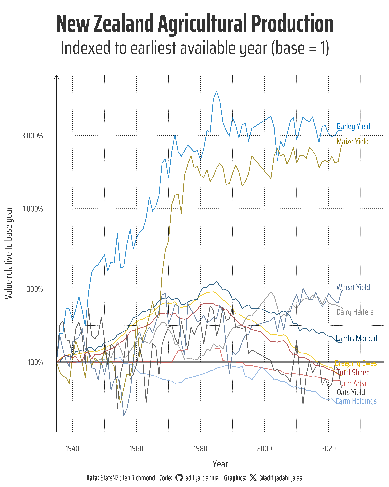

# About the Data

This dataset explores [agricultural production statistics in New Zealand](https://figure.nz/table/TSQ8lkuKnyzfERF3), compiled from [Stats NZ](https://datainfoplus.stats.govt.nz/item/nz.govt.stats/eb7208cf-2f0f-416a-bd77-2fdbb9043255?_ga=2.264735308.2106648024.1715287902-1399521469.1678132138) and curated by [Jen Richmond](https://github.com/jenrichmond) for [TidyTuesday week 7 of 2026](https://github.com/rfordatascience/tidytuesday/tree/main/data/2026/2026-02-17). The data spans multiple decades of agricultural output and is structured around four variables: year (ending June), production category, value, and unit of measurement. New Zealand's farming landscape has undergone dramatic shifts over time — most notably, [the ratio of sheep to people peaked at 22:1 in the 1980s and has since fallen to roughly 4.5:1](https://www.rnz.co.nz/news/country/560252/gap-between-people-and-sheep-rapidly-closing). The dataset invites exploration of whether this decline is unique to sheep or reflects broader trends across meat and agricultural production. It can be accessed directly via the [TidyTuesday GitHub repository](https://raw.githubusercontent.com/rfordatascience/tidytuesday/main/data/2026/2026-02-17/dataset.csv) and is well-suited for analysis in [R](https://r4ds.hadley.nz/) using the [tidytuesdayR package](https://github.com/thebioengineer/tidytuesdayR), in Python using [pydytuesday](https://github.com/posit-dev/python-tidytuesday-challenge), or in Julia via [TidierTuesday.jl](https://github.com/TidierOrg/TidierTuesday.jl). Results can be shared using the #TidyTuesday hashtag, and those working in Python are encouraged to explore [Posit's PydyTuesday resources](https://github.com/posit-dev/python-tidytuesday-challenge) and publish work via [Connect Cloud](https://connect.posit.cloud/) or as a [Quarto dashboard](https://quarto.org/docs/dashboards/).

{#fig-1}

## How I Made This Graphic

### Loading required libraries

```{r}
#| label: setup
#| eval: false

pacman::p_load(
  tidyverse, # All things tidy

  scales, # Nice Scales for ggplot2
  fontawesome, # Icons display in ggplot2
  ggtext, # Markdown text support for ggplot2
  showtext, # Display fonts in ggplot2
  colorspace, # Lighten and Darken colours
  sf, # Spatial Features

  patchwork,  # Composing Plots
  packcircles, # for hierarchichal packing circles
  colorspace, # Modify and play with colours, extract dominant colours
  magick  # Playing with images
)

dataset <- readr::read_csv('https://raw.githubusercontent.com/rfordatascience/tidytuesday/main/data/2026/2026-02-17/dataset.csv')
```

### Visualization Parameters

```{r}
#| label: viz-params

# Font for titles
font_add_google("Saira",
  family = "title_font"
)

# Font for the caption
font_add_google("Saira Condensed",
  family = "body_font"
)

# Font for plot text
font_add_google("Saira Extra Condensed",
  family = "caption_font"
)

showtext_auto()

# A base Colour
bg_col <- "white"
seecolor::print_color(bg_col)

# Colour for highlighted text
text_hil <- "grey20"
seecolor::print_color(text_hil)

# Colour for the text
text_col <- "grey10"
seecolor::print_color(text_col)

# Define Base Text Size
bts <- 120

# Caption stuff for the plot
sysfonts::font_add(
  family = "Font Awesome 6 Brands",
  regular = here::here("docs", "Font Awesome 6 Brands-Regular-400.otf")
)
github <- "&#xf09b"
github_username <- "aditya-dahiya"
xtwitter <- "&#xe61b"
xtwitter_username <- "@adityadahiyaias"
social_caption_1 <- glue::glue("<span style='font-family:\"Font Awesome 6 Brands\";'>{github};</span> <span style='color: {text_hil}'>{github_username}  </span>")
social_caption_2 <- glue::glue("<span style='font-family:\"Font Awesome 6 Brands\";'>{xtwitter};</span> <span style='color: {text_hil}'>{xtwitter_username}</span>")
plot_caption <- paste0(
  "**Data:**  StatsNZ ; Jen Richmond",
  "   |  **Code:** ",
  social_caption_1,
  " |  **Graphics:** ",
  social_caption_2
)
rm(
  github, github_username, xtwitter,
  xtwitter_username, social_caption_1,
  social_caption_2
)

plot_title <- "tidy_nz_agri_stats"

plot_subtitle <- "tidy_nz_agri_stats" |> 
  str_wrap(110)
```

### Exploratory Data Analysis and Wrangling

```{r}
#| label: eda

bts <- 90

# dataset |> 
#   summarytools::dfSummary() |> 
#   summarytools::view()

# Normalize each measure relative to its earliest available year (base = 1)
normalized_data <- dataset |>
  select(year_ended_june, measure, value) |>
  rename(year = year_ended_june) |>
  group_by(measure) |>
  arrange(year, .by_group = TRUE) |>
  mutate(
    base_value = first(value[!is.na(value)]),
    value_normalized = value / base_value
  ) |>
  ungroup() |>
  select(year, measure, value_normalized) |>
  rename(value = value_normalized)

# Preview
print(normalized_data)

# Plot
ggplot(normalized_data, aes(x = year, y = value, colour = measure)) +
  geom_line(linewidth = 0.8) +
  geom_hline(yintercept = 1, linetype = "dashed", colour = "grey50") +
  labs(
    title = "New Zealand Agricultural Production",
    subtitle = "Indexed to earliest available year (base = 1)",
    x = "Year",
    y = "Value relative to base year",
    colour = "Measure"
  ) +
  theme_minimal() +
  theme(legend.position = "none") +
  scale_y_log10()
```

### The Plot

```{r}
#| label: base-plot

# Define Base Text Size for the plot
bts <- 90


  theme_minimal(
    base_family = "body_font",
    base_size = bts
  ) +
  theme(
    text = element_text(
      colour = text_hil, 
      margin = margin(0,0,0,0, "mm")
    ),
    legend.position = "none",
    
    # Text elements
    plot.title = element_text(
      margin = margin(10, 0, 5, 0, "mm"),
      hjust = 0.5,
      size = bts * 2.5,
      face = "bold",
      colour = text_hil,
      lineheight = 0.3,
      family = "caption_font"
    ),
    plot.subtitle = element_text(
      margin = margin(0, 0, 18, 0, "mm"),
      hjust = 0.5,
      size = bts * 1.8,
      colour = text_hil,
      lineheight = 0.35
    ),
    plot.caption = element_textbox(
      hjust = 0.5,
      family = "caption_font",
      size = bts * 0.8,
      colour = text_hil,
      lineheight = 0.4,
      margin = margin(5, 0, 0, 0, "mm")
    ),
    
    # Plot background
    plot.background = element_rect(
      fill = bg_col, 
      colour = NA
    ),
    
    # Plot margins - reduced to minimize white space
    plot.margin = margin(5, 5, 5, 5, "mm"),
    
    plot.title.position = "plot",
    plot.caption.position = "plot"
  )

# Save the plot
ggsave(
  filename = here::here(
    "data_vizs",
    "tidy_nz_agri_stats.png"
  ),
  plot = g,
  width = 400,
  height = 500,
  units = "mm",
  bg = bg_col
)
```

### Savings the thumbnail for the webpage

```{r}
#| label: save-image

# Saving a thumbnail

library(magick)

# Saving a thumbnail for the webpage
image_read(
  here::here(
    "data_vizs",
    "tidy_nz_agri_stats.png"
    )
  ) |>
  image_resize(geometry = "x400") |>
  image_write(
    here::here(
      "data_vizs",
      "thumbnails",
      "tidy_nz_agri_stats.png"
    )
  )
```

### Session Info

```{r}
#| label: tbl-session-info
#| tbl-cap: "R Packages and their versions used in the creation of this page and graphics"
#| eval: true


pacman::p_load(
  tidyverse, # All things tidy

  scales, # Nice Scales for ggplot2
  fontawesome, # Icons display in ggplot2
  ggtext, # Markdown text support for ggplot2
  showtext, # Display fonts in ggplot2
  colorspace # Lighten and Darken colours
)

sessioninfo::session_info()$packages |>
  as_tibble() |>
  
  # The attached column is TRUE for packages that were 
  # explicitly loaded with library()
  dplyr::filter(attached == TRUE) |>
  dplyr::select(package,
    version = loadedversion,
    date, source
  ) |>
  dplyr::arrange(package) |>
  janitor::clean_names(
    case = "title"
  ) |>
  gt::gt() |>
  gt::opt_interactive(
    use_search = TRUE
  ) |>
  gtExtras::gt_theme_espn()
```
